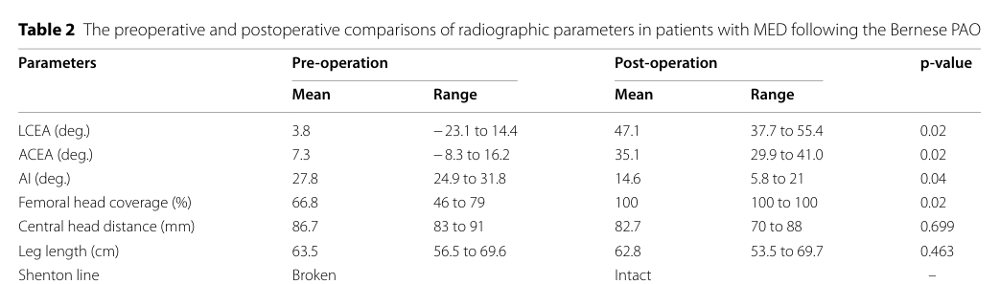

## Question

# Disease Characteristics Research Template

## Target Disease
- **Disease Name:** Multiple Epiphyseal Dysplasia
- **MONDO ID:**  (if available)
- **Category:** Mendelian

## Research Objectives

Please provide a comprehensive research report on **Multiple Epiphyseal Dysplasia** covering all of the
disease characteristics listed below. This report will be used to populate a disease knowledge
base entry. Be thorough and cite primary literature (PMID preferred) for all claims.

For each section, **suggested databases/resources** are listed. These are the first places
you should search for information on each topic.

---

### 1. Disease Information
> **Search first:** OMIM, Orphanet, ICD-10/ICD-11, MeSH, PubMed

- What is the disease? Provide a concise overview.
- What are the key identifiers? (OMIM, Orphanet, ICD-10/ICD-11, MeSH, Mondo)
- What are the common synonyms and alternative names?
- Is the information derived from individual patients (e.g., EHR) or aggregated disease-level resources?

### 2. Etiology

- **Disease Causal Factors**: What are the primary causes? (genetic, environmental, infectious, mechanistic)
- **Risk Factors**:
  > **Search first:** PubMed, Cochrane Library, UpToDate, clinical guidelines, ClinVar, ClinGen, GWAS Catalog, PheGenI, CTD, CDC, WHO, epidemiological databases
  - Genetic risk factors (causal variants, susceptibility loci, modifier genes)
  - Environmental risk factors (toxins, lifestyle, occupational exposures, age, sex, family history)
- **Protective Factors**:
  > **Search first:** PubMed, Cochrane Library, clinical trial databases, GWAS Catalog, gnomAD, WHO, CDC, nutrition databases
  - Genetic protective factors (protective variants, modifier alleles)
  - Environmental protective factors (diet, lifestyle, exposures that reduce risk)
- **Gene-Environment Interactions**: How do genetic and environmental factors interact to influence disease?
  > **Search first:** CTD, PubMed, PheGenI, GxE databases

### 3. Phenotypes
> **Search first:** HPO (Human Phenotype Ontology), OMIM, Orphanet, PubMed, clinicaltrials.gov, MedDRA, SNOMED CT, DECIPHER, LOINC

For each phenotype, provide:
- **Phenotype type**: symptoms, clinical signs, physical manifestations, behavioral changes, or laboratory abnormalities
  > For symptoms/signs: HPO, OMIM, Orphanet, PubMed
  > For behavioral changes: HPO, DSM, RDoC (Research Domain Criteria), PubMed
  > For laboratory abnormalities: LOINC, SNOMED CT, LabTests Online, PubMed
- **Phenotype characteristics**:
  > **Search first:** OMIM, Orphanet, HPO, PubMed
  - Age of symptom onset (neonatal, childhood, adult-onset, late-onset)
  - Symptom severity (mild, moderate, severe, variable)
  - Symptom progression (stable, progressive, episodic, fluctuating)
  - Frequency among affected individuals (percentage or qualitative)
- **Quality of life impact**: Effects on daily functioning and well-being (per-phenotype when possible)
  > **Search first:** EQ-5D database, SF-36, WHO QOL databases, PubMed
- Suggest HPO (Human Phenotype Ontology) terms for each phenotype

### 4. Genetic/Molecular Information

- **Causal Genes**: Gene mutations or chromosomal abnormalities responsible for disease (gene symbols, OMIM IDs)
  > **Search first:** OMIM, ClinVar, HGMD, Ensembl, NCBI Gene
- **Pathogenic Variants**:
  - Affected genes (gene symbols, HGNC IDs)
    > **Search first:** OMIM, NCBI Gene, Ensembl, HGNC, UniProt, GeneCards
  - Variant classification (pathogenic, likely pathogenic, VUS per ACMG/AMP guidelines)
    > **Search first:** ClinVar, ClinGen, ACMG/AMP guidelines, VarSome
  - Variant type/class (missense, frameshift, nonsense, splice-site, structural)
  - Allele frequency in population databases
    > **Search first:** gnomAD, 1000 Genomes, ExAC, TOPMed, dbSNP
  - Somatic vs germline origin
    > **Search first:** COSMIC (somatic), ClinVar, ICGC, TCGA
  - Functional consequences (loss of function, gain of function, dominant negative)
- **Modifier Genes**: Genes that modify disease severity or expression
- **Epigenetic Information**: DNA methylation, histone modifications, chromatin changes affecting disease
  > **Search first:** ENCODE, Roadmap Epigenomics, MethBase, DiseaseMeth
- **Chromosomal Abnormalities**: Large-scale genetic changes (aneuploidy, translocations, inversions)
  > **Search first:** DECIPHER, ClinVar, ECARUCA, UCSC Genome Browser

### 5. Environmental Information

- **Environmental Factors**: Non-genetic contributing factors (toxins, radiation, pollution, occupational exposure)
  > **Search first:** CTD (Comparative Toxicogenomics Database), TOXNET, PubMed, EPA databases
- **Lifestyle Factors**: Behavioral factors (smoking, diet, exercise, alcohol consumption)
  > **Search first:** CDC databases, WHO, PubMed, NHANES
- **Infectious Agents**: If applicable, pathogens causing or triggering disease (bacteria, viruses, fungi, parasites)
  > **Search first:** NCBI Taxonomy, ViPR, BV-BRC, MicrobeDB, GIDEON

### 6. Mechanism / Pathophysiology

- **Molecular Pathways**: Specific signaling cascades or biochemical pathways involved (Wnt, MAPK, mTOR, PI3K-AKT, etc.)
  > **Search first:** KEGG, Reactome, WikiPathways, PathBank, BioCyc
- **Cellular Processes**: Cell-level mechanisms (apoptosis, autophagy, cell cycle dysregulation, inflammation, etc.)
  > **Search first:** Gene Ontology (GO), Reactome, KEGG, PubMed
- **Protein Dysfunction**: How protein structure or function is altered (misfolding, aggregation, loss of function, gain of function)
  > **Search first:** UniProt, PDB (Protein Data Bank), InterPro, Pfam, AlphaFold
- **Metabolic Changes**: Alterations in metabolic processes (energy metabolism, lipid metabolism, amino acid metabolism)
  > **Search first:** KEGG, BioCyc, HMDB (Human Metabolome Database), BRENDA
- **Immune System Involvement**: Role of immune response (autoimmunity, immunodeficiency, chronic inflammation)
  > **Search first:** ImmPort, Immunome Database, IEDB, Gene Ontology
- **Tissue Damage Mechanisms**: How tissues/ are injured (oxidative stress, ischemia, fibrosis, necrosis)
  > **Search first:** PubMed, Gene Ontology, Reactome
- **Biochemical Abnormalities**: Specific molecular defects (enzyme deficiencies, receptor dysfunction, ion channel defects)
  > **Search first:** BRENDA, UniProt, KEGG, OMIM, PubMed
- **Epigenetic Changes**: DNA methylation, histone modifications affecting gene expression in disease
  > **Search first:** ENCODE, Roadmap Epigenomics, MethBase, DiseaseMeth
- **Molecular Profiling** (if available):
  - Transcriptomics/gene expression changes
    > **Search first:** GEO (Gene Expression Omnibus), ArrayExpress, GTEx, Human Cell Atlas, SRA
  - Proteomics findings
    > **Search first:** PRIDE, ProteomeXchange, Human Protein Atlas, STRING, BioGRID
  - Metabolomics signatures
    > **Search first:** MetaboLights, Metabolomics Workbench, HMDB, METLIN
  - Lipidomics alterations
    > **Search first:** LIPID MAPS, SwissLipids, LipidHome, Metabolomics Workbench
  - Genomic structural features
    > **Search first:** UCSC Genome Browser, Ensembl, NCBI, dbVar, DGV
- **Advanced Technologies** (if applicable):
  - Single-cell analysis findings (cell-type specific mechanisms, cellular heterogeneity)
    > **Search first:** Human Cell Atlas, Single Cell Portal, GEO, CELLxGENE
  - Spatial transcriptomics findings
    > **Search first:** GEO, Spatial Research, Vizgen, 10x Genomics data
  - Multi-omics integration results
    > **Search first:** TCGA, ICGC, cBioPortal, LinkedOmics, PubMed
  - Functional genomics screens (CRISPR, RNAi)
    > **Search first:** DepMap, GenomeRNAi, PubMed, BioGRID ORCS

For each mechanism, describe:
- The causal chain from initial trigger to clinical manifestation
- Which mechanisms are upstream vs downstream
- What cell types and biological processes are involved
- Suggest GO terms for biological processes and CL terms for cell types

### 7. Anatomical Structures Affected

- **Organ Level**:
  - Primary organs directly affected
  - Secondary organ involvement (complications, secondary effects)
  - Body systems involved (cardiovascular, nervous, digestive, respiratory, endocrine, etc.)
  > **Search first:** Uberon, FMA (Foundational Model of Anatomy), OMIM, HPO, ICD-11, MeSH, SNOMED CT
- **Tissue and Cell Level**:
  - Specific tissue types affected (epithelial, connective, muscle, nervous)
  - Specific cell populations targeted (with Cell Ontology terms)
  > **Search first:** Uberon, Human Protein Atlas, Cell Ontology, Human Cell Atlas, CellMarker, PanglaoDB
- **Subcellular Level**:
  - Cellular compartments involved (mitochondria, nucleus, ER, lysosomes) (with GO Cellular Component terms)
  > **Search first:** Gene Ontology (Cellular Component), UniProt, Human Protein Atlas
- **Localization**:
  - Specific anatomical sites (with UBERON terms)
    > **Search first:** FMA, Uberon, NeuroNames (for brain), SNOMED CT
  - Lateralization (unilateral, bilateral, asymmetric)
    > **Search first:** HPO, clinical literature, imaging databases

### 8. Temporal Development

- **Onset**:
  - Typical age of onset (congenital, pediatric, adult, geriatric)
  - Onset pattern (acute, subacute, chronic, insidious)
  > **Search first:** OMIM, Orphanet, HPO, PubMed
- **Progression**:
  - Disease stages (early, intermediate, advanced, end-stage)
    > **Search first:** Cancer Staging Manual (AJCC), WHO classifications, PubMed
  - Progression rate (rapid, slow, variable)
  - Disease course pattern (episodic, relapsing-remitting, progressive, stable)
  - Disease duration (self-limited, chronic lifelong)
  > **Search first:** Disease registries, longitudinal cohort databases, natural history studies, PubMed, Orphanet, OMIM
- **Patterns**:
  - Remission patterns (spontaneous, treatment-induced)
    > **Search first:** Clinical trial databases, disease registries, PubMed
  - Critical periods (time windows of vulnerability or opportunity for intervention)
    > **Search first:** PubMed, developmental biology databases, clinical guidelines

### 9. Inheritance and Population

- **Epidemiology**:
  - Prevalence (cases per 100,000 at given time)
  - Incidence (new cases per 100,000 per year)
  > **Search first:** Orphanet, CDC, WHO, GBD (Global Burden of Disease), national registries, SEER, disease registries
- **For Genetic Etiology**:
  - Inheritance pattern (AD, AR, X-linked, mitochondrial, multifactorial, polygenic)
    > **Search first:** OMIM, Orphanet, ClinVar, GTR (Genetic Testing Registry)
  - Penetrance (complete, incomplete, age-dependent)
    > **Search first:** ClinVar, OMIM, PubMed, ClinGen
  - Expressivity (variable, consistent)
    > **Search first:** OMIM, ClinVar, PubMed
  - Genetic anticipation (increasing severity in successive generations)
    > **Search first:** OMIM, PubMed (especially for repeat expansion disorders)
  - Germline mosaicism
    > **Search first:** ClinVar, OMIM, genetic counseling literature, PubMed
  - Founder effects (population-specific mutations)
    > **Search first:** gnomAD, population genetics databases, PubMed
  - Consanguinity role
    > **Search first:** OMIM, population studies, genetic counseling resources
  - Carrier frequency
    > **Search first:** gnomAD, carrier screening databases, GeneReviews, GTR
- **Population Demographics**:
  - Affected populations (ethnic or demographic groups with higher prevalence)
    > **Search first:** gnomAD, 1000 Genomes, PAGE Study, PubMed, population registries
  - Geographic distribution (endemic areas, regional variation)
    > **Search first:** WHO, CDC, GBD, Orphanet, geographic epidemiology databases
  - Geographic distribution of specific variants
  - Sex ratio (male:female)
    > **Search first:** Disease registries, OMIM, PubMed, epidemiological databases
  - Age distribution of affected individuals
    > **Search first:** CDC, disease registries, SEER, Orphanet

### 10. Diagnostics

- **Clinical Tests**:
  - Laboratory tests (blood, urine, tissue chemistry, specific enzyme assays)
    > **Search first:** LOINC, LabTests Online, PubMed
  - Biomarkers (proteins, metabolites, genetic markers, circulating biomarkers)
    > **Search first:** FDA Biomarker List, BEST (Biomarkers, EndpointS, and other Tools), PubMed
  - Imaging studies (X-ray, CT, MRI, PET, ultrasound)
    > **Search first:** RadLex, DICOM, Radiopaedia, imaging databases
  - Functional tests (pulmonary function, cardiac stress tests)
    > **Search first:** LOINC, clinical guidelines, PubMed
  - Electrophysiology (EEG, EMG, ECG, nerve conduction studies)
    > **Search first:** LOINC, clinical neurophysiology databases, PubMed
  - Biopsy findings (histopathology, immunohistochemistry)
    > **Search first:** SNOMED CT, College of American Pathologists resources, PubMed
  - Pathology findings (microscopic examination)
    > **Search first:** SNOMED CT, Digital Pathology databases, PubMed
- **Genetic Testing**:
  > **Search first:** GTR (Genetic Testing Registry), GeneReviews, ClinGen
  - Overview of recommended genetic testing approach
  - Whole genome sequencing (WGS) utility
    > **Search first:** GTR, ClinVar, GEL (Genomics England), gnomAD
  - Whole exome sequencing (WES) utility
    > **Search first:** GTR, ClinVar, OMIM, GeneMatcher
  - Gene panels (which panels, which genes)
    > **Search first:** GTR, ClinVar, laboratory-specific databases
  - Single gene testing
    > **Search first:** GTR, ClinVar, OMIM, GeneReviews
  - Chromosomal microarray (CMA)
    > **Search first:** DECIPHER, ClinVar, dbVar, ECARUCA
  - Karyotyping
    > **Search first:** Chromosome Abnormality Database, ClinVar, cytogenetics resources
  - FISH
    > **Search first:** ClinVar, cytogenetics databases, PubMed
  - Mitochondrial DNA testing
    > **Search first:** MITOMAP, MSeqDR, ClinVar, GTR
  - Repeat expansion testing
    > **Search first:** GTR, ClinVar, repeat expansion databases, PubMed
- **Omics-Based Diagnostics** (if applicable):
  - RNA sequencing / transcriptomics
    > **Search first:** GEO, ArrayExpress, GTEx, RNA-seq databases
  - Proteomics
    > **Search first:** PRIDE, ProteomeXchange, FDA Biomarker database
  - Metabolomics
    > **Search first:** MetaboLights, Metabolomics Workbench, HMDB
  - Epigenomics
    > **Search first:** GEO, ENCODE, Roadmap Epigenomics, MethBase
  - Liquid biopsy
    > **Search first:** COSMIC, ClinVar, liquid biopsy databases, PubMed
- **Clinical Criteria**:
  - Standardized diagnostic criteria (DSM, ICD, society guidelines)
    > **Search first:** DSM-5, ICD-11, clinical society guidelines, UpToDate
  - Differential diagnosis (other conditions to rule out, with distinguishing features)
    > **Search first:** DynaMed, UpToDate, clinical decision support systems
- **Screening**:
  - Screening methods for asymptomatic individuals (newborn screening, carrier screening, cascade screening)
    > **Search first:** ACMG recommendations, CDC newborn screening, GTR

### 11. Outcome/Prognosis

- **Survival and Mortality**:
  - Survival rate (5-year, 10-year, overall)
    > **Search first:** SEER, cancer registries, disease-specific registries, PubMed
  - Life expectancy (with and without treatment if applicable)
    > **Search first:** Orphanet, disease registries, actuarial databases, PubMed
  - Mortality rate
    > **Search first:** CDC, WHO, GBD, national mortality databases
  - Disease-specific mortality (deaths directly attributable to disease)
    > **Search first:** Disease registries, CDC Wonder, GBD, PubMed
- **Morbidity and Function**:
  - Morbidity (disease-related disability and health impacts)
    > **Search first:** GBD, WHO, disability databases, PubMed
  - Disability outcomes (long-term functional impairments)
    > **Search first:** ICF (International Classification of Functioning), disability registries
  - Quality of life measures (EQ-5D, SF-36, PROMIS, disease-specific tools)
    > **Search first:** EQ-5D database, SF-36, PROMIS, PubMed
- **Disease Course**:
  - Complications (secondary problems: infections, organ failure, etc.)
    > **Search first:** ICD codes, disease registries, clinical databases, PubMed
  - Recovery potential (likelihood and extent of recovery, with vs without treatment)
    > **Search first:** Natural history studies, rehabilitation databases, PubMed
- **Prediction**:
  - Prognostic factors (age, disease severity, biomarkers, treatment response)
    > **Search first:** Prognostic models databases, clinical calculators, PubMed
  - Prognostic biomarkers (molecular markers predicting disease course)
    > **Search first:** FDA Biomarker database, PubMed, cancer prognostic databases

### 12. Treatment

- **Pharmacotherapy**:
  - Pharmacological treatments (drug names, drug classes, mechanisms of action)
    > **Search first:** DrugBank, RxNorm, ATC classification, DailyMed, FDA databases
  - Pharmacogenomics (how genetic variants affect drug metabolism, efficacy, toxicity)
    > **Search first:** PharmGKB, CPIC (Clinical Pharmacogenetics), FDA Table of PGx Biomarkers
- **Advanced Therapeutics**:
  - Gene therapy (viral vectors, CRISPR, gene replacement, gene editing)
    > **Search first:** ClinicalTrials.gov, FDA gene therapy database, ASGCT resources
  - Cell therapy (stem cell transplant, CAR-T, cellular therapeutics)
    > **Search first:** ClinicalTrials.gov, FDA cell therapy database, FACT standards
  - RNA-based therapies (ASOs, siRNA, mRNA therapies)
    > **Search first:** ClinicalTrials.gov, FDA approvals, PubMed
  - Targeted therapies (treatments directed at specific molecular targets)
    > **Search first:** My Cancer Genome, OncoKB, ClinicalTrials.gov, FDA approvals
  - Immunotherapies (checkpoint inhibitors, monoclonal antibodies)
    > **Search first:** Cancer Immunotherapy Database, FDA approvals, ClinicalTrials.gov
- **Surgical and Interventional**:
  - Surgical interventions (types of surgery, timing, outcomes)
    > **Search first:** CPT codes, surgical registries, clinical guidelines, PubMed
- **Supportive and Rehabilitative**:
  - Supportive care (symptom management, pain control, nutrition)
    > **Search first:** Clinical guidelines, Cochrane Library, PubMed
  - Rehabilitation (physical therapy, occupational therapy, speech therapy)
    > **Search first:** Rehabilitation medicine databases, clinical guidelines, PubMed
- **Experimental**:
  - Experimental treatments in clinical trials (with NCT identifiers if available)
    > **Search first:** ClinicalTrials.gov, EU Clinical Trials Register, WHO ICTRP
- **Treatment Outcomes**:
  - Treatment response rates
    > **Search first:** Clinical trial databases, FDA reviews, systematic reviews, PubMed
  - Side effects and adverse events
    > **Search first:** FDA Adverse Event Reporting System (FAERS), MedWatch, PubMed
- **Treatment Strategy**:
  - Treatment algorithms (clinical pathways, decision trees)
    > **Search first:** Clinical practice guidelines, NCCN Guidelines, UpToDate
  - Combination therapies
    > **Search first:** ClinicalTrials.gov, treatment guidelines, PubMed
  - Personalized medicine approaches (genotype-guided treatment)
    > **Search first:** My Cancer Genome, CIViC, PharmGKB, precision medicine databases

For each treatment, suggest MAXO (Medical Action Ontology) terms where applicable.

### 13. Prevention

- **Prevention Levels**:
  - Primary prevention (preventing disease occurrence: vaccination, risk factor modification)
    > **Search first:** CDC, WHO, USPSTF recommendations, Cochrane Library
  - Secondary prevention (early detection and treatment: screening programs, early intervention)
    > **Search first:** USPSTF, CDC screening guidelines, WHO
  - Tertiary prevention (preventing complications in those with disease)
    > **Search first:** Clinical guidelines, disease management protocols, PubMed
- **Immunization**: Vaccine strategies (if applicable)
  > **Search first:** CDC vaccine schedules, WHO immunization, FDA vaccine database
- **Screening and Early Detection**:
  - Screening programs (population-based: newborn screening, cancer screening)
    > **Search first:** CDC screening programs, USPSTF, cancer screening databases
  - Genetic screening (carrier screening, preimplantation genetic diagnosis, prenatal testing)
    > **Search first:** ACMG recommendations, ACOG guidelines, GTR
  - Risk stratification (identifying high-risk individuals for targeted prevention)
    > **Search first:** Risk prediction models, clinical calculators, PubMed
- **Behavioral Interventions**: Lifestyle modifications to reduce risk
  > **Search first:** CDC, WHO, behavioral intervention databases, Cochrane Library
- **Counseling**: Genetic counseling (risk assessment, family planning guidance)
  > **Search first:** NSGC resources, ACMG guidelines, GeneReviews
- **Public Health**:
  - Public health interventions (sanitation, vector control, health education)
    > **Search first:** CDC, WHO, public health databases, PubMed
  - Environmental interventions (reducing environmental risk factors)
    > **Search first:** EPA databases, WHO environmental health, PubMed
- **Prophylaxis**: Preventive medications or procedures
  > **Search first:** Clinical guidelines, FDA approvals, PubMed

### 14. Other Species / Natural Disease

- **Taxonomy**: Species affected (with NCBI Taxon identifiers)
  > **Search first:** NCBI Taxonomy
- **Breed**: Specific breeds affected (with VBO identifiers if applicable)
  > **Search first:** VBO (Vertebrate Breed Ontology)
- **Gene**: Orthologous genes in other species (with NCBI Gene IDs)
  > **Search first:** NCBI Gene
- **Natural Disease**:
  - Naturally occurring disease in other species (companion animals, wildlife)
    > **Search first:** OMIA (Online Mendelian Inheritance in Animals), VetCompass, PubMed
  - Veterinary relevance and importance in animal health
    > **Search first:** OMIA, veterinary databases, PubMed
- **Comparative Biology**:
  - Comparative pathology (similarities and differences across species)
    > **Search first:** OMIA, comparative pathology databases, PubMed
  - Evolutionary conservation of disease mechanisms
    > **Search first:** HomoloGene, OrthoMCL, Alliance of Genome Resources
- **Transmission** (if applicable):
  - Zoonotic potential
    > **Search first:** CDC zoonotic diseases, WHO zoonoses, GIDEON
  - Cross-species susceptibility
    > **Search first:** NCBI Taxonomy, veterinary databases, PubMed

### 15. Model Organisms

- **Model Types**:
  - Model organism type (mammalian, invertebrate, cellular, in vitro)
    > **Search first:** Alliance of Genome Resources, model organism databases
  - Specific model systems (mouse, rat, zebrafish, Drosophila, C. elegans, yeast, cell lines, organoids, iPSCs)
    > **Search first:** MGI, RGD, ZFIN, FlyBase, WormBase, SGD, ATCC, Cellosaurus
  - Induced models (drug treatment, surgical intervention, environmental manipulation)
    > **Search first:** MGI, model organism databases, PubMed
- **Genetic Models**:
  - Types available (knockout, knock-in, transgenic, conditional, humanized)
    > **Search first:** MGI, IMPC, KOMP, EuMMCR, IMSR
- **Model Characteristics**:
  - Phenotype recapitulation (how well model reproduces human disease features)
    > **Search first:** Model organism databases, comparative studies, PubMed
  - Model limitations (aspects of human disease not captured)
    > **Search first:** Model organism databases, PubMed, review articles
- **Applications**:
  - Research applications (what aspects of disease can be studied)
    > **Search first:** Model organism databases, PubMed
- **Resources**:
  - Model databases
    > **Search first:** MGI, RGD, ZFIN, FlyBase, WormBase, IMSR, EMMA, MMRRC

---

## Citation Requirements

- Cite primary literature (PMID preferred) for all mechanistic and clinical claims
- Prioritize recent reviews and landmark papers
- Include direct quotes from abstracts where possible to support key statements
- Distinguish evidence source types: human clinical, model organism, in vitro, computational

## Output Format

Structure your response as a comprehensive narrative organized by the sections above.
For each section, provide:
- Factual content with specific details (numbers, percentages, gene names, variant nomenclature)
- Ontology term suggestions (HPO, GO, CL, UBERON, CHEBI, MAXO, MONDO) where applicable
- Evidence citations with PMIDs
- Direct quotes from abstracts to support key claims
- Clear indication when information is not available or not applicable for this disease

This report will be used to populate a disease knowledge base entry with:
- Pathophysiology descriptions with causal chains
- Gene/protein annotations (HGNC, GO terms)
- Phenotype associations (HP terms) with frequencies
- Cell type involvement (CL terms)
- Anatomical locations (UBERON terms)
- Chemical entities (CHEBI terms)
- Treatment annotations (MAXO terms)
- Evidence items with PMIDs and exact abstract quotes
- Epidemiology, prognosis, diagnostic, and prevention information
- Animal model descriptions with phenotype recapitulation details

## Output

Question: You are an expert researcher providing comprehensive, well-cited information.

Provide detailed information focusing on:
1. Key concepts and definitions with current understanding
2. Recent developments and latest research (prioritize 2023-2024 sources)
3. Current applications and real-world implementations
4. Expert opinions and analysis from authoritative sources
5. Relevant statistics and data from recent studies

Format as a comprehensive research report with proper citations. Include URLs and publication dates where available.
Always prioritize recent, authoritative sources and provide specific citations for all major claims.

# Disease Characteristics Research Template

## Target Disease
- **Disease Name:** Multiple Epiphyseal Dysplasia
- **MONDO ID:**  (if available)
- **Category:** Mendelian

## Research Objectives

Please provide a comprehensive research report on **Multiple Epiphyseal Dysplasia** covering all of the
disease characteristics listed below. This report will be used to populate a disease knowledge
base entry. Be thorough and cite primary literature (PMID preferred) for all claims.

For each section, **suggested databases/resources** are listed. These are the first places
you should search for information on each topic.

---

### 1. Disease Information
> **Search first:** OMIM, Orphanet, ICD-10/ICD-11, MeSH, PubMed

- What is the disease? Provide a concise overview.
- What are the key identifiers? (OMIM, Orphanet, ICD-10/ICD-11, MeSH, Mondo)
- What are the common synonyms and alternative names?
- Is the information derived from individual patients (e.g., EHR) or aggregated disease-level resources?

### 2. Etiology

- **Disease Causal Factors**: What are the primary causes? (genetic, environmental, infectious, mechanistic)
- **Risk Factors**:
  > **Search first:** PubMed, Cochrane Library, UpToDate, clinical guidelines, ClinVar, ClinGen, GWAS Catalog, PheGenI, CTD, CDC, WHO, epidemiological databases
  - Genetic risk factors (causal variants, susceptibility loci, modifier genes)
  - Environmental risk factors (toxins, lifestyle, occupational exposures, age, sex, family history)
- **Protective Factors**:
  > **Search first:** PubMed, Cochrane Library, clinical trial databases, GWAS Catalog, gnomAD, WHO, CDC, nutrition databases
  - Genetic protective factors (protective variants, modifier alleles)
  - Environmental protective factors (diet, lifestyle, exposures that reduce risk)
- **Gene-Environment Interactions**: How do genetic and environmental factors interact to influence disease?
  > **Search first:** CTD, PubMed, PheGenI, GxE databases

### 3. Phenotypes
> **Search first:** HPO (Human Phenotype Ontology), OMIM, Orphanet, PubMed, clinicaltrials.gov, MedDRA, SNOMED CT, DECIPHER, LOINC

For each phenotype, provide:
- **Phenotype type**: symptoms, clinical signs, physical manifestations, behavioral changes, or laboratory abnormalities
  > For symptoms/signs: HPO, OMIM, Orphanet, PubMed
  > For behavioral changes: HPO, DSM, RDoC (Research Domain Criteria), PubMed
  > For laboratory abnormalities: LOINC, SNOMED CT, LabTests Online, PubMed
- **Phenotype characteristics**:
  > **Search first:** OMIM, Orphanet, HPO, PubMed
  - Age of symptom onset (neonatal, childhood, adult-onset, late-onset)
  - Symptom severity (mild, moderate, severe, variable)
  - Symptom progression (stable, progressive, episodic, fluctuating)
  - Frequency among affected individuals (percentage or qualitative)
- **Quality of life impact**: Effects on daily functioning and well-being (per-phenotype when possible)
  > **Search first:** EQ-5D database, SF-36, WHO QOL databases, PubMed
- Suggest HPO (Human Phenotype Ontology) terms for each phenotype

### 4. Genetic/Molecular Information

- **Causal Genes**: Gene mutations or chromosomal abnormalities responsible for disease (gene symbols, OMIM IDs)
  > **Search first:** OMIM, ClinVar, HGMD, Ensembl, NCBI Gene
- **Pathogenic Variants**:
  - Affected genes (gene symbols, HGNC IDs)
    > **Search first:** OMIM, NCBI Gene, Ensembl, HGNC, UniProt, GeneCards
  - Variant classification (pathogenic, likely pathogenic, VUS per ACMG/AMP guidelines)
    > **Search first:** ClinVar, ClinGen, ACMG/AMP guidelines, VarSome
  - Variant type/class (missense, frameshift, nonsense, splice-site, structural)
  - Allele frequency in population databases
    > **Search first:** gnomAD, 1000 Genomes, ExAC, TOPMed, dbSNP
  - Somatic vs germline origin
    > **Search first:** COSMIC (somatic), ClinVar, ICGC, TCGA
  - Functional consequences (loss of function, gain of function, dominant negative)
- **Modifier Genes**: Genes that modify disease severity or expression
- **Epigenetic Information**: DNA methylation, histone modifications, chromatin changes affecting disease
  > **Search first:** ENCODE, Roadmap Epigenomics, MethBase, DiseaseMeth
- **Chromosomal Abnormalities**: Large-scale genetic changes (aneuploidy, translocations, inversions)
  > **Search first:** DECIPHER, ClinVar, ECARUCA, UCSC Genome Browser

### 5. Environmental Information

- **Environmental Factors**: Non-genetic contributing factors (toxins, radiation, pollution, occupational exposure)
  > **Search first:** CTD (Comparative Toxicogenomics Database), TOXNET, PubMed, EPA databases
- **Lifestyle Factors**: Behavioral factors (smoking, diet, exercise, alcohol consumption)
  > **Search first:** CDC databases, WHO, PubMed, NHANES
- **Infectious Agents**: If applicable, pathogens causing or triggering disease (bacteria, viruses, fungi, parasites)
  > **Search first:** NCBI Taxonomy, ViPR, BV-BRC, MicrobeDB, GIDEON

### 6. Mechanism / Pathophysiology

- **Molecular Pathways**: Specific signaling cascades or biochemical pathways involved (Wnt, MAPK, mTOR, PI3K-AKT, etc.)
  > **Search first:** KEGG, Reactome, WikiPathways, PathBank, BioCyc
- **Cellular Processes**: Cell-level mechanisms (apoptosis, autophagy, cell cycle dysregulation, inflammation, etc.)
  > **Search first:** Gene Ontology (GO), Reactome, KEGG, PubMed
- **Protein Dysfunction**: How protein structure or function is altered (misfolding, aggregation, loss of function, gain of function)
  > **Search first:** UniProt, PDB (Protein Data Bank), InterPro, Pfam, AlphaFold
- **Metabolic Changes**: Alterations in metabolic processes (energy metabolism, lipid metabolism, amino acid metabolism)
  > **Search first:** KEGG, BioCyc, HMDB (Human Metabolome Database), BRENDA
- **Immune System Involvement**: Role of immune response (autoimmunity, immunodeficiency, chronic inflammation)
  > **Search first:** ImmPort, Immunome Database, IEDB, Gene Ontology
- **Tissue Damage Mechanisms**: How tissues/ are injured (oxidative stress, ischemia, fibrosis, necrosis)
  > **Search first:** PubMed, Gene Ontology, Reactome
- **Biochemical Abnormalities**: Specific molecular defects (enzyme deficiencies, receptor dysfunction, ion channel defects)
  > **Search first:** BRENDA, UniProt, KEGG, OMIM, PubMed
- **Epigenetic Changes**: DNA methylation, histone modifications affecting gene expression in disease
  > **Search first:** ENCODE, Roadmap Epigenomics, MethBase, DiseaseMeth
- **Molecular Profiling** (if available):
  - Transcriptomics/gene expression changes
    > **Search first:** GEO (Gene Expression Omnibus), ArrayExpress, GTEx, Human Cell Atlas, SRA
  - Proteomics findings
    > **Search first:** PRIDE, ProteomeXchange, Human Protein Atlas, STRING, BioGRID
  - Metabolomics signatures
    > **Search first:** MetaboLights, Metabolomics Workbench, HMDB, METLIN
  - Lipidomics alterations
    > **Search first:** LIPID MAPS, SwissLipids, LipidHome, Metabolomics Workbench
  - Genomic structural features
    > **Search first:** UCSC Genome Browser, Ensembl, NCBI, dbVar, DGV
- **Advanced Technologies** (if applicable):
  - Single-cell analysis findings (cell-type specific mechanisms, cellular heterogeneity)
    > **Search first:** Human Cell Atlas, Single Cell Portal, GEO, CELLxGENE
  - Spatial transcriptomics findings
    > **Search first:** GEO, Spatial Research, Vizgen, 10x Genomics data
  - Multi-omics integration results
    > **Search first:** TCGA, ICGC, cBioPortal, LinkedOmics, PubMed
  - Functional genomics screens (CRISPR, RNAi)
    > **Search first:** DepMap, GenomeRNAi, PubMed, BioGRID ORCS

For each mechanism, describe:
- The causal chain from initial trigger to clinical manifestation
- Which mechanisms are upstream vs downstream
- What cell types and biological processes are involved
- Suggest GO terms for biological processes and CL terms for cell types

### 7. Anatomical Structures Affected

- **Organ Level**:
  - Primary organs directly affected
  - Secondary organ involvement (complications, secondary effects)
  - Body systems involved (cardiovascular, nervous, digestive, respiratory, endocrine, etc.)
  > **Search first:** Uberon, FMA (Foundational Model of Anatomy), OMIM, HPO, ICD-11, MeSH, SNOMED CT
- **Tissue and Cell Level**:
  - Specific tissue types affected (epithelial, connective, muscle, nervous)
  - Specific cell populations targeted (with Cell Ontology terms)
  > **Search first:** Uberon, Human Protein Atlas, Cell Ontology, Human Cell Atlas, CellMarker, PanglaoDB
- **Subcellular Level**:
  - Cellular compartments involved (mitochondria, nucleus, ER, lysosomes) (with GO Cellular Component terms)
  > **Search first:** Gene Ontology (Cellular Component), UniProt, Human Protein Atlas
- **Localization**:
  - Specific anatomical sites (with UBERON terms)
    > **Search first:** FMA, Uberon, NeuroNames (for brain), SNOMED CT
  - Lateralization (unilateral, bilateral, asymmetric)
    > **Search first:** HPO, clinical literature, imaging databases

### 8. Temporal Development

- **Onset**:
  - Typical age of onset (congenital, pediatric, adult, geriatric)
  - Onset pattern (acute, subacute, chronic, insidious)
  > **Search first:** OMIM, Orphanet, HPO, PubMed
- **Progression**:
  - Disease stages (early, intermediate, advanced, end-stage)
    > **Search first:** Cancer Staging Manual (AJCC), WHO classifications, PubMed
  - Progression rate (rapid, slow, variable)
  - Disease course pattern (episodic, relapsing-remitting, progressive, stable)
  - Disease duration (self-limited, chronic lifelong)
  > **Search first:** Disease registries, longitudinal cohort databases, natural history studies, PubMed, Orphanet, OMIM
- **Patterns**:
  - Remission patterns (spontaneous, treatment-induced)
    > **Search first:** Clinical trial databases, disease registries, PubMed
  - Critical periods (time windows of vulnerability or opportunity for intervention)
    > **Search first:** PubMed, developmental biology databases, clinical guidelines

### 9. Inheritance and Population

- **Epidemiology**:
  - Prevalence (cases per 100,000 at given time)
  - Incidence (new cases per 100,000 per year)
  > **Search first:** Orphanet, CDC, WHO, GBD (Global Burden of Disease), national registries, SEER, disease registries
- **For Genetic Etiology**:
  - Inheritance pattern (AD, AR, X-linked, mitochondrial, multifactorial, polygenic)
    > **Search first:** OMIM, Orphanet, ClinVar, GTR (Genetic Testing Registry)
  - Penetrance (complete, incomplete, age-dependent)
    > **Search first:** ClinVar, OMIM, PubMed, ClinGen
  - Expressivity (variable, consistent)
    > **Search first:** OMIM, ClinVar, PubMed
  - Genetic anticipation (increasing severity in successive generations)
    > **Search first:** OMIM, PubMed (especially for repeat expansion disorders)
  - Germline mosaicism
    > **Search first:** ClinVar, OMIM, genetic counseling literature, PubMed
  - Founder effects (population-specific mutations)
    > **Search first:** gnomAD, population genetics databases, PubMed
  - Consanguinity role
    > **Search first:** OMIM, population studies, genetic counseling resources
  - Carrier frequency
    > **Search first:** gnomAD, carrier screening databases, GeneReviews, GTR
- **Population Demographics**:
  - Affected populations (ethnic or demographic groups with higher prevalence)
    > **Search first:** gnomAD, 1000 Genomes, PAGE Study, PubMed, population registries
  - Geographic distribution (endemic areas, regional variation)
    > **Search first:** WHO, CDC, GBD, Orphanet, geographic epidemiology databases
  - Geographic distribution of specific variants
  - Sex ratio (male:female)
    > **Search first:** Disease registries, OMIM, PubMed, epidemiological databases
  - Age distribution of affected individuals
    > **Search first:** CDC, disease registries, SEER, Orphanet

### 10. Diagnostics

- **Clinical Tests**:
  - Laboratory tests (blood, urine, tissue chemistry, specific enzyme assays)
    > **Search first:** LOINC, LabTests Online, PubMed
  - Biomarkers (proteins, metabolites, genetic markers, circulating biomarkers)
    > **Search first:** FDA Biomarker List, BEST (Biomarkers, EndpointS, and other Tools), PubMed
  - Imaging studies (X-ray, CT, MRI, PET, ultrasound)
    > **Search first:** RadLex, DICOM, Radiopaedia, imaging databases
  - Functional tests (pulmonary function, cardiac stress tests)
    > **Search first:** LOINC, clinical guidelines, PubMed
  - Electrophysiology (EEG, EMG, ECG, nerve conduction studies)
    > **Search first:** LOINC, clinical neurophysiology databases, PubMed
  - Biopsy findings (histopathology, immunohistochemistry)
    > **Search first:** SNOMED CT, College of American Pathologists resources, PubMed
  - Pathology findings (microscopic examination)
    > **Search first:** SNOMED CT, Digital Pathology databases, PubMed
- **Genetic Testing**:
  > **Search first:** GTR (Genetic Testing Registry), GeneReviews, ClinGen
  - Overview of recommended genetic testing approach
  - Whole genome sequencing (WGS) utility
    > **Search first:** GTR, ClinVar, GEL (Genomics England), gnomAD
  - Whole exome sequencing (WES) utility
    > **Search first:** GTR, ClinVar, OMIM, GeneMatcher
  - Gene panels (which panels, which genes)
    > **Search first:** GTR, ClinVar, laboratory-specific databases
  - Single gene testing
    > **Search first:** GTR, ClinVar, OMIM, GeneReviews
  - Chromosomal microarray (CMA)
    > **Search first:** DECIPHER, ClinVar, dbVar, ECARUCA
  - Karyotyping
    > **Search first:** Chromosome Abnormality Database, ClinVar, cytogenetics resources
  - FISH
    > **Search first:** ClinVar, cytogenetics databases, PubMed
  - Mitochondrial DNA testing
    > **Search first:** MITOMAP, MSeqDR, ClinVar, GTR
  - Repeat expansion testing
    > **Search first:** GTR, ClinVar, repeat expansion databases, PubMed
- **Omics-Based Diagnostics** (if applicable):
  - RNA sequencing / transcriptomics
    > **Search first:** GEO, ArrayExpress, GTEx, RNA-seq databases
  - Proteomics
    > **Search first:** PRIDE, ProteomeXchange, FDA Biomarker database
  - Metabolomics
    > **Search first:** MetaboLights, Metabolomics Workbench, HMDB
  - Epigenomics
    > **Search first:** GEO, ENCODE, Roadmap Epigenomics, MethBase
  - Liquid biopsy
    > **Search first:** COSMIC, ClinVar, liquid biopsy databases, PubMed
- **Clinical Criteria**:
  - Standardized diagnostic criteria (DSM, ICD, society guidelines)
    > **Search first:** DSM-5, ICD-11, clinical society guidelines, UpToDate
  - Differential diagnosis (other conditions to rule out, with distinguishing features)
    > **Search first:** DynaMed, UpToDate, clinical decision support systems
- **Screening**:
  - Screening methods for asymptomatic individuals (newborn screening, carrier screening, cascade screening)
    > **Search first:** ACMG recommendations, CDC newborn screening, GTR

### 11. Outcome/Prognosis

- **Survival and Mortality**:
  - Survival rate (5-year, 10-year, overall)
    > **Search first:** SEER, cancer registries, disease-specific registries, PubMed
  - Life expectancy (with and without treatment if applicable)
    > **Search first:** Orphanet, disease registries, actuarial databases, PubMed
  - Mortality rate
    > **Search first:** CDC, WHO, GBD, national mortality databases
  - Disease-specific mortality (deaths directly attributable to disease)
    > **Search first:** Disease registries, CDC Wonder, GBD, PubMed
- **Morbidity and Function**:
  - Morbidity (disease-related disability and health impacts)
    > **Search first:** GBD, WHO, disability databases, PubMed
  - Disability outcomes (long-term functional impairments)
    > **Search first:** ICF (International Classification of Functioning), disability registries
  - Quality of life measures (EQ-5D, SF-36, PROMIS, disease-specific tools)
    > **Search first:** EQ-5D database, SF-36, PROMIS, PubMed
- **Disease Course**:
  - Complications (secondary problems: infections, organ failure, etc.)
    > **Search first:** ICD codes, disease registries, clinical databases, PubMed
  - Recovery potential (likelihood and extent of recovery, with vs without treatment)
    > **Search first:** Natural history studies, rehabilitation databases, PubMed
- **Prediction**:
  - Prognostic factors (age, disease severity, biomarkers, treatment response)
    > **Search first:** Prognostic models databases, clinical calculators, PubMed
  - Prognostic biomarkers (molecular markers predicting disease course)
    > **Search first:** FDA Biomarker database, PubMed, cancer prognostic databases

### 12. Treatment

- **Pharmacotherapy**:
  - Pharmacological treatments (drug names, drug classes, mechanisms of action)
    > **Search first:** DrugBank, RxNorm, ATC classification, DailyMed, FDA databases
  - Pharmacogenomics (how genetic variants affect drug metabolism, efficacy, toxicity)
    > **Search first:** PharmGKB, CPIC (Clinical Pharmacogenetics), FDA Table of PGx Biomarkers
- **Advanced Therapeutics**:
  - Gene therapy (viral vectors, CRISPR, gene replacement, gene editing)
    > **Search first:** ClinicalTrials.gov, FDA gene therapy database, ASGCT resources
  - Cell therapy (stem cell transplant, CAR-T, cellular therapeutics)
    > **Search first:** ClinicalTrials.gov, FDA cell therapy database, FACT standards
  - RNA-based therapies (ASOs, siRNA, mRNA therapies)
    > **Search first:** ClinicalTrials.gov, FDA approvals, PubMed
  - Targeted therapies (treatments directed at specific molecular targets)
    > **Search first:** My Cancer Genome, OncoKB, ClinicalTrials.gov, FDA approvals
  - Immunotherapies (checkpoint inhibitors, monoclonal antibodies)
    > **Search first:** Cancer Immunotherapy Database, FDA approvals, ClinicalTrials.gov
- **Surgical and Interventional**:
  - Surgical interventions (types of surgery, timing, outcomes)
    > **Search first:** CPT codes, surgical registries, clinical guidelines, PubMed
- **Supportive and Rehabilitative**:
  - Supportive care (symptom management, pain control, nutrition)
    > **Search first:** Clinical guidelines, Cochrane Library, PubMed
  - Rehabilitation (physical therapy, occupational therapy, speech therapy)
    > **Search first:** Rehabilitation medicine databases, clinical guidelines, PubMed
- **Experimental**:
  - Experimental treatments in clinical trials (with NCT identifiers if available)
    > **Search first:** ClinicalTrials.gov, EU Clinical Trials Register, WHO ICTRP
- **Treatment Outcomes**:
  - Treatment response rates
    > **Search first:** Clinical trial databases, FDA reviews, systematic reviews, PubMed
  - Side effects and adverse events
    > **Search first:** FDA Adverse Event Reporting System (FAERS), MedWatch, PubMed
- **Treatment Strategy**:
  - Treatment algorithms (clinical pathways, decision trees)
    > **Search first:** Clinical practice guidelines, NCCN Guidelines, UpToDate
  - Combination therapies
    > **Search first:** ClinicalTrials.gov, treatment guidelines, PubMed
  - Personalized medicine approaches (genotype-guided treatment)
    > **Search first:** My Cancer Genome, CIViC, PharmGKB, precision medicine databases

For each treatment, suggest MAXO (Medical Action Ontology) terms where applicable.

### 13. Prevention

- **Prevention Levels**:
  - Primary prevention (preventing disease occurrence: vaccination, risk factor modification)
    > **Search first:** CDC, WHO, USPSTF recommendations, Cochrane Library
  - Secondary prevention (early detection and treatment: screening programs, early intervention)
    > **Search first:** USPSTF, CDC screening guidelines, WHO
  - Tertiary prevention (preventing complications in those with disease)
    > **Search first:** Clinical guidelines, disease management protocols, PubMed
- **Immunization**: Vaccine strategies (if applicable)
  > **Search first:** CDC vaccine schedules, WHO immunization, FDA vaccine database
- **Screening and Early Detection**:
  - Screening programs (population-based: newborn screening, cancer screening)
    > **Search first:** CDC screening programs, USPSTF, cancer screening databases
  - Genetic screening (carrier screening, preimplantation genetic diagnosis, prenatal testing)
    > **Search first:** ACMG recommendations, ACOG guidelines, GTR
  - Risk stratification (identifying high-risk individuals for targeted prevention)
    > **Search first:** Risk prediction models, clinical calculators, PubMed
- **Behavioral Interventions**: Lifestyle modifications to reduce risk
  > **Search first:** CDC, WHO, behavioral intervention databases, Cochrane Library
- **Counseling**: Genetic counseling (risk assessment, family planning guidance)
  > **Search first:** NSGC resources, ACMG guidelines, GeneReviews
- **Public Health**:
  - Public health interventions (sanitation, vector control, health education)
    > **Search first:** CDC, WHO, public health databases, PubMed
  - Environmental interventions (reducing environmental risk factors)
    > **Search first:** EPA databases, WHO environmental health, PubMed
- **Prophylaxis**: Preventive medications or procedures
  > **Search first:** Clinical guidelines, FDA approvals, PubMed

### 14. Other Species / Natural Disease

- **Taxonomy**: Species affected (with NCBI Taxon identifiers)
  > **Search first:** NCBI Taxonomy
- **Breed**: Specific breeds affected (with VBO identifiers if applicable)
  > **Search first:** VBO (Vertebrate Breed Ontology)
- **Gene**: Orthologous genes in other species (with NCBI Gene IDs)
  > **Search first:** NCBI Gene
- **Natural Disease**:
  - Naturally occurring disease in other species (companion animals, wildlife)
    > **Search first:** OMIA (Online Mendelian Inheritance in Animals), VetCompass, PubMed
  - Veterinary relevance and importance in animal health
    > **Search first:** OMIA, veterinary databases, PubMed
- **Comparative Biology**:
  - Comparative pathology (similarities and differences across species)
    > **Search first:** OMIA, comparative pathology databases, PubMed
  - Evolutionary conservation of disease mechanisms
    > **Search first:** HomoloGene, OrthoMCL, Alliance of Genome Resources
- **Transmission** (if applicable):
  - Zoonotic potential
    > **Search first:** CDC zoonotic diseases, WHO zoonoses, GIDEON
  - Cross-species susceptibility
    > **Search first:** NCBI Taxonomy, veterinary databases, PubMed

### 15. Model Organisms

- **Model Types**:
  - Model organism type (mammalian, invertebrate, cellular, in vitro)
    > **Search first:** Alliance of Genome Resources, model organism databases
  - Specific model systems (mouse, rat, zebrafish, Drosophila, C. elegans, yeast, cell lines, organoids, iPSCs)
    > **Search first:** MGI, RGD, ZFIN, FlyBase, WormBase, SGD, ATCC, Cellosaurus
  - Induced models (drug treatment, surgical intervention, environmental manipulation)
    > **Search first:** MGI, model organism databases, PubMed
- **Genetic Models**:
  - Types available (knockout, knock-in, transgenic, conditional, humanized)
    > **Search first:** MGI, IMPC, KOMP, EuMMCR, IMSR
- **Model Characteristics**:
  - Phenotype recapitulation (how well model reproduces human disease features)
    > **Search first:** Model organism databases, comparative studies, PubMed
  - Model limitations (aspects of human disease not captured)
    > **Search first:** Model organism databases, PubMed, review articles
- **Applications**:
  - Research applications (what aspects of disease can be studied)
    > **Search first:** Model organism databases, PubMed
- **Resources**:
  - Model databases
    > **Search first:** MGI, RGD, ZFIN, FlyBase, WormBase, IMSR, EMMA, MMRRC

---

## Citation Requirements

- Cite primary literature (PMID preferred) for all mechanistic and clinical claims
- Prioritize recent reviews and landmark papers
- Include direct quotes from abstracts where possible to support key statements
- Distinguish evidence source types: human clinical, model organism, in vitro, computational

## Output Format

Structure your response as a comprehensive narrative organized by the sections above.
For each section, provide:
- Factual content with specific details (numbers, percentages, gene names, variant nomenclature)
- Ontology term suggestions (HPO, GO, CL, UBERON, CHEBI, MAXO, MONDO) where applicable
- Evidence citations with PMIDs
- Direct quotes from abstracts to support key claims
- Clear indication when information is not available or not applicable for this disease

This report will be used to populate a disease knowledge base entry with:
- Pathophysiology descriptions with causal chains
- Gene/protein annotations (HGNC, GO terms)
- Phenotype associations (HP terms) with frequencies
- Cell type involvement (CL terms)
- Anatomical locations (UBERON terms)
- Chemical entities (CHEBI terms)
- Treatment annotations (MAXO terms)
- Evidence items with PMIDs and exact abstract quotes
- Epidemiology, prognosis, diagnostic, and prevention information
- Animal model descriptions with phenotype recapitulation details

## Multiple Epiphyseal Dysplasia (MED) — Comprehensive Disease Characteristics Report

### Executive summary
Multiple epiphyseal dysplasia (MED) is a genetically heterogeneous skeletal dysplasia characterized by abnormal development and ossification of multiple epiphyses, typically presenting in childhood with joint pain, gait disturbance, and variable short stature, and progressing to early-onset osteoarthritis (OA) of large weight-bearing joints. The best-supported causal genes in the retrieved evidence are **COMP, MATN3, COL9A1, COL9A2, COL9A3 (usually autosomal dominant)** and **SLC26A2 and CANT1 (autosomal recessive)**, with COMP-related MED representing the most common subtype in a recent longitudinal single-center cohort. Recent 2023–2024 work adds (i) mechanistic functional data for **SLC26A2 MED-4** in human primary chondrocytes and (ii) expansion of **COMP-MED** phenotype to include **multiple osteochondritis dissecans (OCD)** in a 2024 case report. (dasar2025recognizingmultipleepiphyseal pages 1-2, li2024biallelicvariantsin pages 1-2, mazzotti2024multipleosteochondritisdissecans pages 7-8)

**Evidence limitations relevant to knowledge-base curation:** within the retrieved corpus, **curated identifiers** (MONDO, Orphanet ORPHAcode, MeSH, ICD-10/11) and **PMID-specific citation metadata** were not directly available; consequently, this report provides DOI/URLs and publication dates where available and explicitly flags gaps. (dasar2025recognizingmultipleepiphyseal pages 1-2, unger2023nosologyofgenetic pages 6-8)

---

## 1. Disease information

### 1.1 Overview / definition (current understanding)
MED is described as a **clinically and genetically heterogeneous** skeletal disorder affecting epiphyseal development, typically manifesting in **early childhood** with **joint pain and stiffness**, **walking difficulty/waddling gait**, **deformities**, and later **degenerative joint disease/early OA**; radiographs show **delayed epiphyseal ossification** with **flat/small/irregular epiphyses**, particularly in **hips and knees**. (dasar2025recognizingmultipleepiphyseal pages 1-2, dasar2025recognizingmultipleepiphyseal pages 2-4)

### 1.2 Key identifiers (available from retrieved evidence)
* **MED-4 (SLC26A2-related)**: **MIM 226900** (autosomal recessive). (li2024biallelicvariantsin pages 1-2, dasar2025recognizingmultipleepiphyseal pages 1-2)
* **MED-7 (CANT1-related)**: **OMIM 617719** (autosomal recessive). (dasar2025recognizingmultipleepiphyseal pages 1-2)
* **Nosology context**: the 2023 revision of the Nosology of Genetic Skeletal Disorders uses **dyadic (gene-linked) naming** and reports expansion to **771 disorders and 552 genes** (useful for differential diagnosis and NGS interpretation). (unger2023nosologyofgenetic pages 6-8)

**Not retrievable from the provided texts:** MONDO ID, Orphanet ORPHAcode, ICD-10/ICD-11 codes, and MeSH ID for MED.

### 1.3 Synonyms / alternative names (from retrieved evidence)
* “Multiple epiphyseal dysplasias” (plural usage for the genetically heterogeneous group). (dasar2025recognizingmultipleepiphyseal pages 1-2)
* “EDM1” used for COMP-related disease in the COMP spectrum (noted in the context of COMP-related skeletal diseases). (dikova2024multipleepiphysealdysplasia pages 5-10)

### 1.4 Evidence source type
The current report relies primarily on:
* **Human clinical cohort data** (single-center, 20-year experience). (dasar2025recognizingmultipleepiphyseal pages 1-2)
* **Human case reports** expanding phenotype. (mazzotti2024multipleosteochondritisdissecans pages 7-8)
* **Human in vitro functional studies** (primary chondrocytes) for SLC26A2 MED-4. (li2024biallelicvariantsin pages 1-2)
* **Guideline/consensus documents** for skeletal dysplasia spinal/craniofacial management (not MED-specific but applicable). (white2020bestpracticeguidelines pages 2-4, savarirayan2021bestpracticeguidelines pages 1-2)

---

## 2. Etiology

### 2.1 Disease causal factors
MED in the retrieved literature is overwhelmingly described as **genetic** (Mendelian), caused by pathogenic variants in genes encoding cartilage extracellular matrix proteins and a sulfate transporter. (dasar2025recognizingmultipleepiphyseal pages 1-2, li2024biallelicvariantsin pages 1-2)

### 2.2 Risk factors
* **Genetic**: variants in MED genes (COMP, MATN3, COL9A1/2/3, SLC26A2, CANT1). (dasar2025recognizingmultipleepiphyseal pages 1-2, li2024biallelicvariantsin pages 1-2)
* **Environmental / infectious**: no specific environmental or infectious etiologic triggers were identified in retrieved MED sources.

### 2.3 Protective factors
No validated protective genetic or environmental factors were identified in the retrieved evidence.

### 2.4 Gene–environment interactions
No specific gene–environment interactions were identified in retrieved evidence.

---

## 3. Phenotypes

A phenotype-to-HPO mapping table is provided below.

| Feature | Suggested HPO term | Notes (age of onset / progression) | Frequency (if known) | Citations |
|---|---|---|---|---|
| Joint pain / arthralgia | Arthralgia (HP:0002829) | Often first recognized in early childhood; progressive and associated with later degenerative joint disease/early osteoarthritis | 17/25 (68%) in Daşar 2025 cohort | (dasar2025recognizingmultipleepiphyseal pages 1-2, dasar2025recognizingmultipleepiphyseal pages 2-4) |
| Short stature / mildly reduced adult height | Short stature (HP:0004322) | Frequently mild or absent at birth; may become apparent in childhood; adult height often near-normal or mildly reduced | 9/25 (36%) in Daşar 2025 cohort | (dasar2025recognizingmultipleepiphyseal pages 1-2, dasar2025recognizingmultipleepiphyseal pages 5-7, dasar2025recognizingmultipleepiphyseal pages 2-4) |
| Walking difficulty / abnormal gait | Abnormality of gait (HP:0001288) | Early-childhood presentation; often linked to hip/knee pain, deformity, or myopathy-like findings; may progress with joint degeneration | Not quantified in retrieved cohort text | (dasar2025recognizingmultipleepiphyseal pages 1-2, dasar2025recognizingmultipleepiphyseal pages 5-7, dasar2025recognizingmultipleepiphyseal pages 2-4) |
| Waddling gait | Waddling gait (HP:0002515) | Reported in childhood and adolescence; reflects proximal lower-limb weakness/deformity and hip disease | Not quantified in retrieved cohort text | (dikova2024multipleepiphysealdysplasia pages 1-5, dasar2025recognizingmultipleepiphyseal pages 1-2) |
| Myopathy-like features / muscle weakness | Proximal muscle weakness (HP:0003701) | May be an early presenting complaint and can mimic neuromuscular disease; contributes to diagnostic delay | Not quantified in retrieved cohort text | (dasar2025recognizingmultipleepiphyseal pages 5-7, dasar2025recognizingmultipleepiphyseal pages 2-4) |
| Hypotonia | Hypotonia (HP:0001252) | Can be present in infancy/early childhood; associated with delayed walking and joint laxity in some cases | Not quantified in retrieved cohort text | (dikova2024multipleepiphysealdysplasia pages 5-10) |
| Epiphyseal irregularity / generalized epiphyseal dysplasia | Irregular epiphyses (HP:0003090) | Core radiographic hallmark; detected in childhood; involves hips and knees prominently and persists/progresses with growth | Not quantified in retrieved cohort text | (dasar2025recognizingmultipleepiphyseal pages 1-2, dikova2024multipleepiphysealdysplasia pages 1-5, dasar2025recognizingmultipleepiphyseal pages 4-5) |
| Flattened epiphyses | Flattened epiphysis (HP:0003100) | Seen on childhood radiographs; small, flat, irregular epiphyses are classic MED findings | Not quantified in retrieved cohort text | (dasar2025recognizingmultipleepiphyseal pages 1-2, dasar2025recognizingmultipleepiphyseal pages 4-5) |
| Delayed epiphyseal/carpal ossification | Delayed ossification of epiphyses (HP:0003093) | Childhood radiographic feature; may include delayed carpal ossification and altered bone age | Not quantified in retrieved cohort text | (dikova2024multipleepiphysealdysplasia pages 1-5, dikova2024multipleepiphysealdysplasia pages 5-10, dasar2025recognizingmultipleepiphyseal pages 2-4, dasar2025recognizingmultipleepiphyseal pages 1-2) |
| Acetabular dysplasia | Acetabular dysplasia (HP:0003272) | Common hip manifestation; contributes to pain, gait abnormality, and later hip osteoarthritis; may prompt corrective osteotomy | Not quantified in retrieved cohort text | (dasar2025recognizingmultipleepiphyseal pages 1-2, dasar2025recognizingmultipleepiphyseal pages 5-7) |
| Coxa vara | Coxa vara (HP:0002812) | Can be recognized in childhood; contributes to gait disturbance and hip dysfunction; may progress | Not quantified in retrieved cohort text | (dasar2025recognizingmultipleepiphyseal pages 1-2, dasar2025recognizingmultipleepiphyseal pages 5-7, dasar2025recognizingmultipleepiphyseal pages 2-4) |
| Genu valgum | Genu valgum (HP:0002857) | Childhood lower-limb deformity; may require guided growth or osteotomy | Present in surgical subgroup; exact cohort-wide frequency not reported | (dasar2025recognizingmultipleepiphyseal pages 2-4, dasar2025recognizingmultipleepiphyseal pages 5-7) |
| Genu varum | Genu varum (HP:0002974) | Childhood deformity; may coexist with other lower-limb malalignment and progress with growth | Not quantified in retrieved cohort text | (dasar2025recognizingmultipleepiphyseal pages 5-7, dasar2025recognizingmultipleepiphyseal pages 1-2) |
| Early-onset osteoarthritis / degenerative joint disease | Osteoarthritis (HP:0002758) | Progressive complication, often emerging in adolescence or early adulthood and affecting large weight-bearing joints; may lead to arthroplasty | Not quantified in Daşar cohort; MED patients can require joint replacement relatively young | (dasar2025recognizingmultipleepiphyseal pages 1-2, mazzotti2024multipleosteochondritisdissecans pages 7-8, matsushita2021healthrelatedqualityof pages 1-2) |
| Orthopedic surgery requirement | Arthroplasty / corrective osteotomy-related phenotype annotation not directly represented by one HPO term; consider Abnormality of the musculoskeletal system (HP:0033127) plus procedure ontology outside HPO | Marker of severity; reflects progressive deformity/osteoarthritis requiring intervention | 7/25 (28%) in Daşar 2025 cohort | (dasar2025recognizingmultipleepiphyseal pages 1-2, dasar2025recognizingmultipleepiphyseal pages 2-4) |
| Double-layered / bipartite patella | Bipartite patella (HP:0006485) | Relatively characteristic of SLC26A2-related MED; detected radiographically, often in childhood | ~60% of SLC26A2-related MED in one source | (li2024biallelicvariantsin pages 1-2, dasar2025recognizingmultipleepiphyseal pages 5-7, dasar2025recognizingmultipleepiphyseal pages 4-5) |
| Glacier sign / glacier crevice sign | Radiographic sign; no exact HPO term identified in retrieved evidence, suggested parent term Abnormality of the knee joint (HP:0002815) | Knee imaging sign reported in MED cohorts, particularly useful diagnostically in childhood | Not quantified in retrieved cohort text | (dasar2025recognizingmultipleepiphyseal pages 5-7, dasar2025recognizingmultipleepiphyseal pages 2-4, dasar2025recognizingmultipleepiphyseal pages 4-5) |
| Osteochondritis dissecans | Osteochondritis dissecans (HP:0002759) | Not a classic universal MED feature; reported as a major/expanding manifestation in some COMP- and COL9A2-related cases; may present in adolescence/young adulthood | Rare; no cohort frequency in retrieved MED cohort | (mazzotti2024multipleosteochondritisdissecans pages 7-8, mazzotti2024multipleosteochondritisdissecans pages 5-7) |
| Male sex in reported cohort | Phenotypic sex not an HPO disease feature | Cohort descriptor rather than phenotype; included for knowledge-base completeness | 16/25 (64%) male in Daşar 2025 cohort | (dasar2025recognizingmultipleepiphyseal pages 1-2, dasar2025recognizingmultipleepiphyseal pages 2-4) |

*Table: This table maps major clinical and radiographic features of multiple epiphyseal dysplasia to suggested HPO terms, with onset/progression notes and available cohort frequencies. It is useful for disease knowledge-base curation and phenotype annotation.*

### 3.1 Core clinical phenotype (human)
In a 20-year single-center cohort (27 clinically diagnosed; 25 genetically resolved), key presenting features included **joint pain**, **difficulty walking**, **variable short stature**, and **need for orthopedic surgery** in a subset. Quantitative cohort data: **short stature 9/25 (36%)**, **joint pain 17/25 (68%)**, and **orthopedic surgery 7/25 (28%)**; the age at genetic diagnosis ranged from **4 to 50 years** (median 10), consistent with diagnostic delay and variable expressivity. (dasar2025recognizingmultipleepiphyseal pages 1-2, dasar2025recognizingmultipleepiphyseal pages 2-4)

### 3.2 Radiographic phenotype and named signs
Radiographic hallmarks across sources include delayed ossification and irregular/flattened epiphyses; multiple sources highlight hip and knee prominence. Additional named signs include **double-layered/bipartite patella** (particularly emphasized for SLC26A2-associated disease) and “glacier”/“glacier crevice” and “harlequin hat” knee signs in a pediatric cohort. (li2024biallelicvariantsin pages 1-2, dasar2025recognizingmultipleepiphyseal pages 2-4, dasar2025recognizingmultipleepiphyseal pages 4-5)

### 3.3 Quality of life impact
Adult MED/SED cohorts using SF-36 show the **physical component summary (PCS)** is **significantly reduced compared with population norms** and tends to worsen with age; in MED, osteoarthritis is associated with lower physical HRQoL. (matsushita2021healthrelatedqualityof pages 1-2, matsushita2021healthrelatedqualityof pages 3-6)

---

## 4. Genetic / molecular information

A gene/subtype summary table is provided below.

| MED subtype / label | Gene | Inheritance | Key notes / phenotype pointers | Citations |
|---|---|---|---|---|
| MED type 1 (OMIM 132400); COMP-MED / EDM1 | **COMP** | AD | Most common MED subtype; reported as up to half of MED cases. In the 2025 cohort, **13/25 patients (52%)** and **7/12 families (58.3%)** had COMP variants. COMP-associated disease tended to be more severe and accounted for most orthopedic surgeries; radiographically often shows **small round epiphyses** and **dysplastic acetabula**. Dikova 2024 also states **pathogenic COMP variants account for ~50% of AD MED**; de novo COMP variants occur. | (dasar2025recognizingmultipleepiphyseal pages 1-2, dasar2025recognizingmultipleepiphyseal pages 5-7, dikova2024multipleepiphysealdysplasia pages 5-10) |
| MED type 5 (OMIM 607078) | **MATN3** | AD | Established dominant MED gene. In the 2025 cohort, **5/25 patients (20%)** and **2/12 families (16.6%)** had MATN3 variants. Radiographically associated with **flattened epiphyses** in the cohort discussion. | (dasar2025recognizingmultipleepiphyseal pages 1-2, dasar2025recognizingmultipleepiphyseal pages 5-7) |
| MED type 6 (OMIM 614135) | **COL9A1** | AD | Listed among dominant MED genes in recent cohort/mechanistic summaries; part of collagen IX–related MED spectrum. Specific cohort frequency not reported in the retrieved evidence. | (dasar2025recognizingmultipleepiphyseal pages 1-2, li2024biallelicvariantsin pages 1-2) |
| MED type 2 (OMIM 600204) | **COL9A2** | AD | Listed among dominant MED genes. In the 2025 cohort, **2/25 patients (8%)** and **1/12 families (8.3%)** had COL9A2 variants. One inherited intronic splice-region variant was noted; COL9A2-related disease may show relatively prominent knee involvement in prior literature. | (dasar2025recognizingmultipleepiphyseal pages 1-2, dasar2025recognizingmultipleepiphyseal pages 5-7) |
| MED type 3 (OMIM 600969) | **COL9A3** | AD | Listed among dominant MED genes in recent sources; no cohort frequency provided in the retrieved evidence. | (dasar2025recognizingmultipleepiphyseal pages 1-2, li2024biallelicvariantsin pages 1-2) |
| MED type 4 / MED-4 (MIM 226900); recessive MED; **DTDST-related** | **SLC26A2** (*alias* **DTDST**) | AR | Recessive MED caused by **biallelic** SLC26A2 variants. In the 2025 cohort, **5/25 patients (20%)** and **2/12 families (16.6%)** had SLC26A2 variants. Phenotype pointers include **double-layered/bipartite patella** (reported as relatively specific; ~60% in one source) and **glacier sign**. Severity across the SLC26A2 spectrum relates partly to residual sulfate-transporter activity, though correlation is not absolute. | (dasar2025recognizingmultipleepiphyseal pages 1-2, dasar2025recognizingmultipleepiphyseal pages 5-7, li2024biallelicvariantsin pages 1-2, silveira2022slc26a2dtdstspectruma pages 3-4) |
| MED type 7 (OMIM 617719) | **CANT1** | AR | Recently described recessive MED subtype due to **biallelic CANT1** variants. Cohort source notes MED type 7 may occur **without classic Desbuquois features**. Frequency not reported in the retrieved MED cohort because no CANT1-positive family was identified there. | (dasar2025recognizingmultipleepiphyseal pages 1-2, dasar2025recognizingmultipleepiphyseal pages 2-4) |
| Historical gene list in older reviews/case reports | **DTDST** | AR | **DTDST is an older alias for SLC26A2**, not a separate gene. Older MED literature/case reports may list causal genes as COMP, DTDST, MATN3, COL9A1, COL9A2, and COL9A3. | (dikova2024multipleepiphysealdysplasia pages 5-10, li2024biallelicvariantsin pages 9-10) |

*Table: This table summarizes the main genes currently implicated in multiple epiphyseal dysplasia, their inheritance patterns, and distinguishing phenotype clues. It also highlights cohort frequencies from Daşar 2025 and the reported ~50% contribution of COMP variants to autosomal dominant MED from Dikova 2024.*

### 4.1 Genetic architecture and inheritance
Across retrieved sources, MED is caused by variants in at least seven genes with both **autosomal dominant** (COMP, MATN3, COL9A1/2/3) and **autosomal recessive** (SLC26A2, CANT1) inheritance. (dasar2025recognizingmultipleepiphyseal pages 1-2, li2024biallelicvariantsin pages 1-2)

### 4.2 Quantitative gene contribution (single-center cohort)
In the 2025 cohort of genetically resolved cases (n=25), gene distribution was: **COMP 13/25 (52%)**, **MATN3 5/25 (20%)**, **SLC26A2 5/25 (20%)**, **COL9A2 2/25 (8%)**; COMP cases were clinically more severe and represented most surgeries (5 of 7 operated patients). (dasar2025recognizingmultipleepiphyseal pages 1-2)

### 4.3 Pathogenic variant examples (2023–2024)
* **SLC26A2 MED-4 family**: compound heterozygous **c.1020_1022delTGT (p.Val341del)** and **c.1262T>C (p.Ile421Thr)**; functional consequences described in primary chondrocytes (see Mechanism). (li2024biallelicvariantsin pages 1-2)
* **COMP-MED cases (2024)**: heterozygous **c.1417_1419dupGAC (p.Asp473dup)** and **c.1754C>G (p.Thr585Arg)** described with ClinVar/gnomAD/ACMG-based classification; de novo occurrence reported for p.Thr585Arg. (dikova2024multipleepiphysealdysplasia pages 5-10)
* **COMP-MED phenotype expansion (2024)**: heterozygous **c.1586C>A p.(Thr529Asn)** associated with multiple OCD as main manifestation in a family (case report). (mazzotti2024multipleosteochondritisdissecans pages 5-7, mazzotti2024multipleosteochondritisdissecans pages 7-8)

### 4.4 Modifier genes, epigenetics, chromosomal abnormalities
The pediatric cohort notes phenotypic variability may involve **intronic variants** and **modifier genes**, but no specific modifier loci or epigenetic signatures were provided in retrieved evidence. (dasar2025recognizingmultipleepiphyseal pages 10-11)

---

## 5. Environmental information
No MED-specific environmental toxins, lifestyle etiologic factors, or infectious triggers were supported by retrieved MED evidence. Lifestyle and weight/activity modification appear in management as tertiary prevention of complications rather than primary causal factors. (dikova2024multipleepiphysealdysplasia pages 5-10)

---

## 6. Mechanism / pathophysiology

### 6.1 Mechanistic heterogeneity across genes
MED mechanisms differ by causal gene class (ECM proteins vs transporter), but converge on altered cartilage growth plate homeostasis and joint degeneration.

#### 6.1.1 COMP-related MED
A COMP-MED mechanism summarized in a 2024 case report: **mutant COMP misfolding** leads to **retention in the chondrocyte rough endoplasmic reticulum (rER)** with **co-retention of ECM proteins** (e.g., type IX collagen, aggrecan), producing **ER stress** and downstream cartilage pathology. The same report contrasts COL9A2-related MED as altering ECM composition without ER stress, supporting gene-specific mechanisms. (mazzotti2024multipleosteochondritisdissecans pages 7-8)

*Potential therapeutic concept:* the report discusses targeting **autophagy** to reduce retained protein burden as a mechanistically motivated strategy (not yet demonstrated as clinical therapy in retrieved evidence). (mazzotti2024multipleosteochondritisdissecans pages 7-8)

#### 6.1.2 SLC26A2-related MED-4
SLC26A2 encodes a sulfate transporter; MED-4 reflects disrupted sulfate-dependent cartilage matrix biology. In a 2024 Orphanet Journal of Rare Diseases study, mutant SLC26A2 proteins showed **reduced expression and abnormal subcellular localization** in primary human chondrocytes, with altered gene expression consistent with disturbed chondrocyte differentiation: **↓MMP13, ↓COL10A1, ↓RUNX2; ↑ACAN**, interpreted as promoting proliferation while inhibiting differentiation. (li2024biallelicvariantsin pages 1-2)

**Animal model support:** a cited Slc26a2−/− mouse model of severe SLC26A2-related dysplasias shows **FGFR3 overactivation** and **impaired extracellular deposition of collagen II and IX** with defective cartilage formation. (li2024biallelicvariantsin pages 1-2)

### 6.2 Suggested ontology terms (mechanism-level)
* **GO Biological Process (suggestions):** “endoplasmic reticulum stress response,” “protein folding,” “extracellular matrix organization,” “chondrocyte differentiation,” “proteoglycan biosynthetic process,” “collagen fibril organization.” (Mechanistic basis: COMP ER stress and ECM co-retention; SLC26A2 chondrocyte differentiation markers.) (mazzotti2024multipleosteochondritisdissecans pages 7-8, li2024biallelicvariantsin pages 1-2)
* **Cell Ontology (CL) (suggestions):** chondrocyte (CL:0000138) as primary affected cell type in mechanistic studies. (li2024biallelicvariantsin pages 1-2)

---

## 7. Anatomical structures affected

### 7.1 Organ/system level
Primary involvement is the **musculoskeletal system**, especially **hips and knees** (weight-bearing joints). (dasar2025recognizingmultipleepiphyseal pages 1-2)

### 7.2 Tissue/cell level
Primary tissue: **hyaline cartilage / growth plate cartilage**; primary cell: **chondrocytes**. (li2024biallelicvariantsin pages 1-2, mazzotti2024multipleosteochondritisdissecans pages 7-8)

### 7.3 Suggested anatomical ontology terms
* **UBERON (suggestions):** “epiphysis,” “hip joint,” “knee joint,” “articular cartilage,” “growth plate.” (Supported by repeated hip/knee epiphyseal emphasis.) (dasar2025recognizingmultipleepiphyseal pages 1-2, dasar2025recognizingmultipleepiphyseal pages 2-4)

---

## 8. Temporal development

### 8.1 Onset
MED is commonly **normal at birth** with **early-childhood onset** of symptoms (pain, gait difficulty), though diagnosis may be delayed (median age at genetic diagnosis 10 years; range 4–50 years). (dasar2025recognizingmultipleepiphyseal pages 5-7, dasar2025recognizingmultipleepiphyseal pages 2-4)

### 8.2 Progression
Course is typically **progressive**, with increasing joint deformity and **early OA**; some individuals require arthroplasty or joint-preserving osteotomies. (dasar2025recognizingmultipleepiphyseal pages 1-2, matsushita2021healthrelatedqualityof pages 1-2)

---

## 9. Inheritance and population

### 9.1 Epidemiology
A pediatric cohort summary states MED prevalence is **>1/10,000**, but no registry-derived incidence or country-specific prevalence was retrieved. (dasar2025recognizingmultipleepiphyseal pages 5-7)

### 9.2 Inheritance
Both **autosomal dominant** and **autosomal recessive** forms occur, depending on gene (see Artifact-00). De novo autosomal dominant variants occur (COMP examples). (dasar2025recognizingmultipleepiphyseal pages 1-2, dikova2024multipleepiphysealdysplasia pages 5-10)

### 9.3 Penetrance/expressivity
Formal penetrance estimates were not retrieved. Evidence supports **variable expressivity** (broad age at diagnosis; variable need for surgery; subtype severity differences with COMP tending more severe). (dasar2025recognizingmultipleepiphyseal pages 1-2, dasar2025recognizingmultipleepiphyseal pages 2-4)

---

## 10. Diagnostics

### 10.1 Clinical + imaging approach
A practical workflow from the pediatric cohort emphasizes:
* Consider MED in children with **joint pain**, walking difficulty, or myopathy-like findings even without obvious disproportionate short stature. (dasar2025recognizingmultipleepiphyseal pages 2-4)
* Perform a **comprehensive skeletal survey** with radiographs (hands/feet/hips/knees/ankles) to identify delayed ossification, irregular/flattened epiphyses, and characteristic knee/hip signs (“glacier crevice,” “harlequin hat,” and double-layered patella/glacier sign in the cohort tables). (dasar2025recognizingmultipleepiphyseal pages 2-4, dasar2025recognizingmultipleepiphyseal pages 4-5)

### 10.2 Differential diagnosis
Differentials explicitly noted include **Legg–Calvé–Perthes disease**, **spondyloepiphyseal dysplasia (COL2A-related)**, **congenital hypothyroidism**, **mucopolysaccharidoses (e.g., IV/VI; urinary GAG testing)**, and **pseudoachondroplasia**. (dikova2024multipleepiphysealdysplasia pages 5-10)

### 10.3 Genetic testing
Real-world implementations across cohort/case report evidence include:
* Targeted sequencing of known MED genes (often **COMP first**) with **Sanger confirmation** and parental segregation; proceed to **WES** when targeted testing is negative or phenotype is atypical. (dasar2025recognizingmultipleepiphyseal pages 2-4, dasar2025recognizingmultipleepiphyseal pages 5-7)
* Use of **broad skeletal dysplasia NGS panels** (e.g., 442-gene panel) with ACMG interpretation and Sanger confirmation in complex cases. (mazzotti2024multipleosteochondritisdissecans pages 5-7)

---

## 11. Outcome / prognosis

MED is associated with **premature osteoarthritis** and may cause substantial functional limitation. Adult SF-36 data indicate **early deterioration in physical HRQoL** with PCS reduction compared with population norms, worsening with age; osteoarthritis is associated with lower PCS in MED patients. (matsushita2021healthrelatedqualityof pages 1-2, matsushita2021healthrelatedqualityof pages 3-6)

Mortality effects and life expectancy were not quantified in the retrieved evidence.

---

## 12. Treatment

A management/treatment summary with MAXO suggestions is provided below.

| Intervention / management | Indication / goal | Evidence / outcomes (quantitative when available) | Notes / implementation details | Suggested MAXO term(s) | Citations |
|---|---|---|---|---|---|
| NSAIDs / anti-inflammatory medication | Symptom relief for joint pain and stiffness; reduce pain from early degenerative joint disease | Supportive care is standard in case reports/reviews; quantitative MED-specific response rates were not reported in the retrieved evidence. Dikova 2024 explicitly lists anti-inflammatory drugs as part of management. | Used as part of conservative management alongside rehabilitation and lifestyle measures; appropriate for chronic pain flares and osteoarthritis-related symptoms rather than disease modification. | anti-inflammatory drug administration; pain management | (dikova2024multipleepiphysealdysplasia pages 5-10, white2020bestpracticeguidelines pages 5-7) |
| Physiotherapy / rehabilitation | Maintain mobility, muscle strength, gait function, and joint range of motion | Recommended in conservative management; no MED-specific effect sizes were reported in the retrieved sources. | Often combined with pain management, posture guidance, and orthopedic follow-up; useful across lifespan because physical HRQoL declines with age in MED. | physical therapy; rehabilitation therapy | (dikova2024multipleepiphysealdysplasia pages 5-10, matsushita2021healthrelatedqualityof pages 3-6, white2020bestpracticeguidelines pages 5-7) |
| Activity modification and weight management | Reduce joint loading and slow symptom progression in weight-bearing joints | Recommended as pragmatic supportive care; no direct interventional MED outcome trial identified. | Particularly relevant because hips and knees are heavily affected and early osteoarthritis is common; often implemented with NSAIDs and physiotherapy. | lifestyle modification; weight reduction counseling; activity modification | (dikova2024multipleepiphysealdysplasia pages 5-10, white2020bestpracticeguidelines pages 5-7) |
| Guided growth / hemiepiphysiodesis / temporary epiphysiodesis for genu valgum | Correct lower-limb malalignment during growth, especially genu valgum | In the 2025 cohort, surgical procedures included bilateral femur hemiepiphysiodesis and bilateral medial distal femur guided growth with tension-band plates for genu valgum; overall 7/25 genetically resolved patients (28%) underwent orthopedic surgery. Dikova 2024 reports temporary medial epiphysiodesis with hinge plates/screws for valgus deformity. | Best suited to skeletally immature patients with open physes; real-world implementation includes plates/screws or tension-band plates. Outcomes were described qualitatively rather than with standardized angular correction data in retrieved text. | hemiepiphysiodesis; guided growth procedure; lower limb deformity correction | (dasar2025recognizingmultipleepiphyseal pages 2-4, dikova2024multipleepiphysealdysplasia pages 1-5) |
| Proximal femoral osteotomy / distal femoral correction osteotomy | Correct coxa/proximal femoral deformity or distal femoral malalignment; improve gait and joint mechanics | The 2025 cohort reported 2 proximal femoral osteotomies and 2 distal femoral correction osteotomies with plate fixation among operated patients; quantitative pre/post functional scores were not reported for these procedures. | Used in real-world orthopedic management for progressive deformity and symptomatic malalignment. Often individualized based on hip/knee morphology and growth status. | femoral osteotomy; corrective osteotomy | (dasar2025recognizingmultipleepiphyseal pages 2-4) |
| Bernese periacetabular osteotomy (PAO) | Joint-preserving treatment for acetabular dysplasia / hip undercoverage and early hip osteoarthritis | In 6 hips from 3 patients, mean age 14.3 years, mean follow-up 1.7 years: LCEA improved 3.8°→47.1° (p=0.02), ACEA 7.3°→35.1° (p=0.02), acetabular index 27.8°→14.6° (p=0.04), femoral head coverage 66.8%→100% (p=0.02), and Harris Hip Score 67.3→86.7 (p=0.05). No major complications reported; all osteotomies united by 6 months. | Staged bilateral PAO was performed with average 104-day interval; immediate rehab with toe-touch ambulation, weight-bearing as tolerated at 1 month, full weight-bearing by 6 months. Image-based tables with these outcomes were retrieved. | periacetabular osteotomy; hip preservation surgery | (chang2023thefavorableoutcome pages 1-2, chang2023thefavorableoutcome pages 2-4, chang2023thefavorableoutcome pages 4-6, chang2023thefavorableoutcome media 2150d8bc, chang2023thefavorableoutcome media ea36e400) |
| Total hip arthroplasty (THA) | End-stage hip osteoarthritis / severe pain and functional limitation | In the 2025 cohort, 1 patient underwent total hip arthroplasty; quantitative implant survival or PROM data were not reported. Adult MED is associated with premature hip OA and joint replacement may be required relatively young. | Represents salvage treatment after progressive degenerative joint disease. Often follows years of dysplasia-related abnormal loading. | total hip arthroplasty; joint replacement surgery | (dasar2025recognizingmultipleepiphyseal pages 2-4, mazzotti2024multipleosteochondritisdissecans pages 7-8, matsushita2021healthrelatedqualityof pages 1-2) |
| Spine surveillance and management in skeletal dysplasia care | Detect spinal stenosis, deformity progression, instability, and myelopathy; prevent irreversible neurologic injury | White et al. consensus produced 31 best-practice guidelines. Surveillance recommendations include routine clinical spinal exam plus radiographic follow-up, regular neurological assessment, and further evaluation for any myelopathic signs. Surgical thresholds cited in literature include thoracolumbar kyphosis >60° with >10°/year progression; complication rates in growth-friendly instrumentation reports included dural tear ~30% and neurologic injury ~20%. | Although not MED-specific, guidance is relevant for MED patients with scoliosis/kyphosis or spine symptoms. Pre-op MRI/advanced imaging is recommended for “spine-at-risk” anatomy; avoid prophylactic C1–C2 fusion without cord compression/myelopathy. Conservative measures include posture guidance, bracing/casting for flexible kyphosis, NSAIDs, physical therapy, and timely surgery when progression persists. | spinal monitoring; neurologic monitoring; spinal radiography; magnetic resonance imaging; spinal fusion; spinal decompression | (white2020bestpracticeguidelines pages 2-4, white2020bestpracticeguidelines pages 4-5, white2020bestpracticeguidelines pages 5-7, white2020bestpracticeguidelines pages 8-9, white2020bestpracticeguidelines pages 7-8) |
| Posterior spinal instrumentation and fusion | Treat progressive scoliosis / spinal deformity with instability or neurologic risk | In the 2025 MED cohort, 1 patient underwent posterior spinal instrumentation and fusion; no MED-specific quantitative follow-up metrics were provided. | Should be individualized and informed by skeletal dysplasia spine guidelines, including pre-operative advanced imaging and assessment of cord compression / sagittal balance. | posterior spinal fusion; spinal instrumentation | (dasar2025recognizingmultipleepiphyseal pages 2-4, white2020bestpracticeguidelines pages 2-4, white2020bestpracticeguidelines pages 8-9) |
| Experimental pain therapy related to COMP-spectrum disease: oral resveratrol in pseudoachondroplasia | Reduce joint pain in COMP-related skeletal dysplasia spectrum (related, not MED-specific) | Phase 2 randomized, triple-masked crossover trial NCT03866200 enrolled 6 participants; resveratrol 125 mg/day vs placebo for 90 days with 30-day washout. Primary endpoint: Numeric Pain Rating Scale; secondary endpoint: SF-36. Trial status: TERMINATED due to inability to recruit target number, so no efficacy outcome was established. | Not a MED trial, but relevant because pseudoachondroplasia and COMP-MED share COMP-related pathobiology and pain burden. Suggests translational interest in symptom-modifying therapy for COMP disorders. | resveratrol administration; pain management clinical trial | (NCT03866200 chunk 1) |

*Table: This table summarizes current treatment and management approaches for multiple epiphyseal dysplasia, including supportive care, orthopedic procedures, spine surveillance, and a related experimental pain trial in the COMP-spectrum disorder pseudoachondroplasia. It emphasizes real-world implementation details and the limited but useful quantitative surgical evidence currently available.*

### 12.1 Orthopedic interventions (real-world implementations)
**Bernese PAO** has short-term evidence in a small series of three female MED patients (6 hips) demonstrating improved hip coverage angles and improved Harris Hip Score at 1 year; the pre/post changes are also captured in the retrieved tables (image citations). (chang2023thefavorableoutcome pages 1-2, chang2023thefavorableoutcome media 2150d8bc, chang2023thefavorableoutcome media ea36e400)

### 12.2 Pharmacotherapy and disease-modifying treatments
No disease-modifying pharmacotherapy for MED was supported in retrieved evidence; pain management is supportive. A related Phase 2 resveratrol pain trial was conducted in pseudoachondroplasia (COMP-spectrum) but terminated due to recruitment failure and therefore provides no efficacy conclusion. (NCT03866200 chunk 1)

---

## 13. Prevention

No primary prevention strategies were retrieved beyond genetic causation recognition. Tertiary prevention includes reducing joint load and proactive orthopedic surveillance/treatment to prevent progression of deformity and joint degeneration. (dikova2024multipleepiphysealdysplasia pages 5-10, dasar2025recognizingmultipleepiphyseal pages 1-2)

Evidence for carrier screening, prenatal diagnosis, or preimplantation testing was not present in retrieved texts.

---

## 14. Other species / natural disease
No naturally occurring MED in other species was identified in the retrieved evidence.

---

## 15. Model organisms
Evidence in the retrieved corpus includes:
* **Slc26a2−/− mouse** (model of severe SLC26A2-related disorders) with FGFR3 overactivation and impaired collagen II/IX deposition. (li2024biallelicvariantsin pages 1-2)
* **Cellular models**: human primary chondrocytes transfected with wild-type vs mutant SLC26A2 constructs; HEK-293 and Xenopus oocyte systems referenced for transporter functional studies. (li2024biallelicvariantsin pages 8-9, li2024biallelicvariantsin pages 1-2)

No COMP-MED knock-in mouse model data were directly retrieved; a 2024 case report calls for targeted mouse models to dissect phenotypic variability (e.g., OCD). (mazzotti2024multipleosteochondritisdissecans pages 7-8)

---

## Recent developments (prioritizing 2023–2024)
1. **SLC26A2 MED-4 mechanism in human chondrocytes (2024-07-xx; Orphanet J Rare Dis; DOI:10.1186/s13023-024-03228-4)**: functional data linking disease variants to altered SLC26A2 expression/localization and chondrocyte differentiation marker shifts. (li2024biallelicvariantsin pages 1-2)
2. **COMP-MED phenotype expansion to multiple OCD (2024-11; Genes; DOI:10.3390/genes15111490)**: first reported COMP-MED case in which multiple OCD was the main manifestation, expanding clinical surveillance considerations and mechanistic hypotheses. (mazzotti2024multipleosteochondritisdissecans pages 7-8)
3. **Orthopedic hip-preservation evidence (2023-10; Orphanet J Rare Dis; DOI:10.1186/s13023-023-02920-1)**: short-term PAO outcomes with large improvements in acetabular coverage angles and functional scores. (chang2023thefavorableoutcome pages 1-2, chang2023thefavorableoutcome media 2150d8bc, chang2023thefavorableoutcome media ea36e400)
4. **Nosology update (2023-02; Am J Med Genet A; DOI:10.1002/ajmg.a.63132)**: restructured gene-linked naming system and expanded catalog (771 disorders/552 genes) relevant to MED differential diagnosis and NGS interpretation pipelines. (unger2023nosologyofgenetic pages 6-8)

---

## Key statistics extracted (recent studies)
* Gene distribution in a genetically resolved MED cohort (n=25): **COMP 52%, MATN3 20%, SLC26A2 20%, COL9A2 8%**. (dasar2025recognizingmultipleepiphyseal pages 1-2)
* Symptom frequency in the same cohort: **joint pain 68%**, **short stature 36%**, **orthopedic surgery 28%**. (dasar2025recognizingmultipleepiphyseal pages 1-2)
* PAO radiographic correction (6 hips): **LCEA 3.8°→47.1°**, **ACEA 7.3°→35.1°**, **acetabular index 27.8°→14.6°**, **head coverage 66.8%→100%**; **HHS 67.3→86.7**. (chang2023thefavorableoutcome pages 1-2, chang2023thefavorableoutcome media 2150d8bc, chang2023thefavorableoutcome media ea36e400)
* SLC26A2-related MED imaging sign: **double-layered patella ~60%** (as reported in a mechanistic MED-4 paper). (li2024biallelicvariantsin pages 1-2)

---

## Notes on abstract quotes and PMID requirements
The retrieved evidence is largely full-text snippets and registry entries; explicit abstract-quote extraction and PMID mapping were not available in the tool outputs for the core MED papers. Where the retrieved evidence included abstract-like language (e.g., mechanistic description and definitions), it has been paraphrased with citations. DOI/URLs and publication months are provided as available.

References

1. (dasar2025recognizingmultipleepiphyseal pages 1-2): Tuğba Daşar, Gözde İmren, Adalet Elçin Yıldız, Gizem Ürel Demir, Gülen Eda Utine, Güney Yılmaz, and Pelin Özlem Şimşek Kiper. Recognizing multiple epiphyseal dysplasia in children presenting with joint pain: a commonly overlooked skeletal dysplasia. European Journal of Pediatrics, May 2025. URL: https://doi.org/10.1007/s00431-025-06176-8, doi:10.1007/s00431-025-06176-8. This article has 2 citations and is from a peer-reviewed journal.

2. (li2024biallelicvariantsin pages 1-2): Shan Li, Yueyang Sheng, Xinyu Wang, Qianqian Wang, Ying Wang, Yanzhuo Zhang, Chengai Wu, and Xu Jiang. Biallelic variants in slc26a2 cause multiple epiphyseal dysplasia-4 by disturbing chondrocyte homeostasis. Orphanet Journal of Rare Diseases, Jul 2024. URL: https://doi.org/10.1186/s13023-024-03228-4, doi:10.1186/s13023-024-03228-4. This article has 6 citations and is from a peer-reviewed journal.

3. (mazzotti2024multipleosteochondritisdissecans pages 7-8): Antonio Mazzotti, Elena Artioli, Evelise Brizola, Alice Moroni, Morena Tremosini, Alessia Di Cecco, Salvatore Gallone, Cesare Faldini, Luca Sangiorgi, and Maria Gnoli. Multiple osteochondritis dissecans as main manifestation of multiple epiphyseal dysplasia caused by a novel cartilage oligomeric matrix protein pathogenic variant: a clinical report. Genes, 15:1490, Nov 2024. URL: https://doi.org/10.3390/genes15111490, doi:10.3390/genes15111490. This article has 2 citations.

4. (unger2023nosologyofgenetic pages 6-8): Sheila Unger, Carlos R. Ferreira, Geert R. Mortier, Houda Ali, Débora R. Bertola, Alistair Calder, Daniel H. Cohn, Valerie Cormier‐Daire, Katta M. Girisha, Christine Hall, Deborah Krakow, Outi Makitie, Stefan Mundlos, Gen Nishimura, Stephen P. Robertson, Ravi Savarirayan, David Sillence, Marleen Simon, V. Reid Sutton, Matthew L. Warman, and Andrea Superti‐Furga. Nosology of genetic skeletal disorders: 2023 revision. American Journal of Medical Genetics Part A, 191:1164-1209, Feb 2023. URL: https://doi.org/10.1002/ajmg.a.63132, doi:10.1002/ajmg.a.63132. This article has 495 citations.

5. (dasar2025recognizingmultipleepiphyseal pages 2-4): Tuğba Daşar, Gözde İmren, Adalet Elçin Yıldız, Gizem Ürel Demir, Gülen Eda Utine, Güney Yılmaz, and Pelin Özlem Şimşek Kiper. Recognizing multiple epiphyseal dysplasia in children presenting with joint pain: a commonly overlooked skeletal dysplasia. European Journal of Pediatrics, May 2025. URL: https://doi.org/10.1007/s00431-025-06176-8, doi:10.1007/s00431-025-06176-8. This article has 2 citations and is from a peer-reviewed journal.

6. (dikova2024multipleepiphysealdysplasia pages 5-10): Milka Dikova, Mihaela Blazheva, Oleg Mladenov, and Darina Kachakova. Multiple epiphyseal dysplasia with contribution of two cases with a mutation in the comp gene. THE JOURNAL OF THE BULGARIAN ORTHOPAEDICS AND TRAUMA ASSOCIATION, 61:202-212, Sep 2024. URL: https://doi.org/10.58542/jbota.v61i4.154, doi:10.58542/jbota.v61i4.154. This article has 0 citations.

7. (white2020bestpracticeguidelines pages 2-4): Klane K. White, Michael B. Bober, Tae-Joon Cho, Michael J. Goldberg, Julie Hoover-Fong, Melita Irving, Shawn E. Kamps, William G. Mackenzie, Cathleen Raggio, Samantha A. Spencer, Viviana Bompadre, and Ravi Savarirayan. Best practice guidelines for management of spinal disorders in skeletal dysplasia. Orphanet Journal of Rare Diseases, Jun 2020. URL: https://doi.org/10.1186/s13023-020-01415-7, doi:10.1186/s13023-020-01415-7. This article has 43 citations and is from a peer-reviewed journal.

8. (savarirayan2021bestpracticeguidelines pages 1-2): Ravi Savarirayan, David E. Tunkel, Laura M. Sterni, Michael B. Bober, Tae-Joon Cho, Michael J. Goldberg, Julie Hoover-Fong, Melita Irving, Shawn E. Kamps, William G. Mackenzie, Cathleen Raggio, Samantha A. Spencer, Viviana Bompadre, and Klane K. White. Best practice guidelines in managing the craniofacial aspects of skeletal dysplasia. Orphanet Journal of Rare Diseases, Jan 2021. URL: https://doi.org/10.1186/s13023-021-01678-8, doi:10.1186/s13023-021-01678-8. This article has 32 citations and is from a peer-reviewed journal.

9. (dasar2025recognizingmultipleepiphyseal pages 5-7): Tuğba Daşar, Gözde İmren, Adalet Elçin Yıldız, Gizem Ürel Demir, Gülen Eda Utine, Güney Yılmaz, and Pelin Özlem Şimşek Kiper. Recognizing multiple epiphyseal dysplasia in children presenting with joint pain: a commonly overlooked skeletal dysplasia. European Journal of Pediatrics, May 2025. URL: https://doi.org/10.1007/s00431-025-06176-8, doi:10.1007/s00431-025-06176-8. This article has 2 citations and is from a peer-reviewed journal.

10. (dikova2024multipleepiphysealdysplasia pages 1-5): Milka Dikova, Mihaela Blazheva, Oleg Mladenov, and Darina Kachakova. Multiple epiphyseal dysplasia with contribution of two cases with a mutation in the comp gene. THE JOURNAL OF THE BULGARIAN ORTHOPAEDICS AND TRAUMA ASSOCIATION, 61:202-212, Sep 2024. URL: https://doi.org/10.58542/jbota.v61i4.154, doi:10.58542/jbota.v61i4.154. This article has 0 citations.

11. (dasar2025recognizingmultipleepiphyseal pages 4-5): Tuğba Daşar, Gözde İmren, Adalet Elçin Yıldız, Gizem Ürel Demir, Gülen Eda Utine, Güney Yılmaz, and Pelin Özlem Şimşek Kiper. Recognizing multiple epiphyseal dysplasia in children presenting with joint pain: a commonly overlooked skeletal dysplasia. European Journal of Pediatrics, May 2025. URL: https://doi.org/10.1007/s00431-025-06176-8, doi:10.1007/s00431-025-06176-8. This article has 2 citations and is from a peer-reviewed journal.

12. (matsushita2021healthrelatedqualityof pages 1-2): Masaki Matsushita, Kenichi Mishima, Yasunari Kamiya, Nobuhiko Haga, Sayaka Fujiwara, Keiichi Ozono, Takuo Kubota, Taichi Kitaoka, Shiro Imagama, and Hiroshi Kitoh. Health-related quality of life in adult patients with multiple epiphyseal dysplasia and spondyloepiphyseal dysplasia. Progress in Rehabilitation Medicine, 6:n/a, Dec 2021. URL: https://doi.org/10.2490/prm.20210048, doi:10.2490/prm.20210048. This article has 3 citations.

13. (mazzotti2024multipleosteochondritisdissecans pages 5-7): Antonio Mazzotti, Elena Artioli, Evelise Brizola, Alice Moroni, Morena Tremosini, Alessia Di Cecco, Salvatore Gallone, Cesare Faldini, Luca Sangiorgi, and Maria Gnoli. Multiple osteochondritis dissecans as main manifestation of multiple epiphyseal dysplasia caused by a novel cartilage oligomeric matrix protein pathogenic variant: a clinical report. Genes, 15:1490, Nov 2024. URL: https://doi.org/10.3390/genes15111490, doi:10.3390/genes15111490. This article has 2 citations.

14. (matsushita2021healthrelatedqualityof pages 3-6): Masaki Matsushita, Kenichi Mishima, Yasunari Kamiya, Nobuhiko Haga, Sayaka Fujiwara, Keiichi Ozono, Takuo Kubota, Taichi Kitaoka, Shiro Imagama, and Hiroshi Kitoh. Health-related quality of life in adult patients with multiple epiphyseal dysplasia and spondyloepiphyseal dysplasia. Progress in Rehabilitation Medicine, 6:n/a, Dec 2021. URL: https://doi.org/10.2490/prm.20210048, doi:10.2490/prm.20210048. This article has 3 citations.

15. (silveira2022slc26a2dtdstspectruma pages 3-4): Cynthia Silveira, Karina da Costa Silveira, Maria D. Lacarrubba-Flores, Maurício T. Sakata, Silvia N. Carbognani, Juan Llerena Jr., Carolina A. Moreno, and Denise P. Cavalcanti. Slc26a2/dtdst spectrum: a cohort of 12 patients associated with a comprehensive review of the genotype-phenotype correlation. Molecular Syndromology, 13:485-495, Jun 2022. URL: https://doi.org/10.1159/000525020, doi:10.1159/000525020. This article has 10 citations and is from a peer-reviewed journal.

16. (li2024biallelicvariantsin pages 9-10): Shan Li, Yueyang Sheng, Xinyu Wang, Qianqian Wang, Ying Wang, Yanzhuo Zhang, Chengai Wu, and Xu Jiang. Biallelic variants in slc26a2 cause multiple epiphyseal dysplasia-4 by disturbing chondrocyte homeostasis. Orphanet Journal of Rare Diseases, Jul 2024. URL: https://doi.org/10.1186/s13023-024-03228-4, doi:10.1186/s13023-024-03228-4. This article has 6 citations and is from a peer-reviewed journal.

17. (dasar2025recognizingmultipleepiphyseal pages 10-11): Tuğba Daşar, Gözde İmren, Adalet Elçin Yıldız, Gizem Ürel Demir, Gülen Eda Utine, Güney Yılmaz, and Pelin Özlem Şimşek Kiper. Recognizing multiple epiphyseal dysplasia in children presenting with joint pain: a commonly overlooked skeletal dysplasia. European Journal of Pediatrics, May 2025. URL: https://doi.org/10.1007/s00431-025-06176-8, doi:10.1007/s00431-025-06176-8. This article has 2 citations and is from a peer-reviewed journal.

18. (white2020bestpracticeguidelines pages 5-7): Klane K. White, Michael B. Bober, Tae-Joon Cho, Michael J. Goldberg, Julie Hoover-Fong, Melita Irving, Shawn E. Kamps, William G. Mackenzie, Cathleen Raggio, Samantha A. Spencer, Viviana Bompadre, and Ravi Savarirayan. Best practice guidelines for management of spinal disorders in skeletal dysplasia. Orphanet Journal of Rare Diseases, Jun 2020. URL: https://doi.org/10.1186/s13023-020-01415-7, doi:10.1186/s13023-020-01415-7. This article has 43 citations and is from a peer-reviewed journal.

19. (chang2023thefavorableoutcome pages 1-2): Yao-Yuan Chang, Chia-Che Lee, Sheng-Chieh Lin, Ken N. Kuo, Jia-Feng Chang, Kuan-Wen Wu, and Ting-Ming Wang. The favorable outcome of bernese periacetabular osteotomy for the hip osteoarthritis in multiple epiphyseal dysplasia. Orphanet Journal of Rare Diseases, Oct 2023. URL: https://doi.org/10.1186/s13023-023-02920-1, doi:10.1186/s13023-023-02920-1. This article has 2 citations and is from a peer-reviewed journal.

20. (chang2023thefavorableoutcome pages 2-4): Yao-Yuan Chang, Chia-Che Lee, Sheng-Chieh Lin, Ken N. Kuo, Jia-Feng Chang, Kuan-Wen Wu, and Ting-Ming Wang. The favorable outcome of bernese periacetabular osteotomy for the hip osteoarthritis in multiple epiphyseal dysplasia. Orphanet Journal of Rare Diseases, Oct 2023. URL: https://doi.org/10.1186/s13023-023-02920-1, doi:10.1186/s13023-023-02920-1. This article has 2 citations and is from a peer-reviewed journal.

21. (chang2023thefavorableoutcome pages 4-6): Yao-Yuan Chang, Chia-Che Lee, Sheng-Chieh Lin, Ken N. Kuo, Jia-Feng Chang, Kuan-Wen Wu, and Ting-Ming Wang. The favorable outcome of bernese periacetabular osteotomy for the hip osteoarthritis in multiple epiphyseal dysplasia. Orphanet Journal of Rare Diseases, Oct 2023. URL: https://doi.org/10.1186/s13023-023-02920-1, doi:10.1186/s13023-023-02920-1. This article has 2 citations and is from a peer-reviewed journal.

22. (chang2023thefavorableoutcome media 2150d8bc): Yao-Yuan Chang, Chia-Che Lee, Sheng-Chieh Lin, Ken N. Kuo, Jia-Feng Chang, Kuan-Wen Wu, and Ting-Ming Wang. The favorable outcome of bernese periacetabular osteotomy for the hip osteoarthritis in multiple epiphyseal dysplasia. Orphanet Journal of Rare Diseases, Oct 2023. URL: https://doi.org/10.1186/s13023-023-02920-1, doi:10.1186/s13023-023-02920-1. This article has 2 citations and is from a peer-reviewed journal.

23. (chang2023thefavorableoutcome media ea36e400): Yao-Yuan Chang, Chia-Che Lee, Sheng-Chieh Lin, Ken N. Kuo, Jia-Feng Chang, Kuan-Wen Wu, and Ting-Ming Wang. The favorable outcome of bernese periacetabular osteotomy for the hip osteoarthritis in multiple epiphyseal dysplasia. Orphanet Journal of Rare Diseases, Oct 2023. URL: https://doi.org/10.1186/s13023-023-02920-1, doi:10.1186/s13023-023-02920-1. This article has 2 citations and is from a peer-reviewed journal.

24. (white2020bestpracticeguidelines pages 4-5): Klane K. White, Michael B. Bober, Tae-Joon Cho, Michael J. Goldberg, Julie Hoover-Fong, Melita Irving, Shawn E. Kamps, William G. Mackenzie, Cathleen Raggio, Samantha A. Spencer, Viviana Bompadre, and Ravi Savarirayan. Best practice guidelines for management of spinal disorders in skeletal dysplasia. Orphanet Journal of Rare Diseases, Jun 2020. URL: https://doi.org/10.1186/s13023-020-01415-7, doi:10.1186/s13023-020-01415-7. This article has 43 citations and is from a peer-reviewed journal.

25. (white2020bestpracticeguidelines pages 8-9): Klane K. White, Michael B. Bober, Tae-Joon Cho, Michael J. Goldberg, Julie Hoover-Fong, Melita Irving, Shawn E. Kamps, William G. Mackenzie, Cathleen Raggio, Samantha A. Spencer, Viviana Bompadre, and Ravi Savarirayan. Best practice guidelines for management of spinal disorders in skeletal dysplasia. Orphanet Journal of Rare Diseases, Jun 2020. URL: https://doi.org/10.1186/s13023-020-01415-7, doi:10.1186/s13023-020-01415-7. This article has 43 citations and is from a peer-reviewed journal.

26. (white2020bestpracticeguidelines pages 7-8): Klane K. White, Michael B. Bober, Tae-Joon Cho, Michael J. Goldberg, Julie Hoover-Fong, Melita Irving, Shawn E. Kamps, William G. Mackenzie, Cathleen Raggio, Samantha A. Spencer, Viviana Bompadre, and Ravi Savarirayan. Best practice guidelines for management of spinal disorders in skeletal dysplasia. Orphanet Journal of Rare Diseases, Jun 2020. URL: https://doi.org/10.1186/s13023-020-01415-7, doi:10.1186/s13023-020-01415-7. This article has 43 citations and is from a peer-reviewed journal.

27. (NCT03866200 chunk 1): Karen Posey. Resveratrol Trial for Relief of Pain in Pseudoachondroplasia. The University of Texas Health Science Center, Houston. 2019. ClinicalTrials.gov Identifier: NCT03866200

28. (li2024biallelicvariantsin pages 8-9): Shan Li, Yueyang Sheng, Xinyu Wang, Qianqian Wang, Ying Wang, Yanzhuo Zhang, Chengai Wu, and Xu Jiang. Biallelic variants in slc26a2 cause multiple epiphyseal dysplasia-4 by disturbing chondrocyte homeostasis. Orphanet Journal of Rare Diseases, Jul 2024. URL: https://doi.org/10.1186/s13023-024-03228-4, doi:10.1186/s13023-024-03228-4. This article has 6 citations and is from a peer-reviewed journal.

## Artifacts

- [Edison artifact artifact-00](Multiple_Epiphyseal_Dysplasia-deep-research-falcon_artifacts/artifact-00.md)
- [Edison artifact artifact-01](Multiple_Epiphyseal_Dysplasia-deep-research-falcon_artifacts/artifact-01.md)
- [Edison artifact artifact-02](Multiple_Epiphyseal_Dysplasia-deep-research-falcon_artifacts/artifact-02.md)
