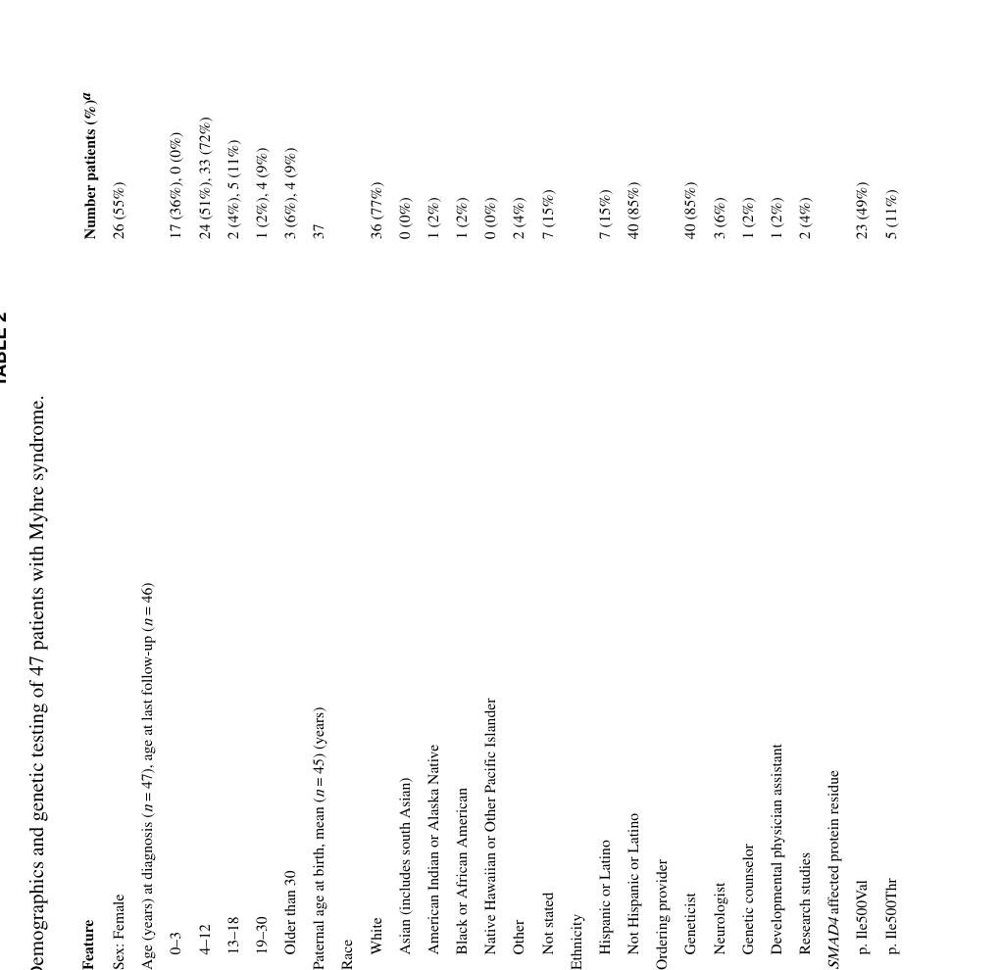

## Question

# Disease Characteristics Research Template

## Target Disease
- **Disease Name:** Myhre Syndrome
- **MONDO ID:**  (if available)
- **Category:** Mendelian

## Research Objectives

Please provide a comprehensive research report on **Myhre Syndrome** covering all of the
disease characteristics listed below. This report will be used to populate a disease knowledge
base entry. Be thorough and cite primary literature (PMID preferred) for all claims.

For each section, **suggested databases/resources** are listed. These are the first places
you should search for information on each topic.

---

### 1. Disease Information
> **Search first:** OMIM, Orphanet, ICD-10/ICD-11, MeSH, PubMed

- What is the disease? Provide a concise overview.
- What are the key identifiers? (OMIM, Orphanet, ICD-10/ICD-11, MeSH, Mondo)
- What are the common synonyms and alternative names?
- Is the information derived from individual patients (e.g., EHR) or aggregated disease-level resources?

### 2. Etiology

- **Disease Causal Factors**: What are the primary causes? (genetic, environmental, infectious, mechanistic)
- **Risk Factors**:
  > **Search first:** PubMed, Cochrane Library, UpToDate, clinical guidelines, ClinVar, ClinGen, GWAS Catalog, PheGenI, CTD, CDC, WHO, epidemiological databases
  - Genetic risk factors (causal variants, susceptibility loci, modifier genes)
  - Environmental risk factors (toxins, lifestyle, occupational exposures, age, sex, family history)
- **Protective Factors**:
  > **Search first:** PubMed, Cochrane Library, clinical trial databases, GWAS Catalog, gnomAD, WHO, CDC, nutrition databases
  - Genetic protective factors (protective variants, modifier alleles)
  - Environmental protective factors (diet, lifestyle, exposures that reduce risk)
- **Gene-Environment Interactions**: How do genetic and environmental factors interact to influence disease?
  > **Search first:** CTD, PubMed, PheGenI, GxE databases

### 3. Phenotypes
> **Search first:** HPO (Human Phenotype Ontology), OMIM, Orphanet, PubMed, clinicaltrials.gov, MedDRA, SNOMED CT, DECIPHER, LOINC

For each phenotype, provide:
- **Phenotype type**: symptoms, clinical signs, physical manifestations, behavioral changes, or laboratory abnormalities
  > For symptoms/signs: HPO, OMIM, Orphanet, PubMed
  > For behavioral changes: HPO, DSM, RDoC (Research Domain Criteria), PubMed
  > For laboratory abnormalities: LOINC, SNOMED CT, LabTests Online, PubMed
- **Phenotype characteristics**:
  > **Search first:** OMIM, Orphanet, HPO, PubMed
  - Age of symptom onset (neonatal, childhood, adult-onset, late-onset)
  - Symptom severity (mild, moderate, severe, variable)
  - Symptom progression (stable, progressive, episodic, fluctuating)
  - Frequency among affected individuals (percentage or qualitative)
- **Quality of life impact**: Effects on daily functioning and well-being (per-phenotype when possible)
  > **Search first:** EQ-5D database, SF-36, WHO QOL databases, PubMed
- Suggest HPO (Human Phenotype Ontology) terms for each phenotype

### 4. Genetic/Molecular Information

- **Causal Genes**: Gene mutations or chromosomal abnormalities responsible for disease (gene symbols, OMIM IDs)
  > **Search first:** OMIM, ClinVar, HGMD, Ensembl, NCBI Gene
- **Pathogenic Variants**:
  - Affected genes (gene symbols, HGNC IDs)
    > **Search first:** OMIM, NCBI Gene, Ensembl, HGNC, UniProt, GeneCards
  - Variant classification (pathogenic, likely pathogenic, VUS per ACMG/AMP guidelines)
    > **Search first:** ClinVar, ClinGen, ACMG/AMP guidelines, VarSome
  - Variant type/class (missense, frameshift, nonsense, splice-site, structural)
  - Allele frequency in population databases
    > **Search first:** gnomAD, 1000 Genomes, ExAC, TOPMed, dbSNP
  - Somatic vs germline origin
    > **Search first:** COSMIC (somatic), ClinVar, ICGC, TCGA
  - Functional consequences (loss of function, gain of function, dominant negative)
- **Modifier Genes**: Genes that modify disease severity or expression
- **Epigenetic Information**: DNA methylation, histone modifications, chromatin changes affecting disease
  > **Search first:** ENCODE, Roadmap Epigenomics, MethBase, DiseaseMeth
- **Chromosomal Abnormalities**: Large-scale genetic changes (aneuploidy, translocations, inversions)
  > **Search first:** DECIPHER, ClinVar, ECARUCA, UCSC Genome Browser

### 5. Environmental Information

- **Environmental Factors**: Non-genetic contributing factors (toxins, radiation, pollution, occupational exposure)
  > **Search first:** CTD (Comparative Toxicogenomics Database), TOXNET, PubMed, EPA databases
- **Lifestyle Factors**: Behavioral factors (smoking, diet, exercise, alcohol consumption)
  > **Search first:** CDC databases, WHO, PubMed, NHANES
- **Infectious Agents**: If applicable, pathogens causing or triggering disease (bacteria, viruses, fungi, parasites)
  > **Search first:** NCBI Taxonomy, ViPR, BV-BRC, MicrobeDB, GIDEON

### 6. Mechanism / Pathophysiology

- **Molecular Pathways**: Specific signaling cascades or biochemical pathways involved (Wnt, MAPK, mTOR, PI3K-AKT, etc.)
  > **Search first:** KEGG, Reactome, WikiPathways, PathBank, BioCyc
- **Cellular Processes**: Cell-level mechanisms (apoptosis, autophagy, cell cycle dysregulation, inflammation, etc.)
  > **Search first:** Gene Ontology (GO), Reactome, KEGG, PubMed
- **Protein Dysfunction**: How protein structure or function is altered (misfolding, aggregation, loss of function, gain of function)
  > **Search first:** UniProt, PDB (Protein Data Bank), InterPro, Pfam, AlphaFold
- **Metabolic Changes**: Alterations in metabolic processes (energy metabolism, lipid metabolism, amino acid metabolism)
  > **Search first:** KEGG, BioCyc, HMDB (Human Metabolome Database), BRENDA
- **Immune System Involvement**: Role of immune response (autoimmunity, immunodeficiency, chronic inflammation)
  > **Search first:** ImmPort, Immunome Database, IEDB, Gene Ontology
- **Tissue Damage Mechanisms**: How tissues/ are injured (oxidative stress, ischemia, fibrosis, necrosis)
  > **Search first:** PubMed, Gene Ontology, Reactome
- **Biochemical Abnormalities**: Specific molecular defects (enzyme deficiencies, receptor dysfunction, ion channel defects)
  > **Search first:** BRENDA, UniProt, KEGG, OMIM, PubMed
- **Epigenetic Changes**: DNA methylation, histone modifications affecting gene expression in disease
  > **Search first:** ENCODE, Roadmap Epigenomics, MethBase, DiseaseMeth
- **Molecular Profiling** (if available):
  - Transcriptomics/gene expression changes
    > **Search first:** GEO (Gene Expression Omnibus), ArrayExpress, GTEx, Human Cell Atlas, SRA
  - Proteomics findings
    > **Search first:** PRIDE, ProteomeXchange, Human Protein Atlas, STRING, BioGRID
  - Metabolomics signatures
    > **Search first:** MetaboLights, Metabolomics Workbench, HMDB, METLIN
  - Lipidomics alterations
    > **Search first:** LIPID MAPS, SwissLipids, LipidHome, Metabolomics Workbench
  - Genomic structural features
    > **Search first:** UCSC Genome Browser, Ensembl, NCBI, dbVar, DGV
- **Advanced Technologies** (if applicable):
  - Single-cell analysis findings (cell-type specific mechanisms, cellular heterogeneity)
    > **Search first:** Human Cell Atlas, Single Cell Portal, GEO, CELLxGENE
  - Spatial transcriptomics findings
    > **Search first:** GEO, Spatial Research, Vizgen, 10x Genomics data
  - Multi-omics integration results
    > **Search first:** TCGA, ICGC, cBioPortal, LinkedOmics, PubMed
  - Functional genomics screens (CRISPR, RNAi)
    > **Search first:** DepMap, GenomeRNAi, PubMed, BioGRID ORCS

For each mechanism, describe:
- The causal chain from initial trigger to clinical manifestation
- Which mechanisms are upstream vs downstream
- What cell types and biological processes are involved
- Suggest GO terms for biological processes and CL terms for cell types

### 7. Anatomical Structures Affected

- **Organ Level**:
  - Primary organs directly affected
  - Secondary organ involvement (complications, secondary effects)
  - Body systems involved (cardiovascular, nervous, digestive, respiratory, endocrine, etc.)
  > **Search first:** Uberon, FMA (Foundational Model of Anatomy), OMIM, HPO, ICD-11, MeSH, SNOMED CT
- **Tissue and Cell Level**:
  - Specific tissue types affected (epithelial, connective, muscle, nervous)
  - Specific cell populations targeted (with Cell Ontology terms)
  > **Search first:** Uberon, Human Protein Atlas, Cell Ontology, Human Cell Atlas, CellMarker, PanglaoDB
- **Subcellular Level**:
  - Cellular compartments involved (mitochondria, nucleus, ER, lysosomes) (with GO Cellular Component terms)
  > **Search first:** Gene Ontology (Cellular Component), UniProt, Human Protein Atlas
- **Localization**:
  - Specific anatomical sites (with UBERON terms)
    > **Search first:** FMA, Uberon, NeuroNames (for brain), SNOMED CT
  - Lateralization (unilateral, bilateral, asymmetric)
    > **Search first:** HPO, clinical literature, imaging databases

### 8. Temporal Development

- **Onset**:
  - Typical age of onset (congenital, pediatric, adult, geriatric)
  - Onset pattern (acute, subacute, chronic, insidious)
  > **Search first:** OMIM, Orphanet, HPO, PubMed
- **Progression**:
  - Disease stages (early, intermediate, advanced, end-stage)
    > **Search first:** Cancer Staging Manual (AJCC), WHO classifications, PubMed
  - Progression rate (rapid, slow, variable)
  - Disease course pattern (episodic, relapsing-remitting, progressive, stable)
  - Disease duration (self-limited, chronic lifelong)
  > **Search first:** Disease registries, longitudinal cohort databases, natural history studies, PubMed, Orphanet, OMIM
- **Patterns**:
  - Remission patterns (spontaneous, treatment-induced)
    > **Search first:** Clinical trial databases, disease registries, PubMed
  - Critical periods (time windows of vulnerability or opportunity for intervention)
    > **Search first:** PubMed, developmental biology databases, clinical guidelines

### 9. Inheritance and Population

- **Epidemiology**:
  - Prevalence (cases per 100,000 at given time)
  - Incidence (new cases per 100,000 per year)
  > **Search first:** Orphanet, CDC, WHO, GBD (Global Burden of Disease), national registries, SEER, disease registries
- **For Genetic Etiology**:
  - Inheritance pattern (AD, AR, X-linked, mitochondrial, multifactorial, polygenic)
    > **Search first:** OMIM, Orphanet, ClinVar, GTR (Genetic Testing Registry)
  - Penetrance (complete, incomplete, age-dependent)
    > **Search first:** ClinVar, OMIM, PubMed, ClinGen
  - Expressivity (variable, consistent)
    > **Search first:** OMIM, ClinVar, PubMed
  - Genetic anticipation (increasing severity in successive generations)
    > **Search first:** OMIM, PubMed (especially for repeat expansion disorders)
  - Germline mosaicism
    > **Search first:** ClinVar, OMIM, genetic counseling literature, PubMed
  - Founder effects (population-specific mutations)
    > **Search first:** gnomAD, population genetics databases, PubMed
  - Consanguinity role
    > **Search first:** OMIM, population studies, genetic counseling resources
  - Carrier frequency
    > **Search first:** gnomAD, carrier screening databases, GeneReviews, GTR
- **Population Demographics**:
  - Affected populations (ethnic or demographic groups with higher prevalence)
    > **Search first:** gnomAD, 1000 Genomes, PAGE Study, PubMed, population registries
  - Geographic distribution (endemic areas, regional variation)
    > **Search first:** WHO, CDC, GBD, Orphanet, geographic epidemiology databases
  - Geographic distribution of specific variants
  - Sex ratio (male:female)
    > **Search first:** Disease registries, OMIM, PubMed, epidemiological databases
  - Age distribution of affected individuals
    > **Search first:** CDC, disease registries, SEER, Orphanet

### 10. Diagnostics

- **Clinical Tests**:
  - Laboratory tests (blood, urine, tissue chemistry, specific enzyme assays)
    > **Search first:** LOINC, LabTests Online, PubMed
  - Biomarkers (proteins, metabolites, genetic markers, circulating biomarkers)
    > **Search first:** FDA Biomarker List, BEST (Biomarkers, EndpointS, and other Tools), PubMed
  - Imaging studies (X-ray, CT, MRI, PET, ultrasound)
    > **Search first:** RadLex, DICOM, Radiopaedia, imaging databases
  - Functional tests (pulmonary function, cardiac stress tests)
    > **Search first:** LOINC, clinical guidelines, PubMed
  - Electrophysiology (EEG, EMG, ECG, nerve conduction studies)
    > **Search first:** LOINC, clinical neurophysiology databases, PubMed
  - Biopsy findings (histopathology, immunohistochemistry)
    > **Search first:** SNOMED CT, College of American Pathologists resources, PubMed
  - Pathology findings (microscopic examination)
    > **Search first:** SNOMED CT, Digital Pathology databases, PubMed
- **Genetic Testing**:
  > **Search first:** GTR (Genetic Testing Registry), GeneReviews, ClinGen
  - Overview of recommended genetic testing approach
  - Whole genome sequencing (WGS) utility
    > **Search first:** GTR, ClinVar, GEL (Genomics England), gnomAD
  - Whole exome sequencing (WES) utility
    > **Search first:** GTR, ClinVar, OMIM, GeneMatcher
  - Gene panels (which panels, which genes)
    > **Search first:** GTR, ClinVar, laboratory-specific databases
  - Single gene testing
    > **Search first:** GTR, ClinVar, OMIM, GeneReviews
  - Chromosomal microarray (CMA)
    > **Search first:** DECIPHER, ClinVar, dbVar, ECARUCA
  - Karyotyping
    > **Search first:** Chromosome Abnormality Database, ClinVar, cytogenetics resources
  - FISH
    > **Search first:** ClinVar, cytogenetics databases, PubMed
  - Mitochondrial DNA testing
    > **Search first:** MITOMAP, MSeqDR, ClinVar, GTR
  - Repeat expansion testing
    > **Search first:** GTR, ClinVar, repeat expansion databases, PubMed
- **Omics-Based Diagnostics** (if applicable):
  - RNA sequencing / transcriptomics
    > **Search first:** GEO, ArrayExpress, GTEx, RNA-seq databases
  - Proteomics
    > **Search first:** PRIDE, ProteomeXchange, FDA Biomarker database
  - Metabolomics
    > **Search first:** MetaboLights, Metabolomics Workbench, HMDB
  - Epigenomics
    > **Search first:** GEO, ENCODE, Roadmap Epigenomics, MethBase
  - Liquid biopsy
    > **Search first:** COSMIC, ClinVar, liquid biopsy databases, PubMed
- **Clinical Criteria**:
  - Standardized diagnostic criteria (DSM, ICD, society guidelines)
    > **Search first:** DSM-5, ICD-11, clinical society guidelines, UpToDate
  - Differential diagnosis (other conditions to rule out, with distinguishing features)
    > **Search first:** DynaMed, UpToDate, clinical decision support systems
- **Screening**:
  - Screening methods for asymptomatic individuals (newborn screening, carrier screening, cascade screening)
    > **Search first:** ACMG recommendations, CDC newborn screening, GTR

### 11. Outcome/Prognosis

- **Survival and Mortality**:
  - Survival rate (5-year, 10-year, overall)
    > **Search first:** SEER, cancer registries, disease-specific registries, PubMed
  - Life expectancy (with and without treatment if applicable)
    > **Search first:** Orphanet, disease registries, actuarial databases, PubMed
  - Mortality rate
    > **Search first:** CDC, WHO, GBD, national mortality databases
  - Disease-specific mortality (deaths directly attributable to disease)
    > **Search first:** Disease registries, CDC Wonder, GBD, PubMed
- **Morbidity and Function**:
  - Morbidity (disease-related disability and health impacts)
    > **Search first:** GBD, WHO, disability databases, PubMed
  - Disability outcomes (long-term functional impairments)
    > **Search first:** ICF (International Classification of Functioning), disability registries
  - Quality of life measures (EQ-5D, SF-36, PROMIS, disease-specific tools)
    > **Search first:** EQ-5D database, SF-36, PROMIS, PubMed
- **Disease Course**:
  - Complications (secondary problems: infections, organ failure, etc.)
    > **Search first:** ICD codes, disease registries, clinical databases, PubMed
  - Recovery potential (likelihood and extent of recovery, with vs without treatment)
    > **Search first:** Natural history studies, rehabilitation databases, PubMed
- **Prediction**:
  - Prognostic factors (age, disease severity, biomarkers, treatment response)
    > **Search first:** Prognostic models databases, clinical calculators, PubMed
  - Prognostic biomarkers (molecular markers predicting disease course)
    > **Search first:** FDA Biomarker database, PubMed, cancer prognostic databases

### 12. Treatment

- **Pharmacotherapy**:
  - Pharmacological treatments (drug names, drug classes, mechanisms of action)
    > **Search first:** DrugBank, RxNorm, ATC classification, DailyMed, FDA databases
  - Pharmacogenomics (how genetic variants affect drug metabolism, efficacy, toxicity)
    > **Search first:** PharmGKB, CPIC (Clinical Pharmacogenetics), FDA Table of PGx Biomarkers
- **Advanced Therapeutics**:
  - Gene therapy (viral vectors, CRISPR, gene replacement, gene editing)
    > **Search first:** ClinicalTrials.gov, FDA gene therapy database, ASGCT resources
  - Cell therapy (stem cell transplant, CAR-T, cellular therapeutics)
    > **Search first:** ClinicalTrials.gov, FDA cell therapy database, FACT standards
  - RNA-based therapies (ASOs, siRNA, mRNA therapies)
    > **Search first:** ClinicalTrials.gov, FDA approvals, PubMed
  - Targeted therapies (treatments directed at specific molecular targets)
    > **Search first:** My Cancer Genome, OncoKB, ClinicalTrials.gov, FDA approvals
  - Immunotherapies (checkpoint inhibitors, monoclonal antibodies)
    > **Search first:** Cancer Immunotherapy Database, FDA approvals, ClinicalTrials.gov
- **Surgical and Interventional**:
  - Surgical interventions (types of surgery, timing, outcomes)
    > **Search first:** CPT codes, surgical registries, clinical guidelines, PubMed
- **Supportive and Rehabilitative**:
  - Supportive care (symptom management, pain control, nutrition)
    > **Search first:** Clinical guidelines, Cochrane Library, PubMed
  - Rehabilitation (physical therapy, occupational therapy, speech therapy)
    > **Search first:** Rehabilitation medicine databases, clinical guidelines, PubMed
- **Experimental**:
  - Experimental treatments in clinical trials (with NCT identifiers if available)
    > **Search first:** ClinicalTrials.gov, EU Clinical Trials Register, WHO ICTRP
- **Treatment Outcomes**:
  - Treatment response rates
    > **Search first:** Clinical trial databases, FDA reviews, systematic reviews, PubMed
  - Side effects and adverse events
    > **Search first:** FDA Adverse Event Reporting System (FAERS), MedWatch, PubMed
- **Treatment Strategy**:
  - Treatment algorithms (clinical pathways, decision trees)
    > **Search first:** Clinical practice guidelines, NCCN Guidelines, UpToDate
  - Combination therapies
    > **Search first:** ClinicalTrials.gov, treatment guidelines, PubMed
  - Personalized medicine approaches (genotype-guided treatment)
    > **Search first:** My Cancer Genome, CIViC, PharmGKB, precision medicine databases

For each treatment, suggest MAXO (Medical Action Ontology) terms where applicable.

### 13. Prevention

- **Prevention Levels**:
  - Primary prevention (preventing disease occurrence: vaccination, risk factor modification)
    > **Search first:** CDC, WHO, USPSTF recommendations, Cochrane Library
  - Secondary prevention (early detection and treatment: screening programs, early intervention)
    > **Search first:** USPSTF, CDC screening guidelines, WHO
  - Tertiary prevention (preventing complications in those with disease)
    > **Search first:** Clinical guidelines, disease management protocols, PubMed
- **Immunization**: Vaccine strategies (if applicable)
  > **Search first:** CDC vaccine schedules, WHO immunization, FDA vaccine database
- **Screening and Early Detection**:
  - Screening programs (population-based: newborn screening, cancer screening)
    > **Search first:** CDC screening programs, USPSTF, cancer screening databases
  - Genetic screening (carrier screening, preimplantation genetic diagnosis, prenatal testing)
    > **Search first:** ACMG recommendations, ACOG guidelines, GTR
  - Risk stratification (identifying high-risk individuals for targeted prevention)
    > **Search first:** Risk prediction models, clinical calculators, PubMed
- **Behavioral Interventions**: Lifestyle modifications to reduce risk
  > **Search first:** CDC, WHO, behavioral intervention databases, Cochrane Library
- **Counseling**: Genetic counseling (risk assessment, family planning guidance)
  > **Search first:** NSGC resources, ACMG guidelines, GeneReviews
- **Public Health**:
  - Public health interventions (sanitation, vector control, health education)
    > **Search first:** CDC, WHO, public health databases, PubMed
  - Environmental interventions (reducing environmental risk factors)
    > **Search first:** EPA databases, WHO environmental health, PubMed
- **Prophylaxis**: Preventive medications or procedures
  > **Search first:** Clinical guidelines, FDA approvals, PubMed

### 14. Other Species / Natural Disease

- **Taxonomy**: Species affected (with NCBI Taxon identifiers)
  > **Search first:** NCBI Taxonomy
- **Breed**: Specific breeds affected (with VBO identifiers if applicable)
  > **Search first:** VBO (Vertebrate Breed Ontology)
- **Gene**: Orthologous genes in other species (with NCBI Gene IDs)
  > **Search first:** NCBI Gene
- **Natural Disease**:
  - Naturally occurring disease in other species (companion animals, wildlife)
    > **Search first:** OMIA (Online Mendelian Inheritance in Animals), VetCompass, PubMed
  - Veterinary relevance and importance in animal health
    > **Search first:** OMIA, veterinary databases, PubMed
- **Comparative Biology**:
  - Comparative pathology (similarities and differences across species)
    > **Search first:** OMIA, comparative pathology databases, PubMed
  - Evolutionary conservation of disease mechanisms
    > **Search first:** HomoloGene, OrthoMCL, Alliance of Genome Resources
- **Transmission** (if applicable):
  - Zoonotic potential
    > **Search first:** CDC zoonotic diseases, WHO zoonoses, GIDEON
  - Cross-species susceptibility
    > **Search first:** NCBI Taxonomy, veterinary databases, PubMed

### 15. Model Organisms

- **Model Types**:
  - Model organism type (mammalian, invertebrate, cellular, in vitro)
    > **Search first:** Alliance of Genome Resources, model organism databases
  - Specific model systems (mouse, rat, zebrafish, Drosophila, C. elegans, yeast, cell lines, organoids, iPSCs)
    > **Search first:** MGI, RGD, ZFIN, FlyBase, WormBase, SGD, ATCC, Cellosaurus
  - Induced models (drug treatment, surgical intervention, environmental manipulation)
    > **Search first:** MGI, model organism databases, PubMed
- **Genetic Models**:
  - Types available (knockout, knock-in, transgenic, conditional, humanized)
    > **Search first:** MGI, IMPC, KOMP, EuMMCR, IMSR
- **Model Characteristics**:
  - Phenotype recapitulation (how well model reproduces human disease features)
    > **Search first:** Model organism databases, comparative studies, PubMed
  - Model limitations (aspects of human disease not captured)
    > **Search first:** Model organism databases, PubMed, review articles
- **Applications**:
  - Research applications (what aspects of disease can be studied)
    > **Search first:** Model organism databases, PubMed
- **Resources**:
  - Model databases
    > **Search first:** MGI, RGD, ZFIN, FlyBase, WormBase, IMSR, EMMA, MMRRC

---

## Citation Requirements

- Cite primary literature (PMID preferred) for all mechanistic and clinical claims
- Prioritize recent reviews and landmark papers
- Include direct quotes from abstracts where possible to support key statements
- Distinguish evidence source types: human clinical, model organism, in vitro, computational

## Output Format

Structure your response as a comprehensive narrative organized by the sections above.
For each section, provide:
- Factual content with specific details (numbers, percentages, gene names, variant nomenclature)
- Ontology term suggestions (HPO, GO, CL, UBERON, CHEBI, MAXO, MONDO) where applicable
- Evidence citations with PMIDs
- Direct quotes from abstracts to support key claims
- Clear indication when information is not available or not applicable for this disease

This report will be used to populate a disease knowledge base entry with:
- Pathophysiology descriptions with causal chains
- Gene/protein annotations (HGNC, GO terms)
- Phenotype associations (HP terms) with frequencies
- Cell type involvement (CL terms)
- Anatomical locations (UBERON terms)
- Chemical entities (CHEBI terms)
- Treatment annotations (MAXO terms)
- Evidence items with PMIDs and exact abstract quotes
- Epidemiology, prognosis, diagnostic, and prevention information
- Animal model descriptions with phenotype recapitulation details

## Output

Question: You are an expert researcher providing comprehensive, well-cited information.

Provide detailed information focusing on:
1. Key concepts and definitions with current understanding
2. Recent developments and latest research (prioritize 2023-2024 sources)
3. Current applications and real-world implementations
4. Expert opinions and analysis from authoritative sources
5. Relevant statistics and data from recent studies

Format as a comprehensive research report with proper citations. Include URLs and publication dates where available.
Always prioritize recent, authoritative sources and provide specific citations for all major claims.

# Disease Characteristics Research Template

## Target Disease
- **Disease Name:** Myhre Syndrome
- **MONDO ID:**  (if available)
- **Category:** Mendelian

## Research Objectives

Please provide a comprehensive research report on **Myhre Syndrome** covering all of the
disease characteristics listed below. This report will be used to populate a disease knowledge
base entry. Be thorough and cite primary literature (PMID preferred) for all claims.

For each section, **suggested databases/resources** are listed. These are the first places
you should search for information on each topic.

---

### 1. Disease Information
> **Search first:** OMIM, Orphanet, ICD-10/ICD-11, MeSH, PubMed

- What is the disease? Provide a concise overview.
- What are the key identifiers? (OMIM, Orphanet, ICD-10/ICD-11, MeSH, Mondo)
- What are the common synonyms and alternative names?
- Is the information derived from individual patients (e.g., EHR) or aggregated disease-level resources?

### 2. Etiology

- **Disease Causal Factors**: What are the primary causes? (genetic, environmental, infectious, mechanistic)
- **Risk Factors**:
  > **Search first:** PubMed, Cochrane Library, UpToDate, clinical guidelines, ClinVar, ClinGen, GWAS Catalog, PheGenI, CTD, CDC, WHO, epidemiological databases
  - Genetic risk factors (causal variants, susceptibility loci, modifier genes)
  - Environmental risk factors (toxins, lifestyle, occupational exposures, age, sex, family history)
- **Protective Factors**:
  > **Search first:** PubMed, Cochrane Library, clinical trial databases, GWAS Catalog, gnomAD, WHO, CDC, nutrition databases
  - Genetic protective factors (protective variants, modifier alleles)
  - Environmental protective factors (diet, lifestyle, exposures that reduce risk)
- **Gene-Environment Interactions**: How do genetic and environmental factors interact to influence disease?
  > **Search first:** CTD, PubMed, PheGenI, GxE databases

### 3. Phenotypes
> **Search first:** HPO (Human Phenotype Ontology), OMIM, Orphanet, PubMed, clinicaltrials.gov, MedDRA, SNOMED CT, DECIPHER, LOINC

For each phenotype, provide:
- **Phenotype type**: symptoms, clinical signs, physical manifestations, behavioral changes, or laboratory abnormalities
  > For symptoms/signs: HPO, OMIM, Orphanet, PubMed
  > For behavioral changes: HPO, DSM, RDoC (Research Domain Criteria), PubMed
  > For laboratory abnormalities: LOINC, SNOMED CT, LabTests Online, PubMed
- **Phenotype characteristics**:
  > **Search first:** OMIM, Orphanet, HPO, PubMed
  - Age of symptom onset (neonatal, childhood, adult-onset, late-onset)
  - Symptom severity (mild, moderate, severe, variable)
  - Symptom progression (stable, progressive, episodic, fluctuating)
  - Frequency among affected individuals (percentage or qualitative)
- **Quality of life impact**: Effects on daily functioning and well-being (per-phenotype when possible)
  > **Search first:** EQ-5D database, SF-36, WHO QOL databases, PubMed
- Suggest HPO (Human Phenotype Ontology) terms for each phenotype

### 4. Genetic/Molecular Information

- **Causal Genes**: Gene mutations or chromosomal abnormalities responsible for disease (gene symbols, OMIM IDs)
  > **Search first:** OMIM, ClinVar, HGMD, Ensembl, NCBI Gene
- **Pathogenic Variants**:
  - Affected genes (gene symbols, HGNC IDs)
    > **Search first:** OMIM, NCBI Gene, Ensembl, HGNC, UniProt, GeneCards
  - Variant classification (pathogenic, likely pathogenic, VUS per ACMG/AMP guidelines)
    > **Search first:** ClinVar, ClinGen, ACMG/AMP guidelines, VarSome
  - Variant type/class (missense, frameshift, nonsense, splice-site, structural)
  - Allele frequency in population databases
    > **Search first:** gnomAD, 1000 Genomes, ExAC, TOPMed, dbSNP
  - Somatic vs germline origin
    > **Search first:** COSMIC (somatic), ClinVar, ICGC, TCGA
  - Functional consequences (loss of function, gain of function, dominant negative)
- **Modifier Genes**: Genes that modify disease severity or expression
- **Epigenetic Information**: DNA methylation, histone modifications, chromatin changes affecting disease
  > **Search first:** ENCODE, Roadmap Epigenomics, MethBase, DiseaseMeth
- **Chromosomal Abnormalities**: Large-scale genetic changes (aneuploidy, translocations, inversions)
  > **Search first:** DECIPHER, ClinVar, ECARUCA, UCSC Genome Browser

### 5. Environmental Information

- **Environmental Factors**: Non-genetic contributing factors (toxins, radiation, pollution, occupational exposure)
  > **Search first:** CTD (Comparative Toxicogenomics Database), TOXNET, PubMed, EPA databases
- **Lifestyle Factors**: Behavioral factors (smoking, diet, exercise, alcohol consumption)
  > **Search first:** CDC databases, WHO, PubMed, NHANES
- **Infectious Agents**: If applicable, pathogens causing or triggering disease (bacteria, viruses, fungi, parasites)
  > **Search first:** NCBI Taxonomy, ViPR, BV-BRC, MicrobeDB, GIDEON

### 6. Mechanism / Pathophysiology

- **Molecular Pathways**: Specific signaling cascades or biochemical pathways involved (Wnt, MAPK, mTOR, PI3K-AKT, etc.)
  > **Search first:** KEGG, Reactome, WikiPathways, PathBank, BioCyc
- **Cellular Processes**: Cell-level mechanisms (apoptosis, autophagy, cell cycle dysregulation, inflammation, etc.)
  > **Search first:** Gene Ontology (GO), Reactome, KEGG, PubMed
- **Protein Dysfunction**: How protein structure or function is altered (misfolding, aggregation, loss of function, gain of function)
  > **Search first:** UniProt, PDB (Protein Data Bank), InterPro, Pfam, AlphaFold
- **Metabolic Changes**: Alterations in metabolic processes (energy metabolism, lipid metabolism, amino acid metabolism)
  > **Search first:** KEGG, BioCyc, HMDB (Human Metabolome Database), BRENDA
- **Immune System Involvement**: Role of immune response (autoimmunity, immunodeficiency, chronic inflammation)
  > **Search first:** ImmPort, Immunome Database, IEDB, Gene Ontology
- **Tissue Damage Mechanisms**: How tissues/ are injured (oxidative stress, ischemia, fibrosis, necrosis)
  > **Search first:** PubMed, Gene Ontology, Reactome
- **Biochemical Abnormalities**: Specific molecular defects (enzyme deficiencies, receptor dysfunction, ion channel defects)
  > **Search first:** BRENDA, UniProt, KEGG, OMIM, PubMed
- **Epigenetic Changes**: DNA methylation, histone modifications affecting gene expression in disease
  > **Search first:** ENCODE, Roadmap Epigenomics, MethBase, DiseaseMeth
- **Molecular Profiling** (if available):
  - Transcriptomics/gene expression changes
    > **Search first:** GEO (Gene Expression Omnibus), ArrayExpress, GTEx, Human Cell Atlas, SRA
  - Proteomics findings
    > **Search first:** PRIDE, ProteomeXchange, Human Protein Atlas, STRING, BioGRID
  - Metabolomics signatures
    > **Search first:** MetaboLights, Metabolomics Workbench, HMDB, METLIN
  - Lipidomics alterations
    > **Search first:** LIPID MAPS, SwissLipids, LipidHome, Metabolomics Workbench
  - Genomic structural features
    > **Search first:** UCSC Genome Browser, Ensembl, NCBI, dbVar, DGV
- **Advanced Technologies** (if applicable):
  - Single-cell analysis findings (cell-type specific mechanisms, cellular heterogeneity)
    > **Search first:** Human Cell Atlas, Single Cell Portal, GEO, CELLxGENE
  - Spatial transcriptomics findings
    > **Search first:** GEO, Spatial Research, Vizgen, 10x Genomics data
  - Multi-omics integration results
    > **Search first:** TCGA, ICGC, cBioPortal, LinkedOmics, PubMed
  - Functional genomics screens (CRISPR, RNAi)
    > **Search first:** DepMap, GenomeRNAi, PubMed, BioGRID ORCS

For each mechanism, describe:
- The causal chain from initial trigger to clinical manifestation
- Which mechanisms are upstream vs downstream
- What cell types and biological processes are involved
- Suggest GO terms for biological processes and CL terms for cell types

### 7. Anatomical Structures Affected

- **Organ Level**:
  - Primary organs directly affected
  - Secondary organ involvement (complications, secondary effects)
  - Body systems involved (cardiovascular, nervous, digestive, respiratory, endocrine, etc.)
  > **Search first:** Uberon, FMA (Foundational Model of Anatomy), OMIM, HPO, ICD-11, MeSH, SNOMED CT
- **Tissue and Cell Level**:
  - Specific tissue types affected (epithelial, connective, muscle, nervous)
  - Specific cell populations targeted (with Cell Ontology terms)
  > **Search first:** Uberon, Human Protein Atlas, Cell Ontology, Human Cell Atlas, CellMarker, PanglaoDB
- **Subcellular Level**:
  - Cellular compartments involved (mitochondria, nucleus, ER, lysosomes) (with GO Cellular Component terms)
  > **Search first:** Gene Ontology (Cellular Component), UniProt, Human Protein Atlas
- **Localization**:
  - Specific anatomical sites (with UBERON terms)
    > **Search first:** FMA, Uberon, NeuroNames (for brain), SNOMED CT
  - Lateralization (unilateral, bilateral, asymmetric)
    > **Search first:** HPO, clinical literature, imaging databases

### 8. Temporal Development

- **Onset**:
  - Typical age of onset (congenital, pediatric, adult, geriatric)
  - Onset pattern (acute, subacute, chronic, insidious)
  > **Search first:** OMIM, Orphanet, HPO, PubMed
- **Progression**:
  - Disease stages (early, intermediate, advanced, end-stage)
    > **Search first:** Cancer Staging Manual (AJCC), WHO classifications, PubMed
  - Progression rate (rapid, slow, variable)
  - Disease course pattern (episodic, relapsing-remitting, progressive, stable)
  - Disease duration (self-limited, chronic lifelong)
  > **Search first:** Disease registries, longitudinal cohort databases, natural history studies, PubMed, Orphanet, OMIM
- **Patterns**:
  - Remission patterns (spontaneous, treatment-induced)
    > **Search first:** Clinical trial databases, disease registries, PubMed
  - Critical periods (time windows of vulnerability or opportunity for intervention)
    > **Search first:** PubMed, developmental biology databases, clinical guidelines

### 9. Inheritance and Population

- **Epidemiology**:
  - Prevalence (cases per 100,000 at given time)
  - Incidence (new cases per 100,000 per year)
  > **Search first:** Orphanet, CDC, WHO, GBD (Global Burden of Disease), national registries, SEER, disease registries
- **For Genetic Etiology**:
  - Inheritance pattern (AD, AR, X-linked, mitochondrial, multifactorial, polygenic)
    > **Search first:** OMIM, Orphanet, ClinVar, GTR (Genetic Testing Registry)
  - Penetrance (complete, incomplete, age-dependent)
    > **Search first:** ClinVar, OMIM, PubMed, ClinGen
  - Expressivity (variable, consistent)
    > **Search first:** OMIM, ClinVar, PubMed
  - Genetic anticipation (increasing severity in successive generations)
    > **Search first:** OMIM, PubMed (especially for repeat expansion disorders)
  - Germline mosaicism
    > **Search first:** ClinVar, OMIM, genetic counseling literature, PubMed
  - Founder effects (population-specific mutations)
    > **Search first:** gnomAD, population genetics databases, PubMed
  - Consanguinity role
    > **Search first:** OMIM, population studies, genetic counseling resources
  - Carrier frequency
    > **Search first:** gnomAD, carrier screening databases, GeneReviews, GTR
- **Population Demographics**:
  - Affected populations (ethnic or demographic groups with higher prevalence)
    > **Search first:** gnomAD, 1000 Genomes, PAGE Study, PubMed, population registries
  - Geographic distribution (endemic areas, regional variation)
    > **Search first:** WHO, CDC, GBD, Orphanet, geographic epidemiology databases
  - Geographic distribution of specific variants
  - Sex ratio (male:female)
    > **Search first:** Disease registries, OMIM, PubMed, epidemiological databases
  - Age distribution of affected individuals
    > **Search first:** CDC, disease registries, SEER, Orphanet

### 10. Diagnostics

- **Clinical Tests**:
  - Laboratory tests (blood, urine, tissue chemistry, specific enzyme assays)
    > **Search first:** LOINC, LabTests Online, PubMed
  - Biomarkers (proteins, metabolites, genetic markers, circulating biomarkers)
    > **Search first:** FDA Biomarker List, BEST (Biomarkers, EndpointS, and other Tools), PubMed
  - Imaging studies (X-ray, CT, MRI, PET, ultrasound)
    > **Search first:** RadLex, DICOM, Radiopaedia, imaging databases
  - Functional tests (pulmonary function, cardiac stress tests)
    > **Search first:** LOINC, clinical guidelines, PubMed
  - Electrophysiology (EEG, EMG, ECG, nerve conduction studies)
    > **Search first:** LOINC, clinical neurophysiology databases, PubMed
  - Biopsy findings (histopathology, immunohistochemistry)
    > **Search first:** SNOMED CT, College of American Pathologists resources, PubMed
  - Pathology findings (microscopic examination)
    > **Search first:** SNOMED CT, Digital Pathology databases, PubMed
- **Genetic Testing**:
  > **Search first:** GTR (Genetic Testing Registry), GeneReviews, ClinGen
  - Overview of recommended genetic testing approach
  - Whole genome sequencing (WGS) utility
    > **Search first:** GTR, ClinVar, GEL (Genomics England), gnomAD
  - Whole exome sequencing (WES) utility
    > **Search first:** GTR, ClinVar, OMIM, GeneMatcher
  - Gene panels (which panels, which genes)
    > **Search first:** GTR, ClinVar, laboratory-specific databases
  - Single gene testing
    > **Search first:** GTR, ClinVar, OMIM, GeneReviews
  - Chromosomal microarray (CMA)
    > **Search first:** DECIPHER, ClinVar, dbVar, ECARUCA
  - Karyotyping
    > **Search first:** Chromosome Abnormality Database, ClinVar, cytogenetics resources
  - FISH
    > **Search first:** ClinVar, cytogenetics databases, PubMed
  - Mitochondrial DNA testing
    > **Search first:** MITOMAP, MSeqDR, ClinVar, GTR
  - Repeat expansion testing
    > **Search first:** GTR, ClinVar, repeat expansion databases, PubMed
- **Omics-Based Diagnostics** (if applicable):
  - RNA sequencing / transcriptomics
    > **Search first:** GEO, ArrayExpress, GTEx, RNA-seq databases
  - Proteomics
    > **Search first:** PRIDE, ProteomeXchange, FDA Biomarker database
  - Metabolomics
    > **Search first:** MetaboLights, Metabolomics Workbench, HMDB
  - Epigenomics
    > **Search first:** GEO, ENCODE, Roadmap Epigenomics, MethBase
  - Liquid biopsy
    > **Search first:** COSMIC, ClinVar, liquid biopsy databases, PubMed
- **Clinical Criteria**:
  - Standardized diagnostic criteria (DSM, ICD, society guidelines)
    > **Search first:** DSM-5, ICD-11, clinical society guidelines, UpToDate
  - Differential diagnosis (other conditions to rule out, with distinguishing features)
    > **Search first:** DynaMed, UpToDate, clinical decision support systems
- **Screening**:
  - Screening methods for asymptomatic individuals (newborn screening, carrier screening, cascade screening)
    > **Search first:** ACMG recommendations, CDC newborn screening, GTR

### 11. Outcome/Prognosis

- **Survival and Mortality**:
  - Survival rate (5-year, 10-year, overall)
    > **Search first:** SEER, cancer registries, disease-specific registries, PubMed
  - Life expectancy (with and without treatment if applicable)
    > **Search first:** Orphanet, disease registries, actuarial databases, PubMed
  - Mortality rate
    > **Search first:** CDC, WHO, GBD, national mortality databases
  - Disease-specific mortality (deaths directly attributable to disease)
    > **Search first:** Disease registries, CDC Wonder, GBD, PubMed
- **Morbidity and Function**:
  - Morbidity (disease-related disability and health impacts)
    > **Search first:** GBD, WHO, disability databases, PubMed
  - Disability outcomes (long-term functional impairments)
    > **Search first:** ICF (International Classification of Functioning), disability registries
  - Quality of life measures (EQ-5D, SF-36, PROMIS, disease-specific tools)
    > **Search first:** EQ-5D database, SF-36, PROMIS, PubMed
- **Disease Course**:
  - Complications (secondary problems: infections, organ failure, etc.)
    > **Search first:** ICD codes, disease registries, clinical databases, PubMed
  - Recovery potential (likelihood and extent of recovery, with vs without treatment)
    > **Search first:** Natural history studies, rehabilitation databases, PubMed
- **Prediction**:
  - Prognostic factors (age, disease severity, biomarkers, treatment response)
    > **Search first:** Prognostic models databases, clinical calculators, PubMed
  - Prognostic biomarkers (molecular markers predicting disease course)
    > **Search first:** FDA Biomarker database, PubMed, cancer prognostic databases

### 12. Treatment

- **Pharmacotherapy**:
  - Pharmacological treatments (drug names, drug classes, mechanisms of action)
    > **Search first:** DrugBank, RxNorm, ATC classification, DailyMed, FDA databases
  - Pharmacogenomics (how genetic variants affect drug metabolism, efficacy, toxicity)
    > **Search first:** PharmGKB, CPIC (Clinical Pharmacogenetics), FDA Table of PGx Biomarkers
- **Advanced Therapeutics**:
  - Gene therapy (viral vectors, CRISPR, gene replacement, gene editing)
    > **Search first:** ClinicalTrials.gov, FDA gene therapy database, ASGCT resources
  - Cell therapy (stem cell transplant, CAR-T, cellular therapeutics)
    > **Search first:** ClinicalTrials.gov, FDA cell therapy database, FACT standards
  - RNA-based therapies (ASOs, siRNA, mRNA therapies)
    > **Search first:** ClinicalTrials.gov, FDA approvals, PubMed
  - Targeted therapies (treatments directed at specific molecular targets)
    > **Search first:** My Cancer Genome, OncoKB, ClinicalTrials.gov, FDA approvals
  - Immunotherapies (checkpoint inhibitors, monoclonal antibodies)
    > **Search first:** Cancer Immunotherapy Database, FDA approvals, ClinicalTrials.gov
- **Surgical and Interventional**:
  - Surgical interventions (types of surgery, timing, outcomes)
    > **Search first:** CPT codes, surgical registries, clinical guidelines, PubMed
- **Supportive and Rehabilitative**:
  - Supportive care (symptom management, pain control, nutrition)
    > **Search first:** Clinical guidelines, Cochrane Library, PubMed
  - Rehabilitation (physical therapy, occupational therapy, speech therapy)
    > **Search first:** Rehabilitation medicine databases, clinical guidelines, PubMed
- **Experimental**:
  - Experimental treatments in clinical trials (with NCT identifiers if available)
    > **Search first:** ClinicalTrials.gov, EU Clinical Trials Register, WHO ICTRP
- **Treatment Outcomes**:
  - Treatment response rates
    > **Search first:** Clinical trial databases, FDA reviews, systematic reviews, PubMed
  - Side effects and adverse events
    > **Search first:** FDA Adverse Event Reporting System (FAERS), MedWatch, PubMed
- **Treatment Strategy**:
  - Treatment algorithms (clinical pathways, decision trees)
    > **Search first:** Clinical practice guidelines, NCCN Guidelines, UpToDate
  - Combination therapies
    > **Search first:** ClinicalTrials.gov, treatment guidelines, PubMed
  - Personalized medicine approaches (genotype-guided treatment)
    > **Search first:** My Cancer Genome, CIViC, PharmGKB, precision medicine databases

For each treatment, suggest MAXO (Medical Action Ontology) terms where applicable.

### 13. Prevention

- **Prevention Levels**:
  - Primary prevention (preventing disease occurrence: vaccination, risk factor modification)
    > **Search first:** CDC, WHO, USPSTF recommendations, Cochrane Library
  - Secondary prevention (early detection and treatment: screening programs, early intervention)
    > **Search first:** USPSTF, CDC screening guidelines, WHO
  - Tertiary prevention (preventing complications in those with disease)
    > **Search first:** Clinical guidelines, disease management protocols, PubMed
- **Immunization**: Vaccine strategies (if applicable)
  > **Search first:** CDC vaccine schedules, WHO immunization, FDA vaccine database
- **Screening and Early Detection**:
  - Screening programs (population-based: newborn screening, cancer screening)
    > **Search first:** CDC screening programs, USPSTF, cancer screening databases
  - Genetic screening (carrier screening, preimplantation genetic diagnosis, prenatal testing)
    > **Search first:** ACMG recommendations, ACOG guidelines, GTR
  - Risk stratification (identifying high-risk individuals for targeted prevention)
    > **Search first:** Risk prediction models, clinical calculators, PubMed
- **Behavioral Interventions**: Lifestyle modifications to reduce risk
  > **Search first:** CDC, WHO, behavioral intervention databases, Cochrane Library
- **Counseling**: Genetic counseling (risk assessment, family planning guidance)
  > **Search first:** NSGC resources, ACMG guidelines, GeneReviews
- **Public Health**:
  - Public health interventions (sanitation, vector control, health education)
    > **Search first:** CDC, WHO, public health databases, PubMed
  - Environmental interventions (reducing environmental risk factors)
    > **Search first:** EPA databases, WHO environmental health, PubMed
- **Prophylaxis**: Preventive medications or procedures
  > **Search first:** Clinical guidelines, FDA approvals, PubMed

### 14. Other Species / Natural Disease

- **Taxonomy**: Species affected (with NCBI Taxon identifiers)
  > **Search first:** NCBI Taxonomy
- **Breed**: Specific breeds affected (with VBO identifiers if applicable)
  > **Search first:** VBO (Vertebrate Breed Ontology)
- **Gene**: Orthologous genes in other species (with NCBI Gene IDs)
  > **Search first:** NCBI Gene
- **Natural Disease**:
  - Naturally occurring disease in other species (companion animals, wildlife)
    > **Search first:** OMIA (Online Mendelian Inheritance in Animals), VetCompass, PubMed
  - Veterinary relevance and importance in animal health
    > **Search first:** OMIA, veterinary databases, PubMed
- **Comparative Biology**:
  - Comparative pathology (similarities and differences across species)
    > **Search first:** OMIA, comparative pathology databases, PubMed
  - Evolutionary conservation of disease mechanisms
    > **Search first:** HomoloGene, OrthoMCL, Alliance of Genome Resources
- **Transmission** (if applicable):
  - Zoonotic potential
    > **Search first:** CDC zoonotic diseases, WHO zoonoses, GIDEON
  - Cross-species susceptibility
    > **Search first:** NCBI Taxonomy, veterinary databases, PubMed

### 15. Model Organisms

- **Model Types**:
  - Model organism type (mammalian, invertebrate, cellular, in vitro)
    > **Search first:** Alliance of Genome Resources, model organism databases
  - Specific model systems (mouse, rat, zebrafish, Drosophila, C. elegans, yeast, cell lines, organoids, iPSCs)
    > **Search first:** MGI, RGD, ZFIN, FlyBase, WormBase, SGD, ATCC, Cellosaurus
  - Induced models (drug treatment, surgical intervention, environmental manipulation)
    > **Search first:** MGI, model organism databases, PubMed
- **Genetic Models**:
  - Types available (knockout, knock-in, transgenic, conditional, humanized)
    > **Search first:** MGI, IMPC, KOMP, EuMMCR, IMSR
- **Model Characteristics**:
  - Phenotype recapitulation (how well model reproduces human disease features)
    > **Search first:** Model organism databases, comparative studies, PubMed
  - Model limitations (aspects of human disease not captured)
    > **Search first:** Model organism databases, PubMed, review articles
- **Applications**:
  - Research applications (what aspects of disease can be studied)
    > **Search first:** Model organism databases, PubMed
- **Resources**:
  - Model databases
    > **Search first:** MGI, RGD, ZFIN, FlyBase, WormBase, IMSR, EMMA, MMRRC

---

## Citation Requirements

- Cite primary literature (PMID preferred) for all mechanistic and clinical claims
- Prioritize recent reviews and landmark papers
- Include direct quotes from abstracts where possible to support key statements
- Distinguish evidence source types: human clinical, model organism, in vitro, computational

## Output Format

Structure your response as a comprehensive narrative organized by the sections above.
For each section, provide:
- Factual content with specific details (numbers, percentages, gene names, variant nomenclature)
- Ontology term suggestions (HPO, GO, CL, UBERON, CHEBI, MAXO, MONDO) where applicable
- Evidence citations with PMIDs
- Direct quotes from abstracts to support key claims
- Clear indication when information is not available or not applicable for this disease

This report will be used to populate a disease knowledge base entry with:
- Pathophysiology descriptions with causal chains
- Gene/protein annotations (HGNC, GO terms)
- Phenotype associations (HP terms) with frequencies
- Cell type involvement (CL terms)
- Anatomical locations (UBERON terms)
- Chemical entities (CHEBI terms)
- Treatment annotations (MAXO terms)
- Evidence items with PMIDs and exact abstract quotes
- Epidemiology, prognosis, diagnostic, and prevention information
- Animal model descriptions with phenotype recapitulation details

## Comprehensive Research Report: Myhre Syndrome (Mendelian)

### Target disease
- **Disease name:** Myhre syndrome  
- **Category:** Mendelian (monogenic connective-tissue/developmental disorder)  
- **MONDO ID:** Not retrieved in the provided corpus (needs confirmation from MONDO/ORDO cross-references).  

---

## 1. Disease Information

### 1.1 Overview (current understanding)
Myhre syndrome is an **ultrarare, progressive, multisystem developmental/connective-tissue disorder** caused by recurrent heterozygous **SMAD4** missense variants, classically affecting residues **Arg496** and **Ile500** in the SMAD4 MH2 domain. Natural-history cohorts show progression across systems with time, including cardiopulmonary/vascular disease and fibroproliferative stenoses. (lin2024emergenceofthe pages 1-3, lin2024emergenceofthe pages 3-5)

A key historical synonym is **Laryngotracheal–Arthropathy–Prognathism–Short Stature (LAPS) syndrome**; modern molecular evidence indicates LAPS and Myhre syndrome are **allelic disorders** caused by SMAD4 variants. (brand2025researchreviewof pages 1-2)

### 1.2 Key identifiers (as available from retrieved sources)
- **OMIM/MIM:** **139210** (Myhre syndrome) (yang2022naturalhistoryof pages 1-2)  
- **Orphanet (ORPHA):** **2588** (yang2022naturalhistoryof pages 1-2)  

### 1.3 Synonyms / alternative names
- **Myhre syndrome**  
- **LAPS syndrome** (Laryngotracheal–Arthropathy–Prognathism–Short Stature) (brand2025researchreviewof pages 1-2, lin2024emergenceofthe pages 24-25)

### 1.4 Evidence sources underlying disease knowledge
The literature base is dominated by **case reports and small series**, but increasingly includes **cohort natural-history studies and dedicated multidisciplinary clinics**. A 2025 research review compiled **92 publications (1988–2024)**, including many case reports/series and emerging natural-history work. (brand2025researchreviewof pages 2-3, brand2025researchreviewof pages 1-2)

Concrete aggregated sources include:
- A **French reference-center** retrospective longitudinal cohort using medical records, EHR data warehouse, imaging, and photographs (n=12). (yang2022naturalhistoryof pages 1-2, yang2022naturalhistoryof pages 2-4)
- A **Massachusetts General Hospital (MGH)** multispecialty clinic cohort with deep phenotyping and longitudinal follow-up (n=47). (lin2024emergenceofthe pages 1-3)

---

## 2. Etiology

### 2.1 Disease causal factors
**Primary cause:** pathogenic heterozygous missense variants in **SMAD4**, acting via **gain-of-function** mechanisms in Myhre syndrome. (yang2022naturalhistoryof pages 1-2, wood2024smad4mutationscausing pages 1-3)

Direct abstract-supported definition (French cohort): Myhre syndrome is "**caused by a gain of function mutation in SMAD4 gene**." (yang2022naturalhistoryof pages 1-2)

### 2.2 Risk factors
- **Genetic:** presence of a pathogenic SMAD4 Myhre-associated missense variant (Arg496Cys or codon 500 substitutions). (wood2024smad4mutationscausing pages 1-3, lin2024emergenceofthe pages 1-3)
- **Parental age/sex-specific germline factors:** 2024 AJHG evidence indicates Myhre-causing variants arise on the **paternally derived allele** in informative trios and are associated with a **paternal age effect** ("**6.3 years excess for fathers**"), consistent with selfish spermatogonial selection. (wood2024smad4mutationscausing pages 1-3)

### 2.3 Protective factors
No established genetic or environmental protective factors were identified in the retrieved sources.

### 2.4 Gene–environment interactions
Not established for Myhre syndrome in the retrieved sources.

---

## 3. Phenotypes

The two best-characterized cohorts in the retrieved corpus (French n=12; MGH n=47) demonstrate that Myhre syndrome is **progressive** and affects growth, skeleton/joints, skin, neurodevelopment, ENT/hearing, cardiovascular/vascular, and respiratory/airway systems. (lin2024emergenceofthe pages 3-5, yang2022naturalhistoryof pages 1-2)

### Cohort-derived phenotype frequencies and timing
A structured cohort summary with suggested **HPO terms**, frequencies/denominators, and temporal notes is provided here:

| Domain | Specific feature (plain language) | Suggested HPO term(s) | Frequency/statistic (with denominator) | Typical onset/temporal notes | Key source/citation context IDs |
|---|---|---|---|---|---|
| Cohort overview | Longitudinal follow-up in dedicated natural-history cohorts | HP:0000007 Autosomal dominant inheritance; HP:0003674 Progressive | MGH: 47 patients; 81% had at least 1 follow-up; among those followed ≥5 years, progression observed in all. French: 12 molecularly confirmed patients, median follow-up 7 years | Progressive multisystem disease across childhood to adulthood | (lin2024emergenceofthe pages 3-5, lin2024emergenceofthe pages 1-3, yang2022naturalhistoryof pages 2-4) |
| Growth | Intrauterine growth restriction / prenatal growth deficiency | HP:0001511 Intrauterine growth retardation | French: 12/12 (100%) | Prenatal onset; postnatal short stature persists | (yang2022naturalhistoryof pages 1-2) |
| Growth | Postnatal growth failure / short stature | HP:0004322 Short stature; HP:0001510 Growth delay | French: postnatal height median about -3.5 SD; MGH: short stature described as common, but no cohort-wide % in retrieved text | Begins in infancy/childhood and persists | (yang2022naturalhistoryof pages 1-2, lin2024emergenceofthe pages 3-5) |
| Hearing | Hearing impairment | HP:0000365 Hearing impairment | French: 7/12 (58%) | Detectable from about age 2 years; mixed conductive/sensorineural etiologies | (yang2022naturalhistoryof pages 2-4) |
| Hearing / genotype-phenotype | p.Arg496Cys associated with less hearing loss | HP:0000365 Hearing impairment | Qualitative reduction vs other variant groups in MGH cohort | Suggests milder sensory involvement for this variant subgroup | (lin2024emergenceofthe pages 1-3) |
| Vision | Visual problems (mainly refractive error/strabismus) | HP:0000505 Visual impairment; HP:0000486 Strabismus; HP:0000545 Myopia/Hyperopia as applicable | French: 9/12 (75%) | Childhood onset | (yang2022naturalhistoryof pages 2-4) |
| Craniofacial | Prognathism | HP:0000303 Mandibular prognathia | French: 11/12 (92%) | Childhood, persistent | (yang2022naturalhistoryof pages 1-2) |
| Craniofacial | Maxillary hypoplasia | HP:0000327 Hypoplasia of the maxilla | French: 9/11 (82%) | Childhood | (yang2022naturalhistoryof pages 1-2) |
| Craniofacial | Narrow/short palpebral fissures | HP:0000581 Narrow palpebral fissure | French: 9/12 (75%) | Childhood | (yang2022naturalhistoryof pages 1-2) |
| Craniofacial | Prominent chin | HP:0000303 Mandibular prognathia | MGH: 35/47 (74%), severe in 7/35 | Persistent dysmorphic feature | (lin2024emergenceofthe pages 17-19) |
| Neurodevelopment | Neurodevelopmental disorders in early childhood | HP:0012758 Neurodevelopmental abnormality | French: 80% in preschool age | Preschool onset | (yang2022naturalhistoryof pages 1-2) |
| Neurodevelopment | Developmental delay / intellectual disability | HP:0001263 Global developmental delay; HP:0001249 Intellectual disability | French: developmental delay/intellectual disability 9/12 (75%); MGH: intellectual disability in 32% | Early childhood onset; persistent | (yang2022naturalhistoryof pages 4-5, lin2024emergenceofthe pages 17-19) |
| Neurobehavioral | Autism spectrum disorder / social communication difficulties | HP:0000729 Autism; HP:0000733 Stereotypy/behavioral abnormality | MGH: ASD diagnosis in 72%; social challenges in 91%; academic accommodations in 44/47 (94%) | Usually recognized in childhood; major QoL/education impact | (lin2024emergenceofthe pages 17-19) |
| Neurobehavioral | ADHD | HP:0007018 Attention deficit hyperactivity disorder | MGH: 14 patients (56% of subgroup discussed) had combined inattentive/hyperactive ADHD | Childhood; may be undertreated | (lin2024emergenceofthe pages 29-31) |
| Neurologic / cerebrovascular | Brain MRI abnormalities | HP:0410263 Abnormal brain MRI; HP:0002500 Abnormal cerebral white matter morphology | French: 5/8 imaged | Childhood/adolescence | (yang2022naturalhistoryof pages 4-5) |
| Neurologic / vascular | Moyamoya-associated recurrent strokes | HP:0002527 Stroke; HP:0002134 Moyamoya disease | French: 1 patient | First reported from age 26 years in cohort | (yang2022naturalhistoryof pages 1-2, yang2022naturalhistoryof pages 4-5) |
| Skin | Thickened / stiff skin | HP:0008067 Thickened skin; HP:0000974 Skin sclerosis | French: 8/12 (67%); MGH: described as common/progressive but no overall % in retrieved text | Typically emerges in school age / around age 6; progressive | (yang2022naturalhistoryof pages 2-4, yang2022naturalhistoryof pages 4-5, lin2024emergenceofthe pages 25-27) |
| Musculoskeletal | Muscular hypertrophy / pseudomuscular build | HP:0009041 Muscular hypertrophy | French: 9/12 (75%) | Appears from about age 6 years | (yang2022naturalhistoryof pages 1-2) |
| Musculoskeletal | Joint limitation / contractures | HP:0001371 Flexion contracture; HP:0001382 Joint limitation | French: 8/9 (89%); MGH: severe contractures 5/47 (11%), less severe contractures 23/47 (49%) | Median onset 6 years in French cohort; earliest contracture at 26 months in MGH; progressive from small joints to generalized limitation | (yang2022naturalhistoryof pages 2-4, lin2024emergenceofthe pages 17-19) |
| Musculoskeletal | Stiff gait | HP:0002361 Stiff gait | MGH: 44/47 (94%) | Progressive mobility impact | (lin2024emergenceofthe pages 17-19) |
| Musculoskeletal | Brachydactyly | HP:0001156 Brachydactyly | French: 11/11 (100%); MGH: 30/47 (64%) | Early childhood / first years of life | (yang2022naturalhistoryof pages 2-4, lin2024emergenceofthe pages 17-19) |
| Musculoskeletal | Small hands | HP:0200055 Small hand | French: 8/8 (100%) | Early childhood | (yang2022naturalhistoryof pages 2-4) |
| Musculoskeletal | Clinodactyly | HP:0030084 Clinodactyly | French: 4/8 (50%); MGH: 33/47 (70%) | Early childhood | (yang2022naturalhistoryof pages 2-4, lin2024emergenceofthe pages 17-19) |
| Musculoskeletal | Toe 2-3 syndactyly | HP:0001770 Syndactyly of toes | MGH: 31/47 (66%) | Congenital/early childhood | (lin2024emergenceofthe pages 17-19) |
| Musculoskeletal | Scoliosis | HP:0002650 Scoliosis | MGH: 10/47 (21%) | Childhood/adolescence | (lin2024emergenceofthe pages 17-19) |
| Musculoskeletal | Fractures | HP:0002757 Pathologic fracture / recurrent fractures | MGH: 13/47 (28%) | From infancy to adulthood; authors note apparently elevated fracture burden | (lin2024emergenceofthe pages 17-19, lin2024emergenceofthe pages 29-31) |
| Skeletal imaging | Thickened calvarium | HP:0002684 Thick calvarium | French: 5/7 (71%) | Childhood | (yang2022naturalhistoryof pages 2-4) |
| Skeletal imaging | Enlarged vertebral pedicles | HP:0008467 Abnormal vertebral pedicle morphology | French: 7/10 (70%) | Childhood | (yang2022naturalhistoryof pages 2-4) |
| Cardiovascular | Congenital heart defects | HP:0001627 Abnormality of the cardiovascular system; HP:0001626 Congenital cardiovascular malformation | French: 7/12 (58%) | Often identified in infancy/childhood | (yang2022naturalhistoryof pages 2-4) |
| Cardiovascular | Pulmonary hypertension / pulmonary arterial hypertension | HP:0002092 Pulmonary hypertension | French: 5/8 assessed (63%) | Early childhood in Shone complex; early adolescence in others; major life-threatening complication | (yang2022naturalhistoryof pages 2-4) |
| Cardiovascular | Aortic hypoplasia | HP:0004970 Ascending aorta hypoplasia / aortic hypoplasia | MGH: overall % not retrieved; p.Ile500Thr subgroup 3/5 (60%) had moderate/severe aortic hypoplasia | Childhood recognition; important surveillance lesion | (lin2024emergenceofthe pages 3-5, lin2024emergenceofthe pages 1-3) |
| Cardiovascular / genotype-phenotype | p.Arg496Cys associated with less growth restriction and less aortic hypoplasia | HP:0001511 Intrauterine growth retardation; HP:0004970 Aortic hypoplasia | Qualitative reduction vs other variants in MGH cohort | Suggests variant-specific attenuation of some core phenotypes | (lin2024emergenceofthe pages 3-5, lin2024emergenceofthe pages 1-3) |
| Respiratory / airway | Multilevel laryngotracheal stenosis | HP:0001609 Laryngotracheal stenosis | French: 2 cases specifically described; MGH: severe feature recognized, % not retrieved in quoted text | Progressive; may emerge in childhood/adolescence; potentially lethal | (yang2022naturalhistoryof pages 4-5, lin2024emergenceofthe pages 24-25) |
| Respiratory | Obstructive sleep apnea | HP:0010535 Sleep apnea | French: 4 patients | Childhood/adolescence | (yang2022naturalhistoryof pages 4-5) |
| Respiratory / pleural | Pleural effusion | HP:0002202 Pleural effusion | French: 6/10 (60%) | Often later/progressive; contributed to chronic respiratory failure in severe cases | (yang2022naturalhistoryof pages 4-5) |
| Respiratory | Chronic respiratory failure | HP:0002878 Respiratory insufficiency | French: 2 adolescents | Severe late complication | (yang2022naturalhistoryof pages 4-5) |
| ENT / sinus-mastoid imaging | Opacified mastoids / sinusitis / opacified sinuses | HP:0010628 Abnormal mastoid morphology; HP:0000246 Sinusitis | MGH: 30%, 38%, and 13% respectively | Chronic/recurrent ENT burden | (lin2024emergenceofthe pages 24-25) |
| Endocrine / puberty | Precocious puberty (reported mainly in females) | HP:0000826 Precocious puberty | French: 8 females affected; MGH notes underascertainment due to age distribution | Around age 8 years in French cohort | (yang2022naturalhistoryof pages 4-5, lin2024emergenceofthe pages 25-27) |
| Immune | Hypogammaglobulinemia | HP:0004313 Decreased circulating immunoglobulin level | French: 4 patients; MGH outside testing: 7/13 (54%) had hypogammaglobulinemia | Variable; may prompt vaccine-response testing or IgG replacement in selected cases | (yang2022naturalhistoryof pages 4-5, lin2024emergenceofthe pages 17-19) |
| Gastrointestinal | Abdominal pain | HP:0002027 Abdominal pain | MGH: 40% | Chronic symptom; multifactorial | (lin2024emergenceofthe pages 24-25) |
| Gastrointestinal | Celiac disease | HP:0002608 Celiac disease | MGH review incidence 6% vs ~1% general population | Screening may be considered | (lin2024emergenceofthe pages 25-27) |
| Mortality / prognosis | Disease-related deaths | HP:0001423 Sudden death / mortality not directly mapped | MGH: 2 deaths; French: 3 deaths | Causes included complex cardiovascular disease, airway stenosis, PAH crisis, mesenteric ischemia, severe esophageal atresia | (lin2024emergenceofthe pages 3-5, yang2022naturalhistoryof pages 1-2) |

*Table: This table summarizes cohort-derived phenotype frequencies, timing, and genotype-phenotype observations for Myhre syndrome from the major recent natural-history studies. It is useful for building disease knowledge-base phenotype assertions with suggested HPO mappings and citation-ready evidence links.*

### Selected high-yield phenotype notes (with statistics)
- **Growth restriction:** French cohort reported **100% IUGR** (12/12), with persistent postnatal short stature (median ~ −3.5 SD). (yang2022naturalhistoryof pages 1-2)
- **Neurodevelopment:** French cohort reported neurodevelopmental disorders in **80%** in preschool age; developmental delay/intellectual disability was **75% (9/12)**. (yang2022naturalhistoryof pages 1-2, yang2022naturalhistoryof pages 4-5)
- **ASD/social difficulties:** MGH cohort reported **ASD diagnosis 72%** and **social challenges 91%**; academic accommodations were **94% (44/47)**—a major functional/QoL impact. (lin2024emergenceofthe pages 17-19)
- **Joint limitation/contractures:** French cohort 89% (8/9) with median onset 6 years; MGH cohort had severe contractures 11% (5/47) and less severe 49% (23/47), with earliest contractures at 26 months. (yang2022naturalhistoryof pages 2-4, lin2024emergenceofthe pages 17-19)
- **Cardiovascular:** French cohort CHD 58% (7/12) and pulmonary hypertension 63% (5/8 assessed). (yang2022naturalhistoryof pages 2-4)
- **Respiratory/airway:** French cohort reported multilevel acquired laryngotracheal stenosis in 2 cases; obstructive sleep apnea was reported in 4 patients; pleural effusion 60% (6/10). (yang2022naturalhistoryof pages 4-5)

### Genotype–phenotype correlations (MGH cohort)
- MGH cohort showed variant clustering and associations: **p.Arg496Cys** carriers were **less likely** to have hearing loss, growth restriction, and aortic hypoplasia; **p.Ile500Thr** subgroup showed moderate/severe aortic hypoplasia in **60% (3/5)**. (lin2024emergenceofthe pages 1-3, lin2024emergenceofthe pages 3-5)

---

## 4. Genetic / Molecular Information

### 4.1 Causal gene
- **SMAD4** (core mediator/co-SMAD in TGF-β/BMP signaling). (goff2015chondrodysplasiasandtgfβ pages 2-3, varenyiova2020myhresyndromeassociated pages 1-2)

### 4.2 Pathogenic variant spectrum (hotspot)
The mutational spectrum is unusually narrow:
- **c.1486C>T (p.Arg496Cys)**
- **c.1498A>G (p.Ile500Val)**
- **c.1499T>C (p.Ile500Thr)**
- **c.1500A>G (p.Ile500Met)**
All within the **MH2 domain**; described as the four resolved variants "**to date**" in the 2024 AJHG study. (wood2024smad4mutationscausing pages 1-3)

In the MGH natural-history clinic cohort, variants were distributed: **p.Ile500Val 49%**, **p.Ile500Thr 11%**, **p.Ile500Leu 2%**, **p.Arg496Cys 38%**. (lin2024emergenceofthe pages 1-3)

### 4.3 Inheritance
- Typically **autosomal dominant** and **de novo** (clinic cohort statement: "**autosomal dominant de novo variants**"). (lin2024emergenceofthe pages 1-3)
- Strong evidence for **paternal origin** of DNMs and paternal age effect from 2024 AJHG. (wood2024smad4mutationscausing pages 1-3)

### 4.4 Functional consequences
Mechanistic models include **gain-of-function**, potentially via:
- altered stability of the SMAD heterotrimer
- reduced SMAD4 ubiquitination
and a dominant-negative model has been proposed in the literature; the 2024 AJHG paper frames these as leading models. (wood2024smad4mutationscausing pages 1-3)

### 4.5 Modifier genes / epigenetics
- **Modifier genes:** not established in retrieved sources.
- **Epigenetics/episignature:** no Myhre-specific DNA methylation episignature was retrieved in this corpus; this remains a gap for this report.

---

## 5. Environmental Information
No validated environmental, lifestyle, or infectious causal contributors were identified in the retrieved sources; Myhre syndrome is primarily genetic.

---

## 6. Mechanism / Pathophysiology

### 6.1 Core pathway dysfunction
Myhre syndrome is consistently linked to dysregulation of **TGF-β/BMP signaling** mediated through **SMAD4**, with downstream consequences on extracellular matrix biology and fibrotic remodeling. (varenyiova2020myhresyndromeassociated pages 1-2, goff2015chondrodysplasiasandtgfβ pages 2-3)

A concise mechanistic statement from a clinical case report: SMAD4 mutation leads to defective TGF-β/BMP signaling "**resulting in the proliferation of abnormal fibrous tissues**." (varenyiova2020myhresyndromeassociated pages 1-2)

### 6.2 Fibroproliferation, ECM deposition, and stenosis (causal chain)
A clinic-derived mechanistic hypothesis in 2024 proposes multilevel airway stenosis arises from developmental vulnerability plus "**proliferative … desquamation**" causing progressive narrowing of tubular structures (external ear canals → sinuses/choanae → larynx/trachea/bronchi), with "copious debris" contributing to occlusion. (lin2024emergenceofthe pages 24-25)

Pulmonary pathology described in the MGH cohort includes "**diffuse interstitial fibrosis with copious collagen and smooth muscle hyperplasia of the airways**," consistent with aberrant ECM deposition and airway remodeling. (lin2024emergenceofthe pages 24-25)

### 6.3 Skeletal growth plate / cartilage mechanisms
A TGF-β skeletal dysplasia review places SMAD4 as the co-mediator SMAD regulating chondrogenesis (condensation, proliferation, ECM deposition, differentiation), and highlights mouse evidence that chondrocyte-specific Smad4 loss disrupts growth plates and causes dwarfism—supporting involvement of chondrocyte/osteoblast programs in skeletal phenotypes seen in Myhre syndrome. (goff2015chondrodysplasiasandtgfβ pages 2-3)

### 6.4 Candidate ontology terms
**Suggested GO Biological Process terms (mechanism-grounded):**
- transforming growth factor beta receptor signaling pathway  
- BMP signaling pathway  
- SMAD protein signal transduction  
- extracellular matrix organization  
- collagen fibril organization  
- cartilage development / growth plate cartilage development  
- wound healing / scarring
Supported broadly by pathway reviews and case-based mechanistic statements tying SMAD4 to TGF-β/BMP signaling and ECM. (goff2015chondrodysplasiasandtgfβ pages 2-3, varenyiova2020myhresyndromeassociated pages 1-2, lin2024emergenceofthe pages 24-25)

**Suggested Cell Ontology (CL) terms (based on implicated tissues/processes):**
- fibroblast (CL:0000057)  
- endothelial cell (CL:0000115)  
- vascular smooth muscle cell (CL:0000629)  
- cardiomyocyte (CL:0000556)  
- chondrocyte (cartilage; consistent with growth plate involvement)
These are motivated by connective tissue fibrosis/ECM deposition, vascular stenosis, cardiac remodeling/pericardial fibrosis, and skeletal dysplasia mechanisms. (varenyiova2020myhresyndromeassociated pages 1-2, goff2015chondrodysplasiasandtgfβ pages 2-3, lin2016gain‐of‐functionmutationsin pages 10-11)

**Suggested UBERON anatomical structures (high-level):**
- skin, joints, cartilage/growth plate, heart/pericardium, aorta/large arteries, trachea/bronchi/lungs, inner ear. (yang2022naturalhistoryof pages 4-5, lin2016gain‐of‐functionmutationsin pages 9-10, lin2024emergenceofthe pages 24-25)

---

## 7. Anatomical Structures Affected
- **Connective tissues:** skin (stiff/thickened), joints (contractures/arthropathy). (yang2022naturalhistoryof pages 4-5, jensen2020acaseof pages 1-2)
- **Cardiovascular system:** congenital heart defects, aortic hypoplasia/branch involvement, pericardial disease, restrictive cardiomyopathy, pulmonary hypertension. (yang2022naturalhistoryof pages 2-4, lin2024emergenceofthe pages 22-24, lin2016gain‐of‐functionmutationsin pages 9-10)
- **Respiratory system:** laryngotracheal stenosis, obstructive sleep apnea, restrictive/obstructive defects, interstitial fibrosis. (yang2022naturalhistoryof pages 4-5, lin2024emergenceofthe pages 24-25)
- **CNS:** variable neurodevelopmental phenotype; occasional cerebrovascular events (moyamoya strokes reported in French cohort). (yang2022naturalhistoryof pages 4-5)

---

## 8. Temporal Development
- **Prenatal/infancy:** IUGR and postnatal failure to thrive are consistent. (yang2022naturalhistoryof pages 1-2)
- **Preschool:** neurodevelopmental disorders often recognized (80% in French cohort). (yang2022naturalhistoryof pages 1-2)
- **School age (~6 years):** thickened/stiff skin and joint limitation emerge; muscular hypertrophy around age ~6 (French cohort). (yang2022naturalhistoryof pages 1-2, yang2022naturalhistoryof pages 2-4)
- **Adolescence/adulthood:** higher risk period for severe cardiopulmonary/vascular complications such as pulmonary arterial hypertension, vascular stenosis, and multilevel airway stenosis; deaths in cohorts occurred in late adolescence/20s, and MGH cohort notes progression in all followed ≥5 years. (yang2022naturalhistoryof pages 1-2, lin2024emergenceofthe pages 1-3)

---

## 9. Inheritance and Population

### 9.1 Inheritance pattern
Autosomal dominant, most often de novo; paternal germline enrichment and paternal-age effect supported by 2024 AJHG. (lin2024emergenceofthe pages 1-3, wood2024smad4mutationscausing pages 1-3)

### 9.2 Epidemiology
Robust prevalence/incidence estimates were **not** identified in the retrieved sources. Available evidence highlights that it is **ultrarare** and historically had ~90 published cases by 2022 with ~70 molecularly confirmed. (yang2022naturalhistoryof pages 1-2)

---

## 10. Diagnostics

### 10.1 Clinical suspicion
Clinical suspicion is often triggered by a recognizable pattern: short stature, characteristic facial features (prognathism), stiff joints/contractures, hearing impairment, neurodevelopmental differences, and cardiopulmonary/vascular disease. (yang2022naturalhistoryof pages 1-2, lin2016gain‐of‐functionmutationsin pages 10-11)

### 10.2 Genetic confirmation and testing strategy
- Diagnosis is confirmed by identifying a pathogenic SMAD4 hotspot missense variant. (lin2016gain‐of‐functionmutationsin pages 11-12, lin2024emergenceofthe pages 1-3)
- A rheumatology case report emphasizes that early-onset scleroderma-like presentations should prompt genetic testing; in a misdiagnosed patient, genetic testing identified **SMAD4 c.1499T>C (p.Ile500Thr)** and allowed cessation of immunosuppression. (jensen2020acaseof pages 2-4, jensen2020acaseof pages 1-2)
- The same report supports modern NGS approaches (targeted panels/WES/WGS) and highlights de novo status via parental testing. (jensen2020acaseof pages 2-4)

### 10.3 Differential diagnosis
- **Juvenile systemic sclerosis / juvenile scleroderma** (Myhre can mimic; biopsy may resemble scleroderma). (jensen2020acaseof pages 2-4, jensen2020acaseof pages 1-2)
- Other genetic scleroderma mimics and syndromes with aortic hypoplasia/coarctation patterns: Williams, Alagille, Ras-MAPK pathway syndromes; additionally, RCM/pericarditis differentials such as MULIBREY dwarfism, Cantu syndrome, and CACP syndrome were discussed in earlier cardiovascular work. (lin2024emergenceofthe pages 29-31, lin2016gain‐of‐functionmutationsin pages 10-11)

### 10.4 Surveillance and monitoring tests (real-world implementation)
MGH clinic recommendations provide concrete implementation details:
- **Whole-aorta CTA** generally at **ages ~5–7 years** without anesthesia, repeat **~every 5 years** or sooner for unexplained hypertension; MRA after ~9–11 years as an alternative to reduce radiation. (lin2024emergenceofthe pages 22-24)
- **Echocardiography** promptly if pericardial disease suspected; consider **cardiac catheterization** if restrictive cardiomyopathy suspected and echo is nondiagnostic. (lin2024emergenceofthe pages 22-24)
- **Pulmonary**: increased PFT use and advanced modalities (oscillometry, lung clearance index), CT angiography, and selective biopsy/postmortem studies to delineate lung disease. (lin2024emergenceofthe pages 24-25)
- **ENT/hearing**: tympanometry and behavioral audiometry, ABR under anesthesia if needed; classroom accommodations and hearing assistive technologies; debris removal due to canal obstruction risk. (lin2024emergenceofthe pages 24-25)

---

## 11. Outcome / Prognosis
Natural-history cohorts indicate Myhre syndrome is **progressive** and can have **life-threatening complications**.
- In the MGH cohort, among those followed ≥5 years, progression was seen in **all**; **two deaths** were reported (complex cardiovascular disease; airway stenosis). (lin2024emergenceofthe pages 1-3, lin2024emergenceofthe pages 3-5)
- In the French cohort, deaths occurred from **PAH crises** and **mesenteric ischemia** in late adolescence/20s, and a toddler death from severe congenital anomaly; cerebrovascular complications (moyamoya stroke) occurred in adulthood in one patient. (yang2022naturalhistoryof pages 1-2, yang2022naturalhistoryof pages 4-5)

---

## 12. Treatment

### 12.1 Pharmacotherapy (anti-fibrotic rationale): losartan
A small pilot clinical trial assessed losartan in Myhre syndrome (4 enrolled; 3 treated 12 months). The study used systemic-sclerosis endpoints including modified Rodnan skin score (mRSS), goniometry for joint ROM, and speckle-tracking echocardiography (GLPS). (cappuccio2021apilotclinical pages 1-2)

Quantitative and safety details from the trial:
- One subject discontinued due to **dizziness**; another developed **orthostatic hypotension** at 100 mg/day requiring dose reduction to 50 mg/day. (cappuccio2021apilotclinical pages 3-5)
- After 12 months, **mRSS decreased in all treated subjects** and **joint ROM improved in all**, with statistically significant changes only in one individual (S2); GLPS showed a trend toward improvement in others. (cappuccio2021apilotclinical pages 3-5)
- Baseline myocardial strain was reduced: average GLPS in four subjects **15.3 ± 2%** vs normative ~20.2%. (cappuccio2021apilotclinical pages 3-5)

### 12.2 Multidisciplinary and interventional management (real-world implementation)
- Airway disease management emphasizes prevention and cautious evaluation because procedures may stimulate stenosis; multilevel airway stenosis is described as "typically lethal" and education of anesthesiologists is part of care. (lin2024emergenceofthe pages 24-25)
- Cardiovascular interventions include angioplasty, surgical repairs, valve replacements, and even heart transplantation in severe disease (historical cardiovascular cohort). (lin2016gain‐of‐functionmutationsin pages 9-10)
- ENT/hearing management includes assistive technologies, cerumen/keratin debris removal, and carefully counseled surgeries given scarring/anesthesia risks. (lin2024emergenceofthe pages 24-25)
- Physical therapy is recommended to preserve mobility and function; QoL impact of progressive arthritis/contractures is emphasized. (lin2024emergenceofthe pages 29-31)

### 12.3 MAXO term suggestions (treatment actions)
- angiotensin receptor blocker therapy (losartan)  
- cardiovascular imaging surveillance (CTA/MRA, echocardiography)  
- cardiac catheterization  
- physical therapy / rehabilitation therapy  
- hearing assistive device use  
- airway dilation procedures (balloon dilation) / tracheostomy (in severe airway stenosis)  
(Clinical action types supported in cohort descriptions and review excerpts.) (lin2024emergenceofthe pages 22-24, lin2024emergenceofthe pages 24-25, yang2022naturalhistoryof pages 4-5)

---

## 13. Prevention
Primary prevention is not currently feasible because most cases are de novo; prevention focuses on **anticipatory surveillance** and **complication prevention** (tertiary prevention) through structured cardiopulmonary/vascular monitoring and careful peri-procedural planning. (lin2024emergenceofthe pages 22-24, lin2024emergenceofthe pages 24-25)

---

## 14. Other Species / Natural Disease
No naturally occurring Myhre syndrome in other species was identified in the retrieved sources.

---

## 15. Model Organisms
A 2025 research review notes that there are **no research articles describing animal models specifically for Myhre syndrome** in the published literature it reviewed, although conference abstracts may exist. (brand2025researchreviewof pages 2-3)

However, related mechanistic inference is supported by mouse studies of Smad4 function in cartilage/ear development cited in natural-history work and reviews, indicating relevant **pathway biology** even if not a disease-specific knock-in model. (yang2022naturalhistoryof pages 12-12, goff2015chondrodysplasiasandtgfβ pages 2-3)

---

## Recent developments and latest research emphasis (2023–2024)
1. **Large clinic-based natural history (MGH 2016–2023; published 2024):** deep phenotyping in 47 individuals, documenting progression and providing multiple feature frequencies (including neurodevelopmental, skeletal, immune, and ENT imaging findings) plus variant-specific associations. URL: https://doi.org/10.1002/ajmg.a.63638 (May 2024). (lin2024emergenceofthe pages 1-3, lin2024emergenceofthe pages 17-19, lin2024emergenceofthe pages 22-24)
2. **Male germline selection mechanism (AJHG 2024):** paternal origin in all informative trios, paternal age effect, sperm enrichment at codon 500, supporting selfish spermatogonial selection. URL: https://doi.org/10.1016/j.ajhg.2024.07.006 (Sept 2024). (wood2024smad4mutationscausing pages 1-3)

---

## Evidence gaps (for knowledge base completion)
- **MONDO ID / MeSH / ICD codes** were not retrievable from the current corpus.
- **Population prevalence/incidence** and **penetrance** estimates were not identified in retrieved sources.
- **Myhre-specific epigenetic episignature** evidence was not found in the retrieved sources.

---

## Key quoted statements from abstracts (for evidence items)
- "Myhre syndrome is an increasingly diagnosed ultrarare condition caused by recurrent germline autosomal dominant de novo variants in SMAD4." (Lin et al., 2024; URL in tool output) (lin2024emergenceofthe pages 1-3)
- "Myhre syndrome (MS) is a rare genetic disease… caused by a gain of function mutation in SMAD4 gene." (Yang et al., 2022; URL in tool output) (yang2022naturalhistoryof pages 1-2)

References

1. (lin2024emergenceofthe pages 1-3): Angela E. Lin, Eleanor R. Scimone, Robyn P. Thom, Duraisamy Balaguru, T. Bernard Kinane, Peter P. Moschovis, Michael S. Cohen, Weizhen Tan, Cole D. Hague, Katelyn Dannheim, Lynne L. Levitsky, Evelyn Lilly, Daniel V. DiGiacomo, Kara M. Masse, Sarah M. Kadzielski, Claire A. Zar‐Kessler, Leo C. Ginns, Ann M. Neumeyer, Mary K. Colvin, Jack S. Elder, Christopher P. Learn, Hongmei Mou, Kathryn M. Weagle, Karen A. Buch, William E. Butler, Kenda Alhadid, Patricia L. Musolino, Sadia Sultana, Dhrubajyoti Bandyopadhyay, Otto Rapalino, Zachary S. Peacock, Elizabeth L. Chou, Gena Heidary, Aaron T. Dorfman, Shaine A. Morris, James D. Bergin, Jonathan H. Rayment, Lisa A. Schimmenti, and Mark E. Lindsay. Emergence of the natural history of myhre syndrome: 47 patients evaluated in the massachusetts general hospital myhre syndrome clinic (2016–2023). American Journal of Medical Genetics Part A, May 2024. URL: https://doi.org/10.1002/ajmg.a.63638, doi:10.1002/ajmg.a.63638. This article has 30 citations.

2. (lin2024emergenceofthe pages 3-5): Angela E. Lin, Eleanor R. Scimone, Robyn P. Thom, Duraisamy Balaguru, T. Bernard Kinane, Peter P. Moschovis, Michael S. Cohen, Weizhen Tan, Cole D. Hague, Katelyn Dannheim, Lynne L. Levitsky, Evelyn Lilly, Daniel V. DiGiacomo, Kara M. Masse, Sarah M. Kadzielski, Claire A. Zar‐Kessler, Leo C. Ginns, Ann M. Neumeyer, Mary K. Colvin, Jack S. Elder, Christopher P. Learn, Hongmei Mou, Kathryn M. Weagle, Karen A. Buch, William E. Butler, Kenda Alhadid, Patricia L. Musolino, Sadia Sultana, Dhrubajyoti Bandyopadhyay, Otto Rapalino, Zachary S. Peacock, Elizabeth L. Chou, Gena Heidary, Aaron T. Dorfman, Shaine A. Morris, James D. Bergin, Jonathan H. Rayment, Lisa A. Schimmenti, and Mark E. Lindsay. Emergence of the natural history of myhre syndrome: 47 patients evaluated in the massachusetts general hospital myhre syndrome clinic (2016–2023). American Journal of Medical Genetics Part A, May 2024. URL: https://doi.org/10.1002/ajmg.a.63638, doi:10.1002/ajmg.a.63638. This article has 30 citations.

3. (brand2025researchreviewof pages 1-2): Maggie R. Brand, Ryan Monsberger, Robert J. Hopkin, and Angela E. Lin. Research review of myhre syndrome. American journal of medical genetics. Part C, Seminars in medical genetics, pages e32145, Jun 2025. URL: https://doi.org/10.1002/ajmg.c.32145, doi:10.1002/ajmg.c.32145. This article has 6 citations.

4. (yang2022naturalhistoryof pages 1-2): David Dawei Yang, Marlene Rio, Caroline Michot, Nathalie Boddaert, Wael Yacoub, Nicolas Garcelon, Briac Thierry, Damien Bonnet, Sophie Rondeau, Dominique Herve, Stephanie Guey, Francois Angoulvant, and Valerie Cormier-Daire. Natural history of myhre syndrome. Orphanet Journal of Rare Diseases, Jul 2022. URL: https://doi.org/10.1186/s13023-022-02447-x, doi:10.1186/s13023-022-02447-x. This article has 35 citations and is from a peer-reviewed journal.

5. (lin2024emergenceofthe pages 24-25): Angela E. Lin, Eleanor R. Scimone, Robyn P. Thom, Duraisamy Balaguru, T. Bernard Kinane, Peter P. Moschovis, Michael S. Cohen, Weizhen Tan, Cole D. Hague, Katelyn Dannheim, Lynne L. Levitsky, Evelyn Lilly, Daniel V. DiGiacomo, Kara M. Masse, Sarah M. Kadzielski, Claire A. Zar‐Kessler, Leo C. Ginns, Ann M. Neumeyer, Mary K. Colvin, Jack S. Elder, Christopher P. Learn, Hongmei Mou, Kathryn M. Weagle, Karen A. Buch, William E. Butler, Kenda Alhadid, Patricia L. Musolino, Sadia Sultana, Dhrubajyoti Bandyopadhyay, Otto Rapalino, Zachary S. Peacock, Elizabeth L. Chou, Gena Heidary, Aaron T. Dorfman, Shaine A. Morris, James D. Bergin, Jonathan H. Rayment, Lisa A. Schimmenti, and Mark E. Lindsay. Emergence of the natural history of myhre syndrome: 47 patients evaluated in the massachusetts general hospital myhre syndrome clinic (2016–2023). American Journal of Medical Genetics Part A, May 2024. URL: https://doi.org/10.1002/ajmg.a.63638, doi:10.1002/ajmg.a.63638. This article has 30 citations.

6. (brand2025researchreviewof pages 2-3): Maggie R. Brand, Ryan Monsberger, Robert J. Hopkin, and Angela E. Lin. Research review of myhre syndrome. American journal of medical genetics. Part C, Seminars in medical genetics, pages e32145, Jun 2025. URL: https://doi.org/10.1002/ajmg.c.32145, doi:10.1002/ajmg.c.32145. This article has 6 citations.

7. (yang2022naturalhistoryof pages 2-4): David Dawei Yang, Marlene Rio, Caroline Michot, Nathalie Boddaert, Wael Yacoub, Nicolas Garcelon, Briac Thierry, Damien Bonnet, Sophie Rondeau, Dominique Herve, Stephanie Guey, Francois Angoulvant, and Valerie Cormier-Daire. Natural history of myhre syndrome. Orphanet Journal of Rare Diseases, Jul 2022. URL: https://doi.org/10.1186/s13023-022-02447-x, doi:10.1186/s13023-022-02447-x. This article has 35 citations and is from a peer-reviewed journal.

8. (wood2024smad4mutationscausing pages 1-3): Katherine A. Wood, R Spencer Tong, Marialetizia Motta, Viviana Cordeddu, Eleanor R. Scimone, Stephen J. Bush, Dale W. Maxwell, Eleni Giannoulatou, Viviana Caputo, Alice Traversa, Cecilia Mancini, Giovanni B. Ferrero, Francesco Benedicenti, Paola Grammatico, Daniela Melis, Katharina Steindl, Nicola Brunetti-Pierri, Eva Trevisson, Andrew OM. Wilkie, Angela E. Lin, Valerie Cormier-Daire, Stephen RF. Twigg, Marco Tartaglia, and Anne Goriely. Smad4 mutations causing myhre syndrome are under positive selection in the male germline. The American Journal of Human Genetics, 111:1953-1969, Sep 2024. URL: https://doi.org/10.1016/j.ajhg.2024.07.006, doi:10.1016/j.ajhg.2024.07.006. This article has 19 citations.

9. (lin2024emergenceofthe pages 17-19): Angela E. Lin, Eleanor R. Scimone, Robyn P. Thom, Duraisamy Balaguru, T. Bernard Kinane, Peter P. Moschovis, Michael S. Cohen, Weizhen Tan, Cole D. Hague, Katelyn Dannheim, Lynne L. Levitsky, Evelyn Lilly, Daniel V. DiGiacomo, Kara M. Masse, Sarah M. Kadzielski, Claire A. Zar‐Kessler, Leo C. Ginns, Ann M. Neumeyer, Mary K. Colvin, Jack S. Elder, Christopher P. Learn, Hongmei Mou, Kathryn M. Weagle, Karen A. Buch, William E. Butler, Kenda Alhadid, Patricia L. Musolino, Sadia Sultana, Dhrubajyoti Bandyopadhyay, Otto Rapalino, Zachary S. Peacock, Elizabeth L. Chou, Gena Heidary, Aaron T. Dorfman, Shaine A. Morris, James D. Bergin, Jonathan H. Rayment, Lisa A. Schimmenti, and Mark E. Lindsay. Emergence of the natural history of myhre syndrome: 47 patients evaluated in the massachusetts general hospital myhre syndrome clinic (2016–2023). American Journal of Medical Genetics Part A, May 2024. URL: https://doi.org/10.1002/ajmg.a.63638, doi:10.1002/ajmg.a.63638. This article has 30 citations.

10. (yang2022naturalhistoryof pages 4-5): David Dawei Yang, Marlene Rio, Caroline Michot, Nathalie Boddaert, Wael Yacoub, Nicolas Garcelon, Briac Thierry, Damien Bonnet, Sophie Rondeau, Dominique Herve, Stephanie Guey, Francois Angoulvant, and Valerie Cormier-Daire. Natural history of myhre syndrome. Orphanet Journal of Rare Diseases, Jul 2022. URL: https://doi.org/10.1186/s13023-022-02447-x, doi:10.1186/s13023-022-02447-x. This article has 35 citations and is from a peer-reviewed journal.

11. (lin2024emergenceofthe pages 29-31): Angela E. Lin, Eleanor R. Scimone, Robyn P. Thom, Duraisamy Balaguru, T. Bernard Kinane, Peter P. Moschovis, Michael S. Cohen, Weizhen Tan, Cole D. Hague, Katelyn Dannheim, Lynne L. Levitsky, Evelyn Lilly, Daniel V. DiGiacomo, Kara M. Masse, Sarah M. Kadzielski, Claire A. Zar‐Kessler, Leo C. Ginns, Ann M. Neumeyer, Mary K. Colvin, Jack S. Elder, Christopher P. Learn, Hongmei Mou, Kathryn M. Weagle, Karen A. Buch, William E. Butler, Kenda Alhadid, Patricia L. Musolino, Sadia Sultana, Dhrubajyoti Bandyopadhyay, Otto Rapalino, Zachary S. Peacock, Elizabeth L. Chou, Gena Heidary, Aaron T. Dorfman, Shaine A. Morris, James D. Bergin, Jonathan H. Rayment, Lisa A. Schimmenti, and Mark E. Lindsay. Emergence of the natural history of myhre syndrome: 47 patients evaluated in the massachusetts general hospital myhre syndrome clinic (2016–2023). American Journal of Medical Genetics Part A, May 2024. URL: https://doi.org/10.1002/ajmg.a.63638, doi:10.1002/ajmg.a.63638. This article has 30 citations.

12. (lin2024emergenceofthe pages 25-27): Angela E. Lin, Eleanor R. Scimone, Robyn P. Thom, Duraisamy Balaguru, T. Bernard Kinane, Peter P. Moschovis, Michael S. Cohen, Weizhen Tan, Cole D. Hague, Katelyn Dannheim, Lynne L. Levitsky, Evelyn Lilly, Daniel V. DiGiacomo, Kara M. Masse, Sarah M. Kadzielski, Claire A. Zar‐Kessler, Leo C. Ginns, Ann M. Neumeyer, Mary K. Colvin, Jack S. Elder, Christopher P. Learn, Hongmei Mou, Kathryn M. Weagle, Karen A. Buch, William E. Butler, Kenda Alhadid, Patricia L. Musolino, Sadia Sultana, Dhrubajyoti Bandyopadhyay, Otto Rapalino, Zachary S. Peacock, Elizabeth L. Chou, Gena Heidary, Aaron T. Dorfman, Shaine A. Morris, James D. Bergin, Jonathan H. Rayment, Lisa A. Schimmenti, and Mark E. Lindsay. Emergence of the natural history of myhre syndrome: 47 patients evaluated in the massachusetts general hospital myhre syndrome clinic (2016–2023). American Journal of Medical Genetics Part A, May 2024. URL: https://doi.org/10.1002/ajmg.a.63638, doi:10.1002/ajmg.a.63638. This article has 30 citations.

13. (goff2015chondrodysplasiasandtgfβ pages 2-3): Carine Le Goff and Valerie Cormier-Daire. Chondrodysplasias and tgfβ signaling. BoneKEy reports, 4:642, Mar 2015. URL: https://doi.org/10.1038/bonekey.2015.9, doi:10.1038/bonekey.2015.9. This article has 12 citations.

14. (varenyiova2020myhresyndromeassociated pages 1-2): Zofia Varenyiova, Gabriela Hrckova, Denisa Ilencikova, and Ludmila Podracka. Myhre syndrome associated with dunbar syndrome and urinary tract abnormalities: a case report. Frontiers in Pediatrics, Feb 2020. URL: https://doi.org/10.3389/fped.2020.00072, doi:10.3389/fped.2020.00072. This article has 13 citations.

15. (lin2016gain‐of‐functionmutationsin pages 10-11): Angela E. Lin, Caroline Michot, Valerie Cormier‐Daire, Thomas J. L'Ecuyer, G. Paul Matherne, Barrett H. Barnes, Jennifer B. Humberson, Andrew C. Edmondson, Elaine Zackai, Matthew J. O'Connor, Julie D. Kaplan, Makram R. Ebeid, Joel Krier, Elizabeth Krieg, Brian Ghoshhajra, and Mark E. Lindsay. Gain‐of‐function mutations in smad4 cause a distinctive repertoire of cardiovascular phenotypes in patients with myhre syndrome. American Journal of Medical Genetics Part A, 170:2617-2631, Jun 2016. URL: https://doi.org/10.1002/ajmg.a.37739, doi:10.1002/ajmg.a.37739. This article has 80 citations.

16. (lin2016gain‐of‐functionmutationsin pages 9-10): Angela E. Lin, Caroline Michot, Valerie Cormier‐Daire, Thomas J. L'Ecuyer, G. Paul Matherne, Barrett H. Barnes, Jennifer B. Humberson, Andrew C. Edmondson, Elaine Zackai, Matthew J. O'Connor, Julie D. Kaplan, Makram R. Ebeid, Joel Krier, Elizabeth Krieg, Brian Ghoshhajra, and Mark E. Lindsay. Gain‐of‐function mutations in smad4 cause a distinctive repertoire of cardiovascular phenotypes in patients with myhre syndrome. American Journal of Medical Genetics Part A, 170:2617-2631, Jun 2016. URL: https://doi.org/10.1002/ajmg.a.37739, doi:10.1002/ajmg.a.37739. This article has 80 citations.

17. (jensen2020acaseof pages 1-2): Barbara Jensen, Rebecca James, Ying Hong, Ebun Omoyinmi, Clarissa Pilkington, Neil J. Sebire, Kevin J. Howell, Paul A. Brogan, and Despina Eleftheriou. A case of myhre syndrome mimicking juvenile scleroderma. Pediatric Rheumatology Online Journal, Sep 2020. URL: https://doi.org/10.1186/s12969-020-00466-1, doi:10.1186/s12969-020-00466-1. This article has 14 citations.

18. (lin2024emergenceofthe pages 22-24): Angela E. Lin, Eleanor R. Scimone, Robyn P. Thom, Duraisamy Balaguru, T. Bernard Kinane, Peter P. Moschovis, Michael S. Cohen, Weizhen Tan, Cole D. Hague, Katelyn Dannheim, Lynne L. Levitsky, Evelyn Lilly, Daniel V. DiGiacomo, Kara M. Masse, Sarah M. Kadzielski, Claire A. Zar‐Kessler, Leo C. Ginns, Ann M. Neumeyer, Mary K. Colvin, Jack S. Elder, Christopher P. Learn, Hongmei Mou, Kathryn M. Weagle, Karen A. Buch, William E. Butler, Kenda Alhadid, Patricia L. Musolino, Sadia Sultana, Dhrubajyoti Bandyopadhyay, Otto Rapalino, Zachary S. Peacock, Elizabeth L. Chou, Gena Heidary, Aaron T. Dorfman, Shaine A. Morris, James D. Bergin, Jonathan H. Rayment, Lisa A. Schimmenti, and Mark E. Lindsay. Emergence of the natural history of myhre syndrome: 47 patients evaluated in the massachusetts general hospital myhre syndrome clinic (2016–2023). American Journal of Medical Genetics Part A, May 2024. URL: https://doi.org/10.1002/ajmg.a.63638, doi:10.1002/ajmg.a.63638. This article has 30 citations.

19. (lin2016gain‐of‐functionmutationsin pages 11-12): Angela E. Lin, Caroline Michot, Valerie Cormier‐Daire, Thomas J. L'Ecuyer, G. Paul Matherne, Barrett H. Barnes, Jennifer B. Humberson, Andrew C. Edmondson, Elaine Zackai, Matthew J. O'Connor, Julie D. Kaplan, Makram R. Ebeid, Joel Krier, Elizabeth Krieg, Brian Ghoshhajra, and Mark E. Lindsay. Gain‐of‐function mutations in smad4 cause a distinctive repertoire of cardiovascular phenotypes in patients with myhre syndrome. American Journal of Medical Genetics Part A, 170:2617-2631, Jun 2016. URL: https://doi.org/10.1002/ajmg.a.37739, doi:10.1002/ajmg.a.37739. This article has 80 citations.

20. (jensen2020acaseof pages 2-4): Barbara Jensen, Rebecca James, Ying Hong, Ebun Omoyinmi, Clarissa Pilkington, Neil J. Sebire, Kevin J. Howell, Paul A. Brogan, and Despina Eleftheriou. A case of myhre syndrome mimicking juvenile scleroderma. Pediatric Rheumatology Online Journal, Sep 2020. URL: https://doi.org/10.1186/s12969-020-00466-1, doi:10.1186/s12969-020-00466-1. This article has 14 citations.

21. (cappuccio2021apilotclinical pages 1-2): Gerarda Cappuccio, Martina Caiazza, Alessandro Roca, Daniela Melis, Antonella Iuliano, Gabor Matyas, Marta Rubino, Giuseppe Limongelli, and Nicola Brunetti‐Pierri. A pilot clinical trial with losartan in myhre syndrome. American Journal of Medical Genetics. Part a, 185:702-709, Dec 2021. URL: https://doi.org/10.1002/ajmg.a.62019, doi:10.1002/ajmg.a.62019. This article has 23 citations and is from a peer-reviewed journal.

22. (cappuccio2021apilotclinical pages 3-5): Gerarda Cappuccio, Martina Caiazza, Alessandro Roca, Daniela Melis, Antonella Iuliano, Gabor Matyas, Marta Rubino, Giuseppe Limongelli, and Nicola Brunetti‐Pierri. A pilot clinical trial with losartan in myhre syndrome. American Journal of Medical Genetics. Part a, 185:702-709, Dec 2021. URL: https://doi.org/10.1002/ajmg.a.62019, doi:10.1002/ajmg.a.62019. This article has 23 citations and is from a peer-reviewed journal.

23. (yang2022naturalhistoryof pages 12-12): David Dawei Yang, Marlene Rio, Caroline Michot, Nathalie Boddaert, Wael Yacoub, Nicolas Garcelon, Briac Thierry, Damien Bonnet, Sophie Rondeau, Dominique Herve, Stephanie Guey, Francois Angoulvant, and Valerie Cormier-Daire. Natural history of myhre syndrome. Orphanet Journal of Rare Diseases, Jul 2022. URL: https://doi.org/10.1186/s13023-022-02447-x, doi:10.1186/s13023-022-02447-x. This article has 35 citations and is from a peer-reviewed journal.

## Artifacts

- [Edison artifact artifact-00](Myhre_Syndrome-deep-research-falcon_artifacts/artifact-00.md)
