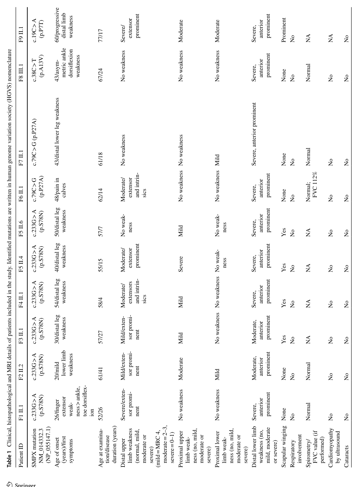

## Question

# Disease Characteristics Research Template

## Target Disease
- **Disease Name:** X-linked adult-onset distal myopathy 7 (MPD7), caused by missense variants in SMPX
- **MONDO ID:** MONDO:0024771 (if available)
- **Category:** Mendelian

## Research Objectives

Please provide a comprehensive research report on **X-linked adult-onset distal myopathy 7 (MPD7), caused by missense variants in SMPX** covering all of the
disease characteristics listed below. This report will be used to populate a disease knowledge
base entry. Be thorough and cite primary literature (PMID preferred) for all claims.

For each section, **suggested databases/resources** are listed. These are the first places
you should search for information on each topic.

---

### 1. Disease Information
> **Search first:** OMIM, Orphanet, ICD-10/ICD-11, MeSH, PubMed

- What is the disease? Provide a concise overview.
- What are the key identifiers? (OMIM, Orphanet, ICD-10/ICD-11, MeSH, Mondo)
- What are the common synonyms and alternative names?
- Is the information derived from individual patients (e.g., EHR) or aggregated disease-level resources?

### 2. Etiology

- **Disease Causal Factors**: What are the primary causes? (genetic, environmental, infectious, mechanistic)
- **Risk Factors**:
  > **Search first:** PubMed, Cochrane Library, UpToDate, clinical guidelines, ClinVar, ClinGen, GWAS Catalog, PheGenI, CTD, CDC, WHO, epidemiological databases
  - Genetic risk factors (causal variants, susceptibility loci, modifier genes)
  - Environmental risk factors (toxins, lifestyle, occupational exposures, age, sex, family history)
- **Protective Factors**:
  > **Search first:** PubMed, Cochrane Library, clinical trial databases, GWAS Catalog, gnomAD, WHO, CDC, nutrition databases
  - Genetic protective factors (protective variants, modifier alleles)
  - Environmental protective factors (diet, lifestyle, exposures that reduce risk)
- **Gene-Environment Interactions**: How do genetic and environmental factors interact to influence disease?
  > **Search first:** CTD, PubMed, PheGenI, GxE databases

### 3. Phenotypes
> **Search first:** HPO (Human Phenotype Ontology), OMIM, Orphanet, PubMed, clinicaltrials.gov, MedDRA, SNOMED CT, DECIPHER, LOINC

For each phenotype, provide:
- **Phenotype type**: symptoms, clinical signs, physical manifestations, behavioral changes, or laboratory abnormalities
  > For symptoms/signs: HPO, OMIM, Orphanet, PubMed
  > For behavioral changes: HPO, DSM, RDoC (Research Domain Criteria), PubMed
  > For laboratory abnormalities: LOINC, SNOMED CT, LabTests Online, PubMed
- **Phenotype characteristics**:
  > **Search first:** OMIM, Orphanet, HPO, PubMed
  - Age of symptom onset (neonatal, childhood, adult-onset, late-onset)
  - Symptom severity (mild, moderate, severe, variable)
  - Symptom progression (stable, progressive, episodic, fluctuating)
  - Frequency among affected individuals (percentage or qualitative)
- **Quality of life impact**: Effects on daily functioning and well-being (per-phenotype when possible)
  > **Search first:** EQ-5D database, SF-36, WHO QOL databases, PubMed
- Suggest HPO (Human Phenotype Ontology) terms for each phenotype

### 4. Genetic/Molecular Information

- **Causal Genes**: Gene mutations or chromosomal abnormalities responsible for disease (gene symbols, OMIM IDs)
  > **Search first:** OMIM, ClinVar, HGMD, Ensembl, NCBI Gene
- **Pathogenic Variants**:
  - Affected genes (gene symbols, HGNC IDs)
    > **Search first:** OMIM, NCBI Gene, Ensembl, HGNC, UniProt, GeneCards
  - Variant classification (pathogenic, likely pathogenic, VUS per ACMG/AMP guidelines)
    > **Search first:** ClinVar, ClinGen, ACMG/AMP guidelines, VarSome
  - Variant type/class (missense, frameshift, nonsense, splice-site, structural)
  - Allele frequency in population databases
    > **Search first:** gnomAD, 1000 Genomes, ExAC, TOPMed, dbSNP
  - Somatic vs germline origin
    > **Search first:** COSMIC (somatic), ClinVar, ICGC, TCGA
  - Functional consequences (loss of function, gain of function, dominant negative)
- **Modifier Genes**: Genes that modify disease severity or expression
- **Epigenetic Information**: DNA methylation, histone modifications, chromatin changes affecting disease
  > **Search first:** ENCODE, Roadmap Epigenomics, MethBase, DiseaseMeth
- **Chromosomal Abnormalities**: Large-scale genetic changes (aneuploidy, translocations, inversions)
  > **Search first:** DECIPHER, ClinVar, ECARUCA, UCSC Genome Browser

### 5. Environmental Information

- **Environmental Factors**: Non-genetic contributing factors (toxins, radiation, pollution, occupational exposure)
  > **Search first:** CTD (Comparative Toxicogenomics Database), TOXNET, PubMed, EPA databases
- **Lifestyle Factors**: Behavioral factors (smoking, diet, exercise, alcohol consumption)
  > **Search first:** CDC databases, WHO, PubMed, NHANES
- **Infectious Agents**: If applicable, pathogens causing or triggering disease (bacteria, viruses, fungi, parasites)
  > **Search first:** NCBI Taxonomy, ViPR, BV-BRC, MicrobeDB, GIDEON

### 6. Mechanism / Pathophysiology

**Present this section as an ordered causal chain first, then the detail below.**
Open with a numbered sequence of mechanistic steps running from the initiating
lesion (mutation, exposure, infection) to the clinical manifestation, one step per
line, each naming what it causes next. State the causal verb explicitly ("leads
to", "results in") and say where a step is inferred rather than demonstrated.
Where the mechanism branches, show the branch. The categories below are a
checklist of what to cover within those steps, not the organizing structure —
a step may draw on several of them, and a category may contribute to several
steps.

- **Molecular Pathways**: Specific signaling cascades or biochemical pathways involved (Wnt, MAPK, mTOR, PI3K-AKT, etc.)
  > **Search first:** KEGG, Reactome, WikiPathways, PathBank, BioCyc
- **Cellular Processes**: Cell-level mechanisms (apoptosis, autophagy, cell cycle dysregulation, inflammation, etc.)
  > **Search first:** Gene Ontology (GO), Reactome, KEGG, PubMed
- **Protein Dysfunction**: How protein structure or function is altered (misfolding, aggregation, loss of function, gain of function)
  > **Search first:** UniProt, PDB (Protein Data Bank), InterPro, Pfam, AlphaFold
- **Metabolic Changes**: Alterations in metabolic processes (energy metabolism, lipid metabolism, amino acid metabolism)
  > **Search first:** KEGG, BioCyc, HMDB (Human Metabolome Database), BRENDA
- **Immune System Involvement**: Role of immune response (autoimmunity, immunodeficiency, chronic inflammation)
  > **Search first:** ImmPort, Immunome Database, IEDB, Gene Ontology
- **Tissue Damage Mechanisms**: How tissues/ are injured (oxidative stress, ischemia, fibrosis, necrosis)
  > **Search first:** PubMed, Gene Ontology, Reactome
- **Biochemical Abnormalities**: Specific molecular defects (enzyme deficiencies, receptor dysfunction, ion channel defects)
  > **Search first:** BRENDA, UniProt, KEGG, OMIM, PubMed
- **Epigenetic Changes**: DNA methylation, histone modifications affecting gene expression in disease
  > **Search first:** ENCODE, Roadmap Epigenomics, MethBase, DiseaseMeth
- **Molecular Profiling** (if available):
  - Transcriptomics/gene expression changes
    > **Search first:** GEO (Gene Expression Omnibus), ArrayExpress, GTEx, Human Cell Atlas, SRA
  - Proteomics findings
    > **Search first:** PRIDE, ProteomeXchange, Human Protein Atlas, STRING, BioGRID
  - Metabolomics signatures
    > **Search first:** MetaboLights, Metabolomics Workbench, HMDB, METLIN
  - Lipidomics alterations
    > **Search first:** LIPID MAPS, SwissLipids, LipidHome, Metabolomics Workbench
  - Genomic structural features
    > **Search first:** UCSC Genome Browser, Ensembl, NCBI, dbVar, DGV
- **Advanced Technologies** (if applicable):
  - Single-cell analysis findings (cell-type specific mechanisms, cellular heterogeneity)
    > **Search first:** Human Cell Atlas, Single Cell Portal, GEO, CELLxGENE
  - Spatial transcriptomics findings
    > **Search first:** GEO, Spatial Research, Vizgen, 10x Genomics data
  - Multi-omics integration results
    > **Search first:** TCGA, ICGC, cBioPortal, LinkedOmics, PubMed
  - Functional genomics screens (CRISPR, RNAi)
    > **Search first:** DepMap, GenomeRNAi, PubMed, BioGRID ORCS

For each mechanism, describe:
- The causal chain from initial trigger to clinical manifestation
- Which mechanisms are upstream vs downstream
- What cell types and biological processes are involved
- Suggest GO terms for biological processes and CL terms for cell types

### 7. Anatomical Structures Affected

- **Organ Level**:
  - Primary organs directly affected
  - Secondary organ involvement (complications, secondary effects)
  - Body systems involved (cardiovascular, nervous, digestive, respiratory, endocrine, etc.)
  > **Search first:** Uberon, FMA (Foundational Model of Anatomy), OMIM, HPO, ICD-11, MeSH, SNOMED CT
- **Tissue and Cell Level**:
  - Specific tissue types affected (epithelial, connective, muscle, nervous)
  - Specific cell populations targeted (with Cell Ontology terms)
  > **Search first:** Uberon, Human Protein Atlas, Cell Ontology, Human Cell Atlas, CellMarker, PanglaoDB
- **Subcellular Level**:
  - Cellular compartments involved (mitochondria, nucleus, ER, lysosomes) (with GO Cellular Component terms)
  > **Search first:** Gene Ontology (Cellular Component), UniProt, Human Protein Atlas
- **Localization**:
  - Specific anatomical sites (with UBERON terms)
    > **Search first:** FMA, Uberon, NeuroNames (for brain), SNOMED CT
  - Lateralization (unilateral, bilateral, asymmetric)
    > **Search first:** HPO, clinical literature, imaging databases

### 8. Temporal Development

- **Onset**:
  - Typical age of onset (congenital, pediatric, adult, geriatric)
  - Onset pattern (acute, subacute, chronic, insidious)
  > **Search first:** OMIM, Orphanet, HPO, PubMed
- **Progression**:
  - Disease stages (early, intermediate, advanced, end-stage)
    > **Search first:** Cancer Staging Manual (AJCC), WHO classifications, PubMed
  - Progression rate (rapid, slow, variable)
  - Disease course pattern (episodic, relapsing-remitting, progressive, stable)
  - Disease duration (self-limited, chronic lifelong)
  > **Search first:** Disease registries, longitudinal cohort databases, natural history studies, PubMed, Orphanet, OMIM
- **Patterns**:
  - Remission patterns (spontaneous, treatment-induced)
    > **Search first:** Clinical trial databases, disease registries, PubMed
  - Critical periods (time windows of vulnerability or opportunity for intervention)
    > **Search first:** PubMed, developmental biology databases, clinical guidelines

### 9. Inheritance and Population

- **Epidemiology**:
  - Prevalence (cases per 100,000 at given time)
  - Incidence (new cases per 100,000 per year)
  > **Search first:** Orphanet, CDC, WHO, GBD (Global Burden of Disease), national registries, SEER, disease registries
- **For Genetic Etiology**:
  - Inheritance pattern (AD, AR, X-linked, mitochondrial, multifactorial, polygenic)
    > **Search first:** OMIM, Orphanet, ClinVar, GTR (Genetic Testing Registry)
  - Penetrance (complete, incomplete, age-dependent)
    > **Search first:** ClinVar, OMIM, PubMed, ClinGen
  - Expressivity (variable, consistent)
    > **Search first:** OMIM, ClinVar, PubMed
  - Genetic anticipation (increasing severity in successive generations)
    > **Search first:** OMIM, PubMed (especially for repeat expansion disorders)
  - Germline mosaicism
    > **Search first:** ClinVar, OMIM, genetic counseling literature, PubMed
  - Founder effects (population-specific mutations)
    > **Search first:** gnomAD, population genetics databases, PubMed
  - Consanguinity role
    > **Search first:** OMIM, population studies, genetic counseling resources
  - Carrier frequency
    > **Search first:** gnomAD, carrier screening databases, GeneReviews, GTR
- **Population Demographics**:
  - Affected populations (ethnic or demographic groups with higher prevalence)
    > **Search first:** gnomAD, 1000 Genomes, PAGE Study, PubMed, population registries
  - Geographic distribution (endemic areas, regional variation)
    > **Search first:** WHO, CDC, GBD, Orphanet, geographic epidemiology databases
  - Geographic distribution of specific variants
  - Sex ratio (male:female)
    > **Search first:** Disease registries, OMIM, PubMed, epidemiological databases
  - Age distribution of affected individuals
    > **Search first:** CDC, disease registries, SEER, Orphanet

### 10. Diagnostics

- **Clinical Tests**:
  - Laboratory tests (blood, urine, tissue chemistry, specific enzyme assays)
    > **Search first:** LOINC, LabTests Online, PubMed
  - Biomarkers (proteins, metabolites, genetic markers, circulating biomarkers)
    > **Search first:** FDA Biomarker List, BEST (Biomarkers, EndpointS, and other Tools), PubMed
  - Imaging studies (X-ray, CT, MRI, PET, ultrasound)
    > **Search first:** RadLex, DICOM, Radiopaedia, imaging databases
  - Functional tests (pulmonary function, cardiac stress tests)
    > **Search first:** LOINC, clinical guidelines, PubMed
  - Electrophysiology (EEG, EMG, ECG, nerve conduction studies)
    > **Search first:** LOINC, clinical neurophysiology databases, PubMed
  - Biopsy findings (histopathology, immunohistochemistry)
    > **Search first:** SNOMED CT, College of American Pathologists resources, PubMed
  - Pathology findings (microscopic examination)
    > **Search first:** SNOMED CT, Digital Pathology databases, PubMed
- **Genetic Testing**:
  > **Search first:** GTR (Genetic Testing Registry), GeneReviews, ClinGen
  - Overview of recommended genetic testing approach
  - Whole genome sequencing (WGS) utility
    > **Search first:** GTR, ClinVar, GEL (Genomics England), gnomAD
  - Whole exome sequencing (WES) utility
    > **Search first:** GTR, ClinVar, OMIM, GeneMatcher
  - Gene panels (which panels, which genes)
    > **Search first:** GTR, ClinVar, laboratory-specific databases
  - Single gene testing
    > **Search first:** GTR, ClinVar, OMIM, GeneReviews
  - Chromosomal microarray (CMA)
    > **Search first:** DECIPHER, ClinVar, dbVar, ECARUCA
  - Karyotyping
    > **Search first:** Chromosome Abnormality Database, ClinVar, cytogenetics resources
  - FISH
    > **Search first:** ClinVar, cytogenetics databases, PubMed
  - Mitochondrial DNA testing
    > **Search first:** MITOMAP, MSeqDR, ClinVar, GTR
  - Repeat expansion testing
    > **Search first:** GTR, ClinVar, repeat expansion databases, PubMed
- **Omics-Based Diagnostics** (if applicable):
  - RNA sequencing / transcriptomics
    > **Search first:** GEO, ArrayExpress, GTEx, RNA-seq databases
  - Proteomics
    > **Search first:** PRIDE, ProteomeXchange, FDA Biomarker database
  - Metabolomics
    > **Search first:** MetaboLights, Metabolomics Workbench, HMDB
  - Epigenomics
    > **Search first:** GEO, ENCODE, Roadmap Epigenomics, MethBase
  - Liquid biopsy
    > **Search first:** COSMIC, ClinVar, liquid biopsy databases, PubMed
- **Clinical Criteria**:
  - Standardized diagnostic criteria (DSM, ICD, society guidelines)
    > **Search first:** DSM-5, ICD-11, clinical society guidelines, UpToDate
  - Differential diagnosis (other conditions to rule out, with distinguishing features)
    > **Search first:** DynaMed, UpToDate, clinical decision support systems
- **Screening**:
  - Screening methods for asymptomatic individuals (newborn screening, carrier screening, cascade screening)
    > **Search first:** ACMG recommendations, CDC newborn screening, GTR

### 11. Outcome/Prognosis

- **Survival and Mortality**:
  - Survival rate (5-year, 10-year, overall)
    > **Search first:** SEER, cancer registries, disease-specific registries, PubMed
  - Life expectancy (with and without treatment if applicable)
    > **Search first:** Orphanet, disease registries, actuarial databases, PubMed
  - Mortality rate
    > **Search first:** CDC, WHO, GBD, national mortality databases
  - Disease-specific mortality (deaths directly attributable to disease)
    > **Search first:** Disease registries, CDC Wonder, GBD, PubMed
- **Morbidity and Function**:
  - Morbidity (disease-related disability and health impacts)
    > **Search first:** GBD, WHO, disability databases, PubMed
  - Disability outcomes (long-term functional impairments)
    > **Search first:** ICF (International Classification of Functioning), disability registries
  - Quality of life measures (EQ-5D, SF-36, PROMIS, disease-specific tools)
    > **Search first:** EQ-5D database, SF-36, PROMIS, PubMed
- **Disease Course**:
  - Complications (secondary problems: infections, organ failure, etc.)
    > **Search first:** ICD codes, disease registries, clinical databases, PubMed
  - Recovery potential (likelihood and extent of recovery, with vs without treatment)
    > **Search first:** Natural history studies, rehabilitation databases, PubMed
- **Prediction**:
  - Prognostic factors (age, disease severity, biomarkers, treatment response)
    > **Search first:** Prognostic models databases, clinical calculators, PubMed
  - Prognostic biomarkers (molecular markers predicting disease course)
    > **Search first:** FDA Biomarker database, PubMed, cancer prognostic databases

### 12. Treatment

- **Pharmacotherapy**:
  - Pharmacological treatments (drug names, drug classes, mechanisms of action)
    > **Search first:** DrugBank, RxNorm, ATC classification, DailyMed, FDA databases
  - Pharmacogenomics (how genetic variants affect drug metabolism, efficacy, toxicity)
    > **Search first:** PharmGKB, CPIC (Clinical Pharmacogenetics), FDA Table of PGx Biomarkers
- **Advanced Therapeutics**:
  - Gene therapy (viral vectors, CRISPR, gene replacement, gene editing)
    > **Search first:** ClinicalTrials.gov, FDA gene therapy database, ASGCT resources
  - Cell therapy (stem cell transplant, CAR-T, cellular therapeutics)
    > **Search first:** ClinicalTrials.gov, FDA cell therapy database, FACT standards
  - RNA-based therapies (ASOs, siRNA, mRNA therapies)
    > **Search first:** ClinicalTrials.gov, FDA approvals, PubMed
  - Targeted therapies (treatments directed at specific molecular targets)
    > **Search first:** My Cancer Genome, OncoKB, ClinicalTrials.gov, FDA approvals
  - Immunotherapies (checkpoint inhibitors, monoclonal antibodies)
    > **Search first:** Cancer Immunotherapy Database, FDA approvals, ClinicalTrials.gov
- **Surgical and Interventional**:
  - Surgical interventions (types of surgery, timing, outcomes)
    > **Search first:** CPT codes, surgical registries, clinical guidelines, PubMed
- **Supportive and Rehabilitative**:
  - Supportive care (symptom management, pain control, nutrition)
    > **Search first:** Clinical guidelines, Cochrane Library, PubMed
  - Rehabilitation (physical therapy, occupational therapy, speech therapy)
    > **Search first:** Rehabilitation medicine databases, clinical guidelines, PubMed
- **Experimental**:
  - Experimental treatments in clinical trials (with NCT identifiers if available)
    > **Search first:** ClinicalTrials.gov, EU Clinical Trials Register, WHO ICTRP
- **Treatment Outcomes**:
  - Treatment response rates
    > **Search first:** Clinical trial databases, FDA reviews, systematic reviews, PubMed
  - Side effects and adverse events
    > **Search first:** FDA Adverse Event Reporting System (FAERS), MedWatch, PubMed
- **Treatment Strategy**:
  - Treatment algorithms (clinical pathways, decision trees)
    > **Search first:** Clinical practice guidelines, NCCN Guidelines, UpToDate
  - Combination therapies
    > **Search first:** ClinicalTrials.gov, treatment guidelines, PubMed
  - Personalized medicine approaches (genotype-guided treatment)
    > **Search first:** My Cancer Genome, CIViC, PharmGKB, precision medicine databases

For each treatment, suggest NCIT (NCI Thesaurus) clinical-intervention terms where applicable.

### 13. Prevention

- **Prevention Levels**:
  - Primary prevention (preventing disease occurrence: vaccination, risk factor modification)
    > **Search first:** CDC, WHO, USPSTF recommendations, Cochrane Library
  - Secondary prevention (early detection and treatment: screening programs, early intervention)
    > **Search first:** USPSTF, CDC screening guidelines, WHO
  - Tertiary prevention (preventing complications in those with disease)
    > **Search first:** Clinical guidelines, disease management protocols, PubMed
- **Immunization**: Vaccine strategies (if applicable)
  > **Search first:** CDC vaccine schedules, WHO immunization, FDA vaccine database
- **Screening and Early Detection**:
  - Screening programs (population-based: newborn screening, cancer screening)
    > **Search first:** CDC screening programs, USPSTF, cancer screening databases
  - Genetic screening (carrier screening, preimplantation genetic diagnosis, prenatal testing)
    > **Search first:** ACMG recommendations, ACOG guidelines, GTR
  - Risk stratification (identifying high-risk individuals for targeted prevention)
    > **Search first:** Risk prediction models, clinical calculators, PubMed
- **Behavioral Interventions**: Lifestyle modifications to reduce risk
  > **Search first:** CDC, WHO, behavioral intervention databases, Cochrane Library
- **Counseling**: Genetic counseling (risk assessment, family planning guidance)
  > **Search first:** NSGC resources, ACMG guidelines, GeneReviews
- **Public Health**:
  - Public health interventions (sanitation, vector control, health education)
    > **Search first:** CDC, WHO, public health databases, PubMed
  - Environmental interventions (reducing environmental risk factors)
    > **Search first:** EPA databases, WHO environmental health, PubMed
- **Prophylaxis**: Preventive medications or procedures
  > **Search first:** Clinical guidelines, FDA approvals, PubMed

### 14. Other Species / Natural Disease

- **Taxonomy**: Species affected (with NCBI Taxon identifiers)
  > **Search first:** NCBI Taxonomy
- **Breed**: Specific breeds affected (with VBO identifiers if applicable)
  > **Search first:** VBO (Vertebrate Breed Ontology)
- **Gene**: Orthologous genes in other species (with NCBI Gene IDs)
  > **Search first:** NCBI Gene
- **Natural Disease**:
  - Naturally occurring disease in other species (companion animals, wildlife)
    > **Search first:** OMIA (Online Mendelian Inheritance in Animals), VetCompass, PubMed
  - Veterinary relevance and importance in animal health
    > **Search first:** OMIA, veterinary databases, PubMed
- **Comparative Biology**:
  - Comparative pathology (similarities and differences across species)
    > **Search first:** OMIA, comparative pathology databases, PubMed
  - Evolutionary conservation of disease mechanisms
    > **Search first:** HomoloGene, OrthoMCL, Alliance of Genome Resources
- **Transmission** (if applicable):
  - Zoonotic potential
    > **Search first:** CDC zoonotic diseases, WHO zoonoses, GIDEON
  - Cross-species susceptibility
    > **Search first:** NCBI Taxonomy, veterinary databases, PubMed

### 15. Model Organisms

- **Model Types**:
  - Model organism type (mammalian, invertebrate, cellular, in vitro)
    > **Search first:** Alliance of Genome Resources, model organism databases
  - Specific model systems (mouse, rat, zebrafish, Drosophila, C. elegans, yeast, cell lines, organoids, iPSCs)
    > **Search first:** MGI, RGD, ZFIN, FlyBase, WormBase, SGD, ATCC, Cellosaurus
  - Induced models (drug treatment, surgical intervention, environmental manipulation)
    > **Search first:** MGI, model organism databases, PubMed
- **Genetic Models**:
  - Types available (knockout, knock-in, transgenic, conditional, humanized)
    > **Search first:** MGI, IMPC, KOMP, EuMMCR, IMSR
- **Model Characteristics**:
  - Phenotype recapitulation (how well model reproduces human disease features)
    > **Search first:** Model organism databases, comparative studies, PubMed
  - Model limitations (aspects of human disease not captured)
    > **Search first:** Model organism databases, PubMed, review articles
- **Applications**:
  - Research applications (what aspects of disease can be studied)
    > **Search first:** Model organism databases, PubMed
- **Resources**:
  - Model databases
    > **Search first:** MGI, RGD, ZFIN, FlyBase, WormBase, IMSR, EMMA, MMRRC

---

## Citation Requirements

- Cite primary literature (PMID preferred) for all mechanistic and clinical claims
- Prioritize recent reviews and landmark papers
- Include direct quotes from abstracts where possible to support key statements
- Distinguish evidence source types: human clinical, model organism, in vitro, computational

## Output Format

Structure your response as a comprehensive narrative organized by the sections above.
For each section, provide:
- Factual content with specific details (numbers, percentages, gene names, variant nomenclature)
- Ontology term suggestions (HPO, GO, CL, UBERON, CHEBI, NCIT, MONDO) where applicable
- Evidence citations with PMIDs
- Direct quotes from abstracts to support key claims
- Clear indication when information is not available or not applicable for this disease

This report will be used to populate a disease knowledge base entry with:
- Pathophysiology descriptions with causal chains
- Gene/protein annotations (HGNC, GO terms)
- Phenotype associations (HP terms) with frequencies
- Cell type involvement (CL terms)
- Anatomical locations (UBERON terms)
- Chemical entities (CHEBI terms)
- Treatment annotations (NCIT terms)
- Evidence items with PMIDs and exact abstract quotes
- Epidemiology, prognosis, diagnostic, and prevention information
- Animal model descriptions with phenotype recapitulation details

## Output

Question: You are an expert researcher providing comprehensive, well-cited information.

Provide detailed information focusing on:
1. Key concepts and definitions with current understanding
2. Recent developments and latest research (prioritize 2023-2024 sources)
3. Current applications and real-world implementations
4. Expert opinions and analysis from authoritative sources
5. Relevant statistics and data from recent studies

Format as a comprehensive research report with proper citations. Include URLs and publication dates where available.
Always prioritize recent, authoritative sources and provide specific citations for all major claims.

# Disease Characteristics Research Template

## Target Disease
- **Disease Name:** X-linked adult-onset distal myopathy 7 (MPD7), caused by missense variants in SMPX
- **MONDO ID:** MONDO:0024771 (if available)
- **Category:** Mendelian

## Research Objectives

Please provide a comprehensive research report on **X-linked adult-onset distal myopathy 7 (MPD7), caused by missense variants in SMPX** covering all of the
disease characteristics listed below. This report will be used to populate a disease knowledge
base entry. Be thorough and cite primary literature (PMID preferred) for all claims.

For each section, **suggested databases/resources** are listed. These are the first places
you should search for information on each topic.

---

### 1. Disease Information
> **Search first:** OMIM, Orphanet, ICD-10/ICD-11, MeSH, PubMed

- What is the disease? Provide a concise overview.
- What are the key identifiers? (OMIM, Orphanet, ICD-10/ICD-11, MeSH, Mondo)
- What are the common synonyms and alternative names?
- Is the information derived from individual patients (e.g., EHR) or aggregated disease-level resources?

### 2. Etiology

- **Disease Causal Factors**: What are the primary causes? (genetic, environmental, infectious, mechanistic)
- **Risk Factors**:
  > **Search first:** PubMed, Cochrane Library, UpToDate, clinical guidelines, ClinVar, ClinGen, GWAS Catalog, PheGenI, CTD, CDC, WHO, epidemiological databases
  - Genetic risk factors (causal variants, susceptibility loci, modifier genes)
  - Environmental risk factors (toxins, lifestyle, occupational exposures, age, sex, family history)
- **Protective Factors**:
  > **Search first:** PubMed, Cochrane Library, clinical trial databases, GWAS Catalog, gnomAD, WHO, CDC, nutrition databases
  - Genetic protective factors (protective variants, modifier alleles)
  - Environmental protective factors (diet, lifestyle, exposures that reduce risk)
- **Gene-Environment Interactions**: How do genetic and environmental factors interact to influence disease?
  > **Search first:** CTD, PubMed, PheGenI, GxE databases

### 3. Phenotypes
> **Search first:** HPO (Human Phenotype Ontology), OMIM, Orphanet, PubMed, clinicaltrials.gov, MedDRA, SNOMED CT, DECIPHER, LOINC

For each phenotype, provide:
- **Phenotype type**: symptoms, clinical signs, physical manifestations, behavioral changes, or laboratory abnormalities
  > For symptoms/signs: HPO, OMIM, Orphanet, PubMed
  > For behavioral changes: HPO, DSM, RDoC (Research Domain Criteria), PubMed
  > For laboratory abnormalities: LOINC, SNOMED CT, LabTests Online, PubMed
- **Phenotype characteristics**:
  > **Search first:** OMIM, Orphanet, HPO, PubMed
  - Age of symptom onset (neonatal, childhood, adult-onset, late-onset)
  - Symptom severity (mild, moderate, severe, variable)
  - Symptom progression (stable, progressive, episodic, fluctuating)
  - Frequency among affected individuals (percentage or qualitative)
- **Quality of life impact**: Effects on daily functioning and well-being (per-phenotype when possible)
  > **Search first:** EQ-5D database, SF-36, WHO QOL databases, PubMed
- Suggest HPO (Human Phenotype Ontology) terms for each phenotype

### 4. Genetic/Molecular Information

- **Causal Genes**: Gene mutations or chromosomal abnormalities responsible for disease (gene symbols, OMIM IDs)
  > **Search first:** OMIM, ClinVar, HGMD, Ensembl, NCBI Gene
- **Pathogenic Variants**:
  - Affected genes (gene symbols, HGNC IDs)
    > **Search first:** OMIM, NCBI Gene, Ensembl, HGNC, UniProt, GeneCards
  - Variant classification (pathogenic, likely pathogenic, VUS per ACMG/AMP guidelines)
    > **Search first:** ClinVar, ClinGen, ACMG/AMP guidelines, VarSome
  - Variant type/class (missense, frameshift, nonsense, splice-site, structural)
  - Allele frequency in population databases
    > **Search first:** gnomAD, 1000 Genomes, ExAC, TOPMed, dbSNP
  - Somatic vs germline origin
    > **Search first:** COSMIC (somatic), ClinVar, ICGC, TCGA
  - Functional consequences (loss of function, gain of function, dominant negative)
- **Modifier Genes**: Genes that modify disease severity or expression
- **Epigenetic Information**: DNA methylation, histone modifications, chromatin changes affecting disease
  > **Search first:** ENCODE, Roadmap Epigenomics, MethBase, DiseaseMeth
- **Chromosomal Abnormalities**: Large-scale genetic changes (aneuploidy, translocations, inversions)
  > **Search first:** DECIPHER, ClinVar, ECARUCA, UCSC Genome Browser

### 5. Environmental Information

- **Environmental Factors**: Non-genetic contributing factors (toxins, radiation, pollution, occupational exposure)
  > **Search first:** CTD (Comparative Toxicogenomics Database), TOXNET, PubMed, EPA databases
- **Lifestyle Factors**: Behavioral factors (smoking, diet, exercise, alcohol consumption)
  > **Search first:** CDC databases, WHO, PubMed, NHANES
- **Infectious Agents**: If applicable, pathogens causing or triggering disease (bacteria, viruses, fungi, parasites)
  > **Search first:** NCBI Taxonomy, ViPR, BV-BRC, MicrobeDB, GIDEON

### 6. Mechanism / Pathophysiology

**Present this section as an ordered causal chain first, then the detail below.**
Open with a numbered sequence of mechanistic steps running from the initiating
lesion (mutation, exposure, infection) to the clinical manifestation, one step per
line, each naming what it causes next. State the causal verb explicitly ("leads
to", "results in") and say where a step is inferred rather than demonstrated.
Where the mechanism branches, show the branch. The categories below are a
checklist of what to cover within those steps, not the organizing structure —
a step may draw on several of them, and a category may contribute to several
steps.

- **Molecular Pathways**: Specific signaling cascades or biochemical pathways involved (Wnt, MAPK, mTOR, PI3K-AKT, etc.)
  > **Search first:** KEGG, Reactome, WikiPathways, PathBank, BioCyc
- **Cellular Processes**: Cell-level mechanisms (apoptosis, autophagy, cell cycle dysregulation, inflammation, etc.)
  > **Search first:** Gene Ontology (GO), Reactome, KEGG, PubMed
- **Protein Dysfunction**: How protein structure or function is altered (misfolding, aggregation, loss of function, gain of function)
  > **Search first:** UniProt, PDB (Protein Data Bank), InterPro, Pfam, AlphaFold
- **Metabolic Changes**: Alterations in metabolic processes (energy metabolism, lipid metabolism, amino acid metabolism)
  > **Search first:** KEGG, BioCyc, HMDB (Human Metabolome Database), BRENDA
- **Immune System Involvement**: Role of immune response (autoimmunity, immunodeficiency, chronic inflammation)
  > **Search first:** ImmPort, Immunome Database, IEDB, Gene Ontology
- **Tissue Damage Mechanisms**: How tissues/ are injured (oxidative stress, ischemia, fibrosis, necrosis)
  > **Search first:** PubMed, Gene Ontology, Reactome
- **Biochemical Abnormalities**: Specific molecular defects (enzyme deficiencies, receptor dysfunction, ion channel defects)
  > **Search first:** BRENDA, UniProt, KEGG, OMIM, PubMed
- **Epigenetic Changes**: DNA methylation, histone modifications affecting gene expression in disease
  > **Search first:** ENCODE, Roadmap Epigenomics, MethBase, DiseaseMeth
- **Molecular Profiling** (if available):
  - Transcriptomics/gene expression changes
    > **Search first:** GEO (Gene Expression Omnibus), ArrayExpress, GTEx, Human Cell Atlas, SRA
  - Proteomics findings
    > **Search first:** PRIDE, ProteomeXchange, Human Protein Atlas, STRING, BioGRID
  - Metabolomics signatures
    > **Search first:** MetaboLights, Metabolomics Workbench, HMDB, METLIN
  - Lipidomics alterations
    > **Search first:** LIPID MAPS, SwissLipids, LipidHome, Metabolomics Workbench
  - Genomic structural features
    > **Search first:** UCSC Genome Browser, Ensembl, NCBI, dbVar, DGV
- **Advanced Technologies** (if applicable):
  - Single-cell analysis findings (cell-type specific mechanisms, cellular heterogeneity)
    > **Search first:** Human Cell Atlas, Single Cell Portal, GEO, CELLxGENE
  - Spatial transcriptomics findings
    > **Search first:** GEO, Spatial Research, Vizgen, 10x Genomics data
  - Multi-omics integration results
    > **Search first:** TCGA, ICGC, cBioPortal, LinkedOmics, PubMed
  - Functional genomics screens (CRISPR, RNAi)
    > **Search first:** DepMap, GenomeRNAi, PubMed, BioGRID ORCS

For each mechanism, describe:
- The causal chain from initial trigger to clinical manifestation
- Which mechanisms are upstream vs downstream
- What cell types and biological processes are involved
- Suggest GO terms for biological processes and CL terms for cell types

### 7. Anatomical Structures Affected

- **Organ Level**:
  - Primary organs directly affected
  - Secondary organ involvement (complications, secondary effects)
  - Body systems involved (cardiovascular, nervous, digestive, respiratory, endocrine, etc.)
  > **Search first:** Uberon, FMA (Foundational Model of Anatomy), OMIM, HPO, ICD-11, MeSH, SNOMED CT
- **Tissue and Cell Level**:
  - Specific tissue types affected (epithelial, connective, muscle, nervous)
  - Specific cell populations targeted (with Cell Ontology terms)
  > **Search first:** Uberon, Human Protein Atlas, Cell Ontology, Human Cell Atlas, CellMarker, PanglaoDB
- **Subcellular Level**:
  - Cellular compartments involved (mitochondria, nucleus, ER, lysosomes) (with GO Cellular Component terms)
  > **Search first:** Gene Ontology (Cellular Component), UniProt, Human Protein Atlas
- **Localization**:
  - Specific anatomical sites (with UBERON terms)
    > **Search first:** FMA, Uberon, NeuroNames (for brain), SNOMED CT
  - Lateralization (unilateral, bilateral, asymmetric)
    > **Search first:** HPO, clinical literature, imaging databases

### 8. Temporal Development

- **Onset**:
  - Typical age of onset (congenital, pediatric, adult, geriatric)
  - Onset pattern (acute, subacute, chronic, insidious)
  > **Search first:** OMIM, Orphanet, HPO, PubMed
- **Progression**:
  - Disease stages (early, intermediate, advanced, end-stage)
    > **Search first:** Cancer Staging Manual (AJCC), WHO classifications, PubMed
  - Progression rate (rapid, slow, variable)
  - Disease course pattern (episodic, relapsing-remitting, progressive, stable)
  - Disease duration (self-limited, chronic lifelong)
  > **Search first:** Disease registries, longitudinal cohort databases, natural history studies, PubMed, Orphanet, OMIM
- **Patterns**:
  - Remission patterns (spontaneous, treatment-induced)
    > **Search first:** Clinical trial databases, disease registries, PubMed
  - Critical periods (time windows of vulnerability or opportunity for intervention)
    > **Search first:** PubMed, developmental biology databases, clinical guidelines

### 9. Inheritance and Population

- **Epidemiology**:
  - Prevalence (cases per 100,000 at given time)
  - Incidence (new cases per 100,000 per year)
  > **Search first:** Orphanet, CDC, WHO, GBD (Global Burden of Disease), national registries, SEER, disease registries
- **For Genetic Etiology**:
  - Inheritance pattern (AD, AR, X-linked, mitochondrial, multifactorial, polygenic)
    > **Search first:** OMIM, Orphanet, ClinVar, GTR (Genetic Testing Registry)
  - Penetrance (complete, incomplete, age-dependent)
    > **Search first:** ClinVar, OMIM, PubMed, ClinGen
  - Expressivity (variable, consistent)
    > **Search first:** OMIM, ClinVar, PubMed
  - Genetic anticipation (increasing severity in successive generations)
    > **Search first:** OMIM, PubMed (especially for repeat expansion disorders)
  - Germline mosaicism
    > **Search first:** ClinVar, OMIM, genetic counseling literature, PubMed
  - Founder effects (population-specific mutations)
    > **Search first:** gnomAD, population genetics databases, PubMed
  - Consanguinity role
    > **Search first:** OMIM, population studies, genetic counseling resources
  - Carrier frequency
    > **Search first:** gnomAD, carrier screening databases, GeneReviews, GTR
- **Population Demographics**:
  - Affected populations (ethnic or demographic groups with higher prevalence)
    > **Search first:** gnomAD, 1000 Genomes, PAGE Study, PubMed, population registries
  - Geographic distribution (endemic areas, regional variation)
    > **Search first:** WHO, CDC, GBD, Orphanet, geographic epidemiology databases
  - Geographic distribution of specific variants
  - Sex ratio (male:female)
    > **Search first:** Disease registries, OMIM, PubMed, epidemiological databases
  - Age distribution of affected individuals
    > **Search first:** CDC, disease registries, SEER, Orphanet

### 10. Diagnostics

- **Clinical Tests**:
  - Laboratory tests (blood, urine, tissue chemistry, specific enzyme assays)
    > **Search first:** LOINC, LabTests Online, PubMed
  - Biomarkers (proteins, metabolites, genetic markers, circulating biomarkers)
    > **Search first:** FDA Biomarker List, BEST (Biomarkers, EndpointS, and other Tools), PubMed
  - Imaging studies (X-ray, CT, MRI, PET, ultrasound)
    > **Search first:** RadLex, DICOM, Radiopaedia, imaging databases
  - Functional tests (pulmonary function, cardiac stress tests)
    > **Search first:** LOINC, clinical guidelines, PubMed
  - Electrophysiology (EEG, EMG, ECG, nerve conduction studies)
    > **Search first:** LOINC, clinical neurophysiology databases, PubMed
  - Biopsy findings (histopathology, immunohistochemistry)
    > **Search first:** SNOMED CT, College of American Pathologists resources, PubMed
  - Pathology findings (microscopic examination)
    > **Search first:** SNOMED CT, Digital Pathology databases, PubMed
- **Genetic Testing**:
  > **Search first:** GTR (Genetic Testing Registry), GeneReviews, ClinGen
  - Overview of recommended genetic testing approach
  - Whole genome sequencing (WGS) utility
    > **Search first:** GTR, ClinVar, GEL (Genomics England), gnomAD
  - Whole exome sequencing (WES) utility
    > **Search first:** GTR, ClinVar, OMIM, GeneMatcher
  - Gene panels (which panels, which genes)
    > **Search first:** GTR, ClinVar, laboratory-specific databases
  - Single gene testing
    > **Search first:** GTR, ClinVar, OMIM, GeneReviews
  - Chromosomal microarray (CMA)
    > **Search first:** DECIPHER, ClinVar, dbVar, ECARUCA
  - Karyotyping
    > **Search first:** Chromosome Abnormality Database, ClinVar, cytogenetics resources
  - FISH
    > **Search first:** ClinVar, cytogenetics databases, PubMed
  - Mitochondrial DNA testing
    > **Search first:** MITOMAP, MSeqDR, ClinVar, GTR
  - Repeat expansion testing
    > **Search first:** GTR, ClinVar, repeat expansion databases, PubMed
- **Omics-Based Diagnostics** (if applicable):
  - RNA sequencing / transcriptomics
    > **Search first:** GEO, ArrayExpress, GTEx, RNA-seq databases
  - Proteomics
    > **Search first:** PRIDE, ProteomeXchange, FDA Biomarker database
  - Metabolomics
    > **Search first:** MetaboLights, Metabolomics Workbench, HMDB
  - Epigenomics
    > **Search first:** GEO, ENCODE, Roadmap Epigenomics, MethBase
  - Liquid biopsy
    > **Search first:** COSMIC, ClinVar, liquid biopsy databases, PubMed
- **Clinical Criteria**:
  - Standardized diagnostic criteria (DSM, ICD, society guidelines)
    > **Search first:** DSM-5, ICD-11, clinical society guidelines, UpToDate
  - Differential diagnosis (other conditions to rule out, with distinguishing features)
    > **Search first:** DynaMed, UpToDate, clinical decision support systems
- **Screening**:
  - Screening methods for asymptomatic individuals (newborn screening, carrier screening, cascade screening)
    > **Search first:** ACMG recommendations, CDC newborn screening, GTR

### 11. Outcome/Prognosis

- **Survival and Mortality**:
  - Survival rate (5-year, 10-year, overall)
    > **Search first:** SEER, cancer registries, disease-specific registries, PubMed
  - Life expectancy (with and without treatment if applicable)
    > **Search first:** Orphanet, disease registries, actuarial databases, PubMed
  - Mortality rate
    > **Search first:** CDC, WHO, GBD, national mortality databases
  - Disease-specific mortality (deaths directly attributable to disease)
    > **Search first:** Disease registries, CDC Wonder, GBD, PubMed
- **Morbidity and Function**:
  - Morbidity (disease-related disability and health impacts)
    > **Search first:** GBD, WHO, disability databases, PubMed
  - Disability outcomes (long-term functional impairments)
    > **Search first:** ICF (International Classification of Functioning), disability registries
  - Quality of life measures (EQ-5D, SF-36, PROMIS, disease-specific tools)
    > **Search first:** EQ-5D database, SF-36, PROMIS, PubMed
- **Disease Course**:
  - Complications (secondary problems: infections, organ failure, etc.)
    > **Search first:** ICD codes, disease registries, clinical databases, PubMed
  - Recovery potential (likelihood and extent of recovery, with vs without treatment)
    > **Search first:** Natural history studies, rehabilitation databases, PubMed
- **Prediction**:
  - Prognostic factors (age, disease severity, biomarkers, treatment response)
    > **Search first:** Prognostic models databases, clinical calculators, PubMed
  - Prognostic biomarkers (molecular markers predicting disease course)
    > **Search first:** FDA Biomarker database, PubMed, cancer prognostic databases

### 12. Treatment

- **Pharmacotherapy**:
  - Pharmacological treatments (drug names, drug classes, mechanisms of action)
    > **Search first:** DrugBank, RxNorm, ATC classification, DailyMed, FDA databases
  - Pharmacogenomics (how genetic variants affect drug metabolism, efficacy, toxicity)
    > **Search first:** PharmGKB, CPIC (Clinical Pharmacogenetics), FDA Table of PGx Biomarkers
- **Advanced Therapeutics**:
  - Gene therapy (viral vectors, CRISPR, gene replacement, gene editing)
    > **Search first:** ClinicalTrials.gov, FDA gene therapy database, ASGCT resources
  - Cell therapy (stem cell transplant, CAR-T, cellular therapeutics)
    > **Search first:** ClinicalTrials.gov, FDA cell therapy database, FACT standards
  - RNA-based therapies (ASOs, siRNA, mRNA therapies)
    > **Search first:** ClinicalTrials.gov, FDA approvals, PubMed
  - Targeted therapies (treatments directed at specific molecular targets)
    > **Search first:** My Cancer Genome, OncoKB, ClinicalTrials.gov, FDA approvals
  - Immunotherapies (checkpoint inhibitors, monoclonal antibodies)
    > **Search first:** Cancer Immunotherapy Database, FDA approvals, ClinicalTrials.gov
- **Surgical and Interventional**:
  - Surgical interventions (types of surgery, timing, outcomes)
    > **Search first:** CPT codes, surgical registries, clinical guidelines, PubMed
- **Supportive and Rehabilitative**:
  - Supportive care (symptom management, pain control, nutrition)
    > **Search first:** Clinical guidelines, Cochrane Library, PubMed
  - Rehabilitation (physical therapy, occupational therapy, speech therapy)
    > **Search first:** Rehabilitation medicine databases, clinical guidelines, PubMed
- **Experimental**:
  - Experimental treatments in clinical trials (with NCT identifiers if available)
    > **Search first:** ClinicalTrials.gov, EU Clinical Trials Register, WHO ICTRP
- **Treatment Outcomes**:
  - Treatment response rates
    > **Search first:** Clinical trial databases, FDA reviews, systematic reviews, PubMed
  - Side effects and adverse events
    > **Search first:** FDA Adverse Event Reporting System (FAERS), MedWatch, PubMed
- **Treatment Strategy**:
  - Treatment algorithms (clinical pathways, decision trees)
    > **Search first:** Clinical practice guidelines, NCCN Guidelines, UpToDate
  - Combination therapies
    > **Search first:** ClinicalTrials.gov, treatment guidelines, PubMed
  - Personalized medicine approaches (genotype-guided treatment)
    > **Search first:** My Cancer Genome, CIViC, PharmGKB, precision medicine databases

For each treatment, suggest NCIT (NCI Thesaurus) clinical-intervention terms where applicable.

### 13. Prevention

- **Prevention Levels**:
  - Primary prevention (preventing disease occurrence: vaccination, risk factor modification)
    > **Search first:** CDC, WHO, USPSTF recommendations, Cochrane Library
  - Secondary prevention (early detection and treatment: screening programs, early intervention)
    > **Search first:** USPSTF, CDC screening guidelines, WHO
  - Tertiary prevention (preventing complications in those with disease)
    > **Search first:** Clinical guidelines, disease management protocols, PubMed
- **Immunization**: Vaccine strategies (if applicable)
  > **Search first:** CDC vaccine schedules, WHO immunization, FDA vaccine database
- **Screening and Early Detection**:
  - Screening programs (population-based: newborn screening, cancer screening)
    > **Search first:** CDC screening programs, USPSTF, cancer screening databases
  - Genetic screening (carrier screening, preimplantation genetic diagnosis, prenatal testing)
    > **Search first:** ACMG recommendations, ACOG guidelines, GTR
  - Risk stratification (identifying high-risk individuals for targeted prevention)
    > **Search first:** Risk prediction models, clinical calculators, PubMed
- **Behavioral Interventions**: Lifestyle modifications to reduce risk
  > **Search first:** CDC, WHO, behavioral intervention databases, Cochrane Library
- **Counseling**: Genetic counseling (risk assessment, family planning guidance)
  > **Search first:** NSGC resources, ACMG guidelines, GeneReviews
- **Public Health**:
  - Public health interventions (sanitation, vector control, health education)
    > **Search first:** CDC, WHO, public health databases, PubMed
  - Environmental interventions (reducing environmental risk factors)
    > **Search first:** EPA databases, WHO environmental health, PubMed
- **Prophylaxis**: Preventive medications or procedures
  > **Search first:** Clinical guidelines, FDA approvals, PubMed

### 14. Other Species / Natural Disease

- **Taxonomy**: Species affected (with NCBI Taxon identifiers)
  > **Search first:** NCBI Taxonomy
- **Breed**: Specific breeds affected (with VBO identifiers if applicable)
  > **Search first:** VBO (Vertebrate Breed Ontology)
- **Gene**: Orthologous genes in other species (with NCBI Gene IDs)
  > **Search first:** NCBI Gene
- **Natural Disease**:
  - Naturally occurring disease in other species (companion animals, wildlife)
    > **Search first:** OMIA (Online Mendelian Inheritance in Animals), VetCompass, PubMed
  - Veterinary relevance and importance in animal health
    > **Search first:** OMIA, veterinary databases, PubMed
- **Comparative Biology**:
  - Comparative pathology (similarities and differences across species)
    > **Search first:** OMIA, comparative pathology databases, PubMed
  - Evolutionary conservation of disease mechanisms
    > **Search first:** HomoloGene, OrthoMCL, Alliance of Genome Resources
- **Transmission** (if applicable):
  - Zoonotic potential
    > **Search first:** CDC zoonotic diseases, WHO zoonoses, GIDEON
  - Cross-species susceptibility
    > **Search first:** NCBI Taxonomy, veterinary databases, PubMed

### 15. Model Organisms

- **Model Types**:
  - Model organism type (mammalian, invertebrate, cellular, in vitro)
    > **Search first:** Alliance of Genome Resources, model organism databases
  - Specific model systems (mouse, rat, zebrafish, Drosophila, C. elegans, yeast, cell lines, organoids, iPSCs)
    > **Search first:** MGI, RGD, ZFIN, FlyBase, WormBase, SGD, ATCC, Cellosaurus
  - Induced models (drug treatment, surgical intervention, environmental manipulation)
    > **Search first:** MGI, model organism databases, PubMed
- **Genetic Models**:
  - Types available (knockout, knock-in, transgenic, conditional, humanized)
    > **Search first:** MGI, IMPC, KOMP, EuMMCR, IMSR
- **Model Characteristics**:
  - Phenotype recapitulation (how well model reproduces human disease features)
    > **Search first:** Model organism databases, comparative studies, PubMed
  - Model limitations (aspects of human disease not captured)
    > **Search first:** Model organism databases, PubMed, review articles
- **Applications**:
  - Research applications (what aspects of disease can be studied)
    > **Search first:** Model organism databases, PubMed
- **Resources**:
  - Model databases
    > **Search first:** MGI, RGD, ZFIN, FlyBase, WormBase, IMSR, EMMA, MMRRC

---

## Citation Requirements

- Cite primary literature (PMID preferred) for all mechanistic and clinical claims
- Prioritize recent reviews and landmark papers
- Include direct quotes from abstracts where possible to support key statements
- Distinguish evidence source types: human clinical, model organism, in vitro, computational

## Output Format

Structure your response as a comprehensive narrative organized by the sections above.
For each section, provide:
- Factual content with specific details (numbers, percentages, gene names, variant nomenclature)
- Ontology term suggestions (HPO, GO, CL, UBERON, CHEBI, NCIT, MONDO) where applicable
- Evidence citations with PMIDs
- Direct quotes from abstracts to support key claims
- Clear indication when information is not available or not applicable for this disease

This report will be used to populate a disease knowledge base entry with:
- Pathophysiology descriptions with causal chains
- Gene/protein annotations (HGNC, GO terms)
- Phenotype associations (HP terms) with frequencies
- Cell type involvement (CL terms)
- Anatomical locations (UBERON terms)
- Chemical entities (CHEBI terms)
- Treatment annotations (NCIT terms)
- Evidence items with PMIDs and exact abstract quotes
- Epidemiology, prognosis, diagnostic, and prevention information
- Animal model descriptions with phenotype recapitulation details

# X-linked adult-onset distal myopathy 7 (MPD7): comprehensive disease-characteristics report

## Executive summary and evidence limits

SMPX-related MPD7 is an ultra-rare, late-onset hereditary inclusion myopathy caused by specific **missense** variants in **SMPX**. The defining 2021 study reported only **10 affected people from nine families in five countries**. Its core phenotype was adult-onset, slowly progressive weakness affecting distal muscles more than proximal muscles, characteristic lower-leg fatty replacement, rimmed vacuoles, and SMPX-containing sarcoplasmic inclusions. Walking remained preserved over decades. The evidence supports toxic protein aggregation—a missense **gain-of-function** mechanism—rather than the loss-of-function mechanism responsible for SMPX-related nonsyndromic hearing loss. (johari2021missensemutationsin pages 1-2, johari2021missensemutationsin pages 9-11, johari2021missensemutationsin pages 13-15)

No prevalence study, prospective natural-history cohort, formal diagnostic criteria, validated biomarker, disease-specific quality-of-life study, therapy, or interventional clinical trial was identified. Consequently, percentages below generally describe the original ten-person cohort and must not be interpreted as population frequencies.

| Knowledge-base field | Curated finding | Evidence / confidence |
|---|---|---|
| Disease concept / MONDO | **X-linked adult-onset distal myopathy 7 (MPD7)**; SMPX-related distal myopathy with protein inclusions. **MONDO:0024771** is the supplied identifier. A disease-specific OMIM or Orphanet identifier was not verified and should not be invented. | Disease name is supported by the defining human study; MONDO identifier requires independent database validation. (johari2021missensemutationsin pages 1-2) |
| Human evidence base | Defining cohort: **10 affected individuals from 9 families in 5 countries**. Four missense variants were identified. Most probands appeared sporadic because of late onset and X-linked transmission. | Primary human clinical, genetic, imaging, pathological, and functional evidence; cohort remains very small. (johari2021missensemutationsin pages 1-2, johari2021missensemutationsin pages 9-11) |
| Causal gene / protein | **SMPX** (small muscle protein, X-linked), encoding an **88-amino-acid, approximately 9-kDa proline-rich protein**, also called **Chisel/CSL**. It is enriched in skeletal and cardiac muscle, especially slow fibers, and localizes to costameric/intermyofibrillar regions flanking the Z-disc. | Human expression and experimental localization evidence; exact HGNC/OMIM gene identifiers were not verified in the retrieved sources. (johari2021missensemutationsin pages 1-2, eftestøl2014overexpressionofsmpx pages 4-5, eftestøl2014overexpressionofsmpx pages 1-2) |
| Pathogenic variant 1 | **NM_014332.3:c.19C>A; NP_055147.1:p.Pro7Thr (p.P7T)**. Reported in Finnish family F9; gnomAD frequency in the 2021 study was **2.92 × 10⁻⁵ (6/205,256 alleles)**. Associated with very late onset and strong aggregation/low-solubility effects. | Disease-associated missense variant; study applied ACMG/AMP methods, but its exact final ClinVar/ACMG classification was not verified. (johari2021missensemutationsin pages 2-3, johari2021missensemutationsin pages 9-11, johari2021missensemutationsin pages 11-13) |
| Pathogenic variant 2 | **NM_014332.3:c.38C>T; NP_055147.1:p.Ala13Val (p.A13V)**, reported in a German family. It markedly increased predicted aggregation propensity and reduced experimental protein solubility. | Disease-associated missense variant with functional evidence; current ClinVar classification and contemporary population frequency were not independently verified. (johari2021missensemutationsin pages 3-4, johari2021missensemutationsin pages 9-11, johari2021missensemutationsin pages 11-13) |
| Pathogenic variant 3 | **NM_014332.3:c.79C>G; NP_055147.1:p.Pro27Ala (p.P27A)**, reported in two French families sharing a **19.79-Mb/25.5-cM haplotype**, estimated at approximately **8 generations/200 years**. | Founder and segregation evidence; current ClinVar classification and population frequency were not independently verified. (johari2021missensemutationsin pages 2-3, johari2021missensemutationsin pages 9-11) |
| Pathogenic variant 4 | **NM_014332.3:c.233G>A; NP_055147.1:p.Ser78Asn (p.S78N)**, found in families F1–F5 with Maltese ancestry. Families F1–F2 shared a **5.35-Mb/8.07-cM haplotype**, estimated at approximately **25 generations/625 years**. | Strong recurrent/founder evidence plus a smaller but significant solubility effect; current ClinVar classification was not independently verified. (johari2021missensemutationsin pages 2-3, johari2021missensemutationsin pages 9-11, johari2021missensemutationsin pages 13-15) |
| Inheritance | **X-linked**, with disease reported principally in hemizygous adult males. The most plausible model is a **dominant toxic gain of function at the protein level**, rather than the loss-of-function mechanism causing SMPX-related hearing loss. Whether the clinical label should be “X-linked dominant” or “X-linked recessive” remains inconsistently represented; an **autosomal-dominant** designation in a 2024 review table is incompatible with the gene’s X-chromosomal location and primary pedigrees. Female penetrance is not established. | X-linkage and gain of function are strongly supported; formal penetrance and affected-female data are insufficient. (johari2021missensemutationsin pages 2-3, johari2021missensemutationsin pages 13-15, rantaaho2024currentadvanceon pages 3-5) |
| Onset / course | Adult onset, **20–60 years** in the defining cohort; usually insidious onset in the third to fifth decades. Weakness progresses **slowly over decades**. All 10 reported patients remained ambulant, including the oldest patient at approximately **80 years**. | Primary human natural-history evidence, but no prospective longitudinal cohort exists. (johari2021missensemutationsin pages 3-4, johari2021missensemutationsin pages 9-11, johari2021missensemutationsin media 9b7e5008) |
| Cardinal phenotype | Distal-predominant skeletal-muscle weakness: early **finger-extensor**, ankle-dorsiflexor/anterior lower-leg, and intrinsic hand involvement, followed by calf and later proximal/axial involvement. Distal weakness generally exceeds proximal weakness. | Consistent phenotype across the original cohort; precise percentages beyond 10/10 adult-onset progressive myopathy should be treated cautiously. (johari2021missensemutationsin pages 3-4, johari2021missensemutationsin pages 9-11, johari2021missensemutationsin pages 11-13) |
| Muscle MRI | Characteristic sequence of fatty replacement: **anterior-compartment muscles of the lower legs**, then **medial gastrocnemius and soleus**, with very late thigh involvement preferentially affecting **hamstrings more than quadriceps**. Paraspinal involvement was documented in at least one imaged patient. | Lower-limb MRI was available for **8 patients**; shoulder/upper-limb imaging for 2. (johari2021missensemutationsin pages 2-3, johari2021missensemutationsin pages 4-6, johari2021missensemutationsin pages 9-11) |
| CK / EMG | CK was normal to mildly elevated, approximately **1–2.5× the upper limit of normal**. Needle EMG was predominantly **myopathic**, with one mixed neurogenic–myopathic result. | Human cohort data; no validated circulating biomarker is available. (johari2021missensemutationsin pages 4-6, johari2021missensemutationsin media 9b7e5008) |
| Muscle biopsy / EM | Myopathic fiber-size variation, internal nuclei, **rimmed vacuoles**, and sarcoplasmic/subsarcolemmal inclusions positive for SMPX, p62/SQSTM1, ubiquitin, SMI-31, and vinculin. Some inclusions were Congo-red/Amytracker positive and amyloid-like. EM showed **1–5-µm nonbranching filamentous aggregates**, autophagic myeloid structures, cytoplasmic bodies, and irregular Z-disc alignment without major sarcomeric destruction. | Seven probands underwent biopsy; direct human pathological evidence is strong but not necessarily present at equal severity in every genotype or disease stage. (johari2021missensemutationsin pages 9-11, johari2021missensemutationsin pages 11-13, johari2021missensemutationsin pages 13-15) |
| Cardiac / respiratory / hearing | Echocardiography was normal in **9 tested patients**; no cardiomyopathy was reported. No hearing impairment was recorded, including in older affected men, distinguishing MPD7 missense alleles from SMPX loss-of-function hearing-loss alleles. Respiratory weakness was not a prominent feature; one reported FVC was **112% predicted**. | Reassuring but limited cross-sectional evidence; long-term surveillance remains reasonable because SMPX is expressed in heart and the cohort is small. (johari2021missensemutationsin pages 3-4, johari2021missensemutationsin pages 9-11, johari2021missensemutationsin pages 11-13) |
| Proposed mechanism | Missense variants increase SMPX aggregation propensity and reduce solubility, producing disease-specific protein inclusions and proteostasis stress. SMPX-positive inclusions recruit autophagy/myofibrillar-quality-control proteins, suggesting overload of **BAG3–HSPB8 chaperone-assisted selective autophagy**. Overexpressed SMPX can enter stress granules and delay their clearance, but mutant constructs were not dramatically different from wild type in stress-granule assays; therefore stress-granule causality remains **inferred/uncertain**. | Aggregation/solubility: demonstrated in vitro and concordant with human biopsy. CASA overload and stress-granule-mediated toxicity: plausible but not definitively proven. (johari2021missensemutationsin pages 9-11, johari2021missensemutationsin pages 11-13, johari2021missensemutationsin pages 13-15, johari2021missensemutationsin pages 16-17) |
| Epidemiology | Prevalence and incidence are unknown. Founder haplotypes suggest relative enrichment in **Maltese/Southern European and French** populations; p.Pro7Thr may represent a Northern European founder allele. No population-level registry estimate or carrier frequency is available. | Nine families cannot support a population prevalence estimate. (johari2021missensemutationsin pages 9-11, johari2021missensemutationsin pages 13-15) |
| Diagnosis | Suspect in an adult—especially a male—with slowly progressive finger-extensor/anterior-leg weakness, mild CK elevation, characteristic MRI, and rimmed-vacuolar or myofibrillar-like inclusions. Confirm with sequencing that adequately covers **SMPX**—distal-myopathy/myofibrillar-myopathy panel, exome/genome sequencing, or single-gene sequencing—followed by segregation and ACMG/AMP interpretation. Biopsy is supportive, not independently diagnostic. | SMPX was discovered by exome/panel sequencing and Sanger confirmation. No formal consensus diagnostic criteria exist. (johari2021missensemutationsin pages 2-3, johari2021missensemutationsin pages 9-11, johari2021moleculargeneticsof pages 13-20) |
| Treatment / trials | No disease-modifying pharmacotherapy, gene/RNA/cell therapy, or SMPX-myopathy clinical trial was identified. Current care is supportive: individualized physical and occupational therapy, orthoses and mobility aids, fall prevention, contracture management, and periodic respiratory/cardiac assessment. | Supportive management is extrapolated from hereditary-myopathy practice; MPD7-specific response rates and adverse-event data are unavailable. |
| Major evidence gaps | No reliable prevalence/incidence, penetrance estimate, female natural history, prospective progression data, validated biomarker, genotype–phenotype model, patient-reported quality-of-life study, stable mammalian missense knock-in model, patient-derived iPSC/organoid model, MPD7-specific transcriptomics/proteomics/metabolomics, or interventional trial. A 2024 report of SMPX-related scapuloperoneal/myofibrillar myopathy may expand the phenotype, but full details were not available for verification. | These gaps substantially limit frequency estimates, prognostication, variant classification, and therapeutic development. (johari2021missensemutationsin pages 1-2, diana2023theinvivoimpact pages 57-62) |

*Table: Concise evidence table covering the defining cohort, variants, phenotype, pathology, mechanism, diagnosis, and management of SMPX-related MPD7. Unverified identifiers and mechanistic inferences are explicitly marked.*

## 1. Disease information

### Definition and nomenclature

MPD7 is a Mendelian distal myopathy in which weakness begins in adult life, commonly in finger extensors or ankle dorsiflexors, and spreads slowly to other distal and subsequently proximal or axial muscles. It is also appropriately described as **SMPX-related distal myopathy with protein inclusions**, **SMPX-related rimmed-vacuolar distal myopathy**, or **X-linked adult-onset distal myopathy**. A 2024 expert review emphasized that SMPX was first associated with skeletal-muscle disease in 2021 and remains one of the newest distal-myopathy genes. (rantaaho2024currentadvanceon pages 2-3, johari2021moleculargeneticsof pages 13-20)

**Identifiers and classifications**

- **MONDO:** MONDO:0024771, as supplied in the request; this identifier was not independently exposed by the retrieved sources.
- **Gene:** *SMPX*, small muscle protein, X-linked; synonyms include **Chisel** and **CSL**. The protein is 88 amino acids and approximately 9 kDa. (johari2021missensemutationsin pages 1-2)
- **Disease OMIM/Orphanet:** no disease-specific number could be verified from the retrieved literature. OMIM **300066** appearing in the primary article denotes SMPX-related X-linked deafness, not MPD7, and should not be assigned to the myopathy. (johari2021missensemutationsin pages 11-13)
- **ICD-10/ICD-11 and MeSH:** no MPD7-specific code or heading was identified. Broad coding would fall under hereditary/other specified myopathy or muscular-dystrophy categories, depending on the coding system and jurisdiction.

The evidence is **aggregated disease-level research assembled from individual study participants**, not routine EHR-derived evidence. The defining cohort combined clinical records, family studies, imaging, biopsy, sequencing, and cell experiments. (johari2021missensemutationsin pages 2-3, johari2021missensemutationsin pages 9-11)

## 2. Etiology, risk, and protective factors

### Causal factor

The established initiating lesions are germline hemizygous SMPX missense variants. Four variants were reported using transcript **NM_014332.3** and protein **NP_055147.1**:

1. c.19C>A, p.Pro7Thr;
2. c.38C>T, p.Ala13Val;
3. c.79C>G, p.Pro27Ala;
4. c.233G>A, p.Ser78Asn. (johari2021missensemutationsin pages 2-3, johari2021missensemutationsin pages 9-11)

Unlike truncating/splice-disrupting SMPX alleles that cause hearing loss through reduced function, the myopathy-associated missense alleles appear to confer aggregation-prone toxic gain of function. (johari2021missensemutationsin pages 13-15)

### Risk factors

- **Genetic:** being a hemizygous male carrying a disease-associated missense allele is the only established individual risk factor. Family history may be absent: most probands appeared sporadic because transmission is X-linked and onset is late. (johari2021missensemutationsin pages 9-11)
- **Age:** risk of clinical expression is strongly age dependent; observed onset was 20–60 years.
- **Ancestry/founder background:** p.Ser78Asn occurred in Maltese-ancestry families and p.Pro27Ala in two French families. p.Pro7Thr may be enriched in Northern Europe. These are population-genetic observations, not environmental risks. (johari2021missensemutationsin pages 9-11, johari2021missensemutationsin pages 13-15)
- **Sex/female risk:** female penetrance is unknown. The original clinical series principally documents hemizygous men and does not establish a female natural history.

No susceptibility loci, modifier genes, anticipation, consanguinity effect, environmental toxin, infection, occupational exposure, diet, smoking, alcohol, exercise exposure, or gene–environment interaction has been demonstrated. Likewise, there are no established genetic or environmental protective factors. Given SMPX's proposed mechanosensitive role, cumulative mechanical stress is biologically conceivable but remains untested and should not be entered as a causal exposure.

## 3. Phenotypes

### Core human phenotype

The ten reported patients all remained ambulant; onset ranged from **20 to 60 years**, and examination ages extended into the late seventies. Weakness progressed over years to decades. The oldest reported patient retained walking capacity at approximately age 80. (johari2021missensemutationsin pages 9-11, johari2021missensemutationsin media 9b7e5008)

| Phenotype | Characterization and observed frequency | Suggested HPO term |
|---|---|---|
| Adult-onset muscle weakness | 10/10 in the defining cohort; chronic and insidious | Adult onset, HP:0003581; Muscle weakness, HP:0001324 |
| Distal-predominant weakness | Characteristic; distal generally exceeded proximal involvement | Distal muscle weakness, HP:0002460 |
| Finger-extensor/hand weakness | Frequent early manifestation; intrinsic hand involvement may follow | Finger extensor weakness, HP:0009099; Hand muscle weakness, HP:0003390 |
| Ankle dorsiflexor/anterior-leg weakness | Cardinal early lower-limb manifestation; often severe later | Foot dorsiflexor weakness, HP:0009053 |
| Calf involvement | Medial gastrocnemius and soleus affected after anterior compartment | Lower-limb muscle weakness, HP:0007340 |
| Proximal weakness | Usually later and milder than distal disease; variable | Proximal muscle weakness, HP:0003701 |
| Scapular/axial involvement | Scapular winging occurred in several patients; paraspinal fatty change was documented | Scapular winging, HP:0003691; Axial muscle weakness, HP:0003327 |
| Mild hyper-CK-emia | Normal to approximately 2.5× upper limit of normal | Elevated serum creatine kinase, HP:0003236 |
| Myopathic EMG | Predominant pattern; one mixed neurogenic–myopathic study | EMG: myopathic abnormalities, HP:0003458 |
| Rimmed vacuoles | Common supportive pathological feature but not disease-specific | Rimmed vacuoles, HP:0003805 |
| Fatty muscle replacement | Characteristic MRI distribution | Abnormality of muscle morphology, HP:0011805 |

All ten lacked documented hearing impairment, cardiomyopathy, respiratory involvement, and cataracts in the study table; echocardiography was normal in nine tested individuals. One recorded FVC was 112% predicted. These observations are reassuring but too sparse to prove that such complications never occur. (johari2021missensemutationsin pages 3-4, johari2021missensemutationsin pages 9-11, johari2021missensemutationsin media 9b7e5008, johari2021missensemutationsin media 6b5c162e)

### Functional and quality-of-life impact

Likely impacts include impaired fine hand use, difficulty heel-walking, foot drop, falls, reduced endurance, and later difficulty with stairs or transfers. Nevertheless, preserved ambulation into advanced age suggests comparatively slow functional decline. No EQ-5D, SF-36, PROMIS, employment, pain, caregiver-burden, or disease-specific quality-of-life data exist.

## 4. Genetic and molecular information

*SMPX* is X-linked and encodes a small proline-rich protein enriched in skeletal and cardiac muscle, particularly slow fibers, with costameric and intermyofibrillar localization. Experimental fusion protein localized in narrow double bands flanking Z-discs, consistent with a membrane–cytoskeleton/mechanotransduction function rather than a nuclear transcription-factor role. (johari2021missensemutationsin pages 1-2, eftestøl2014overexpressionofsmpx pages 4-5, eftestøl2014overexpressionofsmpx pages 1-2)

### Variant evidence

- **p.Pro7Thr:** Finnish family F9; gnomAD frequency reported in 2021 as **2.92×10⁻⁵ (6/205,256 alleles)**. It was the only one of the four present in aggregated population databases and was associated with very late onset. (johari2021missensemutationsin pages 9-11)
- **p.Ala13Val:** German family F8; strong predicted and experimental aggregation/insolubility effect. (johari2021missensemutationsin pages 9-11, johari2021missensemutationsin pages 11-13)
- **p.Pro27Ala:** French families F6–F7 shared a 19.79-Mb/25.5-cM haplotype estimated at about eight generations or 200 years. (johari2021missensemutationsin pages 9-11)
- **p.Ser78Asn:** families F1–F5 traced ancestry to Malta; F1–F2 shared a 5.35-Mb/8.07-cM haplotype estimated at about 25 generations or 625 years. (johari2021missensemutationsin pages 9-11)

All are germline missense variants. No somatic mechanism or large chromosomal abnormality is implicated. Although the investigators applied ACMG/AMP methods, variant-by-variant final categories and current ClinVar assertions were not recoverable; knowledge-base loading should therefore avoid assigning a present-day ClinVar classification without separate verification. (johari2021missensemutationsin pages 2-3)

### Inheritance caveat

The safest designation is **X-linked, male-predominant**, with a dominant toxic effect of mutant protein in hemizygous muscle. “X-linked dominant” versus “X-linked recessive” is not resolved by sufficiently large pedigrees, and female penetrance is unknown. A 2024 review table labels inheritance “AD”; that conflicts with the X-chromosomal gene and primary pedigrees and is likely a tabular error rather than evidence of autosomal inheritance. (rantaaho2024currentadvanceon pages 3-5, johari2021missensemutationsin pages 2-3)

No modifier gene, epigenetic disease mechanism, methylation signature, structural variant, or chromosomal rearrangement has been reported.

## 5. Environmental information

MPD7 is a monogenic disease. No toxin, radiation, pollution, occupational exposure, pathogen, smoking, alcohol, dietary pattern, or exercise behavior is known to initiate or modify it. Exercise should therefore be prescribed according to function and fatigue, not on an assumption that exercise either causes or prevents SMPX aggregation. There is no infectious or zoonotic component.

## 6. Mechanism and pathophysiology

### Ordered causal chain

1. A germline SMPX missense variant **leads to** an altered 88-amino-acid SMPX protein.
2. The altered sequence—especially N-terminal p.Pro7Thr or p.Ala13Val—**leads to** increased amyloid-like aggregation propensity and reduced solubility; smaller effects were measured for the more C-terminal variants. (johari2021missensemutationsin pages 11-13, johari2021missensemutationsin pages 15-16)
3. Reduced solubility **results in** sarcoplasmic and subsarcolemmal SMPX accumulation in myofibers; this disease-specific accumulation was demonstrated in patient biopsy. (johari2021missensemutationsin pages 9-11)
4. Protein accumulation **leads to**, or is accompanied by, recruitment of p62/SQSTM1, ubiquitin, LC3, BAG3, HSPB8, myotilin and vinculin, **resulting in** autophagic and myofibrillar quality-control stress. CASA-system overload is plausible but inferred rather than directly proven. (johari2021missensemutationsin pages 9-11, johari2021missensemutationsin pages 13-15)
5. **Branch A:** persistent aggregates **lead to** rimmed vacuoles, amyloid-like filamentous inclusions, cytoplasmic bodies and irregular Z-disc alignment. **Branch B:** SMPX association with stress granules may **lead to** delayed stress-granule dissolution and translational stress, but mutant-specific causality remains unproven because wild-type and mutant constructs differed little in the assay. (johari2021missensemutationsin pages 11-13, johari2021missensemutationsin pages 16-17)
6. Chronic proteostasis and sarcomeric/costameric dysfunction **result in** myofiber degeneration, size variation, internal nuclei, and fatty replacement.
7. Selective degeneration of forearm and anterior lower-leg muscles **leads to** finger-extensor and ankle-dorsiflexor weakness; subsequent calf, hamstring, proximal and axial involvement **results in** slowly progressive disability.

### Normal biology and pathways

SMPX occupies costameric/Z-disc-flanking regions that mechanically couple sarcomeres, sarcolemma, and extracellular matrix. Overexpression studies support localization but did not change adult mouse muscle fiber size or fiber type, so a direct hypertrophy-switch function is unsupported. (eftestøl2014overexpressionofsmpx pages 3-4, eftestøl2014overexpressionofsmpx pages 4-5)

In human skeletal-muscle myoblasts, SMPX expression was approximately 800-fold higher than in vascular smooth-muscle cells and rose about 3.5-fold during myotube differentiation. NOR-1 bound an NBRE promoter element and regulated SMPX expression; however, SMPX knockdown itself did not block differentiation. (ferran2016thenuclearreceptor pages 4-5)

Previously proposed IGF-1/NFAT/MEF2 and Rac1/p38 relationships provide biological context, but they have not been demonstrated as MPD7 disease pathways. (eftestøl2014overexpressionofsmpx pages 1-2, diana2023theinvivoimpact pages 8-11)

**Suggested GO biological-process terms:** protein folding/proteostasis (GO:0006457), response to mechanical stimulus (GO:0009612), autophagy (GO:0006914), stress-granule assembly (GO:0034063), skeletal-muscle tissue development (GO:0007519), actin-cytoskeleton organization (GO:0030036), and muscle contraction (GO:0006936). Suggested cellular components include costamere (GO:0043034), Z disc (GO:0030018), sarcolemma (GO:0042383), stress granule (GO:0010494), and cytoplasmic protein-containing complex (GO:0032991).

**Cell types:** skeletal muscle fiber/myotube (CL:0000187/CL:0002372) and satellite-cell-derived myoblast (CL:0000056). Myofibers are the demonstrated disease target; immune-cell involvement, primary inflammation, metabolic deficiency, and mitochondrial disease mechanisms are not established.

No MPD7-specific transcriptomic, proteomic, metabolomic, lipidomic, single-cell, spatial-transcriptomic, multi-omic, or CRISPR-screen dataset was identified.

## 7. Anatomical structures affected

The primary organ is **skeletal muscle**; cardiac muscle was clinically spared in the original cohort despite SMPX expression in heart. The characteristic sequence is anterior lower-leg muscle involvement, followed by medial gastrocnemius and soleus, then late hamstring-predominant thigh disease. Forearm/finger extensors, intrinsic hand muscles, shoulder-girdle and paraspinal muscles can also be involved. (johari2021missensemutationsin pages 4-6, johari2021missensemutationsin pages 9-11, johari2021missensemutationsin media 717e265a)

Suggested UBERON annotations include skeletal muscle organ (UBERON:0001630), muscle of forearm (UBERON:0001495), skeletal muscle of lower leg (UBERON:0001383), gastrocnemius muscle (UBERON:0001388), soleus muscle (UBERON:0001389), and hamstring muscle (UBERON:0001498). Disease is generally bilateral, although imaging can be asymmetric. At subcellular level, implicated sites are cytoplasm/sarcoplasm, subsarcolemmal region, costamere, Z-disc-adjacent sarcomere, autophagic vacuoles and stress granules.

## 8. Temporal development

Onset is chronic, insidious and adult, ranging from 20 to 60 years in the original series. A practical staging scheme—not formally validated—is:

1. **Early:** finger-extensor or ankle-dorsiflexor weakness, sometimes pain or mild lower-leg weakness;
2. **Intermediate:** bilateral anterior-compartment weakness and fatty replacement, intrinsic-hand or calf involvement, mild proximal weakness;
3. **Advanced:** severe distal upper- and lower-limb weakness with calf, hamstring, scapular or axial involvement, but often preserved ambulation.

Progression is continuous and slow over decades, not episodic or relapsing-remitting. No spontaneous remission, defined end stage, critical therapeutic window, or quantified annual progression rate is known. (johari2021missensemutationsin pages 3-4, johari2021missensemutationsin pages 9-11)

## 9. Inheritance and population

Prevalence, incidence, carrier frequency and sex ratio cannot be calculated. Only ten affected individuals were characterized in the defining study. Founder evidence suggests relative enrichment in Maltese/Southern-European and French populations, with a possible Northern-European p.Pro7Thr founder allele. This does not justify a prevalence estimate. (johari2021missensemutationsin pages 9-11, johari2021missensemutationsin pages 13-15)

Penetrance appears age-dependent in hemizygous men, but its magnitude is unknown. Expressivity varies in age at onset, initial muscle group, and degree of proximal/axial involvement. There is no evidence of anticipation, a consanguinity effect, or documented germline mosaicism. Most cases appeared sporadic, illustrating why a negative family history does not exclude an X-linked late-onset disorder. (johari2021missensemutationsin pages 9-11)

## 10. Diagnostics

### Suggested clinical workflow

1. Recognize slowly progressive adult-onset finger-extensor and/or ankle-dorsiflexor weakness, especially in a man.
2. Measure CK; normal or mild elevation does not exclude MPD7.
3. Perform EMG and nerve-conduction studies to document myopathy and exclude a primary neuropathy.
4. Obtain T1-weighted muscle MRI. The anterior lower-leg → medial gastrocnemius/soleus → late hamstring pattern is strongly supportive. (johari2021missensemutationsin pages 9-11)
5. Sequence SMPX on a distal-myopathy/myofibrillar-myopathy panel or by WES/WGS, with Sanger confirmation and family segregation. The discovery study used exome sequencing followed by targeted MYOcap/Motorplex panels. (johari2021missensemutationsin pages 2-3, johari2021missensemutationsin pages 9-11)
6. Consider biopsy when genetics are negative/uncertain or pathology will aid classification. Look for rimmed vacuoles and SMPX-positive sarcoplasmic/subsarcolemmal inclusions. Biopsy alone is not specific.
7. Baseline ECG/echocardiography and pulmonary function are reasonable despite limited evidence of involvement.

WES is useful for coding missense variants; WGS may detect noncoding or structural causes when panel/WES is unrevealing. CMA, karyotyping, FISH, mitochondrial sequencing and repeat-expansion testing do not directly test the known MPD7 mechanism but may be useful for alternative diagnoses. RNA-seq could clarify suspected splice variants, not the established missense mechanism. No omics-based clinical diagnostic signature exists.

### Differential diagnosis

Important alternatives are Welander distal myopathy/TIA1, GNE myopathy, VCP multisystem proteinopathy, HSPB8/BAG3/DES/MYOT-related myofibrillar myopathies, titinopathies including HMERF, inclusion-body myositis, and distal motor neuropathies. SMPX disease is distinguished by X-linked/male-predominant occurrence, very slow onset, characteristic MRI, mild CK, and disease-specific SMPX inclusions. Rimmed vacuoles alone are nonspecific. (johari2021moleculargeneticsof pages 13-20, johari2021missensemutationsin pages 9-11, johari2021missensemutationsin pages 11-13)

There are no standardized diagnostic criteria or population/newborn screening programs. Cascade testing is appropriate after identification of a familial pathogenic/likely pathogenic allele.

## 11. Outcome and prognosis

Available evidence suggests chronic morbidity but relatively preserved survival and ambulation. All ten original patients remained ambulant, including an approximately 80-year-old man. No disease-attributable deaths, respiratory failure, cardiomyopathy, or reduced life expectancy were documented. However, there are no survival curves, mortality rates, five- or ten-year outcomes, or population-based data. (johari2021missensemutationsin pages 9-11, johari2021missensemutationsin media 9b7e5008)

Long-term disability is expected from hand weakness, foot drop, falls, and later proximal/axial weakness. Recovery of lost muscle is not documented; untreated course is progressive. Possible prognostic factors include variant position—N-terminal variants showed stronger insolubility and more inclusions—and age/disease duration, but these observations are insufficient for individual prediction. (johari2021missensemutationsin pages 9-11, johari2021missensemutationsin pages 11-13)

No validated prognostic biomarker or patient-reported outcome measure exists.

## 12. Treatment

No approved or experimental disease-modifying treatment was identified, and the clinical-trial search found no relevant SMPX-myopathy study. There are no response rates, adverse-event datasets, pharmacogenomic recommendations, gene therapy, ASO/siRNA therapy, genome editing, cell therapy, immunotherapy, or targeted aggrephagy treatment available for MPD7.

Current care is supportive and should be individualized:

- physiotherapy with submaximal aerobic and resistance activity while avoiding overwork injury;
- stretching and contracture prevention;
- ankle–foot orthoses for foot drop and mobility aids as needed;
- occupational therapy and adaptive devices for hand weakness;
- fall prevention, pain management and home/work modification;
- periodic respiratory assessment and baseline/interval cardiac surveillance;
- hearing assessment if symptoms arise, recognizing that hearing loss was absent in the myopathy cohort.

Suggested NCIT intervention terms include **Physical Therapy (NCIT:C15308)**, **Occupational Therapy (NCIT:C15309)**, assistive device, orthotic device, genetic counseling, and supportive care. These measures are extrapolated from hereditary-myopathy practice, not tested specifically in MPD7.

Aggregation, CASA/autophagy and stress-granule biology offer research targets, but the stress-granule effect is not sufficiently mutant-specific to justify a current targeted-treatment claim. (johari2021missensemutationsin pages 11-13, johari2021missensemutationsin pages 13-15, johari2021missensemutationsin pages 16-17)

## 13. Prevention

Because MPD7 is genetic, lifestyle modification cannot prevent the causal allele.

- **Primary prevention:** genetic counseling, familial-variant testing, reproductive options including prenatal diagnosis and preimplantation genetic testing where lawful and desired.
- **Secondary prevention:** cascade testing of at-risk relatives and early neurological surveillance of carriers/hemizygous relatives. No population or newborn screening is justified by current evidence.
- **Tertiary prevention:** orthoses, rehabilitation, fall prevention, contracture management and surveillance for respiratory/cardiac complications.

Counseling should explain X-linked transmission, uncertain female penetrance, age-dependent expression, and the possibility of an apparently sporadic presentation. No vaccine, drug prophylaxis, environmental intervention or public-health control measure applies.

## 14. Other species and natural disease

No naturally occurring veterinary SMPX distal myopathy, breed association, zoonotic transmission, or cross-species infectious susceptibility was identified. Relevant experimental species include **Danio rerio** (NCBI Taxon 7955), **Mus musculus** (10090), and **Rattus norvegicus** (10116). Their orthologs are *smpx/Smpx*.

Zebrafish Smpx deficiency disrupts both inner-ear hair-cell structures and skeletal-muscle fiber organization, but this developmental loss-of-function phenotype is not equivalent to adult human missense gain-of-function MPD7. (ghilardi2021innerearand pages 4-6, ghilardi2021innerearand pages 2-4)

## 15. Model organisms and experimental systems

### Human and mammalian cell systems

HeLa cells expressing wild-type or mutant SMPX established reduced mutant solubility and stress-granule association. C2C12 myoblasts/myotubes were used for localization and stress experiments, but sustained expression and mature myotube formation were technically limited. These systems model aggregation/proteostasis, not selective human distal-muscle degeneration. (johari2021missensemutationsin pages 9-11, johari2021missensemutationsin pages 11-13)

Adult rat and mouse skeletal-muscle overexpression localized SMPX around Z-discs/costameres but did not change fiber type or cross-sectional area. These negative findings constrain claims that SMPX alone controls hypertrophy or slow-fiber identity. (eftestøl2014overexpressionofsmpx pages 3-4, eftestøl2014overexpressionofsmpx pages 4-5)

### Zebrafish

Morpholino-mediated Smpx deficiency caused severe disorganization of slow and fast fibers, lower fiber density/compaction and impaired touch-evoked responses; sod2 expression fell approximately twofold. Because this is developmental knockdown, its relevance to adult toxic missense myopathy is indirect. (ghilardi2021innerearand pages 4-6, ghilardi2021innerearand pages 2-4)

A 2024 study used both morpholino knockdown and CRISPR/Cas9 F0 disruption and demonstrated fewer differentiated neuromasts, abnormal kinocilia and markedly reduced hair-cell mechanotransduction. This is an authoritative recent advance in normal Smpx biology and hearing-loss modeling, but not a direct MPD7 model. The authors identified the accessible lateral-line system as suitable for mechanistic work and rapid pharmacological screening. Published April 2024, *Scientific Reports* 14:7862, DOI: https://doi.org/10.1038/s41598-024-58138-z. (diana2024differentiationandfunctioning pages 2-3, diana2024differentiationandfunctioning pages 1-2, diana2024differentiationandfunctioning pages 7-8)

Preliminary 2023 work described F0 CRISPR disruption, altered vinculin/myoseptal patterning and efforts to overexpress human p.Ser78Asn and p.Ala13Val in zebrafish. Stable lines and definitive adult phenotypic validation were not available. (diana2023theinvivoimpact pages 57-62)

No stable mammalian MPD7 missense knock-in, humanized model, patient-derived iPSC myotube, muscle organoid, or naturally occurring animal model was found. The highest-priority model-development need is an isogenic human myogenic system and/or adult conditional knock-in reproducing the heterozygous/hemizygous missense state, protein inclusions, selective muscle pattern and slow temporal course.

## Key primary quotations and recent literature

The defining abstract states: **“Four different missense mutations were identified in ten patients from nine families in five different countries”** and describes weakness as **“slowly progressing over decades with preserved walking.”** It further concludes that the variants **“increase aggregation propensity of the SMPX protein”** and that overexpressed SMPX **“localized to stress granules and slowed down their clearance.”** Johari et al., *Acta Neuropathologica* 142:375–393; online May 2021; DOI: https://doi.org/10.1007/s00401-021-02319-x. (johari2021missensemutationsin pages 1-2)

The principal 2024 review states that variants in SMPX are among newly identified causes of late-onset distal myopathy and defines distal myopathies as rare genetic muscle diseases presenting with weakness in the hands and/or feet. Ranta-aho, Johari and Udd, *Current Opinion in Neurology* 37:515–522; July 2024; DOI: https://doi.org/10.1097/WCO.0000000000001299. (rantaaho2024currentadvanceon pages 2-3, rantaaho2024currentadvanceon pages 1-2)

A 2024 Acta Neuropathologica report titled “Novel mutation of SMPX-related scapuloperoneal myopathy and myofibrillar myopathy” (Li et al.; DOI: https://doi.org/10.1007/s00401-024-02798-8; September 2024) may represent phenotypic/allelic expansion. Its full text was unavailable through the retrieval system, so no patient, variant, frequency or mechanistic detail from it is asserted here.

## Overall assessment

The strongest current model is an **X-linked, male-predominant, adult-onset protein-aggregation myopathy** in which missense SMPX becomes poorly soluble, accumulates in myofibers, burdens autophagic/myofibrillar quality-control pathways, and causes extremely slow distal-to-proximal degeneration. Human biopsy and solubility evidence are compelling; stress-granule causality, mechanostress effects, female penetrance, epidemiology and treatment remain unresolved. The disease is clinically actionable chiefly through molecular diagnosis, family counseling, rehabilitation and anticipatory surveillance rather than disease-modifying therapy.

References

1. (johari2021missensemutationsin pages 1-2): Mridul Johari, Jaakko Sarparanta, Anna Vihola, Per Harald Jonson, Marco Savarese, Manu Jokela, Annalaura Torella, Giulio Piluso, Edith Said, Norbert Vella, Marija Cauchi, Armelle Magot, Francesca Magri, Eleonora Mauri, Cornelia Kornblum, Jens Reimann, Tanya Stojkovic, Norma B. Romero, Helena Luque, Sanna Huovinen, Päivi Lahermo, Kati Donner, Giacomo Pietro Comi, Vincenzo Nigro, Peter Hackman, and Bjarne Udd. Missense mutations in small muscle protein x-linked (smpx) cause distal myopathy with protein inclusions. Acta Neuropathologica, 142:375-393, May 2021. URL: https://doi.org/10.1007/s00401-021-02319-x, doi:10.1007/s00401-021-02319-x. This article has 22 citations and is from a highest quality peer-reviewed journal.

2. (johari2021missensemutationsin pages 9-11): Mridul Johari, Jaakko Sarparanta, Anna Vihola, Per Harald Jonson, Marco Savarese, Manu Jokela, Annalaura Torella, Giulio Piluso, Edith Said, Norbert Vella, Marija Cauchi, Armelle Magot, Francesca Magri, Eleonora Mauri, Cornelia Kornblum, Jens Reimann, Tanya Stojkovic, Norma B. Romero, Helena Luque, Sanna Huovinen, Päivi Lahermo, Kati Donner, Giacomo Pietro Comi, Vincenzo Nigro, Peter Hackman, and Bjarne Udd. Missense mutations in small muscle protein x-linked (smpx) cause distal myopathy with protein inclusions. Acta Neuropathologica, 142:375-393, May 2021. URL: https://doi.org/10.1007/s00401-021-02319-x, doi:10.1007/s00401-021-02319-x. This article has 22 citations and is from a highest quality peer-reviewed journal.

3. (johari2021missensemutationsin pages 13-15): Mridul Johari, Jaakko Sarparanta, Anna Vihola, Per Harald Jonson, Marco Savarese, Manu Jokela, Annalaura Torella, Giulio Piluso, Edith Said, Norbert Vella, Marija Cauchi, Armelle Magot, Francesca Magri, Eleonora Mauri, Cornelia Kornblum, Jens Reimann, Tanya Stojkovic, Norma B. Romero, Helena Luque, Sanna Huovinen, Päivi Lahermo, Kati Donner, Giacomo Pietro Comi, Vincenzo Nigro, Peter Hackman, and Bjarne Udd. Missense mutations in small muscle protein x-linked (smpx) cause distal myopathy with protein inclusions. Acta Neuropathologica, 142:375-393, May 2021. URL: https://doi.org/10.1007/s00401-021-02319-x, doi:10.1007/s00401-021-02319-x. This article has 22 citations and is from a highest quality peer-reviewed journal.

4. (eftestøl2014overexpressionofsmpx pages 4-5): Einar Eftestøl, Tine Norman Alver, Kristian Gundersen, and Jo C. Bruusgaard. Overexpression of smpx in adult skeletal muscle does not change skeletal muscle fiber type or size. PLoS ONE, 9:e99232, Jun 2014. URL: https://doi.org/10.1371/journal.pone.0099232, doi:10.1371/journal.pone.0099232. This article has 14 citations and is from a peer-reviewed journal.

5. (eftestøl2014overexpressionofsmpx pages 1-2): Einar Eftestøl, Tine Norman Alver, Kristian Gundersen, and Jo C. Bruusgaard. Overexpression of smpx in adult skeletal muscle does not change skeletal muscle fiber type or size. PLoS ONE, 9:e99232, Jun 2014. URL: https://doi.org/10.1371/journal.pone.0099232, doi:10.1371/journal.pone.0099232. This article has 14 citations and is from a peer-reviewed journal.

6. (johari2021missensemutationsin pages 2-3): Mridul Johari, Jaakko Sarparanta, Anna Vihola, Per Harald Jonson, Marco Savarese, Manu Jokela, Annalaura Torella, Giulio Piluso, Edith Said, Norbert Vella, Marija Cauchi, Armelle Magot, Francesca Magri, Eleonora Mauri, Cornelia Kornblum, Jens Reimann, Tanya Stojkovic, Norma B. Romero, Helena Luque, Sanna Huovinen, Päivi Lahermo, Kati Donner, Giacomo Pietro Comi, Vincenzo Nigro, Peter Hackman, and Bjarne Udd. Missense mutations in small muscle protein x-linked (smpx) cause distal myopathy with protein inclusions. Acta Neuropathologica, 142:375-393, May 2021. URL: https://doi.org/10.1007/s00401-021-02319-x, doi:10.1007/s00401-021-02319-x. This article has 22 citations and is from a highest quality peer-reviewed journal.

7. (johari2021missensemutationsin pages 11-13): Mridul Johari, Jaakko Sarparanta, Anna Vihola, Per Harald Jonson, Marco Savarese, Manu Jokela, Annalaura Torella, Giulio Piluso, Edith Said, Norbert Vella, Marija Cauchi, Armelle Magot, Francesca Magri, Eleonora Mauri, Cornelia Kornblum, Jens Reimann, Tanya Stojkovic, Norma B. Romero, Helena Luque, Sanna Huovinen, Päivi Lahermo, Kati Donner, Giacomo Pietro Comi, Vincenzo Nigro, Peter Hackman, and Bjarne Udd. Missense mutations in small muscle protein x-linked (smpx) cause distal myopathy with protein inclusions. Acta Neuropathologica, 142:375-393, May 2021. URL: https://doi.org/10.1007/s00401-021-02319-x, doi:10.1007/s00401-021-02319-x. This article has 22 citations and is from a highest quality peer-reviewed journal.

8. (johari2021missensemutationsin pages 3-4): Mridul Johari, Jaakko Sarparanta, Anna Vihola, Per Harald Jonson, Marco Savarese, Manu Jokela, Annalaura Torella, Giulio Piluso, Edith Said, Norbert Vella, Marija Cauchi, Armelle Magot, Francesca Magri, Eleonora Mauri, Cornelia Kornblum, Jens Reimann, Tanya Stojkovic, Norma B. Romero, Helena Luque, Sanna Huovinen, Päivi Lahermo, Kati Donner, Giacomo Pietro Comi, Vincenzo Nigro, Peter Hackman, and Bjarne Udd. Missense mutations in small muscle protein x-linked (smpx) cause distal myopathy with protein inclusions. Acta Neuropathologica, 142:375-393, May 2021. URL: https://doi.org/10.1007/s00401-021-02319-x, doi:10.1007/s00401-021-02319-x. This article has 22 citations and is from a highest quality peer-reviewed journal.

9. (rantaaho2024currentadvanceon pages 3-5): Johanna Ranta-aho, Mridul Johari, and Bjarne Udd. Current advance on distal myopathy genetics. Current Opinion in Neurology, 37:515-522, Jul 2024. URL: https://doi.org/10.1097/wco.0000000000001299, doi:10.1097/wco.0000000000001299. This article has 12 citations and is from a peer-reviewed journal.

10. (johari2021missensemutationsin media 9b7e5008): Mridul Johari, Jaakko Sarparanta, Anna Vihola, Per Harald Jonson, Marco Savarese, Manu Jokela, Annalaura Torella, Giulio Piluso, Edith Said, Norbert Vella, Marija Cauchi, Armelle Magot, Francesca Magri, Eleonora Mauri, Cornelia Kornblum, Jens Reimann, Tanya Stojkovic, Norma B. Romero, Helena Luque, Sanna Huovinen, Päivi Lahermo, Kati Donner, Giacomo Pietro Comi, Vincenzo Nigro, Peter Hackman, and Bjarne Udd. Missense mutations in small muscle protein x-linked (smpx) cause distal myopathy with protein inclusions. Acta Neuropathologica, 142:375-393, May 2021. URL: https://doi.org/10.1007/s00401-021-02319-x, doi:10.1007/s00401-021-02319-x. This article has 22 citations and is from a highest quality peer-reviewed journal.

11. (johari2021missensemutationsin pages 4-6): Mridul Johari, Jaakko Sarparanta, Anna Vihola, Per Harald Jonson, Marco Savarese, Manu Jokela, Annalaura Torella, Giulio Piluso, Edith Said, Norbert Vella, Marija Cauchi, Armelle Magot, Francesca Magri, Eleonora Mauri, Cornelia Kornblum, Jens Reimann, Tanya Stojkovic, Norma B. Romero, Helena Luque, Sanna Huovinen, Päivi Lahermo, Kati Donner, Giacomo Pietro Comi, Vincenzo Nigro, Peter Hackman, and Bjarne Udd. Missense mutations in small muscle protein x-linked (smpx) cause distal myopathy with protein inclusions. Acta Neuropathologica, 142:375-393, May 2021. URL: https://doi.org/10.1007/s00401-021-02319-x, doi:10.1007/s00401-021-02319-x. This article has 22 citations and is from a highest quality peer-reviewed journal.

12. (johari2021missensemutationsin pages 16-17): Mridul Johari, Jaakko Sarparanta, Anna Vihola, Per Harald Jonson, Marco Savarese, Manu Jokela, Annalaura Torella, Giulio Piluso, Edith Said, Norbert Vella, Marija Cauchi, Armelle Magot, Francesca Magri, Eleonora Mauri, Cornelia Kornblum, Jens Reimann, Tanya Stojkovic, Norma B. Romero, Helena Luque, Sanna Huovinen, Päivi Lahermo, Kati Donner, Giacomo Pietro Comi, Vincenzo Nigro, Peter Hackman, and Bjarne Udd. Missense mutations in small muscle protein x-linked (smpx) cause distal myopathy with protein inclusions. Acta Neuropathologica, 142:375-393, May 2021. URL: https://doi.org/10.1007/s00401-021-02319-x, doi:10.1007/s00401-021-02319-x. This article has 22 citations and is from a highest quality peer-reviewed journal.

13. (johari2021moleculargeneticsof pages 13-20): M Johari. Molecular genetics of inclusion body myositis and late-onset rimmed-vacuolar distal myopathy. Unknown journal, 2021.

14. (diana2023theinvivoimpact pages 57-62): A Diana. The in-vivo impact of smpx mutations during development and disease. Unknown journal, 2023.

15. (rantaaho2024currentadvanceon pages 2-3): Johanna Ranta-aho, Mridul Johari, and Bjarne Udd. Current advance on distal myopathy genetics. Current Opinion in Neurology, 37:515-522, Jul 2024. URL: https://doi.org/10.1097/wco.0000000000001299, doi:10.1097/wco.0000000000001299. This article has 12 citations and is from a peer-reviewed journal.

16. (johari2021missensemutationsin media 6b5c162e): Mridul Johari, Jaakko Sarparanta, Anna Vihola, Per Harald Jonson, Marco Savarese, Manu Jokela, Annalaura Torella, Giulio Piluso, Edith Said, Norbert Vella, Marija Cauchi, Armelle Magot, Francesca Magri, Eleonora Mauri, Cornelia Kornblum, Jens Reimann, Tanya Stojkovic, Norma B. Romero, Helena Luque, Sanna Huovinen, Päivi Lahermo, Kati Donner, Giacomo Pietro Comi, Vincenzo Nigro, Peter Hackman, and Bjarne Udd. Missense mutations in small muscle protein x-linked (smpx) cause distal myopathy with protein inclusions. Acta Neuropathologica, 142:375-393, May 2021. URL: https://doi.org/10.1007/s00401-021-02319-x, doi:10.1007/s00401-021-02319-x. This article has 22 citations and is from a highest quality peer-reviewed journal.

17. (johari2021missensemutationsin pages 15-16): Mridul Johari, Jaakko Sarparanta, Anna Vihola, Per Harald Jonson, Marco Savarese, Manu Jokela, Annalaura Torella, Giulio Piluso, Edith Said, Norbert Vella, Marija Cauchi, Armelle Magot, Francesca Magri, Eleonora Mauri, Cornelia Kornblum, Jens Reimann, Tanya Stojkovic, Norma B. Romero, Helena Luque, Sanna Huovinen, Päivi Lahermo, Kati Donner, Giacomo Pietro Comi, Vincenzo Nigro, Peter Hackman, and Bjarne Udd. Missense mutations in small muscle protein x-linked (smpx) cause distal myopathy with protein inclusions. Acta Neuropathologica, 142:375-393, May 2021. URL: https://doi.org/10.1007/s00401-021-02319-x, doi:10.1007/s00401-021-02319-x. This article has 22 citations and is from a highest quality peer-reviewed journal.

18. (eftestøl2014overexpressionofsmpx pages 3-4): Einar Eftestøl, Tine Norman Alver, Kristian Gundersen, and Jo C. Bruusgaard. Overexpression of smpx in adult skeletal muscle does not change skeletal muscle fiber type or size. PLoS ONE, 9:e99232, Jun 2014. URL: https://doi.org/10.1371/journal.pone.0099232, doi:10.1371/journal.pone.0099232. This article has 14 citations and is from a peer-reviewed journal.

19. (ferran2016thenuclearreceptor pages 4-5): Beatriz Ferrán, Ingrid Martí-Pàmies, Judith Alonso, Ricardo Rodríguez-Calvo, Silvia Aguiló, Francisco Vidal, Cristina Rodríguez, and José Martínez-González. The nuclear receptor nor-1 regulates the small muscle protein, x-linked (smpx) and myotube differentiation. Scientific Reports, May 2016. URL: https://doi.org/10.1038/srep25944, doi:10.1038/srep25944. This article has 21 citations and is from a peer-reviewed journal.

20. (diana2023theinvivoimpact pages 8-11): A Diana. The in-vivo impact of smpx mutations during development and disease. Unknown journal, 2023.

21. (johari2021missensemutationsin media 717e265a): Mridul Johari, Jaakko Sarparanta, Anna Vihola, Per Harald Jonson, Marco Savarese, Manu Jokela, Annalaura Torella, Giulio Piluso, Edith Said, Norbert Vella, Marija Cauchi, Armelle Magot, Francesca Magri, Eleonora Mauri, Cornelia Kornblum, Jens Reimann, Tanya Stojkovic, Norma B. Romero, Helena Luque, Sanna Huovinen, Päivi Lahermo, Kati Donner, Giacomo Pietro Comi, Vincenzo Nigro, Peter Hackman, and Bjarne Udd. Missense mutations in small muscle protein x-linked (smpx) cause distal myopathy with protein inclusions. Acta Neuropathologica, 142:375-393, May 2021. URL: https://doi.org/10.1007/s00401-021-02319-x, doi:10.1007/s00401-021-02319-x. This article has 22 citations and is from a highest quality peer-reviewed journal.

22. (ghilardi2021innerearand pages 4-6): Anna Ghilardi, Alberto Diana, Renato Bacchetta, Nadia Santo, Miriam Ascagni, Laura Prosperi, and Luca Del Giacco. Inner ear and muscle developmental defects in smpx-deficient zebrafish embryos. Jun 2021. URL: https://doi.org/10.3390/ijms22126497, doi:10.3390/ijms22126497. This article has 8 citations.

23. (ghilardi2021innerearand pages 2-4): Anna Ghilardi, Alberto Diana, Renato Bacchetta, Nadia Santo, Miriam Ascagni, Laura Prosperi, and Luca Del Giacco. Inner ear and muscle developmental defects in smpx-deficient zebrafish embryos. Jun 2021. URL: https://doi.org/10.3390/ijms22126497, doi:10.3390/ijms22126497. This article has 8 citations.

24. (diana2024differentiationandfunctioning pages 2-3): Alberto Diana, Anna Ghilardi, and Luca Del Giacco. Differentiation and functioning of the lateral line organ in zebrafish require smpx activity. Scientific Reports, Apr 2024. URL: https://doi.org/10.1038/s41598-024-58138-z, doi:10.1038/s41598-024-58138-z. This article has 1 citations and is from a peer-reviewed journal.

25. (diana2024differentiationandfunctioning pages 1-2): Alberto Diana, Anna Ghilardi, and Luca Del Giacco. Differentiation and functioning of the lateral line organ in zebrafish require smpx activity. Scientific Reports, Apr 2024. URL: https://doi.org/10.1038/s41598-024-58138-z, doi:10.1038/s41598-024-58138-z. This article has 1 citations and is from a peer-reviewed journal.

26. (diana2024differentiationandfunctioning pages 7-8): Alberto Diana, Anna Ghilardi, and Luca Del Giacco. Differentiation and functioning of the lateral line organ in zebrafish require smpx activity. Scientific Reports, Apr 2024. URL: https://doi.org/10.1038/s41598-024-58138-z, doi:10.1038/s41598-024-58138-z. This article has 1 citations and is from a peer-reviewed journal.

27. (rantaaho2024currentadvanceon pages 1-2): Johanna Ranta-aho, Mridul Johari, and Bjarne Udd. Current advance on distal myopathy genetics. Current Opinion in Neurology, 37:515-522, Jul 2024. URL: https://doi.org/10.1097/wco.0000000000001299, doi:10.1097/wco.0000000000001299. This article has 12 citations and is from a peer-reviewed journal.

## Artifacts

- [Edison artifact artifact-00](Myopathy_Distal_7_Adult-onset_X-linked-deep-research-falcon_artifacts/artifact-00.md)

## Reference Validation

Checked with `linkml-reference-validator` 0.2.1.

| Outcome | Count |
| --- | --- |
| References checked | 8 |
| Resolved | 8 |
| Unresolved (possible confabulation) | 0 |
| Unverifiable | 0 |
| Quoted claims checked | 1 |
| Quoted claims found in source | 1 |
| Quoted claims **not** found in source | 0 |
| References weighed for topical relevance | 8 |
| On topic | 6 |
| Off topic | 0 |

All extracted references resolved successfully.

## Term Validation

Checked with `linkml-term-validator` 0.4.5, through the `ols:` adapter.

| Outcome | Count |
| --- | --- |
| Terms checked | 38 |
| Resolved | 38 |
| Unresolved (possible confabulation) | 0 |
| Obsolete | 0 |
| Unverifiable | 0 |
| Terms whose name was checked | 1 |
| Terms named correctly | 0 |
| Terms named as a **different** term | 1 |

### Terms the report names something else

These identifiers resolve, so nothing about them looks wrong, and the ontology calls them something unrelated to what the report calls them. That usually means the identifier is not the one the sentence needs:

- `MONDO:0024771` (3 mentions) - the report calls it "if available"; MONDO calls it **myopathy, distal, 7, adult-onset, X-linked**