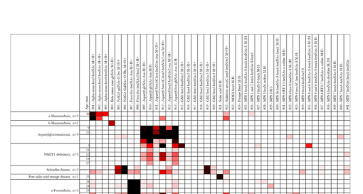

## Question

# Disease Characteristics Research Template

## Target Disease
- **Disease Name:** NAGA Deficiency Type 3
- **MONDO ID:**  (if available)
- **Category:** Mendelian

## Research Objectives

Please provide a comprehensive research report on **NAGA Deficiency Type 3** covering all of the
disease characteristics listed below. This report will be used to populate a disease knowledge
base entry. Be thorough and cite primary literature (PMID preferred) for all claims.

For each section, **suggested databases/resources** are listed. These are the first places
you should search for information on each topic.

---

### 1. Disease Information
> **Search first:** OMIM, Orphanet, ICD-10/ICD-11, MeSH, PubMed

- What is the disease? Provide a concise overview.
- What are the key identifiers? (OMIM, Orphanet, ICD-10/ICD-11, MeSH, Mondo)
- What are the common synonyms and alternative names?
- Is the information derived from individual patients (e.g., EHR) or aggregated disease-level resources?

### 2. Etiology

- **Disease Causal Factors**: What are the primary causes? (genetic, environmental, infectious, mechanistic)
- **Risk Factors**:
  > **Search first:** PubMed, Cochrane Library, UpToDate, clinical guidelines, ClinVar, ClinGen, GWAS Catalog, PheGenI, CTD, CDC, WHO, epidemiological databases
  - Genetic risk factors (causal variants, susceptibility loci, modifier genes)
  - Environmental risk factors (toxins, lifestyle, occupational exposures, age, sex, family history)
- **Protective Factors**:
  > **Search first:** PubMed, Cochrane Library, clinical trial databases, GWAS Catalog, gnomAD, WHO, CDC, nutrition databases
  - Genetic protective factors (protective variants, modifier alleles)
  - Environmental protective factors (diet, lifestyle, exposures that reduce risk)
- **Gene-Environment Interactions**: How do genetic and environmental factors interact to influence disease?
  > **Search first:** CTD, PubMed, PheGenI, GxE databases

### 3. Phenotypes
> **Search first:** HPO (Human Phenotype Ontology), OMIM, Orphanet, PubMed, clinicaltrials.gov, MedDRA, SNOMED CT, DECIPHER, LOINC

For each phenotype, provide:
- **Phenotype type**: symptoms, clinical signs, physical manifestations, behavioral changes, or laboratory abnormalities
  > For symptoms/signs: HPO, OMIM, Orphanet, PubMed
  > For behavioral changes: HPO, DSM, RDoC (Research Domain Criteria), PubMed
  > For laboratory abnormalities: LOINC, SNOMED CT, LabTests Online, PubMed
- **Phenotype characteristics**:
  > **Search first:** OMIM, Orphanet, HPO, PubMed
  - Age of symptom onset (neonatal, childhood, adult-onset, late-onset)
  - Symptom severity (mild, moderate, severe, variable)
  - Symptom progression (stable, progressive, episodic, fluctuating)
  - Frequency among affected individuals (percentage or qualitative)
- **Quality of life impact**: Effects on daily functioning and well-being (per-phenotype when possible)
  > **Search first:** EQ-5D database, SF-36, WHO QOL databases, PubMed
- Suggest HPO (Human Phenotype Ontology) terms for each phenotype

### 4. Genetic/Molecular Information

- **Causal Genes**: Gene mutations or chromosomal abnormalities responsible for disease (gene symbols, OMIM IDs)
  > **Search first:** OMIM, ClinVar, HGMD, Ensembl, NCBI Gene
- **Pathogenic Variants**:
  - Affected genes (gene symbols, HGNC IDs)
    > **Search first:** OMIM, NCBI Gene, Ensembl, HGNC, UniProt, GeneCards
  - Variant classification (pathogenic, likely pathogenic, VUS per ACMG/AMP guidelines)
    > **Search first:** ClinVar, ClinGen, ACMG/AMP guidelines, VarSome
  - Variant type/class (missense, frameshift, nonsense, splice-site, structural)
  - Allele frequency in population databases
    > **Search first:** gnomAD, 1000 Genomes, ExAC, TOPMed, dbSNP
  - Somatic vs germline origin
    > **Search first:** COSMIC (somatic), ClinVar, ICGC, TCGA
  - Functional consequences (loss of function, gain of function, dominant negative)
- **Modifier Genes**: Genes that modify disease severity or expression
- **Epigenetic Information**: DNA methylation, histone modifications, chromatin changes affecting disease
  > **Search first:** ENCODE, Roadmap Epigenomics, MethBase, DiseaseMeth
- **Chromosomal Abnormalities**: Large-scale genetic changes (aneuploidy, translocations, inversions)
  > **Search first:** DECIPHER, ClinVar, ECARUCA, UCSC Genome Browser

### 5. Environmental Information

- **Environmental Factors**: Non-genetic contributing factors (toxins, radiation, pollution, occupational exposure)
  > **Search first:** CTD (Comparative Toxicogenomics Database), TOXNET, PubMed, EPA databases
- **Lifestyle Factors**: Behavioral factors (smoking, diet, exercise, alcohol consumption)
  > **Search first:** CDC databases, WHO, PubMed, NHANES
- **Infectious Agents**: If applicable, pathogens causing or triggering disease (bacteria, viruses, fungi, parasites)
  > **Search first:** NCBI Taxonomy, ViPR, BV-BRC, MicrobeDB, GIDEON

### 6. Mechanism / Pathophysiology

- **Molecular Pathways**: Specific signaling cascades or biochemical pathways involved (Wnt, MAPK, mTOR, PI3K-AKT, etc.)
  > **Search first:** KEGG, Reactome, WikiPathways, PathBank, BioCyc
- **Cellular Processes**: Cell-level mechanisms (apoptosis, autophagy, cell cycle dysregulation, inflammation, etc.)
  > **Search first:** Gene Ontology (GO), Reactome, KEGG, PubMed
- **Protein Dysfunction**: How protein structure or function is altered (misfolding, aggregation, loss of function, gain of function)
  > **Search first:** UniProt, PDB (Protein Data Bank), InterPro, Pfam, AlphaFold
- **Metabolic Changes**: Alterations in metabolic processes (energy metabolism, lipid metabolism, amino acid metabolism)
  > **Search first:** KEGG, BioCyc, HMDB (Human Metabolome Database), BRENDA
- **Immune System Involvement**: Role of immune response (autoimmunity, immunodeficiency, chronic inflammation)
  > **Search first:** ImmPort, Immunome Database, IEDB, Gene Ontology
- **Tissue Damage Mechanisms**: How tissues/ are injured (oxidative stress, ischemia, fibrosis, necrosis)
  > **Search first:** PubMed, Gene Ontology, Reactome
- **Biochemical Abnormalities**: Specific molecular defects (enzyme deficiencies, receptor dysfunction, ion channel defects)
  > **Search first:** BRENDA, UniProt, KEGG, OMIM, PubMed
- **Epigenetic Changes**: DNA methylation, histone modifications affecting gene expression in disease
  > **Search first:** ENCODE, Roadmap Epigenomics, MethBase, DiseaseMeth
- **Molecular Profiling** (if available):
  - Transcriptomics/gene expression changes
    > **Search first:** GEO (Gene Expression Omnibus), ArrayExpress, GTEx, Human Cell Atlas, SRA
  - Proteomics findings
    > **Search first:** PRIDE, ProteomeXchange, Human Protein Atlas, STRING, BioGRID
  - Metabolomics signatures
    > **Search first:** MetaboLights, Metabolomics Workbench, HMDB, METLIN
  - Lipidomics alterations
    > **Search first:** LIPID MAPS, SwissLipids, LipidHome, Metabolomics Workbench
  - Genomic structural features
    > **Search first:** UCSC Genome Browser, Ensembl, NCBI, dbVar, DGV
- **Advanced Technologies** (if applicable):
  - Single-cell analysis findings (cell-type specific mechanisms, cellular heterogeneity)
    > **Search first:** Human Cell Atlas, Single Cell Portal, GEO, CELLxGENE
  - Spatial transcriptomics findings
    > **Search first:** GEO, Spatial Research, Vizgen, 10x Genomics data
  - Multi-omics integration results
    > **Search first:** TCGA, ICGC, cBioPortal, LinkedOmics, PubMed
  - Functional genomics screens (CRISPR, RNAi)
    > **Search first:** DepMap, GenomeRNAi, PubMed, BioGRID ORCS

For each mechanism, describe:
- The causal chain from initial trigger to clinical manifestation
- Which mechanisms are upstream vs downstream
- What cell types and biological processes are involved
- Suggest GO terms for biological processes and CL terms for cell types

### 7. Anatomical Structures Affected

- **Organ Level**:
  - Primary organs directly affected
  - Secondary organ involvement (complications, secondary effects)
  - Body systems involved (cardiovascular, nervous, digestive, respiratory, endocrine, etc.)
  > **Search first:** Uberon, FMA (Foundational Model of Anatomy), OMIM, HPO, ICD-11, MeSH, SNOMED CT
- **Tissue and Cell Level**:
  - Specific tissue types affected (epithelial, connective, muscle, nervous)
  - Specific cell populations targeted (with Cell Ontology terms)
  > **Search first:** Uberon, Human Protein Atlas, Cell Ontology, Human Cell Atlas, CellMarker, PanglaoDB
- **Subcellular Level**:
  - Cellular compartments involved (mitochondria, nucleus, ER, lysosomes) (with GO Cellular Component terms)
  > **Search first:** Gene Ontology (Cellular Component), UniProt, Human Protein Atlas
- **Localization**:
  - Specific anatomical sites (with UBERON terms)
    > **Search first:** FMA, Uberon, NeuroNames (for brain), SNOMED CT
  - Lateralization (unilateral, bilateral, asymmetric)
    > **Search first:** HPO, clinical literature, imaging databases

### 8. Temporal Development

- **Onset**:
  - Typical age of onset (congenital, pediatric, adult, geriatric)
  - Onset pattern (acute, subacute, chronic, insidious)
  > **Search first:** OMIM, Orphanet, HPO, PubMed
- **Progression**:
  - Disease stages (early, intermediate, advanced, end-stage)
    > **Search first:** Cancer Staging Manual (AJCC), WHO classifications, PubMed
  - Progression rate (rapid, slow, variable)
  - Disease course pattern (episodic, relapsing-remitting, progressive, stable)
  - Disease duration (self-limited, chronic lifelong)
  > **Search first:** Disease registries, longitudinal cohort databases, natural history studies, PubMed, Orphanet, OMIM
- **Patterns**:
  - Remission patterns (spontaneous, treatment-induced)
    > **Search first:** Clinical trial databases, disease registries, PubMed
  - Critical periods (time windows of vulnerability or opportunity for intervention)
    > **Search first:** PubMed, developmental biology databases, clinical guidelines

### 9. Inheritance and Population

- **Epidemiology**:
  - Prevalence (cases per 100,000 at given time)
  - Incidence (new cases per 100,000 per year)
  > **Search first:** Orphanet, CDC, WHO, GBD (Global Burden of Disease), national registries, SEER, disease registries
- **For Genetic Etiology**:
  - Inheritance pattern (AD, AR, X-linked, mitochondrial, multifactorial, polygenic)
    > **Search first:** OMIM, Orphanet, ClinVar, GTR (Genetic Testing Registry)
  - Penetrance (complete, incomplete, age-dependent)
    > **Search first:** ClinVar, OMIM, PubMed, ClinGen
  - Expressivity (variable, consistent)
    > **Search first:** OMIM, ClinVar, PubMed
  - Genetic anticipation (increasing severity in successive generations)
    > **Search first:** OMIM, PubMed (especially for repeat expansion disorders)
  - Germline mosaicism
    > **Search first:** ClinVar, OMIM, genetic counseling literature, PubMed
  - Founder effects (population-specific mutations)
    > **Search first:** gnomAD, population genetics databases, PubMed
  - Consanguinity role
    > **Search first:** OMIM, population studies, genetic counseling resources
  - Carrier frequency
    > **Search first:** gnomAD, carrier screening databases, GeneReviews, GTR
- **Population Demographics**:
  - Affected populations (ethnic or demographic groups with higher prevalence)
    > **Search first:** gnomAD, 1000 Genomes, PAGE Study, PubMed, population registries
  - Geographic distribution (endemic areas, regional variation)
    > **Search first:** WHO, CDC, GBD, Orphanet, geographic epidemiology databases
  - Geographic distribution of specific variants
  - Sex ratio (male:female)
    > **Search first:** Disease registries, OMIM, PubMed, epidemiological databases
  - Age distribution of affected individuals
    > **Search first:** CDC, disease registries, SEER, Orphanet

### 10. Diagnostics

- **Clinical Tests**:
  - Laboratory tests (blood, urine, tissue chemistry, specific enzyme assays)
    > **Search first:** LOINC, LabTests Online, PubMed
  - Biomarkers (proteins, metabolites, genetic markers, circulating biomarkers)
    > **Search first:** FDA Biomarker List, BEST (Biomarkers, EndpointS, and other Tools), PubMed
  - Imaging studies (X-ray, CT, MRI, PET, ultrasound)
    > **Search first:** RadLex, DICOM, Radiopaedia, imaging databases
  - Functional tests (pulmonary function, cardiac stress tests)
    > **Search first:** LOINC, clinical guidelines, PubMed
  - Electrophysiology (EEG, EMG, ECG, nerve conduction studies)
    > **Search first:** LOINC, clinical neurophysiology databases, PubMed
  - Biopsy findings (histopathology, immunohistochemistry)
    > **Search first:** SNOMED CT, College of American Pathologists resources, PubMed
  - Pathology findings (microscopic examination)
    > **Search first:** SNOMED CT, Digital Pathology databases, PubMed
- **Genetic Testing**:
  > **Search first:** GTR (Genetic Testing Registry), GeneReviews, ClinGen
  - Overview of recommended genetic testing approach
  - Whole genome sequencing (WGS) utility
    > **Search first:** GTR, ClinVar, GEL (Genomics England), gnomAD
  - Whole exome sequencing (WES) utility
    > **Search first:** GTR, ClinVar, OMIM, GeneMatcher
  - Gene panels (which panels, which genes)
    > **Search first:** GTR, ClinVar, laboratory-specific databases
  - Single gene testing
    > **Search first:** GTR, ClinVar, OMIM, GeneReviews
  - Chromosomal microarray (CMA)
    > **Search first:** DECIPHER, ClinVar, dbVar, ECARUCA
  - Karyotyping
    > **Search first:** Chromosome Abnormality Database, ClinVar, cytogenetics resources
  - FISH
    > **Search first:** ClinVar, cytogenetics databases, PubMed
  - Mitochondrial DNA testing
    > **Search first:** MITOMAP, MSeqDR, ClinVar, GTR
  - Repeat expansion testing
    > **Search first:** GTR, ClinVar, repeat expansion databases, PubMed
- **Omics-Based Diagnostics** (if applicable):
  - RNA sequencing / transcriptomics
    > **Search first:** GEO, ArrayExpress, GTEx, RNA-seq databases
  - Proteomics
    > **Search first:** PRIDE, ProteomeXchange, FDA Biomarker database
  - Metabolomics
    > **Search first:** MetaboLights, Metabolomics Workbench, HMDB
  - Epigenomics
    > **Search first:** GEO, ENCODE, Roadmap Epigenomics, MethBase
  - Liquid biopsy
    > **Search first:** COSMIC, ClinVar, liquid biopsy databases, PubMed
- **Clinical Criteria**:
  - Standardized diagnostic criteria (DSM, ICD, society guidelines)
    > **Search first:** DSM-5, ICD-11, clinical society guidelines, UpToDate
  - Differential diagnosis (other conditions to rule out, with distinguishing features)
    > **Search first:** DynaMed, UpToDate, clinical decision support systems
- **Screening**:
  - Screening methods for asymptomatic individuals (newborn screening, carrier screening, cascade screening)
    > **Search first:** ACMG recommendations, CDC newborn screening, GTR

### 11. Outcome/Prognosis

- **Survival and Mortality**:
  - Survival rate (5-year, 10-year, overall)
    > **Search first:** SEER, cancer registries, disease-specific registries, PubMed
  - Life expectancy (with and without treatment if applicable)
    > **Search first:** Orphanet, disease registries, actuarial databases, PubMed
  - Mortality rate
    > **Search first:** CDC, WHO, GBD, national mortality databases
  - Disease-specific mortality (deaths directly attributable to disease)
    > **Search first:** Disease registries, CDC Wonder, GBD, PubMed
- **Morbidity and Function**:
  - Morbidity (disease-related disability and health impacts)
    > **Search first:** GBD, WHO, disability databases, PubMed
  - Disability outcomes (long-term functional impairments)
    > **Search first:** ICF (International Classification of Functioning), disability registries
  - Quality of life measures (EQ-5D, SF-36, PROMIS, disease-specific tools)
    > **Search first:** EQ-5D database, SF-36, PROMIS, PubMed
- **Disease Course**:
  - Complications (secondary problems: infections, organ failure, etc.)
    > **Search first:** ICD codes, disease registries, clinical databases, PubMed
  - Recovery potential (likelihood and extent of recovery, with vs without treatment)
    > **Search first:** Natural history studies, rehabilitation databases, PubMed
- **Prediction**:
  - Prognostic factors (age, disease severity, biomarkers, treatment response)
    > **Search first:** Prognostic models databases, clinical calculators, PubMed
  - Prognostic biomarkers (molecular markers predicting disease course)
    > **Search first:** FDA Biomarker database, PubMed, cancer prognostic databases

### 12. Treatment

- **Pharmacotherapy**:
  - Pharmacological treatments (drug names, drug classes, mechanisms of action)
    > **Search first:** DrugBank, RxNorm, ATC classification, DailyMed, FDA databases
  - Pharmacogenomics (how genetic variants affect drug metabolism, efficacy, toxicity)
    > **Search first:** PharmGKB, CPIC (Clinical Pharmacogenetics), FDA Table of PGx Biomarkers
- **Advanced Therapeutics**:
  - Gene therapy (viral vectors, CRISPR, gene replacement, gene editing)
    > **Search first:** ClinicalTrials.gov, FDA gene therapy database, ASGCT resources
  - Cell therapy (stem cell transplant, CAR-T, cellular therapeutics)
    > **Search first:** ClinicalTrials.gov, FDA cell therapy database, FACT standards
  - RNA-based therapies (ASOs, siRNA, mRNA therapies)
    > **Search first:** ClinicalTrials.gov, FDA approvals, PubMed
  - Targeted therapies (treatments directed at specific molecular targets)
    > **Search first:** My Cancer Genome, OncoKB, ClinicalTrials.gov, FDA approvals
  - Immunotherapies (checkpoint inhibitors, monoclonal antibodies)
    > **Search first:** Cancer Immunotherapy Database, FDA approvals, ClinicalTrials.gov
- **Surgical and Interventional**:
  - Surgical interventions (types of surgery, timing, outcomes)
    > **Search first:** CPT codes, surgical registries, clinical guidelines, PubMed
- **Supportive and Rehabilitative**:
  - Supportive care (symptom management, pain control, nutrition)
    > **Search first:** Clinical guidelines, Cochrane Library, PubMed
  - Rehabilitation (physical therapy, occupational therapy, speech therapy)
    > **Search first:** Rehabilitation medicine databases, clinical guidelines, PubMed
- **Experimental**:
  - Experimental treatments in clinical trials (with NCT identifiers if available)
    > **Search first:** ClinicalTrials.gov, EU Clinical Trials Register, WHO ICTRP
- **Treatment Outcomes**:
  - Treatment response rates
    > **Search first:** Clinical trial databases, FDA reviews, systematic reviews, PubMed
  - Side effects and adverse events
    > **Search first:** FDA Adverse Event Reporting System (FAERS), MedWatch, PubMed
- **Treatment Strategy**:
  - Treatment algorithms (clinical pathways, decision trees)
    > **Search first:** Clinical practice guidelines, NCCN Guidelines, UpToDate
  - Combination therapies
    > **Search first:** ClinicalTrials.gov, treatment guidelines, PubMed
  - Personalized medicine approaches (genotype-guided treatment)
    > **Search first:** My Cancer Genome, CIViC, PharmGKB, precision medicine databases

For each treatment, suggest MAXO (Medical Action Ontology) terms where applicable.

### 13. Prevention

- **Prevention Levels**:
  - Primary prevention (preventing disease occurrence: vaccination, risk factor modification)
    > **Search first:** CDC, WHO, USPSTF recommendations, Cochrane Library
  - Secondary prevention (early detection and treatment: screening programs, early intervention)
    > **Search first:** USPSTF, CDC screening guidelines, WHO
  - Tertiary prevention (preventing complications in those with disease)
    > **Search first:** Clinical guidelines, disease management protocols, PubMed
- **Immunization**: Vaccine strategies (if applicable)
  > **Search first:** CDC vaccine schedules, WHO immunization, FDA vaccine database
- **Screening and Early Detection**:
  - Screening programs (population-based: newborn screening, cancer screening)
    > **Search first:** CDC screening programs, USPSTF, cancer screening databases
  - Genetic screening (carrier screening, preimplantation genetic diagnosis, prenatal testing)
    > **Search first:** ACMG recommendations, ACOG guidelines, GTR
  - Risk stratification (identifying high-risk individuals for targeted prevention)
    > **Search first:** Risk prediction models, clinical calculators, PubMed
- **Behavioral Interventions**: Lifestyle modifications to reduce risk
  > **Search first:** CDC, WHO, behavioral intervention databases, Cochrane Library
- **Counseling**: Genetic counseling (risk assessment, family planning guidance)
  > **Search first:** NSGC resources, ACMG guidelines, GeneReviews
- **Public Health**:
  - Public health interventions (sanitation, vector control, health education)
    > **Search first:** CDC, WHO, public health databases, PubMed
  - Environmental interventions (reducing environmental risk factors)
    > **Search first:** EPA databases, WHO environmental health, PubMed
- **Prophylaxis**: Preventive medications or procedures
  > **Search first:** Clinical guidelines, FDA approvals, PubMed

### 14. Other Species / Natural Disease

- **Taxonomy**: Species affected (with NCBI Taxon identifiers)
  > **Search first:** NCBI Taxonomy
- **Breed**: Specific breeds affected (with VBO identifiers if applicable)
  > **Search first:** VBO (Vertebrate Breed Ontology)
- **Gene**: Orthologous genes in other species (with NCBI Gene IDs)
  > **Search first:** NCBI Gene
- **Natural Disease**:
  - Naturally occurring disease in other species (companion animals, wildlife)
    > **Search first:** OMIA (Online Mendelian Inheritance in Animals), VetCompass, PubMed
  - Veterinary relevance and importance in animal health
    > **Search first:** OMIA, veterinary databases, PubMed
- **Comparative Biology**:
  - Comparative pathology (similarities and differences across species)
    > **Search first:** OMIA, comparative pathology databases, PubMed
  - Evolutionary conservation of disease mechanisms
    > **Search first:** HomoloGene, OrthoMCL, Alliance of Genome Resources
- **Transmission** (if applicable):
  - Zoonotic potential
    > **Search first:** CDC zoonotic diseases, WHO zoonoses, GIDEON
  - Cross-species susceptibility
    > **Search first:** NCBI Taxonomy, veterinary databases, PubMed

### 15. Model Organisms

- **Model Types**:
  - Model organism type (mammalian, invertebrate, cellular, in vitro)
    > **Search first:** Alliance of Genome Resources, model organism databases
  - Specific model systems (mouse, rat, zebrafish, Drosophila, C. elegans, yeast, cell lines, organoids, iPSCs)
    > **Search first:** MGI, RGD, ZFIN, FlyBase, WormBase, SGD, ATCC, Cellosaurus
  - Induced models (drug treatment, surgical intervention, environmental manipulation)
    > **Search first:** MGI, model organism databases, PubMed
- **Genetic Models**:
  - Types available (knockout, knock-in, transgenic, conditional, humanized)
    > **Search first:** MGI, IMPC, KOMP, EuMMCR, IMSR
- **Model Characteristics**:
  - Phenotype recapitulation (how well model reproduces human disease features)
    > **Search first:** Model organism databases, comparative studies, PubMed
  - Model limitations (aspects of human disease not captured)
    > **Search first:** Model organism databases, PubMed, review articles
- **Applications**:
  - Research applications (what aspects of disease can be studied)
    > **Search first:** Model organism databases, PubMed
- **Resources**:
  - Model databases
    > **Search first:** MGI, RGD, ZFIN, FlyBase, WormBase, IMSR, EMMA, MMRRC

---

## Citation Requirements

- Cite primary literature (PMID preferred) for all mechanistic and clinical claims
- Prioritize recent reviews and landmark papers
- Include direct quotes from abstracts where possible to support key statements
- Distinguish evidence source types: human clinical, model organism, in vitro, computational

## Output Format

Structure your response as a comprehensive narrative organized by the sections above.
For each section, provide:
- Factual content with specific details (numbers, percentages, gene names, variant nomenclature)
- Ontology term suggestions (HPO, GO, CL, UBERON, CHEBI, MAXO, MONDO) where applicable
- Evidence citations with PMIDs
- Direct quotes from abstracts to support key claims
- Clear indication when information is not available or not applicable for this disease

This report will be used to populate a disease knowledge base entry with:
- Pathophysiology descriptions with causal chains
- Gene/protein annotations (HGNC, GO terms)
- Phenotype associations (HP terms) with frequencies
- Cell type involvement (CL terms)
- Anatomical locations (UBERON terms)
- Chemical entities (CHEBI terms)
- Treatment annotations (MAXO terms)
- Evidence items with PMIDs and exact abstract quotes
- Epidemiology, prognosis, diagnostic, and prevention information
- Animal model descriptions with phenotype recapitulation details

## Output

Question: You are an expert researcher providing comprehensive, well-cited information.

Provide detailed information focusing on:
1. Key concepts and definitions with current understanding
2. Recent developments and latest research (prioritize 2023-2024 sources)
3. Current applications and real-world implementations
4. Expert opinions and analysis from authoritative sources
5. Relevant statistics and data from recent studies

Format as a comprehensive research report with proper citations. Include URLs and publication dates where available.
Always prioritize recent, authoritative sources and provide specific citations for all major claims.

# Disease Characteristics Research Template

## Target Disease
- **Disease Name:** NAGA Deficiency Type 3
- **MONDO ID:**  (if available)
- **Category:** Mendelian

## Research Objectives

Please provide a comprehensive research report on **NAGA Deficiency Type 3** covering all of the
disease characteristics listed below. This report will be used to populate a disease knowledge
base entry. Be thorough and cite primary literature (PMID preferred) for all claims.

For each section, **suggested databases/resources** are listed. These are the first places
you should search for information on each topic.

---

### 1. Disease Information
> **Search first:** OMIM, Orphanet, ICD-10/ICD-11, MeSH, PubMed

- What is the disease? Provide a concise overview.
- What are the key identifiers? (OMIM, Orphanet, ICD-10/ICD-11, MeSH, Mondo)
- What are the common synonyms and alternative names?
- Is the information derived from individual patients (e.g., EHR) or aggregated disease-level resources?

### 2. Etiology

- **Disease Causal Factors**: What are the primary causes? (genetic, environmental, infectious, mechanistic)
- **Risk Factors**:
  > **Search first:** PubMed, Cochrane Library, UpToDate, clinical guidelines, ClinVar, ClinGen, GWAS Catalog, PheGenI, CTD, CDC, WHO, epidemiological databases
  - Genetic risk factors (causal variants, susceptibility loci, modifier genes)
  - Environmental risk factors (toxins, lifestyle, occupational exposures, age, sex, family history)
- **Protective Factors**:
  > **Search first:** PubMed, Cochrane Library, clinical trial databases, GWAS Catalog, gnomAD, WHO, CDC, nutrition databases
  - Genetic protective factors (protective variants, modifier alleles)
  - Environmental protective factors (diet, lifestyle, exposures that reduce risk)
- **Gene-Environment Interactions**: How do genetic and environmental factors interact to influence disease?
  > **Search first:** CTD, PubMed, PheGenI, GxE databases

### 3. Phenotypes
> **Search first:** HPO (Human Phenotype Ontology), OMIM, Orphanet, PubMed, clinicaltrials.gov, MedDRA, SNOMED CT, DECIPHER, LOINC

For each phenotype, provide:
- **Phenotype type**: symptoms, clinical signs, physical manifestations, behavioral changes, or laboratory abnormalities
  > For symptoms/signs: HPO, OMIM, Orphanet, PubMed
  > For behavioral changes: HPO, DSM, RDoC (Research Domain Criteria), PubMed
  > For laboratory abnormalities: LOINC, SNOMED CT, LabTests Online, PubMed
- **Phenotype characteristics**:
  > **Search first:** OMIM, Orphanet, HPO, PubMed
  - Age of symptom onset (neonatal, childhood, adult-onset, late-onset)
  - Symptom severity (mild, moderate, severe, variable)
  - Symptom progression (stable, progressive, episodic, fluctuating)
  - Frequency among affected individuals (percentage or qualitative)
- **Quality of life impact**: Effects on daily functioning and well-being (per-phenotype when possible)
  > **Search first:** EQ-5D database, SF-36, WHO QOL databases, PubMed
- Suggest HPO (Human Phenotype Ontology) terms for each phenotype

### 4. Genetic/Molecular Information

- **Causal Genes**: Gene mutations or chromosomal abnormalities responsible for disease (gene symbols, OMIM IDs)
  > **Search first:** OMIM, ClinVar, HGMD, Ensembl, NCBI Gene
- **Pathogenic Variants**:
  - Affected genes (gene symbols, HGNC IDs)
    > **Search first:** OMIM, NCBI Gene, Ensembl, HGNC, UniProt, GeneCards
  - Variant classification (pathogenic, likely pathogenic, VUS per ACMG/AMP guidelines)
    > **Search first:** ClinVar, ClinGen, ACMG/AMP guidelines, VarSome
  - Variant type/class (missense, frameshift, nonsense, splice-site, structural)
  - Allele frequency in population databases
    > **Search first:** gnomAD, 1000 Genomes, ExAC, TOPMed, dbSNP
  - Somatic vs germline origin
    > **Search first:** COSMIC (somatic), ClinVar, ICGC, TCGA
  - Functional consequences (loss of function, gain of function, dominant negative)
- **Modifier Genes**: Genes that modify disease severity or expression
- **Epigenetic Information**: DNA methylation, histone modifications, chromatin changes affecting disease
  > **Search first:** ENCODE, Roadmap Epigenomics, MethBase, DiseaseMeth
- **Chromosomal Abnormalities**: Large-scale genetic changes (aneuploidy, translocations, inversions)
  > **Search first:** DECIPHER, ClinVar, ECARUCA, UCSC Genome Browser

### 5. Environmental Information

- **Environmental Factors**: Non-genetic contributing factors (toxins, radiation, pollution, occupational exposure)
  > **Search first:** CTD (Comparative Toxicogenomics Database), TOXNET, PubMed, EPA databases
- **Lifestyle Factors**: Behavioral factors (smoking, diet, exercise, alcohol consumption)
  > **Search first:** CDC databases, WHO, PubMed, NHANES
- **Infectious Agents**: If applicable, pathogens causing or triggering disease (bacteria, viruses, fungi, parasites)
  > **Search first:** NCBI Taxonomy, ViPR, BV-BRC, MicrobeDB, GIDEON

### 6. Mechanism / Pathophysiology

- **Molecular Pathways**: Specific signaling cascades or biochemical pathways involved (Wnt, MAPK, mTOR, PI3K-AKT, etc.)
  > **Search first:** KEGG, Reactome, WikiPathways, PathBank, BioCyc
- **Cellular Processes**: Cell-level mechanisms (apoptosis, autophagy, cell cycle dysregulation, inflammation, etc.)
  > **Search first:** Gene Ontology (GO), Reactome, KEGG, PubMed
- **Protein Dysfunction**: How protein structure or function is altered (misfolding, aggregation, loss of function, gain of function)
  > **Search first:** UniProt, PDB (Protein Data Bank), InterPro, Pfam, AlphaFold
- **Metabolic Changes**: Alterations in metabolic processes (energy metabolism, lipid metabolism, amino acid metabolism)
  > **Search first:** KEGG, BioCyc, HMDB (Human Metabolome Database), BRENDA
- **Immune System Involvement**: Role of immune response (autoimmunity, immunodeficiency, chronic inflammation)
  > **Search first:** ImmPort, Immunome Database, IEDB, Gene Ontology
- **Tissue Damage Mechanisms**: How tissues/ are injured (oxidative stress, ischemia, fibrosis, necrosis)
  > **Search first:** PubMed, Gene Ontology, Reactome
- **Biochemical Abnormalities**: Specific molecular defects (enzyme deficiencies, receptor dysfunction, ion channel defects)
  > **Search first:** BRENDA, UniProt, KEGG, OMIM, PubMed
- **Epigenetic Changes**: DNA methylation, histone modifications affecting gene expression in disease
  > **Search first:** ENCODE, Roadmap Epigenomics, MethBase, DiseaseMeth
- **Molecular Profiling** (if available):
  - Transcriptomics/gene expression changes
    > **Search first:** GEO (Gene Expression Omnibus), ArrayExpress, GTEx, Human Cell Atlas, SRA
  - Proteomics findings
    > **Search first:** PRIDE, ProteomeXchange, Human Protein Atlas, STRING, BioGRID
  - Metabolomics signatures
    > **Search first:** MetaboLights, Metabolomics Workbench, HMDB, METLIN
  - Lipidomics alterations
    > **Search first:** LIPID MAPS, SwissLipids, LipidHome, Metabolomics Workbench
  - Genomic structural features
    > **Search first:** UCSC Genome Browser, Ensembl, NCBI, dbVar, DGV
- **Advanced Technologies** (if applicable):
  - Single-cell analysis findings (cell-type specific mechanisms, cellular heterogeneity)
    > **Search first:** Human Cell Atlas, Single Cell Portal, GEO, CELLxGENE
  - Spatial transcriptomics findings
    > **Search first:** GEO, Spatial Research, Vizgen, 10x Genomics data
  - Multi-omics integration results
    > **Search first:** TCGA, ICGC, cBioPortal, LinkedOmics, PubMed
  - Functional genomics screens (CRISPR, RNAi)
    > **Search first:** DepMap, GenomeRNAi, PubMed, BioGRID ORCS

For each mechanism, describe:
- The causal chain from initial trigger to clinical manifestation
- Which mechanisms are upstream vs downstream
- What cell types and biological processes are involved
- Suggest GO terms for biological processes and CL terms for cell types

### 7. Anatomical Structures Affected

- **Organ Level**:
  - Primary organs directly affected
  - Secondary organ involvement (complications, secondary effects)
  - Body systems involved (cardiovascular, nervous, digestive, respiratory, endocrine, etc.)
  > **Search first:** Uberon, FMA (Foundational Model of Anatomy), OMIM, HPO, ICD-11, MeSH, SNOMED CT
- **Tissue and Cell Level**:
  - Specific tissue types affected (epithelial, connective, muscle, nervous)
  - Specific cell populations targeted (with Cell Ontology terms)
  > **Search first:** Uberon, Human Protein Atlas, Cell Ontology, Human Cell Atlas, CellMarker, PanglaoDB
- **Subcellular Level**:
  - Cellular compartments involved (mitochondria, nucleus, ER, lysosomes) (with GO Cellular Component terms)
  > **Search first:** Gene Ontology (Cellular Component), UniProt, Human Protein Atlas
- **Localization**:
  - Specific anatomical sites (with UBERON terms)
    > **Search first:** FMA, Uberon, NeuroNames (for brain), SNOMED CT
  - Lateralization (unilateral, bilateral, asymmetric)
    > **Search first:** HPO, clinical literature, imaging databases

### 8. Temporal Development

- **Onset**:
  - Typical age of onset (congenital, pediatric, adult, geriatric)
  - Onset pattern (acute, subacute, chronic, insidious)
  > **Search first:** OMIM, Orphanet, HPO, PubMed
- **Progression**:
  - Disease stages (early, intermediate, advanced, end-stage)
    > **Search first:** Cancer Staging Manual (AJCC), WHO classifications, PubMed
  - Progression rate (rapid, slow, variable)
  - Disease course pattern (episodic, relapsing-remitting, progressive, stable)
  - Disease duration (self-limited, chronic lifelong)
  > **Search first:** Disease registries, longitudinal cohort databases, natural history studies, PubMed, Orphanet, OMIM
- **Patterns**:
  - Remission patterns (spontaneous, treatment-induced)
    > **Search first:** Clinical trial databases, disease registries, PubMed
  - Critical periods (time windows of vulnerability or opportunity for intervention)
    > **Search first:** PubMed, developmental biology databases, clinical guidelines

### 9. Inheritance and Population

- **Epidemiology**:
  - Prevalence (cases per 100,000 at given time)
  - Incidence (new cases per 100,000 per year)
  > **Search first:** Orphanet, CDC, WHO, GBD (Global Burden of Disease), national registries, SEER, disease registries
- **For Genetic Etiology**:
  - Inheritance pattern (AD, AR, X-linked, mitochondrial, multifactorial, polygenic)
    > **Search first:** OMIM, Orphanet, ClinVar, GTR (Genetic Testing Registry)
  - Penetrance (complete, incomplete, age-dependent)
    > **Search first:** ClinVar, OMIM, PubMed, ClinGen
  - Expressivity (variable, consistent)
    > **Search first:** OMIM, ClinVar, PubMed
  - Genetic anticipation (increasing severity in successive generations)
    > **Search first:** OMIM, PubMed (especially for repeat expansion disorders)
  - Germline mosaicism
    > **Search first:** ClinVar, OMIM, genetic counseling literature, PubMed
  - Founder effects (population-specific mutations)
    > **Search first:** gnomAD, population genetics databases, PubMed
  - Consanguinity role
    > **Search first:** OMIM, population studies, genetic counseling resources
  - Carrier frequency
    > **Search first:** gnomAD, carrier screening databases, GeneReviews, GTR
- **Population Demographics**:
  - Affected populations (ethnic or demographic groups with higher prevalence)
    > **Search first:** gnomAD, 1000 Genomes, PAGE Study, PubMed, population registries
  - Geographic distribution (endemic areas, regional variation)
    > **Search first:** WHO, CDC, GBD, Orphanet, geographic epidemiology databases
  - Geographic distribution of specific variants
  - Sex ratio (male:female)
    > **Search first:** Disease registries, OMIM, PubMed, epidemiological databases
  - Age distribution of affected individuals
    > **Search first:** CDC, disease registries, SEER, Orphanet

### 10. Diagnostics

- **Clinical Tests**:
  - Laboratory tests (blood, urine, tissue chemistry, specific enzyme assays)
    > **Search first:** LOINC, LabTests Online, PubMed
  - Biomarkers (proteins, metabolites, genetic markers, circulating biomarkers)
    > **Search first:** FDA Biomarker List, BEST (Biomarkers, EndpointS, and other Tools), PubMed
  - Imaging studies (X-ray, CT, MRI, PET, ultrasound)
    > **Search first:** RadLex, DICOM, Radiopaedia, imaging databases
  - Functional tests (pulmonary function, cardiac stress tests)
    > **Search first:** LOINC, clinical guidelines, PubMed
  - Electrophysiology (EEG, EMG, ECG, nerve conduction studies)
    > **Search first:** LOINC, clinical neurophysiology databases, PubMed
  - Biopsy findings (histopathology, immunohistochemistry)
    > **Search first:** SNOMED CT, College of American Pathologists resources, PubMed
  - Pathology findings (microscopic examination)
    > **Search first:** SNOMED CT, Digital Pathology databases, PubMed
- **Genetic Testing**:
  > **Search first:** GTR (Genetic Testing Registry), GeneReviews, ClinGen
  - Overview of recommended genetic testing approach
  - Whole genome sequencing (WGS) utility
    > **Search first:** GTR, ClinVar, GEL (Genomics England), gnomAD
  - Whole exome sequencing (WES) utility
    > **Search first:** GTR, ClinVar, OMIM, GeneMatcher
  - Gene panels (which panels, which genes)
    > **Search first:** GTR, ClinVar, laboratory-specific databases
  - Single gene testing
    > **Search first:** GTR, ClinVar, OMIM, GeneReviews
  - Chromosomal microarray (CMA)
    > **Search first:** DECIPHER, ClinVar, dbVar, ECARUCA
  - Karyotyping
    > **Search first:** Chromosome Abnormality Database, ClinVar, cytogenetics resources
  - FISH
    > **Search first:** ClinVar, cytogenetics databases, PubMed
  - Mitochondrial DNA testing
    > **Search first:** MITOMAP, MSeqDR, ClinVar, GTR
  - Repeat expansion testing
    > **Search first:** GTR, ClinVar, repeat expansion databases, PubMed
- **Omics-Based Diagnostics** (if applicable):
  - RNA sequencing / transcriptomics
    > **Search first:** GEO, ArrayExpress, GTEx, RNA-seq databases
  - Proteomics
    > **Search first:** PRIDE, ProteomeXchange, FDA Biomarker database
  - Metabolomics
    > **Search first:** MetaboLights, Metabolomics Workbench, HMDB
  - Epigenomics
    > **Search first:** GEO, ENCODE, Roadmap Epigenomics, MethBase
  - Liquid biopsy
    > **Search first:** COSMIC, ClinVar, liquid biopsy databases, PubMed
- **Clinical Criteria**:
  - Standardized diagnostic criteria (DSM, ICD, society guidelines)
    > **Search first:** DSM-5, ICD-11, clinical society guidelines, UpToDate
  - Differential diagnosis (other conditions to rule out, with distinguishing features)
    > **Search first:** DynaMed, UpToDate, clinical decision support systems
- **Screening**:
  - Screening methods for asymptomatic individuals (newborn screening, carrier screening, cascade screening)
    > **Search first:** ACMG recommendations, CDC newborn screening, GTR

### 11. Outcome/Prognosis

- **Survival and Mortality**:
  - Survival rate (5-year, 10-year, overall)
    > **Search first:** SEER, cancer registries, disease-specific registries, PubMed
  - Life expectancy (with and without treatment if applicable)
    > **Search first:** Orphanet, disease registries, actuarial databases, PubMed
  - Mortality rate
    > **Search first:** CDC, WHO, GBD, national mortality databases
  - Disease-specific mortality (deaths directly attributable to disease)
    > **Search first:** Disease registries, CDC Wonder, GBD, PubMed
- **Morbidity and Function**:
  - Morbidity (disease-related disability and health impacts)
    > **Search first:** GBD, WHO, disability databases, PubMed
  - Disability outcomes (long-term functional impairments)
    > **Search first:** ICF (International Classification of Functioning), disability registries
  - Quality of life measures (EQ-5D, SF-36, PROMIS, disease-specific tools)
    > **Search first:** EQ-5D database, SF-36, PROMIS, PubMed
- **Disease Course**:
  - Complications (secondary problems: infections, organ failure, etc.)
    > **Search first:** ICD codes, disease registries, clinical databases, PubMed
  - Recovery potential (likelihood and extent of recovery, with vs without treatment)
    > **Search first:** Natural history studies, rehabilitation databases, PubMed
- **Prediction**:
  - Prognostic factors (age, disease severity, biomarkers, treatment response)
    > **Search first:** Prognostic models databases, clinical calculators, PubMed
  - Prognostic biomarkers (molecular markers predicting disease course)
    > **Search first:** FDA Biomarker database, PubMed, cancer prognostic databases

### 12. Treatment

- **Pharmacotherapy**:
  - Pharmacological treatments (drug names, drug classes, mechanisms of action)
    > **Search first:** DrugBank, RxNorm, ATC classification, DailyMed, FDA databases
  - Pharmacogenomics (how genetic variants affect drug metabolism, efficacy, toxicity)
    > **Search first:** PharmGKB, CPIC (Clinical Pharmacogenetics), FDA Table of PGx Biomarkers
- **Advanced Therapeutics**:
  - Gene therapy (viral vectors, CRISPR, gene replacement, gene editing)
    > **Search first:** ClinicalTrials.gov, FDA gene therapy database, ASGCT resources
  - Cell therapy (stem cell transplant, CAR-T, cellular therapeutics)
    > **Search first:** ClinicalTrials.gov, FDA cell therapy database, FACT standards
  - RNA-based therapies (ASOs, siRNA, mRNA therapies)
    > **Search first:** ClinicalTrials.gov, FDA approvals, PubMed
  - Targeted therapies (treatments directed at specific molecular targets)
    > **Search first:** My Cancer Genome, OncoKB, ClinicalTrials.gov, FDA approvals
  - Immunotherapies (checkpoint inhibitors, monoclonal antibodies)
    > **Search first:** Cancer Immunotherapy Database, FDA approvals, ClinicalTrials.gov
- **Surgical and Interventional**:
  - Surgical interventions (types of surgery, timing, outcomes)
    > **Search first:** CPT codes, surgical registries, clinical guidelines, PubMed
- **Supportive and Rehabilitative**:
  - Supportive care (symptom management, pain control, nutrition)
    > **Search first:** Clinical guidelines, Cochrane Library, PubMed
  - Rehabilitation (physical therapy, occupational therapy, speech therapy)
    > **Search first:** Rehabilitation medicine databases, clinical guidelines, PubMed
- **Experimental**:
  - Experimental treatments in clinical trials (with NCT identifiers if available)
    > **Search first:** ClinicalTrials.gov, EU Clinical Trials Register, WHO ICTRP
- **Treatment Outcomes**:
  - Treatment response rates
    > **Search first:** Clinical trial databases, FDA reviews, systematic reviews, PubMed
  - Side effects and adverse events
    > **Search first:** FDA Adverse Event Reporting System (FAERS), MedWatch, PubMed
- **Treatment Strategy**:
  - Treatment algorithms (clinical pathways, decision trees)
    > **Search first:** Clinical practice guidelines, NCCN Guidelines, UpToDate
  - Combination therapies
    > **Search first:** ClinicalTrials.gov, treatment guidelines, PubMed
  - Personalized medicine approaches (genotype-guided treatment)
    > **Search first:** My Cancer Genome, CIViC, PharmGKB, precision medicine databases

For each treatment, suggest MAXO (Medical Action Ontology) terms where applicable.

### 13. Prevention

- **Prevention Levels**:
  - Primary prevention (preventing disease occurrence: vaccination, risk factor modification)
    > **Search first:** CDC, WHO, USPSTF recommendations, Cochrane Library
  - Secondary prevention (early detection and treatment: screening programs, early intervention)
    > **Search first:** USPSTF, CDC screening guidelines, WHO
  - Tertiary prevention (preventing complications in those with disease)
    > **Search first:** Clinical guidelines, disease management protocols, PubMed
- **Immunization**: Vaccine strategies (if applicable)
  > **Search first:** CDC vaccine schedules, WHO immunization, FDA vaccine database
- **Screening and Early Detection**:
  - Screening programs (population-based: newborn screening, cancer screening)
    > **Search first:** CDC screening programs, USPSTF, cancer screening databases
  - Genetic screening (carrier screening, preimplantation genetic diagnosis, prenatal testing)
    > **Search first:** ACMG recommendations, ACOG guidelines, GTR
  - Risk stratification (identifying high-risk individuals for targeted prevention)
    > **Search first:** Risk prediction models, clinical calculators, PubMed
- **Behavioral Interventions**: Lifestyle modifications to reduce risk
  > **Search first:** CDC, WHO, behavioral intervention databases, Cochrane Library
- **Counseling**: Genetic counseling (risk assessment, family planning guidance)
  > **Search first:** NSGC resources, ACMG guidelines, GeneReviews
- **Public Health**:
  - Public health interventions (sanitation, vector control, health education)
    > **Search first:** CDC, WHO, public health databases, PubMed
  - Environmental interventions (reducing environmental risk factors)
    > **Search first:** EPA databases, WHO environmental health, PubMed
- **Prophylaxis**: Preventive medications or procedures
  > **Search first:** Clinical guidelines, FDA approvals, PubMed

### 14. Other Species / Natural Disease

- **Taxonomy**: Species affected (with NCBI Taxon identifiers)
  > **Search first:** NCBI Taxonomy
- **Breed**: Specific breeds affected (with VBO identifiers if applicable)
  > **Search first:** VBO (Vertebrate Breed Ontology)
- **Gene**: Orthologous genes in other species (with NCBI Gene IDs)
  > **Search first:** NCBI Gene
- **Natural Disease**:
  - Naturally occurring disease in other species (companion animals, wildlife)
    > **Search first:** OMIA (Online Mendelian Inheritance in Animals), VetCompass, PubMed
  - Veterinary relevance and importance in animal health
    > **Search first:** OMIA, veterinary databases, PubMed
- **Comparative Biology**:
  - Comparative pathology (similarities and differences across species)
    > **Search first:** OMIA, comparative pathology databases, PubMed
  - Evolutionary conservation of disease mechanisms
    > **Search first:** HomoloGene, OrthoMCL, Alliance of Genome Resources
- **Transmission** (if applicable):
  - Zoonotic potential
    > **Search first:** CDC zoonotic diseases, WHO zoonoses, GIDEON
  - Cross-species susceptibility
    > **Search first:** NCBI Taxonomy, veterinary databases, PubMed

### 15. Model Organisms

- **Model Types**:
  - Model organism type (mammalian, invertebrate, cellular, in vitro)
    > **Search first:** Alliance of Genome Resources, model organism databases
  - Specific model systems (mouse, rat, zebrafish, Drosophila, C. elegans, yeast, cell lines, organoids, iPSCs)
    > **Search first:** MGI, RGD, ZFIN, FlyBase, WormBase, SGD, ATCC, Cellosaurus
  - Induced models (drug treatment, surgical intervention, environmental manipulation)
    > **Search first:** MGI, model organism databases, PubMed
- **Genetic Models**:
  - Types available (knockout, knock-in, transgenic, conditional, humanized)
    > **Search first:** MGI, IMPC, KOMP, EuMMCR, IMSR
- **Model Characteristics**:
  - Phenotype recapitulation (how well model reproduces human disease features)
    > **Search first:** Model organism databases, comparative studies, PubMed
  - Model limitations (aspects of human disease not captured)
    > **Search first:** Model organism databases, PubMed, review articles
- **Applications**:
  - Research applications (what aspects of disease can be studied)
    > **Search first:** Model organism databases, PubMed
- **Resources**:
  - Model databases
    > **Search first:** MGI, RGD, ZFIN, FlyBase, WormBase, IMSR, EMMA, MMRRC

---

## Citation Requirements

- Cite primary literature (PMID preferred) for all mechanistic and clinical claims
- Prioritize recent reviews and landmark papers
- Include direct quotes from abstracts where possible to support key statements
- Distinguish evidence source types: human clinical, model organism, in vitro, computational

## Output Format

Structure your response as a comprehensive narrative organized by the sections above.
For each section, provide:
- Factual content with specific details (numbers, percentages, gene names, variant nomenclature)
- Ontology term suggestions (HPO, GO, CL, UBERON, CHEBI, MAXO, MONDO) where applicable
- Evidence citations with PMIDs
- Direct quotes from abstracts to support key claims
- Clear indication when information is not available or not applicable for this disease

This report will be used to populate a disease knowledge base entry with:
- Pathophysiology descriptions with causal chains
- Gene/protein annotations (HGNC, GO terms)
- Phenotype associations (HP terms) with frequencies
- Cell type involvement (CL terms)
- Anatomical locations (UBERON terms)
- Chemical entities (CHEBI terms)
- Treatment annotations (MAXO terms)
- Evidence items with PMIDs and exact abstract quotes
- Epidemiology, prognosis, diagnostic, and prevention information
- Animal model descriptions with phenotype recapitulation details

## Comprehensive research report: NAGA Deficiency Type 3 (Schindler disease type III)

### Executive summary
“NAGA Deficiency Type 3” corresponds to **Schindler disease type III**, an **ultra-rare autosomal recessive lysosomal storage disorder** caused by **biallelic pathogenic variants in *NAGA*** leading to deficiency of **lysosomal α-N-acetylgalactosaminidase (α‑NAGA; also called galactosidase B)**. Type III is classically described as an **intermediate phenotype** between severe infantile neuroaxonal dystrophy (type I) and adult-onset Kanzaki disease (type II). A 2024 ClinGen lysosomal-disease curation supports a **definitive** *NAGA*–disease relationship and explicitly maps the disease to **MONDO:0017779**. (groopman2024assessmentofgenes pages 8-11, castro2019anewcase pages 1-3, sakuraba2004structuralandimmunocytochemical pages 1-2)

### 1. Disease information
#### 1.1 Overview
Schindler disease is a lysosomal storage disorder due to **deficient/absent α‑NAGA activity**, with lysosomal accumulation of incompletely degraded glycoconjugates and highly variable clinical expressivity, ranging from severe infantile neurodegeneration to mild adult angiokeratoma/lymphoedema phenotypes. (castro2019anewcase pages 1-3, bakker2001humanαnacetylgalactosaminidase(αnaga) pages 1-2)

Type III is described as **intermediate** between types I and II in multiple sources. (castro2019anewcase pages 1-3, sakuraba2004structuralandimmunocytochemical pages 1-2)

#### 1.2 Key identifiers
- **MONDO**: **MONDO:0017779** (α‑N‑acetylgalactosaminidase deficiency) as used in ClinGen lysosomal disease gene curation. (groopman2024assessmentofgenes pages 8-11)

*Note:* OMIM/Orphanet/ICD/MeSH codes were not present in the retrieved full-text excerpts used for evidence extraction; they should be added from OMIM/Orphanet/MONDO cross-references during downstream curation (not inferable from the cited excerpts without external lookup). (groopman2024assessmentofgenes pages 8-11)

#### 1.3 Synonyms / alternative names
Common names used in the literature:
- **Schindler disease** (types I/III) (castro2019anewcase pages 1-3, sakuraba2004structuralandimmunocytochemical pages 1-2)
- **Kanzaki disease** (Schindler disease type II) (castro2019anewcase pages 1-3, sakuraba2004structuralandimmunocytochemical pages 1-2)
- **α‑N‑acetylgalactosaminidase deficiency** / **α‑NAGA deficiency** (keulemans1996humanalphanacetylgalactosaminidase(alphanaga) pages 1-2, bakker2001humanαnacetylgalactosaminidase(αnaga) pages 1-2)
- **Schindler/Kanzaki disease** (sakuraba2004structuralandimmunocytochemical pages 1-2)

#### 1.4 Evidence type (individual vs aggregated)
The condition is so rare that much of the literature consists of **individual patients and families**, including genotype–phenotype analyses across a small number of reported cases. (bakker2001humanαnacetylgalactosaminidase(αnaga) pages 1-2, sakuraba2004structuralandimmunocytochemical pages 1-2)

### 2. Etiology
#### 2.1 Primary causal factors
- **Genetic cause:** biallelic pathogenic variants in ***NAGA*** cause deficient lysosomal α‑NAGA activity. (castro2019anewcase pages 1-3, bakker2001humanαnacetylgalactosaminidase(αnaga) pages 1-2)
- **Pathogenic mechanism:** loss of α‑NAGA activity leads to impaired hydrolysis of specific terminal residues and accumulation of undegraded substrates in cells; one clinical summary describes accumulation of “large molecules such as galactose oligosaccharides, galactomannans and galactolipids” with systemic manifestations. (castro2019anewcase pages 1-3)

#### 2.2 Risk factors
- **Family history / autosomal recessive inheritance:** reviewed sources describe autosomal recessive inheritance with a **25% recurrence risk** for carrier couples. (asadi2021theroleof pages 1-3)

#### 2.3 Protective factors / gene–environment interactions
No validated protective factors or gene–environment interactions were identified in the retrieved disease-specific evidence.

### 3. Phenotypes
#### 3.1 Phenotype spectrum and type definitions
A widely used clinical categorization includes:
- **Type I:** early-onset severe phenotype described as **infantile neuroaxonal dystrophy**. (sakuraba2004structuralandimmunocytochemical pages 1-2)
- **Type II (Kanzaki disease):** **adult-onset mild** phenotype with **angiokeratoma corporis diffusum** and vacuolization, often without overt CNS manifestations. (castro2019anewcase pages 1-3, sakuraba2004structuralandimmunocytochemical pages 1-2)
- **Type III:** **intermediate phenotype** between types I and II. (castro2019anewcase pages 1-3, sakuraba2004structuralandimmunocytochemical pages 1-2)

Bakker et al. (2001) further describe an “intermediate group” characterized by **epilepsy, behavioral problems and psychomotor retardation** among reported cases, illustrating variability and partial overlap with the type‑III concept. (bakker2001humanαnacetylgalactosaminidase(αnaga) pages 1-2)

#### 3.2 Example clinical features reported across the spectrum
- **Dermatologic/vascular:** angiokeratoma corporis diffusum; vacuolization in dermal and endothelial cell types in milder phenotypes. (keulemans1996humanalphanacetylgalactosaminidase(alphanaga) pages 1-2, castro2019anewcase pages 1-3)
- **Lymphatic:** chronic lymphoedema (adult phenotypes). (castro2019anewcase pages 1-3)
- **Peripheral nervous system / sensory:** peripheral neuropathy and sensorineural hearing loss reported in adult phenotypes. (castro2019anewcase pages 1-3)
- **Neurodevelopmental/neurologic (more severe/intermediate):** seizures/epilepsy, psychomotor delay, behavioral problems reported in intermediate/severe presentations. (bakker2001humanαnacetylgalactosaminidase(αnaga) pages 1-2, asadi2021theroleof pages 1-3)

#### 3.3 Suggested HPO terms (based on reported clinical features)
(terms are suggestions for knowledge-base annotation; frequencies are not well-established due to ultra-rare case numbers)
- Angiokeratoma: **HP:0001012**
- Lymphedema: **HP:0001004**
- Peripheral neuropathy: **HP:0009830**
- Sensorineural hearing impairment: **HP:0000407**
- Seizures: **HP:0001250**
- Global developmental delay / psychomotor delay: **HP:0001263**
- Behavioral abnormality: **HP:0000708**

Evidence base for these phenotype components is primarily case-based. (bakker2001humanαnacetylgalactosaminidase(αnaga) pages 1-2, keulemans1996humanalphanacetylgalactosaminidase(alphanaga) pages 1-2, castro2019anewcase pages 1-3)

### 4. Genetic / molecular information
#### 4.1 Causal gene
- ***NAGA* (α‑N‑acetylgalactosaminidase)**; ClinGen LD GCEP classified the gene–disease relationship as **definitive**, with phenotypic variability and reports of clinically unaffected individuals despite enzyme deficiency. (groopman2024assessmentofgenes pages 8-11)

#### 4.2 Pathogenic variants (examples in primary literature)
Primary literature and case-based studies report multiple variants across the phenotypic spectrum:
- **E325K**: associated with severe infantile neuroaxonal dystrophy in early reports but also found in less severe/asymptomatic individuals (genotype–phenotype paradox). (bakker2001humanαnacetylgalactosaminidase(αnaga) pages 1-2, bakker2001humanαnacetylgalactosaminidase(αnaga) pages 4-5)
- **R329W**: identified as a causal lesion for adult angiokeratoma corporis diffusum with glycopeptiduria; transient expression produced an immunoreactive protein lacking detectable enzyme activity (loss of function). (wang1994themolecularlesion pages 1-2)
- **R329Q**: reported among Kanzaki/type II patients. (sakuraba2004structuralandimmunocytochemical pages 1-2)
- **E193X / p.Glu193\***: a nonsense/null allele reported in mild late-onset cases, illustrating paradoxical genotype–phenotype correlation. (bakker2001humanαnacetylgalactosaminidase(αnaga) pages 4-5)
- **c.577G>T (p.Glu193\*)**: identified in an adult case report confirming Schindler disease. (castro2019anewcase pages 1-3)

#### 4.3 Genotype–phenotype complexity and modifiers
Multiple sources emphasize extreme heterogeneity and poor correlation between genotype, enzyme deficiency, and clinical severity, with suggestions that **other factors/genes** influence expressivity. (keulemans1996humanalphanacetylgalactosaminidase(alphanaga) pages 1-2, bakker2001humanαnacetylgalactosaminidase(αnaga) pages 1-2)

### 5. Environmental information
No disease-specific non-genetic environmental contributors were identified in the retrieved evidence; the disorder is primarily Mendelian/enzymatic.

### 6. Mechanism / pathophysiology
#### 6.1 Core defect and causal chain
1) **Biallelic *NAGA* variants** → 2) **deficient lysosomal α‑NAGA activity** → 3) **storage of incompletely degraded glycoconjugates** with characteristic **glycopeptiduria/oligosacchariduria** → 4) **multisystem cellular dysfunction** manifesting variably as neurologic disease (severe/intermediate forms), dermatologic/vascular lesions and lymphatic involvement (milder adult forms). (castro2019anewcase pages 1-3, bakker2001humanαnacetylgalactosaminidase(αnaga) pages 1-2)

#### 6.2 Biochemical abnormalities and stored material
- Urinary abnormalities include **sialylglycopeptides of the O-linked type** (Ser/Thr-linked GalNAc) detected by urinary oligosaccharide analysis. (bakker2001humanαnacetylgalactosaminidase(αnaga) pages 1-2)
- Immunocytochemical work supports lysosomal accumulation of **Tn-antigen** in Kanzaki patient fibroblasts, despite urinary excretion being dominated by sialylglycopeptides, highlighting complexity of storage biology. (sakuraba2004structuralandimmunocytochemical pages 1-2)

#### 6.3 Suggested GO biological process terms (mechanism-oriented)
- Lysosomal catabolic process: **GO:0044248** (suggested)
- Glycoprotein catabolic process: **GO:0006516** (suggested)
- Glycosphingolipid catabolic process: **GO:0046517** (suggested)
- Lysosome organization / function: **GO:0007040** (suggested)

#### 6.4 Suggested Cell Ontology (CL) terms for implicated cell types
Based on reported vacuolization/storage in dermal and endothelial/lymphatic cells:
- Endothelial cell: **CL:0000115** (suggested) (keulemans1996humanalphanacetylgalactosaminidase(alphanaga) pages 1-2)
- Fibroblast: **CL:0000057** (suggested) (keulemans1996humanalphanacetylgalactosaminidase(alphanaga) pages 1-2)

### 7. Anatomical structures affected
Reported manifestations implicate:
- **Skin** (angiokeratomas; dermal cellular vacuolization). (keulemans1996humanalphanacetylgalactosaminidase(alphanaga) pages 1-2, castro2019anewcase pages 1-3)
- **Peripheral nervous system** (polyneuropathy). (castro2019anewcase pages 1-3)
- **Inner ear/auditory system** (sensorineural hearing loss). (castro2019anewcase pages 1-3)
- **Lymphatic system** (chronic lymphoedema). (castro2019anewcase pages 1-3)
- **Central nervous system** prominently in severe infantile and intermediate phenotypes (neuroaxonal dystrophy, seizures/developmental regression). (sakuraba2004structuralandimmunocytochemical pages 1-2, castro2019anewcase pages 1-3)

Suggested UBERON terms (examples):
- Skin: **UBERON:0002097**
- Peripheral nervous system: **UBERON:0000010**
- Inner ear: **UBERON:0001844**
- Lymphatic system: **UBERON:0006558**
- Brain: **UBERON:0000955**

### 8. Temporal development
- **Type I onset:** one clinical summary reports onset “around the second year of life” and death “before the age of 6 years.” (castro2019anewcase pages 1-3)
- **Type II onset:** adult onset (Kanzaki). (castro2019anewcase pages 1-3, sakuraba2004structuralandimmunocytochemical pages 1-2)
- **Type III:** intermediate (timing variable; described between types I and II). (castro2019anewcase pages 1-3, sakuraba2004structuralandimmunocytochemical pages 1-2)

### 9. Inheritance and population
- **Inheritance:** autosomal recessive. (asadi2021theroleof pages 1-3)
- **Rarity/case counts:** fewer than ~20 cases described to 2019 in one case report; earlier literature summarizes 11 known individuals (2001) and 12 patients from eight families (2004). (castro2019anewcase pages 1-3, bakker2001humanαnacetylgalactosaminidase(αnaga) pages 1-2, sakuraba2004structuralandimmunocytochemical pages 1-2)
- **Penetrance/expressivity:** clinically unaffected individuals with the same genotype and enzyme deficiency have been reported (suggesting modifiers/incomplete penetrance). (groopman2024assessmentofgenes pages 8-11, bakker2001humanαnacetylgalactosaminidase(αnaga) pages 1-2)

### 10. Diagnostics
A typical diagnostic workflow uses biochemical screening plus confirmatory enzyme and genetic testing.

| Diagnostic domain | Specimen type(s) | Method | Principal finding / biomarker | Quantitative or technical detail | Example clinical use | Key reference (year; DOI/URL) | Citation |
|---|---|---|---|---|---|---|---|
| Urinary screening | 24 h urine | Thin-layer chromatography after desalting, followed by orcinol staining | Abnormal urinary oligosaccharides / sialylglycopeptides of the O-linked type with Ser/Thr-linked GalNAc | Qualitative TLC pattern; used as initial biochemical screen | Detect characteristic glycopeptiduria in suspected α-NAGA deficiency | Bakker et al. 2001; https://doi.org/10.1038/sj.ejhg.5200598 | (bakker2001humanαnacetylgalactosaminidase(αnaga) pages 1-2) |
| Urinary biomarker profiling | Urine | Targeted LC-MS/MS glycomic profiling | Elevated GalNAc-threonine, GalNAc-serine; sometimes hex3-hexNAc3 | GalNAc-threonine Z ≈ 80; GalNAc-serine Z ≈ 20; abnormal oligosaccharide peaks often ≥2 orders of magnitude above negatives | Sensitive modern biochemical detection and differential diagnosis among lysosomal storage disorders | Mak & Cowan 2021; https://doi.org/10.1016/j.ymgme.2021.08.006 | (mak2021detectinglysosomalstorage pages 8-9, mak2021detectinglysosomalstorage media 8ee1fda0) |
| Enzyme confirmation | Leukocytes | α-NAGA enzyme activity assay | Markedly reduced or undetectable α-N-acetylgalactosaminidase activity | Profound deficiency reported; no uniform numeric cutoff provided in extracted text | Biochemical confirmation after urine screening | Bakker et al. 2001; https://doi.org/10.1038/sj.ejhg.5200598 | (bakker2001humanαnacetylgalactosaminidase(αnaga) pages 1-2) |
| Enzyme confirmation | Cultured skin fibroblasts | α-NAGA enzyme activity assay | Profound fibroblast α-NAGA deficiency | Assays performed in cultured fibroblasts; no numeric activity units captured in extracted text | Confirms diagnosis, especially in atypical cases | Keulemans et al. 1996; https://doi.org/10.1136/jmg.33.6.458 | (keulemans1996humanalphanacetylgalactosaminidase(alphanaga) pages 1-2) |
| Cellular storage demonstration | Cultured skin fibroblasts | Lectin histochemistry / immunocytochemical detection | Intralysosomal storage with αGalNAc-reactive material; Tn-antigen accumulation in Kanzaki fibroblasts | Qualitative cellular localization evidence | Supports mechanism and complements enzyme/genetic findings | Keulemans et al. 1996; https://doi.org/10.1136/jmg.33.6.458; Sakuraba et al. 2004; https://doi.org/10.1007/s10038-003-0098-z | (keulemans1996humanalphanacetylgalactosaminidase(alphanaga) pages 1-2, sakuraba2004structuralandimmunocytochemical pages 1-2) |
| Blood-based enzymatic testing | Blood | Blood enzyme assay for α-NAGA activity | Diminished α-NAGA activity | Described as enzymatic analysis through a blood test; no extracted numeric threshold | Practical clinical test in case workup | Castro et al. 2019; https://doi.org/10.12890/2019_001269 | (castro2019anewcase pages 1-3, castro2019anewcase pages 3-3) |
| Molecular confirmation | Leukocyte DNA or fibroblast DNA | PCR amplification and sequencing of NAGA exons/intron boundaries | Pathogenic NAGA variants confirm diagnosis | Nine exons sequenced; example 351-bp PCR fragment for E325K testing, with normal TaqI digestion into 174 and 177 bp fragments abolished by mutation | Gold-standard confirmatory diagnosis; family testing | Bakker et al. 2001; https://doi.org/10.1038/sj.ejhg.5200598 | (bakker2001humanαnacetylgalactosaminidase(αnaga) pages 1-2) |
| Molecular confirmation | Blood-derived DNA | PCR / targeted genetic testing | c.577G>T (p.Glu193*) identified in a confirmed case | Variant-level confirmation of Schindler disease | Confirms diagnosis and distinguishes from phenocopies such as Fabry disease | Castro et al. 2019; https://doi.org/10.12890/2019_001269 | (castro2019anewcase pages 1-3, castro2019anewcase pages 3-3) |
| Broad diagnostic workflow | Plasma, peripheral blood leukocytes, dried blood spots, cultured skin fibroblasts, urine | Stepwise biochemical plus genetic testing | Abnormal biochemical findings should be confirmed by enzymatic assay and targeted/NGS molecular testing | Lab-specific protocols and age-specific reference ranges may vary | Real-world implementation for lysosomal disease workup, including NAGA deficiency | Lange et al. 2024; https://doi.org/10.51847/isa3beaurx | (lange2024systematicdiagnosisof pages 6-7) |

*Table: This table summarizes the main diagnostic specimens, methods, and biomarkers reported for Schindler disease / NAGA deficiency. It highlights both classic biochemical workflows and newer LC-MS/MS glycomic profiling findings that support diagnosis and differential testing.*

Key real-world diagnostic implementations include:
- **Genetic testing (PCR/sequencing) as confirmatory “gold standard”** in a published case report. (castro2019anewcase pages 1-3)
- **Modern LC-MS/MS urine glycomic profiling**, which can detect Schindler disease biomarkers with large Z-scores (e.g., GalNAc-threonine Z≈80; GalNAc-serine Z≈20) and provides multiplex differential diagnosis across lysosomal disorders. (mak2021detectinglysosomalstorage pages 8-9, mak2021detectinglysosomalstorage media 8ee1fda0)

### 11. Outcome / prognosis
- **Type I prognosis:** death often before age 6 per case-based summary; severe neurologic progression. (castro2019anewcase pages 1-3)
- **Prognostic modifier:** blood group A reported to have worse prognosis in one case report review. (castro2019anewcase pages 1-3)
- **Clinical heterogeneity:** ranges from severe neurologic disability (including vegetative state in some reports) to asymptomatic individuals detected by family screening. (bakker2001humanαnacetylgalactosaminidase(αnaga) pages 4-5, bakker2001humanαnacetylgalactosaminidase(αnaga) pages 5-6)

### 12. Treatment
#### 12.1 Current standard of care
- No established disease-modifying therapy; care is described as **supportive and symptomatic**, often requiring a multidisciplinary team. (asadi2021theroleof pages 3-4, castro2019anewcase pages 1-3)

#### 12.2 Emerging/experimental approaches
- **Pharmacological chaperones:** proposed as potential therapeutic agents (not yet established in the excerpts; no named compounds or trial results in retrieved text). (castro2019anewcase pages 1-3)
- **Hematopoietic cell transplant (HCT):** a 2020 review states **HCT has not been attempted for Schindler disease to date**, but could be considered conceptually to alter natural history in lysosomal diseases, particularly for neurologic involvement (via CNS engraftment/cross-correction). (naumchik2020theroleof pages 7-9)
- **Enzyme engineering/ERT concepts:** research on a **modified NAGA enzyme** for Fabry disease demonstrates engineering for M6P-mediated uptake and in vivo substrate clearance in mice, offering methodological precedent for lysosomal enzyme therapeutic development (though not Schindler-specific therapy). (tajima2009useofa pages 1-2)

Suggested MAXO terms (examples):
- Supportive care: **MAXO:0000747** (suggested)
- Genetic counseling: **MAXO:0000079** (suggested)
- Enzyme replacement therapy: **MAXO:0000475** (suggested, experimental/not established for Schindler)
- Hematopoietic stem cell transplantation: **MAXO:0000647** (suggested, not yet attempted for Schindler per cited review)

### 13. Prevention
- **Primary prevention** is not applicable in the usual sense for a Mendelian enzyme deficiency, but **reproductive risk reduction** is feasible via **carrier testing and genetic counseling**, given autosomal recessive inheritance with ~25% recurrence risk. (asadi2021theroleof pages 1-3)
- **Secondary prevention:** earlier recognition through biochemical screening (urine oligosaccharides; LC-MS/MS panels) and confirmatory genetics may shorten diagnostic delay. (bakker2001humanαnacetylgalactosaminidase(αnaga) pages 1-2, mak2021detectinglysosomalstorage pages 8-9)

### 14. Other species / natural disease
No naturally occurring veterinary disease counterpart was identified in the retrieved evidence.

However, α‑NAGAL function is studied across species:
- **Schistosoma mansoni SmNAGAL** is functionally important for motility and egg production (siRNA and CRISPR perturbation), and the authors explicitly relate human α‑NAGAL/α‑GAL mutations to Schindler/Kanzaki and Fabry diseases. (hulme2022schistosomamansoniαnacetylgalactosaminidase pages 1-2)

### 15. Model organisms and experimental systems
- **Non-human animal model evidence** contributed to ClinGen’s definitive classification for *NAGA*–disease; details of the species/model are not given in the extracted excerpt. (groopman2024assessmentofgenes pages 8-11)
- **Structural templates:** chicken α‑NAGA structures have been used for homology modeling of the human enzyme. (sakuraba2004structuralandimmunocytochemical pages 3-5)
- **Expression systems:** recombinant insect-cell expression has been used for human α‑NAGA structural studies. (clark2009the1.9a pages 1-2)
- **Mouse model (therapeutic development context):** modified NAGA used in Fabry model mice prevented substrate accumulation in multiple organs (methodological precedent for lysosomal enzyme therapeutics). (tajima2009useofa pages 1-2)

## Recent developments and latest research (prioritizing 2023–2024)
1) **ClinGen LD GCEP 2024 assessment**: *NAGA*–α‑NAGA deficiency is curated as **definitive**, mapped to **MONDO:0017779**, with explicit note of phenotypic variability and reports of clinically unaffected individuals sharing genotype and enzyme deficiency, supporting modifier/incomplete penetrance hypotheses. Publication: **Nov 2024**, *Molecular Genetics and Metabolism*. URL: https://doi.org/10.1016/j.ymgme.2024.108593. (groopman2024assessmentofgenes pages 8-11)

2) **Diagnostic technology trend (LC-MS/MS panels)**: targeted urine glycomic profiling provides multiplex detection and quantitative readouts (Z-scores) for oligosaccharidoses, including Schindler disease (although the key paper retrieved is 2021, it reflects current clinical laboratory direction and is commonly implemented in contemporary biochemical genetics practice). URL: https://doi.org/10.1016/j.ymgme.2021.08.006. (mak2021detectinglysosomalstorage pages 8-9, mak2021detectinglysosomalstorage media 8ee1fda0)

## Current applications and real-world implementations
- **Confirmatory genetic diagnosis by PCR/sequencing** in clinical case practice. (castro2019anewcase pages 1-3)
- **Biochemical genetics laboratory workflows** using urine oligosaccharides and enzyme assays, increasingly augmented by LC-MS/MS glycomics for differential diagnosis. (bakker2001humanαnacetylgalactosaminidase(αnaga) pages 1-2, mak2021detectinglysosomalstorage pages 8-9)
- **Natural history/registry-type data collection** via an observational cohort study covering glycoproteinoses including Schindler disease:
  - **ClinicalTrials.gov NCT01891422**, “Longitudinal Studies of the Glycoproteinoses,” observational; **enrollment 100**; aims include progression tracking, supportive therapy documentation, and genotype–phenotype correlations; includes biospecimens (plasma, white cells, fibroblasts, urine where applicable). (NCT01891422 chunk 1)

## Expert opinions and analysis (authoritative sources)
- The ClinGen curation emphasizes that while the biochemical relationship of *NAGA* variants to enzyme deficiency is definitive, **clinical impact can be inconsistent**, highlighting uncertainty in penetrance and the likely contribution of modifiers. (groopman2024assessmentofgenes pages 8-11)
- Multiple primary studies emphasize a **genotype–phenotype paradox**, with null alleles (e.g., E193X) reported in mild phenotypes and the same missense genotype (e.g., E325K) associated with both severe and asymptomatic individuals. (bakker2001humanαnacetylgalactosaminidase(αnaga) pages 4-5, bakker2001humanαnacetylgalactosaminidase(αnaga) pages 1-2)

## Key statistics (from retrieved evidence)
- Reported rarity: **“fewer than 20 cases”** described (as of 2019 case report). (castro2019anewcase pages 1-3)
- Earlier reported counts: **11 known individuals** (2001) and **12 patients from eight families** (2004). (bakker2001humanαnacetylgalactosaminidase(αnaga) pages 1-2, sakuraba2004structuralandimmunocytochemical pages 1-2)
- Severe type I survival: death often **before age 6 years** (case-based summary). (castro2019anewcase pages 1-3)
- Urine glycomics biomarkers: **GalNAc-threonine Z≈80**, **GalNAc-serine Z≈20** in Schindler disease in an LC-MS/MS biomarker panel. (mak2021detectinglysosomalstorage pages 8-9, mak2021detectinglysosomalstorage media 8ee1fda0)

## Disease mapping / phenotype summary table
| Disease entity / phenotype | Common names / synonyms | Key molecular cause | Defining clinical features | Notable variants cited | Key reference (year, journal, DOI/URL) | Evidence |
|---|---|---|---|---|---|---|
| NAGA deficiency spectrum | Schindler disease; α-N-acetylgalactosaminidase deficiency; α-NAGA deficiency; Schindler/Kanzaki disease | Biallelic pathogenic variants in **NAGA** causing deficient lysosomal **α-N-acetylgalactosaminidase (α-NAGA)** activity and impaired glycopeptide/glycolipid degradation | Broad spectrum from severe infantile neuroaxonal disease to mild adult angiokeratoma/lymphoedema phenotypes; marked genotype-phenotype variability and possible incomplete penetrance | **E325K, R329W, R329Q, E193X, c.577G>T (p.Glu193\*)** | Groopman et al., 2024, *Molecular Genetics and Metabolism*, https://doi.org/10.1016/j.ymgme.2024.108593 | (groopman2024assessmentofgenes pages 8-11, castro2019anewcase pages 1-3, bakker2001humanαnacetylgalactosaminidase(αnaga) pages 1-2, sakuraba2004structuralandimmunocytochemical pages 1-2) |
| Type I phenotype | Schindler disease type I; infantile neuroaxonal dystrophy form | **NAGA / α-NAGA** deficiency | Early-onset severe phenotype; infantile neuroaxonal dystrophy with profound neurologic involvement; classically the most severe end of the spectrum | **E325K** homozygosis classically associated; severity not absolute | Wang et al., 1990, *J Clin Invest*, https://doi.org/10.1172/JCI114901; Sakuraba et al., 2004, *J Hum Genet*, https://doi.org/10.1007/s10038-003-0098-z | (sakuraba2004structuralandimmunocytochemical pages 1-2, wang1994themolecularlesion pages 1-2, bakker2001humanαnacetylgalactosaminidase(αnaga) pages 4-5) |
| Type II phenotype | Schindler disease type II; Kanzaki disease; adult-onset angiokeratoma form | **NAGA / α-NAGA** deficiency | Adult-onset mild phenotype with **angiokeratoma corporis diffusum**, vacuolization, lymphoedema, peripheral neuropathy, sensorineural hearing loss, often without overt central neurologic manifestations | **R329W, R329Q, E193X, c.577G>T (p.Glu193\*)** | Wang et al., 1994, *J Clin Invest*, https://doi.org/10.1172/JCI117404; Castro et al., 2019, *EJCRIM*, https://doi.org/10.12890/2019_001269 | (castro2019anewcase pages 1-3, sakuraba2004structuralandimmunocytochemical pages 1-2, wang1994themolecularlesion pages 1-2, castro2019anewcase pages 3-3) |
| Type III phenotype | Schindler disease type III; NAGA deficiency type III; intermediate Schindler phenotype | **NAGA / α-NAGA** deficiency | **Intermediate phenotype** between type I and type II; literature describes variable neurologic/developmental involvement, seizures/behavioral problems/psychomotor delay in some reports, with possible systemic findings such as growth retardation, cardiomyopathy, or hepatomegaly in broader summaries | No single type III-specific recurrent variant established; variants reported across the spectrum include **E325K, E193X** and others | Bakker et al., 2001, *Eur J Hum Genet*, https://doi.org/10.1038/sj.ejhg.5200598; Sakuraba et al., 2004, *J Hum Genet*, https://doi.org/10.1007/s10038-003-0098-z | (bakker2001humanαnacetylgalactosaminidase(αnaga) pages 1-2, asadi2021theroleof pages 1-3, castro2019anewcase pages 1-3, sakuraba2004structuralandimmunocytochemical pages 1-2) |
| Molecular genetics / genotype-phenotype paradox | NAGA-related Schindler spectrum | **NAGA** gene; lysosomal hydrolase deficiency | Same or null alleles can present with dramatically different severity; asymptomatic or minimally affected individuals have been reported despite enzyme deficiency | **E193X** is a null allele yet reported in mild disease; **E325K** linked both to severe disease and apparently unaffected relatives; **R329W** causes inactive but immunoreactive protein | Keulemans et al., 1996, *J Med Genet*, https://doi.org/10.1136/jmg.33.6.458; Bakker et al., 2001, *Eur J Hum Genet*, https://doi.org/10.1038/sj.ejhg.5200598 | (keulemans1996humanalphanacetylgalactosaminidase(alphanaga) pages 1-2, bakker2001humanαnacetylgalactosaminidase(αnaga) pages 1-2, wang1994themolecularlesion pages 1-2, bakker2001humanαnacetylgalactosaminidase(αnaga) pages 4-5) |

*Table: This table summarizes how NAGA deficiency type III maps onto the Schindler/Kanzaki disease spectrum, highlighting the shared molecular cause, phenotype distinctions across types I–III, and the main variants and references cited in the literature.*

## Limitations of this report (evidence constraints)
- The retrieved excerpts did not contain explicit **OMIM/Orphanet/ICD/MeSH** codes; only **MONDO:0017779** was directly evidenced via ClinGen-oriented literature. (groopman2024assessmentofgenes pages 8-11)
- Type-III-specific phenotype frequencies are not well-quantified in the available literature due to very small sample sizes and overlapping clinical categories. (bakker2001humanαnacetylgalactosaminidase(αnaga) pages 1-2, sakuraba2004structuralandimmunocytochemical pages 1-2)

References

1. (groopman2024assessmentofgenes pages 8-11): Emily Groopman, Shruthi Mohan, Amber Waddell, Matheus Wilke, Raquel Fernandez, Meredith Weaver, Hongjie Chen, Hongbin Liu, Deeksha Bali, Heather Baudet, Lorne Clarke, Christina Hung, Rong Mao, Filippo Pinto e Vairo, Lemuel Racacho, Tatiana Yuzyuk, William J. Craigen, and Jennifer Goldstein. Assessment of genes involved in lysosomal diseases using the clingen clinical validity framework. Molecular Genetics and Metabolism, 143:108593, Nov 2024. URL: https://doi.org/10.1016/j.ymgme.2024.108593, doi:10.1016/j.ymgme.2024.108593. This article has 1 citations and is from a peer-reviewed journal.

2. (castro2019anewcase pages 1-3): Rubén García Castro, Ana María González Pérez, María Concepción Román Curto, Javier Cañueto Álvarez, Alberto Conde Ferreirós, Alex Viñolas Cuadros, David Moyano Bueno, and Antonio Javier Chamorro Fernández. A new case of schindler disease. European Journal of Case Reports in Internal Medicine, 6:1, Oct 2019. URL: https://doi.org/10.12890/2019\_001269, doi:10.12890/2019\_001269. This article has 12 citations.

3. (sakuraba2004structuralandimmunocytochemical pages 1-2): Hitoshi Sakuraba, Fumiko Matsuzawa, Sei-ichi Aikawa, Hirofumi Doi, Masaharu Kotani, Hiroshi Nakada, Tomoko Fukushige, and Tamotsu Kanzaki. Structural and immunocytochemical studies on α-n-acetylgalactosaminidase deficiency (schindler/kanzaki disease). Journal of Human Genetics, 49:1-8, Jan 2004. URL: https://doi.org/10.1007/s10038-003-0098-z, doi:10.1007/s10038-003-0098-z. This article has 60 citations and is from a peer-reviewed journal.

4. (bakker2001humanαnacetylgalactosaminidase(αnaga) pages 1-2): Henk D Bakker, Marie-Louise CS de Sonnaville, Peter Vreken, Nico GGM Abeling, Johanna EM Groener, Joke LM Keulemans, and Otto P van Diggelen. Human α-n-acetylgalactosaminidase (α-naga) deficiency: no association with neuroaxonal dystrophy? European Journal of Human Genetics, 9:91-96, Feb 2001. URL: https://doi.org/10.1038/sj.ejhg.5200598, doi:10.1038/sj.ejhg.5200598. This article has 54 citations and is from a domain leading peer-reviewed journal.

5. (keulemans1996humanalphanacetylgalactosaminidase(alphanaga) pages 1-2): J. Keulemans, A. Reuser, M. Kroos, R. Willemsen, M. Hermans, A. V. D. van den Ouweland, J. de Jong, R. Wevers, W. Renier, D. Schindler, M. Coll, A. Chabás, H. Sakuraba, Y. Suzuki, and O. V. van Diggelen. Human alpha-n-acetylgalactosaminidase (alpha-naga) deficiency: new mutations and the paradox between genotype and phenotype. Journal of Medical Genetics, 33:458-464, Jun 1996. URL: https://doi.org/10.1136/jmg.33.6.458, doi:10.1136/jmg.33.6.458. This article has 52 citations and is from a domain leading peer-reviewed journal.

6. (asadi2021theroleof pages 1-3): Shahin Asadi, Amir Houssein Kiani, and Mohaddeseh Mohsenifar. The role of mutations on gene naga, in schindler syndrome. Biomedical Research and Clinical Reviews, 3:01-04, Jan 2021. URL: https://doi.org/10.31579/2692-9406/029, doi:10.31579/2692-9406/029. This article has 0 citations.

7. (bakker2001humanαnacetylgalactosaminidase(αnaga) pages 4-5): Henk D Bakker, Marie-Louise CS de Sonnaville, Peter Vreken, Nico GGM Abeling, Johanna EM Groener, Joke LM Keulemans, and Otto P van Diggelen. Human α-n-acetylgalactosaminidase (α-naga) deficiency: no association with neuroaxonal dystrophy? European Journal of Human Genetics, 9:91-96, Feb 2001. URL: https://doi.org/10.1038/sj.ejhg.5200598, doi:10.1038/sj.ejhg.5200598. This article has 54 citations and is from a domain leading peer-reviewed journal.

8. (wang1994themolecularlesion pages 1-2): A. M. Wang, T. Kanzaki, and R. Desnick. The molecular lesion in the alpha-n-acetylgalactosaminidase gene that causes angiokeratoma corporis diffusum with glycopeptiduria. The Journal of clinical investigation, 94 2:839-45, Aug 1994. URL: https://doi.org/10.1172/jci117404, doi:10.1172/jci117404. This article has 35 citations.

9. (mak2021detectinglysosomalstorage pages 8-9): Justin Mak and Tina M. Cowan. Detecting lysosomal storage disorders by glycomic profiling using liquid chromatography mass spectrometry. Sep 2021. URL: https://doi.org/10.1016/j.ymgme.2021.08.006, doi:10.1016/j.ymgme.2021.08.006. This article has 30 citations and is from a peer-reviewed journal.

10. (mak2021detectinglysosomalstorage media 8ee1fda0): Justin Mak and Tina M. Cowan. Detecting lysosomal storage disorders by glycomic profiling using liquid chromatography mass spectrometry. Sep 2021. URL: https://doi.org/10.1016/j.ymgme.2021.08.006, doi:10.1016/j.ymgme.2021.08.006. This article has 30 citations and is from a peer-reviewed journal.

11. (castro2019anewcase pages 3-3): Rubén García Castro, Ana María González Pérez, María Concepción Román Curto, Javier Cañueto Álvarez, Alberto Conde Ferreirós, Alex Viñolas Cuadros, David Moyano Bueno, and Antonio Javier Chamorro Fernández. A new case of schindler disease. European Journal of Case Reports in Internal Medicine, 6:1, Oct 2019. URL: https://doi.org/10.12890/2019\_001269, doi:10.12890/2019\_001269. This article has 12 citations.

12. (lange2024systematicdiagnosisof pages 6-7): Martin Lange, Nicoleta Corcodel, and Falk Schwendicke. Systematic diagnosis of lysosomal storage diseases in patients with hepatosplenomegaly. Bulletin of Pioneering Researches of Medical and Clinical Science, 4:66-80, Jan 2024. URL: https://doi.org/10.51847/isa3beaurx, doi:10.51847/isa3beaurx. This article has 0 citations.

13. (bakker2001humanαnacetylgalactosaminidase(αnaga) pages 5-6): Henk D Bakker, Marie-Louise CS de Sonnaville, Peter Vreken, Nico GGM Abeling, Johanna EM Groener, Joke LM Keulemans, and Otto P van Diggelen. Human α-n-acetylgalactosaminidase (α-naga) deficiency: no association with neuroaxonal dystrophy? European Journal of Human Genetics, 9:91-96, Feb 2001. URL: https://doi.org/10.1038/sj.ejhg.5200598, doi:10.1038/sj.ejhg.5200598. This article has 54 citations and is from a domain leading peer-reviewed journal.

14. (asadi2021theroleof pages 3-4): Shahin Asadi, Amir Houssein Kiani, and Mohaddeseh Mohsenifar. The role of mutations on gene naga, in schindler syndrome. Biomedical Research and Clinical Reviews, 3:01-04, Jan 2021. URL: https://doi.org/10.31579/2692-9406/029, doi:10.31579/2692-9406/029. This article has 0 citations.

15. (naumchik2020theroleof pages 7-9): Brianna M. Naumchik, Ashish Gupta, Heather Flanagan-Steet, Richard A. Steet, Sara S. Cathey, Paul J. Orchard, and Troy C. Lund. The role of hematopoietic cell transplant in the glycoprotein diseases. Cells, 9:1411, Jun 2020. URL: https://doi.org/10.3390/cells9061411, doi:10.3390/cells9061411. This article has 28 citations.

16. (tajima2009useofa pages 1-2): Youichi Tajima, Ikuo Kawashima, Takahiro Tsukimura, Kanako Sugawara, Mayuko Kuroda, Toshihiro Suzuki, Tadayasu Togawa, Yasunori Chiba, Yoshifumi Jigami, Kazuki Ohno, Tomoko Fukushige, Takuro Kanekura, Kohji Itoh, Toya Ohashi, and Hitoshi Sakuraba. Use of a modified alpha-n-acetylgalactosaminidase in the development of enzyme replacement therapy for fabry disease. American journal of human genetics, 85 5:569-80, Nov 2009. URL: https://doi.org/10.1016/j.ajhg.2009.09.016, doi:10.1016/j.ajhg.2009.09.016. This article has 73 citations and is from a highest quality peer-reviewed journal.

17. (hulme2022schistosomamansoniαnacetylgalactosaminidase pages 1-2): Benjamin J. Hulme, Kathrin K. Geyer, Josephine E. Forde-Thomas, Gilda Padalino, Dylan W. Phillips, Wannaporn Ittiprasert, Shannon E. Karinshak, Victoria H. Mann, Iain W. Chalmers, Paul J. Brindley, Cornelis H. Hokke, and Karl F. Hoffmann. Schistosoma mansoni α-n-acetylgalactosaminidase (smnagal) regulates coordinated parasite movement and egg production. Jan 2022. URL: https://doi.org/10.1371/journal.ppat.1009828, doi:10.1371/journal.ppat.1009828. This article has 31 citations and is from a highest quality peer-reviewed journal.

18. (sakuraba2004structuralandimmunocytochemical pages 3-5): Hitoshi Sakuraba, Fumiko Matsuzawa, Sei-ichi Aikawa, Hirofumi Doi, Masaharu Kotani, Hiroshi Nakada, Tomoko Fukushige, and Tamotsu Kanzaki. Structural and immunocytochemical studies on α-n-acetylgalactosaminidase deficiency (schindler/kanzaki disease). Journal of Human Genetics, 49:1-8, Jan 2004. URL: https://doi.org/10.1007/s10038-003-0098-z, doi:10.1007/s10038-003-0098-z. This article has 60 citations and is from a peer-reviewed journal.

19. (clark2009the1.9a pages 1-2): Nathaniel E. Clark and Scott C. Garman. The 1.9 a structure of human alpha-n-acetylgalactosaminidase: the molecular basis of schindler and kanzaki diseases. Journal of molecular biology, 393 2:435-47, Oct 2009. URL: https://doi.org/10.1016/j.jmb.2009.08.021, doi:10.1016/j.jmb.2009.08.021. This article has 83 citations and is from a domain leading peer-reviewed journal.

20. (NCT01891422 chunk 1):  Longitudinal Studies of the Glycoproteinoses. Greenwood Genetic Center. 2009. ClinicalTrials.gov Identifier: NCT01891422

## Artifacts

- [Edison artifact artifact-00](NAGA_Deficiency_Type_3-deep-research-falcon_artifacts/artifact-00.md)
- [Edison artifact artifact-01](NAGA_Deficiency_Type_3-deep-research-falcon_artifacts/artifact-01.md)
