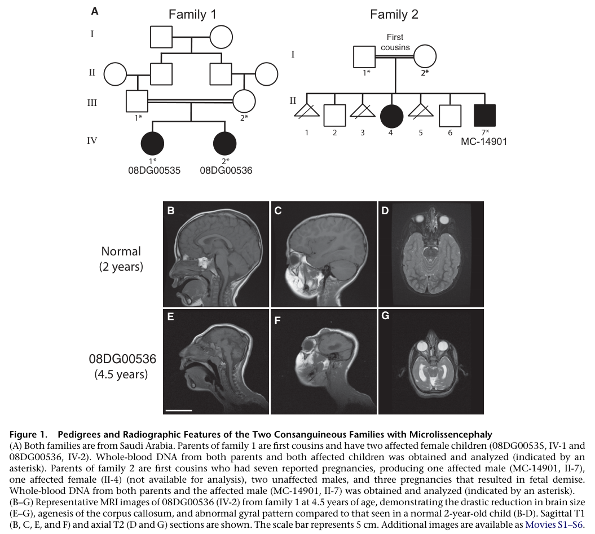

## Question

# Disease Characteristics Research Template

## Target Disease
- **Disease Name:** NDE1-related Microcephaly-Lissencephaly
- **MONDO ID:**  (if available)
- **Category:** Mendelian

## Research Objectives

Please provide a comprehensive research report on **NDE1-related Microcephaly-Lissencephaly** covering all of the
disease characteristics listed below. This report will be used to populate a disease knowledge
base entry. Be thorough and cite primary literature (PMID preferred) for all claims.

For each section, **suggested databases/resources** are listed. These are the first places
you should search for information on each topic.

---

### 1. Disease Information
> **Search first:** OMIM, Orphanet, ICD-10/ICD-11, MeSH, PubMed

- What is the disease? Provide a concise overview.
- What are the key identifiers? (OMIM, Orphanet, ICD-10/ICD-11, MeSH, Mondo)
- What are the common synonyms and alternative names?
- Is the information derived from individual patients (e.g., EHR) or aggregated disease-level resources?

### 2. Etiology

- **Disease Causal Factors**: What are the primary causes? (genetic, environmental, infectious, mechanistic)
- **Risk Factors**:
  > **Search first:** PubMed, Cochrane Library, UpToDate, clinical guidelines, ClinVar, ClinGen, GWAS Catalog, PheGenI, CTD, CDC, WHO, epidemiological databases
  - Genetic risk factors (causal variants, susceptibility loci, modifier genes)
  - Environmental risk factors (toxins, lifestyle, occupational exposures, age, sex, family history)
- **Protective Factors**:
  > **Search first:** PubMed, Cochrane Library, clinical trial databases, GWAS Catalog, gnomAD, WHO, CDC, nutrition databases
  - Genetic protective factors (protective variants, modifier alleles)
  - Environmental protective factors (diet, lifestyle, exposures that reduce risk)
- **Gene-Environment Interactions**: How do genetic and environmental factors interact to influence disease?
  > **Search first:** CTD, PubMed, PheGenI, GxE databases

### 3. Phenotypes
> **Search first:** HPO (Human Phenotype Ontology), OMIM, Orphanet, PubMed, clinicaltrials.gov, MedDRA, SNOMED CT, DECIPHER, LOINC

For each phenotype, provide:
- **Phenotype type**: symptoms, clinical signs, physical manifestations, behavioral changes, or laboratory abnormalities
  > For symptoms/signs: HPO, OMIM, Orphanet, PubMed
  > For behavioral changes: HPO, DSM, RDoC (Research Domain Criteria), PubMed
  > For laboratory abnormalities: LOINC, SNOMED CT, LabTests Online, PubMed
- **Phenotype characteristics**:
  > **Search first:** OMIM, Orphanet, HPO, PubMed
  - Age of symptom onset (neonatal, childhood, adult-onset, late-onset)
  - Symptom severity (mild, moderate, severe, variable)
  - Symptom progression (stable, progressive, episodic, fluctuating)
  - Frequency among affected individuals (percentage or qualitative)
- **Quality of life impact**: Effects on daily functioning and well-being (per-phenotype when possible)
  > **Search first:** EQ-5D database, SF-36, WHO QOL databases, PubMed
- Suggest HPO (Human Phenotype Ontology) terms for each phenotype

### 4. Genetic/Molecular Information

- **Causal Genes**: Gene mutations or chromosomal abnormalities responsible for disease (gene symbols, OMIM IDs)
  > **Search first:** OMIM, ClinVar, HGMD, Ensembl, NCBI Gene
- **Pathogenic Variants**:
  - Affected genes (gene symbols, HGNC IDs)
    > **Search first:** OMIM, NCBI Gene, Ensembl, HGNC, UniProt, GeneCards
  - Variant classification (pathogenic, likely pathogenic, VUS per ACMG/AMP guidelines)
    > **Search first:** ClinVar, ClinGen, ACMG/AMP guidelines, VarSome
  - Variant type/class (missense, frameshift, nonsense, splice-site, structural)
  - Allele frequency in population databases
    > **Search first:** gnomAD, 1000 Genomes, ExAC, TOPMed, dbSNP
  - Somatic vs germline origin
    > **Search first:** COSMIC (somatic), ClinVar, ICGC, TCGA
  - Functional consequences (loss of function, gain of function, dominant negative)
- **Modifier Genes**: Genes that modify disease severity or expression
- **Epigenetic Information**: DNA methylation, histone modifications, chromatin changes affecting disease
  > **Search first:** ENCODE, Roadmap Epigenomics, MethBase, DiseaseMeth
- **Chromosomal Abnormalities**: Large-scale genetic changes (aneuploidy, translocations, inversions)
  > **Search first:** DECIPHER, ClinVar, ECARUCA, UCSC Genome Browser

### 5. Environmental Information

- **Environmental Factors**: Non-genetic contributing factors (toxins, radiation, pollution, occupational exposure)
  > **Search first:** CTD (Comparative Toxicogenomics Database), TOXNET, PubMed, EPA databases
- **Lifestyle Factors**: Behavioral factors (smoking, diet, exercise, alcohol consumption)
  > **Search first:** CDC databases, WHO, PubMed, NHANES
- **Infectious Agents**: If applicable, pathogens causing or triggering disease (bacteria, viruses, fungi, parasites)
  > **Search first:** NCBI Taxonomy, ViPR, BV-BRC, MicrobeDB, GIDEON

### 6. Mechanism / Pathophysiology

- **Molecular Pathways**: Specific signaling cascades or biochemical pathways involved (Wnt, MAPK, mTOR, PI3K-AKT, etc.)
  > **Search first:** KEGG, Reactome, WikiPathways, PathBank, BioCyc
- **Cellular Processes**: Cell-level mechanisms (apoptosis, autophagy, cell cycle dysregulation, inflammation, etc.)
  > **Search first:** Gene Ontology (GO), Reactome, KEGG, PubMed
- **Protein Dysfunction**: How protein structure or function is altered (misfolding, aggregation, loss of function, gain of function)
  > **Search first:** UniProt, PDB (Protein Data Bank), InterPro, Pfam, AlphaFold
- **Metabolic Changes**: Alterations in metabolic processes (energy metabolism, lipid metabolism, amino acid metabolism)
  > **Search first:** KEGG, BioCyc, HMDB (Human Metabolome Database), BRENDA
- **Immune System Involvement**: Role of immune response (autoimmunity, immunodeficiency, chronic inflammation)
  > **Search first:** ImmPort, Immunome Database, IEDB, Gene Ontology
- **Tissue Damage Mechanisms**: How tissues/ are injured (oxidative stress, ischemia, fibrosis, necrosis)
  > **Search first:** PubMed, Gene Ontology, Reactome
- **Biochemical Abnormalities**: Specific molecular defects (enzyme deficiencies, receptor dysfunction, ion channel defects)
  > **Search first:** BRENDA, UniProt, KEGG, OMIM, PubMed
- **Epigenetic Changes**: DNA methylation, histone modifications affecting gene expression in disease
  > **Search first:** ENCODE, Roadmap Epigenomics, MethBase, DiseaseMeth
- **Molecular Profiling** (if available):
  - Transcriptomics/gene expression changes
    > **Search first:** GEO (Gene Expression Omnibus), ArrayExpress, GTEx, Human Cell Atlas, SRA
  - Proteomics findings
    > **Search first:** PRIDE, ProteomeXchange, Human Protein Atlas, STRING, BioGRID
  - Metabolomics signatures
    > **Search first:** MetaboLights, Metabolomics Workbench, HMDB, METLIN
  - Lipidomics alterations
    > **Search first:** LIPID MAPS, SwissLipids, LipidHome, Metabolomics Workbench
  - Genomic structural features
    > **Search first:** UCSC Genome Browser, Ensembl, NCBI, dbVar, DGV
- **Advanced Technologies** (if applicable):
  - Single-cell analysis findings (cell-type specific mechanisms, cellular heterogeneity)
    > **Search first:** Human Cell Atlas, Single Cell Portal, GEO, CELLxGENE
  - Spatial transcriptomics findings
    > **Search first:** GEO, Spatial Research, Vizgen, 10x Genomics data
  - Multi-omics integration results
    > **Search first:** TCGA, ICGC, cBioPortal, LinkedOmics, PubMed
  - Functional genomics screens (CRISPR, RNAi)
    > **Search first:** DepMap, GenomeRNAi, PubMed, BioGRID ORCS

For each mechanism, describe:
- The causal chain from initial trigger to clinical manifestation
- Which mechanisms are upstream vs downstream
- What cell types and biological processes are involved
- Suggest GO terms for biological processes and CL terms for cell types

### 7. Anatomical Structures Affected

- **Organ Level**:
  - Primary organs directly affected
  - Secondary organ involvement (complications, secondary effects)
  - Body systems involved (cardiovascular, nervous, digestive, respiratory, endocrine, etc.)
  > **Search first:** Uberon, FMA (Foundational Model of Anatomy), OMIM, HPO, ICD-11, MeSH, SNOMED CT
- **Tissue and Cell Level**:
  - Specific tissue types affected (epithelial, connective, muscle, nervous)
  - Specific cell populations targeted (with Cell Ontology terms)
  > **Search first:** Uberon, Human Protein Atlas, Cell Ontology, Human Cell Atlas, CellMarker, PanglaoDB
- **Subcellular Level**:
  - Cellular compartments involved (mitochondria, nucleus, ER, lysosomes) (with GO Cellular Component terms)
  > **Search first:** Gene Ontology (Cellular Component), UniProt, Human Protein Atlas
- **Localization**:
  - Specific anatomical sites (with UBERON terms)
    > **Search first:** FMA, Uberon, NeuroNames (for brain), SNOMED CT
  - Lateralization (unilateral, bilateral, asymmetric)
    > **Search first:** HPO, clinical literature, imaging databases

### 8. Temporal Development

- **Onset**:
  - Typical age of onset (congenital, pediatric, adult, geriatric)
  - Onset pattern (acute, subacute, chronic, insidious)
  > **Search first:** OMIM, Orphanet, HPO, PubMed
- **Progression**:
  - Disease stages (early, intermediate, advanced, end-stage)
    > **Search first:** Cancer Staging Manual (AJCC), WHO classifications, PubMed
  - Progression rate (rapid, slow, variable)
  - Disease course pattern (episodic, relapsing-remitting, progressive, stable)
  - Disease duration (self-limited, chronic lifelong)
  > **Search first:** Disease registries, longitudinal cohort databases, natural history studies, PubMed, Orphanet, OMIM
- **Patterns**:
  - Remission patterns (spontaneous, treatment-induced)
    > **Search first:** Clinical trial databases, disease registries, PubMed
  - Critical periods (time windows of vulnerability or opportunity for intervention)
    > **Search first:** PubMed, developmental biology databases, clinical guidelines

### 9. Inheritance and Population

- **Epidemiology**:
  - Prevalence (cases per 100,000 at given time)
  - Incidence (new cases per 100,000 per year)
  > **Search first:** Orphanet, CDC, WHO, GBD (Global Burden of Disease), national registries, SEER, disease registries
- **For Genetic Etiology**:
  - Inheritance pattern (AD, AR, X-linked, mitochondrial, multifactorial, polygenic)
    > **Search first:** OMIM, Orphanet, ClinVar, GTR (Genetic Testing Registry)
  - Penetrance (complete, incomplete, age-dependent)
    > **Search first:** ClinVar, OMIM, PubMed, ClinGen
  - Expressivity (variable, consistent)
    > **Search first:** OMIM, ClinVar, PubMed
  - Genetic anticipation (increasing severity in successive generations)
    > **Search first:** OMIM, PubMed (especially for repeat expansion disorders)
  - Germline mosaicism
    > **Search first:** ClinVar, OMIM, genetic counseling literature, PubMed
  - Founder effects (population-specific mutations)
    > **Search first:** gnomAD, population genetics databases, PubMed
  - Consanguinity role
    > **Search first:** OMIM, population studies, genetic counseling resources
  - Carrier frequency
    > **Search first:** gnomAD, carrier screening databases, GeneReviews, GTR
- **Population Demographics**:
  - Affected populations (ethnic or demographic groups with higher prevalence)
    > **Search first:** gnomAD, 1000 Genomes, PAGE Study, PubMed, population registries
  - Geographic distribution (endemic areas, regional variation)
    > **Search first:** WHO, CDC, GBD, Orphanet, geographic epidemiology databases
  - Geographic distribution of specific variants
  - Sex ratio (male:female)
    > **Search first:** Disease registries, OMIM, PubMed, epidemiological databases
  - Age distribution of affected individuals
    > **Search first:** CDC, disease registries, SEER, Orphanet

### 10. Diagnostics

- **Clinical Tests**:
  - Laboratory tests (blood, urine, tissue chemistry, specific enzyme assays)
    > **Search first:** LOINC, LabTests Online, PubMed
  - Biomarkers (proteins, metabolites, genetic markers, circulating biomarkers)
    > **Search first:** FDA Biomarker List, BEST (Biomarkers, EndpointS, and other Tools), PubMed
  - Imaging studies (X-ray, CT, MRI, PET, ultrasound)
    > **Search first:** RadLex, DICOM, Radiopaedia, imaging databases
  - Functional tests (pulmonary function, cardiac stress tests)
    > **Search first:** LOINC, clinical guidelines, PubMed
  - Electrophysiology (EEG, EMG, ECG, nerve conduction studies)
    > **Search first:** LOINC, clinical neurophysiology databases, PubMed
  - Biopsy findings (histopathology, immunohistochemistry)
    > **Search first:** SNOMED CT, College of American Pathologists resources, PubMed
  - Pathology findings (microscopic examination)
    > **Search first:** SNOMED CT, Digital Pathology databases, PubMed
- **Genetic Testing**:
  > **Search first:** GTR (Genetic Testing Registry), GeneReviews, ClinGen
  - Overview of recommended genetic testing approach
  - Whole genome sequencing (WGS) utility
    > **Search first:** GTR, ClinVar, GEL (Genomics England), gnomAD
  - Whole exome sequencing (WES) utility
    > **Search first:** GTR, ClinVar, OMIM, GeneMatcher
  - Gene panels (which panels, which genes)
    > **Search first:** GTR, ClinVar, laboratory-specific databases
  - Single gene testing
    > **Search first:** GTR, ClinVar, OMIM, GeneReviews
  - Chromosomal microarray (CMA)
    > **Search first:** DECIPHER, ClinVar, dbVar, ECARUCA
  - Karyotyping
    > **Search first:** Chromosome Abnormality Database, ClinVar, cytogenetics resources
  - FISH
    > **Search first:** ClinVar, cytogenetics databases, PubMed
  - Mitochondrial DNA testing
    > **Search first:** MITOMAP, MSeqDR, ClinVar, GTR
  - Repeat expansion testing
    > **Search first:** GTR, ClinVar, repeat expansion databases, PubMed
- **Omics-Based Diagnostics** (if applicable):
  - RNA sequencing / transcriptomics
    > **Search first:** GEO, ArrayExpress, GTEx, RNA-seq databases
  - Proteomics
    > **Search first:** PRIDE, ProteomeXchange, FDA Biomarker database
  - Metabolomics
    > **Search first:** MetaboLights, Metabolomics Workbench, HMDB
  - Epigenomics
    > **Search first:** GEO, ENCODE, Roadmap Epigenomics, MethBase
  - Liquid biopsy
    > **Search first:** COSMIC, ClinVar, liquid biopsy databases, PubMed
- **Clinical Criteria**:
  - Standardized diagnostic criteria (DSM, ICD, society guidelines)
    > **Search first:** DSM-5, ICD-11, clinical society guidelines, UpToDate
  - Differential diagnosis (other conditions to rule out, with distinguishing features)
    > **Search first:** DynaMed, UpToDate, clinical decision support systems
- **Screening**:
  - Screening methods for asymptomatic individuals (newborn screening, carrier screening, cascade screening)
    > **Search first:** ACMG recommendations, CDC newborn screening, GTR

### 11. Outcome/Prognosis

- **Survival and Mortality**:
  - Survival rate (5-year, 10-year, overall)
    > **Search first:** SEER, cancer registries, disease-specific registries, PubMed
  - Life expectancy (with and without treatment if applicable)
    > **Search first:** Orphanet, disease registries, actuarial databases, PubMed
  - Mortality rate
    > **Search first:** CDC, WHO, GBD, national mortality databases
  - Disease-specific mortality (deaths directly attributable to disease)
    > **Search first:** Disease registries, CDC Wonder, GBD, PubMed
- **Morbidity and Function**:
  - Morbidity (disease-related disability and health impacts)
    > **Search first:** GBD, WHO, disability databases, PubMed
  - Disability outcomes (long-term functional impairments)
    > **Search first:** ICF (International Classification of Functioning), disability registries
  - Quality of life measures (EQ-5D, SF-36, PROMIS, disease-specific tools)
    > **Search first:** EQ-5D database, SF-36, PROMIS, PubMed
- **Disease Course**:
  - Complications (secondary problems: infections, organ failure, etc.)
    > **Search first:** ICD codes, disease registries, clinical databases, PubMed
  - Recovery potential (likelihood and extent of recovery, with vs without treatment)
    > **Search first:** Natural history studies, rehabilitation databases, PubMed
- **Prediction**:
  - Prognostic factors (age, disease severity, biomarkers, treatment response)
    > **Search first:** Prognostic models databases, clinical calculators, PubMed
  - Prognostic biomarkers (molecular markers predicting disease course)
    > **Search first:** FDA Biomarker database, PubMed, cancer prognostic databases

### 12. Treatment

- **Pharmacotherapy**:
  - Pharmacological treatments (drug names, drug classes, mechanisms of action)
    > **Search first:** DrugBank, RxNorm, ATC classification, DailyMed, FDA databases
  - Pharmacogenomics (how genetic variants affect drug metabolism, efficacy, toxicity)
    > **Search first:** PharmGKB, CPIC (Clinical Pharmacogenetics), FDA Table of PGx Biomarkers
- **Advanced Therapeutics**:
  - Gene therapy (viral vectors, CRISPR, gene replacement, gene editing)
    > **Search first:** ClinicalTrials.gov, FDA gene therapy database, ASGCT resources
  - Cell therapy (stem cell transplant, CAR-T, cellular therapeutics)
    > **Search first:** ClinicalTrials.gov, FDA cell therapy database, FACT standards
  - RNA-based therapies (ASOs, siRNA, mRNA therapies)
    > **Search first:** ClinicalTrials.gov, FDA approvals, PubMed
  - Targeted therapies (treatments directed at specific molecular targets)
    > **Search first:** My Cancer Genome, OncoKB, ClinicalTrials.gov, FDA approvals
  - Immunotherapies (checkpoint inhibitors, monoclonal antibodies)
    > **Search first:** Cancer Immunotherapy Database, FDA approvals, ClinicalTrials.gov
- **Surgical and Interventional**:
  - Surgical interventions (types of surgery, timing, outcomes)
    > **Search first:** CPT codes, surgical registries, clinical guidelines, PubMed
- **Supportive and Rehabilitative**:
  - Supportive care (symptom management, pain control, nutrition)
    > **Search first:** Clinical guidelines, Cochrane Library, PubMed
  - Rehabilitation (physical therapy, occupational therapy, speech therapy)
    > **Search first:** Rehabilitation medicine databases, clinical guidelines, PubMed
- **Experimental**:
  - Experimental treatments in clinical trials (with NCT identifiers if available)
    > **Search first:** ClinicalTrials.gov, EU Clinical Trials Register, WHO ICTRP
- **Treatment Outcomes**:
  - Treatment response rates
    > **Search first:** Clinical trial databases, FDA reviews, systematic reviews, PubMed
  - Side effects and adverse events
    > **Search first:** FDA Adverse Event Reporting System (FAERS), MedWatch, PubMed
- **Treatment Strategy**:
  - Treatment algorithms (clinical pathways, decision trees)
    > **Search first:** Clinical practice guidelines, NCCN Guidelines, UpToDate
  - Combination therapies
    > **Search first:** ClinicalTrials.gov, treatment guidelines, PubMed
  - Personalized medicine approaches (genotype-guided treatment)
    > **Search first:** My Cancer Genome, CIViC, PharmGKB, precision medicine databases

For each treatment, suggest MAXO (Medical Action Ontology) terms where applicable.

### 13. Prevention

- **Prevention Levels**:
  - Primary prevention (preventing disease occurrence: vaccination, risk factor modification)
    > **Search first:** CDC, WHO, USPSTF recommendations, Cochrane Library
  - Secondary prevention (early detection and treatment: screening programs, early intervention)
    > **Search first:** USPSTF, CDC screening guidelines, WHO
  - Tertiary prevention (preventing complications in those with disease)
    > **Search first:** Clinical guidelines, disease management protocols, PubMed
- **Immunization**: Vaccine strategies (if applicable)
  > **Search first:** CDC vaccine schedules, WHO immunization, FDA vaccine database
- **Screening and Early Detection**:
  - Screening programs (population-based: newborn screening, cancer screening)
    > **Search first:** CDC screening programs, USPSTF, cancer screening databases
  - Genetic screening (carrier screening, preimplantation genetic diagnosis, prenatal testing)
    > **Search first:** ACMG recommendations, ACOG guidelines, GTR
  - Risk stratification (identifying high-risk individuals for targeted prevention)
    > **Search first:** Risk prediction models, clinical calculators, PubMed
- **Behavioral Interventions**: Lifestyle modifications to reduce risk
  > **Search first:** CDC, WHO, behavioral intervention databases, Cochrane Library
- **Counseling**: Genetic counseling (risk assessment, family planning guidance)
  > **Search first:** NSGC resources, ACMG guidelines, GeneReviews
- **Public Health**:
  - Public health interventions (sanitation, vector control, health education)
    > **Search first:** CDC, WHO, public health databases, PubMed
  - Environmental interventions (reducing environmental risk factors)
    > **Search first:** EPA databases, WHO environmental health, PubMed
- **Prophylaxis**: Preventive medications or procedures
  > **Search first:** Clinical guidelines, FDA approvals, PubMed

### 14. Other Species / Natural Disease

- **Taxonomy**: Species affected (with NCBI Taxon identifiers)
  > **Search first:** NCBI Taxonomy
- **Breed**: Specific breeds affected (with VBO identifiers if applicable)
  > **Search first:** VBO (Vertebrate Breed Ontology)
- **Gene**: Orthologous genes in other species (with NCBI Gene IDs)
  > **Search first:** NCBI Gene
- **Natural Disease**:
  - Naturally occurring disease in other species (companion animals, wildlife)
    > **Search first:** OMIA (Online Mendelian Inheritance in Animals), VetCompass, PubMed
  - Veterinary relevance and importance in animal health
    > **Search first:** OMIA, veterinary databases, PubMed
- **Comparative Biology**:
  - Comparative pathology (similarities and differences across species)
    > **Search first:** OMIA, comparative pathology databases, PubMed
  - Evolutionary conservation of disease mechanisms
    > **Search first:** HomoloGene, OrthoMCL, Alliance of Genome Resources
- **Transmission** (if applicable):
  - Zoonotic potential
    > **Search first:** CDC zoonotic diseases, WHO zoonoses, GIDEON
  - Cross-species susceptibility
    > **Search first:** NCBI Taxonomy, veterinary databases, PubMed

### 15. Model Organisms

- **Model Types**:
  - Model organism type (mammalian, invertebrate, cellular, in vitro)
    > **Search first:** Alliance of Genome Resources, model organism databases
  - Specific model systems (mouse, rat, zebrafish, Drosophila, C. elegans, yeast, cell lines, organoids, iPSCs)
    > **Search first:** MGI, RGD, ZFIN, FlyBase, WormBase, SGD, ATCC, Cellosaurus
  - Induced models (drug treatment, surgical intervention, environmental manipulation)
    > **Search first:** MGI, model organism databases, PubMed
- **Genetic Models**:
  - Types available (knockout, knock-in, transgenic, conditional, humanized)
    > **Search first:** MGI, IMPC, KOMP, EuMMCR, IMSR
- **Model Characteristics**:
  - Phenotype recapitulation (how well model reproduces human disease features)
    > **Search first:** Model organism databases, comparative studies, PubMed
  - Model limitations (aspects of human disease not captured)
    > **Search first:** Model organism databases, PubMed, review articles
- **Applications**:
  - Research applications (what aspects of disease can be studied)
    > **Search first:** Model organism databases, PubMed
- **Resources**:
  - Model databases
    > **Search first:** MGI, RGD, ZFIN, FlyBase, WormBase, IMSR, EMMA, MMRRC

---

## Citation Requirements

- Cite primary literature (PMID preferred) for all mechanistic and clinical claims
- Prioritize recent reviews and landmark papers
- Include direct quotes from abstracts where possible to support key statements
- Distinguish evidence source types: human clinical, model organism, in vitro, computational

## Output Format

Structure your response as a comprehensive narrative organized by the sections above.
For each section, provide:
- Factual content with specific details (numbers, percentages, gene names, variant nomenclature)
- Ontology term suggestions (HPO, GO, CL, UBERON, CHEBI, MAXO, MONDO) where applicable
- Evidence citations with PMIDs
- Direct quotes from abstracts to support key claims
- Clear indication when information is not available or not applicable for this disease

This report will be used to populate a disease knowledge base entry with:
- Pathophysiology descriptions with causal chains
- Gene/protein annotations (HGNC, GO terms)
- Phenotype associations (HP terms) with frequencies
- Cell type involvement (CL terms)
- Anatomical locations (UBERON terms)
- Chemical entities (CHEBI terms)
- Treatment annotations (MAXO terms)
- Evidence items with PMIDs and exact abstract quotes
- Epidemiology, prognosis, diagnostic, and prevention information
- Animal model descriptions with phenotype recapitulation details

## Output

Question: You are an expert researcher providing comprehensive, well-cited information.

Provide detailed information focusing on:
1. Key concepts and definitions with current understanding
2. Recent developments and latest research (prioritize 2023-2024 sources)
3. Current applications and real-world implementations
4. Expert opinions and analysis from authoritative sources
5. Relevant statistics and data from recent studies

Format as a comprehensive research report with proper citations. Include URLs and publication dates where available.
Always prioritize recent, authoritative sources and provide specific citations for all major claims.

# Disease Characteristics Research Template

## Target Disease
- **Disease Name:** NDE1-related Microcephaly-Lissencephaly
- **MONDO ID:**  (if available)
- **Category:** Mendelian

## Research Objectives

Please provide a comprehensive research report on **NDE1-related Microcephaly-Lissencephaly** covering all of the
disease characteristics listed below. This report will be used to populate a disease knowledge
base entry. Be thorough and cite primary literature (PMID preferred) for all claims.

For each section, **suggested databases/resources** are listed. These are the first places
you should search for information on each topic.

---

### 1. Disease Information
> **Search first:** OMIM, Orphanet, ICD-10/ICD-11, MeSH, PubMed

- What is the disease? Provide a concise overview.
- What are the key identifiers? (OMIM, Orphanet, ICD-10/ICD-11, MeSH, Mondo)
- What are the common synonyms and alternative names?
- Is the information derived from individual patients (e.g., EHR) or aggregated disease-level resources?

### 2. Etiology

- **Disease Causal Factors**: What are the primary causes? (genetic, environmental, infectious, mechanistic)
- **Risk Factors**:
  > **Search first:** PubMed, Cochrane Library, UpToDate, clinical guidelines, ClinVar, ClinGen, GWAS Catalog, PheGenI, CTD, CDC, WHO, epidemiological databases
  - Genetic risk factors (causal variants, susceptibility loci, modifier genes)
  - Environmental risk factors (toxins, lifestyle, occupational exposures, age, sex, family history)
- **Protective Factors**:
  > **Search first:** PubMed, Cochrane Library, clinical trial databases, GWAS Catalog, gnomAD, WHO, CDC, nutrition databases
  - Genetic protective factors (protective variants, modifier alleles)
  - Environmental protective factors (diet, lifestyle, exposures that reduce risk)
- **Gene-Environment Interactions**: How do genetic and environmental factors interact to influence disease?
  > **Search first:** CTD, PubMed, PheGenI, GxE databases

### 3. Phenotypes
> **Search first:** HPO (Human Phenotype Ontology), OMIM, Orphanet, PubMed, clinicaltrials.gov, MedDRA, SNOMED CT, DECIPHER, LOINC

For each phenotype, provide:
- **Phenotype type**: symptoms, clinical signs, physical manifestations, behavioral changes, or laboratory abnormalities
  > For symptoms/signs: HPO, OMIM, Orphanet, PubMed
  > For behavioral changes: HPO, DSM, RDoC (Research Domain Criteria), PubMed
  > For laboratory abnormalities: LOINC, SNOMED CT, LabTests Online, PubMed
- **Phenotype characteristics**:
  > **Search first:** OMIM, Orphanet, HPO, PubMed
  - Age of symptom onset (neonatal, childhood, adult-onset, late-onset)
  - Symptom severity (mild, moderate, severe, variable)
  - Symptom progression (stable, progressive, episodic, fluctuating)
  - Frequency among affected individuals (percentage or qualitative)
- **Quality of life impact**: Effects on daily functioning and well-being (per-phenotype when possible)
  > **Search first:** EQ-5D database, SF-36, WHO QOL databases, PubMed
- Suggest HPO (Human Phenotype Ontology) terms for each phenotype

### 4. Genetic/Molecular Information

- **Causal Genes**: Gene mutations or chromosomal abnormalities responsible for disease (gene symbols, OMIM IDs)
  > **Search first:** OMIM, ClinVar, HGMD, Ensembl, NCBI Gene
- **Pathogenic Variants**:
  - Affected genes (gene symbols, HGNC IDs)
    > **Search first:** OMIM, NCBI Gene, Ensembl, HGNC, UniProt, GeneCards
  - Variant classification (pathogenic, likely pathogenic, VUS per ACMG/AMP guidelines)
    > **Search first:** ClinVar, ClinGen, ACMG/AMP guidelines, VarSome
  - Variant type/class (missense, frameshift, nonsense, splice-site, structural)
  - Allele frequency in population databases
    > **Search first:** gnomAD, 1000 Genomes, ExAC, TOPMed, dbSNP
  - Somatic vs germline origin
    > **Search first:** COSMIC (somatic), ClinVar, ICGC, TCGA
  - Functional consequences (loss of function, gain of function, dominant negative)
- **Modifier Genes**: Genes that modify disease severity or expression
- **Epigenetic Information**: DNA methylation, histone modifications, chromatin changes affecting disease
  > **Search first:** ENCODE, Roadmap Epigenomics, MethBase, DiseaseMeth
- **Chromosomal Abnormalities**: Large-scale genetic changes (aneuploidy, translocations, inversions)
  > **Search first:** DECIPHER, ClinVar, ECARUCA, UCSC Genome Browser

### 5. Environmental Information

- **Environmental Factors**: Non-genetic contributing factors (toxins, radiation, pollution, occupational exposure)
  > **Search first:** CTD (Comparative Toxicogenomics Database), TOXNET, PubMed, EPA databases
- **Lifestyle Factors**: Behavioral factors (smoking, diet, exercise, alcohol consumption)
  > **Search first:** CDC databases, WHO, PubMed, NHANES
- **Infectious Agents**: If applicable, pathogens causing or triggering disease (bacteria, viruses, fungi, parasites)
  > **Search first:** NCBI Taxonomy, ViPR, BV-BRC, MicrobeDB, GIDEON

### 6. Mechanism / Pathophysiology

- **Molecular Pathways**: Specific signaling cascades or biochemical pathways involved (Wnt, MAPK, mTOR, PI3K-AKT, etc.)
  > **Search first:** KEGG, Reactome, WikiPathways, PathBank, BioCyc
- **Cellular Processes**: Cell-level mechanisms (apoptosis, autophagy, cell cycle dysregulation, inflammation, etc.)
  > **Search first:** Gene Ontology (GO), Reactome, KEGG, PubMed
- **Protein Dysfunction**: How protein structure or function is altered (misfolding, aggregation, loss of function, gain of function)
  > **Search first:** UniProt, PDB (Protein Data Bank), InterPro, Pfam, AlphaFold
- **Metabolic Changes**: Alterations in metabolic processes (energy metabolism, lipid metabolism, amino acid metabolism)
  > **Search first:** KEGG, BioCyc, HMDB (Human Metabolome Database), BRENDA
- **Immune System Involvement**: Role of immune response (autoimmunity, immunodeficiency, chronic inflammation)
  > **Search first:** ImmPort, Immunome Database, IEDB, Gene Ontology
- **Tissue Damage Mechanisms**: How tissues/ are injured (oxidative stress, ischemia, fibrosis, necrosis)
  > **Search first:** PubMed, Gene Ontology, Reactome
- **Biochemical Abnormalities**: Specific molecular defects (enzyme deficiencies, receptor dysfunction, ion channel defects)
  > **Search first:** BRENDA, UniProt, KEGG, OMIM, PubMed
- **Epigenetic Changes**: DNA methylation, histone modifications affecting gene expression in disease
  > **Search first:** ENCODE, Roadmap Epigenomics, MethBase, DiseaseMeth
- **Molecular Profiling** (if available):
  - Transcriptomics/gene expression changes
    > **Search first:** GEO (Gene Expression Omnibus), ArrayExpress, GTEx, Human Cell Atlas, SRA
  - Proteomics findings
    > **Search first:** PRIDE, ProteomeXchange, Human Protein Atlas, STRING, BioGRID
  - Metabolomics signatures
    > **Search first:** MetaboLights, Metabolomics Workbench, HMDB, METLIN
  - Lipidomics alterations
    > **Search first:** LIPID MAPS, SwissLipids, LipidHome, Metabolomics Workbench
  - Genomic structural features
    > **Search first:** UCSC Genome Browser, Ensembl, NCBI, dbVar, DGV
- **Advanced Technologies** (if applicable):
  - Single-cell analysis findings (cell-type specific mechanisms, cellular heterogeneity)
    > **Search first:** Human Cell Atlas, Single Cell Portal, GEO, CELLxGENE
  - Spatial transcriptomics findings
    > **Search first:** GEO, Spatial Research, Vizgen, 10x Genomics data
  - Multi-omics integration results
    > **Search first:** TCGA, ICGC, cBioPortal, LinkedOmics, PubMed
  - Functional genomics screens (CRISPR, RNAi)
    > **Search first:** DepMap, GenomeRNAi, PubMed, BioGRID ORCS

For each mechanism, describe:
- The causal chain from initial trigger to clinical manifestation
- Which mechanisms are upstream vs downstream
- What cell types and biological processes are involved
- Suggest GO terms for biological processes and CL terms for cell types

### 7. Anatomical Structures Affected

- **Organ Level**:
  - Primary organs directly affected
  - Secondary organ involvement (complications, secondary effects)
  - Body systems involved (cardiovascular, nervous, digestive, respiratory, endocrine, etc.)
  > **Search first:** Uberon, FMA (Foundational Model of Anatomy), OMIM, HPO, ICD-11, MeSH, SNOMED CT
- **Tissue and Cell Level**:
  - Specific tissue types affected (epithelial, connective, muscle, nervous)
  - Specific cell populations targeted (with Cell Ontology terms)
  > **Search first:** Uberon, Human Protein Atlas, Cell Ontology, Human Cell Atlas, CellMarker, PanglaoDB
- **Subcellular Level**:
  - Cellular compartments involved (mitochondria, nucleus, ER, lysosomes) (with GO Cellular Component terms)
  > **Search first:** Gene Ontology (Cellular Component), UniProt, Human Protein Atlas
- **Localization**:
  - Specific anatomical sites (with UBERON terms)
    > **Search first:** FMA, Uberon, NeuroNames (for brain), SNOMED CT
  - Lateralization (unilateral, bilateral, asymmetric)
    > **Search first:** HPO, clinical literature, imaging databases

### 8. Temporal Development

- **Onset**:
  - Typical age of onset (congenital, pediatric, adult, geriatric)
  - Onset pattern (acute, subacute, chronic, insidious)
  > **Search first:** OMIM, Orphanet, HPO, PubMed
- **Progression**:
  - Disease stages (early, intermediate, advanced, end-stage)
    > **Search first:** Cancer Staging Manual (AJCC), WHO classifications, PubMed
  - Progression rate (rapid, slow, variable)
  - Disease course pattern (episodic, relapsing-remitting, progressive, stable)
  - Disease duration (self-limited, chronic lifelong)
  > **Search first:** Disease registries, longitudinal cohort databases, natural history studies, PubMed, Orphanet, OMIM
- **Patterns**:
  - Remission patterns (spontaneous, treatment-induced)
    > **Search first:** Clinical trial databases, disease registries, PubMed
  - Critical periods (time windows of vulnerability or opportunity for intervention)
    > **Search first:** PubMed, developmental biology databases, clinical guidelines

### 9. Inheritance and Population

- **Epidemiology**:
  - Prevalence (cases per 100,000 at given time)
  - Incidence (new cases per 100,000 per year)
  > **Search first:** Orphanet, CDC, WHO, GBD (Global Burden of Disease), national registries, SEER, disease registries
- **For Genetic Etiology**:
  - Inheritance pattern (AD, AR, X-linked, mitochondrial, multifactorial, polygenic)
    > **Search first:** OMIM, Orphanet, ClinVar, GTR (Genetic Testing Registry)
  - Penetrance (complete, incomplete, age-dependent)
    > **Search first:** ClinVar, OMIM, PubMed, ClinGen
  - Expressivity (variable, consistent)
    > **Search first:** OMIM, ClinVar, PubMed
  - Genetic anticipation (increasing severity in successive generations)
    > **Search first:** OMIM, PubMed (especially for repeat expansion disorders)
  - Germline mosaicism
    > **Search first:** ClinVar, OMIM, genetic counseling literature, PubMed
  - Founder effects (population-specific mutations)
    > **Search first:** gnomAD, population genetics databases, PubMed
  - Consanguinity role
    > **Search first:** OMIM, population studies, genetic counseling resources
  - Carrier frequency
    > **Search first:** gnomAD, carrier screening databases, GeneReviews, GTR
- **Population Demographics**:
  - Affected populations (ethnic or demographic groups with higher prevalence)
    > **Search first:** gnomAD, 1000 Genomes, PAGE Study, PubMed, population registries
  - Geographic distribution (endemic areas, regional variation)
    > **Search first:** WHO, CDC, GBD, Orphanet, geographic epidemiology databases
  - Geographic distribution of specific variants
  - Sex ratio (male:female)
    > **Search first:** Disease registries, OMIM, PubMed, epidemiological databases
  - Age distribution of affected individuals
    > **Search first:** CDC, disease registries, SEER, Orphanet

### 10. Diagnostics

- **Clinical Tests**:
  - Laboratory tests (blood, urine, tissue chemistry, specific enzyme assays)
    > **Search first:** LOINC, LabTests Online, PubMed
  - Biomarkers (proteins, metabolites, genetic markers, circulating biomarkers)
    > **Search first:** FDA Biomarker List, BEST (Biomarkers, EndpointS, and other Tools), PubMed
  - Imaging studies (X-ray, CT, MRI, PET, ultrasound)
    > **Search first:** RadLex, DICOM, Radiopaedia, imaging databases
  - Functional tests (pulmonary function, cardiac stress tests)
    > **Search first:** LOINC, clinical guidelines, PubMed
  - Electrophysiology (EEG, EMG, ECG, nerve conduction studies)
    > **Search first:** LOINC, clinical neurophysiology databases, PubMed
  - Biopsy findings (histopathology, immunohistochemistry)
    > **Search first:** SNOMED CT, College of American Pathologists resources, PubMed
  - Pathology findings (microscopic examination)
    > **Search first:** SNOMED CT, Digital Pathology databases, PubMed
- **Genetic Testing**:
  > **Search first:** GTR (Genetic Testing Registry), GeneReviews, ClinGen
  - Overview of recommended genetic testing approach
  - Whole genome sequencing (WGS) utility
    > **Search first:** GTR, ClinVar, GEL (Genomics England), gnomAD
  - Whole exome sequencing (WES) utility
    > **Search first:** GTR, ClinVar, OMIM, GeneMatcher
  - Gene panels (which panels, which genes)
    > **Search first:** GTR, ClinVar, laboratory-specific databases
  - Single gene testing
    > **Search first:** GTR, ClinVar, OMIM, GeneReviews
  - Chromosomal microarray (CMA)
    > **Search first:** DECIPHER, ClinVar, dbVar, ECARUCA
  - Karyotyping
    > **Search first:** Chromosome Abnormality Database, ClinVar, cytogenetics resources
  - FISH
    > **Search first:** ClinVar, cytogenetics databases, PubMed
  - Mitochondrial DNA testing
    > **Search first:** MITOMAP, MSeqDR, ClinVar, GTR
  - Repeat expansion testing
    > **Search first:** GTR, ClinVar, repeat expansion databases, PubMed
- **Omics-Based Diagnostics** (if applicable):
  - RNA sequencing / transcriptomics
    > **Search first:** GEO, ArrayExpress, GTEx, RNA-seq databases
  - Proteomics
    > **Search first:** PRIDE, ProteomeXchange, FDA Biomarker database
  - Metabolomics
    > **Search first:** MetaboLights, Metabolomics Workbench, HMDB
  - Epigenomics
    > **Search first:** GEO, ENCODE, Roadmap Epigenomics, MethBase
  - Liquid biopsy
    > **Search first:** COSMIC, ClinVar, liquid biopsy databases, PubMed
- **Clinical Criteria**:
  - Standardized diagnostic criteria (DSM, ICD, society guidelines)
    > **Search first:** DSM-5, ICD-11, clinical society guidelines, UpToDate
  - Differential diagnosis (other conditions to rule out, with distinguishing features)
    > **Search first:** DynaMed, UpToDate, clinical decision support systems
- **Screening**:
  - Screening methods for asymptomatic individuals (newborn screening, carrier screening, cascade screening)
    > **Search first:** ACMG recommendations, CDC newborn screening, GTR

### 11. Outcome/Prognosis

- **Survival and Mortality**:
  - Survival rate (5-year, 10-year, overall)
    > **Search first:** SEER, cancer registries, disease-specific registries, PubMed
  - Life expectancy (with and without treatment if applicable)
    > **Search first:** Orphanet, disease registries, actuarial databases, PubMed
  - Mortality rate
    > **Search first:** CDC, WHO, GBD, national mortality databases
  - Disease-specific mortality (deaths directly attributable to disease)
    > **Search first:** Disease registries, CDC Wonder, GBD, PubMed
- **Morbidity and Function**:
  - Morbidity (disease-related disability and health impacts)
    > **Search first:** GBD, WHO, disability databases, PubMed
  - Disability outcomes (long-term functional impairments)
    > **Search first:** ICF (International Classification of Functioning), disability registries
  - Quality of life measures (EQ-5D, SF-36, PROMIS, disease-specific tools)
    > **Search first:** EQ-5D database, SF-36, PROMIS, PubMed
- **Disease Course**:
  - Complications (secondary problems: infections, organ failure, etc.)
    > **Search first:** ICD codes, disease registries, clinical databases, PubMed
  - Recovery potential (likelihood and extent of recovery, with vs without treatment)
    > **Search first:** Natural history studies, rehabilitation databases, PubMed
- **Prediction**:
  - Prognostic factors (age, disease severity, biomarkers, treatment response)
    > **Search first:** Prognostic models databases, clinical calculators, PubMed
  - Prognostic biomarkers (molecular markers predicting disease course)
    > **Search first:** FDA Biomarker database, PubMed, cancer prognostic databases

### 12. Treatment

- **Pharmacotherapy**:
  - Pharmacological treatments (drug names, drug classes, mechanisms of action)
    > **Search first:** DrugBank, RxNorm, ATC classification, DailyMed, FDA databases
  - Pharmacogenomics (how genetic variants affect drug metabolism, efficacy, toxicity)
    > **Search first:** PharmGKB, CPIC (Clinical Pharmacogenetics), FDA Table of PGx Biomarkers
- **Advanced Therapeutics**:
  - Gene therapy (viral vectors, CRISPR, gene replacement, gene editing)
    > **Search first:** ClinicalTrials.gov, FDA gene therapy database, ASGCT resources
  - Cell therapy (stem cell transplant, CAR-T, cellular therapeutics)
    > **Search first:** ClinicalTrials.gov, FDA cell therapy database, FACT standards
  - RNA-based therapies (ASOs, siRNA, mRNA therapies)
    > **Search first:** ClinicalTrials.gov, FDA approvals, PubMed
  - Targeted therapies (treatments directed at specific molecular targets)
    > **Search first:** My Cancer Genome, OncoKB, ClinicalTrials.gov, FDA approvals
  - Immunotherapies (checkpoint inhibitors, monoclonal antibodies)
    > **Search first:** Cancer Immunotherapy Database, FDA approvals, ClinicalTrials.gov
- **Surgical and Interventional**:
  - Surgical interventions (types of surgery, timing, outcomes)
    > **Search first:** CPT codes, surgical registries, clinical guidelines, PubMed
- **Supportive and Rehabilitative**:
  - Supportive care (symptom management, pain control, nutrition)
    > **Search first:** Clinical guidelines, Cochrane Library, PubMed
  - Rehabilitation (physical therapy, occupational therapy, speech therapy)
    > **Search first:** Rehabilitation medicine databases, clinical guidelines, PubMed
- **Experimental**:
  - Experimental treatments in clinical trials (with NCT identifiers if available)
    > **Search first:** ClinicalTrials.gov, EU Clinical Trials Register, WHO ICTRP
- **Treatment Outcomes**:
  - Treatment response rates
    > **Search first:** Clinical trial databases, FDA reviews, systematic reviews, PubMed
  - Side effects and adverse events
    > **Search first:** FDA Adverse Event Reporting System (FAERS), MedWatch, PubMed
- **Treatment Strategy**:
  - Treatment algorithms (clinical pathways, decision trees)
    > **Search first:** Clinical practice guidelines, NCCN Guidelines, UpToDate
  - Combination therapies
    > **Search first:** ClinicalTrials.gov, treatment guidelines, PubMed
  - Personalized medicine approaches (genotype-guided treatment)
    > **Search first:** My Cancer Genome, CIViC, PharmGKB, precision medicine databases

For each treatment, suggest MAXO (Medical Action Ontology) terms where applicable.

### 13. Prevention

- **Prevention Levels**:
  - Primary prevention (preventing disease occurrence: vaccination, risk factor modification)
    > **Search first:** CDC, WHO, USPSTF recommendations, Cochrane Library
  - Secondary prevention (early detection and treatment: screening programs, early intervention)
    > **Search first:** USPSTF, CDC screening guidelines, WHO
  - Tertiary prevention (preventing complications in those with disease)
    > **Search first:** Clinical guidelines, disease management protocols, PubMed
- **Immunization**: Vaccine strategies (if applicable)
  > **Search first:** CDC vaccine schedules, WHO immunization, FDA vaccine database
- **Screening and Early Detection**:
  - Screening programs (population-based: newborn screening, cancer screening)
    > **Search first:** CDC screening programs, USPSTF, cancer screening databases
  - Genetic screening (carrier screening, preimplantation genetic diagnosis, prenatal testing)
    > **Search first:** ACMG recommendations, ACOG guidelines, GTR
  - Risk stratification (identifying high-risk individuals for targeted prevention)
    > **Search first:** Risk prediction models, clinical calculators, PubMed
- **Behavioral Interventions**: Lifestyle modifications to reduce risk
  > **Search first:** CDC, WHO, behavioral intervention databases, Cochrane Library
- **Counseling**: Genetic counseling (risk assessment, family planning guidance)
  > **Search first:** NSGC resources, ACMG guidelines, GeneReviews
- **Public Health**:
  - Public health interventions (sanitation, vector control, health education)
    > **Search first:** CDC, WHO, public health databases, PubMed
  - Environmental interventions (reducing environmental risk factors)
    > **Search first:** EPA databases, WHO environmental health, PubMed
- **Prophylaxis**: Preventive medications or procedures
  > **Search first:** Clinical guidelines, FDA approvals, PubMed

### 14. Other Species / Natural Disease

- **Taxonomy**: Species affected (with NCBI Taxon identifiers)
  > **Search first:** NCBI Taxonomy
- **Breed**: Specific breeds affected (with VBO identifiers if applicable)
  > **Search first:** VBO (Vertebrate Breed Ontology)
- **Gene**: Orthologous genes in other species (with NCBI Gene IDs)
  > **Search first:** NCBI Gene
- **Natural Disease**:
  - Naturally occurring disease in other species (companion animals, wildlife)
    > **Search first:** OMIA (Online Mendelian Inheritance in Animals), VetCompass, PubMed
  - Veterinary relevance and importance in animal health
    > **Search first:** OMIA, veterinary databases, PubMed
- **Comparative Biology**:
  - Comparative pathology (similarities and differences across species)
    > **Search first:** OMIA, comparative pathology databases, PubMed
  - Evolutionary conservation of disease mechanisms
    > **Search first:** HomoloGene, OrthoMCL, Alliance of Genome Resources
- **Transmission** (if applicable):
  - Zoonotic potential
    > **Search first:** CDC zoonotic diseases, WHO zoonoses, GIDEON
  - Cross-species susceptibility
    > **Search first:** NCBI Taxonomy, veterinary databases, PubMed

### 15. Model Organisms

- **Model Types**:
  - Model organism type (mammalian, invertebrate, cellular, in vitro)
    > **Search first:** Alliance of Genome Resources, model organism databases
  - Specific model systems (mouse, rat, zebrafish, Drosophila, C. elegans, yeast, cell lines, organoids, iPSCs)
    > **Search first:** MGI, RGD, ZFIN, FlyBase, WormBase, SGD, ATCC, Cellosaurus
  - Induced models (drug treatment, surgical intervention, environmental manipulation)
    > **Search first:** MGI, model organism databases, PubMed
- **Genetic Models**:
  - Types available (knockout, knock-in, transgenic, conditional, humanized)
    > **Search first:** MGI, IMPC, KOMP, EuMMCR, IMSR
- **Model Characteristics**:
  - Phenotype recapitulation (how well model reproduces human disease features)
    > **Search first:** Model organism databases, comparative studies, PubMed
  - Model limitations (aspects of human disease not captured)
    > **Search first:** Model organism databases, PubMed, review articles
- **Applications**:
  - Research applications (what aspects of disease can be studied)
    > **Search first:** Model organism databases, PubMed
- **Resources**:
  - Model databases
    > **Search first:** MGI, RGD, ZFIN, FlyBase, WormBase, IMSR, EMMA, MMRRC

---

## Citation Requirements

- Cite primary literature (PMID preferred) for all mechanistic and clinical claims
- Prioritize recent reviews and landmark papers
- Include direct quotes from abstracts where possible to support key statements
- Distinguish evidence source types: human clinical, model organism, in vitro, computational

## Output Format

Structure your response as a comprehensive narrative organized by the sections above.
For each section, provide:
- Factual content with specific details (numbers, percentages, gene names, variant nomenclature)
- Ontology term suggestions (HPO, GO, CL, UBERON, CHEBI, MAXO, MONDO) where applicable
- Evidence citations with PMIDs
- Direct quotes from abstracts to support key claims
- Clear indication when information is not available or not applicable for this disease

This report will be used to populate a disease knowledge base entry with:
- Pathophysiology descriptions with causal chains
- Gene/protein annotations (HGNC, GO terms)
- Phenotype associations (HP terms) with frequencies
- Cell type involvement (CL terms)
- Anatomical locations (UBERON terms)
- Chemical entities (CHEBI terms)
- Treatment annotations (MAXO terms)
- Evidence items with PMIDs and exact abstract quotes
- Epidemiology, prognosis, diagnostic, and prevention information
- Animal model descriptions with phenotype recapitulation details

# Comprehensive Disease Characteristics Report: NDE1-related Microcephaly–Lissencephaly

## Target disease
**Disease name:** NDE1-related Microcephaly–Lissencephaly (often described as *microlissencephaly*; Norman–Roberts–type lissencephaly spectrum) (alkuraya2011humanmutationsin pages 1-2, OpenTargets Search: microlissencephaly,lissencephaly,microcephaly-NDE1)

**High-level overview (current understanding):**
NDE1-related microcephaly–lissencephaly is a severe, typically congenital-onset neurodevelopmental malformation characterized by extreme primary microcephaly with markedly simplified cortical gyration (microlissencephaly), frequently accompanied by agenesis of the corpus callosum and cerebellar hypoplasia, and leading to profound global developmental delay/intellectual disability with common epilepsy (tan2017severecongenitalmicrocephaly pages 3-4, alkuraya2011humanmutationsin pages 2-3, bakircioglu2011theessentialrole pages 1-3).

**Evidence type note:** The core disorder description and many phenotype statements are derived from small numbers of affected individuals/families reported in primary case series/case reports (human clinical genetics and neuroimaging), complemented by mechanistic work in rodent neurodevelopment models and in vitro dynein reconstitution (bakircioglu2011theessentialrole pages 1-3, doobin2016severende1mediatedmicrocephaly pages 1-2, zhao2023nde1promoteslis1mediated pages 1-2).

---

## 1. Disease information

### Key concepts and definitions
*Microlissencephaly* refers to the combination of (i) severe microcephaly (markedly reduced brain/head size) and (ii) extremely simplified cortical gyration/absent sulcation (lissencephaly-like), and is used in the NDE1 literature to describe a syndrome resembling historic Norman–Roberts cases (alkuraya2011humanmutationsin pages 1-2, alkuraya2011humanmutationsin pages 2-3).

### Key identifiers (from available evidence)
- **MONDO:** microlissencephaly **MONDO_0015204** (OpenTargets Search: microlissencephaly,lissencephaly,microcephaly-NDE1)
- **Orphanet disease entity:** *Lissencephaly syndrome, Norman-Roberts type* **Orphanet_89844** (OpenTargets Search: microlissencephaly,lissencephaly,microcephaly-NDE1)
- **HPO term noted in evidence linkage:** *Lissencephaly* **HP:0001339** (OpenTargets Search: microlissencephaly,lissencephaly,microcephaly-NDE1)
- **Gene:** **NDE1** (Ensembl **ENSG00000072864**; approved name “nudE neurodevelopment protein 1”) (OpenTargets Search: microlissencephaly,lissencephaly,microcephaly-NDE1)
- **Primary supporting PubMed IDs surfaced in Open Targets evidence:** **PMID: 21529751, 21529752** (these correspond to the 2011 AJHG NDE1 papers) (OpenTargets Search: microlissencephaly,lissencephaly,microcephaly-NDE1)

### Common synonyms / alternative names
- NDE1-associated microlissencephaly
- Extreme microcephaly with lissencephaly
- Norman–Roberts syndrome / Norman–Roberts–type lissencephaly (as a syndrome resemblance) (alkuraya2011humanmutationsin pages 1-2, OpenTargets Search: microlissencephaly,lissencephaly,microcephaly-NDE1)

---

## 2. Etiology

### Disease causal factors
**Primary cause:** biallelic (autosomal recessive) loss-of-function in **NDE1**, a centrosomal/dynein regulatory protein essential for neurogenesis and cortical lamination (bakircioglu2011theessentialrole pages 1-3, OpenTargets Search: microlissencephaly,lissencephaly,microcephaly-NDE1).

### Risk factors
- **Genetic:** parental carrier status for pathogenic NDE1 variants; increased likelihood in consanguineous families is implied by early reports identifying homozygous variants within shared homozygous regions (alkuraya2011humanmutationsin pages 4-6, bakircioglu2011theessentialrole pages 1-3).
- **Structural variant “unmasking” mechanism:** a **16p13.11 deletion** including NDE1 can unmask a pathogenic variant on the non-deleted homolog, yielding biallelic loss (compound CNV + SNV/indel) (tan2017severecongenitalmicrocephaly pages 1-3, tan2017severecongenitalmicrocephaly pages 3-4).

### Protective factors / gene–environment interactions
No disease-specific protective factors or gene–environment interactions were identified in the retrieved evidence (tan2017severecongenitalmicrocephaly pages 1-3).

---

## 3. Phenotypes (clinical spectrum)

### Core phenotypes and characteristics (human)
- **Extreme congenital microcephaly** (prenatal/congenital onset). Example quantitative severity: head circumference reported 8.9 SD to 13.4 SD below mean across ages in affected individuals (alkuraya2011humanmutationsin pages 2-3).
- **Global developmental delay / profound intellectual disability** (severe). Affected brains were described as “less than 10% of expected size” in the 2011 AJHG series (bakircioglu2011theessentialrole pages 1-3).
- **Tone abnormalities** including hypertonia are reported (alkuraya2011humanmutationsin pages 2-3).
- **Seizures/epilepsy:** epilepsy occurred in most reported patients in the 2017 case review (tan2017severecongenitalmicrocephaly pages 3-4).

### Neuroimaging phenotypes
- **Simplified gyral pattern / microlissencephaly:** “The gyral folding of the cerebral cortex was extremely simplified; there were almost no detectable sulci other than the Sylvian fissure” (alkuraya2011humanmutationsin pages 2-3).
- **Agenesis of the corpus callosum** (common) (tan2017severecongenitalmicrocephaly pages 3-4, bakircioglu2011theessentialrole pages 1-3).
- **Ventriculomegaly/posterior ventricular enlargement** (tan2017severecongenitalmicrocephaly pages 3-4).
- **Cerebellar hypoplasia / small cerebellum** (common, but not universal) (tan2017severecongenitalmicrocephaly pages 3-4, alkuraya2011humanmutationsin pages 4-6).

### Phenotype frequencies
The evidence base is dominated by small case series; robust percentages across large cohorts were not available in retrieved materials. However, the 2017 review states “All patients had mental retardation, severe microcephaly, and corpus callosum agenesis,” and notes epilepsy occurred in most patients (tan2017severecongenitalmicrocephaly pages 3-4).

### Quality-of-life impact
Given profound neurodevelopmental impairment and frequent epilepsy, the disease is expected to have severe, lifelong functional impact; formal QoL instrument data (e.g., EQ-5D/SF-36) were not found in the retrieved evidence (tan2017severecongenitalmicrocephaly pages 3-4).

### Suggested HPO terms (non-exhaustive; derived from phenotypes explicitly described)
- Microcephaly **HP:0000252**
- Lissencephaly **HP:0001339** (present in evidence) (OpenTargets Search: microlissencephaly,lissencephaly,microcephaly-NDE1)
- Agenesis of corpus callosum **HP:0001274** (tan2017severecongenitalmicrocephaly pages 3-4, bakircioglu2011theessentialrole pages 1-3)
- Cerebellar hypoplasia **HP:0001321** (alkuraya2011humanmutationsin pages 4-6, bakircioglu2011theessentialrole pages 1-3)
- Ventriculomegaly **HP:0002119** (tan2017severecongenitalmicrocephaly pages 3-4, alkuraya2011humanmutationsin pages 4-6)
- Global developmental delay **HP:0001263** (alkuraya2011humanmutationsin pages 2-3)
- Seizures **HP:0001250** / Epilepsy **HP:0001250** (reported qualitatively) (tan2017severecongenitalmicrocephaly pages 3-4)
- Hypertonia **HP:0001276** (alkuraya2011humanmutationsin pages 2-3)

---

## 4. Genetic / molecular information

### Causal gene
- **NDE1** (nudE neurodevelopment protein 1) (OpenTargets Search: microlissencephaly,lissencephaly,microcephaly-NDE1)

### Pathogenic variant classes (from retrieved primary/clinical literature)
- **Homozygous frameshift and splice-site** loss-of-function variants: e.g., **c.83+1G>T** (splice) and **c.684_685del** (frameshift) (bakircioglu2011theessentialrole pages 7-9).
- Additional frameshift noted in review: **c.733dupC** (tan2017severecongenitalmicrocephaly pages 3-4).
- **Compound CNV + sequence variant:** 16p13.11 deletion including NDE1 plus a point change **c.555_556GC>CT** yielding **p.K185N** and **p.Q186X** on the non-deleted allele in a reported case (tan2017severecongenitalmicrocephaly pages 1-3).

### Functional consequences
- Patient NDE1 proteins were reported to be **unstable**, unable to bind dynein, and mislocalized from the centrosome (alkuraya2011humanmutationsin pages 1-2).
- Mutant NDE1 proteins (in patient cells) **failed to localize to the centrosome**, consistent with loss of centrosomal function in proliferating neuroepithelial/radial glial cells (bakircioglu2011theessentialrole pages 7-9).

### Population frequency (limited, but explicit in retrieved evidence)
- The 2017 report notes one NDE1 allele was seen in only a single East Asian individual among >120,000 in gnomAD, supporting rarity of some pathogenic alleles (tan2017severecongenitalmicrocephaly pages 3-4).

### Modifier genes / epigenetics
No NDE1-specific modifier genes or epigenetic signatures for this disorder were identified in the retrieved evidence (granata2022wholeexomesequencing pages 1-2).

---

## 5. Environmental information
No convincing non-genetic environmental contributors were identified for the monogenic NDE1 microlissencephaly syndrome in the retrieved evidence (tan2017severecongenitalmicrocephaly pages 1-3).

---

## 6. Mechanism / pathophysiology

### Causal chain (integrated model)
1. **Upstream trigger:** biallelic NDE1 loss → absent/unstable NDE1 protein at the centrosome/dynein regulatory complexes (alkuraya2011humanmutationsin pages 1-2, bakircioglu2011theessentialrole pages 7-9).
2. **Cellular-level defects:** neural progenitors exhibit **cell-cycle arrests** at multiple stages, including apical interkinetic nuclear migration (INM), G2-to-M transition, and primary cilia-linked G1-to-S transition (doobin2016severende1mediatedmicrocephaly pages 1-2).
3. **Tissue-level outcome:** profound reduction of prenatal neuron production plus deficient cortical lamination → extreme microcephaly and simplified gyral pattern/microlissencephaly (bakircioglu2011theessentialrole pages 9-11, bakircioglu2011theessentialrole pages 1-3).

### Molecular pathways / processes implicated
- **Dynein–LIS1–NDE1 regulation:** 2023 mechanistic reconstitution showed Nde1 promotes Lis1-mediated assembly/activation of dynein–dynactin–adaptor complexes (zhao2023nde1promoteslis1mediated pages 1-2).
  - Quantitative statistic: Lis1 increased run frequency up to **2.6-fold**, and adding low-nanomolar Nde1 with Lis1 produced up to a **16-fold** run-frequency increase in single-molecule assays; excess Nde1 inhibited motility (zhao2023nde1promoteslis1mediated pages 1-2).
- **Neural progenitor cell-cycle and nuclear migration:** NDE1 depletion causes arrest during apical nuclear migration and reduces mitotic index; NDEL1 can compensate for some but not all NDE1 functions (notably not the G2-to-M transition) (doobin2016severende1mediatedmicrocephaly pages 1-2, doobin2016severende1mediatedmicrocephaly pages 4-5).

### Suggested GO biological process terms (based on described mechanisms)
- Mitotic cell cycle **GO:0000278** (doobin2016severende1mediatedmicrocephaly pages 1-2)
- Nuclear migration **GO:0006913** / Interkinetic nuclear migration (conceptual; INM explicitly referenced) (doobin2016severende1mediatedmicrocephaly pages 1-2)
- Microtubule-based process **GO:0007017** (dynein-based motility) (zhao2023nde1promoteslis1mediated pages 1-2)
- Cilium organization **GO:0044782** (primary cilia regulation at G1-to-S) (doobin2016severende1mediatedmicrocephaly pages 1-2)

### Suggested Cell Ontology (CL) terms (primary implicated cell types)
- Radial glial cell **CL:0000679** (apical neural precursors/RGCs implicated) (bakircioglu2011theessentialrole pages 1-3, doobin2016severende1mediatedmicrocephaly pages 1-2)
- Neural progenitor cell **CL:0011020** (doobin2016severende1mediatedmicrocephaly pages 1-2)
- Neuron **CL:0000540** (downstream cortical lamination/migration consequences) (bakircioglu2011theessentialrole pages 9-11)

---

## 7. Anatomical structures affected

### Organ/system level (dominant)
- **Central nervous system**, especially **cerebral cortex**, **corpus callosum**, **cerebellum**, and **ventricular system** (tan2017severecongenitalmicrocephaly pages 3-4, bakircioglu2011theessentialrole pages 1-3).

### Suggested UBERON terms
- Cerebral cortex **UBERON:0000956** (alkuraya2011humanmutationsin pages 2-3)
- Corpus callosum **UBERON:0002796** (tan2017severecongenitalmicrocephaly pages 3-4)
- Cerebellum **UBERON:0002037** (alkuraya2011humanmutationsin pages 4-6)
- Lateral ventricle **UBERON:0002081** (tan2017severecongenitalmicrocephaly pages 3-4)

### Subcellular localization (from mechanism papers)
- Centrosome (GO CC: centrosome **GO:0005813**) and mitotic spindle-associated localization in apical neural precursors (bakircioglu2011theessentialrole pages 1-3).

---

## 8. Temporal development

### Onset
- **Congenital/prenatal onset**: extreme microcephaly is present at birth; the 2011 AJHG reports emphasize severe prenatal neuron production deficit (bakircioglu2011theessentialrole pages 1-3, bakircioglu2011theessentialrole pages 7-9).

### Progression/course
- The disease is characterized by severe neurodevelopmental disability; longitudinal stage-based natural history, remission patterns, or survival curves were not found in retrieved evidence (tan2017severecongenitalmicrocephaly pages 1-3).

---

## 9. Inheritance and population

### Inheritance
- **Autosomal recessive**, biallelic loss-of-function (“biallelic_autosomal”, “absent_gene_product” in Gene2Phenotype/Open Targets evidence) (OpenTargets Search: microlissencephaly,lissencephaly,microcephaly-NDE1).

### Epidemiology
- Disease prevalence/incidence for NDE1 microlissencephaly specifically is not established in the retrieved evidence. The 2017 report emphasizes rarity and summarizes reported case counts: “To date, **14 patients from 8 families**” (as of publication) (tan2017severecongenitalmicrocephaly pages 1-3).

### Related population statistic (relevant implementation context: 16p13.11 microdeletion)
- 16p13.11 microdeletion prevalence in general population reported as **~0.04%** in a 2022 WES follow-up study; enrichment cited as **~0.13%** in schizophrenia and **~0.5–0.6%** in epilepsy cohorts (these CNV statistics are not specific to NDE1 biallelic disease but are relevant to diagnostic workflows where 16p13.11 deletions can unmask NDE1) (granata2022wholeexomesequencing pages 1-2).

---

## 10. Diagnostics

### Clinical/neuroimaging
MRI/brain imaging typically shows severe microcephaly with markedly simplified gyration and frequent callosal agenesis and cerebellar hypoplasia (alkuraya2011humanmutationsin pages 2-3, bakircioglu2011theessentialrole pages 1-3).

**Visual evidence:** A figure from Alkuraya et al. shows MRI panels comparing an NDE1 patient to a normal control, demonstrating microlissencephaly and agenesis of the corpus callosum (alkuraya2011humanmutationsin media d70b9989).

### Genetic testing (recommended approach from retrieved evidence)
- **Chromosomal microarray (CMA/SNP array)** to detect deletions at **16p13.11** (tan2017severecongenitalmicrocephaly pages 1-3, tropeano2014clinicalutilitygene pages 1-2).
- **Sequence analysis of NDE1** (targeted sequencing, panel, WES/WGS) to identify biallelic LoF variants (tan2017severecongenitalmicrocephaly pages 1-3, tan2017severecongenitalmicrocephaly pages 3-4).
  - The 2017 case report concludes: “**Sequencing NDE1 and CMA in patients with severe congenital microcephaly may be warranted**” (tan2017severecongenitalmicrocephaly pages 1-3).
- **WES as an add-on in CNV carriers (2022):** because of incomplete penetrance of 16p13.11 microdeletion, WES can be necessary to identify additional variants contributing to phenotype; the study concludes WES is “a fundamental tool” when a predisposing CNV is present (granata2022wholeexomesequencing pages 1-2).

### Differential diagnosis
Formal differential lists were not present in retrieved evidence; however, microlissencephaly is genetically heterogeneous (e.g., other genes can cause similar imaging), and NDE1 should be considered in the broader malformations-of-cortical-development workup (sotoperez2020roleofnde1 pages 6-8).

---

## 11. Outcome / prognosis
No formal survival or mortality statistics were identified in retrieved evidence. The available literature emphasizes **extreme severity**, profound neurodevelopmental impairment, and frequent epilepsy, implying a poor neurodevelopmental prognosis (bakircioglu2011theessentialrole pages 1-3, tan2017severecongenitalmicrocephaly pages 3-4).

---

## 12. Treatment

### Current applications / real-world implementation
- **No disease-modifying therapy** specific to NDE1 microlissencephaly was identified in the retrieved evidence.
- **Supportive/symptom-based management** is implied by the clinical phenotype and commonly includes epilepsy management, feeding/nutrition support, and multidisciplinary developmental/rehabilitative care (evidence for epilepsy being common is in the 2017 review) (tan2017severecongenitalmicrocephaly pages 3-4).

### Clinical trials
A ClinicalTrials.gov search within this session did not yield relevant interventional trials for NDE1 microlissencephaly (tool result: 1 trial retrieved but none relevant/curated as relevant in evidence state) (tan2017severecongenitalmicrocephaly pages 1-3).

### Suggested MAXO terms (supportive care; not directly evidenced as standardized protocols in retrieved texts)
- Antiseizure therapy **MAXO:0000602** (conceptual mapping given epilepsy) (tan2017severecongenitalmicrocephaly pages 3-4)
- Genetic counseling **MAXO:0000079** (see Prevention) (OpenTargets Search: microlissencephaly,lissencephaly,microcephaly-NDE1)

---

## 13. Prevention

### Primary prevention
No environmental primary prevention strategies are applicable for this monogenic disorder.

### Secondary/tertiary prevention
- **Genetic counseling and reproductive options** following molecular diagnosis (carrier testing, cascade testing) are the main prevention-like interventions given autosomal recessive inheritance and recurrence risk (OpenTargets Search: microlissencephaly,lissencephaly,microcephaly-NDE1, tan2017severecongenitalmicrocephaly pages 1-3).

---

## 14. Other species / natural disease
No naturally occurring non-human species disease analogs were identified in retrieved evidence.

---

## 15. Model organisms / experimental systems
- **Rodent developmental cortex models (in utero electroporation/RNAi):** NDE1 knockdown in embryonic rat brain produces neural progenitor cell-cycle arrests at multiple stages and markedly reduces migration of neurons to cortical plate, linking NDE1 to neurogenesis and cortical layering (doobin2016severende1mediatedmicrocephaly pages 1-2).
- **In vitro single-molecule reconstitution (2023):** mechanistic dissection of Nde1–Lis1 dynein activation demonstrates a quantitative, dose-dependent effect on dynein complex assembly and motility (up to 16-fold run-frequency increase) (zhao2023nde1promoteslis1mediated pages 1-2).

---

## Recent developments and “latest research” emphasis (2023–2024)
1. **Mechanistic refinement of NDE1’s role in dynein activation (2023):** single-molecule imaging and in vitro reconstitution clarify that Nde1 promotes Lis1-mediated assembly of active dynein complexes and can both activate (low nM) and inhibit (high concentration) dynein motility, providing a mechanistic explanation for dynein-pathway phenotypes relevant to cortical development disorders (Zhao et al., *Nat Commun*, May 2023; URL: https://doi.org/10.1038/s41467-023-42907-x) (zhao2023nde1promoteslis1mediated pages 1-2).
2. **Systems-medicine WES follow-up in 16p13.11 microdeletion (2022; near-term context):** highlights incomplete penetrance of the CNV and supports routine integration of WES with CMA when interpreting NDE1-containing CNVs—relevant to unmasking recessive NDE1 disease and/or identifying additional contributors (Granata et al., *Front Genet*, Mar 2022; URL: https://doi.org/10.3389/fgene.2022.798607) (granata2022wholeexomesequencing pages 1-2).
3. **Dynein regulator paralog landscape and cortical malformations (2024):** while focused on **NDEL1**, a 2024 Acta Neuropathologica paper explicitly frames NDE1 loss-of-function as causing microcephaly-related malformations of cortical development and uses single-cell/spatial transcriptomics to distinguish NDE1 vs NDEL1 roles in progenitors vs post-mitotic neurons (Tsai et al., Jan 2024; URL: https://doi.org/10.1007/s00401-023-02665-y) (tsai2024novellissencephalyassociatedndel1 pages 1-2).

---

## Summary table artifact
The following table condenses identifiers, phenotype spectrum, genetics, mechanisms, diagnostics, and management into a knowledge-base–ready format.

| Category | Key points | Key sources |
|---|---|---|
| Identifiers/Synonyms | • Microlissencephaly is linked to NDE1 with definitive genetic evidence. • Related names in evidence: microlissencephaly, NDE1-related extreme microcephaly with lissencephaly, Norman–Roberts syndrome / Lissencephaly syndrome, Norman-Roberts type. • Database identifiers present in evidence: MONDO_0015204 (microlissencephaly), Orphanet_89844, HP:0001339 (lissencephaly), NDE1 ENSG00000072864. (alkuraya2011humanmutationsin pages 1-2, OpenTargets Search: microlissencephaly,lissencephaly,microcephaly-NDE1) | Open Targets 2025, NDE1–microlissencephaly association, https://platform.opentargets.org (OpenTargets Search: microlissencephaly,lissencephaly,microcephaly-NDE1); Alkuraya 2011, AJHG, https://doi.org/10.1016/j.ajhg.2011.04.003 (alkuraya2011humanmutationsin pages 1-2) |
| Inheritance | • Autosomal recessive / biallelic autosomal disease mechanism. • Reported families were consanguineous in seminal reports, with homozygous loss-of-function alleles segregating with disease. • Open Targets/Gene2Phenotype evidence labels allelic requirement as biallelic_autosomal and consequence as absent_gene_product. (alkuraya2011humanmutationsin pages 1-2, OpenTargets Search: microlissencephaly,lissencephaly,microcephaly-NDE1, bakircioglu2011theessentialrole pages 7-9) | Alkuraya 2011, AJHG, https://doi.org/10.1016/j.ajhg.2011.04.003 (alkuraya2011humanmutationsin pages 1-2); Bakircioglu 2011, AJHG, https://doi.org/10.1016/j.ajhg.2011.03.019 (bakircioglu2011theessentialrole pages 7-9); Open Targets 2025, https://platform.opentargets.org (OpenTargets Search: microlissencephaly,lissencephaly,microcephaly-NDE1) |
| Core clinical | • Congenital or birth-presenting extreme microcephaly, profound/global developmental delay, and profound intellectual disability are core findings. • Hypertonia/abnormal tone, abnormal reflexes, and in some reports early-onset seizures/epilepsy occur. • Overall somatic growth may be relatively preserved despite severe brain growth failure. (tan2017severecongenitalmicrocephaly pages 1-3, alkuraya2011humanmutationsin pages 4-6, alkuraya2011humanmutationsin pages 2-3, bakircioglu2011theessentialrole pages 1-3) | Tan 2017, BMC Med Genet, https://doi.org/10.1186/s12881-017-0501-9 (tan2017severecongenitalmicrocephaly pages 1-3); Alkuraya 2011, AJHG, https://doi.org/10.1016/j.ajhg.2011.04.003 (alkuraya2011humanmutationsin pages 4-6, alkuraya2011humanmutationsin pages 2-3); Bakircioglu 2011, AJHG, https://doi.org/10.1016/j.ajhg.2011.03.019 (bakircioglu2011theessentialrole pages 1-3) |
| Neuroimaging | • Severe microcephaly with extremely simplified gyral pattern / microlissencephaly; in one description, almost no detectable sulci other than the Sylvian fissure. • Frequent agenesis of the corpus callosum and ventricular enlargement. • Cerebellar hypoplasia/small cerebellum is common; additional findings reported include reduced brainstem size and unfused thalami. (tan2017severecongenitalmicrocephaly pages 3-4, alkuraya2011humanmutationsin pages 4-6, alkuraya2011humanmutationsin pages 2-3, bakircioglu2011theessentialrole pages 1-3, alkuraya2011humanmutationsin media d70b9989) | Alkuraya 2011, AJHG, https://doi.org/10.1016/j.ajhg.2011.04.003 (alkuraya2011humanmutationsin pages 4-6, alkuraya2011humanmutationsin pages 2-3, alkuraya2011humanmutationsin media d70b9989); Bakircioglu 2011, AJHG, https://doi.org/10.1016/j.ajhg.2011.03.019 (bakircioglu2011theessentialrole pages 1-3); Tan 2017, BMC Med Genet, https://doi.org/10.1186/s12881-017-0501-9 (tan2017severecongenitalmicrocephaly pages 3-4) |
| Case counts/rarity | • Severe congenital microcephaly due to NDE1 is described as very rare. • Tan et al. reported that “To date, 14 patients from 8 families” had been described at that time. • Early seminal papers documented multiple families (2 families in Alkuraya; 3 families in Bakircioglu). (tan2017severecongenitalmicrocephaly pages 1-3, alkuraya2011humanmutationsin pages 2-3, bakircioglu2011theessentialrole pages 1-3) | Tan 2017, BMC Med Genet, https://doi.org/10.1186/s12881-017-0501-9 (tan2017severecongenitalmicrocephaly pages 1-3); Alkuraya 2011, AJHG, https://doi.org/10.1016/j.ajhg.2011.04.003 (alkuraya2011humanmutationsin pages 2-3); Bakircioglu 2011, AJHG, https://doi.org/10.1016/j.ajhg.2011.03.019 (bakircioglu2011theessentialrole pages 1-3) |
| Genetics/variant types | • Pathogenic alleles in evidence are predominantly biallelic loss-of-function variants: homozygous frameshift and splice-site mutations. • Representative variants reported: c.83+1G>T, c.684_685del, c.733dupC; a compound state combining a 16p13.11 deletion with a truncating sequence variant was also reported. • Mutant proteins are unstable and/or fail to localize to the centrosome. (alkuraya2011humanmutationsin pages 1-2, bakircioglu2011theessentialrole pages 7-9, tan2017severecongenitalmicrocephaly pages 3-4) | Alkuraya 2011, AJHG, https://doi.org/10.1016/j.ajhg.2011.04.003 (alkuraya2011humanmutationsin pages 1-2); Bakircioglu 2011, AJHG, https://doi.org/10.1016/j.ajhg.2011.03.019 (bakircioglu2011theessentialrole pages 7-9); Tan 2017, BMC Med Genet, https://doi.org/10.1186/s12881-017-0501-9 (tan2017severecongenitalmicrocephaly pages 3-4) |
| Mechanism highlights | • NDE1 is a centrosomal/dynein-pathway protein required for neuroepithelial/radial glial progenitor function. • Human and model-system data support failure of prenatal neuron production plus defective cortical lamination as central mechanisms. • Mechanistic studies show arrests during apical interkinetic nuclear migration, G2-to-M transition, and primary-cilia/G1-S regulation; 2023 work showed Nde1 promotes Lis1-mediated dynein activation. (bakircioglu2011theessentialrole pages 9-11, zhao2023nde1promoteslis1mediated pages 1-2, doobin2016severende1mediatedmicrocephaly pages 1-2) | Bakircioglu 2011, AJHG, https://doi.org/10.1016/j.ajhg.2011.03.019 (bakircioglu2011theessentialrole pages 9-11); Doobin 2016, Nat Commun, https://doi.org/10.1038/ncomms12551 (doobin2016severende1mediatedmicrocephaly pages 1-2); Zhao 2023, Nat Commun, https://doi.org/10.1038/s41467-023-42907-x (zhao2023nde1promoteslis1mediated pages 1-2) |
| Diagnostics | • Diagnosis relies on neuroimaging plus molecular testing. • Evidence-based recommendation from case literature: sequence NDE1 and perform chromosomal microarray in severe congenital microcephaly, especially because 16p13.11 deletions can unmask recessive NDE1 disease. • In CNV-positive patients, 2022 evidence supports adding WES because a predisposing CNV may not fully explain the phenotype. (tan2017severecongenitalmicrocephaly pages 1-3, granata2022wholeexomesequencing pages 1-2, tropeano2014clinicalutilitygene pages 1-2) | Tan 2017, BMC Med Genet, https://doi.org/10.1186/s12881-017-0501-9 (tan2017severecongenitalmicrocephaly pages 1-3); Granata 2022, Front Genet, https://doi.org/10.3389/fgene.2022.798607 (granata2022wholeexomesequencing pages 1-2); Tropeano 2014, clinical utility card (tropeano2014clinicalutilitygene pages 1-2) |
| Treatment/supportive | • No disease-modifying therapy or disease-specific interventional trial was identified in the evidence snippets. • Management in available evidence is therefore supportive and symptom-directed, guided by severe neurodevelopmental impairment and seizure risk/epilepsy where present. • Clinical-trial search in this session found no relevant interventional trials. (tan2017severecongenitalmicrocephaly pages 1-3, tan2017severecongenitalmicrocephaly pages 3-4) | Tan 2017, BMC Med Genet, https://doi.org/10.1186/s12881-017-0501-9 (tan2017severecongenitalmicrocephaly pages 1-3, tan2017severecongenitalmicrocephaly pages 3-4) |
| Prevention/counseling | • Because the disorder is autosomal recessive, recurrence-risk counseling for families is important. • Molecular confirmation enables carrier testing and family-based reproductive counseling; CNV + sequence analysis may both be needed in some families. • No primary environmental prevention factors were identified in the evidence snippets. (OpenTargets Search: microlissencephaly,lissencephaly,microcephaly-NDE1, tan2017severecongenitalmicrocephaly pages 1-3, granata2022wholeexomesequencing pages 1-2) | Open Targets 2025, https://platform.opentargets.org (OpenTargets Search: microlissencephaly,lissencephaly,microcephaly-NDE1); Tan 2017, BMC Med Genet, https://doi.org/10.1186/s12881-017-0501-9 (tan2017severecongenitalmicrocephaly pages 1-3); Granata 2022, Front Genet, https://doi.org/10.3389/fgene.2022.798607 (granata2022wholeexomesequencing pages 1-2) |

*Table: This table compiles the key disease-definition, clinical, genetic, mechanistic, diagnostic, and counseling points for NDE1-related microcephaly-lissencephaly using only the evidence snippets available in the conversation. It is designed as a compact reference for downstream knowledge-base curation.*

---

## Key primary sources (publication dates and URLs)
- Bakircioglu et al. **May 2011**, *Am J Hum Genet* (PMID in OpenTargets evidence set: 21529752). https://doi.org/10.1016/j.ajhg.2011.03.019 (bakircioglu2011theessentialrole pages 1-3)
- Alkuraya et al. **May 2011**, *Am J Hum Genet* (PMID in OpenTargets evidence set: 21529751). https://doi.org/10.1016/j.ajhg.2011.04.003 (alkuraya2011humanmutationsin pages 1-2)
- Doobin et al. **Aug 2016**, *Nat Commun*. https://doi.org/10.1038/ncomms12551 (doobin2016severende1mediatedmicrocephaly pages 1-2)
- Tan et al. **Dec 2017**, *BMC Medical Genetics*. https://doi.org/10.1186/s12881-017-0501-9 (tan2017severecongenitalmicrocephaly pages 1-3)
- Granata et al. **Mar 2022**, *Frontiers in Genetics*. https://doi.org/10.3389/fgene.2022.798607 (granata2022wholeexomesequencing pages 1-2)
- Zhao et al. **May 2023**, *Nat Commun*. https://doi.org/10.1038/s41467-023-42907-x (zhao2023nde1promoteslis1mediated pages 1-2)
- Tsai et al. **Jan 2024**, *Acta Neuropathologica*. https://doi.org/10.1007/s00401-023-02665-y (tsai2024novellissencephalyassociatedndel1 pages 1-2)

References

1. (alkuraya2011humanmutationsin pages 1-2): Fowzan S. Alkuraya, Xuyu Cai, Carina Emery, Ganeshwaran H. Mochida, Mohammed S. Al-Dosari, Jillian M. Felie, R. Sean Hill, Brenda J. Barry, Jennifer N. Partlow, Generoso G. Gascon, Amal Kentab, Mohammad Jan, Ranad Shaheen, Yuanyi Feng, and Christopher A. Walsh. Human mutations in nde1 cause extreme microcephaly with lissencephaly [corrected]. American journal of human genetics, 88 5:536-47, May 2011. URL: https://doi.org/10.1016/j.ajhg.2011.04.003, doi:10.1016/j.ajhg.2011.04.003. This article has 269 citations and is from a highest quality peer-reviewed journal.

2. (OpenTargets Search: microlissencephaly,lissencephaly,microcephaly-NDE1): Open Targets Query (microlissencephaly,lissencephaly,microcephaly-NDE1, 5 results). Buniello, A. et al. (2025). Open Targets Platform: facilitating therapeutic hypotheses building in drug discovery. Nucleic Acids Research.

3. (tan2017severecongenitalmicrocephaly pages 3-4): Li Tan, Bo Bi, Peiwei Zhao, Xiaonan Cai, Chunhui Wan, Jianbo Shao, and Xuelian He. Severe congenital microcephaly with 16p13.11 microdeletion combined with nde1 mutation, a case report and literature review. BMC Medical Genetics, Dec 2017. URL: https://doi.org/10.1186/s12881-017-0501-9, doi:10.1186/s12881-017-0501-9. This article has 30 citations and is from a peer-reviewed journal.

4. (alkuraya2011humanmutationsin pages 2-3): Fowzan S. Alkuraya, Xuyu Cai, Carina Emery, Ganeshwaran H. Mochida, Mohammed S. Al-Dosari, Jillian M. Felie, R. Sean Hill, Brenda J. Barry, Jennifer N. Partlow, Generoso G. Gascon, Amal Kentab, Mohammad Jan, Ranad Shaheen, Yuanyi Feng, and Christopher A. Walsh. Human mutations in nde1 cause extreme microcephaly with lissencephaly [corrected]. American journal of human genetics, 88 5:536-47, May 2011. URL: https://doi.org/10.1016/j.ajhg.2011.04.003, doi:10.1016/j.ajhg.2011.04.003. This article has 269 citations and is from a highest quality peer-reviewed journal.

5. (bakircioglu2011theessentialrole pages 1-3): Mehmet Bakircioglu, Ofélia P. Carvalho, Maryam Khurshid, James J. Cox, Beyhan Tuysuz, Tanyeri Barak, Saliha Yilmaz, Okay Caglayan, Alp Dincer, Adeline K. Nicholas, Oliver Quarrell, Kelly Springell, Gulshan Karbani, Saghira Malik, Caroline Gannon, Eamonn Sheridan, Moira Crosier, Steve N. Lisgo, Susan Lindsay, Kaya Bilguvar, Fanni Gergely, Murat Gunel, and C. Geoffrey Woods. The essential role of centrosomal nde1 in human cerebral cortex neurogenesis. American journal of human genetics, 88 5:523-35, May 2011. URL: https://doi.org/10.1016/j.ajhg.2011.03.019, doi:10.1016/j.ajhg.2011.03.019. This article has 206 citations and is from a highest quality peer-reviewed journal.

6. (doobin2016severende1mediatedmicrocephaly pages 1-2): David J. Doobin, Shahrnaz Kemal, Tiago J. Dantas, and Richard B. Vallee. Severe nde1-mediated microcephaly results from neural progenitor cell cycle arrests at multiple specific stages. Nature Communications, Aug 2016. URL: https://doi.org/10.1038/ncomms12551, doi:10.1038/ncomms12551. This article has 81 citations and is from a highest quality peer-reviewed journal.

7. (zhao2023nde1promoteslis1mediated pages 1-2): Yuanchang Zhao, Sena Oten, and Ahmet Yildiz. Nde1 promotes lis1-mediated activation of dynein. Nature Communications, May 2023. URL: https://doi.org/10.1038/s41467-023-42907-x, doi:10.1038/s41467-023-42907-x. This article has 27 citations and is from a highest quality peer-reviewed journal.

8. (alkuraya2011humanmutationsin pages 4-6): Fowzan S. Alkuraya, Xuyu Cai, Carina Emery, Ganeshwaran H. Mochida, Mohammed S. Al-Dosari, Jillian M. Felie, R. Sean Hill, Brenda J. Barry, Jennifer N. Partlow, Generoso G. Gascon, Amal Kentab, Mohammad Jan, Ranad Shaheen, Yuanyi Feng, and Christopher A. Walsh. Human mutations in nde1 cause extreme microcephaly with lissencephaly [corrected]. American journal of human genetics, 88 5:536-47, May 2011. URL: https://doi.org/10.1016/j.ajhg.2011.04.003, doi:10.1016/j.ajhg.2011.04.003. This article has 269 citations and is from a highest quality peer-reviewed journal.

9. (tan2017severecongenitalmicrocephaly pages 1-3): Li Tan, Bo Bi, Peiwei Zhao, Xiaonan Cai, Chunhui Wan, Jianbo Shao, and Xuelian He. Severe congenital microcephaly with 16p13.11 microdeletion combined with nde1 mutation, a case report and literature review. BMC Medical Genetics, Dec 2017. URL: https://doi.org/10.1186/s12881-017-0501-9, doi:10.1186/s12881-017-0501-9. This article has 30 citations and is from a peer-reviewed journal.

10. (bakircioglu2011theessentialrole pages 7-9): Mehmet Bakircioglu, Ofélia P. Carvalho, Maryam Khurshid, James J. Cox, Beyhan Tuysuz, Tanyeri Barak, Saliha Yilmaz, Okay Caglayan, Alp Dincer, Adeline K. Nicholas, Oliver Quarrell, Kelly Springell, Gulshan Karbani, Saghira Malik, Caroline Gannon, Eamonn Sheridan, Moira Crosier, Steve N. Lisgo, Susan Lindsay, Kaya Bilguvar, Fanni Gergely, Murat Gunel, and C. Geoffrey Woods. The essential role of centrosomal nde1 in human cerebral cortex neurogenesis. American journal of human genetics, 88 5:523-35, May 2011. URL: https://doi.org/10.1016/j.ajhg.2011.03.019, doi:10.1016/j.ajhg.2011.03.019. This article has 206 citations and is from a highest quality peer-reviewed journal.

11. (granata2022wholeexomesequencing pages 1-2): Paola Granata, Dario Cocciadiferro, Alessandra Zito, Chiara Pessina, Alessandro Bassani, Fabio Zambonin, Antonio Novelli, Mauro Fasano, and Rosario Casalone. Whole exome sequencing in 16p13.11 microdeletion patients reveals new variants through deductive and systems medicine approaches. Frontiers in Genetics, Mar 2022. URL: https://doi.org/10.3389/fgene.2022.798607, doi:10.3389/fgene.2022.798607. This article has 14 citations and is from a peer-reviewed journal.

12. (bakircioglu2011theessentialrole pages 9-11): Mehmet Bakircioglu, Ofélia P. Carvalho, Maryam Khurshid, James J. Cox, Beyhan Tuysuz, Tanyeri Barak, Saliha Yilmaz, Okay Caglayan, Alp Dincer, Adeline K. Nicholas, Oliver Quarrell, Kelly Springell, Gulshan Karbani, Saghira Malik, Caroline Gannon, Eamonn Sheridan, Moira Crosier, Steve N. Lisgo, Susan Lindsay, Kaya Bilguvar, Fanni Gergely, Murat Gunel, and C. Geoffrey Woods. The essential role of centrosomal nde1 in human cerebral cortex neurogenesis. American journal of human genetics, 88 5:523-35, May 2011. URL: https://doi.org/10.1016/j.ajhg.2011.03.019, doi:10.1016/j.ajhg.2011.03.019. This article has 206 citations and is from a highest quality peer-reviewed journal.

13. (doobin2016severende1mediatedmicrocephaly pages 4-5): David J. Doobin, Shahrnaz Kemal, Tiago J. Dantas, and Richard B. Vallee. Severe nde1-mediated microcephaly results from neural progenitor cell cycle arrests at multiple specific stages. Nature Communications, Aug 2016. URL: https://doi.org/10.1038/ncomms12551, doi:10.1038/ncomms12551. This article has 81 citations and is from a highest quality peer-reviewed journal.

14. (alkuraya2011humanmutationsin media d70b9989): Fowzan S. Alkuraya, Xuyu Cai, Carina Emery, Ganeshwaran H. Mochida, Mohammed S. Al-Dosari, Jillian M. Felie, R. Sean Hill, Brenda J. Barry, Jennifer N. Partlow, Generoso G. Gascon, Amal Kentab, Mohammad Jan, Ranad Shaheen, Yuanyi Feng, and Christopher A. Walsh. Human mutations in nde1 cause extreme microcephaly with lissencephaly [corrected]. American journal of human genetics, 88 5:536-47, May 2011. URL: https://doi.org/10.1016/j.ajhg.2011.04.003, doi:10.1016/j.ajhg.2011.04.003. This article has 269 citations and is from a highest quality peer-reviewed journal.

15. (tropeano2014clinicalutilitygene pages 1-2): M Tropeano, J Andrieux, and DA Collier. Clinical utility gene card for: 16p13. 11 microdeletion syndrome. Unknown journal, 2014.

16. (sotoperez2020roleofnde1 pages 6-8): Jaseph Soto-Perez, Marybeth Baumgartner, and Rahul N. Kanadia. Role of nde1 in the development and evolution of the gyrified cortex. Frontiers in Neuroscience, Dec 2020. URL: https://doi.org/10.3389/fnins.2020.617513, doi:10.3389/fnins.2020.617513. This article has 19 citations and is from a peer-reviewed journal.

17. (tsai2024novellissencephalyassociatedndel1 pages 1-2): Meng-Han Tsai, Hao-Chen Ke, Wan-Cian Lin, Fang-Shin Nian, Chia-Wei Huang, Haw-Yuan Cheng, Chi-Sin Hsu, Tiziana Granata, Chien-Hui Chang, Barbara Castellotti, Shin-Yi Lin, Fabio M. Doniselli, Cheng-Ju Lu, Silvana Franceschetti, Francesca Ragona, Pei-Shan Hou, Laura Canafoglia, Chien-Yi Tung, Mei-Hsuan Lee, Won-Jing Wang, and Jin-Wu Tsai. Novel lissencephaly-associated ndel1 variant reveals distinct roles of nde1 and ndel1 in nucleokinesis and human cortical malformations. Acta Neuropathologica, Jan 2024. URL: https://doi.org/10.1007/s00401-023-02665-y, doi:10.1007/s00401-023-02665-y. This article has 11 citations and is from a highest quality peer-reviewed journal.

## Artifacts

- [Edison artifact artifact-00](NDE1-related_Microcephaly_Lissencephaly-deep-research-falcon_artifacts/artifact-00.md)

