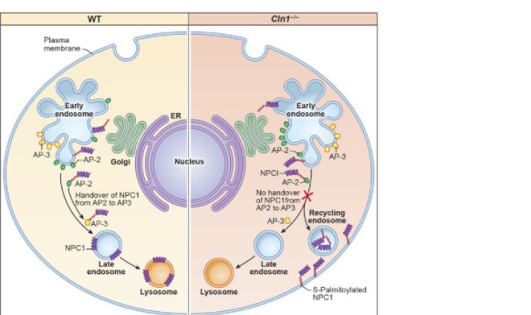

## Question

# Disease Characteristics Research Template

## Target Disease
- **Disease Name:** Neuronal Ceroid Lipofuscinosis 1
- **MONDO ID:**  (if available)
- **Category:** Mendelian

## Research Objectives

Please provide a comprehensive research report on **Neuronal Ceroid Lipofuscinosis 1** covering all of the
disease characteristics listed below. This report will be used to populate a disease knowledge
base entry. Be thorough and cite primary literature (PMID preferred) for all claims.

For each section, **suggested databases/resources** are listed. These are the first places
you should search for information on each topic.

---

### 1. Disease Information
> **Search first:** OMIM, Orphanet, ICD-10/ICD-11, MeSH, PubMed

- What is the disease? Provide a concise overview.
- What are the key identifiers? (OMIM, Orphanet, ICD-10/ICD-11, MeSH, Mondo)
- What are the common synonyms and alternative names?
- Is the information derived from individual patients (e.g., EHR) or aggregated disease-level resources?

### 2. Etiology

- **Disease Causal Factors**: What are the primary causes? (genetic, environmental, infectious, mechanistic)
- **Risk Factors**:
  > **Search first:** PubMed, Cochrane Library, UpToDate, clinical guidelines, ClinVar, ClinGen, GWAS Catalog, PheGenI, CTD, CDC, WHO, epidemiological databases
  - Genetic risk factors (causal variants, susceptibility loci, modifier genes)
  - Environmental risk factors (toxins, lifestyle, occupational exposures, age, sex, family history)
- **Protective Factors**:
  > **Search first:** PubMed, Cochrane Library, clinical trial databases, GWAS Catalog, gnomAD, WHO, CDC, nutrition databases
  - Genetic protective factors (protective variants, modifier alleles)
  - Environmental protective factors (diet, lifestyle, exposures that reduce risk)
- **Gene-Environment Interactions**: How do genetic and environmental factors interact to influence disease?
  > **Search first:** CTD, PubMed, PheGenI, GxE databases

### 3. Phenotypes
> **Search first:** HPO (Human Phenotype Ontology), OMIM, Orphanet, PubMed, clinicaltrials.gov, MedDRA, SNOMED CT, DECIPHER, LOINC

For each phenotype, provide:
- **Phenotype type**: symptoms, clinical signs, physical manifestations, behavioral changes, or laboratory abnormalities
  > For symptoms/signs: HPO, OMIM, Orphanet, PubMed
  > For behavioral changes: HPO, DSM, RDoC (Research Domain Criteria), PubMed
  > For laboratory abnormalities: LOINC, SNOMED CT, LabTests Online, PubMed
- **Phenotype characteristics**:
  > **Search first:** OMIM, Orphanet, HPO, PubMed
  - Age of symptom onset (neonatal, childhood, adult-onset, late-onset)
  - Symptom severity (mild, moderate, severe, variable)
  - Symptom progression (stable, progressive, episodic, fluctuating)
  - Frequency among affected individuals (percentage or qualitative)
- **Quality of life impact**: Effects on daily functioning and well-being (per-phenotype when possible)
  > **Search first:** EQ-5D database, SF-36, WHO QOL databases, PubMed
- Suggest HPO (Human Phenotype Ontology) terms for each phenotype

### 4. Genetic/Molecular Information

- **Causal Genes**: Gene mutations or chromosomal abnormalities responsible for disease (gene symbols, OMIM IDs)
  > **Search first:** OMIM, ClinVar, HGMD, Ensembl, NCBI Gene
- **Pathogenic Variants**:
  - Affected genes (gene symbols, HGNC IDs)
    > **Search first:** OMIM, NCBI Gene, Ensembl, HGNC, UniProt, GeneCards
  - Variant classification (pathogenic, likely pathogenic, VUS per ACMG/AMP guidelines)
    > **Search first:** ClinVar, ClinGen, ACMG/AMP guidelines, VarSome
  - Variant type/class (missense, frameshift, nonsense, splice-site, structural)
  - Allele frequency in population databases
    > **Search first:** gnomAD, 1000 Genomes, ExAC, TOPMed, dbSNP
  - Somatic vs germline origin
    > **Search first:** COSMIC (somatic), ClinVar, ICGC, TCGA
  - Functional consequences (loss of function, gain of function, dominant negative)
- **Modifier Genes**: Genes that modify disease severity or expression
- **Epigenetic Information**: DNA methylation, histone modifications, chromatin changes affecting disease
  > **Search first:** ENCODE, Roadmap Epigenomics, MethBase, DiseaseMeth
- **Chromosomal Abnormalities**: Large-scale genetic changes (aneuploidy, translocations, inversions)
  > **Search first:** DECIPHER, ClinVar, ECARUCA, UCSC Genome Browser

### 5. Environmental Information

- **Environmental Factors**: Non-genetic contributing factors (toxins, radiation, pollution, occupational exposure)
  > **Search first:** CTD (Comparative Toxicogenomics Database), TOXNET, PubMed, EPA databases
- **Lifestyle Factors**: Behavioral factors (smoking, diet, exercise, alcohol consumption)
  > **Search first:** CDC databases, WHO, PubMed, NHANES
- **Infectious Agents**: If applicable, pathogens causing or triggering disease (bacteria, viruses, fungi, parasites)
  > **Search first:** NCBI Taxonomy, ViPR, BV-BRC, MicrobeDB, GIDEON

### 6. Mechanism / Pathophysiology

- **Molecular Pathways**: Specific signaling cascades or biochemical pathways involved (Wnt, MAPK, mTOR, PI3K-AKT, etc.)
  > **Search first:** KEGG, Reactome, WikiPathways, PathBank, BioCyc
- **Cellular Processes**: Cell-level mechanisms (apoptosis, autophagy, cell cycle dysregulation, inflammation, etc.)
  > **Search first:** Gene Ontology (GO), Reactome, KEGG, PubMed
- **Protein Dysfunction**: How protein structure or function is altered (misfolding, aggregation, loss of function, gain of function)
  > **Search first:** UniProt, PDB (Protein Data Bank), InterPro, Pfam, AlphaFold
- **Metabolic Changes**: Alterations in metabolic processes (energy metabolism, lipid metabolism, amino acid metabolism)
  > **Search first:** KEGG, BioCyc, HMDB (Human Metabolome Database), BRENDA
- **Immune System Involvement**: Role of immune response (autoimmunity, immunodeficiency, chronic inflammation)
  > **Search first:** ImmPort, Immunome Database, IEDB, Gene Ontology
- **Tissue Damage Mechanisms**: How tissues/ are injured (oxidative stress, ischemia, fibrosis, necrosis)
  > **Search first:** PubMed, Gene Ontology, Reactome
- **Biochemical Abnormalities**: Specific molecular defects (enzyme deficiencies, receptor dysfunction, ion channel defects)
  > **Search first:** BRENDA, UniProt, KEGG, OMIM, PubMed
- **Epigenetic Changes**: DNA methylation, histone modifications affecting gene expression in disease
  > **Search first:** ENCODE, Roadmap Epigenomics, MethBase, DiseaseMeth
- **Molecular Profiling** (if available):
  - Transcriptomics/gene expression changes
    > **Search first:** GEO (Gene Expression Omnibus), ArrayExpress, GTEx, Human Cell Atlas, SRA
  - Proteomics findings
    > **Search first:** PRIDE, ProteomeXchange, Human Protein Atlas, STRING, BioGRID
  - Metabolomics signatures
    > **Search first:** MetaboLights, Metabolomics Workbench, HMDB, METLIN
  - Lipidomics alterations
    > **Search first:** LIPID MAPS, SwissLipids, LipidHome, Metabolomics Workbench
  - Genomic structural features
    > **Search first:** UCSC Genome Browser, Ensembl, NCBI, dbVar, DGV
- **Advanced Technologies** (if applicable):
  - Single-cell analysis findings (cell-type specific mechanisms, cellular heterogeneity)
    > **Search first:** Human Cell Atlas, Single Cell Portal, GEO, CELLxGENE
  - Spatial transcriptomics findings
    > **Search first:** GEO, Spatial Research, Vizgen, 10x Genomics data
  - Multi-omics integration results
    > **Search first:** TCGA, ICGC, cBioPortal, LinkedOmics, PubMed
  - Functional genomics screens (CRISPR, RNAi)
    > **Search first:** DepMap, GenomeRNAi, PubMed, BioGRID ORCS

For each mechanism, describe:
- The causal chain from initial trigger to clinical manifestation
- Which mechanisms are upstream vs downstream
- What cell types and biological processes are involved
- Suggest GO terms for biological processes and CL terms for cell types

### 7. Anatomical Structures Affected

- **Organ Level**:
  - Primary organs directly affected
  - Secondary organ involvement (complications, secondary effects)
  - Body systems involved (cardiovascular, nervous, digestive, respiratory, endocrine, etc.)
  > **Search first:** Uberon, FMA (Foundational Model of Anatomy), OMIM, HPO, ICD-11, MeSH, SNOMED CT
- **Tissue and Cell Level**:
  - Specific tissue types affected (epithelial, connective, muscle, nervous)
  - Specific cell populations targeted (with Cell Ontology terms)
  > **Search first:** Uberon, Human Protein Atlas, Cell Ontology, Human Cell Atlas, CellMarker, PanglaoDB
- **Subcellular Level**:
  - Cellular compartments involved (mitochondria, nucleus, ER, lysosomes) (with GO Cellular Component terms)
  > **Search first:** Gene Ontology (Cellular Component), UniProt, Human Protein Atlas
- **Localization**:
  - Specific anatomical sites (with UBERON terms)
    > **Search first:** FMA, Uberon, NeuroNames (for brain), SNOMED CT
  - Lateralization (unilateral, bilateral, asymmetric)
    > **Search first:** HPO, clinical literature, imaging databases

### 8. Temporal Development

- **Onset**:
  - Typical age of onset (congenital, pediatric, adult, geriatric)
  - Onset pattern (acute, subacute, chronic, insidious)
  > **Search first:** OMIM, Orphanet, HPO, PubMed
- **Progression**:
  - Disease stages (early, intermediate, advanced, end-stage)
    > **Search first:** Cancer Staging Manual (AJCC), WHO classifications, PubMed
  - Progression rate (rapid, slow, variable)
  - Disease course pattern (episodic, relapsing-remitting, progressive, stable)
  - Disease duration (self-limited, chronic lifelong)
  > **Search first:** Disease registries, longitudinal cohort databases, natural history studies, PubMed, Orphanet, OMIM
- **Patterns**:
  - Remission patterns (spontaneous, treatment-induced)
    > **Search first:** Clinical trial databases, disease registries, PubMed
  - Critical periods (time windows of vulnerability or opportunity for intervention)
    > **Search first:** PubMed, developmental biology databases, clinical guidelines

### 9. Inheritance and Population

- **Epidemiology**:
  - Prevalence (cases per 100,000 at given time)
  - Incidence (new cases per 100,000 per year)
  > **Search first:** Orphanet, CDC, WHO, GBD (Global Burden of Disease), national registries, SEER, disease registries
- **For Genetic Etiology**:
  - Inheritance pattern (AD, AR, X-linked, mitochondrial, multifactorial, polygenic)
    > **Search first:** OMIM, Orphanet, ClinVar, GTR (Genetic Testing Registry)
  - Penetrance (complete, incomplete, age-dependent)
    > **Search first:** ClinVar, OMIM, PubMed, ClinGen
  - Expressivity (variable, consistent)
    > **Search first:** OMIM, ClinVar, PubMed
  - Genetic anticipation (increasing severity in successive generations)
    > **Search first:** OMIM, PubMed (especially for repeat expansion disorders)
  - Germline mosaicism
    > **Search first:** ClinVar, OMIM, genetic counseling literature, PubMed
  - Founder effects (population-specific mutations)
    > **Search first:** gnomAD, population genetics databases, PubMed
  - Consanguinity role
    > **Search first:** OMIM, population studies, genetic counseling resources
  - Carrier frequency
    > **Search first:** gnomAD, carrier screening databases, GeneReviews, GTR
- **Population Demographics**:
  - Affected populations (ethnic or demographic groups with higher prevalence)
    > **Search first:** gnomAD, 1000 Genomes, PAGE Study, PubMed, population registries
  - Geographic distribution (endemic areas, regional variation)
    > **Search first:** WHO, CDC, GBD, Orphanet, geographic epidemiology databases
  - Geographic distribution of specific variants
  - Sex ratio (male:female)
    > **Search first:** Disease registries, OMIM, PubMed, epidemiological databases
  - Age distribution of affected individuals
    > **Search first:** CDC, disease registries, SEER, Orphanet

### 10. Diagnostics

- **Clinical Tests**:
  - Laboratory tests (blood, urine, tissue chemistry, specific enzyme assays)
    > **Search first:** LOINC, LabTests Online, PubMed
  - Biomarkers (proteins, metabolites, genetic markers, circulating biomarkers)
    > **Search first:** FDA Biomarker List, BEST (Biomarkers, EndpointS, and other Tools), PubMed
  - Imaging studies (X-ray, CT, MRI, PET, ultrasound)
    > **Search first:** RadLex, DICOM, Radiopaedia, imaging databases
  - Functional tests (pulmonary function, cardiac stress tests)
    > **Search first:** LOINC, clinical guidelines, PubMed
  - Electrophysiology (EEG, EMG, ECG, nerve conduction studies)
    > **Search first:** LOINC, clinical neurophysiology databases, PubMed
  - Biopsy findings (histopathology, immunohistochemistry)
    > **Search first:** SNOMED CT, College of American Pathologists resources, PubMed
  - Pathology findings (microscopic examination)
    > **Search first:** SNOMED CT, Digital Pathology databases, PubMed
- **Genetic Testing**:
  > **Search first:** GTR (Genetic Testing Registry), GeneReviews, ClinGen
  - Overview of recommended genetic testing approach
  - Whole genome sequencing (WGS) utility
    > **Search first:** GTR, ClinVar, GEL (Genomics England), gnomAD
  - Whole exome sequencing (WES) utility
    > **Search first:** GTR, ClinVar, OMIM, GeneMatcher
  - Gene panels (which panels, which genes)
    > **Search first:** GTR, ClinVar, laboratory-specific databases
  - Single gene testing
    > **Search first:** GTR, ClinVar, OMIM, GeneReviews
  - Chromosomal microarray (CMA)
    > **Search first:** DECIPHER, ClinVar, dbVar, ECARUCA
  - Karyotyping
    > **Search first:** Chromosome Abnormality Database, ClinVar, cytogenetics resources
  - FISH
    > **Search first:** ClinVar, cytogenetics databases, PubMed
  - Mitochondrial DNA testing
    > **Search first:** MITOMAP, MSeqDR, ClinVar, GTR
  - Repeat expansion testing
    > **Search first:** GTR, ClinVar, repeat expansion databases, PubMed
- **Omics-Based Diagnostics** (if applicable):
  - RNA sequencing / transcriptomics
    > **Search first:** GEO, ArrayExpress, GTEx, RNA-seq databases
  - Proteomics
    > **Search first:** PRIDE, ProteomeXchange, FDA Biomarker database
  - Metabolomics
    > **Search first:** MetaboLights, Metabolomics Workbench, HMDB
  - Epigenomics
    > **Search first:** GEO, ENCODE, Roadmap Epigenomics, MethBase
  - Liquid biopsy
    > **Search first:** COSMIC, ClinVar, liquid biopsy databases, PubMed
- **Clinical Criteria**:
  - Standardized diagnostic criteria (DSM, ICD, society guidelines)
    > **Search first:** DSM-5, ICD-11, clinical society guidelines, UpToDate
  - Differential diagnosis (other conditions to rule out, with distinguishing features)
    > **Search first:** DynaMed, UpToDate, clinical decision support systems
- **Screening**:
  - Screening methods for asymptomatic individuals (newborn screening, carrier screening, cascade screening)
    > **Search first:** ACMG recommendations, CDC newborn screening, GTR

### 11. Outcome/Prognosis

- **Survival and Mortality**:
  - Survival rate (5-year, 10-year, overall)
    > **Search first:** SEER, cancer registries, disease-specific registries, PubMed
  - Life expectancy (with and without treatment if applicable)
    > **Search first:** Orphanet, disease registries, actuarial databases, PubMed
  - Mortality rate
    > **Search first:** CDC, WHO, GBD, national mortality databases
  - Disease-specific mortality (deaths directly attributable to disease)
    > **Search first:** Disease registries, CDC Wonder, GBD, PubMed
- **Morbidity and Function**:
  - Morbidity (disease-related disability and health impacts)
    > **Search first:** GBD, WHO, disability databases, PubMed
  - Disability outcomes (long-term functional impairments)
    > **Search first:** ICF (International Classification of Functioning), disability registries
  - Quality of life measures (EQ-5D, SF-36, PROMIS, disease-specific tools)
    > **Search first:** EQ-5D database, SF-36, PROMIS, PubMed
- **Disease Course**:
  - Complications (secondary problems: infections, organ failure, etc.)
    > **Search first:** ICD codes, disease registries, clinical databases, PubMed
  - Recovery potential (likelihood and extent of recovery, with vs without treatment)
    > **Search first:** Natural history studies, rehabilitation databases, PubMed
- **Prediction**:
  - Prognostic factors (age, disease severity, biomarkers, treatment response)
    > **Search first:** Prognostic models databases, clinical calculators, PubMed
  - Prognostic biomarkers (molecular markers predicting disease course)
    > **Search first:** FDA Biomarker database, PubMed, cancer prognostic databases

### 12. Treatment

- **Pharmacotherapy**:
  - Pharmacological treatments (drug names, drug classes, mechanisms of action)
    > **Search first:** DrugBank, RxNorm, ATC classification, DailyMed, FDA databases
  - Pharmacogenomics (how genetic variants affect drug metabolism, efficacy, toxicity)
    > **Search first:** PharmGKB, CPIC (Clinical Pharmacogenetics), FDA Table of PGx Biomarkers
- **Advanced Therapeutics**:
  - Gene therapy (viral vectors, CRISPR, gene replacement, gene editing)
    > **Search first:** ClinicalTrials.gov, FDA gene therapy database, ASGCT resources
  - Cell therapy (stem cell transplant, CAR-T, cellular therapeutics)
    > **Search first:** ClinicalTrials.gov, FDA cell therapy database, FACT standards
  - RNA-based therapies (ASOs, siRNA, mRNA therapies)
    > **Search first:** ClinicalTrials.gov, FDA approvals, PubMed
  - Targeted therapies (treatments directed at specific molecular targets)
    > **Search first:** My Cancer Genome, OncoKB, ClinicalTrials.gov, FDA approvals
  - Immunotherapies (checkpoint inhibitors, monoclonal antibodies)
    > **Search first:** Cancer Immunotherapy Database, FDA approvals, ClinicalTrials.gov
- **Surgical and Interventional**:
  - Surgical interventions (types of surgery, timing, outcomes)
    > **Search first:** CPT codes, surgical registries, clinical guidelines, PubMed
- **Supportive and Rehabilitative**:
  - Supportive care (symptom management, pain control, nutrition)
    > **Search first:** Clinical guidelines, Cochrane Library, PubMed
  - Rehabilitation (physical therapy, occupational therapy, speech therapy)
    > **Search first:** Rehabilitation medicine databases, clinical guidelines, PubMed
- **Experimental**:
  - Experimental treatments in clinical trials (with NCT identifiers if available)
    > **Search first:** ClinicalTrials.gov, EU Clinical Trials Register, WHO ICTRP
- **Treatment Outcomes**:
  - Treatment response rates
    > **Search first:** Clinical trial databases, FDA reviews, systematic reviews, PubMed
  - Side effects and adverse events
    > **Search first:** FDA Adverse Event Reporting System (FAERS), MedWatch, PubMed
- **Treatment Strategy**:
  - Treatment algorithms (clinical pathways, decision trees)
    > **Search first:** Clinical practice guidelines, NCCN Guidelines, UpToDate
  - Combination therapies
    > **Search first:** ClinicalTrials.gov, treatment guidelines, PubMed
  - Personalized medicine approaches (genotype-guided treatment)
    > **Search first:** My Cancer Genome, CIViC, PharmGKB, precision medicine databases

For each treatment, suggest MAXO (Medical Action Ontology) terms where applicable.

### 13. Prevention

- **Prevention Levels**:
  - Primary prevention (preventing disease occurrence: vaccination, risk factor modification)
    > **Search first:** CDC, WHO, USPSTF recommendations, Cochrane Library
  - Secondary prevention (early detection and treatment: screening programs, early intervention)
    > **Search first:** USPSTF, CDC screening guidelines, WHO
  - Tertiary prevention (preventing complications in those with disease)
    > **Search first:** Clinical guidelines, disease management protocols, PubMed
- **Immunization**: Vaccine strategies (if applicable)
  > **Search first:** CDC vaccine schedules, WHO immunization, FDA vaccine database
- **Screening and Early Detection**:
  - Screening programs (population-based: newborn screening, cancer screening)
    > **Search first:** CDC screening programs, USPSTF, cancer screening databases
  - Genetic screening (carrier screening, preimplantation genetic diagnosis, prenatal testing)
    > **Search first:** ACMG recommendations, ACOG guidelines, GTR
  - Risk stratification (identifying high-risk individuals for targeted prevention)
    > **Search first:** Risk prediction models, clinical calculators, PubMed
- **Behavioral Interventions**: Lifestyle modifications to reduce risk
  > **Search first:** CDC, WHO, behavioral intervention databases, Cochrane Library
- **Counseling**: Genetic counseling (risk assessment, family planning guidance)
  > **Search first:** NSGC resources, ACMG guidelines, GeneReviews
- **Public Health**:
  - Public health interventions (sanitation, vector control, health education)
    > **Search first:** CDC, WHO, public health databases, PubMed
  - Environmental interventions (reducing environmental risk factors)
    > **Search first:** EPA databases, WHO environmental health, PubMed
- **Prophylaxis**: Preventive medications or procedures
  > **Search first:** Clinical guidelines, FDA approvals, PubMed

### 14. Other Species / Natural Disease

- **Taxonomy**: Species affected (with NCBI Taxon identifiers)
  > **Search first:** NCBI Taxonomy
- **Breed**: Specific breeds affected (with VBO identifiers if applicable)
  > **Search first:** VBO (Vertebrate Breed Ontology)
- **Gene**: Orthologous genes in other species (with NCBI Gene IDs)
  > **Search first:** NCBI Gene
- **Natural Disease**:
  - Naturally occurring disease in other species (companion animals, wildlife)
    > **Search first:** OMIA (Online Mendelian Inheritance in Animals), VetCompass, PubMed
  - Veterinary relevance and importance in animal health
    > **Search first:** OMIA, veterinary databases, PubMed
- **Comparative Biology**:
  - Comparative pathology (similarities and differences across species)
    > **Search first:** OMIA, comparative pathology databases, PubMed
  - Evolutionary conservation of disease mechanisms
    > **Search first:** HomoloGene, OrthoMCL, Alliance of Genome Resources
- **Transmission** (if applicable):
  - Zoonotic potential
    > **Search first:** CDC zoonotic diseases, WHO zoonoses, GIDEON
  - Cross-species susceptibility
    > **Search first:** NCBI Taxonomy, veterinary databases, PubMed

### 15. Model Organisms

- **Model Types**:
  - Model organism type (mammalian, invertebrate, cellular, in vitro)
    > **Search first:** Alliance of Genome Resources, model organism databases
  - Specific model systems (mouse, rat, zebrafish, Drosophila, C. elegans, yeast, cell lines, organoids, iPSCs)
    > **Search first:** MGI, RGD, ZFIN, FlyBase, WormBase, SGD, ATCC, Cellosaurus
  - Induced models (drug treatment, surgical intervention, environmental manipulation)
    > **Search first:** MGI, model organism databases, PubMed
- **Genetic Models**:
  - Types available (knockout, knock-in, transgenic, conditional, humanized)
    > **Search first:** MGI, IMPC, KOMP, EuMMCR, IMSR
- **Model Characteristics**:
  - Phenotype recapitulation (how well model reproduces human disease features)
    > **Search first:** Model organism databases, comparative studies, PubMed
  - Model limitations (aspects of human disease not captured)
    > **Search first:** Model organism databases, PubMed, review articles
- **Applications**:
  - Research applications (what aspects of disease can be studied)
    > **Search first:** Model organism databases, PubMed
- **Resources**:
  - Model databases
    > **Search first:** MGI, RGD, ZFIN, FlyBase, WormBase, IMSR, EMMA, MMRRC

---

## Citation Requirements

- Cite primary literature (PMID preferred) for all mechanistic and clinical claims
- Prioritize recent reviews and landmark papers
- Include direct quotes from abstracts where possible to support key statements
- Distinguish evidence source types: human clinical, model organism, in vitro, computational

## Output Format

Structure your response as a comprehensive narrative organized by the sections above.
For each section, provide:
- Factual content with specific details (numbers, percentages, gene names, variant nomenclature)
- Ontology term suggestions (HPO, GO, CL, UBERON, CHEBI, MAXO, MONDO) where applicable
- Evidence citations with PMIDs
- Direct quotes from abstracts to support key claims
- Clear indication when information is not available or not applicable for this disease

This report will be used to populate a disease knowledge base entry with:
- Pathophysiology descriptions with causal chains
- Gene/protein annotations (HGNC, GO terms)
- Phenotype associations (HP terms) with frequencies
- Cell type involvement (CL terms)
- Anatomical locations (UBERON terms)
- Chemical entities (CHEBI terms)
- Treatment annotations (MAXO terms)
- Evidence items with PMIDs and exact abstract quotes
- Epidemiology, prognosis, diagnostic, and prevention information
- Animal model descriptions with phenotype recapitulation details

## Output

Question: You are an expert researcher providing comprehensive, well-cited information.

Provide detailed information focusing on:
1. Key concepts and definitions with current understanding
2. Recent developments and latest research (prioritize 2023-2024 sources)
3. Current applications and real-world implementations
4. Expert opinions and analysis from authoritative sources
5. Relevant statistics and data from recent studies

Format as a comprehensive research report with proper citations. Include URLs and publication dates where available.
Always prioritize recent, authoritative sources and provide specific citations for all major claims.

# Disease Characteristics Research Template

## Target Disease
- **Disease Name:** Neuronal Ceroid Lipofuscinosis 1
- **MONDO ID:**  (if available)
- **Category:** Mendelian

## Research Objectives

Please provide a comprehensive research report on **Neuronal Ceroid Lipofuscinosis 1** covering all of the
disease characteristics listed below. This report will be used to populate a disease knowledge
base entry. Be thorough and cite primary literature (PMID preferred) for all claims.

For each section, **suggested databases/resources** are listed. These are the first places
you should search for information on each topic.

---

### 1. Disease Information
> **Search first:** OMIM, Orphanet, ICD-10/ICD-11, MeSH, PubMed

- What is the disease? Provide a concise overview.
- What are the key identifiers? (OMIM, Orphanet, ICD-10/ICD-11, MeSH, Mondo)
- What are the common synonyms and alternative names?
- Is the information derived from individual patients (e.g., EHR) or aggregated disease-level resources?

### 2. Etiology

- **Disease Causal Factors**: What are the primary causes? (genetic, environmental, infectious, mechanistic)
- **Risk Factors**:
  > **Search first:** PubMed, Cochrane Library, UpToDate, clinical guidelines, ClinVar, ClinGen, GWAS Catalog, PheGenI, CTD, CDC, WHO, epidemiological databases
  - Genetic risk factors (causal variants, susceptibility loci, modifier genes)
  - Environmental risk factors (toxins, lifestyle, occupational exposures, age, sex, family history)
- **Protective Factors**:
  > **Search first:** PubMed, Cochrane Library, clinical trial databases, GWAS Catalog, gnomAD, WHO, CDC, nutrition databases
  - Genetic protective factors (protective variants, modifier alleles)
  - Environmental protective factors (diet, lifestyle, exposures that reduce risk)
- **Gene-Environment Interactions**: How do genetic and environmental factors interact to influence disease?
  > **Search first:** CTD, PubMed, PheGenI, GxE databases

### 3. Phenotypes
> **Search first:** HPO (Human Phenotype Ontology), OMIM, Orphanet, PubMed, clinicaltrials.gov, MedDRA, SNOMED CT, DECIPHER, LOINC

For each phenotype, provide:
- **Phenotype type**: symptoms, clinical signs, physical manifestations, behavioral changes, or laboratory abnormalities
  > For symptoms/signs: HPO, OMIM, Orphanet, PubMed
  > For behavioral changes: HPO, DSM, RDoC (Research Domain Criteria), PubMed
  > For laboratory abnormalities: LOINC, SNOMED CT, LabTests Online, PubMed
- **Phenotype characteristics**:
  > **Search first:** OMIM, Orphanet, HPO, PubMed
  - Age of symptom onset (neonatal, childhood, adult-onset, late-onset)
  - Symptom severity (mild, moderate, severe, variable)
  - Symptom progression (stable, progressive, episodic, fluctuating)
  - Frequency among affected individuals (percentage or qualitative)
- **Quality of life impact**: Effects on daily functioning and well-being (per-phenotype when possible)
  > **Search first:** EQ-5D database, SF-36, WHO QOL databases, PubMed
- Suggest HPO (Human Phenotype Ontology) terms for each phenotype

### 4. Genetic/Molecular Information

- **Causal Genes**: Gene mutations or chromosomal abnormalities responsible for disease (gene symbols, OMIM IDs)
  > **Search first:** OMIM, ClinVar, HGMD, Ensembl, NCBI Gene
- **Pathogenic Variants**:
  - Affected genes (gene symbols, HGNC IDs)
    > **Search first:** OMIM, NCBI Gene, Ensembl, HGNC, UniProt, GeneCards
  - Variant classification (pathogenic, likely pathogenic, VUS per ACMG/AMP guidelines)
    > **Search first:** ClinVar, ClinGen, ACMG/AMP guidelines, VarSome
  - Variant type/class (missense, frameshift, nonsense, splice-site, structural)
  - Allele frequency in population databases
    > **Search first:** gnomAD, 1000 Genomes, ExAC, TOPMed, dbSNP
  - Somatic vs germline origin
    > **Search first:** COSMIC (somatic), ClinVar, ICGC, TCGA
  - Functional consequences (loss of function, gain of function, dominant negative)
- **Modifier Genes**: Genes that modify disease severity or expression
- **Epigenetic Information**: DNA methylation, histone modifications, chromatin changes affecting disease
  > **Search first:** ENCODE, Roadmap Epigenomics, MethBase, DiseaseMeth
- **Chromosomal Abnormalities**: Large-scale genetic changes (aneuploidy, translocations, inversions)
  > **Search first:** DECIPHER, ClinVar, ECARUCA, UCSC Genome Browser

### 5. Environmental Information

- **Environmental Factors**: Non-genetic contributing factors (toxins, radiation, pollution, occupational exposure)
  > **Search first:** CTD (Comparative Toxicogenomics Database), TOXNET, PubMed, EPA databases
- **Lifestyle Factors**: Behavioral factors (smoking, diet, exercise, alcohol consumption)
  > **Search first:** CDC databases, WHO, PubMed, NHANES
- **Infectious Agents**: If applicable, pathogens causing or triggering disease (bacteria, viruses, fungi, parasites)
  > **Search first:** NCBI Taxonomy, ViPR, BV-BRC, MicrobeDB, GIDEON

### 6. Mechanism / Pathophysiology

- **Molecular Pathways**: Specific signaling cascades or biochemical pathways involved (Wnt, MAPK, mTOR, PI3K-AKT, etc.)
  > **Search first:** KEGG, Reactome, WikiPathways, PathBank, BioCyc
- **Cellular Processes**: Cell-level mechanisms (apoptosis, autophagy, cell cycle dysregulation, inflammation, etc.)
  > **Search first:** Gene Ontology (GO), Reactome, KEGG, PubMed
- **Protein Dysfunction**: How protein structure or function is altered (misfolding, aggregation, loss of function, gain of function)
  > **Search first:** UniProt, PDB (Protein Data Bank), InterPro, Pfam, AlphaFold
- **Metabolic Changes**: Alterations in metabolic processes (energy metabolism, lipid metabolism, amino acid metabolism)
  > **Search first:** KEGG, BioCyc, HMDB (Human Metabolome Database), BRENDA
- **Immune System Involvement**: Role of immune response (autoimmunity, immunodeficiency, chronic inflammation)
  > **Search first:** ImmPort, Immunome Database, IEDB, Gene Ontology
- **Tissue Damage Mechanisms**: How tissues/ are injured (oxidative stress, ischemia, fibrosis, necrosis)
  > **Search first:** PubMed, Gene Ontology, Reactome
- **Biochemical Abnormalities**: Specific molecular defects (enzyme deficiencies, receptor dysfunction, ion channel defects)
  > **Search first:** BRENDA, UniProt, KEGG, OMIM, PubMed
- **Epigenetic Changes**: DNA methylation, histone modifications affecting gene expression in disease
  > **Search first:** ENCODE, Roadmap Epigenomics, MethBase, DiseaseMeth
- **Molecular Profiling** (if available):
  - Transcriptomics/gene expression changes
    > **Search first:** GEO (Gene Expression Omnibus), ArrayExpress, GTEx, Human Cell Atlas, SRA
  - Proteomics findings
    > **Search first:** PRIDE, ProteomeXchange, Human Protein Atlas, STRING, BioGRID
  - Metabolomics signatures
    > **Search first:** MetaboLights, Metabolomics Workbench, HMDB, METLIN
  - Lipidomics alterations
    > **Search first:** LIPID MAPS, SwissLipids, LipidHome, Metabolomics Workbench
  - Genomic structural features
    > **Search first:** UCSC Genome Browser, Ensembl, NCBI, dbVar, DGV
- **Advanced Technologies** (if applicable):
  - Single-cell analysis findings (cell-type specific mechanisms, cellular heterogeneity)
    > **Search first:** Human Cell Atlas, Single Cell Portal, GEO, CELLxGENE
  - Spatial transcriptomics findings
    > **Search first:** GEO, Spatial Research, Vizgen, 10x Genomics data
  - Multi-omics integration results
    > **Search first:** TCGA, ICGC, cBioPortal, LinkedOmics, PubMed
  - Functional genomics screens (CRISPR, RNAi)
    > **Search first:** DepMap, GenomeRNAi, PubMed, BioGRID ORCS

For each mechanism, describe:
- The causal chain from initial trigger to clinical manifestation
- Which mechanisms are upstream vs downstream
- What cell types and biological processes are involved
- Suggest GO terms for biological processes and CL terms for cell types

### 7. Anatomical Structures Affected

- **Organ Level**:
  - Primary organs directly affected
  - Secondary organ involvement (complications, secondary effects)
  - Body systems involved (cardiovascular, nervous, digestive, respiratory, endocrine, etc.)
  > **Search first:** Uberon, FMA (Foundational Model of Anatomy), OMIM, HPO, ICD-11, MeSH, SNOMED CT
- **Tissue and Cell Level**:
  - Specific tissue types affected (epithelial, connective, muscle, nervous)
  - Specific cell populations targeted (with Cell Ontology terms)
  > **Search first:** Uberon, Human Protein Atlas, Cell Ontology, Human Cell Atlas, CellMarker, PanglaoDB
- **Subcellular Level**:
  - Cellular compartments involved (mitochondria, nucleus, ER, lysosomes) (with GO Cellular Component terms)
  > **Search first:** Gene Ontology (Cellular Component), UniProt, Human Protein Atlas
- **Localization**:
  - Specific anatomical sites (with UBERON terms)
    > **Search first:** FMA, Uberon, NeuroNames (for brain), SNOMED CT
  - Lateralization (unilateral, bilateral, asymmetric)
    > **Search first:** HPO, clinical literature, imaging databases

### 8. Temporal Development

- **Onset**:
  - Typical age of onset (congenital, pediatric, adult, geriatric)
  - Onset pattern (acute, subacute, chronic, insidious)
  > **Search first:** OMIM, Orphanet, HPO, PubMed
- **Progression**:
  - Disease stages (early, intermediate, advanced, end-stage)
    > **Search first:** Cancer Staging Manual (AJCC), WHO classifications, PubMed
  - Progression rate (rapid, slow, variable)
  - Disease course pattern (episodic, relapsing-remitting, progressive, stable)
  - Disease duration (self-limited, chronic lifelong)
  > **Search first:** Disease registries, longitudinal cohort databases, natural history studies, PubMed, Orphanet, OMIM
- **Patterns**:
  - Remission patterns (spontaneous, treatment-induced)
    > **Search first:** Clinical trial databases, disease registries, PubMed
  - Critical periods (time windows of vulnerability or opportunity for intervention)
    > **Search first:** PubMed, developmental biology databases, clinical guidelines

### 9. Inheritance and Population

- **Epidemiology**:
  - Prevalence (cases per 100,000 at given time)
  - Incidence (new cases per 100,000 per year)
  > **Search first:** Orphanet, CDC, WHO, GBD (Global Burden of Disease), national registries, SEER, disease registries
- **For Genetic Etiology**:
  - Inheritance pattern (AD, AR, X-linked, mitochondrial, multifactorial, polygenic)
    > **Search first:** OMIM, Orphanet, ClinVar, GTR (Genetic Testing Registry)
  - Penetrance (complete, incomplete, age-dependent)
    > **Search first:** ClinVar, OMIM, PubMed, ClinGen
  - Expressivity (variable, consistent)
    > **Search first:** OMIM, ClinVar, PubMed
  - Genetic anticipation (increasing severity in successive generations)
    > **Search first:** OMIM, PubMed (especially for repeat expansion disorders)
  - Germline mosaicism
    > **Search first:** ClinVar, OMIM, genetic counseling literature, PubMed
  - Founder effects (population-specific mutations)
    > **Search first:** gnomAD, population genetics databases, PubMed
  - Consanguinity role
    > **Search first:** OMIM, population studies, genetic counseling resources
  - Carrier frequency
    > **Search first:** gnomAD, carrier screening databases, GeneReviews, GTR
- **Population Demographics**:
  - Affected populations (ethnic or demographic groups with higher prevalence)
    > **Search first:** gnomAD, 1000 Genomes, PAGE Study, PubMed, population registries
  - Geographic distribution (endemic areas, regional variation)
    > **Search first:** WHO, CDC, GBD, Orphanet, geographic epidemiology databases
  - Geographic distribution of specific variants
  - Sex ratio (male:female)
    > **Search first:** Disease registries, OMIM, PubMed, epidemiological databases
  - Age distribution of affected individuals
    > **Search first:** CDC, disease registries, SEER, Orphanet

### 10. Diagnostics

- **Clinical Tests**:
  - Laboratory tests (blood, urine, tissue chemistry, specific enzyme assays)
    > **Search first:** LOINC, LabTests Online, PubMed
  - Biomarkers (proteins, metabolites, genetic markers, circulating biomarkers)
    > **Search first:** FDA Biomarker List, BEST (Biomarkers, EndpointS, and other Tools), PubMed
  - Imaging studies (X-ray, CT, MRI, PET, ultrasound)
    > **Search first:** RadLex, DICOM, Radiopaedia, imaging databases
  - Functional tests (pulmonary function, cardiac stress tests)
    > **Search first:** LOINC, clinical guidelines, PubMed
  - Electrophysiology (EEG, EMG, ECG, nerve conduction studies)
    > **Search first:** LOINC, clinical neurophysiology databases, PubMed
  - Biopsy findings (histopathology, immunohistochemistry)
    > **Search first:** SNOMED CT, College of American Pathologists resources, PubMed
  - Pathology findings (microscopic examination)
    > **Search first:** SNOMED CT, Digital Pathology databases, PubMed
- **Genetic Testing**:
  > **Search first:** GTR (Genetic Testing Registry), GeneReviews, ClinGen
  - Overview of recommended genetic testing approach
  - Whole genome sequencing (WGS) utility
    > **Search first:** GTR, ClinVar, GEL (Genomics England), gnomAD
  - Whole exome sequencing (WES) utility
    > **Search first:** GTR, ClinVar, OMIM, GeneMatcher
  - Gene panels (which panels, which genes)
    > **Search first:** GTR, ClinVar, laboratory-specific databases
  - Single gene testing
    > **Search first:** GTR, ClinVar, OMIM, GeneReviews
  - Chromosomal microarray (CMA)
    > **Search first:** DECIPHER, ClinVar, dbVar, ECARUCA
  - Karyotyping
    > **Search first:** Chromosome Abnormality Database, ClinVar, cytogenetics resources
  - FISH
    > **Search first:** ClinVar, cytogenetics databases, PubMed
  - Mitochondrial DNA testing
    > **Search first:** MITOMAP, MSeqDR, ClinVar, GTR
  - Repeat expansion testing
    > **Search first:** GTR, ClinVar, repeat expansion databases, PubMed
- **Omics-Based Diagnostics** (if applicable):
  - RNA sequencing / transcriptomics
    > **Search first:** GEO, ArrayExpress, GTEx, RNA-seq databases
  - Proteomics
    > **Search first:** PRIDE, ProteomeXchange, FDA Biomarker database
  - Metabolomics
    > **Search first:** MetaboLights, Metabolomics Workbench, HMDB
  - Epigenomics
    > **Search first:** GEO, ENCODE, Roadmap Epigenomics, MethBase
  - Liquid biopsy
    > **Search first:** COSMIC, ClinVar, liquid biopsy databases, PubMed
- **Clinical Criteria**:
  - Standardized diagnostic criteria (DSM, ICD, society guidelines)
    > **Search first:** DSM-5, ICD-11, clinical society guidelines, UpToDate
  - Differential diagnosis (other conditions to rule out, with distinguishing features)
    > **Search first:** DynaMed, UpToDate, clinical decision support systems
- **Screening**:
  - Screening methods for asymptomatic individuals (newborn screening, carrier screening, cascade screening)
    > **Search first:** ACMG recommendations, CDC newborn screening, GTR

### 11. Outcome/Prognosis

- **Survival and Mortality**:
  - Survival rate (5-year, 10-year, overall)
    > **Search first:** SEER, cancer registries, disease-specific registries, PubMed
  - Life expectancy (with and without treatment if applicable)
    > **Search first:** Orphanet, disease registries, actuarial databases, PubMed
  - Mortality rate
    > **Search first:** CDC, WHO, GBD, national mortality databases
  - Disease-specific mortality (deaths directly attributable to disease)
    > **Search first:** Disease registries, CDC Wonder, GBD, PubMed
- **Morbidity and Function**:
  - Morbidity (disease-related disability and health impacts)
    > **Search first:** GBD, WHO, disability databases, PubMed
  - Disability outcomes (long-term functional impairments)
    > **Search first:** ICF (International Classification of Functioning), disability registries
  - Quality of life measures (EQ-5D, SF-36, PROMIS, disease-specific tools)
    > **Search first:** EQ-5D database, SF-36, PROMIS, PubMed
- **Disease Course**:
  - Complications (secondary problems: infections, organ failure, etc.)
    > **Search first:** ICD codes, disease registries, clinical databases, PubMed
  - Recovery potential (likelihood and extent of recovery, with vs without treatment)
    > **Search first:** Natural history studies, rehabilitation databases, PubMed
- **Prediction**:
  - Prognostic factors (age, disease severity, biomarkers, treatment response)
    > **Search first:** Prognostic models databases, clinical calculators, PubMed
  - Prognostic biomarkers (molecular markers predicting disease course)
    > **Search first:** FDA Biomarker database, PubMed, cancer prognostic databases

### 12. Treatment

- **Pharmacotherapy**:
  - Pharmacological treatments (drug names, drug classes, mechanisms of action)
    > **Search first:** DrugBank, RxNorm, ATC classification, DailyMed, FDA databases
  - Pharmacogenomics (how genetic variants affect drug metabolism, efficacy, toxicity)
    > **Search first:** PharmGKB, CPIC (Clinical Pharmacogenetics), FDA Table of PGx Biomarkers
- **Advanced Therapeutics**:
  - Gene therapy (viral vectors, CRISPR, gene replacement, gene editing)
    > **Search first:** ClinicalTrials.gov, FDA gene therapy database, ASGCT resources
  - Cell therapy (stem cell transplant, CAR-T, cellular therapeutics)
    > **Search first:** ClinicalTrials.gov, FDA cell therapy database, FACT standards
  - RNA-based therapies (ASOs, siRNA, mRNA therapies)
    > **Search first:** ClinicalTrials.gov, FDA approvals, PubMed
  - Targeted therapies (treatments directed at specific molecular targets)
    > **Search first:** My Cancer Genome, OncoKB, ClinicalTrials.gov, FDA approvals
  - Immunotherapies (checkpoint inhibitors, monoclonal antibodies)
    > **Search first:** Cancer Immunotherapy Database, FDA approvals, ClinicalTrials.gov
- **Surgical and Interventional**:
  - Surgical interventions (types of surgery, timing, outcomes)
    > **Search first:** CPT codes, surgical registries, clinical guidelines, PubMed
- **Supportive and Rehabilitative**:
  - Supportive care (symptom management, pain control, nutrition)
    > **Search first:** Clinical guidelines, Cochrane Library, PubMed
  - Rehabilitation (physical therapy, occupational therapy, speech therapy)
    > **Search first:** Rehabilitation medicine databases, clinical guidelines, PubMed
- **Experimental**:
  - Experimental treatments in clinical trials (with NCT identifiers if available)
    > **Search first:** ClinicalTrials.gov, EU Clinical Trials Register, WHO ICTRP
- **Treatment Outcomes**:
  - Treatment response rates
    > **Search first:** Clinical trial databases, FDA reviews, systematic reviews, PubMed
  - Side effects and adverse events
    > **Search first:** FDA Adverse Event Reporting System (FAERS), MedWatch, PubMed
- **Treatment Strategy**:
  - Treatment algorithms (clinical pathways, decision trees)
    > **Search first:** Clinical practice guidelines, NCCN Guidelines, UpToDate
  - Combination therapies
    > **Search first:** ClinicalTrials.gov, treatment guidelines, PubMed
  - Personalized medicine approaches (genotype-guided treatment)
    > **Search first:** My Cancer Genome, CIViC, PharmGKB, precision medicine databases

For each treatment, suggest MAXO (Medical Action Ontology) terms where applicable.

### 13. Prevention

- **Prevention Levels**:
  - Primary prevention (preventing disease occurrence: vaccination, risk factor modification)
    > **Search first:** CDC, WHO, USPSTF recommendations, Cochrane Library
  - Secondary prevention (early detection and treatment: screening programs, early intervention)
    > **Search first:** USPSTF, CDC screening guidelines, WHO
  - Tertiary prevention (preventing complications in those with disease)
    > **Search first:** Clinical guidelines, disease management protocols, PubMed
- **Immunization**: Vaccine strategies (if applicable)
  > **Search first:** CDC vaccine schedules, WHO immunization, FDA vaccine database
- **Screening and Early Detection**:
  - Screening programs (population-based: newborn screening, cancer screening)
    > **Search first:** CDC screening programs, USPSTF, cancer screening databases
  - Genetic screening (carrier screening, preimplantation genetic diagnosis, prenatal testing)
    > **Search first:** ACMG recommendations, ACOG guidelines, GTR
  - Risk stratification (identifying high-risk individuals for targeted prevention)
    > **Search first:** Risk prediction models, clinical calculators, PubMed
- **Behavioral Interventions**: Lifestyle modifications to reduce risk
  > **Search first:** CDC, WHO, behavioral intervention databases, Cochrane Library
- **Counseling**: Genetic counseling (risk assessment, family planning guidance)
  > **Search first:** NSGC resources, ACMG guidelines, GeneReviews
- **Public Health**:
  - Public health interventions (sanitation, vector control, health education)
    > **Search first:** CDC, WHO, public health databases, PubMed
  - Environmental interventions (reducing environmental risk factors)
    > **Search first:** EPA databases, WHO environmental health, PubMed
- **Prophylaxis**: Preventive medications or procedures
  > **Search first:** Clinical guidelines, FDA approvals, PubMed

### 14. Other Species / Natural Disease

- **Taxonomy**: Species affected (with NCBI Taxon identifiers)
  > **Search first:** NCBI Taxonomy
- **Breed**: Specific breeds affected (with VBO identifiers if applicable)
  > **Search first:** VBO (Vertebrate Breed Ontology)
- **Gene**: Orthologous genes in other species (with NCBI Gene IDs)
  > **Search first:** NCBI Gene
- **Natural Disease**:
  - Naturally occurring disease in other species (companion animals, wildlife)
    > **Search first:** OMIA (Online Mendelian Inheritance in Animals), VetCompass, PubMed
  - Veterinary relevance and importance in animal health
    > **Search first:** OMIA, veterinary databases, PubMed
- **Comparative Biology**:
  - Comparative pathology (similarities and differences across species)
    > **Search first:** OMIA, comparative pathology databases, PubMed
  - Evolutionary conservation of disease mechanisms
    > **Search first:** HomoloGene, OrthoMCL, Alliance of Genome Resources
- **Transmission** (if applicable):
  - Zoonotic potential
    > **Search first:** CDC zoonotic diseases, WHO zoonoses, GIDEON
  - Cross-species susceptibility
    > **Search first:** NCBI Taxonomy, veterinary databases, PubMed

### 15. Model Organisms

- **Model Types**:
  - Model organism type (mammalian, invertebrate, cellular, in vitro)
    > **Search first:** Alliance of Genome Resources, model organism databases
  - Specific model systems (mouse, rat, zebrafish, Drosophila, C. elegans, yeast, cell lines, organoids, iPSCs)
    > **Search first:** MGI, RGD, ZFIN, FlyBase, WormBase, SGD, ATCC, Cellosaurus
  - Induced models (drug treatment, surgical intervention, environmental manipulation)
    > **Search first:** MGI, model organism databases, PubMed
- **Genetic Models**:
  - Types available (knockout, knock-in, transgenic, conditional, humanized)
    > **Search first:** MGI, IMPC, KOMP, EuMMCR, IMSR
- **Model Characteristics**:
  - Phenotype recapitulation (how well model reproduces human disease features)
    > **Search first:** Model organism databases, comparative studies, PubMed
  - Model limitations (aspects of human disease not captured)
    > **Search first:** Model organism databases, PubMed, review articles
- **Applications**:
  - Research applications (what aspects of disease can be studied)
    > **Search first:** Model organism databases, PubMed
- **Resources**:
  - Model databases
    > **Search first:** MGI, RGD, ZFIN, FlyBase, WormBase, IMSR, EMMA, MMRRC

---

## Citation Requirements

- Cite primary literature (PMID preferred) for all mechanistic and clinical claims
- Prioritize recent reviews and landmark papers
- Include direct quotes from abstracts where possible to support key statements
- Distinguish evidence source types: human clinical, model organism, in vitro, computational

## Output Format

Structure your response as a comprehensive narrative organized by the sections above.
For each section, provide:
- Factual content with specific details (numbers, percentages, gene names, variant nomenclature)
- Ontology term suggestions (HPO, GO, CL, UBERON, CHEBI, MAXO, MONDO) where applicable
- Evidence citations with PMIDs
- Direct quotes from abstracts to support key claims
- Clear indication when information is not available or not applicable for this disease

This report will be used to populate a disease knowledge base entry with:
- Pathophysiology descriptions with causal chains
- Gene/protein annotations (HGNC, GO terms)
- Phenotype associations (HP terms) with frequencies
- Cell type involvement (CL terms)
- Anatomical locations (UBERON terms)
- Chemical entities (CHEBI terms)
- Treatment annotations (MAXO terms)
- Evidence items with PMIDs and exact abstract quotes
- Epidemiology, prognosis, diagnostic, and prevention information
- Animal model descriptions with phenotype recapitulation details

# Comprehensive Disease Characteristics Report: Neuronal Ceroid Lipofuscinosis 1 (CLN1 disease)

## Executive summary
Neuronal ceroid lipofuscinosis 1 (CLN1 disease) is a severe pediatric-onset lysosomal storage neurodegenerative disorder caused by biallelic loss-of-function variants in **PPT1** (palmitoyl-protein thioesterase 1), leading to accumulation of autofluorescent storage material, progressive neurodegeneration, seizures, and vision loss, with typical fatality in childhood. Recent mechanistic work (2024–2025) links PPT1 deficiency to dysregulated **lysosomal nutrient sensing** and **mTORC1/autophagy** signaling, including an NPC1–cholesterol–OSBP axis that is pharmacologically targetable in mouse models, and identifies synaptic palmitoylation substrates connecting synaptic dysfunction to neuroinflammation. (peviani2023aninnovativehematopoietic pages 1-2, koster2024akap5linkssynaptic pages 1-2, appu2025niemannpickc1 pages 11-12)

## Evidence snapshot table
| Category | CLN1 disease summary | Key details / numbers | Evidence |
|---|---|---|---|
| Disease / identifiers | Neuronal ceroid lipofuscinosis 1; CLN1 disease; infantile neuronal ceroid lipofuscinosis (INCL); infantile Batten disease | MONDO: **MONDO:0009744**; Orphanet: **228329**. OMIM was **not explicitly available in retrieved evidence**. | (OpenTargets Search: Neuronal ceroid lipofuscinosis 1,CLN1 disease-PPT1, zhang2025neuronalceroidlipofuscinosis—concepts pages 1-3, specchio2021neuronalceroidlipofuscinosis pages 2-3) |
| Causal gene / protein | **PPT1** encodes palmitoyl-protein thioesterase 1, a lysosomal depalmitoylating enzyme | Open Targets shows strongest disease-target association for PPT1 in neuronal ceroid lipofuscinosis 1. PPT1 removes palmitate from S-palmitoylated proteins to enable lysosomal degradation. | (OpenTargets Search: Neuronal ceroid lipofuscinosis 1,CLN1 disease-PPT1, peviani2023aninnovativehematopoietic pages 1-2, meschini2015characterizationofcellular pages 7-11) |
| Inheritance | **Autosomal recessive** Mendelian disorder | Usually caused by **biallelic loss-of-function** PPT1 variants; most common presentation is infantile CLN1. | (peviani2023aninnovativehematopoietic pages 1-2, zhang2025neuronalceroidlipofuscinosis—concepts pages 1-3) |
| Variant notes | Recurrent severe alleles are repeatedly cited in older molecular literature | **R122W (c.364A>T)** and **R151X (c.451C>T)** each account for about **20%** of abnormal CLN1 alleles in the cited source; truncating variants predict near-total loss of activity. | (meschini2015characterizationofcellular pages 7-11) |
| Typical onset | Early childhood, classically infantile | Onset commonly **6–18 months** for seizures/loss of motor function; broader cited range **6–24 months**; developmental regression often evident by **~18 months**. | (kaminiow2022recentinsightinto pages 1-2, specchio2021neuronalceroidlipofuscinosis pages 2-3, zhang2025neuronalceroidlipofuscinosis—concepts pages 1-3) |
| Core clinical features | Rapidly progressive neurodegeneration with visual, motor, cognitive, and seizure phenotype | Psychomotor regression, hypotonia/decreased tone, ataxia, myoclonus, epilepsy/seizures, loss of speech, visual failure, progressive brain atrophy/microcephaly, feeding difficulty; by **24 months** many children become blind and lose cognitive/active motor skills. | (kaminiow2022recentinsightinto pages 1-2, specchio2021neuronalceroidlipofuscinosis pages 2-3, meschini2015characterizationofcellular pages 7-11) |
| Natural history / progression | Severe, progressive, usually fatal pediatric disease | Visual loss often appears around **12 months**; by **2 years** blindness with optic atrophy/macular-retinal changes may be present; disease progresses to spasticity/vegetative state in severe forms. | (grisolia2016theneuronalceroid pages 2-3, meschini2015characterizationofcellular pages 7-11) |
| Survival / prognosis | Poor without curative therapy | Death usually reported between **9 and 13 years** in one review; another review states affected children “seldom survive past early childhood”; mouse-model review cites fatal outcome by **9–13 years**. | (kaminiow2022recentinsightinto pages 1-2, specchio2021neuronalceroidlipofuscinosis pages 2-3, peviani2023aninnovativehematopoietic pages 1-2) |
| Epidemiology | Rare disease; most retrieved numbers are for **NCL overall**, not CLN1-specific | NCL incidence estimates: **~2/100,000 live births** overall; **1.6–2.4/100,000** (USA), **2–2.5/100,000** (Denmark), **2.2/100,000** (Sweden), **3.9/100,000** (Norway), **4.8/100,000** (Finland), **7/100,000** (Iceland); one Italy estimate **0.98/100,000** and overall range **1–2.5/100,000**. | (zhang2025neuronalceroidlipofuscinosis—concepts pages 1-3, kaminiow2022recentinsightinto pages 1-2, grisolia2016theneuronalceroid pages 2-3) |
| Key diagnostic modalities | Enzymatic, ultrastructural, neurophysiologic, imaging, and molecular testing | **Low/absent PPT1 enzyme activity** is a hallmark; ultrastructure shows **GRODs** (granular osmiophilic deposits); literature and trial protocols reference **genetic testing**, **MRI**, **EEG**, **ERG**, **VEP**, skin biopsy, and TEM monitoring. | (meschini2015characterizationofcellular pages 7-11, NCT00028262 chunk 1, NCT00028262 chunk 2) |
| Mechanistic highlight 2024: lysosomal nutrient sensing / mTORC1 | PPT1 loss disrupts lysosomal nutrient-sensing scaffold and drives abnormal mTORC1 activation with autophagy impairment | Misrouting of **v-ATPase** and **Lamtor1** from lysosomal membrane; increased **pS6K1** and **p4E-BP1** in Cln1−/− cortex and patient lymphoblasts; PI3K/Akt inhibition suppressed mTORC1 activation, restored autophagy, and improved neuropathology in mice. | (bagh2024disruptionoflysosomal pages 2-4, bagh2024disruptionoflysosomal pages 1-2) |
| Mechanistic highlight 2025: NPC1 / OSBP / cholesterol axis | PPT1 deficiency misroutes **NPC1**, causing lysosomal cholesterol accumulation and cholesterol-mediated mTORC1 hyperactivation | Proposed chain: **PPT1 loss → persistent NPC1 palmitoylation/mistrafficking → lysosomal cholesterol retention → OSBP/VAPA/VAPB-facilitated mTORC1 activation → autophagy inhibition → neurodegeneration**; OSBP inhibitor **OSW1** reduced CD68/GFAP/pS6K1/p4E-BP1 and improved neuron counts/cortical thickness in mice. | (appu2025niemannpickc1 pages 11-12, appu2025niemannpickc1 pages 1-3, appu2025niemannpickc1 pages 1-1, appu2025niemannpickc1 media e85e69d8) |
| Mechanistic highlight 2024: synaptic substrate AKAP5 | Excessive synaptic palmitoylation links synaptic dysfunction to neuroinflammatory signaling | Palmitoyl-proteomic screening identified **AKAP5** as excessively palmitoylated in Ppt1−/− synapses; **NFAT** signaling was sensitized; **FK506/tacrolimus** modestly improved neuroinflammation in mice. | (koster2024akap5linkssynaptic pages 1-2) |
| Mechanistic highlight 2024: synaptic substrate GABAAR | PPT1 regulates inhibitory circuitry via depalmitoylation of GABAAR α1 | **GABAAR α1** identified as PPT1 substrate; PPT1 depalmitoylates **Cys260** and binds **Cys165/Cys179**; PPT1 or binding-site mutations enhanced inhibitory transmission, altered CA1 oscillations/phase coupling, and impaired learning/memory in young mice. | (koster2024akap5linkssynaptic pages 1-2) |
| 2023 therapeutic development: HSPC gene therapy | Hematopoietic stem/progenitor cell gene therapy showed strong preclinical benefit in CLN1 mouse model | Wild-type HSPC transplant gave partial benefit; **lentiviral hPPT1-overexpressing HSPCs** improved efficacy; **ICV** delivery transiently ameliorated disease; combined **IV + ICV** transduced HSPC transplantation gave the most robust benefit in pre-symptomatic and symptomatic animals. | (peviani2023aninnovativehematopoietic pages 1-2) |
| Stem-cell trials | Early human stem-cell transplantation studies reached phase 1 / phase Ib but remained limited | **NCT00337636**: Phase 1, HuCNS-SC surgical implantation + 12 months immunosuppression, **6 enrolled**, CLN1/CLN2. **NCT01238315**: Phase Ib intracerebral HuCNS-SC, **withdrawn** for lack of accrual, **0 enrolled**. | (NCT00337636 chunk 1, NCT01238315 chunk 1) |
| Small-molecule / repurposing trial | Cysteamine-based therapy explored clinically in CLN1 | **NCT00028262**: Phase 4 single-group trial of **Cystagon (cysteamine bitartrate)** + **N-acetylcysteine**; **10 enrolled** (9 evaluable in summary), oral Cystagon every 6 h; primary outcome tracked **GRODs** by TEM over long-term follow-up; reported no major safety signal aside from one transient mild GI event; preliminary slowing of some progression parameters but not disease arrest. | (NCT00028262 chunk 1, NCT00028262 chunk 2) |
| Therapeutic status overall | No established curative therapy for CLN1 in retrieved evidence | Reviews describe preclinical ERT, gene therapy, immunomodulation, stem-cell approaches, and symptomatic care; unlike CLN2, no approved disease-specific therapy for CLN1 was documented in the retrieved 2023–2025 evidence set. | (specchio2021neuronalceroidlipofuscinosis pages 4-6, zhang2025neuronalceroidlipofuscinosis—concepts pages 1-3, zhang2025neuronalceroidlipofuscinosis—concepts pages 16-16) |

*Table: This table condenses the most actionable disease-knowledge-base facts for CLN1 disease, including identifiers, genetics, natural history, diagnostics, epidemiology, and recent mechanistic and therapeutic developments. It is designed to support rapid curation with citation-linked evidence.*

---

## 1. Disease information
### 1.1 What is the disease?
CLN1 disease is a subtype of neuronal ceroid lipofuscinosis (NCL; “Batten disease”), classically presenting as **infantile neuronal ceroid lipofuscinosis (INCL)** with progressive developmental regression, epilepsy, and vision loss, due to deficiency of the lysosomal enzyme PPT1. (specchio2021neuronalceroidlipofuscinosis pages 2-3, peviani2023aninnovativehematopoietic pages 1-2)

### 1.2 Key identifiers (as available in retrieved evidence)
- **MONDO:** MONDO:0009744 (“neuronal ceroid lipofuscinosis 1”) (OpenTargets Search: Neuronal ceroid lipofuscinosis 1,CLN1 disease-PPT1)
- **Orphanet:** Orphanet_228329 (“CLN1 disease”) (OpenTargets Search: Neuronal ceroid lipofuscinosis 1,CLN1 disease-PPT1)
- **OMIM / ICD-10/ICD-11 / MeSH:** Not explicitly present in the retrieved evidence set; should be added by direct lookup in OMIM/Orphanet/ICD/MeSH registries in a follow-on curation step.

### 1.3 Synonyms / alternative names
- CLN1 disease; infantile neuronal ceroid lipofuscinosis (INCL); infantile Batten disease. (specchio2021neuronalceroidlipofuscinosis pages 2-3, kaminiow2022recentinsightinto pages 1-2)

### 1.4 Evidence type provenance
The information here is derived from aggregated disease-level reviews and primary research studies, plus ClinicalTrials.gov trial records (i.e., not EHR-derived). (peviani2023aninnovativehematopoietic pages 1-2, NCT00028262 chunk 1)

---

## 2. Etiology
### 2.1 Disease causal factors
**Genetic cause (primary):** Loss-of-function variants in **PPT1** cause CLN1 disease, with autosomal recessive inheritance. (peviani2023aninnovativehematopoietic pages 1-2, zhang2025neuronalceroidlipofuscinosis—concepts pages 1-3)

**Gene/protein function (definition):** PPT1 is a depalmitoylating lysosomal enzyme that cleaves long-chain fatty acyl groups from cysteine residues on palmitoylated proteins, enabling their lysosomal degradation. (peviani2023aninnovativehematopoietic pages 1-2, meschini2015characterizationofcellular pages 7-11)

**Direct abstract quote (primary 2023 source):** “We exploited this approach to treat the severe CLN1 neurodegenerative disorder… due to deficiency of palmitoyl-protein thioesterase 1 (hPPT1).” (Peviani et al., EMBO Mol Med, 2023-03; https://doi.org/10.15252/emmm.202215968) (peviani2023aninnovativehematopoietic pages 1-2)

### 2.2 Risk factors
For a Mendelian autosomal recessive disorder, the major risk factor is inheriting two pathogenic PPT1 alleles (family history/consanguinity may increase risk, but consanguinity data were not available in retrieved sources).

### 2.3 Protective factors
No specific genetic or environmental protective factors were identified in the retrieved CLN1-focused evidence.

### 2.4 Gene–environment interactions
No CLN1-specific gene–environment interaction evidence was identified in the retrieved sources.

---

## 3. Phenotypes
### 3.1 Core phenotype spectrum and characteristics
The most commonly described presentation is infantile onset with rapid progression:
- **Onset window:** seizures and loss of motor function reported at **6–18 months**; some sources broaden infantile onset to **6–24 months**. (kaminiow2022recentinsightinto pages 1-2, zhang2025neuronalceroidlipofuscinosis—concepts pages 1-3)
- **Progression milestones:** by **24 months**, children “become blind and lose all cognitive and active motor skill” in one review-style synthesis. (kaminiow2022recentinsightinto pages 1-2)
- **Neurologic features:** developmental regression, hypotonia/ataxia, myoclonus, epilepsy, cognitive decline, progressive brain atrophy/microcephaly, feeding difficulties. (specchio2021neuronalceroidlipofuscinosis pages 2-3, meschini2015characterizationofcellular pages 7-11)

**Direct abstract quote (2024 mechanistic CLN1 model paper):** “CLN1 is characterized by the accumulation of autofluorescent lysosomal storage material (AFSM) in neurons and robust neuroinflammation.” (Koster et al., Frontiers in Synaptic Neuroscience, 2024-05; https://doi.org/10.3389/fnsyn.2024.1384625) (koster2024akap5linkssynaptic pages 1-2)

### 3.2 Quality-of-life impacts
Direct disease-specific QoL instrument results (e.g., PedsQL, EQ-5D) were not present in the retrieved sources; clinically, progressive loss of vision, speech, and motor function implies profound functional dependence in early childhood. (kaminiow2022recentinsightinto pages 1-2)

### 3.3 Suggested HPO terms (non-exhaustive; phenotype frequencies not consistently available)
- Developmental regression **HP:0002376**
- Global developmental delay **HP:0001263**
- Seizures **HP:0001250**; Myoclonic seizures **HP:0032792**
- Myoclonus **HP:0001336**
- Ataxia **HP:0001251**
- Hypotonia **HP:0001252**
- Vision loss **HP:0000572**; Optic atrophy **HP:0000648**; Blindness **HP:0000618**
- Cerebral atrophy **HP:0002059**; Microcephaly (acquired) **HP:0000253**
- Feeding difficulties **HP:0011968**

---

## 4. Genetic / molecular information
### 4.1 Causal gene
- **PPT1** (palmitoyl-protein thioesterase 1) is the strongest and canonical CLN1 causal gene in Open Targets and primary literature. (OpenTargets Search: Neuronal ceroid lipofuscinosis 1,CLN1 disease-PPT1, peviani2023aninnovativehematopoietic pages 1-2)

### 4.2 Variant spectrum (examples from retrieved evidence)
One molecular-focused source reports recurrent alleles:
- **c.364A>T (p.Arg122Trp; R122W)**
- **c.451C>T (p.Arg151Ter; R151X)**
and states: “These two mutations represent about **20% each** of the total abnormal CLN1 alleles.” (meschini2015characterizationofcellular pages 7-11)

Variant classes include missense and truncating (nonsense/frameshift) variants; truncating variants are expected to cause near-complete loss of PPT1 activity in severe infantile forms. (meschini2015characterizationofcellular pages 7-11)

### 4.3 Modifier genes / epigenetics / chromosomal abnormalities
No CLN1-specific modifier genes, epigenetic signatures, or recurrent chromosomal abnormalities were identified in the retrieved evidence set.

---

## 5. Environmental information
CLN1 disease is primarily genetic; no consistent environmental contributors were identified in the retrieved evidence.

---

## 6. Mechanism / pathophysiology (current understanding)
### 6.1 Canonical disease model
CLN1 disease is conceptualized as a lysosomal storage disorder in which PPT1 deficiency leads to impaired processing/turnover of palmitoylated proteins, lysosomal storage accumulation (lipofuscin/ceroid-like), neuroinflammation, synaptic dysfunction, and progressive neuron loss. (koster2024akap5linkssynaptic pages 1-2, meschini2015characterizationofcellular pages 7-11)

### 6.2 2024–2025 mechanistic advances (prioritized)
#### (A) Lysosomal nutrient-sensing scaffold disruption → aberrant mTORC1 activation → autophagy impairment (2024)
Bagh et al. (J Biol Chem, 2024-02; https://doi.org/10.1016/j.jbc.2024.105641) report that PPT1 deficiency disrupts trafficking of lysosomal nutrient-sensing scaffold components (including v-ATPase/Lamtor1), and is associated with hyperactivation of mTORC1 (elevated pS6K1/p4E-BP1) and autophagy dysregulation in Cln1−/− mouse cortex and patient lymphoblasts. (bagh2024disruptionoflysosomal pages 2-4, bagh2024disruptionoflysosomal pages 1-2)

**Key quantitative detail:** Western blot evidence reports significant increases in pS6K1 and p4E-BP1 (n=4; p<0.05) in Cln1−/− cortex and patient lymphoblasts. (bagh2024disruptionoflysosomal pages 2-4)

**Mechanistic chain (as presented):** PPT1 loss → mistrafficking of lysosomal nutrient-sensing components → aberrant IGF1/PI3K/Akt-driven mTORC1 activation → autophagy suppression → neurodegeneration, with pharmacologic PI3K/Akt inhibition improving pathology in mice. (bagh2024disruptionoflysosomal pages 1-2)

#### (B) NPC1 mistrafficking → lysosomal cholesterol accumulation → OSBP-mediated mTORC1 hyperactivation → autophagy inhibition (2025)
Appu et al. (Science Advances, 2025-05; https://doi.org/10.1126/sciadv.adr5703) connect PPT1 deficiency to impaired lysosomal cholesterol egress by showing that NPC1 requires dynamic S-palmitoylation and that PPT1 deficiency misroutes NPC1 away from the lysosomal limiting membrane, causing lysosomal cholesterol accumulation and downstream mTORC1 activation with autophagy inhibition. (appu2025niemannpickc1 pages 1-3, appu2025niemannpickc1 pages 1-1)

**Proposed targetable node:** pharmacologic inhibition of OSBP (OSW1) suppressed mTORC1 activation and improved neuropathology readouts (reduced CD68/GFAP and phospho-mTORC1 substrates; improved neuron counts/cortical thickness) in Cln1−/− mice. (appu2025niemannpickc1 pages 11-12)

**Figure evidence (schematic):** the NPC1 trafficking defect and OSBP–cholesterol transport schematic are depicted in cropped figures from the paper. (appu2025niemannpickc1 media e85e69d8)

#### (C) Synaptic palmitoylation substrates connect PPT1 loss to circuit dysfunction and neuroinflammation (2024)
- **AKAP5/NFAT axis:** Koster et al. (Frontiers in Synaptic Neuroscience, 2024-05; https://doi.org/10.3389/fnsyn.2024.1384625) identify excessive palmitoylation of **Akap5** in Ppt1−/− synapses and a sensitized NFAT signaling state; calcineurin inhibition with **FK506/tacrolimus** “modestly improved neuroinflammation” in Ppt1−/− mice. (koster2024akap5linkssynaptic pages 1-2)
- **GABAAR α1 as PPT1 substrate:** A 2024 Translational Psychiatry paper reports that PPT1 depalmitoylates GABAAR α1 and that mutations affecting PPT1 or its GABAAR interaction sites alter inhibitory transmission and hippocampal oscillatory coupling with learning/memory impairment in young mice. (koster2024akap5linkssynaptic pages 1-2)

### 6.3 Suggested GO (biological process) terms
- Protein depalmitoylation / protein deacylation (e.g., **protein depalmitoylation**)
- Lysosomal organization
- Autophagy (macroautophagy)
- Regulation of mTORC1 signaling
- Cholesterol homeostasis / cholesterol transport
- Synaptic transmission (inhibitory; glutamatergic synaptic plasticity)
- Neuroinflammatory response / microglial activation

### 6.4 Suggested Cell Ontology (CL) terms (major implicated cell types)
- Neuron **CL:0000540** (cortical/hippocampal neurons implicated)
- Microglial cell **CL:0000129** (neuroinflammation)
- Astrocyte **CL:0000127** (astrogliosis)
- Enteric neuron **CL:0000584** (enteric nervous system involvement is supported in related models and human autopsy material in later work referenced in retrieved corpus) (peviani2023aninnovativehematopoietic pages 1-2)

---

## 7. Anatomical structures affected
### 7.1 Organ/system level
- **Central nervous system** (brain; cortex/hippocampus in mouse mechanistic studies) and **retina/visual system** are emphasized across clinical descriptions and mechanistic work. (specchio2021neuronalceroidlipofuscinosis pages 2-3, koster2024akap5linkssynaptic pages 1-2)

### 7.2 Tissue/cell level
Neurons show storage accumulation and degeneration; robust neuroinflammation implies glial involvement (microglia/astrocytes). (koster2024akap5linkssynaptic pages 1-2, peviani2023aninnovativehematopoietic pages 1-2)

### 7.3 Subcellular localization
Primary affected compartment is the **lysosome/endolysosomal system**, with downstream impacts on synaptic proteostasis and nutrient-sensing complexes at lysosomal membranes. (bagh2024disruptionoflysosomal pages 1-2, appu2025niemannpickc1 pages 1-3)

### 7.4 Suggested UBERON terms
- Brain **UBERON:0000955**
- Cerebral cortex **UBERON:0000956**
- Hippocampus **UBERON:0001954**
- Retina **UBERON:0000966**
- Lysosome (GO Cellular Component; **GO:0005764**)

---

## 8. Temporal development (natural history)
- **Onset:** typically 6–18 (or 6–24) months; developmental regression noted by ~18 months in some clinical syntheses. (kaminiow2022recentinsightinto pages 1-2, specchio2021neuronalceroidlipofuscinosis pages 2-3)
- **Progression:** rapid neurodegenerative course; visual loss often around ~12 months in one NCL overview and blindness by ~24 months in another. (grisolia2016theneuronalceroid pages 2-3, kaminiow2022recentinsightinto pages 1-2)
- **End stage:** severe neurologic impairment/vegetative state described in molecular-clinical summaries. (meschini2015characterizationofcellular pages 7-11)

---

## 9. Inheritance and population
### 9.1 Inheritance
Autosomal recessive inheritance is explicitly stated in 2023 CLN1-focused therapeutic development work and in broader NCL genetic summaries. (peviani2023aninnovativehematopoietic pages 1-2, zhang2025neuronalceroidlipofuscinosis—concepts pages 1-3)

### 9.2 Epidemiology
Most quantitative epidemiology in the retrieved sources is for NCL overall (not genotype-stratified):
- NCL estimated incidence around **~2/100,000 live births** in one 2025 review. (zhang2025neuronalceroidlipofuscinosis—concepts pages 1-3)
- Country-specific NCL incidence ranges from **1.6–2.4/100,000** (USA) up to **7/100,000** (Iceland) in one 2022 review. (kaminiow2022recentinsightinto pages 1-2)
- A case-based overview reports NCL incidence “**1 to 2.5 in 100,000 live births**” and an Italy estimate of **0.98/100,000 live births**. (grisolia2016theneuronalceroid pages 2-3)

**CLN1-specific incidence/prevalence** was not available in the retrieved sources and should be curated from registries (e.g., Orphanet epidemiology summaries) or genotype-specific cohort studies.

---

## 10. Diagnostics
### 10.1 Clinical tests and biomarkers
- **Enzyme assay:** low/absent **PPT1 activity** is a hallmark diagnostic finding. (meschini2015characterizationofcellular pages 7-11)
- **Ultrastructure (electron microscopy):** **GRODs** (granular osmiophilic deposits) are a characteristic storage material finding and were used as a longitudinal primary outcome in a CLN1 therapeutic trial. (NCT00028262 chunk 1)
- **Neurodiagnostics used in practice/trials:** MRI, EEG, ERG, VEP and tissue biopsies (e.g., skin) appear in ClinicalTrials.gov protocol descriptions for CLN1 natural history/monitoring. (NCT00028262 chunk 1)

### 10.2 Genetic testing strategy
ClinicalTrials.gov eligibility criteria required documented CLN1 mutations for enrollment in a stem cell trial, reflecting the modern diagnostic approach of molecular confirmation. (NCT00337636 chunk 1)

### 10.3 Differential diagnosis
A detailed differential diagnosis list (e.g., CLN2, CLN3, other leukodystrophies, mitochondrial disorders) was not explicitly enumerated in the retrieved excerpts; however, the trial records and reviews emphasize distinguishing CLN1 via PPT1 enzyme deficiency and/or genetic confirmation. (NCT00337636 chunk 1, meschini2015characterizationofcellular pages 7-11)

---

## 11. Outcome / prognosis
- A 2022 review states for the infantile CLN1 phenotype: “**Death usually between the ages of 9 and 13**.” (kaminiow2022recentinsightinto pages 1-2)
- A 2023 CLN1-focused therapeutic development paper similarly notes an invariably fatal outcome by **9–13 years**. (peviani2023aninnovativehematopoietic pages 1-2)
- Another clinical synthesis states children “seldom survive past early childhood,” indicating variability across sources and possibly across phenotypic subtypes and supportive care contexts. (specchio2021neuronalceroidlipofuscinosis pages 2-3)

---

## 12. Treatment
### 12.1 Current applications (real-world care)
The retrieved evidence emphasizes that CLN1 care remains largely supportive, with experimental disease-modifying approaches under investigation and no CLN1-approved disease-specific therapy identified in this evidence set. (zhang2025neuronalceroidlipofuscinosis—concepts pages 1-3, zhang2025neuronalceroidlipofuscinosis—concepts pages 16-16)

### 12.2 Clinical trials and real-world implementations (with NCT IDs)
#### (A) Stem cell transplantation
- **NCT00337636** (posted 2006; Phase 1; completed): surgical implantation of **HuCNS-SC** plus 12 months of immunosuppression; enrolled **6** children with CLN1 or CLN2; primary endpoint safety at 1 year. URL: https://clinicaltrials.gov/study/NCT00337636 (NCT00337636 chunk 1)
- **NCT01238315** (posted 2010; Phase Ib; withdrawn): intracerebral HuCNS-SC transplantation; **0** enrolled; withdrawn due to lack of accrual. URL: https://clinicaltrials.gov/study/NCT01238315 (NCT01238315 chunk 1)

#### (B) Repurposed small-molecule approach: cysteamine + N-acetylcysteine
- **NCT00028262** (posted 2001; Phase 4; completed 2013): **Cystagon (cysteamine bitartrate)** orally q6h plus **N-acetylcysteine**; enrolled **10** (9 evaluable) in the record summary; primary outcome was change in cellular **GRODs** over long-term follow-up; monitoring included MRI/EEG/ERG/VEP. URL: https://clinicaltrials.gov/study/NCT00028262 (NCT00028262 chunk 1)

### 12.3 Recent (2023–2025) preclinical therapeutic developments
- **HSPC gene therapy (2023):** Lentiviral hPPT1 overexpression in hematopoietic stem/progenitor cells improved outcomes in CLN1 mouse models; combined IV+ICV administration provided the most robust benefit reported among tested approaches in that study. (peviani2023aninnovativehematopoietic pages 1-2)
- **Pathway-targeted approaches (2024–2025):** PI3K/Akt inhibition (upstream of mTORC1) improved autophagy and neuropathology in Cln1−/− mice (2024 JBC), and OSBP inhibition (OSW1) suppressed cholesterol-mediated mTORC1 activation and improved pathology in Cln1−/− mice (2025 Science Advances). (bagh2024disruptionoflysosomal pages 1-2, appu2025niemannpickc1 pages 11-12)
- **Immunomodulatory/synaptic signaling repurposing (2024):** calcineurin/NFAT pathway modulation with FK506 modestly improved neuroinflammation in Ppt1−/− mice. (koster2024akap5linkssynaptic pages 1-2)

### 12.4 Suggested MAXO terms (treatment actions)
- Enzyme replacement therapy **MAXO:0000011** (conceptual; CLN1 ERT referenced as investigational in reviews) (specchio2021neuronalceroidlipofuscinosis pages 3-4)
- Gene therapy **MAXO:0000127** (HSPC lentiviral gene therapy; AAV approaches discussed in reviews) (peviani2023aninnovativehematopoietic pages 1-2, specchio2021neuronalceroidlipofuscinosis pages 4-6)
- Hematopoietic stem cell transplantation **MAXO:0000747** (as delivery platform) (peviani2023aninnovativehematopoietic pages 1-2)
- Immunosuppressive therapy / immunomodulation **MAXO:0000622** (trial immunosuppression post-transplant; calcineurin inhibitor use) (NCT00337636 chunk 1, koster2024akap5linkssynaptic pages 1-2)
- Antioxidant therapy **MAXO:0000302** (N-acetylcysteine) (NCT00028262 chunk 1)

### 12.5 Suggested CHEBI entities (key chemicals)
- Cholesterol **CHEBI:16113** (mechanistic driver of mTORC1 activation in PPT1 deficiency model) (appu2025niemannpickc1 pages 1-3)
- Tacrolimus / FK506 **CHEBI:61049** (preclinical calcineurin inhibitor) (koster2024akap5linkssynaptic pages 1-2)
- Cysteamine **CHEBI:17137**; N-acetylcysteine **CHEBI:28939** (clinical trial combination) (NCT00028262 chunk 1)

---

## 13. Prevention
Given autosomal recessive inheritance, prevention focuses on reproductive and cascade strategies:
- **Carrier testing and genetic counseling** for at-risk families (not explicitly detailed in retrieved sources but is standard for AR disorders; should be curated from GeneReviews/ACMG guidance in a follow-on step).
- **Prenatal testing / preimplantation genetic testing** for known familial PPT1 pathogenic variants (not explicitly present in retrieved sources).

No vaccine- or exposure-based primary prevention strategies apply.

---

## 14. Other species / natural disease
The retrieved evidence emphasizes engineered and experimental models (mouse) and patient-derived cells rather than naturally occurring veterinary CLN1 disease; cross-species natural disease data (e.g., OMIA) were not present in the retrieved sources.

---

## 15. Model organisms
### 15.1 Mouse models
The **Ppt1−/− mouse** is repeatedly used to model CLN1 disease biology, showing neurodegeneration, seizures, synaptic dysfunction, and neuroinflammation. (peviani2023aninnovativehematopoietic pages 1-2, koster2024akap5linkssynaptic pages 1-2)

### 15.2 Cellular models
Patient-derived lymphoblasts and fibroblasts are used to study lysosomal signaling defects (mTORC1/autophagy; cholesterol handling). (bagh2024disruptionoflysosomal pages 2-4, appu2025niemannpickc1 pages 11-12)

---

## Recent developments and expert analysis (2023–2025 emphasis)
Across 2024–2025 primary studies, a coherent mechanistic picture is emerging in which PPT1 deficiency is not only a “storage disorder,” but also a disorder of **dynamic protein S-palmitoylation**, with downstream disruption of lysosomal membrane trafficking and signaling (nutrient sensing and cholesterol egress). This reframes CLN1 as a disease in which **network-level signaling nodes** (PI3K/Akt→mTORC1; OSBP→mTORC1; calcineurin→NFAT) can be experimentally targeted to modulate autophagy and neuroinflammation, providing a complementary strategy to enzyme/gene replacement modalities. (bagh2024disruptionoflysosomal pages 1-2, appu2025niemannpickc1 pages 11-12, koster2024akap5linkssynaptic pages 1-2)

---

## Key evidence gaps (explicitly identified)
- OMIM / ICD-10/ICD-11 / MeSH identifiers were not present in retrieved evidence.
- CLN1-specific (genotype-stratified) incidence/prevalence and carrier frequency were not present; only NCL-group estimates were available.
- Phenotype frequencies (% of patients) and formal QoL data were not available in retrieved excerpts.

---

## Primary sources cited (URLs and publication dates)
- Peviani et al. *EMBO Molecular Medicine* (2023-03). https://doi.org/10.15252/emmm.202215968 (peviani2023aninnovativehematopoietic pages 1-2)
- Koster et al. *Frontiers in Synaptic Neuroscience* (2024-05). https://doi.org/10.3389/fnsyn.2024.1384625 (koster2024akap5linkssynaptic pages 1-2)
- Bagh et al. *Journal of Biological Chemistry* (2024-02). https://doi.org/10.1016/j.jbc.2024.105641 (bagh2024disruptionoflysosomal pages 2-4, bagh2024disruptionoflysosomal pages 1-2)
- Appu et al. *Science Advances* (2025-05). https://doi.org/10.1126/sciadv.adr5703 (appu2025niemannpickc1 pages 11-12, appu2025niemannpickc1 pages 1-3, appu2025niemannpickc1 media e85e69d8)
- ClinicalTrials.gov NCT00337636 (posted 2006). https://clinicaltrials.gov/study/NCT00337636 (NCT00337636 chunk 1)
- ClinicalTrials.gov NCT00028262 (posted 2001; completed 2013). https://clinicaltrials.gov/study/NCT00028262 (NCT00028262 chunk 1)
- ClinicalTrials.gov NCT01238315 (posted 2010; withdrawn 2011). https://clinicaltrials.gov/study/NCT01238315 (NCT01238315 chunk 1)

References

1. (peviani2023aninnovativehematopoietic pages 1-2): Marco Peviani, Sabyasachi Das, Janki Patel, Odella Jno‐Charles, Rajesh Kumar, Ana Zguro, Tyler D Mathews, Paolo Cabras, Rita Milazzo, Eleonora Cavalca, Valentina Poletti, and Alessandra Biffi. An innovative hematopoietic stem cell gene therapy approach benefits <scp>cln1</scp> disease in the mouse model. EMBO Molecular Medicine, Mar 2023. URL: https://doi.org/10.15252/emmm.202215968, doi:10.15252/emmm.202215968. This article has 11 citations and is from a highest quality peer-reviewed journal.

2. (koster2024akap5linkssynaptic pages 1-2): Kevin P. Koster, Zach Fyke, Thu T. A. Nguyen, Amanda Niqula, Lorena Y. Noriega-González, Kevin M. Woolfrey, Mark L. Dell’Acqua, Stephanie M. Cologna, and Akira Yoshii. Akap5 links synaptic dysfunction to neuroinflammatory signaling in a mouse model of infantile neuronal ceroid lipofuscinosis. Frontiers in Synaptic Neuroscience, May 2024. URL: https://doi.org/10.3389/fnsyn.2024.1384625, doi:10.3389/fnsyn.2024.1384625. This article has 4 citations.

3. (appu2025niemannpickc1 pages 11-12): Abhilash P. Appu, Maria B. Bagh, Nisha Plavelil, Avisek Mondal, Tamal Sadhukhan, Satya P. Singh, Neil J. Perkins, Aiyi Liu, and Anil B. Mukherjee. Niemann pick c1 mistargeting disrupts lysosomal cholesterol homeostasis contributing to neurodegeneration in a batten disease model. May 2025. URL: https://doi.org/10.1126/sciadv.adr5703, doi:10.1126/sciadv.adr5703. This article has 3 citations and is from a highest quality peer-reviewed journal.

4. (OpenTargets Search: Neuronal ceroid lipofuscinosis 1,CLN1 disease-PPT1): Open Targets Query (Neuronal ceroid lipofuscinosis 1,CLN1 disease-PPT1, 22 results). Buniello, A. et al. (2025). Open Targets Platform: facilitating therapeutic hypotheses building in drug discovery. Nucleic Acids Research.

5. (zhang2025neuronalceroidlipofuscinosis—concepts pages 1-3): Yuheng Zhang, Bingying Du, Miaozhan Zou, Bo Peng, and Yanxia Rao. Neuronal ceroid lipofuscinosis—concepts, classification, and avenues for therapy. CNS Neuroscience & Therapeutics, Feb 2025. URL: https://doi.org/10.1111/cns.70261, doi:10.1111/cns.70261. This article has 23 citations and is from a peer-reviewed journal.

6. (specchio2021neuronalceroidlipofuscinosis pages 2-3): Nicola Specchio, Alessandro Ferretti, Marina Trivisano, Nicola Pietrafusa, Chiara Pepi, Costanza Calabrese, Susanna Livadiotti, Alessandra Simonetti, Paolo Rossi, Paolo Curatolo, and Federico Vigevano. Neuronal ceroid lipofuscinosis: potential for targeted therapy. Drugs, 81:101-123, Nov 2021. URL: https://doi.org/10.1007/s40265-020-01440-7, doi:10.1007/s40265-020-01440-7. This article has 77 citations and is from a domain leading peer-reviewed journal.

7. (meschini2015characterizationofcellular pages 7-11): MC Meschini. Characterization of cellular and molecular mechanisms in cellular models of neuronal ceroid lipofuscinoses diseases. Unknown journal, 2015.

8. (kaminiow2022recentinsightinto pages 1-2): Konrad Kaminiów, Sylwia Kozak, and Justyna Paprocka. Recent insight into the genetic basis, clinical features, and diagnostic methods for neuronal ceroid lipofuscinosis. International Journal of Molecular Sciences, 23:5729, May 2022. URL: https://doi.org/10.3390/ijms23105729, doi:10.3390/ijms23105729. This article has 44 citations.

9. (grisolia2016theneuronalceroid pages 2-3): Michele Grisolia, Simona Sestito, Ferdinando Ceravolo, Federica Invernizzi, Vincenzo Salpietro, Agata Polizzi, Martino Ruggieri, Barbara Garavaglia, and Daniela Concolino. The neuronal ceroid lipofuscinoses: a case-based overview. Apr 2016. URL: https://doi.org/10.1055/s-0036-1582222, doi:10.1055/s-0036-1582222. This article has 4 citations.

10. (NCT00028262 chunk 1):  Cystagon to Treat Infantile Neuronal Ceroid Lipofuscinosis. Eunice Kennedy Shriver National Institute of Child Health and Human Development (NICHD). 2001. ClinicalTrials.gov Identifier: NCT00028262

11. (NCT00028262 chunk 2):  Cystagon to Treat Infantile Neuronal Ceroid Lipofuscinosis. Eunice Kennedy Shriver National Institute of Child Health and Human Development (NICHD). 2001. ClinicalTrials.gov Identifier: NCT00028262

12. (bagh2024disruptionoflysosomal pages 2-4): Maria B. Bagh, Abhilash P. Appu, Tamal Sadhukhan, Avisek Mondal, Nisha Plavelil, Mahadevan Raghavankutty, Ajayan M. Supran, Sriparna Sadhukhan, Aiyi Liu, and Anil B. Mukherjee. Disruption of lysosomal nutrient sensing scaffold contributes to pathogenesis of a fatal neurodegenerative lysosomal storage disease. Journal of Biological Chemistry, 300:105641, Feb 2024. URL: https://doi.org/10.1016/j.jbc.2024.105641, doi:10.1016/j.jbc.2024.105641. This article has 7 citations and is from a domain leading peer-reviewed journal.

13. (bagh2024disruptionoflysosomal pages 1-2): Maria B. Bagh, Abhilash P. Appu, Tamal Sadhukhan, Avisek Mondal, Nisha Plavelil, Mahadevan Raghavankutty, Ajayan M. Supran, Sriparna Sadhukhan, Aiyi Liu, and Anil B. Mukherjee. Disruption of lysosomal nutrient sensing scaffold contributes to pathogenesis of a fatal neurodegenerative lysosomal storage disease. Journal of Biological Chemistry, 300:105641, Feb 2024. URL: https://doi.org/10.1016/j.jbc.2024.105641, doi:10.1016/j.jbc.2024.105641. This article has 7 citations and is from a domain leading peer-reviewed journal.

14. (appu2025niemannpickc1 pages 1-3): Abhilash P. Appu, Maria B. Bagh, Nisha Plavelil, Avisek Mondal, Tamal Sadhukhan, Satya P. Singh, Neil J. Perkins, Aiyi Liu, and Anil B. Mukherjee. Niemann pick c1 mistargeting disrupts lysosomal cholesterol homeostasis contributing to neurodegeneration in a batten disease model. May 2025. URL: https://doi.org/10.1126/sciadv.adr5703, doi:10.1126/sciadv.adr5703. This article has 3 citations and is from a highest quality peer-reviewed journal.

15. (appu2025niemannpickc1 pages 1-1): Abhilash P. Appu, Maria B. Bagh, Nisha Plavelil, Avisek Mondal, Tamal Sadhukhan, Satya P. Singh, Neil J. Perkins, Aiyi Liu, and Anil B. Mukherjee. Niemann pick c1 mistargeting disrupts lysosomal cholesterol homeostasis contributing to neurodegeneration in a batten disease model. May 2025. URL: https://doi.org/10.1126/sciadv.adr5703, doi:10.1126/sciadv.adr5703. This article has 3 citations and is from a highest quality peer-reviewed journal.

16. (appu2025niemannpickc1 media e85e69d8): Abhilash P. Appu, Maria B. Bagh, Nisha Plavelil, Avisek Mondal, Tamal Sadhukhan, Satya P. Singh, Neil J. Perkins, Aiyi Liu, and Anil B. Mukherjee. Niemann pick c1 mistargeting disrupts lysosomal cholesterol homeostasis contributing to neurodegeneration in a batten disease model. May 2025. URL: https://doi.org/10.1126/sciadv.adr5703, doi:10.1126/sciadv.adr5703. This article has 3 citations and is from a highest quality peer-reviewed journal.

17. (NCT00337636 chunk 1):  Study of HuCNS-SC Cells in Patients With Infantile or Late Infantile Neuronal Ceroid Lipofuscinosis (NCL). StemCells, Inc.. 2006. ClinicalTrials.gov Identifier: NCT00337636

18. (NCT01238315 chunk 1):  Safety and Efficacy Study of HuCNS-SC in Subjects With Neuronal Ceroid Lipofuscinosis. StemCells, Inc.. 2010. ClinicalTrials.gov Identifier: NCT01238315

19. (specchio2021neuronalceroidlipofuscinosis pages 4-6): Nicola Specchio, Alessandro Ferretti, Marina Trivisano, Nicola Pietrafusa, Chiara Pepi, Costanza Calabrese, Susanna Livadiotti, Alessandra Simonetti, Paolo Rossi, Paolo Curatolo, and Federico Vigevano. Neuronal ceroid lipofuscinosis: potential for targeted therapy. Drugs, 81:101-123, Nov 2021. URL: https://doi.org/10.1007/s40265-020-01440-7, doi:10.1007/s40265-020-01440-7. This article has 77 citations and is from a domain leading peer-reviewed journal.

20. (zhang2025neuronalceroidlipofuscinosis—concepts pages 16-16): Yuheng Zhang, Bingying Du, Miaozhan Zou, Bo Peng, and Yanxia Rao. Neuronal ceroid lipofuscinosis—concepts, classification, and avenues for therapy. CNS Neuroscience & Therapeutics, Feb 2025. URL: https://doi.org/10.1111/cns.70261, doi:10.1111/cns.70261. This article has 23 citations and is from a peer-reviewed journal.

21. (specchio2021neuronalceroidlipofuscinosis pages 3-4): Nicola Specchio, Alessandro Ferretti, Marina Trivisano, Nicola Pietrafusa, Chiara Pepi, Costanza Calabrese, Susanna Livadiotti, Alessandra Simonetti, Paolo Rossi, Paolo Curatolo, and Federico Vigevano. Neuronal ceroid lipofuscinosis: potential for targeted therapy. Drugs, 81:101-123, Nov 2021. URL: https://doi.org/10.1007/s40265-020-01440-7, doi:10.1007/s40265-020-01440-7. This article has 77 citations and is from a domain leading peer-reviewed journal.

## Artifacts

- [Edison artifact artifact-00](Neuronal_Ceroid_Lipofuscinosis_1-deep-research-falcon_artifacts/artifact-00.md)

