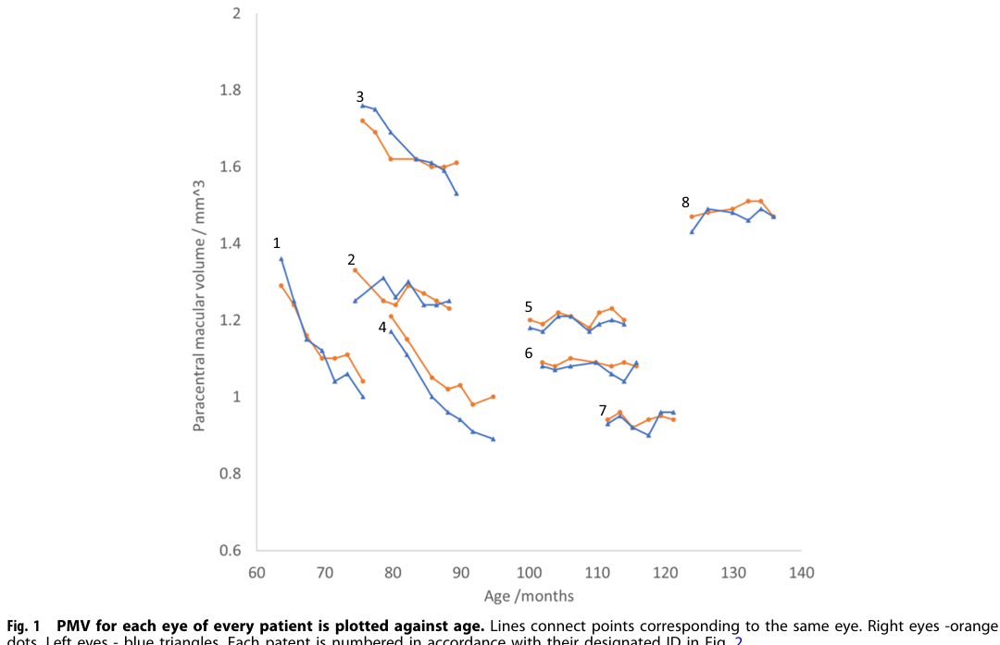

## Question

# Disease Characteristics Research Template

## Target Disease
- **Disease Name:** Neuronal Ceroid Lipofuscinosis 2
- **MONDO ID:**  (if available)
- **Category:** Mendelian

## Research Objectives

Please provide a comprehensive research report on **Neuronal Ceroid Lipofuscinosis 2** covering all of the
disease characteristics listed below. This report will be used to populate a disease knowledge
base entry. Be thorough and cite primary literature (PMID preferred) for all claims.

For each section, **suggested databases/resources** are listed. These are the first places
you should search for information on each topic.

---

### 1. Disease Information
> **Search first:** OMIM, Orphanet, ICD-10/ICD-11, MeSH, PubMed

- What is the disease? Provide a concise overview.
- What are the key identifiers? (OMIM, Orphanet, ICD-10/ICD-11, MeSH, Mondo)
- What are the common synonyms and alternative names?
- Is the information derived from individual patients (e.g., EHR) or aggregated disease-level resources?

### 2. Etiology

- **Disease Causal Factors**: What are the primary causes? (genetic, environmental, infectious, mechanistic)
- **Risk Factors**:
  > **Search first:** PubMed, Cochrane Library, UpToDate, clinical guidelines, ClinVar, ClinGen, GWAS Catalog, PheGenI, CTD, CDC, WHO, epidemiological databases
  - Genetic risk factors (causal variants, susceptibility loci, modifier genes)
  - Environmental risk factors (toxins, lifestyle, occupational exposures, age, sex, family history)
- **Protective Factors**:
  > **Search first:** PubMed, Cochrane Library, clinical trial databases, GWAS Catalog, gnomAD, WHO, CDC, nutrition databases
  - Genetic protective factors (protective variants, modifier alleles)
  - Environmental protective factors (diet, lifestyle, exposures that reduce risk)
- **Gene-Environment Interactions**: How do genetic and environmental factors interact to influence disease?
  > **Search first:** CTD, PubMed, PheGenI, GxE databases

### 3. Phenotypes
> **Search first:** HPO (Human Phenotype Ontology), OMIM, Orphanet, PubMed, clinicaltrials.gov, MedDRA, SNOMED CT, DECIPHER, LOINC

For each phenotype, provide:
- **Phenotype type**: symptoms, clinical signs, physical manifestations, behavioral changes, or laboratory abnormalities
  > For symptoms/signs: HPO, OMIM, Orphanet, PubMed
  > For behavioral changes: HPO, DSM, RDoC (Research Domain Criteria), PubMed
  > For laboratory abnormalities: LOINC, SNOMED CT, LabTests Online, PubMed
- **Phenotype characteristics**:
  > **Search first:** OMIM, Orphanet, HPO, PubMed
  - Age of symptom onset (neonatal, childhood, adult-onset, late-onset)
  - Symptom severity (mild, moderate, severe, variable)
  - Symptom progression (stable, progressive, episodic, fluctuating)
  - Frequency among affected individuals (percentage or qualitative)
- **Quality of life impact**: Effects on daily functioning and well-being (per-phenotype when possible)
  > **Search first:** EQ-5D database, SF-36, WHO QOL databases, PubMed
- Suggest HPO (Human Phenotype Ontology) terms for each phenotype

### 4. Genetic/Molecular Information

- **Causal Genes**: Gene mutations or chromosomal abnormalities responsible for disease (gene symbols, OMIM IDs)
  > **Search first:** OMIM, ClinVar, HGMD, Ensembl, NCBI Gene
- **Pathogenic Variants**:
  - Affected genes (gene symbols, HGNC IDs)
    > **Search first:** OMIM, NCBI Gene, Ensembl, HGNC, UniProt, GeneCards
  - Variant classification (pathogenic, likely pathogenic, VUS per ACMG/AMP guidelines)
    > **Search first:** ClinVar, ClinGen, ACMG/AMP guidelines, VarSome
  - Variant type/class (missense, frameshift, nonsense, splice-site, structural)
  - Allele frequency in population databases
    > **Search first:** gnomAD, 1000 Genomes, ExAC, TOPMed, dbSNP
  - Somatic vs germline origin
    > **Search first:** COSMIC (somatic), ClinVar, ICGC, TCGA
  - Functional consequences (loss of function, gain of function, dominant negative)
- **Modifier Genes**: Genes that modify disease severity or expression
- **Epigenetic Information**: DNA methylation, histone modifications, chromatin changes affecting disease
  > **Search first:** ENCODE, Roadmap Epigenomics, MethBase, DiseaseMeth
- **Chromosomal Abnormalities**: Large-scale genetic changes (aneuploidy, translocations, inversions)
  > **Search first:** DECIPHER, ClinVar, ECARUCA, UCSC Genome Browser

### 5. Environmental Information

- **Environmental Factors**: Non-genetic contributing factors (toxins, radiation, pollution, occupational exposure)
  > **Search first:** CTD (Comparative Toxicogenomics Database), TOXNET, PubMed, EPA databases
- **Lifestyle Factors**: Behavioral factors (smoking, diet, exercise, alcohol consumption)
  > **Search first:** CDC databases, WHO, PubMed, NHANES
- **Infectious Agents**: If applicable, pathogens causing or triggering disease (bacteria, viruses, fungi, parasites)
  > **Search first:** NCBI Taxonomy, ViPR, BV-BRC, MicrobeDB, GIDEON

### 6. Mechanism / Pathophysiology

- **Molecular Pathways**: Specific signaling cascades or biochemical pathways involved (Wnt, MAPK, mTOR, PI3K-AKT, etc.)
  > **Search first:** KEGG, Reactome, WikiPathways, PathBank, BioCyc
- **Cellular Processes**: Cell-level mechanisms (apoptosis, autophagy, cell cycle dysregulation, inflammation, etc.)
  > **Search first:** Gene Ontology (GO), Reactome, KEGG, PubMed
- **Protein Dysfunction**: How protein structure or function is altered (misfolding, aggregation, loss of function, gain of function)
  > **Search first:** UniProt, PDB (Protein Data Bank), InterPro, Pfam, AlphaFold
- **Metabolic Changes**: Alterations in metabolic processes (energy metabolism, lipid metabolism, amino acid metabolism)
  > **Search first:** KEGG, BioCyc, HMDB (Human Metabolome Database), BRENDA
- **Immune System Involvement**: Role of immune response (autoimmunity, immunodeficiency, chronic inflammation)
  > **Search first:** ImmPort, Immunome Database, IEDB, Gene Ontology
- **Tissue Damage Mechanisms**: How tissues/ are injured (oxidative stress, ischemia, fibrosis, necrosis)
  > **Search first:** PubMed, Gene Ontology, Reactome
- **Biochemical Abnormalities**: Specific molecular defects (enzyme deficiencies, receptor dysfunction, ion channel defects)
  > **Search first:** BRENDA, UniProt, KEGG, OMIM, PubMed
- **Epigenetic Changes**: DNA methylation, histone modifications affecting gene expression in disease
  > **Search first:** ENCODE, Roadmap Epigenomics, MethBase, DiseaseMeth
- **Molecular Profiling** (if available):
  - Transcriptomics/gene expression changes
    > **Search first:** GEO (Gene Expression Omnibus), ArrayExpress, GTEx, Human Cell Atlas, SRA
  - Proteomics findings
    > **Search first:** PRIDE, ProteomeXchange, Human Protein Atlas, STRING, BioGRID
  - Metabolomics signatures
    > **Search first:** MetaboLights, Metabolomics Workbench, HMDB, METLIN
  - Lipidomics alterations
    > **Search first:** LIPID MAPS, SwissLipids, LipidHome, Metabolomics Workbench
  - Genomic structural features
    > **Search first:** UCSC Genome Browser, Ensembl, NCBI, dbVar, DGV
- **Advanced Technologies** (if applicable):
  - Single-cell analysis findings (cell-type specific mechanisms, cellular heterogeneity)
    > **Search first:** Human Cell Atlas, Single Cell Portal, GEO, CELLxGENE
  - Spatial transcriptomics findings
    > **Search first:** GEO, Spatial Research, Vizgen, 10x Genomics data
  - Multi-omics integration results
    > **Search first:** TCGA, ICGC, cBioPortal, LinkedOmics, PubMed
  - Functional genomics screens (CRISPR, RNAi)
    > **Search first:** DepMap, GenomeRNAi, PubMed, BioGRID ORCS

For each mechanism, describe:
- The causal chain from initial trigger to clinical manifestation
- Which mechanisms are upstream vs downstream
- What cell types and biological processes are involved
- Suggest GO terms for biological processes and CL terms for cell types

### 7. Anatomical Structures Affected

- **Organ Level**:
  - Primary organs directly affected
  - Secondary organ involvement (complications, secondary effects)
  - Body systems involved (cardiovascular, nervous, digestive, respiratory, endocrine, etc.)
  > **Search first:** Uberon, FMA (Foundational Model of Anatomy), OMIM, HPO, ICD-11, MeSH, SNOMED CT
- **Tissue and Cell Level**:
  - Specific tissue types affected (epithelial, connective, muscle, nervous)
  - Specific cell populations targeted (with Cell Ontology terms)
  > **Search first:** Uberon, Human Protein Atlas, Cell Ontology, Human Cell Atlas, CellMarker, PanglaoDB
- **Subcellular Level**:
  - Cellular compartments involved (mitochondria, nucleus, ER, lysosomes) (with GO Cellular Component terms)
  > **Search first:** Gene Ontology (Cellular Component), UniProt, Human Protein Atlas
- **Localization**:
  - Specific anatomical sites (with UBERON terms)
    > **Search first:** FMA, Uberon, NeuroNames (for brain), SNOMED CT
  - Lateralization (unilateral, bilateral, asymmetric)
    > **Search first:** HPO, clinical literature, imaging databases

### 8. Temporal Development

- **Onset**:
  - Typical age of onset (congenital, pediatric, adult, geriatric)
  - Onset pattern (acute, subacute, chronic, insidious)
  > **Search first:** OMIM, Orphanet, HPO, PubMed
- **Progression**:
  - Disease stages (early, intermediate, advanced, end-stage)
    > **Search first:** Cancer Staging Manual (AJCC), WHO classifications, PubMed
  - Progression rate (rapid, slow, variable)
  - Disease course pattern (episodic, relapsing-remitting, progressive, stable)
  - Disease duration (self-limited, chronic lifelong)
  > **Search first:** Disease registries, longitudinal cohort databases, natural history studies, PubMed, Orphanet, OMIM
- **Patterns**:
  - Remission patterns (spontaneous, treatment-induced)
    > **Search first:** Clinical trial databases, disease registries, PubMed
  - Critical periods (time windows of vulnerability or opportunity for intervention)
    > **Search first:** PubMed, developmental biology databases, clinical guidelines

### 9. Inheritance and Population

- **Epidemiology**:
  - Prevalence (cases per 100,000 at given time)
  - Incidence (new cases per 100,000 per year)
  > **Search first:** Orphanet, CDC, WHO, GBD (Global Burden of Disease), national registries, SEER, disease registries
- **For Genetic Etiology**:
  - Inheritance pattern (AD, AR, X-linked, mitochondrial, multifactorial, polygenic)
    > **Search first:** OMIM, Orphanet, ClinVar, GTR (Genetic Testing Registry)
  - Penetrance (complete, incomplete, age-dependent)
    > **Search first:** ClinVar, OMIM, PubMed, ClinGen
  - Expressivity (variable, consistent)
    > **Search first:** OMIM, ClinVar, PubMed
  - Genetic anticipation (increasing severity in successive generations)
    > **Search first:** OMIM, PubMed (especially for repeat expansion disorders)
  - Germline mosaicism
    > **Search first:** ClinVar, OMIM, genetic counseling literature, PubMed
  - Founder effects (population-specific mutations)
    > **Search first:** gnomAD, population genetics databases, PubMed
  - Consanguinity role
    > **Search first:** OMIM, population studies, genetic counseling resources
  - Carrier frequency
    > **Search first:** gnomAD, carrier screening databases, GeneReviews, GTR
- **Population Demographics**:
  - Affected populations (ethnic or demographic groups with higher prevalence)
    > **Search first:** gnomAD, 1000 Genomes, PAGE Study, PubMed, population registries
  - Geographic distribution (endemic areas, regional variation)
    > **Search first:** WHO, CDC, GBD, Orphanet, geographic epidemiology databases
  - Geographic distribution of specific variants
  - Sex ratio (male:female)
    > **Search first:** Disease registries, OMIM, PubMed, epidemiological databases
  - Age distribution of affected individuals
    > **Search first:** CDC, disease registries, SEER, Orphanet

### 10. Diagnostics

- **Clinical Tests**:
  - Laboratory tests (blood, urine, tissue chemistry, specific enzyme assays)
    > **Search first:** LOINC, LabTests Online, PubMed
  - Biomarkers (proteins, metabolites, genetic markers, circulating biomarkers)
    > **Search first:** FDA Biomarker List, BEST (Biomarkers, EndpointS, and other Tools), PubMed
  - Imaging studies (X-ray, CT, MRI, PET, ultrasound)
    > **Search first:** RadLex, DICOM, Radiopaedia, imaging databases
  - Functional tests (pulmonary function, cardiac stress tests)
    > **Search first:** LOINC, clinical guidelines, PubMed
  - Electrophysiology (EEG, EMG, ECG, nerve conduction studies)
    > **Search first:** LOINC, clinical neurophysiology databases, PubMed
  - Biopsy findings (histopathology, immunohistochemistry)
    > **Search first:** SNOMED CT, College of American Pathologists resources, PubMed
  - Pathology findings (microscopic examination)
    > **Search first:** SNOMED CT, Digital Pathology databases, PubMed
- **Genetic Testing**:
  > **Search first:** GTR (Genetic Testing Registry), GeneReviews, ClinGen
  - Overview of recommended genetic testing approach
  - Whole genome sequencing (WGS) utility
    > **Search first:** GTR, ClinVar, GEL (Genomics England), gnomAD
  - Whole exome sequencing (WES) utility
    > **Search first:** GTR, ClinVar, OMIM, GeneMatcher
  - Gene panels (which panels, which genes)
    > **Search first:** GTR, ClinVar, laboratory-specific databases
  - Single gene testing
    > **Search first:** GTR, ClinVar, OMIM, GeneReviews
  - Chromosomal microarray (CMA)
    > **Search first:** DECIPHER, ClinVar, dbVar, ECARUCA
  - Karyotyping
    > **Search first:** Chromosome Abnormality Database, ClinVar, cytogenetics resources
  - FISH
    > **Search first:** ClinVar, cytogenetics databases, PubMed
  - Mitochondrial DNA testing
    > **Search first:** MITOMAP, MSeqDR, ClinVar, GTR
  - Repeat expansion testing
    > **Search first:** GTR, ClinVar, repeat expansion databases, PubMed
- **Omics-Based Diagnostics** (if applicable):
  - RNA sequencing / transcriptomics
    > **Search first:** GEO, ArrayExpress, GTEx, RNA-seq databases
  - Proteomics
    > **Search first:** PRIDE, ProteomeXchange, FDA Biomarker database
  - Metabolomics
    > **Search first:** MetaboLights, Metabolomics Workbench, HMDB
  - Epigenomics
    > **Search first:** GEO, ENCODE, Roadmap Epigenomics, MethBase
  - Liquid biopsy
    > **Search first:** COSMIC, ClinVar, liquid biopsy databases, PubMed
- **Clinical Criteria**:
  - Standardized diagnostic criteria (DSM, ICD, society guidelines)
    > **Search first:** DSM-5, ICD-11, clinical society guidelines, UpToDate
  - Differential diagnosis (other conditions to rule out, with distinguishing features)
    > **Search first:** DynaMed, UpToDate, clinical decision support systems
- **Screening**:
  - Screening methods for asymptomatic individuals (newborn screening, carrier screening, cascade screening)
    > **Search first:** ACMG recommendations, CDC newborn screening, GTR

### 11. Outcome/Prognosis

- **Survival and Mortality**:
  - Survival rate (5-year, 10-year, overall)
    > **Search first:** SEER, cancer registries, disease-specific registries, PubMed
  - Life expectancy (with and without treatment if applicable)
    > **Search first:** Orphanet, disease registries, actuarial databases, PubMed
  - Mortality rate
    > **Search first:** CDC, WHO, GBD, national mortality databases
  - Disease-specific mortality (deaths directly attributable to disease)
    > **Search first:** Disease registries, CDC Wonder, GBD, PubMed
- **Morbidity and Function**:
  - Morbidity (disease-related disability and health impacts)
    > **Search first:** GBD, WHO, disability databases, PubMed
  - Disability outcomes (long-term functional impairments)
    > **Search first:** ICF (International Classification of Functioning), disability registries
  - Quality of life measures (EQ-5D, SF-36, PROMIS, disease-specific tools)
    > **Search first:** EQ-5D database, SF-36, PROMIS, PubMed
- **Disease Course**:
  - Complications (secondary problems: infections, organ failure, etc.)
    > **Search first:** ICD codes, disease registries, clinical databases, PubMed
  - Recovery potential (likelihood and extent of recovery, with vs without treatment)
    > **Search first:** Natural history studies, rehabilitation databases, PubMed
- **Prediction**:
  - Prognostic factors (age, disease severity, biomarkers, treatment response)
    > **Search first:** Prognostic models databases, clinical calculators, PubMed
  - Prognostic biomarkers (molecular markers predicting disease course)
    > **Search first:** FDA Biomarker database, PubMed, cancer prognostic databases

### 12. Treatment

- **Pharmacotherapy**:
  - Pharmacological treatments (drug names, drug classes, mechanisms of action)
    > **Search first:** DrugBank, RxNorm, ATC classification, DailyMed, FDA databases
  - Pharmacogenomics (how genetic variants affect drug metabolism, efficacy, toxicity)
    > **Search first:** PharmGKB, CPIC (Clinical Pharmacogenetics), FDA Table of PGx Biomarkers
- **Advanced Therapeutics**:
  - Gene therapy (viral vectors, CRISPR, gene replacement, gene editing)
    > **Search first:** ClinicalTrials.gov, FDA gene therapy database, ASGCT resources
  - Cell therapy (stem cell transplant, CAR-T, cellular therapeutics)
    > **Search first:** ClinicalTrials.gov, FDA cell therapy database, FACT standards
  - RNA-based therapies (ASOs, siRNA, mRNA therapies)
    > **Search first:** ClinicalTrials.gov, FDA approvals, PubMed
  - Targeted therapies (treatments directed at specific molecular targets)
    > **Search first:** My Cancer Genome, OncoKB, ClinicalTrials.gov, FDA approvals
  - Immunotherapies (checkpoint inhibitors, monoclonal antibodies)
    > **Search first:** Cancer Immunotherapy Database, FDA approvals, ClinicalTrials.gov
- **Surgical and Interventional**:
  - Surgical interventions (types of surgery, timing, outcomes)
    > **Search first:** CPT codes, surgical registries, clinical guidelines, PubMed
- **Supportive and Rehabilitative**:
  - Supportive care (symptom management, pain control, nutrition)
    > **Search first:** Clinical guidelines, Cochrane Library, PubMed
  - Rehabilitation (physical therapy, occupational therapy, speech therapy)
    > **Search first:** Rehabilitation medicine databases, clinical guidelines, PubMed
- **Experimental**:
  - Experimental treatments in clinical trials (with NCT identifiers if available)
    > **Search first:** ClinicalTrials.gov, EU Clinical Trials Register, WHO ICTRP
- **Treatment Outcomes**:
  - Treatment response rates
    > **Search first:** Clinical trial databases, FDA reviews, systematic reviews, PubMed
  - Side effects and adverse events
    > **Search first:** FDA Adverse Event Reporting System (FAERS), MedWatch, PubMed
- **Treatment Strategy**:
  - Treatment algorithms (clinical pathways, decision trees)
    > **Search first:** Clinical practice guidelines, NCCN Guidelines, UpToDate
  - Combination therapies
    > **Search first:** ClinicalTrials.gov, treatment guidelines, PubMed
  - Personalized medicine approaches (genotype-guided treatment)
    > **Search first:** My Cancer Genome, CIViC, PharmGKB, precision medicine databases

For each treatment, suggest MAXO (Medical Action Ontology) terms where applicable.

### 13. Prevention

- **Prevention Levels**:
  - Primary prevention (preventing disease occurrence: vaccination, risk factor modification)
    > **Search first:** CDC, WHO, USPSTF recommendations, Cochrane Library
  - Secondary prevention (early detection and treatment: screening programs, early intervention)
    > **Search first:** USPSTF, CDC screening guidelines, WHO
  - Tertiary prevention (preventing complications in those with disease)
    > **Search first:** Clinical guidelines, disease management protocols, PubMed
- **Immunization**: Vaccine strategies (if applicable)
  > **Search first:** CDC vaccine schedules, WHO immunization, FDA vaccine database
- **Screening and Early Detection**:
  - Screening programs (population-based: newborn screening, cancer screening)
    > **Search first:** CDC screening programs, USPSTF, cancer screening databases
  - Genetic screening (carrier screening, preimplantation genetic diagnosis, prenatal testing)
    > **Search first:** ACMG recommendations, ACOG guidelines, GTR
  - Risk stratification (identifying high-risk individuals for targeted prevention)
    > **Search first:** Risk prediction models, clinical calculators, PubMed
- **Behavioral Interventions**: Lifestyle modifications to reduce risk
  > **Search first:** CDC, WHO, behavioral intervention databases, Cochrane Library
- **Counseling**: Genetic counseling (risk assessment, family planning guidance)
  > **Search first:** NSGC resources, ACMG guidelines, GeneReviews
- **Public Health**:
  - Public health interventions (sanitation, vector control, health education)
    > **Search first:** CDC, WHO, public health databases, PubMed
  - Environmental interventions (reducing environmental risk factors)
    > **Search first:** EPA databases, WHO environmental health, PubMed
- **Prophylaxis**: Preventive medications or procedures
  > **Search first:** Clinical guidelines, FDA approvals, PubMed

### 14. Other Species / Natural Disease

- **Taxonomy**: Species affected (with NCBI Taxon identifiers)
  > **Search first:** NCBI Taxonomy
- **Breed**: Specific breeds affected (with VBO identifiers if applicable)
  > **Search first:** VBO (Vertebrate Breed Ontology)
- **Gene**: Orthologous genes in other species (with NCBI Gene IDs)
  > **Search first:** NCBI Gene
- **Natural Disease**:
  - Naturally occurring disease in other species (companion animals, wildlife)
    > **Search first:** OMIA (Online Mendelian Inheritance in Animals), VetCompass, PubMed
  - Veterinary relevance and importance in animal health
    > **Search first:** OMIA, veterinary databases, PubMed
- **Comparative Biology**:
  - Comparative pathology (similarities and differences across species)
    > **Search first:** OMIA, comparative pathology databases, PubMed
  - Evolutionary conservation of disease mechanisms
    > **Search first:** HomoloGene, OrthoMCL, Alliance of Genome Resources
- **Transmission** (if applicable):
  - Zoonotic potential
    > **Search first:** CDC zoonotic diseases, WHO zoonoses, GIDEON
  - Cross-species susceptibility
    > **Search first:** NCBI Taxonomy, veterinary databases, PubMed

### 15. Model Organisms

- **Model Types**:
  - Model organism type (mammalian, invertebrate, cellular, in vitro)
    > **Search first:** Alliance of Genome Resources, model organism databases
  - Specific model systems (mouse, rat, zebrafish, Drosophila, C. elegans, yeast, cell lines, organoids, iPSCs)
    > **Search first:** MGI, RGD, ZFIN, FlyBase, WormBase, SGD, ATCC, Cellosaurus
  - Induced models (drug treatment, surgical intervention, environmental manipulation)
    > **Search first:** MGI, model organism databases, PubMed
- **Genetic Models**:
  - Types available (knockout, knock-in, transgenic, conditional, humanized)
    > **Search first:** MGI, IMPC, KOMP, EuMMCR, IMSR
- **Model Characteristics**:
  - Phenotype recapitulation (how well model reproduces human disease features)
    > **Search first:** Model organism databases, comparative studies, PubMed
  - Model limitations (aspects of human disease not captured)
    > **Search first:** Model organism databases, PubMed, review articles
- **Applications**:
  - Research applications (what aspects of disease can be studied)
    > **Search first:** Model organism databases, PubMed
- **Resources**:
  - Model databases
    > **Search first:** MGI, RGD, ZFIN, FlyBase, WormBase, IMSR, EMMA, MMRRC

---

## Citation Requirements

- Cite primary literature (PMID preferred) for all mechanistic and clinical claims
- Prioritize recent reviews and landmark papers
- Include direct quotes from abstracts where possible to support key statements
- Distinguish evidence source types: human clinical, model organism, in vitro, computational

## Output Format

Structure your response as a comprehensive narrative organized by the sections above.
For each section, provide:
- Factual content with specific details (numbers, percentages, gene names, variant nomenclature)
- Ontology term suggestions (HPO, GO, CL, UBERON, CHEBI, MAXO, MONDO) where applicable
- Evidence citations with PMIDs
- Direct quotes from abstracts to support key claims
- Clear indication when information is not available or not applicable for this disease

This report will be used to populate a disease knowledge base entry with:
- Pathophysiology descriptions with causal chains
- Gene/protein annotations (HGNC, GO terms)
- Phenotype associations (HP terms) with frequencies
- Cell type involvement (CL terms)
- Anatomical locations (UBERON terms)
- Chemical entities (CHEBI terms)
- Treatment annotations (MAXO terms)
- Evidence items with PMIDs and exact abstract quotes
- Epidemiology, prognosis, diagnostic, and prevention information
- Animal model descriptions with phenotype recapitulation details

## Output

Question: You are an expert researcher providing comprehensive, well-cited information.

Provide detailed information focusing on:
1. Key concepts and definitions with current understanding
2. Recent developments and latest research (prioritize 2023-2024 sources)
3. Current applications and real-world implementations
4. Expert opinions and analysis from authoritative sources
5. Relevant statistics and data from recent studies

Format as a comprehensive research report with proper citations. Include URLs and publication dates where available.
Always prioritize recent, authoritative sources and provide specific citations for all major claims.

# Disease Characteristics Research Template

## Target Disease
- **Disease Name:** Neuronal Ceroid Lipofuscinosis 2
- **MONDO ID:**  (if available)
- **Category:** Mendelian

## Research Objectives

Please provide a comprehensive research report on **Neuronal Ceroid Lipofuscinosis 2** covering all of the
disease characteristics listed below. This report will be used to populate a disease knowledge
base entry. Be thorough and cite primary literature (PMID preferred) for all claims.

For each section, **suggested databases/resources** are listed. These are the first places
you should search for information on each topic.

---

### 1. Disease Information
> **Search first:** OMIM, Orphanet, ICD-10/ICD-11, MeSH, PubMed

- What is the disease? Provide a concise overview.
- What are the key identifiers? (OMIM, Orphanet, ICD-10/ICD-11, MeSH, Mondo)
- What are the common synonyms and alternative names?
- Is the information derived from individual patients (e.g., EHR) or aggregated disease-level resources?

### 2. Etiology

- **Disease Causal Factors**: What are the primary causes? (genetic, environmental, infectious, mechanistic)
- **Risk Factors**:
  > **Search first:** PubMed, Cochrane Library, UpToDate, clinical guidelines, ClinVar, ClinGen, GWAS Catalog, PheGenI, CTD, CDC, WHO, epidemiological databases
  - Genetic risk factors (causal variants, susceptibility loci, modifier genes)
  - Environmental risk factors (toxins, lifestyle, occupational exposures, age, sex, family history)
- **Protective Factors**:
  > **Search first:** PubMed, Cochrane Library, clinical trial databases, GWAS Catalog, gnomAD, WHO, CDC, nutrition databases
  - Genetic protective factors (protective variants, modifier alleles)
  - Environmental protective factors (diet, lifestyle, exposures that reduce risk)
- **Gene-Environment Interactions**: How do genetic and environmental factors interact to influence disease?
  > **Search first:** CTD, PubMed, PheGenI, GxE databases

### 3. Phenotypes
> **Search first:** HPO (Human Phenotype Ontology), OMIM, Orphanet, PubMed, clinicaltrials.gov, MedDRA, SNOMED CT, DECIPHER, LOINC

For each phenotype, provide:
- **Phenotype type**: symptoms, clinical signs, physical manifestations, behavioral changes, or laboratory abnormalities
  > For symptoms/signs: HPO, OMIM, Orphanet, PubMed
  > For behavioral changes: HPO, DSM, RDoC (Research Domain Criteria), PubMed
  > For laboratory abnormalities: LOINC, SNOMED CT, LabTests Online, PubMed
- **Phenotype characteristics**:
  > **Search first:** OMIM, Orphanet, HPO, PubMed
  - Age of symptom onset (neonatal, childhood, adult-onset, late-onset)
  - Symptom severity (mild, moderate, severe, variable)
  - Symptom progression (stable, progressive, episodic, fluctuating)
  - Frequency among affected individuals (percentage or qualitative)
- **Quality of life impact**: Effects on daily functioning and well-being (per-phenotype when possible)
  > **Search first:** EQ-5D database, SF-36, WHO QOL databases, PubMed
- Suggest HPO (Human Phenotype Ontology) terms for each phenotype

### 4. Genetic/Molecular Information

- **Causal Genes**: Gene mutations or chromosomal abnormalities responsible for disease (gene symbols, OMIM IDs)
  > **Search first:** OMIM, ClinVar, HGMD, Ensembl, NCBI Gene
- **Pathogenic Variants**:
  - Affected genes (gene symbols, HGNC IDs)
    > **Search first:** OMIM, NCBI Gene, Ensembl, HGNC, UniProt, GeneCards
  - Variant classification (pathogenic, likely pathogenic, VUS per ACMG/AMP guidelines)
    > **Search first:** ClinVar, ClinGen, ACMG/AMP guidelines, VarSome
  - Variant type/class (missense, frameshift, nonsense, splice-site, structural)
  - Allele frequency in population databases
    > **Search first:** gnomAD, 1000 Genomes, ExAC, TOPMed, dbSNP
  - Somatic vs germline origin
    > **Search first:** COSMIC (somatic), ClinVar, ICGC, TCGA
  - Functional consequences (loss of function, gain of function, dominant negative)
- **Modifier Genes**: Genes that modify disease severity or expression
- **Epigenetic Information**: DNA methylation, histone modifications, chromatin changes affecting disease
  > **Search first:** ENCODE, Roadmap Epigenomics, MethBase, DiseaseMeth
- **Chromosomal Abnormalities**: Large-scale genetic changes (aneuploidy, translocations, inversions)
  > **Search first:** DECIPHER, ClinVar, ECARUCA, UCSC Genome Browser

### 5. Environmental Information

- **Environmental Factors**: Non-genetic contributing factors (toxins, radiation, pollution, occupational exposure)
  > **Search first:** CTD (Comparative Toxicogenomics Database), TOXNET, PubMed, EPA databases
- **Lifestyle Factors**: Behavioral factors (smoking, diet, exercise, alcohol consumption)
  > **Search first:** CDC databases, WHO, PubMed, NHANES
- **Infectious Agents**: If applicable, pathogens causing or triggering disease (bacteria, viruses, fungi, parasites)
  > **Search first:** NCBI Taxonomy, ViPR, BV-BRC, MicrobeDB, GIDEON

### 6. Mechanism / Pathophysiology

- **Molecular Pathways**: Specific signaling cascades or biochemical pathways involved (Wnt, MAPK, mTOR, PI3K-AKT, etc.)
  > **Search first:** KEGG, Reactome, WikiPathways, PathBank, BioCyc
- **Cellular Processes**: Cell-level mechanisms (apoptosis, autophagy, cell cycle dysregulation, inflammation, etc.)
  > **Search first:** Gene Ontology (GO), Reactome, KEGG, PubMed
- **Protein Dysfunction**: How protein structure or function is altered (misfolding, aggregation, loss of function, gain of function)
  > **Search first:** UniProt, PDB (Protein Data Bank), InterPro, Pfam, AlphaFold
- **Metabolic Changes**: Alterations in metabolic processes (energy metabolism, lipid metabolism, amino acid metabolism)
  > **Search first:** KEGG, BioCyc, HMDB (Human Metabolome Database), BRENDA
- **Immune System Involvement**: Role of immune response (autoimmunity, immunodeficiency, chronic inflammation)
  > **Search first:** ImmPort, Immunome Database, IEDB, Gene Ontology
- **Tissue Damage Mechanisms**: How tissues/ are injured (oxidative stress, ischemia, fibrosis, necrosis)
  > **Search first:** PubMed, Gene Ontology, Reactome
- **Biochemical Abnormalities**: Specific molecular defects (enzyme deficiencies, receptor dysfunction, ion channel defects)
  > **Search first:** BRENDA, UniProt, KEGG, OMIM, PubMed
- **Epigenetic Changes**: DNA methylation, histone modifications affecting gene expression in disease
  > **Search first:** ENCODE, Roadmap Epigenomics, MethBase, DiseaseMeth
- **Molecular Profiling** (if available):
  - Transcriptomics/gene expression changes
    > **Search first:** GEO (Gene Expression Omnibus), ArrayExpress, GTEx, Human Cell Atlas, SRA
  - Proteomics findings
    > **Search first:** PRIDE, ProteomeXchange, Human Protein Atlas, STRING, BioGRID
  - Metabolomics signatures
    > **Search first:** MetaboLights, Metabolomics Workbench, HMDB, METLIN
  - Lipidomics alterations
    > **Search first:** LIPID MAPS, SwissLipids, LipidHome, Metabolomics Workbench
  - Genomic structural features
    > **Search first:** UCSC Genome Browser, Ensembl, NCBI, dbVar, DGV
- **Advanced Technologies** (if applicable):
  - Single-cell analysis findings (cell-type specific mechanisms, cellular heterogeneity)
    > **Search first:** Human Cell Atlas, Single Cell Portal, GEO, CELLxGENE
  - Spatial transcriptomics findings
    > **Search first:** GEO, Spatial Research, Vizgen, 10x Genomics data
  - Multi-omics integration results
    > **Search first:** TCGA, ICGC, cBioPortal, LinkedOmics, PubMed
  - Functional genomics screens (CRISPR, RNAi)
    > **Search first:** DepMap, GenomeRNAi, PubMed, BioGRID ORCS

For each mechanism, describe:
- The causal chain from initial trigger to clinical manifestation
- Which mechanisms are upstream vs downstream
- What cell types and biological processes are involved
- Suggest GO terms for biological processes and CL terms for cell types

### 7. Anatomical Structures Affected

- **Organ Level**:
  - Primary organs directly affected
  - Secondary organ involvement (complications, secondary effects)
  - Body systems involved (cardiovascular, nervous, digestive, respiratory, endocrine, etc.)
  > **Search first:** Uberon, FMA (Foundational Model of Anatomy), OMIM, HPO, ICD-11, MeSH, SNOMED CT
- **Tissue and Cell Level**:
  - Specific tissue types affected (epithelial, connective, muscle, nervous)
  - Specific cell populations targeted (with Cell Ontology terms)
  > **Search first:** Uberon, Human Protein Atlas, Cell Ontology, Human Cell Atlas, CellMarker, PanglaoDB
- **Subcellular Level**:
  - Cellular compartments involved (mitochondria, nucleus, ER, lysosomes) (with GO Cellular Component terms)
  > **Search first:** Gene Ontology (Cellular Component), UniProt, Human Protein Atlas
- **Localization**:
  - Specific anatomical sites (with UBERON terms)
    > **Search first:** FMA, Uberon, NeuroNames (for brain), SNOMED CT
  - Lateralization (unilateral, bilateral, asymmetric)
    > **Search first:** HPO, clinical literature, imaging databases

### 8. Temporal Development

- **Onset**:
  - Typical age of onset (congenital, pediatric, adult, geriatric)
  - Onset pattern (acute, subacute, chronic, insidious)
  > **Search first:** OMIM, Orphanet, HPO, PubMed
- **Progression**:
  - Disease stages (early, intermediate, advanced, end-stage)
    > **Search first:** Cancer Staging Manual (AJCC), WHO classifications, PubMed
  - Progression rate (rapid, slow, variable)
  - Disease course pattern (episodic, relapsing-remitting, progressive, stable)
  - Disease duration (self-limited, chronic lifelong)
  > **Search first:** Disease registries, longitudinal cohort databases, natural history studies, PubMed, Orphanet, OMIM
- **Patterns**:
  - Remission patterns (spontaneous, treatment-induced)
    > **Search first:** Clinical trial databases, disease registries, PubMed
  - Critical periods (time windows of vulnerability or opportunity for intervention)
    > **Search first:** PubMed, developmental biology databases, clinical guidelines

### 9. Inheritance and Population

- **Epidemiology**:
  - Prevalence (cases per 100,000 at given time)
  - Incidence (new cases per 100,000 per year)
  > **Search first:** Orphanet, CDC, WHO, GBD (Global Burden of Disease), national registries, SEER, disease registries
- **For Genetic Etiology**:
  - Inheritance pattern (AD, AR, X-linked, mitochondrial, multifactorial, polygenic)
    > **Search first:** OMIM, Orphanet, ClinVar, GTR (Genetic Testing Registry)
  - Penetrance (complete, incomplete, age-dependent)
    > **Search first:** ClinVar, OMIM, PubMed, ClinGen
  - Expressivity (variable, consistent)
    > **Search first:** OMIM, ClinVar, PubMed
  - Genetic anticipation (increasing severity in successive generations)
    > **Search first:** OMIM, PubMed (especially for repeat expansion disorders)
  - Germline mosaicism
    > **Search first:** ClinVar, OMIM, genetic counseling literature, PubMed
  - Founder effects (population-specific mutations)
    > **Search first:** gnomAD, population genetics databases, PubMed
  - Consanguinity role
    > **Search first:** OMIM, population studies, genetic counseling resources
  - Carrier frequency
    > **Search first:** gnomAD, carrier screening databases, GeneReviews, GTR
- **Population Demographics**:
  - Affected populations (ethnic or demographic groups with higher prevalence)
    > **Search first:** gnomAD, 1000 Genomes, PAGE Study, PubMed, population registries
  - Geographic distribution (endemic areas, regional variation)
    > **Search first:** WHO, CDC, GBD, Orphanet, geographic epidemiology databases
  - Geographic distribution of specific variants
  - Sex ratio (male:female)
    > **Search first:** Disease registries, OMIM, PubMed, epidemiological databases
  - Age distribution of affected individuals
    > **Search first:** CDC, disease registries, SEER, Orphanet

### 10. Diagnostics

- **Clinical Tests**:
  - Laboratory tests (blood, urine, tissue chemistry, specific enzyme assays)
    > **Search first:** LOINC, LabTests Online, PubMed
  - Biomarkers (proteins, metabolites, genetic markers, circulating biomarkers)
    > **Search first:** FDA Biomarker List, BEST (Biomarkers, EndpointS, and other Tools), PubMed
  - Imaging studies (X-ray, CT, MRI, PET, ultrasound)
    > **Search first:** RadLex, DICOM, Radiopaedia, imaging databases
  - Functional tests (pulmonary function, cardiac stress tests)
    > **Search first:** LOINC, clinical guidelines, PubMed
  - Electrophysiology (EEG, EMG, ECG, nerve conduction studies)
    > **Search first:** LOINC, clinical neurophysiology databases, PubMed
  - Biopsy findings (histopathology, immunohistochemistry)
    > **Search first:** SNOMED CT, College of American Pathologists resources, PubMed
  - Pathology findings (microscopic examination)
    > **Search first:** SNOMED CT, Digital Pathology databases, PubMed
- **Genetic Testing**:
  > **Search first:** GTR (Genetic Testing Registry), GeneReviews, ClinGen
  - Overview of recommended genetic testing approach
  - Whole genome sequencing (WGS) utility
    > **Search first:** GTR, ClinVar, GEL (Genomics England), gnomAD
  - Whole exome sequencing (WES) utility
    > **Search first:** GTR, ClinVar, OMIM, GeneMatcher
  - Gene panels (which panels, which genes)
    > **Search first:** GTR, ClinVar, laboratory-specific databases
  - Single gene testing
    > **Search first:** GTR, ClinVar, OMIM, GeneReviews
  - Chromosomal microarray (CMA)
    > **Search first:** DECIPHER, ClinVar, dbVar, ECARUCA
  - Karyotyping
    > **Search first:** Chromosome Abnormality Database, ClinVar, cytogenetics resources
  - FISH
    > **Search first:** ClinVar, cytogenetics databases, PubMed
  - Mitochondrial DNA testing
    > **Search first:** MITOMAP, MSeqDR, ClinVar, GTR
  - Repeat expansion testing
    > **Search first:** GTR, ClinVar, repeat expansion databases, PubMed
- **Omics-Based Diagnostics** (if applicable):
  - RNA sequencing / transcriptomics
    > **Search first:** GEO, ArrayExpress, GTEx, RNA-seq databases
  - Proteomics
    > **Search first:** PRIDE, ProteomeXchange, FDA Biomarker database
  - Metabolomics
    > **Search first:** MetaboLights, Metabolomics Workbench, HMDB
  - Epigenomics
    > **Search first:** GEO, ENCODE, Roadmap Epigenomics, MethBase
  - Liquid biopsy
    > **Search first:** COSMIC, ClinVar, liquid biopsy databases, PubMed
- **Clinical Criteria**:
  - Standardized diagnostic criteria (DSM, ICD, society guidelines)
    > **Search first:** DSM-5, ICD-11, clinical society guidelines, UpToDate
  - Differential diagnosis (other conditions to rule out, with distinguishing features)
    > **Search first:** DynaMed, UpToDate, clinical decision support systems
- **Screening**:
  - Screening methods for asymptomatic individuals (newborn screening, carrier screening, cascade screening)
    > **Search first:** ACMG recommendations, CDC newborn screening, GTR

### 11. Outcome/Prognosis

- **Survival and Mortality**:
  - Survival rate (5-year, 10-year, overall)
    > **Search first:** SEER, cancer registries, disease-specific registries, PubMed
  - Life expectancy (with and without treatment if applicable)
    > **Search first:** Orphanet, disease registries, actuarial databases, PubMed
  - Mortality rate
    > **Search first:** CDC, WHO, GBD, national mortality databases
  - Disease-specific mortality (deaths directly attributable to disease)
    > **Search first:** Disease registries, CDC Wonder, GBD, PubMed
- **Morbidity and Function**:
  - Morbidity (disease-related disability and health impacts)
    > **Search first:** GBD, WHO, disability databases, PubMed
  - Disability outcomes (long-term functional impairments)
    > **Search first:** ICF (International Classification of Functioning), disability registries
  - Quality of life measures (EQ-5D, SF-36, PROMIS, disease-specific tools)
    > **Search first:** EQ-5D database, SF-36, PROMIS, PubMed
- **Disease Course**:
  - Complications (secondary problems: infections, organ failure, etc.)
    > **Search first:** ICD codes, disease registries, clinical databases, PubMed
  - Recovery potential (likelihood and extent of recovery, with vs without treatment)
    > **Search first:** Natural history studies, rehabilitation databases, PubMed
- **Prediction**:
  - Prognostic factors (age, disease severity, biomarkers, treatment response)
    > **Search first:** Prognostic models databases, clinical calculators, PubMed
  - Prognostic biomarkers (molecular markers predicting disease course)
    > **Search first:** FDA Biomarker database, PubMed, cancer prognostic databases

### 12. Treatment

- **Pharmacotherapy**:
  - Pharmacological treatments (drug names, drug classes, mechanisms of action)
    > **Search first:** DrugBank, RxNorm, ATC classification, DailyMed, FDA databases
  - Pharmacogenomics (how genetic variants affect drug metabolism, efficacy, toxicity)
    > **Search first:** PharmGKB, CPIC (Clinical Pharmacogenetics), FDA Table of PGx Biomarkers
- **Advanced Therapeutics**:
  - Gene therapy (viral vectors, CRISPR, gene replacement, gene editing)
    > **Search first:** ClinicalTrials.gov, FDA gene therapy database, ASGCT resources
  - Cell therapy (stem cell transplant, CAR-T, cellular therapeutics)
    > **Search first:** ClinicalTrials.gov, FDA cell therapy database, FACT standards
  - RNA-based therapies (ASOs, siRNA, mRNA therapies)
    > **Search first:** ClinicalTrials.gov, FDA approvals, PubMed
  - Targeted therapies (treatments directed at specific molecular targets)
    > **Search first:** My Cancer Genome, OncoKB, ClinicalTrials.gov, FDA approvals
  - Immunotherapies (checkpoint inhibitors, monoclonal antibodies)
    > **Search first:** Cancer Immunotherapy Database, FDA approvals, ClinicalTrials.gov
- **Surgical and Interventional**:
  - Surgical interventions (types of surgery, timing, outcomes)
    > **Search first:** CPT codes, surgical registries, clinical guidelines, PubMed
- **Supportive and Rehabilitative**:
  - Supportive care (symptom management, pain control, nutrition)
    > **Search first:** Clinical guidelines, Cochrane Library, PubMed
  - Rehabilitation (physical therapy, occupational therapy, speech therapy)
    > **Search first:** Rehabilitation medicine databases, clinical guidelines, PubMed
- **Experimental**:
  - Experimental treatments in clinical trials (with NCT identifiers if available)
    > **Search first:** ClinicalTrials.gov, EU Clinical Trials Register, WHO ICTRP
- **Treatment Outcomes**:
  - Treatment response rates
    > **Search first:** Clinical trial databases, FDA reviews, systematic reviews, PubMed
  - Side effects and adverse events
    > **Search first:** FDA Adverse Event Reporting System (FAERS), MedWatch, PubMed
- **Treatment Strategy**:
  - Treatment algorithms (clinical pathways, decision trees)
    > **Search first:** Clinical practice guidelines, NCCN Guidelines, UpToDate
  - Combination therapies
    > **Search first:** ClinicalTrials.gov, treatment guidelines, PubMed
  - Personalized medicine approaches (genotype-guided treatment)
    > **Search first:** My Cancer Genome, CIViC, PharmGKB, precision medicine databases

For each treatment, suggest MAXO (Medical Action Ontology) terms where applicable.

### 13. Prevention

- **Prevention Levels**:
  - Primary prevention (preventing disease occurrence: vaccination, risk factor modification)
    > **Search first:** CDC, WHO, USPSTF recommendations, Cochrane Library
  - Secondary prevention (early detection and treatment: screening programs, early intervention)
    > **Search first:** USPSTF, CDC screening guidelines, WHO
  - Tertiary prevention (preventing complications in those with disease)
    > **Search first:** Clinical guidelines, disease management protocols, PubMed
- **Immunization**: Vaccine strategies (if applicable)
  > **Search first:** CDC vaccine schedules, WHO immunization, FDA vaccine database
- **Screening and Early Detection**:
  - Screening programs (population-based: newborn screening, cancer screening)
    > **Search first:** CDC screening programs, USPSTF, cancer screening databases
  - Genetic screening (carrier screening, preimplantation genetic diagnosis, prenatal testing)
    > **Search first:** ACMG recommendations, ACOG guidelines, GTR
  - Risk stratification (identifying high-risk individuals for targeted prevention)
    > **Search first:** Risk prediction models, clinical calculators, PubMed
- **Behavioral Interventions**: Lifestyle modifications to reduce risk
  > **Search first:** CDC, WHO, behavioral intervention databases, Cochrane Library
- **Counseling**: Genetic counseling (risk assessment, family planning guidance)
  > **Search first:** NSGC resources, ACMG guidelines, GeneReviews
- **Public Health**:
  - Public health interventions (sanitation, vector control, health education)
    > **Search first:** CDC, WHO, public health databases, PubMed
  - Environmental interventions (reducing environmental risk factors)
    > **Search first:** EPA databases, WHO environmental health, PubMed
- **Prophylaxis**: Preventive medications or procedures
  > **Search first:** Clinical guidelines, FDA approvals, PubMed

### 14. Other Species / Natural Disease

- **Taxonomy**: Species affected (with NCBI Taxon identifiers)
  > **Search first:** NCBI Taxonomy
- **Breed**: Specific breeds affected (with VBO identifiers if applicable)
  > **Search first:** VBO (Vertebrate Breed Ontology)
- **Gene**: Orthologous genes in other species (with NCBI Gene IDs)
  > **Search first:** NCBI Gene
- **Natural Disease**:
  - Naturally occurring disease in other species (companion animals, wildlife)
    > **Search first:** OMIA (Online Mendelian Inheritance in Animals), VetCompass, PubMed
  - Veterinary relevance and importance in animal health
    > **Search first:** OMIA, veterinary databases, PubMed
- **Comparative Biology**:
  - Comparative pathology (similarities and differences across species)
    > **Search first:** OMIA, comparative pathology databases, PubMed
  - Evolutionary conservation of disease mechanisms
    > **Search first:** HomoloGene, OrthoMCL, Alliance of Genome Resources
- **Transmission** (if applicable):
  - Zoonotic potential
    > **Search first:** CDC zoonotic diseases, WHO zoonoses, GIDEON
  - Cross-species susceptibility
    > **Search first:** NCBI Taxonomy, veterinary databases, PubMed

### 15. Model Organisms

- **Model Types**:
  - Model organism type (mammalian, invertebrate, cellular, in vitro)
    > **Search first:** Alliance of Genome Resources, model organism databases
  - Specific model systems (mouse, rat, zebrafish, Drosophila, C. elegans, yeast, cell lines, organoids, iPSCs)
    > **Search first:** MGI, RGD, ZFIN, FlyBase, WormBase, SGD, ATCC, Cellosaurus
  - Induced models (drug treatment, surgical intervention, environmental manipulation)
    > **Search first:** MGI, model organism databases, PubMed
- **Genetic Models**:
  - Types available (knockout, knock-in, transgenic, conditional, humanized)
    > **Search first:** MGI, IMPC, KOMP, EuMMCR, IMSR
- **Model Characteristics**:
  - Phenotype recapitulation (how well model reproduces human disease features)
    > **Search first:** Model organism databases, comparative studies, PubMed
  - Model limitations (aspects of human disease not captured)
    > **Search first:** Model organism databases, PubMed, review articles
- **Applications**:
  - Research applications (what aspects of disease can be studied)
    > **Search first:** Model organism databases, PubMed
- **Resources**:
  - Model databases
    > **Search first:** MGI, RGD, ZFIN, FlyBase, WormBase, IMSR, EMMA, MMRRC

---

## Citation Requirements

- Cite primary literature (PMID preferred) for all mechanistic and clinical claims
- Prioritize recent reviews and landmark papers
- Include direct quotes from abstracts where possible to support key statements
- Distinguish evidence source types: human clinical, model organism, in vitro, computational

## Output Format

Structure your response as a comprehensive narrative organized by the sections above.
For each section, provide:
- Factual content with specific details (numbers, percentages, gene names, variant nomenclature)
- Ontology term suggestions (HPO, GO, CL, UBERON, CHEBI, MAXO, MONDO) where applicable
- Evidence citations with PMIDs
- Direct quotes from abstracts to support key claims
- Clear indication when information is not available or not applicable for this disease

This report will be used to populate a disease knowledge base entry with:
- Pathophysiology descriptions with causal chains
- Gene/protein annotations (HGNC, GO terms)
- Phenotype associations (HP terms) with frequencies
- Cell type involvement (CL terms)
- Anatomical locations (UBERON terms)
- Chemical entities (CHEBI terms)
- Treatment annotations (MAXO terms)
- Evidence items with PMIDs and exact abstract quotes
- Epidemiology, prognosis, diagnostic, and prevention information
- Animal model descriptions with phenotype recapitulation details

# Comprehensive Disease Characteristics Report: Neuronal Ceroid Lipofuscinosis 2 (CLN2 disease)

## Executive summary
Neuronal ceroid lipofuscinosis type 2 (CLN2 disease) is an autosomal recessive, childhood-onset lysosomal neurodegenerative disorder caused by biallelic pathogenic variants in **TPP1**, leading to deficiency of lysosomal tripeptidyl peptidase 1 and subsequent accumulation of storage material with progressive neuronal and retinal degeneration. (sondhi2020slowinglateinfantile pages 1-2, sampaio2023clinicalmanagementand pages 1-2, wawrzynski2024firstinman pages 1-2)

A disease-modifying therapy exists: **intracerebroventricular enzyme replacement therapy (ERT) with cerliponase alfa (Brineura)**, which slows functional decline, but does not fully halt neurodegeneration and does not prevent CLN2 retinopathy, motivating ocular and gene-therapy development. (sampaio2023clinicalmanagementand pages 1-2, wawrzynski2024firstinman pages 1-2, mole2019clinicalchallengesand pages 6-7)

---

## | Item | Value | Evidence (brief) | Source (paper/URL) | Citation ID |
|---|---|---|---|---|
| Preferred disease name | Neuronal ceroid lipofuscinosis 2 | OpenTargets disease-target association lists disease name as “neuronal ceroid lipofuscinosis 2” | OpenTargets disease association context / https://platform.opentargets.org | (OpenTargets Search: Neuronal ceroid lipofuscinosis type 2,CLN2 disease) |
| MONDO ID | MONDO:0008769 | OpenTargets explicitly reports `MONDO_0008769` for neuronal ceroid lipofuscinosis 2 | OpenTargets disease association context / https://platform.opentargets.org | (OpenTargets Search: Neuronal ceroid lipofuscinosis type 2,CLN2 disease) |
| Orphanet ID | ORPHA:228349 | OpenTargets explicitly reports `Orphanet_228349` for “CLN2 disease” | OpenTargets disease association context / https://platform.opentargets.org | (OpenTargets Search: Neuronal ceroid lipofuscinosis type 2,CLN2 disease) |
| OMIM | OMIM #204500 | Brazilian consensus states CLN2 is also known as “classical late-infantile neuronal ceroid lipofuscinosis or Jansky-Bielschowsky disease (OMIM#204500)” | Sampaio et al., 2023 / https://doi.org/10.1055/s-0043-1761434 | (sampaio2023clinicalmanagementand pages 1-2) |
| Common synonyms | CLN2 disease; late-infantile Batten disease; TPP1 deficiency; classical late-infantile neuronal ceroid lipofuscinosis; Jansky-Bielschowsky disease | Recent papers and consensus documents use these names interchangeably for the same disorder | Sampaio et al., 2023; Sondhi et al., 2020; Wawrzynski et al., 2024 / https://doi.org/10.1055/s-0043-1761434 ; https://doi.org/10.1126/scitranslmed.abb5413 ; https://doi.org/10.1038/s41433-023-02859-4 | (sampaio2023clinicalmanagementand pages 1-2, sondhi2020slowinglateinfantile pages 1-2, wawrzynski2024firstinman pages 1-2) |
| Disease category | Mendelian lysosomal storage/neurodegenerative disease | Described as an autosomal recessive lysosomal neurodegenerative disorder with lysosomal storage material accumulation | Sondhi et al., 2020 / https://doi.org/10.1126/scitranslmed.abb5413 | (sondhi2020slowinglateinfantile pages 1-2) |
| Causative gene | TPP1 | OpenTargets shows TPP1 as the single associated target with evidence for CLN2 | OpenTargets disease association context / https://platform.opentargets.org | (OpenTargets Search: Neuronal ceroid lipofuscinosis type 2,CLN2 disease) |
| Protein/enzyme | Tripeptidyl peptidase 1 (TPP1) | Consensus and multiple studies state CLN2 results from deficiency of the soluble lysosomal enzyme TPP1 | Sampaio et al., 2023; Wawrzynski et al., 2024 / https://doi.org/10.1055/s-0043-1761434 ; https://doi.org/10.1038/s41433-023-02859-4 | (sampaio2023clinicalmanagementand pages 1-2, wawrzynski2024firstinman pages 1-2) |
| Inheritance | Autosomal recessive | Recent clinical papers describe CLN2 as inherited and caused by biallelic pathogenic variants in TPP1 | Sondhi et al., 2020; Lourenço et al., 2024 / https://doi.org/10.1126/scitranslmed.abb5413 ; https://doi.org/10.1055/s-0044-1786854 | (sondhi2020slowinglateinfantile pages 1-2, lourenco2024aneedlein pages 2-4) |
| Core molecular defect | Loss of TPP1 activity causing lysosomal storage | Reduced/absent TPP1 impairs lysosomal protein degradation, causing storage-material accumulation and neuronal/retinal cell death | Sampaio et al., 2023; Wawrzynski et al., 2024 | (sampaio2023clinicalmanagementand pages 1-2, wawrzynski2024firstinman pages 1-2) |
| Key distinguishing onset | Usually age 2–4 years | Multiple recent sources state clinicians should suspect CLN2 in children aged 2–4 years | Sampaio et al., 2023; Wawrzynski et al., 2024; Fietz et al., 2016 | (sampaio2023clinicalmanagementand pages 1-2, wawrzynski2024firstinman pages 1-2, takahashi2024investigatingtheinvolvement pages 16-20) |
| Key distinguishing early features | Language delay/regression and epilepsy/seizures | Consensus: suspect in “any child, from 2 to 4 years old, with language delay and epilepsy”; classic phenotype includes seizures and language abnormalities | Sampaio et al., 2023; Wibbeler et al., 2021 | (sampaio2023clinicalmanagementand pages 1-2, wibbeler2021cerliponasealfafor pages 1-2) |
| Additional hallmark features | Ataxia, myoclonus, motor decline/regression, visual loss/retinopathy, premature death | 2024 movement-disorder and ocular studies plus prior clinical studies document stereotyped progression with ataxia/myoclonus, later spasticity/dystonia/hypokinesia, retinal degeneration and early death | Spaull et al., 2024; Gkalapis et al., 2024; Sondhi et al., 2020 | (spaull2024evolutionofmovement pages 1-2, gkalapis2024peripapillaryretinalnerve pages 1-2, sondhi2020slowinglateinfantile pages 1-2) |
| Typical common variants | c.622C>T (p.Arg208*), c.509-1G>C | Recent ocular/genetic studies identify these as the two variants accounting for most cases in many cohorts | Wawrzynski et al., 2024; Lourenço et al., 2024 | (wawrzynski2024firstinman pages 1-2, lourenco2024aneedlein pages 2-4) |

*Table: This table compiles key disease identifiers, synonyms, inheritance, and core clinical-genetic features for CLN2 disease. It is useful as a normalization and quick-reference artifact for a disease knowledge base entry.*

---

## 1. Disease Information
### 1.1 What is the disease?
CLN2 disease (late-infantile Batten disease) is a genetic lysosomal storage disorder with progressive neurodegeneration and retinal degeneration; classically it presents around ages 2–4 with language delay and seizures and progresses to movement disorder, visual loss, and early death. (sampaio2023clinicalmanagementand pages 1-2, wawrzynski2024firstinman pages 1-2, NCT03862274 chunk 1)

### 1.2 Key identifiers
* **MONDO:** MONDO:0008769 (OpenTargets) (OpenTargets Search: Neuronal ceroid lipofuscinosis type 2,CLN2 disease)
* **Orphanet:** ORPHA:228349 (OpenTargets) (OpenTargets Search: Neuronal ceroid lipofuscinosis type 2,CLN2 disease)
* **OMIM:** 204500 (Brazilian expert consensus; “Jansky–Bielschowsky disease”) (sampaio2023clinicalmanagementand pages 1-2)
* **ICD / MeSH:** not retrievable from the tool-accessible evidence in this run; should be added from OMIM/Orphanet/MeSH browser in downstream curation.

### 1.3 Synonyms / alternative names
Commonly used synonyms include **CLN2 disease**, **late-infantile Batten disease**, **TPP1 deficiency**, **classical late-infantile neuronal ceroid lipofuscinosis**, and **Jansky–Bielschowsky disease**. (sondhi2020slowinglateinfantile pages 1-2, sampaio2023clinicalmanagementand pages 1-2, wawrzynski2024firstinman pages 1-2)

### 1.4 Evidence source types
The information summarized here is derived from aggregated disease-level sources (expert consensus; clinical trials; observational cohorts) and patient-level clinical research cohorts (e.g., movement-disorder cohort; ocular trial). (sampaio2023clinicalmanagementand pages 1-2, spaull2024evolutionofmovement pages 1-2, wawrzynski2024firstinman pages 1-2)

---

## 2. Etiology
### 2.1 Disease causal factors
* **Genetic cause (primary):** biallelic loss-of-function variants in **TPP1** (also referenced historically as CLN2 gene), encoding lysosomal tripeptidyl peptidase 1. (OpenTargets Search: Neuronal ceroid lipofuscinosis type 2,CLN2 disease, sondhi2020slowinglateinfantile pages 1-2, wawrzynski2024firstinman pages 1-2)
* **Mechanistic cause:** reduced/absent TPP1 activity impairs lysosomal protein catabolism, driving accumulation of storage material (ceroid lipofuscin/autofluorescent material) and neuroretinal cell loss. (sondhi2020slowinglateinfantile pages 1-2, wawrzynski2024firstinman pages 1-2)

**Authoritative definitions (abstract-level quotes):**
* Wawrzynski et al. describe the central mechanism in Batten diseases including CLN2: “Disease occurs due to dysregulation of lysosomal protein catabolism, causing the accumulation of auto-fluorescent lipofuscin-like material…” and CLN2 is “caused by bi-allelic loss of function mutations… encoding lysosomal tripeptidyl peptidase 1 (TPP-1).” (wawrzynski2024firstinman pages 1-2)

### 2.2 Risk factors
* **Family history / carrier status** consistent with autosomal recessive inheritance is the principal risk factor. (sondhi2020slowinglateinfantile pages 1-2, lourenco2024aneedlein pages 2-4)
* **Population-specific recurrent variants / founder effects** appear in some cohorts; for example, variant distributions in a Latin American epilepsy-panel program were enriched for **p.Arg208** and **p.Asp276Val**. (lourenco2024aneedlein pages 2-4)

### 2.3 Protective factors
No genetic or environmental protective factors were identified in the tool-retrieved evidence for this run.

### 2.4 Gene–environment interactions
No gene–environment interaction evidence was identified in the tool-retrieved evidence for this run.

---

## 3. Phenotypes
### 3.1 Core neurologic phenotype (classic late-infantile)
Clinicians are advised to suspect CLN2 “in any child, from 2 to 4 years old, with language delay and epilepsy.” (sampaio2023clinicalmanagementand pages 1-2)

A recent (2024) systematic assessment of movement disorders in cerliponase alfa–treated children found both canonical and noncanonical movement phenotypes: ataxia (89%), myoclonus (83%), spasticity (61%), dystonia (61%), and hypokinesia (44%), with a median of 4 movement-disorder phenotypes per child. (spaull2024evolutionofmovement pages 1-2)

### 3.2 Ocular phenotype
CLN2 retinopathy is characterized by progressive retinal dystrophy leading to blindness; intracerebroventricular ERT slows neurologic decline “but not retinopathy.” (wawrzynski2024firstinman pages 1-2)

### 3.3 Phenotype table with HPO suggestions

## | Phenotype/biomarker | HPO term(s) | Typical onset window | Frequency/quant | Notes (severity/progression) | Evidence source + URL | Citation ID |
|---|---|---|---|---|---|---|
| Language delay / regression | HP:0000750 Delayed speech and language development; HP:0002376 Developmental regression | Usually 2–4 years in classic CLN2; later in atypical cases | Common early hallmark; clinicians should suspect CLN2 in children age 2–4 with language delay and epilepsy | Early presenting feature in classic disease; progressive loss contributes to ML scale decline; atypical cohort median first symptom age 5.9 years, diagnosis 10.8 years | Sampaio et al. 2023, https://doi.org/10.1055/s-0043-1761434; Wibbeler et al. 2021, https://doi.org/10.1177/0883073820977997 | (sampaio2023clinicalmanagementand pages 1-2, wibbeler2021cerliponasealfafor pages 1-2) |
| Epilepsy / seizures | HP:0001250 Seizure; HP:0002123 Generalized myoclonic seizure | Typically 2–4 years | Common early hallmark; natural history text notes symptoms typically start at 2–4 years | Major driver of presentation; progressive epilepsy with later myoclonic predominance described in CLN2; key clue for early diagnosis | Sampaio et al. 2023, https://doi.org/10.1055/s-0043-1761434; NCT03862274, https://clinicaltrials.gov/study/NCT03862274 | (sampaio2023clinicalmanagementand pages 1-2, NCT03862274 chunk 1) |
| Ataxia | HP:0001251 Ataxia | Median onset about 4 years in treated movement-disorder cohort | 89% | Near-universal movement phenotype; part of stereotyped progression, often initial movement disorder | Spaull et al. 2024, https://doi.org/10.1212/WNL.0000000000209615 | (spaull2024evolutionofmovement pages 1-2) |
| Myoclonus | HP:0001336 Myoclonus | Median onset about 5 years | 83% | Near-universal; early/core movement disorder; often follows ataxia in stereotyped progression | Spaull et al. 2024, https://doi.org/10.1212/WNL.0000000000209615 | (spaull2024evolutionofmovement pages 1-2) |
| Spasticity | HP:0001257 Spasticity | Median onset about 7.5 years | 61% | Later-emerging pyramidal feature; in severity subsample 7/15 affected (4 minimal, 1 mild, 2 moderate) | Spaull et al. 2024, https://doi.org/10.1212/WNL.0000000000209615 | (spaull2024evolutionofmovement pages 1-2) |
| Dystonia | HP:0001332 Dystonia | Median onset about 8 years | 61% | Later hyperkinetic feature; in severity subsample 9/15 affected (2 minimal, 2 mild, 5 moderate) | Spaull et al. 2024, https://doi.org/10.1212/WNL.0000000000209615 | (spaull2024evolutionofmovement pages 1-2) |
| Hypokinesia / bradykinetic features | HP:0001262 Hypokinesia | Median onset about 10 years | 44% | Late-stage feature; progression pattern reported as initial ataxia/myoclonus, then hyperkinesia/spasticity, then hypokinesia | Spaull et al. 2024, https://doi.org/10.1212/WNL.0000000000209615 | (spaull2024evolutionofmovement pages 1-2) |
| Multiple movement-disorder phenotypes | HP:0004305 Abnormality of movement | Childhood, after initial neurologic onset | Median 4 distinct phenotypes per child (range 0–7) | Noncanonical movement disorders common despite ERT; UBDRS physical progression slowed from 1.45 points/month before diagnosis to 0.44 points/month on treatment (p=0.019) | Spaull et al. 2024, https://doi.org/10.1212/WNL.0000000000209615 | (spaull2024evolutionofmovement pages 1-2) |
| Motor decline / regression | HP:0001270 Motor delay; HP:0002376 Developmental regression | Symptoms typically start 2–4 years; by ~6 years many children cannot walk or sit unsupported | Natural history text: many children lose unsupported sitting/walking by ~6 years | Rapidly progressive in classic disease; central outcome domain in CLN2 motor-language scales and ERT studies | NCT03862274, https://clinicaltrials.gov/study/NCT03862274; Sampaio et al. 2023, https://doi.org/10.1055/s-0043-1761434 | (NCT03862274 chunk 1, sampaio2023clinicalmanagementand pages 1-2) |
| Visual decline / retinal dystrophy / blindness | HP:0000556 Retinal dystrophy; HP:0000610 Abnormality of the retina; HP:0000618 Blindness | Vision loss often begins after age 3; visual deterioration by ~7 years in classic disease | Common and progressive; natural history text notes blindness by mid-childhood in many patients | Bilateral symmetric outer retinal degeneration; ICV cerliponase slows neurologic decline but does not prevent retinopathy | Wawrzynski et al. 2024, https://doi.org/10.1038/s41433-023-02859-4; Wibbeler et al. 2021, https://doi.org/10.1177/0883073820977997 | (wawrzynski2024firstinman pages 1-2, wibbeler2021cerliponasealfafor pages 1-2) |
| Paracentral macular volume (PMV) loss on OCT | HP:0007703 Abnormality of retinal morphology | Retinal degeneration detectable in childhood; more active in younger patients in trial | Mean baseline PMV 1.28 mm3 treated eye, 1.27 mm3 control eye; among 3 progressors, PMV decline 0.168 mm3/year treated vs 0.254 mm3/year untreated | In first-in-human intravitreal rhTPP1 study, 3 youngest patients had bilateral thinning; treated eyes declined more slowly; significant treated-vs-untreated differences (p=0.015, p=0.022, p=0.0050 in individual cases) | Wawrzynski et al. 2024, https://doi.org/10.1038/s41433-023-02859-4 | (wawrzynski2024firstinman pages 1-2, wawrzynski2024firstinman pages 3-4, wawrzynski2024firstinman pages 2-3) |
| Reduced pRNFL thickness on OCT | HP:0030627 Abnormal retinal nerve fiber layer morphology | Early childhood neurodegeneration; mean age at exam 6.90 years | Mean global pRNFL 77.02 μm vs normative 106.45 μm (p<0.0001) | Progressive thinning over time in most patients; correlated with age (rs=-0.557), Weill Cornell LINCL scale (rs=0.849), and Hamburg ML scale (rs=0.833) | Gkalapis et al. 2024, https://doi.org/10.2147/EB.S473408 | (gkalapis2024peripapillaryretinalnerve pages 1-2) |
| Quality-of-life / functional decline captured by ML scales | HP:0033667 Impaired mobility; HP:0002476 Global developmental delay | Progressive from early childhood | Quantified longitudinally by CLN2 Clinical Rating Scale motor and language domains | Useful composite severity biomarker in trials and natural history; stabilization on treatment is a key endpoint in classic and atypical cohorts | NCT03862274, https://clinicaltrials.gov/study/NCT03862274; Wibbeler et al. 2021, https://doi.org/10.1177/0883073820977997 | (NCT03862274 chunk 1, wibbeler2021cerliponasealfafor pages 1-2) |

*Table: This table summarizes major clinical manifestations and measurable biomarkers reported for CLN2 disease, including suggested HPO terms, approximate onset windows, quantitative frequencies where available, and progression notes. It is useful for structuring phenotype annotations and selecting clinically meaningful monitoring features for a disease knowledge base.*

### 3.4 Quality of life impact
Clinical consensus emphasizes multidisciplinary management “focus on the quality of life of patients and on family support,” reflecting high functional and caregiver burden even in the era of disease-modifying therapy. (sampaio2023clinicalmanagementand pages 1-2)

---

## 4. Genetic / Molecular Information
### 4.1 Causal gene(s)
* **TPP1** (tripeptidyl peptidase 1). (OpenTargets Search: Neuronal ceroid lipofuscinosis type 2,CLN2 disease, sampaio2023clinicalmanagementand pages 1-2)

### 4.2 Pathogenic variants (examples and spectrum)
* Two variants commonly accounting for many cases in cohorts: **c.622C>T (p.Arg208\*)** and **c.509–1G>C** (splice-site). (wawrzynski2024firstinman pages 1-2)
* In a 2024 targeted epilepsy gene panel program (n=1,284 tested for epilepsy with CLN2-associated features), p.Arg208 and p.Asp276Val were among the most frequently observed TPP1 variant findings; two novel variants were also reported (p.Leu308Pro and c.89+3G>C). (lourenco2024aneedlein pages 2-4)

**Variant consequences:** the disease mechanism is consistent with loss of function and enzyme deficiency, with downstream lysosomal dysfunction and storage accumulation. (wawrzynski2024firstinman pages 1-2, sondhi2020slowinglateinfantile pages 1-2)

### 4.3 Modifier genes, epigenetics, chromosomal abnormalities
No modifier-gene, epigenetic, or chromosomal-abnormality evidence specific to CLN2 was identified in the tool-retrieved evidence for this run.

---

## 5. Environmental Information
CLN2 is primarily a Mendelian lysosomal storage disorder; no non-genetic environmental or infectious causal contributors were identified in the tool-retrieved evidence for this run.

---

## 6. Mechanism / Pathophysiology
### 6.1 Causal chain (current understanding)
1) **Biallelic TPP1 loss-of-function → low/absent lysosomal TPP1 activity** (wawrzynski2024firstinman pages 1-2, sondhi2020slowinglateinfantile pages 1-2)
2) **Impaired lysosomal protein catabolism → accumulation of storage material** (autofluorescent/ceroid lipofuscin-like material) in vulnerable neural tissues (wawrzynski2024firstinman pages 1-2)
3) **Progressive neurodegeneration and retinal degeneration**, manifested clinically as epilepsy, motor/language regression, movement disorders, visual loss, and early death. (NCT03862274 chunk 1, spaull2024evolutionofmovement pages 1-2, wawrzynski2024firstinman pages 1-2)

### 6.2 Cellular processes and immune involvement
Evidence in this run supports a neurodegenerative process with neuronal tissue loss and a prominent clinical progression pattern; detailed human multi-omics, cell-type specific immune signatures, or epigenomic changes were not available within the tool-retrieved evidence set for this run.

### 6.3 Suggested ontology terms
* **GO biological process (examples):** lysosome organization; proteolysis; autophagy; neuron death; inflammatory response.
* **GO cellular component (examples):** lysosome.
* **Cell types (CL):** cortical neuron; cerebellar neuron; retinal photoreceptor cell; microglia; astrocyte.

(These are ontology mapping suggestions; direct supporting text for each GO/CL term was not present in the retrieved evidence and should be validated against dedicated GO/CL annotations in downstream curation.)

---

## 7. Anatomical Structures Affected
### 7.1 Organ/system level
* **Central nervous system** (progressive neurodegeneration) and **retina/visual system** are primary. (sampaio2023clinicalmanagementand pages 1-2, wawrzynski2024firstinman pages 1-2)

### 7.2 Subcellular localization
* Lysosomal dysfunction is central (TPP1 is a lysosomal enzyme). (wawrzynski2024firstinman pages 1-2)

### 7.3 Suggested anatomy ontology mappings
* **UBERON:** brain; retina.
* **GO cellular component:** lysosome.

---

## 8. Temporal Development
### 8.1 Onset
* Classic CLN2: typical onset **2–4 years**, frequently with language delay and epilepsy. (sampaio2023clinicalmanagementand pages 1-2, NCT03862274 chunk 1)

### 8.2 Progression
* Movement-disorder progression pattern in treated cohort: initial ataxia/myoclonus with later spasticity/dystonia/hypokinesia; median onset ages 4, 5, 7.5, 8, and 10 years respectively (log-rank p=0.0014). (spaull2024evolutionofmovement pages 1-2)

---

## 9. Inheritance and Population
### 9.1 Inheritance pattern
* **Autosomal recessive**; biallelic pathogenic TPP1 variants. (sondhi2020slowinglateinfantile pages 1-2, lourenco2024aneedlein pages 2-4)

### 9.2 Epidemiology (recently cited figures)
* **Incidence:** ~1 per 200,000 live births (ClinicalTrials.gov background for developmental-outcomes observational study). (NCT03862274 chunk 1)
* **Incidence estimates in Europe:** ~0.15–0.5 per 100,000 (reported in atypical CLN2 cerliponase case series). (wibbeler2021cerliponasealfafor pages 1-2)
* **Higher incidence in Newfoundland:** up to 9.0 per 100,000 (same source). (wibbeler2021cerliponasealfafor pages 1-2)
* **Prevalence in Scandinavia:** ~0.6–0.7 per million (same source). (wibbeler2021cerliponasealfafor pages 1-2)

(These estimates are derived from different sources and methodologies; harmonization for a knowledge base should record both point estimates and context.) (NCT03862274 chunk 1, wibbeler2021cerliponasealfafor pages 1-2)

### 9.3 Population genetics / variant geography
A Latin American epilepsy-panel program found TPP1 variants among 25/1,284 screened (1.9%) individuals meeting epilepsy-plus-feature criteria, with recurrent variants and novel variants reported. (lourenco2024aneedlein pages 2-4)

---

## 10. Diagnostics
### 10.1 Diagnostic approach (current practice)
* **Core confirmatory tests:** demonstration of TPP1 deficiency and/or molecular confirmation of pathogenic CLN2/TPP1 variants. (NCT03862274 chunk 1, wawrzynski2024firstinman pages 2-3)
* **Clinical workup:** Brazilian expert consensus highlights **EEG**, **MRI**, and **molecular and biochemical testing** as “the main tools to investigate and confirm the diagnosis.” (sampaio2023clinicalmanagementand pages 1-2)
* **Genetic panels for earlier identification:** a targeted epilepsy gene panel approach identified TPP1 variants in a broad epilepsy cohort enriched for CLN2-associated features, supporting panel testing to reduce diagnostic delay for a treatable rapidly progressive epilepsy. (lourenco2024aneedlein pages 2-4)

### 10.2 Imaging and retinal biomarkers
Optical coherence tomography measures such as PMV and pRNFL thickness are being evaluated as biomarkers of neurodegeneration/retinopathy progression in treated patients. (gkalapis2024peripapillaryretinalnerve pages 1-2, wawrzynski2024firstinman pages 2-3)

### 10.3 Differential diagnosis
No systematic differential diagnosis evidence was available in the tool-retrieved evidence set for this run.

---

## 11. Outcome / Prognosis
### 11.1 Natural history without disease-modifying treatment
ClinicalTrials.gov background text reports that by ~6 years “many children are unable to walk or sit unsupported and become blind” and death “typically occurs in mid-childhood (≈10–15 years).” (NCT03862274 chunk 1)

### 11.2 Treatment-modified outcomes
Cerliponase alfa delays functional decline and is associated with slowed progression rates on disease-specific functional scales in multiple settings (trials and treated cohorts). (sampaio2023clinicalmanagementand pages 1-2, spaull2024evolutionofmovement pages 1-2, mole2019clinicalchallengesand pages 6-7)

---

## 12. Treatment
### 12.1 Established disease-modifying treatment: intracerebroventricular ERT
**Brineura (cerliponase alfa)** is indicated “for the treatment of neuronal ceroid lipofuscinosis type 2 (CLN2) disease, also known as tripeptidyl peptidase 1 (TPP1) deficiency,” with recommended dosing **300 mg once every other week** by intracerebroventricular infusion (age ≥2 years). (ammendolia2024adversereactionsto pages 1-5)

In the movement-disorder cohort, ERT was associated with slower progression on UBDRS physical scores (1.45 points/month pre-diagnosis vs 0.44 points/month on treatment; p=0.019). (spaull2024evolutionofmovement pages 1-2)

### 12.2 Real-world safety and adverse events
* Product information describes common adverse reactions in trials including pyrexia, convulsions, vomiting, device-related infections, and ECG abnormalities, and emphasizes risks of device-related infections/meningitis and potential need for device replacement after long-term use. (ammendolia2024adversereactionsto pages 5-7)
* A post-marketing EudraVigilance analysis reported suspected adverse reaction reports more frequent in females (58.1%) and ages 3–11 years, with common events including pyrexia, device-related infection, vomiting, seizures/convulsions, pleocytosis, irritability, ventriculitis, and respiratory disorders. (NCT03862274 chunk 1)

### 12.3 Emerging therapies
* **Brain gene therapy (AAVrh.10hCLN2):** intraparenchymal administration increased CSF TPP1 (1.3–2.6×) and reduced decline rates vs natural history (42.4% and 47.5% reduction in motor/language decline vs two cohorts). (sondhi2020slowinglateinfantile pages 1-2)
* **Less invasive gene-delivery strategies:** an IND-enabling NHP study supports intracisternal CSF delivery achieving wide distribution (CSF TPP1 43–62% of normal human levels). (takahashi2024investigatingtheinvolvement pages 16-20)
* **Ocular enzyme replacement:** First-in-human intravitreal rhTPP1 trial reported: “Children underwent 8 weekly intravitreal injections of rhTPP1 (0.2 mg in 0.05 ml)… RESULTS: No severe adverse reactions…” and in the three youngest patients with active thinning, treated eyes lost PMV more slowly than untreated eyes. (wawrzynski2024firstinman pages 1-2, wawrzynski2024firstinman pages 2-3)

### 12.4 Treatment/trial landscape table

## | Modality | Intervention | Route/dose | Evidence/outcomes (key quantitative results) | Safety highlights | Trial/Study ID (NCT if applicable) | Pub/registry URL + year | Citation ID |
|---|---|---|---|---|---|---|---|
| ERT | Cerliponase alfa (BMN 190, Brineura) | Intracerebroventricular; recommended 300 mg every other week in patients ≥2 years; infusion via implanted ventricular reservoir/catheter | Pivotal phase 1/2 study enrolled 24 patients; efficacy assessed against natural history using Motor-Language scale over 48+ weeks. Long-term clinical benefit summarized in reviews: at 300 mg every 2 weeks, 18/23 (78%) completing patients had slower-than-expected progression or stabilization after at least 96 weeks (median 116 weeks, range 96–145). In treated movement-disorder cohort, progression on UBDRS physical subscale slowed from 1.45 points/month before diagnosis to 0.44 points/month on treatment (p=0.019). | Frequent AEs in product information/clinical experience include pyrexia, convulsions, vomiting, device-related infection, hypersensitivity; device complications and meningitis are important risks. | NCT01907087 | ClinicalTrials.gov: https://clinicaltrials.gov/study/NCT01907087 (2013); Brineura SmPC excerpt (2024 context); Neurology study https://doi.org/10.1212/WNL.0000000000209615 (2024) | (NCT01907087 chunk 1, ammendolia2024adversereactionsto pages 1-5, ammendolia2024adversereactionsto pages 5-7, mole2019clinicalchallengesand pages 6-7, spaull2024evolutionofmovement pages 1-2) |
| ERT extension / long-term implementation | Cerliponase alfa long-term extension | Intracerebroventricular; extension after parent BMN190-201 study | Long-term efficacy/safety follow-up extended through Week 289/last observation; eligibility required prior completion of 48 weeks in parent trial. Represents real-world transition to chronic lifelong therapy. | Ongoing monitoring emphasizes reproductive precautions, clinical status, and Hamburg CLN2 rating scale eligibility thresholds. | NCT02485899 | ClinicalTrials.gov: https://clinicaltrials.gov/study/NCT02485899 (2015) | (NCT02485899 chunk 2) |
| ERT earlier-treatment cohort | Cerliponase alfa in pediatric patients <18 years | Intracerebroventricular; study initiated to begin treatment earlier in disease course | Trial identified in reviews as an earlier-treatment study following pivotal development program; intended to assess safety/tolerability/efficacy in pediatric patients <18 years. | Safety considerations as for Brineura: hypersensitivity, device-related complications, CNS infection monitoring. | NCT02678689 | ClinicalTrials.gov: https://clinicaltrials.gov/study/NCT02678689 (2016) | (mole2019clinicalchallengesand pages 6-7, specchio2021neuronalceroidlipofuscinosis pages 7-8) |
| Real-world ERT safety surveillance | Cerliponase alfa observational study in the US | Commercial cerliponase alfa plus administration kit; routine clinical use | Prospective observational cohort, estimated n=35, 10-year safety surveillance in U.S. practice. Secondary outcomes include hypersensitivity/anaphylaxis, serious cardiovascular AEs, device complications, and impact of severe SAEs on motor/language function. | Specifically designed to capture long-term real-world safety, including device-related complications and severe SAEs. | NCT04476862 | ClinicalTrials.gov: https://clinicaltrials.gov/study/NCT04476862 (2020) | (NCT04476862 chunk 1) |
| Real-world ERT in atypical CLN2 | Cerliponase alfa for atypical phenotypes | Intracerebroventricular; treatment duration 11–58 months in retrospective series | In 14 atypical patients, median age at first symptom 5.9 y, diagnosis 10.8 y, treatment start 11.7 y; motor-language score remained stable in 11/14, improved by 1 point in 1/14, declined by 1 point in 2/14. Supports use beyond classic phenotype. | 13 device-related infections in 8/14 patients (57%); 10 hypersensitivity reactions in 6/14 (43%). | Retrospective case series | https://doi.org/10.1177/0883073820977997 (2021) | (wibbeler2021cerliponasealfafor pages 1-2) |
| Real-world post-marketing safety | Cerliponase alfa adverse-reaction surveillance | Post-marketing spontaneous reports (EudraVigilance) | Descriptive real-world pharmacovigilance analysis found reports more frequent in females (58.1%) and in children aged 3–11 years; most common events were pyrexia, device-related infection, vomiting, seizures/convulsions, pleocytosis, irritability, ventriculitis, and respiratory disorders. | Confirms known safety profile but highlights need for continued surveillance for device infection, ventriculitis, seizure-related events, and inflammatory CSF findings. | Post-marketing database study | https://doi.org/10.3390/ph17111513 (2024) | (NCT03862274 chunk 1) |
| Gene therapy | AAVrh.10hCLN2 | Intraparenchymal brain administration via six burr holes to 12 brain sites; single administration | Phase 1/2 nonrandomized trial in 8 children with mild-moderate disease showed 1.3- to 2.6-fold increase in CSF TPP1, slower gray-matter loss in 4/7 by MRI, and 42.4% and 47.5% reduction in motor/language decline versus Weill Cornell and European natural-history cohorts, respectively. | Variety of expected AEs, none causing long-term disability; mild systemic anti-AAVrh.10 immune responses. Benefit was less than recombinant TPP1 ERT, indicating need for improved vector/delivery. | NCT01414985 | https://doi.org/10.1126/scitranslmed.abb5413 (2020); ClinicalTrials.gov: https://clinicaltrials.gov/study/NCT01414985 (2011) | (sondhi2020slowinglateinfantile pages 1-2, NCT01907087 chunk 1) |
| Preclinical/translation gene therapy | AAVrh.10hCLN2 intracisternal delivery | Intracisternal CSF delivery in nonhuman primates | IND-enabling study showed broad CNS distribution: CSF TPP1 reached 43–62% of normal human levels; >2x control brain TPP1 activity in 41–50% of treated brains, supporting less invasive CSF delivery for future trials. | No major behavioral/MRI/chemistry abnormalities; dorsal root ganglion mononuclear infiltrates/neuronal degeneration in 1/2 treated animals. | Preclinical safety/biodistribution | https://doi.org/10.1089/hum.2023.067 (2023) | (takahashi2024investigatingtheinvolvement pages 16-20) |
| Ocular ERT | Intravitreal rhTPP1 for CLN2 retinopathy | Right eye intravitreal injections; 0.2 mg in 0.05 mL; 8 weekly injections with follow-up 12–18 months, left eye untreated paired control | First-in-human controlled study in 8 children. No severe adverse reactions. Mean baseline PMV 1.28 mm3 (right) vs 1.27 mm3 (left). Three youngest patients had progressive bilateral thinning; in those 3, PMV loss was slower in treated vs untreated eye (p=0.000042, p=0.0011, p=0.00022). Mean decline among progressors: 0.168 mm3/year treated vs 0.254 mm3/year untreated. | No severe ocular AEs (no uveitis, raised IOP, media opacity). Momentary CRA occlusion after injection in 2 severe-vasculopathy patients relieved by paracentesis; one anesthesia-related laryngospasm. | First-in-man prospective controlled study | https://doi.org/10.1038/s41433-023-02859-4 (2024) | (wawrzynski2024firstinman pages 1-2, wawrzynski2024firstinman pages 3-4, wawrzynski2024firstinman pages 2-3, wawrzynski2024firstinman media 1eb72d07) |
| Ocular ERT trial | Intravitreal cerliponase alfa to prevent retinal progression | Intravitreal injection under sedation every 4 weeks for 24 months, then 3-year monitoring extension | Active phase 1/2 study, planned n=5, testing whether ocular ERT can stabilize fundoscopic severity score and OCT central retinal thickness in young children already receiving intraventricular ERT. | Primary endpoint is unacceptable treatment-related toxicity (Grade 3+); DSMB monitored. | NCT05152914 | ClinicalTrials.gov: https://clinicaltrials.gov/study/NCT05152914 (2021) | (NCT05152914 chunk 1) |
| Ocular gene therapy | TTX-381 for ocular manifestations of CLN2 | Gene therapy; route not specified in provided excerpt (first-in-human ocular study) | Recruiting phase 1/2 dose-escalation study evaluating safety/tolerability of gene therapy for CLN2 ocular disease; planned enrollment 16. | Early-phase safety-focused study; detailed AE/outcome data not yet available in provided context. | NCT05791864 | ClinicalTrials.gov: https://clinicaltrials.gov/study/NCT05791864 (2023) | (OpenTargets Search: Neuronal ceroid lipofuscinosis type 2,CLN2 disease) |
| Supportive / multidisciplinary care | Antiseizure therapy, rehabilitation, device care, family support, ophthalmic monitoring | Symptom-directed; multidisciplinary | Expert consensus recommends multidisciplinary management, focusing on seizure control, quality of life, family support, EEG/MRI/genetic/biochemical monitoring, and management of ventricular access devices. Developmental and QoL studies show substantial burden and functional decline, supporting supportive care even with disease-modifying therapy. | Supportive care must address infections, feeding/mobility decline, anesthesia burden, and caregiver strain. | Consensus / observational care pathway | https://doi.org/10.1055/s-0043-1761434 (2023); ClinicalTrials.gov NCT03862274 (2018) | (sampaio2023clinicalmanagementand pages 1-2, NCT03862274 chunk 1) |

*Table: This table summarizes disease-modifying and supportive treatment strategies for CLN2 disease, including pivotal and ongoing clinical trials, routes and dosing, quantitative outcomes, and key safety issues. It is useful for comparing established intracerebroventricular enzyme replacement with emerging brain and ocular gene/enzyme therapies and real-world implementation evidence.*

### 12.5 MAXO suggestions
* Intracerebroventricular enzyme replacement therapy (MAXO term suggestion: enzyme replacement therapy; intracerebroventricular administration).
* Gene therapy (MAXO suggestion: gene replacement therapy; adeno-associated virus-mediated gene therapy).
* Intravitreal enzyme replacement therapy (MAXO suggestion: intravitreal injection; enzyme replacement therapy).

(These are mapping suggestions; confirm MAXO identifiers in downstream ontology curation.)

---

## 13. Prevention
Primary prevention is not currently feasible for a fully penetrant Mendelian recessive disorder without population-level programs; the principal preventive strategies are **genetic counseling**, **carrier testing**, and **prenatal or preimplantation genetic testing** enabled by molecular confirmation of familial TPP1 variants. This logic follows directly from autosomal recessive inheritance and molecular diagnosis workflows described in consensus and clinical resources. (sondhi2020slowinglateinfantile pages 1-2, sampaio2023clinicalmanagementand pages 1-2, NCT03862274 chunk 1)

---

## 14. Other Species / Natural Disease
No other-species natural disease evidence was identified in the tool-retrieved evidence set for this run.

---

## 15. Model Organisms
This run retrieved limited direct model-organism characterization details, but gene therapy and mechanistic studies cite translation from animal models (e.g., canine intravitreal enzyme therapy informing human dosing; NHP biodistribution for gene therapy). (wawrzynski2024firstinman pages 2-3, takahashi2024investigatingtheinvolvement pages 16-20)

---

## Recent developments (2023–2024 prioritized)
1) **Movement disorder phenotyping under ERT (Neurology 2024):** systematic video-scored assessments show frequent multi-phenotype movement disorders and quantify slowed progression under ERT. https://doi.org/10.1212/WNL.0000000000209615 (published Aug 2024). (spaull2024evolutionofmovement pages 1-2)
2) **Ocular therapeutic innovation (Eye 2024):** first-in-human controlled trial of intravitreal rhTPP1 demonstrates safety and suggests slowed macular-volume loss in actively degenerating eyes. https://doi.org/10.1038/s41433-023-02859-4 (published online Dec 2023; journal 2024). (wawrzynski2024firstinman pages 1-2, wawrzynski2024firstinman pages 2-3, wawrzynski2024firstinman media 1eb72d07)
3) **OCT biomarker development (Eye and Brain 2024):** pRNFL thinning (77.02 μm vs 106.45 μm normative; p<0.0001) correlates with clinical scales, supporting pRNFL as a progression biomarker. https://doi.org/10.2147/EB.S473408 (Nov 2024). (gkalapis2024peripapillaryretinalnerve pages 1-2)
4) **Post-marketing safety surveillance (Pharmaceuticals 2024):** EudraVigilance analysis compiles real-world suspected adverse reactions to cerliponase alfa. https://doi.org/10.3390/ph17111513 (Nov 2024). (NCT03862274 chunk 1)
5) **Diagnostic implementation (Arquivos de Neuro-Psiquiatria 2024):** epilepsy gene panels can identify CLN2 earlier among metabolic epilepsies and report regional variant spectra. https://doi.org/10.1055/s-0044-1786854 (May 2024). (lourenco2024aneedlein pages 2-4)

---

## Visual evidence
Key OCT outcomes and treated-versus-untreated comparisons for intravitreal rhTPP1 are supported by extracted figures/tables from the Eye 2024 study (Figure 1 PMV trajectories; Table 2 OCT/ERG; additional figures). (wawrzynski2024firstinman media 1eb72d07, wawrzynski2024firstinman media ba1f6289, wawrzynski2024firstinman media ba70ae94, wawrzynski2024firstinman media 84bbf6dd)

---

## Notes on evidence gaps in this run
* Several primary sources essential for a full CLN2 entry (e.g., 2016 expert recommendations paper full text; 2018 natural history cohort full details; NEJM Brineura pivotal paper; 2024 Lancet Neurology open-label extension) were not available as full-text evidence within the tool outputs here, limiting extraction of PMIDs, detailed scale trajectories, and imaging findings.
* ICD and MeSH identifiers were not retrievable from the tool-accessible evidence for this run and should be completed in downstream curation using OMIM/Orphanet/MeSH browsers.

References

1. (sondhi2020slowinglateinfantile pages 1-2): Dolan Sondhi, Stephen M. Kaminsky, Neil R. Hackett, Odelya E. Pagovich, Jonathan B. Rosenberg, Bishnu P. De, Alvin Chen, Benjamin Van de Graaf, Jason G. Mezey, Grace W. Mammen, Denesy Mancenido, Fang Xu, Barry Kosofsky, Kaleb Yohay, Stefan Worgall, Robert J. Kaner, Mark Souwedaine, Bruce M. Greenwald, Michael Kaplitt, Jonathan P. Dyke, Douglas J. Ballon, Linda A. Heier, Szilard Kiss, and Ronald G. Crystal. Slowing late infantile batten disease by direct brain parenchymal administration of a rh.10 adeno-associated virus expressing cln2. Science Translational Medicine, Dec 2020. URL: https://doi.org/10.1126/scitranslmed.abb5413, doi:10.1126/scitranslmed.abb5413. This article has 80 citations and is from a highest quality peer-reviewed journal.

2. (sampaio2023clinicalmanagementand pages 1-2): Leticia Pereira de Brito Sampaio, Maria Luiza Giraldes de Manreza, André Pessoa, Juliana Gurgel-Giannetti, Ana Carolina Coan, Hélio van der Linden Júnior, Emília Katiane Embiruçu, Adélia Maria de Miranda Henriques-Souza, and Fernando Kok. Clinical management and diagnosis of cln2 disease: consensus of the brazilian experts group. Arquivos de Neuro-Psiquiatria, 81:284-295, Mar 2023. URL: https://doi.org/10.1055/s-0043-1761434, doi:10.1055/s-0043-1761434. This article has 16 citations and is from a peer-reviewed journal.

3. (wawrzynski2024firstinman pages 1-2): James Wawrzynski, Ana Rodriguez Martinez, Dorothy Ann Thompson, Dipak Ram, Richard Bowman, Rebecca Whiteley, Chin Gan, Louise Harding, Amanda Mortensen, Philippa Mills, Paul Gissen, and Robert H. Henderson. First in man study of intravitreal tripeptidyl peptidase 1 for cln2 retinopathy. Eye, 38:1176-1182, Dec 2024. URL: https://doi.org/10.1038/s41433-023-02859-4, doi:10.1038/s41433-023-02859-4. This article has 9 citations and is from a peer-reviewed journal.

4. (mole2019clinicalchallengesand pages 6-7): Sara E Mole, Glenn Anderson, Heather A Band, Samuel F Berkovic, Jonathan D Cooper, Sophia-Martha Kleine Holthaus, Tristan R McKay, Diego L Medina, Ahad A Rahim, Angela Schulz, and Alexander J Smith. Clinical challenges and future therapeutic approaches for neuronal ceroid lipofuscinosis. The Lancet Neurology, 18:107-116, Jan 2019. URL: https://doi.org/10.1016/s1474-4422(18)30368-5, doi:10.1016/s1474-4422(18)30368-5. This article has 235 citations and is from a highest quality peer-reviewed journal.

5. (OpenTargets Search: Neuronal ceroid lipofuscinosis type 2,CLN2 disease): Open Targets Query (Neuronal ceroid lipofuscinosis type 2,CLN2 disease, 23 results). Buniello, A. et al. (2025). Open Targets Platform: facilitating therapeutic hypotheses building in drug discovery. Nucleic Acids Research.

6. (lourenco2024aneedlein pages 2-4): Charles Marques Lourenço, Juliana Maria Ferraz Sallum, Alessandra Marques Pereira, Paula Natale Girotto, Fernando Kok, Daniel Reda Fenga Vilela, Erika Barron, André Pessoa, and Bibiana Mello de Oliveira. A needle in a haystack? the impact of a targeted epilepsy gene panel in the identification of a treatable but rapidly progressive metabolic epilepsy: cln2 disease. Arquivos de Neuro-Psiquiatria, 82:001-008, May 2024. URL: https://doi.org/10.1055/s-0044-1786854, doi:10.1055/s-0044-1786854. This article has 8 citations and is from a peer-reviewed journal.

7. (takahashi2024investigatingtheinvolvement pages 16-20): Investigating the Involvement of GABAergic Interneurons and a Gene Therapy Strategy for Epilepsy in CLN2 Disease This article has 0 citations.

8. (wibbeler2021cerliponasealfafor pages 1-2): Eva Wibbeler, Raymond Wang, Emily de los Reyes, Nicola Specchio, Paul Gissen, Norberto Guelbert, Miriam Nickel, Christoph Schwering, Lenora Lehwald, Marina Trivisano, Laura Lee, Gianni Amato, Jessica Cohen-Pfeffer, Renée Shediac, Fernanda Leal-Pardinas, and Angela Schulz. Cerliponase alfa for the treatment of atypical phenotypes of cln2 disease: a retrospective case series. Dec 2021. URL: https://doi.org/10.1177/0883073820977997, doi:10.1177/0883073820977997. This article has 22 citations and is from a peer-reviewed journal.

9. (spaull2024evolutionofmovement pages 1-2): Robert Spaull, Audrey K. Soo, Spyros Batzios, Emma Footitt, Rebecca Whiteley, Jonathan W. Mink, Lucinda Carr, Paul Gissen, and Manju A. Kurian. Evolution of movement disorders in patients with cln2-batten disease treated with enzyme replacement therapy. Aug 2024. URL: https://doi.org/10.1212/wnl.0000000000209615, doi:10.1212/wnl.0000000000209615. This article has 6 citations and is from a highest quality peer-reviewed journal.

10. (gkalapis2024peripapillaryretinalnerve pages 1-2): Nikolaos Gkalapis, Simon Dulz, Carsten Grohmann, Miriam Nickel, Christoph Schwering, Eva Wibbeler, Martin Spitzer, Angela Schulz, and Yevgeniya Atiskova. Peripapillary retinal nerve fiber layer (prnfl) thickness – a novel biomarker of neurodegeneration in late-infantile cln2 disease. Eye and Brain, 16:101-113, Nov 2024. URL: https://doi.org/10.2147/eb.s473408, doi:10.2147/eb.s473408. This article has 1 citations.

11. (NCT03862274 chunk 1): Jessica Scherr. Examining Developmental Outcomes of Children Diagnosed With CLN2 Disease. Jessica Scherr. 2018. ClinicalTrials.gov Identifier: NCT03862274

12. (wawrzynski2024firstinman pages 3-4): James Wawrzynski, Ana Rodriguez Martinez, Dorothy Ann Thompson, Dipak Ram, Richard Bowman, Rebecca Whiteley, Chin Gan, Louise Harding, Amanda Mortensen, Philippa Mills, Paul Gissen, and Robert H. Henderson. First in man study of intravitreal tripeptidyl peptidase 1 for cln2 retinopathy. Eye, 38:1176-1182, Dec 2024. URL: https://doi.org/10.1038/s41433-023-02859-4, doi:10.1038/s41433-023-02859-4. This article has 9 citations and is from a peer-reviewed journal.

13. (wawrzynski2024firstinman pages 2-3): James Wawrzynski, Ana Rodriguez Martinez, Dorothy Ann Thompson, Dipak Ram, Richard Bowman, Rebecca Whiteley, Chin Gan, Louise Harding, Amanda Mortensen, Philippa Mills, Paul Gissen, and Robert H. Henderson. First in man study of intravitreal tripeptidyl peptidase 1 for cln2 retinopathy. Eye, 38:1176-1182, Dec 2024. URL: https://doi.org/10.1038/s41433-023-02859-4, doi:10.1038/s41433-023-02859-4. This article has 9 citations and is from a peer-reviewed journal.

14. (ammendolia2024adversereactionsto pages 1-5): Ilaria Ammendolia, Maria Sframeli, Emanuela Esposito, Luigi Cardia, Alberto Noto, Mariaconcetta Currò, Gioacchino Calapai, Maria De Pasquale, Carmen Mannucci, and Fabrizio Calapai. Adverse reactions to the orphan drug cerliponase alfa in the treatment of neurolipofuscinosis type 2 (cln2). Pharmaceuticals, 17:1513, Nov 2024. URL: https://doi.org/10.3390/ph17111513, doi:10.3390/ph17111513. This article has 3 citations.

15. (ammendolia2024adversereactionsto pages 5-7): Ilaria Ammendolia, Maria Sframeli, Emanuela Esposito, Luigi Cardia, Alberto Noto, Mariaconcetta Currò, Gioacchino Calapai, Maria De Pasquale, Carmen Mannucci, and Fabrizio Calapai. Adverse reactions to the orphan drug cerliponase alfa in the treatment of neurolipofuscinosis type 2 (cln2). Pharmaceuticals, 17:1513, Nov 2024. URL: https://doi.org/10.3390/ph17111513, doi:10.3390/ph17111513. This article has 3 citations.

16. (NCT01907087 chunk 1):  A Phase 1/2 Open-Label Dose-Escalation Study to Evaluate Safety, Tolerability, Pharmacokinetics, and Efficacy of Intracerebroventricular BMN 190 in Patients With Late-Infantile Neuronal Ceroid Lipofuscinosis (CLN2) Disease. BioMarin Pharmaceutical. 2013. ClinicalTrials.gov Identifier: NCT01907087

17. (NCT02485899 chunk 2):  An Extension Study to Evaluate the Long-Term Efficacy and Safety of BMN 190 in Patients With CLN2 Disease. BioMarin Pharmaceutical. 2015. ClinicalTrials.gov Identifier: NCT02485899

18. (specchio2021neuronalceroidlipofuscinosis pages 7-8): Nicola Specchio, Alessandro Ferretti, Marina Trivisano, Nicola Pietrafusa, Chiara Pepi, Costanza Calabrese, Susanna Livadiotti, Alessandra Simonetti, Paolo Rossi, Paolo Curatolo, and Federico Vigevano. Neuronal ceroid lipofuscinosis: potential for targeted therapy. Drugs, 81:101-123, Nov 2021. URL: https://doi.org/10.1007/s40265-020-01440-7, doi:10.1007/s40265-020-01440-7. This article has 77 citations and is from a domain leading peer-reviewed journal.

19. (NCT04476862 chunk 1):  Cerliponase Alfa Observational Study in the US. BioMarin Pharmaceutical. 2020. ClinicalTrials.gov Identifier: NCT04476862

20. (wawrzynski2024firstinman media 1eb72d07): James Wawrzynski, Ana Rodriguez Martinez, Dorothy Ann Thompson, Dipak Ram, Richard Bowman, Rebecca Whiteley, Chin Gan, Louise Harding, Amanda Mortensen, Philippa Mills, Paul Gissen, and Robert H. Henderson. First in man study of intravitreal tripeptidyl peptidase 1 for cln2 retinopathy. Eye, 38:1176-1182, Dec 2024. URL: https://doi.org/10.1038/s41433-023-02859-4, doi:10.1038/s41433-023-02859-4. This article has 9 citations and is from a peer-reviewed journal.

21. (NCT05152914 chunk 1): David L Rogers, MD. Intravitreal ERT to Prevent Retinal Disease Progression in Children With CLN2. David L Rogers, MD. 2021. ClinicalTrials.gov Identifier: NCT05152914

22. (wawrzynski2024firstinman media ba1f6289): James Wawrzynski, Ana Rodriguez Martinez, Dorothy Ann Thompson, Dipak Ram, Richard Bowman, Rebecca Whiteley, Chin Gan, Louise Harding, Amanda Mortensen, Philippa Mills, Paul Gissen, and Robert H. Henderson. First in man study of intravitreal tripeptidyl peptidase 1 for cln2 retinopathy. Eye, 38:1176-1182, Dec 2024. URL: https://doi.org/10.1038/s41433-023-02859-4, doi:10.1038/s41433-023-02859-4. This article has 9 citations and is from a peer-reviewed journal.

23. (wawrzynski2024firstinman media ba70ae94): James Wawrzynski, Ana Rodriguez Martinez, Dorothy Ann Thompson, Dipak Ram, Richard Bowman, Rebecca Whiteley, Chin Gan, Louise Harding, Amanda Mortensen, Philippa Mills, Paul Gissen, and Robert H. Henderson. First in man study of intravitreal tripeptidyl peptidase 1 for cln2 retinopathy. Eye, 38:1176-1182, Dec 2024. URL: https://doi.org/10.1038/s41433-023-02859-4, doi:10.1038/s41433-023-02859-4. This article has 9 citations and is from a peer-reviewed journal.

24. (wawrzynski2024firstinman media 84bbf6dd): James Wawrzynski, Ana Rodriguez Martinez, Dorothy Ann Thompson, Dipak Ram, Richard Bowman, Rebecca Whiteley, Chin Gan, Louise Harding, Amanda Mortensen, Philippa Mills, Paul Gissen, and Robert H. Henderson. First in man study of intravitreal tripeptidyl peptidase 1 for cln2 retinopathy. Eye, 38:1176-1182, Dec 2024. URL: https://doi.org/10.1038/s41433-023-02859-4, doi:10.1038/s41433-023-02859-4. This article has 9 citations and is from a peer-reviewed journal.

## Artifacts

- [Edison artifact artifact-00](Neuronal_Ceroid_Lipofuscinosis_2-deep-research-falcon_artifacts/artifact-00.md)
- [Edison artifact artifact-01](Neuronal_Ceroid_Lipofuscinosis_2-deep-research-falcon_artifacts/artifact-01.md)
- [Edison artifact artifact-02](Neuronal_Ceroid_Lipofuscinosis_2-deep-research-falcon_artifacts/artifact-02.md)

