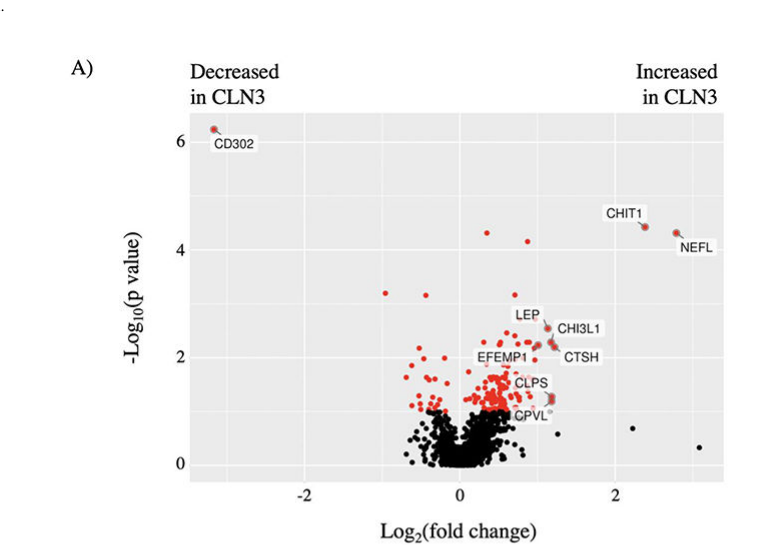

## Question

# Disease Characteristics Research Template

## Target Disease
- **Disease Name:** Neuronal Ceroid Lipofuscinosis 3
- **MONDO ID:**  (if available)
- **Category:** Mendelian

## Research Objectives

Please provide a comprehensive research report on **Neuronal Ceroid Lipofuscinosis 3** covering all of the
disease characteristics listed below. This report will be used to populate a disease knowledge
base entry. Be thorough and cite primary literature (PMID preferred) for all claims.

For each section, **suggested databases/resources** are listed. These are the first places
you should search for information on each topic.

---

### 1. Disease Information
> **Search first:** OMIM, Orphanet, ICD-10/ICD-11, MeSH, PubMed

- What is the disease? Provide a concise overview.
- What are the key identifiers? (OMIM, Orphanet, ICD-10/ICD-11, MeSH, Mondo)
- What are the common synonyms and alternative names?
- Is the information derived from individual patients (e.g., EHR) or aggregated disease-level resources?

### 2. Etiology

- **Disease Causal Factors**: What are the primary causes? (genetic, environmental, infectious, mechanistic)
- **Risk Factors**:
  > **Search first:** PubMed, Cochrane Library, UpToDate, clinical guidelines, ClinVar, ClinGen, GWAS Catalog, PheGenI, CTD, CDC, WHO, epidemiological databases
  - Genetic risk factors (causal variants, susceptibility loci, modifier genes)
  - Environmental risk factors (toxins, lifestyle, occupational exposures, age, sex, family history)
- **Protective Factors**:
  > **Search first:** PubMed, Cochrane Library, clinical trial databases, GWAS Catalog, gnomAD, WHO, CDC, nutrition databases
  - Genetic protective factors (protective variants, modifier alleles)
  - Environmental protective factors (diet, lifestyle, exposures that reduce risk)
- **Gene-Environment Interactions**: How do genetic and environmental factors interact to influence disease?
  > **Search first:** CTD, PubMed, PheGenI, GxE databases

### 3. Phenotypes
> **Search first:** HPO (Human Phenotype Ontology), OMIM, Orphanet, PubMed, clinicaltrials.gov, MedDRA, SNOMED CT, DECIPHER, LOINC

For each phenotype, provide:
- **Phenotype type**: symptoms, clinical signs, physical manifestations, behavioral changes, or laboratory abnormalities
  > For symptoms/signs: HPO, OMIM, Orphanet, PubMed
  > For behavioral changes: HPO, DSM, RDoC (Research Domain Criteria), PubMed
  > For laboratory abnormalities: LOINC, SNOMED CT, LabTests Online, PubMed
- **Phenotype characteristics**:
  > **Search first:** OMIM, Orphanet, HPO, PubMed
  - Age of symptom onset (neonatal, childhood, adult-onset, late-onset)
  - Symptom severity (mild, moderate, severe, variable)
  - Symptom progression (stable, progressive, episodic, fluctuating)
  - Frequency among affected individuals (percentage or qualitative)
- **Quality of life impact**: Effects on daily functioning and well-being (per-phenotype when possible)
  > **Search first:** EQ-5D database, SF-36, WHO QOL databases, PubMed
- Suggest HPO (Human Phenotype Ontology) terms for each phenotype

### 4. Genetic/Molecular Information

- **Causal Genes**: Gene mutations or chromosomal abnormalities responsible for disease (gene symbols, OMIM IDs)
  > **Search first:** OMIM, ClinVar, HGMD, Ensembl, NCBI Gene
- **Pathogenic Variants**:
  - Affected genes (gene symbols, HGNC IDs)
    > **Search first:** OMIM, NCBI Gene, Ensembl, HGNC, UniProt, GeneCards
  - Variant classification (pathogenic, likely pathogenic, VUS per ACMG/AMP guidelines)
    > **Search first:** ClinVar, ClinGen, ACMG/AMP guidelines, VarSome
  - Variant type/class (missense, frameshift, nonsense, splice-site, structural)
  - Allele frequency in population databases
    > **Search first:** gnomAD, 1000 Genomes, ExAC, TOPMed, dbSNP
  - Somatic vs germline origin
    > **Search first:** COSMIC (somatic), ClinVar, ICGC, TCGA
  - Functional consequences (loss of function, gain of function, dominant negative)
- **Modifier Genes**: Genes that modify disease severity or expression
- **Epigenetic Information**: DNA methylation, histone modifications, chromatin changes affecting disease
  > **Search first:** ENCODE, Roadmap Epigenomics, MethBase, DiseaseMeth
- **Chromosomal Abnormalities**: Large-scale genetic changes (aneuploidy, translocations, inversions)
  > **Search first:** DECIPHER, ClinVar, ECARUCA, UCSC Genome Browser

### 5. Environmental Information

- **Environmental Factors**: Non-genetic contributing factors (toxins, radiation, pollution, occupational exposure)
  > **Search first:** CTD (Comparative Toxicogenomics Database), TOXNET, PubMed, EPA databases
- **Lifestyle Factors**: Behavioral factors (smoking, diet, exercise, alcohol consumption)
  > **Search first:** CDC databases, WHO, PubMed, NHANES
- **Infectious Agents**: If applicable, pathogens causing or triggering disease (bacteria, viruses, fungi, parasites)
  > **Search first:** NCBI Taxonomy, ViPR, BV-BRC, MicrobeDB, GIDEON

### 6. Mechanism / Pathophysiology

- **Molecular Pathways**: Specific signaling cascades or biochemical pathways involved (Wnt, MAPK, mTOR, PI3K-AKT, etc.)
  > **Search first:** KEGG, Reactome, WikiPathways, PathBank, BioCyc
- **Cellular Processes**: Cell-level mechanisms (apoptosis, autophagy, cell cycle dysregulation, inflammation, etc.)
  > **Search first:** Gene Ontology (GO), Reactome, KEGG, PubMed
- **Protein Dysfunction**: How protein structure or function is altered (misfolding, aggregation, loss of function, gain of function)
  > **Search first:** UniProt, PDB (Protein Data Bank), InterPro, Pfam, AlphaFold
- **Metabolic Changes**: Alterations in metabolic processes (energy metabolism, lipid metabolism, amino acid metabolism)
  > **Search first:** KEGG, BioCyc, HMDB (Human Metabolome Database), BRENDA
- **Immune System Involvement**: Role of immune response (autoimmunity, immunodeficiency, chronic inflammation)
  > **Search first:** ImmPort, Immunome Database, IEDB, Gene Ontology
- **Tissue Damage Mechanisms**: How tissues/ are injured (oxidative stress, ischemia, fibrosis, necrosis)
  > **Search first:** PubMed, Gene Ontology, Reactome
- **Biochemical Abnormalities**: Specific molecular defects (enzyme deficiencies, receptor dysfunction, ion channel defects)
  > **Search first:** BRENDA, UniProt, KEGG, OMIM, PubMed
- **Epigenetic Changes**: DNA methylation, histone modifications affecting gene expression in disease
  > **Search first:** ENCODE, Roadmap Epigenomics, MethBase, DiseaseMeth
- **Molecular Profiling** (if available):
  - Transcriptomics/gene expression changes
    > **Search first:** GEO (Gene Expression Omnibus), ArrayExpress, GTEx, Human Cell Atlas, SRA
  - Proteomics findings
    > **Search first:** PRIDE, ProteomeXchange, Human Protein Atlas, STRING, BioGRID
  - Metabolomics signatures
    > **Search first:** MetaboLights, Metabolomics Workbench, HMDB, METLIN
  - Lipidomics alterations
    > **Search first:** LIPID MAPS, SwissLipids, LipidHome, Metabolomics Workbench
  - Genomic structural features
    > **Search first:** UCSC Genome Browser, Ensembl, NCBI, dbVar, DGV
- **Advanced Technologies** (if applicable):
  - Single-cell analysis findings (cell-type specific mechanisms, cellular heterogeneity)
    > **Search first:** Human Cell Atlas, Single Cell Portal, GEO, CELLxGENE
  - Spatial transcriptomics findings
    > **Search first:** GEO, Spatial Research, Vizgen, 10x Genomics data
  - Multi-omics integration results
    > **Search first:** TCGA, ICGC, cBioPortal, LinkedOmics, PubMed
  - Functional genomics screens (CRISPR, RNAi)
    > **Search first:** DepMap, GenomeRNAi, PubMed, BioGRID ORCS

For each mechanism, describe:
- The causal chain from initial trigger to clinical manifestation
- Which mechanisms are upstream vs downstream
- What cell types and biological processes are involved
- Suggest GO terms for biological processes and CL terms for cell types

### 7. Anatomical Structures Affected

- **Organ Level**:
  - Primary organs directly affected
  - Secondary organ involvement (complications, secondary effects)
  - Body systems involved (cardiovascular, nervous, digestive, respiratory, endocrine, etc.)
  > **Search first:** Uberon, FMA (Foundational Model of Anatomy), OMIM, HPO, ICD-11, MeSH, SNOMED CT
- **Tissue and Cell Level**:
  - Specific tissue types affected (epithelial, connective, muscle, nervous)
  - Specific cell populations targeted (with Cell Ontology terms)
  > **Search first:** Uberon, Human Protein Atlas, Cell Ontology, Human Cell Atlas, CellMarker, PanglaoDB
- **Subcellular Level**:
  - Cellular compartments involved (mitochondria, nucleus, ER, lysosomes) (with GO Cellular Component terms)
  > **Search first:** Gene Ontology (Cellular Component), UniProt, Human Protein Atlas
- **Localization**:
  - Specific anatomical sites (with UBERON terms)
    > **Search first:** FMA, Uberon, NeuroNames (for brain), SNOMED CT
  - Lateralization (unilateral, bilateral, asymmetric)
    > **Search first:** HPO, clinical literature, imaging databases

### 8. Temporal Development

- **Onset**:
  - Typical age of onset (congenital, pediatric, adult, geriatric)
  - Onset pattern (acute, subacute, chronic, insidious)
  > **Search first:** OMIM, Orphanet, HPO, PubMed
- **Progression**:
  - Disease stages (early, intermediate, advanced, end-stage)
    > **Search first:** Cancer Staging Manual (AJCC), WHO classifications, PubMed
  - Progression rate (rapid, slow, variable)
  - Disease course pattern (episodic, relapsing-remitting, progressive, stable)
  - Disease duration (self-limited, chronic lifelong)
  > **Search first:** Disease registries, longitudinal cohort databases, natural history studies, PubMed, Orphanet, OMIM
- **Patterns**:
  - Remission patterns (spontaneous, treatment-induced)
    > **Search first:** Clinical trial databases, disease registries, PubMed
  - Critical periods (time windows of vulnerability or opportunity for intervention)
    > **Search first:** PubMed, developmental biology databases, clinical guidelines

### 9. Inheritance and Population

- **Epidemiology**:
  - Prevalence (cases per 100,000 at given time)
  - Incidence (new cases per 100,000 per year)
  > **Search first:** Orphanet, CDC, WHO, GBD (Global Burden of Disease), national registries, SEER, disease registries
- **For Genetic Etiology**:
  - Inheritance pattern (AD, AR, X-linked, mitochondrial, multifactorial, polygenic)
    > **Search first:** OMIM, Orphanet, ClinVar, GTR (Genetic Testing Registry)
  - Penetrance (complete, incomplete, age-dependent)
    > **Search first:** ClinVar, OMIM, PubMed, ClinGen
  - Expressivity (variable, consistent)
    > **Search first:** OMIM, ClinVar, PubMed
  - Genetic anticipation (increasing severity in successive generations)
    > **Search first:** OMIM, PubMed (especially for repeat expansion disorders)
  - Germline mosaicism
    > **Search first:** ClinVar, OMIM, genetic counseling literature, PubMed
  - Founder effects (population-specific mutations)
    > **Search first:** gnomAD, population genetics databases, PubMed
  - Consanguinity role
    > **Search first:** OMIM, population studies, genetic counseling resources
  - Carrier frequency
    > **Search first:** gnomAD, carrier screening databases, GeneReviews, GTR
- **Population Demographics**:
  - Affected populations (ethnic or demographic groups with higher prevalence)
    > **Search first:** gnomAD, 1000 Genomes, PAGE Study, PubMed, population registries
  - Geographic distribution (endemic areas, regional variation)
    > **Search first:** WHO, CDC, GBD, Orphanet, geographic epidemiology databases
  - Geographic distribution of specific variants
  - Sex ratio (male:female)
    > **Search first:** Disease registries, OMIM, PubMed, epidemiological databases
  - Age distribution of affected individuals
    > **Search first:** CDC, disease registries, SEER, Orphanet

### 10. Diagnostics

- **Clinical Tests**:
  - Laboratory tests (blood, urine, tissue chemistry, specific enzyme assays)
    > **Search first:** LOINC, LabTests Online, PubMed
  - Biomarkers (proteins, metabolites, genetic markers, circulating biomarkers)
    > **Search first:** FDA Biomarker List, BEST (Biomarkers, EndpointS, and other Tools), PubMed
  - Imaging studies (X-ray, CT, MRI, PET, ultrasound)
    > **Search first:** RadLex, DICOM, Radiopaedia, imaging databases
  - Functional tests (pulmonary function, cardiac stress tests)
    > **Search first:** LOINC, clinical guidelines, PubMed
  - Electrophysiology (EEG, EMG, ECG, nerve conduction studies)
    > **Search first:** LOINC, clinical neurophysiology databases, PubMed
  - Biopsy findings (histopathology, immunohistochemistry)
    > **Search first:** SNOMED CT, College of American Pathologists resources, PubMed
  - Pathology findings (microscopic examination)
    > **Search first:** SNOMED CT, Digital Pathology databases, PubMed
- **Genetic Testing**:
  > **Search first:** GTR (Genetic Testing Registry), GeneReviews, ClinGen
  - Overview of recommended genetic testing approach
  - Whole genome sequencing (WGS) utility
    > **Search first:** GTR, ClinVar, GEL (Genomics England), gnomAD
  - Whole exome sequencing (WES) utility
    > **Search first:** GTR, ClinVar, OMIM, GeneMatcher
  - Gene panels (which panels, which genes)
    > **Search first:** GTR, ClinVar, laboratory-specific databases
  - Single gene testing
    > **Search first:** GTR, ClinVar, OMIM, GeneReviews
  - Chromosomal microarray (CMA)
    > **Search first:** DECIPHER, ClinVar, dbVar, ECARUCA
  - Karyotyping
    > **Search first:** Chromosome Abnormality Database, ClinVar, cytogenetics resources
  - FISH
    > **Search first:** ClinVar, cytogenetics databases, PubMed
  - Mitochondrial DNA testing
    > **Search first:** MITOMAP, MSeqDR, ClinVar, GTR
  - Repeat expansion testing
    > **Search first:** GTR, ClinVar, repeat expansion databases, PubMed
- **Omics-Based Diagnostics** (if applicable):
  - RNA sequencing / transcriptomics
    > **Search first:** GEO, ArrayExpress, GTEx, RNA-seq databases
  - Proteomics
    > **Search first:** PRIDE, ProteomeXchange, FDA Biomarker database
  - Metabolomics
    > **Search first:** MetaboLights, Metabolomics Workbench, HMDB
  - Epigenomics
    > **Search first:** GEO, ENCODE, Roadmap Epigenomics, MethBase
  - Liquid biopsy
    > **Search first:** COSMIC, ClinVar, liquid biopsy databases, PubMed
- **Clinical Criteria**:
  - Standardized diagnostic criteria (DSM, ICD, society guidelines)
    > **Search first:** DSM-5, ICD-11, clinical society guidelines, UpToDate
  - Differential diagnosis (other conditions to rule out, with distinguishing features)
    > **Search first:** DynaMed, UpToDate, clinical decision support systems
- **Screening**:
  - Screening methods for asymptomatic individuals (newborn screening, carrier screening, cascade screening)
    > **Search first:** ACMG recommendations, CDC newborn screening, GTR

### 11. Outcome/Prognosis

- **Survival and Mortality**:
  - Survival rate (5-year, 10-year, overall)
    > **Search first:** SEER, cancer registries, disease-specific registries, PubMed
  - Life expectancy (with and without treatment if applicable)
    > **Search first:** Orphanet, disease registries, actuarial databases, PubMed
  - Mortality rate
    > **Search first:** CDC, WHO, GBD, national mortality databases
  - Disease-specific mortality (deaths directly attributable to disease)
    > **Search first:** Disease registries, CDC Wonder, GBD, PubMed
- **Morbidity and Function**:
  - Morbidity (disease-related disability and health impacts)
    > **Search first:** GBD, WHO, disability databases, PubMed
  - Disability outcomes (long-term functional impairments)
    > **Search first:** ICF (International Classification of Functioning), disability registries
  - Quality of life measures (EQ-5D, SF-36, PROMIS, disease-specific tools)
    > **Search first:** EQ-5D database, SF-36, PROMIS, PubMed
- **Disease Course**:
  - Complications (secondary problems: infections, organ failure, etc.)
    > **Search first:** ICD codes, disease registries, clinical databases, PubMed
  - Recovery potential (likelihood and extent of recovery, with vs without treatment)
    > **Search first:** Natural history studies, rehabilitation databases, PubMed
- **Prediction**:
  - Prognostic factors (age, disease severity, biomarkers, treatment response)
    > **Search first:** Prognostic models databases, clinical calculators, PubMed
  - Prognostic biomarkers (molecular markers predicting disease course)
    > **Search first:** FDA Biomarker database, PubMed, cancer prognostic databases

### 12. Treatment

- **Pharmacotherapy**:
  - Pharmacological treatments (drug names, drug classes, mechanisms of action)
    > **Search first:** DrugBank, RxNorm, ATC classification, DailyMed, FDA databases
  - Pharmacogenomics (how genetic variants affect drug metabolism, efficacy, toxicity)
    > **Search first:** PharmGKB, CPIC (Clinical Pharmacogenetics), FDA Table of PGx Biomarkers
- **Advanced Therapeutics**:
  - Gene therapy (viral vectors, CRISPR, gene replacement, gene editing)
    > **Search first:** ClinicalTrials.gov, FDA gene therapy database, ASGCT resources
  - Cell therapy (stem cell transplant, CAR-T, cellular therapeutics)
    > **Search first:** ClinicalTrials.gov, FDA cell therapy database, FACT standards
  - RNA-based therapies (ASOs, siRNA, mRNA therapies)
    > **Search first:** ClinicalTrials.gov, FDA approvals, PubMed
  - Targeted therapies (treatments directed at specific molecular targets)
    > **Search first:** My Cancer Genome, OncoKB, ClinicalTrials.gov, FDA approvals
  - Immunotherapies (checkpoint inhibitors, monoclonal antibodies)
    > **Search first:** Cancer Immunotherapy Database, FDA approvals, ClinicalTrials.gov
- **Surgical and Interventional**:
  - Surgical interventions (types of surgery, timing, outcomes)
    > **Search first:** CPT codes, surgical registries, clinical guidelines, PubMed
- **Supportive and Rehabilitative**:
  - Supportive care (symptom management, pain control, nutrition)
    > **Search first:** Clinical guidelines, Cochrane Library, PubMed
  - Rehabilitation (physical therapy, occupational therapy, speech therapy)
    > **Search first:** Rehabilitation medicine databases, clinical guidelines, PubMed
- **Experimental**:
  - Experimental treatments in clinical trials (with NCT identifiers if available)
    > **Search first:** ClinicalTrials.gov, EU Clinical Trials Register, WHO ICTRP
- **Treatment Outcomes**:
  - Treatment response rates
    > **Search first:** Clinical trial databases, FDA reviews, systematic reviews, PubMed
  - Side effects and adverse events
    > **Search first:** FDA Adverse Event Reporting System (FAERS), MedWatch, PubMed
- **Treatment Strategy**:
  - Treatment algorithms (clinical pathways, decision trees)
    > **Search first:** Clinical practice guidelines, NCCN Guidelines, UpToDate
  - Combination therapies
    > **Search first:** ClinicalTrials.gov, treatment guidelines, PubMed
  - Personalized medicine approaches (genotype-guided treatment)
    > **Search first:** My Cancer Genome, CIViC, PharmGKB, precision medicine databases

For each treatment, suggest MAXO (Medical Action Ontology) terms where applicable.

### 13. Prevention

- **Prevention Levels**:
  - Primary prevention (preventing disease occurrence: vaccination, risk factor modification)
    > **Search first:** CDC, WHO, USPSTF recommendations, Cochrane Library
  - Secondary prevention (early detection and treatment: screening programs, early intervention)
    > **Search first:** USPSTF, CDC screening guidelines, WHO
  - Tertiary prevention (preventing complications in those with disease)
    > **Search first:** Clinical guidelines, disease management protocols, PubMed
- **Immunization**: Vaccine strategies (if applicable)
  > **Search first:** CDC vaccine schedules, WHO immunization, FDA vaccine database
- **Screening and Early Detection**:
  - Screening programs (population-based: newborn screening, cancer screening)
    > **Search first:** CDC screening programs, USPSTF, cancer screening databases
  - Genetic screening (carrier screening, preimplantation genetic diagnosis, prenatal testing)
    > **Search first:** ACMG recommendations, ACOG guidelines, GTR
  - Risk stratification (identifying high-risk individuals for targeted prevention)
    > **Search first:** Risk prediction models, clinical calculators, PubMed
- **Behavioral Interventions**: Lifestyle modifications to reduce risk
  > **Search first:** CDC, WHO, behavioral intervention databases, Cochrane Library
- **Counseling**: Genetic counseling (risk assessment, family planning guidance)
  > **Search first:** NSGC resources, ACMG guidelines, GeneReviews
- **Public Health**:
  - Public health interventions (sanitation, vector control, health education)
    > **Search first:** CDC, WHO, public health databases, PubMed
  - Environmental interventions (reducing environmental risk factors)
    > **Search first:** EPA databases, WHO environmental health, PubMed
- **Prophylaxis**: Preventive medications or procedures
  > **Search first:** Clinical guidelines, FDA approvals, PubMed

### 14. Other Species / Natural Disease

- **Taxonomy**: Species affected (with NCBI Taxon identifiers)
  > **Search first:** NCBI Taxonomy
- **Breed**: Specific breeds affected (with VBO identifiers if applicable)
  > **Search first:** VBO (Vertebrate Breed Ontology)
- **Gene**: Orthologous genes in other species (with NCBI Gene IDs)
  > **Search first:** NCBI Gene
- **Natural Disease**:
  - Naturally occurring disease in other species (companion animals, wildlife)
    > **Search first:** OMIA (Online Mendelian Inheritance in Animals), VetCompass, PubMed
  - Veterinary relevance and importance in animal health
    > **Search first:** OMIA, veterinary databases, PubMed
- **Comparative Biology**:
  - Comparative pathology (similarities and differences across species)
    > **Search first:** OMIA, comparative pathology databases, PubMed
  - Evolutionary conservation of disease mechanisms
    > **Search first:** HomoloGene, OrthoMCL, Alliance of Genome Resources
- **Transmission** (if applicable):
  - Zoonotic potential
    > **Search first:** CDC zoonotic diseases, WHO zoonoses, GIDEON
  - Cross-species susceptibility
    > **Search first:** NCBI Taxonomy, veterinary databases, PubMed

### 15. Model Organisms

- **Model Types**:
  - Model organism type (mammalian, invertebrate, cellular, in vitro)
    > **Search first:** Alliance of Genome Resources, model organism databases
  - Specific model systems (mouse, rat, zebrafish, Drosophila, C. elegans, yeast, cell lines, organoids, iPSCs)
    > **Search first:** MGI, RGD, ZFIN, FlyBase, WormBase, SGD, ATCC, Cellosaurus
  - Induced models (drug treatment, surgical intervention, environmental manipulation)
    > **Search first:** MGI, model organism databases, PubMed
- **Genetic Models**:
  - Types available (knockout, knock-in, transgenic, conditional, humanized)
    > **Search first:** MGI, IMPC, KOMP, EuMMCR, IMSR
- **Model Characteristics**:
  - Phenotype recapitulation (how well model reproduces human disease features)
    > **Search first:** Model organism databases, comparative studies, PubMed
  - Model limitations (aspects of human disease not captured)
    > **Search first:** Model organism databases, PubMed, review articles
- **Applications**:
  - Research applications (what aspects of disease can be studied)
    > **Search first:** Model organism databases, PubMed
- **Resources**:
  - Model databases
    > **Search first:** MGI, RGD, ZFIN, FlyBase, WormBase, IMSR, EMMA, MMRRC

---

## Citation Requirements

- Cite primary literature (PMID preferred) for all mechanistic and clinical claims
- Prioritize recent reviews and landmark papers
- Include direct quotes from abstracts where possible to support key statements
- Distinguish evidence source types: human clinical, model organism, in vitro, computational

## Output Format

Structure your response as a comprehensive narrative organized by the sections above.
For each section, provide:
- Factual content with specific details (numbers, percentages, gene names, variant nomenclature)
- Ontology term suggestions (HPO, GO, CL, UBERON, CHEBI, MAXO, MONDO) where applicable
- Evidence citations with PMIDs
- Direct quotes from abstracts to support key claims
- Clear indication when information is not available or not applicable for this disease

This report will be used to populate a disease knowledge base entry with:
- Pathophysiology descriptions with causal chains
- Gene/protein annotations (HGNC, GO terms)
- Phenotype associations (HP terms) with frequencies
- Cell type involvement (CL terms)
- Anatomical locations (UBERON terms)
- Chemical entities (CHEBI terms)
- Treatment annotations (MAXO terms)
- Evidence items with PMIDs and exact abstract quotes
- Epidemiology, prognosis, diagnostic, and prevention information
- Animal model descriptions with phenotype recapitulation details

## Output

Question: You are an expert researcher providing comprehensive, well-cited information.

Provide detailed information focusing on:
1. Key concepts and definitions with current understanding
2. Recent developments and latest research (prioritize 2023-2024 sources)
3. Current applications and real-world implementations
4. Expert opinions and analysis from authoritative sources
5. Relevant statistics and data from recent studies

Format as a comprehensive research report with proper citations. Include URLs and publication dates where available.
Always prioritize recent, authoritative sources and provide specific citations for all major claims.

# Disease Characteristics Research Template

## Target Disease
- **Disease Name:** Neuronal Ceroid Lipofuscinosis 3
- **MONDO ID:**  (if available)
- **Category:** Mendelian

## Research Objectives

Please provide a comprehensive research report on **Neuronal Ceroid Lipofuscinosis 3** covering all of the
disease characteristics listed below. This report will be used to populate a disease knowledge
base entry. Be thorough and cite primary literature (PMID preferred) for all claims.

For each section, **suggested databases/resources** are listed. These are the first places
you should search for information on each topic.

---

### 1. Disease Information
> **Search first:** OMIM, Orphanet, ICD-10/ICD-11, MeSH, PubMed

- What is the disease? Provide a concise overview.
- What are the key identifiers? (OMIM, Orphanet, ICD-10/ICD-11, MeSH, Mondo)
- What are the common synonyms and alternative names?
- Is the information derived from individual patients (e.g., EHR) or aggregated disease-level resources?

### 2. Etiology

- **Disease Causal Factors**: What are the primary causes? (genetic, environmental, infectious, mechanistic)
- **Risk Factors**:
  > **Search first:** PubMed, Cochrane Library, UpToDate, clinical guidelines, ClinVar, ClinGen, GWAS Catalog, PheGenI, CTD, CDC, WHO, epidemiological databases
  - Genetic risk factors (causal variants, susceptibility loci, modifier genes)
  - Environmental risk factors (toxins, lifestyle, occupational exposures, age, sex, family history)
- **Protective Factors**:
  > **Search first:** PubMed, Cochrane Library, clinical trial databases, GWAS Catalog, gnomAD, WHO, CDC, nutrition databases
  - Genetic protective factors (protective variants, modifier alleles)
  - Environmental protective factors (diet, lifestyle, exposures that reduce risk)
- **Gene-Environment Interactions**: How do genetic and environmental factors interact to influence disease?
  > **Search first:** CTD, PubMed, PheGenI, GxE databases

### 3. Phenotypes
> **Search first:** HPO (Human Phenotype Ontology), OMIM, Orphanet, PubMed, clinicaltrials.gov, MedDRA, SNOMED CT, DECIPHER, LOINC

For each phenotype, provide:
- **Phenotype type**: symptoms, clinical signs, physical manifestations, behavioral changes, or laboratory abnormalities
  > For symptoms/signs: HPO, OMIM, Orphanet, PubMed
  > For behavioral changes: HPO, DSM, RDoC (Research Domain Criteria), PubMed
  > For laboratory abnormalities: LOINC, SNOMED CT, LabTests Online, PubMed
- **Phenotype characteristics**:
  > **Search first:** OMIM, Orphanet, HPO, PubMed
  - Age of symptom onset (neonatal, childhood, adult-onset, late-onset)
  - Symptom severity (mild, moderate, severe, variable)
  - Symptom progression (stable, progressive, episodic, fluctuating)
  - Frequency among affected individuals (percentage or qualitative)
- **Quality of life impact**: Effects on daily functioning and well-being (per-phenotype when possible)
  > **Search first:** EQ-5D database, SF-36, WHO QOL databases, PubMed
- Suggest HPO (Human Phenotype Ontology) terms for each phenotype

### 4. Genetic/Molecular Information

- **Causal Genes**: Gene mutations or chromosomal abnormalities responsible for disease (gene symbols, OMIM IDs)
  > **Search first:** OMIM, ClinVar, HGMD, Ensembl, NCBI Gene
- **Pathogenic Variants**:
  - Affected genes (gene symbols, HGNC IDs)
    > **Search first:** OMIM, NCBI Gene, Ensembl, HGNC, UniProt, GeneCards
  - Variant classification (pathogenic, likely pathogenic, VUS per ACMG/AMP guidelines)
    > **Search first:** ClinVar, ClinGen, ACMG/AMP guidelines, VarSome
  - Variant type/class (missense, frameshift, nonsense, splice-site, structural)
  - Allele frequency in population databases
    > **Search first:** gnomAD, 1000 Genomes, ExAC, TOPMed, dbSNP
  - Somatic vs germline origin
    > **Search first:** COSMIC (somatic), ClinVar, ICGC, TCGA
  - Functional consequences (loss of function, gain of function, dominant negative)
- **Modifier Genes**: Genes that modify disease severity or expression
- **Epigenetic Information**: DNA methylation, histone modifications, chromatin changes affecting disease
  > **Search first:** ENCODE, Roadmap Epigenomics, MethBase, DiseaseMeth
- **Chromosomal Abnormalities**: Large-scale genetic changes (aneuploidy, translocations, inversions)
  > **Search first:** DECIPHER, ClinVar, ECARUCA, UCSC Genome Browser

### 5. Environmental Information

- **Environmental Factors**: Non-genetic contributing factors (toxins, radiation, pollution, occupational exposure)
  > **Search first:** CTD (Comparative Toxicogenomics Database), TOXNET, PubMed, EPA databases
- **Lifestyle Factors**: Behavioral factors (smoking, diet, exercise, alcohol consumption)
  > **Search first:** CDC databases, WHO, PubMed, NHANES
- **Infectious Agents**: If applicable, pathogens causing or triggering disease (bacteria, viruses, fungi, parasites)
  > **Search first:** NCBI Taxonomy, ViPR, BV-BRC, MicrobeDB, GIDEON

### 6. Mechanism / Pathophysiology

- **Molecular Pathways**: Specific signaling cascades or biochemical pathways involved (Wnt, MAPK, mTOR, PI3K-AKT, etc.)
  > **Search first:** KEGG, Reactome, WikiPathways, PathBank, BioCyc
- **Cellular Processes**: Cell-level mechanisms (apoptosis, autophagy, cell cycle dysregulation, inflammation, etc.)
  > **Search first:** Gene Ontology (GO), Reactome, KEGG, PubMed
- **Protein Dysfunction**: How protein structure or function is altered (misfolding, aggregation, loss of function, gain of function)
  > **Search first:** UniProt, PDB (Protein Data Bank), InterPro, Pfam, AlphaFold
- **Metabolic Changes**: Alterations in metabolic processes (energy metabolism, lipid metabolism, amino acid metabolism)
  > **Search first:** KEGG, BioCyc, HMDB (Human Metabolome Database), BRENDA
- **Immune System Involvement**: Role of immune response (autoimmunity, immunodeficiency, chronic inflammation)
  > **Search first:** ImmPort, Immunome Database, IEDB, Gene Ontology
- **Tissue Damage Mechanisms**: How tissues/ are injured (oxidative stress, ischemia, fibrosis, necrosis)
  > **Search first:** PubMed, Gene Ontology, Reactome
- **Biochemical Abnormalities**: Specific molecular defects (enzyme deficiencies, receptor dysfunction, ion channel defects)
  > **Search first:** BRENDA, UniProt, KEGG, OMIM, PubMed
- **Epigenetic Changes**: DNA methylation, histone modifications affecting gene expression in disease
  > **Search first:** ENCODE, Roadmap Epigenomics, MethBase, DiseaseMeth
- **Molecular Profiling** (if available):
  - Transcriptomics/gene expression changes
    > **Search first:** GEO (Gene Expression Omnibus), ArrayExpress, GTEx, Human Cell Atlas, SRA
  - Proteomics findings
    > **Search first:** PRIDE, ProteomeXchange, Human Protein Atlas, STRING, BioGRID
  - Metabolomics signatures
    > **Search first:** MetaboLights, Metabolomics Workbench, HMDB, METLIN
  - Lipidomics alterations
    > **Search first:** LIPID MAPS, SwissLipids, LipidHome, Metabolomics Workbench
  - Genomic structural features
    > **Search first:** UCSC Genome Browser, Ensembl, NCBI, dbVar, DGV
- **Advanced Technologies** (if applicable):
  - Single-cell analysis findings (cell-type specific mechanisms, cellular heterogeneity)
    > **Search first:** Human Cell Atlas, Single Cell Portal, GEO, CELLxGENE
  - Spatial transcriptomics findings
    > **Search first:** GEO, Spatial Research, Vizgen, 10x Genomics data
  - Multi-omics integration results
    > **Search first:** TCGA, ICGC, cBioPortal, LinkedOmics, PubMed
  - Functional genomics screens (CRISPR, RNAi)
    > **Search first:** DepMap, GenomeRNAi, PubMed, BioGRID ORCS

For each mechanism, describe:
- The causal chain from initial trigger to clinical manifestation
- Which mechanisms are upstream vs downstream
- What cell types and biological processes are involved
- Suggest GO terms for biological processes and CL terms for cell types

### 7. Anatomical Structures Affected

- **Organ Level**:
  - Primary organs directly affected
  - Secondary organ involvement (complications, secondary effects)
  - Body systems involved (cardiovascular, nervous, digestive, respiratory, endocrine, etc.)
  > **Search first:** Uberon, FMA (Foundational Model of Anatomy), OMIM, HPO, ICD-11, MeSH, SNOMED CT
- **Tissue and Cell Level**:
  - Specific tissue types affected (epithelial, connective, muscle, nervous)
  - Specific cell populations targeted (with Cell Ontology terms)
  > **Search first:** Uberon, Human Protein Atlas, Cell Ontology, Human Cell Atlas, CellMarker, PanglaoDB
- **Subcellular Level**:
  - Cellular compartments involved (mitochondria, nucleus, ER, lysosomes) (with GO Cellular Component terms)
  > **Search first:** Gene Ontology (Cellular Component), UniProt, Human Protein Atlas
- **Localization**:
  - Specific anatomical sites (with UBERON terms)
    > **Search first:** FMA, Uberon, NeuroNames (for brain), SNOMED CT
  - Lateralization (unilateral, bilateral, asymmetric)
    > **Search first:** HPO, clinical literature, imaging databases

### 8. Temporal Development

- **Onset**:
  - Typical age of onset (congenital, pediatric, adult, geriatric)
  - Onset pattern (acute, subacute, chronic, insidious)
  > **Search first:** OMIM, Orphanet, HPO, PubMed
- **Progression**:
  - Disease stages (early, intermediate, advanced, end-stage)
    > **Search first:** Cancer Staging Manual (AJCC), WHO classifications, PubMed
  - Progression rate (rapid, slow, variable)
  - Disease course pattern (episodic, relapsing-remitting, progressive, stable)
  - Disease duration (self-limited, chronic lifelong)
  > **Search first:** Disease registries, longitudinal cohort databases, natural history studies, PubMed, Orphanet, OMIM
- **Patterns**:
  - Remission patterns (spontaneous, treatment-induced)
    > **Search first:** Clinical trial databases, disease registries, PubMed
  - Critical periods (time windows of vulnerability or opportunity for intervention)
    > **Search first:** PubMed, developmental biology databases, clinical guidelines

### 9. Inheritance and Population

- **Epidemiology**:
  - Prevalence (cases per 100,000 at given time)
  - Incidence (new cases per 100,000 per year)
  > **Search first:** Orphanet, CDC, WHO, GBD (Global Burden of Disease), national registries, SEER, disease registries
- **For Genetic Etiology**:
  - Inheritance pattern (AD, AR, X-linked, mitochondrial, multifactorial, polygenic)
    > **Search first:** OMIM, Orphanet, ClinVar, GTR (Genetic Testing Registry)
  - Penetrance (complete, incomplete, age-dependent)
    > **Search first:** ClinVar, OMIM, PubMed, ClinGen
  - Expressivity (variable, consistent)
    > **Search first:** OMIM, ClinVar, PubMed
  - Genetic anticipation (increasing severity in successive generations)
    > **Search first:** OMIM, PubMed (especially for repeat expansion disorders)
  - Germline mosaicism
    > **Search first:** ClinVar, OMIM, genetic counseling literature, PubMed
  - Founder effects (population-specific mutations)
    > **Search first:** gnomAD, population genetics databases, PubMed
  - Consanguinity role
    > **Search first:** OMIM, population studies, genetic counseling resources
  - Carrier frequency
    > **Search first:** gnomAD, carrier screening databases, GeneReviews, GTR
- **Population Demographics**:
  - Affected populations (ethnic or demographic groups with higher prevalence)
    > **Search first:** gnomAD, 1000 Genomes, PAGE Study, PubMed, population registries
  - Geographic distribution (endemic areas, regional variation)
    > **Search first:** WHO, CDC, GBD, Orphanet, geographic epidemiology databases
  - Geographic distribution of specific variants
  - Sex ratio (male:female)
    > **Search first:** Disease registries, OMIM, PubMed, epidemiological databases
  - Age distribution of affected individuals
    > **Search first:** CDC, disease registries, SEER, Orphanet

### 10. Diagnostics

- **Clinical Tests**:
  - Laboratory tests (blood, urine, tissue chemistry, specific enzyme assays)
    > **Search first:** LOINC, LabTests Online, PubMed
  - Biomarkers (proteins, metabolites, genetic markers, circulating biomarkers)
    > **Search first:** FDA Biomarker List, BEST (Biomarkers, EndpointS, and other Tools), PubMed
  - Imaging studies (X-ray, CT, MRI, PET, ultrasound)
    > **Search first:** RadLex, DICOM, Radiopaedia, imaging databases
  - Functional tests (pulmonary function, cardiac stress tests)
    > **Search first:** LOINC, clinical guidelines, PubMed
  - Electrophysiology (EEG, EMG, ECG, nerve conduction studies)
    > **Search first:** LOINC, clinical neurophysiology databases, PubMed
  - Biopsy findings (histopathology, immunohistochemistry)
    > **Search first:** SNOMED CT, College of American Pathologists resources, PubMed
  - Pathology findings (microscopic examination)
    > **Search first:** SNOMED CT, Digital Pathology databases, PubMed
- **Genetic Testing**:
  > **Search first:** GTR (Genetic Testing Registry), GeneReviews, ClinGen
  - Overview of recommended genetic testing approach
  - Whole genome sequencing (WGS) utility
    > **Search first:** GTR, ClinVar, GEL (Genomics England), gnomAD
  - Whole exome sequencing (WES) utility
    > **Search first:** GTR, ClinVar, OMIM, GeneMatcher
  - Gene panels (which panels, which genes)
    > **Search first:** GTR, ClinVar, laboratory-specific databases
  - Single gene testing
    > **Search first:** GTR, ClinVar, OMIM, GeneReviews
  - Chromosomal microarray (CMA)
    > **Search first:** DECIPHER, ClinVar, dbVar, ECARUCA
  - Karyotyping
    > **Search first:** Chromosome Abnormality Database, ClinVar, cytogenetics resources
  - FISH
    > **Search first:** ClinVar, cytogenetics databases, PubMed
  - Mitochondrial DNA testing
    > **Search first:** MITOMAP, MSeqDR, ClinVar, GTR
  - Repeat expansion testing
    > **Search first:** GTR, ClinVar, repeat expansion databases, PubMed
- **Omics-Based Diagnostics** (if applicable):
  - RNA sequencing / transcriptomics
    > **Search first:** GEO, ArrayExpress, GTEx, RNA-seq databases
  - Proteomics
    > **Search first:** PRIDE, ProteomeXchange, FDA Biomarker database
  - Metabolomics
    > **Search first:** MetaboLights, Metabolomics Workbench, HMDB
  - Epigenomics
    > **Search first:** GEO, ENCODE, Roadmap Epigenomics, MethBase
  - Liquid biopsy
    > **Search first:** COSMIC, ClinVar, liquid biopsy databases, PubMed
- **Clinical Criteria**:
  - Standardized diagnostic criteria (DSM, ICD, society guidelines)
    > **Search first:** DSM-5, ICD-11, clinical society guidelines, UpToDate
  - Differential diagnosis (other conditions to rule out, with distinguishing features)
    > **Search first:** DynaMed, UpToDate, clinical decision support systems
- **Screening**:
  - Screening methods for asymptomatic individuals (newborn screening, carrier screening, cascade screening)
    > **Search first:** ACMG recommendations, CDC newborn screening, GTR

### 11. Outcome/Prognosis

- **Survival and Mortality**:
  - Survival rate (5-year, 10-year, overall)
    > **Search first:** SEER, cancer registries, disease-specific registries, PubMed
  - Life expectancy (with and without treatment if applicable)
    > **Search first:** Orphanet, disease registries, actuarial databases, PubMed
  - Mortality rate
    > **Search first:** CDC, WHO, GBD, national mortality databases
  - Disease-specific mortality (deaths directly attributable to disease)
    > **Search first:** Disease registries, CDC Wonder, GBD, PubMed
- **Morbidity and Function**:
  - Morbidity (disease-related disability and health impacts)
    > **Search first:** GBD, WHO, disability databases, PubMed
  - Disability outcomes (long-term functional impairments)
    > **Search first:** ICF (International Classification of Functioning), disability registries
  - Quality of life measures (EQ-5D, SF-36, PROMIS, disease-specific tools)
    > **Search first:** EQ-5D database, SF-36, PROMIS, PubMed
- **Disease Course**:
  - Complications (secondary problems: infections, organ failure, etc.)
    > **Search first:** ICD codes, disease registries, clinical databases, PubMed
  - Recovery potential (likelihood and extent of recovery, with vs without treatment)
    > **Search first:** Natural history studies, rehabilitation databases, PubMed
- **Prediction**:
  - Prognostic factors (age, disease severity, biomarkers, treatment response)
    > **Search first:** Prognostic models databases, clinical calculators, PubMed
  - Prognostic biomarkers (molecular markers predicting disease course)
    > **Search first:** FDA Biomarker database, PubMed, cancer prognostic databases

### 12. Treatment

- **Pharmacotherapy**:
  - Pharmacological treatments (drug names, drug classes, mechanisms of action)
    > **Search first:** DrugBank, RxNorm, ATC classification, DailyMed, FDA databases
  - Pharmacogenomics (how genetic variants affect drug metabolism, efficacy, toxicity)
    > **Search first:** PharmGKB, CPIC (Clinical Pharmacogenetics), FDA Table of PGx Biomarkers
- **Advanced Therapeutics**:
  - Gene therapy (viral vectors, CRISPR, gene replacement, gene editing)
    > **Search first:** ClinicalTrials.gov, FDA gene therapy database, ASGCT resources
  - Cell therapy (stem cell transplant, CAR-T, cellular therapeutics)
    > **Search first:** ClinicalTrials.gov, FDA cell therapy database, FACT standards
  - RNA-based therapies (ASOs, siRNA, mRNA therapies)
    > **Search first:** ClinicalTrials.gov, FDA approvals, PubMed
  - Targeted therapies (treatments directed at specific molecular targets)
    > **Search first:** My Cancer Genome, OncoKB, ClinicalTrials.gov, FDA approvals
  - Immunotherapies (checkpoint inhibitors, monoclonal antibodies)
    > **Search first:** Cancer Immunotherapy Database, FDA approvals, ClinicalTrials.gov
- **Surgical and Interventional**:
  - Surgical interventions (types of surgery, timing, outcomes)
    > **Search first:** CPT codes, surgical registries, clinical guidelines, PubMed
- **Supportive and Rehabilitative**:
  - Supportive care (symptom management, pain control, nutrition)
    > **Search first:** Clinical guidelines, Cochrane Library, PubMed
  - Rehabilitation (physical therapy, occupational therapy, speech therapy)
    > **Search first:** Rehabilitation medicine databases, clinical guidelines, PubMed
- **Experimental**:
  - Experimental treatments in clinical trials (with NCT identifiers if available)
    > **Search first:** ClinicalTrials.gov, EU Clinical Trials Register, WHO ICTRP
- **Treatment Outcomes**:
  - Treatment response rates
    > **Search first:** Clinical trial databases, FDA reviews, systematic reviews, PubMed
  - Side effects and adverse events
    > **Search first:** FDA Adverse Event Reporting System (FAERS), MedWatch, PubMed
- **Treatment Strategy**:
  - Treatment algorithms (clinical pathways, decision trees)
    > **Search first:** Clinical practice guidelines, NCCN Guidelines, UpToDate
  - Combination therapies
    > **Search first:** ClinicalTrials.gov, treatment guidelines, PubMed
  - Personalized medicine approaches (genotype-guided treatment)
    > **Search first:** My Cancer Genome, CIViC, PharmGKB, precision medicine databases

For each treatment, suggest MAXO (Medical Action Ontology) terms where applicable.

### 13. Prevention

- **Prevention Levels**:
  - Primary prevention (preventing disease occurrence: vaccination, risk factor modification)
    > **Search first:** CDC, WHO, USPSTF recommendations, Cochrane Library
  - Secondary prevention (early detection and treatment: screening programs, early intervention)
    > **Search first:** USPSTF, CDC screening guidelines, WHO
  - Tertiary prevention (preventing complications in those with disease)
    > **Search first:** Clinical guidelines, disease management protocols, PubMed
- **Immunization**: Vaccine strategies (if applicable)
  > **Search first:** CDC vaccine schedules, WHO immunization, FDA vaccine database
- **Screening and Early Detection**:
  - Screening programs (population-based: newborn screening, cancer screening)
    > **Search first:** CDC screening programs, USPSTF, cancer screening databases
  - Genetic screening (carrier screening, preimplantation genetic diagnosis, prenatal testing)
    > **Search first:** ACMG recommendations, ACOG guidelines, GTR
  - Risk stratification (identifying high-risk individuals for targeted prevention)
    > **Search first:** Risk prediction models, clinical calculators, PubMed
- **Behavioral Interventions**: Lifestyle modifications to reduce risk
  > **Search first:** CDC, WHO, behavioral intervention databases, Cochrane Library
- **Counseling**: Genetic counseling (risk assessment, family planning guidance)
  > **Search first:** NSGC resources, ACMG guidelines, GeneReviews
- **Public Health**:
  - Public health interventions (sanitation, vector control, health education)
    > **Search first:** CDC, WHO, public health databases, PubMed
  - Environmental interventions (reducing environmental risk factors)
    > **Search first:** EPA databases, WHO environmental health, PubMed
- **Prophylaxis**: Preventive medications or procedures
  > **Search first:** Clinical guidelines, FDA approvals, PubMed

### 14. Other Species / Natural Disease

- **Taxonomy**: Species affected (with NCBI Taxon identifiers)
  > **Search first:** NCBI Taxonomy
- **Breed**: Specific breeds affected (with VBO identifiers if applicable)
  > **Search first:** VBO (Vertebrate Breed Ontology)
- **Gene**: Orthologous genes in other species (with NCBI Gene IDs)
  > **Search first:** NCBI Gene
- **Natural Disease**:
  - Naturally occurring disease in other species (companion animals, wildlife)
    > **Search first:** OMIA (Online Mendelian Inheritance in Animals), VetCompass, PubMed
  - Veterinary relevance and importance in animal health
    > **Search first:** OMIA, veterinary databases, PubMed
- **Comparative Biology**:
  - Comparative pathology (similarities and differences across species)
    > **Search first:** OMIA, comparative pathology databases, PubMed
  - Evolutionary conservation of disease mechanisms
    > **Search first:** HomoloGene, OrthoMCL, Alliance of Genome Resources
- **Transmission** (if applicable):
  - Zoonotic potential
    > **Search first:** CDC zoonotic diseases, WHO zoonoses, GIDEON
  - Cross-species susceptibility
    > **Search first:** NCBI Taxonomy, veterinary databases, PubMed

### 15. Model Organisms

- **Model Types**:
  - Model organism type (mammalian, invertebrate, cellular, in vitro)
    > **Search first:** Alliance of Genome Resources, model organism databases
  - Specific model systems (mouse, rat, zebrafish, Drosophila, C. elegans, yeast, cell lines, organoids, iPSCs)
    > **Search first:** MGI, RGD, ZFIN, FlyBase, WormBase, SGD, ATCC, Cellosaurus
  - Induced models (drug treatment, surgical intervention, environmental manipulation)
    > **Search first:** MGI, model organism databases, PubMed
- **Genetic Models**:
  - Types available (knockout, knock-in, transgenic, conditional, humanized)
    > **Search first:** MGI, IMPC, KOMP, EuMMCR, IMSR
- **Model Characteristics**:
  - Phenotype recapitulation (how well model reproduces human disease features)
    > **Search first:** Model organism databases, comparative studies, PubMed
  - Model limitations (aspects of human disease not captured)
    > **Search first:** Model organism databases, PubMed, review articles
- **Applications**:
  - Research applications (what aspects of disease can be studied)
    > **Search first:** Model organism databases, PubMed
- **Resources**:
  - Model databases
    > **Search first:** MGI, RGD, ZFIN, FlyBase, WormBase, IMSR, EMMA, MMRRC

---

## Citation Requirements

- Cite primary literature (PMID preferred) for all mechanistic and clinical claims
- Prioritize recent reviews and landmark papers
- Include direct quotes from abstracts where possible to support key statements
- Distinguish evidence source types: human clinical, model organism, in vitro, computational

## Output Format

Structure your response as a comprehensive narrative organized by the sections above.
For each section, provide:
- Factual content with specific details (numbers, percentages, gene names, variant nomenclature)
- Ontology term suggestions (HPO, GO, CL, UBERON, CHEBI, MAXO, MONDO) where applicable
- Evidence citations with PMIDs
- Direct quotes from abstracts to support key claims
- Clear indication when information is not available or not applicable for this disease

This report will be used to populate a disease knowledge base entry with:
- Pathophysiology descriptions with causal chains
- Gene/protein annotations (HGNC, GO terms)
- Phenotype associations (HP terms) with frequencies
- Cell type involvement (CL terms)
- Anatomical locations (UBERON terms)
- Chemical entities (CHEBI terms)
- Treatment annotations (MAXO terms)
- Evidence items with PMIDs and exact abstract quotes
- Epidemiology, prognosis, diagnostic, and prevention information
- Animal model descriptions with phenotype recapitulation details

# Neuronal Ceroid Lipofuscinosis 3 (CLN3 disease): Comprehensive Disease Characteristics Report

## Executive summary
Neuronal ceroid lipofuscinosis 3 (CLN3 disease; juvenile neuronal ceroid lipofuscinosis / juvenile Batten disease) is a childhood-onset, progressive neurodegenerative lysosomal/endolysosomal disorder caused by biallelic pathogenic variants in **CLN3**. It typically presents with early, rapidly progressive retinal degeneration/vision loss followed by cognitive decline, motor deterioration, seizures, neuropsychiatric symptoms, and premature death in early adulthood. Recent work (2023–2024) emphasizes (i) **lysosomal cholesterol trafficking/storage abnormalities** with Niemann–Pick C-like lysosomal signatures, (ii) emerging **quantitative biomarkers** (CSF proteomics; electrophysiologic MMN), (iii) refined ocular biomarker patterns enabling earlier recognition, and (iv) multiple interventional trials including **AAV9-CLN3 gene therapy** (NCT03770572) and small-molecule/immunomodulatory approaches. (NCT03770572 chunk 1, shematorova2020currentinsightsin pages 1-3, chen2023juvenilecln3disease pages 2-3, brima2024assessingtheintegrity pages 1-2, sakti2023earlyrecognitionof pages 1-3)

---

## 1. Disease information
### 1.1 Concise overview
CLN3 disease (juvenile NCL/JNCL) is described as a **fatal pediatric neurodegenerative** lysosomal storage disorder caused by pathogenic variants in CLN3. (shematorova2020currentinsightsin pages 1-3, schulz2024theparentand pages 1-2)

A frequently cited clinical sequence is: childhood onset visual failure due to retinal degeneration, followed by progressive cognitive decline and motor dysfunction, with behavioral problems and seizures. (rosenberg2019advancesinthe pages 7-10, shematorova2020currentinsightsin pages 1-3)

### 1.2 Key identifiers (as retrieved)
Because this response is tool-grounded, only identifiers explicitly retrieved from source texts are reported.

- **OMIM**: CLN3 disease **OMIM #204200** (explicitly mentioned in an ophthalmology cohort report). (wright2020juvenilebattendisease pages 1-6)
- **MONDO** (umbrella term): neuronal ceroid lipofuscinosis **MONDO_0016295** (OpenTargets disease entry; broader than CLN3). (OpenTargets Search: Neuronal ceroid lipofuscinosis,CLN3 disease,juvenile neuronal ceroid lipofuscinosis)
- **Orphanet / ICD-10 / ICD-11 / MeSH / CLN3-specific MONDO**: *not retrieved in current evidence; not inferred.*

### 1.3 Synonyms / alternative names (as used in retrieved sources)
- CLN3 disease; CLN3 Batten disease; juvenile neuronal ceroid lipofuscinosis; JNCL; juvenile Batten disease; Batten disease. (shematorova2020currentinsightsin pages 1-3, sakti2023earlyrecognitionof pages 1-3, schulz2024theparentand pages 1-2)

### 1.4 Evidence source type
This report integrates:
- **Aggregated disease-level resources** (e.g., ClinicalTrials.gov; OpenTargets). (NCT03770572 chunk 1, OpenTargets Search: Neuronal ceroid lipofuscinosis,CLN3 disease,juvenile neuronal ceroid lipofuscinosis)
- **Primary studies and cohorts** (human imaging series; caregiver survey; CSF biomarker discovery; mechanistic studies). (do2023cerebrospinalfluidprotein pages 1-3, schulz2024theparentand pages 1-2, chen2023juvenilecln3disease pages 2-3, sakti2023earlyrecognitionof pages 1-3)

---

## 2. Etiology
### 2.1 Disease causal factors (genetic)
CLN3 disease is caused by **biallelic pathogenic variants in CLN3**, which encodes an endolysosomal/lysosomal transmembrane protein (CLN3/battenin). (johnson2023earlypostnataladministration pages 1-2, do2023cerebrospinalfluidprotein pages 1-3)

A common pathogenic allele is a ~1 kb deletion affecting **exons 7–8**:
- A review states: “**Most JNCL patients carry the same 1.02-kb deletion**” in CLN3. (shematorova2020currentinsightsin pages 1-3)
- A human iPSC-derived neuron study notes “**most affected individuals carrying at least one allele with a 966 bp deletion**.” (ostergaard2023etiologyofanxious pages 2-3)

### 2.2 Risk factors
- **Genetic**: having pathogenic biallelic CLN3 variants is causal. (johnson2023earlypostnataladministration pages 1-2, schulz2024theparentand pages 1-2)
- **Environmental**: no environmental risk factors were retrieved in the current evidence; CLN3 disease is treated here as a Mendelian disorder.

### 2.3 Protective factors / gene–environment interactions
No protective factors or gene–environment interactions were retrieved in the current evidence.

---

## 3. Phenotypes
### 3.1 Core clinical phenotype domains (with HPO suggestions)
Below are key phenotypes supported by retrieved sources, with suggested ontology mappings.

1) **Vision loss / retinal degeneration** (symptom/sign)
- Typical: early, rapidly progressive visual decline leading to blindness. (shematorova2020currentinsightsin pages 1-3)
- Ocular biomarkers include electronegative ERG and bull’s-eye maculopathy in early childhood series. (sakti2023earlyrecognitionof pages 1-3)
- Suggested HPO terms:
  - Vision loss (HP:0000572)
  - Retinal dystrophy (HP:0000556)
  - Macular degeneration / maculopathy (HP:0000608)
  - Abnormal electroretinogram (HP:0000529)

2) **Cognitive impairment / dementia-like syndrome**
- Review descriptions include a “pediatric dementia syndrome” and progressive cognitive decline. (ostergaard2023etiologyofanxious pages 1-2, rosenberg2019advancesinthe pages 7-10)
- Suggested HPO: Intellectual disability (HP:0001249); Cognitive impairment (HP:0100543); Dementia (HP:0000726)

3) **Motor deterioration (gait, ataxia, extrapyramidal signs)**
- Progressive motor decline is consistently described in reviews and caregiver-reported natural history patterns. (rosenberg2019advancesinthe pages 7-10, schulz2024theparentand pages 1-2)
- Suggested HPO: Ataxia (HP:0001251); Bradykinesia (HP:0002067); Rigidity (HP:0002063); Gait disturbance (HP:0001288)

4) **Epileptic seizures**
- Seizures are described as a typical later feature in the disease course (e.g., caregiver survey symptom list). (schulz2024theparentand pages 4-5)
- Suggested HPO: Seizure (HP:0001250); Generalized tonic-clonic seizures (HP:0002069)

5) **Neuropsychiatric/behavioral symptoms (anxiety/fear episodes)**
- Caregiver survey: insomnia and “thought- and mood-related concerns” were frequent. (schulz2024theparentand pages 1-2)
- 2023 mechanistic/clinical analyses describe recurrent non-epileptic paroxysms of fearful behavior in post-adolescent CLN3, resembling paroxysmal sympathetic hyperactivity (PSH). (ostergaard2023etiologyofanxious pages 3-4, ostergaard2023treatmentofnonepileptic pages 1-2)
- Suggested HPO: Anxiety (HP:0000739); Behavioral abnormality (HP:0000708); Sleep disturbance/Insomnia (HP:0100785)

### 3.2 Phenotype timing, progression, and frequencies (recent quantitative data)
A 2024 caregiver interview study (39 parents; 43 affected individuals) quantified symptom onset patterns:
- First sign: “**Decline in visual acuity**” reported by **28 (70%)** parents. (schulz2024theparentand pages 1-2)
- Mean time from first signs/symptoms to diagnosis: **2.8 years** (SD 4.1). (schulz2024theparentand pages 1-2)
- Misdiagnosis reported by **24 (55.8%)**. (schulz2024theparentand pages 1-2)
- Mean onset ages (selected symptoms): visual acuity decline mean onset **5.7 years**; behavioral problems mean onset **6.3 years**; seizures mean onset **10.5 years** (caregiver report). (schulz2024theparentand pages 4-5)

These data support the clinical expectation that vision loss is often earliest and diagnosis is frequently delayed. (schulz2024theparentand pages 1-2, wright2020juvenilebattendisease pages 1-6)

### 3.3 Quality-of-life impact (recent data)
Caregiver interviews report substantial family burden:
- Financial impact reported by **34 (81.0%)**; average CLN3-related expenses were **13.0% (SD 17.5) of family income**. (schulz2024theparentand pages 5-7)
- Marital strain reported by **20 (46.5%)**. (schulz2024theparentand pages 1-2)

---

## 4. Genetic / molecular information
### 4.1 Causal gene
- **CLN3** (CLN3 lysosomal/endosomal transmembrane protein, battenin). (OpenTargets Search: Neuronal ceroid lipofuscinosis,CLN3 disease,juvenile neuronal ceroid lipofuscinosis)

### 4.2 Common pathogenic variants / classes
- **Common deletion allele (~966 bp / ~1.02 kb)** deleting **exons 7–8** is repeatedly described. (shematorova2020currentinsightsin pages 1-3, ostergaard2023etiologyofanxious pages 2-3)

Variant-level classifications (ACMG terms, ClinVar allele frequencies) were not retrievable with current tool context; therefore not reported.

### 4.3 Functional consequences
CLN3 protein function remains incompletely resolved in many reviews; multiple lines of evidence implicate endolysosomal trafficking, lysosomal homeostasis (pH/ion handling), retromer-related transport, and lipid/cholesterol trafficking. (rosenberg2019advancesinthe pages 7-10, chen2023juvenilecln3disease pages 2-3, chen2023juvenilecln3disease pages 15-16)

---

## 5. Environmental information
No convincing non-genetic causal environmental factors were retrieved in the current evidence.

---

## 6. Mechanism / pathophysiology
### 6.1 Current understanding: endolysosomal dysfunction → storage → neurodegeneration/retinal degeneration
The disease is consistently framed as a lysosomal/endolysosomal storage disorder with progressive neurodegeneration and retinal degeneration. (shematorova2020currentinsightsin pages 1-3, do2023cerebrospinalfluidprotein pages 1-3)

#### 6.1.1 Lysosomal cholesterol trafficking/storage as a central mechanistic theme (2023)
A major recent mechanistic advance is the proposal that juvenile CLN3 disease is a **lysosomal cholesterol storage disorder** with strong similarity to Niemann–Pick type C (NPC):
- In immunopurified late endosome/lysosome (LE/Lys) fractions from human autopsy cortex, both JNCL and NPC “**displayed a cholesterol increase**,” and “**the protein signature of JNCL LE/Lys was essentially indistinguishable from NPC**.” (chen2023juvenilecln3disease pages 2-3)
- The authors report that “**cholesterol accumulated in LE/Lys of JNCL samples to a comparable extent than in NPC samples**.” (chen2023juvenilecln3disease pages 1-2)

**Causal chain (proposed)**: CLN3 dysfunction → trafficking defects (including retromer/CI-M6PR pathway perturbation and reduced NPC2 handling) → cholesterol accumulation in LE/Lys → downstream lysosomal stress/altered acidification and cargo processing → neuronal/retinal dysfunction and degeneration. (chen2023juvenilecln3disease pages 15-16)

Suggested GO biological process terms:
- Lysosomal transport (GO:0007041)
- Cholesterol transport (GO:0030301)
- Endosome to lysosome transport (GO:0008333)
- Autophagy (GO:0006914)

#### 6.1.2 Lysosomal storage phenotypes in human ocular cell models and rescue via TRPML1 activation (2024)
A 2024 ARPE-19 CLN3-knockout model captured multiple lysosomal storage abnormalities:
- “**ARPE-19 CLN3-KO cells accumulate LAMP1 positive organelles and show lysosomal storage of mitochondrial ATPase subunit C (SubC), globotriaosylceramide (Gb3), and glycerophosphodiesters (GPDs), whereas lysosomal bis(monoacylglycero)phosphate (BMP/LBPA) lipid levels were significantly decreased.**” (wunkhaus2024trpml1activationameliorates pages 1-2)
- “**Activation of TRPML1 reduced lysosomal storage of Gb3 and SubC but failed to restore BMP levels** …” and the decrease was “**TFEB-independent**,” with “**enhanced lysosomal exocytosis**” proposed as a clearance mechanism. (wunkhaus2024trpml1activationameliorates pages 1-2)

This suggests TRPML1 agonists may partially correct endolysosomal storage phenotypes relevant to retinal pathology, but not all lipid defects. (wunkhaus2024trpml1activationameliorates pages 1-2)

Suggested GO terms:
- Lysosomal exocytosis (GO:0042147)
- Lysosomal lumen acidification / regulation (GO:0060706)

Suggested CL cell types:
- Retinal pigment epithelial cell (CL:0000584)

#### 6.1.3 Protein homeostasis and neuronal network dysfunction in human neuron models
A human iPSC-derived cortical neuron study reported lysosomal vacuolization/storage and decreased neuronal electrophysiologic activity; proteomics implicated axon guidance and endocytosis pathways. (ostergaard2023etiologyofanxious pages 2-3)

### 6.2 Immune system involvement / neuroinflammation
CSF biomarker profiling found immune-related and neuroinflammatory proteins among candidates (e.g., CHIT1, CHI3L1). (do2023cerebrospinalfluidprotein pages 8-10)

### 6.3 Molecular profiling and candidate biomarkers (2023–2024)
#### 6.3.1 CSF proteomic biomarkers (2023)
A CSF biomarker discovery study emphasized the need for surrogate biomarkers:
- “**Biomarkers as surrogates to measure the progression and effect of potential therapeutics are needed.**” (do2023cerebrospinalfluidprotein pages 1-3)

Design and results (quantitative):
- CSF samples: **28 CLN3** and **32 non-CLN3** (PEA); MS cohort included **20 CLN3** and **25 non-CLN3**. (do2023cerebrospinalfluidprotein pages 1-3, do2023cerebrospinalfluidprotein pages 6-8)
- Candidate selection: adjusted p-value <0.1; fold-change thresholds 1.5 (and ≥2 for highlighting). (do2023cerebrospinalfluidprotein pages 1-3, do2023cerebrospinalfluidprotein pages 8-10)
- High-confidence, cross-platform candidates included **CHIT1** (up), **NELL1** (down), **ISLR2** (down), with example log2 fold changes shown in figure/table images. (do2023cerebrospinalfluidprotein media a51ca0f6)

#### 6.3.2 Brain-based electrophysiology biomarker: duration-evoked MMN (2024)
A 2024 EEG study proposed MMN as an objective biomarker:
- Cohorts: CLN3 **n=21 (ages 6–28)**; controls **n=41 (ages 6–26)**. (brima2024assessingtheintegrity pages 2-4)
- Findings: MMN was robust at 900 ms stimulus rate, significantly reduced at the fastest rate, and absent at the slowest rate in CLN3 vs controls. (brima2024assessingtheintegrity pages 1-2)

---

## 7. Anatomical structures affected
### 7.1 Organ/system level
- **Central nervous system** (progressive neurodegeneration). (shematorova2020currentinsightsin pages 1-3)
- **Eye/retina** (progressive retinal degeneration; early hallmark). (sakti2023earlyrecognitionof pages 1-3, wright2020juvenilebattendisease pages 1-6)

Suggested UBERON terms:
- Brain (UBERON:0000955)
- Retina (UBERON:0000966)

### 7.2 Tissue/cell level (supported examples)
- Retinal dysfunction and likely inner retinal involvement (electronegative ERG; bull’s-eye maculopathy). (sakti2023earlyrecognitionof pages 1-3)
- Retinal pigment epithelium lysosomal storage phenotypes (in vitro). (wunkhaus2024trpml1activationameliorates pages 1-2)

### 7.3 Subcellular level
- **Late endosome/lysosome** dysfunction and storage (cholesterol, SubC, lipids). (chen2023juvenilecln3disease pages 2-3, wunkhaus2024trpml1activationameliorates pages 1-2)

Suggested GO cellular component terms:
- Lysosome (GO:0005764)
- Late endosome (GO:0005770)

---

## 8. Temporal development
### 8.1 Onset
A review describes early vision problems in the majority of cases within childhood: “in more than 80% of patients vision problems begin at age 5–10 years.” (shematorova2020currentinsightsin pages 1-3)

Caregiver-reported symptom timing supports early childhood onset with diagnosis at ~8 years and substantial diagnostic delay. (schulz2024theparentand pages 1-2)

### 8.2 Progression
Progression is described as relentless and fatal, with progressive visual loss followed by broader neurologic decline and seizures, culminating in severe disability and premature death in young adulthood. (rosenberg2019advancesinthe pages 7-10, shematorova2020currentinsightsin pages 1-3)

---

## 9. Inheritance and population
### 9.1 Inheritance
CLN3 disease is treated as a **Mendelian autosomal recessive** condition caused by **biallelic CLN3 mutations**. (johnson2023earlypostnataladministration pages 1-2, schulz2024theparentand pages 1-2)

### 9.2 Epidemiology
One source summarized NCL epidemiology at a broad level: “all NCL forms are predicted to affect ~1 in 100,000 worldwide” (with CLN3 described as the most common subtype). (schwartz2022improvingaavretinal pages 18-22)

Because this statement is not CLN3-specific and comes from a nonstandard venue (“Unknown journal” in the retrieved record), it should be treated as approximate. (schwartz2022improvingaavretinal pages 18-22)

### 9.3 Prognosis / life expectancy
A treatment review states typical onset is between 4 and 10 years, with life expectancy into the early 20s. (rosenberg2019advancesinthe pages 7-10)

Another review states death commonly occurs ~20–30 years of age. (shematorova2020currentinsightsin pages 1-3)

---

## 10. Diagnostics
### 10.1 Clinical presentation triggering diagnostic workup
Early ophthalmic presentation is common and can be diagnostically challenging.

A 2023 ocular biomarker series concluded that early maculopathy and electrophysiologic signatures should prompt directed evaluation and genetic assessment for CLN3. (sakti2023earlyrecognitionof pages 1-3)

### 10.2 Ophthalmic testing / imaging (real-world implementation)
In 5 genetically confirmed CLN3 children (median age 6.2 years), ocular workup found:
- electronegative ERG in all patients,
- bull’s-eye maculopathy in all,
- characteristic FAF ring patterns,
- OCT ellipsoid-zone disruption in all. (sakti2023earlyrecognitionof pages 1-3)

These modalities are widely available in tertiary ophthalmology centers and are being used to support earlier recognition and monitoring. (sakti2023earlyrecognitionof pages 1-3)

### 10.3 Laboratory/pathology
A CLN3 ocular cohort emphasized blood film microscopy for vacuolated lymphocytes as an accessible screening step, followed by confirmatory genetic testing. (wright2020juvenilebattendisease pages 1-6)

### 10.4 Genetic testing
Molecular confirmation (two pathogenic variants, or one variant plus supportive clinical/pathology in some research contexts) is used for trial enrollment and NIH natural history protocols. (NCT03307304 chunk 1)

---

## 11. Outcomes / prognosis
### 11.1 Functional decline
Progressive loss of vision, cognition, and motor function is consistently described; caregiver data highlight insomnia and mood/thought concerns as frequent burdens. (schulz2024theparentand pages 1-2)

### 11.2 Key complications highlighted in recent clinical analysis
In late disease, recurrent non-epileptic fearful episodes with autonomic signs may occur and can be difficult to manage. (ostergaard2023treatmentofnonepileptic pages 1-2, ostergaard2023etiologyofanxious pages 1-2)

---

## 12. Treatment
### 12.1 Current standard of care
No disease-modifying, approved therapy for CLN3 disease was identified in the retrieved sources; care is largely supportive (symptom management; neuro/vision support; seizure management). (do2023cerebrospinalfluidprotein pages 1-3)

### 12.2 Interventional and experimental therapies (clinical trials)
#### 12.2.1 AAV9-CLN3 gene replacement (intrathecal) — NCT03770572
ClinicalTrials.gov record describes a Phase 1/2 open-label dose-escalation gene transfer trial delivering CLN3 using self-complementary AAV9 (CLN-301) via intrathecal lumbar injection in children with genetically confirmed CLN3. Primary outcomes include safety and co-primary efficacy on UBDRS physical subscale; follow-up planned up to 5 years with longer-term monitoring. (NCT03770572 chunk 1)

- URL: https://clinicaltrials.gov/study/NCT03770572 (from trial record context) (NCT03770572 chunk 1)
- Trial start date in record: 2018-11-13. (NCT03770572 chunk 1)

Preclinical rationale (mouse): A 2023 study reports that early postnatal AAV9 delivery produced robust CNS expression and “**consistently and persistently**” rescued multiple hallmarks while being “**safe and well-tolerated**,” prompting the launch of NCT03770572. (johnson2023earlypostnataladministration pages 1-2)

Suggested MAXO terms:
- Gene therapy (MAXO:0001001)
- Intrathecal drug administration (MAXO:0000570)

#### 12.2.2 Mycophenolate mofetil (CellCept) immunomodulation — NCT01399047
ClinicalTrials.gov record NCT01399047 captures an interventional study of mycophenolate mofetil with pediatric/young adult eligibility (6–25 years) and extensive safety-related exclusion criteria for immunosuppression. (NCT01399047 chunk 2)

A Lancet Neurology review notes that in a trial of 19 children with CLN3 disease, mycophenolate was well tolerated but there was **no clinical benefit**. (ostergaard2023etiologyofanxious pages 2-3)

Suggested MAXO:
- Immunosuppressive therapy (MAXO:0000648)

#### 12.2.3 Miglustat — NCT05174039
The miglustat trial record (NCT05174039) was retrieved as a CLN3 interventional study (completed status in trial list), but detailed outcomes were not available in the retrieved chunk text; therefore efficacy conclusions are not reported here. (NCT03307304 chunk 1)

#### 12.2.4 PLX-200 (gemfibrozil formulation) — NCT04637282
ClinicalTrials.gov record NCT04637282 describes a Phase 3 randomized placebo-controlled study of PLX-200 with primary outcome change in Hamburg Rating Scale motor score at Week 60; the record version date is 2026-06-12 and the study is not yet recruiting. (NCT04637282 chunk 1, NCT04637282 chunk 2)

Because the record is dated beyond 2024 in the retrieved data, it is included as pipeline context rather than “2023–2024 evidence of efficacy.” (NCT04637282 chunk 2)

### 12.3 Symptom-focused management: fearful/anxious non-epileptic episodes (2023 expert analysis)
A 2023 clinical analysis reports that recurrent non-epileptic frightened episodes occur in “more than half” of post-adolescent CLN3 patients and resemble PSH after TBI. (ostergaard2023treatmentofnonepileptic pages 1-2)

Management strategies emphasize trigger minimization, analgesia/sedation approaches, and exploration of transcutaneous vagal nerve stimulation to rebalance autonomic disproportion (research recommendation). (ostergaard2023etiologyofanxious pages 1-2, ostergaard2023treatmentofnonepileptic pages 5-7)

Suggested MAXO:
- Symptomatic treatment (MAXO:0000011)
- Vagus nerve stimulation (MAXO:0000934)

---

## 13. Prevention
Primary prevention is not currently feasible outside genetic risk reduction.

Secondary/tertiary prevention approaches supported by evidence include:
- earlier recognition of ocular biomarkers to accelerate diagnosis and access to trials/supportive care (sakti2023earlyrecognitionof pages 1-3)
- family planning/genetic counseling needs highlighted by caregiver impact studies (schulz2024theparentand pages 1-2)

---

## 14. Other species / natural disease
No CLN3-specific naturally occurring nonhuman disease evidence was retrieved in the current context.

---

## 15. Model organisms
### 15.1 Models in current evidence
- **Mouse models** used for AAV9 gene therapy efficacy/safety studies (preclinical). (johnson2023earlypostnataladministration pages 1-2)
- **Human cellular models** (ARPE-19 CLN3 knockout RPE; iPSC-derived neurons) capturing lysosomal storage and functional phenotypes. (wunkhaus2024trpml1activationameliorates pages 1-2, ostergaard2023etiologyofanxious pages 2-3)

Limitations noted in broader discussions include difficulty translating endpoints without robust survival phenotypes and the need for biomarkers to support therapeutic trials. (do2023cerebrospinalfluidprotein pages 1-3)

---

## Recent developments (2023–2024 focus)

| Year | Study type | Key finding | Quantitative data | DOI/URL |
|---|---|---|---|---|
| 2023 | Human autopsy brain lipidomics/proteomics | Juvenile CLN3 disease behaves as a lysosomal cholesterol storage disorder with late endosome/lysosome profiles resembling Niemann-Pick type C disease (chen2023juvenilecln3disease pages 2-3, chen2023juvenilecln3disease pages 1-2, chen2023juvenilecln3disease pages 15-16) | Human samples: controls n=6, JNCL n=5, NPC n=4; cholesterol accumulated in LE/Lys of JNCL to a comparable extent to NPC; JNCL and NPC LE/Lys protein signatures were described as essentially indistinguishable (chen2023juvenilecln3disease pages 2-3, chen2023juvenilecln3disease pages 1-2) | 10.1016/j.ebiom.2023.104628 / https://doi.org/10.1016/j.ebiom.2023.104628 |
| 2023 | Human CSF biomarker discovery | CSF proteomics identified candidate surrogate biomarkers for disease progression and therapeutic response in CLN3 (do2023cerebrospinalfluidprotein pages 1-3, do2023cerebrospinalfluidprotein pages 8-10, do2023cerebrospinalfluidprotein media a51ca0f6) | Discovery cohorts: 28 CLN3 and 32 non-CLN3 for PEA; 20 CLN3 and 25 non-CLN3 for MS; PEA profiled 1467 proteins and found 54 candidates at adjusted p<0.1 and fold-change threshold 1.5; MS found 233 candidates; 25 overlapped across methods; key log2 FCs: CHIT1 +2.69 (PEA), +1.50 (MS); NELL1 -1.29 (PEA), -1.10 (MS); ISLR2 -1.28 (PEA), -1.25 (MS); NEFL +2.79 by PEA (do2023cerebrospinalfluidprotein pages 1-3, do2023cerebrospinalfluidprotein pages 8-10, do2023cerebrospinalfluidprotein media a51ca0f6) | 10.1021/acs.jproteome.3c00199 / https://doi.org/10.1021/acs.jproteome.3c00199 |
| 2024 | Human electrophysiology biomarker study | Duration-evoked MMN ERP shows impaired auditory sensory-memory processing and potential as a brain-based biomarker in CLN3 (brima2024assessingtheintegrity pages 1-2, brima2024assessingtheintegrity pages 2-4) | Final analyzed cohort: CLN3 n=21 (age 6-28 y), controls n=41 (age 6-26 y); MMN robust at 900 ms SOA, significantly reduced at 450 ms, and not detectable at 1800 ms in CLN3 relative to controls (brima2024assessingtheintegrity pages 1-2, brima2024assessingtheintegrity pages 2-4) | 10.1186/s11689-023-09515-8 / https://doi.org/10.1186/s11689-023-09515-8 |
| 2023 | Human ocular phenotype/diagnostic biomarker series | Early ocular biomarkers can facilitate recognition of CLN3, especially electronegative ERG plus characteristic multimodal retinal imaging abnormalities (sakti2023earlyrecognitionof pages 1-3, sakti2023earlyrecognitionof pages 9-11, sakti2023earlyrecognitionof pages 13-14) | 5 unrelated children; 4 females/1 male; median age 6.2 y (range 4.6-11.7); BCVA 0.18-0.88 logMAR at first presentation; electronegative ERG in all; bull's-eye maculopathy in all; FAF hyper-autofluorescent ring around hypo-autofluorescent fovea; OCT foveal ellipsoid-zone disruption in all (sakti2023earlyrecognitionof pages 1-3, sakti2023earlyrecognitionof pages 9-11) | 10.1007/s10633-023-09930-1 / https://doi.org/10.1007/s10633-023-09930-1 |
| 2024 | In vitro human RPE CLN3-KO model | TRPML1 activation partially rescues lysosomal storage phenotypes in CLN3-deficient retinal pigment epithelial cells (wunkhaus2024trpml1activationameliorates pages 1-2, wunkhaus2024trpml1activationameliorates pages 11-12, wunkhaus2024trpml1activationameliorates pages 7-8, wunkhaus2024trpml1activationameliorates pages 4-5) | CLN3-KO ARPE-19 cells accumulated LAMP1+ organelles, SubC, Gb3, and GPDs, with decreased BMP/LBPA; TRPML1 agonist ML-SA5 reduced Gb3 and SubC and rapidly lowered GPDs (many significantly reduced by 90 min, further by 72 h), but did not normalize BMP/LBPA; rescue was TFEB-independent and linked to enhanced lysosomal exocytosis (wunkhaus2024trpml1activationameliorates pages 1-2, wunkhaus2024trpml1activationameliorates pages 11-12, wunkhaus2024trpml1activationameliorates pages 7-8) | 10.1038/s41598-024-67479-8 / https://doi.org/10.1038/s41598-024-67479-8 |

*Table: This table compiles recent 2023-2024 CLN3 disease studies spanning human biomarker, imaging, electrophysiology, and mechanistic cell-model research. It is useful for quickly comparing the strongest recent quantitative findings and their translational relevance.*

---

## Key identifiers / nomenclature summary

| Disease / scope | Common synonyms in current evidence | Causal gene | Inheritance | OMIM / disease number in evidence | MONDO ID in current evidence | Key clinical trial IDs in current evidence | Notes |
|---|---|---|---|---|---|---|---|
| CLN3 disease | CLN3 disease; CLN3 Batten disease; juvenile neuronal ceroid lipofuscinosis; JNCL; juvenile Batten disease; Batten disease (shematorova2020currentinsightsin pages 1-3, brima2024assessingtheintegrity pages 1-2, sakti2023earlyrecognitionof pages 1-3, schulz2024theparentand pages 1-2) | CLN3 (shematorova2020currentinsightsin pages 1-3, johnson2023earlypostnataladministration pages 1-2, schulz2024theparentand pages 1-2) | Autosomal recessive / caused by biallelic CLN3 variants (shematorova2020currentinsightsin pages 1-3, johnson2023earlypostnataladministration pages 1-2, schulz2024theparentand pages 1-2) | OMIM #204200 for CLN3 disease was explicitly mentioned in current evidence (wright2020juvenilebattendisease pages 1-6) | CLN3-specific MONDO not extracted in current evidence; use broader NCL MONDO below if needed (OpenTargets Search: Neuronal ceroid lipofuscinosis,CLN3 disease,juvenile neuronal ceroid lipofuscinosis) | NCT03770572; NCT03307304; NCT01399047; NCT05174039; NCT04637282; NCT01873924 (NCT03770572 chunk 1, NCT03307304 chunk 1, NCT04637282 chunk 1, NCT01399047 chunk 2) | Most affected individuals carry a common ~1 kb / 966 bp / 1.02 kb CLN3 deletion affecting exons 7-8 in the cited literature (shematorova2020currentinsightsin pages 1-3, johnson2023earlypostnataladministration pages 1-2) |
| Neuronal ceroid lipofuscinosis (broader disease family entry relevant to CLN3) | neuronal ceroid lipofuscinosis; NCL; Batten disease (shematorova2020currentinsightsin pages 1-3, brima2024assessingtheintegrity pages 1-2) | Multiple genes in broader family; CLN3 is one supported associated target for this family-level term (OpenTargets Search: Neuronal ceroid lipofuscinosis,CLN3 disease,juvenile neuronal ceroid lipofuscinosis) | not retrieved in current evidence for the family-level umbrella term | not retrieved in current evidence | MONDO_0016295 (neuronal ceroid lipofuscinosis) (OpenTargets Search: Neuronal ceroid lipofuscinosis,CLN3 disease,juvenile neuronal ceroid lipofuscinosis) | not retrieved in current evidence for the umbrella term | This MONDO is broader than CLN3 disease and should not be assumed CLN3-specific (OpenTargets Search: Neuronal ceroid lipofuscinosis,CLN3 disease,juvenile neuronal ceroid lipofuscinosis) |

*Table: This table summarizes the disease names, synonyms, gene, inheritance, identifiers, and clinical trial IDs for CLN3 disease using only retrieved evidence. It is useful for harmonizing nomenclature and database mapping while clearly distinguishing supported identifiers from those not retrieved.*

---

## Visual evidence (biomarker figure/table)
Do et al. (2023) provide volcano plots and a table of cross-platform CSF biomarker candidates, including CHIT1 (increased) and ISLR2/NELL1 (decreased), with reported log2 fold changes in both PEA and MS platforms. (do2023cerebrospinalfluidprotein media a51ca0f6)

---

## Notes on evidence gaps and tool-grounding
- Several requested identifiers (Orphanet, ICD-10/ICD-11, MeSH, CLN3-specific MONDO) were not retrievable in the current tool context and therefore are not reported.
- Variant allele frequencies (gnomAD) and ClinVar/ClinGen assertions were not available in retrieved evidence.
- Some ClinicalTrials.gov records were retrieved only partially (e.g., miglustat), preventing outcome reporting.

References

1. (NCT03770572 chunk 1):  Gene Therapy for Children With CLN3 Batten Disease. Neela Therapeutics. 2018. ClinicalTrials.gov Identifier: NCT03770572

2. (shematorova2020currentinsightsin pages 1-3): Elena K. Shematorova and George V. Shpakovski. Current insights in elucidation of possible molecular mechanisms of the juvenile form of batten disease. International Journal of Molecular Sciences, 21:8055, Oct 2020. URL: https://doi.org/10.3390/ijms21218055, doi:10.3390/ijms21218055. This article has 12 citations.

3. (chen2023juvenilecln3disease pages 2-3): Jacinda Chen, Rajesh Kumar Soni, Yimeng Xu, Sabrina Simoes, Feng-Xia Liang, Laura DeFreitas, Robert Hwang, Jorge Montesinos, Joseph H. Lee, Estela Area-Gomez, Renu Nandakumar, Badri Vardarajan, and Catherine Marquer. Juvenile cln3 disease is a lysosomal cholesterol storage disorder: similarities with niemann-pick type c disease. eBioMedicine, 92:104628, Jun 2023. URL: https://doi.org/10.1016/j.ebiom.2023.104628, doi:10.1016/j.ebiom.2023.104628. This article has 13 citations and is from a peer-reviewed journal.

4. (brima2024assessingtheintegrity pages 1-2): Tufikameni Brima, Edward G. Freedman, Kevin D. Prinsloo, Erika F. Augustine, Heather R. Adams, Kuan Hong Wang, Jonathan W. Mink, Luke H. Shaw, Emma P. Mantel, and John J. Foxe. Assessing the integrity of auditory sensory memory processing in cln3 disease (juvenile neuronal ceroid lipofuscinosis (batten disease)): an auditory evoked potential study of the duration-evoked mismatch negativity (mmn). Journal of Neurodevelopmental Disorders, Jan 2024. URL: https://doi.org/10.1186/s11689-023-09515-8, doi:10.1186/s11689-023-09515-8. This article has 11 citations and is from a peer-reviewed journal.

5. (sakti2023earlyrecognitionof pages 1-3): Dhimas H. Sakti, Elisa E. Cornish, Clare L. Fraser, Benjamin M. Nash, Trent M. Sandercoe, Michael M. Jones, Neil A. Rowe, Robyn V. Jamieson, Alexandra M. Johnson, and John R. Grigg. Early recognition of cln3 disease facilitated by visual electrophysiology and multimodal imaging. Documenta Ophthalmologica. Advances in Ophthalmology, 146:241-256, Mar 2023. URL: https://doi.org/10.1007/s10633-023-09930-1, doi:10.1007/s10633-023-09930-1. This article has 14 citations.

6. (schulz2024theparentand pages 1-2): Angela Schulz, Nita Patel, Jon J. Brudvig, Frank Stehr, Jill M. Weimer, and Erika F. Augustine. The parent and family impact of cln3 disease: an observational survey-based study. Orphanet Journal of Rare Diseases, Mar 2024. URL: https://doi.org/10.1186/s13023-024-03119-8, doi:10.1186/s13023-024-03119-8. This article has 16 citations and is from a peer-reviewed journal.

7. (rosenberg2019advancesinthe pages 7-10): Jonathan B. Rosenberg, Alvin Chen, Stephen M. Kaminsky, Ronald G. Crystal, and Dolan Sondhi. Advances in the treatment of neuronal ceroid lipofuscinosis. Nov 2019. URL: https://doi.org/10.1080/21678707.2019.1684258, doi:10.1080/21678707.2019.1684258. This article has 43 citations.

8. (wright2020juvenilebattendisease pages 1-6): Genevieve A. Wright, Michalis Georgiou, Anthony G. Robson, Naser Ali, Ambreen Kalhoro, SM Kleine Holthaus, Nikolas Pontikos, Ngozi Oluonye, Emanuel R. de Carvalho, Magella M. Neveu, Richard G. Weleber, and Michel Michaelides. Juvenile batten disease (cln3): detailed ocular phenotype, novel observations, delayed diagnosis, masquerades, and prospects for therapy. Ophthalmology Retina, 4(4):433-445, Apr 2020. URL: https://doi.org/10.1016/j.oret.2019.11.005, doi:10.1016/j.oret.2019.11.005. This article has 68 citations and is from a peer-reviewed journal.

9. (OpenTargets Search: Neuronal ceroid lipofuscinosis,CLN3 disease,juvenile neuronal ceroid lipofuscinosis): Open Targets Query (Neuronal ceroid lipofuscinosis,CLN3 disease,juvenile neuronal ceroid lipofuscinosis, 21 results). Buniello, A. et al. (2025). Open Targets Platform: facilitating therapeutic hypotheses building in drug discovery. Nucleic Acids Research.

10. (do2023cerebrospinalfluidprotein pages 1-3): An N. Dang Do, David E. Sleat, Kiersten Campbell, Nicholas L. Johnson, Haiyan Zheng, Christopher A. Wassif, Ryan K. Dale, and Forbes D. Porter. Cerebrospinal fluid protein biomarker discovery in cln3. Journal of proteome research, 22:2493-2508, Jun 2023. URL: https://doi.org/10.1021/acs.jproteome.3c00199, doi:10.1021/acs.jproteome.3c00199. This article has 7 citations and is from a peer-reviewed journal.

11. (johnson2023earlypostnataladministration pages 1-2): Tyler B. Johnson, Jon J. Brudvig, Shibi Likhite, Melissa A. Pratt, Katherine A. White, Jacob T. Cain, Clarissa D. Booth, Derek J. Timm, Samantha S. Davis, Brandon Meyerink, Ricardo Pineda, Cassandra Dennys-Rivers, Brian K. Kaspar, Kathrin Meyer, and Jill M. Weimer. Early postnatal administration of an aav9 gene therapy is safe and efficacious in cln3 disease. Frontiers in Genetics, Mar 2023. URL: https://doi.org/10.3389/fgene.2023.1118649, doi:10.3389/fgene.2023.1118649. This article has 25 citations and is from a peer-reviewed journal.

12. (ostergaard2023etiologyofanxious pages 2-3): John R. Ostergaard. Etiology of anxious and fearful behavior in juvenile neuronal ceroid lipofuscinosis (cln3 disease). Frontiers in Psychiatry, Apr 2023. URL: https://doi.org/10.3389/fpsyt.2023.1059082, doi:10.3389/fpsyt.2023.1059082. This article has 11 citations.

13. (ostergaard2023etiologyofanxious pages 1-2): John R. Ostergaard. Etiology of anxious and fearful behavior in juvenile neuronal ceroid lipofuscinosis (cln3 disease). Frontiers in Psychiatry, Apr 2023. URL: https://doi.org/10.3389/fpsyt.2023.1059082, doi:10.3389/fpsyt.2023.1059082. This article has 11 citations.

14. (schulz2024theparentand pages 4-5): Angela Schulz, Nita Patel, Jon J. Brudvig, Frank Stehr, Jill M. Weimer, and Erika F. Augustine. The parent and family impact of cln3 disease: an observational survey-based study. Orphanet Journal of Rare Diseases, Mar 2024. URL: https://doi.org/10.1186/s13023-024-03119-8, doi:10.1186/s13023-024-03119-8. This article has 16 citations and is from a peer-reviewed journal.

15. (ostergaard2023etiologyofanxious pages 3-4): John R. Ostergaard. Etiology of anxious and fearful behavior in juvenile neuronal ceroid lipofuscinosis (cln3 disease). Frontiers in Psychiatry, Apr 2023. URL: https://doi.org/10.3389/fpsyt.2023.1059082, doi:10.3389/fpsyt.2023.1059082. This article has 11 citations.

16. (ostergaard2023treatmentofnonepileptic pages 1-2): John R. Ostergaard. Treatment of non-epileptic episodes of anxious, fearful behavior in adolescent juvenile neuronal ceroid lipofuscinosis (cln3 disease). Frontiers in Neurology, Sep 2023. URL: https://doi.org/10.3389/fneur.2023.1216861, doi:10.3389/fneur.2023.1216861. This article has 8 citations and is from a peer-reviewed journal.

17. (schulz2024theparentand pages 5-7): Angela Schulz, Nita Patel, Jon J. Brudvig, Frank Stehr, Jill M. Weimer, and Erika F. Augustine. The parent and family impact of cln3 disease: an observational survey-based study. Orphanet Journal of Rare Diseases, Mar 2024. URL: https://doi.org/10.1186/s13023-024-03119-8, doi:10.1186/s13023-024-03119-8. This article has 16 citations and is from a peer-reviewed journal.

18. (chen2023juvenilecln3disease pages 15-16): Jacinda Chen, Rajesh Kumar Soni, Yimeng Xu, Sabrina Simoes, Feng-Xia Liang, Laura DeFreitas, Robert Hwang, Jorge Montesinos, Joseph H. Lee, Estela Area-Gomez, Renu Nandakumar, Badri Vardarajan, and Catherine Marquer. Juvenile cln3 disease is a lysosomal cholesterol storage disorder: similarities with niemann-pick type c disease. eBioMedicine, 92:104628, Jun 2023. URL: https://doi.org/10.1016/j.ebiom.2023.104628, doi:10.1016/j.ebiom.2023.104628. This article has 13 citations and is from a peer-reviewed journal.

19. (chen2023juvenilecln3disease pages 1-2): Jacinda Chen, Rajesh Kumar Soni, Yimeng Xu, Sabrina Simoes, Feng-Xia Liang, Laura DeFreitas, Robert Hwang, Jorge Montesinos, Joseph H. Lee, Estela Area-Gomez, Renu Nandakumar, Badri Vardarajan, and Catherine Marquer. Juvenile cln3 disease is a lysosomal cholesterol storage disorder: similarities with niemann-pick type c disease. eBioMedicine, 92:104628, Jun 2023. URL: https://doi.org/10.1016/j.ebiom.2023.104628, doi:10.1016/j.ebiom.2023.104628. This article has 13 citations and is from a peer-reviewed journal.

20. (wunkhaus2024trpml1activationameliorates pages 1-2): D. Wünkhaus, R. Tang, K. Nyame, N. N. Laqtom, M. Schweizer, A. Scotto Rosato, E. K. Krogsæter, C. Wollnik, M. Abu-Remaileh, C. Grimm, G. Hermey, R. Kuhn, D. Gruber-Schoffnegger, and S. Markmann. Trpml1 activation ameliorates lysosomal phenotypes in cln3 deficient retinal pigment epithelial cells. Scientific Reports, Jul 2024. URL: https://doi.org/10.1038/s41598-024-67479-8, doi:10.1038/s41598-024-67479-8. This article has 18 citations and is from a peer-reviewed journal.

21. (do2023cerebrospinalfluidprotein pages 8-10): An N. Dang Do, David E. Sleat, Kiersten Campbell, Nicholas L. Johnson, Haiyan Zheng, Christopher A. Wassif, Ryan K. Dale, and Forbes D. Porter. Cerebrospinal fluid protein biomarker discovery in cln3. Journal of proteome research, 22:2493-2508, Jun 2023. URL: https://doi.org/10.1021/acs.jproteome.3c00199, doi:10.1021/acs.jproteome.3c00199. This article has 7 citations and is from a peer-reviewed journal.

22. (do2023cerebrospinalfluidprotein pages 6-8): An N. Dang Do, David E. Sleat, Kiersten Campbell, Nicholas L. Johnson, Haiyan Zheng, Christopher A. Wassif, Ryan K. Dale, and Forbes D. Porter. Cerebrospinal fluid protein biomarker discovery in cln3. Journal of proteome research, 22:2493-2508, Jun 2023. URL: https://doi.org/10.1021/acs.jproteome.3c00199, doi:10.1021/acs.jproteome.3c00199. This article has 7 citations and is from a peer-reviewed journal.

23. (do2023cerebrospinalfluidprotein media a51ca0f6): An N. Dang Do, David E. Sleat, Kiersten Campbell, Nicholas L. Johnson, Haiyan Zheng, Christopher A. Wassif, Ryan K. Dale, and Forbes D. Porter. Cerebrospinal fluid protein biomarker discovery in cln3. Journal of proteome research, 22:2493-2508, Jun 2023. URL: https://doi.org/10.1021/acs.jproteome.3c00199, doi:10.1021/acs.jproteome.3c00199. This article has 7 citations and is from a peer-reviewed journal.

24. (brima2024assessingtheintegrity pages 2-4): Tufikameni Brima, Edward G. Freedman, Kevin D. Prinsloo, Erika F. Augustine, Heather R. Adams, Kuan Hong Wang, Jonathan W. Mink, Luke H. Shaw, Emma P. Mantel, and John J. Foxe. Assessing the integrity of auditory sensory memory processing in cln3 disease (juvenile neuronal ceroid lipofuscinosis (batten disease)): an auditory evoked potential study of the duration-evoked mismatch negativity (mmn). Journal of Neurodevelopmental Disorders, Jan 2024. URL: https://doi.org/10.1186/s11689-023-09515-8, doi:10.1186/s11689-023-09515-8. This article has 11 citations and is from a peer-reviewed journal.

25. (schwartz2022improvingaavretinal pages 18-22): MK Schwartz. Improving aav retinal gene therapy for batten disease. Unknown journal, 2022.

26. (NCT03307304 chunk 1):  Investigations of Juvenile Neuronal Ceroid Lipofuscinosis. Eunice Kennedy Shriver National Institute of Child Health and Human Development (NICHD). 2017. ClinicalTrials.gov Identifier: NCT03307304

27. (NCT01399047 chunk 2): Erika Augustine. Cellcept for Treatment of Juvenile Neuronal Ceroid Lipofuscinosis. University of Rochester. 2011. ClinicalTrials.gov Identifier: NCT01399047

28. (NCT04637282 chunk 1):  Safety, Tolerability, and Efficacy of PLX-200 in Patients With CLN3. Polaryx Therapeutics, Inc.. 2026. ClinicalTrials.gov Identifier: NCT04637282

29. (NCT04637282 chunk 2):  Safety, Tolerability, and Efficacy of PLX-200 in Patients With CLN3. Polaryx Therapeutics, Inc.. 2026. ClinicalTrials.gov Identifier: NCT04637282

30. (ostergaard2023treatmentofnonepileptic pages 5-7): John R. Ostergaard. Treatment of non-epileptic episodes of anxious, fearful behavior in adolescent juvenile neuronal ceroid lipofuscinosis (cln3 disease). Frontiers in Neurology, Sep 2023. URL: https://doi.org/10.3389/fneur.2023.1216861, doi:10.3389/fneur.2023.1216861. This article has 8 citations and is from a peer-reviewed journal.

31. (sakti2023earlyrecognitionof pages 9-11): Dhimas H. Sakti, Elisa E. Cornish, Clare L. Fraser, Benjamin M. Nash, Trent M. Sandercoe, Michael M. Jones, Neil A. Rowe, Robyn V. Jamieson, Alexandra M. Johnson, and John R. Grigg. Early recognition of cln3 disease facilitated by visual electrophysiology and multimodal imaging. Documenta Ophthalmologica. Advances in Ophthalmology, 146:241-256, Mar 2023. URL: https://doi.org/10.1007/s10633-023-09930-1, doi:10.1007/s10633-023-09930-1. This article has 14 citations.

32. (sakti2023earlyrecognitionof pages 13-14): Dhimas H. Sakti, Elisa E. Cornish, Clare L. Fraser, Benjamin M. Nash, Trent M. Sandercoe, Michael M. Jones, Neil A. Rowe, Robyn V. Jamieson, Alexandra M. Johnson, and John R. Grigg. Early recognition of cln3 disease facilitated by visual electrophysiology and multimodal imaging. Documenta Ophthalmologica. Advances in Ophthalmology, 146:241-256, Mar 2023. URL: https://doi.org/10.1007/s10633-023-09930-1, doi:10.1007/s10633-023-09930-1. This article has 14 citations.

33. (wunkhaus2024trpml1activationameliorates pages 11-12): D. Wünkhaus, R. Tang, K. Nyame, N. N. Laqtom, M. Schweizer, A. Scotto Rosato, E. K. Krogsæter, C. Wollnik, M. Abu-Remaileh, C. Grimm, G. Hermey, R. Kuhn, D. Gruber-Schoffnegger, and S. Markmann. Trpml1 activation ameliorates lysosomal phenotypes in cln3 deficient retinal pigment epithelial cells. Scientific Reports, Jul 2024. URL: https://doi.org/10.1038/s41598-024-67479-8, doi:10.1038/s41598-024-67479-8. This article has 18 citations and is from a peer-reviewed journal.

34. (wunkhaus2024trpml1activationameliorates pages 7-8): D. Wünkhaus, R. Tang, K. Nyame, N. N. Laqtom, M. Schweizer, A. Scotto Rosato, E. K. Krogsæter, C. Wollnik, M. Abu-Remaileh, C. Grimm, G. Hermey, R. Kuhn, D. Gruber-Schoffnegger, and S. Markmann. Trpml1 activation ameliorates lysosomal phenotypes in cln3 deficient retinal pigment epithelial cells. Scientific Reports, Jul 2024. URL: https://doi.org/10.1038/s41598-024-67479-8, doi:10.1038/s41598-024-67479-8. This article has 18 citations and is from a peer-reviewed journal.

35. (wunkhaus2024trpml1activationameliorates pages 4-5): D. Wünkhaus, R. Tang, K. Nyame, N. N. Laqtom, M. Schweizer, A. Scotto Rosato, E. K. Krogsæter, C. Wollnik, M. Abu-Remaileh, C. Grimm, G. Hermey, R. Kuhn, D. Gruber-Schoffnegger, and S. Markmann. Trpml1 activation ameliorates lysosomal phenotypes in cln3 deficient retinal pigment epithelial cells. Scientific Reports, Jul 2024. URL: https://doi.org/10.1038/s41598-024-67479-8, doi:10.1038/s41598-024-67479-8. This article has 18 citations and is from a peer-reviewed journal.

## Artifacts

- [Edison artifact artifact-00](Neuronal_Ceroid_Lipofuscinosis_3-deep-research-falcon_artifacts/artifact-00.md)
- [Edison artifact artifact-01](Neuronal_Ceroid_Lipofuscinosis_3-deep-research-falcon_artifacts/artifact-01.md)

