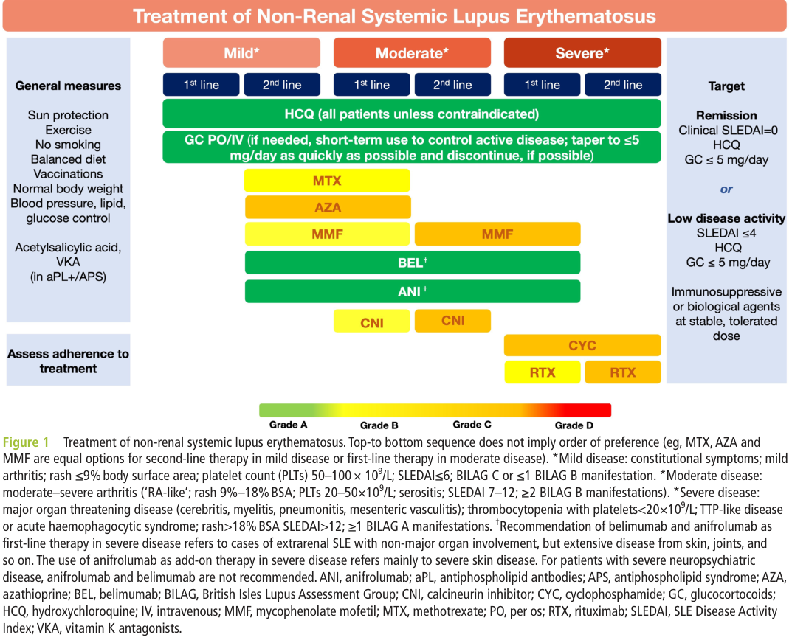

## Question

# Disease Characteristics Research Template

## Target Disease
- **Disease Name:** Neuropsychiatric Systemic Lupus Erythematosus
- **MONDO ID:**  (if available)
- **Category:** Autoimmune

## Research Objectives

Please provide a comprehensive research report on **Neuropsychiatric Systemic Lupus Erythematosus** covering all of the
disease characteristics listed below. This report will be used to populate a disease knowledge
base entry. Be thorough and cite primary literature (PMID preferred) for all claims.

For each section, **suggested databases/resources** are listed. These are the first places
you should search for information on each topic.

---

### 1. Disease Information
> **Search first:** OMIM, Orphanet, ICD-10/ICD-11, MeSH, PubMed

- What is the disease? Provide a concise overview.
- What are the key identifiers? (OMIM, Orphanet, ICD-10/ICD-11, MeSH, Mondo)
- What are the common synonyms and alternative names?
- Is the information derived from individual patients (e.g., EHR) or aggregated disease-level resources?

### 2. Etiology

- **Disease Causal Factors**: What are the primary causes? (genetic, environmental, infectious, mechanistic)
- **Risk Factors**:
  > **Search first:** PubMed, Cochrane Library, UpToDate, clinical guidelines, ClinVar, ClinGen, GWAS Catalog, PheGenI, CTD, CDC, WHO, epidemiological databases
  - Genetic risk factors (causal variants, susceptibility loci, modifier genes)
  - Environmental risk factors (toxins, lifestyle, occupational exposures, age, sex, family history)
- **Protective Factors**:
  > **Search first:** PubMed, Cochrane Library, clinical trial databases, GWAS Catalog, gnomAD, WHO, CDC, nutrition databases
  - Genetic protective factors (protective variants, modifier alleles)
  - Environmental protective factors (diet, lifestyle, exposures that reduce risk)
- **Gene-Environment Interactions**: How do genetic and environmental factors interact to influence disease?
  > **Search first:** CTD, PubMed, PheGenI, GxE databases

### 3. Phenotypes
> **Search first:** HPO (Human Phenotype Ontology), OMIM, Orphanet, PubMed, clinicaltrials.gov, MedDRA, SNOMED CT, DECIPHER, LOINC

For each phenotype, provide:
- **Phenotype type**: symptoms, clinical signs, physical manifestations, behavioral changes, or laboratory abnormalities
  > For symptoms/signs: HPO, OMIM, Orphanet, PubMed
  > For behavioral changes: HPO, DSM, RDoC (Research Domain Criteria), PubMed
  > For laboratory abnormalities: LOINC, SNOMED CT, LabTests Online, PubMed
- **Phenotype characteristics**:
  > **Search first:** OMIM, Orphanet, HPO, PubMed
  - Age of symptom onset (neonatal, childhood, adult-onset, late-onset)
  - Symptom severity (mild, moderate, severe, variable)
  - Symptom progression (stable, progressive, episodic, fluctuating)
  - Frequency among affected individuals (percentage or qualitative)
- **Quality of life impact**: Effects on daily functioning and well-being (per-phenotype when possible)
  > **Search first:** EQ-5D database, SF-36, WHO QOL databases, PubMed
- Suggest HPO (Human Phenotype Ontology) terms for each phenotype

### 4. Genetic/Molecular Information

- **Causal Genes**: Gene mutations or chromosomal abnormalities responsible for disease (gene symbols, OMIM IDs)
  > **Search first:** OMIM, ClinVar, HGMD, Ensembl, NCBI Gene
- **Pathogenic Variants**:
  - Affected genes (gene symbols, HGNC IDs)
    > **Search first:** OMIM, NCBI Gene, Ensembl, HGNC, UniProt, GeneCards
  - Variant classification (pathogenic, likely pathogenic, VUS per ACMG/AMP guidelines)
    > **Search first:** ClinVar, ClinGen, ACMG/AMP guidelines, VarSome
  - Variant type/class (missense, frameshift, nonsense, splice-site, structural)
  - Allele frequency in population databases
    > **Search first:** gnomAD, 1000 Genomes, ExAC, TOPMed, dbSNP
  - Somatic vs germline origin
    > **Search first:** COSMIC (somatic), ClinVar, ICGC, TCGA
  - Functional consequences (loss of function, gain of function, dominant negative)
- **Modifier Genes**: Genes that modify disease severity or expression
- **Epigenetic Information**: DNA methylation, histone modifications, chromatin changes affecting disease
  > **Search first:** ENCODE, Roadmap Epigenomics, MethBase, DiseaseMeth
- **Chromosomal Abnormalities**: Large-scale genetic changes (aneuploidy, translocations, inversions)
  > **Search first:** DECIPHER, ClinVar, ECARUCA, UCSC Genome Browser

### 5. Environmental Information

- **Environmental Factors**: Non-genetic contributing factors (toxins, radiation, pollution, occupational exposure)
  > **Search first:** CTD (Comparative Toxicogenomics Database), TOXNET, PubMed, EPA databases
- **Lifestyle Factors**: Behavioral factors (smoking, diet, exercise, alcohol consumption)
  > **Search first:** CDC databases, WHO, PubMed, NHANES
- **Infectious Agents**: If applicable, pathogens causing or triggering disease (bacteria, viruses, fungi, parasites)
  > **Search first:** NCBI Taxonomy, ViPR, BV-BRC, MicrobeDB, GIDEON

### 6. Mechanism / Pathophysiology

- **Molecular Pathways**: Specific signaling cascades or biochemical pathways involved (Wnt, MAPK, mTOR, PI3K-AKT, etc.)
  > **Search first:** KEGG, Reactome, WikiPathways, PathBank, BioCyc
- **Cellular Processes**: Cell-level mechanisms (apoptosis, autophagy, cell cycle dysregulation, inflammation, etc.)
  > **Search first:** Gene Ontology (GO), Reactome, KEGG, PubMed
- **Protein Dysfunction**: How protein structure or function is altered (misfolding, aggregation, loss of function, gain of function)
  > **Search first:** UniProt, PDB (Protein Data Bank), InterPro, Pfam, AlphaFold
- **Metabolic Changes**: Alterations in metabolic processes (energy metabolism, lipid metabolism, amino acid metabolism)
  > **Search first:** KEGG, BioCyc, HMDB (Human Metabolome Database), BRENDA
- **Immune System Involvement**: Role of immune response (autoimmunity, immunodeficiency, chronic inflammation)
  > **Search first:** ImmPort, Immunome Database, IEDB, Gene Ontology
- **Tissue Damage Mechanisms**: How tissues/ are injured (oxidative stress, ischemia, fibrosis, necrosis)
  > **Search first:** PubMed, Gene Ontology, Reactome
- **Biochemical Abnormalities**: Specific molecular defects (enzyme deficiencies, receptor dysfunction, ion channel defects)
  > **Search first:** BRENDA, UniProt, KEGG, OMIM, PubMed
- **Epigenetic Changes**: DNA methylation, histone modifications affecting gene expression in disease
  > **Search first:** ENCODE, Roadmap Epigenomics, MethBase, DiseaseMeth
- **Molecular Profiling** (if available):
  - Transcriptomics/gene expression changes
    > **Search first:** GEO (Gene Expression Omnibus), ArrayExpress, GTEx, Human Cell Atlas, SRA
  - Proteomics findings
    > **Search first:** PRIDE, ProteomeXchange, Human Protein Atlas, STRING, BioGRID
  - Metabolomics signatures
    > **Search first:** MetaboLights, Metabolomics Workbench, HMDB, METLIN
  - Lipidomics alterations
    > **Search first:** LIPID MAPS, SwissLipids, LipidHome, Metabolomics Workbench
  - Genomic structural features
    > **Search first:** UCSC Genome Browser, Ensembl, NCBI, dbVar, DGV
- **Advanced Technologies** (if applicable):
  - Single-cell analysis findings (cell-type specific mechanisms, cellular heterogeneity)
    > **Search first:** Human Cell Atlas, Single Cell Portal, GEO, CELLxGENE
  - Spatial transcriptomics findings
    > **Search first:** GEO, Spatial Research, Vizgen, 10x Genomics data
  - Multi-omics integration results
    > **Search first:** TCGA, ICGC, cBioPortal, LinkedOmics, PubMed
  - Functional genomics screens (CRISPR, RNAi)
    > **Search first:** DepMap, GenomeRNAi, PubMed, BioGRID ORCS

For each mechanism, describe:
- The causal chain from initial trigger to clinical manifestation
- Which mechanisms are upstream vs downstream
- What cell types and biological processes are involved
- Suggest GO terms for biological processes and CL terms for cell types

### 7. Anatomical Structures Affected

- **Organ Level**:
  - Primary organs directly affected
  - Secondary organ involvement (complications, secondary effects)
  - Body systems involved (cardiovascular, nervous, digestive, respiratory, endocrine, etc.)
  > **Search first:** Uberon, FMA (Foundational Model of Anatomy), OMIM, HPO, ICD-11, MeSH, SNOMED CT
- **Tissue and Cell Level**:
  - Specific tissue types affected (epithelial, connective, muscle, nervous)
  - Specific cell populations targeted (with Cell Ontology terms)
  > **Search first:** Uberon, Human Protein Atlas, Cell Ontology, Human Cell Atlas, CellMarker, PanglaoDB
- **Subcellular Level**:
  - Cellular compartments involved (mitochondria, nucleus, ER, lysosomes) (with GO Cellular Component terms)
  > **Search first:** Gene Ontology (Cellular Component), UniProt, Human Protein Atlas
- **Localization**:
  - Specific anatomical sites (with UBERON terms)
    > **Search first:** FMA, Uberon, NeuroNames (for brain), SNOMED CT
  - Lateralization (unilateral, bilateral, asymmetric)
    > **Search first:** HPO, clinical literature, imaging databases

### 8. Temporal Development

- **Onset**:
  - Typical age of onset (congenital, pediatric, adult, geriatric)
  - Onset pattern (acute, subacute, chronic, insidious)
  > **Search first:** OMIM, Orphanet, HPO, PubMed
- **Progression**:
  - Disease stages (early, intermediate, advanced, end-stage)
    > **Search first:** Cancer Staging Manual (AJCC), WHO classifications, PubMed
  - Progression rate (rapid, slow, variable)
  - Disease course pattern (episodic, relapsing-remitting, progressive, stable)
  - Disease duration (self-limited, chronic lifelong)
  > **Search first:** Disease registries, longitudinal cohort databases, natural history studies, PubMed, Orphanet, OMIM
- **Patterns**:
  - Remission patterns (spontaneous, treatment-induced)
    > **Search first:** Clinical trial databases, disease registries, PubMed
  - Critical periods (time windows of vulnerability or opportunity for intervention)
    > **Search first:** PubMed, developmental biology databases, clinical guidelines

### 9. Inheritance and Population

- **Epidemiology**:
  - Prevalence (cases per 100,000 at given time)
  - Incidence (new cases per 100,000 per year)
  > **Search first:** Orphanet, CDC, WHO, GBD (Global Burden of Disease), national registries, SEER, disease registries
- **For Genetic Etiology**:
  - Inheritance pattern (AD, AR, X-linked, mitochondrial, multifactorial, polygenic)
    > **Search first:** OMIM, Orphanet, ClinVar, GTR (Genetic Testing Registry)
  - Penetrance (complete, incomplete, age-dependent)
    > **Search first:** ClinVar, OMIM, PubMed, ClinGen
  - Expressivity (variable, consistent)
    > **Search first:** OMIM, ClinVar, PubMed
  - Genetic anticipation (increasing severity in successive generations)
    > **Search first:** OMIM, PubMed (especially for repeat expansion disorders)
  - Germline mosaicism
    > **Search first:** ClinVar, OMIM, genetic counseling literature, PubMed
  - Founder effects (population-specific mutations)
    > **Search first:** gnomAD, population genetics databases, PubMed
  - Consanguinity role
    > **Search first:** OMIM, population studies, genetic counseling resources
  - Carrier frequency
    > **Search first:** gnomAD, carrier screening databases, GeneReviews, GTR
- **Population Demographics**:
  - Affected populations (ethnic or demographic groups with higher prevalence)
    > **Search first:** gnomAD, 1000 Genomes, PAGE Study, PubMed, population registries
  - Geographic distribution (endemic areas, regional variation)
    > **Search first:** WHO, CDC, GBD, Orphanet, geographic epidemiology databases
  - Geographic distribution of specific variants
  - Sex ratio (male:female)
    > **Search first:** Disease registries, OMIM, PubMed, epidemiological databases
  - Age distribution of affected individuals
    > **Search first:** CDC, disease registries, SEER, Orphanet

### 10. Diagnostics

- **Clinical Tests**:
  - Laboratory tests (blood, urine, tissue chemistry, specific enzyme assays)
    > **Search first:** LOINC, LabTests Online, PubMed
  - Biomarkers (proteins, metabolites, genetic markers, circulating biomarkers)
    > **Search first:** FDA Biomarker List, BEST (Biomarkers, EndpointS, and other Tools), PubMed
  - Imaging studies (X-ray, CT, MRI, PET, ultrasound)
    > **Search first:** RadLex, DICOM, Radiopaedia, imaging databases
  - Functional tests (pulmonary function, cardiac stress tests)
    > **Search first:** LOINC, clinical guidelines, PubMed
  - Electrophysiology (EEG, EMG, ECG, nerve conduction studies)
    > **Search first:** LOINC, clinical neurophysiology databases, PubMed
  - Biopsy findings (histopathology, immunohistochemistry)
    > **Search first:** SNOMED CT, College of American Pathologists resources, PubMed
  - Pathology findings (microscopic examination)
    > **Search first:** SNOMED CT, Digital Pathology databases, PubMed
- **Genetic Testing**:
  > **Search first:** GTR (Genetic Testing Registry), GeneReviews, ClinGen
  - Overview of recommended genetic testing approach
  - Whole genome sequencing (WGS) utility
    > **Search first:** GTR, ClinVar, GEL (Genomics England), gnomAD
  - Whole exome sequencing (WES) utility
    > **Search first:** GTR, ClinVar, OMIM, GeneMatcher
  - Gene panels (which panels, which genes)
    > **Search first:** GTR, ClinVar, laboratory-specific databases
  - Single gene testing
    > **Search first:** GTR, ClinVar, OMIM, GeneReviews
  - Chromosomal microarray (CMA)
    > **Search first:** DECIPHER, ClinVar, dbVar, ECARUCA
  - Karyotyping
    > **Search first:** Chromosome Abnormality Database, ClinVar, cytogenetics resources
  - FISH
    > **Search first:** ClinVar, cytogenetics databases, PubMed
  - Mitochondrial DNA testing
    > **Search first:** MITOMAP, MSeqDR, ClinVar, GTR
  - Repeat expansion testing
    > **Search first:** GTR, ClinVar, repeat expansion databases, PubMed
- **Omics-Based Diagnostics** (if applicable):
  - RNA sequencing / transcriptomics
    > **Search first:** GEO, ArrayExpress, GTEx, RNA-seq databases
  - Proteomics
    > **Search first:** PRIDE, ProteomeXchange, FDA Biomarker database
  - Metabolomics
    > **Search first:** MetaboLights, Metabolomics Workbench, HMDB
  - Epigenomics
    > **Search first:** GEO, ENCODE, Roadmap Epigenomics, MethBase
  - Liquid biopsy
    > **Search first:** COSMIC, ClinVar, liquid biopsy databases, PubMed
- **Clinical Criteria**:
  - Standardized diagnostic criteria (DSM, ICD, society guidelines)
    > **Search first:** DSM-5, ICD-11, clinical society guidelines, UpToDate
  - Differential diagnosis (other conditions to rule out, with distinguishing features)
    > **Search first:** DynaMed, UpToDate, clinical decision support systems
- **Screening**:
  - Screening methods for asymptomatic individuals (newborn screening, carrier screening, cascade screening)
    > **Search first:** ACMG recommendations, CDC newborn screening, GTR

### 11. Outcome/Prognosis

- **Survival and Mortality**:
  - Survival rate (5-year, 10-year, overall)
    > **Search first:** SEER, cancer registries, disease-specific registries, PubMed
  - Life expectancy (with and without treatment if applicable)
    > **Search first:** Orphanet, disease registries, actuarial databases, PubMed
  - Mortality rate
    > **Search first:** CDC, WHO, GBD, national mortality databases
  - Disease-specific mortality (deaths directly attributable to disease)
    > **Search first:** Disease registries, CDC Wonder, GBD, PubMed
- **Morbidity and Function**:
  - Morbidity (disease-related disability and health impacts)
    > **Search first:** GBD, WHO, disability databases, PubMed
  - Disability outcomes (long-term functional impairments)
    > **Search first:** ICF (International Classification of Functioning), disability registries
  - Quality of life measures (EQ-5D, SF-36, PROMIS, disease-specific tools)
    > **Search first:** EQ-5D database, SF-36, PROMIS, PubMed
- **Disease Course**:
  - Complications (secondary problems: infections, organ failure, etc.)
    > **Search first:** ICD codes, disease registries, clinical databases, PubMed
  - Recovery potential (likelihood and extent of recovery, with vs without treatment)
    > **Search first:** Natural history studies, rehabilitation databases, PubMed
- **Prediction**:
  - Prognostic factors (age, disease severity, biomarkers, treatment response)
    > **Search first:** Prognostic models databases, clinical calculators, PubMed
  - Prognostic biomarkers (molecular markers predicting disease course)
    > **Search first:** FDA Biomarker database, PubMed, cancer prognostic databases

### 12. Treatment

- **Pharmacotherapy**:
  - Pharmacological treatments (drug names, drug classes, mechanisms of action)
    > **Search first:** DrugBank, RxNorm, ATC classification, DailyMed, FDA databases
  - Pharmacogenomics (how genetic variants affect drug metabolism, efficacy, toxicity)
    > **Search first:** PharmGKB, CPIC (Clinical Pharmacogenetics), FDA Table of PGx Biomarkers
- **Advanced Therapeutics**:
  - Gene therapy (viral vectors, CRISPR, gene replacement, gene editing)
    > **Search first:** ClinicalTrials.gov, FDA gene therapy database, ASGCT resources
  - Cell therapy (stem cell transplant, CAR-T, cellular therapeutics)
    > **Search first:** ClinicalTrials.gov, FDA cell therapy database, FACT standards
  - RNA-based therapies (ASOs, siRNA, mRNA therapies)
    > **Search first:** ClinicalTrials.gov, FDA approvals, PubMed
  - Targeted therapies (treatments directed at specific molecular targets)
    > **Search first:** My Cancer Genome, OncoKB, ClinicalTrials.gov, FDA approvals
  - Immunotherapies (checkpoint inhibitors, monoclonal antibodies)
    > **Search first:** Cancer Immunotherapy Database, FDA approvals, ClinicalTrials.gov
- **Surgical and Interventional**:
  - Surgical interventions (types of surgery, timing, outcomes)
    > **Search first:** CPT codes, surgical registries, clinical guidelines, PubMed
- **Supportive and Rehabilitative**:
  - Supportive care (symptom management, pain control, nutrition)
    > **Search first:** Clinical guidelines, Cochrane Library, PubMed
  - Rehabilitation (physical therapy, occupational therapy, speech therapy)
    > **Search first:** Rehabilitation medicine databases, clinical guidelines, PubMed
- **Experimental**:
  - Experimental treatments in clinical trials (with NCT identifiers if available)
    > **Search first:** ClinicalTrials.gov, EU Clinical Trials Register, WHO ICTRP
- **Treatment Outcomes**:
  - Treatment response rates
    > **Search first:** Clinical trial databases, FDA reviews, systematic reviews, PubMed
  - Side effects and adverse events
    > **Search first:** FDA Adverse Event Reporting System (FAERS), MedWatch, PubMed
- **Treatment Strategy**:
  - Treatment algorithms (clinical pathways, decision trees)
    > **Search first:** Clinical practice guidelines, NCCN Guidelines, UpToDate
  - Combination therapies
    > **Search first:** ClinicalTrials.gov, treatment guidelines, PubMed
  - Personalized medicine approaches (genotype-guided treatment)
    > **Search first:** My Cancer Genome, CIViC, PharmGKB, precision medicine databases

For each treatment, suggest MAXO (Medical Action Ontology) terms where applicable.

### 13. Prevention

- **Prevention Levels**:
  - Primary prevention (preventing disease occurrence: vaccination, risk factor modification)
    > **Search first:** CDC, WHO, USPSTF recommendations, Cochrane Library
  - Secondary prevention (early detection and treatment: screening programs, early intervention)
    > **Search first:** USPSTF, CDC screening guidelines, WHO
  - Tertiary prevention (preventing complications in those with disease)
    > **Search first:** Clinical guidelines, disease management protocols, PubMed
- **Immunization**: Vaccine strategies (if applicable)
  > **Search first:** CDC vaccine schedules, WHO immunization, FDA vaccine database
- **Screening and Early Detection**:
  - Screening programs (population-based: newborn screening, cancer screening)
    > **Search first:** CDC screening programs, USPSTF, cancer screening databases
  - Genetic screening (carrier screening, preimplantation genetic diagnosis, prenatal testing)
    > **Search first:** ACMG recommendations, ACOG guidelines, GTR
  - Risk stratification (identifying high-risk individuals for targeted prevention)
    > **Search first:** Risk prediction models, clinical calculators, PubMed
- **Behavioral Interventions**: Lifestyle modifications to reduce risk
  > **Search first:** CDC, WHO, behavioral intervention databases, Cochrane Library
- **Counseling**: Genetic counseling (risk assessment, family planning guidance)
  > **Search first:** NSGC resources, ACMG guidelines, GeneReviews
- **Public Health**:
  - Public health interventions (sanitation, vector control, health education)
    > **Search first:** CDC, WHO, public health databases, PubMed
  - Environmental interventions (reducing environmental risk factors)
    > **Search first:** EPA databases, WHO environmental health, PubMed
- **Prophylaxis**: Preventive medications or procedures
  > **Search first:** Clinical guidelines, FDA approvals, PubMed

### 14. Other Species / Natural Disease

- **Taxonomy**: Species affected (with NCBI Taxon identifiers)
  > **Search first:** NCBI Taxonomy
- **Breed**: Specific breeds affected (with VBO identifiers if applicable)
  > **Search first:** VBO (Vertebrate Breed Ontology)
- **Gene**: Orthologous genes in other species (with NCBI Gene IDs)
  > **Search first:** NCBI Gene
- **Natural Disease**:
  - Naturally occurring disease in other species (companion animals, wildlife)
    > **Search first:** OMIA (Online Mendelian Inheritance in Animals), VetCompass, PubMed
  - Veterinary relevance and importance in animal health
    > **Search first:** OMIA, veterinary databases, PubMed
- **Comparative Biology**:
  - Comparative pathology (similarities and differences across species)
    > **Search first:** OMIA, comparative pathology databases, PubMed
  - Evolutionary conservation of disease mechanisms
    > **Search first:** HomoloGene, OrthoMCL, Alliance of Genome Resources
- **Transmission** (if applicable):
  - Zoonotic potential
    > **Search first:** CDC zoonotic diseases, WHO zoonoses, GIDEON
  - Cross-species susceptibility
    > **Search first:** NCBI Taxonomy, veterinary databases, PubMed

### 15. Model Organisms

- **Model Types**:
  - Model organism type (mammalian, invertebrate, cellular, in vitro)
    > **Search first:** Alliance of Genome Resources, model organism databases
  - Specific model systems (mouse, rat, zebrafish, Drosophila, C. elegans, yeast, cell lines, organoids, iPSCs)
    > **Search first:** MGI, RGD, ZFIN, FlyBase, WormBase, SGD, ATCC, Cellosaurus
  - Induced models (drug treatment, surgical intervention, environmental manipulation)
    > **Search first:** MGI, model organism databases, PubMed
- **Genetic Models**:
  - Types available (knockout, knock-in, transgenic, conditional, humanized)
    > **Search first:** MGI, IMPC, KOMP, EuMMCR, IMSR
- **Model Characteristics**:
  - Phenotype recapitulation (how well model reproduces human disease features)
    > **Search first:** Model organism databases, comparative studies, PubMed
  - Model limitations (aspects of human disease not captured)
    > **Search first:** Model organism databases, PubMed, review articles
- **Applications**:
  - Research applications (what aspects of disease can be studied)
    > **Search first:** Model organism databases, PubMed
- **Resources**:
  - Model databases
    > **Search first:** MGI, RGD, ZFIN, FlyBase, WormBase, IMSR, EMMA, MMRRC

---

## Citation Requirements

- Cite primary literature (PMID preferred) for all mechanistic and clinical claims
- Prioritize recent reviews and landmark papers
- Include direct quotes from abstracts where possible to support key statements
- Distinguish evidence source types: human clinical, model organism, in vitro, computational

## Output Format

Structure your response as a comprehensive narrative organized by the sections above.
For each section, provide:
- Factual content with specific details (numbers, percentages, gene names, variant nomenclature)
- Ontology term suggestions (HPO, GO, CL, UBERON, CHEBI, MAXO, MONDO) where applicable
- Evidence citations with PMIDs
- Direct quotes from abstracts to support key claims
- Clear indication when information is not available or not applicable for this disease

This report will be used to populate a disease knowledge base entry with:
- Pathophysiology descriptions with causal chains
- Gene/protein annotations (HGNC, GO terms)
- Phenotype associations (HP terms) with frequencies
- Cell type involvement (CL terms)
- Anatomical locations (UBERON terms)
- Chemical entities (CHEBI terms)
- Treatment annotations (MAXO terms)
- Evidence items with PMIDs and exact abstract quotes
- Epidemiology, prognosis, diagnostic, and prevention information
- Animal model descriptions with phenotype recapitulation details

## Output

Question: You are an expert researcher providing comprehensive, well-cited information.

Provide detailed information focusing on:
1. Key concepts and definitions with current understanding
2. Recent developments and latest research (prioritize 2023-2024 sources)
3. Current applications and real-world implementations
4. Expert opinions and analysis from authoritative sources
5. Relevant statistics and data from recent studies

Format as a comprehensive research report with proper citations. Include URLs and publication dates where available.
Always prioritize recent, authoritative sources and provide specific citations for all major claims.

# Disease Characteristics Research Template

## Target Disease
- **Disease Name:** Neuropsychiatric Systemic Lupus Erythematosus
- **MONDO ID:**  (if available)
- **Category:** Autoimmune

## Research Objectives

Please provide a comprehensive research report on **Neuropsychiatric Systemic Lupus Erythematosus** covering all of the
disease characteristics listed below. This report will be used to populate a disease knowledge
base entry. Be thorough and cite primary literature (PMID preferred) for all claims.

For each section, **suggested databases/resources** are listed. These are the first places
you should search for information on each topic.

---

### 1. Disease Information
> **Search first:** OMIM, Orphanet, ICD-10/ICD-11, MeSH, PubMed

- What is the disease? Provide a concise overview.
- What are the key identifiers? (OMIM, Orphanet, ICD-10/ICD-11, MeSH, Mondo)
- What are the common synonyms and alternative names?
- Is the information derived from individual patients (e.g., EHR) or aggregated disease-level resources?

### 2. Etiology

- **Disease Causal Factors**: What are the primary causes? (genetic, environmental, infectious, mechanistic)
- **Risk Factors**:
  > **Search first:** PubMed, Cochrane Library, UpToDate, clinical guidelines, ClinVar, ClinGen, GWAS Catalog, PheGenI, CTD, CDC, WHO, epidemiological databases
  - Genetic risk factors (causal variants, susceptibility loci, modifier genes)
  - Environmental risk factors (toxins, lifestyle, occupational exposures, age, sex, family history)
- **Protective Factors**:
  > **Search first:** PubMed, Cochrane Library, clinical trial databases, GWAS Catalog, gnomAD, WHO, CDC, nutrition databases
  - Genetic protective factors (protective variants, modifier alleles)
  - Environmental protective factors (diet, lifestyle, exposures that reduce risk)
- **Gene-Environment Interactions**: How do genetic and environmental factors interact to influence disease?
  > **Search first:** CTD, PubMed, PheGenI, GxE databases

### 3. Phenotypes
> **Search first:** HPO (Human Phenotype Ontology), OMIM, Orphanet, PubMed, clinicaltrials.gov, MedDRA, SNOMED CT, DECIPHER, LOINC

For each phenotype, provide:
- **Phenotype type**: symptoms, clinical signs, physical manifestations, behavioral changes, or laboratory abnormalities
  > For symptoms/signs: HPO, OMIM, Orphanet, PubMed
  > For behavioral changes: HPO, DSM, RDoC (Research Domain Criteria), PubMed
  > For laboratory abnormalities: LOINC, SNOMED CT, LabTests Online, PubMed
- **Phenotype characteristics**:
  > **Search first:** OMIM, Orphanet, HPO, PubMed
  - Age of symptom onset (neonatal, childhood, adult-onset, late-onset)
  - Symptom severity (mild, moderate, severe, variable)
  - Symptom progression (stable, progressive, episodic, fluctuating)
  - Frequency among affected individuals (percentage or qualitative)
- **Quality of life impact**: Effects on daily functioning and well-being (per-phenotype when possible)
  > **Search first:** EQ-5D database, SF-36, WHO QOL databases, PubMed
- Suggest HPO (Human Phenotype Ontology) terms for each phenotype

### 4. Genetic/Molecular Information

- **Causal Genes**: Gene mutations or chromosomal abnormalities responsible for disease (gene symbols, OMIM IDs)
  > **Search first:** OMIM, ClinVar, HGMD, Ensembl, NCBI Gene
- **Pathogenic Variants**:
  - Affected genes (gene symbols, HGNC IDs)
    > **Search first:** OMIM, NCBI Gene, Ensembl, HGNC, UniProt, GeneCards
  - Variant classification (pathogenic, likely pathogenic, VUS per ACMG/AMP guidelines)
    > **Search first:** ClinVar, ClinGen, ACMG/AMP guidelines, VarSome
  - Variant type/class (missense, frameshift, nonsense, splice-site, structural)
  - Allele frequency in population databases
    > **Search first:** gnomAD, 1000 Genomes, ExAC, TOPMed, dbSNP
  - Somatic vs germline origin
    > **Search first:** COSMIC (somatic), ClinVar, ICGC, TCGA
  - Functional consequences (loss of function, gain of function, dominant negative)
- **Modifier Genes**: Genes that modify disease severity or expression
- **Epigenetic Information**: DNA methylation, histone modifications, chromatin changes affecting disease
  > **Search first:** ENCODE, Roadmap Epigenomics, MethBase, DiseaseMeth
- **Chromosomal Abnormalities**: Large-scale genetic changes (aneuploidy, translocations, inversions)
  > **Search first:** DECIPHER, ClinVar, ECARUCA, UCSC Genome Browser

### 5. Environmental Information

- **Environmental Factors**: Non-genetic contributing factors (toxins, radiation, pollution, occupational exposure)
  > **Search first:** CTD (Comparative Toxicogenomics Database), TOXNET, PubMed, EPA databases
- **Lifestyle Factors**: Behavioral factors (smoking, diet, exercise, alcohol consumption)
  > **Search first:** CDC databases, WHO, PubMed, NHANES
- **Infectious Agents**: If applicable, pathogens causing or triggering disease (bacteria, viruses, fungi, parasites)
  > **Search first:** NCBI Taxonomy, ViPR, BV-BRC, MicrobeDB, GIDEON

### 6. Mechanism / Pathophysiology

- **Molecular Pathways**: Specific signaling cascades or biochemical pathways involved (Wnt, MAPK, mTOR, PI3K-AKT, etc.)
  > **Search first:** KEGG, Reactome, WikiPathways, PathBank, BioCyc
- **Cellular Processes**: Cell-level mechanisms (apoptosis, autophagy, cell cycle dysregulation, inflammation, etc.)
  > **Search first:** Gene Ontology (GO), Reactome, KEGG, PubMed
- **Protein Dysfunction**: How protein structure or function is altered (misfolding, aggregation, loss of function, gain of function)
  > **Search first:** UniProt, PDB (Protein Data Bank), InterPro, Pfam, AlphaFold
- **Metabolic Changes**: Alterations in metabolic processes (energy metabolism, lipid metabolism, amino acid metabolism)
  > **Search first:** KEGG, BioCyc, HMDB (Human Metabolome Database), BRENDA
- **Immune System Involvement**: Role of immune response (autoimmunity, immunodeficiency, chronic inflammation)
  > **Search first:** ImmPort, Immunome Database, IEDB, Gene Ontology
- **Tissue Damage Mechanisms**: How tissues/ are injured (oxidative stress, ischemia, fibrosis, necrosis)
  > **Search first:** PubMed, Gene Ontology, Reactome
- **Biochemical Abnormalities**: Specific molecular defects (enzyme deficiencies, receptor dysfunction, ion channel defects)
  > **Search first:** BRENDA, UniProt, KEGG, OMIM, PubMed
- **Epigenetic Changes**: DNA methylation, histone modifications affecting gene expression in disease
  > **Search first:** ENCODE, Roadmap Epigenomics, MethBase, DiseaseMeth
- **Molecular Profiling** (if available):
  - Transcriptomics/gene expression changes
    > **Search first:** GEO (Gene Expression Omnibus), ArrayExpress, GTEx, Human Cell Atlas, SRA
  - Proteomics findings
    > **Search first:** PRIDE, ProteomeXchange, Human Protein Atlas, STRING, BioGRID
  - Metabolomics signatures
    > **Search first:** MetaboLights, Metabolomics Workbench, HMDB, METLIN
  - Lipidomics alterations
    > **Search first:** LIPID MAPS, SwissLipids, LipidHome, Metabolomics Workbench
  - Genomic structural features
    > **Search first:** UCSC Genome Browser, Ensembl, NCBI, dbVar, DGV
- **Advanced Technologies** (if applicable):
  - Single-cell analysis findings (cell-type specific mechanisms, cellular heterogeneity)
    > **Search first:** Human Cell Atlas, Single Cell Portal, GEO, CELLxGENE
  - Spatial transcriptomics findings
    > **Search first:** GEO, Spatial Research, Vizgen, 10x Genomics data
  - Multi-omics integration results
    > **Search first:** TCGA, ICGC, cBioPortal, LinkedOmics, PubMed
  - Functional genomics screens (CRISPR, RNAi)
    > **Search first:** DepMap, GenomeRNAi, PubMed, BioGRID ORCS

For each mechanism, describe:
- The causal chain from initial trigger to clinical manifestation
- Which mechanisms are upstream vs downstream
- What cell types and biological processes are involved
- Suggest GO terms for biological processes and CL terms for cell types

### 7. Anatomical Structures Affected

- **Organ Level**:
  - Primary organs directly affected
  - Secondary organ involvement (complications, secondary effects)
  - Body systems involved (cardiovascular, nervous, digestive, respiratory, endocrine, etc.)
  > **Search first:** Uberon, FMA (Foundational Model of Anatomy), OMIM, HPO, ICD-11, MeSH, SNOMED CT
- **Tissue and Cell Level**:
  - Specific tissue types affected (epithelial, connective, muscle, nervous)
  - Specific cell populations targeted (with Cell Ontology terms)
  > **Search first:** Uberon, Human Protein Atlas, Cell Ontology, Human Cell Atlas, CellMarker, PanglaoDB
- **Subcellular Level**:
  - Cellular compartments involved (mitochondria, nucleus, ER, lysosomes) (with GO Cellular Component terms)
  > **Search first:** Gene Ontology (Cellular Component), UniProt, Human Protein Atlas
- **Localization**:
  - Specific anatomical sites (with UBERON terms)
    > **Search first:** FMA, Uberon, NeuroNames (for brain), SNOMED CT
  - Lateralization (unilateral, bilateral, asymmetric)
    > **Search first:** HPO, clinical literature, imaging databases

### 8. Temporal Development

- **Onset**:
  - Typical age of onset (congenital, pediatric, adult, geriatric)
  - Onset pattern (acute, subacute, chronic, insidious)
  > **Search first:** OMIM, Orphanet, HPO, PubMed
- **Progression**:
  - Disease stages (early, intermediate, advanced, end-stage)
    > **Search first:** Cancer Staging Manual (AJCC), WHO classifications, PubMed
  - Progression rate (rapid, slow, variable)
  - Disease course pattern (episodic, relapsing-remitting, progressive, stable)
  - Disease duration (self-limited, chronic lifelong)
  > **Search first:** Disease registries, longitudinal cohort databases, natural history studies, PubMed, Orphanet, OMIM
- **Patterns**:
  - Remission patterns (spontaneous, treatment-induced)
    > **Search first:** Clinical trial databases, disease registries, PubMed
  - Critical periods (time windows of vulnerability or opportunity for intervention)
    > **Search first:** PubMed, developmental biology databases, clinical guidelines

### 9. Inheritance and Population

- **Epidemiology**:
  - Prevalence (cases per 100,000 at given time)
  - Incidence (new cases per 100,000 per year)
  > **Search first:** Orphanet, CDC, WHO, GBD (Global Burden of Disease), national registries, SEER, disease registries
- **For Genetic Etiology**:
  - Inheritance pattern (AD, AR, X-linked, mitochondrial, multifactorial, polygenic)
    > **Search first:** OMIM, Orphanet, ClinVar, GTR (Genetic Testing Registry)
  - Penetrance (complete, incomplete, age-dependent)
    > **Search first:** ClinVar, OMIM, PubMed, ClinGen
  - Expressivity (variable, consistent)
    > **Search first:** OMIM, ClinVar, PubMed
  - Genetic anticipation (increasing severity in successive generations)
    > **Search first:** OMIM, PubMed (especially for repeat expansion disorders)
  - Germline mosaicism
    > **Search first:** ClinVar, OMIM, genetic counseling literature, PubMed
  - Founder effects (population-specific mutations)
    > **Search first:** gnomAD, population genetics databases, PubMed
  - Consanguinity role
    > **Search first:** OMIM, population studies, genetic counseling resources
  - Carrier frequency
    > **Search first:** gnomAD, carrier screening databases, GeneReviews, GTR
- **Population Demographics**:
  - Affected populations (ethnic or demographic groups with higher prevalence)
    > **Search first:** gnomAD, 1000 Genomes, PAGE Study, PubMed, population registries
  - Geographic distribution (endemic areas, regional variation)
    > **Search first:** WHO, CDC, GBD, Orphanet, geographic epidemiology databases
  - Geographic distribution of specific variants
  - Sex ratio (male:female)
    > **Search first:** Disease registries, OMIM, PubMed, epidemiological databases
  - Age distribution of affected individuals
    > **Search first:** CDC, disease registries, SEER, Orphanet

### 10. Diagnostics

- **Clinical Tests**:
  - Laboratory tests (blood, urine, tissue chemistry, specific enzyme assays)
    > **Search first:** LOINC, LabTests Online, PubMed
  - Biomarkers (proteins, metabolites, genetic markers, circulating biomarkers)
    > **Search first:** FDA Biomarker List, BEST (Biomarkers, EndpointS, and other Tools), PubMed
  - Imaging studies (X-ray, CT, MRI, PET, ultrasound)
    > **Search first:** RadLex, DICOM, Radiopaedia, imaging databases
  - Functional tests (pulmonary function, cardiac stress tests)
    > **Search first:** LOINC, clinical guidelines, PubMed
  - Electrophysiology (EEG, EMG, ECG, nerve conduction studies)
    > **Search first:** LOINC, clinical neurophysiology databases, PubMed
  - Biopsy findings (histopathology, immunohistochemistry)
    > **Search first:** SNOMED CT, College of American Pathologists resources, PubMed
  - Pathology findings (microscopic examination)
    > **Search first:** SNOMED CT, Digital Pathology databases, PubMed
- **Genetic Testing**:
  > **Search first:** GTR (Genetic Testing Registry), GeneReviews, ClinGen
  - Overview of recommended genetic testing approach
  - Whole genome sequencing (WGS) utility
    > **Search first:** GTR, ClinVar, GEL (Genomics England), gnomAD
  - Whole exome sequencing (WES) utility
    > **Search first:** GTR, ClinVar, OMIM, GeneMatcher
  - Gene panels (which panels, which genes)
    > **Search first:** GTR, ClinVar, laboratory-specific databases
  - Single gene testing
    > **Search first:** GTR, ClinVar, OMIM, GeneReviews
  - Chromosomal microarray (CMA)
    > **Search first:** DECIPHER, ClinVar, dbVar, ECARUCA
  - Karyotyping
    > **Search first:** Chromosome Abnormality Database, ClinVar, cytogenetics resources
  - FISH
    > **Search first:** ClinVar, cytogenetics databases, PubMed
  - Mitochondrial DNA testing
    > **Search first:** MITOMAP, MSeqDR, ClinVar, GTR
  - Repeat expansion testing
    > **Search first:** GTR, ClinVar, repeat expansion databases, PubMed
- **Omics-Based Diagnostics** (if applicable):
  - RNA sequencing / transcriptomics
    > **Search first:** GEO, ArrayExpress, GTEx, RNA-seq databases
  - Proteomics
    > **Search first:** PRIDE, ProteomeXchange, FDA Biomarker database
  - Metabolomics
    > **Search first:** MetaboLights, Metabolomics Workbench, HMDB
  - Epigenomics
    > **Search first:** GEO, ENCODE, Roadmap Epigenomics, MethBase
  - Liquid biopsy
    > **Search first:** COSMIC, ClinVar, liquid biopsy databases, PubMed
- **Clinical Criteria**:
  - Standardized diagnostic criteria (DSM, ICD, society guidelines)
    > **Search first:** DSM-5, ICD-11, clinical society guidelines, UpToDate
  - Differential diagnosis (other conditions to rule out, with distinguishing features)
    > **Search first:** DynaMed, UpToDate, clinical decision support systems
- **Screening**:
  - Screening methods for asymptomatic individuals (newborn screening, carrier screening, cascade screening)
    > **Search first:** ACMG recommendations, CDC newborn screening, GTR

### 11. Outcome/Prognosis

- **Survival and Mortality**:
  - Survival rate (5-year, 10-year, overall)
    > **Search first:** SEER, cancer registries, disease-specific registries, PubMed
  - Life expectancy (with and without treatment if applicable)
    > **Search first:** Orphanet, disease registries, actuarial databases, PubMed
  - Mortality rate
    > **Search first:** CDC, WHO, GBD, national mortality databases
  - Disease-specific mortality (deaths directly attributable to disease)
    > **Search first:** Disease registries, CDC Wonder, GBD, PubMed
- **Morbidity and Function**:
  - Morbidity (disease-related disability and health impacts)
    > **Search first:** GBD, WHO, disability databases, PubMed
  - Disability outcomes (long-term functional impairments)
    > **Search first:** ICF (International Classification of Functioning), disability registries
  - Quality of life measures (EQ-5D, SF-36, PROMIS, disease-specific tools)
    > **Search first:** EQ-5D database, SF-36, PROMIS, PubMed
- **Disease Course**:
  - Complications (secondary problems: infections, organ failure, etc.)
    > **Search first:** ICD codes, disease registries, clinical databases, PubMed
  - Recovery potential (likelihood and extent of recovery, with vs without treatment)
    > **Search first:** Natural history studies, rehabilitation databases, PubMed
- **Prediction**:
  - Prognostic factors (age, disease severity, biomarkers, treatment response)
    > **Search first:** Prognostic models databases, clinical calculators, PubMed
  - Prognostic biomarkers (molecular markers predicting disease course)
    > **Search first:** FDA Biomarker database, PubMed, cancer prognostic databases

### 12. Treatment

- **Pharmacotherapy**:
  - Pharmacological treatments (drug names, drug classes, mechanisms of action)
    > **Search first:** DrugBank, RxNorm, ATC classification, DailyMed, FDA databases
  - Pharmacogenomics (how genetic variants affect drug metabolism, efficacy, toxicity)
    > **Search first:** PharmGKB, CPIC (Clinical Pharmacogenetics), FDA Table of PGx Biomarkers
- **Advanced Therapeutics**:
  - Gene therapy (viral vectors, CRISPR, gene replacement, gene editing)
    > **Search first:** ClinicalTrials.gov, FDA gene therapy database, ASGCT resources
  - Cell therapy (stem cell transplant, CAR-T, cellular therapeutics)
    > **Search first:** ClinicalTrials.gov, FDA cell therapy database, FACT standards
  - RNA-based therapies (ASOs, siRNA, mRNA therapies)
    > **Search first:** ClinicalTrials.gov, FDA approvals, PubMed
  - Targeted therapies (treatments directed at specific molecular targets)
    > **Search first:** My Cancer Genome, OncoKB, ClinicalTrials.gov, FDA approvals
  - Immunotherapies (checkpoint inhibitors, monoclonal antibodies)
    > **Search first:** Cancer Immunotherapy Database, FDA approvals, ClinicalTrials.gov
- **Surgical and Interventional**:
  - Surgical interventions (types of surgery, timing, outcomes)
    > **Search first:** CPT codes, surgical registries, clinical guidelines, PubMed
- **Supportive and Rehabilitative**:
  - Supportive care (symptom management, pain control, nutrition)
    > **Search first:** Clinical guidelines, Cochrane Library, PubMed
  - Rehabilitation (physical therapy, occupational therapy, speech therapy)
    > **Search first:** Rehabilitation medicine databases, clinical guidelines, PubMed
- **Experimental**:
  - Experimental treatments in clinical trials (with NCT identifiers if available)
    > **Search first:** ClinicalTrials.gov, EU Clinical Trials Register, WHO ICTRP
- **Treatment Outcomes**:
  - Treatment response rates
    > **Search first:** Clinical trial databases, FDA reviews, systematic reviews, PubMed
  - Side effects and adverse events
    > **Search first:** FDA Adverse Event Reporting System (FAERS), MedWatch, PubMed
- **Treatment Strategy**:
  - Treatment algorithms (clinical pathways, decision trees)
    > **Search first:** Clinical practice guidelines, NCCN Guidelines, UpToDate
  - Combination therapies
    > **Search first:** ClinicalTrials.gov, treatment guidelines, PubMed
  - Personalized medicine approaches (genotype-guided treatment)
    > **Search first:** My Cancer Genome, CIViC, PharmGKB, precision medicine databases

For each treatment, suggest MAXO (Medical Action Ontology) terms where applicable.

### 13. Prevention

- **Prevention Levels**:
  - Primary prevention (preventing disease occurrence: vaccination, risk factor modification)
    > **Search first:** CDC, WHO, USPSTF recommendations, Cochrane Library
  - Secondary prevention (early detection and treatment: screening programs, early intervention)
    > **Search first:** USPSTF, CDC screening guidelines, WHO
  - Tertiary prevention (preventing complications in those with disease)
    > **Search first:** Clinical guidelines, disease management protocols, PubMed
- **Immunization**: Vaccine strategies (if applicable)
  > **Search first:** CDC vaccine schedules, WHO immunization, FDA vaccine database
- **Screening and Early Detection**:
  - Screening programs (population-based: newborn screening, cancer screening)
    > **Search first:** CDC screening programs, USPSTF, cancer screening databases
  - Genetic screening (carrier screening, preimplantation genetic diagnosis, prenatal testing)
    > **Search first:** ACMG recommendations, ACOG guidelines, GTR
  - Risk stratification (identifying high-risk individuals for targeted prevention)
    > **Search first:** Risk prediction models, clinical calculators, PubMed
- **Behavioral Interventions**: Lifestyle modifications to reduce risk
  > **Search first:** CDC, WHO, behavioral intervention databases, Cochrane Library
- **Counseling**: Genetic counseling (risk assessment, family planning guidance)
  > **Search first:** NSGC resources, ACMG guidelines, GeneReviews
- **Public Health**:
  - Public health interventions (sanitation, vector control, health education)
    > **Search first:** CDC, WHO, public health databases, PubMed
  - Environmental interventions (reducing environmental risk factors)
    > **Search first:** EPA databases, WHO environmental health, PubMed
- **Prophylaxis**: Preventive medications or procedures
  > **Search first:** Clinical guidelines, FDA approvals, PubMed

### 14. Other Species / Natural Disease

- **Taxonomy**: Species affected (with NCBI Taxon identifiers)
  > **Search first:** NCBI Taxonomy
- **Breed**: Specific breeds affected (with VBO identifiers if applicable)
  > **Search first:** VBO (Vertebrate Breed Ontology)
- **Gene**: Orthologous genes in other species (with NCBI Gene IDs)
  > **Search first:** NCBI Gene
- **Natural Disease**:
  - Naturally occurring disease in other species (companion animals, wildlife)
    > **Search first:** OMIA (Online Mendelian Inheritance in Animals), VetCompass, PubMed
  - Veterinary relevance and importance in animal health
    > **Search first:** OMIA, veterinary databases, PubMed
- **Comparative Biology**:
  - Comparative pathology (similarities and differences across species)
    > **Search first:** OMIA, comparative pathology databases, PubMed
  - Evolutionary conservation of disease mechanisms
    > **Search first:** HomoloGene, OrthoMCL, Alliance of Genome Resources
- **Transmission** (if applicable):
  - Zoonotic potential
    > **Search first:** CDC zoonotic diseases, WHO zoonoses, GIDEON
  - Cross-species susceptibility
    > **Search first:** NCBI Taxonomy, veterinary databases, PubMed

### 15. Model Organisms

- **Model Types**:
  - Model organism type (mammalian, invertebrate, cellular, in vitro)
    > **Search first:** Alliance of Genome Resources, model organism databases
  - Specific model systems (mouse, rat, zebrafish, Drosophila, C. elegans, yeast, cell lines, organoids, iPSCs)
    > **Search first:** MGI, RGD, ZFIN, FlyBase, WormBase, SGD, ATCC, Cellosaurus
  - Induced models (drug treatment, surgical intervention, environmental manipulation)
    > **Search first:** MGI, model organism databases, PubMed
- **Genetic Models**:
  - Types available (knockout, knock-in, transgenic, conditional, humanized)
    > **Search first:** MGI, IMPC, KOMP, EuMMCR, IMSR
- **Model Characteristics**:
  - Phenotype recapitulation (how well model reproduces human disease features)
    > **Search first:** Model organism databases, comparative studies, PubMed
  - Model limitations (aspects of human disease not captured)
    > **Search first:** Model organism databases, PubMed, review articles
- **Applications**:
  - Research applications (what aspects of disease can be studied)
    > **Search first:** Model organism databases, PubMed
- **Resources**:
  - Model databases
    > **Search first:** MGI, RGD, ZFIN, FlyBase, WormBase, IMSR, EMMA, MMRRC

---

## Citation Requirements

- Cite primary literature (PMID preferred) for all mechanistic and clinical claims
- Prioritize recent reviews and landmark papers
- Include direct quotes from abstracts where possible to support key statements
- Distinguish evidence source types: human clinical, model organism, in vitro, computational

## Output Format

Structure your response as a comprehensive narrative organized by the sections above.
For each section, provide:
- Factual content with specific details (numbers, percentages, gene names, variant nomenclature)
- Ontology term suggestions (HPO, GO, CL, UBERON, CHEBI, MAXO, MONDO) where applicable
- Evidence citations with PMIDs
- Direct quotes from abstracts to support key claims
- Clear indication when information is not available or not applicable for this disease

This report will be used to populate a disease knowledge base entry with:
- Pathophysiology descriptions with causal chains
- Gene/protein annotations (HGNC, GO terms)
- Phenotype associations (HP terms) with frequencies
- Cell type involvement (CL terms)
- Anatomical locations (UBERON terms)
- Chemical entities (CHEBI terms)
- Treatment annotations (MAXO terms)
- Evidence items with PMIDs and exact abstract quotes
- Epidemiology, prognosis, diagnostic, and prevention information
- Animal model descriptions with phenotype recapitulation details

## Comprehensive Research Report: Neuropsychiatric Systemic Lupus Erythematosus (NPSLE)

### Executive summary (current understanding; 2023–2024 emphasis)
Neuropsychiatric systemic lupus erythematosus (NPSLE) refers to neurologic and/or psychiatric syndromes occurring in patients with systemic lupus erythematosus (SLE), where events may be directly attributable to SLE-related inflammatory/immune mechanisms, vascular/thrombotic mechanisms (often antiphospholipid-related), or non-SLE causes (comorbidities, infection, metabolic etiologies, and treatment effects). (hanly2005managementofneuropsychiatric pages 1-3, patel2024thechallengeof pages 4-5)
A persistent challenge is that NPSLE is heterogeneous, lacks a diagnostic gold standard, and requires careful attribution; recent work prioritizes biomarker panels (blood NfL/GFAP; CSF IFN-α/neopterin) and advanced neuroimaging, alongside outcomes data from large observational cohorts. (kammeyer2024bloodbasedbiomarkersof pages 1-3, labouret2023juvenileneuropsychiatricsystemic pages 1-2, emerson2023theconundrumof pages 1-2)

| Domain | Finding (with numbers) | Population/Design | Source (first author, year, journal) | Publication date | URL | Notes |
|---|---|---|---|---|---|---|
| Epidemiology | Reported NPSLE prevalence in literature ranges **12–95%** | Review of diagnostic approaches and literature heterogeneity | Emerson, 2023, *Frontiers in Neurology* | 2023-03-21 | https://doi.org/10.3389/fneur.2023.1111769 | Wide range reflects inconsistent definitions, study design, and populations; supports need for composite diagnostic panels (emerson2023theconundrumof pages 1-2) |
| Epidemiology | Across cohorts using ACR nomenclature, overall NP prevalence **37–95%**; common syndromes: cognitive dysfunction **55–80%**, headache **24–72%**, mood disorder **14–57%**, cerebrovascular disease **5–18%**, seizures **6–51%**, polyneuropathy **3–28%**, anxiety **7–24%**, psychosis **0–8%** | Review of representative cohort studies using ACR 1999 NP-SLE criteria | Hanly, 2005, *Best Practice & Research Clinical Rheumatology* | 2005-10 | https://doi.org/10.1016/j.berh.2005.04.003 | Also notes up to **41%** of NP events may be attributable to non-lupus causes, underscoring diagnostic exclusion (hanly2005managementofneuropsychiatric pages 1-3) |
| Epidemiology | In systematic review, status epilepticus and transverse myelitis each **1–2%**; cognitive dysfunction nearly **38%** | Systematic review of 11 studies | Rice-Canetto, 2024, *Cureus* | 2024-06 | https://doi.org/10.7759/cureus.61678 | Prognosis varies by syndrome; diagnostics often include brain MRI and antibody testing (ricecanetto2024neuropsychiatricsystemiclupus pages 1-2) |
| Biomarkers | Healthy controls: mean blood **NfL 3.6 pg/mL (SD 2.0)** and **GFAP 50.4 pg/mL (SD 15.0)**; active major NPSLE vs SLE controls: **NfL +17.9 pg/mL** (95% CI 9.2–34.5, **p<0.001**) and **GFAP +3.2 pg/mL** (95% CI 1.9–5.5, **p<0.001**); SLE controls vs healthy controls: NfL **+1.3 pg/mL** (p=0.42), GFAP **+1.2 pg/mL** (p=0.53) | Case-control study; **13 active major NPSLE**, **13 SLE controls**, **13 healthy controls**; mean ages 26.8/27.3/26.6 years; 92% female | Kammeyer, 2024, *Lupus* | 2024-08 | https://doi.org/10.1177/09612033241272961 | Biomarkers decreased after immunotherapy in a subset; blood-CSF correlations: NfL **r=0.88, p=0.01**, GFAP **r=0.81, p=0.03** (kammeyer2024bloodbasedbiomarkersof pages 1-3, kammeyer2024bloodbasedbiomarkersof pages 5-6) |
| Biomarkers | Among **51** j-SLE patients, **39%** had j-NPSLE; j-NPSLE diagnosed at SLE onset in **65%**; CSF neopterin higher in active j-NPSLE with CNS involvement vs j-SLE alone (**p=0.0008**); CSF neopterin and IFN-α decreased after resolution (**p=0.0015** and **p=0.0010**); biomarkers strongly correlated (**Rs=0.832, p<0.0001, n=23 paired samples**) | 5-year retrospective monocentric pediatric cohort | Labouret, 2023, *Journal of Clinical Immunology* | 2023-12 | https://doi.org/10.1007/s10875-022-01407-1 | No specific routine biological or radiological marker identified; supports CSF IFN-α/neopterin as promising activity biomarkers (labouret2023juvenileneuropsychiatricsystemic pages 1-2, labouret2023juvenileneuropsychiatricsystemic pages 4-5) |
| Treatment outcomes | At **12 months**, **224/350 (64%)** improved clinically; focal central events improved in **66/79 (83%)**; SLE-attributed events improved in **113/155 (72.9%)** by algorithm and about **73.0%** by clinical judgment; immunosuppressant-treated, clinically judged SLE-attributed NP events had higher response odds: **OR 2.55** (95% CI 1.06–6.41, **p=0.04**) | International multicenter retrospective cohort of first NP event; **350 events** analyzed from **362** with follow-up | Bortoluzzi, 2024, *Rheumatology* | 2024-02 | https://doi.org/10.1093/rheumatology/keae119 | Initial/escalated immunosuppressants and corticosteroids were used more often for central diffuse/focal SLE-attributed events; one-year outcomes support timely attribution and immunosuppression (bortoluzzi2024therapeuticstrategiesand pages 9-11, bortoluzzi2024therapeuticstrategiesand pages 1-6) |
| Guidelines | **HCQ recommended for all patients** at target dose **5 mg/kg real body weight/day**; maintenance glucocorticoids should be minimized to **≤5 mg/day prednisone equivalent** and withdrawn when possible; CYC for organ-threatening disease and rituximab for refractory disease | International EULAR guideline update for SLE management | Fanouriakis, 2024, *Annals of the Rheumatic Diseases* | 2024-01 | https://doi.org/10.1136/ard-2023-224762 | General SLE guidance relevant to NPSLE management; emphasizes early steroid-sparing immunosuppression/biologics in appropriate patients (fanouriakis2024eularrecommendationsfor pages 10-11) |
| Guidelines | For severe neuropsychiatric disease, **anifrolumab and belimumab are not recommended** | Figure-based treatment framework for non-renal SLE in EULAR 2023 update | Fanouriakis, 2024, *Annals of the Rheumatic Diseases* | 2024-01 | https://doi.org/10.1136/ard-2023-224762 | Figure 1 explicitly notes biologics are not recommended in **severe neuropsychiatric disease** despite broader extrarenal SLE roles (fanouriakis2024eularrecommendationsfor pages 7-8, fanouriakis2024eularrecommendationsfor media 9daa74df) |

*Table: This table compiles high-yield quantitative findings and actionable guidance for neuropsychiatric systemic lupus erythematosus from the gathered evidence. It is useful as a quick reference for prevalence, biomarker performance, treatment outcomes, and current guideline implications.*

---

## 1. Disease Information

### 1.1 Overview / definition
NPSLE is commonly operationalized using the **1999 American College of Rheumatology (ACR) neuropsychiatric lupus nomenclature/case definitions**, which defines **19 neuropsychiatric syndromes** spanning central and peripheral nervous system involvement. (hanly2005managementofneuropsychiatric pages 1-3)
Hanly & Harrison (2005), summarizing this framework, state that the ACR Research Committee produced “**a standard nomenclature and diagnostic criteria for 19 NP syndromes**” and that diagnosis is largely **one of exclusion** supported by imaging, electrophysiology, autoantibody profiles, and objective cognitive assessment. (hanly2005managementofneuropsychiatric pages 1-3)

### 1.2 Clinical classification frameworks
**ACR 1999 neuropsychiatric syndromes (CNS/PNS)** listed in Hanly & Harrison (2005):
- **CNS:** aseptic meningitis; cerebrovascular disease; demyelinating syndrome; headache; movement disorder; myelopathy; seizure disorders; acute confusional state; anxiety disorder; cognitive dysfunction; mood disorder; psychosis. (hanly2005managementofneuropsychiatric pages 1-3)
- **PNS:** Guillain–Barré syndrome; autonomic neuropathy; mononeuropathy; myasthenia gravis; cranial neuropathy; plexopathy; polyneuropathy. (hanly2005managementofneuropsychiatric pages 1-3)

### 1.3 Synonyms / alternative names
Historically, older terms such as “CNS lupus” and “lupus cerebritis” have been used (and are referenced as prior terminology in recent reviews), but contemporary literature generally uses “neuropsychiatric systemic lupus erythematosus (NPSLE)” and ACR syndrome-based descriptors. (justizvaillant2024neuropsychiatricsystemiclupus pages 1-2)

### 1.4 Key identifiers (ontology and coding)
- **MeSH terms observed in clinical trial registry records** relevant to CNS lupus/NPSLE include **“Lupus Vasculitis, Central Nervous System” (MeSH D020945)** and **“Lupus Erythematosus, Systemic” (MeSH D008180)**. (NCT07281105 chunk 2)
- **MONDO / Orphanet / ICD-10/ICD-11 codes:** not identified in the retrieved full-text evidence in this run; therefore not asserted here.

### 1.5 Evidence source type
This report is derived from **aggregated disease-level resources** (reviews, systematic reviews, guidelines) and **human clinical observational studies**, plus **registered clinical trials**; it is not derived from individual EHR records. (bortoluzzi2024therapeuticstrategiesand pages 1-6, kammeyer2024bloodbasedbiomarkersof pages 1-3, emerson2023theconundrumof pages 1-2, NCT07281105 chunk 1)

---

## 2. Etiology

### 2.1 Disease causal factors (mechanistic)
Current evidence supports **multifactorial causation**, with overlapping inflammatory/autoimmune and vascular pathways.
Hanly & Harrison (2005) highlight candidate primary mechanisms including “**intracranial microangiopathy, autoantibodies to neuronal and non-neuronal antigens, and the generation of proinflammatory cytokines and mediators**.” (hanly2005managementofneuropsychiatric pages 1-3)
A 2024 review similarly emphasizes that NPSLE pathogenesis is “thought to involve **inflammatory and vascular pathways**,” reinforcing the dual-mechanism view used clinically to guide therapy. (patel2024thechallengeof pages 11-13)

### 2.2 Risk factors (human clinical)
Risk factors summarized in the 2024 Diagnostics review include:
- **Generalized SLE disease activity** as a risk factor for NP manifestations, and NPSLE is “often seen in **40–50%** of patients with generalized SLE activity” (as reported in that review). (patel2024thechallengeof pages 4-5)
- **Antiphospholipid antibodies (aPL)** as a risk factor, especially for cerebrovascular disease and other vascular manifestations. (patel2024thechallengeof pages 4-5)
- Additional associations for specific syndromes (e.g., psychosis) described in that review include male sex, younger age at SLE diagnosis, and ancestry-related differences, though these are summarized from prior literature rather than established as diagnostic. (patel2024thechallengeof pages 4-5)

### 2.3 Protective factors / gene–environment interactions
Protective factors and explicit gene–environment interactions specific to NPSLE were not directly quantified in the retrieved evidence corpus; therefore no claims are made here.

---

## 3. Phenotypes (clinical manifestations)

### 3.1 Phenotype spectrum and frequency
Reported frequency varies widely because syndrome definitions and attribution stringency differ.
- Emerson et al. (2023) state: “**The prevalence rates of NPSLE vary widely in the published literature, estimated to be between 12 and 95%**.” (emerson2023theconundrumof pages 1-2)
- Hanly & Harrison (2005) summarize prevalence across cohorts using ACR nomenclature: overall NP prevalence **37–95%**, with common manifestations including cognitive dysfunction **55–80%**, headache **24–72%**, mood disorder **14–57%**, cerebrovascular disease **5–18%**, seizures **6–51%**, polyneuropathy **3–28%**, anxiety **7–24%**, psychosis **0–8%**. (hanly2005managementofneuropsychiatric pages 1-3)
- A 2024 systematic review reported syndrome-specific prevalence estimates including status epilepticus and transverse myelitis around **1–2%**, while cognitive dysfunction approached **~38%** across included studies. (ricecanetto2024neuropsychiatricsystemiclupus pages 1-2)

### 3.2 Pediatric phenotype and timing
In juvenile SLE, Labouret et al. reported among **51** patients with juvenile SLE, **39%** had juvenile NPSLE, and NPSLE occurred at SLE onset in **65%**. (labouret2023juvenileneuropsychiatricsystemic pages 1-2)

### 3.3 Quality of life impacts
NPSLE is associated with substantial morbidity and reduced quality of life.
Kammeyer et al. note that NPSLE is associated with “**decreased quality of life** and a significant increase in morbidity, mortality, hospitalization, and disease related costs compared to SLE without NP symptoms.” (kammeyer2024bloodbasedbiomarkersof pages 1-3)

### 3.4 Suggested HPO terms (examples for knowledge-base mapping)
Below are recommended HPO mappings for common ACR syndromes (term names only; IDs should be validated in downstream curation):
- Cognitive dysfunction → **Cognitive impairment** (HP: Cognitive impairment)
- Seizure disorder/status epilepticus → **Seizures** (HP: Seizures)
- Psychosis → **Psychosis** (HP: Psychosis)
- Mood disorder/depression → **Depressed mood** (HP: Depressed mood)
- Headache → **Headache** (HP: Headache)
- Cerebrovascular disease/stroke → **Stroke** (HP: Stroke)
- Myelopathy/transverse myelitis → **Myelopathy** (HP: Myelopathy)
- Polyneuropathy → **Peripheral neuropathy** (HP: Peripheral neuropathy)
These phenotype selections are consistent with the ACR syndrome list and the clinical emphasis in reviews. (hanly2005managementofneuropsychiatric pages 1-3)

---

## 4. Genetic / Molecular Information

### 4.1 Genetic susceptibility (limited in retrieved corpus)
A 2024 review highlights genetic contributors to SLE/NPSLE broadly, referencing defective apoptosis (e.g., **FAS**) and **REL/NF-κB** pathway associations, but without NPSLE-specific causal variants established in the retrieved text. (justizvaillant2024neuropsychiatricsystemiclupus pages 1-2)

### 4.2 Key molecular mediators and autoantibodies
Inflammatory mediators and autoantibodies repeatedly implicated include:
- Cytokines such as **IL-6** and **type I interferon (IFN-α)** (with CSF IFN-α emerging in pediatric NPSLE biomarker work). (labouret2023juvenileneuropsychiatricsystemic pages 1-2, patel2024thechallengeof pages 4-5)
- Broad autoimmune effectors (immune complexes, circulating antibodies, cytokines, autoreactive T cells) highlighted as drivers of tissue injury in NPSLE-focused reviews. (justizvaillant2024neuropsychiatricsystemiclupus pages 1-2)

### 4.3 Suggested GO terms (biological process) and CL terms (cell types)
Mechanistically motivated ontology suggestions based on the reviewed evidence include:
- GO biological process: **type I interferon signaling pathway**, **complement activation**, **inflammatory response**, **blood–brain barrier maintenance/disruption**. (labouret2023juvenileneuropsychiatricsystemic pages 1-2)
- Cell types (CL): **microglial cell**, **astrocyte**, **brain endothelial cell** (relevant to CSF neopterin concept and BBB-focused mechanisms). (labouret2023juvenileneuropsychiatricsystemic pages 1-2)

---

## 5. Mechanism / Pathophysiology (causal chains)

### 5.1 Two major mechanistic clusters used clinically: inflammatory vs vascular/ischemic
Clinical practice commonly separates NPSLE into processes dominated by inflammation versus thrombotic/ischemic injury to guide therapy. (bortoluzzi2024therapeuticstrategiesand pages 9-11)
Bortoluzzi et al. explicitly note that “**Current recommendations advocate for a therapeutic approach aimed at targeting the underlying pathophysiological mechanisms in NPSLE differentiating inflammatory or embolic/thrombotic/ischemic process**,” with glucocorticoids/immunosuppressants used for inflammation and anticoagulant/antithrombotic interventions favored when aPL antibodies point toward vascular mechanisms. (bortoluzzi2024therapeuticstrategiesand pages 9-11)

### 5.2 Neuroinflammation and intrathecal type I interferon
In juvenile NPSLE, Labouret et al. found **no specific routine biological or radiological marker**, but observed that **CSF neopterin** was significantly higher in active CNS-involved NPSLE (p=0.0008) and that **CSF IFN-α and neopterin decreased after clinical resolution** under immunosuppressive treatment (p=0.0010–0.0015), supporting a model of CNS immune activation / interferon-associated neuroinflammation. (labouret2023juvenileneuropsychiatricsystemic pages 1-2)

### 5.3 Neuronal and glial injury as a final common pathway (2024 biomarker advance)
Kammeyer et al. (2024) evaluated blood-based **neurofilament light (NfL)** and **GFAP** as accessible indicators of neuronal/glial injury in active major NPSLE and observed substantially higher levels in active NPSLE than disease-matched SLE controls, with decreases after immunotherapy in a subset. (kammeyer2024bloodbasedbiomarkersof pages 1-3)
This supports a causal chain: upstream immune/vascular injury → axonal/glial damage → elevated NfL/GFAP detectable peripherally, potentially enabling monitoring and earlier recognition. (kammeyer2024bloodbasedbiomarkersof pages 1-3)

---

## 6. Diagnostics (and differential diagnosis)

### 6.1 Diagnostic concept: attribution and exclusion
Hanly & Harrison (2005) emphasize that “**The diagnosis of NP-SLE remains largely one of exclusion**,” requiring evaluation for non-SLE causes (therapy complications, comorbidities) before attribution to lupus mechanisms. (hanly2005managementofneuropsychiatric pages 1-3)
Emerson et al. (2023) similarly highlight barriers including “**the heterogeneity of neurological symptoms, the absence of standardized assessment, [and] the unreliability of conventional markers**,” motivating use of composite panels. (emerson2023theconundrumof pages 1-2)

### 6.2 Conventional investigations (real-world implementation)
A 2024 review outlines that workup is tailored to the presenting syndrome and begins with excluding secondary causes (infection, metabolic/endocrine disorders, adverse drug reactions, malignancy) and then incorporates labs, autoantibody assessments including aPL testing, imaging, and CSF studies as indicated, often requiring multidisciplinary care (neurology/psychiatry/neuroradiology). (patel2024thechallengeof pages 4-5)

### 6.3 Emerging/novel biomarkers (2023–2024)
- **CSF IFN-α and neopterin (pediatric):** elevated in active CNS-involved j-NPSLE and decrease after treatment, with strong correlation (Rs=0.832). (labouret2023juvenileneuropsychiatricsystemic pages 1-2)
- **Blood NfL and GFAP (adult/teen major NPSLE):** active major NPSLE vs SLE controls showed NfL +17.9 pg/mL and GFAP +3.2 pg/mL (both p<0.001); blood and CSF levels correlated (r=0.81–0.88). (kammeyer2024bloodbasedbiomarkersof pages 1-3, kammeyer2024bloodbasedbiomarkersof pages 5-6)

### 6.4 Suggested LOINC-style lab concepts (non-exhaustive)
- CSF interferon-alpha protein; CSF neopterin; plasma/serum neurofilament light; plasma/serum GFAP; serum complements (C3/C4); anti-dsDNA titers; antiphospholipid antibody panel.
These are supported by biomarker-focused primary studies and diagnostic review content. (kammeyer2024bloodbasedbiomarkersof pages 1-3, labouret2023juvenileneuropsychiatricsystemic pages 1-2, patel2024thechallengeof pages 4-5)

---

## 7. Outcomes / Prognosis

### 7.1 Real-world outcomes (2024 multicenter cohort)
In an international multicenter retrospective study of first NP events (350 events), **64%** improved at 12 months; focal central events improved frequently (**83%** for focal central events in the excerpted results), and SLE-attributed events improved more often. (bortoluzzi2024therapeuticstrategiesand pages 9-11, bortoluzzi2024therapeuticstrategiesand pages 1-6)
Importantly, patients whose NP manifestation was attributed to SLE by clinical judgment and treated with immunosuppressants had a higher probability of response (**OR 2.55, 95% CI 1.06–6.41**). (bortoluzzi2024therapeuticstrategiesand pages 1-6)

### 7.2 Syndrome-dependent prognosis (systematic review)
A 2024 systematic review reported prognosis as highly syndrome-dependent, including a **12.5% one-year mortality** in status epilepticus/seizure presentations, while some other presentations may resolve. (ricecanetto2024neuropsychiatricsystemiclupus pages 1-2)

### 7.3 Prognostic/monitoring biomarkers
Kammeyer et al. observed that in a subset with longitudinal sampling, blood NfL and GFAP “decreased after immunotherapy,” suggesting potential utility for monitoring treatment response, though larger longitudinal validation is needed. (kammeyer2024bloodbasedbiomarkersof pages 1-3)

---

## 8. Treatment (guidelines, real-world implementation, and trials)

### 8.1 Guideline-level management principles relevant to NPSLE
The **EULAR 2023 update** (published 2024) provides overarching SLE treatment principles relevant to NPSLE management (universal HCQ, steroid minimization, early steroid-sparing therapy). (fanouriakis2024eularrecommendationsfor pages 10-11)
Fanouriakis et al. recommend **hydroxychloroquine for all patients** at a target dose **5 mg/kg/day**, and minimizing maintenance glucocorticoids to **≤5 mg/day prednisone equivalent** with withdrawal when possible. (fanouriakis2024eularrecommendationsfor pages 10-11)
For organ-threatening/refractory disease, the guideline notes roles for **cyclophosphamide** and **rituximab**, respectively. (fanouriakis2024eularrecommendationsfor pages 10-11)

### 8.2 Specific point for severe neuropsychiatric disease (EULAR figure)
The EULAR treatment framework figure explicitly states: “**For patients with severe neuropsychiatric disease, anifrolumab and belimumab are not recommended**.” (fanouriakis2024eularrecommendationsfor media 9daa74df)

### 8.3 Syndrome- and mechanism-guided therapy (inflammatory vs ischemic)
A contemporary approach described in the multicenter cohort discussion is to align therapy with inferred mechanism: glucocorticoids/immunosuppressants for inflammatory NPSLE; antithrombotic/anticoagulant approaches when aPL-associated vascular mechanisms predominate. (bortoluzzi2024therapeuticstrategiesand pages 9-11)
A 2024 review’s proposed algorithm similarly includes immunosuppressive escalation (glucocorticoids, cyclophosphamide, azathioprine, mycophenolate) and rescue options (IVIg, plasmapheresis, rituximab) for refractory inflammatory disease, plus antithrombotic therapy for thrombotic/ischemic manifestations. (patel2024thechallengeof pages 10-11)

### 8.4 Real-world implementation and outcomes (2024 multicenter cohort)
Bortoluzzi et al. observed that immunosuppressants and corticosteroids were initiated/escalated more frequently in central diffuse or focal NP events attributed to SLE, and that this strategy was associated with improved outcomes at 12 months in clinically judged SLE-attributed events. (bortoluzzi2024therapeuticstrategiesand pages 9-11, bortoluzzi2024therapeuticstrategiesand pages 1-6)

### 8.5 Experimental/clinical trials (selected; real-world pipeline)
- **EG-501 (low-affinity NMDA receptor antagonist) for cognitive impairment in NPSLE (Phase 2, randomized placebo-controlled):** registry record shows the trial was **COMPLETED**, with primary completion **2025-08-12**, and describes NPSLE cognitive impairment as a serious unmet need; the primary endpoint used **RBANS Total Index Score**. (NCT07281105 chunk 1)
- **INLES (NCT05880121) observational connectomics + immune correlates:** integrates advanced MRI with identification of candidate autoantigens/immune fingerprints for NPSLE. (NCT05880121 chunk 1)
- **fMRI early brain injury study (NCT06226324):** posted **2024-01-26**, prospective case-control design to detect early brain functional changes in SLE ± neuropsychiatric symptoms. (NCT06226324 chunk 1)

### 8.6 Suggested MAXO terms (examples)
- Immunosuppressive therapy → **Immunosuppressive therapy (MAXO)** (e.g., glucocorticoid therapy, cyclophosphamide therapy, mycophenolate therapy). (patel2024thechallengeof pages 10-11)
- Antithrombotic therapy → **Anticoagulant therapy / antiplatelet therapy (MAXO)** for aPL-associated ischemic NPSLE. (bortoluzzi2024therapeuticstrategiesand pages 9-11)
- Neuropsychiatric symptomatic treatment → **Antiepileptic therapy**, **antipsychotic therapy**, **antidepressant therapy**, **anxiolytic therapy** (MAXO mappings). (patel2024thechallengeof pages 10-11)

---

## 9. Prevention
Primary prevention specific to NPSLE (i.e., preventing first neuropsychiatric event) is not established in the retrieved evidence corpus. However, tertiary prevention principles are implicit in guideline approaches to reduce flares and steroid exposure in SLE generally and in mechanism-guided management of NP events (minimize glucocorticoid toxicity; treat active disease promptly; address thrombosis risk when aPL present). (fanouriakis2024eularrecommendationsfor pages 10-11, bortoluzzi2024therapeuticstrategiesand pages 9-11)

---

## 10. Other species / natural disease
Not addressed in the retrieved evidence corpus.

---

## 11. Model organisms / experimental systems
A 2024 review reports preclinical evidence that **ACE inhibitors reduced type I interferon responses and improved cognitive deficits in mice**, suggesting a neuroimmune-interferon axis that might be therapeutically targetable, though this remains preclinical. (patel2024thechallengeof pages 11-13)

---

## 12. Recent developments & expert analysis (2023–2024)

### 12.1 Diagnostic paradigm shift: composite panels and endophenotypes
Emerson et al. (2023) advocate moving beyond NPSLE as a single entity and emphasize that “**a composite panel of these investigations will be needed**” due to non-specificity of individual tests. (emerson2023theconundrumof pages 1-2)
This is consistent with 2023–2024 biomarker advances (CSF IFN-α/neopterin; blood NfL/GFAP) that are not individually definitive but provide quantifiable signals of CNS immune activation and neural injury. (kammeyer2024bloodbasedbiomarkersof pages 1-3, labouret2023juvenileneuropsychiatricsystemic pages 1-2)

### 12.2 Practical treatment insight from multicenter real-world data
The 2024 multicenter cohort provides actionable evidence that attribution (clinical judgment) combined with immunosuppressive treatment is associated with better 12-month outcomes, quantifying benefit (OR 2.55). (bortoluzzi2024therapeuticstrategiesand pages 1-6)

---

## 13. Abstract-supported direct quotes (for knowledge-base evidence items)
- Emerson et al. (2023) abstract: “**The prevalence rates of NPSLE vary widely in the published literature, estimated to be between 12 and 95%**.” (emerson2023theconundrumof pages 1-2)
- Emerson et al. (2023) abstract: “**Novel serum and CSF markers, including autoantibodies, cytokines and chemokines have also shown increasing utility** …” (emerson2023theconundrumof pages 1-2)
- Kammeyer et al. (2024) abstract: “**Blood NfL was on average 17.9 pg/ml higher … and blood GFAP was on average 3.2 pg/ml higher** … for cases of active major NPSLE compared to SLE without active major NPSLE.” (kammeyer2024bloodbasedbiomarkersof pages 1-3)
- Labouret et al. (2023) abstract: “**CSF IFN-α and neopterin constitute promising biomarkers useful in the diagnosis and monitoring of activity in j-NPSLE**.” (labouret2023juvenileneuropsychiatricsystemic pages 1-2)

---

## 14. Key gaps and limitations of this tool-based synthesis
- Several requested standardized identifiers (MONDO, Orphanet, ICD-10/ICD-11) were not present in the retrieved evidence corpus; they should be added via dedicated ontology lookups outside this run.
- Gene/variant-level evidence specific to NPSLE susceptibility was limited in the retrieved full texts; additional GWAS/ClinVar/ClinGen and NPSLE-focused genomics studies would strengthen Sections 2 and 4.

---

## References (URLs and publication dates are embedded above where available)
Key 2023–2024 sources emphasized include Emerson et al. 2023 (Frontiers in Neurology), Labouret et al. 2023 (J Clin Immunol), Fanouriakis et al. 2024 (Ann Rheum Dis; EULAR 2023 update), Bortoluzzi et al. 2024 (Rheumatology), Kammeyer et al. 2024 (Lupus), and Rice-Canetto et al. 2024 (Cureus). (bortoluzzi2024therapeuticstrategiesand pages 1-6, kammeyer2024bloodbasedbiomarkersof pages 1-3, labouret2023juvenileneuropsychiatricsystemic pages 1-2, emerson2023theconundrumof pages 1-2, fanouriakis2024eularrecommendationsfor media 9daa74df)

References

1. (hanly2005managementofneuropsychiatric pages 1-3): John G. Hanly and Melanie J. Harrison. Management of neuropsychiatric lupus. Best practice & research. Clinical rheumatology, 19 5:799-821, Oct 2005. URL: https://doi.org/10.1016/j.berh.2005.04.003, doi:10.1016/j.berh.2005.04.003. This article has 126 citations.

2. (patel2024thechallengeof pages 4-5): Veena Patel. The challenge of neuropsychiatric systemic lupus erythematosus: from symptoms to therapeutic strategies. Diagnostics, 14:1186, Jun 2024. URL: https://doi.org/10.3390/diagnostics14111186, doi:10.3390/diagnostics14111186. This article has 27 citations.

3. (kammeyer2024bloodbasedbiomarkersof pages 1-3): Ryan Kammeyer, Kimberly Chapman, Anna Furniss, Elena Hsieh, Robert Fuhlbrigge, Ekemini A. Ogbu, Susan Boackle, JoAnn Zell, Kavita V. Nair, Tyler L. Borko, Jennifer C. Cooper, Jeffrey L. Bennett, and Amanda L. Piquet. Blood-based biomarkers of neuronal and glial injury in active major neuropsychiatric systemic lupus erythematosus. Lupus, 33:1116-1129, Aug 2024. URL: https://doi.org/10.1177/09612033241272961, doi:10.1177/09612033241272961. This article has 15 citations and is from a peer-reviewed journal.

4. (labouret2023juvenileneuropsychiatricsystemic pages 1-2): Mathilde Labouret, Stefania Costi, Vincent Bondet, Vincent Trebossen, Enora Le Roux, Alexandra Ntorkou, Sophie Bartoli, Stéphane Auvin, Brigitte Bader-Meunier, Véronique Baudouin, Olivier Corseri, Glory Dingulu, Camille Ducrocq, Cécile Dumaine, Monique Elmaleh, Nicole Fabien, Albert Faye, Isabelle Hau, Véronique Hentgen, Théresa Kwon, Ulrich Meinzer, Naim Ouldali, Cyrielle Parmentier, Marie Pouletty, Florence Renaldo, Isabelle Savioz, Flore Rozenberg, Marie-Louise Frémond, Alice Lepelley, Gillian I. Rice, Luis Seabra, Jean-François Benoist, Darragh Duffy, Yanick J. Crow, Pierre Ellul, and Isabelle Melki. Juvenile neuropsychiatric systemic lupus erythematosus: identification of novel central neuroinflammation biomarkers. Journal of Clinical Immunology, 43:615-624, Dec 2023. URL: https://doi.org/10.1007/s10875-022-01407-1, doi:10.1007/s10875-022-01407-1. This article has 28 citations and is from a domain leading peer-reviewed journal.

5. (emerson2023theconundrumof pages 1-2): Jonathan S. Emerson, Simon M. Gruenewald, Lavier Gomes, Ming-Wei Lin, and Sanjay Swaminathan. The conundrum of neuropsychiatric systemic lupus erythematosus: current and novel approaches to diagnosis. Frontiers in Neurology, Mar 2023. URL: https://doi.org/10.3389/fneur.2023.1111769, doi:10.3389/fneur.2023.1111769. This article has 53 citations and is from a peer-reviewed journal.

6. (ricecanetto2024neuropsychiatricsystemiclupus pages 1-2): Tyler E Rice-Canetto, Sonali J Joshi, Katie A Kyan, and Javed Siddiqi. Neuropsychiatric systemic lupus erythematosus: a systematic review. Cureus, Jun 2024. URL: https://doi.org/10.7759/cureus.61678, doi:10.7759/cureus.61678. This article has 13 citations.

7. (kammeyer2024bloodbasedbiomarkersof pages 5-6): Ryan Kammeyer, Kimberly Chapman, Anna Furniss, Elena Hsieh, Robert Fuhlbrigge, Ekemini A. Ogbu, Susan Boackle, JoAnn Zell, Kavita V. Nair, Tyler L. Borko, Jennifer C. Cooper, Jeffrey L. Bennett, and Amanda L. Piquet. Blood-based biomarkers of neuronal and glial injury in active major neuropsychiatric systemic lupus erythematosus. Lupus, 33:1116-1129, Aug 2024. URL: https://doi.org/10.1177/09612033241272961, doi:10.1177/09612033241272961. This article has 15 citations and is from a peer-reviewed journal.

8. (labouret2023juvenileneuropsychiatricsystemic pages 4-5): Mathilde Labouret, Stefania Costi, Vincent Bondet, Vincent Trebossen, Enora Le Roux, Alexandra Ntorkou, Sophie Bartoli, Stéphane Auvin, Brigitte Bader-Meunier, Véronique Baudouin, Olivier Corseri, Glory Dingulu, Camille Ducrocq, Cécile Dumaine, Monique Elmaleh, Nicole Fabien, Albert Faye, Isabelle Hau, Véronique Hentgen, Théresa Kwon, Ulrich Meinzer, Naim Ouldali, Cyrielle Parmentier, Marie Pouletty, Florence Renaldo, Isabelle Savioz, Flore Rozenberg, Marie-Louise Frémond, Alice Lepelley, Gillian I. Rice, Luis Seabra, Jean-François Benoist, Darragh Duffy, Yanick J. Crow, Pierre Ellul, and Isabelle Melki. Juvenile neuropsychiatric systemic lupus erythematosus: identification of novel central neuroinflammation biomarkers. Journal of Clinical Immunology, 43:615-624, Dec 2023. URL: https://doi.org/10.1007/s10875-022-01407-1, doi:10.1007/s10875-022-01407-1. This article has 28 citations and is from a domain leading peer-reviewed journal.

9. (bortoluzzi2024therapeuticstrategiesand pages 9-11): Alessandra Bortoluzzi, Antonis Fanouriakis, Ettore Silvagni, Simone Appenzeller, Linda Carli, Greta Carrara, Alberto Cauli, Fabrizio Conti, Lilian Teresa Lavras Costallat, Ginevra De Marchi, Andrea Doria, Micaela Fredi, Franco Franceschini, Carlo Garaffoni, John G Hanly, Marta Mosca, Elana Murphy, Matteo Piga, Luca Quartuccio, Carlo Alberto Scirè, Paola Tomietto, Simona Truglia, Anna Zanetti, Margherita Zen, George Bertsias, and Marcello Govoni. Therapeutic strategies and outcomes in neuropsychiatric systemic lupus erythematosus: an international multicenter retrospective study. Rheumatology, 63:2711-2720, Feb 2024. URL: https://doi.org/10.1093/rheumatology/keae119, doi:10.1093/rheumatology/keae119. This article has 14 citations and is from a peer-reviewed journal.

10. (bortoluzzi2024therapeuticstrategiesand pages 1-6): Alessandra Bortoluzzi, Antonis Fanouriakis, Ettore Silvagni, Simone Appenzeller, Linda Carli, Greta Carrara, Alberto Cauli, Fabrizio Conti, Lilian Teresa Lavras Costallat, Ginevra De Marchi, Andrea Doria, Micaela Fredi, Franco Franceschini, Carlo Garaffoni, John G Hanly, Marta Mosca, Elana Murphy, Matteo Piga, Luca Quartuccio, Carlo Alberto Scirè, Paola Tomietto, Simona Truglia, Anna Zanetti, Margherita Zen, George Bertsias, and Marcello Govoni. Therapeutic strategies and outcomes in neuropsychiatric systemic lupus erythematosus: an international multicenter retrospective study. Rheumatology, 63:2711-2720, Feb 2024. URL: https://doi.org/10.1093/rheumatology/keae119, doi:10.1093/rheumatology/keae119. This article has 14 citations and is from a peer-reviewed journal.

11. (fanouriakis2024eularrecommendationsfor pages 10-11): Antonis Fanouriakis, Myrto Kostopoulou, Jeanette Andersen, Martin Aringer, Laurent Arnaud, Sang-Cheol Bae, John Boletis, Ian N Bruce, Ricard Cervera, Andrea Doria, Thomas Dörner, Richard A Furie, Dafna D Gladman, Frederic A Houssiau, Luís Sousa Inês, David Jayne, Marios Kouloumas, László Kovács, Chi Chiu Mok, Eric F Morand, Gabriella Moroni, Marta Mosca, Johanna Mucke, Chetan B Mukhtyar, György Nagy, Sandra Navarra, Ioannis Parodis, José M Pego-Reigosa, Michelle Petri, Bernardo A Pons-Estel, Matthias Schneider, Josef S Smolen, Elisabet Svenungsson, Yoshiya Tanaka, Maria G Tektonidou, YK Onno Teng, Angela Tincani, Edward M Vital, Ronald F van Vollenhoven, Chris Wincup, George Bertsias, and Dimitrios T Boumpas. Eular recommendations for the management of systemic lupus erythematosus: 2023 update. Annals of the Rheumatic Diseases, 83:15-29, Jan 2024. URL: https://doi.org/10.1136/ard-2023-224762, doi:10.1136/ard-2023-224762. This article has 1255 citations and is from a highest quality peer-reviewed journal.

12. (fanouriakis2024eularrecommendationsfor pages 7-8): Antonis Fanouriakis, Myrto Kostopoulou, Jeanette Andersen, Martin Aringer, Laurent Arnaud, Sang-Cheol Bae, John Boletis, Ian N Bruce, Ricard Cervera, Andrea Doria, Thomas Dörner, Richard A Furie, Dafna D Gladman, Frederic A Houssiau, Luís Sousa Inês, David Jayne, Marios Kouloumas, László Kovács, Chi Chiu Mok, Eric F Morand, Gabriella Moroni, Marta Mosca, Johanna Mucke, Chetan B Mukhtyar, György Nagy, Sandra Navarra, Ioannis Parodis, José M Pego-Reigosa, Michelle Petri, Bernardo A Pons-Estel, Matthias Schneider, Josef S Smolen, Elisabet Svenungsson, Yoshiya Tanaka, Maria G Tektonidou, YK Onno Teng, Angela Tincani, Edward M Vital, Ronald F van Vollenhoven, Chris Wincup, George Bertsias, and Dimitrios T Boumpas. Eular recommendations for the management of systemic lupus erythematosus: 2023 update. Annals of the Rheumatic Diseases, 83:15-29, Jan 2024. URL: https://doi.org/10.1136/ard-2023-224762, doi:10.1136/ard-2023-224762. This article has 1255 citations and is from a highest quality peer-reviewed journal.

13. (fanouriakis2024eularrecommendationsfor media 9daa74df): Antonis Fanouriakis, Myrto Kostopoulou, Jeanette Andersen, Martin Aringer, Laurent Arnaud, Sang-Cheol Bae, John Boletis, Ian N Bruce, Ricard Cervera, Andrea Doria, Thomas Dörner, Richard A Furie, Dafna D Gladman, Frederic A Houssiau, Luís Sousa Inês, David Jayne, Marios Kouloumas, László Kovács, Chi Chiu Mok, Eric F Morand, Gabriella Moroni, Marta Mosca, Johanna Mucke, Chetan B Mukhtyar, György Nagy, Sandra Navarra, Ioannis Parodis, José M Pego-Reigosa, Michelle Petri, Bernardo A Pons-Estel, Matthias Schneider, Josef S Smolen, Elisabet Svenungsson, Yoshiya Tanaka, Maria G Tektonidou, YK Onno Teng, Angela Tincani, Edward M Vital, Ronald F van Vollenhoven, Chris Wincup, George Bertsias, and Dimitrios T Boumpas. Eular recommendations for the management of systemic lupus erythematosus: 2023 update. Annals of the Rheumatic Diseases, 83:15-29, Jan 2024. URL: https://doi.org/10.1136/ard-2023-224762, doi:10.1136/ard-2023-224762. This article has 1255 citations and is from a highest quality peer-reviewed journal.

14. (justizvaillant2024neuropsychiatricsystemiclupus pages 1-2): Angel A. Justiz-Vaillant, Darren Gopaul, Sachin Soodeen, Rodolfo Arozarena-Fundora, Odette Arozarena Barbosa, Chandrashehkar Unakal, Reinand Thompson, Bijay Pandit, Srikanth Umakanthan, and Patrick E. Akpaka. Neuropsychiatric systemic lupus erythematosus: molecules involved in its imunopathogenesis, clinical features, and treatment. Molecules, 29:747, Feb 2024. URL: https://doi.org/10.3390/molecules29040747, doi:10.3390/molecules29040747. This article has 76 citations.

15. (NCT07281105 chunk 2):  EG-501 for Cognitive Impairment in Neuropsychiatric SLE (NPSLE): Efficacy and Safety Study. Evergreen Therapeutics, Inc.. 2018. ClinicalTrials.gov Identifier: NCT07281105

16. (NCT07281105 chunk 1):  EG-501 for Cognitive Impairment in Neuropsychiatric SLE (NPSLE): Efficacy and Safety Study. Evergreen Therapeutics, Inc.. 2018. ClinicalTrials.gov Identifier: NCT07281105

17. (patel2024thechallengeof pages 11-13): Veena Patel. The challenge of neuropsychiatric systemic lupus erythematosus: from symptoms to therapeutic strategies. Diagnostics, 14:1186, Jun 2024. URL: https://doi.org/10.3390/diagnostics14111186, doi:10.3390/diagnostics14111186. This article has 27 citations.

18. (patel2024thechallengeof pages 10-11): Veena Patel. The challenge of neuropsychiatric systemic lupus erythematosus: from symptoms to therapeutic strategies. Diagnostics, 14:1186, Jun 2024. URL: https://doi.org/10.3390/diagnostics14111186, doi:10.3390/diagnostics14111186. This article has 27 citations.

19. (NCT05880121 chunk 1): Giuseppe A. Ramirez. Neuron-specific Humoral and Cellular Immune Correlates of Structural and Functional Brain Connectomics in Neuropsychiatric Lupus. IRCCS San Raffaele. 2023. ClinicalTrials.gov Identifier: NCT05880121

20. (NCT06226324 chunk 1):  fMRI Study of Early Brain Injury in Systemic Lupus Erythematosus. The Affiliated Hospital of Inner Mongolia Medical University. 2023. ClinicalTrials.gov Identifier: NCT06226324

## Artifacts

- [Edison artifact artifact-00](Neuropsychiatric_SLE-deep-research-falcon_artifacts/artifact-00.md)

