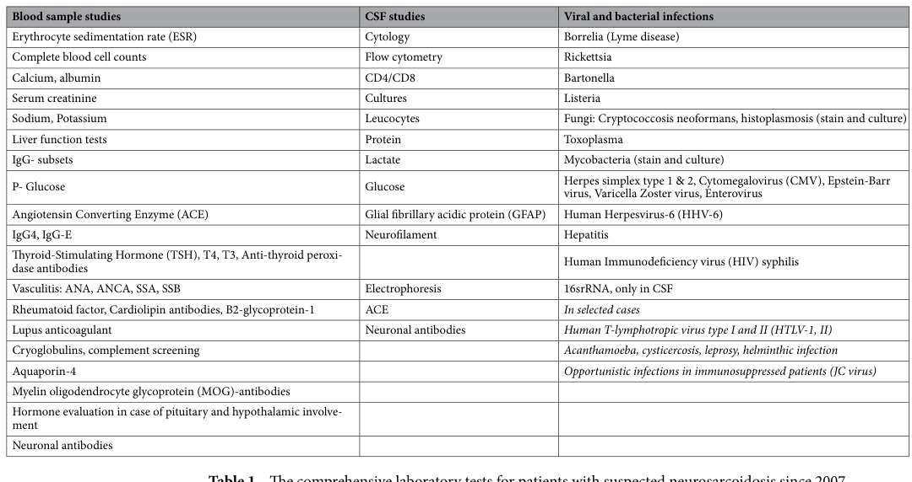

## Question

# Disease Characteristics Research Template

## Target Disease
- **Disease Name:** Neurosarcoidosis
- **MONDO ID:**  (if available)
- **Category:** Immune

## Research Objectives

Please provide a comprehensive research report on **Neurosarcoidosis** covering all of the
disease characteristics listed below. This report will be used to populate a disease knowledge
base entry. Be thorough and cite primary literature (PMID preferred) for all claims.

For each section, **suggested databases/resources** are listed. These are the first places
you should search for information on each topic.

---

### 1. Disease Information
> **Search first:** OMIM, Orphanet, ICD-10/ICD-11, MeSH, PubMed

- What is the disease? Provide a concise overview.
- What are the key identifiers? (OMIM, Orphanet, ICD-10/ICD-11, MeSH, Mondo)
- What are the common synonyms and alternative names?
- Is the information derived from individual patients (e.g., EHR) or aggregated disease-level resources?

### 2. Etiology

- **Disease Causal Factors**: What are the primary causes? (genetic, environmental, infectious, mechanistic)
- **Risk Factors**:
  > **Search first:** PubMed, Cochrane Library, UpToDate, clinical guidelines, ClinVar, ClinGen, GWAS Catalog, PheGenI, CTD, CDC, WHO, epidemiological databases
  - Genetic risk factors (causal variants, susceptibility loci, modifier genes)
  - Environmental risk factors (toxins, lifestyle, occupational exposures, age, sex, family history)
- **Protective Factors**:
  > **Search first:** PubMed, Cochrane Library, clinical trial databases, GWAS Catalog, gnomAD, WHO, CDC, nutrition databases
  - Genetic protective factors (protective variants, modifier alleles)
  - Environmental protective factors (diet, lifestyle, exposures that reduce risk)
- **Gene-Environment Interactions**: How do genetic and environmental factors interact to influence disease?
  > **Search first:** CTD, PubMed, PheGenI, GxE databases

### 3. Phenotypes
> **Search first:** HPO (Human Phenotype Ontology), OMIM, Orphanet, PubMed, clinicaltrials.gov, MedDRA, SNOMED CT, DECIPHER, LOINC

For each phenotype, provide:
- **Phenotype type**: symptoms, clinical signs, physical manifestations, behavioral changes, or laboratory abnormalities
  > For symptoms/signs: HPO, OMIM, Orphanet, PubMed
  > For behavioral changes: HPO, DSM, RDoC (Research Domain Criteria), PubMed
  > For laboratory abnormalities: LOINC, SNOMED CT, LabTests Online, PubMed
- **Phenotype characteristics**:
  > **Search first:** OMIM, Orphanet, HPO, PubMed
  - Age of symptom onset (neonatal, childhood, adult-onset, late-onset)
  - Symptom severity (mild, moderate, severe, variable)
  - Symptom progression (stable, progressive, episodic, fluctuating)
  - Frequency among affected individuals (percentage or qualitative)
- **Quality of life impact**: Effects on daily functioning and well-being (per-phenotype when possible)
  > **Search first:** EQ-5D database, SF-36, WHO QOL databases, PubMed
- Suggest HPO (Human Phenotype Ontology) terms for each phenotype

### 4. Genetic/Molecular Information

- **Causal Genes**: Gene mutations or chromosomal abnormalities responsible for disease (gene symbols, OMIM IDs)
  > **Search first:** OMIM, ClinVar, HGMD, Ensembl, NCBI Gene
- **Pathogenic Variants**:
  - Affected genes (gene symbols, HGNC IDs)
    > **Search first:** OMIM, NCBI Gene, Ensembl, HGNC, UniProt, GeneCards
  - Variant classification (pathogenic, likely pathogenic, VUS per ACMG/AMP guidelines)
    > **Search first:** ClinVar, ClinGen, ACMG/AMP guidelines, VarSome
  - Variant type/class (missense, frameshift, nonsense, splice-site, structural)
  - Allele frequency in population databases
    > **Search first:** gnomAD, 1000 Genomes, ExAC, TOPMed, dbSNP
  - Somatic vs germline origin
    > **Search first:** COSMIC (somatic), ClinVar, ICGC, TCGA
  - Functional consequences (loss of function, gain of function, dominant negative)
- **Modifier Genes**: Genes that modify disease severity or expression
- **Epigenetic Information**: DNA methylation, histone modifications, chromatin changes affecting disease
  > **Search first:** ENCODE, Roadmap Epigenomics, MethBase, DiseaseMeth
- **Chromosomal Abnormalities**: Large-scale genetic changes (aneuploidy, translocations, inversions)
  > **Search first:** DECIPHER, ClinVar, ECARUCA, UCSC Genome Browser

### 5. Environmental Information

- **Environmental Factors**: Non-genetic contributing factors (toxins, radiation, pollution, occupational exposure)
  > **Search first:** CTD (Comparative Toxicogenomics Database), TOXNET, PubMed, EPA databases
- **Lifestyle Factors**: Behavioral factors (smoking, diet, exercise, alcohol consumption)
  > **Search first:** CDC databases, WHO, PubMed, NHANES
- **Infectious Agents**: If applicable, pathogens causing or triggering disease (bacteria, viruses, fungi, parasites)
  > **Search first:** NCBI Taxonomy, ViPR, BV-BRC, MicrobeDB, GIDEON

### 6. Mechanism / Pathophysiology

- **Molecular Pathways**: Specific signaling cascades or biochemical pathways involved (Wnt, MAPK, mTOR, PI3K-AKT, etc.)
  > **Search first:** KEGG, Reactome, WikiPathways, PathBank, BioCyc
- **Cellular Processes**: Cell-level mechanisms (apoptosis, autophagy, cell cycle dysregulation, inflammation, etc.)
  > **Search first:** Gene Ontology (GO), Reactome, KEGG, PubMed
- **Protein Dysfunction**: How protein structure or function is altered (misfolding, aggregation, loss of function, gain of function)
  > **Search first:** UniProt, PDB (Protein Data Bank), InterPro, Pfam, AlphaFold
- **Metabolic Changes**: Alterations in metabolic processes (energy metabolism, lipid metabolism, amino acid metabolism)
  > **Search first:** KEGG, BioCyc, HMDB (Human Metabolome Database), BRENDA
- **Immune System Involvement**: Role of immune response (autoimmunity, immunodeficiency, chronic inflammation)
  > **Search first:** ImmPort, Immunome Database, IEDB, Gene Ontology
- **Tissue Damage Mechanisms**: How tissues/ are injured (oxidative stress, ischemia, fibrosis, necrosis)
  > **Search first:** PubMed, Gene Ontology, Reactome
- **Biochemical Abnormalities**: Specific molecular defects (enzyme deficiencies, receptor dysfunction, ion channel defects)
  > **Search first:** BRENDA, UniProt, KEGG, OMIM, PubMed
- **Epigenetic Changes**: DNA methylation, histone modifications affecting gene expression in disease
  > **Search first:** ENCODE, Roadmap Epigenomics, MethBase, DiseaseMeth
- **Molecular Profiling** (if available):
  - Transcriptomics/gene expression changes
    > **Search first:** GEO (Gene Expression Omnibus), ArrayExpress, GTEx, Human Cell Atlas, SRA
  - Proteomics findings
    > **Search first:** PRIDE, ProteomeXchange, Human Protein Atlas, STRING, BioGRID
  - Metabolomics signatures
    > **Search first:** MetaboLights, Metabolomics Workbench, HMDB, METLIN
  - Lipidomics alterations
    > **Search first:** LIPID MAPS, SwissLipids, LipidHome, Metabolomics Workbench
  - Genomic structural features
    > **Search first:** UCSC Genome Browser, Ensembl, NCBI, dbVar, DGV
- **Advanced Technologies** (if applicable):
  - Single-cell analysis findings (cell-type specific mechanisms, cellular heterogeneity)
    > **Search first:** Human Cell Atlas, Single Cell Portal, GEO, CELLxGENE
  - Spatial transcriptomics findings
    > **Search first:** GEO, Spatial Research, Vizgen, 10x Genomics data
  - Multi-omics integration results
    > **Search first:** TCGA, ICGC, cBioPortal, LinkedOmics, PubMed
  - Functional genomics screens (CRISPR, RNAi)
    > **Search first:** DepMap, GenomeRNAi, PubMed, BioGRID ORCS

For each mechanism, describe:
- The causal chain from initial trigger to clinical manifestation
- Which mechanisms are upstream vs downstream
- What cell types and biological processes are involved
- Suggest GO terms for biological processes and CL terms for cell types

### 7. Anatomical Structures Affected

- **Organ Level**:
  - Primary organs directly affected
  - Secondary organ involvement (complications, secondary effects)
  - Body systems involved (cardiovascular, nervous, digestive, respiratory, endocrine, etc.)
  > **Search first:** Uberon, FMA (Foundational Model of Anatomy), OMIM, HPO, ICD-11, MeSH, SNOMED CT
- **Tissue and Cell Level**:
  - Specific tissue types affected (epithelial, connective, muscle, nervous)
  - Specific cell populations targeted (with Cell Ontology terms)
  > **Search first:** Uberon, Human Protein Atlas, Cell Ontology, Human Cell Atlas, CellMarker, PanglaoDB
- **Subcellular Level**:
  - Cellular compartments involved (mitochondria, nucleus, ER, lysosomes) (with GO Cellular Component terms)
  > **Search first:** Gene Ontology (Cellular Component), UniProt, Human Protein Atlas
- **Localization**:
  - Specific anatomical sites (with UBERON terms)
    > **Search first:** FMA, Uberon, NeuroNames (for brain), SNOMED CT
  - Lateralization (unilateral, bilateral, asymmetric)
    > **Search first:** HPO, clinical literature, imaging databases

### 8. Temporal Development

- **Onset**:
  - Typical age of onset (congenital, pediatric, adult, geriatric)
  - Onset pattern (acute, subacute, chronic, insidious)
  > **Search first:** OMIM, Orphanet, HPO, PubMed
- **Progression**:
  - Disease stages (early, intermediate, advanced, end-stage)
    > **Search first:** Cancer Staging Manual (AJCC), WHO classifications, PubMed
  - Progression rate (rapid, slow, variable)
  - Disease course pattern (episodic, relapsing-remitting, progressive, stable)
  - Disease duration (self-limited, chronic lifelong)
  > **Search first:** Disease registries, longitudinal cohort databases, natural history studies, PubMed, Orphanet, OMIM
- **Patterns**:
  - Remission patterns (spontaneous, treatment-induced)
    > **Search first:** Clinical trial databases, disease registries, PubMed
  - Critical periods (time windows of vulnerability or opportunity for intervention)
    > **Search first:** PubMed, developmental biology databases, clinical guidelines

### 9. Inheritance and Population

- **Epidemiology**:
  - Prevalence (cases per 100,000 at given time)
  - Incidence (new cases per 100,000 per year)
  > **Search first:** Orphanet, CDC, WHO, GBD (Global Burden of Disease), national registries, SEER, disease registries
- **For Genetic Etiology**:
  - Inheritance pattern (AD, AR, X-linked, mitochondrial, multifactorial, polygenic)
    > **Search first:** OMIM, Orphanet, ClinVar, GTR (Genetic Testing Registry)
  - Penetrance (complete, incomplete, age-dependent)
    > **Search first:** ClinVar, OMIM, PubMed, ClinGen
  - Expressivity (variable, consistent)
    > **Search first:** OMIM, ClinVar, PubMed
  - Genetic anticipation (increasing severity in successive generations)
    > **Search first:** OMIM, PubMed (especially for repeat expansion disorders)
  - Germline mosaicism
    > **Search first:** ClinVar, OMIM, genetic counseling literature, PubMed
  - Founder effects (population-specific mutations)
    > **Search first:** gnomAD, population genetics databases, PubMed
  - Consanguinity role
    > **Search first:** OMIM, population studies, genetic counseling resources
  - Carrier frequency
    > **Search first:** gnomAD, carrier screening databases, GeneReviews, GTR
- **Population Demographics**:
  - Affected populations (ethnic or demographic groups with higher prevalence)
    > **Search first:** gnomAD, 1000 Genomes, PAGE Study, PubMed, population registries
  - Geographic distribution (endemic areas, regional variation)
    > **Search first:** WHO, CDC, GBD, Orphanet, geographic epidemiology databases
  - Geographic distribution of specific variants
  - Sex ratio (male:female)
    > **Search first:** Disease registries, OMIM, PubMed, epidemiological databases
  - Age distribution of affected individuals
    > **Search first:** CDC, disease registries, SEER, Orphanet

### 10. Diagnostics

- **Clinical Tests**:
  - Laboratory tests (blood, urine, tissue chemistry, specific enzyme assays)
    > **Search first:** LOINC, LabTests Online, PubMed
  - Biomarkers (proteins, metabolites, genetic markers, circulating biomarkers)
    > **Search first:** FDA Biomarker List, BEST (Biomarkers, EndpointS, and other Tools), PubMed
  - Imaging studies (X-ray, CT, MRI, PET, ultrasound)
    > **Search first:** RadLex, DICOM, Radiopaedia, imaging databases
  - Functional tests (pulmonary function, cardiac stress tests)
    > **Search first:** LOINC, clinical guidelines, PubMed
  - Electrophysiology (EEG, EMG, ECG, nerve conduction studies)
    > **Search first:** LOINC, clinical neurophysiology databases, PubMed
  - Biopsy findings (histopathology, immunohistochemistry)
    > **Search first:** SNOMED CT, College of American Pathologists resources, PubMed
  - Pathology findings (microscopic examination)
    > **Search first:** SNOMED CT, Digital Pathology databases, PubMed
- **Genetic Testing**:
  > **Search first:** GTR (Genetic Testing Registry), GeneReviews, ClinGen
  - Overview of recommended genetic testing approach
  - Whole genome sequencing (WGS) utility
    > **Search first:** GTR, ClinVar, GEL (Genomics England), gnomAD
  - Whole exome sequencing (WES) utility
    > **Search first:** GTR, ClinVar, OMIM, GeneMatcher
  - Gene panels (which panels, which genes)
    > **Search first:** GTR, ClinVar, laboratory-specific databases
  - Single gene testing
    > **Search first:** GTR, ClinVar, OMIM, GeneReviews
  - Chromosomal microarray (CMA)
    > **Search first:** DECIPHER, ClinVar, dbVar, ECARUCA
  - Karyotyping
    > **Search first:** Chromosome Abnormality Database, ClinVar, cytogenetics resources
  - FISH
    > **Search first:** ClinVar, cytogenetics databases, PubMed
  - Mitochondrial DNA testing
    > **Search first:** MITOMAP, MSeqDR, ClinVar, GTR
  - Repeat expansion testing
    > **Search first:** GTR, ClinVar, repeat expansion databases, PubMed
- **Omics-Based Diagnostics** (if applicable):
  - RNA sequencing / transcriptomics
    > **Search first:** GEO, ArrayExpress, GTEx, RNA-seq databases
  - Proteomics
    > **Search first:** PRIDE, ProteomeXchange, FDA Biomarker database
  - Metabolomics
    > **Search first:** MetaboLights, Metabolomics Workbench, HMDB
  - Epigenomics
    > **Search first:** GEO, ENCODE, Roadmap Epigenomics, MethBase
  - Liquid biopsy
    > **Search first:** COSMIC, ClinVar, liquid biopsy databases, PubMed
- **Clinical Criteria**:
  - Standardized diagnostic criteria (DSM, ICD, society guidelines)
    > **Search first:** DSM-5, ICD-11, clinical society guidelines, UpToDate
  - Differential diagnosis (other conditions to rule out, with distinguishing features)
    > **Search first:** DynaMed, UpToDate, clinical decision support systems
- **Screening**:
  - Screening methods for asymptomatic individuals (newborn screening, carrier screening, cascade screening)
    > **Search first:** ACMG recommendations, CDC newborn screening, GTR

### 11. Outcome/Prognosis

- **Survival and Mortality**:
  - Survival rate (5-year, 10-year, overall)
    > **Search first:** SEER, cancer registries, disease-specific registries, PubMed
  - Life expectancy (with and without treatment if applicable)
    > **Search first:** Orphanet, disease registries, actuarial databases, PubMed
  - Mortality rate
    > **Search first:** CDC, WHO, GBD, national mortality databases
  - Disease-specific mortality (deaths directly attributable to disease)
    > **Search first:** Disease registries, CDC Wonder, GBD, PubMed
- **Morbidity and Function**:
  - Morbidity (disease-related disability and health impacts)
    > **Search first:** GBD, WHO, disability databases, PubMed
  - Disability outcomes (long-term functional impairments)
    > **Search first:** ICF (International Classification of Functioning), disability registries
  - Quality of life measures (EQ-5D, SF-36, PROMIS, disease-specific tools)
    > **Search first:** EQ-5D database, SF-36, PROMIS, PubMed
- **Disease Course**:
  - Complications (secondary problems: infections, organ failure, etc.)
    > **Search first:** ICD codes, disease registries, clinical databases, PubMed
  - Recovery potential (likelihood and extent of recovery, with vs without treatment)
    > **Search first:** Natural history studies, rehabilitation databases, PubMed
- **Prediction**:
  - Prognostic factors (age, disease severity, biomarkers, treatment response)
    > **Search first:** Prognostic models databases, clinical calculators, PubMed
  - Prognostic biomarkers (molecular markers predicting disease course)
    > **Search first:** FDA Biomarker database, PubMed, cancer prognostic databases

### 12. Treatment

- **Pharmacotherapy**:
  - Pharmacological treatments (drug names, drug classes, mechanisms of action)
    > **Search first:** DrugBank, RxNorm, ATC classification, DailyMed, FDA databases
  - Pharmacogenomics (how genetic variants affect drug metabolism, efficacy, toxicity)
    > **Search first:** PharmGKB, CPIC (Clinical Pharmacogenetics), FDA Table of PGx Biomarkers
- **Advanced Therapeutics**:
  - Gene therapy (viral vectors, CRISPR, gene replacement, gene editing)
    > **Search first:** ClinicalTrials.gov, FDA gene therapy database, ASGCT resources
  - Cell therapy (stem cell transplant, CAR-T, cellular therapeutics)
    > **Search first:** ClinicalTrials.gov, FDA cell therapy database, FACT standards
  - RNA-based therapies (ASOs, siRNA, mRNA therapies)
    > **Search first:** ClinicalTrials.gov, FDA approvals, PubMed
  - Targeted therapies (treatments directed at specific molecular targets)
    > **Search first:** My Cancer Genome, OncoKB, ClinicalTrials.gov, FDA approvals
  - Immunotherapies (checkpoint inhibitors, monoclonal antibodies)
    > **Search first:** Cancer Immunotherapy Database, FDA approvals, ClinicalTrials.gov
- **Surgical and Interventional**:
  - Surgical interventions (types of surgery, timing, outcomes)
    > **Search first:** CPT codes, surgical registries, clinical guidelines, PubMed
- **Supportive and Rehabilitative**:
  - Supportive care (symptom management, pain control, nutrition)
    > **Search first:** Clinical guidelines, Cochrane Library, PubMed
  - Rehabilitation (physical therapy, occupational therapy, speech therapy)
    > **Search first:** Rehabilitation medicine databases, clinical guidelines, PubMed
- **Experimental**:
  - Experimental treatments in clinical trials (with NCT identifiers if available)
    > **Search first:** ClinicalTrials.gov, EU Clinical Trials Register, WHO ICTRP
- **Treatment Outcomes**:
  - Treatment response rates
    > **Search first:** Clinical trial databases, FDA reviews, systematic reviews, PubMed
  - Side effects and adverse events
    > **Search first:** FDA Adverse Event Reporting System (FAERS), MedWatch, PubMed
- **Treatment Strategy**:
  - Treatment algorithms (clinical pathways, decision trees)
    > **Search first:** Clinical practice guidelines, NCCN Guidelines, UpToDate
  - Combination therapies
    > **Search first:** ClinicalTrials.gov, treatment guidelines, PubMed
  - Personalized medicine approaches (genotype-guided treatment)
    > **Search first:** My Cancer Genome, CIViC, PharmGKB, precision medicine databases

For each treatment, suggest MAXO (Medical Action Ontology) terms where applicable.

### 13. Prevention

- **Prevention Levels**:
  - Primary prevention (preventing disease occurrence: vaccination, risk factor modification)
    > **Search first:** CDC, WHO, USPSTF recommendations, Cochrane Library
  - Secondary prevention (early detection and treatment: screening programs, early intervention)
    > **Search first:** USPSTF, CDC screening guidelines, WHO
  - Tertiary prevention (preventing complications in those with disease)
    > **Search first:** Clinical guidelines, disease management protocols, PubMed
- **Immunization**: Vaccine strategies (if applicable)
  > **Search first:** CDC vaccine schedules, WHO immunization, FDA vaccine database
- **Screening and Early Detection**:
  - Screening programs (population-based: newborn screening, cancer screening)
    > **Search first:** CDC screening programs, USPSTF, cancer screening databases
  - Genetic screening (carrier screening, preimplantation genetic diagnosis, prenatal testing)
    > **Search first:** ACMG recommendations, ACOG guidelines, GTR
  - Risk stratification (identifying high-risk individuals for targeted prevention)
    > **Search first:** Risk prediction models, clinical calculators, PubMed
- **Behavioral Interventions**: Lifestyle modifications to reduce risk
  > **Search first:** CDC, WHO, behavioral intervention databases, Cochrane Library
- **Counseling**: Genetic counseling (risk assessment, family planning guidance)
  > **Search first:** NSGC resources, ACMG guidelines, GeneReviews
- **Public Health**:
  - Public health interventions (sanitation, vector control, health education)
    > **Search first:** CDC, WHO, public health databases, PubMed
  - Environmental interventions (reducing environmental risk factors)
    > **Search first:** EPA databases, WHO environmental health, PubMed
- **Prophylaxis**: Preventive medications or procedures
  > **Search first:** Clinical guidelines, FDA approvals, PubMed

### 14. Other Species / Natural Disease

- **Taxonomy**: Species affected (with NCBI Taxon identifiers)
  > **Search first:** NCBI Taxonomy
- **Breed**: Specific breeds affected (with VBO identifiers if applicable)
  > **Search first:** VBO (Vertebrate Breed Ontology)
- **Gene**: Orthologous genes in other species (with NCBI Gene IDs)
  > **Search first:** NCBI Gene
- **Natural Disease**:
  - Naturally occurring disease in other species (companion animals, wildlife)
    > **Search first:** OMIA (Online Mendelian Inheritance in Animals), VetCompass, PubMed
  - Veterinary relevance and importance in animal health
    > **Search first:** OMIA, veterinary databases, PubMed
- **Comparative Biology**:
  - Comparative pathology (similarities and differences across species)
    > **Search first:** OMIA, comparative pathology databases, PubMed
  - Evolutionary conservation of disease mechanisms
    > **Search first:** HomoloGene, OrthoMCL, Alliance of Genome Resources
- **Transmission** (if applicable):
  - Zoonotic potential
    > **Search first:** CDC zoonotic diseases, WHO zoonoses, GIDEON
  - Cross-species susceptibility
    > **Search first:** NCBI Taxonomy, veterinary databases, PubMed

### 15. Model Organisms

- **Model Types**:
  - Model organism type (mammalian, invertebrate, cellular, in vitro)
    > **Search first:** Alliance of Genome Resources, model organism databases
  - Specific model systems (mouse, rat, zebrafish, Drosophila, C. elegans, yeast, cell lines, organoids, iPSCs)
    > **Search first:** MGI, RGD, ZFIN, FlyBase, WormBase, SGD, ATCC, Cellosaurus
  - Induced models (drug treatment, surgical intervention, environmental manipulation)
    > **Search first:** MGI, model organism databases, PubMed
- **Genetic Models**:
  - Types available (knockout, knock-in, transgenic, conditional, humanized)
    > **Search first:** MGI, IMPC, KOMP, EuMMCR, IMSR
- **Model Characteristics**:
  - Phenotype recapitulation (how well model reproduces human disease features)
    > **Search first:** Model organism databases, comparative studies, PubMed
  - Model limitations (aspects of human disease not captured)
    > **Search first:** Model organism databases, PubMed, review articles
- **Applications**:
  - Research applications (what aspects of disease can be studied)
    > **Search first:** Model organism databases, PubMed
- **Resources**:
  - Model databases
    > **Search first:** MGI, RGD, ZFIN, FlyBase, WormBase, IMSR, EMMA, MMRRC

---

## Citation Requirements

- Cite primary literature (PMID preferred) for all mechanistic and clinical claims
- Prioritize recent reviews and landmark papers
- Include direct quotes from abstracts where possible to support key statements
- Distinguish evidence source types: human clinical, model organism, in vitro, computational

## Output Format

Structure your response as a comprehensive narrative organized by the sections above.
For each section, provide:
- Factual content with specific details (numbers, percentages, gene names, variant nomenclature)
- Ontology term suggestions (HPO, GO, CL, UBERON, CHEBI, MAXO, MONDO) where applicable
- Evidence citations with PMIDs
- Direct quotes from abstracts to support key claims
- Clear indication when information is not available or not applicable for this disease

This report will be used to populate a disease knowledge base entry with:
- Pathophysiology descriptions with causal chains
- Gene/protein annotations (HGNC, GO terms)
- Phenotype associations (HP terms) with frequencies
- Cell type involvement (CL terms)
- Anatomical locations (UBERON terms)
- Chemical entities (CHEBI terms)
- Treatment annotations (MAXO terms)
- Evidence items with PMIDs and exact abstract quotes
- Epidemiology, prognosis, diagnostic, and prevention information
- Animal model descriptions with phenotype recapitulation details

## Output

Question: You are an expert researcher providing comprehensive, well-cited information.

Provide detailed information focusing on:
1. Key concepts and definitions with current understanding
2. Recent developments and latest research (prioritize 2023-2024 sources)
3. Current applications and real-world implementations
4. Expert opinions and analysis from authoritative sources
5. Relevant statistics and data from recent studies

Format as a comprehensive research report with proper citations. Include URLs and publication dates where available.
Always prioritize recent, authoritative sources and provide specific citations for all major claims.

# Disease Characteristics Research Template

## Target Disease
- **Disease Name:** Neurosarcoidosis
- **MONDO ID:**  (if available)
- **Category:** Immune

## Research Objectives

Please provide a comprehensive research report on **Neurosarcoidosis** covering all of the
disease characteristics listed below. This report will be used to populate a disease knowledge
base entry. Be thorough and cite primary literature (PMID preferred) for all claims.

For each section, **suggested databases/resources** are listed. These are the first places
you should search for information on each topic.

---

### 1. Disease Information
> **Search first:** OMIM, Orphanet, ICD-10/ICD-11, MeSH, PubMed

- What is the disease? Provide a concise overview.
- What are the key identifiers? (OMIM, Orphanet, ICD-10/ICD-11, MeSH, Mondo)
- What are the common synonyms and alternative names?
- Is the information derived from individual patients (e.g., EHR) or aggregated disease-level resources?

### 2. Etiology

- **Disease Causal Factors**: What are the primary causes? (genetic, environmental, infectious, mechanistic)
- **Risk Factors**:
  > **Search first:** PubMed, Cochrane Library, UpToDate, clinical guidelines, ClinVar, ClinGen, GWAS Catalog, PheGenI, CTD, CDC, WHO, epidemiological databases
  - Genetic risk factors (causal variants, susceptibility loci, modifier genes)
  - Environmental risk factors (toxins, lifestyle, occupational exposures, age, sex, family history)
- **Protective Factors**:
  > **Search first:** PubMed, Cochrane Library, clinical trial databases, GWAS Catalog, gnomAD, WHO, CDC, nutrition databases
  - Genetic protective factors (protective variants, modifier alleles)
  - Environmental protective factors (diet, lifestyle, exposures that reduce risk)
- **Gene-Environment Interactions**: How do genetic and environmental factors interact to influence disease?
  > **Search first:** CTD, PubMed, PheGenI, GxE databases

### 3. Phenotypes
> **Search first:** HPO (Human Phenotype Ontology), OMIM, Orphanet, PubMed, clinicaltrials.gov, MedDRA, SNOMED CT, DECIPHER, LOINC

For each phenotype, provide:
- **Phenotype type**: symptoms, clinical signs, physical manifestations, behavioral changes, or laboratory abnormalities
  > For symptoms/signs: HPO, OMIM, Orphanet, PubMed
  > For behavioral changes: HPO, DSM, RDoC (Research Domain Criteria), PubMed
  > For laboratory abnormalities: LOINC, SNOMED CT, LabTests Online, PubMed
- **Phenotype characteristics**:
  > **Search first:** OMIM, Orphanet, HPO, PubMed
  - Age of symptom onset (neonatal, childhood, adult-onset, late-onset)
  - Symptom severity (mild, moderate, severe, variable)
  - Symptom progression (stable, progressive, episodic, fluctuating)
  - Frequency among affected individuals (percentage or qualitative)
- **Quality of life impact**: Effects on daily functioning and well-being (per-phenotype when possible)
  > **Search first:** EQ-5D database, SF-36, WHO QOL databases, PubMed
- Suggest HPO (Human Phenotype Ontology) terms for each phenotype

### 4. Genetic/Molecular Information

- **Causal Genes**: Gene mutations or chromosomal abnormalities responsible for disease (gene symbols, OMIM IDs)
  > **Search first:** OMIM, ClinVar, HGMD, Ensembl, NCBI Gene
- **Pathogenic Variants**:
  - Affected genes (gene symbols, HGNC IDs)
    > **Search first:** OMIM, NCBI Gene, Ensembl, HGNC, UniProt, GeneCards
  - Variant classification (pathogenic, likely pathogenic, VUS per ACMG/AMP guidelines)
    > **Search first:** ClinVar, ClinGen, ACMG/AMP guidelines, VarSome
  - Variant type/class (missense, frameshift, nonsense, splice-site, structural)
  - Allele frequency in population databases
    > **Search first:** gnomAD, 1000 Genomes, ExAC, TOPMed, dbSNP
  - Somatic vs germline origin
    > **Search first:** COSMIC (somatic), ClinVar, ICGC, TCGA
  - Functional consequences (loss of function, gain of function, dominant negative)
- **Modifier Genes**: Genes that modify disease severity or expression
- **Epigenetic Information**: DNA methylation, histone modifications, chromatin changes affecting disease
  > **Search first:** ENCODE, Roadmap Epigenomics, MethBase, DiseaseMeth
- **Chromosomal Abnormalities**: Large-scale genetic changes (aneuploidy, translocations, inversions)
  > **Search first:** DECIPHER, ClinVar, ECARUCA, UCSC Genome Browser

### 5. Environmental Information

- **Environmental Factors**: Non-genetic contributing factors (toxins, radiation, pollution, occupational exposure)
  > **Search first:** CTD (Comparative Toxicogenomics Database), TOXNET, PubMed, EPA databases
- **Lifestyle Factors**: Behavioral factors (smoking, diet, exercise, alcohol consumption)
  > **Search first:** CDC databases, WHO, PubMed, NHANES
- **Infectious Agents**: If applicable, pathogens causing or triggering disease (bacteria, viruses, fungi, parasites)
  > **Search first:** NCBI Taxonomy, ViPR, BV-BRC, MicrobeDB, GIDEON

### 6. Mechanism / Pathophysiology

- **Molecular Pathways**: Specific signaling cascades or biochemical pathways involved (Wnt, MAPK, mTOR, PI3K-AKT, etc.)
  > **Search first:** KEGG, Reactome, WikiPathways, PathBank, BioCyc
- **Cellular Processes**: Cell-level mechanisms (apoptosis, autophagy, cell cycle dysregulation, inflammation, etc.)
  > **Search first:** Gene Ontology (GO), Reactome, KEGG, PubMed
- **Protein Dysfunction**: How protein structure or function is altered (misfolding, aggregation, loss of function, gain of function)
  > **Search first:** UniProt, PDB (Protein Data Bank), InterPro, Pfam, AlphaFold
- **Metabolic Changes**: Alterations in metabolic processes (energy metabolism, lipid metabolism, amino acid metabolism)
  > **Search first:** KEGG, BioCyc, HMDB (Human Metabolome Database), BRENDA
- **Immune System Involvement**: Role of immune response (autoimmunity, immunodeficiency, chronic inflammation)
  > **Search first:** ImmPort, Immunome Database, IEDB, Gene Ontology
- **Tissue Damage Mechanisms**: How tissues/ are injured (oxidative stress, ischemia, fibrosis, necrosis)
  > **Search first:** PubMed, Gene Ontology, Reactome
- **Biochemical Abnormalities**: Specific molecular defects (enzyme deficiencies, receptor dysfunction, ion channel defects)
  > **Search first:** BRENDA, UniProt, KEGG, OMIM, PubMed
- **Epigenetic Changes**: DNA methylation, histone modifications affecting gene expression in disease
  > **Search first:** ENCODE, Roadmap Epigenomics, MethBase, DiseaseMeth
- **Molecular Profiling** (if available):
  - Transcriptomics/gene expression changes
    > **Search first:** GEO (Gene Expression Omnibus), ArrayExpress, GTEx, Human Cell Atlas, SRA
  - Proteomics findings
    > **Search first:** PRIDE, ProteomeXchange, Human Protein Atlas, STRING, BioGRID
  - Metabolomics signatures
    > **Search first:** MetaboLights, Metabolomics Workbench, HMDB, METLIN
  - Lipidomics alterations
    > **Search first:** LIPID MAPS, SwissLipids, LipidHome, Metabolomics Workbench
  - Genomic structural features
    > **Search first:** UCSC Genome Browser, Ensembl, NCBI, dbVar, DGV
- **Advanced Technologies** (if applicable):
  - Single-cell analysis findings (cell-type specific mechanisms, cellular heterogeneity)
    > **Search first:** Human Cell Atlas, Single Cell Portal, GEO, CELLxGENE
  - Spatial transcriptomics findings
    > **Search first:** GEO, Spatial Research, Vizgen, 10x Genomics data
  - Multi-omics integration results
    > **Search first:** TCGA, ICGC, cBioPortal, LinkedOmics, PubMed
  - Functional genomics screens (CRISPR, RNAi)
    > **Search first:** DepMap, GenomeRNAi, PubMed, BioGRID ORCS

For each mechanism, describe:
- The causal chain from initial trigger to clinical manifestation
- Which mechanisms are upstream vs downstream
- What cell types and biological processes are involved
- Suggest GO terms for biological processes and CL terms for cell types

### 7. Anatomical Structures Affected

- **Organ Level**:
  - Primary organs directly affected
  - Secondary organ involvement (complications, secondary effects)
  - Body systems involved (cardiovascular, nervous, digestive, respiratory, endocrine, etc.)
  > **Search first:** Uberon, FMA (Foundational Model of Anatomy), OMIM, HPO, ICD-11, MeSH, SNOMED CT
- **Tissue and Cell Level**:
  - Specific tissue types affected (epithelial, connective, muscle, nervous)
  - Specific cell populations targeted (with Cell Ontology terms)
  > **Search first:** Uberon, Human Protein Atlas, Cell Ontology, Human Cell Atlas, CellMarker, PanglaoDB
- **Subcellular Level**:
  - Cellular compartments involved (mitochondria, nucleus, ER, lysosomes) (with GO Cellular Component terms)
  > **Search first:** Gene Ontology (Cellular Component), UniProt, Human Protein Atlas
- **Localization**:
  - Specific anatomical sites (with UBERON terms)
    > **Search first:** FMA, Uberon, NeuroNames (for brain), SNOMED CT
  - Lateralization (unilateral, bilateral, asymmetric)
    > **Search first:** HPO, clinical literature, imaging databases

### 8. Temporal Development

- **Onset**:
  - Typical age of onset (congenital, pediatric, adult, geriatric)
  - Onset pattern (acute, subacute, chronic, insidious)
  > **Search first:** OMIM, Orphanet, HPO, PubMed
- **Progression**:
  - Disease stages (early, intermediate, advanced, end-stage)
    > **Search first:** Cancer Staging Manual (AJCC), WHO classifications, PubMed
  - Progression rate (rapid, slow, variable)
  - Disease course pattern (episodic, relapsing-remitting, progressive, stable)
  - Disease duration (self-limited, chronic lifelong)
  > **Search first:** Disease registries, longitudinal cohort databases, natural history studies, PubMed, Orphanet, OMIM
- **Patterns**:
  - Remission patterns (spontaneous, treatment-induced)
    > **Search first:** Clinical trial databases, disease registries, PubMed
  - Critical periods (time windows of vulnerability or opportunity for intervention)
    > **Search first:** PubMed, developmental biology databases, clinical guidelines

### 9. Inheritance and Population

- **Epidemiology**:
  - Prevalence (cases per 100,000 at given time)
  - Incidence (new cases per 100,000 per year)
  > **Search first:** Orphanet, CDC, WHO, GBD (Global Burden of Disease), national registries, SEER, disease registries
- **For Genetic Etiology**:
  - Inheritance pattern (AD, AR, X-linked, mitochondrial, multifactorial, polygenic)
    > **Search first:** OMIM, Orphanet, ClinVar, GTR (Genetic Testing Registry)
  - Penetrance (complete, incomplete, age-dependent)
    > **Search first:** ClinVar, OMIM, PubMed, ClinGen
  - Expressivity (variable, consistent)
    > **Search first:** OMIM, ClinVar, PubMed
  - Genetic anticipation (increasing severity in successive generations)
    > **Search first:** OMIM, PubMed (especially for repeat expansion disorders)
  - Germline mosaicism
    > **Search first:** ClinVar, OMIM, genetic counseling literature, PubMed
  - Founder effects (population-specific mutations)
    > **Search first:** gnomAD, population genetics databases, PubMed
  - Consanguinity role
    > **Search first:** OMIM, population studies, genetic counseling resources
  - Carrier frequency
    > **Search first:** gnomAD, carrier screening databases, GeneReviews, GTR
- **Population Demographics**:
  - Affected populations (ethnic or demographic groups with higher prevalence)
    > **Search first:** gnomAD, 1000 Genomes, PAGE Study, PubMed, population registries
  - Geographic distribution (endemic areas, regional variation)
    > **Search first:** WHO, CDC, GBD, Orphanet, geographic epidemiology databases
  - Geographic distribution of specific variants
  - Sex ratio (male:female)
    > **Search first:** Disease registries, OMIM, PubMed, epidemiological databases
  - Age distribution of affected individuals
    > **Search first:** CDC, disease registries, SEER, Orphanet

### 10. Diagnostics

- **Clinical Tests**:
  - Laboratory tests (blood, urine, tissue chemistry, specific enzyme assays)
    > **Search first:** LOINC, LabTests Online, PubMed
  - Biomarkers (proteins, metabolites, genetic markers, circulating biomarkers)
    > **Search first:** FDA Biomarker List, BEST (Biomarkers, EndpointS, and other Tools), PubMed
  - Imaging studies (X-ray, CT, MRI, PET, ultrasound)
    > **Search first:** RadLex, DICOM, Radiopaedia, imaging databases
  - Functional tests (pulmonary function, cardiac stress tests)
    > **Search first:** LOINC, clinical guidelines, PubMed
  - Electrophysiology (EEG, EMG, ECG, nerve conduction studies)
    > **Search first:** LOINC, clinical neurophysiology databases, PubMed
  - Biopsy findings (histopathology, immunohistochemistry)
    > **Search first:** SNOMED CT, College of American Pathologists resources, PubMed
  - Pathology findings (microscopic examination)
    > **Search first:** SNOMED CT, Digital Pathology databases, PubMed
- **Genetic Testing**:
  > **Search first:** GTR (Genetic Testing Registry), GeneReviews, ClinGen
  - Overview of recommended genetic testing approach
  - Whole genome sequencing (WGS) utility
    > **Search first:** GTR, ClinVar, GEL (Genomics England), gnomAD
  - Whole exome sequencing (WES) utility
    > **Search first:** GTR, ClinVar, OMIM, GeneMatcher
  - Gene panels (which panels, which genes)
    > **Search first:** GTR, ClinVar, laboratory-specific databases
  - Single gene testing
    > **Search first:** GTR, ClinVar, OMIM, GeneReviews
  - Chromosomal microarray (CMA)
    > **Search first:** DECIPHER, ClinVar, dbVar, ECARUCA
  - Karyotyping
    > **Search first:** Chromosome Abnormality Database, ClinVar, cytogenetics resources
  - FISH
    > **Search first:** ClinVar, cytogenetics databases, PubMed
  - Mitochondrial DNA testing
    > **Search first:** MITOMAP, MSeqDR, ClinVar, GTR
  - Repeat expansion testing
    > **Search first:** GTR, ClinVar, repeat expansion databases, PubMed
- **Omics-Based Diagnostics** (if applicable):
  - RNA sequencing / transcriptomics
    > **Search first:** GEO, ArrayExpress, GTEx, RNA-seq databases
  - Proteomics
    > **Search first:** PRIDE, ProteomeXchange, FDA Biomarker database
  - Metabolomics
    > **Search first:** MetaboLights, Metabolomics Workbench, HMDB
  - Epigenomics
    > **Search first:** GEO, ENCODE, Roadmap Epigenomics, MethBase
  - Liquid biopsy
    > **Search first:** COSMIC, ClinVar, liquid biopsy databases, PubMed
- **Clinical Criteria**:
  - Standardized diagnostic criteria (DSM, ICD, society guidelines)
    > **Search first:** DSM-5, ICD-11, clinical society guidelines, UpToDate
  - Differential diagnosis (other conditions to rule out, with distinguishing features)
    > **Search first:** DynaMed, UpToDate, clinical decision support systems
- **Screening**:
  - Screening methods for asymptomatic individuals (newborn screening, carrier screening, cascade screening)
    > **Search first:** ACMG recommendations, CDC newborn screening, GTR

### 11. Outcome/Prognosis

- **Survival and Mortality**:
  - Survival rate (5-year, 10-year, overall)
    > **Search first:** SEER, cancer registries, disease-specific registries, PubMed
  - Life expectancy (with and without treatment if applicable)
    > **Search first:** Orphanet, disease registries, actuarial databases, PubMed
  - Mortality rate
    > **Search first:** CDC, WHO, GBD, national mortality databases
  - Disease-specific mortality (deaths directly attributable to disease)
    > **Search first:** Disease registries, CDC Wonder, GBD, PubMed
- **Morbidity and Function**:
  - Morbidity (disease-related disability and health impacts)
    > **Search first:** GBD, WHO, disability databases, PubMed
  - Disability outcomes (long-term functional impairments)
    > **Search first:** ICF (International Classification of Functioning), disability registries
  - Quality of life measures (EQ-5D, SF-36, PROMIS, disease-specific tools)
    > **Search first:** EQ-5D database, SF-36, PROMIS, PubMed
- **Disease Course**:
  - Complications (secondary problems: infections, organ failure, etc.)
    > **Search first:** ICD codes, disease registries, clinical databases, PubMed
  - Recovery potential (likelihood and extent of recovery, with vs without treatment)
    > **Search first:** Natural history studies, rehabilitation databases, PubMed
- **Prediction**:
  - Prognostic factors (age, disease severity, biomarkers, treatment response)
    > **Search first:** Prognostic models databases, clinical calculators, PubMed
  - Prognostic biomarkers (molecular markers predicting disease course)
    > **Search first:** FDA Biomarker database, PubMed, cancer prognostic databases

### 12. Treatment

- **Pharmacotherapy**:
  - Pharmacological treatments (drug names, drug classes, mechanisms of action)
    > **Search first:** DrugBank, RxNorm, ATC classification, DailyMed, FDA databases
  - Pharmacogenomics (how genetic variants affect drug metabolism, efficacy, toxicity)
    > **Search first:** PharmGKB, CPIC (Clinical Pharmacogenetics), FDA Table of PGx Biomarkers
- **Advanced Therapeutics**:
  - Gene therapy (viral vectors, CRISPR, gene replacement, gene editing)
    > **Search first:** ClinicalTrials.gov, FDA gene therapy database, ASGCT resources
  - Cell therapy (stem cell transplant, CAR-T, cellular therapeutics)
    > **Search first:** ClinicalTrials.gov, FDA cell therapy database, FACT standards
  - RNA-based therapies (ASOs, siRNA, mRNA therapies)
    > **Search first:** ClinicalTrials.gov, FDA approvals, PubMed
  - Targeted therapies (treatments directed at specific molecular targets)
    > **Search first:** My Cancer Genome, OncoKB, ClinicalTrials.gov, FDA approvals
  - Immunotherapies (checkpoint inhibitors, monoclonal antibodies)
    > **Search first:** Cancer Immunotherapy Database, FDA approvals, ClinicalTrials.gov
- **Surgical and Interventional**:
  - Surgical interventions (types of surgery, timing, outcomes)
    > **Search first:** CPT codes, surgical registries, clinical guidelines, PubMed
- **Supportive and Rehabilitative**:
  - Supportive care (symptom management, pain control, nutrition)
    > **Search first:** Clinical guidelines, Cochrane Library, PubMed
  - Rehabilitation (physical therapy, occupational therapy, speech therapy)
    > **Search first:** Rehabilitation medicine databases, clinical guidelines, PubMed
- **Experimental**:
  - Experimental treatments in clinical trials (with NCT identifiers if available)
    > **Search first:** ClinicalTrials.gov, EU Clinical Trials Register, WHO ICTRP
- **Treatment Outcomes**:
  - Treatment response rates
    > **Search first:** Clinical trial databases, FDA reviews, systematic reviews, PubMed
  - Side effects and adverse events
    > **Search first:** FDA Adverse Event Reporting System (FAERS), MedWatch, PubMed
- **Treatment Strategy**:
  - Treatment algorithms (clinical pathways, decision trees)
    > **Search first:** Clinical practice guidelines, NCCN Guidelines, UpToDate
  - Combination therapies
    > **Search first:** ClinicalTrials.gov, treatment guidelines, PubMed
  - Personalized medicine approaches (genotype-guided treatment)
    > **Search first:** My Cancer Genome, CIViC, PharmGKB, precision medicine databases

For each treatment, suggest MAXO (Medical Action Ontology) terms where applicable.

### 13. Prevention

- **Prevention Levels**:
  - Primary prevention (preventing disease occurrence: vaccination, risk factor modification)
    > **Search first:** CDC, WHO, USPSTF recommendations, Cochrane Library
  - Secondary prevention (early detection and treatment: screening programs, early intervention)
    > **Search first:** USPSTF, CDC screening guidelines, WHO
  - Tertiary prevention (preventing complications in those with disease)
    > **Search first:** Clinical guidelines, disease management protocols, PubMed
- **Immunization**: Vaccine strategies (if applicable)
  > **Search first:** CDC vaccine schedules, WHO immunization, FDA vaccine database
- **Screening and Early Detection**:
  - Screening programs (population-based: newborn screening, cancer screening)
    > **Search first:** CDC screening programs, USPSTF, cancer screening databases
  - Genetic screening (carrier screening, preimplantation genetic diagnosis, prenatal testing)
    > **Search first:** ACMG recommendations, ACOG guidelines, GTR
  - Risk stratification (identifying high-risk individuals for targeted prevention)
    > **Search first:** Risk prediction models, clinical calculators, PubMed
- **Behavioral Interventions**: Lifestyle modifications to reduce risk
  > **Search first:** CDC, WHO, behavioral intervention databases, Cochrane Library
- **Counseling**: Genetic counseling (risk assessment, family planning guidance)
  > **Search first:** NSGC resources, ACMG guidelines, GeneReviews
- **Public Health**:
  - Public health interventions (sanitation, vector control, health education)
    > **Search first:** CDC, WHO, public health databases, PubMed
  - Environmental interventions (reducing environmental risk factors)
    > **Search first:** EPA databases, WHO environmental health, PubMed
- **Prophylaxis**: Preventive medications or procedures
  > **Search first:** Clinical guidelines, FDA approvals, PubMed

### 14. Other Species / Natural Disease

- **Taxonomy**: Species affected (with NCBI Taxon identifiers)
  > **Search first:** NCBI Taxonomy
- **Breed**: Specific breeds affected (with VBO identifiers if applicable)
  > **Search first:** VBO (Vertebrate Breed Ontology)
- **Gene**: Orthologous genes in other species (with NCBI Gene IDs)
  > **Search first:** NCBI Gene
- **Natural Disease**:
  - Naturally occurring disease in other species (companion animals, wildlife)
    > **Search first:** OMIA (Online Mendelian Inheritance in Animals), VetCompass, PubMed
  - Veterinary relevance and importance in animal health
    > **Search first:** OMIA, veterinary databases, PubMed
- **Comparative Biology**:
  - Comparative pathology (similarities and differences across species)
    > **Search first:** OMIA, comparative pathology databases, PubMed
  - Evolutionary conservation of disease mechanisms
    > **Search first:** HomoloGene, OrthoMCL, Alliance of Genome Resources
- **Transmission** (if applicable):
  - Zoonotic potential
    > **Search first:** CDC zoonotic diseases, WHO zoonoses, GIDEON
  - Cross-species susceptibility
    > **Search first:** NCBI Taxonomy, veterinary databases, PubMed

### 15. Model Organisms

- **Model Types**:
  - Model organism type (mammalian, invertebrate, cellular, in vitro)
    > **Search first:** Alliance of Genome Resources, model organism databases
  - Specific model systems (mouse, rat, zebrafish, Drosophila, C. elegans, yeast, cell lines, organoids, iPSCs)
    > **Search first:** MGI, RGD, ZFIN, FlyBase, WormBase, SGD, ATCC, Cellosaurus
  - Induced models (drug treatment, surgical intervention, environmental manipulation)
    > **Search first:** MGI, model organism databases, PubMed
- **Genetic Models**:
  - Types available (knockout, knock-in, transgenic, conditional, humanized)
    > **Search first:** MGI, IMPC, KOMP, EuMMCR, IMSR
- **Model Characteristics**:
  - Phenotype recapitulation (how well model reproduces human disease features)
    > **Search first:** Model organism databases, comparative studies, PubMed
  - Model limitations (aspects of human disease not captured)
    > **Search first:** Model organism databases, PubMed, review articles
- **Applications**:
  - Research applications (what aspects of disease can be studied)
    > **Search first:** Model organism databases, PubMed
- **Resources**:
  - Model databases
    > **Search first:** MGI, RGD, ZFIN, FlyBase, WormBase, IMSR, EMMA, MMRRC

---

## Citation Requirements

- Cite primary literature (PMID preferred) for all mechanistic and clinical claims
- Prioritize recent reviews and landmark papers
- Include direct quotes from abstracts where possible to support key statements
- Distinguish evidence source types: human clinical, model organism, in vitro, computational

## Output Format

Structure your response as a comprehensive narrative organized by the sections above.
For each section, provide:
- Factual content with specific details (numbers, percentages, gene names, variant nomenclature)
- Ontology term suggestions (HPO, GO, CL, UBERON, CHEBI, MAXO, MONDO) where applicable
- Evidence citations with PMIDs
- Direct quotes from abstracts to support key claims
- Clear indication when information is not available or not applicable for this disease

This report will be used to populate a disease knowledge base entry with:
- Pathophysiology descriptions with causal chains
- Gene/protein annotations (HGNC, GO terms)
- Phenotype associations (HP terms) with frequencies
- Cell type involvement (CL terms)
- Anatomical locations (UBERON terms)
- Chemical entities (CHEBI terms)
- Treatment annotations (MAXO terms)
- Evidence items with PMIDs and exact abstract quotes
- Epidemiology, prognosis, diagnostic, and prevention information
- Animal model descriptions with phenotype recapitulation details

# Neurosarcoidosis — Disease Characteristics Research Report (Immune)

## Executive summary
Neurosarcoidosis (NS) is a granulomatous inflammatory disorder of the central and/or peripheral nervous system that occurs in the setting of systemic sarcoidosis or as isolated nervous-system disease. Modern practice is anchored by the 2018 Neurosarcoidosis Consortium Consensus Group diagnostic-certainty framework (“possible/probable/definite”) and a systematic exclusion of key mimics (notably infection and malignancy), because no single clinical sign, imaging feature, or biomarker is pathognomonic. Recent (2023–2024) cohorts and systematic reviews reinforce: (i) high diagnostic yield from contrast MRI plus CSF studies; (ii) increasing use of FDG-PET/CT to locate extra-neural biopsy targets; (iii) evolving biomarker evidence for soluble IL-2 receptor (sIL-2R) and CSF indices; and (iv) strong—though largely non-randomized—evidence supporting TNF-α inhibitors (especially infliximab) for refractory/aggressive disease, with clinically meaningful relapse risk when biologics are discontinued. (stern2018definitionandconsensus pages 5-6, vlad2023differentiatingneurosarcoidosisfrom pages 4-5, chanpura2024diagnosticvalueof pages 6-7, chaiyanarm2024infliximabinneurosarcoidosis pages 6-8)

| Domain | Measure | Value(s) | Study/citation details |
|---|---|---|---|
| Epidemiology | Frequency among sarcoidosis patients | Clinically overt neurosarcoidosis in up to 10% of sarcoidosis patients | Ungprasert et al. 2022, *Expert Review of Neurotherapeutics*; DOI: 10.1080/14737175.2022.2108705; https://doi.org/10.1080/14737175.2022.2108705 (ungprasert2022neurosarcoidosisanupdate pages 1-3) |
| Epidemiology | Frequency among sarcoidosis patients | About 5% of sarcoidosis patients develop neurosarcoidosis | Basheer et al. 2023, *Life*; DOI: 10.3390/life14010069; https://doi.org/10.3390/life14010069 (basheer2023neurosarcoidosisthepresentation pages 7-8) |
| Epidemiology | Frequency among sarcoidosis patients | 5.5% (85/1532) fulfilled Stern criteria for neurosarcoidosis | Ramos-Casals et al. 2021, *Scientific Reports*; DOI: 10.1038/s41598-021-92967-6; https://doi.org/10.1038/s41598-021-92967-6 (sambon2022epidemiologyclinicalpresentation pages 1-2) |
| Epidemiology | Systemic sarcoidosis coexistence | 86% in local cohort; 83% in literature review had systemic sarcoidosis | Sambon et al. 2022, *Frontiers in Neurology*; DOI: 10.3389/fneur.2022.970168; https://doi.org/10.3389/fneur.2022.970168 (sambon2022epidemiologyclinicalpresentation pages 1-2) |
| Clinical phenotypes | Common presenting features | Cranial neuropathies 38%, motor deficit 32%, headache 16%, pituitary dysfunction 12% | Berntsson et al. 2023, *Scientific Reports*; DOI: 10.1038/s41598-023-33631-z; https://doi.org/10.1038/s41598-023-33631-z (sambon2022epidemiologyclinicalpresentation pages 1-2) |
| Clinical phenotypes | CNS distribution | Brain 38%, cranial nerves 36%, meninges 3%, spinal cord 10%, peripheral nerves 14% | Ramos-Casals et al. 2021, *Scientific Reports*; DOI: 10.1038/s41598-021-92967-6; https://doi.org/10.1038/s41598-021-92967-6 (sambon2022epidemiologyclinicalpresentation pages 1-2) |
| Clinical phenotypes | Initial manifestations in national cohort | Cranial nerve palsies 36%, medullary symptoms 23%, seizures 21% | Dos Santos et al. 2024, *Brain and Behavior*; DOI: 10.1002/brb3.3443; https://doi.org/10.1002/brb3.3443 (santos2024neurosarcoidosisclinicalbiological pages 1-2) |
| Clinical phenotypes | Cognitive symptoms | Cognitive failure 16.9% overall; 24.3% in group 1, 13.8% in group 2 | Dos Santos et al. 2024, *Brain and Behavior*; DOI: 10.1002/brb3.3443; https://doi.org/10.1002/brb3.3443 (santos2024neurosarcoidosisclinicalbiological pages 8-9) |
| CSF findings | Overall CSF abnormality | 77% abnormal CSF studies | Berntsson et al. 2023, *Scientific Reports*; DOI: 10.1038/s41598-023-33631-z; https://doi.org/10.1038/s41598-023-33631-z (sambon2022epidemiologyclinicalpresentation pages 1-2) |
| CSF findings | Specific abnormalities | Lymphocytosis 57%, elevated protein 44%, oligoclonal bands 40%, elevated CSF ACE 28%, raised CSF CD4+/CD8+ ratio 13% | Berntsson et al. 2023, *Scientific Reports*; DOI: 10.1038/s41598-023-33631-z; https://doi.org/10.1038/s41598-023-33631-z (sambon2022epidemiologyclinicalpresentation pages 1-2) |
| CSF findings | Local cohort lumbar puncture | 15/22 tested; abnormal in all patients | Sambon et al. 2022, *Frontiers in Neurology*; DOI: 10.3389/fneur.2022.970168; https://doi.org/10.3389/fneur.2022.970168 (sambon2022epidemiologyclinicalpresentation pages 1-2) |
| CSF findings | Cohort workup | Lumbar puncture in 54; 42/54 abnormal (78%) | Berntsson et al. 2023, *Scientific Reports*; DOI: 10.1038/s41598-023-33631-z; https://doi.org/10.1038/s41598-023-33631-z (berntsson2023acomprehensivediagnostic pages 6-7) |
| CSF findings | Meta-analytic abnormality ranges | Pleocytosis in 32–63%; increased protein in 46–76%; meta-analysis: increased WCC 58%, elevated protein 63% | Vlad et al. 2023, *Frontiers in Neurology*; DOI: 10.3389/fneur.2023.1135392; https://doi.org/10.3389/fneur.2023.1135392 (vlad2023differentiatingneurosarcoidosisfrom pages 9-10) |
| Imaging findings | Brain MRI abnormalities | Brain MRI abnormal in 16/21; parenchymal lesions 63%, hypothalamic-pituitary lesions 38%, meningeal enhancement 31% | Sambon et al. 2022, *Frontiers in Neurology*; DOI: 10.3389/fneur.2022.970168; https://doi.org/10.3389/fneur.2022.970168 (sambon2022epidemiologyclinicalpresentation pages 1-2) |
| Imaging findings | Pituitary involvement | Isolated pituitary gland lesions in 17% | Berntsson et al. 2023, *Scientific Reports*; DOI: 10.1038/s41598-023-33631-z; https://doi.org/10.1038/s41598-023-33631-z (sambon2022epidemiologyclinicalpresentation pages 1-2) |
| Imaging findings | MRI sensitivity | MRI with gadolinium sensitivity 82–97% | Sambon et al. 2022, *Frontiers in Neurology*; DOI: 10.3389/fneur.2022.970168; https://doi.org/10.3389/fneur.2022.970168 (sambon2022epidemiologyclinicalpresentation pages 14-16) |
| Imaging findings | MRI positivity in cohort | Brain MRI abnormal in 61/61; spinal MRI abnormal in 15/47 (32%) | Berntsson et al. 2023, *Scientific Reports*; DOI: 10.1038/s41598-023-33631-z; https://doi.org/10.1038/s41598-023-33631-z (berntsson2023acomprehensivediagnostic pages 6-7) |
| Imaging findings | MRI positivity in NS vs MS cohort | MRI abnormalities in 88.9%; leptomeningeal enhancement 59.3%; supratentorial 70.4%; infratentorial 44.4%; spinal 22.2%; normal MRI 11.1% | Vlad et al. 2023, *Frontiers in Neurology*; DOI: 10.3389/fneur.2023.1135392; https://doi.org/10.3389/fneur.2023.1135392 (vlad2023differentiatingneurosarcoidosisfrom pages 4-5, vlad2023differentiatingneurosarcoidosisfrom pages 2-3) |
| Imaging findings | FDG-PET/CT yield | FDG-PET/CT abnormal in 11/22 (50%) in one cohort | Berntsson et al. 2023, *Scientific Reports*; DOI: 10.1038/s41598-023-33631-z; https://doi.org/10.1038/s41598-023-33631-z (berntsson2023acomprehensivediagnostic pages 6-7) |
| Imaging findings | FDG-PET yield | FDG-PET/CT detected abnormalities in 85% in cohort | Sambon et al. 2022, *Frontiers in Neurology*; DOI: 10.3389/fneur.2022.970168; https://doi.org/10.3389/fneur.2022.970168 (sambon2022epidemiologyclinicalpresentation pages 14-16) |
| Imaging findings | FDG-PET systemic lesion detection | Sarcoidosis-typical systemic lesions/abnormalities in 15/16 (93.8%) | Vlad et al. 2023, *Frontiers in Neurology*; DOI: 10.3389/fneur.2023.1135392; https://doi.org/10.3389/fneur.2023.1135392 (vlad2023differentiatingneurosarcoidosisfrom pages 2-3) |
| Biomarkers | Serum routine markers in local cohort | CRP elevated 33%, calcemia 18%, lysozyme 79%, serum ACE 16% | Sambon et al. 2022, *Frontiers in Neurology*; DOI: 10.3389/fneur.2022.970168; https://doi.org/10.3389/fneur.2022.970168 (sambon2022epidemiologyclinicalpresentation pages 1-2) |
| Biomarkers | Serum/CSF sIL-2R and ACE performance | Serum sIL-2R sensitivity 88%, specificity 85%; ACE sensitivity 62%, specificity 76% | Sinha et al. 2024, *Cureus*; DOI: 10.7759/cureus.69208; https://doi.org/10.7759/cureus.69208 (sinha2024neurosarcoidosiscurrentperspectives pages 4-6) |
| Biomarkers | CSF ACE performance | CSF ACE cut-off 2: sensitivity 66.7%, specificity 67.3% | Sinha et al. 2024, *Cureus*; DOI: 10.7759/cureus.69208; https://doi.org/10.7759/cureus.69208 (sinha2024neurosarcoidosiscurrentperspectives pages 4-6) |
| Biomarkers | CSF ACE in cohort | 19/35 abnormal; specificity ~94–95%, sensitivity 24–55% | Berntsson et al. 2023, *Scientific Reports*; DOI: 10.1038/s41598-023-33631-z; https://doi.org/10.1038/s41598-023-33631-z (berntsson2023acomprehensivediagnostic pages 6-7) |
| Biomarkers | sIL-2R systematic review size | 6 studies; 98 neurosarcoidosis, 525 non-sarcoidosis, 118 healthy controls | Chanpura et al. 2024, *Journal of Central Nervous System Disease*; DOI: 10.1177/11795735241274186; https://doi.org/10.1177/11795735241274186 (chanpura2024diagnosticvalueof pages 1-2) |
| Biomarkers | CSF sIL-2R cutoff performance | Cutoff 150 pg/mL: sensitivity 61%, specificity 93%, accuracy 0.83 | Chanpura et al. 2024, *Journal of Central Nervous System Disease*; DOI: 10.1177/11795735241274186; https://doi.org/10.1177/11795735241274186 (chanpura2024diagnosticvalueof pages 6-7) |
| Biomarkers | sIL-2R index | AUC vs multiple sclerosis 0.724; active disease median 32.45 vs remission 7.18 (P=0.0016) | Chanpura et al. 2024, *Journal of Central Nervous System Disease*; DOI: 10.1177/11795735241274186; https://doi.org/10.1177/11795735241274186 (chanpura2024diagnosticvalueof pages 6-7) |
| Biomarkers | sIL-2R frequencies in NS cohort | Serum elevated 10/25 (40.0%); CSF elevated 9/21 (42.9%); serum and/or CSF elevated 16/25 (64.0%) | Vlad et al. 2023, *Frontiers in Neurology*; DOI: 10.3389/fneur.2023.1135392; https://doi.org/10.3389/fneur.2023.1135392 (vlad2023differentiatingneurosarcoidosisfrom pages 2-3) |
| Biomarkers | Neopterin in NS cohort | Serum and/or CSF elevated 19/22 (86.4%) | Vlad et al. 2023, *Frontiers in Neurology*; DOI: 10.3389/fneur.2023.1135392; https://doi.org/10.3389/fneur.2023.1135392 (vlad2023differentiatingneurosarcoidosisfrom pages 2-3) |
| Biomarkers | Diagnostic likelihood ratios | PLR: WCC >30/µL = 7.2; QAlb >10×10⁻³ = 66.4; absence of CSF-specific OCB = 11.5; elevated CSF lactate = 23.0; elevated sIL-2R >8.0 | Vlad et al. 2023, *Frontiers in Neurology*; DOI: 10.3389/fneur.2023.1135392; https://doi.org/10.3389/fneur.2023.1135392 (vlad2023differentiatingneurosarcoidosisfrom pages 1-2) |
| Biomarkers | Best combined CSF rule | Sensitivity and specificity each >92%; PLR 12.8; NLR 0.08 | Vlad et al. 2023, *Frontiers in Neurology*; DOI: 10.3389/fneur.2023.1135392; https://doi.org/10.3389/fneur.2023.1135392 (vlad2023differentiatingneurosarcoidosisfrom pages 1-2) |
| Treatment outcomes | Methotrexate usage/outcome | Most frequently used second-line therapy (>45% of cases); favorable outcome in average 50% | Sambon et al. 2022, *Frontiers in Neurology*; DOI: 10.3389/fneur.2022.970168; https://doi.org/10.3389/fneur.2022.970168 (sambon2022epidemiologyclinicalpresentation pages 1-2) |
| Treatment outcomes | TNF-α antagonist use | 9% in local cohort; 27% in literature review | Sambon et al. 2022, *Frontiers in Neurology*; DOI: 10.3389/fneur.2022.970168; https://doi.org/10.3389/fneur.2022.970168 (sambon2022epidemiologyclinicalpresentation pages 1-2) |
| Treatment outcomes | Overall pooled favorable outcome | 282/354 (80%) favorable; 39/354 (11%) relapse/progression; 1/354 (0.3%) died | Sambon et al. 2022, *Frontiers in Neurology*; DOI: 10.3389/fneur.2022.970168; https://doi.org/10.3389/fneur.2022.970168 (sambon2022epidemiologyclinicalpresentation pages 14-16) |
| Treatment outcomes | Infliximab meta-analysis | Pooled clinical improvement 74% (95% CI 64–84%) | Chaiyanarm et al. 2024, *Annals of Clinical and Translational Neurology*; DOI: 10.1002/acn3.51968; https://doi.org/10.1002/acn3.51968 (chaiyanarm2024infliximabinneurosarcoidosis pages 6-8, chaiyanarm2024infliximabinneurosarcoidosis pages 1-2) |
| Treatment outcomes | Infliximab adverse events | 52/177 patients (29.4%) had adverse events; infections were 72.2% of events | Chaiyanarm et al. 2024, *Annals of Clinical and Translational Neurology*; DOI: 10.1002/acn3.51968; https://doi.org/10.1002/acn3.51968 (chaiyanarm2024infliximabinneurosarcoidosis pages 1-2, chaiyanarm2024infliximabinneurosarcoidosis pages 2-3) |
| Treatment outcomes | Cohort infliximab outcome | Complete remission 6 (21%), improvement 14 (50%), stable disease 7 (25%), deterioration/death 1 (4%) | Basheer et al. 2023, *Life*; DOI: 10.3390/life14010069; https://doi.org/10.3390/life14010069 (basheer2023neurosarcoidosisthepresentation pages 7-8) |
| Relapse/discontinuation | TNF-α antagonist discontinuation | 70/223 (31%) discontinued | Sambon et al. 2022, *Frontiers in Neurology*; DOI: 10.3389/fneur.2022.970168; https://doi.org/10.3389/fneur.2022.970168 (sambon2022epidemiologyclinicalpresentation pages 14-16) |
| Relapse/discontinuation | Relapse after stopping TNF-α antagonists | 14/28 (50%) relapsed after discontinuation | Sambon et al. 2022, *Frontiers in Neurology*; DOI: 10.3389/fneur.2022.970168; https://doi.org/10.3389/fneur.2022.970168 (sambon2022epidemiologyclinicalpresentation pages 13-14, sambon2022epidemiologyclinicalpresentation pages 14-16) |
| Relapse/discontinuation | Infliximab pooled relapse | 38% (95% CI 22–55%) | Chaiyanarm et al. 2024, *Annals of Clinical and Translational Neurology*; DOI: 10.1002/acn3.51968; https://doi.org/10.1002/acn3.51968 (chaiyanarm2024infliximabinneurosarcoidosis pages 6-8, chaiyanarm2024infliximabinneurosarcoidosis pages 1-2) |
| Relapse/discontinuation | Relapse after infliximab reduction/discontinuation | 18/30 (60%) relapsed after stopping or reducing infliximab | Chaiyanarm et al. 2024, *Annals of Clinical and Translational Neurology*; DOI: 10.1002/acn3.51968; https://doi.org/10.1002/acn3.51968 (chaiyanarm2024infliximabinneurosarcoidosis pages 2-3) |
| Relapse/discontinuation | Corticosteroid taper/stop | 77/110 (70%) tapered or stopped corticosteroids | Sambon et al. 2022, *Frontiers in Neurology*; DOI: 10.3389/fneur.2022.970168; https://doi.org/10.3389/fneur.2022.970168 (sambon2022epidemiologyclinicalpresentation pages 14-16) |
| Clinical trials | Observational disease-course study | NCT04911348; retrospective multicenter cohort; enrollment ~80; follow-up ~6 years | ClinicalTrials.gov 2021; https://clinicaltrials.gov/study/NCT04911348 (NCT04911348 chunk 1) |
| Clinical trials | ACTHAR trial | NCT02920710; Phase 4; withdrawn; actual enrollment 0; primary endpoint at 12 weeks | ClinicalTrials.gov 2019; https://clinicaltrials.gov/study/NCT02920710 (NCT02920710 chunk 1) |
| Clinical trials | Advanced sarcoidosis registry | NCT03769987; observational registry; enrollment 800; primary endpoint death over 2 years | ClinicalTrials.gov 2017; https://clinicaltrials.gov/study/NCT03769987 (NCT03769987 chunk 1) |
| Clinical trials | Biomarker diagnostic study | NCT05056740; observational retrospective biomarker study; enrollment 300; estimated completion 2025-11-01 | ClinicalTrials.gov 2020; https://clinicaltrials.gov/study/NCT05056740 (NCT05056740 chunk 1) |

*Table: This table compiles explicit quantitative findings on neurosarcoidosis across epidemiology, phenotypes, diagnostics, biomarkers, treatment outcomes, relapse, and ongoing clinical research. It is useful as a quick reference for evidence-supported values and the studies from which they were drawn.*

---

## 1. Disease information

### 1.1 Overview / definition
The most widely cited contemporary definition and diagnostic framework comes from the Neurosarcoidosis Consortium Consensus Group (NCCG) (Stern et al., JAMA Neurology, published Dec 2018; https://doi.org/10.1001/jamaneurol.2018.2295). The abstract states the criteria “provide definitions for possible, probable, and definite central and peripheral nervous system sarcoidosis” and “emphasize the need to evaluate patients…for alternate causal factors, including infection and malignant neoplasm,” with biopsy recommended “whenever feasible” (stern2018definitionandconsensus pages 1-2).

**Consensus diagnostic-certainty categories (2018 NCCG):**
- **Possible NS:** clinical presentation plus MRI/CSF and/or EMG/NCS findings typical of granulomatous inflammation of the nervous system after rigorous exclusion of other causes, but **no pathologic confirmation** of granulomatous disease. (stern2018definitionandconsensus pages 5-6)
- **Probable NS:** same clinical/paraclinical pattern and exclusion of other causes, plus **pathologic confirmation of systemic granulomatous disease** consistent with sarcoidosis (extraneural biopsy). (stern2018definitionandconsensus pages 5-6)
- **Definite NS:** same clinical/paraclinical pattern and exclusion of other causes, plus **nervous system pathology** consistent with NS; “definite” is subclassified as **type a** (extraneural sarcoidosis evident) or **type b** (isolated CNS disease without extraneural sarcoidosis). (stern2018definitionandconsensus pages 5-6)

### 1.2 Identifiers and ontology cross-references
- **MONDO / Orphanet / OMIM / MeSH / ICD-10/ICD-11:** Not retrieved directly in the current tool run (ontology database lookups were not available among tools used). This report therefore emphasizes **primary clinical consensus definitions and peer‑reviewed literature** rather than curated identifier pages.

### 1.3 Common synonyms / alternative names
Common usage in the literature includes:
- “Neurosarcoidosis”
- “Central nervous system sarcoidosis” / “CNS sarcoidosis”
- “Peripheral nervous system sarcoidosis” / “PNS sarcoidosis”
- “Isolated neurosarcoidosis” / “isolated CNS sarcoidosis” (corresponding to “definite type b” in NCCG) (stern2018definitionandconsensus pages 5-6)

### 1.4 Evidence type note (individual vs aggregated)
Evidence in this report is drawn from (i) **expert consensus criteria** (NCCG 2018), (ii) **retrospective cohorts** (e.g., national multicenter cohort, tertiary-center cohorts), and (iii) **systematic reviews/meta-analyses** (especially for infliximab and for sIL-2R biomarker performance). (stern2018definitionandconsensus pages 5-6, berntsson2023acomprehensivediagnostic pages 6-7, chanpura2024diagnosticvalueof pages 6-7, chaiyanarm2024infliximabinneurosarcoidosis pages 6-8)

---

## 2. Etiology

### 2.1 Disease causal factors
NS is generally treated as an **immune-mediated granulomatous inflammatory** manifestation of sarcoidosis affecting nervous tissue, rather than a monogenic disorder; the NCCG explicitly notes diagnostic uncertainty and the lack of a pathognomonic histology/test, reflecting mechanistic heterogeneity. (stern2018definitionandconsensus pages 1-2)

### 2.2 Risk factors
**Established, disease-specific genetic risk factors (causal variants) were not identified in the retrieved NS-focused evidence**, and the literature used here largely treats NS risk as part of systemic sarcoidosis risk and immune dysregulation rather than Mendelian inheritance.

### 2.3 Protective factors / gene–environment interaction
Not established from the retrieved NS-specific sources.

---

## 3. Phenotypes (clinical manifestations)

### 3.1 Typical age of onset
In one structured diagnostic cohort (Sweden, 1990–2021), the **median age at symptom onset was 49 years** with similar sex distribution. (sambon2022epidemiologyclinicalpresentation pages 1-2)

### 3.2 Common presenting features (with frequencies where available)
Recent cohorts highlight broad phenotype heterogeneity:
- **Cranial neuropathies** (38%), **motor deficit** (32%), **headache** (16%), **pituitary dysfunction** (12%) in a tertiary-center cohort. (sambon2022epidemiologyclinicalpresentation pages 1-2)
- In a national multicenter French cohort (2010–2019 hospitalizations), NS presented initially in **78%**, with **cranial nerve palsies 36%**, **medullary symptoms 23%**, and **seizures 21%**. (santos2024neurosarcoidosisclinicalbiological pages 1-2)
- Cognitive manifestations: **cognitive failure 16.9%** in the national cohort. (santos2024neurosarcoidosisclinicalbiological pages 8-9)

### 3.3 Suggested HPO terms (examples)
(Provide for knowledge base population; frequencies depend on cohort and phenotype definition)
- Cranial neuropathy / facial palsy: **HP:0001284 (Cranial nerve disease)**, **HP:0007209 (Facial palsy)**
- Headache: **HP:0002315 (Headache)**
- Seizure: **HP:0001250 (Seizures)**
- Motor deficit / weakness: **HP:0001324 (Muscle weakness)**, **HP:0002355 (Motor delay/deficit)**
- Myelitis / spinal cord involvement: **HP:0002303 (Myelitis)**
- Pituitary dysfunction: **HP:0000874 (Pituitary insufficiency)**
- Cognitive impairment: **HP:0100543 (Cognitive impairment)**

### 3.4 Quality-of-life impact
Direct QoL instrument statistics (e.g., SF‑36, EQ‑5D) were not captured in retrieved excerpts. However, the NCCG and contemporary reviews emphasize disability risk and diagnostic/treatment urgency for potentially reversible inflammatory disease, implying significant functional impact when CNS/PNS structures are involved. (stern2018definitionandconsensus pages 1-2, ungprasert2022neurosarcoidosisanupdate pages 1-3)

---

## 4. Genetic / molecular information

### 4.1 Causal genes / variants
No validated single-gene causal etiology was identified in the retrieved NS-focused literature. NS is best treated here as an **immune-mediated phenotype** within the sarcoidosis spectrum.

### 4.2 Molecular / biomarker signals (human clinical evidence)
- **TNF‑α relevance:** TNF‑α inhibitors are used for refractory NS, reflecting TNF‑α’s importance in granuloma biology (supported indirectly by treatment effectiveness data; see Treatment). (chaiyanarm2024infliximabinneurosarcoidosis pages 6-8)
- **Cytokine and inflammatory biomarker elevation:** A 2024 review summarizes that multiple CSF cytokines (e.g., IL‑6 and others) have been reported elevated in NS and that sIL‑2R may outperform ACE in some datasets; however, heterogeneity and limited prospective validation remain key limitations. (sinha2024neurosarcoidosiscurrentperspectives pages 4-6)

### 4.3 Suggested ontology terms
- **GO biological process (examples):** granuloma-related inflammatory response; T‑cell activation; cytokine-mediated signaling.
- **CL (cell types; examples):** activated **CD4-positive T cell (CL:0000624)**, **macrophage (CL:0000235)**.
- **CHEBI (biomarker chemicals; examples):** **angiotensin-converting enzyme** (protein biomarker; not CHEBI), **interleukin-2 receptor** (protein biomarker).

---

## 5. Environmental information
Direct environmental triggers specific to NS were not established from the retrieved evidence; differential diagnosis strongly prioritizes ruling out infectious granulomatous diseases (e.g., tuberculosis, fungal infection), underscoring the clinical importance of environmental/infectious exposures as mimics. (sambon2022epidemiologyclinicalpresentation pages 14-16, stern2018definitionandconsensus pages 1-2)

---

## 6. Mechanism / pathophysiology

### 6.1 Current understanding (causal chain)
A practical, evidence-aligned mechanistic chain (human clinical inference) is:
1) systemic immune dysregulation producing granulomatous inflammation (sarcoidosis spectrum)
2) granulomatous inflammation within CNS/PNS compartments
3) lesion-location–specific neurologic dysfunction (e.g., cranial neuropathies, seizures, meningitis, pituitary dysfunction)
4) potential progression to fixed deficits if inflammation persists or leads to tissue damage.

This chain is consistent with the NCCG emphasis on heterogeneous presentations and lack of a single conclusive diagnostic test. (stern2018definitionandconsensus pages 1-2)

### 6.2 Immune system involvement
CSF and imaging evidence commonly demonstrate intrathecal inflammation:
- In a tertiary-center cohort, CSF studies were **abnormal in 77%** and included lymphocytosis and elevated protein in substantial fractions. (sambon2022epidemiologyclinicalpresentation pages 1-2)
- A meta-analytic range summarized in a 2023 differential diagnostic cohort paper: CSF pleocytosis **32–63%** and elevated protein **46–76%**; meta-analysis reported increased WCC **58%** and elevated protein **63%**. (vlad2023differentiatingneurosarcoidosisfrom pages 9-10)

### 6.3 Suggested GO and CL terms
- **GO (examples):** leukocyte activation, T cell activation, cytokine production, granuloma formation.
- **CL (examples):** T lymphocyte subsets (CD4+), macrophages.

---

## 7. Anatomical structures affected

### 7.1 Organ/system level
NS affects:
- **Central nervous system:** brain parenchyma, leptomeninges, pituitary/hypothalamus; seizure presentations are reported. (santos2024neurosarcoidosisclinicalbiological pages 1-2, sambon2022epidemiologyclinicalpresentation pages 1-2)
- **Peripheral nervous system:** cranial nerves and peripheral nerves; cranial nerve palsies are common. (santos2024neurosarcoidosisclinicalbiological pages 1-2, sambon2022epidemiologyclinicalpresentation pages 1-2)

### 7.2 Suggested UBERON terms (examples)
- **UBERON:0000955 (brain)**
- **UBERON:0001017 (central nervous system)**
- **UBERON:0001032 (peripheral nervous system)**
- **UBERON:0000007 (pituitary gland)**
- **UBERON:0002078 (meninges/leptomeninges)**

---

## 8. Temporal development

### 8.1 Onset and course patterns
NS can present as an initial manifestation of sarcoidosis or later in systemic disease; a French multicenter cohort reported NS presented initially in **78%**. (santos2024neurosarcoidosisclinicalbiological pages 1-2)

### 8.2 Relapse patterns
Relapse risk is clinically important, especially around treatment discontinuation:
- In pooled anti‑TNF cohorts, relapse/progression occurred in **11% (39/354)** overall, and among those with follow-up after stopping TNF‑α antagonists, **50% (14/28) relapsed**. (sambon2022epidemiologyclinicalpresentation pages 13-14, sambon2022epidemiologyclinicalpresentation pages 14-16)
- In an infliximab meta-analysis (Dec 2024), pooled relapse rate was **38%** (95% CI 22–55%), and a substantial fraction of relapses were associated with infliximab discontinuation. (chaiyanarm2024infliximabinneurosarcoidosis pages 6-8)

---

## 9. Inheritance and population

### 9.1 Epidemiology (NS frequency)
Across reviews and cohorts, NS is typically estimated at ~5–10% of sarcoidosis patients:
- “Clinically overt… can be seen in up to **10%** of patients with sarcoidosis.” (Ungprasert et al., Aug 2022; https://doi.org/10.1080/14737175.2022.2108705) (ungprasert2022neurosarcoidosisanupdate pages 1-3)
- A 2023 review states NS occurs in about **5%** of sarcoidosis patients. (Basheer et al., Dec 2023; https://doi.org/10.3390/life14010069) (basheer2023neurosarcoidosisthepresentation pages 7-8)

NS population-level incidence/prevalence (per 100,000) was not identified in the retrieved evidence excerpts; available evidence more often reports **proportion among sarcoidosis** or cohort frequencies.

### 9.2 Systemic disease association
In a cohort plus literature review synthesis, NS occurred most frequently in the setting of systemic sarcoidosis: **86%** (local cohort) and **83%** (literature review). (sambon2022epidemiologyclinicalpresentation pages 1-2)

### 9.3 Inheritance pattern
No Mendelian inheritance pattern is supported by the retrieved NS-focused sources.

---

## 10. Diagnostics

### 10.1 Clinical criteria and diagnostic certainty (2018 NCCG)
The 2018 NCCG framework is now a central real-world diagnostic standard, explicitly requiring (i) compatible clinical syndrome with supportive MRI/CSF/EMG evidence and (ii) **rigorous exclusion** of mimics, with (iii) escalating certainty based on biopsy evidence (extraneural for “probable,” neural for “definite,” none for “possible”). (stern2018definitionandconsensus pages 5-6, stern2018definitionandconsensus pages 1-2)

**Direct abstract quote (NCCG 2018, JAMA Neurology):** the criteria “emphasize the need to evaluate patients with findings suggestive of neurosarcoidosis for alternate causal factors, including infection and malignant neoplasm.” (stern2018definitionandconsensus pages 1-2)

### 10.2 Imaging
- **MRI with gadolinium** is widely treated as the imaging cornerstone; a cohort/literature synthesis reports MRI sensitivity **82–97%**. (sambon2022epidemiologyclinicalpresentation pages 14-16)
- MRI phenotypes that can support differentiation from MS include **leptomeningeal enhancement** (reported in 59.3% in a 27‑patient NS cohort), which is relatively rare in MS. (vlad2023differentiatingneurosarcoidosisfrom pages 2-3)
- **FDG-PET/CT**: used primarily to detect systemic disease and identify biopsy targets; yields vary by setting—e.g., in one cohort FDG-PET/CT was abnormal in **11/22 (50%)**, while in an NS vs MS diagnostic cohort it identified systemic sarcoidosis‑typical lesions in **15/16 (93.8%)**. (berntsson2023acomprehensivediagnostic pages 6-7, vlad2023differentiatingneurosarcoidosisfrom pages 2-3)

### 10.3 CSF testing and biomarkers
CSF abnormalities are common but not specific:
- In one diagnostic cohort, lumbar puncture was abnormal in **42/54 (78%)**. (berntsson2023acomprehensivediagnostic pages 6-7)
- In another center’s cohort, CSF was abnormal in **77%**, with lymphocytosis, elevated protein, oligoclonal bands, and elevated CSF ACE occurring in subsets. (sambon2022epidemiologyclinicalpresentation pages 1-2)

**Soluble IL‑2 receptor (sIL‑2R):**
- A 2024 systematic review (Aug 2024; https://doi.org/10.1177/11795735241274186) found that CSF sIL‑2R differs between NS and mimics and that an **sIL‑2R index** is higher in active disease (median 32.45) than remission (median 7.18; P=0.0016). (chanpura2024diagnosticvalueof pages 6-7)
- One included study in that review reported **CSF sIL‑2R cutoff 150 pg/mL** with **sensitivity 61%** and **specificity 93%**. (chanpura2024diagnosticvalueof pages 6-7)

**Differentiating NS from MS (Frontiers in Neurology 2023; https://doi.org/10.3389/fneur.2023.1135392):**
- Very strong rule-in value was reported for blood–CSF barrier dysfunction: **QAlb >10×10−3 PLR 66.4**; absence of CSF-specific OCB **PLR 11.5**; elevated CSF lactate **PLR 23.0**; elevated sIL‑2R **PLR >8**. (vlad2023differentiatingneurosarcoidosisfrom pages 1-2)
- A combined rule (one of WCC>30/µl or QAlb>10×10−3 or absent CSF OCB **plus** absent MRZ reaction) achieved **sensitivity and specificity each >92% (PLR 12.8; NLR 0.08)**. (vlad2023differentiatingneurosarcoidosisfrom pages 1-2)

### 10.4 Differential diagnosis (key mimics to exclude)
The NCCG and cohorts emphasize systematic exclusion of:
- **Infection:** tuberculosis/mycobacteria, fungal disease, etc.
- **Malignancy:** lymphoma and other neoplasms
- Other inflammatory/autoimmune conditions, depending on phenotype (e.g., myelitis workup including AQP4/MOG). (sambon2022epidemiologyclinicalpresentation pages 14-16, stern2018definitionandconsensus pages 1-2)

### 10.5 Visual evidence (diagnostic workup tables)
Berntsson et al. (Scientific Reports, Apr 2023; https://doi.org/10.1038/s41598-023-33631-z) provides tabulated diagnostic work-up and diagnostic classification summaries useful for real-world implementation reference. (berntsson2023acomprehensivediagnostic media 360bc208, berntsson2023acomprehensivediagnostic media bbaa5c3a, berntsson2023acomprehensivediagnostic media 2e1b352e)

---

## 11. Outcome / prognosis

Outcome data are heterogeneous and depend on phenotype and treatment intensity. In a large pooled analysis focused on TNF‑α inhibitor–treated patients, outcomes were favorable in **80% (282/354)** with relapse/progression **11%** and NS-related mortality **0.3%** (noting these are treated cohorts rather than unselected natural history). (sambon2022epidemiologyclinicalpresentation pages 14-16)

A 2024 infliximab meta-analysis reported a pooled clinical improvement rate of **74%** and pooled relapse rate of **38%**. (chaiyanarm2024infliximabinneurosarcoidosis pages 6-8)

---

## 12. Treatment

### 12.1 Core concepts / treatment strategy (current understanding)
Treatment recommendations remain largely expert-opinion driven due to limited randomized trial data. A practical escalation approach is reflected across reviews and cohorts:
1) **Glucocorticoids** as first-line therapy
2) **Steroid-sparing immunosuppressants** (e.g., methotrexate, azathioprine, mycophenolate) for steroid dependence or moderate–severe disease
3) **Biologics**, particularly TNF‑α inhibitors (infliximab; adalimumab) for aggressive or refractory NS. (ungprasert2022neurosarcoidosisanupdate pages 9-10, basheer2023neurosarcoidosisthepresentation pages 6-7)

### 12.2 Recent developments (2023–2024)
**Infliximab evidence strengthened by meta-analysis (Dec 2024):**
- Pooled improvement **74% (95% CI 64–84%)** and relapse **38% (95% CI 22–55%)**, with infections comprising most adverse events. (Chaiyanarm et al., Ann Clin Transl Neurol, Dec 2024; https://doi.org/10.1002/acn3.51968) (chaiyanarm2024infliximabinneurosarcoidosis pages 6-8, chaiyanarm2024infliximabinneurosarcoidosis pages 1-2)

**Comparative effectiveness synthesis (Frontiers Neurology 2022 cohort + literature review):**
- Anti‑TNF therapy was associated with significantly higher favorable outcomes than methotrexate, mycophenolate mofetil, or azathioprine (reported reciprocal ORs vs methotrexate 4.68; vs mycophenolate 5.89; vs azathioprine 5.26). (sambon2022epidemiologyclinicalpresentation pages 13-14)

### 12.3 Real-world implementation details and monitoring
- **Steroid tapering/cessation** was possible in many treated cohorts (e.g., pooled data show corticosteroids tapered or stopped in **70% (77/110)**). (sambon2022epidemiologyclinicalpresentation pages 14-16)
- **Relapse after TNF‑α discontinuation** is frequent (50% in those with follow-up after stopping TNF‑α antagonists). (sambon2022epidemiologyclinicalpresentation pages 13-14)
- Before TNF‑α inhibitors, practical screening for latent infections (e.g., TB) and viral infections is emphasized in clinical reviews. (basheer2023neurosarcoidosisthepresentation pages 7-8)

### 12.4 Suggested MAXO terms (examples)
- **MAXO:0000746 (Glucocorticoid therapy)**
- **MAXO:0000602 (Immunosuppressive therapy)**
- **MAXO:0001020 (Tumor necrosis factor inhibitor therapy)**

---

## 13. Prevention
No primary prevention strategy specific to NS is established in the retrieved sources. Secondary/tertiary prevention in practice focuses on early recognition, exclusion of mimics, and early treatment of potentially reversible inflammatory disease, as emphasized by the NCCG. (stern2018definitionandconsensus pages 1-2)

---

## 14. Other species / natural disease
Not established from the retrieved evidence.

---

## 15. Model organisms
Not established from the retrieved evidence.

---

## Clinical trials and research landscape (real-world implementations)
Recent and ongoing research is predominantly observational/registry-based:
- **NCT04911348** (Neurosarcoidosis: Initial Presentation and Disease Course; ClinicalTrials.gov; multicenter retrospective observational cohort; start 2021; https://clinicaltrials.gov/study/NCT04911348): aims to categorize disease course patterns over long follow-up using chart review and MRI/clinical data. (NCT04911348 chunk 1)
- **NCT02920710** (ACTHAR Therapy for CNS Sarcoidosis; start 2019; https://clinicaltrials.gov/study/NCT02920710): Phase 4 open-label repository corticotropin trial; withdrawn due to recruitment difficulty; enrollment 0. (NCT02920710 chunk 1)
- **NCT03769987** (Registry for Advanced Sarcoidosis; start 2017; https://clinicaltrials.gov/study/NCT03769987): observational registry including symptomatic neurologic disease; primary outcome death over 2 years. (NCT03769987 chunk 1)
- **NCT05056740** (Combined Analysis of Inflammatory Biomarkers for CNS Autoimmune Diseases Diagnostic; start 2020; https://clinicaltrials.gov/study/NCT05056740): retrospective biomarker study including CSF sIL‑2R and cytokines for distinguishing NS from MS and other inflammatory disorders. (NCT05056740 chunk 1)

---

## Expert opinion and authoritative interpretations (from sources used)
- NCCG consensus identifies a core clinical need: standardized certainty levels and rigorous exclusion of infection/malignancy, with biopsy when feasible. (stern2018definitionandconsensus pages 1-2)
- Contemporary reviews emphasize that randomized controlled trial evidence remains limited and management is based on expert practice patterns and retrospective evidence, motivating long-term strategy and steroid-sparing approaches. (ungprasert2022neurosarcoidosisanupdate pages 1-3, ungprasert2022neurosarcoidosisanupdate pages 9-10)

---

## Key gaps / limitations (evidence-quality notes)
1) **Diagnostic biomarkers**: sIL‑2R and derived indices are promising but require larger prospective validation and standardized cutoffs (renal function effects noted). (chanpura2024diagnosticvalueof pages 6-7, chanpura2024diagnosticvalueof pages 1-2)
2) **Treatment evidence**: infliximab/TNF‑α inhibitor data are strong but mostly non-randomized; relapse after discontinuation suggests a need for evidence-based duration and discontinuation strategies. (sambon2022epidemiologyclinicalpresentation pages 13-14, chaiyanarm2024infliximabinneurosarcoidosis pages 6-8)
3) **Population epidemiology**: NS incidence/prevalence per 100,000 is not consistently reported in NS-specific literature and was not retrieved here.

---

## Primary references used (publication date + URL)
- Stern BJ et al. **Dec 2018**. *JAMA Neurology*. “Definition and Consensus Diagnostic Criteria for Neurosarcoidosis…” https://doi.org/10.1001/jamaneurol.2018.2295 (stern2018definitionandconsensus pages 1-2)
- Berntsson SG et al. **Apr 2023**. *Scientific Reports*. “A comprehensive diagnostic approach in suspected neurosarcoidosis.” https://doi.org/10.1038/s41598-023-33631-z (berntsson2023acomprehensivediagnostic pages 6-7)
- Vlad B et al. **Mar 2023**. *Frontiers in Neurology*. “Differentiating neurosarcoidosis from multiple sclerosis…” https://doi.org/10.3389/fneur.2023.1135392 (vlad2023differentiatingneurosarcoidosisfrom pages 1-2)
- Dos Santos A et al. **Sep 2024**. *Brain and Behavior*. “Neurosarcoidosis: Clinical, biological, and MRI presentation…” https://doi.org/10.1002/brb3.3443 (santos2024neurosarcoidosisclinicalbiological pages 1-2)
- Chanpura A et al. **Aug 2024**. *Journal of Central Nervous System Disease*. “Diagnostic value of soluble Interleukin‑2 receptor…” https://doi.org/10.1177/11795735241274186 (chanpura2024diagnosticvalueof pages 1-2)
- Chaiyanarm S et al. **Dec 2024**. *Annals of Clinical and Translational Neurology*. “Infliximab in neurosarcoidosis: a systematic review and meta-analysis.” https://doi.org/10.1002/acn3.51968 (chaiyanarm2024infliximabinneurosarcoidosis pages 1-2)
- Sambon P et al. **Oct 2022**. *Frontiers in Neurology*. “Epidemiology, clinical presentation, treatment, and outcome…” https://doi.org/10.3389/fneur.2022.970168 (sambon2022epidemiologyclinicalpresentation pages 1-2)
- Ungprasert P et al. **Aug 2022**. *Expert Review of Neurotherapeutics*. “Neurosarcoidosis: an update on diagnosis and therapy.” https://doi.org/10.1080/14737175.2022.2108705 (ungprasert2022neurosarcoidosisanupdate pages 1-3)
- Basheer M et al. **Dec 2023**. *Life*. “Neurosarcoidosis: The Presentation, Diagnosis and Treatment…” https://doi.org/10.3390/life14010069 (basheer2023neurosarcoidosisthepresentation pages 7-8)

References

1. (stern2018definitionandconsensus pages 5-6): Barney J. Stern, Walter Royal, Jeffrey M. Gelfand, David B. Clifford, Jinny Tavee, Siddharama Pawate, Joseph R. Berger, Allen J. Aksamit, Allan Krumholz, Carlos A. Pardo, David R. Moller, Marc A. Judson, Marjolein Drent, and Robert P. Baughman. Definition and consensus diagnostic criteria for neurosarcoidosis: from the neurosarcoidosis consortium consensus group. JAMA Neurology, 75:1546–1553, Dec 2018. URL: https://doi.org/10.1001/jamaneurol.2018.2295, doi:10.1001/jamaneurol.2018.2295. This article has 446 citations and is from a highest quality peer-reviewed journal.

2. (vlad2023differentiatingneurosarcoidosisfrom pages 4-5): Benjamin Vlad, Stephan Neidhart, Marc Hilty, Mario Ziegler, and Ilijas Jelcic. Differentiating neurosarcoidosis from multiple sclerosis using combined analysis of basic csf parameters and mrz reaction. Frontiers in Neurology, Mar 2023. URL: https://doi.org/10.3389/fneur.2023.1135392, doi:10.3389/fneur.2023.1135392. This article has 18 citations and is from a peer-reviewed journal.

3. (chanpura2024diagnosticvalueof pages 6-7): Aditya Chanpura, Rajesh K. Gupta, Shitiz K. Sriwastava, and Jan Rahmig. Diagnostic value of soluble interleukin-2 receptor in patients suffering neurosarcoidosis: a systematic review. Aug 2024. URL: https://doi.org/10.1177/11795735241274186, doi:10.1177/11795735241274186. This article has 7 citations and is from a peer-reviewed journal.

4. (chaiyanarm2024infliximabinneurosarcoidosis pages 6-8): Siwakorn Chaiyanarm, Piraya Satiraphan, Natnasak Apiraksattaykul, Jiraporn Jitprapaikulsan, Weerapat Owattanapanich, Tarinee Rungjirajittranon, and Witsarut Nanthasi. Infliximab in neurosarcoidosis: a systematic review and meta‐analysis. Annals of Clinical and Translational Neurology, 11:466-476, Dec 2024. URL: https://doi.org/10.1002/acn3.51968, doi:10.1002/acn3.51968. This article has 23 citations and is from a peer-reviewed journal.

5. (ungprasert2022neurosarcoidosisanupdate pages 1-3): Patompong Ungprasert, Persen Sukpornchairak, Brandon P Moss, Manuel L Ribeiro Neto, and Daniel A Culver. Neurosarcoidosis: an update on diagnosis and therapy. Aug 2022. URL: https://doi.org/10.1080/14737175.2022.2108705, doi:10.1080/14737175.2022.2108705. This article has 11 citations and is from a peer-reviewed journal.

6. (basheer2023neurosarcoidosisthepresentation pages 7-8): Maamoun Basheer, Hamd Waked, Helana Jeries, Olga Azrilin, Dan Paz, Nimer Assy, Mohammad E. Naffaa, and Samih Badarny. Neurosarcoidosis: the presentation, diagnosis and treatment review of two cases. Life, 14:69, Dec 2023. URL: https://doi.org/10.3390/life14010069, doi:10.3390/life14010069. This article has 7 citations.

7. (sambon2022epidemiologyclinicalpresentation pages 1-2): Pauline Sambon, Amina Sellimi, Alexandra Kozyreff, Olivier Gheysens, Lucie Pothen, Halil Yildiz, and Vincent van Pesch. Epidemiology, clinical presentation, treatment, and outcome of neurosarcoidosis: a mono-centric retrospective study and literature review. Frontiers in Neurology, Oct 2022. URL: https://doi.org/10.3389/fneur.2022.970168, doi:10.3389/fneur.2022.970168. This article has 35 citations and is from a peer-reviewed journal.

8. (santos2024neurosarcoidosisclinicalbiological pages 1-2): Amélie Dos santos, Edouard Courtin, Aurélie Ruet, Pierre Duffau, Guillaume Mathey, Ines Bekkour, Jonathan Ciron, Laure Michel, François Xavier Blanc, Jésus Aguilar, Pascal Lejeune, Guillaume Marc, David Laplaud, Armelle Magot, Mohamed Hamidou, and Sandrine Wiertlewski. Neurosarcoidosis: clinical, biological, and mri presentation of central nervous system disease in a national multicenter cohort. Brain and Behavior, Sep 2024. URL: https://doi.org/10.1002/brb3.3443, doi:10.1002/brb3.3443. This article has 4 citations and is from a peer-reviewed journal.

9. (santos2024neurosarcoidosisclinicalbiological pages 8-9): Amélie Dos santos, Edouard Courtin, Aurélie Ruet, Pierre Duffau, Guillaume Mathey, Ines Bekkour, Jonathan Ciron, Laure Michel, François Xavier Blanc, Jésus Aguilar, Pascal Lejeune, Guillaume Marc, David Laplaud, Armelle Magot, Mohamed Hamidou, and Sandrine Wiertlewski. Neurosarcoidosis: clinical, biological, and mri presentation of central nervous system disease in a national multicenter cohort. Brain and Behavior, Sep 2024. URL: https://doi.org/10.1002/brb3.3443, doi:10.1002/brb3.3443. This article has 4 citations and is from a peer-reviewed journal.

10. (berntsson2023acomprehensivediagnostic pages 6-7): Shala Ghaderi Berntsson, Andreas Elmgren, Olafur Gudjonsson, Anna Grabowska, Anne-Marie Landtblom, and Maria-Francisca Moraes-Fontes. A comprehensive diagnostic approach in suspected neurosarcoidosis. Scientific Reports, Apr 2023. URL: https://doi.org/10.1038/s41598-023-33631-z, doi:10.1038/s41598-023-33631-z. This article has 38 citations and is from a peer-reviewed journal.

11. (vlad2023differentiatingneurosarcoidosisfrom pages 9-10): Benjamin Vlad, Stephan Neidhart, Marc Hilty, Mario Ziegler, and Ilijas Jelcic. Differentiating neurosarcoidosis from multiple sclerosis using combined analysis of basic csf parameters and mrz reaction. Frontiers in Neurology, Mar 2023. URL: https://doi.org/10.3389/fneur.2023.1135392, doi:10.3389/fneur.2023.1135392. This article has 18 citations and is from a peer-reviewed journal.

12. (sambon2022epidemiologyclinicalpresentation pages 14-16): Pauline Sambon, Amina Sellimi, Alexandra Kozyreff, Olivier Gheysens, Lucie Pothen, Halil Yildiz, and Vincent van Pesch. Epidemiology, clinical presentation, treatment, and outcome of neurosarcoidosis: a mono-centric retrospective study and literature review. Frontiers in Neurology, Oct 2022. URL: https://doi.org/10.3389/fneur.2022.970168, doi:10.3389/fneur.2022.970168. This article has 35 citations and is from a peer-reviewed journal.

13. (vlad2023differentiatingneurosarcoidosisfrom pages 2-3): Benjamin Vlad, Stephan Neidhart, Marc Hilty, Mario Ziegler, and Ilijas Jelcic. Differentiating neurosarcoidosis from multiple sclerosis using combined analysis of basic csf parameters and mrz reaction. Frontiers in Neurology, Mar 2023. URL: https://doi.org/10.3389/fneur.2023.1135392, doi:10.3389/fneur.2023.1135392. This article has 18 citations and is from a peer-reviewed journal.

14. (sinha2024neurosarcoidosiscurrentperspectives pages 4-6): Tanya Sinha, Sohaira Tahir, FNU Namal, FNU Vineesha, FNU Warsha, Zeeshan Ahmed, Syed Faqeer Hussain Bokhari, Muhammad Haris, and Muhammad Mudasser Khan. Neurosarcoidosis: current perspectives on diagnosis, management, and future directions. Cureus, Sep 2024. URL: https://doi.org/10.7759/cureus.69208, doi:10.7759/cureus.69208. This article has 9 citations.

15. (chanpura2024diagnosticvalueof pages 1-2): Aditya Chanpura, Rajesh K. Gupta, Shitiz K. Sriwastava, and Jan Rahmig. Diagnostic value of soluble interleukin-2 receptor in patients suffering neurosarcoidosis: a systematic review. Aug 2024. URL: https://doi.org/10.1177/11795735241274186, doi:10.1177/11795735241274186. This article has 7 citations and is from a peer-reviewed journal.

16. (vlad2023differentiatingneurosarcoidosisfrom pages 1-2): Benjamin Vlad, Stephan Neidhart, Marc Hilty, Mario Ziegler, and Ilijas Jelcic. Differentiating neurosarcoidosis from multiple sclerosis using combined analysis of basic csf parameters and mrz reaction. Frontiers in Neurology, Mar 2023. URL: https://doi.org/10.3389/fneur.2023.1135392, doi:10.3389/fneur.2023.1135392. This article has 18 citations and is from a peer-reviewed journal.

17. (chaiyanarm2024infliximabinneurosarcoidosis pages 1-2): Siwakorn Chaiyanarm, Piraya Satiraphan, Natnasak Apiraksattaykul, Jiraporn Jitprapaikulsan, Weerapat Owattanapanich, Tarinee Rungjirajittranon, and Witsarut Nanthasi. Infliximab in neurosarcoidosis: a systematic review and meta‐analysis. Annals of Clinical and Translational Neurology, 11:466-476, Dec 2024. URL: https://doi.org/10.1002/acn3.51968, doi:10.1002/acn3.51968. This article has 23 citations and is from a peer-reviewed journal.

18. (chaiyanarm2024infliximabinneurosarcoidosis pages 2-3): Siwakorn Chaiyanarm, Piraya Satiraphan, Natnasak Apiraksattaykul, Jiraporn Jitprapaikulsan, Weerapat Owattanapanich, Tarinee Rungjirajittranon, and Witsarut Nanthasi. Infliximab in neurosarcoidosis: a systematic review and meta‐analysis. Annals of Clinical and Translational Neurology, 11:466-476, Dec 2024. URL: https://doi.org/10.1002/acn3.51968, doi:10.1002/acn3.51968. This article has 23 citations and is from a peer-reviewed journal.

19. (sambon2022epidemiologyclinicalpresentation pages 13-14): Pauline Sambon, Amina Sellimi, Alexandra Kozyreff, Olivier Gheysens, Lucie Pothen, Halil Yildiz, and Vincent van Pesch. Epidemiology, clinical presentation, treatment, and outcome of neurosarcoidosis: a mono-centric retrospective study and literature review. Frontiers in Neurology, Oct 2022. URL: https://doi.org/10.3389/fneur.2022.970168, doi:10.3389/fneur.2022.970168. This article has 35 citations and is from a peer-reviewed journal.

20. (NCT04911348 chunk 1):  Neurosarcoidosis : Initial Presentation and Disease Course. Central Hospital, Nancy, France. 2021. ClinicalTrials.gov Identifier: NCT04911348

21. (NCT02920710 chunk 1):  ACTHAR Therapy for Central Nervous System Sarcoidosis. The Cleveland Clinic. 2019. ClinicalTrials.gov Identifier: NCT02920710

22. (NCT03769987 chunk 1): Robert P Baughman. Registry for Advanced Sarcodiosis. University of Cincinnati. 2017. ClinicalTrials.gov Identifier: NCT03769987

23. (NCT05056740 chunk 1):  Combined Analysis of Inflammatory Biomarkers for CNS Autoimmune Diseases Diagnostic. Centre Hospitalier Universitaire de Nice. 2020. ClinicalTrials.gov Identifier: NCT05056740

24. (stern2018definitionandconsensus pages 1-2): Barney J. Stern, Walter Royal, Jeffrey M. Gelfand, David B. Clifford, Jinny Tavee, Siddharama Pawate, Joseph R. Berger, Allen J. Aksamit, Allan Krumholz, Carlos A. Pardo, David R. Moller, Marc A. Judson, Marjolein Drent, and Robert P. Baughman. Definition and consensus diagnostic criteria for neurosarcoidosis: from the neurosarcoidosis consortium consensus group. JAMA Neurology, 75:1546–1553, Dec 2018. URL: https://doi.org/10.1001/jamaneurol.2018.2295, doi:10.1001/jamaneurol.2018.2295. This article has 446 citations and is from a highest quality peer-reviewed journal.

25. (berntsson2023acomprehensivediagnostic media 360bc208): Shala Ghaderi Berntsson, Andreas Elmgren, Olafur Gudjonsson, Anna Grabowska, Anne-Marie Landtblom, and Maria-Francisca Moraes-Fontes. A comprehensive diagnostic approach in suspected neurosarcoidosis. Scientific Reports, Apr 2023. URL: https://doi.org/10.1038/s41598-023-33631-z, doi:10.1038/s41598-023-33631-z. This article has 38 citations and is from a peer-reviewed journal.

26. (berntsson2023acomprehensivediagnostic media bbaa5c3a): Shala Ghaderi Berntsson, Andreas Elmgren, Olafur Gudjonsson, Anna Grabowska, Anne-Marie Landtblom, and Maria-Francisca Moraes-Fontes. A comprehensive diagnostic approach in suspected neurosarcoidosis. Scientific Reports, Apr 2023. URL: https://doi.org/10.1038/s41598-023-33631-z, doi:10.1038/s41598-023-33631-z. This article has 38 citations and is from a peer-reviewed journal.

27. (berntsson2023acomprehensivediagnostic media 2e1b352e): Shala Ghaderi Berntsson, Andreas Elmgren, Olafur Gudjonsson, Anna Grabowska, Anne-Marie Landtblom, and Maria-Francisca Moraes-Fontes. A comprehensive diagnostic approach in suspected neurosarcoidosis. Scientific Reports, Apr 2023. URL: https://doi.org/10.1038/s41598-023-33631-z, doi:10.1038/s41598-023-33631-z. This article has 38 citations and is from a peer-reviewed journal.

28. (ungprasert2022neurosarcoidosisanupdate pages 9-10): Patompong Ungprasert, Persen Sukpornchairak, Brandon P Moss, Manuel L Ribeiro Neto, and Daniel A Culver. Neurosarcoidosis: an update on diagnosis and therapy. Aug 2022. URL: https://doi.org/10.1080/14737175.2022.2108705, doi:10.1080/14737175.2022.2108705. This article has 11 citations and is from a peer-reviewed journal.

29. (basheer2023neurosarcoidosisthepresentation pages 6-7): Maamoun Basheer, Hamd Waked, Helana Jeries, Olga Azrilin, Dan Paz, Nimer Assy, Mohammad E. Naffaa, and Samih Badarny. Neurosarcoidosis: the presentation, diagnosis and treatment review of two cases. Life, 14:69, Dec 2023. URL: https://doi.org/10.3390/life14010069, doi:10.3390/life14010069. This article has 7 citations.

## Artifacts

- [Edison artifact artifact-00](Neurosarcoidosis-deep-research-falcon_artifacts/artifact-00.md)

