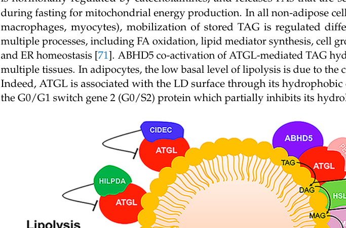

## Question

# Disease Characteristics Research Template

## Target Disease
- **Disease Name:** Neutral Lipid Storage Myopathy
- **MONDO ID:**  (if available)
- **Category:** Mendelian

## Research Objectives

Please provide a comprehensive research report on **Neutral Lipid Storage Myopathy** covering all of the
disease characteristics listed below. This report will be used to populate a disease knowledge
base entry. Be thorough and cite primary literature (PMID preferred) for all claims.

For each section, **suggested databases/resources** are listed. These are the first places
you should search for information on each topic.

---

### 1. Disease Information
> **Search first:** OMIM, Orphanet, ICD-10/ICD-11, MeSH, PubMed

- What is the disease? Provide a concise overview.
- What are the key identifiers? (OMIM, Orphanet, ICD-10/ICD-11, MeSH, Mondo)
- What are the common synonyms and alternative names?
- Is the information derived from individual patients (e.g., EHR) or aggregated disease-level resources?

### 2. Etiology

- **Disease Causal Factors**: What are the primary causes? (genetic, environmental, infectious, mechanistic)
- **Risk Factors**:
  > **Search first:** PubMed, Cochrane Library, UpToDate, clinical guidelines, ClinVar, ClinGen, GWAS Catalog, PheGenI, CTD, CDC, WHO, epidemiological databases
  - Genetic risk factors (causal variants, susceptibility loci, modifier genes)
  - Environmental risk factors (toxins, lifestyle, occupational exposures, age, sex, family history)
- **Protective Factors**:
  > **Search first:** PubMed, Cochrane Library, clinical trial databases, GWAS Catalog, gnomAD, WHO, CDC, nutrition databases
  - Genetic protective factors (protective variants, modifier alleles)
  - Environmental protective factors (diet, lifestyle, exposures that reduce risk)
- **Gene-Environment Interactions**: How do genetic and environmental factors interact to influence disease?
  > **Search first:** CTD, PubMed, PheGenI, GxE databases

### 3. Phenotypes
> **Search first:** HPO (Human Phenotype Ontology), OMIM, Orphanet, PubMed, clinicaltrials.gov, MedDRA, SNOMED CT, DECIPHER, LOINC

For each phenotype, provide:
- **Phenotype type**: symptoms, clinical signs, physical manifestations, behavioral changes, or laboratory abnormalities
  > For symptoms/signs: HPO, OMIM, Orphanet, PubMed
  > For behavioral changes: HPO, DSM, RDoC (Research Domain Criteria), PubMed
  > For laboratory abnormalities: LOINC, SNOMED CT, LabTests Online, PubMed
- **Phenotype characteristics**:
  > **Search first:** OMIM, Orphanet, HPO, PubMed
  - Age of symptom onset (neonatal, childhood, adult-onset, late-onset)
  - Symptom severity (mild, moderate, severe, variable)
  - Symptom progression (stable, progressive, episodic, fluctuating)
  - Frequency among affected individuals (percentage or qualitative)
- **Quality of life impact**: Effects on daily functioning and well-being (per-phenotype when possible)
  > **Search first:** EQ-5D database, SF-36, WHO QOL databases, PubMed
- Suggest HPO (Human Phenotype Ontology) terms for each phenotype

### 4. Genetic/Molecular Information

- **Causal Genes**: Gene mutations or chromosomal abnormalities responsible for disease (gene symbols, OMIM IDs)
  > **Search first:** OMIM, ClinVar, HGMD, Ensembl, NCBI Gene
- **Pathogenic Variants**:
  - Affected genes (gene symbols, HGNC IDs)
    > **Search first:** OMIM, NCBI Gene, Ensembl, HGNC, UniProt, GeneCards
  - Variant classification (pathogenic, likely pathogenic, VUS per ACMG/AMP guidelines)
    > **Search first:** ClinVar, ClinGen, ACMG/AMP guidelines, VarSome
  - Variant type/class (missense, frameshift, nonsense, splice-site, structural)
  - Allele frequency in population databases
    > **Search first:** gnomAD, 1000 Genomes, ExAC, TOPMed, dbSNP
  - Somatic vs germline origin
    > **Search first:** COSMIC (somatic), ClinVar, ICGC, TCGA
  - Functional consequences (loss of function, gain of function, dominant negative)
- **Modifier Genes**: Genes that modify disease severity or expression
- **Epigenetic Information**: DNA methylation, histone modifications, chromatin changes affecting disease
  > **Search first:** ENCODE, Roadmap Epigenomics, MethBase, DiseaseMeth
- **Chromosomal Abnormalities**: Large-scale genetic changes (aneuploidy, translocations, inversions)
  > **Search first:** DECIPHER, ClinVar, ECARUCA, UCSC Genome Browser

### 5. Environmental Information

- **Environmental Factors**: Non-genetic contributing factors (toxins, radiation, pollution, occupational exposure)
  > **Search first:** CTD (Comparative Toxicogenomics Database), TOXNET, PubMed, EPA databases
- **Lifestyle Factors**: Behavioral factors (smoking, diet, exercise, alcohol consumption)
  > **Search first:** CDC databases, WHO, PubMed, NHANES
- **Infectious Agents**: If applicable, pathogens causing or triggering disease (bacteria, viruses, fungi, parasites)
  > **Search first:** NCBI Taxonomy, ViPR, BV-BRC, MicrobeDB, GIDEON

### 6. Mechanism / Pathophysiology

- **Molecular Pathways**: Specific signaling cascades or biochemical pathways involved (Wnt, MAPK, mTOR, PI3K-AKT, etc.)
  > **Search first:** KEGG, Reactome, WikiPathways, PathBank, BioCyc
- **Cellular Processes**: Cell-level mechanisms (apoptosis, autophagy, cell cycle dysregulation, inflammation, etc.)
  > **Search first:** Gene Ontology (GO), Reactome, KEGG, PubMed
- **Protein Dysfunction**: How protein structure or function is altered (misfolding, aggregation, loss of function, gain of function)
  > **Search first:** UniProt, PDB (Protein Data Bank), InterPro, Pfam, AlphaFold
- **Metabolic Changes**: Alterations in metabolic processes (energy metabolism, lipid metabolism, amino acid metabolism)
  > **Search first:** KEGG, BioCyc, HMDB (Human Metabolome Database), BRENDA
- **Immune System Involvement**: Role of immune response (autoimmunity, immunodeficiency, chronic inflammation)
  > **Search first:** ImmPort, Immunome Database, IEDB, Gene Ontology
- **Tissue Damage Mechanisms**: How tissues/ are injured (oxidative stress, ischemia, fibrosis, necrosis)
  > **Search first:** PubMed, Gene Ontology, Reactome
- **Biochemical Abnormalities**: Specific molecular defects (enzyme deficiencies, receptor dysfunction, ion channel defects)
  > **Search first:** BRENDA, UniProt, KEGG, OMIM, PubMed
- **Epigenetic Changes**: DNA methylation, histone modifications affecting gene expression in disease
  > **Search first:** ENCODE, Roadmap Epigenomics, MethBase, DiseaseMeth
- **Molecular Profiling** (if available):
  - Transcriptomics/gene expression changes
    > **Search first:** GEO (Gene Expression Omnibus), ArrayExpress, GTEx, Human Cell Atlas, SRA
  - Proteomics findings
    > **Search first:** PRIDE, ProteomeXchange, Human Protein Atlas, STRING, BioGRID
  - Metabolomics signatures
    > **Search first:** MetaboLights, Metabolomics Workbench, HMDB, METLIN
  - Lipidomics alterations
    > **Search first:** LIPID MAPS, SwissLipids, LipidHome, Metabolomics Workbench
  - Genomic structural features
    > **Search first:** UCSC Genome Browser, Ensembl, NCBI, dbVar, DGV
- **Advanced Technologies** (if applicable):
  - Single-cell analysis findings (cell-type specific mechanisms, cellular heterogeneity)
    > **Search first:** Human Cell Atlas, Single Cell Portal, GEO, CELLxGENE
  - Spatial transcriptomics findings
    > **Search first:** GEO, Spatial Research, Vizgen, 10x Genomics data
  - Multi-omics integration results
    > **Search first:** TCGA, ICGC, cBioPortal, LinkedOmics, PubMed
  - Functional genomics screens (CRISPR, RNAi)
    > **Search first:** DepMap, GenomeRNAi, PubMed, BioGRID ORCS

For each mechanism, describe:
- The causal chain from initial trigger to clinical manifestation
- Which mechanisms are upstream vs downstream
- What cell types and biological processes are involved
- Suggest GO terms for biological processes and CL terms for cell types

### 7. Anatomical Structures Affected

- **Organ Level**:
  - Primary organs directly affected
  - Secondary organ involvement (complications, secondary effects)
  - Body systems involved (cardiovascular, nervous, digestive, respiratory, endocrine, etc.)
  > **Search first:** Uberon, FMA (Foundational Model of Anatomy), OMIM, HPO, ICD-11, MeSH, SNOMED CT
- **Tissue and Cell Level**:
  - Specific tissue types affected (epithelial, connective, muscle, nervous)
  - Specific cell populations targeted (with Cell Ontology terms)
  > **Search first:** Uberon, Human Protein Atlas, Cell Ontology, Human Cell Atlas, CellMarker, PanglaoDB
- **Subcellular Level**:
  - Cellular compartments involved (mitochondria, nucleus, ER, lysosomes) (with GO Cellular Component terms)
  > **Search first:** Gene Ontology (Cellular Component), UniProt, Human Protein Atlas
- **Localization**:
  - Specific anatomical sites (with UBERON terms)
    > **Search first:** FMA, Uberon, NeuroNames (for brain), SNOMED CT
  - Lateralization (unilateral, bilateral, asymmetric)
    > **Search first:** HPO, clinical literature, imaging databases

### 8. Temporal Development

- **Onset**:
  - Typical age of onset (congenital, pediatric, adult, geriatric)
  - Onset pattern (acute, subacute, chronic, insidious)
  > **Search first:** OMIM, Orphanet, HPO, PubMed
- **Progression**:
  - Disease stages (early, intermediate, advanced, end-stage)
    > **Search first:** Cancer Staging Manual (AJCC), WHO classifications, PubMed
  - Progression rate (rapid, slow, variable)
  - Disease course pattern (episodic, relapsing-remitting, progressive, stable)
  - Disease duration (self-limited, chronic lifelong)
  > **Search first:** Disease registries, longitudinal cohort databases, natural history studies, PubMed, Orphanet, OMIM
- **Patterns**:
  - Remission patterns (spontaneous, treatment-induced)
    > **Search first:** Clinical trial databases, disease registries, PubMed
  - Critical periods (time windows of vulnerability or opportunity for intervention)
    > **Search first:** PubMed, developmental biology databases, clinical guidelines

### 9. Inheritance and Population

- **Epidemiology**:
  - Prevalence (cases per 100,000 at given time)
  - Incidence (new cases per 100,000 per year)
  > **Search first:** Orphanet, CDC, WHO, GBD (Global Burden of Disease), national registries, SEER, disease registries
- **For Genetic Etiology**:
  - Inheritance pattern (AD, AR, X-linked, mitochondrial, multifactorial, polygenic)
    > **Search first:** OMIM, Orphanet, ClinVar, GTR (Genetic Testing Registry)
  - Penetrance (complete, incomplete, age-dependent)
    > **Search first:** ClinVar, OMIM, PubMed, ClinGen
  - Expressivity (variable, consistent)
    > **Search first:** OMIM, ClinVar, PubMed
  - Genetic anticipation (increasing severity in successive generations)
    > **Search first:** OMIM, PubMed (especially for repeat expansion disorders)
  - Germline mosaicism
    > **Search first:** ClinVar, OMIM, genetic counseling literature, PubMed
  - Founder effects (population-specific mutations)
    > **Search first:** gnomAD, population genetics databases, PubMed
  - Consanguinity role
    > **Search first:** OMIM, population studies, genetic counseling resources
  - Carrier frequency
    > **Search first:** gnomAD, carrier screening databases, GeneReviews, GTR
- **Population Demographics**:
  - Affected populations (ethnic or demographic groups with higher prevalence)
    > **Search first:** gnomAD, 1000 Genomes, PAGE Study, PubMed, population registries
  - Geographic distribution (endemic areas, regional variation)
    > **Search first:** WHO, CDC, GBD, Orphanet, geographic epidemiology databases
  - Geographic distribution of specific variants
  - Sex ratio (male:female)
    > **Search first:** Disease registries, OMIM, PubMed, epidemiological databases
  - Age distribution of affected individuals
    > **Search first:** CDC, disease registries, SEER, Orphanet

### 10. Diagnostics

- **Clinical Tests**:
  - Laboratory tests (blood, urine, tissue chemistry, specific enzyme assays)
    > **Search first:** LOINC, LabTests Online, PubMed
  - Biomarkers (proteins, metabolites, genetic markers, circulating biomarkers)
    > **Search first:** FDA Biomarker List, BEST (Biomarkers, EndpointS, and other Tools), PubMed
  - Imaging studies (X-ray, CT, MRI, PET, ultrasound)
    > **Search first:** RadLex, DICOM, Radiopaedia, imaging databases
  - Functional tests (pulmonary function, cardiac stress tests)
    > **Search first:** LOINC, clinical guidelines, PubMed
  - Electrophysiology (EEG, EMG, ECG, nerve conduction studies)
    > **Search first:** LOINC, clinical neurophysiology databases, PubMed
  - Biopsy findings (histopathology, immunohistochemistry)
    > **Search first:** SNOMED CT, College of American Pathologists resources, PubMed
  - Pathology findings (microscopic examination)
    > **Search first:** SNOMED CT, Digital Pathology databases, PubMed
- **Genetic Testing**:
  > **Search first:** GTR (Genetic Testing Registry), GeneReviews, ClinGen
  - Overview of recommended genetic testing approach
  - Whole genome sequencing (WGS) utility
    > **Search first:** GTR, ClinVar, GEL (Genomics England), gnomAD
  - Whole exome sequencing (WES) utility
    > **Search first:** GTR, ClinVar, OMIM, GeneMatcher
  - Gene panels (which panels, which genes)
    > **Search first:** GTR, ClinVar, laboratory-specific databases
  - Single gene testing
    > **Search first:** GTR, ClinVar, OMIM, GeneReviews
  - Chromosomal microarray (CMA)
    > **Search first:** DECIPHER, ClinVar, dbVar, ECARUCA
  - Karyotyping
    > **Search first:** Chromosome Abnormality Database, ClinVar, cytogenetics resources
  - FISH
    > **Search first:** ClinVar, cytogenetics databases, PubMed
  - Mitochondrial DNA testing
    > **Search first:** MITOMAP, MSeqDR, ClinVar, GTR
  - Repeat expansion testing
    > **Search first:** GTR, ClinVar, repeat expansion databases, PubMed
- **Omics-Based Diagnostics** (if applicable):
  - RNA sequencing / transcriptomics
    > **Search first:** GEO, ArrayExpress, GTEx, RNA-seq databases
  - Proteomics
    > **Search first:** PRIDE, ProteomeXchange, FDA Biomarker database
  - Metabolomics
    > **Search first:** MetaboLights, Metabolomics Workbench, HMDB
  - Epigenomics
    > **Search first:** GEO, ENCODE, Roadmap Epigenomics, MethBase
  - Liquid biopsy
    > **Search first:** COSMIC, ClinVar, liquid biopsy databases, PubMed
- **Clinical Criteria**:
  - Standardized diagnostic criteria (DSM, ICD, society guidelines)
    > **Search first:** DSM-5, ICD-11, clinical society guidelines, UpToDate
  - Differential diagnosis (other conditions to rule out, with distinguishing features)
    > **Search first:** DynaMed, UpToDate, clinical decision support systems
- **Screening**:
  - Screening methods for asymptomatic individuals (newborn screening, carrier screening, cascade screening)
    > **Search first:** ACMG recommendations, CDC newborn screening, GTR

### 11. Outcome/Prognosis

- **Survival and Mortality**:
  - Survival rate (5-year, 10-year, overall)
    > **Search first:** SEER, cancer registries, disease-specific registries, PubMed
  - Life expectancy (with and without treatment if applicable)
    > **Search first:** Orphanet, disease registries, actuarial databases, PubMed
  - Mortality rate
    > **Search first:** CDC, WHO, GBD, national mortality databases
  - Disease-specific mortality (deaths directly attributable to disease)
    > **Search first:** Disease registries, CDC Wonder, GBD, PubMed
- **Morbidity and Function**:
  - Morbidity (disease-related disability and health impacts)
    > **Search first:** GBD, WHO, disability databases, PubMed
  - Disability outcomes (long-term functional impairments)
    > **Search first:** ICF (International Classification of Functioning), disability registries
  - Quality of life measures (EQ-5D, SF-36, PROMIS, disease-specific tools)
    > **Search first:** EQ-5D database, SF-36, PROMIS, PubMed
- **Disease Course**:
  - Complications (secondary problems: infections, organ failure, etc.)
    > **Search first:** ICD codes, disease registries, clinical databases, PubMed
  - Recovery potential (likelihood and extent of recovery, with vs without treatment)
    > **Search first:** Natural history studies, rehabilitation databases, PubMed
- **Prediction**:
  - Prognostic factors (age, disease severity, biomarkers, treatment response)
    > **Search first:** Prognostic models databases, clinical calculators, PubMed
  - Prognostic biomarkers (molecular markers predicting disease course)
    > **Search first:** FDA Biomarker database, PubMed, cancer prognostic databases

### 12. Treatment

- **Pharmacotherapy**:
  - Pharmacological treatments (drug names, drug classes, mechanisms of action)
    > **Search first:** DrugBank, RxNorm, ATC classification, DailyMed, FDA databases
  - Pharmacogenomics (how genetic variants affect drug metabolism, efficacy, toxicity)
    > **Search first:** PharmGKB, CPIC (Clinical Pharmacogenetics), FDA Table of PGx Biomarkers
- **Advanced Therapeutics**:
  - Gene therapy (viral vectors, CRISPR, gene replacement, gene editing)
    > **Search first:** ClinicalTrials.gov, FDA gene therapy database, ASGCT resources
  - Cell therapy (stem cell transplant, CAR-T, cellular therapeutics)
    > **Search first:** ClinicalTrials.gov, FDA cell therapy database, FACT standards
  - RNA-based therapies (ASOs, siRNA, mRNA therapies)
    > **Search first:** ClinicalTrials.gov, FDA approvals, PubMed
  - Targeted therapies (treatments directed at specific molecular targets)
    > **Search first:** My Cancer Genome, OncoKB, ClinicalTrials.gov, FDA approvals
  - Immunotherapies (checkpoint inhibitors, monoclonal antibodies)
    > **Search first:** Cancer Immunotherapy Database, FDA approvals, ClinicalTrials.gov
- **Surgical and Interventional**:
  - Surgical interventions (types of surgery, timing, outcomes)
    > **Search first:** CPT codes, surgical registries, clinical guidelines, PubMed
- **Supportive and Rehabilitative**:
  - Supportive care (symptom management, pain control, nutrition)
    > **Search first:** Clinical guidelines, Cochrane Library, PubMed
  - Rehabilitation (physical therapy, occupational therapy, speech therapy)
    > **Search first:** Rehabilitation medicine databases, clinical guidelines, PubMed
- **Experimental**:
  - Experimental treatments in clinical trials (with NCT identifiers if available)
    > **Search first:** ClinicalTrials.gov, EU Clinical Trials Register, WHO ICTRP
- **Treatment Outcomes**:
  - Treatment response rates
    > **Search first:** Clinical trial databases, FDA reviews, systematic reviews, PubMed
  - Side effects and adverse events
    > **Search first:** FDA Adverse Event Reporting System (FAERS), MedWatch, PubMed
- **Treatment Strategy**:
  - Treatment algorithms (clinical pathways, decision trees)
    > **Search first:** Clinical practice guidelines, NCCN Guidelines, UpToDate
  - Combination therapies
    > **Search first:** ClinicalTrials.gov, treatment guidelines, PubMed
  - Personalized medicine approaches (genotype-guided treatment)
    > **Search first:** My Cancer Genome, CIViC, PharmGKB, precision medicine databases

For each treatment, suggest MAXO (Medical Action Ontology) terms where applicable.

### 13. Prevention

- **Prevention Levels**:
  - Primary prevention (preventing disease occurrence: vaccination, risk factor modification)
    > **Search first:** CDC, WHO, USPSTF recommendations, Cochrane Library
  - Secondary prevention (early detection and treatment: screening programs, early intervention)
    > **Search first:** USPSTF, CDC screening guidelines, WHO
  - Tertiary prevention (preventing complications in those with disease)
    > **Search first:** Clinical guidelines, disease management protocols, PubMed
- **Immunization**: Vaccine strategies (if applicable)
  > **Search first:** CDC vaccine schedules, WHO immunization, FDA vaccine database
- **Screening and Early Detection**:
  - Screening programs (population-based: newborn screening, cancer screening)
    > **Search first:** CDC screening programs, USPSTF, cancer screening databases
  - Genetic screening (carrier screening, preimplantation genetic diagnosis, prenatal testing)
    > **Search first:** ACMG recommendations, ACOG guidelines, GTR
  - Risk stratification (identifying high-risk individuals for targeted prevention)
    > **Search first:** Risk prediction models, clinical calculators, PubMed
- **Behavioral Interventions**: Lifestyle modifications to reduce risk
  > **Search first:** CDC, WHO, behavioral intervention databases, Cochrane Library
- **Counseling**: Genetic counseling (risk assessment, family planning guidance)
  > **Search first:** NSGC resources, ACMG guidelines, GeneReviews
- **Public Health**:
  - Public health interventions (sanitation, vector control, health education)
    > **Search first:** CDC, WHO, public health databases, PubMed
  - Environmental interventions (reducing environmental risk factors)
    > **Search first:** EPA databases, WHO environmental health, PubMed
- **Prophylaxis**: Preventive medications or procedures
  > **Search first:** Clinical guidelines, FDA approvals, PubMed

### 14. Other Species / Natural Disease

- **Taxonomy**: Species affected (with NCBI Taxon identifiers)
  > **Search first:** NCBI Taxonomy
- **Breed**: Specific breeds affected (with VBO identifiers if applicable)
  > **Search first:** VBO (Vertebrate Breed Ontology)
- **Gene**: Orthologous genes in other species (with NCBI Gene IDs)
  > **Search first:** NCBI Gene
- **Natural Disease**:
  - Naturally occurring disease in other species (companion animals, wildlife)
    > **Search first:** OMIA (Online Mendelian Inheritance in Animals), VetCompass, PubMed
  - Veterinary relevance and importance in animal health
    > **Search first:** OMIA, veterinary databases, PubMed
- **Comparative Biology**:
  - Comparative pathology (similarities and differences across species)
    > **Search first:** OMIA, comparative pathology databases, PubMed
  - Evolutionary conservation of disease mechanisms
    > **Search first:** HomoloGene, OrthoMCL, Alliance of Genome Resources
- **Transmission** (if applicable):
  - Zoonotic potential
    > **Search first:** CDC zoonotic diseases, WHO zoonoses, GIDEON
  - Cross-species susceptibility
    > **Search first:** NCBI Taxonomy, veterinary databases, PubMed

### 15. Model Organisms

- **Model Types**:
  - Model organism type (mammalian, invertebrate, cellular, in vitro)
    > **Search first:** Alliance of Genome Resources, model organism databases
  - Specific model systems (mouse, rat, zebrafish, Drosophila, C. elegans, yeast, cell lines, organoids, iPSCs)
    > **Search first:** MGI, RGD, ZFIN, FlyBase, WormBase, SGD, ATCC, Cellosaurus
  - Induced models (drug treatment, surgical intervention, environmental manipulation)
    > **Search first:** MGI, model organism databases, PubMed
- **Genetic Models**:
  - Types available (knockout, knock-in, transgenic, conditional, humanized)
    > **Search first:** MGI, IMPC, KOMP, EuMMCR, IMSR
- **Model Characteristics**:
  - Phenotype recapitulation (how well model reproduces human disease features)
    > **Search first:** Model organism databases, comparative studies, PubMed
  - Model limitations (aspects of human disease not captured)
    > **Search first:** Model organism databases, PubMed, review articles
- **Applications**:
  - Research applications (what aspects of disease can be studied)
    > **Search first:** Model organism databases, PubMed
- **Resources**:
  - Model databases
    > **Search first:** MGI, RGD, ZFIN, FlyBase, WormBase, IMSR, EMMA, MMRRC

---

## Citation Requirements

- Cite primary literature (PMID preferred) for all mechanistic and clinical claims
- Prioritize recent reviews and landmark papers
- Include direct quotes from abstracts where possible to support key statements
- Distinguish evidence source types: human clinical, model organism, in vitro, computational

## Output Format

Structure your response as a comprehensive narrative organized by the sections above.
For each section, provide:
- Factual content with specific details (numbers, percentages, gene names, variant nomenclature)
- Ontology term suggestions (HPO, GO, CL, UBERON, CHEBI, MAXO, MONDO) where applicable
- Evidence citations with PMIDs
- Direct quotes from abstracts to support key claims
- Clear indication when information is not available or not applicable for this disease

This report will be used to populate a disease knowledge base entry with:
- Pathophysiology descriptions with causal chains
- Gene/protein annotations (HGNC, GO terms)
- Phenotype associations (HP terms) with frequencies
- Cell type involvement (CL terms)
- Anatomical locations (UBERON terms)
- Chemical entities (CHEBI terms)
- Treatment annotations (MAXO terms)
- Evidence items with PMIDs and exact abstract quotes
- Epidemiology, prognosis, diagnostic, and prevention information
- Animal model descriptions with phenotype recapitulation details

## Output

Question: You are an expert researcher providing comprehensive, well-cited information.

Provide detailed information focusing on:
1. Key concepts and definitions with current understanding
2. Recent developments and latest research (prioritize 2023-2024 sources)
3. Current applications and real-world implementations
4. Expert opinions and analysis from authoritative sources
5. Relevant statistics and data from recent studies

Format as a comprehensive research report with proper citations. Include URLs and publication dates where available.
Always prioritize recent, authoritative sources and provide specific citations for all major claims.

# Disease Characteristics Research Template

## Target Disease
- **Disease Name:** Neutral Lipid Storage Myopathy
- **MONDO ID:**  (if available)
- **Category:** Mendelian

## Research Objectives

Please provide a comprehensive research report on **Neutral Lipid Storage Myopathy** covering all of the
disease characteristics listed below. This report will be used to populate a disease knowledge
base entry. Be thorough and cite primary literature (PMID preferred) for all claims.

For each section, **suggested databases/resources** are listed. These are the first places
you should search for information on each topic.

---

### 1. Disease Information
> **Search first:** OMIM, Orphanet, ICD-10/ICD-11, MeSH, PubMed

- What is the disease? Provide a concise overview.
- What are the key identifiers? (OMIM, Orphanet, ICD-10/ICD-11, MeSH, Mondo)
- What are the common synonyms and alternative names?
- Is the information derived from individual patients (e.g., EHR) or aggregated disease-level resources?

### 2. Etiology

- **Disease Causal Factors**: What are the primary causes? (genetic, environmental, infectious, mechanistic)
- **Risk Factors**:
  > **Search first:** PubMed, Cochrane Library, UpToDate, clinical guidelines, ClinVar, ClinGen, GWAS Catalog, PheGenI, CTD, CDC, WHO, epidemiological databases
  - Genetic risk factors (causal variants, susceptibility loci, modifier genes)
  - Environmental risk factors (toxins, lifestyle, occupational exposures, age, sex, family history)
- **Protective Factors**:
  > **Search first:** PubMed, Cochrane Library, clinical trial databases, GWAS Catalog, gnomAD, WHO, CDC, nutrition databases
  - Genetic protective factors (protective variants, modifier alleles)
  - Environmental protective factors (diet, lifestyle, exposures that reduce risk)
- **Gene-Environment Interactions**: How do genetic and environmental factors interact to influence disease?
  > **Search first:** CTD, PubMed, PheGenI, GxE databases

### 3. Phenotypes
> **Search first:** HPO (Human Phenotype Ontology), OMIM, Orphanet, PubMed, clinicaltrials.gov, MedDRA, SNOMED CT, DECIPHER, LOINC

For each phenotype, provide:
- **Phenotype type**: symptoms, clinical signs, physical manifestations, behavioral changes, or laboratory abnormalities
  > For symptoms/signs: HPO, OMIM, Orphanet, PubMed
  > For behavioral changes: HPO, DSM, RDoC (Research Domain Criteria), PubMed
  > For laboratory abnormalities: LOINC, SNOMED CT, LabTests Online, PubMed
- **Phenotype characteristics**:
  > **Search first:** OMIM, Orphanet, HPO, PubMed
  - Age of symptom onset (neonatal, childhood, adult-onset, late-onset)
  - Symptom severity (mild, moderate, severe, variable)
  - Symptom progression (stable, progressive, episodic, fluctuating)
  - Frequency among affected individuals (percentage or qualitative)
- **Quality of life impact**: Effects on daily functioning and well-being (per-phenotype when possible)
  > **Search first:** EQ-5D database, SF-36, WHO QOL databases, PubMed
- Suggest HPO (Human Phenotype Ontology) terms for each phenotype

### 4. Genetic/Molecular Information

- **Causal Genes**: Gene mutations or chromosomal abnormalities responsible for disease (gene symbols, OMIM IDs)
  > **Search first:** OMIM, ClinVar, HGMD, Ensembl, NCBI Gene
- **Pathogenic Variants**:
  - Affected genes (gene symbols, HGNC IDs)
    > **Search first:** OMIM, NCBI Gene, Ensembl, HGNC, UniProt, GeneCards
  - Variant classification (pathogenic, likely pathogenic, VUS per ACMG/AMP guidelines)
    > **Search first:** ClinVar, ClinGen, ACMG/AMP guidelines, VarSome
  - Variant type/class (missense, frameshift, nonsense, splice-site, structural)
  - Allele frequency in population databases
    > **Search first:** gnomAD, 1000 Genomes, ExAC, TOPMed, dbSNP
  - Somatic vs germline origin
    > **Search first:** COSMIC (somatic), ClinVar, ICGC, TCGA
  - Functional consequences (loss of function, gain of function, dominant negative)
- **Modifier Genes**: Genes that modify disease severity or expression
- **Epigenetic Information**: DNA methylation, histone modifications, chromatin changes affecting disease
  > **Search first:** ENCODE, Roadmap Epigenomics, MethBase, DiseaseMeth
- **Chromosomal Abnormalities**: Large-scale genetic changes (aneuploidy, translocations, inversions)
  > **Search first:** DECIPHER, ClinVar, ECARUCA, UCSC Genome Browser

### 5. Environmental Information

- **Environmental Factors**: Non-genetic contributing factors (toxins, radiation, pollution, occupational exposure)
  > **Search first:** CTD (Comparative Toxicogenomics Database), TOXNET, PubMed, EPA databases
- **Lifestyle Factors**: Behavioral factors (smoking, diet, exercise, alcohol consumption)
  > **Search first:** CDC databases, WHO, PubMed, NHANES
- **Infectious Agents**: If applicable, pathogens causing or triggering disease (bacteria, viruses, fungi, parasites)
  > **Search first:** NCBI Taxonomy, ViPR, BV-BRC, MicrobeDB, GIDEON

### 6. Mechanism / Pathophysiology

- **Molecular Pathways**: Specific signaling cascades or biochemical pathways involved (Wnt, MAPK, mTOR, PI3K-AKT, etc.)
  > **Search first:** KEGG, Reactome, WikiPathways, PathBank, BioCyc
- **Cellular Processes**: Cell-level mechanisms (apoptosis, autophagy, cell cycle dysregulation, inflammation, etc.)
  > **Search first:** Gene Ontology (GO), Reactome, KEGG, PubMed
- **Protein Dysfunction**: How protein structure or function is altered (misfolding, aggregation, loss of function, gain of function)
  > **Search first:** UniProt, PDB (Protein Data Bank), InterPro, Pfam, AlphaFold
- **Metabolic Changes**: Alterations in metabolic processes (energy metabolism, lipid metabolism, amino acid metabolism)
  > **Search first:** KEGG, BioCyc, HMDB (Human Metabolome Database), BRENDA
- **Immune System Involvement**: Role of immune response (autoimmunity, immunodeficiency, chronic inflammation)
  > **Search first:** ImmPort, Immunome Database, IEDB, Gene Ontology
- **Tissue Damage Mechanisms**: How tissues/ are injured (oxidative stress, ischemia, fibrosis, necrosis)
  > **Search first:** PubMed, Gene Ontology, Reactome
- **Biochemical Abnormalities**: Specific molecular defects (enzyme deficiencies, receptor dysfunction, ion channel defects)
  > **Search first:** BRENDA, UniProt, KEGG, OMIM, PubMed
- **Epigenetic Changes**: DNA methylation, histone modifications affecting gene expression in disease
  > **Search first:** ENCODE, Roadmap Epigenomics, MethBase, DiseaseMeth
- **Molecular Profiling** (if available):
  - Transcriptomics/gene expression changes
    > **Search first:** GEO (Gene Expression Omnibus), ArrayExpress, GTEx, Human Cell Atlas, SRA
  - Proteomics findings
    > **Search first:** PRIDE, ProteomeXchange, Human Protein Atlas, STRING, BioGRID
  - Metabolomics signatures
    > **Search first:** MetaboLights, Metabolomics Workbench, HMDB, METLIN
  - Lipidomics alterations
    > **Search first:** LIPID MAPS, SwissLipids, LipidHome, Metabolomics Workbench
  - Genomic structural features
    > **Search first:** UCSC Genome Browser, Ensembl, NCBI, dbVar, DGV
- **Advanced Technologies** (if applicable):
  - Single-cell analysis findings (cell-type specific mechanisms, cellular heterogeneity)
    > **Search first:** Human Cell Atlas, Single Cell Portal, GEO, CELLxGENE
  - Spatial transcriptomics findings
    > **Search first:** GEO, Spatial Research, Vizgen, 10x Genomics data
  - Multi-omics integration results
    > **Search first:** TCGA, ICGC, cBioPortal, LinkedOmics, PubMed
  - Functional genomics screens (CRISPR, RNAi)
    > **Search first:** DepMap, GenomeRNAi, PubMed, BioGRID ORCS

For each mechanism, describe:
- The causal chain from initial trigger to clinical manifestation
- Which mechanisms are upstream vs downstream
- What cell types and biological processes are involved
- Suggest GO terms for biological processes and CL terms for cell types

### 7. Anatomical Structures Affected

- **Organ Level**:
  - Primary organs directly affected
  - Secondary organ involvement (complications, secondary effects)
  - Body systems involved (cardiovascular, nervous, digestive, respiratory, endocrine, etc.)
  > **Search first:** Uberon, FMA (Foundational Model of Anatomy), OMIM, HPO, ICD-11, MeSH, SNOMED CT
- **Tissue and Cell Level**:
  - Specific tissue types affected (epithelial, connective, muscle, nervous)
  - Specific cell populations targeted (with Cell Ontology terms)
  > **Search first:** Uberon, Human Protein Atlas, Cell Ontology, Human Cell Atlas, CellMarker, PanglaoDB
- **Subcellular Level**:
  - Cellular compartments involved (mitochondria, nucleus, ER, lysosomes) (with GO Cellular Component terms)
  > **Search first:** Gene Ontology (Cellular Component), UniProt, Human Protein Atlas
- **Localization**:
  - Specific anatomical sites (with UBERON terms)
    > **Search first:** FMA, Uberon, NeuroNames (for brain), SNOMED CT
  - Lateralization (unilateral, bilateral, asymmetric)
    > **Search first:** HPO, clinical literature, imaging databases

### 8. Temporal Development

- **Onset**:
  - Typical age of onset (congenital, pediatric, adult, geriatric)
  - Onset pattern (acute, subacute, chronic, insidious)
  > **Search first:** OMIM, Orphanet, HPO, PubMed
- **Progression**:
  - Disease stages (early, intermediate, advanced, end-stage)
    > **Search first:** Cancer Staging Manual (AJCC), WHO classifications, PubMed
  - Progression rate (rapid, slow, variable)
  - Disease course pattern (episodic, relapsing-remitting, progressive, stable)
  - Disease duration (self-limited, chronic lifelong)
  > **Search first:** Disease registries, longitudinal cohort databases, natural history studies, PubMed, Orphanet, OMIM
- **Patterns**:
  - Remission patterns (spontaneous, treatment-induced)
    > **Search first:** Clinical trial databases, disease registries, PubMed
  - Critical periods (time windows of vulnerability or opportunity for intervention)
    > **Search first:** PubMed, developmental biology databases, clinical guidelines

### 9. Inheritance and Population

- **Epidemiology**:
  - Prevalence (cases per 100,000 at given time)
  - Incidence (new cases per 100,000 per year)
  > **Search first:** Orphanet, CDC, WHO, GBD (Global Burden of Disease), national registries, SEER, disease registries
- **For Genetic Etiology**:
  - Inheritance pattern (AD, AR, X-linked, mitochondrial, multifactorial, polygenic)
    > **Search first:** OMIM, Orphanet, ClinVar, GTR (Genetic Testing Registry)
  - Penetrance (complete, incomplete, age-dependent)
    > **Search first:** ClinVar, OMIM, PubMed, ClinGen
  - Expressivity (variable, consistent)
    > **Search first:** OMIM, ClinVar, PubMed
  - Genetic anticipation (increasing severity in successive generations)
    > **Search first:** OMIM, PubMed (especially for repeat expansion disorders)
  - Germline mosaicism
    > **Search first:** ClinVar, OMIM, genetic counseling literature, PubMed
  - Founder effects (population-specific mutations)
    > **Search first:** gnomAD, population genetics databases, PubMed
  - Consanguinity role
    > **Search first:** OMIM, population studies, genetic counseling resources
  - Carrier frequency
    > **Search first:** gnomAD, carrier screening databases, GeneReviews, GTR
- **Population Demographics**:
  - Affected populations (ethnic or demographic groups with higher prevalence)
    > **Search first:** gnomAD, 1000 Genomes, PAGE Study, PubMed, population registries
  - Geographic distribution (endemic areas, regional variation)
    > **Search first:** WHO, CDC, GBD, Orphanet, geographic epidemiology databases
  - Geographic distribution of specific variants
  - Sex ratio (male:female)
    > **Search first:** Disease registries, OMIM, PubMed, epidemiological databases
  - Age distribution of affected individuals
    > **Search first:** CDC, disease registries, SEER, Orphanet

### 10. Diagnostics

- **Clinical Tests**:
  - Laboratory tests (blood, urine, tissue chemistry, specific enzyme assays)
    > **Search first:** LOINC, LabTests Online, PubMed
  - Biomarkers (proteins, metabolites, genetic markers, circulating biomarkers)
    > **Search first:** FDA Biomarker List, BEST (Biomarkers, EndpointS, and other Tools), PubMed
  - Imaging studies (X-ray, CT, MRI, PET, ultrasound)
    > **Search first:** RadLex, DICOM, Radiopaedia, imaging databases
  - Functional tests (pulmonary function, cardiac stress tests)
    > **Search first:** LOINC, clinical guidelines, PubMed
  - Electrophysiology (EEG, EMG, ECG, nerve conduction studies)
    > **Search first:** LOINC, clinical neurophysiology databases, PubMed
  - Biopsy findings (histopathology, immunohistochemistry)
    > **Search first:** SNOMED CT, College of American Pathologists resources, PubMed
  - Pathology findings (microscopic examination)
    > **Search first:** SNOMED CT, Digital Pathology databases, PubMed
- **Genetic Testing**:
  > **Search first:** GTR (Genetic Testing Registry), GeneReviews, ClinGen
  - Overview of recommended genetic testing approach
  - Whole genome sequencing (WGS) utility
    > **Search first:** GTR, ClinVar, GEL (Genomics England), gnomAD
  - Whole exome sequencing (WES) utility
    > **Search first:** GTR, ClinVar, OMIM, GeneMatcher
  - Gene panels (which panels, which genes)
    > **Search first:** GTR, ClinVar, laboratory-specific databases
  - Single gene testing
    > **Search first:** GTR, ClinVar, OMIM, GeneReviews
  - Chromosomal microarray (CMA)
    > **Search first:** DECIPHER, ClinVar, dbVar, ECARUCA
  - Karyotyping
    > **Search first:** Chromosome Abnormality Database, ClinVar, cytogenetics resources
  - FISH
    > **Search first:** ClinVar, cytogenetics databases, PubMed
  - Mitochondrial DNA testing
    > **Search first:** MITOMAP, MSeqDR, ClinVar, GTR
  - Repeat expansion testing
    > **Search first:** GTR, ClinVar, repeat expansion databases, PubMed
- **Omics-Based Diagnostics** (if applicable):
  - RNA sequencing / transcriptomics
    > **Search first:** GEO, ArrayExpress, GTEx, RNA-seq databases
  - Proteomics
    > **Search first:** PRIDE, ProteomeXchange, FDA Biomarker database
  - Metabolomics
    > **Search first:** MetaboLights, Metabolomics Workbench, HMDB
  - Epigenomics
    > **Search first:** GEO, ENCODE, Roadmap Epigenomics, MethBase
  - Liquid biopsy
    > **Search first:** COSMIC, ClinVar, liquid biopsy databases, PubMed
- **Clinical Criteria**:
  - Standardized diagnostic criteria (DSM, ICD, society guidelines)
    > **Search first:** DSM-5, ICD-11, clinical society guidelines, UpToDate
  - Differential diagnosis (other conditions to rule out, with distinguishing features)
    > **Search first:** DynaMed, UpToDate, clinical decision support systems
- **Screening**:
  - Screening methods for asymptomatic individuals (newborn screening, carrier screening, cascade screening)
    > **Search first:** ACMG recommendations, CDC newborn screening, GTR

### 11. Outcome/Prognosis

- **Survival and Mortality**:
  - Survival rate (5-year, 10-year, overall)
    > **Search first:** SEER, cancer registries, disease-specific registries, PubMed
  - Life expectancy (with and without treatment if applicable)
    > **Search first:** Orphanet, disease registries, actuarial databases, PubMed
  - Mortality rate
    > **Search first:** CDC, WHO, GBD, national mortality databases
  - Disease-specific mortality (deaths directly attributable to disease)
    > **Search first:** Disease registries, CDC Wonder, GBD, PubMed
- **Morbidity and Function**:
  - Morbidity (disease-related disability and health impacts)
    > **Search first:** GBD, WHO, disability databases, PubMed
  - Disability outcomes (long-term functional impairments)
    > **Search first:** ICF (International Classification of Functioning), disability registries
  - Quality of life measures (EQ-5D, SF-36, PROMIS, disease-specific tools)
    > **Search first:** EQ-5D database, SF-36, PROMIS, PubMed
- **Disease Course**:
  - Complications (secondary problems: infections, organ failure, etc.)
    > **Search first:** ICD codes, disease registries, clinical databases, PubMed
  - Recovery potential (likelihood and extent of recovery, with vs without treatment)
    > **Search first:** Natural history studies, rehabilitation databases, PubMed
- **Prediction**:
  - Prognostic factors (age, disease severity, biomarkers, treatment response)
    > **Search first:** Prognostic models databases, clinical calculators, PubMed
  - Prognostic biomarkers (molecular markers predicting disease course)
    > **Search first:** FDA Biomarker database, PubMed, cancer prognostic databases

### 12. Treatment

- **Pharmacotherapy**:
  - Pharmacological treatments (drug names, drug classes, mechanisms of action)
    > **Search first:** DrugBank, RxNorm, ATC classification, DailyMed, FDA databases
  - Pharmacogenomics (how genetic variants affect drug metabolism, efficacy, toxicity)
    > **Search first:** PharmGKB, CPIC (Clinical Pharmacogenetics), FDA Table of PGx Biomarkers
- **Advanced Therapeutics**:
  - Gene therapy (viral vectors, CRISPR, gene replacement, gene editing)
    > **Search first:** ClinicalTrials.gov, FDA gene therapy database, ASGCT resources
  - Cell therapy (stem cell transplant, CAR-T, cellular therapeutics)
    > **Search first:** ClinicalTrials.gov, FDA cell therapy database, FACT standards
  - RNA-based therapies (ASOs, siRNA, mRNA therapies)
    > **Search first:** ClinicalTrials.gov, FDA approvals, PubMed
  - Targeted therapies (treatments directed at specific molecular targets)
    > **Search first:** My Cancer Genome, OncoKB, ClinicalTrials.gov, FDA approvals
  - Immunotherapies (checkpoint inhibitors, monoclonal antibodies)
    > **Search first:** Cancer Immunotherapy Database, FDA approvals, ClinicalTrials.gov
- **Surgical and Interventional**:
  - Surgical interventions (types of surgery, timing, outcomes)
    > **Search first:** CPT codes, surgical registries, clinical guidelines, PubMed
- **Supportive and Rehabilitative**:
  - Supportive care (symptom management, pain control, nutrition)
    > **Search first:** Clinical guidelines, Cochrane Library, PubMed
  - Rehabilitation (physical therapy, occupational therapy, speech therapy)
    > **Search first:** Rehabilitation medicine databases, clinical guidelines, PubMed
- **Experimental**:
  - Experimental treatments in clinical trials (with NCT identifiers if available)
    > **Search first:** ClinicalTrials.gov, EU Clinical Trials Register, WHO ICTRP
- **Treatment Outcomes**:
  - Treatment response rates
    > **Search first:** Clinical trial databases, FDA reviews, systematic reviews, PubMed
  - Side effects and adverse events
    > **Search first:** FDA Adverse Event Reporting System (FAERS), MedWatch, PubMed
- **Treatment Strategy**:
  - Treatment algorithms (clinical pathways, decision trees)
    > **Search first:** Clinical practice guidelines, NCCN Guidelines, UpToDate
  - Combination therapies
    > **Search first:** ClinicalTrials.gov, treatment guidelines, PubMed
  - Personalized medicine approaches (genotype-guided treatment)
    > **Search first:** My Cancer Genome, CIViC, PharmGKB, precision medicine databases

For each treatment, suggest MAXO (Medical Action Ontology) terms where applicable.

### 13. Prevention

- **Prevention Levels**:
  - Primary prevention (preventing disease occurrence: vaccination, risk factor modification)
    > **Search first:** CDC, WHO, USPSTF recommendations, Cochrane Library
  - Secondary prevention (early detection and treatment: screening programs, early intervention)
    > **Search first:** USPSTF, CDC screening guidelines, WHO
  - Tertiary prevention (preventing complications in those with disease)
    > **Search first:** Clinical guidelines, disease management protocols, PubMed
- **Immunization**: Vaccine strategies (if applicable)
  > **Search first:** CDC vaccine schedules, WHO immunization, FDA vaccine database
- **Screening and Early Detection**:
  - Screening programs (population-based: newborn screening, cancer screening)
    > **Search first:** CDC screening programs, USPSTF, cancer screening databases
  - Genetic screening (carrier screening, preimplantation genetic diagnosis, prenatal testing)
    > **Search first:** ACMG recommendations, ACOG guidelines, GTR
  - Risk stratification (identifying high-risk individuals for targeted prevention)
    > **Search first:** Risk prediction models, clinical calculators, PubMed
- **Behavioral Interventions**: Lifestyle modifications to reduce risk
  > **Search first:** CDC, WHO, behavioral intervention databases, Cochrane Library
- **Counseling**: Genetic counseling (risk assessment, family planning guidance)
  > **Search first:** NSGC resources, ACMG guidelines, GeneReviews
- **Public Health**:
  - Public health interventions (sanitation, vector control, health education)
    > **Search first:** CDC, WHO, public health databases, PubMed
  - Environmental interventions (reducing environmental risk factors)
    > **Search first:** EPA databases, WHO environmental health, PubMed
- **Prophylaxis**: Preventive medications or procedures
  > **Search first:** Clinical guidelines, FDA approvals, PubMed

### 14. Other Species / Natural Disease

- **Taxonomy**: Species affected (with NCBI Taxon identifiers)
  > **Search first:** NCBI Taxonomy
- **Breed**: Specific breeds affected (with VBO identifiers if applicable)
  > **Search first:** VBO (Vertebrate Breed Ontology)
- **Gene**: Orthologous genes in other species (with NCBI Gene IDs)
  > **Search first:** NCBI Gene
- **Natural Disease**:
  - Naturally occurring disease in other species (companion animals, wildlife)
    > **Search first:** OMIA (Online Mendelian Inheritance in Animals), VetCompass, PubMed
  - Veterinary relevance and importance in animal health
    > **Search first:** OMIA, veterinary databases, PubMed
- **Comparative Biology**:
  - Comparative pathology (similarities and differences across species)
    > **Search first:** OMIA, comparative pathology databases, PubMed
  - Evolutionary conservation of disease mechanisms
    > **Search first:** HomoloGene, OrthoMCL, Alliance of Genome Resources
- **Transmission** (if applicable):
  - Zoonotic potential
    > **Search first:** CDC zoonotic diseases, WHO zoonoses, GIDEON
  - Cross-species susceptibility
    > **Search first:** NCBI Taxonomy, veterinary databases, PubMed

### 15. Model Organisms

- **Model Types**:
  - Model organism type (mammalian, invertebrate, cellular, in vitro)
    > **Search first:** Alliance of Genome Resources, model organism databases
  - Specific model systems (mouse, rat, zebrafish, Drosophila, C. elegans, yeast, cell lines, organoids, iPSCs)
    > **Search first:** MGI, RGD, ZFIN, FlyBase, WormBase, SGD, ATCC, Cellosaurus
  - Induced models (drug treatment, surgical intervention, environmental manipulation)
    > **Search first:** MGI, model organism databases, PubMed
- **Genetic Models**:
  - Types available (knockout, knock-in, transgenic, conditional, humanized)
    > **Search first:** MGI, IMPC, KOMP, EuMMCR, IMSR
- **Model Characteristics**:
  - Phenotype recapitulation (how well model reproduces human disease features)
    > **Search first:** Model organism databases, comparative studies, PubMed
  - Model limitations (aspects of human disease not captured)
    > **Search first:** Model organism databases, PubMed, review articles
- **Applications**:
  - Research applications (what aspects of disease can be studied)
    > **Search first:** Model organism databases, PubMed
- **Resources**:
  - Model databases
    > **Search first:** MGI, RGD, ZFIN, FlyBase, WormBase, IMSR, EMMA, MMRRC

---

## Citation Requirements

- Cite primary literature (PMID preferred) for all mechanistic and clinical claims
- Prioritize recent reviews and landmark papers
- Include direct quotes from abstracts where possible to support key statements
- Distinguish evidence source types: human clinical, model organism, in vitro, computational

## Output Format

Structure your response as a comprehensive narrative organized by the sections above.
For each section, provide:
- Factual content with specific details (numbers, percentages, gene names, variant nomenclature)
- Ontology term suggestions (HPO, GO, CL, UBERON, CHEBI, MAXO, MONDO) where applicable
- Evidence citations with PMIDs
- Direct quotes from abstracts to support key claims
- Clear indication when information is not available or not applicable for this disease

This report will be used to populate a disease knowledge base entry with:
- Pathophysiology descriptions with causal chains
- Gene/protein annotations (HGNC, GO terms)
- Phenotype associations (HP terms) with frequencies
- Cell type involvement (CL terms)
- Anatomical locations (UBERON terms)
- Chemical entities (CHEBI terms)
- Treatment annotations (MAXO terms)
- Evidence items with PMIDs and exact abstract quotes
- Epidemiology, prognosis, diagnostic, and prevention information
- Animal model descriptions with phenotype recapitulation details

# Neutral Lipid Storage Myopathy (NLSM / NLSDM) — Comprehensive Disease Characteristics Report

## Executive Summary
Neutral lipid storage myopathy (commonly referred to as **neutral lipid storage disease with myopathy; NLSDM/NLSD‑M**) is a **rare autosomal recessive lipid droplet disorder** caused by **biallelic PNPLA2 (ATGL) loss-of-function** leading to impaired intracellular triglyceride hydrolysis, **accumulation of neutral lipids in multiple tissues**, and progressive skeletal myopathy frequently complicated by cardiomyopathy. Cohort studies show marked phenotypic heterogeneity, long diagnostic delays, and a spectrum ranging from isolated hyperCKemia to severe cardiomyopathy. (pennisi2017neutrallipidstorage pages 1-2, zhang2019neutrallipidstorage pages 1-2, missaglia2019neutrallipidstorage pages 3-6, pennisi2017neutrallipidstorage pages 2-3)

A compact curation-ready summary table is provided below.

| Knowledge-base field | Summary | Best supporting citations |
|---|---|---|
| Disease name / synonyms | Neutral lipid storage myopathy; neutral lipid storage disease with myopathy; NLSDM; NLSD-M; NLSM | (pennisi2017neutrallipidstorage pages 1-2, wang2024dilatedcardiomyopathycaused pages 1-2, landim2023neutrallipidstorage pages 1-2) |
| Key identifiers | MONDO: MONDO_0012545; OMIM/MIM: #610717 | (OpenTargets Search: Neutral lipid storage myopathy, wang2024dilatedcardiomyopathycaused pages 1-2) |
| Causal gene | **PNPLA2** encodes adipose triglyceride lipase (ATGL), the rate-limiting intracellular triglyceride lipase | (missaglia2019neutrallipidstorage pages 3-6, wang2024dilatedcardiomyopathycaused pages 2-4) |
| Inheritance | Autosomal recessive; affected individuals typically have biallelic PNPLA2 variants, while heterozygous relatives may be unaffected | (landim2023neutrallipidstorage pages 1-2, wang2024dilatedcardiomyopathycaused pages 2-4) |
| Core pathobiology | Defective ATGL-mediated TAG hydrolysis causes cytosolic lipid-droplet accumulation in skeletal muscle, heart, and other tissues, with downstream lipotoxicity, impaired FA signaling/PPARα activation, and mitochondrial dysfunction | (kanti2022adiposetriglyceridelipase–mediated pages 1-2, wang2024dilatedcardiomyopathycaused pages 2-4, missaglia2019neutrallipidstorage pages 1-3) |
| Typical onset | Usually adult onset around the 3rd–4th decade / early 30s, but onset can range from childhood to late adulthood; asymptomatic hyperCKemia may precede weakness | (landim2023neutrallipidstorage pages 1-2, zhang2019neutrallipidstorage pages 1-2, pennisi2017neutrallipidstorage pages 2-3) |
| Major skeletal-muscle phenotype | Progressive proximal-predominant weakness and atrophy; fatigue in 100% and myalgia/cramps in 50% in one Italian cohort; distal muscles often involved later | (pennisi2017neutrallipidstorage pages 2-3, pennisi2017neutrallipidstorage pages 5-7) |
| Cardiac involvement | Cardiomyopathy in ~40% of 55 reported patients in one review; 40%–50% cited in recent review; Chinese cohort: pure cardiomyopathy 4/45 (8.9%), combined skeletal + cardiomyopathy 21/45 (46.7%) | (missaglia2019neutrallipidstorage pages 3-6, wang2024dilatedcardiomyopathycaused pages 1-2, zhang2019neutrallipidstorage pages 1-2) |
| Other systemic features | Hepatomegaly/liver involvement ~20% in one review; mild hyperglycemia 4/15 and triglyceride abnormalities 2/15 in Italian cohort; hearing loss, cataract, diabetes can occur in subsets | (missaglia2019neutrallipidstorage pages 3-6, pennisi2017neutrallipidstorage pages 2-3, faedo2026casereporta pages 1-2) |
| Typical phenotype distribution | Chinese multicenter cohort (n=45): asymptomatic hyperCKemia 2/45 (4.4%), pure skeletal myopathy 18/45 (40.0%), pure cardiomyopathy 4/45 (8.9%), combined skeletal + cardiomyopathy 21/45 (46.7%) | (zhang2019neutrallipidstorage pages 1-2) |
| Hallmark laboratory clue | Jordan anomaly (lipid vacuoles/droplets in leukocytes) is a hallmark and was present in 100% of tested patients in the Italian cohort | (landim2023neutrallipidstorage pages 1-2, pennisi2017neutrallipidstorage pages 2-3, pennisi2017neutrallipidstorage pages 5-7) |
| Serum CK | Usually elevated; Italian cohort range 300–5700 U/L with average ~1000 U/L; hyperCKemia may be isolated early | (pennisi2017neutrallipidstorage pages 2-3, zhang2019neutrallipidstorage pages 1-2) |
| Electrophysiology | EMG commonly shows myogenic changes; myotonic discharges were seen in 5/15 NLSD-M patients in the Italian cohort | (pennisi2017neutrallipidstorage pages 7-8, luan2025clinicopathologicalgeneticfeaturesof pages 1-2) |
| Imaging pattern | Muscle MRI often shows asymmetric fatty infiltration, especially posterior thigh/calf muscles; severe involvement of long head of biceps femoris, semimembranosus, adductor magnus, soleus, medial gastrocnemius; right upper limb weakness can be an early clue (61.5%) | (zhang2019neutrallipidstorage pages 1-2, zhang2019neutrallipidstorage pages 6-9) |
| Biopsy / pathology | Lipid-droplet accumulation in myofibers (Oil Red O positive), often with rimmed vacuoles; 93% of NLSD-M muscle biopsies showed lipid droplets in one cohort; preferential type 1 fiber involvement reported | (pennisi2017neutrallipidstorage pages 7-8, zhang2019neutrallipidstorage pages 6-9, luan2025clinicopathologicalgeneticfeaturesof pages 1-2) |
| Common variant classes | Truncating, frameshift, nonsense, splice-site, insertions/deletions, and missense variants; among 39 reported variants, 25/39 (64%) were truncating and 13/39 (33%) missense in one review | (missaglia2019neutrallipidstorage pages 3-6, wang2024dilatedcardiomyopathycaused pages 5-6) |
| Recurrent / hotspot variants | Recurrent hotspot **c.757+1G>T**; Chinese cohort allele frequencies: c.757+1G>T 24/80 (30.0%), c.245G>A 9/80 (11.3%), c.187+1G>A 8/80 (10.0%); variants often cluster in exons 4–7 / C-terminal region | (zhang2019neutrallipidstorage pages 1-2, wang2024dilatedcardiomyopathycaused pages 5-6, zhang2019neutrallipidstorage pages 6-9) |
| Reported case burden | Literature estimates have risen over time: ~55 genetically characterized patients (2019 review), nearly 130 reported patients / >60 PNPLA2 mutations (2024 review), and 132 patients with 72 PNPLA2 variants in a 2026 case review | (missaglia2019neutrallipidstorage pages 3-6, wang2024dilatedcardiomyopathycaused pages 1-2, faedo2026casereporta pages 1-2) |
| Natural history / prognosis | Chronic progressive disease with long diagnostic delay (mean 16.75 years in Italian cohort); after median 30.6 years of disease, 5/21 lost independent ambulation; some patients remain without cardiac disease while others develop severe cardiomyopathy | (pennisi2017neutrallipidstorage pages 2-3, missaglia2022neutrallipidstorage pages 1-2) |
| Standard management | No established curative therapy; supportive care plus low-fat diet and medium-chain triglyceride (MCT) supplementation are commonly used; benefit appears variable | (risi2025primarylipidmyopathiesa pages 16-18, missaglia2022neutrallipidstorage pages 1-2) |
| Reported dietary response | In one 10-year follow-up, low-fat + MCT reduced CPK but did not halt progression; a 2024 case report abstract reported improved limb strength and resolution of dysarthria after a medium-chain fatty acids diet | (missaglia2022neutrallipidstorage pages 1-2, NCT01527318 chunk 1) |
| Targeted / experimental therapy | PPAR agonist strategy: bezafibrate explored based on ATGL/PPAR biology; tricaprin/CNT-01 and CNT-02 studied mainly in TGCV/ATGL-defect spectrum rather than routine NLSDM care | (kanti2022adiposetriglyceridelipase–mediated pages 1-2, NCT01527318 chunk 1) |
| Key clinical trials / registries | **NCT01527318**: bezafibrate in NLSDM, completed, phase 4, planned enrollment 6; **NCT02830763**: CNT-02 safety for TGCV and NLSD-M, terminated, enrollment 2; **NCT02918032**: international NLSD/TGCV registry, recruiting, target 120 | (NCT01527318 chunk 1) |

*Table: This table condenses the main knowledge-base fields for Neutral Lipid Storage Myopathy, including identifiers, genetics, hallmark phenotypes, diagnostics, variant hotspots, and current management/trial information. It is useful as a quick-reference scaffold for structured disease curation.*

---

## 1. Disease Information

### 1.1 Definition and overview
NLSDM/NLSM is part of the broader group “neutral lipid storage diseases” and is characterized by **excessive, non‑lysosomal accumulation of neutral lipids (primarily triacylglycerol) in multiple tissues**, with prominent **skeletal muscle** involvement and common **cardiac** involvement. (pennisi2017neutrallipidstorage pages 1-2, missaglia2019neutrallipidstorage pages 3-6)

A key diagnostic hallmark is **Jordan anomaly** (lipid vacuoles/droplets in leukocytes). (pennisi2017neutrallipidstorage pages 1-2, pennisi2017neutrallipidstorage pages 2-3)

### 1.2 Key identifiers
- **MONDO:** MONDO_0012545 (“neutral lipid storage myopathy”) (OpenTargets Search: Neutral lipid storage myopathy)
- **OMIM/MIM:** **#610717** (zhang2019neutrallipidstorage pages 1-2, wang2024dilatedcardiomyopathycaused pages 1-2)

**Not found in retrieved full-text evidence:** Orphanet code, MeSH ID, ICD‑10/ICD‑11 code (no explicit codes were present in the retrieved articles/trial records). (pennisi2017neutrallipidstorage pages 1-2, zhang2019neutrallipidstorage pages 1-2)

### 1.3 Synonyms / alternative names
- Neutral lipid storage disease with myopathy (NLSDM; NLSD‑M) (pennisi2017neutrallipidstorage pages 1-2, landim2023neutrallipidstorage pages 1-2)
- Neutral lipid storage myopathy (NLSM; sometimes used interchangeably) (astrea2013clinicalmolecularand pages 58-64)

### 1.4 Evidence source type
The evidence base is largely **aggregated disease-level resources** (reviews; multicenter cohorts) plus **individual case reports/series**. (zhang2019neutrallipidstorage pages 1-2, missaglia2019neutrallipidstorage pages 3-6, pennisi2017neutrallipidstorage pages 2-3)

---

## 2. Etiology

### 2.1 Disease causal factors
**Genetic cause (primary):** biallelic pathogenic variants in **PNPLA2**, encoding **adipose triglyceride lipase (ATGL)**, causing deficient ATGL activity and impaired triglyceride hydrolysis. (wang2024dilatedcardiomyopathycaused pages 1-2, missaglia2019neutrallipidstorage pages 3-6)

**Related condition (important distinction):** ABHD5/CGI‑58 variants cause the related neutral lipid storage disease with ichthyosis (Chanarin–Dorfman syndrome), not NLSDM. (pennisi2017neutrallipidstorage pages 1-2, missaglia2019neutrallipidstorage pages 6-8)

### 2.2 Risk factors
- **Genetic:** autosomal recessive inheritance; consanguinity can increase the chance of homozygosity (13/45 in a Chinese cohort had consanguineous parents). (zhang2019neutrallipidstorage pages 1-2)
- **Potential modifiers:** A large Chinese cohort found phenotype not strongly predicted by PNPLA2 mutation type and suggested “multiple environmental risk factors” may contribute to phenotype variability, but specific environmental modifiers were not defined. (zhang2019neutrallipidstorage pages 1-2, zhang2019neutrallipidstorage pages 6-9)

### 2.3 Protective factors
No specific protective genetic variants or environmental protective factors were identified in the retrieved evidence.

### 2.4 Gene–environment interaction
Direct gene–environment interaction evidence was not identified in the retrieved texts; however, genotype–phenotype variability suggests modifier effects (genetic/epigenetic and/or environmental). (zhang2019neutrallipidstorage pages 1-2, pennisi2017neutrallipidstorage pages 1-2)

---

## 3. Phenotypes

### 3.1 Core skeletal muscle phenotypes
**Phenotype type:** symptoms/signs + lab abnormalities.

- **Progressive myopathy:** proximal and axial weakness/atrophy; distal muscles involved in advanced stages. (pennisi2017neutrallipidstorage pages 2-3)
- **Fatigue:** 100% in an Italian cohort of NLSD‑M. (pennisi2017neutrallipidstorage pages 2-3)
- **Myalgia/cramps:** 50% in the same cohort. (pennisi2017neutrallipidstorage pages 2-3)
- **Muscle atrophy:** 8/15 in the same cohort. (pennisi2017neutrallipidstorage pages 2-3)

**Suggested HPO terms (examples):**
- Proximal muscle weakness (HP:0003701)
- Muscle atrophy (HP:0003202)
- Fatigue (HP:0012378)
- Myalgia (HP:0003326)

### 3.2 Laboratory abnormalities
- **HyperCKemia**: CK elevated in all NLSD‑M in the Italian cohort (300–5700 U/L; ~1000 average). (pennisi2017neutrallipidstorage pages 2-3)

**Suggested HPO term:** Elevated creatine kinase (HP:0003236)

### 3.3 Cardiac involvement
- Cardiac involvement is frequent but variable. In a review summarizing reported cases, **cardiac dysfunction occurred in ~40% (22/55)**. (missaglia2019neutrallipidstorage pages 3-6)
- A 2024 review/case report notes **cardiac involvement 40–50%** and that cardiomyopathy can mimic dilated or hypertrophic cardiomyopathy. (wang2024dilatedcardiomyopathycaused pages 1-2)
- In the **45-patient Chinese cohort**, phenotypes included **pure cardiomyopathy 4/45** and combined skeletal + cardiomyopathy **21/45**. (zhang2019neutrallipidstorage pages 1-2)

**Suggested HPO terms:** Cardiomyopathy (HP:0001638), Dilated cardiomyopathy (HP:0001644), Hypertrophic cardiomyopathy (HP:0001639), Arrhythmia (HP:0011675)

### 3.4 Liver/metabolic and other features
- Liver involvement in NLSDM was reported in ~20% (mainly hepatomegaly) in one review. (missaglia2019neutrallipidstorage pages 3-6)
- In an Italian NLSD‑M cohort: mild hyperglycaemia in **4/15** and triglyceride abnormalities in **2/15**. (pennisi2017neutrallipidstorage pages 2-3)
- Hearing loss, cataract, diabetes appear in subsets (e.g., reported in cohort/case descriptions). (pennisi2017neutrallipidstorage pages 7-8, faedo2026casereporta pages 1-2)

**Suggested HPO terms:** Hepatomegaly (HP:0002240), Diabetes mellitus (HP:0000819), Sensorineural hearing impairment (HP:0000407), Cataract (HP:0000518)

### 3.5 Phenotype distributions (cohort-based)
A multicenter Chinese cohort classified phenotypes (n=45):
- Asymptomatic hyperCKemia: **2/45 (~4.4%)**
- Pure skeletal myopathy: **18/45 (~40.0%)**
- Pure cardiomyopathy: **4/45 (~8.9%)**
- Combined skeletal + cardiomyopathy: **21/45 (~46.7%)** (zhang2019neutrallipidstorage pages 1-2)

### 3.6 Quality of life impact
Long diagnostic delays (mean ~16.75 years) and progressive loss of ambulation in a subset imply substantial functional impact; formal QoL instruments (e.g., SF‑36/EQ‑5D) were not identified in retrieved evidence. (pennisi2017neutrallipidstorage pages 2-3)

---

## 4. Genetic / Molecular Information

### 4.1 Causal gene(s)
- **PNPLA2** (ATGL) is the causal gene for NLSDM. (missaglia2019neutrallipidstorage pages 3-6)

**Related gene in differential context:** **ABHD5/CGI‑58** is a co-activator of ATGL and is causal for NLSD with ichthyosis (not NLSDM). (missaglia2019neutrallipidstorage pages 6-8)

### 4.2 Pathogenic variant spectrum
- In a 2019 review of genetically characterized cases: **39 distinct PNPLA2 (ATGL) mutations** among **55** patients; **25/39 (64%) truncating**, **13/39 (33%) missense**, and 1 predicted to abrogate expression. (missaglia2019neutrallipidstorage pages 3-6)
- A large Chinese cohort identified **23 mutations**: 11 point mutations, 8 deletions, 4 insertions. (zhang2019neutrallipidstorage pages 1-2)

**Recurrent/hotspot variant in cohorts:** 
- **c.757+1G>T**: in the Chinese cohort, **24/80 alleles (30.0%)**; also highlighted as recurrent in cardiomyopathy-focused literature synthesis. (wang2024dilatedcardiomyopathycaused pages 5-6, zhang2019neutrallipidstorage pages 6-9)

**Variant classes:** missense, frameshift, splice, insertions/deletions are all reported. (wang2024dilatedcardiomyopathycaused pages 5-6)

**Somatic vs germline:** evidence supports germline inheritance (AR); somatic involvement not reported. (wang2024dilatedcardiomyopathycaused pages 2-4)

### 4.3 Modifier genes / epigenetics
Direct modifier genes were not identified in the retrieved evidence; multiple sources emphasize genotype–phenotype heterogeneity consistent with modifier influences. (zhang2019neutrallipidstorage pages 1-2, pennisi2017neutrallipidstorage pages 1-2)

---

## 5. Environmental Information
No specific toxins, lifestyle triggers, or infectious agents were identified as causal in the retrieved NLSDM-focused sources. The literature suggests environmental/modifying factors may influence phenotype but does not specify actionable exposures. (zhang2019neutrallipidstorage pages 1-2)

---

## 6. Mechanism / Pathophysiology

### 6.1 Key concepts: lipid droplet lipolysis machinery
ATGL (PNPLA2) catalyzes the first (rate-limiting) step of TAG hydrolysis on lipid droplets and is activated by ABHD5/CGI‑58; downstream lipases (HSL, MGL) complete lipolysis. (missaglia2019neutrallipidstorage pages 6-8)

**Visual evidence:** A lipid droplet schematic showing ATGL activation by ABHD5 and key regulators/inhibitors is available (Missaglia et al., 2019, Figure 4). (missaglia2019neutrallipidstorage media 37b46157)

### 6.2 Causal chain (upstream → downstream)
1. **PNPLA2 loss-of-function → ATGL deficiency** (upstream genetic trigger). (wang2024dilatedcardiomyopathycaused pages 1-2, missaglia2019neutrallipidstorage pages 3-6)
2. **Impaired intracellular TAG hydrolysis → lipid droplet accumulation** in myocytes/cardiomyocytes and other tissues. (wang2024dilatedcardiomyopathycaused pages 2-4, missaglia2019neutrallipidstorage pages 1-3)
3. **Reduced FA release and lipid signaling:** ATGL-derived fatty acids act as ligands/agonists for **PPARα**; ATGL loss produces dysfunctional PPARα signaling and altered mitochondrial programs. (kanti2022adiposetriglyceridelipase–mediated pages 1-2, wang2024dilatedcardiomyopathycaused pages 2-4)
4. **Mitochondrial dysfunction:** patient-derived myotubes with defective ATGL show reduced mitochondrial respiration and abnormal mitochondrial morphology/dynamics (fragmentation, reduced membrane potential), despite preserved or increased mitochondrial content markers. (gemmink2024atglmediatedlipolysisis pages 5-8)
5. **Organ dysfunction:** progressive skeletal myopathy and cardiomyopathy (lipotoxicity-associated). (wang2024dilatedcardiomyopathycaused pages 2-4)

### 6.3 Cellular processes and pathways (ontology suggestions)
- **GO biological processes:** triglyceride catabolic process (GO:0019433); lipid droplet organization (GO:0034389); fatty acid beta-oxidation (GO:0006635); mitochondrial organization (GO:0007005); regulation of PPAR signaling (broadly captured under regulation of transcription by nuclear receptor; context-dependent). (kanti2022adiposetriglyceridelipase–mediated pages 1-2, missaglia2019neutrallipidstorage pages 6-8)
- **GO cellular components:** lipid droplet (GO:0005811); mitochondrion (GO:0005739). (missaglia2019neutrallipidstorage pages 6-8)

### 6.4 Model systems / experimental evidence
- **Mouse genetic evidence:** ATGL (Pnpla2) deletion produces triglyceride accumulation and mitochondrial/functional defects in multiple tissues; in bronchiolar regeneration experiments, a PPARα agonist (WY14643) rescued ultrastructure and function, illustrating the ATGL→PPARα→mitochondria axis. (kanti2022adiposetriglyceridelipase–mediated pages 1-2)
- **Human cell models:** NLSDM patient muscle-derived myotubes show lipid accumulation, impaired myogenic differentiation, and intrinsic mitochondrial dysfunction. (gemmink2024atglmediatedlipolysisis pages 5-8)

### 6.5 Molecular profiling / multi-omics
The strongest molecular profiling signal in retrieved evidence is mitochondrial functional phenotyping (respirometry/EM) in patient myotubes; extensive transcriptomics/proteomics/lipidomics specific to NLSDM were not captured in the retrieved full-text snippets. (gemmink2024atglmediatedlipolysisis pages 5-8)

---

## 7. Anatomical Structures Affected

### 7.1 Primary organs
- **Skeletal muscle** (UBERON:0001134) and **heart** (UBERON:0000948) are primary target tissues. (wang2024dilatedcardiomyopathycaused pages 1-2, pennisi2017neutrallipidstorage pages 2-3)

### 7.2 Tissue/cell level
- **Skeletal muscle fibers** (particularly type 1 fiber–predominant lipid accumulation) with type 1 atrophy and type 2 hypertrophy patterns in some series. (luan2025clinicopathologicalgeneticfeaturesof pages 4-5, luan2025clinicopathologicalgeneticfeaturesof pages 1-2)

**Suggested Cell Ontology terms:** skeletal muscle cell (CL:0000197); cardiomyocyte (CL:0000746).

### 7.3 Subcellular localization
- **Cytosolic lipid droplets** and mitochondria are key compartments. (missaglia2019neutrallipidstorage pages 6-8, gemmink2024atglmediatedlipolysisis pages 5-8)

---

## 8. Temporal Development

### 8.1 Onset
- Typical onset around early 30s / 3rd–4th decade in many reports, but can range from childhood to advanced age. (landim2023neutrallipidstorage pages 1-2, zhang2019neutrallipidstorage pages 6-9, pennisi2017neutrallipidstorage pages 2-3)

### 8.2 Progression
- Chronic progressive course with variable rate; long subclinical period with isolated hyperCKemia is common. (luan2025clinicopathologicalgeneticfeaturesof pages 1-2, pennisi2017neutrallipidstorage pages 2-3)

---

## 9. Inheritance and Population

### 9.1 Inheritance
Autosomal recessive. (wang2024dilatedcardiomyopathycaused pages 1-2, wang2024dilatedcardiomyopathycaused pages 2-4)

### 9.2 Epidemiology and burden statistics
True prevalence/incidence are not defined in the retrieved texts. Published case counts vary by time and review scope:
- 55 genetically characterized patients in a 2019 review. (missaglia2019neutrallipidstorage pages 3-6)
- Nearly 130 reported NLSDM patients with >60 PNPLA2 mutations described in a 2024 literature review. (wang2024dilatedcardiomyopathycaused pages 1-2)
- “Fewer than 150 cases” and 132 patients/72 variants in a 2026 case review. (faedo2026casereporta pages 1-2)

### 9.3 Founder effects / geographic distribution
A large Chinese cohort identified recurrent variants (c.757+1G>T; c.245G>A; c.187+1G>A) and described them as relatively frequent in that population; detailed founder-effect analysis was not captured in retrieved snippets. (zhang2019neutrallipidstorage pages 6-9)

---

## 10. Diagnostics

### 10.1 Clinical tests and biomarkers
- **Serum CK:** elevated; can be isolated early (hyperCKemia). (pennisi2017neutrallipidstorage pages 2-3)
- **Peripheral smear:** Jordan anomaly (Oil Red O/Wright stain). (zhang2019neutrallipidstorage pages 1-2)

### 10.2 Imaging
- **Skeletal muscle MRI:** asymmetric and posterior-compartment predominant fatty infiltration; characteristic muscle selectivity described in the Chinese cohort. (zhang2019neutrallipidstorage pages 6-9)
- **Cardiac imaging:** echocardiography and cardiac MRI can identify cardiomyopathy with lipid infiltration in affected individuals. (pennisi2017neutrallipidstorage pages 5-7)

### 10.3 Electrophysiology
- EMG frequently myogenic; myotonic discharges reported in a subset (5/15 in one cohort). (pennisi2017neutrallipidstorage pages 7-8, luan2025clinicopathologicalgeneticfeaturesof pages 1-2)

### 10.4 Biopsy findings
- Muscle biopsy often shows **Oil Red O–positive lipid droplets**, sometimes with rimmed vacuoles; lipid droplets detected in **93%** of NLSD‑M biopsies in one cohort. (pennisi2017neutrallipidstorage pages 5-7)

### 10.5 Genetic testing
- PNPLA2 testing via targeted sequencing or NGS panels is used for confirmation; compound heterozygous and homozygous states reported. (luan2025clinicopathologicalgeneticfeaturesof pages 1-2)

### 10.6 Differential diagnosis (selected)
The retrieved evidence emphasizes that NLSDM can mimic inflammatory myopathy (e.g., misdiagnosis and ineffective prednisone in a case report) and cardiomyopathy of other causes; thus lipid storage myopathies and inherited cardiomyopathies are key differentials. (shi2021casereportpnpla2 pages 1-2, wang2024dilatedcardiomyopathycaused pages 1-2)

---

## 11. Outcome / Prognosis

- In an Italian cohort (21 NLSD total; 15 NLSD‑M), mean follow-up 17.8 years and mean diagnostic delay ~16.75 years for NLSD‑M; after median 30.6 years of disease, **5/21** lost independent ambulation (4 NLSD‑M, 1 NLSD‑I); no mechanical ventilation was required in this series. (pennisi2017neutrallipidstorage pages 1-2, pennisi2017neutrallipidstorage pages 2-3)
- Cardiac disease is a major morbidity determinant; some patients have severe cardiomyopathy while others may remain without cardiac involvement (10‑year follow-up case report described severe skeletal myopathy without cardiac involvement). (missaglia2022neutrallipidstorage pages 1-2)

---

## 12. Treatment

### 12.1 Standard of care (supportive/dietary)
There is **no established curative therapy**; commonly used management includes supportive care and dietary interventions such as **low-fat diet with medium-chain triglyceride (MCT) supplementation** (and sometimes carnitine). (risi2025primarylipidmyopathiesa pages 16-18, missaglia2022neutrallipidstorage pages 1-2)

**Real-world implementation evidence:** a 10‑year follow-up case used low-fat + MCT; CK decreased but weakness progressed. (missaglia2022neutrallipidstorage pages 1-2)

**MAXO suggestions:** dietary fat restriction (MAXO: dietary modification—term selection may require ontology lookup); medium-chain triglyceride supplementation (MAXO: nutritional supplementation).

### 12.2 Pharmacotherapy / targeted approaches
- **Bezafibrate (PPAR agonist strategy):** ClinicalTrials.gov **NCT01527318** tested bezafibrate 400 mg/day for 28 weeks in NLSDM (completed; planned enrollment 6). The trial protocol included muscle biopsy lipid quantification, in vivo 1H‑MRS, and respirometry-based mitochondrial assessment. (NCT01527318 chunk 1)

### 12.3 Experimental programs / registries (TGCV/NLSD spectrum)
- **NCT02830763:** “Safety of CNT‑02 for TGCV and NLSD‑M” (terminated; enrollment 2). (NCT01527318 chunk 1)
- **NCT02918032:** “International registry of NLSD/TGCV and related diseases” (recruiting; target 120). (NCT01527318 chunk 1)

### 12.4 Treatment response data and gaps
Robust, generalizable efficacy data for dietary or pharmacologic interventions remain limited; response may depend on whether residual ATGL function is present (complete loss of expression may predict limited benefit from MCT diet in some cases). (missaglia2022neutrallipidstorage pages 1-2)

---

## 13. Prevention
No primary prevention is currently available beyond genetic counseling/carrier testing in at-risk families. Avoidance of factors that precipitate metabolic stress (e.g., prolonged fasting/exertion in metabolic myopathy care paradigms) is suggested in lipid myopathy management reviews but was not specifically quantified for NLSDM in retrieved evidence. (risi2025primarylipidmyopathiesa pages 16-18)

---

## 14. Other Species / Natural Disease
No naturally occurring NLSDM orthologous disease in non-human species was identified in the retrieved evidence.

---

## 15. Model Organisms
- **Mouse ATGL/Pnpla2 knockout** models show severe tissue triglyceride accumulation and impaired mitochondrial function in multiple tissues; the ATGL→PPARα axis has been experimentally manipulated (PPARα agonist rescue in airway regeneration model). (kanti2022adiposetriglyceridelipase–mediated pages 1-2)
- **Human patient-derived myotubes** serve as a translational cellular model for mitochondrial dysfunction and lipid droplet accumulation in NLSDM. (gemmink2024atglmediatedlipolysisis pages 5-8)

---

## Recent Developments (2023–2024 prioritized)

1. **2024 cardiomyopathy-focused synthesis:** A 2024 Frontiers in Genetics case report + literature review emphasized NLSDM as a cause of cardiomyopathy (40–50% cardiac involvement; cardiomyopathy may mimic DCM/HCM; recurrent splice variant c.757+1G>T described). Publication date: **Jul 2024**; URL: https://doi.org/10.3389/fgene.2024.1415156 (wang2024dilatedcardiomyopathycaused pages 1-2, wang2024dilatedcardiomyopathycaused pages 5-6)
2. **2024 mechanistic advance in human muscle cells (preprint):** Patient-derived NLSDM myotubes show intrinsic mitochondrial respiration defects and altered mitochondrial dynamics linked to ATGL dysfunction. Publication date: **Nov 2024**; URL: https://doi.org/10.1101/2024.10.31.621255 (gemmink2024atglmediatedlipolysisis pages 5-8)
3. **2023 diagnostic/phenotype expansion (case report):** 2023 BMC Neurology case report documented Jordan anomaly and coexisting PNPLA2 + CLCN1 pathogenic variants with myotonia features. Publication date: **Apr 2023**; URL: https://doi.org/10.1186/s12883-023-03195-6 (landim2023neutrallipidstorage pages 1-2)

---

## Authoritative expert interpretation (evidence-based)
Multiple cohort and review sources converge on the concept that NLSDM is best understood as a **lipid droplet lipolysis disorder** rather than a primary inflammatory myopathy, and that its multisystem manifestations reflect the dependence of high-energy tissues (skeletal muscle and myocardium) on regulated intracellular lipolysis for mitochondrial energy supply and lipid signaling (PPAR axis). (gemmink2024atglmediatedlipolysisis pages 5-8, kanti2022adiposetriglyceridelipase–mediated pages 1-2, shi2021casereportpnpla2 pages 1-2)

---

## Key Data Points (for knowledge base ingestion)
- Cardiac dysfunction frequency: **~40% (22/55)** (review) (missaglia2019neutrallipidstorage pages 3-6)
- Chinese cohort phenotype distribution (n=45): hyperCKemia 2; pure skeletal 18; pure cardiac 4; combined 21 (zhang2019neutrallipidstorage pages 1-2)
- Italian cohort: CK **300–5700 U/L**; fatigue **100%**; myalgia/cramps **50%**; muscle atrophy **8/15**; Jordan anomaly **100%**; myotonic discharges **5/15**; lipid droplets in muscle biopsy **93%**; diagnostic delay **~16.75 years**; loss of independent ambulation **5/21** after median 30.6 years disease duration. (pennisi2017neutrallipidstorage pages 7-8, pennisi2017neutrallipidstorage pages 5-7, pennisi2017neutrallipidstorage pages 2-3)

---

## Limitations of this report (evidence availability)
- No Orphanet/ICD/MeSH identifiers were explicitly present in the retrieved full texts.
- Incidence/prevalence rates (population denominators) were not found in the retrieved evidence; available epidemiology is largely case-count based.
- Some 2023–2024 Neuromuscular Disorders cohort papers relevant to NLSDM were flagged as unobtainable in this run; therefore, the report emphasizes accessible cohort/review evidence plus 2023–2024 accessible sources. (wang2024dilatedcardiomyopathycaused pages 1-2, gemmink2024atglmediatedlipolysisis pages 5-8)

References

1. (pennisi2017neutrallipidstorage pages 1-2): Elena Maria Pennisi, Marcello Arca, Enrico Bertini, Claudio Bruno, Denise Cassandrini, Adele D’amico, Matteo Garibaldi, Francesca Gragnani, Lorenzo Maggi, Roberto Massa, Sara Missaglia, Lucia Morandi, Olimpia Musumeci, Elena Pegoraro, Emanuele Rastelli, Filippo Maria Santorelli, Elisabetta Tasca, Daniela Tavian, Antonio Toscano, and Corrado Angelini. Neutral lipid storage diseases: clinical/genetic features and natural history in a large cohort of italian patients. Orphanet Journal of Rare Diseases, May 2017. URL: https://doi.org/10.1186/s13023-017-0646-9, doi:10.1186/s13023-017-0646-9. This article has 79 citations and is from a peer-reviewed journal.

2. (zhang2019neutrallipidstorage pages 1-2): Wei Zhang, Bing Wen, Jun Lu, Yawen Zhao, Daojun Hong, Zhe Zhao, Cheng Zhang, Yuebei Luo, Xueliang Qi, Yingshuang Zhang, Xueqin Song, Yuying Zhao, Chongbo Zhao, Jing Hu, Huan Yang, Zhaoxia Wang, Chuanzhu Yan, and Yun Yuan. Neutral lipid storage disease with myopathy in china: a large multicentric cohort study. Orphanet Journal of Rare Diseases, Oct 2019. URL: https://doi.org/10.1186/s13023-019-1209-z, doi:10.1186/s13023-019-1209-z. This article has 30 citations and is from a peer-reviewed journal.

3. (missaglia2019neutrallipidstorage pages 3-6): Sara Missaglia, Rosalind A. Coleman, Alvaro Mordente, and Daniela Tavian. Neutral lipid storage diseases as cellular model to study lipid droplet function. Cells, 8:187, Feb 2019. URL: https://doi.org/10.3390/cells8020187, doi:10.3390/cells8020187. This article has 95 citations.

4. (pennisi2017neutrallipidstorage pages 2-3): Elena Maria Pennisi, Marcello Arca, Enrico Bertini, Claudio Bruno, Denise Cassandrini, Adele D’amico, Matteo Garibaldi, Francesca Gragnani, Lorenzo Maggi, Roberto Massa, Sara Missaglia, Lucia Morandi, Olimpia Musumeci, Elena Pegoraro, Emanuele Rastelli, Filippo Maria Santorelli, Elisabetta Tasca, Daniela Tavian, Antonio Toscano, and Corrado Angelini. Neutral lipid storage diseases: clinical/genetic features and natural history in a large cohort of italian patients. Orphanet Journal of Rare Diseases, May 2017. URL: https://doi.org/10.1186/s13023-017-0646-9, doi:10.1186/s13023-017-0646-9. This article has 79 citations and is from a peer-reviewed journal.

5. (wang2024dilatedcardiomyopathycaused pages 1-2): Shuai Wang, Sha Wu, and Daoquan Peng. Dilated cardiomyopathy caused by mutation of the pnpla2 gene: a case report and literature review. Frontiers in Genetics, Jul 2024. URL: https://doi.org/10.3389/fgene.2024.1415156, doi:10.3389/fgene.2024.1415156. This article has 5 citations and is from a peer-reviewed journal.

6. (landim2023neutrallipidstorage pages 1-2): João Igor Dantas Landim, Ian Silva Ribeiro, Eduardo Braga Oliveira, Hermany Capistrano Freitas, Lara Albuquerque Brito, Isaac Holanda Mendes Maia, Daniel Gurgel Fernandes Távora, and Cleonisio Leite Rodrigues. Neutral lipid storage disease with myopathy and myotonia associated to pathogenic variants on pnpla2 and clcn1 genes: case report. BMC Neurology, Apr 2023. URL: https://doi.org/10.1186/s12883-023-03195-6, doi:10.1186/s12883-023-03195-6. This article has 0 citations and is from a peer-reviewed journal.

7. (OpenTargets Search: Neutral lipid storage myopathy): Open Targets Query (Neutral lipid storage myopathy, 22 results). Buniello, A. et al. (2025). Open Targets Platform: facilitating therapeutic hypotheses building in drug discovery. Nucleic Acids Research.

8. (wang2024dilatedcardiomyopathycaused pages 2-4): Shuai Wang, Sha Wu, and Daoquan Peng. Dilated cardiomyopathy caused by mutation of the pnpla2 gene: a case report and literature review. Frontiers in Genetics, Jul 2024. URL: https://doi.org/10.3389/fgene.2024.1415156, doi:10.3389/fgene.2024.1415156. This article has 5 citations and is from a peer-reviewed journal.

9. (kanti2022adiposetriglyceridelipase–mediated pages 1-2): Manu Manjunath Kanti, Isabelle Striessnig-Bina, Beatrix Irene Wieser, Silvia Schauer, Gerd Leitinger, Thomas O. Eichmann, Martina Schweiger, Margit Winkler, Elke Winter, Andrea Lana, Iris Kufferath, Leigh Matthew Marsh, Grazyna Kwapiszewska, Rudolf Zechner, Gerald Hoefler, and Paul Willibald Vesely. Adipose triglyceride lipase–mediated lipid catabolism is essential for bronchiolar regeneration. JCI Insight, May 2022. URL: https://doi.org/10.1172/jci.insight.149438, doi:10.1172/jci.insight.149438. This article has 14 citations and is from a domain leading peer-reviewed journal.

10. (missaglia2019neutrallipidstorage pages 1-3): Sara Missaglia, Rosalind A. Coleman, Alvaro Mordente, and Daniela Tavian. Neutral lipid storage diseases as cellular model to study lipid droplet function. Cells, 8:187, Feb 2019. URL: https://doi.org/10.3390/cells8020187, doi:10.3390/cells8020187. This article has 95 citations.

11. (pennisi2017neutrallipidstorage pages 5-7): Elena Maria Pennisi, Marcello Arca, Enrico Bertini, Claudio Bruno, Denise Cassandrini, Adele D’amico, Matteo Garibaldi, Francesca Gragnani, Lorenzo Maggi, Roberto Massa, Sara Missaglia, Lucia Morandi, Olimpia Musumeci, Elena Pegoraro, Emanuele Rastelli, Filippo Maria Santorelli, Elisabetta Tasca, Daniela Tavian, Antonio Toscano, and Corrado Angelini. Neutral lipid storage diseases: clinical/genetic features and natural history in a large cohort of italian patients. Orphanet Journal of Rare Diseases, May 2017. URL: https://doi.org/10.1186/s13023-017-0646-9, doi:10.1186/s13023-017-0646-9. This article has 79 citations and is from a peer-reviewed journal.

12. (faedo2026casereporta pages 1-2): Elena Faedo, Mary Marcela Araujo Chumacero, Sara Missaglia, Ariane Lunati-Rozie, Gianmarco Severa, Marion Onnée, Bornale Das, Eleonora Martegani, Noemie Lafage, Lina El Bejjani, Ines Barka, Stéphanie Gobin-Limballe, Bouchra Badaoui, Jean-Pascal Lefaucheur, Daniela Tavian, and Edoardo Malfatti. Case report: a novel pnpla2 homozygous frameshift variant causing severe neutral lipid storage disease with myopathy (nlsdm) in a moroccan patient. Frontiers in Genetics, May 2026. URL: https://doi.org/10.3389/fgene.2026.1701218, doi:10.3389/fgene.2026.1701218. This article has 0 citations and is from a peer-reviewed journal.

13. (pennisi2017neutrallipidstorage pages 7-8): Elena Maria Pennisi, Marcello Arca, Enrico Bertini, Claudio Bruno, Denise Cassandrini, Adele D’amico, Matteo Garibaldi, Francesca Gragnani, Lorenzo Maggi, Roberto Massa, Sara Missaglia, Lucia Morandi, Olimpia Musumeci, Elena Pegoraro, Emanuele Rastelli, Filippo Maria Santorelli, Elisabetta Tasca, Daniela Tavian, Antonio Toscano, and Corrado Angelini. Neutral lipid storage diseases: clinical/genetic features and natural history in a large cohort of italian patients. Orphanet Journal of Rare Diseases, May 2017. URL: https://doi.org/10.1186/s13023-017-0646-9, doi:10.1186/s13023-017-0646-9. This article has 79 citations and is from a peer-reviewed journal.

14. (luan2025clinicopathologicalgeneticfeaturesof pages 1-2): Yi-Ning Luan, Guan-Zhong Shi, Qiuxiang Li, Kun-yun Huang, and Huan Yang. Clinicopathological-genetic features of neutral lipid storage disease with myopathy from a chinese neuromuscular center. Orphanet Journal of Rare Diseases, Jul 2025. URL: https://doi.org/10.1186/s13023-025-03861-7, doi:10.1186/s13023-025-03861-7. This article has 2 citations and is from a peer-reviewed journal.

15. (zhang2019neutrallipidstorage pages 6-9): Wei Zhang, Bing Wen, Jun Lu, Yawen Zhao, Daojun Hong, Zhe Zhao, Cheng Zhang, Yuebei Luo, Xueliang Qi, Yingshuang Zhang, Xueqin Song, Yuying Zhao, Chongbo Zhao, Jing Hu, Huan Yang, Zhaoxia Wang, Chuanzhu Yan, and Yun Yuan. Neutral lipid storage disease with myopathy in china: a large multicentric cohort study. Orphanet Journal of Rare Diseases, Oct 2019. URL: https://doi.org/10.1186/s13023-019-1209-z, doi:10.1186/s13023-019-1209-z. This article has 30 citations and is from a peer-reviewed journal.

16. (wang2024dilatedcardiomyopathycaused pages 5-6): Shuai Wang, Sha Wu, and Daoquan Peng. Dilated cardiomyopathy caused by mutation of the pnpla2 gene: a case report and literature review. Frontiers in Genetics, Jul 2024. URL: https://doi.org/10.3389/fgene.2024.1415156, doi:10.3389/fgene.2024.1415156. This article has 5 citations and is from a peer-reviewed journal.

17. (missaglia2022neutrallipidstorage pages 1-2): Sara Missaglia, Daniela Tavian, and Corrado Angelini. Neutral lipid storage disease with myopathy: a 10-year follow-up case report. European Journal of Translational Myology, Jun 2022. URL: https://doi.org/10.4081/ejtm.2022.10645, doi:10.4081/ejtm.2022.10645. This article has 13 citations and is from a peer-reviewed journal.

18. (risi2025primarylipidmyopathiesa pages 16-18): B RISI, F CARIA, L POLI, and A PADOVANI. Primary lipid myopathies: a narrative review. Unknown journal, 2025.

19. (NCT01527318 chunk 1):  The Effect of Fibrate Therapy in Two Patients With Neutral Lipid Storage Disease With Myopathy (NLSDM). Maastricht University Medical Center. 2011. ClinicalTrials.gov Identifier: NCT01527318

20. (astrea2013clinicalmolecularand pages 58-64): G Astrea. Clinical, molecular and imaging study in neuromuscular disorders in developmental age: contribution to the genotype-phenotype correlation. Unknown journal, 2013.

21. (missaglia2019neutrallipidstorage pages 6-8): Sara Missaglia, Rosalind A. Coleman, Alvaro Mordente, and Daniela Tavian. Neutral lipid storage diseases as cellular model to study lipid droplet function. Cells, 8:187, Feb 2019. URL: https://doi.org/10.3390/cells8020187, doi:10.3390/cells8020187. This article has 95 citations.

22. (missaglia2019neutrallipidstorage media 37b46157): Sara Missaglia, Rosalind A. Coleman, Alvaro Mordente, and Daniela Tavian. Neutral lipid storage diseases as cellular model to study lipid droplet function. Cells, 8:187, Feb 2019. URL: https://doi.org/10.3390/cells8020187, doi:10.3390/cells8020187. This article has 95 citations.

23. (gemmink2024atglmediatedlipolysisis pages 5-8): Anne Gemmink, Tineke van de Weijer, Gert Schaart, Gernot F. Grabner, Esther Kornips, Kèvin Knoops, Rudolf Zechner, Martina Schweiger, and Matthijs K.C. Hesselink. Atgl-mediated lipolysis is essential for myocellular mitochondrial function and augments pparδ-induced improvements in mitochondrial respiration. bioRxiv, Nov 2024. URL: https://doi.org/10.1101/2024.10.31.621255, doi:10.1101/2024.10.31.621255. This article has 0 citations.

24. (luan2025clinicopathologicalgeneticfeaturesof pages 4-5): Yi-Ning Luan, Guan-Zhong Shi, Qiuxiang Li, Kun-yun Huang, and Huan Yang. Clinicopathological-genetic features of neutral lipid storage disease with myopathy from a chinese neuromuscular center. Orphanet Journal of Rare Diseases, Jul 2025. URL: https://doi.org/10.1186/s13023-025-03861-7, doi:10.1186/s13023-025-03861-7. This article has 2 citations and is from a peer-reviewed journal.

25. (shi2021casereportpnpla2 pages 1-2): Jiejing Shi, Qianqian Qu, Haiyan Liu, Yan Zhang, Wenhao Cui, Ping-Chung Chen, and Haidong Lv. Case report: pnpla2 gene complex heterozygous mutation leading to neutral lipid storage disease with myopathy. Frontiers in Integrative Neuroscience, Jan 2021. URL: https://doi.org/10.3389/fnint.2020.554724, doi:10.3389/fnint.2020.554724. This article has 6 citations.

## Artifacts

- [Edison artifact artifact-00](Neutral_Lipid_Storage_Myopathy-deep-research-falcon_artifacts/artifact-00.md)
