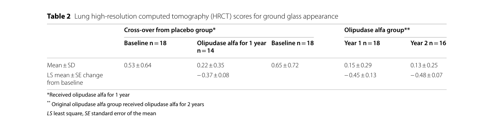

## Question

# Disease Characteristics Research Template

## Target Disease
- **Disease Name:** Niemann-Pick Disease Type B
- **MONDO ID:**  (if available)
- **Category:** Mendelian

## Research Objectives

Please provide a comprehensive research report on **Niemann-Pick Disease Type B** covering all of the
disease characteristics listed below. This report will be used to populate a disease knowledge
base entry. Be thorough and cite primary literature (PMID preferred) for all claims.

For each section, **suggested databases/resources** are listed. These are the first places
you should search for information on each topic.

---

### 1. Disease Information
> **Search first:** OMIM, Orphanet, ICD-10/ICD-11, MeSH, PubMed

- What is the disease? Provide a concise overview.
- What are the key identifiers? (OMIM, Orphanet, ICD-10/ICD-11, MeSH, Mondo)
- What are the common synonyms and alternative names?
- Is the information derived from individual patients (e.g., EHR) or aggregated disease-level resources?

### 2. Etiology

- **Disease Causal Factors**: What are the primary causes? (genetic, environmental, infectious, mechanistic)
- **Risk Factors**:
  > **Search first:** PubMed, Cochrane Library, UpToDate, clinical guidelines, ClinVar, ClinGen, GWAS Catalog, PheGenI, CTD, CDC, WHO, epidemiological databases
  - Genetic risk factors (causal variants, susceptibility loci, modifier genes)
  - Environmental risk factors (toxins, lifestyle, occupational exposures, age, sex, family history)
- **Protective Factors**:
  > **Search first:** PubMed, Cochrane Library, clinical trial databases, GWAS Catalog, gnomAD, WHO, CDC, nutrition databases
  - Genetic protective factors (protective variants, modifier alleles)
  - Environmental protective factors (diet, lifestyle, exposures that reduce risk)
- **Gene-Environment Interactions**: How do genetic and environmental factors interact to influence disease?
  > **Search first:** CTD, PubMed, PheGenI, GxE databases

### 3. Phenotypes
> **Search first:** HPO (Human Phenotype Ontology), OMIM, Orphanet, PubMed, clinicaltrials.gov, MedDRA, SNOMED CT, DECIPHER, LOINC

For each phenotype, provide:
- **Phenotype type**: symptoms, clinical signs, physical manifestations, behavioral changes, or laboratory abnormalities
  > For symptoms/signs: HPO, OMIM, Orphanet, PubMed
  > For behavioral changes: HPO, DSM, RDoC (Research Domain Criteria), PubMed
  > For laboratory abnormalities: LOINC, SNOMED CT, LabTests Online, PubMed
- **Phenotype characteristics**:
  > **Search first:** OMIM, Orphanet, HPO, PubMed
  - Age of symptom onset (neonatal, childhood, adult-onset, late-onset)
  - Symptom severity (mild, moderate, severe, variable)
  - Symptom progression (stable, progressive, episodic, fluctuating)
  - Frequency among affected individuals (percentage or qualitative)
- **Quality of life impact**: Effects on daily functioning and well-being (per-phenotype when possible)
  > **Search first:** EQ-5D database, SF-36, WHO QOL databases, PubMed
- Suggest HPO (Human Phenotype Ontology) terms for each phenotype

### 4. Genetic/Molecular Information

- **Causal Genes**: Gene mutations or chromosomal abnormalities responsible for disease (gene symbols, OMIM IDs)
  > **Search first:** OMIM, ClinVar, HGMD, Ensembl, NCBI Gene
- **Pathogenic Variants**:
  - Affected genes (gene symbols, HGNC IDs)
    > **Search first:** OMIM, NCBI Gene, Ensembl, HGNC, UniProt, GeneCards
  - Variant classification (pathogenic, likely pathogenic, VUS per ACMG/AMP guidelines)
    > **Search first:** ClinVar, ClinGen, ACMG/AMP guidelines, VarSome
  - Variant type/class (missense, frameshift, nonsense, splice-site, structural)
  - Allele frequency in population databases
    > **Search first:** gnomAD, 1000 Genomes, ExAC, TOPMed, dbSNP
  - Somatic vs germline origin
    > **Search first:** COSMIC (somatic), ClinVar, ICGC, TCGA
  - Functional consequences (loss of function, gain of function, dominant negative)
- **Modifier Genes**: Genes that modify disease severity or expression
- **Epigenetic Information**: DNA methylation, histone modifications, chromatin changes affecting disease
  > **Search first:** ENCODE, Roadmap Epigenomics, MethBase, DiseaseMeth
- **Chromosomal Abnormalities**: Large-scale genetic changes (aneuploidy, translocations, inversions)
  > **Search first:** DECIPHER, ClinVar, ECARUCA, UCSC Genome Browser

### 5. Environmental Information

- **Environmental Factors**: Non-genetic contributing factors (toxins, radiation, pollution, occupational exposure)
  > **Search first:** CTD (Comparative Toxicogenomics Database), TOXNET, PubMed, EPA databases
- **Lifestyle Factors**: Behavioral factors (smoking, diet, exercise, alcohol consumption)
  > **Search first:** CDC databases, WHO, PubMed, NHANES
- **Infectious Agents**: If applicable, pathogens causing or triggering disease (bacteria, viruses, fungi, parasites)
  > **Search first:** NCBI Taxonomy, ViPR, BV-BRC, MicrobeDB, GIDEON

### 6. Mechanism / Pathophysiology

- **Molecular Pathways**: Specific signaling cascades or biochemical pathways involved (Wnt, MAPK, mTOR, PI3K-AKT, etc.)
  > **Search first:** KEGG, Reactome, WikiPathways, PathBank, BioCyc
- **Cellular Processes**: Cell-level mechanisms (apoptosis, autophagy, cell cycle dysregulation, inflammation, etc.)
  > **Search first:** Gene Ontology (GO), Reactome, KEGG, PubMed
- **Protein Dysfunction**: How protein structure or function is altered (misfolding, aggregation, loss of function, gain of function)
  > **Search first:** UniProt, PDB (Protein Data Bank), InterPro, Pfam, AlphaFold
- **Metabolic Changes**: Alterations in metabolic processes (energy metabolism, lipid metabolism, amino acid metabolism)
  > **Search first:** KEGG, BioCyc, HMDB (Human Metabolome Database), BRENDA
- **Immune System Involvement**: Role of immune response (autoimmunity, immunodeficiency, chronic inflammation)
  > **Search first:** ImmPort, Immunome Database, IEDB, Gene Ontology
- **Tissue Damage Mechanisms**: How tissues/ are injured (oxidative stress, ischemia, fibrosis, necrosis)
  > **Search first:** PubMed, Gene Ontology, Reactome
- **Biochemical Abnormalities**: Specific molecular defects (enzyme deficiencies, receptor dysfunction, ion channel defects)
  > **Search first:** BRENDA, UniProt, KEGG, OMIM, PubMed
- **Epigenetic Changes**: DNA methylation, histone modifications affecting gene expression in disease
  > **Search first:** ENCODE, Roadmap Epigenomics, MethBase, DiseaseMeth
- **Molecular Profiling** (if available):
  - Transcriptomics/gene expression changes
    > **Search first:** GEO (Gene Expression Omnibus), ArrayExpress, GTEx, Human Cell Atlas, SRA
  - Proteomics findings
    > **Search first:** PRIDE, ProteomeXchange, Human Protein Atlas, STRING, BioGRID
  - Metabolomics signatures
    > **Search first:** MetaboLights, Metabolomics Workbench, HMDB, METLIN
  - Lipidomics alterations
    > **Search first:** LIPID MAPS, SwissLipids, LipidHome, Metabolomics Workbench
  - Genomic structural features
    > **Search first:** UCSC Genome Browser, Ensembl, NCBI, dbVar, DGV
- **Advanced Technologies** (if applicable):
  - Single-cell analysis findings (cell-type specific mechanisms, cellular heterogeneity)
    > **Search first:** Human Cell Atlas, Single Cell Portal, GEO, CELLxGENE
  - Spatial transcriptomics findings
    > **Search first:** GEO, Spatial Research, Vizgen, 10x Genomics data
  - Multi-omics integration results
    > **Search first:** TCGA, ICGC, cBioPortal, LinkedOmics, PubMed
  - Functional genomics screens (CRISPR, RNAi)
    > **Search first:** DepMap, GenomeRNAi, PubMed, BioGRID ORCS

For each mechanism, describe:
- The causal chain from initial trigger to clinical manifestation
- Which mechanisms are upstream vs downstream
- What cell types and biological processes are involved
- Suggest GO terms for biological processes and CL terms for cell types

### 7. Anatomical Structures Affected

- **Organ Level**:
  - Primary organs directly affected
  - Secondary organ involvement (complications, secondary effects)
  - Body systems involved (cardiovascular, nervous, digestive, respiratory, endocrine, etc.)
  > **Search first:** Uberon, FMA (Foundational Model of Anatomy), OMIM, HPO, ICD-11, MeSH, SNOMED CT
- **Tissue and Cell Level**:
  - Specific tissue types affected (epithelial, connective, muscle, nervous)
  - Specific cell populations targeted (with Cell Ontology terms)
  > **Search first:** Uberon, Human Protein Atlas, Cell Ontology, Human Cell Atlas, CellMarker, PanglaoDB
- **Subcellular Level**:
  - Cellular compartments involved (mitochondria, nucleus, ER, lysosomes) (with GO Cellular Component terms)
  > **Search first:** Gene Ontology (Cellular Component), UniProt, Human Protein Atlas
- **Localization**:
  - Specific anatomical sites (with UBERON terms)
    > **Search first:** FMA, Uberon, NeuroNames (for brain), SNOMED CT
  - Lateralization (unilateral, bilateral, asymmetric)
    > **Search first:** HPO, clinical literature, imaging databases

### 8. Temporal Development

- **Onset**:
  - Typical age of onset (congenital, pediatric, adult, geriatric)
  - Onset pattern (acute, subacute, chronic, insidious)
  > **Search first:** OMIM, Orphanet, HPO, PubMed
- **Progression**:
  - Disease stages (early, intermediate, advanced, end-stage)
    > **Search first:** Cancer Staging Manual (AJCC), WHO classifications, PubMed
  - Progression rate (rapid, slow, variable)
  - Disease course pattern (episodic, relapsing-remitting, progressive, stable)
  - Disease duration (self-limited, chronic lifelong)
  > **Search first:** Disease registries, longitudinal cohort databases, natural history studies, PubMed, Orphanet, OMIM
- **Patterns**:
  - Remission patterns (spontaneous, treatment-induced)
    > **Search first:** Clinical trial databases, disease registries, PubMed
  - Critical periods (time windows of vulnerability or opportunity for intervention)
    > **Search first:** PubMed, developmental biology databases, clinical guidelines

### 9. Inheritance and Population

- **Epidemiology**:
  - Prevalence (cases per 100,000 at given time)
  - Incidence (new cases per 100,000 per year)
  > **Search first:** Orphanet, CDC, WHO, GBD (Global Burden of Disease), national registries, SEER, disease registries
- **For Genetic Etiology**:
  - Inheritance pattern (AD, AR, X-linked, mitochondrial, multifactorial, polygenic)
    > **Search first:** OMIM, Orphanet, ClinVar, GTR (Genetic Testing Registry)
  - Penetrance (complete, incomplete, age-dependent)
    > **Search first:** ClinVar, OMIM, PubMed, ClinGen
  - Expressivity (variable, consistent)
    > **Search first:** OMIM, ClinVar, PubMed
  - Genetic anticipation (increasing severity in successive generations)
    > **Search first:** OMIM, PubMed (especially for repeat expansion disorders)
  - Germline mosaicism
    > **Search first:** ClinVar, OMIM, genetic counseling literature, PubMed
  - Founder effects (population-specific mutations)
    > **Search first:** gnomAD, population genetics databases, PubMed
  - Consanguinity role
    > **Search first:** OMIM, population studies, genetic counseling resources
  - Carrier frequency
    > **Search first:** gnomAD, carrier screening databases, GeneReviews, GTR
- **Population Demographics**:
  - Affected populations (ethnic or demographic groups with higher prevalence)
    > **Search first:** gnomAD, 1000 Genomes, PAGE Study, PubMed, population registries
  - Geographic distribution (endemic areas, regional variation)
    > **Search first:** WHO, CDC, GBD, Orphanet, geographic epidemiology databases
  - Geographic distribution of specific variants
  - Sex ratio (male:female)
    > **Search first:** Disease registries, OMIM, PubMed, epidemiological databases
  - Age distribution of affected individuals
    > **Search first:** CDC, disease registries, SEER, Orphanet

### 10. Diagnostics

- **Clinical Tests**:
  - Laboratory tests (blood, urine, tissue chemistry, specific enzyme assays)
    > **Search first:** LOINC, LabTests Online, PubMed
  - Biomarkers (proteins, metabolites, genetic markers, circulating biomarkers)
    > **Search first:** FDA Biomarker List, BEST (Biomarkers, EndpointS, and other Tools), PubMed
  - Imaging studies (X-ray, CT, MRI, PET, ultrasound)
    > **Search first:** RadLex, DICOM, Radiopaedia, imaging databases
  - Functional tests (pulmonary function, cardiac stress tests)
    > **Search first:** LOINC, clinical guidelines, PubMed
  - Electrophysiology (EEG, EMG, ECG, nerve conduction studies)
    > **Search first:** LOINC, clinical neurophysiology databases, PubMed
  - Biopsy findings (histopathology, immunohistochemistry)
    > **Search first:** SNOMED CT, College of American Pathologists resources, PubMed
  - Pathology findings (microscopic examination)
    > **Search first:** SNOMED CT, Digital Pathology databases, PubMed
- **Genetic Testing**:
  > **Search first:** GTR (Genetic Testing Registry), GeneReviews, ClinGen
  - Overview of recommended genetic testing approach
  - Whole genome sequencing (WGS) utility
    > **Search first:** GTR, ClinVar, GEL (Genomics England), gnomAD
  - Whole exome sequencing (WES) utility
    > **Search first:** GTR, ClinVar, OMIM, GeneMatcher
  - Gene panels (which panels, which genes)
    > **Search first:** GTR, ClinVar, laboratory-specific databases
  - Single gene testing
    > **Search first:** GTR, ClinVar, OMIM, GeneReviews
  - Chromosomal microarray (CMA)
    > **Search first:** DECIPHER, ClinVar, dbVar, ECARUCA
  - Karyotyping
    > **Search first:** Chromosome Abnormality Database, ClinVar, cytogenetics resources
  - FISH
    > **Search first:** ClinVar, cytogenetics databases, PubMed
  - Mitochondrial DNA testing
    > **Search first:** MITOMAP, MSeqDR, ClinVar, GTR
  - Repeat expansion testing
    > **Search first:** GTR, ClinVar, repeat expansion databases, PubMed
- **Omics-Based Diagnostics** (if applicable):
  - RNA sequencing / transcriptomics
    > **Search first:** GEO, ArrayExpress, GTEx, RNA-seq databases
  - Proteomics
    > **Search first:** PRIDE, ProteomeXchange, FDA Biomarker database
  - Metabolomics
    > **Search first:** MetaboLights, Metabolomics Workbench, HMDB
  - Epigenomics
    > **Search first:** GEO, ENCODE, Roadmap Epigenomics, MethBase
  - Liquid biopsy
    > **Search first:** COSMIC, ClinVar, liquid biopsy databases, PubMed
- **Clinical Criteria**:
  - Standardized diagnostic criteria (DSM, ICD, society guidelines)
    > **Search first:** DSM-5, ICD-11, clinical society guidelines, UpToDate
  - Differential diagnosis (other conditions to rule out, with distinguishing features)
    > **Search first:** DynaMed, UpToDate, clinical decision support systems
- **Screening**:
  - Screening methods for asymptomatic individuals (newborn screening, carrier screening, cascade screening)
    > **Search first:** ACMG recommendations, CDC newborn screening, GTR

### 11. Outcome/Prognosis

- **Survival and Mortality**:
  - Survival rate (5-year, 10-year, overall)
    > **Search first:** SEER, cancer registries, disease-specific registries, PubMed
  - Life expectancy (with and without treatment if applicable)
    > **Search first:** Orphanet, disease registries, actuarial databases, PubMed
  - Mortality rate
    > **Search first:** CDC, WHO, GBD, national mortality databases
  - Disease-specific mortality (deaths directly attributable to disease)
    > **Search first:** Disease registries, CDC Wonder, GBD, PubMed
- **Morbidity and Function**:
  - Morbidity (disease-related disability and health impacts)
    > **Search first:** GBD, WHO, disability databases, PubMed
  - Disability outcomes (long-term functional impairments)
    > **Search first:** ICF (International Classification of Functioning), disability registries
  - Quality of life measures (EQ-5D, SF-36, PROMIS, disease-specific tools)
    > **Search first:** EQ-5D database, SF-36, PROMIS, PubMed
- **Disease Course**:
  - Complications (secondary problems: infections, organ failure, etc.)
    > **Search first:** ICD codes, disease registries, clinical databases, PubMed
  - Recovery potential (likelihood and extent of recovery, with vs without treatment)
    > **Search first:** Natural history studies, rehabilitation databases, PubMed
- **Prediction**:
  - Prognostic factors (age, disease severity, biomarkers, treatment response)
    > **Search first:** Prognostic models databases, clinical calculators, PubMed
  - Prognostic biomarkers (molecular markers predicting disease course)
    > **Search first:** FDA Biomarker database, PubMed, cancer prognostic databases

### 12. Treatment

- **Pharmacotherapy**:
  - Pharmacological treatments (drug names, drug classes, mechanisms of action)
    > **Search first:** DrugBank, RxNorm, ATC classification, DailyMed, FDA databases
  - Pharmacogenomics (how genetic variants affect drug metabolism, efficacy, toxicity)
    > **Search first:** PharmGKB, CPIC (Clinical Pharmacogenetics), FDA Table of PGx Biomarkers
- **Advanced Therapeutics**:
  - Gene therapy (viral vectors, CRISPR, gene replacement, gene editing)
    > **Search first:** ClinicalTrials.gov, FDA gene therapy database, ASGCT resources
  - Cell therapy (stem cell transplant, CAR-T, cellular therapeutics)
    > **Search first:** ClinicalTrials.gov, FDA cell therapy database, FACT standards
  - RNA-based therapies (ASOs, siRNA, mRNA therapies)
    > **Search first:** ClinicalTrials.gov, FDA approvals, PubMed
  - Targeted therapies (treatments directed at specific molecular targets)
    > **Search first:** My Cancer Genome, OncoKB, ClinicalTrials.gov, FDA approvals
  - Immunotherapies (checkpoint inhibitors, monoclonal antibodies)
    > **Search first:** Cancer Immunotherapy Database, FDA approvals, ClinicalTrials.gov
- **Surgical and Interventional**:
  - Surgical interventions (types of surgery, timing, outcomes)
    > **Search first:** CPT codes, surgical registries, clinical guidelines, PubMed
- **Supportive and Rehabilitative**:
  - Supportive care (symptom management, pain control, nutrition)
    > **Search first:** Clinical guidelines, Cochrane Library, PubMed
  - Rehabilitation (physical therapy, occupational therapy, speech therapy)
    > **Search first:** Rehabilitation medicine databases, clinical guidelines, PubMed
- **Experimental**:
  - Experimental treatments in clinical trials (with NCT identifiers if available)
    > **Search first:** ClinicalTrials.gov, EU Clinical Trials Register, WHO ICTRP
- **Treatment Outcomes**:
  - Treatment response rates
    > **Search first:** Clinical trial databases, FDA reviews, systematic reviews, PubMed
  - Side effects and adverse events
    > **Search first:** FDA Adverse Event Reporting System (FAERS), MedWatch, PubMed
- **Treatment Strategy**:
  - Treatment algorithms (clinical pathways, decision trees)
    > **Search first:** Clinical practice guidelines, NCCN Guidelines, UpToDate
  - Combination therapies
    > **Search first:** ClinicalTrials.gov, treatment guidelines, PubMed
  - Personalized medicine approaches (genotype-guided treatment)
    > **Search first:** My Cancer Genome, CIViC, PharmGKB, precision medicine databases

For each treatment, suggest MAXO (Medical Action Ontology) terms where applicable.

### 13. Prevention

- **Prevention Levels**:
  - Primary prevention (preventing disease occurrence: vaccination, risk factor modification)
    > **Search first:** CDC, WHO, USPSTF recommendations, Cochrane Library
  - Secondary prevention (early detection and treatment: screening programs, early intervention)
    > **Search first:** USPSTF, CDC screening guidelines, WHO
  - Tertiary prevention (preventing complications in those with disease)
    > **Search first:** Clinical guidelines, disease management protocols, PubMed
- **Immunization**: Vaccine strategies (if applicable)
  > **Search first:** CDC vaccine schedules, WHO immunization, FDA vaccine database
- **Screening and Early Detection**:
  - Screening programs (population-based: newborn screening, cancer screening)
    > **Search first:** CDC screening programs, USPSTF, cancer screening databases
  - Genetic screening (carrier screening, preimplantation genetic diagnosis, prenatal testing)
    > **Search first:** ACMG recommendations, ACOG guidelines, GTR
  - Risk stratification (identifying high-risk individuals for targeted prevention)
    > **Search first:** Risk prediction models, clinical calculators, PubMed
- **Behavioral Interventions**: Lifestyle modifications to reduce risk
  > **Search first:** CDC, WHO, behavioral intervention databases, Cochrane Library
- **Counseling**: Genetic counseling (risk assessment, family planning guidance)
  > **Search first:** NSGC resources, ACMG guidelines, GeneReviews
- **Public Health**:
  - Public health interventions (sanitation, vector control, health education)
    > **Search first:** CDC, WHO, public health databases, PubMed
  - Environmental interventions (reducing environmental risk factors)
    > **Search first:** EPA databases, WHO environmental health, PubMed
- **Prophylaxis**: Preventive medications or procedures
  > **Search first:** Clinical guidelines, FDA approvals, PubMed

### 14. Other Species / Natural Disease

- **Taxonomy**: Species affected (with NCBI Taxon identifiers)
  > **Search first:** NCBI Taxonomy
- **Breed**: Specific breeds affected (with VBO identifiers if applicable)
  > **Search first:** VBO (Vertebrate Breed Ontology)
- **Gene**: Orthologous genes in other species (with NCBI Gene IDs)
  > **Search first:** NCBI Gene
- **Natural Disease**:
  - Naturally occurring disease in other species (companion animals, wildlife)
    > **Search first:** OMIA (Online Mendelian Inheritance in Animals), VetCompass, PubMed
  - Veterinary relevance and importance in animal health
    > **Search first:** OMIA, veterinary databases, PubMed
- **Comparative Biology**:
  - Comparative pathology (similarities and differences across species)
    > **Search first:** OMIA, comparative pathology databases, PubMed
  - Evolutionary conservation of disease mechanisms
    > **Search first:** HomoloGene, OrthoMCL, Alliance of Genome Resources
- **Transmission** (if applicable):
  - Zoonotic potential
    > **Search first:** CDC zoonotic diseases, WHO zoonoses, GIDEON
  - Cross-species susceptibility
    > **Search first:** NCBI Taxonomy, veterinary databases, PubMed

### 15. Model Organisms

- **Model Types**:
  - Model organism type (mammalian, invertebrate, cellular, in vitro)
    > **Search first:** Alliance of Genome Resources, model organism databases
  - Specific model systems (mouse, rat, zebrafish, Drosophila, C. elegans, yeast, cell lines, organoids, iPSCs)
    > **Search first:** MGI, RGD, ZFIN, FlyBase, WormBase, SGD, ATCC, Cellosaurus
  - Induced models (drug treatment, surgical intervention, environmental manipulation)
    > **Search first:** MGI, model organism databases, PubMed
- **Genetic Models**:
  - Types available (knockout, knock-in, transgenic, conditional, humanized)
    > **Search first:** MGI, IMPC, KOMP, EuMMCR, IMSR
- **Model Characteristics**:
  - Phenotype recapitulation (how well model reproduces human disease features)
    > **Search first:** Model organism databases, comparative studies, PubMed
  - Model limitations (aspects of human disease not captured)
    > **Search first:** Model organism databases, PubMed, review articles
- **Applications**:
  - Research applications (what aspects of disease can be studied)
    > **Search first:** Model organism databases, PubMed
- **Resources**:
  - Model databases
    > **Search first:** MGI, RGD, ZFIN, FlyBase, WormBase, IMSR, EMMA, MMRRC

---

## Citation Requirements

- Cite primary literature (PMID preferred) for all mechanistic and clinical claims
- Prioritize recent reviews and landmark papers
- Include direct quotes from abstracts where possible to support key statements
- Distinguish evidence source types: human clinical, model organism, in vitro, computational

## Output Format

Structure your response as a comprehensive narrative organized by the sections above.
For each section, provide:
- Factual content with specific details (numbers, percentages, gene names, variant nomenclature)
- Ontology term suggestions (HPO, GO, CL, UBERON, CHEBI, MAXO, MONDO) where applicable
- Evidence citations with PMIDs
- Direct quotes from abstracts to support key claims
- Clear indication when information is not available or not applicable for this disease

This report will be used to populate a disease knowledge base entry with:
- Pathophysiology descriptions with causal chains
- Gene/protein annotations (HGNC, GO terms)
- Phenotype associations (HP terms) with frequencies
- Cell type involvement (CL terms)
- Anatomical locations (UBERON terms)
- Chemical entities (CHEBI terms)
- Treatment annotations (MAXO terms)
- Evidence items with PMIDs and exact abstract quotes
- Epidemiology, prognosis, diagnostic, and prevention information
- Animal model descriptions with phenotype recapitulation details

## Output

Question: You are an expert researcher providing comprehensive, well-cited information.

Provide detailed information focusing on:
1. Key concepts and definitions with current understanding
2. Recent developments and latest research (prioritize 2023-2024 sources)
3. Current applications and real-world implementations
4. Expert opinions and analysis from authoritative sources
5. Relevant statistics and data from recent studies

Format as a comprehensive research report with proper citations. Include URLs and publication dates where available.
Always prioritize recent, authoritative sources and provide specific citations for all major claims.

# Disease Characteristics Research Template

## Target Disease
- **Disease Name:** Niemann-Pick Disease Type B
- **MONDO ID:**  (if available)
- **Category:** Mendelian

## Research Objectives

Please provide a comprehensive research report on **Niemann-Pick Disease Type B** covering all of the
disease characteristics listed below. This report will be used to populate a disease knowledge
base entry. Be thorough and cite primary literature (PMID preferred) for all claims.

For each section, **suggested databases/resources** are listed. These are the first places
you should search for information on each topic.

---

### 1. Disease Information
> **Search first:** OMIM, Orphanet, ICD-10/ICD-11, MeSH, PubMed

- What is the disease? Provide a concise overview.
- What are the key identifiers? (OMIM, Orphanet, ICD-10/ICD-11, MeSH, Mondo)
- What are the common synonyms and alternative names?
- Is the information derived from individual patients (e.g., EHR) or aggregated disease-level resources?

### 2. Etiology

- **Disease Causal Factors**: What are the primary causes? (genetic, environmental, infectious, mechanistic)
- **Risk Factors**:
  > **Search first:** PubMed, Cochrane Library, UpToDate, clinical guidelines, ClinVar, ClinGen, GWAS Catalog, PheGenI, CTD, CDC, WHO, epidemiological databases
  - Genetic risk factors (causal variants, susceptibility loci, modifier genes)
  - Environmental risk factors (toxins, lifestyle, occupational exposures, age, sex, family history)
- **Protective Factors**:
  > **Search first:** PubMed, Cochrane Library, clinical trial databases, GWAS Catalog, gnomAD, WHO, CDC, nutrition databases
  - Genetic protective factors (protective variants, modifier alleles)
  - Environmental protective factors (diet, lifestyle, exposures that reduce risk)
- **Gene-Environment Interactions**: How do genetic and environmental factors interact to influence disease?
  > **Search first:** CTD, PubMed, PheGenI, GxE databases

### 3. Phenotypes
> **Search first:** HPO (Human Phenotype Ontology), OMIM, Orphanet, PubMed, clinicaltrials.gov, MedDRA, SNOMED CT, DECIPHER, LOINC

For each phenotype, provide:
- **Phenotype type**: symptoms, clinical signs, physical manifestations, behavioral changes, or laboratory abnormalities
  > For symptoms/signs: HPO, OMIM, Orphanet, PubMed
  > For behavioral changes: HPO, DSM, RDoC (Research Domain Criteria), PubMed
  > For laboratory abnormalities: LOINC, SNOMED CT, LabTests Online, PubMed
- **Phenotype characteristics**:
  > **Search first:** OMIM, Orphanet, HPO, PubMed
  - Age of symptom onset (neonatal, childhood, adult-onset, late-onset)
  - Symptom severity (mild, moderate, severe, variable)
  - Symptom progression (stable, progressive, episodic, fluctuating)
  - Frequency among affected individuals (percentage or qualitative)
- **Quality of life impact**: Effects on daily functioning and well-being (per-phenotype when possible)
  > **Search first:** EQ-5D database, SF-36, WHO QOL databases, PubMed
- Suggest HPO (Human Phenotype Ontology) terms for each phenotype

### 4. Genetic/Molecular Information

- **Causal Genes**: Gene mutations or chromosomal abnormalities responsible for disease (gene symbols, OMIM IDs)
  > **Search first:** OMIM, ClinVar, HGMD, Ensembl, NCBI Gene
- **Pathogenic Variants**:
  - Affected genes (gene symbols, HGNC IDs)
    > **Search first:** OMIM, NCBI Gene, Ensembl, HGNC, UniProt, GeneCards
  - Variant classification (pathogenic, likely pathogenic, VUS per ACMG/AMP guidelines)
    > **Search first:** ClinVar, ClinGen, ACMG/AMP guidelines, VarSome
  - Variant type/class (missense, frameshift, nonsense, splice-site, structural)
  - Allele frequency in population databases
    > **Search first:** gnomAD, 1000 Genomes, ExAC, TOPMed, dbSNP
  - Somatic vs germline origin
    > **Search first:** COSMIC (somatic), ClinVar, ICGC, TCGA
  - Functional consequences (loss of function, gain of function, dominant negative)
- **Modifier Genes**: Genes that modify disease severity or expression
- **Epigenetic Information**: DNA methylation, histone modifications, chromatin changes affecting disease
  > **Search first:** ENCODE, Roadmap Epigenomics, MethBase, DiseaseMeth
- **Chromosomal Abnormalities**: Large-scale genetic changes (aneuploidy, translocations, inversions)
  > **Search first:** DECIPHER, ClinVar, ECARUCA, UCSC Genome Browser

### 5. Environmental Information

- **Environmental Factors**: Non-genetic contributing factors (toxins, radiation, pollution, occupational exposure)
  > **Search first:** CTD (Comparative Toxicogenomics Database), TOXNET, PubMed, EPA databases
- **Lifestyle Factors**: Behavioral factors (smoking, diet, exercise, alcohol consumption)
  > **Search first:** CDC databases, WHO, PubMed, NHANES
- **Infectious Agents**: If applicable, pathogens causing or triggering disease (bacteria, viruses, fungi, parasites)
  > **Search first:** NCBI Taxonomy, ViPR, BV-BRC, MicrobeDB, GIDEON

### 6. Mechanism / Pathophysiology

- **Molecular Pathways**: Specific signaling cascades or biochemical pathways involved (Wnt, MAPK, mTOR, PI3K-AKT, etc.)
  > **Search first:** KEGG, Reactome, WikiPathways, PathBank, BioCyc
- **Cellular Processes**: Cell-level mechanisms (apoptosis, autophagy, cell cycle dysregulation, inflammation, etc.)
  > **Search first:** Gene Ontology (GO), Reactome, KEGG, PubMed
- **Protein Dysfunction**: How protein structure or function is altered (misfolding, aggregation, loss of function, gain of function)
  > **Search first:** UniProt, PDB (Protein Data Bank), InterPro, Pfam, AlphaFold
- **Metabolic Changes**: Alterations in metabolic processes (energy metabolism, lipid metabolism, amino acid metabolism)
  > **Search first:** KEGG, BioCyc, HMDB (Human Metabolome Database), BRENDA
- **Immune System Involvement**: Role of immune response (autoimmunity, immunodeficiency, chronic inflammation)
  > **Search first:** ImmPort, Immunome Database, IEDB, Gene Ontology
- **Tissue Damage Mechanisms**: How tissues/ are injured (oxidative stress, ischemia, fibrosis, necrosis)
  > **Search first:** PubMed, Gene Ontology, Reactome
- **Biochemical Abnormalities**: Specific molecular defects (enzyme deficiencies, receptor dysfunction, ion channel defects)
  > **Search first:** BRENDA, UniProt, KEGG, OMIM, PubMed
- **Epigenetic Changes**: DNA methylation, histone modifications affecting gene expression in disease
  > **Search first:** ENCODE, Roadmap Epigenomics, MethBase, DiseaseMeth
- **Molecular Profiling** (if available):
  - Transcriptomics/gene expression changes
    > **Search first:** GEO (Gene Expression Omnibus), ArrayExpress, GTEx, Human Cell Atlas, SRA
  - Proteomics findings
    > **Search first:** PRIDE, ProteomeXchange, Human Protein Atlas, STRING, BioGRID
  - Metabolomics signatures
    > **Search first:** MetaboLights, Metabolomics Workbench, HMDB, METLIN
  - Lipidomics alterations
    > **Search first:** LIPID MAPS, SwissLipids, LipidHome, Metabolomics Workbench
  - Genomic structural features
    > **Search first:** UCSC Genome Browser, Ensembl, NCBI, dbVar, DGV
- **Advanced Technologies** (if applicable):
  - Single-cell analysis findings (cell-type specific mechanisms, cellular heterogeneity)
    > **Search first:** Human Cell Atlas, Single Cell Portal, GEO, CELLxGENE
  - Spatial transcriptomics findings
    > **Search first:** GEO, Spatial Research, Vizgen, 10x Genomics data
  - Multi-omics integration results
    > **Search first:** TCGA, ICGC, cBioPortal, LinkedOmics, PubMed
  - Functional genomics screens (CRISPR, RNAi)
    > **Search first:** DepMap, GenomeRNAi, PubMed, BioGRID ORCS

For each mechanism, describe:
- The causal chain from initial trigger to clinical manifestation
- Which mechanisms are upstream vs downstream
- What cell types and biological processes are involved
- Suggest GO terms for biological processes and CL terms for cell types

### 7. Anatomical Structures Affected

- **Organ Level**:
  - Primary organs directly affected
  - Secondary organ involvement (complications, secondary effects)
  - Body systems involved (cardiovascular, nervous, digestive, respiratory, endocrine, etc.)
  > **Search first:** Uberon, FMA (Foundational Model of Anatomy), OMIM, HPO, ICD-11, MeSH, SNOMED CT
- **Tissue and Cell Level**:
  - Specific tissue types affected (epithelial, connective, muscle, nervous)
  - Specific cell populations targeted (with Cell Ontology terms)
  > **Search first:** Uberon, Human Protein Atlas, Cell Ontology, Human Cell Atlas, CellMarker, PanglaoDB
- **Subcellular Level**:
  - Cellular compartments involved (mitochondria, nucleus, ER, lysosomes) (with GO Cellular Component terms)
  > **Search first:** Gene Ontology (Cellular Component), UniProt, Human Protein Atlas
- **Localization**:
  - Specific anatomical sites (with UBERON terms)
    > **Search first:** FMA, Uberon, NeuroNames (for brain), SNOMED CT
  - Lateralization (unilateral, bilateral, asymmetric)
    > **Search first:** HPO, clinical literature, imaging databases

### 8. Temporal Development

- **Onset**:
  - Typical age of onset (congenital, pediatric, adult, geriatric)
  - Onset pattern (acute, subacute, chronic, insidious)
  > **Search first:** OMIM, Orphanet, HPO, PubMed
- **Progression**:
  - Disease stages (early, intermediate, advanced, end-stage)
    > **Search first:** Cancer Staging Manual (AJCC), WHO classifications, PubMed
  - Progression rate (rapid, slow, variable)
  - Disease course pattern (episodic, relapsing-remitting, progressive, stable)
  - Disease duration (self-limited, chronic lifelong)
  > **Search first:** Disease registries, longitudinal cohort databases, natural history studies, PubMed, Orphanet, OMIM
- **Patterns**:
  - Remission patterns (spontaneous, treatment-induced)
    > **Search first:** Clinical trial databases, disease registries, PubMed
  - Critical periods (time windows of vulnerability or opportunity for intervention)
    > **Search first:** PubMed, developmental biology databases, clinical guidelines

### 9. Inheritance and Population

- **Epidemiology**:
  - Prevalence (cases per 100,000 at given time)
  - Incidence (new cases per 100,000 per year)
  > **Search first:** Orphanet, CDC, WHO, GBD (Global Burden of Disease), national registries, SEER, disease registries
- **For Genetic Etiology**:
  - Inheritance pattern (AD, AR, X-linked, mitochondrial, multifactorial, polygenic)
    > **Search first:** OMIM, Orphanet, ClinVar, GTR (Genetic Testing Registry)
  - Penetrance (complete, incomplete, age-dependent)
    > **Search first:** ClinVar, OMIM, PubMed, ClinGen
  - Expressivity (variable, consistent)
    > **Search first:** OMIM, ClinVar, PubMed
  - Genetic anticipation (increasing severity in successive generations)
    > **Search first:** OMIM, PubMed (especially for repeat expansion disorders)
  - Germline mosaicism
    > **Search first:** ClinVar, OMIM, genetic counseling literature, PubMed
  - Founder effects (population-specific mutations)
    > **Search first:** gnomAD, population genetics databases, PubMed
  - Consanguinity role
    > **Search first:** OMIM, population studies, genetic counseling resources
  - Carrier frequency
    > **Search first:** gnomAD, carrier screening databases, GeneReviews, GTR
- **Population Demographics**:
  - Affected populations (ethnic or demographic groups with higher prevalence)
    > **Search first:** gnomAD, 1000 Genomes, PAGE Study, PubMed, population registries
  - Geographic distribution (endemic areas, regional variation)
    > **Search first:** WHO, CDC, GBD, Orphanet, geographic epidemiology databases
  - Geographic distribution of specific variants
  - Sex ratio (male:female)
    > **Search first:** Disease registries, OMIM, PubMed, epidemiological databases
  - Age distribution of affected individuals
    > **Search first:** CDC, disease registries, SEER, Orphanet

### 10. Diagnostics

- **Clinical Tests**:
  - Laboratory tests (blood, urine, tissue chemistry, specific enzyme assays)
    > **Search first:** LOINC, LabTests Online, PubMed
  - Biomarkers (proteins, metabolites, genetic markers, circulating biomarkers)
    > **Search first:** FDA Biomarker List, BEST (Biomarkers, EndpointS, and other Tools), PubMed
  - Imaging studies (X-ray, CT, MRI, PET, ultrasound)
    > **Search first:** RadLex, DICOM, Radiopaedia, imaging databases
  - Functional tests (pulmonary function, cardiac stress tests)
    > **Search first:** LOINC, clinical guidelines, PubMed
  - Electrophysiology (EEG, EMG, ECG, nerve conduction studies)
    > **Search first:** LOINC, clinical neurophysiology databases, PubMed
  - Biopsy findings (histopathology, immunohistochemistry)
    > **Search first:** SNOMED CT, College of American Pathologists resources, PubMed
  - Pathology findings (microscopic examination)
    > **Search first:** SNOMED CT, Digital Pathology databases, PubMed
- **Genetic Testing**:
  > **Search first:** GTR (Genetic Testing Registry), GeneReviews, ClinGen
  - Overview of recommended genetic testing approach
  - Whole genome sequencing (WGS) utility
    > **Search first:** GTR, ClinVar, GEL (Genomics England), gnomAD
  - Whole exome sequencing (WES) utility
    > **Search first:** GTR, ClinVar, OMIM, GeneMatcher
  - Gene panels (which panels, which genes)
    > **Search first:** GTR, ClinVar, laboratory-specific databases
  - Single gene testing
    > **Search first:** GTR, ClinVar, OMIM, GeneReviews
  - Chromosomal microarray (CMA)
    > **Search first:** DECIPHER, ClinVar, dbVar, ECARUCA
  - Karyotyping
    > **Search first:** Chromosome Abnormality Database, ClinVar, cytogenetics resources
  - FISH
    > **Search first:** ClinVar, cytogenetics databases, PubMed
  - Mitochondrial DNA testing
    > **Search first:** MITOMAP, MSeqDR, ClinVar, GTR
  - Repeat expansion testing
    > **Search first:** GTR, ClinVar, repeat expansion databases, PubMed
- **Omics-Based Diagnostics** (if applicable):
  - RNA sequencing / transcriptomics
    > **Search first:** GEO, ArrayExpress, GTEx, RNA-seq databases
  - Proteomics
    > **Search first:** PRIDE, ProteomeXchange, FDA Biomarker database
  - Metabolomics
    > **Search first:** MetaboLights, Metabolomics Workbench, HMDB
  - Epigenomics
    > **Search first:** GEO, ENCODE, Roadmap Epigenomics, MethBase
  - Liquid biopsy
    > **Search first:** COSMIC, ClinVar, liquid biopsy databases, PubMed
- **Clinical Criteria**:
  - Standardized diagnostic criteria (DSM, ICD, society guidelines)
    > **Search first:** DSM-5, ICD-11, clinical society guidelines, UpToDate
  - Differential diagnosis (other conditions to rule out, with distinguishing features)
    > **Search first:** DynaMed, UpToDate, clinical decision support systems
- **Screening**:
  - Screening methods for asymptomatic individuals (newborn screening, carrier screening, cascade screening)
    > **Search first:** ACMG recommendations, CDC newborn screening, GTR

### 11. Outcome/Prognosis

- **Survival and Mortality**:
  - Survival rate (5-year, 10-year, overall)
    > **Search first:** SEER, cancer registries, disease-specific registries, PubMed
  - Life expectancy (with and without treatment if applicable)
    > **Search first:** Orphanet, disease registries, actuarial databases, PubMed
  - Mortality rate
    > **Search first:** CDC, WHO, GBD, national mortality databases
  - Disease-specific mortality (deaths directly attributable to disease)
    > **Search first:** Disease registries, CDC Wonder, GBD, PubMed
- **Morbidity and Function**:
  - Morbidity (disease-related disability and health impacts)
    > **Search first:** GBD, WHO, disability databases, PubMed
  - Disability outcomes (long-term functional impairments)
    > **Search first:** ICF (International Classification of Functioning), disability registries
  - Quality of life measures (EQ-5D, SF-36, PROMIS, disease-specific tools)
    > **Search first:** EQ-5D database, SF-36, PROMIS, PubMed
- **Disease Course**:
  - Complications (secondary problems: infections, organ failure, etc.)
    > **Search first:** ICD codes, disease registries, clinical databases, PubMed
  - Recovery potential (likelihood and extent of recovery, with vs without treatment)
    > **Search first:** Natural history studies, rehabilitation databases, PubMed
- **Prediction**:
  - Prognostic factors (age, disease severity, biomarkers, treatment response)
    > **Search first:** Prognostic models databases, clinical calculators, PubMed
  - Prognostic biomarkers (molecular markers predicting disease course)
    > **Search first:** FDA Biomarker database, PubMed, cancer prognostic databases

### 12. Treatment

- **Pharmacotherapy**:
  - Pharmacological treatments (drug names, drug classes, mechanisms of action)
    > **Search first:** DrugBank, RxNorm, ATC classification, DailyMed, FDA databases
  - Pharmacogenomics (how genetic variants affect drug metabolism, efficacy, toxicity)
    > **Search first:** PharmGKB, CPIC (Clinical Pharmacogenetics), FDA Table of PGx Biomarkers
- **Advanced Therapeutics**:
  - Gene therapy (viral vectors, CRISPR, gene replacement, gene editing)
    > **Search first:** ClinicalTrials.gov, FDA gene therapy database, ASGCT resources
  - Cell therapy (stem cell transplant, CAR-T, cellular therapeutics)
    > **Search first:** ClinicalTrials.gov, FDA cell therapy database, FACT standards
  - RNA-based therapies (ASOs, siRNA, mRNA therapies)
    > **Search first:** ClinicalTrials.gov, FDA approvals, PubMed
  - Targeted therapies (treatments directed at specific molecular targets)
    > **Search first:** My Cancer Genome, OncoKB, ClinicalTrials.gov, FDA approvals
  - Immunotherapies (checkpoint inhibitors, monoclonal antibodies)
    > **Search first:** Cancer Immunotherapy Database, FDA approvals, ClinicalTrials.gov
- **Surgical and Interventional**:
  - Surgical interventions (types of surgery, timing, outcomes)
    > **Search first:** CPT codes, surgical registries, clinical guidelines, PubMed
- **Supportive and Rehabilitative**:
  - Supportive care (symptom management, pain control, nutrition)
    > **Search first:** Clinical guidelines, Cochrane Library, PubMed
  - Rehabilitation (physical therapy, occupational therapy, speech therapy)
    > **Search first:** Rehabilitation medicine databases, clinical guidelines, PubMed
- **Experimental**:
  - Experimental treatments in clinical trials (with NCT identifiers if available)
    > **Search first:** ClinicalTrials.gov, EU Clinical Trials Register, WHO ICTRP
- **Treatment Outcomes**:
  - Treatment response rates
    > **Search first:** Clinical trial databases, FDA reviews, systematic reviews, PubMed
  - Side effects and adverse events
    > **Search first:** FDA Adverse Event Reporting System (FAERS), MedWatch, PubMed
- **Treatment Strategy**:
  - Treatment algorithms (clinical pathways, decision trees)
    > **Search first:** Clinical practice guidelines, NCCN Guidelines, UpToDate
  - Combination therapies
    > **Search first:** ClinicalTrials.gov, treatment guidelines, PubMed
  - Personalized medicine approaches (genotype-guided treatment)
    > **Search first:** My Cancer Genome, CIViC, PharmGKB, precision medicine databases

For each treatment, suggest MAXO (Medical Action Ontology) terms where applicable.

### 13. Prevention

- **Prevention Levels**:
  - Primary prevention (preventing disease occurrence: vaccination, risk factor modification)
    > **Search first:** CDC, WHO, USPSTF recommendations, Cochrane Library
  - Secondary prevention (early detection and treatment: screening programs, early intervention)
    > **Search first:** USPSTF, CDC screening guidelines, WHO
  - Tertiary prevention (preventing complications in those with disease)
    > **Search first:** Clinical guidelines, disease management protocols, PubMed
- **Immunization**: Vaccine strategies (if applicable)
  > **Search first:** CDC vaccine schedules, WHO immunization, FDA vaccine database
- **Screening and Early Detection**:
  - Screening programs (population-based: newborn screening, cancer screening)
    > **Search first:** CDC screening programs, USPSTF, cancer screening databases
  - Genetic screening (carrier screening, preimplantation genetic diagnosis, prenatal testing)
    > **Search first:** ACMG recommendations, ACOG guidelines, GTR
  - Risk stratification (identifying high-risk individuals for targeted prevention)
    > **Search first:** Risk prediction models, clinical calculators, PubMed
- **Behavioral Interventions**: Lifestyle modifications to reduce risk
  > **Search first:** CDC, WHO, behavioral intervention databases, Cochrane Library
- **Counseling**: Genetic counseling (risk assessment, family planning guidance)
  > **Search first:** NSGC resources, ACMG guidelines, GeneReviews
- **Public Health**:
  - Public health interventions (sanitation, vector control, health education)
    > **Search first:** CDC, WHO, public health databases, PubMed
  - Environmental interventions (reducing environmental risk factors)
    > **Search first:** EPA databases, WHO environmental health, PubMed
- **Prophylaxis**: Preventive medications or procedures
  > **Search first:** Clinical guidelines, FDA approvals, PubMed

### 14. Other Species / Natural Disease

- **Taxonomy**: Species affected (with NCBI Taxon identifiers)
  > **Search first:** NCBI Taxonomy
- **Breed**: Specific breeds affected (with VBO identifiers if applicable)
  > **Search first:** VBO (Vertebrate Breed Ontology)
- **Gene**: Orthologous genes in other species (with NCBI Gene IDs)
  > **Search first:** NCBI Gene
- **Natural Disease**:
  - Naturally occurring disease in other species (companion animals, wildlife)
    > **Search first:** OMIA (Online Mendelian Inheritance in Animals), VetCompass, PubMed
  - Veterinary relevance and importance in animal health
    > **Search first:** OMIA, veterinary databases, PubMed
- **Comparative Biology**:
  - Comparative pathology (similarities and differences across species)
    > **Search first:** OMIA, comparative pathology databases, PubMed
  - Evolutionary conservation of disease mechanisms
    > **Search first:** HomoloGene, OrthoMCL, Alliance of Genome Resources
- **Transmission** (if applicable):
  - Zoonotic potential
    > **Search first:** CDC zoonotic diseases, WHO zoonoses, GIDEON
  - Cross-species susceptibility
    > **Search first:** NCBI Taxonomy, veterinary databases, PubMed

### 15. Model Organisms

- **Model Types**:
  - Model organism type (mammalian, invertebrate, cellular, in vitro)
    > **Search first:** Alliance of Genome Resources, model organism databases
  - Specific model systems (mouse, rat, zebrafish, Drosophila, C. elegans, yeast, cell lines, organoids, iPSCs)
    > **Search first:** MGI, RGD, ZFIN, FlyBase, WormBase, SGD, ATCC, Cellosaurus
  - Induced models (drug treatment, surgical intervention, environmental manipulation)
    > **Search first:** MGI, model organism databases, PubMed
- **Genetic Models**:
  - Types available (knockout, knock-in, transgenic, conditional, humanized)
    > **Search first:** MGI, IMPC, KOMP, EuMMCR, IMSR
- **Model Characteristics**:
  - Phenotype recapitulation (how well model reproduces human disease features)
    > **Search first:** Model organism databases, comparative studies, PubMed
  - Model limitations (aspects of human disease not captured)
    > **Search first:** Model organism databases, PubMed, review articles
- **Applications**:
  - Research applications (what aspects of disease can be studied)
    > **Search first:** Model organism databases, PubMed
- **Resources**:
  - Model databases
    > **Search first:** MGI, RGD, ZFIN, FlyBase, WormBase, IMSR, EMMA, MMRRC

---

## Citation Requirements

- Cite primary literature (PMID preferred) for all mechanistic and clinical claims
- Prioritize recent reviews and landmark papers
- Include direct quotes from abstracts where possible to support key statements
- Distinguish evidence source types: human clinical, model organism, in vitro, computational

## Output Format

Structure your response as a comprehensive narrative organized by the sections above.
For each section, provide:
- Factual content with specific details (numbers, percentages, gene names, variant nomenclature)
- Ontology term suggestions (HPO, GO, CL, UBERON, CHEBI, MAXO, MONDO) where applicable
- Evidence citations with PMIDs
- Direct quotes from abstracts to support key claims
- Clear indication when information is not available or not applicable for this disease

This report will be used to populate a disease knowledge base entry with:
- Pathophysiology descriptions with causal chains
- Gene/protein annotations (HGNC, GO terms)
- Phenotype associations (HP terms) with frequencies
- Cell type involvement (CL terms)
- Anatomical locations (UBERON terms)
- Chemical entities (CHEBI terms)
- Treatment annotations (MAXO terms)
- Evidence items with PMIDs and exact abstract quotes
- Epidemiology, prognosis, diagnostic, and prevention information
- Animal model descriptions with phenotype recapitulation details

# Niemann–Pick Disease Type B (Chronic Visceral ASMD): Disease Characteristics Research Report

## Executive summary (current understanding)
Niemann–Pick disease type B is the **chronic visceral** (non–CNS-predominant) phenotype within **acid sphingomyelinase deficiency (ASMD)**, an **autosomal recessive lysosomal storage disease** caused by biallelic pathogenic variants in **SMPD1** encoding lysosomal **acid sphingomyelinase (ASM; EC 3.1.4.12)**. ASM deficiency leads to progressive **lysosomal sphingomyelin accumulation** and multisystem disease dominated by **splenomegaly/hepatomegaly, cytopenias (esp. thrombocytopenia), interstitial lung disease (ILD) with reduced diffusion capacity, and atherogenic dyslipidemia**. The treatment landscape changed with approval and real-world implementation of **olipudase alfa (recombinant human ASM; Xenpozyme®)** for **non-CNS manifestations**, with large sustained improvements in organomegaly and lung function in adults and children in trials and extensions. (mcgovern2021prospectivestudyof pages 1-2, geberhiwot2023consensusclinicalmanagement pages 1-2, lipinski2024chronicacidsphingomyelinase pages 1-2, wasserstein2023continuedimprovementin pages 1-2)

---

## | Preferred name | Key synonyms | Causal gene | Inheritance | OMIM IDs mentioned in evidence | MONDO ID in retrieved evidence | Key references (year; DOI/URL) |
|---|---|---|---|---|---|---|
| Niemann-Pick disease type B; chronic visceral acid sphingomyelinase deficiency (ASMD) (lipinski2024chronicacidsphingomyelinase pages 1-2, lipinski2019chronicvisceralacid pages 1-2) | Acid sphingomyelinase deficiency type B; ASMD type B; chronic visceral ASMD; NPD type B; Niemann–Pick disease type B (mcgovern2021prospectivestudyof pages 1-2, geberhiwot2023consensusclinicalmanagement pages 1-2, pulikottiljacob2023healthcareserviceuse pages 1-2, mauhin2024acidsphingomyelinasedeficiency pages 1-2, lipinski2019chronicvisceralacid pages 1-2) | **SMPD1** / sphingomyelin phosphodiesterase 1 (mengel2024aretrospectivestudy pages 1-2, geberhiwot2023consensusclinicalmanagement pages 1-2, lipinski2024chronicacidsphingomyelinase pages 1-2, pulikottiljacob2023healthcareserviceuse pages 1-2, mauhin2024acidsphingomyelinasedeficiency pages 1-2) | Autosomal recessive (geberhiwot2023consensusclinicalmanagement pages 1-2, lipinski2024chronicacidsphingomyelinase pages 1-2, pulikottiljacob2023healthcareserviceuse pages 1-2, mauhin2024acidsphingomyelinasedeficiency pages 1-2) | Disease OMIM: **607616** for NPD type B / chronic visceral ASMD; related disease OMIM: **257200** for type A; gene MIM/OMIM: **607608** for *SMPD1* (geberhiwot2023consensusclinicalmanagement pages 1-2, lipinski2024chronicacidsphingomyelinase pages 1-2, lipinski2019chronicvisceralacid pages 1-2) | **MONDO_0100464** for acid sphingomyelinase deficiency; disease-target evidence links **SMPD1** to ASMD (OpenTargets Search: acid sphingomyelinase deficiency,Niemann-Pick disease type B-SMPD1) | Geberhiwot et al. 2023, doi:10.1186/s13023-023-02686-6, https://doi.org/10.1186/s13023-023-02686-6 (geberhiwot2023consensusclinicalmanagement pages 1-2); Lipiński et al. 2024, doi:10.17219/acem/193696, https://doi.org/10.17219/acem/193696 (lipinski2024chronicacidsphingomyelinase pages 1-2); Lipiński et al. 2019, doi:10.1186/s13023-019-1029-1, https://doi.org/10.1186/s13023-019-1029-1 (lipinski2019chronicvisceralacid pages 1-2); McGovern et al. 2021, doi:10.1186/s13023-021-01842-0, https://doi.org/10.1186/s13023-021-01842-0 (mcgovern2021prospectivestudyof pages 1-2); Mauhin et al. 2024, doi:10.1186/s13023-024-03234-6, https://doi.org/10.1186/s13023-024-03234-6 (mauhin2024acidsphingomyelinasedeficiency pages 1-2) |

*Table: This table summarizes the core disease naming, synonyms, genetic basis, inheritance, and identifiers for Niemann-Pick disease type B/chronic visceral ASMD using only retrieved evidence. It is useful as a compact normalization reference for a disease knowledge base entry.*

---

## 1. Disease information

### 1.1 What is the disease?
**ASMD** is a spectrum of disorders historically called Niemann–Pick disease types A and B. Type B corresponds to **chronic visceral ASMD** (NPD type B) and typically lacks overt neurodegeneration compared with infantile neurovisceral ASMD (type A). (mcgovern2021prospectivestudyof pages 1-2, lipinski2024chronicacidsphingomyelinase pages 1-2, lipinski2019chronicvisceralacid pages 1-2)

**Direct abstract quote (definition)**: “Acid sphingomyelinase deficiency (ASMD)… is a rare and debilitating lysosomal storage disorder.” (mcgovern2021prospectivestudyof pages 1-2)

### 1.2 Key identifiers (availability in retrieved sources)
* **OMIM**: Type B (#607616), Type A (#257200); *SMPD1* gene (MIM *607608) (geberhiwot2023consensusclinicalmanagement pages 1-2, lipinski2024chronicacidsphingomyelinase pages 1-2, lipinski2019chronicvisceralacid pages 1-2)
* **MONDO**: MONDO_0100464 (acid sphingomyelinase deficiency) (OpenTargets Search: acid sphingomyelinase deficiency,Niemann-Pick disease type B-SMPD1)
* **Orphanet, ICD-10/ICD-11, MeSH**: **Not found in retrieved sources** (limitation of current evidence set).

### 1.3 Synonyms/alternative names
Commonly used synonyms include **ASMD type B**, **chronic visceral ASMD**, and **Niemann–Pick disease type B**. (mcgovern2021prospectivestudyof pages 1-2, geberhiwot2023consensusclinicalmanagement pages 1-2, pulikottiljacob2023healthcareserviceuse pages 1-2, lipinski2019chronicvisceralacid pages 1-2)

### 1.4 Evidence source type
This report is derived from **aggregated disease-level resources and cohort/trial studies** (guidelines, prospective natural history cohort, retrospective national cohorts, clinical trials, and newborn screening studies). (mcgovern2021prospectivestudyof pages 1-2, geberhiwot2023consensusclinicalmanagement pages 1-2, mauhin2024acidsphingomyelinasedeficiency pages 1-2, wasserstein2023continuedimprovementin pages 1-2, gragnaniello2024newbornscreeningfor pages 1-2)

---

## 2. Etiology

### 2.1 Disease causal factors
* **Genetic**: ASMD is caused by **pathogenic SMPD1 variants** leading to deficient ASM activity and lysosomal storage of sphingomyelin in multiple tissues. (mengel2024aretrospectivestudy pages 1-2, geberhiwot2023consensusclinicalmanagement pages 1-2, mauhin2024acidsphingomyelinasedeficiency pages 1-2)

### 2.2 Risk factors
* **Genetic**: Biallelic *SMPD1* pathogenic variants are causal. Disease severity varies with residual ASM activity and variant effects. (mcgovern2021prospectivestudyof pages 1-2, mauhin2024acidsphingomyelinasedeficiency pages 1-2)

No strong environmental “risk factors” for disease onset apply in the Mendelian sense; however, clinical burden is shaped by organ complications (lung infections, liver disease), which function as risk modifiers for morbidity and mortality. (mcgovern2021prospectivestudyof pages 1-2, geberhiwot2023consensusclinicalmanagement pages 20-21)

### 2.3 Protective factors
Not established in retrieved clinical evidence. (No relevant evidence in retrieved sources)

### 2.4 Gene–environment interactions
Not established in retrieved clinical evidence. (No relevant evidence in retrieved sources)

---

## 3. Phenotypes (clinical features)

### 3.1 Core phenotype set for chronic visceral ASMD (type B)
A standard clinical definition for chronic visceral ASMD includes **hepatosplenomegaly, thrombocytopenia, ILD, and dyslipidemia**. (mcgovern2021prospectivestudyof pages 1-2)

**Direct quote (phenotype definition)**: “Chronic visceral ASMD (ASMD type B, NPD type B) is characterized by hepatosplenomegaly, thrombocytopenia, interstitial lung disease, and dyslipidemia…” (mcgovern2021prospectivestudyof pages 1-2)

**Recent pediatric cohort features (Poland, 2024 update):** splenomegaly in **all** patients (7/7), mild liver enlargement in 4/7, decreased HDL-C in all, hypercholesterolemia in 6/7, and elevated lyso-sphingomyelin in DBS in all screened. (lipinski2024chronicacidsphingomyelinase pages 1-2)

### 3.2 Frequencies and quantitative phenotyping from cohorts
**Prospective multinational natural history cohort (n=59; chronic ASMD types B and A/B):**
* **Interstitial lung disease**: 66% (39/59) baseline, 78% (25/32) at final visit (4.5–11 years) (mcgovern2021prospectivestudyof pages 1-2)
* **Splenomegaly**: spleen volumes 4–29 multiples of normal; moderate/severe splenomegaly in 86% baseline (mcgovern2021prospectivestudyof pages 1-2)
* **Mortality**: 9/59 deaths (15%) during follow-up; 8 ASMD-related (most commonly pneumonia) (mcgovern2021prospectivestudyof pages 1-2)

**Poland type B long-term cohort (n=16):**
* Splenomegaly: 100% at diagnosis
* Hepatomegaly: 88%
* Dyslipidemia: 50%
* ILD: 44%
* Elevated transaminases: 38%
* Biomarkers: plasmatic lysosphingomyelin (SPC) elevated in all but one very mild case; SPC-509 used with SPC for course assessment (lipinski2019chronicvisceralacid pages 1-2)

**Germany chronic ASMD chart cohort (n=33):**
* Spleen manifestations 100.0%, liver 93.9%, respiratory 77.4% (mengel2024aretrospectivestudy pages 1-2)

### 3.3 Phenotype characteristics: onset, progression, severity
Type B onset ranges from infancy through adulthood with gradual progression of visceral disease and limited neurologic involvement. (mengel2024aretrospectivestudy pages 1-2)

**Direct quote (type B course):** “Patients with ASMD type B show symptom onset from infancy to adulthood, with gradual progression of visceral manifestations without significant neurodegeneration…” (mengel2024aretrospectivestudy pages 1-2)

### 3.4 Quality-of-life (QoL) impacts
Guidelines and observational summaries emphasize substantial burden including respiratory symptoms, fatigue, pain, and psychosocial impacts; quantitative QoL evidence is limited. (mcgovern2017diseasemanifestationsand pages 1-2, geberhiwot2023consensusclinicalmanagement pages 8-9)

### 3.5 Suggested HPO terms (non-exhaustive)
* Splenomegaly **HP:0001744**
* Hepatomegaly **HP:0002240**
* Interstitial lung disease **HP:0006530** (and/or Abnormal pulmonary function test **HP:0006533**)
* Thrombocytopenia **HP:0001873**
* Hypercholesterolemia **HP:0003124**
* Decreased HDL cholesterol **HP:0034373** (if available in the implementing HPO version; otherwise use Abnormality of lipoprotein metabolism **HP:0003106**)
* Elevated transaminases **HP:0002910**
* Growth delay/short stature **HP:0001510** (pediatric)
* Cherry-red spot of macula **HP:0010729** (seen in some chronic visceral and neurovisceral patients) (lipinski2024chronicacidsphingomyelinase pages 1-2, lipinski2019chronicvisceralacid pages 1-2)

---

## 4. Genetic / molecular information

### 4.1 Causal gene(s)
* **SMPD1** (encodes lysosomal ASM). (mengel2024aretrospectivestudy pages 1-2, geberhiwot2023consensusclinicalmanagement pages 1-2, mauhin2024acidsphingomyelinasedeficiency pages 1-2)

### 4.2 Pathogenic variant classes
Across a recent pediatric cohort, **missense variants** were the most common lesion type (71% of alleles) in one national series (Poland). (lipinski2024chronicacidsphingomyelinase pages 1-2)

### 4.3 Functional consequence
Primary mechanism is **loss of enzymatic activity** of ASM (variable residual activity across phenotypes), producing lysosomal sphingomyelin storage. (mcgovern2021prospectivestudyof pages 1-2, mauhin2024acidsphingomyelinasedeficiency pages 1-2)

### 4.4 Modifier genes / epigenetics
Not established in retrieved clinical evidence for ASMD type B. (No relevant evidence in retrieved sources)

---

## 5. Environmental information
No validated environmental or lifestyle determinants for disease onset are established for this Mendelian disorder in retrieved sources. Management does include prevention/mitigation of secondary complications (e.g., respiratory infections) via vaccination and clinical monitoring. (geberhiwot2023consensusclinicalmanagement pages 20-21)

---

## 6. Mechanism / pathophysiology

### 6.1 Causal chain (trigger → cellular pathway → tissue injury → clinical manifestations)
1. **Trigger (upstream):** biallelic pathogenic *SMPD1* variants → reduced lysosomal ASM activity. (mauhin2024acidsphingomyelinasedeficiency pages 1-2)
2. **Biochemical defect:** impaired hydrolysis of **sphingomyelin → ceramide + phosphocholine**; progressive accumulation of sphingomyelin and other lipids in lysosomes of multiple tissues including spleen, liver, lungs, bone marrow. (mengel2024aretrospectivestudy pages 1-2)
3. **Cellular pathology:** storage-laden macrophages (“foam cells” / Niemann–Pick cells) and tissue infiltration drive organomegaly and inflammation; lung disease manifests as ILD with diffusion impairment. (mcgovern2017diseasemanifestationsand pages 1-2, mcgovern2021prospectivestudyof pages 1-2)
4. **Organ injury (downstream):** hepatosplenic enlargement with cytopenias (hypersplenism), progressive liver fibrosis/cirrhosis in some, ILD with reduced DLCO and risk for infections/respiratory failure, and dyslipidemia with cardiovascular risk. (mcgovern2021prospectivestudyof pages 1-2, geberhiwot2023consensusclinicalmanagement pages 20-21, geberhiwot2023consensusclinicalmanagement pages 8-9)

### 6.2 Key pathways and processes (ontology suggestions)
**GO biological process (suggestions):**
* Lysosomal lipid catabolic process (e.g., **GO:0044255** lipid catabolic process; lysosome-associated lipid catabolism)
* Sphingomyelin catabolic process (ASM-mediated)
* Ceramide biosynthetic process
* Macrophage activation / inflammatory response

**GO cellular component (suggestions):**
* Lysosome
* Lysosomal lumen

**Cell Ontology (CL) (suggestions):**
* Macrophage **CL:0000235** (storage macrophages)
* Alveolar macrophage **CL:0000583**
* Hepatocyte **CL:0000182**

**Key CHEBI entities (suggestions):**
* Sphingomyelin
* Ceramide

These ontology mappings are mechanistically consistent with ASM deficiency and lysosomal sphingomyelin storage described in cohort and guideline sources. (mengel2024aretrospectivestudy pages 1-2, mcgovern2021prospectivestudyof pages 1-2)

---

## 7. Anatomical structures affected

### 7.1 Organ level (primary)
* **Spleen** (splenomegaly; hypersplenism/cytopenias) (mcgovern2021prospectivestudyof pages 1-2, lipinski2019chronicvisceralacid pages 1-2)
* **Liver** (hepatomegaly; risk of fibrosis/cirrhosis in a subset) (geberhiwot2023consensusclinicalmanagement pages 20-21, geberhiwot2023consensusclinicalmanagement pages 8-9)
* **Lung** (interstitial lung disease; reduced DLCO; infections) (mcgovern2021prospectivestudyof pages 1-2, geberhiwot2023consensusclinicalmanagement pages 20-21)

**UBERON suggestions:** spleen (**UBERON:0002106**), liver (**UBERON:0002107**), lung (**UBERON:0002048**)

### 7.2 Tissue/cell level
Storage-laden macrophages in reticuloendothelial organs and the lung are central to pathology (CL: macrophage, alveolar macrophage). (mcgovern2017diseasemanifestationsand pages 1-2, mcgovern2021prospectivestudyof pages 1-2)

### 7.3 Subcellular level
Lysosomal storage (GO cellular component: lysosome). (mcgovern2021prospectivestudyof pages 1-2)

---

## 8. Temporal development

### 8.1 Onset
Type B: symptom onset from infancy to adulthood. (mengel2024aretrospectivestudy pages 1-2)

### 8.2 Progression
Slowly progressive multisystem disease; longitudinal worsening seen in splenomegaly, hepatomegaly, ILD/DLCO, and dyslipidemia. (mcgovern2021prospectivestudyof pages 1-2)

---

## 9. Inheritance and population

### 9.1 Inheritance
**Autosomal recessive**. (geberhiwot2023consensusclinicalmanagement pages 1-2, mauhin2024acidsphingomyelinasedeficiency pages 1-2)

### 9.2 Epidemiology and survival (recent 2024 studies emphasized)

**France (retrospective survival study; 2024, Orphanet J Rare Dis):**
* Type B median age at diagnosis: 5.5 years (range 0–73)
* Type B deaths: 10/94 (10.6%); median age at death 57.6 years (range 3.4–74.1)
* Type B SMR: 3.5 (95% CI 1.6–5.9) (mauhin2024acidsphingomyelinasedeficiency pages 3-5, mauhin2024acidsphingomyelinasedeficiency pages 1-2)

**Germany (retrospective cohort; 2024, Orphanet J Rare Dis):**
* Median age at diagnosis (type B): 8.0 years (IQR 3.0–20.0)
* SMR (chronic ASMD overall): 21.6 (95% CI 9.8–38.0)
* Median overall survival since birth: 45.4 years (95% CI 17.5–65.0)
* Type B median age at death (among deaths): 31.0 years (IQR 11.0–55.0)
* Organ involvement in cohort: spleen 100.0%, liver 93.9%, respiratory 77.4% (mengel2024aretrospectivestudy pages 1-2)

**Prospective natural history (multinational; 2021):** 15% mortality over 4.5–11 years, and severe splenomegaly/splenectomy strongly associated with death (OR 10.29). (mcgovern2021prospectivestudyof pages 1-2)

---

## | Category | Study (year) | Population (n; type) | Design | Key quantitative findings | DOI/URL |
|---|---|---|---|---|---|
| Epidemiology / natural history | McGovern et al. (2021) (mcgovern2021prospectivestudyof pages 1-2) | 59 patients; chronic ASMD types A/B and B; age 7-64 y; 31 male/28 female (mcgovern2021prospectivestudyof pages 1-2) | Prospective, multicenter, multinational longitudinal natural history study; follow-up 4.5-11 years (mcgovern2021prospectivestudyof pages 1-2) | ILD in 66% (39/59) at baseline and 78% (25/32) at final visit; spleen volumes 4-29 multiples of normal; moderate/severe splenomegaly in 86% baseline, 83% year 1, 90% final; median % predicted DLCO decreased by >10%; 9/59 deaths (15%), 8 ASMD-related, most commonly pneumonia; severe splenomegaly or prior splenectomy associated with mortality (OR 10.29, 95% CI 1.7-62.7) (mcgovern2021prospectivestudyof pages 1-2) | https://doi.org/10.1186/s13023-021-01842-0 |
| Epidemiology / natural history | Mengel et al. (2024) (mengel2024aretrospectivestudy pages 1-2) | 33 chart records; 24 type B, 9 type A/B (mengel2024aretrospectivestudy pages 1-2) | Retrospective multicenter German cohort, 1990-2021 (mengel2024aretrospectivestudy pages 1-2) | Manifestations: spleen 100.0%, liver 93.9%, respiratory 77.4%; median age at diagnosis 8.0 y (IQR 3.0-20.0) for type B and 1.0 y (1.0-2.0) for type A/B; 9 deaths, all ASMD-related; median age at death 31.0 y for type B and 9.0 y for type A/B; median overall survival 45.4 y (95% CI 17.5-65.0); SMR 21.6 (95% CI 9.8-38.0) (mengel2024aretrospectivestudy pages 1-2) | https://doi.org/10.1186/s13023-024-03174-1 |
| Epidemiology / natural history | Mauhin et al. (2024) (mauhin2024acidsphingomyelinasedeficiency pages 1-2, mauhin2024acidsphingomyelinasedeficiency pages 3-5) | 118 ASMD records total; 94 type B, 15 type A, 9 type A/B (mauhin2024acidsphingomyelinasedeficiency pages 1-2, mauhin2024acidsphingomyelinasedeficiency pages 3-5) | Retrospective multicenter French survival study, 1990-2020 (mauhin2024acidsphingomyelinasedeficiency pages 1-2, mauhin2024acidsphingomyelinasedeficiency pages 3-5) | For type B: estimated birth prevalence in France ~1/230,000 births; median age at diagnosis 5.5 y (range 0-73); 10/94 deaths (10.6%); median age at death 57.6 y (range 3.4-74.1); SMR 3.5 (95% CI 1.6-5.9); type-B deaths mostly adults; cancer accounted for 5/10 type-B deaths in one detailed breakdown (mauhin2024acidsphingomyelinasedeficiency pages 3-5, mauhin2024acidsphingomyelinasedeficiency pages 1-2) | https://doi.org/10.1186/s13023-024-03234-6 |
| Epidemiology / natural history | Pulikottil-Jacob et al. (2023) (pulikottiljacob2023healthcareserviceuse pages 1-2) | 47 patients in primary claims cohort; 59 in sensitivity cohort; ASMD type B/high-probability type B (pulikottiljacob2023healthcareserviceuse pages 1-2) | Retrospective US claims analysis using IQVIA Open Claims, 2010-2019 (pulikottiljacob2023healthcareserviceuse pages 1-2) | 70% of primary cohort aged <18 y; liver, spleen, and lungs were the most frequently affected organs; respiratory/lung disorders drove most ED visits and hospitalizations; demonstrates high healthcare-service use in real-world practice (pulikottiljacob2023healthcareserviceuse pages 1-2) | https://doi.org/10.1007/s12325-023-02453-w |
| Olipudase alfa clinical outcomes | Wasserstein et al. (2023) ASCEND open-label extension (wasserstein2023continuedimprovementin pages 1-2, wasserstein2023continuedimprovementin pages 9-11) | 35 adults with chronic ASMD (type B and A/B) continued/crossed over after ASCEND; 33 completed year 2 (wasserstein2023continuedimprovementin pages 1-2, wasserstein2023continuedimprovementin pages 9-11) | Open-label extension of randomized placebo-controlled ASCEND adult trial; NCT02004691 (wasserstein2023continuedimprovementin pages 1-2) | Cross-over group after 1 year: DLCO +28.0 ± 6.2%, spleen volume -36.0 ± 3.0%, liver volume -30.7 ± 2.5%; continuous olipudase alfa for 2 years: DLCO +28.5 ± 6.2%, spleen -47.0 ± 2.7%, liver -33.4 ± 2.2%; lipid profiles and elevated transaminases improved/normalized and remained stable; 99% of TEAEs mild/moderate; one treatment-related serious AE (extrasystoles); no discontinuations due to AEs (wasserstein2023continuedimprovementin pages 1-2, wasserstein2023continuedimprovementin pages 9-11) | https://doi.org/10.1186/s13023-023-02983-0 |
| Olipudase alfa clinical outcomes | Diaz et al. (2022) ASCEND-Peds 2-year results (diaz2022longtermsafetyand pages 1-2, diaz2022longtermsafetyand pages 2-4) | 20 pediatric patients; chronic ASMD types B or A/B; 4 adolescents, 9 children, 7 infants/early child (diaz2022longtermsafetyand pages 1-2, diaz2022longtermsafetyand pages 2-4) | Pediatric clinical trial plus long-term continuation; completed ASCEND-Peds (NCT02292654) and continued in NCT02004704 (diaz2022longtermsafetyand pages 1-2, diaz2022longtermsafetyand pages 2-4) | Mean reductions from baseline at 2 years: spleen volume -61%, liver volume -49% (p<0.0001); mean % predicted DLCO +46.6% (p<0.0001) in 9 evaluable patients; mean height Z-score +1.17 (p<0.0001); no discontinuations; 99% of AEs mild/moderate; one patient had 2 treatment-related serious hypersensitivity events that resolved (diaz2022longtermsafetyand pages 1-2, diaz2022longtermsafetyand pages 2-4) | https://doi.org/10.1186/s13023-022-02587-0 |
| Olipudase alfa clinical outcomes | Lachmann et al. (2023) long-term adult study (wasserstein2018olipudasealfafor pages 1-2) | 5 adults with chronic ASMD (wasserstein2018olipudasealfafor pages 1-2) | Open-label long-term study; 30-month results from NCT02004704 (wasserstein2018olipudasealfafor pages 1-2) | Liver volume -31%, spleen volume -39%, mean DLCO +35% at 30 months; lipid profiles improved in all patients; no deaths, serious or severe events, or discontinuations; no anti-drug antibodies detected (wasserstein2018olipudasealfafor pages 1-2) | https://doi.org/10.1007/s10545-017-0123-6 |
| Olipudase alfa clinical outcomes | Syed (2023) drug profile summarizing ASCEND/ASCEND-Peds (syed2023olipudasealfain pages 4-5) | Adults in ASCEND and pediatric patients in ASCEND-Peds (numbers not restated in excerpt) (syed2023olipudasealfain pages 4-5) | Narrative drug profile/review of trial evidence (syed2023olipudasealfain pages 4-5) | Adults at week 52: 27.7% on olipudase alfa had ≥15% absolute DLCO increase vs 0% placebo; 94.4% had ≥30% spleen-volume reduction vs 0% placebo; FVC +6.76% vs +1.48%; ALT -36.5% vs -0.98%; AST -31.6% vs +2.0%; total bilirubin -29.9% vs +12.5%; anti-atherogenic lipids increased and pro-atherogenic lipids decreased (syed2023olipudasealfain pages 4-5) | https://doi.org/10.1007/s40261-023-01270-x |

*Table: This table compiles the main quantitative epidemiology/natural-history studies and the pivotal olipudase alfa outcome studies for chronic ASMD type B/A-B. It is useful for quickly comparing disease burden, survival, and treatment effects across recent authoritative sources.*

---

## 10. Diagnostics

### 10.1 Clinical suspicion and differential diagnosis
Guidelines emphasize that hepatosplenomegaly and cytopenias overlap with Gaucher disease and other conditions; clinicians should evaluate concurrent differentials and proceed to ASM enzyme testing when ASMD is suspected. (geberhiwot2023consensusclinicalmanagement pages 8-9, mcgovern2017consensusrecommendationfor pages 3-4)

### 10.2 Biochemical confirmation: ASM enzyme activity
**Consensus diagnostic guideline (Genetics in Medicine, 2017):**
* First test: **ASM enzyme assay**; **SMPD1 sequencing after biochemical confirmation** (mcgovern2017consensusrecommendationfor pages 3-4)
* Preferred analytic method: **tandem mass spectrometry (MS/MS)** over fluorometry due to false negatives in some contexts (e.g., p.Q294K) (mcgovern2017consensusrecommendationfor pages 3-4)
* Sample types: leukocytes, cultured fibroblasts, DBS; fibroblasts useful to confirm equivocal results (mcgovern2017consensusrecommendationfor pages 3-4)

**Operational cutoffs used in a 2024 cohort study:** ASMD diagnosis based on low ASM activity **<10%** (study inclusion/diagnostic criterion). (mengel2024aretrospectivestudy pages 1-2)

### 10.3 Biomarkers
* **Lyso-sphingomyelin (lyso-SM; LysoSM)** elevated in DBS/plasma and decreases with olipudase alfa; used for screening/monitoring (wasserstein2023continuedimprovementin pages 6-9, alagia2024acidsphingomyelinasedeficiency pages 26-27)
* **Lysosphingomyelin (SPC) and SPC-509** are emphasized as combined biomarkers for course assessment in type B cohorts. (lipinski2019chronicvisceralacid pages 1-2)
* **Chitotriosidase** may be elevated but is non-specific and affected by common CHIT1 variants; nevertheless used as a first-line LSD screen in practice/guidelines. (lipinski2019chronicvisceralacid pages 2-3, geberhiwot2023consensusclinicalmanagement pages 11-13)

**Direct quote (first-tier screening proposition):** in one pediatric update, “Both acid spingomyelinase activity and lyso-spingomyelin concentration in DBS should be regarded as a first-tier screening method into ASMD.” (lipinski2024chronicacidsphingomyelinase pages 1-2)

### 10.4 Imaging and functional testing
Natural history and treatment trials use:
* **High-resolution chest CT (HRCT)** for ILD/ground-glass opacities
* **Pulmonary function tests including DLCO** as key endpoints (mcgovern2021prospectivestudyof pages 1-2, wasserstein2023continuedimprovementin pages 1-2)

### 10.5 Newborn screening / early detection (major 2024 development)
**Italy expanded NBS feasibility (Dec 2024; Int J Neonatal Screening):**
* Screened **275,011 newborns** (2015–2024)
* First-tier: **ASM activity** on DBS via MS/MS
* Second-tier: **LysoSM** quantification and **SMPD1** sequencing
* **Incidence 1 in 137,506**; **PPV 100%** reported in the study summary (gragnaniello2024newbornscreeningfor pages 1-2)
* Example second-tier cutoff in this program: LysoSM **>51.68 nmol/L** considered abnormal (gragnaniello2024newbornscreeningfor pages 3-5)

---

## 11. Outcome / prognosis

### 11.1 Mortality and survival (recent statistics)
France and Germany national cohorts (2024) show elevated mortality versus general population (SMR 3.5 in French type B; SMR 21.6 in German chronic ASMD cohort) with cause-of-death patterns including respiratory and liver disease and, in some type B series, cancers. (mauhin2024acidsphingomyelinasedeficiency pages 3-5, mauhin2024acidsphingomyelinasedeficiency pages 1-2, mengel2024aretrospectivestudy pages 1-2)

### 11.2 Prognostic factors
In an 11-year prospective natural history study, **severe splenomegaly or prior splenectomy** was associated with markedly higher mortality risk (OR 10.29). (mcgovern2021prospectivestudyof pages 1-2)

---

## 12. Treatment

### 12.1 Disease-modifying therapy: olipudase alfa (Xenpozyme®)
Olipudase alfa is a recombinant human ASM **enzyme replacement therapy** for **non-CNS manifestations** of ASMD. (wasserstein2023continuedimprovementin pages 1-2)

#### Adult evidence (ASCEND + extension)
**ASCEND adult open-label extension (Orphanet J Rare Dis, Dec 2023; NCT02004691):**
* DLCO: +28.0 ± 6.2% (cross-over group after 1 year) and +28.5 ± 6.2% (continuous-treatment group after 2 years)
* Spleen volume: −36.0 ± 3.0% (cross-over 1 year), −47.0 ± 2.7% (2 years)
* Liver volume: −30.7 ± 2.5% (cross-over 1 year), −33.4 ± 2.2% (2 years)
* Safety: 99% TEAEs mild/moderate; 1 treatment-related serious AE (extrasystoles); no discontinuations for AEs (wasserstein2023continuedimprovementin pages 1-2)

Visual evidence from this study (HRCT/organ/lung endpoints) is available in the retrieved table/figures. (wasserstein2023continuedimprovementin media e0b00a30, wasserstein2023continuedimprovementin media 84e619b3, wasserstein2023continuedimprovementin media 3d663125, wasserstein2023continuedimprovementin media 3a33f2b4)

#### Pediatric evidence (ASCEND-Peds + long-term)
**Two-year pediatric outcomes (Orphanet J Rare Dis, Dec 2022; NCT02292654 → NCT02004704):**
* Mean spleen volume reduction: **−61%**
* Mean liver volume reduction: **−49%**
* Mean % predicted DLCO increase: **+46.6%** (in 9 evaluable patients)
* Growth: mean height Z-score change **+1.17**
* Safety: 99% AEs mild/moderate; no discontinuations; one patient had two serious hypersensitivity events that resolved (diaz2022longtermsafetyand pages 1-2)

#### Biomarker response
In adult extension data, baseline plasma lyso-sphingomyelin was markedly elevated (ULN 10 μg/L) and “pre-infusion levels steadily decreased and stabilized after 6 months” on therapy. (wasserstein2023continuedimprovementin pages 6-9)

### 12.2 Supportive/symptomatic management (guideline-based)
The 2023 international consensus management guidelines stress multidisciplinary care and recommend:
* Close monitoring of liver disease; **avoid splenectomy** where possible due to risk of worsening disease (geberhiwot2023consensusclinicalmanagement pages 20-21)
* Vigilance for respiratory infections; encourage vaccination (influenza, COVID-19, pneumococcal) (geberhiwot2023consensusclinicalmanagement pages 20-21)
* Hematology evaluation for severe thrombocytopenia/bleeding; management individualized (geberhiwot2023consensusclinicalmanagement pages 20-21)

### 12.3 Experimental / pipeline therapeutics
Gene therapy approaches are being explored broadly across sphingolipidoses, but **no ASMD type B gene therapy clinical outcomes** were identified within the retrieved clinical evidence set. (vlad2025fromgenesto pages 19-21)

### 12.4 MAXO (Medical Action Ontology) suggestions
* Enzyme replacement therapy (olipudase alfa)
* Vaccination to prevent respiratory infections
* Pulmonary function monitoring
* Management of dyslipidemia
* Genetic counseling
(These are ontology suggestions; specific MAXO IDs not available in retrieved sources.)

---

## 13. Prevention

### 13.1 Primary prevention
Not applicable in the conventional infectious/environmental sense for a Mendelian disorder.

### 13.2 Secondary prevention (early detection)
* **Newborn screening** with ASM activity MS/MS plus second-tier LysoSM and SMPD1 sequencing has demonstrated feasibility and higher-than-clinically-reported incidence in an Italian regional program. (gragnaniello2024newbornscreeningfor pages 1-2, gragnaniello2024newbornscreeningfor pages 3-5)

### 13.3 Genetic counseling and reproductive options
Consensus management guidelines explicitly recommend access to a **genetic counsellor** to discuss recurrence risk and prenatal diagnosis options for families. (geberhiwot2023consensusclinicalmanagement pages 14-15)

---

## 14. Other species / natural disease
A naturally occurring SMPD1-associated Niemann–Pick-like disease is reported in cats, including a nonsense SMPD1 mutation in a kitten with neurodegenerative and visceral storage pathology (analogous to human type A). ()

---

## 15. Model organisms

### 15.1 Mouse models
**ASM knockout (Smpd1−/−) mice** show progressive lipid accumulation (sphingomyelin as principal lipid) in reticuloendothelial organs and brain; these models are used for mechanistic studies and therapeutic testing. (schuchman2007thepathogenesisand pages 2-4, schuchman2017typesaand pages 6-8)

**Mutation-specific transgenic mice** expressing human SMPD1 mutations (R496L, ΔR608) on an ASMKO background were generated to support evaluation of enzyme enhancement strategies and to model residual activity in specific alleles. (jones2008characterizationofcommon pages 1-2)

### 15.2 Zebrafish models
Zebrafish smpd1 deficiency has been used as a **genetic modifier background** in sphingolipidosis models (e.g., psap knockout) to assess survival and mechanistic rescue, supporting SMPD1 as a modifiable node in sphingolipid pathology. (zhang2023azebrafishmodel pages 13-15)

---

## Recent developments (2023–2024 prioritized)
1. **International consensus clinical management guidelines (2023)** formalized multidisciplinary monitoring and supportive care standards for ASMD across phenotypes in anticipation of/enabled by ERT availability. (geberhiwot2023consensusclinicalmanagement pages 1-2, geberhiwot2023consensusclinicalmanagement pages 20-21)
2. **National survival and morbidity studies (2024)** in France and Germany quantified mortality burden using standardized mortality ratios and age-at-diagnosis distributions for chronic ASMD, including type B. (mauhin2024acidsphingomyelinasedeficiency pages 3-5, mengel2024aretrospectivestudy pages 1-2)
3. **Expanded newborn screening evidence (Dec 2024)** supports feasibility of NBS with MS/MS ASM activity plus second-tier LysoSM and genetic testing, with a reported incidence of ~1:137,506 in one Italian program. (gragnaniello2024newbornscreeningfor pages 1-2, gragnaniello2024newbornscreeningfor pages 3-5)
4. **ASCEND adult extension results (Dec 2023)** and ongoing long-term datasets continue to demonstrate sustained multi-organ benefit and manageable safety of olipudase alfa. (wasserstein2023continuedimprovementin pages 1-2, wasserstein2023continuedimprovementin pages 6-9)

---

## Limitations of this evidence set (important for knowledge-base curation)
* **Orphanet/ICD/MeSH identifiers** were not present in the retrieved sources and therefore cannot be filled with citation support here.
* Many sources in the retrieved set provide DOIs/URLs but do not display **PMIDs** in the provided excerpts; when PMIDs are required, they should be extracted from PubMed directly for each DOI.

---

## Key URLs (with publication dates when available in retrieved text)
* Geberhiwot et al. *Orphanet J Rare Dis* (Apr 2023): https://doi.org/10.1186/s13023-023-02686-6 (geberhiwot2023consensusclinicalmanagement pages 1-2)
* Wasserstein et al. *Orphanet J Rare Dis* (Dec 2023): https://doi.org/10.1186/s13023-023-02983-0 (wasserstein2023continuedimprovementin pages 1-2)
* Mengel et al. *Orphanet J Rare Dis* (Apr 2024): https://doi.org/10.1186/s13023-024-03174-1 (mengel2024aretrospectivestudy pages 1-2)
* Mauhin et al. *Orphanet J Rare Dis* (Aug 2024): https://doi.org/10.1186/s13023-024-03234-6 (mauhin2024acidsphingomyelinasedeficiency pages 1-2)
* Gragnaniello et al. *Int J Neonatal Screening* (Published 4 Dec 2024): https://doi.org/10.3390/ijns10040079 (gragnaniello2024newbornscreeningfor pages 1-2)
* McGovern et al. *Genet Med* diagnostic guideline (Sep 2017): https://doi.org/10.1038/gim.2017.7 (mcgovern2017consensusrecommendationfor pages 3-4)

References

1. (mcgovern2021prospectivestudyof pages 1-2): Margaret M. McGovern, Melissa P. Wasserstein, Bruno Bembi, Roberto Giugliani, K. Eugen Mengel, Marie T. Vanier, Qi Zhang, and M. Judith Peterschmitt. Prospective study of the natural history of chronic acid sphingomyelinase deficiency in children and adults: eleven years of observation. Orphanet Journal of Rare Diseases, May 2021. URL: https://doi.org/10.1186/s13023-021-01842-0, doi:10.1186/s13023-021-01842-0. This article has 62 citations and is from a peer-reviewed journal.

2. (geberhiwot2023consensusclinicalmanagement pages 1-2): Tarekegn Geberhiwot, Melissa Wasserstein, Subadra Wanninayake, Shaun Christopher Bolton, Andrea Dardis, Anna Lehman, Olivier Lidove, Charlotte Dawson, Roberto Giugliani, Jackie Imrie, Justin Hopkin, James Green, Daniel de Vicente Corbeira, Shyam Madathil, Eugen Mengel, Fatih Ezgü, Magali Pettazzoni, Barbara Sjouke, Carla Hollak, Marie T. Vanier, Margaret McGovern, and Edward Schuchman. Consensus clinical management guidelines for acid sphingomyelinase deficiency (niemann–pick disease types a, b and a/b). Orphanet Journal of Rare Diseases, Apr 2023. URL: https://doi.org/10.1186/s13023-023-02686-6, doi:10.1186/s13023-023-02686-6. This article has 105 citations and is from a peer-reviewed journal.

3. (lipinski2024chronicacidsphingomyelinase pages 1-2): Patryk Lipiński, Agnieszka Ługowska, and Anna Tylki-Szymańska. Chronic acid sphingomyelinase deficiency diagnosed in infancy/childhood in polish patients: 2024 update. Advances in clinical and experimental medicine : official organ Wroclaw Medical University, 33:1163-1168, Oct 2024. URL: https://doi.org/10.17219/acem/193696, doi:10.17219/acem/193696. This article has 1 citations.

4. (wasserstein2023continuedimprovementin pages 1-2): Melissa P. Wasserstein, Robin Lachmann, Carla Hollak, Antonio Barbato, Renata C. Gallagher, Roberto Giugliani, Norberto Bernardo Guelbert, Julia B. Hennermann, Takayuki Ikezoe, Olivier Lidove, Paulina Mabe, Eugen Mengel, Maurizio Scarpa, Ebubekir Senates, Michel Tchan, Jesus Villarrubia, Beth L. Thurberg, Abhimanyu Yarramaneni, Nicole M. Armstrong, Yong Kim, and Monica Kumar. Continued improvement in disease manifestations of acid sphingomyelinase deficiency for adults with up to 2 years of olipudase alfa treatment: open-label extension of the ascend trial. Orphanet Journal of Rare Diseases, Dec 2023. URL: https://doi.org/10.1186/s13023-023-02983-0, doi:10.1186/s13023-023-02983-0. This article has 27 citations and is from a peer-reviewed journal.

5. (lipinski2019chronicvisceralacid pages 1-2): Patryk Lipiński, Ladislav Kuchar, Ekaterina Y. Zakharova, Galina V. Baydakova, Agnieszka Ługowska, and Anna Tylki-Szymańska. Chronic visceral acid sphingomyelinase deficiency (niemann-pick disease type b) in 16 polish patients: long-term follow-up. Orphanet Journal of Rare Diseases, Feb 2019. URL: https://doi.org/10.1186/s13023-019-1029-1, doi:10.1186/s13023-019-1029-1. This article has 46 citations and is from a peer-reviewed journal.

6. (pulikottiljacob2023healthcareserviceuse pages 1-2): Ruth Pulikottil-Jacob, Michael L. Ganz, Marie Fournier, and Natalia Petruski-Ivleva. Healthcare service use patterns among patients with acid sphingomyelinase deficiency type b: a retrospective us claims analysis. Advances in Therapy, 40:2234-2248, Mar 2023. URL: https://doi.org/10.1007/s12325-023-02453-w, doi:10.1007/s12325-023-02453-w. This article has 8 citations and is from a peer-reviewed journal.

7. (mauhin2024acidsphingomyelinasedeficiency pages 1-2): Wladimir Mauhin, Nathalie Guffon, Marie T. Vanier, Roseline Froissart, Aline Cano, Claire Douillard, Christian Lavigne, Bénédicte Héron, Nadia Belmatoug, Yurdagül Uzunhan, Didier Lacombe, Thierry Levade, Aymeric Duvivier, Ruth Pulikottil-Jacob, Fernando Laredo, Samia Pichard, Olivier Lidove, Marie-Thérèse Abi-Wardé, Marc Berger, Emilie Berthoux, Aurélie Cabannes-Hamy, Fabrice Camou, Pascal Cathebras, Vincent Grobost, Jérémy Keraen, Alice Kuster, Bertrand Lioger, Anas Mehdaoui, Claire Merlot, Martin Michaud, Martine-Louise Reynaud-Gaubert, Fréderic Schlemmer, Amélie Servettaz, Chloé Stavris, and Sébastien Trouillier. Acid sphingomyelinase deficiency in france: a retrospective survival study. Orphanet Journal of Rare Diseases, Aug 2024. URL: https://doi.org/10.1186/s13023-024-03234-6, doi:10.1186/s13023-024-03234-6. This article has 10 citations and is from a peer-reviewed journal.

8. (mengel2024aretrospectivestudy pages 1-2): Eugen Mengel, Nicole Muschol, Natalie Weinhold, Athanasia Ziagaki, Julia Neugebauer, Benno Antoni, Laura Langer, Maja Gasparic, Sophie Guillonneau, Marie Fournier, Fernando Laredo, and Ruth Pulikottil-Jacob. A retrospective study of morbidity and mortality of chronic acid sphingomyelinase deficiency in germany. Orphanet Journal of Rare Diseases, Apr 2024. URL: https://doi.org/10.1186/s13023-024-03174-1, doi:10.1186/s13023-024-03174-1. This article has 10 citations and is from a peer-reviewed journal.

9. (OpenTargets Search: acid sphingomyelinase deficiency,Niemann-Pick disease type B-SMPD1): Open Targets Query (acid sphingomyelinase deficiency,Niemann-Pick disease type B-SMPD1, 5 results). Buniello, A. et al. (2025). Open Targets Platform: facilitating therapeutic hypotheses building in drug discovery. Nucleic Acids Research.

10. (gragnaniello2024newbornscreeningfor pages 1-2): Vincenza Gragnaniello, Chiara Cazzorla, Daniela Gueraldi, Christian Loro, Elena Porcù, Leonardo Salviati, Alessandro P. Burlina, and Alberto B. Burlina. Newborn screening for acid sphingomyelinase deficiency: prevalence and genotypic findings in italy. International Journal of Neonatal Screening, 10:79, Dec 2024. URL: https://doi.org/10.3390/ijns10040079, doi:10.3390/ijns10040079. This article has 4 citations.

11. (geberhiwot2023consensusclinicalmanagement pages 20-21): Tarekegn Geberhiwot, Melissa Wasserstein, Subadra Wanninayake, Shaun Christopher Bolton, Andrea Dardis, Anna Lehman, Olivier Lidove, Charlotte Dawson, Roberto Giugliani, Jackie Imrie, Justin Hopkin, James Green, Daniel de Vicente Corbeira, Shyam Madathil, Eugen Mengel, Fatih Ezgü, Magali Pettazzoni, Barbara Sjouke, Carla Hollak, Marie T. Vanier, Margaret McGovern, and Edward Schuchman. Consensus clinical management guidelines for acid sphingomyelinase deficiency (niemann–pick disease types a, b and a/b). Orphanet Journal of Rare Diseases, Apr 2023. URL: https://doi.org/10.1186/s13023-023-02686-6, doi:10.1186/s13023-023-02686-6. This article has 105 citations and is from a peer-reviewed journal.

12. (mcgovern2017diseasemanifestationsand pages 1-2): Margaret M. McGovern, Ruzan Avetisyan, Bernd-Jan Sanson, and Olivier Lidove. Disease manifestations and burden of illness in patients with acid sphingomyelinase deficiency (asmd). Orphanet Journal of Rare Diseases, Feb 2017. URL: https://doi.org/10.1186/s13023-017-0572-x, doi:10.1186/s13023-017-0572-x. This article has 220 citations and is from a peer-reviewed journal.

13. (geberhiwot2023consensusclinicalmanagement pages 8-9): Tarekegn Geberhiwot, Melissa Wasserstein, Subadra Wanninayake, Shaun Christopher Bolton, Andrea Dardis, Anna Lehman, Olivier Lidove, Charlotte Dawson, Roberto Giugliani, Jackie Imrie, Justin Hopkin, James Green, Daniel de Vicente Corbeira, Shyam Madathil, Eugen Mengel, Fatih Ezgü, Magali Pettazzoni, Barbara Sjouke, Carla Hollak, Marie T. Vanier, Margaret McGovern, and Edward Schuchman. Consensus clinical management guidelines for acid sphingomyelinase deficiency (niemann–pick disease types a, b and a/b). Orphanet Journal of Rare Diseases, Apr 2023. URL: https://doi.org/10.1186/s13023-023-02686-6, doi:10.1186/s13023-023-02686-6. This article has 105 citations and is from a peer-reviewed journal.

14. (mauhin2024acidsphingomyelinasedeficiency pages 3-5): Wladimir Mauhin, Nathalie Guffon, Marie T. Vanier, Roseline Froissart, Aline Cano, Claire Douillard, Christian Lavigne, Bénédicte Héron, Nadia Belmatoug, Yurdagül Uzunhan, Didier Lacombe, Thierry Levade, Aymeric Duvivier, Ruth Pulikottil-Jacob, Fernando Laredo, Samia Pichard, Olivier Lidove, Marie-Thérèse Abi-Wardé, Marc Berger, Emilie Berthoux, Aurélie Cabannes-Hamy, Fabrice Camou, Pascal Cathebras, Vincent Grobost, Jérémy Keraen, Alice Kuster, Bertrand Lioger, Anas Mehdaoui, Claire Merlot, Martin Michaud, Martine-Louise Reynaud-Gaubert, Fréderic Schlemmer, Amélie Servettaz, Chloé Stavris, and Sébastien Trouillier. Acid sphingomyelinase deficiency in france: a retrospective survival study. Orphanet Journal of Rare Diseases, Aug 2024. URL: https://doi.org/10.1186/s13023-024-03234-6, doi:10.1186/s13023-024-03234-6. This article has 10 citations and is from a peer-reviewed journal.

15. (wasserstein2023continuedimprovementin pages 9-11): Melissa P. Wasserstein, Robin Lachmann, Carla Hollak, Antonio Barbato, Renata C. Gallagher, Roberto Giugliani, Norberto Bernardo Guelbert, Julia B. Hennermann, Takayuki Ikezoe, Olivier Lidove, Paulina Mabe, Eugen Mengel, Maurizio Scarpa, Ebubekir Senates, Michel Tchan, Jesus Villarrubia, Beth L. Thurberg, Abhimanyu Yarramaneni, Nicole M. Armstrong, Yong Kim, and Monica Kumar. Continued improvement in disease manifestations of acid sphingomyelinase deficiency for adults with up to 2 years of olipudase alfa treatment: open-label extension of the ascend trial. Orphanet Journal of Rare Diseases, Dec 2023. URL: https://doi.org/10.1186/s13023-023-02983-0, doi:10.1186/s13023-023-02983-0. This article has 27 citations and is from a peer-reviewed journal.

16. (diaz2022longtermsafetyand pages 1-2): George A. Diaz, Roberto Giugliani, Nathalie Guffon, Simon A. Jones, Eugen Mengel, Maurizio Scarpa, Peter Witters, Abhimanyu Yarramaneni, Jing Li, Nicole M. Armstrong, Yong Kim, Catherine Ortemann-Renon, and Monica Kumar. Long-term safety and clinical outcomes of olipudase alfa enzyme replacement therapy in pediatric patients with acid sphingomyelinase deficiency: two-year results. Orphanet Journal of Rare Diseases, Dec 2022. URL: https://doi.org/10.1186/s13023-022-02587-0, doi:10.1186/s13023-022-02587-0. This article has 61 citations and is from a peer-reviewed journal.

17. (diaz2022longtermsafetyand pages 2-4): George A. Diaz, Roberto Giugliani, Nathalie Guffon, Simon A. Jones, Eugen Mengel, Maurizio Scarpa, Peter Witters, Abhimanyu Yarramaneni, Jing Li, Nicole M. Armstrong, Yong Kim, Catherine Ortemann-Renon, and Monica Kumar. Long-term safety and clinical outcomes of olipudase alfa enzyme replacement therapy in pediatric patients with acid sphingomyelinase deficiency: two-year results. Orphanet Journal of Rare Diseases, Dec 2022. URL: https://doi.org/10.1186/s13023-022-02587-0, doi:10.1186/s13023-022-02587-0. This article has 61 citations and is from a peer-reviewed journal.

18. (wasserstein2018olipudasealfafor pages 1-2): Melissa P. Wasserstein, George A. Diaz, Robin H. Lachmann, Marie‐Hélène Jouvin, Indrani Nandy, Allena J. Ji, and Ana Cristina Puga. Olipudase alfa for treatment of acid sphingomyelinase deficiency (asmd): safety and efficacy in adults treated for 30 months. Journal of Inherited Metabolic Disease, 41:829-838, Jan 2018. URL: https://doi.org/10.1007/s10545-017-0123-6, doi:10.1007/s10545-017-0123-6. This article has 130 citations and is from a peer-reviewed journal.

19. (syed2023olipudasealfain pages 4-5): Yahiya Y. Syed. Olipudase alfa in non-cns manifestations of acid sphingomyelinase deficiency: a profile of its use. Clinical Drug Investigation, 43:369-377, May 2023. URL: https://doi.org/10.1007/s40261-023-01270-x, doi:10.1007/s40261-023-01270-x. This article has 15 citations and is from a peer-reviewed journal.

20. (mcgovern2017consensusrecommendationfor pages 3-4): Margaret M. McGovern, Carlo Dionisi-Vici, Roberto Giugliani, Paul Hwu, Olivier Lidove, Zoltan Lukacs, Karl Eugen Mengel, Pramod K. Mistry, Edward H. Schuchman, and Melissa P. Wasserstein. Consensus recommendation for a diagnostic guideline for acid sphingomyelinase deficiency. Genetics in Medicine, 19:967-974, Sep 2017. URL: https://doi.org/10.1038/gim.2017.7, doi:10.1038/gim.2017.7. This article has 142 citations and is from a highest quality peer-reviewed journal.

21. (wasserstein2023continuedimprovementin pages 6-9): Melissa P. Wasserstein, Robin Lachmann, Carla Hollak, Antonio Barbato, Renata C. Gallagher, Roberto Giugliani, Norberto Bernardo Guelbert, Julia B. Hennermann, Takayuki Ikezoe, Olivier Lidove, Paulina Mabe, Eugen Mengel, Maurizio Scarpa, Ebubekir Senates, Michel Tchan, Jesus Villarrubia, Beth L. Thurberg, Abhimanyu Yarramaneni, Nicole M. Armstrong, Yong Kim, and Monica Kumar. Continued improvement in disease manifestations of acid sphingomyelinase deficiency for adults with up to 2 years of olipudase alfa treatment: open-label extension of the ascend trial. Orphanet Journal of Rare Diseases, Dec 2023. URL: https://doi.org/10.1186/s13023-023-02983-0, doi:10.1186/s13023-023-02983-0. This article has 27 citations and is from a peer-reviewed journal.

22. (alagia2024acidsphingomyelinasedeficiency pages 26-27): M ALAGIA, E CIRILLO, and A TARALLO. Acid sphingomyelinase deficiency: a complex and rare disorder that needs clinicians'awareness. Unknown journal, 2024.

23. (lipinski2019chronicvisceralacid pages 2-3): Patryk Lipiński, Ladislav Kuchar, Ekaterina Y. Zakharova, Galina V. Baydakova, Agnieszka Ługowska, and Anna Tylki-Szymańska. Chronic visceral acid sphingomyelinase deficiency (niemann-pick disease type b) in 16 polish patients: long-term follow-up. Orphanet Journal of Rare Diseases, Feb 2019. URL: https://doi.org/10.1186/s13023-019-1029-1, doi:10.1186/s13023-019-1029-1. This article has 46 citations and is from a peer-reviewed journal.

24. (geberhiwot2023consensusclinicalmanagement pages 11-13): Tarekegn Geberhiwot, Melissa Wasserstein, Subadra Wanninayake, Shaun Christopher Bolton, Andrea Dardis, Anna Lehman, Olivier Lidove, Charlotte Dawson, Roberto Giugliani, Jackie Imrie, Justin Hopkin, James Green, Daniel de Vicente Corbeira, Shyam Madathil, Eugen Mengel, Fatih Ezgü, Magali Pettazzoni, Barbara Sjouke, Carla Hollak, Marie T. Vanier, Margaret McGovern, and Edward Schuchman. Consensus clinical management guidelines for acid sphingomyelinase deficiency (niemann–pick disease types a, b and a/b). Orphanet Journal of Rare Diseases, Apr 2023. URL: https://doi.org/10.1186/s13023-023-02686-6, doi:10.1186/s13023-023-02686-6. This article has 105 citations and is from a peer-reviewed journal.

25. (gragnaniello2024newbornscreeningfor pages 3-5): Vincenza Gragnaniello, Chiara Cazzorla, Daniela Gueraldi, Christian Loro, Elena Porcù, Leonardo Salviati, Alessandro P. Burlina, and Alberto B. Burlina. Newborn screening for acid sphingomyelinase deficiency: prevalence and genotypic findings in italy. International Journal of Neonatal Screening, 10:79, Dec 2024. URL: https://doi.org/10.3390/ijns10040079, doi:10.3390/ijns10040079. This article has 4 citations.

26. (wasserstein2023continuedimprovementin media e0b00a30): Melissa P. Wasserstein, Robin Lachmann, Carla Hollak, Antonio Barbato, Renata C. Gallagher, Roberto Giugliani, Norberto Bernardo Guelbert, Julia B. Hennermann, Takayuki Ikezoe, Olivier Lidove, Paulina Mabe, Eugen Mengel, Maurizio Scarpa, Ebubekir Senates, Michel Tchan, Jesus Villarrubia, Beth L. Thurberg, Abhimanyu Yarramaneni, Nicole M. Armstrong, Yong Kim, and Monica Kumar. Continued improvement in disease manifestations of acid sphingomyelinase deficiency for adults with up to 2 years of olipudase alfa treatment: open-label extension of the ascend trial. Orphanet Journal of Rare Diseases, Dec 2023. URL: https://doi.org/10.1186/s13023-023-02983-0, doi:10.1186/s13023-023-02983-0. This article has 27 citations and is from a peer-reviewed journal.

27. (wasserstein2023continuedimprovementin media 84e619b3): Melissa P. Wasserstein, Robin Lachmann, Carla Hollak, Antonio Barbato, Renata C. Gallagher, Roberto Giugliani, Norberto Bernardo Guelbert, Julia B. Hennermann, Takayuki Ikezoe, Olivier Lidove, Paulina Mabe, Eugen Mengel, Maurizio Scarpa, Ebubekir Senates, Michel Tchan, Jesus Villarrubia, Beth L. Thurberg, Abhimanyu Yarramaneni, Nicole M. Armstrong, Yong Kim, and Monica Kumar. Continued improvement in disease manifestations of acid sphingomyelinase deficiency for adults with up to 2 years of olipudase alfa treatment: open-label extension of the ascend trial. Orphanet Journal of Rare Diseases, Dec 2023. URL: https://doi.org/10.1186/s13023-023-02983-0, doi:10.1186/s13023-023-02983-0. This article has 27 citations and is from a peer-reviewed journal.

28. (wasserstein2023continuedimprovementin media 3d663125): Melissa P. Wasserstein, Robin Lachmann, Carla Hollak, Antonio Barbato, Renata C. Gallagher, Roberto Giugliani, Norberto Bernardo Guelbert, Julia B. Hennermann, Takayuki Ikezoe, Olivier Lidove, Paulina Mabe, Eugen Mengel, Maurizio Scarpa, Ebubekir Senates, Michel Tchan, Jesus Villarrubia, Beth L. Thurberg, Abhimanyu Yarramaneni, Nicole M. Armstrong, Yong Kim, and Monica Kumar. Continued improvement in disease manifestations of acid sphingomyelinase deficiency for adults with up to 2 years of olipudase alfa treatment: open-label extension of the ascend trial. Orphanet Journal of Rare Diseases, Dec 2023. URL: https://doi.org/10.1186/s13023-023-02983-0, doi:10.1186/s13023-023-02983-0. This article has 27 citations and is from a peer-reviewed journal.

29. (wasserstein2023continuedimprovementin media 3a33f2b4): Melissa P. Wasserstein, Robin Lachmann, Carla Hollak, Antonio Barbato, Renata C. Gallagher, Roberto Giugliani, Norberto Bernardo Guelbert, Julia B. Hennermann, Takayuki Ikezoe, Olivier Lidove, Paulina Mabe, Eugen Mengel, Maurizio Scarpa, Ebubekir Senates, Michel Tchan, Jesus Villarrubia, Beth L. Thurberg, Abhimanyu Yarramaneni, Nicole M. Armstrong, Yong Kim, and Monica Kumar. Continued improvement in disease manifestations of acid sphingomyelinase deficiency for adults with up to 2 years of olipudase alfa treatment: open-label extension of the ascend trial. Orphanet Journal of Rare Diseases, Dec 2023. URL: https://doi.org/10.1186/s13023-023-02983-0, doi:10.1186/s13023-023-02983-0. This article has 27 citations and is from a peer-reviewed journal.

30. (vlad2025fromgenesto pages 19-21): Raluca Maria Vlad, Ruxandra Dobritoiu, and Daniela Pacurar. From genes to treatment: literature review and perspectives on acid sphingomyelinase deficiency in children. Diagnostics, 15:804, Mar 2025. URL: https://doi.org/10.3390/diagnostics15070804, doi:10.3390/diagnostics15070804. This article has 1 citations.

31. (geberhiwot2023consensusclinicalmanagement pages 14-15): Tarekegn Geberhiwot, Melissa Wasserstein, Subadra Wanninayake, Shaun Christopher Bolton, Andrea Dardis, Anna Lehman, Olivier Lidove, Charlotte Dawson, Roberto Giugliani, Jackie Imrie, Justin Hopkin, James Green, Daniel de Vicente Corbeira, Shyam Madathil, Eugen Mengel, Fatih Ezgü, Magali Pettazzoni, Barbara Sjouke, Carla Hollak, Marie T. Vanier, Margaret McGovern, and Edward Schuchman. Consensus clinical management guidelines for acid sphingomyelinase deficiency (niemann–pick disease types a, b and a/b). Orphanet Journal of Rare Diseases, Apr 2023. URL: https://doi.org/10.1186/s13023-023-02686-6, doi:10.1186/s13023-023-02686-6. This article has 105 citations and is from a peer-reviewed journal.

32. (schuchman2007thepathogenesisand pages 2-4): E. H. Schuchman. The pathogenesis and treatment of acid sphingomyelinase-deficient niemann–pick disease. Journal of Inherited Metabolic Disease, 30:654-663, Jul 2007. URL: https://doi.org/10.1007/s10545-007-0632-9, doi:10.1007/s10545-007-0632-9. This article has 336 citations and is from a peer-reviewed journal.

33. (schuchman2017typesaand pages 6-8): Edward H. Schuchman and Robert J. Desnick. Types a and b niemann-pick disease. Molecular genetics and metabolism, 120 1-2:27-33, Jan 2017. URL: https://doi.org/10.1016/j.ymgme.2016.12.008, doi:10.1016/j.ymgme.2016.12.008. This article has 196 citations and is from a peer-reviewed journal.

34. (jones2008characterizationofcommon pages 1-2): Iwan Jones, Xingxuan He, Fourogh Katouzian, Peter I. Darroch, and Edward H. Schuchman. Characterization of common smpd1 mutations causing types a and b niemann-pick disease and generation of mutation-specific mouse models. Molecular genetics and metabolism, 95 3:152-62, Nov 2008. URL: https://doi.org/10.1016/j.ymgme.2008.08.004, doi:10.1016/j.ymgme.2008.08.004. This article has 64 citations and is from a peer-reviewed journal.

35. (zhang2023azebrafishmodel pages 13-15): Tejia Zhang, Ivy Alonzo, Chris Stubben, Yijie Geng, Chelsea Herdman, Nancy Chandler, Kim P. Doane, Brock R. Pluimer, Sunia A. Trauger, and Randall T. Peterson. A zebrafish model of combined saposin deficiency identifies acid sphingomyelinase as a potential therapeutic target. Disease Models &amp; Mechanisms, Jun 2023. URL: https://doi.org/10.1242/dmm.049995, doi:10.1242/dmm.049995. This article has 14 citations and is from a domain leading peer-reviewed journal.

## Artifacts

- [Edison artifact artifact-00](Niemann-Pick_Disease_Type_B-deep-research-falcon_artifacts/artifact-00.md)
- [Edison artifact artifact-01](Niemann-Pick_Disease_Type_B-deep-research-falcon_artifacts/artifact-01.md)
