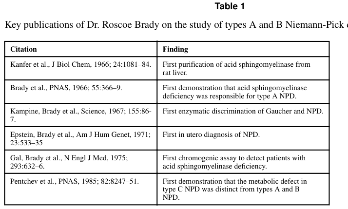

## Question

# Disease Characteristics Research Template

## Target Disease
- **Disease Name:** Niemann-Pick Disease Type E
- **MONDO ID:**  (if available)
- **Category:** Mendelian

## Research Objectives

Please provide a comprehensive research report on **Niemann-Pick Disease Type E** covering all of the
disease characteristics listed below. This report will be used to populate a disease knowledge
base entry. Be thorough and cite primary literature (PMID preferred) for all claims.

For each section, **suggested databases/resources** are listed. These are the first places
you should search for information on each topic.

---

### 1. Disease Information
> **Search first:** OMIM, Orphanet, ICD-10/ICD-11, MeSH, PubMed

- What is the disease? Provide a concise overview.
- What are the key identifiers? (OMIM, Orphanet, ICD-10/ICD-11, MeSH, Mondo)
- What are the common synonyms and alternative names?
- Is the information derived from individual patients (e.g., EHR) or aggregated disease-level resources?

### 2. Etiology

- **Disease Causal Factors**: What are the primary causes? (genetic, environmental, infectious, mechanistic)
- **Risk Factors**:
  > **Search first:** PubMed, Cochrane Library, UpToDate, clinical guidelines, ClinVar, ClinGen, GWAS Catalog, PheGenI, CTD, CDC, WHO, epidemiological databases
  - Genetic risk factors (causal variants, susceptibility loci, modifier genes)
  - Environmental risk factors (toxins, lifestyle, occupational exposures, age, sex, family history)
- **Protective Factors**:
  > **Search first:** PubMed, Cochrane Library, clinical trial databases, GWAS Catalog, gnomAD, WHO, CDC, nutrition databases
  - Genetic protective factors (protective variants, modifier alleles)
  - Environmental protective factors (diet, lifestyle, exposures that reduce risk)
- **Gene-Environment Interactions**: How do genetic and environmental factors interact to influence disease?
  > **Search first:** CTD, PubMed, PheGenI, GxE databases

### 3. Phenotypes
> **Search first:** HPO (Human Phenotype Ontology), OMIM, Orphanet, PubMed, clinicaltrials.gov, MedDRA, SNOMED CT, DECIPHER, LOINC

For each phenotype, provide:
- **Phenotype type**: symptoms, clinical signs, physical manifestations, behavioral changes, or laboratory abnormalities
  > For symptoms/signs: HPO, OMIM, Orphanet, PubMed
  > For behavioral changes: HPO, DSM, RDoC (Research Domain Criteria), PubMed
  > For laboratory abnormalities: LOINC, SNOMED CT, LabTests Online, PubMed
- **Phenotype characteristics**:
  > **Search first:** OMIM, Orphanet, HPO, PubMed
  - Age of symptom onset (neonatal, childhood, adult-onset, late-onset)
  - Symptom severity (mild, moderate, severe, variable)
  - Symptom progression (stable, progressive, episodic, fluctuating)
  - Frequency among affected individuals (percentage or qualitative)
- **Quality of life impact**: Effects on daily functioning and well-being (per-phenotype when possible)
  > **Search first:** EQ-5D database, SF-36, WHO QOL databases, PubMed
- Suggest HPO (Human Phenotype Ontology) terms for each phenotype

### 4. Genetic/Molecular Information

- **Causal Genes**: Gene mutations or chromosomal abnormalities responsible for disease (gene symbols, OMIM IDs)
  > **Search first:** OMIM, ClinVar, HGMD, Ensembl, NCBI Gene
- **Pathogenic Variants**:
  - Affected genes (gene symbols, HGNC IDs)
    > **Search first:** OMIM, NCBI Gene, Ensembl, HGNC, UniProt, GeneCards
  - Variant classification (pathogenic, likely pathogenic, VUS per ACMG/AMP guidelines)
    > **Search first:** ClinVar, ClinGen, ACMG/AMP guidelines, VarSome
  - Variant type/class (missense, frameshift, nonsense, splice-site, structural)
  - Allele frequency in population databases
    > **Search first:** gnomAD, 1000 Genomes, ExAC, TOPMed, dbSNP
  - Somatic vs germline origin
    > **Search first:** COSMIC (somatic), ClinVar, ICGC, TCGA
  - Functional consequences (loss of function, gain of function, dominant negative)
- **Modifier Genes**: Genes that modify disease severity or expression
- **Epigenetic Information**: DNA methylation, histone modifications, chromatin changes affecting disease
  > **Search first:** ENCODE, Roadmap Epigenomics, MethBase, DiseaseMeth
- **Chromosomal Abnormalities**: Large-scale genetic changes (aneuploidy, translocations, inversions)
  > **Search first:** DECIPHER, ClinVar, ECARUCA, UCSC Genome Browser

### 5. Environmental Information

- **Environmental Factors**: Non-genetic contributing factors (toxins, radiation, pollution, occupational exposure)
  > **Search first:** CTD (Comparative Toxicogenomics Database), TOXNET, PubMed, EPA databases
- **Lifestyle Factors**: Behavioral factors (smoking, diet, exercise, alcohol consumption)
  > **Search first:** CDC databases, WHO, PubMed, NHANES
- **Infectious Agents**: If applicable, pathogens causing or triggering disease (bacteria, viruses, fungi, parasites)
  > **Search first:** NCBI Taxonomy, ViPR, BV-BRC, MicrobeDB, GIDEON

### 6. Mechanism / Pathophysiology

- **Molecular Pathways**: Specific signaling cascades or biochemical pathways involved (Wnt, MAPK, mTOR, PI3K-AKT, etc.)
  > **Search first:** KEGG, Reactome, WikiPathways, PathBank, BioCyc
- **Cellular Processes**: Cell-level mechanisms (apoptosis, autophagy, cell cycle dysregulation, inflammation, etc.)
  > **Search first:** Gene Ontology (GO), Reactome, KEGG, PubMed
- **Protein Dysfunction**: How protein structure or function is altered (misfolding, aggregation, loss of function, gain of function)
  > **Search first:** UniProt, PDB (Protein Data Bank), InterPro, Pfam, AlphaFold
- **Metabolic Changes**: Alterations in metabolic processes (energy metabolism, lipid metabolism, amino acid metabolism)
  > **Search first:** KEGG, BioCyc, HMDB (Human Metabolome Database), BRENDA
- **Immune System Involvement**: Role of immune response (autoimmunity, immunodeficiency, chronic inflammation)
  > **Search first:** ImmPort, Immunome Database, IEDB, Gene Ontology
- **Tissue Damage Mechanisms**: How tissues/ are injured (oxidative stress, ischemia, fibrosis, necrosis)
  > **Search first:** PubMed, Gene Ontology, Reactome
- **Biochemical Abnormalities**: Specific molecular defects (enzyme deficiencies, receptor dysfunction, ion channel defects)
  > **Search first:** BRENDA, UniProt, KEGG, OMIM, PubMed
- **Epigenetic Changes**: DNA methylation, histone modifications affecting gene expression in disease
  > **Search first:** ENCODE, Roadmap Epigenomics, MethBase, DiseaseMeth
- **Molecular Profiling** (if available):
  - Transcriptomics/gene expression changes
    > **Search first:** GEO (Gene Expression Omnibus), ArrayExpress, GTEx, Human Cell Atlas, SRA
  - Proteomics findings
    > **Search first:** PRIDE, ProteomeXchange, Human Protein Atlas, STRING, BioGRID
  - Metabolomics signatures
    > **Search first:** MetaboLights, Metabolomics Workbench, HMDB, METLIN
  - Lipidomics alterations
    > **Search first:** LIPID MAPS, SwissLipids, LipidHome, Metabolomics Workbench
  - Genomic structural features
    > **Search first:** UCSC Genome Browser, Ensembl, NCBI, dbVar, DGV
- **Advanced Technologies** (if applicable):
  - Single-cell analysis findings (cell-type specific mechanisms, cellular heterogeneity)
    > **Search first:** Human Cell Atlas, Single Cell Portal, GEO, CELLxGENE
  - Spatial transcriptomics findings
    > **Search first:** GEO, Spatial Research, Vizgen, 10x Genomics data
  - Multi-omics integration results
    > **Search first:** TCGA, ICGC, cBioPortal, LinkedOmics, PubMed
  - Functional genomics screens (CRISPR, RNAi)
    > **Search first:** DepMap, GenomeRNAi, PubMed, BioGRID ORCS

For each mechanism, describe:
- The causal chain from initial trigger to clinical manifestation
- Which mechanisms are upstream vs downstream
- What cell types and biological processes are involved
- Suggest GO terms for biological processes and CL terms for cell types

### 7. Anatomical Structures Affected

- **Organ Level**:
  - Primary organs directly affected
  - Secondary organ involvement (complications, secondary effects)
  - Body systems involved (cardiovascular, nervous, digestive, respiratory, endocrine, etc.)
  > **Search first:** Uberon, FMA (Foundational Model of Anatomy), OMIM, HPO, ICD-11, MeSH, SNOMED CT
- **Tissue and Cell Level**:
  - Specific tissue types affected (epithelial, connective, muscle, nervous)
  - Specific cell populations targeted (with Cell Ontology terms)
  > **Search first:** Uberon, Human Protein Atlas, Cell Ontology, Human Cell Atlas, CellMarker, PanglaoDB
- **Subcellular Level**:
  - Cellular compartments involved (mitochondria, nucleus, ER, lysosomes) (with GO Cellular Component terms)
  > **Search first:** Gene Ontology (Cellular Component), UniProt, Human Protein Atlas
- **Localization**:
  - Specific anatomical sites (with UBERON terms)
    > **Search first:** FMA, Uberon, NeuroNames (for brain), SNOMED CT
  - Lateralization (unilateral, bilateral, asymmetric)
    > **Search first:** HPO, clinical literature, imaging databases

### 8. Temporal Development

- **Onset**:
  - Typical age of onset (congenital, pediatric, adult, geriatric)
  - Onset pattern (acute, subacute, chronic, insidious)
  > **Search first:** OMIM, Orphanet, HPO, PubMed
- **Progression**:
  - Disease stages (early, intermediate, advanced, end-stage)
    > **Search first:** Cancer Staging Manual (AJCC), WHO classifications, PubMed
  - Progression rate (rapid, slow, variable)
  - Disease course pattern (episodic, relapsing-remitting, progressive, stable)
  - Disease duration (self-limited, chronic lifelong)
  > **Search first:** Disease registries, longitudinal cohort databases, natural history studies, PubMed, Orphanet, OMIM
- **Patterns**:
  - Remission patterns (spontaneous, treatment-induced)
    > **Search first:** Clinical trial databases, disease registries, PubMed
  - Critical periods (time windows of vulnerability or opportunity for intervention)
    > **Search first:** PubMed, developmental biology databases, clinical guidelines

### 9. Inheritance and Population

- **Epidemiology**:
  - Prevalence (cases per 100,000 at given time)
  - Incidence (new cases per 100,000 per year)
  > **Search first:** Orphanet, CDC, WHO, GBD (Global Burden of Disease), national registries, SEER, disease registries
- **For Genetic Etiology**:
  - Inheritance pattern (AD, AR, X-linked, mitochondrial, multifactorial, polygenic)
    > **Search first:** OMIM, Orphanet, ClinVar, GTR (Genetic Testing Registry)
  - Penetrance (complete, incomplete, age-dependent)
    > **Search first:** ClinVar, OMIM, PubMed, ClinGen
  - Expressivity (variable, consistent)
    > **Search first:** OMIM, ClinVar, PubMed
  - Genetic anticipation (increasing severity in successive generations)
    > **Search first:** OMIM, PubMed (especially for repeat expansion disorders)
  - Germline mosaicism
    > **Search first:** ClinVar, OMIM, genetic counseling literature, PubMed
  - Founder effects (population-specific mutations)
    > **Search first:** gnomAD, population genetics databases, PubMed
  - Consanguinity role
    > **Search first:** OMIM, population studies, genetic counseling resources
  - Carrier frequency
    > **Search first:** gnomAD, carrier screening databases, GeneReviews, GTR
- **Population Demographics**:
  - Affected populations (ethnic or demographic groups with higher prevalence)
    > **Search first:** gnomAD, 1000 Genomes, PAGE Study, PubMed, population registries
  - Geographic distribution (endemic areas, regional variation)
    > **Search first:** WHO, CDC, GBD, Orphanet, geographic epidemiology databases
  - Geographic distribution of specific variants
  - Sex ratio (male:female)
    > **Search first:** Disease registries, OMIM, PubMed, epidemiological databases
  - Age distribution of affected individuals
    > **Search first:** CDC, disease registries, SEER, Orphanet

### 10. Diagnostics

- **Clinical Tests**:
  - Laboratory tests (blood, urine, tissue chemistry, specific enzyme assays)
    > **Search first:** LOINC, LabTests Online, PubMed
  - Biomarkers (proteins, metabolites, genetic markers, circulating biomarkers)
    > **Search first:** FDA Biomarker List, BEST (Biomarkers, EndpointS, and other Tools), PubMed
  - Imaging studies (X-ray, CT, MRI, PET, ultrasound)
    > **Search first:** RadLex, DICOM, Radiopaedia, imaging databases
  - Functional tests (pulmonary function, cardiac stress tests)
    > **Search first:** LOINC, clinical guidelines, PubMed
  - Electrophysiology (EEG, EMG, ECG, nerve conduction studies)
    > **Search first:** LOINC, clinical neurophysiology databases, PubMed
  - Biopsy findings (histopathology, immunohistochemistry)
    > **Search first:** SNOMED CT, College of American Pathologists resources, PubMed
  - Pathology findings (microscopic examination)
    > **Search first:** SNOMED CT, Digital Pathology databases, PubMed
- **Genetic Testing**:
  > **Search first:** GTR (Genetic Testing Registry), GeneReviews, ClinGen
  - Overview of recommended genetic testing approach
  - Whole genome sequencing (WGS) utility
    > **Search first:** GTR, ClinVar, GEL (Genomics England), gnomAD
  - Whole exome sequencing (WES) utility
    > **Search first:** GTR, ClinVar, OMIM, GeneMatcher
  - Gene panels (which panels, which genes)
    > **Search first:** GTR, ClinVar, laboratory-specific databases
  - Single gene testing
    > **Search first:** GTR, ClinVar, OMIM, GeneReviews
  - Chromosomal microarray (CMA)
    > **Search first:** DECIPHER, ClinVar, dbVar, ECARUCA
  - Karyotyping
    > **Search first:** Chromosome Abnormality Database, ClinVar, cytogenetics resources
  - FISH
    > **Search first:** ClinVar, cytogenetics databases, PubMed
  - Mitochondrial DNA testing
    > **Search first:** MITOMAP, MSeqDR, ClinVar, GTR
  - Repeat expansion testing
    > **Search first:** GTR, ClinVar, repeat expansion databases, PubMed
- **Omics-Based Diagnostics** (if applicable):
  - RNA sequencing / transcriptomics
    > **Search first:** GEO, ArrayExpress, GTEx, RNA-seq databases
  - Proteomics
    > **Search first:** PRIDE, ProteomeXchange, FDA Biomarker database
  - Metabolomics
    > **Search first:** MetaboLights, Metabolomics Workbench, HMDB
  - Epigenomics
    > **Search first:** GEO, ENCODE, Roadmap Epigenomics, MethBase
  - Liquid biopsy
    > **Search first:** COSMIC, ClinVar, liquid biopsy databases, PubMed
- **Clinical Criteria**:
  - Standardized diagnostic criteria (DSM, ICD, society guidelines)
    > **Search first:** DSM-5, ICD-11, clinical society guidelines, UpToDate
  - Differential diagnosis (other conditions to rule out, with distinguishing features)
    > **Search first:** DynaMed, UpToDate, clinical decision support systems
- **Screening**:
  - Screening methods for asymptomatic individuals (newborn screening, carrier screening, cascade screening)
    > **Search first:** ACMG recommendations, CDC newborn screening, GTR

### 11. Outcome/Prognosis

- **Survival and Mortality**:
  - Survival rate (5-year, 10-year, overall)
    > **Search first:** SEER, cancer registries, disease-specific registries, PubMed
  - Life expectancy (with and without treatment if applicable)
    > **Search first:** Orphanet, disease registries, actuarial databases, PubMed
  - Mortality rate
    > **Search first:** CDC, WHO, GBD, national mortality databases
  - Disease-specific mortality (deaths directly attributable to disease)
    > **Search first:** Disease registries, CDC Wonder, GBD, PubMed
- **Morbidity and Function**:
  - Morbidity (disease-related disability and health impacts)
    > **Search first:** GBD, WHO, disability databases, PubMed
  - Disability outcomes (long-term functional impairments)
    > **Search first:** ICF (International Classification of Functioning), disability registries
  - Quality of life measures (EQ-5D, SF-36, PROMIS, disease-specific tools)
    > **Search first:** EQ-5D database, SF-36, PROMIS, PubMed
- **Disease Course**:
  - Complications (secondary problems: infections, organ failure, etc.)
    > **Search first:** ICD codes, disease registries, clinical databases, PubMed
  - Recovery potential (likelihood and extent of recovery, with vs without treatment)
    > **Search first:** Natural history studies, rehabilitation databases, PubMed
- **Prediction**:
  - Prognostic factors (age, disease severity, biomarkers, treatment response)
    > **Search first:** Prognostic models databases, clinical calculators, PubMed
  - Prognostic biomarkers (molecular markers predicting disease course)
    > **Search first:** FDA Biomarker database, PubMed, cancer prognostic databases

### 12. Treatment

- **Pharmacotherapy**:
  - Pharmacological treatments (drug names, drug classes, mechanisms of action)
    > **Search first:** DrugBank, RxNorm, ATC classification, DailyMed, FDA databases
  - Pharmacogenomics (how genetic variants affect drug metabolism, efficacy, toxicity)
    > **Search first:** PharmGKB, CPIC (Clinical Pharmacogenetics), FDA Table of PGx Biomarkers
- **Advanced Therapeutics**:
  - Gene therapy (viral vectors, CRISPR, gene replacement, gene editing)
    > **Search first:** ClinicalTrials.gov, FDA gene therapy database, ASGCT resources
  - Cell therapy (stem cell transplant, CAR-T, cellular therapeutics)
    > **Search first:** ClinicalTrials.gov, FDA cell therapy database, FACT standards
  - RNA-based therapies (ASOs, siRNA, mRNA therapies)
    > **Search first:** ClinicalTrials.gov, FDA approvals, PubMed
  - Targeted therapies (treatments directed at specific molecular targets)
    > **Search first:** My Cancer Genome, OncoKB, ClinicalTrials.gov, FDA approvals
  - Immunotherapies (checkpoint inhibitors, monoclonal antibodies)
    > **Search first:** Cancer Immunotherapy Database, FDA approvals, ClinicalTrials.gov
- **Surgical and Interventional**:
  - Surgical interventions (types of surgery, timing, outcomes)
    > **Search first:** CPT codes, surgical registries, clinical guidelines, PubMed
- **Supportive and Rehabilitative**:
  - Supportive care (symptom management, pain control, nutrition)
    > **Search first:** Clinical guidelines, Cochrane Library, PubMed
  - Rehabilitation (physical therapy, occupational therapy, speech therapy)
    > **Search first:** Rehabilitation medicine databases, clinical guidelines, PubMed
- **Experimental**:
  - Experimental treatments in clinical trials (with NCT identifiers if available)
    > **Search first:** ClinicalTrials.gov, EU Clinical Trials Register, WHO ICTRP
- **Treatment Outcomes**:
  - Treatment response rates
    > **Search first:** Clinical trial databases, FDA reviews, systematic reviews, PubMed
  - Side effects and adverse events
    > **Search first:** FDA Adverse Event Reporting System (FAERS), MedWatch, PubMed
- **Treatment Strategy**:
  - Treatment algorithms (clinical pathways, decision trees)
    > **Search first:** Clinical practice guidelines, NCCN Guidelines, UpToDate
  - Combination therapies
    > **Search first:** ClinicalTrials.gov, treatment guidelines, PubMed
  - Personalized medicine approaches (genotype-guided treatment)
    > **Search first:** My Cancer Genome, CIViC, PharmGKB, precision medicine databases

For each treatment, suggest MAXO (Medical Action Ontology) terms where applicable.

### 13. Prevention

- **Prevention Levels**:
  - Primary prevention (preventing disease occurrence: vaccination, risk factor modification)
    > **Search first:** CDC, WHO, USPSTF recommendations, Cochrane Library
  - Secondary prevention (early detection and treatment: screening programs, early intervention)
    > **Search first:** USPSTF, CDC screening guidelines, WHO
  - Tertiary prevention (preventing complications in those with disease)
    > **Search first:** Clinical guidelines, disease management protocols, PubMed
- **Immunization**: Vaccine strategies (if applicable)
  > **Search first:** CDC vaccine schedules, WHO immunization, FDA vaccine database
- **Screening and Early Detection**:
  - Screening programs (population-based: newborn screening, cancer screening)
    > **Search first:** CDC screening programs, USPSTF, cancer screening databases
  - Genetic screening (carrier screening, preimplantation genetic diagnosis, prenatal testing)
    > **Search first:** ACMG recommendations, ACOG guidelines, GTR
  - Risk stratification (identifying high-risk individuals for targeted prevention)
    > **Search first:** Risk prediction models, clinical calculators, PubMed
- **Behavioral Interventions**: Lifestyle modifications to reduce risk
  > **Search first:** CDC, WHO, behavioral intervention databases, Cochrane Library
- **Counseling**: Genetic counseling (risk assessment, family planning guidance)
  > **Search first:** NSGC resources, ACMG guidelines, GeneReviews
- **Public Health**:
  - Public health interventions (sanitation, vector control, health education)
    > **Search first:** CDC, WHO, public health databases, PubMed
  - Environmental interventions (reducing environmental risk factors)
    > **Search first:** EPA databases, WHO environmental health, PubMed
- **Prophylaxis**: Preventive medications or procedures
  > **Search first:** Clinical guidelines, FDA approvals, PubMed

### 14. Other Species / Natural Disease

- **Taxonomy**: Species affected (with NCBI Taxon identifiers)
  > **Search first:** NCBI Taxonomy
- **Breed**: Specific breeds affected (with VBO identifiers if applicable)
  > **Search first:** VBO (Vertebrate Breed Ontology)
- **Gene**: Orthologous genes in other species (with NCBI Gene IDs)
  > **Search first:** NCBI Gene
- **Natural Disease**:
  - Naturally occurring disease in other species (companion animals, wildlife)
    > **Search first:** OMIA (Online Mendelian Inheritance in Animals), VetCompass, PubMed
  - Veterinary relevance and importance in animal health
    > **Search first:** OMIA, veterinary databases, PubMed
- **Comparative Biology**:
  - Comparative pathology (similarities and differences across species)
    > **Search first:** OMIA, comparative pathology databases, PubMed
  - Evolutionary conservation of disease mechanisms
    > **Search first:** HomoloGene, OrthoMCL, Alliance of Genome Resources
- **Transmission** (if applicable):
  - Zoonotic potential
    > **Search first:** CDC zoonotic diseases, WHO zoonoses, GIDEON
  - Cross-species susceptibility
    > **Search first:** NCBI Taxonomy, veterinary databases, PubMed

### 15. Model Organisms

- **Model Types**:
  - Model organism type (mammalian, invertebrate, cellular, in vitro)
    > **Search first:** Alliance of Genome Resources, model organism databases
  - Specific model systems (mouse, rat, zebrafish, Drosophila, C. elegans, yeast, cell lines, organoids, iPSCs)
    > **Search first:** MGI, RGD, ZFIN, FlyBase, WormBase, SGD, ATCC, Cellosaurus
  - Induced models (drug treatment, surgical intervention, environmental manipulation)
    > **Search first:** MGI, model organism databases, PubMed
- **Genetic Models**:
  - Types available (knockout, knock-in, transgenic, conditional, humanized)
    > **Search first:** MGI, IMPC, KOMP, EuMMCR, IMSR
- **Model Characteristics**:
  - Phenotype recapitulation (how well model reproduces human disease features)
    > **Search first:** Model organism databases, comparative studies, PubMed
  - Model limitations (aspects of human disease not captured)
    > **Search first:** Model organism databases, PubMed, review articles
- **Applications**:
  - Research applications (what aspects of disease can be studied)
    > **Search first:** Model organism databases, PubMed
- **Resources**:
  - Model databases
    > **Search first:** MGI, RGD, ZFIN, FlyBase, WormBase, IMSR, EMMA, MMRRC

---

## Citation Requirements

- Cite primary literature (PMID preferred) for all mechanistic and clinical claims
- Prioritize recent reviews and landmark papers
- Include direct quotes from abstracts where possible to support key statements
- Distinguish evidence source types: human clinical, model organism, in vitro, computational

## Output Format

Structure your response as a comprehensive narrative organized by the sections above.
For each section, provide:
- Factual content with specific details (numbers, percentages, gene names, variant nomenclature)
- Ontology term suggestions (HPO, GO, CL, UBERON, CHEBI, MAXO, MONDO) where applicable
- Evidence citations with PMIDs
- Direct quotes from abstracts to support key claims
- Clear indication when information is not available or not applicable for this disease

This report will be used to populate a disease knowledge base entry with:
- Pathophysiology descriptions with causal chains
- Gene/protein annotations (HGNC, GO terms)
- Phenotype associations (HP terms) with frequencies
- Cell type involvement (CL terms)
- Anatomical locations (UBERON terms)
- Chemical entities (CHEBI terms)
- Treatment annotations (MAXO terms)
- Evidence items with PMIDs and exact abstract quotes
- Epidemiology, prognosis, diagnostic, and prevention information
- Animal model descriptions with phenotype recapitulation details

## Output

Question: You are an expert researcher providing comprehensive, well-cited information.

Provide detailed information focusing on:
1. Key concepts and definitions with current understanding
2. Recent developments and latest research (prioritize 2023-2024 sources)
3. Current applications and real-world implementations
4. Expert opinions and analysis from authoritative sources
5. Relevant statistics and data from recent studies

Format as a comprehensive research report with proper citations. Include URLs and publication dates where available.
Always prioritize recent, authoritative sources and provide specific citations for all major claims.

# Disease Characteristics Research Template

## Target Disease
- **Disease Name:** Niemann-Pick Disease Type E
- **MONDO ID:**  (if available)
- **Category:** Mendelian

## Research Objectives

Please provide a comprehensive research report on **Niemann-Pick Disease Type E** covering all of the
disease characteristics listed below. This report will be used to populate a disease knowledge
base entry. Be thorough and cite primary literature (PMID preferred) for all claims.

For each section, **suggested databases/resources** are listed. These are the first places
you should search for information on each topic.

---

### 1. Disease Information
> **Search first:** OMIM, Orphanet, ICD-10/ICD-11, MeSH, PubMed

- What is the disease? Provide a concise overview.
- What are the key identifiers? (OMIM, Orphanet, ICD-10/ICD-11, MeSH, Mondo)
- What are the common synonyms and alternative names?
- Is the information derived from individual patients (e.g., EHR) or aggregated disease-level resources?

### 2. Etiology

- **Disease Causal Factors**: What are the primary causes? (genetic, environmental, infectious, mechanistic)
- **Risk Factors**:
  > **Search first:** PubMed, Cochrane Library, UpToDate, clinical guidelines, ClinVar, ClinGen, GWAS Catalog, PheGenI, CTD, CDC, WHO, epidemiological databases
  - Genetic risk factors (causal variants, susceptibility loci, modifier genes)
  - Environmental risk factors (toxins, lifestyle, occupational exposures, age, sex, family history)
- **Protective Factors**:
  > **Search first:** PubMed, Cochrane Library, clinical trial databases, GWAS Catalog, gnomAD, WHO, CDC, nutrition databases
  - Genetic protective factors (protective variants, modifier alleles)
  - Environmental protective factors (diet, lifestyle, exposures that reduce risk)
- **Gene-Environment Interactions**: How do genetic and environmental factors interact to influence disease?
  > **Search first:** CTD, PubMed, PheGenI, GxE databases

### 3. Phenotypes
> **Search first:** HPO (Human Phenotype Ontology), OMIM, Orphanet, PubMed, clinicaltrials.gov, MedDRA, SNOMED CT, DECIPHER, LOINC

For each phenotype, provide:
- **Phenotype type**: symptoms, clinical signs, physical manifestations, behavioral changes, or laboratory abnormalities
  > For symptoms/signs: HPO, OMIM, Orphanet, PubMed
  > For behavioral changes: HPO, DSM, RDoC (Research Domain Criteria), PubMed
  > For laboratory abnormalities: LOINC, SNOMED CT, LabTests Online, PubMed
- **Phenotype characteristics**:
  > **Search first:** OMIM, Orphanet, HPO, PubMed
  - Age of symptom onset (neonatal, childhood, adult-onset, late-onset)
  - Symptom severity (mild, moderate, severe, variable)
  - Symptom progression (stable, progressive, episodic, fluctuating)
  - Frequency among affected individuals (percentage or qualitative)
- **Quality of life impact**: Effects on daily functioning and well-being (per-phenotype when possible)
  > **Search first:** EQ-5D database, SF-36, WHO QOL databases, PubMed
- Suggest HPO (Human Phenotype Ontology) terms for each phenotype

### 4. Genetic/Molecular Information

- **Causal Genes**: Gene mutations or chromosomal abnormalities responsible for disease (gene symbols, OMIM IDs)
  > **Search first:** OMIM, ClinVar, HGMD, Ensembl, NCBI Gene
- **Pathogenic Variants**:
  - Affected genes (gene symbols, HGNC IDs)
    > **Search first:** OMIM, NCBI Gene, Ensembl, HGNC, UniProt, GeneCards
  - Variant classification (pathogenic, likely pathogenic, VUS per ACMG/AMP guidelines)
    > **Search first:** ClinVar, ClinGen, ACMG/AMP guidelines, VarSome
  - Variant type/class (missense, frameshift, nonsense, splice-site, structural)
  - Allele frequency in population databases
    > **Search first:** gnomAD, 1000 Genomes, ExAC, TOPMed, dbSNP
  - Somatic vs germline origin
    > **Search first:** COSMIC (somatic), ClinVar, ICGC, TCGA
  - Functional consequences (loss of function, gain of function, dominant negative)
- **Modifier Genes**: Genes that modify disease severity or expression
- **Epigenetic Information**: DNA methylation, histone modifications, chromatin changes affecting disease
  > **Search first:** ENCODE, Roadmap Epigenomics, MethBase, DiseaseMeth
- **Chromosomal Abnormalities**: Large-scale genetic changes (aneuploidy, translocations, inversions)
  > **Search first:** DECIPHER, ClinVar, ECARUCA, UCSC Genome Browser

### 5. Environmental Information

- **Environmental Factors**: Non-genetic contributing factors (toxins, radiation, pollution, occupational exposure)
  > **Search first:** CTD (Comparative Toxicogenomics Database), TOXNET, PubMed, EPA databases
- **Lifestyle Factors**: Behavioral factors (smoking, diet, exercise, alcohol consumption)
  > **Search first:** CDC databases, WHO, PubMed, NHANES
- **Infectious Agents**: If applicable, pathogens causing or triggering disease (bacteria, viruses, fungi, parasites)
  > **Search first:** NCBI Taxonomy, ViPR, BV-BRC, MicrobeDB, GIDEON

### 6. Mechanism / Pathophysiology

- **Molecular Pathways**: Specific signaling cascades or biochemical pathways involved (Wnt, MAPK, mTOR, PI3K-AKT, etc.)
  > **Search first:** KEGG, Reactome, WikiPathways, PathBank, BioCyc
- **Cellular Processes**: Cell-level mechanisms (apoptosis, autophagy, cell cycle dysregulation, inflammation, etc.)
  > **Search first:** Gene Ontology (GO), Reactome, KEGG, PubMed
- **Protein Dysfunction**: How protein structure or function is altered (misfolding, aggregation, loss of function, gain of function)
  > **Search first:** UniProt, PDB (Protein Data Bank), InterPro, Pfam, AlphaFold
- **Metabolic Changes**: Alterations in metabolic processes (energy metabolism, lipid metabolism, amino acid metabolism)
  > **Search first:** KEGG, BioCyc, HMDB (Human Metabolome Database), BRENDA
- **Immune System Involvement**: Role of immune response (autoimmunity, immunodeficiency, chronic inflammation)
  > **Search first:** ImmPort, Immunome Database, IEDB, Gene Ontology
- **Tissue Damage Mechanisms**: How tissues/ are injured (oxidative stress, ischemia, fibrosis, necrosis)
  > **Search first:** PubMed, Gene Ontology, Reactome
- **Biochemical Abnormalities**: Specific molecular defects (enzyme deficiencies, receptor dysfunction, ion channel defects)
  > **Search first:** BRENDA, UniProt, KEGG, OMIM, PubMed
- **Epigenetic Changes**: DNA methylation, histone modifications affecting gene expression in disease
  > **Search first:** ENCODE, Roadmap Epigenomics, MethBase, DiseaseMeth
- **Molecular Profiling** (if available):
  - Transcriptomics/gene expression changes
    > **Search first:** GEO (Gene Expression Omnibus), ArrayExpress, GTEx, Human Cell Atlas, SRA
  - Proteomics findings
    > **Search first:** PRIDE, ProteomeXchange, Human Protein Atlas, STRING, BioGRID
  - Metabolomics signatures
    > **Search first:** MetaboLights, Metabolomics Workbench, HMDB, METLIN
  - Lipidomics alterations
    > **Search first:** LIPID MAPS, SwissLipids, LipidHome, Metabolomics Workbench
  - Genomic structural features
    > **Search first:** UCSC Genome Browser, Ensembl, NCBI, dbVar, DGV
- **Advanced Technologies** (if applicable):
  - Single-cell analysis findings (cell-type specific mechanisms, cellular heterogeneity)
    > **Search first:** Human Cell Atlas, Single Cell Portal, GEO, CELLxGENE
  - Spatial transcriptomics findings
    > **Search first:** GEO, Spatial Research, Vizgen, 10x Genomics data
  - Multi-omics integration results
    > **Search first:** TCGA, ICGC, cBioPortal, LinkedOmics, PubMed
  - Functional genomics screens (CRISPR, RNAi)
    > **Search first:** DepMap, GenomeRNAi, PubMed, BioGRID ORCS

For each mechanism, describe:
- The causal chain from initial trigger to clinical manifestation
- Which mechanisms are upstream vs downstream
- What cell types and biological processes are involved
- Suggest GO terms for biological processes and CL terms for cell types

### 7. Anatomical Structures Affected

- **Organ Level**:
  - Primary organs directly affected
  - Secondary organ involvement (complications, secondary effects)
  - Body systems involved (cardiovascular, nervous, digestive, respiratory, endocrine, etc.)
  > **Search first:** Uberon, FMA (Foundational Model of Anatomy), OMIM, HPO, ICD-11, MeSH, SNOMED CT
- **Tissue and Cell Level**:
  - Specific tissue types affected (epithelial, connective, muscle, nervous)
  - Specific cell populations targeted (with Cell Ontology terms)
  > **Search first:** Uberon, Human Protein Atlas, Cell Ontology, Human Cell Atlas, CellMarker, PanglaoDB
- **Subcellular Level**:
  - Cellular compartments involved (mitochondria, nucleus, ER, lysosomes) (with GO Cellular Component terms)
  > **Search first:** Gene Ontology (Cellular Component), UniProt, Human Protein Atlas
- **Localization**:
  - Specific anatomical sites (with UBERON terms)
    > **Search first:** FMA, Uberon, NeuroNames (for brain), SNOMED CT
  - Lateralization (unilateral, bilateral, asymmetric)
    > **Search first:** HPO, clinical literature, imaging databases

### 8. Temporal Development

- **Onset**:
  - Typical age of onset (congenital, pediatric, adult, geriatric)
  - Onset pattern (acute, subacute, chronic, insidious)
  > **Search first:** OMIM, Orphanet, HPO, PubMed
- **Progression**:
  - Disease stages (early, intermediate, advanced, end-stage)
    > **Search first:** Cancer Staging Manual (AJCC), WHO classifications, PubMed
  - Progression rate (rapid, slow, variable)
  - Disease course pattern (episodic, relapsing-remitting, progressive, stable)
  - Disease duration (self-limited, chronic lifelong)
  > **Search first:** Disease registries, longitudinal cohort databases, natural history studies, PubMed, Orphanet, OMIM
- **Patterns**:
  - Remission patterns (spontaneous, treatment-induced)
    > **Search first:** Clinical trial databases, disease registries, PubMed
  - Critical periods (time windows of vulnerability or opportunity for intervention)
    > **Search first:** PubMed, developmental biology databases, clinical guidelines

### 9. Inheritance and Population

- **Epidemiology**:
  - Prevalence (cases per 100,000 at given time)
  - Incidence (new cases per 100,000 per year)
  > **Search first:** Orphanet, CDC, WHO, GBD (Global Burden of Disease), national registries, SEER, disease registries
- **For Genetic Etiology**:
  - Inheritance pattern (AD, AR, X-linked, mitochondrial, multifactorial, polygenic)
    > **Search first:** OMIM, Orphanet, ClinVar, GTR (Genetic Testing Registry)
  - Penetrance (complete, incomplete, age-dependent)
    > **Search first:** ClinVar, OMIM, PubMed, ClinGen
  - Expressivity (variable, consistent)
    > **Search first:** OMIM, ClinVar, PubMed
  - Genetic anticipation (increasing severity in successive generations)
    > **Search first:** OMIM, PubMed (especially for repeat expansion disorders)
  - Germline mosaicism
    > **Search first:** ClinVar, OMIM, genetic counseling literature, PubMed
  - Founder effects (population-specific mutations)
    > **Search first:** gnomAD, population genetics databases, PubMed
  - Consanguinity role
    > **Search first:** OMIM, population studies, genetic counseling resources
  - Carrier frequency
    > **Search first:** gnomAD, carrier screening databases, GeneReviews, GTR
- **Population Demographics**:
  - Affected populations (ethnic or demographic groups with higher prevalence)
    > **Search first:** gnomAD, 1000 Genomes, PAGE Study, PubMed, population registries
  - Geographic distribution (endemic areas, regional variation)
    > **Search first:** WHO, CDC, GBD, Orphanet, geographic epidemiology databases
  - Geographic distribution of specific variants
  - Sex ratio (male:female)
    > **Search first:** Disease registries, OMIM, PubMed, epidemiological databases
  - Age distribution of affected individuals
    > **Search first:** CDC, disease registries, SEER, Orphanet

### 10. Diagnostics

- **Clinical Tests**:
  - Laboratory tests (blood, urine, tissue chemistry, specific enzyme assays)
    > **Search first:** LOINC, LabTests Online, PubMed
  - Biomarkers (proteins, metabolites, genetic markers, circulating biomarkers)
    > **Search first:** FDA Biomarker List, BEST (Biomarkers, EndpointS, and other Tools), PubMed
  - Imaging studies (X-ray, CT, MRI, PET, ultrasound)
    > **Search first:** RadLex, DICOM, Radiopaedia, imaging databases
  - Functional tests (pulmonary function, cardiac stress tests)
    > **Search first:** LOINC, clinical guidelines, PubMed
  - Electrophysiology (EEG, EMG, ECG, nerve conduction studies)
    > **Search first:** LOINC, clinical neurophysiology databases, PubMed
  - Biopsy findings (histopathology, immunohistochemistry)
    > **Search first:** SNOMED CT, College of American Pathologists resources, PubMed
  - Pathology findings (microscopic examination)
    > **Search first:** SNOMED CT, Digital Pathology databases, PubMed
- **Genetic Testing**:
  > **Search first:** GTR (Genetic Testing Registry), GeneReviews, ClinGen
  - Overview of recommended genetic testing approach
  - Whole genome sequencing (WGS) utility
    > **Search first:** GTR, ClinVar, GEL (Genomics England), gnomAD
  - Whole exome sequencing (WES) utility
    > **Search first:** GTR, ClinVar, OMIM, GeneMatcher
  - Gene panels (which panels, which genes)
    > **Search first:** GTR, ClinVar, laboratory-specific databases
  - Single gene testing
    > **Search first:** GTR, ClinVar, OMIM, GeneReviews
  - Chromosomal microarray (CMA)
    > **Search first:** DECIPHER, ClinVar, dbVar, ECARUCA
  - Karyotyping
    > **Search first:** Chromosome Abnormality Database, ClinVar, cytogenetics resources
  - FISH
    > **Search first:** ClinVar, cytogenetics databases, PubMed
  - Mitochondrial DNA testing
    > **Search first:** MITOMAP, MSeqDR, ClinVar, GTR
  - Repeat expansion testing
    > **Search first:** GTR, ClinVar, repeat expansion databases, PubMed
- **Omics-Based Diagnostics** (if applicable):
  - RNA sequencing / transcriptomics
    > **Search first:** GEO, ArrayExpress, GTEx, RNA-seq databases
  - Proteomics
    > **Search first:** PRIDE, ProteomeXchange, FDA Biomarker database
  - Metabolomics
    > **Search first:** MetaboLights, Metabolomics Workbench, HMDB
  - Epigenomics
    > **Search first:** GEO, ENCODE, Roadmap Epigenomics, MethBase
  - Liquid biopsy
    > **Search first:** COSMIC, ClinVar, liquid biopsy databases, PubMed
- **Clinical Criteria**:
  - Standardized diagnostic criteria (DSM, ICD, society guidelines)
    > **Search first:** DSM-5, ICD-11, clinical society guidelines, UpToDate
  - Differential diagnosis (other conditions to rule out, with distinguishing features)
    > **Search first:** DynaMed, UpToDate, clinical decision support systems
- **Screening**:
  - Screening methods for asymptomatic individuals (newborn screening, carrier screening, cascade screening)
    > **Search first:** ACMG recommendations, CDC newborn screening, GTR

### 11. Outcome/Prognosis

- **Survival and Mortality**:
  - Survival rate (5-year, 10-year, overall)
    > **Search first:** SEER, cancer registries, disease-specific registries, PubMed
  - Life expectancy (with and without treatment if applicable)
    > **Search first:** Orphanet, disease registries, actuarial databases, PubMed
  - Mortality rate
    > **Search first:** CDC, WHO, GBD, national mortality databases
  - Disease-specific mortality (deaths directly attributable to disease)
    > **Search first:** Disease registries, CDC Wonder, GBD, PubMed
- **Morbidity and Function**:
  - Morbidity (disease-related disability and health impacts)
    > **Search first:** GBD, WHO, disability databases, PubMed
  - Disability outcomes (long-term functional impairments)
    > **Search first:** ICF (International Classification of Functioning), disability registries
  - Quality of life measures (EQ-5D, SF-36, PROMIS, disease-specific tools)
    > **Search first:** EQ-5D database, SF-36, PROMIS, PubMed
- **Disease Course**:
  - Complications (secondary problems: infections, organ failure, etc.)
    > **Search first:** ICD codes, disease registries, clinical databases, PubMed
  - Recovery potential (likelihood and extent of recovery, with vs without treatment)
    > **Search first:** Natural history studies, rehabilitation databases, PubMed
- **Prediction**:
  - Prognostic factors (age, disease severity, biomarkers, treatment response)
    > **Search first:** Prognostic models databases, clinical calculators, PubMed
  - Prognostic biomarkers (molecular markers predicting disease course)
    > **Search first:** FDA Biomarker database, PubMed, cancer prognostic databases

### 12. Treatment

- **Pharmacotherapy**:
  - Pharmacological treatments (drug names, drug classes, mechanisms of action)
    > **Search first:** DrugBank, RxNorm, ATC classification, DailyMed, FDA databases
  - Pharmacogenomics (how genetic variants affect drug metabolism, efficacy, toxicity)
    > **Search first:** PharmGKB, CPIC (Clinical Pharmacogenetics), FDA Table of PGx Biomarkers
- **Advanced Therapeutics**:
  - Gene therapy (viral vectors, CRISPR, gene replacement, gene editing)
    > **Search first:** ClinicalTrials.gov, FDA gene therapy database, ASGCT resources
  - Cell therapy (stem cell transplant, CAR-T, cellular therapeutics)
    > **Search first:** ClinicalTrials.gov, FDA cell therapy database, FACT standards
  - RNA-based therapies (ASOs, siRNA, mRNA therapies)
    > **Search first:** ClinicalTrials.gov, FDA approvals, PubMed
  - Targeted therapies (treatments directed at specific molecular targets)
    > **Search first:** My Cancer Genome, OncoKB, ClinicalTrials.gov, FDA approvals
  - Immunotherapies (checkpoint inhibitors, monoclonal antibodies)
    > **Search first:** Cancer Immunotherapy Database, FDA approvals, ClinicalTrials.gov
- **Surgical and Interventional**:
  - Surgical interventions (types of surgery, timing, outcomes)
    > **Search first:** CPT codes, surgical registries, clinical guidelines, PubMed
- **Supportive and Rehabilitative**:
  - Supportive care (symptom management, pain control, nutrition)
    > **Search first:** Clinical guidelines, Cochrane Library, PubMed
  - Rehabilitation (physical therapy, occupational therapy, speech therapy)
    > **Search first:** Rehabilitation medicine databases, clinical guidelines, PubMed
- **Experimental**:
  - Experimental treatments in clinical trials (with NCT identifiers if available)
    > **Search first:** ClinicalTrials.gov, EU Clinical Trials Register, WHO ICTRP
- **Treatment Outcomes**:
  - Treatment response rates
    > **Search first:** Clinical trial databases, FDA reviews, systematic reviews, PubMed
  - Side effects and adverse events
    > **Search first:** FDA Adverse Event Reporting System (FAERS), MedWatch, PubMed
- **Treatment Strategy**:
  - Treatment algorithms (clinical pathways, decision trees)
    > **Search first:** Clinical practice guidelines, NCCN Guidelines, UpToDate
  - Combination therapies
    > **Search first:** ClinicalTrials.gov, treatment guidelines, PubMed
  - Personalized medicine approaches (genotype-guided treatment)
    > **Search first:** My Cancer Genome, CIViC, PharmGKB, precision medicine databases

For each treatment, suggest MAXO (Medical Action Ontology) terms where applicable.

### 13. Prevention

- **Prevention Levels**:
  - Primary prevention (preventing disease occurrence: vaccination, risk factor modification)
    > **Search first:** CDC, WHO, USPSTF recommendations, Cochrane Library
  - Secondary prevention (early detection and treatment: screening programs, early intervention)
    > **Search first:** USPSTF, CDC screening guidelines, WHO
  - Tertiary prevention (preventing complications in those with disease)
    > **Search first:** Clinical guidelines, disease management protocols, PubMed
- **Immunization**: Vaccine strategies (if applicable)
  > **Search first:** CDC vaccine schedules, WHO immunization, FDA vaccine database
- **Screening and Early Detection**:
  - Screening programs (population-based: newborn screening, cancer screening)
    > **Search first:** CDC screening programs, USPSTF, cancer screening databases
  - Genetic screening (carrier screening, preimplantation genetic diagnosis, prenatal testing)
    > **Search first:** ACMG recommendations, ACOG guidelines, GTR
  - Risk stratification (identifying high-risk individuals for targeted prevention)
    > **Search first:** Risk prediction models, clinical calculators, PubMed
- **Behavioral Interventions**: Lifestyle modifications to reduce risk
  > **Search first:** CDC, WHO, behavioral intervention databases, Cochrane Library
- **Counseling**: Genetic counseling (risk assessment, family planning guidance)
  > **Search first:** NSGC resources, ACMG guidelines, GeneReviews
- **Public Health**:
  - Public health interventions (sanitation, vector control, health education)
    > **Search first:** CDC, WHO, public health databases, PubMed
  - Environmental interventions (reducing environmental risk factors)
    > **Search first:** EPA databases, WHO environmental health, PubMed
- **Prophylaxis**: Preventive medications or procedures
  > **Search first:** Clinical guidelines, FDA approvals, PubMed

### 14. Other Species / Natural Disease

- **Taxonomy**: Species affected (with NCBI Taxon identifiers)
  > **Search first:** NCBI Taxonomy
- **Breed**: Specific breeds affected (with VBO identifiers if applicable)
  > **Search first:** VBO (Vertebrate Breed Ontology)
- **Gene**: Orthologous genes in other species (with NCBI Gene IDs)
  > **Search first:** NCBI Gene
- **Natural Disease**:
  - Naturally occurring disease in other species (companion animals, wildlife)
    > **Search first:** OMIA (Online Mendelian Inheritance in Animals), VetCompass, PubMed
  - Veterinary relevance and importance in animal health
    > **Search first:** OMIA, veterinary databases, PubMed
- **Comparative Biology**:
  - Comparative pathology (similarities and differences across species)
    > **Search first:** OMIA, comparative pathology databases, PubMed
  - Evolutionary conservation of disease mechanisms
    > **Search first:** HomoloGene, OrthoMCL, Alliance of Genome Resources
- **Transmission** (if applicable):
  - Zoonotic potential
    > **Search first:** CDC zoonotic diseases, WHO zoonoses, GIDEON
  - Cross-species susceptibility
    > **Search first:** NCBI Taxonomy, veterinary databases, PubMed

### 15. Model Organisms

- **Model Types**:
  - Model organism type (mammalian, invertebrate, cellular, in vitro)
    > **Search first:** Alliance of Genome Resources, model organism databases
  - Specific model systems (mouse, rat, zebrafish, Drosophila, C. elegans, yeast, cell lines, organoids, iPSCs)
    > **Search first:** MGI, RGD, ZFIN, FlyBase, WormBase, SGD, ATCC, Cellosaurus
  - Induced models (drug treatment, surgical intervention, environmental manipulation)
    > **Search first:** MGI, model organism databases, PubMed
- **Genetic Models**:
  - Types available (knockout, knock-in, transgenic, conditional, humanized)
    > **Search first:** MGI, IMPC, KOMP, EuMMCR, IMSR
- **Model Characteristics**:
  - Phenotype recapitulation (how well model reproduces human disease features)
    > **Search first:** Model organism databases, comparative studies, PubMed
  - Model limitations (aspects of human disease not captured)
    > **Search first:** Model organism databases, PubMed, review articles
- **Applications**:
  - Research applications (what aspects of disease can be studied)
    > **Search first:** Model organism databases, PubMed
- **Resources**:
  - Model databases
    > **Search first:** MGI, RGD, ZFIN, FlyBase, WormBase, IMSR, EMMA, MMRRC

---

## Citation Requirements

- Cite primary literature (PMID preferred) for all mechanistic and clinical claims
- Prioritize recent reviews and landmark papers
- Include direct quotes from abstracts where possible to support key statements
- Distinguish evidence source types: human clinical, model organism, in vitro, computational

## Output Format

Structure your response as a comprehensive narrative organized by the sections above.
For each section, provide:
- Factual content with specific details (numbers, percentages, gene names, variant nomenclature)
- Ontology term suggestions (HPO, GO, CL, UBERON, CHEBI, MAXO, MONDO) where applicable
- Evidence citations with PMIDs
- Direct quotes from abstracts to support key claims
- Clear indication when information is not available or not applicable for this disease

This report will be used to populate a disease knowledge base entry with:
- Pathophysiology descriptions with causal chains
- Gene/protein annotations (HGNC, GO terms)
- Phenotype associations (HP terms) with frequencies
- Cell type involvement (CL terms)
- Anatomical locations (UBERON terms)
- Chemical entities (CHEBI terms)
- Treatment annotations (MAXO terms)
- Evidence items with PMIDs and exact abstract quotes
- Epidemiology, prognosis, diagnostic, and prevention information
- Animal model descriptions with phenotype recapitulation details

# Niemann–Pick Disease Type E (historical): Comprehensive Disease Characteristics Report

## Executive summary (current understanding)
Niemann–Pick disease “type E” (NPDE) is best understood as a *historical, ill-defined nosologic label* applied to rare, mostly adult presentations of Niemann–Pick–like storage disease. Modern expert sources emphasize that the molecular era split Niemann–Pick disorders into **acid sphingomyelinase deficiency (ASMD; SMPD1; historically types A/B)** and **Niemann–Pick disease type C (NPC; NPC1/NPC2; historically type C and type D)**, and that **“The nosology of types D and E NPD are no longer used.”** (schuchman2017typesaand pages 1-3). A 2016 case report still used “type E” for an adult with Niemann–Pick cells and **normal leukocyte acid sphingomyelinase** and concluded that **“the biochemical nature of type E still awaits clarification.”** (zheng2016casereportrenal pages 3-5). Accordingly, a knowledge-base entry for “NP type E” should explicitly record that it is an obsolete label and that modern diagnosis should re-classify cases into ASMD, NPC, or another lysosomal disorder using enzyme activity, biomarkers, and molecular testing. (schuchman2017typesaand pages 1-3, geberhiwot2023consensusclinicalmanagement pages 11-13, geberhiwot2023consensusclinicalmanagement pages 13-14)

## Key concepts and definitions (with modern reclassification)
### What is the disease?
Historically, “Niemann–Pick disease” referred to patients with lipid storage and foam cells and overlapping clinical features such as hepatosplenomegaly, pulmonary insufficiency, and/or CNS involvement. (schuchman2017typesaand pages 1-3)

Modern work established two main metabolic etiologies:
- **ASMD (historical NPD types A and B):** due to deficient **acid sphingomyelinase (ASM)** activity caused by **SMPD1** mutations. (schuchman2017typesaand pages 1-3)
- **NPC (historical NPD type C; type D now included):** due to defective intracellular cholesterol transport caused by **NPC1** or **NPC2** defects. (schuchman2017typesaand pages 1-3, patinoescobar2019niemannpickdiseasean pages 1-2)

“Type E” was historically used for some intermediate or adult cases, but authoritative review states it is no longer used (schuchman2017typesaand pages 1-3), and later case literature highlights it remains biochemically unclear (zheng2016casereportrenal pages 3-5).

### Key identifiers (requested)
Evidence retrieved here did **not** provide an authoritative MONDO/MeSH/ICD/Orphanet identifier specifically for “Niemann–Pick disease type E.” Because “type E” is obsolete, modern resources typically index patients under **ASMD** or **NPC** rather than NPDE. (schuchman2017typesaand pages 1-3, geberhiwot2023consensusclinicalmanagement pages 4-5)

**Ontology suggestion (to implement in KB, with uncertainty):** treat “Niemann–Pick disease type E” as a *historical synonym / deprecated term* and map to parent concept “Niemann–Pick disease” with *recommended reclassification to ASMD or NPC based on testing*.

### Synonyms / alternative names
- “Niemann–Pick disease type E” (historical) (zheng2016casereportrenal pages 3-5, schuchman2017typesaand pages 1-3)
- Many “type E” adult cases are described alongside **sea-blue histiocytes**/foamy macrophages in older literature; in modern practice such pathology may occur in ASMD and other lysosomal disorders and is not diagnostic alone. (geberhiwot2023consensusclinicalmanagement pages 9-11)

### Evidence source type
The “type E” concept in the retrieved evidence is derived primarily from **individual case reports / historical classification** rather than aggregated, molecularly curated disease resources. (zheng2016casereportrenal pages 3-5, schuchman2017typesaand pages 1-3)

## Etiology
### Disease causal factors
**NP type E (legacy):**
- A 2016 case report describes NP type E as rare and states that **“the biochemical nature of type E still awaits clarification.”** (zheng2016casereportrenal pages 3-5)
- In that case, **leukocyte ASM activity was normal**, suggesting it did not fit classic ASMD A/B. (zheng2016casereportrenal pages 1-3)

**Modern molecular entities that “type E” cases may represent:**
- **ASMD:** caused by pathogenic variants in **SMPD1**; diagnosis requires demonstrating deficient ASM activity and confirming genotype for counseling. (geberhiwot2023consensusclinicalmanagement pages 4-5, geberhiwot2023consensusclinicalmanagement pages 9-11, geberhiwot2023consensusclinicalmanagement pages 13-14)
- **NPC:** caused by **NPC1** or **NPC2** mutations; NPC1 accounts for ~95% of families in a major review. (patinoescobar2019niemannpickdiseasean pages 1-2)

### Risk factors / protective factors / gene–environment interaction
No NPDE-specific genetic or environmental risk/protective factors were identified in the retrieved evidence; NPDE is too ill-defined and rare for robust epidemiology. (zheng2016casereportrenal pages 3-5, schuchman2017typesaand pages 1-3)

## Phenotypes
### NP type E phenotype (what is known)
From a 2016 adult case report/literature framing:
- NP type E described as an uncommon adult form, “possibly non-neuronopathic,” with “preserved mental status,” “variable hepatosplenomegaly,” and longer survival in historical descriptions. (zheng2016casereportrenal pages 1-3)
- Renal involvement is described as rare but present in the reported case: kidney biopsy showed lipid storage/foam cells and EM showed lipid deposits in endothelial cells and podocytes, with proteinuria and renal insufficiency. (zheng2016casereportrenal pages 1-3)
- Bone marrow Niemann–Pick cells supported diagnosis. (zheng2016casereportrenal pages 1-3, zheng2016casereportrenal pages 3-5)

**Phenotype ontology suggestions (HPO; based on reported signs in retrieved evidence):**
- Splenomegaly (HP:0001744)
- Hepatomegaly (HP:0002240)
- Foam cells / lipid-laden macrophages (often captured under storage disease histopathology terms)
- Proteinuria (HP:0000093)
- Renal insufficiency (HP:0000083)
- Ascites (HP:0001541)

Frequency estimates for NPDE are not available from the retrieved evidence (single case report + narrative). (zheng2016casereportrenal pages 1-3)

### Phenotypes in modern entities (for reclassification)
Because NPDE is obsolete, phenotype expectations should follow the reclassified entity:
- **NPC** registry data (INPDR, 2022) report common neurologic manifestations: cognitive impairment 78.5%, dysarthria 75.9%, ataxia 75.9%, VSGP 70.9%, dysphagia 69.6%; and splenomegaly recorded in 80% of adult-onset patients. (bolton2022clinicaldiseasecharacteristics pages 6-8)
- **ASMD** guideline notes common manifestations include hepatosplenomegaly, interstitial lung disease, cytopenias, and dyslipidemia with low HDL and elevated cholesterol/triglycerides. (geberhiwot2023consensusclinicalmanagement pages 9-11)

## Genetic / molecular information
### Causal genes (modern mapping)
- **ASMD:** SMPD1 (acid sphingomyelinase). ASMD is explicitly synonymous with Niemann–Pick disease types A, B and A/B. (geberhiwot2023consensusclinicalmanagement pages 1-2)
- **NPC:** NPC1 or NPC2 mutations; NPC1 ~95% of families in a major review. (patinoescobar2019niemannpickdiseasean pages 1-2)

### Pathogenic variants (recent, concrete examples)
**ASMD (2024 Polish cohort):** seven SMPD1 variants were identified; missense variants comprised 71% of alleles. (lipinski2024chronicacidsphingomyelinase pages 1-2)

**NPC (INPDR 2022):** p.I1061T variant was common (reported frequency in extracted registry summary). (bolton2022clinicaldiseasecharacteristics pages 6-8)

**Modifier genes / epigenetics / chromosomal abnormalities**
No NPDE-specific modifier genes or epigenetic/chromosomal drivers were identified in the retrieved evidence.

## Environmental information
No NPDE-specific environmental or lifestyle contributors were identified in the retrieved evidence.

## Mechanism / pathophysiology
### NP type E (legacy)
Mechanism is not established; the 2016 report explicitly indicates uncertainty and lack of a defined biochemical defect for type E. (zheng2016casereportrenal pages 3-5)

### ASMD (SMPD1 / ASM deficiency)
ASMD is a lysosomal storage disease with sphingomyelin accumulation in tissues; ASMD pathology includes foam cell infiltration and multisystem involvement. (schuchman2017typesaand pages 1-3, geberhiwot2023consensusclinicalmanagement pages 9-11)

Diagnostic biomarker/pathophysiology linkage:
- **Lyso-sphingomyelin (lyso-SM)** is described as the “most specific biomarker for ASMD” and is elevated in ASMD (lyso-SM509/PPCS may also be elevated but is seen in NPC too), supporting both diagnosis and monitoring. (geberhiwot2023consensusclinicalmanagement pages 11-13)

### NPC (NPC1/NPC2 cholesterol trafficking defect)
NPC is described as a “cellular cholesterol trafficking defect,” with filipin staining of fibroblasts demonstrating lysosomal unesterified cholesterol accumulation. (patinoescobar2019niemannpickdiseasean pages 1-2)

**GO term suggestions (mechanisms):**
- Lysosomal lipid catabolic process; cholesterol transport; endosome-to-lysosome transport; autophagy-related processes.

**Cell type suggestions (CL):**
- Macrophage (foam cell); hepatocyte; alveolar macrophage; neurons (for neuronopathic forms).

## Anatomical structures affected
### NP type E (case-based)
- Reticuloendothelial tissues (bone marrow, liver, spleen) and kidney were involved in the 2016 case report, with lipid-laden cells and EM lipid deposits in renal structures. (zheng2016casereportrenal pages 1-3)

**UBERON suggestions:** spleen, liver, kidney, bone marrow.

### ASMD/NPC (modern)
- ASMD frequently affects spleen/liver/lung and can involve multiple organ systems. (geberhiwot2023consensusclinicalmanagement pages 9-11)
- NPC is neurovisceral, with systemic signs often preceding neurologic involvement. (patinoescobar2019niemannpickdiseasean pages 1-2)

## Temporal development
### NP type E
Adult-onset is emphasized in type E descriptions; progression details and staging are not standardized due to rarity and obsolete classification. (zheng2016casereportrenal pages 1-3)

### NPC (context)
INPDR (2022) includes adult-onset forms (20.8% adult neurological onset) and shows neurologic manifestations common across onset strata. (bolton2022clinicaldiseasecharacteristics pages 6-8)

### ASMD (context)
ASMD spectrum includes chronic visceral adult presentations and a continuum of severity. (geberhiwot2023consensusclinicalmanagement pages 1-2)

## Inheritance and population
### NP type E
Inheritance is not well characterized for the legacy label. The 2016 report frames Niemann–Pick disease in general as autosomal recessive but indicates type E mechanism is unclear. (zheng2016casereportrenal pages 1-3, zheng2016casereportrenal pages 3-5)

### Modern entities (for KB reclassification)
- **ASMD:** autosomal recessive due to SMPD1 mutations. (geberhiwot2023consensusclinicalmanagement pages 1-2)
- **NPC:** autosomal recessive due to NPC1 or NPC2 mutations. (patinoescobar2019niemannpickdiseasean pages 1-2)

Robust NPDE prevalence/incidence statistics were not identified.

## Diagnostics
### Key point: avoid “type E” as final diagnosis
Because “type E” is obsolete, modern diagnosis should proceed by distinguishing ASMD versus NPC (and other lysosomal disorders) with enzyme assay/biomarkers/genetics. (schuchman2017typesaand pages 1-3, geberhiwot2023consensusclinicalmanagement pages 11-13, geberhiwot2023consensusclinicalmanagement pages 13-14)

### ASMD diagnostic workflow (2023 consensus)
- Perform **ASM enzyme assay** when ASMD suspected; diagnosis established by **markedly reduced ASM activity** in leukocytes or fibroblasts; DBS is increasingly used but should be confirmed due to false negatives/pre-analytical limitations. (geberhiwot2023consensusclinicalmanagement pages 9-11)
- **SMPD1 sequencing** is recommended to confirm diagnosis and enable counseling; VUS require functional evidence of enzyme deficiency. (geberhiwot2023consensusclinicalmanagement pages 11-13, geberhiwot2023consensusclinicalmanagement pages 13-14)
- Biomarkers: **lyso-SM** is most specific; multiplex MS/MS panels measuring lyso-SM, PPCS, lyso-Gb1 help differential diagnosis among ASMD, Gaucher, and NPC. (geberhiwot2023consensusclinicalmanagement pages 11-13)

### NPC diagnostic workflow (2010 review)
- Primary lab diagnosis uses living skin fibroblasts to demonstrate lysosomal cholesterol accumulation after **filipin staining**; genotyping is useful to confirm especially in variant biochemical phenotypes. (patinoescobar2019niemannpickdiseasean pages 1-2)

### “Type E” diagnostic clues in the 2016 case report
- Bone marrow Niemann–Pick cells, normal leukocyte ASM activity (distinguishing from types A/B), and elevated chitotriosidase were used in the case report to label NP type E. (zheng2016casereportrenal pages 1-3)

## Outcome / prognosis
No NPDE-specific survival estimates were identified in the retrieved evidence. The 2016 report suggests longer survival than infantile forms in historical descriptions, but does not quantify survival. (zheng2016casereportrenal pages 1-3)

## Treatment
### NP type E (legacy)
The 2016 case report states no effective disease-specific therapy and describes supportive/symptomatic management. (zheng2016casereportrenal pages 1-3)

### Modern disease-modifying therapies (relevant after reclassification)
**ASMD:**
- 2023 ASMD guideline describes **olipudase alfa** (human recombinant ASM) as the first/only disease-modifying therapy and indicates it for long-term treatment of **non-CNS manifestations**, with approvals in multiple regions. (geberhiwot2023consensusclinicalmanagement pages 17-19)
- A 2023 case report notes FDA approval in 2022 for olipudase alfa to treat non-CNS manifestations of ASM deficiency (NPD A/B/A-B) and reports biomarker confirmation via markedly elevated lyso-SM509 and low ASM activity. (sanchezvargas2023personalizedprecisionmedicine pages 3-4)
- 2024 Polish cohort notes EMA approval (Dec 2020) and local availability timeline (Poland April 2024). (lipinski2024chronicacidsphingomyelinase pages 1-2)

**NPC:**
- INPDR 2022 reported **miglustat** use in 62.4% of patients (85/203), mean duration just over 4 years. (bolton2022clinicaldiseasecharacteristics pages 6-8)

**MAXO suggestions:**
- Enzyme replacement therapy; genetic counseling; supportive care; lipid/metabolic monitoring; pulmonary supportive management.

## Prevention
No NPDE-specific prevention strategies were identified. For ASMD/NPC, prevention is primarily **genetic counseling and family-based carrier/prenatal testing** enabled by molecular confirmation. (geberhiwot2023consensusclinicalmanagement pages 13-14)

## Other species / natural disease
Direct NPDE natural disease in other species was not identified. NPC has described feline/canine models with similar neurologic phenotypes (tremor/ataxia). (hovakimyan2013olfactorydeficitsin pages 1-2)

## Model organisms (research applications)
### ASMD (Niemann–Pick A/B) models
- **ASM knockout (ASMKO; Smpd1) mice** recapitulate biochemical deficiency, systemic foam cells, motor impairment (ataxia/tremor), progressive neurodegeneration, and shortened lifespan (~6–8 months). (sarna2001patternedcerebellarpurkinje pages 1-2)
- Purkinje cell degeneration is patterned and progressive; studies describe zebrin II–negative Purkinje cells lost earlier, with later involvement of other zones. (sarna2001patternedcerebellarpurkinje pages 2-4)
- ASMKO models also show inflammatory disease contributing to pulmonary and neurologic phenotypes and disruption of ceramide-mediated signaling. (schuchman2017typesaand pages 6-8)

### NPC models
- **Npc1−/− mouse** models show neurodegeneration, hepatosplenomegaly, weight loss and early death (about 10 weeks in one description), and lysosomal accumulation of unesterified cholesterol and gangliosides. (hovakimyan2013olfactorydeficitsin pages 1-2)
- Therapeutic testing example: allopregnanolone treatment in NPC mice delayed demyelination and increased survival. (ahmad2005allopregnanolonetreatmentboth pages 1-2)

## Recent developments and real-world implementations (prioritizing 2023–2024)
Modern NPDE-relevant “developments” largely concern **ASMD and NPC**, because NPDE is obsolete.

- **Clinical management standardization (2023):** A 2023 Orphanet Journal consensus guideline provides diagnostic and management statements for ASMD, including modern MS/MS enzyme assays, lyso-SM biomarkers, and SMPD1 sequencing for confirmation and counseling. (geberhiwot2023consensusclinicalmanagement pages 9-11, geberhiwot2023consensusclinicalmanagement pages 11-13, geberhiwot2023consensusclinicalmanagement pages 13-14)
- **Real-world care burden (2023):** US claims analysis (IQVIA Open Claims) quantified high multi-system healthcare use for ASMD type B with frequent liver/spleen/lung involvement and substantial hospitalization burden. (pulikottiljacob2023healthcareserviceuse pages 1-2, pulikottiljacob2023healthcareserviceuse pages 11-13)
- **Biomarker-forward pediatric practice (2024):** Polish pediatric ASMD follow-up highlights dried blood spot lyso-SM elevation, universal low HDL and low vitamin D, and 71% missense-allele burden in SMPD1 among 7 followed patients. (lipinski2024chronicacidsphingomyelinase pages 1-2, lipinski2024chronicacidsphingomyelinase pages 4-6)

## Expert opinions / authoritative analysis
- **Nosology:** Schuchman & Desnick (2017) explicitly conclude: **“The nosology of types D and E NPD are no longer used.”** (schuchman2017typesaand pages 1-3)
- **Guideline framing:** 2023 consensus guidelines adopt ASMD terminology to distinguish SMPD1-related disease from NPC and provide evidence-graded statements on diagnosis and management. (geberhiwot2023consensusclinicalmanagement pages 4-5, geberhiwot2023consensusclinicalmanagement pages 9-11)

## Relevant statistics and data (recent)
A summary of the most directly usable 2022–2024 quantitative data is provided in Artifact 02. (bolton2022clinicaldiseasecharacteristics pages 6-8, pulikottiljacob2023healthcareserviceuse pages 1-2, lipinski2024chronicacidsphingomyelinase pages 4-6)

| Historical label | Modern mapping / status | Gene(s) / biochemical defect | Representative clinical features | Hallmark diagnostics | Key source |
|---|---|---|---|---|---|
| Niemann-Pick type A | Now grouped under **acid sphingomyelinase deficiency (ASMD)**; infantile neurovisceral end of ASMD spectrum | **SMPD1**; deficient **acid sphingomyelinase (ASM)** activity causing sphingomyelin storage | Infantile onset, massive hepatosplenomegaly, profound CNS involvement, death usually by 2–3 years | Low ASM activity in leukocytes/fibroblasts; **SMPD1** molecular testing | Schuchman & Desnick, 2017, Mol Genet Metab, doi:10.1016/j.ymgme.2016.12.008, https://doi.org/10.1016/j.ymgme.2016.12.008 (schuchman2017typesaand pages 1-3) |
| Niemann-Pick type B | Now grouped under **ASMD**; chronic visceral end of ASMD spectrum | **SMPD1**; deficient ASM activity | Hepatosplenomegaly, lung disease/pulmonary insufficiency, usually no CNS signs, survival into adulthood common | Low ASM activity; **SMPD1** testing; newer screening biomarkers include **lyso-sphingomyelin in DBS** | Geberhiwot et al., 2023, Orphanet J Rare Dis, doi:10.1186/s13023-023-02686-6, https://doi.org/10.1186/s13023-023-02686-6; Lipiński et al., 2024, Adv Clin Exp Med, doi:10.17219/acem/193696, https://doi.org/10.17219/acem/193696 (geberhiwot2023consensusclinicalmanagement pages 4-5, geberhiwot2023consensusclinicalmanagement pages 1-2, lipinski2024chronicacidsphingomyelinase pages 1-2) |
| Niemann-Pick type A/B (intermediate) | Modern **ASMD** continuum includes chronic neurovisceral/intermediate forms rather than a strict separate legacy subtype | **SMPD1**; partial ASM deficiency | Visceral disease with variable neurologic involvement | ASM assay plus **SMPD1** sequencing | Geberhiwot et al., 2023, doi:10.1186/s13023-023-02686-6, https://doi.org/10.1186/s13023-023-02686-6 (geberhiwot2023consensusclinicalmanagement pages 4-5, geberhiwot2023consensusclinicalmanagement pages 1-2) |
| Niemann-Pick type C | Separate entity: **Niemann-Pick disease type C (NPC)**, not ASMD | **NPC1** (~95% of families) or **NPC2**; defective intracellular cholesterol trafficking / cholesterol esterification abnormalities | Progressive neurovisceral disease; splenomegaly, ataxia, dysarthria, dysphagia, cognitive decline, vertical supranuclear gaze palsy; adult-onset forms occur | **Filipin staining** of cultured fibroblasts showing unesterified cholesterol accumulation; **NPC1/NPC2** genotyping | Vanier, 2010, Orphanet J Rare Dis, doi:10.1186/1750-1172-5-16, https://doi.org/10.1186/1750-1172-5-16; Bolton et al., 2022, doi:10.1186/s13023-022-02200-4, https://doi.org/10.1186/s13023-022-02200-4 (bolton2022clinicaldiseasecharacteristics pages 6-8, patinoescobar2019niemannpickdiseasean pages 1-2) |
| Niemann-Pick type D | **Obsolete historical label**; patients now recognized within **NPC** | Historically separated geographically/clinically; molecularly falls within **NPC1/NPC2-related cholesterol trafficking disease** | NPC-like neurovisceral phenotype | Same as NPC: filipin testing and **NPC1/NPC2** testing | Schuchman & Desnick, 2017, doi:10.1016/j.ymgme.2016.12.008, https://doi.org/10.1016/j.ymgme.2016.12.008 (schuchman2017typesaand pages 1-3) |
| Niemann-Pick type E | **Historical/ill-defined and obsolete label**; used for rare adult patients with splenomegaly/sea-blue histiocytosis or mixed features; modern sources indicate D/E nosology is no longer used, and older D/E/C cases were later split into **ASMD (SMPD1)** vs **NPC (NPC1/NPC2)** based on biochemistry/genetics | No single validated molecular basis for the legacy label; older reports described **normal leukocyte ASM** in some putative type E cases, underscoring heterogeneity | Adult onset; variable hepatosplenomegaly/splenomegaly, sometimes preserved cognition, occasionally neurologic or multisystem involvement; very rare renal involvement reported | Historically bone marrow Niemann-Pick/foam cells and exclusion of classic A/B; today recommended workup is **ASM enzyme assay + SMPD1 testing**, and if not ASMD, **NPC biochemical/genetic testing** | Schuchman & Desnick, 2017, doi:10.1016/j.ymgme.2016.12.008, https://doi.org/10.1016/j.ymgme.2016.12.008; Zheng et al., 2016, case report/lit review, URL not available in provided context (zheng2016casereportrenal pages 1-3, zheng2016casereportrenal pages 3-5, schuchman2017typesaand pages 1-3) |

*Table: This table summarizes how historical Niemann-Pick subtype labels map to current molecularly defined entities. It is especially useful for clarifying why the legacy 'type E' designation is now considered obsolete and how modern diagnosis distinguishes ASMD from NPC.*

| Entity / framing | Onset / course | Reported clinical characteristics | Key diagnostic findings | Evidence type | Notes on uncertainty |
|---|---|---|---|---|---|
| Niemann-Pick disease “type E” (Zheng et al. 2016 case report) | Adult onset; rare, poorly characterized; described as uncommon adult form with longer survival | Variable hepatosplenomegaly; preserved mental status in historical description; in the reported patient, renal involvement with renal failure and ascites, diffuse foam cells in kidney/liver, glomerulosclerosis, proximal tubular degeneration, proteinuria; NP cells in bone marrow (zheng2016casereportrenal pages 1-3, zheng2016casereportrenal pages 3-5) | Normal leukocyte acid sphingomyelinase activity (arguing against classic ASMD A/B); markedly elevated chitotriosidase; bone marrow Niemann-Pick cells; electron microscopy with massive lipid deposits in endothelial cells and podocytes (zheng2016casereportrenal pages 1-3, zheng2016casereportrenal pages 3-5) | Human case report / literature review | Legacy label is explicitly ambiguous; 2016 authors state the “biochemical nature of type E still awaits clarification.” This supports use as a historical descriptor rather than a molecular diagnosis (zheng2016casereportrenal pages 3-5) |
| Modern ASMD (historical Niemann-Pick A/B/A/B intermediate) | Continuum from infantile neurovisceral to chronic visceral adult disease | Very common hepatosplenomegaly; interstitial lung disease; growth delay; cytopenias; dyslipidemia with low HDL and high cholesterol/triglycerides; chronic visceral forms may survive into adulthood (geberhiwot2023consensusclinicalmanagement pages 9-11, geberhiwot2023consensusclinicalmanagement pages 17-19) | Diagnosis requires markedly reduced ASM activity in leukocytes/fibroblasts; LC-MS/MS methods preferred; SMPD1 sequencing recommended for confirmation; lyso-SM is the most specific plasma biomarker, PPCS/lyso-SM509 also elevated; bone marrow foamy macrophages/sea-blue histiocytes may occur but biopsy not required (geberhiwot2023consensusclinicalmanagement pages 11-13, geberhiwot2023consensusclinicalmanagement pages 9-11, geberhiwot2023consensusclinicalmanagement pages 13-14) | Guideline | Modern standards do not use “type E”; patients with normal ASM would not fit ASMD unless testing were misleading or incomplete. Historical adult “type E” cases with sea-blue histiocytes may overlap some chronic ASMD presentations, but molecular confirmation is needed (geberhiwot2023consensusclinicalmanagement pages 4-5, schuchman2017typesaand pages 1-3, geberhiwot2023consensusclinicalmanagement pages 11-13) |
| Modern NPC (historical Niemann-Pick C; D merged into NPC) | Broad spectrum from neonatal fatal systemic disease to adult-onset chronic neurodegenerative disease | Systemic signs often precede neurologic disease: neonatal cholestatic jaundice or isolated splenomegaly/hepatosplenomegaly; later features include vertical supranuclear gaze palsy, cerebellar ataxia, dysarthria, dysphagia, dystonia, seizures, progressive cognitive decline; adult-onset psychiatric presentations recognized (patinoescobar2019niemannpickdiseasean pages 1-2, bolton2022clinicaldiseasecharacteristics pages 6-8) | Filipin staining in living skin fibroblasts shows unesterified cholesterol accumulation in lysosomes; NPC1/NPC2 genotyping confirms diagnosis, especially in variant biochemical phenotypes; NPC1 accounts for ~95% of families in the 2010 review (patinoescobar2019niemannpickdiseasean pages 1-2) | Review / registry-backed review | Some historical C/D/E patients were reclassified after recognition of cholesterol trafficking defects; thus some legacy “type E” patients may actually represent NPC-spectrum disease, especially if ASM is normal (schuchman2017typesaand pages 1-3, vanier1998recentadvancesin pages 10-11) |
| Current nosology of “type E” | Obsolete historical term | Earlier literature grouped some intermediate patients with hepatomegaly, foamy macrophages, partial ASM deficiency, sphingomyelin accumulation, and neurologic deterioration into C/D/E categories (schuchman2017typesaand pages 1-3) | Molecular era distinguishes SMPD1-related ASMD from NPC1/NPC2-related NPC; “The nosology of types D and E NPD are no longer used” (schuchman2017typesaand pages 1-3) | Review | Best current practice is to avoid assigning “type E” as a final diagnosis; instead classify by enzyme assay, biomarkers, and molecular testing into ASMD, NPC, or another lysosomal disorder (schuchman2017typesaand pages 1-3, geberhiwot2023consensusclinicalmanagement pages 11-13, geberhiwot2023consensusclinicalmanagement pages 13-14) |

*Table: This table contrasts the historical, ambiguous Niemann-Pick “type E” label with current molecularly defined entities: ASMD and NPC. It is useful for showing why NP type E should be treated as an obsolete descriptor and how modern diagnostics distinguish overlapping adult presentations.*

| Study / disorder context | Publication date | Cohort size | Key quantitative findings | DOI / URL | Citation |
|---|---|---:|---|---|---|
| International Niemann-Pick Disease Registry (INPDR), Niemann-Pick disease type C (NPC) | Feb 2022 | N=203 NPC patients from 6 countries | Mean age at diagnosis 11.2 years; neurological-onset distribution: early infantile 24.2%, late infantile 26.4%, juvenile 23.0%, adult 20.8%, neonatal rapidly fatal systemic form 5.6%; among 97 with identified NPC1 variants, p.I1061T/c.3182T>C in 35.1% (abstract) and reported as 28.6% in extracted registry summary; splenomegaly was the most commonly reported observation and was recorded in 80% of adult patients; most common neurological manifestations: cognitive impairment 78.5%, dysarthria 75.9%, ataxia 75.9%, vertical supranuclear gaze palsy 70.9%, dysphagia 69.6%; miglustat use 62.4% (85 patients), mean duration just over 4 years; antiepileptics 32.9%, antidepressants 11.8%, antacids 9.4% (bolton2022clinicaldiseasecharacteristics pages 6-8) | 10.1186/s13023-022-02200-4; https://doi.org/10.1186/s13023-022-02200-4 | (bolton2022clinicaldiseasecharacteristics pages 6-8) |
| US real-world claims analysis, acid sphingomyelinase deficiency type B (historical Niemann-Pick type B) | Mar 2023 | Primary cohort N=47; sensitivity cohort N=59 | 70% of the primary cohort were aged <18 years; liver, spleen, and lungs were the most frequently affected organs; 28 hospitalization events in the primary cohort and 40 in the sensitivity cohort; mean length of stay 6.71 days (95% CI 2.13–9.18) in primary cohort and 4.03 days (95% CI 2.22–4.77) in sensitivity cohort; longest stays: cardiovascular 11.0 days, other liver conditions 8.3 days, cirrhosis 7.5 days; respiratory disorders mean LoS 5.71 days; medication rates in primary cohort: antibiotics 809.6 prescriptions/1000 PY (55.3% of patients), HMG-CoA inhibitors 738.0/1000 PY (12.8%), respiratory medications 666.4/1000 PY (29.8%); supplemental oxygen in 10.6%; splenectomy in 2.1%; outpatient visits driven mainly by cognitive/developmental/emotional problems and respiratory/lung disorders; respiratory/lung disorders accounted for most ED visits and hospitalizations (pulikottiljacob2023healthcareserviceuse pages 11-13, pulikottiljacob2023healthcareserviceuse pages 1-2) | 10.1007/s12325-023-02453-w; https://doi.org/10.1007/s12325-023-02453-w | (pulikottiljacob2023healthcareserviceuse pages 11-13, pulikottiljacob2023healthcareserviceuse pages 1-2) |
| Polish pediatric cohort update, chronic ASMD (visceral and neurovisceral forms) | Oct 2024 | N=7 | Phenotype split: chronic visceral 5/7 (71%), chronic neurovisceral 2/7 (29%); splenomegaly 7/7 (100%); mild liver enlargement 4/7 (57%); interstitial lung disease on imaging 7/7 (100%); cherry-red spot 5/7 (71%); hypercholesterolemia / elevated total cholesterol, LDL-C and triglycerides 6/7 (86%); decreased HDL-C 7/7 (100%); decreased 25-hydroxy-vitamin D 7/7 (100%); thrombocytopenia present at diagnosis in 1/7 (14%), later in 3/7 total (43%); lyso-sphingomyelin in dried blood spot elevated in all screened patients, with higher values in chronic neurovisceral cases; 7 distinct SMPD1 variants identified; missense variants comprised 71% of alleles (lipinski2024chronicacidsphingomyelinase pages 4-6, lipinski2024chronicacidsphingomyelinase pages 3-4, lipinski2024chronicacidsphingomyelinase pages 1-2, lipinski2024chronicacidsphingomyelinase pages 2-3) | 10.17219/acem/193696; https://doi.org/10.17219/acem/193696 | (lipinski2024chronicacidsphingomyelinase pages 4-6, lipinski2024chronicacidsphingomyelinase pages 3-4, lipinski2024chronicacidsphingomyelinase pages 1-2, lipinski2024chronicacidsphingomyelinase pages 2-3) |
| Why these data matter for “type E” | 2022–2024 contextual synthesis | — | Modern datasets are organized around molecularly defined entities—NPC and ASMD—not “type E.” These quantitative studies show that current research and care pathways classify patients by NPC1/NPC2-related NPC or SMPD1-related ASMD, reinforcing that historical “type E” is obsolete and should be replaced by enzyme/biomarker/genetic diagnosis (geberhiwot2023consensusclinicalmanagement pages 4-5, schuchman2017typesaand pages 1-3, geberhiwot2023consensusclinicalmanagement pages 11-13, geberhiwot2023consensusclinicalmanagement pages 13-14) | ASMD guideline: 10.1186/s13023-023-02686-6; https://doi.org/10.1186/s13023-023-02686-6 | (geberhiwot2023consensusclinicalmanagement pages 4-5, schuchman2017typesaand pages 1-3, geberhiwot2023consensusclinicalmanagement pages 11-13, geberhiwot2023consensusclinicalmanagement pages 13-14) |

*Table: This table compiles key 2022-2024 quantitative findings from NPC and ASMD studies that contextualize the obsolete Niemann-Pick disease type E label. It highlights how modern evidence is organized around molecularly defined disorders rather than historical subtype E.*

## Practical knowledge-base recommendation (implementation note)
For a Mendelian KB entry labeled “Niemann–Pick disease type E,” the evidence supports encoding it as a **deprecated/historical diagnosis label** with a strong directive to reclassify into ASMD vs NPC using enzyme assays, biomarkers (lyso-SM), and molecular testing (SMPD1; NPC1/NPC2). (schuchman2017typesaand pages 1-3, geberhiwot2023consensusclinicalmanagement pages 11-13, geberhiwot2023consensusclinicalmanagement pages 13-14)

References

1. (schuchman2017typesaand pages 1-3): Edward H. Schuchman and Robert J. Desnick. Types a and b niemann-pick disease. Molecular genetics and metabolism, 120 1-2:27-33, Jan 2017. URL: https://doi.org/10.1016/j.ymgme.2016.12.008, doi:10.1016/j.ymgme.2016.12.008. This article has 412 citations and is from a peer-reviewed journal.

2. (zheng2016casereportrenal pages 3-5): Z Zheng, C Cheng, W Zhao, Q Feng, C Li, and T Lou. Case report renal failure and ascites in a patient with niemann-pick disease: case report and literature review. Unknown journal, 2016.

3. (geberhiwot2023consensusclinicalmanagement pages 11-13): Tarekegn Geberhiwot, Melissa Wasserstein, Subadra Wanninayake, Shaun Christopher Bolton, Andrea Dardis, Anna Lehman, Olivier Lidove, Charlotte Dawson, Roberto Giugliani, Jackie Imrie, Justin Hopkin, James Green, Daniel de Vicente Corbeira, Shyam Madathil, Eugen Mengel, Fatih Ezgü, Magali Pettazzoni, Barbara Sjouke, Carla Hollak, Marie T. Vanier, Margaret McGovern, and Edward Schuchman. Consensus clinical management guidelines for acid sphingomyelinase deficiency (niemann–pick disease types a, b and a/b). Orphanet Journal of Rare Diseases, Apr 2023. URL: https://doi.org/10.1186/s13023-023-02686-6, doi:10.1186/s13023-023-02686-6. This article has 105 citations and is from a peer-reviewed journal.

4. (geberhiwot2023consensusclinicalmanagement pages 13-14): Tarekegn Geberhiwot, Melissa Wasserstein, Subadra Wanninayake, Shaun Christopher Bolton, Andrea Dardis, Anna Lehman, Olivier Lidove, Charlotte Dawson, Roberto Giugliani, Jackie Imrie, Justin Hopkin, James Green, Daniel de Vicente Corbeira, Shyam Madathil, Eugen Mengel, Fatih Ezgü, Magali Pettazzoni, Barbara Sjouke, Carla Hollak, Marie T. Vanier, Margaret McGovern, and Edward Schuchman. Consensus clinical management guidelines for acid sphingomyelinase deficiency (niemann–pick disease types a, b and a/b). Orphanet Journal of Rare Diseases, Apr 2023. URL: https://doi.org/10.1186/s13023-023-02686-6, doi:10.1186/s13023-023-02686-6. This article has 105 citations and is from a peer-reviewed journal.

5. (patinoescobar2019niemannpickdiseasean pages 1-2): Bonell Patiño-Escobar, Maria H Solano, Laura Zarabanda, Claudia P Casas, and Carlos Castro. Niemann-pick disease: an approach for diagnosis in adulthood. Cureus, May 2019. URL: https://doi.org/10.7759/cureus.4767, doi:10.7759/cureus.4767. This article has 15 citations.

6. (geberhiwot2023consensusclinicalmanagement pages 4-5): Tarekegn Geberhiwot, Melissa Wasserstein, Subadra Wanninayake, Shaun Christopher Bolton, Andrea Dardis, Anna Lehman, Olivier Lidove, Charlotte Dawson, Roberto Giugliani, Jackie Imrie, Justin Hopkin, James Green, Daniel de Vicente Corbeira, Shyam Madathil, Eugen Mengel, Fatih Ezgü, Magali Pettazzoni, Barbara Sjouke, Carla Hollak, Marie T. Vanier, Margaret McGovern, and Edward Schuchman. Consensus clinical management guidelines for acid sphingomyelinase deficiency (niemann–pick disease types a, b and a/b). Orphanet Journal of Rare Diseases, Apr 2023. URL: https://doi.org/10.1186/s13023-023-02686-6, doi:10.1186/s13023-023-02686-6. This article has 105 citations and is from a peer-reviewed journal.

7. (geberhiwot2023consensusclinicalmanagement pages 9-11): Tarekegn Geberhiwot, Melissa Wasserstein, Subadra Wanninayake, Shaun Christopher Bolton, Andrea Dardis, Anna Lehman, Olivier Lidove, Charlotte Dawson, Roberto Giugliani, Jackie Imrie, Justin Hopkin, James Green, Daniel de Vicente Corbeira, Shyam Madathil, Eugen Mengel, Fatih Ezgü, Magali Pettazzoni, Barbara Sjouke, Carla Hollak, Marie T. Vanier, Margaret McGovern, and Edward Schuchman. Consensus clinical management guidelines for acid sphingomyelinase deficiency (niemann–pick disease types a, b and a/b). Orphanet Journal of Rare Diseases, Apr 2023. URL: https://doi.org/10.1186/s13023-023-02686-6, doi:10.1186/s13023-023-02686-6. This article has 105 citations and is from a peer-reviewed journal.

8. (zheng2016casereportrenal pages 1-3): Z Zheng, C Cheng, W Zhao, Q Feng, C Li, and T Lou. Case report renal failure and ascites in a patient with niemann-pick disease: case report and literature review. Unknown journal, 2016.

9. (bolton2022clinicaldiseasecharacteristics pages 6-8): Shaun C. Bolton, Vina Soran, Mercedes Pineda Marfa, Jackie Imrie, Paul Gissen, Helena Jahnova, Reena Sharma, Simon Jones, Saikat Santra, Ellen Crushell, Miriam Stampfer, Maria Jose Coll, Charlotte Dawson, Toni Mathieson, James Green, Andrea Dardis, Bruno Bembi, Marc C. Patterson, Marie T. Vanier, and Tarekegn Geberhiwot. Clinical disease characteristics of patients with niemann-pick disease type c: findings from the international niemann-pick disease registry (inpdr). Orphanet Journal of Rare Diseases, Feb 2022. URL: https://doi.org/10.1186/s13023-022-02200-4, doi:10.1186/s13023-022-02200-4. This article has 52 citations and is from a peer-reviewed journal.

10. (geberhiwot2023consensusclinicalmanagement pages 1-2): Tarekegn Geberhiwot, Melissa Wasserstein, Subadra Wanninayake, Shaun Christopher Bolton, Andrea Dardis, Anna Lehman, Olivier Lidove, Charlotte Dawson, Roberto Giugliani, Jackie Imrie, Justin Hopkin, James Green, Daniel de Vicente Corbeira, Shyam Madathil, Eugen Mengel, Fatih Ezgü, Magali Pettazzoni, Barbara Sjouke, Carla Hollak, Marie T. Vanier, Margaret McGovern, and Edward Schuchman. Consensus clinical management guidelines for acid sphingomyelinase deficiency (niemann–pick disease types a, b and a/b). Orphanet Journal of Rare Diseases, Apr 2023. URL: https://doi.org/10.1186/s13023-023-02686-6, doi:10.1186/s13023-023-02686-6. This article has 105 citations and is from a peer-reviewed journal.

11. (lipinski2024chronicacidsphingomyelinase pages 1-2): Patryk Lipiński, Agnieszka Ługowska, and Anna Tylki-Szymańska. Chronic acid sphingomyelinase deficiency diagnosed in infancy/childhood in polish patients: 2024 update. Advances in clinical and experimental medicine : official organ Wroclaw Medical University, 33:1163-1168, Oct 2024. URL: https://doi.org/10.17219/acem/193696, doi:10.17219/acem/193696. This article has 1 citations.

12. (geberhiwot2023consensusclinicalmanagement pages 17-19): Tarekegn Geberhiwot, Melissa Wasserstein, Subadra Wanninayake, Shaun Christopher Bolton, Andrea Dardis, Anna Lehman, Olivier Lidove, Charlotte Dawson, Roberto Giugliani, Jackie Imrie, Justin Hopkin, James Green, Daniel de Vicente Corbeira, Shyam Madathil, Eugen Mengel, Fatih Ezgü, Magali Pettazzoni, Barbara Sjouke, Carla Hollak, Marie T. Vanier, Margaret McGovern, and Edward Schuchman. Consensus clinical management guidelines for acid sphingomyelinase deficiency (niemann–pick disease types a, b and a/b). Orphanet Journal of Rare Diseases, Apr 2023. URL: https://doi.org/10.1186/s13023-023-02686-6, doi:10.1186/s13023-023-02686-6. This article has 105 citations and is from a peer-reviewed journal.

13. (sanchezvargas2023personalizedprecisionmedicine pages 3-4): JM Sanchez-Vargas and LJ Moreno-Giraldo. Personalized precision medicine of strategic health action in niemann-pick type a/b disease: case report. Journal of Clinical Images and Medical Case Reports, Apr 2023. URL: https://doi.org/10.52768/2766-7820/2363, doi:10.52768/2766-7820/2363. This article has 0 citations.

14. (hovakimyan2013olfactorydeficitsin pages 1-2): Marina Hovakimyan, Anja Meyer, Jan Lukas, Jiankai Luo, Volker Gudziol, Thomas Hummel, Arndt Rolfs, Andreas Wree, and Martin Witt. Olfactory deficits in niemann-pick type c1 (npc1) disease. PLoS ONE, 8:e82216, Dec 2013. URL: https://doi.org/10.1371/journal.pone.0082216, doi:10.1371/journal.pone.0082216. This article has 47 citations and is from a peer-reviewed journal.

15. (sarna2001patternedcerebellarpurkinje pages 1-2): Justyna Sarna, Silvia R. P. Miranda, Edward H. Schuchman, and Richard Hawkes. Patterned cerebellar purkinje cell death in a transgenic mouse model of niemann pick type a/b disease. European Journal of Neuroscience, 13:1873-1880, May 2001. URL: https://doi.org/10.1046/j.0953-816x.2001.01564.x, doi:10.1046/j.0953-816x.2001.01564.x. This article has 103 citations and is from a domain leading peer-reviewed journal.

16. (sarna2001patternedcerebellarpurkinje pages 2-4): Justyna Sarna, Silvia R. P. Miranda, Edward H. Schuchman, and Richard Hawkes. Patterned cerebellar purkinje cell death in a transgenic mouse model of niemann pick type a/b disease. European Journal of Neuroscience, 13:1873-1880, May 2001. URL: https://doi.org/10.1046/j.0953-816x.2001.01564.x, doi:10.1046/j.0953-816x.2001.01564.x. This article has 103 citations and is from a domain leading peer-reviewed journal.

17. (schuchman2017typesaand pages 6-8): Edward H. Schuchman and Robert J. Desnick. Types a and b niemann-pick disease. Molecular genetics and metabolism, 120 1-2:27-33, Jan 2017. URL: https://doi.org/10.1016/j.ymgme.2016.12.008, doi:10.1016/j.ymgme.2016.12.008. This article has 412 citations and is from a peer-reviewed journal.

18. (ahmad2005allopregnanolonetreatmentboth pages 1-2): Iram Ahmad, Silvia Lope‐Piedrafita, Xiaoning Bi, Chad Hicks, Yueqin Yao, Clara Yu, Elizabeth Chaitkin, Christine M. Howison, Lyndon Weberg, Theodore P. Trouard, and Robert P. Erickson. Allopregnanolone treatment, both as a single injection or repetitively, delays demyelination and enhances survival of niemann‐pick c mice. Journal of Neuroscience Research, 82:811-821, Dec 2005. URL: https://doi.org/10.1002/jnr.20685, doi:10.1002/jnr.20685. This article has 100 citations and is from a peer-reviewed journal.

19. (pulikottiljacob2023healthcareserviceuse pages 1-2): Ruth Pulikottil-Jacob, Michael L. Ganz, Marie Fournier, and Natalia Petruski-Ivleva. Healthcare service use patterns among patients with acid sphingomyelinase deficiency type b: a retrospective us claims analysis. Advances in Therapy, 40:2234-2248, Mar 2023. URL: https://doi.org/10.1007/s12325-023-02453-w, doi:10.1007/s12325-023-02453-w. This article has 8 citations and is from a peer-reviewed journal.

20. (pulikottiljacob2023healthcareserviceuse pages 11-13): Ruth Pulikottil-Jacob, Michael L. Ganz, Marie Fournier, and Natalia Petruski-Ivleva. Healthcare service use patterns among patients with acid sphingomyelinase deficiency type b: a retrospective us claims analysis. Advances in Therapy, 40:2234-2248, Mar 2023. URL: https://doi.org/10.1007/s12325-023-02453-w, doi:10.1007/s12325-023-02453-w. This article has 8 citations and is from a peer-reviewed journal.

21. (lipinski2024chronicacidsphingomyelinase pages 4-6): Patryk Lipiński, Agnieszka Ługowska, and Anna Tylki-Szymańska. Chronic acid sphingomyelinase deficiency diagnosed in infancy/childhood in polish patients: 2024 update. Advances in clinical and experimental medicine : official organ Wroclaw Medical University, 33:1163-1168, Oct 2024. URL: https://doi.org/10.17219/acem/193696, doi:10.17219/acem/193696. This article has 1 citations.

22. (vanier1998recentadvancesin pages 10-11): Marie T. Vanier and Kinuko Suzuki. Recent advances in elucidating niemann‐pick c disease. Brain Pathology, 8:163-174, Jan 1998. URL: https://doi.org/10.1111/j.1750-3639.1998.tb00143.x, doi:10.1111/j.1750-3639.1998.tb00143.x. This article has 147 citations and is from a domain leading peer-reviewed journal.

23. (lipinski2024chronicacidsphingomyelinase pages 3-4): Patryk Lipiński, Agnieszka Ługowska, and Anna Tylki-Szymańska. Chronic acid sphingomyelinase deficiency diagnosed in infancy/childhood in polish patients: 2024 update. Advances in clinical and experimental medicine : official organ Wroclaw Medical University, 33:1163-1168, Oct 2024. URL: https://doi.org/10.17219/acem/193696, doi:10.17219/acem/193696. This article has 1 citations.

24. (lipinski2024chronicacidsphingomyelinase pages 2-3): Patryk Lipiński, Agnieszka Ługowska, and Anna Tylki-Szymańska. Chronic acid sphingomyelinase deficiency diagnosed in infancy/childhood in polish patients: 2024 update. Advances in clinical and experimental medicine : official organ Wroclaw Medical University, 33:1163-1168, Oct 2024. URL: https://doi.org/10.17219/acem/193696, doi:10.17219/acem/193696. This article has 1 citations.

## Artifacts

- [Edison artifact artifact-00](Niemann-Pick_Disease_Type_E-deep-research-falcon_artifacts/artifact-00.md)
- [Edison artifact artifact-01](Niemann-Pick_Disease_Type_E-deep-research-falcon_artifacts/artifact-01.md)
- [Edison artifact artifact-02](Niemann-Pick_Disease_Type_E-deep-research-falcon_artifacts/artifact-02.md)
