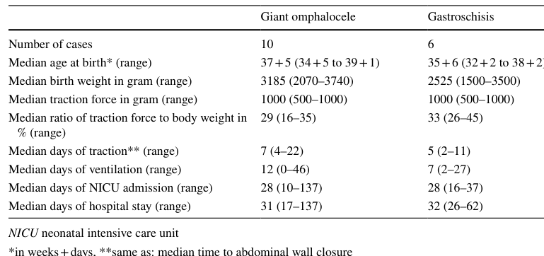

## Question

# Disease Characteristics Research Template

## Target Disease
- **Disease Name:** Omphalocele
- **MONDO ID:**  (if available)
- **Category:** Complex

## Research Objectives

Please provide a comprehensive research report on **Omphalocele** covering all of the
disease characteristics listed below. This report will be used to populate a disease knowledge
base entry. Be thorough and cite primary literature (PMID preferred) for all claims.

For each section, **suggested databases/resources** are listed. These are the first places
you should search for information on each topic.

---

### 1. Disease Information
> **Search first:** OMIM, Orphanet, ICD-10/ICD-11, MeSH, PubMed

- What is the disease? Provide a concise overview.
- What are the key identifiers? (OMIM, Orphanet, ICD-10/ICD-11, MeSH, Mondo)
- What are the common synonyms and alternative names?
- Is the information derived from individual patients (e.g., EHR) or aggregated disease-level resources?

### 2. Etiology

- **Disease Causal Factors**: What are the primary causes? (genetic, environmental, infectious, mechanistic)
- **Risk Factors**:
  > **Search first:** PubMed, Cochrane Library, UpToDate, clinical guidelines, ClinVar, ClinGen, GWAS Catalog, PheGenI, CTD, CDC, WHO, epidemiological databases
  - Genetic risk factors (causal variants, susceptibility loci, modifier genes)
  - Environmental risk factors (toxins, lifestyle, occupational exposures, age, sex, family history)
- **Protective Factors**:
  > **Search first:** PubMed, Cochrane Library, clinical trial databases, GWAS Catalog, gnomAD, WHO, CDC, nutrition databases
  - Genetic protective factors (protective variants, modifier alleles)
  - Environmental protective factors (diet, lifestyle, exposures that reduce risk)
- **Gene-Environment Interactions**: How do genetic and environmental factors interact to influence disease?
  > **Search first:** CTD, PubMed, PheGenI, GxE databases

### 3. Phenotypes
> **Search first:** HPO (Human Phenotype Ontology), OMIM, Orphanet, PubMed, clinicaltrials.gov, MedDRA, SNOMED CT, DECIPHER, LOINC

For each phenotype, provide:
- **Phenotype type**: symptoms, clinical signs, physical manifestations, behavioral changes, or laboratory abnormalities
  > For symptoms/signs: HPO, OMIM, Orphanet, PubMed
  > For behavioral changes: HPO, DSM, RDoC (Research Domain Criteria), PubMed
  > For laboratory abnormalities: LOINC, SNOMED CT, LabTests Online, PubMed
- **Phenotype characteristics**:
  > **Search first:** OMIM, Orphanet, HPO, PubMed
  - Age of symptom onset (neonatal, childhood, adult-onset, late-onset)
  - Symptom severity (mild, moderate, severe, variable)
  - Symptom progression (stable, progressive, episodic, fluctuating)
  - Frequency among affected individuals (percentage or qualitative)
- **Quality of life impact**: Effects on daily functioning and well-being (per-phenotype when possible)
  > **Search first:** EQ-5D database, SF-36, WHO QOL databases, PubMed
- Suggest HPO (Human Phenotype Ontology) terms for each phenotype

### 4. Genetic/Molecular Information

- **Causal Genes**: Gene mutations or chromosomal abnormalities responsible for disease (gene symbols, OMIM IDs)
  > **Search first:** OMIM, ClinVar, HGMD, Ensembl, NCBI Gene
- **Pathogenic Variants**:
  - Affected genes (gene symbols, HGNC IDs)
    > **Search first:** OMIM, NCBI Gene, Ensembl, HGNC, UniProt, GeneCards
  - Variant classification (pathogenic, likely pathogenic, VUS per ACMG/AMP guidelines)
    > **Search first:** ClinVar, ClinGen, ACMG/AMP guidelines, VarSome
  - Variant type/class (missense, frameshift, nonsense, splice-site, structural)
  - Allele frequency in population databases
    > **Search first:** gnomAD, 1000 Genomes, ExAC, TOPMed, dbSNP
  - Somatic vs germline origin
    > **Search first:** COSMIC (somatic), ClinVar, ICGC, TCGA
  - Functional consequences (loss of function, gain of function, dominant negative)
- **Modifier Genes**: Genes that modify disease severity or expression
- **Epigenetic Information**: DNA methylation, histone modifications, chromatin changes affecting disease
  > **Search first:** ENCODE, Roadmap Epigenomics, MethBase, DiseaseMeth
- **Chromosomal Abnormalities**: Large-scale genetic changes (aneuploidy, translocations, inversions)
  > **Search first:** DECIPHER, ClinVar, ECARUCA, UCSC Genome Browser

### 5. Environmental Information

- **Environmental Factors**: Non-genetic contributing factors (toxins, radiation, pollution, occupational exposure)
  > **Search first:** CTD (Comparative Toxicogenomics Database), TOXNET, PubMed, EPA databases
- **Lifestyle Factors**: Behavioral factors (smoking, diet, exercise, alcohol consumption)
  > **Search first:** CDC databases, WHO, PubMed, NHANES
- **Infectious Agents**: If applicable, pathogens causing or triggering disease (bacteria, viruses, fungi, parasites)
  > **Search first:** NCBI Taxonomy, ViPR, BV-BRC, MicrobeDB, GIDEON

### 6. Mechanism / Pathophysiology

- **Molecular Pathways**: Specific signaling cascades or biochemical pathways involved (Wnt, MAPK, mTOR, PI3K-AKT, etc.)
  > **Search first:** KEGG, Reactome, WikiPathways, PathBank, BioCyc
- **Cellular Processes**: Cell-level mechanisms (apoptosis, autophagy, cell cycle dysregulation, inflammation, etc.)
  > **Search first:** Gene Ontology (GO), Reactome, KEGG, PubMed
- **Protein Dysfunction**: How protein structure or function is altered (misfolding, aggregation, loss of function, gain of function)
  > **Search first:** UniProt, PDB (Protein Data Bank), InterPro, Pfam, AlphaFold
- **Metabolic Changes**: Alterations in metabolic processes (energy metabolism, lipid metabolism, amino acid metabolism)
  > **Search first:** KEGG, BioCyc, HMDB (Human Metabolome Database), BRENDA
- **Immune System Involvement**: Role of immune response (autoimmunity, immunodeficiency, chronic inflammation)
  > **Search first:** ImmPort, Immunome Database, IEDB, Gene Ontology
- **Tissue Damage Mechanisms**: How tissues/ are injured (oxidative stress, ischemia, fibrosis, necrosis)
  > **Search first:** PubMed, Gene Ontology, Reactome
- **Biochemical Abnormalities**: Specific molecular defects (enzyme deficiencies, receptor dysfunction, ion channel defects)
  > **Search first:** BRENDA, UniProt, KEGG, OMIM, PubMed
- **Epigenetic Changes**: DNA methylation, histone modifications affecting gene expression in disease
  > **Search first:** ENCODE, Roadmap Epigenomics, MethBase, DiseaseMeth
- **Molecular Profiling** (if available):
  - Transcriptomics/gene expression changes
    > **Search first:** GEO (Gene Expression Omnibus), ArrayExpress, GTEx, Human Cell Atlas, SRA
  - Proteomics findings
    > **Search first:** PRIDE, ProteomeXchange, Human Protein Atlas, STRING, BioGRID
  - Metabolomics signatures
    > **Search first:** MetaboLights, Metabolomics Workbench, HMDB, METLIN
  - Lipidomics alterations
    > **Search first:** LIPID MAPS, SwissLipids, LipidHome, Metabolomics Workbench
  - Genomic structural features
    > **Search first:** UCSC Genome Browser, Ensembl, NCBI, dbVar, DGV
- **Advanced Technologies** (if applicable):
  - Single-cell analysis findings (cell-type specific mechanisms, cellular heterogeneity)
    > **Search first:** Human Cell Atlas, Single Cell Portal, GEO, CELLxGENE
  - Spatial transcriptomics findings
    > **Search first:** GEO, Spatial Research, Vizgen, 10x Genomics data
  - Multi-omics integration results
    > **Search first:** TCGA, ICGC, cBioPortal, LinkedOmics, PubMed
  - Functional genomics screens (CRISPR, RNAi)
    > **Search first:** DepMap, GenomeRNAi, PubMed, BioGRID ORCS

For each mechanism, describe:
- The causal chain from initial trigger to clinical manifestation
- Which mechanisms are upstream vs downstream
- What cell types and biological processes are involved
- Suggest GO terms for biological processes and CL terms for cell types

### 7. Anatomical Structures Affected

- **Organ Level**:
  - Primary organs directly affected
  - Secondary organ involvement (complications, secondary effects)
  - Body systems involved (cardiovascular, nervous, digestive, respiratory, endocrine, etc.)
  > **Search first:** Uberon, FMA (Foundational Model of Anatomy), OMIM, HPO, ICD-11, MeSH, SNOMED CT
- **Tissue and Cell Level**:
  - Specific tissue types affected (epithelial, connective, muscle, nervous)
  - Specific cell populations targeted (with Cell Ontology terms)
  > **Search first:** Uberon, Human Protein Atlas, Cell Ontology, Human Cell Atlas, CellMarker, PanglaoDB
- **Subcellular Level**:
  - Cellular compartments involved (mitochondria, nucleus, ER, lysosomes) (with GO Cellular Component terms)
  > **Search first:** Gene Ontology (Cellular Component), UniProt, Human Protein Atlas
- **Localization**:
  - Specific anatomical sites (with UBERON terms)
    > **Search first:** FMA, Uberon, NeuroNames (for brain), SNOMED CT
  - Lateralization (unilateral, bilateral, asymmetric)
    > **Search first:** HPO, clinical literature, imaging databases

### 8. Temporal Development

- **Onset**:
  - Typical age of onset (congenital, pediatric, adult, geriatric)
  - Onset pattern (acute, subacute, chronic, insidious)
  > **Search first:** OMIM, Orphanet, HPO, PubMed
- **Progression**:
  - Disease stages (early, intermediate, advanced, end-stage)
    > **Search first:** Cancer Staging Manual (AJCC), WHO classifications, PubMed
  - Progression rate (rapid, slow, variable)
  - Disease course pattern (episodic, relapsing-remitting, progressive, stable)
  - Disease duration (self-limited, chronic lifelong)
  > **Search first:** Disease registries, longitudinal cohort databases, natural history studies, PubMed, Orphanet, OMIM
- **Patterns**:
  - Remission patterns (spontaneous, treatment-induced)
    > **Search first:** Clinical trial databases, disease registries, PubMed
  - Critical periods (time windows of vulnerability or opportunity for intervention)
    > **Search first:** PubMed, developmental biology databases, clinical guidelines

### 9. Inheritance and Population

- **Epidemiology**:
  - Prevalence (cases per 100,000 at given time)
  - Incidence (new cases per 100,000 per year)
  > **Search first:** Orphanet, CDC, WHO, GBD (Global Burden of Disease), national registries, SEER, disease registries
- **For Genetic Etiology**:
  - Inheritance pattern (AD, AR, X-linked, mitochondrial, multifactorial, polygenic)
    > **Search first:** OMIM, Orphanet, ClinVar, GTR (Genetic Testing Registry)
  - Penetrance (complete, incomplete, age-dependent)
    > **Search first:** ClinVar, OMIM, PubMed, ClinGen
  - Expressivity (variable, consistent)
    > **Search first:** OMIM, ClinVar, PubMed
  - Genetic anticipation (increasing severity in successive generations)
    > **Search first:** OMIM, PubMed (especially for repeat expansion disorders)
  - Germline mosaicism
    > **Search first:** ClinVar, OMIM, genetic counseling literature, PubMed
  - Founder effects (population-specific mutations)
    > **Search first:** gnomAD, population genetics databases, PubMed
  - Consanguinity role
    > **Search first:** OMIM, population studies, genetic counseling resources
  - Carrier frequency
    > **Search first:** gnomAD, carrier screening databases, GeneReviews, GTR
- **Population Demographics**:
  - Affected populations (ethnic or demographic groups with higher prevalence)
    > **Search first:** gnomAD, 1000 Genomes, PAGE Study, PubMed, population registries
  - Geographic distribution (endemic areas, regional variation)
    > **Search first:** WHO, CDC, GBD, Orphanet, geographic epidemiology databases
  - Geographic distribution of specific variants
  - Sex ratio (male:female)
    > **Search first:** Disease registries, OMIM, PubMed, epidemiological databases
  - Age distribution of affected individuals
    > **Search first:** CDC, disease registries, SEER, Orphanet

### 10. Diagnostics

- **Clinical Tests**:
  - Laboratory tests (blood, urine, tissue chemistry, specific enzyme assays)
    > **Search first:** LOINC, LabTests Online, PubMed
  - Biomarkers (proteins, metabolites, genetic markers, circulating biomarkers)
    > **Search first:** FDA Biomarker List, BEST (Biomarkers, EndpointS, and other Tools), PubMed
  - Imaging studies (X-ray, CT, MRI, PET, ultrasound)
    > **Search first:** RadLex, DICOM, Radiopaedia, imaging databases
  - Functional tests (pulmonary function, cardiac stress tests)
    > **Search first:** LOINC, clinical guidelines, PubMed
  - Electrophysiology (EEG, EMG, ECG, nerve conduction studies)
    > **Search first:** LOINC, clinical neurophysiology databases, PubMed
  - Biopsy findings (histopathology, immunohistochemistry)
    > **Search first:** SNOMED CT, College of American Pathologists resources, PubMed
  - Pathology findings (microscopic examination)
    > **Search first:** SNOMED CT, Digital Pathology databases, PubMed
- **Genetic Testing**:
  > **Search first:** GTR (Genetic Testing Registry), GeneReviews, ClinGen
  - Overview of recommended genetic testing approach
  - Whole genome sequencing (WGS) utility
    > **Search first:** GTR, ClinVar, GEL (Genomics England), gnomAD
  - Whole exome sequencing (WES) utility
    > **Search first:** GTR, ClinVar, OMIM, GeneMatcher
  - Gene panels (which panels, which genes)
    > **Search first:** GTR, ClinVar, laboratory-specific databases
  - Single gene testing
    > **Search first:** GTR, ClinVar, OMIM, GeneReviews
  - Chromosomal microarray (CMA)
    > **Search first:** DECIPHER, ClinVar, dbVar, ECARUCA
  - Karyotyping
    > **Search first:** Chromosome Abnormality Database, ClinVar, cytogenetics resources
  - FISH
    > **Search first:** ClinVar, cytogenetics databases, PubMed
  - Mitochondrial DNA testing
    > **Search first:** MITOMAP, MSeqDR, ClinVar, GTR
  - Repeat expansion testing
    > **Search first:** GTR, ClinVar, repeat expansion databases, PubMed
- **Omics-Based Diagnostics** (if applicable):
  - RNA sequencing / transcriptomics
    > **Search first:** GEO, ArrayExpress, GTEx, RNA-seq databases
  - Proteomics
    > **Search first:** PRIDE, ProteomeXchange, FDA Biomarker database
  - Metabolomics
    > **Search first:** MetaboLights, Metabolomics Workbench, HMDB
  - Epigenomics
    > **Search first:** GEO, ENCODE, Roadmap Epigenomics, MethBase
  - Liquid biopsy
    > **Search first:** COSMIC, ClinVar, liquid biopsy databases, PubMed
- **Clinical Criteria**:
  - Standardized diagnostic criteria (DSM, ICD, society guidelines)
    > **Search first:** DSM-5, ICD-11, clinical society guidelines, UpToDate
  - Differential diagnosis (other conditions to rule out, with distinguishing features)
    > **Search first:** DynaMed, UpToDate, clinical decision support systems
- **Screening**:
  - Screening methods for asymptomatic individuals (newborn screening, carrier screening, cascade screening)
    > **Search first:** ACMG recommendations, CDC newborn screening, GTR

### 11. Outcome/Prognosis

- **Survival and Mortality**:
  - Survival rate (5-year, 10-year, overall)
    > **Search first:** SEER, cancer registries, disease-specific registries, PubMed
  - Life expectancy (with and without treatment if applicable)
    > **Search first:** Orphanet, disease registries, actuarial databases, PubMed
  - Mortality rate
    > **Search first:** CDC, WHO, GBD, national mortality databases
  - Disease-specific mortality (deaths directly attributable to disease)
    > **Search first:** Disease registries, CDC Wonder, GBD, PubMed
- **Morbidity and Function**:
  - Morbidity (disease-related disability and health impacts)
    > **Search first:** GBD, WHO, disability databases, PubMed
  - Disability outcomes (long-term functional impairments)
    > **Search first:** ICF (International Classification of Functioning), disability registries
  - Quality of life measures (EQ-5D, SF-36, PROMIS, disease-specific tools)
    > **Search first:** EQ-5D database, SF-36, PROMIS, PubMed
- **Disease Course**:
  - Complications (secondary problems: infections, organ failure, etc.)
    > **Search first:** ICD codes, disease registries, clinical databases, PubMed
  - Recovery potential (likelihood and extent of recovery, with vs without treatment)
    > **Search first:** Natural history studies, rehabilitation databases, PubMed
- **Prediction**:
  - Prognostic factors (age, disease severity, biomarkers, treatment response)
    > **Search first:** Prognostic models databases, clinical calculators, PubMed
  - Prognostic biomarkers (molecular markers predicting disease course)
    > **Search first:** FDA Biomarker database, PubMed, cancer prognostic databases

### 12. Treatment

- **Pharmacotherapy**:
  - Pharmacological treatments (drug names, drug classes, mechanisms of action)
    > **Search first:** DrugBank, RxNorm, ATC classification, DailyMed, FDA databases
  - Pharmacogenomics (how genetic variants affect drug metabolism, efficacy, toxicity)
    > **Search first:** PharmGKB, CPIC (Clinical Pharmacogenetics), FDA Table of PGx Biomarkers
- **Advanced Therapeutics**:
  - Gene therapy (viral vectors, CRISPR, gene replacement, gene editing)
    > **Search first:** ClinicalTrials.gov, FDA gene therapy database, ASGCT resources
  - Cell therapy (stem cell transplant, CAR-T, cellular therapeutics)
    > **Search first:** ClinicalTrials.gov, FDA cell therapy database, FACT standards
  - RNA-based therapies (ASOs, siRNA, mRNA therapies)
    > **Search first:** ClinicalTrials.gov, FDA approvals, PubMed
  - Targeted therapies (treatments directed at specific molecular targets)
    > **Search first:** My Cancer Genome, OncoKB, ClinicalTrials.gov, FDA approvals
  - Immunotherapies (checkpoint inhibitors, monoclonal antibodies)
    > **Search first:** Cancer Immunotherapy Database, FDA approvals, ClinicalTrials.gov
- **Surgical and Interventional**:
  - Surgical interventions (types of surgery, timing, outcomes)
    > **Search first:** CPT codes, surgical registries, clinical guidelines, PubMed
- **Supportive and Rehabilitative**:
  - Supportive care (symptom management, pain control, nutrition)
    > **Search first:** Clinical guidelines, Cochrane Library, PubMed
  - Rehabilitation (physical therapy, occupational therapy, speech therapy)
    > **Search first:** Rehabilitation medicine databases, clinical guidelines, PubMed
- **Experimental**:
  - Experimental treatments in clinical trials (with NCT identifiers if available)
    > **Search first:** ClinicalTrials.gov, EU Clinical Trials Register, WHO ICTRP
- **Treatment Outcomes**:
  - Treatment response rates
    > **Search first:** Clinical trial databases, FDA reviews, systematic reviews, PubMed
  - Side effects and adverse events
    > **Search first:** FDA Adverse Event Reporting System (FAERS), MedWatch, PubMed
- **Treatment Strategy**:
  - Treatment algorithms (clinical pathways, decision trees)
    > **Search first:** Clinical practice guidelines, NCCN Guidelines, UpToDate
  - Combination therapies
    > **Search first:** ClinicalTrials.gov, treatment guidelines, PubMed
  - Personalized medicine approaches (genotype-guided treatment)
    > **Search first:** My Cancer Genome, CIViC, PharmGKB, precision medicine databases

For each treatment, suggest MAXO (Medical Action Ontology) terms where applicable.

### 13. Prevention

- **Prevention Levels**:
  - Primary prevention (preventing disease occurrence: vaccination, risk factor modification)
    > **Search first:** CDC, WHO, USPSTF recommendations, Cochrane Library
  - Secondary prevention (early detection and treatment: screening programs, early intervention)
    > **Search first:** USPSTF, CDC screening guidelines, WHO
  - Tertiary prevention (preventing complications in those with disease)
    > **Search first:** Clinical guidelines, disease management protocols, PubMed
- **Immunization**: Vaccine strategies (if applicable)
  > **Search first:** CDC vaccine schedules, WHO immunization, FDA vaccine database
- **Screening and Early Detection**:
  - Screening programs (population-based: newborn screening, cancer screening)
    > **Search first:** CDC screening programs, USPSTF, cancer screening databases
  - Genetic screening (carrier screening, preimplantation genetic diagnosis, prenatal testing)
    > **Search first:** ACMG recommendations, ACOG guidelines, GTR
  - Risk stratification (identifying high-risk individuals for targeted prevention)
    > **Search first:** Risk prediction models, clinical calculators, PubMed
- **Behavioral Interventions**: Lifestyle modifications to reduce risk
  > **Search first:** CDC, WHO, behavioral intervention databases, Cochrane Library
- **Counseling**: Genetic counseling (risk assessment, family planning guidance)
  > **Search first:** NSGC resources, ACMG guidelines, GeneReviews
- **Public Health**:
  - Public health interventions (sanitation, vector control, health education)
    > **Search first:** CDC, WHO, public health databases, PubMed
  - Environmental interventions (reducing environmental risk factors)
    > **Search first:** EPA databases, WHO environmental health, PubMed
- **Prophylaxis**: Preventive medications or procedures
  > **Search first:** Clinical guidelines, FDA approvals, PubMed

### 14. Other Species / Natural Disease

- **Taxonomy**: Species affected (with NCBI Taxon identifiers)
  > **Search first:** NCBI Taxonomy
- **Breed**: Specific breeds affected (with VBO identifiers if applicable)
  > **Search first:** VBO (Vertebrate Breed Ontology)
- **Gene**: Orthologous genes in other species (with NCBI Gene IDs)
  > **Search first:** NCBI Gene
- **Natural Disease**:
  - Naturally occurring disease in other species (companion animals, wildlife)
    > **Search first:** OMIA (Online Mendelian Inheritance in Animals), VetCompass, PubMed
  - Veterinary relevance and importance in animal health
    > **Search first:** OMIA, veterinary databases, PubMed
- **Comparative Biology**:
  - Comparative pathology (similarities and differences across species)
    > **Search first:** OMIA, comparative pathology databases, PubMed
  - Evolutionary conservation of disease mechanisms
    > **Search first:** HomoloGene, OrthoMCL, Alliance of Genome Resources
- **Transmission** (if applicable):
  - Zoonotic potential
    > **Search first:** CDC zoonotic diseases, WHO zoonoses, GIDEON
  - Cross-species susceptibility
    > **Search first:** NCBI Taxonomy, veterinary databases, PubMed

### 15. Model Organisms

- **Model Types**:
  - Model organism type (mammalian, invertebrate, cellular, in vitro)
    > **Search first:** Alliance of Genome Resources, model organism databases
  - Specific model systems (mouse, rat, zebrafish, Drosophila, C. elegans, yeast, cell lines, organoids, iPSCs)
    > **Search first:** MGI, RGD, ZFIN, FlyBase, WormBase, SGD, ATCC, Cellosaurus
  - Induced models (drug treatment, surgical intervention, environmental manipulation)
    > **Search first:** MGI, model organism databases, PubMed
- **Genetic Models**:
  - Types available (knockout, knock-in, transgenic, conditional, humanized)
    > **Search first:** MGI, IMPC, KOMP, EuMMCR, IMSR
- **Model Characteristics**:
  - Phenotype recapitulation (how well model reproduces human disease features)
    > **Search first:** Model organism databases, comparative studies, PubMed
  - Model limitations (aspects of human disease not captured)
    > **Search first:** Model organism databases, PubMed, review articles
- **Applications**:
  - Research applications (what aspects of disease can be studied)
    > **Search first:** Model organism databases, PubMed
- **Resources**:
  - Model databases
    > **Search first:** MGI, RGD, ZFIN, FlyBase, WormBase, IMSR, EMMA, MMRRC

---

## Citation Requirements

- Cite primary literature (PMID preferred) for all mechanistic and clinical claims
- Prioritize recent reviews and landmark papers
- Include direct quotes from abstracts where possible to support key statements
- Distinguish evidence source types: human clinical, model organism, in vitro, computational

## Output Format

Structure your response as a comprehensive narrative organized by the sections above.
For each section, provide:
- Factual content with specific details (numbers, percentages, gene names, variant nomenclature)
- Ontology term suggestions (HPO, GO, CL, UBERON, CHEBI, MAXO, MONDO) where applicable
- Evidence citations with PMIDs
- Direct quotes from abstracts to support key claims
- Clear indication when information is not available or not applicable for this disease

This report will be used to populate a disease knowledge base entry with:
- Pathophysiology descriptions with causal chains
- Gene/protein annotations (HGNC, GO terms)
- Phenotype associations (HP terms) with frequencies
- Cell type involvement (CL terms)
- Anatomical locations (UBERON terms)
- Chemical entities (CHEBI terms)
- Treatment annotations (MAXO terms)
- Evidence items with PMIDs and exact abstract quotes
- Epidemiology, prognosis, diagnostic, and prevention information
- Animal model descriptions with phenotype recapitulation details

## Output

Question: You are an expert researcher providing comprehensive, well-cited information.

Provide detailed information focusing on:
1. Key concepts and definitions with current understanding
2. Recent developments and latest research (prioritize 2023-2024 sources)
3. Current applications and real-world implementations
4. Expert opinions and analysis from authoritative sources
5. Relevant statistics and data from recent studies

Format as a comprehensive research report with proper citations. Include URLs and publication dates where available.
Always prioritize recent, authoritative sources and provide specific citations for all major claims.

# Disease Characteristics Research Template

## Target Disease
- **Disease Name:** Omphalocele
- **MONDO ID:**  (if available)
- **Category:** Complex

## Research Objectives

Please provide a comprehensive research report on **Omphalocele** covering all of the
disease characteristics listed below. This report will be used to populate a disease knowledge
base entry. Be thorough and cite primary literature (PMID preferred) for all claims.

For each section, **suggested databases/resources** are listed. These are the first places
you should search for information on each topic.

---

### 1. Disease Information
> **Search first:** OMIM, Orphanet, ICD-10/ICD-11, MeSH, PubMed

- What is the disease? Provide a concise overview.
- What are the key identifiers? (OMIM, Orphanet, ICD-10/ICD-11, MeSH, Mondo)
- What are the common synonyms and alternative names?
- Is the information derived from individual patients (e.g., EHR) or aggregated disease-level resources?

### 2. Etiology

- **Disease Causal Factors**: What are the primary causes? (genetic, environmental, infectious, mechanistic)
- **Risk Factors**:
  > **Search first:** PubMed, Cochrane Library, UpToDate, clinical guidelines, ClinVar, ClinGen, GWAS Catalog, PheGenI, CTD, CDC, WHO, epidemiological databases
  - Genetic risk factors (causal variants, susceptibility loci, modifier genes)
  - Environmental risk factors (toxins, lifestyle, occupational exposures, age, sex, family history)
- **Protective Factors**:
  > **Search first:** PubMed, Cochrane Library, clinical trial databases, GWAS Catalog, gnomAD, WHO, CDC, nutrition databases
  - Genetic protective factors (protective variants, modifier alleles)
  - Environmental protective factors (diet, lifestyle, exposures that reduce risk)
- **Gene-Environment Interactions**: How do genetic and environmental factors interact to influence disease?
  > **Search first:** CTD, PubMed, PheGenI, GxE databases

### 3. Phenotypes
> **Search first:** HPO (Human Phenotype Ontology), OMIM, Orphanet, PubMed, clinicaltrials.gov, MedDRA, SNOMED CT, DECIPHER, LOINC

For each phenotype, provide:
- **Phenotype type**: symptoms, clinical signs, physical manifestations, behavioral changes, or laboratory abnormalities
  > For symptoms/signs: HPO, OMIM, Orphanet, PubMed
  > For behavioral changes: HPO, DSM, RDoC (Research Domain Criteria), PubMed
  > For laboratory abnormalities: LOINC, SNOMED CT, LabTests Online, PubMed
- **Phenotype characteristics**:
  > **Search first:** OMIM, Orphanet, HPO, PubMed
  - Age of symptom onset (neonatal, childhood, adult-onset, late-onset)
  - Symptom severity (mild, moderate, severe, variable)
  - Symptom progression (stable, progressive, episodic, fluctuating)
  - Frequency among affected individuals (percentage or qualitative)
- **Quality of life impact**: Effects on daily functioning and well-being (per-phenotype when possible)
  > **Search first:** EQ-5D database, SF-36, WHO QOL databases, PubMed
- Suggest HPO (Human Phenotype Ontology) terms for each phenotype

### 4. Genetic/Molecular Information

- **Causal Genes**: Gene mutations or chromosomal abnormalities responsible for disease (gene symbols, OMIM IDs)
  > **Search first:** OMIM, ClinVar, HGMD, Ensembl, NCBI Gene
- **Pathogenic Variants**:
  - Affected genes (gene symbols, HGNC IDs)
    > **Search first:** OMIM, NCBI Gene, Ensembl, HGNC, UniProt, GeneCards
  - Variant classification (pathogenic, likely pathogenic, VUS per ACMG/AMP guidelines)
    > **Search first:** ClinVar, ClinGen, ACMG/AMP guidelines, VarSome
  - Variant type/class (missense, frameshift, nonsense, splice-site, structural)
  - Allele frequency in population databases
    > **Search first:** gnomAD, 1000 Genomes, ExAC, TOPMed, dbSNP
  - Somatic vs germline origin
    > **Search first:** COSMIC (somatic), ClinVar, ICGC, TCGA
  - Functional consequences (loss of function, gain of function, dominant negative)
- **Modifier Genes**: Genes that modify disease severity or expression
- **Epigenetic Information**: DNA methylation, histone modifications, chromatin changes affecting disease
  > **Search first:** ENCODE, Roadmap Epigenomics, MethBase, DiseaseMeth
- **Chromosomal Abnormalities**: Large-scale genetic changes (aneuploidy, translocations, inversions)
  > **Search first:** DECIPHER, ClinVar, ECARUCA, UCSC Genome Browser

### 5. Environmental Information

- **Environmental Factors**: Non-genetic contributing factors (toxins, radiation, pollution, occupational exposure)
  > **Search first:** CTD (Comparative Toxicogenomics Database), TOXNET, PubMed, EPA databases
- **Lifestyle Factors**: Behavioral factors (smoking, diet, exercise, alcohol consumption)
  > **Search first:** CDC databases, WHO, PubMed, NHANES
- **Infectious Agents**: If applicable, pathogens causing or triggering disease (bacteria, viruses, fungi, parasites)
  > **Search first:** NCBI Taxonomy, ViPR, BV-BRC, MicrobeDB, GIDEON

### 6. Mechanism / Pathophysiology

- **Molecular Pathways**: Specific signaling cascades or biochemical pathways involved (Wnt, MAPK, mTOR, PI3K-AKT, etc.)
  > **Search first:** KEGG, Reactome, WikiPathways, PathBank, BioCyc
- **Cellular Processes**: Cell-level mechanisms (apoptosis, autophagy, cell cycle dysregulation, inflammation, etc.)
  > **Search first:** Gene Ontology (GO), Reactome, KEGG, PubMed
- **Protein Dysfunction**: How protein structure or function is altered (misfolding, aggregation, loss of function, gain of function)
  > **Search first:** UniProt, PDB (Protein Data Bank), InterPro, Pfam, AlphaFold
- **Metabolic Changes**: Alterations in metabolic processes (energy metabolism, lipid metabolism, amino acid metabolism)
  > **Search first:** KEGG, BioCyc, HMDB (Human Metabolome Database), BRENDA
- **Immune System Involvement**: Role of immune response (autoimmunity, immunodeficiency, chronic inflammation)
  > **Search first:** ImmPort, Immunome Database, IEDB, Gene Ontology
- **Tissue Damage Mechanisms**: How tissues/ are injured (oxidative stress, ischemia, fibrosis, necrosis)
  > **Search first:** PubMed, Gene Ontology, Reactome
- **Biochemical Abnormalities**: Specific molecular defects (enzyme deficiencies, receptor dysfunction, ion channel defects)
  > **Search first:** BRENDA, UniProt, KEGG, OMIM, PubMed
- **Epigenetic Changes**: DNA methylation, histone modifications affecting gene expression in disease
  > **Search first:** ENCODE, Roadmap Epigenomics, MethBase, DiseaseMeth
- **Molecular Profiling** (if available):
  - Transcriptomics/gene expression changes
    > **Search first:** GEO (Gene Expression Omnibus), ArrayExpress, GTEx, Human Cell Atlas, SRA
  - Proteomics findings
    > **Search first:** PRIDE, ProteomeXchange, Human Protein Atlas, STRING, BioGRID
  - Metabolomics signatures
    > **Search first:** MetaboLights, Metabolomics Workbench, HMDB, METLIN
  - Lipidomics alterations
    > **Search first:** LIPID MAPS, SwissLipids, LipidHome, Metabolomics Workbench
  - Genomic structural features
    > **Search first:** UCSC Genome Browser, Ensembl, NCBI, dbVar, DGV
- **Advanced Technologies** (if applicable):
  - Single-cell analysis findings (cell-type specific mechanisms, cellular heterogeneity)
    > **Search first:** Human Cell Atlas, Single Cell Portal, GEO, CELLxGENE
  - Spatial transcriptomics findings
    > **Search first:** GEO, Spatial Research, Vizgen, 10x Genomics data
  - Multi-omics integration results
    > **Search first:** TCGA, ICGC, cBioPortal, LinkedOmics, PubMed
  - Functional genomics screens (CRISPR, RNAi)
    > **Search first:** DepMap, GenomeRNAi, PubMed, BioGRID ORCS

For each mechanism, describe:
- The causal chain from initial trigger to clinical manifestation
- Which mechanisms are upstream vs downstream
- What cell types and biological processes are involved
- Suggest GO terms for biological processes and CL terms for cell types

### 7. Anatomical Structures Affected

- **Organ Level**:
  - Primary organs directly affected
  - Secondary organ involvement (complications, secondary effects)
  - Body systems involved (cardiovascular, nervous, digestive, respiratory, endocrine, etc.)
  > **Search first:** Uberon, FMA (Foundational Model of Anatomy), OMIM, HPO, ICD-11, MeSH, SNOMED CT
- **Tissue and Cell Level**:
  - Specific tissue types affected (epithelial, connective, muscle, nervous)
  - Specific cell populations targeted (with Cell Ontology terms)
  > **Search first:** Uberon, Human Protein Atlas, Cell Ontology, Human Cell Atlas, CellMarker, PanglaoDB
- **Subcellular Level**:
  - Cellular compartments involved (mitochondria, nucleus, ER, lysosomes) (with GO Cellular Component terms)
  > **Search first:** Gene Ontology (Cellular Component), UniProt, Human Protein Atlas
- **Localization**:
  - Specific anatomical sites (with UBERON terms)
    > **Search first:** FMA, Uberon, NeuroNames (for brain), SNOMED CT
  - Lateralization (unilateral, bilateral, asymmetric)
    > **Search first:** HPO, clinical literature, imaging databases

### 8. Temporal Development

- **Onset**:
  - Typical age of onset (congenital, pediatric, adult, geriatric)
  - Onset pattern (acute, subacute, chronic, insidious)
  > **Search first:** OMIM, Orphanet, HPO, PubMed
- **Progression**:
  - Disease stages (early, intermediate, advanced, end-stage)
    > **Search first:** Cancer Staging Manual (AJCC), WHO classifications, PubMed
  - Progression rate (rapid, slow, variable)
  - Disease course pattern (episodic, relapsing-remitting, progressive, stable)
  - Disease duration (self-limited, chronic lifelong)
  > **Search first:** Disease registries, longitudinal cohort databases, natural history studies, PubMed, Orphanet, OMIM
- **Patterns**:
  - Remission patterns (spontaneous, treatment-induced)
    > **Search first:** Clinical trial databases, disease registries, PubMed
  - Critical periods (time windows of vulnerability or opportunity for intervention)
    > **Search first:** PubMed, developmental biology databases, clinical guidelines

### 9. Inheritance and Population

- **Epidemiology**:
  - Prevalence (cases per 100,000 at given time)
  - Incidence (new cases per 100,000 per year)
  > **Search first:** Orphanet, CDC, WHO, GBD (Global Burden of Disease), national registries, SEER, disease registries
- **For Genetic Etiology**:
  - Inheritance pattern (AD, AR, X-linked, mitochondrial, multifactorial, polygenic)
    > **Search first:** OMIM, Orphanet, ClinVar, GTR (Genetic Testing Registry)
  - Penetrance (complete, incomplete, age-dependent)
    > **Search first:** ClinVar, OMIM, PubMed, ClinGen
  - Expressivity (variable, consistent)
    > **Search first:** OMIM, ClinVar, PubMed
  - Genetic anticipation (increasing severity in successive generations)
    > **Search first:** OMIM, PubMed (especially for repeat expansion disorders)
  - Germline mosaicism
    > **Search first:** ClinVar, OMIM, genetic counseling literature, PubMed
  - Founder effects (population-specific mutations)
    > **Search first:** gnomAD, population genetics databases, PubMed
  - Consanguinity role
    > **Search first:** OMIM, population studies, genetic counseling resources
  - Carrier frequency
    > **Search first:** gnomAD, carrier screening databases, GeneReviews, GTR
- **Population Demographics**:
  - Affected populations (ethnic or demographic groups with higher prevalence)
    > **Search first:** gnomAD, 1000 Genomes, PAGE Study, PubMed, population registries
  - Geographic distribution (endemic areas, regional variation)
    > **Search first:** WHO, CDC, GBD, Orphanet, geographic epidemiology databases
  - Geographic distribution of specific variants
  - Sex ratio (male:female)
    > **Search first:** Disease registries, OMIM, PubMed, epidemiological databases
  - Age distribution of affected individuals
    > **Search first:** CDC, disease registries, SEER, Orphanet

### 10. Diagnostics

- **Clinical Tests**:
  - Laboratory tests (blood, urine, tissue chemistry, specific enzyme assays)
    > **Search first:** LOINC, LabTests Online, PubMed
  - Biomarkers (proteins, metabolites, genetic markers, circulating biomarkers)
    > **Search first:** FDA Biomarker List, BEST (Biomarkers, EndpointS, and other Tools), PubMed
  - Imaging studies (X-ray, CT, MRI, PET, ultrasound)
    > **Search first:** RadLex, DICOM, Radiopaedia, imaging databases
  - Functional tests (pulmonary function, cardiac stress tests)
    > **Search first:** LOINC, clinical guidelines, PubMed
  - Electrophysiology (EEG, EMG, ECG, nerve conduction studies)
    > **Search first:** LOINC, clinical neurophysiology databases, PubMed
  - Biopsy findings (histopathology, immunohistochemistry)
    > **Search first:** SNOMED CT, College of American Pathologists resources, PubMed
  - Pathology findings (microscopic examination)
    > **Search first:** SNOMED CT, Digital Pathology databases, PubMed
- **Genetic Testing**:
  > **Search first:** GTR (Genetic Testing Registry), GeneReviews, ClinGen
  - Overview of recommended genetic testing approach
  - Whole genome sequencing (WGS) utility
    > **Search first:** GTR, ClinVar, GEL (Genomics England), gnomAD
  - Whole exome sequencing (WES) utility
    > **Search first:** GTR, ClinVar, OMIM, GeneMatcher
  - Gene panels (which panels, which genes)
    > **Search first:** GTR, ClinVar, laboratory-specific databases
  - Single gene testing
    > **Search first:** GTR, ClinVar, OMIM, GeneReviews
  - Chromosomal microarray (CMA)
    > **Search first:** DECIPHER, ClinVar, dbVar, ECARUCA
  - Karyotyping
    > **Search first:** Chromosome Abnormality Database, ClinVar, cytogenetics resources
  - FISH
    > **Search first:** ClinVar, cytogenetics databases, PubMed
  - Mitochondrial DNA testing
    > **Search first:** MITOMAP, MSeqDR, ClinVar, GTR
  - Repeat expansion testing
    > **Search first:** GTR, ClinVar, repeat expansion databases, PubMed
- **Omics-Based Diagnostics** (if applicable):
  - RNA sequencing / transcriptomics
    > **Search first:** GEO, ArrayExpress, GTEx, RNA-seq databases
  - Proteomics
    > **Search first:** PRIDE, ProteomeXchange, FDA Biomarker database
  - Metabolomics
    > **Search first:** MetaboLights, Metabolomics Workbench, HMDB
  - Epigenomics
    > **Search first:** GEO, ENCODE, Roadmap Epigenomics, MethBase
  - Liquid biopsy
    > **Search first:** COSMIC, ClinVar, liquid biopsy databases, PubMed
- **Clinical Criteria**:
  - Standardized diagnostic criteria (DSM, ICD, society guidelines)
    > **Search first:** DSM-5, ICD-11, clinical society guidelines, UpToDate
  - Differential diagnosis (other conditions to rule out, with distinguishing features)
    > **Search first:** DynaMed, UpToDate, clinical decision support systems
- **Screening**:
  - Screening methods for asymptomatic individuals (newborn screening, carrier screening, cascade screening)
    > **Search first:** ACMG recommendations, CDC newborn screening, GTR

### 11. Outcome/Prognosis

- **Survival and Mortality**:
  - Survival rate (5-year, 10-year, overall)
    > **Search first:** SEER, cancer registries, disease-specific registries, PubMed
  - Life expectancy (with and without treatment if applicable)
    > **Search first:** Orphanet, disease registries, actuarial databases, PubMed
  - Mortality rate
    > **Search first:** CDC, WHO, GBD, national mortality databases
  - Disease-specific mortality (deaths directly attributable to disease)
    > **Search first:** Disease registries, CDC Wonder, GBD, PubMed
- **Morbidity and Function**:
  - Morbidity (disease-related disability and health impacts)
    > **Search first:** GBD, WHO, disability databases, PubMed
  - Disability outcomes (long-term functional impairments)
    > **Search first:** ICF (International Classification of Functioning), disability registries
  - Quality of life measures (EQ-5D, SF-36, PROMIS, disease-specific tools)
    > **Search first:** EQ-5D database, SF-36, PROMIS, PubMed
- **Disease Course**:
  - Complications (secondary problems: infections, organ failure, etc.)
    > **Search first:** ICD codes, disease registries, clinical databases, PubMed
  - Recovery potential (likelihood and extent of recovery, with vs without treatment)
    > **Search first:** Natural history studies, rehabilitation databases, PubMed
- **Prediction**:
  - Prognostic factors (age, disease severity, biomarkers, treatment response)
    > **Search first:** Prognostic models databases, clinical calculators, PubMed
  - Prognostic biomarkers (molecular markers predicting disease course)
    > **Search first:** FDA Biomarker database, PubMed, cancer prognostic databases

### 12. Treatment

- **Pharmacotherapy**:
  - Pharmacological treatments (drug names, drug classes, mechanisms of action)
    > **Search first:** DrugBank, RxNorm, ATC classification, DailyMed, FDA databases
  - Pharmacogenomics (how genetic variants affect drug metabolism, efficacy, toxicity)
    > **Search first:** PharmGKB, CPIC (Clinical Pharmacogenetics), FDA Table of PGx Biomarkers
- **Advanced Therapeutics**:
  - Gene therapy (viral vectors, CRISPR, gene replacement, gene editing)
    > **Search first:** ClinicalTrials.gov, FDA gene therapy database, ASGCT resources
  - Cell therapy (stem cell transplant, CAR-T, cellular therapeutics)
    > **Search first:** ClinicalTrials.gov, FDA cell therapy database, FACT standards
  - RNA-based therapies (ASOs, siRNA, mRNA therapies)
    > **Search first:** ClinicalTrials.gov, FDA approvals, PubMed
  - Targeted therapies (treatments directed at specific molecular targets)
    > **Search first:** My Cancer Genome, OncoKB, ClinicalTrials.gov, FDA approvals
  - Immunotherapies (checkpoint inhibitors, monoclonal antibodies)
    > **Search first:** Cancer Immunotherapy Database, FDA approvals, ClinicalTrials.gov
- **Surgical and Interventional**:
  - Surgical interventions (types of surgery, timing, outcomes)
    > **Search first:** CPT codes, surgical registries, clinical guidelines, PubMed
- **Supportive and Rehabilitative**:
  - Supportive care (symptom management, pain control, nutrition)
    > **Search first:** Clinical guidelines, Cochrane Library, PubMed
  - Rehabilitation (physical therapy, occupational therapy, speech therapy)
    > **Search first:** Rehabilitation medicine databases, clinical guidelines, PubMed
- **Experimental**:
  - Experimental treatments in clinical trials (with NCT identifiers if available)
    > **Search first:** ClinicalTrials.gov, EU Clinical Trials Register, WHO ICTRP
- **Treatment Outcomes**:
  - Treatment response rates
    > **Search first:** Clinical trial databases, FDA reviews, systematic reviews, PubMed
  - Side effects and adverse events
    > **Search first:** FDA Adverse Event Reporting System (FAERS), MedWatch, PubMed
- **Treatment Strategy**:
  - Treatment algorithms (clinical pathways, decision trees)
    > **Search first:** Clinical practice guidelines, NCCN Guidelines, UpToDate
  - Combination therapies
    > **Search first:** ClinicalTrials.gov, treatment guidelines, PubMed
  - Personalized medicine approaches (genotype-guided treatment)
    > **Search first:** My Cancer Genome, CIViC, PharmGKB, precision medicine databases

For each treatment, suggest MAXO (Medical Action Ontology) terms where applicable.

### 13. Prevention

- **Prevention Levels**:
  - Primary prevention (preventing disease occurrence: vaccination, risk factor modification)
    > **Search first:** CDC, WHO, USPSTF recommendations, Cochrane Library
  - Secondary prevention (early detection and treatment: screening programs, early intervention)
    > **Search first:** USPSTF, CDC screening guidelines, WHO
  - Tertiary prevention (preventing complications in those with disease)
    > **Search first:** Clinical guidelines, disease management protocols, PubMed
- **Immunization**: Vaccine strategies (if applicable)
  > **Search first:** CDC vaccine schedules, WHO immunization, FDA vaccine database
- **Screening and Early Detection**:
  - Screening programs (population-based: newborn screening, cancer screening)
    > **Search first:** CDC screening programs, USPSTF, cancer screening databases
  - Genetic screening (carrier screening, preimplantation genetic diagnosis, prenatal testing)
    > **Search first:** ACMG recommendations, ACOG guidelines, GTR
  - Risk stratification (identifying high-risk individuals for targeted prevention)
    > **Search first:** Risk prediction models, clinical calculators, PubMed
- **Behavioral Interventions**: Lifestyle modifications to reduce risk
  > **Search first:** CDC, WHO, behavioral intervention databases, Cochrane Library
- **Counseling**: Genetic counseling (risk assessment, family planning guidance)
  > **Search first:** NSGC resources, ACMG guidelines, GeneReviews
- **Public Health**:
  - Public health interventions (sanitation, vector control, health education)
    > **Search first:** CDC, WHO, public health databases, PubMed
  - Environmental interventions (reducing environmental risk factors)
    > **Search first:** EPA databases, WHO environmental health, PubMed
- **Prophylaxis**: Preventive medications or procedures
  > **Search first:** Clinical guidelines, FDA approvals, PubMed

### 14. Other Species / Natural Disease

- **Taxonomy**: Species affected (with NCBI Taxon identifiers)
  > **Search first:** NCBI Taxonomy
- **Breed**: Specific breeds affected (with VBO identifiers if applicable)
  > **Search first:** VBO (Vertebrate Breed Ontology)
- **Gene**: Orthologous genes in other species (with NCBI Gene IDs)
  > **Search first:** NCBI Gene
- **Natural Disease**:
  - Naturally occurring disease in other species (companion animals, wildlife)
    > **Search first:** OMIA (Online Mendelian Inheritance in Animals), VetCompass, PubMed
  - Veterinary relevance and importance in animal health
    > **Search first:** OMIA, veterinary databases, PubMed
- **Comparative Biology**:
  - Comparative pathology (similarities and differences across species)
    > **Search first:** OMIA, comparative pathology databases, PubMed
  - Evolutionary conservation of disease mechanisms
    > **Search first:** HomoloGene, OrthoMCL, Alliance of Genome Resources
- **Transmission** (if applicable):
  - Zoonotic potential
    > **Search first:** CDC zoonotic diseases, WHO zoonoses, GIDEON
  - Cross-species susceptibility
    > **Search first:** NCBI Taxonomy, veterinary databases, PubMed

### 15. Model Organisms

- **Model Types**:
  - Model organism type (mammalian, invertebrate, cellular, in vitro)
    > **Search first:** Alliance of Genome Resources, model organism databases
  - Specific model systems (mouse, rat, zebrafish, Drosophila, C. elegans, yeast, cell lines, organoids, iPSCs)
    > **Search first:** MGI, RGD, ZFIN, FlyBase, WormBase, SGD, ATCC, Cellosaurus
  - Induced models (drug treatment, surgical intervention, environmental manipulation)
    > **Search first:** MGI, model organism databases, PubMed
- **Genetic Models**:
  - Types available (knockout, knock-in, transgenic, conditional, humanized)
    > **Search first:** MGI, IMPC, KOMP, EuMMCR, IMSR
- **Model Characteristics**:
  - Phenotype recapitulation (how well model reproduces human disease features)
    > **Search first:** Model organism databases, comparative studies, PubMed
  - Model limitations (aspects of human disease not captured)
    > **Search first:** Model organism databases, PubMed, review articles
- **Applications**:
  - Research applications (what aspects of disease can be studied)
    > **Search first:** Model organism databases, PubMed
- **Resources**:
  - Model databases
    > **Search first:** MGI, RGD, ZFIN, FlyBase, WormBase, IMSR, EMMA, MMRRC

---

## Citation Requirements

- Cite primary literature (PMID preferred) for all mechanistic and clinical claims
- Prioritize recent reviews and landmark papers
- Include direct quotes from abstracts where possible to support key statements
- Distinguish evidence source types: human clinical, model organism, in vitro, computational

## Output Format

Structure your response as a comprehensive narrative organized by the sections above.
For each section, provide:
- Factual content with specific details (numbers, percentages, gene names, variant nomenclature)
- Ontology term suggestions (HPO, GO, CL, UBERON, CHEBI, MAXO, MONDO) where applicable
- Evidence citations with PMIDs
- Direct quotes from abstracts to support key claims
- Clear indication when information is not available or not applicable for this disease

This report will be used to populate a disease knowledge base entry with:
- Pathophysiology descriptions with causal chains
- Gene/protein annotations (HGNC, GO terms)
- Phenotype associations (HP terms) with frequencies
- Cell type involvement (CL terms)
- Anatomical locations (UBERON terms)
- Chemical entities (CHEBI terms)
- Treatment annotations (MAXO terms)
- Evidence items with PMIDs and exact abstract quotes
- Epidemiology, prognosis, diagnostic, and prevention information
- Animal model descriptions with phenotype recapitulation details

## Comprehensive Disease Characteristics Report: Omphalocele

### Target disease
- **Disease name:** Omphalocele (syn. **exomphalos**)
- **Category:** Complex congenital malformation (abdominal wall defect)
- **Key coding identifier:** **ICD-10: Q79.2 (Omphalocele/Exomphalos)** (fogelstrom2021omphalocelenationalcurrent pages 1-2, fogelstrom2021omphalocelenationalcurrent pages 2-4)
- **Note on ontology identifiers (MONDO/OMIM/Orphanet/MeSH):** These were **not directly retrievable** from the tool-accessible literature corpus in this run and should be added during downstream curation from dedicated ontology resources.

---

## 1. Disease Information

### 1.1 What is omphalocele? (current definition)
Omphalocele is a **congenital midline abdominal wall defect at the umbilicus/base of the umbilical cord** in which abdominal viscera herniate outside the abdomen, typically **covered by a membranous sac** (often described as peritoneum/Wharton’s jelly/amnion layers). (malhotra2023enhancingomphalocelecare pages 1-3)

A population-based Danish register study similarly describes omphalocele (exomphalos) as herniation of abdominal contents **through the umbilical insertion**, often categorized clinically as **small (no liver herniation)** vs **large (liver herniation)**. (laustenthomsen2024omphaloceleprevalenceand pages 1-2)

### 1.2 Synonyms and alternative names
- **Exomphalos** (common synonym in European literature and coding) (fogelstrom2021omphalocelenationalcurrent pages 1-2, fogelstrom2021omphalocelenationalcurrent pages 2-4)
- **Giant omphalocele / exomphalos major** (large defects with viscero-abdominal disproportion and/or liver herniation; definitions vary across studies) (malhotra2023enhancingomphalocelecare pages 3-5, pijpers2023additionalanomaliesin pages 2-4)

### 1.3 Evidence sources (aggregated vs individual)
The information summarized here is derived from:
- **Aggregated, disease-level resources**: nationwide population-based registry cohorts (Denmark, Sweden, Finland) (laustenthomsen2024omphaloceleprevalenceand pages 1-2, fogelstrom2021omphalocelenationalcurrent pages 1-2, raitio2021omphaloceleinfinland pages 5-9)
- **Aggregated cohort studies**: tertiary-center prenatal cohort (China) (que2023ultrasonographiccharacteristicsgenetic pages 1-2, que2023ultrasonographiccharacteristicsgenetic pages 4-6)
- **Clinical case series/implementation studies**: staged closure traction device; compression-dressing management (ziegler2024useofa pages 5-7, widatella2024acaseseries pages 1-3)

---

## 2. Etiology

### 2.1 Primary causes (current understanding)
Omphalocele is generally regarded as a **developmental/embryologic defect of ventral body wall formation**; its etiology is often **multifactorial**, with a prominent contribution from **genetic and chromosomal** abnormalities and syndromic conditions. (malhotra2023enhancingomphalocelecare pages 1-3, laustenthomsen2024omphaloceleprevalenceand pages 1-2)

Direct abstract-supported definition-related embryology in the 2023 review notes that **physiologic midgut herniation occurs at ~6–10 weeks’ gestation**, and persistence/failure of normal return is part of the conceptual embryologic framework used clinically when distinguishing normal from pathologic herniation. (malhotra2023enhancingomphalocelecare pages 3-5)

### 2.2 Risk factors
**Maternal and demographic associations** are reported in review-level sources (with heterogeneous evidence quality). A 2023 narrative review lists potential risk factors including **advanced maternal age**, and exposures such as **smoking, alcohol, aspirin, SSRIs**, and certain nutritional factors (e.g., high-dose vitamin E; abnormal vitamin B12 production). These should be interpreted cautiously as they are not uniformly supported across high-quality population-based causal studies. (malhotra2023enhancingomphalocelecare pages 3-5)

For **giant omphalocele**, prognostic/risk correlates for adverse outcomes include **chromosomal anomalies, congenital heart defects, CNS defects, lung hypoplasia, defect size, and birth weight**, as summarized in the European Paediatric Surgeons’ Association (EUPSA) consensus statement synthesis. (saxena2025europeanpaediatricsurgeons pages 7-8)

### 2.3 Protective factors
No protective factors with strong direct evidence were identified in the retrieved corpus.

### 2.4 Gene–environment interactions
No specific, well-validated gene–environment interaction mechanisms were identified in the retrieved corpus.

---

## 3. Phenotypes (clinical manifestations)

### 3.1 Core phenotype
- **Congenital abdominal wall defect at umbilicus with sac-covered herniation** (HP:0001539 Omphalocele) (malhotra2023enhancingomphalocelecare pages 1-3)

### 3.2 Common associated phenotypes/conditions (with data)
Omphalocele is frequently non-isolated and associated with other malformations/syndromes:
- In Denmark (live births 1997–2021), **53.7%** had ≥1 major malformation and **17.0%** had a syndrome diagnosis. (laustenthomsen2024omphaloceleprevalenceand pages 1-2)
- In Sweden (1997–2016), **62%** of live-born cases had associated malformations and/or genetic disorders; **ventricular septal defect** was the most common associated malformation. (fogelstrom2021omphalocelenationalcurrent pages 1-2, fogelstrom2021omphalocelenationalcurrent pages 2-4)

A detailed prenatal cohort from China (120 fetuses) reported high rates of associated abnormalities in non-isolated cases, with ultrasound categories including **cardiovascular, skeletal, CNS, and facial anomalies**; the most common ultrasound category in the cohort table was cardiovascular findings. (que2023ultrasonographiccharacteristicsgenetic pages 4-6)

### 3.3 Pulmonary complications (important for giant omphalocele)
A literature review emphasizes pulmonary hypoplasia and pulmonary hypertension as key complications that worsen neonatal prognosis, particularly in **giant** omphalocele where reduced intra-abdominal capacity may restrict fetal lung expansion. (namat2025omphaloceleandassociated pages 11-13)

### 3.4 HPO term suggestions
A phenotype-to-HPO mapping table is provided for knowledge-base ingestion.

| Clinical feature / phenotype | Phenotype type | Suggested HPO term(s) | Notes / frequency or context | Evidence source |
|---|---|---|---|---|
| Midline abdominal wall defect at umbilicus covered by sac (omphalocele/exomphalos) | Congenital structural anomaly | HP:0001539 Omphalocele | Core defining phenotype: herniation of abdominal contents through the umbilical insertion, typically sac-covered | (malhotra2023enhancingomphalocelecare pages 1-3, laustenthomsen2024omphaloceleprevalenceand pages 1-2) |
| Herniation of liver into sac | Congenital structural anomaly | HP:0012368 Herniation of the liver | Used clinically to distinguish larger/giant lesions; large lesions commonly involve liver herniation | (laustenthomsen2024omphaloceleprevalenceand pages 1-2, pijpers2023additionalanomaliesin pages 2-4) |
| Herniation of bowel/intestine into sac | Congenital structural anomaly | HP:0002240 Intestinal malrotation; HP:0033127 Abnormality of the intestine morphology | Bowel is commonly among herniated viscera; exact HPO for “bowel in sac” is not standard, so broader intestinal morphology terms may be needed in addition to HP:0001539 | (malhotra2023enhancingomphalocelecare pages 1-3, widatella2024acaseseries pages 1-3) |
| Pulmonary hypoplasia | Respiratory structural anomaly | HP:0002089 Pulmonary hypoplasia | Important complication, especially in giant omphalocele; linked to worse neonatal respiratory outcomes and mortality | (namat2025omphaloceleandassociated pages 11-13, malhotra2023enhancingomphalocelecare pages 3-5) |
| Pulmonary hypertension | Cardiopulmonary complication | HP:0002092 Pulmonary hypertension | Reported in infants with giant omphalocele and associated with respiratory morbidity | (namat2025omphaloceleandassociated pages 11-13, malhotra2023enhancingomphalocelecare pages 3-5) |
| Congenital heart defects (overall) | Congenital structural anomaly | HP:0001627 Abnormal heart morphology | Cardiac anomalies are among the most frequent associated anomalies in omphalocele; 37.5% in one postnatal cohort of omphalocele patients | (pijpers2023additionalanomaliesin pages 2-4, que2023ultrasonographiccharacteristicsgenetic pages 1-2) |
| Ventricular septal defect | Congenital structural anomaly | HP:0001629 Ventricular septal defect | Most common associated malformation in Swedish national cohort | (fogelstrom2021omphalocelenationalcurrent pages 1-2, fogelstrom2021omphalocelenationalcurrent pages 2-4) |
| Atrial septal defect | Congenital structural anomaly | HP:0001631 Atrial septal defect | Common associated cardiac lesion, reported after VSD in Swedish cohort | (fogelstrom2021omphalocelenationalcurrent pages 2-4) |
| Skeletal anomalies | Congenital structural anomaly | HP:0000924 Abnormality of the skeletal system | Prenatal cohort reported skeletal anomalies in 31.2% (38/120) of fetuses with omphalocele | (que2023ultrasonographiccharacteristicsgenetic pages 4-6, que2023ultrasonographiccharacteristicsgenetic pages 2-4) |
| Central nervous system anomalies | Congenital structural anomaly | HP:0000707 Abnormality of the nervous system | Prenatal cohort reported CNS malformations in 22.5% (27/120) | (que2023ultrasonographiccharacteristicsgenetic pages 4-6, que2023ultrasonographiccharacteristicsgenetic pages 2-4) |
| Feeding difficulties / delayed achievement of feeds | Functional / gastrointestinal phenotype | HP:0011968 Feeding difficulties in infancy | Feeding difficulty is a recognized sequela in giant omphalocele; management studies track time to full feeds | (saxena2025europeanpaediatricsurgeons pages 8-9, widatella2024acaseseries pages 1-3) |
| Respiratory insufficiency / respiratory distress | Clinical sign | HP:0002093 Respiratory insufficiency; HP:0002098 Respiratory distress | Severe respiratory insufficiency is a major morbidity in giant omphalocele, especially with pulmonary hypoplasia/hypertension | (namat2025omphaloceleandassociated pages 11-13, saxena2025europeanpaediatricsurgeons pages 8-9) |
| Gastroesophageal reflux disease (GERD) | Gastrointestinal symptom/disorder | HP:0002020 Gastroesophageal reflux | Reported as a later morbidity in giant omphalocele survivors | (malhotra2023enhancingomphalocelecare pages 3-5) |
| Neurodevelopmental delay | Neurodevelopmental phenotype | HP:0012758 Neurodevelopmental delay | Long-term neurodevelopmental issues are recognized in giant omphalocele survivors and in children with major associated anomalies | (saxena2025europeanpaediatricsurgeons pages 8-9, que2023ultrasonographiccharacteristicsgenetic pages 2-4) |
| Autism spectrum disorder | Behavioral / neurodevelopmental phenotype | HP:0000729 Autism | Evidence mainly from giant omphalocele survivor cohorts rather than all omphalocele cases | (saxena2025europeanpaediatricsurgeons pages 8-9) |

*Table: This table maps major clinical features of omphalocele to suggested HPO terms and summarizes the supporting evidence. It is useful for populating phenotype annotations in a disease knowledge base, especially for distinguishing core defects from common associated cardiopulmonary and neurodevelopmental complications.*

---

## 4. Genetic/Molecular Information

### 4.1 Chromosomal abnormalities and syndromic associations
Population cohorts show frequent co-occurrence with chromosomal diagnoses:
- Sweden: trisomy 13 (n=8), trisomy 18 (n=4), trisomy 21 (n=4) among 207 liveborn cases (with markedly elevated mortality in the chromosomal-abnormality subgroup). (fogelstrom2021omphalocelenationalcurrent pages 2-4, fogelstrom2021omphalocelenationalcurrent pages 4-5)
- China prenatal cohort (tested subset): trisomy 18 (3), trisomy 13 (1), and a chromosome 8–11 translocation (1) among those undergoing karyotype+CMA. (que2023ultrasonographiccharacteristicsgenetic pages 1-2)

### 4.2 Recommended prenatal genetic testing workflow
A stepwise strategy supported by cohort data and review synthesis is:
1) **Karyotype + chromosomal microarray (CMA)** as first-line testing in prenatal omphalocele. (que2023ultrasonographiccharacteristicsgenetic pages 1-2, namat2025omphaloceleandassociated pages 11-13)
2) **WES** if karyotype and CMA are normal, especially in non-isolated cases; the Chinese cohort found abnormal WES results in **3/6** selected cases with normal karyotype/CMA, including variants in **COL2A1** and **SCP2**, and an **SDHB** finding (details in source). (que2023ultrasonographiccharacteristicsgenetic pages 4-6)

The prenatal genetic testing summary table is provided below.

| Test modality | When to use in prenatal omphalocele | Diagnostic yield / typical findings | Example abnormalities detected or targeted | Supporting sources |
|---|---|---|---|---|
| Conventional karyotype | Recommended routinely once fetal omphalocele is diagnosed prenatally, especially for non-isolated cases or when additional ultrasound abnormalities are present | Detects aneuploidy and large structural chromosome abnormalities; in one 2023 cohort, 35 patients underwent karyotype+CMA and 5/35 (14.3%) had chromosomal abnormalities; all abnormal karyotypes were in non-isolated cases | Trisomy 18 (3 cases), trisomy 13 (1 case), trisomy 21 is a recognized recurrent association, chromosome 8;11 translocation (1 case) (que2023ultrasonographiccharacteristicsgenetic pages 1-2, que2023ultrasonographiccharacteristicsgenetic pages 4-6, fogelstrom2021omphalocelenationalcurrent pages 2-4) | (que2023ultrasonographiccharacteristicsgenetic pages 1-2, que2023ultrasonographiccharacteristicsgenetic pages 4-6, fogelstrom2021omphalocelenationalcurrent pages 2-4) |
| Chromosomal microarray (CMA) | Recommended together with karyotype as first-line prenatal genetic testing for omphalocele; useful when ultrasound suggests associated anomalies and for clarifying submicroscopic CNVs | Adds genome-wide CNV detection beyond karyotype; in the Que et al. cohort, CMA was performed with karyotype in 35 cases and was normal in 6 selected non-isolated cases later escalated to WES; parental blood/pedigree analysis is recommended when CMA yields VUS | Can detect pathogenic/likely pathogenic CNVs not visible on karyotype; examples in the cohort were mainly normal CMA followed by WES escalation rather than specific recurrent CNVs reported in the excerpt (que2023ultrasonographiccharacteristicsgenetic pages 1-2, que2023ultrasonographiccharacteristicsgenetic pages 2-4, que2023ultrasonographiccharacteristicsgenetic pages 8-9) | (que2023ultrasonographiccharacteristicsgenetic pages 1-2, que2023ultrasonographiccharacteristicsgenetic pages 2-4, que2023ultrasonographiccharacteristicsgenetic pages 8-9) |
| QF-PCR | Rapid adjunct test when rapid confirmation of common aneuploidies is needed, particularly if trisomy is strongly suspected on ultrasound | Fast targeted confirmation rather than genome-wide discovery; highlighted as useful for rapid confirmation of trisomy 13 in review evidence | Trisomy 13, and by standard panel use also common autosomal trisomies such as T18/T21 when suspected (namat2025omphaloceleandassociated pages 11-13) | (namat2025omphaloceleandassociated pages 11-13) |
| Whole exome sequencing (WES) | Consider when karyotype and CMA are normal, especially in non-isolated omphalocele or persistent suspicion of syndromic/genetic disease | In Que et al., 6 non-isolated cases with normal karyotype/CMA underwent WES and 3/6 had abnormal findings (1 pathogenic, 2 suspected pathogenic); review evidence notes WES may increase diagnostic yield by ~8–10% after normal karyotype/CMA | COL2A1 c.2759C>A (p.Pro920His), SCP2 c.674+1G>C, SDHB c.725G>A (p.R242H); review also notes WES is an option after normal karyotype/CMA and may improve yield (que2023ultrasonographiccharacteristicsgenetic pages 1-2, que2023ultrasonographiccharacteristicsgenetic pages 4-6, que2023ultrasonographiccharacteristicsgenetic pages 2-4, que2023ultrasonographiccharacteristicsgenetic pages 8-9, namat2025omphaloceleandassociated pages 11-13) | (que2023ultrasonographiccharacteristicsgenetic pages 1-2, que2023ultrasonographiccharacteristicsgenetic pages 4-6, que2023ultrasonographiccharacteristicsgenetic pages 2-4, que2023ultrasonographiccharacteristicsgenetic pages 8-9, namat2025omphaloceleandassociated pages 11-13) |
| Stepwise prenatal testing strategy | Practical recommendation for current care pathways in prenatally diagnosed omphalocele | Start with karyotype + CMA because aneuploidy risk is elevated; escalate to WES if first-line testing is normal; if all are normal but phenotype remains suggestive, additional syndrome-specific testing may be needed | Common prenatal genetic associations include T13, T18, T21; structural rearrangements such as t(8;11); monogenic findings by WES may include COL2A1, SCP2, SDHB; if karyotype/CMA/WES are normal, additional testing may be required to evaluate disorders such as Beckwith-Wiedemann syndrome (que2023ultrasonographiccharacteristicsgenetic pages 1-2, que2023ultrasonographiccharacteristicsgenetic pages 8-9, namat2025omphaloceleandassociated pages 11-13) | (que2023ultrasonographiccharacteristicsgenetic pages 1-2, que2023ultrasonographiccharacteristicsgenetic pages 8-9, namat2025omphaloceleandassociated pages 11-13) |

*Table: This table summarizes the main prenatal genetic testing modalities used for omphalocele, when each is recommended, and the kinds of abnormalities they can detect. It is useful for structuring a diagnostic workflow from aneuploidy testing through exome sequencing in isolated and non-isolated cases.*

### 4.3 Mechanistic / pathway detail
The retrieved evidence primarily supports a **developmental malformation framework** with strong genetic/chromosomal contributions rather than a single molecular pathway model. Molecular pathway enrichment, epigenetic signatures, or omics profiling specific to omphalocele were not identified in the retrieved corpus.

---

## 5. Environmental Information
No specific infectious etiologies were identified. Environmental/lifestyle associations are discussed in review-level sources but without strong causal confirmation from the evidence retrieved here. (malhotra2023enhancingomphalocelecare pages 3-5)

---

## 6. Mechanism / Pathophysiology

### 6.1 Causal chain (high-level)
**Primary developmental defect** → failure to achieve normal abdominal domain/closure at umbilicus → herniation of viscera (often including liver in large/giant cases) → **viscero-abdominal disproportion** → perinatal cardiopulmonary vulnerability; repair decisions must avoid **dangerous rises in intra-abdominal pressure** that can precipitate abdominal compartment syndrome and multi-organ physiologic compromise. (namat2025omphaloceleandassociated pages 11-13)

### 6.2 Pulmonary hypoplasia and pulmonary hypertension
Pulmonary hypoplasia and pulmonary hypertension are emphasized as major contributors to neonatal morbidity/mortality in large/giant omphalocele, likely related to constrained fetal thoracoabdominal dynamics and pulmonary vascular development. (namat2025omphaloceleandassociated pages 11-13)

**Suggested GO biological process terms (GO):**
- GO:0001944 vasculature development (re pulmonary vascular development)
- GO:0030324 lung development
- GO:0003015 heart process (hemodynamic consequences)

**Suggested cell types (CL):**
- CL:0002062 pulmonary artery endothelial cell
- CL:0002543 lung microvascular endothelial cell

(These ontology suggestions are based on mechanistic interpretation of the cited review’s pulmonary-development framing; direct single-cell evidence was not retrieved.) (namat2025omphaloceleandassociated pages 11-13)

---

## 7. Anatomical Structures Affected

### 7.1 Primary anatomy
- **Anterior abdominal wall / umbilical region** (primary defect site) (malhotra2023enhancingomphalocelecare pages 1-3, laustenthomsen2024omphaloceleprevalenceand pages 1-2)
- **Herniated organs** frequently include **liver and bowel** in larger defects (pijpers2023additionalanomaliesin pages 2-4, widatella2024acaseseries pages 1-3)

### 7.2 Systems commonly involved via associated anomalies
- Cardiovascular system (common co-occurring CHD such as VSD/ASD) (fogelstrom2021omphalocelenationalcurrent pages 1-2, fogelstrom2021omphalocelenationalcurrent pages 2-4)
- Central nervous system, skeletal system (notable frequencies in prenatal cohort) (que2023ultrasonographiccharacteristicsgenetic pages 4-6)

**UBERON suggestions (non-exhaustive):**
- UBERON:0000945 stomach (if herniated)
- UBERON:0002107 liver
- UBERON:0000160 intestine
- UBERON:0002398 abdominal wall

---

## 8. Temporal Development

### 8.1 Onset
- **Congenital**; frequently diagnosed prenatally by ultrasound. (malhotra2023enhancingomphalocelecare pages 1-3, que2023ultrasonographiccharacteristicsgenetic pages 1-2)

### 8.2 Course/progression
Immediate neonatal course depends strongly on:
- Isolated vs non-isolated status (que2023ultrasonographiccharacteristicsgenetic pages 1-2)
- Cardiopulmonary status (pulmonary hypoplasia/hypertension; CHD) (namat2025omphaloceleandassociated pages 11-13, saxena2025europeanpaediatricsurgeons pages 7-8)

---

## 9. Inheritance and Population

### 9.1 Epidemiology (recent population-based statistics)
Population-based estimates vary by ascertainment (live births only vs total including terminations). Key recent benchmarks include:
- Denmark live births (1997–2021): **0.98 per 10,000 live births**. (laustenthomsen2024omphaloceleprevalenceand pages 1-2)
- Sweden live births (1997–2016): **1 per 10,000 live births**; prenatal diagnosis frequently leads to termination. (fogelstrom2021omphalocelenationalcurrent pages 1-2, fogelstrom2021omphalocelenationalcurrent pages 2-4)
- Finland total prevalence including terminations (1993–2014): **4.71 per 10,000 births**, with birth prevalence 1.96/10,000 and live-birth prevalence 1.69/10,000; 55% terminations. (raitio2021omphaloceleinfinland pages 5-9)

A cross-study epidemiology and outcomes comparison table is embedded below.

| Study (country) | Years | Design | n (cases) | Prevalence (per 10,000 live births or total) | Termination rate | Associated anomalies % | Key anomalies | 1-year mortality/survival |
|---|---|---|---:|---|---|---|---|---|
| Lausten-Thomsen 2024 (Denmark) | 1997–2021 | Nationwide register-based live-birth cohort | 147 liveborn infants with omphalocele among 1,498,685 live births | 0.98 per 10,000 live births (95% CI 0.83–1.15) | Not directly estimated in cohort; authors note European prenatal termination rates often exceed 50% | 53.7% had ≥1 major malformation; additional 17.0% had a diagnosed syndrome | Broad co-occurring defects affecting cardiac, renal, limb, and CNS systems; syndromic/chromosomal conditions noted | Not reported in extracted context (laustenthomsen2024omphaloceleprevalenceand pages 1-2) |
| Fogelström 2021 (Sweden) | 1997–2016 | Nationwide population-based cohort | 207 live-born cases; 449 prenatally diagnosed pregnancies | 1.0 per 10,000 live births | 59% of prenatally diagnosed pregnancies (263/449) | 62% had associated malformations and/or genetic disorders | Ventricular septal defect most common; ASD also frequent; trisomy 13 (n=8), trisomy 18 (n=4), trisomy 21 (n=4) reported | 13% mortality within 1 year; ~87% 1-year survival (fogelstrom2021omphalocelenationalcurrent pages 1-2, fogelstrom2021omphalocelenationalcurrent pages 2-4, fogelstrom2021omphalocelenationalcurrent pages 4-5) |
| Raitio 2021 (Finland) | 1993–2014 | Nationwide population-based register study | 600 total cases: 229 live births, 39 stillbirths, 332 terminations | Total prevalence 4.71 per 10,000 births; birth prevalence 1.96 per 10,000; live-birth prevalence 1.69 per 10,000 | 55% (332/600) | Among liveborns, 18% had multiple anomalies; chromosomal abnormalities 9.3% overall; isolated cases 77% of liveborns | Chromosomal abnormalities 9.3%; heart defects 6.3%; CNS anomalies 3.0%; GI and urogenital malformations 2.0% each; Beckwith-Wiedemann noted among syndromes | Overall infant mortality 22%; 1-year survival 80% isolated, 88% multiple anomalies, 17% chromosomal defects (raitio2021omphaloceleinfinland pages 5-9, raitioUnknownyearomphaloceleinfinland pages 1-5) |
| Que 2023 (China) | 2015–2022 | Single tertiary-center prenatal cohort | 120 fetuses with prenatal omphalocele; 112 followed | Not a population prevalence study | 71.4% of followed pregnancies (80/112) requested termination | 77.5% non-isolated (93/120); 22.5% isolated (27/120) | Cardiac anomalies common (17 fetuses); broader ultrasound findings included cardiovascular, skeletal, CNS, facial anomalies; chromosomal findings: trisomy 18 (n=3), trisomy 13 (n=1), translocation 8–11 (n=1); WES identified pathogenic/suspected pathogenic variants including COL2A1, SCP2, SDHB | Among 25 live births, 72% survived to 1 year (7/25 died in first year) (que2023ultrasonographiccharacteristicsgenetic pages 1-2, que2023ultrasonographiccharacteristicsgenetic pages 4-6, que2023ultrasonographiccharacteristicsgenetic pages 2-4) |

*Table: This table summarizes recent and foundational cohort data on omphalocele prevalence, associated anomalies, termination rates, and 1-year outcomes across Denmark, Sweden, Finland, and a large prenatal cohort from China. It is useful for quickly comparing population-based burden and prognosis across settings.*

### 9.2 Inheritance patterns
Omphalocele is best conceptualized as **heterogeneous**:
- Many cases are **sporadic**,
- A substantial subset relates to **aneuploidy/chromosomal abnormalities** and **syndromic disorders**,
- Some non-isolated cases may be attributable to **monogenic variants** detected by WES in selected contexts. (que2023ultrasonographiccharacteristicsgenetic pages 1-2, que2023ultrasonographiccharacteristicsgenetic pages 4-6)

---

## 10. Diagnostics

### 10.1 Prenatal diagnosis
Prenatal ultrasound is a principal diagnostic modality; in the China cohort, prenatal ultrasound diagnosis supported classification into isolated vs non-isolated omphalocele and guided subsequent genetic testing and counseling. (que2023ultrasonographiccharacteristicsgenetic pages 1-2, que2023ultrasonographiccharacteristicsgenetic pages 4-6)

### 10.2 Postnatal evaluation for associated anomalies
Because associated anomalies are frequent and prognostically important, registry and cohort evidence supports comprehensive evaluation. For example, a postnatal cohort emphasized routine screening for additional anomalies; a center implemented **routine cardiac ultrasound screening** since 2018 in children with omphalocele. (pijpers2023additionalanomaliesin pages 2-4)

### 10.3 Genetic testing
Evidence supports routine **karyotype + CMA** and escalation to WES if first-line tests are normal, particularly in non-isolated cases. (que2023ultrasonographiccharacteristicsgenetic pages 1-2, namat2025omphaloceleandassociated pages 11-13)

---

## 11. Outcome / Prognosis

### 11.1 Key prognostic determinants
Across multiple sources, prognosis is driven primarily by **associated anomalies** and **chromosomal/syndromic diagnoses**, rather than the abdominal wall defect alone. (malhotra2023enhancingomphalocelecare pages 6-7, laustenthomsen2024omphaloceleprevalenceand pages 1-2)

### 11.2 Survival statistics
- Sweden (liveborn cohort): **13% mortality within 1 year**; mortality in the chromosomal-abnormality subgroup was high (65%). (fogelstrom2021omphalocelenationalcurrent pages 2-4, fogelstrom2021omphalocelenationalcurrent pages 4-5)
- Finland (register including terminations): overall infant mortality 22%; **1-year survival 80%** in isolated cases vs **17%** in chromosomal defects. (raitio2021omphaloceleinfinland pages 5-9)
- China prenatal cohort: among 25 live births, **72% survived to 1 year** (18/25). (que2023ultrasonographiccharacteristicsgenetic pages 1-2, que2023ultrasonographiccharacteristicsgenetic pages 4-6)

### 11.3 Morbidity and quality of life
Long-term morbidity includes cardiopulmonary complications, feeding problems, and neurodevelopmental sequelae particularly in giant omphalocele survivors, as synthesized in consensus/review sources. (saxena2025europeanpaediatricsurgeons pages 8-9, namat2025omphaloceleandassociated pages 11-13)

---

## 12. Treatment

### 12.1 Management goals
A major surgical principle is to achieve safe reduction/closure while avoiding pathologic increases in intra-abdominal pressure (abdominal compartment syndrome physiology). (namat2025omphaloceleandassociated pages 11-13)

### 12.2 Current applications and real-world implementations (2023–2024)
Recent clinical implementation studies highlight non-traditional strategies alongside standard primary/staged closure:

**A) Traction-assisted staged closure (fasciotens®Pediatric)**
A multicenter prospective series (2022–2023 recruitment period) achieved complete fascial closure in **16/16** patients (10 giant omphalocele, 6 gastroschisis), with median closure times of **7 days** (giant omphalocele) and **5 days** (gastroschisis), and reported no SSI or abdominal compartment syndrome; no hernias were observed at median 12-month follow-up. (ziegler2024useofa pages 1-2, ziegler2024useofa pages 5-7)

A table image summarizing outcomes is available from the paper (Table 3). (ziegler2024useofa media f0a1df53)

**B) Awake graduated compression dressings for exomphalos major**
A 2024 case series (n=4) started bedside compression dressings on days 1–3 of life, achieved full feeds in ~1 week on average, limited parenteral nutrition, and enabled delayed repairs without patch and without prolonged ventilation. (widatella2024acaseseries pages 1-3)

### 12.3 Treatment strategy summary (with MAXO suggestions)
A treatment table (knowledge-base ready) is embedded below.

| Strategy | Suggested MAXO term(s) | Indication / selection factors | Key outcomes / complications | Real-world implementation notes | Sources |
|---|---|---|---|---|---|
| Immediate primary closure | MAXO: surgical repair; primary closure of abdominal wall defect | Best suited to small omphaloceles or cases without major viscero-abdominal disproportion and without prohibitive cardiopulmonary risk; goal is definitive early closure while avoiding dangerous rise in intra-abdominal pressure | Preferred when feasible, but urgent reduction can precipitate abdominal compartment syndrome with reduced cardiac output, splanchnic hypoperfusion, lactic acidosis, renal failure, intestinal ischemia, and hypoventilation; prognosis strongly influenced by associated anomalies rather than closure alone | Standard neonatal surgical approach in many centers for smaller defects; in the Amsterdam cohort, primary closure was performed in 33/40 (82.5%) omphalocele patients overall, though this cohort included both minor and giant cases (malhotra2023enhancingomphalocelecare pages 6-7, pijpers2023additionalanomaliesin pages 2-4) | (malhotra2023enhancingomphalocelecare pages 6-7, pijpers2023additionalanomaliesin pages 2-4) |
| Staged reduction with silo / delayed primary closure | MAXO: staged surgical closure; silo placement; delayed primary closure | Used when primary closure is unsafe because of large defect, liver herniation, or marked viscero-abdominal disproportion; also used to reduce risk of cardiorespiratory compromise | EUPSA summary of giant omphalocele literature reported early closure strategies used patches more often (44% vs 17% for delayed), with mortality 8% for early closure overall versus delayed subgroups: simple 18%, composite 0%, patch 63%; intervention-related complications include infection, small-bowel obstruction, abdominal compartment syndrome, and rare vascular kinking of portal/hepatic vessels | Widely used conventional option; silastic/synthetic silo allows gradual bedside or OR reductions before fascial closure; literature is heterogeneous and outcomes depend heavily on defect severity and associated anomalies | (saxena2025europeanpaediatricsurgeons pages 7-8, saxena2025europeanpaediatricsurgeons pages 8-9, malhotra2023enhancingomphalocelecare pages 6-7) |
| Traction-assisted staged closure (fasciotens® Pediatric) | MAXO: traction-assisted closure; staged surgical closure | Consider for giant omphalocele when primary closure is not amenable but early neonatal fascial closure is desired; aims to enlarge abdominal domain and enable tension-less fascial approximation | Prospective multicenter series: 10 giant omphalocele + 6 gastroschisis; complete fascial closure in all; median time to closure 7 days for giant omphalocele (range 4–22); 2 traction-suture tear-outs and 1 skin dehiscence; no SSI, no abdominal compartment syndrome, and no ventral/umbilical hernia after median 12-month follow-up | Requires specialized device, fascial traction sutures/mesh anchoring, and NICU/surgical expertise; practical recommendations include direct fascial exposure and traction around ~30% body weight | (ziegler2024useofa pages 5-7, ziegler2024useofa pages 1-2, ziegler2024useofa pages 4-5, ziegler2024useofa pages 8-9) |
| Conservative delayed closure / “paint-and-wait” | MAXO: conservative management; topical medication administration; delayed closure | Recommended when anatomical constraints or high surgical risk preclude primary closure, especially giant omphalocele with liver exteriorization and/or pulmonary hypoplasia/pulmonary hypertension | EUPSA recommends paint-and-wait when primary closure is not feasible; common agents include povidone-iodine and silver sulfadiazine, with Manuka honey of emerging interest; consensus on dosing/duration remains unclear; avoids early compartment syndrome risk but requires prolonged epithelialization and later ventral hernia management | Standard non-operative pathway in many centers for severe giant omphaloceles; later definitive ventral hernia repair often needed; literature lacks standardized protocols | (namat2025omphaloceleandassociated pages 11-13, saxena2025europeanpaediatricsurgeons pages 7-8, saxena2025europeanpaediatricsurgeons pages 8-9, malhotra2023enhancingomphalocelecare pages 6-7) |
| Awake graduated compression dressing | MAXO: compression therapy; staged reduction; enteral feeding support | Alternative bedside strategy for exomphalos major when avoiding repeated general anesthesia/ventilation is desirable and sac integrity permits gradual reduction | Case series of 4 neonates: defects 5–7 cm; dressings started days 1–3; average time to full feeds 1 week; only 1 infant required parenteral nutrition; 3 underwent repair at 2–16 weeks, 1 at 1 year; none required patch repair or prolonged ventilation | Applied at bedside in neonatal ward while infants are awake; parents can be trained for dressing changes and some infants discharged home during compression period; facilitates simultaneous early enteral feeding | (widatella2024acaseseries pages 1-3, widatella2024acaseseries pages 5-6, widatella2024acaseseries pages 3-5) |
| Biological mesh for early closure | MAXO: surgical implantation of biological prosthesis; patch repair | Considered when early closure is pursued but native fascial closure is not yet possible; preferred over synthetic material in EUPSA guidance for early repair | EUPSA consensus states early closure favors biological meshes and suggests lower morbidity/mortality than synthetic materials; however, delayed patch closure had the highest mortality in pooled comparisons (63%), likely reflecting the sickest/severest defects | Choice depends on center experience, contamination risk, tissue availability, and defect severity; biologic material may integrate better than synthetic mesh | (saxena2025europeanpaediatricsurgeons pages 7-8, saxena2025europeanpaediatricsurgeons pages 8-9) |
| Component separation / native-tissue delayed closure | MAXO: component separation technique; delayed abdominal wall reconstruction | Used for delayed reconstruction after conservative management or staged reduction, particularly when native tissue closure is possible and patch avoidance is desired | EUPSA notes delayed closure appears most effective using native tissues; complications are generally intervention-related and long-term multidisciplinary follow-up is needed; may reduce need for permanent prosthetic material | Often part of later ventral hernia repair after paint-and-wait or delayed management; timing individualized based on growth, respiratory status, and abdominal domain | (saxena2025europeanpaediatricsurgeons pages 7-8, saxena2025europeanpaediatricsurgeons pages 8-9) |

*Table: This table summarizes current management options for omphalocele, especially giant omphalocele, with indications, outcomes, complications, and suggested MAXO annotations. It highlights how treatment choice is driven mainly by defect size, viscero-abdominal disproportion, and cardiopulmonary risk.*

---

## 13. Prevention
No specific primary prevention interventions with strong causal evidence were identified in the retrieved corpus. However, **secondary prevention through prenatal detection** is widely implemented and substantially influences observed live-birth prevalence because termination rates are high in many settings. (fogelstrom2021omphalocelenationalcurrent pages 1-2, raitio2021omphaloceleinfinland pages 5-9)

---

## 14. Other Species / Natural Disease
No veterinary/natural disease evidence was retrieved in the tool-accessible corpus.

---

## 15. Model Organisms
No model organism studies specific to omphalocele mechanisms were retrieved in the tool-accessible corpus.

---

# Direct abstract quotes supporting key claims

- **Danish register prevalence and co-occurrence:** “Among 1,498,685 live births, 147 infants with omphalocele were identified, yielding… prevalence… 0.98… Over one-half (53.7%) presented with one or more major malformations, and an additional 17.0% were diagnosed with a syndrome.” (Lausten‑Thomsen et al., 2024; https://doi.org/10.1007/s00383-024-05897-5) (laustenthomsen2024omphaloceleprevalenceand pages 1-2)

- **Chinese prenatal cohort outcomes & testing:** “Routine karyotyping with CMA testing should be provided for fetuses with omphalocele. WES is an option if karyotype and CMA tests are normal… A 72% 1-year survival rate was observed from the successful 25 live births.” (Que et al., 2023; https://doi.org/10.1186/s12884-023-05999-3) (que2023ultrasonographiccharacteristicsgenetic pages 1-2)

- **Swedish coding and termination rate:** “All cases of omphalocele were identified with the ICD-10 code Q79.2 (Omphalocele/Exomphalos)… The rate of termination of pregnancy was 59%.” (Fogelström et al., 2021; https://doi.org/10.1007/s00383-021-04978-z) (fogelstrom2021omphalocelenationalcurrent pages 1-2, fogelstrom2021omphalocelenationalcurrent pages 2-4)

- **Traction-assisted closure conclusion:** “Traction-assisted staged closure… enabled an early tension-less fascial closure in GOC and GS in the newborn period.” (Ziegler et al., 2024; https://doi.org/10.1007/s00383-024-05745-6) (ziegler2024useofa pages 1-2)

---

## Limitations of this report (evidence gaps)
- **MONDO/Orphanet/MeSH/OMIM IDs** were not accessible via the current tool evidence and should be appended from ontology databases.
- Evidence for **environmental causes/protective factors**, **gene–environment interactions**, **multi-omics profiling**, **model organisms**, and **standardized global guidelines** was limited in the retrieved corpus.
- The EUPSA consensus statement quantitative table data were extractable via text evidence but the article’s figures/tables were not accessible for image extraction in this run due to document retrieval limitations. (saxena2025europeanpaediatricsurgeons pages 7-8)

References

1. (fogelstrom2021omphalocelenationalcurrent pages 1-2): Anna Fogelström, Cecilia Caldeman, Jenny Oddsberg, Anna Löf Granström, and Carmen Mesas Burgos. Omphalocele: national current birth prevalence and survival. Pediatric Surgery International, 37:1515-1520, Aug 2021. URL: https://doi.org/10.1007/s00383-021-04978-z, doi:10.1007/s00383-021-04978-z. This article has 48 citations and is from a peer-reviewed journal.

2. (fogelstrom2021omphalocelenationalcurrent pages 2-4): Anna Fogelström, Cecilia Caldeman, Jenny Oddsberg, Anna Löf Granström, and Carmen Mesas Burgos. Omphalocele: national current birth prevalence and survival. Pediatric Surgery International, 37:1515-1520, Aug 2021. URL: https://doi.org/10.1007/s00383-021-04978-z, doi:10.1007/s00383-021-04978-z. This article has 48 citations and is from a peer-reviewed journal.

3. (malhotra2023enhancingomphalocelecare pages 1-3): Ritika Malhotra, Bhavana Malhotra, and Harshal Ramteke. Enhancing omphalocele care: navigating complications and innovative treatment approaches. Cureus, Oct 2023. URL: https://doi.org/10.7759/cureus.47638, doi:10.7759/cureus.47638. This article has 11 citations.

4. (laustenthomsen2024omphaloceleprevalenceand pages 1-2): Ulrik Lausten-Thomsen, Paula L. Hedley, Kristin M. Conway, Katrine M. Løfberg, Lars S. Johansen, Paul A. Romitti, and Michael Christiansen. Omphalocele prevalence and co-occurring malformations: a nationwide register-based study of danish live births in 1997–2021. Pediatric Surgery International, Nov 2024. URL: https://doi.org/10.1007/s00383-024-05897-5, doi:10.1007/s00383-024-05897-5. This article has 5 citations and is from a peer-reviewed journal.

5. (malhotra2023enhancingomphalocelecare pages 3-5): Ritika Malhotra, Bhavana Malhotra, and Harshal Ramteke. Enhancing omphalocele care: navigating complications and innovative treatment approaches. Cureus, Oct 2023. URL: https://doi.org/10.7759/cureus.47638, doi:10.7759/cureus.47638. This article has 11 citations.

6. (pijpers2023additionalanomaliesin pages 2-4): Adinda G. H. Pijpers, Cunera M. C. de Beaufort, Sanne C. Maat, Chantal J. M. Broers, Bart Straver, Ernest van Heurn, Ramon R. Gorter, and Joep P. M. Derikx. Additional anomalies in children with gastroschisis and omphalocele: a retrospective cohort study. Children, 10:688, Apr 2023. URL: https://doi.org/10.3390/children10040688, doi:10.3390/children10040688. This article has 11 citations.

7. (raitio2021omphaloceleinfinland pages 5-9): Arimatias Raitio, Asta Tauriainen, Johanna Syvänen, Teemu Kemppainen, Eliisa Löyttyniemi, Ulla Sankilampi, Kari Vanamo, Mika Gissler, Anna Hyvärinen, and Ilkka Helenius. Omphalocele in finland from 1993 to 2014: trends, prevalence, mortality, and associated malformations—a population-based study. European Journal of Pediatric Surgery, 31:172-176, Mar 2021. URL: https://doi.org/10.1055/s-0040-1703012, doi:10.1055/s-0040-1703012. This article has 37 citations and is from a peer-reviewed journal.

8. (que2023ultrasonographiccharacteristicsgenetic pages 1-2): Yanting Que, Meiying Cai, Fang Yang, Qingqiang Ji, Shuqi Zhang, Wenhui Huang, Yashi Gao, Bojing Zhou, Hailong Huang, Hua Cao, and Na Lin. Ultrasonographic characteristics, genetic features, and maternal and fetal outcomes in fetuses with omphalocele in china: a single tertiary center study. BMC Pregnancy and Childbirth, Sep 2023. URL: https://doi.org/10.1186/s12884-023-05999-3, doi:10.1186/s12884-023-05999-3. This article has 10 citations and is from a peer-reviewed journal.

9. (que2023ultrasonographiccharacteristicsgenetic pages 4-6): Yanting Que, Meiying Cai, Fang Yang, Qingqiang Ji, Shuqi Zhang, Wenhui Huang, Yashi Gao, Bojing Zhou, Hailong Huang, Hua Cao, and Na Lin. Ultrasonographic characteristics, genetic features, and maternal and fetal outcomes in fetuses with omphalocele in china: a single tertiary center study. BMC Pregnancy and Childbirth, Sep 2023. URL: https://doi.org/10.1186/s12884-023-05999-3, doi:10.1186/s12884-023-05999-3. This article has 10 citations and is from a peer-reviewed journal.

10. (ziegler2024useofa pages 5-7): Anna-Maria Ziegler, Daniel Svoboda, Britta Lüken-Darius, Andreas Heydweiller, Fritz Kahl, Sophie Christine Falk, Udo Rolle, and Till-Martin Theilen. Use of a new vertical traction device for early traction-assisted staged closure of congenital abdominal wall defects: a prospective series of 16 patients. Pediatric Surgery International, Jul 2024. URL: https://doi.org/10.1007/s00383-024-05745-6, doi:10.1007/s00383-024-05745-6. This article has 8 citations and is from a peer-reviewed journal.

11. (widatella2024acaseseries pages 1-3): Hussam Widatella, Sami Abd Elwahab, Zakya Penny, and Sri Thambipillai Paran. A case series of successfully managing exomphalos major with awake graduated compression dressing and early enteral feeding. Irish Journal of Medical Science, 193:1453-1459, Feb 2024. URL: https://doi.org/10.1007/s11845-024-03630-8, doi:10.1007/s11845-024-03630-8. This article has 2 citations and is from a peer-reviewed journal.

12. (saxena2025europeanpaediatricsurgeons pages 7-8): Amulya K. Saxena, Romilly K. Hayward, Annika Mutanen, Ayman Goneidy, Harmit Ghattaura, Ramon Gorter, Rene Weijnen, Richard Keijzer, and Tutku Soyer. European paediatric surgeons' association consensus statement on the management of giant omphalocele. European Journal of Pediatric Surgery, May 2025. URL: https://doi.org/10.1055/a-2590-5592, doi:10.1055/a-2590-5592. This article has 4 citations and is from a peer-reviewed journal.

13. (namat2025omphaloceleandassociated pages 11-13): Dina Al Namat, Romulus Adrian Roșca, Razan Al Namat, Elena Hanganu, Andrei Ivan, Delia Hînganu, Ancuța Lupu, and Marius Valeriu Hînganu. Omphalocele and associated anomalies: exploring pulmonary development and genetic correlations—a literature review. Diagnostics, 15:675, Mar 2025. URL: https://doi.org/10.3390/diagnostics15060675, doi:10.3390/diagnostics15060675. This article has 9 citations.

14. (que2023ultrasonographiccharacteristicsgenetic pages 2-4): Yanting Que, Meiying Cai, Fang Yang, Qingqiang Ji, Shuqi Zhang, Wenhui Huang, Yashi Gao, Bojing Zhou, Hailong Huang, Hua Cao, and Na Lin. Ultrasonographic characteristics, genetic features, and maternal and fetal outcomes in fetuses with omphalocele in china: a single tertiary center study. BMC Pregnancy and Childbirth, Sep 2023. URL: https://doi.org/10.1186/s12884-023-05999-3, doi:10.1186/s12884-023-05999-3. This article has 10 citations and is from a peer-reviewed journal.

15. (saxena2025europeanpaediatricsurgeons pages 8-9): Amulya K. Saxena, Romilly K. Hayward, Annika Mutanen, Ayman Goneidy, Harmit Ghattaura, Ramon Gorter, Rene Weijnen, Richard Keijzer, and Tutku Soyer. European paediatric surgeons' association consensus statement on the management of giant omphalocele. European Journal of Pediatric Surgery, May 2025. URL: https://doi.org/10.1055/a-2590-5592, doi:10.1055/a-2590-5592. This article has 4 citations and is from a peer-reviewed journal.

16. (fogelstrom2021omphalocelenationalcurrent pages 4-5): Anna Fogelström, Cecilia Caldeman, Jenny Oddsberg, Anna Löf Granström, and Carmen Mesas Burgos. Omphalocele: national current birth prevalence and survival. Pediatric Surgery International, 37:1515-1520, Aug 2021. URL: https://doi.org/10.1007/s00383-021-04978-z, doi:10.1007/s00383-021-04978-z. This article has 48 citations and is from a peer-reviewed journal.

17. (que2023ultrasonographiccharacteristicsgenetic pages 8-9): Yanting Que, Meiying Cai, Fang Yang, Qingqiang Ji, Shuqi Zhang, Wenhui Huang, Yashi Gao, Bojing Zhou, Hailong Huang, Hua Cao, and Na Lin. Ultrasonographic characteristics, genetic features, and maternal and fetal outcomes in fetuses with omphalocele in china: a single tertiary center study. BMC Pregnancy and Childbirth, Sep 2023. URL: https://doi.org/10.1186/s12884-023-05999-3, doi:10.1186/s12884-023-05999-3. This article has 10 citations and is from a peer-reviewed journal.

18. (raitioUnknownyearomphaloceleinfinland pages 1-5): A Raitio, A Tauriainen, J Syvänen, and T Kemppainen. Omphalocele in finland from 1993 to 2014: trends. Unknown journal, Unknown year.

19. (malhotra2023enhancingomphalocelecare pages 6-7): Ritika Malhotra, Bhavana Malhotra, and Harshal Ramteke. Enhancing omphalocele care: navigating complications and innovative treatment approaches. Cureus, Oct 2023. URL: https://doi.org/10.7759/cureus.47638, doi:10.7759/cureus.47638. This article has 11 citations.

20. (ziegler2024useofa pages 1-2): Anna-Maria Ziegler, Daniel Svoboda, Britta Lüken-Darius, Andreas Heydweiller, Fritz Kahl, Sophie Christine Falk, Udo Rolle, and Till-Martin Theilen. Use of a new vertical traction device for early traction-assisted staged closure of congenital abdominal wall defects: a prospective series of 16 patients. Pediatric Surgery International, Jul 2024. URL: https://doi.org/10.1007/s00383-024-05745-6, doi:10.1007/s00383-024-05745-6. This article has 8 citations and is from a peer-reviewed journal.

21. (ziegler2024useofa media f0a1df53): Anna-Maria Ziegler, Daniel Svoboda, Britta Lüken-Darius, Andreas Heydweiller, Fritz Kahl, Sophie Christine Falk, Udo Rolle, and Till-Martin Theilen. Use of a new vertical traction device for early traction-assisted staged closure of congenital abdominal wall defects: a prospective series of 16 patients. Pediatric Surgery International, Jul 2024. URL: https://doi.org/10.1007/s00383-024-05745-6, doi:10.1007/s00383-024-05745-6. This article has 8 citations and is from a peer-reviewed journal.

22. (ziegler2024useofa pages 4-5): Anna-Maria Ziegler, Daniel Svoboda, Britta Lüken-Darius, Andreas Heydweiller, Fritz Kahl, Sophie Christine Falk, Udo Rolle, and Till-Martin Theilen. Use of a new vertical traction device for early traction-assisted staged closure of congenital abdominal wall defects: a prospective series of 16 patients. Pediatric Surgery International, Jul 2024. URL: https://doi.org/10.1007/s00383-024-05745-6, doi:10.1007/s00383-024-05745-6. This article has 8 citations and is from a peer-reviewed journal.

23. (ziegler2024useofa pages 8-9): Anna-Maria Ziegler, Daniel Svoboda, Britta Lüken-Darius, Andreas Heydweiller, Fritz Kahl, Sophie Christine Falk, Udo Rolle, and Till-Martin Theilen. Use of a new vertical traction device for early traction-assisted staged closure of congenital abdominal wall defects: a prospective series of 16 patients. Pediatric Surgery International, Jul 2024. URL: https://doi.org/10.1007/s00383-024-05745-6, doi:10.1007/s00383-024-05745-6. This article has 8 citations and is from a peer-reviewed journal.

24. (widatella2024acaseseries pages 5-6): Hussam Widatella, Sami Abd Elwahab, Zakya Penny, and Sri Thambipillai Paran. A case series of successfully managing exomphalos major with awake graduated compression dressing and early enteral feeding. Irish Journal of Medical Science, 193:1453-1459, Feb 2024. URL: https://doi.org/10.1007/s11845-024-03630-8, doi:10.1007/s11845-024-03630-8. This article has 2 citations and is from a peer-reviewed journal.

25. (widatella2024acaseseries pages 3-5): Hussam Widatella, Sami Abd Elwahab, Zakya Penny, and Sri Thambipillai Paran. A case series of successfully managing exomphalos major with awake graduated compression dressing and early enteral feeding. Irish Journal of Medical Science, 193:1453-1459, Feb 2024. URL: https://doi.org/10.1007/s11845-024-03630-8, doi:10.1007/s11845-024-03630-8. This article has 2 citations and is from a peer-reviewed journal.

## Artifacts

- [Edison artifact artifact-00](Omphalocele-deep-research-falcon_artifacts/artifact-00.md)
- [Edison artifact artifact-01](Omphalocele-deep-research-falcon_artifacts/artifact-01.md)
- [Edison artifact artifact-02](Omphalocele-deep-research-falcon_artifacts/artifact-02.md)
- [Edison artifact artifact-03](Omphalocele-deep-research-falcon_artifacts/artifact-03.md)
