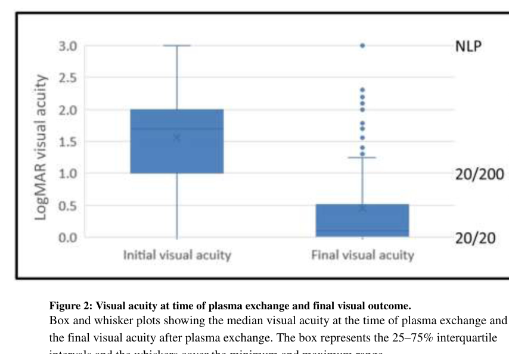

## Question

# Disease Characteristics Research Template

## Target Disease
- **Disease Name:** Optic Neuritis
- **MONDO ID:**  (if available)
- **Category:** Neurological Disorder

## Research Objectives

Please provide a comprehensive research report on **Optic Neuritis** covering all of the
disease characteristics listed below. This report will be used to populate a disease knowledge
base entry. Be thorough and cite primary literature (PMID preferred) for all claims.

For each section, **suggested databases/resources** are listed. These are the first places
you should search for information on each topic.

---

### 1. Disease Information
> **Search first:** OMIM, Orphanet, ICD-10/ICD-11, MeSH, PubMed

- What is the disease? Provide a concise overview.
- What are the key identifiers? (OMIM, Orphanet, ICD-10/ICD-11, MeSH, Mondo)
- What are the common synonyms and alternative names?
- Is the information derived from individual patients (e.g., EHR) or aggregated disease-level resources?

### 2. Etiology

- **Disease Causal Factors**: What are the primary causes? (genetic, environmental, infectious, mechanistic)
- **Risk Factors**:
  > **Search first:** PubMed, Cochrane Library, UpToDate, clinical guidelines, ClinVar, ClinGen, GWAS Catalog, PheGenI, CTD, CDC, WHO, epidemiological databases
  - Genetic risk factors (causal variants, susceptibility loci, modifier genes)
  - Environmental risk factors (toxins, lifestyle, occupational exposures, age, sex, family history)
- **Protective Factors**:
  > **Search first:** PubMed, Cochrane Library, clinical trial databases, GWAS Catalog, gnomAD, WHO, CDC, nutrition databases
  - Genetic protective factors (protective variants, modifier alleles)
  - Environmental protective factors (diet, lifestyle, exposures that reduce risk)
- **Gene-Environment Interactions**: How do genetic and environmental factors interact to influence disease?
  > **Search first:** CTD, PubMed, PheGenI, GxE databases

### 3. Phenotypes
> **Search first:** HPO (Human Phenotype Ontology), OMIM, Orphanet, PubMed, clinicaltrials.gov, MedDRA, SNOMED CT, DECIPHER, LOINC

For each phenotype, provide:
- **Phenotype type**: symptoms, clinical signs, physical manifestations, behavioral changes, or laboratory abnormalities
  > For symptoms/signs: HPO, OMIM, Orphanet, PubMed
  > For behavioral changes: HPO, DSM, RDoC (Research Domain Criteria), PubMed
  > For laboratory abnormalities: LOINC, SNOMED CT, LabTests Online, PubMed
- **Phenotype characteristics**:
  > **Search first:** OMIM, Orphanet, HPO, PubMed
  - Age of symptom onset (neonatal, childhood, adult-onset, late-onset)
  - Symptom severity (mild, moderate, severe, variable)
  - Symptom progression (stable, progressive, episodic, fluctuating)
  - Frequency among affected individuals (percentage or qualitative)
- **Quality of life impact**: Effects on daily functioning and well-being (per-phenotype when possible)
  > **Search first:** EQ-5D database, SF-36, WHO QOL databases, PubMed
- Suggest HPO (Human Phenotype Ontology) terms for each phenotype

### 4. Genetic/Molecular Information

- **Causal Genes**: Gene mutations or chromosomal abnormalities responsible for disease (gene symbols, OMIM IDs)
  > **Search first:** OMIM, ClinVar, HGMD, Ensembl, NCBI Gene
- **Pathogenic Variants**:
  - Affected genes (gene symbols, HGNC IDs)
    > **Search first:** OMIM, NCBI Gene, Ensembl, HGNC, UniProt, GeneCards
  - Variant classification (pathogenic, likely pathogenic, VUS per ACMG/AMP guidelines)
    > **Search first:** ClinVar, ClinGen, ACMG/AMP guidelines, VarSome
  - Variant type/class (missense, frameshift, nonsense, splice-site, structural)
  - Allele frequency in population databases
    > **Search first:** gnomAD, 1000 Genomes, ExAC, TOPMed, dbSNP
  - Somatic vs germline origin
    > **Search first:** COSMIC (somatic), ClinVar, ICGC, TCGA
  - Functional consequences (loss of function, gain of function, dominant negative)
- **Modifier Genes**: Genes that modify disease severity or expression
- **Epigenetic Information**: DNA methylation, histone modifications, chromatin changes affecting disease
  > **Search first:** ENCODE, Roadmap Epigenomics, MethBase, DiseaseMeth
- **Chromosomal Abnormalities**: Large-scale genetic changes (aneuploidy, translocations, inversions)
  > **Search first:** DECIPHER, ClinVar, ECARUCA, UCSC Genome Browser

### 5. Environmental Information

- **Environmental Factors**: Non-genetic contributing factors (toxins, radiation, pollution, occupational exposure)
  > **Search first:** CTD (Comparative Toxicogenomics Database), TOXNET, PubMed, EPA databases
- **Lifestyle Factors**: Behavioral factors (smoking, diet, exercise, alcohol consumption)
  > **Search first:** CDC databases, WHO, PubMed, NHANES
- **Infectious Agents**: If applicable, pathogens causing or triggering disease (bacteria, viruses, fungi, parasites)
  > **Search first:** NCBI Taxonomy, ViPR, BV-BRC, MicrobeDB, GIDEON

### 6. Mechanism / Pathophysiology

- **Molecular Pathways**: Specific signaling cascades or biochemical pathways involved (Wnt, MAPK, mTOR, PI3K-AKT, etc.)
  > **Search first:** KEGG, Reactome, WikiPathways, PathBank, BioCyc
- **Cellular Processes**: Cell-level mechanisms (apoptosis, autophagy, cell cycle dysregulation, inflammation, etc.)
  > **Search first:** Gene Ontology (GO), Reactome, KEGG, PubMed
- **Protein Dysfunction**: How protein structure or function is altered (misfolding, aggregation, loss of function, gain of function)
  > **Search first:** UniProt, PDB (Protein Data Bank), InterPro, Pfam, AlphaFold
- **Metabolic Changes**: Alterations in metabolic processes (energy metabolism, lipid metabolism, amino acid metabolism)
  > **Search first:** KEGG, BioCyc, HMDB (Human Metabolome Database), BRENDA
- **Immune System Involvement**: Role of immune response (autoimmunity, immunodeficiency, chronic inflammation)
  > **Search first:** ImmPort, Immunome Database, IEDB, Gene Ontology
- **Tissue Damage Mechanisms**: How tissues/ are injured (oxidative stress, ischemia, fibrosis, necrosis)
  > **Search first:** PubMed, Gene Ontology, Reactome
- **Biochemical Abnormalities**: Specific molecular defects (enzyme deficiencies, receptor dysfunction, ion channel defects)
  > **Search first:** BRENDA, UniProt, KEGG, OMIM, PubMed
- **Epigenetic Changes**: DNA methylation, histone modifications affecting gene expression in disease
  > **Search first:** ENCODE, Roadmap Epigenomics, MethBase, DiseaseMeth
- **Molecular Profiling** (if available):
  - Transcriptomics/gene expression changes
    > **Search first:** GEO (Gene Expression Omnibus), ArrayExpress, GTEx, Human Cell Atlas, SRA
  - Proteomics findings
    > **Search first:** PRIDE, ProteomeXchange, Human Protein Atlas, STRING, BioGRID
  - Metabolomics signatures
    > **Search first:** MetaboLights, Metabolomics Workbench, HMDB, METLIN
  - Lipidomics alterations
    > **Search first:** LIPID MAPS, SwissLipids, LipidHome, Metabolomics Workbench
  - Genomic structural features
    > **Search first:** UCSC Genome Browser, Ensembl, NCBI, dbVar, DGV
- **Advanced Technologies** (if applicable):
  - Single-cell analysis findings (cell-type specific mechanisms, cellular heterogeneity)
    > **Search first:** Human Cell Atlas, Single Cell Portal, GEO, CELLxGENE
  - Spatial transcriptomics findings
    > **Search first:** GEO, Spatial Research, Vizgen, 10x Genomics data
  - Multi-omics integration results
    > **Search first:** TCGA, ICGC, cBioPortal, LinkedOmics, PubMed
  - Functional genomics screens (CRISPR, RNAi)
    > **Search first:** DepMap, GenomeRNAi, PubMed, BioGRID ORCS

For each mechanism, describe:
- The causal chain from initial trigger to clinical manifestation
- Which mechanisms are upstream vs downstream
- What cell types and biological processes are involved
- Suggest GO terms for biological processes and CL terms for cell types

### 7. Anatomical Structures Affected

- **Organ Level**:
  - Primary organs directly affected
  - Secondary organ involvement (complications, secondary effects)
  - Body systems involved (cardiovascular, nervous, digestive, respiratory, endocrine, etc.)
  > **Search first:** Uberon, FMA (Foundational Model of Anatomy), OMIM, HPO, ICD-11, MeSH, SNOMED CT
- **Tissue and Cell Level**:
  - Specific tissue types affected (epithelial, connective, muscle, nervous)
  - Specific cell populations targeted (with Cell Ontology terms)
  > **Search first:** Uberon, Human Protein Atlas, Cell Ontology, Human Cell Atlas, CellMarker, PanglaoDB
- **Subcellular Level**:
  - Cellular compartments involved (mitochondria, nucleus, ER, lysosomes) (with GO Cellular Component terms)
  > **Search first:** Gene Ontology (Cellular Component), UniProt, Human Protein Atlas
- **Localization**:
  - Specific anatomical sites (with UBERON terms)
    > **Search first:** FMA, Uberon, NeuroNames (for brain), SNOMED CT
  - Lateralization (unilateral, bilateral, asymmetric)
    > **Search first:** HPO, clinical literature, imaging databases

### 8. Temporal Development

- **Onset**:
  - Typical age of onset (congenital, pediatric, adult, geriatric)
  - Onset pattern (acute, subacute, chronic, insidious)
  > **Search first:** OMIM, Orphanet, HPO, PubMed
- **Progression**:
  - Disease stages (early, intermediate, advanced, end-stage)
    > **Search first:** Cancer Staging Manual (AJCC), WHO classifications, PubMed
  - Progression rate (rapid, slow, variable)
  - Disease course pattern (episodic, relapsing-remitting, progressive, stable)
  - Disease duration (self-limited, chronic lifelong)
  > **Search first:** Disease registries, longitudinal cohort databases, natural history studies, PubMed, Orphanet, OMIM
- **Patterns**:
  - Remission patterns (spontaneous, treatment-induced)
    > **Search first:** Clinical trial databases, disease registries, PubMed
  - Critical periods (time windows of vulnerability or opportunity for intervention)
    > **Search first:** PubMed, developmental biology databases, clinical guidelines

### 9. Inheritance and Population

- **Epidemiology**:
  - Prevalence (cases per 100,000 at given time)
  - Incidence (new cases per 100,000 per year)
  > **Search first:** Orphanet, CDC, WHO, GBD (Global Burden of Disease), national registries, SEER, disease registries
- **For Genetic Etiology**:
  - Inheritance pattern (AD, AR, X-linked, mitochondrial, multifactorial, polygenic)
    > **Search first:** OMIM, Orphanet, ClinVar, GTR (Genetic Testing Registry)
  - Penetrance (complete, incomplete, age-dependent)
    > **Search first:** ClinVar, OMIM, PubMed, ClinGen
  - Expressivity (variable, consistent)
    > **Search first:** OMIM, ClinVar, PubMed
  - Genetic anticipation (increasing severity in successive generations)
    > **Search first:** OMIM, PubMed (especially for repeat expansion disorders)
  - Germline mosaicism
    > **Search first:** ClinVar, OMIM, genetic counseling literature, PubMed
  - Founder effects (population-specific mutations)
    > **Search first:** gnomAD, population genetics databases, PubMed
  - Consanguinity role
    > **Search first:** OMIM, population studies, genetic counseling resources
  - Carrier frequency
    > **Search first:** gnomAD, carrier screening databases, GeneReviews, GTR
- **Population Demographics**:
  - Affected populations (ethnic or demographic groups with higher prevalence)
    > **Search first:** gnomAD, 1000 Genomes, PAGE Study, PubMed, population registries
  - Geographic distribution (endemic areas, regional variation)
    > **Search first:** WHO, CDC, GBD, Orphanet, geographic epidemiology databases
  - Geographic distribution of specific variants
  - Sex ratio (male:female)
    > **Search first:** Disease registries, OMIM, PubMed, epidemiological databases
  - Age distribution of affected individuals
    > **Search first:** CDC, disease registries, SEER, Orphanet

### 10. Diagnostics

- **Clinical Tests**:
  - Laboratory tests (blood, urine, tissue chemistry, specific enzyme assays)
    > **Search first:** LOINC, LabTests Online, PubMed
  - Biomarkers (proteins, metabolites, genetic markers, circulating biomarkers)
    > **Search first:** FDA Biomarker List, BEST (Biomarkers, EndpointS, and other Tools), PubMed
  - Imaging studies (X-ray, CT, MRI, PET, ultrasound)
    > **Search first:** RadLex, DICOM, Radiopaedia, imaging databases
  - Functional tests (pulmonary function, cardiac stress tests)
    > **Search first:** LOINC, clinical guidelines, PubMed
  - Electrophysiology (EEG, EMG, ECG, nerve conduction studies)
    > **Search first:** LOINC, clinical neurophysiology databases, PubMed
  - Biopsy findings (histopathology, immunohistochemistry)
    > **Search first:** SNOMED CT, College of American Pathologists resources, PubMed
  - Pathology findings (microscopic examination)
    > **Search first:** SNOMED CT, Digital Pathology databases, PubMed
- **Genetic Testing**:
  > **Search first:** GTR (Genetic Testing Registry), GeneReviews, ClinGen
  - Overview of recommended genetic testing approach
  - Whole genome sequencing (WGS) utility
    > **Search first:** GTR, ClinVar, GEL (Genomics England), gnomAD
  - Whole exome sequencing (WES) utility
    > **Search first:** GTR, ClinVar, OMIM, GeneMatcher
  - Gene panels (which panels, which genes)
    > **Search first:** GTR, ClinVar, laboratory-specific databases
  - Single gene testing
    > **Search first:** GTR, ClinVar, OMIM, GeneReviews
  - Chromosomal microarray (CMA)
    > **Search first:** DECIPHER, ClinVar, dbVar, ECARUCA
  - Karyotyping
    > **Search first:** Chromosome Abnormality Database, ClinVar, cytogenetics resources
  - FISH
    > **Search first:** ClinVar, cytogenetics databases, PubMed
  - Mitochondrial DNA testing
    > **Search first:** MITOMAP, MSeqDR, ClinVar, GTR
  - Repeat expansion testing
    > **Search first:** GTR, ClinVar, repeat expansion databases, PubMed
- **Omics-Based Diagnostics** (if applicable):
  - RNA sequencing / transcriptomics
    > **Search first:** GEO, ArrayExpress, GTEx, RNA-seq databases
  - Proteomics
    > **Search first:** PRIDE, ProteomeXchange, FDA Biomarker database
  - Metabolomics
    > **Search first:** MetaboLights, Metabolomics Workbench, HMDB
  - Epigenomics
    > **Search first:** GEO, ENCODE, Roadmap Epigenomics, MethBase
  - Liquid biopsy
    > **Search first:** COSMIC, ClinVar, liquid biopsy databases, PubMed
- **Clinical Criteria**:
  - Standardized diagnostic criteria (DSM, ICD, society guidelines)
    > **Search first:** DSM-5, ICD-11, clinical society guidelines, UpToDate
  - Differential diagnosis (other conditions to rule out, with distinguishing features)
    > **Search first:** DynaMed, UpToDate, clinical decision support systems
- **Screening**:
  - Screening methods for asymptomatic individuals (newborn screening, carrier screening, cascade screening)
    > **Search first:** ACMG recommendations, CDC newborn screening, GTR

### 11. Outcome/Prognosis

- **Survival and Mortality**:
  - Survival rate (5-year, 10-year, overall)
    > **Search first:** SEER, cancer registries, disease-specific registries, PubMed
  - Life expectancy (with and without treatment if applicable)
    > **Search first:** Orphanet, disease registries, actuarial databases, PubMed
  - Mortality rate
    > **Search first:** CDC, WHO, GBD, national mortality databases
  - Disease-specific mortality (deaths directly attributable to disease)
    > **Search first:** Disease registries, CDC Wonder, GBD, PubMed
- **Morbidity and Function**:
  - Morbidity (disease-related disability and health impacts)
    > **Search first:** GBD, WHO, disability databases, PubMed
  - Disability outcomes (long-term functional impairments)
    > **Search first:** ICF (International Classification of Functioning), disability registries
  - Quality of life measures (EQ-5D, SF-36, PROMIS, disease-specific tools)
    > **Search first:** EQ-5D database, SF-36, PROMIS, PubMed
- **Disease Course**:
  - Complications (secondary problems: infections, organ failure, etc.)
    > **Search first:** ICD codes, disease registries, clinical databases, PubMed
  - Recovery potential (likelihood and extent of recovery, with vs without treatment)
    > **Search first:** Natural history studies, rehabilitation databases, PubMed
- **Prediction**:
  - Prognostic factors (age, disease severity, biomarkers, treatment response)
    > **Search first:** Prognostic models databases, clinical calculators, PubMed
  - Prognostic biomarkers (molecular markers predicting disease course)
    > **Search first:** FDA Biomarker database, PubMed, cancer prognostic databases

### 12. Treatment

- **Pharmacotherapy**:
  - Pharmacological treatments (drug names, drug classes, mechanisms of action)
    > **Search first:** DrugBank, RxNorm, ATC classification, DailyMed, FDA databases
  - Pharmacogenomics (how genetic variants affect drug metabolism, efficacy, toxicity)
    > **Search first:** PharmGKB, CPIC (Clinical Pharmacogenetics), FDA Table of PGx Biomarkers
- **Advanced Therapeutics**:
  - Gene therapy (viral vectors, CRISPR, gene replacement, gene editing)
    > **Search first:** ClinicalTrials.gov, FDA gene therapy database, ASGCT resources
  - Cell therapy (stem cell transplant, CAR-T, cellular therapeutics)
    > **Search first:** ClinicalTrials.gov, FDA cell therapy database, FACT standards
  - RNA-based therapies (ASOs, siRNA, mRNA therapies)
    > **Search first:** ClinicalTrials.gov, FDA approvals, PubMed
  - Targeted therapies (treatments directed at specific molecular targets)
    > **Search first:** My Cancer Genome, OncoKB, ClinicalTrials.gov, FDA approvals
  - Immunotherapies (checkpoint inhibitors, monoclonal antibodies)
    > **Search first:** Cancer Immunotherapy Database, FDA approvals, ClinicalTrials.gov
- **Surgical and Interventional**:
  - Surgical interventions (types of surgery, timing, outcomes)
    > **Search first:** CPT codes, surgical registries, clinical guidelines, PubMed
- **Supportive and Rehabilitative**:
  - Supportive care (symptom management, pain control, nutrition)
    > **Search first:** Clinical guidelines, Cochrane Library, PubMed
  - Rehabilitation (physical therapy, occupational therapy, speech therapy)
    > **Search first:** Rehabilitation medicine databases, clinical guidelines, PubMed
- **Experimental**:
  - Experimental treatments in clinical trials (with NCT identifiers if available)
    > **Search first:** ClinicalTrials.gov, EU Clinical Trials Register, WHO ICTRP
- **Treatment Outcomes**:
  - Treatment response rates
    > **Search first:** Clinical trial databases, FDA reviews, systematic reviews, PubMed
  - Side effects and adverse events
    > **Search first:** FDA Adverse Event Reporting System (FAERS), MedWatch, PubMed
- **Treatment Strategy**:
  - Treatment algorithms (clinical pathways, decision trees)
    > **Search first:** Clinical practice guidelines, NCCN Guidelines, UpToDate
  - Combination therapies
    > **Search first:** ClinicalTrials.gov, treatment guidelines, PubMed
  - Personalized medicine approaches (genotype-guided treatment)
    > **Search first:** My Cancer Genome, CIViC, PharmGKB, precision medicine databases

For each treatment, suggest MAXO (Medical Action Ontology) terms where applicable.

### 13. Prevention

- **Prevention Levels**:
  - Primary prevention (preventing disease occurrence: vaccination, risk factor modification)
    > **Search first:** CDC, WHO, USPSTF recommendations, Cochrane Library
  - Secondary prevention (early detection and treatment: screening programs, early intervention)
    > **Search first:** USPSTF, CDC screening guidelines, WHO
  - Tertiary prevention (preventing complications in those with disease)
    > **Search first:** Clinical guidelines, disease management protocols, PubMed
- **Immunization**: Vaccine strategies (if applicable)
  > **Search first:** CDC vaccine schedules, WHO immunization, FDA vaccine database
- **Screening and Early Detection**:
  - Screening programs (population-based: newborn screening, cancer screening)
    > **Search first:** CDC screening programs, USPSTF, cancer screening databases
  - Genetic screening (carrier screening, preimplantation genetic diagnosis, prenatal testing)
    > **Search first:** ACMG recommendations, ACOG guidelines, GTR
  - Risk stratification (identifying high-risk individuals for targeted prevention)
    > **Search first:** Risk prediction models, clinical calculators, PubMed
- **Behavioral Interventions**: Lifestyle modifications to reduce risk
  > **Search first:** CDC, WHO, behavioral intervention databases, Cochrane Library
- **Counseling**: Genetic counseling (risk assessment, family planning guidance)
  > **Search first:** NSGC resources, ACMG guidelines, GeneReviews
- **Public Health**:
  - Public health interventions (sanitation, vector control, health education)
    > **Search first:** CDC, WHO, public health databases, PubMed
  - Environmental interventions (reducing environmental risk factors)
    > **Search first:** EPA databases, WHO environmental health, PubMed
- **Prophylaxis**: Preventive medications or procedures
  > **Search first:** Clinical guidelines, FDA approvals, PubMed

### 14. Other Species / Natural Disease

- **Taxonomy**: Species affected (with NCBI Taxon identifiers)
  > **Search first:** NCBI Taxonomy
- **Breed**: Specific breeds affected (with VBO identifiers if applicable)
  > **Search first:** VBO (Vertebrate Breed Ontology)
- **Gene**: Orthologous genes in other species (with NCBI Gene IDs)
  > **Search first:** NCBI Gene
- **Natural Disease**:
  - Naturally occurring disease in other species (companion animals, wildlife)
    > **Search first:** OMIA (Online Mendelian Inheritance in Animals), VetCompass, PubMed
  - Veterinary relevance and importance in animal health
    > **Search first:** OMIA, veterinary databases, PubMed
- **Comparative Biology**:
  - Comparative pathology (similarities and differences across species)
    > **Search first:** OMIA, comparative pathology databases, PubMed
  - Evolutionary conservation of disease mechanisms
    > **Search first:** HomoloGene, OrthoMCL, Alliance of Genome Resources
- **Transmission** (if applicable):
  - Zoonotic potential
    > **Search first:** CDC zoonotic diseases, WHO zoonoses, GIDEON
  - Cross-species susceptibility
    > **Search first:** NCBI Taxonomy, veterinary databases, PubMed

### 15. Model Organisms

- **Model Types**:
  - Model organism type (mammalian, invertebrate, cellular, in vitro)
    > **Search first:** Alliance of Genome Resources, model organism databases
  - Specific model systems (mouse, rat, zebrafish, Drosophila, C. elegans, yeast, cell lines, organoids, iPSCs)
    > **Search first:** MGI, RGD, ZFIN, FlyBase, WormBase, SGD, ATCC, Cellosaurus
  - Induced models (drug treatment, surgical intervention, environmental manipulation)
    > **Search first:** MGI, model organism databases, PubMed
- **Genetic Models**:
  - Types available (knockout, knock-in, transgenic, conditional, humanized)
    > **Search first:** MGI, IMPC, KOMP, EuMMCR, IMSR
- **Model Characteristics**:
  - Phenotype recapitulation (how well model reproduces human disease features)
    > **Search first:** Model organism databases, comparative studies, PubMed
  - Model limitations (aspects of human disease not captured)
    > **Search first:** Model organism databases, PubMed, review articles
- **Applications**:
  - Research applications (what aspects of disease can be studied)
    > **Search first:** Model organism databases, PubMed
- **Resources**:
  - Model databases
    > **Search first:** MGI, RGD, ZFIN, FlyBase, WormBase, IMSR, EMMA, MMRRC

---

## Citation Requirements

- Cite primary literature (PMID preferred) for all mechanistic and clinical claims
- Prioritize recent reviews and landmark papers
- Include direct quotes from abstracts where possible to support key statements
- Distinguish evidence source types: human clinical, model organism, in vitro, computational

## Output Format

Structure your response as a comprehensive narrative organized by the sections above.
For each section, provide:
- Factual content with specific details (numbers, percentages, gene names, variant nomenclature)
- Ontology term suggestions (HPO, GO, CL, UBERON, CHEBI, MAXO, MONDO) where applicable
- Evidence citations with PMIDs
- Direct quotes from abstracts to support key claims
- Clear indication when information is not available or not applicable for this disease

This report will be used to populate a disease knowledge base entry with:
- Pathophysiology descriptions with causal chains
- Gene/protein annotations (HGNC, GO terms)
- Phenotype associations (HP terms) with frequencies
- Cell type involvement (CL terms)
- Anatomical locations (UBERON terms)
- Chemical entities (CHEBI terms)
- Treatment annotations (MAXO terms)
- Evidence items with PMIDs and exact abstract quotes
- Epidemiology, prognosis, diagnostic, and prevention information
- Animal model descriptions with phenotype recapitulation details

## Output

Question: You are an expert researcher providing comprehensive, well-cited information.

Provide detailed information focusing on:
1. Key concepts and definitions with current understanding
2. Recent developments and latest research (prioritize 2023-2024 sources)
3. Current applications and real-world implementations
4. Expert opinions and analysis from authoritative sources
5. Relevant statistics and data from recent studies

Format as a comprehensive research report with proper citations. Include URLs and publication dates where available.
Always prioritize recent, authoritative sources and provide specific citations for all major claims.

# Disease Characteristics Research Template

## Target Disease
- **Disease Name:** Optic Neuritis
- **MONDO ID:**  (if available)
- **Category:** Neurological Disorder

## Research Objectives

Please provide a comprehensive research report on **Optic Neuritis** covering all of the
disease characteristics listed below. This report will be used to populate a disease knowledge
base entry. Be thorough and cite primary literature (PMID preferred) for all claims.

For each section, **suggested databases/resources** are listed. These are the first places
you should search for information on each topic.

---

### 1. Disease Information
> **Search first:** OMIM, Orphanet, ICD-10/ICD-11, MeSH, PubMed

- What is the disease? Provide a concise overview.
- What are the key identifiers? (OMIM, Orphanet, ICD-10/ICD-11, MeSH, Mondo)
- What are the common synonyms and alternative names?
- Is the information derived from individual patients (e.g., EHR) or aggregated disease-level resources?

### 2. Etiology

- **Disease Causal Factors**: What are the primary causes? (genetic, environmental, infectious, mechanistic)
- **Risk Factors**:
  > **Search first:** PubMed, Cochrane Library, UpToDate, clinical guidelines, ClinVar, ClinGen, GWAS Catalog, PheGenI, CTD, CDC, WHO, epidemiological databases
  - Genetic risk factors (causal variants, susceptibility loci, modifier genes)
  - Environmental risk factors (toxins, lifestyle, occupational exposures, age, sex, family history)
- **Protective Factors**:
  > **Search first:** PubMed, Cochrane Library, clinical trial databases, GWAS Catalog, gnomAD, WHO, CDC, nutrition databases
  - Genetic protective factors (protective variants, modifier alleles)
  - Environmental protective factors (diet, lifestyle, exposures that reduce risk)
- **Gene-Environment Interactions**: How do genetic and environmental factors interact to influence disease?
  > **Search first:** CTD, PubMed, PheGenI, GxE databases

### 3. Phenotypes
> **Search first:** HPO (Human Phenotype Ontology), OMIM, Orphanet, PubMed, clinicaltrials.gov, MedDRA, SNOMED CT, DECIPHER, LOINC

For each phenotype, provide:
- **Phenotype type**: symptoms, clinical signs, physical manifestations, behavioral changes, or laboratory abnormalities
  > For symptoms/signs: HPO, OMIM, Orphanet, PubMed
  > For behavioral changes: HPO, DSM, RDoC (Research Domain Criteria), PubMed
  > For laboratory abnormalities: LOINC, SNOMED CT, LabTests Online, PubMed
- **Phenotype characteristics**:
  > **Search first:** OMIM, Orphanet, HPO, PubMed
  - Age of symptom onset (neonatal, childhood, adult-onset, late-onset)
  - Symptom severity (mild, moderate, severe, variable)
  - Symptom progression (stable, progressive, episodic, fluctuating)
  - Frequency among affected individuals (percentage or qualitative)
- **Quality of life impact**: Effects on daily functioning and well-being (per-phenotype when possible)
  > **Search first:** EQ-5D database, SF-36, WHO QOL databases, PubMed
- Suggest HPO (Human Phenotype Ontology) terms for each phenotype

### 4. Genetic/Molecular Information

- **Causal Genes**: Gene mutations or chromosomal abnormalities responsible for disease (gene symbols, OMIM IDs)
  > **Search first:** OMIM, ClinVar, HGMD, Ensembl, NCBI Gene
- **Pathogenic Variants**:
  - Affected genes (gene symbols, HGNC IDs)
    > **Search first:** OMIM, NCBI Gene, Ensembl, HGNC, UniProt, GeneCards
  - Variant classification (pathogenic, likely pathogenic, VUS per ACMG/AMP guidelines)
    > **Search first:** ClinVar, ClinGen, ACMG/AMP guidelines, VarSome
  - Variant type/class (missense, frameshift, nonsense, splice-site, structural)
  - Allele frequency in population databases
    > **Search first:** gnomAD, 1000 Genomes, ExAC, TOPMed, dbSNP
  - Somatic vs germline origin
    > **Search first:** COSMIC (somatic), ClinVar, ICGC, TCGA
  - Functional consequences (loss of function, gain of function, dominant negative)
- **Modifier Genes**: Genes that modify disease severity or expression
- **Epigenetic Information**: DNA methylation, histone modifications, chromatin changes affecting disease
  > **Search first:** ENCODE, Roadmap Epigenomics, MethBase, DiseaseMeth
- **Chromosomal Abnormalities**: Large-scale genetic changes (aneuploidy, translocations, inversions)
  > **Search first:** DECIPHER, ClinVar, ECARUCA, UCSC Genome Browser

### 5. Environmental Information

- **Environmental Factors**: Non-genetic contributing factors (toxins, radiation, pollution, occupational exposure)
  > **Search first:** CTD (Comparative Toxicogenomics Database), TOXNET, PubMed, EPA databases
- **Lifestyle Factors**: Behavioral factors (smoking, diet, exercise, alcohol consumption)
  > **Search first:** CDC databases, WHO, PubMed, NHANES
- **Infectious Agents**: If applicable, pathogens causing or triggering disease (bacteria, viruses, fungi, parasites)
  > **Search first:** NCBI Taxonomy, ViPR, BV-BRC, MicrobeDB, GIDEON

### 6. Mechanism / Pathophysiology

- **Molecular Pathways**: Specific signaling cascades or biochemical pathways involved (Wnt, MAPK, mTOR, PI3K-AKT, etc.)
  > **Search first:** KEGG, Reactome, WikiPathways, PathBank, BioCyc
- **Cellular Processes**: Cell-level mechanisms (apoptosis, autophagy, cell cycle dysregulation, inflammation, etc.)
  > **Search first:** Gene Ontology (GO), Reactome, KEGG, PubMed
- **Protein Dysfunction**: How protein structure or function is altered (misfolding, aggregation, loss of function, gain of function)
  > **Search first:** UniProt, PDB (Protein Data Bank), InterPro, Pfam, AlphaFold
- **Metabolic Changes**: Alterations in metabolic processes (energy metabolism, lipid metabolism, amino acid metabolism)
  > **Search first:** KEGG, BioCyc, HMDB (Human Metabolome Database), BRENDA
- **Immune System Involvement**: Role of immune response (autoimmunity, immunodeficiency, chronic inflammation)
  > **Search first:** ImmPort, Immunome Database, IEDB, Gene Ontology
- **Tissue Damage Mechanisms**: How tissues/ are injured (oxidative stress, ischemia, fibrosis, necrosis)
  > **Search first:** PubMed, Gene Ontology, Reactome
- **Biochemical Abnormalities**: Specific molecular defects (enzyme deficiencies, receptor dysfunction, ion channel defects)
  > **Search first:** BRENDA, UniProt, KEGG, OMIM, PubMed
- **Epigenetic Changes**: DNA methylation, histone modifications affecting gene expression in disease
  > **Search first:** ENCODE, Roadmap Epigenomics, MethBase, DiseaseMeth
- **Molecular Profiling** (if available):
  - Transcriptomics/gene expression changes
    > **Search first:** GEO (Gene Expression Omnibus), ArrayExpress, GTEx, Human Cell Atlas, SRA
  - Proteomics findings
    > **Search first:** PRIDE, ProteomeXchange, Human Protein Atlas, STRING, BioGRID
  - Metabolomics signatures
    > **Search first:** MetaboLights, Metabolomics Workbench, HMDB, METLIN
  - Lipidomics alterations
    > **Search first:** LIPID MAPS, SwissLipids, LipidHome, Metabolomics Workbench
  - Genomic structural features
    > **Search first:** UCSC Genome Browser, Ensembl, NCBI, dbVar, DGV
- **Advanced Technologies** (if applicable):
  - Single-cell analysis findings (cell-type specific mechanisms, cellular heterogeneity)
    > **Search first:** Human Cell Atlas, Single Cell Portal, GEO, CELLxGENE
  - Spatial transcriptomics findings
    > **Search first:** GEO, Spatial Research, Vizgen, 10x Genomics data
  - Multi-omics integration results
    > **Search first:** TCGA, ICGC, cBioPortal, LinkedOmics, PubMed
  - Functional genomics screens (CRISPR, RNAi)
    > **Search first:** DepMap, GenomeRNAi, PubMed, BioGRID ORCS

For each mechanism, describe:
- The causal chain from initial trigger to clinical manifestation
- Which mechanisms are upstream vs downstream
- What cell types and biological processes are involved
- Suggest GO terms for biological processes and CL terms for cell types

### 7. Anatomical Structures Affected

- **Organ Level**:
  - Primary organs directly affected
  - Secondary organ involvement (complications, secondary effects)
  - Body systems involved (cardiovascular, nervous, digestive, respiratory, endocrine, etc.)
  > **Search first:** Uberon, FMA (Foundational Model of Anatomy), OMIM, HPO, ICD-11, MeSH, SNOMED CT
- **Tissue and Cell Level**:
  - Specific tissue types affected (epithelial, connective, muscle, nervous)
  - Specific cell populations targeted (with Cell Ontology terms)
  > **Search first:** Uberon, Human Protein Atlas, Cell Ontology, Human Cell Atlas, CellMarker, PanglaoDB
- **Subcellular Level**:
  - Cellular compartments involved (mitochondria, nucleus, ER, lysosomes) (with GO Cellular Component terms)
  > **Search first:** Gene Ontology (Cellular Component), UniProt, Human Protein Atlas
- **Localization**:
  - Specific anatomical sites (with UBERON terms)
    > **Search first:** FMA, Uberon, NeuroNames (for brain), SNOMED CT
  - Lateralization (unilateral, bilateral, asymmetric)
    > **Search first:** HPO, clinical literature, imaging databases

### 8. Temporal Development

- **Onset**:
  - Typical age of onset (congenital, pediatric, adult, geriatric)
  - Onset pattern (acute, subacute, chronic, insidious)
  > **Search first:** OMIM, Orphanet, HPO, PubMed
- **Progression**:
  - Disease stages (early, intermediate, advanced, end-stage)
    > **Search first:** Cancer Staging Manual (AJCC), WHO classifications, PubMed
  - Progression rate (rapid, slow, variable)
  - Disease course pattern (episodic, relapsing-remitting, progressive, stable)
  - Disease duration (self-limited, chronic lifelong)
  > **Search first:** Disease registries, longitudinal cohort databases, natural history studies, PubMed, Orphanet, OMIM
- **Patterns**:
  - Remission patterns (spontaneous, treatment-induced)
    > **Search first:** Clinical trial databases, disease registries, PubMed
  - Critical periods (time windows of vulnerability or opportunity for intervention)
    > **Search first:** PubMed, developmental biology databases, clinical guidelines

### 9. Inheritance and Population

- **Epidemiology**:
  - Prevalence (cases per 100,000 at given time)
  - Incidence (new cases per 100,000 per year)
  > **Search first:** Orphanet, CDC, WHO, GBD (Global Burden of Disease), national registries, SEER, disease registries
- **For Genetic Etiology**:
  - Inheritance pattern (AD, AR, X-linked, mitochondrial, multifactorial, polygenic)
    > **Search first:** OMIM, Orphanet, ClinVar, GTR (Genetic Testing Registry)
  - Penetrance (complete, incomplete, age-dependent)
    > **Search first:** ClinVar, OMIM, PubMed, ClinGen
  - Expressivity (variable, consistent)
    > **Search first:** OMIM, ClinVar, PubMed
  - Genetic anticipation (increasing severity in successive generations)
    > **Search first:** OMIM, PubMed (especially for repeat expansion disorders)
  - Germline mosaicism
    > **Search first:** ClinVar, OMIM, genetic counseling literature, PubMed
  - Founder effects (population-specific mutations)
    > **Search first:** gnomAD, population genetics databases, PubMed
  - Consanguinity role
    > **Search first:** OMIM, population studies, genetic counseling resources
  - Carrier frequency
    > **Search first:** gnomAD, carrier screening databases, GeneReviews, GTR
- **Population Demographics**:
  - Affected populations (ethnic or demographic groups with higher prevalence)
    > **Search first:** gnomAD, 1000 Genomes, PAGE Study, PubMed, population registries
  - Geographic distribution (endemic areas, regional variation)
    > **Search first:** WHO, CDC, GBD, Orphanet, geographic epidemiology databases
  - Geographic distribution of specific variants
  - Sex ratio (male:female)
    > **Search first:** Disease registries, OMIM, PubMed, epidemiological databases
  - Age distribution of affected individuals
    > **Search first:** CDC, disease registries, SEER, Orphanet

### 10. Diagnostics

- **Clinical Tests**:
  - Laboratory tests (blood, urine, tissue chemistry, specific enzyme assays)
    > **Search first:** LOINC, LabTests Online, PubMed
  - Biomarkers (proteins, metabolites, genetic markers, circulating biomarkers)
    > **Search first:** FDA Biomarker List, BEST (Biomarkers, EndpointS, and other Tools), PubMed
  - Imaging studies (X-ray, CT, MRI, PET, ultrasound)
    > **Search first:** RadLex, DICOM, Radiopaedia, imaging databases
  - Functional tests (pulmonary function, cardiac stress tests)
    > **Search first:** LOINC, clinical guidelines, PubMed
  - Electrophysiology (EEG, EMG, ECG, nerve conduction studies)
    > **Search first:** LOINC, clinical neurophysiology databases, PubMed
  - Biopsy findings (histopathology, immunohistochemistry)
    > **Search first:** SNOMED CT, College of American Pathologists resources, PubMed
  - Pathology findings (microscopic examination)
    > **Search first:** SNOMED CT, Digital Pathology databases, PubMed
- **Genetic Testing**:
  > **Search first:** GTR (Genetic Testing Registry), GeneReviews, ClinGen
  - Overview of recommended genetic testing approach
  - Whole genome sequencing (WGS) utility
    > **Search first:** GTR, ClinVar, GEL (Genomics England), gnomAD
  - Whole exome sequencing (WES) utility
    > **Search first:** GTR, ClinVar, OMIM, GeneMatcher
  - Gene panels (which panels, which genes)
    > **Search first:** GTR, ClinVar, laboratory-specific databases
  - Single gene testing
    > **Search first:** GTR, ClinVar, OMIM, GeneReviews
  - Chromosomal microarray (CMA)
    > **Search first:** DECIPHER, ClinVar, dbVar, ECARUCA
  - Karyotyping
    > **Search first:** Chromosome Abnormality Database, ClinVar, cytogenetics resources
  - FISH
    > **Search first:** ClinVar, cytogenetics databases, PubMed
  - Mitochondrial DNA testing
    > **Search first:** MITOMAP, MSeqDR, ClinVar, GTR
  - Repeat expansion testing
    > **Search first:** GTR, ClinVar, repeat expansion databases, PubMed
- **Omics-Based Diagnostics** (if applicable):
  - RNA sequencing / transcriptomics
    > **Search first:** GEO, ArrayExpress, GTEx, RNA-seq databases
  - Proteomics
    > **Search first:** PRIDE, ProteomeXchange, FDA Biomarker database
  - Metabolomics
    > **Search first:** MetaboLights, Metabolomics Workbench, HMDB
  - Epigenomics
    > **Search first:** GEO, ENCODE, Roadmap Epigenomics, MethBase
  - Liquid biopsy
    > **Search first:** COSMIC, ClinVar, liquid biopsy databases, PubMed
- **Clinical Criteria**:
  - Standardized diagnostic criteria (DSM, ICD, society guidelines)
    > **Search first:** DSM-5, ICD-11, clinical society guidelines, UpToDate
  - Differential diagnosis (other conditions to rule out, with distinguishing features)
    > **Search first:** DynaMed, UpToDate, clinical decision support systems
- **Screening**:
  - Screening methods for asymptomatic individuals (newborn screening, carrier screening, cascade screening)
    > **Search first:** ACMG recommendations, CDC newborn screening, GTR

### 11. Outcome/Prognosis

- **Survival and Mortality**:
  - Survival rate (5-year, 10-year, overall)
    > **Search first:** SEER, cancer registries, disease-specific registries, PubMed
  - Life expectancy (with and without treatment if applicable)
    > **Search first:** Orphanet, disease registries, actuarial databases, PubMed
  - Mortality rate
    > **Search first:** CDC, WHO, GBD, national mortality databases
  - Disease-specific mortality (deaths directly attributable to disease)
    > **Search first:** Disease registries, CDC Wonder, GBD, PubMed
- **Morbidity and Function**:
  - Morbidity (disease-related disability and health impacts)
    > **Search first:** GBD, WHO, disability databases, PubMed
  - Disability outcomes (long-term functional impairments)
    > **Search first:** ICF (International Classification of Functioning), disability registries
  - Quality of life measures (EQ-5D, SF-36, PROMIS, disease-specific tools)
    > **Search first:** EQ-5D database, SF-36, PROMIS, PubMed
- **Disease Course**:
  - Complications (secondary problems: infections, organ failure, etc.)
    > **Search first:** ICD codes, disease registries, clinical databases, PubMed
  - Recovery potential (likelihood and extent of recovery, with vs without treatment)
    > **Search first:** Natural history studies, rehabilitation databases, PubMed
- **Prediction**:
  - Prognostic factors (age, disease severity, biomarkers, treatment response)
    > **Search first:** Prognostic models databases, clinical calculators, PubMed
  - Prognostic biomarkers (molecular markers predicting disease course)
    > **Search first:** FDA Biomarker database, PubMed, cancer prognostic databases

### 12. Treatment

- **Pharmacotherapy**:
  - Pharmacological treatments (drug names, drug classes, mechanisms of action)
    > **Search first:** DrugBank, RxNorm, ATC classification, DailyMed, FDA databases
  - Pharmacogenomics (how genetic variants affect drug metabolism, efficacy, toxicity)
    > **Search first:** PharmGKB, CPIC (Clinical Pharmacogenetics), FDA Table of PGx Biomarkers
- **Advanced Therapeutics**:
  - Gene therapy (viral vectors, CRISPR, gene replacement, gene editing)
    > **Search first:** ClinicalTrials.gov, FDA gene therapy database, ASGCT resources
  - Cell therapy (stem cell transplant, CAR-T, cellular therapeutics)
    > **Search first:** ClinicalTrials.gov, FDA cell therapy database, FACT standards
  - RNA-based therapies (ASOs, siRNA, mRNA therapies)
    > **Search first:** ClinicalTrials.gov, FDA approvals, PubMed
  - Targeted therapies (treatments directed at specific molecular targets)
    > **Search first:** My Cancer Genome, OncoKB, ClinicalTrials.gov, FDA approvals
  - Immunotherapies (checkpoint inhibitors, monoclonal antibodies)
    > **Search first:** Cancer Immunotherapy Database, FDA approvals, ClinicalTrials.gov
- **Surgical and Interventional**:
  - Surgical interventions (types of surgery, timing, outcomes)
    > **Search first:** CPT codes, surgical registries, clinical guidelines, PubMed
- **Supportive and Rehabilitative**:
  - Supportive care (symptom management, pain control, nutrition)
    > **Search first:** Clinical guidelines, Cochrane Library, PubMed
  - Rehabilitation (physical therapy, occupational therapy, speech therapy)
    > **Search first:** Rehabilitation medicine databases, clinical guidelines, PubMed
- **Experimental**:
  - Experimental treatments in clinical trials (with NCT identifiers if available)
    > **Search first:** ClinicalTrials.gov, EU Clinical Trials Register, WHO ICTRP
- **Treatment Outcomes**:
  - Treatment response rates
    > **Search first:** Clinical trial databases, FDA reviews, systematic reviews, PubMed
  - Side effects and adverse events
    > **Search first:** FDA Adverse Event Reporting System (FAERS), MedWatch, PubMed
- **Treatment Strategy**:
  - Treatment algorithms (clinical pathways, decision trees)
    > **Search first:** Clinical practice guidelines, NCCN Guidelines, UpToDate
  - Combination therapies
    > **Search first:** ClinicalTrials.gov, treatment guidelines, PubMed
  - Personalized medicine approaches (genotype-guided treatment)
    > **Search first:** My Cancer Genome, CIViC, PharmGKB, precision medicine databases

For each treatment, suggest MAXO (Medical Action Ontology) terms where applicable.

### 13. Prevention

- **Prevention Levels**:
  - Primary prevention (preventing disease occurrence: vaccination, risk factor modification)
    > **Search first:** CDC, WHO, USPSTF recommendations, Cochrane Library
  - Secondary prevention (early detection and treatment: screening programs, early intervention)
    > **Search first:** USPSTF, CDC screening guidelines, WHO
  - Tertiary prevention (preventing complications in those with disease)
    > **Search first:** Clinical guidelines, disease management protocols, PubMed
- **Immunization**: Vaccine strategies (if applicable)
  > **Search first:** CDC vaccine schedules, WHO immunization, FDA vaccine database
- **Screening and Early Detection**:
  - Screening programs (population-based: newborn screening, cancer screening)
    > **Search first:** CDC screening programs, USPSTF, cancer screening databases
  - Genetic screening (carrier screening, preimplantation genetic diagnosis, prenatal testing)
    > **Search first:** ACMG recommendations, ACOG guidelines, GTR
  - Risk stratification (identifying high-risk individuals for targeted prevention)
    > **Search first:** Risk prediction models, clinical calculators, PubMed
- **Behavioral Interventions**: Lifestyle modifications to reduce risk
  > **Search first:** CDC, WHO, behavioral intervention databases, Cochrane Library
- **Counseling**: Genetic counseling (risk assessment, family planning guidance)
  > **Search first:** NSGC resources, ACMG guidelines, GeneReviews
- **Public Health**:
  - Public health interventions (sanitation, vector control, health education)
    > **Search first:** CDC, WHO, public health databases, PubMed
  - Environmental interventions (reducing environmental risk factors)
    > **Search first:** EPA databases, WHO environmental health, PubMed
- **Prophylaxis**: Preventive medications or procedures
  > **Search first:** Clinical guidelines, FDA approvals, PubMed

### 14. Other Species / Natural Disease

- **Taxonomy**: Species affected (with NCBI Taxon identifiers)
  > **Search first:** NCBI Taxonomy
- **Breed**: Specific breeds affected (with VBO identifiers if applicable)
  > **Search first:** VBO (Vertebrate Breed Ontology)
- **Gene**: Orthologous genes in other species (with NCBI Gene IDs)
  > **Search first:** NCBI Gene
- **Natural Disease**:
  - Naturally occurring disease in other species (companion animals, wildlife)
    > **Search first:** OMIA (Online Mendelian Inheritance in Animals), VetCompass, PubMed
  - Veterinary relevance and importance in animal health
    > **Search first:** OMIA, veterinary databases, PubMed
- **Comparative Biology**:
  - Comparative pathology (similarities and differences across species)
    > **Search first:** OMIA, comparative pathology databases, PubMed
  - Evolutionary conservation of disease mechanisms
    > **Search first:** HomoloGene, OrthoMCL, Alliance of Genome Resources
- **Transmission** (if applicable):
  - Zoonotic potential
    > **Search first:** CDC zoonotic diseases, WHO zoonoses, GIDEON
  - Cross-species susceptibility
    > **Search first:** NCBI Taxonomy, veterinary databases, PubMed

### 15. Model Organisms

- **Model Types**:
  - Model organism type (mammalian, invertebrate, cellular, in vitro)
    > **Search first:** Alliance of Genome Resources, model organism databases
  - Specific model systems (mouse, rat, zebrafish, Drosophila, C. elegans, yeast, cell lines, organoids, iPSCs)
    > **Search first:** MGI, RGD, ZFIN, FlyBase, WormBase, SGD, ATCC, Cellosaurus
  - Induced models (drug treatment, surgical intervention, environmental manipulation)
    > **Search first:** MGI, model organism databases, PubMed
- **Genetic Models**:
  - Types available (knockout, knock-in, transgenic, conditional, humanized)
    > **Search first:** MGI, IMPC, KOMP, EuMMCR, IMSR
- **Model Characteristics**:
  - Phenotype recapitulation (how well model reproduces human disease features)
    > **Search first:** Model organism databases, comparative studies, PubMed
  - Model limitations (aspects of human disease not captured)
    > **Search first:** Model organism databases, PubMed, review articles
- **Applications**:
  - Research applications (what aspects of disease can be studied)
    > **Search first:** Model organism databases, PubMed
- **Resources**:
  - Model databases
    > **Search first:** MGI, RGD, ZFIN, FlyBase, WormBase, IMSR, EMMA, MMRRC

---

## Citation Requirements

- Cite primary literature (PMID preferred) for all mechanistic and clinical claims
- Prioritize recent reviews and landmark papers
- Include direct quotes from abstracts where possible to support key statements
- Distinguish evidence source types: human clinical, model organism, in vitro, computational

## Output Format

Structure your response as a comprehensive narrative organized by the sections above.
For each section, provide:
- Factual content with specific details (numbers, percentages, gene names, variant nomenclature)
- Ontology term suggestions (HPO, GO, CL, UBERON, CHEBI, MAXO, MONDO) where applicable
- Evidence citations with PMIDs
- Direct quotes from abstracts to support key claims
- Clear indication when information is not available or not applicable for this disease

This report will be used to populate a disease knowledge base entry with:
- Pathophysiology descriptions with causal chains
- Gene/protein annotations (HGNC, GO terms)
- Phenotype associations (HP terms) with frequencies
- Cell type involvement (CL terms)
- Anatomical locations (UBERON terms)
- Chemical entities (CHEBI terms)
- Treatment annotations (MAXO terms)
- Evidence items with PMIDs and exact abstract quotes
- Epidemiology, prognosis, diagnostic, and prevention information
- Animal model descriptions with phenotype recapitulation details

# Optic Neuritis (ON): Disease Characteristics Research Report (Neurological Disorder)

## Executive summary (current understanding)
Optic neuritis (ON) is an inflammatory optic neuropathy characterized clinically by acute/subacute visual loss with features such as impaired color/contrast vision and (in many cases) pain on eye movements; it is a common first manifestation of immune-mediated CNS demyelination and can also occur with antibody-mediated diseases (AQP4-IgG NMOSD; MOG-IgG–associated disease), infections, and systemic inflammatory disorders. A major 2022 international Delphi consensus (ICON) proposed standardized diagnostic criteria and a hierarchical classification to reduce misdiagnosis and to support subtype-specific management. (petzold2022diagnosisandclassification pages 1-3, petzold2022diagnosisandclassification pages 5-8)

## Report scope and evidence sources
This report prioritizes 2022–2024 consensus, cohort, and multicenter studies retrieved in the current evidence set. Where key ontology identifiers (e.g., ICD-10, MeSH) were requested but not retrievable from the present corpus, the gap is explicitly flagged.

## 1. Disease information

### 1.1 What is the disease?
The ICON 2022 consensus addresses ON as a clinical syndrome requiring defined clinical features plus supportive paraclinical evidence (MRI/OCT/biomarkers) to establish *definite* ON; the work was motivated by frequent misdiagnosis and the expanding set of immune-mediated ON subtypes. (petzold2022diagnosisandclassification pages 1-3, petzold2022diagnosisandclassification pages 5-8)

**Direct abstract quote (ICON 2022):** “We have developed diagnostic criteria for optic neuritis and a classification of optic neuritis subgroups.” (petzold2022diagnosisandclassification pages 1-3)

### 1.2 Key identifiers
- **OpenTargets/EFO:** *optic neuritis* **EFO_0007405** (OpenTargets Search: optic neuritis)
- **MONDO:** *autoimmune optic neuritis* **MONDO_0031013** (OpenTargets Search: optic neuritis)
- **ICD-10 / ICD-11 / MeSH / OMIM / Orphanet:** *not retrieved in current evidence corpus* (gap).

A consolidated identifiers/synonyms table is provided below.

| Preferred name | MONDO / EFO / other supported ID | ICD-10 / MeSH | Key related entities / subtype context | Common synonyms / alternative names | Source URL(s) and publication date(s) |
|---|---|---|---|---|---|
| Optic neuritis | EFO: EFO_0007405 (OpenTargets); MONDO not retrieved in current evidence | not retrieved in current evidence | Umbrella entity including MS-associated ON, MOG antibody-associated ON, and AQP4-IgG/NMOSD-associated ON (OpenTargets Search: optic neuritis, petzold2022diagnosisandclassification pages 1-3, petzold2022diagnosisandclassification pages 5-8) | optic nerve inflammation; inflammatory optic neuropathy; demyelinating optic neuritis (spillers2024acomparativereview pages 1-2, petzold2022diagnosisandclassification pages 1-3) | OpenTargets disease association context: no standalone public URL retrieved in current evidence, context-based ID mapping from OpenTargets (OpenTargets Search: optic neuritis); Petzold et al., *Lancet Neurol* 2022-09, https://doi.org/10.1016/S1474-4422(22)00200-9 (petzold2022diagnosisandclassification pages 1-3, petzold2022diagnosisandclassification pages 5-8) |
| Autoimmune optic neuritis | MONDO: MONDO_0031013 | not retrieved in current evidence | Level-1/level-2 classification concept covering relapsing autoimmune ON subgroups such as AQP4-ON, MOG-ON, MS-ON, CRMP5-ON, RION/CRION (OpenTargets Search: optic neuritis, petzold2022diagnosisandclassification pages 5-8) | autoimmune ON; relapsing autoimmune optic neuritis (petzold2022diagnosisandclassification pages 5-8) | OpenTargets context for MONDO mapping: no standalone public URL retrieved in current evidence (OpenTargets Search: optic neuritis); Petzold et al., *Lancet Neurol* 2022-09, https://doi.org/10.1016/S1474-4422(22)00200-9 (petzold2022diagnosisandclassification pages 1-3, petzold2022diagnosisandclassification pages 5-8) |
| Myelin oligodendrocyte glycoprotein antibody-associated optic neuritis | No MONDO/EFO identifier retrieved in current evidence for this exact subtype | not retrieved in current evidence | MOG-ON; subtype of MOGAD; often bilateral, disc swelling, longitudinally extensive optic nerve lesion/perineuritis, steroid responsive but relapse-prone (jeyakumar2024mogantibodyassociatedoptic pages 1-2) | MOG-ON; MOG antibody-associated optic neuritis; MOG-IgG-associated optic neuritis (jeyakumar2024mogantibodyassociatedoptic pages 1-2) | Jeyakumar et al., *Eye* 2024-05, https://doi.org/10.1038/s41433-024-03108-y (jeyakumar2024mogantibodyassociatedoptic pages 1-2); Volpe et al., *Neurol Neuroimmunol Neuroinflamm* 2024-11, https://doi.org/10.1212/NXI.0000000000200291 (volpe2024diagnosticvalueof pages 1-2) |
| Aquaporin-4 antibody-associated optic neuritis / NMOSD-associated optic neuritis | Related disease in OpenTargets: EFO: EFO_0004256 for neuromyelitis optica; exact ON subtype identifier not retrieved in current evidence | not retrieved in current evidence | AQP4-ON; NMOSD-ON; severe visual loss, poorer recovery, often relapsing autoimmune ON (greco2023beyondmyelinoligodendrocyte pages 1-2, oertel2023diagnosticvalueof pages 1-2, briggs2024prevalenceofneuromyelitis pages 1-3) | AQP4-ON; AQP4-IgG optic neuritis; NMOSD-associated optic neuritis; neuromyelitis optica spectrum disorder optic neuritis (greco2023beyondmyelinoligodendrocyte pages 1-2, oertel2023diagnosticvalueof pages 1-2) | Briggs & Shaia, *Mult Scler* 2024-01, https://doi.org/10.1177/13524585231224683 (briggs2024prevalenceofneuromyelitis pages 1-3); Oertel et al., *J Neurol Neurosurg Psychiatry* 2023-02, https://doi.org/10.1136/jnnp-2022-330608 (oertel2023diagnosticvalueof pages 1-2) |
| Multiple sclerosis-associated optic neuritis | Related disease in OpenTargets: EFO: EFO_0003929 for relapsing-remitting multiple sclerosis; exact ON subtype identifier not retrieved in current evidence | not retrieved in current evidence | MS-ON; typical optic neuritis phenotype; often unilateral, painful, relatively favorable visual recovery (spillers2024acomparativereview pages 4-5, spillers2024acomparativereview pages 1-2, loginovic2024applyingagenetic pages 1-2) | MS-ON; typical optic neuritis; multiple sclerosis-related optic neuritis (spillers2024acomparativereview pages 4-5, spillers2024acomparativereview pages 1-2) | Loginovic et al., *Nat Commun* 2024-02, https://doi.org/10.1038/s41467-024-44917-9 (loginovic2024applyingagenetic pages 1-2, loginovic2024applyingagenetic pages 2-4); Petzold et al., *Lancet Neurol* 2022-09, https://doi.org/10.1016/S1474-4422(22)00200-9 (petzold2022diagnosisandclassification pages 1-3, petzold2022diagnosisandclassification pages 5-8) |

*Table: This table summarizes disease identifiers and commonly used names for optic neuritis and its major biomarker-defined or disease-associated subtypes, limited to identifiers explicitly supported by the retrieved evidence. It is useful for harmonizing terminology in a disease knowledge base while flagging identifier gaps not resolved in the current evidence set.*

### 1.3 Synonyms and alternative names
Examples supported in the current corpus include “inflammatory optic neuropathy” and “demyelinating optic neuritis” in the context of typical (MS-associated) ON and biomarker-defined ON subtypes. (spillers2024acomparativereview pages 1-2, petzold2022diagnosisandclassification pages 1-3)

### 1.4 Evidence provenance (individual vs aggregated)
- ICON diagnostic criteria and classification are **aggregated expert consensus** using a Delphi process across multiple specialties and regions. (petzold2022diagnosisandclassification pages 3-5, petzold2022diagnosisandclassification pages 5-8)
- Plasma exchange outcomes and OCT diagnostic metrics are **aggregated multicenter cohort evidence**. (chen2023visualoutcomesfollowing pages 1-3, oertel2023diagnosticvalueof pages 1-2, volpe2024diagnosticvalueof pages 1-2)

## 2. Etiology
ON is etiologically heterogeneous. ICON emphasizes that “more than 60 conditions can be the subsequent diagnosis after an initial episode of optic neuritis or cause optic neuritis at any time during the disease” and proposes a top-level dichotomy to guide management: autoimmune (often relapsing) versus infectious/systemic (often monophasic). (petzold2022diagnosisandclassification pages 5-8)

### 2.1 Major immune-mediated causes
- **Multiple sclerosis–associated ON (MS-ON):** A prototypical “typical” ON phenotype in many neurology/neuro-ophthalmology teaching datasets. A 2024 review summarizes that ON is the first demyelinating event in ~20% of MS and that ~50% of MS patients develop ON at some point. (spillers2024acomparativereview pages 4-5)
- **AQP4-IgG neuromyelitis optica spectrum disorder–associated ON (AQP4-ON / NMOSD-ON):** NMOSD is a CNS demyelinating autoimmune disease that predominantly affects optic nerves and spinal cord, with near 80% having detectable anti–AQP4-IgG in one recent US EHR study’s background statement. (briggs2024prevalenceofneuromyelitis pages 1-3)
- **MOG-IgG–associated disease optic neuritis (MOG-ON):** A 2024 MOG-ON review states MOGAD is distinct from MS and AQP4-NMOSD and that MOG-ON has characteristic clinical/MRI features (bilateral involvement, disc swelling, longitudinally extensive optic nerve hyperintensity and perineuritis); serum MOG-IgG detection by live cell-based assays in compatible phenotypes is described as highly specific. (jeyakumar2024mogantibodyassociatedoptic pages 1-2)

### 2.2 Infectious/systemic and other causes
ICON’s level-1 classification explicitly includes **infectious ON**, **post-infectious ON**, **post-vaccination ON**, and **systemic conditions** as typically monophasic groups, contrasted with autoimmune relapsing categories. (petzold2022diagnosisandclassification pages 5-8)

### 2.3 Genetic susceptibility and risk stratification (MS after ON)
A 2024 Nature Communications study reports that at first presentation with undifferentiated ON, combining an MS genetic risk score (MS-GRS) with demographic factors improved prediction of subsequent MS; one SD increase in MS-GRS increased the hazard of MS by ~1.3-fold and predicted-risk quartiles showed incident MS rates from 4% to 41%. (loginovic2024applyingagenetic pages 1-2, loginovic2024applyingagenetic pages 2-4)

**Direct abstract quote (Loginovic 2024):** “Optic neuritis (ON) is associated with numerous immune-mediated inflammatory diseases, but 50% patients are ultimately diagnosed with multiple sclerosis (MS).” (loginovic2024applyingagenetic pages 1-2)

### 2.4 Risk and protective factors
Risk-factor statements in general reviews (e.g., obesity, smoking, latitude) are mentioned but are not consistently quantified with primary-study effect sizes within the current evidence corpus; the only well-quantified, ON-specific risk stratification evidence in the present corpus is the MS-GRS model for post-ON MS diagnosis risk. (spillers2024acomparativereview pages 1-2, loginovic2024applyingagenetic pages 1-2)

## 3. Phenotypes (clinical presentation)

### 3.1 Core symptom complex
ICON clinical criteria define ON presentations as:
- **A (classic):** “Monocular, sub-acute loss of vision associated with orbital pain worsening on eye movements, reduced contrast and colour vision, and relative afferent pupillary deficit (RAPD).” (petzold2022diagnosisandclassification pages 5-8)
- **B:** painless variant with remaining A features (petzold2022diagnosisandclassification pages 5-8)
- **C:** binocular vision loss with A/B features (petzold2022diagnosisandclassification pages 5-8)

A 2024 review summarizing ONTT reports pain with eye movement in ~90% and emphasizes generally favorable long-term visual outcomes in typical ON. (spillers2024acomparativereview pages 4-5)

### 3.2 Typical vs atypical phenotype patterns (examples with statistics)
From a 2023 review of serostatus-informed ON differentials:
- **NMOSD/AQP4-ON:** severe visual loss and poorer recovery; bilateral involvement ~20%; chiasmal lesions up to ~two thirds in some series. (greco2023beyondmyelinoligodendrocyte pages 1-2)
- **MOG-ON:** optic disc edema ~80%; bilateral involvement ~50%; often steroid-responsive. (greco2023beyondmyelinoligodendrocyte pages 1-2)

From a multicenter OCT study differentiating older-adult unilateral MOGAD-ON from NAION:
- Eye pain strongly associated with MOGAD-ON (OR ~32.9); visual outcomes show worse nadir but better recovery in MOGAD-ON than NAION. (tisavipat2024acuteopticneuropathy pages 1-2)

### 3.3 Suggested HPO phenotype terms (non-exhaustive; for knowledge-base seeding)
(These are ontology suggestions; HPO IDs are not retrieved in current evidence and should be verified against HPO.)
- Subacute vision loss; decreased visual acuity
- Eye pain / pain with eye movement
- Dyschromatopsia (acquired color vision deficit)
- Reduced contrast sensitivity
- Relative afferent pupillary defect
- Optic disc edema / optic disc swelling
- Visual field defect
- Bilateral optic neuritis (in MOG-ON and some NMOSD-ON)

### 3.4 Quality of life impact
The US NMOSD prevalence study notes that lasting neurological deficits that impact quality of life are common in NMOSD, which frequently includes optic neuritis attacks. (briggs2024prevalenceofneuromyelitis pages 1-3)

## 4. Genetic / molecular information

### 4.1 Causal genes vs biomarker-defined disease
Classic ON is not typically monogenic; instead, modern practice emphasizes **biomarker-defined autoimmune ON subtypes** and associated autoimmune mechanisms.

### 4.2 Key biomarkers in ICON classification (Level 2)
ICON Level-2 autoimmune ON subtypes include:
- **AQP4-ON**, **MOG-ON**, **CRMP5-ON**, **MS-ON**, and clinical entities such as SION/RION/CRION. (petzold2022diagnosisandclassification pages 5-8)

### 4.3 Target/therapy linkage (knowledge-base enrichment)
OpenTargets association evidence in this corpus links optic neuritis and related demyelinating diseases to therapy targets used in practice (e.g., NR3C1 reflecting glucocorticoid pathway for acute therapy; and NMOSD targets including C5, IL6R, CD19 reflecting approved relapse-prevention therapies). (OpenTargets Search: optic neuritis)

## 5. Environmental information
ICON’s level-1 framework explicitly includes post-infectious and post-vaccination ON categories (typically monophasic), supporting infection/immune-trigger environmental contributions in subsets. (petzold2022diagnosisandclassification pages 5-8)

A specific infectious trigger example in the current corpus (observational) includes optic neuritis temporally associated with mild COVID-19 more often in MOG-ON than AQP4-ON, with detailed timing statistics. (jeyakumar2024mogantibodyassociatedoptic pages 1-2)

## 6. Mechanism / pathophysiology

### 6.1 Mechanistic framing (ICON 2022)
ICON highlights that advances in autoantibody diagnostics, imaging, and OCT have changed ON phenotyping, and that timely identification of relapsing autoimmune subtypes is clinically critical because delayed or wrong treatment can be catastrophic for vision. (petzold2022diagnosisandclassification pages 5-8)

### 6.2 Antibody-mediated vs oligodendrocyte-mediated paradigms
- **AQP4-IgG NMOSD:** conceptualized as antibody-mediated astrocytopathy in many expert sources; in the present evidence set, NMOSD is characterized by anti–AQP4-IgG seropositivity in the majority of cases and severe acute deficits. (briggs2024prevalenceofneuromyelitis pages 1-3, spillers2024acomparativereview pages 4-5)
- **MOGAD/MOG-ON:** described as an oligodendrogliopathy, with characteristic radiology and frequent steroid-responsiveness but relapse risk with rapid tapering. (jeyakumar2024mogantibodyassociatedoptic pages 1-2)

### 6.3 Suggested GO biological process terms (conceptual; verify against GO)
- Immune-mediated demyelination
- Complement activation (especially NMOSD)
- Leukocyte migration / neuroinflammation
- Axon degeneration / neuronal death

### 6.4 Suggested Cell Ontology (CL) terms (conceptual; verify)
- Oligodendrocyte
- Astrocyte
- Microglia
- Retinal ganglion cell

## 7. Anatomical structures affected

### 7.1 Organ/system level
- Primary: **optic nerve** (cranial nerve II) (spillers2024acomparativereview pages 1-2)
- CNS/visual pathway involvement varies by etiology (MS, NMOSD, MOGAD). (spillers2024acomparativereview pages 4-5, jeyakumar2024mogantibodyassociatedoptic pages 1-2)

### 7.2 Suggested UBERON structures (conceptual; verify)
- Optic nerve
- Retina (particularly retinal nerve fiber layer and ganglion cell layer measured by OCT)
- Optic chiasm (notably in NMOSD-associated patterns) (greco2023beyondmyelinoligodendrocyte pages 1-2)

### 7.3 Lateralization/localization patterns
- Typical ON often unilateral; MOG-ON frequently bilateral at onset; NMOSD can be bilateral in a minority and can involve chiasm. (greco2023beyondmyelinoligodendrocyte pages 1-2, jeyakumar2024mogantibodyassociatedoptic pages 1-2)

## 8. Temporal development
ICON operationalizes time windows for interpretation of clinical/paraclinical evidence and provides definitions for acute/subacute/chronic presentations; paraclinical criteria differ in acute versus ≥3-month phases. (petzold2022diagnosisandclassification pages 5-8)

MOGAD shows a biphasic age distribution with peaks in childhood (5–10 years) and young/middle adulthood (20–45 years). (jeyakumar2024mogantibodyassociatedoptic pages 1-2)

## 9. Inheritance and population

### 9.1 Epidemiology of ON and related diseases
- **General ON incidence (UK/USA):** A 2024 genetic risk-stratification study cites population-based incidence of **3.7–5.1 per 100,000 person-years** in the UK and USA. (loginovic2024applyingagenetic pages 1-2)
- **MOGAD epidemiology:** incidence **~1.6–4.8 per million/year**, prevalence **1.3–2.5 per 100,000**. (jeyakumar2024mogantibodyassociatedoptic pages 1-2)
- **NMOSD (US 2022 prevalence):** **6.88/100,000**, with higher prevalence in Black individuals (**12.99/100,000**) and Asian individuals (**9.41/100,000**), and female predominance. (briggs2024prevalenceofneuromyelitis pages 1-3)

### 9.2 Sex and demographic patterns
- NMOSD female prevalence 9.48/100,000 vs male 3.52/100,000; female:male ~3.5:1 in US EHR data. (briggs2024prevalenceofneuromyelitis pages 1-3)
- ON cohorts and classic ON teaching often emphasize young adult predominance and female predominance. (spillers2024acomparativereview pages 1-2, loginovic2024applyingagenetic pages 1-2)

## 10. Diagnostics

### 10.1 ICON 2022 diagnostic criteria (key concepts)
ICON defines *definite ON* based on clinical pattern plus paraclinical support. (petzold2022diagnosisandclassification pages 5-8)

**Paraclinical tests and thresholds (ICON Panel 1):**
- **OCT:** optic disc swelling acutely or inter-eye difference **mGCIPL >4% or >4 μm** or **pRNFL >5% or >5 μm** within ≥3 months after onset (petzold2022diagnosisandclassification pages 5-8)
- **MRI:** optic nerve/sheath contrast enhancement acutely or intrinsic optic nerve signal increase within ≥3 months (petzold2022diagnosisandclassification pages 5-8)
- **Biomarkers:** AQP4-IgG, MOG-IgG, CRMP5-IgG seropositivity, or CSF oligoclonal bands (intrathecal IgG) (petzold2022diagnosisandclassification pages 5-8)

### 10.2 Recent (2023–2024) validation and practical implementation of OCT criteria
- In AQP4+ NMOSD, inter-eye OCT difference metrics showed excellent discrimination between unilateral NMOSD-ON and controls (AUC up to 0.96 with sensitivity/specificity ~75–98% depending on metric). (oertel2023diagnosticvalueof pages 1-2)
- In MOG-ON, the mGCIP inter-eye percentage difference was highly sensitive (92%), with notably lower sensitivity in bilateral ON compared with unilateral ON. (volpe2024diagnosticvalueof pages 1-2)

### 10.3 Differential diagnosis (selected, evidence-backed examples)
- Older adults: differentiating MOGAD-ON from NAION using eye pain, optic disc anatomy, and OCT swelling patterns; caution regarding low-titer false-positive MOG-IgG in NAION (8% among those tested at Mayo in one cohort). (tisavipat2024acuteopticneuropathy pages 1-2)

## 11. Outcome / prognosis

### 11.1 Visual recovery in typical ON and MS risk
- Typical ON generally has favorable long-term vision; a 2024 review summarizing ONTT reports ~72% maintained 20/20 vision in both eyes at 15 years and pain with eye movement ~90% in typical ON. (spillers2024acomparativereview pages 4-5)
- MS conversion risk after undifferentiated ON can be stratified using MS-GRS models (4% to 41% MS incidence across risk quartiles). (loginovic2024applyingagenetic pages 1-2)

### 11.2 Outcomes with plasma exchange (PLEX) for severe ON (2023 multicenter data)
A large 2023 international multicenter retrospective cohort (395 attacks) reported median final VA ~20/25 after PLEX but with substantial residual severe vision loss in a subset (20.5% ≤20/200). Outcomes varied by etiology: MOGAD-ON had the best outcomes (median 20/20; 1% ≤20/200), while AQP4+ NMOSD had higher proportions with poor final VA (≈31% ≤20/200). Time-to-PLEX was associated with outcomes (median 2.4 vs 3.3 weeks in good vs poor outcome groups; p<0.001). (chen2023visualoutcomesfollowing pages 5-6, chen2023visualoutcomesfollowing pages 18-25)

The PLEX paper’s tables/figures supporting these outcome stratifications were retrieved as document images (Figures 2–4; Tables 1–3). (chen2023visualoutcomesfollowing media 1c706b2b)

## 12. Treatment

### 12.1 Acute attack treatment (general)
ICON’s framing and recent reviews emphasize that acute treatment should be time-sensitive, especially for atypical/autoimmune cases at risk of irreversible injury. (petzold2022diagnosisandclassification pages 5-8, spillers2024acomparativereview pages 1-2)

Common acute strategies discussed in current reviews include:
- High-dose IV glucocorticoids (e.g., IV methylprednisolone)
- Escalation to plasma exchange (PLEX) for severe and/or steroid-refractory attacks
- IVIG in selected situations (evidence base remains incomplete) (spillers2024acomparativereview pages 6-7)

### 12.2 Evidence for PLEX in severe ON
The 2023 multicenter retrospective analysis supports meaningful recovery in many severe cases treated with PLEX and suggests improved outcomes compared with matched severe ONTT subsets (e.g., final VA worse than 20/40: 12% PLEX vs 33% ONTT IVMP without PLEX; p=0.04). (chen2023visualoutcomesfollowing pages 1-3, chen2023visualoutcomesfollowing pages 6-8)

### 12.3 Treatment considerations by subtype
- **MOG-ON:** described as largely corticosteroid-responsive, but relapse risk is common with early/rapid tapering, motivating research on steroid-sparing relapse prevention. (jeyakumar2024mogantibodyassociatedoptic pages 1-2)
- **AQP4+ NMOSD:** relapse prevention is central; the present evidence set includes real-world effectiveness/safety data for complement inhibition with eculizumab (attack-free 88% during therapy; systemic infection risks and vaccine-timing issues). (spillers2024acomparativereview pages 8-9)

### 12.4 Suggested MAXO terms (conceptual; verify)
- High-dose intravenous glucocorticoid therapy
- Therapeutic plasma exchange
- Intravenous immunoglobulin therapy
- Long-term immunosuppression / immunomodulation (subtype-specific)

## 13. Prevention
No primary prevention is established for idiopathic/typical ON. Secondary/tertiary prevention is subtype-driven:
- Prevent relapse and disability in NMOSD/MOGAD via appropriate long-term therapy and monitoring. (petzold2022diagnosisandclassification pages 5-8, jeyakumar2024mogantibodyassociatedoptic pages 1-2)

## 14. Other species / natural disease
Not resolved in the current evidence corpus.

## 15. Model organisms
Not resolved with citeable model-organism primary literature in the current evidence corpus. (Preclinical ON/EAE papers were retrieved during search but were not converted into citeable evidence snippets in this run; therefore they are not included as claims here.)

## Recent developments (2022–2024) and real-world implementation highlights
The following table compiles the most actionable, recent quantitative evidence for clinical implementation (ICON 2022 criteria; OCT thresholds validation in AQP4+ NMOSD and MOG-ON; PLEX outcomes; NMOSD prevalence; MS genetic risk stratification).

| Topic | Key finding/statistic | Population/study design | Publication (authors, journal) | Year/month | DOI/URL | Evidence type |
|---|---|---|---|---|---|---|
| Diagnostic criteria (ICON/International Consensus) | Clinical criteria: A = monocular, subacute vision loss with orbital pain on eye movement, reduced contrast/color vision, RAPD; B = painless with all other features of A; C = binocular loss with features of A or B. Paraclinical thresholds: OCT mGCIPL inter-eye difference **>4% or >4 μm** or pRNFL **>5% or >5 μm** within **≥3 months** after onset; MRI symptomatic optic nerve/sheath contrast enhancement acutely or intrinsic T2 signal increase within **≥3 months**; biomarkers: **AQP4, MOG, CRMP5 seropositivity or CSF oligoclonal bands**. Definite ON: A + 1 paraclinical test; B + 2 tests of different modality; C + MRI + 1 other paraclinical test (petzold2022diagnosisandclassification pages 5-8) | International Delphi consensus diagnostic/classification framework for optic neuritis | Petzold et al., *Lancet Neurology* | 2022/Sep | 10.1016/S1474-4422(22)00200-9; https://doi.org/10.1016/S1474-4422(22)00200-9 | Guideline/consensus (human expert Delphi) |
| OCT thresholds validated in AQP4+ NMOSD-ON | Proposed thresholds tested: pRNFL IEAD **5 μm**, IEPD **5%**; GCIPL IEAD **4 μm**, IEPD **4%**. NMOSD-ON vs healthy controls: pRNFL IEAD **AUC 0.95, specificity 82%, sensitivity 86%**; GCIPL IEAD **AUC 0.93, specificity 98%, sensitivity 75%**; pRNFL IEPD **AUC 0.96, specificity 87%, sensitivity 89%**; GCIPL IEPD **AUC 0.94, specificity 96%, sensitivity 82%**. NMOSD-ON vs NMOSD-NON: pRNFL IEAD **AUC 0.92, specificity 77%, sensitivity 86%**; GCIPL IEAD **AUC 0.87, specificity 85%, sensitivity 75%**; pRNFL IEPD **AUC 0.94, specificity 82%, sensitivity 89%**; GCIPL IEPD **AUC 0.88, specificity 82%, sensitivity 82%** (oertel2023diagnosticvalueof pages 1-2) | Multicenter study of **28** AQP4+ NMOSD unilateral ON, **45** AQP4+ NMOSD without ON history, **62** healthy controls | Oertel et al., *JNNP* | 2023/Feb | 10.1136/jnnp-2022-330608; https://doi.org/10.1136/jnnp-2022-330608 | Human multicenter diagnostic cohort |
| OCT thresholds validated in MOG-ON | Using ICON-related published cutoffs (>4% or >4 μm mGCIP; >5% or >5 μm pRNFL), pooled MOG-ON analysis showed mGCIP IEPD sensitivity **92%**, mGCIP IEAD **88%**, pRNFL **84%**; specificity: mGCIP IEPD **82%**, mGCIP IEAD **82%**, pRNFL IEPD **82%**, pRNFL IEAD **79%**. In unilateral ON, diagnostic sensitivity was **>99% for all metrics**; in bilateral ON, sensitivity fell to **61%–78%** (volpe2024diagnosticvalueof pages 1-2) | Multicenter validation study of **66** participants (**33 MOG-ON**, **33 controls**) | Volpe et al., *Neurology Neuroimmunology & Neuroinflammation* | 2024/Nov | 10.1212/NXI.0000000000200291; https://doi.org/10.1212/NXI.0000000000200291 | Human multicenter diagnostic cohort |
| PLEX outcomes in severe ON | **395** ON attacks in **317** patients; median time from vision loss onset to PLEX **2.6 weeks** (IQR **1.4–4.0**); median VA at PLEX **count fingers** (IQR **20/200–hand motion**); median final VA **20/25** (IQR **20/20–20/60**); **81 attacks (20.5%)** ended with final VA **20/200 or worse**. Poorer outcomes associated with older age (**p=0.002**), worse VA at PLEX (**p<0.001**), and longer delay to PLEX (**p<0.001**). In matched comparison, final VA worse than 20/40 occurred in **12% (6/50)** of PLEX-treated attacks vs **33% (6/18)** in ONTT IVMP without PLEX (**p=0.04**) (chen2023visualoutcomesfollowing pages 1-3) | International multicenter retrospective analysis; etiologies included MS (**108**), MOGAD (**92**), AQP4+ NMOSD (**75**), seronegative NMOSD (**34**), idiopathic (**83**) | Chen et al., *American Journal of Ophthalmology* | 2023/Aug | 10.1016/j.ajo.2023.02.013; https://doi.org/10.1016/j.ajo.2023.02.013 | Human multicenter retrospective cohort |
| MOGAD / MOG-ON epidemiology and phenotype | MOGAD incidence **~1.6–4.8 per million/year**; prevalence **1.3–2.5 per 100,000**; biphasic onset peaks at **5–10 years** and **20–45 years**. Optic neuritis is the commonest adult presentation (**~30–60%**). Distinctive features include frequent bilateral onset, optic disc swelling, headache, longitudinally extensive optic nerve hyperintensity, and optic perineuritis on MRI; serum live cell-based assay MOG-IgG is highly specific (jeyakumar2024mogantibodyassociatedoptic pages 1-2) | Narrative review synthesizing cohort/registry data on MOG antibody-associated optic neuritis | Jeyakumar et al., *Eye* | 2024/May | 10.1038/s41433-024-03108-y; https://doi.org/10.1038/s41433-024-03108-y | Human review of cohort/registry evidence |
| NMOSD prevalence in the US | 2022 prevalence **6.88/100,000** from **1,772** patients among **25,743,039** EHR patients. By race: Black **12.99/100,000**, Asian **9.41/100,000**, White **5.58/100,000**. Among females, prevalence **9.48/100,000**; Black and Asian females had **2.65×** and **1.94×** higher prevalence than White females. Male prevalence **3.52/100,000**; female:male ratio about **3.5:1**. Estimated US burden: **15,413 females** and **6,233 males** (~**22,000** total) (briggs2024prevalenceofneuromyelitis pages 1-3) | Cross-sectional prevalence study using nationwide aggregated EHR data from 55 healthcare organizations | Briggs & Shaia, *Multiple Sclerosis Journal* | 2024/Jan | 10.1177/13524585231224683; https://doi.org/10.1177/13524585231224683 | Human population-based EHR epidemiology |
| MS risk stratification after ON using genetics | In undifferentiated ON, one SD increase in MS genetic risk score (MS-GRS) increased hazard of MS **1.3-fold**; multivariable HR **1.29** (95% CI **1.07–1.55**, **P=0.0067**). Predicted-risk quartiles developed incident MS at rates from **4%** (95% CI **0.5–7%**, lowest quartile) to **41%** (95% CI **33–49%**, highest quartile). Background rates in study: ON incidence cited as **3.7–5.1 per 100,000 person-years** in UK/USA; by 5 years, about **20%** of undifferentiated ON diagnosed with MS; by 15 years, up to **50%** of ON (excluding bilateral presentation) diagnosed with MS. In UK Biobank, among **545** undifferentiated ON cases, **124 (22.8%)** developed MS during median **18.4 years** follow-up (loginovic2024applyingagenetic pages 1-2, loginovic2024applyingagenetic pages 2-4) | UK Biobank primary analysis with replication in Geisinger and FinnGen; genetic risk modeling in ON | Loginovic et al., *Nature Communications* | 2024/Feb | 10.1038/s41467-024-44917-9; https://doi.org/10.1038/s41467-024-44917-9 | Human genomic cohort / prognostic modeling |

*Table: This table compiles high-yield quantitative findings from 2022-2024 on optic neuritis diagnostic criteria, imaging thresholds, outcomes, epidemiology, and MS risk prediction. It is useful as a compact evidence summary for knowledge-base curation and citation-backed reporting.*

## Limitations and evidence gaps (important for knowledge-base curation)
- ICD-10/ICD-11, MeSH, OMIM, and Orphanet identifiers were not retrievable from the current corpus and should be added from dedicated ontology sources in a subsequent retrieval step.
- HPO/GO/UBERON/CL/MAXO term mappings are provided as *suggestions* and require ontology-validated IDs.
- Animal model evidence was retrieved in searches but not captured as citeable evidence snippets in the current run; therefore, the model-organism section is left as “not resolved” rather than inferred.

References

1. (petzold2022diagnosisandclassification pages 1-3): Axel Petzold, Clare L Fraser, Mathias Abegg, Raed Alroughani, Daniah Alshowaeir, Regina Alvarenga, Cécile Andris, Nasrin Asgari, Yael Barnett, Roberto Battistella, Raed Behbehani, Thomas Berger, Mukharram M Bikbov, Damien Biotti, Valerie Biousse, Antonella Boschi, Milan Brazdil, Andrei Brezhnev, Peter A Calabresi, Monique Cordonnier, Fiona Costello, Franz M Cruz, Leonardo Provetti Cunha, Smail Daoudi, Romain Deschamps, Jerome De Seze, Ricarda Diem, Masoud Etemadifar, Jose Flores-Rivera, Pedro Fonseca, Jette Frederiksen, Elliot Frohman, Teresa Frohman, Caroline Froment Tilikete, Kazuo Fujihara, Alberto Gálvez, Riadh Gouider, Fernando Gracia, Nikolaos Grigoriadis, José M Guajardo, Mario Habek, Marko Hawlina, Elena H Martínez-Lapiscina, Juzar Hooker, Jyh Yung Hor, William Howlett, Yumin Huang-Link, Zhannat Idrissova, Zsolt Illes, Jasna Jancic, Panitha Jindahra, Dimitrios Karussis, Emilia Kerty, Ho Jin Kim, Wolf Lagrèze, Letizia Leocani, Netta Levin, Petra Liskova, Yaou Liu, Youssoufa Maiga, Romain Marignier, Chris McGuigan, Dália Meira, Harold Merle, Mário L R Monteiro, Anand Moodley, Frederico Moura, Silvia Muñoz, Sharik Mustafa, Ichiro Nakashima, Susana Noval, Carlos Oehninger, Olufunmilola Ogun, Afekhide Omoti, Lekha Pandit, Friedemann Paul, Gema Rebolleda, Stephen Reddel, Konrad Rejdak, Robert Rejdak, Alfonso J Rodriguez-Morales, Marie-Bénédicte Rougier, Maria Jose Sa, Bernardo Sanchez-Dalmau, Deanna Saylor, Ismail Shatriah, Aksel Siva, Hadas Stiebel-Kalish, Gabriella Szatmary, Linh Ta, Silvia Tenembaum, Huy Tran, Yevgen Trufanov, Vincent Van Pesch, An-Guor Wang, Mike P Wattjes, Ernest Willoughby, Magd Zakaria, Jasmin Zvornicanin, Laura Balcer, and Gordon T Plant. Diagnosis and classification of optic neuritis. The Lancet Neurology, 21:1120-1134, Sep 2022. URL: https://doi.org/10.1016/s1474-4422(22)00200-9, doi:10.1016/s1474-4422(22)00200-9. This article has 345 citations and is from a highest quality peer-reviewed journal.

2. (petzold2022diagnosisandclassification pages 5-8): Axel Petzold, Clare L Fraser, Mathias Abegg, Raed Alroughani, Daniah Alshowaeir, Regina Alvarenga, Cécile Andris, Nasrin Asgari, Yael Barnett, Roberto Battistella, Raed Behbehani, Thomas Berger, Mukharram M Bikbov, Damien Biotti, Valerie Biousse, Antonella Boschi, Milan Brazdil, Andrei Brezhnev, Peter A Calabresi, Monique Cordonnier, Fiona Costello, Franz M Cruz, Leonardo Provetti Cunha, Smail Daoudi, Romain Deschamps, Jerome De Seze, Ricarda Diem, Masoud Etemadifar, Jose Flores-Rivera, Pedro Fonseca, Jette Frederiksen, Elliot Frohman, Teresa Frohman, Caroline Froment Tilikete, Kazuo Fujihara, Alberto Gálvez, Riadh Gouider, Fernando Gracia, Nikolaos Grigoriadis, José M Guajardo, Mario Habek, Marko Hawlina, Elena H Martínez-Lapiscina, Juzar Hooker, Jyh Yung Hor, William Howlett, Yumin Huang-Link, Zhannat Idrissova, Zsolt Illes, Jasna Jancic, Panitha Jindahra, Dimitrios Karussis, Emilia Kerty, Ho Jin Kim, Wolf Lagrèze, Letizia Leocani, Netta Levin, Petra Liskova, Yaou Liu, Youssoufa Maiga, Romain Marignier, Chris McGuigan, Dália Meira, Harold Merle, Mário L R Monteiro, Anand Moodley, Frederico Moura, Silvia Muñoz, Sharik Mustafa, Ichiro Nakashima, Susana Noval, Carlos Oehninger, Olufunmilola Ogun, Afekhide Omoti, Lekha Pandit, Friedemann Paul, Gema Rebolleda, Stephen Reddel, Konrad Rejdak, Robert Rejdak, Alfonso J Rodriguez-Morales, Marie-Bénédicte Rougier, Maria Jose Sa, Bernardo Sanchez-Dalmau, Deanna Saylor, Ismail Shatriah, Aksel Siva, Hadas Stiebel-Kalish, Gabriella Szatmary, Linh Ta, Silvia Tenembaum, Huy Tran, Yevgen Trufanov, Vincent Van Pesch, An-Guor Wang, Mike P Wattjes, Ernest Willoughby, Magd Zakaria, Jasmin Zvornicanin, Laura Balcer, and Gordon T Plant. Diagnosis and classification of optic neuritis. The Lancet Neurology, 21:1120-1134, Sep 2022. URL: https://doi.org/10.1016/s1474-4422(22)00200-9, doi:10.1016/s1474-4422(22)00200-9. This article has 345 citations and is from a highest quality peer-reviewed journal.

3. (OpenTargets Search: optic neuritis): Open Targets Query (optic neuritis, 18 results). Buniello, A. et al. (2025). Open Targets Platform: facilitating therapeutic hypotheses building in drug discovery. Nucleic Acids Research.

4. (spillers2024acomparativereview pages 1-2): Noah J Spillers, Patrick M Luther, Norris C Talbot, Evan J Kidder, Connor A Doyle, Salim C Lutfallah, Alyssa G Derouen, Sridhar Tirumala, Shahab Ahmadzadeh, Sahar Shekoohi, Alan D Kaye, and Giustino Varrassi. A comparative review of typical and atypical optic neuritis: advancements in treatments, diagnostics, and prognosis. Cureus, Mar 2024. URL: https://doi.org/10.7759/cureus.56094, doi:10.7759/cureus.56094. This article has 11 citations.

5. (jeyakumar2024mogantibodyassociatedoptic pages 1-2): Niroshan Jeyakumar, Magdalena Lerch, Russell C. Dale, and Sudarshini Ramanathan. Mog antibody-associated optic neuritis. Eye, 38:2289-2301, May 2024. URL: https://doi.org/10.1038/s41433-024-03108-y, doi:10.1038/s41433-024-03108-y. This article has 69 citations and is from a peer-reviewed journal.

6. (volpe2024diagnosticvalueof pages 1-2): Giulio Volpe, Neringa Jurkute, Gabriela Girafa, Hanna G. Zimmermann, Seyedamirhosein Motamedi, Charlotte Bereuter, Lekha Pandit, Anitha D'Cunha, Michael R. Yeaman, Terry J. Smith, Lawrence J. Cook, Alexander U. Brandt, Friedemann Paul, Axel Petzold, and Frederike C. Oertel. Diagnostic value of inter-eye difference metrics on oct for myelin oligodendrocyte glycoprotein antibody-associated optic neuritis. Neurology Neuroimmunology &amp; Neuroinflammation, Nov 2024. URL: https://doi.org/10.1212/nxi.0000000000200291, doi:10.1212/nxi.0000000000200291. This article has 11 citations.

7. (greco2023beyondmyelinoligodendrocyte pages 1-2): Giacomo Greco, Elena Colombo, Matteo Gastaldi, Lara Ahmad, Eleonora Tavazzi, Roberto Bergamaschi, and Eleonora Rigoni. Beyond myelin oligodendrocyte glycoprotein and aquaporin-4 antibodies: alternative causes of optic neuritis. International Journal of Molecular Sciences, 24:15986, Nov 2023. URL: https://doi.org/10.3390/ijms242115986, doi:10.3390/ijms242115986. This article has 15 citations.

8. (oertel2023diagnosticvalueof pages 1-2): Frederike Cosima Oertel, Hanna G Zimmermann, Seyedamirhosein Motamedi, Claudia Chien, Orhan Aktas, Philipp Albrecht, Marius Ringelstein, Anitha Dcunha, Lekha Pandit, Elena H Martinez-Lapiscina, Bernardo Sanchez-Dalmau, Pablo Villoslada, Jacqueline Palace, Adriana Roca-Fernández, Maria Isabel Leite, Srilakshmi M Sharma, Letizia Leocani, Marco Pisa, Marta Radaelli, Marco Aurélio Lana-Peixoto, Mariana Andrade Fontenelle, Joachim Havla, Fereshteh Ashtari, Rahele Kafieh, Alireza Dehghani, Mohsen Pourazizi, Romain Marignier, Alvaro Cobo-Calvo, Nasrin Asgari, Anu Jacob, Saif Huda, Yang Mao-Draayer, Ari J Green, Rachel Kenney, Michael R Yeaman, Terry J Smith, Lawrence Cook, Alexander U Brandt, Friedemann Paul, and Axel Petzold. Diagnostic value of intereye difference metrics for optic neuritis in aquaporin-4 antibody seropositive neuromyelitis optica spectrum disorders. Journal of Neurology, Neurosurgery, and Psychiatry, 94:560-566, Feb 2023. URL: https://doi.org/10.1136/jnnp-2022-330608, doi:10.1136/jnnp-2022-330608. This article has 7 citations.

9. (briggs2024prevalenceofneuromyelitis pages 1-3): Farren B S Briggs and Jacqueline Shaia. Prevalence of neuromyelitis optica spectrum disorder in the united states. Multiple Sclerosis Journal, 30:316-324, Jan 2024. URL: https://doi.org/10.1177/13524585231224683, doi:10.1177/13524585231224683. This article has 26 citations.

10. (spillers2024acomparativereview pages 4-5): Noah J Spillers, Patrick M Luther, Norris C Talbot, Evan J Kidder, Connor A Doyle, Salim C Lutfallah, Alyssa G Derouen, Sridhar Tirumala, Shahab Ahmadzadeh, Sahar Shekoohi, Alan D Kaye, and Giustino Varrassi. A comparative review of typical and atypical optic neuritis: advancements in treatments, diagnostics, and prognosis. Cureus, Mar 2024. URL: https://doi.org/10.7759/cureus.56094, doi:10.7759/cureus.56094. This article has 11 citations.

11. (loginovic2024applyingagenetic pages 1-2): Pavel Loginovic, Feiyi Wang, Jiang Li, Lauric Ferrat, Uyenlinh L. Mirshahi, H. Shanker Rao, Axel Petzold, Jessica Tyrrell, Harry D. Green, Michael N. Weedon, Andrea Ganna, Tiinamaija Tuomi, David J. Carey, Richard A. Oram, and Tasanee Braithwaite. Applying a genetic risk score model to enhance prediction of future multiple sclerosis diagnosis at first presentation with optic neuritis. Nature Communications, Feb 2024. URL: https://doi.org/10.1038/s41467-024-44917-9, doi:10.1038/s41467-024-44917-9. This article has 14 citations and is from a highest quality peer-reviewed journal.

12. (loginovic2024applyingagenetic pages 2-4): Pavel Loginovic, Feiyi Wang, Jiang Li, Lauric Ferrat, Uyenlinh L. Mirshahi, H. Shanker Rao, Axel Petzold, Jessica Tyrrell, Harry D. Green, Michael N. Weedon, Andrea Ganna, Tiinamaija Tuomi, David J. Carey, Richard A. Oram, and Tasanee Braithwaite. Applying a genetic risk score model to enhance prediction of future multiple sclerosis diagnosis at first presentation with optic neuritis. Nature Communications, Feb 2024. URL: https://doi.org/10.1038/s41467-024-44917-9, doi:10.1038/s41467-024-44917-9. This article has 14 citations and is from a highest quality peer-reviewed journal.

13. (petzold2022diagnosisandclassification pages 3-5): Axel Petzold, Clare L Fraser, Mathias Abegg, Raed Alroughani, Daniah Alshowaeir, Regina Alvarenga, Cécile Andris, Nasrin Asgari, Yael Barnett, Roberto Battistella, Raed Behbehani, Thomas Berger, Mukharram M Bikbov, Damien Biotti, Valerie Biousse, Antonella Boschi, Milan Brazdil, Andrei Brezhnev, Peter A Calabresi, Monique Cordonnier, Fiona Costello, Franz M Cruz, Leonardo Provetti Cunha, Smail Daoudi, Romain Deschamps, Jerome De Seze, Ricarda Diem, Masoud Etemadifar, Jose Flores-Rivera, Pedro Fonseca, Jette Frederiksen, Elliot Frohman, Teresa Frohman, Caroline Froment Tilikete, Kazuo Fujihara, Alberto Gálvez, Riadh Gouider, Fernando Gracia, Nikolaos Grigoriadis, José M Guajardo, Mario Habek, Marko Hawlina, Elena H Martínez-Lapiscina, Juzar Hooker, Jyh Yung Hor, William Howlett, Yumin Huang-Link, Zhannat Idrissova, Zsolt Illes, Jasna Jancic, Panitha Jindahra, Dimitrios Karussis, Emilia Kerty, Ho Jin Kim, Wolf Lagrèze, Letizia Leocani, Netta Levin, Petra Liskova, Yaou Liu, Youssoufa Maiga, Romain Marignier, Chris McGuigan, Dália Meira, Harold Merle, Mário L R Monteiro, Anand Moodley, Frederico Moura, Silvia Muñoz, Sharik Mustafa, Ichiro Nakashima, Susana Noval, Carlos Oehninger, Olufunmilola Ogun, Afekhide Omoti, Lekha Pandit, Friedemann Paul, Gema Rebolleda, Stephen Reddel, Konrad Rejdak, Robert Rejdak, Alfonso J Rodriguez-Morales, Marie-Bénédicte Rougier, Maria Jose Sa, Bernardo Sanchez-Dalmau, Deanna Saylor, Ismail Shatriah, Aksel Siva, Hadas Stiebel-Kalish, Gabriella Szatmary, Linh Ta, Silvia Tenembaum, Huy Tran, Yevgen Trufanov, Vincent Van Pesch, An-Guor Wang, Mike P Wattjes, Ernest Willoughby, Magd Zakaria, Jasmin Zvornicanin, Laura Balcer, and Gordon T Plant. Diagnosis and classification of optic neuritis. The Lancet Neurology, 21:1120-1134, Sep 2022. URL: https://doi.org/10.1016/s1474-4422(22)00200-9, doi:10.1016/s1474-4422(22)00200-9. This article has 345 citations and is from a highest quality peer-reviewed journal.

14. (chen2023visualoutcomesfollowing pages 1-3): John J. Chen, Eoin P. Flanagan, Sean J. Pittock, Nicole Caroline Stern, Nanthaya Tisavipat, M. Tariq Bhatti, Kevin D. Chodnicki, Deena A. Tajfirouz, Sepideh Jamali, Amy Kunchok, Eric R. Eggenberger, Marie A. Di Nome, Elias S. Sotirchos, Eleni S. Vasileiou, Amanda D. Henderson, Anthony C. Arnold, Laura Bonelli, Heather E. Moss, Sylvia Elizabeth Villarreal Navarro, Tanyatuth Padungkiatsagul, Hadas Stiebel-Kalish, Itay Lotan, Adi Wilf-Yarkoni, Helen Danesh-Meyer, Stefan Ivanov, Saif Huda, Mirasol Forcadela, David Hodge, Pascale Poullin, Julie Rode, Caroline Papeix, Samir Saheb, Marine Boudot de la Motte, Catherine Vignal, Yael Hacohen, Julie Pique, Elisabeth Maillart, Romain Deschamps, Bertrand Audoin, and Romain Marignier. Visual outcomes following plasma exchange for optic neuritis: an international multicenter retrospective analysis of 395 optic neuritis attacks. American Journal of Ophthalmology, 252:213-224, Aug 2023. URL: https://doi.org/10.1016/j.ajo.2023.02.013, doi:10.1016/j.ajo.2023.02.013. This article has 78 citations and is from a domain leading peer-reviewed journal.

15. (tisavipat2024acuteopticneuropathy pages 1-2): Nanthaya Tisavipat, Hadas Stiebel-Kalish, Dahlia Palevski, Omer Y. Bialer, Heather E. Moss, Pareena Chaitanuwong, Tanyatuth Padungkiatsagul, Amanda D. Henderson, Elias S. Sotirchos, Shonar Singh, Abdul-Rahman Salman, Deena A. Tajfirouz, Kevin D. Chodnicki, Sean J. Pittock, Eoin P. Flanagan, and John J. Chen. Acute optic neuropathy in older adults. Neurology Neuroimmunology &amp; Neuroinflammation, May 2024. URL: https://doi.org/10.1212/nxi.0000000000200214, doi:10.1212/nxi.0000000000200214. This article has 17 citations.

16. (chen2023visualoutcomesfollowing pages 5-6): John J. Chen, Eoin P. Flanagan, Sean J. Pittock, Nicole Caroline Stern, Nanthaya Tisavipat, M. Tariq Bhatti, Kevin D. Chodnicki, Deena A. Tajfirouz, Sepideh Jamali, Amy Kunchok, Eric R. Eggenberger, Marie A. Di Nome, Elias S. Sotirchos, Eleni S. Vasileiou, Amanda D. Henderson, Anthony C. Arnold, Laura Bonelli, Heather E. Moss, Sylvia Elizabeth Villarreal Navarro, Tanyatuth Padungkiatsagul, Hadas Stiebel-Kalish, Itay Lotan, Adi Wilf-Yarkoni, Helen Danesh-Meyer, Stefan Ivanov, Saif Huda, Mirasol Forcadela, David Hodge, Pascale Poullin, Julie Rode, Caroline Papeix, Samir Saheb, Marine Boudot de la Motte, Catherine Vignal, Yael Hacohen, Julie Pique, Elisabeth Maillart, Romain Deschamps, Bertrand Audoin, and Romain Marignier. Visual outcomes following plasma exchange for optic neuritis: an international multicenter retrospective analysis of 395 optic neuritis attacks. American Journal of Ophthalmology, 252:213-224, Aug 2023. URL: https://doi.org/10.1016/j.ajo.2023.02.013, doi:10.1016/j.ajo.2023.02.013. This article has 78 citations and is from a domain leading peer-reviewed journal.

17. (chen2023visualoutcomesfollowing pages 18-25): John J. Chen, Eoin P. Flanagan, Sean J. Pittock, Nicole Caroline Stern, Nanthaya Tisavipat, M. Tariq Bhatti, Kevin D. Chodnicki, Deena A. Tajfirouz, Sepideh Jamali, Amy Kunchok, Eric R. Eggenberger, Marie A. Di Nome, Elias S. Sotirchos, Eleni S. Vasileiou, Amanda D. Henderson, Anthony C. Arnold, Laura Bonelli, Heather E. Moss, Sylvia Elizabeth Villarreal Navarro, Tanyatuth Padungkiatsagul, Hadas Stiebel-Kalish, Itay Lotan, Adi Wilf-Yarkoni, Helen Danesh-Meyer, Stefan Ivanov, Saif Huda, Mirasol Forcadela, David Hodge, Pascale Poullin, Julie Rode, Caroline Papeix, Samir Saheb, Marine Boudot de la Motte, Catherine Vignal, Yael Hacohen, Julie Pique, Elisabeth Maillart, Romain Deschamps, Bertrand Audoin, and Romain Marignier. Visual outcomes following plasma exchange for optic neuritis: an international multicenter retrospective analysis of 395 optic neuritis attacks. American Journal of Ophthalmology, 252:213-224, Aug 2023. URL: https://doi.org/10.1016/j.ajo.2023.02.013, doi:10.1016/j.ajo.2023.02.013. This article has 78 citations and is from a domain leading peer-reviewed journal.

18. (chen2023visualoutcomesfollowing media 1c706b2b): John J. Chen, Eoin P. Flanagan, Sean J. Pittock, Nicole Caroline Stern, Nanthaya Tisavipat, M. Tariq Bhatti, Kevin D. Chodnicki, Deena A. Tajfirouz, Sepideh Jamali, Amy Kunchok, Eric R. Eggenberger, Marie A. Di Nome, Elias S. Sotirchos, Eleni S. Vasileiou, Amanda D. Henderson, Anthony C. Arnold, Laura Bonelli, Heather E. Moss, Sylvia Elizabeth Villarreal Navarro, Tanyatuth Padungkiatsagul, Hadas Stiebel-Kalish, Itay Lotan, Adi Wilf-Yarkoni, Helen Danesh-Meyer, Stefan Ivanov, Saif Huda, Mirasol Forcadela, David Hodge, Pascale Poullin, Julie Rode, Caroline Papeix, Samir Saheb, Marine Boudot de la Motte, Catherine Vignal, Yael Hacohen, Julie Pique, Elisabeth Maillart, Romain Deschamps, Bertrand Audoin, and Romain Marignier. Visual outcomes following plasma exchange for optic neuritis: an international multicenter retrospective analysis of 395 optic neuritis attacks. American Journal of Ophthalmology, 252:213-224, Aug 2023. URL: https://doi.org/10.1016/j.ajo.2023.02.013, doi:10.1016/j.ajo.2023.02.013. This article has 78 citations and is from a domain leading peer-reviewed journal.

19. (spillers2024acomparativereview pages 6-7): Noah J Spillers, Patrick M Luther, Norris C Talbot, Evan J Kidder, Connor A Doyle, Salim C Lutfallah, Alyssa G Derouen, Sridhar Tirumala, Shahab Ahmadzadeh, Sahar Shekoohi, Alan D Kaye, and Giustino Varrassi. A comparative review of typical and atypical optic neuritis: advancements in treatments, diagnostics, and prognosis. Cureus, Mar 2024. URL: https://doi.org/10.7759/cureus.56094, doi:10.7759/cureus.56094. This article has 11 citations.

20. (chen2023visualoutcomesfollowing pages 6-8): John J. Chen, Eoin P. Flanagan, Sean J. Pittock, Nicole Caroline Stern, Nanthaya Tisavipat, M. Tariq Bhatti, Kevin D. Chodnicki, Deena A. Tajfirouz, Sepideh Jamali, Amy Kunchok, Eric R. Eggenberger, Marie A. Di Nome, Elias S. Sotirchos, Eleni S. Vasileiou, Amanda D. Henderson, Anthony C. Arnold, Laura Bonelli, Heather E. Moss, Sylvia Elizabeth Villarreal Navarro, Tanyatuth Padungkiatsagul, Hadas Stiebel-Kalish, Itay Lotan, Adi Wilf-Yarkoni, Helen Danesh-Meyer, Stefan Ivanov, Saif Huda, Mirasol Forcadela, David Hodge, Pascale Poullin, Julie Rode, Caroline Papeix, Samir Saheb, Marine Boudot de la Motte, Catherine Vignal, Yael Hacohen, Julie Pique, Elisabeth Maillart, Romain Deschamps, Bertrand Audoin, and Romain Marignier. Visual outcomes following plasma exchange for optic neuritis: an international multicenter retrospective analysis of 395 optic neuritis attacks. American Journal of Ophthalmology, 252:213-224, Aug 2023. URL: https://doi.org/10.1016/j.ajo.2023.02.013, doi:10.1016/j.ajo.2023.02.013. This article has 78 citations and is from a domain leading peer-reviewed journal.

21. (spillers2024acomparativereview pages 8-9): Noah J Spillers, Patrick M Luther, Norris C Talbot, Evan J Kidder, Connor A Doyle, Salim C Lutfallah, Alyssa G Derouen, Sridhar Tirumala, Shahab Ahmadzadeh, Sahar Shekoohi, Alan D Kaye, and Giustino Varrassi. A comparative review of typical and atypical optic neuritis: advancements in treatments, diagnostics, and prognosis. Cureus, Mar 2024. URL: https://doi.org/10.7759/cureus.56094, doi:10.7759/cureus.56094. This article has 11 citations.

## Artifacts

- [Edison artifact artifact-00](Optic_Neuritis-deep-research-falcon_artifacts/artifact-00.md)
- [Edison artifact artifact-01](Optic_Neuritis-deep-research-falcon_artifacts/artifact-01.md)

