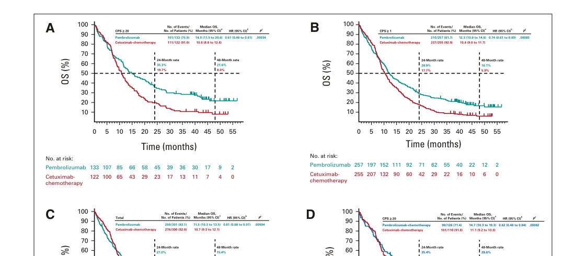

## Question

# Disease Characteristics Research Template

## Target Disease
- **Disease Name:** Oral Cavity Squamous Cell Carcinoma
- **MONDO ID:**  (if available)
- **Category:** Complex

## Research Objectives

Please provide a comprehensive research report on **Oral Cavity Squamous Cell Carcinoma** covering all of the
disease characteristics listed below. This report will be used to populate a disease knowledge
base entry. Be thorough and cite primary literature (PMID preferred) for all claims.

For each section, **suggested databases/resources** are listed. These are the first places
you should search for information on each topic.

---

### 1. Disease Information
> **Search first:** OMIM, Orphanet, ICD-10/ICD-11, MeSH, PubMed

- What is the disease? Provide a concise overview.
- What are the key identifiers? (OMIM, Orphanet, ICD-10/ICD-11, MeSH, Mondo)
- What are the common synonyms and alternative names?
- Is the information derived from individual patients (e.g., EHR) or aggregated disease-level resources?

### 2. Etiology

- **Disease Causal Factors**: What are the primary causes? (genetic, environmental, infectious, mechanistic)
- **Risk Factors**:
  > **Search first:** PubMed, Cochrane Library, UpToDate, clinical guidelines, ClinVar, ClinGen, GWAS Catalog, PheGenI, CTD, CDC, WHO, epidemiological databases
  - Genetic risk factors (causal variants, susceptibility loci, modifier genes)
  - Environmental risk factors (toxins, lifestyle, occupational exposures, age, sex, family history)
- **Protective Factors**:
  > **Search first:** PubMed, Cochrane Library, clinical trial databases, GWAS Catalog, gnomAD, WHO, CDC, nutrition databases
  - Genetic protective factors (protective variants, modifier alleles)
  - Environmental protective factors (diet, lifestyle, exposures that reduce risk)
- **Gene-Environment Interactions**: How do genetic and environmental factors interact to influence disease?
  > **Search first:** CTD, PubMed, PheGenI, GxE databases

### 3. Phenotypes
> **Search first:** HPO (Human Phenotype Ontology), OMIM, Orphanet, PubMed, clinicaltrials.gov, MedDRA, SNOMED CT, DECIPHER, LOINC

For each phenotype, provide:
- **Phenotype type**: symptoms, clinical signs, physical manifestations, behavioral changes, or laboratory abnormalities
  > For symptoms/signs: HPO, OMIM, Orphanet, PubMed
  > For behavioral changes: HPO, DSM, RDoC (Research Domain Criteria), PubMed
  > For laboratory abnormalities: LOINC, SNOMED CT, LabTests Online, PubMed
- **Phenotype characteristics**:
  > **Search first:** OMIM, Orphanet, HPO, PubMed
  - Age of symptom onset (neonatal, childhood, adult-onset, late-onset)
  - Symptom severity (mild, moderate, severe, variable)
  - Symptom progression (stable, progressive, episodic, fluctuating)
  - Frequency among affected individuals (percentage or qualitative)
- **Quality of life impact**: Effects on daily functioning and well-being (per-phenotype when possible)
  > **Search first:** EQ-5D database, SF-36, WHO QOL databases, PubMed
- Suggest HPO (Human Phenotype Ontology) terms for each phenotype

### 4. Genetic/Molecular Information

- **Causal Genes**: Gene mutations or chromosomal abnormalities responsible for disease (gene symbols, OMIM IDs)
  > **Search first:** OMIM, ClinVar, HGMD, Ensembl, NCBI Gene
- **Pathogenic Variants**:
  - Affected genes (gene symbols, HGNC IDs)
    > **Search first:** OMIM, NCBI Gene, Ensembl, HGNC, UniProt, GeneCards
  - Variant classification (pathogenic, likely pathogenic, VUS per ACMG/AMP guidelines)
    > **Search first:** ClinVar, ClinGen, ACMG/AMP guidelines, VarSome
  - Variant type/class (missense, frameshift, nonsense, splice-site, structural)
  - Allele frequency in population databases
    > **Search first:** gnomAD, 1000 Genomes, ExAC, TOPMed, dbSNP
  - Somatic vs germline origin
    > **Search first:** COSMIC (somatic), ClinVar, ICGC, TCGA
  - Functional consequences (loss of function, gain of function, dominant negative)
- **Modifier Genes**: Genes that modify disease severity or expression
- **Epigenetic Information**: DNA methylation, histone modifications, chromatin changes affecting disease
  > **Search first:** ENCODE, Roadmap Epigenomics, MethBase, DiseaseMeth
- **Chromosomal Abnormalities**: Large-scale genetic changes (aneuploidy, translocations, inversions)
  > **Search first:** DECIPHER, ClinVar, ECARUCA, UCSC Genome Browser

### 5. Environmental Information

- **Environmental Factors**: Non-genetic contributing factors (toxins, radiation, pollution, occupational exposure)
  > **Search first:** CTD (Comparative Toxicogenomics Database), TOXNET, PubMed, EPA databases
- **Lifestyle Factors**: Behavioral factors (smoking, diet, exercise, alcohol consumption)
  > **Search first:** CDC databases, WHO, PubMed, NHANES
- **Infectious Agents**: If applicable, pathogens causing or triggering disease (bacteria, viruses, fungi, parasites)
  > **Search first:** NCBI Taxonomy, ViPR, BV-BRC, MicrobeDB, GIDEON

### 6. Mechanism / Pathophysiology

- **Molecular Pathways**: Specific signaling cascades or biochemical pathways involved (Wnt, MAPK, mTOR, PI3K-AKT, etc.)
  > **Search first:** KEGG, Reactome, WikiPathways, PathBank, BioCyc
- **Cellular Processes**: Cell-level mechanisms (apoptosis, autophagy, cell cycle dysregulation, inflammation, etc.)
  > **Search first:** Gene Ontology (GO), Reactome, KEGG, PubMed
- **Protein Dysfunction**: How protein structure or function is altered (misfolding, aggregation, loss of function, gain of function)
  > **Search first:** UniProt, PDB (Protein Data Bank), InterPro, Pfam, AlphaFold
- **Metabolic Changes**: Alterations in metabolic processes (energy metabolism, lipid metabolism, amino acid metabolism)
  > **Search first:** KEGG, BioCyc, HMDB (Human Metabolome Database), BRENDA
- **Immune System Involvement**: Role of immune response (autoimmunity, immunodeficiency, chronic inflammation)
  > **Search first:** ImmPort, Immunome Database, IEDB, Gene Ontology
- **Tissue Damage Mechanisms**: How tissues/ are injured (oxidative stress, ischemia, fibrosis, necrosis)
  > **Search first:** PubMed, Gene Ontology, Reactome
- **Biochemical Abnormalities**: Specific molecular defects (enzyme deficiencies, receptor dysfunction, ion channel defects)
  > **Search first:** BRENDA, UniProt, KEGG, OMIM, PubMed
- **Epigenetic Changes**: DNA methylation, histone modifications affecting gene expression in disease
  > **Search first:** ENCODE, Roadmap Epigenomics, MethBase, DiseaseMeth
- **Molecular Profiling** (if available):
  - Transcriptomics/gene expression changes
    > **Search first:** GEO (Gene Expression Omnibus), ArrayExpress, GTEx, Human Cell Atlas, SRA
  - Proteomics findings
    > **Search first:** PRIDE, ProteomeXchange, Human Protein Atlas, STRING, BioGRID
  - Metabolomics signatures
    > **Search first:** MetaboLights, Metabolomics Workbench, HMDB, METLIN
  - Lipidomics alterations
    > **Search first:** LIPID MAPS, SwissLipids, LipidHome, Metabolomics Workbench
  - Genomic structural features
    > **Search first:** UCSC Genome Browser, Ensembl, NCBI, dbVar, DGV
- **Advanced Technologies** (if applicable):
  - Single-cell analysis findings (cell-type specific mechanisms, cellular heterogeneity)
    > **Search first:** Human Cell Atlas, Single Cell Portal, GEO, CELLxGENE
  - Spatial transcriptomics findings
    > **Search first:** GEO, Spatial Research, Vizgen, 10x Genomics data
  - Multi-omics integration results
    > **Search first:** TCGA, ICGC, cBioPortal, LinkedOmics, PubMed
  - Functional genomics screens (CRISPR, RNAi)
    > **Search first:** DepMap, GenomeRNAi, PubMed, BioGRID ORCS

For each mechanism, describe:
- The causal chain from initial trigger to clinical manifestation
- Which mechanisms are upstream vs downstream
- What cell types and biological processes are involved
- Suggest GO terms for biological processes and CL terms for cell types

### 7. Anatomical Structures Affected

- **Organ Level**:
  - Primary organs directly affected
  - Secondary organ involvement (complications, secondary effects)
  - Body systems involved (cardiovascular, nervous, digestive, respiratory, endocrine, etc.)
  > **Search first:** Uberon, FMA (Foundational Model of Anatomy), OMIM, HPO, ICD-11, MeSH, SNOMED CT
- **Tissue and Cell Level**:
  - Specific tissue types affected (epithelial, connective, muscle, nervous)
  - Specific cell populations targeted (with Cell Ontology terms)
  > **Search first:** Uberon, Human Protein Atlas, Cell Ontology, Human Cell Atlas, CellMarker, PanglaoDB
- **Subcellular Level**:
  - Cellular compartments involved (mitochondria, nucleus, ER, lysosomes) (with GO Cellular Component terms)
  > **Search first:** Gene Ontology (Cellular Component), UniProt, Human Protein Atlas
- **Localization**:
  - Specific anatomical sites (with UBERON terms)
    > **Search first:** FMA, Uberon, NeuroNames (for brain), SNOMED CT
  - Lateralization (unilateral, bilateral, asymmetric)
    > **Search first:** HPO, clinical literature, imaging databases

### 8. Temporal Development

- **Onset**:
  - Typical age of onset (congenital, pediatric, adult, geriatric)
  - Onset pattern (acute, subacute, chronic, insidious)
  > **Search first:** OMIM, Orphanet, HPO, PubMed
- **Progression**:
  - Disease stages (early, intermediate, advanced, end-stage)
    > **Search first:** Cancer Staging Manual (AJCC), WHO classifications, PubMed
  - Progression rate (rapid, slow, variable)
  - Disease course pattern (episodic, relapsing-remitting, progressive, stable)
  - Disease duration (self-limited, chronic lifelong)
  > **Search first:** Disease registries, longitudinal cohort databases, natural history studies, PubMed, Orphanet, OMIM
- **Patterns**:
  - Remission patterns (spontaneous, treatment-induced)
    > **Search first:** Clinical trial databases, disease registries, PubMed
  - Critical periods (time windows of vulnerability or opportunity for intervention)
    > **Search first:** PubMed, developmental biology databases, clinical guidelines

### 9. Inheritance and Population

- **Epidemiology**:
  - Prevalence (cases per 100,000 at given time)
  - Incidence (new cases per 100,000 per year)
  > **Search first:** Orphanet, CDC, WHO, GBD (Global Burden of Disease), national registries, SEER, disease registries
- **For Genetic Etiology**:
  - Inheritance pattern (AD, AR, X-linked, mitochondrial, multifactorial, polygenic)
    > **Search first:** OMIM, Orphanet, ClinVar, GTR (Genetic Testing Registry)
  - Penetrance (complete, incomplete, age-dependent)
    > **Search first:** ClinVar, OMIM, PubMed, ClinGen
  - Expressivity (variable, consistent)
    > **Search first:** OMIM, ClinVar, PubMed
  - Genetic anticipation (increasing severity in successive generations)
    > **Search first:** OMIM, PubMed (especially for repeat expansion disorders)
  - Germline mosaicism
    > **Search first:** ClinVar, OMIM, genetic counseling literature, PubMed
  - Founder effects (population-specific mutations)
    > **Search first:** gnomAD, population genetics databases, PubMed
  - Consanguinity role
    > **Search first:** OMIM, population studies, genetic counseling resources
  - Carrier frequency
    > **Search first:** gnomAD, carrier screening databases, GeneReviews, GTR
- **Population Demographics**:
  - Affected populations (ethnic or demographic groups with higher prevalence)
    > **Search first:** gnomAD, 1000 Genomes, PAGE Study, PubMed, population registries
  - Geographic distribution (endemic areas, regional variation)
    > **Search first:** WHO, CDC, GBD, Orphanet, geographic epidemiology databases
  - Geographic distribution of specific variants
  - Sex ratio (male:female)
    > **Search first:** Disease registries, OMIM, PubMed, epidemiological databases
  - Age distribution of affected individuals
    > **Search first:** CDC, disease registries, SEER, Orphanet

### 10. Diagnostics

- **Clinical Tests**:
  - Laboratory tests (blood, urine, tissue chemistry, specific enzyme assays)
    > **Search first:** LOINC, LabTests Online, PubMed
  - Biomarkers (proteins, metabolites, genetic markers, circulating biomarkers)
    > **Search first:** FDA Biomarker List, BEST (Biomarkers, EndpointS, and other Tools), PubMed
  - Imaging studies (X-ray, CT, MRI, PET, ultrasound)
    > **Search first:** RadLex, DICOM, Radiopaedia, imaging databases
  - Functional tests (pulmonary function, cardiac stress tests)
    > **Search first:** LOINC, clinical guidelines, PubMed
  - Electrophysiology (EEG, EMG, ECG, nerve conduction studies)
    > **Search first:** LOINC, clinical neurophysiology databases, PubMed
  - Biopsy findings (histopathology, immunohistochemistry)
    > **Search first:** SNOMED CT, College of American Pathologists resources, PubMed
  - Pathology findings (microscopic examination)
    > **Search first:** SNOMED CT, Digital Pathology databases, PubMed
- **Genetic Testing**:
  > **Search first:** GTR (Genetic Testing Registry), GeneReviews, ClinGen
  - Overview of recommended genetic testing approach
  - Whole genome sequencing (WGS) utility
    > **Search first:** GTR, ClinVar, GEL (Genomics England), gnomAD
  - Whole exome sequencing (WES) utility
    > **Search first:** GTR, ClinVar, OMIM, GeneMatcher
  - Gene panels (which panels, which genes)
    > **Search first:** GTR, ClinVar, laboratory-specific databases
  - Single gene testing
    > **Search first:** GTR, ClinVar, OMIM, GeneReviews
  - Chromosomal microarray (CMA)
    > **Search first:** DECIPHER, ClinVar, dbVar, ECARUCA
  - Karyotyping
    > **Search first:** Chromosome Abnormality Database, ClinVar, cytogenetics resources
  - FISH
    > **Search first:** ClinVar, cytogenetics databases, PubMed
  - Mitochondrial DNA testing
    > **Search first:** MITOMAP, MSeqDR, ClinVar, GTR
  - Repeat expansion testing
    > **Search first:** GTR, ClinVar, repeat expansion databases, PubMed
- **Omics-Based Diagnostics** (if applicable):
  - RNA sequencing / transcriptomics
    > **Search first:** GEO, ArrayExpress, GTEx, RNA-seq databases
  - Proteomics
    > **Search first:** PRIDE, ProteomeXchange, FDA Biomarker database
  - Metabolomics
    > **Search first:** MetaboLights, Metabolomics Workbench, HMDB
  - Epigenomics
    > **Search first:** GEO, ENCODE, Roadmap Epigenomics, MethBase
  - Liquid biopsy
    > **Search first:** COSMIC, ClinVar, liquid biopsy databases, PubMed
- **Clinical Criteria**:
  - Standardized diagnostic criteria (DSM, ICD, society guidelines)
    > **Search first:** DSM-5, ICD-11, clinical society guidelines, UpToDate
  - Differential diagnosis (other conditions to rule out, with distinguishing features)
    > **Search first:** DynaMed, UpToDate, clinical decision support systems
- **Screening**:
  - Screening methods for asymptomatic individuals (newborn screening, carrier screening, cascade screening)
    > **Search first:** ACMG recommendations, CDC newborn screening, GTR

### 11. Outcome/Prognosis

- **Survival and Mortality**:
  - Survival rate (5-year, 10-year, overall)
    > **Search first:** SEER, cancer registries, disease-specific registries, PubMed
  - Life expectancy (with and without treatment if applicable)
    > **Search first:** Orphanet, disease registries, actuarial databases, PubMed
  - Mortality rate
    > **Search first:** CDC, WHO, GBD, national mortality databases
  - Disease-specific mortality (deaths directly attributable to disease)
    > **Search first:** Disease registries, CDC Wonder, GBD, PubMed
- **Morbidity and Function**:
  - Morbidity (disease-related disability and health impacts)
    > **Search first:** GBD, WHO, disability databases, PubMed
  - Disability outcomes (long-term functional impairments)
    > **Search first:** ICF (International Classification of Functioning), disability registries
  - Quality of life measures (EQ-5D, SF-36, PROMIS, disease-specific tools)
    > **Search first:** EQ-5D database, SF-36, PROMIS, PubMed
- **Disease Course**:
  - Complications (secondary problems: infections, organ failure, etc.)
    > **Search first:** ICD codes, disease registries, clinical databases, PubMed
  - Recovery potential (likelihood and extent of recovery, with vs without treatment)
    > **Search first:** Natural history studies, rehabilitation databases, PubMed
- **Prediction**:
  - Prognostic factors (age, disease severity, biomarkers, treatment response)
    > **Search first:** Prognostic models databases, clinical calculators, PubMed
  - Prognostic biomarkers (molecular markers predicting disease course)
    > **Search first:** FDA Biomarker database, PubMed, cancer prognostic databases

### 12. Treatment

- **Pharmacotherapy**:
  - Pharmacological treatments (drug names, drug classes, mechanisms of action)
    > **Search first:** DrugBank, RxNorm, ATC classification, DailyMed, FDA databases
  - Pharmacogenomics (how genetic variants affect drug metabolism, efficacy, toxicity)
    > **Search first:** PharmGKB, CPIC (Clinical Pharmacogenetics), FDA Table of PGx Biomarkers
- **Advanced Therapeutics**:
  - Gene therapy (viral vectors, CRISPR, gene replacement, gene editing)
    > **Search first:** ClinicalTrials.gov, FDA gene therapy database, ASGCT resources
  - Cell therapy (stem cell transplant, CAR-T, cellular therapeutics)
    > **Search first:** ClinicalTrials.gov, FDA cell therapy database, FACT standards
  - RNA-based therapies (ASOs, siRNA, mRNA therapies)
    > **Search first:** ClinicalTrials.gov, FDA approvals, PubMed
  - Targeted therapies (treatments directed at specific molecular targets)
    > **Search first:** My Cancer Genome, OncoKB, ClinicalTrials.gov, FDA approvals
  - Immunotherapies (checkpoint inhibitors, monoclonal antibodies)
    > **Search first:** Cancer Immunotherapy Database, FDA approvals, ClinicalTrials.gov
- **Surgical and Interventional**:
  - Surgical interventions (types of surgery, timing, outcomes)
    > **Search first:** CPT codes, surgical registries, clinical guidelines, PubMed
- **Supportive and Rehabilitative**:
  - Supportive care (symptom management, pain control, nutrition)
    > **Search first:** Clinical guidelines, Cochrane Library, PubMed
  - Rehabilitation (physical therapy, occupational therapy, speech therapy)
    > **Search first:** Rehabilitation medicine databases, clinical guidelines, PubMed
- **Experimental**:
  - Experimental treatments in clinical trials (with NCT identifiers if available)
    > **Search first:** ClinicalTrials.gov, EU Clinical Trials Register, WHO ICTRP
- **Treatment Outcomes**:
  - Treatment response rates
    > **Search first:** Clinical trial databases, FDA reviews, systematic reviews, PubMed
  - Side effects and adverse events
    > **Search first:** FDA Adverse Event Reporting System (FAERS), MedWatch, PubMed
- **Treatment Strategy**:
  - Treatment algorithms (clinical pathways, decision trees)
    > **Search first:** Clinical practice guidelines, NCCN Guidelines, UpToDate
  - Combination therapies
    > **Search first:** ClinicalTrials.gov, treatment guidelines, PubMed
  - Personalized medicine approaches (genotype-guided treatment)
    > **Search first:** My Cancer Genome, CIViC, PharmGKB, precision medicine databases

For each treatment, suggest MAXO (Medical Action Ontology) terms where applicable.

### 13. Prevention

- **Prevention Levels**:
  - Primary prevention (preventing disease occurrence: vaccination, risk factor modification)
    > **Search first:** CDC, WHO, USPSTF recommendations, Cochrane Library
  - Secondary prevention (early detection and treatment: screening programs, early intervention)
    > **Search first:** USPSTF, CDC screening guidelines, WHO
  - Tertiary prevention (preventing complications in those with disease)
    > **Search first:** Clinical guidelines, disease management protocols, PubMed
- **Immunization**: Vaccine strategies (if applicable)
  > **Search first:** CDC vaccine schedules, WHO immunization, FDA vaccine database
- **Screening and Early Detection**:
  - Screening programs (population-based: newborn screening, cancer screening)
    > **Search first:** CDC screening programs, USPSTF, cancer screening databases
  - Genetic screening (carrier screening, preimplantation genetic diagnosis, prenatal testing)
    > **Search first:** ACMG recommendations, ACOG guidelines, GTR
  - Risk stratification (identifying high-risk individuals for targeted prevention)
    > **Search first:** Risk prediction models, clinical calculators, PubMed
- **Behavioral Interventions**: Lifestyle modifications to reduce risk
  > **Search first:** CDC, WHO, behavioral intervention databases, Cochrane Library
- **Counseling**: Genetic counseling (risk assessment, family planning guidance)
  > **Search first:** NSGC resources, ACMG guidelines, GeneReviews
- **Public Health**:
  - Public health interventions (sanitation, vector control, health education)
    > **Search first:** CDC, WHO, public health databases, PubMed
  - Environmental interventions (reducing environmental risk factors)
    > **Search first:** EPA databases, WHO environmental health, PubMed
- **Prophylaxis**: Preventive medications or procedures
  > **Search first:** Clinical guidelines, FDA approvals, PubMed

### 14. Other Species / Natural Disease

- **Taxonomy**: Species affected (with NCBI Taxon identifiers)
  > **Search first:** NCBI Taxonomy
- **Breed**: Specific breeds affected (with VBO identifiers if applicable)
  > **Search first:** VBO (Vertebrate Breed Ontology)
- **Gene**: Orthologous genes in other species (with NCBI Gene IDs)
  > **Search first:** NCBI Gene
- **Natural Disease**:
  - Naturally occurring disease in other species (companion animals, wildlife)
    > **Search first:** OMIA (Online Mendelian Inheritance in Animals), VetCompass, PubMed
  - Veterinary relevance and importance in animal health
    > **Search first:** OMIA, veterinary databases, PubMed
- **Comparative Biology**:
  - Comparative pathology (similarities and differences across species)
    > **Search first:** OMIA, comparative pathology databases, PubMed
  - Evolutionary conservation of disease mechanisms
    > **Search first:** HomoloGene, OrthoMCL, Alliance of Genome Resources
- **Transmission** (if applicable):
  - Zoonotic potential
    > **Search first:** CDC zoonotic diseases, WHO zoonoses, GIDEON
  - Cross-species susceptibility
    > **Search first:** NCBI Taxonomy, veterinary databases, PubMed

### 15. Model Organisms

- **Model Types**:
  - Model organism type (mammalian, invertebrate, cellular, in vitro)
    > **Search first:** Alliance of Genome Resources, model organism databases
  - Specific model systems (mouse, rat, zebrafish, Drosophila, C. elegans, yeast, cell lines, organoids, iPSCs)
    > **Search first:** MGI, RGD, ZFIN, FlyBase, WormBase, SGD, ATCC, Cellosaurus
  - Induced models (drug treatment, surgical intervention, environmental manipulation)
    > **Search first:** MGI, model organism databases, PubMed
- **Genetic Models**:
  - Types available (knockout, knock-in, transgenic, conditional, humanized)
    > **Search first:** MGI, IMPC, KOMP, EuMMCR, IMSR
- **Model Characteristics**:
  - Phenotype recapitulation (how well model reproduces human disease features)
    > **Search first:** Model organism databases, comparative studies, PubMed
  - Model limitations (aspects of human disease not captured)
    > **Search first:** Model organism databases, PubMed, review articles
- **Applications**:
  - Research applications (what aspects of disease can be studied)
    > **Search first:** Model organism databases, PubMed
- **Resources**:
  - Model databases
    > **Search first:** MGI, RGD, ZFIN, FlyBase, WormBase, IMSR, EMMA, MMRRC

---

## Citation Requirements

- Cite primary literature (PMID preferred) for all mechanistic and clinical claims
- Prioritize recent reviews and landmark papers
- Include direct quotes from abstracts where possible to support key statements
- Distinguish evidence source types: human clinical, model organism, in vitro, computational

## Output Format

Structure your response as a comprehensive narrative organized by the sections above.
For each section, provide:
- Factual content with specific details (numbers, percentages, gene names, variant nomenclature)
- Ontology term suggestions (HPO, GO, CL, UBERON, CHEBI, MAXO, MONDO) where applicable
- Evidence citations with PMIDs
- Direct quotes from abstracts to support key claims
- Clear indication when information is not available or not applicable for this disease

This report will be used to populate a disease knowledge base entry with:
- Pathophysiology descriptions with causal chains
- Gene/protein annotations (HGNC, GO terms)
- Phenotype associations (HP terms) with frequencies
- Cell type involvement (CL terms)
- Anatomical locations (UBERON terms)
- Chemical entities (CHEBI terms)
- Treatment annotations (MAXO terms)
- Evidence items with PMIDs and exact abstract quotes
- Epidemiology, prognosis, diagnostic, and prevention information
- Animal model descriptions with phenotype recapitulation details

## Output

Question: You are an expert researcher providing comprehensive, well-cited information.

Provide detailed information focusing on:
1. Key concepts and definitions with current understanding
2. Recent developments and latest research (prioritize 2023-2024 sources)
3. Current applications and real-world implementations
4. Expert opinions and analysis from authoritative sources
5. Relevant statistics and data from recent studies

Format as a comprehensive research report with proper citations. Include URLs and publication dates where available.
Always prioritize recent, authoritative sources and provide specific citations for all major claims.

# Disease Characteristics Research Template

## Target Disease
- **Disease Name:** Oral Cavity Squamous Cell Carcinoma
- **MONDO ID:**  (if available)
- **Category:** Complex

## Research Objectives

Please provide a comprehensive research report on **Oral Cavity Squamous Cell Carcinoma** covering all of the
disease characteristics listed below. This report will be used to populate a disease knowledge
base entry. Be thorough and cite primary literature (PMID preferred) for all claims.

For each section, **suggested databases/resources** are listed. These are the first places
you should search for information on each topic.

---

### 1. Disease Information
> **Search first:** OMIM, Orphanet, ICD-10/ICD-11, MeSH, PubMed

- What is the disease? Provide a concise overview.
- What are the key identifiers? (OMIM, Orphanet, ICD-10/ICD-11, MeSH, Mondo)
- What are the common synonyms and alternative names?
- Is the information derived from individual patients (e.g., EHR) or aggregated disease-level resources?

### 2. Etiology

- **Disease Causal Factors**: What are the primary causes? (genetic, environmental, infectious, mechanistic)
- **Risk Factors**:
  > **Search first:** PubMed, Cochrane Library, UpToDate, clinical guidelines, ClinVar, ClinGen, GWAS Catalog, PheGenI, CTD, CDC, WHO, epidemiological databases
  - Genetic risk factors (causal variants, susceptibility loci, modifier genes)
  - Environmental risk factors (toxins, lifestyle, occupational exposures, age, sex, family history)
- **Protective Factors**:
  > **Search first:** PubMed, Cochrane Library, clinical trial databases, GWAS Catalog, gnomAD, WHO, CDC, nutrition databases
  - Genetic protective factors (protective variants, modifier alleles)
  - Environmental protective factors (diet, lifestyle, exposures that reduce risk)
- **Gene-Environment Interactions**: How do genetic and environmental factors interact to influence disease?
  > **Search first:** CTD, PubMed, PheGenI, GxE databases

### 3. Phenotypes
> **Search first:** HPO (Human Phenotype Ontology), OMIM, Orphanet, PubMed, clinicaltrials.gov, MedDRA, SNOMED CT, DECIPHER, LOINC

For each phenotype, provide:
- **Phenotype type**: symptoms, clinical signs, physical manifestations, behavioral changes, or laboratory abnormalities
  > For symptoms/signs: HPO, OMIM, Orphanet, PubMed
  > For behavioral changes: HPO, DSM, RDoC (Research Domain Criteria), PubMed
  > For laboratory abnormalities: LOINC, SNOMED CT, LabTests Online, PubMed
- **Phenotype characteristics**:
  > **Search first:** OMIM, Orphanet, HPO, PubMed
  - Age of symptom onset (neonatal, childhood, adult-onset, late-onset)
  - Symptom severity (mild, moderate, severe, variable)
  - Symptom progression (stable, progressive, episodic, fluctuating)
  - Frequency among affected individuals (percentage or qualitative)
- **Quality of life impact**: Effects on daily functioning and well-being (per-phenotype when possible)
  > **Search first:** EQ-5D database, SF-36, WHO QOL databases, PubMed
- Suggest HPO (Human Phenotype Ontology) terms for each phenotype

### 4. Genetic/Molecular Information

- **Causal Genes**: Gene mutations or chromosomal abnormalities responsible for disease (gene symbols, OMIM IDs)
  > **Search first:** OMIM, ClinVar, HGMD, Ensembl, NCBI Gene
- **Pathogenic Variants**:
  - Affected genes (gene symbols, HGNC IDs)
    > **Search first:** OMIM, NCBI Gene, Ensembl, HGNC, UniProt, GeneCards
  - Variant classification (pathogenic, likely pathogenic, VUS per ACMG/AMP guidelines)
    > **Search first:** ClinVar, ClinGen, ACMG/AMP guidelines, VarSome
  - Variant type/class (missense, frameshift, nonsense, splice-site, structural)
  - Allele frequency in population databases
    > **Search first:** gnomAD, 1000 Genomes, ExAC, TOPMed, dbSNP
  - Somatic vs germline origin
    > **Search first:** COSMIC (somatic), ClinVar, ICGC, TCGA
  - Functional consequences (loss of function, gain of function, dominant negative)
- **Modifier Genes**: Genes that modify disease severity or expression
- **Epigenetic Information**: DNA methylation, histone modifications, chromatin changes affecting disease
  > **Search first:** ENCODE, Roadmap Epigenomics, MethBase, DiseaseMeth
- **Chromosomal Abnormalities**: Large-scale genetic changes (aneuploidy, translocations, inversions)
  > **Search first:** DECIPHER, ClinVar, ECARUCA, UCSC Genome Browser

### 5. Environmental Information

- **Environmental Factors**: Non-genetic contributing factors (toxins, radiation, pollution, occupational exposure)
  > **Search first:** CTD (Comparative Toxicogenomics Database), TOXNET, PubMed, EPA databases
- **Lifestyle Factors**: Behavioral factors (smoking, diet, exercise, alcohol consumption)
  > **Search first:** CDC databases, WHO, PubMed, NHANES
- **Infectious Agents**: If applicable, pathogens causing or triggering disease (bacteria, viruses, fungi, parasites)
  > **Search first:** NCBI Taxonomy, ViPR, BV-BRC, MicrobeDB, GIDEON

### 6. Mechanism / Pathophysiology

- **Molecular Pathways**: Specific signaling cascades or biochemical pathways involved (Wnt, MAPK, mTOR, PI3K-AKT, etc.)
  > **Search first:** KEGG, Reactome, WikiPathways, PathBank, BioCyc
- **Cellular Processes**: Cell-level mechanisms (apoptosis, autophagy, cell cycle dysregulation, inflammation, etc.)
  > **Search first:** Gene Ontology (GO), Reactome, KEGG, PubMed
- **Protein Dysfunction**: How protein structure or function is altered (misfolding, aggregation, loss of function, gain of function)
  > **Search first:** UniProt, PDB (Protein Data Bank), InterPro, Pfam, AlphaFold
- **Metabolic Changes**: Alterations in metabolic processes (energy metabolism, lipid metabolism, amino acid metabolism)
  > **Search first:** KEGG, BioCyc, HMDB (Human Metabolome Database), BRENDA
- **Immune System Involvement**: Role of immune response (autoimmunity, immunodeficiency, chronic inflammation)
  > **Search first:** ImmPort, Immunome Database, IEDB, Gene Ontology
- **Tissue Damage Mechanisms**: How tissues/ are injured (oxidative stress, ischemia, fibrosis, necrosis)
  > **Search first:** PubMed, Gene Ontology, Reactome
- **Biochemical Abnormalities**: Specific molecular defects (enzyme deficiencies, receptor dysfunction, ion channel defects)
  > **Search first:** BRENDA, UniProt, KEGG, OMIM, PubMed
- **Epigenetic Changes**: DNA methylation, histone modifications affecting gene expression in disease
  > **Search first:** ENCODE, Roadmap Epigenomics, MethBase, DiseaseMeth
- **Molecular Profiling** (if available):
  - Transcriptomics/gene expression changes
    > **Search first:** GEO (Gene Expression Omnibus), ArrayExpress, GTEx, Human Cell Atlas, SRA
  - Proteomics findings
    > **Search first:** PRIDE, ProteomeXchange, Human Protein Atlas, STRING, BioGRID
  - Metabolomics signatures
    > **Search first:** MetaboLights, Metabolomics Workbench, HMDB, METLIN
  - Lipidomics alterations
    > **Search first:** LIPID MAPS, SwissLipids, LipidHome, Metabolomics Workbench
  - Genomic structural features
    > **Search first:** UCSC Genome Browser, Ensembl, NCBI, dbVar, DGV
- **Advanced Technologies** (if applicable):
  - Single-cell analysis findings (cell-type specific mechanisms, cellular heterogeneity)
    > **Search first:** Human Cell Atlas, Single Cell Portal, GEO, CELLxGENE
  - Spatial transcriptomics findings
    > **Search first:** GEO, Spatial Research, Vizgen, 10x Genomics data
  - Multi-omics integration results
    > **Search first:** TCGA, ICGC, cBioPortal, LinkedOmics, PubMed
  - Functional genomics screens (CRISPR, RNAi)
    > **Search first:** DepMap, GenomeRNAi, PubMed, BioGRID ORCS

For each mechanism, describe:
- The causal chain from initial trigger to clinical manifestation
- Which mechanisms are upstream vs downstream
- What cell types and biological processes are involved
- Suggest GO terms for biological processes and CL terms for cell types

### 7. Anatomical Structures Affected

- **Organ Level**:
  - Primary organs directly affected
  - Secondary organ involvement (complications, secondary effects)
  - Body systems involved (cardiovascular, nervous, digestive, respiratory, endocrine, etc.)
  > **Search first:** Uberon, FMA (Foundational Model of Anatomy), OMIM, HPO, ICD-11, MeSH, SNOMED CT
- **Tissue and Cell Level**:
  - Specific tissue types affected (epithelial, connective, muscle, nervous)
  - Specific cell populations targeted (with Cell Ontology terms)
  > **Search first:** Uberon, Human Protein Atlas, Cell Ontology, Human Cell Atlas, CellMarker, PanglaoDB
- **Subcellular Level**:
  - Cellular compartments involved (mitochondria, nucleus, ER, lysosomes) (with GO Cellular Component terms)
  > **Search first:** Gene Ontology (Cellular Component), UniProt, Human Protein Atlas
- **Localization**:
  - Specific anatomical sites (with UBERON terms)
    > **Search first:** FMA, Uberon, NeuroNames (for brain), SNOMED CT
  - Lateralization (unilateral, bilateral, asymmetric)
    > **Search first:** HPO, clinical literature, imaging databases

### 8. Temporal Development

- **Onset**:
  - Typical age of onset (congenital, pediatric, adult, geriatric)
  - Onset pattern (acute, subacute, chronic, insidious)
  > **Search first:** OMIM, Orphanet, HPO, PubMed
- **Progression**:
  - Disease stages (early, intermediate, advanced, end-stage)
    > **Search first:** Cancer Staging Manual (AJCC), WHO classifications, PubMed
  - Progression rate (rapid, slow, variable)
  - Disease course pattern (episodic, relapsing-remitting, progressive, stable)
  - Disease duration (self-limited, chronic lifelong)
  > **Search first:** Disease registries, longitudinal cohort databases, natural history studies, PubMed, Orphanet, OMIM
- **Patterns**:
  - Remission patterns (spontaneous, treatment-induced)
    > **Search first:** Clinical trial databases, disease registries, PubMed
  - Critical periods (time windows of vulnerability or opportunity for intervention)
    > **Search first:** PubMed, developmental biology databases, clinical guidelines

### 9. Inheritance and Population

- **Epidemiology**:
  - Prevalence (cases per 100,000 at given time)
  - Incidence (new cases per 100,000 per year)
  > **Search first:** Orphanet, CDC, WHO, GBD (Global Burden of Disease), national registries, SEER, disease registries
- **For Genetic Etiology**:
  - Inheritance pattern (AD, AR, X-linked, mitochondrial, multifactorial, polygenic)
    > **Search first:** OMIM, Orphanet, ClinVar, GTR (Genetic Testing Registry)
  - Penetrance (complete, incomplete, age-dependent)
    > **Search first:** ClinVar, OMIM, PubMed, ClinGen
  - Expressivity (variable, consistent)
    > **Search first:** OMIM, ClinVar, PubMed
  - Genetic anticipation (increasing severity in successive generations)
    > **Search first:** OMIM, PubMed (especially for repeat expansion disorders)
  - Germline mosaicism
    > **Search first:** ClinVar, OMIM, genetic counseling literature, PubMed
  - Founder effects (population-specific mutations)
    > **Search first:** gnomAD, population genetics databases, PubMed
  - Consanguinity role
    > **Search first:** OMIM, population studies, genetic counseling resources
  - Carrier frequency
    > **Search first:** gnomAD, carrier screening databases, GeneReviews, GTR
- **Population Demographics**:
  - Affected populations (ethnic or demographic groups with higher prevalence)
    > **Search first:** gnomAD, 1000 Genomes, PAGE Study, PubMed, population registries
  - Geographic distribution (endemic areas, regional variation)
    > **Search first:** WHO, CDC, GBD, Orphanet, geographic epidemiology databases
  - Geographic distribution of specific variants
  - Sex ratio (male:female)
    > **Search first:** Disease registries, OMIM, PubMed, epidemiological databases
  - Age distribution of affected individuals
    > **Search first:** CDC, disease registries, SEER, Orphanet

### 10. Diagnostics

- **Clinical Tests**:
  - Laboratory tests (blood, urine, tissue chemistry, specific enzyme assays)
    > **Search first:** LOINC, LabTests Online, PubMed
  - Biomarkers (proteins, metabolites, genetic markers, circulating biomarkers)
    > **Search first:** FDA Biomarker List, BEST (Biomarkers, EndpointS, and other Tools), PubMed
  - Imaging studies (X-ray, CT, MRI, PET, ultrasound)
    > **Search first:** RadLex, DICOM, Radiopaedia, imaging databases
  - Functional tests (pulmonary function, cardiac stress tests)
    > **Search first:** LOINC, clinical guidelines, PubMed
  - Electrophysiology (EEG, EMG, ECG, nerve conduction studies)
    > **Search first:** LOINC, clinical neurophysiology databases, PubMed
  - Biopsy findings (histopathology, immunohistochemistry)
    > **Search first:** SNOMED CT, College of American Pathologists resources, PubMed
  - Pathology findings (microscopic examination)
    > **Search first:** SNOMED CT, Digital Pathology databases, PubMed
- **Genetic Testing**:
  > **Search first:** GTR (Genetic Testing Registry), GeneReviews, ClinGen
  - Overview of recommended genetic testing approach
  - Whole genome sequencing (WGS) utility
    > **Search first:** GTR, ClinVar, GEL (Genomics England), gnomAD
  - Whole exome sequencing (WES) utility
    > **Search first:** GTR, ClinVar, OMIM, GeneMatcher
  - Gene panels (which panels, which genes)
    > **Search first:** GTR, ClinVar, laboratory-specific databases
  - Single gene testing
    > **Search first:** GTR, ClinVar, OMIM, GeneReviews
  - Chromosomal microarray (CMA)
    > **Search first:** DECIPHER, ClinVar, dbVar, ECARUCA
  - Karyotyping
    > **Search first:** Chromosome Abnormality Database, ClinVar, cytogenetics resources
  - FISH
    > **Search first:** ClinVar, cytogenetics databases, PubMed
  - Mitochondrial DNA testing
    > **Search first:** MITOMAP, MSeqDR, ClinVar, GTR
  - Repeat expansion testing
    > **Search first:** GTR, ClinVar, repeat expansion databases, PubMed
- **Omics-Based Diagnostics** (if applicable):
  - RNA sequencing / transcriptomics
    > **Search first:** GEO, ArrayExpress, GTEx, RNA-seq databases
  - Proteomics
    > **Search first:** PRIDE, ProteomeXchange, FDA Biomarker database
  - Metabolomics
    > **Search first:** MetaboLights, Metabolomics Workbench, HMDB
  - Epigenomics
    > **Search first:** GEO, ENCODE, Roadmap Epigenomics, MethBase
  - Liquid biopsy
    > **Search first:** COSMIC, ClinVar, liquid biopsy databases, PubMed
- **Clinical Criteria**:
  - Standardized diagnostic criteria (DSM, ICD, society guidelines)
    > **Search first:** DSM-5, ICD-11, clinical society guidelines, UpToDate
  - Differential diagnosis (other conditions to rule out, with distinguishing features)
    > **Search first:** DynaMed, UpToDate, clinical decision support systems
- **Screening**:
  - Screening methods for asymptomatic individuals (newborn screening, carrier screening, cascade screening)
    > **Search first:** ACMG recommendations, CDC newborn screening, GTR

### 11. Outcome/Prognosis

- **Survival and Mortality**:
  - Survival rate (5-year, 10-year, overall)
    > **Search first:** SEER, cancer registries, disease-specific registries, PubMed
  - Life expectancy (with and without treatment if applicable)
    > **Search first:** Orphanet, disease registries, actuarial databases, PubMed
  - Mortality rate
    > **Search first:** CDC, WHO, GBD, national mortality databases
  - Disease-specific mortality (deaths directly attributable to disease)
    > **Search first:** Disease registries, CDC Wonder, GBD, PubMed
- **Morbidity and Function**:
  - Morbidity (disease-related disability and health impacts)
    > **Search first:** GBD, WHO, disability databases, PubMed
  - Disability outcomes (long-term functional impairments)
    > **Search first:** ICF (International Classification of Functioning), disability registries
  - Quality of life measures (EQ-5D, SF-36, PROMIS, disease-specific tools)
    > **Search first:** EQ-5D database, SF-36, PROMIS, PubMed
- **Disease Course**:
  - Complications (secondary problems: infections, organ failure, etc.)
    > **Search first:** ICD codes, disease registries, clinical databases, PubMed
  - Recovery potential (likelihood and extent of recovery, with vs without treatment)
    > **Search first:** Natural history studies, rehabilitation databases, PubMed
- **Prediction**:
  - Prognostic factors (age, disease severity, biomarkers, treatment response)
    > **Search first:** Prognostic models databases, clinical calculators, PubMed
  - Prognostic biomarkers (molecular markers predicting disease course)
    > **Search first:** FDA Biomarker database, PubMed, cancer prognostic databases

### 12. Treatment

- **Pharmacotherapy**:
  - Pharmacological treatments (drug names, drug classes, mechanisms of action)
    > **Search first:** DrugBank, RxNorm, ATC classification, DailyMed, FDA databases
  - Pharmacogenomics (how genetic variants affect drug metabolism, efficacy, toxicity)
    > **Search first:** PharmGKB, CPIC (Clinical Pharmacogenetics), FDA Table of PGx Biomarkers
- **Advanced Therapeutics**:
  - Gene therapy (viral vectors, CRISPR, gene replacement, gene editing)
    > **Search first:** ClinicalTrials.gov, FDA gene therapy database, ASGCT resources
  - Cell therapy (stem cell transplant, CAR-T, cellular therapeutics)
    > **Search first:** ClinicalTrials.gov, FDA cell therapy database, FACT standards
  - RNA-based therapies (ASOs, siRNA, mRNA therapies)
    > **Search first:** ClinicalTrials.gov, FDA approvals, PubMed
  - Targeted therapies (treatments directed at specific molecular targets)
    > **Search first:** My Cancer Genome, OncoKB, ClinicalTrials.gov, FDA approvals
  - Immunotherapies (checkpoint inhibitors, monoclonal antibodies)
    > **Search first:** Cancer Immunotherapy Database, FDA approvals, ClinicalTrials.gov
- **Surgical and Interventional**:
  - Surgical interventions (types of surgery, timing, outcomes)
    > **Search first:** CPT codes, surgical registries, clinical guidelines, PubMed
- **Supportive and Rehabilitative**:
  - Supportive care (symptom management, pain control, nutrition)
    > **Search first:** Clinical guidelines, Cochrane Library, PubMed
  - Rehabilitation (physical therapy, occupational therapy, speech therapy)
    > **Search first:** Rehabilitation medicine databases, clinical guidelines, PubMed
- **Experimental**:
  - Experimental treatments in clinical trials (with NCT identifiers if available)
    > **Search first:** ClinicalTrials.gov, EU Clinical Trials Register, WHO ICTRP
- **Treatment Outcomes**:
  - Treatment response rates
    > **Search first:** Clinical trial databases, FDA reviews, systematic reviews, PubMed
  - Side effects and adverse events
    > **Search first:** FDA Adverse Event Reporting System (FAERS), MedWatch, PubMed
- **Treatment Strategy**:
  - Treatment algorithms (clinical pathways, decision trees)
    > **Search first:** Clinical practice guidelines, NCCN Guidelines, UpToDate
  - Combination therapies
    > **Search first:** ClinicalTrials.gov, treatment guidelines, PubMed
  - Personalized medicine approaches (genotype-guided treatment)
    > **Search first:** My Cancer Genome, CIViC, PharmGKB, precision medicine databases

For each treatment, suggest MAXO (Medical Action Ontology) terms where applicable.

### 13. Prevention

- **Prevention Levels**:
  - Primary prevention (preventing disease occurrence: vaccination, risk factor modification)
    > **Search first:** CDC, WHO, USPSTF recommendations, Cochrane Library
  - Secondary prevention (early detection and treatment: screening programs, early intervention)
    > **Search first:** USPSTF, CDC screening guidelines, WHO
  - Tertiary prevention (preventing complications in those with disease)
    > **Search first:** Clinical guidelines, disease management protocols, PubMed
- **Immunization**: Vaccine strategies (if applicable)
  > **Search first:** CDC vaccine schedules, WHO immunization, FDA vaccine database
- **Screening and Early Detection**:
  - Screening programs (population-based: newborn screening, cancer screening)
    > **Search first:** CDC screening programs, USPSTF, cancer screening databases
  - Genetic screening (carrier screening, preimplantation genetic diagnosis, prenatal testing)
    > **Search first:** ACMG recommendations, ACOG guidelines, GTR
  - Risk stratification (identifying high-risk individuals for targeted prevention)
    > **Search first:** Risk prediction models, clinical calculators, PubMed
- **Behavioral Interventions**: Lifestyle modifications to reduce risk
  > **Search first:** CDC, WHO, behavioral intervention databases, Cochrane Library
- **Counseling**: Genetic counseling (risk assessment, family planning guidance)
  > **Search first:** NSGC resources, ACMG guidelines, GeneReviews
- **Public Health**:
  - Public health interventions (sanitation, vector control, health education)
    > **Search first:** CDC, WHO, public health databases, PubMed
  - Environmental interventions (reducing environmental risk factors)
    > **Search first:** EPA databases, WHO environmental health, PubMed
- **Prophylaxis**: Preventive medications or procedures
  > **Search first:** Clinical guidelines, FDA approvals, PubMed

### 14. Other Species / Natural Disease

- **Taxonomy**: Species affected (with NCBI Taxon identifiers)
  > **Search first:** NCBI Taxonomy
- **Breed**: Specific breeds affected (with VBO identifiers if applicable)
  > **Search first:** VBO (Vertebrate Breed Ontology)
- **Gene**: Orthologous genes in other species (with NCBI Gene IDs)
  > **Search first:** NCBI Gene
- **Natural Disease**:
  - Naturally occurring disease in other species (companion animals, wildlife)
    > **Search first:** OMIA (Online Mendelian Inheritance in Animals), VetCompass, PubMed
  - Veterinary relevance and importance in animal health
    > **Search first:** OMIA, veterinary databases, PubMed
- **Comparative Biology**:
  - Comparative pathology (similarities and differences across species)
    > **Search first:** OMIA, comparative pathology databases, PubMed
  - Evolutionary conservation of disease mechanisms
    > **Search first:** HomoloGene, OrthoMCL, Alliance of Genome Resources
- **Transmission** (if applicable):
  - Zoonotic potential
    > **Search first:** CDC zoonotic diseases, WHO zoonoses, GIDEON
  - Cross-species susceptibility
    > **Search first:** NCBI Taxonomy, veterinary databases, PubMed

### 15. Model Organisms

- **Model Types**:
  - Model organism type (mammalian, invertebrate, cellular, in vitro)
    > **Search first:** Alliance of Genome Resources, model organism databases
  - Specific model systems (mouse, rat, zebrafish, Drosophila, C. elegans, yeast, cell lines, organoids, iPSCs)
    > **Search first:** MGI, RGD, ZFIN, FlyBase, WormBase, SGD, ATCC, Cellosaurus
  - Induced models (drug treatment, surgical intervention, environmental manipulation)
    > **Search first:** MGI, model organism databases, PubMed
- **Genetic Models**:
  - Types available (knockout, knock-in, transgenic, conditional, humanized)
    > **Search first:** MGI, IMPC, KOMP, EuMMCR, IMSR
- **Model Characteristics**:
  - Phenotype recapitulation (how well model reproduces human disease features)
    > **Search first:** Model organism databases, comparative studies, PubMed
  - Model limitations (aspects of human disease not captured)
    > **Search first:** Model organism databases, PubMed, review articles
- **Applications**:
  - Research applications (what aspects of disease can be studied)
    > **Search first:** Model organism databases, PubMed
- **Resources**:
  - Model databases
    > **Search first:** MGI, RGD, ZFIN, FlyBase, WormBase, IMSR, EMMA, MMRRC

---

## Citation Requirements

- Cite primary literature (PMID preferred) for all mechanistic and clinical claims
- Prioritize recent reviews and landmark papers
- Include direct quotes from abstracts where possible to support key statements
- Distinguish evidence source types: human clinical, model organism, in vitro, computational

## Output Format

Structure your response as a comprehensive narrative organized by the sections above.
For each section, provide:
- Factual content with specific details (numbers, percentages, gene names, variant nomenclature)
- Ontology term suggestions (HPO, GO, CL, UBERON, CHEBI, MAXO, MONDO) where applicable
- Evidence citations with PMIDs
- Direct quotes from abstracts to support key claims
- Clear indication when information is not available or not applicable for this disease

This report will be used to populate a disease knowledge base entry with:
- Pathophysiology descriptions with causal chains
- Gene/protein annotations (HGNC, GO terms)
- Phenotype associations (HP terms) with frequencies
- Cell type involvement (CL terms)
- Anatomical locations (UBERON terms)
- Chemical entities (CHEBI terms)
- Treatment annotations (MAXO terms)
- Evidence items with PMIDs and exact abstract quotes
- Epidemiology, prognosis, diagnostic, and prevention information
- Animal model descriptions with phenotype recapitulation details

# Comprehensive Research Report: Oral Cavity Squamous Cell Carcinoma (OCSCC)

## Executive summary
Oral cavity squamous cell carcinoma (OCSCC; often discussed within oral squamous cell carcinoma, OSCC) is the predominant malignant epithelial tumor of the oral cavity and represents the major histology of oral cancers. It is driven by carcinogen exposures (tobacco, alcohol, betel quid/areca nut) and by recurrent genomic alterations (TP53, CDKN2A, PIK3CA, FAT1, NOTCH1) that converge on cell-cycle dysregulation, PI3K/AKT/mTOR and MAPK signaling, and tumor–microenvironment remodeling. Global burden remains high, with >421k new lip/oral cavity cancer cases and >208k deaths in 2021 (GBD 2021). Standard therapy for resectable disease is surgery with risk-adapted adjuvant radiotherapy/chemoradiotherapy; for recurrent/metastatic disease, anti–PD-1 therapy (pembrolizumab) with or without chemotherapy is a practice-changing first-line standard (KEYNOTE-048). Liquid biopsy (oral rinse/saliva and plasma ctDNA) is rapidly advancing for molecular profiling and earlier recurrence detection.

| Item | Key details | Best supporting citations |
|---|---|---|
| Disease definition / terminology | Oral squamous cell carcinoma (OSCC), also called oral cavity squamous cell carcinoma (OCSCC), is the predominant malignancy of the oral cavity, arising from squamous epithelium and accounting for ~90% of oral cancers/head and neck oral cavity cancers. | (shebbo2025unravellingmolecularmechanism pages 1-2, cabral2025molecularmechanismsin pages 1-3, erazopuentes2024hasthe8th pages 1-2) |
| Key risk factors | Major established risks: tobacco smoking/chewing, alcohol, betel quid/areca nut, poor oral hygiene, chronic irritation, and immunosuppression; HPV contributes less strongly in oral cavity than oropharynx, with pooled oral-cavity HPV prevalence around 10% in one recent review. | (cabral2025molecularmechanismsin pages 20-22, ghanem2024evolvingtrendsin pages 6-7, chen2026burdenoflip pages 11-13) |
| Driver genes / pathways | Recurrent drivers include TP53 (~60–73%+), CDKN2A (~9–25% by mutation; combined inactivation ~50–58%), PIK3CA / PI3K pathway (~20% hotspot mutations in some cohorts; pathway altered in ~30.5%), FAT1 (~22%), NOTCH1 (~11% and enriched in OSCC). Core pathways: TP53/cell cycle, PI3K-AKT-mTOR, MAPK, Notch. | (nadal2024massiveparallelsequencing pages 3-4, nadal2024massiveparallelsequencing pages 1-3, tsai2026molecularmechanismsin pages 4-5) |
| Copy-number alterations | Frequent CNAs include EGFR amplification/gain (reported ~25% in one tobacco-exposed series), CCND1 amplification (~15%; broader 11q13 gains), and 3q26/28 gains including SOX2; MYC gains also recurrent. | (nadal2024massiveparallelsequencing pages 4-6, tsai2026molecularmechanismsin pages 2-4, nadal2024massiveparallelsequencing pages 6-7) |
| Global burden (GBD 2021, 2021 counts) | Worldwide lip/oral cavity cancer burden in 2021: 421,577 incident cases, 208,379 deaths, and 5,874,070 DALYs. South Asia bears the highest burden; men are more affected overall. | (hu2026globalregionaland pages 1-2, deng2025globalburdenof pages 6-10) |
| Global burden (GBD 2021, age-standardized rates) | 2021 age-standardized rates: ASIR 4.88 per 100,000, ASDR 2.42 per 100,000, age-standardized DALYs 67.71 per 100,000. Longer-term GBD analyses also report rising incidence since 1990. | (deng2025globalburdenof pages 6-10, wu2025theglobalregional pages 2-4) |
| KEYNOTE-048: pembrolizumab monotherapy | Updated ~4-year analysis (median follow-up 45.0 months): vs cetuximab-chemotherapy, OS improved in PD-L1 CPS ≥20: median 14.9 vs 10.8 months, HR 0.61; CPS ≥1: 12.3 vs 10.4 months, HR 0.74; total population: 11.5 vs 10.7 months, HR 0.81 (noninferior overall). | (harrington2023pembrolizumabwithor pages 2-3, harrington2023pembrolizumabwithor pages 1-2, harrington2023pembrolizumabwithor media c7eecf48) |
| KEYNOTE-048: pembrolizumab + chemotherapy | Updated analysis: OS improved vs cetuximab-chemotherapy in CPS ≥20 HR 0.62, CPS ≥1 HR 0.64, and total population HR 0.71; median OS in the total population ~13.0 vs 10.7 months in one extracted figure summary. | (harrington2023pembrolizumabwithor pages 1-2, harrington2023pembrolizumabwithor pages 5-5, harrington2023pembrolizumabwithor media c7eecf48) |
| Liquid biopsy in OSCC | In HPV-negative OSCC, paired oral-rinse/plasma ctDNA showed detection rates of 94.3% in oral rinse and 80.5% in plasma; recurrent genes included TP53, TERT, MYC, PIK3CA, with a 7-gene predictive model (TP53, TERT, IKZF1, EP300, MYC, EGFR, PIK3CA). ctDNA signaled recurrence ~4 months before clinical manifestation. Earlier multiplex studies found tumor DNA in 100% of oral cavity saliva samples and >80% of matched plasma samples. | (chen2025integratedanalysisof pages 1-2, morelli2025liquidbiopsyand pages 5-7, zalzal2025liquidbiopsy’srole pages 9-10) |

*Table: This table condenses the most clinically actionable facts about oral cavity squamous cell carcinoma, including definition, etiologic factors, molecular drivers, burden, treatment evidence, and liquid-biopsy performance. It is useful as a compact reference for a disease knowledge base or report summary.*

---

## 1. Disease information

### 1.1 What is the disease? (definition/overview)
OCSCC is a squamous cell carcinoma arising from the mucosal squamous epithelium of the oral cavity; OSCC is described as the predominant oral cavity malignancy and a major component (~90%) of oral cancers in multiple reviews. (shebbo2025unravellingmolecularmechanism pages 1-2, cabral2025molecularmechanismsin pages 1-3)

**Direct abstract quote (definition):** “Oral squamous cell carcinoma (OSCC) is the predominant oral-cavity malignancy…” (shebbo2025unravellingmolecularmechanism pages 1-2)

### 1.2 Key identifiers (available from retrieved sources)
* **ICD-10 (oral cavity sites)**: an OSCC review explicitly limited oral cavity OSCC to ICD‑10 C02–C06. (lenouvel2021implicationsofpdl1 pages 35-37)
* **GLOBOCAN/GBD coding context**: GBD-based oral cancer analyses map to ICD-10 groupings for lip and oral cavity cancer (used in burden studies). (wu2025theglobalregional pages 2-4)

**Not retrieved in current evidence:** MONDO ID, MeSH ID, ICD-11 code, OMIM/Orphanet identifiers specific to OCSCC. These are typically found in ontology resources rather than primary literature and were not available in the retrieved full texts.

### 1.3 Common synonyms / alternative names
* Oral squamous cell carcinoma (OSCC) (shebbo2025unravellingmolecularmechanism pages 1-2, cabral2025molecularmechanismsin pages 1-3)
* Oral cavity squamous cell carcinoma (OCSCC) (NCT02919683 chunk 1, NCT03721757 chunk 1)
* Oral cavity cancer / oral cavity SCC (context-dependent usage in epidemiology and clinical trial records) (NCT03721757 chunk 1)

### 1.4 Evidence source type
The above definition and identifiers are derived from aggregated disease-level resources (reviews, staging/burden analyses, and trial registries), not individual EHR records. (shebbo2025unravellingmolecularmechanism pages 1-2, wu2025theglobalregional pages 2-4, NCT02919683 chunk 1)

---

## 2. Etiology

### 2.1 Disease causal factors and mechanistic contributors
OCSCC/OSCC carcinogenesis is described as multifactorial, involving carcinogen exposure and accumulation of genetic/epigenetic alterations with tumor microenvironment (TME) contributions (immune suppression, fibroblast activation, microbiome-driven inflammation). (cabral2025molecularmechanismsin pages 1-3, cabral2025molecularmechanismsin pages 5-6)

**Direct abstract quote (TME/microbiome):** “The tumor microenvironment (TME) … and the oral microbiome … dynamically interact with tumor cells to influence their behavior.” (cabral2025molecularmechanismsin pages 1-3)

### 2.2 Risk factors (human epidemiology/clinical evidence)
**Major behavioral/environmental risks** repeatedly cited include:
* **Tobacco** (smoked and smokeless/chewing) and **alcohol**. (cabral2025molecularmechanismsin pages 20-22, ghanem2024evolvingtrendsin pages 6-7)
* **Betel quid/areca nut** chewing (regional high-burden driver; also referenced in GBD risk-attribution discussions). (cabral2025molecularmechanismsin pages 20-22, hu2026globalregionaland pages 1-2)
* **HPV**: a European systematic review reported “a pooled prevalence of 10% in the oral cavity and 42% in the oropharynx” and notes HPV16 as the most common genotype. (ghanem2024evolvingtrendsin pages 6-7)

**Direct quote (HPV prevalence):** “a pooled prevalence of 10% in the oral cavity and 42% in the oropharynx” (ghanem2024evolvingtrendsin pages 6-7)

**Other contributors** described in reviews include poor oral hygiene, chronic mechanical irritation, occupational exposures, immunosuppression, and nutritional deficiencies; these claims were present in retrieved mechanistic reviews. (cabral2025molecularmechanismsin pages 20-22, cabral2025molecularmechanismsin pages 1-3)

### 2.3 Protective factors
A European systematic review summarized dietary protective associations: “a high intake of fruits and vegetables offered protective effects”. (ghanem2024evolvingtrendsin pages 6-7)

**Direct quote (protective diet):** “a high intake of fruits and vegetables offered protective effects” (ghanem2024evolvingtrendsin pages 6-7)

### 2.4 Gene–environment interactions
Site- and carcinogen-specific mutational signatures and exposure-linked differences in driver frequencies are highlighted in sequencing reviews; for example, oral cavity subsites show differences and exposure-related variation in TP53/CDKN2A/PIK3CA patterns. (nadal2024massiveparallelsequencing pages 4-6)

---

## 3. Phenotypes

### 3.1 Core clinical phenotypes (note on evidence limitations)
Clinical features (e.g., nonhealing ulcer, pain, bleeding, dysphagia, neck mass, trismus) are standard clinical descriptors for OCSCC, but **specific phenotype frequencies and validated HPO mappings were not available in the retrieved full texts**.

### 3.2 Premalignant-to-malignant transition (omics-defined phenotype context)
Precancerous oral mucosal lesions (moderate–severe dysplasia) are emphasized as contributing to OSCC initiation; single-cell and spatial transcriptomics studies identified altered epithelial programs and microenvironmental cell states that “reshap[e] the microenvironment” around precancerous lesions. (tsai2026molecularmechanismsin pages 2-4)

**Direct abstract quote (precancerous lesions):** “Precancerous lesions of the oral mucosa … contribute to the initiation of oral squamous cell carcinoma (OSCC).” (tsai2026molecularmechanismsin pages 2-4)

### 3.3 Suggested HPO terms (to be curated/validated)
Because curated phenotype–frequency evidence was not retrieved, the following are **suggestions** to support knowledge-base structuring (not evidence-backed here):
* Oral ulceration (HPO: *Oral ulcer*), oral pain, dysphagia, weight loss, cervical lymphadenopathy, trismus, dysarthria.

---

## 4. Genetic / molecular information

### 4.1 Key concepts and definitions
* **Driver mutations and CNAs:** recurrent somatic alterations (SNVs/indels, copy-number alterations) that enable malignant phenotypes. (nadal2024massiveparallelsequencing pages 1-3, nadal2024massiveparallelsequencing pages 4-6)
* **Pathway convergence:** OSCC drivers converge on TP53/cell-cycle control, PI3K/AKT/mTOR, MAPK, Notch signaling, and EGFR signaling. (tsai2026molecularmechanismsin pages 2-4, nadal2024massiveparallelsequencing pages 3-4)

### 4.2 Causal genes vs susceptibility genes
OCSCC is typically not a single-gene Mendelian disorder; rather it is a complex cancer with predominant **somatic** driver alterations. Reviews also note rare inherited predisposition syndromes (e.g., Fanconi anemia) as strong risk contexts, but specific variant-level evidence was not retrieved here. (cabral2025molecularmechanismsin pages 20-22)

### 4.3 Recurrent somatic driver genes (with frequencies from recent sequencing reviews)
A 2024 comprehensive sequencing review reported:
* **TP53** prevalence across series ~43–73%, increasing to 66–100% when HPV-related tumors are excluded; one cohort showed “Sixty percent of the patients had TP53 mutations.” (nadal2024massiveparallelsequencing pages 1-3, nadal2024massiveparallelsequencing pages 3-4)
* **CDKN2A** point-mutation rates reported 9–25% across series; combined inactivation (mutations plus gene loss/macrodeletions) affects ~50–58% of cases. (nadal2024massiveparallelsequencing pages 1-3)
* **PI3K pathway** mutations in ~30.5% of 152 tumors in one study, with canonical **PIK3CA** hotspots (E542K/E545K/H1047R). (nadal2024massiveparallelsequencing pages 1-3, nadal2024massiveparallelsequencing pages 3-4)
* **FAT1** ~22% in one series, frequently inactivating. (nadal2024massiveparallelsequencing pages 1-3, nadal2024massiveparallelsequencing pages 3-4)
* **NOTCH1** ~11% in one series; enriched in OSCC relative to non-OSCC subsites. (nadal2024massiveparallelsequencing pages 3-4)

A 2024 review focused on early-onset OSCC reiterated a recurrent set of drivers (TP53, CDKN2A, CASP8, NOTCH1, FAT1) and reported TP53 ~63% in the studies summarized. (adornofarias2024geneticandepigenetic pages 2-4)

### 4.4 Copy-number alterations (CNAs)
CNAs commonly include:
* **EGFR** amplification/gain (reported 25% in one tobacco-exposed series). (nadal2024massiveparallelsequencing pages 4-6)
* **CCND1** amplification (reported ~15% in one series; broader recurrent gains on 11q13). (nadal2024massiveparallelsequencing pages 4-6)
* **3q26/28 gains** including **SOX2** (reported as recurrent in reviews as part of 3q amplifications). (nadal2024massiveparallelsequencing pages 4-6, tsai2026molecularmechanismsin pages 2-4)

### 4.5 Epigenetic alterations
Reviews describe promoter hypermethylation (e.g., CDKN2A, CDH1) and chromatin modifiers (e.g., EZH2/HDACs) as contributors to OSCC progression and therapy resistance, though locus-specific prevalence estimates were not retrieved in the provided excerpts. (tsai2026molecularmechanismsin pages 4-5)

### 4.6 Tumor microenvironment (TME) mechanisms and multi-omics advances (2023–2024 emphasis)
Recent spatial/single-cell and multi-omics studies characterize OSCC as metabolically and immunologically heterogeneous and describe specific cell–cell communication axes:
* A 2024 spatial+single-cell study described an **epithelial–iCAF–Treg axis** in hypermetabolic regions: fibroblasts “utilize the lactate produced by glycolysis of epithelial cells to transform into inflammatory cancer-associated fibroblasts (iCAFs)” with iCAFs increasing CXCL12 and recruiting Tregs, supporting an immunosuppressive microenvironment. (tsai2026molecularmechanismsin pages 2-4)

### 4.7 Suggested ontology terms for mechanisms (GO/CL)
Evidence-backed mechanism axes above can be mapped to:
* **GO Biological Process (suggested):** glycolytic process; chemokine-mediated signaling pathway; regulatory T cell chemotaxis; response to hypoxia; extracellular matrix organization.
* **Cell Ontology (CL; suggested):** cancer-associated fibroblast; regulatory T cell; epithelial cell; monocyte/macrophage.

---

## 5. Environmental information
Key environmental/lifestyle and infectious factors include tobacco, alcohol, betel quid/areca nut, and HPV; reviews also discuss occupational exposures and UV exposure for lip SCC specifically. (cabral2025molecularmechanismsin pages 20-22, ghanem2024evolvingtrendsin pages 6-7)

Microbiome dysbiosis and chronic inflammation (e.g., *Porphyromonas gingivalis*, *Fusobacterium nucleatum*) are discussed as mechanistic contributors in reviews. (cabral2025molecularmechanismsin pages 5-6, cabral2025molecularmechanismsin pages 1-3)

---

## 6. Mechanism / pathophysiology (causal chain)
A synthesis consistent with recent mechanistic reviews is:
1. **Exposure/trigger:** chronic carcinogen exposure (tobacco, alcohol/acetaldehyde, betel quid) and/or inflammatory drivers (microbiome dysbiosis). (cabral2025molecularmechanismsin pages 20-22, cabral2025molecularmechanismsin pages 5-6)
2. **Molecular initiation:** accumulation of somatic mutations and CNAs (TP53 loss/GOF, CDKN2A inactivation, PI3K pathway activation, NOTCH/FAT pathway disruption) leading to impaired genome maintenance and dysregulated proliferation/differentiation. (nadal2024massiveparallelsequencing pages 1-3, nadal2024massiveparallelsequencing pages 3-4)
3. **Microenvironment remodeling:** CAF activation, metabolic reprogramming (glycolysis/lactate), chemokine signaling (e.g., CXCL12), and immune evasion (PD-1/PD-L1 axis; T-cell exhaustion). (tsai2026molecularmechanismsin pages 2-4, cabral2025molecularmechanismsin pages 5-6)
4. **Clinical manifestation:** invasive tumor growth in oral cavity structures with nodal metastasis risk influenced by depth of invasion and ENE, driving recurrence and mortality. (ghorbanpour2024depthofinvasion pages 1-2, ghorbanpour2024depthofinvasion pages 4-5)

---

## 7. Anatomical structures affected

### 7.1 Primary anatomical sites
Oral cavity subsites (e.g., oral tongue, floor of mouth, gingiva, buccal mucosa) are primary sites, as reflected in OCSCC clinical trials and staging literature. (NCT02919683 chunk 1, ghorbanpour2024depthofinvasion pages 1-2)

### 7.2 Suggested UBERON terms (to be curated)
* oral cavity; tongue; floor of mouth; gingiva; buccal mucosa; cervical lymph node.

---

## 8. Temporal development

### 8.1 Onset
Typically adult-onset; reviews note increasing incidence in younger adults in some regions, prompting focused genetic/epigenetic reviews of early-onset OSCC. (adornofarias2024geneticandepigenetic pages 2-4)

### 8.2 Progression and staging concepts (AJCC 8)
AJCC 8th edition incorporated:
* **Depth of invasion (DOI)** into T staging with thresholds (e.g., tumors upstaged when DOI >5 mm or >10 mm). (ghorbanpour2024depthofinvasion pages 1-2, lee2026ajcc8thedition pages 3-7)
* **Extranodal extension (ENE)** into nodal staging. (ghorbanpour2024depthofinvasion pages 1-2, erazopuentes2024hasthe8th pages 6-8)

A 2024 cohort applying AJCC8 criteria reported substantial upstaging in oral tongue SCC: **31.4% overall**, **44.6% pT**, **14.7% pN**, and found pT upstaging significantly impacted survival in multivariate analysis. (ghorbanpour2024depthofinvasion pages 1-2)

---

## 9. Inheritance and population

### 9.1 Epidemiology / burden (recent statistics)
Because many registries report “lip and oral cavity cancer” as the aggregate category encompassing OCSCC, the following recent GBD 2021 statistics provide the best available global burden estimate:

* **2021 worldwide counts (GBD 2021):** 421,577 incident cases (95% UI 389,879–449,782), 208,379 deaths (95% UI 191,288–224,162), 5,874,070 DALYs (95% UI 5,326,986–6,347,557). (hu2026globalregionaland pages 1-2, deng2025globalburdenof pages 6-10)
* **2021 age-standardized rates:** ASIR 4.88/100,000; ASDR 2.42/100,000; age-standardized DALYs 67.71/100,000. (deng2025globalburdenof pages 6-10)
* **Trends 1990→2021 (GBD 2021 analysis):** ASIR increased from 3.26 to 5.34 per 100,000; ASDR from 1.83 to 2.64; DALYs rate from 55.05 to 74.44 per 100,000. (wu2025theglobalregional pages 2-4)

**Direct quote (GBD trend summary):** “From 1990 to 2021, the global incidence rate increased … from 3.26 … to 5.34 … [and] mortality rate rose from 1.83 … to 2.64 …” (wu2025theglobalregional pages 2-4)

### 9.2 Demographics
GBD analyses and reviews consistently report higher burden in males and older adults, with particularly high burden in South Asia. (hu2026globalregionaland pages 1-2)

---

## 10. Diagnostics

### 10.1 Standard diagnosis
Standard-of-care diagnosis relies on clinical exam with **tissue biopsy** and imaging for staging; this is reiterated in liquid biopsy systematic reviews discussing liquid biopsy as a complement rather than replacement. (niekra2026theroleof pages 3-5)

### 10.2 Pathology and staging: DOI/ENE (2024 evidence)
A 2024 staging performance systematic review emphasized DOI and ENE as key AJCC8 additions for improved prognostic stratification. (erazopuentes2024hasthe8th pages 1-2)

A 2024 clinical cohort demonstrated that AJCC8 DOI/ENE integration causes frequent upstaging and that ENE is a major prognostic factor. (ghorbanpour2024depthofinvasion pages 1-2, ghorbanpour2024depthofinvasion pages 4-5)

### 10.3 Liquid biopsy (2024–2025 developments; real-world implementation potential)
Liquid biopsy is a major recent development for OCSCC/OSCC because oral tumors shed DNA into saliva/oral rinse.

A 2025 NPJ Precision Oncology study in **HPV-negative OSCC (n=123)** reported:
* Oral rinse ctDNA detection **94.3%** and plasma ctDNA detection **80.5%**.
* Tissue mutation frequencies: **TP53 60.1%**, **TERT 50.4%**, **MYC 43.1%**, **PIK3CA 39.8%**.
* Longitudinally, ctDNA signaled recurrence **~4 months before clinical manifestation**. (chen2025integratedanalysisof pages 1-2)

A 2024 saliva monitoring pilot (n=17 HNSCC) found salivary pathogenic variants in 29.2% of samples overall, with TP53 predominant among mutated cases, and molecular relapse detection anticipated clinical relapse in 67% (2/3) of relapsing patients. (secco2024longitudinaldetectionof pages 1-2)

---

## 11. Outcome / prognosis

### 11.1 Prognostic anatomic-pathologic factors
DOI and ENE are established adverse prognostic features in AJCC8 staging; in one 2024 cohort ENE was independently adverse (reported hazard ratio 53.980 with wide CI). (ghorbanpour2024depthofinvasion pages 4-5, ghorbanpour2024depthofinvasion pages 1-2)

### 11.2 Molecular prognostic factors (emerging)
Large cohort genomic profiling suggests subsite-specific heterogeneity and proposes biomarkers such as NOTCH1 mutations as prognostically relevant; however, the strongest quantitative prognostic statistics were not retrieved beyond the described study summaries. (naito2026genomiclandscapeof pages 10-13)

---

## 12. Treatment

### 12.1 Current standard approaches (resectable local/regional disease)
Clinical trial protocols and contemporary reviews reinforce a standard paradigm:
* **Primary surgery** for resectable oral cavity tumors.
* **Risk-adapted adjuvant radiotherapy** and **adjuvant chemoradiotherapy (cisplatin-based)** when high-risk pathology such as involved margins or extracapsular/extranodal spread is present. (NCT03721757 chunk 1, ghanem2024evolvingtrendsin pages 6-7)

**Direct quote (surgery-centered management):** “surgical excision to remove the cancerous lesion and a small margin of healthy tissue” (ghanem2024evolvingtrendsin pages 6-7)

### 12.2 Immunotherapy for recurrent/metastatic disease (practice-changing evidence; 2023)
**KEYNOTE-048 (updated 4-year follow-up; publication Feb 2023, JCO; URL https://doi.org/10.1200/JCO.21.02508):**
* Median follow-up **45.0 months**. (harrington2023pembrolizumabwithor pages 1-2)
* **Pembrolizumab monotherapy vs cetuximab-chemotherapy:**
  * PD-L1 CPS ≥20: median OS **14.9 vs 10.8 months**, HR **0.61**. (harrington2023pembrolizumabwithor pages 2-3)
  * CPS ≥1: median OS **12.3 vs 10.4 months**, HR **0.74**. (harrington2023pembrolizumabwithor pages 2-3)
  * Total population: HR **0.81** (noninferior overall). (harrington2023pembrolizumabwithor pages 2-3)
* **Pembrolizumab + chemotherapy vs cetuximab-chemotherapy:** improved OS in CPS ≥20 (HR 0.62), CPS ≥1 (HR 0.64), and total (HR 0.71). (harrington2023pembrolizumabwithor pages 1-2, harrington2023pembrolizumabwithor pages 5-5)

Figure evidence for these OS comparisons is available from the retrieved Kaplan–Meier plots. (harrington2023pembrolizumabwithor media c7eecf48, harrington2023pembrolizumabwithor media 1fa8fb67, harrington2023pembrolizumabwithor media d6eb0747)

### 12.3 Neoadjuvant / perioperative immunotherapy (active research; real-world implementation status)
Neoadjuvant “window” trials in resectable OCSCC are designed to administer short-course PD-1 blockade preoperatively with paired tissue collection and pathologic response endpoints. (NCT02919683 chunk 1)

Examples from ClinicalTrials.gov records:
* **NCT02919683** (Dana-Farber; Phase 2): randomized nivolumab vs nivolumab+ipilimumab prior to surgery; primary endpoints include volumetric response and safety/surgical delays. (NCT02919683 chunk 1)
* **NCT03721757** (CA209-891 / NICO; Phase 2): perioperative nivolumab (1 dose pre-op, 1 dose post-op pre-adjuvant therapy, then 6 doses after completion of RT), with adjuvant RT vs cisplatin-CRT based on pathology; includes QoL instruments (EORTC QLQ-C30/H&N35). (NCT03721757 chunk 1)

### 12.4 Suggested MAXO terms (treatments)
* Surgical excision of tumor; neck dissection; radiotherapy; chemoradiotherapy; platinum-based chemotherapy; immune checkpoint inhibitor therapy (anti–PD-1). (NCT03721757 chunk 1, harrington2023pembrolizumabwithor pages 1-2)

---

## 13. Prevention
Primary prevention targets modifiable carcinogen exposures (tobacco cessation, alcohol moderation, betel quid/areca nut cessation) emphasized across etiologic and burden analyses. (cabral2025molecularmechanismsin pages 20-22, hu2026globalregionaland pages 1-2)

Secondary prevention: earlier detection is emphasized as crucial for improved outcomes; however, evidence-based population screening paradigms for OSCC/OCSCC remain heterogeneous, and liquid biopsy is still investigational for screening. (ghanem2024evolvingtrendsin pages 6-7, niekra2026theroleof pages 3-5)

---

## 14. Other species / natural disease
Naturally occurring oral squamous cell carcinomas are recognized in veterinary settings (e.g., cats/dogs), but **species-specific natural disease evidence was not retrieved in the current tool runs**, so this section is not populated with citations.

---

## 15. Model organisms
Widely used preclinical OSCC models include oral cancer cell lines, patient-derived xenografts, carcinogen-induced models (e.g., 4NQO), and genetically engineered models; however, **model-organism primary literature was not retrieved in the current evidence set**, so details and citations cannot be provided here.

---

## Notes on evidence coverage and gaps
* Ontology identifiers (MONDO, MeSH) and comprehensive phenotype-frequency mappings (HPO with prevalence) were not available in the retrieved full-text set.
* Some newer evidence relevant to 2023–2024 was available (KEYNOTE-048 update in 2023; staging/DOI-ENE studies in 2024; sequencing reviews in 2024; saliva monitoring in 2024), but certain requested areas (animal models; detailed QoL instruments by phenotype; germline variant cataloging) require additional targeted retrieval beyond the present corpus.

References

1. (shebbo2025unravellingmolecularmechanism pages 1-2): Salima Shebbo, Nooralhuda Alateyah, Esraa Yassin, Doaa El Sayed Mahmoud, Faleh Tamimi, Lamyia Anweigi, Abdelbary Elhissi, Haissam Abou-Saleh, Mohamed A. Elrayess, and Abdelali Agouni. Unravelling molecular mechanism of oral squamous cell carcinoma and genetic landscape: an insight into disease complexity, available therapies, and future considerations. Frontiers in Immunology, Aug 2025. URL: https://doi.org/10.3389/fimmu.2025.1626243, doi:10.3389/fimmu.2025.1626243. This article has 24 citations and is from a peer-reviewed journal.

2. (cabral2025molecularmechanismsin pages 1-3): Laertty Garcia de Sousa Cabral, Isabela Mancini Martins, Ellen Paim de Abreu Paulo, Karina Torres Pomini, Jean-Luc Poyet, and Durvanei Augusto Maria. Molecular mechanisms in the carcinogenesis of oral squamous cell carcinoma: a literature review. Biomolecules, 15:621, Apr 2025. URL: https://doi.org/10.3390/biom15050621, doi:10.3390/biom15050621. This article has 33 citations.

3. (erazopuentes2024hasthe8th pages 1-2): M. C. Erazo-Puentes, A. Sánchez-Torres, Jose-María Aguirre-Urízar, Javier Bara-Casaus, and C. Gay-Escoda. Has the 8th american joint committee on cancer tnm staging improved prognostic performance in oral cancer? a systematic review. Medicina Oral, Patología Oral y Cirugía Bucal, 29:e163-e171, Feb 2024. URL: https://doi.org/10.4317/medoral.25983, doi:10.4317/medoral.25983. This article has 18 citations.

4. (cabral2025molecularmechanismsin pages 20-22): Laertty Garcia de Sousa Cabral, Isabela Mancini Martins, Ellen Paim de Abreu Paulo, Karina Torres Pomini, Jean-Luc Poyet, and Durvanei Augusto Maria. Molecular mechanisms in the carcinogenesis of oral squamous cell carcinoma: a literature review. Biomolecules, 15:621, Apr 2025. URL: https://doi.org/10.3390/biom15050621, doi:10.3390/biom15050621. This article has 33 citations.

5. (ghanem2024evolvingtrendsin pages 6-7): Amr Sayed Ghanem, Hafsa Aijaz Memon, and Attila Csaba Nagy. Evolving trends in oral cancer burden in europe: a systematic review. Frontiers in Oncology, Oct 2024. URL: https://doi.org/10.3389/fonc.2024.1444326, doi:10.3389/fonc.2024.1444326. This article has 32 citations.

6. (chen2026burdenoflip pages 11-13): Hui Chen, Meiling Hu, Meiling Feng, Xueru Chen, Xuan Guo, and Jincai Guo. Burden of lip and oral cavity cancer among young people across south, east, and southeast asia: trends from 1990 to 2021 and predictions to 2030. Frontiers in Oncology, Jan 2026. URL: https://doi.org/10.3389/fonc.2025.1680008, doi:10.3389/fonc.2025.1680008. This article has 1 citations.

7. (nadal2024massiveparallelsequencing pages 3-4): Alfons Nadal, Antonio Cardesa, Abbas Agaimy, Alhadi Almangush, Alessandro Franchi, Henrik Hellquist, Ilmo Leivo, Nina Zidar, and Alfio Ferlito. Massive parallel sequencing of head and neck conventional squamous cell carcinomas: a comprehensive review. Virchows Archiv, 485:965-976, Nov 2024. URL: https://doi.org/10.1007/s00428-024-03987-2, doi:10.1007/s00428-024-03987-2. This article has 8 citations and is from a peer-reviewed journal.

8. (nadal2024massiveparallelsequencing pages 1-3): Alfons Nadal, Antonio Cardesa, Abbas Agaimy, Alhadi Almangush, Alessandro Franchi, Henrik Hellquist, Ilmo Leivo, Nina Zidar, and Alfio Ferlito. Massive parallel sequencing of head and neck conventional squamous cell carcinomas: a comprehensive review. Virchows Archiv, 485:965-976, Nov 2024. URL: https://doi.org/10.1007/s00428-024-03987-2, doi:10.1007/s00428-024-03987-2. This article has 8 citations and is from a peer-reviewed journal.

9. (tsai2026molecularmechanismsin pages 4-5): Chung-Che Tsai, Po-Chih Hsu, and Chan-Yen Kuo. Molecular mechanisms in oral squamous cell carcinoma: integrative roles of cancer-associated fibroblasts, immune microenvironment, and precision therapeutic opportunities. International Journal of Molecular Sciences, 27:2956, Mar 2026. URL: https://doi.org/10.3390/ijms27072956, doi:10.3390/ijms27072956. This article has 0 citations.

10. (nadal2024massiveparallelsequencing pages 4-6): Alfons Nadal, Antonio Cardesa, Abbas Agaimy, Alhadi Almangush, Alessandro Franchi, Henrik Hellquist, Ilmo Leivo, Nina Zidar, and Alfio Ferlito. Massive parallel sequencing of head and neck conventional squamous cell carcinomas: a comprehensive review. Virchows Archiv, 485:965-976, Nov 2024. URL: https://doi.org/10.1007/s00428-024-03987-2, doi:10.1007/s00428-024-03987-2. This article has 8 citations and is from a peer-reviewed journal.

11. (tsai2026molecularmechanismsin pages 2-4): Chung-Che Tsai, Po-Chih Hsu, and Chan-Yen Kuo. Molecular mechanisms in oral squamous cell carcinoma: integrative roles of cancer-associated fibroblasts, immune microenvironment, and precision therapeutic opportunities. International Journal of Molecular Sciences, 27:2956, Mar 2026. URL: https://doi.org/10.3390/ijms27072956, doi:10.3390/ijms27072956. This article has 0 citations.

12. (nadal2024massiveparallelsequencing pages 6-7): Alfons Nadal, Antonio Cardesa, Abbas Agaimy, Alhadi Almangush, Alessandro Franchi, Henrik Hellquist, Ilmo Leivo, Nina Zidar, and Alfio Ferlito. Massive parallel sequencing of head and neck conventional squamous cell carcinomas: a comprehensive review. Virchows Archiv, 485:965-976, Nov 2024. URL: https://doi.org/10.1007/s00428-024-03987-2, doi:10.1007/s00428-024-03987-2. This article has 8 citations and is from a peer-reviewed journal.

13. (hu2026globalregionaland pages 1-2): Meiling Hu, Hui Chen, Ren-Ban Wang, Ruibin Zhang, Jun Yao, Xili Qiu, and Jincai Guo. Global, regional, and national burden of lip and oral cavity cancer and its attributable risk factors from 1990 to 2021: an analysis of the global burden of disease study 2021. International journal of clinical pharmacy, Jul 2026. URL: https://doi.org/10.1007/s11096-025-01961-9, doi:10.1007/s11096-025-01961-9. This article has 8 citations and is from a peer-reviewed journal.

14. (deng2025globalburdenof pages 6-10): Muling Deng, Yuhao Lin, Linghui Yan, Zhaodong Fei, Chuanben Chen, and Jianming Ding. Global burden of head and neck cancer from 1990 to 2021: a comprehensive analysis and projections to 2030 based on the global burden of disease study 2021. PLOS One, 20:e0330805, Sep 2025. URL: https://doi.org/10.1371/journal.pone.0330805, doi:10.1371/journal.pone.0330805. This article has 8 citations and is from a peer-reviewed journal.

15. (wu2025theglobalregional pages 2-4): Junmeng Wu, He Chen, Yingjun Liu, Ruotong Yang, and Na An. The global, regional, and national burden of oral cancer, 1990–2021: a systematic analysis for the global burden of disease study 2021. Journal of Cancer Research and Clinical Oncology, Jan 2025. URL: https://doi.org/10.1007/s00432-025-06098-w, doi:10.1007/s00432-025-06098-w. This article has 44 citations and is from a peer-reviewed journal.

16. (harrington2023pembrolizumabwithor pages 2-3): Kevin J. Harrington, Barbara Burtness, Richard Greil, Denis Soulières, Makoto Tahara, Gilberto de Castro, Amanda Psyrri, Irene Brana, Neus Basté, Prakash Neupane, Åse Bratland, Thorsten Fuereder, Brett G.M. Hughes, Ricard Mesia, Nuttapong Ngamphaiboon, Tamara Rordorf, Wan Zamaniah Wan Ishak, Jianxin Lin, Burak Gumuscu, Ramona F. Swaby, and Danny Rischin. Pembrolizumab with or without chemotherapy in recurrent or metastatic head and neck squamous cell carcinoma: updated results of the phase iii keynote-048 study. Journal of Clinical Oncology, 41:790-802, Feb 2023. URL: https://doi.org/10.1200/jco.21.02508, doi:10.1200/jco.21.02508. This article has 601 citations and is from a highest quality peer-reviewed journal.

17. (harrington2023pembrolizumabwithor pages 1-2): Kevin J. Harrington, Barbara Burtness, Richard Greil, Denis Soulières, Makoto Tahara, Gilberto de Castro, Amanda Psyrri, Irene Brana, Neus Basté, Prakash Neupane, Åse Bratland, Thorsten Fuereder, Brett G.M. Hughes, Ricard Mesia, Nuttapong Ngamphaiboon, Tamara Rordorf, Wan Zamaniah Wan Ishak, Jianxin Lin, Burak Gumuscu, Ramona F. Swaby, and Danny Rischin. Pembrolizumab with or without chemotherapy in recurrent or metastatic head and neck squamous cell carcinoma: updated results of the phase iii keynote-048 study. Journal of Clinical Oncology, 41:790-802, Feb 2023. URL: https://doi.org/10.1200/jco.21.02508, doi:10.1200/jco.21.02508. This article has 601 citations and is from a highest quality peer-reviewed journal.

18. (harrington2023pembrolizumabwithor media c7eecf48): Kevin J. Harrington, Barbara Burtness, Richard Greil, Denis Soulières, Makoto Tahara, Gilberto de Castro, Amanda Psyrri, Irene Brana, Neus Basté, Prakash Neupane, Åse Bratland, Thorsten Fuereder, Brett G.M. Hughes, Ricard Mesia, Nuttapong Ngamphaiboon, Tamara Rordorf, Wan Zamaniah Wan Ishak, Jianxin Lin, Burak Gumuscu, Ramona F. Swaby, and Danny Rischin. Pembrolizumab with or without chemotherapy in recurrent or metastatic head and neck squamous cell carcinoma: updated results of the phase iii keynote-048 study. Journal of Clinical Oncology, 41:790-802, Feb 2023. URL: https://doi.org/10.1200/jco.21.02508, doi:10.1200/jco.21.02508. This article has 601 citations and is from a highest quality peer-reviewed journal.

19. (harrington2023pembrolizumabwithor pages 5-5): Kevin J. Harrington, Barbara Burtness, Richard Greil, Denis Soulières, Makoto Tahara, Gilberto de Castro, Amanda Psyrri, Irene Brana, Neus Basté, Prakash Neupane, Åse Bratland, Thorsten Fuereder, Brett G.M. Hughes, Ricard Mesia, Nuttapong Ngamphaiboon, Tamara Rordorf, Wan Zamaniah Wan Ishak, Jianxin Lin, Burak Gumuscu, Ramona F. Swaby, and Danny Rischin. Pembrolizumab with or without chemotherapy in recurrent or metastatic head and neck squamous cell carcinoma: updated results of the phase iii keynote-048 study. Journal of Clinical Oncology, 41:790-802, Feb 2023. URL: https://doi.org/10.1200/jco.21.02508, doi:10.1200/jco.21.02508. This article has 601 citations and is from a highest quality peer-reviewed journal.

20. (chen2025integratedanalysisof pages 1-2): Zhuo Chen, Lihuang Chen, Shuaize Li, Peng Xia, Alfred King-yin Lam, Jie Qiao, Yi Liu, and Bin Qiao. Integrated analysis of oral rinse-derived and plasma circulating tumour dna for mutation profiling and outcome prediction with oral squamous cell carcinoma. NPJ Precision Oncology, Jun 2025. URL: https://doi.org/10.1038/s41698-025-00976-9, doi:10.1038/s41698-025-00976-9. This article has 6 citations and is from a peer-reviewed journal.

21. (morelli2025liquidbiopsyand pages 5-7): Ilaria Morelli, Chiara Ghirardini, Laura Faccani, Claudia Casanova, Ignacio Javier Fernandez, and Stefano Tamberi. Liquid biopsy and circulating biomarkers in head and neck cancer: advancing non-invasive detection and tailored management. Cancers, 17:3974, Dec 2025. URL: https://doi.org/10.3390/cancers17243974, doi:10.3390/cancers17243974. This article has 8 citations.

22. (zalzal2025liquidbiopsy’srole pages 9-10): Rudy N. Zalzal, Najla Fakhruddin, and Rami Mahfouz. Liquid biopsy’s role in head and neck tumors: changing paradigms in the era of precision medicine. Diagnostics, 15:2262, Sep 2025. URL: https://doi.org/10.3390/diagnostics15172262, doi:10.3390/diagnostics15172262. This article has 2 citations.

23. (lenouvel2021implicationsofpdl1 pages 35-37): D Lenouvel. Implications of pd-l1 expression in oral squamous cell carcinomas. Unknown journal, 2021.

24. (NCT02919683 chunk 1): Jonathan Schoenfeld, MD, MPH. Window Study of Nivolumab With or Without Ipilimumab in Squamous Cell Carcinoma of the Oral Cavity. Dana-Farber Cancer Institute. 2016. ClinicalTrials.gov Identifier: NCT02919683

25. (NCT03721757 chunk 1):  CA209-891: Neoadjuvant and Adjuvant Nivolumab as Immune Checkpoint Inhibition in Oral Cavity Cancer. The Clatterbridge Cancer Centre NHS Foundation Trust. 2019. ClinicalTrials.gov Identifier: NCT03721757

26. (cabral2025molecularmechanismsin pages 5-6): Laertty Garcia de Sousa Cabral, Isabela Mancini Martins, Ellen Paim de Abreu Paulo, Karina Torres Pomini, Jean-Luc Poyet, and Durvanei Augusto Maria. Molecular mechanisms in the carcinogenesis of oral squamous cell carcinoma: a literature review. Biomolecules, 15:621, Apr 2025. URL: https://doi.org/10.3390/biom15050621, doi:10.3390/biom15050621. This article has 33 citations.

27. (adornofarias2024geneticandepigenetic pages 2-4): Daniela Adorno-Farias, Sebastián Morales-Pisón, Guilherme Gischkow-Rucatti, Sonia Margarit, and Ricardo Fernández-Ramires. Genetic and epigenetic landscape of early-onset oral squamous cell carcinoma: insights of genomic underserved and underrepresented populations. Genetics and Molecular Biology, Aug 2024. URL: https://doi.org/10.1590/1678-4685-gmb-2024-0036, doi:10.1590/1678-4685-gmb-2024-0036. This article has 19 citations and is from a peer-reviewed journal.

28. (ghorbanpour2024depthofinvasion pages 1-2): Maedeh Ghorbanpour, Samaneh Salarvand, Sahar Salarvand, Fatemeh Shahsavari, Mohammad Shirkhoda, Pouyan Amini Shakib, and Reza Ghalehtaki. Depth of invasion and extranodal extension: the influential factors to predict survival rate of patients with oral tongue squamous cell carcinoma. BMC Cancer, Oct 2024. URL: https://doi.org/10.1186/s12885-024-12997-x, doi:10.1186/s12885-024-12997-x. This article has 6 citations and is from a peer-reviewed journal.

29. (ghorbanpour2024depthofinvasion pages 4-5): Maedeh Ghorbanpour, Samaneh Salarvand, Sahar Salarvand, Fatemeh Shahsavari, Mohammad Shirkhoda, Pouyan Amini Shakib, and Reza Ghalehtaki. Depth of invasion and extranodal extension: the influential factors to predict survival rate of patients with oral tongue squamous cell carcinoma. BMC Cancer, Oct 2024. URL: https://doi.org/10.1186/s12885-024-12997-x, doi:10.1186/s12885-024-12997-x. This article has 6 citations and is from a peer-reviewed journal.

30. (lee2026ajcc8thedition pages 3-7): Da Hyun Lee and Yun Jung Bae. Ajcc 8th edition staging of oral cavity cancer: radiologic evaluation. Journal of the Korean Society of Radiology, 87:3, Jan 2026. URL: https://doi.org/10.3348/jksr.2026.0004, doi:10.3348/jksr.2026.0004. This article has 2 citations.

31. (erazopuentes2024hasthe8th pages 6-8): M. C. Erazo-Puentes, A. Sánchez-Torres, Jose-María Aguirre-Urízar, Javier Bara-Casaus, and C. Gay-Escoda. Has the 8th american joint committee on cancer tnm staging improved prognostic performance in oral cancer? a systematic review. Medicina Oral, Patología Oral y Cirugía Bucal, 29:e163-e171, Feb 2024. URL: https://doi.org/10.4317/medoral.25983, doi:10.4317/medoral.25983. This article has 18 citations.

32. (niekra2026theroleof pages 3-5): Piotr Niekra and Paulina Adamska. The role of liquid biopsy in the diagnosis of oral squamous cell carcinoma: a systematic review. International Journal of Molecular Sciences, 27:677, Jan 2026. URL: https://doi.org/10.3390/ijms27020677, doi:10.3390/ijms27020677. This article has 2 citations.

33. (secco2024longitudinaldetectionof pages 1-2): Chiara Dal Secco, Alessandro Tel, Lorenzo Allegri, Federica Baldan, Francesco Curcio, Salvatore Sembronio, Flavio Faletra, Massimo Robiony, Giuseppe Damante, and Catia Mio. Longitudinal detection of somatic mutations in the saliva of head and neck squamous cell carcinoma–affected patients: a pilot study. Frontiers in Oncology, Nov 2024. URL: https://doi.org/10.3389/fonc.2024.1480302, doi:10.3389/fonc.2024.1480302. This article has 5 citations.

34. (naito2026genomiclandscapeof pages 10-13): Takahiro Naito, Kousuke Tanimoto, Yuki Fukawa, Shun Fujiwara, Rika Noji, Naoya Kinoshita, Naoto Nishii, Yu Oikawa, Takuma Kugimoto, Takeshi Kuroshima, Hirofumi Tomioka, Yasuyuki Michi, Mitsukuni Suenaga, Johji Inazawa, Toshihiro Tanaka, Yasuo Hamamoto, Hiroyuki Harada, and Yoshihito Kano. Genomic landscape of oral squamous cell carcinoma highlights prognostic significance of notch1 mutations and subsite-specific differences. Unknown journal, Jan 2026. URL: https://doi.org/10.21203/rs.3.rs-8623006/v1, doi:10.21203/rs.3.rs-8623006/v1.

35. (harrington2023pembrolizumabwithor media 1fa8fb67): Kevin J. Harrington, Barbara Burtness, Richard Greil, Denis Soulières, Makoto Tahara, Gilberto de Castro, Amanda Psyrri, Irene Brana, Neus Basté, Prakash Neupane, Åse Bratland, Thorsten Fuereder, Brett G.M. Hughes, Ricard Mesia, Nuttapong Ngamphaiboon, Tamara Rordorf, Wan Zamaniah Wan Ishak, Jianxin Lin, Burak Gumuscu, Ramona F. Swaby, and Danny Rischin. Pembrolizumab with or without chemotherapy in recurrent or metastatic head and neck squamous cell carcinoma: updated results of the phase iii keynote-048 study. Journal of Clinical Oncology, 41:790-802, Feb 2023. URL: https://doi.org/10.1200/jco.21.02508, doi:10.1200/jco.21.02508. This article has 601 citations and is from a highest quality peer-reviewed journal.

36. (harrington2023pembrolizumabwithor media d6eb0747): Kevin J. Harrington, Barbara Burtness, Richard Greil, Denis Soulières, Makoto Tahara, Gilberto de Castro, Amanda Psyrri, Irene Brana, Neus Basté, Prakash Neupane, Åse Bratland, Thorsten Fuereder, Brett G.M. Hughes, Ricard Mesia, Nuttapong Ngamphaiboon, Tamara Rordorf, Wan Zamaniah Wan Ishak, Jianxin Lin, Burak Gumuscu, Ramona F. Swaby, and Danny Rischin. Pembrolizumab with or without chemotherapy in recurrent or metastatic head and neck squamous cell carcinoma: updated results of the phase iii keynote-048 study. Journal of Clinical Oncology, 41:790-802, Feb 2023. URL: https://doi.org/10.1200/jco.21.02508, doi:10.1200/jco.21.02508. This article has 601 citations and is from a highest quality peer-reviewed journal.

## Artifacts

- [Edison artifact artifact-00](Oral_Cavity_Squamous_Cell_Carcinoma-deep-research-falcon_artifacts/artifact-00.md)
