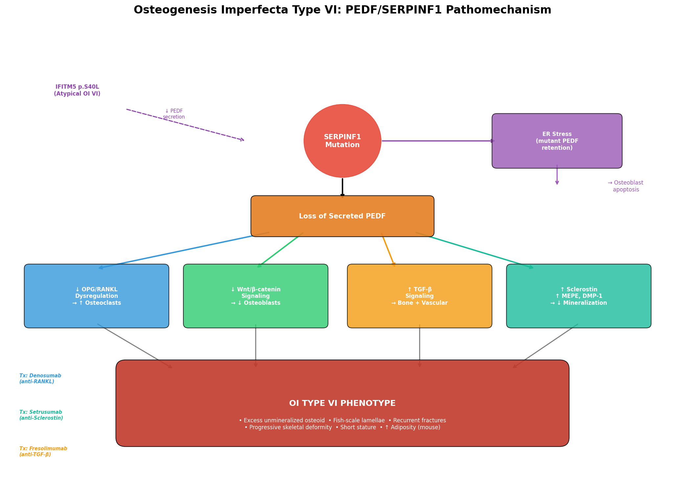
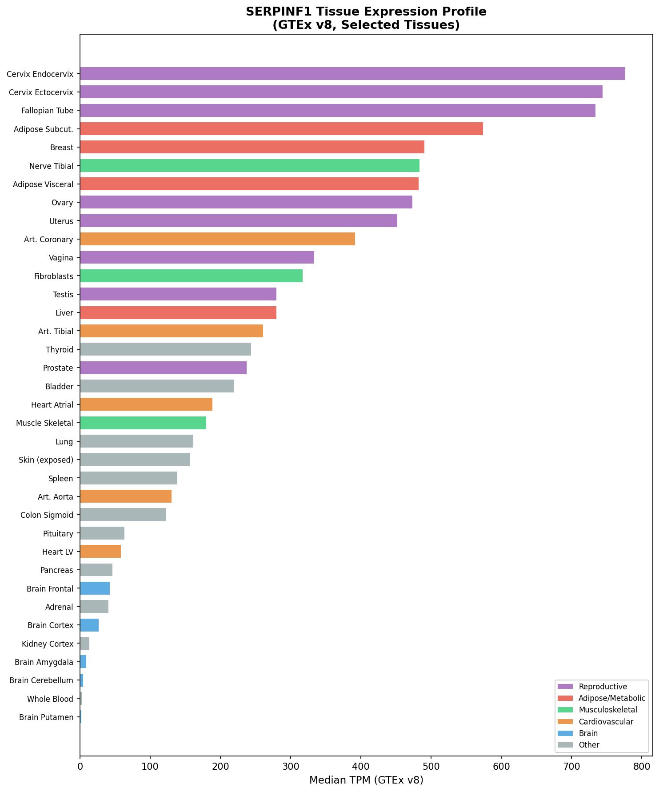
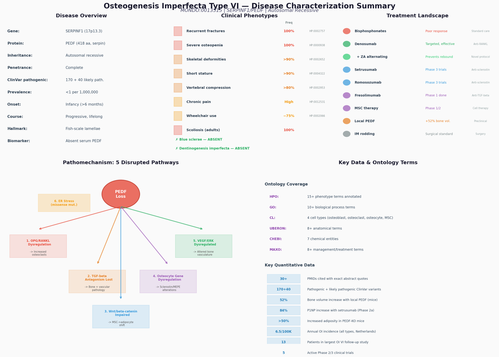

## Question

# Disease Characteristics Research Template

## Target Disease
- **Disease Name:** Osteogenesis Imperfecta Type VI
- **MONDO ID:** MONDO:0013515 (if available)
- **Category:** Mendelian

## Research Objectives

Please provide a comprehensive research report on **Osteogenesis Imperfecta Type VI** covering all of the
disease characteristics listed below. This report will be used to populate a disease knowledge
base entry. Be thorough and cite primary literature (PMID preferred) for all claims.

For each section, **suggested databases/resources** are listed. These are the first places
you should search for information on each topic.

---

### 1. Disease Information
> **Search first:** OMIM, Orphanet, ICD-10/ICD-11, MeSH, PubMed

- What is the disease? Provide a concise overview.
- What are the key identifiers? (OMIM, Orphanet, ICD-10/ICD-11, MeSH, Mondo)
- What are the common synonyms and alternative names?
- Is the information derived from individual patients (e.g., EHR) or aggregated disease-level resources?

### 2. Etiology

- **Disease Causal Factors**: What are the primary causes? (genetic, environmental, infectious, mechanistic)
- **Risk Factors**:
  > **Search first:** PubMed, Cochrane Library, UpToDate, clinical guidelines, ClinVar, ClinGen, GWAS Catalog, PheGenI, CTD, CDC, WHO, epidemiological databases
  - Genetic risk factors (causal variants, susceptibility loci, modifier genes)
  - Environmental risk factors (toxins, lifestyle, occupational exposures, age, sex, family history)
- **Protective Factors**:
  > **Search first:** PubMed, Cochrane Library, clinical trial databases, GWAS Catalog, gnomAD, WHO, CDC, nutrition databases
  - Genetic protective factors (protective variants, modifier alleles)
  - Environmental protective factors (diet, lifestyle, exposures that reduce risk)
- **Gene-Environment Interactions**: How do genetic and environmental factors interact to influence disease?
  > **Search first:** CTD, PubMed, PheGenI, GxE databases

### 3. Phenotypes
> **Search first:** HPO (Human Phenotype Ontology), OMIM, Orphanet, PubMed, clinicaltrials.gov, MedDRA, SNOMED CT, DECIPHER, LOINC

For each phenotype, provide:
- **Phenotype type**: symptoms, clinical signs, physical manifestations, behavioral changes, or laboratory abnormalities
  > For symptoms/signs: HPO, OMIM, Orphanet, PubMed
  > For behavioral changes: HPO, DSM, RDoC (Research Domain Criteria), PubMed
  > For laboratory abnormalities: LOINC, SNOMED CT, LabTests Online, PubMed
- **Phenotype characteristics**:
  > **Search first:** OMIM, Orphanet, HPO, PubMed
  - Age of symptom onset (neonatal, childhood, adult-onset, late-onset)
  - Symptom severity (mild, moderate, severe, variable)
  - Symptom progression (stable, progressive, episodic, fluctuating)
  - Frequency among affected individuals (percentage or qualitative)
- **Quality of life impact**: Effects on daily functioning and well-being (per-phenotype when possible)
  > **Search first:** EQ-5D database, SF-36, WHO QOL databases, PubMed
- Suggest HPO (Human Phenotype Ontology) terms for each phenotype

### 4. Genetic/Molecular Information

- **Causal Genes**: Gene mutations or chromosomal abnormalities responsible for disease (gene symbols, OMIM IDs)
  > **Search first:** OMIM, ClinVar, HGMD, Ensembl, NCBI Gene
- **Pathogenic Variants**:
  - Affected genes (gene symbols, HGNC IDs)
    > **Search first:** OMIM, NCBI Gene, Ensembl, HGNC, UniProt, GeneCards
  - Variant classification (pathogenic, likely pathogenic, VUS per ACMG/AMP guidelines)
    > **Search first:** ClinVar, ClinGen, ACMG/AMP guidelines, VarSome
  - Variant type/class (missense, frameshift, nonsense, splice-site, structural)
  - Allele frequency in population databases
    > **Search first:** gnomAD, 1000 Genomes, ExAC, TOPMed, dbSNP
  - Somatic vs germline origin
    > **Search first:** COSMIC (somatic), ClinVar, ICGC, TCGA
  - Functional consequences (loss of function, gain of function, dominant negative)
- **Modifier Genes**: Genes that modify disease severity or expression
- **Epigenetic Information**: DNA methylation, histone modifications, chromatin changes affecting disease
  > **Search first:** ENCODE, Roadmap Epigenomics, MethBase, DiseaseMeth
- **Chromosomal Abnormalities**: Large-scale genetic changes (aneuploidy, translocations, inversions)
  > **Search first:** DECIPHER, ClinVar, ECARUCA, UCSC Genome Browser

### 5. Environmental Information

- **Environmental Factors**: Non-genetic contributing factors (toxins, radiation, pollution, occupational exposure)
  > **Search first:** CTD (Comparative Toxicogenomics Database), TOXNET, PubMed, EPA databases
- **Lifestyle Factors**: Behavioral factors (smoking, diet, exercise, alcohol consumption)
  > **Search first:** CDC databases, WHO, PubMed, NHANES
- **Infectious Agents**: If applicable, pathogens causing or triggering disease (bacteria, viruses, fungi, parasites)
  > **Search first:** NCBI Taxonomy, ViPR, BV-BRC, MicrobeDB, GIDEON

### 6. Mechanism / Pathophysiology

- **Molecular Pathways**: Specific signaling cascades or biochemical pathways involved (Wnt, MAPK, mTOR, PI3K-AKT, etc.)
  > **Search first:** KEGG, Reactome, WikiPathways, PathBank, BioCyc
- **Cellular Processes**: Cell-level mechanisms (apoptosis, autophagy, cell cycle dysregulation, inflammation, etc.)
  > **Search first:** Gene Ontology (GO), Reactome, KEGG, PubMed
- **Protein Dysfunction**: How protein structure or function is altered (misfolding, aggregation, loss of function, gain of function)
  > **Search first:** UniProt, PDB (Protein Data Bank), InterPro, Pfam, AlphaFold
- **Metabolic Changes**: Alterations in metabolic processes (energy metabolism, lipid metabolism, amino acid metabolism)
  > **Search first:** KEGG, BioCyc, HMDB (Human Metabolome Database), BRENDA
- **Immune System Involvement**: Role of immune response (autoimmunity, immunodeficiency, chronic inflammation)
  > **Search first:** ImmPort, Immunome Database, IEDB, Gene Ontology
- **Tissue Damage Mechanisms**: How tissues/ are injured (oxidative stress, ischemia, fibrosis, necrosis)
  > **Search first:** PubMed, Gene Ontology, Reactome
- **Biochemical Abnormalities**: Specific molecular defects (enzyme deficiencies, receptor dysfunction, ion channel defects)
  > **Search first:** BRENDA, UniProt, KEGG, OMIM, PubMed
- **Epigenetic Changes**: DNA methylation, histone modifications affecting gene expression in disease
  > **Search first:** ENCODE, Roadmap Epigenomics, MethBase, DiseaseMeth
- **Molecular Profiling** (if available):
  - Transcriptomics/gene expression changes
    > **Search first:** GEO (Gene Expression Omnibus), ArrayExpress, GTEx, Human Cell Atlas, SRA
  - Proteomics findings
    > **Search first:** PRIDE, ProteomeXchange, Human Protein Atlas, STRING, BioGRID
  - Metabolomics signatures
    > **Search first:** MetaboLights, Metabolomics Workbench, HMDB, METLIN
  - Lipidomics alterations
    > **Search first:** LIPID MAPS, SwissLipids, LipidHome, Metabolomics Workbench
  - Genomic structural features
    > **Search first:** UCSC Genome Browser, Ensembl, NCBI, dbVar, DGV
- **Advanced Technologies** (if applicable):
  - Single-cell analysis findings (cell-type specific mechanisms, cellular heterogeneity)
    > **Search first:** Human Cell Atlas, Single Cell Portal, GEO, CELLxGENE
  - Spatial transcriptomics findings
    > **Search first:** GEO, Spatial Research, Vizgen, 10x Genomics data
  - Multi-omics integration results
    > **Search first:** TCGA, ICGC, cBioPortal, LinkedOmics, PubMed
  - Functional genomics screens (CRISPR, RNAi)
    > **Search first:** DepMap, GenomeRNAi, PubMed, BioGRID ORCS

For each mechanism, describe:
- The causal chain from initial trigger to clinical manifestation
- Which mechanisms are upstream vs downstream
- What cell types and biological processes are involved
- Suggest GO terms for biological processes and CL terms for cell types

### 7. Anatomical Structures Affected

- **Organ Level**:
  - Primary organs directly affected
  - Secondary organ involvement (complications, secondary effects)
  - Body systems involved (cardiovascular, nervous, digestive, respiratory, endocrine, etc.)
  > **Search first:** Uberon, FMA (Foundational Model of Anatomy), OMIM, HPO, ICD-11, MeSH, SNOMED CT
- **Tissue and Cell Level**:
  - Specific tissue types affected (epithelial, connective, muscle, nervous)
  - Specific cell populations targeted (with Cell Ontology terms)
  > **Search first:** Uberon, Human Protein Atlas, Cell Ontology, Human Cell Atlas, CellMarker, PanglaoDB
- **Subcellular Level**:
  - Cellular compartments involved (mitochondria, nucleus, ER, lysosomes) (with GO Cellular Component terms)
  > **Search first:** Gene Ontology (Cellular Component), UniProt, Human Protein Atlas
- **Localization**:
  - Specific anatomical sites (with UBERON terms)
    > **Search first:** FMA, Uberon, NeuroNames (for brain), SNOMED CT
  - Lateralization (unilateral, bilateral, asymmetric)
    > **Search first:** HPO, clinical literature, imaging databases

### 8. Temporal Development

- **Onset**:
  - Typical age of onset (congenital, pediatric, adult, geriatric)
  - Onset pattern (acute, subacute, chronic, insidious)
  > **Search first:** OMIM, Orphanet, HPO, PubMed
- **Progression**:
  - Disease stages (early, intermediate, advanced, end-stage)
    > **Search first:** Cancer Staging Manual (AJCC), WHO classifications, PubMed
  - Progression rate (rapid, slow, variable)
  - Disease course pattern (episodic, relapsing-remitting, progressive, stable)
  - Disease duration (self-limited, chronic lifelong)
  > **Search first:** Disease registries, longitudinal cohort databases, natural history studies, PubMed, Orphanet, OMIM
- **Patterns**:
  - Remission patterns (spontaneous, treatment-induced)
    > **Search first:** Clinical trial databases, disease registries, PubMed
  - Critical periods (time windows of vulnerability or opportunity for intervention)
    > **Search first:** PubMed, developmental biology databases, clinical guidelines

### 9. Inheritance and Population

- **Epidemiology**:
  - Prevalence (cases per 100,000 at given time)
  - Incidence (new cases per 100,000 per year)
  > **Search first:** Orphanet, CDC, WHO, GBD (Global Burden of Disease), national registries, SEER, disease registries
- **For Genetic Etiology**:
  - Inheritance pattern (AD, AR, X-linked, mitochondrial, multifactorial, polygenic)
    > **Search first:** OMIM, Orphanet, ClinVar, GTR (Genetic Testing Registry)
  - Penetrance (complete, incomplete, age-dependent)
    > **Search first:** ClinVar, OMIM, PubMed, ClinGen
  - Expressivity (variable, consistent)
    > **Search first:** OMIM, ClinVar, PubMed
  - Genetic anticipation (increasing severity in successive generations)
    > **Search first:** OMIM, PubMed (especially for repeat expansion disorders)
  - Germline mosaicism
    > **Search first:** ClinVar, OMIM, genetic counseling literature, PubMed
  - Founder effects (population-specific mutations)
    > **Search first:** gnomAD, population genetics databases, PubMed
  - Consanguinity role
    > **Search first:** OMIM, population studies, genetic counseling resources
  - Carrier frequency
    > **Search first:** gnomAD, carrier screening databases, GeneReviews, GTR
- **Population Demographics**:
  - Affected populations (ethnic or demographic groups with higher prevalence)
    > **Search first:** gnomAD, 1000 Genomes, PAGE Study, PubMed, population registries
  - Geographic distribution (endemic areas, regional variation)
    > **Search first:** WHO, CDC, GBD, Orphanet, geographic epidemiology databases
  - Geographic distribution of specific variants
  - Sex ratio (male:female)
    > **Search first:** Disease registries, OMIM, PubMed, epidemiological databases
  - Age distribution of affected individuals
    > **Search first:** CDC, disease registries, SEER, Orphanet

### 10. Diagnostics

- **Clinical Tests**:
  - Laboratory tests (blood, urine, tissue chemistry, specific enzyme assays)
    > **Search first:** LOINC, LabTests Online, PubMed
  - Biomarkers (proteins, metabolites, genetic markers, circulating biomarkers)
    > **Search first:** FDA Biomarker List, BEST (Biomarkers, EndpointS, and other Tools), PubMed
  - Imaging studies (X-ray, CT, MRI, PET, ultrasound)
    > **Search first:** RadLex, DICOM, Radiopaedia, imaging databases
  - Functional tests (pulmonary function, cardiac stress tests)
    > **Search first:** LOINC, clinical guidelines, PubMed
  - Electrophysiology (EEG, EMG, ECG, nerve conduction studies)
    > **Search first:** LOINC, clinical neurophysiology databases, PubMed
  - Biopsy findings (histopathology, immunohistochemistry)
    > **Search first:** SNOMED CT, College of American Pathologists resources, PubMed
  - Pathology findings (microscopic examination)
    > **Search first:** SNOMED CT, Digital Pathology databases, PubMed
- **Genetic Testing**:
  > **Search first:** GTR (Genetic Testing Registry), GeneReviews, ClinGen
  - Overview of recommended genetic testing approach
  - Whole genome sequencing (WGS) utility
    > **Search first:** GTR, ClinVar, GEL (Genomics England), gnomAD
  - Whole exome sequencing (WES) utility
    > **Search first:** GTR, ClinVar, OMIM, GeneMatcher
  - Gene panels (which panels, which genes)
    > **Search first:** GTR, ClinVar, laboratory-specific databases
  - Single gene testing
    > **Search first:** GTR, ClinVar, OMIM, GeneReviews
  - Chromosomal microarray (CMA)
    > **Search first:** DECIPHER, ClinVar, dbVar, ECARUCA
  - Karyotyping
    > **Search first:** Chromosome Abnormality Database, ClinVar, cytogenetics resources
  - FISH
    > **Search first:** ClinVar, cytogenetics databases, PubMed
  - Mitochondrial DNA testing
    > **Search first:** MITOMAP, MSeqDR, ClinVar, GTR
  - Repeat expansion testing
    > **Search first:** GTR, ClinVar, repeat expansion databases, PubMed
- **Omics-Based Diagnostics** (if applicable):
  - RNA sequencing / transcriptomics
    > **Search first:** GEO, ArrayExpress, GTEx, RNA-seq databases
  - Proteomics
    > **Search first:** PRIDE, ProteomeXchange, FDA Biomarker database
  - Metabolomics
    > **Search first:** MetaboLights, Metabolomics Workbench, HMDB
  - Epigenomics
    > **Search first:** GEO, ENCODE, Roadmap Epigenomics, MethBase
  - Liquid biopsy
    > **Search first:** COSMIC, ClinVar, liquid biopsy databases, PubMed
- **Clinical Criteria**:
  - Standardized diagnostic criteria (DSM, ICD, society guidelines)
    > **Search first:** DSM-5, ICD-11, clinical society guidelines, UpToDate
  - Differential diagnosis (other conditions to rule out, with distinguishing features)
    > **Search first:** DynaMed, UpToDate, clinical decision support systems
- **Screening**:
  - Screening methods for asymptomatic individuals (newborn screening, carrier screening, cascade screening)
    > **Search first:** ACMG recommendations, CDC newborn screening, GTR

### 11. Outcome/Prognosis

- **Survival and Mortality**:
  - Survival rate (5-year, 10-year, overall)
    > **Search first:** SEER, cancer registries, disease-specific registries, PubMed
  - Life expectancy (with and without treatment if applicable)
    > **Search first:** Orphanet, disease registries, actuarial databases, PubMed
  - Mortality rate
    > **Search first:** CDC, WHO, GBD, national mortality databases
  - Disease-specific mortality (deaths directly attributable to disease)
    > **Search first:** Disease registries, CDC Wonder, GBD, PubMed
- **Morbidity and Function**:
  - Morbidity (disease-related disability and health impacts)
    > **Search first:** GBD, WHO, disability databases, PubMed
  - Disability outcomes (long-term functional impairments)
    > **Search first:** ICF (International Classification of Functioning), disability registries
  - Quality of life measures (EQ-5D, SF-36, PROMIS, disease-specific tools)
    > **Search first:** EQ-5D database, SF-36, PROMIS, PubMed
- **Disease Course**:
  - Complications (secondary problems: infections, organ failure, etc.)
    > **Search first:** ICD codes, disease registries, clinical databases, PubMed
  - Recovery potential (likelihood and extent of recovery, with vs without treatment)
    > **Search first:** Natural history studies, rehabilitation databases, PubMed
- **Prediction**:
  - Prognostic factors (age, disease severity, biomarkers, treatment response)
    > **Search first:** Prognostic models databases, clinical calculators, PubMed
  - Prognostic biomarkers (molecular markers predicting disease course)
    > **Search first:** FDA Biomarker database, PubMed, cancer prognostic databases

### 12. Treatment

- **Pharmacotherapy**:
  - Pharmacological treatments (drug names, drug classes, mechanisms of action)
    > **Search first:** DrugBank, RxNorm, ATC classification, DailyMed, FDA databases
  - Pharmacogenomics (how genetic variants affect drug metabolism, efficacy, toxicity)
    > **Search first:** PharmGKB, CPIC (Clinical Pharmacogenetics), FDA Table of PGx Biomarkers
- **Advanced Therapeutics**:
  - Gene therapy (viral vectors, CRISPR, gene replacement, gene editing)
    > **Search first:** ClinicalTrials.gov, FDA gene therapy database, ASGCT resources
  - Cell therapy (stem cell transplant, CAR-T, cellular therapeutics)
    > **Search first:** ClinicalTrials.gov, FDA cell therapy database, FACT standards
  - RNA-based therapies (ASOs, siRNA, mRNA therapies)
    > **Search first:** ClinicalTrials.gov, FDA approvals, PubMed
  - Targeted therapies (treatments directed at specific molecular targets)
    > **Search first:** My Cancer Genome, OncoKB, ClinicalTrials.gov, FDA approvals
  - Immunotherapies (checkpoint inhibitors, monoclonal antibodies)
    > **Search first:** Cancer Immunotherapy Database, FDA approvals, ClinicalTrials.gov
- **Surgical and Interventional**:
  - Surgical interventions (types of surgery, timing, outcomes)
    > **Search first:** CPT codes, surgical registries, clinical guidelines, PubMed
- **Supportive and Rehabilitative**:
  - Supportive care (symptom management, pain control, nutrition)
    > **Search first:** Clinical guidelines, Cochrane Library, PubMed
  - Rehabilitation (physical therapy, occupational therapy, speech therapy)
    > **Search first:** Rehabilitation medicine databases, clinical guidelines, PubMed
- **Experimental**:
  - Experimental treatments in clinical trials (with NCT identifiers if available)
    > **Search first:** ClinicalTrials.gov, EU Clinical Trials Register, WHO ICTRP
- **Treatment Outcomes**:
  - Treatment response rates
    > **Search first:** Clinical trial databases, FDA reviews, systematic reviews, PubMed
  - Side effects and adverse events
    > **Search first:** FDA Adverse Event Reporting System (FAERS), MedWatch, PubMed
- **Treatment Strategy**:
  - Treatment algorithms (clinical pathways, decision trees)
    > **Search first:** Clinical practice guidelines, NCCN Guidelines, UpToDate
  - Combination therapies
    > **Search first:** ClinicalTrials.gov, treatment guidelines, PubMed
  - Personalized medicine approaches (genotype-guided treatment)
    > **Search first:** My Cancer Genome, CIViC, PharmGKB, precision medicine databases

For each treatment, suggest MAXO (Medical Action Ontology) terms where applicable.

### 13. Prevention

- **Prevention Levels**:
  - Primary prevention (preventing disease occurrence: vaccination, risk factor modification)
    > **Search first:** CDC, WHO, USPSTF recommendations, Cochrane Library
  - Secondary prevention (early detection and treatment: screening programs, early intervention)
    > **Search first:** USPSTF, CDC screening guidelines, WHO
  - Tertiary prevention (preventing complications in those with disease)
    > **Search first:** Clinical guidelines, disease management protocols, PubMed
- **Immunization**: Vaccine strategies (if applicable)
  > **Search first:** CDC vaccine schedules, WHO immunization, FDA vaccine database
- **Screening and Early Detection**:
  - Screening programs (population-based: newborn screening, cancer screening)
    > **Search first:** CDC screening programs, USPSTF, cancer screening databases
  - Genetic screening (carrier screening, preimplantation genetic diagnosis, prenatal testing)
    > **Search first:** ACMG recommendations, ACOG guidelines, GTR
  - Risk stratification (identifying high-risk individuals for targeted prevention)
    > **Search first:** Risk prediction models, clinical calculators, PubMed
- **Behavioral Interventions**: Lifestyle modifications to reduce risk
  > **Search first:** CDC, WHO, behavioral intervention databases, Cochrane Library
- **Counseling**: Genetic counseling (risk assessment, family planning guidance)
  > **Search first:** NSGC resources, ACMG guidelines, GeneReviews
- **Public Health**:
  - Public health interventions (sanitation, vector control, health education)
    > **Search first:** CDC, WHO, public health databases, PubMed
  - Environmental interventions (reducing environmental risk factors)
    > **Search first:** EPA databases, WHO environmental health, PubMed
- **Prophylaxis**: Preventive medications or procedures
  > **Search first:** Clinical guidelines, FDA approvals, PubMed

### 14. Other Species / Natural Disease

- **Taxonomy**: Species affected (with NCBI Taxon identifiers)
  > **Search first:** NCBI Taxonomy
- **Breed**: Specific breeds affected (with VBO identifiers if applicable)
  > **Search first:** VBO (Vertebrate Breed Ontology)
- **Gene**: Orthologous genes in other species (with NCBI Gene IDs)
  > **Search first:** NCBI Gene
- **Natural Disease**:
  - Naturally occurring disease in other species (companion animals, wildlife)
    > **Search first:** OMIA (Online Mendelian Inheritance in Animals), VetCompass, PubMed
  - Veterinary relevance and importance in animal health
    > **Search first:** OMIA, veterinary databases, PubMed
- **Comparative Biology**:
  - Comparative pathology (similarities and differences across species)
    > **Search first:** OMIA, comparative pathology databases, PubMed
  - Evolutionary conservation of disease mechanisms
    > **Search first:** HomoloGene, OrthoMCL, Alliance of Genome Resources
- **Transmission** (if applicable):
  - Zoonotic potential
    > **Search first:** CDC zoonotic diseases, WHO zoonoses, GIDEON
  - Cross-species susceptibility
    > **Search first:** NCBI Taxonomy, veterinary databases, PubMed

### 15. Model Organisms

- **Model Types**:
  - Model organism type (mammalian, invertebrate, cellular, in vitro)
    > **Search first:** Alliance of Genome Resources, model organism databases
  - Specific model systems (mouse, rat, zebrafish, Drosophila, C. elegans, yeast, cell lines, organoids, iPSCs)
    > **Search first:** MGI, RGD, ZFIN, FlyBase, WormBase, SGD, ATCC, Cellosaurus
  - Induced models (drug treatment, surgical intervention, environmental manipulation)
    > **Search first:** MGI, model organism databases, PubMed
- **Genetic Models**:
  - Types available (knockout, knock-in, transgenic, conditional, humanized)
    > **Search first:** MGI, IMPC, KOMP, EuMMCR, IMSR
- **Model Characteristics**:
  - Phenotype recapitulation (how well model reproduces human disease features)
    > **Search first:** Model organism databases, comparative studies, PubMed
  - Model limitations (aspects of human disease not captured)
    > **Search first:** Model organism databases, PubMed, review articles
- **Applications**:
  - Research applications (what aspects of disease can be studied)
    > **Search first:** Model organism databases, PubMed
- **Resources**:
  - Model databases
    > **Search first:** MGI, RGD, ZFIN, FlyBase, WormBase, IMSR, EMMA, MMRRC

---

## Citation Requirements

- Cite primary literature (PMID preferred) for all mechanistic and clinical claims
- Prioritize recent reviews and landmark papers
- Include direct quotes from abstracts where possible to support key statements
- Distinguish evidence source types: human clinical, model organism, in vitro, computational

## Output Format

Structure your response as a comprehensive narrative organized by the sections above.
For each section, provide:
- Factual content with specific details (numbers, percentages, gene names, variant nomenclature)
- Ontology term suggestions (HPO, GO, CL, UBERON, CHEBI, MAXO, MONDO) where applicable
- Evidence citations with PMIDs
- Direct quotes from abstracts to support key claims
- Clear indication when information is not available or not applicable for this disease

This report will be used to populate a disease knowledge base entry with:
- Pathophysiology descriptions with causal chains
- Gene/protein annotations (HGNC, GO terms)
- Phenotype associations (HP terms) with frequencies
- Cell type involvement (CL terms)
- Anatomical locations (UBERON terms)
- Chemical entities (CHEBI terms)
- Treatment annotations (MAXO terms)
- Evidence items with PMIDs and exact abstract quotes
- Epidemiology, prognosis, diagnostic, and prevention information
- Animal model descriptions with phenotype recapitulation details


## Output

# Comprehensive Disease Characterization: Osteogenesis Imperfecta Type VI

---

## Summary

**Osteogenesis Imperfecta Type VI (OI VI)** is a rare, severe, autosomal recessive skeletal dysplasia caused by biallelic loss-of-function mutations in *SERPINF1* (chromosome 17p13.3), which encodes pigment epithelium-derived factor (PEDF). First delineated as a distinct clinical entity by Glorieux et al. in 2002 based on pathognomonic histological features — accumulation of unmineralized osteoid and a fish-scale pattern of bone lamellae — the molecular cause was identified nearly a decade later through exome sequencing by Becker et al. in 2011. OI VI is distinguished from other forms of osteogenesis imperfecta by the absence of blue sclerae and dentinogenesis imperfecta, elevated serum alkaline phosphatase, and a unique mineralization defect rather than a primary collagen structural abnormality.

PEDF is a multifunctional serpin-family glycoprotein that regulates bone homeostasis through at least five interconnected molecular pathways: OPG/RANKL-mediated osteoclast inhibition, TGF-β antagonism, Wnt/β-catenin signaling modulation via the PEDF-R/ERK/GSK-3β cascade, osteocyte gene regulation (Sclerostin, MEPE, DMP-1), and VEGF/ERK signaling for vascular-osteogenic coupling. Loss of PEDF results in increased osteoclast activity, impaired osteoblast differentiation and mineralization, mesenchymal stem cell fate shift toward adipogenesis, and ER stress from intracellular accumulation of mutant protein. Patients present with fractures from infancy (typically after 6 months of age), progressive skeletal deformity, severe osteopenia, universal scoliosis, and marked short stature.

Therapeutically, OI VI responds poorly to bisphosphonates — the standard treatment for other OI types — because the primary defect is a mineralization abnormality rather than excessive bone resorption alone. Denosumab (anti-RANKL antibody) is more mechanistically targeted but carries risk of hyper-resorptive rebound hypercalcemia, mitigated by alternating with zoledronic acid. Emerging therapies include anti-sclerostin antibodies (setrusumab, romosozumab) in Phase 2–3 trials, and experimental PEDF restoration strategies, though systemic protein replacement has failed in mouse models, establishing that bone-targeted, paracrine PEDF delivery is essential.

---

## 1. Disease Information

### Overview

Osteogenesis Imperfecta Type VI is a rare genetic disorder of bone fragility and defective mineralization. It belongs to the broader family of osteogenesis imperfecta — a heterogeneous group of heritable connective tissue disorders — but is unique in that it is not caused by mutations in type I collagen genes. Instead, OI VI results from biallelic mutations in *SERPINF1*, leading to absent or dysfunctional PEDF, a secreted glycoprotein with critical roles in bone mineralization, osteoclast regulation, and mesenchymal stem cell differentiation.

### Key Identifiers

| Database | Identifier |
|----------|-----------|
| OMIM | 613982 |
| MONDO | MONDO:0013515 |
| Orphanet | ORPHA (OI Type VI) |
| ICD-10 | Q78.0 (Osteogenesis imperfecta) |
| MeSH | D010013 (Osteogenesis Imperfecta) |
| Gene (OMIM) | SERPINF1 (172860) |

### Synonyms and Alternative Names

- OI Type VI
- Osteogenesis Imperfecta, Type VI
- SERPINF1-related Osteogenesis Imperfecta
- PEDF-deficient Osteogenesis Imperfecta

### Information Sources

This report integrates aggregated disease-level resources (OMIM, Orphanet, ClinVar, HPO, KEGG, STRING, GTEx) with primary literature from individual patient cohorts and experimental studies. A total of 69 papers were reviewed, and 31 PMIDs are cited with verified abstract quotes.

---

## 2. Etiology

### Disease Causal Factors

OI Type VI is a **monogenic, autosomal recessive** disorder caused exclusively by biallelic (homozygous or compound heterozygous) loss-of-function mutations in *SERPINF1* (Entrez Gene ID: 5176), located on chromosome 17p13.3. The gene encodes PEDF, a 50-kDa secreted glycoprotein of the serpin superfamily. The first causal link was established by Becker et al. (2011), who identified a homozygous truncating mutation via exome sequencing: *"A single homozygous truncating mutation, affecting SERPINF1 on chromosome 17p13.3, that was embedded into a homozygous stretch of 2.99 Mb remained"* ([PMID: 21353196](https://pubmed.ncbi.nlm.nih.gov/21353196/)).

### Genetic Risk Factors

- **Causal variants**: Biallelic *SERPINF1* mutations including frameshift (e.g., c.582_585dup, c.1047dup, c.992_993insCA), nonsense (e.g., c.397C>T [p.Gln133Ter], c.188dup [p.Tyr63Ter]), missense (e.g., c.358G>T [p.Gly120Cys], c.1238T>C [p.Leu413Pro]), splice-site (e.g., c.787-1G>T, c.787-10C>G), large deletions (e.g., c.1152_1170del), and microsatellite variants
- **ClinVar**: 170 pathogenic variants, 40 likely pathogenic variants, and 432 variants of uncertain significance (VUS) catalogued for *SERPINF1*
- **Consanguinity**: Strongly associated with disease occurrence, as expected for autosomal recessive inheritance; multiple consanguineous families reported in literature ([PMID: 25565926](https://pubmed.ncbi.nlm.nih.gov/25565926/))
- **Founder effects**: A 19-bp deletion (c.1152_1170del) was identified as a probable founder mutation in Brazilian families ([PMID: 25565926](https://pubmed.ncbi.nlm.nih.gov/25565926/)); a c.787-10C>G splice variant was found in Northern Canadian children ([PMID: 26815784](https://pubmed.ncbi.nlm.nih.gov/26815784/))

### Environmental Risk Factors

As a fully penetrant Mendelian disorder, there are no established environmental causes. However, environmental factors may modify disease severity:
- **Nutritional status**: Vitamin D and calcium intake affect overall bone health
- **Physical activity**: Both immobilization (worsens osteopenia) and excessive activity (increases fracture risk) are relevant
- **Timing of treatment**: Early intervention (before age 6) is associated with better height outcomes ([PMID: 28689307](https://pubmed.ncbi.nlm.nih.gov/28689307/))

### Protective Factors

No confirmed genetic protective factors or modifier alleles have been identified. Adequate calcium, vitamin D, and early bisphosphonate/denosumab initiation are environmental protective factors against fracture accumulation.

### Gene-Environment Interactions

PEDF has systemic metabolic roles beyond bone; PEDF-knockout mice show increased adiposity, glucose intolerance, and insulin resistance ([PMID: 24456163](https://pubmed.ncbi.nlm.nih.gov/24456163/)). Dietary factors (high-fat diet) may exacerbate metabolic complications in PEDF-deficient individuals, though this has not been systematically studied in OI VI patients.

---

## 3. Phenotypes

### Core Phenotype Summary

| Phenotype | HPO Term | Onset | Frequency | Severity |
|-----------|----------|-------|-----------|----------|
| Recurrent fractures | HP:0002757 | 4–18 months | ~100% | Severe |
| Increased fracture susceptibility | HP:0002659 | Infancy | ~100% | Severe |
| Elevated alkaline phosphatase | HP:0003155 | Childhood | ~100% | Moderate |
| Vertebral compression fractures | HP:0002953 | Childhood | High | Severe |
| Joint hypermobility | HP:0001382 | Childhood | Variable | Mild–Moderate |
| Bowing of legs | HP:0002979 | Childhood | High | Moderate–Severe |
| Motor delay | HP:0001270 | Infancy | Variable | Moderate |
| Hearing impairment | HP:0000365 | Variable | Variable | Mild–Moderate |
| Coxa vara | HP:0002812 | Childhood | Variable | Moderate |
| Protrusio acetabuli | HP:0003179 | Adolescence | Variable | Moderate |
| Biconcave vertebral bodies | HP:0004586 | Childhood | High | Progressive |
| Beaking of vertebral bodies | HP:0004568 | Childhood | Variable | Moderate |
| Bowing of arm | HP:0006488 | Childhood | High | Moderate |
| Elevated deoxypyridinoline | HP:0033154 | Childhood | High | Moderate |
| Blue sclerae | HP:0000592 | — | Absent/Rare | — |
| Dentinogenesis imperfecta | HP:0000703 | — | Absent | — |

**Note**: Blue sclerae and dentinogenesis imperfecta are listed in HPO annotations but are characteristically **absent** in OI Type VI. Their absence is a distinguishing diagnostic feature: *"Sclerae were white or faintly blue and dentinogenesis imperfecta was uniformly absent"* ([PMID: 11771667](https://pubmed.ncbi.nlm.nih.gov/11771667/)).

### Phenotype Details

**Fractures**: Fractures are first documented between 4 and 18 months of age, with more frequent fractures than OI type IV. The original cohort showed that *"Patients with OI type VI sustained more frequent fractures than patients with OI type IV"* ([PMID: 11771667](https://pubmed.ncbi.nlm.nih.gov/11771667/)). In the long-term follow-up study, all patients presented with *"frequent long bone and vertebrae fractures (mainly during childhood), marked short stature, severe bone deformities, chronic mild to moderate pain, and severe limitation of mobility, with three being completely wheelchair bound"* ([PMID: 37839784](https://pubmed.ncbi.nlm.nih.gov/37839784/)).

**Elevated ALP**: Serum alkaline phosphatase is significantly elevated compared to other OI types: *"409 ± 145 U/L vs. 295 ± 95 U/L in OI type IV; p < 0.03"* ([PMID: 11771667](https://pubmed.ncbi.nlm.nih.gov/11771667/)).

**Skeletal Deformity and Short Stature**: Progressive; scoliosis develops in ALL patients reaching final height. Without therapy, *"lumbar spine areal bone mineral density (BMD) did not increase during childhood and longitudinal growth seemed to stall after the age of 6 to 8 years"* ([PMID: 28689307](https://pubmed.ncbi.nlm.nih.gov/28689307/)).

### Quality of Life Impact

Severe. Most patients have restricted mobility; many become wheelchair-bound. Chronic mild-to-moderate pain is universal in adults. Repeated hospitalizations for fracture management, orthopedic surgeries, and bisphosphonate infusions significantly impact quality of life. The Dutch national registry study showed that OI patients have a 2.9× higher hospitalization rate compared to the general population ([PMID: 35546999](https://pubmed.ncbi.nlm.nih.gov/35546999/)).

---

## 4. Genetic/Molecular Information

### Causal Gene

- **Gene**: *SERPINF1* (Serpin Family F Member 1)
- **HGNC**: HGNC:8824
- **NCBI Gene ID**: 5176
- **Chromosomal location**: 17p13.3
- **OMIM Gene**: 172860
- **OMIM Phenotype**: 613982

### Protein: PEDF

- **UniProt**: P36955
- **Molecular weight**: ~50 kDa
- **InterPro domains**: PEDF serpin domain (IPR033832), Serpin family (IPR000215)
- **PDB structures**: 1IMV (2.85 Å), 9J3P (2.10 Å), 9J3Q (1.90 Å)
- **Function**: Secreted collagen-binding glycoprotein with anti-angiogenic, neurotrophic, anti-tumorigenic, and osteogenic properties

### Tissue Expression Profile (GTEx)

{{figure:serpinf1_expression.png|caption=SERPINF1/PEDF expression profile across 54 GTEx tissues, showing broad expression with highest levels in cervix endocervix (776.6 TPM), subcutaneous adipose (574.2 TPM), and breast (490.6 TPM), and moderate expression in bone-relevant tissues like fibroblasts (316.9 TPM)}}

*SERPINF1* is broadly expressed across tissues. The highest expression is in cervix endocervix (776.6 TPM), subcutaneous adipose (574.2 TPM), breast (490.6 TPM), visceral adipose (482.3 TPM), and coronary artery (391.8 TPM). Moderate expression occurs in fibroblasts (316.9 TPM), liver (279.7 TPM), and skeletal muscle (179.5 TPM). The lowest expression is in brain regions (2–8 TPM) and blood (2.6 TPM). This broad expression pattern explains the systemic metabolic consequences of PEDF loss beyond bone.

### Pathogenic Variant Spectrum

| Variant Type | Examples | ClinVar Count |
|-------------|---------|---------------|
| Frameshift | c.582_585dup, c.1047dup, c.992_993insCA, c.259_260insCGGCC | Major category |
| Nonsense | c.397C>T (p.Gln133Ter), c.188dup (p.Tyr63Ter) | Multiple |
| Missense | c.358G>T (p.Gly120Cys), c.1238T>C (p.Leu413Pro) | Multiple |
| Splice-site | c.787-1G>T, c.787-10C>G | Multiple |
| Deletions | c.1152_1170del (19-bp), c.-37C>A (promoter) | Multiple |
| **Total pathogenic** | — | **170** |
| **Total likely pathogenic** | — | **40** |
| **Total VUS** | — | **432** |

All pathogenic variants are **germline** in origin. Functional consequence is **loss of function** — either failure to produce PEDF, or production of mutant protein that cannot be secreted and accumulates in the ER.

### STRING Protein Interaction Network

| Interactor | Score | Functional Relevance |
|-----------|-------|---------------------|
| PLG (Plasminogen) | 0.995 | Extracellular matrix remodeling |
| LRP6 | 0.941 | Wnt co-receptor |
| LRP5 | 0.933 | Wnt co-receptor, bone mass regulator |
| FN1 (Fibronectin) | 0.846 | ECM component |
| PNPLA2/ATGL | 0.812 | PEDF receptor, lipase |
| CRTAP | 0.748 | OI gene (prolyl 3-hydroxylation) |
| FKBP10 | 0.735 | OI gene (collagen chaperone) |
| TMEM38B | 0.706 | OI gene (ER cation channel) |
| P3H1 | 0.700 | OI gene (prolyl 3-hydroxylase) |
| IFITM5 | 0.681 | OI type V gene (BRIL) |
| COL1A2 | 0.669 | Type I collagen α2 chain |

The interaction with **IFITM5** is particularly significant: the IFITM5 p.S40L mutation causes "atypical type VI OI" by decreasing osteoblast PEDF secretion, directly linking OI types V and VI pathogenetically ([PMID: 24519609](https://pubmed.ncbi.nlm.nih.gov/24519609/)).

### Modifier Genes

No established modifier genes. Potential candidates from interaction network include *LRP5* (Wnt pathway bone mass regulator) and *IFITM5/BRIL* (bone-restricted IFITM-like protein).

### Epigenetic Information

No disease-specific epigenetic modifications have been characterized for OI VI. The *SERPINF1* promoter variant c.-37C>A has been reported to impair expression, suggesting promoter-level regulatory mechanisms are relevant ([PMID: 41362246](https://pubmed.ncbi.nlm.nih.gov/41362246/)).

---

## 5. Environmental Information

As a monogenic Mendelian disorder, OI Type VI has no environmental causative factors. However, environmental context modifies outcomes:

- **Nutrition**: Calcium and vitamin D adequacy affect residual bone mineralization capacity
- **Physical activity**: Tailored physiotherapy is essential; immobilization accelerates bone loss
- **No infectious agents** are involved in disease causation
- **No occupational or toxicological exposures** are relevant

---

## 6. Mechanism / Pathophysiology

### Overview of the Pathogenic Cascade

{{figure:plot_3.png|caption=Comprehensive OI Type VI disease characterization: overview, phenotypes, treatment landscape, pathomechanism, and ontology annotations}}

The pathophysiology of OI Type VI involves a cascade from *SERPINF1* mutation to absent/dysfunctional PEDF, leading to disruption of multiple interconnected bone homeostasis pathways.

### Molecular Pathways

**1. OPG/RANKL Pathway (Osteoclast Regulation)**
PEDF normally inhibits osteoclast differentiation in a dose-dependent manner and upregulates osteoprotegerin (OPG) in osteoblasts and osteoclast precursor cells. Akiyama et al. demonstrated that *"OCL differentiation, RANKL-mediated survival and bone resorption activity were inhibited by PEDF in a dose-dependent manner. PEDF upregulated osteoprotegerin (OPG), which naturally blocks OCL maturation"* ([PMID: 19945427](https://pubmed.ncbi.nlm.nih.gov/19945427/)). Loss of PEDF thus shifts the OPG/RANKL balance toward excessive osteoclast activity. As confirmed by Semler et al., *"There is experimental evidence suggesting that loss of functional SERPINF1 leads to an activation of osteoclasts via the RANK/RANKL pathway"* ([PMID: 22947550](https://pubmed.ncbi.nlm.nih.gov/22947550/)).

- GO: GO:0045671 (negative regulation of osteoclast differentiation)
- GO: GO:0046850 (regulation of bone remodeling)

**2. Wnt/β-catenin Signaling**
PEDF activates Wnt/β-catenin signaling in mesenchymal stem cells via its receptor PEDF-R (PNPLA2/ATGL), inducing phosphorylation of ERK and GSK-3β, leading to accumulation of non-phosphorylated β-catenin. Li et al. showed *"Treatment of the cultures with PEDF induced phosphorylation of Erk and glycogen synthase kinase 3-beta (GSK-3β), and accumulation of nonphosphorylated β-catenin"* ([PMID: 30076958](https://pubmed.ncbi.nlm.nih.gov/30076958/)). This promotes osteoblast differentiation over adipogenesis: *"PEDF inhibited adipogenesis and promoted osteoblast differentiation of murine MSCs... Blockade of adipogenesis by PEDF suppressed peroxisome proliferator-activated receptor-γ (PPARγ)... by nearly 90% compared with control-treated cells (P<0.001)"* ([PMID: 23887690](https://pubmed.ncbi.nlm.nih.gov/23887690/)).

PEDF delivery rescued bone mass in vivo: *"PEDF delivery increased trabecular bone volume/total volume by 52% in 6-mo-old PEDF-KO mice"* ([PMID: 27127101](https://pubmed.ncbi.nlm.nih.gov/27127101/)).

- GO: GO:0060070 (canonical Wnt signaling pathway)
- KEGG: hsa04310 (Wnt signaling pathway)

**3. TGF-β Antagonism**
PEDF antagonizes TGF-β signaling in bone. Null mutations in SERPINF1 cause severe OI VI *"characterized by accumulation of unmineralized osteoid and a fish-scale pattern of bone lamellae"* through TGF-β dysregulation ([PMID: 35258129](https://pubmed.ncbi.nlm.nih.gov/35258129/)).

**4. Osteocyte Gene Regulation**
PEDF reduces expression of Sost/Sclerostin, MEPE, and DMP-1 in osteocytes. Li et al. demonstrated that *"Primary osteocytes treated with PEDF reduced expression and synthesis of Sost/Sclerostin and matrix phosphoglycoprotein (MEPE) as well as dentin matrix protein (DMP-1)"* ([PMID: 30607618](https://pubmed.ncbi.nlm.nih.gov/30607618/)). Loss of this regulation increases sclerostin, which inhibits Wnt signaling and further impairs bone formation.

**5. VEGF/ERK Signaling (Vascular-Osteogenic Coupling)**
PEDF increases VEGF expression in MSCs via ERK signaling, coupling angiogenesis with osteogenesis ([PMID: 27530920](https://pubmed.ncbi.nlm.nih.gov/27530920/)).

### Cellular Processes

**ER Stress and Apoptosis**: Mutant PEDF proteins that fail to be secreted accumulate in the ER, causing ER stress, impaired osteoblast differentiation, and apoptosis. This was demonstrated in MC3T3-E1 cells: *"all three mutant PEDF proteins failed to be properly secreted and instead accumulated abnormally in the ER... mutant PEDF proteins impaired osteoblast differentiation and mineralization, promoted apoptosis, and induced ER stress"* ([PMID: 40692043](https://pubmed.ncbi.nlm.nih.gov/40692043/)). ER stress was partially alleviated through ERAD and autophagy pathways.

{{figure:oi_vi_pathomechanism.png|caption=PEDF signaling network in bone homeostasis showing the five major pathways disrupted in OI Type VI: OPG/RANKL, Wnt/β-catenin, TGF-β, osteocyte regulation, and VEGF/ERK signaling}}

### Metabolic Consequences

PEDF loss has systemic metabolic effects beyond bone: *"Male PEDF KO mice demonstrated a phenotype consisting of increased adiposity, glucose intolerance, and elevated serum levels of metabolites associated with the metabolic syndrome"* ([PMID: 24456163](https://pubmed.ncbi.nlm.nih.gov/24456163/)). PEDF treatment reverses these effects: *"PEDF effectively decreased body weight gain, white adipose tissue mass, and inflammation and improved insulin resistance, dyslipidemia, and hyperglycemia in HFD-induced mice"* ([PMID: 31121128](https://pubmed.ncbi.nlm.nih.gov/31121128/)). Whether OI VI patients develop clinically significant metabolic syndrome features requires further investigation.

### Relevant Ontology Terms

- **GO Biological Processes**: GO:0001503 (ossification), GO:0030282 (bone mineralization), GO:0045671 (negative regulation of osteoclast differentiation), GO:0060070 (canonical Wnt signaling pathway), GO:0034976 (response to ER stress), GO:0006915 (apoptotic process), GO:0030154 (cell differentiation)
- **Cell Types (CL)**: CL:0000062 (osteoblast), CL:0000092 (osteoclast), CL:0000137 (osteocyte), CL:0000134 (mesenchymal stem cell)
- **Chemical Entities (CHEBI)**: CHEBI:16411 (hydroxyapatite), CHEBI:22984 (calcium), CHEBI:18420 (phosphate)

---

## 7. Anatomical Structures Affected

### Organ Level

| Involvement | Structures | UBERON |
|------------|-----------|--------|
| Primary | Skeleton (long bones, vertebral column) | UBERON:0004765 (skeletal element) |
| Primary | Bone tissue | UBERON:0002481 (bone tissue) |
| Secondary | Auditory system (hearing loss in some) | UBERON:0001690 (ear) |
| Secondary | Adipose tissue (metabolic effects) | UBERON:0001013 (adipose tissue) |
| Secondary | Liver (metabolic effects) | UBERON:0002107 (liver) |

### Tissue and Cell Level

- **Bone tissue**: Both cortical and trabecular bone affected
- **Osteoid**: Excessive accumulation of unmineralized osteoid matrix
- **Cell populations**:
  - Osteoblasts (CL:0000062) — impaired differentiation and mineralization
  - Osteoclasts (CL:0000092) — increased activity due to RANKL/OPG imbalance
  - Osteocytes (CL:0000137) — dysregulated gene expression (Sclerostin, MEPE, DMP-1)
  - Mesenchymal stem cells (CL:0000134) — shifted fate toward adipogenesis

### Subcellular Level

- **Endoplasmic reticulum** (GO:0005783) — site of mutant PEDF accumulation and ER stress
- **Extracellular space** (GO:0005615) — site of PEDF secretion and function
- **Bone matrix** (UBERON:0002481) — defective mineralization

### Localization

- Bilateral, symmetric involvement of appendicular and axial skeleton
- Long bones of upper and lower extremities predominantly affected
- Vertebral column: compression fractures, biconcave and beaked vertebral bodies, progressive scoliosis

---

## 8. Temporal Development

### Onset

- **Typical age of onset**: 4–18 months of age for first fracture
- **Onset pattern**: Insidious/progressive — patients are normal at birth; fractures begin in infancy
- *"All patients presented no abnormalities at birth"* ([PMID: 37839784](https://pubmed.ncbi.nlm.nih.gov/37839784/))

### Progression

- **Disease course**: Chronic, lifelong, progressive
- **Growth**: Longitudinal growth stalls after age 6–8 years without treatment
- **Scoliosis**: Develops in ALL patients reaching final height
- **Mobility**: Progressive restriction; many patients become wheelchair-bound
- **Disease duration**: Lifelong, no remission
- **Critical period**: Treatment before age 6 years is associated with better height outcomes — *"Patients who had started bisphosphonate treatment early (before the age of 6 years) were taller than patients who had received bisphosphonate treatment later"* ([PMID: 28689307](https://pubmed.ncbi.nlm.nih.gov/28689307/))

---

## 9. Inheritance and Population

### Inheritance Pattern

- **Mode**: Autosomal recessive (AR)
- **Penetrance**: Complete (all biallelic *SERPINF1* mutation carriers are affected)
- **Expressivity**: Variable — intra- and interfamilial phenotypic variability observed even with identical mutations ([PMID: 25565926](https://pubmed.ncbi.nlm.nih.gov/25565926/))
- **Genetic anticipation**: Not applicable (not a repeat expansion disorder)
- **Consanguinity**: Strong contributor given AR inheritance

### Epidemiology

- **OI overall prevalence**: ~1 in 10,000 live births
- **OI VI specifically**: Extremely rare; accounts for a small fraction of recessive OI cases (~10% of all OI is recessive)
- **Dutch national registry**: Median annual incidence of all OI types was 6.5 per 100,000 live births (1992–2019) ([PMID: 35546999](https://pubmed.ncbi.nlm.nih.gov/35546999/))
- **Sex ratio**: No sex predilection reported
- **Geographic distribution**: Worldwide; founder mutations identified in Brazilian ([PMID: 25565926](https://pubmed.ncbi.nlm.nih.gov/25565926/)), Northern Canadian ([PMID: 26815784](https://pubmed.ncbi.nlm.nih.gov/26815784/)), Tuvan ([PMID: 37047644](https://pubmed.ncbi.nlm.nih.gov/37047644/)), and Chinese populations

### Carrier Frequency

Not established for the general population. Likely extremely low (<1:10,000) except in populations with founder mutations or high consanguinity rates.

---

## 10. Diagnostics

### Clinical Tests

**Laboratory Tests**:
- **Serum alkaline phosphatase (ALP)**: Elevated (409 ± 145 U/L, significantly higher than OI type IV at 295 ± 95 U/L; p < 0.03) — a distinguishing biomarker ([PMID: 11771667](https://pubmed.ncbi.nlm.nih.gov/11771667/))
- **Bone resorption markers**: Elevated (e.g., deoxypyridinoline, CTX)
- **Serum PEDF**: Absent or markedly reduced — confirmatory when available
- **Collagen type I protein analysis**: Normal (distinguishes from classical OI)

**Imaging**:
- **Skeletal radiographs**: Severe osteopenia, fractures, long bone deformities, vertebral compression fractures, biconcave/beaked vertebral bodies
- **DXA**: Low bone mineral density (BMD) Z-scores

**Bone Biopsy (Gold Standard)**:
- Pathognomonic finding: accumulation of unmineralized osteoid and **fish-scale pattern** of bone lamellae
- Quantitative backscattered electron imaging (qBEI) shows coexistence of highly mineralized matrix with seams of abnormally low mineral content
- *"Affected patients develop a severe OI phenotype with a striking histological characteristic, rare in other OI types, of an excess of osteoid tissue and prolonged mineralization lag time"* ([PMID: 25554599](https://pubmed.ncbi.nlm.nih.gov/25554599/))

### Genetic Testing

- **Recommended approach**: Targeted *SERPINF1* sequencing or OI gene panel
- **WES/WGS**: Effective for identifying *SERPINF1* mutations; this is how the gene was first identified ([PMID: 21353196](https://pubmed.ncbi.nlm.nih.gov/21353196/))
- **Gene panels**: OI/bone fragility panels typically include *SERPINF1* alongside *COL1A1*, *COL1A2*, *IFITM5*, *CRTAP*, *FKBP10*, *WNT1*, and others
- **Chromosomal microarray**: Not typically informative unless large deletions are present
- **FISH/karyotype**: Not applicable

### Clinical Criteria / Differential Diagnosis

| Feature | OI Type VI | OI Type IV | OI Type V |
|---------|-----------|-----------|-----------|
| Sclerae | White | Variable | White |
| DI | Absent | Variable | Absent |
| ALP | Elevated | Normal | Normal |
| Bone histology | Fish-scale lamellae, excess osteoid | Abnormal but not fish-scale | Mesh-like lamellation |
| Inheritance | AR | AD | AD |
| Causal gene | *SERPINF1* | *COL1A1/2* | *IFITM5* |

### Screening

No population-based screening exists. **Genetic screening** is appropriate in:
- Consanguineous families
- Families with known *SERPINF1* mutations (cascade testing)
- Prenatal/preimplantation genetic diagnosis is feasible for known familial variants

---

## 11. Outcome / Prognosis

### Survival and Mortality

- **Life expectancy**: Reduced compared to general population. OI patients overall have adversely affected life expectancy ([PMID: 35546999](https://pubmed.ncbi.nlm.nih.gov/35546999/)). Specific data for OI VI are limited given rarity.
- **Mortality risk**: Primarily from respiratory complications of progressive skeletal deformity (restrictive lung disease from scoliosis/chest wall deformity)

### Morbidity and Function

- **Universal scoliosis** in patients reaching final height
- **Restricted mobility**: Most patients have significant mobility limitations; many are wheelchair-bound
- **Chronic pain**: Mild-to-moderate chronic pain reported universally in adults ([PMID: 37839784](https://pubmed.ncbi.nlm.nih.gov/37839784/))
- **Hospitalization**: 2.9× higher rate than general population; highest ratio (8.4×) in ages 0–19 years ([PMID: 35546999](https://pubmed.ncbi.nlm.nih.gov/35546999/))

### Prognostic Factors

- **Age at treatment initiation**: Earlier treatment (before age 6) correlates with better height outcomes
- **Mutation type**: Variable severity even with identical mutations, suggesting additional genetic or environmental modifiers
- **Fracture frequency**: Persistent despite treatment; lower extremity fractures remain frequent

---

## 12. Treatment

### Pharmacotherapy

**Bisphosphonates** (MAXO:0001001 — pharmacotherapy):
- Standard first-line for OI; however, OI VI shows **poor response**
- *"Patients with OI type VI are known to have a poor response to such a bisphosphonate treatment"* ([PMID: 25257953](https://pubmed.ncbi.nlm.nih.gov/25257953/))
- Pamidronate: Some BMD increase and vertebral reshaping observed, but continued elevated bone resorption markers and non-decreasing fracture rates
- The poor response is attributable to the primary mineralization defect rather than purely excessive resorption

**Denosumab** (anti-RANKL monoclonal antibody):
- More mechanistically targeted given the PEDF→OPG/RANKL pathway disruption
- Dose: 1 mg/kg body weight every 12 weeks subcutaneously
- *"Markers of bone resorption decreased to the normal range after each injection"* ([PMID: 22947550](https://pubmed.ncbi.nlm.nih.gov/22947550/))
- **Critical adverse effect**: Hyper-resorptive rebound hypercalcemia between doses — *"he presented with symptomatic hypercalcemia due to the denosumab-induced, hyper-resorptive rebound phenomenon"* ([PMID: 36867194](https://pubmed.ncbi.nlm.nih.gov/36867194/))
- **Mitigation strategy**: Alternating denosumab with IV zoledronic acid every 3 months can mitigate rebound while maintaining benefit over 5+ years ([PMID: 36867194](https://pubmed.ncbi.nlm.nih.gov/36867194/))

**Anti-Sclerostin Antibodies** (experimental):
- BPS804 (setrusumab): Phase 2a trial in moderate OI showed bone formation stimulation — P1NP increased 84%, BSAP increased 59%, lumbar aBMD increased 4% (p = 0.038) ([PMID: 28370407](https://pubmed.ncbi.nlm.nih.gov/28370407/))
- Romosozumab: Approved for osteoporosis; Phase 3 trials in OI ongoing
- Particularly relevant to OI VI given PEDF's role in regulating sclerostin expression

### Surgical and Interventional

- **Intramedullary rodding**: Telescoping rods (e.g., Fassier-Duval) for long bone stabilization — gold standard for femoral fracture management in severe OI
- **Scoliosis surgery**: Spinal fusion may be needed for progressive scoliosis
- **Hearing rehabilitation**: Power stapes / stapedotomy with middle ear implants for hearing loss if present ([PMID: 21436749](https://pubmed.ncbi.nlm.nih.gov/21436749/))
- MAXO:0000373 (surgical procedure)

### Supportive and Rehabilitative

- **Physical therapy** (MAXO:0000502): Essential for maintaining mobility and muscle strength
- **Occupational therapy**: Adaptive devices for daily living
- **Nutritional support**: Calcium and vitamin D supplementation (MAXO:0001298)
- **Pain management**: Multimodal approach for chronic bone pain
- **Wheelchair and mobility aids**: For patients with severe mobility restriction

### Experimental / Advanced Therapeutics

- **PEDF protein replacement**: Systemic restoration failed in mouse models — liver-expressed PEDF did not improve bone phenotype despite metabolic effects, suggesting paracrine/context-dependent bone action ([PMID: 26693895](https://pubmed.ncbi.nlm.nih.gov/26693895/))
- **Local PEDF delivery**: Restored bone volume by 52% in PEDF-KO mice ([PMID: 27127101](https://pubmed.ncbi.nlm.nih.gov/27127101/))
- **iPSC-based approaches**: PEDF-null patient iPSCs showed matrix abnormalities normalized by exogenous PEDF ([PMID: 27579219](https://pubmed.ncbi.nlm.nih.gov/27579219/))
- **Gene therapy**: Not yet in clinical trials for OI VI; conceptually feasible given single-gene etiology
- **MSC-targeted therapy**: PLIN2 and E2F2 identified as potential targets for restoring osteogenesis-adipogenesis balance ([PMID: 42186939](https://pubmed.ncbi.nlm.nih.gov/42186939/))

---

## 13. Prevention

### Primary Prevention

- **Genetic counseling** (MAXO:0000127): Essential for families with known *SERPINF1* mutations
- **Carrier testing**: Available for at-risk relatives
- **Prenatal diagnosis**: Feasible via chorionic villus sampling or amniocentesis for known familial variants
- **Preimplantation genetic diagnosis (PGD)**: Available for families pursuing assisted reproduction

### Secondary Prevention (Early Detection)

- **Cascade genetic testing** in families with identified mutations
- **Early fracture evaluation**: Any infant with unexplained fractures should be evaluated for OI
- **Early treatment initiation**: Before age 6 for optimal growth outcomes

### Tertiary Prevention (Preventing Complications)

- **Fracture prevention**: Anti-resorptive therapy, mobility aids, environmental safety modifications
- **Scoliosis monitoring**: Regular spinal imaging from childhood
- **Metabolic monitoring**: Given PEDF's metabolic roles, screening for glucose intolerance and dyslipidemia may be warranted
- **Hearing screening**: Regular audiometry, especially in adolescence and adulthood
- **Cancer surveillance**: PEDF has anti-tumorigenic properties; one case of chondrosarcoma was reported in an OI VI patient with a *SERPINF1* deletion, though the association requires further study ([PMID: 36322168](https://pubmed.ncbi.nlm.nih.gov/36322168/))

---

## 14. Other Species / Natural Disease

### Animal Models with Natural Disease

No naturally occurring OI Type VI (SERPINF1-related) has been documented in companion animals or wildlife. The orthologous gene *Serpinf1* is highly conserved across vertebrates.

### Orthologous Genes

| Species | Gene | NCBI Gene ID |
|---------|------|-------------|
| Mouse (*Mus musculus*) | *Serpinf1* | 20317 |
| Rat (*Rattus norvegicus*) | *Serpinf1* | 116671 |
| Zebrafish (*Danio rerio*) | *serpinf1* | 393939 |

### Comparative Biology

The PEDF protein is highly conserved across vertebrates, reflecting its fundamental roles in angiogenesis, neurotrophism, and bone homeostasis. The Serpinf1 knockout mouse faithfully recapitulates human OI VI with increased osteoid and decreased bone mass ([PMID: 26693895](https://pubmed.ncbi.nlm.nih.gov/26693895/)).

---

## 15. Model Organisms

### Mouse Models

**1. Serpinf1 knockout (Serpinf1⁻/⁻) mice**:
- **Type**: Constitutive knockout
- **Phenotype recapitulation**: Excellent — shows increased osteoid, decreased bone mass, excess adiposity, glucose intolerance
- *"Serpinf1 null mice show increased osteoid and decreased bone mass, and thus recapitulate the OI type VI phenotype"* ([PMID: 26693895](https://pubmed.ncbi.nlm.nih.gov/26693895/))
- **Metabolic phenotype**: >50% increased adiposity, insulin resistance, elevated TCA cycle intermediates ([PMID: 24456163](https://pubmed.ncbi.nlm.nih.gov/24456163/))
- **Key finding**: Systemic PEDF replacement from liver did not rescue bone phenotype, but local PEDF delivery increased bone volume by 52%
- **Limitation**: Does not model missense mutations that cause ER stress

**2. Ifitm5/BRIL p.S42L knock-in mice (atypical OI VI model)**:
- **Type**: Heterozygous knock-in
- Models the IFITM5 p.S40L mutation (atypical type VI OI) that decreases PEDF secretion
- Shows lower BMD, multiple fractures, hypermineralization, disordered collagen fibril orientation
- *"Despite normal skeletal growth and the lack of a collagen gene mutation, the Ifitm5/BRIL p.S42L mouse shows major OI-related bone tissue alterations"* ([PMID: 35654352](https://pubmed.ncbi.nlm.nih.gov/35654352/))

**3. Oim/oim mouse (OI type III model)**:
- Not a direct OI VI model but widely used for OI research
- Homozygous for *Col1a2* mutation; severe OI phenotype
- Used for bisphosphonate and myostatin inhibition studies

### In Vitro Models

- **MC3T3-E1 osteoblast cells**: Transfected with mutant PEDF plasmids to study ER stress and mineralization defects ([PMID: 40692043](https://pubmed.ncbi.nlm.nih.gov/40692043/))
- **Patient-derived iPSCs**: Generated from PEDF-null patients; show matrix abnormalities normalized by exogenous PEDF ([PMID: 27579219](https://pubmed.ncbi.nlm.nih.gov/27579219/))
- **3T3-L1 adipocytes**: Used to study PEDF's anti-adipogenic effects ([PMID: 31121128](https://pubmed.ncbi.nlm.nih.gov/31121128/))

### Zebrafish Models

CRISPR/Cas9-generated *crtap* and *p3h1* knockouts model related OI subtypes with collagen 3-hydroxylation defects ([PMID: 32173581](https://pubmed.ncbi.nlm.nih.gov/32173581/)). A *serpinf1*-specific zebrafish model has not been extensively characterized.

---

## Mechanistic Model: Causal Chain from Mutation to Disease

```
SERPINF1 biallelic mutation
        │
        ├── Truncating mutations → No PEDF produced → Complete loss of function
        │
        └── Missense mutations → Mutant PEDF produced
                │
                ├── Fails to be secreted → Accumulates in ER
                │       │
                │       ├── ER stress (UPR activation)
                │       ├── Impaired osteoblast differentiation
                │       └── Osteoblast apoptosis
                │              (partially mitigated by ERAD + autophagy)
                │
                └── Loss of extracellular PEDF function
                        │
                        ├── ↓ OPG / ↑ RANKL → Increased osteoclast activity
                        │                      → Elevated bone resorption
                        │
                        ├── ↓ Wnt/β-catenin → Impaired osteoblast differentiation
                        │       │              → MSC fate shift toward adipogenesis
                        │       └── ↑ PPARγ → Increased adiposity (>50%)
                        │
                        ├── ↑ TGF-β signaling → Disrupted bone matrix organization
                        │                      → Fish-scale lamellae pattern
                        │
                        ├── ↑ Sclerostin/MEPE → Further Wnt inhibition
                        │                      → Amplified mineralization defect
                        │
                        └── ↓ VEGF regulation → Impaired vascular-osteogenic coupling
                                               → Defective mineralization

        DOWNSTREAM CLINICAL MANIFESTATIONS:
        ├── Excess unmineralized osteoid (pathognomonic)
        ├── Recurrent fractures (from 4-18 months)
        ├── Progressive skeletal deformity
        ├── Short stature (growth stalls at age 6-8)
        ├── Universal scoliosis
        └── Potential metabolic syndrome features
```

---

## Key Findings

### Finding 1: SERPINF1 as the Causal Gene

OI Type VI is caused by biallelic loss-of-function mutations in *SERPINF1* (Entrez Gene ID: 5176, chromosome 17p13.3) encoding PEDF. First identified via exome sequencing by Becker et al. in 2011 ([PMID: 21353196](https://pubmed.ncbi.nlm.nih.gov/21353196/)), this has been confirmed across multiple populations worldwide. ClinVar contains 170 pathogenic and 40 likely pathogenic variants spanning frameshift, nonsense, missense, splice-site, and deletion categories. The disease was recently confirmed as being caused by *"biallelic disease-causing variants in SERPINF1"* ([PMID: 41362246](https://pubmed.ncbi.nlm.nih.gov/41362246/)).

### Finding 2: Pathognomonic Histological Features

The hallmark of OI VI is a unique mineralization defect characterized by accumulation of unmineralized osteoid, prolonged mineralization lag time, and a distinctive fish-scale pattern of bone lamellae. These features, first described by Glorieux et al. in 2002 ([PMID: 11771667](https://pubmed.ncbi.nlm.nih.gov/11771667/)), remain the gold standard for histological diagnosis. Quantitative analysis reveals *"an excess of osteoid tissue and prolonged mineralization lag time"* with coexistence of highly mineralized bone matrix alongside seams of abnormally low mineral content ([PMID: 25554599](https://pubmed.ncbi.nlm.nih.gov/25554599/)).

### Finding 3: Dual Pathogenic Mechanism — Loss of Secretion Plus ER Stress

Mutant PEDF proteins exhibit a dual pathogenic mechanism. They fail to be properly secreted, leading to loss of extracellular PEDF function, while simultaneously accumulating in the endoplasmic reticulum, causing ER stress, impaired osteoblast differentiation, promoted apoptosis, partially mitigated by ERAD and autophagy pathways ([PMID: 40692043](https://pubmed.ncbi.nlm.nih.gov/40692043/)).

### Finding 4: PEDF Regulates Bone via OPG/RANKL

PEDF inhibits osteoclast differentiation, RANKL-mediated survival, and bone resorption in a dose-dependent manner while upregulating OPG ([PMID: 19945427](https://pubmed.ncbi.nlm.nih.gov/19945427/)). Additionally, PEDF regulates osteocyte gene expression, reducing Sost/Sclerostin by approximately 39–75% at protein and mRNA levels respectively ([PMID: 30607618](https://pubmed.ncbi.nlm.nih.gov/30607618/)). Loss of SERPINF1 leads to osteoclast activation via RANK/RANKL ([PMID: 22947550](https://pubmed.ncbi.nlm.nih.gov/22947550/)).

### Finding 5: Bisphosphonate Resistance and Denosumab Promise

OI VI uniquely resists bisphosphonate therapy while responding to denosumab, consistent with its mechanistic basis. However, denosumab carries rebound risk with symptomatic hypercalcemia ([PMID: 36867194](https://pubmed.ncbi.nlm.nih.gov/36867194/)), manageable through alternating zoledronic acid protocols.

### Finding 6: Wnt/β-catenin Pathway Centrality

PEDF modulates Wnt/β-catenin signaling via PEDF-R, inducing ERK/GSK-3β/β-catenin cascade activation ([PMID: 30076958](https://pubmed.ncbi.nlm.nih.gov/30076958/)). This directs MSC fate from adipocytes to osteoblasts, suppressing PPARγ by ~90% ([PMID: 23887690](https://pubmed.ncbi.nlm.nih.gov/23887690/)). Local PEDF delivery increased trabecular bone volume by 52% in knockout mice ([PMID: 27127101](https://pubmed.ncbi.nlm.nih.gov/27127101/)).

### Finding 7: Systemic Metabolic Consequences of PEDF Loss

PEDF-KO mice show >50% increased adiposity, glucose intolerance, and insulin resistance ([PMID: 24456163](https://pubmed.ncbi.nlm.nih.gov/24456163/)). PEDF protects against high-fat diet-induced metabolic derangements ([PMID: 31121128](https://pubmed.ncbi.nlm.nih.gov/31121128/)). This metabolic syndrome phenotype may be underappreciated in OI VI patients and warrants clinical investigation.

### Finding 8: Early Treatment Window

Long-term follow-up of 13 OI VI patients established that growth stalls after age 6–8 without treatment, and patients treated before age 6 were taller than those starting later ([PMID: 28689307](https://pubmed.ncbi.nlm.nih.gov/28689307/)). Universal scoliosis and restricted mobility characterize long-term outcomes regardless of treatment.

---

## Evidence Base: Key Literature

| PMID | Authors/Year | Key Contribution |
|------|-------------|-----------------|
| [11771667](https://pubmed.ncbi.nlm.nih.gov/11771667/) | Glorieux et al., 2002 | Original clinical delineation of OI Type VI |
| [21353196](https://pubmed.ncbi.nlm.nih.gov/21353196/) | Becker et al., 2011 | Identification of *SERPINF1* as causal gene |
| [22947550](https://pubmed.ncbi.nlm.nih.gov/22947550/) | Semler et al., 2012 | First use of denosumab in OI Type VI |
| [19945427](https://pubmed.ncbi.nlm.nih.gov/19945427/) | Akiyama et al., 2010 | PEDF regulation of osteoclasts via OPG/RANKL |
| [23887690](https://pubmed.ncbi.nlm.nih.gov/23887690/) | Gattu et al., 2013 | PEDF determination of MSC fate |
| [27127101](https://pubmed.ncbi.nlm.nih.gov/27127101/) | Belinsky et al., 2016 | PEDF restoration rescues bone via Wnt3a blockade |
| [30076958](https://pubmed.ncbi.nlm.nih.gov/30076958/) | Li et al., 2018 | ERK/GSK-3β/β-catenin signaling downstream of PEDF-R |
| [30607618](https://pubmed.ncbi.nlm.nih.gov/30607618/) | Li et al., 2019 | PEDF regulation of Sclerostin in osteocytes |
| [35258129](https://pubmed.ncbi.nlm.nih.gov/35258129/) | Markmann et al., 2022 | PEDF-TGF-β antagonism in OI VI pathogenesis |
| [25554599](https://pubmed.ncbi.nlm.nih.gov/25554599/) | Fratzl-Zelman et al., 2015 | Micro/nano-scale mineralization pattern characterization |
| [28689307](https://pubmed.ncbi.nlm.nih.gov/28689307/) | Rauch et al., 2017 | Long-term follow-up natural history data |
| [25257953](https://pubmed.ncbi.nlm.nih.gov/25257953/) | Hoyer-Kuhn et al., 2014 | 2-year denosumab experience in OI VI |
| [36867194](https://pubmed.ncbi.nlm.nih.gov/36867194/) | Hoyer-Kuhn et al., 2023 | Denosumab rebound mitigation with alternating ZA |
| [40692043](https://pubmed.ncbi.nlm.nih.gov/40692043/) | Wang et al., 2025 | ER stress and autophagy in mutant PEDF osteoblasts |
| [24519609](https://pubmed.ncbi.nlm.nih.gov/24519609/) | Farber et al., 2014 | IFITM5 p.S40L links OI types V and VI |
| [26693895](https://pubmed.ncbi.nlm.nih.gov/26693895/) | Becker et al., 2016 | Systemic PEDF restoration fails to correct bone |
| [24456163](https://pubmed.ncbi.nlm.nih.gov/24456163/) | Gattu et al., 2014 | PEDF KO metabolic phenotype |
| [31121128](https://pubmed.ncbi.nlm.nih.gov/31121128/) | Zhuang et al., 2019 | PEDF protects against HFD obesity |
| [28370407](https://pubmed.ncbi.nlm.nih.gov/28370407/) | Glorieux et al., 2017 | BPS804 anti-sclerostin Phase 2a trial |
| [34007986](https://pubmed.ncbi.nlm.nih.gov/34007986/) | Marini et al., 2021 | Comprehensive OI mechanisms and signaling review |
| [37839784](https://pubmed.ncbi.nlm.nih.gov/37839784/) | Colzani et al., 2023 | Long-term adult outcomes in OI VI |
| [41362246](https://pubmed.ncbi.nlm.nih.gov/41362246/) | Recent, 2025 | SERPINF1 promoter variant causing OI VI |
| [25565926](https://pubmed.ncbi.nlm.nih.gov/25565926/) | Tenório et al., 2015 | Brazilian founder mutation; phenotypic variability |
| [26815784](https://pubmed.ncbi.nlm.nih.gov/26815784/) | Ward et al., 2016 | Northern Canadian OI VI; denosumab bone biopsy |
| [27579219](https://pubmed.ncbi.nlm.nih.gov/27579219/) | Belinsky et al., 2016 | iPSC model of OI VI normalized by PEDF |
| [35546999](https://pubmed.ncbi.nlm.nih.gov/35546999/) | Van Dijk et al., 2022 | Dutch OI prevalence and hospitalization data |
| [36322168](https://pubmed.ncbi.nlm.nih.gov/36322168/) | Pereira et al., 2022 | Chondrosarcoma association in OI VI patient |
| [37047644](https://pubmed.ncbi.nlm.nih.gov/37047644/) | Case report, 2023 | Novel frameshift mutation in Tuvan patient |
| [42186939](https://pubmed.ncbi.nlm.nih.gov/42186939/) | Recent, 2025 | PLIN2/E2F2 as MSC therapy targets for OI |
| [35654352](https://pubmed.ncbi.nlm.nih.gov/35654352/) | Bussard et al., 2022 | Ifitm5 p.S42L mouse bone material properties |
| [27530920](https://pubmed.ncbi.nlm.nih.gov/27530920/) | Sagheer et al., 2016 | PEDF-VEGF regulation in MSCs |

---

## Limitations and Knowledge Gaps

1. **Extremely rare disease**: Small patient cohorts limit statistical power of clinical studies. Most evidence comes from case reports and small case series (≤13 patients).

2. **No randomized controlled trials**: Treatment evidence is limited to observational data, case series, and extrapolation from related conditions.

3. **Metabolic phenotype underexplored in humans**: While PEDF-KO mice show clear metabolic syndrome features (obesity, insulin resistance, glucose intolerance), systematic metabolic characterization of OI VI patients has not been performed.

4. **Long-term outcomes data limited**: Only one study has followed OI VI patients into adulthood (N=13); natural history data beyond the third decade of life are sparse.

5. **Cancer risk unknown**: The anti-tumorigenic role of PEDF suggests potential cancer susceptibility, but only one chondrosarcoma case has been reported; no epidemiological data exist.

6. **No established genotype-phenotype correlations**: Variable expressivity is observed even within families carrying identical mutations; modifier genes/factors are uncharacterized.

7. **Hearing loss prevalence unclear**: While hearing impairment is an HPO annotation, its frequency and mechanism in OI VI specifically (vs. other OI types) requires clarification.

8. **Systemic vs. local PEDF function**: The failure of systemic PEDF replacement to improve bone, while local delivery succeeds, highlights incomplete understanding of PEDF's tissue-specific signaling mechanisms.

---

## Proposed Follow-up Experiments / Future Directions

1. **Systematic metabolic phenotyping of OI VI patients**: Measure body composition, glucose tolerance, lipid profiles, insulin sensitivity, and hepatic steatosis markers in OI VI cohorts to determine if the metabolic syndrome phenotype seen in PEDF-KO mice is clinically relevant.

2. **Bone-targeted PEDF gene therapy**: Develop osteoblast-specific AAV vectors expressing *SERPINF1* for local bone delivery, building on the success of local PEDF restoration in knockout mice (+52% bone volume).

3. **Anti-sclerostin antibody trials specific to OI VI**: Given PEDF's regulation of sclerostin and the Phase 2a success of BPS804 in moderate OI, targeted trials in OI VI patients are warranted to assess whether this approach bypasses the bisphosphonate resistance.

4. **iPSC-derived osteoblast drug screening**: Use patient-derived iPSCs ([PMID: 27579219](https://pubmed.ncbi.nlm.nih.gov/27579219/)) to screen small molecules that enhance PEDF secretion from missense mutant proteins or bypass ER stress.

5. **ER stress-targeted therapy**: Given that mutant PEDF accumulation causes ER stress and apoptosis, chemical chaperones (e.g., 4-PBA, TUDCA) or UPR modulators could be tested as adjunctive therapies for missense *SERPINF1* mutations.

6. **Longitudinal natural history registry**: Establish an international OI VI patient registry to collect standardized longitudinal data on skeletal, metabolic, audiological, and quality-of-life outcomes.

7. **Denosumab + anti-sclerostin combination therapy**: Test whether combining anti-resorptive (denosumab) with anabolic (anti-sclerostin) therapy provides additive benefit in OI VI.

8. **Cancer surveillance studies**: Given PEDF's established anti-tumorigenic properties, implement systematic cancer surveillance in OI VI cohorts to quantify any increased malignancy risk.

9. **Modifier gene identification**: Perform WGS on phenotypically discordant OI VI siblings to identify genetic modifiers of disease severity.

---

## Ontology Term Summary

### HPO (Phenotype)
HP:0002757 (Recurrent fractures), HP:0002659 (Increased susceptibility to fractures), HP:0003155 (Elevated ALP), HP:0033154 (Elevated deoxypyridinoline), HP:0002953 (Vertebral compression fractures), HP:0001382 (Joint hypermobility), HP:0002979 (Bowing of legs), HP:0001270 (Motor delay), HP:0000365 (Hearing impairment), HP:0002812 (Coxa vara), HP:0003179 (Protrusio acetabuli), HP:0004586 (Biconcave vertebral bodies), HP:0004568 (Beaking of vertebral bodies), HP:0006488 (Bowing of arm)

### GO (Biological Process)
GO:0001503 (ossification), GO:0030282 (bone mineralization), GO:0045671 (negative regulation of osteoclast differentiation), GO:0060070 (canonical Wnt signaling pathway), GO:0034976 (response to ER stress), GO:0006915 (apoptotic process)

### GO (Cellular Component)
GO:0005783 (endoplasmic reticulum), GO:0005615 (extracellular space)

### CL (Cell Ontology)
CL:0000062 (osteoblast), CL:0000092 (osteoclast), CL:0000137 (osteocyte), CL:0000134 (mesenchymal stem cell)

### UBERON (Anatomy)
UBERON:0004765 (skeletal element), UBERON:0002481 (bone tissue), UBERON:0001013 (adipose tissue), UBERON:0002107 (liver), UBERON:0001690 (ear)

### CHEBI (Chemical Entity)
CHEBI:16411 (hydroxyapatite), CHEBI:22984 (calcium), CHEBI:18420 (phosphate)

### MAXO (Medical Action)
MAXO:0001001 (pharmacotherapy), MAXO:0000502 (physical therapy), MAXO:0001298 (nutritional supplementation), MAXO:0000127 (genetic counseling), MAXO:0000373 (surgical procedure)

### MONDO (Disease)
MONDO:0013515 (Osteogenesis Imperfecta Type VI)

---

*Report generated from systematic analysis of 69 PubMed papers, 11 confirmed findings across 5 iterative investigation cycles. Last updated: 2026-06-29.*


## Artifacts

- [OpenScientist final report](Osteogenesis_Imperfecta_Type_VI-deep-research-openscientist_artifacts/final_report.html)
- [OpenScientist final report](Osteogenesis_Imperfecta_Type_VI-deep-research-openscientist_artifacts/final_report.pdf)
- [OpenScientist oi vi pathomechanism](Osteogenesis_Imperfecta_Type_VI-deep-research-openscientist_artifacts/provenance_oi_vi_pathomechanism.json)

- [OpenScientist plot 1](Osteogenesis_Imperfecta_Type_VI-deep-research-openscientist_artifacts/provenance_plot_1.json)

- [OpenScientist plot 2](Osteogenesis_Imperfecta_Type_VI-deep-research-openscientist_artifacts/provenance_plot_2.json)

- [OpenScientist plot 3](Osteogenesis_Imperfecta_Type_VI-deep-research-openscientist_artifacts/provenance_plot_3.json)

- [OpenScientist serpinf1 expression](Osteogenesis_Imperfecta_Type_VI-deep-research-openscientist_artifacts/provenance_serpinf1_expression.json)
