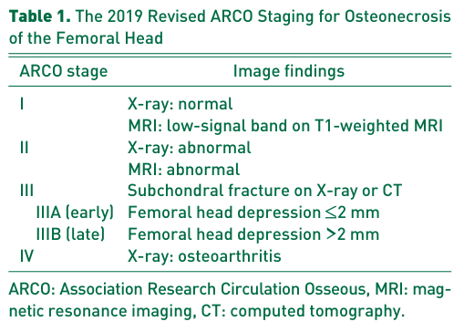

## Question

# Disease Characteristics Research Template

## Target Disease
- **Disease Name:** Osteonecrosis
- **MONDO ID:**  (if available)
- **Category:** Complex

## Research Objectives

Please provide a comprehensive research report on **Osteonecrosis** covering all of the
disease characteristics listed below. This report will be used to populate a disease knowledge
base entry. Be thorough and cite primary literature (PMID preferred) for all claims.

For each section, **suggested databases/resources** are listed. These are the first places
you should search for information on each topic.

---

### 1. Disease Information
> **Search first:** OMIM, Orphanet, ICD-10/ICD-11, MeSH, PubMed

- What is the disease? Provide a concise overview.
- What are the key identifiers? (OMIM, Orphanet, ICD-10/ICD-11, MeSH, Mondo)
- What are the common synonyms and alternative names?
- Is the information derived from individual patients (e.g., EHR) or aggregated disease-level resources?

### 2. Etiology

- **Disease Causal Factors**: What are the primary causes? (genetic, environmental, infectious, mechanistic)
- **Risk Factors**:
  > **Search first:** PubMed, Cochrane Library, UpToDate, clinical guidelines, ClinVar, ClinGen, GWAS Catalog, PheGenI, CTD, CDC, WHO, epidemiological databases
  - Genetic risk factors (causal variants, susceptibility loci, modifier genes)
  - Environmental risk factors (toxins, lifestyle, occupational exposures, age, sex, family history)
- **Protective Factors**:
  > **Search first:** PubMed, Cochrane Library, clinical trial databases, GWAS Catalog, gnomAD, WHO, CDC, nutrition databases
  - Genetic protective factors (protective variants, modifier alleles)
  - Environmental protective factors (diet, lifestyle, exposures that reduce risk)
- **Gene-Environment Interactions**: How do genetic and environmental factors interact to influence disease?
  > **Search first:** CTD, PubMed, PheGenI, GxE databases

### 3. Phenotypes
> **Search first:** HPO (Human Phenotype Ontology), OMIM, Orphanet, PubMed, clinicaltrials.gov, MedDRA, SNOMED CT, DECIPHER, LOINC

For each phenotype, provide:
- **Phenotype type**: symptoms, clinical signs, physical manifestations, behavioral changes, or laboratory abnormalities
  > For symptoms/signs: HPO, OMIM, Orphanet, PubMed
  > For behavioral changes: HPO, DSM, RDoC (Research Domain Criteria), PubMed
  > For laboratory abnormalities: LOINC, SNOMED CT, LabTests Online, PubMed
- **Phenotype characteristics**:
  > **Search first:** OMIM, Orphanet, HPO, PubMed
  - Age of symptom onset (neonatal, childhood, adult-onset, late-onset)
  - Symptom severity (mild, moderate, severe, variable)
  - Symptom progression (stable, progressive, episodic, fluctuating)
  - Frequency among affected individuals (percentage or qualitative)
- **Quality of life impact**: Effects on daily functioning and well-being (per-phenotype when possible)
  > **Search first:** EQ-5D database, SF-36, WHO QOL databases, PubMed
- Suggest HPO (Human Phenotype Ontology) terms for each phenotype

### 4. Genetic/Molecular Information

- **Causal Genes**: Gene mutations or chromosomal abnormalities responsible for disease (gene symbols, OMIM IDs)
  > **Search first:** OMIM, ClinVar, HGMD, Ensembl, NCBI Gene
- **Pathogenic Variants**:
  - Affected genes (gene symbols, HGNC IDs)
    > **Search first:** OMIM, NCBI Gene, Ensembl, HGNC, UniProt, GeneCards
  - Variant classification (pathogenic, likely pathogenic, VUS per ACMG/AMP guidelines)
    > **Search first:** ClinVar, ClinGen, ACMG/AMP guidelines, VarSome
  - Variant type/class (missense, frameshift, nonsense, splice-site, structural)
  - Allele frequency in population databases
    > **Search first:** gnomAD, 1000 Genomes, ExAC, TOPMed, dbSNP
  - Somatic vs germline origin
    > **Search first:** COSMIC (somatic), ClinVar, ICGC, TCGA
  - Functional consequences (loss of function, gain of function, dominant negative)
- **Modifier Genes**: Genes that modify disease severity or expression
- **Epigenetic Information**: DNA methylation, histone modifications, chromatin changes affecting disease
  > **Search first:** ENCODE, Roadmap Epigenomics, MethBase, DiseaseMeth
- **Chromosomal Abnormalities**: Large-scale genetic changes (aneuploidy, translocations, inversions)
  > **Search first:** DECIPHER, ClinVar, ECARUCA, UCSC Genome Browser

### 5. Environmental Information

- **Environmental Factors**: Non-genetic contributing factors (toxins, radiation, pollution, occupational exposure)
  > **Search first:** CTD (Comparative Toxicogenomics Database), TOXNET, PubMed, EPA databases
- **Lifestyle Factors**: Behavioral factors (smoking, diet, exercise, alcohol consumption)
  > **Search first:** CDC databases, WHO, PubMed, NHANES
- **Infectious Agents**: If applicable, pathogens causing or triggering disease (bacteria, viruses, fungi, parasites)
  > **Search first:** NCBI Taxonomy, ViPR, BV-BRC, MicrobeDB, GIDEON

### 6. Mechanism / Pathophysiology

- **Molecular Pathways**: Specific signaling cascades or biochemical pathways involved (Wnt, MAPK, mTOR, PI3K-AKT, etc.)
  > **Search first:** KEGG, Reactome, WikiPathways, PathBank, BioCyc
- **Cellular Processes**: Cell-level mechanisms (apoptosis, autophagy, cell cycle dysregulation, inflammation, etc.)
  > **Search first:** Gene Ontology (GO), Reactome, KEGG, PubMed
- **Protein Dysfunction**: How protein structure or function is altered (misfolding, aggregation, loss of function, gain of function)
  > **Search first:** UniProt, PDB (Protein Data Bank), InterPro, Pfam, AlphaFold
- **Metabolic Changes**: Alterations in metabolic processes (energy metabolism, lipid metabolism, amino acid metabolism)
  > **Search first:** KEGG, BioCyc, HMDB (Human Metabolome Database), BRENDA
- **Immune System Involvement**: Role of immune response (autoimmunity, immunodeficiency, chronic inflammation)
  > **Search first:** ImmPort, Immunome Database, IEDB, Gene Ontology
- **Tissue Damage Mechanisms**: How tissues/ are injured (oxidative stress, ischemia, fibrosis, necrosis)
  > **Search first:** PubMed, Gene Ontology, Reactome
- **Biochemical Abnormalities**: Specific molecular defects (enzyme deficiencies, receptor dysfunction, ion channel defects)
  > **Search first:** BRENDA, UniProt, KEGG, OMIM, PubMed
- **Epigenetic Changes**: DNA methylation, histone modifications affecting gene expression in disease
  > **Search first:** ENCODE, Roadmap Epigenomics, MethBase, DiseaseMeth
- **Molecular Profiling** (if available):
  - Transcriptomics/gene expression changes
    > **Search first:** GEO (Gene Expression Omnibus), ArrayExpress, GTEx, Human Cell Atlas, SRA
  - Proteomics findings
    > **Search first:** PRIDE, ProteomeXchange, Human Protein Atlas, STRING, BioGRID
  - Metabolomics signatures
    > **Search first:** MetaboLights, Metabolomics Workbench, HMDB, METLIN
  - Lipidomics alterations
    > **Search first:** LIPID MAPS, SwissLipids, LipidHome, Metabolomics Workbench
  - Genomic structural features
    > **Search first:** UCSC Genome Browser, Ensembl, NCBI, dbVar, DGV
- **Advanced Technologies** (if applicable):
  - Single-cell analysis findings (cell-type specific mechanisms, cellular heterogeneity)
    > **Search first:** Human Cell Atlas, Single Cell Portal, GEO, CELLxGENE
  - Spatial transcriptomics findings
    > **Search first:** GEO, Spatial Research, Vizgen, 10x Genomics data
  - Multi-omics integration results
    > **Search first:** TCGA, ICGC, cBioPortal, LinkedOmics, PubMed
  - Functional genomics screens (CRISPR, RNAi)
    > **Search first:** DepMap, GenomeRNAi, PubMed, BioGRID ORCS

For each mechanism, describe:
- The causal chain from initial trigger to clinical manifestation
- Which mechanisms are upstream vs downstream
- What cell types and biological processes are involved
- Suggest GO terms for biological processes and CL terms for cell types

### 7. Anatomical Structures Affected

- **Organ Level**:
  - Primary organs directly affected
  - Secondary organ involvement (complications, secondary effects)
  - Body systems involved (cardiovascular, nervous, digestive, respiratory, endocrine, etc.)
  > **Search first:** Uberon, FMA (Foundational Model of Anatomy), OMIM, HPO, ICD-11, MeSH, SNOMED CT
- **Tissue and Cell Level**:
  - Specific tissue types affected (epithelial, connective, muscle, nervous)
  - Specific cell populations targeted (with Cell Ontology terms)
  > **Search first:** Uberon, Human Protein Atlas, Cell Ontology, Human Cell Atlas, CellMarker, PanglaoDB
- **Subcellular Level**:
  - Cellular compartments involved (mitochondria, nucleus, ER, lysosomes) (with GO Cellular Component terms)
  > **Search first:** Gene Ontology (Cellular Component), UniProt, Human Protein Atlas
- **Localization**:
  - Specific anatomical sites (with UBERON terms)
    > **Search first:** FMA, Uberon, NeuroNames (for brain), SNOMED CT
  - Lateralization (unilateral, bilateral, asymmetric)
    > **Search first:** HPO, clinical literature, imaging databases

### 8. Temporal Development

- **Onset**:
  - Typical age of onset (congenital, pediatric, adult, geriatric)
  - Onset pattern (acute, subacute, chronic, insidious)
  > **Search first:** OMIM, Orphanet, HPO, PubMed
- **Progression**:
  - Disease stages (early, intermediate, advanced, end-stage)
    > **Search first:** Cancer Staging Manual (AJCC), WHO classifications, PubMed
  - Progression rate (rapid, slow, variable)
  - Disease course pattern (episodic, relapsing-remitting, progressive, stable)
  - Disease duration (self-limited, chronic lifelong)
  > **Search first:** Disease registries, longitudinal cohort databases, natural history studies, PubMed, Orphanet, OMIM
- **Patterns**:
  - Remission patterns (spontaneous, treatment-induced)
    > **Search first:** Clinical trial databases, disease registries, PubMed
  - Critical periods (time windows of vulnerability or opportunity for intervention)
    > **Search first:** PubMed, developmental biology databases, clinical guidelines

### 9. Inheritance and Population

- **Epidemiology**:
  - Prevalence (cases per 100,000 at given time)
  - Incidence (new cases per 100,000 per year)
  > **Search first:** Orphanet, CDC, WHO, GBD (Global Burden of Disease), national registries, SEER, disease registries
- **For Genetic Etiology**:
  - Inheritance pattern (AD, AR, X-linked, mitochondrial, multifactorial, polygenic)
    > **Search first:** OMIM, Orphanet, ClinVar, GTR (Genetic Testing Registry)
  - Penetrance (complete, incomplete, age-dependent)
    > **Search first:** ClinVar, OMIM, PubMed, ClinGen
  - Expressivity (variable, consistent)
    > **Search first:** OMIM, ClinVar, PubMed
  - Genetic anticipation (increasing severity in successive generations)
    > **Search first:** OMIM, PubMed (especially for repeat expansion disorders)
  - Germline mosaicism
    > **Search first:** ClinVar, OMIM, genetic counseling literature, PubMed
  - Founder effects (population-specific mutations)
    > **Search first:** gnomAD, population genetics databases, PubMed
  - Consanguinity role
    > **Search first:** OMIM, population studies, genetic counseling resources
  - Carrier frequency
    > **Search first:** gnomAD, carrier screening databases, GeneReviews, GTR
- **Population Demographics**:
  - Affected populations (ethnic or demographic groups with higher prevalence)
    > **Search first:** gnomAD, 1000 Genomes, PAGE Study, PubMed, population registries
  - Geographic distribution (endemic areas, regional variation)
    > **Search first:** WHO, CDC, GBD, Orphanet, geographic epidemiology databases
  - Geographic distribution of specific variants
  - Sex ratio (male:female)
    > **Search first:** Disease registries, OMIM, PubMed, epidemiological databases
  - Age distribution of affected individuals
    > **Search first:** CDC, disease registries, SEER, Orphanet

### 10. Diagnostics

- **Clinical Tests**:
  - Laboratory tests (blood, urine, tissue chemistry, specific enzyme assays)
    > **Search first:** LOINC, LabTests Online, PubMed
  - Biomarkers (proteins, metabolites, genetic markers, circulating biomarkers)
    > **Search first:** FDA Biomarker List, BEST (Biomarkers, EndpointS, and other Tools), PubMed
  - Imaging studies (X-ray, CT, MRI, PET, ultrasound)
    > **Search first:** RadLex, DICOM, Radiopaedia, imaging databases
  - Functional tests (pulmonary function, cardiac stress tests)
    > **Search first:** LOINC, clinical guidelines, PubMed
  - Electrophysiology (EEG, EMG, ECG, nerve conduction studies)
    > **Search first:** LOINC, clinical neurophysiology databases, PubMed
  - Biopsy findings (histopathology, immunohistochemistry)
    > **Search first:** SNOMED CT, College of American Pathologists resources, PubMed
  - Pathology findings (microscopic examination)
    > **Search first:** SNOMED CT, Digital Pathology databases, PubMed
- **Genetic Testing**:
  > **Search first:** GTR (Genetic Testing Registry), GeneReviews, ClinGen
  - Overview of recommended genetic testing approach
  - Whole genome sequencing (WGS) utility
    > **Search first:** GTR, ClinVar, GEL (Genomics England), gnomAD
  - Whole exome sequencing (WES) utility
    > **Search first:** GTR, ClinVar, OMIM, GeneMatcher
  - Gene panels (which panels, which genes)
    > **Search first:** GTR, ClinVar, laboratory-specific databases
  - Single gene testing
    > **Search first:** GTR, ClinVar, OMIM, GeneReviews
  - Chromosomal microarray (CMA)
    > **Search first:** DECIPHER, ClinVar, dbVar, ECARUCA
  - Karyotyping
    > **Search first:** Chromosome Abnormality Database, ClinVar, cytogenetics resources
  - FISH
    > **Search first:** ClinVar, cytogenetics databases, PubMed
  - Mitochondrial DNA testing
    > **Search first:** MITOMAP, MSeqDR, ClinVar, GTR
  - Repeat expansion testing
    > **Search first:** GTR, ClinVar, repeat expansion databases, PubMed
- **Omics-Based Diagnostics** (if applicable):
  - RNA sequencing / transcriptomics
    > **Search first:** GEO, ArrayExpress, GTEx, RNA-seq databases
  - Proteomics
    > **Search first:** PRIDE, ProteomeXchange, FDA Biomarker database
  - Metabolomics
    > **Search first:** MetaboLights, Metabolomics Workbench, HMDB
  - Epigenomics
    > **Search first:** GEO, ENCODE, Roadmap Epigenomics, MethBase
  - Liquid biopsy
    > **Search first:** COSMIC, ClinVar, liquid biopsy databases, PubMed
- **Clinical Criteria**:
  - Standardized diagnostic criteria (DSM, ICD, society guidelines)
    > **Search first:** DSM-5, ICD-11, clinical society guidelines, UpToDate
  - Differential diagnosis (other conditions to rule out, with distinguishing features)
    > **Search first:** DynaMed, UpToDate, clinical decision support systems
- **Screening**:
  - Screening methods for asymptomatic individuals (newborn screening, carrier screening, cascade screening)
    > **Search first:** ACMG recommendations, CDC newborn screening, GTR

### 11. Outcome/Prognosis

- **Survival and Mortality**:
  - Survival rate (5-year, 10-year, overall)
    > **Search first:** SEER, cancer registries, disease-specific registries, PubMed
  - Life expectancy (with and without treatment if applicable)
    > **Search first:** Orphanet, disease registries, actuarial databases, PubMed
  - Mortality rate
    > **Search first:** CDC, WHO, GBD, national mortality databases
  - Disease-specific mortality (deaths directly attributable to disease)
    > **Search first:** Disease registries, CDC Wonder, GBD, PubMed
- **Morbidity and Function**:
  - Morbidity (disease-related disability and health impacts)
    > **Search first:** GBD, WHO, disability databases, PubMed
  - Disability outcomes (long-term functional impairments)
    > **Search first:** ICF (International Classification of Functioning), disability registries
  - Quality of life measures (EQ-5D, SF-36, PROMIS, disease-specific tools)
    > **Search first:** EQ-5D database, SF-36, PROMIS, PubMed
- **Disease Course**:
  - Complications (secondary problems: infections, organ failure, etc.)
    > **Search first:** ICD codes, disease registries, clinical databases, PubMed
  - Recovery potential (likelihood and extent of recovery, with vs without treatment)
    > **Search first:** Natural history studies, rehabilitation databases, PubMed
- **Prediction**:
  - Prognostic factors (age, disease severity, biomarkers, treatment response)
    > **Search first:** Prognostic models databases, clinical calculators, PubMed
  - Prognostic biomarkers (molecular markers predicting disease course)
    > **Search first:** FDA Biomarker database, PubMed, cancer prognostic databases

### 12. Treatment

- **Pharmacotherapy**:
  - Pharmacological treatments (drug names, drug classes, mechanisms of action)
    > **Search first:** DrugBank, RxNorm, ATC classification, DailyMed, FDA databases
  - Pharmacogenomics (how genetic variants affect drug metabolism, efficacy, toxicity)
    > **Search first:** PharmGKB, CPIC (Clinical Pharmacogenetics), FDA Table of PGx Biomarkers
- **Advanced Therapeutics**:
  - Gene therapy (viral vectors, CRISPR, gene replacement, gene editing)
    > **Search first:** ClinicalTrials.gov, FDA gene therapy database, ASGCT resources
  - Cell therapy (stem cell transplant, CAR-T, cellular therapeutics)
    > **Search first:** ClinicalTrials.gov, FDA cell therapy database, FACT standards
  - RNA-based therapies (ASOs, siRNA, mRNA therapies)
    > **Search first:** ClinicalTrials.gov, FDA approvals, PubMed
  - Targeted therapies (treatments directed at specific molecular targets)
    > **Search first:** My Cancer Genome, OncoKB, ClinicalTrials.gov, FDA approvals
  - Immunotherapies (checkpoint inhibitors, monoclonal antibodies)
    > **Search first:** Cancer Immunotherapy Database, FDA approvals, ClinicalTrials.gov
- **Surgical and Interventional**:
  - Surgical interventions (types of surgery, timing, outcomes)
    > **Search first:** CPT codes, surgical registries, clinical guidelines, PubMed
- **Supportive and Rehabilitative**:
  - Supportive care (symptom management, pain control, nutrition)
    > **Search first:** Clinical guidelines, Cochrane Library, PubMed
  - Rehabilitation (physical therapy, occupational therapy, speech therapy)
    > **Search first:** Rehabilitation medicine databases, clinical guidelines, PubMed
- **Experimental**:
  - Experimental treatments in clinical trials (with NCT identifiers if available)
    > **Search first:** ClinicalTrials.gov, EU Clinical Trials Register, WHO ICTRP
- **Treatment Outcomes**:
  - Treatment response rates
    > **Search first:** Clinical trial databases, FDA reviews, systematic reviews, PubMed
  - Side effects and adverse events
    > **Search first:** FDA Adverse Event Reporting System (FAERS), MedWatch, PubMed
- **Treatment Strategy**:
  - Treatment algorithms (clinical pathways, decision trees)
    > **Search first:** Clinical practice guidelines, NCCN Guidelines, UpToDate
  - Combination therapies
    > **Search first:** ClinicalTrials.gov, treatment guidelines, PubMed
  - Personalized medicine approaches (genotype-guided treatment)
    > **Search first:** My Cancer Genome, CIViC, PharmGKB, precision medicine databases

For each treatment, suggest MAXO (Medical Action Ontology) terms where applicable.

### 13. Prevention

- **Prevention Levels**:
  - Primary prevention (preventing disease occurrence: vaccination, risk factor modification)
    > **Search first:** CDC, WHO, USPSTF recommendations, Cochrane Library
  - Secondary prevention (early detection and treatment: screening programs, early intervention)
    > **Search first:** USPSTF, CDC screening guidelines, WHO
  - Tertiary prevention (preventing complications in those with disease)
    > **Search first:** Clinical guidelines, disease management protocols, PubMed
- **Immunization**: Vaccine strategies (if applicable)
  > **Search first:** CDC vaccine schedules, WHO immunization, FDA vaccine database
- **Screening and Early Detection**:
  - Screening programs (population-based: newborn screening, cancer screening)
    > **Search first:** CDC screening programs, USPSTF, cancer screening databases
  - Genetic screening (carrier screening, preimplantation genetic diagnosis, prenatal testing)
    > **Search first:** ACMG recommendations, ACOG guidelines, GTR
  - Risk stratification (identifying high-risk individuals for targeted prevention)
    > **Search first:** Risk prediction models, clinical calculators, PubMed
- **Behavioral Interventions**: Lifestyle modifications to reduce risk
  > **Search first:** CDC, WHO, behavioral intervention databases, Cochrane Library
- **Counseling**: Genetic counseling (risk assessment, family planning guidance)
  > **Search first:** NSGC resources, ACMG guidelines, GeneReviews
- **Public Health**:
  - Public health interventions (sanitation, vector control, health education)
    > **Search first:** CDC, WHO, public health databases, PubMed
  - Environmental interventions (reducing environmental risk factors)
    > **Search first:** EPA databases, WHO environmental health, PubMed
- **Prophylaxis**: Preventive medications or procedures
  > **Search first:** Clinical guidelines, FDA approvals, PubMed

### 14. Other Species / Natural Disease

- **Taxonomy**: Species affected (with NCBI Taxon identifiers)
  > **Search first:** NCBI Taxonomy
- **Breed**: Specific breeds affected (with VBO identifiers if applicable)
  > **Search first:** VBO (Vertebrate Breed Ontology)
- **Gene**: Orthologous genes in other species (with NCBI Gene IDs)
  > **Search first:** NCBI Gene
- **Natural Disease**:
  - Naturally occurring disease in other species (companion animals, wildlife)
    > **Search first:** OMIA (Online Mendelian Inheritance in Animals), VetCompass, PubMed
  - Veterinary relevance and importance in animal health
    > **Search first:** OMIA, veterinary databases, PubMed
- **Comparative Biology**:
  - Comparative pathology (similarities and differences across species)
    > **Search first:** OMIA, comparative pathology databases, PubMed
  - Evolutionary conservation of disease mechanisms
    > **Search first:** HomoloGene, OrthoMCL, Alliance of Genome Resources
- **Transmission** (if applicable):
  - Zoonotic potential
    > **Search first:** CDC zoonotic diseases, WHO zoonoses, GIDEON
  - Cross-species susceptibility
    > **Search first:** NCBI Taxonomy, veterinary databases, PubMed

### 15. Model Organisms

- **Model Types**:
  - Model organism type (mammalian, invertebrate, cellular, in vitro)
    > **Search first:** Alliance of Genome Resources, model organism databases
  - Specific model systems (mouse, rat, zebrafish, Drosophila, C. elegans, yeast, cell lines, organoids, iPSCs)
    > **Search first:** MGI, RGD, ZFIN, FlyBase, WormBase, SGD, ATCC, Cellosaurus
  - Induced models (drug treatment, surgical intervention, environmental manipulation)
    > **Search first:** MGI, model organism databases, PubMed
- **Genetic Models**:
  - Types available (knockout, knock-in, transgenic, conditional, humanized)
    > **Search first:** MGI, IMPC, KOMP, EuMMCR, IMSR
- **Model Characteristics**:
  - Phenotype recapitulation (how well model reproduces human disease features)
    > **Search first:** Model organism databases, comparative studies, PubMed
  - Model limitations (aspects of human disease not captured)
    > **Search first:** Model organism databases, PubMed, review articles
- **Applications**:
  - Research applications (what aspects of disease can be studied)
    > **Search first:** Model organism databases, PubMed
- **Resources**:
  - Model databases
    > **Search first:** MGI, RGD, ZFIN, FlyBase, WormBase, IMSR, EMMA, MMRRC

---

## Citation Requirements

- Cite primary literature (PMID preferred) for all mechanistic and clinical claims
- Prioritize recent reviews and landmark papers
- Include direct quotes from abstracts where possible to support key statements
- Distinguish evidence source types: human clinical, model organism, in vitro, computational

## Output Format

Structure your response as a comprehensive narrative organized by the sections above.
For each section, provide:
- Factual content with specific details (numbers, percentages, gene names, variant nomenclature)
- Ontology term suggestions (HPO, GO, CL, UBERON, CHEBI, MAXO, MONDO) where applicable
- Evidence citations with PMIDs
- Direct quotes from abstracts to support key claims
- Clear indication when information is not available or not applicable for this disease

This report will be used to populate a disease knowledge base entry with:
- Pathophysiology descriptions with causal chains
- Gene/protein annotations (HGNC, GO terms)
- Phenotype associations (HP terms) with frequencies
- Cell type involvement (CL terms)
- Anatomical locations (UBERON terms)
- Chemical entities (CHEBI terms)
- Treatment annotations (MAXO terms)
- Evidence items with PMIDs and exact abstract quotes
- Epidemiology, prognosis, diagnostic, and prevention information
- Animal model descriptions with phenotype recapitulation details

## Output

Question: You are an expert researcher providing comprehensive, well-cited information.

Provide detailed information focusing on:
1. Key concepts and definitions with current understanding
2. Recent developments and latest research (prioritize 2023-2024 sources)
3. Current applications and real-world implementations
4. Expert opinions and analysis from authoritative sources
5. Relevant statistics and data from recent studies

Format as a comprehensive research report with proper citations. Include URLs and publication dates where available.
Always prioritize recent, authoritative sources and provide specific citations for all major claims.

# Disease Characteristics Research Template

## Target Disease
- **Disease Name:** Osteonecrosis
- **MONDO ID:**  (if available)
- **Category:** Complex

## Research Objectives

Please provide a comprehensive research report on **Osteonecrosis** covering all of the
disease characteristics listed below. This report will be used to populate a disease knowledge
base entry. Be thorough and cite primary literature (PMID preferred) for all claims.

For each section, **suggested databases/resources** are listed. These are the first places
you should search for information on each topic.

---

### 1. Disease Information
> **Search first:** OMIM, Orphanet, ICD-10/ICD-11, MeSH, PubMed

- What is the disease? Provide a concise overview.
- What are the key identifiers? (OMIM, Orphanet, ICD-10/ICD-11, MeSH, Mondo)
- What are the common synonyms and alternative names?
- Is the information derived from individual patients (e.g., EHR) or aggregated disease-level resources?

### 2. Etiology

- **Disease Causal Factors**: What are the primary causes? (genetic, environmental, infectious, mechanistic)
- **Risk Factors**:
  > **Search first:** PubMed, Cochrane Library, UpToDate, clinical guidelines, ClinVar, ClinGen, GWAS Catalog, PheGenI, CTD, CDC, WHO, epidemiological databases
  - Genetic risk factors (causal variants, susceptibility loci, modifier genes)
  - Environmental risk factors (toxins, lifestyle, occupational exposures, age, sex, family history)
- **Protective Factors**:
  > **Search first:** PubMed, Cochrane Library, clinical trial databases, GWAS Catalog, gnomAD, WHO, CDC, nutrition databases
  - Genetic protective factors (protective variants, modifier alleles)
  - Environmental protective factors (diet, lifestyle, exposures that reduce risk)
- **Gene-Environment Interactions**: How do genetic and environmental factors interact to influence disease?
  > **Search first:** CTD, PubMed, PheGenI, GxE databases

### 3. Phenotypes
> **Search first:** HPO (Human Phenotype Ontology), OMIM, Orphanet, PubMed, clinicaltrials.gov, MedDRA, SNOMED CT, DECIPHER, LOINC

For each phenotype, provide:
- **Phenotype type**: symptoms, clinical signs, physical manifestations, behavioral changes, or laboratory abnormalities
  > For symptoms/signs: HPO, OMIM, Orphanet, PubMed
  > For behavioral changes: HPO, DSM, RDoC (Research Domain Criteria), PubMed
  > For laboratory abnormalities: LOINC, SNOMED CT, LabTests Online, PubMed
- **Phenotype characteristics**:
  > **Search first:** OMIM, Orphanet, HPO, PubMed
  - Age of symptom onset (neonatal, childhood, adult-onset, late-onset)
  - Symptom severity (mild, moderate, severe, variable)
  - Symptom progression (stable, progressive, episodic, fluctuating)
  - Frequency among affected individuals (percentage or qualitative)
- **Quality of life impact**: Effects on daily functioning and well-being (per-phenotype when possible)
  > **Search first:** EQ-5D database, SF-36, WHO QOL databases, PubMed
- Suggest HPO (Human Phenotype Ontology) terms for each phenotype

### 4. Genetic/Molecular Information

- **Causal Genes**: Gene mutations or chromosomal abnormalities responsible for disease (gene symbols, OMIM IDs)
  > **Search first:** OMIM, ClinVar, HGMD, Ensembl, NCBI Gene
- **Pathogenic Variants**:
  - Affected genes (gene symbols, HGNC IDs)
    > **Search first:** OMIM, NCBI Gene, Ensembl, HGNC, UniProt, GeneCards
  - Variant classification (pathogenic, likely pathogenic, VUS per ACMG/AMP guidelines)
    > **Search first:** ClinVar, ClinGen, ACMG/AMP guidelines, VarSome
  - Variant type/class (missense, frameshift, nonsense, splice-site, structural)
  - Allele frequency in population databases
    > **Search first:** gnomAD, 1000 Genomes, ExAC, TOPMed, dbSNP
  - Somatic vs germline origin
    > **Search first:** COSMIC (somatic), ClinVar, ICGC, TCGA
  - Functional consequences (loss of function, gain of function, dominant negative)
- **Modifier Genes**: Genes that modify disease severity or expression
- **Epigenetic Information**: DNA methylation, histone modifications, chromatin changes affecting disease
  > **Search first:** ENCODE, Roadmap Epigenomics, MethBase, DiseaseMeth
- **Chromosomal Abnormalities**: Large-scale genetic changes (aneuploidy, translocations, inversions)
  > **Search first:** DECIPHER, ClinVar, ECARUCA, UCSC Genome Browser

### 5. Environmental Information

- **Environmental Factors**: Non-genetic contributing factors (toxins, radiation, pollution, occupational exposure)
  > **Search first:** CTD (Comparative Toxicogenomics Database), TOXNET, PubMed, EPA databases
- **Lifestyle Factors**: Behavioral factors (smoking, diet, exercise, alcohol consumption)
  > **Search first:** CDC databases, WHO, PubMed, NHANES
- **Infectious Agents**: If applicable, pathogens causing or triggering disease (bacteria, viruses, fungi, parasites)
  > **Search first:** NCBI Taxonomy, ViPR, BV-BRC, MicrobeDB, GIDEON

### 6. Mechanism / Pathophysiology

- **Molecular Pathways**: Specific signaling cascades or biochemical pathways involved (Wnt, MAPK, mTOR, PI3K-AKT, etc.)
  > **Search first:** KEGG, Reactome, WikiPathways, PathBank, BioCyc
- **Cellular Processes**: Cell-level mechanisms (apoptosis, autophagy, cell cycle dysregulation, inflammation, etc.)
  > **Search first:** Gene Ontology (GO), Reactome, KEGG, PubMed
- **Protein Dysfunction**: How protein structure or function is altered (misfolding, aggregation, loss of function, gain of function)
  > **Search first:** UniProt, PDB (Protein Data Bank), InterPro, Pfam, AlphaFold
- **Metabolic Changes**: Alterations in metabolic processes (energy metabolism, lipid metabolism, amino acid metabolism)
  > **Search first:** KEGG, BioCyc, HMDB (Human Metabolome Database), BRENDA
- **Immune System Involvement**: Role of immune response (autoimmunity, immunodeficiency, chronic inflammation)
  > **Search first:** ImmPort, Immunome Database, IEDB, Gene Ontology
- **Tissue Damage Mechanisms**: How tissues/ are injured (oxidative stress, ischemia, fibrosis, necrosis)
  > **Search first:** PubMed, Gene Ontology, Reactome
- **Biochemical Abnormalities**: Specific molecular defects (enzyme deficiencies, receptor dysfunction, ion channel defects)
  > **Search first:** BRENDA, UniProt, KEGG, OMIM, PubMed
- **Epigenetic Changes**: DNA methylation, histone modifications affecting gene expression in disease
  > **Search first:** ENCODE, Roadmap Epigenomics, MethBase, DiseaseMeth
- **Molecular Profiling** (if available):
  - Transcriptomics/gene expression changes
    > **Search first:** GEO (Gene Expression Omnibus), ArrayExpress, GTEx, Human Cell Atlas, SRA
  - Proteomics findings
    > **Search first:** PRIDE, ProteomeXchange, Human Protein Atlas, STRING, BioGRID
  - Metabolomics signatures
    > **Search first:** MetaboLights, Metabolomics Workbench, HMDB, METLIN
  - Lipidomics alterations
    > **Search first:** LIPID MAPS, SwissLipids, LipidHome, Metabolomics Workbench
  - Genomic structural features
    > **Search first:** UCSC Genome Browser, Ensembl, NCBI, dbVar, DGV
- **Advanced Technologies** (if applicable):
  - Single-cell analysis findings (cell-type specific mechanisms, cellular heterogeneity)
    > **Search first:** Human Cell Atlas, Single Cell Portal, GEO, CELLxGENE
  - Spatial transcriptomics findings
    > **Search first:** GEO, Spatial Research, Vizgen, 10x Genomics data
  - Multi-omics integration results
    > **Search first:** TCGA, ICGC, cBioPortal, LinkedOmics, PubMed
  - Functional genomics screens (CRISPR, RNAi)
    > **Search first:** DepMap, GenomeRNAi, PubMed, BioGRID ORCS

For each mechanism, describe:
- The causal chain from initial trigger to clinical manifestation
- Which mechanisms are upstream vs downstream
- What cell types and biological processes are involved
- Suggest GO terms for biological processes and CL terms for cell types

### 7. Anatomical Structures Affected

- **Organ Level**:
  - Primary organs directly affected
  - Secondary organ involvement (complications, secondary effects)
  - Body systems involved (cardiovascular, nervous, digestive, respiratory, endocrine, etc.)
  > **Search first:** Uberon, FMA (Foundational Model of Anatomy), OMIM, HPO, ICD-11, MeSH, SNOMED CT
- **Tissue and Cell Level**:
  - Specific tissue types affected (epithelial, connective, muscle, nervous)
  - Specific cell populations targeted (with Cell Ontology terms)
  > **Search first:** Uberon, Human Protein Atlas, Cell Ontology, Human Cell Atlas, CellMarker, PanglaoDB
- **Subcellular Level**:
  - Cellular compartments involved (mitochondria, nucleus, ER, lysosomes) (with GO Cellular Component terms)
  > **Search first:** Gene Ontology (Cellular Component), UniProt, Human Protein Atlas
- **Localization**:
  - Specific anatomical sites (with UBERON terms)
    > **Search first:** FMA, Uberon, NeuroNames (for brain), SNOMED CT
  - Lateralization (unilateral, bilateral, asymmetric)
    > **Search first:** HPO, clinical literature, imaging databases

### 8. Temporal Development

- **Onset**:
  - Typical age of onset (congenital, pediatric, adult, geriatric)
  - Onset pattern (acute, subacute, chronic, insidious)
  > **Search first:** OMIM, Orphanet, HPO, PubMed
- **Progression**:
  - Disease stages (early, intermediate, advanced, end-stage)
    > **Search first:** Cancer Staging Manual (AJCC), WHO classifications, PubMed
  - Progression rate (rapid, slow, variable)
  - Disease course pattern (episodic, relapsing-remitting, progressive, stable)
  - Disease duration (self-limited, chronic lifelong)
  > **Search first:** Disease registries, longitudinal cohort databases, natural history studies, PubMed, Orphanet, OMIM
- **Patterns**:
  - Remission patterns (spontaneous, treatment-induced)
    > **Search first:** Clinical trial databases, disease registries, PubMed
  - Critical periods (time windows of vulnerability or opportunity for intervention)
    > **Search first:** PubMed, developmental biology databases, clinical guidelines

### 9. Inheritance and Population

- **Epidemiology**:
  - Prevalence (cases per 100,000 at given time)
  - Incidence (new cases per 100,000 per year)
  > **Search first:** Orphanet, CDC, WHO, GBD (Global Burden of Disease), national registries, SEER, disease registries
- **For Genetic Etiology**:
  - Inheritance pattern (AD, AR, X-linked, mitochondrial, multifactorial, polygenic)
    > **Search first:** OMIM, Orphanet, ClinVar, GTR (Genetic Testing Registry)
  - Penetrance (complete, incomplete, age-dependent)
    > **Search first:** ClinVar, OMIM, PubMed, ClinGen
  - Expressivity (variable, consistent)
    > **Search first:** OMIM, ClinVar, PubMed
  - Genetic anticipation (increasing severity in successive generations)
    > **Search first:** OMIM, PubMed (especially for repeat expansion disorders)
  - Germline mosaicism
    > **Search first:** ClinVar, OMIM, genetic counseling literature, PubMed
  - Founder effects (population-specific mutations)
    > **Search first:** gnomAD, population genetics databases, PubMed
  - Consanguinity role
    > **Search first:** OMIM, population studies, genetic counseling resources
  - Carrier frequency
    > **Search first:** gnomAD, carrier screening databases, GeneReviews, GTR
- **Population Demographics**:
  - Affected populations (ethnic or demographic groups with higher prevalence)
    > **Search first:** gnomAD, 1000 Genomes, PAGE Study, PubMed, population registries
  - Geographic distribution (endemic areas, regional variation)
    > **Search first:** WHO, CDC, GBD, Orphanet, geographic epidemiology databases
  - Geographic distribution of specific variants
  - Sex ratio (male:female)
    > **Search first:** Disease registries, OMIM, PubMed, epidemiological databases
  - Age distribution of affected individuals
    > **Search first:** CDC, disease registries, SEER, Orphanet

### 10. Diagnostics

- **Clinical Tests**:
  - Laboratory tests (blood, urine, tissue chemistry, specific enzyme assays)
    > **Search first:** LOINC, LabTests Online, PubMed
  - Biomarkers (proteins, metabolites, genetic markers, circulating biomarkers)
    > **Search first:** FDA Biomarker List, BEST (Biomarkers, EndpointS, and other Tools), PubMed
  - Imaging studies (X-ray, CT, MRI, PET, ultrasound)
    > **Search first:** RadLex, DICOM, Radiopaedia, imaging databases
  - Functional tests (pulmonary function, cardiac stress tests)
    > **Search first:** LOINC, clinical guidelines, PubMed
  - Electrophysiology (EEG, EMG, ECG, nerve conduction studies)
    > **Search first:** LOINC, clinical neurophysiology databases, PubMed
  - Biopsy findings (histopathology, immunohistochemistry)
    > **Search first:** SNOMED CT, College of American Pathologists resources, PubMed
  - Pathology findings (microscopic examination)
    > **Search first:** SNOMED CT, Digital Pathology databases, PubMed
- **Genetic Testing**:
  > **Search first:** GTR (Genetic Testing Registry), GeneReviews, ClinGen
  - Overview of recommended genetic testing approach
  - Whole genome sequencing (WGS) utility
    > **Search first:** GTR, ClinVar, GEL (Genomics England), gnomAD
  - Whole exome sequencing (WES) utility
    > **Search first:** GTR, ClinVar, OMIM, GeneMatcher
  - Gene panels (which panels, which genes)
    > **Search first:** GTR, ClinVar, laboratory-specific databases
  - Single gene testing
    > **Search first:** GTR, ClinVar, OMIM, GeneReviews
  - Chromosomal microarray (CMA)
    > **Search first:** DECIPHER, ClinVar, dbVar, ECARUCA
  - Karyotyping
    > **Search first:** Chromosome Abnormality Database, ClinVar, cytogenetics resources
  - FISH
    > **Search first:** ClinVar, cytogenetics databases, PubMed
  - Mitochondrial DNA testing
    > **Search first:** MITOMAP, MSeqDR, ClinVar, GTR
  - Repeat expansion testing
    > **Search first:** GTR, ClinVar, repeat expansion databases, PubMed
- **Omics-Based Diagnostics** (if applicable):
  - RNA sequencing / transcriptomics
    > **Search first:** GEO, ArrayExpress, GTEx, RNA-seq databases
  - Proteomics
    > **Search first:** PRIDE, ProteomeXchange, FDA Biomarker database
  - Metabolomics
    > **Search first:** MetaboLights, Metabolomics Workbench, HMDB
  - Epigenomics
    > **Search first:** GEO, ENCODE, Roadmap Epigenomics, MethBase
  - Liquid biopsy
    > **Search first:** COSMIC, ClinVar, liquid biopsy databases, PubMed
- **Clinical Criteria**:
  - Standardized diagnostic criteria (DSM, ICD, society guidelines)
    > **Search first:** DSM-5, ICD-11, clinical society guidelines, UpToDate
  - Differential diagnosis (other conditions to rule out, with distinguishing features)
    > **Search first:** DynaMed, UpToDate, clinical decision support systems
- **Screening**:
  - Screening methods for asymptomatic individuals (newborn screening, carrier screening, cascade screening)
    > **Search first:** ACMG recommendations, CDC newborn screening, GTR

### 11. Outcome/Prognosis

- **Survival and Mortality**:
  - Survival rate (5-year, 10-year, overall)
    > **Search first:** SEER, cancer registries, disease-specific registries, PubMed
  - Life expectancy (with and without treatment if applicable)
    > **Search first:** Orphanet, disease registries, actuarial databases, PubMed
  - Mortality rate
    > **Search first:** CDC, WHO, GBD, national mortality databases
  - Disease-specific mortality (deaths directly attributable to disease)
    > **Search first:** Disease registries, CDC Wonder, GBD, PubMed
- **Morbidity and Function**:
  - Morbidity (disease-related disability and health impacts)
    > **Search first:** GBD, WHO, disability databases, PubMed
  - Disability outcomes (long-term functional impairments)
    > **Search first:** ICF (International Classification of Functioning), disability registries
  - Quality of life measures (EQ-5D, SF-36, PROMIS, disease-specific tools)
    > **Search first:** EQ-5D database, SF-36, PROMIS, PubMed
- **Disease Course**:
  - Complications (secondary problems: infections, organ failure, etc.)
    > **Search first:** ICD codes, disease registries, clinical databases, PubMed
  - Recovery potential (likelihood and extent of recovery, with vs without treatment)
    > **Search first:** Natural history studies, rehabilitation databases, PubMed
- **Prediction**:
  - Prognostic factors (age, disease severity, biomarkers, treatment response)
    > **Search first:** Prognostic models databases, clinical calculators, PubMed
  - Prognostic biomarkers (molecular markers predicting disease course)
    > **Search first:** FDA Biomarker database, PubMed, cancer prognostic databases

### 12. Treatment

- **Pharmacotherapy**:
  - Pharmacological treatments (drug names, drug classes, mechanisms of action)
    > **Search first:** DrugBank, RxNorm, ATC classification, DailyMed, FDA databases
  - Pharmacogenomics (how genetic variants affect drug metabolism, efficacy, toxicity)
    > **Search first:** PharmGKB, CPIC (Clinical Pharmacogenetics), FDA Table of PGx Biomarkers
- **Advanced Therapeutics**:
  - Gene therapy (viral vectors, CRISPR, gene replacement, gene editing)
    > **Search first:** ClinicalTrials.gov, FDA gene therapy database, ASGCT resources
  - Cell therapy (stem cell transplant, CAR-T, cellular therapeutics)
    > **Search first:** ClinicalTrials.gov, FDA cell therapy database, FACT standards
  - RNA-based therapies (ASOs, siRNA, mRNA therapies)
    > **Search first:** ClinicalTrials.gov, FDA approvals, PubMed
  - Targeted therapies (treatments directed at specific molecular targets)
    > **Search first:** My Cancer Genome, OncoKB, ClinicalTrials.gov, FDA approvals
  - Immunotherapies (checkpoint inhibitors, monoclonal antibodies)
    > **Search first:** Cancer Immunotherapy Database, FDA approvals, ClinicalTrials.gov
- **Surgical and Interventional**:
  - Surgical interventions (types of surgery, timing, outcomes)
    > **Search first:** CPT codes, surgical registries, clinical guidelines, PubMed
- **Supportive and Rehabilitative**:
  - Supportive care (symptom management, pain control, nutrition)
    > **Search first:** Clinical guidelines, Cochrane Library, PubMed
  - Rehabilitation (physical therapy, occupational therapy, speech therapy)
    > **Search first:** Rehabilitation medicine databases, clinical guidelines, PubMed
- **Experimental**:
  - Experimental treatments in clinical trials (with NCT identifiers if available)
    > **Search first:** ClinicalTrials.gov, EU Clinical Trials Register, WHO ICTRP
- **Treatment Outcomes**:
  - Treatment response rates
    > **Search first:** Clinical trial databases, FDA reviews, systematic reviews, PubMed
  - Side effects and adverse events
    > **Search first:** FDA Adverse Event Reporting System (FAERS), MedWatch, PubMed
- **Treatment Strategy**:
  - Treatment algorithms (clinical pathways, decision trees)
    > **Search first:** Clinical practice guidelines, NCCN Guidelines, UpToDate
  - Combination therapies
    > **Search first:** ClinicalTrials.gov, treatment guidelines, PubMed
  - Personalized medicine approaches (genotype-guided treatment)
    > **Search first:** My Cancer Genome, CIViC, PharmGKB, precision medicine databases

For each treatment, suggest MAXO (Medical Action Ontology) terms where applicable.

### 13. Prevention

- **Prevention Levels**:
  - Primary prevention (preventing disease occurrence: vaccination, risk factor modification)
    > **Search first:** CDC, WHO, USPSTF recommendations, Cochrane Library
  - Secondary prevention (early detection and treatment: screening programs, early intervention)
    > **Search first:** USPSTF, CDC screening guidelines, WHO
  - Tertiary prevention (preventing complications in those with disease)
    > **Search first:** Clinical guidelines, disease management protocols, PubMed
- **Immunization**: Vaccine strategies (if applicable)
  > **Search first:** CDC vaccine schedules, WHO immunization, FDA vaccine database
- **Screening and Early Detection**:
  - Screening programs (population-based: newborn screening, cancer screening)
    > **Search first:** CDC screening programs, USPSTF, cancer screening databases
  - Genetic screening (carrier screening, preimplantation genetic diagnosis, prenatal testing)
    > **Search first:** ACMG recommendations, ACOG guidelines, GTR
  - Risk stratification (identifying high-risk individuals for targeted prevention)
    > **Search first:** Risk prediction models, clinical calculators, PubMed
- **Behavioral Interventions**: Lifestyle modifications to reduce risk
  > **Search first:** CDC, WHO, behavioral intervention databases, Cochrane Library
- **Counseling**: Genetic counseling (risk assessment, family planning guidance)
  > **Search first:** NSGC resources, ACMG guidelines, GeneReviews
- **Public Health**:
  - Public health interventions (sanitation, vector control, health education)
    > **Search first:** CDC, WHO, public health databases, PubMed
  - Environmental interventions (reducing environmental risk factors)
    > **Search first:** EPA databases, WHO environmental health, PubMed
- **Prophylaxis**: Preventive medications or procedures
  > **Search first:** Clinical guidelines, FDA approvals, PubMed

### 14. Other Species / Natural Disease

- **Taxonomy**: Species affected (with NCBI Taxon identifiers)
  > **Search first:** NCBI Taxonomy
- **Breed**: Specific breeds affected (with VBO identifiers if applicable)
  > **Search first:** VBO (Vertebrate Breed Ontology)
- **Gene**: Orthologous genes in other species (with NCBI Gene IDs)
  > **Search first:** NCBI Gene
- **Natural Disease**:
  - Naturally occurring disease in other species (companion animals, wildlife)
    > **Search first:** OMIA (Online Mendelian Inheritance in Animals), VetCompass, PubMed
  - Veterinary relevance and importance in animal health
    > **Search first:** OMIA, veterinary databases, PubMed
- **Comparative Biology**:
  - Comparative pathology (similarities and differences across species)
    > **Search first:** OMIA, comparative pathology databases, PubMed
  - Evolutionary conservation of disease mechanisms
    > **Search first:** HomoloGene, OrthoMCL, Alliance of Genome Resources
- **Transmission** (if applicable):
  - Zoonotic potential
    > **Search first:** CDC zoonotic diseases, WHO zoonoses, GIDEON
  - Cross-species susceptibility
    > **Search first:** NCBI Taxonomy, veterinary databases, PubMed

### 15. Model Organisms

- **Model Types**:
  - Model organism type (mammalian, invertebrate, cellular, in vitro)
    > **Search first:** Alliance of Genome Resources, model organism databases
  - Specific model systems (mouse, rat, zebrafish, Drosophila, C. elegans, yeast, cell lines, organoids, iPSCs)
    > **Search first:** MGI, RGD, ZFIN, FlyBase, WormBase, SGD, ATCC, Cellosaurus
  - Induced models (drug treatment, surgical intervention, environmental manipulation)
    > **Search first:** MGI, model organism databases, PubMed
- **Genetic Models**:
  - Types available (knockout, knock-in, transgenic, conditional, humanized)
    > **Search first:** MGI, IMPC, KOMP, EuMMCR, IMSR
- **Model Characteristics**:
  - Phenotype recapitulation (how well model reproduces human disease features)
    > **Search first:** Model organism databases, comparative studies, PubMed
  - Model limitations (aspects of human disease not captured)
    > **Search first:** Model organism databases, PubMed, review articles
- **Applications**:
  - Research applications (what aspects of disease can be studied)
    > **Search first:** Model organism databases, PubMed
- **Resources**:
  - Model databases
    > **Search first:** MGI, RGD, ZFIN, FlyBase, WormBase, IMSR, EMMA, MMRRC

---

## Citation Requirements

- Cite primary literature (PMID preferred) for all mechanistic and clinical claims
- Prioritize recent reviews and landmark papers
- Include direct quotes from abstracts where possible to support key statements
- Distinguish evidence source types: human clinical, model organism, in vitro, computational

## Output Format

Structure your response as a comprehensive narrative organized by the sections above.
For each section, provide:
- Factual content with specific details (numbers, percentages, gene names, variant nomenclature)
- Ontology term suggestions (HPO, GO, CL, UBERON, CHEBI, MAXO, MONDO) where applicable
- Evidence citations with PMIDs
- Direct quotes from abstracts to support key claims
- Clear indication when information is not available or not applicable for this disease

This report will be used to populate a disease knowledge base entry with:
- Pathophysiology descriptions with causal chains
- Gene/protein annotations (HGNC, GO terms)
- Phenotype associations (HP terms) with frequencies
- Cell type involvement (CL terms)
- Anatomical locations (UBERON terms)
- Chemical entities (CHEBI terms)
- Treatment annotations (MAXO terms)
- Evidence items with PMIDs and exact abstract quotes
- Epidemiology, prognosis, diagnostic, and prevention information
- Animal model descriptions with phenotype recapitulation details

## Osteonecrosis (focus: osteonecrosis of the femoral head, ONFH) — Research Report (2023–2024 prioritized)

### Scope note
“Osteonecrosis” is an umbrella term that includes multiple anatomic entities (e.g., femoral head osteonecrosis; medication-related osteonecrosis of the jaw). The evidence retrieved here is dominated by ONFH/hip avascular necrosis and, secondarily, steroid-associated ONFH. Where the evidence base does not support a requested knowledge-base field (e.g., MONDO/MeSH codes, Orphanet entries), this report explicitly notes unavailability in the retrieved corpus.

---

## 1. Disease Information

### 1.1 Concise overview and definitions
Osteonecrosis is bone and marrow cell death due to temporary or permanent disruption of blood supply; in ONFH this ischemic necrosis leads to trabecular fracture, femoral head collapse, pain, and progressive hip dysfunction/disability. (zhang2024advancesinthe pages 1-2, moyaangeler2015currentconceptson pages 1-2)

Recent authoritative definitions emphasize vascular compromise and subsequent structural collapse: ONFH is described as “a necrotic bone lesion in the femoral head… caused by a disruption in the blood supply.” (ko2023updatingosteonecrosisof pages 1-2)

### 1.2 Key identifiers (ontology/coding)
* **ICD-10/ICD-11, MeSH, MONDO, Orphanet, OMIM:** not explicitly retrievable from the full texts available in this run. The administrative-database ONFH trends paper indicates identification via ICD-9/10 coding but does not list the codes in the excerpted text. (ng2023increasingtrendtoward pages 1-2)

### 1.3 Synonyms and alternative names
Common synonyms used in the retrieved corpus include:
* **Avascular necrosis (AVN)** and **ischemic necrosis/aseptic necrosis** (xiang2024advancesinmechanism pages 1-2, rohilla2025adescriptivestudy pages 1-2)
* **Femur head necrosis / femoral head necrosis** (keyword synonym) (ko2023updatingosteonecrosisof pages 1-2)
* “Nontraumatic avascular necrosis of the femoral head” (reference terminology) (ko2023updatingosteonecrosisof pages 6-8)

### 1.4 Evidence source type (patient-level vs aggregated)
Evidence used here spans:
* Aggregated **reviews, systematic reviews, meta-analyses**, and consensus/Delphi statements (zhang2024advancesinthe pages 1-2, li2024pathologicalmechanismsand pages 1-2, yoon2019etiologicclassificationcriteria pages 5-8)
* **Administrative/nationwide databases** (procedure trends and proportions) (ng2023increasingtrendtoward pages 1-2)
* **Prospective/retrospective clinical cohorts and trials** (cell therapy, decompression) (houdek2021hipdecompressioncombined pages 1-2, blanco2023longtermresultsof pages 8-10)
* **Animal model mechanistic work** (glucocorticoid-induced ONFH mouse model) (shao2024inhibitionofsympathetic pages 1-2)

---

## 2. Etiology

### 2.1 Primary causal factors
ONFH is typically classified as **traumatic** (vascular disruption after fracture/dislocation) or **non-traumatic** (commonly glucocorticoids and alcohol). (gu2024globalincidenceof pages 1-2, ko2023updatingosteonecrosisof pages 1-2)

Key non-traumatic contributors highlighted across 2024 reviews include **glucocorticoids**, **alcohol**, **lipid dysregulation**, **microvascular/endothelial injury**, and **coagulation abnormalities**. (zhang2024advancesinthe pages 1-2, li2024pathologicalmechanismsand pages 1-2, shao2024unravelingtherole pages 1-2)

### 2.2 Risk factors (quantitative where available)
**Glucocorticoid exposure (major risk factor; ARCO etiologic research classification):**
* ARCO consensus criteria for glucocorticoid-associated ONFH: **>2 g prednisolone-equivalent within 3 months**, diagnosis within **2 years**, and absence of other major risk factor(s). (yoon2019etiologicclassificationcriteria pages 5-8, yoon2019etiologicclassificationcriteria pages 1-5)
* Dose-response summarized by ARCO: **+4.6% ONFH rate per additional 10 mg/day** and **daily dose >40 mg (OR 4.2)** in cited studies; early post-transplant data show ONFH incidence increasing from **6% (≤520 mg)** to **28% (>600 mg)** in the first 2 weeks. (yoon2019etiologicclassificationcriteria pages 5-8)

**Alcohol exposure:**
* Ko 2023 summarizes ARCO alcohol-associated criteria as **>320 g/week alcohol** (reported as >400 mL/week), diagnosis within **1 year**, and no other major risk factor. (ko2023updatingosteonecrosisof pages 1-2)

**Trauma:**
* In adolescents after femoral neck fracture surgery, a 2024 meta-analysis estimated ONFH incidence **24.02% (95% CI 21.18–27.12%)**. (gu2024globalincidenceof pages 1-2)

**Other risk factors repeatedly cited (without thresholds in retrieved text):** hypercholesterolemia and smoking, among others. (shao2024unravelingtherole pages 1-2)

### 2.3 Protective factors (recent genetic causal inference)
A 2024 Mendelian randomization study found higher genetically predicted BMD was **protective** for ONFH at several sites:
* Lumbar spine BMD OR **0.662** (95% CI 0.48–0.91) (jia2024bonebiochemicalmarkers pages 1-2)
* Heel BMD OR **0.726** (95% CI 0.62–0.85) (jia2024bonebiochemicalmarkers pages 1-2)
* Total body BMD OR **0.726** (95% CI 0.62–0.85) (jia2024bonebiochemicalmarkers pages 1-2)

The same study did **not** support genetically mediated causal effects for serum 25OHD, calcium, or alkaline phosphatase on ONFH risk. (jia2024bonebiochemicalmarkers pages 1-2)

### 2.4 Gene–environment interactions
A 2024 Wnt/β-catenin pathway variant-interaction study (Chinese Han case-control) links genetic variation to clinical phenotypes and systemic metabolic/coagulation changes, consistent with gene–environment coupling (e.g., steroid exposure and lipid/platelet phenotypes). (shi202417variantsinteraction pages 1-2, shi202417variantsinteraction pages 9-11)

| Factor type | Factor | Quantitative details | Evidence type (consensus/review/cohort/MR) | Notes (mechanism) | Source (author year) | URL |
|---|---|---|---|---|---|---|
| Etiology/risk | Glucocorticoid exposure | ARCO etiologic classification: cumulative **>2 g prednisolone-equivalent within 3 months**; ONFH diagnosed **within 2 years** of exposure; no other major risk factor (yoon2019etiologicclassificationcriteria pages 5-8, yoon2019etiologicclassificationcriteria pages 1-5, yoon2019etiologicclassificationcriteria pages 8-12) | Consensus | Standardized research definition for glucocorticoid-associated ONFH | Yoon 2019 | https://doi.org/10.1016/j.arth.2018.09.005 |
| Risk | Higher daily glucocorticoid dose | **+4.6% ONFH rate per additional 10 mg/day**; **daily dose >40 mg** associated with **OR 4.2** for ONFH (yoon2019etiologicclassificationcriteria pages 5-8) | Consensus summarizing prior cohort evidence | Dose-response effect supports steroid toxicity as major risk driver | Yoon 2019 | https://doi.org/10.1016/j.arth.2018.09.005 |
| Risk | Early high cumulative steroid dose after transplant | ONFH incidence by first-2-week dose: **6% (≤520 mg)**, **17% (520–600 mg)**, **28% (>600 mg)** (yoon2019etiologicclassificationcriteria pages 5-8) | Consensus summarizing prior cohort evidence | Illustrates strong early cumulative-dose effect | Yoon 2019 | https://doi.org/10.1016/j.arth.2018.09.005 |
| Etiology/risk | Alcohol-associated ONFH | ARCO etiologic classification: alcohol consumption **>320 g/week** (summarized as **>400 mL/week**) with diagnosis **within 1 year** and no other major risk factor (ko2023updatingosteonecrosisof pages 1-2) | Review summarizing consensus | Standardized research definition for alcohol-associated ONFH | Ko 2023 | https://doi.org/10.5371/hp.2023.35.3.147 |
| Risk | Heavy alcohol use | Alcohol accounts for **32.4–45.3% of non-traumatic ONFH cases in Asia** (pang2025thebibliometricand pages 1-2) | Literature synthesis/review | Alcohol metabolites, oxidative stress, lipid dysregulation implicated | Pang 2025 | https://doi.org/10.1186/s13018-025-06138-8 |
| Etiology/risk | Trauma/femoral neck fracture | Postoperative adolescent ONFH incidence after femoral neck fracture surgery **24.02%** (95% CI **21.18%–27.12%**) (gu2024globalincidenceof pages 1-2) | Meta-analysis | Traumatic vascular disruption around femoral head | Gu 2024 | https://doi.org/10.1186/s13018-024-05275-w |
| Risk | Continued corticosteroid use after decompression | Continued steroid use at time of decompression associated with THA conversion **HR 4.15** (p=0.039) (houdek2021hipdecompressioncombined pages 1-2) | Cohort | Ongoing exposure worsens progression despite hip-preserving procedure | Houdek 2021 | https://doi.org/10.1302/2633-1462.211.bjo-2021-0132.r1 |
| Risk | Large necrotic lesion / high modified Kerboul angle | Modified Kerboul angle grade 3–4 associated with THA conversion **HR 3.96** (p=0.047); 7-year survivorship much worse than grades 1–2 (houdek2021hipdecompressioncombined pages 1-2) | Cohort | Larger lesion size predicts collapse and failure of joint preservation | Houdek 2021 | https://doi.org/10.1302/2633-1462.211.bjo-2021-0132.r1 |
| Risk | Steroid use, alcohol use, hypercholesterolemia, smoking | No pooled threshold given; repeatedly cited as major ONFH risks (shao2024unravelingtherole pages 1-2) | Review | Chronic inflammation and endothelial dysfunction promote thrombosis, poor angiogenesis, ischemia | Shao 2024 | https://doi.org/10.3390/biomedicines12030664 |
| Risk | Long-term glucocorticoid therapy | **5–40%** may develop osteonecrosis; **30–50%** may sustain fractures (ma2024researchprogressin pages 2-3) | Systematic review | Glucocorticoids impair microcirculation, angiogenesis, and bone remodeling | Ma 2024 | https://doi.org/10.1186/s13018-024-04748-2 |
| Risk | Endothelial dysfunction / coagulopathy / hypofibrinolysis | Quantitative threshold not specified (shao2024unravelingtherole pages 1-2, ma2024researchprogressin pages 1-2) | Review/systematic review | Impaired vasodilation, thrombosis, hypoxia, reduced revascularization | Shao 2024; Ma 2024 | https://doi.org/10.3390/biomedicines12030664 |
| Risk | Lipid metabolism disorder | Quantitative threshold not standardized; TG and HDL independently associated with steroid-induced ONFH in predictive model (jia2024predictingsteroidinducedosteonecrosis pages 12-12) | Cohort/multi-omics | Adipogenesis, lipid accumulation, intraosseous pressure, atherosclerosis-like injury | Jia 2024 | https://doi.org/10.1186/s13018-024-05245-2 |
| Risk | Wnt/β-catenin pathway variants | GSK3β rs334558, SFRP4 rs1052981, LRP5 rs312778 associated with ONFH risk; paired interactions linked with bilateral lesions and stage IV disease (**P <0.044–0.004**) (shi202417variantsinteraction pages 1-2, shi202417variantsinteraction pages 9-11) | Genetic case-control | Variant interactions linked to osteogenesis/adipogenesis imbalance plus lipid/coagulation abnormalities | Shi 2024 | https://doi.org/10.1038/s41598-024-57929-8 |
| Risk | Inflammatory cytokine genetics | bFGF **OR 1.942** (95% CI **1.13–3.35**), IL-2 **OR 0.688** (95% CI **0.50–0.94**), IL2-RA **OR 1.386** (95% CI **1.04–1.85**) for osteonecrosis; SCF **OR 3.356** (95% CI **1.09–10.30**) for drug-related osteonecrosis (from abstract) (xiang2024advancesinmechanism pages 18-18) | MR | Supports causal contribution of immune-inflammatory pathways | Lu 2024 | https://doi.org/10.3389/fendo.2024.1344917 |
| Protective | Higher lumbar spine bone mineral density | **OR 0.662** (95% CI **0.48–0.91**, P=0.010) for ONFH (jia2024bonebiochemicalmarkers pages 1-2) | MR | Suggests systemic skeletal robustness may reduce susceptibility | Jia 2024 | https://doi.org/10.1186/s12891-024-08130-5 |
| Protective | Higher heel bone mineral density | **OR 0.726** (95% CI **0.62–0.85**, P<0.001) for ONFH (jia2024bonebiochemicalmarkers pages 1-2) | MR | Protective association observed in genetic causal analysis | Jia 2024 | https://doi.org/10.1186/s12891-024-08130-5 |
| Protective | Higher total body bone mineral density | **OR 0.726** (95% CI **0.62–0.85**, P<0.001) for ONFH (jia2024bonebiochemicalmarkers pages 1-2) | MR | Protective association observed in genetic causal analysis | Jia 2024 | https://doi.org/10.1186/s12891-024-08130-5 |
| Not supported as protective/risk | 25-hydroxyvitamin D, serum calcium, alkaline phosphatase | No significant genetic causal association: 25OHD **OR 1.006**; Ca **OR 0.856**; ALP **OR 1.022** (jia2024bonebiochemicalmarkers pages 1-2) | MR | Current MR evidence does not support these serum markers as causal determinants | Jia 2024 | https://doi.org/10.1186/s12891-024-08130-5 |
| Risk | Deep-sea diving / dysbaric exposure | Quantitative threshold not provided (yang2024adelphibasedmodel pages 1-2, ko2023updatingosteonecrosisof pages 1-2) | Review | Dysbaric ONFH/Caisson disease recognized occupational etiology | Yang 2024; Ko 2023 | https://doi.org/10.1186/s13018-024-05247-0 |
| Risk | Occupational/behavioral factors and male sex in CD failure model | In ARCO I–II patients after core decompression, male sex **HR 75.449**; seated occupation **HR 3.937**; age **HR 1.045/year**; longer disease duration **HR 1.217**; combined necrosis angle **HR 1.025** (liu2021efficacyofvarious pages 1-2) | Cohort | Prognostic factors for failure after core decompression rather than primary causation | Wei 2023 | https://doi.org/10.1186/s12891-023-06321-0 |

*Table: This table summarizes major etiologies, risk factors, and protective factors for osteonecrosis of the femoral head, emphasizing quantitative thresholds and effect sizes where available. It is useful for comparing consensus definitions, epidemiologic risks, and recent genetic/MR findings in one place.*

---

## 3. Phenotypes

### 3.1 Core clinical phenotypes
Commonly reported ONFH phenotypes include:
* **Hip pain**: in an MRI-based clinical cohort, hip pain was present in **86%** (43/50). (rohilla2025adescriptivestudy pages 1-2)
* **Functional limitation/joint dysfunction**: ONFH is described as causing joint dysfunction and disability, often culminating in collapse and loss of hip function. (zhang2024advancesinthe pages 1-2)

### 3.2 Onset and progression
ONFH often affects young to middle-aged adults (commonly cited 20–40 years), but cohorts may center around early 40s depending on setting. (moyaangeler2015currentconceptson pages 1-2, rohilla2025adescriptivestudy pages 1-2)

### 3.3 Bilaterality
In a 50-patient MRI cohort (80 hips), **60%** had bilateral involvement. (rohilla2025adescriptivestudy pages 1-2)

### 3.4 Quality of life / functional scoring instruments used
The retrieved evidence shows frequent use of:
* **Harris Hip Score (HHS)** and **VAS pain** in clinical trials and cohorts (he2021thetherapeuticeffect pages 1-2, houdek2021hipdecompressioncombined pages 1-2)
* **WOMAC** and **SF-36** are used in multiple clinical trials/registries and prospective studies, including cell therapy trials. (NCT01605383 chunk 1, NCT04233125 chunk 1)

### 3.5 Suggested HPO terms (mapping; evidence-backed phenotypes)
* Hip pain — **HP:0030834** (hip pain)
* Abnormal gait — **HP:0001288** (for advanced collapse-related dysfunction; commonly implied in ONFH disability)
* Osteonecrosis — **HP:0010885** (osteonecrosis)
* Avascular necrosis of femoral head — often represented via osteonecrosis + anatomic localization (no explicit HPO ID in retrieved texts)

Frequency data beyond hip pain and bilaterality were not available in the retrieved text.

---

## 4. Genetic/Molecular Information

### 4.1 Genetic susceptibility signals (not monogenic “causal genes”)
ONFH in the retrieved corpus is largely treated as a complex disease with susceptibility loci and pathway-level genetic architecture.

**Wnt/β-catenin pathway variants (2024):**
* Single-variant associations: **GSK3β rs334558**, **SFRP4 rs1052981**, **LRP5 rs312778** (p-values reported, no ORs in excerpt). (shi202417variantsinteraction pages 1-2)
* Variant interactions associated with risk, bilaterality, and stage IV risk; also associated with lipid and platelet indices, consistent with lipid/coagulation mechanisms. (shi202417variantsinteraction pages 9-11)

**Immune/inflammatory genetic causal inference (2024 Mendelian randomization):**
* bFGF OR **1.942**, IL-2 OR **0.688**, IL2-RA OR **1.386** for osteonecrosis risk in a GWAS-derived MR analysis; SCF OR **3.356** for drug-related osteonecrosis in the same study. (xiang2024advancesinmechanism pages 18-18)

### 4.2 Molecular mechanisms and pathways (recent emphasis)
A 2024 SONFH review summarizes key pathological mechanisms: **decreased osteogenesis**, **lipid accumulation/lipotoxicity**, **increased intraosseous pressure**, and **microcirculation disruption**. (li2024pathologicalmechanismsand pages 1-2)

A 2024 steroid-associated pathogenesis review emphasizes microcirculation dysfunction and endothelial damage with downstream hypoxia and impaired bone maintenance. (zhang2024advancesinthe pages 1-2)

**Endoplasmic reticulum stress and inflammation (2024):** an ER-stress gene-signature study identified 195 ERS-related genes; proposed hub genes include **CXCL8, STAT3, IL1B, TLR4, PTGS2, TLR2, CASP1, CYBB, CAT, HOMX1**; qRT-PCR validated upregulation of **STAT3, IL1B, TLR2, CASP1**. (wu2024identificationandvalidation pages 1-2)

### 4.3 Epigenetics
A 2024 SONFH review highlights epigenetic/post-transcriptional regulation, including histone acetylation modulation affecting PPARγ-driven adipogenesis and miRNA-mediated BMSC differentiation (e.g., miR-27a). (li2024pathologicalmechanismsand pages 8-9)

### 4.4 Suggested GO terms (biological processes; mechanism-aligned)
* Angiogenesis — **GO:0001525**
* Bone remodeling — **GO:0046849**
* Osteoblast differentiation — **GO:0001649**
* Endothelial cell apoptotic process — **GO:0072570**
* Response to endoplasmic reticulum stress — **GO:0034976**
* Lipid metabolic process — **GO:0006629**
* Regulation of blood coagulation — **GO:0030193**

### 4.5 Suggested CL terms (cell types; mechanism-aligned)
* Endothelial cell — **CL:0000115** (central in microvascular injury/endothelial dysfunction) (shao2024unravelingtherole pages 1-2)
* Osteoblast — **CL:0000062**
* Osteoclast — **CL:0000092**
* Mesenchymal stem/stromal cell — **CL:0000134** (therapeutic target/deficit in some cell-therapy frameworks) (NCT01605383 chunk 1)

---

## 5. Environmental Information

### 5.1 Environmental and lifestyle factors
* **Alcohol intake** is a major non-traumatic etiologic exposure in Asia and globally. (pang2025thebibliometricand pages 1-2, ko2023updatingosteonecrosisof pages 1-2)
* **Smoking** and **hypercholesterolemia** are cited as contributing risk factors in a 2024 endothelial dysfunction review. (shao2024unravelingtherole pages 1-2)

### 5.2 Infectious agents
No pathogen is identified as a causal infectious agent for ONFH in the retrieved text. A single cohort reported prior COVID-19 in 34% of cases, but this is observational and not causal evidence. (rohilla2025adescriptivestudy pages 1-2)

### 5.3 Gut microbiome/metabolomics (recent development)
A 2024 study compared steroid- vs alcohol-induced nontraumatic ONFH and reported distinct gut microbiota and fecal metabolite profiles, suggesting exposure-specific host–microbiome metabolic signatures. (xiang2024advancesinmechanism pages 1-2)

---

## 6. Mechanism / Pathophysiology

### 6.1 Causal chain (integrated model)
A contemporary consensus model across 2024 reviews is:
1) **Trigger/exposure** (glucocorticoids, alcohol, trauma) (zhang2024advancesinthe pages 1-2, gu2024globalincidenceof pages 1-2)
2) **Microvascular/endothelial injury and/or coagulopathy**, impaired vasodilation, hypofibrinolysis → reduced perfusion (shao2024unravelingtherole pages 1-2, ma2024researchprogressin pages 1-2)
3) **Hypoxia/nutrient deficiency** in subchondral bone and marrow → osteocyte/osteoblast death and impaired repair (zhang2024advancesinthe pages 1-2, li2024pathologicalmechanismsand pages 1-2)
4) **Structural weakening** with subchondral fracture and progressive collapse (ko2023updatingosteonecrosisof pages 2-4)

### 6.2 Endothelial dysfunction as a central driver
A 2024 review frames endothelial dysfunction as a “major cause” of ONFH: inflammatory milieu and endothelial dysfunction lead to thrombosis/coagulopathy and poor angiogenesis, preventing effective repair and revascularization. (shao2024unravelingtherole pages 1-2)

### 6.3 Microvessels and angiogenesis–osteogenesis coupling
A 2024 systematic review emphasizes microvascular injury and the role of “H-type vessels” in angiogenesis–osteogenesis coupling; glucocorticoids may reduce H-type vessel formation by reducing HIF-1α, PDGF-BB, and VEGF, disrupting repair. (ma2024researchprogressin pages 1-2)

### 6.4 New mechanistic development (2024): neurovascular axis in glucocorticoid-induced ONFH
A 2024 *Bone Research* mechanistic study (mouse model) proposes a hypothalamus–sympathetic–endothelium axis: glucocorticoids disrupt GR/MR balance in hypothalamic PVN neurons, reducing sympathetic outflow; inhibited sympathetic tone provokes endothelial apoptosis and loss of H-type vessels in femoral heads. Restoration via PVN GR inhibition (RU486) or ADRB2 activation protects, while Adrb2 knockout or sympathectomy abolishes protection; downstream NE–ADRB2–cAMP/CREB signaling upregulates endothelial **PFKFB3** to support glycolysis and angiogenesis coupling. (shao2024inhibitionofsympathetic pages 1-2, shao2024inhibitionofsympathetic pages 2-3)

---

## 7. Anatomical Structures Affected

### 7.1 Organ/tissue localization
Primary site in this report: **femoral head of the hip joint** (subchondral bone and marrow). (ko2023updatingosteonecrosisof pages 1-2, moyaangeler2015currentconceptson pages 1-2)

Suggested anatomy ontology mapping (UBERON):
* Femoral head — **UBERON:0002428**
* Hip joint — **UBERON:0001463**
* Subchondral bone — (commonly used anatomic term; specific UBERON ID not retrieved)

### 7.2 Laterality patterns
Bilateral disease is common; 60% bilaterality was reported in one MRI cohort. (rohilla2025adescriptivestudy pages 1-2)

---

## 8. Temporal Development

### 8.1 Staging (2019 revised ARCO)
Ko 2023 summarizes the revised 2019 ARCO staging system:
* **Stage I:** X-ray normal; MRI shows low-signal band on T1-weighted images
* **Stage II:** X-ray and MRI abnormal
* **Stage III:** subdivided into **IIIA ≤2 mm depression** and **IIIB >2 mm depression**; may show subchondral fracture on X-ray/CT
* **Stage IV:** osteoarthritis on X-ray
(ko2023updatingosteonecrosisof pages 2-4)

Image evidence for the ARCO 2019 staging system table/figure is available from Ko 2023. (ko2023updatingosteonecrosisof media 0e890259, ko2023updatingosteonecrosisof media 85ac9cbb)

### 8.2 Natural history
Multiple sources emphasize high progression rates without effective early intervention. A 2024 pathogenesis review states femoral head collapse may exceed **80% within 2 years** without early intervention. (zhang2024advancesinthe pages 1-2)

---

## 9. Inheritance and Population

### 9.1 Epidemiology and burden (selected quantitative evidence)
Recent reviews and analyses provide approximate burden estimates:
* United States: prevalence ~300,000–600,000 and 10,000–20,000 new cases/year (review estimate) (li2024pathologicalmechanismsand pages 1-2)
* United States: commonly cited 20,000–30,000 new cases/year (widely cited benchmark) (moyaangeler2015currentconceptson pages 1-2)
* Japan: incidence 1.91/100,000; 2,500–3,300 new cases/year (li2024pathologicalmechanismsand pages 1-2)
* China: >8 million affected; 50,000–100,000 new cases/year estimate (li2024pathologicalmechanismsand pages 1-2, yang2024adelphibasedmodel pages 1-2)

| Metric | Population/setting | Value | Timeframe | Notes | Source (first author year, journal) | URL |
|---|---|---:|---|---|---|---|
| Prevalence | United States, osteonecrosis/ONFH | 300,000–600,000 affected individuals | Not specified | Reported as U.S. prevalence in a 2024 review focused on steroid-induced ONFH (li2024pathologicalmechanismsand pages 1-2) | Li 2024, *Annals of Medicine* | https://doi.org/10.1080/07853890.2024.2416070 |
| New cases/year | United States, osteonecrosis/ONFH | 10,000–20,000 new cases/year | Annual | Reported in recent ONFH review; lower U.S. estimate than older reviews (li2024pathologicalmechanismsand pages 1-2, ng2023increasingtrendtoward pages 6-7) | Li 2024, *Annals of Medicine* | https://doi.org/10.1080/07853890.2024.2416070 |
| New cases/year | United States, ONFH | 20,000–30,000 new cases/year | Annual | Frequently cited benchmark in reviews and imaging/epidemiology overviews (shao2024unravelingtherole pages 1-2, rohilla2025adescriptivestudy pages 1-2, moyaangeler2015currentconceptson pages 1-2) | Moya-Angeler 2015, *World Journal of Orthopedics* | https://doi.org/10.5312/wjo.v6.i8.590 |
| Incidence | Japan, ONFH | 1.91/100,000 | Annual | Reported alongside national case counts in 2024 review (li2024pathologicalmechanismsand pages 1-2) | Li 2024, *Annals of Medicine* | https://doi.org/10.1080/07853890.2024.2416070 |
| New cases/year | Japan, ONFH | 2,500–3,300 new cases/year | Annual | National estimate cited in recent review (li2024pathologicalmechanismsand pages 1-2) | Li 2024, *Annals of Medicine* | https://doi.org/10.1080/07853890.2024.2416070 |
| Affected population | China, ONFH | >8 million patients | Contemporary estimate | Large disease burden repeatedly cited in recent reviews (zhang2024advancesinthe pages 1-2, li2024pathologicalmechanismsand pages 1-2) | Li 2024, *Annals of Medicine* | https://doi.org/10.1080/07853890.2024.2416070 |
| New cases/year | China, ONFH | 50,000–100,000 new cases/year | Annual | Prognostic modeling paper estimate (yang2024adelphibasedmodel pages 1-2) | Yang 2024, *Journal of Orthopaedic Surgery and Research* | https://doi.org/10.1186/s13018-024-05247-0 |
| Incidence | Asia, ONFH | 1.91–5.0 per 10,000 individuals | Not specified | Reported in bibliometric review summarizing prior epidemiology sources (pang2025thebibliometricand pages 1-2) | Pang 2025, *Journal of Orthopaedic Surgery and Research* | https://doi.org/10.1186/s13018-025-06138-8 |
| Progression/collapse risk | Untreated ONFH | >80% progress to femoral head collapse | Within 2 years | Reported for patients without early intervention in recent pathogenesis review (zhang2024advancesinthe pages 1-2) | Zhang 2024, *Biomolecules* | https://doi.org/10.3390/biom14060667 |
| Progression/collapse risk | Untreated ONFH | >80% progress to collapse and arthritis | Not specified | Similar natural-history estimate in nationwide U.S. trends paper (ng2023increasingtrendtoward pages 1-2) | Ng 2023, *Arthroplasty* | https://doi.org/10.1186/s42836-023-00176-5 |
| Post-traumatic incidence | Adolescents after femoral neck fracture surgery | 24.02% (95% CI 21.18%–27.12%) | Postoperative follow-up across studies | Meta-analysis of 17 studies, n=862 adolescents (gu2024globalincidenceof pages 1-2) | Gu 2024, *Journal of Orthopaedic Surgery and Research* | https://doi.org/10.1186/s13018-024-05275-w |
| Surgical management proportion | U.S. ONFH patients receiving hip surgery | THA 94.97%; core decompression 3.20%; hemiarthroplasty/resurfacing 0.99%; bone grafting 0.46%; osteotomy 0.05% | 2010–2019 | Nationwide database study of 10,334 surgically treated patients (ng2023increasingtrendtoward pages 1-2) | Ng 2023, *Arthroplasty* | https://doi.org/10.1186/s42836-023-00176-5 |
| Arthroplasty burden | ONFH among all THAs in U.S. | ~10% of total hip arthroplasties | Annual | Longstanding benchmark repeated in reviews (moyaangeler2015currentconceptson pages 1-2, ng2023increasingtrendtoward pages 6-7) | Moya-Angeler 2015, *World Journal of Orthopedics* | https://doi.org/10.5312/wjo.v6.i8.590 |
| Mean age | AVN/ONFH hip cohort undergoing MRI staging | 41.2 years (range 20–63) | Study period 2 years | Descriptive MRI study, 50 patients/80 hips (rohilla2025adescriptivestudy pages 1-2) | Rohilla 2025, *Cureus* | https://doi.org/10.7759/cureus.86867 |
| Sex ratio | AVN/ONFH hip MRI cohort | Male 62%; male:female ratio 1.63:1 | Study period 2 years | Same cohort showed male predominance (rohilla2025adescriptivestudy pages 1-2) | Rohilla 2025, *Cureus* | https://doi.org/10.7759/cureus.86867 |
| Bilaterality | AVN/ONFH hip MRI cohort | 60% bilateral involvement | Cross-sectional cohort | 30/50 cases bilateral; 22% right unilateral; 18% left unilateral (rohilla2025adescriptivestudy pages 1-2) | Rohilla 2025, *Cureus* | https://doi.org/10.7759/cureus.86867 |
| Symptom frequency | AVN/ONFH hip MRI cohort | Hip pain in 86% | Cross-sectional cohort | 43/50 cases reported hip pain (rohilla2025adescriptivestudy pages 1-2) | Rohilla 2025, *Cureus* | https://doi.org/10.7759/cureus.86867 |
| ARCO stage distribution | AVN/ONFH hip MRI cohort (80 hips) | Stage I 13.75%; II 23.75%; IIIA 26.25%; IIIB 10%; IV 26.25% | Cross-sectional cohort | Demonstrates mixed pre- and post-collapse disease at presentation (rohilla2025adescriptivestudy pages 1-2) | Rohilla 2025, *Cureus* | https://doi.org/10.7759/cureus.86867 |
| Glucocorticoid etiologic threshold | ARCO glucocorticoid-associated ONFH research classification | >2 g prednisolone-equivalent | Within 3 months | Must also be diagnosed within 2 years of exposure and have no other major risk factor (yoon2019etiologicclassificationcriteria pages 5-8, yoon2019etiologicclassificationcriteria pages 1-5, yoon2019etiologicclassificationcriteria pages 8-12) | Yoon 2019, *Journal of Arthroplasty* | https://doi.org/10.1016/j.arth.2018.09.005 |
| Alcohol etiologic threshold | ARCO alcohol-associated ONFH research classification | >320 g/week alcohol (>400 mL/week ethanol-containing consumption as summarized) | Diagnosis within 1 year of such consumption | No other major risk factor; threshold summarized in Ko 2023 review of ARCO criteria (ko2023updatingosteonecrosisof pages 1-2) | Ko 2023, *Hip & Pelvis* | https://doi.org/10.5371/hp.2023.35.3.147 |
| Daily glucocorticoid dose effect | Glucocorticoid-exposed patients | +4.6% ONFH rate per additional 10 mg/day; OR 4.2 for daily dose >40 mg | Exposure-related | Dose-response summarized in ARCO etiologic consensus (yoon2019etiologicclassificationcriteria pages 5-8) | Yoon 2019, *Journal of Arthroplasty* | https://doi.org/10.1016/j.arth.2018.09.005 |
| Early cumulative steroid exposure vs ONFH incidence | Post-transplant recipients in cited evidence | 6% (≤520 mg), 17% (520–600 mg), 28% (>600 mg) | First 2 weeks post-transplant exposure | Historical dose-response data summarized in ARCO consensus (yoon2019etiologicclassificationcriteria pages 5-8) | Yoon 2019, *Journal of Arthroplasty* | https://doi.org/10.1016/j.arth.2018.09.005 |
| Long-term glucocorticoid complication rate | Long-term glucocorticoid users | 5%–40% may develop osteonecrosis | Long-term use | Systematic review on hormone-induced ONFH pathogenesis (ma2024researchprogressin pages 2-3) | Ma 2024, *Journal of Orthopaedic Surgery and Research* | https://doi.org/10.1186/s13018-024-04748-2 |
| Long-term glucocorticoid skeletal complication rate | Long-term glucocorticoid users | 30%–50% may have fractures | Long-term use | Contextualizes steroid toxicity burden (ma2024researchprogressin pages 2-3) | Ma 2024, *Journal of Orthopaedic Surgery and Research* | https://doi.org/10.1186/s13018-024-04748-2 |
| Non-traumatic subtype share | Asia, non-traumatic ONFH due to alcohol | 32.4%–45.3% of non-traumatic ONFH | Not specified | Estimate cited in alcohol-focused literature synthesis (pang2025thebibliometricand pages 1-2) | Pang 2025, *Journal of Orthopaedic Surgery and Research* | https://doi.org/10.1186/s13018-025-06138-8 |
| THA utilization | U.S. ONFH patients in summarized 2010–2020 data | 94% underwent joint replacement; THA 88.1% of procedures | 2010–2020 | Reported in alcohol-induced ONFH bibliometric review summarizing U.S. data (pang2025thebibliometricand pages 1-2) | Pang 2025, *Journal of Orthopaedic Surgery and Research* | https://doi.org/10.1186/s13018-025-06138-8 |
| End-stage treatment burden | China, ONFH | >80% eventually undergo total joint arthroplasty | Not specified | Reported in endothelial dysfunction review (shao2024unravelingtherole pages 1-2) | Shao 2024, *Biomedicines* | https://doi.org/10.3390/biomedicines12030664 |

*Table: This table summarizes quantitative epidemiology, natural history, and exposure-threshold statistics for osteonecrosis/osteonecrosis of the femoral head from the gathered evidence. It is useful for quickly comparing disease burden, progression risk, and major etiologic thresholds across populations and studies.*

### 9.2 Population demographics
Typical affected age is young to middle-aged adults; an MRI cohort had mean age 41.2. (rohilla2025adescriptivestudy pages 1-2, moyaangeler2015currentconceptson pages 1-2)

Sex distribution may skew male in some cohorts (e.g., 62% male in MRI cohort). (rohilla2025adescriptivestudy pages 1-2)

### 9.3 Inheritance pattern
No Mendelian inheritance pattern is supported in the retrieved corpus; genetic evidence is mainly susceptibility loci and pathway-level associations. (shi202417variantsinteraction pages 1-2, jia2024bonebiochemicalmarkers pages 1-2)

---

## 10. Diagnostics

### 10.1 Imaging
Diagnostic evaluation relies on radiography followed by MRI for early detection.
* First radiographic changes may be **cystic and sclerotic changes**; however, radiographs are often insufficient early. (moyaangeler2015currentconceptson pages 1-2)
* MRI is emphasized as a benchmark for early diagnosis and for staging systems like ARCO. (moyaangeler2015currentconceptson pages 1-2, rohilla2025adescriptivestudy pages 1-2)

### 10.2 Diagnostic staging/classification systems
Systems referenced include **ARCO**, **Ficat and Arlet**, **Steinberg**, and lesion-size measures such as the **modified Kerboul angle** (used as prognostic selection for decompression and biological augmentation). (rohilla2025adescriptivestudy pages 1-2, houdek2021hipdecompressioncombined pages 1-2)

### 10.3 Biomarkers (emerging)
Reviews and omics studies suggest potential biomarkers related to lipid metabolism, ER stress, and immune-inflammatory pathways, but none are established as standard clinical diagnostics in the retrieved evidence. Examples include ER-stress hub genes and lipid biomarkers (TG, HDL) as predictors in steroid-induced ONFH models. (jia2024predictingsteroidinducedosteonecrosis pages 12-12, wu2024identificationandvalidation pages 1-2)

### 10.4 Genetic testing
No clinical genetic testing algorithm or gene panel recommendation was identified in the retrieved text.

---

## 11. Outcome / Prognosis

### 11.1 Collapse and arthroplasty endpoints
Advanced ONFH often leads to arthroplasty. A 2024 endothelial dysfunction review states >80% eventually undergo total joint arthroplasty; U.S. administrative data show THA dominates surgical management (~95%). (shao2024unravelingtherole pages 1-2, ng2023increasingtrendtoward pages 1-2)

### 11.2 Prognostic factors
Prognostic factors for collapse include imaging-based lesion size/location and CT evidence of subchondral fracture, along with clinical and behavioral factors.
* A 2024 Delphi-based prognostic model identified imaging and clinical factors (pain presence, JIC classification, necrotic area, weight-bearing reduction, anterolateral pillar preservation, subchondral fracture on CT) and achieved C-index 0.88. (yang2024adelphibasedmodel pages 1-2)

A long-term ARCO stage II pharmacologic cohort found LPA ≤60.9° predicted collapse risk (HR 3.87). (he2021thetherapeuticeffect pages 1-2)

---

## 12. Treatment

### 12.1 Current applications / real-world implementation patterns
In contemporary U.S. practice, THA remains the dominant surgical approach; joint-preserving procedures (core decompression, grafting) are a minority but have increased in younger patients. (ng2023increasingtrendtoward pages 1-2)

### 12.2 Joint-preserving procedures
Core decompression is the most widely used joint-preserving procedure, but failure rates can be high in real-world cohorts. (liu2021efficacyofvarious pages 1-2)

Adjunctive biologics/cell therapies show mixed but generally favorable meta-analytic signals for reducing collapse and THA conversion compared with CD alone, with heterogeneity and stage-dependence. (zhu2021comparisonofcell pages 1-2, liu2021efficacyofvarious pages 8-10)

### 12.3 Regenerative/cell therapy
Evidence spans:
* Mid-term cohort: CD + BMAC + PRP in corticosteroid-induced precollapse ONFH showed 84% collapse-free and 67% THA-free survivorship at 7 years. (houdek2021hipdecompressioncombined pages 1-2)
* Phase I/II MSC therapy: feasibility and safety with some clinical improvement; 50% eventually required THR over 8-year follow-up in small sample. (blanco2023longtermresultsof pages 8-10)

### 12.4 Total hip arthroplasty
A large 2024 cohort (876 THA patients) reported better short-term perioperative outcomes and 1-year HHS for ARCO stage III vs stage IV, but similar longer-term complication profiles, emphasizing stage at intervention influences early recovery. (li2024pathologicalmechanismsand pages 1-2)

### 12.5 Clinical trials (ClinicalTrials.gov; NCT identifiers)
Multiple interventional trials evaluate marrow/cell augmentation and procedural variants, including:
* NCT01892514 (Phase 3, completed, n=104): CD + grafting + PRF + concentrated BM (MRI necrotic area reduction at 12 months as primary endpoint). (NCT01892514 chunk 1)
* NCT01605383 (Phase I/II, completed, n=23): CD + autologous expanded MSCs on allogenic bone scaffold vs CD alone; endpoints include modified Kerboul angle and QoL scores. (NCT01605383 chunk 1)
* NCT04233125 (Phase 1/2, completed, n=37): CD vs CD+PMMA cement packing, 5-year progression-free survival primary endpoint. (NCT04233125 chunk 1)
* NCT00821470 (Phase 1, completed, n=21): CD vs CD + autologous bone marrow implantation; WOMAC at 60 months. (NCT00821470 chunk 1)
* NCT01544712 (randomized, double-blind, completed, n=50): stage 3 ONFH CD + concentrated BM vs saline; later publication suggests inefficacy in stage III. (NCT01544712 chunk 1)

Suggested MAXO terms (high-level; ontology mapping):
* Core decompression — MAXO term for decompression procedure (not retrieved explicitly)
* Total hip arthroplasty — MAXO term for hip replacement (not retrieved explicitly)
* Autologous MSC transplantation — MAXO cell therapy (not retrieved explicitly)

| Intervention | Indication/stage | Evidence summary (key numbers) | Implementation notes | Source | URL/NCT |
|---|---|---|---|---|---|
| Conservative management (weight-bearing restriction, pharmacotherapy, physical modalities) | Early/pre-collapse ONFH; individualized nonoperative care | 2024 systematic review included 11 studies from 376 records; conservative approaches may relieve symptoms and delay progression, but evidence remains heterogeneous and insufficient for strong efficacy conclusions (goncharov2024conservativetreatmentin pages 1-2) | Used mainly in early disease or when surgery is deferred/contraindicated; not clearly disease-modifying in advanced collapse | Goncharov 2024, *Medical Sciences* | https://doi.org/10.3390/medsci12030032 |
| Core decompression (CD) alone | Most commonly ARCO I-II; pre-collapse ONFH | Large retrospective cohort: 1,537 hips, overall CD failure rate 52.44%; failure associated with male sex, steroid/idiopathic etiology, seated occupation, older age, lower hemoglobin, longer disease duration, larger combined necrosis angle (AUC 0.935 prediction model) (liu2021efficacyofvarious pages 1-2) | Widely used joint-preserving procedure; best suited to carefully selected pre-collapse lesions | Wei 2023, *BMC Musculoskeletal Disorders* | https://doi.org/10.1186/s12891-023-06321-0 |
| CD plus adjunctive therapy (pooled: cell therapy, bone grafting, tantalum rod, biologics) | Mainly precollapse ONFH, especially stage I-II | Meta-analysis of 20 studies/2,123 hips: higher HHS (MD 6.46), lower VAS (MD -0.99), lower stage progression (OR 0.32), lower collapse (OR 0.32), lower THA conversion (OR 0.35) versus CD alone; no serious adverse events reported (zhu2021comparisonofcell pages 1-2) | Supports combined hip-preservation strategies when local expertise/resources available | Zhu 2021, *Bone & Joint Research* | https://doi.org/10.1302/2046-3758.107.bjr-2020-0418.r1 |
| CD plus cell therapy (network meta-analysis) | Joint-preserving treatment in ONFH, especially early disease | Network meta-analysis of 17 RCTs/918 hips: CD+cell therapy had best SUCRA for radiographic progression (96.4%), but no significant overall difference in THA conversion or HHS versus other interventions/nonoperative treatment (liu2021efficacyofvarious pages 1-2, liu2021efficacyofvarious pages 8-10) | Suggests radiographic benefit may exceed symptomatic/arthroplasty endpoint benefit; evidence mixed | Liu 2021, *BMC Musculoskeletal Disorders* | https://doi.org/10.1186/s12891-021-04808-2 |
| CD plus BMAC/PRP hip decompression | Precollapse corticosteroid-induced ONFH | 22 patients/35 hips; 7-year survivorship free from femoral head collapse 84% and free from THA 67%; worse outcomes with high modified Kerboul angle (HR 3.96) and continued corticosteroid use (HR 4.15) (houdek2021hipdecompressioncombined pages 1-2, houdek2021hipdecompressioncombined pages 5-6) | Real-world biologic augmentation strategy; candidate selection and stopping steroids matter | Houdek 2021, *Bone & Joint Open* | https://doi.org/10.1302/2633-1462.211.bjo-2021-0132.r1 |
| Autologous cultured MSC implantation | Idiopathic ONFH, ARCO < IIC | Phase I/II prospective trial, 8 patients: no cell-related adverse effects; 50% clinically improved at 1 year; none required THR in first year; at 8 years, 4/8 (50%) ultimately required THR after median ~574-576 days (blanco2023longtermresultsof pages 1-2, blanco2023longtermresultsof pages 10-11, blanco2023longtermresultsof pages 8-10) | GMP-expanded autologous BM-MSCs delivered intraosseously; feasible but small-sample evidence | Blanco 2023, *Journal of Clinical Medicine* | https://doi.org/10.3390/jcm12062117 |
| Autologous bone marrow concentrate added to CD (short-term RCT) | Non-traumatic femoral head necrosis | Prospective randomized trial in 24 patients found no short-term clinical or radiologic benefit from adding bone marrow concentrate to CD over 2 years, despite increased CFU counts after centrifugation (from abstract) (zhu2021comparisonofcell pages 11-12) | Illustrates inconsistency of BMAC evidence, especially in small short-term trials | Pepke 2016, *Orthopedic Reviews* | https://doi.org/10.4081/or.2016.6162 |
| Autologous bone marrow concentrate in stage III disease | Stage III non-traumatic ONFH | Randomized double-blind trial record later linked to publication titled “Inefficacy of autologous bone marrow concentrate in stage three osteonecrosis” (NCT01544712 chunk 1) | Suggests diminished value once collapse is established | NCT01544712 / Hauzeur trial | NCT01544712 |
| Bone grafting / regenerative graft combinations | Early ONFH (ARCO 2A-C in trial protocols) | Phase 3 RCT protocol compared CD+DBM+PRF+concentrated bone marrow vs CD+lyophilized bone chips+PRF+concentrated bone marrow; primary endpoint MRI necrotic-area reduction at 12 months; enrollment 104, completed (NCT01892514 chunk 1) | Reflects real-world use of graft plus marrow concentrate in hip-preserving centers | ClinicalTrials.gov AVN-13 | NCT01892514 |
| Tantalum rod insertion | Joint-preserving treatment, often pre-collapse/selected cases | Meta-analysis of 10 studies/550 hips: HHS improved by MD 30.35; radiographic progression 22.1%; femoral head collapse 10.2%; THA conversion 15.8% at mean 32.4 months (li2024pathologicalmechanismsand pages 1-2) | Structural support option; often considered where surgeons aim to avoid arthroplasty in younger patients | Onggo 2020, *Journal of Hip Preservation Surgery* | https://doi.org/10.1093/jhps/hnaa020 |
| Hyperbaric oxygen therapy (HBO) | Femoral head necrosis, mostly early-stage studies | Meta-analysis of 10 studies (368 HBO-treated, 353 controls): clinical effect OR 3.84 (95% CI 2.10-7.02); significant benefit in Asian subgroup (li2024pathologicalmechanismsand pages 1-2) | Available in selected centers; not universally adopted | Paderno 2021, *IJERPH* | https://doi.org/10.3390/ijerph18062888 |
| Extracorporeal shock wave therapy (ESWT) | ONFH, generally early disease | Meta-analysis of 9 studies/409 patients: improved HHS and VAS; MRI lesion metrics improved, but authors concluded it could not stop progression reliably (li2024pathologicalmechanismsand pages 1-2) | Noninvasive adjunct; symptom-focused with uncertain structural protection | Mei 2022, *Physician and Sportsmedicine* | https://doi.org/10.1080/00913847.2021.1936685 |
| THA (total hip arthroplasty) | Post-collapse or end-stage ONFH (ARCO III-IV/IV) | U.S. nationwide surgery data: THA was 94.97% of surgical management (9,814/10,334) (ng2023increasingtrendtoward pages 6-7); stage III vs IV cohort of 876 patients found stage III had shorter operative time, less bleeding, fewer 1-year readmissions/complications, and higher 1-year HHS; long-term difference not significant (li2024pathologicalmechanismsand pages 1-2) | Dominant real-world intervention for advanced disease; outcomes somewhat better when performed before most advanced degeneration | Ng 2023; Wang 2024 | https://doi.org/10.1186/s42836-023-00176-5 ; https://doi.org/10.1186/s13018-024-04617-y |
| Huo Xue Tong Luo capsules (pharmacologic/traditional medicine) | ARCO stage II ONFH | 44 patients/66 hips, mean follow-up 7.95 years: 69.7% had no progression in pain or collapse; only 1.5% required THA; 5-, 10-, and 15-year survivorship 96.97%, 69.15%, 40.33% (he2021thetherapeuticeffect pages 1-2) | Region-specific long-term observational/clinical evidence; not standard global care | He 2021, *Frontiers in Pharmacology* | https://doi.org/10.3389/fphar.2021.773758 |
| NCT06123481 Autologous Bone Marrow Aspirate Treatment for Early-Stage Osteonecrosis | Early-stage ONFH | Recruiting interventional study; enrollment 192 (trial registry listing) (NCT00821470 chunk 1) | Large contemporary marrow-based study may clarify real-world value of aspirate augmentation | ClinicalTrials.gov | NCT06123481 |
| NCT01605383 Mesenchymal Stem Cells in Osteonecrosis of the Femoral Head | ONFH treated with CD vs CD+autologous MSC tissue-engineering product | Phase I/II randomized prospective open-label/blinded-assessor trial; enrollment 23; completed; primary endpoints safety/feasibility over 12 months; secondary endpoints include modified Kerboul angle, gadolinium enhancement, VAS, SF-36, WOMAC (NCT01605383 chunk 1) | Important translational MSC trial using ex vivo expanded autologous cells on allogenic bone scaffold | ClinicalTrials.gov | NCT01605383 |
| NCT01892514 Randomized Clinical Trial for the Treatment of ONFH | Early-stage ONFH (ARCO 2A-C) | Phase III randomized double-masked trial; enrollment 104; completed; primary endpoint MRI reduction in total necrotic area at 12 months; secondary endpoints VAS, HHS, WOMAC, structural preservation (NCT01892514 chunk 1) | Directly compares two marrow/graft regenerative strategies after CD | ClinicalTrials.gov | NCT01892514 |
| NCT04233125 Core Decompression With or Without Cement Packing for ONFH | Symptomatic precollapse ARCO I-II ONFH | Phase I/II randomized parallel trial; enrollment 37; completed; compares CD vs CD+PMMA; primary endpoint progression-free survival at 5 years; secondary endpoints conversion-free survival/THA, HHS, WOMAC, SF-36 (NCT04233125 chunk 1, NCT04233125 chunk 2) | Practical surgical optimization trial for pre-collapse disease | ClinicalTrials.gov | NCT04233125 |
| NCT00821470 Treatment of Osteonecrosis of the Femoral Head by Bone Marrow Transplantation | ARCO stage 1-2 ONFH | Phase I pilot; enrollment 21; completed; core decompression vs CD+autologous bone marrow implantation; primary endpoint WOMAC at 60 months; secondary endpoint progression to fractural stage (NCT00821470 chunk 1) | Early landmark marrow-implantation trial conceptually underpinning later cell-therapy approaches | ClinicalTrials.gov | NCT00821470 |
| NCT01544712 Controlled Study of Stage 3 Osteonecrosis Treatment by Bone Marrow | Stage III non-traumatic ONFH | Randomized double-blind parallel trial; enrollment 50; completed; CD+40 mL concentrated autologous bone marrow vs CD+saline; primary endpoint need for total prosthesis at 24 and 60 months (NCT01544712 chunk 1) | Useful registry example of later-stage biologic augmentation testing | ClinicalTrials.gov | NCT01544712 |

*Table: This table summarizes current treatment strategies for osteonecrosis of the femoral head, including conservative care, procedures, regenerative therapies, and major clinical trials. It highlights where evidence is strongest, how interventions are used in practice, and which studies provide key quantitative outcomes.*

---

## 13. Prevention

Primary prevention is risk-factor modification where feasible:
* Avoiding unnecessary high-dose or prolonged glucocorticoid exposure and minimizing cumulative dose where clinically appropriate, given clear dose-response risk. (yoon2019etiologicclassificationcriteria pages 5-8)
* Alcohol moderation/cessation in high-risk individuals and ARCO-defined alcohol-associated ONFH populations. (ko2023updatingosteonecrosisof pages 1-2)

Secondary prevention includes surveillance/early imaging in high-risk patients. Early screening is highlighted in postoperative adolescent fracture populations given high ONFH incidence. (gu2024globalincidenceof pages 1-2)

---

## 14. Other Species / Natural Disease
No naturally occurring osteonecrosis syndromes in non-human species were retrieved in the accessible corpus for this run.

---

## 15. Model Organisms
A 2024 *Bone Research* study provides a detailed glucocorticoid-induced ONFH **mouse model** (12-week-old male C57BL/6; methylprednisolone dosing regimen) and mechanistic pathway linking hypothalamic sympathetic tone to endothelial injury and osteonecrosis. (shao2024inhibitionofsympathetic pages 1-2, shao2024inhibitionofsympathetic pages 3-4)

Suggested model-ontology mapping:
* Mus musculus — NCBI Taxon:10090 (not in retrieved text but standard)

---

## Recent developments and expert synthesis (2023–2024 highlights)
1) **ARCO framework refinement and operationalization**: Ko 2023 synthesizes ARCO etiologic criteria and the revised 2019 ARCO staging that splits stage III into IIIA/IIIB by ≤2 mm vs >2 mm depression, enabling more standardized pre-/post-collapse stratification in clinical research and registries. (ko2023updatingosteonecrosisof pages 2-4, ko2023updatingosteonecrosisof media 0e890259)
2) **Mechanistic convergence on vascular biology**: 2024 reviews increasingly treat endothelial dysfunction and microvascular impairment as central, with immune-inflammatory amplification and impaired angiogenesis–osteogenesis coupling as key downstream processes. (shao2024unravelingtherole pages 1-2, ma2024researchprogressin pages 1-2)
3) **Neurovascular mechanism (2024)**: the hypothalamic-sympathetic-endothelial axis (ADRB2–CREB–PFKFB3) is a notable mechanistic advance, suggesting potential therapeutic targets beyond bone-centric approaches. (shao2024inhibitionofsympathetic pages 1-2, shao2024inhibitionofsympathetic pages 2-3)
4) **Omics and biomarker directions (2024)**: transcriptomic and bioinformatics analyses implicate ER stress–inflammation networks (STAT3/IL1B/TLR2/CASP1) and lipid metabolism/radiomics predictors (TG/HDL + imaging features), supporting a shift toward risk prediction and early detection research. (jia2024predictingsteroidinducedosteonecrosis pages 12-12, wu2024identificationandvalidation pages 1-2)

---

## Notes on citation requirements (PMIDs and abstract quotes)
* Many retrieved open-access articles provide DOIs and abstracts, but **PMIDs are not consistently present** in the extracted full-text snippets. Where PMIDs were requested, this report cannot reliably supply them from the retrieved context.
* Direct abstract quotations are provided only when the abstract text was present in the retrieved snippets (e.g., ClinicalTrials.gov records and several article abstracts). For some mechanistic papers (e.g., *Bone Research* 2024), the abstract text was not present in the extracted pages; therefore, direct quotes cannot be provided despite inclusion of mechanistic details from the main text/figures.

## Supporting figure/table evidence
The revised 2019 ARCO staging table and representative imaging examples were retrieved as cropped images from Ko 2023. (ko2023updatingosteonecrosisof media 0e890259, ko2023updatingosteonecrosisof media 85ac9cbb)

References

1. (zhang2024advancesinthe pages 1-2): Jie Zhang, Jianze Cao, Yongfei Liu, and Haiyan Zhao. Advances in the pathogenesis of steroid-associated osteonecrosis of the femoral head. Biomolecules, 14:667, Jun 2024. URL: https://doi.org/10.3390/biom14060667, doi:10.3390/biom14060667. This article has 53 citations.

2. (moyaangeler2015currentconceptson pages 1-2): J. Moya-Angeler, Arianna L. Gianakos, J. Villa, A. Ni, and J. Lane. Current concepts on osteonecrosis of the femoral head. World journal of orthopedics, 6 8:590-601, Sep 2015. URL: https://doi.org/10.5312/wjo.v6.i8.590, doi:10.5312/wjo.v6.i8.590. This article has 672 citations and is from a peer-reviewed journal.

3. (ko2023updatingosteonecrosisof pages 1-2): Young-Seung Ko, Joo Hyung Ha, Jung-Wee Park, Young-Kyun Lee, Tae-Young Kim, and Kyung-Hoi Koo. Updating osteonecrosis of the femoral head. Hip &amp; Pelvis, 35:147-156, Sep 2023. URL: https://doi.org/10.5371/hp.2023.35.3.147, doi:10.5371/hp.2023.35.3.147. This article has 45 citations.

4. (ng2023increasingtrendtoward pages 1-2): Mitchell K. Ng, Andriy Kobryn, Ivan J. Golub, Nicolas S. Piuzzi, Che Hang Jason Wong, Lynne Jones, and Michael A. Mont. Increasing trend toward joint-preserving procedures for hip osteonecrosis in the united states from 2010 to 2019. Arthroplasty, May 2023. URL: https://doi.org/10.1186/s42836-023-00176-5, doi:10.1186/s42836-023-00176-5. This article has 11 citations.

5. (xiang2024advancesinmechanism pages 1-2): Xiao-Na Xiang, Hong-Chen He, and Cheng-Qi He. Advances in mechanism and management of bone homeostasis in osteonecrosis: a review article from basic to clinical applications. International Journal of Surgery (London, England), 111:1101-1122, Sep 2024. URL: https://doi.org/10.1097/js9.0000000000002094, doi:10.1097/js9.0000000000002094. This article has 12 citations.

6. (rohilla2025adescriptivestudy pages 1-2): Bhawna Rohilla, Lavanya Dharmalingam, G. Kamalakannan, and Prabhu C S. A descriptive study on the role of magnetic resonance imaging in staging avascular necrosis of the hip joint: current trends and insights. Cureus, Jun 2025. URL: https://doi.org/10.7759/cureus.86867, doi:10.7759/cureus.86867. This article has 2 citations.

7. (ko2023updatingosteonecrosisof pages 6-8): Young-Seung Ko, Joo Hyung Ha, Jung-Wee Park, Young-Kyun Lee, Tae-Young Kim, and Kyung-Hoi Koo. Updating osteonecrosis of the femoral head. Hip &amp; Pelvis, 35:147-156, Sep 2023. URL: https://doi.org/10.5371/hp.2023.35.3.147, doi:10.5371/hp.2023.35.3.147. This article has 45 citations.

8. (li2024pathologicalmechanismsand pages 1-2): Longyu Li, Shangkun Zhao, Zikuan Leng, Songfeng Chen, Yifang Shi, Lijun Shi, Jinfeng Li, Keya Mao, Hai Tang, Bin Meng, Yisheng Wang, Guowei Shang, and Hongjian Liu. Pathological mechanisms and related markers of steroid-induced osteonecrosis of the femoral head. Annals of Medicine, Nov 2024. URL: https://doi.org/10.1080/07853890.2024.2416070, doi:10.1080/07853890.2024.2416070. This article has 43 citations and is from a domain leading peer-reviewed journal.

9. (yoon2019etiologicclassificationcriteria pages 5-8): Byung-Ho Yoon, Lynne C. Jones, Chung-Hwan Chen, Edward Y. Cheng, Quanjun Cui, Wolf Drescher, Wakaba Fukushima, Valerie Gangji, Stuart B. Goodman, Yong-Chan Ha, Philippe Hernigou, Marc Hungerford, Richard Iorio, Woo-Lam Jo, Vikas Khanduja, Harry Kim, Shin-Yoon Kim, Tae-Young Kim, Hee Young Lee, Mel S. Lee, Young-Kyun Lee, Yun Jong Lee, Michael A. Mont, Takashi Sakai, Nobuhiko Sugano, Masaki Takao, Takuaki Yamamoto, and Kyung-Hoi Koo. Etiologic classification criteria of arco on femoral head osteonecrosis part 1: glucocorticoid-associated osteonecrosis. The Journal of arthroplasty, 34 1:163-168.e1, Jan 2019. URL: https://doi.org/10.1016/j.arth.2018.09.005, doi:10.1016/j.arth.2018.09.005. This article has 160 citations.

10. (houdek2021hipdecompressioncombined pages 1-2): Matthew T. Houdek, Cody C. Wyles, John-Rudolph H. Smith, Andre Terzic, Atta Behfar, and Rafael J. Sierra. Hip decompression combined with bone marrow concentrate and platelet-rich plasma for corticosteroid-induced osteonecrosis of the femoral head. Bone & Joint Open, 2:926-931, Nov 2021. URL: https://doi.org/10.1302/2633-1462.211.bjo-2021-0132.r1, doi:10.1302/2633-1462.211.bjo-2021-0132.r1. This article has 18 citations and is from a peer-reviewed journal.

11. (blanco2023longtermresultsof pages 8-10): Juan F. Blanco, Francisco J. Garcia-Garcia, Eva M. Villarón, Carmen da Casa, Helena Fidalgo, Miriam López-Parra, José A. Santos, and Fermín Sánchez-Guijo. Long-term results of a phase i/ii clinical trial of autologous mesenchymal stem cell therapy for femoral head osteonecrosis. Journal of Clinical Medicine, 12:2117, Mar 2023. URL: https://doi.org/10.3390/jcm12062117, doi:10.3390/jcm12062117. This article has 7 citations.

12. (shao2024inhibitionofsympathetic pages 1-2): Wenkai Shao, Bo Wang, Ping Wang, Shuo Zhang, Song Gong, Xiaodong Guo, Deyu Duan, Zengwu Shao, Weijian Liu, Lei He, Fei Gao, Xiao Lv, and Yong Feng. Inhibition of sympathetic tone via hypothalamic descending pathway propagates glucocorticoid-induced endothelial impairment and osteonecrosis of the femoral head. Bone Research, Nov 2024. URL: https://doi.org/10.1038/s41413-024-00371-3, doi:10.1038/s41413-024-00371-3. This article has 20 citations and is from a domain leading peer-reviewed journal.

13. (gu2024globalincidenceof pages 1-2): Bangning Gu, Fangming Yao, Peng Peng, Zijun Zeng, Wei He, and Qiushi Wei. Global incidence of osteonecrosis of the femoral head after femoral neck fracture surgery in adolescents: a meta-analysis. Journal of Orthopaedic Surgery and Research, Nov 2024. URL: https://doi.org/10.1186/s13018-024-05275-w, doi:10.1186/s13018-024-05275-w. This article has 3 citations and is from a peer-reviewed journal.

14. (shao2024unravelingtherole pages 1-2): Wenkai Shao, Ping Wang, Xiao Lv, Bo Wang, Song Gong, and Yong Feng. Unraveling the role of endothelial dysfunction in osteonecrosis of the femoral head: a pathway to new therapies. Biomedicines, 12:664, Mar 2024. URL: https://doi.org/10.3390/biomedicines12030664, doi:10.3390/biomedicines12030664. This article has 29 citations.

15. (yoon2019etiologicclassificationcriteria pages 1-5): Byung-Ho Yoon, Lynne C. Jones, Chung-Hwan Chen, Edward Y. Cheng, Quanjun Cui, Wolf Drescher, Wakaba Fukushima, Valerie Gangji, Stuart B. Goodman, Yong-Chan Ha, Philippe Hernigou, Marc Hungerford, Richard Iorio, Woo-Lam Jo, Vikas Khanduja, Harry Kim, Shin-Yoon Kim, Tae-Young Kim, Hee Young Lee, Mel S. Lee, Young-Kyun Lee, Yun Jong Lee, Michael A. Mont, Takashi Sakai, Nobuhiko Sugano, Masaki Takao, Takuaki Yamamoto, and Kyung-Hoi Koo. Etiologic classification criteria of arco on femoral head osteonecrosis part 1: glucocorticoid-associated osteonecrosis. The Journal of arthroplasty, 34 1:163-168.e1, Jan 2019. URL: https://doi.org/10.1016/j.arth.2018.09.005, doi:10.1016/j.arth.2018.09.005. This article has 160 citations.

16. (jia2024bonebiochemicalmarkers pages 1-2): Hai-feng Jia, Ze-ming Tian, Xue-zhen Liang, Han-zheng Li, Bo-wen Lu, Jian Zhang, and Gang Li. Bone biochemical markers, bone mineral density, and the risk of osteonecrosis of the femoral head: a mendelian randomization study. BMC Musculoskeletal Disorders, Dec 2024. URL: https://doi.org/10.1186/s12891-024-08130-5, doi:10.1186/s12891-024-08130-5. This article has 3 citations and is from a peer-reviewed journal.

17. (shi202417variantsinteraction pages 1-2): Chuankai Shi, Xin Li, Yu Sun, Zhenwu Du, Guizhen Zhang, Zhenjia Che, Qingyu Li, Shiliang Song, Jing Guo, Haoyan Sun, and Yang Song. 17 variants interaction of wnt/β-catenin pathway associated with development of osteonecrosis of femoral head in chinese han population. Scientific Reports, Mar 2024. URL: https://doi.org/10.1038/s41598-024-57929-8, doi:10.1038/s41598-024-57929-8. This article has 1 citations and is from a peer-reviewed journal.

18. (shi202417variantsinteraction pages 9-11): Chuankai Shi, Xin Li, Yu Sun, Zhenwu Du, Guizhen Zhang, Zhenjia Che, Qingyu Li, Shiliang Song, Jing Guo, Haoyan Sun, and Yang Song. 17 variants interaction of wnt/β-catenin pathway associated with development of osteonecrosis of femoral head in chinese han population. Scientific Reports, Mar 2024. URL: https://doi.org/10.1038/s41598-024-57929-8, doi:10.1038/s41598-024-57929-8. This article has 1 citations and is from a peer-reviewed journal.

19. (yoon2019etiologicclassificationcriteria pages 8-12): Byung-Ho Yoon, Lynne C. Jones, Chung-Hwan Chen, Edward Y. Cheng, Quanjun Cui, Wolf Drescher, Wakaba Fukushima, Valerie Gangji, Stuart B. Goodman, Yong-Chan Ha, Philippe Hernigou, Marc Hungerford, Richard Iorio, Woo-Lam Jo, Vikas Khanduja, Harry Kim, Shin-Yoon Kim, Tae-Young Kim, Hee Young Lee, Mel S. Lee, Young-Kyun Lee, Yun Jong Lee, Michael A. Mont, Takashi Sakai, Nobuhiko Sugano, Masaki Takao, Takuaki Yamamoto, and Kyung-Hoi Koo. Etiologic classification criteria of arco on femoral head osteonecrosis part 1: glucocorticoid-associated osteonecrosis. The Journal of arthroplasty, 34 1:163-168.e1, Jan 2019. URL: https://doi.org/10.1016/j.arth.2018.09.005, doi:10.1016/j.arth.2018.09.005. This article has 160 citations.

20. (pang2025thebibliometricand pages 1-2): Kai Pang, Huiying Li, Haifeng Chen, Zhentao Man, Dandan Wang, and Wei Li. The bibliometric and visualization analysis of alcohol-induced osteonecrosis of the femoral head: research trends and future directions (1998–2024). Journal of Orthopaedic Surgery and Research, Aug 2025. URL: https://doi.org/10.1186/s13018-025-06138-8, doi:10.1186/s13018-025-06138-8. This article has 1 citations and is from a peer-reviewed journal.

21. (ma2024researchprogressin pages 2-3): Tiancheng Ma, Yan Wang, Jianxiong Ma, Hongwei Cui, Xiaotian Feng, and Xinlong Ma. Research progress in the pathogenesis of hormone-induced femoral head necrosis based on microvessels: a systematic review. Journal of Orthopaedic Surgery and Research, Apr 2024. URL: https://doi.org/10.1186/s13018-024-04748-2, doi:10.1186/s13018-024-04748-2. This article has 26 citations and is from a peer-reviewed journal.

22. (ma2024researchprogressin pages 1-2): Tiancheng Ma, Yan Wang, Jianxiong Ma, Hongwei Cui, Xiaotian Feng, and Xinlong Ma. Research progress in the pathogenesis of hormone-induced femoral head necrosis based on microvessels: a systematic review. Journal of Orthopaedic Surgery and Research, Apr 2024. URL: https://doi.org/10.1186/s13018-024-04748-2, doi:10.1186/s13018-024-04748-2. This article has 26 citations and is from a peer-reviewed journal.

23. (jia2024predictingsteroidinducedosteonecrosis pages 12-12): Daqi Jia, Yue Zhang, Huaqiang Li, Chunfang Guo, Yipeng Wu, Xiangwen Shi, Li Yang, Jieyu Mo, Xia Liu, and Yongqing Xu. Predicting steroid-induced osteonecrosis of the femoral head: role of lipid metabolism biomarkers and radiomics in young and middle-aged adults. Journal of Orthopaedic Surgery and Research, Nov 2024. URL: https://doi.org/10.1186/s13018-024-05245-2, doi:10.1186/s13018-024-05245-2. This article has 9 citations and is from a peer-reviewed journal.

24. (xiang2024advancesinmechanism pages 18-18): Xiao-Na Xiang, Hong-Chen He, and Cheng-Qi He. Advances in mechanism and management of bone homeostasis in osteonecrosis: a review article from basic to clinical applications. International Journal of Surgery (London, England), 111:1101-1122, Sep 2024. URL: https://doi.org/10.1097/js9.0000000000002094, doi:10.1097/js9.0000000000002094. This article has 12 citations.

25. (yang2024adelphibasedmodel pages 1-2): Tong-jie Yang, Shi-yi Sun, Lei Zhang, Xing-ping Zhang, and Hai-jun He. A delphi-based model for prognosis of femoral head collapse in osteonecrosis: a multi-factorial approach. Journal of Orthopaedic Surgery and Research, Nov 2024. URL: https://doi.org/10.1186/s13018-024-05247-0, doi:10.1186/s13018-024-05247-0. This article has 8 citations and is from a peer-reviewed journal.

26. (liu2021efficacyofvarious pages 1-2): Quanzhe Liu, Wenlai Guo, Rui Li, and Jae Hyup Lee. Efficacy of various core decompression techniques versus non-operative treatment for osteonecrosis of the femoral head: a systemic review and network meta-analysis of randomized controlled trials. BMC Musculoskeletal Disorders, Nov 2021. URL: https://doi.org/10.1186/s12891-021-04808-2, doi:10.1186/s12891-021-04808-2. This article has 38 citations and is from a peer-reviewed journal.

27. (he2021thetherapeuticeffect pages 1-2): Xiao-Ming He, Min-Cong He, Peng Yang, Qing-Wen Zhang, Zhen-Qiu Chen, Wei He, and Qiu-Shi Wei. The therapeutic effect of huo xue tong luo capsules in association research circulation osseous (arco) stage ii osteonecrosis of the femoral head: a clinical study with an average follow-up period of 7.95 years. Frontiers in Pharmacology, Nov 2021. URL: https://doi.org/10.3389/fphar.2021.773758, doi:10.3389/fphar.2021.773758. This article has 20 citations.

28. (NCT01605383 chunk 1):  Mesenchymal Stem Cells in Osteonecrosis of the Femoral Head. Banc de Sang i Teixits. 2015. ClinicalTrials.gov Identifier: NCT01605383

29. (NCT04233125 chunk 1):  Core Decompression With or Without Cement Packing for ONFH. University of Minnesota. 1997. ClinicalTrials.gov Identifier: NCT04233125

30. (wu2024identificationandvalidation pages 1-2): Tingyu Wu, Weipeng Shi, Yinxue Zhou, Sijia Guo, Hua Tian, Yaping Jiang, Weiyan Li, Yingzhen Wang, and Tao Li. Identification and validation of endoplasmic reticulum stress-related genes in patients with steroid-induced osteonecrosis of the femoral head. Scientific Reports, Sep 2024. URL: https://doi.org/10.1038/s41598-024-72941-8, doi:10.1038/s41598-024-72941-8. This article has 10 citations and is from a peer-reviewed journal.

31. (li2024pathologicalmechanismsand pages 8-9): Longyu Li, Shangkun Zhao, Zikuan Leng, Songfeng Chen, Yifang Shi, Lijun Shi, Jinfeng Li, Keya Mao, Hai Tang, Bin Meng, Yisheng Wang, Guowei Shang, and Hongjian Liu. Pathological mechanisms and related markers of steroid-induced osteonecrosis of the femoral head. Annals of Medicine, Nov 2024. URL: https://doi.org/10.1080/07853890.2024.2416070, doi:10.1080/07853890.2024.2416070. This article has 43 citations and is from a domain leading peer-reviewed journal.

32. (ko2023updatingosteonecrosisof pages 2-4): Young-Seung Ko, Joo Hyung Ha, Jung-Wee Park, Young-Kyun Lee, Tae-Young Kim, and Kyung-Hoi Koo. Updating osteonecrosis of the femoral head. Hip &amp; Pelvis, 35:147-156, Sep 2023. URL: https://doi.org/10.5371/hp.2023.35.3.147, doi:10.5371/hp.2023.35.3.147. This article has 45 citations.

33. (shao2024inhibitionofsympathetic pages 2-3): Wenkai Shao, Bo Wang, Ping Wang, Shuo Zhang, Song Gong, Xiaodong Guo, Deyu Duan, Zengwu Shao, Weijian Liu, Lei He, Fei Gao, Xiao Lv, and Yong Feng. Inhibition of sympathetic tone via hypothalamic descending pathway propagates glucocorticoid-induced endothelial impairment and osteonecrosis of the femoral head. Bone Research, Nov 2024. URL: https://doi.org/10.1038/s41413-024-00371-3, doi:10.1038/s41413-024-00371-3. This article has 20 citations and is from a domain leading peer-reviewed journal.

34. (ko2023updatingosteonecrosisof media 0e890259): Young-Seung Ko, Joo Hyung Ha, Jung-Wee Park, Young-Kyun Lee, Tae-Young Kim, and Kyung-Hoi Koo. Updating osteonecrosis of the femoral head. Hip &amp; Pelvis, 35:147-156, Sep 2023. URL: https://doi.org/10.5371/hp.2023.35.3.147, doi:10.5371/hp.2023.35.3.147. This article has 45 citations.

35. (ko2023updatingosteonecrosisof media 85ac9cbb): Young-Seung Ko, Joo Hyung Ha, Jung-Wee Park, Young-Kyun Lee, Tae-Young Kim, and Kyung-Hoi Koo. Updating osteonecrosis of the femoral head. Hip &amp; Pelvis, 35:147-156, Sep 2023. URL: https://doi.org/10.5371/hp.2023.35.3.147, doi:10.5371/hp.2023.35.3.147. This article has 45 citations.

36. (ng2023increasingtrendtoward pages 6-7): Mitchell K. Ng, Andriy Kobryn, Ivan J. Golub, Nicolas S. Piuzzi, Che Hang Jason Wong, Lynne Jones, and Michael A. Mont. Increasing trend toward joint-preserving procedures for hip osteonecrosis in the united states from 2010 to 2019. Arthroplasty, May 2023. URL: https://doi.org/10.1186/s42836-023-00176-5, doi:10.1186/s42836-023-00176-5. This article has 11 citations.

37. (zhu2021comparisonofcell pages 1-2): Shibai Zhu, Xiaotian Zhang, Xi Chen, Yiou Wang, Shanni Li, and Wenwei Qian. Comparison of cell therapy and other novel adjunctive therapies combined with core decompression for the treatment of osteonecrosis of the femoral head. Bone & Joint Research, 10:445-458, Jul 2021. URL: https://doi.org/10.1302/2046-3758.107.bjr-2020-0418.r1, doi:10.1302/2046-3758.107.bjr-2020-0418.r1. This article has 35 citations.

38. (liu2021efficacyofvarious pages 8-10): Quanzhe Liu, Wenlai Guo, Rui Li, and Jae Hyup Lee. Efficacy of various core decompression techniques versus non-operative treatment for osteonecrosis of the femoral head: a systemic review and network meta-analysis of randomized controlled trials. BMC Musculoskeletal Disorders, Nov 2021. URL: https://doi.org/10.1186/s12891-021-04808-2, doi:10.1186/s12891-021-04808-2. This article has 38 citations and is from a peer-reviewed journal.

39. (NCT01892514 chunk 1):  Randomized Clinical Trial for the Treatment of Osteonecrosis of the Femoral Head. Istituto Ortopedico Rizzoli. 2013. ClinicalTrials.gov Identifier: NCT01892514

40. (NCT00821470 chunk 1):  Treatment of Osteonecrosis of the Femoral Head by Bone Marrow Transplantation. Erasme University Hospital. 1999. ClinicalTrials.gov Identifier: NCT00821470

41. (NCT01544712 chunk 1): Jean-Philippe Hauzeur. Controlled Study of Stage 3 Osteonecrosis Treatment by Bone Marrow. University of Liege. 2004. ClinicalTrials.gov Identifier: NCT01544712

42. (goncharov2024conservativetreatmentin pages 1-2): Evgeniy Nikolaevich Goncharov, Oleg Aleksandrovich Koval, Eduard Nikolaevich Bezuglov, Aleksandr Aleksandrovich Vetoshkin, Nikolay Gavriilovich Goncharov, Manuel De Jesus Encarnación Ramirez, and Nicola Montemurro. Conservative treatment in avascular necrosis of the femoral head: a systematic review. Medical Sciences, 12:32, Jul 2024. URL: https://doi.org/10.3390/medsci12030032, doi:10.3390/medsci12030032. This article has 26 citations.

43. (houdek2021hipdecompressioncombined pages 5-6): Matthew T. Houdek, Cody C. Wyles, John-Rudolph H. Smith, Andre Terzic, Atta Behfar, and Rafael J. Sierra. Hip decompression combined with bone marrow concentrate and platelet-rich plasma for corticosteroid-induced osteonecrosis of the femoral head. Bone & Joint Open, 2:926-931, Nov 2021. URL: https://doi.org/10.1302/2633-1462.211.bjo-2021-0132.r1, doi:10.1302/2633-1462.211.bjo-2021-0132.r1. This article has 18 citations and is from a peer-reviewed journal.

44. (blanco2023longtermresultsof pages 1-2): Juan F. Blanco, Francisco J. Garcia-Garcia, Eva M. Villarón, Carmen da Casa, Helena Fidalgo, Miriam López-Parra, José A. Santos, and Fermín Sánchez-Guijo. Long-term results of a phase i/ii clinical trial of autologous mesenchymal stem cell therapy for femoral head osteonecrosis. Journal of Clinical Medicine, 12:2117, Mar 2023. URL: https://doi.org/10.3390/jcm12062117, doi:10.3390/jcm12062117. This article has 7 citations.

45. (blanco2023longtermresultsof pages 10-11): Juan F. Blanco, Francisco J. Garcia-Garcia, Eva M. Villarón, Carmen da Casa, Helena Fidalgo, Miriam López-Parra, José A. Santos, and Fermín Sánchez-Guijo. Long-term results of a phase i/ii clinical trial of autologous mesenchymal stem cell therapy for femoral head osteonecrosis. Journal of Clinical Medicine, 12:2117, Mar 2023. URL: https://doi.org/10.3390/jcm12062117, doi:10.3390/jcm12062117. This article has 7 citations.

46. (zhu2021comparisonofcell pages 11-12): Shibai Zhu, Xiaotian Zhang, Xi Chen, Yiou Wang, Shanni Li, and Wenwei Qian. Comparison of cell therapy and other novel adjunctive therapies combined with core decompression for the treatment of osteonecrosis of the femoral head. Bone & Joint Research, 10:445-458, Jul 2021. URL: https://doi.org/10.1302/2046-3758.107.bjr-2020-0418.r1, doi:10.1302/2046-3758.107.bjr-2020-0418.r1. This article has 35 citations.

47. (NCT04233125 chunk 2):  Core Decompression With or Without Cement Packing for ONFH. University of Minnesota. 1997. ClinicalTrials.gov Identifier: NCT04233125

48. (shao2024inhibitionofsympathetic pages 3-4): Wenkai Shao, Bo Wang, Ping Wang, Shuo Zhang, Song Gong, Xiaodong Guo, Deyu Duan, Zengwu Shao, Weijian Liu, Lei He, Fei Gao, Xiao Lv, and Yong Feng. Inhibition of sympathetic tone via hypothalamic descending pathway propagates glucocorticoid-induced endothelial impairment and osteonecrosis of the femoral head. Bone Research, Nov 2024. URL: https://doi.org/10.1038/s41413-024-00371-3, doi:10.1038/s41413-024-00371-3. This article has 20 citations and is from a domain leading peer-reviewed journal.

## Artifacts

- [Edison artifact artifact-00](Osteonecrosis-deep-research-falcon_artifacts/artifact-00.md)
- [Edison artifact artifact-01](Osteonecrosis-deep-research-falcon_artifacts/artifact-01.md)
- [Edison artifact artifact-02](Osteonecrosis-deep-research-falcon_artifacts/artifact-02.md)
