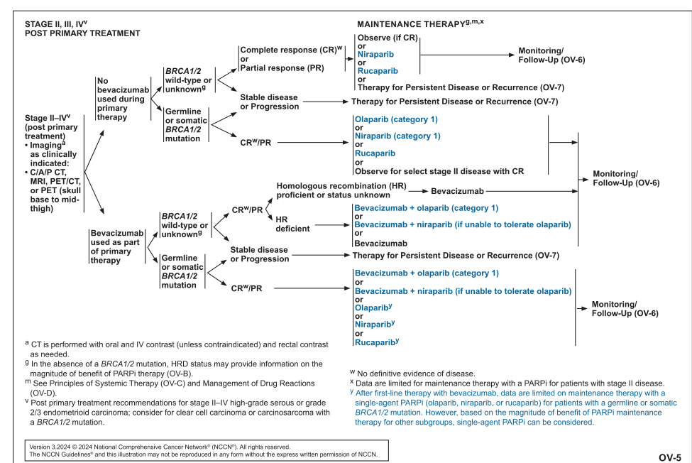

## Question

# Disease Characteristics Research Template

## Target Disease
- **Disease Name:** Ovarian Adenocarcinoma
- **MONDO ID:**  (if available)
- **Category:** 

## Research Objectives

Please provide a comprehensive research report on **Ovarian Adenocarcinoma** covering all of the
disease characteristics listed below. This report will be used to populate a disease knowledge
base entry. Be thorough and cite primary literature (PMID preferred) for all claims.

For each section, **suggested databases/resources** are listed. These are the first places
you should search for information on each topic.

---

### 1. Disease Information
> **Search first:** OMIM, Orphanet, ICD-10/ICD-11, MeSH, PubMed

- What is the disease? Provide a concise overview.
- What are the key identifiers? (OMIM, Orphanet, ICD-10/ICD-11, MeSH, Mondo)
- What are the common synonyms and alternative names?
- Is the information derived from individual patients (e.g., EHR) or aggregated disease-level resources?

### 2. Etiology

- **Disease Causal Factors**: What are the primary causes? (genetic, environmental, infectious, mechanistic)
- **Risk Factors**:
  > **Search first:** PubMed, Cochrane Library, UpToDate, clinical guidelines, ClinVar, ClinGen, GWAS Catalog, PheGenI, CTD, CDC, WHO, epidemiological databases
  - Genetic risk factors (causal variants, susceptibility loci, modifier genes)
  - Environmental risk factors (toxins, lifestyle, occupational exposures, age, sex, family history)
- **Protective Factors**:
  > **Search first:** PubMed, Cochrane Library, clinical trial databases, GWAS Catalog, gnomAD, WHO, CDC, nutrition databases
  - Genetic protective factors (protective variants, modifier alleles)
  - Environmental protective factors (diet, lifestyle, exposures that reduce risk)
- **Gene-Environment Interactions**: How do genetic and environmental factors interact to influence disease?
  > **Search first:** CTD, PubMed, PheGenI, GxE databases

### 3. Phenotypes
> **Search first:** HPO (Human Phenotype Ontology), OMIM, Orphanet, PubMed, clinicaltrials.gov, MedDRA, SNOMED CT, DECIPHER, LOINC

For each phenotype, provide:
- **Phenotype type**: symptoms, clinical signs, physical manifestations, behavioral changes, or laboratory abnormalities
  > For symptoms/signs: HPO, OMIM, Orphanet, PubMed
  > For behavioral changes: HPO, DSM, RDoC (Research Domain Criteria), PubMed
  > For laboratory abnormalities: LOINC, SNOMED CT, LabTests Online, PubMed
- **Phenotype characteristics**:
  > **Search first:** OMIM, Orphanet, HPO, PubMed
  - Age of symptom onset (neonatal, childhood, adult-onset, late-onset)
  - Symptom severity (mild, moderate, severe, variable)
  - Symptom progression (stable, progressive, episodic, fluctuating)
  - Frequency among affected individuals (percentage or qualitative)
- **Quality of life impact**: Effects on daily functioning and well-being (per-phenotype when possible)
  > **Search first:** EQ-5D database, SF-36, WHO QOL databases, PubMed
- Suggest HPO (Human Phenotype Ontology) terms for each phenotype

### 4. Genetic/Molecular Information

- **Causal Genes**: Gene mutations or chromosomal abnormalities responsible for disease (gene symbols, OMIM IDs)
  > **Search first:** OMIM, ClinVar, HGMD, Ensembl, NCBI Gene
- **Pathogenic Variants**:
  - Affected genes (gene symbols, HGNC IDs)
    > **Search first:** OMIM, NCBI Gene, Ensembl, HGNC, UniProt, GeneCards
  - Variant classification (pathogenic, likely pathogenic, VUS per ACMG/AMP guidelines)
    > **Search first:** ClinVar, ClinGen, ACMG/AMP guidelines, VarSome
  - Variant type/class (missense, frameshift, nonsense, splice-site, structural)
  - Allele frequency in population databases
    > **Search first:** gnomAD, 1000 Genomes, ExAC, TOPMed, dbSNP
  - Somatic vs germline origin
    > **Search first:** COSMIC (somatic), ClinVar, ICGC, TCGA
  - Functional consequences (loss of function, gain of function, dominant negative)
- **Modifier Genes**: Genes that modify disease severity or expression
- **Epigenetic Information**: DNA methylation, histone modifications, chromatin changes affecting disease
  > **Search first:** ENCODE, Roadmap Epigenomics, MethBase, DiseaseMeth
- **Chromosomal Abnormalities**: Large-scale genetic changes (aneuploidy, translocations, inversions)
  > **Search first:** DECIPHER, ClinVar, ECARUCA, UCSC Genome Browser

### 5. Environmental Information

- **Environmental Factors**: Non-genetic contributing factors (toxins, radiation, pollution, occupational exposure)
  > **Search first:** CTD (Comparative Toxicogenomics Database), TOXNET, PubMed, EPA databases
- **Lifestyle Factors**: Behavioral factors (smoking, diet, exercise, alcohol consumption)
  > **Search first:** CDC databases, WHO, PubMed, NHANES
- **Infectious Agents**: If applicable, pathogens causing or triggering disease (bacteria, viruses, fungi, parasites)
  > **Search first:** NCBI Taxonomy, ViPR, BV-BRC, MicrobeDB, GIDEON

### 6. Mechanism / Pathophysiology

- **Molecular Pathways**: Specific signaling cascades or biochemical pathways involved (Wnt, MAPK, mTOR, PI3K-AKT, etc.)
  > **Search first:** KEGG, Reactome, WikiPathways, PathBank, BioCyc
- **Cellular Processes**: Cell-level mechanisms (apoptosis, autophagy, cell cycle dysregulation, inflammation, etc.)
  > **Search first:** Gene Ontology (GO), Reactome, KEGG, PubMed
- **Protein Dysfunction**: How protein structure or function is altered (misfolding, aggregation, loss of function, gain of function)
  > **Search first:** UniProt, PDB (Protein Data Bank), InterPro, Pfam, AlphaFold
- **Metabolic Changes**: Alterations in metabolic processes (energy metabolism, lipid metabolism, amino acid metabolism)
  > **Search first:** KEGG, BioCyc, HMDB (Human Metabolome Database), BRENDA
- **Immune System Involvement**: Role of immune response (autoimmunity, immunodeficiency, chronic inflammation)
  > **Search first:** ImmPort, Immunome Database, IEDB, Gene Ontology
- **Tissue Damage Mechanisms**: How tissues/ are injured (oxidative stress, ischemia, fibrosis, necrosis)
  > **Search first:** PubMed, Gene Ontology, Reactome
- **Biochemical Abnormalities**: Specific molecular defects (enzyme deficiencies, receptor dysfunction, ion channel defects)
  > **Search first:** BRENDA, UniProt, KEGG, OMIM, PubMed
- **Epigenetic Changes**: DNA methylation, histone modifications affecting gene expression in disease
  > **Search first:** ENCODE, Roadmap Epigenomics, MethBase, DiseaseMeth
- **Molecular Profiling** (if available):
  - Transcriptomics/gene expression changes
    > **Search first:** GEO (Gene Expression Omnibus), ArrayExpress, GTEx, Human Cell Atlas, SRA
  - Proteomics findings
    > **Search first:** PRIDE, ProteomeXchange, Human Protein Atlas, STRING, BioGRID
  - Metabolomics signatures
    > **Search first:** MetaboLights, Metabolomics Workbench, HMDB, METLIN
  - Lipidomics alterations
    > **Search first:** LIPID MAPS, SwissLipids, LipidHome, Metabolomics Workbench
  - Genomic structural features
    > **Search first:** UCSC Genome Browser, Ensembl, NCBI, dbVar, DGV
- **Advanced Technologies** (if applicable):
  - Single-cell analysis findings (cell-type specific mechanisms, cellular heterogeneity)
    > **Search first:** Human Cell Atlas, Single Cell Portal, GEO, CELLxGENE
  - Spatial transcriptomics findings
    > **Search first:** GEO, Spatial Research, Vizgen, 10x Genomics data
  - Multi-omics integration results
    > **Search first:** TCGA, ICGC, cBioPortal, LinkedOmics, PubMed
  - Functional genomics screens (CRISPR, RNAi)
    > **Search first:** DepMap, GenomeRNAi, PubMed, BioGRID ORCS

For each mechanism, describe:
- The causal chain from initial trigger to clinical manifestation
- Which mechanisms are upstream vs downstream
- What cell types and biological processes are involved
- Suggest GO terms for biological processes and CL terms for cell types

### 7. Anatomical Structures Affected

- **Organ Level**:
  - Primary organs directly affected
  - Secondary organ involvement (complications, secondary effects)
  - Body systems involved (cardiovascular, nervous, digestive, respiratory, endocrine, etc.)
  > **Search first:** Uberon, FMA (Foundational Model of Anatomy), OMIM, HPO, ICD-11, MeSH, SNOMED CT
- **Tissue and Cell Level**:
  - Specific tissue types affected (epithelial, connective, muscle, nervous)
  - Specific cell populations targeted (with Cell Ontology terms)
  > **Search first:** Uberon, Human Protein Atlas, Cell Ontology, Human Cell Atlas, CellMarker, PanglaoDB
- **Subcellular Level**:
  - Cellular compartments involved (mitochondria, nucleus, ER, lysosomes) (with GO Cellular Component terms)
  > **Search first:** Gene Ontology (Cellular Component), UniProt, Human Protein Atlas
- **Localization**:
  - Specific anatomical sites (with UBERON terms)
    > **Search first:** FMA, Uberon, NeuroNames (for brain), SNOMED CT
  - Lateralization (unilateral, bilateral, asymmetric)
    > **Search first:** HPO, clinical literature, imaging databases

### 8. Temporal Development

- **Onset**:
  - Typical age of onset (congenital, pediatric, adult, geriatric)
  - Onset pattern (acute, subacute, chronic, insidious)
  > **Search first:** OMIM, Orphanet, HPO, PubMed
- **Progression**:
  - Disease stages (early, intermediate, advanced, end-stage)
    > **Search first:** Cancer Staging Manual (AJCC), WHO classifications, PubMed
  - Progression rate (rapid, slow, variable)
  - Disease course pattern (episodic, relapsing-remitting, progressive, stable)
  - Disease duration (self-limited, chronic lifelong)
  > **Search first:** Disease registries, longitudinal cohort databases, natural history studies, PubMed, Orphanet, OMIM
- **Patterns**:
  - Remission patterns (spontaneous, treatment-induced)
    > **Search first:** Clinical trial databases, disease registries, PubMed
  - Critical periods (time windows of vulnerability or opportunity for intervention)
    > **Search first:** PubMed, developmental biology databases, clinical guidelines

### 9. Inheritance and Population

- **Epidemiology**:
  - Prevalence (cases per 100,000 at given time)
  - Incidence (new cases per 100,000 per year)
  > **Search first:** Orphanet, CDC, WHO, GBD (Global Burden of Disease), national registries, SEER, disease registries
- **For Genetic Etiology**:
  - Inheritance pattern (AD, AR, X-linked, mitochondrial, multifactorial, polygenic)
    > **Search first:** OMIM, Orphanet, ClinVar, GTR (Genetic Testing Registry)
  - Penetrance (complete, incomplete, age-dependent)
    > **Search first:** ClinVar, OMIM, PubMed, ClinGen
  - Expressivity (variable, consistent)
    > **Search first:** OMIM, ClinVar, PubMed
  - Genetic anticipation (increasing severity in successive generations)
    > **Search first:** OMIM, PubMed (especially for repeat expansion disorders)
  - Germline mosaicism
    > **Search first:** ClinVar, OMIM, genetic counseling literature, PubMed
  - Founder effects (population-specific mutations)
    > **Search first:** gnomAD, population genetics databases, PubMed
  - Consanguinity role
    > **Search first:** OMIM, population studies, genetic counseling resources
  - Carrier frequency
    > **Search first:** gnomAD, carrier screening databases, GeneReviews, GTR
- **Population Demographics**:
  - Affected populations (ethnic or demographic groups with higher prevalence)
    > **Search first:** gnomAD, 1000 Genomes, PAGE Study, PubMed, population registries
  - Geographic distribution (endemic areas, regional variation)
    > **Search first:** WHO, CDC, GBD, Orphanet, geographic epidemiology databases
  - Geographic distribution of specific variants
  - Sex ratio (male:female)
    > **Search first:** Disease registries, OMIM, PubMed, epidemiological databases
  - Age distribution of affected individuals
    > **Search first:** CDC, disease registries, SEER, Orphanet

### 10. Diagnostics

- **Clinical Tests**:
  - Laboratory tests (blood, urine, tissue chemistry, specific enzyme assays)
    > **Search first:** LOINC, LabTests Online, PubMed
  - Biomarkers (proteins, metabolites, genetic markers, circulating biomarkers)
    > **Search first:** FDA Biomarker List, BEST (Biomarkers, EndpointS, and other Tools), PubMed
  - Imaging studies (X-ray, CT, MRI, PET, ultrasound)
    > **Search first:** RadLex, DICOM, Radiopaedia, imaging databases
  - Functional tests (pulmonary function, cardiac stress tests)
    > **Search first:** LOINC, clinical guidelines, PubMed
  - Electrophysiology (EEG, EMG, ECG, nerve conduction studies)
    > **Search first:** LOINC, clinical neurophysiology databases, PubMed
  - Biopsy findings (histopathology, immunohistochemistry)
    > **Search first:** SNOMED CT, College of American Pathologists resources, PubMed
  - Pathology findings (microscopic examination)
    > **Search first:** SNOMED CT, Digital Pathology databases, PubMed
- **Genetic Testing**:
  > **Search first:** GTR (Genetic Testing Registry), GeneReviews, ClinGen
  - Overview of recommended genetic testing approach
  - Whole genome sequencing (WGS) utility
    > **Search first:** GTR, ClinVar, GEL (Genomics England), gnomAD
  - Whole exome sequencing (WES) utility
    > **Search first:** GTR, ClinVar, OMIM, GeneMatcher
  - Gene panels (which panels, which genes)
    > **Search first:** GTR, ClinVar, laboratory-specific databases
  - Single gene testing
    > **Search first:** GTR, ClinVar, OMIM, GeneReviews
  - Chromosomal microarray (CMA)
    > **Search first:** DECIPHER, ClinVar, dbVar, ECARUCA
  - Karyotyping
    > **Search first:** Chromosome Abnormality Database, ClinVar, cytogenetics resources
  - FISH
    > **Search first:** ClinVar, cytogenetics databases, PubMed
  - Mitochondrial DNA testing
    > **Search first:** MITOMAP, MSeqDR, ClinVar, GTR
  - Repeat expansion testing
    > **Search first:** GTR, ClinVar, repeat expansion databases, PubMed
- **Omics-Based Diagnostics** (if applicable):
  - RNA sequencing / transcriptomics
    > **Search first:** GEO, ArrayExpress, GTEx, RNA-seq databases
  - Proteomics
    > **Search first:** PRIDE, ProteomeXchange, FDA Biomarker database
  - Metabolomics
    > **Search first:** MetaboLights, Metabolomics Workbench, HMDB
  - Epigenomics
    > **Search first:** GEO, ENCODE, Roadmap Epigenomics, MethBase
  - Liquid biopsy
    > **Search first:** COSMIC, ClinVar, liquid biopsy databases, PubMed
- **Clinical Criteria**:
  - Standardized diagnostic criteria (DSM, ICD, society guidelines)
    > **Search first:** DSM-5, ICD-11, clinical society guidelines, UpToDate
  - Differential diagnosis (other conditions to rule out, with distinguishing features)
    > **Search first:** DynaMed, UpToDate, clinical decision support systems
- **Screening**:
  - Screening methods for asymptomatic individuals (newborn screening, carrier screening, cascade screening)
    > **Search first:** ACMG recommendations, CDC newborn screening, GTR

### 11. Outcome/Prognosis

- **Survival and Mortality**:
  - Survival rate (5-year, 10-year, overall)
    > **Search first:** SEER, cancer registries, disease-specific registries, PubMed
  - Life expectancy (with and without treatment if applicable)
    > **Search first:** Orphanet, disease registries, actuarial databases, PubMed
  - Mortality rate
    > **Search first:** CDC, WHO, GBD, national mortality databases
  - Disease-specific mortality (deaths directly attributable to disease)
    > **Search first:** Disease registries, CDC Wonder, GBD, PubMed
- **Morbidity and Function**:
  - Morbidity (disease-related disability and health impacts)
    > **Search first:** GBD, WHO, disability databases, PubMed
  - Disability outcomes (long-term functional impairments)
    > **Search first:** ICF (International Classification of Functioning), disability registries
  - Quality of life measures (EQ-5D, SF-36, PROMIS, disease-specific tools)
    > **Search first:** EQ-5D database, SF-36, PROMIS, PubMed
- **Disease Course**:
  - Complications (secondary problems: infections, organ failure, etc.)
    > **Search first:** ICD codes, disease registries, clinical databases, PubMed
  - Recovery potential (likelihood and extent of recovery, with vs without treatment)
    > **Search first:** Natural history studies, rehabilitation databases, PubMed
- **Prediction**:
  - Prognostic factors (age, disease severity, biomarkers, treatment response)
    > **Search first:** Prognostic models databases, clinical calculators, PubMed
  - Prognostic biomarkers (molecular markers predicting disease course)
    > **Search first:** FDA Biomarker database, PubMed, cancer prognostic databases

### 12. Treatment

- **Pharmacotherapy**:
  - Pharmacological treatments (drug names, drug classes, mechanisms of action)
    > **Search first:** DrugBank, RxNorm, ATC classification, DailyMed, FDA databases
  - Pharmacogenomics (how genetic variants affect drug metabolism, efficacy, toxicity)
    > **Search first:** PharmGKB, CPIC (Clinical Pharmacogenetics), FDA Table of PGx Biomarkers
- **Advanced Therapeutics**:
  - Gene therapy (viral vectors, CRISPR, gene replacement, gene editing)
    > **Search first:** ClinicalTrials.gov, FDA gene therapy database, ASGCT resources
  - Cell therapy (stem cell transplant, CAR-T, cellular therapeutics)
    > **Search first:** ClinicalTrials.gov, FDA cell therapy database, FACT standards
  - RNA-based therapies (ASOs, siRNA, mRNA therapies)
    > **Search first:** ClinicalTrials.gov, FDA approvals, PubMed
  - Targeted therapies (treatments directed at specific molecular targets)
    > **Search first:** My Cancer Genome, OncoKB, ClinicalTrials.gov, FDA approvals
  - Immunotherapies (checkpoint inhibitors, monoclonal antibodies)
    > **Search first:** Cancer Immunotherapy Database, FDA approvals, ClinicalTrials.gov
- **Surgical and Interventional**:
  - Surgical interventions (types of surgery, timing, outcomes)
    > **Search first:** CPT codes, surgical registries, clinical guidelines, PubMed
- **Supportive and Rehabilitative**:
  - Supportive care (symptom management, pain control, nutrition)
    > **Search first:** Clinical guidelines, Cochrane Library, PubMed
  - Rehabilitation (physical therapy, occupational therapy, speech therapy)
    > **Search first:** Rehabilitation medicine databases, clinical guidelines, PubMed
- **Experimental**:
  - Experimental treatments in clinical trials (with NCT identifiers if available)
    > **Search first:** ClinicalTrials.gov, EU Clinical Trials Register, WHO ICTRP
- **Treatment Outcomes**:
  - Treatment response rates
    > **Search first:** Clinical trial databases, FDA reviews, systematic reviews, PubMed
  - Side effects and adverse events
    > **Search first:** FDA Adverse Event Reporting System (FAERS), MedWatch, PubMed
- **Treatment Strategy**:
  - Treatment algorithms (clinical pathways, decision trees)
    > **Search first:** Clinical practice guidelines, NCCN Guidelines, UpToDate
  - Combination therapies
    > **Search first:** ClinicalTrials.gov, treatment guidelines, PubMed
  - Personalized medicine approaches (genotype-guided treatment)
    > **Search first:** My Cancer Genome, CIViC, PharmGKB, precision medicine databases

For each treatment, suggest MAXO (Medical Action Ontology) terms where applicable.

### 13. Prevention

- **Prevention Levels**:
  - Primary prevention (preventing disease occurrence: vaccination, risk factor modification)
    > **Search first:** CDC, WHO, USPSTF recommendations, Cochrane Library
  - Secondary prevention (early detection and treatment: screening programs, early intervention)
    > **Search first:** USPSTF, CDC screening guidelines, WHO
  - Tertiary prevention (preventing complications in those with disease)
    > **Search first:** Clinical guidelines, disease management protocols, PubMed
- **Immunization**: Vaccine strategies (if applicable)
  > **Search first:** CDC vaccine schedules, WHO immunization, FDA vaccine database
- **Screening and Early Detection**:
  - Screening programs (population-based: newborn screening, cancer screening)
    > **Search first:** CDC screening programs, USPSTF, cancer screening databases
  - Genetic screening (carrier screening, preimplantation genetic diagnosis, prenatal testing)
    > **Search first:** ACMG recommendations, ACOG guidelines, GTR
  - Risk stratification (identifying high-risk individuals for targeted prevention)
    > **Search first:** Risk prediction models, clinical calculators, PubMed
- **Behavioral Interventions**: Lifestyle modifications to reduce risk
  > **Search first:** CDC, WHO, behavioral intervention databases, Cochrane Library
- **Counseling**: Genetic counseling (risk assessment, family planning guidance)
  > **Search first:** NSGC resources, ACMG guidelines, GeneReviews
- **Public Health**:
  - Public health interventions (sanitation, vector control, health education)
    > **Search first:** CDC, WHO, public health databases, PubMed
  - Environmental interventions (reducing environmental risk factors)
    > **Search first:** EPA databases, WHO environmental health, PubMed
- **Prophylaxis**: Preventive medications or procedures
  > **Search first:** Clinical guidelines, FDA approvals, PubMed

### 14. Other Species / Natural Disease

- **Taxonomy**: Species affected (with NCBI Taxon identifiers)
  > **Search first:** NCBI Taxonomy
- **Breed**: Specific breeds affected (with VBO identifiers if applicable)
  > **Search first:** VBO (Vertebrate Breed Ontology)
- **Gene**: Orthologous genes in other species (with NCBI Gene IDs)
  > **Search first:** NCBI Gene
- **Natural Disease**:
  - Naturally occurring disease in other species (companion animals, wildlife)
    > **Search first:** OMIA (Online Mendelian Inheritance in Animals), VetCompass, PubMed
  - Veterinary relevance and importance in animal health
    > **Search first:** OMIA, veterinary databases, PubMed
- **Comparative Biology**:
  - Comparative pathology (similarities and differences across species)
    > **Search first:** OMIA, comparative pathology databases, PubMed
  - Evolutionary conservation of disease mechanisms
    > **Search first:** HomoloGene, OrthoMCL, Alliance of Genome Resources
- **Transmission** (if applicable):
  - Zoonotic potential
    > **Search first:** CDC zoonotic diseases, WHO zoonoses, GIDEON
  - Cross-species susceptibility
    > **Search first:** NCBI Taxonomy, veterinary databases, PubMed

### 15. Model Organisms

- **Model Types**:
  - Model organism type (mammalian, invertebrate, cellular, in vitro)
    > **Search first:** Alliance of Genome Resources, model organism databases
  - Specific model systems (mouse, rat, zebrafish, Drosophila, C. elegans, yeast, cell lines, organoids, iPSCs)
    > **Search first:** MGI, RGD, ZFIN, FlyBase, WormBase, SGD, ATCC, Cellosaurus
  - Induced models (drug treatment, surgical intervention, environmental manipulation)
    > **Search first:** MGI, model organism databases, PubMed
- **Genetic Models**:
  - Types available (knockout, knock-in, transgenic, conditional, humanized)
    > **Search first:** MGI, IMPC, KOMP, EuMMCR, IMSR
- **Model Characteristics**:
  - Phenotype recapitulation (how well model reproduces human disease features)
    > **Search first:** Model organism databases, comparative studies, PubMed
  - Model limitations (aspects of human disease not captured)
    > **Search first:** Model organism databases, PubMed, review articles
- **Applications**:
  - Research applications (what aspects of disease can be studied)
    > **Search first:** Model organism databases, PubMed
- **Resources**:
  - Model databases
    > **Search first:** MGI, RGD, ZFIN, FlyBase, WormBase, IMSR, EMMA, MMRRC

---

## Citation Requirements

- Cite primary literature (PMID preferred) for all mechanistic and clinical claims
- Prioritize recent reviews and landmark papers
- Include direct quotes from abstracts where possible to support key statements
- Distinguish evidence source types: human clinical, model organism, in vitro, computational

## Output Format

Structure your response as a comprehensive narrative organized by the sections above.
For each section, provide:
- Factual content with specific details (numbers, percentages, gene names, variant nomenclature)
- Ontology term suggestions (HPO, GO, CL, UBERON, CHEBI, MAXO, MONDO) where applicable
- Evidence citations with PMIDs
- Direct quotes from abstracts to support key claims
- Clear indication when information is not available or not applicable for this disease

This report will be used to populate a disease knowledge base entry with:
- Pathophysiology descriptions with causal chains
- Gene/protein annotations (HGNC, GO terms)
- Phenotype associations (HP terms) with frequencies
- Cell type involvement (CL terms)
- Anatomical locations (UBERON terms)
- Chemical entities (CHEBI terms)
- Treatment annotations (MAXO terms)
- Evidence items with PMIDs and exact abstract quotes
- Epidemiology, prognosis, diagnostic, and prevention information
- Animal model descriptions with phenotype recapitulation details

## Output

Question: You are an expert researcher providing comprehensive, well-cited information.

Provide detailed information focusing on:
1. Key concepts and definitions with current understanding
2. Recent developments and latest research (prioritize 2023-2024 sources)
3. Current applications and real-world implementations
4. Expert opinions and analysis from authoritative sources
5. Relevant statistics and data from recent studies

Format as a comprehensive research report with proper citations. Include URLs and publication dates where available.
Always prioritize recent, authoritative sources and provide specific citations for all major claims.

# Disease Characteristics Research Template

## Target Disease
- **Disease Name:** Ovarian Adenocarcinoma
- **MONDO ID:**  (if available)
- **Category:** 

## Research Objectives

Please provide a comprehensive research report on **Ovarian Adenocarcinoma** covering all of the
disease characteristics listed below. This report will be used to populate a disease knowledge
base entry. Be thorough and cite primary literature (PMID preferred) for all claims.

For each section, **suggested databases/resources** are listed. These are the first places
you should search for information on each topic.

---

### 1. Disease Information
> **Search first:** OMIM, Orphanet, ICD-10/ICD-11, MeSH, PubMed

- What is the disease? Provide a concise overview.
- What are the key identifiers? (OMIM, Orphanet, ICD-10/ICD-11, MeSH, Mondo)
- What are the common synonyms and alternative names?
- Is the information derived from individual patients (e.g., EHR) or aggregated disease-level resources?

### 2. Etiology

- **Disease Causal Factors**: What are the primary causes? (genetic, environmental, infectious, mechanistic)
- **Risk Factors**:
  > **Search first:** PubMed, Cochrane Library, UpToDate, clinical guidelines, ClinVar, ClinGen, GWAS Catalog, PheGenI, CTD, CDC, WHO, epidemiological databases
  - Genetic risk factors (causal variants, susceptibility loci, modifier genes)
  - Environmental risk factors (toxins, lifestyle, occupational exposures, age, sex, family history)
- **Protective Factors**:
  > **Search first:** PubMed, Cochrane Library, clinical trial databases, GWAS Catalog, gnomAD, WHO, CDC, nutrition databases
  - Genetic protective factors (protective variants, modifier alleles)
  - Environmental protective factors (diet, lifestyle, exposures that reduce risk)
- **Gene-Environment Interactions**: How do genetic and environmental factors interact to influence disease?
  > **Search first:** CTD, PubMed, PheGenI, GxE databases

### 3. Phenotypes
> **Search first:** HPO (Human Phenotype Ontology), OMIM, Orphanet, PubMed, clinicaltrials.gov, MedDRA, SNOMED CT, DECIPHER, LOINC

For each phenotype, provide:
- **Phenotype type**: symptoms, clinical signs, physical manifestations, behavioral changes, or laboratory abnormalities
  > For symptoms/signs: HPO, OMIM, Orphanet, PubMed
  > For behavioral changes: HPO, DSM, RDoC (Research Domain Criteria), PubMed
  > For laboratory abnormalities: LOINC, SNOMED CT, LabTests Online, PubMed
- **Phenotype characteristics**:
  > **Search first:** OMIM, Orphanet, HPO, PubMed
  - Age of symptom onset (neonatal, childhood, adult-onset, late-onset)
  - Symptom severity (mild, moderate, severe, variable)
  - Symptom progression (stable, progressive, episodic, fluctuating)
  - Frequency among affected individuals (percentage or qualitative)
- **Quality of life impact**: Effects on daily functioning and well-being (per-phenotype when possible)
  > **Search first:** EQ-5D database, SF-36, WHO QOL databases, PubMed
- Suggest HPO (Human Phenotype Ontology) terms for each phenotype

### 4. Genetic/Molecular Information

- **Causal Genes**: Gene mutations or chromosomal abnormalities responsible for disease (gene symbols, OMIM IDs)
  > **Search first:** OMIM, ClinVar, HGMD, Ensembl, NCBI Gene
- **Pathogenic Variants**:
  - Affected genes (gene symbols, HGNC IDs)
    > **Search first:** OMIM, NCBI Gene, Ensembl, HGNC, UniProt, GeneCards
  - Variant classification (pathogenic, likely pathogenic, VUS per ACMG/AMP guidelines)
    > **Search first:** ClinVar, ClinGen, ACMG/AMP guidelines, VarSome
  - Variant type/class (missense, frameshift, nonsense, splice-site, structural)
  - Allele frequency in population databases
    > **Search first:** gnomAD, 1000 Genomes, ExAC, TOPMed, dbSNP
  - Somatic vs germline origin
    > **Search first:** COSMIC (somatic), ClinVar, ICGC, TCGA
  - Functional consequences (loss of function, gain of function, dominant negative)
- **Modifier Genes**: Genes that modify disease severity or expression
- **Epigenetic Information**: DNA methylation, histone modifications, chromatin changes affecting disease
  > **Search first:** ENCODE, Roadmap Epigenomics, MethBase, DiseaseMeth
- **Chromosomal Abnormalities**: Large-scale genetic changes (aneuploidy, translocations, inversions)
  > **Search first:** DECIPHER, ClinVar, ECARUCA, UCSC Genome Browser

### 5. Environmental Information

- **Environmental Factors**: Non-genetic contributing factors (toxins, radiation, pollution, occupational exposure)
  > **Search first:** CTD (Comparative Toxicogenomics Database), TOXNET, PubMed, EPA databases
- **Lifestyle Factors**: Behavioral factors (smoking, diet, exercise, alcohol consumption)
  > **Search first:** CDC databases, WHO, PubMed, NHANES
- **Infectious Agents**: If applicable, pathogens causing or triggering disease (bacteria, viruses, fungi, parasites)
  > **Search first:** NCBI Taxonomy, ViPR, BV-BRC, MicrobeDB, GIDEON

### 6. Mechanism / Pathophysiology

- **Molecular Pathways**: Specific signaling cascades or biochemical pathways involved (Wnt, MAPK, mTOR, PI3K-AKT, etc.)
  > **Search first:** KEGG, Reactome, WikiPathways, PathBank, BioCyc
- **Cellular Processes**: Cell-level mechanisms (apoptosis, autophagy, cell cycle dysregulation, inflammation, etc.)
  > **Search first:** Gene Ontology (GO), Reactome, KEGG, PubMed
- **Protein Dysfunction**: How protein structure or function is altered (misfolding, aggregation, loss of function, gain of function)
  > **Search first:** UniProt, PDB (Protein Data Bank), InterPro, Pfam, AlphaFold
- **Metabolic Changes**: Alterations in metabolic processes (energy metabolism, lipid metabolism, amino acid metabolism)
  > **Search first:** KEGG, BioCyc, HMDB (Human Metabolome Database), BRENDA
- **Immune System Involvement**: Role of immune response (autoimmunity, immunodeficiency, chronic inflammation)
  > **Search first:** ImmPort, Immunome Database, IEDB, Gene Ontology
- **Tissue Damage Mechanisms**: How tissues/ are injured (oxidative stress, ischemia, fibrosis, necrosis)
  > **Search first:** PubMed, Gene Ontology, Reactome
- **Biochemical Abnormalities**: Specific molecular defects (enzyme deficiencies, receptor dysfunction, ion channel defects)
  > **Search first:** BRENDA, UniProt, KEGG, OMIM, PubMed
- **Epigenetic Changes**: DNA methylation, histone modifications affecting gene expression in disease
  > **Search first:** ENCODE, Roadmap Epigenomics, MethBase, DiseaseMeth
- **Molecular Profiling** (if available):
  - Transcriptomics/gene expression changes
    > **Search first:** GEO (Gene Expression Omnibus), ArrayExpress, GTEx, Human Cell Atlas, SRA
  - Proteomics findings
    > **Search first:** PRIDE, ProteomeXchange, Human Protein Atlas, STRING, BioGRID
  - Metabolomics signatures
    > **Search first:** MetaboLights, Metabolomics Workbench, HMDB, METLIN
  - Lipidomics alterations
    > **Search first:** LIPID MAPS, SwissLipids, LipidHome, Metabolomics Workbench
  - Genomic structural features
    > **Search first:** UCSC Genome Browser, Ensembl, NCBI, dbVar, DGV
- **Advanced Technologies** (if applicable):
  - Single-cell analysis findings (cell-type specific mechanisms, cellular heterogeneity)
    > **Search first:** Human Cell Atlas, Single Cell Portal, GEO, CELLxGENE
  - Spatial transcriptomics findings
    > **Search first:** GEO, Spatial Research, Vizgen, 10x Genomics data
  - Multi-omics integration results
    > **Search first:** TCGA, ICGC, cBioPortal, LinkedOmics, PubMed
  - Functional genomics screens (CRISPR, RNAi)
    > **Search first:** DepMap, GenomeRNAi, PubMed, BioGRID ORCS

For each mechanism, describe:
- The causal chain from initial trigger to clinical manifestation
- Which mechanisms are upstream vs downstream
- What cell types and biological processes are involved
- Suggest GO terms for biological processes and CL terms for cell types

### 7. Anatomical Structures Affected

- **Organ Level**:
  - Primary organs directly affected
  - Secondary organ involvement (complications, secondary effects)
  - Body systems involved (cardiovascular, nervous, digestive, respiratory, endocrine, etc.)
  > **Search first:** Uberon, FMA (Foundational Model of Anatomy), OMIM, HPO, ICD-11, MeSH, SNOMED CT
- **Tissue and Cell Level**:
  - Specific tissue types affected (epithelial, connective, muscle, nervous)
  - Specific cell populations targeted (with Cell Ontology terms)
  > **Search first:** Uberon, Human Protein Atlas, Cell Ontology, Human Cell Atlas, CellMarker, PanglaoDB
- **Subcellular Level**:
  - Cellular compartments involved (mitochondria, nucleus, ER, lysosomes) (with GO Cellular Component terms)
  > **Search first:** Gene Ontology (Cellular Component), UniProt, Human Protein Atlas
- **Localization**:
  - Specific anatomical sites (with UBERON terms)
    > **Search first:** FMA, Uberon, NeuroNames (for brain), SNOMED CT
  - Lateralization (unilateral, bilateral, asymmetric)
    > **Search first:** HPO, clinical literature, imaging databases

### 8. Temporal Development

- **Onset**:
  - Typical age of onset (congenital, pediatric, adult, geriatric)
  - Onset pattern (acute, subacute, chronic, insidious)
  > **Search first:** OMIM, Orphanet, HPO, PubMed
- **Progression**:
  - Disease stages (early, intermediate, advanced, end-stage)
    > **Search first:** Cancer Staging Manual (AJCC), WHO classifications, PubMed
  - Progression rate (rapid, slow, variable)
  - Disease course pattern (episodic, relapsing-remitting, progressive, stable)
  - Disease duration (self-limited, chronic lifelong)
  > **Search first:** Disease registries, longitudinal cohort databases, natural history studies, PubMed, Orphanet, OMIM
- **Patterns**:
  - Remission patterns (spontaneous, treatment-induced)
    > **Search first:** Clinical trial databases, disease registries, PubMed
  - Critical periods (time windows of vulnerability or opportunity for intervention)
    > **Search first:** PubMed, developmental biology databases, clinical guidelines

### 9. Inheritance and Population

- **Epidemiology**:
  - Prevalence (cases per 100,000 at given time)
  - Incidence (new cases per 100,000 per year)
  > **Search first:** Orphanet, CDC, WHO, GBD (Global Burden of Disease), national registries, SEER, disease registries
- **For Genetic Etiology**:
  - Inheritance pattern (AD, AR, X-linked, mitochondrial, multifactorial, polygenic)
    > **Search first:** OMIM, Orphanet, ClinVar, GTR (Genetic Testing Registry)
  - Penetrance (complete, incomplete, age-dependent)
    > **Search first:** ClinVar, OMIM, PubMed, ClinGen
  - Expressivity (variable, consistent)
    > **Search first:** OMIM, ClinVar, PubMed
  - Genetic anticipation (increasing severity in successive generations)
    > **Search first:** OMIM, PubMed (especially for repeat expansion disorders)
  - Germline mosaicism
    > **Search first:** ClinVar, OMIM, genetic counseling literature, PubMed
  - Founder effects (population-specific mutations)
    > **Search first:** gnomAD, population genetics databases, PubMed
  - Consanguinity role
    > **Search first:** OMIM, population studies, genetic counseling resources
  - Carrier frequency
    > **Search first:** gnomAD, carrier screening databases, GeneReviews, GTR
- **Population Demographics**:
  - Affected populations (ethnic or demographic groups with higher prevalence)
    > **Search first:** gnomAD, 1000 Genomes, PAGE Study, PubMed, population registries
  - Geographic distribution (endemic areas, regional variation)
    > **Search first:** WHO, CDC, GBD, Orphanet, geographic epidemiology databases
  - Geographic distribution of specific variants
  - Sex ratio (male:female)
    > **Search first:** Disease registries, OMIM, PubMed, epidemiological databases
  - Age distribution of affected individuals
    > **Search first:** CDC, disease registries, SEER, Orphanet

### 10. Diagnostics

- **Clinical Tests**:
  - Laboratory tests (blood, urine, tissue chemistry, specific enzyme assays)
    > **Search first:** LOINC, LabTests Online, PubMed
  - Biomarkers (proteins, metabolites, genetic markers, circulating biomarkers)
    > **Search first:** FDA Biomarker List, BEST (Biomarkers, EndpointS, and other Tools), PubMed
  - Imaging studies (X-ray, CT, MRI, PET, ultrasound)
    > **Search first:** RadLex, DICOM, Radiopaedia, imaging databases
  - Functional tests (pulmonary function, cardiac stress tests)
    > **Search first:** LOINC, clinical guidelines, PubMed
  - Electrophysiology (EEG, EMG, ECG, nerve conduction studies)
    > **Search first:** LOINC, clinical neurophysiology databases, PubMed
  - Biopsy findings (histopathology, immunohistochemistry)
    > **Search first:** SNOMED CT, College of American Pathologists resources, PubMed
  - Pathology findings (microscopic examination)
    > **Search first:** SNOMED CT, Digital Pathology databases, PubMed
- **Genetic Testing**:
  > **Search first:** GTR (Genetic Testing Registry), GeneReviews, ClinGen
  - Overview of recommended genetic testing approach
  - Whole genome sequencing (WGS) utility
    > **Search first:** GTR, ClinVar, GEL (Genomics England), gnomAD
  - Whole exome sequencing (WES) utility
    > **Search first:** GTR, ClinVar, OMIM, GeneMatcher
  - Gene panels (which panels, which genes)
    > **Search first:** GTR, ClinVar, laboratory-specific databases
  - Single gene testing
    > **Search first:** GTR, ClinVar, OMIM, GeneReviews
  - Chromosomal microarray (CMA)
    > **Search first:** DECIPHER, ClinVar, dbVar, ECARUCA
  - Karyotyping
    > **Search first:** Chromosome Abnormality Database, ClinVar, cytogenetics resources
  - FISH
    > **Search first:** ClinVar, cytogenetics databases, PubMed
  - Mitochondrial DNA testing
    > **Search first:** MITOMAP, MSeqDR, ClinVar, GTR
  - Repeat expansion testing
    > **Search first:** GTR, ClinVar, repeat expansion databases, PubMed
- **Omics-Based Diagnostics** (if applicable):
  - RNA sequencing / transcriptomics
    > **Search first:** GEO, ArrayExpress, GTEx, RNA-seq databases
  - Proteomics
    > **Search first:** PRIDE, ProteomeXchange, FDA Biomarker database
  - Metabolomics
    > **Search first:** MetaboLights, Metabolomics Workbench, HMDB
  - Epigenomics
    > **Search first:** GEO, ENCODE, Roadmap Epigenomics, MethBase
  - Liquid biopsy
    > **Search first:** COSMIC, ClinVar, liquid biopsy databases, PubMed
- **Clinical Criteria**:
  - Standardized diagnostic criteria (DSM, ICD, society guidelines)
    > **Search first:** DSM-5, ICD-11, clinical society guidelines, UpToDate
  - Differential diagnosis (other conditions to rule out, with distinguishing features)
    > **Search first:** DynaMed, UpToDate, clinical decision support systems
- **Screening**:
  - Screening methods for asymptomatic individuals (newborn screening, carrier screening, cascade screening)
    > **Search first:** ACMG recommendations, CDC newborn screening, GTR

### 11. Outcome/Prognosis

- **Survival and Mortality**:
  - Survival rate (5-year, 10-year, overall)
    > **Search first:** SEER, cancer registries, disease-specific registries, PubMed
  - Life expectancy (with and without treatment if applicable)
    > **Search first:** Orphanet, disease registries, actuarial databases, PubMed
  - Mortality rate
    > **Search first:** CDC, WHO, GBD, national mortality databases
  - Disease-specific mortality (deaths directly attributable to disease)
    > **Search first:** Disease registries, CDC Wonder, GBD, PubMed
- **Morbidity and Function**:
  - Morbidity (disease-related disability and health impacts)
    > **Search first:** GBD, WHO, disability databases, PubMed
  - Disability outcomes (long-term functional impairments)
    > **Search first:** ICF (International Classification of Functioning), disability registries
  - Quality of life measures (EQ-5D, SF-36, PROMIS, disease-specific tools)
    > **Search first:** EQ-5D database, SF-36, PROMIS, PubMed
- **Disease Course**:
  - Complications (secondary problems: infections, organ failure, etc.)
    > **Search first:** ICD codes, disease registries, clinical databases, PubMed
  - Recovery potential (likelihood and extent of recovery, with vs without treatment)
    > **Search first:** Natural history studies, rehabilitation databases, PubMed
- **Prediction**:
  - Prognostic factors (age, disease severity, biomarkers, treatment response)
    > **Search first:** Prognostic models databases, clinical calculators, PubMed
  - Prognostic biomarkers (molecular markers predicting disease course)
    > **Search first:** FDA Biomarker database, PubMed, cancer prognostic databases

### 12. Treatment

- **Pharmacotherapy**:
  - Pharmacological treatments (drug names, drug classes, mechanisms of action)
    > **Search first:** DrugBank, RxNorm, ATC classification, DailyMed, FDA databases
  - Pharmacogenomics (how genetic variants affect drug metabolism, efficacy, toxicity)
    > **Search first:** PharmGKB, CPIC (Clinical Pharmacogenetics), FDA Table of PGx Biomarkers
- **Advanced Therapeutics**:
  - Gene therapy (viral vectors, CRISPR, gene replacement, gene editing)
    > **Search first:** ClinicalTrials.gov, FDA gene therapy database, ASGCT resources
  - Cell therapy (stem cell transplant, CAR-T, cellular therapeutics)
    > **Search first:** ClinicalTrials.gov, FDA cell therapy database, FACT standards
  - RNA-based therapies (ASOs, siRNA, mRNA therapies)
    > **Search first:** ClinicalTrials.gov, FDA approvals, PubMed
  - Targeted therapies (treatments directed at specific molecular targets)
    > **Search first:** My Cancer Genome, OncoKB, ClinicalTrials.gov, FDA approvals
  - Immunotherapies (checkpoint inhibitors, monoclonal antibodies)
    > **Search first:** Cancer Immunotherapy Database, FDA approvals, ClinicalTrials.gov
- **Surgical and Interventional**:
  - Surgical interventions (types of surgery, timing, outcomes)
    > **Search first:** CPT codes, surgical registries, clinical guidelines, PubMed
- **Supportive and Rehabilitative**:
  - Supportive care (symptom management, pain control, nutrition)
    > **Search first:** Clinical guidelines, Cochrane Library, PubMed
  - Rehabilitation (physical therapy, occupational therapy, speech therapy)
    > **Search first:** Rehabilitation medicine databases, clinical guidelines, PubMed
- **Experimental**:
  - Experimental treatments in clinical trials (with NCT identifiers if available)
    > **Search first:** ClinicalTrials.gov, EU Clinical Trials Register, WHO ICTRP
- **Treatment Outcomes**:
  - Treatment response rates
    > **Search first:** Clinical trial databases, FDA reviews, systematic reviews, PubMed
  - Side effects and adverse events
    > **Search first:** FDA Adverse Event Reporting System (FAERS), MedWatch, PubMed
- **Treatment Strategy**:
  - Treatment algorithms (clinical pathways, decision trees)
    > **Search first:** Clinical practice guidelines, NCCN Guidelines, UpToDate
  - Combination therapies
    > **Search first:** ClinicalTrials.gov, treatment guidelines, PubMed
  - Personalized medicine approaches (genotype-guided treatment)
    > **Search first:** My Cancer Genome, CIViC, PharmGKB, precision medicine databases

For each treatment, suggest MAXO (Medical Action Ontology) terms where applicable.

### 13. Prevention

- **Prevention Levels**:
  - Primary prevention (preventing disease occurrence: vaccination, risk factor modification)
    > **Search first:** CDC, WHO, USPSTF recommendations, Cochrane Library
  - Secondary prevention (early detection and treatment: screening programs, early intervention)
    > **Search first:** USPSTF, CDC screening guidelines, WHO
  - Tertiary prevention (preventing complications in those with disease)
    > **Search first:** Clinical guidelines, disease management protocols, PubMed
- **Immunization**: Vaccine strategies (if applicable)
  > **Search first:** CDC vaccine schedules, WHO immunization, FDA vaccine database
- **Screening and Early Detection**:
  - Screening programs (population-based: newborn screening, cancer screening)
    > **Search first:** CDC screening programs, USPSTF, cancer screening databases
  - Genetic screening (carrier screening, preimplantation genetic diagnosis, prenatal testing)
    > **Search first:** ACMG recommendations, ACOG guidelines, GTR
  - Risk stratification (identifying high-risk individuals for targeted prevention)
    > **Search first:** Risk prediction models, clinical calculators, PubMed
- **Behavioral Interventions**: Lifestyle modifications to reduce risk
  > **Search first:** CDC, WHO, behavioral intervention databases, Cochrane Library
- **Counseling**: Genetic counseling (risk assessment, family planning guidance)
  > **Search first:** NSGC resources, ACMG guidelines, GeneReviews
- **Public Health**:
  - Public health interventions (sanitation, vector control, health education)
    > **Search first:** CDC, WHO, public health databases, PubMed
  - Environmental interventions (reducing environmental risk factors)
    > **Search first:** EPA databases, WHO environmental health, PubMed
- **Prophylaxis**: Preventive medications or procedures
  > **Search first:** Clinical guidelines, FDA approvals, PubMed

### 14. Other Species / Natural Disease

- **Taxonomy**: Species affected (with NCBI Taxon identifiers)
  > **Search first:** NCBI Taxonomy
- **Breed**: Specific breeds affected (with VBO identifiers if applicable)
  > **Search first:** VBO (Vertebrate Breed Ontology)
- **Gene**: Orthologous genes in other species (with NCBI Gene IDs)
  > **Search first:** NCBI Gene
- **Natural Disease**:
  - Naturally occurring disease in other species (companion animals, wildlife)
    > **Search first:** OMIA (Online Mendelian Inheritance in Animals), VetCompass, PubMed
  - Veterinary relevance and importance in animal health
    > **Search first:** OMIA, veterinary databases, PubMed
- **Comparative Biology**:
  - Comparative pathology (similarities and differences across species)
    > **Search first:** OMIA, comparative pathology databases, PubMed
  - Evolutionary conservation of disease mechanisms
    > **Search first:** HomoloGene, OrthoMCL, Alliance of Genome Resources
- **Transmission** (if applicable):
  - Zoonotic potential
    > **Search first:** CDC zoonotic diseases, WHO zoonoses, GIDEON
  - Cross-species susceptibility
    > **Search first:** NCBI Taxonomy, veterinary databases, PubMed

### 15. Model Organisms

- **Model Types**:
  - Model organism type (mammalian, invertebrate, cellular, in vitro)
    > **Search first:** Alliance of Genome Resources, model organism databases
  - Specific model systems (mouse, rat, zebrafish, Drosophila, C. elegans, yeast, cell lines, organoids, iPSCs)
    > **Search first:** MGI, RGD, ZFIN, FlyBase, WormBase, SGD, ATCC, Cellosaurus
  - Induced models (drug treatment, surgical intervention, environmental manipulation)
    > **Search first:** MGI, model organism databases, PubMed
- **Genetic Models**:
  - Types available (knockout, knock-in, transgenic, conditional, humanized)
    > **Search first:** MGI, IMPC, KOMP, EuMMCR, IMSR
- **Model Characteristics**:
  - Phenotype recapitulation (how well model reproduces human disease features)
    > **Search first:** Model organism databases, comparative studies, PubMed
  - Model limitations (aspects of human disease not captured)
    > **Search first:** Model organism databases, PubMed, review articles
- **Applications**:
  - Research applications (what aspects of disease can be studied)
    > **Search first:** Model organism databases, PubMed
- **Resources**:
  - Model databases
    > **Search first:** MGI, RGD, ZFIN, FlyBase, WormBase, IMSR, EMMA, MMRRC

---

## Citation Requirements

- Cite primary literature (PMID preferred) for all mechanistic and clinical claims
- Prioritize recent reviews and landmark papers
- Include direct quotes from abstracts where possible to support key statements
- Distinguish evidence source types: human clinical, model organism, in vitro, computational

## Output Format

Structure your response as a comprehensive narrative organized by the sections above.
For each section, provide:
- Factual content with specific details (numbers, percentages, gene names, variant nomenclature)
- Ontology term suggestions (HPO, GO, CL, UBERON, CHEBI, MAXO, MONDO) where applicable
- Evidence citations with PMIDs
- Direct quotes from abstracts to support key claims
- Clear indication when information is not available or not applicable for this disease

This report will be used to populate a disease knowledge base entry with:
- Pathophysiology descriptions with causal chains
- Gene/protein annotations (HGNC, GO terms)
- Phenotype associations (HP terms) with frequencies
- Cell type involvement (CL terms)
- Anatomical locations (UBERON terms)
- Chemical entities (CHEBI terms)
- Treatment annotations (MAXO terms)
- Evidence items with PMIDs and exact abstract quotes
- Epidemiology, prognosis, diagnostic, and prevention information
- Animal model descriptions with phenotype recapitulation details

# Comprehensive Disease Characteristics Report: Ovarian Adenocarcinoma (Epithelial Ovarian Carcinoma)

## Target Disease
- **Disease name:** Ovarian adenocarcinoma (commonly operationalized as **epithelial ovarian cancer (EOC)**; includes ovarian, fallopian tube, and primary peritoneal carcinomas in many guidelines) (perezfidalgo2024seom–geicoclinicalguideline pages 1-2, perezfidalgo2024seom–geicoclinicalguideline pages 2-4)
- **MONDO / MeSH / ICD identifiers:** Not reliably retrievable from the provided full-text corpus in this run; therefore not reported here with evidence-grade citations.
- **Category:** Malignant epithelial neoplasm of ovary (gynecologic cancer; carcinoma/adenocarcinoma)

## 1. Disease Information
### Overview / definition
Epithelial ovarian cancer (EOC) is a heterogeneous set of carcinomas with distinct histotypes, precursor lesions, molecular drivers, clinical behavior, and treatment response; modern clinical guidance frequently groups ovarian, fallopian tube, and primary peritoneal carcinomas together for management (perezfidalgo2024seom–geicoclinicalguideline pages 1-2, perezfidalgo2024seom–geicoclinicalguideline pages 2-4). High-grade serous carcinoma (HGSC) is the predominant EOC histotype and accounts for a disproportionate fraction of deaths (wang2024biologydriventherapyadvances pages 1-2).

### Current classification (WHO-aligned histotypes)
Clinical guidelines and WHO-2020-aligned pathology reviews describe five principal ovarian carcinoma histotypes: **HGSC, low-grade serous carcinoma (LGSC), endometrioid carcinoma (EC), clear cell carcinoma (CCC), and mucinous carcinoma (MC)** (perezfidalgo2024seom–geicoclinicalguideline pages 2-4, liu2024nccnguidelines®insights media 9d6388a3).

### Common synonyms / alternative names
- Epithelial ovarian cancer (EOC) (perezfidalgo2024seom–geicoclinicalguideline pages 1-2)
- Ovarian carcinoma (often used interchangeably with “ovarian adenocarcinoma” in practice for epithelial tumors) (liu2024nccnguidelines®insights media 9d6388a3)
- High-grade serous ovarian carcinoma (for the dominant subtype) (wang2024biologydriventherapyadvances pages 1-2)

### Evidence source type
Most disease-level characterizations here derive from **aggregated resources** (international clinical guidelines and large reviews) rather than individual-patient EHR data (perezfidalgo2024seom–geicoclinicalguideline pages 2-4, wang2024biologydriventherapyadvances pages 1-2, liu2024nccnguidelines®insights pages 1-3).

## 2. Etiology
### Disease causal factors (mechanistic)
A major etiologic model for HGSC is evolution from **fallopian tube epithelium**, with precursor lesions including **serous tubal intraepithelial carcinoma (STIC)** bearing **TP53-mutated signatures** (wang2024biologydriventherapyadvances pages 1-2).

### Risk factors (recent guideline/review synthesis)
Non-genetic risk factors repeatedly emphasized include **age** (half of cases diagnosed after ~63 years), menopause, late or no pregnancy, and “lifetime ovulatory years,” consistent with ovulation-related or reproductive-hormonal etiologic frameworks (wang2024biologydriventherapyadvances pages 1-2, perezfidalgo2024seom–geicoclinicalguideline pages 2-4). The SEOM–GEICO guideline lists risk factors including **nulliparity, obesity, estrogen therapy**, and possible genital talc exposure (perezfidalgo2024seom–geicoclinicalguideline pages 2-4).

### Protective factors
Protective reproductive factors include **oral contraceptive use, multiple pregnancies, and breastfeeding** (wang2024biologydriventherapyadvances pages 1-2, perezfidalgo2024seom–geicoclinicalguideline pages 2-4). A registry-based subtype analysis also notes that oral contraceptives are associated with decreased risk for endometrioid carcinoma (histotype-specific risk heterogeneity) (wang2024globalincidenceof pages 1-2).

### Genetic susceptibility
Hereditary predisposition accounts for a minority of ovarian cancers (<~20% in a cited HGSC-focused review) (wang2024biologydriventherapyadvances pages 1-2). Key susceptibility genes include **BRCA1/BRCA2** and additional homologous recombination (HR) pathway genes such as **BRIP1, RAD51C, RAD51D, PALB2, ATM**, among others (wang2024biologydriventherapyadvances pages 1-2, perezfidalgo2024seom–geicoclinicalguideline pages 2-4, perezfidalgo2024seom–geicoclinicalguideline pages 1-2). Lynch syndrome genes (MLH1/MSH2/MSH6/PMS2) are a notable hereditary cause, associated more often with endometrioid/clear cell histology, and the guideline cites ~12% lifetime ovarian cancer risk in Lynch syndrome (perezfidalgo2024seom–geicoclinicalguideline pages 1-2, perezfidalgo2024seom–geicoclinicalguideline pages 2-4).

## 3. Phenotypes
### Typical presenting symptoms/signs
Symptoms are often nonspecific and include abdominal/pelvic pain, abdominal distension/bloating, urinary and bowel changes (frequency/constipation), dyspnea, and fatigue (perezfidalgo2024seom–geicoclinicalguideline pages 1-2). The high frequency of advanced-stage presentation (>2/3) is consistent with vague early symptoms and lack of effective population screening (perezfidalgo2024seom–geicoclinicalguideline pages 2-4, perezfidalgo2024seom–geicoclinicalguideline pages 1-2).

### Phenotype characteristics (typical)
- **Age of onset:** predominantly older adults; median age at diagnosis ~63 years (Spain guideline epidemiology) (perezfidalgo2024seom–geicoclinicalguideline pages 2-4).
- **Progression:** commonly diagnosed at advanced FIGO stage; tends to disseminate within the peritoneal cavity (perezfidalgo2024seom–geicoclinicalguideline pages 1-2).

### HPO term suggestions (non-exhaustive)
- Abdominal pain (**HP:0002027**)
- Abdominal distension/bloating (**HP:0003270**)
- Ascites (**HP:0001541**)
- Constipation (**HP:0002019**)
- Dyspnea (**HP:0002094**)
- Fatigue (**HP:0012378**)

## 4. Genetic / Molecular Information
### Histotype-specific molecular hallmarks
WHO-2020-aligned integrated morphologic/molecular reviews summarize canonical drivers:
- **HGSC:** typical **TP53** and **BRCA** alterations; marked genomic instability (liu2024nccnguidelines®insights media 9d6388a3).
- **LGSC:** frequent **KRAS** and **BRAF** mutations; distinct from HGSC (liu2024nccnguidelines®insights media 9d6388a3).
- **Endometrioid carcinoma:** β-catenin alterations, MSI/MMR deficiency, **PTEN** and **POLE** mutations in subsets (liu2024nccnguidelines®insights media 9d6388a3).
- **Clear cell carcinoma:** frequent **ARID1A** alterations; association with endometriosis (liu2024nccnguidelines®insights media 9d6388a3).
- **Mucinous carcinoma:** uncommon; **KRAS** alterations and **CDKN2A** copy-number loss; metastatic GI origin must be considered in differential diagnosis (liu2024nccnguidelines®insights media 9d6388a3).

### HRD / BRCA biology and why it matters
BRCA1/2 are core homologous recombination repair (HRR) genes; BRCA loss contributes to **homologous recombination deficiency (HRD)** and creates vulnerability to PARP inhibition (synthetic lethality) (liu2024nccnguidelines®insights pages 1-3, tonti2024theroleof pages 2-3). NCCN Guidelines Insights explains a mechanistic rationale in which PARP inhibition prevents effective repair complex assembly, leading to accumulation of lethal DNA damage in HRD tumor cells (liu2024nccnguidelines®insights pages 1-3).

### Recommended molecular testing (clinical practice)
SEOM–GEICO recommends **BRCA1/2 germline testing at primary diagnosis** for all non-mucinous EOC, regardless of age; commercial NGS assays are used for somatic BRCA and HRD/genomic scar calling, with cutoffs varying between tests (perezfidalgo2024seom–geicoclinicalguideline pages 2-4). MMR testing is recommended when clinical context suggests Lynch syndrome (perezfidalgo2024seom–geicoclinicalguideline pages 2-4).

### GO biological process suggestions (mechanism-linked)
- DNA repair (**GO:0006281**)
- Homologous recombination (**GO:0035825**)
- Double-strand break repair via homologous recombination (**GO:0000724**)
- Angiogenesis (**GO:0001525**) (see Mechanism section)

### CL (cell type) suggestions
- Fallopian tube secretory epithelial cell (**CL:0002563**, commonly used; HGSC origin context)
- Tumor-associated macrophage (**CL:0000860** as macrophage; tumor context)
- CD8-positive, alpha-beta T cell (**CL:0000625**)

## 5. Environmental Information
Evidence in the retrieved guideline/reviews emphasizes reproductive/hormonal exposures more than toxins/infections. Examples include obesity and estrogen therapy as risk factors and oral contraceptives as protective (perezfidalgo2024seom–geicoclinicalguideline pages 2-4, wang2024biologydriventherapyadvances pages 1-2). No specific infectious etiology is supported in the current evidence corpus.

## 6. Mechanism / Pathophysiology
### Upstream-to-downstream causal chain (HGSC emphasis)
1. **Cell-of-origin shift:** accumulating evidence supports fallopian tube epithelium/STIC as a frequent origin site for HGSC, with early TP53-mutant precursor signatures (wang2024biologydriventherapyadvances pages 1-2).
2. **Core genomic instability program:** near-universal TP53 mutation and chromosomal instability enable rapid acquisition of copy-number alterations and intratumor heterogeneity (wang2024biologydriventherapyadvances pages 1-2).
3. **DNA repair dependency:** HRD (often via BRCA1/2 alterations or other HRR defects) creates dependency on PARP-mediated repair, enabling PARP inhibitor sensitivity (liu2024nccnguidelines®insights pages 1-3, tonti2024theroleof pages 2-3).
4. **Microenvironmental dependencies:** VEGF-driven angiogenesis is highlighted as a key driver/dependency in HGSC and underpins anti-angiogenic approaches (wang2024biologydriventherapyadvances pages 1-2).

### Immune involvement
Despite frequent immune infiltration and its association with prognosis, immunotherapy benefit in HGSC has been limited to a minority of patients (reported as <15% benefiting across trials in a 2024 expert commentary on long-term survival biology) (li2024ovariancancerdiagnosis pages 3-4).

### Tissue damage / spread
Peritoneal dissemination is common; the extent of peritoneal disease burden can be quantified using the **Peritoneal Cancer Index (PCI, 0–39)** (wang2024doesahigh pages 1-2).

## 7. Anatomical Structures Affected
- **Primary site:** ovary (UBERON:0000992), often treated in a unified framework with fallopian tube (UBERON:0003889) and primary peritoneal carcinoma (perezfidalgo2024seom–geicoclinicalguideline pages 1-2).
- **Key metastatic compartment:** peritoneal cavity/peritoneum (UBERON:0002358) with carcinomatosis; PCI captures extent across abdominal regions (wang2024doesahigh pages 1-2).

## 8. Temporal Development
### Onset and progression
Most patients are diagnosed at advanced stage (more than two-thirds), reflecting a typically insidious course and lack of effective screening in average-risk populations (perezfidalgo2024seom–geicoclinicalguideline pages 1-2, perezfidalgo2024seom–geicoclinicalguideline pages 2-4).

### Staging
The SEOM–GEICO guideline describes use of FIGO staging and recommends laparoscopy and imaging for resectability assessment (perezfidalgo2024seom–geicoclinicalguideline pages 2-4).

## 9. Inheritance and Population
### Recent epidemiology and burden statistics (2023–2024 prioritized)
- Global mortality burden is high; the SEOM–GEICO guideline cites ~**200,000 deaths/year worldwide** (perezfidalgo2024seom–geicoclinicalguideline pages 1-2).
- A 2024 registry-based global histotype incidence analysis reports **207,252 deaths worldwide in 2020** and provides global estimated new case counts by histotype in 2020: **serous 133,818; mucinous 35,712; endometrioid 29,319; clear cell 17,894** (wang2024globalincidenceof pages 1-2).
- The guideline provides Spain-specific recent burden: **1,979 deaths in 2021** and **~3,584 new cases in 2023**, with median diagnosis age ~63 years (perezfidalgo2024seom–geicoclinicalguideline pages 2-4).

### Screening and prevention evidence
Large randomized screening trials did not show ovarian cancer mortality benefit:
- **UKCTOCS** (n=202,562) and **PLCO** (n=78,216) found no clear mortality impact (perezfidalgo2024seom–geicoclinicalguideline pages 1-2).
- A 2024 global histotype registry analysis similarly summarizes PLCO CA-125 + transvaginal ultrasound screening as not reducing mortality, and UKCTOCS as not showing significant reduction in ovarian/tubal cancer deaths with long-term follow-up (wang2024globalincidenceof pages 1-2).

## 10. Diagnostics
### Initial diagnostic workup (real-world implementation)
Guideline-based initial workup typically includes:
- Physical examination and symptom assessment (perezfidalgo2024seom–geicoclinicalguideline pages 1-2)
- Serum **CA-125** and **pelvic ultrasound**, plus **CT chest/abdomen/pelvis** for staging (perezfidalgo2024seom–geicoclinicalguideline pages 2-4, perezfidalgo2024seom–geicoclinicalguideline pages 1-2)
- Additional imaging (MRI or PET/CT) selectively when available (perezfidalgo2024seom–geicoclinicalguideline pages 1-2)
- Diagnostic laparoscopy for tissue acquisition and evaluation of resectability; peritoneal extension scoring systems (PCI, Fagotti score) may be used (perezfidalgo2024seom–geicoclinicalguideline pages 1-2, perezfidalgo2024seom–geicoclinicalguideline pages 2-4)

### Biomarkers
- **CA-125** is a standard tumor marker used in workup and monitoring (perezfidalgo2024seom–geicoclinicalguideline pages 1-2).
- **HE4** is described as having similar sensitivity to CA-125 with higher specificity (perezfidalgo2024seom–geicoclinicalguideline pages 1-2).

### Pathology / IHC
A practical IHC marker panel noted for distinguishing principal histotypes is **WT1 / p53 / napsin A / PR** (liu2024nccnguidelines®insights media 9d6388a3).

### Core tumor genomic testing
- Germline **BRCA1/2** testing at diagnosis for non-mucinous EOC; somatic BRCA and HRD assessment often via commercial NGS assays (perezfidalgo2024seom–geicoclinicalguideline pages 2-4).

### LOINC suggestions (examples)
- CA-125 in serum/plasma (e.g., **LOINC 10334-1**)
- HE4 in serum/plasma (laboratory-specific LOINC codes exist)

## 11. Outcome / Prognosis
### Key prognostic determinants (quantitative)
- **Complete cytoreduction** to no gross residual disease is repeatedly emphasized as critical to outcome (perezfidalgo2024seom–geicoclinicalguideline pages 1-2).
- **Peritoneal Cancer Index (PCI):** A 2024 meta-analysis (5 studies; n=774; FIGO III–IV) found **high PCI** was associated with worse outcomes: OS HR **2.79** (95% CI 2.04–3.82), and PFS HR **1.89** (95% CI 1.51–2.36) (wang2024doesahigh pages 1-2). The same work reports a PCI cutoff “below **17.5**” associated with better OS/PFS (wang2024doesahigh pages 1-2).

### Survival statistics (selected, evidence-backed)
- In a global histotype incidence analysis, 5-year survival is reported as **46% in high-income countries** (wang2024globalincidenceof pages 1-2).

## 12. Treatment
### Standard backbone therapy
A standard initial approach for advanced EOC includes **cytoreductive surgery** (aiming for no macroscopic residual disease) plus **platinum–taxane chemotherapy** (perezfidalgo2024seom–geicoclinicalguideline pages 1-2).

### Maintenance targeted therapies (PARP inhibitors, anti-angiogenics)
- SEOM–GEICO states that maintenance with **antiangiogenics and/or PARP inhibitors** has significantly changed outcomes (perezfidalgo2024seom–geicoclinicalguideline pages 1-2).
- NCCN Guidelines Insights (Version 3.2024) details the biologic rationale and provides algorithms that stratify first-line maintenance by **BRCA** and **HRD** status, and prior use of bevacizumab (liu2024nccnguidelines®insights pages 1-3, liu2024nccnguidelines®insights media 9d6388a3).

### Antibody–drug conjugate (ADC): mirvetuximab soravtansine (FRα)
**SORAYA (phase II; platinum-resistant, FRα-high):** ORR **32.4%** (95% CI 23.6–42.2) with median duration of response **6.9 months** (95% CI 5.6–9.7) and median PFS **4.3 months** (95% CI 3.7–5.2); common toxicities included ocular events such as blurred vision and keratopathy (matulonis2023efficacyandsafety pages 1-2, matulonis2023efficacyandsafety pages 4-5).

**SORAYA final OS:** median OS **15.0 months** (95% CI 11.5–18.7) (coleman2024mirvetuximabsoravtansinein pages 1-1).

**MIRASOL (randomized phase III; platinum-resistant, FRα-high):** reported OS median **16.46 vs 12.75 months** (HR 0.67), PFS median **5.62 vs 3.98 months** (HR 0.65), and ORR **42.3% vs 15.9%** favoring mirvetuximab over chemotherapy (coleman2024mirvetuximabsoravtansinein pages 5-6).

### HIPEC (selected implementation)
An ASCO-2023-focused review summarizes **OVHIPEC-1** (interval cytoreduction ± HIPEC) with cisplatin 100 mg/m² at 42°C for 90 minutes, reporting improved recurrence-free survival **14.3 vs 10.7 months** (HR 0.63) and OS **44.9 vs 33.3 months** (HR 0.70) (bodriagova2023recentadvancesin pages 1-3).

### MAXO term suggestions (examples)
- Cytoreductive surgery (**MAXO:0000110**, generic surgical procedure term)
- Platinum-based chemotherapy (**MAXO:0000647**, chemotherapy)
- PARP inhibitor therapy (**MAXO:0000011**, drug therapy; plus specific PARP inhibition as mechanism)
- Anti-angiogenic therapy / VEGF inhibition (**MAXO:0000011**, drug therapy)

## 13. Prevention
### Primary prevention (risk reduction)
Population screening is not recommended for average-risk women due to lack of mortality benefit in major trials (perezfidalgo2024seom–geicoclinicalguideline pages 1-2, wang2024globalincidenceof pages 1-2). Risk-reducing strategies in high-risk hereditary populations are outside the evidence captured in this run’s core guideline excerpts.

### Secondary prevention (screening)
Large RCTs (UKCTOCS and PLCO) did not demonstrate mortality reduction; therefore routine screening is not supported for average-risk populations (perezfidalgo2024seom–geicoclinicalguideline pages 1-2, wang2024globalincidenceof pages 1-2).

## 14. Other Species / Natural Disease
Not addressed in the retrieved evidence corpus for this run.

## 15. Model Organisms
Not addressed in the retrieved evidence corpus for this run.

---

# Expert Opinion / Authoritative Analysis Highlights (2024)
- A high-citation 2024 expert review emphasizes that paradigm-shifting advances in HGSC came from (i) the revised cell-of-origin model (fallopian tube), (ii) recognition of actionable dependencies including **HRD** and **VEGF-driven angiogenesis**, and (iii) the major clinical impact of **PARP inhibitors** in selected patients, with ongoing work focused on resistance and new vulnerabilities (wang2024biologydriventherapyadvances pages 1-2).
- NCCN Guidelines Insights (2024) highlights that evolving long-term outcomes have narrowed later-line PARP inhibitor indications and increased emphasis on selecting appropriate patients (e.g., BRCA-mutated disease in the recurrent setting) (liu2024nccnguidelines®insights pages 1-3).

---

# Visual Evidence (Guideline Algorithm)
The NCCN Guidelines Insights Version 3.2024 includes first-line maintenance and recurrence algorithms for PARP inhibitors stratified by BRCA/HRD and bevacizumab exposure (liu2024nccnguidelines®insights media 9d6388a3, liu2024nccnguidelines®insights media 6aa25339).

---

# Structured summary table
| Domain | Key facts | Evidence |
|---|---|---|
| Disease definition / scope | Ovarian adenocarcinoma is usually encompassed clinically within **epithelial ovarian cancer (EOC)**, a heterogeneous group that also includes **fallopian tube** and **primary peritoneal** carcinomas in modern management frameworks. EOC accounts for ~**90%** of ovarian cancers. **High-grade serous carcinoma (HGSC)** is the dominant subtype and major cause of death. | (perezfidalgo2024seom–geicoclinicalguideline pages 2-4, wang2024biologydriventherapyadvances pages 1-2, perezfidalgo2024seom–geicoclinicalguideline pages 1-2) |
| WHO 2020 histologic framework | The 2020 WHO classification recognizes five principal ovarian carcinoma histotypes: **HGSC, LGSC, endometrioid carcinoma (EC), clear cell carcinoma (CCC), and mucinous carcinoma (MC)**. These are biologically distinct diseases with different cells of origin, molecular drivers, and treatment implications. | (perezfidalgo2024seom–geicoclinicalguideline pages 2-4, liu2024nccnguidelines®insights media 9d6388a3) |
| Approximate subtype proportions | Approximate proportions in EOC: **HGSC ~70%**, **LGSC ~10%**, **EC ~10%**, **CCC ~5%**, **MC ~3%**. HGSC causes ~**80% of ovarian cancer deaths** despite representing ~70% of cases. | (perezfidalgo2024seom–geicoclinicalguideline pages 2-4, wang2024biologydriventherapyadvances pages 1-2) |
| HGSC: origin and defining biology | HGSC is now understood to arise commonly from **fallopian tube epithelium**, often via **serous tubal intraepithelial carcinoma (STIC)**. Molecular hallmarks include near-universal **TP53 mutation**, marked **genomic instability**, frequent **homologous recombination deficiency (HRD)**, and recurrent **BRCA1/2** alterations; **CCNE1** and **MYC** gains are important copy-number events. | (wang2024biologydriventherapyadvances pages 1-2, liu2024nccnguidelines®insights media 9d6388a3) |
| LGSC: defining biology | LGSC is a separate entity from HGSC, characterized by **MAPK-pathway activation**, especially **KRAS** and **BRAF** mutations, with infrequent TP53 abnormalities relative to HGSC. | (liu2024nccnguidelines®insights media 9d6388a3) |
| Endometrioid carcinoma: defining biology | Endometrioid ovarian carcinoma is often associated with **endometriosis** and is enriched for **β-catenin (CTNNB1)** alterations, **PTEN** mutations, **POLE** mutations, and **microsatellite instability / MMR deficiency** in subsets. | (liu2024nccnguidelines®insights media 9d6388a3) |
| Clear cell carcinoma: defining biology | Ovarian clear cell carcinoma is also frequently associated with **endometriosis** and commonly shows **ARID1A** alterations; overlap with endometrioid-type pathways is recognized. | (liu2024nccnguidelines®insights media 9d6388a3) |
| Mucinous carcinoma: defining biology | Primary mucinous ovarian carcinoma is uncommon and should be distinguished from metastasis from other sites. Characteristic alterations include **KRAS** changes and **CDKN2A copy-number loss**. | (liu2024nccnguidelines®insights media 9d6388a3) |
| Germline susceptibility / hereditary disease | **<20%** of ovarian cancers are hereditary overall. Important predisposition genes include **BRCA1, BRCA2, BRIP1, RAD51C, RAD51D, PALB2, ATM**, and **Lynch syndrome genes (MLH1, MSH2, MSH6, PMS2)**. Lynch-associated ovarian cancers are more often **endometrioid/clear cell**. | (wang2024biologydriventherapyadvances pages 1-2, perezfidalgo2024seom–geicoclinicalguideline pages 1-2, tonti2024theroleof pages 2-3) |
| Baseline clinical presentation clues | Typical presenting symptoms are nonspecific: **abdominal/pelvic pain, abdominal distension/bloating, urinary symptoms, constipation, dyspnea, fatigue**. Many patients present with **advanced-stage** disease. | (perezfidalgo2024seom–geicoclinicalguideline pages 1-2) |
| Recommended baseline diagnostic workup | Recommended initial workup includes **history/physical examination**, **serum CA-125**, **pelvic/transvaginal ultrasound**, and **CT chest/abdomen/pelvis**; **MRI** or **PET-CT** may be used selectively. **Diagnostic laparoscopy** can help assess resectability and obtain adequate tissue. Cytology from **ascites/pleural fluid** may contribute to diagnosis. | (perezfidalgo2024seom–geicoclinicalguideline pages 2-4, perezfidalgo2024seom–geicoclinicalguideline pages 1-2) |
| Pathology / IHC aids | Adequate tissue is required for histotyping. A practical immunohistochemical panel highlighted for subtype distinction is **WT1 / p53 / napsin A / PR**, with additional markers as needed for differential diagnosis. | (liu2024nccnguidelines®insights media 9d6388a3) |
| Core predictive biomarker testing | For **all non-mucinous EOC at primary diagnosis**, guidelines recommend **BRCA1/2 testing** (germline, with somatic assessment as needed). **HRD testing** is clinically important because HRD is a major **predictive biomarker** for PARP inhibitor benefit. Commercial NGS assays may assess **somatic BRCA1/2** and genomic instability/HRD. | (perezfidalgo2024seom–geicoclinicalguideline pages 2-4, liu2024nccnguidelines®insights pages 1-3) |
| MMR / Lynch testing | **MMR testing** is advised when family history or histology raises concern for **Lynch syndrome**, especially in non-serous tumors such as endometrioid/clear cell carcinomas. | (perezfidalgo2024seom–geicoclinicalguideline pages 2-4, perezfidalgo2024seom–geicoclinicalguideline pages 1-2, tonti2024theroleof pages 2-3) |
| Why these biomarkers matter clinically | **BRCA1/2 loss** and broader **HRD** create dependence on **PARP-mediated DNA repair**, providing the biologic rationale for **PARP inhibitor** maintenance. BRCA-mutant/HRD tumors also tend to show greater **platinum sensitivity**. | (liu2024nccnguidelines®insights pages 1-3, wang2024biologydriventherapyadvances pages 1-2, tonti2024theroleof pages 2-3) |

*Table: This table summarizes the modern classification, subtype-specific molecular features, and baseline diagnostic and biomarker workup for ovarian adenocarcinoma/EOC, with emphasis on high-grade serous carcinoma. It is useful as a compact evidence-backed reference for knowledge-base population and clinical context.*

---

# Key Source URLs (with publication dates)
- SEOM–GEICO Clinical Guideline on Epithelial Ovarian Cancer (2023 guideline; published **Jul 2024**): https://doi.org/10.1007/s12094-024-03531-3 (perezfidalgo2024seom–geicoclinicalguideline pages 2-4)
- NCCN Guidelines Insights: Ovarian Cancer/Fallopian Tube/Primary Peritoneal, Version 3.2024 (published **2024**): https://doi.org/10.6004/jnccn.2024.0052 (liu2024nccnguidelines®insights pages 1-3)
- Biology-driven therapy advances in high-grade serous ovarian cancer (J Clin Invest; **Jan 2024**): https://doi.org/10.1172/JCI174013 (wang2024biologydriventherapyadvances pages 1-2)
- SORAYA (J Clin Oncol; **May 2023**): https://doi.org/10.1200/JCO.22.01900 (matulonis2023efficacyandsafety pages 1-2)
- SORAYA final OS / MIRASOL outcomes (Int J Gynecol Cancer; **Jun 2024**): https://doi.org/10.1136/ijgc-2024-005401 (coleman2024mirvetuximabsoravtansinein pages 5-6)
- PCI prognostic meta-analysis (Front Oncol; **Jul 2024**): https://doi.org/10.3389/fonc.2024.1421828 (wang2024doesahigh pages 1-2)
- Global histotype incidence landscape (JCO Global Oncology; **May 2024**): https://doi.org/10.1200/GO.23.00393 (wang2024globalincidenceof pages 1-2)

References

1. (perezfidalgo2024seom–geicoclinicalguideline pages 1-2): Jose Alejandro Perez-Fidalgo, Fernando Gálvez-Montosa, Eva María Guerra, Ainhoa Madariaga, Aranzazu Manzano, Cristina Martin-Lorente, Maria Jesús Rubio-Pérez, Jesus Alarcón, María Pilar Barretina-Ginesta, and Lydia Gaba. Seom–geico clinical guideline on epithelial ovarian cancer (2023). Clinical & Translational Oncology, 26:2758-2770, Jul 2024. URL: https://doi.org/10.1007/s12094-024-03531-3, doi:10.1007/s12094-024-03531-3. This article has 18 citations and is from a peer-reviewed journal.

2. (perezfidalgo2024seom–geicoclinicalguideline pages 2-4): Jose Alejandro Perez-Fidalgo, Fernando Gálvez-Montosa, Eva María Guerra, Ainhoa Madariaga, Aranzazu Manzano, Cristina Martin-Lorente, Maria Jesús Rubio-Pérez, Jesus Alarcón, María Pilar Barretina-Ginesta, and Lydia Gaba. Seom–geico clinical guideline on epithelial ovarian cancer (2023). Clinical & Translational Oncology, 26:2758-2770, Jul 2024. URL: https://doi.org/10.1007/s12094-024-03531-3, doi:10.1007/s12094-024-03531-3. This article has 18 citations and is from a peer-reviewed journal.

3. (wang2024biologydriventherapyadvances pages 1-2): Yinu Wang, Alexander James Duval, Mazhar Adli, and Daniela Matei. Biology-driven therapy advances in high-grade serous ovarian cancer. The Journal of Clinical Investigation, Jan 2024. URL: https://doi.org/10.1172/jci174013, doi:10.1172/jci174013. This article has 87 citations.

4. (liu2024nccnguidelines®insights media 9d6388a3): J Liu, A Berchuck, FJ Backes, and J Cohen. Nccn guidelines® insights: ovarian cancer/fallopian tube cancer/primary peritoneal cancer, version 3.2024: featured updates to the nccn guidelines. Unknown journal, 2024.

5. (liu2024nccnguidelines®insights pages 1-3): J Liu, A Berchuck, FJ Backes, and J Cohen. Nccn guidelines® insights: ovarian cancer/fallopian tube cancer/primary peritoneal cancer, version 3.2024: featured updates to the nccn guidelines. Unknown journal, 2024.

6. (wang2024globalincidenceof pages 1-2): Minmin Wang, Yanxin Bi, Yinzi Jin, and Zhi-Jie Zheng. Global incidence of ovarian cancer according to histologic subtype: a population-based cancer registry study. JCO Global Oncology, May 2024. URL: https://doi.org/10.1200/go.23.00393, doi:10.1200/go.23.00393. This article has 47 citations.

7. (tonti2024theroleof pages 2-3): Noemi Tonti, Tullio Golia D’Augè, Ilaria Cuccu, Emanuele De Angelis, Ottavia D’Oria, Giorgia Perniola, Antonio Simone Laganà, Andrea Etrusco, Federico Ferrari, Stefania Saponara, Violante Di Donato, Giorgio Bogani, and Andrea Giannini. The role of tumor biomarkers in tailoring the approach to advanced ovarian cancer. International Journal of Molecular Sciences, 25:11239, Oct 2024. URL: https://doi.org/10.3390/ijms252011239, doi:10.3390/ijms252011239. This article has 49 citations.

8. (li2024ovariancancerdiagnosis pages 3-4): Xuejiao Li, Zhuocheng Li, Huiling Ma, Xinwei Li, Hongxiao Zhai, Xixi Li, Xiaofei Cheng, Xiaohui Zhao, Zhilong Zhao, and Zhenhua Hao. Ovarian cancer: diagnosis and treatment strategies (review). Oncology Letters, Jul 2024. URL: https://doi.org/10.3892/ol.2024.14574, doi:10.3892/ol.2024.14574. This article has 25 citations and is from a peer-reviewed journal.

9. (wang2024doesahigh pages 1-2): Siyu Wang, Shaoxuan Liu, Fangyuan Liu, Ying Guo, and Fengjuan Han. Does a high peritoneal cancer index lead to a worse prognosis of patients with advanced ovarian cancer?: a systematic review and meta-analysis based on the latest evidence. Frontiers in Oncology, Jul 2024. URL: https://doi.org/10.3389/fonc.2024.1421828, doi:10.3389/fonc.2024.1421828. This article has 7 citations.

10. (matulonis2023efficacyandsafety pages 1-2): Ursula A. Matulonis, Domenica Lorusso, Ana Oaknin, Sandro Pignata, Andrew Dean, Hannelore Denys, Nicoletta Colombo, Toon Van Gorp, Jason A. Konner, Margarita Romeo Marin, Philipp Harter, Conleth G. Murphy, Jiuzhou Wang, Elizabeth Noble, Brooke Esteves, Michael Method, and Robert L. Coleman. Efficacy and safety of mirvetuximab soravtansine in patients with platinum-resistant ovarian cancer with high folate receptor alpha expression: results from the soraya study. Journal of Clinical Oncology, 41:2436-2445, May 2023. URL: https://doi.org/10.1200/jco.22.01900, doi:10.1200/jco.22.01900. This article has 428 citations and is from a highest quality peer-reviewed journal.

11. (matulonis2023efficacyandsafety pages 4-5): Ursula A. Matulonis, Domenica Lorusso, Ana Oaknin, Sandro Pignata, Andrew Dean, Hannelore Denys, Nicoletta Colombo, Toon Van Gorp, Jason A. Konner, Margarita Romeo Marin, Philipp Harter, Conleth G. Murphy, Jiuzhou Wang, Elizabeth Noble, Brooke Esteves, Michael Method, and Robert L. Coleman. Efficacy and safety of mirvetuximab soravtansine in patients with platinum-resistant ovarian cancer with high folate receptor alpha expression: results from the soraya study. Journal of Clinical Oncology, 41:2436-2445, May 2023. URL: https://doi.org/10.1200/jco.22.01900, doi:10.1200/jco.22.01900. This article has 428 citations and is from a highest quality peer-reviewed journal.

12. (coleman2024mirvetuximabsoravtansinein pages 1-1): Robert L Coleman, Domenica Lorusso, Ana Oaknin, Sabrina Chiara Cecere, Hannelore Denys, Nicoletta Colombo, Toon van Gorp, Jason A Konner, Margarita Romeo Marin, Philipp Harter, Conleth Murphy, Yuemei Wang, Brooke Esteves, Michael Method, and Ursula Matulonis. Mirvetuximab soravtansine in folate receptor alpha (frα)–high platinum-resistant ovarian cancer: final overall survival and post hoc sequence of therapy subgroup results from the soraya trial. International Journal of Gynecologic Cancer, 34:1119-1125, Jun 2024. URL: https://doi.org/10.1136/ijgc-2024-005401, doi:10.1136/ijgc-2024-005401. This article has 32 citations.

13. (coleman2024mirvetuximabsoravtansinein pages 5-6): Robert L Coleman, Domenica Lorusso, Ana Oaknin, Sabrina Chiara Cecere, Hannelore Denys, Nicoletta Colombo, Toon van Gorp, Jason A Konner, Margarita Romeo Marin, Philipp Harter, Conleth Murphy, Yuemei Wang, Brooke Esteves, Michael Method, and Ursula Matulonis. Mirvetuximab soravtansine in folate receptor alpha (frα)–high platinum-resistant ovarian cancer: final overall survival and post hoc sequence of therapy subgroup results from the soraya trial. International Journal of Gynecologic Cancer, 34:1119-1125, Jun 2024. URL: https://doi.org/10.1136/ijgc-2024-005401, doi:10.1136/ijgc-2024-005401. This article has 32 citations.

14. (bodriagova2023recentadvancesin pages 1-3): Olga Bodriagova, Rebecca Ann Previs, Lydia Gaba, Abhishek Shankar, Laura Vidal, and Kamal S. Saini. Recent advances in gynecological malignancies: focus on asco 2023. Oncology and Therapy, 11:397-409, Sep 2023. URL: https://doi.org/10.1007/s40487-023-00244-5, doi:10.1007/s40487-023-00244-5. This article has 7 citations and is from a peer-reviewed journal.

15. (liu2024nccnguidelines®insights media 6aa25339): J Liu, A Berchuck, FJ Backes, and J Cohen. Nccn guidelines® insights: ovarian cancer/fallopian tube cancer/primary peritoneal cancer, version 3.2024: featured updates to the nccn guidelines. Unknown journal, 2024.

## Artifacts

- [Edison artifact artifact-00](Ovarian_Adenocarcinoma-deep-research-falcon_artifacts/artifact-00.md)
