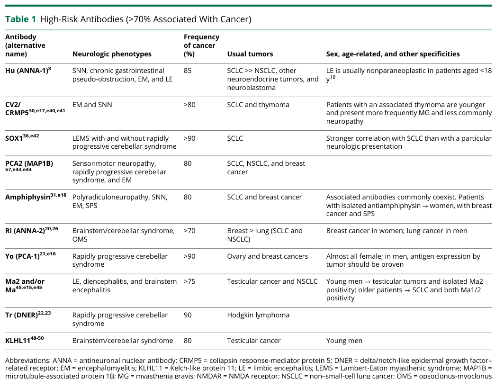

## Question

# Disease Characteristics Research Template

## Target Disease
- **Disease Name:** Paraneoplastic Neurological Syndromes
- **MONDO ID:**  (if available)
- **Category:** Autoimmune

## Research Objectives

Please provide a comprehensive research report on **Paraneoplastic Neurological Syndromes** covering all of the
disease characteristics listed below. This report will be used to populate a disease knowledge
base entry. Be thorough and cite primary literature (PMID preferred) for all claims.

For each section, **suggested databases/resources** are listed. These are the first places
you should search for information on each topic.

---

### 1. Disease Information
> **Search first:** OMIM, Orphanet, ICD-10/ICD-11, MeSH, PubMed

- What is the disease? Provide a concise overview.
- What are the key identifiers? (OMIM, Orphanet, ICD-10/ICD-11, MeSH, Mondo)
- What are the common synonyms and alternative names?
- Is the information derived from individual patients (e.g., EHR) or aggregated disease-level resources?

### 2. Etiology

- **Disease Causal Factors**: What are the primary causes? (genetic, environmental, infectious, mechanistic)
- **Risk Factors**:
  > **Search first:** PubMed, Cochrane Library, UpToDate, clinical guidelines, ClinVar, ClinGen, GWAS Catalog, PheGenI, CTD, CDC, WHO, epidemiological databases
  - Genetic risk factors (causal variants, susceptibility loci, modifier genes)
  - Environmental risk factors (toxins, lifestyle, occupational exposures, age, sex, family history)
- **Protective Factors**:
  > **Search first:** PubMed, Cochrane Library, clinical trial databases, GWAS Catalog, gnomAD, WHO, CDC, nutrition databases
  - Genetic protective factors (protective variants, modifier alleles)
  - Environmental protective factors (diet, lifestyle, exposures that reduce risk)
- **Gene-Environment Interactions**: How do genetic and environmental factors interact to influence disease?
  > **Search first:** CTD, PubMed, PheGenI, GxE databases

### 3. Phenotypes
> **Search first:** HPO (Human Phenotype Ontology), OMIM, Orphanet, PubMed, clinicaltrials.gov, MedDRA, SNOMED CT, DECIPHER, LOINC

For each phenotype, provide:
- **Phenotype type**: symptoms, clinical signs, physical manifestations, behavioral changes, or laboratory abnormalities
  > For symptoms/signs: HPO, OMIM, Orphanet, PubMed
  > For behavioral changes: HPO, DSM, RDoC (Research Domain Criteria), PubMed
  > For laboratory abnormalities: LOINC, SNOMED CT, LabTests Online, PubMed
- **Phenotype characteristics**:
  > **Search first:** OMIM, Orphanet, HPO, PubMed
  - Age of symptom onset (neonatal, childhood, adult-onset, late-onset)
  - Symptom severity (mild, moderate, severe, variable)
  - Symptom progression (stable, progressive, episodic, fluctuating)
  - Frequency among affected individuals (percentage or qualitative)
- **Quality of life impact**: Effects on daily functioning and well-being (per-phenotype when possible)
  > **Search first:** EQ-5D database, SF-36, WHO QOL databases, PubMed
- Suggest HPO (Human Phenotype Ontology) terms for each phenotype

### 4. Genetic/Molecular Information

- **Causal Genes**: Gene mutations or chromosomal abnormalities responsible for disease (gene symbols, OMIM IDs)
  > **Search first:** OMIM, ClinVar, HGMD, Ensembl, NCBI Gene
- **Pathogenic Variants**:
  - Affected genes (gene symbols, HGNC IDs)
    > **Search first:** OMIM, NCBI Gene, Ensembl, HGNC, UniProt, GeneCards
  - Variant classification (pathogenic, likely pathogenic, VUS per ACMG/AMP guidelines)
    > **Search first:** ClinVar, ClinGen, ACMG/AMP guidelines, VarSome
  - Variant type/class (missense, frameshift, nonsense, splice-site, structural)
  - Allele frequency in population databases
    > **Search first:** gnomAD, 1000 Genomes, ExAC, TOPMed, dbSNP
  - Somatic vs germline origin
    > **Search first:** COSMIC (somatic), ClinVar, ICGC, TCGA
  - Functional consequences (loss of function, gain of function, dominant negative)
- **Modifier Genes**: Genes that modify disease severity or expression
- **Epigenetic Information**: DNA methylation, histone modifications, chromatin changes affecting disease
  > **Search first:** ENCODE, Roadmap Epigenomics, MethBase, DiseaseMeth
- **Chromosomal Abnormalities**: Large-scale genetic changes (aneuploidy, translocations, inversions)
  > **Search first:** DECIPHER, ClinVar, ECARUCA, UCSC Genome Browser

### 5. Environmental Information

- **Environmental Factors**: Non-genetic contributing factors (toxins, radiation, pollution, occupational exposure)
  > **Search first:** CTD (Comparative Toxicogenomics Database), TOXNET, PubMed, EPA databases
- **Lifestyle Factors**: Behavioral factors (smoking, diet, exercise, alcohol consumption)
  > **Search first:** CDC databases, WHO, PubMed, NHANES
- **Infectious Agents**: If applicable, pathogens causing or triggering disease (bacteria, viruses, fungi, parasites)
  > **Search first:** NCBI Taxonomy, ViPR, BV-BRC, MicrobeDB, GIDEON

### 6. Mechanism / Pathophysiology

- **Molecular Pathways**: Specific signaling cascades or biochemical pathways involved (Wnt, MAPK, mTOR, PI3K-AKT, etc.)
  > **Search first:** KEGG, Reactome, WikiPathways, PathBank, BioCyc
- **Cellular Processes**: Cell-level mechanisms (apoptosis, autophagy, cell cycle dysregulation, inflammation, etc.)
  > **Search first:** Gene Ontology (GO), Reactome, KEGG, PubMed
- **Protein Dysfunction**: How protein structure or function is altered (misfolding, aggregation, loss of function, gain of function)
  > **Search first:** UniProt, PDB (Protein Data Bank), InterPro, Pfam, AlphaFold
- **Metabolic Changes**: Alterations in metabolic processes (energy metabolism, lipid metabolism, amino acid metabolism)
  > **Search first:** KEGG, BioCyc, HMDB (Human Metabolome Database), BRENDA
- **Immune System Involvement**: Role of immune response (autoimmunity, immunodeficiency, chronic inflammation)
  > **Search first:** ImmPort, Immunome Database, IEDB, Gene Ontology
- **Tissue Damage Mechanisms**: How tissues/ are injured (oxidative stress, ischemia, fibrosis, necrosis)
  > **Search first:** PubMed, Gene Ontology, Reactome
- **Biochemical Abnormalities**: Specific molecular defects (enzyme deficiencies, receptor dysfunction, ion channel defects)
  > **Search first:** BRENDA, UniProt, KEGG, OMIM, PubMed
- **Epigenetic Changes**: DNA methylation, histone modifications affecting gene expression in disease
  > **Search first:** ENCODE, Roadmap Epigenomics, MethBase, DiseaseMeth
- **Molecular Profiling** (if available):
  - Transcriptomics/gene expression changes
    > **Search first:** GEO (Gene Expression Omnibus), ArrayExpress, GTEx, Human Cell Atlas, SRA
  - Proteomics findings
    > **Search first:** PRIDE, ProteomeXchange, Human Protein Atlas, STRING, BioGRID
  - Metabolomics signatures
    > **Search first:** MetaboLights, Metabolomics Workbench, HMDB, METLIN
  - Lipidomics alterations
    > **Search first:** LIPID MAPS, SwissLipids, LipidHome, Metabolomics Workbench
  - Genomic structural features
    > **Search first:** UCSC Genome Browser, Ensembl, NCBI, dbVar, DGV
- **Advanced Technologies** (if applicable):
  - Single-cell analysis findings (cell-type specific mechanisms, cellular heterogeneity)
    > **Search first:** Human Cell Atlas, Single Cell Portal, GEO, CELLxGENE
  - Spatial transcriptomics findings
    > **Search first:** GEO, Spatial Research, Vizgen, 10x Genomics data
  - Multi-omics integration results
    > **Search first:** TCGA, ICGC, cBioPortal, LinkedOmics, PubMed
  - Functional genomics screens (CRISPR, RNAi)
    > **Search first:** DepMap, GenomeRNAi, PubMed, BioGRID ORCS

For each mechanism, describe:
- The causal chain from initial trigger to clinical manifestation
- Which mechanisms are upstream vs downstream
- What cell types and biological processes are involved
- Suggest GO terms for biological processes and CL terms for cell types

### 7. Anatomical Structures Affected

- **Organ Level**:
  - Primary organs directly affected
  - Secondary organ involvement (complications, secondary effects)
  - Body systems involved (cardiovascular, nervous, digestive, respiratory, endocrine, etc.)
  > **Search first:** Uberon, FMA (Foundational Model of Anatomy), OMIM, HPO, ICD-11, MeSH, SNOMED CT
- **Tissue and Cell Level**:
  - Specific tissue types affected (epithelial, connective, muscle, nervous)
  - Specific cell populations targeted (with Cell Ontology terms)
  > **Search first:** Uberon, Human Protein Atlas, Cell Ontology, Human Cell Atlas, CellMarker, PanglaoDB
- **Subcellular Level**:
  - Cellular compartments involved (mitochondria, nucleus, ER, lysosomes) (with GO Cellular Component terms)
  > **Search first:** Gene Ontology (Cellular Component), UniProt, Human Protein Atlas
- **Localization**:
  - Specific anatomical sites (with UBERON terms)
    > **Search first:** FMA, Uberon, NeuroNames (for brain), SNOMED CT
  - Lateralization (unilateral, bilateral, asymmetric)
    > **Search first:** HPO, clinical literature, imaging databases

### 8. Temporal Development

- **Onset**:
  - Typical age of onset (congenital, pediatric, adult, geriatric)
  - Onset pattern (acute, subacute, chronic, insidious)
  > **Search first:** OMIM, Orphanet, HPO, PubMed
- **Progression**:
  - Disease stages (early, intermediate, advanced, end-stage)
    > **Search first:** Cancer Staging Manual (AJCC), WHO classifications, PubMed
  - Progression rate (rapid, slow, variable)
  - Disease course pattern (episodic, relapsing-remitting, progressive, stable)
  - Disease duration (self-limited, chronic lifelong)
  > **Search first:** Disease registries, longitudinal cohort databases, natural history studies, PubMed, Orphanet, OMIM
- **Patterns**:
  - Remission patterns (spontaneous, treatment-induced)
    > **Search first:** Clinical trial databases, disease registries, PubMed
  - Critical periods (time windows of vulnerability or opportunity for intervention)
    > **Search first:** PubMed, developmental biology databases, clinical guidelines

### 9. Inheritance and Population

- **Epidemiology**:
  - Prevalence (cases per 100,000 at given time)
  - Incidence (new cases per 100,000 per year)
  > **Search first:** Orphanet, CDC, WHO, GBD (Global Burden of Disease), national registries, SEER, disease registries
- **For Genetic Etiology**:
  - Inheritance pattern (AD, AR, X-linked, mitochondrial, multifactorial, polygenic)
    > **Search first:** OMIM, Orphanet, ClinVar, GTR (Genetic Testing Registry)
  - Penetrance (complete, incomplete, age-dependent)
    > **Search first:** ClinVar, OMIM, PubMed, ClinGen
  - Expressivity (variable, consistent)
    > **Search first:** OMIM, ClinVar, PubMed
  - Genetic anticipation (increasing severity in successive generations)
    > **Search first:** OMIM, PubMed (especially for repeat expansion disorders)
  - Germline mosaicism
    > **Search first:** ClinVar, OMIM, genetic counseling literature, PubMed
  - Founder effects (population-specific mutations)
    > **Search first:** gnomAD, population genetics databases, PubMed
  - Consanguinity role
    > **Search first:** OMIM, population studies, genetic counseling resources
  - Carrier frequency
    > **Search first:** gnomAD, carrier screening databases, GeneReviews, GTR
- **Population Demographics**:
  - Affected populations (ethnic or demographic groups with higher prevalence)
    > **Search first:** gnomAD, 1000 Genomes, PAGE Study, PubMed, population registries
  - Geographic distribution (endemic areas, regional variation)
    > **Search first:** WHO, CDC, GBD, Orphanet, geographic epidemiology databases
  - Geographic distribution of specific variants
  - Sex ratio (male:female)
    > **Search first:** Disease registries, OMIM, PubMed, epidemiological databases
  - Age distribution of affected individuals
    > **Search first:** CDC, disease registries, SEER, Orphanet

### 10. Diagnostics

- **Clinical Tests**:
  - Laboratory tests (blood, urine, tissue chemistry, specific enzyme assays)
    > **Search first:** LOINC, LabTests Online, PubMed
  - Biomarkers (proteins, metabolites, genetic markers, circulating biomarkers)
    > **Search first:** FDA Biomarker List, BEST (Biomarkers, EndpointS, and other Tools), PubMed
  - Imaging studies (X-ray, CT, MRI, PET, ultrasound)
    > **Search first:** RadLex, DICOM, Radiopaedia, imaging databases
  - Functional tests (pulmonary function, cardiac stress tests)
    > **Search first:** LOINC, clinical guidelines, PubMed
  - Electrophysiology (EEG, EMG, ECG, nerve conduction studies)
    > **Search first:** LOINC, clinical neurophysiology databases, PubMed
  - Biopsy findings (histopathology, immunohistochemistry)
    > **Search first:** SNOMED CT, College of American Pathologists resources, PubMed
  - Pathology findings (microscopic examination)
    > **Search first:** SNOMED CT, Digital Pathology databases, PubMed
- **Genetic Testing**:
  > **Search first:** GTR (Genetic Testing Registry), GeneReviews, ClinGen
  - Overview of recommended genetic testing approach
  - Whole genome sequencing (WGS) utility
    > **Search first:** GTR, ClinVar, GEL (Genomics England), gnomAD
  - Whole exome sequencing (WES) utility
    > **Search first:** GTR, ClinVar, OMIM, GeneMatcher
  - Gene panels (which panels, which genes)
    > **Search first:** GTR, ClinVar, laboratory-specific databases
  - Single gene testing
    > **Search first:** GTR, ClinVar, OMIM, GeneReviews
  - Chromosomal microarray (CMA)
    > **Search first:** DECIPHER, ClinVar, dbVar, ECARUCA
  - Karyotyping
    > **Search first:** Chromosome Abnormality Database, ClinVar, cytogenetics resources
  - FISH
    > **Search first:** ClinVar, cytogenetics databases, PubMed
  - Mitochondrial DNA testing
    > **Search first:** MITOMAP, MSeqDR, ClinVar, GTR
  - Repeat expansion testing
    > **Search first:** GTR, ClinVar, repeat expansion databases, PubMed
- **Omics-Based Diagnostics** (if applicable):
  - RNA sequencing / transcriptomics
    > **Search first:** GEO, ArrayExpress, GTEx, RNA-seq databases
  - Proteomics
    > **Search first:** PRIDE, ProteomeXchange, FDA Biomarker database
  - Metabolomics
    > **Search first:** MetaboLights, Metabolomics Workbench, HMDB
  - Epigenomics
    > **Search first:** GEO, ENCODE, Roadmap Epigenomics, MethBase
  - Liquid biopsy
    > **Search first:** COSMIC, ClinVar, liquid biopsy databases, PubMed
- **Clinical Criteria**:
  - Standardized diagnostic criteria (DSM, ICD, society guidelines)
    > **Search first:** DSM-5, ICD-11, clinical society guidelines, UpToDate
  - Differential diagnosis (other conditions to rule out, with distinguishing features)
    > **Search first:** DynaMed, UpToDate, clinical decision support systems
- **Screening**:
  - Screening methods for asymptomatic individuals (newborn screening, carrier screening, cascade screening)
    > **Search first:** ACMG recommendations, CDC newborn screening, GTR

### 11. Outcome/Prognosis

- **Survival and Mortality**:
  - Survival rate (5-year, 10-year, overall)
    > **Search first:** SEER, cancer registries, disease-specific registries, PubMed
  - Life expectancy (with and without treatment if applicable)
    > **Search first:** Orphanet, disease registries, actuarial databases, PubMed
  - Mortality rate
    > **Search first:** CDC, WHO, GBD, national mortality databases
  - Disease-specific mortality (deaths directly attributable to disease)
    > **Search first:** Disease registries, CDC Wonder, GBD, PubMed
- **Morbidity and Function**:
  - Morbidity (disease-related disability and health impacts)
    > **Search first:** GBD, WHO, disability databases, PubMed
  - Disability outcomes (long-term functional impairments)
    > **Search first:** ICF (International Classification of Functioning), disability registries
  - Quality of life measures (EQ-5D, SF-36, PROMIS, disease-specific tools)
    > **Search first:** EQ-5D database, SF-36, PROMIS, PubMed
- **Disease Course**:
  - Complications (secondary problems: infections, organ failure, etc.)
    > **Search first:** ICD codes, disease registries, clinical databases, PubMed
  - Recovery potential (likelihood and extent of recovery, with vs without treatment)
    > **Search first:** Natural history studies, rehabilitation databases, PubMed
- **Prediction**:
  - Prognostic factors (age, disease severity, biomarkers, treatment response)
    > **Search first:** Prognostic models databases, clinical calculators, PubMed
  - Prognostic biomarkers (molecular markers predicting disease course)
    > **Search first:** FDA Biomarker database, PubMed, cancer prognostic databases

### 12. Treatment

- **Pharmacotherapy**:
  - Pharmacological treatments (drug names, drug classes, mechanisms of action)
    > **Search first:** DrugBank, RxNorm, ATC classification, DailyMed, FDA databases
  - Pharmacogenomics (how genetic variants affect drug metabolism, efficacy, toxicity)
    > **Search first:** PharmGKB, CPIC (Clinical Pharmacogenetics), FDA Table of PGx Biomarkers
- **Advanced Therapeutics**:
  - Gene therapy (viral vectors, CRISPR, gene replacement, gene editing)
    > **Search first:** ClinicalTrials.gov, FDA gene therapy database, ASGCT resources
  - Cell therapy (stem cell transplant, CAR-T, cellular therapeutics)
    > **Search first:** ClinicalTrials.gov, FDA cell therapy database, FACT standards
  - RNA-based therapies (ASOs, siRNA, mRNA therapies)
    > **Search first:** ClinicalTrials.gov, FDA approvals, PubMed
  - Targeted therapies (treatments directed at specific molecular targets)
    > **Search first:** My Cancer Genome, OncoKB, ClinicalTrials.gov, FDA approvals
  - Immunotherapies (checkpoint inhibitors, monoclonal antibodies)
    > **Search first:** Cancer Immunotherapy Database, FDA approvals, ClinicalTrials.gov
- **Surgical and Interventional**:
  - Surgical interventions (types of surgery, timing, outcomes)
    > **Search first:** CPT codes, surgical registries, clinical guidelines, PubMed
- **Supportive and Rehabilitative**:
  - Supportive care (symptom management, pain control, nutrition)
    > **Search first:** Clinical guidelines, Cochrane Library, PubMed
  - Rehabilitation (physical therapy, occupational therapy, speech therapy)
    > **Search first:** Rehabilitation medicine databases, clinical guidelines, PubMed
- **Experimental**:
  - Experimental treatments in clinical trials (with NCT identifiers if available)
    > **Search first:** ClinicalTrials.gov, EU Clinical Trials Register, WHO ICTRP
- **Treatment Outcomes**:
  - Treatment response rates
    > **Search first:** Clinical trial databases, FDA reviews, systematic reviews, PubMed
  - Side effects and adverse events
    > **Search first:** FDA Adverse Event Reporting System (FAERS), MedWatch, PubMed
- **Treatment Strategy**:
  - Treatment algorithms (clinical pathways, decision trees)
    > **Search first:** Clinical practice guidelines, NCCN Guidelines, UpToDate
  - Combination therapies
    > **Search first:** ClinicalTrials.gov, treatment guidelines, PubMed
  - Personalized medicine approaches (genotype-guided treatment)
    > **Search first:** My Cancer Genome, CIViC, PharmGKB, precision medicine databases

For each treatment, suggest MAXO (Medical Action Ontology) terms where applicable.

### 13. Prevention

- **Prevention Levels**:
  - Primary prevention (preventing disease occurrence: vaccination, risk factor modification)
    > **Search first:** CDC, WHO, USPSTF recommendations, Cochrane Library
  - Secondary prevention (early detection and treatment: screening programs, early intervention)
    > **Search first:** USPSTF, CDC screening guidelines, WHO
  - Tertiary prevention (preventing complications in those with disease)
    > **Search first:** Clinical guidelines, disease management protocols, PubMed
- **Immunization**: Vaccine strategies (if applicable)
  > **Search first:** CDC vaccine schedules, WHO immunization, FDA vaccine database
- **Screening and Early Detection**:
  - Screening programs (population-based: newborn screening, cancer screening)
    > **Search first:** CDC screening programs, USPSTF, cancer screening databases
  - Genetic screening (carrier screening, preimplantation genetic diagnosis, prenatal testing)
    > **Search first:** ACMG recommendations, ACOG guidelines, GTR
  - Risk stratification (identifying high-risk individuals for targeted prevention)
    > **Search first:** Risk prediction models, clinical calculators, PubMed
- **Behavioral Interventions**: Lifestyle modifications to reduce risk
  > **Search first:** CDC, WHO, behavioral intervention databases, Cochrane Library
- **Counseling**: Genetic counseling (risk assessment, family planning guidance)
  > **Search first:** NSGC resources, ACMG guidelines, GeneReviews
- **Public Health**:
  - Public health interventions (sanitation, vector control, health education)
    > **Search first:** CDC, WHO, public health databases, PubMed
  - Environmental interventions (reducing environmental risk factors)
    > **Search first:** EPA databases, WHO environmental health, PubMed
- **Prophylaxis**: Preventive medications or procedures
  > **Search first:** Clinical guidelines, FDA approvals, PubMed

### 14. Other Species / Natural Disease

- **Taxonomy**: Species affected (with NCBI Taxon identifiers)
  > **Search first:** NCBI Taxonomy
- **Breed**: Specific breeds affected (with VBO identifiers if applicable)
  > **Search first:** VBO (Vertebrate Breed Ontology)
- **Gene**: Orthologous genes in other species (with NCBI Gene IDs)
  > **Search first:** NCBI Gene
- **Natural Disease**:
  - Naturally occurring disease in other species (companion animals, wildlife)
    > **Search first:** OMIA (Online Mendelian Inheritance in Animals), VetCompass, PubMed
  - Veterinary relevance and importance in animal health
    > **Search first:** OMIA, veterinary databases, PubMed
- **Comparative Biology**:
  - Comparative pathology (similarities and differences across species)
    > **Search first:** OMIA, comparative pathology databases, PubMed
  - Evolutionary conservation of disease mechanisms
    > **Search first:** HomoloGene, OrthoMCL, Alliance of Genome Resources
- **Transmission** (if applicable):
  - Zoonotic potential
    > **Search first:** CDC zoonotic diseases, WHO zoonoses, GIDEON
  - Cross-species susceptibility
    > **Search first:** NCBI Taxonomy, veterinary databases, PubMed

### 15. Model Organisms

- **Model Types**:
  - Model organism type (mammalian, invertebrate, cellular, in vitro)
    > **Search first:** Alliance of Genome Resources, model organism databases
  - Specific model systems (mouse, rat, zebrafish, Drosophila, C. elegans, yeast, cell lines, organoids, iPSCs)
    > **Search first:** MGI, RGD, ZFIN, FlyBase, WormBase, SGD, ATCC, Cellosaurus
  - Induced models (drug treatment, surgical intervention, environmental manipulation)
    > **Search first:** MGI, model organism databases, PubMed
- **Genetic Models**:
  - Types available (knockout, knock-in, transgenic, conditional, humanized)
    > **Search first:** MGI, IMPC, KOMP, EuMMCR, IMSR
- **Model Characteristics**:
  - Phenotype recapitulation (how well model reproduces human disease features)
    > **Search first:** Model organism databases, comparative studies, PubMed
  - Model limitations (aspects of human disease not captured)
    > **Search first:** Model organism databases, PubMed, review articles
- **Applications**:
  - Research applications (what aspects of disease can be studied)
    > **Search first:** Model organism databases, PubMed
- **Resources**:
  - Model databases
    > **Search first:** MGI, RGD, ZFIN, FlyBase, WormBase, IMSR, EMMA, MMRRC

---

## Citation Requirements

- Cite primary literature (PMID preferred) for all mechanistic and clinical claims
- Prioritize recent reviews and landmark papers
- Include direct quotes from abstracts where possible to support key statements
- Distinguish evidence source types: human clinical, model organism, in vitro, computational

## Output Format

Structure your response as a comprehensive narrative organized by the sections above.
For each section, provide:
- Factual content with specific details (numbers, percentages, gene names, variant nomenclature)
- Ontology term suggestions (HPO, GO, CL, UBERON, CHEBI, MAXO, MONDO) where applicable
- Evidence citations with PMIDs
- Direct quotes from abstracts to support key claims
- Clear indication when information is not available or not applicable for this disease

This report will be used to populate a disease knowledge base entry with:
- Pathophysiology descriptions with causal chains
- Gene/protein annotations (HGNC, GO terms)
- Phenotype associations (HP terms) with frequencies
- Cell type involvement (CL terms)
- Anatomical locations (UBERON terms)
- Chemical entities (CHEBI terms)
- Treatment annotations (MAXO terms)
- Evidence items with PMIDs and exact abstract quotes
- Epidemiology, prognosis, diagnostic, and prevention information
- Animal model descriptions with phenotype recapitulation details

## Output

Question: You are an expert researcher providing comprehensive, well-cited information.

Provide detailed information focusing on:
1. Key concepts and definitions with current understanding
2. Recent developments and latest research (prioritize 2023-2024 sources)
3. Current applications and real-world implementations
4. Expert opinions and analysis from authoritative sources
5. Relevant statistics and data from recent studies

Format as a comprehensive research report with proper citations. Include URLs and publication dates where available.
Always prioritize recent, authoritative sources and provide specific citations for all major claims.

# Disease Characteristics Research Template

## Target Disease
- **Disease Name:** Paraneoplastic Neurological Syndromes
- **MONDO ID:**  (if available)
- **Category:** Autoimmune

## Research Objectives

Please provide a comprehensive research report on **Paraneoplastic Neurological Syndromes** covering all of the
disease characteristics listed below. This report will be used to populate a disease knowledge
base entry. Be thorough and cite primary literature (PMID preferred) for all claims.

For each section, **suggested databases/resources** are listed. These are the first places
you should search for information on each topic.

---

### 1. Disease Information
> **Search first:** OMIM, Orphanet, ICD-10/ICD-11, MeSH, PubMed

- What is the disease? Provide a concise overview.
- What are the key identifiers? (OMIM, Orphanet, ICD-10/ICD-11, MeSH, Mondo)
- What are the common synonyms and alternative names?
- Is the information derived from individual patients (e.g., EHR) or aggregated disease-level resources?

### 2. Etiology

- **Disease Causal Factors**: What are the primary causes? (genetic, environmental, infectious, mechanistic)
- **Risk Factors**:
  > **Search first:** PubMed, Cochrane Library, UpToDate, clinical guidelines, ClinVar, ClinGen, GWAS Catalog, PheGenI, CTD, CDC, WHO, epidemiological databases
  - Genetic risk factors (causal variants, susceptibility loci, modifier genes)
  - Environmental risk factors (toxins, lifestyle, occupational exposures, age, sex, family history)
- **Protective Factors**:
  > **Search first:** PubMed, Cochrane Library, clinical trial databases, GWAS Catalog, gnomAD, WHO, CDC, nutrition databases
  - Genetic protective factors (protective variants, modifier alleles)
  - Environmental protective factors (diet, lifestyle, exposures that reduce risk)
- **Gene-Environment Interactions**: How do genetic and environmental factors interact to influence disease?
  > **Search first:** CTD, PubMed, PheGenI, GxE databases

### 3. Phenotypes
> **Search first:** HPO (Human Phenotype Ontology), OMIM, Orphanet, PubMed, clinicaltrials.gov, MedDRA, SNOMED CT, DECIPHER, LOINC

For each phenotype, provide:
- **Phenotype type**: symptoms, clinical signs, physical manifestations, behavioral changes, or laboratory abnormalities
  > For symptoms/signs: HPO, OMIM, Orphanet, PubMed
  > For behavioral changes: HPO, DSM, RDoC (Research Domain Criteria), PubMed
  > For laboratory abnormalities: LOINC, SNOMED CT, LabTests Online, PubMed
- **Phenotype characteristics**:
  > **Search first:** OMIM, Orphanet, HPO, PubMed
  - Age of symptom onset (neonatal, childhood, adult-onset, late-onset)
  - Symptom severity (mild, moderate, severe, variable)
  - Symptom progression (stable, progressive, episodic, fluctuating)
  - Frequency among affected individuals (percentage or qualitative)
- **Quality of life impact**: Effects on daily functioning and well-being (per-phenotype when possible)
  > **Search first:** EQ-5D database, SF-36, WHO QOL databases, PubMed
- Suggest HPO (Human Phenotype Ontology) terms for each phenotype

### 4. Genetic/Molecular Information

- **Causal Genes**: Gene mutations or chromosomal abnormalities responsible for disease (gene symbols, OMIM IDs)
  > **Search first:** OMIM, ClinVar, HGMD, Ensembl, NCBI Gene
- **Pathogenic Variants**:
  - Affected genes (gene symbols, HGNC IDs)
    > **Search first:** OMIM, NCBI Gene, Ensembl, HGNC, UniProt, GeneCards
  - Variant classification (pathogenic, likely pathogenic, VUS per ACMG/AMP guidelines)
    > **Search first:** ClinVar, ClinGen, ACMG/AMP guidelines, VarSome
  - Variant type/class (missense, frameshift, nonsense, splice-site, structural)
  - Allele frequency in population databases
    > **Search first:** gnomAD, 1000 Genomes, ExAC, TOPMed, dbSNP
  - Somatic vs germline origin
    > **Search first:** COSMIC (somatic), ClinVar, ICGC, TCGA
  - Functional consequences (loss of function, gain of function, dominant negative)
- **Modifier Genes**: Genes that modify disease severity or expression
- **Epigenetic Information**: DNA methylation, histone modifications, chromatin changes affecting disease
  > **Search first:** ENCODE, Roadmap Epigenomics, MethBase, DiseaseMeth
- **Chromosomal Abnormalities**: Large-scale genetic changes (aneuploidy, translocations, inversions)
  > **Search first:** DECIPHER, ClinVar, ECARUCA, UCSC Genome Browser

### 5. Environmental Information

- **Environmental Factors**: Non-genetic contributing factors (toxins, radiation, pollution, occupational exposure)
  > **Search first:** CTD (Comparative Toxicogenomics Database), TOXNET, PubMed, EPA databases
- **Lifestyle Factors**: Behavioral factors (smoking, diet, exercise, alcohol consumption)
  > **Search first:** CDC databases, WHO, PubMed, NHANES
- **Infectious Agents**: If applicable, pathogens causing or triggering disease (bacteria, viruses, fungi, parasites)
  > **Search first:** NCBI Taxonomy, ViPR, BV-BRC, MicrobeDB, GIDEON

### 6. Mechanism / Pathophysiology

- **Molecular Pathways**: Specific signaling cascades or biochemical pathways involved (Wnt, MAPK, mTOR, PI3K-AKT, etc.)
  > **Search first:** KEGG, Reactome, WikiPathways, PathBank, BioCyc
- **Cellular Processes**: Cell-level mechanisms (apoptosis, autophagy, cell cycle dysregulation, inflammation, etc.)
  > **Search first:** Gene Ontology (GO), Reactome, KEGG, PubMed
- **Protein Dysfunction**: How protein structure or function is altered (misfolding, aggregation, loss of function, gain of function)
  > **Search first:** UniProt, PDB (Protein Data Bank), InterPro, Pfam, AlphaFold
- **Metabolic Changes**: Alterations in metabolic processes (energy metabolism, lipid metabolism, amino acid metabolism)
  > **Search first:** KEGG, BioCyc, HMDB (Human Metabolome Database), BRENDA
- **Immune System Involvement**: Role of immune response (autoimmunity, immunodeficiency, chronic inflammation)
  > **Search first:** ImmPort, Immunome Database, IEDB, Gene Ontology
- **Tissue Damage Mechanisms**: How tissues/ are injured (oxidative stress, ischemia, fibrosis, necrosis)
  > **Search first:** PubMed, Gene Ontology, Reactome
- **Biochemical Abnormalities**: Specific molecular defects (enzyme deficiencies, receptor dysfunction, ion channel defects)
  > **Search first:** BRENDA, UniProt, KEGG, OMIM, PubMed
- **Epigenetic Changes**: DNA methylation, histone modifications affecting gene expression in disease
  > **Search first:** ENCODE, Roadmap Epigenomics, MethBase, DiseaseMeth
- **Molecular Profiling** (if available):
  - Transcriptomics/gene expression changes
    > **Search first:** GEO (Gene Expression Omnibus), ArrayExpress, GTEx, Human Cell Atlas, SRA
  - Proteomics findings
    > **Search first:** PRIDE, ProteomeXchange, Human Protein Atlas, STRING, BioGRID
  - Metabolomics signatures
    > **Search first:** MetaboLights, Metabolomics Workbench, HMDB, METLIN
  - Lipidomics alterations
    > **Search first:** LIPID MAPS, SwissLipids, LipidHome, Metabolomics Workbench
  - Genomic structural features
    > **Search first:** UCSC Genome Browser, Ensembl, NCBI, dbVar, DGV
- **Advanced Technologies** (if applicable):
  - Single-cell analysis findings (cell-type specific mechanisms, cellular heterogeneity)
    > **Search first:** Human Cell Atlas, Single Cell Portal, GEO, CELLxGENE
  - Spatial transcriptomics findings
    > **Search first:** GEO, Spatial Research, Vizgen, 10x Genomics data
  - Multi-omics integration results
    > **Search first:** TCGA, ICGC, cBioPortal, LinkedOmics, PubMed
  - Functional genomics screens (CRISPR, RNAi)
    > **Search first:** DepMap, GenomeRNAi, PubMed, BioGRID ORCS

For each mechanism, describe:
- The causal chain from initial trigger to clinical manifestation
- Which mechanisms are upstream vs downstream
- What cell types and biological processes are involved
- Suggest GO terms for biological processes and CL terms for cell types

### 7. Anatomical Structures Affected

- **Organ Level**:
  - Primary organs directly affected
  - Secondary organ involvement (complications, secondary effects)
  - Body systems involved (cardiovascular, nervous, digestive, respiratory, endocrine, etc.)
  > **Search first:** Uberon, FMA (Foundational Model of Anatomy), OMIM, HPO, ICD-11, MeSH, SNOMED CT
- **Tissue and Cell Level**:
  - Specific tissue types affected (epithelial, connective, muscle, nervous)
  - Specific cell populations targeted (with Cell Ontology terms)
  > **Search first:** Uberon, Human Protein Atlas, Cell Ontology, Human Cell Atlas, CellMarker, PanglaoDB
- **Subcellular Level**:
  - Cellular compartments involved (mitochondria, nucleus, ER, lysosomes) (with GO Cellular Component terms)
  > **Search first:** Gene Ontology (Cellular Component), UniProt, Human Protein Atlas
- **Localization**:
  - Specific anatomical sites (with UBERON terms)
    > **Search first:** FMA, Uberon, NeuroNames (for brain), SNOMED CT
  - Lateralization (unilateral, bilateral, asymmetric)
    > **Search first:** HPO, clinical literature, imaging databases

### 8. Temporal Development

- **Onset**:
  - Typical age of onset (congenital, pediatric, adult, geriatric)
  - Onset pattern (acute, subacute, chronic, insidious)
  > **Search first:** OMIM, Orphanet, HPO, PubMed
- **Progression**:
  - Disease stages (early, intermediate, advanced, end-stage)
    > **Search first:** Cancer Staging Manual (AJCC), WHO classifications, PubMed
  - Progression rate (rapid, slow, variable)
  - Disease course pattern (episodic, relapsing-remitting, progressive, stable)
  - Disease duration (self-limited, chronic lifelong)
  > **Search first:** Disease registries, longitudinal cohort databases, natural history studies, PubMed, Orphanet, OMIM
- **Patterns**:
  - Remission patterns (spontaneous, treatment-induced)
    > **Search first:** Clinical trial databases, disease registries, PubMed
  - Critical periods (time windows of vulnerability or opportunity for intervention)
    > **Search first:** PubMed, developmental biology databases, clinical guidelines

### 9. Inheritance and Population

- **Epidemiology**:
  - Prevalence (cases per 100,000 at given time)
  - Incidence (new cases per 100,000 per year)
  > **Search first:** Orphanet, CDC, WHO, GBD (Global Burden of Disease), national registries, SEER, disease registries
- **For Genetic Etiology**:
  - Inheritance pattern (AD, AR, X-linked, mitochondrial, multifactorial, polygenic)
    > **Search first:** OMIM, Orphanet, ClinVar, GTR (Genetic Testing Registry)
  - Penetrance (complete, incomplete, age-dependent)
    > **Search first:** ClinVar, OMIM, PubMed, ClinGen
  - Expressivity (variable, consistent)
    > **Search first:** OMIM, ClinVar, PubMed
  - Genetic anticipation (increasing severity in successive generations)
    > **Search first:** OMIM, PubMed (especially for repeat expansion disorders)
  - Germline mosaicism
    > **Search first:** ClinVar, OMIM, genetic counseling literature, PubMed
  - Founder effects (population-specific mutations)
    > **Search first:** gnomAD, population genetics databases, PubMed
  - Consanguinity role
    > **Search first:** OMIM, population studies, genetic counseling resources
  - Carrier frequency
    > **Search first:** gnomAD, carrier screening databases, GeneReviews, GTR
- **Population Demographics**:
  - Affected populations (ethnic or demographic groups with higher prevalence)
    > **Search first:** gnomAD, 1000 Genomes, PAGE Study, PubMed, population registries
  - Geographic distribution (endemic areas, regional variation)
    > **Search first:** WHO, CDC, GBD, Orphanet, geographic epidemiology databases
  - Geographic distribution of specific variants
  - Sex ratio (male:female)
    > **Search first:** Disease registries, OMIM, PubMed, epidemiological databases
  - Age distribution of affected individuals
    > **Search first:** CDC, disease registries, SEER, Orphanet

### 10. Diagnostics

- **Clinical Tests**:
  - Laboratory tests (blood, urine, tissue chemistry, specific enzyme assays)
    > **Search first:** LOINC, LabTests Online, PubMed
  - Biomarkers (proteins, metabolites, genetic markers, circulating biomarkers)
    > **Search first:** FDA Biomarker List, BEST (Biomarkers, EndpointS, and other Tools), PubMed
  - Imaging studies (X-ray, CT, MRI, PET, ultrasound)
    > **Search first:** RadLex, DICOM, Radiopaedia, imaging databases
  - Functional tests (pulmonary function, cardiac stress tests)
    > **Search first:** LOINC, clinical guidelines, PubMed
  - Electrophysiology (EEG, EMG, ECG, nerve conduction studies)
    > **Search first:** LOINC, clinical neurophysiology databases, PubMed
  - Biopsy findings (histopathology, immunohistochemistry)
    > **Search first:** SNOMED CT, College of American Pathologists resources, PubMed
  - Pathology findings (microscopic examination)
    > **Search first:** SNOMED CT, Digital Pathology databases, PubMed
- **Genetic Testing**:
  > **Search first:** GTR (Genetic Testing Registry), GeneReviews, ClinGen
  - Overview of recommended genetic testing approach
  - Whole genome sequencing (WGS) utility
    > **Search first:** GTR, ClinVar, GEL (Genomics England), gnomAD
  - Whole exome sequencing (WES) utility
    > **Search first:** GTR, ClinVar, OMIM, GeneMatcher
  - Gene panels (which panels, which genes)
    > **Search first:** GTR, ClinVar, laboratory-specific databases
  - Single gene testing
    > **Search first:** GTR, ClinVar, OMIM, GeneReviews
  - Chromosomal microarray (CMA)
    > **Search first:** DECIPHER, ClinVar, dbVar, ECARUCA
  - Karyotyping
    > **Search first:** Chromosome Abnormality Database, ClinVar, cytogenetics resources
  - FISH
    > **Search first:** ClinVar, cytogenetics databases, PubMed
  - Mitochondrial DNA testing
    > **Search first:** MITOMAP, MSeqDR, ClinVar, GTR
  - Repeat expansion testing
    > **Search first:** GTR, ClinVar, repeat expansion databases, PubMed
- **Omics-Based Diagnostics** (if applicable):
  - RNA sequencing / transcriptomics
    > **Search first:** GEO, ArrayExpress, GTEx, RNA-seq databases
  - Proteomics
    > **Search first:** PRIDE, ProteomeXchange, FDA Biomarker database
  - Metabolomics
    > **Search first:** MetaboLights, Metabolomics Workbench, HMDB
  - Epigenomics
    > **Search first:** GEO, ENCODE, Roadmap Epigenomics, MethBase
  - Liquid biopsy
    > **Search first:** COSMIC, ClinVar, liquid biopsy databases, PubMed
- **Clinical Criteria**:
  - Standardized diagnostic criteria (DSM, ICD, society guidelines)
    > **Search first:** DSM-5, ICD-11, clinical society guidelines, UpToDate
  - Differential diagnosis (other conditions to rule out, with distinguishing features)
    > **Search first:** DynaMed, UpToDate, clinical decision support systems
- **Screening**:
  - Screening methods for asymptomatic individuals (newborn screening, carrier screening, cascade screening)
    > **Search first:** ACMG recommendations, CDC newborn screening, GTR

### 11. Outcome/Prognosis

- **Survival and Mortality**:
  - Survival rate (5-year, 10-year, overall)
    > **Search first:** SEER, cancer registries, disease-specific registries, PubMed
  - Life expectancy (with and without treatment if applicable)
    > **Search first:** Orphanet, disease registries, actuarial databases, PubMed
  - Mortality rate
    > **Search first:** CDC, WHO, GBD, national mortality databases
  - Disease-specific mortality (deaths directly attributable to disease)
    > **Search first:** Disease registries, CDC Wonder, GBD, PubMed
- **Morbidity and Function**:
  - Morbidity (disease-related disability and health impacts)
    > **Search first:** GBD, WHO, disability databases, PubMed
  - Disability outcomes (long-term functional impairments)
    > **Search first:** ICF (International Classification of Functioning), disability registries
  - Quality of life measures (EQ-5D, SF-36, PROMIS, disease-specific tools)
    > **Search first:** EQ-5D database, SF-36, PROMIS, PubMed
- **Disease Course**:
  - Complications (secondary problems: infections, organ failure, etc.)
    > **Search first:** ICD codes, disease registries, clinical databases, PubMed
  - Recovery potential (likelihood and extent of recovery, with vs without treatment)
    > **Search first:** Natural history studies, rehabilitation databases, PubMed
- **Prediction**:
  - Prognostic factors (age, disease severity, biomarkers, treatment response)
    > **Search first:** Prognostic models databases, clinical calculators, PubMed
  - Prognostic biomarkers (molecular markers predicting disease course)
    > **Search first:** FDA Biomarker database, PubMed, cancer prognostic databases

### 12. Treatment

- **Pharmacotherapy**:
  - Pharmacological treatments (drug names, drug classes, mechanisms of action)
    > **Search first:** DrugBank, RxNorm, ATC classification, DailyMed, FDA databases
  - Pharmacogenomics (how genetic variants affect drug metabolism, efficacy, toxicity)
    > **Search first:** PharmGKB, CPIC (Clinical Pharmacogenetics), FDA Table of PGx Biomarkers
- **Advanced Therapeutics**:
  - Gene therapy (viral vectors, CRISPR, gene replacement, gene editing)
    > **Search first:** ClinicalTrials.gov, FDA gene therapy database, ASGCT resources
  - Cell therapy (stem cell transplant, CAR-T, cellular therapeutics)
    > **Search first:** ClinicalTrials.gov, FDA cell therapy database, FACT standards
  - RNA-based therapies (ASOs, siRNA, mRNA therapies)
    > **Search first:** ClinicalTrials.gov, FDA approvals, PubMed
  - Targeted therapies (treatments directed at specific molecular targets)
    > **Search first:** My Cancer Genome, OncoKB, ClinicalTrials.gov, FDA approvals
  - Immunotherapies (checkpoint inhibitors, monoclonal antibodies)
    > **Search first:** Cancer Immunotherapy Database, FDA approvals, ClinicalTrials.gov
- **Surgical and Interventional**:
  - Surgical interventions (types of surgery, timing, outcomes)
    > **Search first:** CPT codes, surgical registries, clinical guidelines, PubMed
- **Supportive and Rehabilitative**:
  - Supportive care (symptom management, pain control, nutrition)
    > **Search first:** Clinical guidelines, Cochrane Library, PubMed
  - Rehabilitation (physical therapy, occupational therapy, speech therapy)
    > **Search first:** Rehabilitation medicine databases, clinical guidelines, PubMed
- **Experimental**:
  - Experimental treatments in clinical trials (with NCT identifiers if available)
    > **Search first:** ClinicalTrials.gov, EU Clinical Trials Register, WHO ICTRP
- **Treatment Outcomes**:
  - Treatment response rates
    > **Search first:** Clinical trial databases, FDA reviews, systematic reviews, PubMed
  - Side effects and adverse events
    > **Search first:** FDA Adverse Event Reporting System (FAERS), MedWatch, PubMed
- **Treatment Strategy**:
  - Treatment algorithms (clinical pathways, decision trees)
    > **Search first:** Clinical practice guidelines, NCCN Guidelines, UpToDate
  - Combination therapies
    > **Search first:** ClinicalTrials.gov, treatment guidelines, PubMed
  - Personalized medicine approaches (genotype-guided treatment)
    > **Search first:** My Cancer Genome, CIViC, PharmGKB, precision medicine databases

For each treatment, suggest MAXO (Medical Action Ontology) terms where applicable.

### 13. Prevention

- **Prevention Levels**:
  - Primary prevention (preventing disease occurrence: vaccination, risk factor modification)
    > **Search first:** CDC, WHO, USPSTF recommendations, Cochrane Library
  - Secondary prevention (early detection and treatment: screening programs, early intervention)
    > **Search first:** USPSTF, CDC screening guidelines, WHO
  - Tertiary prevention (preventing complications in those with disease)
    > **Search first:** Clinical guidelines, disease management protocols, PubMed
- **Immunization**: Vaccine strategies (if applicable)
  > **Search first:** CDC vaccine schedules, WHO immunization, FDA vaccine database
- **Screening and Early Detection**:
  - Screening programs (population-based: newborn screening, cancer screening)
    > **Search first:** CDC screening programs, USPSTF, cancer screening databases
  - Genetic screening (carrier screening, preimplantation genetic diagnosis, prenatal testing)
    > **Search first:** ACMG recommendations, ACOG guidelines, GTR
  - Risk stratification (identifying high-risk individuals for targeted prevention)
    > **Search first:** Risk prediction models, clinical calculators, PubMed
- **Behavioral Interventions**: Lifestyle modifications to reduce risk
  > **Search first:** CDC, WHO, behavioral intervention databases, Cochrane Library
- **Counseling**: Genetic counseling (risk assessment, family planning guidance)
  > **Search first:** NSGC resources, ACMG guidelines, GeneReviews
- **Public Health**:
  - Public health interventions (sanitation, vector control, health education)
    > **Search first:** CDC, WHO, public health databases, PubMed
  - Environmental interventions (reducing environmental risk factors)
    > **Search first:** EPA databases, WHO environmental health, PubMed
- **Prophylaxis**: Preventive medications or procedures
  > **Search first:** Clinical guidelines, FDA approvals, PubMed

### 14. Other Species / Natural Disease

- **Taxonomy**: Species affected (with NCBI Taxon identifiers)
  > **Search first:** NCBI Taxonomy
- **Breed**: Specific breeds affected (with VBO identifiers if applicable)
  > **Search first:** VBO (Vertebrate Breed Ontology)
- **Gene**: Orthologous genes in other species (with NCBI Gene IDs)
  > **Search first:** NCBI Gene
- **Natural Disease**:
  - Naturally occurring disease in other species (companion animals, wildlife)
    > **Search first:** OMIA (Online Mendelian Inheritance in Animals), VetCompass, PubMed
  - Veterinary relevance and importance in animal health
    > **Search first:** OMIA, veterinary databases, PubMed
- **Comparative Biology**:
  - Comparative pathology (similarities and differences across species)
    > **Search first:** OMIA, comparative pathology databases, PubMed
  - Evolutionary conservation of disease mechanisms
    > **Search first:** HomoloGene, OrthoMCL, Alliance of Genome Resources
- **Transmission** (if applicable):
  - Zoonotic potential
    > **Search first:** CDC zoonotic diseases, WHO zoonoses, GIDEON
  - Cross-species susceptibility
    > **Search first:** NCBI Taxonomy, veterinary databases, PubMed

### 15. Model Organisms

- **Model Types**:
  - Model organism type (mammalian, invertebrate, cellular, in vitro)
    > **Search first:** Alliance of Genome Resources, model organism databases
  - Specific model systems (mouse, rat, zebrafish, Drosophila, C. elegans, yeast, cell lines, organoids, iPSCs)
    > **Search first:** MGI, RGD, ZFIN, FlyBase, WormBase, SGD, ATCC, Cellosaurus
  - Induced models (drug treatment, surgical intervention, environmental manipulation)
    > **Search first:** MGI, model organism databases, PubMed
- **Genetic Models**:
  - Types available (knockout, knock-in, transgenic, conditional, humanized)
    > **Search first:** MGI, IMPC, KOMP, EuMMCR, IMSR
- **Model Characteristics**:
  - Phenotype recapitulation (how well model reproduces human disease features)
    > **Search first:** Model organism databases, comparative studies, PubMed
  - Model limitations (aspects of human disease not captured)
    > **Search first:** Model organism databases, PubMed, review articles
- **Applications**:
  - Research applications (what aspects of disease can be studied)
    > **Search first:** Model organism databases, PubMed
- **Resources**:
  - Model databases
    > **Search first:** MGI, RGD, ZFIN, FlyBase, WormBase, IMSR, EMMA, MMRRC

---

## Citation Requirements

- Cite primary literature (PMID preferred) for all mechanistic and clinical claims
- Prioritize recent reviews and landmark papers
- Include direct quotes from abstracts where possible to support key statements
- Distinguish evidence source types: human clinical, model organism, in vitro, computational

## Output Format

Structure your response as a comprehensive narrative organized by the sections above.
For each section, provide:
- Factual content with specific details (numbers, percentages, gene names, variant nomenclature)
- Ontology term suggestions (HPO, GO, CL, UBERON, CHEBI, MAXO, MONDO) where applicable
- Evidence citations with PMIDs
- Direct quotes from abstracts to support key claims
- Clear indication when information is not available or not applicable for this disease

This report will be used to populate a disease knowledge base entry with:
- Pathophysiology descriptions with causal chains
- Gene/protein annotations (HGNC, GO terms)
- Phenotype associations (HP terms) with frequencies
- Cell type involvement (CL terms)
- Anatomical locations (UBERON terms)
- Chemical entities (CHEBI terms)
- Treatment annotations (MAXO terms)
- Evidence items with PMIDs and exact abstract quotes
- Epidemiology, prognosis, diagnostic, and prevention information
- Animal model descriptions with phenotype recapitulation details

# Paraneoplastic Neurological Syndromes (PNS): Comprehensive Disease Characteristics Report

## 1. Disease Information

### Overview / definition
Paraneoplastic neurologic(al) syndromes (PNS) are immune-mediated neurologic disorders caused by a remote effect of cancer (i.e., not explained by direct tumor invasion/metastasis, infection, metabolic derangements, or anticancer treatment toxicity) and reflect an antitumor immune response that cross-reacts with neural antigens (graus2021updateddiagnosticcriteria pages 1-2, binks2022paraneoplasticneurologicalsyndromes pages 1-1, vogrig2020epidemiologyofparaneoplastic pages 1-2). The 2021 international consensus update emphasizes the clinical–immunologic–oncologic heterogeneity of PNS and formalizes risk-stratified phenotypes and antibodies for diagnosis (graus2021updateddiagnosticcriteria pages 1-2).

### Common synonyms / alternative names
- Paraneoplastic neurologic disorders / paraneoplastic neurological disorders (binks2022paraneoplasticneurologicalsyndromes pages 1-1)
- Paraneoplastic antibody syndromes (in contexts emphasizing antibody biomarkers) (boldicke2023diagnosisandtreatment pages 4-5)

### Key identifiers (ontology/coding)
Using the provided toolchain (paper-centric retrieval), explicit MONDO, Orphanet (ORPHA), MeSH descriptor IDs, and specific ICD-10/ICD-11 codes for “paraneoplastic neurological syndromes” were not successfully retrieved from authoritative ontology/coding resources in the current evidence set. Therefore, these identifiers cannot be asserted here without risking fabrication.

**Evidence source type note:** The present report is derived from aggregated disease-level resources (consensus criteria, population-based cohorts, nationwide testing-performance studies, and real-world observational cohorts), not from individual EHR case records, unless explicitly noted as case series/cohort studies.

**Recommended curation action for the knowledge base:** supplement this entry with direct pulls from MONDO/Orphanet/MeSH/ICD browsers (outside the current paper-only tool context) to populate stable ontology identifiers.

## 2. Etiology

### Primary causal factors (mechanistic)
PNS are triggered by malignancies that express neuronal (or glial) antigens, generating immune responses that then damage the nervous system. The immune response can be antibody-mediated (particularly for neuronal surface targets) or predominantly T-cell mediated (particularly for intracellular/onconeural antigen targets) (marsili2023paraneoplasticneurologicalsyndromes pages 12-14, blaes2021pathogenesisdiagnosisand pages 1-3, binks2022paraneoplasticneurologicalsyndromes pages 1-1).

### Risk factors
**Cancer types commonly associated:** Reviews and population-based data consistently highlight (small-cell) lung cancer, gynecologic tumors (including breast/ovarian associations in some antibody-defined syndromes), thymoma, lymphoma, and neuroblastoma in children as recurring cancer associations (blaes2021pathogenesisdiagnosisand pages 1-3, vogrig2020epidemiologyofparaneoplastic pages 1-2).

**Immune checkpoint inhibitor (ICI) exposure as a risk context:** The 2021 criteria explicitly provide recommendations for syndromes triggered by ICIs (graus2021updateddiagnosticcriteria pages 1-2). Real-world oncology cohorts show that PNS exacerbations and de novo PNS can occur early during ICI therapy and may lead to ICI interruption and immunosuppressive treatment (nassar2024clinicaloutcomesand pages 3-5, nassar2024clinicaloutcomesand pages 1-2).

### Protective factors
No protective genetic variants or environmental protective factors were identified in the current evidence set.

### Gene–environment interactions
No established gene–environment interaction evidence was identified in the current evidence set.

## 3. Phenotypes

### Current clinical phenotype framework (2021 PNS-Care)
The updated criteria replace older “classical” terminology with **high-risk phenotypes** and introduce **intermediate-risk phenotypes**; antibodies are similarly stratified into **high-risk (>70% cancer association)**, **intermediate-risk (30–70%)**, and **lower-risk (<30%)** categories (graus2021updateddiagnosticcriteria pages 1-2, graus2021updateddiagnosticcriteria pages 4-6).

### Common phenotypes and relative frequencies (population-based)
In a population-based incidence study in Northeastern Italy (2009–2017), the most common definite PNS were limbic encephalitis (31%), cerebellar degeneration (28%), and encephalomyelitis (20%) (vogrig2020epidemiologyofparaneoplastic pages 1-2).

### Phenotype characteristics (general)
PNS frequently present with acute/subacute or rapidly progressive neurologic syndromes; in many patients the neurologic syndrome precedes tumor diagnosis, supporting the need for repeated malignancy surveillance when initial screening is negative (blaes2021pathogenesisdiagnosisand pages 1-3).

### Quality-of-life / disability impact
PNS are associated with substantial morbidity and mortality at the population level (shah2022populationbasedepidemiologystudy pages 1-3). In a U.S. population-based study (Olmsted County, 1987–2018), total disability-adjusted life years (DALYs) for 28 PNS patients were 472.7 years, indicating large burden from years of life lost plus disability (shah2022populationbasedepidemiologystudy pages 1-3).

### Suggested HPO terms (examples; to be curated per patient phenotype)
Because PNS are syndromically diverse, HPO mapping is typically phenotype-specific. Example mappings:
- Limbic encephalitis: Seizures (HP:0001250), Memory impairment (HP:0002354), Altered mental status/encephalopathy (e.g., HP:0012638)
- Rapidly progressive cerebellar syndrome: Cerebellar ataxia (HP:0001251), Dysarthria (HP:0001260), Nystagmus (HP:0000639)
- Sensory neuronopathy: Sensory neuropathy (HP:0000763), Areflexia (HP:0001284)

(These are ontology suggestions; specific term selection should be confirmed against HPO definitions and clinical context.)

## 4. Genetic / Molecular Information

### “Causal genes” and pathogenic variants
PNS are not typically monogenic disorders; no germline causal genes/variants were supported by the current evidence set.

### Molecular targets (antigens) implicated by autoantibodies
Instead of inherited gene causality, PNS are commonly defined by immune responses to neural antigens (intracellular or neuronal surface targets). The 2021 criteria and recent reviews list antibody targets including intracellular antigens (e.g., Hu/ANNA1, Yo/PCA1, CV2/CRMP5, Ri/ANNA2, Ma2/Ta, amphiphysin, KLHL11) and surface/extracellular antigens (e.g., NMDAR, LGI1, Caspr2, GABAB receptor, AMPAR, Tr/DNER) (kerstens2024autoimmuneencephalitisand pages 1-2, graus2021updateddiagnosticcriteria pages 4-6).

### Suggested gene/protein identifiers (for knowledge base linkage)
Where antibody targets correspond to proteins, they can be linked to HGNC/UniProt entries during curation (e.g., PNMA2 for Ma2/Ta; KLHL11; DNER; AMPH). (Note: this is a linkage suggestion; the current evidence set supports the antibody/antigen names but not specific HGNC IDs.)

## 5. Environmental Information

No non-cancer environmental toxin/radiation/pollution exposures were supported as causal contributors in the current evidence set.

## 6. Mechanism / Pathophysiology

### Core mechanistic dichotomy
Two broad immunopathogenic categories are emphasized:
1) **Intracellular/onconeural antigen–associated PNS:** antibodies serve mainly as biomarkers; neuronal injury is thought to be largely **T-cell mediated** (blaes2021pathogenesisdiagnosisand pages 1-3, binks2022paraneoplasticneurologicalsyndromes pages 1-1).
2) **Neuronal surface/extracellular antigen–associated PNS:** antibodies can be **directly pathogenic** and these syndromes are often more immunotherapy responsive (blaes2021pathogenesisdiagnosisand pages 1-3, binks2022paraneoplasticneurologicalsyndromes pages 1-1).

### Causal chain (typical)
Tumor expresses neural antigen → immune priming (humoral and/or cellular) → cross-reactive immune attack on nervous system targets → inflammatory CSF/MRI changes may develop → clinical syndrome consistent with targeted neuroanatomy/receptor physiology (e.g., limbic circuits; cerebellar Purkinje pathways; synaptic receptors) (marsili2023paraneoplasticneurologicalsyndromes pages 12-14, vogrig2020epidemiologyofparaneoplastic pages 1-2).

### Immune system involvement (cell types)
- Cytotoxic T-lymphocyte–associated injury is strongly implicated for intracellular/onconeural antigen syndromes (blaes2021pathogenesisdiagnosisand pages 1-3, binks2022paraneoplasticneurologicalsyndromes pages 1-1).
- Antibody-mediated synaptic dysfunction is emphasized for neuronal surface receptor/channel antibodies (blaes2021pathogenesisdiagnosisand pages 1-3, binks2022paraneoplasticneurologicalsyndromes pages 1-1).

### Suggested GO biological process terms (examples)
- Adaptive immune response (GO:0002250)
- T cell mediated cytotoxicity (GO:0001913)
- Complement activation (GO:0006956) (more relevant to antibody effector mechanisms; confirm per syndrome)

### Suggested Cell Ontology (CL) terms (examples)
- CD8-positive, alpha-beta T cell (CL:0000625)
- B cell (CL:0000236)
- Plasma cell (CL:0000786)

(These are ontology suggestions; they should be refined based on syndrome/antibody class.)

## 7. Anatomical Structures Affected

### Organ/system level
Primary involvement is the nervous system (central and/or peripheral). Clinical syndromes include limbic encephalitis, rapidly progressive cerebellar syndrome, encephalomyelitis, sensory neuronopathy, and neuromuscular junction disorders such as LEMS (vogrig2020epidemiologyofparaneoplastic pages 1-2, graus2021updateddiagnosticcriteria pages 4-6).

### Suggested UBERON terms (examples)
- Brain (UBERON:0000955)
- Cerebellum (UBERON:0002037)
- Spinal cord (UBERON:0002240)
- Peripheral nerve (UBERON:0001021)

## 8. Temporal Development

### Onset patterns
The panel proposes that intermediate-risk phenotypes are particularly suggestive when onset is **rapidly progressive (<3 months)** or accompanied by inflammatory findings in CSF/MRI (graus2021updateddiagnosticcriteria pages 4-6).

### Tumor–neurologic timing
PNS can precede tumor diagnosis, motivating structured repeat tumor surveillance strategies when initial screening is negative (marsili2023paraneoplasticneurologicalsyndromes pages 12-14, blaes2021pathogenesisdiagnosisand pages 1-3).

## 9. Inheritance and Population

### Epidemiology (incidence/prevalence)
- **Italy (Friuli-Venezia Giulia, 2009–2017):** incidence 0.89/100,000 person-years; prevalence 4.37/100,000; incidence increased over time (0.62 → 0.81 → 1.22 per 100,000 across successive 3-year periods) (vogrig2020epidemiologyofparaneoplastic pages 1-2).
- **United States (Olmsted County, 1987–2018):** incidence 0.6/100,000 person-years; prevalence 5.4/100,000; incidence increased from 0.4 to 0.8 per 100,000 person-years comparing 1987–2002 vs 2003–2018 (shah2022populationbasedepidemiologystudy pages 1-3).
- **Consensus estimate in criteria paper:** PNS occur in ~1 of 300 cancer patients and population incidence estimates range 1.6–8.9 per million person-years, suggesting underdiagnosis (graus2021updateddiagnosticcriteria pages 1-2).

### Morbidity burden statistics
U.S. population-based study estimated 17,099 prevalent cases in the U.S. and predicted DALY burden 292,393 years for all U.S. PNS cases (shah2022populationbasedepidemiologystudy pages 1-3).

## 10. Diagnostics

### Diagnostic criteria (2021 PNS-Care)
The 2021 consensus update defines three evidence levels (definite, probable, possible) using a **PNS-Care Score** that combines phenotype risk, antibody risk, cancer presence/absence, and follow-up time; except for opsoclonus-myoclonus, definite PNS requires high- or intermediate-risk antibodies (graus2021updateddiagnosticcriteria pages 1-2).

### Antibody testing: performance and pitfalls (nationwide real-world data, 2024)
A nationwide Netherlands study (2016–2021) quantified real-world antibody test characteristics and emphasized PPV pitfalls in rare disease testing:
- Abstract quote: “Sensitivity and specificity were high (>95%) to very high (>99%) for most tests in both serum and CSF. **PPVs for several tests were moderate to poor, especially for serum testing of IA antibodies (25%–80%).**” (Neurol Neuroimmunol Neuroinflamm; published 2024-11) (kerstens2024autoimmuneencephalitisand pages 1-2).
- Serum CBA-only PPVs for selected surface antibodies were modest and improved with confirmatory tissue-based methods: NMDAR 69.7%, Caspr2 71.7%, GABABR 78.8%, LGI1 91.8%; with IHC confirmation these increased to 97.1%, 94.3%, 100%, 96.4% respectively (kerstens2024autoimmuneencephalitisand pages 2-4).
- For a classical onconeural antibody example, anti-Yo PPV improved from 28.8% (immunoblot alone) to 77.8% (immunoblot + IIF) (kerstens2024autoimmuneencephalitisand pages 2-4).

### CSF vs serum testing considerations
CSF can be more sensitive for some antibodies (e.g., NMDAR, KLHL11, GFAP, Ri) while for others serum may be more sensitive; importantly, commercial assays can miss CSF antibodies that tissue-based methods detect (e.g., LGI1 and Caspr2 CSF CBA false negatives with positive CSF IHC) (kerstens2024autoimmuneencephalitisand pages 2-4).

### CSF/MRI inflammatory support
Population-based PNS definitions often rely on the presence of onconeural antibodies in serum/CSF together with evidence of inflammation such as CSF pleocytosis/OCBs or MRI features suggestive of encephalitis/myelitis (vogrig2020epidemiologyofparaneoplastic pages 1-2).

### Imaging/tumor search and real-world implementation
Initial malignancy screening commonly uses whole-body CT and/or FDG-PET/CT with phenotype/antibody-directed targeted testing (e.g., testicular ultrasound; pelvic MRI for suspected teratoma) (vogrig2020epidemiologyofparaneoplastic pages 1-2, marsili2023paraneoplasticneurologicalsyndromes pages 12-14). If initial screening is negative, repeat tumor screening every 3–6 months initially and then every 6 months up to 4 years has been recommended in recent review guidance (marsili2023paraneoplasticneurologicalsyndromes pages 12-14).

### Practical diagnostic workflow
| Step | Purpose | Key actions/tests | Evidence/pitfalls | Notes on real-world implementation |
|---|---|---|---|---|
| 1. Recognize a compatible syndrome | Identify patients who warrant urgent PNS workup | Assess for subacute/rapidly progressive neurologic syndromes; classify presentation as high-risk phenotype or possible intermediate-risk phenotype under 2021 PNS-Care framework; exclude direct cancer effects, infection, toxic-metabolic causes, treatment toxicity, stroke, and degenerative disease (graus2021updateddiagnosticcriteria pages 1-2, graus2021updateddiagnosticcriteria pages 4-6, binks2022paraneoplasticneurologicalsyndromes pages 1-1, boldicke2023diagnosisandtreatment pages 4-5) | PNS diagnosis is syndromic first, not antibody-first; no neurologic syndrome is exclusively paraneoplastic, so overcalling based on isolated antibody findings is a major pitfall (graus2021updateddiagnosticcriteria pages 1-2, blaes2021pathogenesisdiagnosisand pages 1-3) | In practice, neurology-oncology review early in the course improves triage and helps decide whether to pursue full PNS-Care scoring and malignancy search immediately |
| 2. Apply PNS-Care risk logic early | Estimate likelihood of true paraneoplastic disease and prioritize workup urgency | Combine phenotype risk, antibody risk category, presence/absence of cancer, and follow-up context using PNS-Care approach; note that definite PNS usually requires high- or intermediate-risk antibodies except opsoclonus-myoclonus (graus2021updateddiagnosticcriteria pages 1-2, graus2021updateddiagnosticcriteria media 0aa3f63e) | 2021 criteria replace “classical/non-classical” language with high-/intermediate-risk phenotypes and antibodies; probable and definite cases should both be managed urgently (graus2021updateddiagnosticcriteria pages 1-2, dimitrov2026paraneoplasticneurologicalsyndromes pages 1-2) | Helpful for standardization, but some real-world patients with likely PNS may still fall below probable/definite thresholds, so clinical judgment remains essential |
| 3. Obtain paired serum and CSF | Maximize diagnostic sensitivity and reduce false interpretation | Send both serum and CSF for neuronal antibody testing plus routine CSF studies: cell count, protein, oligoclonal bands/IgG index; pair antibody testing with inflammatory markers and syndrome-specific studies (marsili2023paraneoplasticneurologicalsyndromes pages 12-14, marsili2023paraneoplasticneurologicalsyndromes pages 14-15, vogrig2020epidemiologyofparaneoplastic pages 1-2, boldicke2023diagnosisandtreatment pages 4-5) | Serum-only testing can mislead; false positives are suggested by atypical presentations, very low titers, or antibodies found only in serum and not CSF; LGI1 is an exception where serum may be more sensitive (marsili2023paraneoplasticneurologicalsyndromes pages 12-14, kerstens2024autoimmuneencephalitisand pages 2-4) | A practical default is “serum + CSF together” at first lumbar puncture to avoid repeat procedures and delayed interpretation |
| 4. Use confirmatory antibody methods, not single commercial assays alone | Improve positive predictive value (PPV) and clinical specificity | Prefer multistep testing with tissue-based confirmation (IHC/IIF) and/or orthogonal assays instead of relying on isolated immunoblot or CBA results (kerstens2024autoimmuneencephalitisand pages 1-2, kerstens2024autoimmuneencephalitisand pages 2-4) | In the Netherlands nationwide study, specificity was usually high, but PPV was only modest for several rare-disease tests; serum CBA-only PPVs were 69.7% for NMDAR, 71.7% for CASPR2, 78.8% for GABABR, and 91.8% for LGI1, improving to 97.1%, 94.3%, 100%, and 96.4% with IHC confirmation; anti-Yo PPV improved from 28.8% with immunoblot alone to 77.8% with immunoblot+IIF (kerstens2024autoimmuneencephalitisand pages 2-4, kerstens2024autoimmuneencephalitisand pages 1-2) | Commercial “line blot positive” results should not be acted on in isolation, especially for intracellular/onconeural antibodies in low-pretest-probability settings |
| 5. Interpret antibodies by antigen class and cancer-risk category | Link serology to mechanism, prognosis, and tumor search strategy | Distinguish intracellular/high-risk antibodies from neuronal-surface antibodies; use high-risk antibodies to direct urgent tumor search and counseling; interpret lower-risk antibodies in syndrome context (graus2021updateddiagnosticcriteria pages 1-2, graus2021updateddiagnosticcriteria pages 4-6, binks2022paraneoplasticneurologicalsyndromes pages 1-1, boldicke2023diagnosisandtreatment pages 4-5) | High-risk antibodies have >70% cancer association; intermediate-risk 30%–70%; lower-risk <30%; intracellular antibodies are often markers of T-cell-mediated disease rather than directly pathogenic, whereas surface antibodies are more often directly pathogenic and treatment responsive (graus2021updateddiagnosticcriteria pages 1-2, graus2021updateddiagnosticcriteria pages 4-6, binks2022paraneoplasticneurologicalsyndromes pages 1-1) | Reporting should include antigen, sample type, method, titer when available, and risk category—not just “positive/negative” |
| 6. Perform core neurologic phenotyping studies | Support syndrome definition and identify inflammatory evidence | Obtain MRI brain/spine as indicated, EEG for encephalitic/seizure presentations, EMG/NCS for neuropathy/LEMS, and syndrome-specific testing (marsili2023paraneoplasticneurologicalsyndromes pages 14-15, blaes2021pathogenesisdiagnosisand pages 1-3) | CSF pleocytosis, CSF-exclusive oligoclonal bands, and MRI inflammatory changes support autoimmune/paraneoplastic etiologies but are not specific (vogrig2020epidemiologyofparaneoplastic pages 1-2, marsili2023paraneoplasticneurologicalsyndromes pages 12-14) | These studies often provide the “objective inflammation” needed to justify ongoing tumor search even before antibodies return |
| 7. Search for occult malignancy at baseline | Detect the causative tumor and satisfy diagnostic criteria | Use whole-body CT and/or FDG-PET/CT; add targeted tests guided by phenotype/antibody, such as testicular ultrasound for anti-Ma2/KLHL11 or pelvic imaging for teratoma-associated syndromes (marsili2023paraneoplasticneurologicalsyndromes pages 12-14, marsili2023paraneoplasticneurologicalsyndromes pages 14-15, vogrig2020epidemiologyofparaneoplastic pages 1-2, blaes2021pathogenesisdiagnosisand pages 1-3) | About 80% of patients have positive tumor screening at first assessment in one recent review summary; CT, ultrasound, MRI, and FDG-PET are complementary rather than mutually exclusive (marsili2023paraneoplasticneurologicalsyndromes pages 12-14) | Baseline tumor search should be parallel with neurologic workup, not delayed until antibodies finalize |
| 8. Repeat tumor screening when initial studies are negative | Capture cancers that are initially occult | If first malignancy screen is negative, repeat every 3–6 months initially, then every 6 months for up to 4 years, especially in patients with high-risk phenotypes/antibodies (marsili2023paraneoplasticneurologicalsyndromes pages 12-14, blaes2021pathogenesisdiagnosisand pages 1-3) | A common pitfall is stopping after one negative CT; many PNS precede tumor diagnosis, and delayed cancer detection is well recognized (marsili2023paraneoplasticneurologicalsyndromes pages 12-14, blaes2021pathogenesisdiagnosisand pages 1-3) | Build repeat imaging into the care plan at discharge so follow-up does not depend on ad hoc reassessment |
| 9. Reassess discordant or low-probability cases | Prevent misdiagnosis and unnecessary immunotherapy | Revisit alternative diagnoses when syndrome is low-risk, no tumor is found, antibody is low-titer/serum-only, or phenotype-antibody pairing is atypical (marsili2023paraneoplasticneurologicalsyndromes pages 12-14, blaes2021pathogenesisdiagnosisand pages 1-3, kerstens2024autoimmuneencephalitisand pages 1-2) | Mass testing in rare diseases lowers PPV; clinically irrelevant positives occur, particularly when ordering broad panels in nonspecific neurologic presentations (kerstens2024autoimmuneencephalitisand pages 1-2, kerstens2024autoimmuneencephalitisand pages 2-4) | Multidisciplinary case conference is useful for “positive antibody, wrong phenotype” cases |
| 10. Document diagnostic confidence and act on urgency | Translate workup into management pathway | Record phenotype, antibody class/risk, cancer status, inflammatory evidence, and final certainty level (possible/probable/definite); begin treatment/tumor-directed management without waiting for perfect certainty when suspicion is strong (graus2021updateddiagnosticcriteria pages 1-2, marsili2023paraneoplasticneurologicalsyndromes pages 12-14, dimitrov2026paraneoplasticneurologicalsyndromes pages 1-2) | The 2021 framework was designed for care and research standardization, but delayed treatment worsens outcomes; probable PNS should not be considered low priority (graus2021updateddiagnosticcriteria pages 1-2, dimitrov2026paraneoplasticneurologicalsyndromes pages 1-2) | A practical final note in reports is whether the patient meets or approaches PNS-Care probable/definite thresholds and what further testing would change classification |

*Table: This table summarizes a practical stepwise diagnostic workflow for suspected paraneoplastic neurological syndromes, integrating the 2021 PNS-Care framework with real-world assay pitfalls and tumor-screening recommendations. It is useful as a concise clinical checklist for applying recent evidence to workup and implementation.*

## 11. Outcome / Prognosis

### Population-based outcomes and disability
PNS are rare but can produce high morbidity and mortality. The U.S. population-based cohort quantified a high DALY burden largely driven by years of life lost (shah2022populationbasedepidemiologystudy pages 1-3).

### Prognostic associations (observational)
Antibody class and underlying malignancy type are repeatedly highlighted as major determinants of outcome, with intracellular/onconeural syndromes often less responsive to immunotherapy than surface-antibody syndromes (blaes2021pathogenesisdiagnosisand pages 1-3, binks2022paraneoplasticneurologicalsyndromes pages 1-1).

## 12. Treatment

### Principles
Treatment is centered on (i) **rapid identification and control of the underlying tumor** and (ii) **prompt immunotherapy** when appropriate (marsili2023paraneoplasticneurologicalsyndromes pages 12-14, blaes2021pathogenesisdiagnosisand pages 1-3).

### Immunotherapy options (common clinical practice)
First-line immunotherapy approaches commonly include IV corticosteroids, IVIG, and plasma exchange; second-line options commonly include rituximab and cyclophosphamide (marsili2023paraneoplasticneurologicalsyndromes pages 12-14).

### ICI-era real-world immunosuppression utilization
In a multicenter real-world cohort of patients with solid tumors and paraneoplastic syndromes treated with ICIs (2015–2022), PNS-directed immunosuppressive therapy was required in 50% (55/109), including steroids (42%), IVIG (12%), rituximab (5%), and plasmapheresis (4%) (nassar2024clinicaloutcomesand pages 3-5).

### Suggested MAXO terms (examples)
- Antineoplastic therapy (MAXO:0000748) (tumor-directed)
- Glucocorticoid therapy (MAXO term for corticosteroid therapy)
- Intravenous immunoglobulin therapy (MAXO term)
- Therapeutic plasma exchange (MAXO term)
- Anti-CD20 monoclonal antibody therapy (rituximab; MAXO term)

(MAXO IDs should be validated in MAXO; the present evidence supports the interventions but not their MAXO identifiers.)

### Clinical trials
No PNS-specific interventional trials were retrieved via the clinical-trials tool in this run; the evidence base in the provided sources is primarily observational and consensus-based (marsili2023paraneoplasticneurologicalsyndromes pages 12-14).

## 13. Prevention

### Primary prevention
There are no established primary prevention strategies for “classic” PNS beyond cancer prevention/early cancer detection in general.

### Secondary prevention / early detection
Because PNS can precede the tumor, the main secondary-prevention concept is **systematic malignancy search at presentation and scheduled repeat screening** when initial workup is negative (marsili2023paraneoplasticneurologicalsyndromes pages 12-14, blaes2021pathogenesisdiagnosisand pages 1-3).

### Prevention considerations in the ICI era
Real-world ICI cohorts suggest de novo PNS and PNS exacerbations occur early in the ICI course, supporting careful baseline assessment and early monitoring in high-risk patients (nassar2024clinicaloutcomesand pages 1-2, nassar2024clinicaloutcomesand pages 3-5).

## 14. Other Species / Natural Disease

No naturally occurring veterinary analogs or cross-species susceptibility data were identified in the current evidence set.

## 15. Model Organisms

No specific validated animal models of PNS were identified in the current evidence set. Mechanistic inference in the current sources is primarily from human clinical-immunologic observation and translational immunology (binks2022paraneoplasticneurologicalsyndromes pages 1-1, blaes2021pathogenesisdiagnosisand pages 1-3).

---

# Recent developments and “latest research” highlights (prioritizing 2023–2024)

1) **Standardization of diagnosis using PNS-Care**: the 2021 criteria have become the contemporary diagnostic framework, replacing the 2004 criteria and formalizing risk-stratified phenotypes and antibodies (graus2021updateddiagnosticcriteria pages 1-2).

2) **Real-world antibody testing performance and PPV pitfalls (2024 Netherlands nationwide study)**: despite high specificity, PPV can be modest in rare-disease settings and improves substantially with confirmatory tissue-based testing; this directly affects clinical implementation of broad commercial panels and helps mitigate misdiagnosis (kerstens2024autoimmuneencephalitisand pages 1-2, kerstens2024autoimmuneencephalitisand pages 2-4).

3) **ICI-era real-world outcomes and safety (2024 multicenter JITC cohort)**: patients with paraneoplastic syndromes have been excluded from ICI trials; real-world evidence shows PNS exacerbations occur in 29% of pre-existing PNS patients and can prompt ICI interruption, while overall treatment-related adverse events were similar to matched PNS-free patients in a metastatic NSCLC subgroup (nassar2024clinicaloutcomesand pages 1-2, nassar2024clinicaloutcomesand pages 3-5).

---

# Key statistics (quick reference)

- Incidence: 0.89/100,000 person-years (Italy, 2009–2017) (vogrig2020epidemiologyofparaneoplastic pages 1-2); 0.6/100,000 person-years (U.S., 1987–2018) (shah2022populationbasedepidemiologystudy pages 1-3).
- Prevalence: 4.37/100,000 (Italy) (vogrig2020epidemiologyofparaneoplastic pages 1-2); 5.4/100,000 (U.S.) (shah2022populationbasedepidemiologystudy pages 1-3).
- Tumor association (Italy study): PNS developed in 1 in 334 cancers (vogrig2020epidemiologyofparaneoplastic pages 1-2).
- Antibody profile (Italy study, Ab-positive): Yo 30%, Hu 26%, Ma2 22% (vogrig2020epidemiologyofparaneoplastic pages 1-2).
- Diagnostic test pitfall statistic (Netherlands nationwide): serum CBA-only PPVs ~70–92% for several surface Abs; onconeuronal (e.g., Yo) PPV as low as 28.8% with immunoblot alone, improved with confirmatory methods (kerstens2024autoimmuneencephalitisand pages 2-4).

---

# Antibody–phenotype–tumor association summary table

| Antibody (common name; target) | Antigen location | PNS-Care risk category | Common neurologic phenotypes | Common tumor associations | Notes on treatment responsiveness/prognosis |
|---|---|---|---|---|---|
| Anti-Hu / ANNA-1 (neuronal nuclear antigens/Hu) | Intracellular | High risk (>70% cancer association) | Limbic encephalitis, encephalomyelitis, sensory neuronopathy; also high-risk CNS/PNS presentations | Small-cell lung cancer (SCLC) most typical | Intracellular-antigen syndromes are thought to be mainly T-cell mediated; antibodies are diagnostic markers rather than directly pathogenic, and responses to immunotherapy are often limited/variable compared with surface-antibody syndromes (graus2021updateddiagnosticcriteria pages 1-2, marsili2023paraneoplasticneurologicalsyndromes pages 12-14, blaes2021pathogenesisdiagnosisand pages 1-3, marsili2023paraneoplasticneurologicalsyndromes pages 14-15, binks2022paraneoplasticneurologicalsyndromes pages 1-1) |
| Anti-Yo / PCA-1 (CDR2/CDR2L) | Intracellular | High risk | Rapidly progressive cerebellar syndrome / paraneoplastic cerebellar degeneration | Breast and ovarian/gynecologic cancers | Typically associated with cerebellar syndrome; intracellular-antigen profile generally predicts poorer immunotherapy responsiveness and often substantial residual disability (boldicke2023diagnosisandtreatment pages 4-5, marsili2023paraneoplasticneurologicalsyndromes pages 12-14, blaes2021pathogenesisdiagnosisand pages 1-3, binks2022paraneoplasticneurologicalsyndromes pages 1-1) |
| Anti-Ri / ANNA-2 (Nova) | Intracellular | High risk | Opsoclonus-myoclonus-ataxia syndrome, brainstem/cerebellar syndromes | Breast cancer; also ovarian cancer and SCLC reported with OMS | High-risk onconeural marker; syndrome–tumor pairing helps direct cancer search. As an intracellular-antigen syndrome, prognosis is often driven by rapid recognition and tumor control (graus2021updateddiagnosticcriteria pages 1-2, marsili2023paraneoplasticneurologicalsyndromes pages 12-14, marsili2023paraneoplasticneurologicalsyndromes pages 14-15) |
| Anti-Ma2 / Ta (PNMA2) | Intracellular | High risk | Limbic encephalitis, diencephalic/brainstem encephalitis, encephalomyelitis, cerebellar syndrome | Testicular germ-cell tumors/seminoma most characteristic | High cancer association; phenotype often strongly guides tumor search. Like other intracellular-antigen syndromes, pathogenesis is thought to be T-cell dominant and treatment response less robust than with surface-antibody disease (graus2021updateddiagnosticcriteria pages 1-2, marsili2023paraneoplasticneurologicalsyndromes pages 12-14, marsili2023paraneoplasticneurologicalsyndromes pages 14-15, binks2022paraneoplasticneurologicalsyndromes pages 1-1) |
| Anti-CV2 / CRMP5 | Intracellular | High risk | Multifocal CNS/PNS syndromes, neuropathy, encephalitic/brainstem/cerebellar presentations | Commonly lung cancer/thymoma in broader PNS literature summarized by reviews | High-risk intracellular marker; often part of multifocal PNS presentations. Clinical course can be severe and requires aggressive tumor search plus immunotherapy/tumor treatment (graus2021updateddiagnosticcriteria pages 1-2, blaes2021pathogenesisdiagnosisand pages 1-3, binks2022paraneoplasticneurologicalsyndromes pages 1-1) |
| Anti-amphiphysin (AMPH) | Intracellular/synaptic vesicle-associated | High risk | Stiff-person spectrum disorders; encephalomyelitis/other multifocal syndromes may occur | Breast cancer and SCLC are classic associations in review literature | Considered a high-risk antibody in the updated framework; some cases may show partial immunotherapy responsiveness, but cancer treatment remains central (graus2021updateddiagnosticcriteria pages 1-2, blaes2021pathogenesisdiagnosisand pages 1-3) |
| Anti-KLHL11 (Kelch-like protein 11) | Intracellular | High risk | Brainstem encephalitis, cerebellar syndrome, hearing-related rhombencephalitic presentations | Testicular seminoma | Newly recognized biomarker highlighted in updated reviews; useful for directing tumor screening in men with brainstem/cerebellar syndromes (marsili2023paraneoplasticneurologicalsyndromes pages 14-15, binks2022paraneoplasticneurologicalsyndromes pages 1-1) |
| Anti-DNER / Tr (DNER) | Surface-associated neuronal protein | Intermediate risk (30–70% cancer association) | Rapidly progressive cerebellar syndrome | Hodgkin lymphoma | Representative intermediate-risk antibody; phenotype–tumor pairing is clinically useful. Surface/extracellular-associated antibodies are generally more treatment-responsive than classic intracellular onconeural syndromes, though data remain limited (graus2021updateddiagnosticcriteria pages 1-2, marsili2023paraneoplasticneurologicalsyndromes pages 12-14, marsili2023paraneoplasticneurologicalsyndromes pages 14-15, binks2022paraneoplasticneurologicalsyndromes pages 1-1) |
| Anti-GABA-B receptor (GABABR) | Surface receptor | Intermediate risk | Limbic encephalitis, prominent seizures/intractable epilepsy | SCLC commonly associated | Surface-antibody disorder with clearer direct antibody pathogenicity and generally better responsiveness to immunotherapy than intracellular-antigen PNS; cancer screening is still essential (marsili2023paraneoplasticneurologicalsyndromes pages 12-14, marsili2023paraneoplasticneurologicalsyndromes pages 14-15, devine2021paraneoplasticneurologicalsyndromes pages 1-2, binks2022paraneoplasticneurologicalsyndromes pages 1-1) |
| Anti-AMPAR (AMPA receptor) | Surface receptor | Intermediate risk | Limbic encephalitis | Thymoma, lung or breast tumors can be associated in review literature | Cell-surface antibody syndrome; often more immunotherapy-responsive than high-risk intracellular syndromes, though malignancy search remains mandatory (graus2021updateddiagnosticcriteria pages 1-2, marsili2023paraneoplasticneurologicalsyndromes pages 14-15, binks2022paraneoplasticneurologicalsyndromes pages 1-1) |
| Anti-NMDAR (NMDA receptor) | Surface receptor | Lower risk / not typically classified as high-risk PNS marker | Encephalitis/psychiatric and seizure-predominant syndromes | Ovarian teratoma; testicular germ-cell tumors also reported | May be paraneoplastic or non-paraneoplastic. Surface-antibody mechanism supports direct pathogenicity and typically better response to immunotherapy than intracellular onconeural disorders (boldicke2023diagnosisandtreatment pages 4-5, binks2022paraneoplasticneurologicalsyndromes pages 1-1) |
| Anti-LGI1 (leucine-rich glioma-inactivated 1) | Surface/secreted synaptic protein | Lower risk | Faciobrachial dystonic seizures, autoimmune encephalitis/limbic encephalitis | Often no tumor identified | Usually not strongly cancer-associated; an important differential when evaluating suspected PNS. Surface-antibody disease is often immunotherapy responsive (boldicke2023diagnosisandtreatment pages 4-5, marsili2023paraneoplasticneurologicalsyndromes pages 14-15, binks2022paraneoplasticneurologicalsyndromes pages 1-1) |
| Anti-CASPR2 (contactin-associated protein-like 2) | Surface/paranodal membrane protein | Lower risk | Morvan syndrome, encephalitis/peripheral nerve hyperexcitability spectrum | Thymoma can occur, but many cases are non-paraneoplastic | Lower cancer risk than classic onconeural antibodies; often more responsive to immunotherapy than intracellular-antigen syndromes (boldicke2023diagnosisandtreatment pages 4-5, marsili2023paraneoplasticneurologicalsyndromes pages 14-15, binks2022paraneoplasticneurologicalsyndromes pages 1-1) |

*Table: This table summarizes representative PNS-associated antibodies by antigen location, 2021 PNS-Care risk category, typical neurologic phenotypes, tumor associations, and broad treatment/prognostic implications. It is useful for quickly linking syndrome presentation to antibody interpretation and malignancy search priorities.*

# URLs and publication dates (where available in evidence)

- Graus F, et al. **Updated Diagnostic Criteria for Paraneoplastic Neurologic Syndromes**. *Neurology: Neuroimmunology & Neuroinflammation*. **2021-07**. https://doi.org/10.1212/nxi.0000000000001014 (graus2021updateddiagnosticcriteria pages 1-2)
- Marsili L, et al. **Paraneoplastic Neurological Syndromes of the CNS: Pathophysiology, Diagnosis, and Treatment**. *Biomedicines*. **2023-05**. https://doi.org/10.3390/biomedicines11051406 (marsili2023paraneoplasticneurologicalsyndromes pages 12-14)
- Kerstens J, et al. **Autoimmune Encephalitis and Paraneoplastic Neurologic Syndromes: A Nationwide Study on Epidemiology and Antibody Testing Performance**. *Neurology: Neuroimmunology & Neuroinflammation*. **2024-11**. https://doi.org/10.1212/NXI.0000000000200318 (kerstens2024autoimmuneencephalitisand pages 1-2)
- Shah S, et al. **Population-Based Epidemiology Study of Paraneoplastic Neurologic Syndromes**. *Neurology: Neuroimmunology & Neuroinflammation*. **2022-03**. https://doi.org/10.1212/nxi.0000000000001124 (shah2022populationbasedepidemiologystudy pages 1-3)
- Vogrig A, et al. **Epidemiology of paraneoplastic neurological syndromes: a population-based study**. *Journal of Neurology*. Accepted **2019-09**; published online **2019/2020**. https://doi.org/10.1007/s00415-019-09544-1 (vogrig2020epidemiologyofparaneoplastic pages 1-2)
- Nassar AH, et al. **Clinical outcomes and safety of immune checkpoint inhibitors in patients with solid tumors and paraneoplastic syndromes**. *Journal for ImmunoTherapy of Cancer*. **2024-03**. https://doi.org/10.1136/jitc-2023-008724 (nassar2024clinicaloutcomesand pages 1-2, nassar2024clinicaloutcomesand pages 3-5)

References

1. (graus2021updateddiagnosticcriteria pages 1-2): Francesc Graus, Alberto Vogrig, Sergio Muñiz-Castrillo, Jean-Christophe G. Antoine, Virginie Desestret, Divyanshu Dubey, Bruno Giometto, Sarosh R. Irani, Bastien Joubert, Frank Leypoldt, Andrew McKeon, Harald Prüss, Dimitri Psimaras, Laure Thomas, Maarten J. Titulaer, Christian A. Vedeler, Jan J. Verschuuren, Josep Dalmau, and Jerome Honnorat. Updated diagnostic criteria for paraneoplastic neurologic syndromes. Neurology Neuroimmunology &amp; Neuroinflammation, Jul 2021. URL: https://doi.org/10.1212/nxi.0000000000001014, doi:10.1212/nxi.0000000000001014. This article has 780 citations.

2. (binks2022paraneoplasticneurologicalsyndromes pages 1-1): Sophie Binks, Christopher Uy, Jerome Honnorat, and Sarosh R Irani. Paraneoplastic neurological syndromes: a practical approach to diagnosis and management. Practical Neurology, 22:19-31, Sep 2022. URL: https://doi.org/10.1136/practneurol-2021-003073, doi:10.1136/practneurol-2021-003073. This article has 128 citations and is from a peer-reviewed journal.

3. (vogrig2020epidemiologyofparaneoplastic pages 1-2): Alberto Vogrig, Gian Luigi Gigli, Samantha Segatti, Elisa Corazza, Alessandro Marini, Andrea Bernardini, Francesca Valent, Martina Fabris, Francesco Curcio, Francesco Brigo, Donatella Iacono, Paolo Passadore, Michele Rana, Jérôme Honnorat, and Mariarosaria Valente. Epidemiology of paraneoplastic neurological syndromes: a population-based study. Journal of Neurology, 267:26-35, Sep 2020. URL: https://doi.org/10.1007/s00415-019-09544-1, doi:10.1007/s00415-019-09544-1. This article has 223 citations and is from a domain leading peer-reviewed journal.

4. (boldicke2023diagnosisandtreatment pages 4-5): T. Böldicke, I. Benhar, D. Chiu, J. Rhee, and L. N. G. Castro. Diagnosis and treatment of paraneoplastic neurologic syndromes. Antibodies, 12:50, Jul 2023. URL: https://doi.org/10.3390/antib12030050, doi:10.3390/antib12030050. This article has 27 citations.

5. (marsili2023paraneoplasticneurologicalsyndromes pages 12-14): Luca Marsili, Samuel Marcucci, Joseph LaPorta, Martina Chirra, Alberto J. Espay, and Carlo Colosimo. Paraneoplastic neurological syndromes of the central nervous system: pathophysiology, diagnosis, and treatment. Biomedicines, 11:1406, May 2023. URL: https://doi.org/10.3390/biomedicines11051406, doi:10.3390/biomedicines11051406. This article has 53 citations.

6. (blaes2021pathogenesisdiagnosisand pages 1-3): Franz Blaes. Pathogenesis, diagnosis and treatment of paraneoplastic neurologic syndromes. Expert Review of Neurotherapeutics, 21:675-686, May 2021. URL: https://doi.org/10.1080/14737175.2021.1927713, doi:10.1080/14737175.2021.1927713. This article has 18 citations and is from a peer-reviewed journal.

7. (nassar2024clinicaloutcomesand pages 3-5): Amin H Nassar, Talal El Zarif, Ahmed Bilal Khalid, Serena Rahme, Caiwei Zhong, Lucia Kwak, Marita Salame, Elias Bou Farhat, Dory Freeman, Edward El-Am, Arjun Ravishankar, Bachar Ahmad, Frank Aboubakar Nana, David Kaldas, Abdul Rafeh Naqash, Elad Sharon, Nicole R LeBoeuf, Alessio Cortellini, Andrea Malgeri, Shruti Gupta, Ahmad Al-Hader, Jeffrey A Sparks, Jenny Linnoila, Ole-Petter R Hamnvik, Tarek H Mouhieddine, Thomas Marron, Kaushal Parikh, Rana R McKay, Thomas Dilling, Toni K Choueiri, Elio Adib, Elie Najem, So Yeon Kim, and Guru Sonpavde. Clinical outcomes and safety of immune checkpoint inhibitors in patients with solid tumors and paraneoplastic syndromes. Journal for Immunotherapy of Cancer, 12:e008724, Mar 2024. URL: https://doi.org/10.1136/jitc-2023-008724, doi:10.1136/jitc-2023-008724. This article has 8 citations and is from a domain leading peer-reviewed journal.

8. (nassar2024clinicaloutcomesand pages 1-2): Amin H Nassar, Talal El Zarif, Ahmed Bilal Khalid, Serena Rahme, Caiwei Zhong, Lucia Kwak, Marita Salame, Elias Bou Farhat, Dory Freeman, Edward El-Am, Arjun Ravishankar, Bachar Ahmad, Frank Aboubakar Nana, David Kaldas, Abdul Rafeh Naqash, Elad Sharon, Nicole R LeBoeuf, Alessio Cortellini, Andrea Malgeri, Shruti Gupta, Ahmad Al-Hader, Jeffrey A Sparks, Jenny Linnoila, Ole-Petter R Hamnvik, Tarek H Mouhieddine, Thomas Marron, Kaushal Parikh, Rana R McKay, Thomas Dilling, Toni K Choueiri, Elio Adib, Elie Najem, So Yeon Kim, and Guru Sonpavde. Clinical outcomes and safety of immune checkpoint inhibitors in patients with solid tumors and paraneoplastic syndromes. Journal for Immunotherapy of Cancer, 12:e008724, Mar 2024. URL: https://doi.org/10.1136/jitc-2023-008724, doi:10.1136/jitc-2023-008724. This article has 8 citations and is from a domain leading peer-reviewed journal.

9. (graus2021updateddiagnosticcriteria pages 4-6): Francesc Graus, Alberto Vogrig, Sergio Muñiz-Castrillo, Jean-Christophe G. Antoine, Virginie Desestret, Divyanshu Dubey, Bruno Giometto, Sarosh R. Irani, Bastien Joubert, Frank Leypoldt, Andrew McKeon, Harald Prüss, Dimitri Psimaras, Laure Thomas, Maarten J. Titulaer, Christian A. Vedeler, Jan J. Verschuuren, Josep Dalmau, and Jerome Honnorat. Updated diagnostic criteria for paraneoplastic neurologic syndromes. Neurology Neuroimmunology &amp; Neuroinflammation, Jul 2021. URL: https://doi.org/10.1212/nxi.0000000000001014, doi:10.1212/nxi.0000000000001014. This article has 780 citations.

10. (shah2022populationbasedepidemiologystudy pages 1-3): Shailee Shah, Eoin P. Flanagan, Pritikanta Paul, Carin Y. Smith, Sandra C. Bryant, Michelle F. Devine, Vanda A. Lennon, Andrew McKeon, Sean J. Pittock, and Divyanshu Dubey. Population-based epidemiology study of paraneoplastic neurologic syndromes. Neurology Neuroimmunology &amp; Neuroinflammation, Mar 2022. URL: https://doi.org/10.1212/nxi.0000000000001124, doi:10.1212/nxi.0000000000001124. This article has 65 citations.

11. (kerstens2024autoimmuneencephalitisand pages 1-2): Jeroen Kerstens, Marco W.J. Schreurs, Juna M. de Vries, Rinze F. Neuteboom, Juliette Brenner, Yvette S. Crijnen, Robin W. van Steenhoven, Marienke A.A.M. de Bruijn, Agnes van Sonderen, Marleen H. van Coevorden-Hameete, Anna E.M. Bastiaansen, Marie R. Vermeiren, Jan G.M.C. Damoiseaux, Henny G. Otten, Catharina J.M. Frijns, Bob Meek, Anouk C.M. Platteel, Alina van de Mortel, Cathérine C.S. Delnooz, Maarten A.C. Broeren, Marcel M. Verbeek, Erik I. Hoff, Sanae Boukhrissi, Suzanne C. Franken, Mariska M.P. Nagtzaam, Manuela Paunovic, Sharon Veenbergen, Peter A.E. Sillevis Smitt, and Maarten J. Titulaer. Autoimmune encephalitis and paraneoplastic neurologic syndromes. Neurology Neuroimmunology &amp; Neuroinflammation, Nov 2024. URL: https://doi.org/10.1212/nxi.0000000000200318, doi:10.1212/nxi.0000000000200318. This article has 32 citations.

12. (kerstens2024autoimmuneencephalitisand pages 2-4): Jeroen Kerstens, Marco W.J. Schreurs, Juna M. de Vries, Rinze F. Neuteboom, Juliette Brenner, Yvette S. Crijnen, Robin W. van Steenhoven, Marienke A.A.M. de Bruijn, Agnes van Sonderen, Marleen H. van Coevorden-Hameete, Anna E.M. Bastiaansen, Marie R. Vermeiren, Jan G.M.C. Damoiseaux, Henny G. Otten, Catharina J.M. Frijns, Bob Meek, Anouk C.M. Platteel, Alina van de Mortel, Cathérine C.S. Delnooz, Maarten A.C. Broeren, Marcel M. Verbeek, Erik I. Hoff, Sanae Boukhrissi, Suzanne C. Franken, Mariska M.P. Nagtzaam, Manuela Paunovic, Sharon Veenbergen, Peter A.E. Sillevis Smitt, and Maarten J. Titulaer. Autoimmune encephalitis and paraneoplastic neurologic syndromes. Neurology Neuroimmunology &amp; Neuroinflammation, Nov 2024. URL: https://doi.org/10.1212/nxi.0000000000200318, doi:10.1212/nxi.0000000000200318. This article has 32 citations.

13. (graus2021updateddiagnosticcriteria media 0aa3f63e): Francesc Graus, Alberto Vogrig, Sergio Muñiz-Castrillo, Jean-Christophe G. Antoine, Virginie Desestret, Divyanshu Dubey, Bruno Giometto, Sarosh R. Irani, Bastien Joubert, Frank Leypoldt, Andrew McKeon, Harald Prüss, Dimitri Psimaras, Laure Thomas, Maarten J. Titulaer, Christian A. Vedeler, Jan J. Verschuuren, Josep Dalmau, and Jerome Honnorat. Updated diagnostic criteria for paraneoplastic neurologic syndromes. Neurology Neuroimmunology &amp; Neuroinflammation, Jul 2021. URL: https://doi.org/10.1212/nxi.0000000000001014, doi:10.1212/nxi.0000000000001014. This article has 780 citations.

14. (dimitrov2026paraneoplasticneurologicalsyndromes pages 1-2): Stoimen Dimitrov, Mihael Tsalta-Mladenov, Plamena Kabakchieva, Tsvetoslav Georgiev, and Silva Andonova. Paraneoplastic neurological syndromes: advances and future perspectives in immunopathogenesis and management. Antibodies, 15:8, Jan 2026. URL: https://doi.org/10.3390/antib15010008, doi:10.3390/antib15010008. This article has 2 citations.

15. (marsili2023paraneoplasticneurologicalsyndromes pages 14-15): Luca Marsili, Samuel Marcucci, Joseph LaPorta, Martina Chirra, Alberto J. Espay, and Carlo Colosimo. Paraneoplastic neurological syndromes of the central nervous system: pathophysiology, diagnosis, and treatment. Biomedicines, 11:1406, May 2023. URL: https://doi.org/10.3390/biomedicines11051406, doi:10.3390/biomedicines11051406. This article has 53 citations.

16. (devine2021paraneoplasticneurologicalsyndromes pages 1-2): Michelle F. Devine, Naga Kothapalli, Mahmoud Elkhooly, and Divyanshu Dubey. Paraneoplastic neurological syndromes: clinical presentations and management. Therapeutic Advances in Neurological Disorders, Jan 2021. URL: https://doi.org/10.1177/1756286420985323, doi:10.1177/1756286420985323. This article has 102 citations and is from a peer-reviewed journal.

## Artifacts

- [Edison artifact artifact-00](Paraneoplastic_Neurological_Syndromes-deep-research-falcon_artifacts/artifact-00.md)
- [Edison artifact artifact-01](Paraneoplastic_Neurological_Syndromes-deep-research-falcon_artifacts/artifact-01.md)
