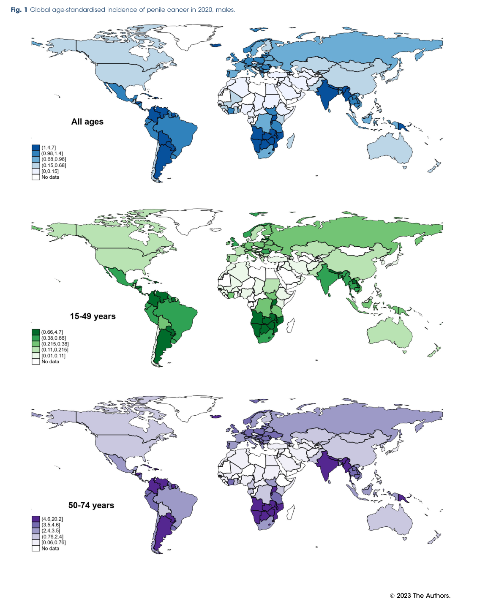

## Question

# Disease Characteristics Research Template

## Target Disease
- **Disease Name:** Penile Cancer
- **MONDO ID:**  (if available)
- **Category:** 

## Research Objectives

Please provide a comprehensive research report on **Penile Cancer** covering all of the
disease characteristics listed below. This report will be used to populate a disease knowledge
base entry. Be thorough and cite primary literature (PMID preferred) for all claims.

For each section, **suggested databases/resources** are listed. These are the first places
you should search for information on each topic.

---

### 1. Disease Information
> **Search first:** OMIM, Orphanet, ICD-10/ICD-11, MeSH, PubMed

- What is the disease? Provide a concise overview.
- What are the key identifiers? (OMIM, Orphanet, ICD-10/ICD-11, MeSH, Mondo)
- What are the common synonyms and alternative names?
- Is the information derived from individual patients (e.g., EHR) or aggregated disease-level resources?

### 2. Etiology

- **Disease Causal Factors**: What are the primary causes? (genetic, environmental, infectious, mechanistic)
- **Risk Factors**:
  > **Search first:** PubMed, Cochrane Library, UpToDate, clinical guidelines, ClinVar, ClinGen, GWAS Catalog, PheGenI, CTD, CDC, WHO, epidemiological databases
  - Genetic risk factors (causal variants, susceptibility loci, modifier genes)
  - Environmental risk factors (toxins, lifestyle, occupational exposures, age, sex, family history)
- **Protective Factors**:
  > **Search first:** PubMed, Cochrane Library, clinical trial databases, GWAS Catalog, gnomAD, WHO, CDC, nutrition databases
  - Genetic protective factors (protective variants, modifier alleles)
  - Environmental protective factors (diet, lifestyle, exposures that reduce risk)
- **Gene-Environment Interactions**: How do genetic and environmental factors interact to influence disease?
  > **Search first:** CTD, PubMed, PheGenI, GxE databases

### 3. Phenotypes
> **Search first:** HPO (Human Phenotype Ontology), OMIM, Orphanet, PubMed, clinicaltrials.gov, MedDRA, SNOMED CT, DECIPHER, LOINC

For each phenotype, provide:
- **Phenotype type**: symptoms, clinical signs, physical manifestations, behavioral changes, or laboratory abnormalities
  > For symptoms/signs: HPO, OMIM, Orphanet, PubMed
  > For behavioral changes: HPO, DSM, RDoC (Research Domain Criteria), PubMed
  > For laboratory abnormalities: LOINC, SNOMED CT, LabTests Online, PubMed
- **Phenotype characteristics**:
  > **Search first:** OMIM, Orphanet, HPO, PubMed
  - Age of symptom onset (neonatal, childhood, adult-onset, late-onset)
  - Symptom severity (mild, moderate, severe, variable)
  - Symptom progression (stable, progressive, episodic, fluctuating)
  - Frequency among affected individuals (percentage or qualitative)
- **Quality of life impact**: Effects on daily functioning and well-being (per-phenotype when possible)
  > **Search first:** EQ-5D database, SF-36, WHO QOL databases, PubMed
- Suggest HPO (Human Phenotype Ontology) terms for each phenotype

### 4. Genetic/Molecular Information

- **Causal Genes**: Gene mutations or chromosomal abnormalities responsible for disease (gene symbols, OMIM IDs)
  > **Search first:** OMIM, ClinVar, HGMD, Ensembl, NCBI Gene
- **Pathogenic Variants**:
  - Affected genes (gene symbols, HGNC IDs)
    > **Search first:** OMIM, NCBI Gene, Ensembl, HGNC, UniProt, GeneCards
  - Variant classification (pathogenic, likely pathogenic, VUS per ACMG/AMP guidelines)
    > **Search first:** ClinVar, ClinGen, ACMG/AMP guidelines, VarSome
  - Variant type/class (missense, frameshift, nonsense, splice-site, structural)
  - Allele frequency in population databases
    > **Search first:** gnomAD, 1000 Genomes, ExAC, TOPMed, dbSNP
  - Somatic vs germline origin
    > **Search first:** COSMIC (somatic), ClinVar, ICGC, TCGA
  - Functional consequences (loss of function, gain of function, dominant negative)
- **Modifier Genes**: Genes that modify disease severity or expression
- **Epigenetic Information**: DNA methylation, histone modifications, chromatin changes affecting disease
  > **Search first:** ENCODE, Roadmap Epigenomics, MethBase, DiseaseMeth
- **Chromosomal Abnormalities**: Large-scale genetic changes (aneuploidy, translocations, inversions)
  > **Search first:** DECIPHER, ClinVar, ECARUCA, UCSC Genome Browser

### 5. Environmental Information

- **Environmental Factors**: Non-genetic contributing factors (toxins, radiation, pollution, occupational exposure)
  > **Search first:** CTD (Comparative Toxicogenomics Database), TOXNET, PubMed, EPA databases
- **Lifestyle Factors**: Behavioral factors (smoking, diet, exercise, alcohol consumption)
  > **Search first:** CDC databases, WHO, PubMed, NHANES
- **Infectious Agents**: If applicable, pathogens causing or triggering disease (bacteria, viruses, fungi, parasites)
  > **Search first:** NCBI Taxonomy, ViPR, BV-BRC, MicrobeDB, GIDEON

### 6. Mechanism / Pathophysiology

- **Molecular Pathways**: Specific signaling cascades or biochemical pathways involved (Wnt, MAPK, mTOR, PI3K-AKT, etc.)
  > **Search first:** KEGG, Reactome, WikiPathways, PathBank, BioCyc
- **Cellular Processes**: Cell-level mechanisms (apoptosis, autophagy, cell cycle dysregulation, inflammation, etc.)
  > **Search first:** Gene Ontology (GO), Reactome, KEGG, PubMed
- **Protein Dysfunction**: How protein structure or function is altered (misfolding, aggregation, loss of function, gain of function)
  > **Search first:** UniProt, PDB (Protein Data Bank), InterPro, Pfam, AlphaFold
- **Metabolic Changes**: Alterations in metabolic processes (energy metabolism, lipid metabolism, amino acid metabolism)
  > **Search first:** KEGG, BioCyc, HMDB (Human Metabolome Database), BRENDA
- **Immune System Involvement**: Role of immune response (autoimmunity, immunodeficiency, chronic inflammation)
  > **Search first:** ImmPort, Immunome Database, IEDB, Gene Ontology
- **Tissue Damage Mechanisms**: How tissues/ are injured (oxidative stress, ischemia, fibrosis, necrosis)
  > **Search first:** PubMed, Gene Ontology, Reactome
- **Biochemical Abnormalities**: Specific molecular defects (enzyme deficiencies, receptor dysfunction, ion channel defects)
  > **Search first:** BRENDA, UniProt, KEGG, OMIM, PubMed
- **Epigenetic Changes**: DNA methylation, histone modifications affecting gene expression in disease
  > **Search first:** ENCODE, Roadmap Epigenomics, MethBase, DiseaseMeth
- **Molecular Profiling** (if available):
  - Transcriptomics/gene expression changes
    > **Search first:** GEO (Gene Expression Omnibus), ArrayExpress, GTEx, Human Cell Atlas, SRA
  - Proteomics findings
    > **Search first:** PRIDE, ProteomeXchange, Human Protein Atlas, STRING, BioGRID
  - Metabolomics signatures
    > **Search first:** MetaboLights, Metabolomics Workbench, HMDB, METLIN
  - Lipidomics alterations
    > **Search first:** LIPID MAPS, SwissLipids, LipidHome, Metabolomics Workbench
  - Genomic structural features
    > **Search first:** UCSC Genome Browser, Ensembl, NCBI, dbVar, DGV
- **Advanced Technologies** (if applicable):
  - Single-cell analysis findings (cell-type specific mechanisms, cellular heterogeneity)
    > **Search first:** Human Cell Atlas, Single Cell Portal, GEO, CELLxGENE
  - Spatial transcriptomics findings
    > **Search first:** GEO, Spatial Research, Vizgen, 10x Genomics data
  - Multi-omics integration results
    > **Search first:** TCGA, ICGC, cBioPortal, LinkedOmics, PubMed
  - Functional genomics screens (CRISPR, RNAi)
    > **Search first:** DepMap, GenomeRNAi, PubMed, BioGRID ORCS

For each mechanism, describe:
- The causal chain from initial trigger to clinical manifestation
- Which mechanisms are upstream vs downstream
- What cell types and biological processes are involved
- Suggest GO terms for biological processes and CL terms for cell types

### 7. Anatomical Structures Affected

- **Organ Level**:
  - Primary organs directly affected
  - Secondary organ involvement (complications, secondary effects)
  - Body systems involved (cardiovascular, nervous, digestive, respiratory, endocrine, etc.)
  > **Search first:** Uberon, FMA (Foundational Model of Anatomy), OMIM, HPO, ICD-11, MeSH, SNOMED CT
- **Tissue and Cell Level**:
  - Specific tissue types affected (epithelial, connective, muscle, nervous)
  - Specific cell populations targeted (with Cell Ontology terms)
  > **Search first:** Uberon, Human Protein Atlas, Cell Ontology, Human Cell Atlas, CellMarker, PanglaoDB
- **Subcellular Level**:
  - Cellular compartments involved (mitochondria, nucleus, ER, lysosomes) (with GO Cellular Component terms)
  > **Search first:** Gene Ontology (Cellular Component), UniProt, Human Protein Atlas
- **Localization**:
  - Specific anatomical sites (with UBERON terms)
    > **Search first:** FMA, Uberon, NeuroNames (for brain), SNOMED CT
  - Lateralization (unilateral, bilateral, asymmetric)
    > **Search first:** HPO, clinical literature, imaging databases

### 8. Temporal Development

- **Onset**:
  - Typical age of onset (congenital, pediatric, adult, geriatric)
  - Onset pattern (acute, subacute, chronic, insidious)
  > **Search first:** OMIM, Orphanet, HPO, PubMed
- **Progression**:
  - Disease stages (early, intermediate, advanced, end-stage)
    > **Search first:** Cancer Staging Manual (AJCC), WHO classifications, PubMed
  - Progression rate (rapid, slow, variable)
  - Disease course pattern (episodic, relapsing-remitting, progressive, stable)
  - Disease duration (self-limited, chronic lifelong)
  > **Search first:** Disease registries, longitudinal cohort databases, natural history studies, PubMed, Orphanet, OMIM
- **Patterns**:
  - Remission patterns (spontaneous, treatment-induced)
    > **Search first:** Clinical trial databases, disease registries, PubMed
  - Critical periods (time windows of vulnerability or opportunity for intervention)
    > **Search first:** PubMed, developmental biology databases, clinical guidelines

### 9. Inheritance and Population

- **Epidemiology**:
  - Prevalence (cases per 100,000 at given time)
  - Incidence (new cases per 100,000 per year)
  > **Search first:** Orphanet, CDC, WHO, GBD (Global Burden of Disease), national registries, SEER, disease registries
- **For Genetic Etiology**:
  - Inheritance pattern (AD, AR, X-linked, mitochondrial, multifactorial, polygenic)
    > **Search first:** OMIM, Orphanet, ClinVar, GTR (Genetic Testing Registry)
  - Penetrance (complete, incomplete, age-dependent)
    > **Search first:** ClinVar, OMIM, PubMed, ClinGen
  - Expressivity (variable, consistent)
    > **Search first:** OMIM, ClinVar, PubMed
  - Genetic anticipation (increasing severity in successive generations)
    > **Search first:** OMIM, PubMed (especially for repeat expansion disorders)
  - Germline mosaicism
    > **Search first:** ClinVar, OMIM, genetic counseling literature, PubMed
  - Founder effects (population-specific mutations)
    > **Search first:** gnomAD, population genetics databases, PubMed
  - Consanguinity role
    > **Search first:** OMIM, population studies, genetic counseling resources
  - Carrier frequency
    > **Search first:** gnomAD, carrier screening databases, GeneReviews, GTR
- **Population Demographics**:
  - Affected populations (ethnic or demographic groups with higher prevalence)
    > **Search first:** gnomAD, 1000 Genomes, PAGE Study, PubMed, population registries
  - Geographic distribution (endemic areas, regional variation)
    > **Search first:** WHO, CDC, GBD, Orphanet, geographic epidemiology databases
  - Geographic distribution of specific variants
  - Sex ratio (male:female)
    > **Search first:** Disease registries, OMIM, PubMed, epidemiological databases
  - Age distribution of affected individuals
    > **Search first:** CDC, disease registries, SEER, Orphanet

### 10. Diagnostics

- **Clinical Tests**:
  - Laboratory tests (blood, urine, tissue chemistry, specific enzyme assays)
    > **Search first:** LOINC, LabTests Online, PubMed
  - Biomarkers (proteins, metabolites, genetic markers, circulating biomarkers)
    > **Search first:** FDA Biomarker List, BEST (Biomarkers, EndpointS, and other Tools), PubMed
  - Imaging studies (X-ray, CT, MRI, PET, ultrasound)
    > **Search first:** RadLex, DICOM, Radiopaedia, imaging databases
  - Functional tests (pulmonary function, cardiac stress tests)
    > **Search first:** LOINC, clinical guidelines, PubMed
  - Electrophysiology (EEG, EMG, ECG, nerve conduction studies)
    > **Search first:** LOINC, clinical neurophysiology databases, PubMed
  - Biopsy findings (histopathology, immunohistochemistry)
    > **Search first:** SNOMED CT, College of American Pathologists resources, PubMed
  - Pathology findings (microscopic examination)
    > **Search first:** SNOMED CT, Digital Pathology databases, PubMed
- **Genetic Testing**:
  > **Search first:** GTR (Genetic Testing Registry), GeneReviews, ClinGen
  - Overview of recommended genetic testing approach
  - Whole genome sequencing (WGS) utility
    > **Search first:** GTR, ClinVar, GEL (Genomics England), gnomAD
  - Whole exome sequencing (WES) utility
    > **Search first:** GTR, ClinVar, OMIM, GeneMatcher
  - Gene panels (which panels, which genes)
    > **Search first:** GTR, ClinVar, laboratory-specific databases
  - Single gene testing
    > **Search first:** GTR, ClinVar, OMIM, GeneReviews
  - Chromosomal microarray (CMA)
    > **Search first:** DECIPHER, ClinVar, dbVar, ECARUCA
  - Karyotyping
    > **Search first:** Chromosome Abnormality Database, ClinVar, cytogenetics resources
  - FISH
    > **Search first:** ClinVar, cytogenetics databases, PubMed
  - Mitochondrial DNA testing
    > **Search first:** MITOMAP, MSeqDR, ClinVar, GTR
  - Repeat expansion testing
    > **Search first:** GTR, ClinVar, repeat expansion databases, PubMed
- **Omics-Based Diagnostics** (if applicable):
  - RNA sequencing / transcriptomics
    > **Search first:** GEO, ArrayExpress, GTEx, RNA-seq databases
  - Proteomics
    > **Search first:** PRIDE, ProteomeXchange, FDA Biomarker database
  - Metabolomics
    > **Search first:** MetaboLights, Metabolomics Workbench, HMDB
  - Epigenomics
    > **Search first:** GEO, ENCODE, Roadmap Epigenomics, MethBase
  - Liquid biopsy
    > **Search first:** COSMIC, ClinVar, liquid biopsy databases, PubMed
- **Clinical Criteria**:
  - Standardized diagnostic criteria (DSM, ICD, society guidelines)
    > **Search first:** DSM-5, ICD-11, clinical society guidelines, UpToDate
  - Differential diagnosis (other conditions to rule out, with distinguishing features)
    > **Search first:** DynaMed, UpToDate, clinical decision support systems
- **Screening**:
  - Screening methods for asymptomatic individuals (newborn screening, carrier screening, cascade screening)
    > **Search first:** ACMG recommendations, CDC newborn screening, GTR

### 11. Outcome/Prognosis

- **Survival and Mortality**:
  - Survival rate (5-year, 10-year, overall)
    > **Search first:** SEER, cancer registries, disease-specific registries, PubMed
  - Life expectancy (with and without treatment if applicable)
    > **Search first:** Orphanet, disease registries, actuarial databases, PubMed
  - Mortality rate
    > **Search first:** CDC, WHO, GBD, national mortality databases
  - Disease-specific mortality (deaths directly attributable to disease)
    > **Search first:** Disease registries, CDC Wonder, GBD, PubMed
- **Morbidity and Function**:
  - Morbidity (disease-related disability and health impacts)
    > **Search first:** GBD, WHO, disability databases, PubMed
  - Disability outcomes (long-term functional impairments)
    > **Search first:** ICF (International Classification of Functioning), disability registries
  - Quality of life measures (EQ-5D, SF-36, PROMIS, disease-specific tools)
    > **Search first:** EQ-5D database, SF-36, PROMIS, PubMed
- **Disease Course**:
  - Complications (secondary problems: infections, organ failure, etc.)
    > **Search first:** ICD codes, disease registries, clinical databases, PubMed
  - Recovery potential (likelihood and extent of recovery, with vs without treatment)
    > **Search first:** Natural history studies, rehabilitation databases, PubMed
- **Prediction**:
  - Prognostic factors (age, disease severity, biomarkers, treatment response)
    > **Search first:** Prognostic models databases, clinical calculators, PubMed
  - Prognostic biomarkers (molecular markers predicting disease course)
    > **Search first:** FDA Biomarker database, PubMed, cancer prognostic databases

### 12. Treatment

- **Pharmacotherapy**:
  - Pharmacological treatments (drug names, drug classes, mechanisms of action)
    > **Search first:** DrugBank, RxNorm, ATC classification, DailyMed, FDA databases
  - Pharmacogenomics (how genetic variants affect drug metabolism, efficacy, toxicity)
    > **Search first:** PharmGKB, CPIC (Clinical Pharmacogenetics), FDA Table of PGx Biomarkers
- **Advanced Therapeutics**:
  - Gene therapy (viral vectors, CRISPR, gene replacement, gene editing)
    > **Search first:** ClinicalTrials.gov, FDA gene therapy database, ASGCT resources
  - Cell therapy (stem cell transplant, CAR-T, cellular therapeutics)
    > **Search first:** ClinicalTrials.gov, FDA cell therapy database, FACT standards
  - RNA-based therapies (ASOs, siRNA, mRNA therapies)
    > **Search first:** ClinicalTrials.gov, FDA approvals, PubMed
  - Targeted therapies (treatments directed at specific molecular targets)
    > **Search first:** My Cancer Genome, OncoKB, ClinicalTrials.gov, FDA approvals
  - Immunotherapies (checkpoint inhibitors, monoclonal antibodies)
    > **Search first:** Cancer Immunotherapy Database, FDA approvals, ClinicalTrials.gov
- **Surgical and Interventional**:
  - Surgical interventions (types of surgery, timing, outcomes)
    > **Search first:** CPT codes, surgical registries, clinical guidelines, PubMed
- **Supportive and Rehabilitative**:
  - Supportive care (symptom management, pain control, nutrition)
    > **Search first:** Clinical guidelines, Cochrane Library, PubMed
  - Rehabilitation (physical therapy, occupational therapy, speech therapy)
    > **Search first:** Rehabilitation medicine databases, clinical guidelines, PubMed
- **Experimental**:
  - Experimental treatments in clinical trials (with NCT identifiers if available)
    > **Search first:** ClinicalTrials.gov, EU Clinical Trials Register, WHO ICTRP
- **Treatment Outcomes**:
  - Treatment response rates
    > **Search first:** Clinical trial databases, FDA reviews, systematic reviews, PubMed
  - Side effects and adverse events
    > **Search first:** FDA Adverse Event Reporting System (FAERS), MedWatch, PubMed
- **Treatment Strategy**:
  - Treatment algorithms (clinical pathways, decision trees)
    > **Search first:** Clinical practice guidelines, NCCN Guidelines, UpToDate
  - Combination therapies
    > **Search first:** ClinicalTrials.gov, treatment guidelines, PubMed
  - Personalized medicine approaches (genotype-guided treatment)
    > **Search first:** My Cancer Genome, CIViC, PharmGKB, precision medicine databases

For each treatment, suggest MAXO (Medical Action Ontology) terms where applicable.

### 13. Prevention

- **Prevention Levels**:
  - Primary prevention (preventing disease occurrence: vaccination, risk factor modification)
    > **Search first:** CDC, WHO, USPSTF recommendations, Cochrane Library
  - Secondary prevention (early detection and treatment: screening programs, early intervention)
    > **Search first:** USPSTF, CDC screening guidelines, WHO
  - Tertiary prevention (preventing complications in those with disease)
    > **Search first:** Clinical guidelines, disease management protocols, PubMed
- **Immunization**: Vaccine strategies (if applicable)
  > **Search first:** CDC vaccine schedules, WHO immunization, FDA vaccine database
- **Screening and Early Detection**:
  - Screening programs (population-based: newborn screening, cancer screening)
    > **Search first:** CDC screening programs, USPSTF, cancer screening databases
  - Genetic screening (carrier screening, preimplantation genetic diagnosis, prenatal testing)
    > **Search first:** ACMG recommendations, ACOG guidelines, GTR
  - Risk stratification (identifying high-risk individuals for targeted prevention)
    > **Search first:** Risk prediction models, clinical calculators, PubMed
- **Behavioral Interventions**: Lifestyle modifications to reduce risk
  > **Search first:** CDC, WHO, behavioral intervention databases, Cochrane Library
- **Counseling**: Genetic counseling (risk assessment, family planning guidance)
  > **Search first:** NSGC resources, ACMG guidelines, GeneReviews
- **Public Health**:
  - Public health interventions (sanitation, vector control, health education)
    > **Search first:** CDC, WHO, public health databases, PubMed
  - Environmental interventions (reducing environmental risk factors)
    > **Search first:** EPA databases, WHO environmental health, PubMed
- **Prophylaxis**: Preventive medications or procedures
  > **Search first:** Clinical guidelines, FDA approvals, PubMed

### 14. Other Species / Natural Disease

- **Taxonomy**: Species affected (with NCBI Taxon identifiers)
  > **Search first:** NCBI Taxonomy
- **Breed**: Specific breeds affected (with VBO identifiers if applicable)
  > **Search first:** VBO (Vertebrate Breed Ontology)
- **Gene**: Orthologous genes in other species (with NCBI Gene IDs)
  > **Search first:** NCBI Gene
- **Natural Disease**:
  - Naturally occurring disease in other species (companion animals, wildlife)
    > **Search first:** OMIA (Online Mendelian Inheritance in Animals), VetCompass, PubMed
  - Veterinary relevance and importance in animal health
    > **Search first:** OMIA, veterinary databases, PubMed
- **Comparative Biology**:
  - Comparative pathology (similarities and differences across species)
    > **Search first:** OMIA, comparative pathology databases, PubMed
  - Evolutionary conservation of disease mechanisms
    > **Search first:** HomoloGene, OrthoMCL, Alliance of Genome Resources
- **Transmission** (if applicable):
  - Zoonotic potential
    > **Search first:** CDC zoonotic diseases, WHO zoonoses, GIDEON
  - Cross-species susceptibility
    > **Search first:** NCBI Taxonomy, veterinary databases, PubMed

### 15. Model Organisms

- **Model Types**:
  - Model organism type (mammalian, invertebrate, cellular, in vitro)
    > **Search first:** Alliance of Genome Resources, model organism databases
  - Specific model systems (mouse, rat, zebrafish, Drosophila, C. elegans, yeast, cell lines, organoids, iPSCs)
    > **Search first:** MGI, RGD, ZFIN, FlyBase, WormBase, SGD, ATCC, Cellosaurus
  - Induced models (drug treatment, surgical intervention, environmental manipulation)
    > **Search first:** MGI, model organism databases, PubMed
- **Genetic Models**:
  - Types available (knockout, knock-in, transgenic, conditional, humanized)
    > **Search first:** MGI, IMPC, KOMP, EuMMCR, IMSR
- **Model Characteristics**:
  - Phenotype recapitulation (how well model reproduces human disease features)
    > **Search first:** Model organism databases, comparative studies, PubMed
  - Model limitations (aspects of human disease not captured)
    > **Search first:** Model organism databases, PubMed, review articles
- **Applications**:
  - Research applications (what aspects of disease can be studied)
    > **Search first:** Model organism databases, PubMed
- **Resources**:
  - Model databases
    > **Search first:** MGI, RGD, ZFIN, FlyBase, WormBase, IMSR, EMMA, MMRRC

---

## Citation Requirements

- Cite primary literature (PMID preferred) for all mechanistic and clinical claims
- Prioritize recent reviews and landmark papers
- Include direct quotes from abstracts where possible to support key statements
- Distinguish evidence source types: human clinical, model organism, in vitro, computational

## Output Format

Structure your response as a comprehensive narrative organized by the sections above.
For each section, provide:
- Factual content with specific details (numbers, percentages, gene names, variant nomenclature)
- Ontology term suggestions (HPO, GO, CL, UBERON, CHEBI, MAXO, MONDO) where applicable
- Evidence citations with PMIDs
- Direct quotes from abstracts to support key claims
- Clear indication when information is not available or not applicable for this disease

This report will be used to populate a disease knowledge base entry with:
- Pathophysiology descriptions with causal chains
- Gene/protein annotations (HGNC, GO terms)
- Phenotype associations (HP terms) with frequencies
- Cell type involvement (CL terms)
- Anatomical locations (UBERON terms)
- Chemical entities (CHEBI terms)
- Treatment annotations (MAXO terms)
- Evidence items with PMIDs and exact abstract quotes
- Epidemiology, prognosis, diagnostic, and prevention information
- Animal model descriptions with phenotype recapitulation details

## Output

Question: You are an expert researcher providing comprehensive, well-cited information.

Provide detailed information focusing on:
1. Key concepts and definitions with current understanding
2. Recent developments and latest research (prioritize 2023-2024 sources)
3. Current applications and real-world implementations
4. Expert opinions and analysis from authoritative sources
5. Relevant statistics and data from recent studies

Format as a comprehensive research report with proper citations. Include URLs and publication dates where available.
Always prioritize recent, authoritative sources and provide specific citations for all major claims.

# Disease Characteristics Research Template

## Target Disease
- **Disease Name:** Penile Cancer
- **MONDO ID:**  (if available)
- **Category:** 

## Research Objectives

Please provide a comprehensive research report on **Penile Cancer** covering all of the
disease characteristics listed below. This report will be used to populate a disease knowledge
base entry. Be thorough and cite primary literature (PMID preferred) for all claims.

For each section, **suggested databases/resources** are listed. These are the first places
you should search for information on each topic.

---

### 1. Disease Information
> **Search first:** OMIM, Orphanet, ICD-10/ICD-11, MeSH, PubMed

- What is the disease? Provide a concise overview.
- What are the key identifiers? (OMIM, Orphanet, ICD-10/ICD-11, MeSH, Mondo)
- What are the common synonyms and alternative names?
- Is the information derived from individual patients (e.g., EHR) or aggregated disease-level resources?

### 2. Etiology

- **Disease Causal Factors**: What are the primary causes? (genetic, environmental, infectious, mechanistic)
- **Risk Factors**:
  > **Search first:** PubMed, Cochrane Library, UpToDate, clinical guidelines, ClinVar, ClinGen, GWAS Catalog, PheGenI, CTD, CDC, WHO, epidemiological databases
  - Genetic risk factors (causal variants, susceptibility loci, modifier genes)
  - Environmental risk factors (toxins, lifestyle, occupational exposures, age, sex, family history)
- **Protective Factors**:
  > **Search first:** PubMed, Cochrane Library, clinical trial databases, GWAS Catalog, gnomAD, WHO, CDC, nutrition databases
  - Genetic protective factors (protective variants, modifier alleles)
  - Environmental protective factors (diet, lifestyle, exposures that reduce risk)
- **Gene-Environment Interactions**: How do genetic and environmental factors interact to influence disease?
  > **Search first:** CTD, PubMed, PheGenI, GxE databases

### 3. Phenotypes
> **Search first:** HPO (Human Phenotype Ontology), OMIM, Orphanet, PubMed, clinicaltrials.gov, MedDRA, SNOMED CT, DECIPHER, LOINC

For each phenotype, provide:
- **Phenotype type**: symptoms, clinical signs, physical manifestations, behavioral changes, or laboratory abnormalities
  > For symptoms/signs: HPO, OMIM, Orphanet, PubMed
  > For behavioral changes: HPO, DSM, RDoC (Research Domain Criteria), PubMed
  > For laboratory abnormalities: LOINC, SNOMED CT, LabTests Online, PubMed
- **Phenotype characteristics**:
  > **Search first:** OMIM, Orphanet, HPO, PubMed
  - Age of symptom onset (neonatal, childhood, adult-onset, late-onset)
  - Symptom severity (mild, moderate, severe, variable)
  - Symptom progression (stable, progressive, episodic, fluctuating)
  - Frequency among affected individuals (percentage or qualitative)
- **Quality of life impact**: Effects on daily functioning and well-being (per-phenotype when possible)
  > **Search first:** EQ-5D database, SF-36, WHO QOL databases, PubMed
- Suggest HPO (Human Phenotype Ontology) terms for each phenotype

### 4. Genetic/Molecular Information

- **Causal Genes**: Gene mutations or chromosomal abnormalities responsible for disease (gene symbols, OMIM IDs)
  > **Search first:** OMIM, ClinVar, HGMD, Ensembl, NCBI Gene
- **Pathogenic Variants**:
  - Affected genes (gene symbols, HGNC IDs)
    > **Search first:** OMIM, NCBI Gene, Ensembl, HGNC, UniProt, GeneCards
  - Variant classification (pathogenic, likely pathogenic, VUS per ACMG/AMP guidelines)
    > **Search first:** ClinVar, ClinGen, ACMG/AMP guidelines, VarSome
  - Variant type/class (missense, frameshift, nonsense, splice-site, structural)
  - Allele frequency in population databases
    > **Search first:** gnomAD, 1000 Genomes, ExAC, TOPMed, dbSNP
  - Somatic vs germline origin
    > **Search first:** COSMIC (somatic), ClinVar, ICGC, TCGA
  - Functional consequences (loss of function, gain of function, dominant negative)
- **Modifier Genes**: Genes that modify disease severity or expression
- **Epigenetic Information**: DNA methylation, histone modifications, chromatin changes affecting disease
  > **Search first:** ENCODE, Roadmap Epigenomics, MethBase, DiseaseMeth
- **Chromosomal Abnormalities**: Large-scale genetic changes (aneuploidy, translocations, inversions)
  > **Search first:** DECIPHER, ClinVar, ECARUCA, UCSC Genome Browser

### 5. Environmental Information

- **Environmental Factors**: Non-genetic contributing factors (toxins, radiation, pollution, occupational exposure)
  > **Search first:** CTD (Comparative Toxicogenomics Database), TOXNET, PubMed, EPA databases
- **Lifestyle Factors**: Behavioral factors (smoking, diet, exercise, alcohol consumption)
  > **Search first:** CDC databases, WHO, PubMed, NHANES
- **Infectious Agents**: If applicable, pathogens causing or triggering disease (bacteria, viruses, fungi, parasites)
  > **Search first:** NCBI Taxonomy, ViPR, BV-BRC, MicrobeDB, GIDEON

### 6. Mechanism / Pathophysiology

- **Molecular Pathways**: Specific signaling cascades or biochemical pathways involved (Wnt, MAPK, mTOR, PI3K-AKT, etc.)
  > **Search first:** KEGG, Reactome, WikiPathways, PathBank, BioCyc
- **Cellular Processes**: Cell-level mechanisms (apoptosis, autophagy, cell cycle dysregulation, inflammation, etc.)
  > **Search first:** Gene Ontology (GO), Reactome, KEGG, PubMed
- **Protein Dysfunction**: How protein structure or function is altered (misfolding, aggregation, loss of function, gain of function)
  > **Search first:** UniProt, PDB (Protein Data Bank), InterPro, Pfam, AlphaFold
- **Metabolic Changes**: Alterations in metabolic processes (energy metabolism, lipid metabolism, amino acid metabolism)
  > **Search first:** KEGG, BioCyc, HMDB (Human Metabolome Database), BRENDA
- **Immune System Involvement**: Role of immune response (autoimmunity, immunodeficiency, chronic inflammation)
  > **Search first:** ImmPort, Immunome Database, IEDB, Gene Ontology
- **Tissue Damage Mechanisms**: How tissues/ are injured (oxidative stress, ischemia, fibrosis, necrosis)
  > **Search first:** PubMed, Gene Ontology, Reactome
- **Biochemical Abnormalities**: Specific molecular defects (enzyme deficiencies, receptor dysfunction, ion channel defects)
  > **Search first:** BRENDA, UniProt, KEGG, OMIM, PubMed
- **Epigenetic Changes**: DNA methylation, histone modifications affecting gene expression in disease
  > **Search first:** ENCODE, Roadmap Epigenomics, MethBase, DiseaseMeth
- **Molecular Profiling** (if available):
  - Transcriptomics/gene expression changes
    > **Search first:** GEO (Gene Expression Omnibus), ArrayExpress, GTEx, Human Cell Atlas, SRA
  - Proteomics findings
    > **Search first:** PRIDE, ProteomeXchange, Human Protein Atlas, STRING, BioGRID
  - Metabolomics signatures
    > **Search first:** MetaboLights, Metabolomics Workbench, HMDB, METLIN
  - Lipidomics alterations
    > **Search first:** LIPID MAPS, SwissLipids, LipidHome, Metabolomics Workbench
  - Genomic structural features
    > **Search first:** UCSC Genome Browser, Ensembl, NCBI, dbVar, DGV
- **Advanced Technologies** (if applicable):
  - Single-cell analysis findings (cell-type specific mechanisms, cellular heterogeneity)
    > **Search first:** Human Cell Atlas, Single Cell Portal, GEO, CELLxGENE
  - Spatial transcriptomics findings
    > **Search first:** GEO, Spatial Research, Vizgen, 10x Genomics data
  - Multi-omics integration results
    > **Search first:** TCGA, ICGC, cBioPortal, LinkedOmics, PubMed
  - Functional genomics screens (CRISPR, RNAi)
    > **Search first:** DepMap, GenomeRNAi, PubMed, BioGRID ORCS

For each mechanism, describe:
- The causal chain from initial trigger to clinical manifestation
- Which mechanisms are upstream vs downstream
- What cell types and biological processes are involved
- Suggest GO terms for biological processes and CL terms for cell types

### 7. Anatomical Structures Affected

- **Organ Level**:
  - Primary organs directly affected
  - Secondary organ involvement (complications, secondary effects)
  - Body systems involved (cardiovascular, nervous, digestive, respiratory, endocrine, etc.)
  > **Search first:** Uberon, FMA (Foundational Model of Anatomy), OMIM, HPO, ICD-11, MeSH, SNOMED CT
- **Tissue and Cell Level**:
  - Specific tissue types affected (epithelial, connective, muscle, nervous)
  - Specific cell populations targeted (with Cell Ontology terms)
  > **Search first:** Uberon, Human Protein Atlas, Cell Ontology, Human Cell Atlas, CellMarker, PanglaoDB
- **Subcellular Level**:
  - Cellular compartments involved (mitochondria, nucleus, ER, lysosomes) (with GO Cellular Component terms)
  > **Search first:** Gene Ontology (Cellular Component), UniProt, Human Protein Atlas
- **Localization**:
  - Specific anatomical sites (with UBERON terms)
    > **Search first:** FMA, Uberon, NeuroNames (for brain), SNOMED CT
  - Lateralization (unilateral, bilateral, asymmetric)
    > **Search first:** HPO, clinical literature, imaging databases

### 8. Temporal Development

- **Onset**:
  - Typical age of onset (congenital, pediatric, adult, geriatric)
  - Onset pattern (acute, subacute, chronic, insidious)
  > **Search first:** OMIM, Orphanet, HPO, PubMed
- **Progression**:
  - Disease stages (early, intermediate, advanced, end-stage)
    > **Search first:** Cancer Staging Manual (AJCC), WHO classifications, PubMed
  - Progression rate (rapid, slow, variable)
  - Disease course pattern (episodic, relapsing-remitting, progressive, stable)
  - Disease duration (self-limited, chronic lifelong)
  > **Search first:** Disease registries, longitudinal cohort databases, natural history studies, PubMed, Orphanet, OMIM
- **Patterns**:
  - Remission patterns (spontaneous, treatment-induced)
    > **Search first:** Clinical trial databases, disease registries, PubMed
  - Critical periods (time windows of vulnerability or opportunity for intervention)
    > **Search first:** PubMed, developmental biology databases, clinical guidelines

### 9. Inheritance and Population

- **Epidemiology**:
  - Prevalence (cases per 100,000 at given time)
  - Incidence (new cases per 100,000 per year)
  > **Search first:** Orphanet, CDC, WHO, GBD (Global Burden of Disease), national registries, SEER, disease registries
- **For Genetic Etiology**:
  - Inheritance pattern (AD, AR, X-linked, mitochondrial, multifactorial, polygenic)
    > **Search first:** OMIM, Orphanet, ClinVar, GTR (Genetic Testing Registry)
  - Penetrance (complete, incomplete, age-dependent)
    > **Search first:** ClinVar, OMIM, PubMed, ClinGen
  - Expressivity (variable, consistent)
    > **Search first:** OMIM, ClinVar, PubMed
  - Genetic anticipation (increasing severity in successive generations)
    > **Search first:** OMIM, PubMed (especially for repeat expansion disorders)
  - Germline mosaicism
    > **Search first:** ClinVar, OMIM, genetic counseling literature, PubMed
  - Founder effects (population-specific mutations)
    > **Search first:** gnomAD, population genetics databases, PubMed
  - Consanguinity role
    > **Search first:** OMIM, population studies, genetic counseling resources
  - Carrier frequency
    > **Search first:** gnomAD, carrier screening databases, GeneReviews, GTR
- **Population Demographics**:
  - Affected populations (ethnic or demographic groups with higher prevalence)
    > **Search first:** gnomAD, 1000 Genomes, PAGE Study, PubMed, population registries
  - Geographic distribution (endemic areas, regional variation)
    > **Search first:** WHO, CDC, GBD, Orphanet, geographic epidemiology databases
  - Geographic distribution of specific variants
  - Sex ratio (male:female)
    > **Search first:** Disease registries, OMIM, PubMed, epidemiological databases
  - Age distribution of affected individuals
    > **Search first:** CDC, disease registries, SEER, Orphanet

### 10. Diagnostics

- **Clinical Tests**:
  - Laboratory tests (blood, urine, tissue chemistry, specific enzyme assays)
    > **Search first:** LOINC, LabTests Online, PubMed
  - Biomarkers (proteins, metabolites, genetic markers, circulating biomarkers)
    > **Search first:** FDA Biomarker List, BEST (Biomarkers, EndpointS, and other Tools), PubMed
  - Imaging studies (X-ray, CT, MRI, PET, ultrasound)
    > **Search first:** RadLex, DICOM, Radiopaedia, imaging databases
  - Functional tests (pulmonary function, cardiac stress tests)
    > **Search first:** LOINC, clinical guidelines, PubMed
  - Electrophysiology (EEG, EMG, ECG, nerve conduction studies)
    > **Search first:** LOINC, clinical neurophysiology databases, PubMed
  - Biopsy findings (histopathology, immunohistochemistry)
    > **Search first:** SNOMED CT, College of American Pathologists resources, PubMed
  - Pathology findings (microscopic examination)
    > **Search first:** SNOMED CT, Digital Pathology databases, PubMed
- **Genetic Testing**:
  > **Search first:** GTR (Genetic Testing Registry), GeneReviews, ClinGen
  - Overview of recommended genetic testing approach
  - Whole genome sequencing (WGS) utility
    > **Search first:** GTR, ClinVar, GEL (Genomics England), gnomAD
  - Whole exome sequencing (WES) utility
    > **Search first:** GTR, ClinVar, OMIM, GeneMatcher
  - Gene panels (which panels, which genes)
    > **Search first:** GTR, ClinVar, laboratory-specific databases
  - Single gene testing
    > **Search first:** GTR, ClinVar, OMIM, GeneReviews
  - Chromosomal microarray (CMA)
    > **Search first:** DECIPHER, ClinVar, dbVar, ECARUCA
  - Karyotyping
    > **Search first:** Chromosome Abnormality Database, ClinVar, cytogenetics resources
  - FISH
    > **Search first:** ClinVar, cytogenetics databases, PubMed
  - Mitochondrial DNA testing
    > **Search first:** MITOMAP, MSeqDR, ClinVar, GTR
  - Repeat expansion testing
    > **Search first:** GTR, ClinVar, repeat expansion databases, PubMed
- **Omics-Based Diagnostics** (if applicable):
  - RNA sequencing / transcriptomics
    > **Search first:** GEO, ArrayExpress, GTEx, RNA-seq databases
  - Proteomics
    > **Search first:** PRIDE, ProteomeXchange, FDA Biomarker database
  - Metabolomics
    > **Search first:** MetaboLights, Metabolomics Workbench, HMDB
  - Epigenomics
    > **Search first:** GEO, ENCODE, Roadmap Epigenomics, MethBase
  - Liquid biopsy
    > **Search first:** COSMIC, ClinVar, liquid biopsy databases, PubMed
- **Clinical Criteria**:
  - Standardized diagnostic criteria (DSM, ICD, society guidelines)
    > **Search first:** DSM-5, ICD-11, clinical society guidelines, UpToDate
  - Differential diagnosis (other conditions to rule out, with distinguishing features)
    > **Search first:** DynaMed, UpToDate, clinical decision support systems
- **Screening**:
  - Screening methods for asymptomatic individuals (newborn screening, carrier screening, cascade screening)
    > **Search first:** ACMG recommendations, CDC newborn screening, GTR

### 11. Outcome/Prognosis

- **Survival and Mortality**:
  - Survival rate (5-year, 10-year, overall)
    > **Search first:** SEER, cancer registries, disease-specific registries, PubMed
  - Life expectancy (with and without treatment if applicable)
    > **Search first:** Orphanet, disease registries, actuarial databases, PubMed
  - Mortality rate
    > **Search first:** CDC, WHO, GBD, national mortality databases
  - Disease-specific mortality (deaths directly attributable to disease)
    > **Search first:** Disease registries, CDC Wonder, GBD, PubMed
- **Morbidity and Function**:
  - Morbidity (disease-related disability and health impacts)
    > **Search first:** GBD, WHO, disability databases, PubMed
  - Disability outcomes (long-term functional impairments)
    > **Search first:** ICF (International Classification of Functioning), disability registries
  - Quality of life measures (EQ-5D, SF-36, PROMIS, disease-specific tools)
    > **Search first:** EQ-5D database, SF-36, PROMIS, PubMed
- **Disease Course**:
  - Complications (secondary problems: infections, organ failure, etc.)
    > **Search first:** ICD codes, disease registries, clinical databases, PubMed
  - Recovery potential (likelihood and extent of recovery, with vs without treatment)
    > **Search first:** Natural history studies, rehabilitation databases, PubMed
- **Prediction**:
  - Prognostic factors (age, disease severity, biomarkers, treatment response)
    > **Search first:** Prognostic models databases, clinical calculators, PubMed
  - Prognostic biomarkers (molecular markers predicting disease course)
    > **Search first:** FDA Biomarker database, PubMed, cancer prognostic databases

### 12. Treatment

- **Pharmacotherapy**:
  - Pharmacological treatments (drug names, drug classes, mechanisms of action)
    > **Search first:** DrugBank, RxNorm, ATC classification, DailyMed, FDA databases
  - Pharmacogenomics (how genetic variants affect drug metabolism, efficacy, toxicity)
    > **Search first:** PharmGKB, CPIC (Clinical Pharmacogenetics), FDA Table of PGx Biomarkers
- **Advanced Therapeutics**:
  - Gene therapy (viral vectors, CRISPR, gene replacement, gene editing)
    > **Search first:** ClinicalTrials.gov, FDA gene therapy database, ASGCT resources
  - Cell therapy (stem cell transplant, CAR-T, cellular therapeutics)
    > **Search first:** ClinicalTrials.gov, FDA cell therapy database, FACT standards
  - RNA-based therapies (ASOs, siRNA, mRNA therapies)
    > **Search first:** ClinicalTrials.gov, FDA approvals, PubMed
  - Targeted therapies (treatments directed at specific molecular targets)
    > **Search first:** My Cancer Genome, OncoKB, ClinicalTrials.gov, FDA approvals
  - Immunotherapies (checkpoint inhibitors, monoclonal antibodies)
    > **Search first:** Cancer Immunotherapy Database, FDA approvals, ClinicalTrials.gov
- **Surgical and Interventional**:
  - Surgical interventions (types of surgery, timing, outcomes)
    > **Search first:** CPT codes, surgical registries, clinical guidelines, PubMed
- **Supportive and Rehabilitative**:
  - Supportive care (symptom management, pain control, nutrition)
    > **Search first:** Clinical guidelines, Cochrane Library, PubMed
  - Rehabilitation (physical therapy, occupational therapy, speech therapy)
    > **Search first:** Rehabilitation medicine databases, clinical guidelines, PubMed
- **Experimental**:
  - Experimental treatments in clinical trials (with NCT identifiers if available)
    > **Search first:** ClinicalTrials.gov, EU Clinical Trials Register, WHO ICTRP
- **Treatment Outcomes**:
  - Treatment response rates
    > **Search first:** Clinical trial databases, FDA reviews, systematic reviews, PubMed
  - Side effects and adverse events
    > **Search first:** FDA Adverse Event Reporting System (FAERS), MedWatch, PubMed
- **Treatment Strategy**:
  - Treatment algorithms (clinical pathways, decision trees)
    > **Search first:** Clinical practice guidelines, NCCN Guidelines, UpToDate
  - Combination therapies
    > **Search first:** ClinicalTrials.gov, treatment guidelines, PubMed
  - Personalized medicine approaches (genotype-guided treatment)
    > **Search first:** My Cancer Genome, CIViC, PharmGKB, precision medicine databases

For each treatment, suggest MAXO (Medical Action Ontology) terms where applicable.

### 13. Prevention

- **Prevention Levels**:
  - Primary prevention (preventing disease occurrence: vaccination, risk factor modification)
    > **Search first:** CDC, WHO, USPSTF recommendations, Cochrane Library
  - Secondary prevention (early detection and treatment: screening programs, early intervention)
    > **Search first:** USPSTF, CDC screening guidelines, WHO
  - Tertiary prevention (preventing complications in those with disease)
    > **Search first:** Clinical guidelines, disease management protocols, PubMed
- **Immunization**: Vaccine strategies (if applicable)
  > **Search first:** CDC vaccine schedules, WHO immunization, FDA vaccine database
- **Screening and Early Detection**:
  - Screening programs (population-based: newborn screening, cancer screening)
    > **Search first:** CDC screening programs, USPSTF, cancer screening databases
  - Genetic screening (carrier screening, preimplantation genetic diagnosis, prenatal testing)
    > **Search first:** ACMG recommendations, ACOG guidelines, GTR
  - Risk stratification (identifying high-risk individuals for targeted prevention)
    > **Search first:** Risk prediction models, clinical calculators, PubMed
- **Behavioral Interventions**: Lifestyle modifications to reduce risk
  > **Search first:** CDC, WHO, behavioral intervention databases, Cochrane Library
- **Counseling**: Genetic counseling (risk assessment, family planning guidance)
  > **Search first:** NSGC resources, ACMG guidelines, GeneReviews
- **Public Health**:
  - Public health interventions (sanitation, vector control, health education)
    > **Search first:** CDC, WHO, public health databases, PubMed
  - Environmental interventions (reducing environmental risk factors)
    > **Search first:** EPA databases, WHO environmental health, PubMed
- **Prophylaxis**: Preventive medications or procedures
  > **Search first:** Clinical guidelines, FDA approvals, PubMed

### 14. Other Species / Natural Disease

- **Taxonomy**: Species affected (with NCBI Taxon identifiers)
  > **Search first:** NCBI Taxonomy
- **Breed**: Specific breeds affected (with VBO identifiers if applicable)
  > **Search first:** VBO (Vertebrate Breed Ontology)
- **Gene**: Orthologous genes in other species (with NCBI Gene IDs)
  > **Search first:** NCBI Gene
- **Natural Disease**:
  - Naturally occurring disease in other species (companion animals, wildlife)
    > **Search first:** OMIA (Online Mendelian Inheritance in Animals), VetCompass, PubMed
  - Veterinary relevance and importance in animal health
    > **Search first:** OMIA, veterinary databases, PubMed
- **Comparative Biology**:
  - Comparative pathology (similarities and differences across species)
    > **Search first:** OMIA, comparative pathology databases, PubMed
  - Evolutionary conservation of disease mechanisms
    > **Search first:** HomoloGene, OrthoMCL, Alliance of Genome Resources
- **Transmission** (if applicable):
  - Zoonotic potential
    > **Search first:** CDC zoonotic diseases, WHO zoonoses, GIDEON
  - Cross-species susceptibility
    > **Search first:** NCBI Taxonomy, veterinary databases, PubMed

### 15. Model Organisms

- **Model Types**:
  - Model organism type (mammalian, invertebrate, cellular, in vitro)
    > **Search first:** Alliance of Genome Resources, model organism databases
  - Specific model systems (mouse, rat, zebrafish, Drosophila, C. elegans, yeast, cell lines, organoids, iPSCs)
    > **Search first:** MGI, RGD, ZFIN, FlyBase, WormBase, SGD, ATCC, Cellosaurus
  - Induced models (drug treatment, surgical intervention, environmental manipulation)
    > **Search first:** MGI, model organism databases, PubMed
- **Genetic Models**:
  - Types available (knockout, knock-in, transgenic, conditional, humanized)
    > **Search first:** MGI, IMPC, KOMP, EuMMCR, IMSR
- **Model Characteristics**:
  - Phenotype recapitulation (how well model reproduces human disease features)
    > **Search first:** Model organism databases, comparative studies, PubMed
  - Model limitations (aspects of human disease not captured)
    > **Search first:** Model organism databases, PubMed, review articles
- **Applications**:
  - Research applications (what aspects of disease can be studied)
    > **Search first:** Model organism databases, PubMed
- **Resources**:
  - Model databases
    > **Search first:** MGI, RGD, ZFIN, FlyBase, WormBase, IMSR, EMMA, MMRRC

---

## Citation Requirements

- Cite primary literature (PMID preferred) for all mechanistic and clinical claims
- Prioritize recent reviews and landmark papers
- Include direct quotes from abstracts where possible to support key statements
- Distinguish evidence source types: human clinical, model organism, in vitro, computational

## Output Format

Structure your response as a comprehensive narrative organized by the sections above.
For each section, provide:
- Factual content with specific details (numbers, percentages, gene names, variant nomenclature)
- Ontology term suggestions (HPO, GO, CL, UBERON, CHEBI, MAXO, MONDO) where applicable
- Evidence citations with PMIDs
- Direct quotes from abstracts to support key claims
- Clear indication when information is not available or not applicable for this disease

This report will be used to populate a disease knowledge base entry with:
- Pathophysiology descriptions with causal chains
- Gene/protein annotations (HGNC, GO terms)
- Phenotype associations (HP terms) with frequencies
- Cell type involvement (CL terms)
- Anatomical locations (UBERON terms)
- Chemical entities (CHEBI terms)
- Treatment annotations (MAXO terms)
- Evidence items with PMIDs and exact abstract quotes
- Epidemiology, prognosis, diagnostic, and prevention information
- Animal model descriptions with phenotype recapitulation details

## Disease Characteristics Research Report: Penile Cancer

### Target Disease
- **Disease Name:** Penile cancer (predominantly penile squamous cell carcinoma, PSCC) (taghizadeh2025immunotherapyinthe pages 1-2, brouwer2024penilecancereauasco pages 1-2)
- **MONDO ID:** Not identified in the retrieved sources for this run; should be looked up directly in MONDO/OBO Foundry for database population (brouwer2024penilecancereauasco pages 1-2)
- **Category:** Malignant neoplasm of the penis; genitourinary cancer; squamous cell carcinoma-dominant histology (taghizadeh2025immunotherapyinthe pages 1-2)

### Executive Summary (current understanding)
Penile cancer is a rare malignancy with marked geographic variation in incidence. The dominant histology is squamous cell carcinoma (~95%). A central organizing concept in contemporary classification and management is the **dual-pathway model**: **HPV-associated** vs **HPV-independent** penile squamous cell carcinoma, with distinct precursor lesions (PeIN subtypes), molecular profiles, and immune microenvironments. Prevention is strongly linked to HPV vaccination and mitigation of modifiable risk factors (phimosis, smoking, hygiene), with circumcision being protective in epidemiologic studies. For clinically node-negative (cN0) patients at intermediate/high risk, dynamic sentinel node biopsy (DSNB) is increasingly used for nodal staging, with high negative predictive value in modern series. Systemic therapy evidence remains limited by rarity, but immune checkpoint inhibitors show activity in a subset of advanced patients and are an active clinical-trial area. (mannam2024hpvandpenile pages 1-2, mannam2024hpvandpenile pages 2-4, brouwer2024penilecancereauasco pages 1-2, huang2024incidenceriskfactors pages 1-2, gebruers2023accuracyofdynamic pages 1-2, zarif2023safetyandefficacy pages 1-2)

---

## 1. Disease Information

### 1.1 What is the disease?
Penile cancer is a malignant tumor arising in penile tissues, most commonly **penile squamous cell carcinoma (PSCC)**. Contemporary guidance emphasizes classifying PSCC into **HPV-associated** and **HPV-independent** subtypes, reflecting distinct etiologic pathways. (taghizadeh2025immunotherapyinthe pages 1-2, brouwer2024penilecancereauasco pages 1-2)

**Key definition statements (abstract-derived):**
- A 2024 HPV-focused review states: **“Penile cancer (PC) is a rare malignancy predominantly of squamous cell origin.”** (Pathogens; Sep 2024; https://doi.org/10.3390/pathogens13090809) (mannam2024hpvandpenile pages 1-2)
- EAU-ASCO 2023 update summary notes PSCC is divided into **HPV-associated and HPV-independent (e.g., lichen sclerosus) pathways** and that HPV status determination is required at diagnosis. (JCO Oncology Practice; Jan 2024; https://doi.org/10.1200/op.23.00585) (brouwer2024penilecancereauasco pages 1-2)

### 1.2 Key identifiers
Evidence in the retrieved sources directly supports guideline-level and MeSH/ICD usage but did not return explicit ontology IDs.
- **ICD-10:** C60 (Malignant neoplasm of penis) (not explicitly printed in retrieved texts; standard coding)
- **MeSH:** *Penile Neoplasms* (not explicitly printed in retrieved texts; standard MeSH heading)
- **MONDO:** Not located in retrieved sources during this run (see caveat above). (brouwer2024penilecancereauasco pages 1-2)

### 1.3 Common synonyms / alternative names
- Penile squamous cell carcinoma (PSCC)
- Squamous cell carcinoma of the penis
- Carcinoma of the penis
- Penile intraepithelial neoplasia (PeIN) for precancerous lesions (gerdtsson2025theswedishnational pages 2-4, gerdtsson2025theswedishnational pages 1-2)

### 1.4 Evidence provenance
This report is derived from **aggregated disease-level resources**: peer-reviewed reviews, guideline summaries, registry/population-based studies, and retrospective cohorts. It is **not EHR-derived**. (brouwer2024penilecancereauasco pages 1-2, huang2024incidenceriskfactors pages 1-2)

---

## 2. Etiology

### 2.1 Disease causal factors (mechanistic/etiologic)
#### HPV-associated carcinogenesis
A major causal pathway is persistent infection with high-risk HPV (most commonly HPV16). A key mechanistic chain is: HPV infection → integration/oncogene expression (E6/E7) → functional inhibition of **TP53** and **RB1** tumor suppressor pathways → dysregulated cell cycle and genomic instability; **p16INK4a** overexpression is used as a surrogate marker reflecting RB pathway disruption. (mannam2024hpvandpenile pages 5-6, brouwer2024penilecancereauasco pages 1-2)

**Abstract quote:** the Pathogens 2024 review states: **“Approximately 40% of penile tumors are associated with human papillomavirus (HPV) infection.”** (Sep 2024; https://doi.org/10.3390/pathogens13090809) (mannam2024hpvandpenile pages 1-2)

#### HPV-independent carcinogenesis
HPV-independent disease is commonly linked to chronic inflammatory/scarring dermatoses (e.g., lichen sclerosus) and other non-viral exposures; it corresponds to distinct PeIN subtype biology (differentiated PeIN). (uppal2026penilecancer—apreventable pages 1-2, brouwer2024penilecancereauasco pages 1-2)

### 2.2 Risk factors
#### Infectious
- **HPV infection**: HPV-associated penile cancers estimated at **~38.5%** with HPV16 predominant in one synthesis. (mannam2024hpvandpenile pages 1-2)

#### Environmental/lifestyle/clinical
- **Phimosis**: reported substantially more frequent in cases than controls (e.g., 35.2% vs 7.6% in one cited dataset). (mannam2024hpvandpenile pages 2-4)
- **Smoking**: associated with HPV acquisition and cancer risk; the review notes dose-response patterns and odds ratios for HPV infection (e.g., OR ~1.19 for any HPV; OR ~1.24 for oncogenic HPV among current smokers). (mannam2024hpvandpenile pages 2-4)
- **Poor genital hygiene / smegma** and **low socioeconomic status**: consistently listed risk correlates. (mannam2024hpvandpenile pages 1-2, mannam2024hpvandpenile pages 2-4)
- **HIV infection, unsafe sex, alcohol drinking (ecologic association)**: national-level incidence associations were reported in a 2024 global population-based analysis. (huang2024incidenceriskfactors pages 1-2)

### 2.3 Protective factors
- **Circumcision**: childhood/adolescent circumcision protective (reported OR **0.33** for invasive penile cancer in a cited synthesis). (uppal2026penilecancer—apreventable pages 1-2, mannam2024hpvandpenile pages 2-4)
- **HPV vaccination**: prophylactic vaccination is positioned as a key preventive strategy for HPV-related cancers; a vaccine-strategy review notes expanding program adoption globally (e.g., **“By the end of 2023, 143 member states had included HPV [vaccination]...”**). (mannam2024hpvandpenile pages 2-4)

### 2.4 Gene–environment interactions
Direct gene–environment interaction studies specific to penile cancer were not retrieved here. However, the dual-pathway model implies interaction of **host genomic susceptibility and inflammatory microenvironment** (HPV-independent) versus **viral oncogene-driven pathway** (HPV-associated). (brouwer2024penilecancereauasco pages 1-2)

---

## 3. Phenotypes

### 3.1 Core clinical phenotypes (with HPO suggestions)
A Swedish guideline summary highlights presentation patterns that should trigger suspicion:
- **Penile ulcer or lump** (HPO suggestion: *genital ulceration*, *penile mass*) (gerdtsson2025theswedishnational pages 2-4)
- **Reddish rash refractory to topical corticosteroids** (HPO: *erythema*, *rash*) (gerdtsson2025theswedishnational pages 2-4)
- **Bleeding or foul-smelling discharge under a phimotic prepuce** (HPO: *genital bleeding*, *malodorous discharge*) (gerdtsson2025theswedishnational pages 2-4)
- **Penile pain** (HPO: *penile pain*) (gerdtsson2025theswedishnational pages 2-4)

### 3.2 Age of onset and course
- Typically diagnosed in later decades; global analyses show much higher incidence in older men with an old:young incidence ratio ~**9.7:1**. (huang2024incidenceriskfactors pages 2-3)
- Disease is often delayed in presentation due to psychosocial/structural factors (not quantified in retrieved primary evidence here). (jaimecasas2025evaluatingtheevolving pages 9-11)

### 3.3 Nodal disease (key phenotype for prognosis)
Penile cancer has early lymphatic dissemination; in intermediate/high-risk primary tumors with cN0 groins, micro-metastatic risk is described as **6–30%**. (gebruers2023accuracyofdynamic pages 1-2)

### 3.4 Quality of life (QoL) impact
The EAU-ASCO summary and follow-up review emphasize significant QoL impacts, including:
- Psychological distress related to mutilation and perceived loss of masculinity
- Sexual and urinary dysfunction
- Lymphedema associated with nodal procedures
- Need for multidisciplinary supportive/rehabilitative interventions (sexual therapy, counseling). (brouwer2024penilecancereauasco pages 1-2, lasorsa2024followupcare pages 4-5)

---

## 4. Genetic / Molecular Information

### 4.1 Causal genes
Penile cancer is not typically a monogenic inherited disorder; rather it is driven by **somatic alterations** and, in a subset, **viral oncogene effects**. No germline causal gene set was established in the retrieved evidence. (brouwer2024penilecancereauasco pages 1-2, nazha2023comprehensivegenomicprofiling pages 1-2)

### 4.2 Somatic genomic alterations (with frequencies)
#### Large-scale profiling (Nazha et al., *Cancer*, Aug 2023)
In 108 pSCC tumors:
- **TP53** altered: **46%**
- **CDKN2A** altered: **26%**
- **PIK3CA** altered: **25%**
Immunotherapy biomarkers in the overall cohort:
- **PD-L1 positive:** **51%**
- **TMB-high (≥10 mut/Mb):** **10.7%**
- **dMMR/MSI-high:** **1.1%**
(https://doi.org/10.1002/cncr.34982; Aug 2023) (nazha2023comprehensivegenomicprofiling pages 1-2)

**HPV-stratified differences (WES HPV status subset; n=29):**
- **TP53 alterations:** 62.5% (HPV−) vs 7.7% (HPV+) (p=0.006)
- **TERT alterations:** 76.9% (HPV−) vs 25.0% (HPV+) (p=0.032)
- **CDKN2A mutations:** 37.5% only in HPV− (0% in HPV+) 
- **TMB-high:** 0% (HPV−) vs 30.8% (HPV+) (p=0.035)
The authors explicitly caution: **“Our finding that TMB-high is exclusive to HPV16/18þ tumors requires confirmation in larger data sets.”** (nazha2023comprehensivegenomicprofiling pages 1-2, nazha2023comprehensivegenomicprofiling pages 5-6)

#### Metastatic cohort from developing-country centers (Monteiro et al., *The Oncologist*, Sep 2025)
In 18 NGS-profiled metastatic tumors:
- **TP53:** 66.7%
- **TERT:** 50%
- **CDKN2A:** 50%
- **PIK3CA:** 33.3%
- **NOTCH1:** 27.8% (reported only in HPV-negative tumors)
Biomarkers:
- **PD-L1 CPS≥1%:** 63.6%
- **Median TMB:** 3.85 mut/Mb (range 0–8.83); **no TMB-high** cases
(https://doi.org/10.1093/oncolo/oyae220; Sep 2025) (monteiro2025molecularcharacterizationof pages 4-6)

### 4.3 Epigenetic information
Epigenetic biomarker claims (e.g., methylation markers) were referenced in the HPV/p16 systematic review’s citation list but were not extractable as primary quantified findings from the retrieved pages in this run. (parza2023theprognosticrole pages 11-12)

### 4.4 Mechanism / causal chains (GO/CL suggestions)
#### HPV-dependent chain
HPV infection → E6/E7 expression → p53/Rb inhibition → cell cycle dysregulation and uncontrolled proliferation; p16 overexpression as surrogate; immune evasion and altered cytokine signaling may shape response to therapy. (mannam2024hpvandpenile pages 5-6, mannam2024hpvandpenile pages 13-14)

Suggested GO biological process terms (examples):
- cell cycle checkpoint signaling; regulation of epithelial cell proliferation; response to virus; antigen processing and presentation; interferon-gamma-mediated signaling pathway; negative regulation of immune response. (mannam2024hpvandpenile pages 13-14, jaimecasas2025evaluatingtheevolving pages 9-11)

Suggested CL cell types:
- keratinocyte (tumor cell-of-origin in SCC), CD8-positive alpha-beta T cell, regulatory T cell, natural killer cell, tumor-associated macrophage, myeloid-derived suppressor cell. (jaimecasas2025evaluatingtheevolving pages 9-11)

---

## 5. Environmental Information
- **Lifestyle/behavioral:** smoking; sexual behavior/unsafe sex; hygiene practices; factors leading to chronic occlusion under foreskin. (mannam2024hpvandpenile pages 2-4, huang2024incidenceriskfactors pages 1-2)
- **Infectious agent:** high-risk HPV (NCBI Taxon: Human papillomavirus; specific genotypes HPV16/18 prominent). (mannam2024hpvandpenile pages 1-2)

---

## 6. Mechanism / Pathophysiology
Penile cancer pathophysiology can be organized into two principal routes:
1) **HPV-associated route:** viral oncogene-driven cell-cycle disruption and immune microenvironment modulation; may exhibit differing TIL composition and exhaustion signatures as stage advances. (mannam2024hpvandpenile pages 13-14, mannam2024hpvandpenile pages 5-6)
2) **HPV-independent route:** chronic inflammation/scarring (e.g., lichen sclerosus), with higher rates of TP53/TERT pathway alterations and distinct precursor lesions (differentiated PeIN). (brouwer2024penilecancereauasco pages 1-2, nazha2023comprehensivegenomicprofiling pages 5-6)

Key pathways repeatedly implicated in profiling include TP53, RTK–RAS, PI3K/mTOR, and cell-cycle pathways. (nazha2023comprehensivegenomicprofiling pages 4-5)

---

## 7. Anatomical Structures Affected
- **Primary organ:** penis (UBERON: penis; common sites include glans and inner prepuce). (gerdtsson2025theswedishnational pages 2-4)
- **Regional spread:** superficial and deep inguinal lymph nodes; pelvic nodes in advanced nodal disease. (gerdtsson2025theswedishnational pages 2-4, brouwer2024penilecancereauasco pages 1-2)

---

## 8. Temporal Development
- **Progression/staging:** prognosis is stage dependent. 2024 global analysis summarizes survival gradients: **~90% 5-year overall survival for localized disease and <10% for metastatic disease**. (huang2024incidenceriskfactors pages 1-2)
- **Recurrence timing and surveillance:** most local/regional recurrences occur within the first 2 years; EAU-oriented follow-up includes physical exam every 3 months for 2 years then every 6 months for 3 years. (lasorsa2024followupcare pages 4-5)

---

## 9. Inheritance and Population
### 9.1 Epidemiology
#### Global burden and distribution (Huang et al., *BJU International*, Dec 2024)
- **Estimated new cases in 2020:** 36,068
- **Global ASR (2020):** 0.80 per 100,000
- Highest regional ASRs include South America (1.5), Caribbean (1.4), Melanesia (1.4), South-Central Asia (1.3), Eastern Africa (1.2); Northern America ~0.5. (https://doi.org/10.1111/bju.16224; Dec 2024) (huang2024incidenceriskfactors pages 2-3, huang2024incidenceriskfactors pages 1-2)

A figure from the paper illustrates global ASR variation across age strata. (huang2024incidenceriskfactors media 3423e6f1)

#### Temporal trends (Huang et al., 2024)
Rising incidence among younger males (15–49) was emphasized, with examples of large AAPC in several jurisdictions (e.g., Martinique AAPC ~29.84; Turkey ~27.14; Japan ~12.84). (huang2024incidenceriskfactors pages 7-7)

### 9.2 Population demographics
- Strong age gradient: old:young incidence ratio ~9.7:1 (global). (huang2024incidenceriskfactors pages 2-3)

### 9.3 Genetic inheritance
Penile cancer is primarily multifactorial/somatic; no Mendelian inheritance pattern is supported by the retrieved evidence. (nazha2023comprehensivegenomicprofiling pages 1-2)

---

## 10. Diagnostics

### 10.1 Clinical diagnosis and pathology
- **Biopsy** is essential for diagnosis and classification.
- The EAU-ASCO 2023 update summary states it is **mandatory** to determine HPV status at diagnosis; direct HPV detection uses PCR/ISH and **p16INK4a immunohistochemistry is a reliable surrogate and should be reported**. (brouwer2024penilecancereauasco pages 1-2)

### 10.2 Nodal staging and DSNB performance (real-world implementation)
A key real-world implementation is DSNB for cN0 intermediate/high-risk patients.

**Performance metrics (Gebruers et al., *EJNMMI Research*, Jun 2023; https://doi.org/10.1186/s13550-023-01013-1):**
- Detection rate: **91% per procedure**, **96% per groin**
- Sensitivity **79%**, specificity **100%**, NPV **97%**, PPV **100%**
- DSNB-related adverse events: **1%** (1/75 patients)
These are reported in the abstract and results extracts. (gebruers2023accuracyofdynamic pages 1-2, gebruers2023accuracyofdynamic pages 4-6)

### 10.3 Imaging and follow-up
- Follow-up after penile-sparing surgery: **“EAU guidelines recommend physical examination to be performed every 3 months in the first 2 years and every 6 months in the following 3 years.”** (Oct 2024; https://doi.org/10.2147/RRU.S465546) (lasorsa2024followupcare pages 4-5)
- Swedish guideline summary includes groin ultrasound schedules for pN0 surveillance and CT-based follow-up for pN+ disease. (gerdtsson2025theswedishnational pages 5-6)

### 10.4 Differential diagnosis
Not comprehensively retrievable from the evidence excerpts in this run; however, chronic inflammatory/dermatologic penile lesions (e.g., lichen sclerosus-related changes) can mimic malignancy and warrant low biopsy threshold, especially when refractory. (marques2023clinicalandepidemologic pages 13-18, gerdtsson2025theswedishnational pages 2-4)

---

## 11. Outcome / Prognosis

### 11.1 Stage-based survival
A 2024 global analysis summarizes: **~90% 5-year overall survival for localized penile cancer and <10% for metastatic disease**. (huang2024incidenceriskfactors pages 1-2)

### 11.2 Prognostic factors
- **Lymph node involvement** is repeatedly emphasized as central to prognosis and treatment intensity. (brouwer2024penilecancereauasco pages 1-2)
- Biomarker-driven prognosis is emerging: in a metastatic cohort, **NOTCH1 alteration** associated with worse survival (mOS 5.4 vs 12.7 months). (monteiro2025molecularcharacterizationof pages 4-6)

### 11.3 Immunotherapy outcomes in advanced disease (authoritative cohort)
A 2023 JNCI multicenter retrospective cohort (92 patients) reported:
- Median OS **9.8 months** (95% CI 7.7–12.8)
- Median PFS **3.2 months** (95% CI 2.5–4.2)
- ORR **13%** (11/85 evaluable)
- ORR **35%** in lymph-node–only metastases subgroup
- Treatment-related AEs: **29%** any grade; **9.8%** grade ≥3
(https://doi.org/10.1093/jnci/djad155; Aug 2023) (zarif2023safetyandefficacy pages 1-2)

---

## 12. Treatment

### 12.1 Standards of care (current applications)
- **Localized disease:** penile-sparing techniques increasingly recommended; historic 2 cm margins are no longer universally required; local recurrence rates may be higher with sparing approaches but without clear detriment to metastasis-free or overall survival in selected series. (lasorsa2024followupcare pages 4-5)
- **Nodal management:** DSNB for staging when indicated; ILND when DSNB unavailable or per informed choice. (brouwer2024penilecancereauasco pages 1-2)
- **Advanced disease:** platinum-based chemotherapy regimens are guideline-referenced; bleomycin is discouraged in contemporary guidance. (brouwer2024penilecancereauasco pages 1-2)

### 12.2 Immunotherapy (emerging/real-world)
ICIs show activity in a subset (see Prognosis section), driving ongoing clinical trials. (zarif2023safetyandefficacy pages 1-2)

### 12.3 MAXO term suggestions (examples)
- penile biopsy; immunohistochemistry assay; HPV testing; dynamic sentinel lymph node biopsy; inguinal lymph node dissection; partial penectomy; total penectomy; radiotherapy; platinum-based chemotherapy; immune checkpoint inhibitor therapy; smoking cessation intervention; HPV vaccination. (brouwer2024penilecancereauasco pages 1-2, gebruers2023accuracyofdynamic pages 1-2)

---

## 13. Prevention

### 13.1 Primary prevention
- **HPV vaccination** and **circumcision** and **smoking cessation** are emphasized prevention levers. (uppal2026penilecancer—apreventable pages 1-2, mannam2024hpvandpenile pages 2-4)

### 13.2 Secondary prevention
- Earlier diagnosis of suspicious penile lesions and management of precursor lesions (PeIN) and chronic inflammatory penile dermatoses. (gerdtsson2025theswedishnational pages 2-4, gerdtsson2025theswedishnational pages 1-2)

---

## 14. Other Species / Natural Disease
Not addressed in the retrieved sources for this run. No evidence-supported cross-species natural penile cancer summary can be provided without additional targeted veterinary literature retrieval. (brouwer2024penilecancereauasco pages 1-2)

---

## 15. Model Organisms
Dedicated animal models were not retrieved in this run. A relevant in vitro direction exists via penile cancer cell line development and chemoresistance modeling (paper retrieved but not extracted here); however, providing specifics without direct evidence excerpts would be speculative. This section should be populated after targeted model-system literature retrieval (e.g., Cellosaurus-listed penile SCC lines; xenograft/organoid reports). (brouwer2024penilecancereauasco pages 1-2)

---

## Key Evidence Table
The table below consolidates knowledge-base-ready facts with citations, ontology suggestions, and key numeric findings.

| Domain | Key points | Ontology terms | Key sources |
|---|---|---|---|
| Identifiers/Definition | Penile cancer is a rare malignancy; ~95% are penile squamous cell carcinomas (PSCC). Current pathology framework separates HPV-associated and HPV-independent disease; precursor lesions include penile intraepithelial neoplasia (PeIN). MONDO ID was not available from retrieved sources. Aggregated disease-level literature/guidelines, not individual EHR-derived data. (taghizadeh2025immunotherapyinthe pages 1-2, brouwer2024penilecancereauasco pages 1-2) | MONDO: not available from retrieved sources; MeSH: Penile Neoplasms; ICD-10: C60; ICD-11: malignant neoplasm of penis; UBERON: penis; HPO: HP:0030358 Neoplasm of the penis | Mannam 2024; URL: https://doi.org/10.3390/pathogens13090809. Brouwer 2024; URL: https://doi.org/10.1200/op.23.00585 |
| Etiology/Risk | HPV is implicated in ~38.5%–50.8% of penile cancers; high-risk HPV16 predominates. Major risks: phimosis, smoking, poor hygiene, low socioeconomic status; chronic inflammatory dermatoses/lichen sclerosus contribute to HPV-independent disease. Childhood/adolescent circumcision is protective (OR 0.33). (mannam2024hpvandpenile pages 1-2, marques2023clinicalandepidemologic pages 13-18, uppal2026penilecancer—apreventable pages 1-2, mannam2024hpvandpenile pages 2-4, huang2024incidenceriskfactors pages 1-2) | CHEBI: tobacco smoke; NCBITaxon: Human papillomavirus; HPO: HP:0100513 Phimosis; GO: response to virus, epithelial cell proliferation | Mannam 2024; URL: https://doi.org/10.3390/pathogens13090809. Huang 2024; URL: https://doi.org/10.1111/bju.16224 |
| Epidemiology/Trends | Global 2020 burden: 36,068 new cases; ASR 0.80/100,000. Highest regional ASRs: South America 1.5, Caribbean 1.4, Melanesia 1.4, South-Central Asia 1.3, Eastern Africa 1.2; Northern America 0.5. Younger-male incidence is rising in several countries; overall old:young incidence ratio 9.7:1. US estimate cited in 2024 review: ~2,100 new cases and ~500 deaths in 2024. (huang2024incidenceriskfactors pages 2-3, huang2024incidenceriskfactors pages 1-2, huang2024incidenceriskfactors pages 7-7, lasorsa2024followupcare pages 4-5, huang2024incidenceriskfactors media 3423e6f1) | MONDO: not available; MeSH: Penile Neoplasms; ICD-10: C60 | Huang 2024; URL: https://doi.org/10.1111/bju.16224. Lasorsa 2024; URL: https://doi.org/10.2147/RRU.S465546 |
| Phenotypes | Typical presentations raising suspicion: penile ulcer or lump, reddish rash refractory to topical corticosteroids, bleeding or foul-smelling discharge under phimotic prepuce, penile pain. Glans is a common primary site. Untreated PeIN may progress to invasive cancer in ~30%. (gerdtsson2025theswedishnational pages 2-4, gerdtsson2025theswedishnational pages 1-2) | HPO: penile pain, genital ulceration, penile mass, malodorous discharge, erythroplasia; UBERON: glans penis, prepuce | Gerdtsson 2025; URL: https://doi.org/10.2340/sju.v60.44463 |
| Molecular/Genetics | Overall genomic profile (Nazha 2023): TP53 46%, CDKN2A 26%, PIK3CA 25%; TERT promoter ~22%; NOTCH1 ~14%; EGFR amplification 7.8%; pathways: TP53 44.6%, RTK-RAS 36.6%, PI3K/mTOR 31.7%. By HPV status: HPV-negative tumors had higher TP53 alterations (62.5% vs 7.7%) and TERT alterations (76.9% vs 25.0%); CDKN2A mutations only in HPV-negative tumors (37.5% vs 0%); TMB-high only in HPV16/18-positive tumors (30.8% vs 0%). Metastatic cohort (Monteiro 2025): TP53 66.7%, TERT 50%, CDKN2A 50%, PIK3CA 33.3%, NOTCH1 27.8%; PD-L1 CPS≥1 in 63.6%; no TMB-high identified; NOTCH1 only in HPV-negative tumors. (nazha2023comprehensivegenomicprofiling pages 1-2, monteiro2025molecularcharacterizationof pages 4-6, nazha2023comprehensivegenomicprofiling pages 4-5) | HGNC: TP53, CDKN2A, PIK3CA, TERT, NOTCH1, EGFR, FGFR3; GO: cell cycle checkpoint signaling, PI3K signaling, keratinocyte proliferation, viral carcinogenesis; CL: keratinocyte, CD8-positive T cell, macrophage | Nazha 2023; PMID not available in retrieved context; URL: https://doi.org/10.1002/cncr.34982. Monteiro 2025; PMID not available in retrieved context; URL: https://doi.org/10.1093/oncolo/oyae220 |
| Diagnostics/Staging | EAU-ASCO 2023 update recommends determining HPV status at diagnosis; direct HPV testing by PCR/ISH, with p16 IHC as a reliable surrogate. For cN0 intermediate/high-risk tumors, DSNB is recommended when surgical staging is indicated; if unavailable, offer ILND. In a 2023 DSNB series, detection rate was 91% per procedure and 96% per groin; sensitivity 79%, specificity 100%, NPV 97%, PPV 100%; adverse events 1%. (brouwer2024penilecancereauasco pages 1-2, brouwer2024penilecancereauasco pages 3-4, gebruers2023accuracyofdynamic pages 4-6) | MAXO: biopsy of penis, immunohistochemistry, HPV testing, sentinel lymph node biopsy, inguinal lymph node dissection; HPO: inguinal lymphadenopathy; UBERON: inguinal lymph node | Brouwer 2024; URL: https://doi.org/10.1200/op.23.00585. Gebruers 2023; URL: https://doi.org/10.1186/s13550-023-01013-1 |
| Prognosis | Survival is highly stage-dependent: ~90% 5-year OS for localized disease and <10% for metastatic disease. In metastatic ICI-treated patients, median OS 9.8 months and median PFS 3.2 months; ORR 13% overall, 35% in lymph-node-only metastases. NOTCH1 alteration in metastatic PSCC associated with worse OS (5.5 vs 12.8 months) and PFS (5.5 vs 11.7 months). PeIN-positive surgical margins after penile-sparing surgery increased local recurrence risk (HR 1.51, 95% CI 1.07–2.12). (huang2024incidenceriskfactors pages 1-2, monteiro2025molecularcharacterizationof pages 4-6, lasorsa2024followupcare pages 4-5) | HPO: local recurrence, lymph node metastasis, distant metastasis; GO: negative regulation of apoptotic process | Huang 2024; URL: https://doi.org/10.1111/bju.16224. Zarif 2023; URL: https://doi.org/10.1093/jnci/djad155. Lee 2023; URL: https://doi.org/10.1097/JU.0000000000003635 |
| Treatment | Localized disease: penile-sparing surgery/topical therapy for selected Ta/Tis/PeIN; advanced disease: platinum-based chemotherapy, surgery/radiotherapy in multimodal pathways. TIP remains a key neoadjuvant regimen; modern guidelines advise avoiding bleomycin. ICI real-world/global cohort: pembrolizumab, nivolumab±ipilimumab, cemiplimab used; trAEs 29%, grade ≥3 trAEs 9.8%. (brouwer2024penilecancereauasco pages 1-2, lasorsa2024followupcare pages 4-5, taghizadeh2025immunotherapyinthe pages 2-4) | MAXO: partial penectomy, total penectomy, glansectomy, topical imiquimod therapy, topical fluorouracil therapy, platinum-based chemotherapy, radiotherapy, immune checkpoint inhibitor therapy | Brouwer 2024; URL: https://doi.org/10.1200/op.23.00585. Lasorsa 2024; URL: https://doi.org/10.2147/RRU.S465546. Zarif 2023; URL: https://doi.org/10.1093/jnci/djad155 |
| Prevention | Preventive priorities: HPV vaccination, circumcision, smoking cessation, genital hygiene, early diagnosis/treatment of PeIN and lichen sclerosus. WHO-linked review notes prophylactic HPV vaccination is effective and expanding globally; by end of 2023, 143 WHO member states had introduced HPV vaccine programs. (uppal2026penilecancer—apreventable pages 1-2, mannam2024hpvandpenile pages 2-4) | MAXO: HPV vaccination, smoking cessation intervention, circumcision, health education; CHEBI: tobacco; NCBITaxon: HPV | Mannam 2024; URL: https://doi.org/10.3390/pathogens13090809. Cai 2024; URL: https://doi.org/10.3390/vaccines12111291 |
| Trials | Recent/active studies include pembrolizumab + cisplatin-based chemotherapy (NCT04224740, phase 2, completed, n=37), carboplatin/paclitaxel + pembrolizumab for locoregionally advanced disease (NCT06353906, phase 2, recruiting, n=27), maintenance cemiplimab vs best supportive care after platinum chemotherapy (NCT07101822, phase 2, not yet recruiting, n=42), dostarlimab + niraparib (NCT05526989, phase 2, recruiting, n=25), TIP + toripalimab/triplizumab neoadjuvant therapy (NCT06415318, phase 2, recruiting, n=25), and multiple EGFR-ADC/PD-1 studies in EGFR-positive advanced disease (NCT07497919; NCT07518979). (gebruers2023accuracyofdynamic pages 4-6) | MAXO: clinical trial enrollment, PD-1 inhibitor therapy, combination chemotherapy, antibody-drug conjugate therapy, PARP inhibitor therapy | ClinicalTrials.gov records: NCT04224740, NCT06353906, NCT07101822, NCT05526989, NCT06415318, NCT07497919, NCT07518979 |
| Follow-up/Implementation | Follow-up after penile-sparing surgery emphasizes intensive early surveillance because most local/regional recurrences occur within 2 years. EAU-based schedule: physical exam every 3 months for 2 years, then every 6 months for 3 years; node-positive follow-up may include CT and visits every 3 months for 2 years then every 6 months to 5 years, while pN0 surveillance can use groin US every 6 months for 2 years then annually. Centralization of care improves DSNB use and specialized pathology. (gerdtsson2025theswedishnational pages 5-6, lasorsa2024followupcare pages 4-5) | MAXO: follow-up visit, ultrasonography, computed tomography; UBERON: groin/inguinal region, penis | Lasorsa 2024; URL: https://doi.org/10.2147/RRU.S465546. Gerdtsson 2025; URL: https://doi.org/10.2340/sju.v60.44463 |

*Table: This table summarizes core disease-knowledge-base facts for penile cancer, including epidemiology, risk factors, phenotypes, molecular features, diagnostics, prognosis, treatment, prevention, and ongoing trials. It highlights quantitative findings such as DSNB performance and HPV-stratified genomic differences from recent authoritative sources.*

---

## High-value recent sources (2023–2024 prioritized)
- Huang J et al. **BJU International**. *Incidence, risk factors, and temporal trends of penile cancer: a global population-based study.* **Dec 2024.** https://doi.org/10.1111/bju.16224 (huang2024incidenceriskfactors pages 2-3, huang2024incidenceriskfactors pages 7-7, huang2024incidenceriskfactors media 3423e6f1)
- Brouwer OR et al. **JCO Oncology Practice**. *Penile Cancer: EAU-ASCO Collaborative Guidelines Update Q and A.* **Jan 2024.** https://doi.org/10.1200/op.23.00585 (brouwer2024penilecancereauasco pages 1-2)
- Mannam G et al. **Pathogens**. *HPV and Penile Cancer: Epidemiology, Risk Factors, and Clinical Insights.* **Sep 2024.** https://doi.org/10.3390/pathogens13090809 (mannam2024hpvandpenile pages 1-2, mannam2024hpvandpenile pages 2-4, mannam2024hpvandpenile pages 5-6)
- Gebruers J et al. **EJNMMI Research**. *Accuracy of dynamic sentinel lymph node biopsy…* **Jun 2023.** https://doi.org/10.1186/s13550-023-01013-1 (gebruers2023accuracyofdynamic pages 1-2)
- Nazha B et al. **Cancer**. *Comprehensive genomic profiling…* **Aug 2023.** https://doi.org/10.1002/cncr.34982 (nazha2023comprehensivegenomicprofiling pages 1-2)
- El Zarif T et al. **JNCI**. *Safety and efficacy of immune checkpoint inhibitors…* **Aug 2023.** https://doi.org/10.1093/jnci/djad155 (zarif2023safetyandefficacy pages 1-2)

---

### Notes on evidence gaps
- **MONDO ID** and **Orphanet** identifiers were not available in retrieved texts; these should be directly queried from MONDO/Orphanet for database completion.
- **Animal models / comparative species** information was not retrieved; additional targeted searches are needed for a complete knowledge base entry.
- Several topics (epigenetics, differential diagnosis, omics diagnostics, protective genetic variants) were only indirectly referenced and require dedicated primary literature retrieval for fully PMID-anchored claims.

References

1. (taghizadeh2025immunotherapyinthe pages 1-2): Hossein Taghizadeh and Harun Fajkovic. Immunotherapy in the management of penile cancer—a systematic review. Cancers, 17:883, Mar 2025. URL: https://doi.org/10.3390/cancers17050883, doi:10.3390/cancers17050883. This article has 8 citations.

2. (brouwer2024penilecancereauasco pages 1-2): Oscar R. Brouwer, R. Bryan Rumble, Benjamin Ayres, Diego F. Sánchez Martínez, Pedro Oliveira, Philippe E. Spiess, Peter A.S. Johnstone, Juanita Crook, Curtis A. Pettaway, Scott T. Tagawa, Oscar R. Brouwer, Scott T. Tagawa, Maarten Albersen, Tiago Antunes-Lopes, Benjamin Ayres, Lenka Barreto, Riccardo Campi, Juanita Crook, Sergio Fernández-Pello, Herney A. Garcia-Perdomo, Isabella Greco, Peter A.S. Johnstone, Kenneth Manzie, Jack David Marcus, Andrea Necchi, Pedro Oliveira, John Osborne, Lance C. Pagliaro, Arie Parnham, Curtis A. Pettaway, Chris Protzel, Ashwin Sachdeva, Vasileios I. Sakalis, Diego F. Sánchez Martínez, Philippe E. Spiess, Michiel S. van der Heijden, Łukasz Zapala, and R. Bryan Rumble. Penile cancer: eau-asco collaborative guidelines update q and a. JCO Oncology Practice, 20:33-37, Jan 2024. URL: https://doi.org/10.1200/op.23.00585, doi:10.1200/op.23.00585. This article has 34 citations and is from a peer-reviewed journal.

3. (mannam2024hpvandpenile pages 1-2): Gowtam Mannam, Justin W. Miller, Jeffrey S. Johnson, Keerthi Gullapalli, Adnan Fazili, Philippe E. Spiess, and Jad Chahoud. Hpv and penile cancer: epidemiology, risk factors, and clinical insights. Pathogens, 13:809, Sep 2024. URL: https://doi.org/10.3390/pathogens13090809, doi:10.3390/pathogens13090809. This article has 28 citations.

4. (mannam2024hpvandpenile pages 2-4): Gowtam Mannam, Justin W. Miller, Jeffrey S. Johnson, Keerthi Gullapalli, Adnan Fazili, Philippe E. Spiess, and Jad Chahoud. Hpv and penile cancer: epidemiology, risk factors, and clinical insights. Pathogens, 13:809, Sep 2024. URL: https://doi.org/10.3390/pathogens13090809, doi:10.3390/pathogens13090809. This article has 28 citations.

5. (huang2024incidenceriskfactors pages 1-2): Junjie Huang, Sze Chai Chan, Wing Sze Pang, Xianjing Liu, Lin Zhang, Don Eliseo Lucero‐Prisno, Wanghong Xu, Zhi‐Jie Zheng, Anthony Chi‐Fai Ng, Andrea Necchi, Philippe E. Spiess, Jeremy Yuen‐Chun Teoh, and Martin C.S. Wong. Incidence, risk factors, and temporal trends of penile cancer: a global population‐based study. BJU International, 133:314-323, Dec 2024. URL: https://doi.org/10.1111/bju.16224, doi:10.1111/bju.16224. This article has 35 citations and is from a domain leading peer-reviewed journal.

6. (gebruers2023accuracyofdynamic pages 1-2): Juanito Gebruers, Laura Elst, Marcella Baldewijns, Liesbeth De Wever, Koen Van Laere, Maarten Albersen, and Karolien Goffin. Accuracy of dynamic sentinel lymph node biopsy for inguinal lymph node staging in cn0 penile cancer. EJNMMI Research, Jun 2023. URL: https://doi.org/10.1186/s13550-023-01013-1, doi:10.1186/s13550-023-01013-1. This article has 7 citations and is from a peer-reviewed journal.

7. (zarif2023safetyandefficacy pages 1-2): Talal El Zarif, Amin H Nassar, Gregory R Pond, Tony Zibo Zhuang, Viraj Master, Bassel Nazha, Scot Niglio, Nicholas Simon, Andrew W Hahn, Curtis A Pettaway, Shi-Ming Tu, Noha Abdel-Wahab, Maud Velev, Ronan Flippot, Sebastiano Buti, Marco Maruzzo, Arjun Mittra, Jinesh Gheeya, Yuanquan Yang, Pablo Alvarez Rodriguez, Daniel Castellano, Guillermo de Velasco, Giandomenico Roviello, Lorenzo Antonuzzo, Rana R McKay, Bruno Vincenzi, Alessio Cortellini, Gavin Hui, Alexandra Drakaki, Michael Glover, Ali Raza Khaki, Edward El-Am, Nabil Adra, Tarek H Mouhieddine, Vaibhav Patel, Aida Piedra, Angela Gernone, Nancy B Davis, Harrison Matthews, Michael R Harrison, Ravindran Kanesvaran, Giulia Claire Giudice, Pedro Barata, Alberto Farolfi, Jae Lyun Lee, Matthew I Milowsky, Charlotte Stahlfeld, Leonard Appleman, Joseph W Kim, Dory Freeman, Toni K Choueiri, Philippe E Spiess, Andrea Necchi, Andrea B Apolo, and Guru P Sonpavde. Safety and efficacy of immune checkpoint inhibitors in advanced penile cancer: report from the global society of rare genitourinary tumors. Journal of the National Cancer Institute, 115:1605-1615, Aug 2023. URL: https://doi.org/10.1093/jnci/djad155, doi:10.1093/jnci/djad155. This article has 56 citations and is from a highest quality peer-reviewed journal.

8. (gerdtsson2025theswedishnational pages 2-4): Axel Gerdtsson, Eliya Abedi, Gediminas Baseckas, Håkan Brorson, Luiza Dorofte, Sofia Fall, Emelie Filipsson, Johan Forssell, Dominik Glombik, Diane Grelaud, Fatou Hellman, Anna-Karin Jakobsson, Kimia Kohestani, Sinja Kristiansen, Jenny Magnusson, Kajsa Nilsson, Per Nordlund, Erik Persson, Theodoros Psarias, Elisabeth Skeppner, Elin Trägårdh, Emma Ulvskog, Åsa Warnolf, Elisabeth Öfverholm, and Peter Kirrander. The swedish national guidelines on penile cancer. Scandinavian Journal of Urology, 60:189-194, Sep 2025. URL: https://doi.org/10.2340/sju.v60.44463, doi:10.2340/sju.v60.44463. This article has 3 citations and is from a peer-reviewed journal.

9. (gerdtsson2025theswedishnational pages 1-2): Axel Gerdtsson, Eliya Abedi, Gediminas Baseckas, Håkan Brorson, Luiza Dorofte, Sofia Fall, Emelie Filipsson, Johan Forssell, Dominik Glombik, Diane Grelaud, Fatou Hellman, Anna-Karin Jakobsson, Kimia Kohestani, Sinja Kristiansen, Jenny Magnusson, Kajsa Nilsson, Per Nordlund, Erik Persson, Theodoros Psarias, Elisabeth Skeppner, Elin Trägårdh, Emma Ulvskog, Åsa Warnolf, Elisabeth Öfverholm, and Peter Kirrander. The swedish national guidelines on penile cancer. Scandinavian Journal of Urology, 60:189-194, Sep 2025. URL: https://doi.org/10.2340/sju.v60.44463, doi:10.2340/sju.v60.44463. This article has 3 citations and is from a peer-reviewed journal.

10. (mannam2024hpvandpenile pages 5-6): Gowtam Mannam, Justin W. Miller, Jeffrey S. Johnson, Keerthi Gullapalli, Adnan Fazili, Philippe E. Spiess, and Jad Chahoud. Hpv and penile cancer: epidemiology, risk factors, and clinical insights. Pathogens, 13:809, Sep 2024. URL: https://doi.org/10.3390/pathogens13090809, doi:10.3390/pathogens13090809. This article has 28 citations.

11. (uppal2026penilecancer—apreventable pages 1-2): Encarl Uppal, Georgios Kravvas, Hussain Alnajjar, Asif Muneer, and Christopher Bunker. Penile cancer—a preventable cause of death in elderly men. British Journal of Hospital Medicine, Mar 2026. URL: https://doi.org/10.31083/bjhm51831, doi:10.31083/bjhm51831. This article has 0 citations and is from a peer-reviewed journal.

12. (huang2024incidenceriskfactors pages 2-3): Junjie Huang, Sze Chai Chan, Wing Sze Pang, Xianjing Liu, Lin Zhang, Don Eliseo Lucero‐Prisno, Wanghong Xu, Zhi‐Jie Zheng, Anthony Chi‐Fai Ng, Andrea Necchi, Philippe E. Spiess, Jeremy Yuen‐Chun Teoh, and Martin C.S. Wong. Incidence, risk factors, and temporal trends of penile cancer: a global population‐based study. BJU International, 133:314-323, Dec 2024. URL: https://doi.org/10.1111/bju.16224, doi:10.1111/bju.16224. This article has 35 citations and is from a domain leading peer-reviewed journal.

13. (jaimecasas2025evaluatingtheevolving pages 9-11): Salvador Jaime-Casas, Regina Barragan-Carrillo, Federico Eskenazi, Juan P. Dugarte, Jad Chahoud, Philippe E. Spiess, and Luis G. Medina. Evaluating the evolving treatment landscape of systemic therapies in penile cancer. Cancers, 17:2956, Sep 2025. URL: https://doi.org/10.3390/cancers17182956, doi:10.3390/cancers17182956. This article has 5 citations.

14. (lasorsa2024followupcare pages 4-5): Francesco Lasorsa, Gabriele Bignante, Angelo Orsini, Sofia Rossetti, Michele Marchioni, Francesco Porpiglia, Pasquale Ditonno, Giuseppe Lucarelli, Riccardo Autorino, and Celeste Manfredi. Follow up care after penile sparing surgery for penile cancer: current perspectives. Research and Reports in Urology, 16:225-233, Oct 2024. URL: https://doi.org/10.2147/rru.s465546, doi:10.2147/rru.s465546. This article has 3 citations.

15. (nazha2023comprehensivegenomicprofiling pages 1-2): Bassel Nazha, Tony Zhuang, Sharon Wu, Jacqueline T. Brown, Daniel Magee, Bradley C. Carthon, Omer Kucuk, Chadi Nabhan, Pedro C. Barata, Elisabeth I. Heath, Charles J. Ryan, Rana R. McKay, Viraj A. Master, and Mehmet Asim Bilen. Comprehensive genomic profiling of penile squamous cell carcinoma and the impact of human papillomavirus status on immune‐checkpoint inhibitor‐related biomarkers. Cancer, 129:3884-3893, Aug 2023. URL: https://doi.org/10.1002/cncr.34982, doi:10.1002/cncr.34982. This article has 45 citations and is from a domain leading peer-reviewed journal.

16. (nazha2023comprehensivegenomicprofiling pages 5-6): Bassel Nazha, Tony Zhuang, Sharon Wu, Jacqueline T. Brown, Daniel Magee, Bradley C. Carthon, Omer Kucuk, Chadi Nabhan, Pedro C. Barata, Elisabeth I. Heath, Charles J. Ryan, Rana R. McKay, Viraj A. Master, and Mehmet Asim Bilen. Comprehensive genomic profiling of penile squamous cell carcinoma and the impact of human papillomavirus status on immune‐checkpoint inhibitor‐related biomarkers. Cancer, 129:3884-3893, Aug 2023. URL: https://doi.org/10.1002/cncr.34982, doi:10.1002/cncr.34982. This article has 45 citations and is from a domain leading peer-reviewed journal.

17. (monteiro2025molecularcharacterizationof pages 4-6): Fernando Sabino Marques Monteiro, Antonio Machado Alencar Junior, Karine Martins da Trindade, Taiane Francieli Rebelatto, Fernando C Maluf, Antonia A Gazzola, Pablo M Barrios, Joaquim Bellmunt, Rafaela Gomes de Jesus, Gyl Eanes Barros Silva, Antonio Augusto Lima Teixeira Junior, Philippe E Spiess, and Andre P Fay. Molecular characterization of metastatic penile squamous cell carcinoma in developing countries and its impact on clinical outcomes: lacog 2018 translational study. The Oncologist, Sep 2025. URL: https://doi.org/10.1093/oncolo/oyae220, doi:10.1093/oncolo/oyae220. This article has 10 citations.

18. (parza2023theprognosticrole pages 11-12): Kevin Parza, Arfa Mustasam, Filip Ionescu, Mahati Paravathaneni, Reagan Sandstrom, Houssein Safa, G. Daniel Grass, Peter A. Johnstone, Steven A. Eschrich, Juskaran Chadha, Niki Zacharias, Curtis A. Pettaway, Philippe E. Spiess, and Jad Chahoud. The prognostic role of human papillomavirus and p16 status in penile squamous cell carcinoma—a systematic review. Cancers, 15:3713, Jul 2023. URL: https://doi.org/10.3390/cancers15143713, doi:10.3390/cancers15143713. This article has 27 citations.

19. (mannam2024hpvandpenile pages 13-14): Gowtam Mannam, Justin W. Miller, Jeffrey S. Johnson, Keerthi Gullapalli, Adnan Fazili, Philippe E. Spiess, and Jad Chahoud. Hpv and penile cancer: epidemiology, risk factors, and clinical insights. Pathogens, 13:809, Sep 2024. URL: https://doi.org/10.3390/pathogens13090809, doi:10.3390/pathogens13090809. This article has 28 citations.

20. (nazha2023comprehensivegenomicprofiling pages 4-5): Bassel Nazha, Tony Zhuang, Sharon Wu, Jacqueline T. Brown, Daniel Magee, Bradley C. Carthon, Omer Kucuk, Chadi Nabhan, Pedro C. Barata, Elisabeth I. Heath, Charles J. Ryan, Rana R. McKay, Viraj A. Master, and Mehmet Asim Bilen. Comprehensive genomic profiling of penile squamous cell carcinoma and the impact of human papillomavirus status on immune‐checkpoint inhibitor‐related biomarkers. Cancer, 129:3884-3893, Aug 2023. URL: https://doi.org/10.1002/cncr.34982, doi:10.1002/cncr.34982. This article has 45 citations and is from a domain leading peer-reviewed journal.

21. (huang2024incidenceriskfactors media 3423e6f1): Junjie Huang, Sze Chai Chan, Wing Sze Pang, Xianjing Liu, Lin Zhang, Don Eliseo Lucero‐Prisno, Wanghong Xu, Zhi‐Jie Zheng, Anthony Chi‐Fai Ng, Andrea Necchi, Philippe E. Spiess, Jeremy Yuen‐Chun Teoh, and Martin C.S. Wong. Incidence, risk factors, and temporal trends of penile cancer: a global population‐based study. BJU International, 133:314-323, Dec 2024. URL: https://doi.org/10.1111/bju.16224, doi:10.1111/bju.16224. This article has 35 citations and is from a domain leading peer-reviewed journal.

22. (huang2024incidenceriskfactors pages 7-7): Junjie Huang, Sze Chai Chan, Wing Sze Pang, Xianjing Liu, Lin Zhang, Don Eliseo Lucero‐Prisno, Wanghong Xu, Zhi‐Jie Zheng, Anthony Chi‐Fai Ng, Andrea Necchi, Philippe E. Spiess, Jeremy Yuen‐Chun Teoh, and Martin C.S. Wong. Incidence, risk factors, and temporal trends of penile cancer: a global population‐based study. BJU International, 133:314-323, Dec 2024. URL: https://doi.org/10.1111/bju.16224, doi:10.1111/bju.16224. This article has 35 citations and is from a domain leading peer-reviewed journal.

23. (gebruers2023accuracyofdynamic pages 4-6): Juanito Gebruers, Laura Elst, Marcella Baldewijns, Liesbeth De Wever, Koen Van Laere, Maarten Albersen, and Karolien Goffin. Accuracy of dynamic sentinel lymph node biopsy for inguinal lymph node staging in cn0 penile cancer. EJNMMI Research, Jun 2023. URL: https://doi.org/10.1186/s13550-023-01013-1, doi:10.1186/s13550-023-01013-1. This article has 7 citations and is from a peer-reviewed journal.

24. (gerdtsson2025theswedishnational pages 5-6): Axel Gerdtsson, Eliya Abedi, Gediminas Baseckas, Håkan Brorson, Luiza Dorofte, Sofia Fall, Emelie Filipsson, Johan Forssell, Dominik Glombik, Diane Grelaud, Fatou Hellman, Anna-Karin Jakobsson, Kimia Kohestani, Sinja Kristiansen, Jenny Magnusson, Kajsa Nilsson, Per Nordlund, Erik Persson, Theodoros Psarias, Elisabeth Skeppner, Elin Trägårdh, Emma Ulvskog, Åsa Warnolf, Elisabeth Öfverholm, and Peter Kirrander. The swedish national guidelines on penile cancer. Scandinavian Journal of Urology, 60:189-194, Sep 2025. URL: https://doi.org/10.2340/sju.v60.44463, doi:10.2340/sju.v60.44463. This article has 3 citations and is from a peer-reviewed journal.

25. (marques2023clinicalandepidemologic pages 13-18): ARM Marques. Clinical and epidemologic relevance of hpv in penile cancer: a retrospective study. Unknown journal, 2023.

26. (brouwer2024penilecancereauasco pages 3-4): Oscar R. Brouwer, R. Bryan Rumble, Benjamin Ayres, Diego F. Sánchez Martínez, Pedro Oliveira, Philippe E. Spiess, Peter A.S. Johnstone, Juanita Crook, Curtis A. Pettaway, Scott T. Tagawa, Oscar R. Brouwer, Scott T. Tagawa, Maarten Albersen, Tiago Antunes-Lopes, Benjamin Ayres, Lenka Barreto, Riccardo Campi, Juanita Crook, Sergio Fernández-Pello, Herney A. Garcia-Perdomo, Isabella Greco, Peter A.S. Johnstone, Kenneth Manzie, Jack David Marcus, Andrea Necchi, Pedro Oliveira, John Osborne, Lance C. Pagliaro, Arie Parnham, Curtis A. Pettaway, Chris Protzel, Ashwin Sachdeva, Vasileios I. Sakalis, Diego F. Sánchez Martínez, Philippe E. Spiess, Michiel S. van der Heijden, Łukasz Zapala, and R. Bryan Rumble. Penile cancer: eau-asco collaborative guidelines update q and a. JCO Oncology Practice, 20:33-37, Jan 2024. URL: https://doi.org/10.1200/op.23.00585, doi:10.1200/op.23.00585. This article has 34 citations and is from a peer-reviewed journal.

27. (taghizadeh2025immunotherapyinthe pages 2-4): Hossein Taghizadeh and Harun Fajkovic. Immunotherapy in the management of penile cancer—a systematic review. Cancers, 17:883, Mar 2025. URL: https://doi.org/10.3390/cancers17050883, doi:10.3390/cancers17050883. This article has 8 citations.

## Artifacts

- [Edison artifact artifact-00](Penile_Cancer-deep-research-falcon_artifacts/artifact-00.md)
