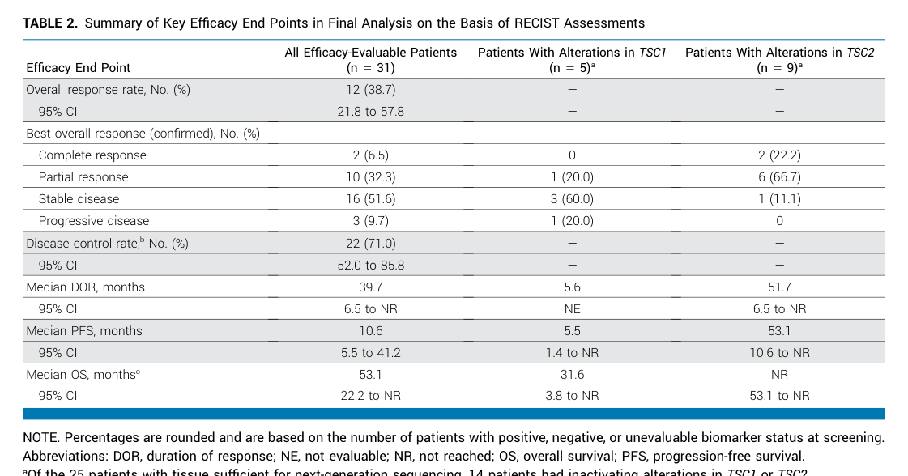

## Question

# Disease Characteristics Research Template

## Target Disease
- **Disease Name:** Perivascular Epithelioid Cell Neoplasm
- **MONDO ID:**  (if available)
- **Category:** Complex

## Research Objectives

Please provide a comprehensive research report on **Perivascular Epithelioid Cell Neoplasm** covering all of the
disease characteristics listed below. This report will be used to populate a disease knowledge
base entry. Be thorough and cite primary literature (PMID preferred) for all claims.

For each section, **suggested databases/resources** are listed. These are the first places
you should search for information on each topic.

---

### 1. Disease Information
> **Search first:** OMIM, Orphanet, ICD-10/ICD-11, MeSH, PubMed

- What is the disease? Provide a concise overview.
- What are the key identifiers? (OMIM, Orphanet, ICD-10/ICD-11, MeSH, Mondo)
- What are the common synonyms and alternative names?
- Is the information derived from individual patients (e.g., EHR) or aggregated disease-level resources?

### 2. Etiology

- **Disease Causal Factors**: What are the primary causes? (genetic, environmental, infectious, mechanistic)
- **Risk Factors**:
  > **Search first:** PubMed, Cochrane Library, UpToDate, clinical guidelines, ClinVar, ClinGen, GWAS Catalog, PheGenI, CTD, CDC, WHO, epidemiological databases
  - Genetic risk factors (causal variants, susceptibility loci, modifier genes)
  - Environmental risk factors (toxins, lifestyle, occupational exposures, age, sex, family history)
- **Protective Factors**:
  > **Search first:** PubMed, Cochrane Library, clinical trial databases, GWAS Catalog, gnomAD, WHO, CDC, nutrition databases
  - Genetic protective factors (protective variants, modifier alleles)
  - Environmental protective factors (diet, lifestyle, exposures that reduce risk)
- **Gene-Environment Interactions**: How do genetic and environmental factors interact to influence disease?
  > **Search first:** CTD, PubMed, PheGenI, GxE databases

### 3. Phenotypes
> **Search first:** HPO (Human Phenotype Ontology), OMIM, Orphanet, PubMed, clinicaltrials.gov, MedDRA, SNOMED CT, DECIPHER, LOINC

For each phenotype, provide:
- **Phenotype type**: symptoms, clinical signs, physical manifestations, behavioral changes, or laboratory abnormalities
  > For symptoms/signs: HPO, OMIM, Orphanet, PubMed
  > For behavioral changes: HPO, DSM, RDoC (Research Domain Criteria), PubMed
  > For laboratory abnormalities: LOINC, SNOMED CT, LabTests Online, PubMed
- **Phenotype characteristics**:
  > **Search first:** OMIM, Orphanet, HPO, PubMed
  - Age of symptom onset (neonatal, childhood, adult-onset, late-onset)
  - Symptom severity (mild, moderate, severe, variable)
  - Symptom progression (stable, progressive, episodic, fluctuating)
  - Frequency among affected individuals (percentage or qualitative)
- **Quality of life impact**: Effects on daily functioning and well-being (per-phenotype when possible)
  > **Search first:** EQ-5D database, SF-36, WHO QOL databases, PubMed
- Suggest HPO (Human Phenotype Ontology) terms for each phenotype

### 4. Genetic/Molecular Information

- **Causal Genes**: Gene mutations or chromosomal abnormalities responsible for disease (gene symbols, OMIM IDs)
  > **Search first:** OMIM, ClinVar, HGMD, Ensembl, NCBI Gene
- **Pathogenic Variants**:
  - Affected genes (gene symbols, HGNC IDs)
    > **Search first:** OMIM, NCBI Gene, Ensembl, HGNC, UniProt, GeneCards
  - Variant classification (pathogenic, likely pathogenic, VUS per ACMG/AMP guidelines)
    > **Search first:** ClinVar, ClinGen, ACMG/AMP guidelines, VarSome
  - Variant type/class (missense, frameshift, nonsense, splice-site, structural)
  - Allele frequency in population databases
    > **Search first:** gnomAD, 1000 Genomes, ExAC, TOPMed, dbSNP
  - Somatic vs germline origin
    > **Search first:** COSMIC (somatic), ClinVar, ICGC, TCGA
  - Functional consequences (loss of function, gain of function, dominant negative)
- **Modifier Genes**: Genes that modify disease severity or expression
- **Epigenetic Information**: DNA methylation, histone modifications, chromatin changes affecting disease
  > **Search first:** ENCODE, Roadmap Epigenomics, MethBase, DiseaseMeth
- **Chromosomal Abnormalities**: Large-scale genetic changes (aneuploidy, translocations, inversions)
  > **Search first:** DECIPHER, ClinVar, ECARUCA, UCSC Genome Browser

### 5. Environmental Information

- **Environmental Factors**: Non-genetic contributing factors (toxins, radiation, pollution, occupational exposure)
  > **Search first:** CTD (Comparative Toxicogenomics Database), TOXNET, PubMed, EPA databases
- **Lifestyle Factors**: Behavioral factors (smoking, diet, exercise, alcohol consumption)
  > **Search first:** CDC databases, WHO, PubMed, NHANES
- **Infectious Agents**: If applicable, pathogens causing or triggering disease (bacteria, viruses, fungi, parasites)
  > **Search first:** NCBI Taxonomy, ViPR, BV-BRC, MicrobeDB, GIDEON

### 6. Mechanism / Pathophysiology

- **Molecular Pathways**: Specific signaling cascades or biochemical pathways involved (Wnt, MAPK, mTOR, PI3K-AKT, etc.)
  > **Search first:** KEGG, Reactome, WikiPathways, PathBank, BioCyc
- **Cellular Processes**: Cell-level mechanisms (apoptosis, autophagy, cell cycle dysregulation, inflammation, etc.)
  > **Search first:** Gene Ontology (GO), Reactome, KEGG, PubMed
- **Protein Dysfunction**: How protein structure or function is altered (misfolding, aggregation, loss of function, gain of function)
  > **Search first:** UniProt, PDB (Protein Data Bank), InterPro, Pfam, AlphaFold
- **Metabolic Changes**: Alterations in metabolic processes (energy metabolism, lipid metabolism, amino acid metabolism)
  > **Search first:** KEGG, BioCyc, HMDB (Human Metabolome Database), BRENDA
- **Immune System Involvement**: Role of immune response (autoimmunity, immunodeficiency, chronic inflammation)
  > **Search first:** ImmPort, Immunome Database, IEDB, Gene Ontology
- **Tissue Damage Mechanisms**: How tissues/ are injured (oxidative stress, ischemia, fibrosis, necrosis)
  > **Search first:** PubMed, Gene Ontology, Reactome
- **Biochemical Abnormalities**: Specific molecular defects (enzyme deficiencies, receptor dysfunction, ion channel defects)
  > **Search first:** BRENDA, UniProt, KEGG, OMIM, PubMed
- **Epigenetic Changes**: DNA methylation, histone modifications affecting gene expression in disease
  > **Search first:** ENCODE, Roadmap Epigenomics, MethBase, DiseaseMeth
- **Molecular Profiling** (if available):
  - Transcriptomics/gene expression changes
    > **Search first:** GEO (Gene Expression Omnibus), ArrayExpress, GTEx, Human Cell Atlas, SRA
  - Proteomics findings
    > **Search first:** PRIDE, ProteomeXchange, Human Protein Atlas, STRING, BioGRID
  - Metabolomics signatures
    > **Search first:** MetaboLights, Metabolomics Workbench, HMDB, METLIN
  - Lipidomics alterations
    > **Search first:** LIPID MAPS, SwissLipids, LipidHome, Metabolomics Workbench
  - Genomic structural features
    > **Search first:** UCSC Genome Browser, Ensembl, NCBI, dbVar, DGV
- **Advanced Technologies** (if applicable):
  - Single-cell analysis findings (cell-type specific mechanisms, cellular heterogeneity)
    > **Search first:** Human Cell Atlas, Single Cell Portal, GEO, CELLxGENE
  - Spatial transcriptomics findings
    > **Search first:** GEO, Spatial Research, Vizgen, 10x Genomics data
  - Multi-omics integration results
    > **Search first:** TCGA, ICGC, cBioPortal, LinkedOmics, PubMed
  - Functional genomics screens (CRISPR, RNAi)
    > **Search first:** DepMap, GenomeRNAi, PubMed, BioGRID ORCS

For each mechanism, describe:
- The causal chain from initial trigger to clinical manifestation
- Which mechanisms are upstream vs downstream
- What cell types and biological processes are involved
- Suggest GO terms for biological processes and CL terms for cell types

### 7. Anatomical Structures Affected

- **Organ Level**:
  - Primary organs directly affected
  - Secondary organ involvement (complications, secondary effects)
  - Body systems involved (cardiovascular, nervous, digestive, respiratory, endocrine, etc.)
  > **Search first:** Uberon, FMA (Foundational Model of Anatomy), OMIM, HPO, ICD-11, MeSH, SNOMED CT
- **Tissue and Cell Level**:
  - Specific tissue types affected (epithelial, connective, muscle, nervous)
  - Specific cell populations targeted (with Cell Ontology terms)
  > **Search first:** Uberon, Human Protein Atlas, Cell Ontology, Human Cell Atlas, CellMarker, PanglaoDB
- **Subcellular Level**:
  - Cellular compartments involved (mitochondria, nucleus, ER, lysosomes) (with GO Cellular Component terms)
  > **Search first:** Gene Ontology (Cellular Component), UniProt, Human Protein Atlas
- **Localization**:
  - Specific anatomical sites (with UBERON terms)
    > **Search first:** FMA, Uberon, NeuroNames (for brain), SNOMED CT
  - Lateralization (unilateral, bilateral, asymmetric)
    > **Search first:** HPO, clinical literature, imaging databases

### 8. Temporal Development

- **Onset**:
  - Typical age of onset (congenital, pediatric, adult, geriatric)
  - Onset pattern (acute, subacute, chronic, insidious)
  > **Search first:** OMIM, Orphanet, HPO, PubMed
- **Progression**:
  - Disease stages (early, intermediate, advanced, end-stage)
    > **Search first:** Cancer Staging Manual (AJCC), WHO classifications, PubMed
  - Progression rate (rapid, slow, variable)
  - Disease course pattern (episodic, relapsing-remitting, progressive, stable)
  - Disease duration (self-limited, chronic lifelong)
  > **Search first:** Disease registries, longitudinal cohort databases, natural history studies, PubMed, Orphanet, OMIM
- **Patterns**:
  - Remission patterns (spontaneous, treatment-induced)
    > **Search first:** Clinical trial databases, disease registries, PubMed
  - Critical periods (time windows of vulnerability or opportunity for intervention)
    > **Search first:** PubMed, developmental biology databases, clinical guidelines

### 9. Inheritance and Population

- **Epidemiology**:
  - Prevalence (cases per 100,000 at given time)
  - Incidence (new cases per 100,000 per year)
  > **Search first:** Orphanet, CDC, WHO, GBD (Global Burden of Disease), national registries, SEER, disease registries
- **For Genetic Etiology**:
  - Inheritance pattern (AD, AR, X-linked, mitochondrial, multifactorial, polygenic)
    > **Search first:** OMIM, Orphanet, ClinVar, GTR (Genetic Testing Registry)
  - Penetrance (complete, incomplete, age-dependent)
    > **Search first:** ClinVar, OMIM, PubMed, ClinGen
  - Expressivity (variable, consistent)
    > **Search first:** OMIM, ClinVar, PubMed
  - Genetic anticipation (increasing severity in successive generations)
    > **Search first:** OMIM, PubMed (especially for repeat expansion disorders)
  - Germline mosaicism
    > **Search first:** ClinVar, OMIM, genetic counseling literature, PubMed
  - Founder effects (population-specific mutations)
    > **Search first:** gnomAD, population genetics databases, PubMed
  - Consanguinity role
    > **Search first:** OMIM, population studies, genetic counseling resources
  - Carrier frequency
    > **Search first:** gnomAD, carrier screening databases, GeneReviews, GTR
- **Population Demographics**:
  - Affected populations (ethnic or demographic groups with higher prevalence)
    > **Search first:** gnomAD, 1000 Genomes, PAGE Study, PubMed, population registries
  - Geographic distribution (endemic areas, regional variation)
    > **Search first:** WHO, CDC, GBD, Orphanet, geographic epidemiology databases
  - Geographic distribution of specific variants
  - Sex ratio (male:female)
    > **Search first:** Disease registries, OMIM, PubMed, epidemiological databases
  - Age distribution of affected individuals
    > **Search first:** CDC, disease registries, SEER, Orphanet

### 10. Diagnostics

- **Clinical Tests**:
  - Laboratory tests (blood, urine, tissue chemistry, specific enzyme assays)
    > **Search first:** LOINC, LabTests Online, PubMed
  - Biomarkers (proteins, metabolites, genetic markers, circulating biomarkers)
    > **Search first:** FDA Biomarker List, BEST (Biomarkers, EndpointS, and other Tools), PubMed
  - Imaging studies (X-ray, CT, MRI, PET, ultrasound)
    > **Search first:** RadLex, DICOM, Radiopaedia, imaging databases
  - Functional tests (pulmonary function, cardiac stress tests)
    > **Search first:** LOINC, clinical guidelines, PubMed
  - Electrophysiology (EEG, EMG, ECG, nerve conduction studies)
    > **Search first:** LOINC, clinical neurophysiology databases, PubMed
  - Biopsy findings (histopathology, immunohistochemistry)
    > **Search first:** SNOMED CT, College of American Pathologists resources, PubMed
  - Pathology findings (microscopic examination)
    > **Search first:** SNOMED CT, Digital Pathology databases, PubMed
- **Genetic Testing**:
  > **Search first:** GTR (Genetic Testing Registry), GeneReviews, ClinGen
  - Overview of recommended genetic testing approach
  - Whole genome sequencing (WGS) utility
    > **Search first:** GTR, ClinVar, GEL (Genomics England), gnomAD
  - Whole exome sequencing (WES) utility
    > **Search first:** GTR, ClinVar, OMIM, GeneMatcher
  - Gene panels (which panels, which genes)
    > **Search first:** GTR, ClinVar, laboratory-specific databases
  - Single gene testing
    > **Search first:** GTR, ClinVar, OMIM, GeneReviews
  - Chromosomal microarray (CMA)
    > **Search first:** DECIPHER, ClinVar, dbVar, ECARUCA
  - Karyotyping
    > **Search first:** Chromosome Abnormality Database, ClinVar, cytogenetics resources
  - FISH
    > **Search first:** ClinVar, cytogenetics databases, PubMed
  - Mitochondrial DNA testing
    > **Search first:** MITOMAP, MSeqDR, ClinVar, GTR
  - Repeat expansion testing
    > **Search first:** GTR, ClinVar, repeat expansion databases, PubMed
- **Omics-Based Diagnostics** (if applicable):
  - RNA sequencing / transcriptomics
    > **Search first:** GEO, ArrayExpress, GTEx, RNA-seq databases
  - Proteomics
    > **Search first:** PRIDE, ProteomeXchange, FDA Biomarker database
  - Metabolomics
    > **Search first:** MetaboLights, Metabolomics Workbench, HMDB
  - Epigenomics
    > **Search first:** GEO, ENCODE, Roadmap Epigenomics, MethBase
  - Liquid biopsy
    > **Search first:** COSMIC, ClinVar, liquid biopsy databases, PubMed
- **Clinical Criteria**:
  - Standardized diagnostic criteria (DSM, ICD, society guidelines)
    > **Search first:** DSM-5, ICD-11, clinical society guidelines, UpToDate
  - Differential diagnosis (other conditions to rule out, with distinguishing features)
    > **Search first:** DynaMed, UpToDate, clinical decision support systems
- **Screening**:
  - Screening methods for asymptomatic individuals (newborn screening, carrier screening, cascade screening)
    > **Search first:** ACMG recommendations, CDC newborn screening, GTR

### 11. Outcome/Prognosis

- **Survival and Mortality**:
  - Survival rate (5-year, 10-year, overall)
    > **Search first:** SEER, cancer registries, disease-specific registries, PubMed
  - Life expectancy (with and without treatment if applicable)
    > **Search first:** Orphanet, disease registries, actuarial databases, PubMed
  - Mortality rate
    > **Search first:** CDC, WHO, GBD, national mortality databases
  - Disease-specific mortality (deaths directly attributable to disease)
    > **Search first:** Disease registries, CDC Wonder, GBD, PubMed
- **Morbidity and Function**:
  - Morbidity (disease-related disability and health impacts)
    > **Search first:** GBD, WHO, disability databases, PubMed
  - Disability outcomes (long-term functional impairments)
    > **Search first:** ICF (International Classification of Functioning), disability registries
  - Quality of life measures (EQ-5D, SF-36, PROMIS, disease-specific tools)
    > **Search first:** EQ-5D database, SF-36, PROMIS, PubMed
- **Disease Course**:
  - Complications (secondary problems: infections, organ failure, etc.)
    > **Search first:** ICD codes, disease registries, clinical databases, PubMed
  - Recovery potential (likelihood and extent of recovery, with vs without treatment)
    > **Search first:** Natural history studies, rehabilitation databases, PubMed
- **Prediction**:
  - Prognostic factors (age, disease severity, biomarkers, treatment response)
    > **Search first:** Prognostic models databases, clinical calculators, PubMed
  - Prognostic biomarkers (molecular markers predicting disease course)
    > **Search first:** FDA Biomarker database, PubMed, cancer prognostic databases

### 12. Treatment

- **Pharmacotherapy**:
  - Pharmacological treatments (drug names, drug classes, mechanisms of action)
    > **Search first:** DrugBank, RxNorm, ATC classification, DailyMed, FDA databases
  - Pharmacogenomics (how genetic variants affect drug metabolism, efficacy, toxicity)
    > **Search first:** PharmGKB, CPIC (Clinical Pharmacogenetics), FDA Table of PGx Biomarkers
- **Advanced Therapeutics**:
  - Gene therapy (viral vectors, CRISPR, gene replacement, gene editing)
    > **Search first:** ClinicalTrials.gov, FDA gene therapy database, ASGCT resources
  - Cell therapy (stem cell transplant, CAR-T, cellular therapeutics)
    > **Search first:** ClinicalTrials.gov, FDA cell therapy database, FACT standards
  - RNA-based therapies (ASOs, siRNA, mRNA therapies)
    > **Search first:** ClinicalTrials.gov, FDA approvals, PubMed
  - Targeted therapies (treatments directed at specific molecular targets)
    > **Search first:** My Cancer Genome, OncoKB, ClinicalTrials.gov, FDA approvals
  - Immunotherapies (checkpoint inhibitors, monoclonal antibodies)
    > **Search first:** Cancer Immunotherapy Database, FDA approvals, ClinicalTrials.gov
- **Surgical and Interventional**:
  - Surgical interventions (types of surgery, timing, outcomes)
    > **Search first:** CPT codes, surgical registries, clinical guidelines, PubMed
- **Supportive and Rehabilitative**:
  - Supportive care (symptom management, pain control, nutrition)
    > **Search first:** Clinical guidelines, Cochrane Library, PubMed
  - Rehabilitation (physical therapy, occupational therapy, speech therapy)
    > **Search first:** Rehabilitation medicine databases, clinical guidelines, PubMed
- **Experimental**:
  - Experimental treatments in clinical trials (with NCT identifiers if available)
    > **Search first:** ClinicalTrials.gov, EU Clinical Trials Register, WHO ICTRP
- **Treatment Outcomes**:
  - Treatment response rates
    > **Search first:** Clinical trial databases, FDA reviews, systematic reviews, PubMed
  - Side effects and adverse events
    > **Search first:** FDA Adverse Event Reporting System (FAERS), MedWatch, PubMed
- **Treatment Strategy**:
  - Treatment algorithms (clinical pathways, decision trees)
    > **Search first:** Clinical practice guidelines, NCCN Guidelines, UpToDate
  - Combination therapies
    > **Search first:** ClinicalTrials.gov, treatment guidelines, PubMed
  - Personalized medicine approaches (genotype-guided treatment)
    > **Search first:** My Cancer Genome, CIViC, PharmGKB, precision medicine databases

For each treatment, suggest MAXO (Medical Action Ontology) terms where applicable.

### 13. Prevention

- **Prevention Levels**:
  - Primary prevention (preventing disease occurrence: vaccination, risk factor modification)
    > **Search first:** CDC, WHO, USPSTF recommendations, Cochrane Library
  - Secondary prevention (early detection and treatment: screening programs, early intervention)
    > **Search first:** USPSTF, CDC screening guidelines, WHO
  - Tertiary prevention (preventing complications in those with disease)
    > **Search first:** Clinical guidelines, disease management protocols, PubMed
- **Immunization**: Vaccine strategies (if applicable)
  > **Search first:** CDC vaccine schedules, WHO immunization, FDA vaccine database
- **Screening and Early Detection**:
  - Screening programs (population-based: newborn screening, cancer screening)
    > **Search first:** CDC screening programs, USPSTF, cancer screening databases
  - Genetic screening (carrier screening, preimplantation genetic diagnosis, prenatal testing)
    > **Search first:** ACMG recommendations, ACOG guidelines, GTR
  - Risk stratification (identifying high-risk individuals for targeted prevention)
    > **Search first:** Risk prediction models, clinical calculators, PubMed
- **Behavioral Interventions**: Lifestyle modifications to reduce risk
  > **Search first:** CDC, WHO, behavioral intervention databases, Cochrane Library
- **Counseling**: Genetic counseling (risk assessment, family planning guidance)
  > **Search first:** NSGC resources, ACMG guidelines, GeneReviews
- **Public Health**:
  - Public health interventions (sanitation, vector control, health education)
    > **Search first:** CDC, WHO, public health databases, PubMed
  - Environmental interventions (reducing environmental risk factors)
    > **Search first:** EPA databases, WHO environmental health, PubMed
- **Prophylaxis**: Preventive medications or procedures
  > **Search first:** Clinical guidelines, FDA approvals, PubMed

### 14. Other Species / Natural Disease

- **Taxonomy**: Species affected (with NCBI Taxon identifiers)
  > **Search first:** NCBI Taxonomy
- **Breed**: Specific breeds affected (with VBO identifiers if applicable)
  > **Search first:** VBO (Vertebrate Breed Ontology)
- **Gene**: Orthologous genes in other species (with NCBI Gene IDs)
  > **Search first:** NCBI Gene
- **Natural Disease**:
  - Naturally occurring disease in other species (companion animals, wildlife)
    > **Search first:** OMIA (Online Mendelian Inheritance in Animals), VetCompass, PubMed
  - Veterinary relevance and importance in animal health
    > **Search first:** OMIA, veterinary databases, PubMed
- **Comparative Biology**:
  - Comparative pathology (similarities and differences across species)
    > **Search first:** OMIA, comparative pathology databases, PubMed
  - Evolutionary conservation of disease mechanisms
    > **Search first:** HomoloGene, OrthoMCL, Alliance of Genome Resources
- **Transmission** (if applicable):
  - Zoonotic potential
    > **Search first:** CDC zoonotic diseases, WHO zoonoses, GIDEON
  - Cross-species susceptibility
    > **Search first:** NCBI Taxonomy, veterinary databases, PubMed

### 15. Model Organisms

- **Model Types**:
  - Model organism type (mammalian, invertebrate, cellular, in vitro)
    > **Search first:** Alliance of Genome Resources, model organism databases
  - Specific model systems (mouse, rat, zebrafish, Drosophila, C. elegans, yeast, cell lines, organoids, iPSCs)
    > **Search first:** MGI, RGD, ZFIN, FlyBase, WormBase, SGD, ATCC, Cellosaurus
  - Induced models (drug treatment, surgical intervention, environmental manipulation)
    > **Search first:** MGI, model organism databases, PubMed
- **Genetic Models**:
  - Types available (knockout, knock-in, transgenic, conditional, humanized)
    > **Search first:** MGI, IMPC, KOMP, EuMMCR, IMSR
- **Model Characteristics**:
  - Phenotype recapitulation (how well model reproduces human disease features)
    > **Search first:** Model organism databases, comparative studies, PubMed
  - Model limitations (aspects of human disease not captured)
    > **Search first:** Model organism databases, PubMed, review articles
- **Applications**:
  - Research applications (what aspects of disease can be studied)
    > **Search first:** Model organism databases, PubMed
- **Resources**:
  - Model databases
    > **Search first:** MGI, RGD, ZFIN, FlyBase, WormBase, IMSR, EMMA, MMRRC

---

## Citation Requirements

- Cite primary literature (PMID preferred) for all mechanistic and clinical claims
- Prioritize recent reviews and landmark papers
- Include direct quotes from abstracts where possible to support key statements
- Distinguish evidence source types: human clinical, model organism, in vitro, computational

## Output Format

Structure your response as a comprehensive narrative organized by the sections above.
For each section, provide:
- Factual content with specific details (numbers, percentages, gene names, variant nomenclature)
- Ontology term suggestions (HPO, GO, CL, UBERON, CHEBI, MAXO, MONDO) where applicable
- Evidence citations with PMIDs
- Direct quotes from abstracts to support key claims
- Clear indication when information is not available or not applicable for this disease

This report will be used to populate a disease knowledge base entry with:
- Pathophysiology descriptions with causal chains
- Gene/protein annotations (HGNC, GO terms)
- Phenotype associations (HP terms) with frequencies
- Cell type involvement (CL terms)
- Anatomical locations (UBERON terms)
- Chemical entities (CHEBI terms)
- Treatment annotations (MAXO terms)
- Evidence items with PMIDs and exact abstract quotes
- Epidemiology, prognosis, diagnostic, and prevention information
- Animal model descriptions with phenotype recapitulation details

## Output

Question: You are an expert researcher providing comprehensive, well-cited information.

Provide detailed information focusing on:
1. Key concepts and definitions with current understanding
2. Recent developments and latest research (prioritize 2023-2024 sources)
3. Current applications and real-world implementations
4. Expert opinions and analysis from authoritative sources
5. Relevant statistics and data from recent studies

Format as a comprehensive research report with proper citations. Include URLs and publication dates where available.
Always prioritize recent, authoritative sources and provide specific citations for all major claims.

# Disease Characteristics Research Template

## Target Disease
- **Disease Name:** Perivascular Epithelioid Cell Neoplasm
- **MONDO ID:**  (if available)
- **Category:** Complex

## Research Objectives

Please provide a comprehensive research report on **Perivascular Epithelioid Cell Neoplasm** covering all of the
disease characteristics listed below. This report will be used to populate a disease knowledge
base entry. Be thorough and cite primary literature (PMID preferred) for all claims.

For each section, **suggested databases/resources** are listed. These are the first places
you should search for information on each topic.

---

### 1. Disease Information
> **Search first:** OMIM, Orphanet, ICD-10/ICD-11, MeSH, PubMed

- What is the disease? Provide a concise overview.
- What are the key identifiers? (OMIM, Orphanet, ICD-10/ICD-11, MeSH, Mondo)
- What are the common synonyms and alternative names?
- Is the information derived from individual patients (e.g., EHR) or aggregated disease-level resources?

### 2. Etiology

- **Disease Causal Factors**: What are the primary causes? (genetic, environmental, infectious, mechanistic)
- **Risk Factors**:
  > **Search first:** PubMed, Cochrane Library, UpToDate, clinical guidelines, ClinVar, ClinGen, GWAS Catalog, PheGenI, CTD, CDC, WHO, epidemiological databases
  - Genetic risk factors (causal variants, susceptibility loci, modifier genes)
  - Environmental risk factors (toxins, lifestyle, occupational exposures, age, sex, family history)
- **Protective Factors**:
  > **Search first:** PubMed, Cochrane Library, clinical trial databases, GWAS Catalog, gnomAD, WHO, CDC, nutrition databases
  - Genetic protective factors (protective variants, modifier alleles)
  - Environmental protective factors (diet, lifestyle, exposures that reduce risk)
- **Gene-Environment Interactions**: How do genetic and environmental factors interact to influence disease?
  > **Search first:** CTD, PubMed, PheGenI, GxE databases

### 3. Phenotypes
> **Search first:** HPO (Human Phenotype Ontology), OMIM, Orphanet, PubMed, clinicaltrials.gov, MedDRA, SNOMED CT, DECIPHER, LOINC

For each phenotype, provide:
- **Phenotype type**: symptoms, clinical signs, physical manifestations, behavioral changes, or laboratory abnormalities
  > For symptoms/signs: HPO, OMIM, Orphanet, PubMed
  > For behavioral changes: HPO, DSM, RDoC (Research Domain Criteria), PubMed
  > For laboratory abnormalities: LOINC, SNOMED CT, LabTests Online, PubMed
- **Phenotype characteristics**:
  > **Search first:** OMIM, Orphanet, HPO, PubMed
  - Age of symptom onset (neonatal, childhood, adult-onset, late-onset)
  - Symptom severity (mild, moderate, severe, variable)
  - Symptom progression (stable, progressive, episodic, fluctuating)
  - Frequency among affected individuals (percentage or qualitative)
- **Quality of life impact**: Effects on daily functioning and well-being (per-phenotype when possible)
  > **Search first:** EQ-5D database, SF-36, WHO QOL databases, PubMed
- Suggest HPO (Human Phenotype Ontology) terms for each phenotype

### 4. Genetic/Molecular Information

- **Causal Genes**: Gene mutations or chromosomal abnormalities responsible for disease (gene symbols, OMIM IDs)
  > **Search first:** OMIM, ClinVar, HGMD, Ensembl, NCBI Gene
- **Pathogenic Variants**:
  - Affected genes (gene symbols, HGNC IDs)
    > **Search first:** OMIM, NCBI Gene, Ensembl, HGNC, UniProt, GeneCards
  - Variant classification (pathogenic, likely pathogenic, VUS per ACMG/AMP guidelines)
    > **Search first:** ClinVar, ClinGen, ACMG/AMP guidelines, VarSome
  - Variant type/class (missense, frameshift, nonsense, splice-site, structural)
  - Allele frequency in population databases
    > **Search first:** gnomAD, 1000 Genomes, ExAC, TOPMed, dbSNP
  - Somatic vs germline origin
    > **Search first:** COSMIC (somatic), ClinVar, ICGC, TCGA
  - Functional consequences (loss of function, gain of function, dominant negative)
- **Modifier Genes**: Genes that modify disease severity or expression
- **Epigenetic Information**: DNA methylation, histone modifications, chromatin changes affecting disease
  > **Search first:** ENCODE, Roadmap Epigenomics, MethBase, DiseaseMeth
- **Chromosomal Abnormalities**: Large-scale genetic changes (aneuploidy, translocations, inversions)
  > **Search first:** DECIPHER, ClinVar, ECARUCA, UCSC Genome Browser

### 5. Environmental Information

- **Environmental Factors**: Non-genetic contributing factors (toxins, radiation, pollution, occupational exposure)
  > **Search first:** CTD (Comparative Toxicogenomics Database), TOXNET, PubMed, EPA databases
- **Lifestyle Factors**: Behavioral factors (smoking, diet, exercise, alcohol consumption)
  > **Search first:** CDC databases, WHO, PubMed, NHANES
- **Infectious Agents**: If applicable, pathogens causing or triggering disease (bacteria, viruses, fungi, parasites)
  > **Search first:** NCBI Taxonomy, ViPR, BV-BRC, MicrobeDB, GIDEON

### 6. Mechanism / Pathophysiology

- **Molecular Pathways**: Specific signaling cascades or biochemical pathways involved (Wnt, MAPK, mTOR, PI3K-AKT, etc.)
  > **Search first:** KEGG, Reactome, WikiPathways, PathBank, BioCyc
- **Cellular Processes**: Cell-level mechanisms (apoptosis, autophagy, cell cycle dysregulation, inflammation, etc.)
  > **Search first:** Gene Ontology (GO), Reactome, KEGG, PubMed
- **Protein Dysfunction**: How protein structure or function is altered (misfolding, aggregation, loss of function, gain of function)
  > **Search first:** UniProt, PDB (Protein Data Bank), InterPro, Pfam, AlphaFold
- **Metabolic Changes**: Alterations in metabolic processes (energy metabolism, lipid metabolism, amino acid metabolism)
  > **Search first:** KEGG, BioCyc, HMDB (Human Metabolome Database), BRENDA
- **Immune System Involvement**: Role of immune response (autoimmunity, immunodeficiency, chronic inflammation)
  > **Search first:** ImmPort, Immunome Database, IEDB, Gene Ontology
- **Tissue Damage Mechanisms**: How tissues/ are injured (oxidative stress, ischemia, fibrosis, necrosis)
  > **Search first:** PubMed, Gene Ontology, Reactome
- **Biochemical Abnormalities**: Specific molecular defects (enzyme deficiencies, receptor dysfunction, ion channel defects)
  > **Search first:** BRENDA, UniProt, KEGG, OMIM, PubMed
- **Epigenetic Changes**: DNA methylation, histone modifications affecting gene expression in disease
  > **Search first:** ENCODE, Roadmap Epigenomics, MethBase, DiseaseMeth
- **Molecular Profiling** (if available):
  - Transcriptomics/gene expression changes
    > **Search first:** GEO (Gene Expression Omnibus), ArrayExpress, GTEx, Human Cell Atlas, SRA
  - Proteomics findings
    > **Search first:** PRIDE, ProteomeXchange, Human Protein Atlas, STRING, BioGRID
  - Metabolomics signatures
    > **Search first:** MetaboLights, Metabolomics Workbench, HMDB, METLIN
  - Lipidomics alterations
    > **Search first:** LIPID MAPS, SwissLipids, LipidHome, Metabolomics Workbench
  - Genomic structural features
    > **Search first:** UCSC Genome Browser, Ensembl, NCBI, dbVar, DGV
- **Advanced Technologies** (if applicable):
  - Single-cell analysis findings (cell-type specific mechanisms, cellular heterogeneity)
    > **Search first:** Human Cell Atlas, Single Cell Portal, GEO, CELLxGENE
  - Spatial transcriptomics findings
    > **Search first:** GEO, Spatial Research, Vizgen, 10x Genomics data
  - Multi-omics integration results
    > **Search first:** TCGA, ICGC, cBioPortal, LinkedOmics, PubMed
  - Functional genomics screens (CRISPR, RNAi)
    > **Search first:** DepMap, GenomeRNAi, PubMed, BioGRID ORCS

For each mechanism, describe:
- The causal chain from initial trigger to clinical manifestation
- Which mechanisms are upstream vs downstream
- What cell types and biological processes are involved
- Suggest GO terms for biological processes and CL terms for cell types

### 7. Anatomical Structures Affected

- **Organ Level**:
  - Primary organs directly affected
  - Secondary organ involvement (complications, secondary effects)
  - Body systems involved (cardiovascular, nervous, digestive, respiratory, endocrine, etc.)
  > **Search first:** Uberon, FMA (Foundational Model of Anatomy), OMIM, HPO, ICD-11, MeSH, SNOMED CT
- **Tissue and Cell Level**:
  - Specific tissue types affected (epithelial, connective, muscle, nervous)
  - Specific cell populations targeted (with Cell Ontology terms)
  > **Search first:** Uberon, Human Protein Atlas, Cell Ontology, Human Cell Atlas, CellMarker, PanglaoDB
- **Subcellular Level**:
  - Cellular compartments involved (mitochondria, nucleus, ER, lysosomes) (with GO Cellular Component terms)
  > **Search first:** Gene Ontology (Cellular Component), UniProt, Human Protein Atlas
- **Localization**:
  - Specific anatomical sites (with UBERON terms)
    > **Search first:** FMA, Uberon, NeuroNames (for brain), SNOMED CT
  - Lateralization (unilateral, bilateral, asymmetric)
    > **Search first:** HPO, clinical literature, imaging databases

### 8. Temporal Development

- **Onset**:
  - Typical age of onset (congenital, pediatric, adult, geriatric)
  - Onset pattern (acute, subacute, chronic, insidious)
  > **Search first:** OMIM, Orphanet, HPO, PubMed
- **Progression**:
  - Disease stages (early, intermediate, advanced, end-stage)
    > **Search first:** Cancer Staging Manual (AJCC), WHO classifications, PubMed
  - Progression rate (rapid, slow, variable)
  - Disease course pattern (episodic, relapsing-remitting, progressive, stable)
  - Disease duration (self-limited, chronic lifelong)
  > **Search first:** Disease registries, longitudinal cohort databases, natural history studies, PubMed, Orphanet, OMIM
- **Patterns**:
  - Remission patterns (spontaneous, treatment-induced)
    > **Search first:** Clinical trial databases, disease registries, PubMed
  - Critical periods (time windows of vulnerability or opportunity for intervention)
    > **Search first:** PubMed, developmental biology databases, clinical guidelines

### 9. Inheritance and Population

- **Epidemiology**:
  - Prevalence (cases per 100,000 at given time)
  - Incidence (new cases per 100,000 per year)
  > **Search first:** Orphanet, CDC, WHO, GBD (Global Burden of Disease), national registries, SEER, disease registries
- **For Genetic Etiology**:
  - Inheritance pattern (AD, AR, X-linked, mitochondrial, multifactorial, polygenic)
    > **Search first:** OMIM, Orphanet, ClinVar, GTR (Genetic Testing Registry)
  - Penetrance (complete, incomplete, age-dependent)
    > **Search first:** ClinVar, OMIM, PubMed, ClinGen
  - Expressivity (variable, consistent)
    > **Search first:** OMIM, ClinVar, PubMed
  - Genetic anticipation (increasing severity in successive generations)
    > **Search first:** OMIM, PubMed (especially for repeat expansion disorders)
  - Germline mosaicism
    > **Search first:** ClinVar, OMIM, genetic counseling literature, PubMed
  - Founder effects (population-specific mutations)
    > **Search first:** gnomAD, population genetics databases, PubMed
  - Consanguinity role
    > **Search first:** OMIM, population studies, genetic counseling resources
  - Carrier frequency
    > **Search first:** gnomAD, carrier screening databases, GeneReviews, GTR
- **Population Demographics**:
  - Affected populations (ethnic or demographic groups with higher prevalence)
    > **Search first:** gnomAD, 1000 Genomes, PAGE Study, PubMed, population registries
  - Geographic distribution (endemic areas, regional variation)
    > **Search first:** WHO, CDC, GBD, Orphanet, geographic epidemiology databases
  - Geographic distribution of specific variants
  - Sex ratio (male:female)
    > **Search first:** Disease registries, OMIM, PubMed, epidemiological databases
  - Age distribution of affected individuals
    > **Search first:** CDC, disease registries, SEER, Orphanet

### 10. Diagnostics

- **Clinical Tests**:
  - Laboratory tests (blood, urine, tissue chemistry, specific enzyme assays)
    > **Search first:** LOINC, LabTests Online, PubMed
  - Biomarkers (proteins, metabolites, genetic markers, circulating biomarkers)
    > **Search first:** FDA Biomarker List, BEST (Biomarkers, EndpointS, and other Tools), PubMed
  - Imaging studies (X-ray, CT, MRI, PET, ultrasound)
    > **Search first:** RadLex, DICOM, Radiopaedia, imaging databases
  - Functional tests (pulmonary function, cardiac stress tests)
    > **Search first:** LOINC, clinical guidelines, PubMed
  - Electrophysiology (EEG, EMG, ECG, nerve conduction studies)
    > **Search first:** LOINC, clinical neurophysiology databases, PubMed
  - Biopsy findings (histopathology, immunohistochemistry)
    > **Search first:** SNOMED CT, College of American Pathologists resources, PubMed
  - Pathology findings (microscopic examination)
    > **Search first:** SNOMED CT, Digital Pathology databases, PubMed
- **Genetic Testing**:
  > **Search first:** GTR (Genetic Testing Registry), GeneReviews, ClinGen
  - Overview of recommended genetic testing approach
  - Whole genome sequencing (WGS) utility
    > **Search first:** GTR, ClinVar, GEL (Genomics England), gnomAD
  - Whole exome sequencing (WES) utility
    > **Search first:** GTR, ClinVar, OMIM, GeneMatcher
  - Gene panels (which panels, which genes)
    > **Search first:** GTR, ClinVar, laboratory-specific databases
  - Single gene testing
    > **Search first:** GTR, ClinVar, OMIM, GeneReviews
  - Chromosomal microarray (CMA)
    > **Search first:** DECIPHER, ClinVar, dbVar, ECARUCA
  - Karyotyping
    > **Search first:** Chromosome Abnormality Database, ClinVar, cytogenetics resources
  - FISH
    > **Search first:** ClinVar, cytogenetics databases, PubMed
  - Mitochondrial DNA testing
    > **Search first:** MITOMAP, MSeqDR, ClinVar, GTR
  - Repeat expansion testing
    > **Search first:** GTR, ClinVar, repeat expansion databases, PubMed
- **Omics-Based Diagnostics** (if applicable):
  - RNA sequencing / transcriptomics
    > **Search first:** GEO, ArrayExpress, GTEx, RNA-seq databases
  - Proteomics
    > **Search first:** PRIDE, ProteomeXchange, FDA Biomarker database
  - Metabolomics
    > **Search first:** MetaboLights, Metabolomics Workbench, HMDB
  - Epigenomics
    > **Search first:** GEO, ENCODE, Roadmap Epigenomics, MethBase
  - Liquid biopsy
    > **Search first:** COSMIC, ClinVar, liquid biopsy databases, PubMed
- **Clinical Criteria**:
  - Standardized diagnostic criteria (DSM, ICD, society guidelines)
    > **Search first:** DSM-5, ICD-11, clinical society guidelines, UpToDate
  - Differential diagnosis (other conditions to rule out, with distinguishing features)
    > **Search first:** DynaMed, UpToDate, clinical decision support systems
- **Screening**:
  - Screening methods for asymptomatic individuals (newborn screening, carrier screening, cascade screening)
    > **Search first:** ACMG recommendations, CDC newborn screening, GTR

### 11. Outcome/Prognosis

- **Survival and Mortality**:
  - Survival rate (5-year, 10-year, overall)
    > **Search first:** SEER, cancer registries, disease-specific registries, PubMed
  - Life expectancy (with and without treatment if applicable)
    > **Search first:** Orphanet, disease registries, actuarial databases, PubMed
  - Mortality rate
    > **Search first:** CDC, WHO, GBD, national mortality databases
  - Disease-specific mortality (deaths directly attributable to disease)
    > **Search first:** Disease registries, CDC Wonder, GBD, PubMed
- **Morbidity and Function**:
  - Morbidity (disease-related disability and health impacts)
    > **Search first:** GBD, WHO, disability databases, PubMed
  - Disability outcomes (long-term functional impairments)
    > **Search first:** ICF (International Classification of Functioning), disability registries
  - Quality of life measures (EQ-5D, SF-36, PROMIS, disease-specific tools)
    > **Search first:** EQ-5D database, SF-36, PROMIS, PubMed
- **Disease Course**:
  - Complications (secondary problems: infections, organ failure, etc.)
    > **Search first:** ICD codes, disease registries, clinical databases, PubMed
  - Recovery potential (likelihood and extent of recovery, with vs without treatment)
    > **Search first:** Natural history studies, rehabilitation databases, PubMed
- **Prediction**:
  - Prognostic factors (age, disease severity, biomarkers, treatment response)
    > **Search first:** Prognostic models databases, clinical calculators, PubMed
  - Prognostic biomarkers (molecular markers predicting disease course)
    > **Search first:** FDA Biomarker database, PubMed, cancer prognostic databases

### 12. Treatment

- **Pharmacotherapy**:
  - Pharmacological treatments (drug names, drug classes, mechanisms of action)
    > **Search first:** DrugBank, RxNorm, ATC classification, DailyMed, FDA databases
  - Pharmacogenomics (how genetic variants affect drug metabolism, efficacy, toxicity)
    > **Search first:** PharmGKB, CPIC (Clinical Pharmacogenetics), FDA Table of PGx Biomarkers
- **Advanced Therapeutics**:
  - Gene therapy (viral vectors, CRISPR, gene replacement, gene editing)
    > **Search first:** ClinicalTrials.gov, FDA gene therapy database, ASGCT resources
  - Cell therapy (stem cell transplant, CAR-T, cellular therapeutics)
    > **Search first:** ClinicalTrials.gov, FDA cell therapy database, FACT standards
  - RNA-based therapies (ASOs, siRNA, mRNA therapies)
    > **Search first:** ClinicalTrials.gov, FDA approvals, PubMed
  - Targeted therapies (treatments directed at specific molecular targets)
    > **Search first:** My Cancer Genome, OncoKB, ClinicalTrials.gov, FDA approvals
  - Immunotherapies (checkpoint inhibitors, monoclonal antibodies)
    > **Search first:** Cancer Immunotherapy Database, FDA approvals, ClinicalTrials.gov
- **Surgical and Interventional**:
  - Surgical interventions (types of surgery, timing, outcomes)
    > **Search first:** CPT codes, surgical registries, clinical guidelines, PubMed
- **Supportive and Rehabilitative**:
  - Supportive care (symptom management, pain control, nutrition)
    > **Search first:** Clinical guidelines, Cochrane Library, PubMed
  - Rehabilitation (physical therapy, occupational therapy, speech therapy)
    > **Search first:** Rehabilitation medicine databases, clinical guidelines, PubMed
- **Experimental**:
  - Experimental treatments in clinical trials (with NCT identifiers if available)
    > **Search first:** ClinicalTrials.gov, EU Clinical Trials Register, WHO ICTRP
- **Treatment Outcomes**:
  - Treatment response rates
    > **Search first:** Clinical trial databases, FDA reviews, systematic reviews, PubMed
  - Side effects and adverse events
    > **Search first:** FDA Adverse Event Reporting System (FAERS), MedWatch, PubMed
- **Treatment Strategy**:
  - Treatment algorithms (clinical pathways, decision trees)
    > **Search first:** Clinical practice guidelines, NCCN Guidelines, UpToDate
  - Combination therapies
    > **Search first:** ClinicalTrials.gov, treatment guidelines, PubMed
  - Personalized medicine approaches (genotype-guided treatment)
    > **Search first:** My Cancer Genome, CIViC, PharmGKB, precision medicine databases

For each treatment, suggest MAXO (Medical Action Ontology) terms where applicable.

### 13. Prevention

- **Prevention Levels**:
  - Primary prevention (preventing disease occurrence: vaccination, risk factor modification)
    > **Search first:** CDC, WHO, USPSTF recommendations, Cochrane Library
  - Secondary prevention (early detection and treatment: screening programs, early intervention)
    > **Search first:** USPSTF, CDC screening guidelines, WHO
  - Tertiary prevention (preventing complications in those with disease)
    > **Search first:** Clinical guidelines, disease management protocols, PubMed
- **Immunization**: Vaccine strategies (if applicable)
  > **Search first:** CDC vaccine schedules, WHO immunization, FDA vaccine database
- **Screening and Early Detection**:
  - Screening programs (population-based: newborn screening, cancer screening)
    > **Search first:** CDC screening programs, USPSTF, cancer screening databases
  - Genetic screening (carrier screening, preimplantation genetic diagnosis, prenatal testing)
    > **Search first:** ACMG recommendations, ACOG guidelines, GTR
  - Risk stratification (identifying high-risk individuals for targeted prevention)
    > **Search first:** Risk prediction models, clinical calculators, PubMed
- **Behavioral Interventions**: Lifestyle modifications to reduce risk
  > **Search first:** CDC, WHO, behavioral intervention databases, Cochrane Library
- **Counseling**: Genetic counseling (risk assessment, family planning guidance)
  > **Search first:** NSGC resources, ACMG guidelines, GeneReviews
- **Public Health**:
  - Public health interventions (sanitation, vector control, health education)
    > **Search first:** CDC, WHO, public health databases, PubMed
  - Environmental interventions (reducing environmental risk factors)
    > **Search first:** EPA databases, WHO environmental health, PubMed
- **Prophylaxis**: Preventive medications or procedures
  > **Search first:** Clinical guidelines, FDA approvals, PubMed

### 14. Other Species / Natural Disease

- **Taxonomy**: Species affected (with NCBI Taxon identifiers)
  > **Search first:** NCBI Taxonomy
- **Breed**: Specific breeds affected (with VBO identifiers if applicable)
  > **Search first:** VBO (Vertebrate Breed Ontology)
- **Gene**: Orthologous genes in other species (with NCBI Gene IDs)
  > **Search first:** NCBI Gene
- **Natural Disease**:
  - Naturally occurring disease in other species (companion animals, wildlife)
    > **Search first:** OMIA (Online Mendelian Inheritance in Animals), VetCompass, PubMed
  - Veterinary relevance and importance in animal health
    > **Search first:** OMIA, veterinary databases, PubMed
- **Comparative Biology**:
  - Comparative pathology (similarities and differences across species)
    > **Search first:** OMIA, comparative pathology databases, PubMed
  - Evolutionary conservation of disease mechanisms
    > **Search first:** HomoloGene, OrthoMCL, Alliance of Genome Resources
- **Transmission** (if applicable):
  - Zoonotic potential
    > **Search first:** CDC zoonotic diseases, WHO zoonoses, GIDEON
  - Cross-species susceptibility
    > **Search first:** NCBI Taxonomy, veterinary databases, PubMed

### 15. Model Organisms

- **Model Types**:
  - Model organism type (mammalian, invertebrate, cellular, in vitro)
    > **Search first:** Alliance of Genome Resources, model organism databases
  - Specific model systems (mouse, rat, zebrafish, Drosophila, C. elegans, yeast, cell lines, organoids, iPSCs)
    > **Search first:** MGI, RGD, ZFIN, FlyBase, WormBase, SGD, ATCC, Cellosaurus
  - Induced models (drug treatment, surgical intervention, environmental manipulation)
    > **Search first:** MGI, model organism databases, PubMed
- **Genetic Models**:
  - Types available (knockout, knock-in, transgenic, conditional, humanized)
    > **Search first:** MGI, IMPC, KOMP, EuMMCR, IMSR
- **Model Characteristics**:
  - Phenotype recapitulation (how well model reproduces human disease features)
    > **Search first:** Model organism databases, comparative studies, PubMed
  - Model limitations (aspects of human disease not captured)
    > **Search first:** Model organism databases, PubMed, review articles
- **Applications**:
  - Research applications (what aspects of disease can be studied)
    > **Search first:** Model organism databases, PubMed
- **Resources**:
  - Model databases
    > **Search first:** MGI, RGD, ZFIN, FlyBase, WormBase, IMSR, EMMA, MMRRC

---

## Citation Requirements

- Cite primary literature (PMID preferred) for all mechanistic and clinical claims
- Prioritize recent reviews and landmark papers
- Include direct quotes from abstracts where possible to support key statements
- Distinguish evidence source types: human clinical, model organism, in vitro, computational

## Output Format

Structure your response as a comprehensive narrative organized by the sections above.
For each section, provide:
- Factual content with specific details (numbers, percentages, gene names, variant nomenclature)
- Ontology term suggestions (HPO, GO, CL, UBERON, CHEBI, MAXO, MONDO) where applicable
- Evidence citations with PMIDs
- Direct quotes from abstracts to support key claims
- Clear indication when information is not available or not applicable for this disease

This report will be used to populate a disease knowledge base entry with:
- Pathophysiology descriptions with causal chains
- Gene/protein annotations (HGNC, GO terms)
- Phenotype associations (HP terms) with frequencies
- Cell type involvement (CL terms)
- Anatomical locations (UBERON terms)
- Chemical entities (CHEBI terms)
- Treatment annotations (MAXO terms)
- Evidence items with PMIDs and exact abstract quotes
- Epidemiology, prognosis, diagnostic, and prevention information
- Animal model descriptions with phenotype recapitulation details

# Comprehensive Disease Characteristics Report: Perivascular Epithelioid Cell Neoplasm (PEComa)

## Target Disease
- **Disease name:** Perivascular epithelioid cell neoplasm / tumor (PEComa)
- **MONDO ID:** Not retrievable from the current tool-accessible corpus (flagged as *data not available*).
- **Category:** Complex (ultra-rare mesenchymal neoplasm with molecularly defined subtypes)

## Evidence synthesis table (high-yield)
| Topic | Summary | Key quantitative details | Key sources |
|---|---|---|---|
| Disease name / synonyms | **Perivascular epithelioid cell neoplasm/tumor (PEComa/PEComa family)**; rare mesenchymal neoplasm composed of distinctive perivascular epithelioid cells with dual melanocytic and smooth-muscle differentiation. WHO-style definition quoted as: “a mesenchymal tumor which shows a local association with vessel walls and usually expresses melanocyte and smooth muscle markers.” (amante2024hepaticperivascularepithelioid pages 1-2, wagner2021nabsirolimusforpatients pages 1-2) | Malignant PEComa estimated annual incidence **~<1 per 1,000,000**. (wagner2021nabsirolimusforpatients pages 1-2, testa2023systemictreatmentsand pages 1-2) | Amante 2024, *World J Gastroenterol*, doi:10.3748/wjg.v30.i18.2374, https://doi.org/10.3748/wjg.v30.i18.2374; Wagner 2021, *J Clin Oncol*, doi:10.1200/JCO.21.01728, https://doi.org/10.1200/JCO.21.01728 |
| Defining pathology | Histology typically shows epithelioid to spindle cells with clear-to-eosinophilic cytoplasm arranged around vessels; abundant vasculature; radial/clustered perivascular growth. Diagnosis is pathology-led and often difficult on imaging alone. (amante2024hepaticperivascularepithelioid pages 1-2, dong2024comprehensiveinsightsinto pages 1-2) | Hepatic PEComa imaging correctly diagnosed only **19.4% (7/36)** in one 2024 series. (dong2024comprehensiveinsightsinto pages 1-2) | Dong 2024, *World J Oncol*, doi:10.14740/wjon1794, https://doi.org/10.14740/wjon1794; Ji 2024, *Front Oncol*, doi:10.3389/fonc.2024.1416254, https://doi.org/10.3389/fonc.2024.1416254 |
| Core IHC markers | Most useful diagnostic phenotype: melanocytic markers **HMB45**, **Melan-A**, often **MiTF**; myoid markers **SMA**, **desmin**, ± caldesmon/actin. HMB45 is commonly the most sensitive routine marker. TFE3 IHC may suggest the rearranged subset but requires molecular confirmation. (amante2024hepaticperivascularepithelioid pages 1-2, nikolova2026pecomasrevisitedmtordriven pages 2-4, cohen2022cutaneousperivascularepithelioid pages 1-25) | Hepatic PEComa positivity: **HMB45 97.2% (35/36)**, **Melan-A 97.1% (34/35)**, **SMA 88.5% (23/26)**. Cutaneous review: **MiTF 100%**, **HMB45 94%**, **NKIC3 94%** among reported cutaneous cases. (dong2024comprehensiveinsightsinto pages 1-2, cohen2022cutaneousperivascularepithelioid pages 1-25) | Ji 2024, *Front Oncol*, doi:10.3389/fonc.2024.1416254, https://doi.org/10.3389/fonc.2024.1416254; Cohen 2022, *Dermatol Online J*, doi:10.5070/d328157058, https://doi.org/10.5070/d328157058 |
| Molecular subtype 1: mTOR-pathway PEComa | Canonical subtype driven by **TSC1/TSC2 loss-of-function** and sometimes **MTOR** alterations, disrupting the hamartin–tuberin complex and releasing **mTORC1** signaling via RHEB; downstream activation includes phosphorylation of **p70S6K/S6**. This is the principal biologic rationale for mTOR inhibitors. (wagner2021nabsirolimusforpatients pages 1-2, nikolova2026pecomasrevisitedmtordriven pages 2-4, dong2024comprehensiveinsightsinto pages 1-2) | Renal PEComa review reports roughly **~70% TSC2** and **~20% TSC1** mutations; bladder series found **mTOR-pathway mutations 53%**, including **TSC1/2 35%**, **MTOR 6%**, and **TSC/MTOR co-mutations 12%**. (dong2024comprehensiveinsightsinto pages 1-2) | Dong 2024, *World J Oncol*, doi:10.14740/wjon1794, https://doi.org/10.14740/wjon1794; Wagner 2021, *J Clin Oncol*, doi:10.1200/JCO.21.01728, https://doi.org/10.1200/JCO.21.01728 |
| Molecular subtype 2: TFE3-rearranged PEComa | Distinct subset with **TFE3 gene fusions** (e.g., **SFPQ–TFE3**, **ASPSCR1–TFE3**); often shows strong TFE3 expression and may be biologically different from classic TSC-mutant PEComa. Molecular confirmation by **FISH or RNA-seq** is recommended when suspected. (nikolova2026pecomasrevisitedmtordriven pages 2-4, amante2024hepaticperivascularepithelioid pages 1-2) | Bladder PEComa series: **TFE3 fusions 47% (8/17)**; in that series metastatic disease occurred in **5 TFE3-rearranged** vs **2 TSC/MTOR-mutated** tumors. TFE3 overexpression in advanced PEComa correlated with higher death risk **HR 11.8, P=0.04**. (testa2023systemictreatmentsand pages 1-2) | Testa 2023, *Cancer Res Commun*, doi:10.1158/2767-9764.CRC-23-0139, https://doi.org/10.1158/2767-9764.CRC-23-0139 |
| Epidemiology / demographics | PEComas occur across many organs, especially **kidney, uterus, lung, retroperitoneum, gastrointestinal tract, liver**; there is a clear **female predominance**, and uterine/gynecologic presentations are especially common. TFE3-rearranged tumors may present at younger ages than TSC-driven tumors. (wagner2021nabsirolimusforpatients pages 1-2, nikolova2026pecomasrevisitedmtordriven pages 2-4, dong2024comprehensiveinsightsinto pages 1-2) | Female predominance outside sex-specific organs reported as **1.6- to 5-fold**. Hepatic series: **29 women / 7 men**, median age **47.8 y**. (dong2024comprehensiveinsightsinto pages 1-2) | Dong 2024, *World J Oncol*, doi:10.14740/wjon1794, https://doi.org/10.14740/wjon1794; Ji 2024, *Front Oncol*, doi:10.3389/fonc.2024.1416254, https://doi.org/10.3389/fonc.2024.1416254 |
| Risk stratification (Folpe-type) | Commonly used malignant-risk features: **size >5 cm**, **infiltrative growth**, **high nuclear grade/cellularity**, **mitotic activity >1/50 HPF**, **necrosis**, and **vascular invasion**; tumors with **≥2 worrisome features** are generally considered malignant/high risk in practice. (nikolova2026pecomasrevisitedmtordriven pages 1-2, amante2024hepaticperivascularepithelioid pages 1-2) | Framework is qualitative rather than universally validated; still widely used due to rarity and lack of better models. (amante2024hepaticperivascularepithelioid pages 1-2) | Amante 2024, *World J Gastroenterol*, doi:10.3748/wjg.v30.i18.2374, https://doi.org/10.3748/wjg.v30.i18.2374 |
| Standard local treatment | **Surgical resection** is the cornerstone for localized disease; ablation/embolization may be used in selected organ-specific settings when surgery is not feasible. (nikolova2026pecomasrevisitedmtordriven pages 1-2, dong2024comprehensiveinsightsinto pages 1-2) | Hepatic PEComa management in one series: **resection 67.7% (24/36)**, **radiofrequency ablation 16.7% (6/36)**, **TACE 2.7% (1/36)**, **sirolimus-chemotherapy 8.3% (3/36)**. (dong2024comprehensiveinsightsinto pages 1-2) | Ji 2024, *Front Oncol*, doi:10.3389/fonc.2024.1416254, https://doi.org/10.3389/fonc.2024.1416254 |
| Key systemic therapy evidence: AMPECT primary report | **nab-Sirolimus (albumin-bound sirolimus; FYARRO)** is the first prospective, registration-trial–supported therapy for advanced malignant PEComa. (wagner2021nabsirolimusforpatients pages 1-2) | In AMPECT, **31 efficacy-evaluable / 34 treated** patients: **ORR 39% (12/31; 95% CI 22–58)** with **1 CR + 11 PR**; **stable disease 52%**, **progressive disease 10%**; **67%** of responses occurred by **week 6**; **median PFS 10.6 mo**; **median OS 40.8 mo**; **median DOR not reached** at primary analysis after median **2.5 y** response follow-up. (wagner2021nabsirolimusforpatients pages 1-2) | Wagner 2021, *J Clin Oncol*, doi:10.1200/JCO.21.01728, https://doi.org/10.1200/JCO.21.01728 |
| AMPECT long-term update / biomarker effect | Long-term follow-up confirmed durable benefit and strengthened the predictive value of **TSC2** alteration for response. Table 2/Figure 1 in the 2024 JCO update summarize efficacy visually/tabularly. (wagner2024phaseiitrial media 6536d2a4, wagner2024phaseiitrial media c9372bd3) | Final update: **confirmed ORR 38.7% (95% CI 21.8–57.8)**; **mDOR 39.7 mo**; **median PFS 10.6 mo**; **median OS 53.1 mo**. Biomarker analysis in primary report: **8/9 (89%)** with **TSC2 mutation** responded vs **2/16 (13%)** without **TSC2** mutation (**P<.001**). Common TRAEs: **stomatitis 82.4%**, **fatigue 61.8%**, **rash 61.8%**; no grade ≥4 TRAEs in update. (wagner2021nabsirolimusforpatients pages 1-2, wagner2024phaseiitrial media 6536d2a4) | Wagner 2024, *J Clin Oncol*, doi:10.1200/JCO.23.02266, https://doi.org/10.1200/JCO.23.02266; Wagner 2021, *J Clin Oncol*, doi:10.1200/JCO.21.01728, https://doi.org/10.1200/JCO.21.01728 |
| 2023–2024 practice-oriented updates | Recent reviews emphasize molecularly informed classification, especially separating **mTOR-driven** from **TFE3-rearranged** tumors; they also note that **nab-sirolimus is the only FDA-approved therapy** for advanced malignant PEComa and that TFE3 overexpression may indicate worse prognosis. (testa2023systemictreatmentsand pages 1-2, dong2024comprehensiveinsightsinto pages 1-2) | Single-institution advanced PEComa study (2023, n=29): **median OS 204.9 mo**, **median first-line PFS 92.4 mo**, **combined PFS 15.8 mo**; mTOR inhibitors and chemotherapy had similar OS/PFS in that retrospective dataset, but mTOR inhibitors were favored for lower morbidity. (testa2023systemictreatmentsand pages 1-2) | Testa 2023, *Cancer Res Commun*, doi:10.1158/2767-9764.CRC-23-0139, https://doi.org/10.1158/2767-9764.CRC-23-0139; Dong 2024, *World J Oncol*, doi:10.14740/wjon1794, https://doi.org/10.14740/wjon1794 |

*Table: This table condenses high-yield disease-characteristics evidence for PEComa, spanning diagnostic pathology, molecular subtypes, epidemiology, risk stratification, and the strongest current treatment data. It is designed as a compact reference for knowledge-base population and report drafting.*

---

## 1. Disease Information

### 1.1 What is the disease? (concise overview)
Perivascular epithelioid cell tumors (PEComas) are rare mesenchymal neoplasms composed of distinctive perivascular epithelioid cells with characteristic dual immunophenotype (melanocytic and smooth-muscle markers) and a spectrum of behavior from benign to malignant. (testa2023systemictreatmentsand pages 1-2, amante2024hepaticperivascularepithelioid pages 1-2)

A commonly cited WHO-style definition (as quoted in a 2024 clinicopathology editorial) is: **“a mesenchymal tumor which shows a local association with vessel walls and usually expresses melanocyte and smooth muscle markers.”** (amante2024hepaticperivascularepithelioid pages 1-2)

### 1.2 Key identifiers (OMIM, Orphanet, ICD-10/11, MeSH, MONDO)
- **OMIM/Orphanet/ICD-10/ICD-11/MeSH/MONDO codes:** Not reliably extractable using the available tools from the retrieved full-text corpus; therefore **not populated here** and should be filled from the relevant ontology portals directly.

### 1.3 Synonyms / alternative names
Commonly used names in the clinical and pathology literature include:
- **PEComa**
- **Perivascular epithelioid cell tumor**
- **Perivascular epithelioid cell neoplasm**
- **PEComa-NOS (not otherwise specified)**

The PEComa “family” includes related entities often discussed together, such as angiomyolipoma (AML), lymphangioleiomyomatosis (LAM), and pulmonary clear cell “sugar” tumor. (amante2024hepaticperivascularepithelioid pages 1-2, ji2024hepaticperivascularepithelioid pages 1-2)

### 1.4 Evidence source type
The information summarized here is derived from:
- **Aggregated disease-level resources** (systematic reviews, narrative reviews, WHO-referenced definitions). (amante2024hepaticperivascularepithelioid pages 1-2, dong2024comprehensiveinsightsinto pages 1-2, levin2024gynecologicperivascularepithelioid pages 1-3)
- **Human clinical evidence** (prospective phase II trial; retrospective cohort/series). (wagner2021nabsirolimusforpatients pages 1-2, ji2024hepaticperivascularepithelioid pages 1-2, testa2023systemictreatmentsand pages 1-2)

---

## 2. Etiology

### 2.1 Disease causal factors
PEComas are primarily driven by **molecular alterations affecting the mTOR pathway**, most classically through **loss-of-function of TSC1 or TSC2**, and by a biologically distinct subset with **TFE3 gene fusions**. (wagner2021nabsirolimusforpatients pages 1-2, nikolova2026pecomasrevisitedmtordriven pages 2-4, dong2024comprehensiveinsightsinto pages 1-2)

**Abstract-supported mechanistic statement (direct quote):** a 2025 case report reviewing core biology states PEComas are “**molecularly characterized by TSC2 inactivation driving mammalian target of rapamycin (mTOR) pathway activation**.” (nikolova2026pecomasrevisitedmtordriven pages 1-2)

### 2.2 Risk factors
**Genetic risk factors / predisposition:**
- Association with **tuberous sclerosis complex (TSC)** is a recognized context for PEComa-family tumors, reflecting germline TSC1/TSC2 pathway dysfunction; however, most PEComa patients do not have clinical TSC in summarized reviews. (dong2024comprehensiveinsightsinto pages 1-2)

**Demographic factors:**
- **Female sex** is a consistent epidemiologic feature across anatomic sites. (wagner2021nabsirolimusforpatients pages 1-2, dong2024comprehensiveinsightsinto pages 1-2)

**Environmental/infectious risk factors:**
- No specific environmental or infectious causal factors were identified in the retrieved evidence.

### 2.3 Protective factors
No validated protective genetic or environmental factors were identified in the retrieved evidence.

### 2.4 Gene–environment interactions
No gene–environment interaction evidence was identified in the retrieved evidence.

---

## 3. Phenotypes

### 3.1 Core clinical phenotype (typical presentation)
Phenotype depends strongly on organ site; across sites, PEComas often present as an incidental mass lesion or with nonspecific symptoms. In a 2024 hepatic PEComa cohort (n=36), **72.2% (26/36) were diagnosed incidentally with non-specific symptoms**. (ji2024hepaticperivascularepithelioid pages 1-2)

### 3.2 Histopathology phenotype (defining)
**Direct quote:** “**The diagnosis of a PEComa is based on its pathological features**” with characteristic epithelioid forms and perivascular association. (amante2024hepaticperivascularepithelioid pages 1-2)

Key histologic patterns include epithelioid to spindle cells with clear to eosinophilic cytoplasm, sometimes arranged around thick-walled vessels. (amante2024hepaticperivascularepithelioid pages 1-2, dong2024comprehensiveinsightsinto pages 1-2)

### 3.3 Immunophenotype phenotype (diagnostic marker expression)
Common IHC features:
- Melanocytic markers: **HMB45**, **Melan-A**, often MiTF (variable by site). (amante2024hepaticperivascularepithelioid pages 1-2, ji2024hepaticperivascularepithelioid pages 1-2)
- Myoid markers: **SMA**, ± desmin, caldesmon. (amante2024hepaticperivascularepithelioid pages 1-2, ji2024hepaticperivascularepithelioid pages 1-2)

Example quantitative IHC data from hepatic PEComa (2024, n=36): **HMB-45 97.2% (35/36)**, **Melan-A 97.1% (34/35)**, **SMA 88.5% (23/26)**, **CD34 86.7% (26/30)**. (ji2024hepaticperivascularepithelioid pages 1-2)

### 3.4 Suggested HPO terms (examples; site-dependent)
Because PEComa is a tumor entity spanning sites, HPO terms are best captured at the level of mass lesions and site-specific symptoms. Suggested high-level HPO terms:
- **Neoplasm** (HP:0002664)
- **Abdominal mass** (HP:0001541) (for retroperitoneal/hepatic/pelvic presentations)
- **Abnormality of the uterus** (HP:0000130) (for uterine PEComa)
- **Pulmonary nodules** (HP:0025179) / **Metastatic neoplasm** (HP:0033109) (when metastatic)

Frequency and severity are highly site- and subtype-dependent; robust cross-site phenotype frequencies were not available in the retrieved texts.

### 3.5 Quality of life impact
No disease-specific QoL instrument outcomes (e.g., EQ-5D/SF-36) were identified in the retrieved evidence.

---

## 4. Genetic / Molecular Information

### 4.1 Causal genes and major molecular subtypes
Two clinically meaningful molecular groupings recur in contemporary reviews and clinical trial biomarker analyses:

1) **mTOR-pathway–altered PEComa**
- Typically via **TSC1/TSC2** inactivation and sometimes **MTOR** mutations, producing constitutive mTORC1 signaling. (wagner2021nabsirolimusforpatients pages 1-2, dong2024comprehensiveinsightsinto pages 1-2)
- A 2024 renal-focused review summarizes that “**mutations in TSC1/TSC2 disrupt the TSC, leading to unchecked cell proliferation due to deregulation of the mTOR pathway**.” (dong2024comprehensiveinsightsinto pages 1-2)
- The same review reports approximate alteration frequencies: “**close to 70% show TSC2 mutations and 20% exhibit TSC1 mutations**.” (dong2024comprehensiveinsightsinto pages 1-2)

2) **TFE3-rearranged PEComa**
- Defined by **TFE3 gene fusions** and strong TFE3 expression; may show distinct clinicopathologic features and potentially different therapy sensitivity. (nikolova2026pecomasrevisitedmtordriven pages 2-4, amante2024hepaticperivascularepithelioid pages 1-2)

Additional genes mentioned as potentially involved (context-dependent, not necessarily causal across all PEComa): **TP53**, and rare mentions of **FLCN** truncating mutations in WHO-referenced discussion. (amante2024hepaticperivascularepithelioid pages 1-2, dong2024comprehensiveinsightsinto pages 1-2)

### 4.2 Pathogenic variants and origin (somatic vs germline)
The dominant actionable alterations described in the retrieved PEComa evidence are **somatic** TSC1/TSC2 alterations in malignant PEComa cohorts and trials (tumor profiling), with germline TSC1/TSC2 variants relevant in the context of tuberous sclerosis complex. (wagner2021nabsirolimusforpatients pages 1-2, dong2024comprehensiveinsightsinto pages 1-2)

Example trial biomarker result: in AMPECT tumor mutation profiling, **8/9 (89%) patients with a TSC2 mutation achieved a confirmed response** to nab-sirolimus vs **2/16 (13%)** without TSC2 mutation. (wagner2021nabsirolimusforpatients pages 1-2)

Population allele frequencies and ClinVar/ACMG classifications were not available in the retrieved evidence.

### 4.3 Modifier genes / epigenetics / chromosomal abnormalities
No validated modifier genes or epigenetic signatures were identified in the retrieved evidence. TFE3 rearrangements are the primary structural alteration discussed. (nikolova2026pecomasrevisitedmtordriven pages 2-4)

---

## 5. Environmental Information
No specific toxins, lifestyle, or infectious triggers were identified in the retrieved evidence as contributing environmental factors for PEComa.

---

## 6. Mechanism / Pathophysiology

### 6.1 Core pathways
**mTORC1 activation via TSC1/TSC2 loss** is the central mechanistic axis for a major PEComa subset.
- In malignant PEComa, the AMPECT trial background states PEComas commonly harbor TSC1/TSC2 loss-of-function and show evidence of mTORC1 activation, including phosphorylation of p70S6K and ribosomal protein S6 by IHC. (wagner2021nabsirolimusforpatients pages 1-2)

**Causal chain (mTOR-driven subtype):**
1. **TSC1/TSC2 inactivation** → disruption of hamartin–tuberin tumor-suppressor complex. (dong2024comprehensiveinsightsinto pages 1-2)
2. Loss of inhibition of **mTORC1 signaling** → increased downstream phosphorylation (e.g., S6K/S6) and growth/proliferation programs. (wagner2021nabsirolimusforpatients pages 1-2, dong2024comprehensiveinsightsinto pages 1-2)
3. Clinical phenotype: tumor growth across multiple anatomical sites; in advanced disease, metastatic spread. (wagner2021nabsirolimusforpatients pages 1-2)

**TFE3-rearranged subtype:**
A gynecologic PEComa review describes a TFE3-associated subtype with “heightened transcriptional activity of TFE3,” and notes downstream pro-oncogenic pathway activation (including “c-Met, AKT, and mTOR”). (levin2024gynecologicperivascularepithelioid pages 5-6)

### 6.2 Suggested GO biological process terms (examples)
- **mTOR signaling** (GO:0031929)
- **Regulation of cell growth** (GO:0001558)
- **Positive regulation of cell proliferation** (GO:0008284)
- **Autophagy regulation** (GO:0010506) (mTOR-linked, though PEComa-specific omics were not retrieved)

### 6.3 Suggested Cell Ontology (CL) terms (best-effort)
The neoplastic “perivascular epithelioid cell” has no universally agreed normal counterpart. Reviews state PEComas have “no known normal counterpart.” (nikolova2026pecomasrevisitedmtordriven pages 1-2)
- Suggested CL mapping is therefore **uncertain**; as a pragmatic knowledge-base approach, represent the tumor cell as a **mesenchymal neoplastic cell** (custom/local class) with **smooth muscle-like** and **melanocytic marker** expression.

### 6.4 Molecular profiling (transcriptomics/proteomics/metabolomics/single-cell/spatial)
No PEComa-specific multi-omics datasets were identified in the retrieved evidence.

---

## 7. Anatomical Structures Affected

### 7.1 Organ level
PEComas can arise in many organs; commonly cited visceral sites include **kidney, uterus, gastrointestinal tract**, and others (liver, lung, retroperitoneum). (wagner2021nabsirolimusforpatients pages 1-2, dong2024comprehensiveinsightsinto pages 1-2)

**Suggested UBERON terms (examples):**
- Kidney (UBERON:0002113)
- Uterus (UBERON:0000995)
- Liver (UBERON:0002107)
- Lung (UBERON:0002048)
- Retroperitoneal space (UBERON:0003684)

### 7.2 Tissue/cell level
- Mesenchymal tumor with perivascular growth pattern and immunophenotypic overlap with smooth muscle and melanocytic differentiation. (amante2024hepaticperivascularepithelioid pages 1-2, dong2024comprehensiveinsightsinto pages 1-2)

### 7.3 Subcellular level
No specific subcellular compartment abnormalities were described in the retrieved evidence.

---

## 8. Temporal Development

### 8.1 Onset
PEComas occur predominantly in adults, with some subsets (e.g., TFE3-rearranged) suggested to occur in younger patients in review discussions; detailed age-of-onset distributions were not comprehensively retrievable. (nikolova2026pecomasrevisitedmtordriven pages 2-4)

### 8.2 Progression / disease course
Clinical behavior ranges from indolent to aggressive metastatic malignancy. (wagner2021nabsirolimusforpatients pages 1-2, amante2024hepaticperivascularepithelioid pages 1-2)

---

## 9. Inheritance and Population

### 9.1 Epidemiology
Malignant PEComa is ultra-rare; an estimated annual incidence of **~1 per 1,000,000** is cited in trial and retrospective-series contexts. (wagner2021nabsirolimusforpatients pages 1-2, testa2023systemictreatmentsand pages 1-2)

### 9.2 Sex ratio and demographics
Female predominance is consistent across multiple sources.
- A 2024 review reports female:male ratio outside sex-linked organs as **~1.6- to 5-fold higher in females**. (dong2024comprehensiveinsightsinto pages 1-2)
- Hepatic series: 29 female / 7 male; median age 47.8 years. (ji2024hepaticperivascularepithelioid pages 1-2)

### 9.3 Inheritance pattern
PEComa as a tumor diagnosis is not typically described as a Mendelian inherited disease; however, **tuberous sclerosis complex (autosomal dominant TSC1/TSC2)** predisposes to PEComa-family tumors in some individuals. (dong2024comprehensiveinsightsinto pages 1-2)

Penetrance/expressivity/carrier frequency/founder effects were not retrievable for PEComa specifically from the current evidence.

---

## 10. Diagnostics

### 10.1 Clinical and imaging tests
Imaging can be non-specific, and diagnostic accuracy may be low.
- In hepatic PEComa, only **19.4% (7/36)** were correctly diagnosed by imaging; vascular enhancement was frequent (**75%**, 27/36). (ji2024hepaticperivascularepithelioid pages 1-2)

### 10.2 Biopsy and pathology
Pathologic diagnosis is central.
- **Direct quote:** “The diagnosis of a PEComa is based on its pathological features.” (amante2024hepaticperivascularepithelioid pages 1-2)

**Key immunohistochemistry:**
- **Direct quote:** lesions are “typically … positive for HMB45, Melan-A, and smooth muscle actin (SMA) in decreasing order,” with advice to “evaluate immunoreactivity for TFE3.” (amante2024hepaticperivascularepithelioid pages 1-2)

### 10.3 Molecular diagnostics
Molecular profiling is increasingly relevant for subtype assignment and therapy selection.
- AMPECT included tumor mutation profiling and demonstrated strong association of **TSC2 mutation** with response to nab-sirolimus. (wagner2021nabsirolimusforpatients pages 1-2)

### 10.4 Differential diagnosis
Not comprehensively extractable from the retrieved evidence; in practice, differentials are site-specific and include smooth muscle tumors and melanocytic tumors, among others (not detailed quantitatively in retrieved sources).

---

## 11. Outcome / Prognosis

### 11.1 General prognosis and prognostic factors
PEComa prognosis varies widely by site, resectability, and malignant risk features.

**Risk stratification (Folpe-type criteria):**
A commonly used framework (endorsed in 2024 discussion) is Folpe’s criteria to categorize PEComa as benign, malignant, or uncertain malignant potential. (amante2024hepaticperivascularepithelioid pages 1-2)

A review excerpt summarizes Folpe features (used in practice): tumor size >5 cm; infiltrative growth; high nuclear grade/cellularity; mitotic activity >1/50 HPF; necrosis; vascular invasion; and tumors with ≥2 features are often considered malignant. (nikolova2026pecomasrevisitedmtordriven pages 1-2)

**Biomarker-associated prognosis:**
In a 2023 advanced PEComa retrospective analysis (n=29), **TFE3 overexpression correlated with higher risk of death** (HR 11.8, P=0.04) and shorter median overall survival. (testa2023systemictreatmentsand pages 1-2)

### 11.2 Survival / disease control data
- **Advanced malignant PEComa, AMPECT trial:** median OS 40.8 months in primary report; updated median OS 53.1 months at trial completion. (wagner2021nabsirolimusforpatients pages 1-2, wagner2024phaseiitrial media 6536d2a4)
- **Hepatic PEComa series:** during follow-up (2–81 months), three malignant patients died within 6 months; most others had no recurrence/metastasis, with one intrahepatic recurrence. (ji2024hepaticperivascularepithelioid pages 1-2)

---

## 12. Treatment

### 12.1 Local therapy
**Surgical resection** is the cornerstone for localized disease; organ-specific alternatives (e.g., ablation, TACE) may be used when surgery is contraindicated.
- Hepatic PEComa management distribution: resection 67.7% (24/36), radiofrequency ablation 16.7% (6/36), TACE 2.7% (1/36). (ji2024hepaticperivascularepithelioid pages 1-2)

**Suggested MAXO terms (examples):**
- Surgical excision (MAXO:0001067) (term label may vary by ontology release)
- Tumor ablation therapy (MAXO:0000756)
- Transarterial chemoembolization (MAXO:0000936)

### 12.2 Systemic pharmacotherapy (current standard and recent developments)

#### nab-Sirolimus (albumin-bound sirolimus; FYARRO) — AMPECT trial
nab-sirolimus is described as approved in the US for metastatic or locally advanced malignant PEComa based on AMPECT trial results. (wagner2024phaseiitrial media 6536d2a4)

**Primary report (JCO 2021):**
- ORR **39% (12/31; 95% CI 22–58)** with 1 CR and 11 PR; stable disease 52%; progressive disease 10%. (wagner2021nabsirolimusforpatients pages 1-2)
- Median PFS **10.6 months**; median OS **40.8 months**; median DOR not reached at primary analysis; responses rapid (67% by week 6) and durable. (wagner2021nabsirolimusforpatients pages 1-2)
- Biomarker effect: **8/9 (89%)** with **TSC2 mutation** responded vs **2/16 (13%)** without (P<.001). (wagner2021nabsirolimusforpatients pages 1-2)

**Long-term update (JCO 2024; data cutoff April 29, 2022):**
- Confirmed ORR **38.7%**; median DOR **39.7 months**; median PFS **10.6 months**; median OS **53.1 months**. (wagner2024phaseiitrial media 6536d2a4)
- Most common TRAEs: stomatitis 82.4%, fatigue 61.8%, rash 61.8%; no grade ≥4 TRAEs. (wagner2024phaseiitrial media 6536d2a4)

**Real-world implementation notes:** The 2023 retrospective series emphasizes that nab-sirolimus is the only FDA-approved therapy for advanced malignant PEComa and that mTOR inhibitors are often preferred when possible due to chemotherapy morbidity and similar observed efficacy in retrospective comparisons. (testa2023systemictreatmentsand pages 1-2)

**Image evidence:** The 2024 JCO update includes Table 2 (efficacy outcomes) and Figure 1 (response waterfall/spider plots) supporting the above quantitative outcomes. (wagner2024phaseiitrial media 6536d2a4, wagner2024phaseiitrial media c9372bd3)

#### Other mTOR inhibitors (sirolimus, everolimus, temsirolimus)
Multiple reviews and retrospective analyses indicate clinical activity of mTOR inhibitors in PEComa, consistent with mTOR pathway dependence in TSC-altered tumors. (testa2023systemictreatmentsand pages 1-2, dong2024comprehensiveinsightsinto pages 1-2)

### 12.3 Immunotherapy and other targeted approaches
Evidence in the retrieved corpus is insufficient to summarize PEComa-specific immunotherapy efficacy beyond general mention in retrospective comparisons; robust response-rate data were not available. (testa2023systemictreatmentsand pages 1-2)

---

## 13. Prevention
No primary prevention strategies are established for sporadic PEComa given its ultra-rare incidence. In the context of tuberous sclerosis complex, surveillance for TSC-associated tumors is clinically relevant, but PEComa-specific preventive guidelines were not retrievable from the current evidence. (dong2024comprehensiveinsightsinto pages 1-2)

---

## 14. Other Species / Natural Disease
No naturally occurring PEComa disease burden in non-human species was identified in the retrieved evidence.

---

## 15. Model Organisms
No PEComa-specific engineered animal models were identified in the retrieved evidence. Mechanistic studies of TSC1/TSC2 and mTOR biology exist broadly (oncology and TSC field), but explicit PEComa model organism details were not retrievable here. (dong2024comprehensiveinsightsinto pages 1-2)

---

## Recent developments (2023–2024 prioritized): key points
1. **Durable efficacy of nab-sirolimus confirmed with longer follow-up**: median DOR ~39.7 months and median OS ~53.1 months in the 2024 AMPECT update. (wagner2024phaseiitrial media 6536d2a4)
2. **Continued emphasis on molecular stratification** (mTOR/TSC-altered vs TFE3-rearranged) in 2024 reviews of renal and gynecologic PEComa. (levin2024gynecologicperivascularepithelioid pages 5-6, dong2024comprehensiveinsightsinto pages 1-2)
3. **Clinical characterization in organ-specific series** (e.g., hepatic PEComa n=36) providing contemporary diagnostic yield and IHC frequency data (HMB45/Melan-A/SMA). (ji2024hepaticperivascularepithelioid pages 1-2)
4. **Prognostic signal for TFE3 overexpression** in advanced PEComa retrospective analysis (worse OS; HR 11.8). (testa2023systemictreatmentsand pages 1-2)

---

## Ongoing and recent clinical trials (selected)
(Records summarized are limited to information present in retrieved ClinicalTrials.gov chunks.)

- **NCT02494570 (AMPECT)**: Phase 2 nab-sirolimus (ABI-009) in advanced malignant PEComa; multi-center; excludes LAM; publications report outcomes above. URL: https://clinicaltrials.gov/study/NCT02494570 (NCT02494570 chunk 2, wagner2021nabsirolimusforpatients pages 1-2)
- **NCT03817515**: Expanded access program for ABI-009 (sirolimus albumin-bound nanoparticles) in advanced PEComa and other mTOR-activated malignancies; status APPROVED_FOR_MARKETING. URL: https://clinicaltrials.gov/study/NCT03817515 (NCT03817515 chunk 1)
- **NCT01690871**: Phase II BEZ235 monotherapy (PI3K/mTOR inhibitor) in metastatic/unresectable malignant PEComa; **WITHDRAWN**; primary endpoint ORR (RECIST 1.1). URL: https://clinicaltrials.gov/study/NCT01690871 (NCT01690871 chunk 1)

Other PEComa-related trials were retrieved as metadata but not sufficiently detailed in the accessible text chunks to summarize endpoints accurately.

---

## Limitations of this report
- **Ontology identifiers (MONDO/Orphanet/ICD/MeSH)** were not extractable from the currently retrieved full-text evidence via available tools; these should be programmatically filled from the ontology portals.
- PEComa is ultra-rare; many clinical inferences rely on case reports/small series and subtype/site heterogeneity.

References

1. (amante2024hepaticperivascularepithelioid pages 1-2): Marcelo Fabián Amante. Hepatic perivascular epithelioid cell tumors: benign, malignant, and uncertain malignant potential. World Journal of Gastroenterology, 30:2374-2378, May 2024. URL: https://doi.org/10.3748/wjg.v30.i18.2374, doi:10.3748/wjg.v30.i18.2374. This article has 18 citations.

2. (wagner2021nabsirolimusforpatients pages 1-2): Andrew J. Wagner, Vinod Ravi, Richard F. Riedel, Kristen Ganjoo, Brian A. Van Tine, Rashmi Chugh, Lee Cranmer, Erlinda M. Gordon, Jason L. Hornick, Heng Du, Berta Grigorian, Anita N. Schmid, Shihe Hou, Katherine Harris, David J. Kwiatkowski, Neil P. Desai, and Mark A. Dickson. <i>nab</i>-sirolimus for patients with malignant perivascular epithelioid cell tumors. Journal of Clinical Oncology, 39:3660-3670, Nov 2021. URL: https://doi.org/10.1200/jco.21.01728, doi:10.1200/jco.21.01728. This article has 181 citations and is from a highest quality peer-reviewed journal.

3. (testa2023systemictreatmentsand pages 1-2): Stefano Testa, Nam Q. Bui, and Kristen N. Ganjoo. Systemic treatments and molecular biomarkers for perivascular epithelioid cell tumors: a single-institution retrospective analysis. Cancer Research Communications, 3:1212-1223, Jul 2023. URL: https://doi.org/10.1158/2767-9764.crc-23-0139, doi:10.1158/2767-9764.crc-23-0139. This article has 18 citations and is from a peer-reviewed journal.

4. (dong2024comprehensiveinsightsinto pages 1-2): Bao Nan Dong, Hui Zhan, Ting Luan, and Jian Song Wang. Comprehensive insights into renal perivascular epithelioid cell neoplasms: from molecular mechanisms to clinical practice. World Journal of Oncology, 15:372-381, Jun 2024. URL: https://doi.org/10.14740/wjon1794, doi:10.14740/wjon1794. This article has 10 citations.

5. (nikolova2026pecomasrevisitedmtordriven pages 2-4): D Nikolova, B Terzyiski, and S Slavov. Pecomas revisited: mtor-driven and tfe3-rearranged tumors as distinct biological entities. Unknown journal, 2026.

6. (cohen2022cutaneousperivascularepithelioid pages 1-25): Philip R Cohen, Shumei M Kato, Christof P Erickson, Antoanella Calame, and Razelle Kurzrock. Cutaneous perivascular epithelioid cell tumor (pecoma): case report and world literature review of clinical and molecular characteristics. Dermatology Online Journal, Apr 2022. URL: https://doi.org/10.5070/d328157058, doi:10.5070/d328157058. This article has 13 citations and is from a peer-reviewed journal.

7. (nikolova2026pecomasrevisitedmtordriven pages 1-2): D Nikolova, B Terzyiski, and S Slavov. Pecomas revisited: mtor-driven and tfe3-rearranged tumors as distinct biological entities. Unknown journal, 2026.

8. (wagner2024phaseiitrial media 6536d2a4): Andrew J. Wagner, Vinod Ravi, Richard F. Riedel, Kristen Ganjoo, Brian A. Van Tine, Rashmi Chugh, Lee Cranmer, Erlinda M. Gordon, Jason L. Hornick, Heng Du, Li Ding, Anita N. Schmid, Willis H. Navarro, David J. Kwiatkowski, and Mark A. Dickson. Phase ii trial of <i>nab-</i>sirolimus in patients with advanced malignant perivascular epithelioid cell tumors (ampect): long-term efficacy and safety update. May 2024. URL: https://doi.org/10.1200/jco.23.02266, doi:10.1200/jco.23.02266. This article has 51 citations and is from a highest quality peer-reviewed journal.

9. (wagner2024phaseiitrial media c9372bd3): Andrew J. Wagner, Vinod Ravi, Richard F. Riedel, Kristen Ganjoo, Brian A. Van Tine, Rashmi Chugh, Lee Cranmer, Erlinda M. Gordon, Jason L. Hornick, Heng Du, Li Ding, Anita N. Schmid, Willis H. Navarro, David J. Kwiatkowski, and Mark A. Dickson. Phase ii trial of <i>nab-</i>sirolimus in patients with advanced malignant perivascular epithelioid cell tumors (ampect): long-term efficacy and safety update. May 2024. URL: https://doi.org/10.1200/jco.23.02266, doi:10.1200/jco.23.02266. This article has 51 citations and is from a highest quality peer-reviewed journal.

10. (ji2024hepaticperivascularepithelioid pages 1-2): Min Ji, Yuchen Zhang, Shuaibing Liu, Menghui Zhang, and Bingbing Qiao. Hepatic perivascular epithelioid cell tumor: a retrospective analysis of 36 cases. Frontiers in Oncology, Aug 2024. URL: https://doi.org/10.3389/fonc.2024.1416254, doi:10.3389/fonc.2024.1416254. This article has 9 citations.

11. (levin2024gynecologicperivascularepithelioid pages 1-3): Gabriel Levin, Mariana Pilon Capella, Raanan Meyer, Yoav Brezinov, and Walter H Gotlieb. Gynecologic perivascular epithelioid cell tumors (pecomas): a review of recent evidence. Archives of Gynecology and Obstetrics, 309:2381-2386, Apr 2024. URL: https://doi.org/10.1007/s00404-024-07510-5, doi:10.1007/s00404-024-07510-5. This article has 17 citations and is from a peer-reviewed journal.

12. (levin2024gynecologicperivascularepithelioid pages 5-6): Gabriel Levin, Mariana Pilon Capella, Raanan Meyer, Yoav Brezinov, and Walter H Gotlieb. Gynecologic perivascular epithelioid cell tumors (pecomas): a review of recent evidence. Archives of Gynecology and Obstetrics, 309:2381-2386, Apr 2024. URL: https://doi.org/10.1007/s00404-024-07510-5, doi:10.1007/s00404-024-07510-5. This article has 17 citations and is from a peer-reviewed journal.

13. (NCT02494570 chunk 2):  A Phase 2 Study of Nab-sirolimus (ABI-009) in Patients With Advanced Malignant PEComa. Aadi Bioscience, Inc.. 2015. ClinicalTrials.gov Identifier: NCT02494570

14. (NCT03817515 chunk 1):  Expanded Access for ABI-009 in Patients With Advanced PEComa and Patients With a Malignancy With Relevant Genetic Mutations or mTOR Pathway Activation. Aadi Bioscience, Inc.. ClinicalTrials.gov Identifier: NCT03817515

15. (NCT01690871 chunk 1):  A Phase II Study of Orally Administered BEZ235 Monotherapy in Patients With Metastatic or Unresectable Malignant PEComa. Novartis Pharmaceuticals. 2012. ClinicalTrials.gov Identifier: NCT01690871

## Artifacts

- [Edison artifact artifact-00](Perivascular_Epithelioid_Cell_Neoplasm-deep-research-falcon_artifacts/artifact-00.md)
