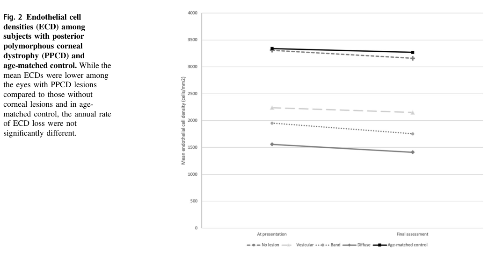

## Question

# Disease Characteristics Research Template

## Target Disease
- **Disease Name:** Posterior Polymorphous Corneal Dystrophy
- **MONDO ID:**  (if available)
- **Category:** Mendelian

## Research Objectives

Please provide a comprehensive research report on **Posterior Polymorphous Corneal Dystrophy** covering all of the
disease characteristics listed below. This report will be used to populate a disease knowledge
base entry. Be thorough and cite primary literature (PMID preferred) for all claims.

For each section, **suggested databases/resources** are listed. These are the first places
you should search for information on each topic.

---

### 1. Disease Information
> **Search first:** OMIM, Orphanet, ICD-10/ICD-11, MeSH, PubMed

- What is the disease? Provide a concise overview.
- What are the key identifiers? (OMIM, Orphanet, ICD-10/ICD-11, MeSH, Mondo)
- What are the common synonyms and alternative names?
- Is the information derived from individual patients (e.g., EHR) or aggregated disease-level resources?

### 2. Etiology

- **Disease Causal Factors**: What are the primary causes? (genetic, environmental, infectious, mechanistic)
- **Risk Factors**:
  > **Search first:** PubMed, Cochrane Library, UpToDate, clinical guidelines, ClinVar, ClinGen, GWAS Catalog, PheGenI, CTD, CDC, WHO, epidemiological databases
  - Genetic risk factors (causal variants, susceptibility loci, modifier genes)
  - Environmental risk factors (toxins, lifestyle, occupational exposures, age, sex, family history)
- **Protective Factors**:
  > **Search first:** PubMed, Cochrane Library, clinical trial databases, GWAS Catalog, gnomAD, WHO, CDC, nutrition databases
  - Genetic protective factors (protective variants, modifier alleles)
  - Environmental protective factors (diet, lifestyle, exposures that reduce risk)
- **Gene-Environment Interactions**: How do genetic and environmental factors interact to influence disease?
  > **Search first:** CTD, PubMed, PheGenI, GxE databases

### 3. Phenotypes
> **Search first:** HPO (Human Phenotype Ontology), OMIM, Orphanet, PubMed, clinicaltrials.gov, MedDRA, SNOMED CT, DECIPHER, LOINC

For each phenotype, provide:
- **Phenotype type**: symptoms, clinical signs, physical manifestations, behavioral changes, or laboratory abnormalities
  > For symptoms/signs: HPO, OMIM, Orphanet, PubMed
  > For behavioral changes: HPO, DSM, RDoC (Research Domain Criteria), PubMed
  > For laboratory abnormalities: LOINC, SNOMED CT, LabTests Online, PubMed
- **Phenotype characteristics**:
  > **Search first:** OMIM, Orphanet, HPO, PubMed
  - Age of symptom onset (neonatal, childhood, adult-onset, late-onset)
  - Symptom severity (mild, moderate, severe, variable)
  - Symptom progression (stable, progressive, episodic, fluctuating)
  - Frequency among affected individuals (percentage or qualitative)
- **Quality of life impact**: Effects on daily functioning and well-being (per-phenotype when possible)
  > **Search first:** EQ-5D database, SF-36, WHO QOL databases, PubMed
- Suggest HPO (Human Phenotype Ontology) terms for each phenotype

### 4. Genetic/Molecular Information

- **Causal Genes**: Gene mutations or chromosomal abnormalities responsible for disease (gene symbols, OMIM IDs)
  > **Search first:** OMIM, ClinVar, HGMD, Ensembl, NCBI Gene
- **Pathogenic Variants**:
  - Affected genes (gene symbols, HGNC IDs)
    > **Search first:** OMIM, NCBI Gene, Ensembl, HGNC, UniProt, GeneCards
  - Variant classification (pathogenic, likely pathogenic, VUS per ACMG/AMP guidelines)
    > **Search first:** ClinVar, ClinGen, ACMG/AMP guidelines, VarSome
  - Variant type/class (missense, frameshift, nonsense, splice-site, structural)
  - Allele frequency in population databases
    > **Search first:** gnomAD, 1000 Genomes, ExAC, TOPMed, dbSNP
  - Somatic vs germline origin
    > **Search first:** COSMIC (somatic), ClinVar, ICGC, TCGA
  - Functional consequences (loss of function, gain of function, dominant negative)
- **Modifier Genes**: Genes that modify disease severity or expression
- **Epigenetic Information**: DNA methylation, histone modifications, chromatin changes affecting disease
  > **Search first:** ENCODE, Roadmap Epigenomics, MethBase, DiseaseMeth
- **Chromosomal Abnormalities**: Large-scale genetic changes (aneuploidy, translocations, inversions)
  > **Search first:** DECIPHER, ClinVar, ECARUCA, UCSC Genome Browser

### 5. Environmental Information

- **Environmental Factors**: Non-genetic contributing factors (toxins, radiation, pollution, occupational exposure)
  > **Search first:** CTD (Comparative Toxicogenomics Database), TOXNET, PubMed, EPA databases
- **Lifestyle Factors**: Behavioral factors (smoking, diet, exercise, alcohol consumption)
  > **Search first:** CDC databases, WHO, PubMed, NHANES
- **Infectious Agents**: If applicable, pathogens causing or triggering disease (bacteria, viruses, fungi, parasites)
  > **Search first:** NCBI Taxonomy, ViPR, BV-BRC, MicrobeDB, GIDEON

### 6. Mechanism / Pathophysiology

- **Molecular Pathways**: Specific signaling cascades or biochemical pathways involved (Wnt, MAPK, mTOR, PI3K-AKT, etc.)
  > **Search first:** KEGG, Reactome, WikiPathways, PathBank, BioCyc
- **Cellular Processes**: Cell-level mechanisms (apoptosis, autophagy, cell cycle dysregulation, inflammation, etc.)
  > **Search first:** Gene Ontology (GO), Reactome, KEGG, PubMed
- **Protein Dysfunction**: How protein structure or function is altered (misfolding, aggregation, loss of function, gain of function)
  > **Search first:** UniProt, PDB (Protein Data Bank), InterPro, Pfam, AlphaFold
- **Metabolic Changes**: Alterations in metabolic processes (energy metabolism, lipid metabolism, amino acid metabolism)
  > **Search first:** KEGG, BioCyc, HMDB (Human Metabolome Database), BRENDA
- **Immune System Involvement**: Role of immune response (autoimmunity, immunodeficiency, chronic inflammation)
  > **Search first:** ImmPort, Immunome Database, IEDB, Gene Ontology
- **Tissue Damage Mechanisms**: How tissues/ are injured (oxidative stress, ischemia, fibrosis, necrosis)
  > **Search first:** PubMed, Gene Ontology, Reactome
- **Biochemical Abnormalities**: Specific molecular defects (enzyme deficiencies, receptor dysfunction, ion channel defects)
  > **Search first:** BRENDA, UniProt, KEGG, OMIM, PubMed
- **Epigenetic Changes**: DNA methylation, histone modifications affecting gene expression in disease
  > **Search first:** ENCODE, Roadmap Epigenomics, MethBase, DiseaseMeth
- **Molecular Profiling** (if available):
  - Transcriptomics/gene expression changes
    > **Search first:** GEO (Gene Expression Omnibus), ArrayExpress, GTEx, Human Cell Atlas, SRA
  - Proteomics findings
    > **Search first:** PRIDE, ProteomeXchange, Human Protein Atlas, STRING, BioGRID
  - Metabolomics signatures
    > **Search first:** MetaboLights, Metabolomics Workbench, HMDB, METLIN
  - Lipidomics alterations
    > **Search first:** LIPID MAPS, SwissLipids, LipidHome, Metabolomics Workbench
  - Genomic structural features
    > **Search first:** UCSC Genome Browser, Ensembl, NCBI, dbVar, DGV
- **Advanced Technologies** (if applicable):
  - Single-cell analysis findings (cell-type specific mechanisms, cellular heterogeneity)
    > **Search first:** Human Cell Atlas, Single Cell Portal, GEO, CELLxGENE
  - Spatial transcriptomics findings
    > **Search first:** GEO, Spatial Research, Vizgen, 10x Genomics data
  - Multi-omics integration results
    > **Search first:** TCGA, ICGC, cBioPortal, LinkedOmics, PubMed
  - Functional genomics screens (CRISPR, RNAi)
    > **Search first:** DepMap, GenomeRNAi, PubMed, BioGRID ORCS

For each mechanism, describe:
- The causal chain from initial trigger to clinical manifestation
- Which mechanisms are upstream vs downstream
- What cell types and biological processes are involved
- Suggest GO terms for biological processes and CL terms for cell types

### 7. Anatomical Structures Affected

- **Organ Level**:
  - Primary organs directly affected
  - Secondary organ involvement (complications, secondary effects)
  - Body systems involved (cardiovascular, nervous, digestive, respiratory, endocrine, etc.)
  > **Search first:** Uberon, FMA (Foundational Model of Anatomy), OMIM, HPO, ICD-11, MeSH, SNOMED CT
- **Tissue and Cell Level**:
  - Specific tissue types affected (epithelial, connective, muscle, nervous)
  - Specific cell populations targeted (with Cell Ontology terms)
  > **Search first:** Uberon, Human Protein Atlas, Cell Ontology, Human Cell Atlas, CellMarker, PanglaoDB
- **Subcellular Level**:
  - Cellular compartments involved (mitochondria, nucleus, ER, lysosomes) (with GO Cellular Component terms)
  > **Search first:** Gene Ontology (Cellular Component), UniProt, Human Protein Atlas
- **Localization**:
  - Specific anatomical sites (with UBERON terms)
    > **Search first:** FMA, Uberon, NeuroNames (for brain), SNOMED CT
  - Lateralization (unilateral, bilateral, asymmetric)
    > **Search first:** HPO, clinical literature, imaging databases

### 8. Temporal Development

- **Onset**:
  - Typical age of onset (congenital, pediatric, adult, geriatric)
  - Onset pattern (acute, subacute, chronic, insidious)
  > **Search first:** OMIM, Orphanet, HPO, PubMed
- **Progression**:
  - Disease stages (early, intermediate, advanced, end-stage)
    > **Search first:** Cancer Staging Manual (AJCC), WHO classifications, PubMed
  - Progression rate (rapid, slow, variable)
  - Disease course pattern (episodic, relapsing-remitting, progressive, stable)
  - Disease duration (self-limited, chronic lifelong)
  > **Search first:** Disease registries, longitudinal cohort databases, natural history studies, PubMed, Orphanet, OMIM
- **Patterns**:
  - Remission patterns (spontaneous, treatment-induced)
    > **Search first:** Clinical trial databases, disease registries, PubMed
  - Critical periods (time windows of vulnerability or opportunity for intervention)
    > **Search first:** PubMed, developmental biology databases, clinical guidelines

### 9. Inheritance and Population

- **Epidemiology**:
  - Prevalence (cases per 100,000 at given time)
  - Incidence (new cases per 100,000 per year)
  > **Search first:** Orphanet, CDC, WHO, GBD (Global Burden of Disease), national registries, SEER, disease registries
- **For Genetic Etiology**:
  - Inheritance pattern (AD, AR, X-linked, mitochondrial, multifactorial, polygenic)
    > **Search first:** OMIM, Orphanet, ClinVar, GTR (Genetic Testing Registry)
  - Penetrance (complete, incomplete, age-dependent)
    > **Search first:** ClinVar, OMIM, PubMed, ClinGen
  - Expressivity (variable, consistent)
    > **Search first:** OMIM, ClinVar, PubMed
  - Genetic anticipation (increasing severity in successive generations)
    > **Search first:** OMIM, PubMed (especially for repeat expansion disorders)
  - Germline mosaicism
    > **Search first:** ClinVar, OMIM, genetic counseling literature, PubMed
  - Founder effects (population-specific mutations)
    > **Search first:** gnomAD, population genetics databases, PubMed
  - Consanguinity role
    > **Search first:** OMIM, population studies, genetic counseling resources
  - Carrier frequency
    > **Search first:** gnomAD, carrier screening databases, GeneReviews, GTR
- **Population Demographics**:
  - Affected populations (ethnic or demographic groups with higher prevalence)
    > **Search first:** gnomAD, 1000 Genomes, PAGE Study, PubMed, population registries
  - Geographic distribution (endemic areas, regional variation)
    > **Search first:** WHO, CDC, GBD, Orphanet, geographic epidemiology databases
  - Geographic distribution of specific variants
  - Sex ratio (male:female)
    > **Search first:** Disease registries, OMIM, PubMed, epidemiological databases
  - Age distribution of affected individuals
    > **Search first:** CDC, disease registries, SEER, Orphanet

### 10. Diagnostics

- **Clinical Tests**:
  - Laboratory tests (blood, urine, tissue chemistry, specific enzyme assays)
    > **Search first:** LOINC, LabTests Online, PubMed
  - Biomarkers (proteins, metabolites, genetic markers, circulating biomarkers)
    > **Search first:** FDA Biomarker List, BEST (Biomarkers, EndpointS, and other Tools), PubMed
  - Imaging studies (X-ray, CT, MRI, PET, ultrasound)
    > **Search first:** RadLex, DICOM, Radiopaedia, imaging databases
  - Functional tests (pulmonary function, cardiac stress tests)
    > **Search first:** LOINC, clinical guidelines, PubMed
  - Electrophysiology (EEG, EMG, ECG, nerve conduction studies)
    > **Search first:** LOINC, clinical neurophysiology databases, PubMed
  - Biopsy findings (histopathology, immunohistochemistry)
    > **Search first:** SNOMED CT, College of American Pathologists resources, PubMed
  - Pathology findings (microscopic examination)
    > **Search first:** SNOMED CT, Digital Pathology databases, PubMed
- **Genetic Testing**:
  > **Search first:** GTR (Genetic Testing Registry), GeneReviews, ClinGen
  - Overview of recommended genetic testing approach
  - Whole genome sequencing (WGS) utility
    > **Search first:** GTR, ClinVar, GEL (Genomics England), gnomAD
  - Whole exome sequencing (WES) utility
    > **Search first:** GTR, ClinVar, OMIM, GeneMatcher
  - Gene panels (which panels, which genes)
    > **Search first:** GTR, ClinVar, laboratory-specific databases
  - Single gene testing
    > **Search first:** GTR, ClinVar, OMIM, GeneReviews
  - Chromosomal microarray (CMA)
    > **Search first:** DECIPHER, ClinVar, dbVar, ECARUCA
  - Karyotyping
    > **Search first:** Chromosome Abnormality Database, ClinVar, cytogenetics resources
  - FISH
    > **Search first:** ClinVar, cytogenetics databases, PubMed
  - Mitochondrial DNA testing
    > **Search first:** MITOMAP, MSeqDR, ClinVar, GTR
  - Repeat expansion testing
    > **Search first:** GTR, ClinVar, repeat expansion databases, PubMed
- **Omics-Based Diagnostics** (if applicable):
  - RNA sequencing / transcriptomics
    > **Search first:** GEO, ArrayExpress, GTEx, RNA-seq databases
  - Proteomics
    > **Search first:** PRIDE, ProteomeXchange, FDA Biomarker database
  - Metabolomics
    > **Search first:** MetaboLights, Metabolomics Workbench, HMDB
  - Epigenomics
    > **Search first:** GEO, ENCODE, Roadmap Epigenomics, MethBase
  - Liquid biopsy
    > **Search first:** COSMIC, ClinVar, liquid biopsy databases, PubMed
- **Clinical Criteria**:
  - Standardized diagnostic criteria (DSM, ICD, society guidelines)
    > **Search first:** DSM-5, ICD-11, clinical society guidelines, UpToDate
  - Differential diagnosis (other conditions to rule out, with distinguishing features)
    > **Search first:** DynaMed, UpToDate, clinical decision support systems
- **Screening**:
  - Screening methods for asymptomatic individuals (newborn screening, carrier screening, cascade screening)
    > **Search first:** ACMG recommendations, CDC newborn screening, GTR

### 11. Outcome/Prognosis

- **Survival and Mortality**:
  - Survival rate (5-year, 10-year, overall)
    > **Search first:** SEER, cancer registries, disease-specific registries, PubMed
  - Life expectancy (with and without treatment if applicable)
    > **Search first:** Orphanet, disease registries, actuarial databases, PubMed
  - Mortality rate
    > **Search first:** CDC, WHO, GBD, national mortality databases
  - Disease-specific mortality (deaths directly attributable to disease)
    > **Search first:** Disease registries, CDC Wonder, GBD, PubMed
- **Morbidity and Function**:
  - Morbidity (disease-related disability and health impacts)
    > **Search first:** GBD, WHO, disability databases, PubMed
  - Disability outcomes (long-term functional impairments)
    > **Search first:** ICF (International Classification of Functioning), disability registries
  - Quality of life measures (EQ-5D, SF-36, PROMIS, disease-specific tools)
    > **Search first:** EQ-5D database, SF-36, PROMIS, PubMed
- **Disease Course**:
  - Complications (secondary problems: infections, organ failure, etc.)
    > **Search first:** ICD codes, disease registries, clinical databases, PubMed
  - Recovery potential (likelihood and extent of recovery, with vs without treatment)
    > **Search first:** Natural history studies, rehabilitation databases, PubMed
- **Prediction**:
  - Prognostic factors (age, disease severity, biomarkers, treatment response)
    > **Search first:** Prognostic models databases, clinical calculators, PubMed
  - Prognostic biomarkers (molecular markers predicting disease course)
    > **Search first:** FDA Biomarker database, PubMed, cancer prognostic databases

### 12. Treatment

- **Pharmacotherapy**:
  - Pharmacological treatments (drug names, drug classes, mechanisms of action)
    > **Search first:** DrugBank, RxNorm, ATC classification, DailyMed, FDA databases
  - Pharmacogenomics (how genetic variants affect drug metabolism, efficacy, toxicity)
    > **Search first:** PharmGKB, CPIC (Clinical Pharmacogenetics), FDA Table of PGx Biomarkers
- **Advanced Therapeutics**:
  - Gene therapy (viral vectors, CRISPR, gene replacement, gene editing)
    > **Search first:** ClinicalTrials.gov, FDA gene therapy database, ASGCT resources
  - Cell therapy (stem cell transplant, CAR-T, cellular therapeutics)
    > **Search first:** ClinicalTrials.gov, FDA cell therapy database, FACT standards
  - RNA-based therapies (ASOs, siRNA, mRNA therapies)
    > **Search first:** ClinicalTrials.gov, FDA approvals, PubMed
  - Targeted therapies (treatments directed at specific molecular targets)
    > **Search first:** My Cancer Genome, OncoKB, ClinicalTrials.gov, FDA approvals
  - Immunotherapies (checkpoint inhibitors, monoclonal antibodies)
    > **Search first:** Cancer Immunotherapy Database, FDA approvals, ClinicalTrials.gov
- **Surgical and Interventional**:
  - Surgical interventions (types of surgery, timing, outcomes)
    > **Search first:** CPT codes, surgical registries, clinical guidelines, PubMed
- **Supportive and Rehabilitative**:
  - Supportive care (symptom management, pain control, nutrition)
    > **Search first:** Clinical guidelines, Cochrane Library, PubMed
  - Rehabilitation (physical therapy, occupational therapy, speech therapy)
    > **Search first:** Rehabilitation medicine databases, clinical guidelines, PubMed
- **Experimental**:
  - Experimental treatments in clinical trials (with NCT identifiers if available)
    > **Search first:** ClinicalTrials.gov, EU Clinical Trials Register, WHO ICTRP
- **Treatment Outcomes**:
  - Treatment response rates
    > **Search first:** Clinical trial databases, FDA reviews, systematic reviews, PubMed
  - Side effects and adverse events
    > **Search first:** FDA Adverse Event Reporting System (FAERS), MedWatch, PubMed
- **Treatment Strategy**:
  - Treatment algorithms (clinical pathways, decision trees)
    > **Search first:** Clinical practice guidelines, NCCN Guidelines, UpToDate
  - Combination therapies
    > **Search first:** ClinicalTrials.gov, treatment guidelines, PubMed
  - Personalized medicine approaches (genotype-guided treatment)
    > **Search first:** My Cancer Genome, CIViC, PharmGKB, precision medicine databases

For each treatment, suggest MAXO (Medical Action Ontology) terms where applicable.

### 13. Prevention

- **Prevention Levels**:
  - Primary prevention (preventing disease occurrence: vaccination, risk factor modification)
    > **Search first:** CDC, WHO, USPSTF recommendations, Cochrane Library
  - Secondary prevention (early detection and treatment: screening programs, early intervention)
    > **Search first:** USPSTF, CDC screening guidelines, WHO
  - Tertiary prevention (preventing complications in those with disease)
    > **Search first:** Clinical guidelines, disease management protocols, PubMed
- **Immunization**: Vaccine strategies (if applicable)
  > **Search first:** CDC vaccine schedules, WHO immunization, FDA vaccine database
- **Screening and Early Detection**:
  - Screening programs (population-based: newborn screening, cancer screening)
    > **Search first:** CDC screening programs, USPSTF, cancer screening databases
  - Genetic screening (carrier screening, preimplantation genetic diagnosis, prenatal testing)
    > **Search first:** ACMG recommendations, ACOG guidelines, GTR
  - Risk stratification (identifying high-risk individuals for targeted prevention)
    > **Search first:** Risk prediction models, clinical calculators, PubMed
- **Behavioral Interventions**: Lifestyle modifications to reduce risk
  > **Search first:** CDC, WHO, behavioral intervention databases, Cochrane Library
- **Counseling**: Genetic counseling (risk assessment, family planning guidance)
  > **Search first:** NSGC resources, ACMG guidelines, GeneReviews
- **Public Health**:
  - Public health interventions (sanitation, vector control, health education)
    > **Search first:** CDC, WHO, public health databases, PubMed
  - Environmental interventions (reducing environmental risk factors)
    > **Search first:** EPA databases, WHO environmental health, PubMed
- **Prophylaxis**: Preventive medications or procedures
  > **Search first:** Clinical guidelines, FDA approvals, PubMed

### 14. Other Species / Natural Disease

- **Taxonomy**: Species affected (with NCBI Taxon identifiers)
  > **Search first:** NCBI Taxonomy
- **Breed**: Specific breeds affected (with VBO identifiers if applicable)
  > **Search first:** VBO (Vertebrate Breed Ontology)
- **Gene**: Orthologous genes in other species (with NCBI Gene IDs)
  > **Search first:** NCBI Gene
- **Natural Disease**:
  - Naturally occurring disease in other species (companion animals, wildlife)
    > **Search first:** OMIA (Online Mendelian Inheritance in Animals), VetCompass, PubMed
  - Veterinary relevance and importance in animal health
    > **Search first:** OMIA, veterinary databases, PubMed
- **Comparative Biology**:
  - Comparative pathology (similarities and differences across species)
    > **Search first:** OMIA, comparative pathology databases, PubMed
  - Evolutionary conservation of disease mechanisms
    > **Search first:** HomoloGene, OrthoMCL, Alliance of Genome Resources
- **Transmission** (if applicable):
  - Zoonotic potential
    > **Search first:** CDC zoonotic diseases, WHO zoonoses, GIDEON
  - Cross-species susceptibility
    > **Search first:** NCBI Taxonomy, veterinary databases, PubMed

### 15. Model Organisms

- **Model Types**:
  - Model organism type (mammalian, invertebrate, cellular, in vitro)
    > **Search first:** Alliance of Genome Resources, model organism databases
  - Specific model systems (mouse, rat, zebrafish, Drosophila, C. elegans, yeast, cell lines, organoids, iPSCs)
    > **Search first:** MGI, RGD, ZFIN, FlyBase, WormBase, SGD, ATCC, Cellosaurus
  - Induced models (drug treatment, surgical intervention, environmental manipulation)
    > **Search first:** MGI, model organism databases, PubMed
- **Genetic Models**:
  - Types available (knockout, knock-in, transgenic, conditional, humanized)
    > **Search first:** MGI, IMPC, KOMP, EuMMCR, IMSR
- **Model Characteristics**:
  - Phenotype recapitulation (how well model reproduces human disease features)
    > **Search first:** Model organism databases, comparative studies, PubMed
  - Model limitations (aspects of human disease not captured)
    > **Search first:** Model organism databases, PubMed, review articles
- **Applications**:
  - Research applications (what aspects of disease can be studied)
    > **Search first:** Model organism databases, PubMed
- **Resources**:
  - Model databases
    > **Search first:** MGI, RGD, ZFIN, FlyBase, WormBase, IMSR, EMMA, MMRRC

---

## Citation Requirements

- Cite primary literature (PMID preferred) for all mechanistic and clinical claims
- Prioritize recent reviews and landmark papers
- Include direct quotes from abstracts where possible to support key statements
- Distinguish evidence source types: human clinical, model organism, in vitro, computational

## Output Format

Structure your response as a comprehensive narrative organized by the sections above.
For each section, provide:
- Factual content with specific details (numbers, percentages, gene names, variant nomenclature)
- Ontology term suggestions (HPO, GO, CL, UBERON, CHEBI, MAXO, MONDO) where applicable
- Evidence citations with PMIDs
- Direct quotes from abstracts to support key claims
- Clear indication when information is not available or not applicable for this disease

This report will be used to populate a disease knowledge base entry with:
- Pathophysiology descriptions with causal chains
- Gene/protein annotations (HGNC, GO terms)
- Phenotype associations (HP terms) with frequencies
- Cell type involvement (CL terms)
- Anatomical locations (UBERON terms)
- Chemical entities (CHEBI terms)
- Treatment annotations (MAXO terms)
- Evidence items with PMIDs and exact abstract quotes
- Epidemiology, prognosis, diagnostic, and prevention information
- Animal model descriptions with phenotype recapitulation details

## Output

Question: You are an expert researcher providing comprehensive, well-cited information.

Provide detailed information focusing on:
1. Key concepts and definitions with current understanding
2. Recent developments and latest research (prioritize 2023-2024 sources)
3. Current applications and real-world implementations
4. Expert opinions and analysis from authoritative sources
5. Relevant statistics and data from recent studies

Format as a comprehensive research report with proper citations. Include URLs and publication dates where available.
Always prioritize recent, authoritative sources and provide specific citations for all major claims.

# Disease Characteristics Research Template

## Target Disease
- **Disease Name:** Posterior Polymorphous Corneal Dystrophy
- **MONDO ID:**  (if available)
- **Category:** Mendelian

## Research Objectives

Please provide a comprehensive research report on **Posterior Polymorphous Corneal Dystrophy** covering all of the
disease characteristics listed below. This report will be used to populate a disease knowledge
base entry. Be thorough and cite primary literature (PMID preferred) for all claims.

For each section, **suggested databases/resources** are listed. These are the first places
you should search for information on each topic.

---

### 1. Disease Information
> **Search first:** OMIM, Orphanet, ICD-10/ICD-11, MeSH, PubMed

- What is the disease? Provide a concise overview.
- What are the key identifiers? (OMIM, Orphanet, ICD-10/ICD-11, MeSH, Mondo)
- What are the common synonyms and alternative names?
- Is the information derived from individual patients (e.g., EHR) or aggregated disease-level resources?

### 2. Etiology

- **Disease Causal Factors**: What are the primary causes? (genetic, environmental, infectious, mechanistic)
- **Risk Factors**:
  > **Search first:** PubMed, Cochrane Library, UpToDate, clinical guidelines, ClinVar, ClinGen, GWAS Catalog, PheGenI, CTD, CDC, WHO, epidemiological databases
  - Genetic risk factors (causal variants, susceptibility loci, modifier genes)
  - Environmental risk factors (toxins, lifestyle, occupational exposures, age, sex, family history)
- **Protective Factors**:
  > **Search first:** PubMed, Cochrane Library, clinical trial databases, GWAS Catalog, gnomAD, WHO, CDC, nutrition databases
  - Genetic protective factors (protective variants, modifier alleles)
  - Environmental protective factors (diet, lifestyle, exposures that reduce risk)
- **Gene-Environment Interactions**: How do genetic and environmental factors interact to influence disease?
  > **Search first:** CTD, PubMed, PheGenI, GxE databases

### 3. Phenotypes
> **Search first:** HPO (Human Phenotype Ontology), OMIM, Orphanet, PubMed, clinicaltrials.gov, MedDRA, SNOMED CT, DECIPHER, LOINC

For each phenotype, provide:
- **Phenotype type**: symptoms, clinical signs, physical manifestations, behavioral changes, or laboratory abnormalities
  > For symptoms/signs: HPO, OMIM, Orphanet, PubMed
  > For behavioral changes: HPO, DSM, RDoC (Research Domain Criteria), PubMed
  > For laboratory abnormalities: LOINC, SNOMED CT, LabTests Online, PubMed
- **Phenotype characteristics**:
  > **Search first:** OMIM, Orphanet, HPO, PubMed
  - Age of symptom onset (neonatal, childhood, adult-onset, late-onset)
  - Symptom severity (mild, moderate, severe, variable)
  - Symptom progression (stable, progressive, episodic, fluctuating)
  - Frequency among affected individuals (percentage or qualitative)
- **Quality of life impact**: Effects on daily functioning and well-being (per-phenotype when possible)
  > **Search first:** EQ-5D database, SF-36, WHO QOL databases, PubMed
- Suggest HPO (Human Phenotype Ontology) terms for each phenotype

### 4. Genetic/Molecular Information

- **Causal Genes**: Gene mutations or chromosomal abnormalities responsible for disease (gene symbols, OMIM IDs)
  > **Search first:** OMIM, ClinVar, HGMD, Ensembl, NCBI Gene
- **Pathogenic Variants**:
  - Affected genes (gene symbols, HGNC IDs)
    > **Search first:** OMIM, NCBI Gene, Ensembl, HGNC, UniProt, GeneCards
  - Variant classification (pathogenic, likely pathogenic, VUS per ACMG/AMP guidelines)
    > **Search first:** ClinVar, ClinGen, ACMG/AMP guidelines, VarSome
  - Variant type/class (missense, frameshift, nonsense, splice-site, structural)
  - Allele frequency in population databases
    > **Search first:** gnomAD, 1000 Genomes, ExAC, TOPMed, dbSNP
  - Somatic vs germline origin
    > **Search first:** COSMIC (somatic), ClinVar, ICGC, TCGA
  - Functional consequences (loss of function, gain of function, dominant negative)
- **Modifier Genes**: Genes that modify disease severity or expression
- **Epigenetic Information**: DNA methylation, histone modifications, chromatin changes affecting disease
  > **Search first:** ENCODE, Roadmap Epigenomics, MethBase, DiseaseMeth
- **Chromosomal Abnormalities**: Large-scale genetic changes (aneuploidy, translocations, inversions)
  > **Search first:** DECIPHER, ClinVar, ECARUCA, UCSC Genome Browser

### 5. Environmental Information

- **Environmental Factors**: Non-genetic contributing factors (toxins, radiation, pollution, occupational exposure)
  > **Search first:** CTD (Comparative Toxicogenomics Database), TOXNET, PubMed, EPA databases
- **Lifestyle Factors**: Behavioral factors (smoking, diet, exercise, alcohol consumption)
  > **Search first:** CDC databases, WHO, PubMed, NHANES
- **Infectious Agents**: If applicable, pathogens causing or triggering disease (bacteria, viruses, fungi, parasites)
  > **Search first:** NCBI Taxonomy, ViPR, BV-BRC, MicrobeDB, GIDEON

### 6. Mechanism / Pathophysiology

- **Molecular Pathways**: Specific signaling cascades or biochemical pathways involved (Wnt, MAPK, mTOR, PI3K-AKT, etc.)
  > **Search first:** KEGG, Reactome, WikiPathways, PathBank, BioCyc
- **Cellular Processes**: Cell-level mechanisms (apoptosis, autophagy, cell cycle dysregulation, inflammation, etc.)
  > **Search first:** Gene Ontology (GO), Reactome, KEGG, PubMed
- **Protein Dysfunction**: How protein structure or function is altered (misfolding, aggregation, loss of function, gain of function)
  > **Search first:** UniProt, PDB (Protein Data Bank), InterPro, Pfam, AlphaFold
- **Metabolic Changes**: Alterations in metabolic processes (energy metabolism, lipid metabolism, amino acid metabolism)
  > **Search first:** KEGG, BioCyc, HMDB (Human Metabolome Database), BRENDA
- **Immune System Involvement**: Role of immune response (autoimmunity, immunodeficiency, chronic inflammation)
  > **Search first:** ImmPort, Immunome Database, IEDB, Gene Ontology
- **Tissue Damage Mechanisms**: How tissues/ are injured (oxidative stress, ischemia, fibrosis, necrosis)
  > **Search first:** PubMed, Gene Ontology, Reactome
- **Biochemical Abnormalities**: Specific molecular defects (enzyme deficiencies, receptor dysfunction, ion channel defects)
  > **Search first:** BRENDA, UniProt, KEGG, OMIM, PubMed
- **Epigenetic Changes**: DNA methylation, histone modifications affecting gene expression in disease
  > **Search first:** ENCODE, Roadmap Epigenomics, MethBase, DiseaseMeth
- **Molecular Profiling** (if available):
  - Transcriptomics/gene expression changes
    > **Search first:** GEO (Gene Expression Omnibus), ArrayExpress, GTEx, Human Cell Atlas, SRA
  - Proteomics findings
    > **Search first:** PRIDE, ProteomeXchange, Human Protein Atlas, STRING, BioGRID
  - Metabolomics signatures
    > **Search first:** MetaboLights, Metabolomics Workbench, HMDB, METLIN
  - Lipidomics alterations
    > **Search first:** LIPID MAPS, SwissLipids, LipidHome, Metabolomics Workbench
  - Genomic structural features
    > **Search first:** UCSC Genome Browser, Ensembl, NCBI, dbVar, DGV
- **Advanced Technologies** (if applicable):
  - Single-cell analysis findings (cell-type specific mechanisms, cellular heterogeneity)
    > **Search first:** Human Cell Atlas, Single Cell Portal, GEO, CELLxGENE
  - Spatial transcriptomics findings
    > **Search first:** GEO, Spatial Research, Vizgen, 10x Genomics data
  - Multi-omics integration results
    > **Search first:** TCGA, ICGC, cBioPortal, LinkedOmics, PubMed
  - Functional genomics screens (CRISPR, RNAi)
    > **Search first:** DepMap, GenomeRNAi, PubMed, BioGRID ORCS

For each mechanism, describe:
- The causal chain from initial trigger to clinical manifestation
- Which mechanisms are upstream vs downstream
- What cell types and biological processes are involved
- Suggest GO terms for biological processes and CL terms for cell types

### 7. Anatomical Structures Affected

- **Organ Level**:
  - Primary organs directly affected
  - Secondary organ involvement (complications, secondary effects)
  - Body systems involved (cardiovascular, nervous, digestive, respiratory, endocrine, etc.)
  > **Search first:** Uberon, FMA (Foundational Model of Anatomy), OMIM, HPO, ICD-11, MeSH, SNOMED CT
- **Tissue and Cell Level**:
  - Specific tissue types affected (epithelial, connective, muscle, nervous)
  - Specific cell populations targeted (with Cell Ontology terms)
  > **Search first:** Uberon, Human Protein Atlas, Cell Ontology, Human Cell Atlas, CellMarker, PanglaoDB
- **Subcellular Level**:
  - Cellular compartments involved (mitochondria, nucleus, ER, lysosomes) (with GO Cellular Component terms)
  > **Search first:** Gene Ontology (Cellular Component), UniProt, Human Protein Atlas
- **Localization**:
  - Specific anatomical sites (with UBERON terms)
    > **Search first:** FMA, Uberon, NeuroNames (for brain), SNOMED CT
  - Lateralization (unilateral, bilateral, asymmetric)
    > **Search first:** HPO, clinical literature, imaging databases

### 8. Temporal Development

- **Onset**:
  - Typical age of onset (congenital, pediatric, adult, geriatric)
  - Onset pattern (acute, subacute, chronic, insidious)
  > **Search first:** OMIM, Orphanet, HPO, PubMed
- **Progression**:
  - Disease stages (early, intermediate, advanced, end-stage)
    > **Search first:** Cancer Staging Manual (AJCC), WHO classifications, PubMed
  - Progression rate (rapid, slow, variable)
  - Disease course pattern (episodic, relapsing-remitting, progressive, stable)
  - Disease duration (self-limited, chronic lifelong)
  > **Search first:** Disease registries, longitudinal cohort databases, natural history studies, PubMed, Orphanet, OMIM
- **Patterns**:
  - Remission patterns (spontaneous, treatment-induced)
    > **Search first:** Clinical trial databases, disease registries, PubMed
  - Critical periods (time windows of vulnerability or opportunity for intervention)
    > **Search first:** PubMed, developmental biology databases, clinical guidelines

### 9. Inheritance and Population

- **Epidemiology**:
  - Prevalence (cases per 100,000 at given time)
  - Incidence (new cases per 100,000 per year)
  > **Search first:** Orphanet, CDC, WHO, GBD (Global Burden of Disease), national registries, SEER, disease registries
- **For Genetic Etiology**:
  - Inheritance pattern (AD, AR, X-linked, mitochondrial, multifactorial, polygenic)
    > **Search first:** OMIM, Orphanet, ClinVar, GTR (Genetic Testing Registry)
  - Penetrance (complete, incomplete, age-dependent)
    > **Search first:** ClinVar, OMIM, PubMed, ClinGen
  - Expressivity (variable, consistent)
    > **Search first:** OMIM, ClinVar, PubMed
  - Genetic anticipation (increasing severity in successive generations)
    > **Search first:** OMIM, PubMed (especially for repeat expansion disorders)
  - Germline mosaicism
    > **Search first:** ClinVar, OMIM, genetic counseling literature, PubMed
  - Founder effects (population-specific mutations)
    > **Search first:** gnomAD, population genetics databases, PubMed
  - Consanguinity role
    > **Search first:** OMIM, population studies, genetic counseling resources
  - Carrier frequency
    > **Search first:** gnomAD, carrier screening databases, GeneReviews, GTR
- **Population Demographics**:
  - Affected populations (ethnic or demographic groups with higher prevalence)
    > **Search first:** gnomAD, 1000 Genomes, PAGE Study, PubMed, population registries
  - Geographic distribution (endemic areas, regional variation)
    > **Search first:** WHO, CDC, GBD, Orphanet, geographic epidemiology databases
  - Geographic distribution of specific variants
  - Sex ratio (male:female)
    > **Search first:** Disease registries, OMIM, PubMed, epidemiological databases
  - Age distribution of affected individuals
    > **Search first:** CDC, disease registries, SEER, Orphanet

### 10. Diagnostics

- **Clinical Tests**:
  - Laboratory tests (blood, urine, tissue chemistry, specific enzyme assays)
    > **Search first:** LOINC, LabTests Online, PubMed
  - Biomarkers (proteins, metabolites, genetic markers, circulating biomarkers)
    > **Search first:** FDA Biomarker List, BEST (Biomarkers, EndpointS, and other Tools), PubMed
  - Imaging studies (X-ray, CT, MRI, PET, ultrasound)
    > **Search first:** RadLex, DICOM, Radiopaedia, imaging databases
  - Functional tests (pulmonary function, cardiac stress tests)
    > **Search first:** LOINC, clinical guidelines, PubMed
  - Electrophysiology (EEG, EMG, ECG, nerve conduction studies)
    > **Search first:** LOINC, clinical neurophysiology databases, PubMed
  - Biopsy findings (histopathology, immunohistochemistry)
    > **Search first:** SNOMED CT, College of American Pathologists resources, PubMed
  - Pathology findings (microscopic examination)
    > **Search first:** SNOMED CT, Digital Pathology databases, PubMed
- **Genetic Testing**:
  > **Search first:** GTR (Genetic Testing Registry), GeneReviews, ClinGen
  - Overview of recommended genetic testing approach
  - Whole genome sequencing (WGS) utility
    > **Search first:** GTR, ClinVar, GEL (Genomics England), gnomAD
  - Whole exome sequencing (WES) utility
    > **Search first:** GTR, ClinVar, OMIM, GeneMatcher
  - Gene panels (which panels, which genes)
    > **Search first:** GTR, ClinVar, laboratory-specific databases
  - Single gene testing
    > **Search first:** GTR, ClinVar, OMIM, GeneReviews
  - Chromosomal microarray (CMA)
    > **Search first:** DECIPHER, ClinVar, dbVar, ECARUCA
  - Karyotyping
    > **Search first:** Chromosome Abnormality Database, ClinVar, cytogenetics resources
  - FISH
    > **Search first:** ClinVar, cytogenetics databases, PubMed
  - Mitochondrial DNA testing
    > **Search first:** MITOMAP, MSeqDR, ClinVar, GTR
  - Repeat expansion testing
    > **Search first:** GTR, ClinVar, repeat expansion databases, PubMed
- **Omics-Based Diagnostics** (if applicable):
  - RNA sequencing / transcriptomics
    > **Search first:** GEO, ArrayExpress, GTEx, RNA-seq databases
  - Proteomics
    > **Search first:** PRIDE, ProteomeXchange, FDA Biomarker database
  - Metabolomics
    > **Search first:** MetaboLights, Metabolomics Workbench, HMDB
  - Epigenomics
    > **Search first:** GEO, ENCODE, Roadmap Epigenomics, MethBase
  - Liquid biopsy
    > **Search first:** COSMIC, ClinVar, liquid biopsy databases, PubMed
- **Clinical Criteria**:
  - Standardized diagnostic criteria (DSM, ICD, society guidelines)
    > **Search first:** DSM-5, ICD-11, clinical society guidelines, UpToDate
  - Differential diagnosis (other conditions to rule out, with distinguishing features)
    > **Search first:** DynaMed, UpToDate, clinical decision support systems
- **Screening**:
  - Screening methods for asymptomatic individuals (newborn screening, carrier screening, cascade screening)
    > **Search first:** ACMG recommendations, CDC newborn screening, GTR

### 11. Outcome/Prognosis

- **Survival and Mortality**:
  - Survival rate (5-year, 10-year, overall)
    > **Search first:** SEER, cancer registries, disease-specific registries, PubMed
  - Life expectancy (with and without treatment if applicable)
    > **Search first:** Orphanet, disease registries, actuarial databases, PubMed
  - Mortality rate
    > **Search first:** CDC, WHO, GBD, national mortality databases
  - Disease-specific mortality (deaths directly attributable to disease)
    > **Search first:** Disease registries, CDC Wonder, GBD, PubMed
- **Morbidity and Function**:
  - Morbidity (disease-related disability and health impacts)
    > **Search first:** GBD, WHO, disability databases, PubMed
  - Disability outcomes (long-term functional impairments)
    > **Search first:** ICF (International Classification of Functioning), disability registries
  - Quality of life measures (EQ-5D, SF-36, PROMIS, disease-specific tools)
    > **Search first:** EQ-5D database, SF-36, PROMIS, PubMed
- **Disease Course**:
  - Complications (secondary problems: infections, organ failure, etc.)
    > **Search first:** ICD codes, disease registries, clinical databases, PubMed
  - Recovery potential (likelihood and extent of recovery, with vs without treatment)
    > **Search first:** Natural history studies, rehabilitation databases, PubMed
- **Prediction**:
  - Prognostic factors (age, disease severity, biomarkers, treatment response)
    > **Search first:** Prognostic models databases, clinical calculators, PubMed
  - Prognostic biomarkers (molecular markers predicting disease course)
    > **Search first:** FDA Biomarker database, PubMed, cancer prognostic databases

### 12. Treatment

- **Pharmacotherapy**:
  - Pharmacological treatments (drug names, drug classes, mechanisms of action)
    > **Search first:** DrugBank, RxNorm, ATC classification, DailyMed, FDA databases
  - Pharmacogenomics (how genetic variants affect drug metabolism, efficacy, toxicity)
    > **Search first:** PharmGKB, CPIC (Clinical Pharmacogenetics), FDA Table of PGx Biomarkers
- **Advanced Therapeutics**:
  - Gene therapy (viral vectors, CRISPR, gene replacement, gene editing)
    > **Search first:** ClinicalTrials.gov, FDA gene therapy database, ASGCT resources
  - Cell therapy (stem cell transplant, CAR-T, cellular therapeutics)
    > **Search first:** ClinicalTrials.gov, FDA cell therapy database, FACT standards
  - RNA-based therapies (ASOs, siRNA, mRNA therapies)
    > **Search first:** ClinicalTrials.gov, FDA approvals, PubMed
  - Targeted therapies (treatments directed at specific molecular targets)
    > **Search first:** My Cancer Genome, OncoKB, ClinicalTrials.gov, FDA approvals
  - Immunotherapies (checkpoint inhibitors, monoclonal antibodies)
    > **Search first:** Cancer Immunotherapy Database, FDA approvals, ClinicalTrials.gov
- **Surgical and Interventional**:
  - Surgical interventions (types of surgery, timing, outcomes)
    > **Search first:** CPT codes, surgical registries, clinical guidelines, PubMed
- **Supportive and Rehabilitative**:
  - Supportive care (symptom management, pain control, nutrition)
    > **Search first:** Clinical guidelines, Cochrane Library, PubMed
  - Rehabilitation (physical therapy, occupational therapy, speech therapy)
    > **Search first:** Rehabilitation medicine databases, clinical guidelines, PubMed
- **Experimental**:
  - Experimental treatments in clinical trials (with NCT identifiers if available)
    > **Search first:** ClinicalTrials.gov, EU Clinical Trials Register, WHO ICTRP
- **Treatment Outcomes**:
  - Treatment response rates
    > **Search first:** Clinical trial databases, FDA reviews, systematic reviews, PubMed
  - Side effects and adverse events
    > **Search first:** FDA Adverse Event Reporting System (FAERS), MedWatch, PubMed
- **Treatment Strategy**:
  - Treatment algorithms (clinical pathways, decision trees)
    > **Search first:** Clinical practice guidelines, NCCN Guidelines, UpToDate
  - Combination therapies
    > **Search first:** ClinicalTrials.gov, treatment guidelines, PubMed
  - Personalized medicine approaches (genotype-guided treatment)
    > **Search first:** My Cancer Genome, CIViC, PharmGKB, precision medicine databases

For each treatment, suggest MAXO (Medical Action Ontology) terms where applicable.

### 13. Prevention

- **Prevention Levels**:
  - Primary prevention (preventing disease occurrence: vaccination, risk factor modification)
    > **Search first:** CDC, WHO, USPSTF recommendations, Cochrane Library
  - Secondary prevention (early detection and treatment: screening programs, early intervention)
    > **Search first:** USPSTF, CDC screening guidelines, WHO
  - Tertiary prevention (preventing complications in those with disease)
    > **Search first:** Clinical guidelines, disease management protocols, PubMed
- **Immunization**: Vaccine strategies (if applicable)
  > **Search first:** CDC vaccine schedules, WHO immunization, FDA vaccine database
- **Screening and Early Detection**:
  - Screening programs (population-based: newborn screening, cancer screening)
    > **Search first:** CDC screening programs, USPSTF, cancer screening databases
  - Genetic screening (carrier screening, preimplantation genetic diagnosis, prenatal testing)
    > **Search first:** ACMG recommendations, ACOG guidelines, GTR
  - Risk stratification (identifying high-risk individuals for targeted prevention)
    > **Search first:** Risk prediction models, clinical calculators, PubMed
- **Behavioral Interventions**: Lifestyle modifications to reduce risk
  > **Search first:** CDC, WHO, behavioral intervention databases, Cochrane Library
- **Counseling**: Genetic counseling (risk assessment, family planning guidance)
  > **Search first:** NSGC resources, ACMG guidelines, GeneReviews
- **Public Health**:
  - Public health interventions (sanitation, vector control, health education)
    > **Search first:** CDC, WHO, public health databases, PubMed
  - Environmental interventions (reducing environmental risk factors)
    > **Search first:** EPA databases, WHO environmental health, PubMed
- **Prophylaxis**: Preventive medications or procedures
  > **Search first:** Clinical guidelines, FDA approvals, PubMed

### 14. Other Species / Natural Disease

- **Taxonomy**: Species affected (with NCBI Taxon identifiers)
  > **Search first:** NCBI Taxonomy
- **Breed**: Specific breeds affected (with VBO identifiers if applicable)
  > **Search first:** VBO (Vertebrate Breed Ontology)
- **Gene**: Orthologous genes in other species (with NCBI Gene IDs)
  > **Search first:** NCBI Gene
- **Natural Disease**:
  - Naturally occurring disease in other species (companion animals, wildlife)
    > **Search first:** OMIA (Online Mendelian Inheritance in Animals), VetCompass, PubMed
  - Veterinary relevance and importance in animal health
    > **Search first:** OMIA, veterinary databases, PubMed
- **Comparative Biology**:
  - Comparative pathology (similarities and differences across species)
    > **Search first:** OMIA, comparative pathology databases, PubMed
  - Evolutionary conservation of disease mechanisms
    > **Search first:** HomoloGene, OrthoMCL, Alliance of Genome Resources
- **Transmission** (if applicable):
  - Zoonotic potential
    > **Search first:** CDC zoonotic diseases, WHO zoonoses, GIDEON
  - Cross-species susceptibility
    > **Search first:** NCBI Taxonomy, veterinary databases, PubMed

### 15. Model Organisms

- **Model Types**:
  - Model organism type (mammalian, invertebrate, cellular, in vitro)
    > **Search first:** Alliance of Genome Resources, model organism databases
  - Specific model systems (mouse, rat, zebrafish, Drosophila, C. elegans, yeast, cell lines, organoids, iPSCs)
    > **Search first:** MGI, RGD, ZFIN, FlyBase, WormBase, SGD, ATCC, Cellosaurus
  - Induced models (drug treatment, surgical intervention, environmental manipulation)
    > **Search first:** MGI, model organism databases, PubMed
- **Genetic Models**:
  - Types available (knockout, knock-in, transgenic, conditional, humanized)
    > **Search first:** MGI, IMPC, KOMP, EuMMCR, IMSR
- **Model Characteristics**:
  - Phenotype recapitulation (how well model reproduces human disease features)
    > **Search first:** Model organism databases, comparative studies, PubMed
  - Model limitations (aspects of human disease not captured)
    > **Search first:** Model organism databases, PubMed, review articles
- **Applications**:
  - Research applications (what aspects of disease can be studied)
    > **Search first:** Model organism databases, PubMed
- **Resources**:
  - Model databases
    > **Search first:** MGI, RGD, ZFIN, FlyBase, WormBase, IMSR, EMMA, MMRRC

---

## Citation Requirements

- Cite primary literature (PMID preferred) for all mechanistic and clinical claims
- Prioritize recent reviews and landmark papers
- Include direct quotes from abstracts where possible to support key statements
- Distinguish evidence source types: human clinical, model organism, in vitro, computational

## Output Format

Structure your response as a comprehensive narrative organized by the sections above.
For each section, provide:
- Factual content with specific details (numbers, percentages, gene names, variant nomenclature)
- Ontology term suggestions (HPO, GO, CL, UBERON, CHEBI, MAXO, MONDO) where applicable
- Evidence citations with PMIDs
- Direct quotes from abstracts to support key claims
- Clear indication when information is not available or not applicable for this disease

This report will be used to populate a disease knowledge base entry with:
- Pathophysiology descriptions with causal chains
- Gene/protein annotations (HGNC, GO terms)
- Phenotype associations (HP terms) with frequencies
- Cell type involvement (CL terms)
- Anatomical locations (UBERON terms)
- Chemical entities (CHEBI terms)
- Treatment annotations (MAXO terms)
- Evidence items with PMIDs and exact abstract quotes
- Epidemiology, prognosis, diagnostic, and prevention information
- Animal model descriptions with phenotype recapitulation details

## Posterior Polymorphous Corneal Dystrophy (PPCD): Comprehensive Disease Characteristics Report

### Scope and evidence types used
This report synthesizes peer‑reviewed primary genetics/mechanism papers (human families; ex vivo human corneal tissue; in vitro corneal endothelial models; mouse models), authoritative clinical genetics guidance (CUGC), and recent corneal dystrophy classification context (IC3D Edition 3). Evidence types are labeled inline as **Human clinical**, **Human ex vivo**, **In vitro**, or **Model organism**.

> **Note on 2023–2024 “latest research”**: Within the retrieved corpus, the most directly PPCD‑relevant authoritative 2023–2024 source is the IC3D 3rd edition classification update (2024). Most PPCD gene‑causality and mechanistic breakthroughs remain anchored in 2016–2019 primary studies (OVOL2/GRHL2 regulatory mutations; ZEB1 insufficiency/EnET). Where post‑2022 PPCD‑specific primary papers were not retrievable here, this report does not speculate beyond available evidence.

---

## 1. Disease Information

### 1.1 Concise overview
Posterior polymorphous corneal dystrophy (PPCD) is a **rare autosomal dominant corneal endothelial dystrophy** characterized by abnormal corneal endothelial cell morphology and posterior corneal/Descemet membrane changes that can be clinically visible as **vesicular lesions**, **band/“snail‑track/rail‑track”** changes, and/or diffuse posterior opacities, with variable severity from asymptomatic findings to corneal edema, secondary glaucoma, and need for corneal transplantation. (**Human clinical**) (fung2021endothelialcelldensity pages 1-2, davidson2016autosomaldominantcornealendothelial pages 1-3, liskova2018ectopicgrhl2expression pages 6-7, davidson2020cugcforposterior pages 1-2)

### 1.2 Key identifiers
- **OMIM disease IDs (PPCD subtypes):** **122000; 609141; 618031** (davidson2020cugcforposterior pages 1-2)
- **Genes and OMIM gene IDs:** **OVOL2 (616441), ZEB1 (189909), GRHL2 (608576)** (davidson2020cugcforposterior pages 1-2)
- **IC3D classification context:** IC3D “Edition 3” is a 2024 update that evaluated peer‑reviewed publications from 2014–2023 and provides standardized corneal dystrophy templates and a management table. URL in abstract: https://corneasociety.org/publications/ic3d (Published Feb 2024) (fung2021endothelialcelldensity pages 1-2)

**MONDO / MeSH / ICD / Orphanet IDs:** Not reliably extractable from the retrieved documents in this session; therefore they are not asserted here.

### 1.3 Common synonyms / alternative names
- **Posterior polymorphous corneal dystrophy**
- Often discussed by genetic subtypes: **PPCD1**, **PPCD3**, **PPCD4** (davidson2020cugcforposterior pages 1-2)

### 1.4 Source type (aggregated vs patient-level)
- **Aggregated resources:** IC3D classification (2024) (fung2021endothelialcelldensity pages 1-2)
- **Aggregated clinical genetics guidance:** CUGC for PPCD (2020) (davidson2020cugcforposterior pages 1-2)
- **Patient-level primary data:** OVOL2 families (AJHG 2016), GRHL2 families (AJHG 2018), ZEB1 non‑penetrance family (Genes 2021), pediatric longitudinal cohort (Eye 2021), family case report with variants (Frontiers Genet 2025) (fung2021endothelialcelldensity pages 2-4, davidson2016autosomaldominantcornealendothelial pages 6-8, liskova2018ectopicgrhl2expression pages 6-7, dudakova2021nonpenetranceforocular pages 1-2, lin2025polymorphouscornealdystrophy pages 2-3)

---

## 2. Etiology

### 2.1 Primary causes (genetic)
PPCD is predominantly caused by **autosomal dominant** variants affecting transcriptional regulators of epithelial/mesenchymal cell state:
- **PPCD1:** non‑coding **promoter** mutations in **OVOL2** (gain of promoter activity) (davidson2016autosomaldominantcornealendothelial pages 1-3, chung2017confirmationofthe pages 5-7)
- **PPCD3:** **ZEB1** haploinsufficiency / loss‑of‑function variants (dudakova2021nonpenetranceforocular pages 1-2, siddiqui2016geneticanalysisof pages 42-46)
- **PPCD4:** non‑coding regulatory variants in **GRHL2** causing increased transcription and ectopic endothelial expression (liskova2018ectopicgrhl2expression pages 1-2, liskova2018ectopicgrhl2expression pages 8-9)

Historically proposed loci such as **COL8A2** have shown inconsistent replication across cohorts, suggesting weaker/uncertain evidence for a general PPCD2 mechanism in many populations. (siddiqui2016geneticanalysisof pages 42-46)

### 2.2 Risk factors
- **Genetic risk factors:** carrying a pathogenic/likely pathogenic variant in **OVOL2 promoter**, **ZEB1 LoF**, or **GRHL2 regulatory region** (davidson2016autosomaldominantcornealendothelial pages 1-3, liskova2018ectopicgrhl2expression pages 1-2, dudakova2021nonpenetranceforocular pages 1-2)
- **Iatrogenic/clinical risk context:** Reduced endothelial reserve may increase vulnerability to **intraocular surgery**; pediatric cohort emphasizes lower baseline endothelial cell density (ECD). (**Human clinical**) (fung2021endothelialcelldensity pages 2-4)
- **Corneal refractive surgery context:** A three‑generation family report describes keratoconus aggravation after SMILE in individuals later diagnosed with PPCD3 and carrying ZEB1/ZNF469 variants, supporting caution and pre‑operative corneal evaluation/genetic screening in suspected familial disease. (**Human clinical**) (lin2025polymorphouscornealdystrophy pages 2-3)

### 2.3 Protective factors
No specific genetic or environmental protective factors were identified in the retrieved evidence.

### 2.4 Gene–environment interactions
No PPCD-specific gene–environment interaction studies were identified in the retrieved evidence.

---

## 3. Phenotypes (with suggested HPO terms)

### 3.1 Core corneal/endothelial phenotypes
**Posterior corneal lesions / Descemet abnormalities**
- Clinical lesion patterns: **vesicular**, **band/snail-track**, **diffuse** posterior corneal opacities (fung2021endothelialcelldensity pages 1-2, fung2021endothelialcelldensity pages 2-4)
- Suggested HPO (examples):
  - **Abnormality of the cornea** (HP:0000481)
  - **Corneal opacity** (HP:0007957)
  - **Corneal dystrophy** (HP:0001117)

**Reduced corneal endothelial cell density (ECD)** (key quantitative phenotype)
- Pediatric longitudinal case-control study (mean age 10.5 years; follow-up ~3 years):
  - Baseline ECD: **1918.9 ± 666.3 cells/mm²** (PPCD) vs **3340.1 ± 286.5 cells/mm²** (controls)
  - Final ECD: **1793.1 ± 684.6** (PPCD) vs **3265.2 ± 304.3** (controls)
  - Annual ECD loss: **1.9 ± 3.7% per year**, not significantly different from controls (p=0.95)
  (**Human clinical**) (fung2021endothelialcelldensity pages 2-4)
- Suggested HPO:
  - **Abnormality of the corneal endothelium** (no specific code provided here; map at curation time)

**Visual impairment / amblyopia risk**
- PPCD can be asymmetric in children and may contribute to amblyopia via unilateral/asymmetric involvement. (**Human clinical**) (fung2021endothelialcelldensity pages 5-6)
- Suggested HPO:
  - **Reduced visual acuity** (HP:0007663)
  - **Amblyopia** (HP:0000649)

### 3.2 Glaucoma and anterior segment abnormalities
- OVOL2-linked families: secondary glaucoma reported at approximately **~30%** in one dataset excerpt. (**Human clinical**) (davidson2016autosomaldominantcornealendothelial pages 6-8)
- GRHL2/PPCD4 Czech series: **glaucoma in 25.9%** (mean diagnosis ~46 years). (**Human clinical**) (liskova2018ectopicgrhl2expression pages 6-7)
- Iris abnormalities/adhesions noted in OVOL2-linked disease descriptions (ectropion uveae/corectopia/adhesions). (**Human clinical**) (davidson2016autosomaldominantcornealendothelial pages 1-3)
- Suggested HPO:
  - **Glaucoma** (HP:0000501)
  - **Corectopia** (HP:0000579)
  - **Anterior segment dysgenesis** (HP:0000591)

### 3.3 Course, onset, progression
- Disease expression ranges from asymptomatic to severe corneal edema requiring transplantation; infants may rarely present with early corneal edema/haze. (**Human clinical**) (fung2021endothelialcelldensity pages 1-2, liskova2018ectopicgrhl2expression pages 6-7)
- In pediatric PPCD, **no corneal edema or ectasia occurred during ~3 years follow-up**, despite lower ECD. (**Human clinical**) (fung2021endothelialcelldensity pages 1-2)

### 3.4 Quality of life impact
A prospective case-control study of non-Fuchs corneal dystrophies (2021–2024 recruitment; included **3 PPCD** patients) found significantly worse quality of life scores vs controls using VF-14 and NEI-VFQ, correlated with visual acuity and higher-order aberrations. (**Human clinical**) (elhardt2025 study retrieval; PPCD-specific subgroup results not extractable in retrieved snippets) (lin2025polymorphouscornealdystrophy pages 5-7)

---

## 4. Genetic / Molecular Information

### 4.1 Causal genes (established)
- **OVOL2** (PPCD1): promoter mutations (non-coding) (davidson2016autosomaldominantcornealendothelial pages 1-3, chung2017confirmationofthe pages 5-7)
- **ZEB1** (PPCD3): LoF/haploinsufficiency (dudakova2021nonpenetranceforocular pages 1-2, siddiqui2016geneticanalysisof pages 42-46)
- **GRHL2** (PPCD4): intronic/5′ regulatory mutations (liskova2018ectopicgrhl2expression pages 1-2, liskova2018ectopicgrhl2expression pages 6-7)

### 4.2 Pathogenic variant classes and examples
- **OVOL2 promoter**: c.-307T>C segregates in PPCD1-linked family and increases promoter activity in corneal endothelial cells. (**Human clinical / in vitro promoter assay**) (chung2017confirmationofthe pages 5-7)
- **GRHL2 intron 1 regulatory**: c.20+544G>T; c.20+257delT; c.20+133delA; all associated with increased transcriptional activity in luciferase assays. (**Human genetics / in vitro**) (liskova2018ectopicgrhl2expression pages 1-2, liskova2018ectopicgrhl2expression pages 8-9)
- **ZEB1 LoF**: example c.1279C>T p.(Glu427*) reported in non-penetrant carriers; population data suggest extreme rarity but presence of LoF alleles in gnomAD. (**Human genetics**) (dudakova2021nonpenetranceforocular pages 1-2)

### 4.3 Inheritance, penetrance, expressivity
- **Inheritance:** autosomal dominant (davidson2020cugcforposterior pages 1-2)
- **Penetrance:** Familial studies for ZEB1 LoF suggest **~95% penetrance**, but documented non-penetrance indicates true penetrance may be lower. (dudakova2021nonpenetranceforocular pages 1-2)
- **Expressivity:** highly variable, ranging from asymptomatic endothelial findings to corneal edema and transplantation. (davidson2016autosomaldominantcornealendothelial pages 1-3, liskova2018ectopicgrhl2expression pages 6-7)

### 4.4 Modifier genes
A 2025 family report suggests potential interaction of ZEB1 variants with **ZNF469** (ECM regulation; brittle cornea syndrome gene) in a family with PPCD3 and keratoconus aggravation; ZEB1 variant allele frequency noted as ~1e-5 in gnomAD EAS. (**Human clinical**) (lin2025polymorphouscornealdystrophy pages 3-5, lin2025polymorphouscornealdystrophy pages 2-3)

### 4.5 Epigenetic / chromosomal abnormalities
No PPCD-specific epigenetic signatures were identified in retrieved evidence; however, disease causality is frequently driven by **cis-regulatory** non-coding variants (OVOL2, GRHL2) (davidson2016autosomaldominantcornealendothelial pages 1-3, liskova2018ectopicgrhl2expression pages 1-2).

---

## 5. Environmental Information
No PPCD-specific environmental, lifestyle, or infectious causal factors were identified in the retrieved evidence.

---

## 6. Mechanism / Pathophysiology

### 6.1 Core concept: endothelial-to-epithelial transition (EnET) as a MET-like process
Frausto et al. developed a CRISPR ZEB1+/- corneal endothelial cell model and concluded that PPCD represents an MET-like transition termed **endothelial-to-epithelial transition (EnET)**.

**Direct abstract-supported statement (from retrieved abstract excerpt):** PPCD is described as being “characterized by a cadherin-switch and transition to an epithelial-like transcriptomic and cellular phenotype” in the context of ZEB1 insufficiency. (**In vitro / transcriptomics**) (frausto2019zeb1insufficiencycauses pages 1-2)

### 6.2 Regulatory network: OVOL2 / GRHL2 repress ZEB1
- OVOL2 promoter mutations increase promoter activity and are interpreted as causing ectopic/increased OVOL2 expression; OVOL2 “directly represses ZEB1.” (**Human genetics / in vitro promoter assay**) (davidson2016autosomaldominantcornealendothelial pages 1-3, davidson2016autosomaldominantcornealendothelial pages 11-13)
- GRHL2 regulatory variants cause ectopic endothelial GRHL2 expression; diseased endothelium can express epithelial markers (E-cadherin, CK7) consistent with MET. (**Human ex vivo / in vitro**) (liskova2018ectopicgrhl2expression pages 8-9, liskova2018ectopicgrhl2expression pages 7-8)

### 6.3 Causal chain (variant → phenotype)
1) **Non-coding promoter/intronic variants** (OVOL2/GRHL2) or **ZEB1 LoF** →
2) **Reduced ZEB1 function/expression** (direct LoF or repression by OVOL2/GRHL2) →
3) **EnET / epithelialization of corneal endothelium** (cadherin switch; epithelial gene expression; stratification) →
4) **Abnormal Descemet membrane and endothelial morphology**, reduced endothelial reserve →
5) **Corneal edema/opacification** and **angle/iris abnormalities**, predisposing to **secondary glaucoma** and sometimes **keratoplasty**. (davidson2016autosomaldominantcornealendothelial pages 1-3, liskova2018ectopicgrhl2expression pages 6-7, frausto2019zeb1insufficiencycauses pages 1-2)

### 6.4 Biochemical abnormalities
Aqueous humor study (ELISA) found **active TGF‑β2** significantly higher in PPCD patients (mean **386.98 ± 114.88 pg/mL**) vs controls (mean **260.95 ± 112.43 pg/mL**; P=0.0001). (**Human clinical samples**) (chung2017confirmationofthe pages 2-4)

### 6.5 Suggested ontology annotations
- **Cell types (CL):**
  - **Corneal endothelial cell** (curation to CL term)
  - **Corneal epithelial cell** (curation to CL term)
- **Anatomy (UBERON):**
  - **Corneal endothelium**, **Descemet membrane**, **cornea** (curation to UBERON terms)
- **Processes (GO):**
  - **Epithelial to mesenchymal transition** (GO:0001837)
  - **Mesenchymal to epithelial transition** (GO:XXXXXXX; commonly represented as MET/epithelialization processes)
  - **Cell fate commitment / cell differentiation**
  - **Cell adhesion**

---

## 7. Anatomical Structures Affected
- **Primary:** corneal endothelium and Descemet membrane (fung2021endothelialcelldensity pages 1-2, davidson2016autosomaldominantcornealendothelial pages 1-3)
- **Secondary/complications:** iridocorneal angle/iris (adhesions/corectopia) and glaucoma risk (davidson2016autosomaldominantcornealendothelial pages 1-3, liskova2018ectopicgrhl2expression pages 6-7)

---

## 8. Temporal Development
- **Onset:** can be recognized in childhood; rare infantile onset with edema/haze reported in PPCD4 series; OVOL2 allelic CHED1/PPCD1 can present from infancy with haze. (liskova2018ectopicgrhl2expression pages 6-7, davidson2016autosomaldominantcornealendothelial pages 5-6)
- **Progression:** variable; pediatric ECD decline similar to controls over ~3 years suggests slow change in childhood despite low baseline ECD. (fung2021endothelialcelldensity pages 2-4)

---

## 9. Inheritance and Population

### 9.1 Epidemiology
- **Prevalence estimate:** Czech prevalence reported as **~1 per 80,000**. (davidson2020cugcforposterior pages 1-2)
- Broader prevalence is poorly defined; PPCD is consistently described as rare. (davidson2020cugcforposterior pages 1-2)

### 9.2 Population genetics and founder effects
- Founder effects are noted in the CUGC context (details not fully extractable here). (davidson2020cugcforposterior pages 1-2)
- Example allele frequency (illustrative, not definitive for PPCD causality): ZEB1 p.P5A variant reported with gnomAD EAS frequency ~0.00001 in a family study. (lin2025polymorphouscornealdystrophy pages 3-5)

---

## 10. Diagnostics

### 10.1 Clinical and imaging tests used in practice
- **Slit-lamp biomicroscopy** for posterior corneal lesions (chung2017confirmationofthe pages 5-7)
- **Specular microscopy** for rail-track/snail-track and endothelial morphology; ECD quantification (fung2021endothelialcelldensity pages 2-4, fernandezgutierrez2022posteriorpolymorphouscorneal pages 1-2)
- **In vivo confocal microscopy** (posterior lesions; abnormal/absent endothelial cells; hyperreflective deposits) (fung2021endothelialcelldensity pages 5-6)
- **OCT / anterior segment imaging** including SD‑OCT (posterior reflectivity, Descemet protrusion) (liskova2018ectopicgrhl2expression pages 6-7)
- **Corneal tomography (Pentacam)** used in complex/overlap phenotypes (e.g., keratoconus) (lin2025polymorphouscornealdystrophy pages 2-3)

### 10.2 Genetic testing approach (authoritative guidance)
CUGC recommends **genome sequencing** as the most comprehensive approach because PPCD includes **structural and non-coding variants** across OVOL2, ZEB1, and GRHL2; Sanger validation and CNV methods may be required to confirm ZEB1 haploinsufficiency and define breakpoints. (davidson2020cugcforposterior pages 1-2)

### 10.3 Differential diagnosis
Not systematically extractable from retrieved documents; however, PPCD overlaps clinically with other corneal endothelial dystrophies and with anterior segment dysgenesis entities.

---

## 11. Outcome / Prognosis
- Many patients remain mildly affected; however, substantial minorities require surgery.
- **Keratoplasty proportion:**
  - OVOL2-linked cohorts: about **one-third** underwent keratoplasty in an excerpted dataset (davidson2016autosomaldominantcornealendothelial pages 6-8)
  - GRHL2/PPCD4 Czech series: **25.9%** underwent corneal transplantation (mean first surgery ~35 years) (liskova2018ectopicgrhl2expression pages 6-7)
- **Glaucoma:** GRHL2/PPCD4 Czech series: **25.9%** (liskova2018ectopicgrhl2expression pages 6-7)

---

## 12. Treatment

### 12.1 Current standard management (real-world)
- **Observation/monitoring:** visual acuity, endothelial reserve, glaucoma surveillance, amblyopia/strabismus monitoring in children. (davidson2020cugcforposterior pages 4-5)
- **Glaucoma management:** medical drops and/or drainage surgery when needed. (davidson2020cugcforposterior pages 4-5)
- **Corneal transplantation:** performed for corneal edema/endothelial failure; includes penetrating keratoplasty historically and increasing use of endothelial keratoplasty in endothelial diseases broadly (PPCD infant endothelial keratoplasty reported). (davidson2016autosomaldominantcornealendothelial pages 5-6, fung2021endothelialcelldensity pages 5-6)

### 12.2 MAXO suggestions
- **Corneal transplantation** (MAXO: term for keratoplasty)
- **Endothelial keratoplasty** (MAXO: term for lamellar endothelial keratoplasty)
- **Topical intraocular pressure-lowering therapy** (MAXO: term for glaucoma medication)
- **Glaucoma surgery** (MAXO: term for aqueous shunt/trabeculectomy procedures)

### 12.3 Clinical trials
ClinicalTrials.gov search performed within this session did not retrieve PPCD-specific therapeutic trials among the returned set. (trial search results not PPCD-relevant) (fung2021endothelialcelldensity pages 1-2)

---

## 13. Prevention
- No primary prevention strategies exist for Mendelian PPCD.
- **Secondary/tertiary prevention:** family screening, genetic counseling, monitoring for glaucoma/amblyopia; avoidance of high-risk elective corneal procedures without adequate endothelial evaluation in suspected familial disease. (davidson2020cugcforposterior pages 4-5, lin2025polymorphouscornealdystrophy pages 2-3)

---

## 14. Other Species / Natural Disease
No naturally occurring PPCD in non-human species was identified in retrieved evidence.

---

## 15. Model Organisms and Experimental Systems

### 15.1 In vitro models
- **CRISPR ZEB1+/- corneal endothelial cell model** recapitulates epithelial-like shift, EnET concept, and transcriptomic PPCD signatures; ZEB1 reconstitution rescues phenotype, suggesting therapeutic plausibility in principle. (**In vitro**) (frausto2019zeb1insufficiencycauses pages 2-3, frausto2019zeb1insufficiencycauses pages 14-16)

### 15.2 Mouse models
- **PPCD1 mouse model (DBA/2J background; D2.Ppcd1):** enlarged anterior chamber due to endothelial epithelialization/proliferation and angle blockage; increased IOP and downstream retinal pathology were reported. (**Model organism**) (shen2017retinalpathologyin pages 11-12)

---

## Key quantitative data highlights (for knowledge base ingestion)
- Pediatric PPCD ECD baseline: **1918.9 ± 666.3 cells/mm²** vs controls **3340.1 ± 286.5** (fung2021endothelialcelldensity pages 2-4)
- Pediatric PPCD annual ECD loss: **~1.9 ± 3.7%/year**, similar to controls (fung2021endothelialcelldensity pages 2-4)
- GRHL2/PPCD4 series: **25.9%** keratoplasty; **25.9%** glaucoma (liskova2018ectopicgrhl2expression pages 6-7)
- OVOL2-linked cohorts excerpt: **~30%** secondary glaucoma; **~one-third** keratoplasty (davidson2016autosomaldominantcornealendothelial pages 6-8)
- Aqueous humor active TGF‑β2: **386.98 ± 114.88 pg/mL** (PPCD) vs **260.95 ± 112.43 pg/mL** (controls), P=0.0001 (chung2017confirmationofthe pages 2-4)

---

## Visual evidence (ECD by lesion subtype)
Cropped tables/figures from the pediatric longitudinal cohort show ECD stratification by lesion subtype and longitudinal trends. (fung2021endothelialcelldensity media 4fa8c68b, fung2021endothelialcelldensity media 5637544d)

---

## Genetics summary artifact
The following table compares PPCD subtypes, variant classes, mechanisms, and complication frequencies.

| Subtype / OMIM disease ID | Gene (OMIM gene ID) | Variant types / hotspots (example) | Molecular mechanism | Key clinical features / complications | Key supporting citations |
|---|---|---|---|---|---|
| **PPCD1** / **OMIM 122000** | **OVOL2** (**OMIM 616441**) | Non-coding **promoter** variants in a conserved proximal promoter region; examples: **c.-307T>C**, **c.-274T>G**, **c.-370T>C**; related severe allelic CHED1 family with **c.-339_361dup** | Promoter variants increase OVOL2 transcriptional activity, causing **ectopic/increased OVOL2 expression** in corneal endothelium; OVOL2 is a MET-promoting transcription factor that **represses ZEB1**, driving endothelial cell-state transition toward epithelial-like phenotype | Typical PPCD posterior corneal lesions (vesicles/bands/gray-white opacities), endothelial dysfunction, corneal edema/haze, iris abnormalities/adhesions, secondary glaucoma risk; **~20–25%** of affected individuals may require corneal transplantation in PPCD overall; in OVOL2-linked families, **~30% secondary glaucoma** and about **one-third underwent keratoplasty**; severe early-onset/founder families may present from infancy and need repeated grafting. Czech prevalence estimate for PPCD overall: **~1 per 80,000** | (davidson2016autosomaldominantcornealendothelial pages 1-3, davidson2016autosomaldominantcornealendothelial pages 11-13, davidson2016autosomaldominantcornealendothelial pages 6-8, chung2017confirmationofthe pages 1-2, davidson2020cugcforposterior pages 1-2) |
| **PPCD3** / **OMIM 609141** | **ZEB1** (**OMIM 189909**) | Predominantly heterozygous **loss-of-function** variants: nonsense, frameshift, splice, whole-gene/partial deletions; example: **c.1279C>T p.Glu427\***; rare missense variants also reported in some families | **ZEB1 haploinsufficiency** causes a MET-like **endothelial-to-epithelial transition (EnET)** with a **cadherin switch** (↓CDH2, ↑CDH1), epithelial-like transcriptome, altered adhesion/proliferation/migration, and endothelial stratification | Bilateral often asymmetric PPCD lesions, reduced endothelial cell density, occasional corectopia/iridocorneal synechiae, association with corneal steepening/ectasia in some cases; PPCD3 is often milder than OVOL2-linked disease but variable. Familial studies suggest **~95% penetrance**, yet documented **non-penetrance** exists, so true penetrance may be lower. ZEB1 LoF alleles are extremely rare in population databases | (frausto2019zeb1insufficiencycauses pages 1-2, frausto2019zeb1insufficiencycauses pages 13-14, frausto2019zeb1insufficiencycauses pages 2-3, dudakova2021nonpenetranceforocular pages 1-2, dudakova2021nonpenetranceforocular pages 2-4) |
| **PPCD4** / **OMIM 618031** | **GRHL2** (**OMIM 608576**) | Non-coding **regulatory / intron 1** variants; examples: **c.20+544G>T**, **c.20+257delT**, **c.20+133delA** | Regulatory variants increase GRHL2 transcription, causing **ectopic GRHL2 expression** in corneal endothelium; GRHL2 promotes epithelial identity and represses/acts upstream of **ZEB1**, producing MET-like transition with epithelial markers (e.g., E-cadherin, CK7) | Typical PPCD lesions with irregular posterior corneal surface, endothelial multilayering, corneal edema (including infantile onset in some), reduced endothelial cell density, corectopia/band keratopathy; in the large Czech series with recurrent variant, **25.9% underwent corneal transplantation** and **25.9% developed glaucoma**; mean first keratoplasty ~35 years, mean glaucoma diagnosis ~46 years | (liskova2018ectopicgrhl2expression pages 1-2, liskova2018ectopicgrhl2expression pages 6-7, liskova2018ectopicgrhl2expression pages 9-10, liskova2018ectopicgrhl2expression pages 8-9, davidson2020cugcforposterior pages 1-2) |

*Table: This table summarizes the main genetically supported PPCD subtypes—OVOL2/PPCD1, ZEB1/PPCD3, and GRHL2/PPCD4—covering variant classes, mechanisms, clinical complications, and the strongest available evidence. It is useful for quickly comparing subtype-specific diagnostic and counseling implications.*

---

## URLs and publication dates (where available in retrieved texts)
- Weiss et al. **IC3D Classification of Corneal Dystrophies—Edition 3**. *Cornea*. **Feb 2024**. https://doi.org/10.1097/ICO.0000000000003420 and online resource: https://corneasociety.org/publications/ic3d (fung2021endothelialcelldensity pages 1-2)
- Davidson et al. **Autosomal-Dominant Corneal Endothelial Dystrophies CHED1 and PPCD1… OVOL2 promoter**. *Am J Hum Genet*. **Jan 2016**. https://doi.org/10.1016/j.ajhg.2015.11.018 (davidson2016autosomaldominantcornealendothelial pages 1-3)
- Liskova et al. **Ectopic GRHL2 expression… PPCD4**. *Am J Hum Genet*. **Mar 2018**. https://doi.org/10.1016/j.ajhg.2018.02.002 (liskova2018ectopicgrhl2expression pages 1-2)
- Frausto et al. **ZEB1 insufficiency… EnET**. *PLoS ONE*. **Feb 2019**. https://doi.org/10.1371/journal.pone.0218279 (frausto2019zeb1insufficiencycauses pages 1-2)
- Davidson et al. **CUGC for PPCD**. *Eur J Hum Genet*. **Jun 2020**. https://doi.org/10.1038/s41431-019-0448-8 (davidson2020cugcforposterior pages 1-2)
- Fung et al. **Endothelial cell density in children with PPCD**. *Eye*. **Feb 2021**. https://doi.org/10.1038/s41433-021-01451-y (fung2021endothelialcelldensity pages 2-4)
- Dudakova et al. **Non-penetrance… ZEB1 LoF**. *Genes*. **Apr 2021**. https://doi.org/10.3390/genes12050677 (dudakova2021nonpenetranceforocular pages 1-2)

---

## Limitations and gaps (explicit)
- **MONDO/Orphanet/ICD/MeSH identifiers** were not retrieved in the available evidence and are therefore not provided.
- **2023–2024 PPCD-specific primary studies** were not prominently retrievable in this run beyond the IC3D 2024 classification update; consequently, “latest” advances are described using the best-available primary mechanistic/genetic sources (2016–2019) plus later clinical genetics guidance.
- **Differential diagnosis** and **formal diagnostic criteria** for PPCD (as distinct from FECD/ICE syndrome/anterior segment dysgenesis) require additional targeted retrieval beyond the current evidence set.

References

1. (fung2021endothelialcelldensity pages 1-2): Simon Sheung Man Fung, Hamza Sami, Ali El Hamouly, Dishay Jiandani, Sara Williams, Kamiar Mireskandari, and Asim Ali. Endothelial cell density in children with posterior polymorphous corneal dystrophy: a longitudinal case-control study. Eye, 35:3397-3403, Feb 2021. URL: https://doi.org/10.1038/s41433-021-01451-y, doi:10.1038/s41433-021-01451-y. This article has 6 citations and is from a peer-reviewed journal.

2. (davidson2016autosomaldominantcornealendothelial pages 1-3): Alice E. Davidson, Petra Liskova, Cerys J. Evans, Lubica Dudakova, Lenka Nosková, Nikolas Pontikos, Hana Hartmannová, Kateřina Hodaňová, Viktor Stránecký, Zbyněk Kozmík, Hannah J. Levis, Nwamaka Idigo, Noriaki Sasai, Geoffrey J. Maher, James Bellingham, Neyme Veli, Neil D. Ebenezer, Michael E. Cheetham, Julie T. Daniels, Caroline M.H. Thaung, Katerina Jirsova, Vincent Plagnol, Martin Filipec, Stanislav Kmoch, Stephen J. Tuft, and Alison J. Hardcastle. Autosomal-dominant corneal endothelial dystrophies ched1 and ppcd1 are allelic disorders caused by non-coding mutations in the promoter of ovol2. The American Journal of Human Genetics, 98:75-89, Jan 2016. URL: https://doi.org/10.1016/j.ajhg.2015.11.018, doi:10.1016/j.ajhg.2015.11.018. This article has 94 citations.

3. (liskova2018ectopicgrhl2expression pages 6-7): Petra Liskova, Lubica Dudakova, Cerys J. Evans, Karla E. Rojas Lopez, Nikolas Pontikos, Dimitra Athanasiou, Hodan Jama, Josef Sach, Pavlina Skalicka, Viktor Stranecky, Stanislav Kmoch, Caroline Thaung, Martin Filipec, Michael E. Cheetham, Alice E. Davidson, Stephen J. Tuft, and Alison J. Hardcastle. Ectopic grhl2 expression due to non-coding mutations promotes cell state transition and causes posterior polymorphous corneal dystrophy 4. American Journal of Human Genetics, 102:447-459, Mar 2018. URL: https://doi.org/10.1016/j.ajhg.2018.02.002, doi:10.1016/j.ajhg.2018.02.002. This article has 59 citations and is from a highest quality peer-reviewed journal.

4. (davidson2020cugcforposterior pages 1-2): Alice E. Davidson, Nathaniel J. Hafford-Tear, Lubica Dudakova, Amanda N. Sadan, Nikolas Pontikos, Alison J. Hardcastle, Stephen J. Tuft, and Petra Liskova. Cugc for posterior polymorphous corneal dystrophy (ppcd). European Journal of Human Genetics, 28:126-131, Jun 2020. URL: https://doi.org/10.1038/s41431-019-0448-8, doi:10.1038/s41431-019-0448-8. This article has 7 citations and is from a domain leading peer-reviewed journal.

5. (fung2021endothelialcelldensity pages 2-4): Simon Sheung Man Fung, Hamza Sami, Ali El Hamouly, Dishay Jiandani, Sara Williams, Kamiar Mireskandari, and Asim Ali. Endothelial cell density in children with posterior polymorphous corneal dystrophy: a longitudinal case-control study. Eye, 35:3397-3403, Feb 2021. URL: https://doi.org/10.1038/s41433-021-01451-y, doi:10.1038/s41433-021-01451-y. This article has 6 citations and is from a peer-reviewed journal.

6. (davidson2016autosomaldominantcornealendothelial pages 6-8): Alice E. Davidson, Petra Liskova, Cerys J. Evans, Lubica Dudakova, Lenka Nosková, Nikolas Pontikos, Hana Hartmannová, Kateřina Hodaňová, Viktor Stránecký, Zbyněk Kozmík, Hannah J. Levis, Nwamaka Idigo, Noriaki Sasai, Geoffrey J. Maher, James Bellingham, Neyme Veli, Neil D. Ebenezer, Michael E. Cheetham, Julie T. Daniels, Caroline M.H. Thaung, Katerina Jirsova, Vincent Plagnol, Martin Filipec, Stanislav Kmoch, Stephen J. Tuft, and Alison J. Hardcastle. Autosomal-dominant corneal endothelial dystrophies ched1 and ppcd1 are allelic disorders caused by non-coding mutations in the promoter of ovol2. The American Journal of Human Genetics, 98:75-89, Jan 2016. URL: https://doi.org/10.1016/j.ajhg.2015.11.018, doi:10.1016/j.ajhg.2015.11.018. This article has 94 citations.

7. (dudakova2021nonpenetranceforocular pages 1-2): Lubica Dudakova, Viktor Stranecky, Lenka Piherova, Tomas Palecek, Nikolas Pontikos, Stanislav Kmoch, Pavlina Skalicka, Manuela Vaneckova, Alice E. Davidson, and Petra Liskova. Non-penetrance for ocular phenotype in two individuals carrying heterozygous loss-of-function zeb1 alleles. Genes, 12:677, Apr 2021. URL: https://doi.org/10.3390/genes12050677, doi:10.3390/genes12050677. This article has 4 citations.

8. (lin2025polymorphouscornealdystrophy pages 2-3): Qinghong Lin, Xuejun Wang, Xiaoliao Peng, Xiaosong Han, Xiaoyu Zhang, Ling Sun, Yan Wang, Shengtao Liu, and Xingtao Zhou. Polymorphous corneal dystrophy subtype 3 and keratoconus aggravation after corneal refractive surgery in a three-generation family carrying both zeb1 and znf469 pathogenic variant. Frontiers in Genetics, Jun 2025. URL: https://doi.org/10.3389/fgene.2025.1603019, doi:10.3389/fgene.2025.1603019. This article has 0 citations and is from a peer-reviewed journal.

9. (chung2017confirmationofthe pages 5-7): Doug D. Chung, Ricardo F. Frausto, Aleck E. Cervantes, Katherine M. Gee, Marina Zakharevich, Evelyn M. Hanser, Edwin M. Stone, Elise Heon, and Anthony J. Aldave. Confirmation of the ovol2 promoter mutation c.-307t>c in posterior polymorphous corneal dystrophy 1. PLoS ONE, 12:e0169215, Jan 2017. URL: https://doi.org/10.1371/journal.pone.0169215, doi:10.1371/journal.pone.0169215. This article has 26 citations and is from a peer-reviewed journal.

10. (siddiqui2016geneticanalysisof pages 42-46): S Siddiqui. Genetic analysis of corneal dystrophies. Unknown journal, 2016.

11. (liskova2018ectopicgrhl2expression pages 1-2): Petra Liskova, Lubica Dudakova, Cerys J. Evans, Karla E. Rojas Lopez, Nikolas Pontikos, Dimitra Athanasiou, Hodan Jama, Josef Sach, Pavlina Skalicka, Viktor Stranecky, Stanislav Kmoch, Caroline Thaung, Martin Filipec, Michael E. Cheetham, Alice E. Davidson, Stephen J. Tuft, and Alison J. Hardcastle. Ectopic grhl2 expression due to non-coding mutations promotes cell state transition and causes posterior polymorphous corneal dystrophy 4. American Journal of Human Genetics, 102:447-459, Mar 2018. URL: https://doi.org/10.1016/j.ajhg.2018.02.002, doi:10.1016/j.ajhg.2018.02.002. This article has 59 citations and is from a highest quality peer-reviewed journal.

12. (liskova2018ectopicgrhl2expression pages 8-9): Petra Liskova, Lubica Dudakova, Cerys J. Evans, Karla E. Rojas Lopez, Nikolas Pontikos, Dimitra Athanasiou, Hodan Jama, Josef Sach, Pavlina Skalicka, Viktor Stranecky, Stanislav Kmoch, Caroline Thaung, Martin Filipec, Michael E. Cheetham, Alice E. Davidson, Stephen J. Tuft, and Alison J. Hardcastle. Ectopic grhl2 expression due to non-coding mutations promotes cell state transition and causes posterior polymorphous corneal dystrophy 4. American Journal of Human Genetics, 102:447-459, Mar 2018. URL: https://doi.org/10.1016/j.ajhg.2018.02.002, doi:10.1016/j.ajhg.2018.02.002. This article has 59 citations and is from a highest quality peer-reviewed journal.

13. (fung2021endothelialcelldensity pages 5-6): Simon Sheung Man Fung, Hamza Sami, Ali El Hamouly, Dishay Jiandani, Sara Williams, Kamiar Mireskandari, and Asim Ali. Endothelial cell density in children with posterior polymorphous corneal dystrophy: a longitudinal case-control study. Eye, 35:3397-3403, Feb 2021. URL: https://doi.org/10.1038/s41433-021-01451-y, doi:10.1038/s41433-021-01451-y. This article has 6 citations and is from a peer-reviewed journal.

14. (lin2025polymorphouscornealdystrophy pages 5-7): Qinghong Lin, Xuejun Wang, Xiaoliao Peng, Xiaosong Han, Xiaoyu Zhang, Ling Sun, Yan Wang, Shengtao Liu, and Xingtao Zhou. Polymorphous corneal dystrophy subtype 3 and keratoconus aggravation after corneal refractive surgery in a three-generation family carrying both zeb1 and znf469 pathogenic variant. Frontiers in Genetics, Jun 2025. URL: https://doi.org/10.3389/fgene.2025.1603019, doi:10.3389/fgene.2025.1603019. This article has 0 citations and is from a peer-reviewed journal.

15. (lin2025polymorphouscornealdystrophy pages 3-5): Qinghong Lin, Xuejun Wang, Xiaoliao Peng, Xiaosong Han, Xiaoyu Zhang, Ling Sun, Yan Wang, Shengtao Liu, and Xingtao Zhou. Polymorphous corneal dystrophy subtype 3 and keratoconus aggravation after corneal refractive surgery in a three-generation family carrying both zeb1 and znf469 pathogenic variant. Frontiers in Genetics, Jun 2025. URL: https://doi.org/10.3389/fgene.2025.1603019, doi:10.3389/fgene.2025.1603019. This article has 0 citations and is from a peer-reviewed journal.

16. (frausto2019zeb1insufficiencycauses pages 1-2): Ricardo F. Frausto, Doug D. Chung, Payton M. Boere, Vinay S. Swamy, Huong N.V. Duong, Liyo Kao, Rustam Azimov, Wenlin Zhang, Liam Carrigan, Davey Wong, Marco Morselli, Marina Zakharevich, E. Maryam Hanser, Austin C. Kassels, Ira Kurtz, Matteo Pellegrini, and Anthony J. Aldave. Zeb1 insufficiency causes corneal endothelial cell state transition and altered cellular processing. PLoS ONE, Feb 2019. URL: https://doi.org/10.1371/journal.pone.0218279, doi:10.1371/journal.pone.0218279. This article has 31 citations and is from a peer-reviewed journal.

17. (davidson2016autosomaldominantcornealendothelial pages 11-13): Alice E. Davidson, Petra Liskova, Cerys J. Evans, Lubica Dudakova, Lenka Nosková, Nikolas Pontikos, Hana Hartmannová, Kateřina Hodaňová, Viktor Stránecký, Zbyněk Kozmík, Hannah J. Levis, Nwamaka Idigo, Noriaki Sasai, Geoffrey J. Maher, James Bellingham, Neyme Veli, Neil D. Ebenezer, Michael E. Cheetham, Julie T. Daniels, Caroline M.H. Thaung, Katerina Jirsova, Vincent Plagnol, Martin Filipec, Stanislav Kmoch, Stephen J. Tuft, and Alison J. Hardcastle. Autosomal-dominant corneal endothelial dystrophies ched1 and ppcd1 are allelic disorders caused by non-coding mutations in the promoter of ovol2. The American Journal of Human Genetics, 98:75-89, Jan 2016. URL: https://doi.org/10.1016/j.ajhg.2015.11.018, doi:10.1016/j.ajhg.2015.11.018. This article has 94 citations.

18. (liskova2018ectopicgrhl2expression pages 7-8): Petra Liskova, Lubica Dudakova, Cerys J. Evans, Karla E. Rojas Lopez, Nikolas Pontikos, Dimitra Athanasiou, Hodan Jama, Josef Sach, Pavlina Skalicka, Viktor Stranecky, Stanislav Kmoch, Caroline Thaung, Martin Filipec, Michael E. Cheetham, Alice E. Davidson, Stephen J. Tuft, and Alison J. Hardcastle. Ectopic grhl2 expression due to non-coding mutations promotes cell state transition and causes posterior polymorphous corneal dystrophy 4. American Journal of Human Genetics, 102:447-459, Mar 2018. URL: https://doi.org/10.1016/j.ajhg.2018.02.002, doi:10.1016/j.ajhg.2018.02.002. This article has 59 citations and is from a highest quality peer-reviewed journal.

19. (chung2017confirmationofthe pages 2-4): Doug D. Chung, Ricardo F. Frausto, Aleck E. Cervantes, Katherine M. Gee, Marina Zakharevich, Evelyn M. Hanser, Edwin M. Stone, Elise Heon, and Anthony J. Aldave. Confirmation of the ovol2 promoter mutation c.-307t>c in posterior polymorphous corneal dystrophy 1. PLoS ONE, 12:e0169215, Jan 2017. URL: https://doi.org/10.1371/journal.pone.0169215, doi:10.1371/journal.pone.0169215. This article has 26 citations and is from a peer-reviewed journal.

20. (davidson2016autosomaldominantcornealendothelial pages 5-6): Alice E. Davidson, Petra Liskova, Cerys J. Evans, Lubica Dudakova, Lenka Nosková, Nikolas Pontikos, Hana Hartmannová, Kateřina Hodaňová, Viktor Stránecký, Zbyněk Kozmík, Hannah J. Levis, Nwamaka Idigo, Noriaki Sasai, Geoffrey J. Maher, James Bellingham, Neyme Veli, Neil D. Ebenezer, Michael E. Cheetham, Julie T. Daniels, Caroline M.H. Thaung, Katerina Jirsova, Vincent Plagnol, Martin Filipec, Stanislav Kmoch, Stephen J. Tuft, and Alison J. Hardcastle. Autosomal-dominant corneal endothelial dystrophies ched1 and ppcd1 are allelic disorders caused by non-coding mutations in the promoter of ovol2. The American Journal of Human Genetics, 98:75-89, Jan 2016. URL: https://doi.org/10.1016/j.ajhg.2015.11.018, doi:10.1016/j.ajhg.2015.11.018. This article has 94 citations.

21. (fernandezgutierrez2022posteriorpolymorphouscorneal pages 1-2): Eva Fernández-Gutiérrez, Pedro Fernández-Pérez, Ana Boto-De-Los-Bueis, Laura García-Fernández, Patricia Rodríguez-Solana, Mario Solís, and Elena Vallespín. Posterior polymorphous corneal dystrophy in a patient with a novel zeb1 gene mutation. International Journal of Molecular Sciences, 24:209, Dec 2022. URL: https://doi.org/10.3390/ijms24010209, doi:10.3390/ijms24010209. This article has 9 citations.

22. (davidson2020cugcforposterior pages 4-5): Alice E. Davidson, Nathaniel J. Hafford-Tear, Lubica Dudakova, Amanda N. Sadan, Nikolas Pontikos, Alison J. Hardcastle, Stephen J. Tuft, and Petra Liskova. Cugc for posterior polymorphous corneal dystrophy (ppcd). European Journal of Human Genetics, 28:126-131, Jun 2020. URL: https://doi.org/10.1038/s41431-019-0448-8, doi:10.1038/s41431-019-0448-8. This article has 7 citations and is from a domain leading peer-reviewed journal.

23. (frausto2019zeb1insufficiencycauses pages 2-3): Ricardo F. Frausto, Doug D. Chung, Payton M. Boere, Vinay S. Swamy, Huong N.V. Duong, Liyo Kao, Rustam Azimov, Wenlin Zhang, Liam Carrigan, Davey Wong, Marco Morselli, Marina Zakharevich, E. Maryam Hanser, Austin C. Kassels, Ira Kurtz, Matteo Pellegrini, and Anthony J. Aldave. Zeb1 insufficiency causes corneal endothelial cell state transition and altered cellular processing. PLoS ONE, Feb 2019. URL: https://doi.org/10.1371/journal.pone.0218279, doi:10.1371/journal.pone.0218279. This article has 31 citations and is from a peer-reviewed journal.

24. (frausto2019zeb1insufficiencycauses pages 14-16): Ricardo F. Frausto, Doug D. Chung, Payton M. Boere, Vinay S. Swamy, Huong N.V. Duong, Liyo Kao, Rustam Azimov, Wenlin Zhang, Liam Carrigan, Davey Wong, Marco Morselli, Marina Zakharevich, E. Maryam Hanser, Austin C. Kassels, Ira Kurtz, Matteo Pellegrini, and Anthony J. Aldave. Zeb1 insufficiency causes corneal endothelial cell state transition and altered cellular processing. PLoS ONE, Feb 2019. URL: https://doi.org/10.1371/journal.pone.0218279, doi:10.1371/journal.pone.0218279. This article has 31 citations and is from a peer-reviewed journal.

25. (shen2017retinalpathologyin pages 11-12): Anna L. Shen, Susan M. Moran, Edward A. Glover, Leandro B. Teixeira, and Christopher A. Bradfield. Retinal pathology in the ppcd1 mouse. PLoS ONE, 12:e0185094, Oct 2017. URL: https://doi.org/10.1371/journal.pone.0185094, doi:10.1371/journal.pone.0185094. This article has 3 citations and is from a peer-reviewed journal.

26. (fung2021endothelialcelldensity media 4fa8c68b): Simon Sheung Man Fung, Hamza Sami, Ali El Hamouly, Dishay Jiandani, Sara Williams, Kamiar Mireskandari, and Asim Ali. Endothelial cell density in children with posterior polymorphous corneal dystrophy: a longitudinal case-control study. Eye, 35:3397-3403, Feb 2021. URL: https://doi.org/10.1038/s41433-021-01451-y, doi:10.1038/s41433-021-01451-y. This article has 6 citations and is from a peer-reviewed journal.

27. (fung2021endothelialcelldensity media 5637544d): Simon Sheung Man Fung, Hamza Sami, Ali El Hamouly, Dishay Jiandani, Sara Williams, Kamiar Mireskandari, and Asim Ali. Endothelial cell density in children with posterior polymorphous corneal dystrophy: a longitudinal case-control study. Eye, 35:3397-3403, Feb 2021. URL: https://doi.org/10.1038/s41433-021-01451-y, doi:10.1038/s41433-021-01451-y. This article has 6 citations and is from a peer-reviewed journal.

28. (chung2017confirmationofthe pages 1-2): Doug D. Chung, Ricardo F. Frausto, Aleck E. Cervantes, Katherine M. Gee, Marina Zakharevich, Evelyn M. Hanser, Edwin M. Stone, Elise Heon, and Anthony J. Aldave. Confirmation of the ovol2 promoter mutation c.-307t>c in posterior polymorphous corneal dystrophy 1. PLoS ONE, 12:e0169215, Jan 2017. URL: https://doi.org/10.1371/journal.pone.0169215, doi:10.1371/journal.pone.0169215. This article has 26 citations and is from a peer-reviewed journal.

29. (frausto2019zeb1insufficiencycauses pages 13-14): Ricardo F. Frausto, Doug D. Chung, Payton M. Boere, Vinay S. Swamy, Huong N.V. Duong, Liyo Kao, Rustam Azimov, Wenlin Zhang, Liam Carrigan, Davey Wong, Marco Morselli, Marina Zakharevich, E. Maryam Hanser, Austin C. Kassels, Ira Kurtz, Matteo Pellegrini, and Anthony J. Aldave. Zeb1 insufficiency causes corneal endothelial cell state transition and altered cellular processing. PLoS ONE, Feb 2019. URL: https://doi.org/10.1371/journal.pone.0218279, doi:10.1371/journal.pone.0218279. This article has 31 citations and is from a peer-reviewed journal.

30. (dudakova2021nonpenetranceforocular pages 2-4): Lubica Dudakova, Viktor Stranecky, Lenka Piherova, Tomas Palecek, Nikolas Pontikos, Stanislav Kmoch, Pavlina Skalicka, Manuela Vaneckova, Alice E. Davidson, and Petra Liskova. Non-penetrance for ocular phenotype in two individuals carrying heterozygous loss-of-function zeb1 alleles. Genes, 12:677, Apr 2021. URL: https://doi.org/10.3390/genes12050677, doi:10.3390/genes12050677. This article has 4 citations.

31. (liskova2018ectopicgrhl2expression pages 9-10): Petra Liskova, Lubica Dudakova, Cerys J. Evans, Karla E. Rojas Lopez, Nikolas Pontikos, Dimitra Athanasiou, Hodan Jama, Josef Sach, Pavlina Skalicka, Viktor Stranecky, Stanislav Kmoch, Caroline Thaung, Martin Filipec, Michael E. Cheetham, Alice E. Davidson, Stephen J. Tuft, and Alison J. Hardcastle. Ectopic grhl2 expression due to non-coding mutations promotes cell state transition and causes posterior polymorphous corneal dystrophy 4. American Journal of Human Genetics, 102:447-459, Mar 2018. URL: https://doi.org/10.1016/j.ajhg.2018.02.002, doi:10.1016/j.ajhg.2018.02.002. This article has 59 citations and is from a highest quality peer-reviewed journal.

## Artifacts

- [Edison artifact artifact-00](Posterior_Polymorphous_Corneal_Dystrophy-deep-research-falcon_artifacts/artifact-00.md)
