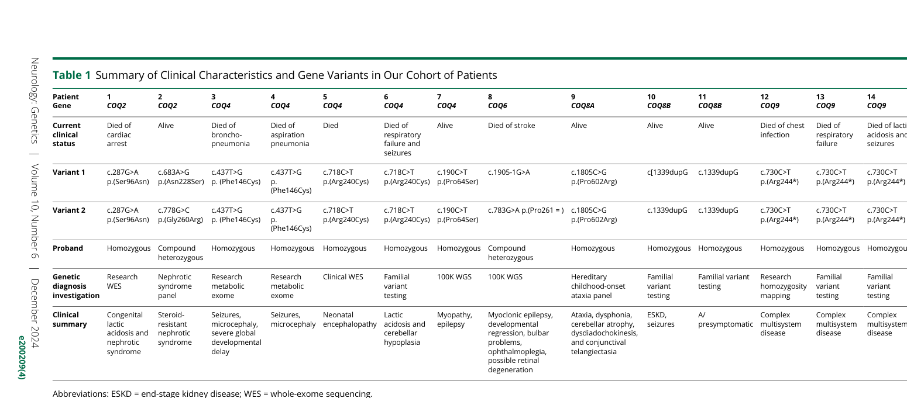

## Question

# Disease Characteristics Research Template

## Target Disease
- **Disease Name:** Primary Coenzyme Q10 Deficiency
- **MONDO ID:**  (if available)
- **Category:** 

## Research Objectives

Please provide a comprehensive research report on **Primary Coenzyme Q10 Deficiency** covering all of the
disease characteristics listed below. This report will be used to populate a disease knowledge
base entry. Be thorough and cite primary literature (PMID preferred) for all claims.

For each section, **suggested databases/resources** are listed. These are the first places
you should search for information on each topic.

---

### 1. Disease Information
> **Search first:** OMIM, Orphanet, ICD-10/ICD-11, MeSH, PubMed

- What is the disease? Provide a concise overview.
- What are the key identifiers? (OMIM, Orphanet, ICD-10/ICD-11, MeSH, Mondo)
- What are the common synonyms and alternative names?
- Is the information derived from individual patients (e.g., EHR) or aggregated disease-level resources?

### 2. Etiology

- **Disease Causal Factors**: What are the primary causes? (genetic, environmental, infectious, mechanistic)
- **Risk Factors**:
  > **Search first:** PubMed, Cochrane Library, UpToDate, clinical guidelines, ClinVar, ClinGen, GWAS Catalog, PheGenI, CTD, CDC, WHO, epidemiological databases
  - Genetic risk factors (causal variants, susceptibility loci, modifier genes)
  - Environmental risk factors (toxins, lifestyle, occupational exposures, age, sex, family history)
- **Protective Factors**:
  > **Search first:** PubMed, Cochrane Library, clinical trial databases, GWAS Catalog, gnomAD, WHO, CDC, nutrition databases
  - Genetic protective factors (protective variants, modifier alleles)
  - Environmental protective factors (diet, lifestyle, exposures that reduce risk)
- **Gene-Environment Interactions**: How do genetic and environmental factors interact to influence disease?
  > **Search first:** CTD, PubMed, PheGenI, GxE databases

### 3. Phenotypes
> **Search first:** HPO (Human Phenotype Ontology), OMIM, Orphanet, PubMed, clinicaltrials.gov, MedDRA, SNOMED CT, DECIPHER, LOINC

For each phenotype, provide:
- **Phenotype type**: symptoms, clinical signs, physical manifestations, behavioral changes, or laboratory abnormalities
  > For symptoms/signs: HPO, OMIM, Orphanet, PubMed
  > For behavioral changes: HPO, DSM, RDoC (Research Domain Criteria), PubMed
  > For laboratory abnormalities: LOINC, SNOMED CT, LabTests Online, PubMed
- **Phenotype characteristics**:
  > **Search first:** OMIM, Orphanet, HPO, PubMed
  - Age of symptom onset (neonatal, childhood, adult-onset, late-onset)
  - Symptom severity (mild, moderate, severe, variable)
  - Symptom progression (stable, progressive, episodic, fluctuating)
  - Frequency among affected individuals (percentage or qualitative)
- **Quality of life impact**: Effects on daily functioning and well-being (per-phenotype when possible)
  > **Search first:** EQ-5D database, SF-36, WHO QOL databases, PubMed
- Suggest HPO (Human Phenotype Ontology) terms for each phenotype

### 4. Genetic/Molecular Information

- **Causal Genes**: Gene mutations or chromosomal abnormalities responsible for disease (gene symbols, OMIM IDs)
  > **Search first:** OMIM, ClinVar, HGMD, Ensembl, NCBI Gene
- **Pathogenic Variants**:
  - Affected genes (gene symbols, HGNC IDs)
    > **Search first:** OMIM, NCBI Gene, Ensembl, HGNC, UniProt, GeneCards
  - Variant classification (pathogenic, likely pathogenic, VUS per ACMG/AMP guidelines)
    > **Search first:** ClinVar, ClinGen, ACMG/AMP guidelines, VarSome
  - Variant type/class (missense, frameshift, nonsense, splice-site, structural)
  - Allele frequency in population databases
    > **Search first:** gnomAD, 1000 Genomes, ExAC, TOPMed, dbSNP
  - Somatic vs germline origin
    > **Search first:** COSMIC (somatic), ClinVar, ICGC, TCGA
  - Functional consequences (loss of function, gain of function, dominant negative)
- **Modifier Genes**: Genes that modify disease severity or expression
- **Epigenetic Information**: DNA methylation, histone modifications, chromatin changes affecting disease
  > **Search first:** ENCODE, Roadmap Epigenomics, MethBase, DiseaseMeth
- **Chromosomal Abnormalities**: Large-scale genetic changes (aneuploidy, translocations, inversions)
  > **Search first:** DECIPHER, ClinVar, ECARUCA, UCSC Genome Browser

### 5. Environmental Information

- **Environmental Factors**: Non-genetic contributing factors (toxins, radiation, pollution, occupational exposure)
  > **Search first:** CTD (Comparative Toxicogenomics Database), TOXNET, PubMed, EPA databases
- **Lifestyle Factors**: Behavioral factors (smoking, diet, exercise, alcohol consumption)
  > **Search first:** CDC databases, WHO, PubMed, NHANES
- **Infectious Agents**: If applicable, pathogens causing or triggering disease (bacteria, viruses, fungi, parasites)
  > **Search first:** NCBI Taxonomy, ViPR, BV-BRC, MicrobeDB, GIDEON

### 6. Mechanism / Pathophysiology

- **Molecular Pathways**: Specific signaling cascades or biochemical pathways involved (Wnt, MAPK, mTOR, PI3K-AKT, etc.)
  > **Search first:** KEGG, Reactome, WikiPathways, PathBank, BioCyc
- **Cellular Processes**: Cell-level mechanisms (apoptosis, autophagy, cell cycle dysregulation, inflammation, etc.)
  > **Search first:** Gene Ontology (GO), Reactome, KEGG, PubMed
- **Protein Dysfunction**: How protein structure or function is altered (misfolding, aggregation, loss of function, gain of function)
  > **Search first:** UniProt, PDB (Protein Data Bank), InterPro, Pfam, AlphaFold
- **Metabolic Changes**: Alterations in metabolic processes (energy metabolism, lipid metabolism, amino acid metabolism)
  > **Search first:** KEGG, BioCyc, HMDB (Human Metabolome Database), BRENDA
- **Immune System Involvement**: Role of immune response (autoimmunity, immunodeficiency, chronic inflammation)
  > **Search first:** ImmPort, Immunome Database, IEDB, Gene Ontology
- **Tissue Damage Mechanisms**: How tissues/ are injured (oxidative stress, ischemia, fibrosis, necrosis)
  > **Search first:** PubMed, Gene Ontology, Reactome
- **Biochemical Abnormalities**: Specific molecular defects (enzyme deficiencies, receptor dysfunction, ion channel defects)
  > **Search first:** BRENDA, UniProt, KEGG, OMIM, PubMed
- **Epigenetic Changes**: DNA methylation, histone modifications affecting gene expression in disease
  > **Search first:** ENCODE, Roadmap Epigenomics, MethBase, DiseaseMeth
- **Molecular Profiling** (if available):
  - Transcriptomics/gene expression changes
    > **Search first:** GEO (Gene Expression Omnibus), ArrayExpress, GTEx, Human Cell Atlas, SRA
  - Proteomics findings
    > **Search first:** PRIDE, ProteomeXchange, Human Protein Atlas, STRING, BioGRID
  - Metabolomics signatures
    > **Search first:** MetaboLights, Metabolomics Workbench, HMDB, METLIN
  - Lipidomics alterations
    > **Search first:** LIPID MAPS, SwissLipids, LipidHome, Metabolomics Workbench
  - Genomic structural features
    > **Search first:** UCSC Genome Browser, Ensembl, NCBI, dbVar, DGV
- **Advanced Technologies** (if applicable):
  - Single-cell analysis findings (cell-type specific mechanisms, cellular heterogeneity)
    > **Search first:** Human Cell Atlas, Single Cell Portal, GEO, CELLxGENE
  - Spatial transcriptomics findings
    > **Search first:** GEO, Spatial Research, Vizgen, 10x Genomics data
  - Multi-omics integration results
    > **Search first:** TCGA, ICGC, cBioPortal, LinkedOmics, PubMed
  - Functional genomics screens (CRISPR, RNAi)
    > **Search first:** DepMap, GenomeRNAi, PubMed, BioGRID ORCS

For each mechanism, describe:
- The causal chain from initial trigger to clinical manifestation
- Which mechanisms are upstream vs downstream
- What cell types and biological processes are involved
- Suggest GO terms for biological processes and CL terms for cell types

### 7. Anatomical Structures Affected

- **Organ Level**:
  - Primary organs directly affected
  - Secondary organ involvement (complications, secondary effects)
  - Body systems involved (cardiovascular, nervous, digestive, respiratory, endocrine, etc.)
  > **Search first:** Uberon, FMA (Foundational Model of Anatomy), OMIM, HPO, ICD-11, MeSH, SNOMED CT
- **Tissue and Cell Level**:
  - Specific tissue types affected (epithelial, connective, muscle, nervous)
  - Specific cell populations targeted (with Cell Ontology terms)
  > **Search first:** Uberon, Human Protein Atlas, Cell Ontology, Human Cell Atlas, CellMarker, PanglaoDB
- **Subcellular Level**:
  - Cellular compartments involved (mitochondria, nucleus, ER, lysosomes) (with GO Cellular Component terms)
  > **Search first:** Gene Ontology (Cellular Component), UniProt, Human Protein Atlas
- **Localization**:
  - Specific anatomical sites (with UBERON terms)
    > **Search first:** FMA, Uberon, NeuroNames (for brain), SNOMED CT
  - Lateralization (unilateral, bilateral, asymmetric)
    > **Search first:** HPO, clinical literature, imaging databases

### 8. Temporal Development

- **Onset**:
  - Typical age of onset (congenital, pediatric, adult, geriatric)
  - Onset pattern (acute, subacute, chronic, insidious)
  > **Search first:** OMIM, Orphanet, HPO, PubMed
- **Progression**:
  - Disease stages (early, intermediate, advanced, end-stage)
    > **Search first:** Cancer Staging Manual (AJCC), WHO classifications, PubMed
  - Progression rate (rapid, slow, variable)
  - Disease course pattern (episodic, relapsing-remitting, progressive, stable)
  - Disease duration (self-limited, chronic lifelong)
  > **Search first:** Disease registries, longitudinal cohort databases, natural history studies, PubMed, Orphanet, OMIM
- **Patterns**:
  - Remission patterns (spontaneous, treatment-induced)
    > **Search first:** Clinical trial databases, disease registries, PubMed
  - Critical periods (time windows of vulnerability or opportunity for intervention)
    > **Search first:** PubMed, developmental biology databases, clinical guidelines

### 9. Inheritance and Population

- **Epidemiology**:
  - Prevalence (cases per 100,000 at given time)
  - Incidence (new cases per 100,000 per year)
  > **Search first:** Orphanet, CDC, WHO, GBD (Global Burden of Disease), national registries, SEER, disease registries
- **For Genetic Etiology**:
  - Inheritance pattern (AD, AR, X-linked, mitochondrial, multifactorial, polygenic)
    > **Search first:** OMIM, Orphanet, ClinVar, GTR (Genetic Testing Registry)
  - Penetrance (complete, incomplete, age-dependent)
    > **Search first:** ClinVar, OMIM, PubMed, ClinGen
  - Expressivity (variable, consistent)
    > **Search first:** OMIM, ClinVar, PubMed
  - Genetic anticipation (increasing severity in successive generations)
    > **Search first:** OMIM, PubMed (especially for repeat expansion disorders)
  - Germline mosaicism
    > **Search first:** ClinVar, OMIM, genetic counseling literature, PubMed
  - Founder effects (population-specific mutations)
    > **Search first:** gnomAD, population genetics databases, PubMed
  - Consanguinity role
    > **Search first:** OMIM, population studies, genetic counseling resources
  - Carrier frequency
    > **Search first:** gnomAD, carrier screening databases, GeneReviews, GTR
- **Population Demographics**:
  - Affected populations (ethnic or demographic groups with higher prevalence)
    > **Search first:** gnomAD, 1000 Genomes, PAGE Study, PubMed, population registries
  - Geographic distribution (endemic areas, regional variation)
    > **Search first:** WHO, CDC, GBD, Orphanet, geographic epidemiology databases
  - Geographic distribution of specific variants
  - Sex ratio (male:female)
    > **Search first:** Disease registries, OMIM, PubMed, epidemiological databases
  - Age distribution of affected individuals
    > **Search first:** CDC, disease registries, SEER, Orphanet

### 10. Diagnostics

- **Clinical Tests**:
  - Laboratory tests (blood, urine, tissue chemistry, specific enzyme assays)
    > **Search first:** LOINC, LabTests Online, PubMed
  - Biomarkers (proteins, metabolites, genetic markers, circulating biomarkers)
    > **Search first:** FDA Biomarker List, BEST (Biomarkers, EndpointS, and other Tools), PubMed
  - Imaging studies (X-ray, CT, MRI, PET, ultrasound)
    > **Search first:** RadLex, DICOM, Radiopaedia, imaging databases
  - Functional tests (pulmonary function, cardiac stress tests)
    > **Search first:** LOINC, clinical guidelines, PubMed
  - Electrophysiology (EEG, EMG, ECG, nerve conduction studies)
    > **Search first:** LOINC, clinical neurophysiology databases, PubMed
  - Biopsy findings (histopathology, immunohistochemistry)
    > **Search first:** SNOMED CT, College of American Pathologists resources, PubMed
  - Pathology findings (microscopic examination)
    > **Search first:** SNOMED CT, Digital Pathology databases, PubMed
- **Genetic Testing**:
  > **Search first:** GTR (Genetic Testing Registry), GeneReviews, ClinGen
  - Overview of recommended genetic testing approach
  - Whole genome sequencing (WGS) utility
    > **Search first:** GTR, ClinVar, GEL (Genomics England), gnomAD
  - Whole exome sequencing (WES) utility
    > **Search first:** GTR, ClinVar, OMIM, GeneMatcher
  - Gene panels (which panels, which genes)
    > **Search first:** GTR, ClinVar, laboratory-specific databases
  - Single gene testing
    > **Search first:** GTR, ClinVar, OMIM, GeneReviews
  - Chromosomal microarray (CMA)
    > **Search first:** DECIPHER, ClinVar, dbVar, ECARUCA
  - Karyotyping
    > **Search first:** Chromosome Abnormality Database, ClinVar, cytogenetics resources
  - FISH
    > **Search first:** ClinVar, cytogenetics databases, PubMed
  - Mitochondrial DNA testing
    > **Search first:** MITOMAP, MSeqDR, ClinVar, GTR
  - Repeat expansion testing
    > **Search first:** GTR, ClinVar, repeat expansion databases, PubMed
- **Omics-Based Diagnostics** (if applicable):
  - RNA sequencing / transcriptomics
    > **Search first:** GEO, ArrayExpress, GTEx, RNA-seq databases
  - Proteomics
    > **Search first:** PRIDE, ProteomeXchange, FDA Biomarker database
  - Metabolomics
    > **Search first:** MetaboLights, Metabolomics Workbench, HMDB
  - Epigenomics
    > **Search first:** GEO, ENCODE, Roadmap Epigenomics, MethBase
  - Liquid biopsy
    > **Search first:** COSMIC, ClinVar, liquid biopsy databases, PubMed
- **Clinical Criteria**:
  - Standardized diagnostic criteria (DSM, ICD, society guidelines)
    > **Search first:** DSM-5, ICD-11, clinical society guidelines, UpToDate
  - Differential diagnosis (other conditions to rule out, with distinguishing features)
    > **Search first:** DynaMed, UpToDate, clinical decision support systems
- **Screening**:
  - Screening methods for asymptomatic individuals (newborn screening, carrier screening, cascade screening)
    > **Search first:** ACMG recommendations, CDC newborn screening, GTR

### 11. Outcome/Prognosis

- **Survival and Mortality**:
  - Survival rate (5-year, 10-year, overall)
    > **Search first:** SEER, cancer registries, disease-specific registries, PubMed
  - Life expectancy (with and without treatment if applicable)
    > **Search first:** Orphanet, disease registries, actuarial databases, PubMed
  - Mortality rate
    > **Search first:** CDC, WHO, GBD, national mortality databases
  - Disease-specific mortality (deaths directly attributable to disease)
    > **Search first:** Disease registries, CDC Wonder, GBD, PubMed
- **Morbidity and Function**:
  - Morbidity (disease-related disability and health impacts)
    > **Search first:** GBD, WHO, disability databases, PubMed
  - Disability outcomes (long-term functional impairments)
    > **Search first:** ICF (International Classification of Functioning), disability registries
  - Quality of life measures (EQ-5D, SF-36, PROMIS, disease-specific tools)
    > **Search first:** EQ-5D database, SF-36, PROMIS, PubMed
- **Disease Course**:
  - Complications (secondary problems: infections, organ failure, etc.)
    > **Search first:** ICD codes, disease registries, clinical databases, PubMed
  - Recovery potential (likelihood and extent of recovery, with vs without treatment)
    > **Search first:** Natural history studies, rehabilitation databases, PubMed
- **Prediction**:
  - Prognostic factors (age, disease severity, biomarkers, treatment response)
    > **Search first:** Prognostic models databases, clinical calculators, PubMed
  - Prognostic biomarkers (molecular markers predicting disease course)
    > **Search first:** FDA Biomarker database, PubMed, cancer prognostic databases

### 12. Treatment

- **Pharmacotherapy**:
  - Pharmacological treatments (drug names, drug classes, mechanisms of action)
    > **Search first:** DrugBank, RxNorm, ATC classification, DailyMed, FDA databases
  - Pharmacogenomics (how genetic variants affect drug metabolism, efficacy, toxicity)
    > **Search first:** PharmGKB, CPIC (Clinical Pharmacogenetics), FDA Table of PGx Biomarkers
- **Advanced Therapeutics**:
  - Gene therapy (viral vectors, CRISPR, gene replacement, gene editing)
    > **Search first:** ClinicalTrials.gov, FDA gene therapy database, ASGCT resources
  - Cell therapy (stem cell transplant, CAR-T, cellular therapeutics)
    > **Search first:** ClinicalTrials.gov, FDA cell therapy database, FACT standards
  - RNA-based therapies (ASOs, siRNA, mRNA therapies)
    > **Search first:** ClinicalTrials.gov, FDA approvals, PubMed
  - Targeted therapies (treatments directed at specific molecular targets)
    > **Search first:** My Cancer Genome, OncoKB, ClinicalTrials.gov, FDA approvals
  - Immunotherapies (checkpoint inhibitors, monoclonal antibodies)
    > **Search first:** Cancer Immunotherapy Database, FDA approvals, ClinicalTrials.gov
- **Surgical and Interventional**:
  - Surgical interventions (types of surgery, timing, outcomes)
    > **Search first:** CPT codes, surgical registries, clinical guidelines, PubMed
- **Supportive and Rehabilitative**:
  - Supportive care (symptom management, pain control, nutrition)
    > **Search first:** Clinical guidelines, Cochrane Library, PubMed
  - Rehabilitation (physical therapy, occupational therapy, speech therapy)
    > **Search first:** Rehabilitation medicine databases, clinical guidelines, PubMed
- **Experimental**:
  - Experimental treatments in clinical trials (with NCT identifiers if available)
    > **Search first:** ClinicalTrials.gov, EU Clinical Trials Register, WHO ICTRP
- **Treatment Outcomes**:
  - Treatment response rates
    > **Search first:** Clinical trial databases, FDA reviews, systematic reviews, PubMed
  - Side effects and adverse events
    > **Search first:** FDA Adverse Event Reporting System (FAERS), MedWatch, PubMed
- **Treatment Strategy**:
  - Treatment algorithms (clinical pathways, decision trees)
    > **Search first:** Clinical practice guidelines, NCCN Guidelines, UpToDate
  - Combination therapies
    > **Search first:** ClinicalTrials.gov, treatment guidelines, PubMed
  - Personalized medicine approaches (genotype-guided treatment)
    > **Search first:** My Cancer Genome, CIViC, PharmGKB, precision medicine databases

For each treatment, suggest MAXO (Medical Action Ontology) terms where applicable.

### 13. Prevention

- **Prevention Levels**:
  - Primary prevention (preventing disease occurrence: vaccination, risk factor modification)
    > **Search first:** CDC, WHO, USPSTF recommendations, Cochrane Library
  - Secondary prevention (early detection and treatment: screening programs, early intervention)
    > **Search first:** USPSTF, CDC screening guidelines, WHO
  - Tertiary prevention (preventing complications in those with disease)
    > **Search first:** Clinical guidelines, disease management protocols, PubMed
- **Immunization**: Vaccine strategies (if applicable)
  > **Search first:** CDC vaccine schedules, WHO immunization, FDA vaccine database
- **Screening and Early Detection**:
  - Screening programs (population-based: newborn screening, cancer screening)
    > **Search first:** CDC screening programs, USPSTF, cancer screening databases
  - Genetic screening (carrier screening, preimplantation genetic diagnosis, prenatal testing)
    > **Search first:** ACMG recommendations, ACOG guidelines, GTR
  - Risk stratification (identifying high-risk individuals for targeted prevention)
    > **Search first:** Risk prediction models, clinical calculators, PubMed
- **Behavioral Interventions**: Lifestyle modifications to reduce risk
  > **Search first:** CDC, WHO, behavioral intervention databases, Cochrane Library
- **Counseling**: Genetic counseling (risk assessment, family planning guidance)
  > **Search first:** NSGC resources, ACMG guidelines, GeneReviews
- **Public Health**:
  - Public health interventions (sanitation, vector control, health education)
    > **Search first:** CDC, WHO, public health databases, PubMed
  - Environmental interventions (reducing environmental risk factors)
    > **Search first:** EPA databases, WHO environmental health, PubMed
- **Prophylaxis**: Preventive medications or procedures
  > **Search first:** Clinical guidelines, FDA approvals, PubMed

### 14. Other Species / Natural Disease

- **Taxonomy**: Species affected (with NCBI Taxon identifiers)
  > **Search first:** NCBI Taxonomy
- **Breed**: Specific breeds affected (with VBO identifiers if applicable)
  > **Search first:** VBO (Vertebrate Breed Ontology)
- **Gene**: Orthologous genes in other species (with NCBI Gene IDs)
  > **Search first:** NCBI Gene
- **Natural Disease**:
  - Naturally occurring disease in other species (companion animals, wildlife)
    > **Search first:** OMIA (Online Mendelian Inheritance in Animals), VetCompass, PubMed
  - Veterinary relevance and importance in animal health
    > **Search first:** OMIA, veterinary databases, PubMed
- **Comparative Biology**:
  - Comparative pathology (similarities and differences across species)
    > **Search first:** OMIA, comparative pathology databases, PubMed
  - Evolutionary conservation of disease mechanisms
    > **Search first:** HomoloGene, OrthoMCL, Alliance of Genome Resources
- **Transmission** (if applicable):
  - Zoonotic potential
    > **Search first:** CDC zoonotic diseases, WHO zoonoses, GIDEON
  - Cross-species susceptibility
    > **Search first:** NCBI Taxonomy, veterinary databases, PubMed

### 15. Model Organisms

- **Model Types**:
  - Model organism type (mammalian, invertebrate, cellular, in vitro)
    > **Search first:** Alliance of Genome Resources, model organism databases
  - Specific model systems (mouse, rat, zebrafish, Drosophila, C. elegans, yeast, cell lines, organoids, iPSCs)
    > **Search first:** MGI, RGD, ZFIN, FlyBase, WormBase, SGD, ATCC, Cellosaurus
  - Induced models (drug treatment, surgical intervention, environmental manipulation)
    > **Search first:** MGI, model organism databases, PubMed
- **Genetic Models**:
  - Types available (knockout, knock-in, transgenic, conditional, humanized)
    > **Search first:** MGI, IMPC, KOMP, EuMMCR, IMSR
- **Model Characteristics**:
  - Phenotype recapitulation (how well model reproduces human disease features)
    > **Search first:** Model organism databases, comparative studies, PubMed
  - Model limitations (aspects of human disease not captured)
    > **Search first:** Model organism databases, PubMed, review articles
- **Applications**:
  - Research applications (what aspects of disease can be studied)
    > **Search first:** Model organism databases, PubMed
- **Resources**:
  - Model databases
    > **Search first:** MGI, RGD, ZFIN, FlyBase, WormBase, IMSR, EMMA, MMRRC

---

## Citation Requirements

- Cite primary literature (PMID preferred) for all mechanistic and clinical claims
- Prioritize recent reviews and landmark papers
- Include direct quotes from abstracts where possible to support key statements
- Distinguish evidence source types: human clinical, model organism, in vitro, computational

## Output Format

Structure your response as a comprehensive narrative organized by the sections above.
For each section, provide:
- Factual content with specific details (numbers, percentages, gene names, variant nomenclature)
- Ontology term suggestions (HPO, GO, CL, UBERON, CHEBI, MAXO, MONDO) where applicable
- Evidence citations with PMIDs
- Direct quotes from abstracts to support key claims
- Clear indication when information is not available or not applicable for this disease

This report will be used to populate a disease knowledge base entry with:
- Pathophysiology descriptions with causal chains
- Gene/protein annotations (HGNC, GO terms)
- Phenotype associations (HP terms) with frequencies
- Cell type involvement (CL terms)
- Anatomical locations (UBERON terms)
- Chemical entities (CHEBI terms)
- Treatment annotations (MAXO terms)
- Evidence items with PMIDs and exact abstract quotes
- Epidemiology, prognosis, diagnostic, and prevention information
- Animal model descriptions with phenotype recapitulation details

## Output

Question: You are an expert researcher providing comprehensive, well-cited information.

Provide detailed information focusing on:
1. Key concepts and definitions with current understanding
2. Recent developments and latest research (prioritize 2023-2024 sources)
3. Current applications and real-world implementations
4. Expert opinions and analysis from authoritative sources
5. Relevant statistics and data from recent studies

Format as a comprehensive research report with proper citations. Include URLs and publication dates where available.
Always prioritize recent, authoritative sources and provide specific citations for all major claims.

# Disease Characteristics Research Template

## Target Disease
- **Disease Name:** Primary Coenzyme Q10 Deficiency
- **MONDO ID:**  (if available)
- **Category:** 

## Research Objectives

Please provide a comprehensive research report on **Primary Coenzyme Q10 Deficiency** covering all of the
disease characteristics listed below. This report will be used to populate a disease knowledge
base entry. Be thorough and cite primary literature (PMID preferred) for all claims.

For each section, **suggested databases/resources** are listed. These are the first places
you should search for information on each topic.

---

### 1. Disease Information
> **Search first:** OMIM, Orphanet, ICD-10/ICD-11, MeSH, PubMed

- What is the disease? Provide a concise overview.
- What are the key identifiers? (OMIM, Orphanet, ICD-10/ICD-11, MeSH, Mondo)
- What are the common synonyms and alternative names?
- Is the information derived from individual patients (e.g., EHR) or aggregated disease-level resources?

### 2. Etiology

- **Disease Causal Factors**: What are the primary causes? (genetic, environmental, infectious, mechanistic)
- **Risk Factors**:
  > **Search first:** PubMed, Cochrane Library, UpToDate, clinical guidelines, ClinVar, ClinGen, GWAS Catalog, PheGenI, CTD, CDC, WHO, epidemiological databases
  - Genetic risk factors (causal variants, susceptibility loci, modifier genes)
  - Environmental risk factors (toxins, lifestyle, occupational exposures, age, sex, family history)
- **Protective Factors**:
  > **Search first:** PubMed, Cochrane Library, clinical trial databases, GWAS Catalog, gnomAD, WHO, CDC, nutrition databases
  - Genetic protective factors (protective variants, modifier alleles)
  - Environmental protective factors (diet, lifestyle, exposures that reduce risk)
- **Gene-Environment Interactions**: How do genetic and environmental factors interact to influence disease?
  > **Search first:** CTD, PubMed, PheGenI, GxE databases

### 3. Phenotypes
> **Search first:** HPO (Human Phenotype Ontology), OMIM, Orphanet, PubMed, clinicaltrials.gov, MedDRA, SNOMED CT, DECIPHER, LOINC

For each phenotype, provide:
- **Phenotype type**: symptoms, clinical signs, physical manifestations, behavioral changes, or laboratory abnormalities
  > For symptoms/signs: HPO, OMIM, Orphanet, PubMed
  > For behavioral changes: HPO, DSM, RDoC (Research Domain Criteria), PubMed
  > For laboratory abnormalities: LOINC, SNOMED CT, LabTests Online, PubMed
- **Phenotype characteristics**:
  > **Search first:** OMIM, Orphanet, HPO, PubMed
  - Age of symptom onset (neonatal, childhood, adult-onset, late-onset)
  - Symptom severity (mild, moderate, severe, variable)
  - Symptom progression (stable, progressive, episodic, fluctuating)
  - Frequency among affected individuals (percentage or qualitative)
- **Quality of life impact**: Effects on daily functioning and well-being (per-phenotype when possible)
  > **Search first:** EQ-5D database, SF-36, WHO QOL databases, PubMed
- Suggest HPO (Human Phenotype Ontology) terms for each phenotype

### 4. Genetic/Molecular Information

- **Causal Genes**: Gene mutations or chromosomal abnormalities responsible for disease (gene symbols, OMIM IDs)
  > **Search first:** OMIM, ClinVar, HGMD, Ensembl, NCBI Gene
- **Pathogenic Variants**:
  - Affected genes (gene symbols, HGNC IDs)
    > **Search first:** OMIM, NCBI Gene, Ensembl, HGNC, UniProt, GeneCards
  - Variant classification (pathogenic, likely pathogenic, VUS per ACMG/AMP guidelines)
    > **Search first:** ClinVar, ClinGen, ACMG/AMP guidelines, VarSome
  - Variant type/class (missense, frameshift, nonsense, splice-site, structural)
  - Allele frequency in population databases
    > **Search first:** gnomAD, 1000 Genomes, ExAC, TOPMed, dbSNP
  - Somatic vs germline origin
    > **Search first:** COSMIC (somatic), ClinVar, ICGC, TCGA
  - Functional consequences (loss of function, gain of function, dominant negative)
- **Modifier Genes**: Genes that modify disease severity or expression
- **Epigenetic Information**: DNA methylation, histone modifications, chromatin changes affecting disease
  > **Search first:** ENCODE, Roadmap Epigenomics, MethBase, DiseaseMeth
- **Chromosomal Abnormalities**: Large-scale genetic changes (aneuploidy, translocations, inversions)
  > **Search first:** DECIPHER, ClinVar, ECARUCA, UCSC Genome Browser

### 5. Environmental Information

- **Environmental Factors**: Non-genetic contributing factors (toxins, radiation, pollution, occupational exposure)
  > **Search first:** CTD (Comparative Toxicogenomics Database), TOXNET, PubMed, EPA databases
- **Lifestyle Factors**: Behavioral factors (smoking, diet, exercise, alcohol consumption)
  > **Search first:** CDC databases, WHO, PubMed, NHANES
- **Infectious Agents**: If applicable, pathogens causing or triggering disease (bacteria, viruses, fungi, parasites)
  > **Search first:** NCBI Taxonomy, ViPR, BV-BRC, MicrobeDB, GIDEON

### 6. Mechanism / Pathophysiology

- **Molecular Pathways**: Specific signaling cascades or biochemical pathways involved (Wnt, MAPK, mTOR, PI3K-AKT, etc.)
  > **Search first:** KEGG, Reactome, WikiPathways, PathBank, BioCyc
- **Cellular Processes**: Cell-level mechanisms (apoptosis, autophagy, cell cycle dysregulation, inflammation, etc.)
  > **Search first:** Gene Ontology (GO), Reactome, KEGG, PubMed
- **Protein Dysfunction**: How protein structure or function is altered (misfolding, aggregation, loss of function, gain of function)
  > **Search first:** UniProt, PDB (Protein Data Bank), InterPro, Pfam, AlphaFold
- **Metabolic Changes**: Alterations in metabolic processes (energy metabolism, lipid metabolism, amino acid metabolism)
  > **Search first:** KEGG, BioCyc, HMDB (Human Metabolome Database), BRENDA
- **Immune System Involvement**: Role of immune response (autoimmunity, immunodeficiency, chronic inflammation)
  > **Search first:** ImmPort, Immunome Database, IEDB, Gene Ontology
- **Tissue Damage Mechanisms**: How tissues/ are injured (oxidative stress, ischemia, fibrosis, necrosis)
  > **Search first:** PubMed, Gene Ontology, Reactome
- **Biochemical Abnormalities**: Specific molecular defects (enzyme deficiencies, receptor dysfunction, ion channel defects)
  > **Search first:** BRENDA, UniProt, KEGG, OMIM, PubMed
- **Epigenetic Changes**: DNA methylation, histone modifications affecting gene expression in disease
  > **Search first:** ENCODE, Roadmap Epigenomics, MethBase, DiseaseMeth
- **Molecular Profiling** (if available):
  - Transcriptomics/gene expression changes
    > **Search first:** GEO (Gene Expression Omnibus), ArrayExpress, GTEx, Human Cell Atlas, SRA
  - Proteomics findings
    > **Search first:** PRIDE, ProteomeXchange, Human Protein Atlas, STRING, BioGRID
  - Metabolomics signatures
    > **Search first:** MetaboLights, Metabolomics Workbench, HMDB, METLIN
  - Lipidomics alterations
    > **Search first:** LIPID MAPS, SwissLipids, LipidHome, Metabolomics Workbench
  - Genomic structural features
    > **Search first:** UCSC Genome Browser, Ensembl, NCBI, dbVar, DGV
- **Advanced Technologies** (if applicable):
  - Single-cell analysis findings (cell-type specific mechanisms, cellular heterogeneity)
    > **Search first:** Human Cell Atlas, Single Cell Portal, GEO, CELLxGENE
  - Spatial transcriptomics findings
    > **Search first:** GEO, Spatial Research, Vizgen, 10x Genomics data
  - Multi-omics integration results
    > **Search first:** TCGA, ICGC, cBioPortal, LinkedOmics, PubMed
  - Functional genomics screens (CRISPR, RNAi)
    > **Search first:** DepMap, GenomeRNAi, PubMed, BioGRID ORCS

For each mechanism, describe:
- The causal chain from initial trigger to clinical manifestation
- Which mechanisms are upstream vs downstream
- What cell types and biological processes are involved
- Suggest GO terms for biological processes and CL terms for cell types

### 7. Anatomical Structures Affected

- **Organ Level**:
  - Primary organs directly affected
  - Secondary organ involvement (complications, secondary effects)
  - Body systems involved (cardiovascular, nervous, digestive, respiratory, endocrine, etc.)
  > **Search first:** Uberon, FMA (Foundational Model of Anatomy), OMIM, HPO, ICD-11, MeSH, SNOMED CT
- **Tissue and Cell Level**:
  - Specific tissue types affected (epithelial, connective, muscle, nervous)
  - Specific cell populations targeted (with Cell Ontology terms)
  > **Search first:** Uberon, Human Protein Atlas, Cell Ontology, Human Cell Atlas, CellMarker, PanglaoDB
- **Subcellular Level**:
  - Cellular compartments involved (mitochondria, nucleus, ER, lysosomes) (with GO Cellular Component terms)
  > **Search first:** Gene Ontology (Cellular Component), UniProt, Human Protein Atlas
- **Localization**:
  - Specific anatomical sites (with UBERON terms)
    > **Search first:** FMA, Uberon, NeuroNames (for brain), SNOMED CT
  - Lateralization (unilateral, bilateral, asymmetric)
    > **Search first:** HPO, clinical literature, imaging databases

### 8. Temporal Development

- **Onset**:
  - Typical age of onset (congenital, pediatric, adult, geriatric)
  - Onset pattern (acute, subacute, chronic, insidious)
  > **Search first:** OMIM, Orphanet, HPO, PubMed
- **Progression**:
  - Disease stages (early, intermediate, advanced, end-stage)
    > **Search first:** Cancer Staging Manual (AJCC), WHO classifications, PubMed
  - Progression rate (rapid, slow, variable)
  - Disease course pattern (episodic, relapsing-remitting, progressive, stable)
  - Disease duration (self-limited, chronic lifelong)
  > **Search first:** Disease registries, longitudinal cohort databases, natural history studies, PubMed, Orphanet, OMIM
- **Patterns**:
  - Remission patterns (spontaneous, treatment-induced)
    > **Search first:** Clinical trial databases, disease registries, PubMed
  - Critical periods (time windows of vulnerability or opportunity for intervention)
    > **Search first:** PubMed, developmental biology databases, clinical guidelines

### 9. Inheritance and Population

- **Epidemiology**:
  - Prevalence (cases per 100,000 at given time)
  - Incidence (new cases per 100,000 per year)
  > **Search first:** Orphanet, CDC, WHO, GBD (Global Burden of Disease), national registries, SEER, disease registries
- **For Genetic Etiology**:
  - Inheritance pattern (AD, AR, X-linked, mitochondrial, multifactorial, polygenic)
    > **Search first:** OMIM, Orphanet, ClinVar, GTR (Genetic Testing Registry)
  - Penetrance (complete, incomplete, age-dependent)
    > **Search first:** ClinVar, OMIM, PubMed, ClinGen
  - Expressivity (variable, consistent)
    > **Search first:** OMIM, ClinVar, PubMed
  - Genetic anticipation (increasing severity in successive generations)
    > **Search first:** OMIM, PubMed (especially for repeat expansion disorders)
  - Germline mosaicism
    > **Search first:** ClinVar, OMIM, genetic counseling literature, PubMed
  - Founder effects (population-specific mutations)
    > **Search first:** gnomAD, population genetics databases, PubMed
  - Consanguinity role
    > **Search first:** OMIM, population studies, genetic counseling resources
  - Carrier frequency
    > **Search first:** gnomAD, carrier screening databases, GeneReviews, GTR
- **Population Demographics**:
  - Affected populations (ethnic or demographic groups with higher prevalence)
    > **Search first:** gnomAD, 1000 Genomes, PAGE Study, PubMed, population registries
  - Geographic distribution (endemic areas, regional variation)
    > **Search first:** WHO, CDC, GBD, Orphanet, geographic epidemiology databases
  - Geographic distribution of specific variants
  - Sex ratio (male:female)
    > **Search first:** Disease registries, OMIM, PubMed, epidemiological databases
  - Age distribution of affected individuals
    > **Search first:** CDC, disease registries, SEER, Orphanet

### 10. Diagnostics

- **Clinical Tests**:
  - Laboratory tests (blood, urine, tissue chemistry, specific enzyme assays)
    > **Search first:** LOINC, LabTests Online, PubMed
  - Biomarkers (proteins, metabolites, genetic markers, circulating biomarkers)
    > **Search first:** FDA Biomarker List, BEST (Biomarkers, EndpointS, and other Tools), PubMed
  - Imaging studies (X-ray, CT, MRI, PET, ultrasound)
    > **Search first:** RadLex, DICOM, Radiopaedia, imaging databases
  - Functional tests (pulmonary function, cardiac stress tests)
    > **Search first:** LOINC, clinical guidelines, PubMed
  - Electrophysiology (EEG, EMG, ECG, nerve conduction studies)
    > **Search first:** LOINC, clinical neurophysiology databases, PubMed
  - Biopsy findings (histopathology, immunohistochemistry)
    > **Search first:** SNOMED CT, College of American Pathologists resources, PubMed
  - Pathology findings (microscopic examination)
    > **Search first:** SNOMED CT, Digital Pathology databases, PubMed
- **Genetic Testing**:
  > **Search first:** GTR (Genetic Testing Registry), GeneReviews, ClinGen
  - Overview of recommended genetic testing approach
  - Whole genome sequencing (WGS) utility
    > **Search first:** GTR, ClinVar, GEL (Genomics England), gnomAD
  - Whole exome sequencing (WES) utility
    > **Search first:** GTR, ClinVar, OMIM, GeneMatcher
  - Gene panels (which panels, which genes)
    > **Search first:** GTR, ClinVar, laboratory-specific databases
  - Single gene testing
    > **Search first:** GTR, ClinVar, OMIM, GeneReviews
  - Chromosomal microarray (CMA)
    > **Search first:** DECIPHER, ClinVar, dbVar, ECARUCA
  - Karyotyping
    > **Search first:** Chromosome Abnormality Database, ClinVar, cytogenetics resources
  - FISH
    > **Search first:** ClinVar, cytogenetics databases, PubMed
  - Mitochondrial DNA testing
    > **Search first:** MITOMAP, MSeqDR, ClinVar, GTR
  - Repeat expansion testing
    > **Search first:** GTR, ClinVar, repeat expansion databases, PubMed
- **Omics-Based Diagnostics** (if applicable):
  - RNA sequencing / transcriptomics
    > **Search first:** GEO, ArrayExpress, GTEx, RNA-seq databases
  - Proteomics
    > **Search first:** PRIDE, ProteomeXchange, FDA Biomarker database
  - Metabolomics
    > **Search first:** MetaboLights, Metabolomics Workbench, HMDB
  - Epigenomics
    > **Search first:** GEO, ENCODE, Roadmap Epigenomics, MethBase
  - Liquid biopsy
    > **Search first:** COSMIC, ClinVar, liquid biopsy databases, PubMed
- **Clinical Criteria**:
  - Standardized diagnostic criteria (DSM, ICD, society guidelines)
    > **Search first:** DSM-5, ICD-11, clinical society guidelines, UpToDate
  - Differential diagnosis (other conditions to rule out, with distinguishing features)
    > **Search first:** DynaMed, UpToDate, clinical decision support systems
- **Screening**:
  - Screening methods for asymptomatic individuals (newborn screening, carrier screening, cascade screening)
    > **Search first:** ACMG recommendations, CDC newborn screening, GTR

### 11. Outcome/Prognosis

- **Survival and Mortality**:
  - Survival rate (5-year, 10-year, overall)
    > **Search first:** SEER, cancer registries, disease-specific registries, PubMed
  - Life expectancy (with and without treatment if applicable)
    > **Search first:** Orphanet, disease registries, actuarial databases, PubMed
  - Mortality rate
    > **Search first:** CDC, WHO, GBD, national mortality databases
  - Disease-specific mortality (deaths directly attributable to disease)
    > **Search first:** Disease registries, CDC Wonder, GBD, PubMed
- **Morbidity and Function**:
  - Morbidity (disease-related disability and health impacts)
    > **Search first:** GBD, WHO, disability databases, PubMed
  - Disability outcomes (long-term functional impairments)
    > **Search first:** ICF (International Classification of Functioning), disability registries
  - Quality of life measures (EQ-5D, SF-36, PROMIS, disease-specific tools)
    > **Search first:** EQ-5D database, SF-36, PROMIS, PubMed
- **Disease Course**:
  - Complications (secondary problems: infections, organ failure, etc.)
    > **Search first:** ICD codes, disease registries, clinical databases, PubMed
  - Recovery potential (likelihood and extent of recovery, with vs without treatment)
    > **Search first:** Natural history studies, rehabilitation databases, PubMed
- **Prediction**:
  - Prognostic factors (age, disease severity, biomarkers, treatment response)
    > **Search first:** Prognostic models databases, clinical calculators, PubMed
  - Prognostic biomarkers (molecular markers predicting disease course)
    > **Search first:** FDA Biomarker database, PubMed, cancer prognostic databases

### 12. Treatment

- **Pharmacotherapy**:
  - Pharmacological treatments (drug names, drug classes, mechanisms of action)
    > **Search first:** DrugBank, RxNorm, ATC classification, DailyMed, FDA databases
  - Pharmacogenomics (how genetic variants affect drug metabolism, efficacy, toxicity)
    > **Search first:** PharmGKB, CPIC (Clinical Pharmacogenetics), FDA Table of PGx Biomarkers
- **Advanced Therapeutics**:
  - Gene therapy (viral vectors, CRISPR, gene replacement, gene editing)
    > **Search first:** ClinicalTrials.gov, FDA gene therapy database, ASGCT resources
  - Cell therapy (stem cell transplant, CAR-T, cellular therapeutics)
    > **Search first:** ClinicalTrials.gov, FDA cell therapy database, FACT standards
  - RNA-based therapies (ASOs, siRNA, mRNA therapies)
    > **Search first:** ClinicalTrials.gov, FDA approvals, PubMed
  - Targeted therapies (treatments directed at specific molecular targets)
    > **Search first:** My Cancer Genome, OncoKB, ClinicalTrials.gov, FDA approvals
  - Immunotherapies (checkpoint inhibitors, monoclonal antibodies)
    > **Search first:** Cancer Immunotherapy Database, FDA approvals, ClinicalTrials.gov
- **Surgical and Interventional**:
  - Surgical interventions (types of surgery, timing, outcomes)
    > **Search first:** CPT codes, surgical registries, clinical guidelines, PubMed
- **Supportive and Rehabilitative**:
  - Supportive care (symptom management, pain control, nutrition)
    > **Search first:** Clinical guidelines, Cochrane Library, PubMed
  - Rehabilitation (physical therapy, occupational therapy, speech therapy)
    > **Search first:** Rehabilitation medicine databases, clinical guidelines, PubMed
- **Experimental**:
  - Experimental treatments in clinical trials (with NCT identifiers if available)
    > **Search first:** ClinicalTrials.gov, EU Clinical Trials Register, WHO ICTRP
- **Treatment Outcomes**:
  - Treatment response rates
    > **Search first:** Clinical trial databases, FDA reviews, systematic reviews, PubMed
  - Side effects and adverse events
    > **Search first:** FDA Adverse Event Reporting System (FAERS), MedWatch, PubMed
- **Treatment Strategy**:
  - Treatment algorithms (clinical pathways, decision trees)
    > **Search first:** Clinical practice guidelines, NCCN Guidelines, UpToDate
  - Combination therapies
    > **Search first:** ClinicalTrials.gov, treatment guidelines, PubMed
  - Personalized medicine approaches (genotype-guided treatment)
    > **Search first:** My Cancer Genome, CIViC, PharmGKB, precision medicine databases

For each treatment, suggest MAXO (Medical Action Ontology) terms where applicable.

### 13. Prevention

- **Prevention Levels**:
  - Primary prevention (preventing disease occurrence: vaccination, risk factor modification)
    > **Search first:** CDC, WHO, USPSTF recommendations, Cochrane Library
  - Secondary prevention (early detection and treatment: screening programs, early intervention)
    > **Search first:** USPSTF, CDC screening guidelines, WHO
  - Tertiary prevention (preventing complications in those with disease)
    > **Search first:** Clinical guidelines, disease management protocols, PubMed
- **Immunization**: Vaccine strategies (if applicable)
  > **Search first:** CDC vaccine schedules, WHO immunization, FDA vaccine database
- **Screening and Early Detection**:
  - Screening programs (population-based: newborn screening, cancer screening)
    > **Search first:** CDC screening programs, USPSTF, cancer screening databases
  - Genetic screening (carrier screening, preimplantation genetic diagnosis, prenatal testing)
    > **Search first:** ACMG recommendations, ACOG guidelines, GTR
  - Risk stratification (identifying high-risk individuals for targeted prevention)
    > **Search first:** Risk prediction models, clinical calculators, PubMed
- **Behavioral Interventions**: Lifestyle modifications to reduce risk
  > **Search first:** CDC, WHO, behavioral intervention databases, Cochrane Library
- **Counseling**: Genetic counseling (risk assessment, family planning guidance)
  > **Search first:** NSGC resources, ACMG guidelines, GeneReviews
- **Public Health**:
  - Public health interventions (sanitation, vector control, health education)
    > **Search first:** CDC, WHO, public health databases, PubMed
  - Environmental interventions (reducing environmental risk factors)
    > **Search first:** EPA databases, WHO environmental health, PubMed
- **Prophylaxis**: Preventive medications or procedures
  > **Search first:** Clinical guidelines, FDA approvals, PubMed

### 14. Other Species / Natural Disease

- **Taxonomy**: Species affected (with NCBI Taxon identifiers)
  > **Search first:** NCBI Taxonomy
- **Breed**: Specific breeds affected (with VBO identifiers if applicable)
  > **Search first:** VBO (Vertebrate Breed Ontology)
- **Gene**: Orthologous genes in other species (with NCBI Gene IDs)
  > **Search first:** NCBI Gene
- **Natural Disease**:
  - Naturally occurring disease in other species (companion animals, wildlife)
    > **Search first:** OMIA (Online Mendelian Inheritance in Animals), VetCompass, PubMed
  - Veterinary relevance and importance in animal health
    > **Search first:** OMIA, veterinary databases, PubMed
- **Comparative Biology**:
  - Comparative pathology (similarities and differences across species)
    > **Search first:** OMIA, comparative pathology databases, PubMed
  - Evolutionary conservation of disease mechanisms
    > **Search first:** HomoloGene, OrthoMCL, Alliance of Genome Resources
- **Transmission** (if applicable):
  - Zoonotic potential
    > **Search first:** CDC zoonotic diseases, WHO zoonoses, GIDEON
  - Cross-species susceptibility
    > **Search first:** NCBI Taxonomy, veterinary databases, PubMed

### 15. Model Organisms

- **Model Types**:
  - Model organism type (mammalian, invertebrate, cellular, in vitro)
    > **Search first:** Alliance of Genome Resources, model organism databases
  - Specific model systems (mouse, rat, zebrafish, Drosophila, C. elegans, yeast, cell lines, organoids, iPSCs)
    > **Search first:** MGI, RGD, ZFIN, FlyBase, WormBase, SGD, ATCC, Cellosaurus
  - Induced models (drug treatment, surgical intervention, environmental manipulation)
    > **Search first:** MGI, model organism databases, PubMed
- **Genetic Models**:
  - Types available (knockout, knock-in, transgenic, conditional, humanized)
    > **Search first:** MGI, IMPC, KOMP, EuMMCR, IMSR
- **Model Characteristics**:
  - Phenotype recapitulation (how well model reproduces human disease features)
    > **Search first:** Model organism databases, comparative studies, PubMed
  - Model limitations (aspects of human disease not captured)
    > **Search first:** Model organism databases, PubMed, review articles
- **Applications**:
  - Research applications (what aspects of disease can be studied)
    > **Search first:** Model organism databases, PubMed
- **Resources**:
  - Model databases
    > **Search first:** MGI, RGD, ZFIN, FlyBase, WormBase, IMSR, EMMA, MMRRC

---

## Citation Requirements

- Cite primary literature (PMID preferred) for all mechanistic and clinical claims
- Prioritize recent reviews and landmark papers
- Include direct quotes from abstracts where possible to support key statements
- Distinguish evidence source types: human clinical, model organism, in vitro, computational

## Output Format

Structure your response as a comprehensive narrative organized by the sections above.
For each section, provide:
- Factual content with specific details (numbers, percentages, gene names, variant nomenclature)
- Ontology term suggestions (HPO, GO, CL, UBERON, CHEBI, MAXO, MONDO) where applicable
- Evidence citations with PMIDs
- Direct quotes from abstracts to support key claims
- Clear indication when information is not available or not applicable for this disease

This report will be used to populate a disease knowledge base entry with:
- Pathophysiology descriptions with causal chains
- Gene/protein annotations (HGNC, GO terms)
- Phenotype associations (HP terms) with frequencies
- Cell type involvement (CL terms)
- Anatomical locations (UBERON terms)
- Chemical entities (CHEBI terms)
- Treatment annotations (MAXO terms)
- Evidence items with PMIDs and exact abstract quotes
- Epidemiology, prognosis, diagnostic, and prevention information
- Animal model descriptions with phenotype recapitulation details

## Disease Characteristics Research Report: Primary Coenzyme Q10 Deficiency (PCoQD)

### Target Disease
- **Disease Name:** Primary Coenzyme Q10 Deficiency (Primary CoQ10 deficiency; primary ubiquinone deficiency) (salviati2023primarycoenzymeq10b pages 1-3)
- **MONDO ID:** **MONDO:0018151** (mapped as “rare disease type 4 primary coenzyme Q10 deficiency” in MAxO paper) (carmody2023themedicalaction pages 5-8)
- **Category:** Inherited mitochondrial disease / mitochondrial respiratory chain disorder (salviati2023primarycoenzymeq10b pages 1-3)

---

### Executive synthesis (evidence-focused)
Primary CoQ10 deficiency is a rare, treatable group of autosomal recessive mitochondrial disorders caused by biallelic pathogenic variants in nuclear genes required for CoQ10 biosynthesis, leading to reduced tissue/cellular CoQ10 and downstream impairment of oxidative phosphorylation and other CoQ-dependent pathways. Early genetic diagnosis and prompt high-dose oral CoQ10 can reverse or prevent renal manifestations in some patients, but severe neonatal neurologic multisystem disease often has poor outcomes even with early supplementation. (wahedi2024clinicalfeaturesbiochemistry pages 1-2, salviati2023primarycoenzymeq10b pages 3-5)

| Topic | Key points | Quantitative data | Key sources (short cite with year and DOI/URL) |
|---|---|---|---|
| Definition & inheritance | Primary coenzyme Q10 deficiency (PCoQD) is a group of mitochondrial respiratory-chain disorders caused by reduced tissue/cellular CoQ10 associated with **biallelic** pathogenic variants in CoQ biosynthesis genes; reported inheritance is predominantly **autosomal recessive**. It is potentially treatable, especially if recognized before irreversible organ injury. (salviati2023primarycoenzymeq10b pages 1-3, salviati2023primarycoenzymeq10b pages 3-5, mantle2023primarycoenzymeq10 pages 1-2) | GeneReviews overview refers to **10 genes**; review literature notes **~300 patients identified** and ~**100 treated** with CoQ10. (salviati2023primarycoenzymeq10b pages 1-3, mantle2024efficacyandsafety pages 2-3) | Salviati et al. 2023, GeneReviews overview; Mantle et al. 2023, DOI: https://doi.org/10.3390/antiox12081652; Mantle & Hargreaves 2024, DOI: https://doi.org/10.3390/antiox13050530 |
| Causal genes | Core disease genes supported across recent reviews/cohorts: **PDSS1, PDSS2, COQ2, COQ4, COQ5, COQ6, COQ7, COQ8A, COQ8B, COQ9**; neuroimaging review also includes **HPDL** among primary CoQ10-biosynthesis disorders discussed. (salviati2023primarycoenzymeq10b pages 1-3, munch2023neuroimaginginprimary pages 1-3, wahedi2024clinicalfeaturesbiochemistry pages 1-2) | **10** canonical CoQ biosynthesis genes in GeneReviews; **11 disease genes** in Münch et al. when HPDL is included. (salviati2023primarycoenzymeq10b pages 1-3, munch2023neuroimaginginprimary pages 1-3) | Salviati et al. 2023, GeneReviews overview; Münch et al. 2023, DOI: https://doi.org/10.3390/antiox12030718; Wahedi et al. 2024, DOI: https://doi.org/10.1212/nxg.0000000000200209 |
| Core phenotypes | Multisystem but classically neurologic and renal. Neurologic features include **encephalopathy, developmental delay/regression, ataxia/cerebellar atrophy, seizures/epilepsy, movement disorder, hypotonia, intellectual disability**. Renal disease includes **steroid-resistant nephrotic syndrome (SRNS)** and progression to ESKD. Cardiac disease includes **cardiomyopathy**. Ocular/auditory involvement includes **optic atrophy, retinopathy**, and in some gene-specific forms hearing loss. (salviati2023primarycoenzymeq10b pages 3-5, munch2023neuroimaginginprimary pages 3-4, munch2023neuroimaginginprimary pages 1-3, salviati2023primarycoenzymeq10b pages 5-7) | In one 14-patient cohort: **seizures 8/14**; **lactate elevated 5/12 tested**; **SRNS 3/14**. COQ8A neuroimaging review reports cerebellar atrophy in **94%** of patients described. Hyperlactatemia in neonatal COQ4 review: **18/24 (75%)**. (wahedi2024clinicalfeaturesbiochemistry pages 2-3, munch2023neuroimaginginprimary pages 6-9) | Wahedi et al. 2024, DOI: https://doi.org/10.1212/nxg.0000000000200209; Münch et al. 2023, DOI: https://doi.org/10.3390/antiox12030718; Pan et al. 2024, DOI: https://doi.org/10.3389/fped.2024.1410133 |
| Diagnostics | Biochemical diagnosis favors **skeletal muscle biopsy** and/or **skin fibroblasts**; plasma CoQ10 may be normal and is not reliable diagnostically. Assays include **HPLC-UV / HPLC-electrochemical detection** for CoQ10 and respiratory-chain functional testing showing reduced **complex I+III and II+III** activities. Less invasive approaches include **PBMNC CoQ10** and urinary CoQ10 in some contexts. Molecular diagnosis uses **multigene panels, WES/WGS**, with genome-wide testing recommended because no pathognomonic blood, muscle, or imaging biomarkers exist. (salviati2023primarycoenzymeq10b pages 5-7, mantle2023primarycoenzymeq10 pages 2-4, hargreaves2023primarycoenzymeq10 pages 2-4, wahedi2024clinicalfeaturesbiochemistry pages 1-2) | Cohort evidence: **20/24** neonatal COQ4 cases diagnosed by **WES**. (wahedi2024clinicalfeaturesbiochemistry pages 2-3) | Salviati et al. 2023, GeneReviews overview; Mantle et al. 2023, DOI: https://doi.org/10.3390/antiox12081652; Hargreaves & Mantle 2023, DOI: https://doi.org/10.20944/preprints202305.1024.v1; Wahedi et al. 2024, DOI: https://doi.org/10.1212/nxg.0000000000200209 |
| Treatment & monitoring | Standard disease-directed treatment is **oral CoQ10 supplementation**; recent pediatric review describes common study dosing of **10–30 mg/kg/day**, while the 2024 single-center cohort reports neurologic improvement often required **up to 70 mg/kg/day** and renal benefit at about **30 mg/kg/day**. **Idebenone** was added in some patients at **10–20 mg/kg/day** for seizure control. **PBMNC CoQ10** can monitor treatment absorption/response. (mantle2024efficacyandsafety pages 2-3, wahedi2024clinicalfeaturesbiochemistry pages 1-2, wahedi2024clinicalfeaturesbiochemistry pages 2-3) | PBMNC CoQ10 increases reported in individual patients: **+352%**, **+146% then +320%**, **+221%**. In the cohort, **11/14** received CoQ10. (wahedi2024clinicalfeaturesbiochemistry pages 2-3) | Mantle & Hargreaves 2024, DOI: https://doi.org/10.3390/antiox13050530; Wahedi et al. 2024, DOI: https://doi.org/10.1212/nxg.0000000000200209 |
| Epidemiology & prognosis | PCoQD is very rare. Reviews cite prevalence/incidence estimates **<1 per 100,000 population**; another estimate suggested roughly **120,000 patients worldwide**. Prognosis depends strongly on gene, organ involvement, and timing of treatment: **early renal disease can reverse or be prevented**, whereas **neonatal/infantile neurologic forms often have poor survival despite therapy**. (mantle2024efficacyandsafety pages 2-3, hargreaves2023primarycoenzymeq10 pages 1-2, salviati2023primarycoenzymeq10b pages 3-5, wahedi2024clinicalfeaturesbiochemistry pages 1-2) | Neonatal COQ4 literature review: mortality **9/12 (75%)** in Chinese cases vs **11/12 (91.7%)** elsewhere; mean survival **60.0 ± 98.0 days**; only **9/24** received CoQ10 and **all 4 survivors** had CoQ10 supplementation. In Wahedi cohort, **3 children with neonatal-onset neurologic disease died in early childhood despite high-dose CoQ10 from birth**; early treatment reportedly **reversed renal manifestations and prevented kidney disease over 10 years**. (wahedi2024clinicalfeaturesbiochemistry pages 2-3, wahedi2024clinicalfeaturesbiochemistry pages 1-2) | Pan et al. 2024, DOI: https://doi.org/10.3389/fped.2024.1410133; Wahedi et al. 2024, DOI: https://doi.org/10.1212/nxg.0000000000200209; Mantle & Hargreaves 2024, DOI: https://doi.org/10.3390/antiox13050530 |

*Table: This table compiles the core disease-defining features, genes, phenotypes, diagnostics, treatments, and recent quantitative outcome data for primary coenzyme Q10 deficiency. It is designed as a compact evidence-backed reference for knowledge-base curation.*

---

## 1. Disease Information

### 1.1 What is the disease?
**Definition (current understanding):** GeneReviews (2023) defines the term *primary CoQ10 deficiency* as “the group of conditions characterized by a reduction of CoQ10 levels in tissues or cultured cells associated with biallelic pathogenic variants in one of the ten genes involved in the biosynthesis of CoQ10.” (salviati2023primarycoenzymeq10b pages 1-3)

**Treatability concept:** Multiple recent reviews emphasize it is *potentially treatable* if recognized early, because once critical-organ injury (kidney/CNS) is established, recovery is limited. (mantle2023primarycoenzymeq10 pages 1-2, mantle2024efficacyandsafety pages 2-3)

### 1.2 Key identifiers
- **MONDO:** **MONDO:0018151** (carmody2023themedicalaction pages 5-8)
- **MAxO treatment mapping:** **MAXO:0010012 “coenzyme Q10 supplementation”**; definition “Addition of coenzyme Q10 to the diet,” input chemical **CHEBI:46245 (coenzyme Q10 / coenzyme Q)**; explicitly stated to treat diseases including **MONDO:0018151** (carmody2023themedicalaction pages 5-8)

**Not retrieved in tool evidence:** OMIM disease number(s), Orphanet ORPHA code, ICD-10/ICD-11, MeSH. These likely exist but were not present in the obtained full-text extracts. 

### 1.3 Synonyms / alternative names
- Primary coenzyme Q10 deficiency; primary CoQ10 deficiency; primary ubiquinone deficiency (salviati2023primarycoenzymeq10b pages 1-3)

### 1.4 Evidence source type
The knowledge base content here is derived from:
- Aggregated disease-level syntheses (GeneReviews-style overview and narrative reviews) (salviati2023primarycoenzymeq10b pages 1-3, mantle2023primarycoenzymeq10 pages 1-2)
- Human cohort/case-series clinical evidence (single-center cohort of genetically confirmed cases; neonatal COQ4 case series + literature review) (wahedi2024clinicalfeaturesbiochemistry pages 1-2)

---

## 2. Etiology

### 2.1 Disease causal factors
**Genetic cause:** PCoQD results from pathogenic variants in nuclear genes encoding CoQ10 biosynthesis proteins; recent sources repeatedly emphasize **biallelic** pathogenic variants (autosomal recessive pattern). (salviati2023primarycoenzymeq10b pages 1-3, salviati2023primarycoenzymeq10b pages 5-7)

### 2.2 Risk factors
- **Genetic:** Presence of **biallelic pathogenic variants** in one of the canonical CoQ10 biosynthesis genes (see below) is causal. (salviati2023primarycoenzymeq10b pages 1-3)
- **Environmental:** No specific environmental risk factors were identified in the retrieved evidence; by definition PCoQD is a primary genetic biosynthesis disorder.

### 2.3 Protective factors
No validated protective genetic variants or environmental protective exposures were identified in the retrieved evidence.

### 2.4 Gene–environment interactions
Not specifically described in the retrieved sources.

---

## 3. Phenotypes

### 3.1 Major phenotype domains (with frequencies when available)
PCoQD is clinically heterogeneous, with core involvement of the CNS, kidney, muscle, and heart. (wahedi2024clinicalfeaturesbiochemistry pages 1-2, salviati2023primarycoenzymeq10b pages 3-5)

**Neurologic phenotypes**
- Encephalopathy, developmental delay/regression, movement disorders, epilepsy, intellectual disability (munch2023neuroimaginginprimary pages 1-3)
- In a 14-patient genetically confirmed cohort: **seizures in 8/14** (wahedi2024clinicalfeaturesbiochemistry pages 2-3)

**Renal phenotypes**
- Steroid-resistant nephrotic syndrome (SRNS) and progression to ESKD are key manifestations in several gene-specific forms; in the 14-patient cohort, **SRNS in 3/14**. (wahedi2024clinicalfeaturesbiochemistry pages 2-3)

**Metabolic / laboratory phenotypes**
- Hyperlactatemia: 14-patient cohort had lactate elevated in **5/12 tested** (wahedi2024clinicalfeaturesbiochemistry pages 2-3)
- Neonatal COQ4 series: hyperlactatemia **18/24 (75%)** (reported in abstract; paper retrieved but not fully evidence-extracted here beyond cohort stats in artifact) (wahedi2024clinicalfeaturesbiochemistry pages 2-3)

**Neuroimaging phenotypes (MRI patterns)**
MRI is emphasized as central for assessing neurologic injury. The neuroimaging review states: “Brain magnetic resonance imaging (MRI) is the most important tool for diagnostic evaluation of neurological damage in individuals with CoQ10 deficiency.” (munch2023neuroimaginginprimary pages 1-3)
- Common patterns across genes: leukoencephalopathy/white matter changes, cerebral/cerebellar atrophy, Leigh-like basal ganglia/brainstem lesions, stroke-like lesions, lactate peaks on MR spectroscopy. (munch2023neuroimaginginprimary pages 3-4, munch2023neuroimaginginprimary pages 10-12)
- **COQ8A:** cerebellar atrophy is reported in **94%** of patients summarized (munch2023neuroimaginginprimary pages 6-9)

### 3.2 Suggested HPO terms (non-exhaustive; evidence-aligned)
(These are ontology suggestions based on the described phenotypes; not explicitly enumerated in the cited papers.)
- **HP:0001250** Seizures; **HP:0001263** Global developmental delay; **HP:0001252** Muscular hypotonia; **HP:0001251** Ataxia; **HP:0001272** Cerebellar atrophy; **HP:0004372** Status epilepticus; **HP:0001257** Spasticity; **HP:0001290** Generalized hypotonia; **HP:0003070** Renal insufficiency; **HP:0000100** Nephrotic syndrome; **HP:0000510** Retinopathy; **HP:0000608** Optic atrophy; **HP:0001644** Cardiomyopathy.

### 3.3 Quality of life impact
Direct QoL instrument data (EQ-5D/SF-36/PROMIS) were not located in the retrieved evidence; however, neurological disability (developmental delay, epilepsy, ataxia) and progression to renal failure imply major functional impairment. (salviati2023primarycoenzymeq10b pages 3-5, wahedi2024clinicalfeaturesbiochemistry pages 1-2)

---

## 4. Genetic / Molecular Information

### 4.1 Causal genes (core list)
GeneReviews (2023) emphasizes **ten** genes; a neuroimaging review includes **11 disease genes** (adding HPDL). (salviati2023primarycoenzymeq10b pages 1-3, munch2023neuroimaginginprimary pages 1-3)

**Canonical CoQ biosynthesis genes (GeneReviews):**
- **PDSS1, PDSS2, COQ2, COQ4, COQ5, COQ6, COQ7, COQ8A, COQ8B, COQ9** (salviati2023primarycoenzymeq10b pages 1-3)

**Additional disease gene in neuroimaging review:**
- **HPDL** (munch2023neuroimaginginprimary pages 1-3)

### 4.2 Pathogenic variants
Variant-level catalogs (ClinVar allele frequencies; ACMG/AMP classifications per-variant; founder variants) were not extractable from the retrieved evidence chunks. However, the disease mechanism requires **biallelic pathogenic variants** in the relevant genes. (salviati2023primarycoenzymeq10b pages 5-7)

### 4.3 Modifier genes / epigenetics / chromosomal abnormalities
Not described in the retrieved sources.

---

## 5. Environmental Information
PCoQD is a primary genetic biosynthesis defect; no specific toxins, lifestyle factors, or infectious triggers were supported in the retrieved evidence.

---

## 6. Mechanism / Pathophysiology

### 6.1 Key concepts: CoQ10 functions
Recent reviews stress CoQ10’s roles beyond OXPHOS.

**Direct abstract quote (Mantle et al., 2023, Antioxidants; Aug 2023; DOI: https://doi.org/10.3390/antiox12081652):**
- “Coenzyme Q10 (CoQ10) has a number of vital functions in all cells, both mitochondrial and extra-mitochondrial.” (mantle2023primarycoenzymeq10 pages 1-2)

**Neuroimaging review (Mar 2023; DOI: https://doi.org/10.3390/antiox12030718) highlights:**
- CoQ10’s best-known role is electron transfer/ATP synthesis, but “there are many other cellular pathways that also depend on the CoQ10 supply (redox homeostasis, ferroptosis and sulfide oxidation).” (munch2023neuroimaginginprimary pages 1-3)

**Biochemistry review (Jul 2023; DOI: https://doi.org/10.3390/antiox12071469):** CoQ is electron acceptor for multiple dehydrogenases (DHODH, ETFDH, SQOR, etc.) and contributes to ferroptosis protection via the FSP1 system. (staiano2023biosynthesisdeficiencyand pages 1-2)

### 6.2 Causal chain (trigger → molecular dysfunction → tissue injury → clinical phenotype)
**Upstream:** biallelic pathogenic variants in CoQ biosynthesis genes → reduced CoQ10 in tissues/cultured cells. (salviati2023primarycoenzymeq10b pages 1-3)

**Midstream:** impaired electron transfer between respiratory chain complexes → impaired oxidative phosphorylation, reduced ATP production (especially affecting high-energy organs), plus disruption of non-bioenergetic CoQ roles (redox homeostasis, ferroptosis defense, sulfide oxidation; dehydrogenase-linked metabolism). (munch2023neuroimaginginprimary pages 1-3, staiano2023biosynthesisdeficiencyand pages 1-2)

**Downstream:** neurologic injury is conceptualized as involving “neuronal death, neuroinflammation and cerebral gliosis.” (munch2023neuroimaginginprimary pages 1-3)

### 6.3 Cellular processes and pathways (suggested ontology terms)
Evidence-based processes include:
- Oxidative phosphorylation impairment; redox imbalance/oxidative stress; neuroinflammation and gliosis; ferroptosis-related defenses; sulfide oxidation dependence. (munch2023neuroimaginginprimary pages 1-3)

Suggested GO biological process terms (ontology suggestions based on described mechanisms):
- **GO:0006119** oxidative phosphorylation; **GO:0006979** response to oxidative stress; **GO:0006954** inflammatory response; **GO:0097468** neuronal death; **GO:0097034** glial cell activation; **GO:0070228** regulation of ferroptosis; **GO:1902600** hydrogen sulfide metabolic process.

Suggested CL cell types (ontology suggestions):
- **CL:0000540** neuron; **CL:0000127** astrocyte; **CL:0000129** microglial cell; **CL:0002301** podocyte (for CoQ nephropathy/SRNS contexts).

---

## 7. Anatomical Structures Affected

### 7.1 Organ systems
- **Central nervous system** (encephalopathy, epilepsy, cerebellar ataxia/atrophy; MRI patterns) (munch2023neuroimaginginprimary pages 1-3, munch2023neuroimaginginprimary pages 6-9)
- **Kidney** (SRNS/ESKD; potentially reversible if treated early in some cases) (wahedi2024clinicalfeaturesbiochemistry pages 1-2)
- **Heart** (cardiomyopathy) (mantle2024efficacyandsafety pages 2-3)
- **Eye/optic nerve/retina** (optic atrophy/retinopathy in subsets) (mantle2024efficacyandsafety pages 2-3)

### 7.2 Suggested UBERON terms (ontology suggestions)
- Cerebellum (UBERON:0002037), brain (UBERON:0000955), kidney (UBERON:0002113), heart (UBERON:0000948), retina (UBERON:0000966), optic nerve (UBERON:0001778).

### 7.3 Subcellular localization
Primary locus of dysfunction is mitochondrial: CoQ10 is a lipid molecule of cellular membranes with key respiratory chain function. (munch2023neuroimaginginprimary pages 1-3)
Suggested GO cellular component: mitochondrion (GO:0005739), inner mitochondrial membrane (GO:0005743).

---

## 8. Temporal Development

### 8.1 Onset
Onset is highly variable (neonatal to adulthood) across CoQ biosynthesis disorders. (munch2023neuroimaginginprimary pages 1-3)

### 8.2 Progression
GeneReviews summary indicates severe neonatal multisystem disease often has poor outcome, while later-onset cases show better response to high-dose supplementation. (salviati2023primarycoenzymeq10b pages 3-5)

---

## 9. Inheritance and Population

### 9.1 Inheritance
GeneReviews-style text emphasizes **biallelic** pathogenic variants (autosomal recessive). (salviati2023primarycoenzymeq10b pages 1-3)

### 9.2 Epidemiology
Recent pediatric-focused review states prevalence/incidence were estimated as “less than 1 per 100,000 population.” (mantle2024efficacyandsafety pages 2-3)

A different review estimated “approximately 120,000 patients worldwide,” but this appears to be a broad estimate rather than registry-derived epidemiology. (mantle2023primarycoenzymeq10 pages 1-2)

### 9.3 Demographics / geographic distribution
Neonatal COQ4 literature review reported that “Half of the cases are Chinese.” (wahedi2024clinicalfeaturesbiochemistry pages 2-3)

---

## 10. Diagnostics

### 10.1 Biochemical testing
GeneReviews (2023) indicates biochemical testing now has a limited role, used when molecular results are inconclusive or to support VUS interpretation. Key supportive findings include:
- “Reduced levels of CoQ10 in skeletal muscle”
- “Reduced activities of complex I+III and II+III of the mitochondrial respiratory chain on frozen muscle homogenates” (salviati2023primarycoenzymeq10b pages 5-7)

The same GeneReviews extract states plasma CoQ10 is not diagnostically useful. (salviati2023primarycoenzymeq10b pages 5-7)

A 2024 cohort used **high-performance liquid chromatography** quantification of CoQ10 in muscle and PBMNCs and respiratory chain enzyme assays. (wahedi2024clinicalfeaturesbiochemistry pages 1-2)

### 10.2 Genetic testing
Because “there are no pathognomonic blood, muscle, or imaging biomarkers of these diseases,” an “early genome-wide diagnostic approach” is recommended for expeditious diagnosis. (wahedi2024clinicalfeaturesbiochemistry pages 1-2)

In the neonatal COQ4 series, **20/24** were diagnosed by whole exome sequencing. (wahedi2024clinicalfeaturesbiochemistry pages 2-3)

### 10.3 Imaging
MRI is emphasized as most important for assessing neurologic damage in CoQ10 deficiency. (munch2023neuroimaginginprimary pages 1-3)

### 10.4 Differential diagnosis
GeneReviews excerpt notes secondary CoQ10 deficiency causes to consider, including respiratory chain defects and multiple acyl-CoA dehydrogenase deficiency. (salviati2023primarycoenzymeq10b pages 5-7)

---

## 11. Outcome / Prognosis

### 11.1 Prognosis statistics (recent)
**Neonatal COQ4 mutation series (Frontiers in Pediatrics, Sep 2024; DOI: https://doi.org/10.3389/fped.2024.1410133):**
- Mortality: Chinese **9/12 (75%)** vs other regions **11/12 (91.7%)** (P=0.27)
- Mean survival time **60.0 ± 98.0 days** (95% CI 0–252 days)
- CoQ10 treatment: **9/24** received CoQ10, and **all 4 surviving patients** received CoQ10 supplementation (wahedi2024clinicalfeaturesbiochemistry pages 2-3)

**Single-center cohort (Neurology Genetics, Dec 2024; DOI: https://doi.org/10.1212/nxg.0000000000200209):**
- Despite high-dose CoQ10 from birth, “3 children with neonatal-onset neurologic disease died in early childhood” (wahedi2024clinicalfeaturesbiochemistry pages 1-2)

### 11.2 Prognostic factors
GeneReviews excerpt indicates severity/onset matters: “Children with severe multisystem CoQ10 deficiency respond poorly to treatment and generally die within the neonatal period or in the first year of life,” whereas “Individuals with later-onset disease show better response to supplementation with high-dose oral CoQ10.” (salviati2023primarycoenzymeq10b pages 3-5)

---

## 12. Treatment

### 12.1 Pharmacotherapy (current standard)
**Oral CoQ10 supplementation** is consistently described as the principal/only disease-directed therapy in recent reviews.

**Direct abstract quote (Mantle & Hargreaves, Apr 2024; DOI: https://doi.org/10.3390/antiox13050530):**
- “The only treatment for primary CoQ10 deficiency is oral supplementation with CoQ10,” with typical doses in clinical studies “10–30 mg/kg/day.” (mantle2024efficacyandsafety pages 2-3)

**Cohort dosing/outcome evidence (Dec 2024 cohort):**
- “oral doses of CoQ10 up to 70 mg/kg/d were needed to ameliorate neurologic features” (wahedi2024clinicalfeaturesbiochemistry pages 1-2)
- “early diagnosis and treatment… (30 mg/kg/d) can reverse renal manifestations and can completely prevent kidney disease over 10 years of follow-up.” (wahedi2024clinicalfeaturesbiochemistry pages 1-2)

**Adjunct therapy:**
- “Additional idebenone was required to control seizures in some cases” with idebenone used at 10–20 mg/kg/day in that cohort. (wahedi2024clinicalfeaturesbiochemistry pages 2-3)

### 12.2 Treatment monitoring / real-world implementation
PBMNC CoQ10 monitoring can demonstrate absorption and track response; the cohort reported PBMNC increases (examples) of **+352%, +146% then +320%, +221%** in individual patients. (wahedi2024clinicalfeaturesbiochemistry pages 2-3)

Image-based evidence: Wahedi et al. include tables summarizing patient-level dosing/outcomes and a figure showing serial PBMNC CoQ10 monitoring. (wahedi2024clinicalfeaturesbiochemistry media 455edda8, wahedi2024clinicalfeaturesbiochemistry media 782a63c5, wahedi2024clinicalfeaturesbiochemistry media 84940300)

### 12.3 Clinical trials landscape
A recent pediatric review notes “no formal clinical trials (randomised controlled or otherwise) have been reported” for primary CoQ10 deficiency treatment. (mantle2024efficacyandsafety pages 2-3)

### 12.4 Suggested MAXO terms
- **MAXO:0010012** coenzyme Q10 supplementation (carmody2023themedicalaction pages 5-8)
- Additional suggested actions (ontology suggestions): antiseizure therapy; renal transplantation; ACE inhibitor therapy for proteinuria (not fully evidenced in retrieved 2023–2024 texts here).

---

## 13. Prevention
Primary prevention is not applicable in the classic public-health sense because PCoQD is inherited.

**Secondary/tertiary prevention concept (early detection + early therapy):** Multiple sources emphasize early diagnosis and prompt high-dose supplementation to prevent irreversible organ damage. (wahedi2024clinicalfeaturesbiochemistry pages 1-2, mantle2024efficacyandsafety pages 2-3)

Genetic counseling and cascade testing are implied by autosomal recessive inheritance, but explicit guideline text was not retrieved.

---

## 14. Other Species / Natural Disease
No naturally occurring veterinary disease analogs were identified in the retrieved evidence.

---

## 15. Model Organisms and Experimental Systems

### 15.1 Yeast and in vitro systems
A diagnostic-methods review states: “Most of the information about the CoQ biosynthesis pathway comes from yeast.” (rodriguezaguilera2017biochemicalassessmentof pages 1-3)

Human fibroblasts are widely used to assess CoQ10 content and functional rescue; the same review notes that “CoQ10 but not other quinones can restore mitochondrial function in deficient human fibroblasts.” (rodriguezaguilera2017biochemicalassessmentof pages 1-3)

### 15.2 Mouse models (examples explicitly mentioned)
- Coq9 knock-out mouse: “showed cerebral gliosis and spongiosis” (munch2023neuroimaginginprimary pages 1-3)
- Coq7 deficiency in mice: “induced a microglial metabolic reprogramming” (munch2023neuroimaginginprimary pages 1-3)
- Additional models summarized in 2024 mitochondrial disease muscle study: Pdss2 deficiency mouse, Coq7 knockout mice, Coq8a (Adck3) null mouse (slowly progressive cerebellar ataxia), Coq9 knockouts (encephalopathy), and Adck2+/− model (hernandez‐camacho2024prenatalandprogressive pages 1-2)

---

## Recent developments and expert synthesis (2023–2024 emphasis)
1. **Shift toward genome-wide diagnosis:** A 2024 cohort argues for early genome-wide testing because there are no pathognomonic biomarkers and because renal disease may be preventable with early treatment. (wahedi2024clinicalfeaturesbiochemistry pages 1-2)
2. **Dose escalation for neurologic benefit:** The same cohort reports neurologic improvement sometimes requires **up to 70 mg/kg/day**, higher than historical “10–30 mg/kg/day” frequently cited in review literature. (wahedi2024clinicalfeaturesbiochemistry pages 1-2, mantle2024efficacyandsafety pages 2-3)
3. **Monitoring via PBMNC CoQ10:** Serial PBMNC monitoring is increasingly used to document absorption/biological exposure in real-world clinical management. (wahedi2024clinicalfeaturesbiochemistry pages 2-3, wahedi2024clinicalfeaturesbiochemistry media 455edda8)
4. **Expanded mechanistic framing:** Reviews emphasize non-bioenergetic roles (ferroptosis, sulfide oxidation, redox homeostasis), supporting why phenotypic heterogeneity may not be explained by ATP deficiency alone. (munch2023neuroimaginginprimary pages 1-3, staiano2023biosynthesisdeficiencyand pages 1-2)

---

## Limitations of this report (evidence availability)
- **PMIDs:** Many retrieved sources were available with DOI/URL but PMIDs were not present in the extracted text chunks; therefore PMID-level citations could not be systematically provided.
- **ICD/Orphanet/MeSH/OMIM numbers:** Not retrieved in the available evidence extracts; MONDO and MAxO mappings were retrieved and reported. (carmody2023themedicalaction pages 5-8)
- **Variant catalog details (allele frequencies; ClinVar classifications):** Not available in retrieved evidence.

---

## Key URLs (most recent/authoritative in this run)
- Wahedi et al., *Neurology Genetics* (Dec 2024): https://doi.org/10.1212/nxg.0000000000200209 (wahedi2024clinicalfeaturesbiochemistry pages 1-2)
- Salviati et al., GeneReviews-style overview (2023): (source text retrieved without a stable GeneReviews URL in evidence) (salviati2023primarycoenzymeq10b pages 1-3)
- Mantle et al., *Antioxidants* (Aug 2023): https://doi.org/10.3390/antiox12081652 (mantle2023primarycoenzymeq10 pages 1-2)
- Münch et al., *Antioxidants* (Mar 2023): https://doi.org/10.3390/antiox12030718 (munch2023neuroimaginginprimary pages 1-3)
- Mantle & Hargreaves, *Antioxidants* (Apr 2024): https://doi.org/10.3390/antiox13050530 (mantle2024efficacyandsafety pages 2-3)
- MAxO ontology paper, *Med* (Dec 2023): https://doi.org/10.1016/j.medj.2023.10.003 (carmody2023themedicalaction pages 5-8)

References

1. (salviati2023primarycoenzymeq10b pages 1-3): L Salviati, E Trevisson, C Agosto, M Doimo, and P Navas. Primary coenzyme q10 deficiency overview. Unknown journal, 2023.

2. (carmody2023themedicalaction pages 5-8): Leigh C. Carmody, Michael A. Gargano, Sabrina Toro, Nicole A. Vasilevsky, Margaret P. Adam, Hannah Blau, Lauren E. Chan, David Gomez-Andres, Rita Horvath, Megan L. Kraus, Markus S. Ladewig, David Lewis-Smith, Hanns Lochmüller, Nicolas A. Matentzoglu, Monica C. Munoz-Torres, Catharina Schuetz, Berthold Seitz, Morgan N. Similuk, Teresa N. Sparks, Timmy Strauss, Emilia M. Swietlik, Rachel Thompson, Xingmin Aaron Zhang, Christopher J. Mungall, Melissa A. Haendel, and Peter N. Robinson. The medical action ontology: a tool for annotating and analyzing treatments and clinical management of human disease. Med, 4:913-927.e3, Dec 2023. URL: https://doi.org/10.1016/j.medj.2023.10.003, doi:10.1016/j.medj.2023.10.003. This article has 15 citations and is from a domain leading peer-reviewed journal.

3. (wahedi2024clinicalfeaturesbiochemistry pages 1-2): Azizia Wahedi, Sniya Sudhakar, Amanda Lam, Jose Ignacio Rodriguez Ciancio, Philippa Mills, Paul Gissen, Alice Gardham, Jogesh Kapadia, Jane Hassell, Simon Heales, and Shamima Rahman. Clinical features, biochemistry, imaging, and treatment response in a single-center cohort with coenzyme q 10 biosynthesis disorders. Dec 2024. URL: https://doi.org/10.1212/nxg.0000000000200209, doi:10.1212/nxg.0000000000200209. This article has 6 citations.

4. (salviati2023primarycoenzymeq10b pages 3-5): L Salviati, E Trevisson, C Agosto, M Doimo, and P Navas. Primary coenzyme q10 deficiency overview. Unknown journal, 2023.

5. (mantle2023primarycoenzymeq10 pages 1-2): David Mantle, Lauren Millichap, Jesus Castro-Marrero, and Iain P. Hargreaves. Primary coenzyme q10 deficiency: an update. Antioxidants, 12:1652, Aug 2023. URL: https://doi.org/10.3390/antiox12081652, doi:10.3390/antiox12081652. This article has 51 citations.

6. (mantle2024efficacyandsafety pages 2-3): David Mantle and Iain Parry Hargreaves. Efficacy and safety of coenzyme q10 supplementation in neonates, infants and children: an overview. Antioxidants, 13:530, Apr 2024. URL: https://doi.org/10.3390/antiox13050530, doi:10.3390/antiox13050530. This article has 14 citations.

7. (munch2023neuroimaginginprimary pages 1-3): Juliane Münch, Jannik Prasuhn, Lucia Laugwitz, Cheuk-Wing Fung, Brian H.-Y. Chung, Marcello Bellusci, Ertan Mayatepek, Dirk Klee, and Felix Distelmaier. Neuroimaging in primary coenzyme-q10-deficiency disorders. Antioxidants, 12:718, Mar 2023. URL: https://doi.org/10.3390/antiox12030718, doi:10.3390/antiox12030718. This article has 17 citations.

8. (munch2023neuroimaginginprimary pages 3-4): Juliane Münch, Jannik Prasuhn, Lucia Laugwitz, Cheuk-Wing Fung, Brian H.-Y. Chung, Marcello Bellusci, Ertan Mayatepek, Dirk Klee, and Felix Distelmaier. Neuroimaging in primary coenzyme-q10-deficiency disorders. Antioxidants, 12:718, Mar 2023. URL: https://doi.org/10.3390/antiox12030718, doi:10.3390/antiox12030718. This article has 17 citations.

9. (salviati2023primarycoenzymeq10b pages 5-7): L Salviati, E Trevisson, C Agosto, M Doimo, and P Navas. Primary coenzyme q10 deficiency overview. Unknown journal, 2023.

10. (wahedi2024clinicalfeaturesbiochemistry pages 2-3): Azizia Wahedi, Sniya Sudhakar, Amanda Lam, Jose Ignacio Rodriguez Ciancio, Philippa Mills, Paul Gissen, Alice Gardham, Jogesh Kapadia, Jane Hassell, Simon Heales, and Shamima Rahman. Clinical features, biochemistry, imaging, and treatment response in a single-center cohort with coenzyme q 10 biosynthesis disorders. Dec 2024. URL: https://doi.org/10.1212/nxg.0000000000200209, doi:10.1212/nxg.0000000000200209. This article has 6 citations.

11. (munch2023neuroimaginginprimary pages 6-9): Juliane Münch, Jannik Prasuhn, Lucia Laugwitz, Cheuk-Wing Fung, Brian H.-Y. Chung, Marcello Bellusci, Ertan Mayatepek, Dirk Klee, and Felix Distelmaier. Neuroimaging in primary coenzyme-q10-deficiency disorders. Antioxidants, 12:718, Mar 2023. URL: https://doi.org/10.3390/antiox12030718, doi:10.3390/antiox12030718. This article has 17 citations.

12. (mantle2023primarycoenzymeq10 pages 2-4): David Mantle, Lauren Millichap, Jesus Castro-Marrero, and Iain P. Hargreaves. Primary coenzyme q10 deficiency: an update. Antioxidants, 12:1652, Aug 2023. URL: https://doi.org/10.3390/antiox12081652, doi:10.3390/antiox12081652. This article has 51 citations.

13. (hargreaves2023primarycoenzymeq10 pages 2-4): Iain Parry Hargreaves and David Mantle. Primary coenzyme q10 deficiency: an update. Unknown journal, May 2023. URL: https://doi.org/10.20944/preprints202305.1024.v1, doi:10.20944/preprints202305.1024.v1.

14. (hargreaves2023primarycoenzymeq10 pages 1-2): Iain Parry Hargreaves and David Mantle. Primary coenzyme q10 deficiency: an update. Unknown journal, May 2023. URL: https://doi.org/10.20944/preprints202305.1024.v1, doi:10.20944/preprints202305.1024.v1.

15. (munch2023neuroimaginginprimary pages 10-12): Juliane Münch, Jannik Prasuhn, Lucia Laugwitz, Cheuk-Wing Fung, Brian H.-Y. Chung, Marcello Bellusci, Ertan Mayatepek, Dirk Klee, and Felix Distelmaier. Neuroimaging in primary coenzyme-q10-deficiency disorders. Antioxidants, 12:718, Mar 2023. URL: https://doi.org/10.3390/antiox12030718, doi:10.3390/antiox12030718. This article has 17 citations.

16. (staiano2023biosynthesisdeficiencyand pages 1-2): Carmine Staiano, Laura García-Corzo, David Mantle, Nadia Turton, Lauren E. Millichap, Gloria Brea-Calvo, and Iain Hargreaves. Biosynthesis, deficiency, and supplementation of coenzyme q. Antioxidants, 12:1469, Jul 2023. URL: https://doi.org/10.3390/antiox12071469, doi:10.3390/antiox12071469. This article has 24 citations.

17. (wahedi2024clinicalfeaturesbiochemistry media 455edda8): Azizia Wahedi, Sniya Sudhakar, Amanda Lam, Jose Ignacio Rodriguez Ciancio, Philippa Mills, Paul Gissen, Alice Gardham, Jogesh Kapadia, Jane Hassell, Simon Heales, and Shamima Rahman. Clinical features, biochemistry, imaging, and treatment response in a single-center cohort with coenzyme q 10 biosynthesis disorders. Dec 2024. URL: https://doi.org/10.1212/nxg.0000000000200209, doi:10.1212/nxg.0000000000200209. This article has 6 citations.

18. (wahedi2024clinicalfeaturesbiochemistry media 782a63c5): Azizia Wahedi, Sniya Sudhakar, Amanda Lam, Jose Ignacio Rodriguez Ciancio, Philippa Mills, Paul Gissen, Alice Gardham, Jogesh Kapadia, Jane Hassell, Simon Heales, and Shamima Rahman. Clinical features, biochemistry, imaging, and treatment response in a single-center cohort with coenzyme q 10 biosynthesis disorders. Dec 2024. URL: https://doi.org/10.1212/nxg.0000000000200209, doi:10.1212/nxg.0000000000200209. This article has 6 citations.

19. (wahedi2024clinicalfeaturesbiochemistry media 84940300): Azizia Wahedi, Sniya Sudhakar, Amanda Lam, Jose Ignacio Rodriguez Ciancio, Philippa Mills, Paul Gissen, Alice Gardham, Jogesh Kapadia, Jane Hassell, Simon Heales, and Shamima Rahman. Clinical features, biochemistry, imaging, and treatment response in a single-center cohort with coenzyme q 10 biosynthesis disorders. Dec 2024. URL: https://doi.org/10.1212/nxg.0000000000200209, doi:10.1212/nxg.0000000000200209. This article has 6 citations.

20. (rodriguezaguilera2017biochemicalassessmentof pages 1-3): Juan Rodríguez-Aguilera, Ana Cortés, Daniel Fernández-Ayala, and Plácido Navas. Biochemical assessment of coenzyme q10 deficiency. Journal of Clinical Medicine, 6:27, Mar 2017. URL: https://doi.org/10.3390/jcm6030027, doi:10.3390/jcm6030027. This article has 71 citations.

21. (hernandez‐camacho2024prenatalandprogressive pages 1-2): Juan Diego Hernández‐Camacho, Cristina Vicente‐García, Lorena Ardila‐García, Ana Padilla‐Campos, Guillermo López‐Lluch, Carlos Santos‐Ocaña, Peter S. Zammit, Jaime J. Carvajal, Plácido Navas, and Daniel J.M. Fernández‐Ayala. Prenatal and progressive coenzyme q10 administration to mitigate muscle dysfunction in mitochondrial disease. Journal of Cachexia, Sarcopenia and Muscle, 15:2402-2416, Oct 2024. URL: https://doi.org/10.1002/jcsm.13574, doi:10.1002/jcsm.13574. This article has 8 citations and is from a domain leading peer-reviewed journal.

## Artifacts

- [Edison artifact artifact-00](Primary_Coenzyme_Q10_Deficiency-deep-research-falcon_artifacts/artifact-00.md)
