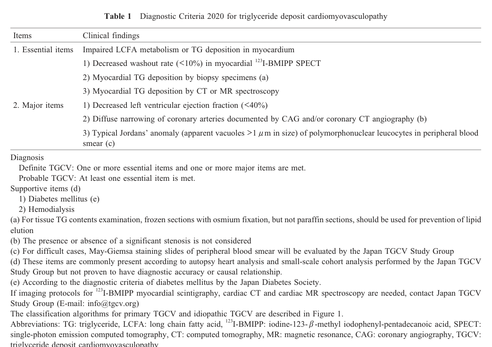

## Question

# Disease Characteristics Research Template

## Target Disease
- **Disease Name:** Primary Triglyceride Deposit Cardiomyovasculopathy
- **MONDO ID:**  (if available)
- **Category:** Mendelian

## Research Objectives

Please provide a comprehensive research report on **Primary Triglyceride Deposit Cardiomyovasculopathy** covering all of the
disease characteristics listed below. This report will be used to populate a disease knowledge
base entry. Be thorough and cite primary literature (PMID preferred) for all claims.

For each section, **suggested databases/resources** are listed. These are the first places
you should search for information on each topic.

---

### 1. Disease Information
> **Search first:** OMIM, Orphanet, ICD-10/ICD-11, MeSH, PubMed

- What is the disease? Provide a concise overview.
- What are the key identifiers? (OMIM, Orphanet, ICD-10/ICD-11, MeSH, Mondo)
- What are the common synonyms and alternative names?
- Is the information derived from individual patients (e.g., EHR) or aggregated disease-level resources?

### 2. Etiology

- **Disease Causal Factors**: What are the primary causes? (genetic, environmental, infectious, mechanistic)
- **Risk Factors**:
  > **Search first:** PubMed, Cochrane Library, UpToDate, clinical guidelines, ClinVar, ClinGen, GWAS Catalog, PheGenI, CTD, CDC, WHO, epidemiological databases
  - Genetic risk factors (causal variants, susceptibility loci, modifier genes)
  - Environmental risk factors (toxins, lifestyle, occupational exposures, age, sex, family history)
- **Protective Factors**:
  > **Search first:** PubMed, Cochrane Library, clinical trial databases, GWAS Catalog, gnomAD, WHO, CDC, nutrition databases
  - Genetic protective factors (protective variants, modifier alleles)
  - Environmental protective factors (diet, lifestyle, exposures that reduce risk)
- **Gene-Environment Interactions**: How do genetic and environmental factors interact to influence disease?
  > **Search first:** CTD, PubMed, PheGenI, GxE databases

### 3. Phenotypes
> **Search first:** HPO (Human Phenotype Ontology), OMIM, Orphanet, PubMed, clinicaltrials.gov, MedDRA, SNOMED CT, DECIPHER, LOINC

For each phenotype, provide:
- **Phenotype type**: symptoms, clinical signs, physical manifestations, behavioral changes, or laboratory abnormalities
  > For symptoms/signs: HPO, OMIM, Orphanet, PubMed
  > For behavioral changes: HPO, DSM, RDoC (Research Domain Criteria), PubMed
  > For laboratory abnormalities: LOINC, SNOMED CT, LabTests Online, PubMed
- **Phenotype characteristics**:
  > **Search first:** OMIM, Orphanet, HPO, PubMed
  - Age of symptom onset (neonatal, childhood, adult-onset, late-onset)
  - Symptom severity (mild, moderate, severe, variable)
  - Symptom progression (stable, progressive, episodic, fluctuating)
  - Frequency among affected individuals (percentage or qualitative)
- **Quality of life impact**: Effects on daily functioning and well-being (per-phenotype when possible)
  > **Search first:** EQ-5D database, SF-36, WHO QOL databases, PubMed
- Suggest HPO (Human Phenotype Ontology) terms for each phenotype

### 4. Genetic/Molecular Information

- **Causal Genes**: Gene mutations or chromosomal abnormalities responsible for disease (gene symbols, OMIM IDs)
  > **Search first:** OMIM, ClinVar, HGMD, Ensembl, NCBI Gene
- **Pathogenic Variants**:
  - Affected genes (gene symbols, HGNC IDs)
    > **Search first:** OMIM, NCBI Gene, Ensembl, HGNC, UniProt, GeneCards
  - Variant classification (pathogenic, likely pathogenic, VUS per ACMG/AMP guidelines)
    > **Search first:** ClinVar, ClinGen, ACMG/AMP guidelines, VarSome
  - Variant type/class (missense, frameshift, nonsense, splice-site, structural)
  - Allele frequency in population databases
    > **Search first:** gnomAD, 1000 Genomes, ExAC, TOPMed, dbSNP
  - Somatic vs germline origin
    > **Search first:** COSMIC (somatic), ClinVar, ICGC, TCGA
  - Functional consequences (loss of function, gain of function, dominant negative)
- **Modifier Genes**: Genes that modify disease severity or expression
- **Epigenetic Information**: DNA methylation, histone modifications, chromatin changes affecting disease
  > **Search first:** ENCODE, Roadmap Epigenomics, MethBase, DiseaseMeth
- **Chromosomal Abnormalities**: Large-scale genetic changes (aneuploidy, translocations, inversions)
  > **Search first:** DECIPHER, ClinVar, ECARUCA, UCSC Genome Browser

### 5. Environmental Information

- **Environmental Factors**: Non-genetic contributing factors (toxins, radiation, pollution, occupational exposure)
  > **Search first:** CTD (Comparative Toxicogenomics Database), TOXNET, PubMed, EPA databases
- **Lifestyle Factors**: Behavioral factors (smoking, diet, exercise, alcohol consumption)
  > **Search first:** CDC databases, WHO, PubMed, NHANES
- **Infectious Agents**: If applicable, pathogens causing or triggering disease (bacteria, viruses, fungi, parasites)
  > **Search first:** NCBI Taxonomy, ViPR, BV-BRC, MicrobeDB, GIDEON

### 6. Mechanism / Pathophysiology

- **Molecular Pathways**: Specific signaling cascades or biochemical pathways involved (Wnt, MAPK, mTOR, PI3K-AKT, etc.)
  > **Search first:** KEGG, Reactome, WikiPathways, PathBank, BioCyc
- **Cellular Processes**: Cell-level mechanisms (apoptosis, autophagy, cell cycle dysregulation, inflammation, etc.)
  > **Search first:** Gene Ontology (GO), Reactome, KEGG, PubMed
- **Protein Dysfunction**: How protein structure or function is altered (misfolding, aggregation, loss of function, gain of function)
  > **Search first:** UniProt, PDB (Protein Data Bank), InterPro, Pfam, AlphaFold
- **Metabolic Changes**: Alterations in metabolic processes (energy metabolism, lipid metabolism, amino acid metabolism)
  > **Search first:** KEGG, BioCyc, HMDB (Human Metabolome Database), BRENDA
- **Immune System Involvement**: Role of immune response (autoimmunity, immunodeficiency, chronic inflammation)
  > **Search first:** ImmPort, Immunome Database, IEDB, Gene Ontology
- **Tissue Damage Mechanisms**: How tissues/ are injured (oxidative stress, ischemia, fibrosis, necrosis)
  > **Search first:** PubMed, Gene Ontology, Reactome
- **Biochemical Abnormalities**: Specific molecular defects (enzyme deficiencies, receptor dysfunction, ion channel defects)
  > **Search first:** BRENDA, UniProt, KEGG, OMIM, PubMed
- **Epigenetic Changes**: DNA methylation, histone modifications affecting gene expression in disease
  > **Search first:** ENCODE, Roadmap Epigenomics, MethBase, DiseaseMeth
- **Molecular Profiling** (if available):
  - Transcriptomics/gene expression changes
    > **Search first:** GEO (Gene Expression Omnibus), ArrayExpress, GTEx, Human Cell Atlas, SRA
  - Proteomics findings
    > **Search first:** PRIDE, ProteomeXchange, Human Protein Atlas, STRING, BioGRID
  - Metabolomics signatures
    > **Search first:** MetaboLights, Metabolomics Workbench, HMDB, METLIN
  - Lipidomics alterations
    > **Search first:** LIPID MAPS, SwissLipids, LipidHome, Metabolomics Workbench
  - Genomic structural features
    > **Search first:** UCSC Genome Browser, Ensembl, NCBI, dbVar, DGV
- **Advanced Technologies** (if applicable):
  - Single-cell analysis findings (cell-type specific mechanisms, cellular heterogeneity)
    > **Search first:** Human Cell Atlas, Single Cell Portal, GEO, CELLxGENE
  - Spatial transcriptomics findings
    > **Search first:** GEO, Spatial Research, Vizgen, 10x Genomics data
  - Multi-omics integration results
    > **Search first:** TCGA, ICGC, cBioPortal, LinkedOmics, PubMed
  - Functional genomics screens (CRISPR, RNAi)
    > **Search first:** DepMap, GenomeRNAi, PubMed, BioGRID ORCS

For each mechanism, describe:
- The causal chain from initial trigger to clinical manifestation
- Which mechanisms are upstream vs downstream
- What cell types and biological processes are involved
- Suggest GO terms for biological processes and CL terms for cell types

### 7. Anatomical Structures Affected

- **Organ Level**:
  - Primary organs directly affected
  - Secondary organ involvement (complications, secondary effects)
  - Body systems involved (cardiovascular, nervous, digestive, respiratory, endocrine, etc.)
  > **Search first:** Uberon, FMA (Foundational Model of Anatomy), OMIM, HPO, ICD-11, MeSH, SNOMED CT
- **Tissue and Cell Level**:
  - Specific tissue types affected (epithelial, connective, muscle, nervous)
  - Specific cell populations targeted (with Cell Ontology terms)
  > **Search first:** Uberon, Human Protein Atlas, Cell Ontology, Human Cell Atlas, CellMarker, PanglaoDB
- **Subcellular Level**:
  - Cellular compartments involved (mitochondria, nucleus, ER, lysosomes) (with GO Cellular Component terms)
  > **Search first:** Gene Ontology (Cellular Component), UniProt, Human Protein Atlas
- **Localization**:
  - Specific anatomical sites (with UBERON terms)
    > **Search first:** FMA, Uberon, NeuroNames (for brain), SNOMED CT
  - Lateralization (unilateral, bilateral, asymmetric)
    > **Search first:** HPO, clinical literature, imaging databases

### 8. Temporal Development

- **Onset**:
  - Typical age of onset (congenital, pediatric, adult, geriatric)
  - Onset pattern (acute, subacute, chronic, insidious)
  > **Search first:** OMIM, Orphanet, HPO, PubMed
- **Progression**:
  - Disease stages (early, intermediate, advanced, end-stage)
    > **Search first:** Cancer Staging Manual (AJCC), WHO classifications, PubMed
  - Progression rate (rapid, slow, variable)
  - Disease course pattern (episodic, relapsing-remitting, progressive, stable)
  - Disease duration (self-limited, chronic lifelong)
  > **Search first:** Disease registries, longitudinal cohort databases, natural history studies, PubMed, Orphanet, OMIM
- **Patterns**:
  - Remission patterns (spontaneous, treatment-induced)
    > **Search first:** Clinical trial databases, disease registries, PubMed
  - Critical periods (time windows of vulnerability or opportunity for intervention)
    > **Search first:** PubMed, developmental biology databases, clinical guidelines

### 9. Inheritance and Population

- **Epidemiology**:
  - Prevalence (cases per 100,000 at given time)
  - Incidence (new cases per 100,000 per year)
  > **Search first:** Orphanet, CDC, WHO, GBD (Global Burden of Disease), national registries, SEER, disease registries
- **For Genetic Etiology**:
  - Inheritance pattern (AD, AR, X-linked, mitochondrial, multifactorial, polygenic)
    > **Search first:** OMIM, Orphanet, ClinVar, GTR (Genetic Testing Registry)
  - Penetrance (complete, incomplete, age-dependent)
    > **Search first:** ClinVar, OMIM, PubMed, ClinGen
  - Expressivity (variable, consistent)
    > **Search first:** OMIM, ClinVar, PubMed
  - Genetic anticipation (increasing severity in successive generations)
    > **Search first:** OMIM, PubMed (especially for repeat expansion disorders)
  - Germline mosaicism
    > **Search first:** ClinVar, OMIM, genetic counseling literature, PubMed
  - Founder effects (population-specific mutations)
    > **Search first:** gnomAD, population genetics databases, PubMed
  - Consanguinity role
    > **Search first:** OMIM, population studies, genetic counseling resources
  - Carrier frequency
    > **Search first:** gnomAD, carrier screening databases, GeneReviews, GTR
- **Population Demographics**:
  - Affected populations (ethnic or demographic groups with higher prevalence)
    > **Search first:** gnomAD, 1000 Genomes, PAGE Study, PubMed, population registries
  - Geographic distribution (endemic areas, regional variation)
    > **Search first:** WHO, CDC, GBD, Orphanet, geographic epidemiology databases
  - Geographic distribution of specific variants
  - Sex ratio (male:female)
    > **Search first:** Disease registries, OMIM, PubMed, epidemiological databases
  - Age distribution of affected individuals
    > **Search first:** CDC, disease registries, SEER, Orphanet

### 10. Diagnostics

- **Clinical Tests**:
  - Laboratory tests (blood, urine, tissue chemistry, specific enzyme assays)
    > **Search first:** LOINC, LabTests Online, PubMed
  - Biomarkers (proteins, metabolites, genetic markers, circulating biomarkers)
    > **Search first:** FDA Biomarker List, BEST (Biomarkers, EndpointS, and other Tools), PubMed
  - Imaging studies (X-ray, CT, MRI, PET, ultrasound)
    > **Search first:** RadLex, DICOM, Radiopaedia, imaging databases
  - Functional tests (pulmonary function, cardiac stress tests)
    > **Search first:** LOINC, clinical guidelines, PubMed
  - Electrophysiology (EEG, EMG, ECG, nerve conduction studies)
    > **Search first:** LOINC, clinical neurophysiology databases, PubMed
  - Biopsy findings (histopathology, immunohistochemistry)
    > **Search first:** SNOMED CT, College of American Pathologists resources, PubMed
  - Pathology findings (microscopic examination)
    > **Search first:** SNOMED CT, Digital Pathology databases, PubMed
- **Genetic Testing**:
  > **Search first:** GTR (Genetic Testing Registry), GeneReviews, ClinGen
  - Overview of recommended genetic testing approach
  - Whole genome sequencing (WGS) utility
    > **Search first:** GTR, ClinVar, GEL (Genomics England), gnomAD
  - Whole exome sequencing (WES) utility
    > **Search first:** GTR, ClinVar, OMIM, GeneMatcher
  - Gene panels (which panels, which genes)
    > **Search first:** GTR, ClinVar, laboratory-specific databases
  - Single gene testing
    > **Search first:** GTR, ClinVar, OMIM, GeneReviews
  - Chromosomal microarray (CMA)
    > **Search first:** DECIPHER, ClinVar, dbVar, ECARUCA
  - Karyotyping
    > **Search first:** Chromosome Abnormality Database, ClinVar, cytogenetics resources
  - FISH
    > **Search first:** ClinVar, cytogenetics databases, PubMed
  - Mitochondrial DNA testing
    > **Search first:** MITOMAP, MSeqDR, ClinVar, GTR
  - Repeat expansion testing
    > **Search first:** GTR, ClinVar, repeat expansion databases, PubMed
- **Omics-Based Diagnostics** (if applicable):
  - RNA sequencing / transcriptomics
    > **Search first:** GEO, ArrayExpress, GTEx, RNA-seq databases
  - Proteomics
    > **Search first:** PRIDE, ProteomeXchange, FDA Biomarker database
  - Metabolomics
    > **Search first:** MetaboLights, Metabolomics Workbench, HMDB
  - Epigenomics
    > **Search first:** GEO, ENCODE, Roadmap Epigenomics, MethBase
  - Liquid biopsy
    > **Search first:** COSMIC, ClinVar, liquid biopsy databases, PubMed
- **Clinical Criteria**:
  - Standardized diagnostic criteria (DSM, ICD, society guidelines)
    > **Search first:** DSM-5, ICD-11, clinical society guidelines, UpToDate
  - Differential diagnosis (other conditions to rule out, with distinguishing features)
    > **Search first:** DynaMed, UpToDate, clinical decision support systems
- **Screening**:
  - Screening methods for asymptomatic individuals (newborn screening, carrier screening, cascade screening)
    > **Search first:** ACMG recommendations, CDC newborn screening, GTR

### 11. Outcome/Prognosis

- **Survival and Mortality**:
  - Survival rate (5-year, 10-year, overall)
    > **Search first:** SEER, cancer registries, disease-specific registries, PubMed
  - Life expectancy (with and without treatment if applicable)
    > **Search first:** Orphanet, disease registries, actuarial databases, PubMed
  - Mortality rate
    > **Search first:** CDC, WHO, GBD, national mortality databases
  - Disease-specific mortality (deaths directly attributable to disease)
    > **Search first:** Disease registries, CDC Wonder, GBD, PubMed
- **Morbidity and Function**:
  - Morbidity (disease-related disability and health impacts)
    > **Search first:** GBD, WHO, disability databases, PubMed
  - Disability outcomes (long-term functional impairments)
    > **Search first:** ICF (International Classification of Functioning), disability registries
  - Quality of life measures (EQ-5D, SF-36, PROMIS, disease-specific tools)
    > **Search first:** EQ-5D database, SF-36, PROMIS, PubMed
- **Disease Course**:
  - Complications (secondary problems: infections, organ failure, etc.)
    > **Search first:** ICD codes, disease registries, clinical databases, PubMed
  - Recovery potential (likelihood and extent of recovery, with vs without treatment)
    > **Search first:** Natural history studies, rehabilitation databases, PubMed
- **Prediction**:
  - Prognostic factors (age, disease severity, biomarkers, treatment response)
    > **Search first:** Prognostic models databases, clinical calculators, PubMed
  - Prognostic biomarkers (molecular markers predicting disease course)
    > **Search first:** FDA Biomarker database, PubMed, cancer prognostic databases

### 12. Treatment

- **Pharmacotherapy**:
  - Pharmacological treatments (drug names, drug classes, mechanisms of action)
    > **Search first:** DrugBank, RxNorm, ATC classification, DailyMed, FDA databases
  - Pharmacogenomics (how genetic variants affect drug metabolism, efficacy, toxicity)
    > **Search first:** PharmGKB, CPIC (Clinical Pharmacogenetics), FDA Table of PGx Biomarkers
- **Advanced Therapeutics**:
  - Gene therapy (viral vectors, CRISPR, gene replacement, gene editing)
    > **Search first:** ClinicalTrials.gov, FDA gene therapy database, ASGCT resources
  - Cell therapy (stem cell transplant, CAR-T, cellular therapeutics)
    > **Search first:** ClinicalTrials.gov, FDA cell therapy database, FACT standards
  - RNA-based therapies (ASOs, siRNA, mRNA therapies)
    > **Search first:** ClinicalTrials.gov, FDA approvals, PubMed
  - Targeted therapies (treatments directed at specific molecular targets)
    > **Search first:** My Cancer Genome, OncoKB, ClinicalTrials.gov, FDA approvals
  - Immunotherapies (checkpoint inhibitors, monoclonal antibodies)
    > **Search first:** Cancer Immunotherapy Database, FDA approvals, ClinicalTrials.gov
- **Surgical and Interventional**:
  - Surgical interventions (types of surgery, timing, outcomes)
    > **Search first:** CPT codes, surgical registries, clinical guidelines, PubMed
- **Supportive and Rehabilitative**:
  - Supportive care (symptom management, pain control, nutrition)
    > **Search first:** Clinical guidelines, Cochrane Library, PubMed
  - Rehabilitation (physical therapy, occupational therapy, speech therapy)
    > **Search first:** Rehabilitation medicine databases, clinical guidelines, PubMed
- **Experimental**:
  - Experimental treatments in clinical trials (with NCT identifiers if available)
    > **Search first:** ClinicalTrials.gov, EU Clinical Trials Register, WHO ICTRP
- **Treatment Outcomes**:
  - Treatment response rates
    > **Search first:** Clinical trial databases, FDA reviews, systematic reviews, PubMed
  - Side effects and adverse events
    > **Search first:** FDA Adverse Event Reporting System (FAERS), MedWatch, PubMed
- **Treatment Strategy**:
  - Treatment algorithms (clinical pathways, decision trees)
    > **Search first:** Clinical practice guidelines, NCCN Guidelines, UpToDate
  - Combination therapies
    > **Search first:** ClinicalTrials.gov, treatment guidelines, PubMed
  - Personalized medicine approaches (genotype-guided treatment)
    > **Search first:** My Cancer Genome, CIViC, PharmGKB, precision medicine databases

For each treatment, suggest MAXO (Medical Action Ontology) terms where applicable.

### 13. Prevention

- **Prevention Levels**:
  - Primary prevention (preventing disease occurrence: vaccination, risk factor modification)
    > **Search first:** CDC, WHO, USPSTF recommendations, Cochrane Library
  - Secondary prevention (early detection and treatment: screening programs, early intervention)
    > **Search first:** USPSTF, CDC screening guidelines, WHO
  - Tertiary prevention (preventing complications in those with disease)
    > **Search first:** Clinical guidelines, disease management protocols, PubMed
- **Immunization**: Vaccine strategies (if applicable)
  > **Search first:** CDC vaccine schedules, WHO immunization, FDA vaccine database
- **Screening and Early Detection**:
  - Screening programs (population-based: newborn screening, cancer screening)
    > **Search first:** CDC screening programs, USPSTF, cancer screening databases
  - Genetic screening (carrier screening, preimplantation genetic diagnosis, prenatal testing)
    > **Search first:** ACMG recommendations, ACOG guidelines, GTR
  - Risk stratification (identifying high-risk individuals for targeted prevention)
    > **Search first:** Risk prediction models, clinical calculators, PubMed
- **Behavioral Interventions**: Lifestyle modifications to reduce risk
  > **Search first:** CDC, WHO, behavioral intervention databases, Cochrane Library
- **Counseling**: Genetic counseling (risk assessment, family planning guidance)
  > **Search first:** NSGC resources, ACMG guidelines, GeneReviews
- **Public Health**:
  - Public health interventions (sanitation, vector control, health education)
    > **Search first:** CDC, WHO, public health databases, PubMed
  - Environmental interventions (reducing environmental risk factors)
    > **Search first:** EPA databases, WHO environmental health, PubMed
- **Prophylaxis**: Preventive medications or procedures
  > **Search first:** Clinical guidelines, FDA approvals, PubMed

### 14. Other Species / Natural Disease

- **Taxonomy**: Species affected (with NCBI Taxon identifiers)
  > **Search first:** NCBI Taxonomy
- **Breed**: Specific breeds affected (with VBO identifiers if applicable)
  > **Search first:** VBO (Vertebrate Breed Ontology)
- **Gene**: Orthologous genes in other species (with NCBI Gene IDs)
  > **Search first:** NCBI Gene
- **Natural Disease**:
  - Naturally occurring disease in other species (companion animals, wildlife)
    > **Search first:** OMIA (Online Mendelian Inheritance in Animals), VetCompass, PubMed
  - Veterinary relevance and importance in animal health
    > **Search first:** OMIA, veterinary databases, PubMed
- **Comparative Biology**:
  - Comparative pathology (similarities and differences across species)
    > **Search first:** OMIA, comparative pathology databases, PubMed
  - Evolutionary conservation of disease mechanisms
    > **Search first:** HomoloGene, OrthoMCL, Alliance of Genome Resources
- **Transmission** (if applicable):
  - Zoonotic potential
    > **Search first:** CDC zoonotic diseases, WHO zoonoses, GIDEON
  - Cross-species susceptibility
    > **Search first:** NCBI Taxonomy, veterinary databases, PubMed

### 15. Model Organisms

- **Model Types**:
  - Model organism type (mammalian, invertebrate, cellular, in vitro)
    > **Search first:** Alliance of Genome Resources, model organism databases
  - Specific model systems (mouse, rat, zebrafish, Drosophila, C. elegans, yeast, cell lines, organoids, iPSCs)
    > **Search first:** MGI, RGD, ZFIN, FlyBase, WormBase, SGD, ATCC, Cellosaurus
  - Induced models (drug treatment, surgical intervention, environmental manipulation)
    > **Search first:** MGI, model organism databases, PubMed
- **Genetic Models**:
  - Types available (knockout, knock-in, transgenic, conditional, humanized)
    > **Search first:** MGI, IMPC, KOMP, EuMMCR, IMSR
- **Model Characteristics**:
  - Phenotype recapitulation (how well model reproduces human disease features)
    > **Search first:** Model organism databases, comparative studies, PubMed
  - Model limitations (aspects of human disease not captured)
    > **Search first:** Model organism databases, PubMed, review articles
- **Applications**:
  - Research applications (what aspects of disease can be studied)
    > **Search first:** Model organism databases, PubMed
- **Resources**:
  - Model databases
    > **Search first:** MGI, RGD, ZFIN, FlyBase, WormBase, IMSR, EMMA, MMRRC

---

## Citation Requirements

- Cite primary literature (PMID preferred) for all mechanistic and clinical claims
- Prioritize recent reviews and landmark papers
- Include direct quotes from abstracts where possible to support key statements
- Distinguish evidence source types: human clinical, model organism, in vitro, computational

## Output Format

Structure your response as a comprehensive narrative organized by the sections above.
For each section, provide:
- Factual content with specific details (numbers, percentages, gene names, variant nomenclature)
- Ontology term suggestions (HPO, GO, CL, UBERON, CHEBI, MAXO, MONDO) where applicable
- Evidence citations with PMIDs
- Direct quotes from abstracts to support key claims
- Clear indication when information is not available or not applicable for this disease

This report will be used to populate a disease knowledge base entry with:
- Pathophysiology descriptions with causal chains
- Gene/protein annotations (HGNC, GO terms)
- Phenotype associations (HP terms) with frequencies
- Cell type involvement (CL terms)
- Anatomical locations (UBERON terms)
- Chemical entities (CHEBI terms)
- Treatment annotations (MAXO terms)
- Evidence items with PMIDs and exact abstract quotes
- Epidemiology, prognosis, diagnostic, and prevention information
- Animal model descriptions with phenotype recapitulation details

## Output

Question: You are an expert researcher providing comprehensive, well-cited information.

Provide detailed information focusing on:
1. Key concepts and definitions with current understanding
2. Recent developments and latest research (prioritize 2023-2024 sources)
3. Current applications and real-world implementations
4. Expert opinions and analysis from authoritative sources
5. Relevant statistics and data from recent studies

Format as a comprehensive research report with proper citations. Include URLs and publication dates where available.
Always prioritize recent, authoritative sources and provide specific citations for all major claims.

# Disease Characteristics Research Template

## Target Disease
- **Disease Name:** Primary Triglyceride Deposit Cardiomyovasculopathy
- **MONDO ID:**  (if available)
- **Category:** Mendelian

## Research Objectives

Please provide a comprehensive research report on **Primary Triglyceride Deposit Cardiomyovasculopathy** covering all of the
disease characteristics listed below. This report will be used to populate a disease knowledge
base entry. Be thorough and cite primary literature (PMID preferred) for all claims.

For each section, **suggested databases/resources** are listed. These are the first places
you should search for information on each topic.

---

### 1. Disease Information
> **Search first:** OMIM, Orphanet, ICD-10/ICD-11, MeSH, PubMed

- What is the disease? Provide a concise overview.
- What are the key identifiers? (OMIM, Orphanet, ICD-10/ICD-11, MeSH, Mondo)
- What are the common synonyms and alternative names?
- Is the information derived from individual patients (e.g., EHR) or aggregated disease-level resources?

### 2. Etiology

- **Disease Causal Factors**: What are the primary causes? (genetic, environmental, infectious, mechanistic)
- **Risk Factors**:
  > **Search first:** PubMed, Cochrane Library, UpToDate, clinical guidelines, ClinVar, ClinGen, GWAS Catalog, PheGenI, CTD, CDC, WHO, epidemiological databases
  - Genetic risk factors (causal variants, susceptibility loci, modifier genes)
  - Environmental risk factors (toxins, lifestyle, occupational exposures, age, sex, family history)
- **Protective Factors**:
  > **Search first:** PubMed, Cochrane Library, clinical trial databases, GWAS Catalog, gnomAD, WHO, CDC, nutrition databases
  - Genetic protective factors (protective variants, modifier alleles)
  - Environmental protective factors (diet, lifestyle, exposures that reduce risk)
- **Gene-Environment Interactions**: How do genetic and environmental factors interact to influence disease?
  > **Search first:** CTD, PubMed, PheGenI, GxE databases

### 3. Phenotypes
> **Search first:** HPO (Human Phenotype Ontology), OMIM, Orphanet, PubMed, clinicaltrials.gov, MedDRA, SNOMED CT, DECIPHER, LOINC

For each phenotype, provide:
- **Phenotype type**: symptoms, clinical signs, physical manifestations, behavioral changes, or laboratory abnormalities
  > For symptoms/signs: HPO, OMIM, Orphanet, PubMed
  > For behavioral changes: HPO, DSM, RDoC (Research Domain Criteria), PubMed
  > For laboratory abnormalities: LOINC, SNOMED CT, LabTests Online, PubMed
- **Phenotype characteristics**:
  > **Search first:** OMIM, Orphanet, HPO, PubMed
  - Age of symptom onset (neonatal, childhood, adult-onset, late-onset)
  - Symptom severity (mild, moderate, severe, variable)
  - Symptom progression (stable, progressive, episodic, fluctuating)
  - Frequency among affected individuals (percentage or qualitative)
- **Quality of life impact**: Effects on daily functioning and well-being (per-phenotype when possible)
  > **Search first:** EQ-5D database, SF-36, WHO QOL databases, PubMed
- Suggest HPO (Human Phenotype Ontology) terms for each phenotype

### 4. Genetic/Molecular Information

- **Causal Genes**: Gene mutations or chromosomal abnormalities responsible for disease (gene symbols, OMIM IDs)
  > **Search first:** OMIM, ClinVar, HGMD, Ensembl, NCBI Gene
- **Pathogenic Variants**:
  - Affected genes (gene symbols, HGNC IDs)
    > **Search first:** OMIM, NCBI Gene, Ensembl, HGNC, UniProt, GeneCards
  - Variant classification (pathogenic, likely pathogenic, VUS per ACMG/AMP guidelines)
    > **Search first:** ClinVar, ClinGen, ACMG/AMP guidelines, VarSome
  - Variant type/class (missense, frameshift, nonsense, splice-site, structural)
  - Allele frequency in population databases
    > **Search first:** gnomAD, 1000 Genomes, ExAC, TOPMed, dbSNP
  - Somatic vs germline origin
    > **Search first:** COSMIC (somatic), ClinVar, ICGC, TCGA
  - Functional consequences (loss of function, gain of function, dominant negative)
- **Modifier Genes**: Genes that modify disease severity or expression
- **Epigenetic Information**: DNA methylation, histone modifications, chromatin changes affecting disease
  > **Search first:** ENCODE, Roadmap Epigenomics, MethBase, DiseaseMeth
- **Chromosomal Abnormalities**: Large-scale genetic changes (aneuploidy, translocations, inversions)
  > **Search first:** DECIPHER, ClinVar, ECARUCA, UCSC Genome Browser

### 5. Environmental Information

- **Environmental Factors**: Non-genetic contributing factors (toxins, radiation, pollution, occupational exposure)
  > **Search first:** CTD (Comparative Toxicogenomics Database), TOXNET, PubMed, EPA databases
- **Lifestyle Factors**: Behavioral factors (smoking, diet, exercise, alcohol consumption)
  > **Search first:** CDC databases, WHO, PubMed, NHANES
- **Infectious Agents**: If applicable, pathogens causing or triggering disease (bacteria, viruses, fungi, parasites)
  > **Search first:** NCBI Taxonomy, ViPR, BV-BRC, MicrobeDB, GIDEON

### 6. Mechanism / Pathophysiology

- **Molecular Pathways**: Specific signaling cascades or biochemical pathways involved (Wnt, MAPK, mTOR, PI3K-AKT, etc.)
  > **Search first:** KEGG, Reactome, WikiPathways, PathBank, BioCyc
- **Cellular Processes**: Cell-level mechanisms (apoptosis, autophagy, cell cycle dysregulation, inflammation, etc.)
  > **Search first:** Gene Ontology (GO), Reactome, KEGG, PubMed
- **Protein Dysfunction**: How protein structure or function is altered (misfolding, aggregation, loss of function, gain of function)
  > **Search first:** UniProt, PDB (Protein Data Bank), InterPro, Pfam, AlphaFold
- **Metabolic Changes**: Alterations in metabolic processes (energy metabolism, lipid metabolism, amino acid metabolism)
  > **Search first:** KEGG, BioCyc, HMDB (Human Metabolome Database), BRENDA
- **Immune System Involvement**: Role of immune response (autoimmunity, immunodeficiency, chronic inflammation)
  > **Search first:** ImmPort, Immunome Database, IEDB, Gene Ontology
- **Tissue Damage Mechanisms**: How tissues/ are injured (oxidative stress, ischemia, fibrosis, necrosis)
  > **Search first:** PubMed, Gene Ontology, Reactome
- **Biochemical Abnormalities**: Specific molecular defects (enzyme deficiencies, receptor dysfunction, ion channel defects)
  > **Search first:** BRENDA, UniProt, KEGG, OMIM, PubMed
- **Epigenetic Changes**: DNA methylation, histone modifications affecting gene expression in disease
  > **Search first:** ENCODE, Roadmap Epigenomics, MethBase, DiseaseMeth
- **Molecular Profiling** (if available):
  - Transcriptomics/gene expression changes
    > **Search first:** GEO (Gene Expression Omnibus), ArrayExpress, GTEx, Human Cell Atlas, SRA
  - Proteomics findings
    > **Search first:** PRIDE, ProteomeXchange, Human Protein Atlas, STRING, BioGRID
  - Metabolomics signatures
    > **Search first:** MetaboLights, Metabolomics Workbench, HMDB, METLIN
  - Lipidomics alterations
    > **Search first:** LIPID MAPS, SwissLipids, LipidHome, Metabolomics Workbench
  - Genomic structural features
    > **Search first:** UCSC Genome Browser, Ensembl, NCBI, dbVar, DGV
- **Advanced Technologies** (if applicable):
  - Single-cell analysis findings (cell-type specific mechanisms, cellular heterogeneity)
    > **Search first:** Human Cell Atlas, Single Cell Portal, GEO, CELLxGENE
  - Spatial transcriptomics findings
    > **Search first:** GEO, Spatial Research, Vizgen, 10x Genomics data
  - Multi-omics integration results
    > **Search first:** TCGA, ICGC, cBioPortal, LinkedOmics, PubMed
  - Functional genomics screens (CRISPR, RNAi)
    > **Search first:** DepMap, GenomeRNAi, PubMed, BioGRID ORCS

For each mechanism, describe:
- The causal chain from initial trigger to clinical manifestation
- Which mechanisms are upstream vs downstream
- What cell types and biological processes are involved
- Suggest GO terms for biological processes and CL terms for cell types

### 7. Anatomical Structures Affected

- **Organ Level**:
  - Primary organs directly affected
  - Secondary organ involvement (complications, secondary effects)
  - Body systems involved (cardiovascular, nervous, digestive, respiratory, endocrine, etc.)
  > **Search first:** Uberon, FMA (Foundational Model of Anatomy), OMIM, HPO, ICD-11, MeSH, SNOMED CT
- **Tissue and Cell Level**:
  - Specific tissue types affected (epithelial, connective, muscle, nervous)
  - Specific cell populations targeted (with Cell Ontology terms)
  > **Search first:** Uberon, Human Protein Atlas, Cell Ontology, Human Cell Atlas, CellMarker, PanglaoDB
- **Subcellular Level**:
  - Cellular compartments involved (mitochondria, nucleus, ER, lysosomes) (with GO Cellular Component terms)
  > **Search first:** Gene Ontology (Cellular Component), UniProt, Human Protein Atlas
- **Localization**:
  - Specific anatomical sites (with UBERON terms)
    > **Search first:** FMA, Uberon, NeuroNames (for brain), SNOMED CT
  - Lateralization (unilateral, bilateral, asymmetric)
    > **Search first:** HPO, clinical literature, imaging databases

### 8. Temporal Development

- **Onset**:
  - Typical age of onset (congenital, pediatric, adult, geriatric)
  - Onset pattern (acute, subacute, chronic, insidious)
  > **Search first:** OMIM, Orphanet, HPO, PubMed
- **Progression**:
  - Disease stages (early, intermediate, advanced, end-stage)
    > **Search first:** Cancer Staging Manual (AJCC), WHO classifications, PubMed
  - Progression rate (rapid, slow, variable)
  - Disease course pattern (episodic, relapsing-remitting, progressive, stable)
  - Disease duration (self-limited, chronic lifelong)
  > **Search first:** Disease registries, longitudinal cohort databases, natural history studies, PubMed, Orphanet, OMIM
- **Patterns**:
  - Remission patterns (spontaneous, treatment-induced)
    > **Search first:** Clinical trial databases, disease registries, PubMed
  - Critical periods (time windows of vulnerability or opportunity for intervention)
    > **Search first:** PubMed, developmental biology databases, clinical guidelines

### 9. Inheritance and Population

- **Epidemiology**:
  - Prevalence (cases per 100,000 at given time)
  - Incidence (new cases per 100,000 per year)
  > **Search first:** Orphanet, CDC, WHO, GBD (Global Burden of Disease), national registries, SEER, disease registries
- **For Genetic Etiology**:
  - Inheritance pattern (AD, AR, X-linked, mitochondrial, multifactorial, polygenic)
    > **Search first:** OMIM, Orphanet, ClinVar, GTR (Genetic Testing Registry)
  - Penetrance (complete, incomplete, age-dependent)
    > **Search first:** ClinVar, OMIM, PubMed, ClinGen
  - Expressivity (variable, consistent)
    > **Search first:** OMIM, ClinVar, PubMed
  - Genetic anticipation (increasing severity in successive generations)
    > **Search first:** OMIM, PubMed (especially for repeat expansion disorders)
  - Germline mosaicism
    > **Search first:** ClinVar, OMIM, genetic counseling literature, PubMed
  - Founder effects (population-specific mutations)
    > **Search first:** gnomAD, population genetics databases, PubMed
  - Consanguinity role
    > **Search first:** OMIM, population studies, genetic counseling resources
  - Carrier frequency
    > **Search first:** gnomAD, carrier screening databases, GeneReviews, GTR
- **Population Demographics**:
  - Affected populations (ethnic or demographic groups with higher prevalence)
    > **Search first:** gnomAD, 1000 Genomes, PAGE Study, PubMed, population registries
  - Geographic distribution (endemic areas, regional variation)
    > **Search first:** WHO, CDC, GBD, Orphanet, geographic epidemiology databases
  - Geographic distribution of specific variants
  - Sex ratio (male:female)
    > **Search first:** Disease registries, OMIM, PubMed, epidemiological databases
  - Age distribution of affected individuals
    > **Search first:** CDC, disease registries, SEER, Orphanet

### 10. Diagnostics

- **Clinical Tests**:
  - Laboratory tests (blood, urine, tissue chemistry, specific enzyme assays)
    > **Search first:** LOINC, LabTests Online, PubMed
  - Biomarkers (proteins, metabolites, genetic markers, circulating biomarkers)
    > **Search first:** FDA Biomarker List, BEST (Biomarkers, EndpointS, and other Tools), PubMed
  - Imaging studies (X-ray, CT, MRI, PET, ultrasound)
    > **Search first:** RadLex, DICOM, Radiopaedia, imaging databases
  - Functional tests (pulmonary function, cardiac stress tests)
    > **Search first:** LOINC, clinical guidelines, PubMed
  - Electrophysiology (EEG, EMG, ECG, nerve conduction studies)
    > **Search first:** LOINC, clinical neurophysiology databases, PubMed
  - Biopsy findings (histopathology, immunohistochemistry)
    > **Search first:** SNOMED CT, College of American Pathologists resources, PubMed
  - Pathology findings (microscopic examination)
    > **Search first:** SNOMED CT, Digital Pathology databases, PubMed
- **Genetic Testing**:
  > **Search first:** GTR (Genetic Testing Registry), GeneReviews, ClinGen
  - Overview of recommended genetic testing approach
  - Whole genome sequencing (WGS) utility
    > **Search first:** GTR, ClinVar, GEL (Genomics England), gnomAD
  - Whole exome sequencing (WES) utility
    > **Search first:** GTR, ClinVar, OMIM, GeneMatcher
  - Gene panels (which panels, which genes)
    > **Search first:** GTR, ClinVar, laboratory-specific databases
  - Single gene testing
    > **Search first:** GTR, ClinVar, OMIM, GeneReviews
  - Chromosomal microarray (CMA)
    > **Search first:** DECIPHER, ClinVar, dbVar, ECARUCA
  - Karyotyping
    > **Search first:** Chromosome Abnormality Database, ClinVar, cytogenetics resources
  - FISH
    > **Search first:** ClinVar, cytogenetics databases, PubMed
  - Mitochondrial DNA testing
    > **Search first:** MITOMAP, MSeqDR, ClinVar, GTR
  - Repeat expansion testing
    > **Search first:** GTR, ClinVar, repeat expansion databases, PubMed
- **Omics-Based Diagnostics** (if applicable):
  - RNA sequencing / transcriptomics
    > **Search first:** GEO, ArrayExpress, GTEx, RNA-seq databases
  - Proteomics
    > **Search first:** PRIDE, ProteomeXchange, FDA Biomarker database
  - Metabolomics
    > **Search first:** MetaboLights, Metabolomics Workbench, HMDB
  - Epigenomics
    > **Search first:** GEO, ENCODE, Roadmap Epigenomics, MethBase
  - Liquid biopsy
    > **Search first:** COSMIC, ClinVar, liquid biopsy databases, PubMed
- **Clinical Criteria**:
  - Standardized diagnostic criteria (DSM, ICD, society guidelines)
    > **Search first:** DSM-5, ICD-11, clinical society guidelines, UpToDate
  - Differential diagnosis (other conditions to rule out, with distinguishing features)
    > **Search first:** DynaMed, UpToDate, clinical decision support systems
- **Screening**:
  - Screening methods for asymptomatic individuals (newborn screening, carrier screening, cascade screening)
    > **Search first:** ACMG recommendations, CDC newborn screening, GTR

### 11. Outcome/Prognosis

- **Survival and Mortality**:
  - Survival rate (5-year, 10-year, overall)
    > **Search first:** SEER, cancer registries, disease-specific registries, PubMed
  - Life expectancy (with and without treatment if applicable)
    > **Search first:** Orphanet, disease registries, actuarial databases, PubMed
  - Mortality rate
    > **Search first:** CDC, WHO, GBD, national mortality databases
  - Disease-specific mortality (deaths directly attributable to disease)
    > **Search first:** Disease registries, CDC Wonder, GBD, PubMed
- **Morbidity and Function**:
  - Morbidity (disease-related disability and health impacts)
    > **Search first:** GBD, WHO, disability databases, PubMed
  - Disability outcomes (long-term functional impairments)
    > **Search first:** ICF (International Classification of Functioning), disability registries
  - Quality of life measures (EQ-5D, SF-36, PROMIS, disease-specific tools)
    > **Search first:** EQ-5D database, SF-36, PROMIS, PubMed
- **Disease Course**:
  - Complications (secondary problems: infections, organ failure, etc.)
    > **Search first:** ICD codes, disease registries, clinical databases, PubMed
  - Recovery potential (likelihood and extent of recovery, with vs without treatment)
    > **Search first:** Natural history studies, rehabilitation databases, PubMed
- **Prediction**:
  - Prognostic factors (age, disease severity, biomarkers, treatment response)
    > **Search first:** Prognostic models databases, clinical calculators, PubMed
  - Prognostic biomarkers (molecular markers predicting disease course)
    > **Search first:** FDA Biomarker database, PubMed, cancer prognostic databases

### 12. Treatment

- **Pharmacotherapy**:
  - Pharmacological treatments (drug names, drug classes, mechanisms of action)
    > **Search first:** DrugBank, RxNorm, ATC classification, DailyMed, FDA databases
  - Pharmacogenomics (how genetic variants affect drug metabolism, efficacy, toxicity)
    > **Search first:** PharmGKB, CPIC (Clinical Pharmacogenetics), FDA Table of PGx Biomarkers
- **Advanced Therapeutics**:
  - Gene therapy (viral vectors, CRISPR, gene replacement, gene editing)
    > **Search first:** ClinicalTrials.gov, FDA gene therapy database, ASGCT resources
  - Cell therapy (stem cell transplant, CAR-T, cellular therapeutics)
    > **Search first:** ClinicalTrials.gov, FDA cell therapy database, FACT standards
  - RNA-based therapies (ASOs, siRNA, mRNA therapies)
    > **Search first:** ClinicalTrials.gov, FDA approvals, PubMed
  - Targeted therapies (treatments directed at specific molecular targets)
    > **Search first:** My Cancer Genome, OncoKB, ClinicalTrials.gov, FDA approvals
  - Immunotherapies (checkpoint inhibitors, monoclonal antibodies)
    > **Search first:** Cancer Immunotherapy Database, FDA approvals, ClinicalTrials.gov
- **Surgical and Interventional**:
  - Surgical interventions (types of surgery, timing, outcomes)
    > **Search first:** CPT codes, surgical registries, clinical guidelines, PubMed
- **Supportive and Rehabilitative**:
  - Supportive care (symptom management, pain control, nutrition)
    > **Search first:** Clinical guidelines, Cochrane Library, PubMed
  - Rehabilitation (physical therapy, occupational therapy, speech therapy)
    > **Search first:** Rehabilitation medicine databases, clinical guidelines, PubMed
- **Experimental**:
  - Experimental treatments in clinical trials (with NCT identifiers if available)
    > **Search first:** ClinicalTrials.gov, EU Clinical Trials Register, WHO ICTRP
- **Treatment Outcomes**:
  - Treatment response rates
    > **Search first:** Clinical trial databases, FDA reviews, systematic reviews, PubMed
  - Side effects and adverse events
    > **Search first:** FDA Adverse Event Reporting System (FAERS), MedWatch, PubMed
- **Treatment Strategy**:
  - Treatment algorithms (clinical pathways, decision trees)
    > **Search first:** Clinical practice guidelines, NCCN Guidelines, UpToDate
  - Combination therapies
    > **Search first:** ClinicalTrials.gov, treatment guidelines, PubMed
  - Personalized medicine approaches (genotype-guided treatment)
    > **Search first:** My Cancer Genome, CIViC, PharmGKB, precision medicine databases

For each treatment, suggest MAXO (Medical Action Ontology) terms where applicable.

### 13. Prevention

- **Prevention Levels**:
  - Primary prevention (preventing disease occurrence: vaccination, risk factor modification)
    > **Search first:** CDC, WHO, USPSTF recommendations, Cochrane Library
  - Secondary prevention (early detection and treatment: screening programs, early intervention)
    > **Search first:** USPSTF, CDC screening guidelines, WHO
  - Tertiary prevention (preventing complications in those with disease)
    > **Search first:** Clinical guidelines, disease management protocols, PubMed
- **Immunization**: Vaccine strategies (if applicable)
  > **Search first:** CDC vaccine schedules, WHO immunization, FDA vaccine database
- **Screening and Early Detection**:
  - Screening programs (population-based: newborn screening, cancer screening)
    > **Search first:** CDC screening programs, USPSTF, cancer screening databases
  - Genetic screening (carrier screening, preimplantation genetic diagnosis, prenatal testing)
    > **Search first:** ACMG recommendations, ACOG guidelines, GTR
  - Risk stratification (identifying high-risk individuals for targeted prevention)
    > **Search first:** Risk prediction models, clinical calculators, PubMed
- **Behavioral Interventions**: Lifestyle modifications to reduce risk
  > **Search first:** CDC, WHO, behavioral intervention databases, Cochrane Library
- **Counseling**: Genetic counseling (risk assessment, family planning guidance)
  > **Search first:** NSGC resources, ACMG guidelines, GeneReviews
- **Public Health**:
  - Public health interventions (sanitation, vector control, health education)
    > **Search first:** CDC, WHO, public health databases, PubMed
  - Environmental interventions (reducing environmental risk factors)
    > **Search first:** EPA databases, WHO environmental health, PubMed
- **Prophylaxis**: Preventive medications or procedures
  > **Search first:** Clinical guidelines, FDA approvals, PubMed

### 14. Other Species / Natural Disease

- **Taxonomy**: Species affected (with NCBI Taxon identifiers)
  > **Search first:** NCBI Taxonomy
- **Breed**: Specific breeds affected (with VBO identifiers if applicable)
  > **Search first:** VBO (Vertebrate Breed Ontology)
- **Gene**: Orthologous genes in other species (with NCBI Gene IDs)
  > **Search first:** NCBI Gene
- **Natural Disease**:
  - Naturally occurring disease in other species (companion animals, wildlife)
    > **Search first:** OMIA (Online Mendelian Inheritance in Animals), VetCompass, PubMed
  - Veterinary relevance and importance in animal health
    > **Search first:** OMIA, veterinary databases, PubMed
- **Comparative Biology**:
  - Comparative pathology (similarities and differences across species)
    > **Search first:** OMIA, comparative pathology databases, PubMed
  - Evolutionary conservation of disease mechanisms
    > **Search first:** HomoloGene, OrthoMCL, Alliance of Genome Resources
- **Transmission** (if applicable):
  - Zoonotic potential
    > **Search first:** CDC zoonotic diseases, WHO zoonoses, GIDEON
  - Cross-species susceptibility
    > **Search first:** NCBI Taxonomy, veterinary databases, PubMed

### 15. Model Organisms

- **Model Types**:
  - Model organism type (mammalian, invertebrate, cellular, in vitro)
    > **Search first:** Alliance of Genome Resources, model organism databases
  - Specific model systems (mouse, rat, zebrafish, Drosophila, C. elegans, yeast, cell lines, organoids, iPSCs)
    > **Search first:** MGI, RGD, ZFIN, FlyBase, WormBase, SGD, ATCC, Cellosaurus
  - Induced models (drug treatment, surgical intervention, environmental manipulation)
    > **Search first:** MGI, model organism databases, PubMed
- **Genetic Models**:
  - Types available (knockout, knock-in, transgenic, conditional, humanized)
    > **Search first:** MGI, IMPC, KOMP, EuMMCR, IMSR
- **Model Characteristics**:
  - Phenotype recapitulation (how well model reproduces human disease features)
    > **Search first:** Model organism databases, comparative studies, PubMed
  - Model limitations (aspects of human disease not captured)
    > **Search first:** Model organism databases, PubMed, review articles
- **Applications**:
  - Research applications (what aspects of disease can be studied)
    > **Search first:** Model organism databases, PubMed
- **Resources**:
  - Model databases
    > **Search first:** MGI, RGD, ZFIN, FlyBase, WormBase, IMSR, EMMA, MMRRC

---

## Citation Requirements

- Cite primary literature (PMID preferred) for all mechanistic and clinical claims
- Prioritize recent reviews and landmark papers
- Include direct quotes from abstracts where possible to support key statements
- Distinguish evidence source types: human clinical, model organism, in vitro, computational

## Output Format

Structure your response as a comprehensive narrative organized by the sections above.
For each section, provide:
- Factual content with specific details (numbers, percentages, gene names, variant nomenclature)
- Ontology term suggestions (HPO, GO, CL, UBERON, CHEBI, MAXO, MONDO) where applicable
- Evidence citations with PMIDs
- Direct quotes from abstracts to support key claims
- Clear indication when information is not available or not applicable for this disease

This report will be used to populate a disease knowledge base entry with:
- Pathophysiology descriptions with causal chains
- Gene/protein annotations (HGNC, GO terms)
- Phenotype associations (HP terms) with frequencies
- Cell type involvement (CL terms)
- Anatomical locations (UBERON terms)
- Chemical entities (CHEBI terms)
- Treatment annotations (MAXO terms)
- Evidence items with PMIDs and exact abstract quotes
- Epidemiology, prognosis, diagnostic, and prevention information
- Animal model descriptions with phenotype recapitulation details

# Primary Triglyceride Deposit Cardiomyovasculopathy (Primary TGCV) — Disease Characteristics Research Report

## Executive summary
Primary triglyceride deposit cardiomyovasculopathy (primary TGCV; P‑TGCV) is the genetic, PNPLA2/adipose triglyceride lipase (ATGL)–deficiency form of triglyceride deposit cardiomyovasculopathy (TGCV). TGCV is characterized by defective intracellular triglyceride (TG) lipolysis leading to ectopic TG accumulation in cardiomyocytes and coronary artery vascular smooth muscle cells (VSMCs), with consequent severe heart failure (HF) and diffuse coronary artery disease (CAD) that is often refractory to conventional therapy. (kobayashi2020thediagnosticcriteria pages 1-2, kobayashi2020thediagnosticcriteria pages 2-4)

Recent (2023–2024) translational developments emphasize quantitative imaging of myocardial TG (e.g., proton MR spectroscopy) for treatment monitoring and continued clinical evaluation of tricaprin/trisdecanoin (CNT‑01) as a disease-specific metabolic/nutritional therapy. (aikawa20231hmrstoevaluate pages 3-4, aikawa20231hmrstoevaluate pages 1-3, yamamoto2024acutecoronarysyndrome pages 2-3)

## 1. Disease information
### Overview and current understanding
TGCV is a “newly identified disease” discovered in Japanese patients requiring cardiac transplantation in 2008; “defective intracellular lipolysis causes triglyceride (TG) accumulation in the myocardium and coronary artery vascular smooth muscle cells,” causing severe HF and CAD with poor prognosis. (kobayashi2020thediagnosticcriteria pages 1-2)

TGCV is classified into:
- **Primary TGCV**: with genetic ATGL deficiency due to **PNPLA2** mutations. (kobayashi2020thediagnosticcriteria pages 2-4, li2019triglyceridedepositcardiomyovasculopathy pages 1-2)
- **Idiopathic TGCV**: without PNPLA2 mutations but with similarly impaired myocardial lipolysis/ATGL activity. (li2019triglyceridedepositcardiomyovasculopathy pages 1-2)

### Key identifiers
- **Orphanet**: TGCV encoded as **ORPHA:565612** (as cited in the Japan TGCV Study Group diagnostic criteria paper). URL: https://www.orpha.net/consor/cgi-bin/OC_Exp.php?lng=EN&Expert=565612 (referenced in) (kobayashi2020thediagnosticcriteria pages 2-4)
- **OMIM / MONDO / ICD‑10/ICD‑11 / MeSH**: not extractable from the retrieved full-text corpus used in this run; therefore not asserted here.

### Synonyms and alternative names
- “Triglyceride deposit cardiomyovasculopathy (TGCV)” and the conceptual label “obesity of the heart” (as an early framing of the entity). (hirano2024triglyceridedepositcardiomyovasculopathy pages 2-4)

### Evidence provenance
Most available information in this run is from **aggregated disease-level resources** (diagnostic criteria, registry papers, observational registry protocols) plus **case reports** and **preclinical models**. (kobayashi2020thediagnosticcriteria pages 2-4, li2019triglyceridedepositcardiomyovasculopathy pages 1-2, aikawa20231hmrstoevaluate pages 3-4, suzuki2018tricaprinrescuesmyocardial pages 2-4)

## 2. Etiology
### Disease causal factors
- **Primary TGCV** is caused by **genetic deficiency of ATGL** (encoded by **PNPLA2**), a “rate-limiting enzyme in the intracellular hydrolysis of TG.” (kobayashi2020thediagnosticcriteria pages 1-2)
- **Mechanistic cause**: impaired intracellular TG hydrolysis leads to lipotoxicity and energy failure, driving cardiomyocyte steatosis and TG‑deposit coronary atherosclerosis. (kobayashi2020thediagnosticcriteria pages 1-2)

### Risk factors (clinical associations)
Registry- and cohort-based reports (Japan) highlight frequent comorbidities in diagnosed TGCV, including diabetes and hemodialysis. (kobayashi2020thediagnosticcriteria pages 2-4)

**Chronic kidney disease (CKD) as a prognostic risk factor (mortality):** a retrospective TGCV registry analysis reported worse survival with CKD and an age-adjusted mortality association (hazard ratio 2.33 [1.12–4.86]). (li2019triglyceridedepositcardiomyovasculopathy pages 6-7)

### Protective factors
No validated genetic or environmental protective factors were identified in the retrieved corpus.

### Gene–environment interactions
Not established for primary TGCV in the retrieved corpus.

## 3. Phenotypes
### Core phenotype spectrum (human)
From registry and clinical synthesis papers:
- Adult-onset **heart failure** and/or **coronary artery disease** with **diffuse narrowing** (concentric, multivessel). (li2019triglyceridedepositcardiomyovasculopathy pages 6-7, hirano2024triglyceridedepositcardiomyovasculopathy pages 2-4)
- **Ventricular arrhythmia** and “critical arrhythmia” in primary TGCV. (li2019triglyceridedepositcardiomyovasculopathy pages 6-7)
- Symptoms reported include chest pressure/discomfort/heaviness (often atypical), fatigue (notably during fasting/cold exposure), and high nitroglycerin requirement in some. (hirano2024triglyceridedepositcardiomyovasculopathy pages 2-4)

**Primary vs idiopathic TGCV clinical contrasts (registry):**
- **Skeletal myopathy**: present in **7/7** primary TGCV vs **0/18** idiopathic TGCV in an early registry cohort. (li2019triglyceridedepositcardiomyovasculopathy pages 6-7)
- Symptom onset is earlier in primary TGCV (mean 37.7±9.2 years) than idiopathic (55.9±12.5 years). (li2019triglyceridedepositcardiomyovasculopathy pages 6-7)

### Phenotype onset / progression
- TGCV is typically **adult onset** and may progress to intractable HF; in early primary TGCV cohorts, some patients required heart transplantation. (li2019triglyceridedepositcardiomyovasculopathy pages 6-7)

### Suggested HPO terms (non-exhaustive; ontology mapping suggestions)
(These are term suggestions for knowledge-base annotation; not all are explicitly enumerated in a single cited paper.)
- Heart failure: **HP:0001635**
- Dilated cardiomyopathy-like phenotype: **HP:0001644**
- Coronary artery disease: **HP:0001677**
- Ventricular tachycardia/arrhythmia: **HP:0004756 / HP:0001663**
- Angina pectoris / chest pain: **HP:0001681 / HP:0100749**
- Skeletal myopathy: **HP:0003198**
- Elevated creatine kinase (often relevant in PNPLA2/NLSDM spectrum): **HP:0003236** (supported conceptually by PNPLA2 cardiomyopathy literature review) (wang2024dilatedcardiomyopathycaused pages 1-2)
- Jordan’s anomaly (cytoplasmic vacuoles in granulocytes; closest mapping may require custom term or annotation via “abnormal leukocyte morphology”). The clinical definition is given in diagnostic criteria. (kobayashi2020thediagnosticcriteria pages 2-4)

## 4. Genetic / molecular information
### Causal gene(s)
- **PNPLA2 (ATGL)**: causal for **primary TGCV** (homozygous deficiency reported; “10 different homozygous PNPLA2 mutations” noted in Japan’s primary TGCV cases). (hirano2024triglyceridedepositcardiomyovasculopathy pages 2-4)

### Pathogenic variants and variant types (examples)
The TGCV-focused clinical review did not list explicit HGVS variants, but recent PNPLA2 cardiomyopathy literature (broader NLSDM/ATGL-deficiency spectrum) provides concrete examples:
- **NM_020376.4(PNPLA2):c.757+1G>T**, homozygous splice-site variant reported in two males with severe dilated cardiomyopathy and mild skeletal involvement; paper supports autosomal recessive inheritance by heterozygous asymptomatic relatives. (wang2024dilatedcardiomyopathycaused pages 2-4)

**Variant interpretation frameworks:** The retrieved corpus did not include ClinVar/ACMG tables; variant classification should therefore be verified in ClinVar/ClinGen in downstream curation.

### Modifier genes / epigenetics / chromosomal abnormalities
Not established for primary TGCV in the retrieved corpus.

## 5. Environmental information
Primary TGCV is Mendelian; no specific non-genetic causes were identified in the retrieved corpus. The diagnostic criteria note diabetes/hemodialysis as supportive features, but their causal contribution is “unknown.” (kobayashi2020thediagnosticcriteria pages 1-2)

## 6. Mechanism / pathophysiology
### Causal chain (gene → cell → organ → phenotype)
A mechanistic model consistent across registry and diagnostic criteria texts is:
1) **PNPLA2/ATGL deficiency** → 2) **impaired intracellular TG hydrolysis** → 3) failure to mobilize long-chain fatty acids (LCFAs) from the cellular TG pool for mitochondrial β‑oxidation → 4) **energy failure and lipotoxicity** with massive TG accumulation → 5) **cardiomyocyte steatosis/fibrosis** and **TG‑deposit coronary atherosclerosis** → 6) HF, arrhythmia, diffuse CAD. (kobayashi2020thediagnosticcriteria pages 1-2, li2019triglyceridedepositcardiomyovasculopathy pages 2-4)

A distinct vascular pathology is emphasized: TGCV coronary lesions can “exclusively accumulated TG, but not cholesterol,” with TG‑laden foam cells distributed across vessel layers. (hirano2024triglyceridedepositcardiomyovasculopathy pages 2-4)

### Suggested GO biological process terms (annotation suggestions)
- Triglyceride catabolic process: **GO:0019433**
- Lipid droplet organization: **GO:0034389**
- Fatty acid beta-oxidation: **GO:0006635**
- Mitochondrial ATP synthesis coupled electron transport: **GO:0042775**
- Inflammatory response (vascular): **GO:0006954** (supported conceptually by pro-inflammatory vascular phenotypes in TGCV pathophysiology discussion) (li2019triglyceridedepositcardiomyovasculopathy pages 2-4)

### Suggested Cell Ontology (CL) cell types (annotation suggestions)
- Cardiac muscle cell / cardiomyocyte: **CL:0000746**
- Vascular smooth muscle cell: **CL:0000192**
- Neutrophil (polymorphonuclear leukocyte; Jordan’s anomaly context): **CL:0000775** (kobayashi2020thediagnosticcriteria pages 2-4)

## 7. Anatomical structures affected
### Organ / system level (with UBERON suggestions)
- Heart / myocardium (**UBERON:0000948** / **UBERON:0002349**) (kobayashi2020thediagnosticcriteria pages 1-2)
- Epicardial coronary arteries (**UBERON:0001621**) (kobayashi2020thediagnosticcriteria pages 1-2)
- Vasculature (systemic arteries with TG deposition reported in registry case material) (li2019triglyceridedepositcardiomyovasculopathy pages 2-4)

### Subcellular localization (GO cellular component suggestions)
- Lipid droplet: **GO:0005811**
- Mitochondrion: **GO:0005739**

## 8. Temporal development
- **Typical onset**: adult; registry data show earlier onset in primary TGCV than idiopathic TGCV. (li2019triglyceridedepositcardiomyovasculopathy pages 6-7)
- **Course**: progressive, often severe; early primary TGCV cases include transplant-requiring HF. (li2019triglyceridedepositcardiomyovasculopathy pages 6-7)

## 9. Inheritance and population
- **Inheritance (primary TGCV / PNPLA2 deficiency)**: autosomal recessive pattern is supported by PNPLA2 cardiomyopathy case reports with heterozygous asymptomatic family members. (wang2024dilatedcardiomyopathycaused pages 2-4)
- **Population**: most systematic epidemiology and clinical implementation work is Japan-centric (registry, diagnostic criteria, imaging availability). (hirano2024triglyceridedepositcardiomyovasculopathy pages 2-4)

## 10. Diagnostics
### Diagnostic criteria (Japan TGCV Study Group, 2020)
The Diagnostic Criteria 2020 define:
- **Essential items** include: “Decreased washout rate (<10%) in myocardial 123I‑BMIPP SPECT” or myocardial TG deposition by biopsy/CT/MR spectroscopy. (kobayashi2020thediagnosticcriteria pages 2-4, kobayashi2020thediagnosticcriteria media e5e5e74d)
- **Major items** include: LVEF <40%, diffuse coronary narrowing on angiography/CTA, and typical Jordan’s anomaly in polymorphonuclear leukocytes. (kobayashi2020thediagnosticcriteria pages 2-4, kobayashi2020thediagnosticcriteria media e5e5e74d)

**Key mechanistic imaging principle:** In TGCV, BMIPP is incorporated into BMIPP‑TG, and “the hydrolysis of BMIPP‑TG to BMIPP is impaired,” yielding reduced BMIPP washout rate (WR) as an in vivo marker of defective intracellular lipolysis. (hirano2024triglyceridedepositcardiomyovasculopathy pages 2-4)

### Pathology / laboratory biomarkers
- **Jordan’s anomaly** definition for classification into primary vs idiopathic: vacuoles >1 μm in >90% polymorphonuclear leukocytes. (kobayashi2020thediagnosticcriteria pages 2-4)
- **Peripheral leukocyte ATGL activity assay**: registry reports show profoundly reduced ATGL activity (primary and idiopathic, with primary lower). (li2019triglyceridedepositcardiomyovasculopathy pages 4-6)

### Differential diagnosis
The Diagnostic Criteria 2020 list differential diagnoses including dilated and hypertrophic cardiomyopathies, arrhythmogenic cardiomyopathy, mitochondrial cardiomyopathy, metabolic myocardial disorders (Fabry, Pompe, Danon, mitochondrial disease, CD36 deficiency, cholesteryl ester storage disease), carnitine deficiency, diabetic cardiomyopathy, and excess epicardial fat deposition. (kobayashi2020thediagnosticcriteria pages 1-2)

### Real-world diagnostic implementation (2023–2024)
- 2023 case report used **123I‑BMIPP** plus **1H‑MRS** to diagnose idiopathic TGCV and monitor CNT‑01 response. (aikawa20231hmrstoevaluate pages 1-3)
- 2024 ACS case report used **low BMIPP WR (3.1%)** plus endomyocardial biopsy to support diagnosis, with follow-up WR normalization after therapy. (yamamoto2024acutecoronarysyndrome pages 2-3)

## 11. Outcome / prognosis
### Registry-based outcomes
A 2024 clinical synthesis reports 5‑year overall survival **71.8%** and cardiovascular event-free survival **54.0%** in a retrospective TGCV registry. (hirano2024triglyceridedepositcardiomyovasculopathy pages 2-4)

### Risk stratification / prognostic factors
CKD was associated with worse survival: 5-year survival 61.8% in CKD vs 84.4% in non‑CKD, with hazard ratio 2.33 after age adjustment (registry analysis). (li2019triglyceridedepositcardiomyovasculopathy pages 6-7)

## 12. Treatment
### Disease-specific therapy: tricaprin / trisdecanoin (CNT‑01)
TGCV-specific therapy development described in 2020 criteria includes CNT‑01 (tricaprin) investigator-initiated trials and designation under Japan’s SAKIGAKE system (June 2020). (kobayashi2020thediagnosticcriteria pages 1-2)

**Direct abstract quote (2023, treatment rationale):** “The MCFAs are readily oxidized by cells, including cardiomyocytes, as a very efficient source of energy production.” (aikawa20231hmrstoevaluate pages 4-5)

#### Preclinical evidence (model organism)
In ATGL knockout mice (TGCV model), dietary tricaprin improved imaging and function:
- Myocardial CT value improved from −27.5±5.7 HU to 8.1±5.5 HU (p<0.01). (suzuki2018tricaprinrescuesmyocardial pages 2-4)
- LVEF improved from 15±9% to 30±12% (p<0.01). (suzuki2018tricaprinrescuesmyocardial pages 2-4)

#### Clinical trial evidence
- **Phase IIa randomized, double-blind exploratory trial (UMIN000035403; published 2022)**: 17 idiopathic TGCV patients, CNT‑01 1.5 g/day vs placebo for 8 weeks; delta BMIPP-WR improved in CNT‑01 vs placebo (baseline-adjusted p=0.035). URL: https://doi.org/10.17996/anc.22-00167 (miyauchi2022&lt;sup&gt;123&lt;sup&gt;ibmippscintigraphyshows pages 1-2)

#### 2023–2024 clinical implementations
- **2023 case report (Endocrinology, Diabetes & Metabolism Case Reports; Apr 2023)**: After 8 weeks CNT‑01 1.5 g/day, BMIPP WR increased 5.1%→13.3% and myocardial TG content by 1H‑MRS decreased 8.4%→5.9%, without adverse effects. URL: https://doi.org/10.1530/edm-22-0370 (aikawa20231hmrstoevaluate pages 3-4, aikawa20231hmrstoevaluate pages 1-3)
- **2024 ACS case report (CJC Open; Sep 2024)**: Baseline BMIPP WR 3.1% (cutoff <10%); after CABG plus tricaprin, BMIPP WR improved to 21.5% with imaging evidence of regression/dilatation of diffuse coronary stenoses and extracellular volume reduction (41%→36%) at 1.5 years. URL: https://doi.org/10.1016/j.cjco.2024.06.004 (yamamoto2024acutecoronarysyndrome pages 2-3, yamamoto2024acutecoronarysyndrome pages 3-5)

### Conventional CAD/HF interventions
Registry data reflect frequent need for revascularization (PCI/CABG) and occasional transplant in severe primary TGCV. (li2019triglyceridedepositcardiomyovasculopathy pages 6-7)

### Ongoing/registered clinical trials and registries (ClinicalTrials.gov)
- **NCT02502578**: Phase I/II safety study of CNT‑01 in idiopathic TGCV (completed; small enrollment reported in the clinical-trials metadata). (kobayashi2020thediagnosticcriteria pages 2-4)
- **NCT05345223**: Completed Japan registry (retrospective cohort), enrollment 193, start 2022‑03‑31, completion 2023‑12‑31; includes pre/post tricaprin comparisons for BMIPP WR, LVEF, and cardiovascular events. URL: https://clinicaltrials.gov/study/NCT05345223 (NCT05345223 chunk 1)
- **NCT02918032**: Recruiting international registry for NLSD/TGCV and related disorders. URL: https://clinicaltrials.gov/study/NCT02918032 (NCT02918032 chunk 2)

A Japan phase IIb/III trial is referenced in the TGCV literature as **jRCT2051210177**, reported as underway (not retrievable as a full trial record in the current corpus). (yamamoto2024acutecoronarysyndrome pages 2-3)

### MAXO treatment ontology suggestions
- Nutritional therapy / dietary supplementation (tricaprin/CNT‑01): **MAXO:0000113** (nutrition therapy; generic suggestion)
- Coronary artery bypass grafting: **MAXO:0001052** (generic suggestion)
- Percutaneous coronary intervention: **MAXO:0000443** (generic suggestion)
- Heart transplantation: **MAXO:0000171** (generic suggestion)

## 13. Prevention
No disease-specific primary prevention strategies were established in the retrieved corpus. Secondary prevention is primarily **family-based genetic counseling** for PNPLA2-associated disease and surveillance for cardiac involvement once a diagnosis is established (supported by autosomal recessive inheritance evidence and high cardiac burden). (wang2024dilatedcardiomyopathycaused pages 2-4)

## 14. Other species / natural disease
No naturally occurring veterinary TGCV cases were identified in the retrieved corpus.

## 15. Model organisms
### Mouse
- **Atgl/Pnpla2 knockout mouse** recapitulates key cardiac features (myocardial lipid accumulation, reduced cardiac function) and has been used for tricaprin rescue experiments. (suzuki2018tricaprinrescuesmyocardial pages 2-4)

### Cellular models
- ATGL-deficient human cardiomyocyte models are described as showing TAG accumulation and metabolic remodeling; detailed quantitative results were not present in the retrieved excerpts. (drescherUnknownyearinvestigationonenergy pages 53-55)

## Summary table (for knowledge-base population)
The following table consolidates identifiers, genetics, key phenotypes, diagnostics, epidemiology, prognosis, and treatments with URLs and the most important quantitative values.

| Domain | Key findings for Primary TGCV | Key quantitative details | Key source (year; URL) | Citation |
|---|---|---|---|---|
| Disease / definition | Primary triglyceride deposit cardiomyovasculopathy (TGCV) is the PNPLA2/ATGL-mutation form of TGCV, a rare cardiovascular lipid-storage disorder caused by defective intracellular triglyceride lipolysis with triglyceride accumulation in myocardium and coronary arteries; TGCV was encoded in Orphanet as ORPHA:565612. Synonyms/related names in sources: TGCV, triglyceride-deposit cardiomyovasculopathy, “obesity of the heart”; classified as primary TGCV (with PNPLA2 mutation) vs idiopathic TGCV (without PNPLA2 mutation). | ORPHA:565612; >200 clinically diagnosed cases in Japan by 2020. | Kobayashi et al., 2020; https://doi.org/10.17996/anc.20-00131 | (kobayashi2020thediagnosticcriteria pages 1-2, kobayashi2020thediagnosticcriteria pages 2-4) |
| Causative gene / inheritance | Causative gene for primary TGCV: PNPLA2, encoding adipose triglyceride lipase (ATGL), the rate-limiting enzyme for intracellular TG hydrolysis. Primary TGCV is associated with homozygous PNPLA2 deficiency and overlaps clinically with neutral lipid storage disease with myopathy (NLSDM; OMIM 610717), which is autosomal recessive. | 10 different homozygous PNPLA2 mutations reported in primary TGCV; only 15 primary TGCV cases identified in Japan by 2024. | Hirano et al., 2024; https://doi.org/10.7793/jcad.30.005 ; Wang et al., 2024; https://doi.org/10.3389/fgene.2024.1415156 | (hirano2024triglyceridedepositcardiomyovasculopathy pages 2-4, wang2024dilatedcardiomyopathycaused pages 1-2, wang2024dilatedcardiomyopathycaused pages 5-6) |
| Example pathogenic variant evidence | Recent PNPLA2-related cardiac disease evidence includes homozygous splice-site variant NM_020376.4:c.757+1G>T causing severe dilated cardiomyopathy with mild skeletal myopathy in NLSDM/ATGL deficiency, supporting the PNPLA2-primary TGCV disease spectrum. | Cardiac involvement reported in ~40–50% of NLSDM; review summarized 49 previously reported cardiomyopathy cases. | Wang et al., 2024; https://doi.org/10.3389/fgene.2024.1415156 | (wang2024dilatedcardiomyopathycaused pages 2-4, wang2024dilatedcardiomyopathycaused pages 1-2, wang2024dilatedcardiomyopathycaused pages 5-6) |
| Core clinical features | Primary TGCV presents with adult-onset severe heart disease: heart failure, coronary artery disease with diffuse/concentric multivessel narrowing, ventricular arrhythmia, chest pain/angina, dyspnea/palpitation; skeletal myopathy is typical in primary but absent in idiopathic TGCV. | Registry: symptom onset 37.7 ± 9.2 y (primary) vs 55.9 ± 12.5 y (idiopathic); heart failure 5/7 primary; critical arrhythmia 4/7 primary; diffuse narrowing 5/5 angiographed primary cases; skeletal myopathy 7/7 primary. | Li et al., 2019; https://doi.org/10.1186/s13023-019-1087-4 | (li2019triglyceridedepositcardiomyovasculopathy pages 4-6, li2019triglyceridedepositcardiomyovasculopathy pages 6-7) |
| Pathology / disease signature | Distinctive pathology is TG-deposit atherosclerosis rather than cholesterol-driven plaque: coronary arteries can “exclusively accumulate TG, but not cholesterol,” with TG-laden foam cells in endothelium, intima, media, and adventitia; cardiomyocyte steatosis is prominent. | Myocardial TG 3.64 mg/g vs control 1.4 ± 1.0 mg/g; coronary TG 19.44 mg/g vs control 6.2 ± 4.8 mg/g in a representative case. | Li et al., 2019; https://doi.org/10.1186/s13023-019-1087-4 ; Hirano et al., 2024; https://doi.org/10.7793/jcad.30.005 | (li2019triglyceridedepositcardiomyovasculopathy pages 2-4, hirano2024triglyceridedepositcardiomyovasculopathy pages 2-4) |
| Diagnostic criteria (essential items) | Essential items in Diagnostic Criteria 2020: impaired LCFA metabolism or myocardial TG deposition demonstrated by one of: decreased 123I-BMIPP washout rate, myocardial TG deposition on biopsy, or myocardial TG deposition by CT/MR spectroscopy. | BMIPP washout threshold: <10%. | Kobayashi et al., 2020; https://doi.org/10.17996/anc.20-00131 | (kobayashi2020thediagnosticcriteria pages 2-4, kobayashi2020thediagnosticcriteria media e5e5e74d) |
| Diagnostic criteria (major items) | Major items: reduced LVEF, diffuse coronary narrowing on angiography/CTA, or typical Jordans’ anomaly in peripheral polymorphonuclear leukocytes. Definite TGCV requires ≥1 essential + ≥1 major item; probable TGCV requires ≥1 essential item. | LVEF threshold <40%; Jordans’ anomaly defined as apparent vacuoles >1 μm in >90% of polymorphonuclear leukocytes. | Kobayashi et al., 2020; https://doi.org/10.17996/anc.20-00131 | (kobayashi2020thediagnosticcriteria pages 2-4, kobayashi2020thediagnosticcriteria media e5e5e74d) |
| Diagnostic biomarkers / phenotype contrast | Primary TGCV shows very low leukocyte ATGL activity and near-universal Jordans’ anomaly, with markedly reduced BMIPP washout. Idiopathic TGCV also has impaired BMIPP washout but much less frequent leukocyte vacuolization. | ATGL activity 5.3 ± 8.3 nmol/h/mg (primary) vs 12 ± 9 (idiopathic) vs reference 52 ± 13; vacuolated polymorphonuclear leukocytes ~100% in primary vs <10% in idiopathic; BMIPP washout −3.2 ± 4.8% in primary vs 1.4 ± 8% in idiopathic vs reference 19.4 ± 3.2%. | Li et al., 2019; https://doi.org/10.1186/s13023-019-1087-4 | (li2019triglyceridedepositcardiomyovasculopathy pages 4-6, li2019triglyceridedepositcardiomyovasculopathy pages 6-7) |
| Epidemiology / population | TGCV remains concentrated in Japanese reports/registries. Awareness has expanded from >200 diagnosed cases in 2020 to >800 cumulative cases across >100 hospitals in all 47 prefectures by 2024; primary TGCV is much rarer than idiopathic TGCV. | Estimated prevalence ~1 in 3,000; >800 cumulative diagnosed TGCV cases; 15 primary TGCV cases. | Hirano et al., 2024; https://doi.org/10.7793/jcad.30.005 ; Kobayashi et al., 2020; https://doi.org/10.17996/anc.20-00131 | (hirano2024triglyceridedepositcardiomyovasculopathy pages 2-4, kobayashi2020thediagnosticcriteria pages 1-2) |
| Prognosis | TGCV has poor prognosis with substantial cardiovascular event burden; primary registry data also showed high mortality among early primary cases. | 5-year overall survival 71.8%; 5-year cardiovascular event-free survival 54.0%; historical registry deaths 5/7 primary and 3/18 idiopathic; 2025 registry report cites 3-year OS 80.1% and 5-year OS 71.8%, with CKD worsening survival. | Hirano et al., 2024; https://doi.org/10.7793/jcad.30.005 ; Li et al., 2019; https://doi.org/10.1186/s13023-019-1087-4 ; Nagasawa et al., 2025; https://doi.org/10.1007/s10157-024-02618-z | (hirano2024triglyceridedepositcardiomyovasculopathy pages 2-4, li2019triglyceridedepositcardiomyovasculopathy pages 6-7) |
| Disease mechanism / model evidence | ATGL loss blocks intracellular TG hydrolysis, causing LCFA utilization failure, energy deficiency, lipotoxicity, cardiomyocyte steatosis, and TG-laden vascular smooth muscle cells. Atgl-knockout mice recapitulate myocardial lipid accumulation and dysfunction. | In Atgl-KO mice, tricaprin improved myocardial CT value from −27.5 ± 5.7 HU to 8.1 ± 5.5 HU and LVEF from 15 ± 9% to 30 ± 12% (p<0.01). | Suzuki et al., 2018; https://doi.org/10.5650/jos.ess18037 | (suzuki2018tricaprinrescuesmyocardial pages 2-4, suzuki2018tricaprinrescuesmyocardial pages 4-6) |
| Treatment concept | Disease-specific therapy in development is CNT-01 (tricaprin/trisdecanoin), a medium-chain triglyceride intended to bypass defective LCFA/TG handling and improve myocardial lipolysis; supportive standard HF/CAD care and revascularization are often still required. | CNT-01 designated under Japan’s SAKIGAKE system in 2020; three investigator-initiated clinical trials completed by 2020. | Kobayashi et al., 2020; https://doi.org/10.17996/anc.20-00131 | (kobayashi2020thediagnosticcriteria pages 1-2, kobayashi2020thediagnosticcriteria pages 2-4) |
| Key clinical trial: randomized phase IIa | Multicenter randomized double-blind exploratory phase IIa trial in idiopathic TGCV tested oral CNT-01 vs placebo for 8 weeks; proof-of-mechanism endpoint was improvement in BMIPP washout. | 17 patients; CNT-01 1.5 g/day for 8 weeks; delta BMIPP-WR −0.26 ± 3.28% placebo vs 7.08 ± 3.28% CNT-01; baseline-adjusted p=0.035. | Miyauchi et al., 2022; https://doi.org/10.17996/anc.22-00167 | (miyauchi2022&lt;sup&gt;123&lt;sup&gt;ibmippscintigraphyshows pages 1-2) |
| 2023 imaging implementation | A 2023 case report used 1H-MRS to quantify therapeutic response to CNT-01, showing reduced myocardial TG content after short-term therapy; this is one of the clearest 2023 translational implementations. | Oral CNT-01 1.5 g/day for 8 weeks; BMIPP-WR increased 5.1% → 13.3%; myocardial TG content by 1H-MRS decreased 8.4% → 5.9%; no adverse effects reported. | Aikawa et al., 2023; https://doi.org/10.1530/edm-22-0370 | (aikawa20231hmrstoevaluate pages 3-4, aikawa20231hmrstoevaluate pages 1-3, aikawa20231hmrstoevaluate pages 4-5) |
| 2024 real-world case implementation | In a 2024 ACS case, diagnosis used BMIPP scintigraphy plus biopsy, and CABG plus tricaprin was followed by radiographic regression of diffuse coronary lesions and metabolic improvement. | Baseline BMIPP-WR 3.1%; post-treatment BMIPP-WR 21.5%; follow-up at 1.5 years showed regression/dilatation of diffuse native coronary stenoses and ECV reduction 41% → 36%. | Yamamoto et al., 2024; https://doi.org/10.1016/j.cjco.2024.06.004 | (yamamoto2024acutecoronarysyndrome pages 2-3, yamamoto2024acutecoronarysyndrome pages 3-5) |
| Clinical trial / registry identifiers | Relevant study registrations include a completed CNT-01 safety study, a completed national registry, and an international NLSD/TGCV registry. | NCT02502578: completed phase I/II safety study, n=5; NCT05345223: completed registry, n=193, start 2022-03-31, completion 2023-12-31, primary endpoint all-cause death, secondary analyses before/after tricaprin; NCT02918032: recruiting international NLSD/TGCV registry, enrollment target 120. | ClinicalTrials.gov records: NCT02502578; NCT05345223; NCT02918032 | (NCT05345223 chunk 1, NCT02918032 chunk 2) |

*Table: This table condenses the most clinically actionable facts about primary triglyceride deposit cardiomyovasculopathy, including identifiers, PNPLA2/ATGL genetics, hallmark diagnostic criteria, registry epidemiology, prognosis, and tricaprin/CNT-01 treatment evidence. It is useful as a quick-reference artifact for disease knowledge base population and citation mapping.*

## Limitations of this report (evidence access)
- Several ontology identifiers (MONDO, ICD‑10/ICD‑11, MeSH) and ClinVar/ACMG variant classifications were not available in the retrieved full texts for this run; they should be added by querying OMIM/Orphanet/MONDO/ClinVar directly in the knowledge-base curation workflow.
- Some cited recent abstracts (e.g., 2023 registry survival paper in JACC Advances) were referenced within TGCV reviews but not available as full text in this run; therefore, only statistics explicitly present in accessible texts are asserted here. (hirano2024triglyceridedepositcardiomyovasculopathy pages 2-4, li2019triglyceridedepositcardiomyovasculopathy pages 6-7)

References

1. (kobayashi2020thediagnosticcriteria pages 1-2): Kunihisa Kobayashi, Yasuhiko Sakata, Hideyuki Miyauchi, Yoshihiko Ikeda, Yasuyuki Nagasawa, Kenichi Nakajima, Kazunori Shimada, Junji Kozawa, Hiroyuki Hao, Tetsuya Amano, Hiroshi Yoshida, Tohru Inaba, Chikako Hashimoto, and Ken-ichi Hirano. The diagnostic criteria 2020 for triglyceride deposit cardiomyovasculopathy. Annals of nuclear cardiology, 6 1:99-104, Jan 2020. URL: https://doi.org/10.17996/anc.20-00131, doi:10.17996/anc.20-00131. This article has 38 citations.

2. (kobayashi2020thediagnosticcriteria pages 2-4): Kunihisa Kobayashi, Yasuhiko Sakata, Hideyuki Miyauchi, Yoshihiko Ikeda, Yasuyuki Nagasawa, Kenichi Nakajima, Kazunori Shimada, Junji Kozawa, Hiroyuki Hao, Tetsuya Amano, Hiroshi Yoshida, Tohru Inaba, Chikako Hashimoto, and Ken-ichi Hirano. The diagnostic criteria 2020 for triglyceride deposit cardiomyovasculopathy. Annals of nuclear cardiology, 6 1:99-104, Jan 2020. URL: https://doi.org/10.17996/anc.20-00131, doi:10.17996/anc.20-00131. This article has 38 citations.

3. (aikawa20231hmrstoevaluate pages 3-4): Tatsuro Aikawa, Eiryu Sai, Ayako Kudo, Yuko O Kawaguchi, Kazuhisa Takamura, Makoto Hiki, Takayuki Yokoyama, Tetsuro Miyazaki, Shinichiro Fujimoto, Kazunori Shimada, Ken-ichi Hirano, Hiroyuki Daida, and Tohru Minamino. 1h-mrs to evaluate improved triglyceride accumulation in idiopathic triglyceride deposit cardiomyovasculopathy after cnt-01 (tricaprin/trisdecanoin) administration. Endocrinology, Diabetes & Metabolism Case Reports, Apr 2023. URL: https://doi.org/10.1530/edm-22-0370, doi:10.1530/edm-22-0370. This article has 1 citations and is from a peer-reviewed journal.

4. (aikawa20231hmrstoevaluate pages 1-3): Tatsuro Aikawa, Eiryu Sai, Ayako Kudo, Yuko O Kawaguchi, Kazuhisa Takamura, Makoto Hiki, Takayuki Yokoyama, Tetsuro Miyazaki, Shinichiro Fujimoto, Kazunori Shimada, Ken-ichi Hirano, Hiroyuki Daida, and Tohru Minamino. 1h-mrs to evaluate improved triglyceride accumulation in idiopathic triglyceride deposit cardiomyovasculopathy after cnt-01 (tricaprin/trisdecanoin) administration. Endocrinology, Diabetes & Metabolism Case Reports, Apr 2023. URL: https://doi.org/10.1530/edm-22-0370, doi:10.1530/edm-22-0370. This article has 1 citations and is from a peer-reviewed journal.

5. (yamamoto2024acutecoronarysyndrome pages 2-3): Hiroyuki Yamamoto, Yoshihiko Ikeda, Kazuhiro Satomi, and Ken-ichi Hirano. Acute coronary syndrome in a 40-year-old man with triglyceride deposit cardiomyovasculopathy: a case report. CJC Open, 6:1116-1120, Sep 2024. URL: https://doi.org/10.1016/j.cjco.2024.06.004, doi:10.1016/j.cjco.2024.06.004. This article has 4 citations and is from a peer-reviewed journal.

6. (li2019triglyceridedepositcardiomyovasculopathy pages 1-2): Ming Li, Ken-ichi Hirano, Yoshihiko Ikeda, Masahiro Higashi, Chikako Hashimoto, Bo Zhang, Junji Kozawa, Koichiro Sugimura, Hideyuki Miyauchi, Akira Suzuki, Yasuhiro Hara, Atsuko Takagi, Yasuyuki Ikeda, Kazuhiro Kobayashi, Yoshiaki Futsukaichi, Nobuhiro Zaima, Satoshi Yamaguchi, Rojeet Shrestha, Hiroshi Nakamura, Katsuhiro Kawaguchi, Eiryu Sai, Shu-Ping Hui, Yusuke Nakano, Akinori Sawamura, Tohru Inaba, Yasuhiko Sakata, Yoko Yasui, Yasuyuki Nagasawa, Shintaro Kinugawa, Kazunori Shimada, Sohsuke Yamada, Hiroyuki Hao, Daisaku Nakatani, Tomomi Ide, Tetsuya Amano, Hiroaki Naito, Hironori Nagasaka, and Kunihisa Kobayashi. Triglyceride deposit cardiomyovasculopathy: a rare cardiovascular disorder. Orphanet Journal of Rare Diseases, Jun 2019. URL: https://doi.org/10.1186/s13023-019-1087-4, doi:10.1186/s13023-019-1087-4. This article has 58 citations and is from a peer-reviewed journal.

7. (hirano2024triglyceridedepositcardiomyovasculopathy pages 2-4): Ken-ichi Hirano, Yusuke Nakano, Hideyuki Miyauchi, Yoshihiko Ikeda, Masahiro Higashi, Tatsuya Mori, Takayuki Nakano, Shinichiro Fujimoto, Tomomi Yamada, Koichiro Sugimura, Kunihisa Kobayashi, and Tetsuya Amano. Triglyceride deposit cardiomyovasculopathy manifesting coronary artery disease. Journal of Coronary Artery Disease, 30:85-91, Sep 2024. URL: https://doi.org/10.7793/jcad.30.005, doi:10.7793/jcad.30.005. This article has 3 citations.

8. (suzuki2018tricaprinrescuesmyocardial pages 2-4): Akira Suzuki, Satoshi Yamaguchi, Ming Li, Yasuhiro Hara, Hideyuki Miyauchi, Yoshihiko Ikeda, Bo Zhang, Masahiro Higashi, Yasuyuki Ikeda, Atsuko Takagi, Hironori Nagasaka, Kunihisa Kobayashi, Yasuhiro Magata, Toshiaki Aoyama, and Ken-ichi Hirano. Tricaprin rescues myocardial abnormality in a mouse model of triglyceride deposit cardiomyovasculopathy. Journal of oleo science, 67 8:983-989, Jul 2018. URL: https://doi.org/10.5650/jos.ess18037, doi:10.5650/jos.ess18037. This article has 36 citations.

9. (li2019triglyceridedepositcardiomyovasculopathy pages 6-7): Ming Li, Ken-ichi Hirano, Yoshihiko Ikeda, Masahiro Higashi, Chikako Hashimoto, Bo Zhang, Junji Kozawa, Koichiro Sugimura, Hideyuki Miyauchi, Akira Suzuki, Yasuhiro Hara, Atsuko Takagi, Yasuyuki Ikeda, Kazuhiro Kobayashi, Yoshiaki Futsukaichi, Nobuhiro Zaima, Satoshi Yamaguchi, Rojeet Shrestha, Hiroshi Nakamura, Katsuhiro Kawaguchi, Eiryu Sai, Shu-Ping Hui, Yusuke Nakano, Akinori Sawamura, Tohru Inaba, Yasuhiko Sakata, Yoko Yasui, Yasuyuki Nagasawa, Shintaro Kinugawa, Kazunori Shimada, Sohsuke Yamada, Hiroyuki Hao, Daisaku Nakatani, Tomomi Ide, Tetsuya Amano, Hiroaki Naito, Hironori Nagasaka, and Kunihisa Kobayashi. Triglyceride deposit cardiomyovasculopathy: a rare cardiovascular disorder. Orphanet Journal of Rare Diseases, Jun 2019. URL: https://doi.org/10.1186/s13023-019-1087-4, doi:10.1186/s13023-019-1087-4. This article has 58 citations and is from a peer-reviewed journal.

10. (wang2024dilatedcardiomyopathycaused pages 1-2): Shuai Wang, Sha Wu, and Daoquan Peng. Dilated cardiomyopathy caused by mutation of the pnpla2 gene: a case report and literature review. Frontiers in Genetics, Jul 2024. URL: https://doi.org/10.3389/fgene.2024.1415156, doi:10.3389/fgene.2024.1415156. This article has 5 citations and is from a peer-reviewed journal.

11. (wang2024dilatedcardiomyopathycaused pages 2-4): Shuai Wang, Sha Wu, and Daoquan Peng. Dilated cardiomyopathy caused by mutation of the pnpla2 gene: a case report and literature review. Frontiers in Genetics, Jul 2024. URL: https://doi.org/10.3389/fgene.2024.1415156, doi:10.3389/fgene.2024.1415156. This article has 5 citations and is from a peer-reviewed journal.

12. (li2019triglyceridedepositcardiomyovasculopathy pages 2-4): Ming Li, Ken-ichi Hirano, Yoshihiko Ikeda, Masahiro Higashi, Chikako Hashimoto, Bo Zhang, Junji Kozawa, Koichiro Sugimura, Hideyuki Miyauchi, Akira Suzuki, Yasuhiro Hara, Atsuko Takagi, Yasuyuki Ikeda, Kazuhiro Kobayashi, Yoshiaki Futsukaichi, Nobuhiro Zaima, Satoshi Yamaguchi, Rojeet Shrestha, Hiroshi Nakamura, Katsuhiro Kawaguchi, Eiryu Sai, Shu-Ping Hui, Yusuke Nakano, Akinori Sawamura, Tohru Inaba, Yasuhiko Sakata, Yoko Yasui, Yasuyuki Nagasawa, Shintaro Kinugawa, Kazunori Shimada, Sohsuke Yamada, Hiroyuki Hao, Daisaku Nakatani, Tomomi Ide, Tetsuya Amano, Hiroaki Naito, Hironori Nagasaka, and Kunihisa Kobayashi. Triglyceride deposit cardiomyovasculopathy: a rare cardiovascular disorder. Orphanet Journal of Rare Diseases, Jun 2019. URL: https://doi.org/10.1186/s13023-019-1087-4, doi:10.1186/s13023-019-1087-4. This article has 58 citations and is from a peer-reviewed journal.

13. (kobayashi2020thediagnosticcriteria media e5e5e74d): Kunihisa Kobayashi, Yasuhiko Sakata, Hideyuki Miyauchi, Yoshihiko Ikeda, Yasuyuki Nagasawa, Kenichi Nakajima, Kazunori Shimada, Junji Kozawa, Hiroyuki Hao, Tetsuya Amano, Hiroshi Yoshida, Tohru Inaba, Chikako Hashimoto, and Ken-ichi Hirano. The diagnostic criteria 2020 for triglyceride deposit cardiomyovasculopathy. Annals of nuclear cardiology, 6 1:99-104, Jan 2020. URL: https://doi.org/10.17996/anc.20-00131, doi:10.17996/anc.20-00131. This article has 38 citations.

14. (li2019triglyceridedepositcardiomyovasculopathy pages 4-6): Ming Li, Ken-ichi Hirano, Yoshihiko Ikeda, Masahiro Higashi, Chikako Hashimoto, Bo Zhang, Junji Kozawa, Koichiro Sugimura, Hideyuki Miyauchi, Akira Suzuki, Yasuhiro Hara, Atsuko Takagi, Yasuyuki Ikeda, Kazuhiro Kobayashi, Yoshiaki Futsukaichi, Nobuhiro Zaima, Satoshi Yamaguchi, Rojeet Shrestha, Hiroshi Nakamura, Katsuhiro Kawaguchi, Eiryu Sai, Shu-Ping Hui, Yusuke Nakano, Akinori Sawamura, Tohru Inaba, Yasuhiko Sakata, Yoko Yasui, Yasuyuki Nagasawa, Shintaro Kinugawa, Kazunori Shimada, Sohsuke Yamada, Hiroyuki Hao, Daisaku Nakatani, Tomomi Ide, Tetsuya Amano, Hiroaki Naito, Hironori Nagasaka, and Kunihisa Kobayashi. Triglyceride deposit cardiomyovasculopathy: a rare cardiovascular disorder. Orphanet Journal of Rare Diseases, Jun 2019. URL: https://doi.org/10.1186/s13023-019-1087-4, doi:10.1186/s13023-019-1087-4. This article has 58 citations and is from a peer-reviewed journal.

15. (aikawa20231hmrstoevaluate pages 4-5): Tatsuro Aikawa, Eiryu Sai, Ayako Kudo, Yuko O Kawaguchi, Kazuhisa Takamura, Makoto Hiki, Takayuki Yokoyama, Tetsuro Miyazaki, Shinichiro Fujimoto, Kazunori Shimada, Ken-ichi Hirano, Hiroyuki Daida, and Tohru Minamino. 1h-mrs to evaluate improved triglyceride accumulation in idiopathic triglyceride deposit cardiomyovasculopathy after cnt-01 (tricaprin/trisdecanoin) administration. Endocrinology, Diabetes & Metabolism Case Reports, Apr 2023. URL: https://doi.org/10.1530/edm-22-0370, doi:10.1530/edm-22-0370. This article has 1 citations and is from a peer-reviewed journal.

16. (miyauchi2022&lt;sup&gt;123&lt;sup&gt;ibmippscintigraphyshows pages 1-2): Hideyuki Miyauchi, Ken-ichi Hirano, Yusuke Nakano, Kazunori Shimada, Mitsunori Nishikawa, Hiroyuki Yamamoto, Ayumi Nakamura, Akimitsu Miyake, Chihiro Aoshima, Shinichiro Fujimoto, Daisaku Nakatani, Tomomi Yamada, Tetsuya Amano, and Kenichi Nakajima. &lt;sup&gt;123&lt;/sup&gt;i-bmipp scintigraphy shows that cnt-01 (tricaprin) improves myocardial lipolysis in patients with idiopathic triglyceride deposit cardiomyovasculopathy. Annals of Nuclear Cardiology, 8:67-75, Jan 2022. URL: https://doi.org/10.17996/anc.22-00167, doi:10.17996/anc.22-00167. This article has 17 citations.

17. (yamamoto2024acutecoronarysyndrome pages 3-5): Hiroyuki Yamamoto, Yoshihiko Ikeda, Kazuhiro Satomi, and Ken-ichi Hirano. Acute coronary syndrome in a 40-year-old man with triglyceride deposit cardiomyovasculopathy: a case report. CJC Open, 6:1116-1120, Sep 2024. URL: https://doi.org/10.1016/j.cjco.2024.06.004, doi:10.1016/j.cjco.2024.06.004. This article has 4 citations and is from a peer-reviewed journal.

18. (NCT05345223 chunk 1):  A Registry Study on Primary/idiopathic Triglyceride Deposit Cardiomyovasculopathy. Translational Research Center for Medical Innovation, Kobe, Hyogo, Japan. 2022. ClinicalTrials.gov Identifier: NCT05345223

19. (NCT02918032 chunk 2):  International Registry Study of Neutral Lipid Storage Disease (NLSD) / Triglyceride Deposit Cardiomyovasculopathy (TGCV) and Related Diseases. Translational Research Center for Medical Innovation, Kobe, Hyogo, Japan. 2014. ClinicalTrials.gov Identifier: NCT02918032

20. (drescherUnknownyearinvestigationonenergy pages 53-55): D Drescher. Investigation on energy metabolism in atgl-deficient human cardiomyocytes. Unknown journal, Unknown year.

21. (wang2024dilatedcardiomyopathycaused pages 5-6): Shuai Wang, Sha Wu, and Daoquan Peng. Dilated cardiomyopathy caused by mutation of the pnpla2 gene: a case report and literature review. Frontiers in Genetics, Jul 2024. URL: https://doi.org/10.3389/fgene.2024.1415156, doi:10.3389/fgene.2024.1415156. This article has 5 citations and is from a peer-reviewed journal.

22. (suzuki2018tricaprinrescuesmyocardial pages 4-6): Akira Suzuki, Satoshi Yamaguchi, Ming Li, Yasuhiro Hara, Hideyuki Miyauchi, Yoshihiko Ikeda, Bo Zhang, Masahiro Higashi, Yasuyuki Ikeda, Atsuko Takagi, Hironori Nagasaka, Kunihisa Kobayashi, Yasuhiro Magata, Toshiaki Aoyama, and Ken-ichi Hirano. Tricaprin rescues myocardial abnormality in a mouse model of triglyceride deposit cardiomyovasculopathy. Journal of oleo science, 67 8:983-989, Jul 2018. URL: https://doi.org/10.5650/jos.ess18037, doi:10.5650/jos.ess18037. This article has 36 citations.

## Artifacts

- [Edison artifact artifact-00](Primary_Triglyceride_Deposit_Cardiomyovasculopathy-deep-research-falcon_artifacts/artifact-00.md)
