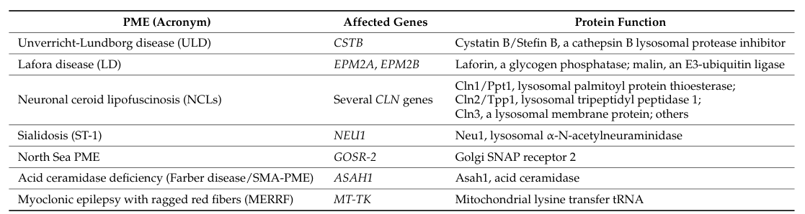

## Question

# Disease Characteristics Research Template

## Target Disease
- **Disease Name:** Progressive Myoclonus Epilepsy
- **MONDO ID:**  (if available)
- **Category:** Genetic

## Research Objectives

Please provide a comprehensive research report on **Progressive Myoclonus Epilepsy** covering all of the
disease characteristics listed below. This report will be used to populate a disease knowledge
base entry. Be thorough and cite primary literature (PMID preferred) for all claims.

For each section, **suggested databases/resources** are listed. These are the first places
you should search for information on each topic.

---

### 1. Disease Information
> **Search first:** OMIM, Orphanet, ICD-10/ICD-11, MeSH, PubMed

- What is the disease? Provide a concise overview.
- What are the key identifiers? (OMIM, Orphanet, ICD-10/ICD-11, MeSH, Mondo)
- What are the common synonyms and alternative names?
- Is the information derived from individual patients (e.g., EHR) or aggregated disease-level resources?

### 2. Etiology

- **Disease Causal Factors**: What are the primary causes? (genetic, environmental, infectious, mechanistic)
- **Risk Factors**:
  > **Search first:** PubMed, Cochrane Library, UpToDate, clinical guidelines, ClinVar, ClinGen, GWAS Catalog, PheGenI, CTD, CDC, WHO, epidemiological databases
  - Genetic risk factors (causal variants, susceptibility loci, modifier genes)
  - Environmental risk factors (toxins, lifestyle, occupational exposures, age, sex, family history)
- **Protective Factors**:
  > **Search first:** PubMed, Cochrane Library, clinical trial databases, GWAS Catalog, gnomAD, WHO, CDC, nutrition databases
  - Genetic protective factors (protective variants, modifier alleles)
  - Environmental protective factors (diet, lifestyle, exposures that reduce risk)
- **Gene-Environment Interactions**: How do genetic and environmental factors interact to influence disease?
  > **Search first:** CTD, PubMed, PheGenI, GxE databases

### 3. Phenotypes
> **Search first:** HPO (Human Phenotype Ontology), OMIM, Orphanet, PubMed, clinicaltrials.gov, MedDRA, SNOMED CT, DECIPHER, LOINC

For each phenotype, provide:
- **Phenotype type**: symptoms, clinical signs, physical manifestations, behavioral changes, or laboratory abnormalities
  > For symptoms/signs: HPO, OMIM, Orphanet, PubMed
  > For behavioral changes: HPO, DSM, RDoC (Research Domain Criteria), PubMed
  > For laboratory abnormalities: LOINC, SNOMED CT, LabTests Online, PubMed
- **Phenotype characteristics**:
  > **Search first:** OMIM, Orphanet, HPO, PubMed
  - Age of symptom onset (neonatal, childhood, adult-onset, late-onset)
  - Symptom severity (mild, moderate, severe, variable)
  - Symptom progression (stable, progressive, episodic, fluctuating)
  - Frequency among affected individuals (percentage or qualitative)
- **Quality of life impact**: Effects on daily functioning and well-being (per-phenotype when possible)
  > **Search first:** EQ-5D database, SF-36, WHO QOL databases, PubMed
- Suggest HPO (Human Phenotype Ontology) terms for each phenotype

### 4. Genetic/Molecular Information

- **Causal Genes**: Gene mutations or chromosomal abnormalities responsible for disease (gene symbols, OMIM IDs)
  > **Search first:** OMIM, ClinVar, HGMD, Ensembl, NCBI Gene
- **Pathogenic Variants**:
  - Affected genes (gene symbols, HGNC IDs)
    > **Search first:** OMIM, NCBI Gene, Ensembl, HGNC, UniProt, GeneCards
  - Variant classification (pathogenic, likely pathogenic, VUS per ACMG/AMP guidelines)
    > **Search first:** ClinVar, ClinGen, ACMG/AMP guidelines, VarSome
  - Variant type/class (missense, frameshift, nonsense, splice-site, structural)
  - Allele frequency in population databases
    > **Search first:** gnomAD, 1000 Genomes, ExAC, TOPMed, dbSNP
  - Somatic vs germline origin
    > **Search first:** COSMIC (somatic), ClinVar, ICGC, TCGA
  - Functional consequences (loss of function, gain of function, dominant negative)
- **Modifier Genes**: Genes that modify disease severity or expression
- **Epigenetic Information**: DNA methylation, histone modifications, chromatin changes affecting disease
  > **Search first:** ENCODE, Roadmap Epigenomics, MethBase, DiseaseMeth
- **Chromosomal Abnormalities**: Large-scale genetic changes (aneuploidy, translocations, inversions)
  > **Search first:** DECIPHER, ClinVar, ECARUCA, UCSC Genome Browser

### 5. Environmental Information

- **Environmental Factors**: Non-genetic contributing factors (toxins, radiation, pollution, occupational exposure)
  > **Search first:** CTD (Comparative Toxicogenomics Database), TOXNET, PubMed, EPA databases
- **Lifestyle Factors**: Behavioral factors (smoking, diet, exercise, alcohol consumption)
  > **Search first:** CDC databases, WHO, PubMed, NHANES
- **Infectious Agents**: If applicable, pathogens causing or triggering disease (bacteria, viruses, fungi, parasites)
  > **Search first:** NCBI Taxonomy, ViPR, BV-BRC, MicrobeDB, GIDEON

### 6. Mechanism / Pathophysiology

- **Molecular Pathways**: Specific signaling cascades or biochemical pathways involved (Wnt, MAPK, mTOR, PI3K-AKT, etc.)
  > **Search first:** KEGG, Reactome, WikiPathways, PathBank, BioCyc
- **Cellular Processes**: Cell-level mechanisms (apoptosis, autophagy, cell cycle dysregulation, inflammation, etc.)
  > **Search first:** Gene Ontology (GO), Reactome, KEGG, PubMed
- **Protein Dysfunction**: How protein structure or function is altered (misfolding, aggregation, loss of function, gain of function)
  > **Search first:** UniProt, PDB (Protein Data Bank), InterPro, Pfam, AlphaFold
- **Metabolic Changes**: Alterations in metabolic processes (energy metabolism, lipid metabolism, amino acid metabolism)
  > **Search first:** KEGG, BioCyc, HMDB (Human Metabolome Database), BRENDA
- **Immune System Involvement**: Role of immune response (autoimmunity, immunodeficiency, chronic inflammation)
  > **Search first:** ImmPort, Immunome Database, IEDB, Gene Ontology
- **Tissue Damage Mechanisms**: How tissues/ are injured (oxidative stress, ischemia, fibrosis, necrosis)
  > **Search first:** PubMed, Gene Ontology, Reactome
- **Biochemical Abnormalities**: Specific molecular defects (enzyme deficiencies, receptor dysfunction, ion channel defects)
  > **Search first:** BRENDA, UniProt, KEGG, OMIM, PubMed
- **Epigenetic Changes**: DNA methylation, histone modifications affecting gene expression in disease
  > **Search first:** ENCODE, Roadmap Epigenomics, MethBase, DiseaseMeth
- **Molecular Profiling** (if available):
  - Transcriptomics/gene expression changes
    > **Search first:** GEO (Gene Expression Omnibus), ArrayExpress, GTEx, Human Cell Atlas, SRA
  - Proteomics findings
    > **Search first:** PRIDE, ProteomeXchange, Human Protein Atlas, STRING, BioGRID
  - Metabolomics signatures
    > **Search first:** MetaboLights, Metabolomics Workbench, HMDB, METLIN
  - Lipidomics alterations
    > **Search first:** LIPID MAPS, SwissLipids, LipidHome, Metabolomics Workbench
  - Genomic structural features
    > **Search first:** UCSC Genome Browser, Ensembl, NCBI, dbVar, DGV
- **Advanced Technologies** (if applicable):
  - Single-cell analysis findings (cell-type specific mechanisms, cellular heterogeneity)
    > **Search first:** Human Cell Atlas, Single Cell Portal, GEO, CELLxGENE
  - Spatial transcriptomics findings
    > **Search first:** GEO, Spatial Research, Vizgen, 10x Genomics data
  - Multi-omics integration results
    > **Search first:** TCGA, ICGC, cBioPortal, LinkedOmics, PubMed
  - Functional genomics screens (CRISPR, RNAi)
    > **Search first:** DepMap, GenomeRNAi, PubMed, BioGRID ORCS

For each mechanism, describe:
- The causal chain from initial trigger to clinical manifestation
- Which mechanisms are upstream vs downstream
- What cell types and biological processes are involved
- Suggest GO terms for biological processes and CL terms for cell types

### 7. Anatomical Structures Affected

- **Organ Level**:
  - Primary organs directly affected
  - Secondary organ involvement (complications, secondary effects)
  - Body systems involved (cardiovascular, nervous, digestive, respiratory, endocrine, etc.)
  > **Search first:** Uberon, FMA (Foundational Model of Anatomy), OMIM, HPO, ICD-11, MeSH, SNOMED CT
- **Tissue and Cell Level**:
  - Specific tissue types affected (epithelial, connective, muscle, nervous)
  - Specific cell populations targeted (with Cell Ontology terms)
  > **Search first:** Uberon, Human Protein Atlas, Cell Ontology, Human Cell Atlas, CellMarker, PanglaoDB
- **Subcellular Level**:
  - Cellular compartments involved (mitochondria, nucleus, ER, lysosomes) (with GO Cellular Component terms)
  > **Search first:** Gene Ontology (Cellular Component), UniProt, Human Protein Atlas
- **Localization**:
  - Specific anatomical sites (with UBERON terms)
    > **Search first:** FMA, Uberon, NeuroNames (for brain), SNOMED CT
  - Lateralization (unilateral, bilateral, asymmetric)
    > **Search first:** HPO, clinical literature, imaging databases

### 8. Temporal Development

- **Onset**:
  - Typical age of onset (congenital, pediatric, adult, geriatric)
  - Onset pattern (acute, subacute, chronic, insidious)
  > **Search first:** OMIM, Orphanet, HPO, PubMed
- **Progression**:
  - Disease stages (early, intermediate, advanced, end-stage)
    > **Search first:** Cancer Staging Manual (AJCC), WHO classifications, PubMed
  - Progression rate (rapid, slow, variable)
  - Disease course pattern (episodic, relapsing-remitting, progressive, stable)
  - Disease duration (self-limited, chronic lifelong)
  > **Search first:** Disease registries, longitudinal cohort databases, natural history studies, PubMed, Orphanet, OMIM
- **Patterns**:
  - Remission patterns (spontaneous, treatment-induced)
    > **Search first:** Clinical trial databases, disease registries, PubMed
  - Critical periods (time windows of vulnerability or opportunity for intervention)
    > **Search first:** PubMed, developmental biology databases, clinical guidelines

### 9. Inheritance and Population

- **Epidemiology**:
  - Prevalence (cases per 100,000 at given time)
  - Incidence (new cases per 100,000 per year)
  > **Search first:** Orphanet, CDC, WHO, GBD (Global Burden of Disease), national registries, SEER, disease registries
- **For Genetic Etiology**:
  - Inheritance pattern (AD, AR, X-linked, mitochondrial, multifactorial, polygenic)
    > **Search first:** OMIM, Orphanet, ClinVar, GTR (Genetic Testing Registry)
  - Penetrance (complete, incomplete, age-dependent)
    > **Search first:** ClinVar, OMIM, PubMed, ClinGen
  - Expressivity (variable, consistent)
    > **Search first:** OMIM, ClinVar, PubMed
  - Genetic anticipation (increasing severity in successive generations)
    > **Search first:** OMIM, PubMed (especially for repeat expansion disorders)
  - Germline mosaicism
    > **Search first:** ClinVar, OMIM, genetic counseling literature, PubMed
  - Founder effects (population-specific mutations)
    > **Search first:** gnomAD, population genetics databases, PubMed
  - Consanguinity role
    > **Search first:** OMIM, population studies, genetic counseling resources
  - Carrier frequency
    > **Search first:** gnomAD, carrier screening databases, GeneReviews, GTR
- **Population Demographics**:
  - Affected populations (ethnic or demographic groups with higher prevalence)
    > **Search first:** gnomAD, 1000 Genomes, PAGE Study, PubMed, population registries
  - Geographic distribution (endemic areas, regional variation)
    > **Search first:** WHO, CDC, GBD, Orphanet, geographic epidemiology databases
  - Geographic distribution of specific variants
  - Sex ratio (male:female)
    > **Search first:** Disease registries, OMIM, PubMed, epidemiological databases
  - Age distribution of affected individuals
    > **Search first:** CDC, disease registries, SEER, Orphanet

### 10. Diagnostics

- **Clinical Tests**:
  - Laboratory tests (blood, urine, tissue chemistry, specific enzyme assays)
    > **Search first:** LOINC, LabTests Online, PubMed
  - Biomarkers (proteins, metabolites, genetic markers, circulating biomarkers)
    > **Search first:** FDA Biomarker List, BEST (Biomarkers, EndpointS, and other Tools), PubMed
  - Imaging studies (X-ray, CT, MRI, PET, ultrasound)
    > **Search first:** RadLex, DICOM, Radiopaedia, imaging databases
  - Functional tests (pulmonary function, cardiac stress tests)
    > **Search first:** LOINC, clinical guidelines, PubMed
  - Electrophysiology (EEG, EMG, ECG, nerve conduction studies)
    > **Search first:** LOINC, clinical neurophysiology databases, PubMed
  - Biopsy findings (histopathology, immunohistochemistry)
    > **Search first:** SNOMED CT, College of American Pathologists resources, PubMed
  - Pathology findings (microscopic examination)
    > **Search first:** SNOMED CT, Digital Pathology databases, PubMed
- **Genetic Testing**:
  > **Search first:** GTR (Genetic Testing Registry), GeneReviews, ClinGen
  - Overview of recommended genetic testing approach
  - Whole genome sequencing (WGS) utility
    > **Search first:** GTR, ClinVar, GEL (Genomics England), gnomAD
  - Whole exome sequencing (WES) utility
    > **Search first:** GTR, ClinVar, OMIM, GeneMatcher
  - Gene panels (which panels, which genes)
    > **Search first:** GTR, ClinVar, laboratory-specific databases
  - Single gene testing
    > **Search first:** GTR, ClinVar, OMIM, GeneReviews
  - Chromosomal microarray (CMA)
    > **Search first:** DECIPHER, ClinVar, dbVar, ECARUCA
  - Karyotyping
    > **Search first:** Chromosome Abnormality Database, ClinVar, cytogenetics resources
  - FISH
    > **Search first:** ClinVar, cytogenetics databases, PubMed
  - Mitochondrial DNA testing
    > **Search first:** MITOMAP, MSeqDR, ClinVar, GTR
  - Repeat expansion testing
    > **Search first:** GTR, ClinVar, repeat expansion databases, PubMed
- **Omics-Based Diagnostics** (if applicable):
  - RNA sequencing / transcriptomics
    > **Search first:** GEO, ArrayExpress, GTEx, RNA-seq databases
  - Proteomics
    > **Search first:** PRIDE, ProteomeXchange, FDA Biomarker database
  - Metabolomics
    > **Search first:** MetaboLights, Metabolomics Workbench, HMDB
  - Epigenomics
    > **Search first:** GEO, ENCODE, Roadmap Epigenomics, MethBase
  - Liquid biopsy
    > **Search first:** COSMIC, ClinVar, liquid biopsy databases, PubMed
- **Clinical Criteria**:
  - Standardized diagnostic criteria (DSM, ICD, society guidelines)
    > **Search first:** DSM-5, ICD-11, clinical society guidelines, UpToDate
  - Differential diagnosis (other conditions to rule out, with distinguishing features)
    > **Search first:** DynaMed, UpToDate, clinical decision support systems
- **Screening**:
  - Screening methods for asymptomatic individuals (newborn screening, carrier screening, cascade screening)
    > **Search first:** ACMG recommendations, CDC newborn screening, GTR

### 11. Outcome/Prognosis

- **Survival and Mortality**:
  - Survival rate (5-year, 10-year, overall)
    > **Search first:** SEER, cancer registries, disease-specific registries, PubMed
  - Life expectancy (with and without treatment if applicable)
    > **Search first:** Orphanet, disease registries, actuarial databases, PubMed
  - Mortality rate
    > **Search first:** CDC, WHO, GBD, national mortality databases
  - Disease-specific mortality (deaths directly attributable to disease)
    > **Search first:** Disease registries, CDC Wonder, GBD, PubMed
- **Morbidity and Function**:
  - Morbidity (disease-related disability and health impacts)
    > **Search first:** GBD, WHO, disability databases, PubMed
  - Disability outcomes (long-term functional impairments)
    > **Search first:** ICF (International Classification of Functioning), disability registries
  - Quality of life measures (EQ-5D, SF-36, PROMIS, disease-specific tools)
    > **Search first:** EQ-5D database, SF-36, PROMIS, PubMed
- **Disease Course**:
  - Complications (secondary problems: infections, organ failure, etc.)
    > **Search first:** ICD codes, disease registries, clinical databases, PubMed
  - Recovery potential (likelihood and extent of recovery, with vs without treatment)
    > **Search first:** Natural history studies, rehabilitation databases, PubMed
- **Prediction**:
  - Prognostic factors (age, disease severity, biomarkers, treatment response)
    > **Search first:** Prognostic models databases, clinical calculators, PubMed
  - Prognostic biomarkers (molecular markers predicting disease course)
    > **Search first:** FDA Biomarker database, PubMed, cancer prognostic databases

### 12. Treatment

- **Pharmacotherapy**:
  - Pharmacological treatments (drug names, drug classes, mechanisms of action)
    > **Search first:** DrugBank, RxNorm, ATC classification, DailyMed, FDA databases
  - Pharmacogenomics (how genetic variants affect drug metabolism, efficacy, toxicity)
    > **Search first:** PharmGKB, CPIC (Clinical Pharmacogenetics), FDA Table of PGx Biomarkers
- **Advanced Therapeutics**:
  - Gene therapy (viral vectors, CRISPR, gene replacement, gene editing)
    > **Search first:** ClinicalTrials.gov, FDA gene therapy database, ASGCT resources
  - Cell therapy (stem cell transplant, CAR-T, cellular therapeutics)
    > **Search first:** ClinicalTrials.gov, FDA cell therapy database, FACT standards
  - RNA-based therapies (ASOs, siRNA, mRNA therapies)
    > **Search first:** ClinicalTrials.gov, FDA approvals, PubMed
  - Targeted therapies (treatments directed at specific molecular targets)
    > **Search first:** My Cancer Genome, OncoKB, ClinicalTrials.gov, FDA approvals
  - Immunotherapies (checkpoint inhibitors, monoclonal antibodies)
    > **Search first:** Cancer Immunotherapy Database, FDA approvals, ClinicalTrials.gov
- **Surgical and Interventional**:
  - Surgical interventions (types of surgery, timing, outcomes)
    > **Search first:** CPT codes, surgical registries, clinical guidelines, PubMed
- **Supportive and Rehabilitative**:
  - Supportive care (symptom management, pain control, nutrition)
    > **Search first:** Clinical guidelines, Cochrane Library, PubMed
  - Rehabilitation (physical therapy, occupational therapy, speech therapy)
    > **Search first:** Rehabilitation medicine databases, clinical guidelines, PubMed
- **Experimental**:
  - Experimental treatments in clinical trials (with NCT identifiers if available)
    > **Search first:** ClinicalTrials.gov, EU Clinical Trials Register, WHO ICTRP
- **Treatment Outcomes**:
  - Treatment response rates
    > **Search first:** Clinical trial databases, FDA reviews, systematic reviews, PubMed
  - Side effects and adverse events
    > **Search first:** FDA Adverse Event Reporting System (FAERS), MedWatch, PubMed
- **Treatment Strategy**:
  - Treatment algorithms (clinical pathways, decision trees)
    > **Search first:** Clinical practice guidelines, NCCN Guidelines, UpToDate
  - Combination therapies
    > **Search first:** ClinicalTrials.gov, treatment guidelines, PubMed
  - Personalized medicine approaches (genotype-guided treatment)
    > **Search first:** My Cancer Genome, CIViC, PharmGKB, precision medicine databases

For each treatment, suggest MAXO (Medical Action Ontology) terms where applicable.

### 13. Prevention

- **Prevention Levels**:
  - Primary prevention (preventing disease occurrence: vaccination, risk factor modification)
    > **Search first:** CDC, WHO, USPSTF recommendations, Cochrane Library
  - Secondary prevention (early detection and treatment: screening programs, early intervention)
    > **Search first:** USPSTF, CDC screening guidelines, WHO
  - Tertiary prevention (preventing complications in those with disease)
    > **Search first:** Clinical guidelines, disease management protocols, PubMed
- **Immunization**: Vaccine strategies (if applicable)
  > **Search first:** CDC vaccine schedules, WHO immunization, FDA vaccine database
- **Screening and Early Detection**:
  - Screening programs (population-based: newborn screening, cancer screening)
    > **Search first:** CDC screening programs, USPSTF, cancer screening databases
  - Genetic screening (carrier screening, preimplantation genetic diagnosis, prenatal testing)
    > **Search first:** ACMG recommendations, ACOG guidelines, GTR
  - Risk stratification (identifying high-risk individuals for targeted prevention)
    > **Search first:** Risk prediction models, clinical calculators, PubMed
- **Behavioral Interventions**: Lifestyle modifications to reduce risk
  > **Search first:** CDC, WHO, behavioral intervention databases, Cochrane Library
- **Counseling**: Genetic counseling (risk assessment, family planning guidance)
  > **Search first:** NSGC resources, ACMG guidelines, GeneReviews
- **Public Health**:
  - Public health interventions (sanitation, vector control, health education)
    > **Search first:** CDC, WHO, public health databases, PubMed
  - Environmental interventions (reducing environmental risk factors)
    > **Search first:** EPA databases, WHO environmental health, PubMed
- **Prophylaxis**: Preventive medications or procedures
  > **Search first:** Clinical guidelines, FDA approvals, PubMed

### 14. Other Species / Natural Disease

- **Taxonomy**: Species affected (with NCBI Taxon identifiers)
  > **Search first:** NCBI Taxonomy
- **Breed**: Specific breeds affected (with VBO identifiers if applicable)
  > **Search first:** VBO (Vertebrate Breed Ontology)
- **Gene**: Orthologous genes in other species (with NCBI Gene IDs)
  > **Search first:** NCBI Gene
- **Natural Disease**:
  - Naturally occurring disease in other species (companion animals, wildlife)
    > **Search first:** OMIA (Online Mendelian Inheritance in Animals), VetCompass, PubMed
  - Veterinary relevance and importance in animal health
    > **Search first:** OMIA, veterinary databases, PubMed
- **Comparative Biology**:
  - Comparative pathology (similarities and differences across species)
    > **Search first:** OMIA, comparative pathology databases, PubMed
  - Evolutionary conservation of disease mechanisms
    > **Search first:** HomoloGene, OrthoMCL, Alliance of Genome Resources
- **Transmission** (if applicable):
  - Zoonotic potential
    > **Search first:** CDC zoonotic diseases, WHO zoonoses, GIDEON
  - Cross-species susceptibility
    > **Search first:** NCBI Taxonomy, veterinary databases, PubMed

### 15. Model Organisms

- **Model Types**:
  - Model organism type (mammalian, invertebrate, cellular, in vitro)
    > **Search first:** Alliance of Genome Resources, model organism databases
  - Specific model systems (mouse, rat, zebrafish, Drosophila, C. elegans, yeast, cell lines, organoids, iPSCs)
    > **Search first:** MGI, RGD, ZFIN, FlyBase, WormBase, SGD, ATCC, Cellosaurus
  - Induced models (drug treatment, surgical intervention, environmental manipulation)
    > **Search first:** MGI, model organism databases, PubMed
- **Genetic Models**:
  - Types available (knockout, knock-in, transgenic, conditional, humanized)
    > **Search first:** MGI, IMPC, KOMP, EuMMCR, IMSR
- **Model Characteristics**:
  - Phenotype recapitulation (how well model reproduces human disease features)
    > **Search first:** Model organism databases, comparative studies, PubMed
  - Model limitations (aspects of human disease not captured)
    > **Search first:** Model organism databases, PubMed, review articles
- **Applications**:
  - Research applications (what aspects of disease can be studied)
    > **Search first:** Model organism databases, PubMed
- **Resources**:
  - Model databases
    > **Search first:** MGI, RGD, ZFIN, FlyBase, WormBase, IMSR, EMMA, MMRRC

---

## Citation Requirements

- Cite primary literature (PMID preferred) for all mechanistic and clinical claims
- Prioritize recent reviews and landmark papers
- Include direct quotes from abstracts where possible to support key statements
- Distinguish evidence source types: human clinical, model organism, in vitro, computational

## Output Format

Structure your response as a comprehensive narrative organized by the sections above.
For each section, provide:
- Factual content with specific details (numbers, percentages, gene names, variant nomenclature)
- Ontology term suggestions (HPO, GO, CL, UBERON, CHEBI, MAXO, MONDO) where applicable
- Evidence citations with PMIDs
- Direct quotes from abstracts to support key claims
- Clear indication when information is not available or not applicable for this disease

This report will be used to populate a disease knowledge base entry with:
- Pathophysiology descriptions with causal chains
- Gene/protein annotations (HGNC, GO terms)
- Phenotype associations (HP terms) with frequencies
- Cell type involvement (CL terms)
- Anatomical locations (UBERON terms)
- Chemical entities (CHEBI terms)
- Treatment annotations (MAXO terms)
- Evidence items with PMIDs and exact abstract quotes
- Epidemiology, prognosis, diagnostic, and prevention information
- Animal model descriptions with phenotype recapitulation details

## Output

Question: You are an expert researcher providing comprehensive, well-cited information.

Provide detailed information focusing on:
1. Key concepts and definitions with current understanding
2. Recent developments and latest research (prioritize 2023-2024 sources)
3. Current applications and real-world implementations
4. Expert opinions and analysis from authoritative sources
5. Relevant statistics and data from recent studies

Format as a comprehensive research report with proper citations. Include URLs and publication dates where available.
Always prioritize recent, authoritative sources and provide specific citations for all major claims.

# Disease Characteristics Research Template

## Target Disease
- **Disease Name:** Progressive Myoclonus Epilepsy
- **MONDO ID:**  (if available)
- **Category:** Genetic

## Research Objectives

Please provide a comprehensive research report on **Progressive Myoclonus Epilepsy** covering all of the
disease characteristics listed below. This report will be used to populate a disease knowledge
base entry. Be thorough and cite primary literature (PMID preferred) for all claims.

For each section, **suggested databases/resources** are listed. These are the first places
you should search for information on each topic.

---

### 1. Disease Information
> **Search first:** OMIM, Orphanet, ICD-10/ICD-11, MeSH, PubMed

- What is the disease? Provide a concise overview.
- What are the key identifiers? (OMIM, Orphanet, ICD-10/ICD-11, MeSH, Mondo)
- What are the common synonyms and alternative names?
- Is the information derived from individual patients (e.g., EHR) or aggregated disease-level resources?

### 2. Etiology

- **Disease Causal Factors**: What are the primary causes? (genetic, environmental, infectious, mechanistic)
- **Risk Factors**:
  > **Search first:** PubMed, Cochrane Library, UpToDate, clinical guidelines, ClinVar, ClinGen, GWAS Catalog, PheGenI, CTD, CDC, WHO, epidemiological databases
  - Genetic risk factors (causal variants, susceptibility loci, modifier genes)
  - Environmental risk factors (toxins, lifestyle, occupational exposures, age, sex, family history)
- **Protective Factors**:
  > **Search first:** PubMed, Cochrane Library, clinical trial databases, GWAS Catalog, gnomAD, WHO, CDC, nutrition databases
  - Genetic protective factors (protective variants, modifier alleles)
  - Environmental protective factors (diet, lifestyle, exposures that reduce risk)
- **Gene-Environment Interactions**: How do genetic and environmental factors interact to influence disease?
  > **Search first:** CTD, PubMed, PheGenI, GxE databases

### 3. Phenotypes
> **Search first:** HPO (Human Phenotype Ontology), OMIM, Orphanet, PubMed, clinicaltrials.gov, MedDRA, SNOMED CT, DECIPHER, LOINC

For each phenotype, provide:
- **Phenotype type**: symptoms, clinical signs, physical manifestations, behavioral changes, or laboratory abnormalities
  > For symptoms/signs: HPO, OMIM, Orphanet, PubMed
  > For behavioral changes: HPO, DSM, RDoC (Research Domain Criteria), PubMed
  > For laboratory abnormalities: LOINC, SNOMED CT, LabTests Online, PubMed
- **Phenotype characteristics**:
  > **Search first:** OMIM, Orphanet, HPO, PubMed
  - Age of symptom onset (neonatal, childhood, adult-onset, late-onset)
  - Symptom severity (mild, moderate, severe, variable)
  - Symptom progression (stable, progressive, episodic, fluctuating)
  - Frequency among affected individuals (percentage or qualitative)
- **Quality of life impact**: Effects on daily functioning and well-being (per-phenotype when possible)
  > **Search first:** EQ-5D database, SF-36, WHO QOL databases, PubMed
- Suggest HPO (Human Phenotype Ontology) terms for each phenotype

### 4. Genetic/Molecular Information

- **Causal Genes**: Gene mutations or chromosomal abnormalities responsible for disease (gene symbols, OMIM IDs)
  > **Search first:** OMIM, ClinVar, HGMD, Ensembl, NCBI Gene
- **Pathogenic Variants**:
  - Affected genes (gene symbols, HGNC IDs)
    > **Search first:** OMIM, NCBI Gene, Ensembl, HGNC, UniProt, GeneCards
  - Variant classification (pathogenic, likely pathogenic, VUS per ACMG/AMP guidelines)
    > **Search first:** ClinVar, ClinGen, ACMG/AMP guidelines, VarSome
  - Variant type/class (missense, frameshift, nonsense, splice-site, structural)
  - Allele frequency in population databases
    > **Search first:** gnomAD, 1000 Genomes, ExAC, TOPMed, dbSNP
  - Somatic vs germline origin
    > **Search first:** COSMIC (somatic), ClinVar, ICGC, TCGA
  - Functional consequences (loss of function, gain of function, dominant negative)
- **Modifier Genes**: Genes that modify disease severity or expression
- **Epigenetic Information**: DNA methylation, histone modifications, chromatin changes affecting disease
  > **Search first:** ENCODE, Roadmap Epigenomics, MethBase, DiseaseMeth
- **Chromosomal Abnormalities**: Large-scale genetic changes (aneuploidy, translocations, inversions)
  > **Search first:** DECIPHER, ClinVar, ECARUCA, UCSC Genome Browser

### 5. Environmental Information

- **Environmental Factors**: Non-genetic contributing factors (toxins, radiation, pollution, occupational exposure)
  > **Search first:** CTD (Comparative Toxicogenomics Database), TOXNET, PubMed, EPA databases
- **Lifestyle Factors**: Behavioral factors (smoking, diet, exercise, alcohol consumption)
  > **Search first:** CDC databases, WHO, PubMed, NHANES
- **Infectious Agents**: If applicable, pathogens causing or triggering disease (bacteria, viruses, fungi, parasites)
  > **Search first:** NCBI Taxonomy, ViPR, BV-BRC, MicrobeDB, GIDEON

### 6. Mechanism / Pathophysiology

- **Molecular Pathways**: Specific signaling cascades or biochemical pathways involved (Wnt, MAPK, mTOR, PI3K-AKT, etc.)
  > **Search first:** KEGG, Reactome, WikiPathways, PathBank, BioCyc
- **Cellular Processes**: Cell-level mechanisms (apoptosis, autophagy, cell cycle dysregulation, inflammation, etc.)
  > **Search first:** Gene Ontology (GO), Reactome, KEGG, PubMed
- **Protein Dysfunction**: How protein structure or function is altered (misfolding, aggregation, loss of function, gain of function)
  > **Search first:** UniProt, PDB (Protein Data Bank), InterPro, Pfam, AlphaFold
- **Metabolic Changes**: Alterations in metabolic processes (energy metabolism, lipid metabolism, amino acid metabolism)
  > **Search first:** KEGG, BioCyc, HMDB (Human Metabolome Database), BRENDA
- **Immune System Involvement**: Role of immune response (autoimmunity, immunodeficiency, chronic inflammation)
  > **Search first:** ImmPort, Immunome Database, IEDB, Gene Ontology
- **Tissue Damage Mechanisms**: How tissues/ are injured (oxidative stress, ischemia, fibrosis, necrosis)
  > **Search first:** PubMed, Gene Ontology, Reactome
- **Biochemical Abnormalities**: Specific molecular defects (enzyme deficiencies, receptor dysfunction, ion channel defects)
  > **Search first:** BRENDA, UniProt, KEGG, OMIM, PubMed
- **Epigenetic Changes**: DNA methylation, histone modifications affecting gene expression in disease
  > **Search first:** ENCODE, Roadmap Epigenomics, MethBase, DiseaseMeth
- **Molecular Profiling** (if available):
  - Transcriptomics/gene expression changes
    > **Search first:** GEO (Gene Expression Omnibus), ArrayExpress, GTEx, Human Cell Atlas, SRA
  - Proteomics findings
    > **Search first:** PRIDE, ProteomeXchange, Human Protein Atlas, STRING, BioGRID
  - Metabolomics signatures
    > **Search first:** MetaboLights, Metabolomics Workbench, HMDB, METLIN
  - Lipidomics alterations
    > **Search first:** LIPID MAPS, SwissLipids, LipidHome, Metabolomics Workbench
  - Genomic structural features
    > **Search first:** UCSC Genome Browser, Ensembl, NCBI, dbVar, DGV
- **Advanced Technologies** (if applicable):
  - Single-cell analysis findings (cell-type specific mechanisms, cellular heterogeneity)
    > **Search first:** Human Cell Atlas, Single Cell Portal, GEO, CELLxGENE
  - Spatial transcriptomics findings
    > **Search first:** GEO, Spatial Research, Vizgen, 10x Genomics data
  - Multi-omics integration results
    > **Search first:** TCGA, ICGC, cBioPortal, LinkedOmics, PubMed
  - Functional genomics screens (CRISPR, RNAi)
    > **Search first:** DepMap, GenomeRNAi, PubMed, BioGRID ORCS

For each mechanism, describe:
- The causal chain from initial trigger to clinical manifestation
- Which mechanisms are upstream vs downstream
- What cell types and biological processes are involved
- Suggest GO terms for biological processes and CL terms for cell types

### 7. Anatomical Structures Affected

- **Organ Level**:
  - Primary organs directly affected
  - Secondary organ involvement (complications, secondary effects)
  - Body systems involved (cardiovascular, nervous, digestive, respiratory, endocrine, etc.)
  > **Search first:** Uberon, FMA (Foundational Model of Anatomy), OMIM, HPO, ICD-11, MeSH, SNOMED CT
- **Tissue and Cell Level**:
  - Specific tissue types affected (epithelial, connective, muscle, nervous)
  - Specific cell populations targeted (with Cell Ontology terms)
  > **Search first:** Uberon, Human Protein Atlas, Cell Ontology, Human Cell Atlas, CellMarker, PanglaoDB
- **Subcellular Level**:
  - Cellular compartments involved (mitochondria, nucleus, ER, lysosomes) (with GO Cellular Component terms)
  > **Search first:** Gene Ontology (Cellular Component), UniProt, Human Protein Atlas
- **Localization**:
  - Specific anatomical sites (with UBERON terms)
    > **Search first:** FMA, Uberon, NeuroNames (for brain), SNOMED CT
  - Lateralization (unilateral, bilateral, asymmetric)
    > **Search first:** HPO, clinical literature, imaging databases

### 8. Temporal Development

- **Onset**:
  - Typical age of onset (congenital, pediatric, adult, geriatric)
  - Onset pattern (acute, subacute, chronic, insidious)
  > **Search first:** OMIM, Orphanet, HPO, PubMed
- **Progression**:
  - Disease stages (early, intermediate, advanced, end-stage)
    > **Search first:** Cancer Staging Manual (AJCC), WHO classifications, PubMed
  - Progression rate (rapid, slow, variable)
  - Disease course pattern (episodic, relapsing-remitting, progressive, stable)
  - Disease duration (self-limited, chronic lifelong)
  > **Search first:** Disease registries, longitudinal cohort databases, natural history studies, PubMed, Orphanet, OMIM
- **Patterns**:
  - Remission patterns (spontaneous, treatment-induced)
    > **Search first:** Clinical trial databases, disease registries, PubMed
  - Critical periods (time windows of vulnerability or opportunity for intervention)
    > **Search first:** PubMed, developmental biology databases, clinical guidelines

### 9. Inheritance and Population

- **Epidemiology**:
  - Prevalence (cases per 100,000 at given time)
  - Incidence (new cases per 100,000 per year)
  > **Search first:** Orphanet, CDC, WHO, GBD (Global Burden of Disease), national registries, SEER, disease registries
- **For Genetic Etiology**:
  - Inheritance pattern (AD, AR, X-linked, mitochondrial, multifactorial, polygenic)
    > **Search first:** OMIM, Orphanet, ClinVar, GTR (Genetic Testing Registry)
  - Penetrance (complete, incomplete, age-dependent)
    > **Search first:** ClinVar, OMIM, PubMed, ClinGen
  - Expressivity (variable, consistent)
    > **Search first:** OMIM, ClinVar, PubMed
  - Genetic anticipation (increasing severity in successive generations)
    > **Search first:** OMIM, PubMed (especially for repeat expansion disorders)
  - Germline mosaicism
    > **Search first:** ClinVar, OMIM, genetic counseling literature, PubMed
  - Founder effects (population-specific mutations)
    > **Search first:** gnomAD, population genetics databases, PubMed
  - Consanguinity role
    > **Search first:** OMIM, population studies, genetic counseling resources
  - Carrier frequency
    > **Search first:** gnomAD, carrier screening databases, GeneReviews, GTR
- **Population Demographics**:
  - Affected populations (ethnic or demographic groups with higher prevalence)
    > **Search first:** gnomAD, 1000 Genomes, PAGE Study, PubMed, population registries
  - Geographic distribution (endemic areas, regional variation)
    > **Search first:** WHO, CDC, GBD, Orphanet, geographic epidemiology databases
  - Geographic distribution of specific variants
  - Sex ratio (male:female)
    > **Search first:** Disease registries, OMIM, PubMed, epidemiological databases
  - Age distribution of affected individuals
    > **Search first:** CDC, disease registries, SEER, Orphanet

### 10. Diagnostics

- **Clinical Tests**:
  - Laboratory tests (blood, urine, tissue chemistry, specific enzyme assays)
    > **Search first:** LOINC, LabTests Online, PubMed
  - Biomarkers (proteins, metabolites, genetic markers, circulating biomarkers)
    > **Search first:** FDA Biomarker List, BEST (Biomarkers, EndpointS, and other Tools), PubMed
  - Imaging studies (X-ray, CT, MRI, PET, ultrasound)
    > **Search first:** RadLex, DICOM, Radiopaedia, imaging databases
  - Functional tests (pulmonary function, cardiac stress tests)
    > **Search first:** LOINC, clinical guidelines, PubMed
  - Electrophysiology (EEG, EMG, ECG, nerve conduction studies)
    > **Search first:** LOINC, clinical neurophysiology databases, PubMed
  - Biopsy findings (histopathology, immunohistochemistry)
    > **Search first:** SNOMED CT, College of American Pathologists resources, PubMed
  - Pathology findings (microscopic examination)
    > **Search first:** SNOMED CT, Digital Pathology databases, PubMed
- **Genetic Testing**:
  > **Search first:** GTR (Genetic Testing Registry), GeneReviews, ClinGen
  - Overview of recommended genetic testing approach
  - Whole genome sequencing (WGS) utility
    > **Search first:** GTR, ClinVar, GEL (Genomics England), gnomAD
  - Whole exome sequencing (WES) utility
    > **Search first:** GTR, ClinVar, OMIM, GeneMatcher
  - Gene panels (which panels, which genes)
    > **Search first:** GTR, ClinVar, laboratory-specific databases
  - Single gene testing
    > **Search first:** GTR, ClinVar, OMIM, GeneReviews
  - Chromosomal microarray (CMA)
    > **Search first:** DECIPHER, ClinVar, dbVar, ECARUCA
  - Karyotyping
    > **Search first:** Chromosome Abnormality Database, ClinVar, cytogenetics resources
  - FISH
    > **Search first:** ClinVar, cytogenetics databases, PubMed
  - Mitochondrial DNA testing
    > **Search first:** MITOMAP, MSeqDR, ClinVar, GTR
  - Repeat expansion testing
    > **Search first:** GTR, ClinVar, repeat expansion databases, PubMed
- **Omics-Based Diagnostics** (if applicable):
  - RNA sequencing / transcriptomics
    > **Search first:** GEO, ArrayExpress, GTEx, RNA-seq databases
  - Proteomics
    > **Search first:** PRIDE, ProteomeXchange, FDA Biomarker database
  - Metabolomics
    > **Search first:** MetaboLights, Metabolomics Workbench, HMDB
  - Epigenomics
    > **Search first:** GEO, ENCODE, Roadmap Epigenomics, MethBase
  - Liquid biopsy
    > **Search first:** COSMIC, ClinVar, liquid biopsy databases, PubMed
- **Clinical Criteria**:
  - Standardized diagnostic criteria (DSM, ICD, society guidelines)
    > **Search first:** DSM-5, ICD-11, clinical society guidelines, UpToDate
  - Differential diagnosis (other conditions to rule out, with distinguishing features)
    > **Search first:** DynaMed, UpToDate, clinical decision support systems
- **Screening**:
  - Screening methods for asymptomatic individuals (newborn screening, carrier screening, cascade screening)
    > **Search first:** ACMG recommendations, CDC newborn screening, GTR

### 11. Outcome/Prognosis

- **Survival and Mortality**:
  - Survival rate (5-year, 10-year, overall)
    > **Search first:** SEER, cancer registries, disease-specific registries, PubMed
  - Life expectancy (with and without treatment if applicable)
    > **Search first:** Orphanet, disease registries, actuarial databases, PubMed
  - Mortality rate
    > **Search first:** CDC, WHO, GBD, national mortality databases
  - Disease-specific mortality (deaths directly attributable to disease)
    > **Search first:** Disease registries, CDC Wonder, GBD, PubMed
- **Morbidity and Function**:
  - Morbidity (disease-related disability and health impacts)
    > **Search first:** GBD, WHO, disability databases, PubMed
  - Disability outcomes (long-term functional impairments)
    > **Search first:** ICF (International Classification of Functioning), disability registries
  - Quality of life measures (EQ-5D, SF-36, PROMIS, disease-specific tools)
    > **Search first:** EQ-5D database, SF-36, PROMIS, PubMed
- **Disease Course**:
  - Complications (secondary problems: infections, organ failure, etc.)
    > **Search first:** ICD codes, disease registries, clinical databases, PubMed
  - Recovery potential (likelihood and extent of recovery, with vs without treatment)
    > **Search first:** Natural history studies, rehabilitation databases, PubMed
- **Prediction**:
  - Prognostic factors (age, disease severity, biomarkers, treatment response)
    > **Search first:** Prognostic models databases, clinical calculators, PubMed
  - Prognostic biomarkers (molecular markers predicting disease course)
    > **Search first:** FDA Biomarker database, PubMed, cancer prognostic databases

### 12. Treatment

- **Pharmacotherapy**:
  - Pharmacological treatments (drug names, drug classes, mechanisms of action)
    > **Search first:** DrugBank, RxNorm, ATC classification, DailyMed, FDA databases
  - Pharmacogenomics (how genetic variants affect drug metabolism, efficacy, toxicity)
    > **Search first:** PharmGKB, CPIC (Clinical Pharmacogenetics), FDA Table of PGx Biomarkers
- **Advanced Therapeutics**:
  - Gene therapy (viral vectors, CRISPR, gene replacement, gene editing)
    > **Search first:** ClinicalTrials.gov, FDA gene therapy database, ASGCT resources
  - Cell therapy (stem cell transplant, CAR-T, cellular therapeutics)
    > **Search first:** ClinicalTrials.gov, FDA cell therapy database, FACT standards
  - RNA-based therapies (ASOs, siRNA, mRNA therapies)
    > **Search first:** ClinicalTrials.gov, FDA approvals, PubMed
  - Targeted therapies (treatments directed at specific molecular targets)
    > **Search first:** My Cancer Genome, OncoKB, ClinicalTrials.gov, FDA approvals
  - Immunotherapies (checkpoint inhibitors, monoclonal antibodies)
    > **Search first:** Cancer Immunotherapy Database, FDA approvals, ClinicalTrials.gov
- **Surgical and Interventional**:
  - Surgical interventions (types of surgery, timing, outcomes)
    > **Search first:** CPT codes, surgical registries, clinical guidelines, PubMed
- **Supportive and Rehabilitative**:
  - Supportive care (symptom management, pain control, nutrition)
    > **Search first:** Clinical guidelines, Cochrane Library, PubMed
  - Rehabilitation (physical therapy, occupational therapy, speech therapy)
    > **Search first:** Rehabilitation medicine databases, clinical guidelines, PubMed
- **Experimental**:
  - Experimental treatments in clinical trials (with NCT identifiers if available)
    > **Search first:** ClinicalTrials.gov, EU Clinical Trials Register, WHO ICTRP
- **Treatment Outcomes**:
  - Treatment response rates
    > **Search first:** Clinical trial databases, FDA reviews, systematic reviews, PubMed
  - Side effects and adverse events
    > **Search first:** FDA Adverse Event Reporting System (FAERS), MedWatch, PubMed
- **Treatment Strategy**:
  - Treatment algorithms (clinical pathways, decision trees)
    > **Search first:** Clinical practice guidelines, NCCN Guidelines, UpToDate
  - Combination therapies
    > **Search first:** ClinicalTrials.gov, treatment guidelines, PubMed
  - Personalized medicine approaches (genotype-guided treatment)
    > **Search first:** My Cancer Genome, CIViC, PharmGKB, precision medicine databases

For each treatment, suggest MAXO (Medical Action Ontology) terms where applicable.

### 13. Prevention

- **Prevention Levels**:
  - Primary prevention (preventing disease occurrence: vaccination, risk factor modification)
    > **Search first:** CDC, WHO, USPSTF recommendations, Cochrane Library
  - Secondary prevention (early detection and treatment: screening programs, early intervention)
    > **Search first:** USPSTF, CDC screening guidelines, WHO
  - Tertiary prevention (preventing complications in those with disease)
    > **Search first:** Clinical guidelines, disease management protocols, PubMed
- **Immunization**: Vaccine strategies (if applicable)
  > **Search first:** CDC vaccine schedules, WHO immunization, FDA vaccine database
- **Screening and Early Detection**:
  - Screening programs (population-based: newborn screening, cancer screening)
    > **Search first:** CDC screening programs, USPSTF, cancer screening databases
  - Genetic screening (carrier screening, preimplantation genetic diagnosis, prenatal testing)
    > **Search first:** ACMG recommendations, ACOG guidelines, GTR
  - Risk stratification (identifying high-risk individuals for targeted prevention)
    > **Search first:** Risk prediction models, clinical calculators, PubMed
- **Behavioral Interventions**: Lifestyle modifications to reduce risk
  > **Search first:** CDC, WHO, behavioral intervention databases, Cochrane Library
- **Counseling**: Genetic counseling (risk assessment, family planning guidance)
  > **Search first:** NSGC resources, ACMG guidelines, GeneReviews
- **Public Health**:
  - Public health interventions (sanitation, vector control, health education)
    > **Search first:** CDC, WHO, public health databases, PubMed
  - Environmental interventions (reducing environmental risk factors)
    > **Search first:** EPA databases, WHO environmental health, PubMed
- **Prophylaxis**: Preventive medications or procedures
  > **Search first:** Clinical guidelines, FDA approvals, PubMed

### 14. Other Species / Natural Disease

- **Taxonomy**: Species affected (with NCBI Taxon identifiers)
  > **Search first:** NCBI Taxonomy
- **Breed**: Specific breeds affected (with VBO identifiers if applicable)
  > **Search first:** VBO (Vertebrate Breed Ontology)
- **Gene**: Orthologous genes in other species (with NCBI Gene IDs)
  > **Search first:** NCBI Gene
- **Natural Disease**:
  - Naturally occurring disease in other species (companion animals, wildlife)
    > **Search first:** OMIA (Online Mendelian Inheritance in Animals), VetCompass, PubMed
  - Veterinary relevance and importance in animal health
    > **Search first:** OMIA, veterinary databases, PubMed
- **Comparative Biology**:
  - Comparative pathology (similarities and differences across species)
    > **Search first:** OMIA, comparative pathology databases, PubMed
  - Evolutionary conservation of disease mechanisms
    > **Search first:** HomoloGene, OrthoMCL, Alliance of Genome Resources
- **Transmission** (if applicable):
  - Zoonotic potential
    > **Search first:** CDC zoonotic diseases, WHO zoonoses, GIDEON
  - Cross-species susceptibility
    > **Search first:** NCBI Taxonomy, veterinary databases, PubMed

### 15. Model Organisms

- **Model Types**:
  - Model organism type (mammalian, invertebrate, cellular, in vitro)
    > **Search first:** Alliance of Genome Resources, model organism databases
  - Specific model systems (mouse, rat, zebrafish, Drosophila, C. elegans, yeast, cell lines, organoids, iPSCs)
    > **Search first:** MGI, RGD, ZFIN, FlyBase, WormBase, SGD, ATCC, Cellosaurus
  - Induced models (drug treatment, surgical intervention, environmental manipulation)
    > **Search first:** MGI, model organism databases, PubMed
- **Genetic Models**:
  - Types available (knockout, knock-in, transgenic, conditional, humanized)
    > **Search first:** MGI, IMPC, KOMP, EuMMCR, IMSR
- **Model Characteristics**:
  - Phenotype recapitulation (how well model reproduces human disease features)
    > **Search first:** Model organism databases, comparative studies, PubMed
  - Model limitations (aspects of human disease not captured)
    > **Search first:** Model organism databases, PubMed, review articles
- **Applications**:
  - Research applications (what aspects of disease can be studied)
    > **Search first:** Model organism databases, PubMed
- **Resources**:
  - Model databases
    > **Search first:** MGI, RGD, ZFIN, FlyBase, WormBase, IMSR, EMMA, MMRRC

---

## Citation Requirements

- Cite primary literature (PMID preferred) for all mechanistic and clinical claims
- Prioritize recent reviews and landmark papers
- Include direct quotes from abstracts where possible to support key statements
- Distinguish evidence source types: human clinical, model organism, in vitro, computational

## Output Format

Structure your response as a comprehensive narrative organized by the sections above.
For each section, provide:
- Factual content with specific details (numbers, percentages, gene names, variant nomenclature)
- Ontology term suggestions (HPO, GO, CL, UBERON, CHEBI, MAXO, MONDO) where applicable
- Evidence citations with PMIDs
- Direct quotes from abstracts to support key claims
- Clear indication when information is not available or not applicable for this disease

This report will be used to populate a disease knowledge base entry with:
- Pathophysiology descriptions with causal chains
- Gene/protein annotations (HGNC, GO terms)
- Phenotype associations (HP terms) with frequencies
- Cell type involvement (CL terms)
- Anatomical locations (UBERON terms)
- Chemical entities (CHEBI terms)
- Treatment annotations (MAXO terms)
- Evidence items with PMIDs and exact abstract quotes
- Epidemiology, prognosis, diagnostic, and prevention information
- Animal model descriptions with phenotype recapitulation details

## Progressive Myoclonus Epilepsy (PME): comprehensive disease-characteristics report (genetic category)

### Executive summary
Progressive myoclonus epilepsies (PMEs) are a **heterogeneous group of (mostly genetic) neurologic disorders** characterized by **myoclonus plus seizures with progressive neurologic deterioration** over variable timeframes. Core phenotypes across the group include action/stimulus-sensitive myoclonus, generalized seizures, ataxia/cerebellar signs, and (in many subtypes) cognitive decline or dementia. Major advances from 2023–2024 emphasize (i) increasing diagnostic yield via exome/genome sequencing, (ii) recognition of shared mechanisms such as neuroinflammation and lysosomal/autophagy dysfunction across multiple PMEs, and (iii) growing translational pipelines including **enzyme replacement (already implemented for CLN2)** and **gene therapy programs** for select subtypes. (zimmern2024progressivemyoclonusepilepsy pages 1-3, zimmern2024progressivemyoclonusepilepsy pages 3-4, zimmern2024progressivemyoclonusepilepsy pages 10-11)

---

## 1. Disease information

### 1.1 Definition and overview
PMEs are defined as a group of disorders featuring **myoclonus and seizures that worsen progressively** (variable tempo), with overlapping but subtype-specific phenotypes. A recent scoping review summarizes key shared manifestations including **myoclonus, epilepsy, cerebellar involvement, and dementia**, and emphasizes that the last decade has brought substantial progress in diagnosis and, for some disorders, therapy. (Zimmern & Minassian, **Jan 2024**, *Genes*, DOI: https://doi.org/10.3390/genes15020171) (zimmern2024progressivemyoclonusepilepsy pages 1-3)

A pragmatic clinical definition used in pediatric practice is that PME is an epilepsy syndrome characterized by **myoclonus, cognitive deficit, and ataxia**, illustrated by a pediatric cohort where EEG and MRI changes progress over time. (Fatema et al., **Oct 2025**, DOI: https://doi.org/10.3329/jbcps.v43i4.85002) (fatema2025phenotypeeegneuroimaging pages 1-2)

### 1.2 Key identifiers (OMIM/Orphanet/ICD/MeSH/MONDO)
*Umbrella-term identifiers were not reliably retrievable from the tool-accessible sources used in this run.* PME is commonly operationalized via its **major named genetic subtypes** (e.g., EPM1/ULD, EPM2/Lafora, NCLs). For knowledge-base population, subtype-level identifiers are typically used (e.g., EPM1, EPM2; CLN2/TPP1). (zimmern2024progressivemyoclonusepilepsy pages 1-3, zimmern2024progressivemyoclonusepilepsy pages 10-11)

### 1.3 Synonyms / alternative names
Common synonyms are largely **subtype-based**:
- **Unverricht–Lundborg disease (ULD)** = **progressive myoclonus epilepsy type 1 (EPM1)** (CSTB). (singh2024therolesof pages 1-2, singh2024therolesof pages 2-4)
- **Lafora disease (LD)** = **progressive myoclonus epilepsy type 2 (EPM2)** (EPM2A, NHLRC1/EPM2B). (burgos2023earlytreatmentwith pages 1-2, zimmern2024progressivemyoclonusepilepsy pages 6-7)
- **Neuronal ceroid lipofuscinoses (NCLs/Batten disease)** often fall within the PME spectrum (multiple CLN genes). (zimmern2024progressivemyoclonusepilepsy pages 10-11, santucci2024glucosemetabolismimpairment pages 5-6)

### 1.4 Source type of information
The current understanding of PME is derived from both **aggregated disease-level resources (reviews, cohorts, natural history studies)** and **individual patient series/case reports**, with genetic confirmation increasingly central. (zimmern2024progressivemyoclonusepilepsy pages 1-3, cisse2024geneticprofileof pages 3-4, fatema2025phenotypeeegneuroimaging pages 2-5)

---

## 2. Etiology

### 2.1 Disease causal factors
PME is primarily **genetic** and **highly heterogeneous**, with most classic PMEs being **autosomal recessive**, and a minority mitochondrial or autosomal dominant depending on subtype. (zimmern2024progressivemyoclonusepilepsy pages 1-3, cisse2024geneticprofileof pages 3-4)

Major causal genes/subtypes highlighted in recent synthesis include:
- **EPM1/ULD:** **CSTB** (often promoter dodecamer repeat expansion causing reduced expression). (singh2024therolesof pages 2-4)
- **Lafora disease:** **EPM2A (laforin)** and **NHLRC1/EPM2B (malin)**. (burgos2023earlytreatmentwith pages 1-2, zimmern2024progressivemyoclonusepilepsy pages 6-7)
- **NCLs:** multiple **CLN genes** (e.g., **TPP1/CLN2**, **CLN6**, **MFSD8/CLN7**, **KCTD7/CLN14**). (zimmern2024progressivemyoclonusepilepsy pages 10-11, santucci2024glucosemetabolismimpairment pages 5-6, fatema2025phenotypeeegneuroimaging pages 2-5)
- **Sialidosis type 1:** **NEU1**. (zimmern2024progressivemyoclonusepilepsy pages 10-11, cisse2024geneticprofileof pages 3-4)
- **North Sea PME:** **GOSR2**. (zimmern2024progressivemyoclonusepilepsy pages 10-11)
- **MERRF:** typically **MT-TK** (mitochondrial). (zimmern2024progressivemyoclonusepilepsy pages 1-3)

A table-based gene mapping from the 2024 scoping review is available in the article’s Tables 1–2. (zimmern2024progressivemyoclonusepilepsy media 185b18d7, zimmern2024progressivemyoclonusepilepsy media 32f6541d, zimmern2024progressivemyoclonusepilepsy media 4fc29e96)

### 2.2 Risk factors
**Genetic risk factors:** biallelic pathogenic variants in subtype-specific genes are the principal risk factors. High parental **consanguinity** increases risk of autosomal recessive PME in some settings (e.g., 8/11 in a Bangladesh cohort). (fatema2025phenotypeeegneuroimaging pages 2-5)

**Environmental risk factors:** not established as primary causes for classic genetic PMEs in the provided sources.

### 2.3 Protective factors / gene–environment interactions
No validated protective variants or clear gene–environment protective interactions were identified in the retrieved 2023–2024 PME-focused sources.

---

## 3. Phenotypes (clinical spectrum)

### 3.1 Core phenotypes across PMEs
Across PMEs, hallmark phenotypes include:
- **Myoclonus** (often action- or stimulus-sensitive; disabling; can cause falls). (holmes2020drugtreatmentof pages 4-6)
- **Generalized seizures** (frequently generalized tonic–clonic; often drug-resistant in some subtypes). (zimmern2024progressivemyoclonusepilepsy pages 10-11, holmes2020drugtreatmentof pages 4-6)
- **Ataxia / cerebellar signs** and **dysarthria**. (singh2024therolesof pages 1-2, fatema2025phenotypeeegneuroimaging pages 2-5)
- **Cognitive decline / neuroregression** (variable by subtype). (holmes2020drugtreatmentof pages 4-6, fatema2025phenotypeeegneuroimaging pages 2-5)
- **Vision loss/ocular involvement** is prominent in several NCLs and can also be a diagnostic clue in sialidosis. (zimmern2024progressivemyoclonusepilepsy pages 10-11, fatema2025phenotypeeegneuroimaging pages 2-5)

### 3.2 Quantitative phenotype data (examples)
- **PME frequency within pediatric epilepsies:** A 2024 review states PMEs “**account for 1% of all epileptic diseases**” in childhood/adolescence. (Santucci et al., **Sep 2024**, DOI: https://doi.org/10.3389/fncel.2024.1445003) (santucci2024glucosemetabolismimpairment pages 1-2)
- **Juvenile NCL natural history:** in one series, **86% of 86** children had ≥1 seizure (mostly generalized tonic–clonic), while **myoclonic seizures occurred in 16%**, challenging assumptions that myoclonus is ubiquitous early. (zimmern2024progressivemyoclonusepilepsy pages 10-11)
- **Bangladesh pediatric PME cohort (n=11):** visual involvement in **10/11**, optic atrophy in **8/11**; cortical atrophy **9/11 (81.8%)** and cerebellar atrophy **8/11 (72.7%)**; EEG focal discharges **6/11** and generalized **5/11**. (fatema2025phenotypeeegneuroimaging pages 2-5)

### 3.3 HPO term suggestions (non-exhaustive)
- Myoclonus: **HP:0001336**
- Seizures: **HP:0001250**; generalized tonic–clonic seizure: **HP:0002069**
- Ataxia: **HP:0001251**
- Dysarthria: **HP:0001260**
- Cognitive decline: **HP:0001268**; developmental regression: **HP:0002376**
- Photosensitivity: **HP:0001331** (commonly described in EPM1). (singh2024therolesof pages 2-4)
- Visual impairment: **HP:0000504**; optic atrophy: **HP:0000648** (noted in NCL-heavy cohorts). (fatema2025phenotypeeegneuroimaging pages 2-5)
- Cerebellar atrophy: **HP:0001272**; cerebral atrophy: **HP:0002059** (fatema2025phenotypeeegneuroimaging pages 2-5)

### 3.4 Quality-of-life impact
Action/stimulus-sensitive myoclonus is often described as **severely disabling**, interfering with daily activities and contributing to injuries. (holmes2020drugtreatmentof pages 4-6)

---

## 4. Genetic / molecular information

### 4.1 Variant classes and functional consequences (examples)
- **EPM1/ULD (CSTB):** predominant lesion is a **dodecamer repeat expansion in the CSTB promoter** (5′-CCCCGCCCCGCG-3′) that **markedly reduces CSTB mRNA/protein expression**, typically autosomal recessive. (singh2024therolesof pages 2-4)
- **Lafora (EPM2A/NHLRC1):** loss of function in laforin (glucan phosphatase) or malin (E3 ubiquitin ligase) disrupts glycogen quality control, promoting polyglucosan/Lafora body accumulation. (burgos2023earlytreatmentwith pages 1-2, zerovnik2024molecularandcellular pages 1-3)
- **NCLs:** largely **loss-of-function** variants in lysosomal enzymes or lysosomal proteins (examples listed in the NCL literature synthesis). (santucci2024glucosemetabolismimpairment pages 5-6)

### 4.2 Modifier genes / epigenetics
The retrieved sources emphasize genotype–phenotype relationships (e.g., specific NHLRC1 variants associated with milder or more severe Lafora course) but do not provide validated modifier gene catalogs across the PME umbrella term. (zimmern2024progressivemyoclonusepilepsy pages 6-7)

---

## 5. Environmental information
PMEs in the classic sense are predominantly genetic; environmental triggers can modulate seizure expression (e.g., sensory stimuli; photosensitivity) but are not primary etiologic factors in the retrieved evidence. (holmes2020drugtreatmentof pages 3-4, holmes2020drugtreatmentof pages 4-6)

---

## 6. Mechanism / pathophysiology

### 6.1 Shared mechanistic themes across PMEs
Recent reviews emphasize convergence on **neuroinflammation**, **lysosomal/autophagy dysfunction**, and **neuronal hyperexcitability** across multiple PME subtypes (ULD, Lafora, NCLs). (zimmern2024progressivemyoclonusepilepsy pages 3-4, zimmern2024progressivemyoclonusepilepsy pages 10-11)

### 6.2 EPM1/Unverricht–Lundborg disease (CSTB)
**Causal chain (current model):** CSTB deficiency → dysregulated protease inhibition and subcellular dysfunction (lysosome/mitochondria/nucleus) → oxidative stress/mitochondrial dysfunction + impaired GABAergic inhibition/interneuron biology → cortical hyperexcitability and seizures/myoclonus → progressive neurodegeneration with prominent neuroinflammatory signatures. (singh2024therolesof pages 1-2, singh2024therolesof pages 7-9)

Evidence highlights:
- CSTB localizes to **cytoplasm, nucleus, lysosomes, or mitochondria** depending on neuronal context and can be secreted, supporting cell–cell effects. (singh2024therolesof pages 1-2)
- Cstb−/− mouse models show **early microglial activation** and immune-gene upregulation preceding neuronal loss; **Cxcl13** has been proposed as a candidate biomarker in this context (human evidence limited). (zimmern2024progressivemyoclonusepilepsy pages 3-4)

**GO biological process suggestions:** neuroinflammatory response; microglial activation; regulation of synaptic plasticity; oxidative phosphorylation; autophagy/lysosome organization. (singh2024therolesof pages 7-9)

**CL cell-type suggestions:** microglia; astrocytes; GABAergic interneurons. (zimmern2024progressivemyoclonusepilepsy pages 3-4, singh2024therolesof pages 7-9)

**UBERON suggestions:** cerebellum; cerebral cortex (somatosensory cortex); hippocampus. (sarroca2023roleofcystatin pages 14-17, zimmern2024progressivemyoclonusepilepsy pages 3-4)

### 6.3 Lafora disease (EPM2A/NHLRC1)
**Causal chain:** laforin/malin dysfunction → abnormal glycogen processing → **polyglucosan aggregates (Lafora bodies)** → impaired proteostasis/autophagy and stress responses → neuroinflammation and neurodegeneration → refractory seizures, progressive disability, shortened survival. (burgos2023earlytreatmentwith pages 1-2, zimmern2024progressivemyoclonusepilepsy pages 8-10, zerovnik2024molecularandcellular pages 1-3)

A 2024 review explicitly states: “**the formation of LBs seems to be at the core of LD pathophysiology**” and summarizes multiple strategies aiming to clear or prevent these polyglucosan bodies. (zimmern2024progressivemyoclonusepilepsy pages 8-10)

### 6.4 Neuronal ceroid lipofuscinoses (NCLs)
NCLs are progressive neurodegenerative lysosomal disorders with prominent CNS/ocular involvement and epilepsy; mechanistically they involve impaired lysosomal activity and disrupted autophagy/degradation pathways, with secondary glial activation and neuronal loss/atrophy. (santucci2024glucosemetabolismimpairment pages 5-6)

---

## 7. Anatomical structures affected

### Organ/system level
Primary involvement is the **central nervous system** (cortex, cerebellum, subcortical circuits), with frequent **ocular/retinal involvement** in NCLs and some other lysosomal disorders. (santucci2024glucosemetabolismimpairment pages 5-6, fatema2025phenotypeeegneuroimaging pages 2-5)

### Tissue/cell level
Neurons (including inhibitory interneuron systems in EPM1 models), microglia, and astrocytes are repeatedly implicated. (singh2024therolesof pages 7-9)

### Subcellular level (GO cellular component suggestions)
- **Lysosome**, **mitochondrion**, **nucleus**, and synaptic compartments are recurrently implicated (notably in CSTB biology and NCLs). (singh2024therolesof pages 1-2, santucci2024glucosemetabolismimpairment pages 5-6, pizzella2024pathologicaldeficitof pages 1-2)

---

## 8. Temporal development (natural history)

### Typical onset
PMEs typically begin in **childhood or adolescence**, though age of onset is subtype-dependent; for instance CLN6 shows wide referral ages (6 months to adulthood), while EPM1 typically begins around 6–15 years. (singh2024therolesof pages 1-2, zimmern2024progressivemyoclonusepilepsy pages 10-11)

### Course/progression and prognostic statistics (key example: Lafora)
A 2024 review reports Lafora natural-history statistics from a large cohort: mean onset **13.4 years**; survival **93% at 5 years**, **62% at 10 years**, **57% at 15 years**; median time to **loss of autonomy 6 years**; median survival **11 years**. Negative prognostic factors included **Asian origin** and onset age <18 years. (zimmern2024progressivemyoclonusepilepsy pages 6-7)

---

## 9. Inheritance and population

### Inheritance
Most classic PMEs are **autosomal recessive**, with mitochondrial inheritance in MERRF and occasional autosomal dominant forms in broader PME-like phenotypes. (cisse2024geneticprofileof pages 3-4)

### Epidemiology
- PMEs “**account for 1% of all epileptic diseases**” in childhood/adolescence (review-based claim). (santucci2024glucosemetabolismimpairment pages 1-2)
- Lafora disease prevalence estimate reported as **1.69 per 10 million** in a German study cited within a 2024 scoping review. (zimmern2024progressivemyoclonusepilepsy pages 6-7)

Evidence gaps: robust incidence/prevalence estimates for the **PME umbrella term** are limited, and many publications are subtype- or region-specific. (cisse2024geneticprofileof pages 1-2)

---

## 10. Diagnostics

### 10.1 Clinical and electrophysiologic testing
**EEG** often evolves from normal/limited abnormalities early to **polyspikes, spike-wave, multifocal epileptiform discharges, and background slowing** with progression. Back-averaged EEG–EMG may show time-locked cortical discharges preceding myoclonic jerks. (holmes2020drugtreatmentof pages 3-4)

**Neurophysiology biomarkers:** enlarged/“**giant**” SSEPs and photo-paroxysmal response (PPR) are markers of cortical hyperexcitability in several PMEs; blink reflex abnormalities and altered latencies/amplitudes have also been described. (zimmern2024progressivemyoclonusepilepsy pages 3-4, zimmern2024progressivemyoclonusepilepsy pages 10-11)

### 10.2 Imaging
MRI commonly shows **cerebral and/or cerebellar atrophy** in many cohorts/subtypes (e.g., NCL-heavy pediatric PME cohorts). (fatema2025phenotypeeegneuroimaging pages 2-5)

### 10.3 Laboratory/metabolic screening
Metabolic testing is selectively deployed when suspected; a pediatric cohort reported use of **tandem mass spectrometry (TMS)** and **GCMS**. (fatema2025phenotypeeegneuroimaging pages 1-2)

### 10.4 Genetic testing strategy
Recent synthesis emphasizes substantial gains in diagnostic yield using **NGS/WES**, with **trio WES** often improving yield; newly recognized PME genes continue to emerge. (zimmern2024progressivemyoclonusepilepsy pages 3-4)

### 10.5 Differential diagnosis
Differential diagnosis includes named PMEs (EPM1/ULD, Lafora, NCLs, MERRF, sialidosis, North Sea PME) and treatable metabolic mimics; the overlap of phenotypes motivates broad genetic testing in many settings. (zimmern2024progressivemyoclonusepilepsy pages 3-4, cisse2024geneticprofileof pages 3-4)

---

## 11. Outcome / prognosis

Prognosis is subtype-dependent. Lafora disease is typically fatal with median survival ~11 years in cohort-based analyses. (zimmern2024progressivemyoclonusepilepsy pages 6-7)

In some NCL forms, seizures are common but myoclonus frequency varies; progressive cognitive/motor decline and vision loss are characteristic in many subtypes. (zimmern2024progressivemyoclonusepilepsy pages 10-11, santucci2024glucosemetabolismimpairment pages 5-6)

---

## 12. Treatment

### 12.1 Symptomatic antiseizure management
Management remains largely symptomatic for many PMEs; common antiseizure medications include **valproate, benzodiazepines, levetiracetam**, and others, with some evidence for benefit of **perampanel** in selected PME subtypes and case series. (zimmern2024progressivemyoclonusepilepsy pages 3-4, zimmern2024progressivemyoclonusepilepsy pages 6-7)

### 12.2 Disease-specific and advanced therapeutics (real-world implementations and pipeline)

#### CLN2 disease: enzyme replacement (implemented)
**Cerliponase alfa** (recombinant TPP1) is a disease-specific therapy for CLN2 delivered intracerebroventricularly; it is highlighted as an established option in PME/NCL reviews. (zimmern2024progressivemyoclonusepilepsy pages 10-11)

A pivotal early clinical development program is captured in **NCT01907087** (BioMarin; initiated 2013; completed; Phase 1/2; n=24), evaluating intracerebroventricular BMN 190/cerliponase alfa with a primary efficacy measure based on a motor-language scale compared to natural history. (NCT01907087 chunk 1)

#### Ocular-directed therapies for CLN2 (active clinical development)
- **NCT05152914** (started 2021; Phase I/II; ACTIVE_NOT_RECRUITING): **intravitreal cerliponase alfa** to slow retinal disease progression in CLN2 (n=5). (NCT05152914 chunk 1)
- **NCT05791864** (posted 2023; RECRUITING): **TTX-381 subretinal gene therapy** for ocular manifestations of CLN2 (first-in-human dose escalation). (NCT05791864 chunk 2)

#### CLN6 gene therapy (planned)
- **NCT07582484** (posted 2026; NOT_YET_RECRUITING): intrathecal **scAAV9.CB.CLN6** gene transfer (Phase 1/2; n=12) with Hamburg/Weill-Cornell scale outcomes. (NCT07582484 chunk 1)

#### EPM1/ULD gene replacement (preclinical; 2023–2024 focus)
A 2023 proof-of-concept study reports intrathecal AAV9-mediated **CSTB gene replacement** in Cstb−/− mice with improvement in neuroinflammation, neurodegeneration, and ataxia. From the abstract: “**We observed significant improvement of neuroinflammation and neurodegeneration, as well as amelioration of motor coordination.**” (Minassian et al., posted **Jul 2023**, DOI: https://doi.org/10.21203/rs.3.rs-3112340/v1) (minassian2023cstbgenereplacement pages 1-5)

#### Lafora disease (EPM2): disease-modifying candidates and experimental strategies
A 2023 Neurotherapeutics study supports repurposed **metformin** (an AMPK activator) as a candidate disease-modifying therapy, supported by mouse-model efficacy and observational human comparisons; the abstract states: “**patients can only be treated with antiseizure medications to temporarily control epileptic seizures**” and reports slower progression in metformin-treated patients in the studied cohort. (Burgos et al., **Jan 2023**, DOI: https://doi.org/10.1007/s13311-022-01304-w) (burgos2023earlytreatmentwith pages 1-2)

A 2024 scoping review highlights additional translational approaches: **glycogen synthase (GYS1) suppression via antisense**, and an **antibody–enzyme fusion (VAL-0417)** that degrades Lafora bodies in vitro and reduces Lafora body burden in vivo in mouse models. (zimmern2024progressivemyoclonusepilepsy pages 8-10)

### 12.3 MAXO term suggestions (examples)
- Antiseizure pharmacotherapy: *MAXO:0000581* (pharmacotherapy; antiseizure treatment)
- Enzyme replacement therapy: *MAXO:0000646* (enzyme replacement therapy) (relevant to cerliponase alfa; CLN2). (NCT01907087 chunk 1)
- Gene therapy: *MAXO:0001001* (gene therapy) (relevant to CLN6/CLN2 ocular gene therapy; CSTB replacement preclinical). (NCT07582484 chunk 1, NCT05791864 chunk 2, minassian2023cstbgenereplacement pages 1-5)

---

## 13. Prevention
Primary prevention for genetic PMEs centers on **genetic counseling**, **carrier testing**, and **cascade testing** in affected families; the need for family counseling is highlighted in clinical reports (e.g., Lafora case report emphasizing family screening). (naderian2025casereportof pages 1-2)

---

## 14. Other species / natural disease
No robust naturally occurring veterinary PME analogs were identified in the retrieved sources; PME translational work is primarily based on experimental models (see below).

---

## 15. Model organisms / experimental systems

### EPM1/ULD (CSTB)
- **Cstb−/− mice** recapitulate key clinical traits (myoclonus/seizures and later ataxia) and show early neuroinflammation preceding neuronal loss; used for gene replacement testing. (sarroca2023roleofcystatin pages 14-17, minassian2023cstbgenereplacement pages 1-5)
- **Human cerebral organoids** (patient-derived) reveal synaptic and extracellular-vesicle trafficking defects and abnormal neuronal morphology (synaptopathy/connectivity changes). (pizzella2024pathologicaldeficitof pages 1-2)

### Lafora disease
- **Epm2a−/− and Epm2b−/− mice** recapitulate Lafora bodies, neurodegeneration, gliosis, and heightened PTZ seizure sensitivity; used to test metformin and other interventions. (burgos2023earlytreatmentwith pages 1-2)
- **Zebrafish models** reproduce hyperexcitability and seizure frequency changes, enabling screening (e.g., trehalose effect). (zimmern2024progressivemyoclonusepilepsy pages 8-10)

---

## Cross-subtype summary table (genes, features, therapy availability)

| PME subtype/syndrome | Causal gene(s) | Typical onset | Core features | Mechanism/pathology theme | Established/approved disease-specific therapy (if any) | Key citations (PMID/DOI) |
|---|---|---|---|---|---|---|
| Unverricht-Lundborg disease / EPM1 | **CSTB** (usually biallelic promoter dodecamer repeat expansion; other pathogenic variants also reported) | Late childhood to early adolescence, typically ~6–15 years | Stimulus- and action-sensitive myoclonus, generalized seizures, photosensitivity, ataxia, dysarthria; myoclonus often remains highly disabling even when seizures improve (zimmern2024progressivemyoclonusepilepsy pages 4-6, singh2024therolesof pages 1-2, singh2024therolesof pages 2-4) | Reduced cystatin B expression causes impaired protease regulation, GABAergic/interneuron dysfunction, oxidative stress/mitochondrial abnormalities, lysosomal involvement, and early microglial/astroglial neuroinflammation (singh2024therolesof pages 1-2, zimmern2024progressivemyoclonusepilepsy pages 3-4, singh2024therolesof pages 7-9) | **No approved disease-specific therapy**; symptomatic ASMs used. Preclinical **AAV9 CSTB gene replacement** improved neuroinflammation, neurodegeneration, and ataxia in mice (minassian2023cstbgenereplacement pages 1-5, zimmern2024progressivemyoclonusepilepsy pages 3-4) | DOI: 10.3390/genes15020171; DOI: 10.3390/cells13020170; DOI: 10.21203/rs.3.rs-3112340/v1 |
| Lafora disease / EPM2 | **EPM2A (laforin)**, **NHLRC1/EPM2B (malin)** | Usually adolescence; mean onset reported ~13.4 years in large cohort (zimmern2024progressivemyoclonusepilepsy pages 6-7) | Progressive myoclonus and generalized seizures, ataxia/cerebellar signs, cognitive decline/dementia, progressive loss of autonomy; often fatal within ~5–15 years, median survival ~11 years (naderian2025casereportof pages 1-2, burgos2023earlytreatmentwith pages 1-2, zimmern2024progressivemyoclonusepilepsy pages 6-7) | Defective glycogen metabolism with formation of **polyglucosan Lafora bodies**; associated autophagy impairment, ER stress/UPR, oxidative stress, and neuroinflammation (zimmern2024progressivemyoclonusepilepsy pages 7-8, zimmern2024progressivemyoclonusepilepsy pages 8-10, zerovnik2024molecularandcellular pages 1-3) | **No approved disease-specific therapy**. Repurposed **metformin** has orphan designation and showed slower progression in observational human data plus benefit in models; experimental strategies include **GYS1 antisense**, antibody-enzyme fusion (**VAL-0417**), trehalose, 4-PBA, gene therapy concepts (zimmern2024progressivemyoclonusepilepsy pages 7-8, burgos2023earlytreatmentwith pages 1-2, zimmern2024progressivemyoclonusepilepsy pages 18-19, zimmern2024progressivemyoclonusepilepsy pages 8-10) | DOI: 10.3390/genes15020171; DOI: 10.1007/s13311-022-01304-w; DOI: 10.1186/s12883-025-04253-x |
| Neuronal ceroid lipofuscinoses (PME-associated forms; e.g., CLN2, CLN6, CLN14/KCTD7-related) | Multiple **CLN genes**; examples: **TPP1/CLN2**, **CLN6**, **KCTD7/CLN14**, **MFSD8/CLN7**, **PPT1/CLN1**, **CTSD/CLN10**, **CTSF/CLN13** (zimmern2024progressivemyoclonusepilepsy pages 10-11, santucci2024glucosemetabolismimpairment pages 5-6, bremovaertl2023inbornerrorsof pages 6-7) | Variable by subtype; often infancy/childhood; examples include CLN2 ~4–8 years, CLN6 ~18 months–8 years (zimmern2024progressivemyoclonusepilepsy pages 10-11, majewska2026myoclonusinpediatric pages 11-12) | Seizures/myoclonus, developmental regression, ataxia, progressive cognitive and motor decline, **vision loss**, brain atrophy; cortical hyperexcitability with enlarged SSEPs/PPR in some forms (zimmern2024progressivemyoclonusepilepsy pages 10-11, majewska2026myoclonusinpediatric pages 11-12, santucci2024glucosemetabolismimpairment pages 5-6) | Lysosomal storage neurodegeneration with accumulation of autofluorescent ceroid/lipofuscin material, impaired lysosomal function and autophagy, neuronal loss, brain and retinal degeneration, glial activation (zimmern2024progressivemyoclonusepilepsy pages 10-11, santucci2024glucosemetabolismimpairment pages 5-6) | **Yes for CLN2:** **cerliponase alfa** enzyme replacement is approved; active development of additional enzyme and viral gene therapies for other NCLs (zimmern2024progressivemyoclonusepilepsy pages 10-11, bremovaertl2023inbornerrorsof pages 6-7, NCT01907087 chunk 2) | DOI: 10.3390/genes15020171; DOI: 10.3389/fncel.2024.1445003; NCT01907087 |
| Sialidosis type 1 | **NEU1** | Usually later childhood to adolescence/young adulthood | PME phenotype with myoclonus and generalized tonic-clonic seizures; visual/retinal findings can aid diagnosis (zimmern2024progressivemyoclonusepilepsy pages 10-11, cisse2024geneticprofileof pages 3-4) | Lysosomal neuraminidase deficiency; storage disease biology with multisystem/ocular clues (zimmern2024progressivemyoclonusepilepsy pages 10-11, cisse2024geneticprofileof pages 3-4) | **No approved disease-specific therapy for PME manifestation**; case reports suggest **perampanel** may improve myoclonus and GTCs (zimmern2024progressivemyoclonusepilepsy pages 10-11) | DOI: 10.3390/genes15020171; DOI: 10.3389/fneur.2024.1455467 |
| MERRF (myoclonic epilepsy with ragged-red fibers) | Typically mitochondrial **MT-TK** and other mtDNA variants | Childhood to adolescence, but variable | Myoclonus, epilepsy, ataxia, myopathy/exercise intolerance, multisystem mitochondrial features (zimmern2024progressivemyoclonusepilepsy pages 1-3) | Mitochondrial translation/oxidative phosphorylation defect with energy failure and neurodegeneration (zimmern2024progressivemyoclonusepilepsy pages 1-3) | **No approved disease-specific therapy**; mainly supportive and mitochondrial disease management (zimmern2024progressivemyoclonusepilepsy pages 1-3) | DOI: 10.3390/genes15020171 |
| North Sea progressive myoclonus epilepsy | **GOSR2** | Early childhood ataxia followed by myoclonic seizures in mid-childhood (zimmern2024progressivemyoclonusepilepsy pages 10-11) | Early ataxia/areflexia, progressive myoclonic seizures, skeletal features, severe disability; premature death reported (zimmern2024progressivemyoclonusepilepsy pages 10-11) | Vesicular trafficking defect; neurodevelopmental/neurodegenerative PME phenotype (zimmern2024progressivemyoclonusepilepsy pages 10-11) | **No approved disease-specific therapy**; modified Atkins diet showed modest benefit in small open-label study (from broader literature summarized in context) (zimmern2024progressivemyoclonusepilepsy pages 10-11) | DOI: 10.3390/genes15020171 |
| SMA-PME | **ASAH1** | Childhood, variable | Progressive muscle weakness/atrophy with myoclonic and generalized seizures; neurological deterioration (zimmern2024progressivemyoclonusepilepsy pages 1-3) | Acid ceramidase deficiency with ceramide accumulation; lysosomal storage disease spectrum overlapping Farber disease (zimmern2024progressivemyoclonusepilepsy pages 1-3) | **No approved disease-specific therapy**; symptomatic/supportive care, experimental enzyme/gene therapy concepts in broader ASAH1 field (zimmern2024progressivemyoclonusepilepsy pages 1-3) | DOI: 10.3390/genes15020171 |

*Table: This table summarizes major progressive myoclonus epilepsy syndromes, their exemplar causal genes, characteristic onset and features, mechanistic themes, and whether any disease-specific therapy is established. It is useful as a compact cross-disease reference for diagnosis, knowledge-base curation, and treatment landscape review.*

---

## Notes on evidence quality and gaps (expert synthesis)
1. **PME is best treated as a syndrome class**, and knowledge-base entries are typically highest fidelity at the **subtype level** (EPM1, Lafora, CLN subtypes), because epidemiology, prognosis, and therapies differ sharply by gene/condition. (zimmern2024progressivemyoclonusepilepsy pages 1-3, zimmern2024progressivemyoclonusepilepsy pages 6-7)
2. 2023–2024 literature highlights genuine translational momentum (enzyme replacement for CLN2; multiple gene therapy programs), but **randomized controlled trial evidence remains limited** for most non-CLN2 PMEs; much evidence remains case series, natural history comparisons, and preclinical work. (NCT01907087 chunk 1, minassian2023cstbgenereplacement pages 1-5, zimmern2024progressivemyoclonusepilepsy pages 8-10)
3. Cross-ontology identifiers (MONDO/MeSH/ICD for the *umbrella term*) were not extracted in this run; a practical workaround is to map identifiers at the **subtype level** using curated ontologies and registry resources.

---

## Key recent sources (prioritized 2023–2024)
- Zimmern V, Minassian B. *Progressive Myoclonus Epilepsy: A Scoping Review of Diagnostic, Phenotypic and Therapeutic Advances.* **Jan 2024**. DOI: https://doi.org/10.3390/genes15020171 (zimmern2024progressivemyoclonusepilepsy pages 1-3)
- Santucci L, et al. *Glucose metabolism impairment as a hallmark of progressive myoclonus epilepsies…* **Sep 2024**. DOI: https://doi.org/10.3389/fncel.2024.1445003 (santucci2024glucosemetabolismimpairment pages 1-2)
- Singh S, Hämäläinen RH. *The Roles of Cystatin B in the Brain and Pathophysiological Mechanisms of PME Type 1.* **Jan 2024**. DOI: https://doi.org/10.3390/cells13020170 (singh2024therolesof pages 1-2)
- Burgos DF, et al. *Early Treatment with Metformin Improves Neurological Outcomes in Lafora Disease.* **Jan 2023**. DOI: https://doi.org/10.1007/s13311-022-01304-w (burgos2023earlytreatmentwith pages 1-2)
- ClinicalTrials.gov: **NCT01907087**, **NCT05152914**, **NCT05791864**, **NCT07582484** (NCT01907087 chunk 1, NCT05152914 chunk 1, NCT05791864 chunk 2, NCT07582484 chunk 1)

References

1. (zimmern2024progressivemyoclonusepilepsy pages 1-3): Vincent Zimmern and Berge Minassian. Progressive myoclonus epilepsy: a scoping review of diagnostic, phenotypic and therapeutic advances. Genes, 15:171, Jan 2024. URL: https://doi.org/10.3390/genes15020171, doi:10.3390/genes15020171. This article has 21 citations.

2. (zimmern2024progressivemyoclonusepilepsy pages 3-4): Vincent Zimmern and Berge Minassian. Progressive myoclonus epilepsy: a scoping review of diagnostic, phenotypic and therapeutic advances. Genes, 15:171, Jan 2024. URL: https://doi.org/10.3390/genes15020171, doi:10.3390/genes15020171. This article has 21 citations.

3. (zimmern2024progressivemyoclonusepilepsy pages 10-11): Vincent Zimmern and Berge Minassian. Progressive myoclonus epilepsy: a scoping review of diagnostic, phenotypic and therapeutic advances. Genes, 15:171, Jan 2024. URL: https://doi.org/10.3390/genes15020171, doi:10.3390/genes15020171. This article has 21 citations.

4. (fatema2025phenotypeeegneuroimaging pages 1-2): Kanij Fatema, Mohammad Monir Hossain, and Maymuna Ismail. Phenotype, eeg, neuroimaging and genetic profile of progressive myoclonic epilepsy in bangladesh: an observational study. Journal of Bangladesh College of Physicians and Surgeons, 43:269-276, Oct 2025. URL: https://doi.org/10.3329/jbcps.v43i4.85002, doi:10.3329/jbcps.v43i4.85002. This article has 0 citations.

5. (singh2024therolesof pages 1-2): Shekhar Singh and Riikka H. Hämäläinen. The roles of cystatin b in the brain and pathophysiological mechanisms of progressive myoclonic epilepsy type 1. Cells, 13:170, Jan 2024. URL: https://doi.org/10.3390/cells13020170, doi:10.3390/cells13020170. This article has 16 citations.

6. (singh2024therolesof pages 2-4): Shekhar Singh and Riikka H. Hämäläinen. The roles of cystatin b in the brain and pathophysiological mechanisms of progressive myoclonic epilepsy type 1. Cells, 13:170, Jan 2024. URL: https://doi.org/10.3390/cells13020170, doi:10.3390/cells13020170. This article has 16 citations.

7. (burgos2023earlytreatmentwith pages 1-2): Daniel F. Burgos, María Machío-Castello, Nerea Iglesias-Cabeza, Beatriz G. Giráldez, Juan González-Fernández, Gema Sánchez-Martín, Marina P. Sánchez, and José M. Serratosa. Early treatment with metformin improves neurological outcomes in lafora disease. Neurotherapeutics, 20:230-244, Jan 2023. URL: https://doi.org/10.1007/s13311-022-01304-w, doi:10.1007/s13311-022-01304-w. This article has 34 citations and is from a peer-reviewed journal.

8. (zimmern2024progressivemyoclonusepilepsy pages 6-7): Vincent Zimmern and Berge Minassian. Progressive myoclonus epilepsy: a scoping review of diagnostic, phenotypic and therapeutic advances. Genes, 15:171, Jan 2024. URL: https://doi.org/10.3390/genes15020171, doi:10.3390/genes15020171. This article has 21 citations.

9. (santucci2024glucosemetabolismimpairment pages 5-6): Lorenzo Santucci, Sara Bernardi, Rachele Vivarelli, Filippo Maria Santorelli, and Maria Marchese. Glucose metabolism impairment as a hallmark of progressive myoclonus epilepsies: a focus on neuronal ceroid lipofuscinoses. Frontiers in Cellular Neuroscience, Sep 2024. URL: https://doi.org/10.3389/fncel.2024.1445003, doi:10.3389/fncel.2024.1445003. This article has 4 citations.

10. (cisse2024geneticprofileof pages 3-4): Lassana Cissé, Salia Bamba, Seybou H. Diallo, Weizhen Ji, Mohamed Emile Dembélé, Abdoulaye Yalcouyé, Toumany Coulibaly, Ibrahima Traoré, Lauren Jeffries, Salimata Diarra, Alassane Dit Baneye Maiga, Salimata Diallo, Karamoko Nimaga, Amadou Touré, Oumou Traoré, Mahamadou Kotioumbé, Emily Kathryn Mis, Cheick Abdel Kader Cissé, Cheick Oumar Guinto, Kenneth H. Fischbeck, Mustafa K. Khokha, Saquib A. Lakhani, and Guida Landouré. Genetic profile of progressive myoclonic epilepsy in mali reveals novel findings. Frontiers in Neurology, Sep 2024. URL: https://doi.org/10.3389/fneur.2024.1455467, doi:10.3389/fneur.2024.1455467. This article has 1 citations and is from a peer-reviewed journal.

11. (fatema2025phenotypeeegneuroimaging pages 2-5): Kanij Fatema, Mohammad Monir Hossain, and Maymuna Ismail. Phenotype, eeg, neuroimaging and genetic profile of progressive myoclonic epilepsy in bangladesh: an observational study. Journal of Bangladesh College of Physicians and Surgeons, 43:269-276, Oct 2025. URL: https://doi.org/10.3329/jbcps.v43i4.85002, doi:10.3329/jbcps.v43i4.85002. This article has 0 citations.

12. (zimmern2024progressivemyoclonusepilepsy media 185b18d7): Vincent Zimmern and Berge Minassian. Progressive myoclonus epilepsy: a scoping review of diagnostic, phenotypic and therapeutic advances. Genes, 15:171, Jan 2024. URL: https://doi.org/10.3390/genes15020171, doi:10.3390/genes15020171. This article has 21 citations.

13. (zimmern2024progressivemyoclonusepilepsy media 32f6541d): Vincent Zimmern and Berge Minassian. Progressive myoclonus epilepsy: a scoping review of diagnostic, phenotypic and therapeutic advances. Genes, 15:171, Jan 2024. URL: https://doi.org/10.3390/genes15020171, doi:10.3390/genes15020171. This article has 21 citations.

14. (zimmern2024progressivemyoclonusepilepsy media 4fc29e96): Vincent Zimmern and Berge Minassian. Progressive myoclonus epilepsy: a scoping review of diagnostic, phenotypic and therapeutic advances. Genes, 15:171, Jan 2024. URL: https://doi.org/10.3390/genes15020171, doi:10.3390/genes15020171. This article has 21 citations.

15. (holmes2020drugtreatmentof pages 4-6): Gregory L. Holmes. Drug treatment of progressive myoclonic epilepsy. Pediatric Drugs, 22:149-164, Jan 2020. URL: https://doi.org/10.1007/s40272-019-00378-y, doi:10.1007/s40272-019-00378-y. This article has 24 citations.

16. (santucci2024glucosemetabolismimpairment pages 1-2): Lorenzo Santucci, Sara Bernardi, Rachele Vivarelli, Filippo Maria Santorelli, and Maria Marchese. Glucose metabolism impairment as a hallmark of progressive myoclonus epilepsies: a focus on neuronal ceroid lipofuscinoses. Frontiers in Cellular Neuroscience, Sep 2024. URL: https://doi.org/10.3389/fncel.2024.1445003, doi:10.3389/fncel.2024.1445003. This article has 4 citations.

17. (zerovnik2024molecularandcellular pages 1-3): Eva Žerovnik. Molecular and cellular processes underlying unverricht-lundborg disease—prospects for early interventions and a cure. Exploration of Neuroscience, 3:295-308, Jul 2024. URL: https://doi.org/10.37349/en.2024.00051, doi:10.37349/en.2024.00051. This article has 2 citations.

18. (holmes2020drugtreatmentof pages 3-4): Gregory L. Holmes. Drug treatment of progressive myoclonic epilepsy. Pediatric Drugs, 22:149-164, Jan 2020. URL: https://doi.org/10.1007/s40272-019-00378-y, doi:10.1007/s40272-019-00378-y. This article has 24 citations.

19. (singh2024therolesof pages 7-9): Shekhar Singh and Riikka H. Hämäläinen. The roles of cystatin b in the brain and pathophysiological mechanisms of progressive myoclonic epilepsy type 1. Cells, 13:170, Jan 2024. URL: https://doi.org/10.3390/cells13020170, doi:10.3390/cells13020170. This article has 16 citations.

20. (sarroca2023roleofcystatin pages 14-17): ED Sarroca. Role of cystatin b in the regulation of histone h3 tail proteolysis in the mouse brain–study on the molecular mechanisms of progressive myoclonus epilepsy type. Unknown journal, 2023.

21. (zimmern2024progressivemyoclonusepilepsy pages 8-10): Vincent Zimmern and Berge Minassian. Progressive myoclonus epilepsy: a scoping review of diagnostic, phenotypic and therapeutic advances. Genes, 15:171, Jan 2024. URL: https://doi.org/10.3390/genes15020171, doi:10.3390/genes15020171. This article has 21 citations.

22. (pizzella2024pathologicaldeficitof pages 1-2): Amelia Pizzella, Eduardo Penna, Natalia Abate, Elisa Frenna, Laura Canafoglia, Francesca Ragona, Rosita Russo, Angela Chambery, Carla Perrone-Capano, Silvia Cappello, Marianna Crispino, and Rossella Di Giaimo. Pathological deficit of cystatin b impairs synaptic plasticity in epm1 human cerebral organoids. Molecular Neurobiology, 61:4318-4334, Dec 2024. URL: https://doi.org/10.1007/s12035-023-03812-y, doi:10.1007/s12035-023-03812-y. This article has 13 citations and is from a peer-reviewed journal.

23. (cisse2024geneticprofileof pages 1-2): Lassana Cissé, Salia Bamba, Seybou H. Diallo, Weizhen Ji, Mohamed Emile Dembélé, Abdoulaye Yalcouyé, Toumany Coulibaly, Ibrahima Traoré, Lauren Jeffries, Salimata Diarra, Alassane Dit Baneye Maiga, Salimata Diallo, Karamoko Nimaga, Amadou Touré, Oumou Traoré, Mahamadou Kotioumbé, Emily Kathryn Mis, Cheick Abdel Kader Cissé, Cheick Oumar Guinto, Kenneth H. Fischbeck, Mustafa K. Khokha, Saquib A. Lakhani, and Guida Landouré. Genetic profile of progressive myoclonic epilepsy in mali reveals novel findings. Frontiers in Neurology, Sep 2024. URL: https://doi.org/10.3389/fneur.2024.1455467, doi:10.3389/fneur.2024.1455467. This article has 1 citations and is from a peer-reviewed journal.

24. (NCT01907087 chunk 1):  A Phase 1/2 Open-Label Dose-Escalation Study to Evaluate Safety, Tolerability, Pharmacokinetics, and Efficacy of Intracerebroventricular BMN 190 in Patients With Late-Infantile Neuronal Ceroid Lipofuscinosis (CLN2) Disease. BioMarin Pharmaceutical. 2013. ClinicalTrials.gov Identifier: NCT01907087

25. (NCT05152914 chunk 1): David L Rogers, MD. Intravitreal ERT to Prevent Retinal Disease Progression in Children With CLN2. David L Rogers, MD. 2021. ClinicalTrials.gov Identifier: NCT05152914

26. (NCT05791864 chunk 2):  A First-in-Human, Open-Label, Dose-Escalation Study to Evaluate the Safety and Tolerability of Gene Therapy With TTX-381 for the Ocular Manifestations Associated With Neuronal Ceroid Lipofuscinosis Type 2 (CLN2) Disease. Tern Therapeutics, LLC. 2023. ClinicalTrials.gov Identifier: NCT05791864

27. (NCT07582484 chunk 1):  Gene Therapy Trial for CLN6 Batten Disease. The Charlotte and Gwenyth Gray Foundation. 2026. ClinicalTrials.gov Identifier: NCT07582484

28. (minassian2023cstbgenereplacement pages 1-5): Berge Minassian, Emrah Gumusgoz, Sahba Kasiri, Mayank Verma, Jun Wu, Daniel Villarreal Acha, Ummay Marriam, Sharyl Fyffe-Maricich, Amy Lin, Xin Chen, and Steven Gray. Cstb gene replacement improves neuroinflammation, neurodegeneration and ataxia in murine type 1 progressive myoclonus epilepsy. Unknown journal, Jul 2023. URL: https://doi.org/10.21203/rs.3.rs-3112340/v1, doi:10.21203/rs.3.rs-3112340/v1.

29. (naderian2025casereportof pages 1-2): Ramtin Naderian, Farzane Vafaeian, Seyyed Mohamad Hoseini, and Samira Sanami. Case report of lafora disease: a rare genetic disorder manifesting as progressive myoclonic epilepsy. BMC Neurology, May 2025. URL: https://doi.org/10.1186/s12883-025-04253-x, doi:10.1186/s12883-025-04253-x. This article has 1 citations and is from a peer-reviewed journal.

30. (zimmern2024progressivemyoclonusepilepsy pages 4-6): Vincent Zimmern and Berge Minassian. Progressive myoclonus epilepsy: a scoping review of diagnostic, phenotypic and therapeutic advances. Genes, 15:171, Jan 2024. URL: https://doi.org/10.3390/genes15020171, doi:10.3390/genes15020171. This article has 21 citations.

31. (zimmern2024progressivemyoclonusepilepsy pages 7-8): Vincent Zimmern and Berge Minassian. Progressive myoclonus epilepsy: a scoping review of diagnostic, phenotypic and therapeutic advances. Genes, 15:171, Jan 2024. URL: https://doi.org/10.3390/genes15020171, doi:10.3390/genes15020171. This article has 21 citations.

32. (zimmern2024progressivemyoclonusepilepsy pages 18-19): Vincent Zimmern and Berge Minassian. Progressive myoclonus epilepsy: a scoping review of diagnostic, phenotypic and therapeutic advances. Genes, 15:171, Jan 2024. URL: https://doi.org/10.3390/genes15020171, doi:10.3390/genes15020171. This article has 21 citations.

33. (bremovaertl2023inbornerrorsof pages 6-7): Tatiana Bremova-Ertl, Jan Hofmann, Janine Stucki, Anja Vossenkaul, and Matthias Gautschi. Inborn errors of metabolism with ataxia: current and future treatment options. Cells, 12:2314, Sep 2023. URL: https://doi.org/10.3390/cells12182314, doi:10.3390/cells12182314. This article has 13 citations.

34. (majewska2026myoclonusinpediatric pages 11-12): Elżbieta Majewska, Zofia Zdort, Aleksandra Ochocka, and Justyna Paprocka. Myoclonus in pediatric metabolic diseases: clinical spectrum, mechanisms, and treatable causes—a systematic review. Metabolites, 16:98, Jan 2026. URL: https://doi.org/10.3390/metabo16020098, doi:10.3390/metabo16020098. This article has 0 citations.

35. (NCT01907087 chunk 2):  A Phase 1/2 Open-Label Dose-Escalation Study to Evaluate Safety, Tolerability, Pharmacokinetics, and Efficacy of Intracerebroventricular BMN 190 in Patients With Late-Infantile Neuronal Ceroid Lipofuscinosis (CLN2) Disease. BioMarin Pharmaceutical. 2013. ClinicalTrials.gov Identifier: NCT01907087

## Artifacts

- [Edison artifact artifact-00](Progressive_Myoclonus_Epilepsy-deep-research-falcon_artifacts/artifact-00.md)
