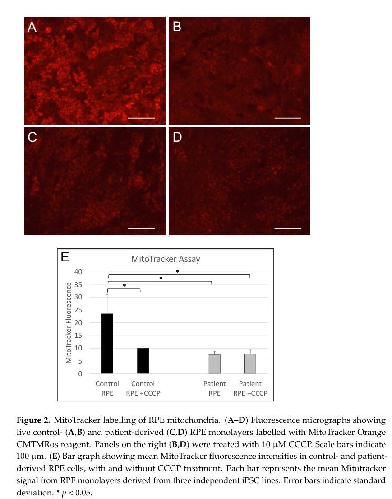
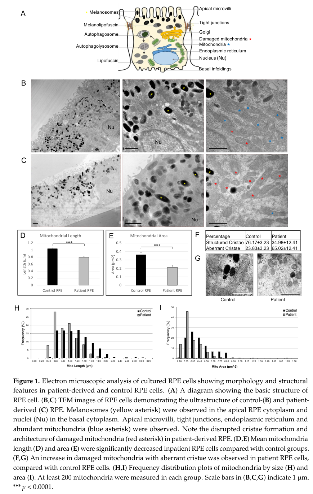

## Question

# Disease Characteristics Research Template

## Target Disease
- **Disease Name:** RCBTB1-Related Retinopathy
- **MONDO ID:**  (if available)
- **Category:** Mendelian

## Research Objectives

Please provide a comprehensive research report on **RCBTB1-Related Retinopathy** covering all of the
disease characteristics listed below. This report will be used to populate a disease knowledge
base entry. Be thorough and cite primary literature (PMID preferred) for all claims.

For each section, **suggested databases/resources** are listed. These are the first places
you should search for information on each topic.

---

### 1. Disease Information
> **Search first:** OMIM, Orphanet, ICD-10/ICD-11, MeSH, PubMed

- What is the disease? Provide a concise overview.
- What are the key identifiers? (OMIM, Orphanet, ICD-10/ICD-11, MeSH, Mondo)
- What are the common synonyms and alternative names?
- Is the information derived from individual patients (e.g., EHR) or aggregated disease-level resources?

### 2. Etiology

- **Disease Causal Factors**: What are the primary causes? (genetic, environmental, infectious, mechanistic)
- **Risk Factors**:
  > **Search first:** PubMed, Cochrane Library, UpToDate, clinical guidelines, ClinVar, ClinGen, GWAS Catalog, PheGenI, CTD, CDC, WHO, epidemiological databases
  - Genetic risk factors (causal variants, susceptibility loci, modifier genes)
  - Environmental risk factors (toxins, lifestyle, occupational exposures, age, sex, family history)
- **Protective Factors**:
  > **Search first:** PubMed, Cochrane Library, clinical trial databases, GWAS Catalog, gnomAD, WHO, CDC, nutrition databases
  - Genetic protective factors (protective variants, modifier alleles)
  - Environmental protective factors (diet, lifestyle, exposures that reduce risk)
- **Gene-Environment Interactions**: How do genetic and environmental factors interact to influence disease?
  > **Search first:** CTD, PubMed, PheGenI, GxE databases

### 3. Phenotypes
> **Search first:** HPO (Human Phenotype Ontology), OMIM, Orphanet, PubMed, clinicaltrials.gov, MedDRA, SNOMED CT, DECIPHER, LOINC

For each phenotype, provide:
- **Phenotype type**: symptoms, clinical signs, physical manifestations, behavioral changes, or laboratory abnormalities
  > For symptoms/signs: HPO, OMIM, Orphanet, PubMed
  > For behavioral changes: HPO, DSM, RDoC (Research Domain Criteria), PubMed
  > For laboratory abnormalities: LOINC, SNOMED CT, LabTests Online, PubMed
- **Phenotype characteristics**:
  > **Search first:** OMIM, Orphanet, HPO, PubMed
  - Age of symptom onset (neonatal, childhood, adult-onset, late-onset)
  - Symptom severity (mild, moderate, severe, variable)
  - Symptom progression (stable, progressive, episodic, fluctuating)
  - Frequency among affected individuals (percentage or qualitative)
- **Quality of life impact**: Effects on daily functioning and well-being (per-phenotype when possible)
  > **Search first:** EQ-5D database, SF-36, WHO QOL databases, PubMed
- Suggest HPO (Human Phenotype Ontology) terms for each phenotype

### 4. Genetic/Molecular Information

- **Causal Genes**: Gene mutations or chromosomal abnormalities responsible for disease (gene symbols, OMIM IDs)
  > **Search first:** OMIM, ClinVar, HGMD, Ensembl, NCBI Gene
- **Pathogenic Variants**:
  - Affected genes (gene symbols, HGNC IDs)
    > **Search first:** OMIM, NCBI Gene, Ensembl, HGNC, UniProt, GeneCards
  - Variant classification (pathogenic, likely pathogenic, VUS per ACMG/AMP guidelines)
    > **Search first:** ClinVar, ClinGen, ACMG/AMP guidelines, VarSome
  - Variant type/class (missense, frameshift, nonsense, splice-site, structural)
  - Allele frequency in population databases
    > **Search first:** gnomAD, 1000 Genomes, ExAC, TOPMed, dbSNP
  - Somatic vs germline origin
    > **Search first:** COSMIC (somatic), ClinVar, ICGC, TCGA
  - Functional consequences (loss of function, gain of function, dominant negative)
- **Modifier Genes**: Genes that modify disease severity or expression
- **Epigenetic Information**: DNA methylation, histone modifications, chromatin changes affecting disease
  > **Search first:** ENCODE, Roadmap Epigenomics, MethBase, DiseaseMeth
- **Chromosomal Abnormalities**: Large-scale genetic changes (aneuploidy, translocations, inversions)
  > **Search first:** DECIPHER, ClinVar, ECARUCA, UCSC Genome Browser

### 5. Environmental Information

- **Environmental Factors**: Non-genetic contributing factors (toxins, radiation, pollution, occupational exposure)
  > **Search first:** CTD (Comparative Toxicogenomics Database), TOXNET, PubMed, EPA databases
- **Lifestyle Factors**: Behavioral factors (smoking, diet, exercise, alcohol consumption)
  > **Search first:** CDC databases, WHO, PubMed, NHANES
- **Infectious Agents**: If applicable, pathogens causing or triggering disease (bacteria, viruses, fungi, parasites)
  > **Search first:** NCBI Taxonomy, ViPR, BV-BRC, MicrobeDB, GIDEON

### 6. Mechanism / Pathophysiology

- **Molecular Pathways**: Specific signaling cascades or biochemical pathways involved (Wnt, MAPK, mTOR, PI3K-AKT, etc.)
  > **Search first:** KEGG, Reactome, WikiPathways, PathBank, BioCyc
- **Cellular Processes**: Cell-level mechanisms (apoptosis, autophagy, cell cycle dysregulation, inflammation, etc.)
  > **Search first:** Gene Ontology (GO), Reactome, KEGG, PubMed
- **Protein Dysfunction**: How protein structure or function is altered (misfolding, aggregation, loss of function, gain of function)
  > **Search first:** UniProt, PDB (Protein Data Bank), InterPro, Pfam, AlphaFold
- **Metabolic Changes**: Alterations in metabolic processes (energy metabolism, lipid metabolism, amino acid metabolism)
  > **Search first:** KEGG, BioCyc, HMDB (Human Metabolome Database), BRENDA
- **Immune System Involvement**: Role of immune response (autoimmunity, immunodeficiency, chronic inflammation)
  > **Search first:** ImmPort, Immunome Database, IEDB, Gene Ontology
- **Tissue Damage Mechanisms**: How tissues/ are injured (oxidative stress, ischemia, fibrosis, necrosis)
  > **Search first:** PubMed, Gene Ontology, Reactome
- **Biochemical Abnormalities**: Specific molecular defects (enzyme deficiencies, receptor dysfunction, ion channel defects)
  > **Search first:** BRENDA, UniProt, KEGG, OMIM, PubMed
- **Epigenetic Changes**: DNA methylation, histone modifications affecting gene expression in disease
  > **Search first:** ENCODE, Roadmap Epigenomics, MethBase, DiseaseMeth
- **Molecular Profiling** (if available):
  - Transcriptomics/gene expression changes
    > **Search first:** GEO (Gene Expression Omnibus), ArrayExpress, GTEx, Human Cell Atlas, SRA
  - Proteomics findings
    > **Search first:** PRIDE, ProteomeXchange, Human Protein Atlas, STRING, BioGRID
  - Metabolomics signatures
    > **Search first:** MetaboLights, Metabolomics Workbench, HMDB, METLIN
  - Lipidomics alterations
    > **Search first:** LIPID MAPS, SwissLipids, LipidHome, Metabolomics Workbench
  - Genomic structural features
    > **Search first:** UCSC Genome Browser, Ensembl, NCBI, dbVar, DGV
- **Advanced Technologies** (if applicable):
  - Single-cell analysis findings (cell-type specific mechanisms, cellular heterogeneity)
    > **Search first:** Human Cell Atlas, Single Cell Portal, GEO, CELLxGENE
  - Spatial transcriptomics findings
    > **Search first:** GEO, Spatial Research, Vizgen, 10x Genomics data
  - Multi-omics integration results
    > **Search first:** TCGA, ICGC, cBioPortal, LinkedOmics, PubMed
  - Functional genomics screens (CRISPR, RNAi)
    > **Search first:** DepMap, GenomeRNAi, PubMed, BioGRID ORCS

For each mechanism, describe:
- The causal chain from initial trigger to clinical manifestation
- Which mechanisms are upstream vs downstream
- What cell types and biological processes are involved
- Suggest GO terms for biological processes and CL terms for cell types

### 7. Anatomical Structures Affected

- **Organ Level**:
  - Primary organs directly affected
  - Secondary organ involvement (complications, secondary effects)
  - Body systems involved (cardiovascular, nervous, digestive, respiratory, endocrine, etc.)
  > **Search first:** Uberon, FMA (Foundational Model of Anatomy), OMIM, HPO, ICD-11, MeSH, SNOMED CT
- **Tissue and Cell Level**:
  - Specific tissue types affected (epithelial, connective, muscle, nervous)
  - Specific cell populations targeted (with Cell Ontology terms)
  > **Search first:** Uberon, Human Protein Atlas, Cell Ontology, Human Cell Atlas, CellMarker, PanglaoDB
- **Subcellular Level**:
  - Cellular compartments involved (mitochondria, nucleus, ER, lysosomes) (with GO Cellular Component terms)
  > **Search first:** Gene Ontology (Cellular Component), UniProt, Human Protein Atlas
- **Localization**:
  - Specific anatomical sites (with UBERON terms)
    > **Search first:** FMA, Uberon, NeuroNames (for brain), SNOMED CT
  - Lateralization (unilateral, bilateral, asymmetric)
    > **Search first:** HPO, clinical literature, imaging databases

### 8. Temporal Development

- **Onset**:
  - Typical age of onset (congenital, pediatric, adult, geriatric)
  - Onset pattern (acute, subacute, chronic, insidious)
  > **Search first:** OMIM, Orphanet, HPO, PubMed
- **Progression**:
  - Disease stages (early, intermediate, advanced, end-stage)
    > **Search first:** Cancer Staging Manual (AJCC), WHO classifications, PubMed
  - Progression rate (rapid, slow, variable)
  - Disease course pattern (episodic, relapsing-remitting, progressive, stable)
  - Disease duration (self-limited, chronic lifelong)
  > **Search first:** Disease registries, longitudinal cohort databases, natural history studies, PubMed, Orphanet, OMIM
- **Patterns**:
  - Remission patterns (spontaneous, treatment-induced)
    > **Search first:** Clinical trial databases, disease registries, PubMed
  - Critical periods (time windows of vulnerability or opportunity for intervention)
    > **Search first:** PubMed, developmental biology databases, clinical guidelines

### 9. Inheritance and Population

- **Epidemiology**:
  - Prevalence (cases per 100,000 at given time)
  - Incidence (new cases per 100,000 per year)
  > **Search first:** Orphanet, CDC, WHO, GBD (Global Burden of Disease), national registries, SEER, disease registries
- **For Genetic Etiology**:
  - Inheritance pattern (AD, AR, X-linked, mitochondrial, multifactorial, polygenic)
    > **Search first:** OMIM, Orphanet, ClinVar, GTR (Genetic Testing Registry)
  - Penetrance (complete, incomplete, age-dependent)
    > **Search first:** ClinVar, OMIM, PubMed, ClinGen
  - Expressivity (variable, consistent)
    > **Search first:** OMIM, ClinVar, PubMed
  - Genetic anticipation (increasing severity in successive generations)
    > **Search first:** OMIM, PubMed (especially for repeat expansion disorders)
  - Germline mosaicism
    > **Search first:** ClinVar, OMIM, genetic counseling literature, PubMed
  - Founder effects (population-specific mutations)
    > **Search first:** gnomAD, population genetics databases, PubMed
  - Consanguinity role
    > **Search first:** OMIM, population studies, genetic counseling resources
  - Carrier frequency
    > **Search first:** gnomAD, carrier screening databases, GeneReviews, GTR
- **Population Demographics**:
  - Affected populations (ethnic or demographic groups with higher prevalence)
    > **Search first:** gnomAD, 1000 Genomes, PAGE Study, PubMed, population registries
  - Geographic distribution (endemic areas, regional variation)
    > **Search first:** WHO, CDC, GBD, Orphanet, geographic epidemiology databases
  - Geographic distribution of specific variants
  - Sex ratio (male:female)
    > **Search first:** Disease registries, OMIM, PubMed, epidemiological databases
  - Age distribution of affected individuals
    > **Search first:** CDC, disease registries, SEER, Orphanet

### 10. Diagnostics

- **Clinical Tests**:
  - Laboratory tests (blood, urine, tissue chemistry, specific enzyme assays)
    > **Search first:** LOINC, LabTests Online, PubMed
  - Biomarkers (proteins, metabolites, genetic markers, circulating biomarkers)
    > **Search first:** FDA Biomarker List, BEST (Biomarkers, EndpointS, and other Tools), PubMed
  - Imaging studies (X-ray, CT, MRI, PET, ultrasound)
    > **Search first:** RadLex, DICOM, Radiopaedia, imaging databases
  - Functional tests (pulmonary function, cardiac stress tests)
    > **Search first:** LOINC, clinical guidelines, PubMed
  - Electrophysiology (EEG, EMG, ECG, nerve conduction studies)
    > **Search first:** LOINC, clinical neurophysiology databases, PubMed
  - Biopsy findings (histopathology, immunohistochemistry)
    > **Search first:** SNOMED CT, College of American Pathologists resources, PubMed
  - Pathology findings (microscopic examination)
    > **Search first:** SNOMED CT, Digital Pathology databases, PubMed
- **Genetic Testing**:
  > **Search first:** GTR (Genetic Testing Registry), GeneReviews, ClinGen
  - Overview of recommended genetic testing approach
  - Whole genome sequencing (WGS) utility
    > **Search first:** GTR, ClinVar, GEL (Genomics England), gnomAD
  - Whole exome sequencing (WES) utility
    > **Search first:** GTR, ClinVar, OMIM, GeneMatcher
  - Gene panels (which panels, which genes)
    > **Search first:** GTR, ClinVar, laboratory-specific databases
  - Single gene testing
    > **Search first:** GTR, ClinVar, OMIM, GeneReviews
  - Chromosomal microarray (CMA)
    > **Search first:** DECIPHER, ClinVar, dbVar, ECARUCA
  - Karyotyping
    > **Search first:** Chromosome Abnormality Database, ClinVar, cytogenetics resources
  - FISH
    > **Search first:** ClinVar, cytogenetics databases, PubMed
  - Mitochondrial DNA testing
    > **Search first:** MITOMAP, MSeqDR, ClinVar, GTR
  - Repeat expansion testing
    > **Search first:** GTR, ClinVar, repeat expansion databases, PubMed
- **Omics-Based Diagnostics** (if applicable):
  - RNA sequencing / transcriptomics
    > **Search first:** GEO, ArrayExpress, GTEx, RNA-seq databases
  - Proteomics
    > **Search first:** PRIDE, ProteomeXchange, FDA Biomarker database
  - Metabolomics
    > **Search first:** MetaboLights, Metabolomics Workbench, HMDB
  - Epigenomics
    > **Search first:** GEO, ENCODE, Roadmap Epigenomics, MethBase
  - Liquid biopsy
    > **Search first:** COSMIC, ClinVar, liquid biopsy databases, PubMed
- **Clinical Criteria**:
  - Standardized diagnostic criteria (DSM, ICD, society guidelines)
    > **Search first:** DSM-5, ICD-11, clinical society guidelines, UpToDate
  - Differential diagnosis (other conditions to rule out, with distinguishing features)
    > **Search first:** DynaMed, UpToDate, clinical decision support systems
- **Screening**:
  - Screening methods for asymptomatic individuals (newborn screening, carrier screening, cascade screening)
    > **Search first:** ACMG recommendations, CDC newborn screening, GTR

### 11. Outcome/Prognosis

- **Survival and Mortality**:
  - Survival rate (5-year, 10-year, overall)
    > **Search first:** SEER, cancer registries, disease-specific registries, PubMed
  - Life expectancy (with and without treatment if applicable)
    > **Search first:** Orphanet, disease registries, actuarial databases, PubMed
  - Mortality rate
    > **Search first:** CDC, WHO, GBD, national mortality databases
  - Disease-specific mortality (deaths directly attributable to disease)
    > **Search first:** Disease registries, CDC Wonder, GBD, PubMed
- **Morbidity and Function**:
  - Morbidity (disease-related disability and health impacts)
    > **Search first:** GBD, WHO, disability databases, PubMed
  - Disability outcomes (long-term functional impairments)
    > **Search first:** ICF (International Classification of Functioning), disability registries
  - Quality of life measures (EQ-5D, SF-36, PROMIS, disease-specific tools)
    > **Search first:** EQ-5D database, SF-36, PROMIS, PubMed
- **Disease Course**:
  - Complications (secondary problems: infections, organ failure, etc.)
    > **Search first:** ICD codes, disease registries, clinical databases, PubMed
  - Recovery potential (likelihood and extent of recovery, with vs without treatment)
    > **Search first:** Natural history studies, rehabilitation databases, PubMed
- **Prediction**:
  - Prognostic factors (age, disease severity, biomarkers, treatment response)
    > **Search first:** Prognostic models databases, clinical calculators, PubMed
  - Prognostic biomarkers (molecular markers predicting disease course)
    > **Search first:** FDA Biomarker database, PubMed, cancer prognostic databases

### 12. Treatment

- **Pharmacotherapy**:
  - Pharmacological treatments (drug names, drug classes, mechanisms of action)
    > **Search first:** DrugBank, RxNorm, ATC classification, DailyMed, FDA databases
  - Pharmacogenomics (how genetic variants affect drug metabolism, efficacy, toxicity)
    > **Search first:** PharmGKB, CPIC (Clinical Pharmacogenetics), FDA Table of PGx Biomarkers
- **Advanced Therapeutics**:
  - Gene therapy (viral vectors, CRISPR, gene replacement, gene editing)
    > **Search first:** ClinicalTrials.gov, FDA gene therapy database, ASGCT resources
  - Cell therapy (stem cell transplant, CAR-T, cellular therapeutics)
    > **Search first:** ClinicalTrials.gov, FDA cell therapy database, FACT standards
  - RNA-based therapies (ASOs, siRNA, mRNA therapies)
    > **Search first:** ClinicalTrials.gov, FDA approvals, PubMed
  - Targeted therapies (treatments directed at specific molecular targets)
    > **Search first:** My Cancer Genome, OncoKB, ClinicalTrials.gov, FDA approvals
  - Immunotherapies (checkpoint inhibitors, monoclonal antibodies)
    > **Search first:** Cancer Immunotherapy Database, FDA approvals, ClinicalTrials.gov
- **Surgical and Interventional**:
  - Surgical interventions (types of surgery, timing, outcomes)
    > **Search first:** CPT codes, surgical registries, clinical guidelines, PubMed
- **Supportive and Rehabilitative**:
  - Supportive care (symptom management, pain control, nutrition)
    > **Search first:** Clinical guidelines, Cochrane Library, PubMed
  - Rehabilitation (physical therapy, occupational therapy, speech therapy)
    > **Search first:** Rehabilitation medicine databases, clinical guidelines, PubMed
- **Experimental**:
  - Experimental treatments in clinical trials (with NCT identifiers if available)
    > **Search first:** ClinicalTrials.gov, EU Clinical Trials Register, WHO ICTRP
- **Treatment Outcomes**:
  - Treatment response rates
    > **Search first:** Clinical trial databases, FDA reviews, systematic reviews, PubMed
  - Side effects and adverse events
    > **Search first:** FDA Adverse Event Reporting System (FAERS), MedWatch, PubMed
- **Treatment Strategy**:
  - Treatment algorithms (clinical pathways, decision trees)
    > **Search first:** Clinical practice guidelines, NCCN Guidelines, UpToDate
  - Combination therapies
    > **Search first:** ClinicalTrials.gov, treatment guidelines, PubMed
  - Personalized medicine approaches (genotype-guided treatment)
    > **Search first:** My Cancer Genome, CIViC, PharmGKB, precision medicine databases

For each treatment, suggest MAXO (Medical Action Ontology) terms where applicable.

### 13. Prevention

- **Prevention Levels**:
  - Primary prevention (preventing disease occurrence: vaccination, risk factor modification)
    > **Search first:** CDC, WHO, USPSTF recommendations, Cochrane Library
  - Secondary prevention (early detection and treatment: screening programs, early intervention)
    > **Search first:** USPSTF, CDC screening guidelines, WHO
  - Tertiary prevention (preventing complications in those with disease)
    > **Search first:** Clinical guidelines, disease management protocols, PubMed
- **Immunization**: Vaccine strategies (if applicable)
  > **Search first:** CDC vaccine schedules, WHO immunization, FDA vaccine database
- **Screening and Early Detection**:
  - Screening programs (population-based: newborn screening, cancer screening)
    > **Search first:** CDC screening programs, USPSTF, cancer screening databases
  - Genetic screening (carrier screening, preimplantation genetic diagnosis, prenatal testing)
    > **Search first:** ACMG recommendations, ACOG guidelines, GTR
  - Risk stratification (identifying high-risk individuals for targeted prevention)
    > **Search first:** Risk prediction models, clinical calculators, PubMed
- **Behavioral Interventions**: Lifestyle modifications to reduce risk
  > **Search first:** CDC, WHO, behavioral intervention databases, Cochrane Library
- **Counseling**: Genetic counseling (risk assessment, family planning guidance)
  > **Search first:** NSGC resources, ACMG guidelines, GeneReviews
- **Public Health**:
  - Public health interventions (sanitation, vector control, health education)
    > **Search first:** CDC, WHO, public health databases, PubMed
  - Environmental interventions (reducing environmental risk factors)
    > **Search first:** EPA databases, WHO environmental health, PubMed
- **Prophylaxis**: Preventive medications or procedures
  > **Search first:** Clinical guidelines, FDA approvals, PubMed

### 14. Other Species / Natural Disease

- **Taxonomy**: Species affected (with NCBI Taxon identifiers)
  > **Search first:** NCBI Taxonomy
- **Breed**: Specific breeds affected (with VBO identifiers if applicable)
  > **Search first:** VBO (Vertebrate Breed Ontology)
- **Gene**: Orthologous genes in other species (with NCBI Gene IDs)
  > **Search first:** NCBI Gene
- **Natural Disease**:
  - Naturally occurring disease in other species (companion animals, wildlife)
    > **Search first:** OMIA (Online Mendelian Inheritance in Animals), VetCompass, PubMed
  - Veterinary relevance and importance in animal health
    > **Search first:** OMIA, veterinary databases, PubMed
- **Comparative Biology**:
  - Comparative pathology (similarities and differences across species)
    > **Search first:** OMIA, comparative pathology databases, PubMed
  - Evolutionary conservation of disease mechanisms
    > **Search first:** HomoloGene, OrthoMCL, Alliance of Genome Resources
- **Transmission** (if applicable):
  - Zoonotic potential
    > **Search first:** CDC zoonotic diseases, WHO zoonoses, GIDEON
  - Cross-species susceptibility
    > **Search first:** NCBI Taxonomy, veterinary databases, PubMed

### 15. Model Organisms

- **Model Types**:
  - Model organism type (mammalian, invertebrate, cellular, in vitro)
    > **Search first:** Alliance of Genome Resources, model organism databases
  - Specific model systems (mouse, rat, zebrafish, Drosophila, C. elegans, yeast, cell lines, organoids, iPSCs)
    > **Search first:** MGI, RGD, ZFIN, FlyBase, WormBase, SGD, ATCC, Cellosaurus
  - Induced models (drug treatment, surgical intervention, environmental manipulation)
    > **Search first:** MGI, model organism databases, PubMed
- **Genetic Models**:
  - Types available (knockout, knock-in, transgenic, conditional, humanized)
    > **Search first:** MGI, IMPC, KOMP, EuMMCR, IMSR
- **Model Characteristics**:
  - Phenotype recapitulation (how well model reproduces human disease features)
    > **Search first:** Model organism databases, comparative studies, PubMed
  - Model limitations (aspects of human disease not captured)
    > **Search first:** Model organism databases, PubMed, review articles
- **Applications**:
  - Research applications (what aspects of disease can be studied)
    > **Search first:** Model organism databases, PubMed
- **Resources**:
  - Model databases
    > **Search first:** MGI, RGD, ZFIN, FlyBase, WormBase, IMSR, EMMA, MMRRC

---

## Citation Requirements

- Cite primary literature (PMID preferred) for all mechanistic and clinical claims
- Prioritize recent reviews and landmark papers
- Include direct quotes from abstracts where possible to support key statements
- Distinguish evidence source types: human clinical, model organism, in vitro, computational

## Output Format

Structure your response as a comprehensive narrative organized by the sections above.
For each section, provide:
- Factual content with specific details (numbers, percentages, gene names, variant nomenclature)
- Ontology term suggestions (HPO, GO, CL, UBERON, CHEBI, MAXO, MONDO) where applicable
- Evidence citations with PMIDs
- Direct quotes from abstracts to support key claims
- Clear indication when information is not available or not applicable for this disease

This report will be used to populate a disease knowledge base entry with:
- Pathophysiology descriptions with causal chains
- Gene/protein annotations (HGNC, GO terms)
- Phenotype associations (HP terms) with frequencies
- Cell type involvement (CL terms)
- Anatomical locations (UBERON terms)
- Chemical entities (CHEBI terms)
- Treatment annotations (MAXO terms)
- Evidence items with PMIDs and exact abstract quotes
- Epidemiology, prognosis, diagnostic, and prevention information
- Animal model descriptions with phenotype recapitulation details

## Output

Question: You are an expert researcher providing comprehensive, well-cited information.

Provide detailed information focusing on:
1. Key concepts and definitions with current understanding
2. Recent developments and latest research (prioritize 2023-2024 sources)
3. Current applications and real-world implementations
4. Expert opinions and analysis from authoritative sources
5. Relevant statistics and data from recent studies

Format as a comprehensive research report with proper citations. Include URLs and publication dates where available.
Always prioritize recent, authoritative sources and provide specific citations for all major claims.

# Disease Characteristics Research Template

## Target Disease
- **Disease Name:** RCBTB1-Related Retinopathy
- **MONDO ID:**  (if available)
- **Category:** Mendelian

## Research Objectives

Please provide a comprehensive research report on **RCBTB1-Related Retinopathy** covering all of the
disease characteristics listed below. This report will be used to populate a disease knowledge
base entry. Be thorough and cite primary literature (PMID preferred) for all claims.

For each section, **suggested databases/resources** are listed. These are the first places
you should search for information on each topic.

---

### 1. Disease Information
> **Search first:** OMIM, Orphanet, ICD-10/ICD-11, MeSH, PubMed

- What is the disease? Provide a concise overview.
- What are the key identifiers? (OMIM, Orphanet, ICD-10/ICD-11, MeSH, Mondo)
- What are the common synonyms and alternative names?
- Is the information derived from individual patients (e.g., EHR) or aggregated disease-level resources?

### 2. Etiology

- **Disease Causal Factors**: What are the primary causes? (genetic, environmental, infectious, mechanistic)
- **Risk Factors**:
  > **Search first:** PubMed, Cochrane Library, UpToDate, clinical guidelines, ClinVar, ClinGen, GWAS Catalog, PheGenI, CTD, CDC, WHO, epidemiological databases
  - Genetic risk factors (causal variants, susceptibility loci, modifier genes)
  - Environmental risk factors (toxins, lifestyle, occupational exposures, age, sex, family history)
- **Protective Factors**:
  > **Search first:** PubMed, Cochrane Library, clinical trial databases, GWAS Catalog, gnomAD, WHO, CDC, nutrition databases
  - Genetic protective factors (protective variants, modifier alleles)
  - Environmental protective factors (diet, lifestyle, exposures that reduce risk)
- **Gene-Environment Interactions**: How do genetic and environmental factors interact to influence disease?
  > **Search first:** CTD, PubMed, PheGenI, GxE databases

### 3. Phenotypes
> **Search first:** HPO (Human Phenotype Ontology), OMIM, Orphanet, PubMed, clinicaltrials.gov, MedDRA, SNOMED CT, DECIPHER, LOINC

For each phenotype, provide:
- **Phenotype type**: symptoms, clinical signs, physical manifestations, behavioral changes, or laboratory abnormalities
  > For symptoms/signs: HPO, OMIM, Orphanet, PubMed
  > For behavioral changes: HPO, DSM, RDoC (Research Domain Criteria), PubMed
  > For laboratory abnormalities: LOINC, SNOMED CT, LabTests Online, PubMed
- **Phenotype characteristics**:
  > **Search first:** OMIM, Orphanet, HPO, PubMed
  - Age of symptom onset (neonatal, childhood, adult-onset, late-onset)
  - Symptom severity (mild, moderate, severe, variable)
  - Symptom progression (stable, progressive, episodic, fluctuating)
  - Frequency among affected individuals (percentage or qualitative)
- **Quality of life impact**: Effects on daily functioning and well-being (per-phenotype when possible)
  > **Search first:** EQ-5D database, SF-36, WHO QOL databases, PubMed
- Suggest HPO (Human Phenotype Ontology) terms for each phenotype

### 4. Genetic/Molecular Information

- **Causal Genes**: Gene mutations or chromosomal abnormalities responsible for disease (gene symbols, OMIM IDs)
  > **Search first:** OMIM, ClinVar, HGMD, Ensembl, NCBI Gene
- **Pathogenic Variants**:
  - Affected genes (gene symbols, HGNC IDs)
    > **Search first:** OMIM, NCBI Gene, Ensembl, HGNC, UniProt, GeneCards
  - Variant classification (pathogenic, likely pathogenic, VUS per ACMG/AMP guidelines)
    > **Search first:** ClinVar, ClinGen, ACMG/AMP guidelines, VarSome
  - Variant type/class (missense, frameshift, nonsense, splice-site, structural)
  - Allele frequency in population databases
    > **Search first:** gnomAD, 1000 Genomes, ExAC, TOPMed, dbSNP
  - Somatic vs germline origin
    > **Search first:** COSMIC (somatic), ClinVar, ICGC, TCGA
  - Functional consequences (loss of function, gain of function, dominant negative)
- **Modifier Genes**: Genes that modify disease severity or expression
- **Epigenetic Information**: DNA methylation, histone modifications, chromatin changes affecting disease
  > **Search first:** ENCODE, Roadmap Epigenomics, MethBase, DiseaseMeth
- **Chromosomal Abnormalities**: Large-scale genetic changes (aneuploidy, translocations, inversions)
  > **Search first:** DECIPHER, ClinVar, ECARUCA, UCSC Genome Browser

### 5. Environmental Information

- **Environmental Factors**: Non-genetic contributing factors (toxins, radiation, pollution, occupational exposure)
  > **Search first:** CTD (Comparative Toxicogenomics Database), TOXNET, PubMed, EPA databases
- **Lifestyle Factors**: Behavioral factors (smoking, diet, exercise, alcohol consumption)
  > **Search first:** CDC databases, WHO, PubMed, NHANES
- **Infectious Agents**: If applicable, pathogens causing or triggering disease (bacteria, viruses, fungi, parasites)
  > **Search first:** NCBI Taxonomy, ViPR, BV-BRC, MicrobeDB, GIDEON

### 6. Mechanism / Pathophysiology

- **Molecular Pathways**: Specific signaling cascades or biochemical pathways involved (Wnt, MAPK, mTOR, PI3K-AKT, etc.)
  > **Search first:** KEGG, Reactome, WikiPathways, PathBank, BioCyc
- **Cellular Processes**: Cell-level mechanisms (apoptosis, autophagy, cell cycle dysregulation, inflammation, etc.)
  > **Search first:** Gene Ontology (GO), Reactome, KEGG, PubMed
- **Protein Dysfunction**: How protein structure or function is altered (misfolding, aggregation, loss of function, gain of function)
  > **Search first:** UniProt, PDB (Protein Data Bank), InterPro, Pfam, AlphaFold
- **Metabolic Changes**: Alterations in metabolic processes (energy metabolism, lipid metabolism, amino acid metabolism)
  > **Search first:** KEGG, BioCyc, HMDB (Human Metabolome Database), BRENDA
- **Immune System Involvement**: Role of immune response (autoimmunity, immunodeficiency, chronic inflammation)
  > **Search first:** ImmPort, Immunome Database, IEDB, Gene Ontology
- **Tissue Damage Mechanisms**: How tissues/ are injured (oxidative stress, ischemia, fibrosis, necrosis)
  > **Search first:** PubMed, Gene Ontology, Reactome
- **Biochemical Abnormalities**: Specific molecular defects (enzyme deficiencies, receptor dysfunction, ion channel defects)
  > **Search first:** BRENDA, UniProt, KEGG, OMIM, PubMed
- **Epigenetic Changes**: DNA methylation, histone modifications affecting gene expression in disease
  > **Search first:** ENCODE, Roadmap Epigenomics, MethBase, DiseaseMeth
- **Molecular Profiling** (if available):
  - Transcriptomics/gene expression changes
    > **Search first:** GEO (Gene Expression Omnibus), ArrayExpress, GTEx, Human Cell Atlas, SRA
  - Proteomics findings
    > **Search first:** PRIDE, ProteomeXchange, Human Protein Atlas, STRING, BioGRID
  - Metabolomics signatures
    > **Search first:** MetaboLights, Metabolomics Workbench, HMDB, METLIN
  - Lipidomics alterations
    > **Search first:** LIPID MAPS, SwissLipids, LipidHome, Metabolomics Workbench
  - Genomic structural features
    > **Search first:** UCSC Genome Browser, Ensembl, NCBI, dbVar, DGV
- **Advanced Technologies** (if applicable):
  - Single-cell analysis findings (cell-type specific mechanisms, cellular heterogeneity)
    > **Search first:** Human Cell Atlas, Single Cell Portal, GEO, CELLxGENE
  - Spatial transcriptomics findings
    > **Search first:** GEO, Spatial Research, Vizgen, 10x Genomics data
  - Multi-omics integration results
    > **Search first:** TCGA, ICGC, cBioPortal, LinkedOmics, PubMed
  - Functional genomics screens (CRISPR, RNAi)
    > **Search first:** DepMap, GenomeRNAi, PubMed, BioGRID ORCS

For each mechanism, describe:
- The causal chain from initial trigger to clinical manifestation
- Which mechanisms are upstream vs downstream
- What cell types and biological processes are involved
- Suggest GO terms for biological processes and CL terms for cell types

### 7. Anatomical Structures Affected

- **Organ Level**:
  - Primary organs directly affected
  - Secondary organ involvement (complications, secondary effects)
  - Body systems involved (cardiovascular, nervous, digestive, respiratory, endocrine, etc.)
  > **Search first:** Uberon, FMA (Foundational Model of Anatomy), OMIM, HPO, ICD-11, MeSH, SNOMED CT
- **Tissue and Cell Level**:
  - Specific tissue types affected (epithelial, connective, muscle, nervous)
  - Specific cell populations targeted (with Cell Ontology terms)
  > **Search first:** Uberon, Human Protein Atlas, Cell Ontology, Human Cell Atlas, CellMarker, PanglaoDB
- **Subcellular Level**:
  - Cellular compartments involved (mitochondria, nucleus, ER, lysosomes) (with GO Cellular Component terms)
  > **Search first:** Gene Ontology (Cellular Component), UniProt, Human Protein Atlas
- **Localization**:
  - Specific anatomical sites (with UBERON terms)
    > **Search first:** FMA, Uberon, NeuroNames (for brain), SNOMED CT
  - Lateralization (unilateral, bilateral, asymmetric)
    > **Search first:** HPO, clinical literature, imaging databases

### 8. Temporal Development

- **Onset**:
  - Typical age of onset (congenital, pediatric, adult, geriatric)
  - Onset pattern (acute, subacute, chronic, insidious)
  > **Search first:** OMIM, Orphanet, HPO, PubMed
- **Progression**:
  - Disease stages (early, intermediate, advanced, end-stage)
    > **Search first:** Cancer Staging Manual (AJCC), WHO classifications, PubMed
  - Progression rate (rapid, slow, variable)
  - Disease course pattern (episodic, relapsing-remitting, progressive, stable)
  - Disease duration (self-limited, chronic lifelong)
  > **Search first:** Disease registries, longitudinal cohort databases, natural history studies, PubMed, Orphanet, OMIM
- **Patterns**:
  - Remission patterns (spontaneous, treatment-induced)
    > **Search first:** Clinical trial databases, disease registries, PubMed
  - Critical periods (time windows of vulnerability or opportunity for intervention)
    > **Search first:** PubMed, developmental biology databases, clinical guidelines

### 9. Inheritance and Population

- **Epidemiology**:
  - Prevalence (cases per 100,000 at given time)
  - Incidence (new cases per 100,000 per year)
  > **Search first:** Orphanet, CDC, WHO, GBD (Global Burden of Disease), national registries, SEER, disease registries
- **For Genetic Etiology**:
  - Inheritance pattern (AD, AR, X-linked, mitochondrial, multifactorial, polygenic)
    > **Search first:** OMIM, Orphanet, ClinVar, GTR (Genetic Testing Registry)
  - Penetrance (complete, incomplete, age-dependent)
    > **Search first:** ClinVar, OMIM, PubMed, ClinGen
  - Expressivity (variable, consistent)
    > **Search first:** OMIM, ClinVar, PubMed
  - Genetic anticipation (increasing severity in successive generations)
    > **Search first:** OMIM, PubMed (especially for repeat expansion disorders)
  - Germline mosaicism
    > **Search first:** ClinVar, OMIM, genetic counseling literature, PubMed
  - Founder effects (population-specific mutations)
    > **Search first:** gnomAD, population genetics databases, PubMed
  - Consanguinity role
    > **Search first:** OMIM, population studies, genetic counseling resources
  - Carrier frequency
    > **Search first:** gnomAD, carrier screening databases, GeneReviews, GTR
- **Population Demographics**:
  - Affected populations (ethnic or demographic groups with higher prevalence)
    > **Search first:** gnomAD, 1000 Genomes, PAGE Study, PubMed, population registries
  - Geographic distribution (endemic areas, regional variation)
    > **Search first:** WHO, CDC, GBD, Orphanet, geographic epidemiology databases
  - Geographic distribution of specific variants
  - Sex ratio (male:female)
    > **Search first:** Disease registries, OMIM, PubMed, epidemiological databases
  - Age distribution of affected individuals
    > **Search first:** CDC, disease registries, SEER, Orphanet

### 10. Diagnostics

- **Clinical Tests**:
  - Laboratory tests (blood, urine, tissue chemistry, specific enzyme assays)
    > **Search first:** LOINC, LabTests Online, PubMed
  - Biomarkers (proteins, metabolites, genetic markers, circulating biomarkers)
    > **Search first:** FDA Biomarker List, BEST (Biomarkers, EndpointS, and other Tools), PubMed
  - Imaging studies (X-ray, CT, MRI, PET, ultrasound)
    > **Search first:** RadLex, DICOM, Radiopaedia, imaging databases
  - Functional tests (pulmonary function, cardiac stress tests)
    > **Search first:** LOINC, clinical guidelines, PubMed
  - Electrophysiology (EEG, EMG, ECG, nerve conduction studies)
    > **Search first:** LOINC, clinical neurophysiology databases, PubMed
  - Biopsy findings (histopathology, immunohistochemistry)
    > **Search first:** SNOMED CT, College of American Pathologists resources, PubMed
  - Pathology findings (microscopic examination)
    > **Search first:** SNOMED CT, Digital Pathology databases, PubMed
- **Genetic Testing**:
  > **Search first:** GTR (Genetic Testing Registry), GeneReviews, ClinGen
  - Overview of recommended genetic testing approach
  - Whole genome sequencing (WGS) utility
    > **Search first:** GTR, ClinVar, GEL (Genomics England), gnomAD
  - Whole exome sequencing (WES) utility
    > **Search first:** GTR, ClinVar, OMIM, GeneMatcher
  - Gene panels (which panels, which genes)
    > **Search first:** GTR, ClinVar, laboratory-specific databases
  - Single gene testing
    > **Search first:** GTR, ClinVar, OMIM, GeneReviews
  - Chromosomal microarray (CMA)
    > **Search first:** DECIPHER, ClinVar, dbVar, ECARUCA
  - Karyotyping
    > **Search first:** Chromosome Abnormality Database, ClinVar, cytogenetics resources
  - FISH
    > **Search first:** ClinVar, cytogenetics databases, PubMed
  - Mitochondrial DNA testing
    > **Search first:** MITOMAP, MSeqDR, ClinVar, GTR
  - Repeat expansion testing
    > **Search first:** GTR, ClinVar, repeat expansion databases, PubMed
- **Omics-Based Diagnostics** (if applicable):
  - RNA sequencing / transcriptomics
    > **Search first:** GEO, ArrayExpress, GTEx, RNA-seq databases
  - Proteomics
    > **Search first:** PRIDE, ProteomeXchange, FDA Biomarker database
  - Metabolomics
    > **Search first:** MetaboLights, Metabolomics Workbench, HMDB
  - Epigenomics
    > **Search first:** GEO, ENCODE, Roadmap Epigenomics, MethBase
  - Liquid biopsy
    > **Search first:** COSMIC, ClinVar, liquid biopsy databases, PubMed
- **Clinical Criteria**:
  - Standardized diagnostic criteria (DSM, ICD, society guidelines)
    > **Search first:** DSM-5, ICD-11, clinical society guidelines, UpToDate
  - Differential diagnosis (other conditions to rule out, with distinguishing features)
    > **Search first:** DynaMed, UpToDate, clinical decision support systems
- **Screening**:
  - Screening methods for asymptomatic individuals (newborn screening, carrier screening, cascade screening)
    > **Search first:** ACMG recommendations, CDC newborn screening, GTR

### 11. Outcome/Prognosis

- **Survival and Mortality**:
  - Survival rate (5-year, 10-year, overall)
    > **Search first:** SEER, cancer registries, disease-specific registries, PubMed
  - Life expectancy (with and without treatment if applicable)
    > **Search first:** Orphanet, disease registries, actuarial databases, PubMed
  - Mortality rate
    > **Search first:** CDC, WHO, GBD, national mortality databases
  - Disease-specific mortality (deaths directly attributable to disease)
    > **Search first:** Disease registries, CDC Wonder, GBD, PubMed
- **Morbidity and Function**:
  - Morbidity (disease-related disability and health impacts)
    > **Search first:** GBD, WHO, disability databases, PubMed
  - Disability outcomes (long-term functional impairments)
    > **Search first:** ICF (International Classification of Functioning), disability registries
  - Quality of life measures (EQ-5D, SF-36, PROMIS, disease-specific tools)
    > **Search first:** EQ-5D database, SF-36, PROMIS, PubMed
- **Disease Course**:
  - Complications (secondary problems: infections, organ failure, etc.)
    > **Search first:** ICD codes, disease registries, clinical databases, PubMed
  - Recovery potential (likelihood and extent of recovery, with vs without treatment)
    > **Search first:** Natural history studies, rehabilitation databases, PubMed
- **Prediction**:
  - Prognostic factors (age, disease severity, biomarkers, treatment response)
    > **Search first:** Prognostic models databases, clinical calculators, PubMed
  - Prognostic biomarkers (molecular markers predicting disease course)
    > **Search first:** FDA Biomarker database, PubMed, cancer prognostic databases

### 12. Treatment

- **Pharmacotherapy**:
  - Pharmacological treatments (drug names, drug classes, mechanisms of action)
    > **Search first:** DrugBank, RxNorm, ATC classification, DailyMed, FDA databases
  - Pharmacogenomics (how genetic variants affect drug metabolism, efficacy, toxicity)
    > **Search first:** PharmGKB, CPIC (Clinical Pharmacogenetics), FDA Table of PGx Biomarkers
- **Advanced Therapeutics**:
  - Gene therapy (viral vectors, CRISPR, gene replacement, gene editing)
    > **Search first:** ClinicalTrials.gov, FDA gene therapy database, ASGCT resources
  - Cell therapy (stem cell transplant, CAR-T, cellular therapeutics)
    > **Search first:** ClinicalTrials.gov, FDA cell therapy database, FACT standards
  - RNA-based therapies (ASOs, siRNA, mRNA therapies)
    > **Search first:** ClinicalTrials.gov, FDA approvals, PubMed
  - Targeted therapies (treatments directed at specific molecular targets)
    > **Search first:** My Cancer Genome, OncoKB, ClinicalTrials.gov, FDA approvals
  - Immunotherapies (checkpoint inhibitors, monoclonal antibodies)
    > **Search first:** Cancer Immunotherapy Database, FDA approvals, ClinicalTrials.gov
- **Surgical and Interventional**:
  - Surgical interventions (types of surgery, timing, outcomes)
    > **Search first:** CPT codes, surgical registries, clinical guidelines, PubMed
- **Supportive and Rehabilitative**:
  - Supportive care (symptom management, pain control, nutrition)
    > **Search first:** Clinical guidelines, Cochrane Library, PubMed
  - Rehabilitation (physical therapy, occupational therapy, speech therapy)
    > **Search first:** Rehabilitation medicine databases, clinical guidelines, PubMed
- **Experimental**:
  - Experimental treatments in clinical trials (with NCT identifiers if available)
    > **Search first:** ClinicalTrials.gov, EU Clinical Trials Register, WHO ICTRP
- **Treatment Outcomes**:
  - Treatment response rates
    > **Search first:** Clinical trial databases, FDA reviews, systematic reviews, PubMed
  - Side effects and adverse events
    > **Search first:** FDA Adverse Event Reporting System (FAERS), MedWatch, PubMed
- **Treatment Strategy**:
  - Treatment algorithms (clinical pathways, decision trees)
    > **Search first:** Clinical practice guidelines, NCCN Guidelines, UpToDate
  - Combination therapies
    > **Search first:** ClinicalTrials.gov, treatment guidelines, PubMed
  - Personalized medicine approaches (genotype-guided treatment)
    > **Search first:** My Cancer Genome, CIViC, PharmGKB, precision medicine databases

For each treatment, suggest MAXO (Medical Action Ontology) terms where applicable.

### 13. Prevention

- **Prevention Levels**:
  - Primary prevention (preventing disease occurrence: vaccination, risk factor modification)
    > **Search first:** CDC, WHO, USPSTF recommendations, Cochrane Library
  - Secondary prevention (early detection and treatment: screening programs, early intervention)
    > **Search first:** USPSTF, CDC screening guidelines, WHO
  - Tertiary prevention (preventing complications in those with disease)
    > **Search first:** Clinical guidelines, disease management protocols, PubMed
- **Immunization**: Vaccine strategies (if applicable)
  > **Search first:** CDC vaccine schedules, WHO immunization, FDA vaccine database
- **Screening and Early Detection**:
  - Screening programs (population-based: newborn screening, cancer screening)
    > **Search first:** CDC screening programs, USPSTF, cancer screening databases
  - Genetic screening (carrier screening, preimplantation genetic diagnosis, prenatal testing)
    > **Search first:** ACMG recommendations, ACOG guidelines, GTR
  - Risk stratification (identifying high-risk individuals for targeted prevention)
    > **Search first:** Risk prediction models, clinical calculators, PubMed
- **Behavioral Interventions**: Lifestyle modifications to reduce risk
  > **Search first:** CDC, WHO, behavioral intervention databases, Cochrane Library
- **Counseling**: Genetic counseling (risk assessment, family planning guidance)
  > **Search first:** NSGC resources, ACMG guidelines, GeneReviews
- **Public Health**:
  - Public health interventions (sanitation, vector control, health education)
    > **Search first:** CDC, WHO, public health databases, PubMed
  - Environmental interventions (reducing environmental risk factors)
    > **Search first:** EPA databases, WHO environmental health, PubMed
- **Prophylaxis**: Preventive medications or procedures
  > **Search first:** Clinical guidelines, FDA approvals, PubMed

### 14. Other Species / Natural Disease

- **Taxonomy**: Species affected (with NCBI Taxon identifiers)
  > **Search first:** NCBI Taxonomy
- **Breed**: Specific breeds affected (with VBO identifiers if applicable)
  > **Search first:** VBO (Vertebrate Breed Ontology)
- **Gene**: Orthologous genes in other species (with NCBI Gene IDs)
  > **Search first:** NCBI Gene
- **Natural Disease**:
  - Naturally occurring disease in other species (companion animals, wildlife)
    > **Search first:** OMIA (Online Mendelian Inheritance in Animals), VetCompass, PubMed
  - Veterinary relevance and importance in animal health
    > **Search first:** OMIA, veterinary databases, PubMed
- **Comparative Biology**:
  - Comparative pathology (similarities and differences across species)
    > **Search first:** OMIA, comparative pathology databases, PubMed
  - Evolutionary conservation of disease mechanisms
    > **Search first:** HomoloGene, OrthoMCL, Alliance of Genome Resources
- **Transmission** (if applicable):
  - Zoonotic potential
    > **Search first:** CDC zoonotic diseases, WHO zoonoses, GIDEON
  - Cross-species susceptibility
    > **Search first:** NCBI Taxonomy, veterinary databases, PubMed

### 15. Model Organisms

- **Model Types**:
  - Model organism type (mammalian, invertebrate, cellular, in vitro)
    > **Search first:** Alliance of Genome Resources, model organism databases
  - Specific model systems (mouse, rat, zebrafish, Drosophila, C. elegans, yeast, cell lines, organoids, iPSCs)
    > **Search first:** MGI, RGD, ZFIN, FlyBase, WormBase, SGD, ATCC, Cellosaurus
  - Induced models (drug treatment, surgical intervention, environmental manipulation)
    > **Search first:** MGI, model organism databases, PubMed
- **Genetic Models**:
  - Types available (knockout, knock-in, transgenic, conditional, humanized)
    > **Search first:** MGI, IMPC, KOMP, EuMMCR, IMSR
- **Model Characteristics**:
  - Phenotype recapitulation (how well model reproduces human disease features)
    > **Search first:** Model organism databases, comparative studies, PubMed
  - Model limitations (aspects of human disease not captured)
    > **Search first:** Model organism databases, PubMed, review articles
- **Applications**:
  - Research applications (what aspects of disease can be studied)
    > **Search first:** Model organism databases, PubMed
- **Resources**:
  - Model databases
    > **Search first:** MGI, RGD, ZFIN, FlyBase, WormBase, IMSR, EMMA, MMRRC

---

## Citation Requirements

- Cite primary literature (PMID preferred) for all mechanistic and clinical claims
- Prioritize recent reviews and landmark papers
- Include direct quotes from abstracts where possible to support key statements
- Distinguish evidence source types: human clinical, model organism, in vitro, computational

## Output Format

Structure your response as a comprehensive narrative organized by the sections above.
For each section, provide:
- Factual content with specific details (numbers, percentages, gene names, variant nomenclature)
- Ontology term suggestions (HPO, GO, CL, UBERON, CHEBI, MAXO, MONDO) where applicable
- Evidence citations with PMIDs
- Direct quotes from abstracts to support key claims
- Clear indication when information is not available or not applicable for this disease

This report will be used to populate a disease knowledge base entry with:
- Pathophysiology descriptions with causal chains
- Gene/protein annotations (HGNC, GO terms)
- Phenotype associations (HP terms) with frequencies
- Cell type involvement (CL terms)
- Anatomical locations (UBERON terms)
- Chemical entities (CHEBI terms)
- Treatment annotations (MAXO terms)
- Evidence items with PMIDs and exact abstract quotes
- Epidemiology, prognosis, diagnostic, and prevention information
- Animal model descriptions with phenotype recapitulation details

# Comprehensive Research Report: RCBTB1-Related Retinopathy (Mendelian)

## Executive summary
RCBTB1-related retinopathy is an inherited retinal disease (IRD) caused by pathogenic variants in **RCBTB1** and is best supported in the retrieved literature as an **autosomal recessive, biallelic** disorder with a phenotype dominated by **RPE dysfunction** and **progressive macular chorioretinal atrophy**, sometimes with peripheral retinal abnormalities; a subset of individuals can present with a **retinitis pigmentosa (RP) phenotype**. (huang2023mitochondrialdysfunctionand pages 9-10, huang2023mitochondrialdysfunctionand pages 1-2)

A separate, mechanistically informative but clinically distinct body of evidence indicates that **heterozygous loss-of-function (haploinsufficiency)** of RCBTB1 can be associated with **vitreoretinopathies** (familial exudative vitreoretinopathy [FEVR] and Coats disease) via effects on Norrin/FZD4/β-catenin signaling and angiogenesis. This distinction matters for variant interpretation and gene-function annotation. (wu2016haploinsufficiencyofrcbtb1 pages 2-3, wu2016haploinsufficiencyofrcbtb1 pages 3-6)

Recent (2023) disease modeling in **patient-derived iPSC-RPE** supports a pathophysiology centered on **mitochondrial dysfunction**, **elevated oxidative stress (ROS)**, and an impaired **NFE2L2/Nrf2 antioxidant response**, with RCBTB1 physically interacting with **CUL3** and **UBE2E3** ubiquitination machinery. (huang2023mitochondrialdysfunctionand pages 8-9, huang2023mitochondrialdysfunctionand pages 10-12)

---

## Target disease
- **Disease Name:** RCBTB1-Related Retinopathy (often termed **RCBTB1-associated retinopathy**) (huang2023mitochondrialdysfunctionand pages 1-2)
- **MONDO ID:** Not available in retrieved sources (evidence gap)
- **Category:** Mendelian

---

## 1. Disease Information

### What is the disease?
RCBTB1-associated retinopathy is an IRD attributed to biallelic variants in RCBTB1 and characterized clinically by progressive macular chorioretinal atrophy with prominent RPE involvement, and in some cases an RP-like phenotype. (huang2023mitochondrialdysfunctionand pages 9-10, huang2023mitochondrialdysfunctionand pages 1-2)

### Key identifiers
The retrieved corpus did **not** contain OMIM/Orphanet/MeSH/ICD/MONDO identifiers specifically for “RCBTB1-associated retinopathy” (evidence gap). (huang2023mitochondrialdysfunctionand pages 1-2)

However, the related vitreoretinopathy paper provides identifiers for disorders in which RCBTB1 haploinsufficiency was implicated:
- **FEVR**: OMIM **133780, 305390, 605750, 601813, 613310, 616468** (wu2016haploinsufficiencyofrcbtb1 pages 1-2)
- **Coats disease**: OMIM **300216** (wu2016haploinsufficiencyofrcbtb1 pages 1-2)
- Related congenital vitreoretinopathies mentioned: persistent hyperplastic primary vitreous (OMIM **611308**) and Norrie disease (OMIM **310600**) (wu2016haploinsufficiencyofrcbtb1 pages 1-2)

### Synonyms and alternative names
- “**RCBTB1-associated retinopathy**” (huang2023mitochondrialdysfunctionand pages 1-2)
- “**progressive late-onset macular chorioretinal atrophy** (with peripheral retinal abnormalities)” as a major phenotype label (huang2023mitochondrialdysfunctionand pages 9-10)
- “**retinitis pigmentosa phenotype**” for a subset of cases (huang2023mitochondrialdysfunctionand pages 9-10)

### Evidence source types
- Aggregated disease-level synthesis from the literature (15 cases/11 families) (huang2023mitochondrialdysfunctionand pages 1-2)
- Human cellular disease modeling: patient-derived iPSC-RPE functional assays (huang2023mitochondrialdysfunctionand pages 5-6)

---

## 2. Etiology

### Disease causal factors
- **Genetic:** Pathogenic variants in **RCBTB1**.
  - Retinopathy: **biallelic variants** are reported across 15 cases/11 families (autosomal recessive pattern). (huang2023mitochondrialdysfunctionand pages 1-2)
  - Vitreoretinopathy association: **heterozygous** loss-of-function variants can produce a haploinsufficiency state with vascular phenotypes (FEVR/Coats). (wu2016haploinsufficiencyofrcbtb1 pages 2-3)

### Risk factors
- Primary risk factor is genetic (biallelic pathogenic variants in RCBTB1). (huang2023mitochondrialdysfunctionand pages 1-2)

### Protective factors and gene–environment interactions
Not identified in retrieved sources.

---

## 3. Phenotypes

### Phenotype spectrum (human)
From a literature synthesis in a 2023 mechanistic study:
- **15 cases from 11 families** with biallelic RCBTB1 variants are described. (huang2023mitochondrialdysfunctionand pages 1-2)
- Two main clinical patterns:
  1) **Progressive late-onset macular chorioretinal atrophy with peripheral retinal abnormalities** presenting in the **40s–50s** (11 cases from 9 families). (huang2023mitochondrialdysfunctionand pages 9-10)
  2) **Typical RP phenotype** in the **20s** (4 cases). (huang2023mitochondrialdysfunctionand pages 9-10)
- **Onset range** for retinal atrophy (in nine families): **30–62 years**. (huang2023mitochondrialdysfunctionand pages 9-10)
- Common presentation: “**gradually reduced visual acuity or visual distortion**” from macular atrophy. (huang2023mitochondrialdysfunctionand pages 9-10)

### Key ocular findings
- OCT and FAF: “**attenuation of the RPE layer and the adjacent ellipsoid zone in the atrophic retinal lesions**.” (huang2023mitochondrialdysfunctionand pages 9-10)
- Multimodal imaging: enlarging RPE atrophic lesions and widespread RPE irregularities are described, supporting a progressive course. (huang2023mitochondrialdysfunctionand pages 9-10)

### Suggested HPO terms (mapping to retrieved descriptions)
- Decreased visual acuity — **HP:0007663** (huang2023mitochondrialdysfunctionand pages 9-10)
- Metamorphopsia/visual distortion — **HP:0008013** (huang2023mitochondrialdysfunctionand pages 9-10)
- Chorioretinal atrophy — **HP:0001103** (huang2023mitochondrialdysfunctionand pages 9-10)
- Retinal pigment epithelium atrophy — **HP:0007737** (huang2023mitochondrialdysfunctionand pages 9-10)
- Abnormality of the ellipsoid zone — **HP:0030507** (huang2023mitochondrialdysfunctionand pages 9-10)
- Retinitis pigmentosa — **HP:0000510** (huang2023mitochondrialdysfunctionand pages 9-10)

### Quality of life impact
Not quantified in the retrieved texts; progressive vision loss is implied. (huang2023mitochondrialdysfunctionand pages 9-10)

---

## 4. Genetic/Molecular Information

### Causal gene
- **RCBTB1** (RCC1 and BTB domain-containing protein 1). (huang2023mitochondrialdysfunctionand pages 1-2)

### Pathogenic variants (explicitly retrieved)
**Biallelic retinopathy-associated variants mentioned:**
- Compound heterozygous frameshifting variants **c.170delG** and **c.707delA** (reported as associated with progressive chorioretinal atrophy over 5 years in an earlier natural history description cited/recapped in 2023). (huang2023mitochondrialdysfunctionand pages 1-2)

**Heterozygous LoF variants in vitreoretinopathy (FEVR/Coats) paper (important for gene function and variant interpretation):**
- **NM_018191.3:c.707delA (p.Asn236Thrfs*11)** (Coats disease case). (wu2016haploinsufficiencyofrcbtb1 pages 2-3)
- **NM_018191.3:c.1172+1G>A (p.Glu349Glyfs*17)** (FEVR cases). (wu2016haploinsufficiencyofrcbtb1 pages 2-3)

### Variant mechanism and inheritance
- Retinopathy: biallelic requirement implies **autosomal recessive** inheritance. (huang2023mitochondrialdysfunctionand pages 1-2)
- Vitreoretinopathy association: **haploinsufficiency** supported by approximately half-normal RCBTB1 protein in patient-derived lymphoblastoid cell lines. (wu2016haploinsufficiencyofrcbtb1 pages 1-2, wu2016haploinsufficiencyofrcbtb1 pages 2-3)

### Modifier genes / epigenetic information / chromosomal abnormalities
Not identified in retrieved sources.

---

## 5. Environmental Information
No non-genetic environmental, lifestyle, or infectious contributors were identified in the retrieved sources.

---

## 6. Mechanism / Pathophysiology

### RPE-centered oxidative stress and mitochondrial dysfunction axis (human cellular model; 2023)
**Direct abstract quote supporting mechanism:**
“Patient-derived RPE cells displayed abnormal mitochondrial ultrastructure… increased levels of reactive oxygen species (ROS)… Control RPE upregulated RCBTB1 and NFE2L2… however, this response was highly attenuated in patient RPE… RCBTB1 was co-immunoprecipitated… by antibodies for either UBE2E3 or CUL3.” (huang2023mitochondrialdysfunctionand pages 1-2)

Key mechanistic findings (quantitative where available):
- **Mitochondrial dysfunction**
  - Reduced mitochondrial membrane potential inferred from reduced MitoTracker signal (**p = 0.0214**). (huang2023mitochondrialdysfunctionand pages 5-6)
  - Ultrastructure abnormalities and increased damaged mitochondria; aberrant cristae **65.02 ± 12.41% (patient) vs 23.83 ± 3.23% (control)**. (huang2023mitochondrialdysfunctionand pages 5-6)
- **Oxidative stress dysregulation**
  - Baseline ROS increased in patient iPSC-RPE (**p = 0.015**). (huang2023mitochondrialdysfunctionand pages 5-6)
  - Higher sensitivity to oxidative stress: significant ROS increase at 100 µM tBHP (**p = 0.0463**). (huang2023mitochondrialdysfunctionand pages 5-6)
- **Impaired NFE2L2/Nrf2 antioxidant response**
  - NFE2L2 expression lower in untreated patient RPE (**p = 0.0453**) and fails to increase under tBHP, while control RPE upregulates NFE2L2 (e.g., **p = 0.0437** at 100 µM; **p = 0.0012** at 200 µM). (huang2023mitochondrialdysfunctionand pages 8-9)
  - NFE2L2 target genes (IDH1, SLC25A25, RXRA) reduced in patient RPE. (huang2023mitochondrialdysfunctionand pages 8-9)
- **Ubiquitination machinery interactions (CUL3/UBE2E3)**
  - Co-immunoprecipitation shows RCBTB1 in complexes with CUL3 and UBE2E3; isoform-selective pull-down is described. (huang2023mitochondrialdysfunctionand pages 8-9)
  - An NFE2L2 antioxidant response element motif (TGACCCGGC) is noted upstream of RCBTB1 transcription start site, suggesting NFE2L2-regulated induction. (huang2023mitochondrialdysfunctionand pages 10-12)

**Author interpretation (expert opinion):**
The authors conclude that their results “highlight RPE mitochondria as a key target site in the pathogenesis of RCBTB1-associated retinopathy” and suggest that therapies alleviating mitochondrial dysfunction may be useful. (huang2023mitochondrialdysfunctionand pages 10-12)

### Retinal angiogenesis axis (heterozygous LoF vitreoretinopathies; 2016)
Wu et al. provide mechanistic evidence linking reduced RCBTB1 to **Norrin/FZD4/LRP5 β-catenin signaling** and angiogenesis:
- RCBTB1 knockdown reduces β-catenin nuclear accumulation and reduces Norrin-induced TCF/LEF reporter activity (reported reductions to approximately 50% and 33% at different ligand doses in evidence synthesis). (wu2016haploinsufficiencyofrcbtb1 pages 3-6)
- Zebrafish rcbtb1 knockdown causes vascular anomalies in intersegmental and intraocular vessels. (wu2016haploinsufficiencyofrcbtb1 pages 1-2, wu2016haploinsufficiencyofrcbtb1 pages 6-7)

### Suggested GO (process), CL (cell type), and tissue terms
- **GO:0006979** response to oxidative stress (huang2023mitochondrialdysfunctionand pages 8-9)
- **GO:0016567** protein ubiquitination (huang2023mitochondrialdysfunctionand pages 8-9)
- **GO:0005739** mitochondrion (huang2023mitochondrialdysfunctionand pages 5-6)
- **CL:0002584** retinal pigment epithelial cell (huang2023mitochondrialdysfunctionand pages 1-2)
- **UBERON:0000966** retina; **UBERON:0001768** retinal pigment epithelium (huang2023mitochondrialdysfunctionand pages 9-10)

---

## 7. Anatomical Structures Affected
- Primary: **retina**, with a strong emphasis on **RPE** as primary lesion site in RCBTB1-associated retinopathy. (huang2023mitochondrialdysfunctionand pages 9-10)
- Subcellular: **mitochondria** (altered cristae, membrane potential). (huang2023mitochondrialdysfunctionand pages 5-6)

---

## 8. Temporal Development
- **Onset:** macular atrophy onset **30–62 years** in nine families; many present in **40s–50s**; RP phenotype can present in **20s**. (huang2023mitochondrialdysfunctionand pages 9-10)
- **Progression:** enlarging RPE atrophic lesions and widespread RPE irregularities described by multimodal imaging synthesis. (huang2023mitochondrialdysfunctionand pages 9-10)

---

## 9. Inheritance and Population

### Inheritance
- **Autosomal recessive** for the retinopathy phenotype (biallelic variants). (huang2023mitochondrialdysfunctionand pages 1-2)
- Separate evidence: heterozygous LoF can cause or contribute to vitreoretinopathies via haploinsufficiency. (wu2016haploinsufficiencyofrcbtb1 pages 2-3)

### Epidemiology and population genetics
- Prevalence/incidence, carrier frequency, and founder effects are not available in the retrieved corpus (evidence gap).

---

## 10. Diagnostics

### Clinical imaging and tests (disease-specific)
- **OCT + FAF** in RCBTB1-associated retinopathy: attenuation of the RPE layer and adjacent ellipsoid zone in atrophic lesions. (huang2023mitochondrialdysfunctionand pages 9-10)
- Vitreoretinopathy (FEVR/Coats) clinical documentation includes fundus findings such as disc-dragging, macular ectopia, fibrovascular stalk, traction retinal detachment, and subretinal lipid exudates. (wu2016haploinsufficiencyofrcbtb1 pages 2-3)

### Genetic testing and real-world implementation
- **Whole-exome sequencing** used to identify RCBTB1 variants in vitreoretinopathy pedigrees; confirmatory direct sequencing and RT-PCR/amplicon sequencing used to verify splice effects. (wu2016haploinsufficiencyofrcbtb1 pages 2-3)
- **Copy-number analysis (CNVs):** arrEYE array CGH platform designed for retinal dystrophy genes including RCBTB1; includes qPCR validation and Sanger sequencing of exons/splice boundaries. (cauwenbergh2017arreyeacustomized pages 2-4)

### Broader IRD diagnostic yield benchmarks (helpful for clinical implementation)
- Broad **322-gene NGS IRD panel** in Sweden: **65%** solved (182/279). (areblom2023adescriptionof pages 1-2)
- RP/LCA smMIPs targeted sequencing: **56%** diagnostic yield in **1,192** probands. (panneman2022costeffectivesequenceanalysis pages 1-3)

### Differential diagnosis
Not specified for RCBTB1 macular chorioretinal atrophy in retrieved sources (evidence gap).

---

## 11. Outcome/Prognosis
Quantitative prognosis (VA trajectories, blindness rates) is not provided in retrieved sources; progressive enlargement of atrophic lesions is described. (huang2023mitochondrialdysfunctionand pages 9-10)

---

## 12. Treatment

### Current applications / real-world implementations
Disease-specific management for RCBTB1-retinopathy is not detailed in retrieved sources.

For related Coats disease case, surgical/medical retinal detachment management is described: cryopexy, pars plana vitrectomy, removal of subretinal fibrous cord, and encircling buckle. (wu2016haploinsufficiencyofrcbtb1 pages 2-3)

### Experimental / mechanism-based approaches
Authors propose that therapeutic approaches aimed at alleviating mitochondrial dysfunction may be useful, based on similarity to severe mitochondrial retinopathy and observed mitochondrial pathology. (huang2023mitochondrialdysfunctionand pages 10-12)

### Clinical trials
No RCBTB1-targeted clinical trials were retrieved. Gene therapy trials retrieved were RPE65-focused (e.g., LX101) and are not directly applicable to RCBTB1. (NCT06212297 chunk 1, NCT07054632 chunk 1)

---

## 13. Prevention
Not described in retrieved sources; general genetic counseling and cascade testing are implied by Mendelian genetics but not explicitly detailed.

---

## 14. Other Species / Natural Disease
Not identified in retrieved sources.

---

## 15. Model Organisms
- **Human iPSC-RPE** model from an RCBTB1-associated retinopathy patient demonstrates ROS dysregulation, impaired NFE2L2 response, and mitochondrial dysfunction. (huang2023mitochondrialdysfunctionand pages 5-6)
- **Zebrafish rcbtb1 knockdown** demonstrates vascular anomalies consistent with retinal angiogenesis roles relevant to vitreoretinopathies. (wu2016haploinsufficiencyofrcbtb1 pages 1-2, wu2016haploinsufficiencyofrcbtb1 pages 6-7)

---

## Recent developments prioritized (2023–2024)

### 2023 mechanistic disease modeling (Cells)
- **Publication date:** 10 May 2023
- **URL:** https://doi.org/10.3390/cells12101358
- **Key contribution:** Links RCBTB1 deficiency in patient-derived RPE to mitochondrial dysfunction and impaired antioxidant responses (NFE2L2 axis) and to CUL3/UBE2E3 complex formation. (huang2023mitochondrialdysfunctionand pages 1-2, huang2023mitochondrialdysfunctionand pages 8-9)

### 2023 clinical implementation context (Genes)
- **Publication date:** 8 Jul 2023
- **URL:** https://doi.org/10.3390/genes14071413
- **Key contribution:** Demonstrates value of re-testing with broad NGS panels in IRD clinics and provides a 65% solved benchmark. (areblom2023adescriptionof pages 1-2)

---

## Visual evidence (mechanistic)
Figures extracted from the 2023 iPSC-RPE study show mitochondrial ultrastructural abnormalities and reduced MitoTracker labeling in patient-derived RPE. (huang2023mitochondrialdysfunctionand media 84d6e22c, huang2023mitochondrialdysfunctionand media 34d1da4f)

---

## Evidence gaps (explicit)
- Disease-specific OMIM/Orphanet/MONDO/MeSH/ICD identifiers for RCBTB1-associated retinopathy were not present in retrieved texts.
- Epidemiology (prevalence/incidence), gnomAD carrier frequency, founder variants, and penetrance estimates specific to retinopathy were not retrieved.
- No RCBTB1-specific therapeutic trials were retrieved.
- Differential diagnosis lists and formal diagnostic criteria for the macular chorioretinal atrophy phenotype were not retrieved.

---

## Key primary sources (with dates/URLs where present in retrieved texts)
- Huang Z, et al. **Cells**. Published **10 May 2023**. https://doi.org/10.3390/cells12101358 (huang2023mitochondrialdysfunctionand pages 1-2)
- Wu J-H, et al. **Human Molecular Genetics**. Advance Access **11 Feb 2016**. https://doi.org/10.1093/hmg/ddw041 (wu2016haploinsufficiencyofrcbtb1 pages 1-2)
- Van Cauwenbergh C, et al. **Genetics in Medicine**. **Apr 2017**. https://doi.org/10.1038/gim.2016.119 (cauwenbergh2017arreyeacustomized pages 2-4)
- Areblom M, et al. **Genes**. Published **8 Jul 2023**. https://doi.org/10.3390/genes14071413 (areblom2023adescriptionof pages 1-2)
- Panneman DM, et al. **Frontiers in Cell and Developmental Biology**. **Feb 2023**. https://doi.org/10.3389/fcell.2023.1112270 (panneman2022costeffectivesequenceanalysis pages 1-3)

References

1. (huang2023mitochondrialdysfunctionand pages 9-10): Zhiqin Huang, Dan Zhang, Shang-Chih Chen, Di Huang, David Mackey, Fred K. Chen, and Samuel McLenachan. Mitochondrial dysfunction and impaired antioxidant responses in retinal pigment epithelial cells derived from a patient with rcbtb1-associated retinopathy. Cells, 12:1358, May 2023. URL: https://doi.org/10.3390/cells12101358, doi:10.3390/cells12101358. This article has 9 citations.

2. (huang2023mitochondrialdysfunctionand pages 1-2): Zhiqin Huang, Dan Zhang, Shang-Chih Chen, Di Huang, David Mackey, Fred K. Chen, and Samuel McLenachan. Mitochondrial dysfunction and impaired antioxidant responses in retinal pigment epithelial cells derived from a patient with rcbtb1-associated retinopathy. Cells, 12:1358, May 2023. URL: https://doi.org/10.3390/cells12101358, doi:10.3390/cells12101358. This article has 9 citations.

3. (wu2016haploinsufficiencyofrcbtb1 pages 2-3): Jeng-Hung Wu, Jorn-Hon Liu, Yu-Chieh Ko, Chi-Tang Wang, Yu-Chien Chung, Kuo-Chang Chu, Tze-Tze Liu, Hsiao-Ming Chao, Yun-Jin Jiang, Shih-Jen Chen, and Ming-Yi Chung. Haploinsufficiency of rcbtb1 is associated with coats disease and familial exudative vitreoretinopathy. Human molecular genetics, 25 8:1637-47, Apr 2016. URL: https://doi.org/10.1093/hmg/ddw041, doi:10.1093/hmg/ddw041. This article has 75 citations and is from a domain leading peer-reviewed journal.

4. (wu2016haploinsufficiencyofrcbtb1 pages 3-6): Jeng-Hung Wu, Jorn-Hon Liu, Yu-Chieh Ko, Chi-Tang Wang, Yu-Chien Chung, Kuo-Chang Chu, Tze-Tze Liu, Hsiao-Ming Chao, Yun-Jin Jiang, Shih-Jen Chen, and Ming-Yi Chung. Haploinsufficiency of rcbtb1 is associated with coats disease and familial exudative vitreoretinopathy. Human molecular genetics, 25 8:1637-47, Apr 2016. URL: https://doi.org/10.1093/hmg/ddw041, doi:10.1093/hmg/ddw041. This article has 75 citations and is from a domain leading peer-reviewed journal.

5. (huang2023mitochondrialdysfunctionand pages 8-9): Zhiqin Huang, Dan Zhang, Shang-Chih Chen, Di Huang, David Mackey, Fred K. Chen, and Samuel McLenachan. Mitochondrial dysfunction and impaired antioxidant responses in retinal pigment epithelial cells derived from a patient with rcbtb1-associated retinopathy. Cells, 12:1358, May 2023. URL: https://doi.org/10.3390/cells12101358, doi:10.3390/cells12101358. This article has 9 citations.

6. (huang2023mitochondrialdysfunctionand pages 10-12): Zhiqin Huang, Dan Zhang, Shang-Chih Chen, Di Huang, David Mackey, Fred K. Chen, and Samuel McLenachan. Mitochondrial dysfunction and impaired antioxidant responses in retinal pigment epithelial cells derived from a patient with rcbtb1-associated retinopathy. Cells, 12:1358, May 2023. URL: https://doi.org/10.3390/cells12101358, doi:10.3390/cells12101358. This article has 9 citations.

7. (wu2016haploinsufficiencyofrcbtb1 pages 1-2): Jeng-Hung Wu, Jorn-Hon Liu, Yu-Chieh Ko, Chi-Tang Wang, Yu-Chien Chung, Kuo-Chang Chu, Tze-Tze Liu, Hsiao-Ming Chao, Yun-Jin Jiang, Shih-Jen Chen, and Ming-Yi Chung. Haploinsufficiency of rcbtb1 is associated with coats disease and familial exudative vitreoretinopathy. Human molecular genetics, 25 8:1637-47, Apr 2016. URL: https://doi.org/10.1093/hmg/ddw041, doi:10.1093/hmg/ddw041. This article has 75 citations and is from a domain leading peer-reviewed journal.

8. (huang2023mitochondrialdysfunctionand pages 5-6): Zhiqin Huang, Dan Zhang, Shang-Chih Chen, Di Huang, David Mackey, Fred K. Chen, and Samuel McLenachan. Mitochondrial dysfunction and impaired antioxidant responses in retinal pigment epithelial cells derived from a patient with rcbtb1-associated retinopathy. Cells, 12:1358, May 2023. URL: https://doi.org/10.3390/cells12101358, doi:10.3390/cells12101358. This article has 9 citations.

9. (wu2016haploinsufficiencyofrcbtb1 pages 6-7): Jeng-Hung Wu, Jorn-Hon Liu, Yu-Chieh Ko, Chi-Tang Wang, Yu-Chien Chung, Kuo-Chang Chu, Tze-Tze Liu, Hsiao-Ming Chao, Yun-Jin Jiang, Shih-Jen Chen, and Ming-Yi Chung. Haploinsufficiency of rcbtb1 is associated with coats disease and familial exudative vitreoretinopathy. Human molecular genetics, 25 8:1637-47, Apr 2016. URL: https://doi.org/10.1093/hmg/ddw041, doi:10.1093/hmg/ddw041. This article has 75 citations and is from a domain leading peer-reviewed journal.

10. (cauwenbergh2017arreyeacustomized pages 2-4): Caroline Van Cauwenbergh, Kristof Van Schil, Robrecht Cannoodt, Miriam Bauwens, Thalia Van Laethem, Sarah De Jaegere, Wouter Steyaert, Tom Sante, Björn Menten, Bart P. Leroy, Frauke Coppieters, and Elfride De Baere. Arreye: a customized platform for high-resolution copy number analysis of coding and noncoding regions of known and candidate retinal dystrophy genes and retinal noncoding rnas. Genetics in Medicine, 19:457-466, Apr 2017. URL: https://doi.org/10.1038/gim.2016.119, doi:10.1038/gim.2016.119. This article has 57 citations and is from a highest quality peer-reviewed journal.

11. (areblom2023adescriptionof pages 1-2): Maria Areblom, Sten Kjellström, Sten Andréasson, Anders Öhberg, Lotta Gränse, and Ulrika Kjellström. A description of the yield of genetic reinvestigation in patients with inherited retinal dystrophies and previous inconclusive genetic testing. Genes, 14:1413, Jul 2023. URL: https://doi.org/10.3390/genes14071413, doi:10.3390/genes14071413. This article has 8 citations.

12. (panneman2022costeffectivesequenceanalysis pages 1-3): Daan M. Panneman, Rebekkah J. Hitti-Malin, Lara K. Holtes, Suzanne E. de Bruijn, Janine Reurink, Erica G. M. Boonen, Muhammad Imran Khan, Manir Ali, Sten Andréasson, Elfride De Baere, Sandro Banfi, Miriam Bauwens, Tamar Ben-Yosef, Béatrice Bocquet, Marieke De Bruyne, Berta de la Cerda, Frauke Coppieters, Pietro Farinelli, Thomas Guignard, Chris F. Inglehearn, Marianthi Karali, Ulrika Kjellström, Robert Koenekoop, Bart de Koning, Bart P. Leroy, Martin McKibbin, Isabelle Meunier, Konstantinos Nikopoulos, Koji M. Nishiguchi, James A. Poulter, Carlo Rivolta, Enrique Rodríguez de la Rúa, Patrick Saunders, Francesca Simonelli, Yasmin Tatour, Francesco Testa, Alberta A. H. J. Thiadens, Carmel Toomes, Anna M. Tracewska, Hoai Viet Tran, Hiroaki Ushida, Veronika Vaclavik, Virginie J. M. Verhoeven, Maartje van de Vorst, Christian Gilissen, Alexander Hoischen, Frans P. M. Cremers, and Susanne Roosing. Cost-effective sequence analysis of 113 genes in 1,192 probands with retinitis pigmentosa and leber congenital amaurosis. Frontiers in Cell and Developmental Biology, Feb 2023. URL: https://doi.org/10.3389/fcell.2023.1112270, doi:10.3389/fcell.2023.1112270. This article has 34 citations.

13. (NCT06212297 chunk 1):  Fellow-eye Study (FE) of LX101 in Subjects With Inherited Retinal Dystrophy. Innostellar Biotherapeutics Co.,Ltd. 2023. ClinicalTrials.gov Identifier: NCT06212297

14. (NCT07054632 chunk 1):  Efficacy and Safety of LX101 for Inherited Retinal Dystrophy Associated With RPE65 Mutations. Innostellar Biotherapeutics Co.,Ltd. 2023. ClinicalTrials.gov Identifier: NCT07054632

15. (huang2023mitochondrialdysfunctionand media 84d6e22c): Zhiqin Huang, Dan Zhang, Shang-Chih Chen, Di Huang, David Mackey, Fred K. Chen, and Samuel McLenachan. Mitochondrial dysfunction and impaired antioxidant responses in retinal pigment epithelial cells derived from a patient with rcbtb1-associated retinopathy. Cells, 12:1358, May 2023. URL: https://doi.org/10.3390/cells12101358, doi:10.3390/cells12101358. This article has 9 citations.

16. (huang2023mitochondrialdysfunctionand media 34d1da4f): Zhiqin Huang, Dan Zhang, Shang-Chih Chen, Di Huang, David Mackey, Fred K. Chen, and Samuel McLenachan. Mitochondrial dysfunction and impaired antioxidant responses in retinal pigment epithelial cells derived from a patient with rcbtb1-associated retinopathy. Cells, 12:1358, May 2023. URL: https://doi.org/10.3390/cells12101358, doi:10.3390/cells12101358. This article has 9 citations.

## Artifacts

