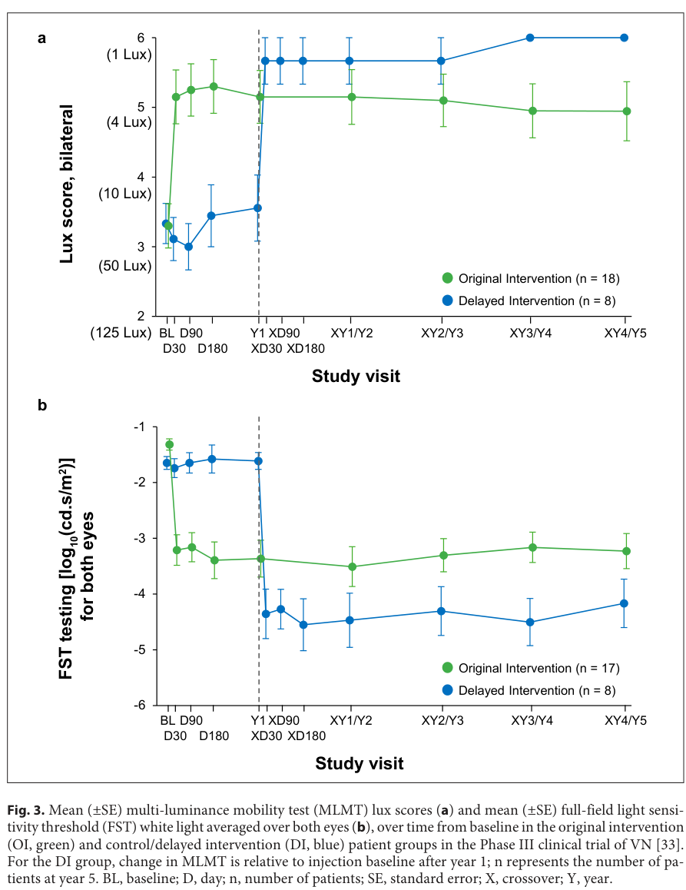

## Question

# Disease Characteristics Research Template

## Target Disease
- **Disease Name:** RPE65-Related Retinopathy
- **MONDO ID:**  (if available)
- **Category:** Mendelian

## Research Objectives

Please provide a comprehensive research report on **RPE65-Related Retinopathy** covering all of the
disease characteristics listed below. This report will be used to populate a disease knowledge
base entry. Be thorough and cite primary literature (PMID preferred) for all claims.

For each section, **suggested databases/resources** are listed. These are the first places
you should search for information on each topic.

---

### 1. Disease Information
> **Search first:** OMIM, Orphanet, ICD-10/ICD-11, MeSH, PubMed

- What is the disease? Provide a concise overview.
- What are the key identifiers? (OMIM, Orphanet, ICD-10/ICD-11, MeSH, Mondo)
- What are the common synonyms and alternative names?
- Is the information derived from individual patients (e.g., EHR) or aggregated disease-level resources?

### 2. Etiology

- **Disease Causal Factors**: What are the primary causes? (genetic, environmental, infectious, mechanistic)
- **Risk Factors**:
  > **Search first:** PubMed, Cochrane Library, UpToDate, clinical guidelines, ClinVar, ClinGen, GWAS Catalog, PheGenI, CTD, CDC, WHO, epidemiological databases
  - Genetic risk factors (causal variants, susceptibility loci, modifier genes)
  - Environmental risk factors (toxins, lifestyle, occupational exposures, age, sex, family history)
- **Protective Factors**:
  > **Search first:** PubMed, Cochrane Library, clinical trial databases, GWAS Catalog, gnomAD, WHO, CDC, nutrition databases
  - Genetic protective factors (protective variants, modifier alleles)
  - Environmental protective factors (diet, lifestyle, exposures that reduce risk)
- **Gene-Environment Interactions**: How do genetic and environmental factors interact to influence disease?
  > **Search first:** CTD, PubMed, PheGenI, GxE databases

### 3. Phenotypes
> **Search first:** HPO (Human Phenotype Ontology), OMIM, Orphanet, PubMed, clinicaltrials.gov, MedDRA, SNOMED CT, DECIPHER, LOINC

For each phenotype, provide:
- **Phenotype type**: symptoms, clinical signs, physical manifestations, behavioral changes, or laboratory abnormalities
  > For symptoms/signs: HPO, OMIM, Orphanet, PubMed
  > For behavioral changes: HPO, DSM, RDoC (Research Domain Criteria), PubMed
  > For laboratory abnormalities: LOINC, SNOMED CT, LabTests Online, PubMed
- **Phenotype characteristics**:
  > **Search first:** OMIM, Orphanet, HPO, PubMed
  - Age of symptom onset (neonatal, childhood, adult-onset, late-onset)
  - Symptom severity (mild, moderate, severe, variable)
  - Symptom progression (stable, progressive, episodic, fluctuating)
  - Frequency among affected individuals (percentage or qualitative)
- **Quality of life impact**: Effects on daily functioning and well-being (per-phenotype when possible)
  > **Search first:** EQ-5D database, SF-36, WHO QOL databases, PubMed
- Suggest HPO (Human Phenotype Ontology) terms for each phenotype

### 4. Genetic/Molecular Information

- **Causal Genes**: Gene mutations or chromosomal abnormalities responsible for disease (gene symbols, OMIM IDs)
  > **Search first:** OMIM, ClinVar, HGMD, Ensembl, NCBI Gene
- **Pathogenic Variants**:
  - Affected genes (gene symbols, HGNC IDs)
    > **Search first:** OMIM, NCBI Gene, Ensembl, HGNC, UniProt, GeneCards
  - Variant classification (pathogenic, likely pathogenic, VUS per ACMG/AMP guidelines)
    > **Search first:** ClinVar, ClinGen, ACMG/AMP guidelines, VarSome
  - Variant type/class (missense, frameshift, nonsense, splice-site, structural)
  - Allele frequency in population databases
    > **Search first:** gnomAD, 1000 Genomes, ExAC, TOPMed, dbSNP
  - Somatic vs germline origin
    > **Search first:** COSMIC (somatic), ClinVar, ICGC, TCGA
  - Functional consequences (loss of function, gain of function, dominant negative)
- **Modifier Genes**: Genes that modify disease severity or expression
- **Epigenetic Information**: DNA methylation, histone modifications, chromatin changes affecting disease
  > **Search first:** ENCODE, Roadmap Epigenomics, MethBase, DiseaseMeth
- **Chromosomal Abnormalities**: Large-scale genetic changes (aneuploidy, translocations, inversions)
  > **Search first:** DECIPHER, ClinVar, ECARUCA, UCSC Genome Browser

### 5. Environmental Information

- **Environmental Factors**: Non-genetic contributing factors (toxins, radiation, pollution, occupational exposure)
  > **Search first:** CTD (Comparative Toxicogenomics Database), TOXNET, PubMed, EPA databases
- **Lifestyle Factors**: Behavioral factors (smoking, diet, exercise, alcohol consumption)
  > **Search first:** CDC databases, WHO, PubMed, NHANES
- **Infectious Agents**: If applicable, pathogens causing or triggering disease (bacteria, viruses, fungi, parasites)
  > **Search first:** NCBI Taxonomy, ViPR, BV-BRC, MicrobeDB, GIDEON

### 6. Mechanism / Pathophysiology

- **Molecular Pathways**: Specific signaling cascades or biochemical pathways involved (Wnt, MAPK, mTOR, PI3K-AKT, etc.)
  > **Search first:** KEGG, Reactome, WikiPathways, PathBank, BioCyc
- **Cellular Processes**: Cell-level mechanisms (apoptosis, autophagy, cell cycle dysregulation, inflammation, etc.)
  > **Search first:** Gene Ontology (GO), Reactome, KEGG, PubMed
- **Protein Dysfunction**: How protein structure or function is altered (misfolding, aggregation, loss of function, gain of function)
  > **Search first:** UniProt, PDB (Protein Data Bank), InterPro, Pfam, AlphaFold
- **Metabolic Changes**: Alterations in metabolic processes (energy metabolism, lipid metabolism, amino acid metabolism)
  > **Search first:** KEGG, BioCyc, HMDB (Human Metabolome Database), BRENDA
- **Immune System Involvement**: Role of immune response (autoimmunity, immunodeficiency, chronic inflammation)
  > **Search first:** ImmPort, Immunome Database, IEDB, Gene Ontology
- **Tissue Damage Mechanisms**: How tissues/ are injured (oxidative stress, ischemia, fibrosis, necrosis)
  > **Search first:** PubMed, Gene Ontology, Reactome
- **Biochemical Abnormalities**: Specific molecular defects (enzyme deficiencies, receptor dysfunction, ion channel defects)
  > **Search first:** BRENDA, UniProt, KEGG, OMIM, PubMed
- **Epigenetic Changes**: DNA methylation, histone modifications affecting gene expression in disease
  > **Search first:** ENCODE, Roadmap Epigenomics, MethBase, DiseaseMeth
- **Molecular Profiling** (if available):
  - Transcriptomics/gene expression changes
    > **Search first:** GEO (Gene Expression Omnibus), ArrayExpress, GTEx, Human Cell Atlas, SRA
  - Proteomics findings
    > **Search first:** PRIDE, ProteomeXchange, Human Protein Atlas, STRING, BioGRID
  - Metabolomics signatures
    > **Search first:** MetaboLights, Metabolomics Workbench, HMDB, METLIN
  - Lipidomics alterations
    > **Search first:** LIPID MAPS, SwissLipids, LipidHome, Metabolomics Workbench
  - Genomic structural features
    > **Search first:** UCSC Genome Browser, Ensembl, NCBI, dbVar, DGV
- **Advanced Technologies** (if applicable):
  - Single-cell analysis findings (cell-type specific mechanisms, cellular heterogeneity)
    > **Search first:** Human Cell Atlas, Single Cell Portal, GEO, CELLxGENE
  - Spatial transcriptomics findings
    > **Search first:** GEO, Spatial Research, Vizgen, 10x Genomics data
  - Multi-omics integration results
    > **Search first:** TCGA, ICGC, cBioPortal, LinkedOmics, PubMed
  - Functional genomics screens (CRISPR, RNAi)
    > **Search first:** DepMap, GenomeRNAi, PubMed, BioGRID ORCS

For each mechanism, describe:
- The causal chain from initial trigger to clinical manifestation
- Which mechanisms are upstream vs downstream
- What cell types and biological processes are involved
- Suggest GO terms for biological processes and CL terms for cell types

### 7. Anatomical Structures Affected

- **Organ Level**:
  - Primary organs directly affected
  - Secondary organ involvement (complications, secondary effects)
  - Body systems involved (cardiovascular, nervous, digestive, respiratory, endocrine, etc.)
  > **Search first:** Uberon, FMA (Foundational Model of Anatomy), OMIM, HPO, ICD-11, MeSH, SNOMED CT
- **Tissue and Cell Level**:
  - Specific tissue types affected (epithelial, connective, muscle, nervous)
  - Specific cell populations targeted (with Cell Ontology terms)
  > **Search first:** Uberon, Human Protein Atlas, Cell Ontology, Human Cell Atlas, CellMarker, PanglaoDB
- **Subcellular Level**:
  - Cellular compartments involved (mitochondria, nucleus, ER, lysosomes) (with GO Cellular Component terms)
  > **Search first:** Gene Ontology (Cellular Component), UniProt, Human Protein Atlas
- **Localization**:
  - Specific anatomical sites (with UBERON terms)
    > **Search first:** FMA, Uberon, NeuroNames (for brain), SNOMED CT
  - Lateralization (unilateral, bilateral, asymmetric)
    > **Search first:** HPO, clinical literature, imaging databases

### 8. Temporal Development

- **Onset**:
  - Typical age of onset (congenital, pediatric, adult, geriatric)
  - Onset pattern (acute, subacute, chronic, insidious)
  > **Search first:** OMIM, Orphanet, HPO, PubMed
- **Progression**:
  - Disease stages (early, intermediate, advanced, end-stage)
    > **Search first:** Cancer Staging Manual (AJCC), WHO classifications, PubMed
  - Progression rate (rapid, slow, variable)
  - Disease course pattern (episodic, relapsing-remitting, progressive, stable)
  - Disease duration (self-limited, chronic lifelong)
  > **Search first:** Disease registries, longitudinal cohort databases, natural history studies, PubMed, Orphanet, OMIM
- **Patterns**:
  - Remission patterns (spontaneous, treatment-induced)
    > **Search first:** Clinical trial databases, disease registries, PubMed
  - Critical periods (time windows of vulnerability or opportunity for intervention)
    > **Search first:** PubMed, developmental biology databases, clinical guidelines

### 9. Inheritance and Population

- **Epidemiology**:
  - Prevalence (cases per 100,000 at given time)
  - Incidence (new cases per 100,000 per year)
  > **Search first:** Orphanet, CDC, WHO, GBD (Global Burden of Disease), national registries, SEER, disease registries
- **For Genetic Etiology**:
  - Inheritance pattern (AD, AR, X-linked, mitochondrial, multifactorial, polygenic)
    > **Search first:** OMIM, Orphanet, ClinVar, GTR (Genetic Testing Registry)
  - Penetrance (complete, incomplete, age-dependent)
    > **Search first:** ClinVar, OMIM, PubMed, ClinGen
  - Expressivity (variable, consistent)
    > **Search first:** OMIM, ClinVar, PubMed
  - Genetic anticipation (increasing severity in successive generations)
    > **Search first:** OMIM, PubMed (especially for repeat expansion disorders)
  - Germline mosaicism
    > **Search first:** ClinVar, OMIM, genetic counseling literature, PubMed
  - Founder effects (population-specific mutations)
    > **Search first:** gnomAD, population genetics databases, PubMed
  - Consanguinity role
    > **Search first:** OMIM, population studies, genetic counseling resources
  - Carrier frequency
    > **Search first:** gnomAD, carrier screening databases, GeneReviews, GTR
- **Population Demographics**:
  - Affected populations (ethnic or demographic groups with higher prevalence)
    > **Search first:** gnomAD, 1000 Genomes, PAGE Study, PubMed, population registries
  - Geographic distribution (endemic areas, regional variation)
    > **Search first:** WHO, CDC, GBD, Orphanet, geographic epidemiology databases
  - Geographic distribution of specific variants
  - Sex ratio (male:female)
    > **Search first:** Disease registries, OMIM, PubMed, epidemiological databases
  - Age distribution of affected individuals
    > **Search first:** CDC, disease registries, SEER, Orphanet

### 10. Diagnostics

- **Clinical Tests**:
  - Laboratory tests (blood, urine, tissue chemistry, specific enzyme assays)
    > **Search first:** LOINC, LabTests Online, PubMed
  - Biomarkers (proteins, metabolites, genetic markers, circulating biomarkers)
    > **Search first:** FDA Biomarker List, BEST (Biomarkers, EndpointS, and other Tools), PubMed
  - Imaging studies (X-ray, CT, MRI, PET, ultrasound)
    > **Search first:** RadLex, DICOM, Radiopaedia, imaging databases
  - Functional tests (pulmonary function, cardiac stress tests)
    > **Search first:** LOINC, clinical guidelines, PubMed
  - Electrophysiology (EEG, EMG, ECG, nerve conduction studies)
    > **Search first:** LOINC, clinical neurophysiology databases, PubMed
  - Biopsy findings (histopathology, immunohistochemistry)
    > **Search first:** SNOMED CT, College of American Pathologists resources, PubMed
  - Pathology findings (microscopic examination)
    > **Search first:** SNOMED CT, Digital Pathology databases, PubMed
- **Genetic Testing**:
  > **Search first:** GTR (Genetic Testing Registry), GeneReviews, ClinGen
  - Overview of recommended genetic testing approach
  - Whole genome sequencing (WGS) utility
    > **Search first:** GTR, ClinVar, GEL (Genomics England), gnomAD
  - Whole exome sequencing (WES) utility
    > **Search first:** GTR, ClinVar, OMIM, GeneMatcher
  - Gene panels (which panels, which genes)
    > **Search first:** GTR, ClinVar, laboratory-specific databases
  - Single gene testing
    > **Search first:** GTR, ClinVar, OMIM, GeneReviews
  - Chromosomal microarray (CMA)
    > **Search first:** DECIPHER, ClinVar, dbVar, ECARUCA
  - Karyotyping
    > **Search first:** Chromosome Abnormality Database, ClinVar, cytogenetics resources
  - FISH
    > **Search first:** ClinVar, cytogenetics databases, PubMed
  - Mitochondrial DNA testing
    > **Search first:** MITOMAP, MSeqDR, ClinVar, GTR
  - Repeat expansion testing
    > **Search first:** GTR, ClinVar, repeat expansion databases, PubMed
- **Omics-Based Diagnostics** (if applicable):
  - RNA sequencing / transcriptomics
    > **Search first:** GEO, ArrayExpress, GTEx, RNA-seq databases
  - Proteomics
    > **Search first:** PRIDE, ProteomeXchange, FDA Biomarker database
  - Metabolomics
    > **Search first:** MetaboLights, Metabolomics Workbench, HMDB
  - Epigenomics
    > **Search first:** GEO, ENCODE, Roadmap Epigenomics, MethBase
  - Liquid biopsy
    > **Search first:** COSMIC, ClinVar, liquid biopsy databases, PubMed
- **Clinical Criteria**:
  - Standardized diagnostic criteria (DSM, ICD, society guidelines)
    > **Search first:** DSM-5, ICD-11, clinical society guidelines, UpToDate
  - Differential diagnosis (other conditions to rule out, with distinguishing features)
    > **Search first:** DynaMed, UpToDate, clinical decision support systems
- **Screening**:
  - Screening methods for asymptomatic individuals (newborn screening, carrier screening, cascade screening)
    > **Search first:** ACMG recommendations, CDC newborn screening, GTR

### 11. Outcome/Prognosis

- **Survival and Mortality**:
  - Survival rate (5-year, 10-year, overall)
    > **Search first:** SEER, cancer registries, disease-specific registries, PubMed
  - Life expectancy (with and without treatment if applicable)
    > **Search first:** Orphanet, disease registries, actuarial databases, PubMed
  - Mortality rate
    > **Search first:** CDC, WHO, GBD, national mortality databases
  - Disease-specific mortality (deaths directly attributable to disease)
    > **Search first:** Disease registries, CDC Wonder, GBD, PubMed
- **Morbidity and Function**:
  - Morbidity (disease-related disability and health impacts)
    > **Search first:** GBD, WHO, disability databases, PubMed
  - Disability outcomes (long-term functional impairments)
    > **Search first:** ICF (International Classification of Functioning), disability registries
  - Quality of life measures (EQ-5D, SF-36, PROMIS, disease-specific tools)
    > **Search first:** EQ-5D database, SF-36, PROMIS, PubMed
- **Disease Course**:
  - Complications (secondary problems: infections, organ failure, etc.)
    > **Search first:** ICD codes, disease registries, clinical databases, PubMed
  - Recovery potential (likelihood and extent of recovery, with vs without treatment)
    > **Search first:** Natural history studies, rehabilitation databases, PubMed
- **Prediction**:
  - Prognostic factors (age, disease severity, biomarkers, treatment response)
    > **Search first:** Prognostic models databases, clinical calculators, PubMed
  - Prognostic biomarkers (molecular markers predicting disease course)
    > **Search first:** FDA Biomarker database, PubMed, cancer prognostic databases

### 12. Treatment

- **Pharmacotherapy**:
  - Pharmacological treatments (drug names, drug classes, mechanisms of action)
    > **Search first:** DrugBank, RxNorm, ATC classification, DailyMed, FDA databases
  - Pharmacogenomics (how genetic variants affect drug metabolism, efficacy, toxicity)
    > **Search first:** PharmGKB, CPIC (Clinical Pharmacogenetics), FDA Table of PGx Biomarkers
- **Advanced Therapeutics**:
  - Gene therapy (viral vectors, CRISPR, gene replacement, gene editing)
    > **Search first:** ClinicalTrials.gov, FDA gene therapy database, ASGCT resources
  - Cell therapy (stem cell transplant, CAR-T, cellular therapeutics)
    > **Search first:** ClinicalTrials.gov, FDA cell therapy database, FACT standards
  - RNA-based therapies (ASOs, siRNA, mRNA therapies)
    > **Search first:** ClinicalTrials.gov, FDA approvals, PubMed
  - Targeted therapies (treatments directed at specific molecular targets)
    > **Search first:** My Cancer Genome, OncoKB, ClinicalTrials.gov, FDA approvals
  - Immunotherapies (checkpoint inhibitors, monoclonal antibodies)
    > **Search first:** Cancer Immunotherapy Database, FDA approvals, ClinicalTrials.gov
- **Surgical and Interventional**:
  - Surgical interventions (types of surgery, timing, outcomes)
    > **Search first:** CPT codes, surgical registries, clinical guidelines, PubMed
- **Supportive and Rehabilitative**:
  - Supportive care (symptom management, pain control, nutrition)
    > **Search first:** Clinical guidelines, Cochrane Library, PubMed
  - Rehabilitation (physical therapy, occupational therapy, speech therapy)
    > **Search first:** Rehabilitation medicine databases, clinical guidelines, PubMed
- **Experimental**:
  - Experimental treatments in clinical trials (with NCT identifiers if available)
    > **Search first:** ClinicalTrials.gov, EU Clinical Trials Register, WHO ICTRP
- **Treatment Outcomes**:
  - Treatment response rates
    > **Search first:** Clinical trial databases, FDA reviews, systematic reviews, PubMed
  - Side effects and adverse events
    > **Search first:** FDA Adverse Event Reporting System (FAERS), MedWatch, PubMed
- **Treatment Strategy**:
  - Treatment algorithms (clinical pathways, decision trees)
    > **Search first:** Clinical practice guidelines, NCCN Guidelines, UpToDate
  - Combination therapies
    > **Search first:** ClinicalTrials.gov, treatment guidelines, PubMed
  - Personalized medicine approaches (genotype-guided treatment)
    > **Search first:** My Cancer Genome, CIViC, PharmGKB, precision medicine databases

For each treatment, suggest MAXO (Medical Action Ontology) terms where applicable.

### 13. Prevention

- **Prevention Levels**:
  - Primary prevention (preventing disease occurrence: vaccination, risk factor modification)
    > **Search first:** CDC, WHO, USPSTF recommendations, Cochrane Library
  - Secondary prevention (early detection and treatment: screening programs, early intervention)
    > **Search first:** USPSTF, CDC screening guidelines, WHO
  - Tertiary prevention (preventing complications in those with disease)
    > **Search first:** Clinical guidelines, disease management protocols, PubMed
- **Immunization**: Vaccine strategies (if applicable)
  > **Search first:** CDC vaccine schedules, WHO immunization, FDA vaccine database
- **Screening and Early Detection**:
  - Screening programs (population-based: newborn screening, cancer screening)
    > **Search first:** CDC screening programs, USPSTF, cancer screening databases
  - Genetic screening (carrier screening, preimplantation genetic diagnosis, prenatal testing)
    > **Search first:** ACMG recommendations, ACOG guidelines, GTR
  - Risk stratification (identifying high-risk individuals for targeted prevention)
    > **Search first:** Risk prediction models, clinical calculators, PubMed
- **Behavioral Interventions**: Lifestyle modifications to reduce risk
  > **Search first:** CDC, WHO, behavioral intervention databases, Cochrane Library
- **Counseling**: Genetic counseling (risk assessment, family planning guidance)
  > **Search first:** NSGC resources, ACMG guidelines, GeneReviews
- **Public Health**:
  - Public health interventions (sanitation, vector control, health education)
    > **Search first:** CDC, WHO, public health databases, PubMed
  - Environmental interventions (reducing environmental risk factors)
    > **Search first:** EPA databases, WHO environmental health, PubMed
- **Prophylaxis**: Preventive medications or procedures
  > **Search first:** Clinical guidelines, FDA approvals, PubMed

### 14. Other Species / Natural Disease

- **Taxonomy**: Species affected (with NCBI Taxon identifiers)
  > **Search first:** NCBI Taxonomy
- **Breed**: Specific breeds affected (with VBO identifiers if applicable)
  > **Search first:** VBO (Vertebrate Breed Ontology)
- **Gene**: Orthologous genes in other species (with NCBI Gene IDs)
  > **Search first:** NCBI Gene
- **Natural Disease**:
  - Naturally occurring disease in other species (companion animals, wildlife)
    > **Search first:** OMIA (Online Mendelian Inheritance in Animals), VetCompass, PubMed
  - Veterinary relevance and importance in animal health
    > **Search first:** OMIA, veterinary databases, PubMed
- **Comparative Biology**:
  - Comparative pathology (similarities and differences across species)
    > **Search first:** OMIA, comparative pathology databases, PubMed
  - Evolutionary conservation of disease mechanisms
    > **Search first:** HomoloGene, OrthoMCL, Alliance of Genome Resources
- **Transmission** (if applicable):
  - Zoonotic potential
    > **Search first:** CDC zoonotic diseases, WHO zoonoses, GIDEON
  - Cross-species susceptibility
    > **Search first:** NCBI Taxonomy, veterinary databases, PubMed

### 15. Model Organisms

- **Model Types**:
  - Model organism type (mammalian, invertebrate, cellular, in vitro)
    > **Search first:** Alliance of Genome Resources, model organism databases
  - Specific model systems (mouse, rat, zebrafish, Drosophila, C. elegans, yeast, cell lines, organoids, iPSCs)
    > **Search first:** MGI, RGD, ZFIN, FlyBase, WormBase, SGD, ATCC, Cellosaurus
  - Induced models (drug treatment, surgical intervention, environmental manipulation)
    > **Search first:** MGI, model organism databases, PubMed
- **Genetic Models**:
  - Types available (knockout, knock-in, transgenic, conditional, humanized)
    > **Search first:** MGI, IMPC, KOMP, EuMMCR, IMSR
- **Model Characteristics**:
  - Phenotype recapitulation (how well model reproduces human disease features)
    > **Search first:** Model organism databases, comparative studies, PubMed
  - Model limitations (aspects of human disease not captured)
    > **Search first:** Model organism databases, PubMed, review articles
- **Applications**:
  - Research applications (what aspects of disease can be studied)
    > **Search first:** Model organism databases, PubMed
- **Resources**:
  - Model databases
    > **Search first:** MGI, RGD, ZFIN, FlyBase, WormBase, IMSR, EMMA, MMRRC

---

## Citation Requirements

- Cite primary literature (PMID preferred) for all mechanistic and clinical claims
- Prioritize recent reviews and landmark papers
- Include direct quotes from abstracts where possible to support key statements
- Distinguish evidence source types: human clinical, model organism, in vitro, computational

## Output Format

Structure your response as a comprehensive narrative organized by the sections above.
For each section, provide:
- Factual content with specific details (numbers, percentages, gene names, variant nomenclature)
- Ontology term suggestions (HPO, GO, CL, UBERON, CHEBI, MAXO, MONDO) where applicable
- Evidence citations with PMIDs
- Direct quotes from abstracts to support key claims
- Clear indication when information is not available or not applicable for this disease

This report will be used to populate a disease knowledge base entry with:
- Pathophysiology descriptions with causal chains
- Gene/protein annotations (HGNC, GO terms)
- Phenotype associations (HP terms) with frequencies
- Cell type involvement (CL terms)
- Anatomical locations (UBERON terms)
- Chemical entities (CHEBI terms)
- Treatment annotations (MAXO terms)
- Evidence items with PMIDs and exact abstract quotes
- Epidemiology, prognosis, diagnostic, and prevention information
- Animal model descriptions with phenotype recapitulation details

## Output

Question: You are an expert researcher providing comprehensive, well-cited information.

Provide detailed information focusing on:
1. Key concepts and definitions with current understanding
2. Recent developments and latest research (prioritize 2023-2024 sources)
3. Current applications and real-world implementations
4. Expert opinions and analysis from authoritative sources
5. Relevant statistics and data from recent studies

Format as a comprehensive research report with proper citations. Include URLs and publication dates where available.
Always prioritize recent, authoritative sources and provide specific citations for all major claims.

# Disease Characteristics Research Template

## Target Disease
- **Disease Name:** RPE65-Related Retinopathy
- **MONDO ID:**  (if available)
- **Category:** Mendelian

## Research Objectives

Please provide a comprehensive research report on **RPE65-Related Retinopathy** covering all of the
disease characteristics listed below. This report will be used to populate a disease knowledge
base entry. Be thorough and cite primary literature (PMID preferred) for all claims.

For each section, **suggested databases/resources** are listed. These are the first places
you should search for information on each topic.

---

### 1. Disease Information
> **Search first:** OMIM, Orphanet, ICD-10/ICD-11, MeSH, PubMed

- What is the disease? Provide a concise overview.
- What are the key identifiers? (OMIM, Orphanet, ICD-10/ICD-11, MeSH, Mondo)
- What are the common synonyms and alternative names?
- Is the information derived from individual patients (e.g., EHR) or aggregated disease-level resources?

### 2. Etiology

- **Disease Causal Factors**: What are the primary causes? (genetic, environmental, infectious, mechanistic)
- **Risk Factors**:
  > **Search first:** PubMed, Cochrane Library, UpToDate, clinical guidelines, ClinVar, ClinGen, GWAS Catalog, PheGenI, CTD, CDC, WHO, epidemiological databases
  - Genetic risk factors (causal variants, susceptibility loci, modifier genes)
  - Environmental risk factors (toxins, lifestyle, occupational exposures, age, sex, family history)
- **Protective Factors**:
  > **Search first:** PubMed, Cochrane Library, clinical trial databases, GWAS Catalog, gnomAD, WHO, CDC, nutrition databases
  - Genetic protective factors (protective variants, modifier alleles)
  - Environmental protective factors (diet, lifestyle, exposures that reduce risk)
- **Gene-Environment Interactions**: How do genetic and environmental factors interact to influence disease?
  > **Search first:** CTD, PubMed, PheGenI, GxE databases

### 3. Phenotypes
> **Search first:** HPO (Human Phenotype Ontology), OMIM, Orphanet, PubMed, clinicaltrials.gov, MedDRA, SNOMED CT, DECIPHER, LOINC

For each phenotype, provide:
- **Phenotype type**: symptoms, clinical signs, physical manifestations, behavioral changes, or laboratory abnormalities
  > For symptoms/signs: HPO, OMIM, Orphanet, PubMed
  > For behavioral changes: HPO, DSM, RDoC (Research Domain Criteria), PubMed
  > For laboratory abnormalities: LOINC, SNOMED CT, LabTests Online, PubMed
- **Phenotype characteristics**:
  > **Search first:** OMIM, Orphanet, HPO, PubMed
  - Age of symptom onset (neonatal, childhood, adult-onset, late-onset)
  - Symptom severity (mild, moderate, severe, variable)
  - Symptom progression (stable, progressive, episodic, fluctuating)
  - Frequency among affected individuals (percentage or qualitative)
- **Quality of life impact**: Effects on daily functioning and well-being (per-phenotype when possible)
  > **Search first:** EQ-5D database, SF-36, WHO QOL databases, PubMed
- Suggest HPO (Human Phenotype Ontology) terms for each phenotype

### 4. Genetic/Molecular Information

- **Causal Genes**: Gene mutations or chromosomal abnormalities responsible for disease (gene symbols, OMIM IDs)
  > **Search first:** OMIM, ClinVar, HGMD, Ensembl, NCBI Gene
- **Pathogenic Variants**:
  - Affected genes (gene symbols, HGNC IDs)
    > **Search first:** OMIM, NCBI Gene, Ensembl, HGNC, UniProt, GeneCards
  - Variant classification (pathogenic, likely pathogenic, VUS per ACMG/AMP guidelines)
    > **Search first:** ClinVar, ClinGen, ACMG/AMP guidelines, VarSome
  - Variant type/class (missense, frameshift, nonsense, splice-site, structural)
  - Allele frequency in population databases
    > **Search first:** gnomAD, 1000 Genomes, ExAC, TOPMed, dbSNP
  - Somatic vs germline origin
    > **Search first:** COSMIC (somatic), ClinVar, ICGC, TCGA
  - Functional consequences (loss of function, gain of function, dominant negative)
- **Modifier Genes**: Genes that modify disease severity or expression
- **Epigenetic Information**: DNA methylation, histone modifications, chromatin changes affecting disease
  > **Search first:** ENCODE, Roadmap Epigenomics, MethBase, DiseaseMeth
- **Chromosomal Abnormalities**: Large-scale genetic changes (aneuploidy, translocations, inversions)
  > **Search first:** DECIPHER, ClinVar, ECARUCA, UCSC Genome Browser

### 5. Environmental Information

- **Environmental Factors**: Non-genetic contributing factors (toxins, radiation, pollution, occupational exposure)
  > **Search first:** CTD (Comparative Toxicogenomics Database), TOXNET, PubMed, EPA databases
- **Lifestyle Factors**: Behavioral factors (smoking, diet, exercise, alcohol consumption)
  > **Search first:** CDC databases, WHO, PubMed, NHANES
- **Infectious Agents**: If applicable, pathogens causing or triggering disease (bacteria, viruses, fungi, parasites)
  > **Search first:** NCBI Taxonomy, ViPR, BV-BRC, MicrobeDB, GIDEON

### 6. Mechanism / Pathophysiology

- **Molecular Pathways**: Specific signaling cascades or biochemical pathways involved (Wnt, MAPK, mTOR, PI3K-AKT, etc.)
  > **Search first:** KEGG, Reactome, WikiPathways, PathBank, BioCyc
- **Cellular Processes**: Cell-level mechanisms (apoptosis, autophagy, cell cycle dysregulation, inflammation, etc.)
  > **Search first:** Gene Ontology (GO), Reactome, KEGG, PubMed
- **Protein Dysfunction**: How protein structure or function is altered (misfolding, aggregation, loss of function, gain of function)
  > **Search first:** UniProt, PDB (Protein Data Bank), InterPro, Pfam, AlphaFold
- **Metabolic Changes**: Alterations in metabolic processes (energy metabolism, lipid metabolism, amino acid metabolism)
  > **Search first:** KEGG, BioCyc, HMDB (Human Metabolome Database), BRENDA
- **Immune System Involvement**: Role of immune response (autoimmunity, immunodeficiency, chronic inflammation)
  > **Search first:** ImmPort, Immunome Database, IEDB, Gene Ontology
- **Tissue Damage Mechanisms**: How tissues/ are injured (oxidative stress, ischemia, fibrosis, necrosis)
  > **Search first:** PubMed, Gene Ontology, Reactome
- **Biochemical Abnormalities**: Specific molecular defects (enzyme deficiencies, receptor dysfunction, ion channel defects)
  > **Search first:** BRENDA, UniProt, KEGG, OMIM, PubMed
- **Epigenetic Changes**: DNA methylation, histone modifications affecting gene expression in disease
  > **Search first:** ENCODE, Roadmap Epigenomics, MethBase, DiseaseMeth
- **Molecular Profiling** (if available):
  - Transcriptomics/gene expression changes
    > **Search first:** GEO (Gene Expression Omnibus), ArrayExpress, GTEx, Human Cell Atlas, SRA
  - Proteomics findings
    > **Search first:** PRIDE, ProteomeXchange, Human Protein Atlas, STRING, BioGRID
  - Metabolomics signatures
    > **Search first:** MetaboLights, Metabolomics Workbench, HMDB, METLIN
  - Lipidomics alterations
    > **Search first:** LIPID MAPS, SwissLipids, LipidHome, Metabolomics Workbench
  - Genomic structural features
    > **Search first:** UCSC Genome Browser, Ensembl, NCBI, dbVar, DGV
- **Advanced Technologies** (if applicable):
  - Single-cell analysis findings (cell-type specific mechanisms, cellular heterogeneity)
    > **Search first:** Human Cell Atlas, Single Cell Portal, GEO, CELLxGENE
  - Spatial transcriptomics findings
    > **Search first:** GEO, Spatial Research, Vizgen, 10x Genomics data
  - Multi-omics integration results
    > **Search first:** TCGA, ICGC, cBioPortal, LinkedOmics, PubMed
  - Functional genomics screens (CRISPR, RNAi)
    > **Search first:** DepMap, GenomeRNAi, PubMed, BioGRID ORCS

For each mechanism, describe:
- The causal chain from initial trigger to clinical manifestation
- Which mechanisms are upstream vs downstream
- What cell types and biological processes are involved
- Suggest GO terms for biological processes and CL terms for cell types

### 7. Anatomical Structures Affected

- **Organ Level**:
  - Primary organs directly affected
  - Secondary organ involvement (complications, secondary effects)
  - Body systems involved (cardiovascular, nervous, digestive, respiratory, endocrine, etc.)
  > **Search first:** Uberon, FMA (Foundational Model of Anatomy), OMIM, HPO, ICD-11, MeSH, SNOMED CT
- **Tissue and Cell Level**:
  - Specific tissue types affected (epithelial, connective, muscle, nervous)
  - Specific cell populations targeted (with Cell Ontology terms)
  > **Search first:** Uberon, Human Protein Atlas, Cell Ontology, Human Cell Atlas, CellMarker, PanglaoDB
- **Subcellular Level**:
  - Cellular compartments involved (mitochondria, nucleus, ER, lysosomes) (with GO Cellular Component terms)
  > **Search first:** Gene Ontology (Cellular Component), UniProt, Human Protein Atlas
- **Localization**:
  - Specific anatomical sites (with UBERON terms)
    > **Search first:** FMA, Uberon, NeuroNames (for brain), SNOMED CT
  - Lateralization (unilateral, bilateral, asymmetric)
    > **Search first:** HPO, clinical literature, imaging databases

### 8. Temporal Development

- **Onset**:
  - Typical age of onset (congenital, pediatric, adult, geriatric)
  - Onset pattern (acute, subacute, chronic, insidious)
  > **Search first:** OMIM, Orphanet, HPO, PubMed
- **Progression**:
  - Disease stages (early, intermediate, advanced, end-stage)
    > **Search first:** Cancer Staging Manual (AJCC), WHO classifications, PubMed
  - Progression rate (rapid, slow, variable)
  - Disease course pattern (episodic, relapsing-remitting, progressive, stable)
  - Disease duration (self-limited, chronic lifelong)
  > **Search first:** Disease registries, longitudinal cohort databases, natural history studies, PubMed, Orphanet, OMIM
- **Patterns**:
  - Remission patterns (spontaneous, treatment-induced)
    > **Search first:** Clinical trial databases, disease registries, PubMed
  - Critical periods (time windows of vulnerability or opportunity for intervention)
    > **Search first:** PubMed, developmental biology databases, clinical guidelines

### 9. Inheritance and Population

- **Epidemiology**:
  - Prevalence (cases per 100,000 at given time)
  - Incidence (new cases per 100,000 per year)
  > **Search first:** Orphanet, CDC, WHO, GBD (Global Burden of Disease), national registries, SEER, disease registries
- **For Genetic Etiology**:
  - Inheritance pattern (AD, AR, X-linked, mitochondrial, multifactorial, polygenic)
    > **Search first:** OMIM, Orphanet, ClinVar, GTR (Genetic Testing Registry)
  - Penetrance (complete, incomplete, age-dependent)
    > **Search first:** ClinVar, OMIM, PubMed, ClinGen
  - Expressivity (variable, consistent)
    > **Search first:** OMIM, ClinVar, PubMed
  - Genetic anticipation (increasing severity in successive generations)
    > **Search first:** OMIM, PubMed (especially for repeat expansion disorders)
  - Germline mosaicism
    > **Search first:** ClinVar, OMIM, genetic counseling literature, PubMed
  - Founder effects (population-specific mutations)
    > **Search first:** gnomAD, population genetics databases, PubMed
  - Consanguinity role
    > **Search first:** OMIM, population studies, genetic counseling resources
  - Carrier frequency
    > **Search first:** gnomAD, carrier screening databases, GeneReviews, GTR
- **Population Demographics**:
  - Affected populations (ethnic or demographic groups with higher prevalence)
    > **Search first:** gnomAD, 1000 Genomes, PAGE Study, PubMed, population registries
  - Geographic distribution (endemic areas, regional variation)
    > **Search first:** WHO, CDC, GBD, Orphanet, geographic epidemiology databases
  - Geographic distribution of specific variants
  - Sex ratio (male:female)
    > **Search first:** Disease registries, OMIM, PubMed, epidemiological databases
  - Age distribution of affected individuals
    > **Search first:** CDC, disease registries, SEER, Orphanet

### 10. Diagnostics

- **Clinical Tests**:
  - Laboratory tests (blood, urine, tissue chemistry, specific enzyme assays)
    > **Search first:** LOINC, LabTests Online, PubMed
  - Biomarkers (proteins, metabolites, genetic markers, circulating biomarkers)
    > **Search first:** FDA Biomarker List, BEST (Biomarkers, EndpointS, and other Tools), PubMed
  - Imaging studies (X-ray, CT, MRI, PET, ultrasound)
    > **Search first:** RadLex, DICOM, Radiopaedia, imaging databases
  - Functional tests (pulmonary function, cardiac stress tests)
    > **Search first:** LOINC, clinical guidelines, PubMed
  - Electrophysiology (EEG, EMG, ECG, nerve conduction studies)
    > **Search first:** LOINC, clinical neurophysiology databases, PubMed
  - Biopsy findings (histopathology, immunohistochemistry)
    > **Search first:** SNOMED CT, College of American Pathologists resources, PubMed
  - Pathology findings (microscopic examination)
    > **Search first:** SNOMED CT, Digital Pathology databases, PubMed
- **Genetic Testing**:
  > **Search first:** GTR (Genetic Testing Registry), GeneReviews, ClinGen
  - Overview of recommended genetic testing approach
  - Whole genome sequencing (WGS) utility
    > **Search first:** GTR, ClinVar, GEL (Genomics England), gnomAD
  - Whole exome sequencing (WES) utility
    > **Search first:** GTR, ClinVar, OMIM, GeneMatcher
  - Gene panels (which panels, which genes)
    > **Search first:** GTR, ClinVar, laboratory-specific databases
  - Single gene testing
    > **Search first:** GTR, ClinVar, OMIM, GeneReviews
  - Chromosomal microarray (CMA)
    > **Search first:** DECIPHER, ClinVar, dbVar, ECARUCA
  - Karyotyping
    > **Search first:** Chromosome Abnormality Database, ClinVar, cytogenetics resources
  - FISH
    > **Search first:** ClinVar, cytogenetics databases, PubMed
  - Mitochondrial DNA testing
    > **Search first:** MITOMAP, MSeqDR, ClinVar, GTR
  - Repeat expansion testing
    > **Search first:** GTR, ClinVar, repeat expansion databases, PubMed
- **Omics-Based Diagnostics** (if applicable):
  - RNA sequencing / transcriptomics
    > **Search first:** GEO, ArrayExpress, GTEx, RNA-seq databases
  - Proteomics
    > **Search first:** PRIDE, ProteomeXchange, FDA Biomarker database
  - Metabolomics
    > **Search first:** MetaboLights, Metabolomics Workbench, HMDB
  - Epigenomics
    > **Search first:** GEO, ENCODE, Roadmap Epigenomics, MethBase
  - Liquid biopsy
    > **Search first:** COSMIC, ClinVar, liquid biopsy databases, PubMed
- **Clinical Criteria**:
  - Standardized diagnostic criteria (DSM, ICD, society guidelines)
    > **Search first:** DSM-5, ICD-11, clinical society guidelines, UpToDate
  - Differential diagnosis (other conditions to rule out, with distinguishing features)
    > **Search first:** DynaMed, UpToDate, clinical decision support systems
- **Screening**:
  - Screening methods for asymptomatic individuals (newborn screening, carrier screening, cascade screening)
    > **Search first:** ACMG recommendations, CDC newborn screening, GTR

### 11. Outcome/Prognosis

- **Survival and Mortality**:
  - Survival rate (5-year, 10-year, overall)
    > **Search first:** SEER, cancer registries, disease-specific registries, PubMed
  - Life expectancy (with and without treatment if applicable)
    > **Search first:** Orphanet, disease registries, actuarial databases, PubMed
  - Mortality rate
    > **Search first:** CDC, WHO, GBD, national mortality databases
  - Disease-specific mortality (deaths directly attributable to disease)
    > **Search first:** Disease registries, CDC Wonder, GBD, PubMed
- **Morbidity and Function**:
  - Morbidity (disease-related disability and health impacts)
    > **Search first:** GBD, WHO, disability databases, PubMed
  - Disability outcomes (long-term functional impairments)
    > **Search first:** ICF (International Classification of Functioning), disability registries
  - Quality of life measures (EQ-5D, SF-36, PROMIS, disease-specific tools)
    > **Search first:** EQ-5D database, SF-36, PROMIS, PubMed
- **Disease Course**:
  - Complications (secondary problems: infections, organ failure, etc.)
    > **Search first:** ICD codes, disease registries, clinical databases, PubMed
  - Recovery potential (likelihood and extent of recovery, with vs without treatment)
    > **Search first:** Natural history studies, rehabilitation databases, PubMed
- **Prediction**:
  - Prognostic factors (age, disease severity, biomarkers, treatment response)
    > **Search first:** Prognostic models databases, clinical calculators, PubMed
  - Prognostic biomarkers (molecular markers predicting disease course)
    > **Search first:** FDA Biomarker database, PubMed, cancer prognostic databases

### 12. Treatment

- **Pharmacotherapy**:
  - Pharmacological treatments (drug names, drug classes, mechanisms of action)
    > **Search first:** DrugBank, RxNorm, ATC classification, DailyMed, FDA databases
  - Pharmacogenomics (how genetic variants affect drug metabolism, efficacy, toxicity)
    > **Search first:** PharmGKB, CPIC (Clinical Pharmacogenetics), FDA Table of PGx Biomarkers
- **Advanced Therapeutics**:
  - Gene therapy (viral vectors, CRISPR, gene replacement, gene editing)
    > **Search first:** ClinicalTrials.gov, FDA gene therapy database, ASGCT resources
  - Cell therapy (stem cell transplant, CAR-T, cellular therapeutics)
    > **Search first:** ClinicalTrials.gov, FDA cell therapy database, FACT standards
  - RNA-based therapies (ASOs, siRNA, mRNA therapies)
    > **Search first:** ClinicalTrials.gov, FDA approvals, PubMed
  - Targeted therapies (treatments directed at specific molecular targets)
    > **Search first:** My Cancer Genome, OncoKB, ClinicalTrials.gov, FDA approvals
  - Immunotherapies (checkpoint inhibitors, monoclonal antibodies)
    > **Search first:** Cancer Immunotherapy Database, FDA approvals, ClinicalTrials.gov
- **Surgical and Interventional**:
  - Surgical interventions (types of surgery, timing, outcomes)
    > **Search first:** CPT codes, surgical registries, clinical guidelines, PubMed
- **Supportive and Rehabilitative**:
  - Supportive care (symptom management, pain control, nutrition)
    > **Search first:** Clinical guidelines, Cochrane Library, PubMed
  - Rehabilitation (physical therapy, occupational therapy, speech therapy)
    > **Search first:** Rehabilitation medicine databases, clinical guidelines, PubMed
- **Experimental**:
  - Experimental treatments in clinical trials (with NCT identifiers if available)
    > **Search first:** ClinicalTrials.gov, EU Clinical Trials Register, WHO ICTRP
- **Treatment Outcomes**:
  - Treatment response rates
    > **Search first:** Clinical trial databases, FDA reviews, systematic reviews, PubMed
  - Side effects and adverse events
    > **Search first:** FDA Adverse Event Reporting System (FAERS), MedWatch, PubMed
- **Treatment Strategy**:
  - Treatment algorithms (clinical pathways, decision trees)
    > **Search first:** Clinical practice guidelines, NCCN Guidelines, UpToDate
  - Combination therapies
    > **Search first:** ClinicalTrials.gov, treatment guidelines, PubMed
  - Personalized medicine approaches (genotype-guided treatment)
    > **Search first:** My Cancer Genome, CIViC, PharmGKB, precision medicine databases

For each treatment, suggest MAXO (Medical Action Ontology) terms where applicable.

### 13. Prevention

- **Prevention Levels**:
  - Primary prevention (preventing disease occurrence: vaccination, risk factor modification)
    > **Search first:** CDC, WHO, USPSTF recommendations, Cochrane Library
  - Secondary prevention (early detection and treatment: screening programs, early intervention)
    > **Search first:** USPSTF, CDC screening guidelines, WHO
  - Tertiary prevention (preventing complications in those with disease)
    > **Search first:** Clinical guidelines, disease management protocols, PubMed
- **Immunization**: Vaccine strategies (if applicable)
  > **Search first:** CDC vaccine schedules, WHO immunization, FDA vaccine database
- **Screening and Early Detection**:
  - Screening programs (population-based: newborn screening, cancer screening)
    > **Search first:** CDC screening programs, USPSTF, cancer screening databases
  - Genetic screening (carrier screening, preimplantation genetic diagnosis, prenatal testing)
    > **Search first:** ACMG recommendations, ACOG guidelines, GTR
  - Risk stratification (identifying high-risk individuals for targeted prevention)
    > **Search first:** Risk prediction models, clinical calculators, PubMed
- **Behavioral Interventions**: Lifestyle modifications to reduce risk
  > **Search first:** CDC, WHO, behavioral intervention databases, Cochrane Library
- **Counseling**: Genetic counseling (risk assessment, family planning guidance)
  > **Search first:** NSGC resources, ACMG guidelines, GeneReviews
- **Public Health**:
  - Public health interventions (sanitation, vector control, health education)
    > **Search first:** CDC, WHO, public health databases, PubMed
  - Environmental interventions (reducing environmental risk factors)
    > **Search first:** EPA databases, WHO environmental health, PubMed
- **Prophylaxis**: Preventive medications or procedures
  > **Search first:** Clinical guidelines, FDA approvals, PubMed

### 14. Other Species / Natural Disease

- **Taxonomy**: Species affected (with NCBI Taxon identifiers)
  > **Search first:** NCBI Taxonomy
- **Breed**: Specific breeds affected (with VBO identifiers if applicable)
  > **Search first:** VBO (Vertebrate Breed Ontology)
- **Gene**: Orthologous genes in other species (with NCBI Gene IDs)
  > **Search first:** NCBI Gene
- **Natural Disease**:
  - Naturally occurring disease in other species (companion animals, wildlife)
    > **Search first:** OMIA (Online Mendelian Inheritance in Animals), VetCompass, PubMed
  - Veterinary relevance and importance in animal health
    > **Search first:** OMIA, veterinary databases, PubMed
- **Comparative Biology**:
  - Comparative pathology (similarities and differences across species)
    > **Search first:** OMIA, comparative pathology databases, PubMed
  - Evolutionary conservation of disease mechanisms
    > **Search first:** HomoloGene, OrthoMCL, Alliance of Genome Resources
- **Transmission** (if applicable):
  - Zoonotic potential
    > **Search first:** CDC zoonotic diseases, WHO zoonoses, GIDEON
  - Cross-species susceptibility
    > **Search first:** NCBI Taxonomy, veterinary databases, PubMed

### 15. Model Organisms

- **Model Types**:
  - Model organism type (mammalian, invertebrate, cellular, in vitro)
    > **Search first:** Alliance of Genome Resources, model organism databases
  - Specific model systems (mouse, rat, zebrafish, Drosophila, C. elegans, yeast, cell lines, organoids, iPSCs)
    > **Search first:** MGI, RGD, ZFIN, FlyBase, WormBase, SGD, ATCC, Cellosaurus
  - Induced models (drug treatment, surgical intervention, environmental manipulation)
    > **Search first:** MGI, model organism databases, PubMed
- **Genetic Models**:
  - Types available (knockout, knock-in, transgenic, conditional, humanized)
    > **Search first:** MGI, IMPC, KOMP, EuMMCR, IMSR
- **Model Characteristics**:
  - Phenotype recapitulation (how well model reproduces human disease features)
    > **Search first:** Model organism databases, comparative studies, PubMed
  - Model limitations (aspects of human disease not captured)
    > **Search first:** Model organism databases, PubMed, review articles
- **Applications**:
  - Research applications (what aspects of disease can be studied)
    > **Search first:** Model organism databases, PubMed
- **Resources**:
  - Model databases
    > **Search first:** MGI, RGD, ZFIN, FlyBase, WormBase, IMSR, EMMA, MMRRC

---

## Citation Requirements

- Cite primary literature (PMID preferred) for all mechanistic and clinical claims
- Prioritize recent reviews and landmark papers
- Include direct quotes from abstracts where possible to support key statements
- Distinguish evidence source types: human clinical, model organism, in vitro, computational

## Output Format

Structure your response as a comprehensive narrative organized by the sections above.
For each section, provide:
- Factual content with specific details (numbers, percentages, gene names, variant nomenclature)
- Ontology term suggestions (HPO, GO, CL, UBERON, CHEBI, MAXO, MONDO) where applicable
- Evidence citations with PMIDs
- Direct quotes from abstracts to support key claims
- Clear indication when information is not available or not applicable for this disease

This report will be used to populate a disease knowledge base entry with:
- Pathophysiology descriptions with causal chains
- Gene/protein annotations (HGNC, GO terms)
- Phenotype associations (HP terms) with frequencies
- Cell type involvement (CL terms)
- Anatomical locations (UBERON terms)
- Chemical entities (CHEBI terms)
- Treatment annotations (MAXO terms)
- Evidence items with PMIDs and exact abstract quotes
- Epidemiology, prognosis, diagnostic, and prevention information
- Animal model descriptions with phenotype recapitulation details

# Comprehensive Research Report: RPE65-Related Retinopathy (Mendelian IRD)

## Executive Summary
RPE65-related retinopathy is an inherited retinal degeneration caused predominantly by **biallelic pathogenic variants in *RPE65***, which encodes the retinoid isomerohydrolase required for **11-cis-retinoid regeneration in the visual cycle** in retinal pigment epithelium (RPE). Biochemically, loss of RPE65 reduces 11-cis-retinoids and leads to retinyl-ester accumulation, resulting in rod dysfunction (early nyctalopia) and progressive photoreceptor degeneration with severe early-onset visual impairment. Clinically it spans **Leber congenital amaurosis (LCA)**, **early-onset severe retinal dystrophy (EOSRD)**, and **early/severe retinitis pigmentosa (RP)** phenotypes. The main real-world therapy is **voretigene neparvovec** (Luxturna®), a subretinal AAV gene-augmentation treatment, which improves light sensitivity and functional vision in selected patients with viable retinal cells, with durability measured to **5 years (Phase III MLMT)** and **7.5 years (Phase I FST)** in follow-up publications and reviews. (stepanova2023amoleculargenetic pages 1-2, han2023voretigeneneparvovecfor pages 1-2, leroy2023genetherapyfor pages 1-2)

---

## 1. Disease Information
### 1.1 Definition and overview
RPE65-associated retinal dystrophy/retinopathy refers to retinal degenerations caused by *RPE65* mutations and presenting clinically as LCA, EOSRD, and early/severe RP. (han2023voretigeneneparvovecfor pages 1-2)

**Direct abstract quote (2023 consensus):** “Mutations in the *RPE65* gene… share common clinical characteristics, such as early-onset severe nyctalopia, nystagmus, low vision, and progressive visual field constriction…” (han2023voretigeneneparvovecfor pages 1-2)

### 1.2 Key identifiers (available from retrieved evidence)
- **MONDO (OpenTargets):**
  - RPE65-related recessive retinopathy: **MONDO:0100368** (OpenTargets Search: RPE65-related retinopathy,Leber congenital amaurosis,retinitis pigmentosa-RPE65)
  - RPE65-related dominant retinopathy: **MONDO:0100452** (OpenTargets Search: RPE65-related retinopathy,Leber congenital amaurosis,retinitis pigmentosa-RPE65)
  - Leber congenital amaurosis: **MONDO:0018998** (OpenTargets Search: RPE65-related retinopathy,Leber congenital amaurosis,retinitis pigmentosa-RPE65)
- **OMIM (explicitly cited in retrieved text):**
  - LCA (OMIM **204100**) (stepanova2023amoleculargenetic pages 1-2)
  - Early-onset RP20 (OMIM **613794**) (stepanova2023amoleculargenetic pages 1-2)

**Not retrieved in the available excerpts:** Orphanet IDs, ICD-10/ICD-11 codes, and MeSH identifiers specific to “RPE65-related retinopathy” (trial excerpts did include MeSH terms for LCA and RP but without stable identifiers in the extracted snippet). (NCT00999609 chunk 2)

### 1.3 Common synonyms / alternative names (as used in the literature)
- “RPE65-associated retinal dystrophy” (han2023voretigeneneparvovecfor pages 1-2)
- “RPE65-mediated inherited retinal dystrophy” (testa2024voretigeneneparvovecfor pages 1-2, fischer2024realworldsafetyand pages 1-2)
- “RPE65-associated retinopathy/retinopathies” (stepanova2023amoleculargenetic pages 1-2, testa2022rpe65associatedretinopathiesin pages 1-2)
- “LCA2” / “LCA type 2” (RPE65-related LCA subtype) (chiu2021anupdateon pages 5-6)

### 1.4 Evidence sources: aggregated vs individual
Most information in this report is derived from **aggregated disease-level sources**: consensus statements and scoping reviews (2023–2024), registry-based post-authorization studies (2024), and multicenter natural history cohorts (2022), rather than EHR-only single-patient sources. (han2023voretigeneneparvovecfor pages 1-2, testa2024voretigeneneparvovecfor pages 1-2, fischer2024realworldsafetyand pages 1-2, testa2022rpe65associatedretinopathiesin pages 1-2)

| Concept | Identifier system | Identifier | Evidence/notes | Source (with year and URL) |
|---|---|---|---|---|
| RPE65-related recessive retinopathy | MONDO | MONDO:0100368 | OpenTargets lists disease-target association for **RPE65**; useful umbrella disease mapping term for biallelic RPE65 disease (OpenTargets Search: RPE65-related retinopathy,Leber congenital amaurosis,retinitis pigmentosa-RPE65) | OpenTargets, accessed in this session: https://platform.opentargets.org |
| RPE65-related dominant retinopathy | MONDO | MONDO:0100452 | OpenTargets also lists a distinct dominant entity; relevant for differential classification because most therapeutic literature here concerns **recessive/biallelic** disease (OpenTargets Search: RPE65-related retinopathy,Leber congenital amaurosis,retinitis pigmentosa-RPE65) | OpenTargets, accessed in this session: https://platform.opentargets.org |
| Leber congenital amaurosis | MONDO | MONDO:0018998 | OpenTargets lists LCA as associated with **RPE65**; many RPE65 cases present clinically as LCA/LCA2 (OpenTargets Search: RPE65-related retinopathy,Leber congenital amaurosis,retinitis pigmentosa-RPE65, chiu2021anupdateon pages 5-6) | OpenTargets; Chiu et al. 2021, https://doi.org/10.3390/ijms22094534 |
| Leber congenital amaurosis | OMIM | OMIM:204100 | Russian cohort review explicitly states that biallelic **RPE65** variants cause LCA (OMIM 204100) (stepanova2023amoleculargenetic pages 1-2) | Stepanova et al. 2023, https://doi.org/10.3390/genes14112056 |
| Severe early-onset retinitis pigmentosa / RP20 | OMIM | OMIM:613794 | Same review explicitly maps severe early-onset RP due to **RPE65** to RP20 (OMIM 613794) (stepanova2023amoleculargenetic pages 1-2) | Stepanova et al. 2023, https://doi.org/10.3390/genes14112056 |
| LCA type 2 / LCA2 | Disease subtype term | Not explicitly identified in evidence by OMIM/MONDO | Review states “LCA type 2 (LCA2) is caused by the mutation in the RPE65 gene on chromosome 1p31” (chiu2021anupdateon pages 5-6) | Chiu et al. 2021, https://doi.org/10.3390/ijms22094534 |
| RPE65-associated retinal dystrophy | Synonym / disease label | — | Used in Korean consensus; encompasses LCA, EOSRD, and early/severe RP phenotypes due to RPE65 mutations (han2023voretigeneneparvovecfor pages 1-2) | Han et al. 2023, https://doi.org/10.3341/kjo.2023.0008 |
| RPE65-mediated inherited retinal dystrophy | Synonym / disease label | — | Used in treatment and registry literature, especially for voretigene neparvovec eligibility and outcomes (testa2024voretigeneneparvovecfor pages 1-2, fischer2024realworldsafetyand pages 1-2) | Testa et al. 2024, https://doi.org/10.1038/s41433-024-03065-6; Fischer et al. 2024, https://doi.org/10.3390/biom14010122 |
| RPE65-associated retinopathy / retinopathies | Synonym / disease label | — | Used in natural history and molecular epidemiology studies for biallelic RPE65 disease spectrum (stepanova2023amoleculargenetic pages 1-2, testa2022rpe65associatedretinopathiesin pages 1-2) | Stepanova et al. 2023, https://doi.org/10.3390/genes14112056; Testa et al. 2022, https://doi.org/10.1167/iovs.63.2.13 |
| Early-onset severe retinal dystrophy | Phenotypic classification term | EOSRD | Frequently used clinical classification overlapping with LCA in RPE65 disease (han2023voretigeneneparvovecfor pages 1-2, testa2022rpe65associatedretinopathiesin pages 1-2) | Han et al. 2023, https://doi.org/10.3341/kjo.2023.0008; Testa et al. 2022, https://doi.org/10.1167/iovs.63.2.13 |
| Safety and Efficacy Study in Subjects With Leber Congenital Amaurosis | ClinicalTrials.gov | NCT00999609 | Pivotal phase 3 voretigene neparvovec study; trial excerpt specifies molecular confirmation of RPE65 mutations and viable retinal cells (NCT00999609 chunk 2) | ClinicalTrials.gov, https://clinicaltrials.gov/study/NCT00999609 |
| Safety Study in Subjects With Leber Congenital Amaurosis | ClinicalTrials.gov | NCT00516477 | Phase 1 RPE65 gene therapy study referenced in trial search results (OpenTargets Search: RPE65-related retinopathy,Leber congenital amaurosis,retinitis pigmentosa-RPE65) | ClinicalTrials.gov, https://clinicaltrials.gov/study/NCT00516477 |
| Phase 1 Follow-on Study of AAV2-hRPE65v2 Vector in Subjects With LCA2 | ClinicalTrials.gov | NCT01208389 | Follow-on bilateral/second-eye study after initial phase 1 treatment (OpenTargets Search: RPE65-related retinopathy,Leber congenital amaurosis,retinitis pigmentosa-RPE65) | ClinicalTrials.gov, https://clinicaltrials.gov/study/NCT01208389 |
| Long-term Follow-up Study in Subjects Who Received Voretigene Neparvovec-rzyl | ClinicalTrials.gov | NCT03602820 | Long-term observational follow-up after VN treatment (OpenTargets Search: RPE65-related retinopathy,Leber congenital amaurosis,retinitis pigmentosa-RPE65) | ClinicalTrials.gov, https://clinicaltrials.gov/study/NCT03602820 |
| Patient Registry Study for Patients Treated With Voretigene Neparvovec in US | ClinicalTrials.gov | NCT03597399 | US registry-based observational study of treated patients (OpenTargets Search: RPE65-related retinopathy,Leber congenital amaurosis,retinitis pigmentosa-RPE65) | ClinicalTrials.gov, https://clinicaltrials.gov/study/NCT03597399 |
| Study of Efficacy and Safety of Voretigene Neparvovec in Japanese Patients With Biallelic RPE65 Mutation-associated Retinal Dystrophy | ClinicalTrials.gov | NCT04516369 | Japanese phase 3 study of VN in genetically confirmed biallelic RPE65 disease (OpenTargets Search: RPE65-related retinopathy,Leber congenital amaurosis,retinitis pigmentosa-RPE65) | ClinicalTrials.gov, https://clinicaltrials.gov/study/NCT04516369 |

*Table: This table compiles the main disease names and formal identifiers explicitly present in the retrieved evidence for RPE65-related retinopathy. It is useful for harmonizing terminology across natural history studies, treatment trials, and ontology-based knowledge bases.*

---

## 2. Etiology
### 2.1 Disease causal factors
**Primary cause:** germline *RPE65* variants, typically **biallelic** (autosomal recessive) causing RPE65-associated retinopathies, including LCA and early-onset RP. (stepanova2023amoleculargenetic pages 1-2, testa2024voretigeneneparvovecfor pages 1-2)

### 2.2 Risk factors
- **Genetic risk factors (causal variants):** biallelic pathogenic/likely pathogenic variants in *RPE65*. (stepanova2023amoleculargenetic pages 1-2)
- **Genotype–phenotype trend (severity timing):** individuals with **two missense alleles** tend to present later (≥1 year) than those with **one/two truncating variants** (<1 year). (han2023voretigeneneparvovecfor pages 2-4)

**Environmental risk factors:** no specific environmental toxins/lifestyle factors were identified as causal in the retrieved evidence; disease is primarily monogenic. 

### 2.3 Protective factors
No definitive genetic or environmental “protective factors” for preventing disease onset were identified in the retrieved clinical evidence. (Limit: not exhaustively searched beyond retrieved sources.)

### 2.4 Gene–environment interactions
No gene–environment interaction evidence specific to *RPE65* retinopathy was retrieved.

---

## 3. Phenotypes
RPE65-related retinopathy typically presents with **night blindness**, **nystagmus**, **severe early visual impairment**, and **progressive visual field constriction**; ERG is often markedly reduced/absent, and fundus findings may be minimal early but evolve to retinal degeneration. (han2023voretigeneneparvovecfor pages 1-2, testa2024voretigeneneparvovecfor pages 1-2, kumaran2017lebercongenitalamaurosisearlyonset pages 1-2)

| Phenotype (plain language) | Phenotype type | Typical onset | Progression | Frequency/notes with quantitative values when available | Suggested HPO term(s) |
|---|---|---|---|---|---|
| Severe visual impairment / low visual acuity | Symptom/sign | Birth, infancy, or early childhood; mean self-reported symptom onset 2.2 ± 2.1 years in one natural-history cohort | Usually progressive, though acuity decline may be slow early; median age to low vision 33.8 years and blindness 41.4 years by BCVA in Italian cohort (testa2022rpe65associatedretinopathiesin pages 3-4, testa2022rpe65associatedretinopathiesin pages 1-2, testa2022rpe65associatedretinopathiesin pages 4-6) | Reported in 32/43 (74.4%) in Italian cohort; phase/phenotype labels include LCA and EOSRD; BCVA often severely reduced, but some residual vision may persist into adulthood (testa2022rpe65associatedretinopathiesin pages 3-4, testa2022rpe65associatedretinopathiesin pages 1-2, kumaran2017lebercongenitalamaurosisearlyonset pages 1-2) | HP:0000505 Visual impairment; HP:0000518 Cataract not primary; HP:0000572 Reduced visual acuity |
| Night blindness / severe nyctalopia | Symptom | Early childhood to infancy; often among earliest symptoms | Progressive, reflecting early rod dysfunction | Reported in 28/43 (65.1%) in Italian cohort; described as a characteristic early feature across RPE65 disease and often severe (testa2022rpe65associatedretinopathiesin pages 3-4, han2023voretigeneneparvovecfor pages 1-2, testa2024voretigeneneparvovecfor pages 1-2) | HP:0000662 Nyctalopia |
| Nystagmus / roving eye movements | Sign | Congenital or infancy | Often persistent; may accompany severe early vision loss | Reported in 24/43 (55.8%) in Italian cohort; classic early LCA/EOSRD sign noted in foundational reviews (testa2022rpe65associatedretinopathiesin pages 3-4, kumaran2017lebercongenitalamaurosisearlyonset pages 1-2, testa2022rpe65associatedretinopathiesin pages 1-2) | HP:0000639 Nystagmus |
| Constricted peripheral visual fields / visual field loss | Symptom/test | Childhood to adolescence, sometimes recognized later than nyctalopia | Progressive constriction | Reported in 18/43 (41.9%) in Italian cohort; Korean/Testa reviews describe progressive visual field constriction as a core feature; pivotal VN studies also used residual field as part of viability/eligibility assessment (testa2022rpe65associatedretinopathiesin pages 3-4, han2023voretigeneneparvovecfor pages 1-2, testa2024voretigeneneparvovecfor pages 1-2, NCT00999609 chunk 2) | HP:0001133 Constricted visual field |
| Poor pupillary light responses / abnormal pupils | Sign | Infancy | Usually persistent | Classic LCA/EOSRD feature in broader review literature; often accompanies severe congenital/early visual dysfunction (kumaran2017lebercongenitalamaurosisearlyonset pages 1-2, testa2022rpe65associatedretinopathiesin pages 1-2) | HP:0000613 Photophobia overlaps; HP:0007690 Abnormal pupillary light reflex |
| Photophobia / photoaversion | Symptom | Childhood | Variable; may persist | Reported in 20/43 (46.5%) in Italian cohort; also included among variable LCA manifestations in review literature (testa2022rpe65associatedretinopathiesin pages 3-4, chiu2021anupdateon pages 5-6) | HP:0000613 Photophobia |
| Markedly reduced or absent ERG | Test abnormality | Detectable at diagnostic testing in infancy/childhood | Typically severe and persistent; reflects generalized rod-cone dysfunction | ERG undetectable in 26/34 (76.5%) in Italian cohort; Kumaran review describes ERG as typically undetectable or severely abnormal in LCA/EOSRD; Testa 2024 notes reduced/non-detectable ERG as typical in RPE65 disease (testa2022rpe65associatedretinopathiesin pages 1-2, testa2022rpe65associatedretinopathiesin pages 4-6, kumaran2017lebercongenitalamaurosisearlyonset pages 1-2, testa2024voretigeneneparvovecfor pages 1-2) | HP:0030533 Abnormal electroretinogram; HP:0000550 Reduced retinal function |
| Minimal or normal early fundus, later retinal degeneration | Sign/imaging | Early childhood may have minimal abnormalities; later childhood/adulthood show degeneration | Progressive | Early fundus may be normal/minimally abnormal; later findings can include vessel attenuation, disc pallor, peripheral pigmentary change, salt-and-pepper change, or RP-like fundus (han2023voretigeneneparvovecfor pages 1-2, kumaran2017lebercongenitalamaurosisearlyonset pages 1-2, testa2022rpe65associatedretinopathiesin pages 7-8, testa2022rpe65associatedretinopathiesin pages 1-2) | HP:0000520 Prolonged dark adaptation not fundus; HP:0001103 Abnormality of the retina; HP:0000548 Retinal degeneration |
| Reduced/absent fundus autofluorescence | Imaging finding | Childhood to adulthood when imaged | Usually reflects progressive retinal/RPE dysfunction | Testa 2024 review describes markedly reduced/absent FAF as typical; useful in structural assessment and treatment selection (testa2024voretigeneneparvovecfor pages 1-2) | HP:0030610 Abnormal fundus autofluorescence |
| Retinal thinning / reduced central foveal thickness | Imaging finding | Usually documented from childhood onward | Progressive overall; cross-sectional decline with age | Central foveal thickness declined at about −0.6%/year cross-sectionally in Italian natural history study; ONL thinning common (~79% of eyes in excerpted analysis) (testa2022rpe65associatedretinopathiesin pages 1-2, testa2022rpe65associatedretinopathiesin pages 4-6) | HP:0030829 Retinal thinning; HP:0000546 Retinal atrophy |
| Epiretinal membrane | Imaging/sign | Later childhood to adulthood | Variable | Seen in 5/31 (16.1%) on OCT in Italian cohort; secondary rather than defining phenotype (testa2022rpe65associatedretinopathiesin pages 1-2) | HP:0011505 Epiretinal membrane |
| Oculodigital sign / eye-poking behavior | Behavioral sign | Infancy/early childhood | Can persist | Classic LCA/EOSRD feature emphasized in foundational review, though not quantified in RPE65-specific natural-history excerpt (kumaran2017lebercongenitalamaurosisearlyonset pages 1-2) | HP:0000657 Oculodigital sign |

*Table: This table summarizes the main clinical phenotypes reported for RPE65-related retinopathy, including onset, progression, and quantitative natural-history details where available. It is useful for structuring phenotype annotations and mapping them to HPO terms.*

**Quality-of-life impact (inferred from functional endpoints):** Functional vision deficits are severe enough that pivotal and real-world studies use mobility and light-sensitivity endpoints (e.g., MLMT and FST) to quantify daily function changes after treatment. (leroy2023genetherapyfor pages 8-9, fischer2024realworldsafetyand pages 1-2)

---

## 4. Genetic / Molecular Information
### 4.1 Causal gene
- **Gene:** *RPE65* (retinoid isomerohydrolase RPE65), chromosome region **1p31** (reported as 1p31.3 in consensus). (han2023voretigeneneparvovecfor pages 1-2, stepanova2023amoleculargenetic pages 1-2)
- Encodes a **533-aa** (~65 kDa) RPE-specific protein. (han2023voretigeneneparvovecfor pages 1-2, stepanova2023amoleculargenetic pages 1-2)

### 4.2 Pathogenic variant landscape (recent database snapshots)
As of **March 7, 2023**, one consensus report summarizes:
- ClinVar: **776** *RPE65* variants (162 pathogenic, 65 likely pathogenic, 231 VUS); most are SNVs (n=671). (han2023voretigeneneparvovecfor pages 2-4)
- LOVD: **364** variations (280 pathogenic/likely pathogenic, 60 VUS). (han2023voretigeneneparvovecfor pages 2-4)
- HGMD: **292** disease-causing entries. (han2023voretigeneneparvovecfor pages 2-4)

### 4.3 Population-specific variant spectra (recent cohorts)
- **Russian IRD cohort (2023):** among 1053 unrelated IRD patients, 25/474 molecularly diagnosed IRD cases (5.3%) had RPE65-associated retinopathy; **26 variants** detected, **9 novel**; three common alleles (c.304G>T p.Glu102*, c.370C>T p.Arg124*, c.272G>A p.Arg91Gln) accounted for **41.8% of affected chromosomes**. (stepanova2023amoleculargenetic pages 1-2)
- **Danish LCA cohort:** RPE65 was the most frequently mutated LCA gene (**16%**). Literature aggregation highlighted recurrent variants p.(R91W), p.(Y368H), and c.11+5G>A as major contributors; an estimate of *RPE65* carrier frequency **1/158** was reported. (astuti2016comprehensivegenotypingreveals pages 6-7, astuti2016comprehensivegenotypingreveals pages 8-9)

### 4.4 Modifier genes / epigenetics / chromosomal abnormalities
No specific modifier genes, epigenetic mechanisms, or large chromosomal abnormalities were identified in the retrieved excerpts.

---

## 5. Environmental Information
No specific non-genetic environmental contributors were identified in the retrieved sources; the disorder is primarily monogenic. 

---

## 6. Mechanism / Pathophysiology
### 6.1 Causal chain (molecular defect → clinical manifestations)
1. **Normal visual cycle:** after photon absorption, 11-cis-retinal is converted to all-trans-retinal; all-trans-retinol is esterified in RPE; RPE65 converts **all-trans-retinyl esters → 11-cis-retinol**, later oxidized to 11-cis-retinal to regenerate photopigment. (stepanova2023amoleculargenetic pages 1-2)
2. **RPE65 loss of function:** pathogenic variants reduce/abolish isomerohydrolase activity; biochemical consequences include **accumulation of all-trans-retinyl esters** and **decrease/absence of visual pigment**. (stepanova2023amoleculargenetic pages 1-2)
3. **Physiologic consequence:** impaired photopigment regeneration produces **rod-mediated night blindness** and broader retinal dysfunction; over time, the consensus describes this disruption as leading to “progressive loss of photoreceptors.” (han2023voretigeneneparvovecfor pages 1-2)

**Direct text quote (mechanism; 2023 cohort paper):** “RPE65… plays a vital role in the regeneration of 11-cis-retinol in the visual cycle… [and] converts all-trans-retinyl esters into 11-cis-retinol…” (stepanova2023amoleculargenetic pages 1-2)

### 6.2 Cell types and anatomical substrates
- **Primary cell type:** retinal pigment epithelial cell (RPE) (RPE65 expression “exclusively in RPE”). (han2023voretigeneneparvovecfor pages 2-4)
- **Downstream affected cells:** rod and cone photoreceptors (functional loss and progressive degeneration are described; ERG often absent and nyctalopia prominent). (han2023voretigeneneparvovecfor pages 1-2, testa2024voretigeneneparvovecfor pages 1-2)

### 6.3 Ontology term suggestions
- **GO (Biological Process) suggestions:** visual perception; visual cycle; retinoid metabolic process; phototransduction-related processes (supported by RPE65’s role in 11-cis-retinoid regeneration). (stepanova2023amoleculargenetic pages 1-2, han2023voretigeneneparvovecfor pages 2-4)
- **CL (Cell Ontology) suggestions:** retinal pigment epithelial cell; rod photoreceptor cell; cone photoreceptor cell. (han2023voretigeneneparvovecfor pages 2-4, testa2024voretigeneneparvovecfor pages 1-2)
- **UBERON suggestions:** retina; retinal pigment epithelium; photoreceptor layer. (han2023voretigeneneparvovecfor pages 2-4, testa2024voretigeneneparvovecfor pages 1-2)

---

## 7. Anatomical Structures Affected
- **Primary organ/system:** eye/visual system; retina. (testa2024voretigeneneparvovecfor pages 1-2)
- **Primary tissues:** retina and retinal pigment epithelium. (han2023voretigeneneparvovecfor pages 2-4)
- **Localization:** typically bilateral retinal disease (implicitly in IRD cohorts and bilateral treatment paradigms). (kiraly2023outcomesandadverse pages 5-8, NCT00999609 chunk 2)

---

## 8. Temporal Development
### 8.1 Onset
- Frequently **congenital/infantile** (LCA) with severe visual loss from birth/early infancy and nystagmus. (kumaran2017lebercongenitalamaurosisearlyonset pages 1-2, testa2022rpe65associatedretinopathiesin pages 1-2)
- EOSRD onset overlaps but can present “between early childhood and age five,” often with milder residual function compared with classic LCA. (testa2022rpe65associatedretinopathiesin pages 1-2)

### 8.2 Progression
- Progressive constriction of visual fields and photoreceptor degeneration are core features. (han2023voretigeneneparvovecfor pages 1-2)
- Quantitative natural history (Italian cohort): median age to **low vision 33.8 years** and **blindness 41.4 years** (BCVA-based). (testa2022rpe65associatedretinopathiesin pages 1-2)
- Retinal structural decline: central foveal thickness decreased ~**0.6% per year** cross-sectionally with age. (testa2022rpe65associatedretinopathiesin pages 1-2)

---

## 9. Inheritance and Population
### 9.1 Inheritance
- Predominantly **autosomal recessive** (biallelic) in most clinical series and in Luxturna eligibility framing. (testa2024voretigeneneparvovecfor pages 1-2, stepanova2023amoleculargenetic pages 1-2)
- Rare dominant *RPE65* retinopathy exists as a distinct MONDO entity. (OpenTargets Search: RPE65-related retinopathy,Leber congenital amaurosis,retinitis pigmentosa-RPE65)

### 9.2 Epidemiology (recent quantitative statements)
- LCA prevalence reported as **1.20–2.37 per 100,000** in one consensus summary. (han2023voretigeneneparvovecfor pages 1-2)
- One scoping review states LCA prevalence ~**1:300,000**. (testa2024voretigeneneparvovecfor pages 1-2)
- Contribution of *RPE65* to disease categories:
  - “Nearly **8%** of LCA and **2%** of RP cases” in the 2024 scoping review. (testa2024voretigeneneparvovecfor pages 1-2)
  - Estimated global prevalence among LCA **≈5–10%**, versus **<5%** in RP, in 2023 consensus text. (han2023voretigeneneparvovecfor pages 1-2)
- Example regional frequency: in a Korean survey, biallelic *RPE65* variants were found in **6/2,140** IRD patients (**0.28%**). (han2023voretigeneneparvovecfor pages 1-2)

### 9.3 Population genetics / founder effects
- Denmark: RPE65 was **16%** of LCA in one national cohort; major recurrent variants p.(R91W), p.(Y368H), and c.11+5G>A were highlighted in literature aggregation; estimated *RPE65* carrier frequency **1/158**. (astuti2016comprehensivegenotypingreveals pages 6-7, astuti2016comprehensivegenotypingreveals pages 8-9)
- Russia: common alleles c.304G>T, c.370C>T, c.272G>A comprised **41.8%** of affected chromosomes. (stepanova2023amoleculargenetic pages 1-2)

---

## 10. Diagnostics
### 10.1 Clinical/functional testing used in practice and trials
Common modalities include:
- Visual acuity (BCVA), visual fields (e.g., Goldmann), OCT, ERG, fundus autofluorescence, and psychophysical tests such as full-field stimulus threshold (FST). (testa2022rpe65associatedretinopathiesin pages 1-2, testa2024voretigeneneparvovecfor pages 1-2, fischer2024realworldsafetyand pages 1-2)

### 10.2 Genetic testing
- Diagnostic emphasis: phenotypic overlap with other IRDs makes molecular diagnosis essential; “appropriate genetic testing is essential to make a correct diagnosis.” (han2023voretigeneneparvovecfor pages 1-2)
- In one consensus summary, genetic testing can identify underlying causes in “up to **76%** of IRD cases.” (han2023voretigeneneparvovecfor pages 2-4)
- Example testing approach used in a 2023 national cohort: targeted massive-parallel sequencing (211-gene panel), confirmatory Sanger sequencing for biallelic status, and MLPA for exon-level copy number. (stepanova2023amoleculargenetic pages 1-2)

### 10.3 Eligibility/viability criteria for gene therapy (real-world implementations)
Trial inclusion criteria and real-world decisions use evidence of **viable retinal cells**, including OCT/ophthalmoscopy; one trial excerpt explicitly references thresholds such as **>100 µm retinal thickness** at the posterior pole or alternative criteria. (NCT00999609 chunk 2)

---

## 11. Outcome / Prognosis
- Natural history suggests severe functional impairment early, with many patients meeting blindness criteria in adulthood; in the Italian cohort, **67.4%** met blindness criteria at baseline. (testa2022rpe65associatedretinopathiesin pages 4-6)
- ERG is often nonrecordable: **76.5% (26/34)** undetectable in one cohort. (testa2022rpe65associatedretinopathiesin pages 1-2)
- Genotype severity association: patients stratified by loss-of-function allele burden showed worse BCVA with more LoF alleles. (testa2022rpe65associatedretinopathiesin pages 1-2)

---

## 12. Treatment
### 12.1 Approved advanced therapeutic: voretigene neparvovec (Luxturna®)
**Mechanism and delivery:** AAV2-mediated delivery of human *RPE65* cDNA by **subretinal injection after vitrectomy**, for patients with biallelic *RPE65* mutations and sufficient viable retinal cells. (testa2024voretigeneneparvovecfor pages 1-2, fischer2024realworldsafetyand pages 1-2)

**Recent real-world effectiveness (2024 PERCEIVE registry):**
- n=**103** patients; mean age **19.5 years**; mean follow-up **0.8 years** (max 2.3). (fischer2024realworldsafetyand pages 1-2)
- FST (white) mean change from baseline: **−16.59 dB (month 1)**, **−18.24 dB (month 6)**, **−15.84 dB (year 1)**, **−13.67 dB (year 2)** in available eyes, indicating substantial light-sensitivity improvements through 2 years. (fischer2024realworldsafetyand pages 1-2)
- Visual acuity change: “not clinically significant.” (fischer2024realworldsafetyand pages 1-2)

**Safety (2024 PERCEIVE):**
- **34%** experienced ocular TEAEs; most frequent was **chorioretinal atrophy 12.6% (13/103)**. (fischer2024realworldsafetyand pages 1-2)
- TEAEs of special interest in **17.5%** (including procedure-related inflammation/infection). (fischer2024realworldsafetyand pages 1-2)

**Single-center real-world safety signals (2023 Oxford cohort, 6 patients/12 eyes, mean follow-up 8.2 months):**
- Cataracts in **4 eyes**, mild intraocular inflammation in **2 eyes**, retinal atrophy in **10 eyes** (some severe), and increased IOP in **6 eyes** with **glaucoma surgery in 4 eyes**. (kiraly2023outcomesandadverse pages 1-2, kiraly2023outcomesandadverse pages 5-8)

### 12.2 Durability of effect (clinical trial follow-up)
A 2023 durability review reports sustained outcomes in human trials:
- “sustained results for up to **7.5 years** for the full-field light sensitivity threshold test and **5 years** for the multi-luminance mobility test” in Phase I and Phase III trials. (leroy2023genetherapyfor pages 1-2)
- Trial program summary: Phase I included 12 subjects with dose escalation and second-eye treatment; Phase III enrolled 31 randomized participants. (leroy2023genetherapyfor pages 7-8)

**Figure evidence:** Phase III durability of MLMT and FST trajectories through year 5 is shown in a reproduced figure. (leroy2023genetherapyfor media 51c99434)

### 12.3 Treatment strategy / patient selection (expert analysis)
A 2024 scoping review emphasizes that no single structural cutoff defines eligibility, but functional rescue is linked to **photoreceptor preservation** and that pediatric patients often have more viable cells and better potential for improvements. (testa2024voretigeneneparvovecfor pages 1-2)

### 12.4 Experimental / ongoing studies (examples)
ClinicalTrials.gov studies retrieved in this session include the pivotal trial and long-term follow-up/registry studies (e.g., **NCT00999609**, **NCT03602820**, **NCT03597399**, **NCT04516369**). (NCT00999609 chunk 2, OpenTargets Search: RPE65-related retinopathy,Leber congenital amaurosis,retinitis pigmentosa-RPE65)

### 12.5 MAXO suggestions
- Gene replacement therapy / gene augmentation therapy (for AAV-mediated subretinal delivery of *RPE65*). (testa2024voretigeneneparvovecfor pages 1-2, fischer2024realworldsafetyand pages 1-2)
- Vitrectomy and subretinal injection as procedural components of delivery. (testa2024voretigeneneparvovecfor pages 1-2)

---

## 13. Prevention
No primary prevention (in the sense of preventing disease onset) is established for this monogenic condition in the retrieved evidence. Secondary/tertiary prevention centers on:
- **Genetic counseling** and cascade testing in families (implied by autosomal recessive inheritance and diagnostic emphasis). (stepanova2023amoleculargenetic pages 1-2, han2023voretigeneneparvovecfor pages 1-2)
- **Early diagnosis and referral** to assess eligibility for gene therapy while retinal cells remain viable. (testa2024voretigeneneparvovecfor pages 1-2, NCT00999609 chunk 2)

---

## 14. Other Species / Natural Disease
The retrieved evidence references long-duration treatment effects in **canine disease models** for RPE65 gene replacement (effects lasting nearly a decade), supporting comparative biology, but does not provide explicit taxonomy identifiers in the excerpt. (leroy2023genetherapyfor pages 1-2)

---

## 15. Model Organisms
The retrieved evidence indicates extensive animal-model work and reports long-term efficacy in canine models; a 2023 review included **71** animal-model gene-therapy publications and notes rAAV genome episomal persistence. (leroy2023genetherapyfor pages 1-2)

---

## Recent Developments (2023–2024 highlights)
1. **Real-world registry scale-up:** PERCEIVE provides the largest prospective post-authorization real-world dataset to date (103 patients) with quantified safety (chorioretinal atrophy 12.6%) and sustained FST improvements to 2 years. (fischer2024realworldsafetyand pages 1-2)
2. **Eligibility and implementation challenges:** a 2024 scoping review synthesizes real-world variability and underscores that photoreceptor viability and pediatric timing are key determinants, with no universal structural cutoff for eligibility. (testa2024voretigeneneparvovecfor pages 1-2)
3. **Population-specific variant catalogs expanding:** 2023 national cohort work adds novel variants and defines high-frequency alleles in Russia (three variants = 41.8% of affected chromosomes), supporting country-level screening strategies. (stepanova2023amoleculargenetic pages 1-2)

---

## Limitations of this Report
- Some requested identifiers (Orphanet, ICD-10/ICD-11, MeSH) and several categories (environmental risk factors, epigenetics, modifier genes) were **not explicitly present in the retrieved full-text excerpts**, and are therefore not asserted here.
- This report emphasizes sources successfully retrieved in this tool session; it is not an exhaustive systematic review of all PubMed literature.

References

1. (stepanova2023amoleculargenetic pages 1-2): Anna Stepanova, Natalya Ogorodova, Vitaly Kadyshev, Olga Shchagina, Sergei Kutsev, and Aleksandr Polyakov. A molecular genetic analysis of rpe65-associated forms of inherited retinal degenerations in the russian federation. Genes, 14:2056, Nov 2023. URL: https://doi.org/10.3390/genes14112056, doi:10.3390/genes14112056. This article has 5 citations.

2. (han2023voretigeneneparvovecfor pages 1-2): Jinu Han, Kwangsic Joo, Ungsoo Samuel Kim, Se Joon Woo, Eun Kyoung Lee, Joo Yong Lee, Tae Kwann Park, Sang Jin Kim, and Suk Ho Byeon. Voretigene neparvovec for the treatment of rpe65-associated retinal dystrophy: consensus and recommendations from the korea rpe65-ird consensus paper committee. Korean Journal of Ophthalmology, 37:166-186, Apr 2023. URL: https://doi.org/10.3341/kjo.2023.0008, doi:10.3341/kjo.2023.0008. This article has 6 citations.

3. (leroy2023genetherapyfor pages 1-2): Bart P. Leroy, M. Dominik Fischer, John G. Flannery, Robert E. MacLaren, Deniz Dalkara, Hendrik P.N. Scholl, Daniel C. Chung, Claudio Spera, Daniel Viriato, and Judit Banhazi. Gene therapy for inherited retinal disease: long-term durability of effect. Ophthalmic Research, 66:179-196, Sep 2023. URL: https://doi.org/10.1159/000526317, doi:10.1159/000526317. This article has 81 citations and is from a peer-reviewed journal.

4. (OpenTargets Search: RPE65-related retinopathy,Leber congenital amaurosis,retinitis pigmentosa-RPE65): Open Targets Query (RPE65-related retinopathy,Leber congenital amaurosis,retinitis pigmentosa-RPE65, 3 results). Buniello, A. et al. (2025). Open Targets Platform: facilitating therapeutic hypotheses building in drug discovery. Nucleic Acids Research.

5. (NCT00999609 chunk 2):  Safety and Efficacy Study in Subjects With Leber Congenital Amaurosis. Spark Therapeutics, Inc.. 2012. ClinicalTrials.gov Identifier: NCT00999609

6. (testa2024voretigeneneparvovecfor pages 1-2): Francesco Testa, Giacomo Bacci, Benedetto Falsini, Giancarlo Iarossi, Paolo Melillo, Dario Pasquale Mucciolo, Vittoria Murro, Anna Paola Salvetti, Andrea Sodi, Giovanni Staurenghi, and Francesca Simonelli. Voretigene neparvovec for inherited retinal dystrophy due to rpe65 mutations: a scoping review of eligibility and treatment challenges from clinical trials to real practice. Eye, 38:2504-2515, Apr 2024. URL: https://doi.org/10.1038/s41433-024-03065-6, doi:10.1038/s41433-024-03065-6. This article has 38 citations and is from a peer-reviewed journal.

7. (fischer2024realworldsafetyand pages 1-2): M. Dominik Fischer, Francesca Simonelli, Jayashree Sahni, Frank G. Holz, Rainer Maier, Christina Fasser, Andrea Suhner, Daniel P. Stiehl, Bee Chen, Isabelle Audo, and Bart P. Leroy. Real-world safety and effectiveness of voretigene neparvovec: results up to 2 years from the prospective, registry-based perceive study. Biomolecules, 14:122, Jan 2024. URL: https://doi.org/10.3390/biom14010122, doi:10.3390/biom14010122. This article has 64 citations.

8. (testa2022rpe65associatedretinopathiesin pages 1-2): Francesco Testa, Vittoria Murro, Sabrina Signorini, Leonardo Colombo, Giancarlo Iarossi, Francesco Parmeggiani, Benedetto Falsini, Anna Paola Salvetti, Raffaella Brunetti-Pierri, Giorgia Aprile, Chiara Bertone, Agnese Suppiej, Francesco Romano, Marianthi Karali, Simone Donati, Paolo Melillo, Andrea Sodi, Luciano Quaranta, Luca Rossetti, Luca Buzzonetti, Marzio Chizzolini, Stanislao Rizzo, Giovanni Staurenghi, Sandro Banfi, Claudio Azzolini, and Francesca Simonelli. <i>rpe65</i>-associated retinopathies in the italian population: a longitudinal natural history study. Investigative Opthalmology &amp; Visual Science, 63:13, Feb 2022. URL: https://doi.org/10.1167/iovs.63.2.13, doi:10.1167/iovs.63.2.13. This article has 23 citations.

9. (chiu2021anupdateon pages 5-6): Wei Chiu, Ting-Yi Lin, Yun-Chia Chang, Henkie Isahwan-Ahmad Mulyadi Lai, Shen-Che Lin, Chun Ma, Aliaksandr A. Yarmishyn, Shiuan-Chen Lin, Kao-Jung Chang, Yu-Bai Chou, Chih-Chien Hsu, Tai-Chi Lin, Shih-Jen Chen, Yueh Chien, Yi-Ping Yang, and De-Kuang Hwang. An update on gene therapy for inherited retinal dystrophy: experience in leber congenital amaurosis clinical trials. International Journal of Molecular Sciences, 22:4534, Apr 2021. URL: https://doi.org/10.3390/ijms22094534, doi:10.3390/ijms22094534. This article has 128 citations.

10. (han2023voretigeneneparvovecfor pages 2-4): Jinu Han, Kwangsic Joo, Ungsoo Samuel Kim, Se Joon Woo, Eun Kyoung Lee, Joo Yong Lee, Tae Kwann Park, Sang Jin Kim, and Suk Ho Byeon. Voretigene neparvovec for the treatment of rpe65-associated retinal dystrophy: consensus and recommendations from the korea rpe65-ird consensus paper committee. Korean Journal of Ophthalmology, 37:166-186, Apr 2023. URL: https://doi.org/10.3341/kjo.2023.0008, doi:10.3341/kjo.2023.0008. This article has 6 citations.

11. (kumaran2017lebercongenitalamaurosisearlyonset pages 1-2): Neruban Kumaran, Anthony T Moore, Richard G Weleber, and Michel Michaelides. Leber congenital amaurosis/early-onset severe retinal dystrophy: clinical features, molecular genetics and therapeutic interventions. The British Journal of Ophthalmology, 101:1147-1154, Jul 2017. URL: https://doi.org/10.1136/bjophthalmol-2016-309975, doi:10.1136/bjophthalmol-2016-309975. This article has 412 citations.

12. (testa2022rpe65associatedretinopathiesin pages 3-4): Francesco Testa, Vittoria Murro, Sabrina Signorini, Leonardo Colombo, Giancarlo Iarossi, Francesco Parmeggiani, Benedetto Falsini, Anna Paola Salvetti, Raffaella Brunetti-Pierri, Giorgia Aprile, Chiara Bertone, Agnese Suppiej, Francesco Romano, Marianthi Karali, Simone Donati, Paolo Melillo, Andrea Sodi, Luciano Quaranta, Luca Rossetti, Luca Buzzonetti, Marzio Chizzolini, Stanislao Rizzo, Giovanni Staurenghi, Sandro Banfi, Claudio Azzolini, and Francesca Simonelli. <i>rpe65</i>-associated retinopathies in the italian population: a longitudinal natural history study. Investigative Opthalmology &amp; Visual Science, 63:13, Feb 2022. URL: https://doi.org/10.1167/iovs.63.2.13, doi:10.1167/iovs.63.2.13. This article has 23 citations.

13. (testa2022rpe65associatedretinopathiesin pages 4-6): Francesco Testa, Vittoria Murro, Sabrina Signorini, Leonardo Colombo, Giancarlo Iarossi, Francesco Parmeggiani, Benedetto Falsini, Anna Paola Salvetti, Raffaella Brunetti-Pierri, Giorgia Aprile, Chiara Bertone, Agnese Suppiej, Francesco Romano, Marianthi Karali, Simone Donati, Paolo Melillo, Andrea Sodi, Luciano Quaranta, Luca Rossetti, Luca Buzzonetti, Marzio Chizzolini, Stanislao Rizzo, Giovanni Staurenghi, Sandro Banfi, Claudio Azzolini, and Francesca Simonelli. <i>rpe65</i>-associated retinopathies in the italian population: a longitudinal natural history study. Investigative Opthalmology &amp; Visual Science, 63:13, Feb 2022. URL: https://doi.org/10.1167/iovs.63.2.13, doi:10.1167/iovs.63.2.13. This article has 23 citations.

14. (testa2022rpe65associatedretinopathiesin pages 7-8): Francesco Testa, Vittoria Murro, Sabrina Signorini, Leonardo Colombo, Giancarlo Iarossi, Francesco Parmeggiani, Benedetto Falsini, Anna Paola Salvetti, Raffaella Brunetti-Pierri, Giorgia Aprile, Chiara Bertone, Agnese Suppiej, Francesco Romano, Marianthi Karali, Simone Donati, Paolo Melillo, Andrea Sodi, Luciano Quaranta, Luca Rossetti, Luca Buzzonetti, Marzio Chizzolini, Stanislao Rizzo, Giovanni Staurenghi, Sandro Banfi, Claudio Azzolini, and Francesca Simonelli. <i>rpe65</i>-associated retinopathies in the italian population: a longitudinal natural history study. Investigative Opthalmology &amp; Visual Science, 63:13, Feb 2022. URL: https://doi.org/10.1167/iovs.63.2.13, doi:10.1167/iovs.63.2.13. This article has 23 citations.

15. (leroy2023genetherapyfor pages 8-9): Bart P. Leroy, M. Dominik Fischer, John G. Flannery, Robert E. MacLaren, Deniz Dalkara, Hendrik P.N. Scholl, Daniel C. Chung, Claudio Spera, Daniel Viriato, and Judit Banhazi. Gene therapy for inherited retinal disease: long-term durability of effect. Ophthalmic Research, 66:179-196, Sep 2023. URL: https://doi.org/10.1159/000526317, doi:10.1159/000526317. This article has 81 citations and is from a peer-reviewed journal.

16. (astuti2016comprehensivegenotypingreveals pages 6-7): Galuh D N Astuti, Mette Bertelsen, Markus N Preising, Muhammad Ajmal, Birgit Lorenz, Sultana M H Faradz, Raheel Qamar, Rob W J Collin, Thomas Rosenberg, and Frans P M Cremers. Comprehensive genotyping reveals rpe65 as the most frequently mutated gene in leber congenital amaurosis in denmark. European Journal of Human Genetics, 24:1071-1079, Dec 2016. URL: https://doi.org/10.1038/ejhg.2015.241, doi:10.1038/ejhg.2015.241. This article has 98 citations and is from a domain leading peer-reviewed journal.

17. (astuti2016comprehensivegenotypingreveals pages 8-9): Galuh D N Astuti, Mette Bertelsen, Markus N Preising, Muhammad Ajmal, Birgit Lorenz, Sultana M H Faradz, Raheel Qamar, Rob W J Collin, Thomas Rosenberg, and Frans P M Cremers. Comprehensive genotyping reveals rpe65 as the most frequently mutated gene in leber congenital amaurosis in denmark. European Journal of Human Genetics, 24:1071-1079, Dec 2016. URL: https://doi.org/10.1038/ejhg.2015.241, doi:10.1038/ejhg.2015.241. This article has 98 citations and is from a domain leading peer-reviewed journal.

18. (kiraly2023outcomesandadverse pages 5-8): Peter Kiraly, Charles L. Cottriall, Laura J. Taylor, Jasleen K. Jolly, Jasmina Cehajic-Kapetanovic, Imran H. Yusuf, Cristina Martinez-Fernandez de la Camara, Morag Shanks, Susan M. Downes, Robert E. MacLaren, and M. Dominik Fischer. Outcomes and adverse effects of voretigene neparvovec treatment for biallelic rpe65-mediated inherited retinal dystrophies in a cohort of patients from a single center. Biomolecules, 13:1484, Oct 2023. URL: https://doi.org/10.3390/biom13101484, doi:10.3390/biom13101484. This article has 28 citations.

19. (kiraly2023outcomesandadverse pages 1-2): Peter Kiraly, Charles L. Cottriall, Laura J. Taylor, Jasleen K. Jolly, Jasmina Cehajic-Kapetanovic, Imran H. Yusuf, Cristina Martinez-Fernandez de la Camara, Morag Shanks, Susan M. Downes, Robert E. MacLaren, and M. Dominik Fischer. Outcomes and adverse effects of voretigene neparvovec treatment for biallelic rpe65-mediated inherited retinal dystrophies in a cohort of patients from a single center. Biomolecules, 13:1484, Oct 2023. URL: https://doi.org/10.3390/biom13101484, doi:10.3390/biom13101484. This article has 28 citations.

20. (leroy2023genetherapyfor pages 7-8): Bart P. Leroy, M. Dominik Fischer, John G. Flannery, Robert E. MacLaren, Deniz Dalkara, Hendrik P.N. Scholl, Daniel C. Chung, Claudio Spera, Daniel Viriato, and Judit Banhazi. Gene therapy for inherited retinal disease: long-term durability of effect. Ophthalmic Research, 66:179-196, Sep 2023. URL: https://doi.org/10.1159/000526317, doi:10.1159/000526317. This article has 81 citations and is from a peer-reviewed journal.

21. (leroy2023genetherapyfor media 51c99434): Bart P. Leroy, M. Dominik Fischer, John G. Flannery, Robert E. MacLaren, Deniz Dalkara, Hendrik P.N. Scholl, Daniel C. Chung, Claudio Spera, Daniel Viriato, and Judit Banhazi. Gene therapy for inherited retinal disease: long-term durability of effect. Ophthalmic Research, 66:179-196, Sep 2023. URL: https://doi.org/10.1159/000526317, doi:10.1159/000526317. This article has 81 citations and is from a peer-reviewed journal.

## Artifacts

- [Edison artifact artifact-00](RPE65-Related_Retinopathy-deep-research-falcon_artifacts/artifact-00.md)
- [Edison artifact artifact-01](RPE65-Related_Retinopathy-deep-research-falcon_artifacts/artifact-01.md)
