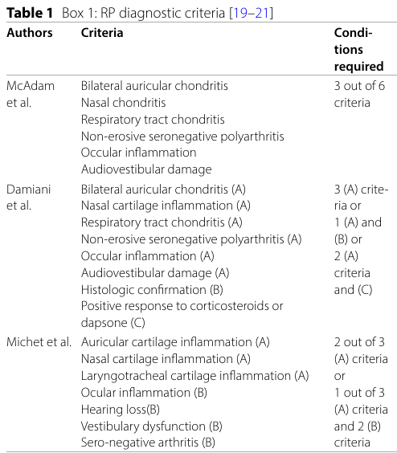

## Question

# Disease Characteristics Research Template

## Target Disease
- **Disease Name:** Relapsing Polychondritis
- **MONDO ID:**  (if available)
- **Category:** Complex

## Research Objectives

Please provide a comprehensive research report on **Relapsing Polychondritis** covering all of the
disease characteristics listed below. This report will be used to populate a disease knowledge
base entry. Be thorough and cite primary literature (PMID preferred) for all claims.

For each section, **suggested databases/resources** are listed. These are the first places
you should search for information on each topic.

---

### 1. Disease Information
> **Search first:** OMIM, Orphanet, ICD-10/ICD-11, MeSH, PubMed

- What is the disease? Provide a concise overview.
- What are the key identifiers? (OMIM, Orphanet, ICD-10/ICD-11, MeSH, Mondo)
- What are the common synonyms and alternative names?
- Is the information derived from individual patients (e.g., EHR) or aggregated disease-level resources?

### 2. Etiology

- **Disease Causal Factors**: What are the primary causes? (genetic, environmental, infectious, mechanistic)
- **Risk Factors**:
  > **Search first:** PubMed, Cochrane Library, UpToDate, clinical guidelines, ClinVar, ClinGen, GWAS Catalog, PheGenI, CTD, CDC, WHO, epidemiological databases
  - Genetic risk factors (causal variants, susceptibility loci, modifier genes)
  - Environmental risk factors (toxins, lifestyle, occupational exposures, age, sex, family history)
- **Protective Factors**:
  > **Search first:** PubMed, Cochrane Library, clinical trial databases, GWAS Catalog, gnomAD, WHO, CDC, nutrition databases
  - Genetic protective factors (protective variants, modifier alleles)
  - Environmental protective factors (diet, lifestyle, exposures that reduce risk)
- **Gene-Environment Interactions**: How do genetic and environmental factors interact to influence disease?
  > **Search first:** CTD, PubMed, PheGenI, GxE databases

### 3. Phenotypes
> **Search first:** HPO (Human Phenotype Ontology), OMIM, Orphanet, PubMed, clinicaltrials.gov, MedDRA, SNOMED CT, DECIPHER, LOINC

For each phenotype, provide:
- **Phenotype type**: symptoms, clinical signs, physical manifestations, behavioral changes, or laboratory abnormalities
  > For symptoms/signs: HPO, OMIM, Orphanet, PubMed
  > For behavioral changes: HPO, DSM, RDoC (Research Domain Criteria), PubMed
  > For laboratory abnormalities: LOINC, SNOMED CT, LabTests Online, PubMed
- **Phenotype characteristics**:
  > **Search first:** OMIM, Orphanet, HPO, PubMed
  - Age of symptom onset (neonatal, childhood, adult-onset, late-onset)
  - Symptom severity (mild, moderate, severe, variable)
  - Symptom progression (stable, progressive, episodic, fluctuating)
  - Frequency among affected individuals (percentage or qualitative)
- **Quality of life impact**: Effects on daily functioning and well-being (per-phenotype when possible)
  > **Search first:** EQ-5D database, SF-36, WHO QOL databases, PubMed
- Suggest HPO (Human Phenotype Ontology) terms for each phenotype

### 4. Genetic/Molecular Information

- **Causal Genes**: Gene mutations or chromosomal abnormalities responsible for disease (gene symbols, OMIM IDs)
  > **Search first:** OMIM, ClinVar, HGMD, Ensembl, NCBI Gene
- **Pathogenic Variants**:
  - Affected genes (gene symbols, HGNC IDs)
    > **Search first:** OMIM, NCBI Gene, Ensembl, HGNC, UniProt, GeneCards
  - Variant classification (pathogenic, likely pathogenic, VUS per ACMG/AMP guidelines)
    > **Search first:** ClinVar, ClinGen, ACMG/AMP guidelines, VarSome
  - Variant type/class (missense, frameshift, nonsense, splice-site, structural)
  - Allele frequency in population databases
    > **Search first:** gnomAD, 1000 Genomes, ExAC, TOPMed, dbSNP
  - Somatic vs germline origin
    > **Search first:** COSMIC (somatic), ClinVar, ICGC, TCGA
  - Functional consequences (loss of function, gain of function, dominant negative)
- **Modifier Genes**: Genes that modify disease severity or expression
- **Epigenetic Information**: DNA methylation, histone modifications, chromatin changes affecting disease
  > **Search first:** ENCODE, Roadmap Epigenomics, MethBase, DiseaseMeth
- **Chromosomal Abnormalities**: Large-scale genetic changes (aneuploidy, translocations, inversions)
  > **Search first:** DECIPHER, ClinVar, ECARUCA, UCSC Genome Browser

### 5. Environmental Information

- **Environmental Factors**: Non-genetic contributing factors (toxins, radiation, pollution, occupational exposure)
  > **Search first:** CTD (Comparative Toxicogenomics Database), TOXNET, PubMed, EPA databases
- **Lifestyle Factors**: Behavioral factors (smoking, diet, exercise, alcohol consumption)
  > **Search first:** CDC databases, WHO, PubMed, NHANES
- **Infectious Agents**: If applicable, pathogens causing or triggering disease (bacteria, viruses, fungi, parasites)
  > **Search first:** NCBI Taxonomy, ViPR, BV-BRC, MicrobeDB, GIDEON

### 6. Mechanism / Pathophysiology

- **Molecular Pathways**: Specific signaling cascades or biochemical pathways involved (Wnt, MAPK, mTOR, PI3K-AKT, etc.)
  > **Search first:** KEGG, Reactome, WikiPathways, PathBank, BioCyc
- **Cellular Processes**: Cell-level mechanisms (apoptosis, autophagy, cell cycle dysregulation, inflammation, etc.)
  > **Search first:** Gene Ontology (GO), Reactome, KEGG, PubMed
- **Protein Dysfunction**: How protein structure or function is altered (misfolding, aggregation, loss of function, gain of function)
  > **Search first:** UniProt, PDB (Protein Data Bank), InterPro, Pfam, AlphaFold
- **Metabolic Changes**: Alterations in metabolic processes (energy metabolism, lipid metabolism, amino acid metabolism)
  > **Search first:** KEGG, BioCyc, HMDB (Human Metabolome Database), BRENDA
- **Immune System Involvement**: Role of immune response (autoimmunity, immunodeficiency, chronic inflammation)
  > **Search first:** ImmPort, Immunome Database, IEDB, Gene Ontology
- **Tissue Damage Mechanisms**: How tissues/ are injured (oxidative stress, ischemia, fibrosis, necrosis)
  > **Search first:** PubMed, Gene Ontology, Reactome
- **Biochemical Abnormalities**: Specific molecular defects (enzyme deficiencies, receptor dysfunction, ion channel defects)
  > **Search first:** BRENDA, UniProt, KEGG, OMIM, PubMed
- **Epigenetic Changes**: DNA methylation, histone modifications affecting gene expression in disease
  > **Search first:** ENCODE, Roadmap Epigenomics, MethBase, DiseaseMeth
- **Molecular Profiling** (if available):
  - Transcriptomics/gene expression changes
    > **Search first:** GEO (Gene Expression Omnibus), ArrayExpress, GTEx, Human Cell Atlas, SRA
  - Proteomics findings
    > **Search first:** PRIDE, ProteomeXchange, Human Protein Atlas, STRING, BioGRID
  - Metabolomics signatures
    > **Search first:** MetaboLights, Metabolomics Workbench, HMDB, METLIN
  - Lipidomics alterations
    > **Search first:** LIPID MAPS, SwissLipids, LipidHome, Metabolomics Workbench
  - Genomic structural features
    > **Search first:** UCSC Genome Browser, Ensembl, NCBI, dbVar, DGV
- **Advanced Technologies** (if applicable):
  - Single-cell analysis findings (cell-type specific mechanisms, cellular heterogeneity)
    > **Search first:** Human Cell Atlas, Single Cell Portal, GEO, CELLxGENE
  - Spatial transcriptomics findings
    > **Search first:** GEO, Spatial Research, Vizgen, 10x Genomics data
  - Multi-omics integration results
    > **Search first:** TCGA, ICGC, cBioPortal, LinkedOmics, PubMed
  - Functional genomics screens (CRISPR, RNAi)
    > **Search first:** DepMap, GenomeRNAi, PubMed, BioGRID ORCS

For each mechanism, describe:
- The causal chain from initial trigger to clinical manifestation
- Which mechanisms are upstream vs downstream
- What cell types and biological processes are involved
- Suggest GO terms for biological processes and CL terms for cell types

### 7. Anatomical Structures Affected

- **Organ Level**:
  - Primary organs directly affected
  - Secondary organ involvement (complications, secondary effects)
  - Body systems involved (cardiovascular, nervous, digestive, respiratory, endocrine, etc.)
  > **Search first:** Uberon, FMA (Foundational Model of Anatomy), OMIM, HPO, ICD-11, MeSH, SNOMED CT
- **Tissue and Cell Level**:
  - Specific tissue types affected (epithelial, connective, muscle, nervous)
  - Specific cell populations targeted (with Cell Ontology terms)
  > **Search first:** Uberon, Human Protein Atlas, Cell Ontology, Human Cell Atlas, CellMarker, PanglaoDB
- **Subcellular Level**:
  - Cellular compartments involved (mitochondria, nucleus, ER, lysosomes) (with GO Cellular Component terms)
  > **Search first:** Gene Ontology (Cellular Component), UniProt, Human Protein Atlas
- **Localization**:
  - Specific anatomical sites (with UBERON terms)
    > **Search first:** FMA, Uberon, NeuroNames (for brain), SNOMED CT
  - Lateralization (unilateral, bilateral, asymmetric)
    > **Search first:** HPO, clinical literature, imaging databases

### 8. Temporal Development

- **Onset**:
  - Typical age of onset (congenital, pediatric, adult, geriatric)
  - Onset pattern (acute, subacute, chronic, insidious)
  > **Search first:** OMIM, Orphanet, HPO, PubMed
- **Progression**:
  - Disease stages (early, intermediate, advanced, end-stage)
    > **Search first:** Cancer Staging Manual (AJCC), WHO classifications, PubMed
  - Progression rate (rapid, slow, variable)
  - Disease course pattern (episodic, relapsing-remitting, progressive, stable)
  - Disease duration (self-limited, chronic lifelong)
  > **Search first:** Disease registries, longitudinal cohort databases, natural history studies, PubMed, Orphanet, OMIM
- **Patterns**:
  - Remission patterns (spontaneous, treatment-induced)
    > **Search first:** Clinical trial databases, disease registries, PubMed
  - Critical periods (time windows of vulnerability or opportunity for intervention)
    > **Search first:** PubMed, developmental biology databases, clinical guidelines

### 9. Inheritance and Population

- **Epidemiology**:
  - Prevalence (cases per 100,000 at given time)
  - Incidence (new cases per 100,000 per year)
  > **Search first:** Orphanet, CDC, WHO, GBD (Global Burden of Disease), national registries, SEER, disease registries
- **For Genetic Etiology**:
  - Inheritance pattern (AD, AR, X-linked, mitochondrial, multifactorial, polygenic)
    > **Search first:** OMIM, Orphanet, ClinVar, GTR (Genetic Testing Registry)
  - Penetrance (complete, incomplete, age-dependent)
    > **Search first:** ClinVar, OMIM, PubMed, ClinGen
  - Expressivity (variable, consistent)
    > **Search first:** OMIM, ClinVar, PubMed
  - Genetic anticipation (increasing severity in successive generations)
    > **Search first:** OMIM, PubMed (especially for repeat expansion disorders)
  - Germline mosaicism
    > **Search first:** ClinVar, OMIM, genetic counseling literature, PubMed
  - Founder effects (population-specific mutations)
    > **Search first:** gnomAD, population genetics databases, PubMed
  - Consanguinity role
    > **Search first:** OMIM, population studies, genetic counseling resources
  - Carrier frequency
    > **Search first:** gnomAD, carrier screening databases, GeneReviews, GTR
- **Population Demographics**:
  - Affected populations (ethnic or demographic groups with higher prevalence)
    > **Search first:** gnomAD, 1000 Genomes, PAGE Study, PubMed, population registries
  - Geographic distribution (endemic areas, regional variation)
    > **Search first:** WHO, CDC, GBD, Orphanet, geographic epidemiology databases
  - Geographic distribution of specific variants
  - Sex ratio (male:female)
    > **Search first:** Disease registries, OMIM, PubMed, epidemiological databases
  - Age distribution of affected individuals
    > **Search first:** CDC, disease registries, SEER, Orphanet

### 10. Diagnostics

- **Clinical Tests**:
  - Laboratory tests (blood, urine, tissue chemistry, specific enzyme assays)
    > **Search first:** LOINC, LabTests Online, PubMed
  - Biomarkers (proteins, metabolites, genetic markers, circulating biomarkers)
    > **Search first:** FDA Biomarker List, BEST (Biomarkers, EndpointS, and other Tools), PubMed
  - Imaging studies (X-ray, CT, MRI, PET, ultrasound)
    > **Search first:** RadLex, DICOM, Radiopaedia, imaging databases
  - Functional tests (pulmonary function, cardiac stress tests)
    > **Search first:** LOINC, clinical guidelines, PubMed
  - Electrophysiology (EEG, EMG, ECG, nerve conduction studies)
    > **Search first:** LOINC, clinical neurophysiology databases, PubMed
  - Biopsy findings (histopathology, immunohistochemistry)
    > **Search first:** SNOMED CT, College of American Pathologists resources, PubMed
  - Pathology findings (microscopic examination)
    > **Search first:** SNOMED CT, Digital Pathology databases, PubMed
- **Genetic Testing**:
  > **Search first:** GTR (Genetic Testing Registry), GeneReviews, ClinGen
  - Overview of recommended genetic testing approach
  - Whole genome sequencing (WGS) utility
    > **Search first:** GTR, ClinVar, GEL (Genomics England), gnomAD
  - Whole exome sequencing (WES) utility
    > **Search first:** GTR, ClinVar, OMIM, GeneMatcher
  - Gene panels (which panels, which genes)
    > **Search first:** GTR, ClinVar, laboratory-specific databases
  - Single gene testing
    > **Search first:** GTR, ClinVar, OMIM, GeneReviews
  - Chromosomal microarray (CMA)
    > **Search first:** DECIPHER, ClinVar, dbVar, ECARUCA
  - Karyotyping
    > **Search first:** Chromosome Abnormality Database, ClinVar, cytogenetics resources
  - FISH
    > **Search first:** ClinVar, cytogenetics databases, PubMed
  - Mitochondrial DNA testing
    > **Search first:** MITOMAP, MSeqDR, ClinVar, GTR
  - Repeat expansion testing
    > **Search first:** GTR, ClinVar, repeat expansion databases, PubMed
- **Omics-Based Diagnostics** (if applicable):
  - RNA sequencing / transcriptomics
    > **Search first:** GEO, ArrayExpress, GTEx, RNA-seq databases
  - Proteomics
    > **Search first:** PRIDE, ProteomeXchange, FDA Biomarker database
  - Metabolomics
    > **Search first:** MetaboLights, Metabolomics Workbench, HMDB
  - Epigenomics
    > **Search first:** GEO, ENCODE, Roadmap Epigenomics, MethBase
  - Liquid biopsy
    > **Search first:** COSMIC, ClinVar, liquid biopsy databases, PubMed
- **Clinical Criteria**:
  - Standardized diagnostic criteria (DSM, ICD, society guidelines)
    > **Search first:** DSM-5, ICD-11, clinical society guidelines, UpToDate
  - Differential diagnosis (other conditions to rule out, with distinguishing features)
    > **Search first:** DynaMed, UpToDate, clinical decision support systems
- **Screening**:
  - Screening methods for asymptomatic individuals (newborn screening, carrier screening, cascade screening)
    > **Search first:** ACMG recommendations, CDC newborn screening, GTR

### 11. Outcome/Prognosis

- **Survival and Mortality**:
  - Survival rate (5-year, 10-year, overall)
    > **Search first:** SEER, cancer registries, disease-specific registries, PubMed
  - Life expectancy (with and without treatment if applicable)
    > **Search first:** Orphanet, disease registries, actuarial databases, PubMed
  - Mortality rate
    > **Search first:** CDC, WHO, GBD, national mortality databases
  - Disease-specific mortality (deaths directly attributable to disease)
    > **Search first:** Disease registries, CDC Wonder, GBD, PubMed
- **Morbidity and Function**:
  - Morbidity (disease-related disability and health impacts)
    > **Search first:** GBD, WHO, disability databases, PubMed
  - Disability outcomes (long-term functional impairments)
    > **Search first:** ICF (International Classification of Functioning), disability registries
  - Quality of life measures (EQ-5D, SF-36, PROMIS, disease-specific tools)
    > **Search first:** EQ-5D database, SF-36, PROMIS, PubMed
- **Disease Course**:
  - Complications (secondary problems: infections, organ failure, etc.)
    > **Search first:** ICD codes, disease registries, clinical databases, PubMed
  - Recovery potential (likelihood and extent of recovery, with vs without treatment)
    > **Search first:** Natural history studies, rehabilitation databases, PubMed
- **Prediction**:
  - Prognostic factors (age, disease severity, biomarkers, treatment response)
    > **Search first:** Prognostic models databases, clinical calculators, PubMed
  - Prognostic biomarkers (molecular markers predicting disease course)
    > **Search first:** FDA Biomarker database, PubMed, cancer prognostic databases

### 12. Treatment

- **Pharmacotherapy**:
  - Pharmacological treatments (drug names, drug classes, mechanisms of action)
    > **Search first:** DrugBank, RxNorm, ATC classification, DailyMed, FDA databases
  - Pharmacogenomics (how genetic variants affect drug metabolism, efficacy, toxicity)
    > **Search first:** PharmGKB, CPIC (Clinical Pharmacogenetics), FDA Table of PGx Biomarkers
- **Advanced Therapeutics**:
  - Gene therapy (viral vectors, CRISPR, gene replacement, gene editing)
    > **Search first:** ClinicalTrials.gov, FDA gene therapy database, ASGCT resources
  - Cell therapy (stem cell transplant, CAR-T, cellular therapeutics)
    > **Search first:** ClinicalTrials.gov, FDA cell therapy database, FACT standards
  - RNA-based therapies (ASOs, siRNA, mRNA therapies)
    > **Search first:** ClinicalTrials.gov, FDA approvals, PubMed
  - Targeted therapies (treatments directed at specific molecular targets)
    > **Search first:** My Cancer Genome, OncoKB, ClinicalTrials.gov, FDA approvals
  - Immunotherapies (checkpoint inhibitors, monoclonal antibodies)
    > **Search first:** Cancer Immunotherapy Database, FDA approvals, ClinicalTrials.gov
- **Surgical and Interventional**:
  - Surgical interventions (types of surgery, timing, outcomes)
    > **Search first:** CPT codes, surgical registries, clinical guidelines, PubMed
- **Supportive and Rehabilitative**:
  - Supportive care (symptom management, pain control, nutrition)
    > **Search first:** Clinical guidelines, Cochrane Library, PubMed
  - Rehabilitation (physical therapy, occupational therapy, speech therapy)
    > **Search first:** Rehabilitation medicine databases, clinical guidelines, PubMed
- **Experimental**:
  - Experimental treatments in clinical trials (with NCT identifiers if available)
    > **Search first:** ClinicalTrials.gov, EU Clinical Trials Register, WHO ICTRP
- **Treatment Outcomes**:
  - Treatment response rates
    > **Search first:** Clinical trial databases, FDA reviews, systematic reviews, PubMed
  - Side effects and adverse events
    > **Search first:** FDA Adverse Event Reporting System (FAERS), MedWatch, PubMed
- **Treatment Strategy**:
  - Treatment algorithms (clinical pathways, decision trees)
    > **Search first:** Clinical practice guidelines, NCCN Guidelines, UpToDate
  - Combination therapies
    > **Search first:** ClinicalTrials.gov, treatment guidelines, PubMed
  - Personalized medicine approaches (genotype-guided treatment)
    > **Search first:** My Cancer Genome, CIViC, PharmGKB, precision medicine databases

For each treatment, suggest MAXO (Medical Action Ontology) terms where applicable.

### 13. Prevention

- **Prevention Levels**:
  - Primary prevention (preventing disease occurrence: vaccination, risk factor modification)
    > **Search first:** CDC, WHO, USPSTF recommendations, Cochrane Library
  - Secondary prevention (early detection and treatment: screening programs, early intervention)
    > **Search first:** USPSTF, CDC screening guidelines, WHO
  - Tertiary prevention (preventing complications in those with disease)
    > **Search first:** Clinical guidelines, disease management protocols, PubMed
- **Immunization**: Vaccine strategies (if applicable)
  > **Search first:** CDC vaccine schedules, WHO immunization, FDA vaccine database
- **Screening and Early Detection**:
  - Screening programs (population-based: newborn screening, cancer screening)
    > **Search first:** CDC screening programs, USPSTF, cancer screening databases
  - Genetic screening (carrier screening, preimplantation genetic diagnosis, prenatal testing)
    > **Search first:** ACMG recommendations, ACOG guidelines, GTR
  - Risk stratification (identifying high-risk individuals for targeted prevention)
    > **Search first:** Risk prediction models, clinical calculators, PubMed
- **Behavioral Interventions**: Lifestyle modifications to reduce risk
  > **Search first:** CDC, WHO, behavioral intervention databases, Cochrane Library
- **Counseling**: Genetic counseling (risk assessment, family planning guidance)
  > **Search first:** NSGC resources, ACMG guidelines, GeneReviews
- **Public Health**:
  - Public health interventions (sanitation, vector control, health education)
    > **Search first:** CDC, WHO, public health databases, PubMed
  - Environmental interventions (reducing environmental risk factors)
    > **Search first:** EPA databases, WHO environmental health, PubMed
- **Prophylaxis**: Preventive medications or procedures
  > **Search first:** Clinical guidelines, FDA approvals, PubMed

### 14. Other Species / Natural Disease

- **Taxonomy**: Species affected (with NCBI Taxon identifiers)
  > **Search first:** NCBI Taxonomy
- **Breed**: Specific breeds affected (with VBO identifiers if applicable)
  > **Search first:** VBO (Vertebrate Breed Ontology)
- **Gene**: Orthologous genes in other species (with NCBI Gene IDs)
  > **Search first:** NCBI Gene
- **Natural Disease**:
  - Naturally occurring disease in other species (companion animals, wildlife)
    > **Search first:** OMIA (Online Mendelian Inheritance in Animals), VetCompass, PubMed
  - Veterinary relevance and importance in animal health
    > **Search first:** OMIA, veterinary databases, PubMed
- **Comparative Biology**:
  - Comparative pathology (similarities and differences across species)
    > **Search first:** OMIA, comparative pathology databases, PubMed
  - Evolutionary conservation of disease mechanisms
    > **Search first:** HomoloGene, OrthoMCL, Alliance of Genome Resources
- **Transmission** (if applicable):
  - Zoonotic potential
    > **Search first:** CDC zoonotic diseases, WHO zoonoses, GIDEON
  - Cross-species susceptibility
    > **Search first:** NCBI Taxonomy, veterinary databases, PubMed

### 15. Model Organisms

- **Model Types**:
  - Model organism type (mammalian, invertebrate, cellular, in vitro)
    > **Search first:** Alliance of Genome Resources, model organism databases
  - Specific model systems (mouse, rat, zebrafish, Drosophila, C. elegans, yeast, cell lines, organoids, iPSCs)
    > **Search first:** MGI, RGD, ZFIN, FlyBase, WormBase, SGD, ATCC, Cellosaurus
  - Induced models (drug treatment, surgical intervention, environmental manipulation)
    > **Search first:** MGI, model organism databases, PubMed
- **Genetic Models**:
  - Types available (knockout, knock-in, transgenic, conditional, humanized)
    > **Search first:** MGI, IMPC, KOMP, EuMMCR, IMSR
- **Model Characteristics**:
  - Phenotype recapitulation (how well model reproduces human disease features)
    > **Search first:** Model organism databases, comparative studies, PubMed
  - Model limitations (aspects of human disease not captured)
    > **Search first:** Model organism databases, PubMed, review articles
- **Applications**:
  - Research applications (what aspects of disease can be studied)
    > **Search first:** Model organism databases, PubMed
- **Resources**:
  - Model databases
    > **Search first:** MGI, RGD, ZFIN, FlyBase, WormBase, IMSR, EMMA, MMRRC

---

## Citation Requirements

- Cite primary literature (PMID preferred) for all mechanistic and clinical claims
- Prioritize recent reviews and landmark papers
- Include direct quotes from abstracts where possible to support key statements
- Distinguish evidence source types: human clinical, model organism, in vitro, computational

## Output Format

Structure your response as a comprehensive narrative organized by the sections above.
For each section, provide:
- Factual content with specific details (numbers, percentages, gene names, variant nomenclature)
- Ontology term suggestions (HPO, GO, CL, UBERON, CHEBI, MAXO, MONDO) where applicable
- Evidence citations with PMIDs
- Direct quotes from abstracts to support key claims
- Clear indication when information is not available or not applicable for this disease

This report will be used to populate a disease knowledge base entry with:
- Pathophysiology descriptions with causal chains
- Gene/protein annotations (HGNC, GO terms)
- Phenotype associations (HP terms) with frequencies
- Cell type involvement (CL terms)
- Anatomical locations (UBERON terms)
- Chemical entities (CHEBI terms)
- Treatment annotations (MAXO terms)
- Evidence items with PMIDs and exact abstract quotes
- Epidemiology, prognosis, diagnostic, and prevention information
- Animal model descriptions with phenotype recapitulation details

## Output

Question: You are an expert researcher providing comprehensive, well-cited information.

Provide detailed information focusing on:
1. Key concepts and definitions with current understanding
2. Recent developments and latest research (prioritize 2023-2024 sources)
3. Current applications and real-world implementations
4. Expert opinions and analysis from authoritative sources
5. Relevant statistics and data from recent studies

Format as a comprehensive research report with proper citations. Include URLs and publication dates where available.
Always prioritize recent, authoritative sources and provide specific citations for all major claims.

# Disease Characteristics Research Template

## Target Disease
- **Disease Name:** Relapsing Polychondritis
- **MONDO ID:**  (if available)
- **Category:** Complex

## Research Objectives

Please provide a comprehensive research report on **Relapsing Polychondritis** covering all of the
disease characteristics listed below. This report will be used to populate a disease knowledge
base entry. Be thorough and cite primary literature (PMID preferred) for all claims.

For each section, **suggested databases/resources** are listed. These are the first places
you should search for information on each topic.

---

### 1. Disease Information
> **Search first:** OMIM, Orphanet, ICD-10/ICD-11, MeSH, PubMed

- What is the disease? Provide a concise overview.
- What are the key identifiers? (OMIM, Orphanet, ICD-10/ICD-11, MeSH, Mondo)
- What are the common synonyms and alternative names?
- Is the information derived from individual patients (e.g., EHR) or aggregated disease-level resources?

### 2. Etiology

- **Disease Causal Factors**: What are the primary causes? (genetic, environmental, infectious, mechanistic)
- **Risk Factors**:
  > **Search first:** PubMed, Cochrane Library, UpToDate, clinical guidelines, ClinVar, ClinGen, GWAS Catalog, PheGenI, CTD, CDC, WHO, epidemiological databases
  - Genetic risk factors (causal variants, susceptibility loci, modifier genes)
  - Environmental risk factors (toxins, lifestyle, occupational exposures, age, sex, family history)
- **Protective Factors**:
  > **Search first:** PubMed, Cochrane Library, clinical trial databases, GWAS Catalog, gnomAD, WHO, CDC, nutrition databases
  - Genetic protective factors (protective variants, modifier alleles)
  - Environmental protective factors (diet, lifestyle, exposures that reduce risk)
- **Gene-Environment Interactions**: How do genetic and environmental factors interact to influence disease?
  > **Search first:** CTD, PubMed, PheGenI, GxE databases

### 3. Phenotypes
> **Search first:** HPO (Human Phenotype Ontology), OMIM, Orphanet, PubMed, clinicaltrials.gov, MedDRA, SNOMED CT, DECIPHER, LOINC

For each phenotype, provide:
- **Phenotype type**: symptoms, clinical signs, physical manifestations, behavioral changes, or laboratory abnormalities
  > For symptoms/signs: HPO, OMIM, Orphanet, PubMed
  > For behavioral changes: HPO, DSM, RDoC (Research Domain Criteria), PubMed
  > For laboratory abnormalities: LOINC, SNOMED CT, LabTests Online, PubMed
- **Phenotype characteristics**:
  > **Search first:** OMIM, Orphanet, HPO, PubMed
  - Age of symptom onset (neonatal, childhood, adult-onset, late-onset)
  - Symptom severity (mild, moderate, severe, variable)
  - Symptom progression (stable, progressive, episodic, fluctuating)
  - Frequency among affected individuals (percentage or qualitative)
- **Quality of life impact**: Effects on daily functioning and well-being (per-phenotype when possible)
  > **Search first:** EQ-5D database, SF-36, WHO QOL databases, PubMed
- Suggest HPO (Human Phenotype Ontology) terms for each phenotype

### 4. Genetic/Molecular Information

- **Causal Genes**: Gene mutations or chromosomal abnormalities responsible for disease (gene symbols, OMIM IDs)
  > **Search first:** OMIM, ClinVar, HGMD, Ensembl, NCBI Gene
- **Pathogenic Variants**:
  - Affected genes (gene symbols, HGNC IDs)
    > **Search first:** OMIM, NCBI Gene, Ensembl, HGNC, UniProt, GeneCards
  - Variant classification (pathogenic, likely pathogenic, VUS per ACMG/AMP guidelines)
    > **Search first:** ClinVar, ClinGen, ACMG/AMP guidelines, VarSome
  - Variant type/class (missense, frameshift, nonsense, splice-site, structural)
  - Allele frequency in population databases
    > **Search first:** gnomAD, 1000 Genomes, ExAC, TOPMed, dbSNP
  - Somatic vs germline origin
    > **Search first:** COSMIC (somatic), ClinVar, ICGC, TCGA
  - Functional consequences (loss of function, gain of function, dominant negative)
- **Modifier Genes**: Genes that modify disease severity or expression
- **Epigenetic Information**: DNA methylation, histone modifications, chromatin changes affecting disease
  > **Search first:** ENCODE, Roadmap Epigenomics, MethBase, DiseaseMeth
- **Chromosomal Abnormalities**: Large-scale genetic changes (aneuploidy, translocations, inversions)
  > **Search first:** DECIPHER, ClinVar, ECARUCA, UCSC Genome Browser

### 5. Environmental Information

- **Environmental Factors**: Non-genetic contributing factors (toxins, radiation, pollution, occupational exposure)
  > **Search first:** CTD (Comparative Toxicogenomics Database), TOXNET, PubMed, EPA databases
- **Lifestyle Factors**: Behavioral factors (smoking, diet, exercise, alcohol consumption)
  > **Search first:** CDC databases, WHO, PubMed, NHANES
- **Infectious Agents**: If applicable, pathogens causing or triggering disease (bacteria, viruses, fungi, parasites)
  > **Search first:** NCBI Taxonomy, ViPR, BV-BRC, MicrobeDB, GIDEON

### 6. Mechanism / Pathophysiology

- **Molecular Pathways**: Specific signaling cascades or biochemical pathways involved (Wnt, MAPK, mTOR, PI3K-AKT, etc.)
  > **Search first:** KEGG, Reactome, WikiPathways, PathBank, BioCyc
- **Cellular Processes**: Cell-level mechanisms (apoptosis, autophagy, cell cycle dysregulation, inflammation, etc.)
  > **Search first:** Gene Ontology (GO), Reactome, KEGG, PubMed
- **Protein Dysfunction**: How protein structure or function is altered (misfolding, aggregation, loss of function, gain of function)
  > **Search first:** UniProt, PDB (Protein Data Bank), InterPro, Pfam, AlphaFold
- **Metabolic Changes**: Alterations in metabolic processes (energy metabolism, lipid metabolism, amino acid metabolism)
  > **Search first:** KEGG, BioCyc, HMDB (Human Metabolome Database), BRENDA
- **Immune System Involvement**: Role of immune response (autoimmunity, immunodeficiency, chronic inflammation)
  > **Search first:** ImmPort, Immunome Database, IEDB, Gene Ontology
- **Tissue Damage Mechanisms**: How tissues/ are injured (oxidative stress, ischemia, fibrosis, necrosis)
  > **Search first:** PubMed, Gene Ontology, Reactome
- **Biochemical Abnormalities**: Specific molecular defects (enzyme deficiencies, receptor dysfunction, ion channel defects)
  > **Search first:** BRENDA, UniProt, KEGG, OMIM, PubMed
- **Epigenetic Changes**: DNA methylation, histone modifications affecting gene expression in disease
  > **Search first:** ENCODE, Roadmap Epigenomics, MethBase, DiseaseMeth
- **Molecular Profiling** (if available):
  - Transcriptomics/gene expression changes
    > **Search first:** GEO (Gene Expression Omnibus), ArrayExpress, GTEx, Human Cell Atlas, SRA
  - Proteomics findings
    > **Search first:** PRIDE, ProteomeXchange, Human Protein Atlas, STRING, BioGRID
  - Metabolomics signatures
    > **Search first:** MetaboLights, Metabolomics Workbench, HMDB, METLIN
  - Lipidomics alterations
    > **Search first:** LIPID MAPS, SwissLipids, LipidHome, Metabolomics Workbench
  - Genomic structural features
    > **Search first:** UCSC Genome Browser, Ensembl, NCBI, dbVar, DGV
- **Advanced Technologies** (if applicable):
  - Single-cell analysis findings (cell-type specific mechanisms, cellular heterogeneity)
    > **Search first:** Human Cell Atlas, Single Cell Portal, GEO, CELLxGENE
  - Spatial transcriptomics findings
    > **Search first:** GEO, Spatial Research, Vizgen, 10x Genomics data
  - Multi-omics integration results
    > **Search first:** TCGA, ICGC, cBioPortal, LinkedOmics, PubMed
  - Functional genomics screens (CRISPR, RNAi)
    > **Search first:** DepMap, GenomeRNAi, PubMed, BioGRID ORCS

For each mechanism, describe:
- The causal chain from initial trigger to clinical manifestation
- Which mechanisms are upstream vs downstream
- What cell types and biological processes are involved
- Suggest GO terms for biological processes and CL terms for cell types

### 7. Anatomical Structures Affected

- **Organ Level**:
  - Primary organs directly affected
  - Secondary organ involvement (complications, secondary effects)
  - Body systems involved (cardiovascular, nervous, digestive, respiratory, endocrine, etc.)
  > **Search first:** Uberon, FMA (Foundational Model of Anatomy), OMIM, HPO, ICD-11, MeSH, SNOMED CT
- **Tissue and Cell Level**:
  - Specific tissue types affected (epithelial, connective, muscle, nervous)
  - Specific cell populations targeted (with Cell Ontology terms)
  > **Search first:** Uberon, Human Protein Atlas, Cell Ontology, Human Cell Atlas, CellMarker, PanglaoDB
- **Subcellular Level**:
  - Cellular compartments involved (mitochondria, nucleus, ER, lysosomes) (with GO Cellular Component terms)
  > **Search first:** Gene Ontology (Cellular Component), UniProt, Human Protein Atlas
- **Localization**:
  - Specific anatomical sites (with UBERON terms)
    > **Search first:** FMA, Uberon, NeuroNames (for brain), SNOMED CT
  - Lateralization (unilateral, bilateral, asymmetric)
    > **Search first:** HPO, clinical literature, imaging databases

### 8. Temporal Development

- **Onset**:
  - Typical age of onset (congenital, pediatric, adult, geriatric)
  - Onset pattern (acute, subacute, chronic, insidious)
  > **Search first:** OMIM, Orphanet, HPO, PubMed
- **Progression**:
  - Disease stages (early, intermediate, advanced, end-stage)
    > **Search first:** Cancer Staging Manual (AJCC), WHO classifications, PubMed
  - Progression rate (rapid, slow, variable)
  - Disease course pattern (episodic, relapsing-remitting, progressive, stable)
  - Disease duration (self-limited, chronic lifelong)
  > **Search first:** Disease registries, longitudinal cohort databases, natural history studies, PubMed, Orphanet, OMIM
- **Patterns**:
  - Remission patterns (spontaneous, treatment-induced)
    > **Search first:** Clinical trial databases, disease registries, PubMed
  - Critical periods (time windows of vulnerability or opportunity for intervention)
    > **Search first:** PubMed, developmental biology databases, clinical guidelines

### 9. Inheritance and Population

- **Epidemiology**:
  - Prevalence (cases per 100,000 at given time)
  - Incidence (new cases per 100,000 per year)
  > **Search first:** Orphanet, CDC, WHO, GBD (Global Burden of Disease), national registries, SEER, disease registries
- **For Genetic Etiology**:
  - Inheritance pattern (AD, AR, X-linked, mitochondrial, multifactorial, polygenic)
    > **Search first:** OMIM, Orphanet, ClinVar, GTR (Genetic Testing Registry)
  - Penetrance (complete, incomplete, age-dependent)
    > **Search first:** ClinVar, OMIM, PubMed, ClinGen
  - Expressivity (variable, consistent)
    > **Search first:** OMIM, ClinVar, PubMed
  - Genetic anticipation (increasing severity in successive generations)
    > **Search first:** OMIM, PubMed (especially for repeat expansion disorders)
  - Germline mosaicism
    > **Search first:** ClinVar, OMIM, genetic counseling literature, PubMed
  - Founder effects (population-specific mutations)
    > **Search first:** gnomAD, population genetics databases, PubMed
  - Consanguinity role
    > **Search first:** OMIM, population studies, genetic counseling resources
  - Carrier frequency
    > **Search first:** gnomAD, carrier screening databases, GeneReviews, GTR
- **Population Demographics**:
  - Affected populations (ethnic or demographic groups with higher prevalence)
    > **Search first:** gnomAD, 1000 Genomes, PAGE Study, PubMed, population registries
  - Geographic distribution (endemic areas, regional variation)
    > **Search first:** WHO, CDC, GBD, Orphanet, geographic epidemiology databases
  - Geographic distribution of specific variants
  - Sex ratio (male:female)
    > **Search first:** Disease registries, OMIM, PubMed, epidemiological databases
  - Age distribution of affected individuals
    > **Search first:** CDC, disease registries, SEER, Orphanet

### 10. Diagnostics

- **Clinical Tests**:
  - Laboratory tests (blood, urine, tissue chemistry, specific enzyme assays)
    > **Search first:** LOINC, LabTests Online, PubMed
  - Biomarkers (proteins, metabolites, genetic markers, circulating biomarkers)
    > **Search first:** FDA Biomarker List, BEST (Biomarkers, EndpointS, and other Tools), PubMed
  - Imaging studies (X-ray, CT, MRI, PET, ultrasound)
    > **Search first:** RadLex, DICOM, Radiopaedia, imaging databases
  - Functional tests (pulmonary function, cardiac stress tests)
    > **Search first:** LOINC, clinical guidelines, PubMed
  - Electrophysiology (EEG, EMG, ECG, nerve conduction studies)
    > **Search first:** LOINC, clinical neurophysiology databases, PubMed
  - Biopsy findings (histopathology, immunohistochemistry)
    > **Search first:** SNOMED CT, College of American Pathologists resources, PubMed
  - Pathology findings (microscopic examination)
    > **Search first:** SNOMED CT, Digital Pathology databases, PubMed
- **Genetic Testing**:
  > **Search first:** GTR (Genetic Testing Registry), GeneReviews, ClinGen
  - Overview of recommended genetic testing approach
  - Whole genome sequencing (WGS) utility
    > **Search first:** GTR, ClinVar, GEL (Genomics England), gnomAD
  - Whole exome sequencing (WES) utility
    > **Search first:** GTR, ClinVar, OMIM, GeneMatcher
  - Gene panels (which panels, which genes)
    > **Search first:** GTR, ClinVar, laboratory-specific databases
  - Single gene testing
    > **Search first:** GTR, ClinVar, OMIM, GeneReviews
  - Chromosomal microarray (CMA)
    > **Search first:** DECIPHER, ClinVar, dbVar, ECARUCA
  - Karyotyping
    > **Search first:** Chromosome Abnormality Database, ClinVar, cytogenetics resources
  - FISH
    > **Search first:** ClinVar, cytogenetics databases, PubMed
  - Mitochondrial DNA testing
    > **Search first:** MITOMAP, MSeqDR, ClinVar, GTR
  - Repeat expansion testing
    > **Search first:** GTR, ClinVar, repeat expansion databases, PubMed
- **Omics-Based Diagnostics** (if applicable):
  - RNA sequencing / transcriptomics
    > **Search first:** GEO, ArrayExpress, GTEx, RNA-seq databases
  - Proteomics
    > **Search first:** PRIDE, ProteomeXchange, FDA Biomarker database
  - Metabolomics
    > **Search first:** MetaboLights, Metabolomics Workbench, HMDB
  - Epigenomics
    > **Search first:** GEO, ENCODE, Roadmap Epigenomics, MethBase
  - Liquid biopsy
    > **Search first:** COSMIC, ClinVar, liquid biopsy databases, PubMed
- **Clinical Criteria**:
  - Standardized diagnostic criteria (DSM, ICD, society guidelines)
    > **Search first:** DSM-5, ICD-11, clinical society guidelines, UpToDate
  - Differential diagnosis (other conditions to rule out, with distinguishing features)
    > **Search first:** DynaMed, UpToDate, clinical decision support systems
- **Screening**:
  - Screening methods for asymptomatic individuals (newborn screening, carrier screening, cascade screening)
    > **Search first:** ACMG recommendations, CDC newborn screening, GTR

### 11. Outcome/Prognosis

- **Survival and Mortality**:
  - Survival rate (5-year, 10-year, overall)
    > **Search first:** SEER, cancer registries, disease-specific registries, PubMed
  - Life expectancy (with and without treatment if applicable)
    > **Search first:** Orphanet, disease registries, actuarial databases, PubMed
  - Mortality rate
    > **Search first:** CDC, WHO, GBD, national mortality databases
  - Disease-specific mortality (deaths directly attributable to disease)
    > **Search first:** Disease registries, CDC Wonder, GBD, PubMed
- **Morbidity and Function**:
  - Morbidity (disease-related disability and health impacts)
    > **Search first:** GBD, WHO, disability databases, PubMed
  - Disability outcomes (long-term functional impairments)
    > **Search first:** ICF (International Classification of Functioning), disability registries
  - Quality of life measures (EQ-5D, SF-36, PROMIS, disease-specific tools)
    > **Search first:** EQ-5D database, SF-36, PROMIS, PubMed
- **Disease Course**:
  - Complications (secondary problems: infections, organ failure, etc.)
    > **Search first:** ICD codes, disease registries, clinical databases, PubMed
  - Recovery potential (likelihood and extent of recovery, with vs without treatment)
    > **Search first:** Natural history studies, rehabilitation databases, PubMed
- **Prediction**:
  - Prognostic factors (age, disease severity, biomarkers, treatment response)
    > **Search first:** Prognostic models databases, clinical calculators, PubMed
  - Prognostic biomarkers (molecular markers predicting disease course)
    > **Search first:** FDA Biomarker database, PubMed, cancer prognostic databases

### 12. Treatment

- **Pharmacotherapy**:
  - Pharmacological treatments (drug names, drug classes, mechanisms of action)
    > **Search first:** DrugBank, RxNorm, ATC classification, DailyMed, FDA databases
  - Pharmacogenomics (how genetic variants affect drug metabolism, efficacy, toxicity)
    > **Search first:** PharmGKB, CPIC (Clinical Pharmacogenetics), FDA Table of PGx Biomarkers
- **Advanced Therapeutics**:
  - Gene therapy (viral vectors, CRISPR, gene replacement, gene editing)
    > **Search first:** ClinicalTrials.gov, FDA gene therapy database, ASGCT resources
  - Cell therapy (stem cell transplant, CAR-T, cellular therapeutics)
    > **Search first:** ClinicalTrials.gov, FDA cell therapy database, FACT standards
  - RNA-based therapies (ASOs, siRNA, mRNA therapies)
    > **Search first:** ClinicalTrials.gov, FDA approvals, PubMed
  - Targeted therapies (treatments directed at specific molecular targets)
    > **Search first:** My Cancer Genome, OncoKB, ClinicalTrials.gov, FDA approvals
  - Immunotherapies (checkpoint inhibitors, monoclonal antibodies)
    > **Search first:** Cancer Immunotherapy Database, FDA approvals, ClinicalTrials.gov
- **Surgical and Interventional**:
  - Surgical interventions (types of surgery, timing, outcomes)
    > **Search first:** CPT codes, surgical registries, clinical guidelines, PubMed
- **Supportive and Rehabilitative**:
  - Supportive care (symptom management, pain control, nutrition)
    > **Search first:** Clinical guidelines, Cochrane Library, PubMed
  - Rehabilitation (physical therapy, occupational therapy, speech therapy)
    > **Search first:** Rehabilitation medicine databases, clinical guidelines, PubMed
- **Experimental**:
  - Experimental treatments in clinical trials (with NCT identifiers if available)
    > **Search first:** ClinicalTrials.gov, EU Clinical Trials Register, WHO ICTRP
- **Treatment Outcomes**:
  - Treatment response rates
    > **Search first:** Clinical trial databases, FDA reviews, systematic reviews, PubMed
  - Side effects and adverse events
    > **Search first:** FDA Adverse Event Reporting System (FAERS), MedWatch, PubMed
- **Treatment Strategy**:
  - Treatment algorithms (clinical pathways, decision trees)
    > **Search first:** Clinical practice guidelines, NCCN Guidelines, UpToDate
  - Combination therapies
    > **Search first:** ClinicalTrials.gov, treatment guidelines, PubMed
  - Personalized medicine approaches (genotype-guided treatment)
    > **Search first:** My Cancer Genome, CIViC, PharmGKB, precision medicine databases

For each treatment, suggest MAXO (Medical Action Ontology) terms where applicable.

### 13. Prevention

- **Prevention Levels**:
  - Primary prevention (preventing disease occurrence: vaccination, risk factor modification)
    > **Search first:** CDC, WHO, USPSTF recommendations, Cochrane Library
  - Secondary prevention (early detection and treatment: screening programs, early intervention)
    > **Search first:** USPSTF, CDC screening guidelines, WHO
  - Tertiary prevention (preventing complications in those with disease)
    > **Search first:** Clinical guidelines, disease management protocols, PubMed
- **Immunization**: Vaccine strategies (if applicable)
  > **Search first:** CDC vaccine schedules, WHO immunization, FDA vaccine database
- **Screening and Early Detection**:
  - Screening programs (population-based: newborn screening, cancer screening)
    > **Search first:** CDC screening programs, USPSTF, cancer screening databases
  - Genetic screening (carrier screening, preimplantation genetic diagnosis, prenatal testing)
    > **Search first:** ACMG recommendations, ACOG guidelines, GTR
  - Risk stratification (identifying high-risk individuals for targeted prevention)
    > **Search first:** Risk prediction models, clinical calculators, PubMed
- **Behavioral Interventions**: Lifestyle modifications to reduce risk
  > **Search first:** CDC, WHO, behavioral intervention databases, Cochrane Library
- **Counseling**: Genetic counseling (risk assessment, family planning guidance)
  > **Search first:** NSGC resources, ACMG guidelines, GeneReviews
- **Public Health**:
  - Public health interventions (sanitation, vector control, health education)
    > **Search first:** CDC, WHO, public health databases, PubMed
  - Environmental interventions (reducing environmental risk factors)
    > **Search first:** EPA databases, WHO environmental health, PubMed
- **Prophylaxis**: Preventive medications or procedures
  > **Search first:** Clinical guidelines, FDA approvals, PubMed

### 14. Other Species / Natural Disease

- **Taxonomy**: Species affected (with NCBI Taxon identifiers)
  > **Search first:** NCBI Taxonomy
- **Breed**: Specific breeds affected (with VBO identifiers if applicable)
  > **Search first:** VBO (Vertebrate Breed Ontology)
- **Gene**: Orthologous genes in other species (with NCBI Gene IDs)
  > **Search first:** NCBI Gene
- **Natural Disease**:
  - Naturally occurring disease in other species (companion animals, wildlife)
    > **Search first:** OMIA (Online Mendelian Inheritance in Animals), VetCompass, PubMed
  - Veterinary relevance and importance in animal health
    > **Search first:** OMIA, veterinary databases, PubMed
- **Comparative Biology**:
  - Comparative pathology (similarities and differences across species)
    > **Search first:** OMIA, comparative pathology databases, PubMed
  - Evolutionary conservation of disease mechanisms
    > **Search first:** HomoloGene, OrthoMCL, Alliance of Genome Resources
- **Transmission** (if applicable):
  - Zoonotic potential
    > **Search first:** CDC zoonotic diseases, WHO zoonoses, GIDEON
  - Cross-species susceptibility
    > **Search first:** NCBI Taxonomy, veterinary databases, PubMed

### 15. Model Organisms

- **Model Types**:
  - Model organism type (mammalian, invertebrate, cellular, in vitro)
    > **Search first:** Alliance of Genome Resources, model organism databases
  - Specific model systems (mouse, rat, zebrafish, Drosophila, C. elegans, yeast, cell lines, organoids, iPSCs)
    > **Search first:** MGI, RGD, ZFIN, FlyBase, WormBase, SGD, ATCC, Cellosaurus
  - Induced models (drug treatment, surgical intervention, environmental manipulation)
    > **Search first:** MGI, model organism databases, PubMed
- **Genetic Models**:
  - Types available (knockout, knock-in, transgenic, conditional, humanized)
    > **Search first:** MGI, IMPC, KOMP, EuMMCR, IMSR
- **Model Characteristics**:
  - Phenotype recapitulation (how well model reproduces human disease features)
    > **Search first:** Model organism databases, comparative studies, PubMed
  - Model limitations (aspects of human disease not captured)
    > **Search first:** Model organism databases, PubMed, review articles
- **Applications**:
  - Research applications (what aspects of disease can be studied)
    > **Search first:** Model organism databases, PubMed
- **Resources**:
  - Model databases
    > **Search first:** MGI, RGD, ZFIN, FlyBase, WormBase, IMSR, EMMA, MMRRC

---

## Citation Requirements

- Cite primary literature (PMID preferred) for all mechanistic and clinical claims
- Prioritize recent reviews and landmark papers
- Include direct quotes from abstracts where possible to support key statements
- Distinguish evidence source types: human clinical, model organism, in vitro, computational

## Output Format

Structure your response as a comprehensive narrative organized by the sections above.
For each section, provide:
- Factual content with specific details (numbers, percentages, gene names, variant nomenclature)
- Ontology term suggestions (HPO, GO, CL, UBERON, CHEBI, MAXO, MONDO) where applicable
- Evidence citations with PMIDs
- Direct quotes from abstracts to support key claims
- Clear indication when information is not available or not applicable for this disease

This report will be used to populate a disease knowledge base entry with:
- Pathophysiology descriptions with causal chains
- Gene/protein annotations (HGNC, GO terms)
- Phenotype associations (HP terms) with frequencies
- Cell type involvement (CL terms)
- Anatomical locations (UBERON terms)
- Chemical entities (CHEBI terms)
- Treatment annotations (MAXO terms)
- Evidence items with PMIDs and exact abstract quotes
- Epidemiology, prognosis, diagnostic, and prevention information
- Animal model descriptions with phenotype recapitulation details

## Comprehensive Research Report: Relapsing Polychondritis (RP)

### Executive summary
Relapsing polychondritis (RP) is a rare, immune-mediated, relapsing inflammatory disease characterized by episodic inflammation and progressive destruction of cartilage and other proteoglycan-rich tissues (e.g., ear, nose, tracheobronchial tree; also eyes/inner ear/cardiovascular structures). Recent work (2023–2024) emphasizes: (i) clinically meaningful phenotypic subgroups (including airway-predominant and hematologic/VEXAS-associated disease), (ii) the need to distinguish “idiopathic RP” from VEXAS syndrome (somatic UBA1 variants) in older men with cytopenias/macrocytosis, and (iii) expanding off-label use of biologics and emerging targeted therapy trials (e.g., JAK inhibitors). (bica2024unveilingtheclinical pages 1-2, mertz2023bestpractice& pages 7-9, cardoneanu2024autoimmunityandautoinflammation pages 1-3, duan2024dynamicmonitoringof pages 1-3, NCT06873100 chunk 1)

---

## 1. Disease Information

### 1.1 Definition/overview (current understanding)
RP is a systemic, relapsing inflammatory disorder involving cartilage and proteoglycan-rich tissues. A contemporary review abstract states: “Relapsing polychondritis is a rare multisystem disease involving cartilaginous and proteoglycan-rich structures.” (Bica et al., 2024-04; https://doi.org/10.1186/s42358-024-00365-z) (bica2024unveilingtheclinical pages 1-2)

### 1.2 Key identifiers and synonyms
The retrieved evidence set contains explicit MeSH and EFO identifiers, but not ICD-10/ICD-11/Orphanet/MONDO codes. The table below consolidates what was retrievable and flags gaps for later knowledge-base curation.

| Identifier system | Identifier/code | Label | Source (URL + publication/record date if available) | Notes |
|---|---|---|---|---|
| MeSH | D011081 | Polychondritis, Relapsing | ClinicalTrials.gov record NCT06873100, *Efficacy, Safety and Immunological Evaluation of Upadacitinib for Relapsing Polychondritis*; first posted 2025-03-12; https://clinicaltrials.gov/study/NCT06873100 (NCT06873100 chunk 1) | Explicit MeSH term/ID present in trial metadata; canonical disease label in MeSH-formatted form. |
| EFO | EFO_1001148 | relapsing polychondritis | Open Targets query result for “Relapsing polychondritis”; cited platform paper: Buniello et al., 2025; https://platform.opentargets.org/ (OpenTargets Search: Relapsing polychondritis) | Disease identifier returned by Open Targets; no associated targets were found in the retrieved snapshot. |
| Abbreviation / synonym | RP | Relapsing polychondritis | Mertz et al., 2023, *Best Practice & Research Clinical Rheumatology*; 2023; DOI not fully available in retrieved text (mertz2023bestpractice& pages 12-14, mertz2023bestpractice& pages 15-15) | Common abbreviation used throughout recent reviews and trial records. |
| Related term / subset label | — | VEXAS-relapsing polychondritis | Mertz et al., 2023, *Best Practice & Research Clinical Rheumatology*; 2023; DOI not fully available in retrieved text (mertz2023bestpractice& pages 12-14) | Used for the UBA1/VEXAS-associated RP subset; reflects an overlapping clinicogenetic entity rather than a formal ontology synonym. |
| Related syndrome term | — | MAGIC syndrome | Mertz et al., 2023, *Best Practice & Research Clinical Rheumatology*; 2023; DOI not fully available in retrieved text (mertz2023bestpractice& pages 12-14) | “Mouth and genital ulcers with inflamed cartilage”; overlap syndrome relevant to RP differential diagnosis/phenotyping, not a direct synonym. |
| ICD-10 | not retrieved in provided sources | — | Not retrieved in the provided evidence set (NCT06873100 chunk 1, OpenTargets Search: Relapsing polychondritis) | Should be verified in ICD source databases before KB ingestion. |
| ICD-11 | not retrieved in provided sources | — | Not retrieved in the provided evidence set (NCT06873100 chunk 1, OpenTargets Search: Relapsing polychondritis) | Should be verified in ICD source databases before KB ingestion. |
| Orphanet | not retrieved in provided sources | — | Not retrieved in the provided evidence set (NCT06873100 chunk 1, OpenTargets Search: Relapsing polychondritis) | ORPHA code was requested but not available in the retrieved sources. |
| MONDO | not retrieved in provided sources | — | Not retrieved in the provided evidence set (NCT06873100 chunk 1, OpenTargets Search: Relapsing polychondritis) | MONDO cross-reference should be added from MONDO/OLS when available. |

*Table: This table compiles the key identifiers and commonly used names for relapsing polychondritis that were explicitly retrievable from the provided sources. It also flags major ontology/code systems that were requested but not recovered in the evidence set, helping identify curation gaps for a knowledge-base entry.*

**Evidence source type:** identifiers are from ClinicalTrials.gov metadata (trial registry) and Open Targets (ontology mapping), plus review terminology usage. (NCT06873100 chunk 1, OpenTargets Search: Relapsing polychondritis, mertz2023bestpractice& pages 12-14)

### 1.3 Synonyms/alternative names (narrative)
Historically, RP has been described under multiple names. A 2024 review notes that after early descriptions, it was called “diffuse perichondritis, chondromalacia, chronic atrophic polychondritis, diffuse chondrolysis, and dyschondroplasia,” and that the term “relapsing polychondritis” was introduced in 1960 to emphasize episodic course. (bica2024unveilingtheclinical pages 1-2)

### 1.4 Data provenance
Evidence in this report is aggregated from cohort studies, retrospective multicenter analyses, systematic review/case compilation, clinical trial registry entries, and narrative reviews (not single EHR-only cases). (gallagher2023theocularmanifestations pages 1-5, jafarpour2024amulticenterstudy pages 3-4, handa2023evaluationofairway pages 1-2, NCT06873100 chunk 1)

---

## 2. Etiology

### 2.1 Disease causal factors (mechanistic)
The etiology is not fully established; current models support genetic susceptibility plus environmental/physical triggers leading to cartilage antigen exposure and immune-mediated tissue injury. A 2024 mechanistic review states that triggers (mechanical/chemical/infectious) may promote “degradation of proteins and the release of cryptic cartilage antigens,” in genetically predisposed individuals. (cardoneanu2024autoimmunityandautoinflammation pages 1-3)

### 2.2 Risk factors

**Genetic risk (HLA):** Multiple sources emphasize HLA associations. HLA-DR4 is highlighted as a major risk allele. (cardoneanu2024autoimmunityandautoinflammation pages 1-3, cardoneanu2024autoimmunityandautoinflammation pages 3-4)

**Monogenic/somatic risk subset (VEXAS/UBA1):** A major recent development is recognition that a subset of clinically diagnosed RP represents VEXAS syndrome (somatic UBA1 variants in myeloid lineage), with different clinical/laboratory profile and prognosis. (mertz2023bestpractice& pages 7-9, duan2024dynamicmonitoringof pages 1-3)

**Demographic patterns:** Reviews describe onset typically in mid-adulthood (often 40–60) with female predominance in some datasets, while VEXAS-associated chondritis is male-predominant due to X-linked somatic mosaicism. (mertz2023bestpractice& pages 1-3, cardoneanu2024autoimmunityandautoinflammation pages 1-3)

### 2.3 Protective factors
No explicit genetic or environmental protective factors were retrievable from the provided evidence set. (Evidence gap)

### 2.4 Gene–environment interactions
A plausible interaction is that genetic susceptibility (HLA) plus external triggers (trauma, exposures, infections) promotes antigen exposure and immune activation; however, no quantitative GxE studies were retrievable in this evidence set. (cardoneanu2024autoimmunityandautoinflammation pages 1-3)

---

## 3. Phenotypes

### 3.1 Core phenotype spectrum
RP manifests with episodic chondritis (auricular, nasal, airway), arthritis, ocular inflammation, audiovestibular involvement, and systemic/vascular involvement in subsets. (bica2024unveilingtheclinical pages 1-2, gallagher2023theocularmanifestations pages 1-5, mertz2023bestpractice& pages 7-9)

### 3.2 Quantitative phenotype frequencies (recent/large datasets) + HPO mapping
The following table consolidates phenotype frequencies (and selected damage/outcome rates) from 2023–2024 sources and maps them to suggested HPO terms.

| Clinical domain/phenotype | Key quantitative data (with % and cohort) | Suggested HPO term(s) | Key source (PMID/DOI/URL, year) |
|---|---|---|---|
| Auricular chondritis / pinna involvement | Present in **20% at disease onset** and **90% during the disease course** in RP review data; in the Iranian multicenter cohort, auricular chondritis occurred in **~86%** of patients (bica2024unveilingtheclinical pages 1-2, jafarpour2024amulticenterstudy pages 6-7) | HP:0008602 Abnormality of the external ear; HP:0010708 Auricular cartilage inflammation | Bica et al., 2024, doi:10.1186/s42358-024-00365-z, https://doi.org/10.1186/s42358-024-00365-z; Jafarpour et al., 2024, doi:10.1038/s41598-024-67530-8, https://doi.org/10.1038/s41598-024-67530-8 |
| Nasal chondritis / nasal cartilage involvement | Nasal chondritis occurred in **~55%** of the Iranian multicenter cohort (jafarpour2024amulticenterstudy pages 6-7) | HP:0030790 Nasal cartilage inflammation; HP:0000418 Abnormality of the nose | Jafarpour et al., 2024, doi:10.1038/s41598-024-67530-8, https://doi.org/10.1038/s41598-024-67530-8 |
| Saddle nose deformity (damage) | Saddle nose deformity in **15.4%** of patients in the Iranian multicenter outcome cohort (jafarpour2024amulticenterstudy pages 4-6) | HP:0000422 Saddle nose | Jafarpour et al., 2024, doi:10.1038/s41598-024-67530-8, https://doi.org/10.1038/s41598-024-67530-8 |
| Respiratory tract chondritis / airway involvement | Respiratory tract chondritis in **~41%** of the Iranian multicenter cohort; anti-matrilin-1 antibodies reported in **70% of RP patients with respiratory symptoms** in review data (jafarpour2024amulticenterstudy pages 6-7, bica2024unveilingtheclinical pages 1-2) | HP:0002091 Restrictive ventilatory defect; HP:0030789 Tracheobronchial cartilage inflammation; HP:0006536 Laryngotracheal abnormality | Jafarpour et al., 2024, doi:10.1038/s41598-024-67530-8, https://doi.org/10.1038/s41598-024-67530-8; Bica et al., 2024, doi:10.1186/s42358-024-00365-z, https://doi.org/10.1186/s42358-024-00365-z |
| Airway malacia | In Handa et al., airway malacia was present in **41/77 (53.2%)** overall; **13/13 (100%)** in the stenting group vs **28/64 (43.8%)** in the non-stenting group (handa2023evaluationofairway pages 1-2, handa2023evaluationofairway pages 2-3) | HP:0002779 Tracheomalacia; HP:0030873 Bronchomalacia | Handa et al., 2023, doi:10.1038/s41598-023-35616-4, https://doi.org/10.1038/s41598-023-35616-4 |
| Airway-related severe outcome / stenting-associated mortality | In Handa et al., mortality was **77% (10/13)** in the stenting group vs **11% (7/64)** in the non-stenting group; stent-related complications included granulation tissue **85%** and mucostasis **69%** (handa2023evaluationofairway pages 1-2, handa2023evaluationofairway pages 2-3) | HP:0002099 Respiratory insufficiency; HP:0012735 Tracheal stenosis; HP:0002783 Bronchial stenosis | Handa et al., 2023, doi:10.1038/s41598-023-35616-4, https://doi.org/10.1038/s41598-023-35616-4 |
| Laryngotracheal stricture (damage) | Laryngotracheal stricture in **11.5%** of the Iranian multicenter cohort (jafarpour2024amulticenterstudy pages 4-6) | HP:0001606 Laryngeal stenosis; HP:0002783 Bronchial stenosis; HP:0012735 Tracheal stenosis | Jafarpour et al., 2024, doi:10.1038/s41598-024-67530-8, https://doi.org/10.1038/s41598-024-67530-8 |
| Ocular involvement, overall | Ocular involvement in **48.7%** of 2,414 pooled cases; ocular disease was a presenting feature in about **21%** overall (gallagher2023theocularmanifestations pages 1-5) | HP:0000478 Abnormality of the eye | Gallagher et al., 2023, doi:10.1007/s10792-023-02662-w, https://doi.org/10.1007/s10792-023-02662-w |
| Scleritis | Among 698 cases with specific ocular descriptions, scleritis occurred in **32.2%** (225/698) (gallagher2023theocularmanifestations pages 1-5) | HP:0100534 Scleritis | Gallagher et al., 2023, doi:10.1007/s10792-023-02662-w, https://doi.org/10.1007/s10792-023-02662-w |
| Episcleritis | Episcleritis occurred in **30.8%** (215/698) of specifically described ocular cases (gallagher2023theocularmanifestations pages 1-5) | HP:0100532 Episcleritis | Gallagher et al., 2023, doi:10.1007/s10792-023-02662-w, https://doi.org/10.1007/s10792-023-02662-w |
| Uveitis | Uveitis occurred in **23.2%** (162/698) of specifically described ocular cases; anterior uveitis **10.7%**, posterior/panuveitis **2.6%** (gallagher2023theocularmanifestations pages 1-5) | HP:0000554 Uveitis; HP:0012116 Anterior uveitis; HP:0012120 Posterior uveitis | Gallagher et al., 2023, doi:10.1007/s10792-023-02662-w, https://doi.org/10.1007/s10792-023-02662-w |
| Ocular inflammation in multicenter cohort | Ocular inflammation occurred in **~38%** of the Iranian multicenter cohort (jafarpour2024amulticenterstudy pages 6-7) | HP:0000478 Abnormality of the eye | Jafarpour et al., 2024, doi:10.1038/s41598-024-67530-8, https://doi.org/10.1038/s41598-024-67530-8 |
| Audiovestibular dysfunction / hearing involvement | Audiovestibular dysfunction occurred in **~17%** of the Iranian cohort; hearing loss damage occurred in **19.2%** (jafarpour2024amulticenterstudy pages 6-7, jafarpour2024amulticenterstudy pages 4-6) | HP:0000365 Hearing impairment; HP:0000360 Vestibular dysfunction | Jafarpour et al., 2024, doi:10.1038/s41598-024-67530-8, https://doi.org/10.1038/s41598-024-67530-8 |
| Arthritis | Arthritis occurred in **~24%** of the Iranian multicenter cohort (jafarpour2024amulticenterstudy pages 6-7) | HP:0001369 Arthritis | Jafarpour et al., 2024, doi:10.1038/s41598-024-67530-8, https://doi.org/10.1038/s41598-024-67530-8 |
| Ear deformity (damage) | Ear deformity occurred in **34.6%** of the Iranian multicenter cohort and was among the most common damage items (jafarpour2024amulticenterstudy pages 4-6) | HP:0000356 Abnormality of the outer ear; HP:0010709 Auricular deformity | Jafarpour et al., 2024, doi:10.1038/s41598-024-67530-8, https://doi.org/10.1038/s41598-024-67530-8 |

*Table: This table summarizes selected relapsing polychondritis phenotypes with recent quantitative data, suggested HPO mappings, and source citations. It is useful for structuring phenotype annotations in a disease knowledge base.*

### 3.3 Quality-of-life impact
Formal QoL instruments are increasingly included in RP trials. For example, an upadacitinib randomized trial lists EQ-5D-5L as a secondary endpoint to assess quality-of-life change over 24 weeks. (ClinicalTrials.gov NCT06873100; first posted 2025-03-12; https://clinicaltrials.gov/study/NCT06873100) (NCT06873100 chunk 1)

---

## 4. Genetic/Molecular Information

### 4.1 Causal genes
**No single germline causal gene** is established for idiopathic RP in the retrieved evidence set.

### 4.2 Pathogenic variants and monogenic differential diagnosis
**UBA1 (VEXAS syndrome; somatic, hematopoietic mosaicism):** Duan et al. (2024-01; Orphanet Journal of Rare Diseases; https://doi.org/10.1186/s13023-023-03003-x) screened 44 clinically diagnosed RP patients and detected somatic UBA1 p.Met41 variants in 3 male patients, including c.122T>C (p.Met41Thr). They demonstrated that droplet digital PCR (ddPCR) can detect low variant allele fractions (e.g., ~1%) missed by Sanger sequencing, and that variant fractions can vary over time in serial samples. (duan2024dynamicmonitoringof pages 1-3, duan2024dynamicmonitoringof pages 3-5)

**Variant type/class:** somatic single-nucleotide variants affecting codon Met41 (e.g., p.Met41Thr) are emphasized in this RP/VEXAS overlap context. (duan2024dynamicmonitoringof pages 1-3)

**Allele fractions (quantitative):** examples include ddPCR-confirmed variant allele fractions (VAFs) of 73.75% and 88.46% in two cases, and 1.02% in another sample/time point, illustrating mosaic dynamics. (duan2024dynamicmonitoringof pages 1-3)

### 4.3 Modifier genes / epigenetics / chromosomal abnormalities
Not retrievable from the provided evidence set. (Evidence gap)

### 4.4 Molecular profiling (transcriptomics/proteomics/metabolomics)
Not retrievable as dedicated -omics datasets from the provided evidence set; however, multiple immune cell/cytokine alterations and biomarker candidates are discussed (see Mechanisms and Diagnostics). (liu2023developmentandvalidation pages 1-2, shimizu2023innateimmuneresponses pages 6-7)

---

## 5. Environmental Information
Environmental triggers are hypothesized (mechanical, chemical, infectious) rather than established quantitatively; examples noted include trauma/piercing and other exposures as putative triggers that can expose cartilage antigens. (cardoneanu2024autoimmunityandautoinflammation pages 3-4)

No robust lifestyle-factor or pathogen-specific causal evidence was retrievable in this evidence set. (Evidence gap)

---

## 6. Mechanism / Pathophysiology

### 6.1 Current mechanistic model (causal chain)
**Upstream:** genetic predisposition (HLA class II) + triggers → cartilage/proteoglycan antigen exposure. (cardoneanu2024autoimmunityandautoinflammation pages 1-3, cardoneanu2024autoimmunityandautoinflammation pages 3-4)

**Immune activation:** both humoral and cellular immunity contribute. A mechanistic review reports elevated autoantibodies to collagens (II/IX/XI), matrilin-1, and cartilage oligomeric matrix protein (COMP), and tissue deposition of immunoglobulins and complement (C3) in inflamed cartilage/perichondrium. (cardoneanu2024autoimmunityandautoinflammation pages 1-3)

**Cellular effectors:** innate immune cell infiltration is prominent in early lesions. Review evidence describes neutrophils and monocytes infiltrating cartilaginous tissues, with macrophages/monocytes and CD4+ Th cells prevalent in granulation tissue. (shimizu2023innateimmuneresponses pages 6-7)

**Cytokine milieu:** RP has been characterized as Th1-skewed with increased IFN-γ, IL-12 and IL-2, alongside chemokines/cytokines such as IL-8 and CCL2/CCL4. (cardoneanu2024autoimmunityandautoinflammation pages 1-3, shimizu2023innateimmuneresponses pages 6-7)

**Tissue injury:** progressive cartilage destruction includes chondrocyte apoptosis and matrix degradation; macrophage-derived proteases (e.g., MMP-3, cathepsins) are described as contributors to cartilage breakdown. (bica2024unveilingtheclinical pages 1-2)

### 6.2 Monogenic mechanistic re-framing (VEXAS)
VEXAS provides a distinct mechanism: somatic UBA1 mutation in myeloid progenitors → dysregulated ubiquitination and myeloid-driven systemic inflammation with frequent chondritis. This explains a subset of “RP” presentations that are treatment-refractory and associated with marrow failure features. (shimizu2023innateimmuneresponses pages 1-2, duan2024dynamicmonitoringof pages 1-3)

### 6.3 Suggested ontology terms
**GO Biological Process (examples):** inflammatory response; neutrophil chemotaxis; complement activation; antigen processing and presentation; Th1 immune response; cytokine-mediated signaling pathway. (supported mechanistically by immune infiltration/cytokines/complement deposition) (cardoneanu2024autoimmunityandautoinflammation pages 1-3, shimizu2023innateimmuneresponses pages 6-7)

**CL (cell types; examples):** neutrophil; monocyte; macrophage; natural killer cell; CD4-positive, alpha-beta T cell; CD8-positive, alpha-beta T cell. (cardoneanu2024autoimmunityandautoinflammation pages 1-3, shimizu2023innateimmuneresponses pages 6-7)

---

## 7. Anatomical Structures Affected

### 7.1 Organ/system level
Commonly involved: external ear cartilage, nasal cartilage, laryngo-tracheo-bronchial tree, joints/axial fibrocartilage; proteoglycan-rich tissues such as eyes and inner ear can also be affected. (bica2024unveilingtheclinical pages 1-2, gallagher2023theocularmanifestations pages 1-5)

### 7.2 Tissue/cell level
Primary tissue target: cartilage and perichondrium with inflammatory infiltration; key immune infiltrates include neutrophils and monocytes/macrophages. (cardoneanu2024autoimmunityandautoinflammation pages 1-3, shimizu2023innateimmuneresponses pages 6-7)

### 7.3 Suggested anatomical ontology mappings
**UBERON (examples):** external ear; nasal septum; trachea; bronchus; larynx; articular cartilage. (bica2024unveilingtheclinical pages 1-2, mertz2023bestpractice& pages 7-9)

**GO Cellular Component (examples):** extracellular matrix; immune complex; complement component complex. (cardoneanu2024autoimmunityandautoinflammation pages 1-3, bica2024unveilingtheclinical pages 1-2)

---

## 8. Temporal Development (Natural History)

### 8.1 Onset
Typical onset is adult (often 20–60 years; peak 40–50 in one review). (bica2024unveilingtheclinical pages 1-2)

### 8.2 Disease course patterns
RP often follows a fluctuating relapsing-remitting course, but subsets exhibit monophasic or persistently active patterns. In a 2024 multicenter Iranian cohort (n=26), disease course was 42.3% monophasic, 34.6% relapsing–remitting, and 23.1% always-active. (jafarpour2024amulticenterstudy pages 2-3)

### 8.3 Remission and damage accrual
In the same cohort, median time to symptom control was 5 weeks and to sustained remission 23 weeks; medication-free remission occurred in 23.1%, yet RP-induced damage occurred in 80.8%. (jafarpour2024amulticenterstudy pages 1-2, jafarpour2024amulticenterstudy pages 2-3)

---

## 9. Inheritance and Population

### 9.1 Epidemiology (quantitative)
Epidemiologic estimates vary by setting and methodology.

* A 2024 review reports prevalence “approximately 4.5 cases per million.” (Bica et al., 2024-04; https://doi.org/10.1186/s42358-024-00365-z) (bica2024unveilingtheclinical pages 1-2)
* Another review summarizes incidence estimates ranging from ~0.71/million/year (UK) to ~3.5/million (historical Mayo) and ~1.8/million/year (Hungary), with mean age at onset 40–60. (mertz2023bestpractice& pages 1-3)

### 9.2 Sex ratio and demographics
Some datasets suggest female predominance (60–70%), while other reviews report equal frequency by sex; discrepancies likely reflect cohort ascertainment and inclusion of VEXAS-associated disease (male-predominant). (mertz2023bestpractice& pages 1-3, bica2024unveilingtheclinical pages 1-2, cardoneanu2024autoimmunityandautoinflammation pages 1-3)

### 9.3 Inheritance
Idiopathic RP is not described as Mendelian in the retrieved sources; genetic susceptibility is suggested by HLA associations. VEXAS-associated chondritis is due to *somatic* UBA1 variants (not inherited in classic germline fashion). (cardoneanu2024autoimmunityandautoinflammation pages 1-3, duan2024dynamicmonitoringof pages 1-3)

---

## 10. Diagnostics

### 10.1 Clinical criteria
Diagnosis is largely clinical and commonly uses established criteria sets (e.g., McAdam; Damiani & Levine; Michet), as referenced in recent biomarker and airway studies. (liu2023developmentandvalidation pages 1-2, handa2023evaluationofairway pages 4-5)

A key visual summary of manifestations included in diagnostic criteria is shown in a table extracted from a 2024 review. (bica2024unveilingtheclinical media 10465705)

### 10.2 Laboratory tests and biomarkers

**Inflammatory markers:** CRP/ESR are often measured but can be normal despite active disease. (mertz2023bestpractice& pages 7-9)

**Diagnostic/activity models from routine labs (2023 development):** Liu et al. (Frontiers in Immunology, 2023-10; https://doi.org/10.3389/fimmu.2023.1274677) developed a diagnostic model combining monocyte count + neutrophil-to-lymphocyte ratio (NLR) with AUC 0.845, and found C-reactive protein-to-albumin ratio (CAR) to be an independent risk factor for activity (OR 4.422) with activity AUC 0.758. Replication cohort sensitivities/specificities were reported (diagnosis sensitivity 0.886; specificity 0.830; activity specificity 0.833). (liu2023developmentandvalidation pages 1-2)

**Immune cell shifts:** the same study reports lower NK cell levels in RP patients and higher B cell levels in active disease, suggesting immune dysregulation. (liu2023developmentandvalidation pages 1-2)

**VEXAS screening (genetic test):** ddPCR across time points can detect low-prevalence somatic UBA1 variants in clinically diagnosed RP; this supports repeat testing when clinical suspicion remains high. (duan2024dynamicmonitoringof pages 1-3)

### 10.3 Imaging and endoscopy
Dynamic inspiratory/expiratory CT is recommended to assess airway involvement (tracheomalacia, thickening); bronchoscopy and laryngoscopy are used for suspected airway disease. (mertz2023bestpractice& pages 7-9, handa2023evaluationofairway pages 4-5)

### 10.4 Biopsy
Ear/nasal cartilage biopsy can show cartilaginous matrix loss but is invasive and typically reserved for unclear cases/differential exclusion. (bica2024unveilingtheclinical pages 1-2, mertz2023bestpractice& pages 7-9)

### 10.5 Differential diagnosis (recent emphasis)
A major evolving differential is VEXAS syndrome presenting with auricular/nasal chondritis and systemic inflammation; misclassification as RP can delay appropriate hematologic evaluation. (cardoneanu2024autoimmunityandautoinflammation pages 1-3, shimizu2023innateimmuneresponses pages 1-2)

---

## 11. Outcome / Prognosis

### 11.1 Survival and mortality
A 2024 multicenter Iranian cohort reported 5-year survival of 95.5% and one death (pneumonia) during follow-up. (jafarpour2024amulticenterstudy pages 3-4)

A 2023 review summarizes broader historical estimates: 5-year survival ~90% with deaths related to airway/cardiovascular complications and infections. (mertz2023bestpractice& pages 1-3)

### 11.2 Airway involvement as a major prognostic driver
Airway disease is a key cause of morbidity and mortality. In Handa et al. (Scientific Reports, 2023-05; https://doi.org/10.1038/s41598-023-35616-4), among 77 airway-involved patients, the stenting group had markedly worse outcomes: mortality 77% (10/13) vs 11% (7/64) in non-stented patients; common stent complications were granulation tissue (85%) and mucostasis (69%). (handa2023evaluationofairway pages 2-3, handa2023evaluationofairway pages 1-2)

### 11.3 Damage accrual
In the Iranian outcomes cohort, overall RP-induced damage occurred in 80.8%; common inflammatory damage included ear deformity (34.6%), hearing loss (19.2%), saddle nose (15.4%), and laryngotracheal stricture (11.5%). (jafarpour2024amulticenterstudy pages 4-6)

---

## 12. Treatment

### 12.1 Standard pharmacotherapy (real-world practice)
Evidence remains largely from case series/observational studies, with no FDA-approved RP therapies noted in the retrieved review. (mertz2023bestpractice& pages 1-3)

**Glucocorticoids:** A 2023 review summarizes systemic glucocorticoids as first-line for severe disease (0.25–1 mg/kg/day; IV methylprednisolone 500–1000 mg for up to 3 days). (mertz2023bestpractice& pages 9-11)

**Conventional immunosuppressants (cDMARDs):** methotrexate, leflunomide, azathioprine, mycophenolate, ciclosporin; cyclophosphamide for severe disease. (mertz2023bestpractice& pages 9-11)

### 12.2 Biologics and targeted therapies (recent developments)
A 2023 synthesis of pooled response rates across reports (not RCTs) provides approximate response estimates for several biologics/cDMARDs: methotrexate 56%, abatacept 72%, tocilizumab 64%, infliximab 59%, anakinra 47%, rituximab 43% (with broad uncertainty ranges). (mertz2023bestpractice& pages 11-12)

**Airway-predominant disease:** Handa et al. (2023) reports that biologic therapy was associated with higher survival (log-rank p=0.014) and that increasing biologic use coincided with reduced use of metallic stents; biologics used included TNF inhibitors and tocilizumab, with reported response counts (e.g., infliximab 17/29; tocilizumab 14/22). (handa2023evaluationofairway pages 3-4, handa2023evaluationofairway pages 4-5)

**Expert/authoritative opinion (airway):** Handa et al. conclude “Biologics should be administrated early in RP patients with airway involvement,” with stenting as last resort and preference for removable silicone stents when possible. (handa2023evaluationofairway pages 4-5)

### 12.3 Surgical/interventional management
Airway interventions include non-invasive ventilation, tracheostomy for severe subglottic stenosis, and stenting when unstable respiratory conditions persist; however, long-term stent complications are frequent. (handa2023evaluationofairway pages 4-5, handa2023evaluationofairway pages 2-3)

### 12.4 Clinical trials (current landscape)
Recent/active trial and registry activity includes:

* **Upadacitinib randomized Phase 1/2 trial (RECRUITING):** NCT06873100; start 2024-11-15; primary endpoint CRP change at 24 weeks; secondary endpoints include RPDAI, cytokines/lymphocyte subsets, EQ-5D-5L, and adverse events; https://clinicaltrials.gov/study/NCT06873100 (first posted 2025-03-12). (NCT06873100 chunk 1)
* **Low-dose recombinant IL-2 pilot (COMPLETED):** NCT04077736; start 2019-11-01; primary completion 2023-10-10; primary endpoint Foxp3+ Treg change at week 12; https://clinicaltrials.gov/study/NCT04077736. (NCT04077736 chunk 1)
* **Longitudinal natural history cohort (RECRUITING):** NCT04919538; start 2021-02-26; estimated completion 2030; PROMIS domains and biospecimen collection; https://clinicaltrials.gov/study/NCT04919538. (NCT04919538 chunk 1)

### 12.5 Suggested MAXO terms (examples)
Pharmacotherapy: systemic glucocorticoid therapy; immunosuppressive therapy; TNF inhibitor therapy; IL-6 receptor antagonist therapy; IL-1 antagonist therapy; JAK inhibitor therapy (trialing). Procedures: tracheostomy; airway stent placement; noninvasive positive pressure ventilation. (mertz2023bestpractice& pages 9-11, handa2023evaluationofairway pages 4-5, NCT06873100 chunk 1)

---

## 13. Prevention
No primary prevention is established for idiopathic RP in the retrieved sources. Practical prevention is largely **tertiary** (preventing organ damage and treatment complications): early recognition (particularly airway disease), early effective immunomodulation to minimize prolonged high-dose steroid exposure, infection vigilance under immunosuppression, and avoidance of high-risk long-term metallic airway stenting when possible. (handa2023evaluationofairway pages 4-5, handa2023evaluationofairway pages 2-3)

---

## 14. Other Species / Natural Disease
No naturally occurring RP-equivalent disease in non-human species was retrievable from the provided evidence set.

However, experimental immunization supports mechanistic plausibility: a 2024 review reports that mice immunized against matrilin-1 developed respiratory stridor and nasal septal edema with cartilage erosions and CD4+/CD8+ T cells in lesions. (bica2024unveilingtheclinical pages 1-2)

---

## 15. Model Organisms
A key model concept in the retrieved sources is matrilin-1 immunization–induced airway/cartilage inflammation in mice (an induced autoimmune model relevant to respiratory/cartilage manifestations). Limitations include uncertain generalizability to the full multisystem RP phenotype and lack of direct replication of relapsing-remitting clinical course. (bica2024unveilingtheclinical pages 1-2)

---

## Notes on evidence gaps and curation
* ICD-10/ICD-11, Orphanet (ORPHA), and MONDO identifiers were not present in the retrieved evidence set; they should be added from the corresponding ontology sources during knowledge-base curation. (NCT06873100 chunk 1, OpenTargets Search: Relapsing polychondritis)
* Many sources here are reviews/observational cohorts; randomized controlled evidence remains sparse for RP, consistent with authors’ statements regarding limited trials and no approved therapies. (mertz2023bestpractice& pages 1-3, mertz2023bestpractice& pages 11-12)

---

## Visual evidence (diagnostic manifestations table)
A cropped table from a 2024 review summarizes clinical manifestations used in RP diagnostic criteria (auricular/nasal chondritis, respiratory involvement, ocular inflammation, audiovestibular damage, etc.), supporting the diagnostic/phenotype sections. (bica2024unveilingtheclinical media 10465705)

References

1. (bica2024unveilingtheclinical pages 1-2): Blanca E R G Bica, Alexandre Wagner S de Souza, and Ivânio Alves Pereira. Unveiling the clinical spectrum of relapsing polychondritis: insights into its pathogenesis, novel monogenic causes, and therapeutic strategies. Advances in Rheumatology, 64:1-9, Apr 2024. URL: https://doi.org/10.1186/s42358-024-00365-z, doi:10.1186/s42358-024-00365-z. This article has 19 citations.

2. (mertz2023bestpractice& pages 7-9): P Mertz, J Sparks, D Kobrin, SA Ogbonnaya, and E Sevim. Best practice & research clinical rheumatology. Unknown journal, 2023.

3. (cardoneanu2024autoimmunityandautoinflammation pages 1-3): Anca Cardoneanu, Ioana Irina Rezus, Alexandra Maria Burlui, Patricia Richter, Ioana Bratoiu, Ioana Ruxandra Mihai, Luana Andreea Macovei, and Elena Rezus. Autoimmunity and autoinflammation: relapsing polychondritis and vexas syndrome challenge. International Journal of Molecular Sciences, 25:2261, Feb 2024. URL: https://doi.org/10.3390/ijms25042261, doi:10.3390/ijms25042261. This article has 16 citations.

4. (duan2024dynamicmonitoringof pages 1-3): Suying Duan, Haiyang Luo, Yunchao Wang, Dongbin Jiang, Jiajia Liu, Jiaqi Li, Honglin Zheng, Taiqi Zhao, Chenyang Liu, Hang Zhang, Chengyuan Mao, Lei Zhang, and Yuming Xu. Dynamic monitoring of uba1 somatic mutations in patients with relapsing polychondritis. Orphanet Journal of Rare Diseases, Jan 2024. URL: https://doi.org/10.1186/s13023-023-03003-x, doi:10.1186/s13023-023-03003-x. This article has 9 citations and is from a peer-reviewed journal.

5. (NCT06873100 chunk 1): He Jing. Efficacy, Safety and Immunological Evaluation of Upadacitinib for Relapsing Polychondritis. Peking University People's Hospital. 2024. ClinicalTrials.gov Identifier: NCT06873100

6. (OpenTargets Search: Relapsing polychondritis): Open Targets Query (Relapsing polychondritis, 0 results). Buniello, A. et al. (2025). Open Targets Platform: facilitating therapeutic hypotheses building in drug discovery. Nucleic Acids Research.

7. (mertz2023bestpractice& pages 12-14): P Mertz, J Sparks, D Kobrin, SA Ogbonnaya, and E Sevim. Best practice & research clinical rheumatology. Unknown journal, 2023.

8. (mertz2023bestpractice& pages 15-15): P Mertz, J Sparks, D Kobrin, SA Ogbonnaya, and E Sevim. Best practice & research clinical rheumatology. Unknown journal, 2023.

9. (gallagher2023theocularmanifestations pages 1-5): Kevin Gallagher, Ahmed Al-Janabi, and Aijing Wang. The ocular manifestations of relapsing polychondritis. International Ophthalmology, pages 1-9, Mar 2023. URL: https://doi.org/10.1007/s10792-023-02662-w, doi:10.1007/s10792-023-02662-w. This article has 11 citations and is from a peer-reviewed journal.

10. (jafarpour2024amulticenterstudy pages 3-4): Mehdi Jafarpour, Maryam Saberivand, Maryam Saemi, Maryam Sahebari, Seyedmostafa Seyedmardani, Mansour Salesi, Sarah Hosseinpoor, Tahereh Faezi, Kamal Esalatmanesh, Mehrzad Hajialilo, Sousan Kolahi, Zahra Myrfeizi, and Alireza Khabbazi. A multicenter study of long-term outcomes of relapsing polychondritis in iran. Scientific Reports, Jul 2024. URL: https://doi.org/10.1038/s41598-024-67530-8, doi:10.1038/s41598-024-67530-8. This article has 3 citations and is from a peer-reviewed journal.

11. (handa2023evaluationofairway pages 1-2): Hiroshi Handa, Seido Ooka, Jun Shimizu, Noboru Suzuki, and Masamichi Mineshita. Evaluation of airway involvement and treatment in patients with relapsing polychondritis. Scientific Reports, May 2023. URL: https://doi.org/10.1038/s41598-023-35616-4, doi:10.1038/s41598-023-35616-4. This article has 22 citations and is from a peer-reviewed journal.

12. (cardoneanu2024autoimmunityandautoinflammation pages 3-4): Anca Cardoneanu, Ioana Irina Rezus, Alexandra Maria Burlui, Patricia Richter, Ioana Bratoiu, Ioana Ruxandra Mihai, Luana Andreea Macovei, and Elena Rezus. Autoimmunity and autoinflammation: relapsing polychondritis and vexas syndrome challenge. International Journal of Molecular Sciences, 25:2261, Feb 2024. URL: https://doi.org/10.3390/ijms25042261, doi:10.3390/ijms25042261. This article has 16 citations.

13. (mertz2023bestpractice& pages 1-3): P Mertz, J Sparks, D Kobrin, SA Ogbonnaya, and E Sevim. Best practice & research clinical rheumatology. Unknown journal, 2023.

14. (jafarpour2024amulticenterstudy pages 6-7): Mehdi Jafarpour, Maryam Saberivand, Maryam Saemi, Maryam Sahebari, Seyedmostafa Seyedmardani, Mansour Salesi, Sarah Hosseinpoor, Tahereh Faezi, Kamal Esalatmanesh, Mehrzad Hajialilo, Sousan Kolahi, Zahra Myrfeizi, and Alireza Khabbazi. A multicenter study of long-term outcomes of relapsing polychondritis in iran. Scientific Reports, Jul 2024. URL: https://doi.org/10.1038/s41598-024-67530-8, doi:10.1038/s41598-024-67530-8. This article has 3 citations and is from a peer-reviewed journal.

15. (jafarpour2024amulticenterstudy pages 4-6): Mehdi Jafarpour, Maryam Saberivand, Maryam Saemi, Maryam Sahebari, Seyedmostafa Seyedmardani, Mansour Salesi, Sarah Hosseinpoor, Tahereh Faezi, Kamal Esalatmanesh, Mehrzad Hajialilo, Sousan Kolahi, Zahra Myrfeizi, and Alireza Khabbazi. A multicenter study of long-term outcomes of relapsing polychondritis in iran. Scientific Reports, Jul 2024. URL: https://doi.org/10.1038/s41598-024-67530-8, doi:10.1038/s41598-024-67530-8. This article has 3 citations and is from a peer-reviewed journal.

16. (handa2023evaluationofairway pages 2-3): Hiroshi Handa, Seido Ooka, Jun Shimizu, Noboru Suzuki, and Masamichi Mineshita. Evaluation of airway involvement and treatment in patients with relapsing polychondritis. Scientific Reports, May 2023. URL: https://doi.org/10.1038/s41598-023-35616-4, doi:10.1038/s41598-023-35616-4. This article has 22 citations and is from a peer-reviewed journal.

17. (duan2024dynamicmonitoringof pages 3-5): Suying Duan, Haiyang Luo, Yunchao Wang, Dongbin Jiang, Jiajia Liu, Jiaqi Li, Honglin Zheng, Taiqi Zhao, Chenyang Liu, Hang Zhang, Chengyuan Mao, Lei Zhang, and Yuming Xu. Dynamic monitoring of uba1 somatic mutations in patients with relapsing polychondritis. Orphanet Journal of Rare Diseases, Jan 2024. URL: https://doi.org/10.1186/s13023-023-03003-x, doi:10.1186/s13023-023-03003-x. This article has 9 citations and is from a peer-reviewed journal.

18. (liu2023developmentandvalidation pages 1-2): Yongmei Liu, Linlin Cheng, Mengzhu Zhao, Haoting Zhan, Xiaomeng Li, Yuan Huang, Haolong Li, Yong Hou, and Yongzhe Li. Development and validation of diagnostic and activity-assessing models for relapsing polychondritis based on laboratory parameters. Frontiers in Immunology, Oct 2023. URL: https://doi.org/10.3389/fimmu.2023.1274677, doi:10.3389/fimmu.2023.1274677. This article has 10 citations and is from a peer-reviewed journal.

19. (shimizu2023innateimmuneresponses pages 6-7): Jun Shimizu, Masanori A. Murayama, Yoshihisa Mizukami, Nagisa Arimitsu, Kenji Takai, and Yoshishige Miyabe. Innate immune responses in behçet disease and relapsing polychondritis. Frontiers in Medicine, Jun 2023. URL: https://doi.org/10.3389/fmed.2023.1055753, doi:10.3389/fmed.2023.1055753. This article has 16 citations.

20. (shimizu2023innateimmuneresponses pages 1-2): Jun Shimizu, Masanori A. Murayama, Yoshihisa Mizukami, Nagisa Arimitsu, Kenji Takai, and Yoshishige Miyabe. Innate immune responses in behçet disease and relapsing polychondritis. Frontiers in Medicine, Jun 2023. URL: https://doi.org/10.3389/fmed.2023.1055753, doi:10.3389/fmed.2023.1055753. This article has 16 citations.

21. (jafarpour2024amulticenterstudy pages 2-3): Mehdi Jafarpour, Maryam Saberivand, Maryam Saemi, Maryam Sahebari, Seyedmostafa Seyedmardani, Mansour Salesi, Sarah Hosseinpoor, Tahereh Faezi, Kamal Esalatmanesh, Mehrzad Hajialilo, Sousan Kolahi, Zahra Myrfeizi, and Alireza Khabbazi. A multicenter study of long-term outcomes of relapsing polychondritis in iran. Scientific Reports, Jul 2024. URL: https://doi.org/10.1038/s41598-024-67530-8, doi:10.1038/s41598-024-67530-8. This article has 3 citations and is from a peer-reviewed journal.

22. (jafarpour2024amulticenterstudy pages 1-2): Mehdi Jafarpour, Maryam Saberivand, Maryam Saemi, Maryam Sahebari, Seyedmostafa Seyedmardani, Mansour Salesi, Sarah Hosseinpoor, Tahereh Faezi, Kamal Esalatmanesh, Mehrzad Hajialilo, Sousan Kolahi, Zahra Myrfeizi, and Alireza Khabbazi. A multicenter study of long-term outcomes of relapsing polychondritis in iran. Scientific Reports, Jul 2024. URL: https://doi.org/10.1038/s41598-024-67530-8, doi:10.1038/s41598-024-67530-8. This article has 3 citations and is from a peer-reviewed journal.

23. (handa2023evaluationofairway pages 4-5): Hiroshi Handa, Seido Ooka, Jun Shimizu, Noboru Suzuki, and Masamichi Mineshita. Evaluation of airway involvement and treatment in patients with relapsing polychondritis. Scientific Reports, May 2023. URL: https://doi.org/10.1038/s41598-023-35616-4, doi:10.1038/s41598-023-35616-4. This article has 22 citations and is from a peer-reviewed journal.

24. (bica2024unveilingtheclinical media 10465705): Blanca E R G Bica, Alexandre Wagner S de Souza, and Ivânio Alves Pereira. Unveiling the clinical spectrum of relapsing polychondritis: insights into its pathogenesis, novel monogenic causes, and therapeutic strategies. Advances in Rheumatology, 64:1-9, Apr 2024. URL: https://doi.org/10.1186/s42358-024-00365-z, doi:10.1186/s42358-024-00365-z. This article has 19 citations.

25. (mertz2023bestpractice& pages 9-11): P Mertz, J Sparks, D Kobrin, SA Ogbonnaya, and E Sevim. Best practice & research clinical rheumatology. Unknown journal, 2023.

26. (mertz2023bestpractice& pages 11-12): P Mertz, J Sparks, D Kobrin, SA Ogbonnaya, and E Sevim. Best practice & research clinical rheumatology. Unknown journal, 2023.

27. (handa2023evaluationofairway pages 3-4): Hiroshi Handa, Seido Ooka, Jun Shimizu, Noboru Suzuki, and Masamichi Mineshita. Evaluation of airway involvement and treatment in patients with relapsing polychondritis. Scientific Reports, May 2023. URL: https://doi.org/10.1038/s41598-023-35616-4, doi:10.1038/s41598-023-35616-4. This article has 22 citations and is from a peer-reviewed journal.

28. (NCT04077736 chunk 1): HeJing. Low-dose Recombinant Human IL-2 for the Treatment of Relapsing Polychondritis. Peking University People's Hospital. 2019. ClinicalTrials.gov Identifier: NCT04077736

29. (NCT04919538 chunk 1):  Longitudinal Study for Relapsing Polychondritis. University of Pennsylvania. 2021. ClinicalTrials.gov Identifier: NCT04919538

## Artifacts

- [Edison artifact artifact-00](Relapsing_Polychondritis-deep-research-falcon_artifacts/artifact-00.md)
- [Edison artifact artifact-01](Relapsing_Polychondritis-deep-research-falcon_artifacts/artifact-01.md)
