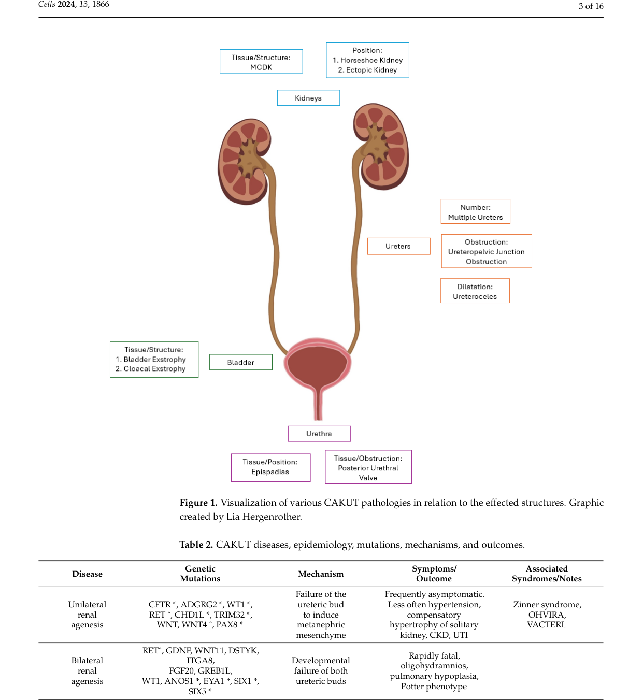

## Question

# Disease Characteristics Research Template

## Target Disease
- **Disease Name:** Renal Agenesis
- **MONDO ID:**  (if available)
- **Category:** Congenital

## Research Objectives

Please provide a comprehensive research report on **Renal Agenesis** covering all of the
disease characteristics listed below. This report will be used to populate a disease knowledge
base entry. Be thorough and cite primary literature (PMID preferred) for all claims.

For each section, **suggested databases/resources** are listed. These are the first places
you should search for information on each topic.

---

### 1. Disease Information
> **Search first:** OMIM, Orphanet, ICD-10/ICD-11, MeSH, PubMed

- What is the disease? Provide a concise overview.
- What are the key identifiers? (OMIM, Orphanet, ICD-10/ICD-11, MeSH, Mondo)
- What are the common synonyms and alternative names?
- Is the information derived from individual patients (e.g., EHR) or aggregated disease-level resources?

### 2. Etiology

- **Disease Causal Factors**: What are the primary causes? (genetic, environmental, infectious, mechanistic)
- **Risk Factors**:
  > **Search first:** PubMed, Cochrane Library, UpToDate, clinical guidelines, ClinVar, ClinGen, GWAS Catalog, PheGenI, CTD, CDC, WHO, epidemiological databases
  - Genetic risk factors (causal variants, susceptibility loci, modifier genes)
  - Environmental risk factors (toxins, lifestyle, occupational exposures, age, sex, family history)
- **Protective Factors**:
  > **Search first:** PubMed, Cochrane Library, clinical trial databases, GWAS Catalog, gnomAD, WHO, CDC, nutrition databases
  - Genetic protective factors (protective variants, modifier alleles)
  - Environmental protective factors (diet, lifestyle, exposures that reduce risk)
- **Gene-Environment Interactions**: How do genetic and environmental factors interact to influence disease?
  > **Search first:** CTD, PubMed, PheGenI, GxE databases

### 3. Phenotypes
> **Search first:** HPO (Human Phenotype Ontology), OMIM, Orphanet, PubMed, clinicaltrials.gov, MedDRA, SNOMED CT, DECIPHER, LOINC

For each phenotype, provide:
- **Phenotype type**: symptoms, clinical signs, physical manifestations, behavioral changes, or laboratory abnormalities
  > For symptoms/signs: HPO, OMIM, Orphanet, PubMed
  > For behavioral changes: HPO, DSM, RDoC (Research Domain Criteria), PubMed
  > For laboratory abnormalities: LOINC, SNOMED CT, LabTests Online, PubMed
- **Phenotype characteristics**:
  > **Search first:** OMIM, Orphanet, HPO, PubMed
  - Age of symptom onset (neonatal, childhood, adult-onset, late-onset)
  - Symptom severity (mild, moderate, severe, variable)
  - Symptom progression (stable, progressive, episodic, fluctuating)
  - Frequency among affected individuals (percentage or qualitative)
- **Quality of life impact**: Effects on daily functioning and well-being (per-phenotype when possible)
  > **Search first:** EQ-5D database, SF-36, WHO QOL databases, PubMed
- Suggest HPO (Human Phenotype Ontology) terms for each phenotype

### 4. Genetic/Molecular Information

- **Causal Genes**: Gene mutations or chromosomal abnormalities responsible for disease (gene symbols, OMIM IDs)
  > **Search first:** OMIM, ClinVar, HGMD, Ensembl, NCBI Gene
- **Pathogenic Variants**:
  - Affected genes (gene symbols, HGNC IDs)
    > **Search first:** OMIM, NCBI Gene, Ensembl, HGNC, UniProt, GeneCards
  - Variant classification (pathogenic, likely pathogenic, VUS per ACMG/AMP guidelines)
    > **Search first:** ClinVar, ClinGen, ACMG/AMP guidelines, VarSome
  - Variant type/class (missense, frameshift, nonsense, splice-site, structural)
  - Allele frequency in population databases
    > **Search first:** gnomAD, 1000 Genomes, ExAC, TOPMed, dbSNP
  - Somatic vs germline origin
    > **Search first:** COSMIC (somatic), ClinVar, ICGC, TCGA
  - Functional consequences (loss of function, gain of function, dominant negative)
- **Modifier Genes**: Genes that modify disease severity or expression
- **Epigenetic Information**: DNA methylation, histone modifications, chromatin changes affecting disease
  > **Search first:** ENCODE, Roadmap Epigenomics, MethBase, DiseaseMeth
- **Chromosomal Abnormalities**: Large-scale genetic changes (aneuploidy, translocations, inversions)
  > **Search first:** DECIPHER, ClinVar, ECARUCA, UCSC Genome Browser

### 5. Environmental Information

- **Environmental Factors**: Non-genetic contributing factors (toxins, radiation, pollution, occupational exposure)
  > **Search first:** CTD (Comparative Toxicogenomics Database), TOXNET, PubMed, EPA databases
- **Lifestyle Factors**: Behavioral factors (smoking, diet, exercise, alcohol consumption)
  > **Search first:** CDC databases, WHO, PubMed, NHANES
- **Infectious Agents**: If applicable, pathogens causing or triggering disease (bacteria, viruses, fungi, parasites)
  > **Search first:** NCBI Taxonomy, ViPR, BV-BRC, MicrobeDB, GIDEON

### 6. Mechanism / Pathophysiology

- **Molecular Pathways**: Specific signaling cascades or biochemical pathways involved (Wnt, MAPK, mTOR, PI3K-AKT, etc.)
  > **Search first:** KEGG, Reactome, WikiPathways, PathBank, BioCyc
- **Cellular Processes**: Cell-level mechanisms (apoptosis, autophagy, cell cycle dysregulation, inflammation, etc.)
  > **Search first:** Gene Ontology (GO), Reactome, KEGG, PubMed
- **Protein Dysfunction**: How protein structure or function is altered (misfolding, aggregation, loss of function, gain of function)
  > **Search first:** UniProt, PDB (Protein Data Bank), InterPro, Pfam, AlphaFold
- **Metabolic Changes**: Alterations in metabolic processes (energy metabolism, lipid metabolism, amino acid metabolism)
  > **Search first:** KEGG, BioCyc, HMDB (Human Metabolome Database), BRENDA
- **Immune System Involvement**: Role of immune response (autoimmunity, immunodeficiency, chronic inflammation)
  > **Search first:** ImmPort, Immunome Database, IEDB, Gene Ontology
- **Tissue Damage Mechanisms**: How tissues/ are injured (oxidative stress, ischemia, fibrosis, necrosis)
  > **Search first:** PubMed, Gene Ontology, Reactome
- **Biochemical Abnormalities**: Specific molecular defects (enzyme deficiencies, receptor dysfunction, ion channel defects)
  > **Search first:** BRENDA, UniProt, KEGG, OMIM, PubMed
- **Epigenetic Changes**: DNA methylation, histone modifications affecting gene expression in disease
  > **Search first:** ENCODE, Roadmap Epigenomics, MethBase, DiseaseMeth
- **Molecular Profiling** (if available):
  - Transcriptomics/gene expression changes
    > **Search first:** GEO (Gene Expression Omnibus), ArrayExpress, GTEx, Human Cell Atlas, SRA
  - Proteomics findings
    > **Search first:** PRIDE, ProteomeXchange, Human Protein Atlas, STRING, BioGRID
  - Metabolomics signatures
    > **Search first:** MetaboLights, Metabolomics Workbench, HMDB, METLIN
  - Lipidomics alterations
    > **Search first:** LIPID MAPS, SwissLipids, LipidHome, Metabolomics Workbench
  - Genomic structural features
    > **Search first:** UCSC Genome Browser, Ensembl, NCBI, dbVar, DGV
- **Advanced Technologies** (if applicable):
  - Single-cell analysis findings (cell-type specific mechanisms, cellular heterogeneity)
    > **Search first:** Human Cell Atlas, Single Cell Portal, GEO, CELLxGENE
  - Spatial transcriptomics findings
    > **Search first:** GEO, Spatial Research, Vizgen, 10x Genomics data
  - Multi-omics integration results
    > **Search first:** TCGA, ICGC, cBioPortal, LinkedOmics, PubMed
  - Functional genomics screens (CRISPR, RNAi)
    > **Search first:** DepMap, GenomeRNAi, PubMed, BioGRID ORCS

For each mechanism, describe:
- The causal chain from initial trigger to clinical manifestation
- Which mechanisms are upstream vs downstream
- What cell types and biological processes are involved
- Suggest GO terms for biological processes and CL terms for cell types

### 7. Anatomical Structures Affected

- **Organ Level**:
  - Primary organs directly affected
  - Secondary organ involvement (complications, secondary effects)
  - Body systems involved (cardiovascular, nervous, digestive, respiratory, endocrine, etc.)
  > **Search first:** Uberon, FMA (Foundational Model of Anatomy), OMIM, HPO, ICD-11, MeSH, SNOMED CT
- **Tissue and Cell Level**:
  - Specific tissue types affected (epithelial, connective, muscle, nervous)
  - Specific cell populations targeted (with Cell Ontology terms)
  > **Search first:** Uberon, Human Protein Atlas, Cell Ontology, Human Cell Atlas, CellMarker, PanglaoDB
- **Subcellular Level**:
  - Cellular compartments involved (mitochondria, nucleus, ER, lysosomes) (with GO Cellular Component terms)
  > **Search first:** Gene Ontology (Cellular Component), UniProt, Human Protein Atlas
- **Localization**:
  - Specific anatomical sites (with UBERON terms)
    > **Search first:** FMA, Uberon, NeuroNames (for brain), SNOMED CT
  - Lateralization (unilateral, bilateral, asymmetric)
    > **Search first:** HPO, clinical literature, imaging databases

### 8. Temporal Development

- **Onset**:
  - Typical age of onset (congenital, pediatric, adult, geriatric)
  - Onset pattern (acute, subacute, chronic, insidious)
  > **Search first:** OMIM, Orphanet, HPO, PubMed
- **Progression**:
  - Disease stages (early, intermediate, advanced, end-stage)
    > **Search first:** Cancer Staging Manual (AJCC), WHO classifications, PubMed
  - Progression rate (rapid, slow, variable)
  - Disease course pattern (episodic, relapsing-remitting, progressive, stable)
  - Disease duration (self-limited, chronic lifelong)
  > **Search first:** Disease registries, longitudinal cohort databases, natural history studies, PubMed, Orphanet, OMIM
- **Patterns**:
  - Remission patterns (spontaneous, treatment-induced)
    > **Search first:** Clinical trial databases, disease registries, PubMed
  - Critical periods (time windows of vulnerability or opportunity for intervention)
    > **Search first:** PubMed, developmental biology databases, clinical guidelines

### 9. Inheritance and Population

- **Epidemiology**:
  - Prevalence (cases per 100,000 at given time)
  - Incidence (new cases per 100,000 per year)
  > **Search first:** Orphanet, CDC, WHO, GBD (Global Burden of Disease), national registries, SEER, disease registries
- **For Genetic Etiology**:
  - Inheritance pattern (AD, AR, X-linked, mitochondrial, multifactorial, polygenic)
    > **Search first:** OMIM, Orphanet, ClinVar, GTR (Genetic Testing Registry)
  - Penetrance (complete, incomplete, age-dependent)
    > **Search first:** ClinVar, OMIM, PubMed, ClinGen
  - Expressivity (variable, consistent)
    > **Search first:** OMIM, ClinVar, PubMed
  - Genetic anticipation (increasing severity in successive generations)
    > **Search first:** OMIM, PubMed (especially for repeat expansion disorders)
  - Germline mosaicism
    > **Search first:** ClinVar, OMIM, genetic counseling literature, PubMed
  - Founder effects (population-specific mutations)
    > **Search first:** gnomAD, population genetics databases, PubMed
  - Consanguinity role
    > **Search first:** OMIM, population studies, genetic counseling resources
  - Carrier frequency
    > **Search first:** gnomAD, carrier screening databases, GeneReviews, GTR
- **Population Demographics**:
  - Affected populations (ethnic or demographic groups with higher prevalence)
    > **Search first:** gnomAD, 1000 Genomes, PAGE Study, PubMed, population registries
  - Geographic distribution (endemic areas, regional variation)
    > **Search first:** WHO, CDC, GBD, Orphanet, geographic epidemiology databases
  - Geographic distribution of specific variants
  - Sex ratio (male:female)
    > **Search first:** Disease registries, OMIM, PubMed, epidemiological databases
  - Age distribution of affected individuals
    > **Search first:** CDC, disease registries, SEER, Orphanet

### 10. Diagnostics

- **Clinical Tests**:
  - Laboratory tests (blood, urine, tissue chemistry, specific enzyme assays)
    > **Search first:** LOINC, LabTests Online, PubMed
  - Biomarkers (proteins, metabolites, genetic markers, circulating biomarkers)
    > **Search first:** FDA Biomarker List, BEST (Biomarkers, EndpointS, and other Tools), PubMed
  - Imaging studies (X-ray, CT, MRI, PET, ultrasound)
    > **Search first:** RadLex, DICOM, Radiopaedia, imaging databases
  - Functional tests (pulmonary function, cardiac stress tests)
    > **Search first:** LOINC, clinical guidelines, PubMed
  - Electrophysiology (EEG, EMG, ECG, nerve conduction studies)
    > **Search first:** LOINC, clinical neurophysiology databases, PubMed
  - Biopsy findings (histopathology, immunohistochemistry)
    > **Search first:** SNOMED CT, College of American Pathologists resources, PubMed
  - Pathology findings (microscopic examination)
    > **Search first:** SNOMED CT, Digital Pathology databases, PubMed
- **Genetic Testing**:
  > **Search first:** GTR (Genetic Testing Registry), GeneReviews, ClinGen
  - Overview of recommended genetic testing approach
  - Whole genome sequencing (WGS) utility
    > **Search first:** GTR, ClinVar, GEL (Genomics England), gnomAD
  - Whole exome sequencing (WES) utility
    > **Search first:** GTR, ClinVar, OMIM, GeneMatcher
  - Gene panels (which panels, which genes)
    > **Search first:** GTR, ClinVar, laboratory-specific databases
  - Single gene testing
    > **Search first:** GTR, ClinVar, OMIM, GeneReviews
  - Chromosomal microarray (CMA)
    > **Search first:** DECIPHER, ClinVar, dbVar, ECARUCA
  - Karyotyping
    > **Search first:** Chromosome Abnormality Database, ClinVar, cytogenetics resources
  - FISH
    > **Search first:** ClinVar, cytogenetics databases, PubMed
  - Mitochondrial DNA testing
    > **Search first:** MITOMAP, MSeqDR, ClinVar, GTR
  - Repeat expansion testing
    > **Search first:** GTR, ClinVar, repeat expansion databases, PubMed
- **Omics-Based Diagnostics** (if applicable):
  - RNA sequencing / transcriptomics
    > **Search first:** GEO, ArrayExpress, GTEx, RNA-seq databases
  - Proteomics
    > **Search first:** PRIDE, ProteomeXchange, FDA Biomarker database
  - Metabolomics
    > **Search first:** MetaboLights, Metabolomics Workbench, HMDB
  - Epigenomics
    > **Search first:** GEO, ENCODE, Roadmap Epigenomics, MethBase
  - Liquid biopsy
    > **Search first:** COSMIC, ClinVar, liquid biopsy databases, PubMed
- **Clinical Criteria**:
  - Standardized diagnostic criteria (DSM, ICD, society guidelines)
    > **Search first:** DSM-5, ICD-11, clinical society guidelines, UpToDate
  - Differential diagnosis (other conditions to rule out, with distinguishing features)
    > **Search first:** DynaMed, UpToDate, clinical decision support systems
- **Screening**:
  - Screening methods for asymptomatic individuals (newborn screening, carrier screening, cascade screening)
    > **Search first:** ACMG recommendations, CDC newborn screening, GTR

### 11. Outcome/Prognosis

- **Survival and Mortality**:
  - Survival rate (5-year, 10-year, overall)
    > **Search first:** SEER, cancer registries, disease-specific registries, PubMed
  - Life expectancy (with and without treatment if applicable)
    > **Search first:** Orphanet, disease registries, actuarial databases, PubMed
  - Mortality rate
    > **Search first:** CDC, WHO, GBD, national mortality databases
  - Disease-specific mortality (deaths directly attributable to disease)
    > **Search first:** Disease registries, CDC Wonder, GBD, PubMed
- **Morbidity and Function**:
  - Morbidity (disease-related disability and health impacts)
    > **Search first:** GBD, WHO, disability databases, PubMed
  - Disability outcomes (long-term functional impairments)
    > **Search first:** ICF (International Classification of Functioning), disability registries
  - Quality of life measures (EQ-5D, SF-36, PROMIS, disease-specific tools)
    > **Search first:** EQ-5D database, SF-36, PROMIS, PubMed
- **Disease Course**:
  - Complications (secondary problems: infections, organ failure, etc.)
    > **Search first:** ICD codes, disease registries, clinical databases, PubMed
  - Recovery potential (likelihood and extent of recovery, with vs without treatment)
    > **Search first:** Natural history studies, rehabilitation databases, PubMed
- **Prediction**:
  - Prognostic factors (age, disease severity, biomarkers, treatment response)
    > **Search first:** Prognostic models databases, clinical calculators, PubMed
  - Prognostic biomarkers (molecular markers predicting disease course)
    > **Search first:** FDA Biomarker database, PubMed, cancer prognostic databases

### 12. Treatment

- **Pharmacotherapy**:
  - Pharmacological treatments (drug names, drug classes, mechanisms of action)
    > **Search first:** DrugBank, RxNorm, ATC classification, DailyMed, FDA databases
  - Pharmacogenomics (how genetic variants affect drug metabolism, efficacy, toxicity)
    > **Search first:** PharmGKB, CPIC (Clinical Pharmacogenetics), FDA Table of PGx Biomarkers
- **Advanced Therapeutics**:
  - Gene therapy (viral vectors, CRISPR, gene replacement, gene editing)
    > **Search first:** ClinicalTrials.gov, FDA gene therapy database, ASGCT resources
  - Cell therapy (stem cell transplant, CAR-T, cellular therapeutics)
    > **Search first:** ClinicalTrials.gov, FDA cell therapy database, FACT standards
  - RNA-based therapies (ASOs, siRNA, mRNA therapies)
    > **Search first:** ClinicalTrials.gov, FDA approvals, PubMed
  - Targeted therapies (treatments directed at specific molecular targets)
    > **Search first:** My Cancer Genome, OncoKB, ClinicalTrials.gov, FDA approvals
  - Immunotherapies (checkpoint inhibitors, monoclonal antibodies)
    > **Search first:** Cancer Immunotherapy Database, FDA approvals, ClinicalTrials.gov
- **Surgical and Interventional**:
  - Surgical interventions (types of surgery, timing, outcomes)
    > **Search first:** CPT codes, surgical registries, clinical guidelines, PubMed
- **Supportive and Rehabilitative**:
  - Supportive care (symptom management, pain control, nutrition)
    > **Search first:** Clinical guidelines, Cochrane Library, PubMed
  - Rehabilitation (physical therapy, occupational therapy, speech therapy)
    > **Search first:** Rehabilitation medicine databases, clinical guidelines, PubMed
- **Experimental**:
  - Experimental treatments in clinical trials (with NCT identifiers if available)
    > **Search first:** ClinicalTrials.gov, EU Clinical Trials Register, WHO ICTRP
- **Treatment Outcomes**:
  - Treatment response rates
    > **Search first:** Clinical trial databases, FDA reviews, systematic reviews, PubMed
  - Side effects and adverse events
    > **Search first:** FDA Adverse Event Reporting System (FAERS), MedWatch, PubMed
- **Treatment Strategy**:
  - Treatment algorithms (clinical pathways, decision trees)
    > **Search first:** Clinical practice guidelines, NCCN Guidelines, UpToDate
  - Combination therapies
    > **Search first:** ClinicalTrials.gov, treatment guidelines, PubMed
  - Personalized medicine approaches (genotype-guided treatment)
    > **Search first:** My Cancer Genome, CIViC, PharmGKB, precision medicine databases

For each treatment, suggest MAXO (Medical Action Ontology) terms where applicable.

### 13. Prevention

- **Prevention Levels**:
  - Primary prevention (preventing disease occurrence: vaccination, risk factor modification)
    > **Search first:** CDC, WHO, USPSTF recommendations, Cochrane Library
  - Secondary prevention (early detection and treatment: screening programs, early intervention)
    > **Search first:** USPSTF, CDC screening guidelines, WHO
  - Tertiary prevention (preventing complications in those with disease)
    > **Search first:** Clinical guidelines, disease management protocols, PubMed
- **Immunization**: Vaccine strategies (if applicable)
  > **Search first:** CDC vaccine schedules, WHO immunization, FDA vaccine database
- **Screening and Early Detection**:
  - Screening programs (population-based: newborn screening, cancer screening)
    > **Search first:** CDC screening programs, USPSTF, cancer screening databases
  - Genetic screening (carrier screening, preimplantation genetic diagnosis, prenatal testing)
    > **Search first:** ACMG recommendations, ACOG guidelines, GTR
  - Risk stratification (identifying high-risk individuals for targeted prevention)
    > **Search first:** Risk prediction models, clinical calculators, PubMed
- **Behavioral Interventions**: Lifestyle modifications to reduce risk
  > **Search first:** CDC, WHO, behavioral intervention databases, Cochrane Library
- **Counseling**: Genetic counseling (risk assessment, family planning guidance)
  > **Search first:** NSGC resources, ACMG guidelines, GeneReviews
- **Public Health**:
  - Public health interventions (sanitation, vector control, health education)
    > **Search first:** CDC, WHO, public health databases, PubMed
  - Environmental interventions (reducing environmental risk factors)
    > **Search first:** EPA databases, WHO environmental health, PubMed
- **Prophylaxis**: Preventive medications or procedures
  > **Search first:** Clinical guidelines, FDA approvals, PubMed

### 14. Other Species / Natural Disease

- **Taxonomy**: Species affected (with NCBI Taxon identifiers)
  > **Search first:** NCBI Taxonomy
- **Breed**: Specific breeds affected (with VBO identifiers if applicable)
  > **Search first:** VBO (Vertebrate Breed Ontology)
- **Gene**: Orthologous genes in other species (with NCBI Gene IDs)
  > **Search first:** NCBI Gene
- **Natural Disease**:
  - Naturally occurring disease in other species (companion animals, wildlife)
    > **Search first:** OMIA (Online Mendelian Inheritance in Animals), VetCompass, PubMed
  - Veterinary relevance and importance in animal health
    > **Search first:** OMIA, veterinary databases, PubMed
- **Comparative Biology**:
  - Comparative pathology (similarities and differences across species)
    > **Search first:** OMIA, comparative pathology databases, PubMed
  - Evolutionary conservation of disease mechanisms
    > **Search first:** HomoloGene, OrthoMCL, Alliance of Genome Resources
- **Transmission** (if applicable):
  - Zoonotic potential
    > **Search first:** CDC zoonotic diseases, WHO zoonoses, GIDEON
  - Cross-species susceptibility
    > **Search first:** NCBI Taxonomy, veterinary databases, PubMed

### 15. Model Organisms

- **Model Types**:
  - Model organism type (mammalian, invertebrate, cellular, in vitro)
    > **Search first:** Alliance of Genome Resources, model organism databases
  - Specific model systems (mouse, rat, zebrafish, Drosophila, C. elegans, yeast, cell lines, organoids, iPSCs)
    > **Search first:** MGI, RGD, ZFIN, FlyBase, WormBase, SGD, ATCC, Cellosaurus
  - Induced models (drug treatment, surgical intervention, environmental manipulation)
    > **Search first:** MGI, model organism databases, PubMed
- **Genetic Models**:
  - Types available (knockout, knock-in, transgenic, conditional, humanized)
    > **Search first:** MGI, IMPC, KOMP, EuMMCR, IMSR
- **Model Characteristics**:
  - Phenotype recapitulation (how well model reproduces human disease features)
    > **Search first:** Model organism databases, comparative studies, PubMed
  - Model limitations (aspects of human disease not captured)
    > **Search first:** Model organism databases, PubMed, review articles
- **Applications**:
  - Research applications (what aspects of disease can be studied)
    > **Search first:** Model organism databases, PubMed
- **Resources**:
  - Model databases
    > **Search first:** MGI, RGD, ZFIN, FlyBase, WormBase, IMSR, EMMA, MMRRC

---

## Citation Requirements

- Cite primary literature (PMID preferred) for all mechanistic and clinical claims
- Prioritize recent reviews and landmark papers
- Include direct quotes from abstracts where possible to support key statements
- Distinguish evidence source types: human clinical, model organism, in vitro, computational

## Output Format

Structure your response as a comprehensive narrative organized by the sections above.
For each section, provide:
- Factual content with specific details (numbers, percentages, gene names, variant nomenclature)
- Ontology term suggestions (HPO, GO, CL, UBERON, CHEBI, MAXO, MONDO) where applicable
- Evidence citations with PMIDs
- Direct quotes from abstracts to support key claims
- Clear indication when information is not available or not applicable for this disease

This report will be used to populate a disease knowledge base entry with:
- Pathophysiology descriptions with causal chains
- Gene/protein annotations (HGNC, GO terms)
- Phenotype associations (HP terms) with frequencies
- Cell type involvement (CL terms)
- Anatomical locations (UBERON terms)
- Chemical entities (CHEBI terms)
- Treatment annotations (MAXO terms)
- Evidence items with PMIDs and exact abstract quotes
- Epidemiology, prognosis, diagnostic, and prevention information
- Animal model descriptions with phenotype recapitulation details

## Output

Question: You are an expert researcher providing comprehensive, well-cited information.

Provide detailed information focusing on:
1. Key concepts and definitions with current understanding
2. Recent developments and latest research (prioritize 2023-2024 sources)
3. Current applications and real-world implementations
4. Expert opinions and analysis from authoritative sources
5. Relevant statistics and data from recent studies

Format as a comprehensive research report with proper citations. Include URLs and publication dates where available.
Always prioritize recent, authoritative sources and provide specific citations for all major claims.

# Disease Characteristics Research Template

## Target Disease
- **Disease Name:** Renal Agenesis
- **MONDO ID:**  (if available)
- **Category:** Congenital

## Research Objectives

Please provide a comprehensive research report on **Renal Agenesis** covering all of the
disease characteristics listed below. This report will be used to populate a disease knowledge
base entry. Be thorough and cite primary literature (PMID preferred) for all claims.

For each section, **suggested databases/resources** are listed. These are the first places
you should search for information on each topic.

---

### 1. Disease Information
> **Search first:** OMIM, Orphanet, ICD-10/ICD-11, MeSH, PubMed

- What is the disease? Provide a concise overview.
- What are the key identifiers? (OMIM, Orphanet, ICD-10/ICD-11, MeSH, Mondo)
- What are the common synonyms and alternative names?
- Is the information derived from individual patients (e.g., EHR) or aggregated disease-level resources?

### 2. Etiology

- **Disease Causal Factors**: What are the primary causes? (genetic, environmental, infectious, mechanistic)
- **Risk Factors**:
  > **Search first:** PubMed, Cochrane Library, UpToDate, clinical guidelines, ClinVar, ClinGen, GWAS Catalog, PheGenI, CTD, CDC, WHO, epidemiological databases
  - Genetic risk factors (causal variants, susceptibility loci, modifier genes)
  - Environmental risk factors (toxins, lifestyle, occupational exposures, age, sex, family history)
- **Protective Factors**:
  > **Search first:** PubMed, Cochrane Library, clinical trial databases, GWAS Catalog, gnomAD, WHO, CDC, nutrition databases
  - Genetic protective factors (protective variants, modifier alleles)
  - Environmental protective factors (diet, lifestyle, exposures that reduce risk)
- **Gene-Environment Interactions**: How do genetic and environmental factors interact to influence disease?
  > **Search first:** CTD, PubMed, PheGenI, GxE databases

### 3. Phenotypes
> **Search first:** HPO (Human Phenotype Ontology), OMIM, Orphanet, PubMed, clinicaltrials.gov, MedDRA, SNOMED CT, DECIPHER, LOINC

For each phenotype, provide:
- **Phenotype type**: symptoms, clinical signs, physical manifestations, behavioral changes, or laboratory abnormalities
  > For symptoms/signs: HPO, OMIM, Orphanet, PubMed
  > For behavioral changes: HPO, DSM, RDoC (Research Domain Criteria), PubMed
  > For laboratory abnormalities: LOINC, SNOMED CT, LabTests Online, PubMed
- **Phenotype characteristics**:
  > **Search first:** OMIM, Orphanet, HPO, PubMed
  - Age of symptom onset (neonatal, childhood, adult-onset, late-onset)
  - Symptom severity (mild, moderate, severe, variable)
  - Symptom progression (stable, progressive, episodic, fluctuating)
  - Frequency among affected individuals (percentage or qualitative)
- **Quality of life impact**: Effects on daily functioning and well-being (per-phenotype when possible)
  > **Search first:** EQ-5D database, SF-36, WHO QOL databases, PubMed
- Suggest HPO (Human Phenotype Ontology) terms for each phenotype

### 4. Genetic/Molecular Information

- **Causal Genes**: Gene mutations or chromosomal abnormalities responsible for disease (gene symbols, OMIM IDs)
  > **Search first:** OMIM, ClinVar, HGMD, Ensembl, NCBI Gene
- **Pathogenic Variants**:
  - Affected genes (gene symbols, HGNC IDs)
    > **Search first:** OMIM, NCBI Gene, Ensembl, HGNC, UniProt, GeneCards
  - Variant classification (pathogenic, likely pathogenic, VUS per ACMG/AMP guidelines)
    > **Search first:** ClinVar, ClinGen, ACMG/AMP guidelines, VarSome
  - Variant type/class (missense, frameshift, nonsense, splice-site, structural)
  - Allele frequency in population databases
    > **Search first:** gnomAD, 1000 Genomes, ExAC, TOPMed, dbSNP
  - Somatic vs germline origin
    > **Search first:** COSMIC (somatic), ClinVar, ICGC, TCGA
  - Functional consequences (loss of function, gain of function, dominant negative)
- **Modifier Genes**: Genes that modify disease severity or expression
- **Epigenetic Information**: DNA methylation, histone modifications, chromatin changes affecting disease
  > **Search first:** ENCODE, Roadmap Epigenomics, MethBase, DiseaseMeth
- **Chromosomal Abnormalities**: Large-scale genetic changes (aneuploidy, translocations, inversions)
  > **Search first:** DECIPHER, ClinVar, ECARUCA, UCSC Genome Browser

### 5. Environmental Information

- **Environmental Factors**: Non-genetic contributing factors (toxins, radiation, pollution, occupational exposure)
  > **Search first:** CTD (Comparative Toxicogenomics Database), TOXNET, PubMed, EPA databases
- **Lifestyle Factors**: Behavioral factors (smoking, diet, exercise, alcohol consumption)
  > **Search first:** CDC databases, WHO, PubMed, NHANES
- **Infectious Agents**: If applicable, pathogens causing or triggering disease (bacteria, viruses, fungi, parasites)
  > **Search first:** NCBI Taxonomy, ViPR, BV-BRC, MicrobeDB, GIDEON

### 6. Mechanism / Pathophysiology

- **Molecular Pathways**: Specific signaling cascades or biochemical pathways involved (Wnt, MAPK, mTOR, PI3K-AKT, etc.)
  > **Search first:** KEGG, Reactome, WikiPathways, PathBank, BioCyc
- **Cellular Processes**: Cell-level mechanisms (apoptosis, autophagy, cell cycle dysregulation, inflammation, etc.)
  > **Search first:** Gene Ontology (GO), Reactome, KEGG, PubMed
- **Protein Dysfunction**: How protein structure or function is altered (misfolding, aggregation, loss of function, gain of function)
  > **Search first:** UniProt, PDB (Protein Data Bank), InterPro, Pfam, AlphaFold
- **Metabolic Changes**: Alterations in metabolic processes (energy metabolism, lipid metabolism, amino acid metabolism)
  > **Search first:** KEGG, BioCyc, HMDB (Human Metabolome Database), BRENDA
- **Immune System Involvement**: Role of immune response (autoimmunity, immunodeficiency, chronic inflammation)
  > **Search first:** ImmPort, Immunome Database, IEDB, Gene Ontology
- **Tissue Damage Mechanisms**: How tissues/ are injured (oxidative stress, ischemia, fibrosis, necrosis)
  > **Search first:** PubMed, Gene Ontology, Reactome
- **Biochemical Abnormalities**: Specific molecular defects (enzyme deficiencies, receptor dysfunction, ion channel defects)
  > **Search first:** BRENDA, UniProt, KEGG, OMIM, PubMed
- **Epigenetic Changes**: DNA methylation, histone modifications affecting gene expression in disease
  > **Search first:** ENCODE, Roadmap Epigenomics, MethBase, DiseaseMeth
- **Molecular Profiling** (if available):
  - Transcriptomics/gene expression changes
    > **Search first:** GEO (Gene Expression Omnibus), ArrayExpress, GTEx, Human Cell Atlas, SRA
  - Proteomics findings
    > **Search first:** PRIDE, ProteomeXchange, Human Protein Atlas, STRING, BioGRID
  - Metabolomics signatures
    > **Search first:** MetaboLights, Metabolomics Workbench, HMDB, METLIN
  - Lipidomics alterations
    > **Search first:** LIPID MAPS, SwissLipids, LipidHome, Metabolomics Workbench
  - Genomic structural features
    > **Search first:** UCSC Genome Browser, Ensembl, NCBI, dbVar, DGV
- **Advanced Technologies** (if applicable):
  - Single-cell analysis findings (cell-type specific mechanisms, cellular heterogeneity)
    > **Search first:** Human Cell Atlas, Single Cell Portal, GEO, CELLxGENE
  - Spatial transcriptomics findings
    > **Search first:** GEO, Spatial Research, Vizgen, 10x Genomics data
  - Multi-omics integration results
    > **Search first:** TCGA, ICGC, cBioPortal, LinkedOmics, PubMed
  - Functional genomics screens (CRISPR, RNAi)
    > **Search first:** DepMap, GenomeRNAi, PubMed, BioGRID ORCS

For each mechanism, describe:
- The causal chain from initial trigger to clinical manifestation
- Which mechanisms are upstream vs downstream
- What cell types and biological processes are involved
- Suggest GO terms for biological processes and CL terms for cell types

### 7. Anatomical Structures Affected

- **Organ Level**:
  - Primary organs directly affected
  - Secondary organ involvement (complications, secondary effects)
  - Body systems involved (cardiovascular, nervous, digestive, respiratory, endocrine, etc.)
  > **Search first:** Uberon, FMA (Foundational Model of Anatomy), OMIM, HPO, ICD-11, MeSH, SNOMED CT
- **Tissue and Cell Level**:
  - Specific tissue types affected (epithelial, connective, muscle, nervous)
  - Specific cell populations targeted (with Cell Ontology terms)
  > **Search first:** Uberon, Human Protein Atlas, Cell Ontology, Human Cell Atlas, CellMarker, PanglaoDB
- **Subcellular Level**:
  - Cellular compartments involved (mitochondria, nucleus, ER, lysosomes) (with GO Cellular Component terms)
  > **Search first:** Gene Ontology (Cellular Component), UniProt, Human Protein Atlas
- **Localization**:
  - Specific anatomical sites (with UBERON terms)
    > **Search first:** FMA, Uberon, NeuroNames (for brain), SNOMED CT
  - Lateralization (unilateral, bilateral, asymmetric)
    > **Search first:** HPO, clinical literature, imaging databases

### 8. Temporal Development

- **Onset**:
  - Typical age of onset (congenital, pediatric, adult, geriatric)
  - Onset pattern (acute, subacute, chronic, insidious)
  > **Search first:** OMIM, Orphanet, HPO, PubMed
- **Progression**:
  - Disease stages (early, intermediate, advanced, end-stage)
    > **Search first:** Cancer Staging Manual (AJCC), WHO classifications, PubMed
  - Progression rate (rapid, slow, variable)
  - Disease course pattern (episodic, relapsing-remitting, progressive, stable)
  - Disease duration (self-limited, chronic lifelong)
  > **Search first:** Disease registries, longitudinal cohort databases, natural history studies, PubMed, Orphanet, OMIM
- **Patterns**:
  - Remission patterns (spontaneous, treatment-induced)
    > **Search first:** Clinical trial databases, disease registries, PubMed
  - Critical periods (time windows of vulnerability or opportunity for intervention)
    > **Search first:** PubMed, developmental biology databases, clinical guidelines

### 9. Inheritance and Population

- **Epidemiology**:
  - Prevalence (cases per 100,000 at given time)
  - Incidence (new cases per 100,000 per year)
  > **Search first:** Orphanet, CDC, WHO, GBD (Global Burden of Disease), national registries, SEER, disease registries
- **For Genetic Etiology**:
  - Inheritance pattern (AD, AR, X-linked, mitochondrial, multifactorial, polygenic)
    > **Search first:** OMIM, Orphanet, ClinVar, GTR (Genetic Testing Registry)
  - Penetrance (complete, incomplete, age-dependent)
    > **Search first:** ClinVar, OMIM, PubMed, ClinGen
  - Expressivity (variable, consistent)
    > **Search first:** OMIM, ClinVar, PubMed
  - Genetic anticipation (increasing severity in successive generations)
    > **Search first:** OMIM, PubMed (especially for repeat expansion disorders)
  - Germline mosaicism
    > **Search first:** ClinVar, OMIM, genetic counseling literature, PubMed
  - Founder effects (population-specific mutations)
    > **Search first:** gnomAD, population genetics databases, PubMed
  - Consanguinity role
    > **Search first:** OMIM, population studies, genetic counseling resources
  - Carrier frequency
    > **Search first:** gnomAD, carrier screening databases, GeneReviews, GTR
- **Population Demographics**:
  - Affected populations (ethnic or demographic groups with higher prevalence)
    > **Search first:** gnomAD, 1000 Genomes, PAGE Study, PubMed, population registries
  - Geographic distribution (endemic areas, regional variation)
    > **Search first:** WHO, CDC, GBD, Orphanet, geographic epidemiology databases
  - Geographic distribution of specific variants
  - Sex ratio (male:female)
    > **Search first:** Disease registries, OMIM, PubMed, epidemiological databases
  - Age distribution of affected individuals
    > **Search first:** CDC, disease registries, SEER, Orphanet

### 10. Diagnostics

- **Clinical Tests**:
  - Laboratory tests (blood, urine, tissue chemistry, specific enzyme assays)
    > **Search first:** LOINC, LabTests Online, PubMed
  - Biomarkers (proteins, metabolites, genetic markers, circulating biomarkers)
    > **Search first:** FDA Biomarker List, BEST (Biomarkers, EndpointS, and other Tools), PubMed
  - Imaging studies (X-ray, CT, MRI, PET, ultrasound)
    > **Search first:** RadLex, DICOM, Radiopaedia, imaging databases
  - Functional tests (pulmonary function, cardiac stress tests)
    > **Search first:** LOINC, clinical guidelines, PubMed
  - Electrophysiology (EEG, EMG, ECG, nerve conduction studies)
    > **Search first:** LOINC, clinical neurophysiology databases, PubMed
  - Biopsy findings (histopathology, immunohistochemistry)
    > **Search first:** SNOMED CT, College of American Pathologists resources, PubMed
  - Pathology findings (microscopic examination)
    > **Search first:** SNOMED CT, Digital Pathology databases, PubMed
- **Genetic Testing**:
  > **Search first:** GTR (Genetic Testing Registry), GeneReviews, ClinGen
  - Overview of recommended genetic testing approach
  - Whole genome sequencing (WGS) utility
    > **Search first:** GTR, ClinVar, GEL (Genomics England), gnomAD
  - Whole exome sequencing (WES) utility
    > **Search first:** GTR, ClinVar, OMIM, GeneMatcher
  - Gene panels (which panels, which genes)
    > **Search first:** GTR, ClinVar, laboratory-specific databases
  - Single gene testing
    > **Search first:** GTR, ClinVar, OMIM, GeneReviews
  - Chromosomal microarray (CMA)
    > **Search first:** DECIPHER, ClinVar, dbVar, ECARUCA
  - Karyotyping
    > **Search first:** Chromosome Abnormality Database, ClinVar, cytogenetics resources
  - FISH
    > **Search first:** ClinVar, cytogenetics databases, PubMed
  - Mitochondrial DNA testing
    > **Search first:** MITOMAP, MSeqDR, ClinVar, GTR
  - Repeat expansion testing
    > **Search first:** GTR, ClinVar, repeat expansion databases, PubMed
- **Omics-Based Diagnostics** (if applicable):
  - RNA sequencing / transcriptomics
    > **Search first:** GEO, ArrayExpress, GTEx, RNA-seq databases
  - Proteomics
    > **Search first:** PRIDE, ProteomeXchange, FDA Biomarker database
  - Metabolomics
    > **Search first:** MetaboLights, Metabolomics Workbench, HMDB
  - Epigenomics
    > **Search first:** GEO, ENCODE, Roadmap Epigenomics, MethBase
  - Liquid biopsy
    > **Search first:** COSMIC, ClinVar, liquid biopsy databases, PubMed
- **Clinical Criteria**:
  - Standardized diagnostic criteria (DSM, ICD, society guidelines)
    > **Search first:** DSM-5, ICD-11, clinical society guidelines, UpToDate
  - Differential diagnosis (other conditions to rule out, with distinguishing features)
    > **Search first:** DynaMed, UpToDate, clinical decision support systems
- **Screening**:
  - Screening methods for asymptomatic individuals (newborn screening, carrier screening, cascade screening)
    > **Search first:** ACMG recommendations, CDC newborn screening, GTR

### 11. Outcome/Prognosis

- **Survival and Mortality**:
  - Survival rate (5-year, 10-year, overall)
    > **Search first:** SEER, cancer registries, disease-specific registries, PubMed
  - Life expectancy (with and without treatment if applicable)
    > **Search first:** Orphanet, disease registries, actuarial databases, PubMed
  - Mortality rate
    > **Search first:** CDC, WHO, GBD, national mortality databases
  - Disease-specific mortality (deaths directly attributable to disease)
    > **Search first:** Disease registries, CDC Wonder, GBD, PubMed
- **Morbidity and Function**:
  - Morbidity (disease-related disability and health impacts)
    > **Search first:** GBD, WHO, disability databases, PubMed
  - Disability outcomes (long-term functional impairments)
    > **Search first:** ICF (International Classification of Functioning), disability registries
  - Quality of life measures (EQ-5D, SF-36, PROMIS, disease-specific tools)
    > **Search first:** EQ-5D database, SF-36, PROMIS, PubMed
- **Disease Course**:
  - Complications (secondary problems: infections, organ failure, etc.)
    > **Search first:** ICD codes, disease registries, clinical databases, PubMed
  - Recovery potential (likelihood and extent of recovery, with vs without treatment)
    > **Search first:** Natural history studies, rehabilitation databases, PubMed
- **Prediction**:
  - Prognostic factors (age, disease severity, biomarkers, treatment response)
    > **Search first:** Prognostic models databases, clinical calculators, PubMed
  - Prognostic biomarkers (molecular markers predicting disease course)
    > **Search first:** FDA Biomarker database, PubMed, cancer prognostic databases

### 12. Treatment

- **Pharmacotherapy**:
  - Pharmacological treatments (drug names, drug classes, mechanisms of action)
    > **Search first:** DrugBank, RxNorm, ATC classification, DailyMed, FDA databases
  - Pharmacogenomics (how genetic variants affect drug metabolism, efficacy, toxicity)
    > **Search first:** PharmGKB, CPIC (Clinical Pharmacogenetics), FDA Table of PGx Biomarkers
- **Advanced Therapeutics**:
  - Gene therapy (viral vectors, CRISPR, gene replacement, gene editing)
    > **Search first:** ClinicalTrials.gov, FDA gene therapy database, ASGCT resources
  - Cell therapy (stem cell transplant, CAR-T, cellular therapeutics)
    > **Search first:** ClinicalTrials.gov, FDA cell therapy database, FACT standards
  - RNA-based therapies (ASOs, siRNA, mRNA therapies)
    > **Search first:** ClinicalTrials.gov, FDA approvals, PubMed
  - Targeted therapies (treatments directed at specific molecular targets)
    > **Search first:** My Cancer Genome, OncoKB, ClinicalTrials.gov, FDA approvals
  - Immunotherapies (checkpoint inhibitors, monoclonal antibodies)
    > **Search first:** Cancer Immunotherapy Database, FDA approvals, ClinicalTrials.gov
- **Surgical and Interventional**:
  - Surgical interventions (types of surgery, timing, outcomes)
    > **Search first:** CPT codes, surgical registries, clinical guidelines, PubMed
- **Supportive and Rehabilitative**:
  - Supportive care (symptom management, pain control, nutrition)
    > **Search first:** Clinical guidelines, Cochrane Library, PubMed
  - Rehabilitation (physical therapy, occupational therapy, speech therapy)
    > **Search first:** Rehabilitation medicine databases, clinical guidelines, PubMed
- **Experimental**:
  - Experimental treatments in clinical trials (with NCT identifiers if available)
    > **Search first:** ClinicalTrials.gov, EU Clinical Trials Register, WHO ICTRP
- **Treatment Outcomes**:
  - Treatment response rates
    > **Search first:** Clinical trial databases, FDA reviews, systematic reviews, PubMed
  - Side effects and adverse events
    > **Search first:** FDA Adverse Event Reporting System (FAERS), MedWatch, PubMed
- **Treatment Strategy**:
  - Treatment algorithms (clinical pathways, decision trees)
    > **Search first:** Clinical practice guidelines, NCCN Guidelines, UpToDate
  - Combination therapies
    > **Search first:** ClinicalTrials.gov, treatment guidelines, PubMed
  - Personalized medicine approaches (genotype-guided treatment)
    > **Search first:** My Cancer Genome, CIViC, PharmGKB, precision medicine databases

For each treatment, suggest MAXO (Medical Action Ontology) terms where applicable.

### 13. Prevention

- **Prevention Levels**:
  - Primary prevention (preventing disease occurrence: vaccination, risk factor modification)
    > **Search first:** CDC, WHO, USPSTF recommendations, Cochrane Library
  - Secondary prevention (early detection and treatment: screening programs, early intervention)
    > **Search first:** USPSTF, CDC screening guidelines, WHO
  - Tertiary prevention (preventing complications in those with disease)
    > **Search first:** Clinical guidelines, disease management protocols, PubMed
- **Immunization**: Vaccine strategies (if applicable)
  > **Search first:** CDC vaccine schedules, WHO immunization, FDA vaccine database
- **Screening and Early Detection**:
  - Screening programs (population-based: newborn screening, cancer screening)
    > **Search first:** CDC screening programs, USPSTF, cancer screening databases
  - Genetic screening (carrier screening, preimplantation genetic diagnosis, prenatal testing)
    > **Search first:** ACMG recommendations, ACOG guidelines, GTR
  - Risk stratification (identifying high-risk individuals for targeted prevention)
    > **Search first:** Risk prediction models, clinical calculators, PubMed
- **Behavioral Interventions**: Lifestyle modifications to reduce risk
  > **Search first:** CDC, WHO, behavioral intervention databases, Cochrane Library
- **Counseling**: Genetic counseling (risk assessment, family planning guidance)
  > **Search first:** NSGC resources, ACMG guidelines, GeneReviews
- **Public Health**:
  - Public health interventions (sanitation, vector control, health education)
    > **Search first:** CDC, WHO, public health databases, PubMed
  - Environmental interventions (reducing environmental risk factors)
    > **Search first:** EPA databases, WHO environmental health, PubMed
- **Prophylaxis**: Preventive medications or procedures
  > **Search first:** Clinical guidelines, FDA approvals, PubMed

### 14. Other Species / Natural Disease

- **Taxonomy**: Species affected (with NCBI Taxon identifiers)
  > **Search first:** NCBI Taxonomy
- **Breed**: Specific breeds affected (with VBO identifiers if applicable)
  > **Search first:** VBO (Vertebrate Breed Ontology)
- **Gene**: Orthologous genes in other species (with NCBI Gene IDs)
  > **Search first:** NCBI Gene
- **Natural Disease**:
  - Naturally occurring disease in other species (companion animals, wildlife)
    > **Search first:** OMIA (Online Mendelian Inheritance in Animals), VetCompass, PubMed
  - Veterinary relevance and importance in animal health
    > **Search first:** OMIA, veterinary databases, PubMed
- **Comparative Biology**:
  - Comparative pathology (similarities and differences across species)
    > **Search first:** OMIA, comparative pathology databases, PubMed
  - Evolutionary conservation of disease mechanisms
    > **Search first:** HomoloGene, OrthoMCL, Alliance of Genome Resources
- **Transmission** (if applicable):
  - Zoonotic potential
    > **Search first:** CDC zoonotic diseases, WHO zoonoses, GIDEON
  - Cross-species susceptibility
    > **Search first:** NCBI Taxonomy, veterinary databases, PubMed

### 15. Model Organisms

- **Model Types**:
  - Model organism type (mammalian, invertebrate, cellular, in vitro)
    > **Search first:** Alliance of Genome Resources, model organism databases
  - Specific model systems (mouse, rat, zebrafish, Drosophila, C. elegans, yeast, cell lines, organoids, iPSCs)
    > **Search first:** MGI, RGD, ZFIN, FlyBase, WormBase, SGD, ATCC, Cellosaurus
  - Induced models (drug treatment, surgical intervention, environmental manipulation)
    > **Search first:** MGI, model organism databases, PubMed
- **Genetic Models**:
  - Types available (knockout, knock-in, transgenic, conditional, humanized)
    > **Search first:** MGI, IMPC, KOMP, EuMMCR, IMSR
- **Model Characteristics**:
  - Phenotype recapitulation (how well model reproduces human disease features)
    > **Search first:** Model organism databases, comparative studies, PubMed
  - Model limitations (aspects of human disease not captured)
    > **Search first:** Model organism databases, PubMed, review articles
- **Applications**:
  - Research applications (what aspects of disease can be studied)
    > **Search first:** Model organism databases, PubMed
- **Resources**:
  - Model databases
    > **Search first:** MGI, RGD, ZFIN, FlyBase, WormBase, IMSR, EMMA, MMRRC

---

## Citation Requirements

- Cite primary literature (PMID preferred) for all mechanistic and clinical claims
- Prioritize recent reviews and landmark papers
- Include direct quotes from abstracts where possible to support key statements
- Distinguish evidence source types: human clinical, model organism, in vitro, computational

## Output Format

Structure your response as a comprehensive narrative organized by the sections above.
For each section, provide:
- Factual content with specific details (numbers, percentages, gene names, variant nomenclature)
- Ontology term suggestions (HPO, GO, CL, UBERON, CHEBI, MAXO, MONDO) where applicable
- Evidence citations with PMIDs
- Direct quotes from abstracts to support key claims
- Clear indication when information is not available or not applicable for this disease

This report will be used to populate a disease knowledge base entry with:
- Pathophysiology descriptions with causal chains
- Gene/protein annotations (HGNC, GO terms)
- Phenotype associations (HP terms) with frequencies
- Cell type involvement (CL terms)
- Anatomical locations (UBERON terms)
- Chemical entities (CHEBI terms)
- Treatment annotations (MAXO terms)
- Evidence items with PMIDs and exact abstract quotes
- Epidemiology, prognosis, diagnostic, and prevention information
- Animal model descriptions with phenotype recapitulation details

# Renal Agenesis (Congenital) — Disease Characteristics Research Report

## Executive summary
Renal agenesis is a congenital anomaly defined by complete absence of one kidney (unilateral renal agenesis, URA/UKA) or both kidneys (bilateral renal agenesis, BRA). Pathogenesis is rooted in disrupted embryonic kidney development, especially failure of ureteric bud (UB) formation/branching or failure of UB–metanephric mesenchyme (MM) reciprocal induction, and can arise from monogenic, chromosomal/CNV, multifactorial, and environmental causes. BRA typically produces severe oligohydramnios/anhydramnios with pulmonary hypoplasia (“Potter sequence”) and is usually lethal without extraordinary interventions, whereas URA may be compatible with survival but confers increased lifetime risk of kidney injury and CKD, motivating structured surveillance. (gao2025asurveillancebasedepidemiological pages 1-2, brockwell2024pathophysiologyofcongenital pages 4-5, flogelova2024earlydiagnosisof pages 1-2, brockwell2024pathophysiologyofcongenital pages 2-4)

## 1. Disease Information
### 1.1 Definition and overview
* **Renal agenesis (RA):** congenital absence of one or both kidneys. (gao2025asurveillancebasedepidemiological pages 1-2)
* **URA/UKA:** absence of one kidney; often presents as congenital solitary functioning kidney (SFK). URA may be associated with long-term renal complications. (gao2025asurveillancebasedepidemiological pages 1-2, flogelova2024earlydiagnosisof pages 1-2)
* **BRA:** absence of both kidneys; typically fatal and associated with oligohydramnios, pulmonary hypoplasia, and craniofacial anomalies consistent with Potter sequence. (gao2025asurveillancebasedepidemiological pages 1-2, brockwell2024pathophysiologyofcongenital pages 4-5)

**Key conceptual framing (current understanding):** RA is commonly considered within the broader spectrum of congenital anomalies of the kidney and urinary tract (CAKUT), where abnormal UB–MM signaling and downstream branching morphogenesis/nephron induction errors generate a continuum of phenotypes. (brockwell2024pathophysiologyofcongenital pages 1-2, mahmoud2024congenitalanomaliesof pages 1-2)

### 1.2 Key identifiers (available in retrieved sources)
* **ICD-10:**
  * **Q60.0** – unilateral renal agenesis. (gao2025asurveillancebasedepidemiological pages 1-2)
  * **Q60.1; Q60.6** – used for bilateral renal agenesis / Potter-related coding in a national surveillance study. (gao2025asurveillancebasedepidemiological pages 1-2)

**Not retrieved in this run (should be added from external resources such as OMIM/Orphanet/MONDO/MeSH):** MONDO ID, Orphanet disease ID, OMIM phenotype IDs, MeSH descriptor ID.

### 1.3 Synonyms / alternative names
* Renal agenesis (RA). (gao2025asurveillancebasedepidemiological pages 1-2)
* Unilateral renal agenesis (URA); unilateral kidney agenesis (UKA). (gao2025asurveillancebasedepidemiological pages 1-2, flogelova2024earlydiagnosisof pages 1-2)
* Bilateral renal agenesis (BRA); (often discussed in the context of) Potter sequence/syndrome. (gao2025asurveillancebasedepidemiological pages 1-2, brockwell2024pathophysiologyofcongenital pages 4-5)

### 1.4 Evidence provenance
This report synthesizes: (i) **aggregated disease-level resources** (large surveillance epidemiology; reviews), (ii) **clinical cohort studies** (pediatric SFK outcomes; multicenter solitary-kidney reflux nephropathy), and (iii) **research protocols/clinical trials** (serial amnioinfusion for renal anhydramnios). (gao2025asurveillancebasedepidemiological pages 1-2, flogelova2024earlydiagnosisof pages 1-2, esteghamati2022prevalenceofreflux pages 2-4, NCT03101891 chunk 1)

## 2. Etiology
### 2.1 Primary causal factors
**Developmental mechanism (upstream cause):** disruption of normal nephrogenesis, classically involving UB formation/branching and UB–MM reciprocal induction; failure of these steps can yield unilateral or bilateral agenesis. (brockwell2024pathophysiologyofcongenital pages 2-4, brockwell2024pathophysiologyofcongenital pages 1-2)

**Genetic causes (representative examples from recent reviews):** kidney agenesis has been linked to pathogenic variants in **ITGA8, GREB1L, and FGF20**. (mahmoud2024congenitalanomaliesof pages 5-6)

**Environmental/maternal contributors (risk factors):** CAKUT/RA has been associated with maternal diabetes and obesity, malnutrition, alcohol consumption, maternal smoking and irradiation, and medications affecting kidney development. (mahmoud2024congenitalanomaliesof pages 1-2, mahmoud2024congenitalanomaliesof pages 2-4, mahmoud2024congenitalanomaliesof pages 5-6)

### 2.2 Risk factors
**Population-level associations from surveillance:** In a national Chinese surveillance study (2007–2020), **maternal age <35 years and female sex were associated with higher URA prevalence**, whereas **male sex was associated with higher BRA prevalence**. (gao2025asurveillancebasedepidemiological pages 1-2)

**Maternal/antenatal factors cited in a neonatal case series and reviews:** maternal diabetes/obesity, extremes of parental age, alcohol use, smoking, assisted reproduction, infections, and other maternal comorbidities were reported as associated factors in the literature and/or observed in cases. (cormos2024prevalenceandclinical pages 2-4, cormos2024prevalenceandclinical pages 1-2, mahmoud2024congenitalanomaliesof pages 2-4)

### 2.3 Protective factors
Direct protective factors specific to RA are not well-established in the retrieved evidence. A CAKUT review notes that **folic acid consumption may reduce severity of some malformations**, but this is not renal-agenesis-specific and should be interpreted cautiously. (mahmoud2024congenitalanomaliesof pages 5-6)

### 2.4 Gene–environment interactions
The retrieved evidence supports **multifactorial causation** (genetic + environmental), but does not provide quantifiable interaction models for RA specifically. (mahmoud2024congenitalanomaliesof pages 1-2, cormos2024prevalenceandclinical pages 1-2)

## 3. Phenotypes
### 3.1 Core phenotype spectrum
**Bilateral renal agenesis (BRA):** typically presents prenatally with severe oligohydramnios/anhydramnios, leading to pulmonary hypoplasia and the Potter sequence phenotype. (gao2025asurveillancebasedepidemiological pages 1-2, brockwell2024pathophysiologyofcongenital pages 4-5)

**Unilateral renal agenesis (URA):** compatible with survival; often part of congenital solitary functioning kidney (SFK) and may coexist with other CAKUT lesions (e.g., VUR), predisposing to later kidney damage. (flogelova2024earlydiagnosisof pages 1-2, esteghamati2022prevalenceofreflux pages 4-5)

**Associated anomalies (examples):** In a neonatal case series, associated anomalies included **cardiac** and **neurological** abnormalities and “Potter syndrome” among complex cases. (cormos2024prevalenceandclinical pages 4-5)

### 3.2 Frequencies / clinical course (data)
**Long-term pediatric outcomes in congenital SFK (birth cohort, 2000–2023):** Among 160 children (84 UKA; 76 UMCDK), outcomes were:
* **Reduced GFR (<90 mL/min/1.73m²): 26.2% (42/160)** (mostly mild). (flogelova2024earlydiagnosisof pages 1-2)
* **Hypertension: 13.8% (22/160)**. (flogelova2024earlydiagnosisof pages 1-2)
* **Proteinuria: 8.8% (14/160)**. (flogelova2024earlydiagnosisof pages 1-2)
* **Combined kidney damage: 35.6% (57/160)**. (flogelova2024earlydiagnosisof pages 1-2)
Additionally, UMCDK cases were more likely to have normal final GFR than UKA (82% vs 67%, p=0.039). (flogelova2024earlydiagnosisof pages 1-2)

**VUR / reflux nephropathy in children with solitary kidney (multicenter cross-sectional):** In 199 children with solitary kidney:
* **VUR present: 23.1%**. (esteghamati2022prevalenceofreflux pages 2-4)
* **Renal scarring on DMSA: 13.1%**. (esteghamati2022prevalenceofreflux pages 2-4)
* **Reflux nephropathy (scarring associated with VUR): 7.5%**. (esteghamati2022prevalenceofreflux pages 2-4)
* **Proteinuria: 6.5%; hematuria: 1.5%**. (esteghamati2022prevalenceofreflux pages 2-4)

### 3.3 Suggested HPO terms (non-exhaustive)
* Renal agenesis: **HP:0000101** (suggested)
* Unilateral renal agenesis / solitary kidney: **HP:0000123** (suggested; “single kidney”)
* Oligohydramnios/anhydramnios: **HP:0001562** (suggested)
* Pulmonary hypoplasia: **HP:0002089** (suggested)
* Hypertension: **HP:0000822** (suggested)
* Proteinuria: **HP:0000093** (suggested)
* Vesicoureteral reflux: **HP:0000076** (suggested)

**Quality-of-life impacts:** QoL outcomes were not quantified in the retrieved excerpts; however, chronic monitoring burdens, CKD risk, and (for fetal therapy) substantial family and resource burdens are emphasized in expert commentary. (munshi2025nowwhatnavigating pages 3-4)

## 4. Genetic / Molecular Information
### 4.1 Causal genes / notable associations (human)
Recent reviews and a targeted BRA genetics review highlight multiple genes and pathways implicated in renal agenesis and related CAKUT. Key examples:
* **RET**: encodes the GDNF receptor; loss-of-function variants associated with CAKUT including URA/BRA; in one stillbirth series cited in a BRA genetics review, **heterozygous RET mutations were reported in 7/19 (37%) with BRA and 2/10 (20%) with URA**. (kirschen2024thegeneticetiologies pages 8-9)
* **GDNF/RET axis**: mechanistically crucial for UB branching and collecting system development; RET activation relates to GDNF ligand. (brockwell2024pathophysiologyofcongenital pages 5-7, mahmoud2024congenitalanomaliesof pages 5-6)
* **ITGA8, GREB1L, FGF20**: explicitly linked to kidney agenesis in a 2024 CAKUT review. (mahmoud2024congenitalanomaliesof pages 5-6)
* Additional genes discussed in the BRA genetics review include **GFRA1** (biallelic loss-of-function leading to lethal BRA), **NPNT**, **ROBO1**, **WNT4/WNT9B**, **WT1**, and syndromic genes (e.g., **EYA1/SIX1** in branchio-oto-renal spectrum; Fraser syndrome genes **FRAS1/FREM2**). (kirschen2024thegeneticetiologies pages 8-9, kirschen2024thegeneticetiologies pages 14-16, kirschen2024thegeneticetiologies pages 16-17)

### 4.2 Variant classes and penetrance (limitations)
The retrieved evidence indicates autosomal dominant patterns with incomplete penetrance and variable expression for some hereditary forms (clinical recommendation: parental renal ultrasound), but does not provide variant-level allele frequencies or ACMG-classified variant lists for RA. (cormos2024prevalenceandclinical pages 2-4)

### 4.3 Molecular pathways (mechanistic chain)
**Upstream trigger → developmental failure → clinical phenotype:**
1) **Genetic/environmental insult** perturbs UB induction/branching and/or UB–MM signaling. (mahmoud2024congenitalanomaliesof pages 1-2, brockwell2024pathophysiologyofcongenital pages 2-4)
2) **Disrupted signaling** in pathways including **GDNF/RET**, **WNT**, **FGF**, **BMP** alters branching morphogenesis and nephron progenitor maintenance/induction. (brockwell2024pathophysiologyofcongenital pages 5-7, mahmoud2024congenitalanomaliesof pages 5-6)
3) **Organ-level outcome:** absent kidney (URA/BRA). In BRA, absent fetal urine leads to oligohydramnios and impaired lung development → pulmonary hypoplasia and Potter sequence. (gao2025asurveillancebasedepidemiological pages 1-2, brockwell2024pathophysiologyofcongenital pages 1-2)

### 4.4 Suggested ontology terms
**GO (biological process) — suggested:**
* metanephros development; kidney morphogenesis; ureteric bud development; branching morphogenesis

**CL (cell types) — suggested:**
* metanephric mesenchyme cell / nephron progenitor cell (Six2+); ureteric bud epithelial cell

## 5. Environmental Information
**Maternal metabolic and nutritional factors:** maternal diabetes, obesity, malnutrition/low-protein diet, vitamin A deficiency were highlighted as CAKUT risk factors. (mahmoud2024congenitalanomaliesof pages 1-2, mahmoud2024congenitalanomaliesof pages 2-4)

**Exposures:** maternal alcohol use, smoking, and first-trimester irradiation were noted in CAKUT reviews and RA-focused neonatal literature. (mahmoud2024congenitalanomaliesof pages 5-6, cormos2024prevalenceandclinical pages 1-2)

**Infectious agents:** infections were referenced as possible risk factors in neonatal literature, but no specific pathogen–RA causal chain was established in retrieved evidence. (cormos2024prevalenceandclinical pages 1-2)

## 6. Mechanism / Pathophysiology (current understanding)
### 6.1 Core developmental biology
CAKUT pathophysiology is centered on **reciprocal signaling between UB and MM**, where UB invades MM and undergoes branching to form the collecting system while inducing nephron formation; disruptions at these stages can yield severe phenotypes, including agenesis. (brockwell2024pathophysiologyofcongenital pages 1-2, mahmoud2024congenitalanomaliesof pages 1-2)

### 6.2 Key signaling pathways
* **GDNF/RET:** RET is activated through GDNF and is required for UB branching; pathogenic variation can impair branching and contribute to renal aplasia/agenesis phenotypes. (brockwell2024pathophysiologyofcongenital pages 5-7, mahmoud2024congenitalanomaliesof pages 5-6)
* **WNT signaling:** WNT pathway genes (e.g., WNT4, WNT9B) are implicated in CAKUT and renal agenesis phenotypes. (brockwell2024pathophysiologyofcongenital pages 5-7, kirschen2024thegeneticetiologies pages 8-9)
* **FGF signaling:** FGF family members, including FGF20, contribute to nephron progenitor maintenance; pathogenic variants have been linked to agenesis. (brockwell2024pathophysiologyofcongenital pages 5-7, mahmoud2024congenitalanomaliesof pages 5-6)

### 6.3 Model organism evidence (as cited in reviews)
The BRA genetics review notes animal-model support for gene causality (e.g., GREB1L in humans and mice; FRAS1 deficiency in mouse causing renal agenesis; LRP4 knockout mouse reported with bilateral kidney agenesis). (kirschen2024thegeneticetiologies pages 14-16, kirschen2024thegeneticetiologies pages 16-17)

## 7. Anatomical Structures Affected
### 7.1 Organ/tissue level
* **Primary:** kidney (metanephros) absent unilaterally or bilaterally. (gao2025asurveillancebasedepidemiological pages 1-2)
* **Secondary (BRA):** lungs (pulmonary hypoplasia due to anhydramnios). (gao2025asurveillancebasedepidemiological pages 1-2)
* **Associated systems:** congenital anomalies can co-occur in circulatory, musculoskeletal, neurologic, and urinary systems. (gao2025asurveillancebasedepidemiological pages 1-2, cormos2024prevalenceandclinical pages 4-5)

### 7.2 Suggested UBERON terms
* kidney: **UBERON:0002113** (suggested)
* lung: **UBERON:0002048** (suggested)
* ureteric bud: **UBERON:0004182** (suggested)

## 8. Temporal Development
* **Onset:** congenital; prenatal detection is feasible during routine fetal imaging.
* **Prenatal timing:** fetal kidneys may be visualized by ultrasound at approximately **12 weeks**; for RA, an “empty renal fossa” is described as a first sign, with Doppler assessment of renal arterial flow and bladder/oligohydramnios evaluation aiding diagnosis. (cormos2024prevalenceandclinical pages 2-4)
* **Progression (URA/SFK):** risk of kidney damage emerges over childhood/adolescence, with measurable rates of reduced GFR, hypertension, and proteinuria in long-term cohorts. (flogelova2024earlydiagnosisof pages 1-2)

## 9. Inheritance and Population
### 9.1 Epidemiology (recent large-scale data)
A surveillance-based epidemiological study of **25,909,000 births in China (2007–2020)** identified **5,906 RA cases** (5,020 URA; 780 BRA). Reported prevalence per 10,000 births:
* RA: **2.28/10,000**
* URA: **1.94/10,000**
* BRA: **0.30/10,000**
with **increasing trends** over time. (gao2025asurveillancebasedepidemiological pages 1-2)

Review-level incidence estimates include unilateral RA ~**1/1,000 births** and bilateral RA **1–3/10,000 births** (lethal). (brockwell2024pathophysiologyofcongenital pages 4-5)

A single-center neonatal series (2019–2023) reported **9 cases among 15,091 live births**, corresponding to **1:1,677**. (cormos2024prevalenceandclinical pages 1-2)

### 9.2 Sex and geography
In the China surveillance study, **female sex** was associated with higher URA prevalence, and **male sex** with higher BRA prevalence; higher prevalence was observed in **urban** and **eastern/central** regions. (gao2025asurveillancebasedepidemiological pages 1-2)

### 9.3 Inheritance patterns
Renal agenesis can be familial with incomplete penetrance/variable expressivity; a neonatal series/review notes autosomal dominant inheritance in hereditary cases and recommends **parental renal ultrasound**. (cormos2024prevalenceandclinical pages 2-4)

## 10. Diagnostics
### 10.1 Prenatal imaging
**Ultrasound:** primary modality; fetal kidneys visible ~12 weeks; features include empty renal fossa, evaluation of adrenal configuration (“lying down” adrenal sign), bladder visualization, amniotic fluid volume (oligohydramnios in BRA), and color Doppler for renal arterial flow. (cormos2024prevalenceandclinical pages 2-4)

**Complementary fetal MRI:** not extracted as renal-agenesis-specific performance metrics in this run; however, CAKUT imaging reviews emphasize MRI as complementary to ultrasound for upper urinary tract abnormalities (not detailed here due to limited retrieved evidence excerpts). (flogelova2024earlydiagnosisof pages 2-4)

### 10.2 Postnatal confirmation and functional assessment
* **Renal ultrasound** for anatomy; **DMSA scintigraphy** can confirm a solitary functioning kidney and evaluate scarring. (flogelova2024earlydiagnosisof pages 2-4, esteghamati2022prevalenceofreflux pages 2-4)
* **GFR estimation** and urine testing (protein/albumin markers) are used for longitudinal monitoring in pediatric SFK protocols. (flogelova2024earlydiagnosisof pages 2-4, flogelova2024earlydiagnosisof pages 1-2)

### 10.3 VUR testing strategy
VCUG is described as the “gold standard” for VUR detection, but ultrasound can miss many VUR cases; selective VCUG strategies are described in SFK follow-up protocols. (esteghamati2022prevalenceofreflux pages 4-5, flogelova2024earlydiagnosisof pages 2-4)

### 10.4 Genetic testing
A 2024 CAKUT review states that **>50 genes** have been implicated and **monogenic variants may account for up to ~20%** of cases; suggested approaches include next-generation sequencing (targeted panels, WES) and GWAS where appropriate. (mahmoud2024congenitalanomaliesof pages 1-2, mahmoud2024congenitalanomaliesof pages 2-4)

## 11. Outcomes / Prognosis
### 11.1 BRA outcomes
BRA is typically fatal due to pulmonary hypoplasia in the setting of anhydramnios/oligohydramnios, though fetal therapy trials attempt to mitigate lung hypoplasia. (gao2025asurveillancebasedepidemiological pages 1-2, NCT03101891 chunk 1)

### 11.2 URA/SFK outcomes
In a longitudinal pediatric congenital SFK cohort, **35.6%** had combined markers of kidney damage; reduced GFR, hypertension, and proteinuria occurred at **26.2%**, **13.8%**, and **8.8%**, respectively. (flogelova2024earlydiagnosisof pages 1-2)

VUR and reflux nephropathy are clinically relevant comorbidities in solitary kidney populations (VUR 23.1%; scarring 13.1%; reflux nephropathy 7.5%). (esteghamati2022prevalenceofreflux pages 2-4)

## 12. Treatment
### 12.1 URA/SFK management (current practice pattern)
There is no kidney-restoring pharmacotherapy for agenesis itself; management focuses on **surveillance and complication prevention**:
* longitudinal monitoring of BP, GFR, and urine protein/albumin; (flogelova2024earlydiagnosisof pages 1-2)
* evaluation for associated CAKUT and VUR, with selective VCUG and attention to UTI history; (flogelova2024earlydiagnosisof pages 2-4, esteghamati2022prevalenceofreflux pages 4-5)
* management of proteinuria/hypertension and avoidance of nephrotoxic exposures are typical clinical strategies (not quantified in retrieved excerpts). (flogelova2024earlydiagnosisof pages 1-2)

**MAXO term suggestions (non-exhaustive):** kidney function monitoring; blood pressure monitoring; renal ultrasonography; radionuclide imaging (DMSA); voiding cystourethrography (VCUG); management of urinary tract infection.

### 12.2 Emerging fetal interventions for BRA / renal anhydramnios
**Serial amnioinfusion** is being studied as fetal therapy to restore amniotic fluid and promote lung development.

* **RAFT (Renal Anhydramnios Fetal Therapy), NCT03101891** (ClinicalTrials.gov; first posted 2018; active protocol): Phase 1; serial amnioinfusions (isotonic fluid) vs expectant management; primary outcome includes neonatal survival ≥14 days with dialysis access. Enrollment target and status details: estimated enrollment count 70 in registration metadata; recruitment for BRA arm was closed July 19, 2022 after DSMB review, while other fetal renal failure etiologies remain open. (NCT03101891 chunk 1, NCT03101891 chunk 2)

* **Amnioinfusion for Fetal Renal Failure, NCT06728228** (ClinicalTrials.gov; 2024): Recruiting; serial amnioinfusions (Lactated Ringers + oxacillin noted in protocol excerpt) with a parallel non-intervention comfort-care arm; primary outcomes include survival to dialysis and transplant and maternal safety (e.g., bleeding, infection, membrane rupture). Enrollment listed as 35 estimated in trial metadata, with narrative stating ~60 participants. (NCT06728228 chunk 1)

**Expert opinion / implementation caution:** A 2025 perspective article argues most centers should not currently offer serial amnioinfusions for BRA outside formal research settings, citing equity and evidence concerns, and recommends registry-based outcome tracking when offered. (munshi2025nowwhatnavigating pages 3-4)

## 13. Prevention
Evidence in this run supports mainly **risk-factor optimization and prenatal screening** rather than specific primary prevention.
* Optimize maternal metabolic health (e.g., diabetes/obesity) and avoid known harmful exposures (smoking, irradiation, alcohol) based on CAKUT risk-factor literature. (mahmoud2024congenitalanomaliesof pages 1-2, mahmoud2024congenitalanomaliesof pages 5-6)
* **Prenatal ultrasound screening** is a key secondary-prevention strategy enabling counseling and postnatal planning. (cormos2024prevalenceandclinical pages 2-4)

## 14. Other Species / Natural Disease
Not systematically covered in the retrieved evidence excerpts. Some gene–phenotype evidence is supported by animal models (mouse) as cited in reviews, but naturally occurring veterinary renal agenesis information was not retrieved. (kirschen2024thegeneticetiologies pages 14-16)

## 15. Model organisms
Evidence summarized in reviews includes mouse models supporting roles for developmental genes/pathways implicated in renal agenesis (e.g., FRAS1 deficiency; LRP4 knockout; GREB1L-related phenotypes). (kirschen2024thegeneticetiologies pages 14-16, kirschen2024thegeneticetiologies pages 16-17)

---

# Key reference table (identifiers + epidemiology)
The following table consolidates core identifiers/synonyms and the most actionable epidemiologic statistics from the retrieved sources.

| Item type | Field | Value | Evidence/source (study, year, DOI/URL) | Notes |
|---|---|---|---|---|
| identifier | ICD-10 code | Q60.0 | Gao et al., *A surveillance-based epidemiological study of renal agenesis in 25 million births in China*, 2025, https://doi.org/10.1186/s12884-025-07807-6 (gao2025asurveillancebasedepidemiological pages 1-2) | Used for unilateral renal agenesis (URA). |
| identifier | ICD-10 codes | Q60.1; Q60.6 | Gao et al., 2025, https://doi.org/10.1186/s12884-025-07807-6 (gao2025asurveillancebasedepidemiological pages 1-2) | Reported for bilateral renal agenesis/Potter-related coding. |
| synonym | Renal agenesis (RA) | Absence of one or both kidneys | Gao et al., 2025, https://doi.org/10.1186/s12884-025-07807-6 (gao2025asurveillancebasedepidemiological pages 1-2) | Umbrella term including unilateral and bilateral forms. |
| synonym | Unilateral renal agenesis (URA) | Absence of one kidney | Gao et al., 2025, https://doi.org/10.1186/s12884-025-07807-6 (gao2025asurveillancebasedepidemiological pages 1-2) | More common form; may be associated with long-term renal complications. |
| synonym | Bilateral renal agenesis (BRA) | Absence of both kidneys | Gao et al., 2025, https://doi.org/10.1186/s12884-025-07807-6 (gao2025asurveillancebasedepidemiological pages 1-2) | Typically fatal; associated with Potter sequence/syndrome in the source summary. |
| epidemiology | Surveillance cohort size | 25,909,000 births (China, 2007–2020) | Gao et al., 2025, https://doi.org/10.1186/s12884-025-07807-6 (gao2025asurveillancebasedepidemiological pages 1-2) | National birth-defects surveillance dataset. |
| epidemiology | Total RA cases | 5,906 | Gao et al., 2025, https://doi.org/10.1186/s12884-025-07807-6 (gao2025asurveillancebasedepidemiological pages 1-2) | Includes URA and BRA. |
| epidemiology | URA cases | 5,020 | Gao et al., 2025, https://doi.org/10.1186/s12884-025-07807-6 (gao2025asurveillancebasedepidemiological pages 1-2) | Subset of total RA cases. |
| epidemiology | BRA cases | 780 | Gao et al., 2025, https://doi.org/10.1186/s12884-025-07807-6 (gao2025asurveillancebasedepidemiological pages 1-2) | Subset of total RA cases as reported in the surveillance study. |
| epidemiology | Prevalence of RA | 2.28 per 10,000 live and still births | Gao et al., 2025, https://doi.org/10.1186/s12884-025-07807-6 (gao2025asurveillancebasedepidemiological pages 1-2) | Reported as overall renal agenesis prevalence. |
| epidemiology | Prevalence of URA | 1.94 per 10,000 live and still births | Gao et al., 2025, https://doi.org/10.1186/s12884-025-07807-6 (gao2025asurveillancebasedepidemiological pages 1-2) | More frequent than BRA. |
| epidemiology | Prevalence of BRA | 0.30 per 10,000 live and still births | Gao et al., 2025, https://doi.org/10.1186/s12884-025-07807-6 (gao2025asurveillancebasedepidemiological pages 1-2) | Much rarer and clinically more severe. |
| epidemiology | Time trend | Increasing trend over study period | Gao et al., 2025, https://doi.org/10.1186/s12884-025-07807-6 (gao2025asurveillancebasedepidemiological pages 1-2) | Applies to RA, URA, and BRA in the surveillance study. |
| epidemiology | Single-center live-birth prevalence | 1:1,677 | Cormos et al., *Prevalence and clinical profile of renal agenesis: case series and retrospective study from 2019 to 2023*, 2024, https://doi.org/10.37897/newborn.2024.2.2 (cormos2024prevalenceandclinical pages 1-2) | Based on 9 cases among 15,091 live births; hospital-based estimate, not population surveillance. |
| epidemiology | Literature estimate: unilateral renal agenesis | ~1/1,000 births | Brockwell et al., *Pathophysiology of Congenital Anomalies of the Kidney and Urinary Tract: A Comprehensive Review*, 2024, https://doi.org/10.3390/cells13221866 (brockwell2024pathophysiologyofcongenital pages 4-5) | Review-level estimate. |
| epidemiology | Literature estimate: bilateral renal agenesis | 1–3/10,000 births | Brockwell et al., 2024, https://doi.org/10.3390/cells13221866 (brockwell2024pathophysiologyofcongenital pages 4-5) | Review-level estimate; described as lethal in the review excerpt. |
| epidemiology | Literature estimate: CAKUT overall | 4–60/10,000 births | Brockwell et al., 2024, https://doi.org/10.3390/cells13221866 (brockwell2024pathophysiologyofcongenital pages 1-2) | Renal agenesis is one phenotype within the broader CAKUT spectrum. |

*Table: This table summarizes key renal agenesis identifiers, core definitions/synonyms, and the most useful epidemiology figures available from the gathered evidence. It combines population surveillance data with review-level prevalence estimates for quick reference in a knowledge-base entry.*

# Visual evidence (developmental and genetic context)
Brockwell et al. include a schematic of CAKUT-affected structures and a table mapping CAKUT phenotypes (including unilateral and bilateral renal agenesis) to mechanisms and genes/pathways (e.g., RET/GDNF, WNT, FGF20). (brockwell2024pathophysiologyofcongenital media 0b9cb4a9, brockwell2024pathophysiologyofcongenital media 5a639530)

## Notes on evidence gaps relative to requested template
* **PMIDs:** Not available in the retrieved excerpts for the key sources used here; DOIs/URLs and publication months/years are provided where available.
* **MONDO/OMIM/Orphanet/MeSH IDs:** Not retrieved with the current tool evidence; should be added from dedicated ontology resources.
* **Variant-level details (HGVS, allele frequencies, ClinVar classifications):** Not present in extracted excerpts; would require targeted retrieval of ClinVar/OMIM/GeneReviews or full-text deep extraction of genetic case series.

References

1. (gao2025asurveillancebasedepidemiological pages 1-2): Yuyang Gao, Wenli Xu, Wenyan Li, Zhiyu Chen, Qi Li, Zhen Liu, and Li Dai. A surveillance-based epidemiological study of renal agenesis in 25 million births in china, 2007–2020. BMC Pregnancy and Childbirth, Jul 2025. URL: https://doi.org/10.1186/s12884-025-07807-6, doi:10.1186/s12884-025-07807-6. This article has 1 citations and is from a peer-reviewed journal.

2. (brockwell2024pathophysiologyofcongenital pages 4-5): Maximilian Brockwell, Sean Hergenrother, Matthew Satariano, Raghav Shah, and Rupesh Raina. Pathophysiology of congenital anomalies of the kidney and urinary tract: a comprehensive review. Cells, 13:1866, Nov 2024. URL: https://doi.org/10.3390/cells13221866, doi:10.3390/cells13221866. This article has 15 citations.

3. (flogelova2024earlydiagnosisof pages 1-2): Hana Flogelova, Katerina Bouchalova, Oldrich Smakal, Jan Halek, Katerina Langova, and Katerina Cizkova. Early diagnosis of solitary functioning kidney: comparing the prognosis of kidney agenesis and multicystic dysplastic kidney. Pediatric Nephrology (Berlin, Germany), 39:2645-2654, Apr 2024. URL: https://doi.org/10.1007/s00467-024-06360-2, doi:10.1007/s00467-024-06360-2. This article has 5 citations.

4. (brockwell2024pathophysiologyofcongenital pages 2-4): Maximilian Brockwell, Sean Hergenrother, Matthew Satariano, Raghav Shah, and Rupesh Raina. Pathophysiology of congenital anomalies of the kidney and urinary tract: a comprehensive review. Cells, 13:1866, Nov 2024. URL: https://doi.org/10.3390/cells13221866, doi:10.3390/cells13221866. This article has 15 citations.

5. (brockwell2024pathophysiologyofcongenital pages 1-2): Maximilian Brockwell, Sean Hergenrother, Matthew Satariano, Raghav Shah, and Rupesh Raina. Pathophysiology of congenital anomalies of the kidney and urinary tract: a comprehensive review. Cells, 13:1866, Nov 2024. URL: https://doi.org/10.3390/cells13221866, doi:10.3390/cells13221866. This article has 15 citations.

6. (mahmoud2024congenitalanomaliesof pages 1-2): Anfal Hussain Mahmoud, Iman M. Talaat, Abdelaziz Tlili, and Rifat Hamoudi. Congenital anomalies of the kidney and urinary tract. Frontiers in Medicine, Jul 2024. URL: https://doi.org/10.3389/fmed.2024.1384676, doi:10.3389/fmed.2024.1384676. This article has 34 citations.

7. (esteghamati2022prevalenceofreflux pages 2-4): Maryam Esteghamati, Hadi Sorkhi, Hamid Mohammadjafari, Ali Derakhshan, Simin Sadeghi-Bojd, Hossein Emad Momtaz, Masoumeh Mohkam, Baranak Safaeian, Nakysa Hooman, Afshin Safaeiasl, Mohsen Akhavan Sepahi, Khadijeh Ghasemi, Zahra Bazargani, and Elham Emami. Prevalence of reflux nephropathy in iranian children with solitary kidney: results of a multi-center study. BMC Nephrology, Feb 2022. URL: https://doi.org/10.1186/s12882-022-02703-z, doi:10.1186/s12882-022-02703-z. This article has 9 citations and is from a peer-reviewed journal.

8. (NCT03101891 chunk 1):  Renal Anhydramnios Fetal Therapy. Johns Hopkins University. 2018. ClinicalTrials.gov Identifier: NCT03101891

9. (mahmoud2024congenitalanomaliesof pages 5-6): Anfal Hussain Mahmoud, Iman M. Talaat, Abdelaziz Tlili, and Rifat Hamoudi. Congenital anomalies of the kidney and urinary tract. Frontiers in Medicine, Jul 2024. URL: https://doi.org/10.3389/fmed.2024.1384676, doi:10.3389/fmed.2024.1384676. This article has 34 citations.

10. (mahmoud2024congenitalanomaliesof pages 2-4): Anfal Hussain Mahmoud, Iman M. Talaat, Abdelaziz Tlili, and Rifat Hamoudi. Congenital anomalies of the kidney and urinary tract. Frontiers in Medicine, Jul 2024. URL: https://doi.org/10.3389/fmed.2024.1384676, doi:10.3389/fmed.2024.1384676. This article has 34 citations.

11. (cormos2024prevalenceandclinical pages 2-4): Roxana Cristina Cormos, Andra Carabisi, Raluca Elena Iosifescu, Corina Laura Zgarcea, Octavian Ionut Nastase, and Maria Livia Ognean. Prevalence and clinical profile of renal agenesis: case series and retrospective study from 2019 to 2023. The Newborn Research &amp; Reviews, 2:52-58, Jun 2024. URL: https://doi.org/10.37897/newborn.2024.2.2, doi:10.37897/newborn.2024.2.2. This article has 2 citations.

12. (cormos2024prevalenceandclinical pages 1-2): Roxana Cristina Cormos, Andra Carabisi, Raluca Elena Iosifescu, Corina Laura Zgarcea, Octavian Ionut Nastase, and Maria Livia Ognean. Prevalence and clinical profile of renal agenesis: case series and retrospective study from 2019 to 2023. The Newborn Research &amp; Reviews, 2:52-58, Jun 2024. URL: https://doi.org/10.37897/newborn.2024.2.2, doi:10.37897/newborn.2024.2.2. This article has 2 citations.

13. (esteghamati2022prevalenceofreflux pages 4-5): Maryam Esteghamati, Hadi Sorkhi, Hamid Mohammadjafari, Ali Derakhshan, Simin Sadeghi-Bojd, Hossein Emad Momtaz, Masoumeh Mohkam, Baranak Safaeian, Nakysa Hooman, Afshin Safaeiasl, Mohsen Akhavan Sepahi, Khadijeh Ghasemi, Zahra Bazargani, and Elham Emami. Prevalence of reflux nephropathy in iranian children with solitary kidney: results of a multi-center study. BMC Nephrology, Feb 2022. URL: https://doi.org/10.1186/s12882-022-02703-z, doi:10.1186/s12882-022-02703-z. This article has 9 citations and is from a peer-reviewed journal.

14. (cormos2024prevalenceandclinical pages 4-5): Roxana Cristina Cormos, Andra Carabisi, Raluca Elena Iosifescu, Corina Laura Zgarcea, Octavian Ionut Nastase, and Maria Livia Ognean. Prevalence and clinical profile of renal agenesis: case series and retrospective study from 2019 to 2023. The Newborn Research &amp; Reviews, 2:52-58, Jun 2024. URL: https://doi.org/10.37897/newborn.2024.2.2, doi:10.37897/newborn.2024.2.2. This article has 2 citations.

15. (munshi2025nowwhatnavigating pages 3-4): Raj Munshi, Kirsten Turner, Alfredo Berrettini, and Elliott Mark Weiss. Now what: navigating care of maternal/fetal dyads with bilateral renal agenesis after raft. a physician and parent point of view. Pediatric nephrology, 40:291-295, Jul 2025. URL: https://doi.org/10.1007/s00467-024-06460-z, doi:10.1007/s00467-024-06460-z. This article has 0 citations and is from a domain leading peer-reviewed journal.

16. (kirschen2024thegeneticetiologies pages 8-9): Gregory W. Kirschen, Karin Blakemore, Huda B. Al‐Kouatly, Gila Fridkis, Ahmet Baschat, John Gearhart, and Angie C. Jelin. The genetic etiologies of bilateral renal agenesis. Prenatal Diagnosis, 44:205-221, Jan 2024. URL: https://doi.org/10.1002/pd.6516, doi:10.1002/pd.6516. This article has 8 citations and is from a peer-reviewed journal.

17. (brockwell2024pathophysiologyofcongenital pages 5-7): Maximilian Brockwell, Sean Hergenrother, Matthew Satariano, Raghav Shah, and Rupesh Raina. Pathophysiology of congenital anomalies of the kidney and urinary tract: a comprehensive review. Cells, 13:1866, Nov 2024. URL: https://doi.org/10.3390/cells13221866, doi:10.3390/cells13221866. This article has 15 citations.

18. (kirschen2024thegeneticetiologies pages 14-16): Gregory W. Kirschen, Karin Blakemore, Huda B. Al‐Kouatly, Gila Fridkis, Ahmet Baschat, John Gearhart, and Angie C. Jelin. The genetic etiologies of bilateral renal agenesis. Prenatal Diagnosis, 44:205-221, Jan 2024. URL: https://doi.org/10.1002/pd.6516, doi:10.1002/pd.6516. This article has 8 citations and is from a peer-reviewed journal.

19. (kirschen2024thegeneticetiologies pages 16-17): Gregory W. Kirschen, Karin Blakemore, Huda B. Al‐Kouatly, Gila Fridkis, Ahmet Baschat, John Gearhart, and Angie C. Jelin. The genetic etiologies of bilateral renal agenesis. Prenatal Diagnosis, 44:205-221, Jan 2024. URL: https://doi.org/10.1002/pd.6516, doi:10.1002/pd.6516. This article has 8 citations and is from a peer-reviewed journal.

20. (flogelova2024earlydiagnosisof pages 2-4): Hana Flogelova, Katerina Bouchalova, Oldrich Smakal, Jan Halek, Katerina Langova, and Katerina Cizkova. Early diagnosis of solitary functioning kidney: comparing the prognosis of kidney agenesis and multicystic dysplastic kidney. Pediatric Nephrology (Berlin, Germany), 39:2645-2654, Apr 2024. URL: https://doi.org/10.1007/s00467-024-06360-2, doi:10.1007/s00467-024-06360-2. This article has 5 citations.

21. (NCT03101891 chunk 2):  Renal Anhydramnios Fetal Therapy. Johns Hopkins University. 2018. ClinicalTrials.gov Identifier: NCT03101891

22. (NCT06728228 chunk 1):  Amnioinfusion for Fetal Renal Failure. Fetal Care Center, PLLC. 2024. ClinicalTrials.gov Identifier: NCT06728228

23. (brockwell2024pathophysiologyofcongenital media 0b9cb4a9): Maximilian Brockwell, Sean Hergenrother, Matthew Satariano, Raghav Shah, and Rupesh Raina. Pathophysiology of congenital anomalies of the kidney and urinary tract: a comprehensive review. Cells, 13:1866, Nov 2024. URL: https://doi.org/10.3390/cells13221866, doi:10.3390/cells13221866. This article has 15 citations.

24. (brockwell2024pathophysiologyofcongenital media 5a639530): Maximilian Brockwell, Sean Hergenrother, Matthew Satariano, Raghav Shah, and Rupesh Raina. Pathophysiology of congenital anomalies of the kidney and urinary tract: a comprehensive review. Cells, 13:1866, Nov 2024. URL: https://doi.org/10.3390/cells13221866, doi:10.3390/cells13221866. This article has 15 citations.

## Artifacts

- [Edison artifact artifact-00](Renal_Agenesis-deep-research-falcon_artifacts/artifact-00.md)
