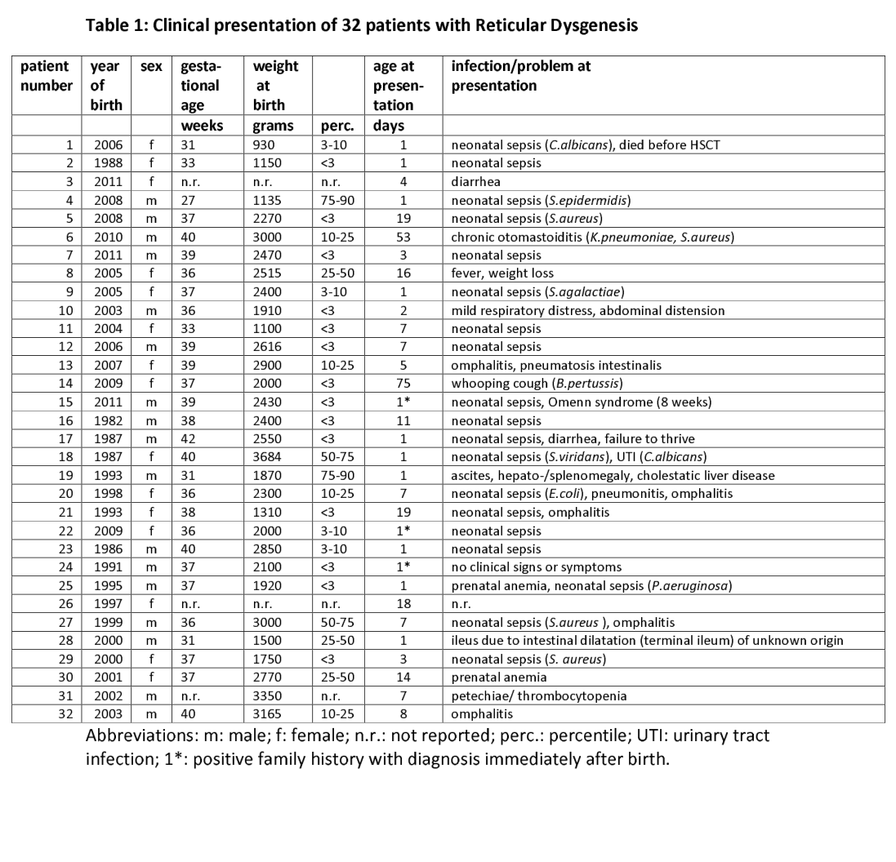

## Question

# Disease Characteristics Research Template

## Target Disease
- **Disease Name:** Reticular Dysgenesis
- **MONDO ID:** MONDO:0009973 (if available)
- **Category:** Mendelian

## Research Objectives

Please provide a comprehensive research report on **Reticular Dysgenesis** covering all of the
disease characteristics listed below. This report will be used to populate a disease knowledge
base entry. Be thorough and cite primary literature (PMID preferred) for all claims.

For each section, **suggested databases/resources** are listed. These are the first places
you should search for information on each topic.

---

### 1. Disease Information
> **Search first:** OMIM, Orphanet, ICD-10/ICD-11, MeSH, PubMed

- What is the disease? Provide a concise overview.
- What are the key identifiers? (OMIM, Orphanet, ICD-10/ICD-11, MeSH, Mondo)
- What are the common synonyms and alternative names?
- Is the information derived from individual patients (e.g., EHR) or aggregated disease-level resources?

### 2. Etiology

- **Disease Causal Factors**: What are the primary causes? (genetic, environmental, infectious, mechanistic)
- **Risk Factors**:
  > **Search first:** PubMed, Cochrane Library, UpToDate, clinical guidelines, ClinVar, ClinGen, GWAS Catalog, PheGenI, CTD, CDC, WHO, epidemiological databases
  - Genetic risk factors (causal variants, susceptibility loci, modifier genes)
  - Environmental risk factors (toxins, lifestyle, occupational exposures, age, sex, family history)
- **Protective Factors**:
  > **Search first:** PubMed, Cochrane Library, clinical trial databases, GWAS Catalog, gnomAD, WHO, CDC, nutrition databases
  - Genetic protective factors (protective variants, modifier alleles)
  - Environmental protective factors (diet, lifestyle, exposures that reduce risk)
- **Gene-Environment Interactions**: How do genetic and environmental factors interact to influence disease?
  > **Search first:** CTD, PubMed, PheGenI, GxE databases

### 3. Phenotypes
> **Search first:** HPO (Human Phenotype Ontology), OMIM, Orphanet, PubMed, clinicaltrials.gov, MedDRA, SNOMED CT, DECIPHER, LOINC

For each phenotype, provide:
- **Phenotype type**: symptoms, clinical signs, physical manifestations, behavioral changes, or laboratory abnormalities
  > For symptoms/signs: HPO, OMIM, Orphanet, PubMed
  > For behavioral changes: HPO, DSM, RDoC (Research Domain Criteria), PubMed
  > For laboratory abnormalities: LOINC, SNOMED CT, LabTests Online, PubMed
- **Phenotype characteristics**:
  > **Search first:** OMIM, Orphanet, HPO, PubMed
  - Age of symptom onset (neonatal, childhood, adult-onset, late-onset)
  - Symptom severity (mild, moderate, severe, variable)
  - Symptom progression (stable, progressive, episodic, fluctuating)
  - Frequency among affected individuals (percentage or qualitative)
- **Quality of life impact**: Effects on daily functioning and well-being (per-phenotype when possible)
  > **Search first:** EQ-5D database, SF-36, WHO QOL databases, PubMed
- Suggest HPO (Human Phenotype Ontology) terms for each phenotype

### 4. Genetic/Molecular Information

- **Causal Genes**: Gene mutations or chromosomal abnormalities responsible for disease (gene symbols, OMIM IDs)
  > **Search first:** OMIM, ClinVar, HGMD, Ensembl, NCBI Gene
- **Pathogenic Variants**:
  - Affected genes (gene symbols, HGNC IDs)
    > **Search first:** OMIM, NCBI Gene, Ensembl, HGNC, UniProt, GeneCards
  - Variant classification (pathogenic, likely pathogenic, VUS per ACMG/AMP guidelines)
    > **Search first:** ClinVar, ClinGen, ACMG/AMP guidelines, VarSome
  - Variant type/class (missense, frameshift, nonsense, splice-site, structural)
  - Allele frequency in population databases
    > **Search first:** gnomAD, 1000 Genomes, ExAC, TOPMed, dbSNP
  - Somatic vs germline origin
    > **Search first:** COSMIC (somatic), ClinVar, ICGC, TCGA
  - Functional consequences (loss of function, gain of function, dominant negative)
- **Modifier Genes**: Genes that modify disease severity or expression
- **Epigenetic Information**: DNA methylation, histone modifications, chromatin changes affecting disease
  > **Search first:** ENCODE, Roadmap Epigenomics, MethBase, DiseaseMeth
- **Chromosomal Abnormalities**: Large-scale genetic changes (aneuploidy, translocations, inversions)
  > **Search first:** DECIPHER, ClinVar, ECARUCA, UCSC Genome Browser

### 5. Environmental Information

- **Environmental Factors**: Non-genetic contributing factors (toxins, radiation, pollution, occupational exposure)
  > **Search first:** CTD (Comparative Toxicogenomics Database), TOXNET, PubMed, EPA databases
- **Lifestyle Factors**: Behavioral factors (smoking, diet, exercise, alcohol consumption)
  > **Search first:** CDC databases, WHO, PubMed, NHANES
- **Infectious Agents**: If applicable, pathogens causing or triggering disease (bacteria, viruses, fungi, parasites)
  > **Search first:** NCBI Taxonomy, ViPR, BV-BRC, MicrobeDB, GIDEON

### 6. Mechanism / Pathophysiology

**Present this section as an ordered causal chain first, then the detail below.**
Open with a numbered sequence of mechanistic steps running from the initiating
lesion (mutation, exposure, infection) to the clinical manifestation, one step per
line, each naming what it causes next. State the causal verb explicitly ("leads
to", "results in") and say where a step is inferred rather than demonstrated.
Where the mechanism branches, show the branch. The categories below are a
checklist of what to cover within those steps, not the organizing structure —
a step may draw on several of them, and a category may contribute to several
steps.

- **Molecular Pathways**: Specific signaling cascades or biochemical pathways involved (Wnt, MAPK, mTOR, PI3K-AKT, etc.)
  > **Search first:** KEGG, Reactome, WikiPathways, PathBank, BioCyc
- **Cellular Processes**: Cell-level mechanisms (apoptosis, autophagy, cell cycle dysregulation, inflammation, etc.)
  > **Search first:** Gene Ontology (GO), Reactome, KEGG, PubMed
- **Protein Dysfunction**: How protein structure or function is altered (misfolding, aggregation, loss of function, gain of function)
  > **Search first:** UniProt, PDB (Protein Data Bank), InterPro, Pfam, AlphaFold
- **Metabolic Changes**: Alterations in metabolic processes (energy metabolism, lipid metabolism, amino acid metabolism)
  > **Search first:** KEGG, BioCyc, HMDB (Human Metabolome Database), BRENDA
- **Immune System Involvement**: Role of immune response (autoimmunity, immunodeficiency, chronic inflammation)
  > **Search first:** ImmPort, Immunome Database, IEDB, Gene Ontology
- **Tissue Damage Mechanisms**: How tissues/ are injured (oxidative stress, ischemia, fibrosis, necrosis)
  > **Search first:** PubMed, Gene Ontology, Reactome
- **Biochemical Abnormalities**: Specific molecular defects (enzyme deficiencies, receptor dysfunction, ion channel defects)
  > **Search first:** BRENDA, UniProt, KEGG, OMIM, PubMed
- **Epigenetic Changes**: DNA methylation, histone modifications affecting gene expression in disease
  > **Search first:** ENCODE, Roadmap Epigenomics, MethBase, DiseaseMeth
- **Molecular Profiling** (if available):
  - Transcriptomics/gene expression changes
    > **Search first:** GEO (Gene Expression Omnibus), ArrayExpress, GTEx, Human Cell Atlas, SRA
  - Proteomics findings
    > **Search first:** PRIDE, ProteomeXchange, Human Protein Atlas, STRING, BioGRID
  - Metabolomics signatures
    > **Search first:** MetaboLights, Metabolomics Workbench, HMDB, METLIN
  - Lipidomics alterations
    > **Search first:** LIPID MAPS, SwissLipids, LipidHome, Metabolomics Workbench
  - Genomic structural features
    > **Search first:** UCSC Genome Browser, Ensembl, NCBI, dbVar, DGV
- **Advanced Technologies** (if applicable):
  - Single-cell analysis findings (cell-type specific mechanisms, cellular heterogeneity)
    > **Search first:** Human Cell Atlas, Single Cell Portal, GEO, CELLxGENE
  - Spatial transcriptomics findings
    > **Search first:** GEO, Spatial Research, Vizgen, 10x Genomics data
  - Multi-omics integration results
    > **Search first:** TCGA, ICGC, cBioPortal, LinkedOmics, PubMed
  - Functional genomics screens (CRISPR, RNAi)
    > **Search first:** DepMap, GenomeRNAi, PubMed, BioGRID ORCS

For each mechanism, describe:
- The causal chain from initial trigger to clinical manifestation
- Which mechanisms are upstream vs downstream
- What cell types and biological processes are involved
- Suggest GO terms for biological processes and CL terms for cell types

### 7. Anatomical Structures Affected

- **Organ Level**:
  - Primary organs directly affected
  - Secondary organ involvement (complications, secondary effects)
  - Body systems involved (cardiovascular, nervous, digestive, respiratory, endocrine, etc.)
  > **Search first:** Uberon, FMA (Foundational Model of Anatomy), OMIM, HPO, ICD-11, MeSH, SNOMED CT
- **Tissue and Cell Level**:
  - Specific tissue types affected (epithelial, connective, muscle, nervous)
  - Specific cell populations targeted (with Cell Ontology terms)
  > **Search first:** Uberon, Human Protein Atlas, Cell Ontology, Human Cell Atlas, CellMarker, PanglaoDB
- **Subcellular Level**:
  - Cellular compartments involved (mitochondria, nucleus, ER, lysosomes) (with GO Cellular Component terms)
  > **Search first:** Gene Ontology (Cellular Component), UniProt, Human Protein Atlas
- **Localization**:
  - Specific anatomical sites (with UBERON terms)
    > **Search first:** FMA, Uberon, NeuroNames (for brain), SNOMED CT
  - Lateralization (unilateral, bilateral, asymmetric)
    > **Search first:** HPO, clinical literature, imaging databases

### 8. Temporal Development

- **Onset**:
  - Typical age of onset (congenital, pediatric, adult, geriatric)
  - Onset pattern (acute, subacute, chronic, insidious)
  > **Search first:** OMIM, Orphanet, HPO, PubMed
- **Progression**:
  - Disease stages (early, intermediate, advanced, end-stage)
    > **Search first:** Cancer Staging Manual (AJCC), WHO classifications, PubMed
  - Progression rate (rapid, slow, variable)
  - Disease course pattern (episodic, relapsing-remitting, progressive, stable)
  - Disease duration (self-limited, chronic lifelong)
  > **Search first:** Disease registries, longitudinal cohort databases, natural history studies, PubMed, Orphanet, OMIM
- **Patterns**:
  - Remission patterns (spontaneous, treatment-induced)
    > **Search first:** Clinical trial databases, disease registries, PubMed
  - Critical periods (time windows of vulnerability or opportunity for intervention)
    > **Search first:** PubMed, developmental biology databases, clinical guidelines

### 9. Inheritance and Population

- **Epidemiology**:
  - Prevalence (cases per 100,000 at given time)
  - Incidence (new cases per 100,000 per year)
  > **Search first:** Orphanet, CDC, WHO, GBD (Global Burden of Disease), national registries, SEER, disease registries
- **For Genetic Etiology**:
  - Inheritance pattern (AD, AR, X-linked, mitochondrial, multifactorial, polygenic)
    > **Search first:** OMIM, Orphanet, ClinVar, GTR (Genetic Testing Registry)
  - Penetrance (complete, incomplete, age-dependent)
    > **Search first:** ClinVar, OMIM, PubMed, ClinGen
  - Expressivity (variable, consistent)
    > **Search first:** OMIM, ClinVar, PubMed
  - Genetic anticipation (increasing severity in successive generations)
    > **Search first:** OMIM, PubMed (especially for repeat expansion disorders)
  - Germline mosaicism
    > **Search first:** ClinVar, OMIM, genetic counseling literature, PubMed
  - Founder effects (population-specific mutations)
    > **Search first:** gnomAD, population genetics databases, PubMed
  - Consanguinity role
    > **Search first:** OMIM, population studies, genetic counseling resources
  - Carrier frequency
    > **Search first:** gnomAD, carrier screening databases, GeneReviews, GTR
- **Population Demographics**:
  - Affected populations (ethnic or demographic groups with higher prevalence)
    > **Search first:** gnomAD, 1000 Genomes, PAGE Study, PubMed, population registries
  - Geographic distribution (endemic areas, regional variation)
    > **Search first:** WHO, CDC, GBD, Orphanet, geographic epidemiology databases
  - Geographic distribution of specific variants
  - Sex ratio (male:female)
    > **Search first:** Disease registries, OMIM, PubMed, epidemiological databases
  - Age distribution of affected individuals
    > **Search first:** CDC, disease registries, SEER, Orphanet

### 10. Diagnostics

- **Clinical Tests**:
  - Laboratory tests (blood, urine, tissue chemistry, specific enzyme assays)
    > **Search first:** LOINC, LabTests Online, PubMed
  - Biomarkers (proteins, metabolites, genetic markers, circulating biomarkers)
    > **Search first:** FDA Biomarker List, BEST (Biomarkers, EndpointS, and other Tools), PubMed
  - Imaging studies (X-ray, CT, MRI, PET, ultrasound)
    > **Search first:** RadLex, DICOM, Radiopaedia, imaging databases
  - Functional tests (pulmonary function, cardiac stress tests)
    > **Search first:** LOINC, clinical guidelines, PubMed
  - Electrophysiology (EEG, EMG, ECG, nerve conduction studies)
    > **Search first:** LOINC, clinical neurophysiology databases, PubMed
  - Biopsy findings (histopathology, immunohistochemistry)
    > **Search first:** SNOMED CT, College of American Pathologists resources, PubMed
  - Pathology findings (microscopic examination)
    > **Search first:** SNOMED CT, Digital Pathology databases, PubMed
- **Genetic Testing**:
  > **Search first:** GTR (Genetic Testing Registry), GeneReviews, ClinGen
  - Overview of recommended genetic testing approach
  - Whole genome sequencing (WGS) utility
    > **Search first:** GTR, ClinVar, GEL (Genomics England), gnomAD
  - Whole exome sequencing (WES) utility
    > **Search first:** GTR, ClinVar, OMIM, GeneMatcher
  - Gene panels (which panels, which genes)
    > **Search first:** GTR, ClinVar, laboratory-specific databases
  - Single gene testing
    > **Search first:** GTR, ClinVar, OMIM, GeneReviews
  - Chromosomal microarray (CMA)
    > **Search first:** DECIPHER, ClinVar, dbVar, ECARUCA
  - Karyotyping
    > **Search first:** Chromosome Abnormality Database, ClinVar, cytogenetics resources
  - FISH
    > **Search first:** ClinVar, cytogenetics databases, PubMed
  - Mitochondrial DNA testing
    > **Search first:** MITOMAP, MSeqDR, ClinVar, GTR
  - Repeat expansion testing
    > **Search first:** GTR, ClinVar, repeat expansion databases, PubMed
- **Omics-Based Diagnostics** (if applicable):
  - RNA sequencing / transcriptomics
    > **Search first:** GEO, ArrayExpress, GTEx, RNA-seq databases
  - Proteomics
    > **Search first:** PRIDE, ProteomeXchange, FDA Biomarker database
  - Metabolomics
    > **Search first:** MetaboLights, Metabolomics Workbench, HMDB
  - Epigenomics
    > **Search first:** GEO, ENCODE, Roadmap Epigenomics, MethBase
  - Liquid biopsy
    > **Search first:** COSMIC, ClinVar, liquid biopsy databases, PubMed
- **Clinical Criteria**:
  - Standardized diagnostic criteria (DSM, ICD, society guidelines)
    > **Search first:** DSM-5, ICD-11, clinical society guidelines, UpToDate
  - Differential diagnosis (other conditions to rule out, with distinguishing features)
    > **Search first:** DynaMed, UpToDate, clinical decision support systems
- **Screening**:
  - Screening methods for asymptomatic individuals (newborn screening, carrier screening, cascade screening)
    > **Search first:** ACMG recommendations, CDC newborn screening, GTR

### 11. Outcome/Prognosis

- **Survival and Mortality**:
  - Survival rate (5-year, 10-year, overall)
    > **Search first:** SEER, cancer registries, disease-specific registries, PubMed
  - Life expectancy (with and without treatment if applicable)
    > **Search first:** Orphanet, disease registries, actuarial databases, PubMed
  - Mortality rate
    > **Search first:** CDC, WHO, GBD, national mortality databases
  - Disease-specific mortality (deaths directly attributable to disease)
    > **Search first:** Disease registries, CDC Wonder, GBD, PubMed
- **Morbidity and Function**:
  - Morbidity (disease-related disability and health impacts)
    > **Search first:** GBD, WHO, disability databases, PubMed
  - Disability outcomes (long-term functional impairments)
    > **Search first:** ICF (International Classification of Functioning), disability registries
  - Quality of life measures (EQ-5D, SF-36, PROMIS, disease-specific tools)
    > **Search first:** EQ-5D database, SF-36, PROMIS, PubMed
- **Disease Course**:
  - Complications (secondary problems: infections, organ failure, etc.)
    > **Search first:** ICD codes, disease registries, clinical databases, PubMed
  - Recovery potential (likelihood and extent of recovery, with vs without treatment)
    > **Search first:** Natural history studies, rehabilitation databases, PubMed
- **Prediction**:
  - Prognostic factors (age, disease severity, biomarkers, treatment response)
    > **Search first:** Prognostic models databases, clinical calculators, PubMed
  - Prognostic biomarkers (molecular markers predicting disease course)
    > **Search first:** FDA Biomarker database, PubMed, cancer prognostic databases

### 12. Treatment

- **Pharmacotherapy**:
  - Pharmacological treatments (drug names, drug classes, mechanisms of action)
    > **Search first:** DrugBank, RxNorm, ATC classification, DailyMed, FDA databases
  - Pharmacogenomics (how genetic variants affect drug metabolism, efficacy, toxicity)
    > **Search first:** PharmGKB, CPIC (Clinical Pharmacogenetics), FDA Table of PGx Biomarkers
- **Advanced Therapeutics**:
  - Gene therapy (viral vectors, CRISPR, gene replacement, gene editing)
    > **Search first:** ClinicalTrials.gov, FDA gene therapy database, ASGCT resources
  - Cell therapy (stem cell transplant, CAR-T, cellular therapeutics)
    > **Search first:** ClinicalTrials.gov, FDA cell therapy database, FACT standards
  - RNA-based therapies (ASOs, siRNA, mRNA therapies)
    > **Search first:** ClinicalTrials.gov, FDA approvals, PubMed
  - Targeted therapies (treatments directed at specific molecular targets)
    > **Search first:** My Cancer Genome, OncoKB, ClinicalTrials.gov, FDA approvals
  - Immunotherapies (checkpoint inhibitors, monoclonal antibodies)
    > **Search first:** Cancer Immunotherapy Database, FDA approvals, ClinicalTrials.gov
- **Surgical and Interventional**:
  - Surgical interventions (types of surgery, timing, outcomes)
    > **Search first:** CPT codes, surgical registries, clinical guidelines, PubMed
- **Supportive and Rehabilitative**:
  - Supportive care (symptom management, pain control, nutrition)
    > **Search first:** Clinical guidelines, Cochrane Library, PubMed
  - Rehabilitation (physical therapy, occupational therapy, speech therapy)
    > **Search first:** Rehabilitation medicine databases, clinical guidelines, PubMed
- **Experimental**:
  - Experimental treatments in clinical trials (with NCT identifiers if available)
    > **Search first:** ClinicalTrials.gov, EU Clinical Trials Register, WHO ICTRP
- **Treatment Outcomes**:
  - Treatment response rates
    > **Search first:** Clinical trial databases, FDA reviews, systematic reviews, PubMed
  - Side effects and adverse events
    > **Search first:** FDA Adverse Event Reporting System (FAERS), MedWatch, PubMed
- **Treatment Strategy**:
  - Treatment algorithms (clinical pathways, decision trees)
    > **Search first:** Clinical practice guidelines, NCCN Guidelines, UpToDate
  - Combination therapies
    > **Search first:** ClinicalTrials.gov, treatment guidelines, PubMed
  - Personalized medicine approaches (genotype-guided treatment)
    > **Search first:** My Cancer Genome, CIViC, PharmGKB, precision medicine databases

For each treatment, suggest NCIT (NCI Thesaurus) clinical-intervention terms where applicable.

### 13. Prevention

- **Prevention Levels**:
  - Primary prevention (preventing disease occurrence: vaccination, risk factor modification)
    > **Search first:** CDC, WHO, USPSTF recommendations, Cochrane Library
  - Secondary prevention (early detection and treatment: screening programs, early intervention)
    > **Search first:** USPSTF, CDC screening guidelines, WHO
  - Tertiary prevention (preventing complications in those with disease)
    > **Search first:** Clinical guidelines, disease management protocols, PubMed
- **Immunization**: Vaccine strategies (if applicable)
  > **Search first:** CDC vaccine schedules, WHO immunization, FDA vaccine database
- **Screening and Early Detection**:
  - Screening programs (population-based: newborn screening, cancer screening)
    > **Search first:** CDC screening programs, USPSTF, cancer screening databases
  - Genetic screening (carrier screening, preimplantation genetic diagnosis, prenatal testing)
    > **Search first:** ACMG recommendations, ACOG guidelines, GTR
  - Risk stratification (identifying high-risk individuals for targeted prevention)
    > **Search first:** Risk prediction models, clinical calculators, PubMed
- **Behavioral Interventions**: Lifestyle modifications to reduce risk
  > **Search first:** CDC, WHO, behavioral intervention databases, Cochrane Library
- **Counseling**: Genetic counseling (risk assessment, family planning guidance)
  > **Search first:** NSGC resources, ACMG guidelines, GeneReviews
- **Public Health**:
  - Public health interventions (sanitation, vector control, health education)
    > **Search first:** CDC, WHO, public health databases, PubMed
  - Environmental interventions (reducing environmental risk factors)
    > **Search first:** EPA databases, WHO environmental health, PubMed
- **Prophylaxis**: Preventive medications or procedures
  > **Search first:** Clinical guidelines, FDA approvals, PubMed

### 14. Other Species / Natural Disease

- **Taxonomy**: Species affected (with NCBI Taxon identifiers)
  > **Search first:** NCBI Taxonomy
- **Breed**: Specific breeds affected (with VBO identifiers if applicable)
  > **Search first:** VBO (Vertebrate Breed Ontology)
- **Gene**: Orthologous genes in other species (with NCBI Gene IDs)
  > **Search first:** NCBI Gene
- **Natural Disease**:
  - Naturally occurring disease in other species (companion animals, wildlife)
    > **Search first:** OMIA (Online Mendelian Inheritance in Animals), VetCompass, PubMed
  - Veterinary relevance and importance in animal health
    > **Search first:** OMIA, veterinary databases, PubMed
- **Comparative Biology**:
  - Comparative pathology (similarities and differences across species)
    > **Search first:** OMIA, comparative pathology databases, PubMed
  - Evolutionary conservation of disease mechanisms
    > **Search first:** HomoloGene, OrthoMCL, Alliance of Genome Resources
- **Transmission** (if applicable):
  - Zoonotic potential
    > **Search first:** CDC zoonotic diseases, WHO zoonoses, GIDEON
  - Cross-species susceptibility
    > **Search first:** NCBI Taxonomy, veterinary databases, PubMed

### 15. Model Organisms

- **Model Types**:
  - Model organism type (mammalian, invertebrate, cellular, in vitro)
    > **Search first:** Alliance of Genome Resources, model organism databases
  - Specific model systems (mouse, rat, zebrafish, Drosophila, C. elegans, yeast, cell lines, organoids, iPSCs)
    > **Search first:** MGI, RGD, ZFIN, FlyBase, WormBase, SGD, ATCC, Cellosaurus
  - Induced models (drug treatment, surgical intervention, environmental manipulation)
    > **Search first:** MGI, model organism databases, PubMed
- **Genetic Models**:
  - Types available (knockout, knock-in, transgenic, conditional, humanized)
    > **Search first:** MGI, IMPC, KOMP, EuMMCR, IMSR
- **Model Characteristics**:
  - Phenotype recapitulation (how well model reproduces human disease features)
    > **Search first:** Model organism databases, comparative studies, PubMed
  - Model limitations (aspects of human disease not captured)
    > **Search first:** Model organism databases, PubMed, review articles
- **Applications**:
  - Research applications (what aspects of disease can be studied)
    > **Search first:** Model organism databases, PubMed
- **Resources**:
  - Model databases
    > **Search first:** MGI, RGD, ZFIN, FlyBase, WormBase, IMSR, EMMA, MMRRC

---

## Citation Requirements

- Cite primary literature (PMID preferred) for all mechanistic and clinical claims
- Prioritize recent reviews and landmark papers
- Include direct quotes from abstracts where possible to support key statements
- Distinguish evidence source types: human clinical, model organism, in vitro, computational

## Output Format

Structure your response as a comprehensive narrative organized by the sections above.
For each section, provide:
- Factual content with specific details (numbers, percentages, gene names, variant nomenclature)
- Ontology term suggestions (HPO, GO, CL, UBERON, CHEBI, NCIT, MONDO) where applicable
- Evidence citations with PMIDs
- Direct quotes from abstracts to support key claims
- Clear indication when information is not available or not applicable for this disease

This report will be used to populate a disease knowledge base entry with:
- Pathophysiology descriptions with causal chains
- Gene/protein annotations (HGNC, GO terms)
- Phenotype associations (HP terms) with frequencies
- Cell type involvement (CL terms)
- Anatomical locations (UBERON terms)
- Chemical entities (CHEBI terms)
- Treatment annotations (NCIT terms)
- Evidence items with PMIDs and exact abstract quotes
- Epidemiology, prognosis, diagnostic, and prevention information
- Animal model descriptions with phenotype recapitulation details

## Output

Question: You are an expert researcher providing comprehensive, well-cited information.

Provide detailed information focusing on:
1. Key concepts and definitions with current understanding
2. Recent developments and latest research (prioritize 2023-2024 sources)
3. Current applications and real-world implementations
4. Expert opinions and analysis from authoritative sources
5. Relevant statistics and data from recent studies

Format as a comprehensive research report with proper citations. Include URLs and publication dates where available.
Always prioritize recent, authoritative sources and provide specific citations for all major claims.

# Disease Characteristics Research Template

## Target Disease
- **Disease Name:** Reticular Dysgenesis
- **MONDO ID:** MONDO:0009973 (if available)
- **Category:** Mendelian

## Research Objectives

Please provide a comprehensive research report on **Reticular Dysgenesis** covering all of the
disease characteristics listed below. This report will be used to populate a disease knowledge
base entry. Be thorough and cite primary literature (PMID preferred) for all claims.

For each section, **suggested databases/resources** are listed. These are the first places
you should search for information on each topic.

---

### 1. Disease Information
> **Search first:** OMIM, Orphanet, ICD-10/ICD-11, MeSH, PubMed

- What is the disease? Provide a concise overview.
- What are the key identifiers? (OMIM, Orphanet, ICD-10/ICD-11, MeSH, Mondo)
- What are the common synonyms and alternative names?
- Is the information derived from individual patients (e.g., EHR) or aggregated disease-level resources?

### 2. Etiology

- **Disease Causal Factors**: What are the primary causes? (genetic, environmental, infectious, mechanistic)
- **Risk Factors**:
  > **Search first:** PubMed, Cochrane Library, UpToDate, clinical guidelines, ClinVar, ClinGen, GWAS Catalog, PheGenI, CTD, CDC, WHO, epidemiological databases
  - Genetic risk factors (causal variants, susceptibility loci, modifier genes)
  - Environmental risk factors (toxins, lifestyle, occupational exposures, age, sex, family history)
- **Protective Factors**:
  > **Search first:** PubMed, Cochrane Library, clinical trial databases, GWAS Catalog, gnomAD, WHO, CDC, nutrition databases
  - Genetic protective factors (protective variants, modifier alleles)
  - Environmental protective factors (diet, lifestyle, exposures that reduce risk)
- **Gene-Environment Interactions**: How do genetic and environmental factors interact to influence disease?
  > **Search first:** CTD, PubMed, PheGenI, GxE databases

### 3. Phenotypes
> **Search first:** HPO (Human Phenotype Ontology), OMIM, Orphanet, PubMed, clinicaltrials.gov, MedDRA, SNOMED CT, DECIPHER, LOINC

For each phenotype, provide:
- **Phenotype type**: symptoms, clinical signs, physical manifestations, behavioral changes, or laboratory abnormalities
  > For symptoms/signs: HPO, OMIM, Orphanet, PubMed
  > For behavioral changes: HPO, DSM, RDoC (Research Domain Criteria), PubMed
  > For laboratory abnormalities: LOINC, SNOMED CT, LabTests Online, PubMed
- **Phenotype characteristics**:
  > **Search first:** OMIM, Orphanet, HPO, PubMed
  - Age of symptom onset (neonatal, childhood, adult-onset, late-onset)
  - Symptom severity (mild, moderate, severe, variable)
  - Symptom progression (stable, progressive, episodic, fluctuating)
  - Frequency among affected individuals (percentage or qualitative)
- **Quality of life impact**: Effects on daily functioning and well-being (per-phenotype when possible)
  > **Search first:** EQ-5D database, SF-36, WHO QOL databases, PubMed
- Suggest HPO (Human Phenotype Ontology) terms for each phenotype

### 4. Genetic/Molecular Information

- **Causal Genes**: Gene mutations or chromosomal abnormalities responsible for disease (gene symbols, OMIM IDs)
  > **Search first:** OMIM, ClinVar, HGMD, Ensembl, NCBI Gene
- **Pathogenic Variants**:
  - Affected genes (gene symbols, HGNC IDs)
    > **Search first:** OMIM, NCBI Gene, Ensembl, HGNC, UniProt, GeneCards
  - Variant classification (pathogenic, likely pathogenic, VUS per ACMG/AMP guidelines)
    > **Search first:** ClinVar, ClinGen, ACMG/AMP guidelines, VarSome
  - Variant type/class (missense, frameshift, nonsense, splice-site, structural)
  - Allele frequency in population databases
    > **Search first:** gnomAD, 1000 Genomes, ExAC, TOPMed, dbSNP
  - Somatic vs germline origin
    > **Search first:** COSMIC (somatic), ClinVar, ICGC, TCGA
  - Functional consequences (loss of function, gain of function, dominant negative)
- **Modifier Genes**: Genes that modify disease severity or expression
- **Epigenetic Information**: DNA methylation, histone modifications, chromatin changes affecting disease
  > **Search first:** ENCODE, Roadmap Epigenomics, MethBase, DiseaseMeth
- **Chromosomal Abnormalities**: Large-scale genetic changes (aneuploidy, translocations, inversions)
  > **Search first:** DECIPHER, ClinVar, ECARUCA, UCSC Genome Browser

### 5. Environmental Information

- **Environmental Factors**: Non-genetic contributing factors (toxins, radiation, pollution, occupational exposure)
  > **Search first:** CTD (Comparative Toxicogenomics Database), TOXNET, PubMed, EPA databases
- **Lifestyle Factors**: Behavioral factors (smoking, diet, exercise, alcohol consumption)
  > **Search first:** CDC databases, WHO, PubMed, NHANES
- **Infectious Agents**: If applicable, pathogens causing or triggering disease (bacteria, viruses, fungi, parasites)
  > **Search first:** NCBI Taxonomy, ViPR, BV-BRC, MicrobeDB, GIDEON

### 6. Mechanism / Pathophysiology

**Present this section as an ordered causal chain first, then the detail below.**
Open with a numbered sequence of mechanistic steps running from the initiating
lesion (mutation, exposure, infection) to the clinical manifestation, one step per
line, each naming what it causes next. State the causal verb explicitly ("leads
to", "results in") and say where a step is inferred rather than demonstrated.
Where the mechanism branches, show the branch. The categories below are a
checklist of what to cover within those steps, not the organizing structure —
a step may draw on several of them, and a category may contribute to several
steps.

- **Molecular Pathways**: Specific signaling cascades or biochemical pathways involved (Wnt, MAPK, mTOR, PI3K-AKT, etc.)
  > **Search first:** KEGG, Reactome, WikiPathways, PathBank, BioCyc
- **Cellular Processes**: Cell-level mechanisms (apoptosis, autophagy, cell cycle dysregulation, inflammation, etc.)
  > **Search first:** Gene Ontology (GO), Reactome, KEGG, PubMed
- **Protein Dysfunction**: How protein structure or function is altered (misfolding, aggregation, loss of function, gain of function)
  > **Search first:** UniProt, PDB (Protein Data Bank), InterPro, Pfam, AlphaFold
- **Metabolic Changes**: Alterations in metabolic processes (energy metabolism, lipid metabolism, amino acid metabolism)
  > **Search first:** KEGG, BioCyc, HMDB (Human Metabolome Database), BRENDA
- **Immune System Involvement**: Role of immune response (autoimmunity, immunodeficiency, chronic inflammation)
  > **Search first:** ImmPort, Immunome Database, IEDB, Gene Ontology
- **Tissue Damage Mechanisms**: How tissues/ are injured (oxidative stress, ischemia, fibrosis, necrosis)
  > **Search first:** PubMed, Gene Ontology, Reactome
- **Biochemical Abnormalities**: Specific molecular defects (enzyme deficiencies, receptor dysfunction, ion channel defects)
  > **Search first:** BRENDA, UniProt, KEGG, OMIM, PubMed
- **Epigenetic Changes**: DNA methylation, histone modifications affecting gene expression in disease
  > **Search first:** ENCODE, Roadmap Epigenomics, MethBase, DiseaseMeth
- **Molecular Profiling** (if available):
  - Transcriptomics/gene expression changes
    > **Search first:** GEO (Gene Expression Omnibus), ArrayExpress, GTEx, Human Cell Atlas, SRA
  - Proteomics findings
    > **Search first:** PRIDE, ProteomeXchange, Human Protein Atlas, STRING, BioGRID
  - Metabolomics signatures
    > **Search first:** MetaboLights, Metabolomics Workbench, HMDB, METLIN
  - Lipidomics alterations
    > **Search first:** LIPID MAPS, SwissLipids, LipidHome, Metabolomics Workbench
  - Genomic structural features
    > **Search first:** UCSC Genome Browser, Ensembl, NCBI, dbVar, DGV
- **Advanced Technologies** (if applicable):
  - Single-cell analysis findings (cell-type specific mechanisms, cellular heterogeneity)
    > **Search first:** Human Cell Atlas, Single Cell Portal, GEO, CELLxGENE
  - Spatial transcriptomics findings
    > **Search first:** GEO, Spatial Research, Vizgen, 10x Genomics data
  - Multi-omics integration results
    > **Search first:** TCGA, ICGC, cBioPortal, LinkedOmics, PubMed
  - Functional genomics screens (CRISPR, RNAi)
    > **Search first:** DepMap, GenomeRNAi, PubMed, BioGRID ORCS

For each mechanism, describe:
- The causal chain from initial trigger to clinical manifestation
- Which mechanisms are upstream vs downstream
- What cell types and biological processes are involved
- Suggest GO terms for biological processes and CL terms for cell types

### 7. Anatomical Structures Affected

- **Organ Level**:
  - Primary organs directly affected
  - Secondary organ involvement (complications, secondary effects)
  - Body systems involved (cardiovascular, nervous, digestive, respiratory, endocrine, etc.)
  > **Search first:** Uberon, FMA (Foundational Model of Anatomy), OMIM, HPO, ICD-11, MeSH, SNOMED CT
- **Tissue and Cell Level**:
  - Specific tissue types affected (epithelial, connective, muscle, nervous)
  - Specific cell populations targeted (with Cell Ontology terms)
  > **Search first:** Uberon, Human Protein Atlas, Cell Ontology, Human Cell Atlas, CellMarker, PanglaoDB
- **Subcellular Level**:
  - Cellular compartments involved (mitochondria, nucleus, ER, lysosomes) (with GO Cellular Component terms)
  > **Search first:** Gene Ontology (Cellular Component), UniProt, Human Protein Atlas
- **Localization**:
  - Specific anatomical sites (with UBERON terms)
    > **Search first:** FMA, Uberon, NeuroNames (for brain), SNOMED CT
  - Lateralization (unilateral, bilateral, asymmetric)
    > **Search first:** HPO, clinical literature, imaging databases

### 8. Temporal Development

- **Onset**:
  - Typical age of onset (congenital, pediatric, adult, geriatric)
  - Onset pattern (acute, subacute, chronic, insidious)
  > **Search first:** OMIM, Orphanet, HPO, PubMed
- **Progression**:
  - Disease stages (early, intermediate, advanced, end-stage)
    > **Search first:** Cancer Staging Manual (AJCC), WHO classifications, PubMed
  - Progression rate (rapid, slow, variable)
  - Disease course pattern (episodic, relapsing-remitting, progressive, stable)
  - Disease duration (self-limited, chronic lifelong)
  > **Search first:** Disease registries, longitudinal cohort databases, natural history studies, PubMed, Orphanet, OMIM
- **Patterns**:
  - Remission patterns (spontaneous, treatment-induced)
    > **Search first:** Clinical trial databases, disease registries, PubMed
  - Critical periods (time windows of vulnerability or opportunity for intervention)
    > **Search first:** PubMed, developmental biology databases, clinical guidelines

### 9. Inheritance and Population

- **Epidemiology**:
  - Prevalence (cases per 100,000 at given time)
  - Incidence (new cases per 100,000 per year)
  > **Search first:** Orphanet, CDC, WHO, GBD (Global Burden of Disease), national registries, SEER, disease registries
- **For Genetic Etiology**:
  - Inheritance pattern (AD, AR, X-linked, mitochondrial, multifactorial, polygenic)
    > **Search first:** OMIM, Orphanet, ClinVar, GTR (Genetic Testing Registry)
  - Penetrance (complete, incomplete, age-dependent)
    > **Search first:** ClinVar, OMIM, PubMed, ClinGen
  - Expressivity (variable, consistent)
    > **Search first:** OMIM, ClinVar, PubMed
  - Genetic anticipation (increasing severity in successive generations)
    > **Search first:** OMIM, PubMed (especially for repeat expansion disorders)
  - Germline mosaicism
    > **Search first:** ClinVar, OMIM, genetic counseling literature, PubMed
  - Founder effects (population-specific mutations)
    > **Search first:** gnomAD, population genetics databases, PubMed
  - Consanguinity role
    > **Search first:** OMIM, population studies, genetic counseling resources
  - Carrier frequency
    > **Search first:** gnomAD, carrier screening databases, GeneReviews, GTR
- **Population Demographics**:
  - Affected populations (ethnic or demographic groups with higher prevalence)
    > **Search first:** gnomAD, 1000 Genomes, PAGE Study, PubMed, population registries
  - Geographic distribution (endemic areas, regional variation)
    > **Search first:** WHO, CDC, GBD, Orphanet, geographic epidemiology databases
  - Geographic distribution of specific variants
  - Sex ratio (male:female)
    > **Search first:** Disease registries, OMIM, PubMed, epidemiological databases
  - Age distribution of affected individuals
    > **Search first:** CDC, disease registries, SEER, Orphanet

### 10. Diagnostics

- **Clinical Tests**:
  - Laboratory tests (blood, urine, tissue chemistry, specific enzyme assays)
    > **Search first:** LOINC, LabTests Online, PubMed
  - Biomarkers (proteins, metabolites, genetic markers, circulating biomarkers)
    > **Search first:** FDA Biomarker List, BEST (Biomarkers, EndpointS, and other Tools), PubMed
  - Imaging studies (X-ray, CT, MRI, PET, ultrasound)
    > **Search first:** RadLex, DICOM, Radiopaedia, imaging databases
  - Functional tests (pulmonary function, cardiac stress tests)
    > **Search first:** LOINC, clinical guidelines, PubMed
  - Electrophysiology (EEG, EMG, ECG, nerve conduction studies)
    > **Search first:** LOINC, clinical neurophysiology databases, PubMed
  - Biopsy findings (histopathology, immunohistochemistry)
    > **Search first:** SNOMED CT, College of American Pathologists resources, PubMed
  - Pathology findings (microscopic examination)
    > **Search first:** SNOMED CT, Digital Pathology databases, PubMed
- **Genetic Testing**:
  > **Search first:** GTR (Genetic Testing Registry), GeneReviews, ClinGen
  - Overview of recommended genetic testing approach
  - Whole genome sequencing (WGS) utility
    > **Search first:** GTR, ClinVar, GEL (Genomics England), gnomAD
  - Whole exome sequencing (WES) utility
    > **Search first:** GTR, ClinVar, OMIM, GeneMatcher
  - Gene panels (which panels, which genes)
    > **Search first:** GTR, ClinVar, laboratory-specific databases
  - Single gene testing
    > **Search first:** GTR, ClinVar, OMIM, GeneReviews
  - Chromosomal microarray (CMA)
    > **Search first:** DECIPHER, ClinVar, dbVar, ECARUCA
  - Karyotyping
    > **Search first:** Chromosome Abnormality Database, ClinVar, cytogenetics resources
  - FISH
    > **Search first:** ClinVar, cytogenetics databases, PubMed
  - Mitochondrial DNA testing
    > **Search first:** MITOMAP, MSeqDR, ClinVar, GTR
  - Repeat expansion testing
    > **Search first:** GTR, ClinVar, repeat expansion databases, PubMed
- **Omics-Based Diagnostics** (if applicable):
  - RNA sequencing / transcriptomics
    > **Search first:** GEO, ArrayExpress, GTEx, RNA-seq databases
  - Proteomics
    > **Search first:** PRIDE, ProteomeXchange, FDA Biomarker database
  - Metabolomics
    > **Search first:** MetaboLights, Metabolomics Workbench, HMDB
  - Epigenomics
    > **Search first:** GEO, ENCODE, Roadmap Epigenomics, MethBase
  - Liquid biopsy
    > **Search first:** COSMIC, ClinVar, liquid biopsy databases, PubMed
- **Clinical Criteria**:
  - Standardized diagnostic criteria (DSM, ICD, society guidelines)
    > **Search first:** DSM-5, ICD-11, clinical society guidelines, UpToDate
  - Differential diagnosis (other conditions to rule out, with distinguishing features)
    > **Search first:** DynaMed, UpToDate, clinical decision support systems
- **Screening**:
  - Screening methods for asymptomatic individuals (newborn screening, carrier screening, cascade screening)
    > **Search first:** ACMG recommendations, CDC newborn screening, GTR

### 11. Outcome/Prognosis

- **Survival and Mortality**:
  - Survival rate (5-year, 10-year, overall)
    > **Search first:** SEER, cancer registries, disease-specific registries, PubMed
  - Life expectancy (with and without treatment if applicable)
    > **Search first:** Orphanet, disease registries, actuarial databases, PubMed
  - Mortality rate
    > **Search first:** CDC, WHO, GBD, national mortality databases
  - Disease-specific mortality (deaths directly attributable to disease)
    > **Search first:** Disease registries, CDC Wonder, GBD, PubMed
- **Morbidity and Function**:
  - Morbidity (disease-related disability and health impacts)
    > **Search first:** GBD, WHO, disability databases, PubMed
  - Disability outcomes (long-term functional impairments)
    > **Search first:** ICF (International Classification of Functioning), disability registries
  - Quality of life measures (EQ-5D, SF-36, PROMIS, disease-specific tools)
    > **Search first:** EQ-5D database, SF-36, PROMIS, PubMed
- **Disease Course**:
  - Complications (secondary problems: infections, organ failure, etc.)
    > **Search first:** ICD codes, disease registries, clinical databases, PubMed
  - Recovery potential (likelihood and extent of recovery, with vs without treatment)
    > **Search first:** Natural history studies, rehabilitation databases, PubMed
- **Prediction**:
  - Prognostic factors (age, disease severity, biomarkers, treatment response)
    > **Search first:** Prognostic models databases, clinical calculators, PubMed
  - Prognostic biomarkers (molecular markers predicting disease course)
    > **Search first:** FDA Biomarker database, PubMed, cancer prognostic databases

### 12. Treatment

- **Pharmacotherapy**:
  - Pharmacological treatments (drug names, drug classes, mechanisms of action)
    > **Search first:** DrugBank, RxNorm, ATC classification, DailyMed, FDA databases
  - Pharmacogenomics (how genetic variants affect drug metabolism, efficacy, toxicity)
    > **Search first:** PharmGKB, CPIC (Clinical Pharmacogenetics), FDA Table of PGx Biomarkers
- **Advanced Therapeutics**:
  - Gene therapy (viral vectors, CRISPR, gene replacement, gene editing)
    > **Search first:** ClinicalTrials.gov, FDA gene therapy database, ASGCT resources
  - Cell therapy (stem cell transplant, CAR-T, cellular therapeutics)
    > **Search first:** ClinicalTrials.gov, FDA cell therapy database, FACT standards
  - RNA-based therapies (ASOs, siRNA, mRNA therapies)
    > **Search first:** ClinicalTrials.gov, FDA approvals, PubMed
  - Targeted therapies (treatments directed at specific molecular targets)
    > **Search first:** My Cancer Genome, OncoKB, ClinicalTrials.gov, FDA approvals
  - Immunotherapies (checkpoint inhibitors, monoclonal antibodies)
    > **Search first:** Cancer Immunotherapy Database, FDA approvals, ClinicalTrials.gov
- **Surgical and Interventional**:
  - Surgical interventions (types of surgery, timing, outcomes)
    > **Search first:** CPT codes, surgical registries, clinical guidelines, PubMed
- **Supportive and Rehabilitative**:
  - Supportive care (symptom management, pain control, nutrition)
    > **Search first:** Clinical guidelines, Cochrane Library, PubMed
  - Rehabilitation (physical therapy, occupational therapy, speech therapy)
    > **Search first:** Rehabilitation medicine databases, clinical guidelines, PubMed
- **Experimental**:
  - Experimental treatments in clinical trials (with NCT identifiers if available)
    > **Search first:** ClinicalTrials.gov, EU Clinical Trials Register, WHO ICTRP
- **Treatment Outcomes**:
  - Treatment response rates
    > **Search first:** Clinical trial databases, FDA reviews, systematic reviews, PubMed
  - Side effects and adverse events
    > **Search first:** FDA Adverse Event Reporting System (FAERS), MedWatch, PubMed
- **Treatment Strategy**:
  - Treatment algorithms (clinical pathways, decision trees)
    > **Search first:** Clinical practice guidelines, NCCN Guidelines, UpToDate
  - Combination therapies
    > **Search first:** ClinicalTrials.gov, treatment guidelines, PubMed
  - Personalized medicine approaches (genotype-guided treatment)
    > **Search first:** My Cancer Genome, CIViC, PharmGKB, precision medicine databases

For each treatment, suggest NCIT (NCI Thesaurus) clinical-intervention terms where applicable.

### 13. Prevention

- **Prevention Levels**:
  - Primary prevention (preventing disease occurrence: vaccination, risk factor modification)
    > **Search first:** CDC, WHO, USPSTF recommendations, Cochrane Library
  - Secondary prevention (early detection and treatment: screening programs, early intervention)
    > **Search first:** USPSTF, CDC screening guidelines, WHO
  - Tertiary prevention (preventing complications in those with disease)
    > **Search first:** Clinical guidelines, disease management protocols, PubMed
- **Immunization**: Vaccine strategies (if applicable)
  > **Search first:** CDC vaccine schedules, WHO immunization, FDA vaccine database
- **Screening and Early Detection**:
  - Screening programs (population-based: newborn screening, cancer screening)
    > **Search first:** CDC screening programs, USPSTF, cancer screening databases
  - Genetic screening (carrier screening, preimplantation genetic diagnosis, prenatal testing)
    > **Search first:** ACMG recommendations, ACOG guidelines, GTR
  - Risk stratification (identifying high-risk individuals for targeted prevention)
    > **Search first:** Risk prediction models, clinical calculators, PubMed
- **Behavioral Interventions**: Lifestyle modifications to reduce risk
  > **Search first:** CDC, WHO, behavioral intervention databases, Cochrane Library
- **Counseling**: Genetic counseling (risk assessment, family planning guidance)
  > **Search first:** NSGC resources, ACMG guidelines, GeneReviews
- **Public Health**:
  - Public health interventions (sanitation, vector control, health education)
    > **Search first:** CDC, WHO, public health databases, PubMed
  - Environmental interventions (reducing environmental risk factors)
    > **Search first:** EPA databases, WHO environmental health, PubMed
- **Prophylaxis**: Preventive medications or procedures
  > **Search first:** Clinical guidelines, FDA approvals, PubMed

### 14. Other Species / Natural Disease

- **Taxonomy**: Species affected (with NCBI Taxon identifiers)
  > **Search first:** NCBI Taxonomy
- **Breed**: Specific breeds affected (with VBO identifiers if applicable)
  > **Search first:** VBO (Vertebrate Breed Ontology)
- **Gene**: Orthologous genes in other species (with NCBI Gene IDs)
  > **Search first:** NCBI Gene
- **Natural Disease**:
  - Naturally occurring disease in other species (companion animals, wildlife)
    > **Search first:** OMIA (Online Mendelian Inheritance in Animals), VetCompass, PubMed
  - Veterinary relevance and importance in animal health
    > **Search first:** OMIA, veterinary databases, PubMed
- **Comparative Biology**:
  - Comparative pathology (similarities and differences across species)
    > **Search first:** OMIA, comparative pathology databases, PubMed
  - Evolutionary conservation of disease mechanisms
    > **Search first:** HomoloGene, OrthoMCL, Alliance of Genome Resources
- **Transmission** (if applicable):
  - Zoonotic potential
    > **Search first:** CDC zoonotic diseases, WHO zoonoses, GIDEON
  - Cross-species susceptibility
    > **Search first:** NCBI Taxonomy, veterinary databases, PubMed

### 15. Model Organisms

- **Model Types**:
  - Model organism type (mammalian, invertebrate, cellular, in vitro)
    > **Search first:** Alliance of Genome Resources, model organism databases
  - Specific model systems (mouse, rat, zebrafish, Drosophila, C. elegans, yeast, cell lines, organoids, iPSCs)
    > **Search first:** MGI, RGD, ZFIN, FlyBase, WormBase, SGD, ATCC, Cellosaurus
  - Induced models (drug treatment, surgical intervention, environmental manipulation)
    > **Search first:** MGI, model organism databases, PubMed
- **Genetic Models**:
  - Types available (knockout, knock-in, transgenic, conditional, humanized)
    > **Search first:** MGI, IMPC, KOMP, EuMMCR, IMSR
- **Model Characteristics**:
  - Phenotype recapitulation (how well model reproduces human disease features)
    > **Search first:** Model organism databases, comparative studies, PubMed
  - Model limitations (aspects of human disease not captured)
    > **Search first:** Model organism databases, PubMed, review articles
- **Applications**:
  - Research applications (what aspects of disease can be studied)
    > **Search first:** Model organism databases, PubMed
- **Resources**:
  - Model databases
    > **Search first:** MGI, RGD, ZFIN, FlyBase, WormBase, IMSR, EMMA, MMRRC

---

## Citation Requirements

- Cite primary literature (PMID preferred) for all mechanistic and clinical claims
- Prioritize recent reviews and landmark papers
- Include direct quotes from abstracts where possible to support key statements
- Distinguish evidence source types: human clinical, model organism, in vitro, computational

## Output Format

Structure your response as a comprehensive narrative organized by the sections above.
For each section, provide:
- Factual content with specific details (numbers, percentages, gene names, variant nomenclature)
- Ontology term suggestions (HPO, GO, CL, UBERON, CHEBI, NCIT, MONDO) where applicable
- Evidence citations with PMIDs
- Direct quotes from abstracts to support key claims
- Clear indication when information is not available or not applicable for this disease

This report will be used to populate a disease knowledge base entry with:
- Pathophysiology descriptions with causal chains
- Gene/protein annotations (HGNC, GO terms)
- Phenotype associations (HP terms) with frequencies
- Cell type involvement (CL terms)
- Anatomical locations (UBERON terms)
- Chemical entities (CHEBI terms)
- Treatment annotations (NCIT terms)
- Evidence items with PMIDs and exact abstract quotes
- Epidemiology, prognosis, diagnostic, and prevention information
- Animal model descriptions with phenotype recapitulation details

# Reticular Dysgenesis (AK2 Deficiency): Comprehensive Disease-Characteristics Report

## Executive summary

Reticular dysgenesis (RD) is an exceptionally rare, autosomal-recessive inborn error of immunity and one of the most severe forms of severe combined immunodeficiency (SCID). Biallelic loss-of-function variants in **AK2**, encoding mitochondrial adenylate kinase 2, cause congenital arrest of granulocytic and lymphoid differentiation. Classical disease presents at birth with persistent agranulocytosis, profound lymphopenia, invasive bacterial or fungal infection, promyelocyte-stage marrow arrest, and congenital sensorineural hearing loss. Without hematopoietic reconstitution, classical RD is usually fatal in early infancy. Allogeneic hematopoietic stem-cell transplantation (HSCT) is the only established curative treatment for its hematologic and immune manifestations; durable donor **myeloid as well as lymphoid** engraftment is essential. Hearing loss generally persists after HSCT. The best quantitative clinical evidence remains the international 32-patient survey published in 2017 because the extreme rarity of RD has precluded large prospective studies. Recent 2023–2024 literature principally refines the broader immunometabolic and diagnostic context rather than replacing that cohort evidence. (hoenig2017reticulardysgenesisinternational pages 15-19, hoenig2017reticulardysgenesisinternational pages 6-11, hoenig2017reticulardysgenesisinternational pages 1-6, hoenig2017reticulardysgenesisinternational pages 11-15)

| Knowledge-base field | Compact annotation | Evidence type | Key source(s) |
|---|---|---|---|
| Identity | **Reticular dysgenesis (RD)**; congenital aleukocytosis; AK2 deficiency; a particularly severe form of SCID. **MONDO:0009973; OMIM/MIM:267500.** Suggested ontology: MONDO:0009973; HPO term for severe combined immunodeficiency. | Aggregated disease resources; human cohort | Hoenig et al., *Blood*, May 2017; DOI: [10.1182/blood-2016-11-745638](https://doi.org/10.1182/blood-2016-11-745638). (ghaloulgonzalez2019reticulardysgenesisand pages 1-2, hoenig2017reticulardysgenesisinternational pages 6-11) |
| Genetics | Autosomal recessive disease caused by **biallelic germline loss-of-function variants in AK2** (adenylate kinase 2; MIM:103020), at chromosome 1p35.1. The 2017 cohort identified **22 variants among 30 patients from 27 families**; classes included missense, nonsense, splice-site, and 1–5,000-nucleotide deletions. Of 23 homozygous cases, **16 had a consanguineous background**. No reliable genotype–phenotype correlation has been established. | Human cohort | Discovery PMID: **19043416**; Hoenig et al., 2017. (OpenTargets Search: Reticular dysgenesis-AK2, hoenig2017reticulardysgenesisinternational pages 15-19, hoenig2017reticulardysgenesisinternational pages 6-11) |
| Hallmark phenotype and onset | Congenital persistent agranulocytosis or profound neutropenia, severe lymphopenia, early bacterial or fungal infection, promyelocyte-stage marrow arrest, and sensorineural hearing loss. In the international cohort, **27/29 (93%)** presented in the first month and 20/27 in the first week; bacterial sepsis occurred in **17/29 (59%)**, omphalitis in **5/29 (17%)**, anemia in **14/32 (44%)**, and thrombocytopenia in **14/31 (45%)**. Prematurity occurred in **11/29 (38%)** and small-for-gestational-age birth in **18/29 (62%)**. Suggested HPO concepts: agranulocytosis, neutropenia, lymphopenia, recurrent bacterial infection, omphalitis, anemia, thrombocytopenia, sensorineural hearing impairment, prematurity, and small for gestational age. | Human cohort | Hoenig et al., 2017. (hoenig2017reticulardysgenesisinternational pages 6-11, hoenig2017reticulardysgenesisinternational media 6dc0a8e5) |
| Immunology and marrow | All cohort patients had lymphopenia and persistent agranulocytosis; T-cell counts were universally low. Maternal T cells were detected in **13/23 (57%)**, with an allo-reactive rash in 4/13. Normal NK- and B-cell numbers occurred in only **2/24** and **4/25**, respectively. Marrow showed promyelocytic arrest in **22/26**, hypoplasia in 9/26, hyperplasia in 5/26, and dysmorphic lymphopoiesis in 9/26. Suggested HPO concepts: abnormal T-, B-, and NK-cell counts; maternal lymphocyte engraftment; myeloid maturation arrest. | Human cohort | Hoenig et al., 2017. (hoenig2017reticulardysgenesisinternational pages 6-11, hoenig2017reticulardysgenesisinternational media 9d1f21c4) |
| Molecular mechanism | AK2 resides in the mitochondrial intermembrane space and catalyzes **ATP + AMP ⇌ 2 ADP**. AK2 loss disrupts adenine-nucleotide homeostasis, ADP supply to oxidative phosphorylation, ATP production, proliferation, survival, and lymphoid and granulocyte differentiation. Patient cells show reduced oxygen consumption and ATP production, with increased reactive oxygen species, mitochondrial mass, and membrane permeability. Suggested GO concepts: adenylate kinase activity, adenine-nucleotide homeostasis, oxidative phosphorylation, mitochondrial ATP synthesis, regulation of reactive oxygen species, granulocyte differentiation, and lymphocyte differentiation. Suggested GO cellular component: mitochondrial intermembrane space. | Human case; in vitro | Ghaloul-Gonzalez et al., *Scientific Reports*, October 2019; DOI: [10.1038/s41598-019-51922-2](https://doi.org/10.1038/s41598-019-51922-2). (ghaloulgonzalez2019reticulardysgenesisand pages 1-2, ghaloulgonzalez2019reticulardysgenesisand pages 6-7) |
| Purine-metabolic and single-cell findings | Single-cell RNA sequencing of marrow from two patients implicated altered RNA catabolism and ribonucleoprotein synthesis. CRISPR AK2-null human HSPCs showed increased AMP and IMP, depleted NAD+ and aspartate, reduced cellular RNA, ribosomal-subunit expression and protein synthesis, and profound hypoproliferation. AMP-deaminase inhibition normalized IMP but worsened the phenotype, suggesting that AMP catabolism may be compensatory. These findings were **preprint evidence as of 2021**. | Human marrow scRNA-seq; CRISPR HSPCs; preprint | Wang et al., bioRxiv, posted September 28, 2021; DOI: [10.1101/2021.07.05.450633](https://doi.org/10.1101/2021.07.05.450633). (wang2021reticulardysgenesisassociatedadenylate pages 1-3) |
| Diagnosis | Suspect RD in a neonate with profound leukopenia, combined lymphopenia and G-CSF-unresponsive agranulocytosis, marrow promyelocytic arrest, and failed hearing assessment. Evaluate CBC with differential, lymphocyte subsets and function, immunoglobulins, marrow morphology, maternal T-cell engraftment, auditory brainstem response, and **TREC newborn screening**. Confirm using AK2 sequencing plus deletion and duplication analysis. RNA sequencing can establish pathogenic splice effects, as demonstrated for **c.330+5G>A**, which causes exon 3 skipping. Suggested HPO concepts: low TREC, absent naïve T cells, reduced mitogen response, and bilateral sensorineural deafness. | Human case; human cohort | Ichikawa et al., *Cold Spring Harbor Molecular Case Studies*, June 2020; DOI: [10.1101/mcs.a005017](https://doi.org/10.1101/mcs.a005017). (hoenig2018recentadvancesin pages 24-29, ichikawa2020reticulardysgenesiscaused pages 1-2) |
| Treatment and outcomes | **Allogeneic HSCT is the only established curative therapy** for the hematopoietic and immunologic disease. Stable donor myeloid—not merely T-cell—engraftment is essential; conditioning with a myeloablative component is generally needed. In the cohort, 31 patients received 47 HSCTs at a median age of **2.4 months**; 13 required retransplantation. Overall survival was **21/31 (68%)**. T-cell-replete graft survival was **13/14 (93%)**, HLA-identical family graft survival was 6/6, unrelated-donor survival was **7/8 (88%)**, and haploidentical T-cell-depleted graft survival was **8/17 (47%)**. All five unconditioned haploidentical grafts failed. Suggested NCIT concepts: hematopoietic stem cell transplantation, allogeneic bone-marrow transplantation, cord-blood transplantation, and myeloablative conditioning. | Human cohort | Hoenig et al., 2017; subsequent EBMT/ESID guidance supports conditioning because unconditioned RD transplantation carries a high primary-graft-failure risk. (hoenig2018recentadvancesin pages 16-21, hoenig2017reticulardysgenesisinternational pages 1-6, hoenig2017reticulardysgenesisinternational pages 11-15, hoenig2017reticulardysgenesisinternational pages 6-11) |
| Prognosis and disability | Untreated classical RD is usually fatal in infancy from overwhelming infection. Seven post-HSCT deaths occurred within six months, mainly from infection; later deaths reflected failure of durable donor myelopoiesis. Among 21 long-term survivors, **19 retained hearing impairment**, managed with hearing aids or cochlear implants; HSCT does not reliably correct the nonhematopoietic inner-ear defect. Quality-of-life burden includes hearing-related language and communication impairment and intensive transplant follow-up. | Human cohort | Hoenig et al., 2017. (hoenig2017reticulardysgenesisinternational pages 1-6, hoenig2017reticulardysgenesisinternational pages 11-15, hoenig2017reticulardysgenesisinternational pages 6-11) |
| Models | **Zebrafish ak2 deficiency** recapitulates reduced HSPCs, impaired myeloid, lymphoid, and erythroid development, oxidative stress, apoptosis, and anemia. **Patient-derived iPSCs** reproduce promyelocyte arrest and an increased AMP/ADP ratio; antioxidant treatment restores granulocytic differentiation in vitro and rescues zebrafish hematopoietic phenotypes. Homozygous **Ak2-null mice are embryonic lethal before embryonic day 7**, limiting their utility for postnatal RD. Suggested organisms: *Danio rerio* (NCBI Taxon:7955), *Mus musculus* (NCBI Taxon:10090), and *Drosophila melanogaster* (NCBI Taxon:7227). | Zebrafish; patient iPSC; mouse | Rissone et al., *Journal of Experimental Medicine*, July 6, 2015; DOI: [10.1084/jem.20141286](https://doi.org/10.1084/jem.20141286). (hoenig2018recentadvancesin pages 7-12, rissone2015reticulardysgenesis–associatedak2 pages 1-2) |

*Table: Compact evidence table covering the identity, genetics, phenotype, mechanism, diagnosis, treatment, prognosis, and models of AK2-related reticular dysgenesis. It highlights quantitative findings from the 32-patient international cohort and labels each source by evidence type.*

## 1. Disease information

### Definition and identifiers

- **Preferred name:** Reticular dysgenesis.
- **MONDO:** **MONDO:0009973**.
- **OMIM/MIM phenotype:** **267500**.
- **Causal gene:** **AK2**, adenylate kinase 2; OMIM gene **103020**; Ensembl **ENSG00000004455**.
- **Synonyms:** congenital aleukocytosis, aleukocytosis, reticular dysplasia, AK2 deficiency, AK2-related severe combined immunodeficiency, SCID with agranulocytosis, and SCID with sensorineural deafness.
- **Category:** Mendelian disease; inborn error of immunity; autosomal-recessive SCID.
- **MeSH/ICD:** RD is generally indexed under SCID, combined immunodeficiency, congenital neutropenia/agranulocytosis, or primary immunodeficiency rather than having a consistently used disease-specific MeSH or ICD-10/ICD-11 code. A knowledge base should retain MONDO:0009973 and OMIM 267500 as the disease-specific identifiers and map ICD coding at the broader SCID/immunodeficiency level after jurisdictional validation.

Open Targets gives the strongest disease association to AK2 and cites the two 2009 gene-discovery reports, including PMID **19043416**. Lower-scoring RAC2 and HOXA11-AS associations should not be represented as established causes of canonical RD: activating RAC2 disease can phenocopy neonatal leukopenia/SCID but is a differential diagnosis. (OpenTargets Search: Reticular dysgenesis-AK2)

The evidence is mostly **aggregated disease-level evidence** from international cohorts and curated resources, supplemented by individual case reports and experimental patient samples. It is not derived from population-scale EHR analysis.

## 2. Etiology, risk, and protective factors

### Causal factor

Canonical RD is caused by **biallelic germline pathogenic variants in AK2**. The resulting deficiency of mitochondrial intermembrane-space adenylate kinase disrupts adenine-nucleotide homeostasis and hematopoietic differentiation. It is not caused by infection, toxin, diet, or lifestyle. Infections are downstream consequences of immunodeficiency rather than etiologic agents. (ghaloulgonzalez2019reticulardysgenesisand pages 1-2, ichikawa2020reticulardysgenesiscaused pages 1-2)

### Genetic risk

Each child of two heterozygous carriers has a 25% probability of being affected, a 50% probability of being an unaffected carrier, and a 25% probability of inheriting neither familial allele. Consanguinity substantially increases the chance that both parents carry the same rare allele: 16 of 23 homozygous patients in the international cohort had a consanguineous background. Familial recurrence and geographic clustering reflect recessive inheritance rather than environmental exposure. (hoenig2017reticulardysgenesisinternational pages 6-11)

Hypomorphic alleles can produce delayed or nonclassical disease, including combined immunodeficiency or hypogammaglobulinemia without complete agranulocytosis. A homozygous **c.622T>C, p.Ser208Pro** allele caused an atypical Old Order Amish presentation with later sepsis, some G-CSF response, and residual lymphocyte generation. Marked clinical variability among patients with the recurrent c.524G>A allele also argues against a simple genotype–phenotype rule. (hoenig2017reticulardysgenesisinternational pages 15-19, ghaloulgonzalez2019reticulardysgenesisand pages 6-7, ghaloulgonzalez2019reticulardysgenesisand pages 2-3)

### Environmental, protective, and gene–environment factors

No reproducible environmental, dietary, occupational, sex-specific, epigenetic, or lifestyle risk factor is known. No naturally occurring protective human AK2 allele or validated modifier gene has been established. Avoidance of pathogens reduces complications but does not alter the congenital differentiation defect. Antioxidants rescued hematopoietic phenotypes in zebrafish and patient-derived iPSCs, but this is experimental rescue—not established human prevention or disease-modifying treatment. (hoenig2018recentadvancesin pages 7-12, rissone2015reticulardysgenesis–associatedak2 pages 1-2)

## 3. Phenotypes

The phenotype is congenital, usually severe and rapidly progressive through infection unless HSCT restores hematopoiesis. In the international cohort, 27/29 patients with presentation data (**93%**) presented in the first month; 20 of those 27 presented in the first week. (hoenig2017reticulardysgenesisinternational pages 6-11)

- **Persistent agranulocytosis/profound neutropenia**—laboratory abnormality and cardinal sign; congenital, severe, generally stable until corrected by donor myelopoiesis; often unresponsive to G-CSF. Suggested HPO: **Agranulocytosis**, **Neutropenia**, **Severe congenital neutropenia**.
- **Lymphopenia/SCID**—all 32 cohort patients were lymphopenic and all had low T-cell numbers; B- and NK-cell numbers were normal in only 4/25 and 2/24 tested patients. Residual cells may be nonfunctional. Suggested HPO: **Lymphopenia**, **T-cell deficiency**, **B-cell deficiency**, **Abnormal NK-cell count**, **Severe combined immunodeficiency**. (hoenig2017reticulardysgenesisinternational pages 6-11)
- **Myeloid maturation arrest**—marrow promyelocytic arrest occurred in 22/26; marrow was hypoplastic in 9/26, hyperplastic in 5/26, and showed dysmorphic lymphopoiesis in 9/26. Suggested HPO: **Abnormality of bone-marrow cell morphology**, **Myeloid maturation arrest**. (hoenig2017reticulardysgenesisinternational pages 6-11, hoenig2017reticulardysgenesisinternational media 9d1f21c4)
- **Severe early infection**—bacterial sepsis occurred in 17/29 (**59%**) and omphalitis in 5/29 (**17%**). Cultured organisms included *Staphylococcus aureus*, group-B streptococcus, *E. coli*, *Pseudomonas aeruginosa*, and *Candida albicans*. Suggested HPO: **Recurrent bacterial infections**, **Sepsis**, **Omphalitis**, **Recurrent fungal infections**. (hoenig2017reticulardysgenesisinternational pages 6-11, hoenig2017reticulardysgenesisinternational media 6dc0a8e5)
- **Sensorineural hearing loss**—typically congenital, bilateral, moderate-to-profound, and persistent after hematopoietic correction. Suggested HPO: **Sensorineural hearing impairment**, **Congenital hearing impairment**, **Bilateral sensorineural hearing impairment**. (ichikawa2020reticulardysgenesiscaused pages 1-2, hoenig2017reticulardysgenesisinternational pages 11-15)
- **Anemia and thrombocytopenia**—anemia occurred in 14/32 (**44%**) and thrombocytopenia in 14/31 (**45%**). Suggested HPO: **Anemia**, **Thrombocytopenia**. (hoenig2017reticulardysgenesisinternational pages 6-11)
- **Prematurity/growth restriction**—11/29 (**38%**) were premature and 18/29 (**62%**) small for gestational age. Suggested HPO: **Premature birth**, **Small for gestational age**. (hoenig2017reticulardysgenesisinternational pages 6-11)
- **Maternal T-cell engraftment/Omenn-like inflammation**—maternal cells were detected in 13/23 (**57%**); 4/13 had an allo-reactive exanthem. Rare manifestations include erythroderma, lymphadenopathy, diarrhea, hepatomegaly, and oligoclonal lymphocytosis. Suggested HPO: **Erythroderma**, **Diarrhea**, **Lymphadenopathy**, **Hepatomegaly**. (hoenig2018recentadvancesin pages 7-12, hoenig2017reticulardysgenesisinternational pages 6-11)

No RD-specific EQ-5D, SF-36, PROMIS, or utility-value study was found. Quality-of-life burden is nevertheless substantial: protective isolation, repeated hospitalization, transplant toxicity, persistent hearing disability, hearing-device use, and risk of delayed language development.

## 4. Genetic and molecular information

### Gene and protein

**AK2** encodes adenylate kinase 2, located predominantly in the mitochondrial intermembrane space. It catalyzes **ATP + AMP ⇌ 2 ADP**, helping supply ADP for mitochondrial ATP synthesis. AK2 is particularly nonredundant in developing neutrophils and lymphocytes because cytosolic AK1 expression is limited in these lineages. (ghaloulgonzalez2019reticulardysgenesisand pages 1-2, wang2021reticulardysgenesisassociatedadenylate pages 1-3)

### Variant spectrum

The 2017 cohort found 22 distinct AK2 variants in 30 genetically characterized patients from 27 families. Classes included missense, nonsense, frameshift/small indel, splice-site, and deletions extending from one to approximately 5,000 nucleotides across all coding exons. Most classical alleles behave as loss-of-function variants. Examples include p.Arg175 substitutions, p.Tyr152Thrfs*12, p.Arg103Trp, p.Glu9*, p.Gly205Aspfs*92, and multikilobase deletions. The visualized cohort table documents allelic and geographic heterogeneity. (hoenig2017reticulardysgenesisinternational pages 15-19, hoenig2017reticulardysgenesisinternational pages 6-11, hoenig2017reticulardysgenesisinternational media 9d1f21c4, hoenig2017reticulardysgenesisinternational media f7dd7c2d)

The intronic **c.330+5G>A** allele was initially a VUS; massively parallel RNA analysis demonstrated exon 3 skipping and supported pathogenic reclassification. This is an important example of RNA sequencing resolving a noncanonical splice variant. (ichikawa2020reticulardysgenesiscaused pages 1-2)

Variants are constitutional **germline** variants, not somatic drivers. Pathogenic alleles are expected to be absent or extremely rare in population databases, but no single aggregate gnomAD carrier frequency is reliable because numerous private alleles exist. Variant-level frequencies should therefore be imported directly from the current gnomAD release. No recurrent chromosomal aneuploidy, translocation, repeat expansion, mitochondrial-DNA lesion, or disease-specific epigenetic signature is established.

## 5. Environmental information

Environmental toxins, radiation, smoking, alcohol, diet, exercise, pollution, and occupational exposures have no demonstrated causal role. Bacteria, fungi, CMV, and other pathogens are complications or diagnostic triggers, not causes. Classical RD particularly predisposes to very early bacterial and fungal disease; Pneumocystis and acquired CMV were relatively uncommon in the international series, although individual atypical cases have developed CMV disease. (hoenig2017reticulardysgenesisinternational pages 15-19, hoenig2018recentadvancesin pages 7-12, ghaloulgonzalez2019reticulardysgenesisand pages 2-3)

## 6. Mechanism and pathophysiology

### Ordered causal chain

1. **Biallelic germline loss-of-function in AK2 leads to** absent or markedly reduced mitochondrial AK2 protein.
2. **Loss of AK2 activity leads to** defective ATP-plus-AMP-to-ADP phosphotransfer in the mitochondrial intermembrane space.
3. **Reduced local ADP generation leads to** impaired adenine-nucleotide balance, reduced oxidative phosphorylation and ATP production, and increased AMP/ADP ratio.
4. **Bioenergetic disequilibrium leads to** increased mitochondrial ROS, membrane permeability and stress, with impaired proliferation and survival of hematopoietic stem/progenitor cells.
5. **AK2 deficiency also leads to** NAD+ and aspartate depletion, AMP accumulation/deamination, increased IMP, and disturbed purine/ribonucleotide metabolism; this branch is supported by patient marrow and CRISPR-HSPC experiments but parts remain mechanistically inferred.
6. **Energy, redox, and purine imbalance leads to** reduced RNA abundance, ribosomal-subunit expression and protein synthesis, causing a hypoproliferative differentiation checkpoint.
7. **Checkpoint failure leads to** promyelocyte-stage granulocytic arrest and defective T-, B-, and NK-lineage maturation.
8. **Granulocytic arrest leads to** congenital agranulocytosis and overwhelming bacterial/fungal infection, while lymphoid arrest leads to SCID and low TRECs.
9. **AK2 dysfunction in inner-ear sensory cells leads to** congenital sensorineural hearing loss; the detailed human cell-death sequence is less directly demonstrated than the hematopoietic mechanism.
10. **HSCT leads to** replacement of defective hematopoietic progenitors and can correct immune and marrow disease, but **does not replace inner-ear cells**, so deafness usually persists. (ghaloulgonzalez2019reticulardysgenesisand pages 1-2, hoenig2017reticulardysgenesisinternational pages 11-15, wang2021reticulardysgenesisassociatedadenylate pages 1-3, rissone2015reticulardysgenesis–associatedak2 pages 1-2)

Patient cells showed reduced oxygen-consumption rate, extracellular acidification, proton-production rate, and ATP, with increased ROS, mitochondrial mass, and membrane permeability. AK2-knockdown progenitors had poor proliferation/survival and blocked granulocyte and lymphoid differentiation. (ghaloulgonzalez2019reticulardysgenesisand pages 1-2, ghaloulgonzalez2019reticulardysgenesisand pages 6-7)

Patient-marrow single-cell RNA sequencing implicated altered RNA catabolism and ribonucleoprotein synthesis. CRISPR-disrupted primary human HSPCs had increased AMP and IMP, depleted NAD+ and aspartate, and diminished RNA/protein synthesis. AMP-deaminase inhibition normalized IMP but worsened differentiation, suggesting AMP catabolism is partly adaptive. This work was initially reported as a 2021 preprint and should be annotated accordingly unless the final peer-reviewed 2024 Blood publication is separately ingested. (wang2021reticulardysgenesisassociatedadenylate pages 1-3)

**Suggested GO biological processes/functions:** adenylate kinase activity; adenine-nucleotide homeostasis; oxidative phosphorylation; mitochondrial ATP synthesis; cellular response to oxidative stress; regulation of ROS; hematopoietic stem-cell differentiation; granulocyte differentiation; lymphocyte differentiation; apoptotic process; purine-nucleotide metabolic process; ribosome biogenesis; translation.

**Suggested GO cellular components:** mitochondrial intermembrane space, mitochondrion, mitochondrial inner membrane, cytosol, ribosome.

**Suggested Cell Ontology concepts:** hematopoietic stem cell, hematopoietic multipotent progenitor, common myeloid progenitor, granulocyte-monocyte progenitor, promyelocyte, neutrophil, common lymphoid progenitor, T cell, B cell, natural-killer cell, erythroid progenitor, megakaryocyte, and inner-ear hair cell.

No validated RD-specific plasma metabolomic, lipidomic, proteomic, spatial-transcriptomic, or DNA-methylation biomarker is ready for clinical use.

## 7. Anatomical structures affected

The principal organ is **bone marrow**, with secondary involvement of thymus and peripheral lymphoid organs through deficient lymphoid cellularity. Blood shows profound granulocyte and lymphocyte depletion. The **inner ear/cochlea** is the principal nonhematopoietic structure affected. Infection secondarily damages skin/umbilicus, lungs, liver, and other organs; bronchiectasis may follow recurrent pneumonia. (ghaloulgonzalez2019reticulardysgenesisand pages 1-2, ghaloulgonzalez2019reticulardysgenesisand pages 2-3)

Suggested anatomy terms include **UBERON bone marrow**, **blood**, **thymus**, **lymph node**, **spleen**, **inner ear**, **cochlea**, and **organ of Corti**. No lateralization is characteristic; hearing loss is generally bilateral. At subcellular level, the mitochondrial intermembrane space is primary, with downstream inner-membrane/OXPHOS and cytosolic purine/ribosome effects.

## 8. Temporal development

RD is congenital. Agranulocytosis and lymphopenia are usually detectable at birth, followed acutely by infection in the first days or weeks. Untreated disease progresses rapidly to fatal sepsis. There is no spontaneous remission of classical disease. Hypomorphic AK2 disease can present later and fluctuate with partial lineage production, but it remains clinically serious. (ghaloulgonzalez2019reticulardysgenesisand pages 6-7, hoenig2017reticulardysgenesisinternational pages 6-11)

The critical therapeutic window is **before severe infection and organ damage**. In the international cohort, first HSCT occurred at mean 3.5 months, median 2.4 months, range 0.5–11.1 months. Newborn TREC screening and recognition of neonatal agranulocytosis allow intervention before infection, although TREC screening alone does not characterize the myeloid defect. (ichikawa2020reticulardysgenesiscaused pages 1-2, hoenig2017reticulardysgenesisinternational pages 6-11)

## 9. Inheritance and population

Inheritance is autosomal recessive. Classical biallelic loss-of-function appears highly penetrant, but expressivity varies, particularly with hypomorphic alleles. Anticipation is not expected. Germline mosaicism has not emerged as a characteristic mechanism, although residual recurrence risk cannot be excluded after an apparently de novo event.

True prevalence and annual incidence are unknown. RD is far below the usual rare-disease threshold and has been represented by only dozens of molecularly confirmed patients in published cohorts. The 2017 survey assembled 32 patients from 29 families treated at 15 centers in 11 countries, illustrating global distribution and ascertainment limitations. The sex ratio was 17 male to 15 female, consistent with autosomal inheritance. Patients originated from Europe, the Middle East, Turkey, Japan, Cape Verde, and the Americas. (hoenig2017reticulardysgenesisinternational pages 6-11, hoenig2017reticulardysgenesisinternational media 6dc0a8e5)

No robust population-wide carrier frequency or validated founder prevalence is available. Recurrent regional alleles exist—for example among families from the Arabian Peninsula—but phenotypic heterogeneity and sparse sampling make the term “founder mutation” inappropriate without haplotype evidence. Consanguinity is an important ascertainment and recurrence factor.

## 10. Diagnostics

### Diagnostic workflow

1. **Immediate CBC with differential:** congenital severe neutropenia/agranulocytosis plus lymphopenia is the key combination.
2. **Lymphocyte phenotyping and function:** CD3/CD4/CD8, naïve T cells, CD19, NK cells, mitogen proliferation, immunoglobulins, and NK function. Detect maternal T-cell engraftment using STR, HLA flow cytometry, or sex-chromosome methods where relevant.
3. **SCID newborn screen:** low or absent TRECs should trigger urgent confirmatory immunology. A reported patient had fewer than 200 TRECs/µL at 28 days. (ichikawa2020reticulardysgenesiscaused pages 1-2)
4. **Marrow examination:** seek promyelocyte-stage myeloid arrest, variable cellularity, and dysmorphic lymphopoiesis.
5. **Audiology:** newborn otoacoustic-emission testing and confirmatory auditory brainstem response.
6. **Molecular confirmation:** rapid SCID/congenital-neutropenia panel including AK2, or rapid exome/genome sequencing, followed by segregation analysis. Include exon-level deletion/duplication detection because large deletions occur.
7. **Functional/RNA studies:** use RT-PCR or RNA sequencing for noncanonical splice VUS; assess AK2 protein or mitochondrial function in unresolved cases. (hoenig2017reticulardysgenesisinternational pages 6-11, ichikawa2020reticulardysgenesiscaused pages 1-2)

Single-gene AK2 sequencing is efficient when the phenotype is classic. WES/WGS is preferred when presentation is atypical or when RAC2, ADA, RAG1/2, DCLRE1C, IL2RG, congenital-neutropenia genes, marrow-failure syndromes, or mitochondrial disorders remain plausible. CMA, karyotype, FISH, mitochondrial-DNA testing, and repeat-expansion testing are not routine first-line tests unless another diagnosis is suspected.

### Differential diagnosis

Important alternatives include other SCIDs; ADA deficiency; RAG-related SCID/Omenn syndrome; ELANE-, HAX1-, G6PC3-, JAGN1-, VPS45-, and CLPB-related congenital neutropenia; WHIM syndrome; Shwachman–Diamond syndrome; Barth syndrome; GATA2 deficiency; congenital infection; neonatal alloimmune neutropenia; and activating **RAC2** disease. Hearing loss plus congenital agranulocytosis and profound lymphopenia strongly favors AK2-RD, but the 2024 RAC2 case demonstrates that transient T−B−NK− leukopenia can initially mimic RD and requires molecular/functional resolution. (OpenTargets Search: Reticular dysgenesis-AK2, hoenig2017reticulardysgenesisinternational pages 15-19)

## 11. Outcome and prognosis

Without successful hematopoietic reconstitution, classical RD is essentially fatal early in life. In the international cohort, one child died of Candida sepsis before transplantation. Among 31 transplanted patients, 21 survived (**68%**) with mean follow-up 7.9 years, range 0.6–23.6 years. Seven deaths occurred within six months, primarily from infection; later deaths followed failure of durable donor myelopoiesis and recurrent agranulocytosis. (hoenig2017reticulardysgenesisinternational pages 1-6, hoenig2017reticulardysgenesisinternational pages 6-11)

Prognostic factors include infection and organ damage at transplant, donor/graft type, conditioning intensity, durable donor myeloid chimerism, graft failure, GVHD, and treatment-center experience. Persistent or recurrent ANC below 500/µL after recovery indicates graft failure and poor prognosis. Nineteen of 21 long-term survivors retained hearing impairment, requiring hearing aids or cochlear implantation. No validated molecular prognostic biomarker beyond genotype, residual function, and lineage-specific donor chimerism exists. (hoenig2018recentadvancesin pages 16-21, hoenig2017reticulardysgenesisinternational pages 11-15)

## 12. Treatment

### Definitive therapy

**Allogeneic HSCT** is the only established curative intervention for hematologic and immunologic RD. Suggested NCIT concepts are hematopoietic stem-cell transplantation, allogeneic bone-marrow transplantation, cord-blood transplantation, peripheral-blood stem-cell transplantation, myeloablative conditioning, and graft-versus-host-disease prophylaxis.

Unlike SCIDs in which mature donor T-cell engraftment may suffice, RD requires engraftment of donor HSCs capable of producing neutrophils. Unconditioned or nonmyeloablative T-cell-depleted transplantation has a high failure rate. Complete or high-level donor myeloid chimerism is desirable; recurrent neutropenia after loss of myeloid chimerism should prompt early retransplantation rather than indefinite G-CSF. (hoenig2018recentadvancesin pages 16-21, hoenig2017reticulardysgenesisinternational pages 15-19)

Quantitative 2017 outcomes were:

- 31 patients received 47 transplants; 13 required a second transplant.
- Overall survival: **21/31 (68%)**.
- T-cell-replete graft survival: **13/14 (93%)**.
- HLA-identical family donor survival: **6/6**.
- Unrelated-donor survival: **7/8 (88%)**.
- Haploidentical T-cell-depleted survival: **8/17 (47%)**.
- All five unconditioned initial haploidentical procedures failed.
- Busulfan-conditioned T-cell-depleted grafts engrafted in 6/11; no graft failure was reported with busulfan-conditioned T-cell-replete grafts in that cohort.
- GVHD occurred in 52%; grade III/IV GVHD occurred in 16%. (hoenig2017reticulardysgenesisinternational pages 15-19, hoenig2017reticulardysgenesisinternational pages 11-15)

These observational data support a conditioning regimen containing an adequately myeloablative component, frequently busulfan-based, individualized for infection, organ function, donor, and center expertise. They do not establish one universally superior regimen.

### Supportive treatment

Before immune reconstitution: protective isolation; aggressive culture-directed antibacterial and antifungal treatment; antimicrobial prophylaxis according to SCID protocols; immunoglobulin replacement when indicated; CMV-safe, leukoreduced and irradiated blood products; nutritional support; and avoidance of live vaccines. G-CSF may provide transient benefit in atypical disease but does not cure classical RD; prolonged use is concerning because two reported patients subsequently developed myelodysplasia. (ghaloulgonzalez2019reticulardysgenesisand pages 2-3, hoenig2018recentadvancesin pages 16-21, hoenig2017reticulardysgenesisinternational pages 15-19)

Hearing aids, cochlear implantation, early speech-language therapy, and educational support are required because HSCT usually does not reverse deafness.

### Experimental therapy and trials

No approved AK2-targeted drug, RNA therapy, enzyme replacement, or gene therapy exists, and the trial search identified no RD-specific interventional study. Broad SCID natural-history and transplantation studies may enroll relevant patients, but their results cannot be assumed to be RD-specific. Ex-vivo correction of autologous CD34+ cells and CRISPR/AAV approaches are conceptually attractive but remain preclinical; durable correction of long-term repopulating HSCs and robust myeloid output are unresolved. Antioxidants and metabolic manipulation remain experimental and must not delay HSCT. (alaqeel2026reticulardysgenesiscaused pages 9-10, rissone2015reticulardysgenesis–associatedak2 pages 1-2)

No disease-specific pharmacogenomic recommendation is established.

## 13. Prevention

Primary lifestyle prevention is not possible. The effective prevention strategy is **genetic**:

- carrier testing for relatives after identification of familial variants;
- cascade testing and genetic counseling;
- prenatal diagnosis by chorionic-villus or amniotic-fluid testing;
- preimplantation genetic testing for monogenic disease;
- early testing of at-risk newborn siblings.

Secondary prevention consists of universal SCID TREC newborn screening, immediate CBC and immunophenotyping after an abnormal screen, rapid molecular diagnosis, pathogen avoidance, and early HSCT before infection. TREC screening may detect the lymphoid component, while CBC is needed to expose agranulocytosis. Tertiary prevention includes antimicrobial prophylaxis, immunoglobulin replacement, CMV-safe transfusion practices, avoidance of live vaccines, monitoring of donor myeloid chimerism, early audiology, and hearing/language rehabilitation. (ichikawa2020reticulardysgenesiscaused pages 1-2, hoenig2017reticulardysgenesisinternational pages 1-6)

Household contacts and patients should follow specialist SCID vaccination guidance; live vaccines must not be administered to an affected infant before immune reconstitution. Vaccination does not prevent the genetic disease itself.

## 14. Other species and natural disease

No well-established naturally occurring veterinary counterpart or zoonotic form was identified. RD is not transmissible. Orthologous AK2 is evolutionarily conserved.

Relevant taxa include *Homo sapiens* (NCBI Taxon **9606**), *Mus musculus* (**10090**), *Danio rerio* (**7955**), and *Drosophila melanogaster* (**7227**). Zebrafish and fly phenotypes are experimentally induced genetic models, not evidence of a common naturally occurring animal disease. No breed-specific VBO annotation is currently justified.

## 15. Model organisms and experimental systems

- **Zebrafish ak2 deficiency:** reduces HSPCs and disrupts myeloid, lymphoid, and erythroid development; increases ROS, apoptosis, and anemia. Antioxidants rescue hematopoietic phenotypes. Strengths are conserved hematopoiesis, live imaging, and rapid genetic/drug screening; limitations include species-specific immunity and developmental anatomy. (hoenig2018recentadvancesin pages 7-12, rissone2015reticulardysgenesis–associatedak2 pages 1-2)
- **Patient-derived iPSCs:** reproduce increased AMP/ADP ratio and promyelocyte arrest; antioxidant treatment restores granulocytic differentiation. They support a cell-autonomous mechanism but do not reproduce whole-organism infection, marrow niche, transplantation, or hearing outcomes. (rissone2015reticulardysgenesis–associatedak2 pages 1-2)
- **CRISPR AK2-null primary human HSPCs:** reproduce energy, purine, ribosome, protein-synthesis, and myeloid-maturation defects. This is highly relevant to human granulopoiesis but is an engineered ex-vivo model. (wang2021reticulardysgenesisassociatedadenylate pages 1-3)
- **Mouse:** homozygous Ak2 knockout is embryonically lethal before embryonic day 7, limiting conventional postnatal disease modeling; conditional lineage-specific models may be more informative. (hoenig2018recentadvancesin pages 7-12)
- **Drosophila:** Dak2 deficiency causes developmental growth arrest and death, demonstrating conserved bioenergetic necessity but only limited immunologic correspondence. (hoenig2018recentadvancesin pages 7-12)

## Evidence appraisal and recent developments

The central human evidence consists of the 2009 AK2 discovery work (PMID **19043416**), the 32-patient international cohort published in *Blood* in May 2017 (DOI [10.1182/blood-2016-11-745638](https://doi.org/10.1182/blood-2016-11-745638)), the mechanistic zebrafish/iPSC study published July 6, 2015 (DOI [10.1084/jem.20141286](https://doi.org/10.1084/jem.20141286)), the atypical mitochondriopathy case published October 2019 (DOI [10.1038/s41598-019-51922-2](https://doi.org/10.1038/s41598-019-51922-2)), and the RNA-validated splice case published June 2020 (DOI [10.1101/mcs.a005017](https://doi.org/10.1101/mcs.a005017)). (OpenTargets Search: Reticular dysgenesis-AK2, ghaloulgonzalez2019reticulardysgenesisand pages 1-2, ichikawa2020reticulardysgenesiscaused pages 1-2, hoenig2017reticulardysgenesisinternational pages 6-11, rissone2015reticulardysgenesis–associatedak2 pages 1-2)

A representative exact abstract statement from the 2015 primary study is: “**Our results link hematopoietic cell fate in AK2 deficiency to cellular energy depletion and increased oxidative stress.**” The same abstract reports that antioxidant treatment rescued zebrafish hematopoiesis and restored granulocytic differentiation of AK2-deficient iPSCs. (rissone2015reticulardysgenesis–associatedak2 pages 1-2)

A representative exact abstract statement from the purine-metabolism work is: “**AMP accumulation and its detrimental effects on ribonucleotide synthesis capacity may contribute to the failure of myelopoiesis in Reticular Dysgenesis.**” This evidence incorporated patient-marrow single-cell RNA sequencing and CRISPR-disrupted human HSPCs but was initially available as a September 28, 2021 bioRxiv preprint, DOI [10.1101/2021.07.05.450633](https://doi.org/10.1101/2021.07.05.450633). (wang2021reticulardysgenesisassociatedadenylate pages 1-3)

Recent 2023–2024 research increasingly frames RD as an immunometabolic checkpoint disorder of granulopoiesis and emphasizes oxidative phosphorylation, redox balance, and purine/ribosome homeostasis. However, no 2023–2024 study retrieved here supplied a larger RD-specific prospective cohort, randomized treatment comparison, validated biomarker, or clinical gene-therapy result. Therefore, the 2017 transplant statistics remain the most defensible disease-specific quantitative estimates, while newer mechanistic claims should be labeled by evidence type and publication status.

References

1. (hoenig2017reticulardysgenesisinternational pages 15-19): Manfred Hoenig, Chantal Lagresle-Peyrou, Ulrich Pannicke, Luigi D. Notarangelo, Fulvio Porta, Andrew R. Gennery, Mary Slatter, Morton J. Cowan, Polina Stepensky, Hamoud Al-Mousa, Daifulah Al-Zahrani, Sung-Yun Pai, Waleed Al Herz, Hubert B. Gaspar, Paul Veys, Koichi Oshima, Kohsuke Imai, Hiromasa Yabe, Lenora M. Noroski, Nico M. Wulffraat, Karl-Walter Sykora, Pere Soler-Palacin, Hideki Muramatsu, Mariam Al Hilali, Despina Moshous, Klaus-Michael Debatin, Catharina Schuetz, Eva-Maria Jacobsen, Ansgar S. Schulz, Klaus Schwarz, Alain Fischer, Wilhelm Friedrich, and Marina Cavazzana. Reticular dysgenesis: international survey on clinical presentation, transplantation, and outcome. Blood, 129 21:2928-2938, May 2017. URL: https://doi.org/10.1182/blood-2016-11-745638, doi:10.1182/blood-2016-11-745638. This article has 52 citations and is from a highest quality peer-reviewed journal.

2. (hoenig2017reticulardysgenesisinternational pages 6-11): Manfred Hoenig, Chantal Lagresle-Peyrou, Ulrich Pannicke, Luigi D. Notarangelo, Fulvio Porta, Andrew R. Gennery, Mary Slatter, Morton J. Cowan, Polina Stepensky, Hamoud Al-Mousa, Daifulah Al-Zahrani, Sung-Yun Pai, Waleed Al Herz, Hubert B. Gaspar, Paul Veys, Koichi Oshima, Kohsuke Imai, Hiromasa Yabe, Lenora M. Noroski, Nico M. Wulffraat, Karl-Walter Sykora, Pere Soler-Palacin, Hideki Muramatsu, Mariam Al Hilali, Despina Moshous, Klaus-Michael Debatin, Catharina Schuetz, Eva-Maria Jacobsen, Ansgar S. Schulz, Klaus Schwarz, Alain Fischer, Wilhelm Friedrich, and Marina Cavazzana. Reticular dysgenesis: international survey on clinical presentation, transplantation, and outcome. Blood, 129 21:2928-2938, May 2017. URL: https://doi.org/10.1182/blood-2016-11-745638, doi:10.1182/blood-2016-11-745638. This article has 52 citations and is from a highest quality peer-reviewed journal.

3. (hoenig2017reticulardysgenesisinternational pages 1-6): Manfred Hoenig, Chantal Lagresle-Peyrou, Ulrich Pannicke, Luigi D. Notarangelo, Fulvio Porta, Andrew R. Gennery, Mary Slatter, Morton J. Cowan, Polina Stepensky, Hamoud Al-Mousa, Daifulah Al-Zahrani, Sung-Yun Pai, Waleed Al Herz, Hubert B. Gaspar, Paul Veys, Koichi Oshima, Kohsuke Imai, Hiromasa Yabe, Lenora M. Noroski, Nico M. Wulffraat, Karl-Walter Sykora, Pere Soler-Palacin, Hideki Muramatsu, Mariam Al Hilali, Despina Moshous, Klaus-Michael Debatin, Catharina Schuetz, Eva-Maria Jacobsen, Ansgar S. Schulz, Klaus Schwarz, Alain Fischer, Wilhelm Friedrich, and Marina Cavazzana. Reticular dysgenesis: international survey on clinical presentation, transplantation, and outcome. Blood, 129 21:2928-2938, May 2017. URL: https://doi.org/10.1182/blood-2016-11-745638, doi:10.1182/blood-2016-11-745638. This article has 52 citations and is from a highest quality peer-reviewed journal.

4. (hoenig2017reticulardysgenesisinternational pages 11-15): Manfred Hoenig, Chantal Lagresle-Peyrou, Ulrich Pannicke, Luigi D. Notarangelo, Fulvio Porta, Andrew R. Gennery, Mary Slatter, Morton J. Cowan, Polina Stepensky, Hamoud Al-Mousa, Daifulah Al-Zahrani, Sung-Yun Pai, Waleed Al Herz, Hubert B. Gaspar, Paul Veys, Koichi Oshima, Kohsuke Imai, Hiromasa Yabe, Lenora M. Noroski, Nico M. Wulffraat, Karl-Walter Sykora, Pere Soler-Palacin, Hideki Muramatsu, Mariam Al Hilali, Despina Moshous, Klaus-Michael Debatin, Catharina Schuetz, Eva-Maria Jacobsen, Ansgar S. Schulz, Klaus Schwarz, Alain Fischer, Wilhelm Friedrich, and Marina Cavazzana. Reticular dysgenesis: international survey on clinical presentation, transplantation, and outcome. Blood, 129 21:2928-2938, May 2017. URL: https://doi.org/10.1182/blood-2016-11-745638, doi:10.1182/blood-2016-11-745638. This article has 52 citations and is from a highest quality peer-reviewed journal.

5. (ghaloulgonzalez2019reticulardysgenesisand pages 1-2): Lina Ghaloul-Gonzalez, Al-Walid Mohsen, Anuradha Karunanidhi, Bianca Seminotti, Hey Chong, Suneeta Madan-Khetarpal, Jessica Sebastian, Catherine Walsh Vockley, Miguel Reyes-Múgica, Mark T. Vander Lugt, and Jerry Vockley. Reticular dysgenesis and mitochondriopathy induced by adenylate kinase 2 deficiency with atypical presentation. Scientific Reports, Oct 2019. URL: https://doi.org/10.1038/s41598-019-51922-2, doi:10.1038/s41598-019-51922-2. This article has 23 citations and is from a peer-reviewed journal.

6. (OpenTargets Search: Reticular dysgenesis-AK2): Open Targets Query (Reticular dysgenesis-AK2, 3 results). Buniello, A. et al. (2025). Open Targets Platform: facilitating therapeutic hypotheses building in drug discovery. Nucleic Acids Research.

7. (hoenig2017reticulardysgenesisinternational media 6dc0a8e5): Manfred Hoenig, Chantal Lagresle-Peyrou, Ulrich Pannicke, Luigi D. Notarangelo, Fulvio Porta, Andrew R. Gennery, Mary Slatter, Morton J. Cowan, Polina Stepensky, Hamoud Al-Mousa, Daifulah Al-Zahrani, Sung-Yun Pai, Waleed Al Herz, Hubert B. Gaspar, Paul Veys, Koichi Oshima, Kohsuke Imai, Hiromasa Yabe, Lenora M. Noroski, Nico M. Wulffraat, Karl-Walter Sykora, Pere Soler-Palacin, Hideki Muramatsu, Mariam Al Hilali, Despina Moshous, Klaus-Michael Debatin, Catharina Schuetz, Eva-Maria Jacobsen, Ansgar S. Schulz, Klaus Schwarz, Alain Fischer, Wilhelm Friedrich, and Marina Cavazzana. Reticular dysgenesis: international survey on clinical presentation, transplantation, and outcome. Blood, 129 21:2928-2938, May 2017. URL: https://doi.org/10.1182/blood-2016-11-745638, doi:10.1182/blood-2016-11-745638. This article has 52 citations and is from a highest quality peer-reviewed journal.

8. (hoenig2017reticulardysgenesisinternational media 9d1f21c4): Manfred Hoenig, Chantal Lagresle-Peyrou, Ulrich Pannicke, Luigi D. Notarangelo, Fulvio Porta, Andrew R. Gennery, Mary Slatter, Morton J. Cowan, Polina Stepensky, Hamoud Al-Mousa, Daifulah Al-Zahrani, Sung-Yun Pai, Waleed Al Herz, Hubert B. Gaspar, Paul Veys, Koichi Oshima, Kohsuke Imai, Hiromasa Yabe, Lenora M. Noroski, Nico M. Wulffraat, Karl-Walter Sykora, Pere Soler-Palacin, Hideki Muramatsu, Mariam Al Hilali, Despina Moshous, Klaus-Michael Debatin, Catharina Schuetz, Eva-Maria Jacobsen, Ansgar S. Schulz, Klaus Schwarz, Alain Fischer, Wilhelm Friedrich, and Marina Cavazzana. Reticular dysgenesis: international survey on clinical presentation, transplantation, and outcome. Blood, 129 21:2928-2938, May 2017. URL: https://doi.org/10.1182/blood-2016-11-745638, doi:10.1182/blood-2016-11-745638. This article has 52 citations and is from a highest quality peer-reviewed journal.

9. (ghaloulgonzalez2019reticulardysgenesisand pages 6-7): Lina Ghaloul-Gonzalez, Al-Walid Mohsen, Anuradha Karunanidhi, Bianca Seminotti, Hey Chong, Suneeta Madan-Khetarpal, Jessica Sebastian, Catherine Walsh Vockley, Miguel Reyes-Múgica, Mark T. Vander Lugt, and Jerry Vockley. Reticular dysgenesis and mitochondriopathy induced by adenylate kinase 2 deficiency with atypical presentation. Scientific Reports, Oct 2019. URL: https://doi.org/10.1038/s41598-019-51922-2, doi:10.1038/s41598-019-51922-2. This article has 23 citations and is from a peer-reviewed journal.

10. (wang2021reticulardysgenesisassociatedadenylate pages 1-3): Wenqing Wang, Andrew DeVilbiss, Martin Arreola, Thomas Mathews, Zhiyu Zhao, Misty Martin-Sandoval, Giorgia Benegiamo, Avni Awani, Ludger Goeminne, Daniel Dever, Yusuke Nakauchi, Mara Pavel-Dinu, Waleed Al-Herz, Luigi Noratangelo, Matthew H. Porteus, Johan Auwerx, Sean J. Morrison, and Katja G. Weinacht. Reticular dysgenesis-associated adenylate kinase 2 deficiency causes failure of myelopoiesis through disordered purine metabolism. bioRxiv, Jul 2021. URL: https://doi.org/10.1101/2021.07.05.450633, doi:10.1101/2021.07.05.450633. This article has 1 citations.

11. (hoenig2018recentadvancesin pages 24-29): Manfred Hoenig, Ulrich Pannicke, Hubert B. Gaspar, and Klaus Schwarz. Recent advances in understanding the pathogenesis and management of reticular dysgenesis. British Journal of Haematology, 180:644-653, Mar 2018. URL: https://doi.org/10.1111/bjh.15045, doi:10.1111/bjh.15045. This article has 40 citations and is from a domain leading peer-reviewed journal.

12. (ichikawa2020reticulardysgenesiscaused pages 1-2): Shoji Ichikawa, Susan Prockop, Charlotte Cunningham-Rundles, Travis Sifers, Blair R. Conner, Sitao Wu, Rachid Karam, Michael F. Walsh, and Elise Fiala. Reticular dysgenesis caused by an intronic pathogenic variant in ak2. Cold Spring Harbor Molecular Case Studies, 6:a005017, Jun 2020. URL: https://doi.org/10.1101/mcs.a005017, doi:10.1101/mcs.a005017. This article has 4 citations and is from a peer-reviewed journal.

13. (hoenig2018recentadvancesin pages 16-21): Manfred Hoenig, Ulrich Pannicke, Hubert B. Gaspar, and Klaus Schwarz. Recent advances in understanding the pathogenesis and management of reticular dysgenesis. British Journal of Haematology, 180:644-653, Mar 2018. URL: https://doi.org/10.1111/bjh.15045, doi:10.1111/bjh.15045. This article has 40 citations and is from a domain leading peer-reviewed journal.

14. (hoenig2018recentadvancesin pages 7-12): Manfred Hoenig, Ulrich Pannicke, Hubert B. Gaspar, and Klaus Schwarz. Recent advances in understanding the pathogenesis and management of reticular dysgenesis. British Journal of Haematology, 180:644-653, Mar 2018. URL: https://doi.org/10.1111/bjh.15045, doi:10.1111/bjh.15045. This article has 40 citations and is from a domain leading peer-reviewed journal.

15. (rissone2015reticulardysgenesis–associatedak2 pages 1-2): Alberto Rissone, Katja Gabriele Weinacht, Giancarlo la Marca, Kevin Bishop, Elisa Giocaliere, Jayashree Jagadeesh, Kerstin Felgentreff, Kerry Dobbs, Waleed Al-Herz, Marypat Jones, Settara Chandrasekharappa, Martha Kirby, Stephen Wincovitch, Karen Lyn Simon, Yuval Itan, Alex DeVine, Thorsten Schlaeger, Axel Schambach, Raman Sood, Luigi D. Notarangelo, and Fabio Candotti. Reticular dysgenesis–associated ak2 protects hematopoietic stem and progenitor cell development from oxidative stress. The Journal of Experimental Medicine, 212:1185-1202, Jul 2015. URL: https://doi.org/10.1084/jem.20141286, doi:10.1084/jem.20141286. This article has 78 citations.

16. (ghaloulgonzalez2019reticulardysgenesisand pages 2-3): Lina Ghaloul-Gonzalez, Al-Walid Mohsen, Anuradha Karunanidhi, Bianca Seminotti, Hey Chong, Suneeta Madan-Khetarpal, Jessica Sebastian, Catherine Walsh Vockley, Miguel Reyes-Múgica, Mark T. Vander Lugt, and Jerry Vockley. Reticular dysgenesis and mitochondriopathy induced by adenylate kinase 2 deficiency with atypical presentation. Scientific Reports, Oct 2019. URL: https://doi.org/10.1038/s41598-019-51922-2, doi:10.1038/s41598-019-51922-2. This article has 23 citations and is from a peer-reviewed journal.

17. (hoenig2017reticulardysgenesisinternational media f7dd7c2d): Manfred Hoenig, Chantal Lagresle-Peyrou, Ulrich Pannicke, Luigi D. Notarangelo, Fulvio Porta, Andrew R. Gennery, Mary Slatter, Morton J. Cowan, Polina Stepensky, Hamoud Al-Mousa, Daifulah Al-Zahrani, Sung-Yun Pai, Waleed Al Herz, Hubert B. Gaspar, Paul Veys, Koichi Oshima, Kohsuke Imai, Hiromasa Yabe, Lenora M. Noroski, Nico M. Wulffraat, Karl-Walter Sykora, Pere Soler-Palacin, Hideki Muramatsu, Mariam Al Hilali, Despina Moshous, Klaus-Michael Debatin, Catharina Schuetz, Eva-Maria Jacobsen, Ansgar S. Schulz, Klaus Schwarz, Alain Fischer, Wilhelm Friedrich, and Marina Cavazzana. Reticular dysgenesis: international survey on clinical presentation, transplantation, and outcome. Blood, 129 21:2928-2938, May 2017. URL: https://doi.org/10.1182/blood-2016-11-745638, doi:10.1182/blood-2016-11-745638. This article has 52 citations and is from a highest quality peer-reviewed journal.

18. (alaqeel2026reticulardysgenesiscaused pages 9-10): Bothainah Alaqeel, Faiz Aljohani, Nora Alrumayan, Ali Al-Ahmari, Reem Mohammed, Hawazen Alsaedi, Mouhab Ayas, Sultan Albuhairi, Sahar Elshorbagi, Rand Arnaout, Anas M. Alazami, Bander Alsaud, and Hamoud Al-Mousa. Reticular dysgenesis caused by ak2 deficiency: clinical spectrum and hematopoietic stem cell transplantation outcomes in 10 patients from a single-center. Frontiers in Immunology, Apr 2026. URL: https://doi.org/10.3389/fimmu.2026.1829403, doi:10.3389/fimmu.2026.1829403. This article has 1 citations and is from a peer-reviewed journal.

## Artifacts

- [Edison artifact artifact-00](Reticular_Dysgenesis-deep-research-falcon_artifacts/artifact-00.md)

## Reference Validation

Checked with `linkml-reference-validator` 0.2.1.

| Outcome | Count |
| --- | --- |
| References checked | 7 |
| Resolved | 7 |
| Unresolved (possible confabulation) | 0 |
| Unverifiable | 0 |
| References weighed for topical relevance | 7 |
| On topic | 4 |
| Off topic | 0 |

All extracted references resolved successfully.

## Term Validation

Checked with `linkml-term-validator` 0.4.5, through the `ols:` adapter.

| Outcome | Count |
| --- | --- |
| Terms checked | 6 |
| Resolved | 1 |
| Unresolved (possible confabulation) | 0 |
| Obsolete | 0 |
| Unverifiable | 5 |
| Terms whose name was checked | 1 |
| Terms named correctly | 0 |
| Terms named as a **different** term | 1 |

### Terms the report names something else

These identifiers resolve, so nothing about them looks wrong, and the ontology calls them something unrelated to what the report calls them. That usually means the identifier is not the one the sentence needs:

- `MONDO:0009973` (5 mentions) - the report calls it "if available"; MONDO calls it **reticular dysgenesis**

### Prefixes with no resolver

Terms carrying these prefixes were not checked either way, because no configured ontology covers them. An unrecognised prefix may name an ontology this run could not reach as easily as one that does not exist, so nothing here is evidence of fabrication: `MIM`, `Taxon`.