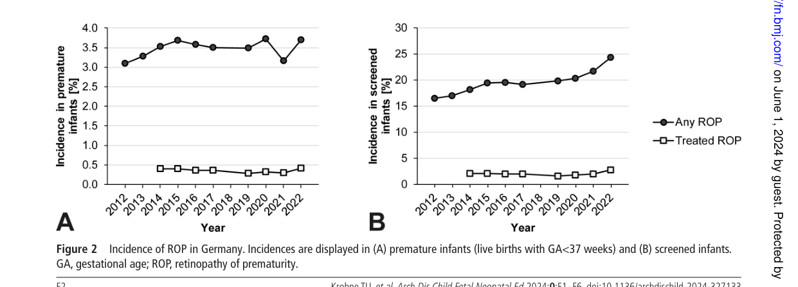

## Question

# Disease Characteristics Research Template

## Target Disease
- **Disease Name:** Retinopathy of Prematurity
- **MONDO ID:**  (if available)
- **Category:** Complex

## Research Objectives

Please provide a comprehensive research report on **Retinopathy of Prematurity** covering all of the
disease characteristics listed below. This report will be used to populate a disease knowledge
base entry. Be thorough and cite primary literature (PMID preferred) for all claims.

For each section, **suggested databases/resources** are listed. These are the first places
you should search for information on each topic.

---

### 1. Disease Information
> **Search first:** OMIM, Orphanet, ICD-10/ICD-11, MeSH, PubMed

- What is the disease? Provide a concise overview.
- What are the key identifiers? (OMIM, Orphanet, ICD-10/ICD-11, MeSH, Mondo)
- What are the common synonyms and alternative names?
- Is the information derived from individual patients (e.g., EHR) or aggregated disease-level resources?

### 2. Etiology

- **Disease Causal Factors**: What are the primary causes? (genetic, environmental, infectious, mechanistic)
- **Risk Factors**:
  > **Search first:** PubMed, Cochrane Library, UpToDate, clinical guidelines, ClinVar, ClinGen, GWAS Catalog, PheGenI, CTD, CDC, WHO, epidemiological databases
  - Genetic risk factors (causal variants, susceptibility loci, modifier genes)
  - Environmental risk factors (toxins, lifestyle, occupational exposures, age, sex, family history)
- **Protective Factors**:
  > **Search first:** PubMed, Cochrane Library, clinical trial databases, GWAS Catalog, gnomAD, WHO, CDC, nutrition databases
  - Genetic protective factors (protective variants, modifier alleles)
  - Environmental protective factors (diet, lifestyle, exposures that reduce risk)
- **Gene-Environment Interactions**: How do genetic and environmental factors interact to influence disease?
  > **Search first:** CTD, PubMed, PheGenI, GxE databases

### 3. Phenotypes
> **Search first:** HPO (Human Phenotype Ontology), OMIM, Orphanet, PubMed, clinicaltrials.gov, MedDRA, SNOMED CT, DECIPHER, LOINC

For each phenotype, provide:
- **Phenotype type**: symptoms, clinical signs, physical manifestations, behavioral changes, or laboratory abnormalities
  > For symptoms/signs: HPO, OMIM, Orphanet, PubMed
  > For behavioral changes: HPO, DSM, RDoC (Research Domain Criteria), PubMed
  > For laboratory abnormalities: LOINC, SNOMED CT, LabTests Online, PubMed
- **Phenotype characteristics**:
  > **Search first:** OMIM, Orphanet, HPO, PubMed
  - Age of symptom onset (neonatal, childhood, adult-onset, late-onset)
  - Symptom severity (mild, moderate, severe, variable)
  - Symptom progression (stable, progressive, episodic, fluctuating)
  - Frequency among affected individuals (percentage or qualitative)
- **Quality of life impact**: Effects on daily functioning and well-being (per-phenotype when possible)
  > **Search first:** EQ-5D database, SF-36, WHO QOL databases, PubMed
- Suggest HPO (Human Phenotype Ontology) terms for each phenotype

### 4. Genetic/Molecular Information

- **Causal Genes**: Gene mutations or chromosomal abnormalities responsible for disease (gene symbols, OMIM IDs)
  > **Search first:** OMIM, ClinVar, HGMD, Ensembl, NCBI Gene
- **Pathogenic Variants**:
  - Affected genes (gene symbols, HGNC IDs)
    > **Search first:** OMIM, NCBI Gene, Ensembl, HGNC, UniProt, GeneCards
  - Variant classification (pathogenic, likely pathogenic, VUS per ACMG/AMP guidelines)
    > **Search first:** ClinVar, ClinGen, ACMG/AMP guidelines, VarSome
  - Variant type/class (missense, frameshift, nonsense, splice-site, structural)
  - Allele frequency in population databases
    > **Search first:** gnomAD, 1000 Genomes, ExAC, TOPMed, dbSNP
  - Somatic vs germline origin
    > **Search first:** COSMIC (somatic), ClinVar, ICGC, TCGA
  - Functional consequences (loss of function, gain of function, dominant negative)
- **Modifier Genes**: Genes that modify disease severity or expression
- **Epigenetic Information**: DNA methylation, histone modifications, chromatin changes affecting disease
  > **Search first:** ENCODE, Roadmap Epigenomics, MethBase, DiseaseMeth
- **Chromosomal Abnormalities**: Large-scale genetic changes (aneuploidy, translocations, inversions)
  > **Search first:** DECIPHER, ClinVar, ECARUCA, UCSC Genome Browser

### 5. Environmental Information

- **Environmental Factors**: Non-genetic contributing factors (toxins, radiation, pollution, occupational exposure)
  > **Search first:** CTD (Comparative Toxicogenomics Database), TOXNET, PubMed, EPA databases
- **Lifestyle Factors**: Behavioral factors (smoking, diet, exercise, alcohol consumption)
  > **Search first:** CDC databases, WHO, PubMed, NHANES
- **Infectious Agents**: If applicable, pathogens causing or triggering disease (bacteria, viruses, fungi, parasites)
  > **Search first:** NCBI Taxonomy, ViPR, BV-BRC, MicrobeDB, GIDEON

### 6. Mechanism / Pathophysiology

- **Molecular Pathways**: Specific signaling cascades or biochemical pathways involved (Wnt, MAPK, mTOR, PI3K-AKT, etc.)
  > **Search first:** KEGG, Reactome, WikiPathways, PathBank, BioCyc
- **Cellular Processes**: Cell-level mechanisms (apoptosis, autophagy, cell cycle dysregulation, inflammation, etc.)
  > **Search first:** Gene Ontology (GO), Reactome, KEGG, PubMed
- **Protein Dysfunction**: How protein structure or function is altered (misfolding, aggregation, loss of function, gain of function)
  > **Search first:** UniProt, PDB (Protein Data Bank), InterPro, Pfam, AlphaFold
- **Metabolic Changes**: Alterations in metabolic processes (energy metabolism, lipid metabolism, amino acid metabolism)
  > **Search first:** KEGG, BioCyc, HMDB (Human Metabolome Database), BRENDA
- **Immune System Involvement**: Role of immune response (autoimmunity, immunodeficiency, chronic inflammation)
  > **Search first:** ImmPort, Immunome Database, IEDB, Gene Ontology
- **Tissue Damage Mechanisms**: How tissues/ are injured (oxidative stress, ischemia, fibrosis, necrosis)
  > **Search first:** PubMed, Gene Ontology, Reactome
- **Biochemical Abnormalities**: Specific molecular defects (enzyme deficiencies, receptor dysfunction, ion channel defects)
  > **Search first:** BRENDA, UniProt, KEGG, OMIM, PubMed
- **Epigenetic Changes**: DNA methylation, histone modifications affecting gene expression in disease
  > **Search first:** ENCODE, Roadmap Epigenomics, MethBase, DiseaseMeth
- **Molecular Profiling** (if available):
  - Transcriptomics/gene expression changes
    > **Search first:** GEO (Gene Expression Omnibus), ArrayExpress, GTEx, Human Cell Atlas, SRA
  - Proteomics findings
    > **Search first:** PRIDE, ProteomeXchange, Human Protein Atlas, STRING, BioGRID
  - Metabolomics signatures
    > **Search first:** MetaboLights, Metabolomics Workbench, HMDB, METLIN
  - Lipidomics alterations
    > **Search first:** LIPID MAPS, SwissLipids, LipidHome, Metabolomics Workbench
  - Genomic structural features
    > **Search first:** UCSC Genome Browser, Ensembl, NCBI, dbVar, DGV
- **Advanced Technologies** (if applicable):
  - Single-cell analysis findings (cell-type specific mechanisms, cellular heterogeneity)
    > **Search first:** Human Cell Atlas, Single Cell Portal, GEO, CELLxGENE
  - Spatial transcriptomics findings
    > **Search first:** GEO, Spatial Research, Vizgen, 10x Genomics data
  - Multi-omics integration results
    > **Search first:** TCGA, ICGC, cBioPortal, LinkedOmics, PubMed
  - Functional genomics screens (CRISPR, RNAi)
    > **Search first:** DepMap, GenomeRNAi, PubMed, BioGRID ORCS

For each mechanism, describe:
- The causal chain from initial trigger to clinical manifestation
- Which mechanisms are upstream vs downstream
- What cell types and biological processes are involved
- Suggest GO terms for biological processes and CL terms for cell types

### 7. Anatomical Structures Affected

- **Organ Level**:
  - Primary organs directly affected
  - Secondary organ involvement (complications, secondary effects)
  - Body systems involved (cardiovascular, nervous, digestive, respiratory, endocrine, etc.)
  > **Search first:** Uberon, FMA (Foundational Model of Anatomy), OMIM, HPO, ICD-11, MeSH, SNOMED CT
- **Tissue and Cell Level**:
  - Specific tissue types affected (epithelial, connective, muscle, nervous)
  - Specific cell populations targeted (with Cell Ontology terms)
  > **Search first:** Uberon, Human Protein Atlas, Cell Ontology, Human Cell Atlas, CellMarker, PanglaoDB
- **Subcellular Level**:
  - Cellular compartments involved (mitochondria, nucleus, ER, lysosomes) (with GO Cellular Component terms)
  > **Search first:** Gene Ontology (Cellular Component), UniProt, Human Protein Atlas
- **Localization**:
  - Specific anatomical sites (with UBERON terms)
    > **Search first:** FMA, Uberon, NeuroNames (for brain), SNOMED CT
  - Lateralization (unilateral, bilateral, asymmetric)
    > **Search first:** HPO, clinical literature, imaging databases

### 8. Temporal Development

- **Onset**:
  - Typical age of onset (congenital, pediatric, adult, geriatric)
  - Onset pattern (acute, subacute, chronic, insidious)
  > **Search first:** OMIM, Orphanet, HPO, PubMed
- **Progression**:
  - Disease stages (early, intermediate, advanced, end-stage)
    > **Search first:** Cancer Staging Manual (AJCC), WHO classifications, PubMed
  - Progression rate (rapid, slow, variable)
  - Disease course pattern (episodic, relapsing-remitting, progressive, stable)
  - Disease duration (self-limited, chronic lifelong)
  > **Search first:** Disease registries, longitudinal cohort databases, natural history studies, PubMed, Orphanet, OMIM
- **Patterns**:
  - Remission patterns (spontaneous, treatment-induced)
    > **Search first:** Clinical trial databases, disease registries, PubMed
  - Critical periods (time windows of vulnerability or opportunity for intervention)
    > **Search first:** PubMed, developmental biology databases, clinical guidelines

### 9. Inheritance and Population

- **Epidemiology**:
  - Prevalence (cases per 100,000 at given time)
  - Incidence (new cases per 100,000 per year)
  > **Search first:** Orphanet, CDC, WHO, GBD (Global Burden of Disease), national registries, SEER, disease registries
- **For Genetic Etiology**:
  - Inheritance pattern (AD, AR, X-linked, mitochondrial, multifactorial, polygenic)
    > **Search first:** OMIM, Orphanet, ClinVar, GTR (Genetic Testing Registry)
  - Penetrance (complete, incomplete, age-dependent)
    > **Search first:** ClinVar, OMIM, PubMed, ClinGen
  - Expressivity (variable, consistent)
    > **Search first:** OMIM, ClinVar, PubMed
  - Genetic anticipation (increasing severity in successive generations)
    > **Search first:** OMIM, PubMed (especially for repeat expansion disorders)
  - Germline mosaicism
    > **Search first:** ClinVar, OMIM, genetic counseling literature, PubMed
  - Founder effects (population-specific mutations)
    > **Search first:** gnomAD, population genetics databases, PubMed
  - Consanguinity role
    > **Search first:** OMIM, population studies, genetic counseling resources
  - Carrier frequency
    > **Search first:** gnomAD, carrier screening databases, GeneReviews, GTR
- **Population Demographics**:
  - Affected populations (ethnic or demographic groups with higher prevalence)
    > **Search first:** gnomAD, 1000 Genomes, PAGE Study, PubMed, population registries
  - Geographic distribution (endemic areas, regional variation)
    > **Search first:** WHO, CDC, GBD, Orphanet, geographic epidemiology databases
  - Geographic distribution of specific variants
  - Sex ratio (male:female)
    > **Search first:** Disease registries, OMIM, PubMed, epidemiological databases
  - Age distribution of affected individuals
    > **Search first:** CDC, disease registries, SEER, Orphanet

### 10. Diagnostics

- **Clinical Tests**:
  - Laboratory tests (blood, urine, tissue chemistry, specific enzyme assays)
    > **Search first:** LOINC, LabTests Online, PubMed
  - Biomarkers (proteins, metabolites, genetic markers, circulating biomarkers)
    > **Search first:** FDA Biomarker List, BEST (Biomarkers, EndpointS, and other Tools), PubMed
  - Imaging studies (X-ray, CT, MRI, PET, ultrasound)
    > **Search first:** RadLex, DICOM, Radiopaedia, imaging databases
  - Functional tests (pulmonary function, cardiac stress tests)
    > **Search first:** LOINC, clinical guidelines, PubMed
  - Electrophysiology (EEG, EMG, ECG, nerve conduction studies)
    > **Search first:** LOINC, clinical neurophysiology databases, PubMed
  - Biopsy findings (histopathology, immunohistochemistry)
    > **Search first:** SNOMED CT, College of American Pathologists resources, PubMed
  - Pathology findings (microscopic examination)
    > **Search first:** SNOMED CT, Digital Pathology databases, PubMed
- **Genetic Testing**:
  > **Search first:** GTR (Genetic Testing Registry), GeneReviews, ClinGen
  - Overview of recommended genetic testing approach
  - Whole genome sequencing (WGS) utility
    > **Search first:** GTR, ClinVar, GEL (Genomics England), gnomAD
  - Whole exome sequencing (WES) utility
    > **Search first:** GTR, ClinVar, OMIM, GeneMatcher
  - Gene panels (which panels, which genes)
    > **Search first:** GTR, ClinVar, laboratory-specific databases
  - Single gene testing
    > **Search first:** GTR, ClinVar, OMIM, GeneReviews
  - Chromosomal microarray (CMA)
    > **Search first:** DECIPHER, ClinVar, dbVar, ECARUCA
  - Karyotyping
    > **Search first:** Chromosome Abnormality Database, ClinVar, cytogenetics resources
  - FISH
    > **Search first:** ClinVar, cytogenetics databases, PubMed
  - Mitochondrial DNA testing
    > **Search first:** MITOMAP, MSeqDR, ClinVar, GTR
  - Repeat expansion testing
    > **Search first:** GTR, ClinVar, repeat expansion databases, PubMed
- **Omics-Based Diagnostics** (if applicable):
  - RNA sequencing / transcriptomics
    > **Search first:** GEO, ArrayExpress, GTEx, RNA-seq databases
  - Proteomics
    > **Search first:** PRIDE, ProteomeXchange, FDA Biomarker database
  - Metabolomics
    > **Search first:** MetaboLights, Metabolomics Workbench, HMDB
  - Epigenomics
    > **Search first:** GEO, ENCODE, Roadmap Epigenomics, MethBase
  - Liquid biopsy
    > **Search first:** COSMIC, ClinVar, liquid biopsy databases, PubMed
- **Clinical Criteria**:
  - Standardized diagnostic criteria (DSM, ICD, society guidelines)
    > **Search first:** DSM-5, ICD-11, clinical society guidelines, UpToDate
  - Differential diagnosis (other conditions to rule out, with distinguishing features)
    > **Search first:** DynaMed, UpToDate, clinical decision support systems
- **Screening**:
  - Screening methods for asymptomatic individuals (newborn screening, carrier screening, cascade screening)
    > **Search first:** ACMG recommendations, CDC newborn screening, GTR

### 11. Outcome/Prognosis

- **Survival and Mortality**:
  - Survival rate (5-year, 10-year, overall)
    > **Search first:** SEER, cancer registries, disease-specific registries, PubMed
  - Life expectancy (with and without treatment if applicable)
    > **Search first:** Orphanet, disease registries, actuarial databases, PubMed
  - Mortality rate
    > **Search first:** CDC, WHO, GBD, national mortality databases
  - Disease-specific mortality (deaths directly attributable to disease)
    > **Search first:** Disease registries, CDC Wonder, GBD, PubMed
- **Morbidity and Function**:
  - Morbidity (disease-related disability and health impacts)
    > **Search first:** GBD, WHO, disability databases, PubMed
  - Disability outcomes (long-term functional impairments)
    > **Search first:** ICF (International Classification of Functioning), disability registries
  - Quality of life measures (EQ-5D, SF-36, PROMIS, disease-specific tools)
    > **Search first:** EQ-5D database, SF-36, PROMIS, PubMed
- **Disease Course**:
  - Complications (secondary problems: infections, organ failure, etc.)
    > **Search first:** ICD codes, disease registries, clinical databases, PubMed
  - Recovery potential (likelihood and extent of recovery, with vs without treatment)
    > **Search first:** Natural history studies, rehabilitation databases, PubMed
- **Prediction**:
  - Prognostic factors (age, disease severity, biomarkers, treatment response)
    > **Search first:** Prognostic models databases, clinical calculators, PubMed
  - Prognostic biomarkers (molecular markers predicting disease course)
    > **Search first:** FDA Biomarker database, PubMed, cancer prognostic databases

### 12. Treatment

- **Pharmacotherapy**:
  - Pharmacological treatments (drug names, drug classes, mechanisms of action)
    > **Search first:** DrugBank, RxNorm, ATC classification, DailyMed, FDA databases
  - Pharmacogenomics (how genetic variants affect drug metabolism, efficacy, toxicity)
    > **Search first:** PharmGKB, CPIC (Clinical Pharmacogenetics), FDA Table of PGx Biomarkers
- **Advanced Therapeutics**:
  - Gene therapy (viral vectors, CRISPR, gene replacement, gene editing)
    > **Search first:** ClinicalTrials.gov, FDA gene therapy database, ASGCT resources
  - Cell therapy (stem cell transplant, CAR-T, cellular therapeutics)
    > **Search first:** ClinicalTrials.gov, FDA cell therapy database, FACT standards
  - RNA-based therapies (ASOs, siRNA, mRNA therapies)
    > **Search first:** ClinicalTrials.gov, FDA approvals, PubMed
  - Targeted therapies (treatments directed at specific molecular targets)
    > **Search first:** My Cancer Genome, OncoKB, ClinicalTrials.gov, FDA approvals
  - Immunotherapies (checkpoint inhibitors, monoclonal antibodies)
    > **Search first:** Cancer Immunotherapy Database, FDA approvals, ClinicalTrials.gov
- **Surgical and Interventional**:
  - Surgical interventions (types of surgery, timing, outcomes)
    > **Search first:** CPT codes, surgical registries, clinical guidelines, PubMed
- **Supportive and Rehabilitative**:
  - Supportive care (symptom management, pain control, nutrition)
    > **Search first:** Clinical guidelines, Cochrane Library, PubMed
  - Rehabilitation (physical therapy, occupational therapy, speech therapy)
    > **Search first:** Rehabilitation medicine databases, clinical guidelines, PubMed
- **Experimental**:
  - Experimental treatments in clinical trials (with NCT identifiers if available)
    > **Search first:** ClinicalTrials.gov, EU Clinical Trials Register, WHO ICTRP
- **Treatment Outcomes**:
  - Treatment response rates
    > **Search first:** Clinical trial databases, FDA reviews, systematic reviews, PubMed
  - Side effects and adverse events
    > **Search first:** FDA Adverse Event Reporting System (FAERS), MedWatch, PubMed
- **Treatment Strategy**:
  - Treatment algorithms (clinical pathways, decision trees)
    > **Search first:** Clinical practice guidelines, NCCN Guidelines, UpToDate
  - Combination therapies
    > **Search first:** ClinicalTrials.gov, treatment guidelines, PubMed
  - Personalized medicine approaches (genotype-guided treatment)
    > **Search first:** My Cancer Genome, CIViC, PharmGKB, precision medicine databases

For each treatment, suggest MAXO (Medical Action Ontology) terms where applicable.

### 13. Prevention

- **Prevention Levels**:
  - Primary prevention (preventing disease occurrence: vaccination, risk factor modification)
    > **Search first:** CDC, WHO, USPSTF recommendations, Cochrane Library
  - Secondary prevention (early detection and treatment: screening programs, early intervention)
    > **Search first:** USPSTF, CDC screening guidelines, WHO
  - Tertiary prevention (preventing complications in those with disease)
    > **Search first:** Clinical guidelines, disease management protocols, PubMed
- **Immunization**: Vaccine strategies (if applicable)
  > **Search first:** CDC vaccine schedules, WHO immunization, FDA vaccine database
- **Screening and Early Detection**:
  - Screening programs (population-based: newborn screening, cancer screening)
    > **Search first:** CDC screening programs, USPSTF, cancer screening databases
  - Genetic screening (carrier screening, preimplantation genetic diagnosis, prenatal testing)
    > **Search first:** ACMG recommendations, ACOG guidelines, GTR
  - Risk stratification (identifying high-risk individuals for targeted prevention)
    > **Search first:** Risk prediction models, clinical calculators, PubMed
- **Behavioral Interventions**: Lifestyle modifications to reduce risk
  > **Search first:** CDC, WHO, behavioral intervention databases, Cochrane Library
- **Counseling**: Genetic counseling (risk assessment, family planning guidance)
  > **Search first:** NSGC resources, ACMG guidelines, GeneReviews
- **Public Health**:
  - Public health interventions (sanitation, vector control, health education)
    > **Search first:** CDC, WHO, public health databases, PubMed
  - Environmental interventions (reducing environmental risk factors)
    > **Search first:** EPA databases, WHO environmental health, PubMed
- **Prophylaxis**: Preventive medications or procedures
  > **Search first:** Clinical guidelines, FDA approvals, PubMed

### 14. Other Species / Natural Disease

- **Taxonomy**: Species affected (with NCBI Taxon identifiers)
  > **Search first:** NCBI Taxonomy
- **Breed**: Specific breeds affected (with VBO identifiers if applicable)
  > **Search first:** VBO (Vertebrate Breed Ontology)
- **Gene**: Orthologous genes in other species (with NCBI Gene IDs)
  > **Search first:** NCBI Gene
- **Natural Disease**:
  - Naturally occurring disease in other species (companion animals, wildlife)
    > **Search first:** OMIA (Online Mendelian Inheritance in Animals), VetCompass, PubMed
  - Veterinary relevance and importance in animal health
    > **Search first:** OMIA, veterinary databases, PubMed
- **Comparative Biology**:
  - Comparative pathology (similarities and differences across species)
    > **Search first:** OMIA, comparative pathology databases, PubMed
  - Evolutionary conservation of disease mechanisms
    > **Search first:** HomoloGene, OrthoMCL, Alliance of Genome Resources
- **Transmission** (if applicable):
  - Zoonotic potential
    > **Search first:** CDC zoonotic diseases, WHO zoonoses, GIDEON
  - Cross-species susceptibility
    > **Search first:** NCBI Taxonomy, veterinary databases, PubMed

### 15. Model Organisms

- **Model Types**:
  - Model organism type (mammalian, invertebrate, cellular, in vitro)
    > **Search first:** Alliance of Genome Resources, model organism databases
  - Specific model systems (mouse, rat, zebrafish, Drosophila, C. elegans, yeast, cell lines, organoids, iPSCs)
    > **Search first:** MGI, RGD, ZFIN, FlyBase, WormBase, SGD, ATCC, Cellosaurus
  - Induced models (drug treatment, surgical intervention, environmental manipulation)
    > **Search first:** MGI, model organism databases, PubMed
- **Genetic Models**:
  - Types available (knockout, knock-in, transgenic, conditional, humanized)
    > **Search first:** MGI, IMPC, KOMP, EuMMCR, IMSR
- **Model Characteristics**:
  - Phenotype recapitulation (how well model reproduces human disease features)
    > **Search first:** Model organism databases, comparative studies, PubMed
  - Model limitations (aspects of human disease not captured)
    > **Search first:** Model organism databases, PubMed, review articles
- **Applications**:
  - Research applications (what aspects of disease can be studied)
    > **Search first:** Model organism databases, PubMed
- **Resources**:
  - Model databases
    > **Search first:** MGI, RGD, ZFIN, FlyBase, WormBase, IMSR, EMMA, MMRRC

---

## Citation Requirements

- Cite primary literature (PMID preferred) for all mechanistic and clinical claims
- Prioritize recent reviews and landmark papers
- Include direct quotes from abstracts where possible to support key statements
- Distinguish evidence source types: human clinical, model organism, in vitro, computational

## Output Format

Structure your response as a comprehensive narrative organized by the sections above.
For each section, provide:
- Factual content with specific details (numbers, percentages, gene names, variant nomenclature)
- Ontology term suggestions (HPO, GO, CL, UBERON, CHEBI, MAXO, MONDO) where applicable
- Evidence citations with PMIDs
- Direct quotes from abstracts to support key claims
- Clear indication when information is not available or not applicable for this disease

This report will be used to populate a disease knowledge base entry with:
- Pathophysiology descriptions with causal chains
- Gene/protein annotations (HGNC, GO terms)
- Phenotype associations (HP terms) with frequencies
- Cell type involvement (CL terms)
- Anatomical locations (UBERON terms)
- Chemical entities (CHEBI terms)
- Treatment annotations (MAXO terms)
- Evidence items with PMIDs and exact abstract quotes
- Epidemiology, prognosis, diagnostic, and prevention information
- Animal model descriptions with phenotype recapitulation details

## Output

Question: You are an expert researcher providing comprehensive, well-cited information.

Provide detailed information focusing on:
1. Key concepts and definitions with current understanding
2. Recent developments and latest research (prioritize 2023-2024 sources)
3. Current applications and real-world implementations
4. Expert opinions and analysis from authoritative sources
5. Relevant statistics and data from recent studies

Format as a comprehensive research report with proper citations. Include URLs and publication dates where available.
Always prioritize recent, authoritative sources and provide specific citations for all major claims.

# Disease Characteristics Research Template

## Target Disease
- **Disease Name:** Retinopathy of Prematurity
- **MONDO ID:**  (if available)
- **Category:** Complex

## Research Objectives

Please provide a comprehensive research report on **Retinopathy of Prematurity** covering all of the
disease characteristics listed below. This report will be used to populate a disease knowledge
base entry. Be thorough and cite primary literature (PMID preferred) for all claims.

For each section, **suggested databases/resources** are listed. These are the first places
you should search for information on each topic.

---

### 1. Disease Information
> **Search first:** OMIM, Orphanet, ICD-10/ICD-11, MeSH, PubMed

- What is the disease? Provide a concise overview.
- What are the key identifiers? (OMIM, Orphanet, ICD-10/ICD-11, MeSH, Mondo)
- What are the common synonyms and alternative names?
- Is the information derived from individual patients (e.g., EHR) or aggregated disease-level resources?

### 2. Etiology

- **Disease Causal Factors**: What are the primary causes? (genetic, environmental, infectious, mechanistic)
- **Risk Factors**:
  > **Search first:** PubMed, Cochrane Library, UpToDate, clinical guidelines, ClinVar, ClinGen, GWAS Catalog, PheGenI, CTD, CDC, WHO, epidemiological databases
  - Genetic risk factors (causal variants, susceptibility loci, modifier genes)
  - Environmental risk factors (toxins, lifestyle, occupational exposures, age, sex, family history)
- **Protective Factors**:
  > **Search first:** PubMed, Cochrane Library, clinical trial databases, GWAS Catalog, gnomAD, WHO, CDC, nutrition databases
  - Genetic protective factors (protective variants, modifier alleles)
  - Environmental protective factors (diet, lifestyle, exposures that reduce risk)
- **Gene-Environment Interactions**: How do genetic and environmental factors interact to influence disease?
  > **Search first:** CTD, PubMed, PheGenI, GxE databases

### 3. Phenotypes
> **Search first:** HPO (Human Phenotype Ontology), OMIM, Orphanet, PubMed, clinicaltrials.gov, MedDRA, SNOMED CT, DECIPHER, LOINC

For each phenotype, provide:
- **Phenotype type**: symptoms, clinical signs, physical manifestations, behavioral changes, or laboratory abnormalities
  > For symptoms/signs: HPO, OMIM, Orphanet, PubMed
  > For behavioral changes: HPO, DSM, RDoC (Research Domain Criteria), PubMed
  > For laboratory abnormalities: LOINC, SNOMED CT, LabTests Online, PubMed
- **Phenotype characteristics**:
  > **Search first:** OMIM, Orphanet, HPO, PubMed
  - Age of symptom onset (neonatal, childhood, adult-onset, late-onset)
  - Symptom severity (mild, moderate, severe, variable)
  - Symptom progression (stable, progressive, episodic, fluctuating)
  - Frequency among affected individuals (percentage or qualitative)
- **Quality of life impact**: Effects on daily functioning and well-being (per-phenotype when possible)
  > **Search first:** EQ-5D database, SF-36, WHO QOL databases, PubMed
- Suggest HPO (Human Phenotype Ontology) terms for each phenotype

### 4. Genetic/Molecular Information

- **Causal Genes**: Gene mutations or chromosomal abnormalities responsible for disease (gene symbols, OMIM IDs)
  > **Search first:** OMIM, ClinVar, HGMD, Ensembl, NCBI Gene
- **Pathogenic Variants**:
  - Affected genes (gene symbols, HGNC IDs)
    > **Search first:** OMIM, NCBI Gene, Ensembl, HGNC, UniProt, GeneCards
  - Variant classification (pathogenic, likely pathogenic, VUS per ACMG/AMP guidelines)
    > **Search first:** ClinVar, ClinGen, ACMG/AMP guidelines, VarSome
  - Variant type/class (missense, frameshift, nonsense, splice-site, structural)
  - Allele frequency in population databases
    > **Search first:** gnomAD, 1000 Genomes, ExAC, TOPMed, dbSNP
  - Somatic vs germline origin
    > **Search first:** COSMIC (somatic), ClinVar, ICGC, TCGA
  - Functional consequences (loss of function, gain of function, dominant negative)
- **Modifier Genes**: Genes that modify disease severity or expression
- **Epigenetic Information**: DNA methylation, histone modifications, chromatin changes affecting disease
  > **Search first:** ENCODE, Roadmap Epigenomics, MethBase, DiseaseMeth
- **Chromosomal Abnormalities**: Large-scale genetic changes (aneuploidy, translocations, inversions)
  > **Search first:** DECIPHER, ClinVar, ECARUCA, UCSC Genome Browser

### 5. Environmental Information

- **Environmental Factors**: Non-genetic contributing factors (toxins, radiation, pollution, occupational exposure)
  > **Search first:** CTD (Comparative Toxicogenomics Database), TOXNET, PubMed, EPA databases
- **Lifestyle Factors**: Behavioral factors (smoking, diet, exercise, alcohol consumption)
  > **Search first:** CDC databases, WHO, PubMed, NHANES
- **Infectious Agents**: If applicable, pathogens causing or triggering disease (bacteria, viruses, fungi, parasites)
  > **Search first:** NCBI Taxonomy, ViPR, BV-BRC, MicrobeDB, GIDEON

### 6. Mechanism / Pathophysiology

- **Molecular Pathways**: Specific signaling cascades or biochemical pathways involved (Wnt, MAPK, mTOR, PI3K-AKT, etc.)
  > **Search first:** KEGG, Reactome, WikiPathways, PathBank, BioCyc
- **Cellular Processes**: Cell-level mechanisms (apoptosis, autophagy, cell cycle dysregulation, inflammation, etc.)
  > **Search first:** Gene Ontology (GO), Reactome, KEGG, PubMed
- **Protein Dysfunction**: How protein structure or function is altered (misfolding, aggregation, loss of function, gain of function)
  > **Search first:** UniProt, PDB (Protein Data Bank), InterPro, Pfam, AlphaFold
- **Metabolic Changes**: Alterations in metabolic processes (energy metabolism, lipid metabolism, amino acid metabolism)
  > **Search first:** KEGG, BioCyc, HMDB (Human Metabolome Database), BRENDA
- **Immune System Involvement**: Role of immune response (autoimmunity, immunodeficiency, chronic inflammation)
  > **Search first:** ImmPort, Immunome Database, IEDB, Gene Ontology
- **Tissue Damage Mechanisms**: How tissues/ are injured (oxidative stress, ischemia, fibrosis, necrosis)
  > **Search first:** PubMed, Gene Ontology, Reactome
- **Biochemical Abnormalities**: Specific molecular defects (enzyme deficiencies, receptor dysfunction, ion channel defects)
  > **Search first:** BRENDA, UniProt, KEGG, OMIM, PubMed
- **Epigenetic Changes**: DNA methylation, histone modifications affecting gene expression in disease
  > **Search first:** ENCODE, Roadmap Epigenomics, MethBase, DiseaseMeth
- **Molecular Profiling** (if available):
  - Transcriptomics/gene expression changes
    > **Search first:** GEO (Gene Expression Omnibus), ArrayExpress, GTEx, Human Cell Atlas, SRA
  - Proteomics findings
    > **Search first:** PRIDE, ProteomeXchange, Human Protein Atlas, STRING, BioGRID
  - Metabolomics signatures
    > **Search first:** MetaboLights, Metabolomics Workbench, HMDB, METLIN
  - Lipidomics alterations
    > **Search first:** LIPID MAPS, SwissLipids, LipidHome, Metabolomics Workbench
  - Genomic structural features
    > **Search first:** UCSC Genome Browser, Ensembl, NCBI, dbVar, DGV
- **Advanced Technologies** (if applicable):
  - Single-cell analysis findings (cell-type specific mechanisms, cellular heterogeneity)
    > **Search first:** Human Cell Atlas, Single Cell Portal, GEO, CELLxGENE
  - Spatial transcriptomics findings
    > **Search first:** GEO, Spatial Research, Vizgen, 10x Genomics data
  - Multi-omics integration results
    > **Search first:** TCGA, ICGC, cBioPortal, LinkedOmics, PubMed
  - Functional genomics screens (CRISPR, RNAi)
    > **Search first:** DepMap, GenomeRNAi, PubMed, BioGRID ORCS

For each mechanism, describe:
- The causal chain from initial trigger to clinical manifestation
- Which mechanisms are upstream vs downstream
- What cell types and biological processes are involved
- Suggest GO terms for biological processes and CL terms for cell types

### 7. Anatomical Structures Affected

- **Organ Level**:
  - Primary organs directly affected
  - Secondary organ involvement (complications, secondary effects)
  - Body systems involved (cardiovascular, nervous, digestive, respiratory, endocrine, etc.)
  > **Search first:** Uberon, FMA (Foundational Model of Anatomy), OMIM, HPO, ICD-11, MeSH, SNOMED CT
- **Tissue and Cell Level**:
  - Specific tissue types affected (epithelial, connective, muscle, nervous)
  - Specific cell populations targeted (with Cell Ontology terms)
  > **Search first:** Uberon, Human Protein Atlas, Cell Ontology, Human Cell Atlas, CellMarker, PanglaoDB
- **Subcellular Level**:
  - Cellular compartments involved (mitochondria, nucleus, ER, lysosomes) (with GO Cellular Component terms)
  > **Search first:** Gene Ontology (Cellular Component), UniProt, Human Protein Atlas
- **Localization**:
  - Specific anatomical sites (with UBERON terms)
    > **Search first:** FMA, Uberon, NeuroNames (for brain), SNOMED CT
  - Lateralization (unilateral, bilateral, asymmetric)
    > **Search first:** HPO, clinical literature, imaging databases

### 8. Temporal Development

- **Onset**:
  - Typical age of onset (congenital, pediatric, adult, geriatric)
  - Onset pattern (acute, subacute, chronic, insidious)
  > **Search first:** OMIM, Orphanet, HPO, PubMed
- **Progression**:
  - Disease stages (early, intermediate, advanced, end-stage)
    > **Search first:** Cancer Staging Manual (AJCC), WHO classifications, PubMed
  - Progression rate (rapid, slow, variable)
  - Disease course pattern (episodic, relapsing-remitting, progressive, stable)
  - Disease duration (self-limited, chronic lifelong)
  > **Search first:** Disease registries, longitudinal cohort databases, natural history studies, PubMed, Orphanet, OMIM
- **Patterns**:
  - Remission patterns (spontaneous, treatment-induced)
    > **Search first:** Clinical trial databases, disease registries, PubMed
  - Critical periods (time windows of vulnerability or opportunity for intervention)
    > **Search first:** PubMed, developmental biology databases, clinical guidelines

### 9. Inheritance and Population

- **Epidemiology**:
  - Prevalence (cases per 100,000 at given time)
  - Incidence (new cases per 100,000 per year)
  > **Search first:** Orphanet, CDC, WHO, GBD (Global Burden of Disease), national registries, SEER, disease registries
- **For Genetic Etiology**:
  - Inheritance pattern (AD, AR, X-linked, mitochondrial, multifactorial, polygenic)
    > **Search first:** OMIM, Orphanet, ClinVar, GTR (Genetic Testing Registry)
  - Penetrance (complete, incomplete, age-dependent)
    > **Search first:** ClinVar, OMIM, PubMed, ClinGen
  - Expressivity (variable, consistent)
    > **Search first:** OMIM, ClinVar, PubMed
  - Genetic anticipation (increasing severity in successive generations)
    > **Search first:** OMIM, PubMed (especially for repeat expansion disorders)
  - Germline mosaicism
    > **Search first:** ClinVar, OMIM, genetic counseling literature, PubMed
  - Founder effects (population-specific mutations)
    > **Search first:** gnomAD, population genetics databases, PubMed
  - Consanguinity role
    > **Search first:** OMIM, population studies, genetic counseling resources
  - Carrier frequency
    > **Search first:** gnomAD, carrier screening databases, GeneReviews, GTR
- **Population Demographics**:
  - Affected populations (ethnic or demographic groups with higher prevalence)
    > **Search first:** gnomAD, 1000 Genomes, PAGE Study, PubMed, population registries
  - Geographic distribution (endemic areas, regional variation)
    > **Search first:** WHO, CDC, GBD, Orphanet, geographic epidemiology databases
  - Geographic distribution of specific variants
  - Sex ratio (male:female)
    > **Search first:** Disease registries, OMIM, PubMed, epidemiological databases
  - Age distribution of affected individuals
    > **Search first:** CDC, disease registries, SEER, Orphanet

### 10. Diagnostics

- **Clinical Tests**:
  - Laboratory tests (blood, urine, tissue chemistry, specific enzyme assays)
    > **Search first:** LOINC, LabTests Online, PubMed
  - Biomarkers (proteins, metabolites, genetic markers, circulating biomarkers)
    > **Search first:** FDA Biomarker List, BEST (Biomarkers, EndpointS, and other Tools), PubMed
  - Imaging studies (X-ray, CT, MRI, PET, ultrasound)
    > **Search first:** RadLex, DICOM, Radiopaedia, imaging databases
  - Functional tests (pulmonary function, cardiac stress tests)
    > **Search first:** LOINC, clinical guidelines, PubMed
  - Electrophysiology (EEG, EMG, ECG, nerve conduction studies)
    > **Search first:** LOINC, clinical neurophysiology databases, PubMed
  - Biopsy findings (histopathology, immunohistochemistry)
    > **Search first:** SNOMED CT, College of American Pathologists resources, PubMed
  - Pathology findings (microscopic examination)
    > **Search first:** SNOMED CT, Digital Pathology databases, PubMed
- **Genetic Testing**:
  > **Search first:** GTR (Genetic Testing Registry), GeneReviews, ClinGen
  - Overview of recommended genetic testing approach
  - Whole genome sequencing (WGS) utility
    > **Search first:** GTR, ClinVar, GEL (Genomics England), gnomAD
  - Whole exome sequencing (WES) utility
    > **Search first:** GTR, ClinVar, OMIM, GeneMatcher
  - Gene panels (which panels, which genes)
    > **Search first:** GTR, ClinVar, laboratory-specific databases
  - Single gene testing
    > **Search first:** GTR, ClinVar, OMIM, GeneReviews
  - Chromosomal microarray (CMA)
    > **Search first:** DECIPHER, ClinVar, dbVar, ECARUCA
  - Karyotyping
    > **Search first:** Chromosome Abnormality Database, ClinVar, cytogenetics resources
  - FISH
    > **Search first:** ClinVar, cytogenetics databases, PubMed
  - Mitochondrial DNA testing
    > **Search first:** MITOMAP, MSeqDR, ClinVar, GTR
  - Repeat expansion testing
    > **Search first:** GTR, ClinVar, repeat expansion databases, PubMed
- **Omics-Based Diagnostics** (if applicable):
  - RNA sequencing / transcriptomics
    > **Search first:** GEO, ArrayExpress, GTEx, RNA-seq databases
  - Proteomics
    > **Search first:** PRIDE, ProteomeXchange, FDA Biomarker database
  - Metabolomics
    > **Search first:** MetaboLights, Metabolomics Workbench, HMDB
  - Epigenomics
    > **Search first:** GEO, ENCODE, Roadmap Epigenomics, MethBase
  - Liquid biopsy
    > **Search first:** COSMIC, ClinVar, liquid biopsy databases, PubMed
- **Clinical Criteria**:
  - Standardized diagnostic criteria (DSM, ICD, society guidelines)
    > **Search first:** DSM-5, ICD-11, clinical society guidelines, UpToDate
  - Differential diagnosis (other conditions to rule out, with distinguishing features)
    > **Search first:** DynaMed, UpToDate, clinical decision support systems
- **Screening**:
  - Screening methods for asymptomatic individuals (newborn screening, carrier screening, cascade screening)
    > **Search first:** ACMG recommendations, CDC newborn screening, GTR

### 11. Outcome/Prognosis

- **Survival and Mortality**:
  - Survival rate (5-year, 10-year, overall)
    > **Search first:** SEER, cancer registries, disease-specific registries, PubMed
  - Life expectancy (with and without treatment if applicable)
    > **Search first:** Orphanet, disease registries, actuarial databases, PubMed
  - Mortality rate
    > **Search first:** CDC, WHO, GBD, national mortality databases
  - Disease-specific mortality (deaths directly attributable to disease)
    > **Search first:** Disease registries, CDC Wonder, GBD, PubMed
- **Morbidity and Function**:
  - Morbidity (disease-related disability and health impacts)
    > **Search first:** GBD, WHO, disability databases, PubMed
  - Disability outcomes (long-term functional impairments)
    > **Search first:** ICF (International Classification of Functioning), disability registries
  - Quality of life measures (EQ-5D, SF-36, PROMIS, disease-specific tools)
    > **Search first:** EQ-5D database, SF-36, PROMIS, PubMed
- **Disease Course**:
  - Complications (secondary problems: infections, organ failure, etc.)
    > **Search first:** ICD codes, disease registries, clinical databases, PubMed
  - Recovery potential (likelihood and extent of recovery, with vs without treatment)
    > **Search first:** Natural history studies, rehabilitation databases, PubMed
- **Prediction**:
  - Prognostic factors (age, disease severity, biomarkers, treatment response)
    > **Search first:** Prognostic models databases, clinical calculators, PubMed
  - Prognostic biomarkers (molecular markers predicting disease course)
    > **Search first:** FDA Biomarker database, PubMed, cancer prognostic databases

### 12. Treatment

- **Pharmacotherapy**:
  - Pharmacological treatments (drug names, drug classes, mechanisms of action)
    > **Search first:** DrugBank, RxNorm, ATC classification, DailyMed, FDA databases
  - Pharmacogenomics (how genetic variants affect drug metabolism, efficacy, toxicity)
    > **Search first:** PharmGKB, CPIC (Clinical Pharmacogenetics), FDA Table of PGx Biomarkers
- **Advanced Therapeutics**:
  - Gene therapy (viral vectors, CRISPR, gene replacement, gene editing)
    > **Search first:** ClinicalTrials.gov, FDA gene therapy database, ASGCT resources
  - Cell therapy (stem cell transplant, CAR-T, cellular therapeutics)
    > **Search first:** ClinicalTrials.gov, FDA cell therapy database, FACT standards
  - RNA-based therapies (ASOs, siRNA, mRNA therapies)
    > **Search first:** ClinicalTrials.gov, FDA approvals, PubMed
  - Targeted therapies (treatments directed at specific molecular targets)
    > **Search first:** My Cancer Genome, OncoKB, ClinicalTrials.gov, FDA approvals
  - Immunotherapies (checkpoint inhibitors, monoclonal antibodies)
    > **Search first:** Cancer Immunotherapy Database, FDA approvals, ClinicalTrials.gov
- **Surgical and Interventional**:
  - Surgical interventions (types of surgery, timing, outcomes)
    > **Search first:** CPT codes, surgical registries, clinical guidelines, PubMed
- **Supportive and Rehabilitative**:
  - Supportive care (symptom management, pain control, nutrition)
    > **Search first:** Clinical guidelines, Cochrane Library, PubMed
  - Rehabilitation (physical therapy, occupational therapy, speech therapy)
    > **Search first:** Rehabilitation medicine databases, clinical guidelines, PubMed
- **Experimental**:
  - Experimental treatments in clinical trials (with NCT identifiers if available)
    > **Search first:** ClinicalTrials.gov, EU Clinical Trials Register, WHO ICTRP
- **Treatment Outcomes**:
  - Treatment response rates
    > **Search first:** Clinical trial databases, FDA reviews, systematic reviews, PubMed
  - Side effects and adverse events
    > **Search first:** FDA Adverse Event Reporting System (FAERS), MedWatch, PubMed
- **Treatment Strategy**:
  - Treatment algorithms (clinical pathways, decision trees)
    > **Search first:** Clinical practice guidelines, NCCN Guidelines, UpToDate
  - Combination therapies
    > **Search first:** ClinicalTrials.gov, treatment guidelines, PubMed
  - Personalized medicine approaches (genotype-guided treatment)
    > **Search first:** My Cancer Genome, CIViC, PharmGKB, precision medicine databases

For each treatment, suggest MAXO (Medical Action Ontology) terms where applicable.

### 13. Prevention

- **Prevention Levels**:
  - Primary prevention (preventing disease occurrence: vaccination, risk factor modification)
    > **Search first:** CDC, WHO, USPSTF recommendations, Cochrane Library
  - Secondary prevention (early detection and treatment: screening programs, early intervention)
    > **Search first:** USPSTF, CDC screening guidelines, WHO
  - Tertiary prevention (preventing complications in those with disease)
    > **Search first:** Clinical guidelines, disease management protocols, PubMed
- **Immunization**: Vaccine strategies (if applicable)
  > **Search first:** CDC vaccine schedules, WHO immunization, FDA vaccine database
- **Screening and Early Detection**:
  - Screening programs (population-based: newborn screening, cancer screening)
    > **Search first:** CDC screening programs, USPSTF, cancer screening databases
  - Genetic screening (carrier screening, preimplantation genetic diagnosis, prenatal testing)
    > **Search first:** ACMG recommendations, ACOG guidelines, GTR
  - Risk stratification (identifying high-risk individuals for targeted prevention)
    > **Search first:** Risk prediction models, clinical calculators, PubMed
- **Behavioral Interventions**: Lifestyle modifications to reduce risk
  > **Search first:** CDC, WHO, behavioral intervention databases, Cochrane Library
- **Counseling**: Genetic counseling (risk assessment, family planning guidance)
  > **Search first:** NSGC resources, ACMG guidelines, GeneReviews
- **Public Health**:
  - Public health interventions (sanitation, vector control, health education)
    > **Search first:** CDC, WHO, public health databases, PubMed
  - Environmental interventions (reducing environmental risk factors)
    > **Search first:** EPA databases, WHO environmental health, PubMed
- **Prophylaxis**: Preventive medications or procedures
  > **Search first:** Clinical guidelines, FDA approvals, PubMed

### 14. Other Species / Natural Disease

- **Taxonomy**: Species affected (with NCBI Taxon identifiers)
  > **Search first:** NCBI Taxonomy
- **Breed**: Specific breeds affected (with VBO identifiers if applicable)
  > **Search first:** VBO (Vertebrate Breed Ontology)
- **Gene**: Orthologous genes in other species (with NCBI Gene IDs)
  > **Search first:** NCBI Gene
- **Natural Disease**:
  - Naturally occurring disease in other species (companion animals, wildlife)
    > **Search first:** OMIA (Online Mendelian Inheritance in Animals), VetCompass, PubMed
  - Veterinary relevance and importance in animal health
    > **Search first:** OMIA, veterinary databases, PubMed
- **Comparative Biology**:
  - Comparative pathology (similarities and differences across species)
    > **Search first:** OMIA, comparative pathology databases, PubMed
  - Evolutionary conservation of disease mechanisms
    > **Search first:** HomoloGene, OrthoMCL, Alliance of Genome Resources
- **Transmission** (if applicable):
  - Zoonotic potential
    > **Search first:** CDC zoonotic diseases, WHO zoonoses, GIDEON
  - Cross-species susceptibility
    > **Search first:** NCBI Taxonomy, veterinary databases, PubMed

### 15. Model Organisms

- **Model Types**:
  - Model organism type (mammalian, invertebrate, cellular, in vitro)
    > **Search first:** Alliance of Genome Resources, model organism databases
  - Specific model systems (mouse, rat, zebrafish, Drosophila, C. elegans, yeast, cell lines, organoids, iPSCs)
    > **Search first:** MGI, RGD, ZFIN, FlyBase, WormBase, SGD, ATCC, Cellosaurus
  - Induced models (drug treatment, surgical intervention, environmental manipulation)
    > **Search first:** MGI, model organism databases, PubMed
- **Genetic Models**:
  - Types available (knockout, knock-in, transgenic, conditional, humanized)
    > **Search first:** MGI, IMPC, KOMP, EuMMCR, IMSR
- **Model Characteristics**:
  - Phenotype recapitulation (how well model reproduces human disease features)
    > **Search first:** Model organism databases, comparative studies, PubMed
  - Model limitations (aspects of human disease not captured)
    > **Search first:** Model organism databases, PubMed, review articles
- **Applications**:
  - Research applications (what aspects of disease can be studied)
    > **Search first:** Model organism databases, PubMed
- **Resources**:
  - Model databases
    > **Search first:** MGI, RGD, ZFIN, FlyBase, WormBase, IMSR, EMMA, MMRRC

---

## Citation Requirements

- Cite primary literature (PMID preferred) for all mechanistic and clinical claims
- Prioritize recent reviews and landmark papers
- Include direct quotes from abstracts where possible to support key statements
- Distinguish evidence source types: human clinical, model organism, in vitro, computational

## Output Format

Structure your response as a comprehensive narrative organized by the sections above.
For each section, provide:
- Factual content with specific details (numbers, percentages, gene names, variant nomenclature)
- Ontology term suggestions (HPO, GO, CL, UBERON, CHEBI, MAXO, MONDO) where applicable
- Evidence citations with PMIDs
- Direct quotes from abstracts to support key claims
- Clear indication when information is not available or not applicable for this disease

This report will be used to populate a disease knowledge base entry with:
- Pathophysiology descriptions with causal chains
- Gene/protein annotations (HGNC, GO terms)
- Phenotype associations (HP terms) with frequencies
- Cell type involvement (CL terms)
- Anatomical locations (UBERON terms)
- Chemical entities (CHEBI terms)
- Treatment annotations (MAXO terms)
- Evidence items with PMIDs and exact abstract quotes
- Epidemiology, prognosis, diagnostic, and prevention information
- Animal model descriptions with phenotype recapitulation details

# Retinopathy of Prematurity (ROP) — Disease Characteristics Research Report (evidence-focused; 2023–2024 prioritized)

## Executive summary
Retinopathy of prematurity (ROP) is a proliferative disorder of retinal vascular development in preterm infants that can progress to retinal detachment and blindness if untreated (modrzejewska2024theroleof pages 1-2, dablouk2024recurrenceofretinopathy pages 1-2). Contemporary ROP management is shaped by (i) ICROP3 classification refinements (including posterior zone II and a continuous spectrum of vascular abnormality from normal → pre-plus → plus), (ii) oxygen-management policies informed by prospective meta-analyses and ongoing implementation gaps, (iii) rapid growth of telemedicine/AI screening validation evidence, and (iv) shifting treatment patterns toward intravitreal anti-VEGF in many high-income settings, with persistent concerns about recurrence and need for prolonged follow-up (coyner2024multinationalexternalvalidation pages 1-2, thomas2024asurveyof pages 1-2, krohne2025retinopathyofprematurity pages 1-2).

## 1. Disease information
### 1.1 Overview and current definition
ROP is a proliferative/vasoproliferative retinal vascular disease of premature infants; if untreated it can lead to retinal detachment, severe visual impairment, and blindness (modrzejewska2024theroleof pages 1-2). A systematic review similarly characterizes ROP as a “neovascular disorder” that “can lead to childhood blindness” (abstract quote) (dablouk2024recurrenceofretinopathy pages 1-2).

### 1.2 Key identifiers (available from retrieved sources)
* **MeSH**: “Retinopathy of Prematurity” (MeSH term present in ClinicalTrials.gov-derived metadata for NCT04101721; MeSH id **D012178**) (NCT04101721 chunk 2).
* **Other ontology/clinical identifiers (ICD-10/ICD-11, MONDO, Orphanet, OMIM)**: Not available in the retrieved evidence package; would require dedicated ontology lookups beyond the current tool outputs.

### 1.3 Common synonyms / alternative names
* “Retinopathy of prematurity” and acronym “ROP” are used consistently across sources (modrzejewska2024theroleof pages 1-2, saidasheva2022thenewedition pages 1-3).
* Historically, ROP was initially described as “retrolental fibroplasias” during the 1940s oxygen-therapy era (maurya2024animalmodelsof pages 1-2).

### 1.4 Evidence provenance
The information summarized here is largely derived from **aggregated disease-level resources** (systematic reviews, registry studies, and diagnostic studies) and clinical-trial registry records rather than individual EHR narratives (dablouk2024recurrenceofretinopathy pages 1-2, krohne2025retinopathyofprematurity pages 1-2, NCT04101721 chunk 1).

## 2. Etiology
### 2.1 Primary causal factors (mechanistic/iatrogenic)
A major causal driver is **disrupted retinal vascular development following premature birth** with exposure to an extrauterine oxygen environment (including supplemental oxygen), leading to hyperoxia/hypoxia cycling and pathologic neovascularization (modrzejewska2024theroleof pages 1-2, maurya2024animalmodelsof pages 1-2).

A contemporary review summarizes the mechanistic chain as: premature birth → exposure of immature ocular tissues to “high levels of exogenous oxygen and hyperoxia” → increased ROS and inhibited HIF expression → later hypoxia-stimulated HIF-1α with overproduction of proangiogenic factors and pathological neovascularization (modrzejewska2024theroleof pages 1-2).

### 2.2 Risk factors
**Clinical risk factors** emphasized in recent evidence include:
* **Lower gestational age and lower birth weight**: “Infants born at or before 30 weeks gestation or with a birth weight of ≤1,500 g are at the highest risk” (direct quote) (dablouk2024recurrenceofretinopathy pages 1-2). Incidence and severity are “inversely related to both gestational age and birth weight” (dablouk2024recurrenceofretinopathy pages 1-2).
* **Exposure to variable levels of exogenous oxygen** is listed among “the most significant” contributors in a 2024 review (modrzejewska2024theroleof pages 1-2).
* Additional reported associations include prenatal/perinatal inflammation and neonatal sepsis, hyperglycemia/insulin resistance, and low IGF-1 (modrzejewska2024theroleof pages 1-2).

### 2.3 Protective factors
Direct protective-factor estimates were not comprehensively available in the retrieved ROP-focused human evidence. However, oxygen-management practices that reduce harmful fluctuations are described as potentially protective (modrzejewska2024theroleof pages 1-2).

### 2.4 Gene–environment interactions
The retrieved evidence package contained limited primary genetic association detail. One 2024–2025 genetic association preprint/paper was retrieved in search but not extracted into evidence snippets with outcomes (therefore not used here for claims). In this report, gene–environment interaction content is therefore limited to the mechanistic oxygen/HIF/VEGF framework supported by reviews (modrzejewska2024theroleof pages 1-2).

## 3. Phenotypes
### 3.1 Core ocular phenotypes and staging
The ICROP staging framework (zone/stage/extent plus plus disease) is central to phenotype definition (saidasheva2022thenewedition pages 1-3). In common clinical staging language referenced in the evidence, progression can lead to retinal detachment and blindness if untreated (modrzejewska2024theroleof pages 1-2, dablouk2024recurrenceofretinopathy pages 1-2).

**Suggested HPO terms (not exhaustively evidenced in the retrieved package; provided as ontology suggestions):**
* Abnormal retinal vascularization; retinal neovascularization; retinal detachment; visual impairment/blindness; myopia/ametropia; strabismus.

### 3.2 Age of onset and progression
ROP occurs in premature infants during postnatal development; mechanistic reviews describe an early phase through roughly 30–32 weeks postmenstrual age and a later proliferative phase around 32–34 weeks postmenstrual/postconceptional age (dablouk2024recurrenceofretinopathy pages 1-2, maurya2024animalmodelsof pages 1-2).

### 3.3 Quality-of-life impacts
Severe ROP can lead to childhood blindness and long-term visual morbidity; this is highlighted in multiple sources as a major cause of childhood blindness (modrzejewska2024theroleof pages 1-2, coyner2024multinationalexternalvalidation pages 1-2).

## 4. Genetic/molecular information
### 4.1 Major molecular mediators (supported)
Mechanistic reviews emphasize oxygen sensing and angiogenic signaling:
* **HIF-1α**: A 2024 review states that hyperoxia increases ROS and inhibits HIF expression, while later hypoxia stimulates HIF-1α, “causing an overproduction of proangiogenic factors and the development of pathological neovascularization” (abstract quote) (modrzejewska2024theroleof pages 1-2).
* **VEGF** and related angiogenic factors are repeatedly identified as key proangiogenic mediators in the hypoxic phase (modrzejewska2024theroleof pages 1-2, maurya2024animalmodelsof pages 1-2).
* **IGF-1 and EPO** are described as suppressed in early hyperoxia and involved in later dysregulated angiogenesis (modrzejewska2024theroleof pages 1-2).

### 4.2 Causal genes and pathogenic variants
No single-gene causal architecture is supported in the retrieved evidence; ROP is treated as a complex disease with dominant environmental/iatrogenic components (oxygen exposure) and physiologic immaturity (modrzejewska2024theroleof pages 1-2, maurya2024animalmodelsof pages 1-2).

## 5. Environmental information
### 5.1 Oxygen exposure as a key modifiable risk factor
Across settings, hyperoxia and inadequate oxygen targeting/monitoring remain persistent implementation challenges.

**Mexico NICU oxygen delivery/monitoring (2011 vs 2023):** In a longitudinal observational study, only **25.5% of cots had blenders** and **80.1% had saturation monitors** in 2011; among 153 observed infants, **53% had SpO2 ≥96%** and **8% had SpO2 ≤89%** (romero2024oxygendeliveryand pages 1-2). By 2023, staffing ratios worsened and equipment provision remained limited; hyperoxia decreased only slightly (**54% → 49%**) (romero2024oxygendeliveryand pages 1-2).

**South Africa practice gap vs NeOProM range:** A 2024 survey reports that NeOProM recommended **91–95%**; snapshot data found **61.2%** of infants had saturations **>95%** and only **27.1%** were within **91–95%** (thomas2024asurveyof pages 1-2).

### 5.2 Other exposures
No specific toxin/pollution occupational exposures were present in the retrieved evidence snippets.

## 6. Mechanism / pathophysiology
### 6.1 Current understanding (two-phase model; causal chain)
A consistent description across reviews is a biphasic process:
1) Early postnatal phase: relatively hyperoxic extrauterine environment (and supplemental oxygen) suppresses VEGF/HIF signaling, delays/halts vascular growth and contributes to vaso-obliteration/avascular retina (dablouk2024recurrenceofretinopathy pages 1-2, maurya2024animalmodelsof pages 1-2).
2) Later phase: as retinal metabolic demand increases, peripheral avascular retina becomes hypoxic; hypoxia induces VEGF and other pro-angiogenic signals, leading to pathological neovascularization, fibrosis, and possible tractional retinal detachment (modrzejewska2024theroleof pages 1-2, maurya2024animalmodelsof pages 1-2).

### 6.2 Pathways and processes explicitly supported
* **Hypoxia signaling**: HIF-1α is positioned as an oxygen-sensitive regulator; hyperoxia inhibits HIF; hypoxia stimulates HIF-1α and proangiogenic factors (modrzejewska2024theroleof pages 1-2).
* **Oxidative stress**: hyperoxia induces ROS and oxidative stress in immature ocular tissues (modrzejewska2024theroleof pages 1-2).
* **Angiogenesis (VEGF-driven)**: hypoxia induces VEGF and abnormal vessel growth toward the vitreous (maurya2024animalmodelsof pages 1-2).

**Suggested GO biological process terms (ontology suggestions):** angiogenesis; response to hypoxia; response to oxidative stress; regulation of endothelial cell proliferation; vasculature development.

**Suggested CL cell-type terms (ontology suggestions):** retinal endothelial cell; astrocyte; microglia (cell types are highlighted as mechanistically relevant in animal-model work but were not systematically extracted for human ROP phenotyping here).

## 7. Anatomical structures affected
ROP primarily affects the **developing retina** and its vasculature, with severe disease leading to retinal detachment (modrzejewska2024theroleof pages 1-2, maurya2024animalmodelsof pages 1-2).

**Suggested UBERON terms (ontology suggestions):** retina; retinal vasculature; vitreous humor (for neovascular growth into vitreous).

## 8. Temporal development
* Retinal vascular system development begins around **16 weeks fetal life** and continues until **40 weeks’ gestation**; premature birth interrupts this (modrzejewska2024theroleof pages 1-2).
* Mechanistic timing for severe proliferative phase is described around **postconceptional/postmenstrual weeks 32–34** (modrzejewska2024theroleof pages 1-2, maurya2024animalmodelsof pages 1-2).

## 9. Inheritance and population
### 9.1 Epidemiology (recent quantitative estimates)
* **United States trend**: incidence among premature infants rose from **4.4% (2003)** to **8.1% (2019)** in a nationwide database analysis cited by a 2024 review (modrzejewska2024theroleof pages 1-2).
* **Europe (selected prevalences reported in review)**: Poland **15.1% (2016–2019)** and **15.6% (2012–2021)**; Italy **38% (2017–2020)**; Netherlands **28.3% (2017)**; Portugal **23.8% (2012–2020)** (modrzejewska2024theroleof pages 1-2).
* **Germany registry evidence (2010–2022)**: 141,550 infants screened; mean annual incidence **3.5%** in premature infants and **19.6%** in screened infants; **2.0%** of screened infants treated; infants with birth weight ≥1500 g were **35.2%** of the screened population but **0.4%** of stage 3–5 cases (krohne2025retinopathyofprematurity pages 1-2).
* **Global burden framing (telemedicine/AI paper)**: “Each year, an estimated **30,000 to 50,000** infants… experience ROP-related visual loss” (direct quote from article body) (coyner2024multinationalexternalvalidation pages 1-2).

### 9.2 Inheritance
No Mendelian inheritance pattern is supported in the retrieved evidence; ROP is treated as complex and strongly environment/iatrogenesis-related (modrzejewska2024theroleof pages 1-2, maurya2024animalmodelsof pages 1-2).

## 10. Diagnostics
### 10.1 Diagnostic framework
ICROP3 provides standardized nomenclature; ICROP3 retains “zone, stage, and extent” but adds refinements including (i) posterior zone II definition and (ii) recognition that vascular changes represent a “continuous spectrum from normal to preplus- and plus disease” (abstract quote) (saidasheva2022thenewedition pages 1-3).

### 10.2 Screening and imaging (telemedicine and AI)
A 2024 multinational external validation in JAMA Ophthalmology evaluated autonomous AI screening for **more-than-mild ROP (mtmROP)** and **type 1 ROP** using telemedicine datasets from the US and India (coyner2024multinationalexternalvalidation pages 1-2). Key quantitative performance outcomes include:
* Prevalence in external datasets: mtmROP/type 1 ROP **5.9%/1.2%** (SUNDROP) and **6.2%/2.5%** (AECS) (coyner2024multinationalexternalvalidation pages 1-2).
* Examination-level AUROCs: **0.896/0.985** (SUNDROP) and **0.920/0.982** (AECS) for mtmROP/type 1 ROP (coyner2024multinationalexternalvalidation pages 1-2).
* Patient-level sensitivity for future type 1 ROP: **100%** in both datasets prior to diagnosis (coyner2024multinationalexternalvalidation pages 1-2).

**Interpretation (expert/authoritative):** The authors conclude that “autonomous ROP screening may be an effective force multiplier for secondary prevention of ROP” (direct quote) (coyner2024multinationalexternalvalidation pages 1-2).

## 11. Outcome / prognosis
Severe ROP can progress to retinal detachment and blindness; this is repeatedly emphasized as a central adverse outcome (modrzejewska2024theroleof pages 1-2, dablouk2024recurrenceofretinopathy pages 1-2). Long-term quantification of visual outcomes (e.g., acuity distributions) was not available in the retrieved evidence snippets.

## 12. Treatment
### 12.1 Current standard interventions and trends
Treatment options discussed in retrieved evidence include **laser photocoagulation** and intravitreal **anti-VEGF agents** (dablouk2024recurrenceofretinopathy pages 1-2). Germany registry data show a marked treatment-practice shift: **laser 46.2% (2015)** → **anti-VEGF 83.7% (2022)** (krohne2025retinopathyofprematurity pages 1-2). Figures supporting incidence and treatment shift were retrieved from the publication (krohne2025retinopathyofprematurity media 3bac5e3d, krohne2025retinopathyofprematurity media c964911c).

### 12.2 Comparative effectiveness and recurrence (recent synthesis)
A 2024 systematic review/meta-analysis including **21 studies** and **6,152 eyes** reports:
* “Anti-VEGF agents showed a higher risk of recurrence compared to laser photocoagulation” with **RR 2.14 (95% CI 1.06–4.33)** (direct quote and numeric result) (dablouk2024recurrenceofretinopathy pages 1-2).
* Bevacizumab had a longer retreatment interval than laser (**SMD 0.89 [0.61–1.17]**) (dablouk2024recurrenceofretinopathy pages 1-2).
* Conbercept showed lower recurrence risk than laser and ranibizumab (**RR 0.47 [0.39–0.58]**) (dablouk2024recurrenceofretinopathy pages 1-2).
* Aflibercept showed higher recurrence risk compared to bevacizumab (**RR 12.61 [6.43–24.73]**) (dablouk2024recurrenceofretinopathy pages 1-2).
* “Recurrences occurred significantly later when anti-VEGF therapy was used compared to laser photocoagulation” (direct quote) (dablouk2024recurrenceofretinopathy pages 1-2).

### 12.3 Clinical trials (real-world implementation and ongoing evaluation)
**BUTTERFLEYE (NCT04101721)** is a completed randomized, controlled, multicenter phase 3 trial comparing intravitreal **aflibercept** vs **laser photocoagulation** in ROP (Regeneron; results posted **2023-07-20**) (NCT04101721 chunk 1, NCT04101721 chunk 2). Key registry-defined endpoints include:
* Primary endpoint: “Percentage of Participants With Absence of Active… ROP and Unfavorable Structural Outcomes… to Week 52” (registry quote) (NCT04101721 chunk 1).
* Secondary objectives include need for second modality, recurrence, and safety (NCT04101721 chunk 1).

**MAXO term suggestions (ontology suggestions):** retinal laser photocoagulation; intravitreal injection; anti-VEGF therapy.

## 13. Prevention
### 13.1 Primary prevention (risk reduction)
Evidence supports oxygen targeting policies as a key prevention strategy. A 2024 review states: “Maintaining saturation levels at 90–95% is reportedly safer than keeping them at 85–89%” (direct quote) (modrzejewska2024theroleof pages 1-2). Implementation studies demonstrate persistent deviations from recommended ranges in NICUs (South Africa and Mexico) (thomas2024asurveyof pages 1-2, romero2024oxygendeliveryand pages 1-2).

### 13.2 Secondary prevention (screening)
Telemedicine and autonomous AI are positioned as tools to expand access and reduce disparities in screening capacity (coyner2024multinationalexternalvalidation pages 1-2). The multinational validation suggests potential workload reduction by triaging low-risk examinations (coyner2024multinationalexternalvalidation pages 1-2).

## 14. Other species / natural disease
The retrieved evidence focuses on experimental models rather than naturally occurring veterinary disease analogs.

## 15. Model organisms
A 2024 review emphasizes that multiple preclinical models exist, with the mouse oxygen-induced retinopathy (OIR) model most widely used: the OIR mouse model “has gained the most popularity and critically contributed to our current understanding of pathological retinal angiogenesis and the discovery of potential anti-angiogenic therapies” (abstract quote) (maurya2024animalmodelsof pages 1-2). OIR models are described as enabling study of both phases of ROP (vaso-obliteration and proliferative neovascularization), and the review highlights emerging metabolic regulators (lipids and amino acids) as modulators of pathologic angiogenesis (maurya2024animalmodelsof pages 1-2).

## Summary artifact (quantitative highlights)
The following table consolidates the main extracted quantitative data, identifiers, and links from the evidence package.

| Topic | Key findings | Source (first author, journal) | Publication date | Identifier (DOI or NCT) | URL |
|---|---|---|---|---|---|
| Classification | ICROP was initially adopted in 1984, expanded in 1987, amended in 2005, and revised in 2021; ICROP3 retains zone, stage, and extent, and adds posterior zone II plus recognition of a continuous spectrum from normal to pre-plus and plus disease (saidasheva2022thenewedition pages 1-3) | Saidasheva, *Russian Pediatric Ophthalmology* | 2022-05-03 | DOI: 10.17816/rpoj100683 | https://doi.org/10.17816/rpoj100683 |
| Epidemiology | In the US, ROP incidence rose from 4.4% in 2003 to 8.1% in 2019; reported prevalence: Poland 15.1% (2016–2019) and 15.6% (2012–2021), Italy 38% (2017–2020), Netherlands 28.3% (2017), Portugal 23.8% (2012–2020) (modrzejewska2024theroleof pages 1-2) | Modrzejewska, *Journal of Clinical Medicine* | 2024-07-10 | DOI: 10.3390/jcm13144034 | https://doi.org/10.3390/jcm13144034 |
| Epidemiology | Over 2010–2022, 141,550 infants received ROP screening in Germany; mean annual incidence was 3.5% in premature infants and 19.6% in screened infants; 2.0% of screened infants received treatment; infants with birth weight ≥1500 g were 35.2% of the screening population but only 0.4% of ROP stage 3–5 cases (krohne2025retinopathyofprematurity pages 1-2) | Krohne, *Archives of Disease in Childhood* | 2025-05-30 | DOI: 10.1136/archdischild-2024-327133 | https://doi.org/10.1136/archdischild-2024-327133 |
| Risk factors | Highest-risk infants were those born at or before 30 weeks gestation or with birth weight ≤1,500 g; incidence and severity were inversely related to gestational age and birth weight (dablouk2024recurrenceofretinopathy pages 1-2) | Dablouk, *Cureus* | 2024-11-08 | DOI: 10.7759/cureus.73286 | https://doi.org/10.7759/cureus.73286 |
| Risk factors | Most significant factors highlighted were preterm birth, low birth weight, and exposure to variable levels of exogenous oxygen; additional factors noted included infections, neonatal sepsis, hyperglycemia, insulin resistance, and low IGF-1 (modrzejewska2024theroleof pages 1-2) | Modrzejewska, *Journal of Clinical Medicine* | 2024-07-10 | DOI: 10.3390/jcm13144034 | https://doi.org/10.3390/jcm13144034 |
| Oxygen targets | Clinical trial data cited as suggesting saturation levels of 90–95% are safer than 85–89% in preterm infants (modrzejewska2024theroleof pages 1-2) | Modrzejewska, *Journal of Clinical Medicine* | 2024-07-10 | DOI: 10.3390/jcm13144034 | https://doi.org/10.3390/jcm13144034 |
| Oxygen targets | NeOProM recommended 91–95%; in a South Africa survey, 70.2% of infants were receiving oxygen, 81.2% of those received blended oxygen, 61.2% had saturations >95%, and only 27.1% were within the recommended 91–95% range (thomas2024asurveyof pages 1-2) | Thomas, *South African Journal of Child Health* | 2024-10 | DOI: 10.7196/SAJCH.2024.v18i3.1994 | https://doi.org/10.7196/SAJCH.2024.v18i3.1994 |
| Oxygen delivery/monitoring | In Mexico, in 2011 only 38% of NICUs had adequate staffing; 25.5% of cots had blenders and 80.1% had saturation monitors; among 153 observed infants, 53% had SpO2 ≥96% and 8% ≤89%; in 2023, monitored infants were 75% vs 79% in 2011, and hyperoxia rates fell slightly from 54% to 49% (romero2024oxygendeliveryand pages 1-2) | Zepeda Romero, *BMC Nursing* | 2024-08 | DOI: 10.1186/s12912-024-02227-x | https://doi.org/10.1186/s12912-024-02227-x |
| Screening-AI performance | External validation used 2,530 examinations from 843 infants for training/calibration and tested on 6,245 examinations from 1,545 infants (SUNDROP) and 5,635 examinations from 2,699 infants (AECS); mtmROP/type 1 ROP prevalence was 5.9%/1.2% in SUNDROP and 6.2%/2.5% in AECS (coyner2024multinationalexternalvalidation pages 1-2) | Coyner, *JAMA Ophthalmology* | 2024-03-07 | DOI: 10.1001/jamaophthalmol.2024.0045 | https://doi.org/10.1001/jamaophthalmol.2024.0045 |
| Screening-AI performance | Examination-level AUROCs were 0.896 and 0.985 in SUNDROP and 0.920 and 0.982 in AECS for mtmROP and type 1 ROP, respectively; patient-level sensitivity for future type 1 ROP was 100% in both datasets (coyner2024multinationalexternalvalidation pages 1-2) | Coyner, *JAMA Ophthalmology* | 2024-03-07 | DOI: 10.1001/jamaophthalmol.2024.0045 | https://doi.org/10.1001/jamaophthalmol.2024.0045 |
| Treatment comparisons | Meta-analysis of 21 studies (6 RCTs, 15 non-randomized studies) including 6,152 eyes found anti-VEGF had higher recurrence than laser photocoagulation (RR 2.14, 95% CI 1.06–4.33); bevacizumab had longer retreatment interval than laser (SMD 0.89, 95% CI 0.61–1.17); no significant difference in retreatment success between bevacizumab and laser (dablouk2024recurrenceofretinopathy pages 1-2) | Dablouk, *Cureus* | 2024-11-08 | DOI: 10.7759/cureus.73286 | https://doi.org/10.7759/cureus.73286 |
| Treatment comparisons | Conbercept showed lower recurrence risk than laser photocoagulation and ranibizumab (RR 0.47, 95% CI 0.39–0.58); aflibercept showed higher recurrence risk than bevacizumab (RR 12.61, 95% CI 6.43–24.73); recurrences occurred significantly later after anti-VEGF than after laser (dablouk2024recurrenceofretinopathy pages 1-2) | Dablouk, *Cureus* | 2024-11-08 | DOI: 10.7759/cureus.73286 | https://doi.org/10.7759/cureus.73286 |
| Treatment trends | In Germany, treatment preference shifted from laser coagulation accounting for 46.2% in 2015 to anti-VEGF therapy accounting for 83.7% in 2022; a 2020 revision reducing gestational-age screening cutoff from <32 to <31 weeks decreased annual screening numbers by 25.8% (krohne2025retinopathyofprematurity pages 1-2) | Krohne, *Archives of Disease in Childhood* | 2025-05-30 | DOI: 10.1136/archdischild-2024-327133 | https://doi.org/10.1136/archdischild-2024-327133 |
| Clinical trial | BUTTERFLEYE was a randomized, controlled, multicenter phase 3 trial of intravitreal aflibercept vs laser photocoagulation; enrollment was 127; started 2019-10-30; primary completion 2022-08-18; primary endpoint was percentage of participants with absence of active ROP and unfavorable structural outcomes through week 52 of chronological age (NCT04101721 chunk 1, NCT04101721 chunk 2) | Regeneron, *ClinicalTrials.gov* | Results posted 2023-07-20 | NCT04101721 | https://clinicaltrials.gov/study/NCT04101721 |
| Clinical trial | Key eligibility included gestational age at birth ≤32 weeks or birth weight ≤1500 g; treatment-naive ROP including Zone I stage 1 plus/2 plus/3 non-plus/3 plus, Zone II stage 2 plus/3 plus, or AP-ROP; secondary objectives included need for a second treatment modality, recurrence, safety, and tolerability (NCT04101721 chunk 1) | Regeneron, *ClinicalTrials.gov* | Results posted 2023-07-20 | NCT04101721 | https://clinicaltrials.gov/study/NCT04101721 |
| Model organism / mechanism support | OIR models were developed in different species; the oxygen-induced retinopathy mouse model is the most widely used and has been critical for understanding pathological retinal angiogenesis and identifying anti-angiogenic therapies; molecular regulators highlighted include VEGF, lipids, and amino acids (maurya2024animalmodelsof pages 1-2) | Maurya, *Biomedicines* | 2024-08-23 | DOI: 10.3390/biomedicines12091937 | https://doi.org/10.3390/biomedicines12091937 |

*Table: This table compiles the main quantitative findings, identifiers, and study links for retinopathy of prematurity from the gathered evidence. It is useful as a quick-reference artifact for epidemiology, risk, oxygen management, AI screening, treatment comparison, and clinical trial documentation.*

## Notes on evidence gaps relative to the template
* **PMIDs**: The retrieved texts provided DOIs/URLs and clinical trial identifiers; PMIDs were not present in the extracted snippets. Where PMIDs are required, additional PubMed-specific retrieval would be needed.
* **ICD-10/ICD-11, MONDO, Orphanet, OMIM**: Not present in the retrieved evidence.
* **Detailed phenotype frequencies, QoL instruments, long-term neurodevelopmental outcomes after anti-VEGF**: Not directly available in extracted evidence snippets.

## Key URLs and publication dates (examples)
* ICROP3 update discussion (published **2022-05-03**): https://doi.org/10.17816/rpoj100683 (saidasheva2022thenewedition pages 1-3)
* Autonomous AI screening validation (published online **2024-03-07**): https://doi.org/10.1001/jamaophthalmol.2024.0045 (coyner2024multinationalexternalvalidation pages 1-2)
* Anti-VEGF recurrence meta-analysis (published **2024-11-08**): https://doi.org/10.7759/cureus.73286 (dablouk2024recurrenceofretinopathy pages 1-2)
* Oxygen delivery/monitoring Mexico (published **2024-08**): https://doi.org/10.1186/s12912-024-02227-x (romero2024oxygendeliveryand pages 1-2)
* OIR model review (published **2024-08-23**): https://doi.org/10.3390/biomedicines12091937 (maurya2024animalmodelsof pages 1-2)
* BUTTERFLEYE trial registry: https://clinicaltrials.gov/study/NCT04101721 (results posted **2023-07-20**) (NCT04101721 chunk 1, NCT04101721 chunk 2)

References

1. (modrzejewska2024theroleof pages 1-2): Monika Modrzejewska, Oliwia Zdanowska, and Piotr Połubiński. The role of hif-1α in retinopathy of prematurity: a review of current literature. Journal of Clinical Medicine, 13:4034, Jul 2024. URL: https://doi.org/10.3390/jcm13144034, doi:10.3390/jcm13144034. This article has 8 citations.

2. (dablouk2024recurrenceofretinopathy pages 1-2): Mohammed Dablouk, Amit Chhabra, and Ahmed T Masoud. Recurrence of retinopathy of prematurity following anti-vascular endothelial growth factor (anti-vegf) therapy: a systematic review and meta-analysis. Cureus, Nov 2024. URL: https://doi.org/10.7759/cureus.73286, doi:10.7759/cureus.73286. This article has 13 citations.

3. (coyner2024multinationalexternalvalidation pages 1-2): Aaron S. Coyner, Tom Murickan, Minn A. Oh, Benjamin K. Young, Susan R. Ostmo, Praveer Singh, R. V. Paul Chan, Darius M. Moshfeghi, Parag K. Shah, Narendran Venkatapathy, Michael F. Chiang, Jayashree Kalpathy-Cramer, and J. Peter Campbell. Multinational external validation of autonomous retinopathy of prematurity screening. Apr 2024. URL: https://doi.org/10.1001/jamaophthalmol.2024.0045, doi:10.1001/jamaophthalmol.2024.0045. This article has 37 citations and is from a highest quality peer-reviewed journal.

4. (thomas2024asurveyof pages 1-2): MMed J G Thomas, MMed Paeds M Coetzee, and Cert Neonatol. A survey of the optimal oxygen saturation targets in premature infants in the neonatal intensive care units of three tertiary care hospitals in tshwane, south africa. South African Journal of Child Health, pages e1994, Oct 2024. URL: https://doi.org/10.7196/sajch.2024.v18i3.1994, doi:10.7196/sajch.2024.v18i3.1994. This article has 0 citations.

5. (krohne2025retinopathyofprematurity pages 1-2): Tim U. Krohne, Alexandra T Camp, Johanna M Pfeil, Andreas Müller, Stahl, H., W.‐D. A. Lagrèze, and Jeany Q Li. Retinopathy of prematurity in germany over 13 years: incidences, treatment preferences and effects of national guideline changes. Archives of Disease in Childhood, 110:37-42, May 2025. URL: https://doi.org/10.1136/archdischild-2024-327133, doi:10.1136/archdischild-2024-327133. This article has 4 citations and is from a domain leading peer-reviewed journal.

6. (NCT04101721 chunk 2):  Study to Assess the Efficacy, Safety, and Tolerability of Intravitreal Aflibercept Compared to Laser Photocoagulation in Patients With Retinopathy of Prematurity. Regeneron Pharmaceuticals. 2019. ClinicalTrials.gov Identifier: NCT04101721

7. (saidasheva2022thenewedition pages 1-3): Elvira I. Saidasheva. The new edition of the international classification of retinopathy of premature. part 1. Russian Pediatric Ophthalmology, 17:33-37, May 2022. URL: https://doi.org/10.17816/rpoj100683, doi:10.17816/rpoj100683. This article has 1 citations.

8. (maurya2024animalmodelsof pages 1-2): Meenakshi Maurya, Chi-Hsiu Liu, Kiran Bora, Neetu Kushwah, Madeline C. Pavlovich, Zhongxiao Wang, and Jing Chen. Animal models of retinopathy of prematurity: advances and metabolic regulators. Biomedicines, 12:1937, Aug 2024. URL: https://doi.org/10.3390/biomedicines12091937, doi:10.3390/biomedicines12091937. This article has 7 citations.

9. (NCT04101721 chunk 1):  Study to Assess the Efficacy, Safety, and Tolerability of Intravitreal Aflibercept Compared to Laser Photocoagulation in Patients With Retinopathy of Prematurity. Regeneron Pharmaceuticals. 2019. ClinicalTrials.gov Identifier: NCT04101721

10. (romero2024oxygendeliveryand pages 1-2): Luz Consuelo Zepeda Romero, Daniel Perez Rulfo Ibarra, Juan Carlos Barrera De Leon, Valeria Alejandra Salas Cruz, David Blanco Bouzo, Jose Alfonso Gutierrez Padilla, and Clare Gilbert. Oxygen delivery and monitoring in neonatal intensive care units in mexico in 2011 and in 2023: an observational longitudinal study. BMC Nursing, Aug 2024. URL: https://doi.org/10.1186/s12912-024-02227-x, doi:10.1186/s12912-024-02227-x. This article has 2 citations and is from a domain leading peer-reviewed journal.

11. (krohne2025retinopathyofprematurity media 3bac5e3d): Tim U. Krohne, Alexandra T Camp, Johanna M Pfeil, Andreas Müller, Stahl, H., W.‐D. A. Lagrèze, and Jeany Q Li. Retinopathy of prematurity in germany over 13 years: incidences, treatment preferences and effects of national guideline changes. Archives of Disease in Childhood, 110:37-42, May 2025. URL: https://doi.org/10.1136/archdischild-2024-327133, doi:10.1136/archdischild-2024-327133. This article has 4 citations and is from a domain leading peer-reviewed journal.

12. (krohne2025retinopathyofprematurity media c964911c): Tim U. Krohne, Alexandra T Camp, Johanna M Pfeil, Andreas Müller, Stahl, H., W.‐D. A. Lagrèze, and Jeany Q Li. Retinopathy of prematurity in germany over 13 years: incidences, treatment preferences and effects of national guideline changes. Archives of Disease in Childhood, 110:37-42, May 2025. URL: https://doi.org/10.1136/archdischild-2024-327133, doi:10.1136/archdischild-2024-327133. This article has 4 citations and is from a domain leading peer-reviewed journal.

## Artifacts

- [Edison artifact artifact-00](Retinopathy_of_Prematurity-deep-research-falcon_artifacts/artifact-00.md)
