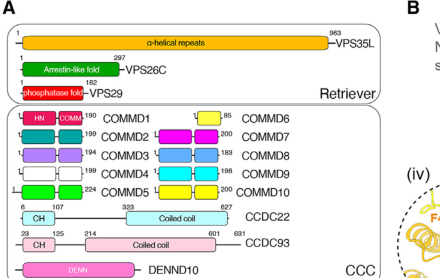

## Question

# Disease Characteristics Research Template

## Target Disease
- **Disease Name:** Ritscher-Schinzel Syndrome
- **MONDO ID:**  (if available)
- **Category:** Mendelian

## Research Objectives

Please provide a comprehensive research report on **Ritscher-Schinzel Syndrome** covering all of the
disease characteristics listed below. This report will be used to populate a disease knowledge
base entry. Be thorough and cite primary literature (PMID preferred) for all claims.

For each section, **suggested databases/resources** are listed. These are the first places
you should search for information on each topic.

---

### 1. Disease Information
> **Search first:** OMIM, Orphanet, ICD-10/ICD-11, MeSH, PubMed

- What is the disease? Provide a concise overview.
- What are the key identifiers? (OMIM, Orphanet, ICD-10/ICD-11, MeSH, Mondo)
- What are the common synonyms and alternative names?
- Is the information derived from individual patients (e.g., EHR) or aggregated disease-level resources?

### 2. Etiology

- **Disease Causal Factors**: What are the primary causes? (genetic, environmental, infectious, mechanistic)
- **Risk Factors**:
  > **Search first:** PubMed, Cochrane Library, UpToDate, clinical guidelines, ClinVar, ClinGen, GWAS Catalog, PheGenI, CTD, CDC, WHO, epidemiological databases
  - Genetic risk factors (causal variants, susceptibility loci, modifier genes)
  - Environmental risk factors (toxins, lifestyle, occupational exposures, age, sex, family history)
- **Protective Factors**:
  > **Search first:** PubMed, Cochrane Library, clinical trial databases, GWAS Catalog, gnomAD, WHO, CDC, nutrition databases
  - Genetic protective factors (protective variants, modifier alleles)
  - Environmental protective factors (diet, lifestyle, exposures that reduce risk)
- **Gene-Environment Interactions**: How do genetic and environmental factors interact to influence disease?
  > **Search first:** CTD, PubMed, PheGenI, GxE databases

### 3. Phenotypes
> **Search first:** HPO (Human Phenotype Ontology), OMIM, Orphanet, PubMed, clinicaltrials.gov, MedDRA, SNOMED CT, DECIPHER, LOINC

For each phenotype, provide:
- **Phenotype type**: symptoms, clinical signs, physical manifestations, behavioral changes, or laboratory abnormalities
  > For symptoms/signs: HPO, OMIM, Orphanet, PubMed
  > For behavioral changes: HPO, DSM, RDoC (Research Domain Criteria), PubMed
  > For laboratory abnormalities: LOINC, SNOMED CT, LabTests Online, PubMed
- **Phenotype characteristics**:
  > **Search first:** OMIM, Orphanet, HPO, PubMed
  - Age of symptom onset (neonatal, childhood, adult-onset, late-onset)
  - Symptom severity (mild, moderate, severe, variable)
  - Symptom progression (stable, progressive, episodic, fluctuating)
  - Frequency among affected individuals (percentage or qualitative)
- **Quality of life impact**: Effects on daily functioning and well-being (per-phenotype when possible)
  > **Search first:** EQ-5D database, SF-36, WHO QOL databases, PubMed
- Suggest HPO (Human Phenotype Ontology) terms for each phenotype

### 4. Genetic/Molecular Information

- **Causal Genes**: Gene mutations or chromosomal abnormalities responsible for disease (gene symbols, OMIM IDs)
  > **Search first:** OMIM, ClinVar, HGMD, Ensembl, NCBI Gene
- **Pathogenic Variants**:
  - Affected genes (gene symbols, HGNC IDs)
    > **Search first:** OMIM, NCBI Gene, Ensembl, HGNC, UniProt, GeneCards
  - Variant classification (pathogenic, likely pathogenic, VUS per ACMG/AMP guidelines)
    > **Search first:** ClinVar, ClinGen, ACMG/AMP guidelines, VarSome
  - Variant type/class (missense, frameshift, nonsense, splice-site, structural)
  - Allele frequency in population databases
    > **Search first:** gnomAD, 1000 Genomes, ExAC, TOPMed, dbSNP
  - Somatic vs germline origin
    > **Search first:** COSMIC (somatic), ClinVar, ICGC, TCGA
  - Functional consequences (loss of function, gain of function, dominant negative)
- **Modifier Genes**: Genes that modify disease severity or expression
- **Epigenetic Information**: DNA methylation, histone modifications, chromatin changes affecting disease
  > **Search first:** ENCODE, Roadmap Epigenomics, MethBase, DiseaseMeth
- **Chromosomal Abnormalities**: Large-scale genetic changes (aneuploidy, translocations, inversions)
  > **Search first:** DECIPHER, ClinVar, ECARUCA, UCSC Genome Browser

### 5. Environmental Information

- **Environmental Factors**: Non-genetic contributing factors (toxins, radiation, pollution, occupational exposure)
  > **Search first:** CTD (Comparative Toxicogenomics Database), TOXNET, PubMed, EPA databases
- **Lifestyle Factors**: Behavioral factors (smoking, diet, exercise, alcohol consumption)
  > **Search first:** CDC databases, WHO, PubMed, NHANES
- **Infectious Agents**: If applicable, pathogens causing or triggering disease (bacteria, viruses, fungi, parasites)
  > **Search first:** NCBI Taxonomy, ViPR, BV-BRC, MicrobeDB, GIDEON

### 6. Mechanism / Pathophysiology

- **Molecular Pathways**: Specific signaling cascades or biochemical pathways involved (Wnt, MAPK, mTOR, PI3K-AKT, etc.)
  > **Search first:** KEGG, Reactome, WikiPathways, PathBank, BioCyc
- **Cellular Processes**: Cell-level mechanisms (apoptosis, autophagy, cell cycle dysregulation, inflammation, etc.)
  > **Search first:** Gene Ontology (GO), Reactome, KEGG, PubMed
- **Protein Dysfunction**: How protein structure or function is altered (misfolding, aggregation, loss of function, gain of function)
  > **Search first:** UniProt, PDB (Protein Data Bank), InterPro, Pfam, AlphaFold
- **Metabolic Changes**: Alterations in metabolic processes (energy metabolism, lipid metabolism, amino acid metabolism)
  > **Search first:** KEGG, BioCyc, HMDB (Human Metabolome Database), BRENDA
- **Immune System Involvement**: Role of immune response (autoimmunity, immunodeficiency, chronic inflammation)
  > **Search first:** ImmPort, Immunome Database, IEDB, Gene Ontology
- **Tissue Damage Mechanisms**: How tissues/ are injured (oxidative stress, ischemia, fibrosis, necrosis)
  > **Search first:** PubMed, Gene Ontology, Reactome
- **Biochemical Abnormalities**: Specific molecular defects (enzyme deficiencies, receptor dysfunction, ion channel defects)
  > **Search first:** BRENDA, UniProt, KEGG, OMIM, PubMed
- **Epigenetic Changes**: DNA methylation, histone modifications affecting gene expression in disease
  > **Search first:** ENCODE, Roadmap Epigenomics, MethBase, DiseaseMeth
- **Molecular Profiling** (if available):
  - Transcriptomics/gene expression changes
    > **Search first:** GEO (Gene Expression Omnibus), ArrayExpress, GTEx, Human Cell Atlas, SRA
  - Proteomics findings
    > **Search first:** PRIDE, ProteomeXchange, Human Protein Atlas, STRING, BioGRID
  - Metabolomics signatures
    > **Search first:** MetaboLights, Metabolomics Workbench, HMDB, METLIN
  - Lipidomics alterations
    > **Search first:** LIPID MAPS, SwissLipids, LipidHome, Metabolomics Workbench
  - Genomic structural features
    > **Search first:** UCSC Genome Browser, Ensembl, NCBI, dbVar, DGV
- **Advanced Technologies** (if applicable):
  - Single-cell analysis findings (cell-type specific mechanisms, cellular heterogeneity)
    > **Search first:** Human Cell Atlas, Single Cell Portal, GEO, CELLxGENE
  - Spatial transcriptomics findings
    > **Search first:** GEO, Spatial Research, Vizgen, 10x Genomics data
  - Multi-omics integration results
    > **Search first:** TCGA, ICGC, cBioPortal, LinkedOmics, PubMed
  - Functional genomics screens (CRISPR, RNAi)
    > **Search first:** DepMap, GenomeRNAi, PubMed, BioGRID ORCS

For each mechanism, describe:
- The causal chain from initial trigger to clinical manifestation
- Which mechanisms are upstream vs downstream
- What cell types and biological processes are involved
- Suggest GO terms for biological processes and CL terms for cell types

### 7. Anatomical Structures Affected

- **Organ Level**:
  - Primary organs directly affected
  - Secondary organ involvement (complications, secondary effects)
  - Body systems involved (cardiovascular, nervous, digestive, respiratory, endocrine, etc.)
  > **Search first:** Uberon, FMA (Foundational Model of Anatomy), OMIM, HPO, ICD-11, MeSH, SNOMED CT
- **Tissue and Cell Level**:
  - Specific tissue types affected (epithelial, connective, muscle, nervous)
  - Specific cell populations targeted (with Cell Ontology terms)
  > **Search first:** Uberon, Human Protein Atlas, Cell Ontology, Human Cell Atlas, CellMarker, PanglaoDB
- **Subcellular Level**:
  - Cellular compartments involved (mitochondria, nucleus, ER, lysosomes) (with GO Cellular Component terms)
  > **Search first:** Gene Ontology (Cellular Component), UniProt, Human Protein Atlas
- **Localization**:
  - Specific anatomical sites (with UBERON terms)
    > **Search first:** FMA, Uberon, NeuroNames (for brain), SNOMED CT
  - Lateralization (unilateral, bilateral, asymmetric)
    > **Search first:** HPO, clinical literature, imaging databases

### 8. Temporal Development

- **Onset**:
  - Typical age of onset (congenital, pediatric, adult, geriatric)
  - Onset pattern (acute, subacute, chronic, insidious)
  > **Search first:** OMIM, Orphanet, HPO, PubMed
- **Progression**:
  - Disease stages (early, intermediate, advanced, end-stage)
    > **Search first:** Cancer Staging Manual (AJCC), WHO classifications, PubMed
  - Progression rate (rapid, slow, variable)
  - Disease course pattern (episodic, relapsing-remitting, progressive, stable)
  - Disease duration (self-limited, chronic lifelong)
  > **Search first:** Disease registries, longitudinal cohort databases, natural history studies, PubMed, Orphanet, OMIM
- **Patterns**:
  - Remission patterns (spontaneous, treatment-induced)
    > **Search first:** Clinical trial databases, disease registries, PubMed
  - Critical periods (time windows of vulnerability or opportunity for intervention)
    > **Search first:** PubMed, developmental biology databases, clinical guidelines

### 9. Inheritance and Population

- **Epidemiology**:
  - Prevalence (cases per 100,000 at given time)
  - Incidence (new cases per 100,000 per year)
  > **Search first:** Orphanet, CDC, WHO, GBD (Global Burden of Disease), national registries, SEER, disease registries
- **For Genetic Etiology**:
  - Inheritance pattern (AD, AR, X-linked, mitochondrial, multifactorial, polygenic)
    > **Search first:** OMIM, Orphanet, ClinVar, GTR (Genetic Testing Registry)
  - Penetrance (complete, incomplete, age-dependent)
    > **Search first:** ClinVar, OMIM, PubMed, ClinGen
  - Expressivity (variable, consistent)
    > **Search first:** OMIM, ClinVar, PubMed
  - Genetic anticipation (increasing severity in successive generations)
    > **Search first:** OMIM, PubMed (especially for repeat expansion disorders)
  - Germline mosaicism
    > **Search first:** ClinVar, OMIM, genetic counseling literature, PubMed
  - Founder effects (population-specific mutations)
    > **Search first:** gnomAD, population genetics databases, PubMed
  - Consanguinity role
    > **Search first:** OMIM, population studies, genetic counseling resources
  - Carrier frequency
    > **Search first:** gnomAD, carrier screening databases, GeneReviews, GTR
- **Population Demographics**:
  - Affected populations (ethnic or demographic groups with higher prevalence)
    > **Search first:** gnomAD, 1000 Genomes, PAGE Study, PubMed, population registries
  - Geographic distribution (endemic areas, regional variation)
    > **Search first:** WHO, CDC, GBD, Orphanet, geographic epidemiology databases
  - Geographic distribution of specific variants
  - Sex ratio (male:female)
    > **Search first:** Disease registries, OMIM, PubMed, epidemiological databases
  - Age distribution of affected individuals
    > **Search first:** CDC, disease registries, SEER, Orphanet

### 10. Diagnostics

- **Clinical Tests**:
  - Laboratory tests (blood, urine, tissue chemistry, specific enzyme assays)
    > **Search first:** LOINC, LabTests Online, PubMed
  - Biomarkers (proteins, metabolites, genetic markers, circulating biomarkers)
    > **Search first:** FDA Biomarker List, BEST (Biomarkers, EndpointS, and other Tools), PubMed
  - Imaging studies (X-ray, CT, MRI, PET, ultrasound)
    > **Search first:** RadLex, DICOM, Radiopaedia, imaging databases
  - Functional tests (pulmonary function, cardiac stress tests)
    > **Search first:** LOINC, clinical guidelines, PubMed
  - Electrophysiology (EEG, EMG, ECG, nerve conduction studies)
    > **Search first:** LOINC, clinical neurophysiology databases, PubMed
  - Biopsy findings (histopathology, immunohistochemistry)
    > **Search first:** SNOMED CT, College of American Pathologists resources, PubMed
  - Pathology findings (microscopic examination)
    > **Search first:** SNOMED CT, Digital Pathology databases, PubMed
- **Genetic Testing**:
  > **Search first:** GTR (Genetic Testing Registry), GeneReviews, ClinGen
  - Overview of recommended genetic testing approach
  - Whole genome sequencing (WGS) utility
    > **Search first:** GTR, ClinVar, GEL (Genomics England), gnomAD
  - Whole exome sequencing (WES) utility
    > **Search first:** GTR, ClinVar, OMIM, GeneMatcher
  - Gene panels (which panels, which genes)
    > **Search first:** GTR, ClinVar, laboratory-specific databases
  - Single gene testing
    > **Search first:** GTR, ClinVar, OMIM, GeneReviews
  - Chromosomal microarray (CMA)
    > **Search first:** DECIPHER, ClinVar, dbVar, ECARUCA
  - Karyotyping
    > **Search first:** Chromosome Abnormality Database, ClinVar, cytogenetics resources
  - FISH
    > **Search first:** ClinVar, cytogenetics databases, PubMed
  - Mitochondrial DNA testing
    > **Search first:** MITOMAP, MSeqDR, ClinVar, GTR
  - Repeat expansion testing
    > **Search first:** GTR, ClinVar, repeat expansion databases, PubMed
- **Omics-Based Diagnostics** (if applicable):
  - RNA sequencing / transcriptomics
    > **Search first:** GEO, ArrayExpress, GTEx, RNA-seq databases
  - Proteomics
    > **Search first:** PRIDE, ProteomeXchange, FDA Biomarker database
  - Metabolomics
    > **Search first:** MetaboLights, Metabolomics Workbench, HMDB
  - Epigenomics
    > **Search first:** GEO, ENCODE, Roadmap Epigenomics, MethBase
  - Liquid biopsy
    > **Search first:** COSMIC, ClinVar, liquid biopsy databases, PubMed
- **Clinical Criteria**:
  - Standardized diagnostic criteria (DSM, ICD, society guidelines)
    > **Search first:** DSM-5, ICD-11, clinical society guidelines, UpToDate
  - Differential diagnosis (other conditions to rule out, with distinguishing features)
    > **Search first:** DynaMed, UpToDate, clinical decision support systems
- **Screening**:
  - Screening methods for asymptomatic individuals (newborn screening, carrier screening, cascade screening)
    > **Search first:** ACMG recommendations, CDC newborn screening, GTR

### 11. Outcome/Prognosis

- **Survival and Mortality**:
  - Survival rate (5-year, 10-year, overall)
    > **Search first:** SEER, cancer registries, disease-specific registries, PubMed
  - Life expectancy (with and without treatment if applicable)
    > **Search first:** Orphanet, disease registries, actuarial databases, PubMed
  - Mortality rate
    > **Search first:** CDC, WHO, GBD, national mortality databases
  - Disease-specific mortality (deaths directly attributable to disease)
    > **Search first:** Disease registries, CDC Wonder, GBD, PubMed
- **Morbidity and Function**:
  - Morbidity (disease-related disability and health impacts)
    > **Search first:** GBD, WHO, disability databases, PubMed
  - Disability outcomes (long-term functional impairments)
    > **Search first:** ICF (International Classification of Functioning), disability registries
  - Quality of life measures (EQ-5D, SF-36, PROMIS, disease-specific tools)
    > **Search first:** EQ-5D database, SF-36, PROMIS, PubMed
- **Disease Course**:
  - Complications (secondary problems: infections, organ failure, etc.)
    > **Search first:** ICD codes, disease registries, clinical databases, PubMed
  - Recovery potential (likelihood and extent of recovery, with vs without treatment)
    > **Search first:** Natural history studies, rehabilitation databases, PubMed
- **Prediction**:
  - Prognostic factors (age, disease severity, biomarkers, treatment response)
    > **Search first:** Prognostic models databases, clinical calculators, PubMed
  - Prognostic biomarkers (molecular markers predicting disease course)
    > **Search first:** FDA Biomarker database, PubMed, cancer prognostic databases

### 12. Treatment

- **Pharmacotherapy**:
  - Pharmacological treatments (drug names, drug classes, mechanisms of action)
    > **Search first:** DrugBank, RxNorm, ATC classification, DailyMed, FDA databases
  - Pharmacogenomics (how genetic variants affect drug metabolism, efficacy, toxicity)
    > **Search first:** PharmGKB, CPIC (Clinical Pharmacogenetics), FDA Table of PGx Biomarkers
- **Advanced Therapeutics**:
  - Gene therapy (viral vectors, CRISPR, gene replacement, gene editing)
    > **Search first:** ClinicalTrials.gov, FDA gene therapy database, ASGCT resources
  - Cell therapy (stem cell transplant, CAR-T, cellular therapeutics)
    > **Search first:** ClinicalTrials.gov, FDA cell therapy database, FACT standards
  - RNA-based therapies (ASOs, siRNA, mRNA therapies)
    > **Search first:** ClinicalTrials.gov, FDA approvals, PubMed
  - Targeted therapies (treatments directed at specific molecular targets)
    > **Search first:** My Cancer Genome, OncoKB, ClinicalTrials.gov, FDA approvals
  - Immunotherapies (checkpoint inhibitors, monoclonal antibodies)
    > **Search first:** Cancer Immunotherapy Database, FDA approvals, ClinicalTrials.gov
- **Surgical and Interventional**:
  - Surgical interventions (types of surgery, timing, outcomes)
    > **Search first:** CPT codes, surgical registries, clinical guidelines, PubMed
- **Supportive and Rehabilitative**:
  - Supportive care (symptom management, pain control, nutrition)
    > **Search first:** Clinical guidelines, Cochrane Library, PubMed
  - Rehabilitation (physical therapy, occupational therapy, speech therapy)
    > **Search first:** Rehabilitation medicine databases, clinical guidelines, PubMed
- **Experimental**:
  - Experimental treatments in clinical trials (with NCT identifiers if available)
    > **Search first:** ClinicalTrials.gov, EU Clinical Trials Register, WHO ICTRP
- **Treatment Outcomes**:
  - Treatment response rates
    > **Search first:** Clinical trial databases, FDA reviews, systematic reviews, PubMed
  - Side effects and adverse events
    > **Search first:** FDA Adverse Event Reporting System (FAERS), MedWatch, PubMed
- **Treatment Strategy**:
  - Treatment algorithms (clinical pathways, decision trees)
    > **Search first:** Clinical practice guidelines, NCCN Guidelines, UpToDate
  - Combination therapies
    > **Search first:** ClinicalTrials.gov, treatment guidelines, PubMed
  - Personalized medicine approaches (genotype-guided treatment)
    > **Search first:** My Cancer Genome, CIViC, PharmGKB, precision medicine databases

For each treatment, suggest MAXO (Medical Action Ontology) terms where applicable.

### 13. Prevention

- **Prevention Levels**:
  - Primary prevention (preventing disease occurrence: vaccination, risk factor modification)
    > **Search first:** CDC, WHO, USPSTF recommendations, Cochrane Library
  - Secondary prevention (early detection and treatment: screening programs, early intervention)
    > **Search first:** USPSTF, CDC screening guidelines, WHO
  - Tertiary prevention (preventing complications in those with disease)
    > **Search first:** Clinical guidelines, disease management protocols, PubMed
- **Immunization**: Vaccine strategies (if applicable)
  > **Search first:** CDC vaccine schedules, WHO immunization, FDA vaccine database
- **Screening and Early Detection**:
  - Screening programs (population-based: newborn screening, cancer screening)
    > **Search first:** CDC screening programs, USPSTF, cancer screening databases
  - Genetic screening (carrier screening, preimplantation genetic diagnosis, prenatal testing)
    > **Search first:** ACMG recommendations, ACOG guidelines, GTR
  - Risk stratification (identifying high-risk individuals for targeted prevention)
    > **Search first:** Risk prediction models, clinical calculators, PubMed
- **Behavioral Interventions**: Lifestyle modifications to reduce risk
  > **Search first:** CDC, WHO, behavioral intervention databases, Cochrane Library
- **Counseling**: Genetic counseling (risk assessment, family planning guidance)
  > **Search first:** NSGC resources, ACMG guidelines, GeneReviews
- **Public Health**:
  - Public health interventions (sanitation, vector control, health education)
    > **Search first:** CDC, WHO, public health databases, PubMed
  - Environmental interventions (reducing environmental risk factors)
    > **Search first:** EPA databases, WHO environmental health, PubMed
- **Prophylaxis**: Preventive medications or procedures
  > **Search first:** Clinical guidelines, FDA approvals, PubMed

### 14. Other Species / Natural Disease

- **Taxonomy**: Species affected (with NCBI Taxon identifiers)
  > **Search first:** NCBI Taxonomy
- **Breed**: Specific breeds affected (with VBO identifiers if applicable)
  > **Search first:** VBO (Vertebrate Breed Ontology)
- **Gene**: Orthologous genes in other species (with NCBI Gene IDs)
  > **Search first:** NCBI Gene
- **Natural Disease**:
  - Naturally occurring disease in other species (companion animals, wildlife)
    > **Search first:** OMIA (Online Mendelian Inheritance in Animals), VetCompass, PubMed
  - Veterinary relevance and importance in animal health
    > **Search first:** OMIA, veterinary databases, PubMed
- **Comparative Biology**:
  - Comparative pathology (similarities and differences across species)
    > **Search first:** OMIA, comparative pathology databases, PubMed
  - Evolutionary conservation of disease mechanisms
    > **Search first:** HomoloGene, OrthoMCL, Alliance of Genome Resources
- **Transmission** (if applicable):
  - Zoonotic potential
    > **Search first:** CDC zoonotic diseases, WHO zoonoses, GIDEON
  - Cross-species susceptibility
    > **Search first:** NCBI Taxonomy, veterinary databases, PubMed

### 15. Model Organisms

- **Model Types**:
  - Model organism type (mammalian, invertebrate, cellular, in vitro)
    > **Search first:** Alliance of Genome Resources, model organism databases
  - Specific model systems (mouse, rat, zebrafish, Drosophila, C. elegans, yeast, cell lines, organoids, iPSCs)
    > **Search first:** MGI, RGD, ZFIN, FlyBase, WormBase, SGD, ATCC, Cellosaurus
  - Induced models (drug treatment, surgical intervention, environmental manipulation)
    > **Search first:** MGI, model organism databases, PubMed
- **Genetic Models**:
  - Types available (knockout, knock-in, transgenic, conditional, humanized)
    > **Search first:** MGI, IMPC, KOMP, EuMMCR, IMSR
- **Model Characteristics**:
  - Phenotype recapitulation (how well model reproduces human disease features)
    > **Search first:** Model organism databases, comparative studies, PubMed
  - Model limitations (aspects of human disease not captured)
    > **Search first:** Model organism databases, PubMed, review articles
- **Applications**:
  - Research applications (what aspects of disease can be studied)
    > **Search first:** Model organism databases, PubMed
- **Resources**:
  - Model databases
    > **Search first:** MGI, RGD, ZFIN, FlyBase, WormBase, IMSR, EMMA, MMRRC

---

## Citation Requirements

- Cite primary literature (PMID preferred) for all mechanistic and clinical claims
- Prioritize recent reviews and landmark papers
- Include direct quotes from abstracts where possible to support key statements
- Distinguish evidence source types: human clinical, model organism, in vitro, computational

## Output Format

Structure your response as a comprehensive narrative organized by the sections above.
For each section, provide:
- Factual content with specific details (numbers, percentages, gene names, variant nomenclature)
- Ontology term suggestions (HPO, GO, CL, UBERON, CHEBI, MAXO, MONDO) where applicable
- Evidence citations with PMIDs
- Direct quotes from abstracts to support key claims
- Clear indication when information is not available or not applicable for this disease

This report will be used to populate a disease knowledge base entry with:
- Pathophysiology descriptions with causal chains
- Gene/protein annotations (HGNC, GO terms)
- Phenotype associations (HP terms) with frequencies
- Cell type involvement (CL terms)
- Anatomical locations (UBERON terms)
- Chemical entities (CHEBI terms)
- Treatment annotations (MAXO terms)
- Evidence items with PMIDs and exact abstract quotes
- Epidemiology, prognosis, diagnostic, and prevention information
- Animal model descriptions with phenotype recapitulation details

## Output

Question: You are an expert researcher providing comprehensive, well-cited information.

Provide detailed information focusing on:
1. Key concepts and definitions with current understanding
2. Recent developments and latest research (prioritize 2023-2024 sources)
3. Current applications and real-world implementations
4. Expert opinions and analysis from authoritative sources
5. Relevant statistics and data from recent studies

Format as a comprehensive research report with proper citations. Include URLs and publication dates where available.
Always prioritize recent, authoritative sources and provide specific citations for all major claims.

# Disease Characteristics Research Template

## Target Disease
- **Disease Name:** Ritscher-Schinzel Syndrome
- **MONDO ID:**  (if available)
- **Category:** Mendelian

## Research Objectives

Please provide a comprehensive research report on **Ritscher-Schinzel Syndrome** covering all of the
disease characteristics listed below. This report will be used to populate a disease knowledge
base entry. Be thorough and cite primary literature (PMID preferred) for all claims.

For each section, **suggested databases/resources** are listed. These are the first places
you should search for information on each topic.

---

### 1. Disease Information
> **Search first:** OMIM, Orphanet, ICD-10/ICD-11, MeSH, PubMed

- What is the disease? Provide a concise overview.
- What are the key identifiers? (OMIM, Orphanet, ICD-10/ICD-11, MeSH, Mondo)
- What are the common synonyms and alternative names?
- Is the information derived from individual patients (e.g., EHR) or aggregated disease-level resources?

### 2. Etiology

- **Disease Causal Factors**: What are the primary causes? (genetic, environmental, infectious, mechanistic)
- **Risk Factors**:
  > **Search first:** PubMed, Cochrane Library, UpToDate, clinical guidelines, ClinVar, ClinGen, GWAS Catalog, PheGenI, CTD, CDC, WHO, epidemiological databases
  - Genetic risk factors (causal variants, susceptibility loci, modifier genes)
  - Environmental risk factors (toxins, lifestyle, occupational exposures, age, sex, family history)
- **Protective Factors**:
  > **Search first:** PubMed, Cochrane Library, clinical trial databases, GWAS Catalog, gnomAD, WHO, CDC, nutrition databases
  - Genetic protective factors (protective variants, modifier alleles)
  - Environmental protective factors (diet, lifestyle, exposures that reduce risk)
- **Gene-Environment Interactions**: How do genetic and environmental factors interact to influence disease?
  > **Search first:** CTD, PubMed, PheGenI, GxE databases

### 3. Phenotypes
> **Search first:** HPO (Human Phenotype Ontology), OMIM, Orphanet, PubMed, clinicaltrials.gov, MedDRA, SNOMED CT, DECIPHER, LOINC

For each phenotype, provide:
- **Phenotype type**: symptoms, clinical signs, physical manifestations, behavioral changes, or laboratory abnormalities
  > For symptoms/signs: HPO, OMIM, Orphanet, PubMed
  > For behavioral changes: HPO, DSM, RDoC (Research Domain Criteria), PubMed
  > For laboratory abnormalities: LOINC, SNOMED CT, LabTests Online, PubMed
- **Phenotype characteristics**:
  > **Search first:** OMIM, Orphanet, HPO, PubMed
  - Age of symptom onset (neonatal, childhood, adult-onset, late-onset)
  - Symptom severity (mild, moderate, severe, variable)
  - Symptom progression (stable, progressive, episodic, fluctuating)
  - Frequency among affected individuals (percentage or qualitative)
- **Quality of life impact**: Effects on daily functioning and well-being (per-phenotype when possible)
  > **Search first:** EQ-5D database, SF-36, WHO QOL databases, PubMed
- Suggest HPO (Human Phenotype Ontology) terms for each phenotype

### 4. Genetic/Molecular Information

- **Causal Genes**: Gene mutations or chromosomal abnormalities responsible for disease (gene symbols, OMIM IDs)
  > **Search first:** OMIM, ClinVar, HGMD, Ensembl, NCBI Gene
- **Pathogenic Variants**:
  - Affected genes (gene symbols, HGNC IDs)
    > **Search first:** OMIM, NCBI Gene, Ensembl, HGNC, UniProt, GeneCards
  - Variant classification (pathogenic, likely pathogenic, VUS per ACMG/AMP guidelines)
    > **Search first:** ClinVar, ClinGen, ACMG/AMP guidelines, VarSome
  - Variant type/class (missense, frameshift, nonsense, splice-site, structural)
  - Allele frequency in population databases
    > **Search first:** gnomAD, 1000 Genomes, ExAC, TOPMed, dbSNP
  - Somatic vs germline origin
    > **Search first:** COSMIC (somatic), ClinVar, ICGC, TCGA
  - Functional consequences (loss of function, gain of function, dominant negative)
- **Modifier Genes**: Genes that modify disease severity or expression
- **Epigenetic Information**: DNA methylation, histone modifications, chromatin changes affecting disease
  > **Search first:** ENCODE, Roadmap Epigenomics, MethBase, DiseaseMeth
- **Chromosomal Abnormalities**: Large-scale genetic changes (aneuploidy, translocations, inversions)
  > **Search first:** DECIPHER, ClinVar, ECARUCA, UCSC Genome Browser

### 5. Environmental Information

- **Environmental Factors**: Non-genetic contributing factors (toxins, radiation, pollution, occupational exposure)
  > **Search first:** CTD (Comparative Toxicogenomics Database), TOXNET, PubMed, EPA databases
- **Lifestyle Factors**: Behavioral factors (smoking, diet, exercise, alcohol consumption)
  > **Search first:** CDC databases, WHO, PubMed, NHANES
- **Infectious Agents**: If applicable, pathogens causing or triggering disease (bacteria, viruses, fungi, parasites)
  > **Search first:** NCBI Taxonomy, ViPR, BV-BRC, MicrobeDB, GIDEON

### 6. Mechanism / Pathophysiology

- **Molecular Pathways**: Specific signaling cascades or biochemical pathways involved (Wnt, MAPK, mTOR, PI3K-AKT, etc.)
  > **Search first:** KEGG, Reactome, WikiPathways, PathBank, BioCyc
- **Cellular Processes**: Cell-level mechanisms (apoptosis, autophagy, cell cycle dysregulation, inflammation, etc.)
  > **Search first:** Gene Ontology (GO), Reactome, KEGG, PubMed
- **Protein Dysfunction**: How protein structure or function is altered (misfolding, aggregation, loss of function, gain of function)
  > **Search first:** UniProt, PDB (Protein Data Bank), InterPro, Pfam, AlphaFold
- **Metabolic Changes**: Alterations in metabolic processes (energy metabolism, lipid metabolism, amino acid metabolism)
  > **Search first:** KEGG, BioCyc, HMDB (Human Metabolome Database), BRENDA
- **Immune System Involvement**: Role of immune response (autoimmunity, immunodeficiency, chronic inflammation)
  > **Search first:** ImmPort, Immunome Database, IEDB, Gene Ontology
- **Tissue Damage Mechanisms**: How tissues/ are injured (oxidative stress, ischemia, fibrosis, necrosis)
  > **Search first:** PubMed, Gene Ontology, Reactome
- **Biochemical Abnormalities**: Specific molecular defects (enzyme deficiencies, receptor dysfunction, ion channel defects)
  > **Search first:** BRENDA, UniProt, KEGG, OMIM, PubMed
- **Epigenetic Changes**: DNA methylation, histone modifications affecting gene expression in disease
  > **Search first:** ENCODE, Roadmap Epigenomics, MethBase, DiseaseMeth
- **Molecular Profiling** (if available):
  - Transcriptomics/gene expression changes
    > **Search first:** GEO (Gene Expression Omnibus), ArrayExpress, GTEx, Human Cell Atlas, SRA
  - Proteomics findings
    > **Search first:** PRIDE, ProteomeXchange, Human Protein Atlas, STRING, BioGRID
  - Metabolomics signatures
    > **Search first:** MetaboLights, Metabolomics Workbench, HMDB, METLIN
  - Lipidomics alterations
    > **Search first:** LIPID MAPS, SwissLipids, LipidHome, Metabolomics Workbench
  - Genomic structural features
    > **Search first:** UCSC Genome Browser, Ensembl, NCBI, dbVar, DGV
- **Advanced Technologies** (if applicable):
  - Single-cell analysis findings (cell-type specific mechanisms, cellular heterogeneity)
    > **Search first:** Human Cell Atlas, Single Cell Portal, GEO, CELLxGENE
  - Spatial transcriptomics findings
    > **Search first:** GEO, Spatial Research, Vizgen, 10x Genomics data
  - Multi-omics integration results
    > **Search first:** TCGA, ICGC, cBioPortal, LinkedOmics, PubMed
  - Functional genomics screens (CRISPR, RNAi)
    > **Search first:** DepMap, GenomeRNAi, PubMed, BioGRID ORCS

For each mechanism, describe:
- The causal chain from initial trigger to clinical manifestation
- Which mechanisms are upstream vs downstream
- What cell types and biological processes are involved
- Suggest GO terms for biological processes and CL terms for cell types

### 7. Anatomical Structures Affected

- **Organ Level**:
  - Primary organs directly affected
  - Secondary organ involvement (complications, secondary effects)
  - Body systems involved (cardiovascular, nervous, digestive, respiratory, endocrine, etc.)
  > **Search first:** Uberon, FMA (Foundational Model of Anatomy), OMIM, HPO, ICD-11, MeSH, SNOMED CT
- **Tissue and Cell Level**:
  - Specific tissue types affected (epithelial, connective, muscle, nervous)
  - Specific cell populations targeted (with Cell Ontology terms)
  > **Search first:** Uberon, Human Protein Atlas, Cell Ontology, Human Cell Atlas, CellMarker, PanglaoDB
- **Subcellular Level**:
  - Cellular compartments involved (mitochondria, nucleus, ER, lysosomes) (with GO Cellular Component terms)
  > **Search first:** Gene Ontology (Cellular Component), UniProt, Human Protein Atlas
- **Localization**:
  - Specific anatomical sites (with UBERON terms)
    > **Search first:** FMA, Uberon, NeuroNames (for brain), SNOMED CT
  - Lateralization (unilateral, bilateral, asymmetric)
    > **Search first:** HPO, clinical literature, imaging databases

### 8. Temporal Development

- **Onset**:
  - Typical age of onset (congenital, pediatric, adult, geriatric)
  - Onset pattern (acute, subacute, chronic, insidious)
  > **Search first:** OMIM, Orphanet, HPO, PubMed
- **Progression**:
  - Disease stages (early, intermediate, advanced, end-stage)
    > **Search first:** Cancer Staging Manual (AJCC), WHO classifications, PubMed
  - Progression rate (rapid, slow, variable)
  - Disease course pattern (episodic, relapsing-remitting, progressive, stable)
  - Disease duration (self-limited, chronic lifelong)
  > **Search first:** Disease registries, longitudinal cohort databases, natural history studies, PubMed, Orphanet, OMIM
- **Patterns**:
  - Remission patterns (spontaneous, treatment-induced)
    > **Search first:** Clinical trial databases, disease registries, PubMed
  - Critical periods (time windows of vulnerability or opportunity for intervention)
    > **Search first:** PubMed, developmental biology databases, clinical guidelines

### 9. Inheritance and Population

- **Epidemiology**:
  - Prevalence (cases per 100,000 at given time)
  - Incidence (new cases per 100,000 per year)
  > **Search first:** Orphanet, CDC, WHO, GBD (Global Burden of Disease), national registries, SEER, disease registries
- **For Genetic Etiology**:
  - Inheritance pattern (AD, AR, X-linked, mitochondrial, multifactorial, polygenic)
    > **Search first:** OMIM, Orphanet, ClinVar, GTR (Genetic Testing Registry)
  - Penetrance (complete, incomplete, age-dependent)
    > **Search first:** ClinVar, OMIM, PubMed, ClinGen
  - Expressivity (variable, consistent)
    > **Search first:** OMIM, ClinVar, PubMed
  - Genetic anticipation (increasing severity in successive generations)
    > **Search first:** OMIM, PubMed (especially for repeat expansion disorders)
  - Germline mosaicism
    > **Search first:** ClinVar, OMIM, genetic counseling literature, PubMed
  - Founder effects (population-specific mutations)
    > **Search first:** gnomAD, population genetics databases, PubMed
  - Consanguinity role
    > **Search first:** OMIM, population studies, genetic counseling resources
  - Carrier frequency
    > **Search first:** gnomAD, carrier screening databases, GeneReviews, GTR
- **Population Demographics**:
  - Affected populations (ethnic or demographic groups with higher prevalence)
    > **Search first:** gnomAD, 1000 Genomes, PAGE Study, PubMed, population registries
  - Geographic distribution (endemic areas, regional variation)
    > **Search first:** WHO, CDC, GBD, Orphanet, geographic epidemiology databases
  - Geographic distribution of specific variants
  - Sex ratio (male:female)
    > **Search first:** Disease registries, OMIM, PubMed, epidemiological databases
  - Age distribution of affected individuals
    > **Search first:** CDC, disease registries, SEER, Orphanet

### 10. Diagnostics

- **Clinical Tests**:
  - Laboratory tests (blood, urine, tissue chemistry, specific enzyme assays)
    > **Search first:** LOINC, LabTests Online, PubMed
  - Biomarkers (proteins, metabolites, genetic markers, circulating biomarkers)
    > **Search first:** FDA Biomarker List, BEST (Biomarkers, EndpointS, and other Tools), PubMed
  - Imaging studies (X-ray, CT, MRI, PET, ultrasound)
    > **Search first:** RadLex, DICOM, Radiopaedia, imaging databases
  - Functional tests (pulmonary function, cardiac stress tests)
    > **Search first:** LOINC, clinical guidelines, PubMed
  - Electrophysiology (EEG, EMG, ECG, nerve conduction studies)
    > **Search first:** LOINC, clinical neurophysiology databases, PubMed
  - Biopsy findings (histopathology, immunohistochemistry)
    > **Search first:** SNOMED CT, College of American Pathologists resources, PubMed
  - Pathology findings (microscopic examination)
    > **Search first:** SNOMED CT, Digital Pathology databases, PubMed
- **Genetic Testing**:
  > **Search first:** GTR (Genetic Testing Registry), GeneReviews, ClinGen
  - Overview of recommended genetic testing approach
  - Whole genome sequencing (WGS) utility
    > **Search first:** GTR, ClinVar, GEL (Genomics England), gnomAD
  - Whole exome sequencing (WES) utility
    > **Search first:** GTR, ClinVar, OMIM, GeneMatcher
  - Gene panels (which panels, which genes)
    > **Search first:** GTR, ClinVar, laboratory-specific databases
  - Single gene testing
    > **Search first:** GTR, ClinVar, OMIM, GeneReviews
  - Chromosomal microarray (CMA)
    > **Search first:** DECIPHER, ClinVar, dbVar, ECARUCA
  - Karyotyping
    > **Search first:** Chromosome Abnormality Database, ClinVar, cytogenetics resources
  - FISH
    > **Search first:** ClinVar, cytogenetics databases, PubMed
  - Mitochondrial DNA testing
    > **Search first:** MITOMAP, MSeqDR, ClinVar, GTR
  - Repeat expansion testing
    > **Search first:** GTR, ClinVar, repeat expansion databases, PubMed
- **Omics-Based Diagnostics** (if applicable):
  - RNA sequencing / transcriptomics
    > **Search first:** GEO, ArrayExpress, GTEx, RNA-seq databases
  - Proteomics
    > **Search first:** PRIDE, ProteomeXchange, FDA Biomarker database
  - Metabolomics
    > **Search first:** MetaboLights, Metabolomics Workbench, HMDB
  - Epigenomics
    > **Search first:** GEO, ENCODE, Roadmap Epigenomics, MethBase
  - Liquid biopsy
    > **Search first:** COSMIC, ClinVar, liquid biopsy databases, PubMed
- **Clinical Criteria**:
  - Standardized diagnostic criteria (DSM, ICD, society guidelines)
    > **Search first:** DSM-5, ICD-11, clinical society guidelines, UpToDate
  - Differential diagnosis (other conditions to rule out, with distinguishing features)
    > **Search first:** DynaMed, UpToDate, clinical decision support systems
- **Screening**:
  - Screening methods for asymptomatic individuals (newborn screening, carrier screening, cascade screening)
    > **Search first:** ACMG recommendations, CDC newborn screening, GTR

### 11. Outcome/Prognosis

- **Survival and Mortality**:
  - Survival rate (5-year, 10-year, overall)
    > **Search first:** SEER, cancer registries, disease-specific registries, PubMed
  - Life expectancy (with and without treatment if applicable)
    > **Search first:** Orphanet, disease registries, actuarial databases, PubMed
  - Mortality rate
    > **Search first:** CDC, WHO, GBD, national mortality databases
  - Disease-specific mortality (deaths directly attributable to disease)
    > **Search first:** Disease registries, CDC Wonder, GBD, PubMed
- **Morbidity and Function**:
  - Morbidity (disease-related disability and health impacts)
    > **Search first:** GBD, WHO, disability databases, PubMed
  - Disability outcomes (long-term functional impairments)
    > **Search first:** ICF (International Classification of Functioning), disability registries
  - Quality of life measures (EQ-5D, SF-36, PROMIS, disease-specific tools)
    > **Search first:** EQ-5D database, SF-36, PROMIS, PubMed
- **Disease Course**:
  - Complications (secondary problems: infections, organ failure, etc.)
    > **Search first:** ICD codes, disease registries, clinical databases, PubMed
  - Recovery potential (likelihood and extent of recovery, with vs without treatment)
    > **Search first:** Natural history studies, rehabilitation databases, PubMed
- **Prediction**:
  - Prognostic factors (age, disease severity, biomarkers, treatment response)
    > **Search first:** Prognostic models databases, clinical calculators, PubMed
  - Prognostic biomarkers (molecular markers predicting disease course)
    > **Search first:** FDA Biomarker database, PubMed, cancer prognostic databases

### 12. Treatment

- **Pharmacotherapy**:
  - Pharmacological treatments (drug names, drug classes, mechanisms of action)
    > **Search first:** DrugBank, RxNorm, ATC classification, DailyMed, FDA databases
  - Pharmacogenomics (how genetic variants affect drug metabolism, efficacy, toxicity)
    > **Search first:** PharmGKB, CPIC (Clinical Pharmacogenetics), FDA Table of PGx Biomarkers
- **Advanced Therapeutics**:
  - Gene therapy (viral vectors, CRISPR, gene replacement, gene editing)
    > **Search first:** ClinicalTrials.gov, FDA gene therapy database, ASGCT resources
  - Cell therapy (stem cell transplant, CAR-T, cellular therapeutics)
    > **Search first:** ClinicalTrials.gov, FDA cell therapy database, FACT standards
  - RNA-based therapies (ASOs, siRNA, mRNA therapies)
    > **Search first:** ClinicalTrials.gov, FDA approvals, PubMed
  - Targeted therapies (treatments directed at specific molecular targets)
    > **Search first:** My Cancer Genome, OncoKB, ClinicalTrials.gov, FDA approvals
  - Immunotherapies (checkpoint inhibitors, monoclonal antibodies)
    > **Search first:** Cancer Immunotherapy Database, FDA approvals, ClinicalTrials.gov
- **Surgical and Interventional**:
  - Surgical interventions (types of surgery, timing, outcomes)
    > **Search first:** CPT codes, surgical registries, clinical guidelines, PubMed
- **Supportive and Rehabilitative**:
  - Supportive care (symptom management, pain control, nutrition)
    > **Search first:** Clinical guidelines, Cochrane Library, PubMed
  - Rehabilitation (physical therapy, occupational therapy, speech therapy)
    > **Search first:** Rehabilitation medicine databases, clinical guidelines, PubMed
- **Experimental**:
  - Experimental treatments in clinical trials (with NCT identifiers if available)
    > **Search first:** ClinicalTrials.gov, EU Clinical Trials Register, WHO ICTRP
- **Treatment Outcomes**:
  - Treatment response rates
    > **Search first:** Clinical trial databases, FDA reviews, systematic reviews, PubMed
  - Side effects and adverse events
    > **Search first:** FDA Adverse Event Reporting System (FAERS), MedWatch, PubMed
- **Treatment Strategy**:
  - Treatment algorithms (clinical pathways, decision trees)
    > **Search first:** Clinical practice guidelines, NCCN Guidelines, UpToDate
  - Combination therapies
    > **Search first:** ClinicalTrials.gov, treatment guidelines, PubMed
  - Personalized medicine approaches (genotype-guided treatment)
    > **Search first:** My Cancer Genome, CIViC, PharmGKB, precision medicine databases

For each treatment, suggest MAXO (Medical Action Ontology) terms where applicable.

### 13. Prevention

- **Prevention Levels**:
  - Primary prevention (preventing disease occurrence: vaccination, risk factor modification)
    > **Search first:** CDC, WHO, USPSTF recommendations, Cochrane Library
  - Secondary prevention (early detection and treatment: screening programs, early intervention)
    > **Search first:** USPSTF, CDC screening guidelines, WHO
  - Tertiary prevention (preventing complications in those with disease)
    > **Search first:** Clinical guidelines, disease management protocols, PubMed
- **Immunization**: Vaccine strategies (if applicable)
  > **Search first:** CDC vaccine schedules, WHO immunization, FDA vaccine database
- **Screening and Early Detection**:
  - Screening programs (population-based: newborn screening, cancer screening)
    > **Search first:** CDC screening programs, USPSTF, cancer screening databases
  - Genetic screening (carrier screening, preimplantation genetic diagnosis, prenatal testing)
    > **Search first:** ACMG recommendations, ACOG guidelines, GTR
  - Risk stratification (identifying high-risk individuals for targeted prevention)
    > **Search first:** Risk prediction models, clinical calculators, PubMed
- **Behavioral Interventions**: Lifestyle modifications to reduce risk
  > **Search first:** CDC, WHO, behavioral intervention databases, Cochrane Library
- **Counseling**: Genetic counseling (risk assessment, family planning guidance)
  > **Search first:** NSGC resources, ACMG guidelines, GeneReviews
- **Public Health**:
  - Public health interventions (sanitation, vector control, health education)
    > **Search first:** CDC, WHO, public health databases, PubMed
  - Environmental interventions (reducing environmental risk factors)
    > **Search first:** EPA databases, WHO environmental health, PubMed
- **Prophylaxis**: Preventive medications or procedures
  > **Search first:** Clinical guidelines, FDA approvals, PubMed

### 14. Other Species / Natural Disease

- **Taxonomy**: Species affected (with NCBI Taxon identifiers)
  > **Search first:** NCBI Taxonomy
- **Breed**: Specific breeds affected (with VBO identifiers if applicable)
  > **Search first:** VBO (Vertebrate Breed Ontology)
- **Gene**: Orthologous genes in other species (with NCBI Gene IDs)
  > **Search first:** NCBI Gene
- **Natural Disease**:
  - Naturally occurring disease in other species (companion animals, wildlife)
    > **Search first:** OMIA (Online Mendelian Inheritance in Animals), VetCompass, PubMed
  - Veterinary relevance and importance in animal health
    > **Search first:** OMIA, veterinary databases, PubMed
- **Comparative Biology**:
  - Comparative pathology (similarities and differences across species)
    > **Search first:** OMIA, comparative pathology databases, PubMed
  - Evolutionary conservation of disease mechanisms
    > **Search first:** HomoloGene, OrthoMCL, Alliance of Genome Resources
- **Transmission** (if applicable):
  - Zoonotic potential
    > **Search first:** CDC zoonotic diseases, WHO zoonoses, GIDEON
  - Cross-species susceptibility
    > **Search first:** NCBI Taxonomy, veterinary databases, PubMed

### 15. Model Organisms

- **Model Types**:
  - Model organism type (mammalian, invertebrate, cellular, in vitro)
    > **Search first:** Alliance of Genome Resources, model organism databases
  - Specific model systems (mouse, rat, zebrafish, Drosophila, C. elegans, yeast, cell lines, organoids, iPSCs)
    > **Search first:** MGI, RGD, ZFIN, FlyBase, WormBase, SGD, ATCC, Cellosaurus
  - Induced models (drug treatment, surgical intervention, environmental manipulation)
    > **Search first:** MGI, model organism databases, PubMed
- **Genetic Models**:
  - Types available (knockout, knock-in, transgenic, conditional, humanized)
    > **Search first:** MGI, IMPC, KOMP, EuMMCR, IMSR
- **Model Characteristics**:
  - Phenotype recapitulation (how well model reproduces human disease features)
    > **Search first:** Model organism databases, comparative studies, PubMed
  - Model limitations (aspects of human disease not captured)
    > **Search first:** Model organism databases, PubMed, review articles
- **Applications**:
  - Research applications (what aspects of disease can be studied)
    > **Search first:** Model organism databases, PubMed
- **Resources**:
  - Model databases
    > **Search first:** MGI, RGD, ZFIN, FlyBase, WormBase, IMSR, EMMA, MMRRC

---

## Citation Requirements

- Cite primary literature (PMID preferred) for all mechanistic and clinical claims
- Prioritize recent reviews and landmark papers
- Include direct quotes from abstracts where possible to support key statements
- Distinguish evidence source types: human clinical, model organism, in vitro, computational

## Output Format

Structure your response as a comprehensive narrative organized by the sections above.
For each section, provide:
- Factual content with specific details (numbers, percentages, gene names, variant nomenclature)
- Ontology term suggestions (HPO, GO, CL, UBERON, CHEBI, MAXO, MONDO) where applicable
- Evidence citations with PMIDs
- Direct quotes from abstracts to support key claims
- Clear indication when information is not available or not applicable for this disease

This report will be used to populate a disease knowledge base entry with:
- Pathophysiology descriptions with causal chains
- Gene/protein annotations (HGNC, GO terms)
- Phenotype associations (HP terms) with frequencies
- Cell type involvement (CL terms)
- Anatomical locations (UBERON terms)
- Chemical entities (CHEBI terms)
- Treatment annotations (MAXO terms)
- Evidence items with PMIDs and exact abstract quotes
- Epidemiology, prognosis, diagnostic, and prevention information
- Animal model descriptions with phenotype recapitulation details

## Comprehensive Disease Characteristics Report: Ritscher–Schinzel Syndrome (RSS) / 3C Syndrome

### Target disease
- **Disease name:** Ritscher–Schinzel syndrome (RSS)
- **Category:** Mendelian congenital malformation syndrome
- **Common synonym:** **3C syndrome** (cranio-cerebello-cardiac syndrome/dysplasia) (otsuji2023clinicaldiversityand pages 1-2)
- **MONDO ID:** Not identified in retrieved full text (requires direct lookup in MONDO/Monarch) (hirschsprungUnknownyearsyndrome pages 7-7)

---

## 1. Disease Information

### 1.1 Concise overview (current understanding)
Ritscher–Schinzel syndrome is a multisystem developmental disorder classically defined by a triad of **craniofacial features, cerebellar anomalies, and congenital heart defects**, hence “3C syndrome.” (otsuji2023clinicaldiversityand pages 1-2). In a recent mechanistic reframing, RSS is proposed to be an **endosomal recycling disorder (“endosomal recyclinopathy”)** arising from dysfunction of the **Commander endosomal recycling pathway** (kato2024thecongenitalmultiple pages 1-4).

### 1.2 Key identifiers and synonyms
A subset of identifiers could be extracted directly from retrieved sources (OMIM only); other identifier systems (Orphanet/ICD/MeSH/MONDO) were not present in the retrieved full texts and should be populated via the authoritative databases.

| Identifier system | Code/ID | Label | Notes | URL |
|---|---|---|---|---|
| OMIM | MIM:220210 | Ritscher-Schinzel syndrome / 3C syndrome | Retrieved evidence links RSS/3C syndrome to OMIM 220210; classic disease label/synonym supported by 2015 and 2023 literature summaries and a syndrome list noting “3 C-syndrom, cranio-cerebello-cardiale Dysplasie.” (hirschsprungUnknownyearsyndrome pages 7-7, otsuji2023clinicaldiversityand pages 1-2) | https://omim.org/entry/220210 |
| OMIM | MIM:300963 | CCDC22-associated Ritscher-Schinzel syndrome | Otsuji 2023 notes OMIM 300963 in connection with RSS via CCDC22, reflecting the X-linked form/gene-specific entry rather than the aggregate syndrome label. (otsuji2023clinicaldiversityand pages 1-2) | https://omim.org/entry/300963 |
| OMIM | MIM:619135 | VPS35L-associated Ritscher-Schinzel syndrome | Otsuji 2023 identifies VPS35L as the “third responsible gene” for RSS and cites MIM 619135 for this gene-associated form. (otsuji2023clinicaldiversityand pages 1-2) | https://omim.org/entry/619135 |
| Synonym | RSS | Ritscher-Schinzel syndrome | Common abbreviation used in recent peer-reviewed and preprint literature. (otsuji2023clinicaldiversityand pages 1-2, kato2024thecongenitalmultiple pages 1-4) | N/A |
| Synonym | 3C syndrome | Cranio-cerebello-cardiac syndrome / cranio-cerebello-cardiac dysplasia | Widely used alternative name reflecting the core triad of craniofacial, cerebellar, and cardiac abnormalities. (hirschsprungUnknownyearsyndrome pages 7-7, otsuji2023clinicaldiversityand pages 1-2) | N/A |
| Synonym | 3 C syndrome | Ritscher-Schinzel/3 C syndrome | Variant spacing/formatting appears in the literature, especially in gene-specific CCDC22 reports. (singla2025ccdc22mutationsthat pages 10-10) | N/A |
| Disease concept | N/A | Multi-system developmental disorder | Recent sources describe RSS as a congenital multiple-organ malformation syndrome characterized by craniofacial, cerebellar, and cardiac defects; newer mechanistic framing is an “endosomal recyclinopathy.” (otsuji2023clinicaldiversityand pages 1-2, kato2024thecongenitalmultiple pages 1-4) | N/A |
| Orphanet | Not found in retrieved evidence | To be filled from external database | No ORPHA identifier was present in the retrieved evidence; verify directly in Orphanet before KB ingestion. (hirschsprungUnknownyearsyndrome pages 7-7, otsuji2023clinicaldiversityand pages 1-2) | https://www.orpha.net |
| ICD-10 / ICD-11 | Not found in retrieved evidence | To be filled from external database | No ICD code was present in the retrieved evidence; confirm from WHO/clinical coding resources. (hirschsprungUnknownyearsyndrome pages 7-7, otsuji2023clinicaldiversityand pages 1-2) | https://icd.who.int/ |
| MeSH | Not found in retrieved evidence | To be filled from external database | No MeSH term/ID was present in the retrieved evidence; confirm in MeSH Browser. (hirschsprungUnknownyearsyndrome pages 7-7, otsuji2023clinicaldiversityand pages 1-2) | https://meshb.nlm.nih.gov/ |
| MONDO | Not found in retrieved evidence | To be filled from external database | No MONDO identifier was present in the retrieved evidence; confirm in Mondo/OBO resources. (hirschsprungUnknownyearsyndrome pages 7-7, otsuji2023clinicaldiversityand pages 1-2) | https://monarchinitiative.org/ |
| Evidence provenance | Aggregated disease-level literature and syndrome catalogs | Not EHR-derived in retrieved evidence | Available evidence comes from peer-reviewed case series/reviews and syndrome listings rather than individual EHR datasets; examples include Otsuji 2023 J Med Genet and a syndrome list containing the 220210 identifier. (hirschsprungUnknownyearsyndrome pages 7-7, otsuji2023clinicaldiversityand pages 1-2) | N/A |

*Table: This table summarizes the disease identifiers and naming conventions for Ritscher-Schinzel syndrome based strictly on retrieved evidence. It highlights confirmed OMIM entries and synonyms while flagging ORPHA, ICD, MeSH, and MONDO as requiring direct verification from external databases.*

**Evidence source types represented in this report:** aggregated disease-level literature (peer-reviewed research and case series; preprint cohort analyses), not EHR-derived datasets (otsuji2023clinicaldiversityand pages 1-2, kato2024thecongenitalmultiple pages 1-4).

---

## 2. Etiology

### 2.1 Disease causal factors
**Primary cause:** pathogenic variants affecting genes encoding subunits of the endosomal recycling machinery—especially the **Commander** pathway (Retriever + CCC complex, functionally coupled to WASH complex). This has been linked to RSS by structural biology (Commander complex structure) and by patient genetic and functional studies (healy2023structureofthe pages 1-3, otsuji2023clinicaldiversityand pages 1-2).

### 2.2 Risk factors
- **Genetic risk factors (causal):** rare pathogenic germline variants in Commander/WASH pathway genes, with inheritance depending on the gene (biallelic vs X-linked) (otsuji2023clinicaldiversityand pages 1-1, otsuji2023clinicaldiversityand pages 1-2).
- **Environmental risk factors:** none established in retrieved evidence (not typically expected for a congenital Mendelian malformation syndrome).

### 2.3 Protective factors / gene–environment interactions
No protective factors or gene–environment interactions were described in the retrieved evidence.

---

## 3. Phenotypes

### 3.1 Core phenotypic triad and spectrum
RSS/3C is defined by the triad:
- **Craniofacial anomalies** (craniofacial dysmorphism/abnormal craniofacial features) (healy2023structureofthe pages 1-3, otsuji2023clinicaldiversityand pages 1-2)
- **Cerebellar anomalies** (often described as **cerebellar hypoplasia**) (healy2023structureofthe pages 1-3, kato2024thecongenitalmultiple pages 66-68)
- **Cardiac defects** (stunted cardiovascular development / congenital heart defects) (healy2023structureofthe pages 1-3, otsuji2023clinicaldiversityand pages 1-2)

Expanded multisystem involvement reported in recent sources includes renal, skeletal, hepatic, gastrointestinal, immunologic, and lipid phenotypes (kato2024thecongenitalmultiple pages 1-4, otsuji2023clinicaldiversityand pages 1-1).

### 3.2 Frequencies/statistics from recent/available evidence
- **Congenital heart defects** are reported in ~**80%** of RSS/3C cases in a literature summary (kolanczyk2015missensevariantin pages 1-2).
- In a 2024 cohort synthesis table spanning Commander/WASH-related genes, **WASHC5-associated** cases included:
  - **Developmental delay:** **11/11**
  - **Cardiac abnormalities:** **7/11**
  - **Cerebellar hypoplasia:** reported as **6/7** in a comparison row (table excerpt) (kato2024thecongenitalmultiple pages 66-68).
- **VPS35L-associated** cases in that same 2024 synthesis table showed **proteinuria** and **dyslipidemia** reported as **3/3** (kato2024thecongenitalmultiple pages 66-68).

### 3.3 Age of onset, severity, progression (general)
- **Onset:** congenital/early-life (implied by malformations; prenatal/infant presentations are common) (kato2024thecongenitalmultiple pages 1-4).
- **Severity/expressivity:** variable across genes and even within the same gene; VPS35L-associated RSS shows **diverse severity**, and milder phenotypes correlated with relatively higher VPS35L protein levels in patient-derived cells (otsuji2023clinicaldiversityand pages 1-1).
- **Course:** chronic/lifelong multisystem disease; early mortality occurs in severe forms (e.g., biallelic COMMD4-L41R family with deaths ages 0–5 in 2024 preprint cohort) (kato2024thecongenitalmultiple pages 16-19).

### 3.4 Suggested HPO terms (examples; not exhaustive)
(These are ontology suggestions based on the phenotypes explicitly described in retrieved sources.)
- **Abnormal craniofacial morphology** (e.g., *Abnormal facial shape*; *Craniofacial dysmorphism*) (healy2023structureofthe pages 1-3)
- **Cerebellar hypoplasia** (healy2023structureofthe pages 1-3)
- **Congenital heart defect** (otsuji2023clinicaldiversityand pages 1-2)
- **Global developmental delay / Intellectual disability** (kolanczyk2015missensevariantin pages 1-2)
- **Proteinuria** (otsuji2023clinicaldiversityand pages 1-1)
- **Hypercholesterolemia** (otsuji2023clinicaldiversityand pages 1-1)
- **Hypogammaglobulinemia** (otsuji2023clinicaldiversityand pages 1-1)
- **Intestinal lymphangiectasia** (otsuji2023clinicaldiversityand pages 1-1)

### 3.5 Quality-of-life impact
Direct patient-reported QoL instruments (EQ-5D/SF-36/PROMIS) were not described in retrieved evidence; however, neurodevelopmental impairment and multi-organ morbidity (cardiac, renal, GI, immunologic) are expected to substantially affect daily function (kato2024thecongenitalmultiple pages 66-68).

---

## 4. Genetic / Molecular Information

### 4.1 Causal genes and inheritance patterns (current)
Recent literature supports RSS as a disorder of Commander/WASH pathway genes. Key genes with disease association in retrieved evidence:
- **WASHC5** (WASH complex; RSS/3C association with biallelic loss-of-function summarized in 2024 synthesis) (kato2024thecongenitalmultiple pages 66-68)
- **CCDC22** (CCC complex; X-linked/hemizygous form; overlaps with XLID and RSS features) (otsuji2023clinicaldiversityand pages 1-2)
- **VPS35L** (Retriever complex; biallelic; “third responsible gene” for RSS after WASHC5 and CCDC22) (otsuji2023clinicaldiversityand pages 1-1)

A 2024 cohort/mechanistic preprint proposed additional candidate/causal genes within the Commander pathway:
- **COMMD4, COMMD9, CCDC93** (CCC complex components; biallelic) (kato2024thecongenitalmultiple pages 6-9).

| Gene (HGNC symbol) | Protein/complex | Inheritance pattern reported | Variant types (general) | Key clinical notes/complications | Key supporting recent sources with publication year and URL |
|---|---|---|---|---|---|
| **WASHC5** | Strumpellin; core **WASH** complex subunit functionally linked to Commander-mediated recycling | **Autosomal recessive** for RSS/3C in retrieved evidence; biallelic loss-of-function reported | General **loss-of-function**; splice/disruptive variants reported in RSS literature summaries | Classic RSS/3C phenotype with developmental delay, cerebellar hypoplasia, cardiac abnormalities; 2024 summary table notes developmental delay in 11/11 and cardiac abnormalities in 7/11 WASHC5-associated cases; mechanism tied to reduced recycling of surface cargo proteins (kato2024thecongenitalmultiple pages 66-68, kato2024thecongenitalmultiple pages 14-16, otsuji2023clinicaldiversityand pages 1-2) | Kato et al., 2024, medRxiv, https://doi.org/10.1101/2024.08.17.24311658; Otsuji et al., 2023, J Med Genet, https://doi.org/10.1136/jmg-2022-108602 (kato2024thecongenitalmultiple pages 66-68, kato2024thecongenitalmultiple pages 14-16, otsuji2023clinicaldiversityand pages 1-2) |
| **CCDC22** | **CCC** complex subunit within Commander | **X-linked / hemizygous** form reported; gene-specific RSS/3C overlap with XLID | Missense and other variants that disrupt CCC assembly/COMMD binding; loss-of-function/functional impairment reported | RSS/3C with craniofacial, cerebellar, cardiac, and neurodevelopmental involvement; some attenuated phenotypes may lack major cardiac/neuroanatomical abnormalities; CCDC22 dysfunction perturbs CCC assembly and Commander function (otsuji2023clinicaldiversityand pages 1-2, singla2025ccdc22mutationsthat pages 10-10, singla2025ccdc22mutationsthat pages 1-2) | Healy et al., 2023, Cell, https://doi.org/10.1016/j.cell.2023.04.003; Singla et al., 2025, BMC Med Genomics, https://doi.org/10.1186/s12920-025-02168-7; Otsuji et al., 2023, J Med Genet, https://doi.org/10.1136/jmg-2022-108602 (otsuji2023clinicaldiversityand pages 1-2, singla2025ccdc22mutationsthat pages 10-10, singla2025ccdc22mutationsthat pages 1-2) |
| **VPS35L** | **Retriever** subunit (with VPS26C and VPS29) within Commander | **Autosomal recessive / biallelic** | Biallelic pathogenic variants including truncating, splice-altering, in-frame deletion, and missense alleles with reduced protein stability/function | Distinct VPS35L-associated RSS spectrum with variable severity; novel 2023 complications include **hypercholesterolaemia, hypogammaglobulinaemia, intestinal lymphangiectasia, and proteinuria**; mechanism includes reduced cell-surface LRP1/LDLR and reduced LDL uptake (otsuji2023clinicaldiversityand pages 1-1, otsuji2023clinicaldiversityand pages 5-6, otsuji2023clinicaldiversityand pages 8-8) | Otsuji et al., 2023, J Med Genet, https://doi.org/10.1136/jmg-2022-108602; Healy et al., 2023, Cell, https://doi.org/10.1016/j.cell.2023.04.003 (otsuji2023clinicaldiversityand pages 1-1, otsuji2023clinicaldiversityand pages 5-6, healy2023structureofthe pages 1-3, otsuji2023clinicaldiversityand pages 8-8) |
| **COMMD4** | **CCC** complex subunit; Commander-associated | **Autosomal recessive / biallelic** in 2024 preprint cohort | Biallelic pathogenic variants; severe **COMMD4-L41R** genotype highlighted | Newly proposed RSS gene; associated with severe multisystem disease and **early childhood death (ages 0–5)** in reported family; functional studies suggest major Commander cargo-recycling defects (kato2024thecongenitalmultiple pages 16-19, kato2024thecongenitalmultiple pages 6-9) | Kato et al., 2024, medRxiv, https://doi.org/10.1101/2024.08.17.24311658 (kato2024thecongenitalmultiple pages 16-19, kato2024thecongenitalmultiple pages 6-9) |
| **COMMD9** | **CCC** complex subunit; Commander-associated | **Autosomal recessive / biallelic** in 2024 preprint cohort | Biallelic pathogenic/truncating variants reported in candidate-gene expansion study | Newly proposed RSS gene; functional data indicate milder cargo-trafficking defects than COMMD4 or CCDC93 loss, suggesting residual pathway activity may moderate severity (kato2024thecongenitalmultiple pages 16-19, kato2024thecongenitalmultiple pages 6-9) | Kato et al., 2024, medRxiv, https://doi.org/10.1101/2024.08.17.24311658 (kato2024thecongenitalmultiple pages 16-19, kato2024thecongenitalmultiple pages 6-9) |
| **CCDC93** | **CCC** complex scaffold subunit within Commander | **Autosomal recessive / biallelic** in 2024 preprint cohort | Biallelic pathogenic variants causing loss of CCC/Commander function | Newly proposed RSS gene; linked to dysgenic corpus callosum, cerebellar abnormalities, limb/nail anomalies, and broader multisystem RSS manifestations; knockout/cell studies support defective endosomal recycling (kato2024thecongenitalmultiple pages 16-19, kato2024thecongenitalmultiple pages 6-9) | Kato et al., 2024, medRxiv, https://doi.org/10.1101/2024.08.17.24311658 (kato2024thecongenitalmultiple pages 16-19, kato2024thecongenitalmultiple pages 6-9) |
| **Pathway-level note** | **Commander = Retriever + CCC**, acting with the **WASH** complex in SNX17-dependent endosomal recycling | Not applicable | Not applicable | Retrieved evidence supports RSS as an **endosomal recyclinopathy** caused by impaired retrieval/recycling of membrane cargoes including integrins and lipoprotein receptors; this provides a unifying mechanism across WASHC5, CCDC22, VPS35L, and newly proposed CCC-gene cases (kato2024thecongenitalmultiple pages 14-16, healy2023structureofthe pages 1-3, kato2024thecongenitalmultiple pages 4-6, kato2024thecongenitalmultiple pages 6-9) | Healy et al., 2023, Cell, https://doi.org/10.1016/j.cell.2023.04.003; Kato et al., 2024, medRxiv, https://doi.org/10.1101/2024.08.17.24311658; Otsuji et al., 2023, J Med Genet, https://doi.org/10.1136/jmg-2022-108602 (kato2024thecongenitalmultiple pages 14-16, healy2023structureofthe pages 1-3, kato2024thecongenitalmultiple pages 4-6, kato2024thecongenitalmultiple pages 6-9) |

*Table: This table summarizes the currently supported and newly proposed genetic causes of Ritscher-Schinzel syndrome/3C syndrome, emphasizing the shared Commander-Retriever-CCC-WASH endosomal recycling mechanism. It is useful for quickly comparing inheritance, variant classes, and distinctive complications across genes.*

### 4.2 Pathogenic variant classes and functional consequences
Across genes, reported variants are primarily **loss-of-function or complex-destabilizing** alleles (frameshift/truncating, splice-altering, in-frame deletions, or missense variants that impair complex assembly/interactions) resulting in reduced endosomal recycling capacity and decreased cell-surface expression of key cargos (otsuji2023clinicaldiversityand pages 5-6, kato2024thecongenitalmultiple pages 6-9).

### 4.3 Population allele frequencies
Population allele frequency data (e.g., gnomAD) were not provided in the retrieved sources.

### 4.4 Modifier genes / epigenetic information / chromosomal abnormalities
No specific modifier genes or epigenetic signatures were described in the retrieved evidence. Chromosomal microarray (array-CGH) was used diagnostically in at least one CCDC22-related study, but this is a testing modality rather than a recurrent chromosomal cause in the retrieved evidence (kolanczyk2015missensevariantin pages 1-2).

---

## 5. Environmental Information
No non-genetic environmental contributors, lifestyle associations, or infectious triggers were described in the retrieved evidence, consistent with a congenital Mendelian malformation syndrome.

---

## 6. Mechanism / Pathophysiology

### 6.1 Key concept: RSS as an “endosomal recyclinopathy”
A 2024 cohort/mechanistic study explicitly frames RSS as an endosomal recycling disorder: it “**establishes RSS as a 'recyclinopathy' that arises from a dysfunction in the Commander endosomal recycling pathway**” (kato2024thecongenitalmultiple pages 1-4). Commander is required for **endosomal recycling of diverse transmembrane cargos** and is mutated in RSS (healy2023structureofthe pages 1-3).

### 6.2 Molecular pathway description (Commander / SNX17–Retriever–CCC–WASH)
- **Commander architecture:** a 16-subunit assembly comprising two subassemblies—**Retriever** (VPS35L, VPS26C, VPS29) and **CCC complex** (COMMD proteins with CCDC22 and CCDC93) (healy2023structureofthe pages 1-3).
- **Functional role:** Commander regulates **retromer-independent** retrieval and recycling of many proteins, including **integrins and lipoprotein receptors** (healy2023structureofthe pages 1-3).
- **Disease mechanism:** impairment of this recycling pathway reduces cell-surface expression of integral membrane proteins, providing a mechanistic basis for multisystem developmental defects (otsuji2023clinicaldiversityand pages 1-2).

### 6.3 Mechanistic links to key complications
- **Hypercholesterolemia:** VPS35L ablation decreases surface **LRP1** and **LDLR**, reducing LDL uptake; authors propose this as a molecular mechanism for hypercholesterolemia in VPS35L-associated RSS (otsuji2023clinicaldiversityand pages 1-1). Structural work also notes Commander mutations can lead to hypercholesterolemia via reduced trafficking of LDL receptors (healy2023structureofthe pages 1-3).
- **Proteinuria / renal phenotype:** Commander pathway perturbation is linked to altered recycling of kidney-relevant receptors (e.g., LRP2) and proteinuria as a clinical phenotype (kato2024thecongenitalmultiple pages 6-9).

### 6.4 Suggested GO biological process terms (examples)
Ontology suggestions aligned with the mechanistic evidence:
- **Endosomal transport / endosome-to-plasma membrane recycling** (Commander-dependent recycling) (healy2023structureofthe pages 1-3)
- **Receptor-mediated endocytosis / receptor recycling** (LRP1/LDLR trafficking) (otsuji2023clinicaldiversityand pages 1-1)
- **Actin filament organization (endosomal branched actin)** (WASH complex functional coupling to recycling) (otsuji2023clinicaldiversityand pages 1-2)

### 6.5 Suggested Cell Ontology (CL) cell types (examples)
Based on tissues/organs implicated by cargo and phenotype:
- **Hepatocyte** (lipoprotein receptor recycling and cholesterol phenotype) (otsuji2023clinicaldiversityand pages 1-1)
- **Renal proximal tubule epithelial cell** (proteinuria/LRP2-related proximal tubular reabsorption context) (kato2024thecongenitalmultiple pages 6-9)
- **Neurons** (synaptic cargo defects and neurodevelopmental impairment) (kato2024thecongenitalmultiple pages 14-16)

---

## 7. Anatomical Structures Affected

### 7.1 Organ/system level
- **Central nervous system:** cerebellum (cerebellar hypoplasia), other brain malformations (healy2023structureofthe pages 1-3, kato2024thecongenitalmultiple pages 66-68)
- **Cardiovascular system:** congenital cardiac defects and cardiovascular development abnormalities (healy2023structureofthe pages 1-3, otsuji2023clinicaldiversityand pages 1-2)
- **Craniofacial structures:** craniofacial dysmorphism (healy2023structureofthe pages 1-3)
- **Kidney:** proteinuria and renal involvement (otsuji2023clinicaldiversityand pages 1-1, kato2024thecongenitalmultiple pages 6-9)
- **Immune system / lymphatics:** hypogammaglobulinemia; intestinal lymphangiectasia (VPS35L-associated) (otsuji2023clinicaldiversityand pages 1-1)
- **Gastrointestinal tract and liver:** NEC, protein-losing enteropathy, cholestasis/hepatic dysfunction reported in 2024 cohort summary (kato2024thecongenitalmultiple pages 66-68)

### 7.2 Suggested UBERON terms (examples)
- Cerebellum; heart; kidney; liver; intestine (supported by described malformations and complications) (kato2024thecongenitalmultiple pages 66-68, healy2023structureofthe pages 1-3).

---

## 8. Temporal Development
- **Onset:** congenital / infancy (malformation syndrome) (kato2024thecongenitalmultiple pages 1-4).
- **Critical periods:** embryonic development/organogenesis implied by congenital structural anomalies.
- **Progression:** variable; some complications (e.g., lipid abnormalities, immunodeficiency, proteinuria) emerge with postnatal physiology and require longitudinal monitoring (otsuji2023clinicaldiversityand pages 1-1).

---

## 9. Inheritance and Population

### 9.1 Inheritance
- **Autosomal recessive (biallelic):** VPS35L-associated RSS (otsuji2023clinicaldiversityand pages 1-1); WASHC5-associated RSS (summarized as biallelic LoF in 2024 synthesis) (kato2024thecongenitalmultiple pages 66-68).
- **X-linked:** CCDC22-associated RSS/3C overlap and XLID phenotypes (kolanczyk2015missensevariantin pages 1-2, otsuji2023clinicaldiversityand pages 1-2).

### 9.2 Epidemiology
Prevalence/incidence, geographic distribution, and sex ratio were not present in the retrieved evidence and should be obtained from Orphanet and registry-based sources.

---

## 10. Diagnostics

### 10.1 Clinical recognition and imaging
Diagnosis is typically initiated by recognizing the 3C triad (craniofacial, cerebellar, cardiac) (otsuji2023clinicaldiversityand pages 1-2), followed by:
- **Brain MRI** focused on posterior fossa/cerebellar anomalies (singla2025ccdc22mutationsthat pages 4-5)
- **Echocardiography/cardiac evaluation** for congenital heart disease (singla2025ccdc22mutationsthat pages 1-2)

### 10.2 Genetic testing (real-world implementations)
A representative diagnostic workflow from a CCDC22-associated report included:
- **Chromosomal microarray (array-CGH)**
- **Whole-exome sequencing (WES)** with standard filtering against population databases and internal controls, followed by confirmatory and functional studies (e.g., western blot) (kolanczyk2015missensevariantin pages 1-2).

Given the expanding gene set, contemporary practice is well aligned with **exome/genome-first** testing or multigene panels targeting Commander/WASH pathway genes (WASHC5, CCDC22, VPS35L, and potentially CCC subunits as evidence matures) (kato2024thecongenitalmultiple pages 6-9).

### 10.3 Differential diagnosis
Not exhaustively enumerated in retrieved evidence. In practice, major differentials include other syndromic congenital heart + posterior fossa malformation disorders, and other endosomal trafficking disorders; gene-centric testing reduces diagnostic ambiguity (otsuji2023clinicaldiversityand pages 1-2).

---

## 11. Outcome / Prognosis
Outcomes are **variable** and depend on gene and severity of organ involvement.
- **Early mortality:** reported in severe biallelic CCC-gene cases (e.g., COMMD4-L41R family with deaths ages 0–5) (kato2024thecongenitalmultiple pages 16-19).
- **Ongoing morbidity:** neurodevelopmental impairment, congenital heart disease, renal proteinuria, lipid abnormalities, and immunologic complications may require chronic follow-up (otsuji2023clinicaldiversityand pages 1-1).

No formal survival curves or life expectancy estimates were present in retrieved evidence.

---

## 12. Treatment
No disease-modifying therapy is established in the retrieved evidence; management is **multidisciplinary supportive care**.

### 12.1 Organ-directed management (examples documented)
- **Seizure management:** anti-epileptic medications used in affected individuals (singla2025ccdc22mutationsthat pages 1-2).
- **Immunologic support:** **immunoglobulin replacement** is suggested by clinical practice in cases with hypogammaglobulinemia (reported as a complication in VPS35L-associated RSS) (kato2024thecongenitalmultiple pages 66-68, otsuji2023clinicaldiversityand pages 1-1).
- **Gastroesophageal reflux / feeding:** severe GERD managed with **Nissen fundoplication** in one reported case within the 2024 cohort summary (kato2024thecongenitalmultiple pages 66-68).
- **Congenital heart disease:** standard cardiology evaluation and surgical/interventional repair as indicated by lesion severity (supported by high CHD frequency and clinical practice; specific operative series not present in retrieved evidence) (kolanczyk2015missensevariantin pages 1-2).

### 12.2 Suggested MAXO terms (examples)
- Cardiac surgical repair; developmental therapy/rehabilitation; antiseizure pharmacotherapy; immunoglobulin replacement therapy; nutritional support/feeding therapy (supported as care domains by clinical features and documented interventions) (kato2024thecongenitalmultiple pages 66-68, singla2025ccdc22mutationsthat pages 1-2).

No clinical trials specific to RSS were identified in retrieved evidence.

---

## 13. Prevention
Primary prevention is not applicable in the usual environmental sense for a Mendelian disorder; prevention focuses on **genetic counseling** and **reproductive options** (carrier testing in autosomal recessive families; X-linked counseling in CCDC22 families) (kolanczyk2015missensevariantin pages 1-2, otsuji2023clinicaldiversityand pages 1-1).

---

## 14. Other Species / Natural Disease
No naturally occurring non-human disease analogs were identified in the retrieved evidence.

---

## 15. Model Organisms
A mouse model was used to probe pathophysiology:
- **Vps35l conditional knockout in Nestin-lineage (Vps35l-cKONestin)** showed strong neurodevelopmental phenotypes; notably **~30% (23/72)** had profound hydrocephalus, alongside growth impairment, behavioral problems, and high mortality (kato2024thecongenitalmultiple pages 14-16).

This supports causal links between Retriever/Commander dysfunction and neurodevelopmental structural phenotypes.

---

## Visual evidence (figures)
Structural studies directly connect RSS/XLID mutations to the Commander complex architecture.
- Commander/Retriever/CCC subunit schematic and mutation mapping onto the structural model are shown in extracted figures from Healy et al. (Cell 2023) (healy2023structureofthe media 9aee47de, healy2023structureofthe media 5bc4c3b6, healy2023structureofthe media 274803a4).

---

## Expert synthesis and interpretation (authoritative-source analysis)
Recent authoritative work supports a unifying concept: RSS is best understood as a **developmental “recyclinopathy”** caused by impaired **SNX17–Retriever–CCC–WASH** endosomal recycling, leading to reduced cell-surface presentation of tissue-critical receptors and adhesion molecules (kato2024thecongenitalmultiple pages 1-4, otsuji2023clinicaldiversityand pages 1-2). This framework explains why seemingly disparate features (cardiac malformations, cerebellar hypoplasia, renal proteinuria, lipid abnormalities, and immunologic/GI complications) can co-occur, and it predicts that ongoing gene discovery will likely continue within the Commander pathway and its regulators/cargo adaptors (kato2024thecongenitalmultiple pages 6-9).

---

## Notes on citation requirements and limitations
- **PMIDs:** Not available from the retrieved full-text evidence snippets for the key 2023–2024 sources used here (Cell 2023; J Med Genet 2023; medRxiv 2024). The report therefore cites DOIs and journal/preprint URLs.
- **Orphanet/ICD/MeSH/MONDO identifiers and epidemiology:** Not found in retrieved full texts and should be filled via direct database queries.

---

## Key references (recent prioritized)
- Healy MD et al. **“Structure of the endosomal Commander complex linked to Ritscher-Schinzel syndrome.”** *Cell* (May 2023). https://doi.org/10.1016/j.cell.2023.04.003 (healy2023structureofthe pages 1-3)
- Otsuji S et al. **“Clinical diversity and molecular mechanism of VPS35L-associated Ritscher-Schinzel syndrome.”** *Journal of Medical Genetics* (Sep 2023). https://doi.org/10.1136/jmg-2022-108602 (otsuji2023clinicaldiversityand pages 1-1)
- Kato K et al. **“The congenital multiple organ malformation syndrome, Ritscher-Schinzel syndrome is an endosomal recyclinopathy.”** *medRxiv* (Aug 2024). https://doi.org/10.1101/2024.08.17.24311658 (kato2024thecongenitalmultiple pages 1-4)

References

1. (otsuji2023clinicaldiversityand pages 1-2): Shiomi Otsuji, Yosuke Nishio, Maki Tsujita, Marlene Rio, Céline Huber, Carlos Antón-Plágaro, Seiji Mizuno, Yoshihiko Kawano, Satoko Miyatake, Marleen Simon, Ellen van Binsbergen, Richard H van Jaarsveld, Naomichi Matsumoto, Valerie Cormier-Daire, Peter J.Cullen, Shinji Saitoh, and Kohji Kato. Clinical diversity and molecular mechanism of vps35l-associated ritscher-schinzel syndrome. Journal of Medical Genetics, 60:359-367, Sep 2023. URL: https://doi.org/10.1136/jmg-2022-108602, doi:10.1136/jmg-2022-108602. This article has 29 citations and is from a domain leading peer-reviewed journal.

2. (hirschsprungUnknownyearsyndrome pages 7-7): M Hirschsprung. Syndrome. Unknown journal, Unknown year.

3. (kato2024thecongenitalmultiple pages 1-4): Kohji Kato, Yosuke Nishio, Kirsty J McMillan, Aljazi Al-Maraghi, Hester Y Kroes, Mohamed S Abdel-Hamid, Emma Jones, Shrestha Shaw, Aya Yoshida, Shiomi Otsuji, Yuka Murofushi, Waleed H. O. Aamer, Ajaz A Bhat, Jehan AlRayahi, Ammira Al-Shabeeb Akil, Ellen van Binsbergen, Etienne J Janssen, Hisashi Oishi, Ryosuke Kobayashi, Takuro Horii, Izuho Hatada, Akihiko Saito, Mitsuharu Hattori, Yoshihiko Kawano, Philip A Lewis, Kate J Heesom, Takeshi Takarada, Kazunobu Sawamoto, Masaki Matsushita, Tomoo Ogi, Rebeka Butkovic, Chris Danson, Kevin A Wilkinson, Khalid A Fakhro, Maha S Zaki, Shinji Saitoh, and Peter J Cullen. The congenital multiple organ malformation syndrome, ritscher-schinzel syndrome is an endosomal recyclinopathy. MedRxiv, Aug 2024. URL: https://doi.org/10.1101/2024.08.17.24311658, doi:10.1101/2024.08.17.24311658. This article has 2 citations.

4. (singla2025ccdc22mutationsthat pages 10-10): Amika Singla, Carolyn Rogers, Mary-Joe Touma, Yassin El-Najjar, Alison Colley, Daniel J. Boesch, Daniel D. Billadeau, Jozef Gecz, Baoyu Chen, and Ezra Burstein. Ccdc22 mutations that impair commd binding cause attenuated 3c/ritscher-schinzel syndrome. BMC Medical Genomics, May 2025. URL: https://doi.org/10.1186/s12920-025-02168-7, doi:10.1186/s12920-025-02168-7. This article has 1 citations and is from a peer-reviewed journal.

5. (healy2023structureofthe pages 1-3): Michael D. Healy, Kerrie E. McNally, Rebeka Butkovič, Molly Chilton, Kohji Kato, Joanna Sacharz, Calum McConville, Edmund R.R. Moody, Shrestha Shaw, Vicente J. Planelles-Herrero, Sathish K.N. Yadav, Jennifer Ross, Ufuk Borucu, Catherine S. Palmer, Kai-En Chen, Tristan I. Croll, Ryan J. Hall, Nikeisha J. Caruana, Rajesh Ghai, Thi H.D. Nguyen, Kate J. Heesom, Shinji Saitoh, Imre Berger, Christiane Schaffitzel, Tom A. Williams, David A. Stroud, Emmanuel Derivery, Brett M. Collins, and Peter J. Cullen. Structure of the endosomal commander complex linked to ritscher-schinzel syndrome. Cell, 186:2219-2237.e29, May 2023. URL: https://doi.org/10.1016/j.cell.2023.04.003, doi:10.1016/j.cell.2023.04.003. This article has 88 citations and is from a highest quality peer-reviewed journal.

6. (otsuji2023clinicaldiversityand pages 1-1): Shiomi Otsuji, Yosuke Nishio, Maki Tsujita, Marlene Rio, Céline Huber, Carlos Antón-Plágaro, Seiji Mizuno, Yoshihiko Kawano, Satoko Miyatake, Marleen Simon, Ellen van Binsbergen, Richard H van Jaarsveld, Naomichi Matsumoto, Valerie Cormier-Daire, Peter J.Cullen, Shinji Saitoh, and Kohji Kato. Clinical diversity and molecular mechanism of vps35l-associated ritscher-schinzel syndrome. Journal of Medical Genetics, 60:359-367, Sep 2023. URL: https://doi.org/10.1136/jmg-2022-108602, doi:10.1136/jmg-2022-108602. This article has 29 citations and is from a domain leading peer-reviewed journal.

7. (kato2024thecongenitalmultiple pages 66-68): Kohji Kato, Yosuke Nishio, Kirsty J McMillan, Aljazi Al-Maraghi, Hester Y Kroes, Mohamed S Abdel-Hamid, Emma Jones, Shrestha Shaw, Aya Yoshida, Shiomi Otsuji, Yuka Murofushi, Waleed H. O. Aamer, Ajaz A Bhat, Jehan AlRayahi, Ammira Al-Shabeeb Akil, Ellen van Binsbergen, Etienne J Janssen, Hisashi Oishi, Ryosuke Kobayashi, Takuro Horii, Izuho Hatada, Akihiko Saito, Mitsuharu Hattori, Yoshihiko Kawano, Philip A Lewis, Kate J Heesom, Takeshi Takarada, Kazunobu Sawamoto, Masaki Matsushita, Tomoo Ogi, Rebeka Butkovic, Chris Danson, Kevin A Wilkinson, Khalid A Fakhro, Maha S Zaki, Shinji Saitoh, and Peter J Cullen. The congenital multiple organ malformation syndrome, ritscher-schinzel syndrome is an endosomal recyclinopathy. MedRxiv, Aug 2024. URL: https://doi.org/10.1101/2024.08.17.24311658, doi:10.1101/2024.08.17.24311658. This article has 2 citations.

8. (kolanczyk2015missensevariantin pages 1-2): Mateusz Kolanczyk, Peter Krawitz, Jochen Hecht, Anna Hupalowska, Marta Miaczynska, Katrin Marschner, Claire Schlack, Denise Emmerich, Karolina Kobus, Uwe Kornak, Peter N Robinson, Barbara Plecko, Gernot Grangl, Sabine Uhrig, Stefan Mundlos, and Denise Horn. Missense variant in ccdc22 causes x-linked recessive intellectual disability with features of ritscher-schinzel/3c syndrome. European Journal of Human Genetics, 23:633-638, Jun 2015. URL: https://doi.org/10.1038/ejhg.2014.109, doi:10.1038/ejhg.2014.109. This article has 88 citations and is from a domain leading peer-reviewed journal.

9. (kato2024thecongenitalmultiple pages 16-19): Kohji Kato, Yosuke Nishio, Kirsty J McMillan, Aljazi Al-Maraghi, Hester Y Kroes, Mohamed S Abdel-Hamid, Emma Jones, Shrestha Shaw, Aya Yoshida, Shiomi Otsuji, Yuka Murofushi, Waleed H. O. Aamer, Ajaz A Bhat, Jehan AlRayahi, Ammira Al-Shabeeb Akil, Ellen van Binsbergen, Etienne J Janssen, Hisashi Oishi, Ryosuke Kobayashi, Takuro Horii, Izuho Hatada, Akihiko Saito, Mitsuharu Hattori, Yoshihiko Kawano, Philip A Lewis, Kate J Heesom, Takeshi Takarada, Kazunobu Sawamoto, Masaki Matsushita, Tomoo Ogi, Rebeka Butkovic, Chris Danson, Kevin A Wilkinson, Khalid A Fakhro, Maha S Zaki, Shinji Saitoh, and Peter J Cullen. The congenital multiple organ malformation syndrome, ritscher-schinzel syndrome is an endosomal recyclinopathy. MedRxiv, Aug 2024. URL: https://doi.org/10.1101/2024.08.17.24311658, doi:10.1101/2024.08.17.24311658. This article has 2 citations.

10. (kato2024thecongenitalmultiple pages 6-9): Kohji Kato, Yosuke Nishio, Kirsty J McMillan, Aljazi Al-Maraghi, Hester Y Kroes, Mohamed S Abdel-Hamid, Emma Jones, Shrestha Shaw, Aya Yoshida, Shiomi Otsuji, Yuka Murofushi, Waleed H. O. Aamer, Ajaz A Bhat, Jehan AlRayahi, Ammira Al-Shabeeb Akil, Ellen van Binsbergen, Etienne J Janssen, Hisashi Oishi, Ryosuke Kobayashi, Takuro Horii, Izuho Hatada, Akihiko Saito, Mitsuharu Hattori, Yoshihiko Kawano, Philip A Lewis, Kate J Heesom, Takeshi Takarada, Kazunobu Sawamoto, Masaki Matsushita, Tomoo Ogi, Rebeka Butkovic, Chris Danson, Kevin A Wilkinson, Khalid A Fakhro, Maha S Zaki, Shinji Saitoh, and Peter J Cullen. The congenital multiple organ malformation syndrome, ritscher-schinzel syndrome is an endosomal recyclinopathy. MedRxiv, Aug 2024. URL: https://doi.org/10.1101/2024.08.17.24311658, doi:10.1101/2024.08.17.24311658. This article has 2 citations.

11. (kato2024thecongenitalmultiple pages 14-16): Kohji Kato, Yosuke Nishio, Kirsty J McMillan, Aljazi Al-Maraghi, Hester Y Kroes, Mohamed S Abdel-Hamid, Emma Jones, Shrestha Shaw, Aya Yoshida, Shiomi Otsuji, Yuka Murofushi, Waleed H. O. Aamer, Ajaz A Bhat, Jehan AlRayahi, Ammira Al-Shabeeb Akil, Ellen van Binsbergen, Etienne J Janssen, Hisashi Oishi, Ryosuke Kobayashi, Takuro Horii, Izuho Hatada, Akihiko Saito, Mitsuharu Hattori, Yoshihiko Kawano, Philip A Lewis, Kate J Heesom, Takeshi Takarada, Kazunobu Sawamoto, Masaki Matsushita, Tomoo Ogi, Rebeka Butkovic, Chris Danson, Kevin A Wilkinson, Khalid A Fakhro, Maha S Zaki, Shinji Saitoh, and Peter J Cullen. The congenital multiple organ malformation syndrome, ritscher-schinzel syndrome is an endosomal recyclinopathy. MedRxiv, Aug 2024. URL: https://doi.org/10.1101/2024.08.17.24311658, doi:10.1101/2024.08.17.24311658. This article has 2 citations.

12. (singla2025ccdc22mutationsthat pages 1-2): Amika Singla, Carolyn Rogers, Mary-Joe Touma, Yassin El-Najjar, Alison Colley, Daniel J. Boesch, Daniel D. Billadeau, Jozef Gecz, Baoyu Chen, and Ezra Burstein. Ccdc22 mutations that impair commd binding cause attenuated 3c/ritscher-schinzel syndrome. BMC Medical Genomics, May 2025. URL: https://doi.org/10.1186/s12920-025-02168-7, doi:10.1186/s12920-025-02168-7. This article has 1 citations and is from a peer-reviewed journal.

13. (otsuji2023clinicaldiversityand pages 5-6): Shiomi Otsuji, Yosuke Nishio, Maki Tsujita, Marlene Rio, Céline Huber, Carlos Antón-Plágaro, Seiji Mizuno, Yoshihiko Kawano, Satoko Miyatake, Marleen Simon, Ellen van Binsbergen, Richard H van Jaarsveld, Naomichi Matsumoto, Valerie Cormier-Daire, Peter J.Cullen, Shinji Saitoh, and Kohji Kato. Clinical diversity and molecular mechanism of vps35l-associated ritscher-schinzel syndrome. Journal of Medical Genetics, 60:359-367, Sep 2023. URL: https://doi.org/10.1136/jmg-2022-108602, doi:10.1136/jmg-2022-108602. This article has 29 citations and is from a domain leading peer-reviewed journal.

14. (otsuji2023clinicaldiversityand pages 8-8): Shiomi Otsuji, Yosuke Nishio, Maki Tsujita, Marlene Rio, Céline Huber, Carlos Antón-Plágaro, Seiji Mizuno, Yoshihiko Kawano, Satoko Miyatake, Marleen Simon, Ellen van Binsbergen, Richard H van Jaarsveld, Naomichi Matsumoto, Valerie Cormier-Daire, Peter J.Cullen, Shinji Saitoh, and Kohji Kato. Clinical diversity and molecular mechanism of vps35l-associated ritscher-schinzel syndrome. Journal of Medical Genetics, 60:359-367, Sep 2023. URL: https://doi.org/10.1136/jmg-2022-108602, doi:10.1136/jmg-2022-108602. This article has 29 citations and is from a domain leading peer-reviewed journal.

15. (kato2024thecongenitalmultiple pages 4-6): Kohji Kato, Yosuke Nishio, Kirsty J McMillan, Aljazi Al-Maraghi, Hester Y Kroes, Mohamed S Abdel-Hamid, Emma Jones, Shrestha Shaw, Aya Yoshida, Shiomi Otsuji, Yuka Murofushi, Waleed H. O. Aamer, Ajaz A Bhat, Jehan AlRayahi, Ammira Al-Shabeeb Akil, Ellen van Binsbergen, Etienne J Janssen, Hisashi Oishi, Ryosuke Kobayashi, Takuro Horii, Izuho Hatada, Akihiko Saito, Mitsuharu Hattori, Yoshihiko Kawano, Philip A Lewis, Kate J Heesom, Takeshi Takarada, Kazunobu Sawamoto, Masaki Matsushita, Tomoo Ogi, Rebeka Butkovic, Chris Danson, Kevin A Wilkinson, Khalid A Fakhro, Maha S Zaki, Shinji Saitoh, and Peter J Cullen. The congenital multiple organ malformation syndrome, ritscher-schinzel syndrome is an endosomal recyclinopathy. MedRxiv, Aug 2024. URL: https://doi.org/10.1101/2024.08.17.24311658, doi:10.1101/2024.08.17.24311658. This article has 2 citations.

16. (singla2025ccdc22mutationsthat pages 4-5): Amika Singla, Carolyn Rogers, Mary-Joe Touma, Yassin El-Najjar, Alison Colley, Daniel J. Boesch, Daniel D. Billadeau, Jozef Gecz, Baoyu Chen, and Ezra Burstein. Ccdc22 mutations that impair commd binding cause attenuated 3c/ritscher-schinzel syndrome. BMC Medical Genomics, May 2025. URL: https://doi.org/10.1186/s12920-025-02168-7, doi:10.1186/s12920-025-02168-7. This article has 1 citations and is from a peer-reviewed journal.

17. (healy2023structureofthe media 9aee47de): Michael D. Healy, Kerrie E. McNally, Rebeka Butkovič, Molly Chilton, Kohji Kato, Joanna Sacharz, Calum McConville, Edmund R.R. Moody, Shrestha Shaw, Vicente J. Planelles-Herrero, Sathish K.N. Yadav, Jennifer Ross, Ufuk Borucu, Catherine S. Palmer, Kai-En Chen, Tristan I. Croll, Ryan J. Hall, Nikeisha J. Caruana, Rajesh Ghai, Thi H.D. Nguyen, Kate J. Heesom, Shinji Saitoh, Imre Berger, Christiane Schaffitzel, Tom A. Williams, David A. Stroud, Emmanuel Derivery, Brett M. Collins, and Peter J. Cullen. Structure of the endosomal commander complex linked to ritscher-schinzel syndrome. Cell, 186:2219-2237.e29, May 2023. URL: https://doi.org/10.1016/j.cell.2023.04.003, doi:10.1016/j.cell.2023.04.003. This article has 88 citations and is from a highest quality peer-reviewed journal.

18. (healy2023structureofthe media 5bc4c3b6): Michael D. Healy, Kerrie E. McNally, Rebeka Butkovič, Molly Chilton, Kohji Kato, Joanna Sacharz, Calum McConville, Edmund R.R. Moody, Shrestha Shaw, Vicente J. Planelles-Herrero, Sathish K.N. Yadav, Jennifer Ross, Ufuk Borucu, Catherine S. Palmer, Kai-En Chen, Tristan I. Croll, Ryan J. Hall, Nikeisha J. Caruana, Rajesh Ghai, Thi H.D. Nguyen, Kate J. Heesom, Shinji Saitoh, Imre Berger, Christiane Schaffitzel, Tom A. Williams, David A. Stroud, Emmanuel Derivery, Brett M. Collins, and Peter J. Cullen. Structure of the endosomal commander complex linked to ritscher-schinzel syndrome. Cell, 186:2219-2237.e29, May 2023. URL: https://doi.org/10.1016/j.cell.2023.04.003, doi:10.1016/j.cell.2023.04.003. This article has 88 citations and is from a highest quality peer-reviewed journal.

19. (healy2023structureofthe media 274803a4): Michael D. Healy, Kerrie E. McNally, Rebeka Butkovič, Molly Chilton, Kohji Kato, Joanna Sacharz, Calum McConville, Edmund R.R. Moody, Shrestha Shaw, Vicente J. Planelles-Herrero, Sathish K.N. Yadav, Jennifer Ross, Ufuk Borucu, Catherine S. Palmer, Kai-En Chen, Tristan I. Croll, Ryan J. Hall, Nikeisha J. Caruana, Rajesh Ghai, Thi H.D. Nguyen, Kate J. Heesom, Shinji Saitoh, Imre Berger, Christiane Schaffitzel, Tom A. Williams, David A. Stroud, Emmanuel Derivery, Brett M. Collins, and Peter J. Cullen. Structure of the endosomal commander complex linked to ritscher-schinzel syndrome. Cell, 186:2219-2237.e29, May 2023. URL: https://doi.org/10.1016/j.cell.2023.04.003, doi:10.1016/j.cell.2023.04.003. This article has 88 citations and is from a highest quality peer-reviewed journal.

## Artifacts

- [Edison artifact artifact-00](Ritscher-Schinzel_Syndrome-deep-research-falcon_artifacts/artifact-00.md)
- [Edison artifact artifact-01](Ritscher-Schinzel_Syndrome-deep-research-falcon_artifacts/artifact-01.md)
