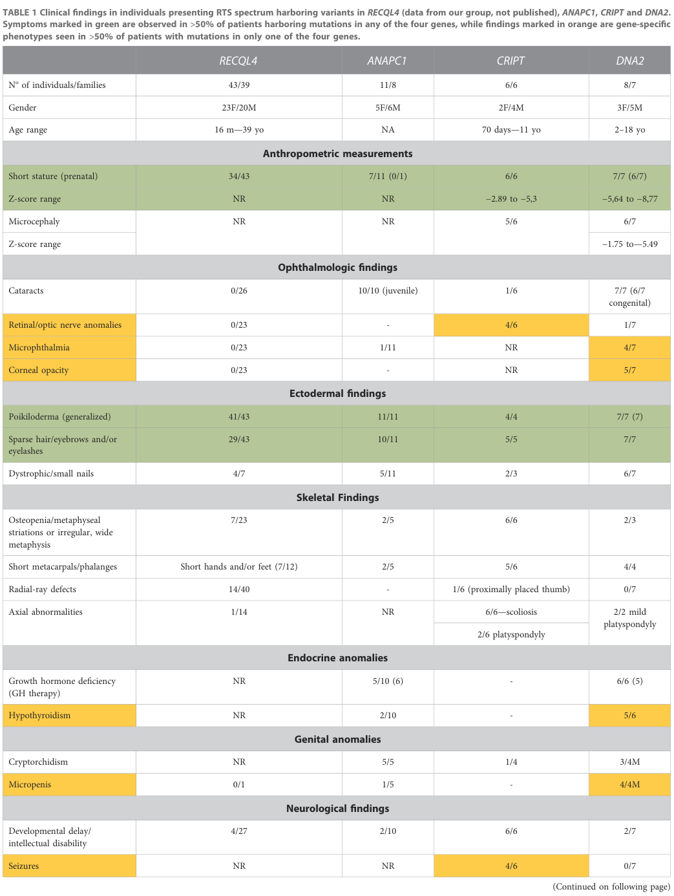

## Question

# Disease Characteristics Research Template

## Target Disease
- **Disease Name:** Rothmund-Thomson Syndrome
- **MONDO ID:**  (if available)
- **Category:** 

## Research Objectives

Please provide a comprehensive research report on **Rothmund-Thomson Syndrome** covering all of the
disease characteristics listed below. This report will be used to populate a disease knowledge
base entry. Be thorough and cite primary literature (PMID preferred) for all claims.

For each section, **suggested databases/resources** are listed. These are the first places
you should search for information on each topic.

---

### 1. Disease Information
> **Search first:** OMIM, Orphanet, ICD-10/ICD-11, MeSH, PubMed

- What is the disease? Provide a concise overview.
- What are the key identifiers? (OMIM, Orphanet, ICD-10/ICD-11, MeSH, Mondo)
- What are the common synonyms and alternative names?
- Is the information derived from individual patients (e.g., EHR) or aggregated disease-level resources?

### 2. Etiology

- **Disease Causal Factors**: What are the primary causes? (genetic, environmental, infectious, mechanistic)
- **Risk Factors**:
  > **Search first:** PubMed, Cochrane Library, UpToDate, clinical guidelines, ClinVar, ClinGen, GWAS Catalog, PheGenI, CTD, CDC, WHO, epidemiological databases
  - Genetic risk factors (causal variants, susceptibility loci, modifier genes)
  - Environmental risk factors (toxins, lifestyle, occupational exposures, age, sex, family history)
- **Protective Factors**:
  > **Search first:** PubMed, Cochrane Library, clinical trial databases, GWAS Catalog, gnomAD, WHO, CDC, nutrition databases
  - Genetic protective factors (protective variants, modifier alleles)
  - Environmental protective factors (diet, lifestyle, exposures that reduce risk)
- **Gene-Environment Interactions**: How do genetic and environmental factors interact to influence disease?
  > **Search first:** CTD, PubMed, PheGenI, GxE databases

### 3. Phenotypes
> **Search first:** HPO (Human Phenotype Ontology), OMIM, Orphanet, PubMed, clinicaltrials.gov, MedDRA, SNOMED CT, DECIPHER, LOINC

For each phenotype, provide:
- **Phenotype type**: symptoms, clinical signs, physical manifestations, behavioral changes, or laboratory abnormalities
  > For symptoms/signs: HPO, OMIM, Orphanet, PubMed
  > For behavioral changes: HPO, DSM, RDoC (Research Domain Criteria), PubMed
  > For laboratory abnormalities: LOINC, SNOMED CT, LabTests Online, PubMed
- **Phenotype characteristics**:
  > **Search first:** OMIM, Orphanet, HPO, PubMed
  - Age of symptom onset (neonatal, childhood, adult-onset, late-onset)
  - Symptom severity (mild, moderate, severe, variable)
  - Symptom progression (stable, progressive, episodic, fluctuating)
  - Frequency among affected individuals (percentage or qualitative)
- **Quality of life impact**: Effects on daily functioning and well-being (per-phenotype when possible)
  > **Search first:** EQ-5D database, SF-36, WHO QOL databases, PubMed
- Suggest HPO (Human Phenotype Ontology) terms for each phenotype

### 4. Genetic/Molecular Information

- **Causal Genes**: Gene mutations or chromosomal abnormalities responsible for disease (gene symbols, OMIM IDs)
  > **Search first:** OMIM, ClinVar, HGMD, Ensembl, NCBI Gene
- **Pathogenic Variants**:
  - Affected genes (gene symbols, HGNC IDs)
    > **Search first:** OMIM, NCBI Gene, Ensembl, HGNC, UniProt, GeneCards
  - Variant classification (pathogenic, likely pathogenic, VUS per ACMG/AMP guidelines)
    > **Search first:** ClinVar, ClinGen, ACMG/AMP guidelines, VarSome
  - Variant type/class (missense, frameshift, nonsense, splice-site, structural)
  - Allele frequency in population databases
    > **Search first:** gnomAD, 1000 Genomes, ExAC, TOPMed, dbSNP
  - Somatic vs germline origin
    > **Search first:** COSMIC (somatic), ClinVar, ICGC, TCGA
  - Functional consequences (loss of function, gain of function, dominant negative)
- **Modifier Genes**: Genes that modify disease severity or expression
- **Epigenetic Information**: DNA methylation, histone modifications, chromatin changes affecting disease
  > **Search first:** ENCODE, Roadmap Epigenomics, MethBase, DiseaseMeth
- **Chromosomal Abnormalities**: Large-scale genetic changes (aneuploidy, translocations, inversions)
  > **Search first:** DECIPHER, ClinVar, ECARUCA, UCSC Genome Browser

### 5. Environmental Information

- **Environmental Factors**: Non-genetic contributing factors (toxins, radiation, pollution, occupational exposure)
  > **Search first:** CTD (Comparative Toxicogenomics Database), TOXNET, PubMed, EPA databases
- **Lifestyle Factors**: Behavioral factors (smoking, diet, exercise, alcohol consumption)
  > **Search first:** CDC databases, WHO, PubMed, NHANES
- **Infectious Agents**: If applicable, pathogens causing or triggering disease (bacteria, viruses, fungi, parasites)
  > **Search first:** NCBI Taxonomy, ViPR, BV-BRC, MicrobeDB, GIDEON

### 6. Mechanism / Pathophysiology

- **Molecular Pathways**: Specific signaling cascades or biochemical pathways involved (Wnt, MAPK, mTOR, PI3K-AKT, etc.)
  > **Search first:** KEGG, Reactome, WikiPathways, PathBank, BioCyc
- **Cellular Processes**: Cell-level mechanisms (apoptosis, autophagy, cell cycle dysregulation, inflammation, etc.)
  > **Search first:** Gene Ontology (GO), Reactome, KEGG, PubMed
- **Protein Dysfunction**: How protein structure or function is altered (misfolding, aggregation, loss of function, gain of function)
  > **Search first:** UniProt, PDB (Protein Data Bank), InterPro, Pfam, AlphaFold
- **Metabolic Changes**: Alterations in metabolic processes (energy metabolism, lipid metabolism, amino acid metabolism)
  > **Search first:** KEGG, BioCyc, HMDB (Human Metabolome Database), BRENDA
- **Immune System Involvement**: Role of immune response (autoimmunity, immunodeficiency, chronic inflammation)
  > **Search first:** ImmPort, Immunome Database, IEDB, Gene Ontology
- **Tissue Damage Mechanisms**: How tissues/ are injured (oxidative stress, ischemia, fibrosis, necrosis)
  > **Search first:** PubMed, Gene Ontology, Reactome
- **Biochemical Abnormalities**: Specific molecular defects (enzyme deficiencies, receptor dysfunction, ion channel defects)
  > **Search first:** BRENDA, UniProt, KEGG, OMIM, PubMed
- **Epigenetic Changes**: DNA methylation, histone modifications affecting gene expression in disease
  > **Search first:** ENCODE, Roadmap Epigenomics, MethBase, DiseaseMeth
- **Molecular Profiling** (if available):
  - Transcriptomics/gene expression changes
    > **Search first:** GEO (Gene Expression Omnibus), ArrayExpress, GTEx, Human Cell Atlas, SRA
  - Proteomics findings
    > **Search first:** PRIDE, ProteomeXchange, Human Protein Atlas, STRING, BioGRID
  - Metabolomics signatures
    > **Search first:** MetaboLights, Metabolomics Workbench, HMDB, METLIN
  - Lipidomics alterations
    > **Search first:** LIPID MAPS, SwissLipids, LipidHome, Metabolomics Workbench
  - Genomic structural features
    > **Search first:** UCSC Genome Browser, Ensembl, NCBI, dbVar, DGV
- **Advanced Technologies** (if applicable):
  - Single-cell analysis findings (cell-type specific mechanisms, cellular heterogeneity)
    > **Search first:** Human Cell Atlas, Single Cell Portal, GEO, CELLxGENE
  - Spatial transcriptomics findings
    > **Search first:** GEO, Spatial Research, Vizgen, 10x Genomics data
  - Multi-omics integration results
    > **Search first:** TCGA, ICGC, cBioPortal, LinkedOmics, PubMed
  - Functional genomics screens (CRISPR, RNAi)
    > **Search first:** DepMap, GenomeRNAi, PubMed, BioGRID ORCS

For each mechanism, describe:
- The causal chain from initial trigger to clinical manifestation
- Which mechanisms are upstream vs downstream
- What cell types and biological processes are involved
- Suggest GO terms for biological processes and CL terms for cell types

### 7. Anatomical Structures Affected

- **Organ Level**:
  - Primary organs directly affected
  - Secondary organ involvement (complications, secondary effects)
  - Body systems involved (cardiovascular, nervous, digestive, respiratory, endocrine, etc.)
  > **Search first:** Uberon, FMA (Foundational Model of Anatomy), OMIM, HPO, ICD-11, MeSH, SNOMED CT
- **Tissue and Cell Level**:
  - Specific tissue types affected (epithelial, connective, muscle, nervous)
  - Specific cell populations targeted (with Cell Ontology terms)
  > **Search first:** Uberon, Human Protein Atlas, Cell Ontology, Human Cell Atlas, CellMarker, PanglaoDB
- **Subcellular Level**:
  - Cellular compartments involved (mitochondria, nucleus, ER, lysosomes) (with GO Cellular Component terms)
  > **Search first:** Gene Ontology (Cellular Component), UniProt, Human Protein Atlas
- **Localization**:
  - Specific anatomical sites (with UBERON terms)
    > **Search first:** FMA, Uberon, NeuroNames (for brain), SNOMED CT
  - Lateralization (unilateral, bilateral, asymmetric)
    > **Search first:** HPO, clinical literature, imaging databases

### 8. Temporal Development

- **Onset**:
  - Typical age of onset (congenital, pediatric, adult, geriatric)
  - Onset pattern (acute, subacute, chronic, insidious)
  > **Search first:** OMIM, Orphanet, HPO, PubMed
- **Progression**:
  - Disease stages (early, intermediate, advanced, end-stage)
    > **Search first:** Cancer Staging Manual (AJCC), WHO classifications, PubMed
  - Progression rate (rapid, slow, variable)
  - Disease course pattern (episodic, relapsing-remitting, progressive, stable)
  - Disease duration (self-limited, chronic lifelong)
  > **Search first:** Disease registries, longitudinal cohort databases, natural history studies, PubMed, Orphanet, OMIM
- **Patterns**:
  - Remission patterns (spontaneous, treatment-induced)
    > **Search first:** Clinical trial databases, disease registries, PubMed
  - Critical periods (time windows of vulnerability or opportunity for intervention)
    > **Search first:** PubMed, developmental biology databases, clinical guidelines

### 9. Inheritance and Population

- **Epidemiology**:
  - Prevalence (cases per 100,000 at given time)
  - Incidence (new cases per 100,000 per year)
  > **Search first:** Orphanet, CDC, WHO, GBD (Global Burden of Disease), national registries, SEER, disease registries
- **For Genetic Etiology**:
  - Inheritance pattern (AD, AR, X-linked, mitochondrial, multifactorial, polygenic)
    > **Search first:** OMIM, Orphanet, ClinVar, GTR (Genetic Testing Registry)
  - Penetrance (complete, incomplete, age-dependent)
    > **Search first:** ClinVar, OMIM, PubMed, ClinGen
  - Expressivity (variable, consistent)
    > **Search first:** OMIM, ClinVar, PubMed
  - Genetic anticipation (increasing severity in successive generations)
    > **Search first:** OMIM, PubMed (especially for repeat expansion disorders)
  - Germline mosaicism
    > **Search first:** ClinVar, OMIM, genetic counseling literature, PubMed
  - Founder effects (population-specific mutations)
    > **Search first:** gnomAD, population genetics databases, PubMed
  - Consanguinity role
    > **Search first:** OMIM, population studies, genetic counseling resources
  - Carrier frequency
    > **Search first:** gnomAD, carrier screening databases, GeneReviews, GTR
- **Population Demographics**:
  - Affected populations (ethnic or demographic groups with higher prevalence)
    > **Search first:** gnomAD, 1000 Genomes, PAGE Study, PubMed, population registries
  - Geographic distribution (endemic areas, regional variation)
    > **Search first:** WHO, CDC, GBD, Orphanet, geographic epidemiology databases
  - Geographic distribution of specific variants
  - Sex ratio (male:female)
    > **Search first:** Disease registries, OMIM, PubMed, epidemiological databases
  - Age distribution of affected individuals
    > **Search first:** CDC, disease registries, SEER, Orphanet

### 10. Diagnostics

- **Clinical Tests**:
  - Laboratory tests (blood, urine, tissue chemistry, specific enzyme assays)
    > **Search first:** LOINC, LabTests Online, PubMed
  - Biomarkers (proteins, metabolites, genetic markers, circulating biomarkers)
    > **Search first:** FDA Biomarker List, BEST (Biomarkers, EndpointS, and other Tools), PubMed
  - Imaging studies (X-ray, CT, MRI, PET, ultrasound)
    > **Search first:** RadLex, DICOM, Radiopaedia, imaging databases
  - Functional tests (pulmonary function, cardiac stress tests)
    > **Search first:** LOINC, clinical guidelines, PubMed
  - Electrophysiology (EEG, EMG, ECG, nerve conduction studies)
    > **Search first:** LOINC, clinical neurophysiology databases, PubMed
  - Biopsy findings (histopathology, immunohistochemistry)
    > **Search first:** SNOMED CT, College of American Pathologists resources, PubMed
  - Pathology findings (microscopic examination)
    > **Search first:** SNOMED CT, Digital Pathology databases, PubMed
- **Genetic Testing**:
  > **Search first:** GTR (Genetic Testing Registry), GeneReviews, ClinGen
  - Overview of recommended genetic testing approach
  - Whole genome sequencing (WGS) utility
    > **Search first:** GTR, ClinVar, GEL (Genomics England), gnomAD
  - Whole exome sequencing (WES) utility
    > **Search first:** GTR, ClinVar, OMIM, GeneMatcher
  - Gene panels (which panels, which genes)
    > **Search first:** GTR, ClinVar, laboratory-specific databases
  - Single gene testing
    > **Search first:** GTR, ClinVar, OMIM, GeneReviews
  - Chromosomal microarray (CMA)
    > **Search first:** DECIPHER, ClinVar, dbVar, ECARUCA
  - Karyotyping
    > **Search first:** Chromosome Abnormality Database, ClinVar, cytogenetics resources
  - FISH
    > **Search first:** ClinVar, cytogenetics databases, PubMed
  - Mitochondrial DNA testing
    > **Search first:** MITOMAP, MSeqDR, ClinVar, GTR
  - Repeat expansion testing
    > **Search first:** GTR, ClinVar, repeat expansion databases, PubMed
- **Omics-Based Diagnostics** (if applicable):
  - RNA sequencing / transcriptomics
    > **Search first:** GEO, ArrayExpress, GTEx, RNA-seq databases
  - Proteomics
    > **Search first:** PRIDE, ProteomeXchange, FDA Biomarker database
  - Metabolomics
    > **Search first:** MetaboLights, Metabolomics Workbench, HMDB
  - Epigenomics
    > **Search first:** GEO, ENCODE, Roadmap Epigenomics, MethBase
  - Liquid biopsy
    > **Search first:** COSMIC, ClinVar, liquid biopsy databases, PubMed
- **Clinical Criteria**:
  - Standardized diagnostic criteria (DSM, ICD, society guidelines)
    > **Search first:** DSM-5, ICD-11, clinical society guidelines, UpToDate
  - Differential diagnosis (other conditions to rule out, with distinguishing features)
    > **Search first:** DynaMed, UpToDate, clinical decision support systems
- **Screening**:
  - Screening methods for asymptomatic individuals (newborn screening, carrier screening, cascade screening)
    > **Search first:** ACMG recommendations, CDC newborn screening, GTR

### 11. Outcome/Prognosis

- **Survival and Mortality**:
  - Survival rate (5-year, 10-year, overall)
    > **Search first:** SEER, cancer registries, disease-specific registries, PubMed
  - Life expectancy (with and without treatment if applicable)
    > **Search first:** Orphanet, disease registries, actuarial databases, PubMed
  - Mortality rate
    > **Search first:** CDC, WHO, GBD, national mortality databases
  - Disease-specific mortality (deaths directly attributable to disease)
    > **Search first:** Disease registries, CDC Wonder, GBD, PubMed
- **Morbidity and Function**:
  - Morbidity (disease-related disability and health impacts)
    > **Search first:** GBD, WHO, disability databases, PubMed
  - Disability outcomes (long-term functional impairments)
    > **Search first:** ICF (International Classification of Functioning), disability registries
  - Quality of life measures (EQ-5D, SF-36, PROMIS, disease-specific tools)
    > **Search first:** EQ-5D database, SF-36, PROMIS, PubMed
- **Disease Course**:
  - Complications (secondary problems: infections, organ failure, etc.)
    > **Search first:** ICD codes, disease registries, clinical databases, PubMed
  - Recovery potential (likelihood and extent of recovery, with vs without treatment)
    > **Search first:** Natural history studies, rehabilitation databases, PubMed
- **Prediction**:
  - Prognostic factors (age, disease severity, biomarkers, treatment response)
    > **Search first:** Prognostic models databases, clinical calculators, PubMed
  - Prognostic biomarkers (molecular markers predicting disease course)
    > **Search first:** FDA Biomarker database, PubMed, cancer prognostic databases

### 12. Treatment

- **Pharmacotherapy**:
  - Pharmacological treatments (drug names, drug classes, mechanisms of action)
    > **Search first:** DrugBank, RxNorm, ATC classification, DailyMed, FDA databases
  - Pharmacogenomics (how genetic variants affect drug metabolism, efficacy, toxicity)
    > **Search first:** PharmGKB, CPIC (Clinical Pharmacogenetics), FDA Table of PGx Biomarkers
- **Advanced Therapeutics**:
  - Gene therapy (viral vectors, CRISPR, gene replacement, gene editing)
    > **Search first:** ClinicalTrials.gov, FDA gene therapy database, ASGCT resources
  - Cell therapy (stem cell transplant, CAR-T, cellular therapeutics)
    > **Search first:** ClinicalTrials.gov, FDA cell therapy database, FACT standards
  - RNA-based therapies (ASOs, siRNA, mRNA therapies)
    > **Search first:** ClinicalTrials.gov, FDA approvals, PubMed
  - Targeted therapies (treatments directed at specific molecular targets)
    > **Search first:** My Cancer Genome, OncoKB, ClinicalTrials.gov, FDA approvals
  - Immunotherapies (checkpoint inhibitors, monoclonal antibodies)
    > **Search first:** Cancer Immunotherapy Database, FDA approvals, ClinicalTrials.gov
- **Surgical and Interventional**:
  - Surgical interventions (types of surgery, timing, outcomes)
    > **Search first:** CPT codes, surgical registries, clinical guidelines, PubMed
- **Supportive and Rehabilitative**:
  - Supportive care (symptom management, pain control, nutrition)
    > **Search first:** Clinical guidelines, Cochrane Library, PubMed
  - Rehabilitation (physical therapy, occupational therapy, speech therapy)
    > **Search first:** Rehabilitation medicine databases, clinical guidelines, PubMed
- **Experimental**:
  - Experimental treatments in clinical trials (with NCT identifiers if available)
    > **Search first:** ClinicalTrials.gov, EU Clinical Trials Register, WHO ICTRP
- **Treatment Outcomes**:
  - Treatment response rates
    > **Search first:** Clinical trial databases, FDA reviews, systematic reviews, PubMed
  - Side effects and adverse events
    > **Search first:** FDA Adverse Event Reporting System (FAERS), MedWatch, PubMed
- **Treatment Strategy**:
  - Treatment algorithms (clinical pathways, decision trees)
    > **Search first:** Clinical practice guidelines, NCCN Guidelines, UpToDate
  - Combination therapies
    > **Search first:** ClinicalTrials.gov, treatment guidelines, PubMed
  - Personalized medicine approaches (genotype-guided treatment)
    > **Search first:** My Cancer Genome, CIViC, PharmGKB, precision medicine databases

For each treatment, suggest MAXO (Medical Action Ontology) terms where applicable.

### 13. Prevention

- **Prevention Levels**:
  - Primary prevention (preventing disease occurrence: vaccination, risk factor modification)
    > **Search first:** CDC, WHO, USPSTF recommendations, Cochrane Library
  - Secondary prevention (early detection and treatment: screening programs, early intervention)
    > **Search first:** USPSTF, CDC screening guidelines, WHO
  - Tertiary prevention (preventing complications in those with disease)
    > **Search first:** Clinical guidelines, disease management protocols, PubMed
- **Immunization**: Vaccine strategies (if applicable)
  > **Search first:** CDC vaccine schedules, WHO immunization, FDA vaccine database
- **Screening and Early Detection**:
  - Screening programs (population-based: newborn screening, cancer screening)
    > **Search first:** CDC screening programs, USPSTF, cancer screening databases
  - Genetic screening (carrier screening, preimplantation genetic diagnosis, prenatal testing)
    > **Search first:** ACMG recommendations, ACOG guidelines, GTR
  - Risk stratification (identifying high-risk individuals for targeted prevention)
    > **Search first:** Risk prediction models, clinical calculators, PubMed
- **Behavioral Interventions**: Lifestyle modifications to reduce risk
  > **Search first:** CDC, WHO, behavioral intervention databases, Cochrane Library
- **Counseling**: Genetic counseling (risk assessment, family planning guidance)
  > **Search first:** NSGC resources, ACMG guidelines, GeneReviews
- **Public Health**:
  - Public health interventions (sanitation, vector control, health education)
    > **Search first:** CDC, WHO, public health databases, PubMed
  - Environmental interventions (reducing environmental risk factors)
    > **Search first:** EPA databases, WHO environmental health, PubMed
- **Prophylaxis**: Preventive medications or procedures
  > **Search first:** Clinical guidelines, FDA approvals, PubMed

### 14. Other Species / Natural Disease

- **Taxonomy**: Species affected (with NCBI Taxon identifiers)
  > **Search first:** NCBI Taxonomy
- **Breed**: Specific breeds affected (with VBO identifiers if applicable)
  > **Search first:** VBO (Vertebrate Breed Ontology)
- **Gene**: Orthologous genes in other species (with NCBI Gene IDs)
  > **Search first:** NCBI Gene
- **Natural Disease**:
  - Naturally occurring disease in other species (companion animals, wildlife)
    > **Search first:** OMIA (Online Mendelian Inheritance in Animals), VetCompass, PubMed
  - Veterinary relevance and importance in animal health
    > **Search first:** OMIA, veterinary databases, PubMed
- **Comparative Biology**:
  - Comparative pathology (similarities and differences across species)
    > **Search first:** OMIA, comparative pathology databases, PubMed
  - Evolutionary conservation of disease mechanisms
    > **Search first:** HomoloGene, OrthoMCL, Alliance of Genome Resources
- **Transmission** (if applicable):
  - Zoonotic potential
    > **Search first:** CDC zoonotic diseases, WHO zoonoses, GIDEON
  - Cross-species susceptibility
    > **Search first:** NCBI Taxonomy, veterinary databases, PubMed

### 15. Model Organisms

- **Model Types**:
  - Model organism type (mammalian, invertebrate, cellular, in vitro)
    > **Search first:** Alliance of Genome Resources, model organism databases
  - Specific model systems (mouse, rat, zebrafish, Drosophila, C. elegans, yeast, cell lines, organoids, iPSCs)
    > **Search first:** MGI, RGD, ZFIN, FlyBase, WormBase, SGD, ATCC, Cellosaurus
  - Induced models (drug treatment, surgical intervention, environmental manipulation)
    > **Search first:** MGI, model organism databases, PubMed
- **Genetic Models**:
  - Types available (knockout, knock-in, transgenic, conditional, humanized)
    > **Search first:** MGI, IMPC, KOMP, EuMMCR, IMSR
- **Model Characteristics**:
  - Phenotype recapitulation (how well model reproduces human disease features)
    > **Search first:** Model organism databases, comparative studies, PubMed
  - Model limitations (aspects of human disease not captured)
    > **Search first:** Model organism databases, PubMed, review articles
- **Applications**:
  - Research applications (what aspects of disease can be studied)
    > **Search first:** Model organism databases, PubMed
- **Resources**:
  - Model databases
    > **Search first:** MGI, RGD, ZFIN, FlyBase, WormBase, IMSR, EMMA, MMRRC

---

## Citation Requirements

- Cite primary literature (PMID preferred) for all mechanistic and clinical claims
- Prioritize recent reviews and landmark papers
- Include direct quotes from abstracts where possible to support key statements
- Distinguish evidence source types: human clinical, model organism, in vitro, computational

## Output Format

Structure your response as a comprehensive narrative organized by the sections above.
For each section, provide:
- Factual content with specific details (numbers, percentages, gene names, variant nomenclature)
- Ontology term suggestions (HPO, GO, CL, UBERON, CHEBI, MAXO, MONDO) where applicable
- Evidence citations with PMIDs
- Direct quotes from abstracts to support key claims
- Clear indication when information is not available or not applicable for this disease

This report will be used to populate a disease knowledge base entry with:
- Pathophysiology descriptions with causal chains
- Gene/protein annotations (HGNC, GO terms)
- Phenotype associations (HP terms) with frequencies
- Cell type involvement (CL terms)
- Anatomical locations (UBERON terms)
- Chemical entities (CHEBI terms)
- Treatment annotations (MAXO terms)
- Evidence items with PMIDs and exact abstract quotes
- Epidemiology, prognosis, diagnostic, and prevention information
- Animal model descriptions with phenotype recapitulation details

## Output

Question: You are an expert researcher providing comprehensive, well-cited information.

Provide detailed information focusing on:
1. Key concepts and definitions with current understanding
2. Recent developments and latest research (prioritize 2023-2024 sources)
3. Current applications and real-world implementations
4. Expert opinions and analysis from authoritative sources
5. Relevant statistics and data from recent studies

Format as a comprehensive research report with proper citations. Include URLs and publication dates where available.
Always prioritize recent, authoritative sources and provide specific citations for all major claims.

# Disease Characteristics Research Template

## Target Disease
- **Disease Name:** Rothmund-Thomson Syndrome
- **MONDO ID:**  (if available)
- **Category:** 

## Research Objectives

Please provide a comprehensive research report on **Rothmund-Thomson Syndrome** covering all of the
disease characteristics listed below. This report will be used to populate a disease knowledge
base entry. Be thorough and cite primary literature (PMID preferred) for all claims.

For each section, **suggested databases/resources** are listed. These are the first places
you should search for information on each topic.

---

### 1. Disease Information
> **Search first:** OMIM, Orphanet, ICD-10/ICD-11, MeSH, PubMed

- What is the disease? Provide a concise overview.
- What are the key identifiers? (OMIM, Orphanet, ICD-10/ICD-11, MeSH, Mondo)
- What are the common synonyms and alternative names?
- Is the information derived from individual patients (e.g., EHR) or aggregated disease-level resources?

### 2. Etiology

- **Disease Causal Factors**: What are the primary causes? (genetic, environmental, infectious, mechanistic)
- **Risk Factors**:
  > **Search first:** PubMed, Cochrane Library, UpToDate, clinical guidelines, ClinVar, ClinGen, GWAS Catalog, PheGenI, CTD, CDC, WHO, epidemiological databases
  - Genetic risk factors (causal variants, susceptibility loci, modifier genes)
  - Environmental risk factors (toxins, lifestyle, occupational exposures, age, sex, family history)
- **Protective Factors**:
  > **Search first:** PubMed, Cochrane Library, clinical trial databases, GWAS Catalog, gnomAD, WHO, CDC, nutrition databases
  - Genetic protective factors (protective variants, modifier alleles)
  - Environmental protective factors (diet, lifestyle, exposures that reduce risk)
- **Gene-Environment Interactions**: How do genetic and environmental factors interact to influence disease?
  > **Search first:** CTD, PubMed, PheGenI, GxE databases

### 3. Phenotypes
> **Search first:** HPO (Human Phenotype Ontology), OMIM, Orphanet, PubMed, clinicaltrials.gov, MedDRA, SNOMED CT, DECIPHER, LOINC

For each phenotype, provide:
- **Phenotype type**: symptoms, clinical signs, physical manifestations, behavioral changes, or laboratory abnormalities
  > For symptoms/signs: HPO, OMIM, Orphanet, PubMed
  > For behavioral changes: HPO, DSM, RDoC (Research Domain Criteria), PubMed
  > For laboratory abnormalities: LOINC, SNOMED CT, LabTests Online, PubMed
- **Phenotype characteristics**:
  > **Search first:** OMIM, Orphanet, HPO, PubMed
  - Age of symptom onset (neonatal, childhood, adult-onset, late-onset)
  - Symptom severity (mild, moderate, severe, variable)
  - Symptom progression (stable, progressive, episodic, fluctuating)
  - Frequency among affected individuals (percentage or qualitative)
- **Quality of life impact**: Effects on daily functioning and well-being (per-phenotype when possible)
  > **Search first:** EQ-5D database, SF-36, WHO QOL databases, PubMed
- Suggest HPO (Human Phenotype Ontology) terms for each phenotype

### 4. Genetic/Molecular Information

- **Causal Genes**: Gene mutations or chromosomal abnormalities responsible for disease (gene symbols, OMIM IDs)
  > **Search first:** OMIM, ClinVar, HGMD, Ensembl, NCBI Gene
- **Pathogenic Variants**:
  - Affected genes (gene symbols, HGNC IDs)
    > **Search first:** OMIM, NCBI Gene, Ensembl, HGNC, UniProt, GeneCards
  - Variant classification (pathogenic, likely pathogenic, VUS per ACMG/AMP guidelines)
    > **Search first:** ClinVar, ClinGen, ACMG/AMP guidelines, VarSome
  - Variant type/class (missense, frameshift, nonsense, splice-site, structural)
  - Allele frequency in population databases
    > **Search first:** gnomAD, 1000 Genomes, ExAC, TOPMed, dbSNP
  - Somatic vs germline origin
    > **Search first:** COSMIC (somatic), ClinVar, ICGC, TCGA
  - Functional consequences (loss of function, gain of function, dominant negative)
- **Modifier Genes**: Genes that modify disease severity or expression
- **Epigenetic Information**: DNA methylation, histone modifications, chromatin changes affecting disease
  > **Search first:** ENCODE, Roadmap Epigenomics, MethBase, DiseaseMeth
- **Chromosomal Abnormalities**: Large-scale genetic changes (aneuploidy, translocations, inversions)
  > **Search first:** DECIPHER, ClinVar, ECARUCA, UCSC Genome Browser

### 5. Environmental Information

- **Environmental Factors**: Non-genetic contributing factors (toxins, radiation, pollution, occupational exposure)
  > **Search first:** CTD (Comparative Toxicogenomics Database), TOXNET, PubMed, EPA databases
- **Lifestyle Factors**: Behavioral factors (smoking, diet, exercise, alcohol consumption)
  > **Search first:** CDC databases, WHO, PubMed, NHANES
- **Infectious Agents**: If applicable, pathogens causing or triggering disease (bacteria, viruses, fungi, parasites)
  > **Search first:** NCBI Taxonomy, ViPR, BV-BRC, MicrobeDB, GIDEON

### 6. Mechanism / Pathophysiology

- **Molecular Pathways**: Specific signaling cascades or biochemical pathways involved (Wnt, MAPK, mTOR, PI3K-AKT, etc.)
  > **Search first:** KEGG, Reactome, WikiPathways, PathBank, BioCyc
- **Cellular Processes**: Cell-level mechanisms (apoptosis, autophagy, cell cycle dysregulation, inflammation, etc.)
  > **Search first:** Gene Ontology (GO), Reactome, KEGG, PubMed
- **Protein Dysfunction**: How protein structure or function is altered (misfolding, aggregation, loss of function, gain of function)
  > **Search first:** UniProt, PDB (Protein Data Bank), InterPro, Pfam, AlphaFold
- **Metabolic Changes**: Alterations in metabolic processes (energy metabolism, lipid metabolism, amino acid metabolism)
  > **Search first:** KEGG, BioCyc, HMDB (Human Metabolome Database), BRENDA
- **Immune System Involvement**: Role of immune response (autoimmunity, immunodeficiency, chronic inflammation)
  > **Search first:** ImmPort, Immunome Database, IEDB, Gene Ontology
- **Tissue Damage Mechanisms**: How tissues/ are injured (oxidative stress, ischemia, fibrosis, necrosis)
  > **Search first:** PubMed, Gene Ontology, Reactome
- **Biochemical Abnormalities**: Specific molecular defects (enzyme deficiencies, receptor dysfunction, ion channel defects)
  > **Search first:** BRENDA, UniProt, KEGG, OMIM, PubMed
- **Epigenetic Changes**: DNA methylation, histone modifications affecting gene expression in disease
  > **Search first:** ENCODE, Roadmap Epigenomics, MethBase, DiseaseMeth
- **Molecular Profiling** (if available):
  - Transcriptomics/gene expression changes
    > **Search first:** GEO (Gene Expression Omnibus), ArrayExpress, GTEx, Human Cell Atlas, SRA
  - Proteomics findings
    > **Search first:** PRIDE, ProteomeXchange, Human Protein Atlas, STRING, BioGRID
  - Metabolomics signatures
    > **Search first:** MetaboLights, Metabolomics Workbench, HMDB, METLIN
  - Lipidomics alterations
    > **Search first:** LIPID MAPS, SwissLipids, LipidHome, Metabolomics Workbench
  - Genomic structural features
    > **Search first:** UCSC Genome Browser, Ensembl, NCBI, dbVar, DGV
- **Advanced Technologies** (if applicable):
  - Single-cell analysis findings (cell-type specific mechanisms, cellular heterogeneity)
    > **Search first:** Human Cell Atlas, Single Cell Portal, GEO, CELLxGENE
  - Spatial transcriptomics findings
    > **Search first:** GEO, Spatial Research, Vizgen, 10x Genomics data
  - Multi-omics integration results
    > **Search first:** TCGA, ICGC, cBioPortal, LinkedOmics, PubMed
  - Functional genomics screens (CRISPR, RNAi)
    > **Search first:** DepMap, GenomeRNAi, PubMed, BioGRID ORCS

For each mechanism, describe:
- The causal chain from initial trigger to clinical manifestation
- Which mechanisms are upstream vs downstream
- What cell types and biological processes are involved
- Suggest GO terms for biological processes and CL terms for cell types

### 7. Anatomical Structures Affected

- **Organ Level**:
  - Primary organs directly affected
  - Secondary organ involvement (complications, secondary effects)
  - Body systems involved (cardiovascular, nervous, digestive, respiratory, endocrine, etc.)
  > **Search first:** Uberon, FMA (Foundational Model of Anatomy), OMIM, HPO, ICD-11, MeSH, SNOMED CT
- **Tissue and Cell Level**:
  - Specific tissue types affected (epithelial, connective, muscle, nervous)
  - Specific cell populations targeted (with Cell Ontology terms)
  > **Search first:** Uberon, Human Protein Atlas, Cell Ontology, Human Cell Atlas, CellMarker, PanglaoDB
- **Subcellular Level**:
  - Cellular compartments involved (mitochondria, nucleus, ER, lysosomes) (with GO Cellular Component terms)
  > **Search first:** Gene Ontology (Cellular Component), UniProt, Human Protein Atlas
- **Localization**:
  - Specific anatomical sites (with UBERON terms)
    > **Search first:** FMA, Uberon, NeuroNames (for brain), SNOMED CT
  - Lateralization (unilateral, bilateral, asymmetric)
    > **Search first:** HPO, clinical literature, imaging databases

### 8. Temporal Development

- **Onset**:
  - Typical age of onset (congenital, pediatric, adult, geriatric)
  - Onset pattern (acute, subacute, chronic, insidious)
  > **Search first:** OMIM, Orphanet, HPO, PubMed
- **Progression**:
  - Disease stages (early, intermediate, advanced, end-stage)
    > **Search first:** Cancer Staging Manual (AJCC), WHO classifications, PubMed
  - Progression rate (rapid, slow, variable)
  - Disease course pattern (episodic, relapsing-remitting, progressive, stable)
  - Disease duration (self-limited, chronic lifelong)
  > **Search first:** Disease registries, longitudinal cohort databases, natural history studies, PubMed, Orphanet, OMIM
- **Patterns**:
  - Remission patterns (spontaneous, treatment-induced)
    > **Search first:** Clinical trial databases, disease registries, PubMed
  - Critical periods (time windows of vulnerability or opportunity for intervention)
    > **Search first:** PubMed, developmental biology databases, clinical guidelines

### 9. Inheritance and Population

- **Epidemiology**:
  - Prevalence (cases per 100,000 at given time)
  - Incidence (new cases per 100,000 per year)
  > **Search first:** Orphanet, CDC, WHO, GBD (Global Burden of Disease), national registries, SEER, disease registries
- **For Genetic Etiology**:
  - Inheritance pattern (AD, AR, X-linked, mitochondrial, multifactorial, polygenic)
    > **Search first:** OMIM, Orphanet, ClinVar, GTR (Genetic Testing Registry)
  - Penetrance (complete, incomplete, age-dependent)
    > **Search first:** ClinVar, OMIM, PubMed, ClinGen
  - Expressivity (variable, consistent)
    > **Search first:** OMIM, ClinVar, PubMed
  - Genetic anticipation (increasing severity in successive generations)
    > **Search first:** OMIM, PubMed (especially for repeat expansion disorders)
  - Germline mosaicism
    > **Search first:** ClinVar, OMIM, genetic counseling literature, PubMed
  - Founder effects (population-specific mutations)
    > **Search first:** gnomAD, population genetics databases, PubMed
  - Consanguinity role
    > **Search first:** OMIM, population studies, genetic counseling resources
  - Carrier frequency
    > **Search first:** gnomAD, carrier screening databases, GeneReviews, GTR
- **Population Demographics**:
  - Affected populations (ethnic or demographic groups with higher prevalence)
    > **Search first:** gnomAD, 1000 Genomes, PAGE Study, PubMed, population registries
  - Geographic distribution (endemic areas, regional variation)
    > **Search first:** WHO, CDC, GBD, Orphanet, geographic epidemiology databases
  - Geographic distribution of specific variants
  - Sex ratio (male:female)
    > **Search first:** Disease registries, OMIM, PubMed, epidemiological databases
  - Age distribution of affected individuals
    > **Search first:** CDC, disease registries, SEER, Orphanet

### 10. Diagnostics

- **Clinical Tests**:
  - Laboratory tests (blood, urine, tissue chemistry, specific enzyme assays)
    > **Search first:** LOINC, LabTests Online, PubMed
  - Biomarkers (proteins, metabolites, genetic markers, circulating biomarkers)
    > **Search first:** FDA Biomarker List, BEST (Biomarkers, EndpointS, and other Tools), PubMed
  - Imaging studies (X-ray, CT, MRI, PET, ultrasound)
    > **Search first:** RadLex, DICOM, Radiopaedia, imaging databases
  - Functional tests (pulmonary function, cardiac stress tests)
    > **Search first:** LOINC, clinical guidelines, PubMed
  - Electrophysiology (EEG, EMG, ECG, nerve conduction studies)
    > **Search first:** LOINC, clinical neurophysiology databases, PubMed
  - Biopsy findings (histopathology, immunohistochemistry)
    > **Search first:** SNOMED CT, College of American Pathologists resources, PubMed
  - Pathology findings (microscopic examination)
    > **Search first:** SNOMED CT, Digital Pathology databases, PubMed
- **Genetic Testing**:
  > **Search first:** GTR (Genetic Testing Registry), GeneReviews, ClinGen
  - Overview of recommended genetic testing approach
  - Whole genome sequencing (WGS) utility
    > **Search first:** GTR, ClinVar, GEL (Genomics England), gnomAD
  - Whole exome sequencing (WES) utility
    > **Search first:** GTR, ClinVar, OMIM, GeneMatcher
  - Gene panels (which panels, which genes)
    > **Search first:** GTR, ClinVar, laboratory-specific databases
  - Single gene testing
    > **Search first:** GTR, ClinVar, OMIM, GeneReviews
  - Chromosomal microarray (CMA)
    > **Search first:** DECIPHER, ClinVar, dbVar, ECARUCA
  - Karyotyping
    > **Search first:** Chromosome Abnormality Database, ClinVar, cytogenetics resources
  - FISH
    > **Search first:** ClinVar, cytogenetics databases, PubMed
  - Mitochondrial DNA testing
    > **Search first:** MITOMAP, MSeqDR, ClinVar, GTR
  - Repeat expansion testing
    > **Search first:** GTR, ClinVar, repeat expansion databases, PubMed
- **Omics-Based Diagnostics** (if applicable):
  - RNA sequencing / transcriptomics
    > **Search first:** GEO, ArrayExpress, GTEx, RNA-seq databases
  - Proteomics
    > **Search first:** PRIDE, ProteomeXchange, FDA Biomarker database
  - Metabolomics
    > **Search first:** MetaboLights, Metabolomics Workbench, HMDB
  - Epigenomics
    > **Search first:** GEO, ENCODE, Roadmap Epigenomics, MethBase
  - Liquid biopsy
    > **Search first:** COSMIC, ClinVar, liquid biopsy databases, PubMed
- **Clinical Criteria**:
  - Standardized diagnostic criteria (DSM, ICD, society guidelines)
    > **Search first:** DSM-5, ICD-11, clinical society guidelines, UpToDate
  - Differential diagnosis (other conditions to rule out, with distinguishing features)
    > **Search first:** DynaMed, UpToDate, clinical decision support systems
- **Screening**:
  - Screening methods for asymptomatic individuals (newborn screening, carrier screening, cascade screening)
    > **Search first:** ACMG recommendations, CDC newborn screening, GTR

### 11. Outcome/Prognosis

- **Survival and Mortality**:
  - Survival rate (5-year, 10-year, overall)
    > **Search first:** SEER, cancer registries, disease-specific registries, PubMed
  - Life expectancy (with and without treatment if applicable)
    > **Search first:** Orphanet, disease registries, actuarial databases, PubMed
  - Mortality rate
    > **Search first:** CDC, WHO, GBD, national mortality databases
  - Disease-specific mortality (deaths directly attributable to disease)
    > **Search first:** Disease registries, CDC Wonder, GBD, PubMed
- **Morbidity and Function**:
  - Morbidity (disease-related disability and health impacts)
    > **Search first:** GBD, WHO, disability databases, PubMed
  - Disability outcomes (long-term functional impairments)
    > **Search first:** ICF (International Classification of Functioning), disability registries
  - Quality of life measures (EQ-5D, SF-36, PROMIS, disease-specific tools)
    > **Search first:** EQ-5D database, SF-36, PROMIS, PubMed
- **Disease Course**:
  - Complications (secondary problems: infections, organ failure, etc.)
    > **Search first:** ICD codes, disease registries, clinical databases, PubMed
  - Recovery potential (likelihood and extent of recovery, with vs without treatment)
    > **Search first:** Natural history studies, rehabilitation databases, PubMed
- **Prediction**:
  - Prognostic factors (age, disease severity, biomarkers, treatment response)
    > **Search first:** Prognostic models databases, clinical calculators, PubMed
  - Prognostic biomarkers (molecular markers predicting disease course)
    > **Search first:** FDA Biomarker database, PubMed, cancer prognostic databases

### 12. Treatment

- **Pharmacotherapy**:
  - Pharmacological treatments (drug names, drug classes, mechanisms of action)
    > **Search first:** DrugBank, RxNorm, ATC classification, DailyMed, FDA databases
  - Pharmacogenomics (how genetic variants affect drug metabolism, efficacy, toxicity)
    > **Search first:** PharmGKB, CPIC (Clinical Pharmacogenetics), FDA Table of PGx Biomarkers
- **Advanced Therapeutics**:
  - Gene therapy (viral vectors, CRISPR, gene replacement, gene editing)
    > **Search first:** ClinicalTrials.gov, FDA gene therapy database, ASGCT resources
  - Cell therapy (stem cell transplant, CAR-T, cellular therapeutics)
    > **Search first:** ClinicalTrials.gov, FDA cell therapy database, FACT standards
  - RNA-based therapies (ASOs, siRNA, mRNA therapies)
    > **Search first:** ClinicalTrials.gov, FDA approvals, PubMed
  - Targeted therapies (treatments directed at specific molecular targets)
    > **Search first:** My Cancer Genome, OncoKB, ClinicalTrials.gov, FDA approvals
  - Immunotherapies (checkpoint inhibitors, monoclonal antibodies)
    > **Search first:** Cancer Immunotherapy Database, FDA approvals, ClinicalTrials.gov
- **Surgical and Interventional**:
  - Surgical interventions (types of surgery, timing, outcomes)
    > **Search first:** CPT codes, surgical registries, clinical guidelines, PubMed
- **Supportive and Rehabilitative**:
  - Supportive care (symptom management, pain control, nutrition)
    > **Search first:** Clinical guidelines, Cochrane Library, PubMed
  - Rehabilitation (physical therapy, occupational therapy, speech therapy)
    > **Search first:** Rehabilitation medicine databases, clinical guidelines, PubMed
- **Experimental**:
  - Experimental treatments in clinical trials (with NCT identifiers if available)
    > **Search first:** ClinicalTrials.gov, EU Clinical Trials Register, WHO ICTRP
- **Treatment Outcomes**:
  - Treatment response rates
    > **Search first:** Clinical trial databases, FDA reviews, systematic reviews, PubMed
  - Side effects and adverse events
    > **Search first:** FDA Adverse Event Reporting System (FAERS), MedWatch, PubMed
- **Treatment Strategy**:
  - Treatment algorithms (clinical pathways, decision trees)
    > **Search first:** Clinical practice guidelines, NCCN Guidelines, UpToDate
  - Combination therapies
    > **Search first:** ClinicalTrials.gov, treatment guidelines, PubMed
  - Personalized medicine approaches (genotype-guided treatment)
    > **Search first:** My Cancer Genome, CIViC, PharmGKB, precision medicine databases

For each treatment, suggest MAXO (Medical Action Ontology) terms where applicable.

### 13. Prevention

- **Prevention Levels**:
  - Primary prevention (preventing disease occurrence: vaccination, risk factor modification)
    > **Search first:** CDC, WHO, USPSTF recommendations, Cochrane Library
  - Secondary prevention (early detection and treatment: screening programs, early intervention)
    > **Search first:** USPSTF, CDC screening guidelines, WHO
  - Tertiary prevention (preventing complications in those with disease)
    > **Search first:** Clinical guidelines, disease management protocols, PubMed
- **Immunization**: Vaccine strategies (if applicable)
  > **Search first:** CDC vaccine schedules, WHO immunization, FDA vaccine database
- **Screening and Early Detection**:
  - Screening programs (population-based: newborn screening, cancer screening)
    > **Search first:** CDC screening programs, USPSTF, cancer screening databases
  - Genetic screening (carrier screening, preimplantation genetic diagnosis, prenatal testing)
    > **Search first:** ACMG recommendations, ACOG guidelines, GTR
  - Risk stratification (identifying high-risk individuals for targeted prevention)
    > **Search first:** Risk prediction models, clinical calculators, PubMed
- **Behavioral Interventions**: Lifestyle modifications to reduce risk
  > **Search first:** CDC, WHO, behavioral intervention databases, Cochrane Library
- **Counseling**: Genetic counseling (risk assessment, family planning guidance)
  > **Search first:** NSGC resources, ACMG guidelines, GeneReviews
- **Public Health**:
  - Public health interventions (sanitation, vector control, health education)
    > **Search first:** CDC, WHO, public health databases, PubMed
  - Environmental interventions (reducing environmental risk factors)
    > **Search first:** EPA databases, WHO environmental health, PubMed
- **Prophylaxis**: Preventive medications or procedures
  > **Search first:** Clinical guidelines, FDA approvals, PubMed

### 14. Other Species / Natural Disease

- **Taxonomy**: Species affected (with NCBI Taxon identifiers)
  > **Search first:** NCBI Taxonomy
- **Breed**: Specific breeds affected (with VBO identifiers if applicable)
  > **Search first:** VBO (Vertebrate Breed Ontology)
- **Gene**: Orthologous genes in other species (with NCBI Gene IDs)
  > **Search first:** NCBI Gene
- **Natural Disease**:
  - Naturally occurring disease in other species (companion animals, wildlife)
    > **Search first:** OMIA (Online Mendelian Inheritance in Animals), VetCompass, PubMed
  - Veterinary relevance and importance in animal health
    > **Search first:** OMIA, veterinary databases, PubMed
- **Comparative Biology**:
  - Comparative pathology (similarities and differences across species)
    > **Search first:** OMIA, comparative pathology databases, PubMed
  - Evolutionary conservation of disease mechanisms
    > **Search first:** HomoloGene, OrthoMCL, Alliance of Genome Resources
- **Transmission** (if applicable):
  - Zoonotic potential
    > **Search first:** CDC zoonotic diseases, WHO zoonoses, GIDEON
  - Cross-species susceptibility
    > **Search first:** NCBI Taxonomy, veterinary databases, PubMed

### 15. Model Organisms

- **Model Types**:
  - Model organism type (mammalian, invertebrate, cellular, in vitro)
    > **Search first:** Alliance of Genome Resources, model organism databases
  - Specific model systems (mouse, rat, zebrafish, Drosophila, C. elegans, yeast, cell lines, organoids, iPSCs)
    > **Search first:** MGI, RGD, ZFIN, FlyBase, WormBase, SGD, ATCC, Cellosaurus
  - Induced models (drug treatment, surgical intervention, environmental manipulation)
    > **Search first:** MGI, model organism databases, PubMed
- **Genetic Models**:
  - Types available (knockout, knock-in, transgenic, conditional, humanized)
    > **Search first:** MGI, IMPC, KOMP, EuMMCR, IMSR
- **Model Characteristics**:
  - Phenotype recapitulation (how well model reproduces human disease features)
    > **Search first:** Model organism databases, comparative studies, PubMed
  - Model limitations (aspects of human disease not captured)
    > **Search first:** Model organism databases, PubMed, review articles
- **Applications**:
  - Research applications (what aspects of disease can be studied)
    > **Search first:** Model organism databases, PubMed
- **Resources**:
  - Model databases
    > **Search first:** MGI, RGD, ZFIN, FlyBase, WormBase, IMSR, EMMA, MMRRC

---

## Citation Requirements

- Cite primary literature (PMID preferred) for all mechanistic and clinical claims
- Prioritize recent reviews and landmark papers
- Include direct quotes from abstracts where possible to support key statements
- Distinguish evidence source types: human clinical, model organism, in vitro, computational

## Output Format

Structure your response as a comprehensive narrative organized by the sections above.
For each section, provide:
- Factual content with specific details (numbers, percentages, gene names, variant nomenclature)
- Ontology term suggestions (HPO, GO, CL, UBERON, CHEBI, MAXO, MONDO) where applicable
- Evidence citations with PMIDs
- Direct quotes from abstracts to support key claims
- Clear indication when information is not available or not applicable for this disease

This report will be used to populate a disease knowledge base entry with:
- Pathophysiology descriptions with causal chains
- Gene/protein annotations (HGNC, GO terms)
- Phenotype associations (HP terms) with frequencies
- Cell type involvement (CL terms)
- Anatomical locations (UBERON terms)
- Chemical entities (CHEBI terms)
- Treatment annotations (MAXO terms)
- Evidence items with PMIDs and exact abstract quotes
- Epidemiology, prognosis, diagnostic, and prevention information
- Animal model descriptions with phenotype recapitulation details

## Rothmund–Thomson Syndrome (RTS): Disease Characteristics Research Report

**Target disease:** Rothmund–Thomson syndrome (RTS)

### Executive summary
RTS is a rare autosomal recessive genodermatosis whose diagnostic hallmark is a characteristic early-onset rash that begins on the face and evolves into poikiloderma, accompanied by variable ectodermal, skeletal, ocular, and cancer-predisposition features. RTS has expanded from a single-gene disorder (RECQL4) to a genetically heterogeneous spectrum that can also involve ANAPC1 (RTS type 1), and more recently DNA2 and CRIPT, which produce RTS-like phenotypes with gene-specific differences in cataracts, neurodevelopment, and (as currently observed) cancer risk. (martins2023rothmundthomsonsyndromea pages 1-2, martins2023rothmundthomsonsyndromea pages 2-3, larizza2010rothmundthomsonsyndrome pages 1-2, martins2023rothmundthomsonsyndromea pages 3-4)

---

## 1. Disease Information

### 1.1 Definition and overview (current understanding)
RTS is classically defined as an autosomal recessive genodermatosis in which **poikiloderma** is the major hallmark. (martins2023rothmundthomsonsyndromea pages 1-2, larizza2010rothmundthomsonsyndrome pages 1-2)

**Core clinical concepts**:
- **Diagnostic hallmark skin lesion:** early-onset facial erythema spreading to extremities (trunk often spared) that evolves into poikiloderma, typically arising in infancy (often reported ~3–6 months, with some sources noting onset in the first year). (larizza2010rothmundthomsonsyndrome pages 1-2, martins2023rothmundthomsonsyndromea pages 1-2)
- **Multisystem involvement:** ectodermal changes (sparse hair/eyebrows/eyelashes, nail dystrophy, dental anomalies), skeletal anomalies (including radial ray defects and osteopenia), and ocular abnormalities (especially cataracts in specific genetic subtypes). (martins2023rothmundthomsonsyndromea pages 2-3, larizza2010rothmundthomsonsyndrome pages 1-2)

### 1.2 Key identifiers
- **OMIM:** 268400 (RTS) (larizza2010rothmundthomsonsyndrome pages 1-2, colombo2018rothmundthomsonsyndromeinsights pages 1-3)
- **OMIM (as cited in recent review):** 618625 and 268400 (martins2023rothmundthomsonsyndromea pages 1-2)

**Not retrieved in the current evidence set (cannot verify here):** MONDO ID, MeSH descriptor ID, Orphanet ORPHA number, ICD-10/ICD-11 codes.

### 1.3 Synonyms and alternative names
- RTS is also referred to as **“congenital poikiloderma”** in clinical case series usage. (larizza2010rothmundthomsonsyndrome pages 1-2)

### 1.4 Evidence provenance
The majority of disease characterization here is derived from **aggregated disease-level resources and literature** (reviews, cohorts, case series) rather than EHR-derived databases. (larizza2010rothmundthomsonsyndrome pages 1-2, martins2023rothmundthomsonsyndromea pages 1-2, cao2017generalizedmetabolicbone pages 1-2)

---

## 2. Etiology

### 2.1 Disease causal factors
RTS is primarily a **genetic disorder** with autosomal recessive inheritance. (martins2023rothmundthomsonsyndromea pages 1-2, larizza2010rothmundthomsonsyndrome pages 1-2)

Historically, RTS was divided into:
- **RTS type 2 (RTS2):** biallelic **RECQL4** variants (cancer predisposition—especially osteosarcoma). (martins2023rothmundthomsonsyndromea pages 2-3, zirn2021rothmund–thomsonsyndrometype pages 1-2)
- **RTS type 1 (RTS1):** RECQL4-negative RTS with prominent cataracts; now associated with **biallelic ANAPC1** defects. (zirn2021rothmund–thomsonsyndrometype pages 1-2, martins2023rothmundthomsonsyndromea pages 2-3)

**Recent genetic heterogeneity:** A 2023 synthesis emphasizes that RTS is now associated with **RECQL4, ANAPC1, DNA2, and CRIPT** across the clinical RTS spectrum. (martins2023rothmundthomsonsyndromea pages 2-3, martins2023rothmundthomsonsyndromea pages 3-4)

### 2.2 Risk factors
#### 2.2.1 Genetic risk factors (cancer predisposition beyond classic RTS)
A large pediatric cancer sequencing study reported enrichment of **heterozygous germline RECQL4 loss-of-function (LOF) variants** among pediatric osteosarcoma cases:
- 24/5562 pediatric cancer patients (0.43%) carried RECQL4 LOF variants; **5/249 osteosarcoma cases (2.0%)** were carriers. (maciaszek2019enrichmentofheterozygous pages 1-2)
- Enrichment vs gnomAD noncancer controls: **OR 7.1 (95% CI 2.9–17), P = 0.00087**. (maciaszek2019enrichmentofheterozygous pages 1-2, maciaszek2019enrichmentofheterozygous pages 4-5, maciaszek2019enrichmentofheterozygous pages 8-10)
- A recurrent frameshift **c.1573delT (p.Cys525Alafs)** appeared in 9/24 (38%) LOF carriers (across diagnoses) and was itself enriched vs gnomAD (P = 0.0024; OR = 3.3). (maciaszek2019enrichmentofheterozygous pages 1-2, maciaszek2019enrichmentofheterozygous pages 6-8)

Interpretation: while RTS itself is recessive, these data support **RECQL4 haploinsufficiency/heterozygosity as a potential pediatric osteosarcoma susceptibility factor**, distinct from RTS diagnosis. (maciaszek2019enrichmentofheterozygous pages 1-2, maciaszek2019enrichmentofheterozygous pages 8-10)

#### 2.2.2 Environmental risk factors / protective factors / GxE
No RTS-specific environmental risk/protective factors or gene–environment interaction evidence was retrievable in the current evidence set.

---

## 3. Phenotypes

### 3.1 Major phenotypes and characteristics
**Age of onset (skin):** rash begins in infancy (often ~3–6 months in classic descriptions; 3–10 months cited in a modern diagnostic summary) and evolves to poikiloderma. (larizza2010rothmundthomsonsyndrome pages 1-2, martins2023rothmundthomsonsyndromea pages 1-2)

**Common phenotypes (examples; not exhaustive):**
- **Poikiloderma** (hallmark) — HPO suggestion: **HP:0001003**. (larizza2010rothmundthomsonsyndrome pages 1-2, martins2023rothmundthomsonsyndromea pages 1-2)
- **Sparse scalp hair / eyebrows / eyelashes** — HPO suggestions: Sparse scalp hair **HP:0008070**, Sparse eyebrow **HP:0045075**, Sparse eyelashes **HP:0000653**. (martins2023rothmundthomsonsyndromea pages 2-3)
- **Short stature / severe growth failure** — HPO: **HP:0004322**. (martins2023rothmundthomsonsyndromea pages 2-3)
- **Skeletal anomalies** including **radial ray defects**, osteopenia, metaphyseal changes — HPO: Radial ray defect **HP:0004074**, Osteopenia **HP:0000938**. (larizza2010rothmundthomsonsyndrome pages 1-2, martins2023rothmundthomsonsyndromea pages 2-3)
- **Cataracts**: classically described but now strongly gene-stratified (see below) — HPO: Cataract **HP:0000518**. (larizza2010rothmundthomsonsyndrome pages 1-2, martins2023rothmundthomsonsyndromea pages 3-4)

### 3.2 Gene-stratified phenotype frequencies (recent consolidation)
A 2023 review compiled gene-stratified frequencies (RECQL4 n=43; ANAPC1 n=11; CRIPT n=6; DNA2 n=8) for key phenotypes (Table 1). (martins2023rothmundthomsonsyndromea pages 3-4, martins2023rothmundthomsonsyndromea media 879ff8e8, martins2023rothmundthomsonsyndromea media c362ed4d)

Key examples from that table:
- **Poikiloderma:** RECQL4 41/43; ANAPC1 11/11; CRIPT 4/4; DNA2 7/7. (martins2023rothmundthomsonsyndromea pages 3-4, martins2023rothmundthomsonsyndromea media 879ff8e8, martins2023rothmundthomsonsyndromea media c362ed4d)
- **Sparse hair/eyebrows/eyelashes:** RECQL4 29/43; ANAPC1 10/11; CRIPT 5/5; DNA2 7/7. (martins2023rothmundthomsonsyndromea pages 3-4, martins2023rothmundthomsonsyndromea media 879ff8e8)
- **Prenatal short stature (where reported):** RECQL4 34/43; ANAPC1 7/11; CRIPT 6/6; DNA2 7/7. (martins2023rothmundthomsonsyndromea pages 3-4, martins2023rothmundthomsonsyndromea media 879ff8e8)
- **Cataracts:** RECQL4 0/26; ANAPC1 10/10 (juvenile); DNA2 7/7 (6/7 congenital); CRIPT 1/6. (martins2023rothmundthomsonsyndromea pages 3-4, martins2023rothmundthomsonsyndromea media 879ff8e8)
- **Radial ray defects:** RECQL4 14/40; DNA2 0/7 (not observed in that group). (martins2023rothmundthomsonsyndromea pages 3-4, martins2023rothmundthomsonsyndromea media 879ff8e8)

### 3.3 Quality-of-life impact
Validated QoL instrument data (e.g., SF-36, EQ-5D, PROMIS) were not retrievable in the current evidence set. However, disease burden is plausibly substantial due to (i) fracture burden/low bone density, (ii) ophthalmologic impairment in cataract-predominant subtypes, and (iii) intensive malignancy surveillance/treatment in RECQL4-associated disease. (cao2017generalizedmetabolicbone pages 1-2, zirn2021rothmund–thomsonsyndrometype pages 1-2, martins2023rothmundthomsonsyndromea pages 2-3)

---

## 4. Genetic / Molecular Information

### 4.1 Causal genes and subtype mapping
- **RECQL4** (RTS2): genome caretaker helicase involved in DNA replication/repair; biallelic pathogenic variants drive RTS2 and cancer predisposition. (martins2023rothmundthomsonsyndromea pages 2-3, larizza2010rothmundthomsonsyndrome pages 1-2)
- **ANAPC1** (RTS1): biallelic defects; cataract-predominant RTS1 phenotype; recurrent intronic variant can be missed by routine exome analysis. (zirn2021rothmund–thomsonsyndrometype pages 1-2)
- **DNA2** (RTS-like spectrum; 2023): biallelic variants cause an RTS-like syndrome with poikiloderma, congenital cataracts, and severe growth failure, with functional DNA repair defects. (filho2023biallelicvariantsin pages 1-1, filho2023biallelicvariantsin pages 5-5)
- **CRIPT** (RTS-like spectrum): biallelic variants associated with RTS-like phenotype with prominent neurodevelopmental involvement. (martins2023rothmundthomsonsyndromea pages 3-4)

### 4.2 Variant classes and functional consequences
In a 2023 synthesis across RTS-spectrum genes, most catalogued variants are predicted loss-of-function/splice/early termination; one quantified statement was: **“a large proportion (87/114, or 76%) consist of variants that are either large deletions or are predicted to lead to premature termination codons (PTCs) or splicing defects”**, implying reduced mRNA/protein levels via quality control (e.g., nonsense-mediated decay). (martins2023rothmundthomsonsyndromea pages 3-4)

For DNA2-related RTS-like disease, the recurrent deep intronic variant (c.588–2214A>G; described in detail in text) creates a novel splice donor with insertion of intronic sequence and an early stop codon; functional studies found reduced DNA2 protein and reduced camptothecin-induced end resection, consistent with impaired DSB repair processing. (filho2023estudogenéticode pages 40-44, filho2023biallelicvariantsin pages 5-5)

**Population allele frequency, ClinVar classification counts, and gnomAD frequencies** for specific RTS-causing variants were not comprehensively retrievable in the current evidence set (except as reported for select RECQL4 LOF variants in the osteosarcoma enrichment analysis). (maciaszek2019enrichmentofheterozygous pages 6-8)

### 4.3 Modifier genes / epigenetics / chromosomal abnormalities
No robust modifier-gene or epigenetic signatures were retrieved in the current evidence set. Chromosomal mosaicism was mentioned in the older review context but not extractable here as a structured dataset. (larizza2010rothmundthomsonsyndrome pages 1-2)

---

## 5. Environmental Information
RTS is predominantly genetic; no RTS-specific environmental or infectious causal contributors were retrievable in the current evidence set.

---

## 6. Mechanism / Pathophysiology

### 6.1 Genome maintenance and replication stress (upstream mechanisms)
RECQL4 dysfunction is framed as a genome instability mechanism contributing to developmental defects and cancer predisposition in RTS2. (larizza2010rothmundthomsonsyndrome pages 1-2, martins2023rothmundthomsonsyndromea pages 6-7)

**GO (biological process) suggestions (non-exhaustive):** DNA replication; DNA repair; response to replication stress; maintenance of genome stability.

### 6.2 DNA2-related RTS-like syndrome: impaired DSB repair processing
The DNA2 RTS-like phenotype is supported by functional evidence of impaired DNA repair: reduced DNA2 protein in patient cells and reduced camptothecin-induced end resection in patient fibroblasts consistent with DNA2 deficiency. (filho2023biallelicvariantsin pages 5-5, filho2023estudogenéticode pages 40-44)

**GO suggestions:** double-strand break repair; DNA end resection.

### 6.3 Bone pathophysiology: low bone mass, osteoblast defects, fracture burden
A detailed clinical cohort (n=29) and complementary mouse work supported generalized skeletal fragility/low bone mass:
- In humans, fractures were reported in **45% of children (9/20)** and **67% of adults (6/9)**; among those with fracture, **67% (10/15)** had ≥2 fractures. (cao2017generalizedmetabolicbone pages 1-2)
- Multivariate analysis linked **RECQL4 mutation status** and low lumbar spine aBMD to fracture counts; RECQL4 status RR **5.32** for fracture number. (cao2017generalizedmetabolicbone pages 1-2)
- The authors propose deficits in osteoblast number/function as a key mediator, consistent with conditional Recql4 skeletal progenitor mouse findings. (cao2017generalizedmetabolicbone pages 6-7, cao2017generalizedmetabolicbone pages 5-6)

**UBERON suggestions:** bone (UBERON:0002481); skin (UBERON:0002097); eye (UBERON:0000970).

### 6.4 -omics / advanced models: iPSC-derived osteoblasts and mitochondrial complex I
A patient-derived iPSC RTS model connected osteosarcoma risk biology to mitochondrial metabolism:
- RTS iPSC-derived osteoblasts showed defective osteogenic differentiation and increased tumorigenic ability, with transcriptomic evidence of aberrantly upregulated mitochondrial respiratory complex I gene expression and increased OXPHOS/ATP. (jewell2021patientderivedipscslink pages 1-2)
- Complex I inhibition (IACS-010759) selectively suppressed RTS osteoblast respiration/proliferation and induced senescence, with systems analysis indicating decreased MAPK signaling and cell-cycle associated genes. (jewell2021patientderivedipscslink pages 11-13, jewell2021patientderivedipscslink pages 1-2)

**Cell Ontology (CL) suggestions:** osteoblast.

---

## 7. Anatomical Structures Affected
Key systems implicated across evidence:
- **Skin**: facial rash/poikiloderma (primary hallmark). (larizza2010rothmundthomsonsyndrome pages 1-2)
- **Skeletal system**: radial ray defects, osteopenia/low bone mass, fractures. (larizza2010rothmundthomsonsyndrome pages 1-2, cao2017generalizedmetabolicbone pages 1-2)
- **Eye**: juvenile or congenital cataracts (especially ANAPC1/DNA2 groups). (martins2023rothmundthomsonsyndromea pages 3-4, zirn2021rothmund–thomsonsyndrometype pages 1-2)

---

## 8. Temporal Development
- **Onset:** typically **infancy** (rash appears in the first year; often around 3–6 months). (larizza2010rothmundthomsonsyndrome pages 1-2)
- **Course:** rash evolves into persistent poikiloderma; multisystem findings (growth, skeletal anomalies, cataracts) accumulate or become apparent during development; osteosarcoma risk manifests in childhood (median age 11.5 years). (martins2023rothmundthomsonsyndromea pages 2-3, larizza2010rothmundthomsonsyndrome pages 1-2)

---

## 9. Inheritance and Population

### 9.1 Inheritance
Autosomal recessive inheritance is consistently reported. (martins2023rothmundthomsonsyndromea pages 1-2, larizza2010rothmundthomsonsyndrome pages 1-2)

### 9.2 Epidemiology
Reliable prevalence/incidence data are not available in the retrieved evidence. Reviews note the rarity and approximate case counts:
- ~300 recorded cases historically (older review). (larizza2010rothmundthomsonsyndrome pages 1-2)
- ~400 reported patients referenced in a 2018 review. (colombo2018rothmundthomsonsyndromeinsights pages 1-3)

---

## 10. Diagnostics

### 10.1 Clinical diagnosis
Diagnosis is anchored in the **characteristic early rash/poikiloderma** plus multisystem features. A modern diagnostic summary cites criteria requiring poikiloderma plus at least two additional features (e.g., cataracts, dental abnormalities, GI issues, hyperkeratosis, cancer, nail/skeletal abnormalities, short stature, sparse hair). (martins2023rothmundthomsonsyndromea pages 1-2)

### 10.2 Genetic testing approach (real-world implementation)
- **RTS2:** RECQL4 molecular testing is central; older guidance emphasizes that transcript analysis can be needed to detect intronic deletions/missplicing. (larizza2010rothmundthomsonsyndrome pages 1-2)
- **RTS1 (ANAPC1):** the recurrent intronic ANAPC1 variant may be missed by routine exome workflows; combined approaches (exome + CNV methods) may be required. (zirn2021rothmund–thomsonsyndrometype pages 1-2)
- **RECQL4-negative RTS-like cases:** exome/genome sequencing has enabled identification of CRIPT and DNA2 etiologies. (martins2023rothmundthomsonsyndromea pages 2-3, filho2023biallelicvariantsin pages 1-1)

### 10.3 Differential diagnosis
The older Orphanet review lists differentials among childhood poikiloderma and genome instability syndromes, including dyskeratosis congenita, Kindler syndrome, poikiloderma with neutropenia, Bloom syndrome, Werner syndrome, ataxia-telangiectasia, and RECQL4 allelic conditions (RAPADILINO, Baller–Gerold). (larizza2010rothmundthomsonsyndrome pages 1-2)

---

## 11. Outcome / Prognosis

### 11.1 Cancer outcomes
A 2010 Orphanet review reported that osteosarcoma outcomes in RTS were similar to non-RTS osteosarcoma, with **5-year survival ~60–70%**. (larizza2010rothmundthomsonsyndrome pages 1-2)

### 11.2 Morbidity
Skeletal morbidity is substantial in some patients due to low bone mass and fractures (see Section 6.3). (cao2017generalizedmetabolicbone pages 1-2)

---

## 12. Treatment

### 12.1 Supportive care and standard interventions
Older management guidance describes symptomatic/supportive measures and standard-of-care treatments:
- **Pulsed dye laser photocoagulation** to improve telangiectatic rash component. (larizza2010rothmundthomsonsyndrome pages 1-2)
- **Cataract surgery** when indicated. (larizza2010rothmundthomsonsyndrome pages 1-2)
- **Standard oncology care** for individuals developing malignancy. (larizza2010rothmundthomsonsyndrome pages 1-2)

### 12.2 Bone health management
A detailed RTS bone cohort recommends:
- Baseline **DXA** at diagnosis and detailed fracture history. (cao2017generalizedmetabolicbone pages 6-7)
- Calcium/vitamin D per general guidelines; consider **bisphosphonates** for multiple/serious fractures; avoid **teriparatide** due to osteosarcoma risk context. (cao2017generalizedmetabolicbone pages 6-7)

### 12.3 MAXO term suggestions (non-exhaustive)
- Genetic counseling; ophthalmologic monitoring; DXA scan; bisphosphonate therapy; cancer surveillance.

---

## 13. Prevention
Primary prevention of a monogenic recessive disorder is mainly via **genetic counseling**, carrier testing where appropriate, and reproductive options; cancer/complication prevention is primarily **secondary/tertiary** via surveillance (especially for RECQL4-associated osteosarcoma and skin cancer) and proactive bone health management. (larizza2010rothmundthomsonsyndrome pages 1-2, zirn2021rothmund–thomsonsyndrometype pages 1-2, cao2017generalizedmetabolicbone pages 6-7)

---

## 14. Other Species / Natural Disease
No naturally occurring non-human RTS analogs were retrieved in the current evidence set.

---

## 15. Model Organisms

### 15.1 Mouse model evidence
A conditional Recql4 skeletal progenitor loss model shows marked trabecular and cortical deficits and supports reduced osteoblast number/osteoid as a mechanism for low bone volume and fragility. (cao2017generalizedmetabolicbone pages 6-7, cao2017generalizedmetabolicbone pages 5-6)

### 15.2 Cellular models
Patient-derived iPSCs differentiated to osteoblasts provide a human platform linking RECQL4-associated RTS to osteosarcoma-relevant metabolic rewiring (complex I/OXPHOS). (jewell2021patientderivedipscslink pages 1-2)

---

## Recent developments and latest research (prioritizing 2023–2024)

1) **Genetic expansion of the RTS spectrum (2023):** a 2023 review emphasizes RTS as “far from solved,” highlighting **ANAPC1, DNA2, and CRIPT** alongside RECQL4 and compiling gene-stratified phenotypes. (Nov 2023; https://doi.org/10.3389/fragi.2023.1296409) (martins2023rothmundthomsonsyndromea pages 1-2, martins2023rothmundthomsonsyndromea pages 3-4, martins2023rothmundthomsonsyndromea media 879ff8e8, martins2023rothmundthomsonsyndromea media c362ed4d)

2) **DNA2 as an RTS-like gene (2023, primary study):** “Biallelic variants in DNA2 cause poikiloderma with congenital cataracts and severe growth failure reminiscent of Rothmund-Thomson syndrome.” (Apr 2023; https://doi.org/10.1136/jmg-2022-109119) (filho2023biallelicvariantsin pages 1-1, filho2023estudogenéticode pages 40-44)

3) **Cancer risk estimates in a modern synthesis (2023):** the 2023 review provides quantitative summary estimates (osteosarcoma prevalence ~30%, skin cancer ~5%, median osteosarcoma age 11.5 years). (martins2023rothmundthomsonsyndromea pages 2-3)

4) **2024:** RTS case reports continue to expand variant/phenotype spectra in specific populations, but detailed 2024 primary cohort statistics were not retrievable in the current evidence set.

---

## Clinical trials / real-world research implementations (ClinicalTrials.gov)

- **NCT01304407** “Calcium Absorption in Patients With Rothmund-Thomson Syndrome” (Baylor College of Medicine). Start: Mar 2011; completed; results first posted 2020-07-08. Focus: DXA Z-scores, calcium tracer kinetics in RTS (n=29). URL: https://clinicaltrials.gov/study/NCT01304407 (NCT01304407 chunk 1)

- **NCT03898817** “Pathology of Helicases and Premature Aging: Study by Derivation of hiPS” (University Hospital, Montpellier). Start: 2015-09-09; terminated; focus: patient-derived iPS/hiPS modeling of helicase disorders including RTS; outcomes include karyotype/array-CGH, telomere Q-FISH, centrosome duplication, senescence markers. URL: https://clinicaltrials.gov/study/NCT03898817 (NCT03898817 chunk 1)

- **NCT03050268** “Familial Investigations of Childhood Cancer Predisposition” (St. Jude). Start: 2017-04-06; recruiting; registry/biorepository and WGS/WES for novel predisposition genes; RTS included in conditions. URL: https://clinicaltrials.gov/study/NCT03050268 (NCT03050268 chunk 1, NCT03050268 chunk 2)

---

## Structured summary table
| Category | Item | Key details/statistics | Evidence/source (author year, journal) | URL | Notes/ontology suggestions (e.g., HPO/GO/UBERON/MAXO) |
|---|---|---|---|---|---|
| Disease information | Disease name | Rothmund–Thomson syndrome (RTS), a rare autosomal recessive genodermatosis with poikiloderma as the main hallmark | Martins 2023, *Frontiers in Aging* (martins2023rothmundthomsonsyndromea pages 1-2); Larizza 2010, *Orphanet Journal of Rare Diseases* (larizza2010rothmundthomsonsyndrome pages 1-2) | https://doi.org/10.3389/fragi.2023.1296409 ; https://doi.org/10.1186/1750-1172-5-2 | MONDO not confirmed in current snippets; HPO: Poikiloderma HP:0001003 |
| Disease information | Key identifiers | OMIM #268400; Martins review also cites OMIM #618625 alongside #268400 | Martins 2023, *Frontiers in Aging* (martins2023rothmundthomsonsyndromea pages 1-2); Larizza 2010, *Orphanet Journal of Rare Diseases* (larizza2010rothmundthomsonsyndrome pages 1-2) | https://doi.org/10.3389/fragi.2023.1296409 ; https://doi.org/10.1186/1750-1172-5-2 | Orphanet/MeSH/ICD not directly confirmed in available snippets |
| Disease information | Synonyms / related names | “Congenital poikiloderma” reported as an alternative name in case series; related RECQL4 phenotypic spectrum includes RAPADILINO and Baller-Gerold syndromes | Sánchez-Padilla 2022, *Boletín Médico del Hospital Infantil de México* (larizza2010rothmundthomsonsyndrome pages 1-2, salih2018rothmundthomsonsyndrome(rts) pages 1-2); Martins 2023, *Frontiers in Aging* (martins2023rothmundthomsonsyndromea pages 6-7) | https://doi.org/10.24875/bmhim.21000013 ; https://doi.org/10.3389/fragi.2023.1296409 | HPO: Congenital poikiloderma conceptually overlaps HP:0001003 |
| Epidemiology | Prevalence / rarity | Prevalence unknown; ~300 reported cases in older literature, ~400 reported patients noted in 2018 review | Larizza 2010, *Orphanet Journal of Rare Diseases* (larizza2010rothmundthomsonsyndrome pages 1-2); Colombo 2018, *IJMS* (colombo2018rothmundthomsonsyndromeinsights pages 1-3) | https://doi.org/10.1186/1750-1172-5-2 ; https://doi.org/10.3390/ijms19041103 | Aggregated disease-level literature, not EHR-derived |
| Etiology / inheritance | Inheritance pattern | Autosomal recessive | Martins 2023, *Frontiers in Aging* (martins2023rothmundthomsonsyndromea pages 1-2); Larizza 2010, *Orphanet Journal of Rare Diseases* (larizza2010rothmundthomsonsyndrome pages 1-2) | https://doi.org/10.3389/fragi.2023.1296409 ; https://doi.org/10.1186/1750-1172-5-2 | HP:0000007 Autosomal recessive inheritance |
| Genetics / subtype | RTS type 2 | Biallelic **RECQL4** variants; classically associated with skeletal abnormalities and increased cancer susceptibility, especially osteosarcoma | Martins 2023, *Frontiers in Aging* (martins2023rothmundthomsonsyndromea pages 2-3); Zirn 2021, *Skin Health and Disease* (zirn2021rothmund–thomsonsyndrometype pages 1-2) | https://doi.org/10.3389/fragi.2023.1296409 ; https://doi.org/10.1002/ski2.12 | Gene: RECQL4; GO suggestions: DNA replication, DNA repair |
| Genetics / subtype | RTS type 1 | Biallelic **ANAPC1** defects; juvenile cataracts emphasized; osteosarcoma risk not observed in reported cases | Zirn 2021, *Skin Health and Disease* (zirn2021rothmund–thomsonsyndrometype pages 1-2); Martins 2023, *Frontiers in Aging* (martins2023rothmundthomsonsyndromea pages 2-3) | https://doi.org/10.1002/ski2.12 ; https://doi.org/10.3389/fragi.2023.1296409 | Gene: ANAPC1; ophthalmologic surveillance relevant |
| Genetics / heterogeneity | Updated gene list | RTS is now genetically heterogeneous: **RECQL4**, **ANAPC1**, **DNA2**, **CRIPT** reported in current evidence | Martins 2023, *Frontiers in Aging* (martins2023rothmundthomsonsyndromea pages 3-4, martins2023rothmundthomsonsyndromea pages 2-3) | https://doi.org/10.3389/fragi.2023.1296409 | Useful for multigene panels / WES / WGS |
| Genetics / prevalence | RECQL4 contribution | RECQL4 variants in ~60–65% of RTS patients in older reviews; Martins notes ~60% RECQL4-positive and ~40% RECQL4-negative historically | Larizza 2010, *Orphanet Journal of Rare Diseases* (larizza2010rothmundthomsonsyndrome pages 1-2); Martins 2023, *Frontiers in Aging* (martins2023rothmundthomsonsyndromea pages 2-3) | https://doi.org/10.1186/1750-1172-5-2 ; https://doi.org/10.3389/fragi.2023.1296409 | Supports tiered testing and unresolved-case exome/genome sequencing |
| Genetics / prevalence | ANAPC1 contribution | ANAPC1 mutations account for ~10% of RTS patients in Martins review | Martins 2023, *Frontiers in Aging* (martins2023rothmundthomsonsyndromea pages 2-3) | https://doi.org/10.3389/fragi.2023.1296409 | Important intronic variant may be missed by routine exome workflows |
| Phenotype | Poikiloderma / facial rash | Hallmark feature; rash typically begins between 3–10 months (Martins) or usually 3–6 months / within first year (Larizza), spreads from face to extremities and spares trunk | Martins 2023, *Frontiers in Aging* (martins2023rothmundthomsonsyndromea pages 1-2); Larizza 2010, *Orphanet Journal of Rare Diseases* (larizza2010rothmundthomsonsyndrome pages 1-2) | https://doi.org/10.3389/fragi.2023.1296409 ; https://doi.org/10.1186/1750-1172-5-2 | HPO: Poikiloderma HP:0001003; UBERON: skin of face / skin of upper limb / lower limb |
| Phenotype | Poikiloderma frequency by gene group | RECQL4 41/43; ANAPC1 11/11; CRIPT 4/4; DNA2 7/7 in Martins table | Martins 2023, *Frontiers in Aging* (martins2023rothmundthomsonsyndromea pages 3-4) | https://doi.org/10.3389/fragi.2023.1296409 | Cross-gene hallmark of RTS spectrum |
| Phenotype | Sparse hair / eyebrows / eyelashes | Highly prevalent; by gene group RECQL4 29/43, ANAPC1 10/11, CRIPT 5/5, DNA2 7/7 | Martins 2023, *Frontiers in Aging* (martins2023rothmundthomsonsyndromea pages 3-4) | https://doi.org/10.3389/fragi.2023.1296409 | HPO: Sparse scalp hair HP:0008070; Sparse eyebrow HP:0045075; Sparse eyelashes HP:0000653 |
| Phenotype | Short stature / growth failure | Common across RTS spectrum; RECQL4 34/43 with prenatal short stature reported, ANAPC1 7/11, CRIPT 6/6, DNA2 7/7 | Martins 2023, *Frontiers in Aging* (martins2023rothmundthomsonsyndromea pages 3-4) | https://doi.org/10.3389/fragi.2023.1296409 | HPO: Short stature HP:0004322; prenatal onset where applicable |
| Phenotype | Cataracts | Bilateral juvenile cataracts are cardinal in classic RTS descriptions; cataracts nearly exclusive to ANAPC1 and DNA2 groups in Martins table: ANAPC1 10/10 juvenile; DNA2 7/7, 6/7 congenital; RECQL4 0/26 in table | Martins 2023, *Frontiers in Aging* (martins2023rothmundthomsonsyndromea pages 2-3, martins2023rothmundthomsonsyndromea pages 3-4); Larizza 2010, *Orphanet Journal of Rare Diseases* (larizza2010rothmundthomsonsyndrome pages 1-2) | https://doi.org/10.3389/fragi.2023.1296409 ; https://doi.org/10.1186/1750-1172-5-2 | HPO: Cataract HP:0000518; juvenile cataract / congenital cataract subtypes |
| Phenotype | Skeletal abnormalities | Includes radial ray defects, patella hypoplasia/aplasia, osteopenia, irregular metaphyses, joint dislocations; RECQL4 group particularly prone to radial ray defects (14/40 in Martins table) | Martins 2023, *Frontiers in Aging* (martins2023rothmundthomsonsyndromea pages 2-3, martins2023rothmundthomsonsyndromea pages 3-4); Larizza 2010, *Orphanet Journal of Rare Diseases* (larizza2010rothmundthomsonsyndrome pages 1-2) | https://doi.org/10.3389/fragi.2023.1296409 ; https://doi.org/10.1186/1750-1172-5-2 | HPO: Radial ray defect HP:0004074; Osteopenia HP:0000938 |
| Phenotype | Neurodevelopment | Usually normal in classic RECQL4 RTS, but **CRIPT**-related RTS spectrum shows developmental delay/seizures and severe speech compromise in all six updated cases | Martins 2023, *Frontiers in Aging* (martins2023rothmundthomsonsyndromea pages 2-3, martins2023rothmundthomsonsyndromea pages 3-4) | https://doi.org/10.3389/fragi.2023.1296409 | HPO: Developmental delay HP:0001263; Seizure HP:0001250 |
| Cancer risk | Osteosarcoma | Estimated prevalence/risk ~30%; median age 11.5 years; only clearly observed in RECQL4 group in current cross-gene review | Martins 2023, *Frontiers in Aging* (martins2023rothmundthomsonsyndromea pages 2-3, martins2023rothmundthomsonsyndromea pages 3-4) | https://doi.org/10.3389/fragi.2023.1296409 | HPO/DO: osteosarcoma; UBERON: bone tissue |
| Cancer risk | Skin cancer | Estimated prevalence ~5%; includes squamous cell carcinoma, basal cell carcinoma, Bowen disease in reported literature | Martins 2023, *Frontiers in Aging* (martins2023rothmundthomsonsyndromea pages 2-3); Larizza 2010, *Orphanet Journal of Rare Diseases* (larizza2010rothmundthomsonsyndrome pages 1-2) | https://doi.org/10.3389/fragi.2023.1296409 ; https://doi.org/10.1186/1750-1172-5-2 | UBERON: skin; dermatologic surveillance concept |
| Cancer risk | RECQL4 genotype–cancer correlation | Variants damaging the helicase domain are enriched among patients with cancer outcome; strict oncologic surveillance recommended | Colombo 2018, *IJMS* (colombo2018rothmundthomsonsyndromeinsights pages 1-3) | https://doi.org/10.3390/ijms19041103 | Variant class/region may inform risk stratification |
| Risk factors | Heterozygous RECQL4 LOF and pediatric osteosarcoma | In 5,562 pediatric cancer patients, 24/5562 (0.43%) had RECQL4 LOF; 5/249 osteosarcoma cases (2.0%) carried LOF; enrichment vs gnomAD: OR 7.1, 95% CI 2.9–17, P=0.00087 | Maciaszek 2019, *Cold Spring Harbor Molecular Case Studies* (maciaszek2019enrichmentofheterozygous pages 1-2, maciaszek2019enrichmentofheterozygous pages 4-5, maciaszek2019enrichmentofheterozygous pages 8-10) | https://doi.org/10.1101/mcs.a004218 | Germline susceptibility evidence; not diagnostic of RTS itself |
| Risk factors | Recurrent RECQL4 variant in cancer cohort | c.1573delT (p.Cys525Alafs) present in 9/24 (38%) RECQL4 LOF-positive pediatric cancer patients; enriched vs gnomAD (P=0.0024, OR 3.3, 95% CI 1.7–6.7) | Maciaszek 2019, *Cold Spring Harbor Molecular Case Studies* (maciaszek2019enrichmentofheterozygous pages 1-2, maciaszek2019enrichmentofheterozygous pages 6-8) | https://doi.org/10.1101/mcs.a004218 | Supports helicase-domain disruption as relevant to oncogenesis |
| Bone / morbidity | Fracture burden and low BMD | In 29 RTS individuals: fractures in 45% of children (9/20) and 67% of adults (6/9); among those with fracture, 67% (10/15) had ≥2 fractures; RECQL4 status RR 5.32 for fracture count (95% CI 2.27–15.68) | Cao 2017, *Human Molecular Genetics* (cao2017generalizedmetabolicbone pages 1-2, cao2017generalizedmetabolicbone pages 6-7) | https://doi.org/10.1093/hmg/ddx178 | HPO: Fracture HP:0002757; low bone density/osteopenia |
| Mechanism / pathophysiology | RECQL4 core biology | RECQL4 is a genome-maintenance helicase family member with roles in DNA replication and repair; RTS is a genome instability disorder | Martins 2023, *Frontiers in Aging* (martins2023rothmundthomsonsyndromea pages 1-2, martins2023rothmundthomsonsyndromea pages 6-7); Larizza 2010, *Orphanet Journal of Rare Diseases* (larizza2010rothmundthomsonsyndrome pages 1-2) | https://doi.org/10.3389/fragi.2023.1296409 ; https://doi.org/10.1186/1750-1172-5-2 | GO: DNA replication, DNA repair, genome stability |
| Mechanism / omics | RTS osteoblast metabolic signature | Patient-derived iPSC osteoblasts showed defective osteogenic differentiation, increased mitochondrial respiratory complex I function, increased OXPHOS/ATP, and sensitivity to complex I inhibitor IACS-010759 | Jewell 2021, *PLOS Genetics* (jewell2021patientderivedipscslink pages 1-2, jewell2021patientderivedipscslink pages 11-13) | https://doi.org/10.1371/journal.pgen.1009971 | GO: oxidative phosphorylation; cell type: osteoblast CL term suggestion |
| Recent development (2023) | DNA2-related RTS spectrum | 8 individuals (6 Brazilian probands + 2 Swiss/Portuguese siblings) with poikiloderma, congenital cataracts, severe growth failure; biallelic DNA2 variants with shared deep intronic founder-like allele; reduced DNA2 protein and impaired DSB repair | Filho 2023, *Journal of Medical Genetics* (filho2023biallelicvariantsin pages 1-1, filho2023biallelicvariantsin pages 5-5, filho2023estudogenéticode pages 40-44) | https://doi.org/10.1136/jmg-2022-109119 | HPO: congenital cataract, short stature, poikiloderma; GO: double-strand break repair |
| Recent development (2023) | CRIPT-related RTS-like syndrome | Biallelic CRIPT variants linked to RTS-like phenotype with neurologic involvement; in Martins summary, 6 individuals had developmental delay/severe speech compromise, frequent seizures, osteopenia/metaphyseal striations, sparse hair, pigmentary skin changes | Martins 2023, *Frontiers in Aging* (martins2023rothmundthomsonsyndromea pages 2-3, martins2023rothmundthomsonsyndromea pages 3-4) | https://doi.org/10.3389/fragi.2023.1296409 | Helps expand differential diagnosis for RECQL4-negative RTS presentations |
| Diagnostics | Clinical diagnosis | Poikiloderma plus additional findings used clinically; Martins cites diagnostic guidance requiring poikiloderma plus ≥2 features (e.g., cataracts, dental, GI, hyperkeratosis, cancer, nail/skeletal abnormalities, small stature, sparse hair) | Martins 2023, *Frontiers in Aging* (martins2023rothmundthomsonsyndromea pages 1-2) | https://doi.org/10.3389/fragi.2023.1296409 | HPO-driven phenotyping helpful |
| Diagnostics | Molecular testing strategy | RECQL4 sequencing remains central for RTS2; exome/WGS helped identify ANAPC1, DNA2, and CRIPT in RECQL4-negative cases; transcript analysis may be needed to detect intronic/splicing defects | Larizza 2010, *Orphanet Journal of Rare Diseases* (larizza2010rothmundthomsonsyndrome pages 1-2); Zirn 2021, *Skin Health and Disease* (zirn2021rothmund–thomsonsyndrometype pages 1-2); Martins 2023, *Frontiers in Aging* (martins2023rothmundthomsonsyndromea pages 2-3) | https://doi.org/10.1186/1750-1172-5-2 ; https://doi.org/10.1002/ski2.12 ; https://doi.org/10.3389/fragi.2023.1296409 | Consider gene panels, WES/WGS, RNA studies |
| Management / implementation | Surveillance and multidisciplinary care | Cancer surveillance recommended for RTS2; subtype-specific care includes ophthalmologic surveillance for RTS1 and multidisciplinary long-term follow-up | Larizza 2010, *Orphanet Journal of Rare Diseases* (larizza2010rothmundthomsonsyndrome pages 1-2); Zirn 2021, *Skin Health and Disease* (zirn2021rothmund–thomsonsyndrometype pages 1-2) | https://doi.org/10.1186/1750-1172-5-2 ; https://doi.org/10.1002/ski2.12 | MAXO suggestions: ophthalmologic monitoring, cancer surveillance, genetic counseling |
| Management / implementation | Bone health measures | Baseline DXA at diagnosis, maintain fracture history, calcium/vitamin D per guidelines, bisphosphonates may be considered for multiple/serious fractures; avoid teriparatide because of osteosarcoma risk | Cao 2017, *Human Molecular Genetics* (cao2017generalizedmetabolicbone pages 6-7) | https://doi.org/10.1093/hmg/ddx178 | MAXO: bone density assessment, calcium supplementation, vitamin D supplementation |
| Clinical research | RTS-specific / related studies | NCT01304407 studied calcium absorption/bone mineral density in RTS (completed; 29 participants). NCT03898817 used patient-derived hiPS cells to study RecQ helicase disorders including RTS (terminated after planned inclusion). NCT03050268 includes RTS in a childhood cancer predisposition registry | ClinicalTrials.gov records (NCT01304407 chunk 1, NCT03898817 chunk 1, NCT03050268 chunk 1, NCT03050268 chunk 2) | https://clinicaltrials.gov/study/NCT01304407 ; https://clinicaltrials.gov/study/NCT03898817 ; https://clinicaltrials.gov/study/NCT03050268 | Real-world implementation of natural history, mechanism, and predisposition research |
| Prognosis | Osteosarcoma outcome | Five-year survival for osteosarcoma reported as ~60–70%, similar in RTS and non-RTS patients in older review | Larizza 2010, *Orphanet Journal of Rare Diseases* (borgaonkar2020rothmundthomsonsyndrome pages 1-2, larizza2010rothmundthomsonsyndrome pages 1-2) | https://doi.org/10.1186/1750-1172-5-2 | Prognosis heavily influenced by cancer occurrence |

*Table: This table compiles key identifiers, genes, phenotypes, risks, and recent developments for Rothmund–Thomson syndrome using only currently available evidence snippets. It is useful as a compact, citation-linked reference for populating a disease knowledge base.*

---

## Key evidence excerpts (directly quotable statements from retrieved abstracts/snippets)
- **RTS hallmark and rarity (2010 Orphanet review abstract):** RTS is “a genodermatosis presenting with a characteristic facial rash (poikiloderma)… transmitted in an autosomal recessive manner.” (Jan 2010; https://doi.org/10.1186/1750-1172-5-2) (larizza2010rothmundthomsonsyndrome pages 1-2)
- **Cancer risk estimates (2023 synthesis snippet):** “estimated prevalence of 30% for osteosarcoma and 5% for skin cancer… Osteosarcoma… develops at a median age of 11.5 years.” (Nov 2023; https://doi.org/10.3389/fragi.2023.1296409) (martins2023rothmundthomsonsyndromea pages 2-3)
- **DNA2-related RTS-like disease (2023 JMG abstract quote):** “Biallelic variants in DNA2 cause poikiloderma with congenital cataracts and severe growth failure reminiscent of Rothmund-Thomson syndrome.” (Apr 2023; https://doi.org/10.1136/jmg-2022-109119) (filho2023biallelicvariantsin pages 1-1)
- **Heterozygous RECQL4 LOF enrichment in osteosarcoma (2019 abstract quote content):** pediatric OS cases showed enrichment of heterozygous RECQL4 LOF variants with OR 7.1 and P=0.00087. (Oct 2019; https://doi.org/10.1101/mcs.a004218) (maciaszek2019enrichmentofheterozygous pages 1-2)

---

## Limitations of this report (evidence gaps from the current retrieval)
- MONDO, Orphanet ORPHA, MeSH descriptor ID, and ICD codes could not be verified from the retrieved corpus in this run.
- Formal QoL instrument outcomes were not retrieved.
- Comprehensive variant catalogs (ClinVar/gnomAD allele frequencies for RTS-causal alleles) were not retrievable beyond select examples in the osteosarcoma enrichment study.

References

1. (martins2023rothmundthomsonsyndromea pages 1-2): Davi Jardim Martins, Ricardo Di Lazzaro Filho, Debora Romeo Bertola, and Nícolas Carlos Hoch. Rothmund-thomson syndrome, a disorder far from solved. Frontiers in Aging, Nov 2023. URL: https://doi.org/10.3389/fragi.2023.1296409, doi:10.3389/fragi.2023.1296409. This article has 30 citations.

2. (martins2023rothmundthomsonsyndromea pages 2-3): Davi Jardim Martins, Ricardo Di Lazzaro Filho, Debora Romeo Bertola, and Nícolas Carlos Hoch. Rothmund-thomson syndrome, a disorder far from solved. Frontiers in Aging, Nov 2023. URL: https://doi.org/10.3389/fragi.2023.1296409, doi:10.3389/fragi.2023.1296409. This article has 30 citations.

3. (larizza2010rothmundthomsonsyndrome pages 1-2): Lidia Larizza, Gaia Roversi, and Ludovica Volpi. Rothmund-thomson syndrome. Orphanet Journal of Rare Diseases, 5:2-2, Jan 2010. URL: https://doi.org/10.1186/1750-1172-5-2, doi:10.1186/1750-1172-5-2. This article has 365 citations and is from a peer-reviewed journal.

4. (martins2023rothmundthomsonsyndromea pages 3-4): Davi Jardim Martins, Ricardo Di Lazzaro Filho, Debora Romeo Bertola, and Nícolas Carlos Hoch. Rothmund-thomson syndrome, a disorder far from solved. Frontiers in Aging, Nov 2023. URL: https://doi.org/10.3389/fragi.2023.1296409, doi:10.3389/fragi.2023.1296409. This article has 30 citations.

5. (colombo2018rothmundthomsonsyndromeinsights pages 1-3): Elisa Colombo, Andrea Locatelli, Laura Cubells Sánchez, Sara Romeo, Nursel Elcioglu, Isabelle Maystadt, Altea Esteve Martínez, Alessandra Sironi, Laura Fontana, Palma Finelli, Cristina Gervasini, Vanna Pecile, and Lidia Larizza. Rothmund-thomson syndrome: insights from new patients on the genetic variability underpinning clinical presentation and cancer outcome. International Journal of Molecular Sciences, 19:1103, Apr 2018. URL: https://doi.org/10.3390/ijms19041103, doi:10.3390/ijms19041103. This article has 37 citations.

6. (cao2017generalizedmetabolicbone pages 1-2): Felicia Cao, Linchao Lu, Steven A. Abrams, Keli M. Hawthorne, Allison Tam, Weidong Jin, Brian Dawson, Roman Shypailo, Hao Liu, Brendan Lee, Sandesh C.S. Nagamani, and Lisa L. Wang. Generalized metabolic bone disease and fracture risk in rothmund-thomson syndrome. Human Molecular Genetics, 26:3046–3055, Aug 2017. URL: https://doi.org/10.1093/hmg/ddx178, doi:10.1093/hmg/ddx178. This article has 22 citations and is from a domain leading peer-reviewed journal.

7. (zirn2021rothmund–thomsonsyndrometype pages 1-2): B. Zirn, U. Bernbeck, K. Alt, F. Oeffner, A. Gerhardinger, and C. Has. Rothmund–thomson syndrome type 1 caused by biallelic anapc1 gene mutations. Skin Health and Disease, Feb 2021. URL: https://doi.org/10.1002/ski2.12, doi:10.1002/ski2.12. This article has 11 citations and is from a peer-reviewed journal.

8. (maciaszek2019enrichmentofheterozygous pages 1-2): Jamie L. Maciaszek, Ninad Oak, Wenan Chen, Kayla V. Hamilton, Rose B. McGee, Regina Nuccio, Roya Mostafavi, Stacy Hines-Dowell, Lynn Harrison, Leslie Taylor, Elsie L. Gerhardt, Annastasia Ouma, Michael N. Edmonson, Aman Patel, Joy Nakitandwe, Alberto S. Pappo, Elizabeth M. Azzato, Sheila A. Shurtleff, David W. Ellison, James R. Downing, Melissa M. Hudson, Leslie L. Robison, Victor Santana, Scott Newman, Jinghui Zhang, Zhaoming Wang, Gang Wu, Kim E. Nichols, and Chimene A. Kesserwan. Enrichment of heterozygous germline recql4 loss-of-function variants in pediatric osteosarcoma. Cold Spring Harbor Molecular Case Studies, 5:a004218, Oct 2019. URL: https://doi.org/10.1101/mcs.a004218, doi:10.1101/mcs.a004218. This article has 22 citations and is from a peer-reviewed journal.

9. (maciaszek2019enrichmentofheterozygous pages 4-5): Jamie L. Maciaszek, Ninad Oak, Wenan Chen, Kayla V. Hamilton, Rose B. McGee, Regina Nuccio, Roya Mostafavi, Stacy Hines-Dowell, Lynn Harrison, Leslie Taylor, Elsie L. Gerhardt, Annastasia Ouma, Michael N. Edmonson, Aman Patel, Joy Nakitandwe, Alberto S. Pappo, Elizabeth M. Azzato, Sheila A. Shurtleff, David W. Ellison, James R. Downing, Melissa M. Hudson, Leslie L. Robison, Victor Santana, Scott Newman, Jinghui Zhang, Zhaoming Wang, Gang Wu, Kim E. Nichols, and Chimene A. Kesserwan. Enrichment of heterozygous germline recql4 loss-of-function variants in pediatric osteosarcoma. Cold Spring Harbor Molecular Case Studies, 5:a004218, Oct 2019. URL: https://doi.org/10.1101/mcs.a004218, doi:10.1101/mcs.a004218. This article has 22 citations and is from a peer-reviewed journal.

10. (maciaszek2019enrichmentofheterozygous pages 8-10): Jamie L. Maciaszek, Ninad Oak, Wenan Chen, Kayla V. Hamilton, Rose B. McGee, Regina Nuccio, Roya Mostafavi, Stacy Hines-Dowell, Lynn Harrison, Leslie Taylor, Elsie L. Gerhardt, Annastasia Ouma, Michael N. Edmonson, Aman Patel, Joy Nakitandwe, Alberto S. Pappo, Elizabeth M. Azzato, Sheila A. Shurtleff, David W. Ellison, James R. Downing, Melissa M. Hudson, Leslie L. Robison, Victor Santana, Scott Newman, Jinghui Zhang, Zhaoming Wang, Gang Wu, Kim E. Nichols, and Chimene A. Kesserwan. Enrichment of heterozygous germline recql4 loss-of-function variants in pediatric osteosarcoma. Cold Spring Harbor Molecular Case Studies, 5:a004218, Oct 2019. URL: https://doi.org/10.1101/mcs.a004218, doi:10.1101/mcs.a004218. This article has 22 citations and is from a peer-reviewed journal.

11. (maciaszek2019enrichmentofheterozygous pages 6-8): Jamie L. Maciaszek, Ninad Oak, Wenan Chen, Kayla V. Hamilton, Rose B. McGee, Regina Nuccio, Roya Mostafavi, Stacy Hines-Dowell, Lynn Harrison, Leslie Taylor, Elsie L. Gerhardt, Annastasia Ouma, Michael N. Edmonson, Aman Patel, Joy Nakitandwe, Alberto S. Pappo, Elizabeth M. Azzato, Sheila A. Shurtleff, David W. Ellison, James R. Downing, Melissa M. Hudson, Leslie L. Robison, Victor Santana, Scott Newman, Jinghui Zhang, Zhaoming Wang, Gang Wu, Kim E. Nichols, and Chimene A. Kesserwan. Enrichment of heterozygous germline recql4 loss-of-function variants in pediatric osteosarcoma. Cold Spring Harbor Molecular Case Studies, 5:a004218, Oct 2019. URL: https://doi.org/10.1101/mcs.a004218, doi:10.1101/mcs.a004218. This article has 22 citations and is from a peer-reviewed journal.

12. (martins2023rothmundthomsonsyndromea media 879ff8e8): Davi Jardim Martins, Ricardo Di Lazzaro Filho, Debora Romeo Bertola, and Nícolas Carlos Hoch. Rothmund-thomson syndrome, a disorder far from solved. Frontiers in Aging, Nov 2023. URL: https://doi.org/10.3389/fragi.2023.1296409, doi:10.3389/fragi.2023.1296409. This article has 30 citations.

13. (martins2023rothmundthomsonsyndromea media c362ed4d): Davi Jardim Martins, Ricardo Di Lazzaro Filho, Debora Romeo Bertola, and Nícolas Carlos Hoch. Rothmund-thomson syndrome, a disorder far from solved. Frontiers in Aging, Nov 2023. URL: https://doi.org/10.3389/fragi.2023.1296409, doi:10.3389/fragi.2023.1296409. This article has 30 citations.

14. (filho2023biallelicvariantsin pages 1-1): Ricardo Di Lazzaro Filho, Guilherme Lopes Yamamoto, Tiago J Silva, Leticia A Rocha, Bianca D W Linnenkamp, Matheus Augusto Araújo Castro, Deborah Bartholdi, André Schaller, Tosso Leeb, Samantha Kelmann, Claudia Y Utagawa, Carlos E Steiner, Leandra Steinmetz, Rachel Sayuri Honjo, Chong Ae Kim, Lisa Wang, Raphaël Abourjaili-Bilodeau, Philippe M Campeau, Matthew Warman, Maria Rita Passos-Bueno, Nicolas C Hoch, and Debora Romeo Bertola. Biallelic variants in dna2 cause poikiloderma with congenital cataracts and severe growth failure reminiscent of rothmund-thomson syndrome. Journal of Medical Genetics, 60:1127-1132, Apr 2023. URL: https://doi.org/10.1136/jmg-2022-109119, doi:10.1136/jmg-2022-109119. This article has 20 citations and is from a domain leading peer-reviewed journal.

15. (filho2023biallelicvariantsin pages 5-5): Ricardo Di Lazzaro Filho, Guilherme Lopes Yamamoto, Tiago J Silva, Leticia A Rocha, Bianca D W Linnenkamp, Matheus Augusto Araújo Castro, Deborah Bartholdi, André Schaller, Tosso Leeb, Samantha Kelmann, Claudia Y Utagawa, Carlos E Steiner, Leandra Steinmetz, Rachel Sayuri Honjo, Chong Ae Kim, Lisa Wang, Raphaël Abourjaili-Bilodeau, Philippe M Campeau, Matthew Warman, Maria Rita Passos-Bueno, Nicolas C Hoch, and Debora Romeo Bertola. Biallelic variants in dna2 cause poikiloderma with congenital cataracts and severe growth failure reminiscent of rothmund-thomson syndrome. Journal of Medical Genetics, 60:1127-1132, Apr 2023. URL: https://doi.org/10.1136/jmg-2022-109119, doi:10.1136/jmg-2022-109119. This article has 20 citations and is from a domain leading peer-reviewed journal.

16. (filho2023estudogenéticode pages 40-44): Ricardo Di Lazzaro Filho. Estudo genético de pacientes com síndrome de rothmund-thomson. ArXiv, 2023. URL: https://doi.org/10.11606/t.41.2023.tde-07122023-164841, doi:10.11606/t.41.2023.tde-07122023-164841. This article has 0 citations.

17. (martins2023rothmundthomsonsyndromea pages 6-7): Davi Jardim Martins, Ricardo Di Lazzaro Filho, Debora Romeo Bertola, and Nícolas Carlos Hoch. Rothmund-thomson syndrome, a disorder far from solved. Frontiers in Aging, Nov 2023. URL: https://doi.org/10.3389/fragi.2023.1296409, doi:10.3389/fragi.2023.1296409. This article has 30 citations.

18. (cao2017generalizedmetabolicbone pages 6-7): Felicia Cao, Linchao Lu, Steven A. Abrams, Keli M. Hawthorne, Allison Tam, Weidong Jin, Brian Dawson, Roman Shypailo, Hao Liu, Brendan Lee, Sandesh C.S. Nagamani, and Lisa L. Wang. Generalized metabolic bone disease and fracture risk in rothmund-thomson syndrome. Human Molecular Genetics, 26:3046–3055, Aug 2017. URL: https://doi.org/10.1093/hmg/ddx178, doi:10.1093/hmg/ddx178. This article has 22 citations and is from a domain leading peer-reviewed journal.

19. (cao2017generalizedmetabolicbone pages 5-6): Felicia Cao, Linchao Lu, Steven A. Abrams, Keli M. Hawthorne, Allison Tam, Weidong Jin, Brian Dawson, Roman Shypailo, Hao Liu, Brendan Lee, Sandesh C.S. Nagamani, and Lisa L. Wang. Generalized metabolic bone disease and fracture risk in rothmund-thomson syndrome. Human Molecular Genetics, 26:3046–3055, Aug 2017. URL: https://doi.org/10.1093/hmg/ddx178, doi:10.1093/hmg/ddx178. This article has 22 citations and is from a domain leading peer-reviewed journal.

20. (jewell2021patientderivedipscslink pages 1-2): Brittany E. Jewell, An Xu, Dandan Zhu, Mo-Fan Huang, Linchao Lu, Mo Liu, Erica L. Underwood, Jun Hyoung Park, Huihui Fan, Julian A. Gingold, Ruoji Zhou, Jian Tu, Zijun Huo, Ying Liu, Weidong Jin, Yi-Hung Chen, Yitian Xu, Shu-Hsia Chen, Nino Rainusso, Nathaniel K. Berg, Danielle A. Bazer, Christopher Vellano, Philip Jones, Holger K. Eltzschig, Zhongming Zhao, Benny Abraham Kaipparettu, Ruiying Zhao, Lisa L. Wang, and Dung-Fang Lee. Patient-derived ipscs link elevated mitochondrial respiratory complex i function to osteosarcoma in rothmund-thomson syndrome. PLOS Genetics, 17:e1009971, Dec 2021. URL: https://doi.org/10.1371/journal.pgen.1009971, doi:10.1371/journal.pgen.1009971. This article has 20 citations and is from a domain leading peer-reviewed journal.

21. (jewell2021patientderivedipscslink pages 11-13): Brittany E. Jewell, An Xu, Dandan Zhu, Mo-Fan Huang, Linchao Lu, Mo Liu, Erica L. Underwood, Jun Hyoung Park, Huihui Fan, Julian A. Gingold, Ruoji Zhou, Jian Tu, Zijun Huo, Ying Liu, Weidong Jin, Yi-Hung Chen, Yitian Xu, Shu-Hsia Chen, Nino Rainusso, Nathaniel K. Berg, Danielle A. Bazer, Christopher Vellano, Philip Jones, Holger K. Eltzschig, Zhongming Zhao, Benny Abraham Kaipparettu, Ruiying Zhao, Lisa L. Wang, and Dung-Fang Lee. Patient-derived ipscs link elevated mitochondrial respiratory complex i function to osteosarcoma in rothmund-thomson syndrome. PLOS Genetics, 17:e1009971, Dec 2021. URL: https://doi.org/10.1371/journal.pgen.1009971, doi:10.1371/journal.pgen.1009971. This article has 20 citations and is from a domain leading peer-reviewed journal.

22. (NCT01304407 chunk 1): Steve Abrams, MD. Calcium Absorption in Patients With Rothmund-Thomson Syndrome. Baylor College of Medicine. 2011. ClinicalTrials.gov Identifier: NCT01304407

23. (NCT03898817 chunk 1):  Pathology of Helicases and Premature Aging: Study by Derivation of hiPS. University Hospital, Montpellier. 2015. ClinicalTrials.gov Identifier: NCT03898817

24. (NCT03050268 chunk 1):  Familial Investigations of Childhood Cancer Predisposition. St. Jude Children's Research Hospital. 2017. ClinicalTrials.gov Identifier: NCT03050268

25. (NCT03050268 chunk 2):  Familial Investigations of Childhood Cancer Predisposition. St. Jude Children's Research Hospital. 2017. ClinicalTrials.gov Identifier: NCT03050268

26. (salih2018rothmundthomsonsyndrome(rts) pages 1-2): Anas Salih, Susumu Inoue, and Nkechi Onwuzurike. Rothmund-thomson syndrome (rts) with osteosarcoma due to recql4 mutation. BMJ Case Reports, 2018:bcr-2017-222384, Jan 2018. URL: https://doi.org/10.1136/bcr-2017-222384, doi:10.1136/bcr-2017-222384. This article has 21 citations and is from a peer-reviewed journal.

27. (borgaonkar2020rothmundthomsonsyndrome pages 1-2): Rothmund-Thomson Syndrome This article has 93 citations.

## Artifacts

- [Edison artifact artifact-00](Rothmund-Thomson_Syndrome-deep-research-falcon_artifacts/artifact-00.md)
