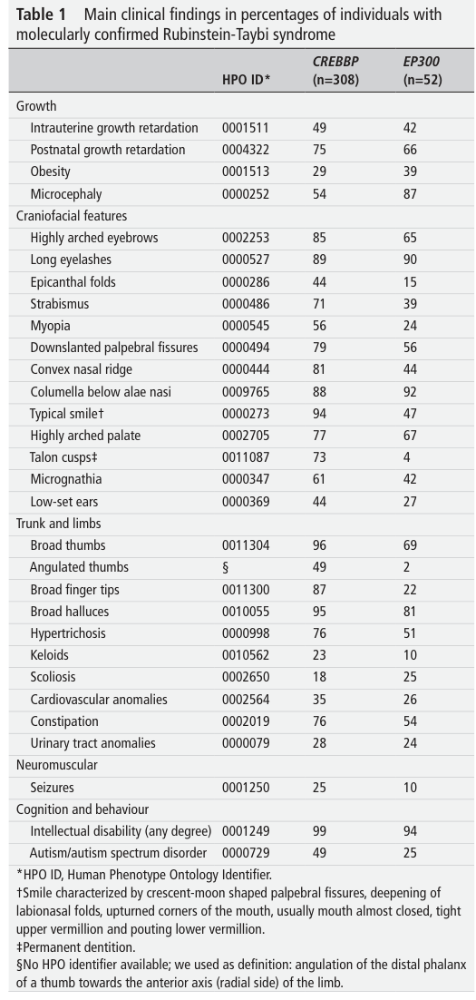

## Question

# Disease Characteristics Research Template

## Target Disease
- **Disease Name:** Rubinstein-Taybi Syndrome
- **MONDO ID:**  (if available)
- **Category:** Mendelian

## Research Objectives

Please provide a comprehensive research report on **Rubinstein-Taybi Syndrome** covering all of the
disease characteristics listed below. This report will be used to populate a disease knowledge
base entry. Be thorough and cite primary literature (PMID preferred) for all claims.

For each section, **suggested databases/resources** are listed. These are the first places
you should search for information on each topic.

---

### 1. Disease Information
> **Search first:** OMIM, Orphanet, ICD-10/ICD-11, MeSH, PubMed

- What is the disease? Provide a concise overview.
- What are the key identifiers? (OMIM, Orphanet, ICD-10/ICD-11, MeSH, Mondo)
- What are the common synonyms and alternative names?
- Is the information derived from individual patients (e.g., EHR) or aggregated disease-level resources?

### 2. Etiology

- **Disease Causal Factors**: What are the primary causes? (genetic, environmental, infectious, mechanistic)
- **Risk Factors**:
  > **Search first:** PubMed, Cochrane Library, UpToDate, clinical guidelines, ClinVar, ClinGen, GWAS Catalog, PheGenI, CTD, CDC, WHO, epidemiological databases
  - Genetic risk factors (causal variants, susceptibility loci, modifier genes)
  - Environmental risk factors (toxins, lifestyle, occupational exposures, age, sex, family history)
- **Protective Factors**:
  > **Search first:** PubMed, Cochrane Library, clinical trial databases, GWAS Catalog, gnomAD, WHO, CDC, nutrition databases
  - Genetic protective factors (protective variants, modifier alleles)
  - Environmental protective factors (diet, lifestyle, exposures that reduce risk)
- **Gene-Environment Interactions**: How do genetic and environmental factors interact to influence disease?
  > **Search first:** CTD, PubMed, PheGenI, GxE databases

### 3. Phenotypes
> **Search first:** HPO (Human Phenotype Ontology), OMIM, Orphanet, PubMed, clinicaltrials.gov, MedDRA, SNOMED CT, DECIPHER, LOINC

For each phenotype, provide:
- **Phenotype type**: symptoms, clinical signs, physical manifestations, behavioral changes, or laboratory abnormalities
  > For symptoms/signs: HPO, OMIM, Orphanet, PubMed
  > For behavioral changes: HPO, DSM, RDoC (Research Domain Criteria), PubMed
  > For laboratory abnormalities: LOINC, SNOMED CT, LabTests Online, PubMed
- **Phenotype characteristics**:
  > **Search first:** OMIM, Orphanet, HPO, PubMed
  - Age of symptom onset (neonatal, childhood, adult-onset, late-onset)
  - Symptom severity (mild, moderate, severe, variable)
  - Symptom progression (stable, progressive, episodic, fluctuating)
  - Frequency among affected individuals (percentage or qualitative)
- **Quality of life impact**: Effects on daily functioning and well-being (per-phenotype when possible)
  > **Search first:** EQ-5D database, SF-36, WHO QOL databases, PubMed
- Suggest HPO (Human Phenotype Ontology) terms for each phenotype

### 4. Genetic/Molecular Information

- **Causal Genes**: Gene mutations or chromosomal abnormalities responsible for disease (gene symbols, OMIM IDs)
  > **Search first:** OMIM, ClinVar, HGMD, Ensembl, NCBI Gene
- **Pathogenic Variants**:
  - Affected genes (gene symbols, HGNC IDs)
    > **Search first:** OMIM, NCBI Gene, Ensembl, HGNC, UniProt, GeneCards
  - Variant classification (pathogenic, likely pathogenic, VUS per ACMG/AMP guidelines)
    > **Search first:** ClinVar, ClinGen, ACMG/AMP guidelines, VarSome
  - Variant type/class (missense, frameshift, nonsense, splice-site, structural)
  - Allele frequency in population databases
    > **Search first:** gnomAD, 1000 Genomes, ExAC, TOPMed, dbSNP
  - Somatic vs germline origin
    > **Search first:** COSMIC (somatic), ClinVar, ICGC, TCGA
  - Functional consequences (loss of function, gain of function, dominant negative)
- **Modifier Genes**: Genes that modify disease severity or expression
- **Epigenetic Information**: DNA methylation, histone modifications, chromatin changes affecting disease
  > **Search first:** ENCODE, Roadmap Epigenomics, MethBase, DiseaseMeth
- **Chromosomal Abnormalities**: Large-scale genetic changes (aneuploidy, translocations, inversions)
  > **Search first:** DECIPHER, ClinVar, ECARUCA, UCSC Genome Browser

### 5. Environmental Information

- **Environmental Factors**: Non-genetic contributing factors (toxins, radiation, pollution, occupational exposure)
  > **Search first:** CTD (Comparative Toxicogenomics Database), TOXNET, PubMed, EPA databases
- **Lifestyle Factors**: Behavioral factors (smoking, diet, exercise, alcohol consumption)
  > **Search first:** CDC databases, WHO, PubMed, NHANES
- **Infectious Agents**: If applicable, pathogens causing or triggering disease (bacteria, viruses, fungi, parasites)
  > **Search first:** NCBI Taxonomy, ViPR, BV-BRC, MicrobeDB, GIDEON

### 6. Mechanism / Pathophysiology

- **Molecular Pathways**: Specific signaling cascades or biochemical pathways involved (Wnt, MAPK, mTOR, PI3K-AKT, etc.)
  > **Search first:** KEGG, Reactome, WikiPathways, PathBank, BioCyc
- **Cellular Processes**: Cell-level mechanisms (apoptosis, autophagy, cell cycle dysregulation, inflammation, etc.)
  > **Search first:** Gene Ontology (GO), Reactome, KEGG, PubMed
- **Protein Dysfunction**: How protein structure or function is altered (misfolding, aggregation, loss of function, gain of function)
  > **Search first:** UniProt, PDB (Protein Data Bank), InterPro, Pfam, AlphaFold
- **Metabolic Changes**: Alterations in metabolic processes (energy metabolism, lipid metabolism, amino acid metabolism)
  > **Search first:** KEGG, BioCyc, HMDB (Human Metabolome Database), BRENDA
- **Immune System Involvement**: Role of immune response (autoimmunity, immunodeficiency, chronic inflammation)
  > **Search first:** ImmPort, Immunome Database, IEDB, Gene Ontology
- **Tissue Damage Mechanisms**: How tissues/ are injured (oxidative stress, ischemia, fibrosis, necrosis)
  > **Search first:** PubMed, Gene Ontology, Reactome
- **Biochemical Abnormalities**: Specific molecular defects (enzyme deficiencies, receptor dysfunction, ion channel defects)
  > **Search first:** BRENDA, UniProt, KEGG, OMIM, PubMed
- **Epigenetic Changes**: DNA methylation, histone modifications affecting gene expression in disease
  > **Search first:** ENCODE, Roadmap Epigenomics, MethBase, DiseaseMeth
- **Molecular Profiling** (if available):
  - Transcriptomics/gene expression changes
    > **Search first:** GEO (Gene Expression Omnibus), ArrayExpress, GTEx, Human Cell Atlas, SRA
  - Proteomics findings
    > **Search first:** PRIDE, ProteomeXchange, Human Protein Atlas, STRING, BioGRID
  - Metabolomics signatures
    > **Search first:** MetaboLights, Metabolomics Workbench, HMDB, METLIN
  - Lipidomics alterations
    > **Search first:** LIPID MAPS, SwissLipids, LipidHome, Metabolomics Workbench
  - Genomic structural features
    > **Search first:** UCSC Genome Browser, Ensembl, NCBI, dbVar, DGV
- **Advanced Technologies** (if applicable):
  - Single-cell analysis findings (cell-type specific mechanisms, cellular heterogeneity)
    > **Search first:** Human Cell Atlas, Single Cell Portal, GEO, CELLxGENE
  - Spatial transcriptomics findings
    > **Search first:** GEO, Spatial Research, Vizgen, 10x Genomics data
  - Multi-omics integration results
    > **Search first:** TCGA, ICGC, cBioPortal, LinkedOmics, PubMed
  - Functional genomics screens (CRISPR, RNAi)
    > **Search first:** DepMap, GenomeRNAi, PubMed, BioGRID ORCS

For each mechanism, describe:
- The causal chain from initial trigger to clinical manifestation
- Which mechanisms are upstream vs downstream
- What cell types and biological processes are involved
- Suggest GO terms for biological processes and CL terms for cell types

### 7. Anatomical Structures Affected

- **Organ Level**:
  - Primary organs directly affected
  - Secondary organ involvement (complications, secondary effects)
  - Body systems involved (cardiovascular, nervous, digestive, respiratory, endocrine, etc.)
  > **Search first:** Uberon, FMA (Foundational Model of Anatomy), OMIM, HPO, ICD-11, MeSH, SNOMED CT
- **Tissue and Cell Level**:
  - Specific tissue types affected (epithelial, connective, muscle, nervous)
  - Specific cell populations targeted (with Cell Ontology terms)
  > **Search first:** Uberon, Human Protein Atlas, Cell Ontology, Human Cell Atlas, CellMarker, PanglaoDB
- **Subcellular Level**:
  - Cellular compartments involved (mitochondria, nucleus, ER, lysosomes) (with GO Cellular Component terms)
  > **Search first:** Gene Ontology (Cellular Component), UniProt, Human Protein Atlas
- **Localization**:
  - Specific anatomical sites (with UBERON terms)
    > **Search first:** FMA, Uberon, NeuroNames (for brain), SNOMED CT
  - Lateralization (unilateral, bilateral, asymmetric)
    > **Search first:** HPO, clinical literature, imaging databases

### 8. Temporal Development

- **Onset**:
  - Typical age of onset (congenital, pediatric, adult, geriatric)
  - Onset pattern (acute, subacute, chronic, insidious)
  > **Search first:** OMIM, Orphanet, HPO, PubMed
- **Progression**:
  - Disease stages (early, intermediate, advanced, end-stage)
    > **Search first:** Cancer Staging Manual (AJCC), WHO classifications, PubMed
  - Progression rate (rapid, slow, variable)
  - Disease course pattern (episodic, relapsing-remitting, progressive, stable)
  - Disease duration (self-limited, chronic lifelong)
  > **Search first:** Disease registries, longitudinal cohort databases, natural history studies, PubMed, Orphanet, OMIM
- **Patterns**:
  - Remission patterns (spontaneous, treatment-induced)
    > **Search first:** Clinical trial databases, disease registries, PubMed
  - Critical periods (time windows of vulnerability or opportunity for intervention)
    > **Search first:** PubMed, developmental biology databases, clinical guidelines

### 9. Inheritance and Population

- **Epidemiology**:
  - Prevalence (cases per 100,000 at given time)
  - Incidence (new cases per 100,000 per year)
  > **Search first:** Orphanet, CDC, WHO, GBD (Global Burden of Disease), national registries, SEER, disease registries
- **For Genetic Etiology**:
  - Inheritance pattern (AD, AR, X-linked, mitochondrial, multifactorial, polygenic)
    > **Search first:** OMIM, Orphanet, ClinVar, GTR (Genetic Testing Registry)
  - Penetrance (complete, incomplete, age-dependent)
    > **Search first:** ClinVar, OMIM, PubMed, ClinGen
  - Expressivity (variable, consistent)
    > **Search first:** OMIM, ClinVar, PubMed
  - Genetic anticipation (increasing severity in successive generations)
    > **Search first:** OMIM, PubMed (especially for repeat expansion disorders)
  - Germline mosaicism
    > **Search first:** ClinVar, OMIM, genetic counseling literature, PubMed
  - Founder effects (population-specific mutations)
    > **Search first:** gnomAD, population genetics databases, PubMed
  - Consanguinity role
    > **Search first:** OMIM, population studies, genetic counseling resources
  - Carrier frequency
    > **Search first:** gnomAD, carrier screening databases, GeneReviews, GTR
- **Population Demographics**:
  - Affected populations (ethnic or demographic groups with higher prevalence)
    > **Search first:** gnomAD, 1000 Genomes, PAGE Study, PubMed, population registries
  - Geographic distribution (endemic areas, regional variation)
    > **Search first:** WHO, CDC, GBD, Orphanet, geographic epidemiology databases
  - Geographic distribution of specific variants
  - Sex ratio (male:female)
    > **Search first:** Disease registries, OMIM, PubMed, epidemiological databases
  - Age distribution of affected individuals
    > **Search first:** CDC, disease registries, SEER, Orphanet

### 10. Diagnostics

- **Clinical Tests**:
  - Laboratory tests (blood, urine, tissue chemistry, specific enzyme assays)
    > **Search first:** LOINC, LabTests Online, PubMed
  - Biomarkers (proteins, metabolites, genetic markers, circulating biomarkers)
    > **Search first:** FDA Biomarker List, BEST (Biomarkers, EndpointS, and other Tools), PubMed
  - Imaging studies (X-ray, CT, MRI, PET, ultrasound)
    > **Search first:** RadLex, DICOM, Radiopaedia, imaging databases
  - Functional tests (pulmonary function, cardiac stress tests)
    > **Search first:** LOINC, clinical guidelines, PubMed
  - Electrophysiology (EEG, EMG, ECG, nerve conduction studies)
    > **Search first:** LOINC, clinical neurophysiology databases, PubMed
  - Biopsy findings (histopathology, immunohistochemistry)
    > **Search first:** SNOMED CT, College of American Pathologists resources, PubMed
  - Pathology findings (microscopic examination)
    > **Search first:** SNOMED CT, Digital Pathology databases, PubMed
- **Genetic Testing**:
  > **Search first:** GTR (Genetic Testing Registry), GeneReviews, ClinGen
  - Overview of recommended genetic testing approach
  - Whole genome sequencing (WGS) utility
    > **Search first:** GTR, ClinVar, GEL (Genomics England), gnomAD
  - Whole exome sequencing (WES) utility
    > **Search first:** GTR, ClinVar, OMIM, GeneMatcher
  - Gene panels (which panels, which genes)
    > **Search first:** GTR, ClinVar, laboratory-specific databases
  - Single gene testing
    > **Search first:** GTR, ClinVar, OMIM, GeneReviews
  - Chromosomal microarray (CMA)
    > **Search first:** DECIPHER, ClinVar, dbVar, ECARUCA
  - Karyotyping
    > **Search first:** Chromosome Abnormality Database, ClinVar, cytogenetics resources
  - FISH
    > **Search first:** ClinVar, cytogenetics databases, PubMed
  - Mitochondrial DNA testing
    > **Search first:** MITOMAP, MSeqDR, ClinVar, GTR
  - Repeat expansion testing
    > **Search first:** GTR, ClinVar, repeat expansion databases, PubMed
- **Omics-Based Diagnostics** (if applicable):
  - RNA sequencing / transcriptomics
    > **Search first:** GEO, ArrayExpress, GTEx, RNA-seq databases
  - Proteomics
    > **Search first:** PRIDE, ProteomeXchange, FDA Biomarker database
  - Metabolomics
    > **Search first:** MetaboLights, Metabolomics Workbench, HMDB
  - Epigenomics
    > **Search first:** GEO, ENCODE, Roadmap Epigenomics, MethBase
  - Liquid biopsy
    > **Search first:** COSMIC, ClinVar, liquid biopsy databases, PubMed
- **Clinical Criteria**:
  - Standardized diagnostic criteria (DSM, ICD, society guidelines)
    > **Search first:** DSM-5, ICD-11, clinical society guidelines, UpToDate
  - Differential diagnosis (other conditions to rule out, with distinguishing features)
    > **Search first:** DynaMed, UpToDate, clinical decision support systems
- **Screening**:
  - Screening methods for asymptomatic individuals (newborn screening, carrier screening, cascade screening)
    > **Search first:** ACMG recommendations, CDC newborn screening, GTR

### 11. Outcome/Prognosis

- **Survival and Mortality**:
  - Survival rate (5-year, 10-year, overall)
    > **Search first:** SEER, cancer registries, disease-specific registries, PubMed
  - Life expectancy (with and without treatment if applicable)
    > **Search first:** Orphanet, disease registries, actuarial databases, PubMed
  - Mortality rate
    > **Search first:** CDC, WHO, GBD, national mortality databases
  - Disease-specific mortality (deaths directly attributable to disease)
    > **Search first:** Disease registries, CDC Wonder, GBD, PubMed
- **Morbidity and Function**:
  - Morbidity (disease-related disability and health impacts)
    > **Search first:** GBD, WHO, disability databases, PubMed
  - Disability outcomes (long-term functional impairments)
    > **Search first:** ICF (International Classification of Functioning), disability registries
  - Quality of life measures (EQ-5D, SF-36, PROMIS, disease-specific tools)
    > **Search first:** EQ-5D database, SF-36, PROMIS, PubMed
- **Disease Course**:
  - Complications (secondary problems: infections, organ failure, etc.)
    > **Search first:** ICD codes, disease registries, clinical databases, PubMed
  - Recovery potential (likelihood and extent of recovery, with vs without treatment)
    > **Search first:** Natural history studies, rehabilitation databases, PubMed
- **Prediction**:
  - Prognostic factors (age, disease severity, biomarkers, treatment response)
    > **Search first:** Prognostic models databases, clinical calculators, PubMed
  - Prognostic biomarkers (molecular markers predicting disease course)
    > **Search first:** FDA Biomarker database, PubMed, cancer prognostic databases

### 12. Treatment

- **Pharmacotherapy**:
  - Pharmacological treatments (drug names, drug classes, mechanisms of action)
    > **Search first:** DrugBank, RxNorm, ATC classification, DailyMed, FDA databases
  - Pharmacogenomics (how genetic variants affect drug metabolism, efficacy, toxicity)
    > **Search first:** PharmGKB, CPIC (Clinical Pharmacogenetics), FDA Table of PGx Biomarkers
- **Advanced Therapeutics**:
  - Gene therapy (viral vectors, CRISPR, gene replacement, gene editing)
    > **Search first:** ClinicalTrials.gov, FDA gene therapy database, ASGCT resources
  - Cell therapy (stem cell transplant, CAR-T, cellular therapeutics)
    > **Search first:** ClinicalTrials.gov, FDA cell therapy database, FACT standards
  - RNA-based therapies (ASOs, siRNA, mRNA therapies)
    > **Search first:** ClinicalTrials.gov, FDA approvals, PubMed
  - Targeted therapies (treatments directed at specific molecular targets)
    > **Search first:** My Cancer Genome, OncoKB, ClinicalTrials.gov, FDA approvals
  - Immunotherapies (checkpoint inhibitors, monoclonal antibodies)
    > **Search first:** Cancer Immunotherapy Database, FDA approvals, ClinicalTrials.gov
- **Surgical and Interventional**:
  - Surgical interventions (types of surgery, timing, outcomes)
    > **Search first:** CPT codes, surgical registries, clinical guidelines, PubMed
- **Supportive and Rehabilitative**:
  - Supportive care (symptom management, pain control, nutrition)
    > **Search first:** Clinical guidelines, Cochrane Library, PubMed
  - Rehabilitation (physical therapy, occupational therapy, speech therapy)
    > **Search first:** Rehabilitation medicine databases, clinical guidelines, PubMed
- **Experimental**:
  - Experimental treatments in clinical trials (with NCT identifiers if available)
    > **Search first:** ClinicalTrials.gov, EU Clinical Trials Register, WHO ICTRP
- **Treatment Outcomes**:
  - Treatment response rates
    > **Search first:** Clinical trial databases, FDA reviews, systematic reviews, PubMed
  - Side effects and adverse events
    > **Search first:** FDA Adverse Event Reporting System (FAERS), MedWatch, PubMed
- **Treatment Strategy**:
  - Treatment algorithms (clinical pathways, decision trees)
    > **Search first:** Clinical practice guidelines, NCCN Guidelines, UpToDate
  - Combination therapies
    > **Search first:** ClinicalTrials.gov, treatment guidelines, PubMed
  - Personalized medicine approaches (genotype-guided treatment)
    > **Search first:** My Cancer Genome, CIViC, PharmGKB, precision medicine databases

For each treatment, suggest MAXO (Medical Action Ontology) terms where applicable.

### 13. Prevention

- **Prevention Levels**:
  - Primary prevention (preventing disease occurrence: vaccination, risk factor modification)
    > **Search first:** CDC, WHO, USPSTF recommendations, Cochrane Library
  - Secondary prevention (early detection and treatment: screening programs, early intervention)
    > **Search first:** USPSTF, CDC screening guidelines, WHO
  - Tertiary prevention (preventing complications in those with disease)
    > **Search first:** Clinical guidelines, disease management protocols, PubMed
- **Immunization**: Vaccine strategies (if applicable)
  > **Search first:** CDC vaccine schedules, WHO immunization, FDA vaccine database
- **Screening and Early Detection**:
  - Screening programs (population-based: newborn screening, cancer screening)
    > **Search first:** CDC screening programs, USPSTF, cancer screening databases
  - Genetic screening (carrier screening, preimplantation genetic diagnosis, prenatal testing)
    > **Search first:** ACMG recommendations, ACOG guidelines, GTR
  - Risk stratification (identifying high-risk individuals for targeted prevention)
    > **Search first:** Risk prediction models, clinical calculators, PubMed
- **Behavioral Interventions**: Lifestyle modifications to reduce risk
  > **Search first:** CDC, WHO, behavioral intervention databases, Cochrane Library
- **Counseling**: Genetic counseling (risk assessment, family planning guidance)
  > **Search first:** NSGC resources, ACMG guidelines, GeneReviews
- **Public Health**:
  - Public health interventions (sanitation, vector control, health education)
    > **Search first:** CDC, WHO, public health databases, PubMed
  - Environmental interventions (reducing environmental risk factors)
    > **Search first:** EPA databases, WHO environmental health, PubMed
- **Prophylaxis**: Preventive medications or procedures
  > **Search first:** Clinical guidelines, FDA approvals, PubMed

### 14. Other Species / Natural Disease

- **Taxonomy**: Species affected (with NCBI Taxon identifiers)
  > **Search first:** NCBI Taxonomy
- **Breed**: Specific breeds affected (with VBO identifiers if applicable)
  > **Search first:** VBO (Vertebrate Breed Ontology)
- **Gene**: Orthologous genes in other species (with NCBI Gene IDs)
  > **Search first:** NCBI Gene
- **Natural Disease**:
  - Naturally occurring disease in other species (companion animals, wildlife)
    > **Search first:** OMIA (Online Mendelian Inheritance in Animals), VetCompass, PubMed
  - Veterinary relevance and importance in animal health
    > **Search first:** OMIA, veterinary databases, PubMed
- **Comparative Biology**:
  - Comparative pathology (similarities and differences across species)
    > **Search first:** OMIA, comparative pathology databases, PubMed
  - Evolutionary conservation of disease mechanisms
    > **Search first:** HomoloGene, OrthoMCL, Alliance of Genome Resources
- **Transmission** (if applicable):
  - Zoonotic potential
    > **Search first:** CDC zoonotic diseases, WHO zoonoses, GIDEON
  - Cross-species susceptibility
    > **Search first:** NCBI Taxonomy, veterinary databases, PubMed

### 15. Model Organisms

- **Model Types**:
  - Model organism type (mammalian, invertebrate, cellular, in vitro)
    > **Search first:** Alliance of Genome Resources, model organism databases
  - Specific model systems (mouse, rat, zebrafish, Drosophila, C. elegans, yeast, cell lines, organoids, iPSCs)
    > **Search first:** MGI, RGD, ZFIN, FlyBase, WormBase, SGD, ATCC, Cellosaurus
  - Induced models (drug treatment, surgical intervention, environmental manipulation)
    > **Search first:** MGI, model organism databases, PubMed
- **Genetic Models**:
  - Types available (knockout, knock-in, transgenic, conditional, humanized)
    > **Search first:** MGI, IMPC, KOMP, EuMMCR, IMSR
- **Model Characteristics**:
  - Phenotype recapitulation (how well model reproduces human disease features)
    > **Search first:** Model organism databases, comparative studies, PubMed
  - Model limitations (aspects of human disease not captured)
    > **Search first:** Model organism databases, PubMed, review articles
- **Applications**:
  - Research applications (what aspects of disease can be studied)
    > **Search first:** Model organism databases, PubMed
- **Resources**:
  - Model databases
    > **Search first:** MGI, RGD, ZFIN, FlyBase, WormBase, IMSR, EMMA, MMRRC

---

## Citation Requirements

- Cite primary literature (PMID preferred) for all mechanistic and clinical claims
- Prioritize recent reviews and landmark papers
- Include direct quotes from abstracts where possible to support key statements
- Distinguish evidence source types: human clinical, model organism, in vitro, computational

## Output Format

Structure your response as a comprehensive narrative organized by the sections above.
For each section, provide:
- Factual content with specific details (numbers, percentages, gene names, variant nomenclature)
- Ontology term suggestions (HPO, GO, CL, UBERON, CHEBI, MAXO, MONDO) where applicable
- Evidence citations with PMIDs
- Direct quotes from abstracts to support key claims
- Clear indication when information is not available or not applicable for this disease

This report will be used to populate a disease knowledge base entry with:
- Pathophysiology descriptions with causal chains
- Gene/protein annotations (HGNC, GO terms)
- Phenotype associations (HP terms) with frequencies
- Cell type involvement (CL terms)
- Anatomical locations (UBERON terms)
- Chemical entities (CHEBI terms)
- Treatment annotations (MAXO terms)
- Evidence items with PMIDs and exact abstract quotes
- Epidemiology, prognosis, diagnostic, and prevention information
- Animal model descriptions with phenotype recapitulation details

## Output

Question: You are an expert researcher providing comprehensive, well-cited information.

Provide detailed information focusing on:
1. Key concepts and definitions with current understanding
2. Recent developments and latest research (prioritize 2023-2024 sources)
3. Current applications and real-world implementations
4. Expert opinions and analysis from authoritative sources
5. Relevant statistics and data from recent studies

Format as a comprehensive research report with proper citations. Include URLs and publication dates where available.
Always prioritize recent, authoritative sources and provide specific citations for all major claims.

# Disease Characteristics Research Template

## Target Disease
- **Disease Name:** Rubinstein-Taybi Syndrome
- **MONDO ID:**  (if available)
- **Category:** Mendelian

## Research Objectives

Please provide a comprehensive research report on **Rubinstein-Taybi Syndrome** covering all of the
disease characteristics listed below. This report will be used to populate a disease knowledge
base entry. Be thorough and cite primary literature (PMID preferred) for all claims.

For each section, **suggested databases/resources** are listed. These are the first places
you should search for information on each topic.

---

### 1. Disease Information
> **Search first:** OMIM, Orphanet, ICD-10/ICD-11, MeSH, PubMed

- What is the disease? Provide a concise overview.
- What are the key identifiers? (OMIM, Orphanet, ICD-10/ICD-11, MeSH, Mondo)
- What are the common synonyms and alternative names?
- Is the information derived from individual patients (e.g., EHR) or aggregated disease-level resources?

### 2. Etiology

- **Disease Causal Factors**: What are the primary causes? (genetic, environmental, infectious, mechanistic)
- **Risk Factors**:
  > **Search first:** PubMed, Cochrane Library, UpToDate, clinical guidelines, ClinVar, ClinGen, GWAS Catalog, PheGenI, CTD, CDC, WHO, epidemiological databases
  - Genetic risk factors (causal variants, susceptibility loci, modifier genes)
  - Environmental risk factors (toxins, lifestyle, occupational exposures, age, sex, family history)
- **Protective Factors**:
  > **Search first:** PubMed, Cochrane Library, clinical trial databases, GWAS Catalog, gnomAD, WHO, CDC, nutrition databases
  - Genetic protective factors (protective variants, modifier alleles)
  - Environmental protective factors (diet, lifestyle, exposures that reduce risk)
- **Gene-Environment Interactions**: How do genetic and environmental factors interact to influence disease?
  > **Search first:** CTD, PubMed, PheGenI, GxE databases

### 3. Phenotypes
> **Search first:** HPO (Human Phenotype Ontology), OMIM, Orphanet, PubMed, clinicaltrials.gov, MedDRA, SNOMED CT, DECIPHER, LOINC

For each phenotype, provide:
- **Phenotype type**: symptoms, clinical signs, physical manifestations, behavioral changes, or laboratory abnormalities
  > For symptoms/signs: HPO, OMIM, Orphanet, PubMed
  > For behavioral changes: HPO, DSM, RDoC (Research Domain Criteria), PubMed
  > For laboratory abnormalities: LOINC, SNOMED CT, LabTests Online, PubMed
- **Phenotype characteristics**:
  > **Search first:** OMIM, Orphanet, HPO, PubMed
  - Age of symptom onset (neonatal, childhood, adult-onset, late-onset)
  - Symptom severity (mild, moderate, severe, variable)
  - Symptom progression (stable, progressive, episodic, fluctuating)
  - Frequency among affected individuals (percentage or qualitative)
- **Quality of life impact**: Effects on daily functioning and well-being (per-phenotype when possible)
  > **Search first:** EQ-5D database, SF-36, WHO QOL databases, PubMed
- Suggest HPO (Human Phenotype Ontology) terms for each phenotype

### 4. Genetic/Molecular Information

- **Causal Genes**: Gene mutations or chromosomal abnormalities responsible for disease (gene symbols, OMIM IDs)
  > **Search first:** OMIM, ClinVar, HGMD, Ensembl, NCBI Gene
- **Pathogenic Variants**:
  - Affected genes (gene symbols, HGNC IDs)
    > **Search first:** OMIM, NCBI Gene, Ensembl, HGNC, UniProt, GeneCards
  - Variant classification (pathogenic, likely pathogenic, VUS per ACMG/AMP guidelines)
    > **Search first:** ClinVar, ClinGen, ACMG/AMP guidelines, VarSome
  - Variant type/class (missense, frameshift, nonsense, splice-site, structural)
  - Allele frequency in population databases
    > **Search first:** gnomAD, 1000 Genomes, ExAC, TOPMed, dbSNP
  - Somatic vs germline origin
    > **Search first:** COSMIC (somatic), ClinVar, ICGC, TCGA
  - Functional consequences (loss of function, gain of function, dominant negative)
- **Modifier Genes**: Genes that modify disease severity or expression
- **Epigenetic Information**: DNA methylation, histone modifications, chromatin changes affecting disease
  > **Search first:** ENCODE, Roadmap Epigenomics, MethBase, DiseaseMeth
- **Chromosomal Abnormalities**: Large-scale genetic changes (aneuploidy, translocations, inversions)
  > **Search first:** DECIPHER, ClinVar, ECARUCA, UCSC Genome Browser

### 5. Environmental Information

- **Environmental Factors**: Non-genetic contributing factors (toxins, radiation, pollution, occupational exposure)
  > **Search first:** CTD (Comparative Toxicogenomics Database), TOXNET, PubMed, EPA databases
- **Lifestyle Factors**: Behavioral factors (smoking, diet, exercise, alcohol consumption)
  > **Search first:** CDC databases, WHO, PubMed, NHANES
- **Infectious Agents**: If applicable, pathogens causing or triggering disease (bacteria, viruses, fungi, parasites)
  > **Search first:** NCBI Taxonomy, ViPR, BV-BRC, MicrobeDB, GIDEON

### 6. Mechanism / Pathophysiology

- **Molecular Pathways**: Specific signaling cascades or biochemical pathways involved (Wnt, MAPK, mTOR, PI3K-AKT, etc.)
  > **Search first:** KEGG, Reactome, WikiPathways, PathBank, BioCyc
- **Cellular Processes**: Cell-level mechanisms (apoptosis, autophagy, cell cycle dysregulation, inflammation, etc.)
  > **Search first:** Gene Ontology (GO), Reactome, KEGG, PubMed
- **Protein Dysfunction**: How protein structure or function is altered (misfolding, aggregation, loss of function, gain of function)
  > **Search first:** UniProt, PDB (Protein Data Bank), InterPro, Pfam, AlphaFold
- **Metabolic Changes**: Alterations in metabolic processes (energy metabolism, lipid metabolism, amino acid metabolism)
  > **Search first:** KEGG, BioCyc, HMDB (Human Metabolome Database), BRENDA
- **Immune System Involvement**: Role of immune response (autoimmunity, immunodeficiency, chronic inflammation)
  > **Search first:** ImmPort, Immunome Database, IEDB, Gene Ontology
- **Tissue Damage Mechanisms**: How tissues/ are injured (oxidative stress, ischemia, fibrosis, necrosis)
  > **Search first:** PubMed, Gene Ontology, Reactome
- **Biochemical Abnormalities**: Specific molecular defects (enzyme deficiencies, receptor dysfunction, ion channel defects)
  > **Search first:** BRENDA, UniProt, KEGG, OMIM, PubMed
- **Epigenetic Changes**: DNA methylation, histone modifications affecting gene expression in disease
  > **Search first:** ENCODE, Roadmap Epigenomics, MethBase, DiseaseMeth
- **Molecular Profiling** (if available):
  - Transcriptomics/gene expression changes
    > **Search first:** GEO (Gene Expression Omnibus), ArrayExpress, GTEx, Human Cell Atlas, SRA
  - Proteomics findings
    > **Search first:** PRIDE, ProteomeXchange, Human Protein Atlas, STRING, BioGRID
  - Metabolomics signatures
    > **Search first:** MetaboLights, Metabolomics Workbench, HMDB, METLIN
  - Lipidomics alterations
    > **Search first:** LIPID MAPS, SwissLipids, LipidHome, Metabolomics Workbench
  - Genomic structural features
    > **Search first:** UCSC Genome Browser, Ensembl, NCBI, dbVar, DGV
- **Advanced Technologies** (if applicable):
  - Single-cell analysis findings (cell-type specific mechanisms, cellular heterogeneity)
    > **Search first:** Human Cell Atlas, Single Cell Portal, GEO, CELLxGENE
  - Spatial transcriptomics findings
    > **Search first:** GEO, Spatial Research, Vizgen, 10x Genomics data
  - Multi-omics integration results
    > **Search first:** TCGA, ICGC, cBioPortal, LinkedOmics, PubMed
  - Functional genomics screens (CRISPR, RNAi)
    > **Search first:** DepMap, GenomeRNAi, PubMed, BioGRID ORCS

For each mechanism, describe:
- The causal chain from initial trigger to clinical manifestation
- Which mechanisms are upstream vs downstream
- What cell types and biological processes are involved
- Suggest GO terms for biological processes and CL terms for cell types

### 7. Anatomical Structures Affected

- **Organ Level**:
  - Primary organs directly affected
  - Secondary organ involvement (complications, secondary effects)
  - Body systems involved (cardiovascular, nervous, digestive, respiratory, endocrine, etc.)
  > **Search first:** Uberon, FMA (Foundational Model of Anatomy), OMIM, HPO, ICD-11, MeSH, SNOMED CT
- **Tissue and Cell Level**:
  - Specific tissue types affected (epithelial, connective, muscle, nervous)
  - Specific cell populations targeted (with Cell Ontology terms)
  > **Search first:** Uberon, Human Protein Atlas, Cell Ontology, Human Cell Atlas, CellMarker, PanglaoDB
- **Subcellular Level**:
  - Cellular compartments involved (mitochondria, nucleus, ER, lysosomes) (with GO Cellular Component terms)
  > **Search first:** Gene Ontology (Cellular Component), UniProt, Human Protein Atlas
- **Localization**:
  - Specific anatomical sites (with UBERON terms)
    > **Search first:** FMA, Uberon, NeuroNames (for brain), SNOMED CT
  - Lateralization (unilateral, bilateral, asymmetric)
    > **Search first:** HPO, clinical literature, imaging databases

### 8. Temporal Development

- **Onset**:
  - Typical age of onset (congenital, pediatric, adult, geriatric)
  - Onset pattern (acute, subacute, chronic, insidious)
  > **Search first:** OMIM, Orphanet, HPO, PubMed
- **Progression**:
  - Disease stages (early, intermediate, advanced, end-stage)
    > **Search first:** Cancer Staging Manual (AJCC), WHO classifications, PubMed
  - Progression rate (rapid, slow, variable)
  - Disease course pattern (episodic, relapsing-remitting, progressive, stable)
  - Disease duration (self-limited, chronic lifelong)
  > **Search first:** Disease registries, longitudinal cohort databases, natural history studies, PubMed, Orphanet, OMIM
- **Patterns**:
  - Remission patterns (spontaneous, treatment-induced)
    > **Search first:** Clinical trial databases, disease registries, PubMed
  - Critical periods (time windows of vulnerability or opportunity for intervention)
    > **Search first:** PubMed, developmental biology databases, clinical guidelines

### 9. Inheritance and Population

- **Epidemiology**:
  - Prevalence (cases per 100,000 at given time)
  - Incidence (new cases per 100,000 per year)
  > **Search first:** Orphanet, CDC, WHO, GBD (Global Burden of Disease), national registries, SEER, disease registries
- **For Genetic Etiology**:
  - Inheritance pattern (AD, AR, X-linked, mitochondrial, multifactorial, polygenic)
    > **Search first:** OMIM, Orphanet, ClinVar, GTR (Genetic Testing Registry)
  - Penetrance (complete, incomplete, age-dependent)
    > **Search first:** ClinVar, OMIM, PubMed, ClinGen
  - Expressivity (variable, consistent)
    > **Search first:** OMIM, ClinVar, PubMed
  - Genetic anticipation (increasing severity in successive generations)
    > **Search first:** OMIM, PubMed (especially for repeat expansion disorders)
  - Germline mosaicism
    > **Search first:** ClinVar, OMIM, genetic counseling literature, PubMed
  - Founder effects (population-specific mutations)
    > **Search first:** gnomAD, population genetics databases, PubMed
  - Consanguinity role
    > **Search first:** OMIM, population studies, genetic counseling resources
  - Carrier frequency
    > **Search first:** gnomAD, carrier screening databases, GeneReviews, GTR
- **Population Demographics**:
  - Affected populations (ethnic or demographic groups with higher prevalence)
    > **Search first:** gnomAD, 1000 Genomes, PAGE Study, PubMed, population registries
  - Geographic distribution (endemic areas, regional variation)
    > **Search first:** WHO, CDC, GBD, Orphanet, geographic epidemiology databases
  - Geographic distribution of specific variants
  - Sex ratio (male:female)
    > **Search first:** Disease registries, OMIM, PubMed, epidemiological databases
  - Age distribution of affected individuals
    > **Search first:** CDC, disease registries, SEER, Orphanet

### 10. Diagnostics

- **Clinical Tests**:
  - Laboratory tests (blood, urine, tissue chemistry, specific enzyme assays)
    > **Search first:** LOINC, LabTests Online, PubMed
  - Biomarkers (proteins, metabolites, genetic markers, circulating biomarkers)
    > **Search first:** FDA Biomarker List, BEST (Biomarkers, EndpointS, and other Tools), PubMed
  - Imaging studies (X-ray, CT, MRI, PET, ultrasound)
    > **Search first:** RadLex, DICOM, Radiopaedia, imaging databases
  - Functional tests (pulmonary function, cardiac stress tests)
    > **Search first:** LOINC, clinical guidelines, PubMed
  - Electrophysiology (EEG, EMG, ECG, nerve conduction studies)
    > **Search first:** LOINC, clinical neurophysiology databases, PubMed
  - Biopsy findings (histopathology, immunohistochemistry)
    > **Search first:** SNOMED CT, College of American Pathologists resources, PubMed
  - Pathology findings (microscopic examination)
    > **Search first:** SNOMED CT, Digital Pathology databases, PubMed
- **Genetic Testing**:
  > **Search first:** GTR (Genetic Testing Registry), GeneReviews, ClinGen
  - Overview of recommended genetic testing approach
  - Whole genome sequencing (WGS) utility
    > **Search first:** GTR, ClinVar, GEL (Genomics England), gnomAD
  - Whole exome sequencing (WES) utility
    > **Search first:** GTR, ClinVar, OMIM, GeneMatcher
  - Gene panels (which panels, which genes)
    > **Search first:** GTR, ClinVar, laboratory-specific databases
  - Single gene testing
    > **Search first:** GTR, ClinVar, OMIM, GeneReviews
  - Chromosomal microarray (CMA)
    > **Search first:** DECIPHER, ClinVar, dbVar, ECARUCA
  - Karyotyping
    > **Search first:** Chromosome Abnormality Database, ClinVar, cytogenetics resources
  - FISH
    > **Search first:** ClinVar, cytogenetics databases, PubMed
  - Mitochondrial DNA testing
    > **Search first:** MITOMAP, MSeqDR, ClinVar, GTR
  - Repeat expansion testing
    > **Search first:** GTR, ClinVar, repeat expansion databases, PubMed
- **Omics-Based Diagnostics** (if applicable):
  - RNA sequencing / transcriptomics
    > **Search first:** GEO, ArrayExpress, GTEx, RNA-seq databases
  - Proteomics
    > **Search first:** PRIDE, ProteomeXchange, FDA Biomarker database
  - Metabolomics
    > **Search first:** MetaboLights, Metabolomics Workbench, HMDB
  - Epigenomics
    > **Search first:** GEO, ENCODE, Roadmap Epigenomics, MethBase
  - Liquid biopsy
    > **Search first:** COSMIC, ClinVar, liquid biopsy databases, PubMed
- **Clinical Criteria**:
  - Standardized diagnostic criteria (DSM, ICD, society guidelines)
    > **Search first:** DSM-5, ICD-11, clinical society guidelines, UpToDate
  - Differential diagnosis (other conditions to rule out, with distinguishing features)
    > **Search first:** DynaMed, UpToDate, clinical decision support systems
- **Screening**:
  - Screening methods for asymptomatic individuals (newborn screening, carrier screening, cascade screening)
    > **Search first:** ACMG recommendations, CDC newborn screening, GTR

### 11. Outcome/Prognosis

- **Survival and Mortality**:
  - Survival rate (5-year, 10-year, overall)
    > **Search first:** SEER, cancer registries, disease-specific registries, PubMed
  - Life expectancy (with and without treatment if applicable)
    > **Search first:** Orphanet, disease registries, actuarial databases, PubMed
  - Mortality rate
    > **Search first:** CDC, WHO, GBD, national mortality databases
  - Disease-specific mortality (deaths directly attributable to disease)
    > **Search first:** Disease registries, CDC Wonder, GBD, PubMed
- **Morbidity and Function**:
  - Morbidity (disease-related disability and health impacts)
    > **Search first:** GBD, WHO, disability databases, PubMed
  - Disability outcomes (long-term functional impairments)
    > **Search first:** ICF (International Classification of Functioning), disability registries
  - Quality of life measures (EQ-5D, SF-36, PROMIS, disease-specific tools)
    > **Search first:** EQ-5D database, SF-36, PROMIS, PubMed
- **Disease Course**:
  - Complications (secondary problems: infections, organ failure, etc.)
    > **Search first:** ICD codes, disease registries, clinical databases, PubMed
  - Recovery potential (likelihood and extent of recovery, with vs without treatment)
    > **Search first:** Natural history studies, rehabilitation databases, PubMed
- **Prediction**:
  - Prognostic factors (age, disease severity, biomarkers, treatment response)
    > **Search first:** Prognostic models databases, clinical calculators, PubMed
  - Prognostic biomarkers (molecular markers predicting disease course)
    > **Search first:** FDA Biomarker database, PubMed, cancer prognostic databases

### 12. Treatment

- **Pharmacotherapy**:
  - Pharmacological treatments (drug names, drug classes, mechanisms of action)
    > **Search first:** DrugBank, RxNorm, ATC classification, DailyMed, FDA databases
  - Pharmacogenomics (how genetic variants affect drug metabolism, efficacy, toxicity)
    > **Search first:** PharmGKB, CPIC (Clinical Pharmacogenetics), FDA Table of PGx Biomarkers
- **Advanced Therapeutics**:
  - Gene therapy (viral vectors, CRISPR, gene replacement, gene editing)
    > **Search first:** ClinicalTrials.gov, FDA gene therapy database, ASGCT resources
  - Cell therapy (stem cell transplant, CAR-T, cellular therapeutics)
    > **Search first:** ClinicalTrials.gov, FDA cell therapy database, FACT standards
  - RNA-based therapies (ASOs, siRNA, mRNA therapies)
    > **Search first:** ClinicalTrials.gov, FDA approvals, PubMed
  - Targeted therapies (treatments directed at specific molecular targets)
    > **Search first:** My Cancer Genome, OncoKB, ClinicalTrials.gov, FDA approvals
  - Immunotherapies (checkpoint inhibitors, monoclonal antibodies)
    > **Search first:** Cancer Immunotherapy Database, FDA approvals, ClinicalTrials.gov
- **Surgical and Interventional**:
  - Surgical interventions (types of surgery, timing, outcomes)
    > **Search first:** CPT codes, surgical registries, clinical guidelines, PubMed
- **Supportive and Rehabilitative**:
  - Supportive care (symptom management, pain control, nutrition)
    > **Search first:** Clinical guidelines, Cochrane Library, PubMed
  - Rehabilitation (physical therapy, occupational therapy, speech therapy)
    > **Search first:** Rehabilitation medicine databases, clinical guidelines, PubMed
- **Experimental**:
  - Experimental treatments in clinical trials (with NCT identifiers if available)
    > **Search first:** ClinicalTrials.gov, EU Clinical Trials Register, WHO ICTRP
- **Treatment Outcomes**:
  - Treatment response rates
    > **Search first:** Clinical trial databases, FDA reviews, systematic reviews, PubMed
  - Side effects and adverse events
    > **Search first:** FDA Adverse Event Reporting System (FAERS), MedWatch, PubMed
- **Treatment Strategy**:
  - Treatment algorithms (clinical pathways, decision trees)
    > **Search first:** Clinical practice guidelines, NCCN Guidelines, UpToDate
  - Combination therapies
    > **Search first:** ClinicalTrials.gov, treatment guidelines, PubMed
  - Personalized medicine approaches (genotype-guided treatment)
    > **Search first:** My Cancer Genome, CIViC, PharmGKB, precision medicine databases

For each treatment, suggest MAXO (Medical Action Ontology) terms where applicable.

### 13. Prevention

- **Prevention Levels**:
  - Primary prevention (preventing disease occurrence: vaccination, risk factor modification)
    > **Search first:** CDC, WHO, USPSTF recommendations, Cochrane Library
  - Secondary prevention (early detection and treatment: screening programs, early intervention)
    > **Search first:** USPSTF, CDC screening guidelines, WHO
  - Tertiary prevention (preventing complications in those with disease)
    > **Search first:** Clinical guidelines, disease management protocols, PubMed
- **Immunization**: Vaccine strategies (if applicable)
  > **Search first:** CDC vaccine schedules, WHO immunization, FDA vaccine database
- **Screening and Early Detection**:
  - Screening programs (population-based: newborn screening, cancer screening)
    > **Search first:** CDC screening programs, USPSTF, cancer screening databases
  - Genetic screening (carrier screening, preimplantation genetic diagnosis, prenatal testing)
    > **Search first:** ACMG recommendations, ACOG guidelines, GTR
  - Risk stratification (identifying high-risk individuals for targeted prevention)
    > **Search first:** Risk prediction models, clinical calculators, PubMed
- **Behavioral Interventions**: Lifestyle modifications to reduce risk
  > **Search first:** CDC, WHO, behavioral intervention databases, Cochrane Library
- **Counseling**: Genetic counseling (risk assessment, family planning guidance)
  > **Search first:** NSGC resources, ACMG guidelines, GeneReviews
- **Public Health**:
  - Public health interventions (sanitation, vector control, health education)
    > **Search first:** CDC, WHO, public health databases, PubMed
  - Environmental interventions (reducing environmental risk factors)
    > **Search first:** EPA databases, WHO environmental health, PubMed
- **Prophylaxis**: Preventive medications or procedures
  > **Search first:** Clinical guidelines, FDA approvals, PubMed

### 14. Other Species / Natural Disease

- **Taxonomy**: Species affected (with NCBI Taxon identifiers)
  > **Search first:** NCBI Taxonomy
- **Breed**: Specific breeds affected (with VBO identifiers if applicable)
  > **Search first:** VBO (Vertebrate Breed Ontology)
- **Gene**: Orthologous genes in other species (with NCBI Gene IDs)
  > **Search first:** NCBI Gene
- **Natural Disease**:
  - Naturally occurring disease in other species (companion animals, wildlife)
    > **Search first:** OMIA (Online Mendelian Inheritance in Animals), VetCompass, PubMed
  - Veterinary relevance and importance in animal health
    > **Search first:** OMIA, veterinary databases, PubMed
- **Comparative Biology**:
  - Comparative pathology (similarities and differences across species)
    > **Search first:** OMIA, comparative pathology databases, PubMed
  - Evolutionary conservation of disease mechanisms
    > **Search first:** HomoloGene, OrthoMCL, Alliance of Genome Resources
- **Transmission** (if applicable):
  - Zoonotic potential
    > **Search first:** CDC zoonotic diseases, WHO zoonoses, GIDEON
  - Cross-species susceptibility
    > **Search first:** NCBI Taxonomy, veterinary databases, PubMed

### 15. Model Organisms

- **Model Types**:
  - Model organism type (mammalian, invertebrate, cellular, in vitro)
    > **Search first:** Alliance of Genome Resources, model organism databases
  - Specific model systems (mouse, rat, zebrafish, Drosophila, C. elegans, yeast, cell lines, organoids, iPSCs)
    > **Search first:** MGI, RGD, ZFIN, FlyBase, WormBase, SGD, ATCC, Cellosaurus
  - Induced models (drug treatment, surgical intervention, environmental manipulation)
    > **Search first:** MGI, model organism databases, PubMed
- **Genetic Models**:
  - Types available (knockout, knock-in, transgenic, conditional, humanized)
    > **Search first:** MGI, IMPC, KOMP, EuMMCR, IMSR
- **Model Characteristics**:
  - Phenotype recapitulation (how well model reproduces human disease features)
    > **Search first:** Model organism databases, comparative studies, PubMed
  - Model limitations (aspects of human disease not captured)
    > **Search first:** Model organism databases, PubMed, review articles
- **Applications**:
  - Research applications (what aspects of disease can be studied)
    > **Search first:** Model organism databases, PubMed
- **Resources**:
  - Model databases
    > **Search first:** MGI, RGD, ZFIN, FlyBase, WormBase, IMSR, EMMA, MMRRC

---

## Citation Requirements

- Cite primary literature (PMID preferred) for all mechanistic and clinical claims
- Prioritize recent reviews and landmark papers
- Include direct quotes from abstracts where possible to support key statements
- Distinguish evidence source types: human clinical, model organism, in vitro, computational

## Output Format

Structure your response as a comprehensive narrative organized by the sections above.
For each section, provide:
- Factual content with specific details (numbers, percentages, gene names, variant nomenclature)
- Ontology term suggestions (HPO, GO, CL, UBERON, CHEBI, MAXO, MONDO) where applicable
- Evidence citations with PMIDs
- Direct quotes from abstracts to support key claims
- Clear indication when information is not available or not applicable for this disease

This report will be used to populate a disease knowledge base entry with:
- Pathophysiology descriptions with causal chains
- Gene/protein annotations (HGNC, GO terms)
- Phenotype associations (HP terms) with frequencies
- Cell type involvement (CL terms)
- Anatomical locations (UBERON terms)
- Chemical entities (CHEBI terms)
- Treatment annotations (MAXO terms)
- Evidence items with PMIDs and exact abstract quotes
- Epidemiology, prognosis, diagnostic, and prevention information
- Animal model descriptions with phenotype recapitulation details

# Rubinstein–Taybi Syndrome (RSTS) — Disease Characteristics Research Report

## Executive summary
Rubinstein–Taybi syndrome (RSTS; also written RTS) is a rare, typically de novo, autosomal dominant neurodevelopmental disorder characterized by intellectual disability/developmental delay, distinctive facial features, distal limb anomalies (classically broad thumbs and halluces), and atypical growth. It is primarily caused by heterozygous pathogenic variants in the lysine acetyltransferase coactivators **CREBBP** (RSTS1) and **EP300** (RSTS2), placing it among “chromatinopathies”/epigenetic disorders due to impaired chromatin regulation and histone acetylation. (lacombe2024diagnosisandmanagement pages 1-2, gils2021rubinsteintaybisyndromea pages 1-2, lacombe2024diagnosisandmanagement pages 3-4)

Recent (2023–2024) developments include (i) the first **international consensus statement** for diagnosis and management (2024) and (ii) human iPSC neuronal differentiation **multi-omics** (transcriptome + acetylome) mapping that identifies a vulnerable neurodevelopmental transition with concentrated transcriptional dysregulation (2024). (lacombe2024diagnosisandmanagement pages 1-2, gils2024transcriptomeandacetylome pages 1-2, gils2024transcriptomeandacetylome pages 3-4)

## Target disease
- **Disease name:** Rubinstein–Taybi syndrome (RSTS/RTS)
- **Category:** Mendelian
- **MONDO ID:** Not retrieved in the available tool outputs; should be added from MONDO/OBO Foundry in downstream curation.

---

## 1. Disease information

### 1.1 Definition / concise overview
The 2024 international consensus describes Rubinstein–Taybi syndrome as an “archetypical genetic syndrome” characterized by “intellectual disability, well-defined facial features, distal limb anomalies and atypical growth,” among other multisystem findings, and caused by variants in **CREBBP** or **EP300**, encoding CBP and p300 with roles in transcription regulation and histone acetylation. (lacombe2024diagnosisandmanagement pages 1-2)

### 1.2 Key identifiers
- **OMIM/MIM:** RSTS1 (CREBBP): **MIM 180849**; RSTS2 (EP300): **MIM 613684**. (gils2021rubinsteintaybisyndromea pages 1-2, marchetti2024thephenotypebasedapproach pages 1-2)
- Additional identifiers (Orphanet, ICD-10/11, MeSH, MONDO) were not retrievable using the current tool calls and should be added from those databases during curation.

### 1.3 Synonyms / alternative names
- “Rubinstein–Taybi syndrome” / “Rubinstein-Taybi syndrome” / “RTS” / “RSTS”. (lacombe2024diagnosisandmanagement pages 1-2, gils2021rubinsteintaybisyndromea pages 1-2)
- Historical synonym noted in a review: “thumb syndrome and hallux larges” (former terminology). (gils2021rubinsteintaybisyndromea pages 1-2)

### 1.4 Evidence source type
The evidence summarized here comes from:
- Aggregated guideline/review resources (international consensus; review articles). (lacombe2024diagnosisandmanagement pages 1-2, gils2021rubinsteintaybisyndromea pages 1-2)
- Human cohorts/case series (molecular diagnostic cohorts; immunology cohort; caregiver behavioral cohort). (cross2020screeningofa pages 1-2, saettini2020prevalenceofimmunological pages 1-2, qu’d2023behavioralandneuropsychiatric pages 1-2)
- Mechanistic human cellular/organoid models (patient-derived iPSCs/iNPCs/organoids; omics profiling). (thonel2022cbphsf2structuraland pages 1-2, gils2024transcriptomeandacetylome pages 1-2)
- ClinicalTrials.gov registry entries. (NCT01619644 chunk 1, NCT04122742 chunk 1)

---

## 2. Etiology

### 2.1 Disease causal factors
**Primary cause:** Germline heterozygous pathogenic variants in **CREBBP** or **EP300** (autosomal dominant), typically leading to haploinsufficiency and impaired lysine acetyltransferase (KAT/HAT) activity and transcriptional coactivation. (lacombe2024diagnosisandmanagement pages 3-4, gils2021rubinsteintaybisyndromea pages 1-2)

### 2.2 Risk factors
- **Genetic:** Pathogenic variants in **CREBBP** or **EP300**. Detection rates in clinically suspected RSTS are approximately **~55–75% for CREBBP** and **~8–11% for EP300**, with **~2–3%** complete gene deletions and **~5–20%** lacking a detectable molecular anomaly in current testing pipelines (consensus statement). (lacombe2024diagnosisandmanagement pages 3-4, lacombe2024diagnosisandmanagement pages 4-5)
- **De novo predominance:** The review notes that the vast majority are sporadic/de novo (reported as ~99% in the 2021 review). (gils2021rubinsteintaybisyndromea pages 1-2)
- **Mosaicism:** Mosaic CREBBP variants can occur and may underlie milder phenotypes; high-depth sequencing can help detect mosaic cases. (marchetti2024thephenotypebasedapproach pages 1-2, lacombe2024diagnosisandmanagement pages 5-6)

### 2.3 Protective factors
No protective genetic or environmental factors were identified in the retrieved evidence.

### 2.4 Gene–environment interactions
No specific gene–environment interactions were identified in the retrieved evidence.

---

## 3. Phenotypes

### 3.1 Core phenotype spectrum (with frequencies)
The 2024 consensus statement provides feature frequencies in large molecularly confirmed cohorts (**CREBBP n=308**; **EP300 n=52**) and forms the most authoritative quantitative phenotype baseline retrieved here. (lacombe2024diagnosisandmanagement pages 1-2)

**Growth/development (examples):**
- Postnatal growth retardation: **75% (CREBBP)** vs **66% (EP300)**. (lacombe2024diagnosisandmanagement pages 1-2)
- Microcephaly: **54%** vs **87%**. (lacombe2024diagnosisandmanagement pages 1-2)
- Intellectual disability (any degree): **99%** vs **94%**. (lacombe2024diagnosisandmanagement pages 2-3)

**Craniofacial (examples):**
- Highly arched eyebrows: **85%** vs **65%**. (lacombe2024diagnosisandmanagement pages 1-2)
- Downslanted palpebral fissures: **79%** vs **56%**. (lacombe2024diagnosisandmanagement pages 1-2)
- Columella below alae nasi: **88%** vs **92%**. (lacombe2024diagnosisandmanagement pages 1-2)
- Typical smile: **94%** vs **47%**. (lacombe2024diagnosisandmanagement pages 1-2)

**Distal limbs / skeletal (examples):**
- Broad thumbs: **96%** vs **69%**. (lacombe2024diagnosisandmanagement pages 1-2)
- Broad halluces: **95%** vs **81%**. (lacombe2024diagnosisandmanagement pages 1-2)
- Angulated thumbs: **49%** vs **2%**. (lacombe2024diagnosisandmanagement pages 1-2)

**Multisystem features (examples):**
- Cardiovascular anomalies: **35%** vs **26%**. (lacombe2024diagnosisandmanagement pages 1-2)
- Urinary tract anomalies: **28%** vs **24%**. (lacombe2024diagnosisandmanagement pages 2-3)
- Seizures: **25%** vs **10%**. (lacombe2024diagnosisandmanagement pages 2-3)
- Autism/autism spectrum disorder: **49%** vs **25%**. (lacombe2024diagnosisandmanagement pages 2-3)

**Visual evidence:** The consensus Table 1 and Table 2 (diagnostic criteria) are captured in the extracted figure/table crops. (lacombe2024diagnosisandmanagement media d0762497, lacombe2024diagnosisandmanagement media cac74578)

### 3.2 Behavioral and neuropsychiatric phenotype (recent quantitative cohort)
A 2023 caregiver survey of **71 individuals aged 1–61 years** reported high prevalence of behavioral and neuropsychiatric issues. (qu’d2023behavioralandneuropsychiatric pages 1-2, qu’d2023behavioralandneuropsychiatric pages 3-4)

Key statistics from the study include:
- “Behavioral issues” endorsed for **88%** of the sample. (qu’d2023behavioralandneuropsychiatric pages 11-13)
- OCD-like symptomatology: **82%** had mild-to-severe OCD-like symptoms; **21%** reported an OCD diagnosis. (qu’d2023behavioralandneuropsychiatric pages 11-13)
- Anxiety: **34%** reported an anxiety diagnosis (despite elevated symptom measures). (qu’d2023behavioralandneuropsychiatric pages 11-13)
- Genotype/type differences: RSTS2 tended to have **better adaptive functioning** and **less stereotypic behavior**, but **higher social phobia** than RSTS1. (qu’d2023behavioralandneuropsychiatric pages 1-2, qu’d2023behavioralandneuropsychiatric pages 8-10)

### 3.3 Immunologic phenotype (human cohort)
In a 2020 cohort of **97 RSTS patients**, immune dysfunction and infection susceptibility were common:
- Recurrent/severe infections: **72.1%**.
- Autoimmune/autoinflammatory complications: **12.3%**.
- Lymphoproliferation: **8.2%**.
- “Syndromic immunodeficiency”: **46.4%**.
- Antibody defects: **11.3%**.
- Interventions used in practice included immunoglobulin replacement (**16.4%**) and antibiotic prophylaxis (**8.2%**). (saettini2020prevalenceofimmunological pages 1-2)

### 3.4 Phenotype characteristics (age of onset; progression)
- **Onset/presentation:** The consensus statement notes early recognition; **86% present within the first month** of life. (lacombe2024diagnosisandmanagement pages 6-7)
- **Course:** No robust longitudinal natural-history statistics (e.g., survival curves) were retrievable from the current evidence set; the caregiver cohort indicates adaptive skill gaps widen with age, implying increasing functional divergence over time. (qu’d2023behavioralandneuropsychiatric pages 1-2)

### 3.5 Quality-of-life impact
Behavioral challenges are described as a primary factor impacting quality of life in RSTS in the 2023 behavioral cohort; however, standardized QoL instruments (e.g., SF-36/EQ-5D) were not retrieved. (qu’d2023behavioralandneuropsychiatric pages 1-2)

### 3.6 Suggested HPO terms (non-exhaustive; based on consensus tables)
Examples directly supported by the consensus tables include:
- Postnatal growth retardation **HP:0004322** (lacombe2024diagnosisandmanagement pages 1-2)
- Microcephaly **HP:0000252** (lacombe2024diagnosisandmanagement pages 1-2)
- Highly arched eyebrows **HP:0002253** (lacombe2024diagnosisandmanagement pages 1-2)
- Downslanted palpebral fissures **HP:0000494** (lacombe2024diagnosisandmanagement pages 1-2)
- Broad thumbs **HP:0011304** (lacombe2024diagnosisandmanagement pages 1-2)
- Broad halluces **HP:0010055** (lacombe2024diagnosisandmanagement pages 2-3)
- Cardiovascular anomalies **HP:0002564** (lacombe2024diagnosisandmanagement pages 2-3)
- Urinary tract anomalies **HP:0000079** (lacombe2024diagnosisandmanagement pages 2-3)
- Seizures **HP:0001250** (lacombe2024diagnosisandmanagement pages 2-3)
- Autism/autism spectrum disorder **HP:0000729** (lacombe2024diagnosisandmanagement pages 2-3)

---

## 4. Genetic / molecular information

### 4.1 Causal genes
- **CREBBP** (CBP; located at 16p13.3) — major causal gene; RSTS1. (marchetti2024thephenotypebasedapproach pages 1-2, lacombe2024diagnosisandmanagement pages 3-4)
- **EP300** (p300; located at 22q13) — RSTS2, often described as clinically milder on average. (lacombe2024diagnosisandmanagement pages 3-4, qu’d2023behavioralandneuropsychiatric pages 1-2)

### 4.2 Variant classes and functional consequences
- The disorder is typically attributed to heterozygous pathogenic variants or rearrangements leading to haploinsufficiency of CREBBP/EP300. (lacombe2024diagnosisandmanagement pages 3-4)
- Missense pathogenicity evidence: in a diagnostic cohort, **17/19** likely pathogenic **CREBBP missense** variants localized to the **HAT (histone acetyltransferase) domain**, and the authors concluded that missense variants in this domain can serve as “moderate evidence of pathogenicity” in variant interpretation. (cross2020screeningofa pages 1-2)
- Copy-number changes and mosaicism can contribute; mosaic CREBBP truncating variants are reported, emphasizing high-depth sequencing and multi-tissue assessment. (marchetti2024thephenotypebasedapproach pages 1-2, lacombe2024diagnosisandmanagement pages 5-6)

### 4.3 Modifier genes
No modifier genes were identified in the retrieved evidence.

### 4.4 Epigenetic information
RSTS is framed as an epigenetic disorder/chromatinopathy because CREBBP/EP300 encode lysine acetyltransferases affecting chromatin remodeling and transcriptional regulation. (gils2021rubinsteintaybisyndromea pages 1-2, lacombe2024diagnosisandmanagement pages 1-2)

---

## 5. Environmental information
No specific environmental, lifestyle, or infectious causal contributors were identified in the retrieved evidence; RSTS is primarily genetic. (lacombe2024diagnosisandmanagement pages 1-2, gils2021rubinsteintaybisyndromea pages 1-2)

---

## 6. Mechanism / pathophysiology

### 6.1 Core molecular mechanism (current understanding)
CBP/CREBBP and p300/EP300 are transcriptional coactivators with catalytic lysine acetyltransferase activity; loss of their function causes a deficit in acetylation (notably histone acetylation), with downstream transcriptional dysregulation during development—particularly neurodevelopment. (lacombe2024diagnosisandmanagement pages 1-2, gils2024transcriptomeandacetylome pages 1-2)

### 6.2 Recent omics and mechanistic advances (2024 emphasized)

#### (A) Transcriptome + acetylome profiling during neuronal differentiation (2024)
A 2024 Communications Biology study differentiated patient-derived iPSCs (with a recurrent CREBBP KAT-inactivating mutation) into cortical/pyramidal neurons and profiled acetylome + transcriptome across time. Major quantitative findings:
- **25 specific acetylated histone residues** were altered in RSTS. (gils2024transcriptomeandacetylome pages 1-2)
- **2,973 differentially expressed genes (DEGs)** overall, with **2,454 at day 20 (D20)**; D20 contained **~82.5%** of all DEGs and **~75%** were unique to that progenitor→immature neuron transition, identifying a critical developmental window. (gils2024transcriptomeandacetylome pages 3-4)
- Specific residues frequently highlighted include H2B and H3 sites (e.g., H2BK5, H2BK43/46/108; H3K18/K23/K56/K79/K122) and others (H2AK95, H4K77). (gils2024transcriptomeandacetylome pages 6-7, gils2024transcriptomeandacetylome pages 3-4)

Suggested ontology mapping (examples):
- **GO biological process:** neuron differentiation; neural progenitor cell differentiation; regulation of transcription, DNA-templated (supported broadly by mechanism and iPSC neuronal differentiation design). (gils2024transcriptomeandacetylome pages 1-2, gils2024transcriptomeandacetylome pages 3-4)
- **Cell types (CL):** neural progenitor cell; cortical neuron (iPSC-derived cortical/pyramidal neurons). (gils2024transcriptomeandacetylome pages 1-2)
- **Anatomy (UBERON):** cerebral cortex (modeled via cortical neuron differentiation/organoids). (gils2024transcriptomeandacetylome pages 1-2)

#### (B) CBP/EP300–HSF2–chaperone–N-cadherin cascade (2022; strong mechanistic)
A 2022 Nature Communications paper provides a mechanistic chain connecting CBP/EP300 dysfunction to neurodevelopmental phenotypes:
- CBP/EP300 **acetylate HSF2** (key lysines reported include K128/K135/K197) and acetylation stabilizes HSF2 by limiting proteasomal degradation. (thonel2022cbphsf2structuraland pages 2-3, thonel2022cbphsf2structuraland pages 11-11)
- RSTS patient cells show reduced HSF2 and altered expression of HSF2-dependent molecular chaperones and stress response, and decreased N-cadherin–linked adhesion, which is recapitulated in patient-derived neural progenitors and cortical organoids. (thonel2022cbphsf2structuraland pages 7-9, thonel2022cbphsf2structuraland pages 15-16, thonel2022cbphsf2structuraland pages 1-2)
- **Rescue experiment:** low, subthreshold doses of **bortezomib (5–10 nM)** restored HSF2 and rescued HSP110 and N-cadherin expression in cellular models, supporting causality in the pathway. (thonel2022cbphsf2structuraland pages 7-9)

Suggested ontology mapping (examples):
- **GO biological process:** regulation of protein stability; response to heat; cell–cell adhesion. (thonel2022cbphsf2structuraland pages 7-9, thonel2022cbphsf2structuraland pages 15-16)
- **Cell types (CL):** neural progenitor cell (iNPC); neuron (organoid neuronal layers). (thonel2022cbphsf2structuraland pages 15-16, thonel2022cbphsf2structuraland pages 3-4)

### 6.3 Epigenetic biomarkers: DNA methylation episignatures (clinical diagnostics)
The 2024 consensus notes that a genome-wide methylation signature can assist when molecular findings are absent. (lacombe2024diagnosisandmanagement pages 5-6)

A 2024 Human Genetics and Genomics Advances paper describes clinical deployment of **EpiSign v3** (Illumina MethylationEPIC array) for NDDs. The assay compares to a large reference classifier (57 DNAm profiles representing 65 syndromes) and reports an SVM-derived “methylation variant pathogenicity (MVP)” score with secondary review above a threshold (MVP >0.01). The included table explicitly lists **CREBBP and EP300** among genes with established episignatures and shows RSTS-related calls (e.g., RSTS1) alongside ACMG/AMP classifications, illustrating integration into variant interpretation workflows. (trajkova2024dnamethylationanalysis pages 2-3, trajkova2024dnamethylationanalysis pages 3-4)

---

## 7. Anatomical structures affected
RSTS is multisystem; major implicated systems include:
- **Nervous system / brain:** neurodevelopmental delay/intellectual disability; modeled mechanisms involve cortical neuronal differentiation and neuroepithelial integrity in cortical organoids. (lacombe2024diagnosisandmanagement pages 1-2, gils2024transcriptomeandacetylome pages 1-2, thonel2022cbphsf2structuraland pages 1-2)
- **Craniofacial:** characteristic facial gestalt (see phenotype frequencies). (lacombe2024diagnosisandmanagement pages 1-2)
- **Limbs:** distal limb anomalies—broad/angulated thumbs and halluces. (lacombe2024diagnosisandmanagement pages 1-2)
- **Cardiovascular:** congenital anomalies ~26–35%. (lacombe2024diagnosisandmanagement pages 2-3)
- **Genitourinary/urinary tract:** urinary tract anomalies ~24–28%. (lacombe2024diagnosisandmanagement pages 2-3)

Suggested UBERON terms (non-exhaustive): cerebral cortex; heart; urinary system; limb. (Supported generally by organ/system-level phenotypes in consensus and organoid/cortical modeling.) (lacombe2024diagnosisandmanagement pages 2-3, gils2024transcriptomeandacetylome pages 1-2)

---

## 8. Temporal development
- **Typical onset:** congenital/early infancy with most presenting very early: **86% within the first month** (consensus). (lacombe2024diagnosisandmanagement pages 6-7)
- **Course:** In the 2023 behavioral cohort, adaptive functioning deficits persist across the lifespan and the gap relative to typical peers may become more apparent at older ages. (qu’d2023behavioralandneuropsychiatric pages 1-2)

---

## 9. Inheritance and population

### 9.1 Epidemiology
- Incidence commonly cited as **~1/100,000–1/125,000 births** in reviews and cohorts. (gils2021rubinsteintaybisyndromea pages 1-2, cross2020screeningofa pages 1-2)

### 9.2 Inheritance pattern
- **Autosomal dominant**, usually de novo. (gils2021rubinsteintaybisyndromea pages 1-2, lacombe2024diagnosisandmanagement pages 3-4)
- **Recurrence risk:** empirical recurrence risk for unaffected parents with one affected child ~**0.5–1%** (due to possible germline mosaicism); if a parent is affected, **50%** transmission risk. (lacombe2024diagnosisandmanagement pages 6-7)

### 9.3 Penetrance/expressivity
The consensus and reviews emphasize clinical heterogeneity and incomplete molecular confirmation in some clinically typical cases; no quantitative penetrance estimate was retrieved. (lacombe2024diagnosisandmanagement pages 1-1, lacombe2024diagnosisandmanagement pages 3-4)

---

## 10. Diagnostics

### 10.1 Clinical criteria (2024 international consensus)
The consensus defines a **weighted clinical diagnostic scoring system** based on craniofacial, skeletal, growth, and development domains, with a “cardinal score” requiring ≥2 groups positive including craniofacial or skeletal. Diagnostic thresholds:
- **Definitive:** score **≥12** + positive cardinal score.
- **Likely:** **8–11** + positive cardinal score (warrants molecular confirmation).
- **Possible:** **5–7** + negative cardinal score; “warrants molecular analyses of CREBBP and EP300.” (lacombe2024diagnosisandmanagement pages 1-2, lacombe2024diagnosisandmanagement pages 2-3)

### 10.2 Genetic testing strategy (consensus)
For individuals with suspected RSTS:
- First-line targeted testing of **CREBBP and EP300** via Sanger sequencing + MLPA, or high-throughput approaches (aCGH; WES/WGS depending on scenario). Variant interpretation should follow ACMG guidelines; RNA studies can clarify splicing; mosaicism can require multi-tissue testing. (lacombe2024diagnosisandmanagement pages 5-6)
- A genome-wide methylation signature may support diagnosis when molecular findings are absent. (lacombe2024diagnosisandmanagement pages 5-6)

### 10.3 Omics-based diagnostics (episignatures)
EpiSign methylation profiling can support variant interpretation in CREBBP/EP300 cases and provide syndrome-level classification signals (e.g., RSTS1) integrated with ACMG/AMP classification. (trajkova2024dnamethylationanalysis pages 3-4)

### 10.4 Differential diagnosis
The consensus notes overlap with related chromatinopathies and that careful differential diagnosis is needed when specificity is reduced (e.g., overlap with Wiedemann–Steiner syndrome is mentioned). (lacombe2024diagnosisandmanagement pages 3-4)

---

## 11. Outcome / prognosis
Robust survival and life expectancy statistics were not retrievable from the tool evidence set. However, morbidity can be significant due to congenital anomalies, neurodevelopmental impairment, infections/immunodeficiency, and behavioral challenges. (saettini2020prevalenceofimmunological pages 1-2, qu’d2023behavioralandneuropsychiatric pages 1-2)

---

## 12. Treatment

### 12.1 Current management (evidence available)
The 2024 international consensus exists to standardize diagnostic and care practices, but the retrieved excerpts did not include the detailed baseline evaluations/surveillance schedules (noted as potentially in supplemental materials). (lacombe2024diagnosisandmanagement pages 1-2, lacombe2024diagnosisandmanagement pages 6-7)

**Immunologic management in practice (cohort evidence):** Immunoglobulin replacement and antibiotic prophylaxis were used in subsets of patients in the immunology cohort. (saettini2020prevalenceofimmunological pages 1-2)

### 12.2 Experimental / clinical trials

**(A) Sodium valproate (HDAC inhibitor) trial — completed**
- **NCT01619644 (RUBIVAL)**; sponsor: University Hospital Bordeaux; start year in registry entry: **2012**.
- Design: randomized, double-blind **phase 2**, sodium valproate **30 mg/kg/day** vs placebo for 1 year in genetically confirmed RSTS age 6–21.
- Primary endpoints: long-term memory “point location” (CMS) and “image recognition” (RBMT); responder defined as ≥1-point improvement on at least one subtest. (NCT01619644 chunk 1)

**(B) Acetylome biomarker / functional assay study — ongoing**
- **NCT04122742 (GENEPI)**; University Hospital Bordeaux; registry year: **2019**; recruiting with estimated completion **Oct 2025**.
- Objective: identify CBP/p300-dependent acetylation markers and regulated genes during neuronal differentiation of iPSC-derived neurons; methods include LC–MS/MS acetylome profiling, ChIP-seq, RNA-seq, and CRISPR correction of CREBBP mutations to generate isogenic controls. (NCT04122742 chunk 1, NCT04122742 chunk 2)

Suggested MAXO terms (non-exhaustive):
- Histone deacetylase inhibitor therapy (sodium valproate trial) (NCT01619644 chunk 1)
- Immunoglobulin replacement therapy; antibiotic prophylaxis (saettini2020prevalenceofimmunological pages 1-2)

---

## 13. Prevention
Primary prevention is generally not applicable because most cases are de novo.

**Genetic counseling / reproductive options (consensus):**
- Prenatal testing is primarily recommended when there is a previously affected child or known familial CREBBP/EP300 pathogenic variant; invasive sampling (CVS/amniocentesis or embryonic cells with IVF) enables reliable molecular prenatal diagnosis.
- Non-invasive cfDNA screening is not advocated without a known familial variant. (lacombe2024diagnosisandmanagement pages 6-7)

---

## 14. Other species / natural disease
No naturally occurring veterinary disease analogs were retrieved in the tool evidence.

---

## 15. Model organisms

### 15.1 Human cellular models (most directly supported)
- **Patient-derived iPSCs differentiated into cortical/pyramidal neurons** with paired acetylome/transcriptome profiling identified stage-specific vulnerabilities (D20 transition). (gils2024transcriptomeandacetylome pages 1-2, gils2024transcriptomeandacetylome pages 3-4)
- **Patient-derived iNPCs and human cortical organoids** demonstrated cell–cell adhesion and neuroepithelial integrity abnormalities linked to CBP/EP300–HSF2 cascade; rescue of molecular deficits via proteasome inhibition supports causality. (thonel2022cbphsf2structuraland pages 15-16, thonel2022cbphsf2structuraland pages 1-2)

### 15.2 Mouse developmental context (limited)
HSF2 acetylation and co-localization with CBP/EP300 is described in developing mouse cortex, supporting conservation of the axis in mammalian neurodevelopment, but no full mouse disease model characterization was retrieved. (thonel2022cbphsf2structuraland pages 3-4)

---

## Knowledge-base curation table

| Category | Key items | High-value statistics/data | Key sources |
|---|---|---|---|
| Disease identifiers | Rubinstein–Taybi syndrome (RSTS/RTS); OMIM #180849 (RSTS1, CREBBP-related), OMIM #613684 (RSTS2, EP300-related); named for Rubinstein and Taybi; chromatinopathy / epigenetic disorder | >800 publications noted by 2024 consensus; incidence generally cited as ~1:100,000–1:125,000 births | (lacombe2024diagnosisandmanagement pages 1-2, gils2021rubinsteintaybisyndromea pages 1-2) |
| Causal genes and inheritance | Autosomal dominant disorder caused mainly by heterozygous pathogenic variants in **CREBBP** and **EP300**; most cases are de novo; rare familial transmission and mosaicism reported | CREBBP explains ~55–75% of cases; EP300 ~8–11%; complete gene deletions ~2–3%; ~5–20% to ~30% remain without a molecular diagnosis depending on cohort/series; empirical recurrence risk for unaffected parents with one affected child ~0.5–1%; affected parent transmission risk 50% | (lacombe2024diagnosisandmanagement pages 3-4, gils2021rubinsteintaybisyndromea pages 1-2, lacombe2024diagnosisandmanagement pages 6-7, marchetti2024thephenotypebasedapproach pages 1-2) |
| Variant spectrum | Loss-of-function predominates; SNVs, indels, splice variants, CNVs, whole-gene deletions, rare mosaic variants; CREBBP missense clustering in HAT domain supports domain-critical pathogenicity | In a 395-referral cohort: 129 CREBBP P/LP and 16 EP300 P/LP variants; 145 molecular diagnoses (37%); 103/133 variants novel; 17/19 likely pathogenic CREBBP missense variants were in the HAT domain | (cross2020screeningofa pages 1-2, marchetti2024thephenotypebasedapproach pages 1-2, lacombe2024diagnosisandmanagement pages 5-6) |
| Core phenotype: growth and craniofacial | Characteristic face, growth disturbance, developmental delay/intellectual disability, distal limb anomalies | Molecularly confirmed cohorts (CREBBP vs EP300): postnatal growth retardation 75% vs 66%; microcephaly 54% vs 87%; highly arched eyebrows 85% vs 65%; downslanted palpebral fissures 79% vs 56%; convex nasal ridge 81% vs 44%; columella below alae nasi 88% vs 92%; typical smile 94% vs 47%; highly arched palate 77% vs 67% | (lacombe2024diagnosisandmanagement pages 1-2) |
| Core phenotype: limbs and multisystem involvement | Broad/angulated thumbs and halluces; hypertrichosis; cardiac, urinary, neurologic, GI, behavioral involvement | Broad thumbs 96% vs 69%; angulated thumbs 49% vs 2%; broad halluces 95% vs 81%; broad fingertips 87% vs 22%; hypertrichosis 76% vs 51%; cardiovascular anomalies 35% vs 26%; urinary tract anomalies 28% vs 24%; constipation 76% vs 54%; seizures 25% vs 10%; intellectual disability 99% vs 94%; autism/ASD 49% vs 25% | (lacombe2024diagnosisandmanagement pages 1-2) |
| Immunologic phenotype | Recurrent infections, antibody defects, syndromic immunodeficiency in a substantial subset; B-cell abnormalities highlighted | In 97 patients: recurrent/severe infections 72.1%; autoimmune/autoinflammatory complications 12.3%; lymphoproliferation 8.2%; syndromic immunodeficiency 46.4%; antibody defects 11.3%; immunoglobulin replacement 16.4%; antibiotic prophylaxis 8.2%; immunosuppressive therapy 9.8% | (saettini2020prevalenceofimmunological pages 1-2) |
| Behavioral / neuropsychiatric features | Anxiety, OCD-like symptoms, hyperactivity/inattention, stereotypies, challenging behavior, adaptive-function impairment across lifespan; RSTS2 tends to have milder adaptive impairment but more social phobia | Caregiver study: n=71, ages 1–61; behavioral issues 88%; OCD diagnosis 21%; anxiety diagnosis 34%; 82% had mild-to-severe OCD-like symptoms; 90% of RSTS1 vs 73% of RSTS2 had elevated OCD-like symptoms; RSTS2 had higher social phobia and better adaptive scores; school-age group showed peak challenging behaviors | (qu’d2023behavioralandneuropsychiatric pages 1-2, qu’d2023behavioralandneuropsychiatric pages 11-13, qu’d2023behavioralandneuropsychiatric pages 8-10, qu’d2023behavioralandneuropsychiatric pages 3-4) |
| Clinical diagnostic criteria | 2024 international consensus uses weighted craniofacial, skeletal, growth, and development features; cardinal score requires 2 of 4 groups positive, including skeletal or craniofacial | Definitive clinical diagnosis: score ≥12 + positive cardinal score; likely: 8–11 + positive cardinal score; possible: 5–7 + negative cardinal score; both likely and possible categories warrant CREBBP/EP300 testing | (lacombe2024diagnosisandmanagement pages 1-2, lacombe2024diagnosisandmanagement pages 3-4, lacombe2024diagnosisandmanagement pages 2-3) |
| Recommended molecular testing | If RSTS clinically suspected: first-line targeted CREBBP/EP300 testing by Sanger + MLPA or high-throughput methods; if not specifically suspected but ID/malformations present: aCGH/WES/WGS first-tier; RNA studies for splice uncertainty; mosaicism assessment across tissues; methylation/episignature can aid unresolved cases | Consensus specifically recommends CREBBP/EP300 molecular analysis for likely/possible clinical diagnoses; prenatal molecular testing mainly when familial variant/previously affected child is known | (lacombe2024diagnosisandmanagement pages 5-6, lacombe2024diagnosisandmanagement pages 6-7, lacombe2024diagnosisandmanagement pages 1-2) |
| DNA methylation / episignature diagnostics | Genome-wide methylation signatures (EpiSign) are clinically useful adjuncts for variant interpretation and unresolved neurodevelopmental cases; CREBBP and EP300 are included among genes with established episignatures | EpiSign v3 compares against 57 DNAm profiles spanning 65 syndromes; SVM-based MVP score >0.01 triggers secondary review; study table includes CREBBP/EP300 with RSTS-related diagnostic calls | (trajkova2024dnamethylationanalysis pages 2-3, trajkova2024dnamethylationanalysis pages 3-4, lacombe2024diagnosisandmanagement pages 5-6) |
| Molecular mechanism: core disease biology | CBP/CREBBP and p300/EP300 are lysine acetyltransferase (KAT/HAT) transcriptional coactivators governing histone acetylation, chromatin remodeling, and transcriptional regulation; RSTS is a chromatinopathy | Reported pathogenic variant counts in review: ~500 CREBBP and 118 EP300; HAT-domain missense enrichment is strong evidence for pathogenicity | (gils2021rubinsteintaybisyndromea pages 1-2, cross2020screeningofa pages 1-2, lacombe2024diagnosisandmanagement pages 4-5) |
| Omics mechanism: neuronal differentiation defect | iPSC-derived neuron multi-omics identified altered histone acetylation and delayed maturation during neural progenitor → immature neuron transition | 25 altered acetylated histone residues; 2,973 DEGs overall; 2,454 DEGs at D20; ~82.5% of all DEGs concentrated at D20; ~75% of all DEGs unique to D20; residues repeatedly implicated include H2BK5, H2BK11/43/46/108, H3K18, H3K23, H3K27, H3K56, H3K79, H3K122, H2AK95, H4K77 | (gils2024transcriptomeandacetylome pages 1-2, gils2024transcriptomeandacetylome pages 3-4, gils2024transcriptomeandacetylome pages 7-8, gils2024transcriptomeandacetylome pages 9-10, gils2024transcriptomeandacetylome pages 6-7) |
| Mechanistic pathway: HSF2 / stress / adhesion | CBP/EP300 acetylate and stabilize **HSF2**; RSTS-associated CBP/p300 dysfunction lowers HSF2, impairing chaperone/stress responses and N-cadherin–dependent neuroepithelial integrity | Key acetylated HSF2 lysines include K128, K135, K197; reduced HSF2 lowers HSP70/HSP90/HSP110-related responses and N-cadherin; low-dose bortezomib (5–10 nM) restored HSF2 and rescued HSP110/N-cadherin expression in cell models; defects reproduced in iNPCs and cortical organoids | (thonel2022cbphsf2structuraland pages 2-3, thonel2022cbphsf2structuraland pages 7-9, thonel2022cbphsf2structuraland pages 15-16, thonel2022cbphsf2structuraland pages 11-11, thonel2022cbphsf2structuraland pages 1-2) |
| Natural history / demographics | Usually congenital/early-childhood onset; many cases recognized neonatally; EP300-related disease can be milder/less typical | Consensus notes 86% present within the first month of life; equal sex distribution reported in immunology cohort summary; adults survive into later life, though morbidity depends on associated anomalies | (lacombe2024diagnosisandmanagement pages 6-7, saettini2020prevalenceofimmunological pages 1-2, wang2023geneticscornera pages 4-5) |
| Key trial / translational study: sodium valproate | **NCT01619644 (RUBIVAL)** phase 2 randomized, double-blind trial of oral sodium valproate vs placebo in genetically confirmed RSTS | Completed; enrolled 41; ages 6–21; sodium valproate 30 mg/kg/day for 1 year; primary endpoint was ≥1-point improvement in at least one long-term memory subtest; included imaging and histone-acetylation biomarker outcomes | (NCT01619644 chunk 1) |
| Key trial / translational study: acetylome biomarkers | **NCT04122742 (GENEPI)** observational Bordeaux study using patient-derived cells to define acetylation profiles as epigenetic markers for CREBBP/EP300 variant causality | Recruiting/ongoing in registry; target enrollment 154; start 2019-10-08; estimated completion Oct 2025; uses blood/skin biopsy, iPSC neuronal differentiation, LC-MS/MS acetylome profiling, ChIP-seq, RNA-seq, and CRISPR-corrected isogenic lines | (NCT04122742 chunk 1, NCT04122742 chunk 2) |

*Table: This table condenses the highest-yield disease, genotype, phenotype, diagnostic, mechanistic, and clinical-trial facts for Rubinstein–Taybi syndrome using only the gathered evidence. It is designed to support rapid knowledge-base curation with direct traceability to the cited context IDs.*

---

## Notes on evidence gaps vs requested template
- **MONDO, Orphanet, ICD-10/11, MeSH identifiers** were not retrievable via the tool calls used in this run; they should be added from those resources during curation.
- The 2024 consensus statement includes long-term management recommendations, but in the retrieved excerpts, detailed surveillance/baseline evaluation schedules were referenced as being in supplemental materials not captured here.
- Non-human model organisms (e.g., zebrafish/Drosophila disease models) were not retrieved in the current evidence set, so this section is intentionally conservative.

---

## Key recent/authoritative sources (with dates and URLs)
- Lacombe D, et al. **“Diagnosis and management in Rubinstein–Taybi syndrome: first international consensus statement.”** *J Med Genet.* **Mar 2024**. https://doi.org/10.1136/jmg-2023-109438 (lacombe2024diagnosisandmanagement pages 1-2)
- Van Gils J, et al. **“Transcriptome and acetylome profiling identify crucial steps of neuronal differentiation in Rubinstein-Taybi syndrome.”** *Communications Biology.* **Oct 2024**. https://doi.org/10.1038/s42003-024-06939-3 (gils2024transcriptomeandacetylome pages 1-2)
- Trajkova S, et al. **“DNA methylation analysis in patients with neurodevelopmental disorders improves variant interpretation and reveals complexity.”** *Hum Genet Genomics Adv.* **Jul 2024**. https://doi.org/10.1016/j.xhgg.2024.100309 (trajkova2024dnamethylationanalysis pages 2-3)
- Qu’d D, et al. **“Behavioral and neuropsychiatric challenges across the lifespan in individuals with Rubinstein-Taybi syndrome.”** *Front Genet.* **Jun 2023**. https://doi.org/10.3389/fgene.2023.1116919 (qu’d2023behavioralandneuropsychiatric pages 1-2)
- de Thonel A, et al. **“CBP-HSF2 structural and functional interplay in Rubinstein-Taybi neurodevelopmental disorder.”** *Nat Commun.* **Nov 2022**. https://doi.org/10.1038/s41467-022-34476-2 (thonel2022cbphsf2structuraland pages 1-2)
- Saettini F, et al. **“Prevalence of Immunological Defects in a Cohort of 97 Rubinstein–Taybi Syndrome Patients.”** *J Clin Immunol.* **Jun 2020**. https://doi.org/10.1007/s10875-020-00808-4 (saettini2020prevalenceofimmunological pages 1-2)
- Cross E, et al. **“Screening of a large Rubinstein–Taybi cohort identified many novel variants and emphasizes the importance of the CREBBP histone acetyltransferase domain.”** *Am J Med Genet A.* **Aug 2020**. https://doi.org/10.1002/ajmg.a.61813 (cross2020screeningofa pages 1-2)
- ClinicalTrials.gov: **NCT01619644** (RUBIVAL; posted 2012). (NCT01619644 chunk 1)
- ClinicalTrials.gov: **NCT04122742** (GENEPI; posted 2019). (NCT04122742 chunk 1)

References

1. (lacombe2024diagnosisandmanagement pages 1-2): Didier Lacombe, Agnès Bloch-Zupan, Cecilie Bredrup, Edward B Cooper, Sofia Douzgou Houge, Sixto García-Miñaúr, Hülya Kayserili, Lidia Larizza, Vanesa Lopez Gonzalez, Leonie A Menke, Donatella Milani, Francesco Saettini, Cathy A Stevens, Lloyd Tooke, Jill A Van der Zee, Maria M Van Genderen, Julien Van-Gils, Jane Waite, Jean-Louis Adrien, Oliver Bartsch, Pierre Bitoun, Antonia H M Bouts, Anna M Cueto-González, Elena Dominguez-Garrido, Floor A Duijkers, Patricia Fergelot, Elizabeth Halstead, Sylvia A Huisman, Camilla Meossi, Jo Mullins, Sarah M Nikkel, Chris Oliver, Elisabetta Prada, Alessandra Rei, Ilka Riddle, Cristina Rodriguez-Fonseca, Rebecca Rodríguez Pena, Janet Russell, Alicia Saba, Fernando Santos-Simarro, Brittany N Simpson, David F Smith, Markus F Stevens, Katalin Szakszon, Emmanuelle Taupiac, Nadia Totaro, Irene Valenzuena Palafoll, Daniëlle C M Van Der Kaay, Michiel P Van Wijk, Klea Vyshka, Susan Wiley, and Raoul C Hennekam. Diagnosis and management in rubinstein-taybi syndrome: first international consensus statement. Journal of Medical Genetics, 61:503-519, Mar 2024. URL: https://doi.org/10.1136/jmg-2023-109438, doi:10.1136/jmg-2023-109438. This article has 46 citations and is from a domain leading peer-reviewed journal.

2. (gils2021rubinsteintaybisyndromea pages 1-2): Julien Van Gils, Frederique Magdinier, Patricia Fergelot, and Didier Lacombe. Rubinstein-taybi syndrome: a model of epigenetic disorder. Genes, 12:968, Jun 2021. URL: https://doi.org/10.3390/genes12070968, doi:10.3390/genes12070968. This article has 111 citations.

3. (lacombe2024diagnosisandmanagement pages 3-4): Didier Lacombe, Agnès Bloch-Zupan, Cecilie Bredrup, Edward B Cooper, Sofia Douzgou Houge, Sixto García-Miñaúr, Hülya Kayserili, Lidia Larizza, Vanesa Lopez Gonzalez, Leonie A Menke, Donatella Milani, Francesco Saettini, Cathy A Stevens, Lloyd Tooke, Jill A Van der Zee, Maria M Van Genderen, Julien Van-Gils, Jane Waite, Jean-Louis Adrien, Oliver Bartsch, Pierre Bitoun, Antonia H M Bouts, Anna M Cueto-González, Elena Dominguez-Garrido, Floor A Duijkers, Patricia Fergelot, Elizabeth Halstead, Sylvia A Huisman, Camilla Meossi, Jo Mullins, Sarah M Nikkel, Chris Oliver, Elisabetta Prada, Alessandra Rei, Ilka Riddle, Cristina Rodriguez-Fonseca, Rebecca Rodríguez Pena, Janet Russell, Alicia Saba, Fernando Santos-Simarro, Brittany N Simpson, David F Smith, Markus F Stevens, Katalin Szakszon, Emmanuelle Taupiac, Nadia Totaro, Irene Valenzuena Palafoll, Daniëlle C M Van Der Kaay, Michiel P Van Wijk, Klea Vyshka, Susan Wiley, and Raoul C Hennekam. Diagnosis and management in rubinstein-taybi syndrome: first international consensus statement. Journal of Medical Genetics, 61:503-519, Mar 2024. URL: https://doi.org/10.1136/jmg-2023-109438, doi:10.1136/jmg-2023-109438. This article has 46 citations and is from a domain leading peer-reviewed journal.

4. (gils2024transcriptomeandacetylome pages 1-2): Julien Van Gils, Slim Karkar, Aurélien Barre, Seyta Ley-Ngardigal, Sophie Nothof, Stéphane Claverol, Caroline Tokarski, Jean-Philippe Trani, Raphael Chevalier, Natacha Broucqsault, Claire El Yazidi, Didier Lacombe, Patricia Fergelot, and Frédérique Magdinier. Transcriptome and acetylome profiling identify crucial steps of neuronal differentiation in rubinstein-taybi syndrome. Communications Biology, Oct 2024. URL: https://doi.org/10.1038/s42003-024-06939-3, doi:10.1038/s42003-024-06939-3. This article has 3 citations and is from a peer-reviewed journal.

5. (gils2024transcriptomeandacetylome pages 3-4): Julien Van Gils, Slim Karkar, Aurélien Barre, Seyta Ley-Ngardigal, Sophie Nothof, Stéphane Claverol, Caroline Tokarski, Jean-Philippe Trani, Raphael Chevalier, Natacha Broucqsault, Claire El Yazidi, Didier Lacombe, Patricia Fergelot, and Frédérique Magdinier. Transcriptome and acetylome profiling identify crucial steps of neuronal differentiation in rubinstein-taybi syndrome. Communications Biology, Oct 2024. URL: https://doi.org/10.1038/s42003-024-06939-3, doi:10.1038/s42003-024-06939-3. This article has 3 citations and is from a peer-reviewed journal.

6. (marchetti2024thephenotypebasedapproach pages 1-2): Giulia Bruna Marchetti, Donatella Milani, Livia Pisciotta, Laura Pezzoli, Paola Marchisio, Berardo Rinaldi, and Maria Iascone. The phenotype-based approach can solve cold cases: the paradigm of mosaic mutations of the crebbp gene. Genes, 15:654, May 2024. URL: https://doi.org/10.3390/genes15060654, doi:10.3390/genes15060654. This article has 0 citations.

7. (cross2020screeningofa pages 1-2): Esther Cross, Philippa J. Duncan‐Flavell, Rachel J. Howarth, James I. Hobbs, Nicholas Simon Thomas, and David J. Bunyan. Screening of a large rubinstein–taybi cohort identified many novel variants and emphasizes the importance of the crebbp histone acetyltransferase domain. American Journal of Medical Genetics Part A, 182:2508-2520, Aug 2020. URL: https://doi.org/10.1002/ajmg.a.61813, doi:10.1002/ajmg.a.61813. This article has 24 citations.

8. (saettini2020prevalenceofimmunological pages 1-2): Francesco Saettini, Richard Herriot, Elisabetta Prada, Mathilde Nizon, Daniele Zama, Antonio Marzollo, Igor Romaniouk, Vassilios Lougaris, Manuela Cortesi, Alessia Morreale, Rika Kosaki, Fabio Cardinale, Silvia Ricci, Elena Domínguez-Garrido, Davide Montin, Marie Vincent, Donatella Milani, Andrea Biondi, Cristina Gervasini, and Raffaele Badolato. Prevalence of immunological defects in a cohort of 97 rubinstein–taybi syndrome patients. Journal of Clinical Immunology, 40:851-860, Jun 2020. URL: https://doi.org/10.1007/s10875-020-00808-4, doi:10.1007/s10875-020-00808-4. This article has 40 citations and is from a domain leading peer-reviewed journal.

9. (qu’d2023behavioralandneuropsychiatric pages 1-2): Dima Qu’d, Lauren M. Schmitt, Amber Leston, Jacqueline R. Harris, Anne Slavotinek, Ilka Riddle, Diana S. Brightman, and Brittany N. Simpson. Behavioral and neuropsychiatric challenges across the lifespan in individuals with rubinstein-taybi syndrome. Frontiers in Genetics, Jun 2023. URL: https://doi.org/10.3389/fgene.2023.1116919, doi:10.3389/fgene.2023.1116919. This article has 6 citations and is from a peer-reviewed journal.

10. (thonel2022cbphsf2structuraland pages 1-2): Aurélie de Thonel, Johanna K. Ahlskog, Kevin Daupin, Véronique Dubreuil, Jérémy Berthelet, Carole Chaput, Geoffrey Pires, Camille Leonetti, Ryma Abane, Lluís Cordón Barris, Isabelle Leray, Anna L. Aalto, Sarah Naceri, Marine Cordonnier, Carène Benasolo, Matthieu Sanial, Agathe Duchateau, Anniina Vihervaara, Mikael C. Puustinen, Federico Miozzo, Patricia Fergelot, Élise Lebigot, Alain Verloes, Pierre Gressens, Didier Lacombe, Jessica Gobbo, Carmen Garrido, Sandy D. Westerheide, Laurent David, Michel Petitjean, Olivier Taboureau, Fernando Rodrigues-Lima, Sandrine Passemard, Délara Sabéran-Djoneidi, Laurent Nguyen, Madeline Lancaster, Lea Sistonen, and Valérie Mezger. Cbp-hsf2 structural and functional interplay in rubinstein-taybi neurodevelopmental disorder. Nature Communications, Nov 2022. URL: https://doi.org/10.1038/s41467-022-34476-2, doi:10.1038/s41467-022-34476-2. This article has 27 citations and is from a highest quality peer-reviewed journal.

11. (NCT01619644 chunk 1):  Rubinstein-Taybi Syndrome: Functional Imaging and Therapeutic Trial. University Hospital, Bordeaux. 2012. ClinicalTrials.gov Identifier: NCT01619644

12. (NCT04122742 chunk 1):  Diagnosis of RSTS: Identification of the Acetylation Profiles as Epigenetic Markers for Assessing Causality of CREBBP and EP300 Variants.. University Hospital, Bordeaux. 2019. ClinicalTrials.gov Identifier: NCT04122742

13. (lacombe2024diagnosisandmanagement pages 4-5): Didier Lacombe, Agnès Bloch-Zupan, Cecilie Bredrup, Edward B Cooper, Sofia Douzgou Houge, Sixto García-Miñaúr, Hülya Kayserili, Lidia Larizza, Vanesa Lopez Gonzalez, Leonie A Menke, Donatella Milani, Francesco Saettini, Cathy A Stevens, Lloyd Tooke, Jill A Van der Zee, Maria M Van Genderen, Julien Van-Gils, Jane Waite, Jean-Louis Adrien, Oliver Bartsch, Pierre Bitoun, Antonia H M Bouts, Anna M Cueto-González, Elena Dominguez-Garrido, Floor A Duijkers, Patricia Fergelot, Elizabeth Halstead, Sylvia A Huisman, Camilla Meossi, Jo Mullins, Sarah M Nikkel, Chris Oliver, Elisabetta Prada, Alessandra Rei, Ilka Riddle, Cristina Rodriguez-Fonseca, Rebecca Rodríguez Pena, Janet Russell, Alicia Saba, Fernando Santos-Simarro, Brittany N Simpson, David F Smith, Markus F Stevens, Katalin Szakszon, Emmanuelle Taupiac, Nadia Totaro, Irene Valenzuena Palafoll, Daniëlle C M Van Der Kaay, Michiel P Van Wijk, Klea Vyshka, Susan Wiley, and Raoul C Hennekam. Diagnosis and management in rubinstein-taybi syndrome: first international consensus statement. Journal of Medical Genetics, 61:503-519, Mar 2024. URL: https://doi.org/10.1136/jmg-2023-109438, doi:10.1136/jmg-2023-109438. This article has 46 citations and is from a domain leading peer-reviewed journal.

14. (lacombe2024diagnosisandmanagement pages 5-6): Didier Lacombe, Agnès Bloch-Zupan, Cecilie Bredrup, Edward B Cooper, Sofia Douzgou Houge, Sixto García-Miñaúr, Hülya Kayserili, Lidia Larizza, Vanesa Lopez Gonzalez, Leonie A Menke, Donatella Milani, Francesco Saettini, Cathy A Stevens, Lloyd Tooke, Jill A Van der Zee, Maria M Van Genderen, Julien Van-Gils, Jane Waite, Jean-Louis Adrien, Oliver Bartsch, Pierre Bitoun, Antonia H M Bouts, Anna M Cueto-González, Elena Dominguez-Garrido, Floor A Duijkers, Patricia Fergelot, Elizabeth Halstead, Sylvia A Huisman, Camilla Meossi, Jo Mullins, Sarah M Nikkel, Chris Oliver, Elisabetta Prada, Alessandra Rei, Ilka Riddle, Cristina Rodriguez-Fonseca, Rebecca Rodríguez Pena, Janet Russell, Alicia Saba, Fernando Santos-Simarro, Brittany N Simpson, David F Smith, Markus F Stevens, Katalin Szakszon, Emmanuelle Taupiac, Nadia Totaro, Irene Valenzuena Palafoll, Daniëlle C M Van Der Kaay, Michiel P Van Wijk, Klea Vyshka, Susan Wiley, and Raoul C Hennekam. Diagnosis and management in rubinstein-taybi syndrome: first international consensus statement. Journal of Medical Genetics, 61:503-519, Mar 2024. URL: https://doi.org/10.1136/jmg-2023-109438, doi:10.1136/jmg-2023-109438. This article has 46 citations and is from a domain leading peer-reviewed journal.

15. (lacombe2024diagnosisandmanagement pages 2-3): Didier Lacombe, Agnès Bloch-Zupan, Cecilie Bredrup, Edward B Cooper, Sofia Douzgou Houge, Sixto García-Miñaúr, Hülya Kayserili, Lidia Larizza, Vanesa Lopez Gonzalez, Leonie A Menke, Donatella Milani, Francesco Saettini, Cathy A Stevens, Lloyd Tooke, Jill A Van der Zee, Maria M Van Genderen, Julien Van-Gils, Jane Waite, Jean-Louis Adrien, Oliver Bartsch, Pierre Bitoun, Antonia H M Bouts, Anna M Cueto-González, Elena Dominguez-Garrido, Floor A Duijkers, Patricia Fergelot, Elizabeth Halstead, Sylvia A Huisman, Camilla Meossi, Jo Mullins, Sarah M Nikkel, Chris Oliver, Elisabetta Prada, Alessandra Rei, Ilka Riddle, Cristina Rodriguez-Fonseca, Rebecca Rodríguez Pena, Janet Russell, Alicia Saba, Fernando Santos-Simarro, Brittany N Simpson, David F Smith, Markus F Stevens, Katalin Szakszon, Emmanuelle Taupiac, Nadia Totaro, Irene Valenzuena Palafoll, Daniëlle C M Van Der Kaay, Michiel P Van Wijk, Klea Vyshka, Susan Wiley, and Raoul C Hennekam. Diagnosis and management in rubinstein-taybi syndrome: first international consensus statement. Journal of Medical Genetics, 61:503-519, Mar 2024. URL: https://doi.org/10.1136/jmg-2023-109438, doi:10.1136/jmg-2023-109438. This article has 46 citations and is from a domain leading peer-reviewed journal.

16. (lacombe2024diagnosisandmanagement media d0762497): Didier Lacombe, Agnès Bloch-Zupan, Cecilie Bredrup, Edward B Cooper, Sofia Douzgou Houge, Sixto García-Miñaúr, Hülya Kayserili, Lidia Larizza, Vanesa Lopez Gonzalez, Leonie A Menke, Donatella Milani, Francesco Saettini, Cathy A Stevens, Lloyd Tooke, Jill A Van der Zee, Maria M Van Genderen, Julien Van-Gils, Jane Waite, Jean-Louis Adrien, Oliver Bartsch, Pierre Bitoun, Antonia H M Bouts, Anna M Cueto-González, Elena Dominguez-Garrido, Floor A Duijkers, Patricia Fergelot, Elizabeth Halstead, Sylvia A Huisman, Camilla Meossi, Jo Mullins, Sarah M Nikkel, Chris Oliver, Elisabetta Prada, Alessandra Rei, Ilka Riddle, Cristina Rodriguez-Fonseca, Rebecca Rodríguez Pena, Janet Russell, Alicia Saba, Fernando Santos-Simarro, Brittany N Simpson, David F Smith, Markus F Stevens, Katalin Szakszon, Emmanuelle Taupiac, Nadia Totaro, Irene Valenzuena Palafoll, Daniëlle C M Van Der Kaay, Michiel P Van Wijk, Klea Vyshka, Susan Wiley, and Raoul C Hennekam. Diagnosis and management in rubinstein-taybi syndrome: first international consensus statement. Journal of Medical Genetics, 61:503-519, Mar 2024. URL: https://doi.org/10.1136/jmg-2023-109438, doi:10.1136/jmg-2023-109438. This article has 46 citations and is from a domain leading peer-reviewed journal.

17. (lacombe2024diagnosisandmanagement media cac74578): Didier Lacombe, Agnès Bloch-Zupan, Cecilie Bredrup, Edward B Cooper, Sofia Douzgou Houge, Sixto García-Miñaúr, Hülya Kayserili, Lidia Larizza, Vanesa Lopez Gonzalez, Leonie A Menke, Donatella Milani, Francesco Saettini, Cathy A Stevens, Lloyd Tooke, Jill A Van der Zee, Maria M Van Genderen, Julien Van-Gils, Jane Waite, Jean-Louis Adrien, Oliver Bartsch, Pierre Bitoun, Antonia H M Bouts, Anna M Cueto-González, Elena Dominguez-Garrido, Floor A Duijkers, Patricia Fergelot, Elizabeth Halstead, Sylvia A Huisman, Camilla Meossi, Jo Mullins, Sarah M Nikkel, Chris Oliver, Elisabetta Prada, Alessandra Rei, Ilka Riddle, Cristina Rodriguez-Fonseca, Rebecca Rodríguez Pena, Janet Russell, Alicia Saba, Fernando Santos-Simarro, Brittany N Simpson, David F Smith, Markus F Stevens, Katalin Szakszon, Emmanuelle Taupiac, Nadia Totaro, Irene Valenzuena Palafoll, Daniëlle C M Van Der Kaay, Michiel P Van Wijk, Klea Vyshka, Susan Wiley, and Raoul C Hennekam. Diagnosis and management in rubinstein-taybi syndrome: first international consensus statement. Journal of Medical Genetics, 61:503-519, Mar 2024. URL: https://doi.org/10.1136/jmg-2023-109438, doi:10.1136/jmg-2023-109438. This article has 46 citations and is from a domain leading peer-reviewed journal.

18. (qu’d2023behavioralandneuropsychiatric pages 3-4): Dima Qu’d, Lauren M. Schmitt, Amber Leston, Jacqueline R. Harris, Anne Slavotinek, Ilka Riddle, Diana S. Brightman, and Brittany N. Simpson. Behavioral and neuropsychiatric challenges across the lifespan in individuals with rubinstein-taybi syndrome. Frontiers in Genetics, Jun 2023. URL: https://doi.org/10.3389/fgene.2023.1116919, doi:10.3389/fgene.2023.1116919. This article has 6 citations and is from a peer-reviewed journal.

19. (qu’d2023behavioralandneuropsychiatric pages 11-13): Dima Qu’d, Lauren M. Schmitt, Amber Leston, Jacqueline R. Harris, Anne Slavotinek, Ilka Riddle, Diana S. Brightman, and Brittany N. Simpson. Behavioral and neuropsychiatric challenges across the lifespan in individuals with rubinstein-taybi syndrome. Frontiers in Genetics, Jun 2023. URL: https://doi.org/10.3389/fgene.2023.1116919, doi:10.3389/fgene.2023.1116919. This article has 6 citations and is from a peer-reviewed journal.

20. (qu’d2023behavioralandneuropsychiatric pages 8-10): Dima Qu’d, Lauren M. Schmitt, Amber Leston, Jacqueline R. Harris, Anne Slavotinek, Ilka Riddle, Diana S. Brightman, and Brittany N. Simpson. Behavioral and neuropsychiatric challenges across the lifespan in individuals with rubinstein-taybi syndrome. Frontiers in Genetics, Jun 2023. URL: https://doi.org/10.3389/fgene.2023.1116919, doi:10.3389/fgene.2023.1116919. This article has 6 citations and is from a peer-reviewed journal.

21. (lacombe2024diagnosisandmanagement pages 6-7): Didier Lacombe, Agnès Bloch-Zupan, Cecilie Bredrup, Edward B Cooper, Sofia Douzgou Houge, Sixto García-Miñaúr, Hülya Kayserili, Lidia Larizza, Vanesa Lopez Gonzalez, Leonie A Menke, Donatella Milani, Francesco Saettini, Cathy A Stevens, Lloyd Tooke, Jill A Van der Zee, Maria M Van Genderen, Julien Van-Gils, Jane Waite, Jean-Louis Adrien, Oliver Bartsch, Pierre Bitoun, Antonia H M Bouts, Anna M Cueto-González, Elena Dominguez-Garrido, Floor A Duijkers, Patricia Fergelot, Elizabeth Halstead, Sylvia A Huisman, Camilla Meossi, Jo Mullins, Sarah M Nikkel, Chris Oliver, Elisabetta Prada, Alessandra Rei, Ilka Riddle, Cristina Rodriguez-Fonseca, Rebecca Rodríguez Pena, Janet Russell, Alicia Saba, Fernando Santos-Simarro, Brittany N Simpson, David F Smith, Markus F Stevens, Katalin Szakszon, Emmanuelle Taupiac, Nadia Totaro, Irene Valenzuena Palafoll, Daniëlle C M Van Der Kaay, Michiel P Van Wijk, Klea Vyshka, Susan Wiley, and Raoul C Hennekam. Diagnosis and management in rubinstein-taybi syndrome: first international consensus statement. Journal of Medical Genetics, 61:503-519, Mar 2024. URL: https://doi.org/10.1136/jmg-2023-109438, doi:10.1136/jmg-2023-109438. This article has 46 citations and is from a domain leading peer-reviewed journal.

22. (gils2024transcriptomeandacetylome pages 6-7): Julien Van Gils, Slim Karkar, Aurélien Barre, Seyta Ley-Ngardigal, Sophie Nothof, Stéphane Claverol, Caroline Tokarski, Jean-Philippe Trani, Raphael Chevalier, Natacha Broucqsault, Claire El Yazidi, Didier Lacombe, Patricia Fergelot, and Frédérique Magdinier. Transcriptome and acetylome profiling identify crucial steps of neuronal differentiation in rubinstein-taybi syndrome. Communications Biology, Oct 2024. URL: https://doi.org/10.1038/s42003-024-06939-3, doi:10.1038/s42003-024-06939-3. This article has 3 citations and is from a peer-reviewed journal.

23. (thonel2022cbphsf2structuraland pages 2-3): Aurélie de Thonel, Johanna K. Ahlskog, Kevin Daupin, Véronique Dubreuil, Jérémy Berthelet, Carole Chaput, Geoffrey Pires, Camille Leonetti, Ryma Abane, Lluís Cordón Barris, Isabelle Leray, Anna L. Aalto, Sarah Naceri, Marine Cordonnier, Carène Benasolo, Matthieu Sanial, Agathe Duchateau, Anniina Vihervaara, Mikael C. Puustinen, Federico Miozzo, Patricia Fergelot, Élise Lebigot, Alain Verloes, Pierre Gressens, Didier Lacombe, Jessica Gobbo, Carmen Garrido, Sandy D. Westerheide, Laurent David, Michel Petitjean, Olivier Taboureau, Fernando Rodrigues-Lima, Sandrine Passemard, Délara Sabéran-Djoneidi, Laurent Nguyen, Madeline Lancaster, Lea Sistonen, and Valérie Mezger. Cbp-hsf2 structural and functional interplay in rubinstein-taybi neurodevelopmental disorder. Nature Communications, Nov 2022. URL: https://doi.org/10.1038/s41467-022-34476-2, doi:10.1038/s41467-022-34476-2. This article has 27 citations and is from a highest quality peer-reviewed journal.

24. (thonel2022cbphsf2structuraland pages 11-11): Aurélie de Thonel, Johanna K. Ahlskog, Kevin Daupin, Véronique Dubreuil, Jérémy Berthelet, Carole Chaput, Geoffrey Pires, Camille Leonetti, Ryma Abane, Lluís Cordón Barris, Isabelle Leray, Anna L. Aalto, Sarah Naceri, Marine Cordonnier, Carène Benasolo, Matthieu Sanial, Agathe Duchateau, Anniina Vihervaara, Mikael C. Puustinen, Federico Miozzo, Patricia Fergelot, Élise Lebigot, Alain Verloes, Pierre Gressens, Didier Lacombe, Jessica Gobbo, Carmen Garrido, Sandy D. Westerheide, Laurent David, Michel Petitjean, Olivier Taboureau, Fernando Rodrigues-Lima, Sandrine Passemard, Délara Sabéran-Djoneidi, Laurent Nguyen, Madeline Lancaster, Lea Sistonen, and Valérie Mezger. Cbp-hsf2 structural and functional interplay in rubinstein-taybi neurodevelopmental disorder. Nature Communications, Nov 2022. URL: https://doi.org/10.1038/s41467-022-34476-2, doi:10.1038/s41467-022-34476-2. This article has 27 citations and is from a highest quality peer-reviewed journal.

25. (thonel2022cbphsf2structuraland pages 7-9): Aurélie de Thonel, Johanna K. Ahlskog, Kevin Daupin, Véronique Dubreuil, Jérémy Berthelet, Carole Chaput, Geoffrey Pires, Camille Leonetti, Ryma Abane, Lluís Cordón Barris, Isabelle Leray, Anna L. Aalto, Sarah Naceri, Marine Cordonnier, Carène Benasolo, Matthieu Sanial, Agathe Duchateau, Anniina Vihervaara, Mikael C. Puustinen, Federico Miozzo, Patricia Fergelot, Élise Lebigot, Alain Verloes, Pierre Gressens, Didier Lacombe, Jessica Gobbo, Carmen Garrido, Sandy D. Westerheide, Laurent David, Michel Petitjean, Olivier Taboureau, Fernando Rodrigues-Lima, Sandrine Passemard, Délara Sabéran-Djoneidi, Laurent Nguyen, Madeline Lancaster, Lea Sistonen, and Valérie Mezger. Cbp-hsf2 structural and functional interplay in rubinstein-taybi neurodevelopmental disorder. Nature Communications, Nov 2022. URL: https://doi.org/10.1038/s41467-022-34476-2, doi:10.1038/s41467-022-34476-2. This article has 27 citations and is from a highest quality peer-reviewed journal.

26. (thonel2022cbphsf2structuraland pages 15-16): Aurélie de Thonel, Johanna K. Ahlskog, Kevin Daupin, Véronique Dubreuil, Jérémy Berthelet, Carole Chaput, Geoffrey Pires, Camille Leonetti, Ryma Abane, Lluís Cordón Barris, Isabelle Leray, Anna L. Aalto, Sarah Naceri, Marine Cordonnier, Carène Benasolo, Matthieu Sanial, Agathe Duchateau, Anniina Vihervaara, Mikael C. Puustinen, Federico Miozzo, Patricia Fergelot, Élise Lebigot, Alain Verloes, Pierre Gressens, Didier Lacombe, Jessica Gobbo, Carmen Garrido, Sandy D. Westerheide, Laurent David, Michel Petitjean, Olivier Taboureau, Fernando Rodrigues-Lima, Sandrine Passemard, Délara Sabéran-Djoneidi, Laurent Nguyen, Madeline Lancaster, Lea Sistonen, and Valérie Mezger. Cbp-hsf2 structural and functional interplay in rubinstein-taybi neurodevelopmental disorder. Nature Communications, Nov 2022. URL: https://doi.org/10.1038/s41467-022-34476-2, doi:10.1038/s41467-022-34476-2. This article has 27 citations and is from a highest quality peer-reviewed journal.

27. (thonel2022cbphsf2structuraland pages 3-4): Aurélie de Thonel, Johanna K. Ahlskog, Kevin Daupin, Véronique Dubreuil, Jérémy Berthelet, Carole Chaput, Geoffrey Pires, Camille Leonetti, Ryma Abane, Lluís Cordón Barris, Isabelle Leray, Anna L. Aalto, Sarah Naceri, Marine Cordonnier, Carène Benasolo, Matthieu Sanial, Agathe Duchateau, Anniina Vihervaara, Mikael C. Puustinen, Federico Miozzo, Patricia Fergelot, Élise Lebigot, Alain Verloes, Pierre Gressens, Didier Lacombe, Jessica Gobbo, Carmen Garrido, Sandy D. Westerheide, Laurent David, Michel Petitjean, Olivier Taboureau, Fernando Rodrigues-Lima, Sandrine Passemard, Délara Sabéran-Djoneidi, Laurent Nguyen, Madeline Lancaster, Lea Sistonen, and Valérie Mezger. Cbp-hsf2 structural and functional interplay in rubinstein-taybi neurodevelopmental disorder. Nature Communications, Nov 2022. URL: https://doi.org/10.1038/s41467-022-34476-2, doi:10.1038/s41467-022-34476-2. This article has 27 citations and is from a highest quality peer-reviewed journal.

28. (trajkova2024dnamethylationanalysis pages 2-3): Slavica Trajkova, Jennifer Kerkhof, Matteo Rossi Sebastiano, Lisa Pavinato, Enza Ferrero, Chiara Giovenino, Diana Carli, Eleonora Di Gregorio, Roberta Marinoni, Giorgia Mandrile, Flavia Palermo, Silvia Carestiato, Simona Cardaropoli, Verdiana Pullano, Antonina Rinninella, Elisa Giorgio, Tommaso Pippucci, Paola Dimartino, Jessica Rzasa, Kathleen Rooney, Haley McConkey, Aleksandar Petlichkovski, Barbara Pasini, Elena Sukarova-Angelovska, Christopher M. Campbell, Kay Metcalfe, Sarah Jenkinson, Siddharth Banka, Alessandro Mussa, Giovanni Battista Ferrero, Bekim Sadikovic, and Alfredo Brusco. Dna methylation analysis in patients with neurodevelopmental disorders improves variant interpretation and reveals complexity. Human Genetics and Genomics Advances, 5:100309, Jul 2024. URL: https://doi.org/10.1016/j.xhgg.2024.100309, doi:10.1016/j.xhgg.2024.100309. This article has 18 citations and is from a peer-reviewed journal.

29. (trajkova2024dnamethylationanalysis pages 3-4): Slavica Trajkova, Jennifer Kerkhof, Matteo Rossi Sebastiano, Lisa Pavinato, Enza Ferrero, Chiara Giovenino, Diana Carli, Eleonora Di Gregorio, Roberta Marinoni, Giorgia Mandrile, Flavia Palermo, Silvia Carestiato, Simona Cardaropoli, Verdiana Pullano, Antonina Rinninella, Elisa Giorgio, Tommaso Pippucci, Paola Dimartino, Jessica Rzasa, Kathleen Rooney, Haley McConkey, Aleksandar Petlichkovski, Barbara Pasini, Elena Sukarova-Angelovska, Christopher M. Campbell, Kay Metcalfe, Sarah Jenkinson, Siddharth Banka, Alessandro Mussa, Giovanni Battista Ferrero, Bekim Sadikovic, and Alfredo Brusco. Dna methylation analysis in patients with neurodevelopmental disorders improves variant interpretation and reveals complexity. Human Genetics and Genomics Advances, 5:100309, Jul 2024. URL: https://doi.org/10.1016/j.xhgg.2024.100309, doi:10.1016/j.xhgg.2024.100309. This article has 18 citations and is from a peer-reviewed journal.

30. (lacombe2024diagnosisandmanagement pages 1-1): Didier Lacombe, Agnès Bloch-Zupan, Cecilie Bredrup, Edward B Cooper, Sofia Douzgou Houge, Sixto García-Miñaúr, Hülya Kayserili, Lidia Larizza, Vanesa Lopez Gonzalez, Leonie A Menke, Donatella Milani, Francesco Saettini, Cathy A Stevens, Lloyd Tooke, Jill A Van der Zee, Maria M Van Genderen, Julien Van-Gils, Jane Waite, Jean-Louis Adrien, Oliver Bartsch, Pierre Bitoun, Antonia H M Bouts, Anna M Cueto-González, Elena Dominguez-Garrido, Floor A Duijkers, Patricia Fergelot, Elizabeth Halstead, Sylvia A Huisman, Camilla Meossi, Jo Mullins, Sarah M Nikkel, Chris Oliver, Elisabetta Prada, Alessandra Rei, Ilka Riddle, Cristina Rodriguez-Fonseca, Rebecca Rodríguez Pena, Janet Russell, Alicia Saba, Fernando Santos-Simarro, Brittany N Simpson, David F Smith, Markus F Stevens, Katalin Szakszon, Emmanuelle Taupiac, Nadia Totaro, Irene Valenzuena Palafoll, Daniëlle C M Van Der Kaay, Michiel P Van Wijk, Klea Vyshka, Susan Wiley, and Raoul C Hennekam. Diagnosis and management in rubinstein-taybi syndrome: first international consensus statement. Journal of Medical Genetics, 61:503-519, Mar 2024. URL: https://doi.org/10.1136/jmg-2023-109438, doi:10.1136/jmg-2023-109438. This article has 46 citations and is from a domain leading peer-reviewed journal.

31. (NCT04122742 chunk 2):  Diagnosis of RSTS: Identification of the Acetylation Profiles as Epigenetic Markers for Assessing Causality of CREBBP and EP300 Variants.. University Hospital, Bordeaux. 2019. ClinicalTrials.gov Identifier: NCT04122742

32. (gils2024transcriptomeandacetylome pages 7-8): Julien Van Gils, Slim Karkar, Aurélien Barre, Seyta Ley-Ngardigal, Sophie Nothof, Stéphane Claverol, Caroline Tokarski, Jean-Philippe Trani, Raphael Chevalier, Natacha Broucqsault, Claire El Yazidi, Didier Lacombe, Patricia Fergelot, and Frédérique Magdinier. Transcriptome and acetylome profiling identify crucial steps of neuronal differentiation in rubinstein-taybi syndrome. Communications Biology, Oct 2024. URL: https://doi.org/10.1038/s42003-024-06939-3, doi:10.1038/s42003-024-06939-3. This article has 3 citations and is from a peer-reviewed journal.

33. (gils2024transcriptomeandacetylome pages 9-10): Julien Van Gils, Slim Karkar, Aurélien Barre, Seyta Ley-Ngardigal, Sophie Nothof, Stéphane Claverol, Caroline Tokarski, Jean-Philippe Trani, Raphael Chevalier, Natacha Broucqsault, Claire El Yazidi, Didier Lacombe, Patricia Fergelot, and Frédérique Magdinier. Transcriptome and acetylome profiling identify crucial steps of neuronal differentiation in rubinstein-taybi syndrome. Communications Biology, Oct 2024. URL: https://doi.org/10.1038/s42003-024-06939-3, doi:10.1038/s42003-024-06939-3. This article has 3 citations and is from a peer-reviewed journal.

34. (wang2023geneticscornera pages 4-5): Hua Wang and L. Ann. Genetics corner: a new case of rubinstein-taybi syndrome with a novel variant in the crebbp gene detected through whole exome sequencing. Neonatology Today, pages 165, Dec 2023. URL: https://doi.org/10.51362/neonatology.today/20231812-165170, doi:10.51362/neonatology.today/20231812-165170. This article has 0 citations.

## Artifacts

- [Edison artifact artifact-00](Rubinstein-Taybi_Syndrome-deep-research-falcon_artifacts/artifact-00.md)
