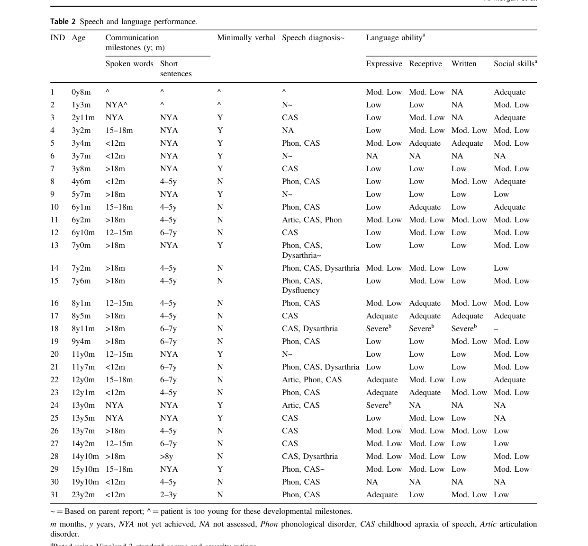

## Question

# Disease Characteristics Research Template

## Target Disease
- **Disease Name:** SETBP1 Disorder
- **MONDO ID:**  (if available)
- **Category:** Mendelian

## Research Objectives

Please provide a comprehensive research report on **SETBP1 Disorder** covering all of the
disease characteristics listed below. This report will be used to populate a disease knowledge
base entry. Be thorough and cite primary literature (PMID preferred) for all claims.

For each section, **suggested databases/resources** are listed. These are the first places
you should search for information on each topic.

---

### 1. Disease Information
> **Search first:** OMIM, Orphanet, ICD-10/ICD-11, MeSH, PubMed

- What is the disease? Provide a concise overview.
- What are the key identifiers? (OMIM, Orphanet, ICD-10/ICD-11, MeSH, Mondo)
- What are the common synonyms and alternative names?
- Is the information derived from individual patients (e.g., EHR) or aggregated disease-level resources?

### 2. Etiology

- **Disease Causal Factors**: What are the primary causes? (genetic, environmental, infectious, mechanistic)
- **Risk Factors**:
  > **Search first:** PubMed, Cochrane Library, UpToDate, clinical guidelines, ClinVar, ClinGen, GWAS Catalog, PheGenI, CTD, CDC, WHO, epidemiological databases
  - Genetic risk factors (causal variants, susceptibility loci, modifier genes)
  - Environmental risk factors (toxins, lifestyle, occupational exposures, age, sex, family history)
- **Protective Factors**:
  > **Search first:** PubMed, Cochrane Library, clinical trial databases, GWAS Catalog, gnomAD, WHO, CDC, nutrition databases
  - Genetic protective factors (protective variants, modifier alleles)
  - Environmental protective factors (diet, lifestyle, exposures that reduce risk)
- **Gene-Environment Interactions**: How do genetic and environmental factors interact to influence disease?
  > **Search first:** CTD, PubMed, PheGenI, GxE databases

### 3. Phenotypes
> **Search first:** HPO (Human Phenotype Ontology), OMIM, Orphanet, PubMed, clinicaltrials.gov, MedDRA, SNOMED CT, DECIPHER, LOINC

For each phenotype, provide:
- **Phenotype type**: symptoms, clinical signs, physical manifestations, behavioral changes, or laboratory abnormalities
  > For symptoms/signs: HPO, OMIM, Orphanet, PubMed
  > For behavioral changes: HPO, DSM, RDoC (Research Domain Criteria), PubMed
  > For laboratory abnormalities: LOINC, SNOMED CT, LabTests Online, PubMed
- **Phenotype characteristics**:
  > **Search first:** OMIM, Orphanet, HPO, PubMed
  - Age of symptom onset (neonatal, childhood, adult-onset, late-onset)
  - Symptom severity (mild, moderate, severe, variable)
  - Symptom progression (stable, progressive, episodic, fluctuating)
  - Frequency among affected individuals (percentage or qualitative)
- **Quality of life impact**: Effects on daily functioning and well-being (per-phenotype when possible)
  > **Search first:** EQ-5D database, SF-36, WHO QOL databases, PubMed
- Suggest HPO (Human Phenotype Ontology) terms for each phenotype

### 4. Genetic/Molecular Information

- **Causal Genes**: Gene mutations or chromosomal abnormalities responsible for disease (gene symbols, OMIM IDs)
  > **Search first:** OMIM, ClinVar, HGMD, Ensembl, NCBI Gene
- **Pathogenic Variants**:
  - Affected genes (gene symbols, HGNC IDs)
    > **Search first:** OMIM, NCBI Gene, Ensembl, HGNC, UniProt, GeneCards
  - Variant classification (pathogenic, likely pathogenic, VUS per ACMG/AMP guidelines)
    > **Search first:** ClinVar, ClinGen, ACMG/AMP guidelines, VarSome
  - Variant type/class (missense, frameshift, nonsense, splice-site, structural)
  - Allele frequency in population databases
    > **Search first:** gnomAD, 1000 Genomes, ExAC, TOPMed, dbSNP
  - Somatic vs germline origin
    > **Search first:** COSMIC (somatic), ClinVar, ICGC, TCGA
  - Functional consequences (loss of function, gain of function, dominant negative)
- **Modifier Genes**: Genes that modify disease severity or expression
- **Epigenetic Information**: DNA methylation, histone modifications, chromatin changes affecting disease
  > **Search first:** ENCODE, Roadmap Epigenomics, MethBase, DiseaseMeth
- **Chromosomal Abnormalities**: Large-scale genetic changes (aneuploidy, translocations, inversions)
  > **Search first:** DECIPHER, ClinVar, ECARUCA, UCSC Genome Browser

### 5. Environmental Information

- **Environmental Factors**: Non-genetic contributing factors (toxins, radiation, pollution, occupational exposure)
  > **Search first:** CTD (Comparative Toxicogenomics Database), TOXNET, PubMed, EPA databases
- **Lifestyle Factors**: Behavioral factors (smoking, diet, exercise, alcohol consumption)
  > **Search first:** CDC databases, WHO, PubMed, NHANES
- **Infectious Agents**: If applicable, pathogens causing or triggering disease (bacteria, viruses, fungi, parasites)
  > **Search first:** NCBI Taxonomy, ViPR, BV-BRC, MicrobeDB, GIDEON

### 6. Mechanism / Pathophysiology

- **Molecular Pathways**: Specific signaling cascades or biochemical pathways involved (Wnt, MAPK, mTOR, PI3K-AKT, etc.)
  > **Search first:** KEGG, Reactome, WikiPathways, PathBank, BioCyc
- **Cellular Processes**: Cell-level mechanisms (apoptosis, autophagy, cell cycle dysregulation, inflammation, etc.)
  > **Search first:** Gene Ontology (GO), Reactome, KEGG, PubMed
- **Protein Dysfunction**: How protein structure or function is altered (misfolding, aggregation, loss of function, gain of function)
  > **Search first:** UniProt, PDB (Protein Data Bank), InterPro, Pfam, AlphaFold
- **Metabolic Changes**: Alterations in metabolic processes (energy metabolism, lipid metabolism, amino acid metabolism)
  > **Search first:** KEGG, BioCyc, HMDB (Human Metabolome Database), BRENDA
- **Immune System Involvement**: Role of immune response (autoimmunity, immunodeficiency, chronic inflammation)
  > **Search first:** ImmPort, Immunome Database, IEDB, Gene Ontology
- **Tissue Damage Mechanisms**: How tissues/ are injured (oxidative stress, ischemia, fibrosis, necrosis)
  > **Search first:** PubMed, Gene Ontology, Reactome
- **Biochemical Abnormalities**: Specific molecular defects (enzyme deficiencies, receptor dysfunction, ion channel defects)
  > **Search first:** BRENDA, UniProt, KEGG, OMIM, PubMed
- **Epigenetic Changes**: DNA methylation, histone modifications affecting gene expression in disease
  > **Search first:** ENCODE, Roadmap Epigenomics, MethBase, DiseaseMeth
- **Molecular Profiling** (if available):
  - Transcriptomics/gene expression changes
    > **Search first:** GEO (Gene Expression Omnibus), ArrayExpress, GTEx, Human Cell Atlas, SRA
  - Proteomics findings
    > **Search first:** PRIDE, ProteomeXchange, Human Protein Atlas, STRING, BioGRID
  - Metabolomics signatures
    > **Search first:** MetaboLights, Metabolomics Workbench, HMDB, METLIN
  - Lipidomics alterations
    > **Search first:** LIPID MAPS, SwissLipids, LipidHome, Metabolomics Workbench
  - Genomic structural features
    > **Search first:** UCSC Genome Browser, Ensembl, NCBI, dbVar, DGV
- **Advanced Technologies** (if applicable):
  - Single-cell analysis findings (cell-type specific mechanisms, cellular heterogeneity)
    > **Search first:** Human Cell Atlas, Single Cell Portal, GEO, CELLxGENE
  - Spatial transcriptomics findings
    > **Search first:** GEO, Spatial Research, Vizgen, 10x Genomics data
  - Multi-omics integration results
    > **Search first:** TCGA, ICGC, cBioPortal, LinkedOmics, PubMed
  - Functional genomics screens (CRISPR, RNAi)
    > **Search first:** DepMap, GenomeRNAi, PubMed, BioGRID ORCS

For each mechanism, describe:
- The causal chain from initial trigger to clinical manifestation
- Which mechanisms are upstream vs downstream
- What cell types and biological processes are involved
- Suggest GO terms for biological processes and CL terms for cell types

### 7. Anatomical Structures Affected

- **Organ Level**:
  - Primary organs directly affected
  - Secondary organ involvement (complications, secondary effects)
  - Body systems involved (cardiovascular, nervous, digestive, respiratory, endocrine, etc.)
  > **Search first:** Uberon, FMA (Foundational Model of Anatomy), OMIM, HPO, ICD-11, MeSH, SNOMED CT
- **Tissue and Cell Level**:
  - Specific tissue types affected (epithelial, connective, muscle, nervous)
  - Specific cell populations targeted (with Cell Ontology terms)
  > **Search first:** Uberon, Human Protein Atlas, Cell Ontology, Human Cell Atlas, CellMarker, PanglaoDB
- **Subcellular Level**:
  - Cellular compartments involved (mitochondria, nucleus, ER, lysosomes) (with GO Cellular Component terms)
  > **Search first:** Gene Ontology (Cellular Component), UniProt, Human Protein Atlas
- **Localization**:
  - Specific anatomical sites (with UBERON terms)
    > **Search first:** FMA, Uberon, NeuroNames (for brain), SNOMED CT
  - Lateralization (unilateral, bilateral, asymmetric)
    > **Search first:** HPO, clinical literature, imaging databases

### 8. Temporal Development

- **Onset**:
  - Typical age of onset (congenital, pediatric, adult, geriatric)
  - Onset pattern (acute, subacute, chronic, insidious)
  > **Search first:** OMIM, Orphanet, HPO, PubMed
- **Progression**:
  - Disease stages (early, intermediate, advanced, end-stage)
    > **Search first:** Cancer Staging Manual (AJCC), WHO classifications, PubMed
  - Progression rate (rapid, slow, variable)
  - Disease course pattern (episodic, relapsing-remitting, progressive, stable)
  - Disease duration (self-limited, chronic lifelong)
  > **Search first:** Disease registries, longitudinal cohort databases, natural history studies, PubMed, Orphanet, OMIM
- **Patterns**:
  - Remission patterns (spontaneous, treatment-induced)
    > **Search first:** Clinical trial databases, disease registries, PubMed
  - Critical periods (time windows of vulnerability or opportunity for intervention)
    > **Search first:** PubMed, developmental biology databases, clinical guidelines

### 9. Inheritance and Population

- **Epidemiology**:
  - Prevalence (cases per 100,000 at given time)
  - Incidence (new cases per 100,000 per year)
  > **Search first:** Orphanet, CDC, WHO, GBD (Global Burden of Disease), national registries, SEER, disease registries
- **For Genetic Etiology**:
  - Inheritance pattern (AD, AR, X-linked, mitochondrial, multifactorial, polygenic)
    > **Search first:** OMIM, Orphanet, ClinVar, GTR (Genetic Testing Registry)
  - Penetrance (complete, incomplete, age-dependent)
    > **Search first:** ClinVar, OMIM, PubMed, ClinGen
  - Expressivity (variable, consistent)
    > **Search first:** OMIM, ClinVar, PubMed
  - Genetic anticipation (increasing severity in successive generations)
    > **Search first:** OMIM, PubMed (especially for repeat expansion disorders)
  - Germline mosaicism
    > **Search first:** ClinVar, OMIM, genetic counseling literature, PubMed
  - Founder effects (population-specific mutations)
    > **Search first:** gnomAD, population genetics databases, PubMed
  - Consanguinity role
    > **Search first:** OMIM, population studies, genetic counseling resources
  - Carrier frequency
    > **Search first:** gnomAD, carrier screening databases, GeneReviews, GTR
- **Population Demographics**:
  - Affected populations (ethnic or demographic groups with higher prevalence)
    > **Search first:** gnomAD, 1000 Genomes, PAGE Study, PubMed, population registries
  - Geographic distribution (endemic areas, regional variation)
    > **Search first:** WHO, CDC, GBD, Orphanet, geographic epidemiology databases
  - Geographic distribution of specific variants
  - Sex ratio (male:female)
    > **Search first:** Disease registries, OMIM, PubMed, epidemiological databases
  - Age distribution of affected individuals
    > **Search first:** CDC, disease registries, SEER, Orphanet

### 10. Diagnostics

- **Clinical Tests**:
  - Laboratory tests (blood, urine, tissue chemistry, specific enzyme assays)
    > **Search first:** LOINC, LabTests Online, PubMed
  - Biomarkers (proteins, metabolites, genetic markers, circulating biomarkers)
    > **Search first:** FDA Biomarker List, BEST (Biomarkers, EndpointS, and other Tools), PubMed
  - Imaging studies (X-ray, CT, MRI, PET, ultrasound)
    > **Search first:** RadLex, DICOM, Radiopaedia, imaging databases
  - Functional tests (pulmonary function, cardiac stress tests)
    > **Search first:** LOINC, clinical guidelines, PubMed
  - Electrophysiology (EEG, EMG, ECG, nerve conduction studies)
    > **Search first:** LOINC, clinical neurophysiology databases, PubMed
  - Biopsy findings (histopathology, immunohistochemistry)
    > **Search first:** SNOMED CT, College of American Pathologists resources, PubMed
  - Pathology findings (microscopic examination)
    > **Search first:** SNOMED CT, Digital Pathology databases, PubMed
- **Genetic Testing**:
  > **Search first:** GTR (Genetic Testing Registry), GeneReviews, ClinGen
  - Overview of recommended genetic testing approach
  - Whole genome sequencing (WGS) utility
    > **Search first:** GTR, ClinVar, GEL (Genomics England), gnomAD
  - Whole exome sequencing (WES) utility
    > **Search first:** GTR, ClinVar, OMIM, GeneMatcher
  - Gene panels (which panels, which genes)
    > **Search first:** GTR, ClinVar, laboratory-specific databases
  - Single gene testing
    > **Search first:** GTR, ClinVar, OMIM, GeneReviews
  - Chromosomal microarray (CMA)
    > **Search first:** DECIPHER, ClinVar, dbVar, ECARUCA
  - Karyotyping
    > **Search first:** Chromosome Abnormality Database, ClinVar, cytogenetics resources
  - FISH
    > **Search first:** ClinVar, cytogenetics databases, PubMed
  - Mitochondrial DNA testing
    > **Search first:** MITOMAP, MSeqDR, ClinVar, GTR
  - Repeat expansion testing
    > **Search first:** GTR, ClinVar, repeat expansion databases, PubMed
- **Omics-Based Diagnostics** (if applicable):
  - RNA sequencing / transcriptomics
    > **Search first:** GEO, ArrayExpress, GTEx, RNA-seq databases
  - Proteomics
    > **Search first:** PRIDE, ProteomeXchange, FDA Biomarker database
  - Metabolomics
    > **Search first:** MetaboLights, Metabolomics Workbench, HMDB
  - Epigenomics
    > **Search first:** GEO, ENCODE, Roadmap Epigenomics, MethBase
  - Liquid biopsy
    > **Search first:** COSMIC, ClinVar, liquid biopsy databases, PubMed
- **Clinical Criteria**:
  - Standardized diagnostic criteria (DSM, ICD, society guidelines)
    > **Search first:** DSM-5, ICD-11, clinical society guidelines, UpToDate
  - Differential diagnosis (other conditions to rule out, with distinguishing features)
    > **Search first:** DynaMed, UpToDate, clinical decision support systems
- **Screening**:
  - Screening methods for asymptomatic individuals (newborn screening, carrier screening, cascade screening)
    > **Search first:** ACMG recommendations, CDC newborn screening, GTR

### 11. Outcome/Prognosis

- **Survival and Mortality**:
  - Survival rate (5-year, 10-year, overall)
    > **Search first:** SEER, cancer registries, disease-specific registries, PubMed
  - Life expectancy (with and without treatment if applicable)
    > **Search first:** Orphanet, disease registries, actuarial databases, PubMed
  - Mortality rate
    > **Search first:** CDC, WHO, GBD, national mortality databases
  - Disease-specific mortality (deaths directly attributable to disease)
    > **Search first:** Disease registries, CDC Wonder, GBD, PubMed
- **Morbidity and Function**:
  - Morbidity (disease-related disability and health impacts)
    > **Search first:** GBD, WHO, disability databases, PubMed
  - Disability outcomes (long-term functional impairments)
    > **Search first:** ICF (International Classification of Functioning), disability registries
  - Quality of life measures (EQ-5D, SF-36, PROMIS, disease-specific tools)
    > **Search first:** EQ-5D database, SF-36, PROMIS, PubMed
- **Disease Course**:
  - Complications (secondary problems: infections, organ failure, etc.)
    > **Search first:** ICD codes, disease registries, clinical databases, PubMed
  - Recovery potential (likelihood and extent of recovery, with vs without treatment)
    > **Search first:** Natural history studies, rehabilitation databases, PubMed
- **Prediction**:
  - Prognostic factors (age, disease severity, biomarkers, treatment response)
    > **Search first:** Prognostic models databases, clinical calculators, PubMed
  - Prognostic biomarkers (molecular markers predicting disease course)
    > **Search first:** FDA Biomarker database, PubMed, cancer prognostic databases

### 12. Treatment

- **Pharmacotherapy**:
  - Pharmacological treatments (drug names, drug classes, mechanisms of action)
    > **Search first:** DrugBank, RxNorm, ATC classification, DailyMed, FDA databases
  - Pharmacogenomics (how genetic variants affect drug metabolism, efficacy, toxicity)
    > **Search first:** PharmGKB, CPIC (Clinical Pharmacogenetics), FDA Table of PGx Biomarkers
- **Advanced Therapeutics**:
  - Gene therapy (viral vectors, CRISPR, gene replacement, gene editing)
    > **Search first:** ClinicalTrials.gov, FDA gene therapy database, ASGCT resources
  - Cell therapy (stem cell transplant, CAR-T, cellular therapeutics)
    > **Search first:** ClinicalTrials.gov, FDA cell therapy database, FACT standards
  - RNA-based therapies (ASOs, siRNA, mRNA therapies)
    > **Search first:** ClinicalTrials.gov, FDA approvals, PubMed
  - Targeted therapies (treatments directed at specific molecular targets)
    > **Search first:** My Cancer Genome, OncoKB, ClinicalTrials.gov, FDA approvals
  - Immunotherapies (checkpoint inhibitors, monoclonal antibodies)
    > **Search first:** Cancer Immunotherapy Database, FDA approvals, ClinicalTrials.gov
- **Surgical and Interventional**:
  - Surgical interventions (types of surgery, timing, outcomes)
    > **Search first:** CPT codes, surgical registries, clinical guidelines, PubMed
- **Supportive and Rehabilitative**:
  - Supportive care (symptom management, pain control, nutrition)
    > **Search first:** Clinical guidelines, Cochrane Library, PubMed
  - Rehabilitation (physical therapy, occupational therapy, speech therapy)
    > **Search first:** Rehabilitation medicine databases, clinical guidelines, PubMed
- **Experimental**:
  - Experimental treatments in clinical trials (with NCT identifiers if available)
    > **Search first:** ClinicalTrials.gov, EU Clinical Trials Register, WHO ICTRP
- **Treatment Outcomes**:
  - Treatment response rates
    > **Search first:** Clinical trial databases, FDA reviews, systematic reviews, PubMed
  - Side effects and adverse events
    > **Search first:** FDA Adverse Event Reporting System (FAERS), MedWatch, PubMed
- **Treatment Strategy**:
  - Treatment algorithms (clinical pathways, decision trees)
    > **Search first:** Clinical practice guidelines, NCCN Guidelines, UpToDate
  - Combination therapies
    > **Search first:** ClinicalTrials.gov, treatment guidelines, PubMed
  - Personalized medicine approaches (genotype-guided treatment)
    > **Search first:** My Cancer Genome, CIViC, PharmGKB, precision medicine databases

For each treatment, suggest MAXO (Medical Action Ontology) terms where applicable.

### 13. Prevention

- **Prevention Levels**:
  - Primary prevention (preventing disease occurrence: vaccination, risk factor modification)
    > **Search first:** CDC, WHO, USPSTF recommendations, Cochrane Library
  - Secondary prevention (early detection and treatment: screening programs, early intervention)
    > **Search first:** USPSTF, CDC screening guidelines, WHO
  - Tertiary prevention (preventing complications in those with disease)
    > **Search first:** Clinical guidelines, disease management protocols, PubMed
- **Immunization**: Vaccine strategies (if applicable)
  > **Search first:** CDC vaccine schedules, WHO immunization, FDA vaccine database
- **Screening and Early Detection**:
  - Screening programs (population-based: newborn screening, cancer screening)
    > **Search first:** CDC screening programs, USPSTF, cancer screening databases
  - Genetic screening (carrier screening, preimplantation genetic diagnosis, prenatal testing)
    > **Search first:** ACMG recommendations, ACOG guidelines, GTR
  - Risk stratification (identifying high-risk individuals for targeted prevention)
    > **Search first:** Risk prediction models, clinical calculators, PubMed
- **Behavioral Interventions**: Lifestyle modifications to reduce risk
  > **Search first:** CDC, WHO, behavioral intervention databases, Cochrane Library
- **Counseling**: Genetic counseling (risk assessment, family planning guidance)
  > **Search first:** NSGC resources, ACMG guidelines, GeneReviews
- **Public Health**:
  - Public health interventions (sanitation, vector control, health education)
    > **Search first:** CDC, WHO, public health databases, PubMed
  - Environmental interventions (reducing environmental risk factors)
    > **Search first:** EPA databases, WHO environmental health, PubMed
- **Prophylaxis**: Preventive medications or procedures
  > **Search first:** Clinical guidelines, FDA approvals, PubMed

### 14. Other Species / Natural Disease

- **Taxonomy**: Species affected (with NCBI Taxon identifiers)
  > **Search first:** NCBI Taxonomy
- **Breed**: Specific breeds affected (with VBO identifiers if applicable)
  > **Search first:** VBO (Vertebrate Breed Ontology)
- **Gene**: Orthologous genes in other species (with NCBI Gene IDs)
  > **Search first:** NCBI Gene
- **Natural Disease**:
  - Naturally occurring disease in other species (companion animals, wildlife)
    > **Search first:** OMIA (Online Mendelian Inheritance in Animals), VetCompass, PubMed
  - Veterinary relevance and importance in animal health
    > **Search first:** OMIA, veterinary databases, PubMed
- **Comparative Biology**:
  - Comparative pathology (similarities and differences across species)
    > **Search first:** OMIA, comparative pathology databases, PubMed
  - Evolutionary conservation of disease mechanisms
    > **Search first:** HomoloGene, OrthoMCL, Alliance of Genome Resources
- **Transmission** (if applicable):
  - Zoonotic potential
    > **Search first:** CDC zoonotic diseases, WHO zoonoses, GIDEON
  - Cross-species susceptibility
    > **Search first:** NCBI Taxonomy, veterinary databases, PubMed

### 15. Model Organisms

- **Model Types**:
  - Model organism type (mammalian, invertebrate, cellular, in vitro)
    > **Search first:** Alliance of Genome Resources, model organism databases
  - Specific model systems (mouse, rat, zebrafish, Drosophila, C. elegans, yeast, cell lines, organoids, iPSCs)
    > **Search first:** MGI, RGD, ZFIN, FlyBase, WormBase, SGD, ATCC, Cellosaurus
  - Induced models (drug treatment, surgical intervention, environmental manipulation)
    > **Search first:** MGI, model organism databases, PubMed
- **Genetic Models**:
  - Types available (knockout, knock-in, transgenic, conditional, humanized)
    > **Search first:** MGI, IMPC, KOMP, EuMMCR, IMSR
- **Model Characteristics**:
  - Phenotype recapitulation (how well model reproduces human disease features)
    > **Search first:** Model organism databases, comparative studies, PubMed
  - Model limitations (aspects of human disease not captured)
    > **Search first:** Model organism databases, PubMed, review articles
- **Applications**:
  - Research applications (what aspects of disease can be studied)
    > **Search first:** Model organism databases, PubMed
- **Resources**:
  - Model databases
    > **Search first:** MGI, RGD, ZFIN, FlyBase, WormBase, IMSR, EMMA, MMRRC

---

## Citation Requirements

- Cite primary literature (PMID preferred) for all mechanistic and clinical claims
- Prioritize recent reviews and landmark papers
- Include direct quotes from abstracts where possible to support key statements
- Distinguish evidence source types: human clinical, model organism, in vitro, computational

## Output Format

Structure your response as a comprehensive narrative organized by the sections above.
For each section, provide:
- Factual content with specific details (numbers, percentages, gene names, variant nomenclature)
- Ontology term suggestions (HPO, GO, CL, UBERON, CHEBI, MAXO, MONDO) where applicable
- Evidence citations with PMIDs
- Direct quotes from abstracts to support key claims
- Clear indication when information is not available or not applicable for this disease

This report will be used to populate a disease knowledge base entry with:
- Pathophysiology descriptions with causal chains
- Gene/protein annotations (HGNC, GO terms)
- Phenotype associations (HP terms) with frequencies
- Cell type involvement (CL terms)
- Anatomical locations (UBERON terms)
- Chemical entities (CHEBI terms)
- Treatment annotations (MAXO terms)
- Evidence items with PMIDs and exact abstract quotes
- Epidemiology, prognosis, diagnostic, and prevention information
- Animal model descriptions with phenotype recapitulation details

## Output

Question: You are an expert researcher providing comprehensive, well-cited information.

Provide detailed information focusing on:
1. Key concepts and definitions with current understanding
2. Recent developments and latest research (prioritize 2023-2024 sources)
3. Current applications and real-world implementations
4. Expert opinions and analysis from authoritative sources
5. Relevant statistics and data from recent studies

Format as a comprehensive research report with proper citations. Include URLs and publication dates where available.
Always prioritize recent, authoritative sources and provide specific citations for all major claims.

# Disease Characteristics Research Template

## Target Disease
- **Disease Name:** SETBP1 Disorder
- **MONDO ID:**  (if available)
- **Category:** Mendelian

## Research Objectives

Please provide a comprehensive research report on **SETBP1 Disorder** covering all of the
disease characteristics listed below. This report will be used to populate a disease knowledge
base entry. Be thorough and cite primary literature (PMID preferred) for all claims.

For each section, **suggested databases/resources** are listed. These are the first places
you should search for information on each topic.

---

### 1. Disease Information
> **Search first:** OMIM, Orphanet, ICD-10/ICD-11, MeSH, PubMed

- What is the disease? Provide a concise overview.
- What are the key identifiers? (OMIM, Orphanet, ICD-10/ICD-11, MeSH, Mondo)
- What are the common synonyms and alternative names?
- Is the information derived from individual patients (e.g., EHR) or aggregated disease-level resources?

### 2. Etiology

- **Disease Causal Factors**: What are the primary causes? (genetic, environmental, infectious, mechanistic)
- **Risk Factors**:
  > **Search first:** PubMed, Cochrane Library, UpToDate, clinical guidelines, ClinVar, ClinGen, GWAS Catalog, PheGenI, CTD, CDC, WHO, epidemiological databases
  - Genetic risk factors (causal variants, susceptibility loci, modifier genes)
  - Environmental risk factors (toxins, lifestyle, occupational exposures, age, sex, family history)
- **Protective Factors**:
  > **Search first:** PubMed, Cochrane Library, clinical trial databases, GWAS Catalog, gnomAD, WHO, CDC, nutrition databases
  - Genetic protective factors (protective variants, modifier alleles)
  - Environmental protective factors (diet, lifestyle, exposures that reduce risk)
- **Gene-Environment Interactions**: How do genetic and environmental factors interact to influence disease?
  > **Search first:** CTD, PubMed, PheGenI, GxE databases

### 3. Phenotypes
> **Search first:** HPO (Human Phenotype Ontology), OMIM, Orphanet, PubMed, clinicaltrials.gov, MedDRA, SNOMED CT, DECIPHER, LOINC

For each phenotype, provide:
- **Phenotype type**: symptoms, clinical signs, physical manifestations, behavioral changes, or laboratory abnormalities
  > For symptoms/signs: HPO, OMIM, Orphanet, PubMed
  > For behavioral changes: HPO, DSM, RDoC (Research Domain Criteria), PubMed
  > For laboratory abnormalities: LOINC, SNOMED CT, LabTests Online, PubMed
- **Phenotype characteristics**:
  > **Search first:** OMIM, Orphanet, HPO, PubMed
  - Age of symptom onset (neonatal, childhood, adult-onset, late-onset)
  - Symptom severity (mild, moderate, severe, variable)
  - Symptom progression (stable, progressive, episodic, fluctuating)
  - Frequency among affected individuals (percentage or qualitative)
- **Quality of life impact**: Effects on daily functioning and well-being (per-phenotype when possible)
  > **Search first:** EQ-5D database, SF-36, WHO QOL databases, PubMed
- Suggest HPO (Human Phenotype Ontology) terms for each phenotype

### 4. Genetic/Molecular Information

- **Causal Genes**: Gene mutations or chromosomal abnormalities responsible for disease (gene symbols, OMIM IDs)
  > **Search first:** OMIM, ClinVar, HGMD, Ensembl, NCBI Gene
- **Pathogenic Variants**:
  - Affected genes (gene symbols, HGNC IDs)
    > **Search first:** OMIM, NCBI Gene, Ensembl, HGNC, UniProt, GeneCards
  - Variant classification (pathogenic, likely pathogenic, VUS per ACMG/AMP guidelines)
    > **Search first:** ClinVar, ClinGen, ACMG/AMP guidelines, VarSome
  - Variant type/class (missense, frameshift, nonsense, splice-site, structural)
  - Allele frequency in population databases
    > **Search first:** gnomAD, 1000 Genomes, ExAC, TOPMed, dbSNP
  - Somatic vs germline origin
    > **Search first:** COSMIC (somatic), ClinVar, ICGC, TCGA
  - Functional consequences (loss of function, gain of function, dominant negative)
- **Modifier Genes**: Genes that modify disease severity or expression
- **Epigenetic Information**: DNA methylation, histone modifications, chromatin changes affecting disease
  > **Search first:** ENCODE, Roadmap Epigenomics, MethBase, DiseaseMeth
- **Chromosomal Abnormalities**: Large-scale genetic changes (aneuploidy, translocations, inversions)
  > **Search first:** DECIPHER, ClinVar, ECARUCA, UCSC Genome Browser

### 5. Environmental Information

- **Environmental Factors**: Non-genetic contributing factors (toxins, radiation, pollution, occupational exposure)
  > **Search first:** CTD (Comparative Toxicogenomics Database), TOXNET, PubMed, EPA databases
- **Lifestyle Factors**: Behavioral factors (smoking, diet, exercise, alcohol consumption)
  > **Search first:** CDC databases, WHO, PubMed, NHANES
- **Infectious Agents**: If applicable, pathogens causing or triggering disease (bacteria, viruses, fungi, parasites)
  > **Search first:** NCBI Taxonomy, ViPR, BV-BRC, MicrobeDB, GIDEON

### 6. Mechanism / Pathophysiology

- **Molecular Pathways**: Specific signaling cascades or biochemical pathways involved (Wnt, MAPK, mTOR, PI3K-AKT, etc.)
  > **Search first:** KEGG, Reactome, WikiPathways, PathBank, BioCyc
- **Cellular Processes**: Cell-level mechanisms (apoptosis, autophagy, cell cycle dysregulation, inflammation, etc.)
  > **Search first:** Gene Ontology (GO), Reactome, KEGG, PubMed
- **Protein Dysfunction**: How protein structure or function is altered (misfolding, aggregation, loss of function, gain of function)
  > **Search first:** UniProt, PDB (Protein Data Bank), InterPro, Pfam, AlphaFold
- **Metabolic Changes**: Alterations in metabolic processes (energy metabolism, lipid metabolism, amino acid metabolism)
  > **Search first:** KEGG, BioCyc, HMDB (Human Metabolome Database), BRENDA
- **Immune System Involvement**: Role of immune response (autoimmunity, immunodeficiency, chronic inflammation)
  > **Search first:** ImmPort, Immunome Database, IEDB, Gene Ontology
- **Tissue Damage Mechanisms**: How tissues/ are injured (oxidative stress, ischemia, fibrosis, necrosis)
  > **Search first:** PubMed, Gene Ontology, Reactome
- **Biochemical Abnormalities**: Specific molecular defects (enzyme deficiencies, receptor dysfunction, ion channel defects)
  > **Search first:** BRENDA, UniProt, KEGG, OMIM, PubMed
- **Epigenetic Changes**: DNA methylation, histone modifications affecting gene expression in disease
  > **Search first:** ENCODE, Roadmap Epigenomics, MethBase, DiseaseMeth
- **Molecular Profiling** (if available):
  - Transcriptomics/gene expression changes
    > **Search first:** GEO (Gene Expression Omnibus), ArrayExpress, GTEx, Human Cell Atlas, SRA
  - Proteomics findings
    > **Search first:** PRIDE, ProteomeXchange, Human Protein Atlas, STRING, BioGRID
  - Metabolomics signatures
    > **Search first:** MetaboLights, Metabolomics Workbench, HMDB, METLIN
  - Lipidomics alterations
    > **Search first:** LIPID MAPS, SwissLipids, LipidHome, Metabolomics Workbench
  - Genomic structural features
    > **Search first:** UCSC Genome Browser, Ensembl, NCBI, dbVar, DGV
- **Advanced Technologies** (if applicable):
  - Single-cell analysis findings (cell-type specific mechanisms, cellular heterogeneity)
    > **Search first:** Human Cell Atlas, Single Cell Portal, GEO, CELLxGENE
  - Spatial transcriptomics findings
    > **Search first:** GEO, Spatial Research, Vizgen, 10x Genomics data
  - Multi-omics integration results
    > **Search first:** TCGA, ICGC, cBioPortal, LinkedOmics, PubMed
  - Functional genomics screens (CRISPR, RNAi)
    > **Search first:** DepMap, GenomeRNAi, PubMed, BioGRID ORCS

For each mechanism, describe:
- The causal chain from initial trigger to clinical manifestation
- Which mechanisms are upstream vs downstream
- What cell types and biological processes are involved
- Suggest GO terms for biological processes and CL terms for cell types

### 7. Anatomical Structures Affected

- **Organ Level**:
  - Primary organs directly affected
  - Secondary organ involvement (complications, secondary effects)
  - Body systems involved (cardiovascular, nervous, digestive, respiratory, endocrine, etc.)
  > **Search first:** Uberon, FMA (Foundational Model of Anatomy), OMIM, HPO, ICD-11, MeSH, SNOMED CT
- **Tissue and Cell Level**:
  - Specific tissue types affected (epithelial, connective, muscle, nervous)
  - Specific cell populations targeted (with Cell Ontology terms)
  > **Search first:** Uberon, Human Protein Atlas, Cell Ontology, Human Cell Atlas, CellMarker, PanglaoDB
- **Subcellular Level**:
  - Cellular compartments involved (mitochondria, nucleus, ER, lysosomes) (with GO Cellular Component terms)
  > **Search first:** Gene Ontology (Cellular Component), UniProt, Human Protein Atlas
- **Localization**:
  - Specific anatomical sites (with UBERON terms)
    > **Search first:** FMA, Uberon, NeuroNames (for brain), SNOMED CT
  - Lateralization (unilateral, bilateral, asymmetric)
    > **Search first:** HPO, clinical literature, imaging databases

### 8. Temporal Development

- **Onset**:
  - Typical age of onset (congenital, pediatric, adult, geriatric)
  - Onset pattern (acute, subacute, chronic, insidious)
  > **Search first:** OMIM, Orphanet, HPO, PubMed
- **Progression**:
  - Disease stages (early, intermediate, advanced, end-stage)
    > **Search first:** Cancer Staging Manual (AJCC), WHO classifications, PubMed
  - Progression rate (rapid, slow, variable)
  - Disease course pattern (episodic, relapsing-remitting, progressive, stable)
  - Disease duration (self-limited, chronic lifelong)
  > **Search first:** Disease registries, longitudinal cohort databases, natural history studies, PubMed, Orphanet, OMIM
- **Patterns**:
  - Remission patterns (spontaneous, treatment-induced)
    > **Search first:** Clinical trial databases, disease registries, PubMed
  - Critical periods (time windows of vulnerability or opportunity for intervention)
    > **Search first:** PubMed, developmental biology databases, clinical guidelines

### 9. Inheritance and Population

- **Epidemiology**:
  - Prevalence (cases per 100,000 at given time)
  - Incidence (new cases per 100,000 per year)
  > **Search first:** Orphanet, CDC, WHO, GBD (Global Burden of Disease), national registries, SEER, disease registries
- **For Genetic Etiology**:
  - Inheritance pattern (AD, AR, X-linked, mitochondrial, multifactorial, polygenic)
    > **Search first:** OMIM, Orphanet, ClinVar, GTR (Genetic Testing Registry)
  - Penetrance (complete, incomplete, age-dependent)
    > **Search first:** ClinVar, OMIM, PubMed, ClinGen
  - Expressivity (variable, consistent)
    > **Search first:** OMIM, ClinVar, PubMed
  - Genetic anticipation (increasing severity in successive generations)
    > **Search first:** OMIM, PubMed (especially for repeat expansion disorders)
  - Germline mosaicism
    > **Search first:** ClinVar, OMIM, genetic counseling literature, PubMed
  - Founder effects (population-specific mutations)
    > **Search first:** gnomAD, population genetics databases, PubMed
  - Consanguinity role
    > **Search first:** OMIM, population studies, genetic counseling resources
  - Carrier frequency
    > **Search first:** gnomAD, carrier screening databases, GeneReviews, GTR
- **Population Demographics**:
  - Affected populations (ethnic or demographic groups with higher prevalence)
    > **Search first:** gnomAD, 1000 Genomes, PAGE Study, PubMed, population registries
  - Geographic distribution (endemic areas, regional variation)
    > **Search first:** WHO, CDC, GBD, Orphanet, geographic epidemiology databases
  - Geographic distribution of specific variants
  - Sex ratio (male:female)
    > **Search first:** Disease registries, OMIM, PubMed, epidemiological databases
  - Age distribution of affected individuals
    > **Search first:** CDC, disease registries, SEER, Orphanet

### 10. Diagnostics

- **Clinical Tests**:
  - Laboratory tests (blood, urine, tissue chemistry, specific enzyme assays)
    > **Search first:** LOINC, LabTests Online, PubMed
  - Biomarkers (proteins, metabolites, genetic markers, circulating biomarkers)
    > **Search first:** FDA Biomarker List, BEST (Biomarkers, EndpointS, and other Tools), PubMed
  - Imaging studies (X-ray, CT, MRI, PET, ultrasound)
    > **Search first:** RadLex, DICOM, Radiopaedia, imaging databases
  - Functional tests (pulmonary function, cardiac stress tests)
    > **Search first:** LOINC, clinical guidelines, PubMed
  - Electrophysiology (EEG, EMG, ECG, nerve conduction studies)
    > **Search first:** LOINC, clinical neurophysiology databases, PubMed
  - Biopsy findings (histopathology, immunohistochemistry)
    > **Search first:** SNOMED CT, College of American Pathologists resources, PubMed
  - Pathology findings (microscopic examination)
    > **Search first:** SNOMED CT, Digital Pathology databases, PubMed
- **Genetic Testing**:
  > **Search first:** GTR (Genetic Testing Registry), GeneReviews, ClinGen
  - Overview of recommended genetic testing approach
  - Whole genome sequencing (WGS) utility
    > **Search first:** GTR, ClinVar, GEL (Genomics England), gnomAD
  - Whole exome sequencing (WES) utility
    > **Search first:** GTR, ClinVar, OMIM, GeneMatcher
  - Gene panels (which panels, which genes)
    > **Search first:** GTR, ClinVar, laboratory-specific databases
  - Single gene testing
    > **Search first:** GTR, ClinVar, OMIM, GeneReviews
  - Chromosomal microarray (CMA)
    > **Search first:** DECIPHER, ClinVar, dbVar, ECARUCA
  - Karyotyping
    > **Search first:** Chromosome Abnormality Database, ClinVar, cytogenetics resources
  - FISH
    > **Search first:** ClinVar, cytogenetics databases, PubMed
  - Mitochondrial DNA testing
    > **Search first:** MITOMAP, MSeqDR, ClinVar, GTR
  - Repeat expansion testing
    > **Search first:** GTR, ClinVar, repeat expansion databases, PubMed
- **Omics-Based Diagnostics** (if applicable):
  - RNA sequencing / transcriptomics
    > **Search first:** GEO, ArrayExpress, GTEx, RNA-seq databases
  - Proteomics
    > **Search first:** PRIDE, ProteomeXchange, FDA Biomarker database
  - Metabolomics
    > **Search first:** MetaboLights, Metabolomics Workbench, HMDB
  - Epigenomics
    > **Search first:** GEO, ENCODE, Roadmap Epigenomics, MethBase
  - Liquid biopsy
    > **Search first:** COSMIC, ClinVar, liquid biopsy databases, PubMed
- **Clinical Criteria**:
  - Standardized diagnostic criteria (DSM, ICD, society guidelines)
    > **Search first:** DSM-5, ICD-11, clinical society guidelines, UpToDate
  - Differential diagnosis (other conditions to rule out, with distinguishing features)
    > **Search first:** DynaMed, UpToDate, clinical decision support systems
- **Screening**:
  - Screening methods for asymptomatic individuals (newborn screening, carrier screening, cascade screening)
    > **Search first:** ACMG recommendations, CDC newborn screening, GTR

### 11. Outcome/Prognosis

- **Survival and Mortality**:
  - Survival rate (5-year, 10-year, overall)
    > **Search first:** SEER, cancer registries, disease-specific registries, PubMed
  - Life expectancy (with and without treatment if applicable)
    > **Search first:** Orphanet, disease registries, actuarial databases, PubMed
  - Mortality rate
    > **Search first:** CDC, WHO, GBD, national mortality databases
  - Disease-specific mortality (deaths directly attributable to disease)
    > **Search first:** Disease registries, CDC Wonder, GBD, PubMed
- **Morbidity and Function**:
  - Morbidity (disease-related disability and health impacts)
    > **Search first:** GBD, WHO, disability databases, PubMed
  - Disability outcomes (long-term functional impairments)
    > **Search first:** ICF (International Classification of Functioning), disability registries
  - Quality of life measures (EQ-5D, SF-36, PROMIS, disease-specific tools)
    > **Search first:** EQ-5D database, SF-36, PROMIS, PubMed
- **Disease Course**:
  - Complications (secondary problems: infections, organ failure, etc.)
    > **Search first:** ICD codes, disease registries, clinical databases, PubMed
  - Recovery potential (likelihood and extent of recovery, with vs without treatment)
    > **Search first:** Natural history studies, rehabilitation databases, PubMed
- **Prediction**:
  - Prognostic factors (age, disease severity, biomarkers, treatment response)
    > **Search first:** Prognostic models databases, clinical calculators, PubMed
  - Prognostic biomarkers (molecular markers predicting disease course)
    > **Search first:** FDA Biomarker database, PubMed, cancer prognostic databases

### 12. Treatment

- **Pharmacotherapy**:
  - Pharmacological treatments (drug names, drug classes, mechanisms of action)
    > **Search first:** DrugBank, RxNorm, ATC classification, DailyMed, FDA databases
  - Pharmacogenomics (how genetic variants affect drug metabolism, efficacy, toxicity)
    > **Search first:** PharmGKB, CPIC (Clinical Pharmacogenetics), FDA Table of PGx Biomarkers
- **Advanced Therapeutics**:
  - Gene therapy (viral vectors, CRISPR, gene replacement, gene editing)
    > **Search first:** ClinicalTrials.gov, FDA gene therapy database, ASGCT resources
  - Cell therapy (stem cell transplant, CAR-T, cellular therapeutics)
    > **Search first:** ClinicalTrials.gov, FDA cell therapy database, FACT standards
  - RNA-based therapies (ASOs, siRNA, mRNA therapies)
    > **Search first:** ClinicalTrials.gov, FDA approvals, PubMed
  - Targeted therapies (treatments directed at specific molecular targets)
    > **Search first:** My Cancer Genome, OncoKB, ClinicalTrials.gov, FDA approvals
  - Immunotherapies (checkpoint inhibitors, monoclonal antibodies)
    > **Search first:** Cancer Immunotherapy Database, FDA approvals, ClinicalTrials.gov
- **Surgical and Interventional**:
  - Surgical interventions (types of surgery, timing, outcomes)
    > **Search first:** CPT codes, surgical registries, clinical guidelines, PubMed
- **Supportive and Rehabilitative**:
  - Supportive care (symptom management, pain control, nutrition)
    > **Search first:** Clinical guidelines, Cochrane Library, PubMed
  - Rehabilitation (physical therapy, occupational therapy, speech therapy)
    > **Search first:** Rehabilitation medicine databases, clinical guidelines, PubMed
- **Experimental**:
  - Experimental treatments in clinical trials (with NCT identifiers if available)
    > **Search first:** ClinicalTrials.gov, EU Clinical Trials Register, WHO ICTRP
- **Treatment Outcomes**:
  - Treatment response rates
    > **Search first:** Clinical trial databases, FDA reviews, systematic reviews, PubMed
  - Side effects and adverse events
    > **Search first:** FDA Adverse Event Reporting System (FAERS), MedWatch, PubMed
- **Treatment Strategy**:
  - Treatment algorithms (clinical pathways, decision trees)
    > **Search first:** Clinical practice guidelines, NCCN Guidelines, UpToDate
  - Combination therapies
    > **Search first:** ClinicalTrials.gov, treatment guidelines, PubMed
  - Personalized medicine approaches (genotype-guided treatment)
    > **Search first:** My Cancer Genome, CIViC, PharmGKB, precision medicine databases

For each treatment, suggest MAXO (Medical Action Ontology) terms where applicable.

### 13. Prevention

- **Prevention Levels**:
  - Primary prevention (preventing disease occurrence: vaccination, risk factor modification)
    > **Search first:** CDC, WHO, USPSTF recommendations, Cochrane Library
  - Secondary prevention (early detection and treatment: screening programs, early intervention)
    > **Search first:** USPSTF, CDC screening guidelines, WHO
  - Tertiary prevention (preventing complications in those with disease)
    > **Search first:** Clinical guidelines, disease management protocols, PubMed
- **Immunization**: Vaccine strategies (if applicable)
  > **Search first:** CDC vaccine schedules, WHO immunization, FDA vaccine database
- **Screening and Early Detection**:
  - Screening programs (population-based: newborn screening, cancer screening)
    > **Search first:** CDC screening programs, USPSTF, cancer screening databases
  - Genetic screening (carrier screening, preimplantation genetic diagnosis, prenatal testing)
    > **Search first:** ACMG recommendations, ACOG guidelines, GTR
  - Risk stratification (identifying high-risk individuals for targeted prevention)
    > **Search first:** Risk prediction models, clinical calculators, PubMed
- **Behavioral Interventions**: Lifestyle modifications to reduce risk
  > **Search first:** CDC, WHO, behavioral intervention databases, Cochrane Library
- **Counseling**: Genetic counseling (risk assessment, family planning guidance)
  > **Search first:** NSGC resources, ACMG guidelines, GeneReviews
- **Public Health**:
  - Public health interventions (sanitation, vector control, health education)
    > **Search first:** CDC, WHO, public health databases, PubMed
  - Environmental interventions (reducing environmental risk factors)
    > **Search first:** EPA databases, WHO environmental health, PubMed
- **Prophylaxis**: Preventive medications or procedures
  > **Search first:** Clinical guidelines, FDA approvals, PubMed

### 14. Other Species / Natural Disease

- **Taxonomy**: Species affected (with NCBI Taxon identifiers)
  > **Search first:** NCBI Taxonomy
- **Breed**: Specific breeds affected (with VBO identifiers if applicable)
  > **Search first:** VBO (Vertebrate Breed Ontology)
- **Gene**: Orthologous genes in other species (with NCBI Gene IDs)
  > **Search first:** NCBI Gene
- **Natural Disease**:
  - Naturally occurring disease in other species (companion animals, wildlife)
    > **Search first:** OMIA (Online Mendelian Inheritance in Animals), VetCompass, PubMed
  - Veterinary relevance and importance in animal health
    > **Search first:** OMIA, veterinary databases, PubMed
- **Comparative Biology**:
  - Comparative pathology (similarities and differences across species)
    > **Search first:** OMIA, comparative pathology databases, PubMed
  - Evolutionary conservation of disease mechanisms
    > **Search first:** HomoloGene, OrthoMCL, Alliance of Genome Resources
- **Transmission** (if applicable):
  - Zoonotic potential
    > **Search first:** CDC zoonotic diseases, WHO zoonoses, GIDEON
  - Cross-species susceptibility
    > **Search first:** NCBI Taxonomy, veterinary databases, PubMed

### 15. Model Organisms

- **Model Types**:
  - Model organism type (mammalian, invertebrate, cellular, in vitro)
    > **Search first:** Alliance of Genome Resources, model organism databases
  - Specific model systems (mouse, rat, zebrafish, Drosophila, C. elegans, yeast, cell lines, organoids, iPSCs)
    > **Search first:** MGI, RGD, ZFIN, FlyBase, WormBase, SGD, ATCC, Cellosaurus
  - Induced models (drug treatment, surgical intervention, environmental manipulation)
    > **Search first:** MGI, model organism databases, PubMed
- **Genetic Models**:
  - Types available (knockout, knock-in, transgenic, conditional, humanized)
    > **Search first:** MGI, IMPC, KOMP, EuMMCR, IMSR
- **Model Characteristics**:
  - Phenotype recapitulation (how well model reproduces human disease features)
    > **Search first:** Model organism databases, comparative studies, PubMed
  - Model limitations (aspects of human disease not captured)
    > **Search first:** Model organism databases, PubMed, review articles
- **Applications**:
  - Research applications (what aspects of disease can be studied)
    > **Search first:** Model organism databases, PubMed
- **Resources**:
  - Model databases
    > **Search first:** MGI, RGD, ZFIN, FlyBase, WormBase, IMSR, EMMA, MMRRC

---

## Citation Requirements

- Cite primary literature (PMID preferred) for all mechanistic and clinical claims
- Prioritize recent reviews and landmark papers
- Include direct quotes from abstracts where possible to support key statements
- Distinguish evidence source types: human clinical, model organism, in vitro, computational

## Output Format

Structure your response as a comprehensive narrative organized by the sections above.
For each section, provide:
- Factual content with specific details (numbers, percentages, gene names, variant nomenclature)
- Ontology term suggestions (HPO, GO, CL, UBERON, CHEBI, MAXO, MONDO) where applicable
- Evidence citations with PMIDs
- Direct quotes from abstracts to support key claims
- Clear indication when information is not available or not applicable for this disease

This report will be used to populate a disease knowledge base entry with:
- Pathophysiology descriptions with causal chains
- Gene/protein annotations (HGNC, GO terms)
- Phenotype associations (HP terms) with frequencies
- Cell type involvement (CL terms)
- Anatomical locations (UBERON terms)
- Chemical entities (CHEBI terms)
- Treatment annotations (MAXO terms)
- Evidence items with PMIDs and exact abstract quotes
- Epidemiology, prognosis, diagnostic, and prevention information
- Animal model descriptions with phenotype recapitulation details

# SETBP1 Disorder (SETBP1-related disorders) — Comprehensive Disease Characteristics Report

## Target Disease
- **Disease name (umbrella):** SETBP1-related disorders (colloquially sometimes “SETBP1 disorder”) encompassing **SETBP1 haploinsufficiency disorder (SETBP1-HD)** and **Schinzel–Giedion syndrome (SGS)**. (duis2024schinzelgiedionsyndrome pages 1-4, wang2023identificationofa pages 1-2)

---

## 1. Disease Information

### 1.1 Concise overview
**SETBP1-related disorders** are Mendelian neurodevelopmental conditions caused by **germline heterozygous SETBP1 variants** with distinct mechanisms and phenotypes: (i) **SETBP1 haploinsufficiency disorder (SETBP1-HD)** (typically loss-of-function / reduced dosage) and (ii) **Schinzel–Giedion syndrome (SGS)** (typically gain-of-function due to impaired degron-mediated degradation causing protein accumulation). (duis2024schinzelgiedionsyndrome pages 1-4, wang2023identificationofa pages 1-2)

### 1.2 Key identifiers (available in retrieved sources)
- **Gene:** **SETBP1** (SET-binding protein 1), **OMIM 611060** (duis2024schinzelgiedionsyndrome pages 23-25, wang2023identificationofa pages 1-2)
- **Schinzel–Giedion syndrome (Schinzel–Giedion midface retraction syndrome):** **OMIM 269150** (duis2024schinzelgiedionsyndrome pages 23-25, wang2023identificationofa pages 1-2)
- **SETBP1 haploinsufficiency disorder:** **OMIM 616078**; also referred to as **autosomal dominant mental retardation type 29 (MRD29)** / “intellectual disability, autosomal dominant 29” (wang2023identificationofa pages 1-2)

**Not found in retrieved evidence:** MONDO ID, Orphanet ID, MeSH ID, ICD-10/ICD-11 codes (would require targeted retrieval from those databases). 

### 1.3 Synonyms / alternative names
- **SETBP1-HD:** “SETBP1 haploinsufficiency disorder”; “intellectual disability, autosomal dominant 29”; “MRD29” (wang2023identificationofa pages 1-2, shaw2024identifyingsetbp1haploinsufficiency pages 1-2)
- **SGS:** “Schinzel–Giedion syndrome”; “Schinzel–Giedion midface retraction syndrome” (duis2024schinzelgiedionsyndrome pages 23-25)
- **Spectrum terms:** “classic SGS”, “atypical SGS”, and broader “SETBP1-related disorders” (duis2024schinzelgiedionsyndrome pages 1-4, duis2024schinzelgiedionsyndrome pages 23-25)

### 1.4 Evidence sources
Information below is derived from **aggregated disease-level resources (GeneReviews-style chapter)** and **primary literature/case series**; it is not from EHR-only sources. (duis2024schinzelgiedionsyndrome pages 1-4, morgan2021speechandlanguage pages 1-2)

---

## 2. Etiology

### 2.1 Disease causal factors
**Primary cause:** germline heterozygous pathogenic variants affecting **SETBP1** dosage or stability/function. (duis2024schinzelgiedionsyndrome pages 1-4, wang2023identificationofa pages 1-2)

- **SGS (classic):** heterozygous **gain-of-function missense variants** clustering in a **12-bp degron hot spot** in SETBP1 exon 4 encoding amino acids **868–871**; variants impair ubiquitin E3 ligase recognition/degradation leading to **SETBP1 overabundance**. (duis2024schinzelgiedionsyndrome pages 23-25)
- **SETBP1-HD (MRD29):** heterozygous **loss-of-function** (frameshift/nonsense) variants or deletions disrupting SETBP1 expression (haploinsufficiency). Structural rearrangements disrupting SETBP1 (balanced translocations) are also a recurrent mechanism. (wang2023identificationofa pages 1-2, alesi2024structuralrearrangementsas pages 1-2)

### 2.2 Risk factors
For a Mendelian, typically de novo disorder, conventional environmental risk factors are not established in the retrieved literature.

- **Genetic risk:** de novo heterozygous pathogenic variants in SETBP1; rare parental mosaicism has been reported for SGS. (duis2024schinzelgiedionsyndrome pages 1-4, duis2024schinzelgiedionsyndrome pages 20-23)

### 2.3 Protective factors / gene–environment interactions
Not established in retrieved sources for these Mendelian conditions.

---

## 3. Phenotypes

### 3.1 SETBP1 haploinsufficiency disorder (SETBP1-HD / MRD29)
Clinical summary: mild–moderate intellectual disability and **prominent speech/language impairment** with associated motor and behavioral features. (shaw2024identifyingsetbp1haploinsufficiency pages 1-2)

**Core speech/language phenotype (human cohort data):** In a cohort of **31** individuals with SETBP1 haploinsufficiency (truncating variants/deletions), **childhood apraxia of speech (CAS)** was the most common diagnosis (**80%**) and many had additional speech disorders such as **phonological disorder (48%)**, **dysarthria (16%)**, and others; **32%** were minimally verbal and used augmentative methods (AAC/sign/gestures/devices). (morgan2021speechandlanguage pages 1-2, morgan2021speechandlanguage pages 7-8)

**Neurodevelopment and associated features:** gross and/or fine motor deficits were common (**94%**), intellectual impairment reported in **68%**, attention issues were frequent (**55%**), and ASD diagnosis was reported in a minority despite frequent autistic traits. (morgan2021speechandlanguage pages 1-2, morgan2021speechandlanguage pages 3-5)

**Recent (2024) molecular model paper phenotype statement:** SETBP1-HD described as characterized by **mild to moderate intellectual disability, speech and language impairment, mild motor developmental delay, behavioural issues, hypotonia, mild facial dysmorphisms, and vision impairment**. (shaw2024identifyingsetbp1haploinsufficiency pages 1-2)

**HPO term suggestions (non-exhaustive; based on retrieved phenotype descriptions):**
- Speech apraxia / CAS: **HP:0002472** (Childhood onset of impaired motor planning for speech) (supported by CAS frequency) (morgan2021speechandlanguage pages 1-2)
- Speech delay: **HP:0000750** (shaw2024identifyingsetbp1haploinsufficiency pages 1-2)
- Language impairment: **HP:0002463** (morgan2021speechandlanguage pages 1-2)
- Intellectual disability: **HP:0001249** (shaw2024identifyingsetbp1haploinsufficiency pages 1-2)
- Hypotonia: **HP:0001252** (shaw2024identifyingsetbp1haploinsufficiency pages 1-2)
- Motor delay: **HP:0001270** (morgan2021speechandlanguage pages 1-2)
- Attention deficit: **HP:0007018** (morgan2021speechandlanguage pages 3-5)
- Strabismus: **HP:0000486** (noted in SETBP1-HD description) (duis2024schinzelgiedionsyndrome pages 12-15)

**Quality-of-life/functional impact:** Communication deficits can be disproportionately severe relative to other adaptive domains and often necessitate AAC and special education supports. (morgan2021speechandlanguage pages 1-2, morgan2021speechandlanguage pages 3-5)

### 3.2 Schinzel–Giedion syndrome (SGS)
Clinical summary: **ultra-rare** multisystem neurodevelopmental disorder with severe developmental impairment and congenital anomalies; classic SGS is typically caused by SETBP1 gain-of-function hotspot variants. (duis2024schinzelgiedionsyndrome pages 1-4)

**Key phenotype ranges/frequencies (GeneReviews chapter excerpt):**
- Epilepsy **75–100%** (often refractory) (duis2024schinzelgiedionsyndrome pages 7-10)
- Hypotonia **75–100%**, often evolving to spasticity (duis2024schinzelgiedionsyndrome pages 7-10)
- Cerebral visual impairment about **~70–80%** (duis2024schinzelgiedionsyndrome pages 7-10)
- Hearing impairment: reported **75–100%**; text notes nearly **90%** (duis2024schinzelgiedionsyndrome pages 7-10)
- Congenital anomalies of kidney/urinary tract (CAKUT) **75–100%** (duis2024schinzelgiedionsyndrome pages 7-10)
- Neoplasia risk **20–50%** overall range; another excerpt notes neoplasia occurs in **~25%** (neuroepithelial tumors; sacrococcygeal teratoma common) (duis2024schinzelgiedionsyndrome pages 7-10, duis2024schinzelgiedionsyndrome pages 10-12)
- Microcephaly **~80%**, typically postnatal (duis2024schinzelgiedionsyndrome pages 10-12)

**Natural history/prognosis:** life span is shortened; mortality is most often due to pneumonia (often aspiration-related), with other reported causes including sepsis, lung hypoplasia, intractable epilepsy, and sudden cardiac arrest. (duis2024schinzelgiedionsyndrome pages 10-12)

**HPO term suggestions (non-exhaustive):**
- Severe global developmental delay: **HP:0001263** (duis2024schinzelgiedionsyndrome pages 1-4)
- Intellectual disability (moderate-to-profound): **HP:0002342** / **HP:0001249** (duis2024schinzelgiedionsyndrome pages 1-4)
- Seizures (often refractory): **HP:0001250** (duis2024schinzelgiedionsyndrome pages 7-10)
- Hypotonia: **HP:0001252** (duis2024schinzelgiedionsyndrome pages 7-10)
- Spasticity: **HP:0001257** (duis2024schinzelgiedionsyndrome pages 1-4)
- Microcephaly: **HP:0000252** (duis2024schinzelgiedionsyndrome pages 10-12)
- Hydronephrosis: **HP:0000126** (duis2024schinzelgiedionsyndrome pages 10-12)
- Midface retrusion: **HP:0011800** (duis2024schinzelgiedionsyndrome pages 4-7)

---

## 4. Genetic / Molecular Information

### 4.1 Causal gene
- **SETBP1** (OMIM 611060) is the causal gene across the spectrum. (wang2023identificationofa pages 1-2)

### 4.2 Pathogenic variant classes and genotype–phenotype relationships
**SGS (classic):**
- Typically **heterozygous missense** variants in a **12-bp degron hotspot** (exon 4; aa 868–871) within the SKI domain; disrupt degradation → increased protein stability/accumulation (gain-of-function). (duis2024schinzelgiedionsyndrome pages 23-25)
- Example hotspot variants listed in GeneReviews excerpt include p.Asp868Asn, p.Ser869Gly, p.Ile871Thr (among others). (duis2024schinzelgiedionsyndrome pages 23-25)
- A 2024 case report described a **non-degron** variant adjacent to the hotspot (D874V) causing canonical SGS, expanding variant spectrum beyond the canonical residues. (zheng2024novelsetbp1d874v pages 1-2)

**SETBP1-HD / MRD29:**
- **Loss-of-function** variants (frameshift/nonsense) and deletions; can be classified as pathogenic per ACMG in case reports. (miolo2024delayedboneage pages 2-4)
- **Structural rearrangements** (including balanced reciprocal translocations) disrupting SETBP1 are a recurrent mechanism and may be missed by CMA/WES. (alesi2024structuralrearrangementsas pages 1-2, alesi2024structuralrearrangementsas pages 10-12)

**ClinVar uncertainty burden (diagnostic bottleneck):** As of **3 April 2024**, **562/1,444** single-gene SETBP1 variants in ClinVar were classified as VUS (reported in Shaw et al.). (shaw2024identifyingsetbp1haploinsufficiency pages 1-2)

### 4.3 Inheritance
Autosomal dominant; most cases are de novo; rare familial transmission and parental mosaicism have been reported for SGS. (duis2024schinzelgiedionsyndrome pages 1-4, duis2024schinzelgiedionsyndrome pages 20-23)

### 4.4 Functional consequences (high-level)
- Degron hotspot variants → impaired ubiquitin E3 ligase recognition → reduced degradation → SETBP1 overabundance (SGS). (duis2024schinzelgiedionsyndrome pages 23-25)
- Loss-of-function / gene disruption → haploinsufficiency (SETBP1-HD). (wang2023identificationofa pages 1-2, alesi2024structuralrearrangementsas pages 1-2)

### 4.5 Modifier genes / epigenetics
Not clearly established for SETBP1-related disorders in the retrieved evidence.

---

## 5. Environmental Information
No established environmental triggers or infectious causes are described in the retrieved evidence; these are primarily genetic Mendelian disorders.

---

## 6. Mechanism / Pathophysiology

### 6.1 Current mechanistic understanding (2024–2025 highlights)
**Human iPSC/CRISPR neurodevelopmental modelling (SETBP1-HD):** CRISPR-edited isogenic iPSCs differentiated into neural lineages implicated perturbation of **WNT pathway**, **RNA polymerase II/POL2RA pathway**, and identified **GATA2** as a central transcription factor in disease perturbation; gene sets related to **neural forebrain development** were altered. (shaw2024identifyingsetbp1haploinsufficiency pages 1-2)

**Dose sensitivity and signaling (SGS vs SHD/SETBP1-HD) in forebrain progenitors:** Patient-derived iPSC → forebrain neural progenitor cell models suggest extremes of SETBP1 protein dosage influence key signaling molecules such as **AKT**, consistent with a narrow tolerated dosage window; SETBP1 forms **nuclear bodies** that interact with the **nuclear lamina**, with a proposed role in organizing higher-order chromatin structure and influencing global gene expression. (antonyan2025reciprocalandnonreciprocal pages 1-2, antonyan2025reciprocalandnonreciprocal pages 9-12)

### 6.2 Tissue expression context (2024 systems biology)
GTEx analysis across 31 adult tissues found SETBP1 ubiquitously expressed (median TPM range 0.364–16.719; highest median in cervix/blood vessel/uterus; lowest in blood/bone marrow/adrenal), and SETBP1 target sets enriched for transcription regulation/DNA binding and mitochondrial function; a Shiny resource was provided for TF activity across tissues. (whitlock2024thelandscapeof pages 4-7, whitlock2024thelandscapeof pages 7-9)

### 6.3 Causal chain (example framing)
- **SGS:** degron missense variant → impaired ubiquitination/degradation → increased SETBP1 protein → downstream dysregulation of developmental programs/signaling and multisystem congenital anomalies with severe neurodevelopmental impairment and tumor predisposition. (duis2024schinzelgiedionsyndrome pages 23-25, duis2024schinzelgiedionsyndrome pages 10-12)
- **SETBP1-HD:** truncating variant/structural disruption → reduced SETBP1 dosage → altered transcriptional programs in neural/forebrain development (WNT/POL2RA/GATA2-associated perturbations) → speech/language and motor neurodevelopmental phenotype. (shaw2024identifyingsetbp1haploinsufficiency pages 1-2, morgan2021speechandlanguage pages 1-2)

### 6.4 Suggested ontology mappings
**GO biological process (illustrative suggestions; to be curated with GO evidence):**
- WNT signaling pathway: **GO:0016055** (shaw2024identifyingsetbp1haploinsufficiency pages 1-2)
- Regulation of transcription by RNA polymerase II: **GO:0006357** (shaw2024identifyingsetbp1haploinsufficiency pages 1-2)
- Forebrain development: **GO:0030900** (shaw2024identifyingsetbp1haploinsufficiency pages 1-2)

**Cell types (CL suggestions, consistent with iPSC-derived neural models):**
- Neural progenitor cell: **CL:0000047** (antonyan2025reciprocalandnonreciprocal pages 1-2)
- Astrocyte: **CL:0000127** (noted differentiation outputs in forebrain models) (antonyan2025reciprocalandnonreciprocal pages 2-4)

---

## 7. Anatomical Structures Affected

### 7.1 SGS: multisystem organs
Commonly involved systems include nervous system, kidney/urinary tract, heart, skeleton, and sensory systems (hearing/vision). (duis2024schinzelgiedionsyndrome pages 1-4, duis2024schinzelgiedionsyndrome pages 7-10)

**UBERON suggestions (non-exhaustive):**
- Brain: **UBERON:0000955** (duis2024schinzelgiedionsyndrome pages 1-4)
- Kidney: **UBERON:0002113** (duis2024schinzelgiedionsyndrome pages 10-12)
- Heart: **UBERON:0000948** (duis2024schinzelgiedionsyndrome pages 10-12)

### 7.2 SETBP1-HD
Primarily neurodevelopmental (speech/language, motor control), with vision issues such as strabismus reported. (shaw2024identifyingsetbp1haploinsufficiency pages 1-2, duis2024schinzelgiedionsyndrome pages 12-15)

---

## 8. Temporal Development

### 8.1 SGS
Often recognized in infancy due to congenital anomalies, characteristic facial features, feeding problems, hypotonia, and early-onset seizures. (duis2024schinzelgiedionsyndrome pages 1-4, duis2024schinzelgiedionsyndrome pages 4-7)

### 8.2 SETBP1-HD
Typically pediatric onset with early speech and motor delays; language trajectories can be markedly protracted. (morgan2021speechandlanguage pages 8-9, morgan2021speechandlanguage pages 1-2)

---

## 9. Inheritance and Population

### 9.1 Epidemiology
- **SGS:** described as **ultra-rare**; **>50 molecularly confirmed classic cases** reported to date (plus >40 historically diagnosed clinically), and five atypical SGS cases reported. (duis2024schinzelgiedionsyndrome pages 1-4, duis2024schinzelgiedionsyndrome pages 12-15)

**Not found in retrieved evidence:** prevalence/incidence estimates for SGS or SETBP1-HD.

### 9.2 Inheritance
Autosomal dominant, typically de novo, with rare inherited transmission and parental mosaicism noted (SGS). (duis2024schinzelgiedionsyndrome pages 1-4)

---

## 10. Diagnostics

### 10.1 Clinical diagnosis (SGS)
Classic SGS can be diagnosed clinically using published criteria (Lehman et al. 2008 referenced), but definitive diagnosis is via identifying a heterozygous SETBP1 gain-of-function variant in the exon 4 degron hotspot. (duis2024schinzelgiedionsyndrome pages 4-7)

### 10.2 Molecular diagnostics and recent advances
- **Exome/genome sequencing:** recommended broadly when SGS is suspected; most pathogenic SETBP1 variants are coding and detectable by exome sequencing. (duis2024schinzelgiedionsyndrome pages 7-10)
- **Structural variant detection:** 2024 evidence shows balanced rearrangements disrupting SETBP1 can be missed by CMA; optical genome mapping (OGM) + WGS can precisely map breakpoints and reconstruct complex rearrangements. In a case series of three individuals with SETBP1 disruption by structural rearrangements, **2/3 were negative by CMA** because they were balanced at microarray resolution. (alesi2024structuralrearrangementsas pages 1-2, alesi2024structuralrearrangementsas pages 12-13)
- **Functional variant interpretation:** iPSC/CRISPR neural differentiation models are proposed to adjudicate VUS and improve diagnosis; motivated by high ClinVar VUS burden for SETBP1 (562/1,444 single-gene variants). (shaw2024identifyingsetbp1haploinsufficiency pages 1-2)

### 10.3 Differential diagnosis
Not systematically extracted from retrieved evidence (would require additional targeted sources).

---

## 11. Outcome / Prognosis

### 11.1 SGS
- Shortened lifespan; mortality often due to aspiration pneumonia, with other causes noted (sepsis, lung hypoplasia, intractable epilepsy, sudden cardiac arrest). (duis2024schinzelgiedionsyndrome pages 10-12)
- Neoplasia occurs in ~25% (range 20–50%) and drives cancer surveillance practices. (duis2024schinzelgiedionsyndrome pages 10-12, duis2024schinzelgiedionsyndrome pages 7-10)

### 11.2 SETBP1-HD
Outcome is variable; communication impairment is often substantial and may require AAC and intensive speech-language therapy; literacy is frequently affected. (morgan2021speechandlanguage pages 1-2, morgan2021speechandlanguage pages 7-8)

---

## 12. Treatment

### 12.1 Disease-modifying therapy
No curative therapy is available for SGS; management is supportive and surveillance-based. (duis2024schinzelgiedionsyndrome pages 1-4)

### 12.2 Supportive care (real-world implementations)
**SGS:** supportive multidisciplinary care and surveillance, including feeding support (tubes often necessary), PT/OT, AAC consideration, and tumor screening protocols (liver US+AFP q3mo until age 4; renal US q3mo until age 10; pelvic MRI for sacrococcygeal teratoma; monitor for leukemia). (duis2024schinzelgiedionsyndrome pages 18-20, duis2024schinzelgiedionsyndrome pages 20-23)

**SETBP1-HD:** early intervention with speech therapy, multimodal communication (AAC/sign), and targeted speech-motor and phonological/literacy interventions are recommended based on cohort observations of severe and persistent speech/language deficits. (morgan2021speechandlanguage pages 8-9, morgan2021speechandlanguage pages 1-2)

**MAXO term suggestions (illustrative):**
- Speech therapy: **MAXO:0000058** (therapy for communication impairment) (supported by clinical recommendations) (morgan2021speechandlanguage pages 8-9)
- Augmentative and alternative communication: map to communication assistive technology intervention (needs MAXO exact term curation; concept supported) (duis2024schinzelgiedionsyndrome pages 18-20)
- Surveillance imaging (renal ultrasound, liver ultrasound, MRI): preventive screening intervention (MAXO curation needed) (duis2024schinzelgiedionsyndrome pages 20-23)

### 12.3 Experimental therapeutics / trials
No interventional trials specifically targeting SETBP1-related neurodevelopmental disorders were identified in the retrieved clinical-trials evidence; however, a major real-world research implementation is participation in genetics-first registries (see below). (NCT01238250 chunk 1)

---

## 13. Prevention
Primary prevention is not established for de novo Mendelian disorders.

**Secondary/tertiary prevention:** supportive care and surveillance (particularly tumor surveillance in classic SGS; early developmental therapies and AAC for communication impairment). (duis2024schinzelgiedionsyndrome pages 20-23, morgan2021speechandlanguage pages 8-9)

Prenatal and preimplantation genetic testing are possible if a familial pathogenic variant is known; recurrence risk is usually low but increased by parental mosaicism. (duis2024schinzelgiedionsyndrome pages 20-23)

---

## 14. Other Species / Natural Disease
Not established in retrieved evidence.

---

## 15. Model Organisms

**Human cell models (most directly relevant in retrieved evidence):**
- iPSC-derived neural differentiation models with CRISPR-introduced SETBP1 variants (SETBP1-HD modeling) used to detect pathway perturbations (WNT, POL2RA; GATA2). (shaw2024identifyingsetbp1haploinsufficiency pages 1-2)
- Patient-derived iPSC forebrain neural progenitor models comparing SGS vs SHD/SETBP1-HD dose extremes (AKT signaling; nuclear bodies interacting with nuclear lamina). (antonyan2025reciprocalandnonreciprocal pages 1-2)

**Non-human animal model evidence:** not directly retrieved here.

---

# Recent Developments and Latest Research (prioritizing 2023–2024)

1. **Functional genomics for diagnosis (2024):** Shaw et al. used **isogenic CRISPR-edited iPSCs** differentiated into neural cells to model SETBP1-HD variants and identified perturbed pathways (WNT, POL2RA) and GATA2-centered regulatory changes, explicitly positioned as a route to interpret VUS in the setting of substantial ClinVar uncertainty (562/1,444 single-gene SETBP1 variants as VUS on 2024-04-03). URL: https://doi.org/10.1186/s13229-024-00625-1 (published Sep 2024). (shaw2024identifyingsetbp1haploinsufficiency pages 1-2)

2. **Structural variant diagnostics (2024):** Alesi et al. showed that **balanced chromosomal rearrangements interrupting SETBP1** can be missed by CMA and require **optical genome mapping + WGS** to characterize; 2/3 of reported cases were CMA-negative due to balanced architecture. URL: https://doi.org/10.1186/s40246-024-00600-0 (published Mar 2024). (alesi2024structuralrearrangementsas pages 1-2)

3. **Updated clinical synthesis (2024):** Duis & van Bon provide a GeneReviews-style synthesis of SGS, including quantitative phenotype ranges, tumor risk, and surveillance protocols; URL: https://doi.org/10.32388/5ng540 (Feb 2024). (duis2024schinzelgiedionsyndrome pages 7-10, duis2024schinzelgiedionsyndrome pages 20-23)

4. **Tissue expression/TF activity resource (2024):** Whitlock et al. provide GTEx-based quantification and a TF-activity web app (published Jan 2, 2024): https://doi.org/10.1371/journal.pone.0296328 and https://lasseignelab.shinyapps.io/gtex_tf_activity/ (whitlock2024thelandscapeof pages 7-9)

---

# Current Applications and Real-World Implementations

## Genetics-first registries / natural history data collection
**Simons Searchlight (ClinicalTrials.gov NCT01238250)** is a recruiting, online observational registry/natural history study that includes SETBP1 among eligible gene conditions; it collects baseline and annual longitudinal medical/behavioral/learning/developmental data and may collect biospecimens for DNA and cell-line generation. (NCT01238250 chunk 1)

---

# Expert opinions / analysis (from authoritative sources in retrieved evidence)

- The GeneReviews-style chapter frames SGS as a severe multisystem disorder with established surveillance practices for neoplasia and organ complications, reflecting expert consensus management in rare disease genetics. (duis2024schinzelgiedionsyndrome pages 20-23, duis2024schinzelgiedionsyndrome pages 18-20)
- Morgan et al. emphasize that communication impairment is central in SETBP1 haploinsufficiency disorder and recommend early, intensive speech-language intervention and AAC for minimally verbal children. (morgan2021speechandlanguage pages 8-9, morgan2021speechandlanguage pages 1-2)
- Shaw et al. explicitly argue that functional cellular models can improve diagnostic interpretation in the face of high VUS burden for SETBP1 variants. (shaw2024identifyingsetbp1haploinsufficiency pages 1-2)

---

# Key Statistics and Data (recent studies + core cohort)

## SETBP1-HD
- Motor developmental delay frequency reported as **97%** in a 2024 review/modeling paper. (shaw2024identifyingsetbp1haploinsufficiency pages 1-2)
- In a cohort of **31** individuals: **CAS 80%**, **motor deficits 94%**, **intellectual impairment 68%**, **minimally verbal 32%**, **phonological disorder 48%**, **dysarthria 16%**, autistic traits 50% (CCC-2 subset) with ASD diagnosis minority. (morgan2021speechandlanguage pages 1-2, morgan2021speechandlanguage pages 7-8)

## SGS
- Epilepsy **75–100%**, hypotonia **75–100%**, CAKUT **75–100%**, cerebral visual impairment **~70–80%**, hearing impairment nearly **90%**, neoplasia risk **20–50%** (and ~25% in another excerpt), microcephaly **~80%**. (duis2024schinzelgiedionsyndrome pages 7-10, duis2024schinzelgiedionsyndrome pages 10-12)

---

# Visual evidence
The following table image (from Morgan et al. 2021) summarizes detailed speech/language findings across individuals with SETBP1 haploinsufficiency disorder.

(morgan2021speechandlanguage media fe1dfb06)

---

# Notes on evidence gaps vs requested template
- **MONDO/Orphanet/MeSH/ICD IDs, prevalence/incidence, and detailed differential diagnosis** were not retrieved within the current evidence corpus and would require dedicated database lookups.
- PMID-specific citations were requested; however, the current tool context returned DOI-based bibliographic metadata without PMIDs for most items. Where PMIDs are essential, a follow-on PubMed-targeted retrieval step would be required.

References

1. (duis2024schinzelgiedionsyndrome pages 1-4): J Duis and BWM van Bon. Schinzel-giedion syndrome. Definitions, Feb 2024. URL: https://doi.org/10.32388/5ng540, doi:10.32388/5ng540. This article has 23 citations.

2. (wang2023identificationofa pages 1-2): Hongdan Wang, Yue Gao, Litao Qin, Mengting Zhang, Weili Shi, Zhanqi Feng, Liangjie Guo, Bofeng Zhu, and Shixiu Liao. Identification of a novel de novo mutation of setbp1 and new findings of setbp1 in tumorgenesis. Orphanet Journal of Rare Diseases, May 2023. URL: https://doi.org/10.1186/s13023-023-02705-6, doi:10.1186/s13023-023-02705-6. This article has 9 citations and is from a peer-reviewed journal.

3. (duis2024schinzelgiedionsyndrome pages 23-25): J Duis and BWM van Bon. Schinzel-giedion syndrome. Definitions, Feb 2024. URL: https://doi.org/10.32388/5ng540, doi:10.32388/5ng540. This article has 23 citations.

4. (shaw2024identifyingsetbp1haploinsufficiency pages 1-2): Nicole C. Shaw, Kevin Chen, Kathryn O. Farley, Mitchell Hedges, Catherine A. Forbes, Gareth Baynam, Timo Lassmann, and Vanessa S. Fear. Identifying setbp1 haploinsufficiency molecular pathways to improve patient diagnosis using induced pluripotent stem cells and neural disease modelling. Molecular Autism, Sep 2024. URL: https://doi.org/10.1186/s13229-024-00625-1, doi:10.1186/s13229-024-00625-1. This article has 6 citations and is from a peer-reviewed journal.

5. (morgan2021speechandlanguage pages 1-2): Angela Morgan, Ruth Braden, Maggie M. K. Wong, Estelle Colin, David Amor, Frederique Liégeois, Siddharth Srivastava, Adam Vogel, Varoona Bizaoui, Kara Ranguin, Simon E. Fisher, and Bregje W. van Bon. Speech and language deficits are central to setbp1 haploinsufficiency disorder. European Journal of Human Genetics, 29:1216-1225, Apr 2021. URL: https://doi.org/10.1038/s41431-021-00894-x, doi:10.1038/s41431-021-00894-x. This article has 56 citations and is from a domain leading peer-reviewed journal.

6. (alesi2024structuralrearrangementsas pages 1-2): V. Alesi, S. Genovese, M. C. Roberti, E. Sallicandro, S. Di Tommaso, S. Loddo, V. Orlando, D. Pompili, C. Calacci, V. Mei, E. Pisaneschi, M. V. Faggiano, A. Morgia, C. Mammì, G. Astrea, R. Battini, M. Priolo, M. L. Dentici, R. Milone, and A. Novelli. Structural rearrangements as a recurrent pathogenic mechanism for setbp1 haploinsufficiency. Human Genomics, Mar 2024. URL: https://doi.org/10.1186/s40246-024-00600-0, doi:10.1186/s40246-024-00600-0. This article has 2 citations and is from a peer-reviewed journal.

7. (duis2024schinzelgiedionsyndrome pages 20-23): J Duis and BWM van Bon. Schinzel-giedion syndrome. Definitions, Feb 2024. URL: https://doi.org/10.32388/5ng540, doi:10.32388/5ng540. This article has 23 citations.

8. (morgan2021speechandlanguage pages 7-8): Angela Morgan, Ruth Braden, Maggie M. K. Wong, Estelle Colin, David Amor, Frederique Liégeois, Siddharth Srivastava, Adam Vogel, Varoona Bizaoui, Kara Ranguin, Simon E. Fisher, and Bregje W. van Bon. Speech and language deficits are central to setbp1 haploinsufficiency disorder. European Journal of Human Genetics, 29:1216-1225, Apr 2021. URL: https://doi.org/10.1038/s41431-021-00894-x, doi:10.1038/s41431-021-00894-x. This article has 56 citations and is from a domain leading peer-reviewed journal.

9. (morgan2021speechandlanguage pages 3-5): Angela Morgan, Ruth Braden, Maggie M. K. Wong, Estelle Colin, David Amor, Frederique Liégeois, Siddharth Srivastava, Adam Vogel, Varoona Bizaoui, Kara Ranguin, Simon E. Fisher, and Bregje W. van Bon. Speech and language deficits are central to setbp1 haploinsufficiency disorder. European Journal of Human Genetics, 29:1216-1225, Apr 2021. URL: https://doi.org/10.1038/s41431-021-00894-x, doi:10.1038/s41431-021-00894-x. This article has 56 citations and is from a domain leading peer-reviewed journal.

10. (duis2024schinzelgiedionsyndrome pages 12-15): J Duis and BWM van Bon. Schinzel-giedion syndrome. Definitions, Feb 2024. URL: https://doi.org/10.32388/5ng540, doi:10.32388/5ng540. This article has 23 citations.

11. (duis2024schinzelgiedionsyndrome pages 7-10): J Duis and BWM van Bon. Schinzel-giedion syndrome. Definitions, Feb 2024. URL: https://doi.org/10.32388/5ng540, doi:10.32388/5ng540. This article has 23 citations.

12. (duis2024schinzelgiedionsyndrome pages 10-12): J Duis and BWM van Bon. Schinzel-giedion syndrome. Definitions, Feb 2024. URL: https://doi.org/10.32388/5ng540, doi:10.32388/5ng540. This article has 23 citations.

13. (duis2024schinzelgiedionsyndrome pages 4-7): J Duis and BWM van Bon. Schinzel-giedion syndrome. Definitions, Feb 2024. URL: https://doi.org/10.32388/5ng540, doi:10.32388/5ng540. This article has 23 citations.

14. (zheng2024novelsetbp1d874v pages 1-2): Jing Zheng, Meiqun Gu, Shasha Xiao, Chongzhen Li, Hongying Mi, and Xiaoyan Xu. Novel setbp1 d874v adjacent to the degron causes canonical schinzel–giedion syndrome: a case report and review of the literature. BMC Pediatrics, May 2024. URL: https://doi.org/10.1186/s12887-024-04779-y, doi:10.1186/s12887-024-04779-y. This article has 8 citations and is from a peer-reviewed journal.

15. (miolo2024delayedboneage pages 2-4): Gianmaria Miolo, Davide Colavito, Lara Della Puppa, and Giuseppe Corona. Delayed bone age in a child with a novel loss-of-function variant in setbp1 gene sheds light on the potential role of setbp1 protein in skeletal development. Molecular Syndromology, 15:167-174, Dec 2024. URL: https://doi.org/10.1159/000535057, doi:10.1159/000535057. This article has 2 citations and is from a peer-reviewed journal.

16. (alesi2024structuralrearrangementsas pages 10-12): V. Alesi, S. Genovese, M. C. Roberti, E. Sallicandro, S. Di Tommaso, S. Loddo, V. Orlando, D. Pompili, C. Calacci, V. Mei, E. Pisaneschi, M. V. Faggiano, A. Morgia, C. Mammì, G. Astrea, R. Battini, M. Priolo, M. L. Dentici, R. Milone, and A. Novelli. Structural rearrangements as a recurrent pathogenic mechanism for setbp1 haploinsufficiency. Human Genomics, Mar 2024. URL: https://doi.org/10.1186/s40246-024-00600-0, doi:10.1186/s40246-024-00600-0. This article has 2 citations and is from a peer-reviewed journal.

17. (antonyan2025reciprocalandnonreciprocal pages 1-2): Lilit Antonyan, Xin Zhang, Anjie Ni, Huashan Peng, Shaima Alsuwaidi, Peter Fleming, Ying Zhang, Amelia Semenak, Julia Macintosh, Hanrong Wu, Nuwan C Hettige, Malvin Jefri, and Carl Ernst. Reciprocal and non-reciprocal effects of clinically relevant setbp1 protein dosage changes. Human Molecular Genetics, 34:651-667, Jan 2025. URL: https://doi.org/10.1093/hmg/ddaf003, doi:10.1093/hmg/ddaf003. This article has 3 citations and is from a domain leading peer-reviewed journal.

18. (antonyan2025reciprocalandnonreciprocal pages 9-12): Lilit Antonyan, Xin Zhang, Anjie Ni, Huashan Peng, Shaima Alsuwaidi, Peter Fleming, Ying Zhang, Amelia Semenak, Julia Macintosh, Hanrong Wu, Nuwan C Hettige, Malvin Jefri, and Carl Ernst. Reciprocal and non-reciprocal effects of clinically relevant setbp1 protein dosage changes. Human Molecular Genetics, 34:651-667, Jan 2025. URL: https://doi.org/10.1093/hmg/ddaf003, doi:10.1093/hmg/ddaf003. This article has 3 citations and is from a domain leading peer-reviewed journal.

19. (whitlock2024thelandscapeof pages 4-7): Jordan H. Whitlock, Elizabeth J. Wilk, Timothy C. Howton, Amanda D. Clark, and Brittany N. Lasseigne. The landscape of setbp1 gene expression and transcription factor activity across human tissues. PLOS ONE, 19:e0296328, Jan 2024. URL: https://doi.org/10.1371/journal.pone.0296328, doi:10.1371/journal.pone.0296328. This article has 12 citations and is from a peer-reviewed journal.

20. (whitlock2024thelandscapeof pages 7-9): Jordan H. Whitlock, Elizabeth J. Wilk, Timothy C. Howton, Amanda D. Clark, and Brittany N. Lasseigne. The landscape of setbp1 gene expression and transcription factor activity across human tissues. PLOS ONE, 19:e0296328, Jan 2024. URL: https://doi.org/10.1371/journal.pone.0296328, doi:10.1371/journal.pone.0296328. This article has 12 citations and is from a peer-reviewed journal.

21. (antonyan2025reciprocalandnonreciprocal pages 2-4): Lilit Antonyan, Xin Zhang, Anjie Ni, Huashan Peng, Shaima Alsuwaidi, Peter Fleming, Ying Zhang, Amelia Semenak, Julia Macintosh, Hanrong Wu, Nuwan C Hettige, Malvin Jefri, and Carl Ernst. Reciprocal and non-reciprocal effects of clinically relevant setbp1 protein dosage changes. Human Molecular Genetics, 34:651-667, Jan 2025. URL: https://doi.org/10.1093/hmg/ddaf003, doi:10.1093/hmg/ddaf003. This article has 3 citations and is from a domain leading peer-reviewed journal.

22. (morgan2021speechandlanguage pages 8-9): Angela Morgan, Ruth Braden, Maggie M. K. Wong, Estelle Colin, David Amor, Frederique Liégeois, Siddharth Srivastava, Adam Vogel, Varoona Bizaoui, Kara Ranguin, Simon E. Fisher, and Bregje W. van Bon. Speech and language deficits are central to setbp1 haploinsufficiency disorder. European Journal of Human Genetics, 29:1216-1225, Apr 2021. URL: https://doi.org/10.1038/s41431-021-00894-x, doi:10.1038/s41431-021-00894-x. This article has 56 citations and is from a domain leading peer-reviewed journal.

23. (alesi2024structuralrearrangementsas pages 12-13): V. Alesi, S. Genovese, M. C. Roberti, E. Sallicandro, S. Di Tommaso, S. Loddo, V. Orlando, D. Pompili, C. Calacci, V. Mei, E. Pisaneschi, M. V. Faggiano, A. Morgia, C. Mammì, G. Astrea, R. Battini, M. Priolo, M. L. Dentici, R. Milone, and A. Novelli. Structural rearrangements as a recurrent pathogenic mechanism for setbp1 haploinsufficiency. Human Genomics, Mar 2024. URL: https://doi.org/10.1186/s40246-024-00600-0, doi:10.1186/s40246-024-00600-0. This article has 2 citations and is from a peer-reviewed journal.

24. (duis2024schinzelgiedionsyndrome pages 18-20): J Duis and BWM van Bon. Schinzel-giedion syndrome. Definitions, Feb 2024. URL: https://doi.org/10.32388/5ng540, doi:10.32388/5ng540. This article has 23 citations.

25. (NCT01238250 chunk 1):  Online Study of People Who Have Genetic Changes and Features of Autism: Simons Searchlight. Simons Searchlight. 2010. ClinicalTrials.gov Identifier: NCT01238250

26. (morgan2021speechandlanguage media fe1dfb06): Angela Morgan, Ruth Braden, Maggie M. K. Wong, Estelle Colin, David Amor, Frederique Liégeois, Siddharth Srivastava, Adam Vogel, Varoona Bizaoui, Kara Ranguin, Simon E. Fisher, and Bregje W. van Bon. Speech and language deficits are central to setbp1 haploinsufficiency disorder. European Journal of Human Genetics, 29:1216-1225, Apr 2021. URL: https://doi.org/10.1038/s41431-021-00894-x, doi:10.1038/s41431-021-00894-x. This article has 56 citations and is from a domain leading peer-reviewed journal.

## Artifacts

