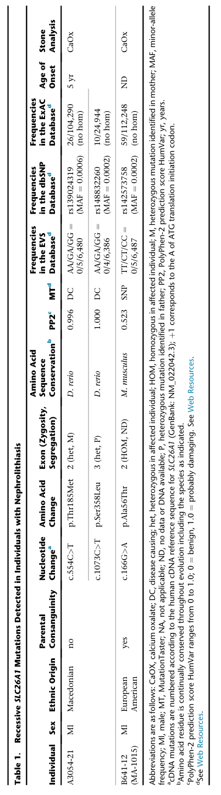

## Question

# Disease Characteristics Research Template

## Target Disease
- **Disease Name:** SLC26A1-Related Hypersulfaturia
- **MONDO ID:** MONDO:0957268 (if available)
- **Category:** Metabolic Disorder

## Research Objectives

Please provide a comprehensive research report on **SLC26A1-Related Hypersulfaturia** covering all of the
disease characteristics listed below. This report will be used to populate a disease knowledge
base entry. Be thorough and cite primary literature (PMID preferred) for all claims.

For each section, **suggested databases/resources** are listed. These are the first places
you should search for information on each topic.

---

### 1. Disease Information
> **Search first:** OMIM, Orphanet, ICD-10/ICD-11, MeSH, PubMed

- What is the disease? Provide a concise overview.
- What are the key identifiers? (OMIM, Orphanet, ICD-10/ICD-11, MeSH, Mondo)
- What are the common synonyms and alternative names?
- Is the information derived from individual patients (e.g., EHR) or aggregated disease-level resources?

### 2. Etiology

- **Disease Causal Factors**: What are the primary causes? (genetic, environmental, infectious, mechanistic)
- **Risk Factors**:
  > **Search first:** PubMed, Cochrane Library, UpToDate, clinical guidelines, ClinVar, ClinGen, GWAS Catalog, PheGenI, CTD, CDC, WHO, epidemiological databases
  - Genetic risk factors (causal variants, susceptibility loci, modifier genes)
  - Environmental risk factors (toxins, lifestyle, occupational exposures, age, sex, family history)
- **Protective Factors**:
  > **Search first:** PubMed, Cochrane Library, clinical trial databases, GWAS Catalog, gnomAD, WHO, CDC, nutrition databases
  - Genetic protective factors (protective variants, modifier alleles)
  - Environmental protective factors (diet, lifestyle, exposures that reduce risk)
- **Gene-Environment Interactions**: How do genetic and environmental factors interact to influence disease?
  > **Search first:** CTD, PubMed, PheGenI, GxE databases

### 3. Phenotypes
> **Search first:** HPO (Human Phenotype Ontology), OMIM, Orphanet, PubMed, clinicaltrials.gov, MedDRA, SNOMED CT, DECIPHER, LOINC

For each phenotype, provide:
- **Phenotype type**: symptoms, clinical signs, physical manifestations, behavioral changes, or laboratory abnormalities
  > For symptoms/signs: HPO, OMIM, Orphanet, PubMed
  > For behavioral changes: HPO, DSM, RDoC (Research Domain Criteria), PubMed
  > For laboratory abnormalities: LOINC, SNOMED CT, LabTests Online, PubMed
- **Phenotype characteristics**:
  > **Search first:** OMIM, Orphanet, HPO, PubMed
  - Age of symptom onset (neonatal, childhood, adult-onset, late-onset)
  - Symptom severity (mild, moderate, severe, variable)
  - Symptom progression (stable, progressive, episodic, fluctuating)
  - Frequency among affected individuals (percentage or qualitative)
- **Quality of life impact**: Effects on daily functioning and well-being (per-phenotype when possible)
  > **Search first:** EQ-5D database, SF-36, WHO QOL databases, PubMed
- Suggest HPO (Human Phenotype Ontology) terms for each phenotype

### 4. Genetic/Molecular Information

- **Causal Genes**: Gene mutations or chromosomal abnormalities responsible for disease (gene symbols, OMIM IDs)
  > **Search first:** OMIM, ClinVar, HGMD, Ensembl, NCBI Gene
- **Pathogenic Variants**:
  - Affected genes (gene symbols, HGNC IDs)
    > **Search first:** OMIM, NCBI Gene, Ensembl, HGNC, UniProt, GeneCards
  - Variant classification (pathogenic, likely pathogenic, VUS per ACMG/AMP guidelines)
    > **Search first:** ClinVar, ClinGen, ACMG/AMP guidelines, VarSome
  - Variant type/class (missense, frameshift, nonsense, splice-site, structural)
  - Allele frequency in population databases
    > **Search first:** gnomAD, 1000 Genomes, ExAC, TOPMed, dbSNP
  - Somatic vs germline origin
    > **Search first:** COSMIC (somatic), ClinVar, ICGC, TCGA
  - Functional consequences (loss of function, gain of function, dominant negative)
- **Modifier Genes**: Genes that modify disease severity or expression
- **Epigenetic Information**: DNA methylation, histone modifications, chromatin changes affecting disease
  > **Search first:** ENCODE, Roadmap Epigenomics, MethBase, DiseaseMeth
- **Chromosomal Abnormalities**: Large-scale genetic changes (aneuploidy, translocations, inversions)
  > **Search first:** DECIPHER, ClinVar, ECARUCA, UCSC Genome Browser

### 5. Environmental Information

- **Environmental Factors**: Non-genetic contributing factors (toxins, radiation, pollution, occupational exposure)
  > **Search first:** CTD (Comparative Toxicogenomics Database), TOXNET, PubMed, EPA databases
- **Lifestyle Factors**: Behavioral factors (smoking, diet, exercise, alcohol consumption)
  > **Search first:** CDC databases, WHO, PubMed, NHANES
- **Infectious Agents**: If applicable, pathogens causing or triggering disease (bacteria, viruses, fungi, parasites)
  > **Search first:** NCBI Taxonomy, ViPR, BV-BRC, MicrobeDB, GIDEON

### 6. Mechanism / Pathophysiology

**Present this section as an ordered causal chain first, then the detail below.**
Open with a numbered sequence of mechanistic steps running from the initiating
lesion (mutation, exposure, infection) to the clinical manifestation, one step per
line, each naming what it causes next. State the causal verb explicitly ("leads
to", "results in") and say where a step is inferred rather than demonstrated.
Where the mechanism branches, show the branch. The categories below are a
checklist of what to cover within those steps, not the organizing structure —
a step may draw on several of them, and a category may contribute to several
steps.

- **Molecular Pathways**: Specific signaling cascades or biochemical pathways involved (Wnt, MAPK, mTOR, PI3K-AKT, etc.)
  > **Search first:** KEGG, Reactome, WikiPathways, PathBank, BioCyc
- **Cellular Processes**: Cell-level mechanisms (apoptosis, autophagy, cell cycle dysregulation, inflammation, etc.)
  > **Search first:** Gene Ontology (GO), Reactome, KEGG, PubMed
- **Protein Dysfunction**: How protein structure or function is altered (misfolding, aggregation, loss of function, gain of function)
  > **Search first:** UniProt, PDB (Protein Data Bank), InterPro, Pfam, AlphaFold
- **Metabolic Changes**: Alterations in metabolic processes (energy metabolism, lipid metabolism, amino acid metabolism)
  > **Search first:** KEGG, BioCyc, HMDB (Human Metabolome Database), BRENDA
- **Immune System Involvement**: Role of immune response (autoimmunity, immunodeficiency, chronic inflammation)
  > **Search first:** ImmPort, Immunome Database, IEDB, Gene Ontology
- **Tissue Damage Mechanisms**: How tissues/ are injured (oxidative stress, ischemia, fibrosis, necrosis)
  > **Search first:** PubMed, Gene Ontology, Reactome
- **Biochemical Abnormalities**: Specific molecular defects (enzyme deficiencies, receptor dysfunction, ion channel defects)
  > **Search first:** BRENDA, UniProt, KEGG, OMIM, PubMed
- **Epigenetic Changes**: DNA methylation, histone modifications affecting gene expression in disease
  > **Search first:** ENCODE, Roadmap Epigenomics, MethBase, DiseaseMeth
- **Molecular Profiling** (if available):
  - Transcriptomics/gene expression changes
    > **Search first:** GEO (Gene Expression Omnibus), ArrayExpress, GTEx, Human Cell Atlas, SRA
  - Proteomics findings
    > **Search first:** PRIDE, ProteomeXchange, Human Protein Atlas, STRING, BioGRID
  - Metabolomics signatures
    > **Search first:** MetaboLights, Metabolomics Workbench, HMDB, METLIN
  - Lipidomics alterations
    > **Search first:** LIPID MAPS, SwissLipids, LipidHome, Metabolomics Workbench
  - Genomic structural features
    > **Search first:** UCSC Genome Browser, Ensembl, NCBI, dbVar, DGV
- **Advanced Technologies** (if applicable):
  - Single-cell analysis findings (cell-type specific mechanisms, cellular heterogeneity)
    > **Search first:** Human Cell Atlas, Single Cell Portal, GEO, CELLxGENE
  - Spatial transcriptomics findings
    > **Search first:** GEO, Spatial Research, Vizgen, 10x Genomics data
  - Multi-omics integration results
    > **Search first:** TCGA, ICGC, cBioPortal, LinkedOmics, PubMed
  - Functional genomics screens (CRISPR, RNAi)
    > **Search first:** DepMap, GenomeRNAi, PubMed, BioGRID ORCS

For each mechanism, describe:
- The causal chain from initial trigger to clinical manifestation
- Which mechanisms are upstream vs downstream
- What cell types and biological processes are involved
- Suggest GO terms for biological processes and CL terms for cell types

### 7. Anatomical Structures Affected

- **Organ Level**:
  - Primary organs directly affected
  - Secondary organ involvement (complications, secondary effects)
  - Body systems involved (cardiovascular, nervous, digestive, respiratory, endocrine, etc.)
  > **Search first:** Uberon, FMA (Foundational Model of Anatomy), OMIM, HPO, ICD-11, MeSH, SNOMED CT
- **Tissue and Cell Level**:
  - Specific tissue types affected (epithelial, connective, muscle, nervous)
  - Specific cell populations targeted (with Cell Ontology terms)
  > **Search first:** Uberon, Human Protein Atlas, Cell Ontology, Human Cell Atlas, CellMarker, PanglaoDB
- **Subcellular Level**:
  - Cellular compartments involved (mitochondria, nucleus, ER, lysosomes) (with GO Cellular Component terms)
  > **Search first:** Gene Ontology (Cellular Component), UniProt, Human Protein Atlas
- **Localization**:
  - Specific anatomical sites (with UBERON terms)
    > **Search first:** FMA, Uberon, NeuroNames (for brain), SNOMED CT
  - Lateralization (unilateral, bilateral, asymmetric)
    > **Search first:** HPO, clinical literature, imaging databases

### 8. Temporal Development

- **Onset**:
  - Typical age of onset (congenital, pediatric, adult, geriatric)
  - Onset pattern (acute, subacute, chronic, insidious)
  > **Search first:** OMIM, Orphanet, HPO, PubMed
- **Progression**:
  - Disease stages (early, intermediate, advanced, end-stage)
    > **Search first:** Cancer Staging Manual (AJCC), WHO classifications, PubMed
  - Progression rate (rapid, slow, variable)
  - Disease course pattern (episodic, relapsing-remitting, progressive, stable)
  - Disease duration (self-limited, chronic lifelong)
  > **Search first:** Disease registries, longitudinal cohort databases, natural history studies, PubMed, Orphanet, OMIM
- **Patterns**:
  - Remission patterns (spontaneous, treatment-induced)
    > **Search first:** Clinical trial databases, disease registries, PubMed
  - Critical periods (time windows of vulnerability or opportunity for intervention)
    > **Search first:** PubMed, developmental biology databases, clinical guidelines

### 9. Inheritance and Population

- **Epidemiology**:
  - Prevalence (cases per 100,000 at given time)
  - Incidence (new cases per 100,000 per year)
  > **Search first:** Orphanet, CDC, WHO, GBD (Global Burden of Disease), national registries, SEER, disease registries
- **For Genetic Etiology**:
  - Inheritance pattern (AD, AR, X-linked, mitochondrial, multifactorial, polygenic)
    > **Search first:** OMIM, Orphanet, ClinVar, GTR (Genetic Testing Registry)
  - Penetrance (complete, incomplete, age-dependent)
    > **Search first:** ClinVar, OMIM, PubMed, ClinGen
  - Expressivity (variable, consistent)
    > **Search first:** OMIM, ClinVar, PubMed
  - Genetic anticipation (increasing severity in successive generations)
    > **Search first:** OMIM, PubMed (especially for repeat expansion disorders)
  - Germline mosaicism
    > **Search first:** ClinVar, OMIM, genetic counseling literature, PubMed
  - Founder effects (population-specific mutations)
    > **Search first:** gnomAD, population genetics databases, PubMed
  - Consanguinity role
    > **Search first:** OMIM, population studies, genetic counseling resources
  - Carrier frequency
    > **Search first:** gnomAD, carrier screening databases, GeneReviews, GTR
- **Population Demographics**:
  - Affected populations (ethnic or demographic groups with higher prevalence)
    > **Search first:** gnomAD, 1000 Genomes, PAGE Study, PubMed, population registries
  - Geographic distribution (endemic areas, regional variation)
    > **Search first:** WHO, CDC, GBD, Orphanet, geographic epidemiology databases
  - Geographic distribution of specific variants
  - Sex ratio (male:female)
    > **Search first:** Disease registries, OMIM, PubMed, epidemiological databases
  - Age distribution of affected individuals
    > **Search first:** CDC, disease registries, SEER, Orphanet

### 10. Diagnostics

- **Clinical Tests**:
  - Laboratory tests (blood, urine, tissue chemistry, specific enzyme assays)
    > **Search first:** LOINC, LabTests Online, PubMed
  - Biomarkers (proteins, metabolites, genetic markers, circulating biomarkers)
    > **Search first:** FDA Biomarker List, BEST (Biomarkers, EndpointS, and other Tools), PubMed
  - Imaging studies (X-ray, CT, MRI, PET, ultrasound)
    > **Search first:** RadLex, DICOM, Radiopaedia, imaging databases
  - Functional tests (pulmonary function, cardiac stress tests)
    > **Search first:** LOINC, clinical guidelines, PubMed
  - Electrophysiology (EEG, EMG, ECG, nerve conduction studies)
    > **Search first:** LOINC, clinical neurophysiology databases, PubMed
  - Biopsy findings (histopathology, immunohistochemistry)
    > **Search first:** SNOMED CT, College of American Pathologists resources, PubMed
  - Pathology findings (microscopic examination)
    > **Search first:** SNOMED CT, Digital Pathology databases, PubMed
- **Genetic Testing**:
  > **Search first:** GTR (Genetic Testing Registry), GeneReviews, ClinGen
  - Overview of recommended genetic testing approach
  - Whole genome sequencing (WGS) utility
    > **Search first:** GTR, ClinVar, GEL (Genomics England), gnomAD
  - Whole exome sequencing (WES) utility
    > **Search first:** GTR, ClinVar, OMIM, GeneMatcher
  - Gene panels (which panels, which genes)
    > **Search first:** GTR, ClinVar, laboratory-specific databases
  - Single gene testing
    > **Search first:** GTR, ClinVar, OMIM, GeneReviews
  - Chromosomal microarray (CMA)
    > **Search first:** DECIPHER, ClinVar, dbVar, ECARUCA
  - Karyotyping
    > **Search first:** Chromosome Abnormality Database, ClinVar, cytogenetics resources
  - FISH
    > **Search first:** ClinVar, cytogenetics databases, PubMed
  - Mitochondrial DNA testing
    > **Search first:** MITOMAP, MSeqDR, ClinVar, GTR
  - Repeat expansion testing
    > **Search first:** GTR, ClinVar, repeat expansion databases, PubMed
- **Omics-Based Diagnostics** (if applicable):
  - RNA sequencing / transcriptomics
    > **Search first:** GEO, ArrayExpress, GTEx, RNA-seq databases
  - Proteomics
    > **Search first:** PRIDE, ProteomeXchange, FDA Biomarker database
  - Metabolomics
    > **Search first:** MetaboLights, Metabolomics Workbench, HMDB
  - Epigenomics
    > **Search first:** GEO, ENCODE, Roadmap Epigenomics, MethBase
  - Liquid biopsy
    > **Search first:** COSMIC, ClinVar, liquid biopsy databases, PubMed
- **Clinical Criteria**:
  - Standardized diagnostic criteria (DSM, ICD, society guidelines)
    > **Search first:** DSM-5, ICD-11, clinical society guidelines, UpToDate
  - Differential diagnosis (other conditions to rule out, with distinguishing features)
    > **Search first:** DynaMed, UpToDate, clinical decision support systems
- **Screening**:
  - Screening methods for asymptomatic individuals (newborn screening, carrier screening, cascade screening)
    > **Search first:** ACMG recommendations, CDC newborn screening, GTR

### 11. Outcome/Prognosis

- **Survival and Mortality**:
  - Survival rate (5-year, 10-year, overall)
    > **Search first:** SEER, cancer registries, disease-specific registries, PubMed
  - Life expectancy (with and without treatment if applicable)
    > **Search first:** Orphanet, disease registries, actuarial databases, PubMed
  - Mortality rate
    > **Search first:** CDC, WHO, GBD, national mortality databases
  - Disease-specific mortality (deaths directly attributable to disease)
    > **Search first:** Disease registries, CDC Wonder, GBD, PubMed
- **Morbidity and Function**:
  - Morbidity (disease-related disability and health impacts)
    > **Search first:** GBD, WHO, disability databases, PubMed
  - Disability outcomes (long-term functional impairments)
    > **Search first:** ICF (International Classification of Functioning), disability registries
  - Quality of life measures (EQ-5D, SF-36, PROMIS, disease-specific tools)
    > **Search first:** EQ-5D database, SF-36, PROMIS, PubMed
- **Disease Course**:
  - Complications (secondary problems: infections, organ failure, etc.)
    > **Search first:** ICD codes, disease registries, clinical databases, PubMed
  - Recovery potential (likelihood and extent of recovery, with vs without treatment)
    > **Search first:** Natural history studies, rehabilitation databases, PubMed
- **Prediction**:
  - Prognostic factors (age, disease severity, biomarkers, treatment response)
    > **Search first:** Prognostic models databases, clinical calculators, PubMed
  - Prognostic biomarkers (molecular markers predicting disease course)
    > **Search first:** FDA Biomarker database, PubMed, cancer prognostic databases

### 12. Treatment

- **Pharmacotherapy**:
  - Pharmacological treatments (drug names, drug classes, mechanisms of action)
    > **Search first:** DrugBank, RxNorm, ATC classification, DailyMed, FDA databases
  - Pharmacogenomics (how genetic variants affect drug metabolism, efficacy, toxicity)
    > **Search first:** PharmGKB, CPIC (Clinical Pharmacogenetics), FDA Table of PGx Biomarkers
- **Advanced Therapeutics**:
  - Gene therapy (viral vectors, CRISPR, gene replacement, gene editing)
    > **Search first:** ClinicalTrials.gov, FDA gene therapy database, ASGCT resources
  - Cell therapy (stem cell transplant, CAR-T, cellular therapeutics)
    > **Search first:** ClinicalTrials.gov, FDA cell therapy database, FACT standards
  - RNA-based therapies (ASOs, siRNA, mRNA therapies)
    > **Search first:** ClinicalTrials.gov, FDA approvals, PubMed
  - Targeted therapies (treatments directed at specific molecular targets)
    > **Search first:** My Cancer Genome, OncoKB, ClinicalTrials.gov, FDA approvals
  - Immunotherapies (checkpoint inhibitors, monoclonal antibodies)
    > **Search first:** Cancer Immunotherapy Database, FDA approvals, ClinicalTrials.gov
- **Surgical and Interventional**:
  - Surgical interventions (types of surgery, timing, outcomes)
    > **Search first:** CPT codes, surgical registries, clinical guidelines, PubMed
- **Supportive and Rehabilitative**:
  - Supportive care (symptom management, pain control, nutrition)
    > **Search first:** Clinical guidelines, Cochrane Library, PubMed
  - Rehabilitation (physical therapy, occupational therapy, speech therapy)
    > **Search first:** Rehabilitation medicine databases, clinical guidelines, PubMed
- **Experimental**:
  - Experimental treatments in clinical trials (with NCT identifiers if available)
    > **Search first:** ClinicalTrials.gov, EU Clinical Trials Register, WHO ICTRP
- **Treatment Outcomes**:
  - Treatment response rates
    > **Search first:** Clinical trial databases, FDA reviews, systematic reviews, PubMed
  - Side effects and adverse events
    > **Search first:** FDA Adverse Event Reporting System (FAERS), MedWatch, PubMed
- **Treatment Strategy**:
  - Treatment algorithms (clinical pathways, decision trees)
    > **Search first:** Clinical practice guidelines, NCCN Guidelines, UpToDate
  - Combination therapies
    > **Search first:** ClinicalTrials.gov, treatment guidelines, PubMed
  - Personalized medicine approaches (genotype-guided treatment)
    > **Search first:** My Cancer Genome, CIViC, PharmGKB, precision medicine databases

For each treatment, suggest NCIT (NCI Thesaurus) clinical-intervention terms where applicable.

### 13. Prevention

- **Prevention Levels**:
  - Primary prevention (preventing disease occurrence: vaccination, risk factor modification)
    > **Search first:** CDC, WHO, USPSTF recommendations, Cochrane Library
  - Secondary prevention (early detection and treatment: screening programs, early intervention)
    > **Search first:** USPSTF, CDC screening guidelines, WHO
  - Tertiary prevention (preventing complications in those with disease)
    > **Search first:** Clinical guidelines, disease management protocols, PubMed
- **Immunization**: Vaccine strategies (if applicable)
  > **Search first:** CDC vaccine schedules, WHO immunization, FDA vaccine database
- **Screening and Early Detection**:
  - Screening programs (population-based: newborn screening, cancer screening)
    > **Search first:** CDC screening programs, USPSTF, cancer screening databases
  - Genetic screening (carrier screening, preimplantation genetic diagnosis, prenatal testing)
    > **Search first:** ACMG recommendations, ACOG guidelines, GTR
  - Risk stratification (identifying high-risk individuals for targeted prevention)
    > **Search first:** Risk prediction models, clinical calculators, PubMed
- **Behavioral Interventions**: Lifestyle modifications to reduce risk
  > **Search first:** CDC, WHO, behavioral intervention databases, Cochrane Library
- **Counseling**: Genetic counseling (risk assessment, family planning guidance)
  > **Search first:** NSGC resources, ACMG guidelines, GeneReviews
- **Public Health**:
  - Public health interventions (sanitation, vector control, health education)
    > **Search first:** CDC, WHO, public health databases, PubMed
  - Environmental interventions (reducing environmental risk factors)
    > **Search first:** EPA databases, WHO environmental health, PubMed
- **Prophylaxis**: Preventive medications or procedures
  > **Search first:** Clinical guidelines, FDA approvals, PubMed

### 14. Other Species / Natural Disease

- **Taxonomy**: Species affected (with NCBI Taxon identifiers)
  > **Search first:** NCBI Taxonomy
- **Breed**: Specific breeds affected (with VBO identifiers if applicable)
  > **Search first:** VBO (Vertebrate Breed Ontology)
- **Gene**: Orthologous genes in other species (with NCBI Gene IDs)
  > **Search first:** NCBI Gene
- **Natural Disease**:
  - Naturally occurring disease in other species (companion animals, wildlife)
    > **Search first:** OMIA (Online Mendelian Inheritance in Animals), VetCompass, PubMed
  - Veterinary relevance and importance in animal health
    > **Search first:** OMIA, veterinary databases, PubMed
- **Comparative Biology**:
  - Comparative pathology (similarities and differences across species)
    > **Search first:** OMIA, comparative pathology databases, PubMed
  - Evolutionary conservation of disease mechanisms
    > **Search first:** HomoloGene, OrthoMCL, Alliance of Genome Resources
- **Transmission** (if applicable):
  - Zoonotic potential
    > **Search first:** CDC zoonotic diseases, WHO zoonoses, GIDEON
  - Cross-species susceptibility
    > **Search first:** NCBI Taxonomy, veterinary databases, PubMed

### 15. Model Organisms

- **Model Types**:
  - Model organism type (mammalian, invertebrate, cellular, in vitro)
    > **Search first:** Alliance of Genome Resources, model organism databases
  - Specific model systems (mouse, rat, zebrafish, Drosophila, C. elegans, yeast, cell lines, organoids, iPSCs)
    > **Search first:** MGI, RGD, ZFIN, FlyBase, WormBase, SGD, ATCC, Cellosaurus
  - Induced models (drug treatment, surgical intervention, environmental manipulation)
    > **Search first:** MGI, model organism databases, PubMed
- **Genetic Models**:
  - Types available (knockout, knock-in, transgenic, conditional, humanized)
    > **Search first:** MGI, IMPC, KOMP, EuMMCR, IMSR
- **Model Characteristics**:
  - Phenotype recapitulation (how well model reproduces human disease features)
    > **Search first:** Model organism databases, comparative studies, PubMed
  - Model limitations (aspects of human disease not captured)
    > **Search first:** Model organism databases, PubMed, review articles
- **Applications**:
  - Research applications (what aspects of disease can be studied)
    > **Search first:** Model organism databases, PubMed
- **Resources**:
  - Model databases
    > **Search first:** MGI, RGD, ZFIN, FlyBase, WormBase, IMSR, EMMA, MMRRC

---

## Citation Requirements

- Cite primary literature (PMID preferred) for all mechanistic and clinical claims
- Prioritize recent reviews and landmark papers
- Include direct quotes from abstracts where possible to support key statements
- Distinguish evidence source types: human clinical, model organism, in vitro, computational

## Output Format

Structure your response as a comprehensive narrative organized by the sections above.
For each section, provide:
- Factual content with specific details (numbers, percentages, gene names, variant nomenclature)
- Ontology term suggestions (HPO, GO, CL, UBERON, CHEBI, NCIT, MONDO) where applicable
- Evidence citations with PMIDs
- Direct quotes from abstracts to support key claims
- Clear indication when information is not available or not applicable for this disease

This report will be used to populate a disease knowledge base entry with:
- Pathophysiology descriptions with causal chains
- Gene/protein annotations (HGNC, GO terms)
- Phenotype associations (HP terms) with frequencies
- Cell type involvement (CL terms)
- Anatomical locations (UBERON terms)
- Chemical entities (CHEBI terms)
- Treatment annotations (NCIT terms)
- Evidence items with PMIDs and exact abstract quotes
- Epidemiology, prognosis, diagnostic, and prevention information
- Animal model descriptions with phenotype recapitulation details

## Output

Question: You are an expert researcher providing comprehensive, well-cited information.

Provide detailed information focusing on:
1. Key concepts and definitions with current understanding
2. Recent developments and latest research (prioritize 2023-2024 sources)
3. Current applications and real-world implementations
4. Expert opinions and analysis from authoritative sources
5. Relevant statistics and data from recent studies

Format as a comprehensive research report with proper citations. Include URLs and publication dates where available.
Always prioritize recent, authoritative sources and provide specific citations for all major claims.

# Disease Characteristics Research Template

## Target Disease
- **Disease Name:** SLC26A1-Related Hypersulfaturia
- **MONDO ID:** MONDO:0957268 (if available)
- **Category:** Metabolic Disorder

## Research Objectives

Please provide a comprehensive research report on **SLC26A1-Related Hypersulfaturia** covering all of the
disease characteristics listed below. This report will be used to populate a disease knowledge
base entry. Be thorough and cite primary literature (PMID preferred) for all claims.

For each section, **suggested databases/resources** are listed. These are the first places
you should search for information on each topic.

---

### 1. Disease Information
> **Search first:** OMIM, Orphanet, ICD-10/ICD-11, MeSH, PubMed

- What is the disease? Provide a concise overview.
- What are the key identifiers? (OMIM, Orphanet, ICD-10/ICD-11, MeSH, Mondo)
- What are the common synonyms and alternative names?
- Is the information derived from individual patients (e.g., EHR) or aggregated disease-level resources?

### 2. Etiology

- **Disease Causal Factors**: What are the primary causes? (genetic, environmental, infectious, mechanistic)
- **Risk Factors**:
  > **Search first:** PubMed, Cochrane Library, UpToDate, clinical guidelines, ClinVar, ClinGen, GWAS Catalog, PheGenI, CTD, CDC, WHO, epidemiological databases
  - Genetic risk factors (causal variants, susceptibility loci, modifier genes)
  - Environmental risk factors (toxins, lifestyle, occupational exposures, age, sex, family history)
- **Protective Factors**:
  > **Search first:** PubMed, Cochrane Library, clinical trial databases, GWAS Catalog, gnomAD, WHO, CDC, nutrition databases
  - Genetic protective factors (protective variants, modifier alleles)
  - Environmental protective factors (diet, lifestyle, exposures that reduce risk)
- **Gene-Environment Interactions**: How do genetic and environmental factors interact to influence disease?
  > **Search first:** CTD, PubMed, PheGenI, GxE databases

### 3. Phenotypes
> **Search first:** HPO (Human Phenotype Ontology), OMIM, Orphanet, PubMed, clinicaltrials.gov, MedDRA, SNOMED CT, DECIPHER, LOINC

For each phenotype, provide:
- **Phenotype type**: symptoms, clinical signs, physical manifestations, behavioral changes, or laboratory abnormalities
  > For symptoms/signs: HPO, OMIM, Orphanet, PubMed
  > For behavioral changes: HPO, DSM, RDoC (Research Domain Criteria), PubMed
  > For laboratory abnormalities: LOINC, SNOMED CT, LabTests Online, PubMed
- **Phenotype characteristics**:
  > **Search first:** OMIM, Orphanet, HPO, PubMed
  - Age of symptom onset (neonatal, childhood, adult-onset, late-onset)
  - Symptom severity (mild, moderate, severe, variable)
  - Symptom progression (stable, progressive, episodic, fluctuating)
  - Frequency among affected individuals (percentage or qualitative)
- **Quality of life impact**: Effects on daily functioning and well-being (per-phenotype when possible)
  > **Search first:** EQ-5D database, SF-36, WHO QOL databases, PubMed
- Suggest HPO (Human Phenotype Ontology) terms for each phenotype

### 4. Genetic/Molecular Information

- **Causal Genes**: Gene mutations or chromosomal abnormalities responsible for disease (gene symbols, OMIM IDs)
  > **Search first:** OMIM, ClinVar, HGMD, Ensembl, NCBI Gene
- **Pathogenic Variants**:
  - Affected genes (gene symbols, HGNC IDs)
    > **Search first:** OMIM, NCBI Gene, Ensembl, HGNC, UniProt, GeneCards
  - Variant classification (pathogenic, likely pathogenic, VUS per ACMG/AMP guidelines)
    > **Search first:** ClinVar, ClinGen, ACMG/AMP guidelines, VarSome
  - Variant type/class (missense, frameshift, nonsense, splice-site, structural)
  - Allele frequency in population databases
    > **Search first:** gnomAD, 1000 Genomes, ExAC, TOPMed, dbSNP
  - Somatic vs germline origin
    > **Search first:** COSMIC (somatic), ClinVar, ICGC, TCGA
  - Functional consequences (loss of function, gain of function, dominant negative)
- **Modifier Genes**: Genes that modify disease severity or expression
- **Epigenetic Information**: DNA methylation, histone modifications, chromatin changes affecting disease
  > **Search first:** ENCODE, Roadmap Epigenomics, MethBase, DiseaseMeth
- **Chromosomal Abnormalities**: Large-scale genetic changes (aneuploidy, translocations, inversions)
  > **Search first:** DECIPHER, ClinVar, ECARUCA, UCSC Genome Browser

### 5. Environmental Information

- **Environmental Factors**: Non-genetic contributing factors (toxins, radiation, pollution, occupational exposure)
  > **Search first:** CTD (Comparative Toxicogenomics Database), TOXNET, PubMed, EPA databases
- **Lifestyle Factors**: Behavioral factors (smoking, diet, exercise, alcohol consumption)
  > **Search first:** CDC databases, WHO, PubMed, NHANES
- **Infectious Agents**: If applicable, pathogens causing or triggering disease (bacteria, viruses, fungi, parasites)
  > **Search first:** NCBI Taxonomy, ViPR, BV-BRC, MicrobeDB, GIDEON

### 6. Mechanism / Pathophysiology

**Present this section as an ordered causal chain first, then the detail below.**
Open with a numbered sequence of mechanistic steps running from the initiating
lesion (mutation, exposure, infection) to the clinical manifestation, one step per
line, each naming what it causes next. State the causal verb explicitly ("leads
to", "results in") and say where a step is inferred rather than demonstrated.
Where the mechanism branches, show the branch. The categories below are a
checklist of what to cover within those steps, not the organizing structure —
a step may draw on several of them, and a category may contribute to several
steps.

- **Molecular Pathways**: Specific signaling cascades or biochemical pathways involved (Wnt, MAPK, mTOR, PI3K-AKT, etc.)
  > **Search first:** KEGG, Reactome, WikiPathways, PathBank, BioCyc
- **Cellular Processes**: Cell-level mechanisms (apoptosis, autophagy, cell cycle dysregulation, inflammation, etc.)
  > **Search first:** Gene Ontology (GO), Reactome, KEGG, PubMed
- **Protein Dysfunction**: How protein structure or function is altered (misfolding, aggregation, loss of function, gain of function)
  > **Search first:** UniProt, PDB (Protein Data Bank), InterPro, Pfam, AlphaFold
- **Metabolic Changes**: Alterations in metabolic processes (energy metabolism, lipid metabolism, amino acid metabolism)
  > **Search first:** KEGG, BioCyc, HMDB (Human Metabolome Database), BRENDA
- **Immune System Involvement**: Role of immune response (autoimmunity, immunodeficiency, chronic inflammation)
  > **Search first:** ImmPort, Immunome Database, IEDB, Gene Ontology
- **Tissue Damage Mechanisms**: How tissues/ are injured (oxidative stress, ischemia, fibrosis, necrosis)
  > **Search first:** PubMed, Gene Ontology, Reactome
- **Biochemical Abnormalities**: Specific molecular defects (enzyme deficiencies, receptor dysfunction, ion channel defects)
  > **Search first:** BRENDA, UniProt, KEGG, OMIM, PubMed
- **Epigenetic Changes**: DNA methylation, histone modifications affecting gene expression in disease
  > **Search first:** ENCODE, Roadmap Epigenomics, MethBase, DiseaseMeth
- **Molecular Profiling** (if available):
  - Transcriptomics/gene expression changes
    > **Search first:** GEO (Gene Expression Omnibus), ArrayExpress, GTEx, Human Cell Atlas, SRA
  - Proteomics findings
    > **Search first:** PRIDE, ProteomeXchange, Human Protein Atlas, STRING, BioGRID
  - Metabolomics signatures
    > **Search first:** MetaboLights, Metabolomics Workbench, HMDB, METLIN
  - Lipidomics alterations
    > **Search first:** LIPID MAPS, SwissLipids, LipidHome, Metabolomics Workbench
  - Genomic structural features
    > **Search first:** UCSC Genome Browser, Ensembl, NCBI, dbVar, DGV
- **Advanced Technologies** (if applicable):
  - Single-cell analysis findings (cell-type specific mechanisms, cellular heterogeneity)
    > **Search first:** Human Cell Atlas, Single Cell Portal, GEO, CELLxGENE
  - Spatial transcriptomics findings
    > **Search first:** GEO, Spatial Research, Vizgen, 10x Genomics data
  - Multi-omics integration results
    > **Search first:** TCGA, ICGC, cBioPortal, LinkedOmics, PubMed
  - Functional genomics screens (CRISPR, RNAi)
    > **Search first:** DepMap, GenomeRNAi, PubMed, BioGRID ORCS

For each mechanism, describe:
- The causal chain from initial trigger to clinical manifestation
- Which mechanisms are upstream vs downstream
- What cell types and biological processes are involved
- Suggest GO terms for biological processes and CL terms for cell types

### 7. Anatomical Structures Affected

- **Organ Level**:
  - Primary organs directly affected
  - Secondary organ involvement (complications, secondary effects)
  - Body systems involved (cardiovascular, nervous, digestive, respiratory, endocrine, etc.)
  > **Search first:** Uberon, FMA (Foundational Model of Anatomy), OMIM, HPO, ICD-11, MeSH, SNOMED CT
- **Tissue and Cell Level**:
  - Specific tissue types affected (epithelial, connective, muscle, nervous)
  - Specific cell populations targeted (with Cell Ontology terms)
  > **Search first:** Uberon, Human Protein Atlas, Cell Ontology, Human Cell Atlas, CellMarker, PanglaoDB
- **Subcellular Level**:
  - Cellular compartments involved (mitochondria, nucleus, ER, lysosomes) (with GO Cellular Component terms)
  > **Search first:** Gene Ontology (Cellular Component), UniProt, Human Protein Atlas
- **Localization**:
  - Specific anatomical sites (with UBERON terms)
    > **Search first:** FMA, Uberon, NeuroNames (for brain), SNOMED CT
  - Lateralization (unilateral, bilateral, asymmetric)
    > **Search first:** HPO, clinical literature, imaging databases

### 8. Temporal Development

- **Onset**:
  - Typical age of onset (congenital, pediatric, adult, geriatric)
  - Onset pattern (acute, subacute, chronic, insidious)
  > **Search first:** OMIM, Orphanet, HPO, PubMed
- **Progression**:
  - Disease stages (early, intermediate, advanced, end-stage)
    > **Search first:** Cancer Staging Manual (AJCC), WHO classifications, PubMed
  - Progression rate (rapid, slow, variable)
  - Disease course pattern (episodic, relapsing-remitting, progressive, stable)
  - Disease duration (self-limited, chronic lifelong)
  > **Search first:** Disease registries, longitudinal cohort databases, natural history studies, PubMed, Orphanet, OMIM
- **Patterns**:
  - Remission patterns (spontaneous, treatment-induced)
    > **Search first:** Clinical trial databases, disease registries, PubMed
  - Critical periods (time windows of vulnerability or opportunity for intervention)
    > **Search first:** PubMed, developmental biology databases, clinical guidelines

### 9. Inheritance and Population

- **Epidemiology**:
  - Prevalence (cases per 100,000 at given time)
  - Incidence (new cases per 100,000 per year)
  > **Search first:** Orphanet, CDC, WHO, GBD (Global Burden of Disease), national registries, SEER, disease registries
- **For Genetic Etiology**:
  - Inheritance pattern (AD, AR, X-linked, mitochondrial, multifactorial, polygenic)
    > **Search first:** OMIM, Orphanet, ClinVar, GTR (Genetic Testing Registry)
  - Penetrance (complete, incomplete, age-dependent)
    > **Search first:** ClinVar, OMIM, PubMed, ClinGen
  - Expressivity (variable, consistent)
    > **Search first:** OMIM, ClinVar, PubMed
  - Genetic anticipation (increasing severity in successive generations)
    > **Search first:** OMIM, PubMed (especially for repeat expansion disorders)
  - Germline mosaicism
    > **Search first:** ClinVar, OMIM, genetic counseling literature, PubMed
  - Founder effects (population-specific mutations)
    > **Search first:** gnomAD, population genetics databases, PubMed
  - Consanguinity role
    > **Search first:** OMIM, population studies, genetic counseling resources
  - Carrier frequency
    > **Search first:** gnomAD, carrier screening databases, GeneReviews, GTR
- **Population Demographics**:
  - Affected populations (ethnic or demographic groups with higher prevalence)
    > **Search first:** gnomAD, 1000 Genomes, PAGE Study, PubMed, population registries
  - Geographic distribution (endemic areas, regional variation)
    > **Search first:** WHO, CDC, GBD, Orphanet, geographic epidemiology databases
  - Geographic distribution of specific variants
  - Sex ratio (male:female)
    > **Search first:** Disease registries, OMIM, PubMed, epidemiological databases
  - Age distribution of affected individuals
    > **Search first:** CDC, disease registries, SEER, Orphanet

### 10. Diagnostics

- **Clinical Tests**:
  - Laboratory tests (blood, urine, tissue chemistry, specific enzyme assays)
    > **Search first:** LOINC, LabTests Online, PubMed
  - Biomarkers (proteins, metabolites, genetic markers, circulating biomarkers)
    > **Search first:** FDA Biomarker List, BEST (Biomarkers, EndpointS, and other Tools), PubMed
  - Imaging studies (X-ray, CT, MRI, PET, ultrasound)
    > **Search first:** RadLex, DICOM, Radiopaedia, imaging databases
  - Functional tests (pulmonary function, cardiac stress tests)
    > **Search first:** LOINC, clinical guidelines, PubMed
  - Electrophysiology (EEG, EMG, ECG, nerve conduction studies)
    > **Search first:** LOINC, clinical neurophysiology databases, PubMed
  - Biopsy findings (histopathology, immunohistochemistry)
    > **Search first:** SNOMED CT, College of American Pathologists resources, PubMed
  - Pathology findings (microscopic examination)
    > **Search first:** SNOMED CT, Digital Pathology databases, PubMed
- **Genetic Testing**:
  > **Search first:** GTR (Genetic Testing Registry), GeneReviews, ClinGen
  - Overview of recommended genetic testing approach
  - Whole genome sequencing (WGS) utility
    > **Search first:** GTR, ClinVar, GEL (Genomics England), gnomAD
  - Whole exome sequencing (WES) utility
    > **Search first:** GTR, ClinVar, OMIM, GeneMatcher
  - Gene panels (which panels, which genes)
    > **Search first:** GTR, ClinVar, laboratory-specific databases
  - Single gene testing
    > **Search first:** GTR, ClinVar, OMIM, GeneReviews
  - Chromosomal microarray (CMA)
    > **Search first:** DECIPHER, ClinVar, dbVar, ECARUCA
  - Karyotyping
    > **Search first:** Chromosome Abnormality Database, ClinVar, cytogenetics resources
  - FISH
    > **Search first:** ClinVar, cytogenetics databases, PubMed
  - Mitochondrial DNA testing
    > **Search first:** MITOMAP, MSeqDR, ClinVar, GTR
  - Repeat expansion testing
    > **Search first:** GTR, ClinVar, repeat expansion databases, PubMed
- **Omics-Based Diagnostics** (if applicable):
  - RNA sequencing / transcriptomics
    > **Search first:** GEO, ArrayExpress, GTEx, RNA-seq databases
  - Proteomics
    > **Search first:** PRIDE, ProteomeXchange, FDA Biomarker database
  - Metabolomics
    > **Search first:** MetaboLights, Metabolomics Workbench, HMDB
  - Epigenomics
    > **Search first:** GEO, ENCODE, Roadmap Epigenomics, MethBase
  - Liquid biopsy
    > **Search first:** COSMIC, ClinVar, liquid biopsy databases, PubMed
- **Clinical Criteria**:
  - Standardized diagnostic criteria (DSM, ICD, society guidelines)
    > **Search first:** DSM-5, ICD-11, clinical society guidelines, UpToDate
  - Differential diagnosis (other conditions to rule out, with distinguishing features)
    > **Search first:** DynaMed, UpToDate, clinical decision support systems
- **Screening**:
  - Screening methods for asymptomatic individuals (newborn screening, carrier screening, cascade screening)
    > **Search first:** ACMG recommendations, CDC newborn screening, GTR

### 11. Outcome/Prognosis

- **Survival and Mortality**:
  - Survival rate (5-year, 10-year, overall)
    > **Search first:** SEER, cancer registries, disease-specific registries, PubMed
  - Life expectancy (with and without treatment if applicable)
    > **Search first:** Orphanet, disease registries, actuarial databases, PubMed
  - Mortality rate
    > **Search first:** CDC, WHO, GBD, national mortality databases
  - Disease-specific mortality (deaths directly attributable to disease)
    > **Search first:** Disease registries, CDC Wonder, GBD, PubMed
- **Morbidity and Function**:
  - Morbidity (disease-related disability and health impacts)
    > **Search first:** GBD, WHO, disability databases, PubMed
  - Disability outcomes (long-term functional impairments)
    > **Search first:** ICF (International Classification of Functioning), disability registries
  - Quality of life measures (EQ-5D, SF-36, PROMIS, disease-specific tools)
    > **Search first:** EQ-5D database, SF-36, PROMIS, PubMed
- **Disease Course**:
  - Complications (secondary problems: infections, organ failure, etc.)
    > **Search first:** ICD codes, disease registries, clinical databases, PubMed
  - Recovery potential (likelihood and extent of recovery, with vs without treatment)
    > **Search first:** Natural history studies, rehabilitation databases, PubMed
- **Prediction**:
  - Prognostic factors (age, disease severity, biomarkers, treatment response)
    > **Search first:** Prognostic models databases, clinical calculators, PubMed
  - Prognostic biomarkers (molecular markers predicting disease course)
    > **Search first:** FDA Biomarker database, PubMed, cancer prognostic databases

### 12. Treatment

- **Pharmacotherapy**:
  - Pharmacological treatments (drug names, drug classes, mechanisms of action)
    > **Search first:** DrugBank, RxNorm, ATC classification, DailyMed, FDA databases
  - Pharmacogenomics (how genetic variants affect drug metabolism, efficacy, toxicity)
    > **Search first:** PharmGKB, CPIC (Clinical Pharmacogenetics), FDA Table of PGx Biomarkers
- **Advanced Therapeutics**:
  - Gene therapy (viral vectors, CRISPR, gene replacement, gene editing)
    > **Search first:** ClinicalTrials.gov, FDA gene therapy database, ASGCT resources
  - Cell therapy (stem cell transplant, CAR-T, cellular therapeutics)
    > **Search first:** ClinicalTrials.gov, FDA cell therapy database, FACT standards
  - RNA-based therapies (ASOs, siRNA, mRNA therapies)
    > **Search first:** ClinicalTrials.gov, FDA approvals, PubMed
  - Targeted therapies (treatments directed at specific molecular targets)
    > **Search first:** My Cancer Genome, OncoKB, ClinicalTrials.gov, FDA approvals
  - Immunotherapies (checkpoint inhibitors, monoclonal antibodies)
    > **Search first:** Cancer Immunotherapy Database, FDA approvals, ClinicalTrials.gov
- **Surgical and Interventional**:
  - Surgical interventions (types of surgery, timing, outcomes)
    > **Search first:** CPT codes, surgical registries, clinical guidelines, PubMed
- **Supportive and Rehabilitative**:
  - Supportive care (symptom management, pain control, nutrition)
    > **Search first:** Clinical guidelines, Cochrane Library, PubMed
  - Rehabilitation (physical therapy, occupational therapy, speech therapy)
    > **Search first:** Rehabilitation medicine databases, clinical guidelines, PubMed
- **Experimental**:
  - Experimental treatments in clinical trials (with NCT identifiers if available)
    > **Search first:** ClinicalTrials.gov, EU Clinical Trials Register, WHO ICTRP
- **Treatment Outcomes**:
  - Treatment response rates
    > **Search first:** Clinical trial databases, FDA reviews, systematic reviews, PubMed
  - Side effects and adverse events
    > **Search first:** FDA Adverse Event Reporting System (FAERS), MedWatch, PubMed
- **Treatment Strategy**:
  - Treatment algorithms (clinical pathways, decision trees)
    > **Search first:** Clinical practice guidelines, NCCN Guidelines, UpToDate
  - Combination therapies
    > **Search first:** ClinicalTrials.gov, treatment guidelines, PubMed
  - Personalized medicine approaches (genotype-guided treatment)
    > **Search first:** My Cancer Genome, CIViC, PharmGKB, precision medicine databases

For each treatment, suggest NCIT (NCI Thesaurus) clinical-intervention terms where applicable.

### 13. Prevention

- **Prevention Levels**:
  - Primary prevention (preventing disease occurrence: vaccination, risk factor modification)
    > **Search first:** CDC, WHO, USPSTF recommendations, Cochrane Library
  - Secondary prevention (early detection and treatment: screening programs, early intervention)
    > **Search first:** USPSTF, CDC screening guidelines, WHO
  - Tertiary prevention (preventing complications in those with disease)
    > **Search first:** Clinical guidelines, disease management protocols, PubMed
- **Immunization**: Vaccine strategies (if applicable)
  > **Search first:** CDC vaccine schedules, WHO immunization, FDA vaccine database
- **Screening and Early Detection**:
  - Screening programs (population-based: newborn screening, cancer screening)
    > **Search first:** CDC screening programs, USPSTF, cancer screening databases
  - Genetic screening (carrier screening, preimplantation genetic diagnosis, prenatal testing)
    > **Search first:** ACMG recommendations, ACOG guidelines, GTR
  - Risk stratification (identifying high-risk individuals for targeted prevention)
    > **Search first:** Risk prediction models, clinical calculators, PubMed
- **Behavioral Interventions**: Lifestyle modifications to reduce risk
  > **Search first:** CDC, WHO, behavioral intervention databases, Cochrane Library
- **Counseling**: Genetic counseling (risk assessment, family planning guidance)
  > **Search first:** NSGC resources, ACMG guidelines, GeneReviews
- **Public Health**:
  - Public health interventions (sanitation, vector control, health education)
    > **Search first:** CDC, WHO, public health databases, PubMed
  - Environmental interventions (reducing environmental risk factors)
    > **Search first:** EPA databases, WHO environmental health, PubMed
- **Prophylaxis**: Preventive medications or procedures
  > **Search first:** Clinical guidelines, FDA approvals, PubMed

### 14. Other Species / Natural Disease

- **Taxonomy**: Species affected (with NCBI Taxon identifiers)
  > **Search first:** NCBI Taxonomy
- **Breed**: Specific breeds affected (with VBO identifiers if applicable)
  > **Search first:** VBO (Vertebrate Breed Ontology)
- **Gene**: Orthologous genes in other species (with NCBI Gene IDs)
  > **Search first:** NCBI Gene
- **Natural Disease**:
  - Naturally occurring disease in other species (companion animals, wildlife)
    > **Search first:** OMIA (Online Mendelian Inheritance in Animals), VetCompass, PubMed
  - Veterinary relevance and importance in animal health
    > **Search first:** OMIA, veterinary databases, PubMed
- **Comparative Biology**:
  - Comparative pathology (similarities and differences across species)
    > **Search first:** OMIA, comparative pathology databases, PubMed
  - Evolutionary conservation of disease mechanisms
    > **Search first:** HomoloGene, OrthoMCL, Alliance of Genome Resources
- **Transmission** (if applicable):
  - Zoonotic potential
    > **Search first:** CDC zoonotic diseases, WHO zoonoses, GIDEON
  - Cross-species susceptibility
    > **Search first:** NCBI Taxonomy, veterinary databases, PubMed

### 15. Model Organisms

- **Model Types**:
  - Model organism type (mammalian, invertebrate, cellular, in vitro)
    > **Search first:** Alliance of Genome Resources, model organism databases
  - Specific model systems (mouse, rat, zebrafish, Drosophila, C. elegans, yeast, cell lines, organoids, iPSCs)
    > **Search first:** MGI, RGD, ZFIN, FlyBase, WormBase, SGD, ATCC, Cellosaurus
  - Induced models (drug treatment, surgical intervention, environmental manipulation)
    > **Search first:** MGI, model organism databases, PubMed
- **Genetic Models**:
  - Types available (knockout, knock-in, transgenic, conditional, humanized)
    > **Search first:** MGI, IMPC, KOMP, EuMMCR, IMSR
- **Model Characteristics**:
  - Phenotype recapitulation (how well model reproduces human disease features)
    > **Search first:** Model organism databases, comparative studies, PubMed
  - Model limitations (aspects of human disease not captured)
    > **Search first:** Model organism databases, PubMed, review articles
- **Applications**:
  - Research applications (what aspects of disease can be studied)
    > **Search first:** Model organism databases, PubMed
- **Resources**:
  - Model databases
    > **Search first:** MGI, RGD, ZFIN, FlyBase, WormBase, IMSR, EMMA, MMRRC

---

## Citation Requirements

- Cite primary literature (PMID preferred) for all mechanistic and clinical claims
- Prioritize recent reviews and landmark papers
- Include direct quotes from abstracts where possible to support key statements
- Distinguish evidence source types: human clinical, model organism, in vitro, computational

## Output Format

Structure your response as a comprehensive narrative organized by the sections above.
For each section, provide:
- Factual content with specific details (numbers, percentages, gene names, variant nomenclature)
- Ontology term suggestions (HPO, GO, CL, UBERON, CHEBI, NCIT, MONDO) where applicable
- Evidence citations with PMIDs
- Direct quotes from abstracts to support key claims
- Clear indication when information is not available or not applicable for this disease

This report will be used to populate a disease knowledge base entry with:
- Pathophysiology descriptions with causal chains
- Gene/protein annotations (HGNC, GO terms)
- Phenotype associations (HP terms) with frequencies
- Cell type involvement (CL terms)
- Anatomical locations (UBERON terms)
- Chemical entities (CHEBI terms)
- Treatment annotations (NCIT terms)
- Evidence items with PMIDs and exact abstract quotes
- Epidemiology, prognosis, diagnostic, and prevention information
- Animal model descriptions with phenotype recapitulation details

# SLC26A1-related hypersulfaturia: disease-characteristics research report

**Evidence status.** The most reproducible finding is **impaired renal sulfate conservation caused by reduced SLC26A1 transporter activity**. The clinical syndrome is not yet well delimited: one published person with biallelic SLC26A1 variation has documented hyposulfatemia and inappropriate urinary sulfate loss, while two earlier people with biallelic variants had calcium-oxalate stones but were not tested for sulfate wasting. The authors of the 2023 clinical study explicitly cautioned: “there is not sufficient evidence to define a Mendelian disorder” under ClinGen gene–phenotype attribution criteria. Accordingly, the proposed disease label is useful descriptively, **not** an established diagnostic-criteria set. Evidence below distinguishes observations in people, association studies, functional assays, animal models, and inference. (pfau2023slc26a1isa pages 6-7, pfau2023slc26a1isa pages 5-6, gee2016mutationsinslc26a1 pages 1-2)

## 1. Disease information and identifiers

*SLC26A1-related hypersulfaturia* describes renal sulfate wasting associated with impaired function of **SLC26A1**, the basolateral sulfate anion transporter SAT1. Circulating sulfate can consequently be low. Nephrolithiasis and cartilage symptoms have been reported, but their frequency and causal relationship to sulfate loss are unresolved. “Hypersulfaturia” here denotes **inappropriately high fractional sulfate excretion relative to a low plasma sulfate concentration**, not necessarily an elevated absolute 24-hour sulfate output. (pfau2023slc26a1isa pages 1-2, pfau2023slc26a1isa pages 2-3, pfau2023slc26a1isa pages 6-7)

**Identifiers and nomenclature.** The supplied identifier **MONDO:0957268** could not be independently verified in the retrieved resources; retain it as *provisional pending ontology validation*. Open Targets separately returns **MONDO:0020722**, “nephrolithiasis susceptibility caused by SLC26A1,” and general nephrolithiasis **MONDO:0008171**; these should not automatically be treated as exact synonyms of a biochemically defined hypersulfaturia phenotype. The **SLC26A1 gene** is **OMIM/MIM 610130**; general nephrolithiasis is **MIM 167030**, not a verified, dedicated OMIM number for this proposed sulfate-wasting disorder. No disease-specific Orphanet, ICD-10/ICD-11, or MeSH code was established by the available evidence; use nonspecific kidney-stone codes only for documented stones, rather than representing them as disease-specific identifiers. Other names in the literature include **SAT1 deficiency**, **SLC26A1-associated renal sulfate wasting**, **SLC26A1-associated hyposulfatemia**, and **SLC26A1-associated nephrolithiasis**; some are descriptive rather than formally curated synonyms. The evidence consists of published individual cases and aggregated research cohorts, **not an identifiable-patient electronic-health-record dataset**. (OpenTargets Search: -SLC26A1, gee2016mutationsinslc26a1 pages 1-2, pfau2023slc26a1isa pages 6-7)

**Key sources and dates:** Gee *et al.*, *American Journal of Human Genetics*, published online **19 May 2016**, 98:1228–1234, https://doi.org/10.1016/j.ajhg.2016.03.026, **PMID: 27210743**; Pfau *et al.*, *Journal of Clinical Investigation*, published **1 February 2023**, 133:e161849, https://doi.org/10.1172/JCI161849, **PMID: 36719378**. Open Targets supplies both PubMed identifiers for the SLC26A1–nephrolithiasis association. (gee2016mutationsinslc26a1 pages 5-7, pfau2023slc26a1isa pages 1-2, OpenTargets Search: -SLC26A1)

## 2. Etiology, risk, protection, and gene–environment interaction

**Established upstream cause:** Rare germline biallelic SLC26A1 missense variants with experimentally impaired anion transport. The three published biallelic genotypes are c.554C>T/c.1073C>T, c.166G>A/c.166G>A, and c.824T>C/c.824T>C, with the protein effects detailed below. Consanguinity occurred in two families; it raises the probability of homozygosity but is **not itself** a biochemical cause. Heterozygous damaging variants also influence plasma sulfate as a quantitative trait; this does not mean heterozygous carriers have the same clinical disorder. (gee2016mutationsinslc26a1 pages 1-2, gee2016mutationsinslc26a1 pages 2-2, pfau2023slc26a1isa pages 2-3, pfau2023slc26a1isa pages 3-5)

**Possible modifiers/exposures, not established SLC26A1-specific risks:** The affected woman reported symptom onset around the end of her first pregnancy, a period the investigators considered to have increased sulfate demand; this is a *single-patient temporal observation*, not a demonstrated pregnancy interaction. Diet, hydration, urinary calcium/oxalate/citrate, and obstruction can affect kidney-stone risk in general; no SLC26A1-specific prospective gene–environment analysis has tested their effects. Normal calcium intake and adequate fluid may help prevent stones but do **not** prevent inheritance or correct the variant. No protective SLC26A1 alleles, reproducible susceptibility modifiers, causal toxin, infectious trigger, or quantified effects of smoking, alcohol, exercise, occupation, or sex have been established. The common p.Gln556Arg SNP was considered probably benign rather than protective: a 2016 report cited ExAC allele frequency **0.6737** and numerous homozygotes. (pfau2023slc26a1isa pages 5-6, gee2016mutationsinslc26a1 pages 2-3, carvalho2025brazilianguidelineson pages 16-17)

## 3. Human phenotypes and clinical impact

The following are **observed-case counts, not population phenotype frequencies**. Three biallelic individuals are described across two primary reports, but only **one** underwent published sulfate phenotyping. Thus, for example, “1/1 sulfate-tested” must not be converted into an expected frequency among all affected individuals. The 2023 renal stone was **not chemically analyzed**; only the 2016 report identified calcium-oxalate stones. (pfau2023slc26a1isa pages 2-3, pfau2023slc26a1isa pages 3-5, gee2016mutationsinslc26a1 pages 1-2, pfau2023slc26a1isa pages 5-6)

This comparison preserves the individual-level biochemical and clinical distinctions.

| Individual / source | Genotype | Clinical facts | Sulfate and oxalate biochemistry | Evidence and uncertainty |
|---|---|---|---|---|
| **A3054-21** — Gee et al., 2016 | **NM_022042.3:** compound heterozygous c.554C>T (p.Thr185Met) and c.1073C>T (p.Ser358Leu) | Male of Macedonian ancestry; onset at **5 years**; recurrent calcium-oxalate nephrolithiasis, nephrocalcinosis, hypocitraturia, bilateral obstructive calculi, bilateral ureteropelvic-junction obstruction, and acute kidney injury (gee2016mutationsinslc26a1 pages 1-2, gee2016mutationsinslc26a1 pages 2-2) | **Sulfate:** not measured. **Oxalate:** hyperoxaluria reported; stone analyzed as calcium oxalate (gee2016mutationsinslc26a1 pages 1-2, gee2016mutationsinslc26a1 pages 2-2) | Both variants reduced sulfate/bicarbonate exchange in vitro. p.Thr185Met caused defective folding, endoplasmic-reticulum retention, and near-absent transport; p.Ser358Leu showed impaired processing/protein stability. The causal role of altered oxalate transport was not directly tested in these assays (gee2016mutationsinslc26a1 pages 4-5, gee2016mutationsinslc26a1 pages 3-4, gee2016mutationsinslc26a1 pages 5-7). |
| **B641-12 (MA-1015)** — Gee et al., 2016 | **NM_022042.3:** homozygous c.166G>A (p.Ala56Thr) | European-American boy born to consanguineous parents; stone detected by CT during evaluation of abdominal pain; renal function normal; paternal grandfather had nephrolithiasis. **Age at onset was not reported** (gee2016mutationsinslc26a1 pages 2-2) | **Sulfate:** not measured. **Oxalate:** 24-hour urinary oxalate within the normal range (gee2016mutationsinslc26a1 pages 2-2) | Variant was rare in the databases available in 2016 and not observed homozygously; mutant protein reached the plasma membrane but had reduced anion-exchange activity. Stone composition is reported as calcium oxalate in the study table, although the narrative provides limited compositional detail (gee2016mutationsinslc26a1 pages 4-5, gee2016mutationsinslc26a1 pages 2-2, gee2016mutationsinslc26a1 media 02bb173b). |
| **Index patient** — Pfau et al., 2023 | **NM_022042.4:** homozygous c.824T>C (p.Leu275Pro) | Woman evaluated at **33 years**; more than 6 years of intermittent chest pain with MRI-confirmed bilateral third/fourth costal perichondritis, predominantly right-sided; 13-mm right upper-calyx renal stone; normal kidney function; parents were first cousins (pfau2023slc26a1isa pages 2-3, pfau2023slc26a1isa pages 1-2) | **Plasma sulfate:** 138–159 μmol/L, mean 148 versus approximately 300 reference. **Sulfate FEI:** 0.20–0.27, mean 0.24—considered inappropriately high during hyposulfatemia. **Urinary oxalate:** 21.8–48.6 mg/day, mean 33.7; plasma oxalate <2 μmol/L (pfau2023slc26a1isa pages 3-5, pfau2023slc26a1isa pages 2-3) | Oocyte assays demonstrated markedly reduced sulfate and oxalate transport, reduced surface expression, and reduced total protein, supporting loss of function. Renal-stone composition was unavailable; hyperoxaluria was not reproducible, and causation of the perichondritis or stone remains inferential. The authors explicitly stated that evidence did not yet satisfy ClinGen criteria for a defined Mendelian disorder (pfau2023slc26a1isa pages 5-6, pfau2023slc26a1isa pages 2-3, pfau2023slc26a1isa pages 6-7). |

*Table: Comparison of the three reported individuals with biallelic SLC26A1 variants, emphasizing genotype, phenotype, sulfate handling, oxalate findings, functional evidence, and major uncertainties.*

Suggested **HPO concepts** for curation, with identifiers to be checked against the current HPO release before import: nephrolithiasis **HP:0000787**; nephrocalcinosis **HP:0000121**; hyperoxaluria **HP:0003158**; joint pain **HP:0002829**; chest pain **HP:0100749**; and abnormal bone mineral density **HP:0004349**. For renal sulfate wasting, hyposulfatemia, perichondritis, and hypocitraturia, verify whether an exact current HPO term exists; otherwise record the measured finding or a qualified broader term, **not a fabricated HP identifier**. Hyperoxaluria occurred in only one of the two 2016 stone cases and was not reproducibly present in the 2023 case; do not encode it as obligatory. No neurobehavioral phenotype has been attributed to SLC26A1: autistic features reported in a separate **SLC13A1** disorder must not be imported here. (gee2016mutationsinslc26a1 pages 1-2, gee2016mutationsinslc26a1 pages 2-2, pfau2023slc26a1isa pages 3-5, kamp2023biallelicvariantsin pages 1-2)

**Onset, severity and quality of life:** One boy presented with obstructive stones and acute renal injury at **age five**; the other boy’s onset age is not securely documented. The woman was assessed at **33 years** after **more than six years** of intermittent chest pain and MRI-confirmed perichondritis; she had normal renal function. Severe symptomatic stones can cause pain, hospitalization or procedures, whereas prolonged chest pain prompted repeated specialist assessments in the adult case. No disease-specific EQ-5D, SF-36, PROMIS score, or reliable penetrance-adjusted quality-of-life estimate is available. (gee2016mutationsinslc26a1 pages 1-2, gee2016mutationsinslc26a1 pages 2-2, pfau2023slc26a1isa pages 2-3)

## 4. Genetics and molecular variation

**Gene/protein:** **SLC26A1** (“solute carrier family 26 member 1”; SAT1), **Ensembl ENSG00000145217**, **UniProt Q9H2B4**, gene MIM **610130**. A numeric HGNC identifier, current ClinVar accession and contemporary gnomAD allele frequencies were **not verified** in the retrieved material; do not substitute historical ExAC counts for current gnomAD data. The human case variants are germline missense substitutions, rather than documented somatic mutations. (OpenTargets Search: -SLC26A1, pfau2023slc26a1isa pages 7-8, gee2016mutationsinslc26a1 pages 1-2)

* **c.824T>C, p.Leu275Pro**, homozygous in the 2023 woman; in transmembrane segment four. Oocyte experiments found reduced total protein, cell-surface expression, sulfate transport and oxalate transport; misfolding or increased degradation was *suggested*, not directly proven. The study reports submission to ClinVar as **SUB12301997**, a submission identifier rather than a verified final accession/classification. (pfau2023slc26a1isa pages 2-3, pfau2023slc26a1isa pages 7-8)
* **c.554C>T, p.Thr185Met** and **c.1073C>T, p.Ser358Leu**, compound heterozygous in A3054-21; **c.166G>A, p.Ala56Thr**, homozygous in B641-12. In the 2016 experiments, **mouse** p.Thr190Met and p.Ser363Leu represented the corresponding **human** Thr185Met and Ser358Leu substitutions: keep species-specific residue numbering separate. The Thr185Met model showed endoplasmic-reticulum retention, defective glycosylation and nearly absent sulfate/bicarbonate exchange. Other tested mutant proteins likewise reduced exchange. (gee2016mutationsinslc26a1 pages 1-2, gee2016mutationsinslc26a1 pages 2-2, gee2016mutationsinslc26a1 pages 2-3, gee2016mutationsinslc26a1 pages 4-5)
* **Population variation:** Gee *et al.* quoted historical ExAC counts for their three alleles of **26/104,290**, **10/24,944**, and **59/112,248** alleles, respectively, with no observed homozygotes in those data; these are **2016-database denominators**, not current global carrier frequencies. The p.Leu348Pro sulfate-associated allele was functionally impaired in the 2023 study. When p.Thr185Met was coexpressed 1:1 with wild-type transporter in oocytes, sulfate uptake fell to approximately **25%**, consistent with a dominant-negative biochemical effect; clinical dominant disease or clinical penetrance has **not** thereby been established. Variant-level ACMG/AMP classifications should be retrieved afresh from ClinVar or a diagnostic laboratory before entering “pathogenic” as a formal database assertion. (gee2016mutationsinslc26a1 pages 2-2, pfau2023slc26a1isa pages 3-5, pfau2023slc26a1isa pages 7-8)

No validated epigenetic lesion, causal aneuploidy, translocation, recurrent structural variant, germline mosaicism, or specific modifier gene is known for this proposed disorder. SLC26A1 overlaps the opposite-strand **IDUA** locus, but the targeted mouse knockout preserved measured Idua expression/activity; **IDUA deficiency/mucopolysaccharidosis I is a different disease** and should not be inferred from SLC26A1 associations in an aggregated target database. (dawson2010urolithiasisandhepatotoxicity pages 1-2, dawson2010urolithiasisandhepatotoxicity pages 2-4, OpenTargets Search: -SLC26A1)

## 5. Environmental, lifestyle, and infectious information

There is **no evidence of an infectious or zoonotic cause**, nor a demonstrated environmental exposure that produces this inherited transporter defect. Dietary sulfate supply and demand can affect sulfate physiology, and fluid intake, sodium, dietary calcium and oxalate influence general stone formation; these are possible phenotype modifiers, **not proven causes or disease-specific prescriptions**. Pregnancy-associated increased sulfate demand was invoked to interpret the single adult patient’s symptom timing. A mouse acetaminophen challenge increased hepatotoxicity after *Slc26a1* deletion, but whether therapeutic acetaminophen exposure causes disproportionate toxicity in humans carrying SLC26A1 variants remains unknown. (pfau2023slc26a1isa pages 2-3, pfau2023slc26a1isa pages 5-6, dawson2010urolithiasisandhepatotoxicity pages 2-4, gee2016mutationsinslc26a1 pages 5-7, carvalho2025brazilianguidelineson pages 16-17)

## 6. Mechanism and pathophysiology

**Ordered causal chain; “inferred” identifies an unproven transition.**

1. **Biallelic damaging SLC26A1 variants lead to** reduced abundance, cell-surface delivery and/or sulfate-anion exchange by SAT1 in experimental expression systems. (pfau2023slc26a1isa pages 2-3, gee2016mutationsinslc26a1 pages 4-5)
2. **Reduced renal basolateral SAT1 transport leads to** impaired export of reabsorbed sulfate from proximal-tubule epithelial cells toward blood, acting in series with apical sodium–sulfate uptake by **SLC13A1/NaS1**; the resulting renal reabsorption defect **leads to** inappropriate urinary sulfate loss despite sulfate depletion. (pfau2023slc26a1isa pages 1-2, dawson2010urolithiasisandhepatotoxicity pages 1-2, pfau2023slc26a1isa pages 2-3)
3. **Continued sulfate loss leads to** reduced circulating sulfate: the documented patient had mean plasma sulfate **148 µmol/L** versus approximately **300 µmol/L** cited as a usual value. (pfau2023slc26a1isa pages 3-5)
4. **Inferred cartilage branch:** reduced available sulfate **may lead to** altered sulfate-dependent proteoglycan/glycosaminoglycan metabolism, **which may contribute to** mechanically stressed costal-cartilage inflammation and chronic chest pain. Neither proteoglycan undersulfation in this patient’s cartilage nor a causal reversal of perichondritis has been demonstrated. (pfau2023slc26a1isa pages 5-6, pfau2023slc26a1isa pages 6-7, kamp2023biallelicvariantsin pages 1-2)
5. **Unresolved stone branch:** SLC26A1 loss **may alter** renal/intestinal/hepatic oxalate handling or urinary sulfate balance, **which may contribute to** calcium-oxalate supersaturation and stones; neither proposed route is established as the SLC26A1-specific causal pathway in humans. One stone-former had normal urinary oxalate, and mouse studies disagree about hyperoxaluria. (gee2016mutationsinslc26a1 pages 2-2, pfau2023slc26a1isa pages 5-6, dawson2010urolithiasisandhepatotoxicity pages 1-2, whittamore2019absenceofthe pages 1-4)
6. **Possible hepatic drug-response branch, mouse only:** reduced sulfate transport/sulfate availability **may impair** sulfation-related xenobiotic handling and **lead to** greater injury during acetaminophen exposure; **human SLC26A1-specific drug toxicity has not been demonstrated**. (dawson2010urolithiasisandhepatotoxicity pages 2-4, gee2016mutationsinslc26a1 pages 5-7)

**Biochemical interpretation:** In the 2023 patient, sulfate fractional-excretion index, FEI = (urine sulfate × plasma creatinine)/(urine creatinine × plasma sulfate), was **0.20–0.27**, mean **0.24**. This lies within a cited ordinary-context range of **0.17–0.34**, but was abnormal **in context**: sulfate depletion or increased demand usually suppresses the index to approximately **0.10 or below**. It is therefore incorrect to call 0.24 universally abnormal without the concurrent low plasma sulfate. Urinary oxalate was **21.8–48.6 mg/day**, mean **33.7**, with no consistent hyperoxaluria. (pfau2023slc26a1isa pages 3-5, pfau2023slc26a1isa pages 2-3)

**Experimental disagreement:** Dawson *et al.* (**2010**, https://doi.org/10.1172/JCI31474) found roughly **60% lower serum sulfate**, **60% higher plasma oxalate**, more than doubled spot urine oxalate/creatinine, calcium-oxalate deposits, and a roughly **fourfold** acetaminophen-challenge ALT response in knockout mice. Whittamore *et al.* (**2019**, https://doi.org/10.1152/ajpgi.00299.2018) independently confirmed hyposulfatemia and defective renal sulfate conservation, but found **no intestinal transepithelial oxalate-transport defect, hyperoxalemia, hyperoxaluria or stones**; 24-hour urinary oxalate was almost **50% lower** than controls. The difference in strains/conditions and use of spot versus 24-hour urine measurements complicates direct comparison. Consequently, sulfate wasting is substantially better supported than the proposed obligatory intestinal-oxalate mechanism. (dawson2010urolithiasisandhepatotoxicity pages 2-4, dawson2010urolithiasisandhepatotoxicity pages 1-2, whittamore2019absenceofthe pages 1-4, whittamore2019absenceofthe pages 17-19)

**Processes and ontology suggestions:** renal sulfate reabsorption and transmembrane sulfate transport, including **GO:0008272, sulfate transport**; anion exchange and response to sulfate deprivation should be mapped against the live GO release. Cell-type suggestions are **renal proximal-tubule epithelial cell** and, for the experimental hepatic branch, **hepatocyte**; record the corresponding **CL** identifiers after ontology lookup rather than assigning unchecked IDs. Subcellular locations are **basolateral plasma membrane**, **endoplasmic reticulum** for certain misprocessed variants, and cartilage **extracellular matrix** as a hypothesized downstream compartment. Relevant chemical identifiers are **CHEBI:16189, sulfate** and **CHEBI:16974, oxalate**, subject to release-level validation. This is a **transport/metabolic mechanism**, not demonstrated primary Wnt, MAPK, mTOR, PI3K–AKT, autoimmune or infectious signaling disease. Kidney leukocyte infiltration was observed in one mouse study; primary human immune dysregulation has not been demonstrated. No disease-specific single-cell atlas, spatial transcriptomics, lipidomics, comprehensive proteomics, CRISPR screen or multi-omics signature was identified. (pfau2023slc26a1isa pages 1-2, gee2016mutationsinslc26a1 pages 4-5, gee2016mutationsinslc26a1 pages 3-4, dawson2010urolithiasisandhepatotoxicity pages 2-4, kamp2023biallelicvariantsin pages 1-2)

## 7. Anatomical structures affected

The directly implicated organ is the **kidney**, especially **proximal-tubule epithelium** and its **basolateral membrane**. Human renal stones occurred in the collecting urinary tract; an upper-calyx right kidney stone was described in the 2023 patient, and bilateral ureteral stones/obstruction in one child. Rat immunostaining additionally localized SLC26A1 to collecting-duct principal and intercalated cells, but that is **expression evidence**, not proof that either population causes the human syndrome. **Liver hepatocytes** and **intestinal epithelium** express SAT1 in animal studies; their contribution to human clinical features is not established. Costal cartilage and its junctions were clinically abnormal in one woman, **not proven sites of SLC26A1 cell-autonomous dysfunction**. Suggested UBERON concepts for verified later mapping include kidney, renal proximal tubule, ureter, costal cartilage, liver, and intestine. Disease-wide unilateral/bilateral lateralization cannot be assigned: the adult had a right renal stone and predominantly right-sided but bilateral cartilage enhancement, whereas the child had bilateral obstruction. (pfau2023slc26a1isa pages 1-2, pfau2023slc26a1isa pages 2-3, gee2016mutationsinslc26a1 pages 1-2, gee2016mutationsinslc26a1 pages 3-4, dawson2010urolithiasisandhepatotoxicity pages 1-2)

## 8. Temporal development

The biochemical lesion is genetically present from conception, but **clinical onset is not reliably predictable**. Documented manifestations range from obstructive stones at **five years** to intermittent chest pain in adulthood; onset for the other boy was not established. The adult reported pain for over six years, without a published staged course. Episodic renal colic and intermittent cartilage pain are possible observations, not validated disease stages. No natural-history series establishes progression rate, remission, vulnerability windows, recurrence probability, lifelong symptom penetrance or response to early correction of sulfate levels. Pregnancy may have coincided with symptom onset in one case; it is not a defined critical period. (gee2016mutationsinslc26a1 pages 1-2, pfau2023slc26a1isa pages 2-3, pfau2023slc26a1isa pages 5-6)

## 9. Inheritance and population

The published **biallelic** cases are compatible with **autosomal-recessive** clinical presentation, including compound heterozygosity or homozygosity; unaffected heterozygous relatives were documented. However, heterozygous functional variants can lower plasma sulfate, and one experimental allele had a dominant-negative effect *in vitro*, so neither full recessive penetrance nor absence of heterozygote biochemical effects can be assumed. No evidence demonstrates genetic anticipation, germline mosaicism, or an SLC26A1-specific founder mutation. The 2016 individuals were reported as Macedonian and European American; the small case series cannot establish ancestry-specific risk, geographic prevalence, age distribution or sex ratio. (gee2016mutationsinslc26a1 pages 1-2, gee2016mutationsinslc26a1 pages 2-2, pfau2023slc26a1isa pages 2-3, pfau2023slc26a1isa pages 3-5)

**Recent population data, not prevalence:** In **4,708** participants of the German Chronic Kidney Disease study, **130 heterozygotes** carried **43** rare predicted-damaging coding variants and had lower semiquantitative plasma sulfate than **4,578** noncarriers (**gene-burden P = 3.01 × 10⁻⁵**). They did **not** have a detectable excess of self-reported kidney stones at follow-up (**P > 0.1**). This is a selected CKD cohort measuring **genotype–metabolite association**, not incidence, prevalence or carrier frequency for a defined disease; it also cannot establish penetrance for biallelic cases. A separate Amish study associated SLC26A1 p.Leu348Pro with lower serum sulfate (**P = 4.4 × 10⁻¹²**) and lower measured bone mineral density. Published incidence/prevalence, population-wide carrier frequency and mortality rates for the proposed SLC26A1 sulfate-wasting syndrome remain **unknown**. (pfau2023slc26a1isa pages 2-3, pfau2023slc26a1isa pages 3-5, pfau2023slc26a1isa pages 5-6, tise2016fromgenotypeto pages 1-2, tise2016fromgenotypeto pages 5-6)

## 10. Diagnostics and differential diagnosis

**Evidence-based investigative sequence, not a validated disease-specific criterion:**

1. Suspect a monogenic disorder with childhood/recurrent calcium-oxalate stones, relevant family history, or unexplained low plasma sulfate with cartilage complaints. Document stones by ultrasound or appropriately indicated low-dose noncontrast CT; analyze a recovered stone using infrared spectroscopy or X-ray diffraction. A stone on imaging does **not** establish its chemical composition. (gee2016mutationsinslc26a1 pages 1-2, pfau2023slc26a1isa pages 2-3, carvalho2025brazilianguidelineson pages 13-14, carvalho2025brazilianguidelineson pages 3-5)
2. Obtain renal function and a metabolic stone assessment, including serum electrolytes/calcium/bicarbonate and **24-hour urine volume, calcium, oxalate, citrate, sodium and other standard analytes**; consider two nonconsecutive collections in recurrent or high-risk stone formers. Sulfate is **not routine clinical chemistry**: where available, quantify simultaneous plasma and urine sulfate with creatinine and calculate sulfate FEI, interpreting it against contemporaneous plasma sulfate and dietary/physiological context. The 2023 investigators measured sulfate using mass spectrometry. (carvalho2025brazilianguidelineson pages 13-14, carvalho2025brazilianguidelineson pages 10-11, pfau2023slc26a1isa pages 1-2, pfau2023slc26a1isa pages 7-8, pfau2023slc26a1isa pages 3-5)
3. For strong suspicion, use **SLC26A1 sequence/variant analysis** within a comprehensive nephrolithiasis/tubulopathy panel or clinical **whole-exome sequencing**, with family segregation and functional interpretation as needed. Trio WES followed by Sanger confirmation identified the 2023 case. WGS may be reasonable if WES/panels are uninformative, but no SLC26A1-specific comparative diagnostic-yield study establishes superiority. Chromosomal microarray, routine karyotype/FISH, mitochondrial sequencing, repeat-expansion tests, tumor liquid biopsy, transcriptomics and proteomics are **not established first-line tests** for an isolated suspected transporter defect. (pfau2023slc26a1isa pages 7-8, pfau2023slc26a1isa pages 2-3, gee2016mutationsinslc26a1 pages 1-2, carvalho2025brazilianguidelineson pages 13-14)

**Differential:** **SLC13A1** loss disrupts the *apical* sodium–sulfate cotransporter and can produce profound hyposulfatemia with nearly complete renal sulfate loss and skeletal dysplasia; a reported intravenous **N-acetylcysteine** response belongs to **SLC13A1 disease**, not SLC26A1. **SLC26A2** causes a distinct group of cartilage sulfation disorders. For stones, exclude primary hyperoxaluria (**AGXT, GRHPR, HOGA1**) and other metabolic, anatomic and obstructive causes as indicated. **IDUA**-related mucopolysaccharidosis I is a distinct overlapping-locus condition. There is **no validated newborn-screening assay, formal sulfate-FEI diagnostic threshold specific to SLC26A1, or standalone clinical diagnostic criteria**. (kamp2023biallelicvariantsin pages 1-2, kamp2023biallelicvariantsin pages 5-6, paganini2020skeletaldysplasiascaused pages 9-10, gefen2024reviewofchildhood pages 13-14, dawson2010urolithiasisandhepatotoxicity pages 1-2, pfau2023slc26a1isa pages 6-7)

## 11. Outcome and prognosis

One child developed acute kidney injury during bilateral stone obstruction, while another child and the adult had documented normal renal function at assessment. This variation rules out claims that progressive kidney failure is universal. Stones may recur in an individual, but **disease-specific** kidney-survival, five-/ten-year survival, mortality, life expectancy, disability, treatment-response and prognostic-biomarker estimates are unavailable. Plasma sulfate/FEI characterize physiology but have **not** been validated as predictors of stone recurrence or cartilage progression. More general risks of symptomatic stones include pain, obstruction, infection and possible renal impairment; avoid applying population-level nephrolithiasis recurrence estimates to this rare genotype. (gee2016mutationsinslc26a1 pages 1-2, gee2016mutationsinslc26a1 pages 2-2, pfau2023slc26a1isa pages 2-3, pfau2023slc26a1isa pages 3-5, gefen2024reviewofchildhood pages 1-2)

## 12. Treatment and real-world implementation

**No SLC26A1-specific disease-modifying therapy, treatment-response rate, clinical pharmacogenomic dosing rule or prospective treatment trial was established by the retrieved literature.** Management should address documented clinical problems rather than assume that experimentally reduced sulfate transport has a proven corrective drug. Three focused ClinicalTrials.gov searches for SLC26A1/hypersulfaturia did not retrieve a relevant disease-specific trial or NCT identifier; that negative search is not proof that no trial could exist under another index term. (pfau2023slc26a1isa pages 6-7, pfau2023slc26a1isa pages 5-6)

* **Stone prevention—extrapolation from general nephrolithiasis guidance:** Obtain stone composition and metabolic measurements, promote sufficient fluid for adult urine output around **2.5–3.0 L/day** where clinically appropriate, maintain rather than severely restrict normal dietary calcium (**1,000–1,200 mg/day for adults**), and adjust sodium and high-oxalate intake according to the metabolic profile. Potassium citrate is guideline-supported for recurrent calcium stones with **hypocitraturia**; thiazides can be considered for recurrent calcium stones with **hypercalciuria**, with monitoring for adverse effects. These are **not proven genotype-targeted SLC26A1 therapies**. In particular, the 2023 SLC26A1 woman’s measured urinary citrate was **860–862 mg/day**, so routine potassium citrate cannot be justified from an assumed deficiency in her case. Suggested NCIT intervention concepts: **hydration therapy**, **dietary counseling**, **potassium citrate treatment**, and **thiazide diuretic treatment**; verify precise NCIT concept identifiers before import. (carvalho2025brazilianguidelineson pages 16-17, carvalho2025brazilianguidelineson pages 20-21, pfau2023slc26a1isa pages 3-5)
* **Obstruction and symptomatic disease:** Evaluate acute renal colic or suspected infection promptly; use ultrasound or low-dose CT as indicated, with urologic assessment for obstruction, infection or impaired renal function. One reported child required ureteropelvic-junction surgery. Appropriate urologic stone procedures are individualized rather than disease-specific. Pain treatment must account for renal function, pregnancy and ordinary drug safety considerations. Suggested NCIT concepts include **urologic surgery** and **analgesic therapy**, pending identifier verification. (gee2016mutationsinslc26a1 pages 1-2, carvalho2025brazilianguidelineson pages 3-5)
* **Sulfate restoration and acetaminophen:** There is **no demonstrated SLC26A1-specific efficacy** for oral/IV sulfate, N-acetylcysteine, chaperones, RNA therapies, gene editing, cell therapy or immunotherapy. Intravenous N-acetylcysteine temporarily raised sulfate in **one different, SLC13A1-deficient** patient; extrapolation would be experimental. Mouse data raise a **hypothesis** of heightened acetaminophen toxicity, but a human SLC26A1-specific contraindication or altered dose threshold is **not established**. Consider individualized medication review rather than declaring routine acetaminophen universally contraindicated. (kamp2023biallelicvariantsin pages 5-6, dawson2010urolithiasisandhepatotoxicity pages 2-4, gee2016mutationsinslc26a1 pages 5-7)

## 13. Prevention

**Primary prevention of the genetic lesion:** Lifestyle change, vaccination, sanitation and antimicrobial prophylaxis cannot prevent an inherited SLC26A1 variant. Reproductive genetic counseling and, if familial variants are confirmed, discussion of carrier, prenatal or preimplantation testing are reasonable **options**, not a routine population program; in a fully characterized recessive family, recurrence-risk calculation must account for parental genotypes. **Secondary prevention:** Evaluate at-risk relatives by targeted familial-variant testing and clinical/metabolic assessment where appropriate; no established general-population or newborn hypersulfaturia screen exists. **Tertiary prevention:** Follow indicated kidney-stone hydration, metabolic assessment and obstruction management; monitor relevant renal and cartilage symptoms without claiming that interventions prevent the unproven cartilage pathway. There is no disease-specific vaccine, infectious prophylaxis, validated protective diet or environmental-control measure. (pfau2023slc26a1isa pages 2-3, gee2016mutationsinslc26a1 pages 1-2, pfau2023slc26a1isa pages 6-7, carvalho2025brazilianguidelineson pages 13-14, carvalho2025brazilianguidelineson pages 16-17)

## 14. Other species and natural disease

Orthologous **Slc26a1** exists in mouse (**Mus musculus; NCBI Taxon:10090**) and rat (**Rattus norvegicus; Taxon:10116**); human **Homo sapiens is Taxon:9606**. **Xenopus laevis; Taxon:8355** oocytes are a heterologous expression platform, **not** documented naturally diseased frogs. Numerical ortholog NCBI Gene identifiers and VBO breed identifiers were not validated in the accessible evidence. No confirmed naturally occurring **SLC26A1-caused** disorder or affected breed was established. Miniature-poodle osteochondrodysplasia is instead caused by a deletion of **SLC13A1**; it is comparative evidence for sulfate biology, **not** a veterinary SLC26A1 case. The condition is genetic and has no zoonotic transmission. (pfau2023slc26a1isa pages 2-3, gee2016mutationsinslc26a1 pages 3-4, dawson2010urolithiasisandhepatotoxicity pages 1-2, kamp2023biallelicvariantsin pages 1-2)

## 15. Model organisms and experimental systems

The principal whole-animal system is the **constitutive *Slc26a1* knockout mouse**. In Dawson *et al.* (2010), knockout offspring were born at approximately Mendelian frequency (**71/303**, about **24%**); serum sulfate was roughly **60% lower** than wild type. Kidney calcium-oxalate deposits were reported in **47% of 15** knockout mice and bladder deposits in **26% of 19**. Following an acetaminophen challenge, serum ALT was about **fourfold higher** than in wild type. However, an independent knockout investigation (Whittamore *et al.*, 2019) reproduced the **sulfate** phenotype but not the **oxalate/stone** phenotype. Thus the model is strong for studying proximal-tubule sulfate conservation but **inconsistent** for universal calcium-oxalate stone recapitulation; it also has no reported reproduction of human costal perichondritis. Model database suggestions: **MGI**, **IMPC**, **IMSR** and **MMRRC**, with live resource confirmation required for a specific stock/allele accession. (dawson2010urolithiasisandhepatotoxicity pages 1-2, dawson2010urolithiasisandhepatotoxicity pages 2-4, whittamore2019absenceofthe pages 1-4)

Functional platforms include **Xenopus oocytes** expressing human wild-type or p.Leu275Pro protein, which measure radiolabeled sulfate/oxalate uptake and protein surface localization; and **HEK293T and PANC-1** cells expressing wild-type or modeled mutant transporters, which assess glycosylation, endoplasmic-reticulum retention and sulfate/bicarbonate exchange. Rat tissue immunostaining supports anatomical localization. These systems are useful for **variant function**, but uptake at experimental substrate concentrations cannot by itself establish whole-body oxalate handling or human clinical penetrance. No disease-specific validated knock-in, humanized, iPSC, organoid, zebrafish, Drosophila or CRISPR-rescue model was established from the retrieved primary studies. (pfau2023slc26a1isa pages 2-3, pfau2023slc26a1isa pages 3-5, gee2016mutationsinslc26a1 pages 4-5, gee2016mutationsinslc26a1 pages 3-4, whittamore2019absenceofthe pages 1-4)

**Bottom line for knowledge-base curation:** Mark **SLC26A1 loss of sulfate transport → renal sulfate wasting → low plasma sulfate** as supported by a human case, population genetics, functional assays and reproducible mouse physiology. Annotate **perichondritis, stone formation through oxalate handling, hepatotoxicity, prevalence, prognosis and genotype-directed treatment** with appropriately weaker, conditional or unavailable evidence labels. In particular, do not merge **SLC13A1**, **SLC26A2**, **IDUA**, or general calcium-oxalate-nephrolithiasis findings into a validated SLC26A1 hypersulfaturia syndrome. (pfau2023slc26a1isa pages 6-7, pfau2023slc26a1isa pages 2-3, pfau2023slc26a1isa pages 3-5, whittamore2019absenceofthe pages 1-4, kamp2023biallelicvariantsin pages 1-2)

References

1. (pfau2023slc26a1isa pages 6-7): Anja Pfau, Karen I. López-Cayuqueo, Nora Scherer, Matthias Wuttke, Annekatrin Wernstedt, Daniela González Fassrainer, Desiree E.C. Smith, Jiddeke M. van de Kamp, Katharina Ziegeler, Kai-Uwe Eckardt, Friedrich C. Luft, Peter S. Aronson, Anna Köttgen, Thomas J. Jentsch, and Felix Knauf. Slc26a1 is a major determinant of sulfate homeostasis in humans. The Journal of Clinical Investigation, Feb 2023. URL: https://doi.org/10.1172/jci161849, doi:10.1172/jci161849. This article has 26 citations.

2. (pfau2023slc26a1isa pages 5-6): Anja Pfau, Karen I. López-Cayuqueo, Nora Scherer, Matthias Wuttke, Annekatrin Wernstedt, Daniela González Fassrainer, Desiree E.C. Smith, Jiddeke M. van de Kamp, Katharina Ziegeler, Kai-Uwe Eckardt, Friedrich C. Luft, Peter S. Aronson, Anna Köttgen, Thomas J. Jentsch, and Felix Knauf. Slc26a1 is a major determinant of sulfate homeostasis in humans. The Journal of Clinical Investigation, Feb 2023. URL: https://doi.org/10.1172/jci161849, doi:10.1172/jci161849. This article has 26 citations.

3. (gee2016mutationsinslc26a1 pages 1-2): Heon Yung Gee, Ikhyun Jun, Daniela A. Braun, Jennifer A. Lawson, Jan Halbritter, Shirlee Shril, Caleb P. Nelson, Weizhen Tan, Deborah Stein, Ari J. Wassner, Michael A. Ferguson, Zoran Gucev, John A. Sayer, Danko Milosevic, Michelle Baum, Velibor Tasic, Min Goo Lee, and Friedhelm Hildebrandt. Mutations in slc26a1 cause nephrolithiasis. American journal of human genetics, 98 6:1228-1234, Jun 2016. URL: https://doi.org/10.1016/j.ajhg.2016.03.026, doi:10.1016/j.ajhg.2016.03.026. This article has 75 citations and is from a highest quality peer-reviewed journal.

4. (pfau2023slc26a1isa pages 1-2): Anja Pfau, Karen I. López-Cayuqueo, Nora Scherer, Matthias Wuttke, Annekatrin Wernstedt, Daniela González Fassrainer, Desiree E.C. Smith, Jiddeke M. van de Kamp, Katharina Ziegeler, Kai-Uwe Eckardt, Friedrich C. Luft, Peter S. Aronson, Anna Köttgen, Thomas J. Jentsch, and Felix Knauf. Slc26a1 is a major determinant of sulfate homeostasis in humans. The Journal of Clinical Investigation, Feb 2023. URL: https://doi.org/10.1172/jci161849, doi:10.1172/jci161849. This article has 26 citations.

5. (pfau2023slc26a1isa pages 2-3): Anja Pfau, Karen I. López-Cayuqueo, Nora Scherer, Matthias Wuttke, Annekatrin Wernstedt, Daniela González Fassrainer, Desiree E.C. Smith, Jiddeke M. van de Kamp, Katharina Ziegeler, Kai-Uwe Eckardt, Friedrich C. Luft, Peter S. Aronson, Anna Köttgen, Thomas J. Jentsch, and Felix Knauf. Slc26a1 is a major determinant of sulfate homeostasis in humans. The Journal of Clinical Investigation, Feb 2023. URL: https://doi.org/10.1172/jci161849, doi:10.1172/jci161849. This article has 26 citations.

6. (OpenTargets Search: -SLC26A1): Open Targets Query (-SLC26A1, 6 results). Buniello, A. et al. (2025). Open Targets Platform: facilitating therapeutic hypotheses building in drug discovery. Nucleic Acids Research.

7. (gee2016mutationsinslc26a1 pages 5-7): Heon Yung Gee, Ikhyun Jun, Daniela A. Braun, Jennifer A. Lawson, Jan Halbritter, Shirlee Shril, Caleb P. Nelson, Weizhen Tan, Deborah Stein, Ari J. Wassner, Michael A. Ferguson, Zoran Gucev, John A. Sayer, Danko Milosevic, Michelle Baum, Velibor Tasic, Min Goo Lee, and Friedhelm Hildebrandt. Mutations in slc26a1 cause nephrolithiasis. American journal of human genetics, 98 6:1228-1234, Jun 2016. URL: https://doi.org/10.1016/j.ajhg.2016.03.026, doi:10.1016/j.ajhg.2016.03.026. This article has 75 citations and is from a highest quality peer-reviewed journal.

8. (gee2016mutationsinslc26a1 pages 2-2): Heon Yung Gee, Ikhyun Jun, Daniela A. Braun, Jennifer A. Lawson, Jan Halbritter, Shirlee Shril, Caleb P. Nelson, Weizhen Tan, Deborah Stein, Ari J. Wassner, Michael A. Ferguson, Zoran Gucev, John A. Sayer, Danko Milosevic, Michelle Baum, Velibor Tasic, Min Goo Lee, and Friedhelm Hildebrandt. Mutations in slc26a1 cause nephrolithiasis. American journal of human genetics, 98 6:1228-1234, Jun 2016. URL: https://doi.org/10.1016/j.ajhg.2016.03.026, doi:10.1016/j.ajhg.2016.03.026. This article has 75 citations and is from a highest quality peer-reviewed journal.

9. (pfau2023slc26a1isa pages 3-5): Anja Pfau, Karen I. López-Cayuqueo, Nora Scherer, Matthias Wuttke, Annekatrin Wernstedt, Daniela González Fassrainer, Desiree E.C. Smith, Jiddeke M. van de Kamp, Katharina Ziegeler, Kai-Uwe Eckardt, Friedrich C. Luft, Peter S. Aronson, Anna Köttgen, Thomas J. Jentsch, and Felix Knauf. Slc26a1 is a major determinant of sulfate homeostasis in humans. The Journal of Clinical Investigation, Feb 2023. URL: https://doi.org/10.1172/jci161849, doi:10.1172/jci161849. This article has 26 citations.

10. (gee2016mutationsinslc26a1 pages 2-3): Heon Yung Gee, Ikhyun Jun, Daniela A. Braun, Jennifer A. Lawson, Jan Halbritter, Shirlee Shril, Caleb P. Nelson, Weizhen Tan, Deborah Stein, Ari J. Wassner, Michael A. Ferguson, Zoran Gucev, John A. Sayer, Danko Milosevic, Michelle Baum, Velibor Tasic, Min Goo Lee, and Friedhelm Hildebrandt. Mutations in slc26a1 cause nephrolithiasis. American journal of human genetics, 98 6:1228-1234, Jun 2016. URL: https://doi.org/10.1016/j.ajhg.2016.03.026, doi:10.1016/j.ajhg.2016.03.026. This article has 75 citations and is from a highest quality peer-reviewed journal.

11. (carvalho2025brazilianguidelineson pages 16-17): Mauricio de Carvalho, Ana Cristina Carvalho de Matos, Daniel Rinaldi dos Santos, Daniela Veit Barreto, Fellype de Carvalho Barreto, Fernanda Guedes Rodrigues, Igor Gouveia Pietrobom, Lucas Gobetti da Luz, Natasha Silva Constancio, Samirah Abreu Gomes, and Ita Pfeferman Heilberg. Brazilian guidelines on evaluation and clinical management of nephrolithiasis: brazilian society of nephrology. Brazilian Journal of Nephrology, Apr 2025. URL: https://doi.org/10.1590/2175-8239-jbn-2024-0189en, doi:10.1590/2175-8239-jbn-2024-0189en. This article has 3 citations.

12. (gee2016mutationsinslc26a1 pages 4-5): Heon Yung Gee, Ikhyun Jun, Daniela A. Braun, Jennifer A. Lawson, Jan Halbritter, Shirlee Shril, Caleb P. Nelson, Weizhen Tan, Deborah Stein, Ari J. Wassner, Michael A. Ferguson, Zoran Gucev, John A. Sayer, Danko Milosevic, Michelle Baum, Velibor Tasic, Min Goo Lee, and Friedhelm Hildebrandt. Mutations in slc26a1 cause nephrolithiasis. American journal of human genetics, 98 6:1228-1234, Jun 2016. URL: https://doi.org/10.1016/j.ajhg.2016.03.026, doi:10.1016/j.ajhg.2016.03.026. This article has 75 citations and is from a highest quality peer-reviewed journal.

13. (gee2016mutationsinslc26a1 pages 3-4): Heon Yung Gee, Ikhyun Jun, Daniela A. Braun, Jennifer A. Lawson, Jan Halbritter, Shirlee Shril, Caleb P. Nelson, Weizhen Tan, Deborah Stein, Ari J. Wassner, Michael A. Ferguson, Zoran Gucev, John A. Sayer, Danko Milosevic, Michelle Baum, Velibor Tasic, Min Goo Lee, and Friedhelm Hildebrandt. Mutations in slc26a1 cause nephrolithiasis. American journal of human genetics, 98 6:1228-1234, Jun 2016. URL: https://doi.org/10.1016/j.ajhg.2016.03.026, doi:10.1016/j.ajhg.2016.03.026. This article has 75 citations and is from a highest quality peer-reviewed journal.

14. (gee2016mutationsinslc26a1 media 02bb173b): Heon Yung Gee, Ikhyun Jun, Daniela A. Braun, Jennifer A. Lawson, Jan Halbritter, Shirlee Shril, Caleb P. Nelson, Weizhen Tan, Deborah Stein, Ari J. Wassner, Michael A. Ferguson, Zoran Gucev, John A. Sayer, Danko Milosevic, Michelle Baum, Velibor Tasic, Min Goo Lee, and Friedhelm Hildebrandt. Mutations in slc26a1 cause nephrolithiasis. American journal of human genetics, 98 6:1228-1234, Jun 2016. URL: https://doi.org/10.1016/j.ajhg.2016.03.026, doi:10.1016/j.ajhg.2016.03.026. This article has 75 citations and is from a highest quality peer-reviewed journal.

15. (kamp2023biallelicvariantsin pages 1-2): Jiddeke M. van de Kamp, Arend Bökenkamp, Desiree E. C. Smith, Mirjam M. C. Wamelink, Erwin E. W. Jansen, Eduard A. Struys, Quinten Waisfisz, Marieke Verkleij, Michaela F. Hartmann, Rong Wang, Stefan A. Wudy, Chiara Paganini, Antonio Rossi, and Martijn J. J. Finken. Biallelic variants in the <scp><i>slc13a1</i></scp> sulfate transporter gene cause hyposulfatemia with a mild spondylo‐epi‐metaphyseal dysplasia. Clinical Genetics, 103:45-52, Oct 2023. URL: https://doi.org/10.1111/cge.14239, doi:10.1111/cge.14239. This article has 15 citations and is from a peer-reviewed journal.

16. (pfau2023slc26a1isa pages 7-8): Anja Pfau, Karen I. López-Cayuqueo, Nora Scherer, Matthias Wuttke, Annekatrin Wernstedt, Daniela González Fassrainer, Desiree E.C. Smith, Jiddeke M. van de Kamp, Katharina Ziegeler, Kai-Uwe Eckardt, Friedrich C. Luft, Peter S. Aronson, Anna Köttgen, Thomas J. Jentsch, and Felix Knauf. Slc26a1 is a major determinant of sulfate homeostasis in humans. The Journal of Clinical Investigation, Feb 2023. URL: https://doi.org/10.1172/jci161849, doi:10.1172/jci161849. This article has 26 citations.

17. (dawson2010urolithiasisandhepatotoxicity pages 1-2): Paul A. Dawson, Christopher S. Russell, Soohyun Lee, Sarah C. McLeay, Jacobus M. van Dongen, David M. Cowley, Lorne A. Clarke, and Daniel Markovich. Urolithiasis and hepatotoxicity are linked to the anion transporter sat1 in mice. The Journal of clinical investigation, 120 3:706-12, Mar 2010. URL: https://doi.org/10.1172/jci31474, doi:10.1172/jci31474. This article has 141 citations.

18. (dawson2010urolithiasisandhepatotoxicity pages 2-4): Paul A. Dawson, Christopher S. Russell, Soohyun Lee, Sarah C. McLeay, Jacobus M. van Dongen, David M. Cowley, Lorne A. Clarke, and Daniel Markovich. Urolithiasis and hepatotoxicity are linked to the anion transporter sat1 in mice. The Journal of clinical investigation, 120 3:706-12, Mar 2010. URL: https://doi.org/10.1172/jci31474, doi:10.1172/jci31474. This article has 141 citations.

19. (whittamore2019absenceofthe pages 1-4): Jonathan M. Whittamore, Christine E. Stephens, and Marguerite Hatch. Absence of the sulfate transporter sat-1 has no impact on oxalate handling by mouse intestine and does not cause hyperoxaluria or hyperoxalemia. American journal of physiology. Gastrointestinal and liver physiology, 316 1:G82-G94, Jan 2019. URL: https://doi.org/10.1152/ajpgi.00299.2018, doi:10.1152/ajpgi.00299.2018. This article has 15 citations.

20. (whittamore2019absenceofthe pages 17-19): Jonathan M. Whittamore, Christine E. Stephens, and Marguerite Hatch. Absence of the sulfate transporter sat-1 has no impact on oxalate handling by mouse intestine and does not cause hyperoxaluria or hyperoxalemia. American journal of physiology. Gastrointestinal and liver physiology, 316 1:G82-G94, Jan 2019. URL: https://doi.org/10.1152/ajpgi.00299.2018, doi:10.1152/ajpgi.00299.2018. This article has 15 citations.

21. (tise2016fromgenotypeto pages 1-2): Christina G Tise, James A Perry, Leslie E Anforth, Mary A Pavlovich, Joshua D Backman, Kathleen A Ryan, Joshua P Lewis, Jeffrey R O’Connell, Laura M Yerges-Armstrong, and Alan R Shuldiner. From genotype to phenotype: nonsense variants in <i>slc13a1</i> are associated with decreased serum sulfate and increased serum aminotransferases. G3 Genes|Genomes|Genetics, 6:2909-2918, Sep 2016. URL: https://doi.org/10.1534/g3.116.032979, doi:10.1534/g3.116.032979. This article has 19 citations.

22. (tise2016fromgenotypeto pages 5-6): Christina G Tise, James A Perry, Leslie E Anforth, Mary A Pavlovich, Joshua D Backman, Kathleen A Ryan, Joshua P Lewis, Jeffrey R O’Connell, Laura M Yerges-Armstrong, and Alan R Shuldiner. From genotype to phenotype: nonsense variants in <i>slc13a1</i> are associated with decreased serum sulfate and increased serum aminotransferases. G3 Genes|Genomes|Genetics, 6:2909-2918, Sep 2016. URL: https://doi.org/10.1534/g3.116.032979, doi:10.1534/g3.116.032979. This article has 19 citations.

23. (carvalho2025brazilianguidelineson pages 13-14): Mauricio de Carvalho, Ana Cristina Carvalho de Matos, Daniel Rinaldi dos Santos, Daniela Veit Barreto, Fellype de Carvalho Barreto, Fernanda Guedes Rodrigues, Igor Gouveia Pietrobom, Lucas Gobetti da Luz, Natasha Silva Constancio, Samirah Abreu Gomes, and Ita Pfeferman Heilberg. Brazilian guidelines on evaluation and clinical management of nephrolithiasis: brazilian society of nephrology. Brazilian Journal of Nephrology, Apr 2025. URL: https://doi.org/10.1590/2175-8239-jbn-2024-0189en, doi:10.1590/2175-8239-jbn-2024-0189en. This article has 3 citations.

24. (carvalho2025brazilianguidelineson pages 3-5): Mauricio de Carvalho, Ana Cristina Carvalho de Matos, Daniel Rinaldi dos Santos, Daniela Veit Barreto, Fellype de Carvalho Barreto, Fernanda Guedes Rodrigues, Igor Gouveia Pietrobom, Lucas Gobetti da Luz, Natasha Silva Constancio, Samirah Abreu Gomes, and Ita Pfeferman Heilberg. Brazilian guidelines on evaluation and clinical management of nephrolithiasis: brazilian society of nephrology. Brazilian Journal of Nephrology, Apr 2025. URL: https://doi.org/10.1590/2175-8239-jbn-2024-0189en, doi:10.1590/2175-8239-jbn-2024-0189en. This article has 3 citations.

25. (carvalho2025brazilianguidelineson pages 10-11): Mauricio de Carvalho, Ana Cristina Carvalho de Matos, Daniel Rinaldi dos Santos, Daniela Veit Barreto, Fellype de Carvalho Barreto, Fernanda Guedes Rodrigues, Igor Gouveia Pietrobom, Lucas Gobetti da Luz, Natasha Silva Constancio, Samirah Abreu Gomes, and Ita Pfeferman Heilberg. Brazilian guidelines on evaluation and clinical management of nephrolithiasis: brazilian society of nephrology. Brazilian Journal of Nephrology, Apr 2025. URL: https://doi.org/10.1590/2175-8239-jbn-2024-0189en, doi:10.1590/2175-8239-jbn-2024-0189en. This article has 3 citations.

26. (kamp2023biallelicvariantsin pages 5-6): Jiddeke M. van de Kamp, Arend Bökenkamp, Desiree E. C. Smith, Mirjam M. C. Wamelink, Erwin E. W. Jansen, Eduard A. Struys, Quinten Waisfisz, Marieke Verkleij, Michaela F. Hartmann, Rong Wang, Stefan A. Wudy, Chiara Paganini, Antonio Rossi, and Martijn J. J. Finken. Biallelic variants in the <scp><i>slc13a1</i></scp> sulfate transporter gene cause hyposulfatemia with a mild spondylo‐epi‐metaphyseal dysplasia. Clinical Genetics, 103:45-52, Oct 2023. URL: https://doi.org/10.1111/cge.14239, doi:10.1111/cge.14239. This article has 15 citations and is from a peer-reviewed journal.

27. (paganini2020skeletaldysplasiascaused pages 9-10): Chiara Paganini, Chiara Gramegna Tota, Andrea Superti-Furga, and Antonio Rossi. Skeletal dysplasias caused by sulfation defects. International Journal of Molecular Sciences, 21:2710, Apr 2020. URL: https://doi.org/10.3390/ijms21082710, doi:10.3390/ijms21082710. This article has 47 citations.

28. (gefen2024reviewofchildhood pages 13-14): Ashley M. Gefen and Joshua J. Zaritsky. Review of childhood genetic nephrolithiasis and nephrocalcinosis. Frontiers in Genetics, Mar 2024. URL: https://doi.org/10.3389/fgene.2024.1381174, doi:10.3389/fgene.2024.1381174. This article has 17 citations and is from a peer-reviewed journal.

29. (gefen2024reviewofchildhood pages 1-2): Ashley M. Gefen and Joshua J. Zaritsky. Review of childhood genetic nephrolithiasis and nephrocalcinosis. Frontiers in Genetics, Mar 2024. URL: https://doi.org/10.3389/fgene.2024.1381174, doi:10.3389/fgene.2024.1381174. This article has 17 citations and is from a peer-reviewed journal.

30. (carvalho2025brazilianguidelineson pages 20-21): Mauricio de Carvalho, Ana Cristina Carvalho de Matos, Daniel Rinaldi dos Santos, Daniela Veit Barreto, Fellype de Carvalho Barreto, Fernanda Guedes Rodrigues, Igor Gouveia Pietrobom, Lucas Gobetti da Luz, Natasha Silva Constancio, Samirah Abreu Gomes, and Ita Pfeferman Heilberg. Brazilian guidelines on evaluation and clinical management of nephrolithiasis: brazilian society of nephrology. Brazilian Journal of Nephrology, Apr 2025. URL: https://doi.org/10.1590/2175-8239-jbn-2024-0189en, doi:10.1590/2175-8239-jbn-2024-0189en. This article has 3 citations.

## Artifacts

- [Edison artifact artifact-00](SLC26A1-Related_Hypersulfaturia-deep-research-falcon_artifacts/artifact-00.md)

## Reference Validation

Checked with `linkml-reference-validator` 0.3.0.

| Outcome | Count |
| --- | --- |
| References checked | 13 |
| Resolved | 13 |
| Unresolved (possible confabulation) | 0 |
| Unverifiable | 0 |
| References weighed for topical relevance | 13 |
| On topic | 4 |
| Off topic | 0 |

All extracted references resolved successfully.

## Term Validation

Checked with `linkml-term-validator` 0.4.5, through the `ols:` adapter.

| Outcome | Count |
| --- | --- |
| Terms checked | 16 |
| Resolved | 11 |
| Unresolved (possible confabulation) | 0 |
| Obsolete | 1 |
| Unverifiable | 4 |
| Terms whose name was checked | 1 |
| Terms named correctly | 0 |
| Terms named as a **different** term | 1 |

### Terms the report names something else

These identifiers resolve, so nothing about them looks wrong, and the ontology calls them something unrelated to what the report calls them. That usually means the identifier is not the one the sentence needs:

- `MONDO:0957268` (2 mentions) - the report calls it "if available"; MONDO calls it **hypersulfaturia**

### Obsolete terms

These terms are real but deprecated. Citing one is not a fabrication; it does mean the report is naming something the ontology has retired:

- `GO:0008272` (obsolete sulfate transport) (1 mention) - replaced by `GO:1902358`

### Prefixes with no resolver

Terms carrying these prefixes were not checked either way, because no configured ontology covers them. An unrecognised prefix may name an ontology this run could not reach as easily as one that does not exist, so nothing here is evidence of fabrication: `Taxon`.