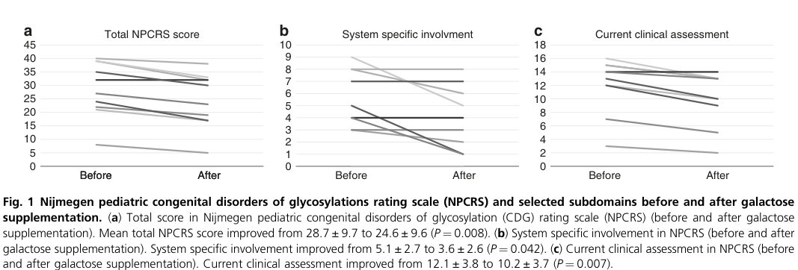

## Question

# Disease Characteristics Research Template

## Target Disease
- **Disease Name:** SLC35A2-congenital disorder of glycosylation
- **MONDO ID:**  (if available)
- **Category:** Mendelian

## Research Objectives

Please provide a comprehensive research report on **SLC35A2-congenital disorder of glycosylation** covering all of the
disease characteristics listed below. This report will be used to populate a disease knowledge
base entry. Be thorough and cite primary literature (PMID preferred) for all claims.

For each section, **suggested databases/resources** are listed. These are the first places
you should search for information on each topic.

---

### 1. Disease Information
> **Search first:** OMIM, Orphanet, ICD-10/ICD-11, MeSH, PubMed

- What is the disease? Provide a concise overview.
- What are the key identifiers? (OMIM, Orphanet, ICD-10/ICD-11, MeSH, Mondo)
- What are the common synonyms and alternative names?
- Is the information derived from individual patients (e.g., EHR) or aggregated disease-level resources?

### 2. Etiology

- **Disease Causal Factors**: What are the primary causes? (genetic, environmental, infectious, mechanistic)
- **Risk Factors**:
  > **Search first:** PubMed, Cochrane Library, UpToDate, clinical guidelines, ClinVar, ClinGen, GWAS Catalog, PheGenI, CTD, CDC, WHO, epidemiological databases
  - Genetic risk factors (causal variants, susceptibility loci, modifier genes)
  - Environmental risk factors (toxins, lifestyle, occupational exposures, age, sex, family history)
- **Protective Factors**:
  > **Search first:** PubMed, Cochrane Library, clinical trial databases, GWAS Catalog, gnomAD, WHO, CDC, nutrition databases
  - Genetic protective factors (protective variants, modifier alleles)
  - Environmental protective factors (diet, lifestyle, exposures that reduce risk)
- **Gene-Environment Interactions**: How do genetic and environmental factors interact to influence disease?
  > **Search first:** CTD, PubMed, PheGenI, GxE databases

### 3. Phenotypes
> **Search first:** HPO (Human Phenotype Ontology), OMIM, Orphanet, PubMed, clinicaltrials.gov, MedDRA, SNOMED CT, DECIPHER, LOINC

For each phenotype, provide:
- **Phenotype type**: symptoms, clinical signs, physical manifestations, behavioral changes, or laboratory abnormalities
  > For symptoms/signs: HPO, OMIM, Orphanet, PubMed
  > For behavioral changes: HPO, DSM, RDoC (Research Domain Criteria), PubMed
  > For laboratory abnormalities: LOINC, SNOMED CT, LabTests Online, PubMed
- **Phenotype characteristics**:
  > **Search first:** OMIM, Orphanet, HPO, PubMed
  - Age of symptom onset (neonatal, childhood, adult-onset, late-onset)
  - Symptom severity (mild, moderate, severe, variable)
  - Symptom progression (stable, progressive, episodic, fluctuating)
  - Frequency among affected individuals (percentage or qualitative)
- **Quality of life impact**: Effects on daily functioning and well-being (per-phenotype when possible)
  > **Search first:** EQ-5D database, SF-36, WHO QOL databases, PubMed
- Suggest HPO (Human Phenotype Ontology) terms for each phenotype

### 4. Genetic/Molecular Information

- **Causal Genes**: Gene mutations or chromosomal abnormalities responsible for disease (gene symbols, OMIM IDs)
  > **Search first:** OMIM, ClinVar, HGMD, Ensembl, NCBI Gene
- **Pathogenic Variants**:
  - Affected genes (gene symbols, HGNC IDs)
    > **Search first:** OMIM, NCBI Gene, Ensembl, HGNC, UniProt, GeneCards
  - Variant classification (pathogenic, likely pathogenic, VUS per ACMG/AMP guidelines)
    > **Search first:** ClinVar, ClinGen, ACMG/AMP guidelines, VarSome
  - Variant type/class (missense, frameshift, nonsense, splice-site, structural)
  - Allele frequency in population databases
    > **Search first:** gnomAD, 1000 Genomes, ExAC, TOPMed, dbSNP
  - Somatic vs germline origin
    > **Search first:** COSMIC (somatic), ClinVar, ICGC, TCGA
  - Functional consequences (loss of function, gain of function, dominant negative)
- **Modifier Genes**: Genes that modify disease severity or expression
- **Epigenetic Information**: DNA methylation, histone modifications, chromatin changes affecting disease
  > **Search first:** ENCODE, Roadmap Epigenomics, MethBase, DiseaseMeth
- **Chromosomal Abnormalities**: Large-scale genetic changes (aneuploidy, translocations, inversions)
  > **Search first:** DECIPHER, ClinVar, ECARUCA, UCSC Genome Browser

### 5. Environmental Information

- **Environmental Factors**: Non-genetic contributing factors (toxins, radiation, pollution, occupational exposure)
  > **Search first:** CTD (Comparative Toxicogenomics Database), TOXNET, PubMed, EPA databases
- **Lifestyle Factors**: Behavioral factors (smoking, diet, exercise, alcohol consumption)
  > **Search first:** CDC databases, WHO, PubMed, NHANES
- **Infectious Agents**: If applicable, pathogens causing or triggering disease (bacteria, viruses, fungi, parasites)
  > **Search first:** NCBI Taxonomy, ViPR, BV-BRC, MicrobeDB, GIDEON

### 6. Mechanism / Pathophysiology

- **Molecular Pathways**: Specific signaling cascades or biochemical pathways involved (Wnt, MAPK, mTOR, PI3K-AKT, etc.)
  > **Search first:** KEGG, Reactome, WikiPathways, PathBank, BioCyc
- **Cellular Processes**: Cell-level mechanisms (apoptosis, autophagy, cell cycle dysregulation, inflammation, etc.)
  > **Search first:** Gene Ontology (GO), Reactome, KEGG, PubMed
- **Protein Dysfunction**: How protein structure or function is altered (misfolding, aggregation, loss of function, gain of function)
  > **Search first:** UniProt, PDB (Protein Data Bank), InterPro, Pfam, AlphaFold
- **Metabolic Changes**: Alterations in metabolic processes (energy metabolism, lipid metabolism, amino acid metabolism)
  > **Search first:** KEGG, BioCyc, HMDB (Human Metabolome Database), BRENDA
- **Immune System Involvement**: Role of immune response (autoimmunity, immunodeficiency, chronic inflammation)
  > **Search first:** ImmPort, Immunome Database, IEDB, Gene Ontology
- **Tissue Damage Mechanisms**: How tissues/ are injured (oxidative stress, ischemia, fibrosis, necrosis)
  > **Search first:** PubMed, Gene Ontology, Reactome
- **Biochemical Abnormalities**: Specific molecular defects (enzyme deficiencies, receptor dysfunction, ion channel defects)
  > **Search first:** BRENDA, UniProt, KEGG, OMIM, PubMed
- **Epigenetic Changes**: DNA methylation, histone modifications affecting gene expression in disease
  > **Search first:** ENCODE, Roadmap Epigenomics, MethBase, DiseaseMeth
- **Molecular Profiling** (if available):
  - Transcriptomics/gene expression changes
    > **Search first:** GEO (Gene Expression Omnibus), ArrayExpress, GTEx, Human Cell Atlas, SRA
  - Proteomics findings
    > **Search first:** PRIDE, ProteomeXchange, Human Protein Atlas, STRING, BioGRID
  - Metabolomics signatures
    > **Search first:** MetaboLights, Metabolomics Workbench, HMDB, METLIN
  - Lipidomics alterations
    > **Search first:** LIPID MAPS, SwissLipids, LipidHome, Metabolomics Workbench
  - Genomic structural features
    > **Search first:** UCSC Genome Browser, Ensembl, NCBI, dbVar, DGV
- **Advanced Technologies** (if applicable):
  - Single-cell analysis findings (cell-type specific mechanisms, cellular heterogeneity)
    > **Search first:** Human Cell Atlas, Single Cell Portal, GEO, CELLxGENE
  - Spatial transcriptomics findings
    > **Search first:** GEO, Spatial Research, Vizgen, 10x Genomics data
  - Multi-omics integration results
    > **Search first:** TCGA, ICGC, cBioPortal, LinkedOmics, PubMed
  - Functional genomics screens (CRISPR, RNAi)
    > **Search first:** DepMap, GenomeRNAi, PubMed, BioGRID ORCS

For each mechanism, describe:
- The causal chain from initial trigger to clinical manifestation
- Which mechanisms are upstream vs downstream
- What cell types and biological processes are involved
- Suggest GO terms for biological processes and CL terms for cell types

### 7. Anatomical Structures Affected

- **Organ Level**:
  - Primary organs directly affected
  - Secondary organ involvement (complications, secondary effects)
  - Body systems involved (cardiovascular, nervous, digestive, respiratory, endocrine, etc.)
  > **Search first:** Uberon, FMA (Foundational Model of Anatomy), OMIM, HPO, ICD-11, MeSH, SNOMED CT
- **Tissue and Cell Level**:
  - Specific tissue types affected (epithelial, connective, muscle, nervous)
  - Specific cell populations targeted (with Cell Ontology terms)
  > **Search first:** Uberon, Human Protein Atlas, Cell Ontology, Human Cell Atlas, CellMarker, PanglaoDB
- **Subcellular Level**:
  - Cellular compartments involved (mitochondria, nucleus, ER, lysosomes) (with GO Cellular Component terms)
  > **Search first:** Gene Ontology (Cellular Component), UniProt, Human Protein Atlas
- **Localization**:
  - Specific anatomical sites (with UBERON terms)
    > **Search first:** FMA, Uberon, NeuroNames (for brain), SNOMED CT
  - Lateralization (unilateral, bilateral, asymmetric)
    > **Search first:** HPO, clinical literature, imaging databases

### 8. Temporal Development

- **Onset**:
  - Typical age of onset (congenital, pediatric, adult, geriatric)
  - Onset pattern (acute, subacute, chronic, insidious)
  > **Search first:** OMIM, Orphanet, HPO, PubMed
- **Progression**:
  - Disease stages (early, intermediate, advanced, end-stage)
    > **Search first:** Cancer Staging Manual (AJCC), WHO classifications, PubMed
  - Progression rate (rapid, slow, variable)
  - Disease course pattern (episodic, relapsing-remitting, progressive, stable)
  - Disease duration (self-limited, chronic lifelong)
  > **Search first:** Disease registries, longitudinal cohort databases, natural history studies, PubMed, Orphanet, OMIM
- **Patterns**:
  - Remission patterns (spontaneous, treatment-induced)
    > **Search first:** Clinical trial databases, disease registries, PubMed
  - Critical periods (time windows of vulnerability or opportunity for intervention)
    > **Search first:** PubMed, developmental biology databases, clinical guidelines

### 9. Inheritance and Population

- **Epidemiology**:
  - Prevalence (cases per 100,000 at given time)
  - Incidence (new cases per 100,000 per year)
  > **Search first:** Orphanet, CDC, WHO, GBD (Global Burden of Disease), national registries, SEER, disease registries
- **For Genetic Etiology**:
  - Inheritance pattern (AD, AR, X-linked, mitochondrial, multifactorial, polygenic)
    > **Search first:** OMIM, Orphanet, ClinVar, GTR (Genetic Testing Registry)
  - Penetrance (complete, incomplete, age-dependent)
    > **Search first:** ClinVar, OMIM, PubMed, ClinGen
  - Expressivity (variable, consistent)
    > **Search first:** OMIM, ClinVar, PubMed
  - Genetic anticipation (increasing severity in successive generations)
    > **Search first:** OMIM, PubMed (especially for repeat expansion disorders)
  - Germline mosaicism
    > **Search first:** ClinVar, OMIM, genetic counseling literature, PubMed
  - Founder effects (population-specific mutations)
    > **Search first:** gnomAD, population genetics databases, PubMed
  - Consanguinity role
    > **Search first:** OMIM, population studies, genetic counseling resources
  - Carrier frequency
    > **Search first:** gnomAD, carrier screening databases, GeneReviews, GTR
- **Population Demographics**:
  - Affected populations (ethnic or demographic groups with higher prevalence)
    > **Search first:** gnomAD, 1000 Genomes, PAGE Study, PubMed, population registries
  - Geographic distribution (endemic areas, regional variation)
    > **Search first:** WHO, CDC, GBD, Orphanet, geographic epidemiology databases
  - Geographic distribution of specific variants
  - Sex ratio (male:female)
    > **Search first:** Disease registries, OMIM, PubMed, epidemiological databases
  - Age distribution of affected individuals
    > **Search first:** CDC, disease registries, SEER, Orphanet

### 10. Diagnostics

- **Clinical Tests**:
  - Laboratory tests (blood, urine, tissue chemistry, specific enzyme assays)
    > **Search first:** LOINC, LabTests Online, PubMed
  - Biomarkers (proteins, metabolites, genetic markers, circulating biomarkers)
    > **Search first:** FDA Biomarker List, BEST (Biomarkers, EndpointS, and other Tools), PubMed
  - Imaging studies (X-ray, CT, MRI, PET, ultrasound)
    > **Search first:** RadLex, DICOM, Radiopaedia, imaging databases
  - Functional tests (pulmonary function, cardiac stress tests)
    > **Search first:** LOINC, clinical guidelines, PubMed
  - Electrophysiology (EEG, EMG, ECG, nerve conduction studies)
    > **Search first:** LOINC, clinical neurophysiology databases, PubMed
  - Biopsy findings (histopathology, immunohistochemistry)
    > **Search first:** SNOMED CT, College of American Pathologists resources, PubMed
  - Pathology findings (microscopic examination)
    > **Search first:** SNOMED CT, Digital Pathology databases, PubMed
- **Genetic Testing**:
  > **Search first:** GTR (Genetic Testing Registry), GeneReviews, ClinGen
  - Overview of recommended genetic testing approach
  - Whole genome sequencing (WGS) utility
    > **Search first:** GTR, ClinVar, GEL (Genomics England), gnomAD
  - Whole exome sequencing (WES) utility
    > **Search first:** GTR, ClinVar, OMIM, GeneMatcher
  - Gene panels (which panels, which genes)
    > **Search first:** GTR, ClinVar, laboratory-specific databases
  - Single gene testing
    > **Search first:** GTR, ClinVar, OMIM, GeneReviews
  - Chromosomal microarray (CMA)
    > **Search first:** DECIPHER, ClinVar, dbVar, ECARUCA
  - Karyotyping
    > **Search first:** Chromosome Abnormality Database, ClinVar, cytogenetics resources
  - FISH
    > **Search first:** ClinVar, cytogenetics databases, PubMed
  - Mitochondrial DNA testing
    > **Search first:** MITOMAP, MSeqDR, ClinVar, GTR
  - Repeat expansion testing
    > **Search first:** GTR, ClinVar, repeat expansion databases, PubMed
- **Omics-Based Diagnostics** (if applicable):
  - RNA sequencing / transcriptomics
    > **Search first:** GEO, ArrayExpress, GTEx, RNA-seq databases
  - Proteomics
    > **Search first:** PRIDE, ProteomeXchange, FDA Biomarker database
  - Metabolomics
    > **Search first:** MetaboLights, Metabolomics Workbench, HMDB
  - Epigenomics
    > **Search first:** GEO, ENCODE, Roadmap Epigenomics, MethBase
  - Liquid biopsy
    > **Search first:** COSMIC, ClinVar, liquid biopsy databases, PubMed
- **Clinical Criteria**:
  - Standardized diagnostic criteria (DSM, ICD, society guidelines)
    > **Search first:** DSM-5, ICD-11, clinical society guidelines, UpToDate
  - Differential diagnosis (other conditions to rule out, with distinguishing features)
    > **Search first:** DynaMed, UpToDate, clinical decision support systems
- **Screening**:
  - Screening methods for asymptomatic individuals (newborn screening, carrier screening, cascade screening)
    > **Search first:** ACMG recommendations, CDC newborn screening, GTR

### 11. Outcome/Prognosis

- **Survival and Mortality**:
  - Survival rate (5-year, 10-year, overall)
    > **Search first:** SEER, cancer registries, disease-specific registries, PubMed
  - Life expectancy (with and without treatment if applicable)
    > **Search first:** Orphanet, disease registries, actuarial databases, PubMed
  - Mortality rate
    > **Search first:** CDC, WHO, GBD, national mortality databases
  - Disease-specific mortality (deaths directly attributable to disease)
    > **Search first:** Disease registries, CDC Wonder, GBD, PubMed
- **Morbidity and Function**:
  - Morbidity (disease-related disability and health impacts)
    > **Search first:** GBD, WHO, disability databases, PubMed
  - Disability outcomes (long-term functional impairments)
    > **Search first:** ICF (International Classification of Functioning), disability registries
  - Quality of life measures (EQ-5D, SF-36, PROMIS, disease-specific tools)
    > **Search first:** EQ-5D database, SF-36, PROMIS, PubMed
- **Disease Course**:
  - Complications (secondary problems: infections, organ failure, etc.)
    > **Search first:** ICD codes, disease registries, clinical databases, PubMed
  - Recovery potential (likelihood and extent of recovery, with vs without treatment)
    > **Search first:** Natural history studies, rehabilitation databases, PubMed
- **Prediction**:
  - Prognostic factors (age, disease severity, biomarkers, treatment response)
    > **Search first:** Prognostic models databases, clinical calculators, PubMed
  - Prognostic biomarkers (molecular markers predicting disease course)
    > **Search first:** FDA Biomarker database, PubMed, cancer prognostic databases

### 12. Treatment

- **Pharmacotherapy**:
  - Pharmacological treatments (drug names, drug classes, mechanisms of action)
    > **Search first:** DrugBank, RxNorm, ATC classification, DailyMed, FDA databases
  - Pharmacogenomics (how genetic variants affect drug metabolism, efficacy, toxicity)
    > **Search first:** PharmGKB, CPIC (Clinical Pharmacogenetics), FDA Table of PGx Biomarkers
- **Advanced Therapeutics**:
  - Gene therapy (viral vectors, CRISPR, gene replacement, gene editing)
    > **Search first:** ClinicalTrials.gov, FDA gene therapy database, ASGCT resources
  - Cell therapy (stem cell transplant, CAR-T, cellular therapeutics)
    > **Search first:** ClinicalTrials.gov, FDA cell therapy database, FACT standards
  - RNA-based therapies (ASOs, siRNA, mRNA therapies)
    > **Search first:** ClinicalTrials.gov, FDA approvals, PubMed
  - Targeted therapies (treatments directed at specific molecular targets)
    > **Search first:** My Cancer Genome, OncoKB, ClinicalTrials.gov, FDA approvals
  - Immunotherapies (checkpoint inhibitors, monoclonal antibodies)
    > **Search first:** Cancer Immunotherapy Database, FDA approvals, ClinicalTrials.gov
- **Surgical and Interventional**:
  - Surgical interventions (types of surgery, timing, outcomes)
    > **Search first:** CPT codes, surgical registries, clinical guidelines, PubMed
- **Supportive and Rehabilitative**:
  - Supportive care (symptom management, pain control, nutrition)
    > **Search first:** Clinical guidelines, Cochrane Library, PubMed
  - Rehabilitation (physical therapy, occupational therapy, speech therapy)
    > **Search first:** Rehabilitation medicine databases, clinical guidelines, PubMed
- **Experimental**:
  - Experimental treatments in clinical trials (with NCT identifiers if available)
    > **Search first:** ClinicalTrials.gov, EU Clinical Trials Register, WHO ICTRP
- **Treatment Outcomes**:
  - Treatment response rates
    > **Search first:** Clinical trial databases, FDA reviews, systematic reviews, PubMed
  - Side effects and adverse events
    > **Search first:** FDA Adverse Event Reporting System (FAERS), MedWatch, PubMed
- **Treatment Strategy**:
  - Treatment algorithms (clinical pathways, decision trees)
    > **Search first:** Clinical practice guidelines, NCCN Guidelines, UpToDate
  - Combination therapies
    > **Search first:** ClinicalTrials.gov, treatment guidelines, PubMed
  - Personalized medicine approaches (genotype-guided treatment)
    > **Search first:** My Cancer Genome, CIViC, PharmGKB, precision medicine databases

For each treatment, suggest MAXO (Medical Action Ontology) terms where applicable.

### 13. Prevention

- **Prevention Levels**:
  - Primary prevention (preventing disease occurrence: vaccination, risk factor modification)
    > **Search first:** CDC, WHO, USPSTF recommendations, Cochrane Library
  - Secondary prevention (early detection and treatment: screening programs, early intervention)
    > **Search first:** USPSTF, CDC screening guidelines, WHO
  - Tertiary prevention (preventing complications in those with disease)
    > **Search first:** Clinical guidelines, disease management protocols, PubMed
- **Immunization**: Vaccine strategies (if applicable)
  > **Search first:** CDC vaccine schedules, WHO immunization, FDA vaccine database
- **Screening and Early Detection**:
  - Screening programs (population-based: newborn screening, cancer screening)
    > **Search first:** CDC screening programs, USPSTF, cancer screening databases
  - Genetic screening (carrier screening, preimplantation genetic diagnosis, prenatal testing)
    > **Search first:** ACMG recommendations, ACOG guidelines, GTR
  - Risk stratification (identifying high-risk individuals for targeted prevention)
    > **Search first:** Risk prediction models, clinical calculators, PubMed
- **Behavioral Interventions**: Lifestyle modifications to reduce risk
  > **Search first:** CDC, WHO, behavioral intervention databases, Cochrane Library
- **Counseling**: Genetic counseling (risk assessment, family planning guidance)
  > **Search first:** NSGC resources, ACMG guidelines, GeneReviews
- **Public Health**:
  - Public health interventions (sanitation, vector control, health education)
    > **Search first:** CDC, WHO, public health databases, PubMed
  - Environmental interventions (reducing environmental risk factors)
    > **Search first:** EPA databases, WHO environmental health, PubMed
- **Prophylaxis**: Preventive medications or procedures
  > **Search first:** Clinical guidelines, FDA approvals, PubMed

### 14. Other Species / Natural Disease

- **Taxonomy**: Species affected (with NCBI Taxon identifiers)
  > **Search first:** NCBI Taxonomy
- **Breed**: Specific breeds affected (with VBO identifiers if applicable)
  > **Search first:** VBO (Vertebrate Breed Ontology)
- **Gene**: Orthologous genes in other species (with NCBI Gene IDs)
  > **Search first:** NCBI Gene
- **Natural Disease**:
  - Naturally occurring disease in other species (companion animals, wildlife)
    > **Search first:** OMIA (Online Mendelian Inheritance in Animals), VetCompass, PubMed
  - Veterinary relevance and importance in animal health
    > **Search first:** OMIA, veterinary databases, PubMed
- **Comparative Biology**:
  - Comparative pathology (similarities and differences across species)
    > **Search first:** OMIA, comparative pathology databases, PubMed
  - Evolutionary conservation of disease mechanisms
    > **Search first:** HomoloGene, OrthoMCL, Alliance of Genome Resources
- **Transmission** (if applicable):
  - Zoonotic potential
    > **Search first:** CDC zoonotic diseases, WHO zoonoses, GIDEON
  - Cross-species susceptibility
    > **Search first:** NCBI Taxonomy, veterinary databases, PubMed

### 15. Model Organisms

- **Model Types**:
  - Model organism type (mammalian, invertebrate, cellular, in vitro)
    > **Search first:** Alliance of Genome Resources, model organism databases
  - Specific model systems (mouse, rat, zebrafish, Drosophila, C. elegans, yeast, cell lines, organoids, iPSCs)
    > **Search first:** MGI, RGD, ZFIN, FlyBase, WormBase, SGD, ATCC, Cellosaurus
  - Induced models (drug treatment, surgical intervention, environmental manipulation)
    > **Search first:** MGI, model organism databases, PubMed
- **Genetic Models**:
  - Types available (knockout, knock-in, transgenic, conditional, humanized)
    > **Search first:** MGI, IMPC, KOMP, EuMMCR, IMSR
- **Model Characteristics**:
  - Phenotype recapitulation (how well model reproduces human disease features)
    > **Search first:** Model organism databases, comparative studies, PubMed
  - Model limitations (aspects of human disease not captured)
    > **Search first:** Model organism databases, PubMed, review articles
- **Applications**:
  - Research applications (what aspects of disease can be studied)
    > **Search first:** Model organism databases, PubMed
- **Resources**:
  - Model databases
    > **Search first:** MGI, RGD, ZFIN, FlyBase, WormBase, IMSR, EMMA, MMRRC

---

## Citation Requirements

- Cite primary literature (PMID preferred) for all mechanistic and clinical claims
- Prioritize recent reviews and landmark papers
- Include direct quotes from abstracts where possible to support key statements
- Distinguish evidence source types: human clinical, model organism, in vitro, computational

## Output Format

Structure your response as a comprehensive narrative organized by the sections above.
For each section, provide:
- Factual content with specific details (numbers, percentages, gene names, variant nomenclature)
- Ontology term suggestions (HPO, GO, CL, UBERON, CHEBI, MAXO, MONDO) where applicable
- Evidence citations with PMIDs
- Direct quotes from abstracts to support key claims
- Clear indication when information is not available or not applicable for this disease

This report will be used to populate a disease knowledge base entry with:
- Pathophysiology descriptions with causal chains
- Gene/protein annotations (HGNC, GO terms)
- Phenotype associations (HP terms) with frequencies
- Cell type involvement (CL terms)
- Anatomical locations (UBERON terms)
- Chemical entities (CHEBI terms)
- Treatment annotations (MAXO terms)
- Evidence items with PMIDs and exact abstract quotes
- Epidemiology, prognosis, diagnostic, and prevention information
- Animal model descriptions with phenotype recapitulation details

## Output

Question: You are an expert researcher providing comprehensive, well-cited information.

Provide detailed information focusing on:
1. Key concepts and definitions with current understanding
2. Recent developments and latest research (prioritize 2023-2024 sources)
3. Current applications and real-world implementations
4. Expert opinions and analysis from authoritative sources
5. Relevant statistics and data from recent studies

Format as a comprehensive research report with proper citations. Include URLs and publication dates where available.
Always prioritize recent, authoritative sources and provide specific citations for all major claims.

# Disease Characteristics Research Template

## Target Disease
- **Disease Name:** SLC35A2-congenital disorder of glycosylation
- **MONDO ID:**  (if available)
- **Category:** Mendelian

## Research Objectives

Please provide a comprehensive research report on **SLC35A2-congenital disorder of glycosylation** covering all of the
disease characteristics listed below. This report will be used to populate a disease knowledge
base entry. Be thorough and cite primary literature (PMID preferred) for all claims.

For each section, **suggested databases/resources** are listed. These are the first places
you should search for information on each topic.

---

### 1. Disease Information
> **Search first:** OMIM, Orphanet, ICD-10/ICD-11, MeSH, PubMed

- What is the disease? Provide a concise overview.
- What are the key identifiers? (OMIM, Orphanet, ICD-10/ICD-11, MeSH, Mondo)
- What are the common synonyms and alternative names?
- Is the information derived from individual patients (e.g., EHR) or aggregated disease-level resources?

### 2. Etiology

- **Disease Causal Factors**: What are the primary causes? (genetic, environmental, infectious, mechanistic)
- **Risk Factors**:
  > **Search first:** PubMed, Cochrane Library, UpToDate, clinical guidelines, ClinVar, ClinGen, GWAS Catalog, PheGenI, CTD, CDC, WHO, epidemiological databases
  - Genetic risk factors (causal variants, susceptibility loci, modifier genes)
  - Environmental risk factors (toxins, lifestyle, occupational exposures, age, sex, family history)
- **Protective Factors**:
  > **Search first:** PubMed, Cochrane Library, clinical trial databases, GWAS Catalog, gnomAD, WHO, CDC, nutrition databases
  - Genetic protective factors (protective variants, modifier alleles)
  - Environmental protective factors (diet, lifestyle, exposures that reduce risk)
- **Gene-Environment Interactions**: How do genetic and environmental factors interact to influence disease?
  > **Search first:** CTD, PubMed, PheGenI, GxE databases

### 3. Phenotypes
> **Search first:** HPO (Human Phenotype Ontology), OMIM, Orphanet, PubMed, clinicaltrials.gov, MedDRA, SNOMED CT, DECIPHER, LOINC

For each phenotype, provide:
- **Phenotype type**: symptoms, clinical signs, physical manifestations, behavioral changes, or laboratory abnormalities
  > For symptoms/signs: HPO, OMIM, Orphanet, PubMed
  > For behavioral changes: HPO, DSM, RDoC (Research Domain Criteria), PubMed
  > For laboratory abnormalities: LOINC, SNOMED CT, LabTests Online, PubMed
- **Phenotype characteristics**:
  > **Search first:** OMIM, Orphanet, HPO, PubMed
  - Age of symptom onset (neonatal, childhood, adult-onset, late-onset)
  - Symptom severity (mild, moderate, severe, variable)
  - Symptom progression (stable, progressive, episodic, fluctuating)
  - Frequency among affected individuals (percentage or qualitative)
- **Quality of life impact**: Effects on daily functioning and well-being (per-phenotype when possible)
  > **Search first:** EQ-5D database, SF-36, WHO QOL databases, PubMed
- Suggest HPO (Human Phenotype Ontology) terms for each phenotype

### 4. Genetic/Molecular Information

- **Causal Genes**: Gene mutations or chromosomal abnormalities responsible for disease (gene symbols, OMIM IDs)
  > **Search first:** OMIM, ClinVar, HGMD, Ensembl, NCBI Gene
- **Pathogenic Variants**:
  - Affected genes (gene symbols, HGNC IDs)
    > **Search first:** OMIM, NCBI Gene, Ensembl, HGNC, UniProt, GeneCards
  - Variant classification (pathogenic, likely pathogenic, VUS per ACMG/AMP guidelines)
    > **Search first:** ClinVar, ClinGen, ACMG/AMP guidelines, VarSome
  - Variant type/class (missense, frameshift, nonsense, splice-site, structural)
  - Allele frequency in population databases
    > **Search first:** gnomAD, 1000 Genomes, ExAC, TOPMed, dbSNP
  - Somatic vs germline origin
    > **Search first:** COSMIC (somatic), ClinVar, ICGC, TCGA
  - Functional consequences (loss of function, gain of function, dominant negative)
- **Modifier Genes**: Genes that modify disease severity or expression
- **Epigenetic Information**: DNA methylation, histone modifications, chromatin changes affecting disease
  > **Search first:** ENCODE, Roadmap Epigenomics, MethBase, DiseaseMeth
- **Chromosomal Abnormalities**: Large-scale genetic changes (aneuploidy, translocations, inversions)
  > **Search first:** DECIPHER, ClinVar, ECARUCA, UCSC Genome Browser

### 5. Environmental Information

- **Environmental Factors**: Non-genetic contributing factors (toxins, radiation, pollution, occupational exposure)
  > **Search first:** CTD (Comparative Toxicogenomics Database), TOXNET, PubMed, EPA databases
- **Lifestyle Factors**: Behavioral factors (smoking, diet, exercise, alcohol consumption)
  > **Search first:** CDC databases, WHO, PubMed, NHANES
- **Infectious Agents**: If applicable, pathogens causing or triggering disease (bacteria, viruses, fungi, parasites)
  > **Search first:** NCBI Taxonomy, ViPR, BV-BRC, MicrobeDB, GIDEON

### 6. Mechanism / Pathophysiology

- **Molecular Pathways**: Specific signaling cascades or biochemical pathways involved (Wnt, MAPK, mTOR, PI3K-AKT, etc.)
  > **Search first:** KEGG, Reactome, WikiPathways, PathBank, BioCyc
- **Cellular Processes**: Cell-level mechanisms (apoptosis, autophagy, cell cycle dysregulation, inflammation, etc.)
  > **Search first:** Gene Ontology (GO), Reactome, KEGG, PubMed
- **Protein Dysfunction**: How protein structure or function is altered (misfolding, aggregation, loss of function, gain of function)
  > **Search first:** UniProt, PDB (Protein Data Bank), InterPro, Pfam, AlphaFold
- **Metabolic Changes**: Alterations in metabolic processes (energy metabolism, lipid metabolism, amino acid metabolism)
  > **Search first:** KEGG, BioCyc, HMDB (Human Metabolome Database), BRENDA
- **Immune System Involvement**: Role of immune response (autoimmunity, immunodeficiency, chronic inflammation)
  > **Search first:** ImmPort, Immunome Database, IEDB, Gene Ontology
- **Tissue Damage Mechanisms**: How tissues/ are injured (oxidative stress, ischemia, fibrosis, necrosis)
  > **Search first:** PubMed, Gene Ontology, Reactome
- **Biochemical Abnormalities**: Specific molecular defects (enzyme deficiencies, receptor dysfunction, ion channel defects)
  > **Search first:** BRENDA, UniProt, KEGG, OMIM, PubMed
- **Epigenetic Changes**: DNA methylation, histone modifications affecting gene expression in disease
  > **Search first:** ENCODE, Roadmap Epigenomics, MethBase, DiseaseMeth
- **Molecular Profiling** (if available):
  - Transcriptomics/gene expression changes
    > **Search first:** GEO (Gene Expression Omnibus), ArrayExpress, GTEx, Human Cell Atlas, SRA
  - Proteomics findings
    > **Search first:** PRIDE, ProteomeXchange, Human Protein Atlas, STRING, BioGRID
  - Metabolomics signatures
    > **Search first:** MetaboLights, Metabolomics Workbench, HMDB, METLIN
  - Lipidomics alterations
    > **Search first:** LIPID MAPS, SwissLipids, LipidHome, Metabolomics Workbench
  - Genomic structural features
    > **Search first:** UCSC Genome Browser, Ensembl, NCBI, dbVar, DGV
- **Advanced Technologies** (if applicable):
  - Single-cell analysis findings (cell-type specific mechanisms, cellular heterogeneity)
    > **Search first:** Human Cell Atlas, Single Cell Portal, GEO, CELLxGENE
  - Spatial transcriptomics findings
    > **Search first:** GEO, Spatial Research, Vizgen, 10x Genomics data
  - Multi-omics integration results
    > **Search first:** TCGA, ICGC, cBioPortal, LinkedOmics, PubMed
  - Functional genomics screens (CRISPR, RNAi)
    > **Search first:** DepMap, GenomeRNAi, PubMed, BioGRID ORCS

For each mechanism, describe:
- The causal chain from initial trigger to clinical manifestation
- Which mechanisms are upstream vs downstream
- What cell types and biological processes are involved
- Suggest GO terms for biological processes and CL terms for cell types

### 7. Anatomical Structures Affected

- **Organ Level**:
  - Primary organs directly affected
  - Secondary organ involvement (complications, secondary effects)
  - Body systems involved (cardiovascular, nervous, digestive, respiratory, endocrine, etc.)
  > **Search first:** Uberon, FMA (Foundational Model of Anatomy), OMIM, HPO, ICD-11, MeSH, SNOMED CT
- **Tissue and Cell Level**:
  - Specific tissue types affected (epithelial, connective, muscle, nervous)
  - Specific cell populations targeted (with Cell Ontology terms)
  > **Search first:** Uberon, Human Protein Atlas, Cell Ontology, Human Cell Atlas, CellMarker, PanglaoDB
- **Subcellular Level**:
  - Cellular compartments involved (mitochondria, nucleus, ER, lysosomes) (with GO Cellular Component terms)
  > **Search first:** Gene Ontology (Cellular Component), UniProt, Human Protein Atlas
- **Localization**:
  - Specific anatomical sites (with UBERON terms)
    > **Search first:** FMA, Uberon, NeuroNames (for brain), SNOMED CT
  - Lateralization (unilateral, bilateral, asymmetric)
    > **Search first:** HPO, clinical literature, imaging databases

### 8. Temporal Development

- **Onset**:
  - Typical age of onset (congenital, pediatric, adult, geriatric)
  - Onset pattern (acute, subacute, chronic, insidious)
  > **Search first:** OMIM, Orphanet, HPO, PubMed
- **Progression**:
  - Disease stages (early, intermediate, advanced, end-stage)
    > **Search first:** Cancer Staging Manual (AJCC), WHO classifications, PubMed
  - Progression rate (rapid, slow, variable)
  - Disease course pattern (episodic, relapsing-remitting, progressive, stable)
  - Disease duration (self-limited, chronic lifelong)
  > **Search first:** Disease registries, longitudinal cohort databases, natural history studies, PubMed, Orphanet, OMIM
- **Patterns**:
  - Remission patterns (spontaneous, treatment-induced)
    > **Search first:** Clinical trial databases, disease registries, PubMed
  - Critical periods (time windows of vulnerability or opportunity for intervention)
    > **Search first:** PubMed, developmental biology databases, clinical guidelines

### 9. Inheritance and Population

- **Epidemiology**:
  - Prevalence (cases per 100,000 at given time)
  - Incidence (new cases per 100,000 per year)
  > **Search first:** Orphanet, CDC, WHO, GBD (Global Burden of Disease), national registries, SEER, disease registries
- **For Genetic Etiology**:
  - Inheritance pattern (AD, AR, X-linked, mitochondrial, multifactorial, polygenic)
    > **Search first:** OMIM, Orphanet, ClinVar, GTR (Genetic Testing Registry)
  - Penetrance (complete, incomplete, age-dependent)
    > **Search first:** ClinVar, OMIM, PubMed, ClinGen
  - Expressivity (variable, consistent)
    > **Search first:** OMIM, ClinVar, PubMed
  - Genetic anticipation (increasing severity in successive generations)
    > **Search first:** OMIM, PubMed (especially for repeat expansion disorders)
  - Germline mosaicism
    > **Search first:** ClinVar, OMIM, genetic counseling literature, PubMed
  - Founder effects (population-specific mutations)
    > **Search first:** gnomAD, population genetics databases, PubMed
  - Consanguinity role
    > **Search first:** OMIM, population studies, genetic counseling resources
  - Carrier frequency
    > **Search first:** gnomAD, carrier screening databases, GeneReviews, GTR
- **Population Demographics**:
  - Affected populations (ethnic or demographic groups with higher prevalence)
    > **Search first:** gnomAD, 1000 Genomes, PAGE Study, PubMed, population registries
  - Geographic distribution (endemic areas, regional variation)
    > **Search first:** WHO, CDC, GBD, Orphanet, geographic epidemiology databases
  - Geographic distribution of specific variants
  - Sex ratio (male:female)
    > **Search first:** Disease registries, OMIM, PubMed, epidemiological databases
  - Age distribution of affected individuals
    > **Search first:** CDC, disease registries, SEER, Orphanet

### 10. Diagnostics

- **Clinical Tests**:
  - Laboratory tests (blood, urine, tissue chemistry, specific enzyme assays)
    > **Search first:** LOINC, LabTests Online, PubMed
  - Biomarkers (proteins, metabolites, genetic markers, circulating biomarkers)
    > **Search first:** FDA Biomarker List, BEST (Biomarkers, EndpointS, and other Tools), PubMed
  - Imaging studies (X-ray, CT, MRI, PET, ultrasound)
    > **Search first:** RadLex, DICOM, Radiopaedia, imaging databases
  - Functional tests (pulmonary function, cardiac stress tests)
    > **Search first:** LOINC, clinical guidelines, PubMed
  - Electrophysiology (EEG, EMG, ECG, nerve conduction studies)
    > **Search first:** LOINC, clinical neurophysiology databases, PubMed
  - Biopsy findings (histopathology, immunohistochemistry)
    > **Search first:** SNOMED CT, College of American Pathologists resources, PubMed
  - Pathology findings (microscopic examination)
    > **Search first:** SNOMED CT, Digital Pathology databases, PubMed
- **Genetic Testing**:
  > **Search first:** GTR (Genetic Testing Registry), GeneReviews, ClinGen
  - Overview of recommended genetic testing approach
  - Whole genome sequencing (WGS) utility
    > **Search first:** GTR, ClinVar, GEL (Genomics England), gnomAD
  - Whole exome sequencing (WES) utility
    > **Search first:** GTR, ClinVar, OMIM, GeneMatcher
  - Gene panels (which panels, which genes)
    > **Search first:** GTR, ClinVar, laboratory-specific databases
  - Single gene testing
    > **Search first:** GTR, ClinVar, OMIM, GeneReviews
  - Chromosomal microarray (CMA)
    > **Search first:** DECIPHER, ClinVar, dbVar, ECARUCA
  - Karyotyping
    > **Search first:** Chromosome Abnormality Database, ClinVar, cytogenetics resources
  - FISH
    > **Search first:** ClinVar, cytogenetics databases, PubMed
  - Mitochondrial DNA testing
    > **Search first:** MITOMAP, MSeqDR, ClinVar, GTR
  - Repeat expansion testing
    > **Search first:** GTR, ClinVar, repeat expansion databases, PubMed
- **Omics-Based Diagnostics** (if applicable):
  - RNA sequencing / transcriptomics
    > **Search first:** GEO, ArrayExpress, GTEx, RNA-seq databases
  - Proteomics
    > **Search first:** PRIDE, ProteomeXchange, FDA Biomarker database
  - Metabolomics
    > **Search first:** MetaboLights, Metabolomics Workbench, HMDB
  - Epigenomics
    > **Search first:** GEO, ENCODE, Roadmap Epigenomics, MethBase
  - Liquid biopsy
    > **Search first:** COSMIC, ClinVar, liquid biopsy databases, PubMed
- **Clinical Criteria**:
  - Standardized diagnostic criteria (DSM, ICD, society guidelines)
    > **Search first:** DSM-5, ICD-11, clinical society guidelines, UpToDate
  - Differential diagnosis (other conditions to rule out, with distinguishing features)
    > **Search first:** DynaMed, UpToDate, clinical decision support systems
- **Screening**:
  - Screening methods for asymptomatic individuals (newborn screening, carrier screening, cascade screening)
    > **Search first:** ACMG recommendations, CDC newborn screening, GTR

### 11. Outcome/Prognosis

- **Survival and Mortality**:
  - Survival rate (5-year, 10-year, overall)
    > **Search first:** SEER, cancer registries, disease-specific registries, PubMed
  - Life expectancy (with and without treatment if applicable)
    > **Search first:** Orphanet, disease registries, actuarial databases, PubMed
  - Mortality rate
    > **Search first:** CDC, WHO, GBD, national mortality databases
  - Disease-specific mortality (deaths directly attributable to disease)
    > **Search first:** Disease registries, CDC Wonder, GBD, PubMed
- **Morbidity and Function**:
  - Morbidity (disease-related disability and health impacts)
    > **Search first:** GBD, WHO, disability databases, PubMed
  - Disability outcomes (long-term functional impairments)
    > **Search first:** ICF (International Classification of Functioning), disability registries
  - Quality of life measures (EQ-5D, SF-36, PROMIS, disease-specific tools)
    > **Search first:** EQ-5D database, SF-36, PROMIS, PubMed
- **Disease Course**:
  - Complications (secondary problems: infections, organ failure, etc.)
    > **Search first:** ICD codes, disease registries, clinical databases, PubMed
  - Recovery potential (likelihood and extent of recovery, with vs without treatment)
    > **Search first:** Natural history studies, rehabilitation databases, PubMed
- **Prediction**:
  - Prognostic factors (age, disease severity, biomarkers, treatment response)
    > **Search first:** Prognostic models databases, clinical calculators, PubMed
  - Prognostic biomarkers (molecular markers predicting disease course)
    > **Search first:** FDA Biomarker database, PubMed, cancer prognostic databases

### 12. Treatment

- **Pharmacotherapy**:
  - Pharmacological treatments (drug names, drug classes, mechanisms of action)
    > **Search first:** DrugBank, RxNorm, ATC classification, DailyMed, FDA databases
  - Pharmacogenomics (how genetic variants affect drug metabolism, efficacy, toxicity)
    > **Search first:** PharmGKB, CPIC (Clinical Pharmacogenetics), FDA Table of PGx Biomarkers
- **Advanced Therapeutics**:
  - Gene therapy (viral vectors, CRISPR, gene replacement, gene editing)
    > **Search first:** ClinicalTrials.gov, FDA gene therapy database, ASGCT resources
  - Cell therapy (stem cell transplant, CAR-T, cellular therapeutics)
    > **Search first:** ClinicalTrials.gov, FDA cell therapy database, FACT standards
  - RNA-based therapies (ASOs, siRNA, mRNA therapies)
    > **Search first:** ClinicalTrials.gov, FDA approvals, PubMed
  - Targeted therapies (treatments directed at specific molecular targets)
    > **Search first:** My Cancer Genome, OncoKB, ClinicalTrials.gov, FDA approvals
  - Immunotherapies (checkpoint inhibitors, monoclonal antibodies)
    > **Search first:** Cancer Immunotherapy Database, FDA approvals, ClinicalTrials.gov
- **Surgical and Interventional**:
  - Surgical interventions (types of surgery, timing, outcomes)
    > **Search first:** CPT codes, surgical registries, clinical guidelines, PubMed
- **Supportive and Rehabilitative**:
  - Supportive care (symptom management, pain control, nutrition)
    > **Search first:** Clinical guidelines, Cochrane Library, PubMed
  - Rehabilitation (physical therapy, occupational therapy, speech therapy)
    > **Search first:** Rehabilitation medicine databases, clinical guidelines, PubMed
- **Experimental**:
  - Experimental treatments in clinical trials (with NCT identifiers if available)
    > **Search first:** ClinicalTrials.gov, EU Clinical Trials Register, WHO ICTRP
- **Treatment Outcomes**:
  - Treatment response rates
    > **Search first:** Clinical trial databases, FDA reviews, systematic reviews, PubMed
  - Side effects and adverse events
    > **Search first:** FDA Adverse Event Reporting System (FAERS), MedWatch, PubMed
- **Treatment Strategy**:
  - Treatment algorithms (clinical pathways, decision trees)
    > **Search first:** Clinical practice guidelines, NCCN Guidelines, UpToDate
  - Combination therapies
    > **Search first:** ClinicalTrials.gov, treatment guidelines, PubMed
  - Personalized medicine approaches (genotype-guided treatment)
    > **Search first:** My Cancer Genome, CIViC, PharmGKB, precision medicine databases

For each treatment, suggest MAXO (Medical Action Ontology) terms where applicable.

### 13. Prevention

- **Prevention Levels**:
  - Primary prevention (preventing disease occurrence: vaccination, risk factor modification)
    > **Search first:** CDC, WHO, USPSTF recommendations, Cochrane Library
  - Secondary prevention (early detection and treatment: screening programs, early intervention)
    > **Search first:** USPSTF, CDC screening guidelines, WHO
  - Tertiary prevention (preventing complications in those with disease)
    > **Search first:** Clinical guidelines, disease management protocols, PubMed
- **Immunization**: Vaccine strategies (if applicable)
  > **Search first:** CDC vaccine schedules, WHO immunization, FDA vaccine database
- **Screening and Early Detection**:
  - Screening programs (population-based: newborn screening, cancer screening)
    > **Search first:** CDC screening programs, USPSTF, cancer screening databases
  - Genetic screening (carrier screening, preimplantation genetic diagnosis, prenatal testing)
    > **Search first:** ACMG recommendations, ACOG guidelines, GTR
  - Risk stratification (identifying high-risk individuals for targeted prevention)
    > **Search first:** Risk prediction models, clinical calculators, PubMed
- **Behavioral Interventions**: Lifestyle modifications to reduce risk
  > **Search first:** CDC, WHO, behavioral intervention databases, Cochrane Library
- **Counseling**: Genetic counseling (risk assessment, family planning guidance)
  > **Search first:** NSGC resources, ACMG guidelines, GeneReviews
- **Public Health**:
  - Public health interventions (sanitation, vector control, health education)
    > **Search first:** CDC, WHO, public health databases, PubMed
  - Environmental interventions (reducing environmental risk factors)
    > **Search first:** EPA databases, WHO environmental health, PubMed
- **Prophylaxis**: Preventive medications or procedures
  > **Search first:** Clinical guidelines, FDA approvals, PubMed

### 14. Other Species / Natural Disease

- **Taxonomy**: Species affected (with NCBI Taxon identifiers)
  > **Search first:** NCBI Taxonomy
- **Breed**: Specific breeds affected (with VBO identifiers if applicable)
  > **Search first:** VBO (Vertebrate Breed Ontology)
- **Gene**: Orthologous genes in other species (with NCBI Gene IDs)
  > **Search first:** NCBI Gene
- **Natural Disease**:
  - Naturally occurring disease in other species (companion animals, wildlife)
    > **Search first:** OMIA (Online Mendelian Inheritance in Animals), VetCompass, PubMed
  - Veterinary relevance and importance in animal health
    > **Search first:** OMIA, veterinary databases, PubMed
- **Comparative Biology**:
  - Comparative pathology (similarities and differences across species)
    > **Search first:** OMIA, comparative pathology databases, PubMed
  - Evolutionary conservation of disease mechanisms
    > **Search first:** HomoloGene, OrthoMCL, Alliance of Genome Resources
- **Transmission** (if applicable):
  - Zoonotic potential
    > **Search first:** CDC zoonotic diseases, WHO zoonoses, GIDEON
  - Cross-species susceptibility
    > **Search first:** NCBI Taxonomy, veterinary databases, PubMed

### 15. Model Organisms

- **Model Types**:
  - Model organism type (mammalian, invertebrate, cellular, in vitro)
    > **Search first:** Alliance of Genome Resources, model organism databases
  - Specific model systems (mouse, rat, zebrafish, Drosophila, C. elegans, yeast, cell lines, organoids, iPSCs)
    > **Search first:** MGI, RGD, ZFIN, FlyBase, WormBase, SGD, ATCC, Cellosaurus
  - Induced models (drug treatment, surgical intervention, environmental manipulation)
    > **Search first:** MGI, model organism databases, PubMed
- **Genetic Models**:
  - Types available (knockout, knock-in, transgenic, conditional, humanized)
    > **Search first:** MGI, IMPC, KOMP, EuMMCR, IMSR
- **Model Characteristics**:
  - Phenotype recapitulation (how well model reproduces human disease features)
    > **Search first:** Model organism databases, comparative studies, PubMed
  - Model limitations (aspects of human disease not captured)
    > **Search first:** Model organism databases, PubMed, review articles
- **Applications**:
  - Research applications (what aspects of disease can be studied)
    > **Search first:** Model organism databases, PubMed
- **Resources**:
  - Model databases
    > **Search first:** MGI, RGD, ZFIN, FlyBase, WormBase, IMSR, EMMA, MMRRC

---

## Citation Requirements

- Cite primary literature (PMID preferred) for all mechanistic and clinical claims
- Prioritize recent reviews and landmark papers
- Include direct quotes from abstracts where possible to support key statements
- Distinguish evidence source types: human clinical, model organism, in vitro, computational

## Output Format

Structure your response as a comprehensive narrative organized by the sections above.
For each section, provide:
- Factual content with specific details (numbers, percentages, gene names, variant nomenclature)
- Ontology term suggestions (HPO, GO, CL, UBERON, CHEBI, MAXO, MONDO) where applicable
- Evidence citations with PMIDs
- Direct quotes from abstracts to support key claims
- Clear indication when information is not available or not applicable for this disease

This report will be used to populate a disease knowledge base entry with:
- Pathophysiology descriptions with causal chains
- Gene/protein annotations (HGNC, GO terms)
- Phenotype associations (HP terms) with frequencies
- Cell type involvement (CL terms)
- Anatomical locations (UBERON terms)
- Chemical entities (CHEBI terms)
- Treatment annotations (MAXO terms)
- Evidence items with PMIDs and exact abstract quotes
- Epidemiology, prognosis, diagnostic, and prevention information
- Animal model descriptions with phenotype recapitulation details

# SLC35A2–congenital disorder of glycosylation (SLC35A2-CDG): Comprehensive disease characteristics report

## Executive summary
SLC35A2-congenital disorder of glycosylation (SLC35A2-CDG; historical name **CDG-IIm**) is an X-linked glycosylation disorder caused by pathogenic variants in **SLC35A2**, which encodes the major **Golgi UDP-galactose transporter** needed for proper protein and lipid glycosylation. Loss of transporter activity produces hypogalactosylated glycans and secondary hyposialylation, with a phenotype dominated by neurodevelopmental impairment and frequently epilepsy/developmental and epileptic encephalopathy (DEE). A key practical diagnostic challenge is that **serum transferrin glycosylation can be normal or normalize over time**, so genomic testing and/or functional assays in fibroblasts plus mass-spectrometry glycomics can be required. Oral **D-galactose** supplementation has shown clinical and biochemical benefit in a small pilot study, and randomized crossover trials are registered/ongoing. Somatic (brain-restricted) SLC35A2 mosaicism is also a major cause of malformation-associated drug-resistant epilepsy (notably MOGHE), where epilepsy surgery and adjunct D-galactose are being studied.

| Citation (first author year) | Publication date | Study type (case report/cohort/trial/review) | Population/model (n, key demographics) | Key findings (clinical features, diagnostics, mechanism) | Quantitative data (phenotype frequencies, outcomes, VAFs, P-values) | URL/DOI | PMID |
|---|---|---|---|---|---|---|---|
| Ng 2013 (AJHG) | Apr 2013 | Foundational case series / gene discovery | 3 unrelated families with X-linked SLC35A2-CDG; included 2 affected males with somatic mosaicism and 1 hemizygous male | Defined SLC35A2-CDG as an X-linked CDG due to defects in the Golgi UDP-galactose transporter; abnormal infant transferrin glycosylation may normalize later; functional studies showed reduced UDP-galactose transport | 3 families; 2 males somatic mosaics; exome review from 16 unrelated unresolved CDG cases; abnormal transferrin normalized later in childhood without clinical improvement; “considerably reduced” UDP-galactose transport in all 3 (ng2013mosaicismofthe pages 1-2) | https://doi.org/10.1016/j.ajhg.2013.03.012 |  |
| Westenfield 2018 (BMC Med Genet) | Jun 2018 | Case report | 1 female, age 27 months, mosaic missense SLC35A2 variant c.991G>A | Expanded phenotype in a female mosaic case: developmental delay, central hypotonia, cerebral atrophy, failure to thrive/growth retardation; highlighted that transferrin isoform analysis can miss cases and WES can diagnose | At time of report, only ~10 patients with SLC35A2 mutations had been reported; transferrin isoform analysis failed to identify this patient in infancy (westenfield2018mosaicismofthe pages 1-2) | https://doi.org/10.1186/s12881-018-0617-6 |  |
| Ng 2019 (Hum Mutat) | Jul 2019 | Multicenter cohort with functional characterization | 30 unreported affected individuals; cohort explicitly 29 females and 1 male in extracted text; most identified by NGS | Largest early cohort; expanded molecular/clinical spectrum; many patients had normal transferrin glycosylation, so routine serum screening is insensitive; fibroblast UDP-galactose transport assay correlated with wild-type:mutant allele ratio | 30 individuals; 26 new variants; 29/30 identified by NGS; 26/30 de novo; variant classes: 15 missense, 7 out-of-frame INDELs, 4 nonsense, 2 in-frame deletions, 1 essential splice-site, 1 start-loss; only 5/21 in this cohort had abnormal transferrin and only 5/32 previously reported individuals had abnormal transferrin (ng2019slc35a2‐cdgfunctionalcharacterization pages 13-14, ng2019slc35a2‐cdgfunctionalcharacterization pages 5-6, ng2019slc35a2‐cdgfunctionalcharacterization pages 3-4) | https://doi.org/10.1002/humu.23731 |  |
| Witters 2020 (Genet Med) | Jun 2020 | Pilot interventional treatment study | 10 SLC35A2-CDG patients treated with oral D-galactose for 18 weeks; glycomics available in 8 | Oral D-galactose improved clinical severity and glycosylation; benefits seen in growth, development, GI symptoms, and some epilepsy outcomes; treatment was well tolerated | Dose escalation: 0.5 g/kg/day (weeks 0–6), 1.0 g/kg/day (weeks 7–12), 1.5 g/kg/day up to max 50 g/day (weeks 13–18); NPCRS total 28.7±9.7 to 24.6±9.6 (P=0.008), current clinical assessment 12.1±3.8 to 10.2±3.7 (P=0.007), system-specific involvement 5.1±2.7 to 3.6±2.6 (P=0.042), growth improved (P=0.023), developmental progress (P=0.008); 2/4 frequent-seizure patients had resolution; M-gal/Di-SA 0.74±1.27 to 0.45±0.68 (P=0.011), M-sialo/disialo 0.51±0.10 to 0.42±0.09 (P=0.017); no serious adverse effects (witters2020clinicalandbiochemical pages 3-4, witters2020clinicalandbiochemical pages 1-2, witters2020clinicalandbiochemical pages 4-6, witters2020clinicalandbiochemical pages 2-3, witters2020clinicalandbiochemical media c245b84a) | https://doi.org/10.1038/s41436-020-0767-8 |  |
| Bonduelle 2021 (Acta Neuropathol Commun) | Jan 2021 | Brain tissue cohort / neuropathology-genetics study | 20 surgical MOGHE brain samples in discovery cohort; international total of 26 SLC35A2-MOGHE cases assembled | Established frequent brain-restricted SLC35A2 mosaicism as a genetic marker for MOGHE, a lesion associated with pediatric drug-resistant focal epilepsy; variants likely arise in neuroglial progenitors | Somatic pathogenic SLC35A2 variants in 9/20 (45%) MOGHE cases; mosaic rates 7%–52%; multicenter series totaled 26 SLC35A2-MOGHE cases; variant enrichment found in clustered oligodendroglial cells and heterotopic neurons (OpenTargets Search: congenital disorder of glycosylation-SLC35A2) | https://doi.org/10.1186/s40478-020-01085-3 |  |
| Abuduxikuer 2021 (Front Genet) | May 2021 | Case series + literature summary | 4 unrelated female patients from Han Chinese families, all with de novo deleterious SLC35A2 variants | All had infantile-onset epilepsy, often refractory to multiple ASMs or ketogenic diet; expanded mutation spectrum (splice-site, large deletion, frameshifts) and clinical features | In case series: 4/4 infantile-onset epilepsies, 3/4 severe developmental delay; literature summary frequencies: developmental delay 100% (62/62), hypotonia 90% (54/60), intellectual disability 97% (29/30), facial dysmorphism 85% (53/62), epilepsy 83% (52/63), skeletal abnormalities 83% (43/52) (abuduxikuer2021fournewcases pages 4-5) | https://doi.org/10.3389/fgene.2021.658786 |  |
| Kodrikova 2023 (Biomedicines) | Feb 2023 | Case report with detailed glycoprofiling | 1 male patient with de novo hemizygous missense variant c.461T>C (p.Leu154Pro) | Demonstrated detailed serum N-glycan and transferrin/apoC-III profiling in SLC35A2-CDG; identified candidate biomarker set of agalactosylated and monogalactosylated glycans; emphasized hypogalactosylation as diagnostic signature | Report notes >80% of patients have neurological symptoms; liver involvement ~40%; failure to thrive 77% in cited cohort; among reported male patients, 7/8 had abnormal transferrin IEF; observed increased agalactosylated and monogalactosylated glycans including Hex3HexNAc4-5, Hex3HexNAc5Fuc1, Hex4HexNAc4±NeuAc1 (kodrikova2023nglycoprofilingofslc35a2cdg pages 6-7) | https://doi.org/10.3390/biomedicines11020580 |  |
| Barba 2023 (Neurology) | Jan 2023 | Multicenter retrospective surgical cohort | 47 patients with refractory epilepsy and brain somatic SLC35A2 variants | Defined two major brain-somatic phenotypes: early epileptic encephalopathy and drug-resistant focal epilepsy; most had MOGHE pathology; surgery often improved seizure outcome | 39/47 EE and 8/47 DR-FE; MRI abnormal in all EE and 50% of DR-FE; MOGHE in 44/47; 42 distinct variants: 14 missense (33.3%), 13 frameshift (30.9%), 10 nonsense (23.8%), 4 in-frame del/dup (9.5%), 1 splice (2.4%); VAF 1.4%–52.6% (mean 17.3±13.5); follow-up 35.5±21.5 months; Engel I in 30/47 (63.8%), Engel IA in 26/47 (55.3%) (barba2023clinicalfeaturesneuropathology pages 1-2) | https://doi.org/10.1212/WNL.0000000000201471 |  |

*Table: This table summarizes the most informative retrieved studies on SLC35A2-CDG, including foundational gene-discovery papers, major patient cohorts, treatment data, glycoprofiling studies, and brain-somatic epilepsy/MOGHE literature. It highlights study design, population, major clinical and mechanistic findings, and the most useful quantitative results for knowledge-base curation.*

## 1. Disease information
### Definition and overview
SLC35A2-CDG is defined as an X-linked congenital disorder of glycosylation caused by pathogenic variants in the **Golgi-localized UDP-galactose transporter SLC35A2** (solute carrier family 35 member A2), producing impaired galactosylation of glycoconjugates and multisystem disease with prominent neurologic involvement. This was first established by biochemical and exome sequencing evidence showing that SLC35A2 mutations “define an undiagnosed X-linked congenital disorder of glycosylation (CDG)” in unrelated families. (ng2013mosaicismofthe pages 1-2)

### Key identifiers
* **MONDO (general CDG family):** congenital disorder of glycosylation **MONDO:0015286** (OpenTargets disease entity; note: this is not necessarily the most specific MONDO term for SLC35A2-CDG). (OpenTargets Search: congenital disorder of glycosylation-SLC35A2)
* **OMIM / Orphanet / ICD / MeSH (disease-specific):** Not found within the retrieved full-text excerpts; requires direct lookup in OMIM/Orphanet/ICD/MeSH or retrieval of a source explicitly listing those identifiers.

### Synonyms / alternative names
* **SLC35A2-CDG**; **SLC35A2-congenital disorder(s) of glycosylation** (ng2019slc35a2‐cdgfunctionalcharacterization pages 1-3)
* Historical synonym: **CDG-IIm** (ng2019slc35a2‐cdgfunctionalcharacterization pages 1-3)
* In some literature: “UDP-galactose transporter deficiency (SLC35A2-CDG)” (dorre2015anewcase pages 4-7)

### Evidence source type
Evidence is largely from:
* Aggregated disease-level cohorts/series (e.g., 30-person cohort; treatment cohort of 10). (ng2019slc35a2‐cdgfunctionalcharacterization pages 5-6, witters2020clinicalandbiochemical pages 3-4)
* Individual case reports with deep biochemical profiling. (kodrikova2023nglycoprofilingofslc35a2cdg pages 6-7, westenfield2018mosaicismofthe pages 1-2)
* Brain-tissue (somatic mosaic) epilepsy surgery cohorts. (barba2023clinicalfeaturesneuropathology pages 1-2, OpenTargets Search: congenital disorder of glycosylation-SLC35A2)

## 2. Etiology
### Disease causal factors
**Genetic (primary):** Pathogenic variants in **SLC35A2** (X-linked) disrupting UDP-galactose transport into the Golgi (and in some splice isoforms ER), impairing glycosylation. (ng2013mosaicismofthe pages 1-2, dorre2015anewcase pages 4-7)

**Somatic mosaicism (important etiologic mode):** Somatic mosaic SLC35A2 variants can cause classic SLC35A2-CDG presentations (including mosaic males) and can also cause brain-restricted mosaic epilepsy/MOGHE. (ng2013mosaicismofthe pages 1-2, westenfield2018mosaicismofthe pages 2-4, OpenTargets Search: congenital disorder of glycosylation-SLC35A2)

### Risk factors
* **De novo occurrence** is common, so family history is often negative. In a 30-person cohort, **26/30 (87%)** were de novo. (ng2019slc35a2‐cdgfunctionalcharacterization pages 5-6)
* **Female predominance** in germline SLC35A2-CDG cohorts, consistent with X-linked male lethality/selection hypotheses. In the 30-person cohort, **29/30 were female**. (ng2019slc35a2‐cdgfunctionalcharacterization pages 5-6)

No credible environmental risk factors were identified in the retrieved evidence.

### Protective factors / gene–environment interactions
No protective factors or gene–environment interaction data were found in the retrieved evidence.

## 3. Phenotypes
### Core phenotype domains and frequencies
A literature summary (compiled in a 4-case report) reported the following high-frequency clinical features in published SLC35A2-CDG cases:
* **Developmental delay:** 100% (62/62) (abuduxikuer2021fournewcases pages 4-5)
* **Intellectual disability:** 97% (29/30) (abuduxikuer2021fournewcases pages 4-5)
* **Hypotonia:** 90% (54/60) (abuduxikuer2021fournewcases pages 4-5)
* **Facial dysmorphism:** 85% (53/62) (abuduxikuer2021fournewcases pages 4-5)
* **Epilepsy:** 83% (52/63) (abuduxikuer2021fournewcases pages 4-5)
* **Skeletal abnormalities:** 83% (43/52) with examples including short stature/short limbs, contractures, scoliosis, clubfoot, pes adductus, craniosynostosis. (abuduxikuer2021fournewcases pages 4-5)

Additional frequent complications reported in the same evidence set include substantial feeding problems (e.g., 75% feeding problems; 69% gastric-tube feeding) and common abnormal brain MRI features (e.g., delayed/hypomyelination 59%). (abuduxikuer2021fournewcases pages 5-6)

### Examples of phenotype variability (case-based)
* A female mosaic case: developmental delay, central hypotonia, cerebral atrophy, and failure to thrive/growth retardation; importantly, she **lacked seizures** at the time of report, illustrating variability. (westenfield2018mosaicismofthe pages 1-2)

### Phenotype characteristics
* **Typical onset:** infantile/early childhood; many cases present with early epilepsy/DEE or infantile spasms; growth and feeding issues can be early. (abuduxikuer2021fournewcases pages 4-5, barba2023clinicalfeaturesneuropathology pages 1-2)
* **Severity:** variable; can range from mild-to-moderate adaptive impairment to nonverbal/nonambulatory in prior reports; mosaicism/X-inactivation likely contributes. (westenfield2018mosaicismofthe pages 4-5)
* **Progression:** biochemical markers may improve/normalize over time without clinical improvement; neurodevelopmental disability is often persistent. (ng2013mosaicismofthe pages 1-2)

### Suggested HPO terms (non-exhaustive)
(Phenotypes supported by evidence above)
* Developmental delay — **HP:0001263** (abuduxikuer2021fournewcases pages 4-5)
* Intellectual disability — **HP:0001249** (abuduxikuer2021fournewcases pages 4-5)
* Hypotonia — **HP:0001252** (abuduxikuer2021fournewcases pages 4-5)
* Seizures / Epileptic encephalopathy — **HP:0001250**, **HP:0200134** (DEE) (abuduxikuer2021fournewcases pages 4-5, witters2020clinicalandbiochemical pages 1-2)
* Failure to thrive — **HP:0001508** (westenfield2018mosaicismofthe pages 1-2)
* Cerebral atrophy — **HP:0002059** (westenfield2018mosaicismofthe pages 1-2)
* Delayed myelination / Hypomyelination — **HP:0012448** (westenfield2018mosaicismofthe pages 1-2)
* Short stature — **HP:0004322** (witters2020clinicalandbiochemical pages 1-2)
* Dysmorphic features — **HP:0001999** (broad; many specific terms may apply) (abuduxikuer2021fournewcases pages 4-5)
* Skeletal abnormalities — **HP:0000924** (broad) (abuduxikuer2021fournewcases pages 4-5)

### Quality-of-life impact
Direct validated QoL instruments were not present in retrieved texts. However, major functional burdens include refractory epilepsy, severe developmental disability, and feeding impairment requiring gastrostomy in many cases. (abuduxikuer2021fournewcases pages 5-6, barba2023clinicalfeaturesneuropathology pages 1-2)

## 4. Genetic / molecular information
### Causal gene
* **SLC35A2** (solute carrier family 35 member A2), Xp11.23, encodes the UDP-galactose transporter. (barba2023clinicalfeaturesneuropathology pages 1-2)

### Variant spectrum (germline CDG)
In the 30-individual cohort, variant classes among 30 variants were: **15 missense, 7 out-of-frame INDELs, 4 nonsense, 2 in-frame deletions, 1 essential splice-site loss, 1 start codon loss**; most were de novo (26/30). (ng2019slc35a2‐cdgfunctionalcharacterization pages 5-6)

### Mosaicism and X-inactivation
* Mosaic female case: SLC35A2 variant present in **20% of reads**; skewed X-inactivation reported, supporting X-inactivation as a severity modifier. (westenfield2018mosaicismofthe pages 2-4, westenfield2018mosaicismofthe pages 4-5)
* Two affected males were reported as **somatic mosaics** in the discovery paper, supporting a role for mosaicism and possible selection against fully mutant cells. (ng2013mosaicismofthe pages 1-2)

### Allele frequency
gnomAD constraint evidence was noted indirectly: no hemizygous/heterozygous truncating SLC35A2 variants for the canonical transcript in gnomAD were reported in the cohort excerpt. (ng2019slc35a2‐cdgfunctionalcharacterization pages 5-6)

### Functional consequence
Loss/reduction of UDP-galactose transport into Golgi (and ER for one splice isoform) → hypogalactosylated glycans → clinical disease. (ng2013mosaicismofthe pages 1-2, dorre2015anewcase pages 4-7)

## 5. Environmental information
No disease-specific environmental or lifestyle contributors were identified in the retrieved literature excerpts.

## 6. Mechanism / pathophysiology
### Core molecular mechanism
SLC35A2 is the “single known Golgi-localized UDP-galactose transporter” and pathogenic variants reduce UDP-galactose transport into the Golgi, causing “truncated … N-glycans … and … O-glycans” with incomplete terminal galactose and secondary sialylation defects. (ng2013mosaicismofthe pages 1-2)

### Functional evidence and causal chain (human cells)
* Direct transporter assays: radiolabeled UDP-[6-3H]-galactose uptake in permeabilized fibroblasts demonstrates reduced Golgi UDP-galactose transport in affected individuals. (ng2013mosaicismofthe pages 1-2, ng2013mosaicismofthe pages 3-5)
* Lectin-based evidence: increased binding of GSII (terminal β-GlcNAc) and VVA/VVL (terminal α-GalNAc) indicates exposed termini due to lack of galactose capping. (ng2013mosaicismofthe pages 1-2, ng2013mosaicismofthe pages 3-5)
* Protein localization: SLC35A2 protein localizes to the Golgi; some variants reduce protein levels. (ng2019slc35a2‐cdgfunctionalcharacterization pages 10-11)
* Isoforms/localization: in a mechanistic case report, UGT1 localizes to Golgi, UGT2 to ER; the p.G266V allele showed “no relevant UGT-activity.” (dorre2015anewcase pages 4-7)

### Brain-somatic mechanism (epilepsy/MOGHE)
Somatic brain SLC35A2 mutations are associated with malformations and drug-resistant epilepsy; a large Neurology cohort supports two phenotypes (early epileptic encephalopathy vs drug-resistant focal epilepsy) and a characteristic histopathology (MOGHE). (barba2023clinicalfeaturesneuropathology pages 1-2)

### Suggested ontology terms
**GO Biological Process (examples):**
* protein glycosylation — GO:0006486 (supported broadly by mechanism) (ng2013mosaicismofthe pages 1-2)
* UDP-galactose transmembrane transport — (a specific UDP-galactose transport GO term may exist; not explicitly provided in evidence)

**GO Cellular Component:**
* Golgi membrane / Golgi apparatus — e.g., GO:0000139 (Golgi membrane) or GO:0005794 (Golgi apparatus) (ng2019slc35a2‐cdgfunctionalcharacterization pages 10-11)
* Endoplasmic reticulum — GO:0005783 (UGT2 isoform localization) (dorre2015anewcase pages 4-7)

**Cell Ontology (CL) candidates (from brain-mosaic pathology):**
* oligodendrocyte — CL:0000128 (oligodendroglial hyperplasia; variant enrichment) (OpenTargets Search: congenital disorder of glycosylation-SLC35A2)
* neuron — CL:0000540 (heterotopic neurons; variant enrichment) (OpenTargets Search: congenital disorder of glycosylation-SLC35A2)

## 7. Anatomical structures affected
### Organ/system level
Dominant involvement:
* **Central nervous system** (neurodevelopmental disability, epilepsy; cortical malformation lesions in somatic cases). (abuduxikuer2021fournewcases pages 4-5, barba2023clinicalfeaturesneuropathology pages 1-2)

Common additional involvement:
* **Growth/feeding systems** (failure to thrive, feeding difficulties, gastrostomy). (westenfield2018mosaicismofthe pages 1-2, abuduxikuer2021fournewcases pages 5-6)
* **Skeletal system** (skeletal abnormalities in many). (abuduxikuer2021fournewcases pages 4-5)
* **Liver involvement** is reported in some summaries/case literature (e.g., neonatal transaminase elevation; liver involvement ~40% referenced in glycoprofiling paper). (kodrikova2023nglycoprofilingofslc35a2cdg pages 6-7, abuduxikuer2021fournewcases pages 5-6)

### Tissue/cell level (UBERON/CL suggestions)
* Cerebral cortex — UBERON:0000956 (malformations; epilepsy focus) (barba2023clinicalfeaturesneuropathology pages 1-2)
* White matter — UBERON:0002315 (heterotopic neurons; hypomyelination; MOGHE) (OpenTargets Search: congenital disorder of glycosylation-SLC35A2, abuduxikuer2021fournewcases pages 5-6)
* Oligodendrocytes — CL:0000128 (OpenTargets Search: congenital disorder of glycosylation-SLC35A2)

### Subcellular level
* Golgi apparatus — GO CC: Golgi apparatus (ng2019slc35a2‐cdgfunctionalcharacterization pages 10-11)
* Endoplasmic reticulum (isoform-specific) — GO CC: ER (dorre2015anewcase pages 4-7)

## 8. Temporal development
### Onset
Often infantile/pediatric onset with developmental delay and commonly early epilepsy/DEE; in somatic-brain cohorts, epileptic spasms and early epileptic encephalopathy are common. (abuduxikuer2021fournewcases pages 4-5, barba2023clinicalfeaturesneuropathology pages 1-2)

### Course
Biochemical markers can change over time: transferrin abnormalities may be present in infancy but can normalize later “without any corresponding clinical improvement,” consistent with selection against mutant cells. (ng2013mosaicismofthe pages 1-2)

## 9. Inheritance and population
### Inheritance pattern
* **X-linked**, predominantly **de novo** variants in reported cohorts (e.g., 26/30 de novo). (ng2019slc35a2‐cdgfunctionalcharacterization pages 5-6, ng2013mosaicismofthe pages 1-2)
* **Mosaicism** (somatic and/or due to X-inactivation patterns in females) is frequent and clinically important. (westenfield2018mosaicismofthe pages 2-4, ng2013mosaicismofthe pages 1-2)

### Sex distribution
* Strong female predominance in germline CDG cohorts (29 females/1 male in a 30-person cohort). (ng2019slc35a2‐cdgfunctionalcharacterization pages 5-6)

### Epidemiology
No prevalence/incidence estimates specific to SLC35A2-CDG were found in the retrieved evidence. The disorder is described as rare and was historically known from small numbers of patients early in its description. (westenfield2018mosaicismofthe pages 1-2)

## 10. Diagnostics
### Biochemical screening: transferrin and glycosylation
* Transferrin isoelectric focusing (IEF)/CDT can show a **CDG type II pattern** in some cases. (kodrikova2023nglycoprofilingofslc35a2cdg pages 6-7, dorre2015anewcase pages 4-7)
* Major caveat: transferrin screening is **often normal** in SLC35A2-CDG and may normalize with age.
  * In a 10-patient galactose trial cohort, only **4/10** had a type II transferrin pattern, whereas **8/8** tested had abnormalities on quantitative N-glycan assay. (witters2020clinicalandbiochemical pages 2-3)
  * In a 30-person cohort, only **5/21** had abnormal transferrin results; in earlier published cases, only **5/32** had abnormal transferrin. (ng2019slc35a2‐cdgfunctionalcharacterization pages 13-14)
  * Normalization over time without clinical improvement is documented (ng2013mosaicismofthe pages 1-2) and multiple case timelines show normalization by ages 1–3 years in several individuals. (westenfield2018mosaicismofthe pages 4-5)

### Mass-spectrometry glycomics / glycoprofiling
A 2023 glycoprofiling report in a male with a novel hemizygous variant used transferrin IEF followed by MS-based analysis of transferrin and serum N-glycans and apoC-III O-glycans, observing increased agalactosylated and monogalactosylated N-glycans (candidate biomarkers). (kodrikova2023nglycoprofilingofslc35a2cdg pages 6-7)

### Genetic testing
Because biochemical screening can be insensitive, genomic testing is frequently the diagnostic entry point:
* In a 30-person cohort, **29/30 (97%)** were identified by NGS. (ng2019slc35a2‐cdgfunctionalcharacterization pages 5-6)
* A mosaic female case was not identified by transferrin isoform analysis in infancy and was diagnosed via WES. (westenfield2018mosaicismofthe pages 1-2)

### Functional confirmation (fibroblasts)
A robust confirmation method is measurement of **UDP-galactose transport in primary fibroblasts**, which was impaired in all tested lines and correlated with wild-type:mutant allele ratio. (ng2019slc35a2‐cdgfunctionalcharacterization pages 10-11, ng2019slc35a2‐cdgfunctionalcharacterization pages 13-14)

### Differential diagnosis (examples)
Given hypogalactosylation signatures, differential considerations include other CDGs affecting galactosylation and defects in galactose metabolism; a 2023 glycoprofiling report argues that a “set of distinctive N-glycan biomarkers” may distinguish SLC35A2-CDG from other CDGs and galactose metabolism disorders. (kodrikova2023nglycoprofilingofslc35a2cdg pages 6-7)

## 11. Outcome / prognosis
### Germline SLC35A2-CDG
Long-term survival and standardized prognosis metrics were not available in retrieved excerpts. Key observations include:
* Neurodevelopmental disability and epilepsy can be severe and persistent.
* Biochemical normalization of transferrin does not imply clinical recovery. (ng2013mosaicismofthe pages 1-2)

### Brain-somatic SLC35A2 epilepsy/MOGHE (surgical outcomes)
* In a 47-patient cohort, at mean follow-up ~35.5 months, **63.8%** achieved **Engel Class I** (55.3% Class IA). (barba2023clinicalfeaturesneuropathology pages 1-2)
* In a 10-patient surgical series, **80%** had good outcomes (Engel I–II) and some had improved social quotient postoperatively. (kang2022epilepsywithslc35a2 pages 1-2)

## 12. Treatment
### 12.1 Targeted dietary therapy: D-galactose supplementation
**Pilot clinical evidence (Genetics in Medicine, 2020; publication date Jun 2020):**
* Regimen: 18-week escalation 0.5 g/kg/day (weeks 0–6), 1.0 g/kg/day (weeks 7–12), 1.5 g/kg/day (weeks 13–18; max 50 g/day). (witters2020clinicalandbiochemical pages 2-3)
* Clinical outcomes: NPCRS improved (total P=0.008; current clinical assessment P=0.007; system-specific involvement P=0.042); improvements mainly in growth and development; GI and epilepsy improvements reported; one patient did not improve. (witters2020clinicalandbiochemical pages 1-2, witters2020clinicalandbiochemical pages 3-4)
* Quantitative NPCRS: total score 28.7±9.7 to 24.6±9.6 (P=0.008). (witters2020clinicalandbiochemical pages 3-4)
* Glycomics: improved ratios (e.g., M-gal/Di-SA 0.74±1.27 to 0.45±0.68, P=0.011; M-sialo/disialo 0.51±0.10 to 0.42±0.09, P=0.017). (witters2020clinicalandbiochemical pages 4-6)
* Safety: “No serious adverse effects” reported. (witters2020clinicalandbiochemical pages 3-4)

**Visual confirmation (table/figure):** NPCRS and glycomics changes appear in extracted table/figure regions from the paper. (witters2020clinicalandbiochemical media c245b84a)

**Expert analysis / limitations:** The study is nonblinded and clinicians scored outcomes; authors caution that transferrin can spontaneously improve, complicating interpretation. (witters2020clinicalandbiochemical pages 4-6)

**MAXO suggestions:**
* Dietary galactose supplementation — MAXO term for dietary supplementation/galactose therapy (exact MAXO ID not provided in evidence)

### 12.2 Epilepsy management (symptomatic)
Case series report infantile-onset epilepsies often resistant to multiple antiseizure medications and sometimes ketogenic diet. (abuduxikuer2021fournewcases pages 4-5)

**MAXO suggestions:**
* Antiseizure medication therapy
* Ketogenic diet therapy (where used)

### 12.3 Epilepsy surgery (somatic SLC35A2, MOGHE)
Surgery is a key real-world implementation for drug-resistant focal epilepsy associated with cortical malformations:
* Engel I outcomes reported in 47-person cohort (63.8%); cognition mostly unchanged. (barba2023clinicalfeaturesneuropathology pages 1-2)
* In a 10-person series, 80% good outcomes. (kang2022epilepsywithslc35a2 pages 1-2)

**MAXO suggestions:**
* Epilepsy surgery / surgical resection of epileptogenic zone

### 12.4 D-galactose in MOGHE precision medicine
A prospective pilot trial in MOGHE used D-galactose after epilepsy surgery with responder signals (≥50% seizure reduction in some SLC35A2-positive patients) and tolerability. (aledoserrano2023dgalactosesupplementationfor pages 1-2)

### 12.5 Registered clinical trials (real-world pipeline)
* **NCT05402384 (AVTX-801 medical-grade D-galactose)**: randomized, triple-masked, placebo-controlled crossover; **2.0 g/kg/day**; primary endpoints include 28-day major motor seizure frequency, vomiting frequency, and Bristol Stool Form Scale; not yet recruiting as of last update posted 2025-06-29; estimated start 2027-01. URL: https://clinicaltrials.gov/study/NCT05402384 (NCT05402384 chunk 1)
* **NCT04833322 (GATE; D-galactose in MOGHE)**: single-arm before/after; once daily up to **1.5 g/kg/day**; outcomes include seizure frequency and EEG activity over 6 months. URL: https://clinicaltrials.gov/study/NCT04833322 (NCT04833322 chunk 1)

## 13. Prevention
No primary prevention strategies are known (genetic disorder, typically de novo). Secondary prevention is primarily **early diagnosis** (genomic testing when clinical suspicion is present despite normal transferrin) and early supportive therapies. (ng2019slc35a2‐cdgfunctionalcharacterization pages 5-6, westenfield2018mosaicismofthe pages 1-2)

## 14. Other species / natural disease
No naturally occurring veterinary disease evidence was found in retrieved excerpts.

## 15. Model organisms / experimental systems
The retrieved evidence includes **cell models** and functional systems:
* **CHO Lec8** (UDP-galactose transporter-deficient) used for complementation/galactosylation rescue assays, though large cohort work cautions that CHO Lec8 complementation can be misleading. (ng2019slc35a2‐cdgfunctionalcharacterization pages 13-14)
* **Patient-derived fibroblasts**: UDP-galactose transport assays and lectin-binding. (ng2013mosaicismofthe pages 1-2, ng2019slc35a2‐cdgfunctionalcharacterization pages 10-11)

No in vivo vertebrate model papers (mouse, zebrafish) from 2023–2024 were successfully retrieved as full text in this run.

## Recent developments (prioritizing 2023–2024)
### 2023
* **Quantitative glycoprofiling**: detailed MS-based glycan biomarker characterization in a male SLC35A2-CDG patient, supporting a “set of distinctive N-glycan biomarkers.” (Biomedicines; Feb 2023; https://doi.org/10.3390/biomedicines11020580) (kodrikova2023nglycoprofilingofslc35a2cdg pages 6-7)
* **Large surgical outcome series**: multicenter Neurology cohort (47) detailing brain somatic SLC35A2 variants, variant classes and allele fractions, and seizure surgery outcomes. (Jan 2023; https://doi.org/10.1212/WNL.0000000000201471) (barba2023clinicalfeaturesneuropathology pages 1-2)
* **Precision-medicine pilot**: D-galactose trial in MOGHE post-surgery. (Sep 2023; https://doi.org/10.1007/s13311-023-01395-z) (aledoserrano2023dgalactosesupplementationfor pages 1-2)

### 2024
* **X-linked epilepsies review**: includes SLC35A2 among DEE-causing X-linked genes and cites key germline and somatic epilepsy literature (bibliographic evidence in excerpt). (Apr 2024; https://doi.org/10.3390/ijms25074110) (bernardo2024xlinkedepilepsiesa pages 25-26)
* **SLC35 family overview**: highlights SLC35A2-CDG, mosaicism, and galactose supplementation as a candidate treatment (bibliographic evidence in excerpt). (Aug 2024; https://doi.org/10.3390/biologics4030017) (kamiyama2024solutecarrierfamily pages 29-31)

## Evidence gaps (important for knowledge-base completeness)
1. **Disease-specific identifiers** (OMIM/Orphanet/ICD/MeSH for SLC35A2-CDG) were not present in retrieved texts and therefore cannot be cited from this run.
2. **Population prevalence/incidence** for SLC35A2-CDG was not found in retrieved evidence.
3. **Validated quality-of-life measures** (e.g., EQ-5D, PROMIS results specific to SLC35A2-CDG) were not found in retrieved evidence.
4. **2023–2024 SLC35A2-CDG-specific primary cohorts** beyond glycoprofiling and epilepsy surgery were limited in retrieved full text; several potentially relevant papers were unobtainable in this run.

References

1. (ng2013mosaicismofthe pages 1-2): Bobby G. Ng, Kati J. Buckingham, Kimiyo Raymond, Martin Kircher, Emily H. Turner, Miao He, Joshua D. Smith, Alexey Eroshkin, Marta Szybowska, Marie E. Losfeld, Jessica X. Chong, Mariya Kozenko, Chumei Li, Marc C. Patterson, Rodney D. Gilbert, Deborah A. Nickerson, Jay Shendure, Michael J. Bamshad, and Hudson H. Freeze. Mosaicism of the udp-galactose transporter slc35a2 causes a congenital disorder of glycosylation. American journal of human genetics, 92 4:632-6, Apr 2013. URL: https://doi.org/10.1016/j.ajhg.2013.03.012, doi:10.1016/j.ajhg.2013.03.012. This article has 139 citations and is from a highest quality peer-reviewed journal.

2. (westenfield2018mosaicismofthe pages 1-2): Kristen Westenfield, Kyriakie Sarafoglou, Laura C. Speltz, Elizabeth I. Pierpont, Joan Steyermark, David Nascene, Matthew Bower, and Mary Ella Pierpont. Mosaicism of the udp-galactose transporter slc35a2 in a female causing a congenital disorder of glycosylation: a case report. BMC Medical Genetics, Jun 2018. URL: https://doi.org/10.1186/s12881-018-0617-6, doi:10.1186/s12881-018-0617-6. This article has 21 citations and is from a peer-reviewed journal.

3. (ng2019slc35a2‐cdgfunctionalcharacterization pages 13-14): Bobby G. Ng, Paulina Sosicka, Satish Agadi, Mohammed Almannai, Carlos A. Bacino, Rita Barone, Lorenzo D. Botto, Jennifer E. Burton, Colleen Carlston, Brian Hon‐Yin Chung, Julie S. Cohen, David Coman, Katrina M. Dipple, Naghmeh Dorrani, William B. Dobyns, Abdallah F. Elias, Leon Epstein, William A. Gahl, Domenico Garozzo, Trine Bjørg Hammer, Jaclyn Haven, Delphine Héron, Matthew Herzog, George E. Hoganson, Jesse M. Hunter, Mahim Jain, Jane Juusola, Shenela Lakhani, Hane Lee, Joy Lee, Katherine Lewis, Nicola Longo, Charles Marques Lourenço, Christopher C.Y. Mak, Dianalee McKnight, Bryce A. Mendelsohn, Cyril Mignot, Ghayda Mirzaa, Wendy Mitchell, Hiltrud Muhle, Stanley F. Nelson, Mariusz Olczak, Christina G.S. Palmer, Arthur Partikian, Marc C. Patterson, Tyler M. Pierson, Shane C. Quinonez, Brigid M. Regan, M. Elizabeth Ross, Maria J. Guillen Sacoto, Fernando Scaglia, Ingrid E. Scheffer, Devorah Segal, Nilika Shah Singhal, Pasquale Striano, Luisa Sturiale, Joseph D. Symonds, Sha Tang, Eric Vilain, Mary Willis, Lynne A. Wolfe, Hui Yang, Shoji Yano, Zöe Powis, Sharon F. Suchy, Jill A. Rosenfeld, Andrew C. Edmondson, Stephanie Grunewald, and Hudson H. Freeze. Slc35a2‐cdg: functional characterization, expanded molecular, clinical, and biochemical phenotypes of 30 unreported individuals. Human Mutation, 40:908-925, Jul 2019. URL: https://doi.org/10.1002/humu.23731, doi:10.1002/humu.23731. This article has 82 citations and is from a domain leading peer-reviewed journal.

4. (ng2019slc35a2‐cdgfunctionalcharacterization pages 5-6): Bobby G. Ng, Paulina Sosicka, Satish Agadi, Mohammed Almannai, Carlos A. Bacino, Rita Barone, Lorenzo D. Botto, Jennifer E. Burton, Colleen Carlston, Brian Hon‐Yin Chung, Julie S. Cohen, David Coman, Katrina M. Dipple, Naghmeh Dorrani, William B. Dobyns, Abdallah F. Elias, Leon Epstein, William A. Gahl, Domenico Garozzo, Trine Bjørg Hammer, Jaclyn Haven, Delphine Héron, Matthew Herzog, George E. Hoganson, Jesse M. Hunter, Mahim Jain, Jane Juusola, Shenela Lakhani, Hane Lee, Joy Lee, Katherine Lewis, Nicola Longo, Charles Marques Lourenço, Christopher C.Y. Mak, Dianalee McKnight, Bryce A. Mendelsohn, Cyril Mignot, Ghayda Mirzaa, Wendy Mitchell, Hiltrud Muhle, Stanley F. Nelson, Mariusz Olczak, Christina G.S. Palmer, Arthur Partikian, Marc C. Patterson, Tyler M. Pierson, Shane C. Quinonez, Brigid M. Regan, M. Elizabeth Ross, Maria J. Guillen Sacoto, Fernando Scaglia, Ingrid E. Scheffer, Devorah Segal, Nilika Shah Singhal, Pasquale Striano, Luisa Sturiale, Joseph D. Symonds, Sha Tang, Eric Vilain, Mary Willis, Lynne A. Wolfe, Hui Yang, Shoji Yano, Zöe Powis, Sharon F. Suchy, Jill A. Rosenfeld, Andrew C. Edmondson, Stephanie Grunewald, and Hudson H. Freeze. Slc35a2‐cdg: functional characterization, expanded molecular, clinical, and biochemical phenotypes of 30 unreported individuals. Human Mutation, 40:908-925, Jul 2019. URL: https://doi.org/10.1002/humu.23731, doi:10.1002/humu.23731. This article has 82 citations and is from a domain leading peer-reviewed journal.

5. (ng2019slc35a2‐cdgfunctionalcharacterization pages 3-4): Bobby G. Ng, Paulina Sosicka, Satish Agadi, Mohammed Almannai, Carlos A. Bacino, Rita Barone, Lorenzo D. Botto, Jennifer E. Burton, Colleen Carlston, Brian Hon‐Yin Chung, Julie S. Cohen, David Coman, Katrina M. Dipple, Naghmeh Dorrani, William B. Dobyns, Abdallah F. Elias, Leon Epstein, William A. Gahl, Domenico Garozzo, Trine Bjørg Hammer, Jaclyn Haven, Delphine Héron, Matthew Herzog, George E. Hoganson, Jesse M. Hunter, Mahim Jain, Jane Juusola, Shenela Lakhani, Hane Lee, Joy Lee, Katherine Lewis, Nicola Longo, Charles Marques Lourenço, Christopher C.Y. Mak, Dianalee McKnight, Bryce A. Mendelsohn, Cyril Mignot, Ghayda Mirzaa, Wendy Mitchell, Hiltrud Muhle, Stanley F. Nelson, Mariusz Olczak, Christina G.S. Palmer, Arthur Partikian, Marc C. Patterson, Tyler M. Pierson, Shane C. Quinonez, Brigid M. Regan, M. Elizabeth Ross, Maria J. Guillen Sacoto, Fernando Scaglia, Ingrid E. Scheffer, Devorah Segal, Nilika Shah Singhal, Pasquale Striano, Luisa Sturiale, Joseph D. Symonds, Sha Tang, Eric Vilain, Mary Willis, Lynne A. Wolfe, Hui Yang, Shoji Yano, Zöe Powis, Sharon F. Suchy, Jill A. Rosenfeld, Andrew C. Edmondson, Stephanie Grunewald, and Hudson H. Freeze. Slc35a2‐cdg: functional characterization, expanded molecular, clinical, and biochemical phenotypes of 30 unreported individuals. Human Mutation, 40:908-925, Jul 2019. URL: https://doi.org/10.1002/humu.23731, doi:10.1002/humu.23731. This article has 82 citations and is from a domain leading peer-reviewed journal.

6. (witters2020clinicalandbiochemical pages 3-4): Peter Witters, Shawn Tahata, Rita Barone, Katrin Õunap, Ramona Salvarinova, Sabine Grønborg, George Hoganson, Fernando Scaglia, Andrea Margaret Lewis, Mari Mori, Jolanta Sykut-Cegielska, Andrew Edmondson, Miao He, and Eva Morava. Clinical and biochemical improvement with galactose supplementation in slc35a2-cdg. Jun 2020. URL: https://doi.org/10.1038/s41436-020-0767-8, doi:10.1038/s41436-020-0767-8. This article has 90 citations and is from a highest quality peer-reviewed journal.

7. (witters2020clinicalandbiochemical pages 1-2): Peter Witters, Shawn Tahata, Rita Barone, Katrin Õunap, Ramona Salvarinova, Sabine Grønborg, George Hoganson, Fernando Scaglia, Andrea Margaret Lewis, Mari Mori, Jolanta Sykut-Cegielska, Andrew Edmondson, Miao He, and Eva Morava. Clinical and biochemical improvement with galactose supplementation in slc35a2-cdg. Jun 2020. URL: https://doi.org/10.1038/s41436-020-0767-8, doi:10.1038/s41436-020-0767-8. This article has 90 citations and is from a highest quality peer-reviewed journal.

8. (witters2020clinicalandbiochemical pages 4-6): Peter Witters, Shawn Tahata, Rita Barone, Katrin Õunap, Ramona Salvarinova, Sabine Grønborg, George Hoganson, Fernando Scaglia, Andrea Margaret Lewis, Mari Mori, Jolanta Sykut-Cegielska, Andrew Edmondson, Miao He, and Eva Morava. Clinical and biochemical improvement with galactose supplementation in slc35a2-cdg. Jun 2020. URL: https://doi.org/10.1038/s41436-020-0767-8, doi:10.1038/s41436-020-0767-8. This article has 90 citations and is from a highest quality peer-reviewed journal.

9. (witters2020clinicalandbiochemical pages 2-3): Peter Witters, Shawn Tahata, Rita Barone, Katrin Õunap, Ramona Salvarinova, Sabine Grønborg, George Hoganson, Fernando Scaglia, Andrea Margaret Lewis, Mari Mori, Jolanta Sykut-Cegielska, Andrew Edmondson, Miao He, and Eva Morava. Clinical and biochemical improvement with galactose supplementation in slc35a2-cdg. Jun 2020. URL: https://doi.org/10.1038/s41436-020-0767-8, doi:10.1038/s41436-020-0767-8. This article has 90 citations and is from a highest quality peer-reviewed journal.

10. (witters2020clinicalandbiochemical media c245b84a): Peter Witters, Shawn Tahata, Rita Barone, Katrin Õunap, Ramona Salvarinova, Sabine Grønborg, George Hoganson, Fernando Scaglia, Andrea Margaret Lewis, Mari Mori, Jolanta Sykut-Cegielska, Andrew Edmondson, Miao He, and Eva Morava. Clinical and biochemical improvement with galactose supplementation in slc35a2-cdg. Jun 2020. URL: https://doi.org/10.1038/s41436-020-0767-8, doi:10.1038/s41436-020-0767-8. This article has 90 citations and is from a highest quality peer-reviewed journal.

11. (OpenTargets Search: congenital disorder of glycosylation-SLC35A2): Open Targets Query (congenital disorder of glycosylation-SLC35A2, 3 results). Buniello, A. et al. (2025). Open Targets Platform: facilitating therapeutic hypotheses building in drug discovery. Nucleic Acids Research.

12. (abuduxikuer2021fournewcases pages 4-5): Kuerbanjiang Abuduxikuer and Jian-She Wang. Four new cases of slc35a2-cdg with novel mutations and clinical features. Frontiers in Genetics, May 2021. URL: https://doi.org/10.3389/fgene.2021.658786, doi:10.3389/fgene.2021.658786. This article has 10 citations and is from a peer-reviewed journal.

13. (kodrikova2023nglycoprofilingofslc35a2cdg pages 6-7): Rebeka Kodríková, Zuzana Pakanová, Maroš Krchňák, Mária Šedivá, Sergej Šesták, Filip Květoň, Gábor Beke, Anna Šalingová, Katarína Skalická, Katarína Brennerová, Emília Jančová, Peter Baráth, Ján Mucha, and Marek Nemčovič. N-glycoprofiling of slc35a2-cdg: patient with a novel hemizygous variant. Biomedicines, 11:580, Feb 2023. URL: https://doi.org/10.3390/biomedicines11020580, doi:10.3390/biomedicines11020580. This article has 9 citations.

14. (barba2023clinicalfeaturesneuropathology pages 1-2): Carmen Barba, Ingmar Blumcke, Melodie R. Winawer, Till Hartlieb, Hoon-Chul Kang, Laura Grisotto, Mathilde Chipaux, Christian G. Bien, Barbora Heřmanovská, Brenda E. Porter, Hart G.W. Lidov, Valentina Cetica, Friedrich G. Woermann, Javier A. Lopez-Rivera, Peter D. Canoll, Irina Mader, Ludovico D'Incerti, Sara Baldassari, Edward Yang, Ahmed Gaballa, Hannes Vogel, Barbora Straka, Letizia Macconi, Tilman Polster, Gerald A. Grant, Lenka Krsková, Hui Jin Shin, Ara Ko, Peter B. Crino, Pavel Krsek, Jeong Ho Lee, Dennis Lal, Stéphanie Baulac, Annapurna Poduri, and Renzo Guerrini. Clinical features, neuropathology, and surgical outcome in patients with refractory epilepsy and brain somatic variants in the <i>slc35a2</i> gene. Neurology, Jan 2023. URL: https://doi.org/10.1212/wnl.0000000000201471, doi:10.1212/wnl.0000000000201471. This article has 63 citations and is from a highest quality peer-reviewed journal.

15. (ng2019slc35a2‐cdgfunctionalcharacterization pages 1-3): Bobby G. Ng, Paulina Sosicka, Satish Agadi, Mohammed Almannai, Carlos A. Bacino, Rita Barone, Lorenzo D. Botto, Jennifer E. Burton, Colleen Carlston, Brian Hon‐Yin Chung, Julie S. Cohen, David Coman, Katrina M. Dipple, Naghmeh Dorrani, William B. Dobyns, Abdallah F. Elias, Leon Epstein, William A. Gahl, Domenico Garozzo, Trine Bjørg Hammer, Jaclyn Haven, Delphine Héron, Matthew Herzog, George E. Hoganson, Jesse M. Hunter, Mahim Jain, Jane Juusola, Shenela Lakhani, Hane Lee, Joy Lee, Katherine Lewis, Nicola Longo, Charles Marques Lourenço, Christopher C.Y. Mak, Dianalee McKnight, Bryce A. Mendelsohn, Cyril Mignot, Ghayda Mirzaa, Wendy Mitchell, Hiltrud Muhle, Stanley F. Nelson, Mariusz Olczak, Christina G.S. Palmer, Arthur Partikian, Marc C. Patterson, Tyler M. Pierson, Shane C. Quinonez, Brigid M. Regan, M. Elizabeth Ross, Maria J. Guillen Sacoto, Fernando Scaglia, Ingrid E. Scheffer, Devorah Segal, Nilika Shah Singhal, Pasquale Striano, Luisa Sturiale, Joseph D. Symonds, Sha Tang, Eric Vilain, Mary Willis, Lynne A. Wolfe, Hui Yang, Shoji Yano, Zöe Powis, Sharon F. Suchy, Jill A. Rosenfeld, Andrew C. Edmondson, Stephanie Grunewald, and Hudson H. Freeze. Slc35a2‐cdg: functional characterization, expanded molecular, clinical, and biochemical phenotypes of 30 unreported individuals. Human Mutation, 40:908-925, Jul 2019. URL: https://doi.org/10.1002/humu.23731, doi:10.1002/humu.23731. This article has 82 citations and is from a domain leading peer-reviewed journal.

16. (dorre2015anewcase pages 4-7): K. Dörre, M. Olczak, Y. Wada, P. Sosicka, M. Grüneberg, J. Reunert, G. Kurlemann, B. Fiedler, S. Biskup, K. Hörtnagel, S. Rust, and T. Marquardt. A new case of udp-galactose transporter deficiency (slc35a2-cdg): molecular basis, clinical phenotype, and therapeutic approach. Journal of Inherited Metabolic Disease, 38:931-940, Mar 2015. URL: https://doi.org/10.1007/s10545-015-9828-6, doi:10.1007/s10545-015-9828-6. This article has 107 citations and is from a peer-reviewed journal.

17. (westenfield2018mosaicismofthe pages 2-4): Kristen Westenfield, Kyriakie Sarafoglou, Laura C. Speltz, Elizabeth I. Pierpont, Joan Steyermark, David Nascene, Matthew Bower, and Mary Ella Pierpont. Mosaicism of the udp-galactose transporter slc35a2 in a female causing a congenital disorder of glycosylation: a case report. BMC Medical Genetics, Jun 2018. URL: https://doi.org/10.1186/s12881-018-0617-6, doi:10.1186/s12881-018-0617-6. This article has 21 citations and is from a peer-reviewed journal.

18. (abuduxikuer2021fournewcases pages 5-6): Kuerbanjiang Abuduxikuer and Jian-She Wang. Four new cases of slc35a2-cdg with novel mutations and clinical features. Frontiers in Genetics, May 2021. URL: https://doi.org/10.3389/fgene.2021.658786, doi:10.3389/fgene.2021.658786. This article has 10 citations and is from a peer-reviewed journal.

19. (westenfield2018mosaicismofthe pages 4-5): Kristen Westenfield, Kyriakie Sarafoglou, Laura C. Speltz, Elizabeth I. Pierpont, Joan Steyermark, David Nascene, Matthew Bower, and Mary Ella Pierpont. Mosaicism of the udp-galactose transporter slc35a2 in a female causing a congenital disorder of glycosylation: a case report. BMC Medical Genetics, Jun 2018. URL: https://doi.org/10.1186/s12881-018-0617-6, doi:10.1186/s12881-018-0617-6. This article has 21 citations and is from a peer-reviewed journal.

20. (ng2013mosaicismofthe pages 3-5): Bobby G. Ng, Kati J. Buckingham, Kimiyo Raymond, Martin Kircher, Emily H. Turner, Miao He, Joshua D. Smith, Alexey Eroshkin, Marta Szybowska, Marie E. Losfeld, Jessica X. Chong, Mariya Kozenko, Chumei Li, Marc C. Patterson, Rodney D. Gilbert, Deborah A. Nickerson, Jay Shendure, Michael J. Bamshad, and Hudson H. Freeze. Mosaicism of the udp-galactose transporter slc35a2 causes a congenital disorder of glycosylation. American journal of human genetics, 92 4:632-6, Apr 2013. URL: https://doi.org/10.1016/j.ajhg.2013.03.012, doi:10.1016/j.ajhg.2013.03.012. This article has 139 citations and is from a highest quality peer-reviewed journal.

21. (ng2019slc35a2‐cdgfunctionalcharacterization pages 10-11): Bobby G. Ng, Paulina Sosicka, Satish Agadi, Mohammed Almannai, Carlos A. Bacino, Rita Barone, Lorenzo D. Botto, Jennifer E. Burton, Colleen Carlston, Brian Hon‐Yin Chung, Julie S. Cohen, David Coman, Katrina M. Dipple, Naghmeh Dorrani, William B. Dobyns, Abdallah F. Elias, Leon Epstein, William A. Gahl, Domenico Garozzo, Trine Bjørg Hammer, Jaclyn Haven, Delphine Héron, Matthew Herzog, George E. Hoganson, Jesse M. Hunter, Mahim Jain, Jane Juusola, Shenela Lakhani, Hane Lee, Joy Lee, Katherine Lewis, Nicola Longo, Charles Marques Lourenço, Christopher C.Y. Mak, Dianalee McKnight, Bryce A. Mendelsohn, Cyril Mignot, Ghayda Mirzaa, Wendy Mitchell, Hiltrud Muhle, Stanley F. Nelson, Mariusz Olczak, Christina G.S. Palmer, Arthur Partikian, Marc C. Patterson, Tyler M. Pierson, Shane C. Quinonez, Brigid M. Regan, M. Elizabeth Ross, Maria J. Guillen Sacoto, Fernando Scaglia, Ingrid E. Scheffer, Devorah Segal, Nilika Shah Singhal, Pasquale Striano, Luisa Sturiale, Joseph D. Symonds, Sha Tang, Eric Vilain, Mary Willis, Lynne A. Wolfe, Hui Yang, Shoji Yano, Zöe Powis, Sharon F. Suchy, Jill A. Rosenfeld, Andrew C. Edmondson, Stephanie Grunewald, and Hudson H. Freeze. Slc35a2‐cdg: functional characterization, expanded molecular, clinical, and biochemical phenotypes of 30 unreported individuals. Human Mutation, 40:908-925, Jul 2019. URL: https://doi.org/10.1002/humu.23731, doi:10.1002/humu.23731. This article has 82 citations and is from a domain leading peer-reviewed journal.

22. (kang2022epilepsywithslc35a2 pages 1-2): Hee-Jeong Kang, Dong-Seok Kim, Se Hoon Kim, Jeong Ho Lee, Ara Ko, Se Hee Kim, Joon Soo Lee, Heung Dong Kim, and Hoon-Chul Kang. Epilepsy with slc35a2 brain somatic mutations in mild malformation of cortical development with oligodendroglial hyperplasia in epilepsy (moghe). Annals of Child Neurology, 30:88-94, Jul 2022. URL: https://doi.org/10.26815/acn.2022.00073, doi:10.26815/acn.2022.00073. This article has 6 citations.

23. (aledoserrano2023dgalactosesupplementationfor pages 1-2): Ángel Aledo-Serrano, Adrián Valls-Carbó, Christina D. Fenger, Gudrun Groeppel, Till Hartlieb, Irene Pascual, Erika Herraez, Borja Cabal, Irene García-Morales, Rafael Toledano, Marcelo Budke, Álvaro Beltran-Corbellini, Sara Baldassari, Roland Coras, Katja Kobow, David M. Herrera, Antonio del Barrio, Hans Atli Dahl, Isabel del Pino, Stéphanie Baulac, Ingmar Blumcke, Rikke S. Møller, and Antonio Gil-Nagel. D-galactose supplementation for the treatment of mild malformation of cortical development with oligodendroglial hyperplasia in epilepsy (moghe): a pilot trial of precision medicine after epilepsy surgery. Neurotherapeutics, 20:1294-1304, Sep 2023. URL: https://doi.org/10.1007/s13311-023-01395-z, doi:10.1007/s13311-023-01395-z. This article has 18 citations and is from a peer-reviewed journal.

24. (NCT05402384 chunk 1): Eva Morava-Kozicz. AVTX-801 D-galactose Supplementation in SLC35A2-CDG. Eva Morava-Kozicz. 2027. ClinicalTrials.gov Identifier: NCT05402384

25. (NCT04833322 chunk 1): Angel Aledo-Serrano. Galactose Supplementation for the Treatment of MOGHE. Hospital Ruber Internacional. 2021. ClinicalTrials.gov Identifier: NCT04833322

26. (bernardo2024xlinkedepilepsiesa pages 25-26): Pia Bernardo, Claudia Cuccurullo, Marica Rubino, Gabriella De Vita, Gaetano Terrone, Leonilda Bilo, and Antonietta Coppola. X-linked epilepsies: a narrative review. International Journal of Molecular Sciences, 25:4110, Apr 2024. URL: https://doi.org/10.3390/ijms25074110, doi:10.3390/ijms25074110. This article has 14 citations.

27. (kamiyama2024solutecarrierfamily pages 29-31): Shin Kamiyama and Hideyuki Sone. Solute carrier family 35 (slc35)—an overview and recent progress. Biologics, 4:242-279, Aug 2024. URL: https://doi.org/10.3390/biologics4030017, doi:10.3390/biologics4030017. This article has 12 citations and is from a peer-reviewed journal.

## Artifacts

- [Edison artifact artifact-00](SLC35A2-CDG-deep-research-falcon_artifacts/artifact-00.md)
