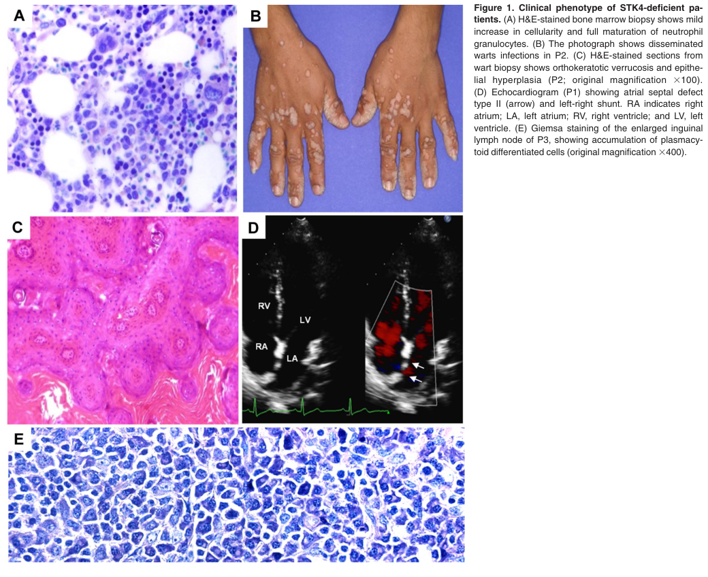

## Question

# Disease Characteristics Research Template

## Target Disease
- **Disease Name:** STK4 Deficiency
- **MONDO ID:**  (if available)
- **Category:** Mendelian

## Research Objectives

Please provide a comprehensive research report on **STK4 Deficiency** covering all of the
disease characteristics listed below. This report will be used to populate a disease knowledge
base entry. Be thorough and cite primary literature (PMID preferred) for all claims.

For each section, **suggested databases/resources** are listed. These are the first places
you should search for information on each topic.

---

### 1. Disease Information
> **Search first:** OMIM, Orphanet, ICD-10/ICD-11, MeSH, PubMed

- What is the disease? Provide a concise overview.
- What are the key identifiers? (OMIM, Orphanet, ICD-10/ICD-11, MeSH, Mondo)
- What are the common synonyms and alternative names?
- Is the information derived from individual patients (e.g., EHR) or aggregated disease-level resources?

### 2. Etiology

- **Disease Causal Factors**: What are the primary causes? (genetic, environmental, infectious, mechanistic)
- **Risk Factors**:
  > **Search first:** PubMed, Cochrane Library, UpToDate, clinical guidelines, ClinVar, ClinGen, GWAS Catalog, PheGenI, CTD, CDC, WHO, epidemiological databases
  - Genetic risk factors (causal variants, susceptibility loci, modifier genes)
  - Environmental risk factors (toxins, lifestyle, occupational exposures, age, sex, family history)
- **Protective Factors**:
  > **Search first:** PubMed, Cochrane Library, clinical trial databases, GWAS Catalog, gnomAD, WHO, CDC, nutrition databases
  - Genetic protective factors (protective variants, modifier alleles)
  - Environmental protective factors (diet, lifestyle, exposures that reduce risk)
- **Gene-Environment Interactions**: How do genetic and environmental factors interact to influence disease?
  > **Search first:** CTD, PubMed, PheGenI, GxE databases

### 3. Phenotypes
> **Search first:** HPO (Human Phenotype Ontology), OMIM, Orphanet, PubMed, clinicaltrials.gov, MedDRA, SNOMED CT, DECIPHER, LOINC

For each phenotype, provide:
- **Phenotype type**: symptoms, clinical signs, physical manifestations, behavioral changes, or laboratory abnormalities
  > For symptoms/signs: HPO, OMIM, Orphanet, PubMed
  > For behavioral changes: HPO, DSM, RDoC (Research Domain Criteria), PubMed
  > For laboratory abnormalities: LOINC, SNOMED CT, LabTests Online, PubMed
- **Phenotype characteristics**:
  > **Search first:** OMIM, Orphanet, HPO, PubMed
  - Age of symptom onset (neonatal, childhood, adult-onset, late-onset)
  - Symptom severity (mild, moderate, severe, variable)
  - Symptom progression (stable, progressive, episodic, fluctuating)
  - Frequency among affected individuals (percentage or qualitative)
- **Quality of life impact**: Effects on daily functioning and well-being (per-phenotype when possible)
  > **Search first:** EQ-5D database, SF-36, WHO QOL databases, PubMed
- Suggest HPO (Human Phenotype Ontology) terms for each phenotype

### 4. Genetic/Molecular Information

- **Causal Genes**: Gene mutations or chromosomal abnormalities responsible for disease (gene symbols, OMIM IDs)
  > **Search first:** OMIM, ClinVar, HGMD, Ensembl, NCBI Gene
- **Pathogenic Variants**:
  - Affected genes (gene symbols, HGNC IDs)
    > **Search first:** OMIM, NCBI Gene, Ensembl, HGNC, UniProt, GeneCards
  - Variant classification (pathogenic, likely pathogenic, VUS per ACMG/AMP guidelines)
    > **Search first:** ClinVar, ClinGen, ACMG/AMP guidelines, VarSome
  - Variant type/class (missense, frameshift, nonsense, splice-site, structural)
  - Allele frequency in population databases
    > **Search first:** gnomAD, 1000 Genomes, ExAC, TOPMed, dbSNP
  - Somatic vs germline origin
    > **Search first:** COSMIC (somatic), ClinVar, ICGC, TCGA
  - Functional consequences (loss of function, gain of function, dominant negative)
- **Modifier Genes**: Genes that modify disease severity or expression
- **Epigenetic Information**: DNA methylation, histone modifications, chromatin changes affecting disease
  > **Search first:** ENCODE, Roadmap Epigenomics, MethBase, DiseaseMeth
- **Chromosomal Abnormalities**: Large-scale genetic changes (aneuploidy, translocations, inversions)
  > **Search first:** DECIPHER, ClinVar, ECARUCA, UCSC Genome Browser

### 5. Environmental Information

- **Environmental Factors**: Non-genetic contributing factors (toxins, radiation, pollution, occupational exposure)
  > **Search first:** CTD (Comparative Toxicogenomics Database), TOXNET, PubMed, EPA databases
- **Lifestyle Factors**: Behavioral factors (smoking, diet, exercise, alcohol consumption)
  > **Search first:** CDC databases, WHO, PubMed, NHANES
- **Infectious Agents**: If applicable, pathogens causing or triggering disease (bacteria, viruses, fungi, parasites)
  > **Search first:** NCBI Taxonomy, ViPR, BV-BRC, MicrobeDB, GIDEON

### 6. Mechanism / Pathophysiology

- **Molecular Pathways**: Specific signaling cascades or biochemical pathways involved (Wnt, MAPK, mTOR, PI3K-AKT, etc.)
  > **Search first:** KEGG, Reactome, WikiPathways, PathBank, BioCyc
- **Cellular Processes**: Cell-level mechanisms (apoptosis, autophagy, cell cycle dysregulation, inflammation, etc.)
  > **Search first:** Gene Ontology (GO), Reactome, KEGG, PubMed
- **Protein Dysfunction**: How protein structure or function is altered (misfolding, aggregation, loss of function, gain of function)
  > **Search first:** UniProt, PDB (Protein Data Bank), InterPro, Pfam, AlphaFold
- **Metabolic Changes**: Alterations in metabolic processes (energy metabolism, lipid metabolism, amino acid metabolism)
  > **Search first:** KEGG, BioCyc, HMDB (Human Metabolome Database), BRENDA
- **Immune System Involvement**: Role of immune response (autoimmunity, immunodeficiency, chronic inflammation)
  > **Search first:** ImmPort, Immunome Database, IEDB, Gene Ontology
- **Tissue Damage Mechanisms**: How tissues/ are injured (oxidative stress, ischemia, fibrosis, necrosis)
  > **Search first:** PubMed, Gene Ontology, Reactome
- **Biochemical Abnormalities**: Specific molecular defects (enzyme deficiencies, receptor dysfunction, ion channel defects)
  > **Search first:** BRENDA, UniProt, KEGG, OMIM, PubMed
- **Epigenetic Changes**: DNA methylation, histone modifications affecting gene expression in disease
  > **Search first:** ENCODE, Roadmap Epigenomics, MethBase, DiseaseMeth
- **Molecular Profiling** (if available):
  - Transcriptomics/gene expression changes
    > **Search first:** GEO (Gene Expression Omnibus), ArrayExpress, GTEx, Human Cell Atlas, SRA
  - Proteomics findings
    > **Search first:** PRIDE, ProteomeXchange, Human Protein Atlas, STRING, BioGRID
  - Metabolomics signatures
    > **Search first:** MetaboLights, Metabolomics Workbench, HMDB, METLIN
  - Lipidomics alterations
    > **Search first:** LIPID MAPS, SwissLipids, LipidHome, Metabolomics Workbench
  - Genomic structural features
    > **Search first:** UCSC Genome Browser, Ensembl, NCBI, dbVar, DGV
- **Advanced Technologies** (if applicable):
  - Single-cell analysis findings (cell-type specific mechanisms, cellular heterogeneity)
    > **Search first:** Human Cell Atlas, Single Cell Portal, GEO, CELLxGENE
  - Spatial transcriptomics findings
    > **Search first:** GEO, Spatial Research, Vizgen, 10x Genomics data
  - Multi-omics integration results
    > **Search first:** TCGA, ICGC, cBioPortal, LinkedOmics, PubMed
  - Functional genomics screens (CRISPR, RNAi)
    > **Search first:** DepMap, GenomeRNAi, PubMed, BioGRID ORCS

For each mechanism, describe:
- The causal chain from initial trigger to clinical manifestation
- Which mechanisms are upstream vs downstream
- What cell types and biological processes are involved
- Suggest GO terms for biological processes and CL terms for cell types

### 7. Anatomical Structures Affected

- **Organ Level**:
  - Primary organs directly affected
  - Secondary organ involvement (complications, secondary effects)
  - Body systems involved (cardiovascular, nervous, digestive, respiratory, endocrine, etc.)
  > **Search first:** Uberon, FMA (Foundational Model of Anatomy), OMIM, HPO, ICD-11, MeSH, SNOMED CT
- **Tissue and Cell Level**:
  - Specific tissue types affected (epithelial, connective, muscle, nervous)
  - Specific cell populations targeted (with Cell Ontology terms)
  > **Search first:** Uberon, Human Protein Atlas, Cell Ontology, Human Cell Atlas, CellMarker, PanglaoDB
- **Subcellular Level**:
  - Cellular compartments involved (mitochondria, nucleus, ER, lysosomes) (with GO Cellular Component terms)
  > **Search first:** Gene Ontology (Cellular Component), UniProt, Human Protein Atlas
- **Localization**:
  - Specific anatomical sites (with UBERON terms)
    > **Search first:** FMA, Uberon, NeuroNames (for brain), SNOMED CT
  - Lateralization (unilateral, bilateral, asymmetric)
    > **Search first:** HPO, clinical literature, imaging databases

### 8. Temporal Development

- **Onset**:
  - Typical age of onset (congenital, pediatric, adult, geriatric)
  - Onset pattern (acute, subacute, chronic, insidious)
  > **Search first:** OMIM, Orphanet, HPO, PubMed
- **Progression**:
  - Disease stages (early, intermediate, advanced, end-stage)
    > **Search first:** Cancer Staging Manual (AJCC), WHO classifications, PubMed
  - Progression rate (rapid, slow, variable)
  - Disease course pattern (episodic, relapsing-remitting, progressive, stable)
  - Disease duration (self-limited, chronic lifelong)
  > **Search first:** Disease registries, longitudinal cohort databases, natural history studies, PubMed, Orphanet, OMIM
- **Patterns**:
  - Remission patterns (spontaneous, treatment-induced)
    > **Search first:** Clinical trial databases, disease registries, PubMed
  - Critical periods (time windows of vulnerability or opportunity for intervention)
    > **Search first:** PubMed, developmental biology databases, clinical guidelines

### 9. Inheritance and Population

- **Epidemiology**:
  - Prevalence (cases per 100,000 at given time)
  - Incidence (new cases per 100,000 per year)
  > **Search first:** Orphanet, CDC, WHO, GBD (Global Burden of Disease), national registries, SEER, disease registries
- **For Genetic Etiology**:
  - Inheritance pattern (AD, AR, X-linked, mitochondrial, multifactorial, polygenic)
    > **Search first:** OMIM, Orphanet, ClinVar, GTR (Genetic Testing Registry)
  - Penetrance (complete, incomplete, age-dependent)
    > **Search first:** ClinVar, OMIM, PubMed, ClinGen
  - Expressivity (variable, consistent)
    > **Search first:** OMIM, ClinVar, PubMed
  - Genetic anticipation (increasing severity in successive generations)
    > **Search first:** OMIM, PubMed (especially for repeat expansion disorders)
  - Germline mosaicism
    > **Search first:** ClinVar, OMIM, genetic counseling literature, PubMed
  - Founder effects (population-specific mutations)
    > **Search first:** gnomAD, population genetics databases, PubMed
  - Consanguinity role
    > **Search first:** OMIM, population studies, genetic counseling resources
  - Carrier frequency
    > **Search first:** gnomAD, carrier screening databases, GeneReviews, GTR
- **Population Demographics**:
  - Affected populations (ethnic or demographic groups with higher prevalence)
    > **Search first:** gnomAD, 1000 Genomes, PAGE Study, PubMed, population registries
  - Geographic distribution (endemic areas, regional variation)
    > **Search first:** WHO, CDC, GBD, Orphanet, geographic epidemiology databases
  - Geographic distribution of specific variants
  - Sex ratio (male:female)
    > **Search first:** Disease registries, OMIM, PubMed, epidemiological databases
  - Age distribution of affected individuals
    > **Search first:** CDC, disease registries, SEER, Orphanet

### 10. Diagnostics

- **Clinical Tests**:
  - Laboratory tests (blood, urine, tissue chemistry, specific enzyme assays)
    > **Search first:** LOINC, LabTests Online, PubMed
  - Biomarkers (proteins, metabolites, genetic markers, circulating biomarkers)
    > **Search first:** FDA Biomarker List, BEST (Biomarkers, EndpointS, and other Tools), PubMed
  - Imaging studies (X-ray, CT, MRI, PET, ultrasound)
    > **Search first:** RadLex, DICOM, Radiopaedia, imaging databases
  - Functional tests (pulmonary function, cardiac stress tests)
    > **Search first:** LOINC, clinical guidelines, PubMed
  - Electrophysiology (EEG, EMG, ECG, nerve conduction studies)
    > **Search first:** LOINC, clinical neurophysiology databases, PubMed
  - Biopsy findings (histopathology, immunohistochemistry)
    > **Search first:** SNOMED CT, College of American Pathologists resources, PubMed
  - Pathology findings (microscopic examination)
    > **Search first:** SNOMED CT, Digital Pathology databases, PubMed
- **Genetic Testing**:
  > **Search first:** GTR (Genetic Testing Registry), GeneReviews, ClinGen
  - Overview of recommended genetic testing approach
  - Whole genome sequencing (WGS) utility
    > **Search first:** GTR, ClinVar, GEL (Genomics England), gnomAD
  - Whole exome sequencing (WES) utility
    > **Search first:** GTR, ClinVar, OMIM, GeneMatcher
  - Gene panels (which panels, which genes)
    > **Search first:** GTR, ClinVar, laboratory-specific databases
  - Single gene testing
    > **Search first:** GTR, ClinVar, OMIM, GeneReviews
  - Chromosomal microarray (CMA)
    > **Search first:** DECIPHER, ClinVar, dbVar, ECARUCA
  - Karyotyping
    > **Search first:** Chromosome Abnormality Database, ClinVar, cytogenetics resources
  - FISH
    > **Search first:** ClinVar, cytogenetics databases, PubMed
  - Mitochondrial DNA testing
    > **Search first:** MITOMAP, MSeqDR, ClinVar, GTR
  - Repeat expansion testing
    > **Search first:** GTR, ClinVar, repeat expansion databases, PubMed
- **Omics-Based Diagnostics** (if applicable):
  - RNA sequencing / transcriptomics
    > **Search first:** GEO, ArrayExpress, GTEx, RNA-seq databases
  - Proteomics
    > **Search first:** PRIDE, ProteomeXchange, FDA Biomarker database
  - Metabolomics
    > **Search first:** MetaboLights, Metabolomics Workbench, HMDB
  - Epigenomics
    > **Search first:** GEO, ENCODE, Roadmap Epigenomics, MethBase
  - Liquid biopsy
    > **Search first:** COSMIC, ClinVar, liquid biopsy databases, PubMed
- **Clinical Criteria**:
  - Standardized diagnostic criteria (DSM, ICD, society guidelines)
    > **Search first:** DSM-5, ICD-11, clinical society guidelines, UpToDate
  - Differential diagnosis (other conditions to rule out, with distinguishing features)
    > **Search first:** DynaMed, UpToDate, clinical decision support systems
- **Screening**:
  - Screening methods for asymptomatic individuals (newborn screening, carrier screening, cascade screening)
    > **Search first:** ACMG recommendations, CDC newborn screening, GTR

### 11. Outcome/Prognosis

- **Survival and Mortality**:
  - Survival rate (5-year, 10-year, overall)
    > **Search first:** SEER, cancer registries, disease-specific registries, PubMed
  - Life expectancy (with and without treatment if applicable)
    > **Search first:** Orphanet, disease registries, actuarial databases, PubMed
  - Mortality rate
    > **Search first:** CDC, WHO, GBD, national mortality databases
  - Disease-specific mortality (deaths directly attributable to disease)
    > **Search first:** Disease registries, CDC Wonder, GBD, PubMed
- **Morbidity and Function**:
  - Morbidity (disease-related disability and health impacts)
    > **Search first:** GBD, WHO, disability databases, PubMed
  - Disability outcomes (long-term functional impairments)
    > **Search first:** ICF (International Classification of Functioning), disability registries
  - Quality of life measures (EQ-5D, SF-36, PROMIS, disease-specific tools)
    > **Search first:** EQ-5D database, SF-36, PROMIS, PubMed
- **Disease Course**:
  - Complications (secondary problems: infections, organ failure, etc.)
    > **Search first:** ICD codes, disease registries, clinical databases, PubMed
  - Recovery potential (likelihood and extent of recovery, with vs without treatment)
    > **Search first:** Natural history studies, rehabilitation databases, PubMed
- **Prediction**:
  - Prognostic factors (age, disease severity, biomarkers, treatment response)
    > **Search first:** Prognostic models databases, clinical calculators, PubMed
  - Prognostic biomarkers (molecular markers predicting disease course)
    > **Search first:** FDA Biomarker database, PubMed, cancer prognostic databases

### 12. Treatment

- **Pharmacotherapy**:
  - Pharmacological treatments (drug names, drug classes, mechanisms of action)
    > **Search first:** DrugBank, RxNorm, ATC classification, DailyMed, FDA databases
  - Pharmacogenomics (how genetic variants affect drug metabolism, efficacy, toxicity)
    > **Search first:** PharmGKB, CPIC (Clinical Pharmacogenetics), FDA Table of PGx Biomarkers
- **Advanced Therapeutics**:
  - Gene therapy (viral vectors, CRISPR, gene replacement, gene editing)
    > **Search first:** ClinicalTrials.gov, FDA gene therapy database, ASGCT resources
  - Cell therapy (stem cell transplant, CAR-T, cellular therapeutics)
    > **Search first:** ClinicalTrials.gov, FDA cell therapy database, FACT standards
  - RNA-based therapies (ASOs, siRNA, mRNA therapies)
    > **Search first:** ClinicalTrials.gov, FDA approvals, PubMed
  - Targeted therapies (treatments directed at specific molecular targets)
    > **Search first:** My Cancer Genome, OncoKB, ClinicalTrials.gov, FDA approvals
  - Immunotherapies (checkpoint inhibitors, monoclonal antibodies)
    > **Search first:** Cancer Immunotherapy Database, FDA approvals, ClinicalTrials.gov
- **Surgical and Interventional**:
  - Surgical interventions (types of surgery, timing, outcomes)
    > **Search first:** CPT codes, surgical registries, clinical guidelines, PubMed
- **Supportive and Rehabilitative**:
  - Supportive care (symptom management, pain control, nutrition)
    > **Search first:** Clinical guidelines, Cochrane Library, PubMed
  - Rehabilitation (physical therapy, occupational therapy, speech therapy)
    > **Search first:** Rehabilitation medicine databases, clinical guidelines, PubMed
- **Experimental**:
  - Experimental treatments in clinical trials (with NCT identifiers if available)
    > **Search first:** ClinicalTrials.gov, EU Clinical Trials Register, WHO ICTRP
- **Treatment Outcomes**:
  - Treatment response rates
    > **Search first:** Clinical trial databases, FDA reviews, systematic reviews, PubMed
  - Side effects and adverse events
    > **Search first:** FDA Adverse Event Reporting System (FAERS), MedWatch, PubMed
- **Treatment Strategy**:
  - Treatment algorithms (clinical pathways, decision trees)
    > **Search first:** Clinical practice guidelines, NCCN Guidelines, UpToDate
  - Combination therapies
    > **Search first:** ClinicalTrials.gov, treatment guidelines, PubMed
  - Personalized medicine approaches (genotype-guided treatment)
    > **Search first:** My Cancer Genome, CIViC, PharmGKB, precision medicine databases

For each treatment, suggest MAXO (Medical Action Ontology) terms where applicable.

### 13. Prevention

- **Prevention Levels**:
  - Primary prevention (preventing disease occurrence: vaccination, risk factor modification)
    > **Search first:** CDC, WHO, USPSTF recommendations, Cochrane Library
  - Secondary prevention (early detection and treatment: screening programs, early intervention)
    > **Search first:** USPSTF, CDC screening guidelines, WHO
  - Tertiary prevention (preventing complications in those with disease)
    > **Search first:** Clinical guidelines, disease management protocols, PubMed
- **Immunization**: Vaccine strategies (if applicable)
  > **Search first:** CDC vaccine schedules, WHO immunization, FDA vaccine database
- **Screening and Early Detection**:
  - Screening programs (population-based: newborn screening, cancer screening)
    > **Search first:** CDC screening programs, USPSTF, cancer screening databases
  - Genetic screening (carrier screening, preimplantation genetic diagnosis, prenatal testing)
    > **Search first:** ACMG recommendations, ACOG guidelines, GTR
  - Risk stratification (identifying high-risk individuals for targeted prevention)
    > **Search first:** Risk prediction models, clinical calculators, PubMed
- **Behavioral Interventions**: Lifestyle modifications to reduce risk
  > **Search first:** CDC, WHO, behavioral intervention databases, Cochrane Library
- **Counseling**: Genetic counseling (risk assessment, family planning guidance)
  > **Search first:** NSGC resources, ACMG guidelines, GeneReviews
- **Public Health**:
  - Public health interventions (sanitation, vector control, health education)
    > **Search first:** CDC, WHO, public health databases, PubMed
  - Environmental interventions (reducing environmental risk factors)
    > **Search first:** EPA databases, WHO environmental health, PubMed
- **Prophylaxis**: Preventive medications or procedures
  > **Search first:** Clinical guidelines, FDA approvals, PubMed

### 14. Other Species / Natural Disease

- **Taxonomy**: Species affected (with NCBI Taxon identifiers)
  > **Search first:** NCBI Taxonomy
- **Breed**: Specific breeds affected (with VBO identifiers if applicable)
  > **Search first:** VBO (Vertebrate Breed Ontology)
- **Gene**: Orthologous genes in other species (with NCBI Gene IDs)
  > **Search first:** NCBI Gene
- **Natural Disease**:
  - Naturally occurring disease in other species (companion animals, wildlife)
    > **Search first:** OMIA (Online Mendelian Inheritance in Animals), VetCompass, PubMed
  - Veterinary relevance and importance in animal health
    > **Search first:** OMIA, veterinary databases, PubMed
- **Comparative Biology**:
  - Comparative pathology (similarities and differences across species)
    > **Search first:** OMIA, comparative pathology databases, PubMed
  - Evolutionary conservation of disease mechanisms
    > **Search first:** HomoloGene, OrthoMCL, Alliance of Genome Resources
- **Transmission** (if applicable):
  - Zoonotic potential
    > **Search first:** CDC zoonotic diseases, WHO zoonoses, GIDEON
  - Cross-species susceptibility
    > **Search first:** NCBI Taxonomy, veterinary databases, PubMed

### 15. Model Organisms

- **Model Types**:
  - Model organism type (mammalian, invertebrate, cellular, in vitro)
    > **Search first:** Alliance of Genome Resources, model organism databases
  - Specific model systems (mouse, rat, zebrafish, Drosophila, C. elegans, yeast, cell lines, organoids, iPSCs)
    > **Search first:** MGI, RGD, ZFIN, FlyBase, WormBase, SGD, ATCC, Cellosaurus
  - Induced models (drug treatment, surgical intervention, environmental manipulation)
    > **Search first:** MGI, model organism databases, PubMed
- **Genetic Models**:
  - Types available (knockout, knock-in, transgenic, conditional, humanized)
    > **Search first:** MGI, IMPC, KOMP, EuMMCR, IMSR
- **Model Characteristics**:
  - Phenotype recapitulation (how well model reproduces human disease features)
    > **Search first:** Model organism databases, comparative studies, PubMed
  - Model limitations (aspects of human disease not captured)
    > **Search first:** Model organism databases, PubMed, review articles
- **Applications**:
  - Research applications (what aspects of disease can be studied)
    > **Search first:** Model organism databases, PubMed
- **Resources**:
  - Model databases
    > **Search first:** MGI, RGD, ZFIN, FlyBase, WormBase, IMSR, EMMA, MMRRC

---

## Citation Requirements

- Cite primary literature (PMID preferred) for all mechanistic and clinical claims
- Prioritize recent reviews and landmark papers
- Include direct quotes from abstracts where possible to support key statements
- Distinguish evidence source types: human clinical, model organism, in vitro, computational

## Output Format

Structure your response as a comprehensive narrative organized by the sections above.
For each section, provide:
- Factual content with specific details (numbers, percentages, gene names, variant nomenclature)
- Ontology term suggestions (HPO, GO, CL, UBERON, CHEBI, MAXO, MONDO) where applicable
- Evidence citations with PMIDs
- Direct quotes from abstracts to support key claims
- Clear indication when information is not available or not applicable for this disease

This report will be used to populate a disease knowledge base entry with:
- Pathophysiology descriptions with causal chains
- Gene/protein annotations (HGNC, GO terms)
- Phenotype associations (HP terms) with frequencies
- Cell type involvement (CL terms)
- Anatomical locations (UBERON terms)
- Chemical entities (CHEBI terms)
- Treatment annotations (MAXO terms)
- Evidence items with PMIDs and exact abstract quotes
- Epidemiology, prognosis, diagnostic, and prevention information
- Animal model descriptions with phenotype recapitulation details

## Output

Question: You are an expert researcher providing comprehensive, well-cited information.

Provide detailed information focusing on:
1. Key concepts and definitions with current understanding
2. Recent developments and latest research (prioritize 2023-2024 sources)
3. Current applications and real-world implementations
4. Expert opinions and analysis from authoritative sources
5. Relevant statistics and data from recent studies

Format as a comprehensive research report with proper citations. Include URLs and publication dates where available.
Always prioritize recent, authoritative sources and provide specific citations for all major claims.

# Disease Characteristics Research Template

## Target Disease
- **Disease Name:** STK4 Deficiency
- **MONDO ID:**  (if available)
- **Category:** Mendelian

## Research Objectives

Please provide a comprehensive research report on **STK4 Deficiency** covering all of the
disease characteristics listed below. This report will be used to populate a disease knowledge
base entry. Be thorough and cite primary literature (PMID preferred) for all claims.

For each section, **suggested databases/resources** are listed. These are the first places
you should search for information on each topic.

---

### 1. Disease Information
> **Search first:** OMIM, Orphanet, ICD-10/ICD-11, MeSH, PubMed

- What is the disease? Provide a concise overview.
- What are the key identifiers? (OMIM, Orphanet, ICD-10/ICD-11, MeSH, Mondo)
- What are the common synonyms and alternative names?
- Is the information derived from individual patients (e.g., EHR) or aggregated disease-level resources?

### 2. Etiology

- **Disease Causal Factors**: What are the primary causes? (genetic, environmental, infectious, mechanistic)
- **Risk Factors**:
  > **Search first:** PubMed, Cochrane Library, UpToDate, clinical guidelines, ClinVar, ClinGen, GWAS Catalog, PheGenI, CTD, CDC, WHO, epidemiological databases
  - Genetic risk factors (causal variants, susceptibility loci, modifier genes)
  - Environmental risk factors (toxins, lifestyle, occupational exposures, age, sex, family history)
- **Protective Factors**:
  > **Search first:** PubMed, Cochrane Library, clinical trial databases, GWAS Catalog, gnomAD, WHO, CDC, nutrition databases
  - Genetic protective factors (protective variants, modifier alleles)
  - Environmental protective factors (diet, lifestyle, exposures that reduce risk)
- **Gene-Environment Interactions**: How do genetic and environmental factors interact to influence disease?
  > **Search first:** CTD, PubMed, PheGenI, GxE databases

### 3. Phenotypes
> **Search first:** HPO (Human Phenotype Ontology), OMIM, Orphanet, PubMed, clinicaltrials.gov, MedDRA, SNOMED CT, DECIPHER, LOINC

For each phenotype, provide:
- **Phenotype type**: symptoms, clinical signs, physical manifestations, behavioral changes, or laboratory abnormalities
  > For symptoms/signs: HPO, OMIM, Orphanet, PubMed
  > For behavioral changes: HPO, DSM, RDoC (Research Domain Criteria), PubMed
  > For laboratory abnormalities: LOINC, SNOMED CT, LabTests Online, PubMed
- **Phenotype characteristics**:
  > **Search first:** OMIM, Orphanet, HPO, PubMed
  - Age of symptom onset (neonatal, childhood, adult-onset, late-onset)
  - Symptom severity (mild, moderate, severe, variable)
  - Symptom progression (stable, progressive, episodic, fluctuating)
  - Frequency among affected individuals (percentage or qualitative)
- **Quality of life impact**: Effects on daily functioning and well-being (per-phenotype when possible)
  > **Search first:** EQ-5D database, SF-36, WHO QOL databases, PubMed
- Suggest HPO (Human Phenotype Ontology) terms for each phenotype

### 4. Genetic/Molecular Information

- **Causal Genes**: Gene mutations or chromosomal abnormalities responsible for disease (gene symbols, OMIM IDs)
  > **Search first:** OMIM, ClinVar, HGMD, Ensembl, NCBI Gene
- **Pathogenic Variants**:
  - Affected genes (gene symbols, HGNC IDs)
    > **Search first:** OMIM, NCBI Gene, Ensembl, HGNC, UniProt, GeneCards
  - Variant classification (pathogenic, likely pathogenic, VUS per ACMG/AMP guidelines)
    > **Search first:** ClinVar, ClinGen, ACMG/AMP guidelines, VarSome
  - Variant type/class (missense, frameshift, nonsense, splice-site, structural)
  - Allele frequency in population databases
    > **Search first:** gnomAD, 1000 Genomes, ExAC, TOPMed, dbSNP
  - Somatic vs germline origin
    > **Search first:** COSMIC (somatic), ClinVar, ICGC, TCGA
  - Functional consequences (loss of function, gain of function, dominant negative)
- **Modifier Genes**: Genes that modify disease severity or expression
- **Epigenetic Information**: DNA methylation, histone modifications, chromatin changes affecting disease
  > **Search first:** ENCODE, Roadmap Epigenomics, MethBase, DiseaseMeth
- **Chromosomal Abnormalities**: Large-scale genetic changes (aneuploidy, translocations, inversions)
  > **Search first:** DECIPHER, ClinVar, ECARUCA, UCSC Genome Browser

### 5. Environmental Information

- **Environmental Factors**: Non-genetic contributing factors (toxins, radiation, pollution, occupational exposure)
  > **Search first:** CTD (Comparative Toxicogenomics Database), TOXNET, PubMed, EPA databases
- **Lifestyle Factors**: Behavioral factors (smoking, diet, exercise, alcohol consumption)
  > **Search first:** CDC databases, WHO, PubMed, NHANES
- **Infectious Agents**: If applicable, pathogens causing or triggering disease (bacteria, viruses, fungi, parasites)
  > **Search first:** NCBI Taxonomy, ViPR, BV-BRC, MicrobeDB, GIDEON

### 6. Mechanism / Pathophysiology

- **Molecular Pathways**: Specific signaling cascades or biochemical pathways involved (Wnt, MAPK, mTOR, PI3K-AKT, etc.)
  > **Search first:** KEGG, Reactome, WikiPathways, PathBank, BioCyc
- **Cellular Processes**: Cell-level mechanisms (apoptosis, autophagy, cell cycle dysregulation, inflammation, etc.)
  > **Search first:** Gene Ontology (GO), Reactome, KEGG, PubMed
- **Protein Dysfunction**: How protein structure or function is altered (misfolding, aggregation, loss of function, gain of function)
  > **Search first:** UniProt, PDB (Protein Data Bank), InterPro, Pfam, AlphaFold
- **Metabolic Changes**: Alterations in metabolic processes (energy metabolism, lipid metabolism, amino acid metabolism)
  > **Search first:** KEGG, BioCyc, HMDB (Human Metabolome Database), BRENDA
- **Immune System Involvement**: Role of immune response (autoimmunity, immunodeficiency, chronic inflammation)
  > **Search first:** ImmPort, Immunome Database, IEDB, Gene Ontology
- **Tissue Damage Mechanisms**: How tissues/ are injured (oxidative stress, ischemia, fibrosis, necrosis)
  > **Search first:** PubMed, Gene Ontology, Reactome
- **Biochemical Abnormalities**: Specific molecular defects (enzyme deficiencies, receptor dysfunction, ion channel defects)
  > **Search first:** BRENDA, UniProt, KEGG, OMIM, PubMed
- **Epigenetic Changes**: DNA methylation, histone modifications affecting gene expression in disease
  > **Search first:** ENCODE, Roadmap Epigenomics, MethBase, DiseaseMeth
- **Molecular Profiling** (if available):
  - Transcriptomics/gene expression changes
    > **Search first:** GEO (Gene Expression Omnibus), ArrayExpress, GTEx, Human Cell Atlas, SRA
  - Proteomics findings
    > **Search first:** PRIDE, ProteomeXchange, Human Protein Atlas, STRING, BioGRID
  - Metabolomics signatures
    > **Search first:** MetaboLights, Metabolomics Workbench, HMDB, METLIN
  - Lipidomics alterations
    > **Search first:** LIPID MAPS, SwissLipids, LipidHome, Metabolomics Workbench
  - Genomic structural features
    > **Search first:** UCSC Genome Browser, Ensembl, NCBI, dbVar, DGV
- **Advanced Technologies** (if applicable):
  - Single-cell analysis findings (cell-type specific mechanisms, cellular heterogeneity)
    > **Search first:** Human Cell Atlas, Single Cell Portal, GEO, CELLxGENE
  - Spatial transcriptomics findings
    > **Search first:** GEO, Spatial Research, Vizgen, 10x Genomics data
  - Multi-omics integration results
    > **Search first:** TCGA, ICGC, cBioPortal, LinkedOmics, PubMed
  - Functional genomics screens (CRISPR, RNAi)
    > **Search first:** DepMap, GenomeRNAi, PubMed, BioGRID ORCS

For each mechanism, describe:
- The causal chain from initial trigger to clinical manifestation
- Which mechanisms are upstream vs downstream
- What cell types and biological processes are involved
- Suggest GO terms for biological processes and CL terms for cell types

### 7. Anatomical Structures Affected

- **Organ Level**:
  - Primary organs directly affected
  - Secondary organ involvement (complications, secondary effects)
  - Body systems involved (cardiovascular, nervous, digestive, respiratory, endocrine, etc.)
  > **Search first:** Uberon, FMA (Foundational Model of Anatomy), OMIM, HPO, ICD-11, MeSH, SNOMED CT
- **Tissue and Cell Level**:
  - Specific tissue types affected (epithelial, connective, muscle, nervous)
  - Specific cell populations targeted (with Cell Ontology terms)
  > **Search first:** Uberon, Human Protein Atlas, Cell Ontology, Human Cell Atlas, CellMarker, PanglaoDB
- **Subcellular Level**:
  - Cellular compartments involved (mitochondria, nucleus, ER, lysosomes) (with GO Cellular Component terms)
  > **Search first:** Gene Ontology (Cellular Component), UniProt, Human Protein Atlas
- **Localization**:
  - Specific anatomical sites (with UBERON terms)
    > **Search first:** FMA, Uberon, NeuroNames (for brain), SNOMED CT
  - Lateralization (unilateral, bilateral, asymmetric)
    > **Search first:** HPO, clinical literature, imaging databases

### 8. Temporal Development

- **Onset**:
  - Typical age of onset (congenital, pediatric, adult, geriatric)
  - Onset pattern (acute, subacute, chronic, insidious)
  > **Search first:** OMIM, Orphanet, HPO, PubMed
- **Progression**:
  - Disease stages (early, intermediate, advanced, end-stage)
    > **Search first:** Cancer Staging Manual (AJCC), WHO classifications, PubMed
  - Progression rate (rapid, slow, variable)
  - Disease course pattern (episodic, relapsing-remitting, progressive, stable)
  - Disease duration (self-limited, chronic lifelong)
  > **Search first:** Disease registries, longitudinal cohort databases, natural history studies, PubMed, Orphanet, OMIM
- **Patterns**:
  - Remission patterns (spontaneous, treatment-induced)
    > **Search first:** Clinical trial databases, disease registries, PubMed
  - Critical periods (time windows of vulnerability or opportunity for intervention)
    > **Search first:** PubMed, developmental biology databases, clinical guidelines

### 9. Inheritance and Population

- **Epidemiology**:
  - Prevalence (cases per 100,000 at given time)
  - Incidence (new cases per 100,000 per year)
  > **Search first:** Orphanet, CDC, WHO, GBD (Global Burden of Disease), national registries, SEER, disease registries
- **For Genetic Etiology**:
  - Inheritance pattern (AD, AR, X-linked, mitochondrial, multifactorial, polygenic)
    > **Search first:** OMIM, Orphanet, ClinVar, GTR (Genetic Testing Registry)
  - Penetrance (complete, incomplete, age-dependent)
    > **Search first:** ClinVar, OMIM, PubMed, ClinGen
  - Expressivity (variable, consistent)
    > **Search first:** OMIM, ClinVar, PubMed
  - Genetic anticipation (increasing severity in successive generations)
    > **Search first:** OMIM, PubMed (especially for repeat expansion disorders)
  - Germline mosaicism
    > **Search first:** ClinVar, OMIM, genetic counseling literature, PubMed
  - Founder effects (population-specific mutations)
    > **Search first:** gnomAD, population genetics databases, PubMed
  - Consanguinity role
    > **Search first:** OMIM, population studies, genetic counseling resources
  - Carrier frequency
    > **Search first:** gnomAD, carrier screening databases, GeneReviews, GTR
- **Population Demographics**:
  - Affected populations (ethnic or demographic groups with higher prevalence)
    > **Search first:** gnomAD, 1000 Genomes, PAGE Study, PubMed, population registries
  - Geographic distribution (endemic areas, regional variation)
    > **Search first:** WHO, CDC, GBD, Orphanet, geographic epidemiology databases
  - Geographic distribution of specific variants
  - Sex ratio (male:female)
    > **Search first:** Disease registries, OMIM, PubMed, epidemiological databases
  - Age distribution of affected individuals
    > **Search first:** CDC, disease registries, SEER, Orphanet

### 10. Diagnostics

- **Clinical Tests**:
  - Laboratory tests (blood, urine, tissue chemistry, specific enzyme assays)
    > **Search first:** LOINC, LabTests Online, PubMed
  - Biomarkers (proteins, metabolites, genetic markers, circulating biomarkers)
    > **Search first:** FDA Biomarker List, BEST (Biomarkers, EndpointS, and other Tools), PubMed
  - Imaging studies (X-ray, CT, MRI, PET, ultrasound)
    > **Search first:** RadLex, DICOM, Radiopaedia, imaging databases
  - Functional tests (pulmonary function, cardiac stress tests)
    > **Search first:** LOINC, clinical guidelines, PubMed
  - Electrophysiology (EEG, EMG, ECG, nerve conduction studies)
    > **Search first:** LOINC, clinical neurophysiology databases, PubMed
  - Biopsy findings (histopathology, immunohistochemistry)
    > **Search first:** SNOMED CT, College of American Pathologists resources, PubMed
  - Pathology findings (microscopic examination)
    > **Search first:** SNOMED CT, Digital Pathology databases, PubMed
- **Genetic Testing**:
  > **Search first:** GTR (Genetic Testing Registry), GeneReviews, ClinGen
  - Overview of recommended genetic testing approach
  - Whole genome sequencing (WGS) utility
    > **Search first:** GTR, ClinVar, GEL (Genomics England), gnomAD
  - Whole exome sequencing (WES) utility
    > **Search first:** GTR, ClinVar, OMIM, GeneMatcher
  - Gene panels (which panels, which genes)
    > **Search first:** GTR, ClinVar, laboratory-specific databases
  - Single gene testing
    > **Search first:** GTR, ClinVar, OMIM, GeneReviews
  - Chromosomal microarray (CMA)
    > **Search first:** DECIPHER, ClinVar, dbVar, ECARUCA
  - Karyotyping
    > **Search first:** Chromosome Abnormality Database, ClinVar, cytogenetics resources
  - FISH
    > **Search first:** ClinVar, cytogenetics databases, PubMed
  - Mitochondrial DNA testing
    > **Search first:** MITOMAP, MSeqDR, ClinVar, GTR
  - Repeat expansion testing
    > **Search first:** GTR, ClinVar, repeat expansion databases, PubMed
- **Omics-Based Diagnostics** (if applicable):
  - RNA sequencing / transcriptomics
    > **Search first:** GEO, ArrayExpress, GTEx, RNA-seq databases
  - Proteomics
    > **Search first:** PRIDE, ProteomeXchange, FDA Biomarker database
  - Metabolomics
    > **Search first:** MetaboLights, Metabolomics Workbench, HMDB
  - Epigenomics
    > **Search first:** GEO, ENCODE, Roadmap Epigenomics, MethBase
  - Liquid biopsy
    > **Search first:** COSMIC, ClinVar, liquid biopsy databases, PubMed
- **Clinical Criteria**:
  - Standardized diagnostic criteria (DSM, ICD, society guidelines)
    > **Search first:** DSM-5, ICD-11, clinical society guidelines, UpToDate
  - Differential diagnosis (other conditions to rule out, with distinguishing features)
    > **Search first:** DynaMed, UpToDate, clinical decision support systems
- **Screening**:
  - Screening methods for asymptomatic individuals (newborn screening, carrier screening, cascade screening)
    > **Search first:** ACMG recommendations, CDC newborn screening, GTR

### 11. Outcome/Prognosis

- **Survival and Mortality**:
  - Survival rate (5-year, 10-year, overall)
    > **Search first:** SEER, cancer registries, disease-specific registries, PubMed
  - Life expectancy (with and without treatment if applicable)
    > **Search first:** Orphanet, disease registries, actuarial databases, PubMed
  - Mortality rate
    > **Search first:** CDC, WHO, GBD, national mortality databases
  - Disease-specific mortality (deaths directly attributable to disease)
    > **Search first:** Disease registries, CDC Wonder, GBD, PubMed
- **Morbidity and Function**:
  - Morbidity (disease-related disability and health impacts)
    > **Search first:** GBD, WHO, disability databases, PubMed
  - Disability outcomes (long-term functional impairments)
    > **Search first:** ICF (International Classification of Functioning), disability registries
  - Quality of life measures (EQ-5D, SF-36, PROMIS, disease-specific tools)
    > **Search first:** EQ-5D database, SF-36, PROMIS, PubMed
- **Disease Course**:
  - Complications (secondary problems: infections, organ failure, etc.)
    > **Search first:** ICD codes, disease registries, clinical databases, PubMed
  - Recovery potential (likelihood and extent of recovery, with vs without treatment)
    > **Search first:** Natural history studies, rehabilitation databases, PubMed
- **Prediction**:
  - Prognostic factors (age, disease severity, biomarkers, treatment response)
    > **Search first:** Prognostic models databases, clinical calculators, PubMed
  - Prognostic biomarkers (molecular markers predicting disease course)
    > **Search first:** FDA Biomarker database, PubMed, cancer prognostic databases

### 12. Treatment

- **Pharmacotherapy**:
  - Pharmacological treatments (drug names, drug classes, mechanisms of action)
    > **Search first:** DrugBank, RxNorm, ATC classification, DailyMed, FDA databases
  - Pharmacogenomics (how genetic variants affect drug metabolism, efficacy, toxicity)
    > **Search first:** PharmGKB, CPIC (Clinical Pharmacogenetics), FDA Table of PGx Biomarkers
- **Advanced Therapeutics**:
  - Gene therapy (viral vectors, CRISPR, gene replacement, gene editing)
    > **Search first:** ClinicalTrials.gov, FDA gene therapy database, ASGCT resources
  - Cell therapy (stem cell transplant, CAR-T, cellular therapeutics)
    > **Search first:** ClinicalTrials.gov, FDA cell therapy database, FACT standards
  - RNA-based therapies (ASOs, siRNA, mRNA therapies)
    > **Search first:** ClinicalTrials.gov, FDA approvals, PubMed
  - Targeted therapies (treatments directed at specific molecular targets)
    > **Search first:** My Cancer Genome, OncoKB, ClinicalTrials.gov, FDA approvals
  - Immunotherapies (checkpoint inhibitors, monoclonal antibodies)
    > **Search first:** Cancer Immunotherapy Database, FDA approvals, ClinicalTrials.gov
- **Surgical and Interventional**:
  - Surgical interventions (types of surgery, timing, outcomes)
    > **Search first:** CPT codes, surgical registries, clinical guidelines, PubMed
- **Supportive and Rehabilitative**:
  - Supportive care (symptom management, pain control, nutrition)
    > **Search first:** Clinical guidelines, Cochrane Library, PubMed
  - Rehabilitation (physical therapy, occupational therapy, speech therapy)
    > **Search first:** Rehabilitation medicine databases, clinical guidelines, PubMed
- **Experimental**:
  - Experimental treatments in clinical trials (with NCT identifiers if available)
    > **Search first:** ClinicalTrials.gov, EU Clinical Trials Register, WHO ICTRP
- **Treatment Outcomes**:
  - Treatment response rates
    > **Search first:** Clinical trial databases, FDA reviews, systematic reviews, PubMed
  - Side effects and adverse events
    > **Search first:** FDA Adverse Event Reporting System (FAERS), MedWatch, PubMed
- **Treatment Strategy**:
  - Treatment algorithms (clinical pathways, decision trees)
    > **Search first:** Clinical practice guidelines, NCCN Guidelines, UpToDate
  - Combination therapies
    > **Search first:** ClinicalTrials.gov, treatment guidelines, PubMed
  - Personalized medicine approaches (genotype-guided treatment)
    > **Search first:** My Cancer Genome, CIViC, PharmGKB, precision medicine databases

For each treatment, suggest MAXO (Medical Action Ontology) terms where applicable.

### 13. Prevention

- **Prevention Levels**:
  - Primary prevention (preventing disease occurrence: vaccination, risk factor modification)
    > **Search first:** CDC, WHO, USPSTF recommendations, Cochrane Library
  - Secondary prevention (early detection and treatment: screening programs, early intervention)
    > **Search first:** USPSTF, CDC screening guidelines, WHO
  - Tertiary prevention (preventing complications in those with disease)
    > **Search first:** Clinical guidelines, disease management protocols, PubMed
- **Immunization**: Vaccine strategies (if applicable)
  > **Search first:** CDC vaccine schedules, WHO immunization, FDA vaccine database
- **Screening and Early Detection**:
  - Screening programs (population-based: newborn screening, cancer screening)
    > **Search first:** CDC screening programs, USPSTF, cancer screening databases
  - Genetic screening (carrier screening, preimplantation genetic diagnosis, prenatal testing)
    > **Search first:** ACMG recommendations, ACOG guidelines, GTR
  - Risk stratification (identifying high-risk individuals for targeted prevention)
    > **Search first:** Risk prediction models, clinical calculators, PubMed
- **Behavioral Interventions**: Lifestyle modifications to reduce risk
  > **Search first:** CDC, WHO, behavioral intervention databases, Cochrane Library
- **Counseling**: Genetic counseling (risk assessment, family planning guidance)
  > **Search first:** NSGC resources, ACMG guidelines, GeneReviews
- **Public Health**:
  - Public health interventions (sanitation, vector control, health education)
    > **Search first:** CDC, WHO, public health databases, PubMed
  - Environmental interventions (reducing environmental risk factors)
    > **Search first:** EPA databases, WHO environmental health, PubMed
- **Prophylaxis**: Preventive medications or procedures
  > **Search first:** Clinical guidelines, FDA approvals, PubMed

### 14. Other Species / Natural Disease

- **Taxonomy**: Species affected (with NCBI Taxon identifiers)
  > **Search first:** NCBI Taxonomy
- **Breed**: Specific breeds affected (with VBO identifiers if applicable)
  > **Search first:** VBO (Vertebrate Breed Ontology)
- **Gene**: Orthologous genes in other species (with NCBI Gene IDs)
  > **Search first:** NCBI Gene
- **Natural Disease**:
  - Naturally occurring disease in other species (companion animals, wildlife)
    > **Search first:** OMIA (Online Mendelian Inheritance in Animals), VetCompass, PubMed
  - Veterinary relevance and importance in animal health
    > **Search first:** OMIA, veterinary databases, PubMed
- **Comparative Biology**:
  - Comparative pathology (similarities and differences across species)
    > **Search first:** OMIA, comparative pathology databases, PubMed
  - Evolutionary conservation of disease mechanisms
    > **Search first:** HomoloGene, OrthoMCL, Alliance of Genome Resources
- **Transmission** (if applicable):
  - Zoonotic potential
    > **Search first:** CDC zoonotic diseases, WHO zoonoses, GIDEON
  - Cross-species susceptibility
    > **Search first:** NCBI Taxonomy, veterinary databases, PubMed

### 15. Model Organisms

- **Model Types**:
  - Model organism type (mammalian, invertebrate, cellular, in vitro)
    > **Search first:** Alliance of Genome Resources, model organism databases
  - Specific model systems (mouse, rat, zebrafish, Drosophila, C. elegans, yeast, cell lines, organoids, iPSCs)
    > **Search first:** MGI, RGD, ZFIN, FlyBase, WormBase, SGD, ATCC, Cellosaurus
  - Induced models (drug treatment, surgical intervention, environmental manipulation)
    > **Search first:** MGI, model organism databases, PubMed
- **Genetic Models**:
  - Types available (knockout, knock-in, transgenic, conditional, humanized)
    > **Search first:** MGI, IMPC, KOMP, EuMMCR, IMSR
- **Model Characteristics**:
  - Phenotype recapitulation (how well model reproduces human disease features)
    > **Search first:** Model organism databases, comparative studies, PubMed
  - Model limitations (aspects of human disease not captured)
    > **Search first:** Model organism databases, PubMed, review articles
- **Applications**:
  - Research applications (what aspects of disease can be studied)
    > **Search first:** Model organism databases, PubMed
- **Resources**:
  - Model databases
    > **Search first:** MGI, RGD, ZFIN, FlyBase, WormBase, IMSR, EMMA, MMRRC

---

## Citation Requirements

- Cite primary literature (PMID preferred) for all mechanistic and clinical claims
- Prioritize recent reviews and landmark papers
- Include direct quotes from abstracts where possible to support key statements
- Distinguish evidence source types: human clinical, model organism, in vitro, computational

## Output Format

Structure your response as a comprehensive narrative organized by the sections above.
For each section, provide:
- Factual content with specific details (numbers, percentages, gene names, variant nomenclature)
- Ontology term suggestions (HPO, GO, CL, UBERON, CHEBI, MAXO, MONDO) where applicable
- Evidence citations with PMIDs
- Direct quotes from abstracts to support key claims
- Clear indication when information is not available or not applicable for this disease

This report will be used to populate a disease knowledge base entry with:
- Pathophysiology descriptions with causal chains
- Gene/protein annotations (HGNC, GO terms)
- Phenotype associations (HP terms) with frequencies
- Cell type involvement (CL terms)
- Anatomical locations (UBERON terms)
- Chemical entities (CHEBI terms)
- Treatment annotations (MAXO terms)
- Evidence items with PMIDs and exact abstract quotes
- Epidemiology, prognosis, diagnostic, and prevention information
- Animal model descriptions with phenotype recapitulation details

## STK4 Deficiency (MST1 deficiency): Comprehensive Disease Characteristics Report

### Executive summary
STK4 deficiency (also called MST1 deficiency) is a rare autosomal recessive combined immunodeficiency (CID) caused by biallelic loss-of-function variants in **STK4** (encoding MST1, a Hippo-pathway kinase). It is characterized by **profound CD4+ T-cell lymphopenia**, impaired naïve T-cell homeostasis with increased apoptosis, intermittent neutropenia, variable dysgammaglobulinemia, recurrent bacterial/viral/fungal infections (notably **EBV viremia** and viral skin disease including HPV warts/epidermodysplasia verruciformis), and increased risk of **lymphoproliferation/lymphoma**, sometimes even EBV-negative. Recent 2024 case reports broaden the spectrum to adult-onset recognition with **γδ T-cell expansion** and atypically mild courses with residual/truncated STK4 protein. (abdollahpour2012thephenotypeof pages 1-2, schipp2018ebvnegativelymphoma pages 1-2, alsaud2024auniquestk4 pages 2-3, ying2024epidermodysplasiaverruciformisand pages 8-8)

---

## Target Disease
- **Disease Name:** STK4 Deficiency
- **Category:** Mendelian / Inborn error of immunity (combined immunodeficiency)
- **MONDO ID:** **MONDO:0013934** (“combined immunodeficiency due to STK4 deficiency”) (OpenTargets Search: STK4 deficiency,immunodeficiency due to STK4 deficiency,primary immunodeficiency STK4)

---

## 1. Disease information
### Definition/overview
Human **STK4 (MST1) deficiency** is an autosomal recessive inborn error of immunity presenting as combined immunodeficiency with prominent **CD4+ T-cell lymphopenia**, susceptibility to infections (bacterial/viral/fungal), and complications including EBV-associated lymphoproliferation and lymphoma. (schipp2018ebvnegativelymphoma pages 1-2, radwan2020acaseof pages 1-2, guennoun2021anovelstk4 pages 1-3)

### Key identifiers (retrieved)
A structured identifier summary is provided here:
| Identifier/resource | Value | Supported name/synonym(s) | Evidence / URL |
|---|---|---|---|
| MONDO | MONDO:0013934 | combined immunodeficiency due to STK4 deficiency | OpenTargets disease-target association lists disease as “combined immunodeficiency due to STK4 deficiency” with MONDO_0013934 (OpenTargets Search: STK4 deficiency,immunodeficiency due to STK4 deficiency,primary immunodeficiency STK4) |
| OMIM / MIM (gene) | STK4; MIM:604965 | STK4, serine threonine kinase 4; MST1 (protein/literature synonym) | Abdollahpour et al. explicitly give “STK4; MIM: 604965” (Blood 2012, DOI: https://doi.org/10.1182/blood-2011-09-378158) (abdollahpour2012thephenotypeof pages 1-2) |
| Literature disease label | not a separate registry identifier in current evidence | STK4 deficiency | Used as article/disease label in “The phenotype of human STK4 deficiency” (Blood 2012, DOI: https://doi.org/10.1182/blood-2011-09-378158) and “STK4 deficiency impairs innate immunity and interferon production…” (J Clin Immunol 2021, DOI: https://doi.org/10.1007/s10875-020-00891-7) (abdollahpour2012thephenotypeof pages 1-2, jørgensen2021stk4deficiencyimpairs pages 1-2) |
| Literature disease label | not a separate registry identifier in current evidence | MST1 deficiency | Used in literature as synonym, e.g., “autosomal recessive MST1 deficiency” / “MST1 (STK4) deficiency” (J Clin Immunol 2016, DOI: https://doi.org/10.1007/s10875-016-0232-2) (dang2016defectiveleukocyteadhesion pages 1-2) |
| Literature disease label | aligns with MONDO label above | combined immunodeficiency due to STK4 deficiency | Supported by OpenTargets MONDO label and by multiple papers describing STK4 deficiency as an autosomal recessive combined immunodeficiency (OpenTargets Search: STK4 deficiency,immunodeficiency due to STK4 deficiency,primary immunodeficiency STK4, guennoun2021anovelstk4 pages 1-3, alsaud2024auniquestk4 pages 1-2) |
| Key 2024 literature naming | case-report terminology | STK4 deficiency; STK4 (MST1) deficiency | Al-Saud 2024: Front Immunol, DOI: https://doi.org/10.3389/fimmu.2024.1329610; Ying 2024: J Clin Immunol, DOI: https://doi.org/10.1007/s10875-024-01780-z (alsaud2024auniquestk4 pages 1-2, ying2024epidermodysplasiaverruciformisand pages 8-8) |
| ICD-10 | not retrieved in current evidence | — | not retrieved in current evidence |
| ICD-11 | not retrieved in current evidence | — | not retrieved in current evidence |
| MeSH | not retrieved in current evidence | — | not retrieved in current evidence |
| Orphanet | not retrieved in current evidence | — | not retrieved in current evidence |

*Table: This table compiles the disease identifiers and literature-supported names/synonyms for STK4 deficiency available in the currently gathered evidence. It distinguishes registry-backed identifiers from labels used in the clinical literature and flags vocabularies not yet retrieved.*

**Notes on missing identifiers:** ICD-10/ICD-11, MeSH, and Orphanet identifiers were not present in the retrieved full texts used for evidence extraction, and are therefore not reported here (rather than inferred). (artifact-00)

### Synonyms / alternative names
- STK4 deficiency (most common in clinical case literature) (abdollahpour2012thephenotypeof pages 1-2)
- MST1 deficiency / MST1 (STK4) deficiency (dang2016defectiveleukocyteadhesion pages 1-2)
- “Combined immunodeficiency due to STK4 deficiency” (MONDO label) (OpenTargets Search: STK4 deficiency,immunodeficiency due to STK4 deficiency,primary immunodeficiency STK4)

### Evidence origin
The current knowledge summarized here is derived primarily from:
- **Aggregated peer-reviewed primary literature** (case reports/series and mechanistic studies) (abdollahpour2012thephenotypeof pages 1-2, schipp2018ebvnegativelymphoma pages 1-2, radwan2020acaseof pages 1-2, dang2016defectiveleukocyteadhesion pages 1-2)
- **Disease-level aggregation in OpenTargets/MONDO mappings** (OpenTargets Search: STK4 deficiency,immunodeficiency due to STK4 deficiency,primary immunodeficiency STK4)

---

## 2. Etiology
### Disease causal factors
- **Genetic:** Biallelic (homozygous) loss-of-function variants in **STK4** (MST1) cause autosomal recessive CID. Examples include nonsense, frameshift, splice, and large deletions. (abdollahpour2012thephenotypeof pages 1-2, schipp2018ebvnegativelymphoma pages 1-2, jørgensen2021stk4deficiencyimpairs pages 2-4, radwan2020acaseof pages 1-2)
- **Mechanistic:** Loss of MST1 disrupts immune cell survival, trafficking/adhesion, and antiviral interferon signaling, producing combined immunodeficiency and immune dysregulation. (dang2016defectiveleukocyteadhesion pages 1-2, jørgensen2021stk4deficiencyimpairs pages 1-2)

### Risk factors
- **Consanguinity** is repeatedly noted in reported families and is consistent with autosomal recessive inheritance. (abdollahpour2012thephenotypeof pages 3-4, dang2016defectiveleukocyteadhesion pages 1-2, ying2024epidermodysplasiaverruciformisand pages 1-2)

### Protective factors
No genetic/environmental protective factors were identified in the retrieved evidence.

### Gene–environment interactions
A 2024 STK4-deficient EV case explicitly frames clinical variability as influenced by “**pathogen exposure, healthcare access and host-environment interactions**,” indicating penetrance is modulated by exposure context even for identical genetic defects. (ying2024epidermodysplasiaverruciformisand pages 1-2)

---

## 3. Phenotypes
A phenotype scaffold with suggested HPO mappings is provided here:
| Phenotype category | Description | Typical onset/course in retrieved evidence | Suggested HPO term(s) | Key supporting citations |
|---|---|---|---|---|
| Recurrent infections | Recurrent bacterial and viral infections are a core feature of STK4 deficiency/combined immunodeficiency. Reported examples include recurrent otitis, chest infections, skin abscesses, urinary infections, severe gastroenteritis, pneumonias, VZV/herpes zoster, and cryptosporidiosis. Frequency: not quantified in retrieved sources. | Usually childhood onset; can persist chronically into adolescence/adulthood. | HP:0002719 Recurrent infections; HP:0011106 Recurrent respiratory infections; HP:0002027 Recurrent skin infections | (abdollahpour2012thephenotypeof pages 1-2, schipp2018ebvnegativelymphoma pages 1-2, schipp2018ebvnegativelymphoma pages 7-8, alsaud2024auniquestk4 pages 2-3, radwan2020acaseof pages 1-2, dang2016defectiveleukocyteadhesion pages 1-2, jørgensen2021stk4deficiencyimpairs pages 1-2) |
| EBV viremia / EBV-associated disease | Persistent EBV viremia and EBV-associated lymphoproliferative disease are repeatedly reported; one 2024 paper notes nearly half of reported patients had EBV viremia. Frequency in the full literature is incompletely quantified in retrieved primary sources. | Often appears in childhood to adolescence; may be persistent/chronic. | HP:0031864 Epstein-Barr virus infection; HP:0012315 Viremia; HP:0002841 Recurrent viral infections | (schipp2018ebvnegativelymphoma pages 1-2, radwan2020acaseof pages 1-2, guennoun2021anovelstk4 pages 1-3, alsaud2024auniquestk4 pages 1-2) |
| Lymphoma / lymphoproliferation | B-cell lymphoma, Hodgkin lymphoma, Burkitt lymphoma, and EBV-associated lymphoproliferation have been reported; lymphoma may occur even without detectable EBV. Frequency: not quantified in retrieved sources. | Childhood or adolescence in reported cases; severe, progressive complication. | HP:0002664 Neoplasm; HP:0100753 B-cell lymphoma; HP:0002830 Recurrent lymphoma | (schipp2018ebvnegativelymphoma pages 1-2, schipp2018ebvnegativelymphoma pages 7-8, radwan2020acaseof pages 1-2) |
| Warts / HPV disease | Cutaneous warts are common in case reports; HPV types 57 and 84 were documented in an early family, and EV/HPV susceptibility is part of the phenotype spectrum. One 2024 case specifically reported epidermodysplasia verruciformis due to HPV38. Frequency: not quantified in retrieved sources. | Often begins in childhood; can be chronic/persistent. | HP:0001923 Cutaneous warts; HP:0200058 Epidermodysplasia verruciformis; HP:0012372 Viral skin infection | (abdollahpour2012thephenotypeof pages 3-4, alsaud2024auniquestk4 pages 2-3, ying2024epidermodysplasiaverruciformisand pages 8-8) |
| Mucocutaneous candidiasis / oral thrush | Recurrent mucocutaneous candidiasis, oral thrush, and related fungal mucosal infections are recurrently described. Frequency: not quantified in retrieved sources. | Childhood onset; often recurrent. | HP:0002721 Chronic mucocutaneous candidiasis; HP:0000175 Oral candidiasis | (abdollahpour2012thephenotypeof pages 1-2, abdollahpour2012thephenotypeof pages 3-4, alsaud2024auniquestk4 pages 2-3, radwan2020acaseof pages 1-2) |
| Tuberculosis / mycobacterial-like infection | Pulmonary tuberculosis, granulomatous lymphadenopathy evoking mycobacterial infection, and prolonged anti-TB therapy have been reported in individual patients. Frequency: not quantified in retrieved sources. | Childhood to adolescence; may be prolonged/relapsing. | HP:0032264 Tuberculosis; HP:0002840 Increased susceptibility to mycobacterial infection; HP:0002716 Lymphadenopathy | (guennoun2021stk4deficiencyunderlies pages 15-19, radwan2020acaseof pages 1-2, guennoun2021anovelstk4 pages 1-3) |
| Autoimmunity / ALPS-like phenotype | Autoimmune hemolytic anemia, thrombocytopenia, polyarthritis, lymphadenopathy, hepatosplenomegaly, elevated double-negative T cells, and ALPS-like presentations extend the phenotype. Fas-mediated apoptosis was reportedly intact. Frequency: not quantified in retrieved sources. | Childhood to adolescence; variable, relapsing or persistent immune dysregulation. | HP:0001890 Autoimmune hemolytic anemia; HP:0001744 Splenomegaly; HP:0002716 Lymphadenopathy; HP:0001945 Fever; HP:0012649 Autoimmunity | (schipp2018ebvnegativelymphoma pages 1-2, schipp2018ebvnegativelymphoma pages 7-8) |
| Cardiac defects | Structural cardiac anomalies are reported, including atrial septal defect, patent foramen ovale, valvular insufficiency, and pulmonary valve stenosis. Frequency: not quantified in retrieved sources. | Congenital/childhood-recognized; generally non-progressive structural findings. | HP:0001631 Atrial septal defect; HP:0001653 Patent foramen ovale; HP:0001642 Pulmonary valve stenosis | (abdollahpour2012thephenotypeof pages 1-2, abdollahpour2012thephenotypeof pages 3-4, schipp2018ebvnegativelymphoma pages 7-8, alsaud2024auniquestk4 pages 1-2) |
| Hypothyroidism / short stature | One STK4-deficient child had hypothyroidism and short stature as part of the broader syndromic presentation. Frequency: not quantified in retrieved sources. | Childhood; chronic. | HP:0000821 Hypothyroidism; HP:0004322 Short stature | (jørgensen2021stk4deficiencyimpairs pages 1-2) |
| CD4 lymphopenia | Profound CD4+ T-cell lymphopenia is among the most consistent laboratory hallmarks; values in retrieved reports include very low absolute CD4 counts and reduced naive CD4 subsets. | Usually detected in childhood; chronic/persistent. | HP:0005403 CD4 lymphocytopenia; HP:0011839 Abnormality of T cell count | (abdollahpour2012thephenotypeof pages 1-2, schipp2018ebvnegativelymphoma pages 1-2, schipp2018ebvnegativelymphoma pages 7-8, radwan2020acaseof pages 1-2, guennoun2021stk4deficiencyunderlies pages 15-19, dang2016defectiveleukocyteadhesion pages 1-2) |
| T- and B-cell lymphopenia | Combined T- and B-cell lymphopenia is frequently described, though severity is variable and some cases retain a near-normal CD19+ fraction. Frequency: not quantified in retrieved sources. | Childhood onset; chronic. | HP:0001888 Lymphopenia; HP:0005404 B lymphocytopenia; HP:0011839 Abnormality of T cell count | (abdollahpour2012thephenotypeof pages 1-2, abdollahpour2012thephenotypeof pages 3-4, alsaud2024auniquestk4 pages 2-3, guennoun2021stk4deficiencyunderlies pages 15-19, guennoun2021anovelstk4 pages 1-3) |
| Dysgammaglobulinemia | Immunoglobulin abnormalities are variable, including hypergammaglobulinemia, low IgG2/poor vaccine responses, elevated IgM, hypogammaglobulinemia, or dysregulated immunoglobulin levels. Frequency: not quantified in retrieved sources. | Variable across childhood/adolescence; chronic. | HP:0004313 Decreased circulating IgG level; HP:0010783 Elevated circulating IgM level; HP:0010701 Abnormality of immune system physiology | (schipp2018ebvnegativelymphoma pages 1-2, schipp2018ebvnegativelymphoma pages 7-8, alsaud2024auniquestk4 pages 2-3, dang2016defectiveleukocyteadhesion pages 1-2, jørgensen2021stk4deficiencyimpairs pages 1-2) |
| Neutropenia | Intermittent or persistent neutropenia is repeatedly reported; sometimes accompanied by apparently normal marrow maturation. Frequency: not quantified in retrieved sources. | Usually childhood onset; intermittent/fluctuating in several reports. | HP:0001875 Neutropenia; HP:0001889 Frequent infections | (abdollahpour2012thephenotypeof pages 1-2, abdollahpour2012thephenotypeof pages 3-4, alsaud2024auniquestk4 pages 2-3, radwan2020acaseof pages 1-2) |
| Double-negative T-cell expansion / ALPS-like immunophenotype | Elevated TCRαβ+ CD4-CD8- double-negative T cells were reported in ALPS-like patients. Frequency: not quantified in retrieved sources. | Childhood/adolescent presentation; persistent in reported cases. | HP:0033079 Increased double negative T cells; HP:0012649 Autoimmunity | (schipp2018ebvnegativelymphoma pages 1-2, schipp2018ebvnegativelymphoma pages 7-8) |
| γδ T-cell expansion | Expanded γδ T-cell populations, including Vδ2+ γδ T-cell predominance, have been described and may represent a compensatory antiviral response. One 2024 report states γδ T-cell expansion has frequently been observed among 33 reported cases. | Can be recognized in adulthood as well as earlier disease; chronic. | HP:0011832 Abnormal lymphocyte physiology; HP:0011839 Abnormality of T cell count | (ying2024epidermodysplasiaverruciformisand pages 8-8) |
| Naive T-cell depletion / increased apoptosis | Beyond numeric lymphopenia, patients show marked loss of naïve T cells with increased apoptosis and defective T-cell survival. Frequency: not quantified in retrieved sources. | Chronic immunologic abnormality from childhood onward. | HP:0011839 Abnormality of T cell count; HP:0030783 Increased lymphocyte apoptosis | (guennoun2021stk4deficiencyunderlies pages 15-19, dang2016defectiveleukocyteadhesion pages 1-2, guennoun2021anovelstk4 pages 1-3) |
| Defective leukocyte adhesion / chemotaxis | Functional phenotype includes impaired chemotaxis and adhesion (e.g., deficient CXCL11 responses, impaired ICAM-1/LFA-1 binding), relevant to host defense and trafficking. Frequency: not quantified in retrieved sources. | Chronic cellular defect; detected on functional testing rather than routine clinical exam. | HP:0012640 Abnormal leukocyte chemotaxis; HP:0011893 Abnormal leukocyte function | (dang2016defectiveleukocyteadhesion pages 1-2, guennoun2021anovelstk4 pages 1-3) |

*Table: This table summarizes the major clinical and laboratory phenotypes reported for STK4 deficiency, along with likely HPO mappings and supporting citations from the retrieved evidence. It is useful as a KB-ready phenotype scaffold when frequencies are incompletely quantified in the available primary reports.*

### Hallmark phenotypes (high-confidence)
- **CD4+ T-cell lymphopenia** (often profound) with reduction of naïve subsets (abdollahpour2012thephenotypeof pages 4-6, dang2016defectiveleukocyteadhesion pages 1-2)
- **Recurrent infections**: bacterial/viral/fungal; respiratory infections and skin infections common (abdollahpour2012thephenotypeof pages 1-2, alsaud2024auniquestk4 pages 2-3)
- **Viral susceptibility**, including EBV viremia/LPD and viral skin disease (warts/EV) (schipp2018ebvnegativelymphoma pages 1-2, ying2024epidermodysplasiaverruciformisand pages 1-2)
- **Intermittent neutropenia** in multiple reports (abdollahpour2012thephenotypeof pages 3-4, radwan2020acaseof pages 1-2)
- **Lymphoma predisposition** including EBV-negative lymphoma (schipp2018ebvnegativelymphoma pages 1-2, schipp2018ebvnegativelymphoma pages 2-3)

### Quantitative examples / statistics from recent studies
- **Double-negative T-cell predominance:** A 2024 adult case had predominantly double-negative T cells (67.4%), identified as Vδ2+ γδ T cells. (ying2024epidermodysplasiaverruciformisand pages 1-2)
- **Case count note:** The same 2024 report states “**γδ T-cell expansion has frequently been observed in the 33 reported cases with STK4 deficiency**.” (ying2024epidermodysplasiaverruciformisand pages 1-2)
- **EBV proportion estimate (secondary within a primary paper):** A 2024 case report states “**nearly half of the patients**” exhibit EBV viremia, reflecting the authors’ synthesis of published cases (not a de novo cohort analysis). (alsaud2024auniquestk4 pages 1-2)

### Quality of life impact
Direct QoL instrument data (e.g., SF-36/EQ-5D) were not identified in the retrieved sources. Clinically, recurrent infections, chronic viral skin disease, and malignancy risk imply significant morbidity and healthcare utilization. (radwan2020acaseof pages 1-2, ying2024epidermodysplasiaverruciformisand pages 1-2)

---

## 4. Genetic / molecular information
### Causal gene
- **STK4** (MST1), OMIM/MIM **604965** (gene identifier explicitly present in Blood 2012) (abdollahpour2012thephenotypeof pages 1-2)

### Pathogenic variants (examples from retrieved primary literature)
Representative variants reported:
- **c.G750A, p.W250X** (homozygous stop) in a consanguineous family (Blood 2012) (abdollahpour2012thephenotypeof pages 4-6)
- **c.442C>T, p.Arg148Stop** (homozygous nonsense) (Dang 2016) (dang2016defectiveleukocyteadhesion pages 1-2)
- **c.1103delT, p.M368RfsX2** (frameshift) and **c.525+2T>G** (splice donor) (Schipp 2018) (schipp2018ebvnegativelymphoma pages 1-2)
- **Large deletion involving exons 4–8** (Radwan 2020) (radwan2020acaseof pages 1-2)
- **c.871C>T, p.Arg291*** (homozygous nonsense) (Guennoun 2021) (guennoun2021anovelstk4 pages 1-3)
- **c.523dupA, p.(L174fsTer45)** (homozygous frameshift) (Jørgensen 2021) (jørgensen2021stk4deficiencyimpairs pages 1-2)
- **p.Trp425X** (biallelic stop-gain; adult EV/γδ T-cell expansion case) (Ying 2024) (ying2024epidermodysplasiaverruciformisand pages 1-2)

A KB-ready tabular summary of genetics/diagnostics/treatments across key reports is provided here:
| Study (year) | Patient Count | Variant(s) (cDNA/protein) | Diagnostic Method(s) | Key Labs (CD4/T/B/NK, Ig) | Key Infections/Complications | Treatments (IVIG, prophylaxis, HSCT, chemo/rituximab) | Outcomes |
|---|---|---|---|---|---|---|---|
| Abdollahpour et al. (2012) (abdollahpour2012thephenotypeof pages 1-2, abdollahpour2012thephenotypeof pages 3-4) | 3 | c.G750A, p.W250X | Gene sequencing, SNP homozygosity mapping, Western blot | Profound CD4+, T, and B lymphopenia; high IgE, IgG, IgA; low IgM; neutropenia | Recurrent bacterial/viral infections, skin abscesses, mucocutaneous candidiasis, cutaneous warts (HPV57/84), EBV lymphadenopathy, ASD | NR | NR |
| Dang et al. (2016) (dang2016defectiveleukocyteadhesion pages 1-2) | 3 | c.442C>T, p.Arg148Stop | WES, linkage analysis, Sanger sequencing, Western blot | Profound CD4 lymphopenia, absent naive T cells, hypergammaglobulinemia, low IgG2 | Recurrent infections, cryptosporidiosis, EBV-LPD | Rituximab, steroids, HSCT | 1 died from HSCT complications, 1 fatal CMV immune dysregulation, 1 good HSCT outcome |
| Schipp et al. (2018) (schipp2018ebvnegativelymphoma pages 1-2) | 2 | c.1103delT (p.M368RfsX2); c.525+2T>G | Targeted exome enrichment, WES, Sanger, qRT-PCR, Western blot | Profound CD4 lymphopenia, elevated DNT cells, variable Ig (low IgG, high IgM/IgA) | Recurrent infections, EBV-negative B-cell and Hodgkin lymphoma, ALPS-like phenotype, active EBV, pulmonary valve stenosis | NHL-BFM 04 chemo, IVIG, steroids, rituximab, HSCT | P1 achieved complete lymphoma remission |
| Radwan et al. (2020) (radwan2020acaseof pages 1-2) | 1 | Large deletion (exons 4-8) | Targeted NGS panel | Profound CD4 lymphopenia (0.26x10^9/L), high IgE (800 IU/L) | Recurrent chest infections, persistent EBV viremia, mycobacterial-like caseous granuloma, Burkitt's lymphoma | Anti-TB therapy, monthly IVIG, LMB chemotherapy | Died (chemo failed to control lymphoma) |
| Guennoun et al. (2021) (guennoun2021stk4deficiencyunderlies pages 15-19) | 1 | c.871C>T, p.Arg291* | WGS, Sanger, qRT-PCR, Western blot, PhIP-Seq, flow cytometry | Selective CD4+ lymphopenia, reduced naive T cells, normal B and NK counts, expanded CD56bright NK | Recurrent skin/chest infections, bronchiectasis, pulmonary TB, persistent EBV viremia, intermittent neutropenia | Prolonged anti-TB drugs, asthma therapy | Persistent EBV viremia, recurrent hospitalizations |
| Jørgensen et al. (2021) (jørgensen2021stk4deficiencyimpairs pages 1-2, jørgensen2021stk4deficiencyimpairs pages 2-4) | 1 | c.523dupA, p.(L174fsTer45) | Targeted NGS panel, Sanger, Western blot, RT-qPCR | Profound CD4 lymphopenia, reduced switched B cells, hyperglobulinemia, intermittent neutropenia | Severe herpes zoster, chronic warts, recurrent pneumonias, hypothyroidism, short stature | Ig substitution (IVIG) | Surviving (HSCT not planned) |
| Al-Saud et al. (2024) (alsaud2024auniquestk4 pages 2-3, alsaud2024auniquestk4 pages 1-2) | 1 | Novel truncation of C-terminal SARAH domain | NGS, flow cytometry | Severe T cell lymphopenia (<500/mm3), low B cells, normal NK cells, high IgM, normal IgG/IgA | Recurrent infections (otitis, UTI, oral thrush), severe gastroenteritis | IVIG (0.4 g/kg/4 weeks), prophylactic antibiotics and antifungals | Surviving well (mild clinical phenotype) |
| Ying et al. (2024) (ying2024epidermodysplasiaverruciformisand pages 8-8, ying2024epidermodysplasiaverruciformisand pages 1-2) | 1 | p.Trp425X | Exome sequencing, Sanger, flow cytometry | CD4+ T-cell lymphopenia, 67.4% DNT cells (Vδ2+ γδ T cells) | Epidermodysplasia verruciformis (HPV38), DLBCL, EBV viremia | NR | NR |

*Table: A summary of STK4 deficiency patient cases from the retrieved literature, outlining key genetic variants, diagnostic methods, immunologic lab results, clinical complications, and treatments.*

### Functional consequence (current understanding)
Most reported variants are predicted/observed to cause **loss of MST1 protein** (e.g., nonsense variants with absent protein on Western blot) or truncation that disrupts key domains. (dang2016defectiveleukocyteadhesion pages 1-2, abdollahpour2012thephenotypeof pages 4-6)

### Modifier genes / epigenetics / chromosomal abnormalities
No modifier genes, disease-specific epigenetic signatures, or recurrent chromosomal abnormalities were identified in retrieved evidence.

---

## 5. Environmental information
### Infectious exposures as key non-genetic determinants
The phenotype is heavily shaped by infectious exposures, including:
- EBV viremia/LPD and lymphoma (schipp2018ebvnegativelymphoma pages 1-2, radwan2020acaseof pages 1-2)
- HPV-associated warts and EV (abdollahpour2012thephenotypeof pages 3-4, ying2024epidermodysplasiaverruciformisand pages 1-2)
- Tuberculosis/mycobacterial-like pathology in some cases (radwan2020acaseof pages 1-2, guennoun2021anovelstk4 pages 1-3)

No toxin, radiation, or lifestyle risk factors were identified in retrieved evidence.

---

## 6. Mechanism / pathophysiology
### Core causal chain (integrated)
1) **Biallelic STK4 loss-of-function** → reduced/absent MST1 kinase activity (dang2016defectiveleukocyteadhesion pages 1-2)
2) **Impaired lymphocyte survival and homeostasis** (loss of naïve T cells; apoptosis susceptibility; FOXO/IL-7R/BCL2 axis disruption) → **CD4-predominant lymphopenia** (abdollahpour2012thephenotypeof pages 4-6, jørgensen2021stk4deficiencyimpairs pages 1-2)
3) **Defective leukocyte trafficking and immune synapse/adhesion** (LFA-1 affinity/ICAM-1 binding; chemotaxis) → ineffective immune surveillance and responses (dang2016defectiveleukocyteadhesion pages 1-2)
4) **Impaired innate antiviral signaling**, including reduced TBK1/IRF3 phosphorylation → deficient type I/II/III interferon responses → viral susceptibility (including herpesviruses) (jørgensen2021stk4deficiencyimpairs pages 1-2)
5) Downstream clinical outcomes: recurrent infections, chronic viral skin disease, EBV-associated lymphoproliferation and lymphoma; variable immune dysregulation/autoimmunity. (schipp2018ebvnegativelymphoma pages 1-2, radwan2020acaseof pages 1-2)

### Key pathways and molecular processes (with ontology suggestions)
1) **Hippo signaling (canonical vs non-canonical)**
- Canonical Hippo axis: MST1/2 → LATS1/2 → YAP/TAZ; however, immune phenotypes often reflect **non-canonical Hippo signaling** in immune cells. (ueda2020mst12balanceimmune pages 1-2, louis2024thehippokinases pages 1-2)
- **GO suggestions:**
  - GO:0035329 hippo signaling
  - GO:0008285 negative regulation of cell proliferation

2) **T-cell survival/apoptosis and FOXO axis**
- STK4 deficiency is associated with impaired T-cell immunity and increased apoptosis; one mechanistic paper lists reduced expression of **Foxo1, IL-7R, and BCL2** with increased apoptosis susceptibility. (jørgensen2021stk4deficiencyimpairs pages 1-2)
- Blood 2012 provides functional evidence of increased apoptosis susceptibility and mitochondrial membrane potential loss in patient T cells and neutrophils, and decreased FOXO3 expression in PBMCs. (abdollahpour2012thephenotypeof pages 4-6)
- **GO suggestions:** GO:0006915 apoptotic process; GO:0042981 regulation of apoptotic process

3) **Leukocyte adhesion/migration (integrins; chemotaxis)**
- Human MST1 deficiency shows impaired **ICAM-1 adhesion under flow** and reduced chemotaxis to **CXCL11** despite preserved CXCR3, supporting a trafficking defect. (dang2016defectiveleukocyteadhesion pages 1-2)
- **GO suggestions:** GO:0050900 leukocyte migration; GO:0030595 leukocyte chemotaxis

4) **Interferon signaling (TBK1–IRF3)**
- STK4 deficiency can cause “significantly impaired type I, II, and III interferon responses” tied to reduced TBK1/IRF3 phosphorylation. (jørgensen2021stk4deficiencyimpairs pages 1-2)
- **GO suggestions:** GO:0035455 response to interferon-alpha; GO:0060337 type I interferon signaling pathway

5) **Innate immunity / macrophage antibacterial restriction (2024 development)**
- A 2024 mBio study generated Mst1/2 knockout macrophages and reports cytokine changes (TNFα, CXCL10, IL-1ra), non-canonical inflammatory Hippo signaling independent of LATS1/2 inhibition, and restriction of infection by Legionella, E. coli, and Pseudomonas. (louis2024thehippokinases pages 1-2)
- **GO suggestions:** GO:0006955 immune response; GO:0009615 response to virus; GO:0042742 defense response to bacterium

### Cell types involved (CL suggestions)
- T cells: CL:0000084 (T cell), CL:0000624 (CD4-positive, alpha-beta T cell)
- γδ T cells noted in 2024 adult case: CL:0000798 (gamma-delta T cell) (ying2024epidermodysplasiaverruciformisand pages 1-2)
- Macrophages: CL:0000235 (macrophage) (louis2024thehippokinases pages 1-2)

---

## 7. Anatomical structures affected
Based on clinical reports:
- **Immune system / hematolymphoid tissues:** lymph nodes, blood immune compartments (lymphopenia, lymphadenopathy/LPD) (abdollahpour2012thephenotypeof pages 4-6)
- **Skin:** warts/EV lesions (ying2024epidermodysplasiaverruciformisand pages 1-2)
- **Lung/respiratory tract:** recurrent pneumonias/bronchiectasis (guennoun2021stk4deficiencyunderlies pages 15-19)
- **Heart:** atrial septal defect / pulmonary valve stenosis reported in some patients (abdollahpour2012thephenotypeof pages 4-6, schipp2018ebvnegativelymphoma pages 2-3)

**UBERON suggestions:**
- UBERON:0002405 immune system
- UBERON:0002048 lung
- UBERON:0002097 skin
- UBERON:0000948 heart

---

## 8. Temporal development
- **Onset:** commonly in childhood with recurrent infections and lymphopenia (abdollahpour2012thephenotypeof pages 1-2, radwan2020acaseof pages 1-2); however, 2024 data show adult recognition with relatively mild childhood infection history but later lymphoma/EV (ying2024epidermodysplasiaverruciformisand pages 1-2).
- **Course:** chronic immunodeficiency with episodic infections; risk of progressive complications (EBV viremia, lymphoma). (schipp2018ebvnegativelymphoma pages 1-2, radwan2020acaseof pages 1-2)

---

## 9. Inheritance and population
### Inheritance
- **Autosomal recessive** inheritance is repeatedly documented, commonly in consanguineous families. (abdollahpour2012thephenotypeof pages 3-4, dang2016defectiveleukocyteadhesion pages 1-2, ying2024epidermodysplasiaverruciformisand pages 1-2)

### Epidemiology
Prevalence/incidence and carrier frequency were **not quantified** in the retrieved evidence and should be populated from Orphanet/registry sources in a subsequent pass (not inferred here).

---

## 10. Diagnostics
### Clinical tests / immune phenotyping
Common diagnostic findings include:
- Profound **CD4 lymphopenia** and reduced naïve T-cell subsets; variable B-cell defects and dysgammaglobulinemia; intermittent neutropenia. (abdollahpour2012thephenotypeof pages 4-6, jørgensen2021stk4deficiencyimpairs pages 2-4)
- Functional immunology (chemotaxis/adhesion assays) can reveal trafficking defects (ICAM-1 adhesion under flow; CXCL11 chemotaxis). (dang2016defectiveleukocyteadhesion pages 1-2)

### Genetic testing approaches in primary reports
- **WES**: used in Dang 2016 and Ying 2024. (dang2016defectiveleukocyteadhesion pages 1-2, ying2024epidermodysplasiaverruciformisand pages 1-2)
- **WGS** with Sanger confirmation: Guennoun 2021. (guennoun2021stk4deficiencyunderlies pages 15-19)
- **Targeted NGS PID gene panels**: Jørgensen 2021; Radwan 2020. (jørgensen2021stk4deficiencyimpairs pages 2-4, radwan2020acaseof pages 1-2)
- **Protein expression** by Western blot/immunoblotting to confirm loss of MST1 protein in null variants. (dang2016defectiveleukocyteadhesion pages 1-2, guennoun2021stk4deficiencyunderlies pages 15-19)

### Differential diagnosis (examples explicitly mentioned)
- DOCK8 deficiency (phenotypic overlap, including high IgE features; STK4 considered in this context) (radwan2020acaseof pages 1-2)
- WHIM/CXCR4, G6PC3 deficiency, ELANE/HAX1 congenital neutropenia were genetically excluded in a Blood 2012 workup. (abdollahpour2012thephenotypeof pages 4-6)
- ALPS-like presentations and other EBV/LPD-associated IEIs (e.g., ITK, MAGT1, SAP/XIAP, CD27) discussed in Schipp 2018. (schipp2018ebvnegativelymphoma pages 2-3)

---

## 11. Outcome / prognosis
- Prognosis is heterogeneous: some patients survive with supportive therapy; others develop severe malignancy or infection-related complications.
- HSCT outcomes are variable, including transplant-related mortality and post-transplant immune dysregulation in the Dang 2016 cohort. (dang2016defectiveleukocyteadhesion pages 1-2)
- Fatal lymphoma outcome occurred in an Egyptian child despite chemotherapy, in whom HSCT was postponed due to donor unavailability and transient clinical improvement on IVIG. (radwan2020acaseof pages 1-2)

Quantitative survival rates were not available in retrieved evidence.

---

## 12. Treatment
### Current applications / real-world implementations (from case literature)
Supportive and definitive treatments reported include:
- **Immunoglobulin replacement (IVIG)**: commonly used; one 2024 case specifies **0.4 g/kg every 4 weeks** plus antibacterial prophylaxis with good clinical status. (alsaud2024auniquestk4 pages 2-3)
- **Antimicrobial therapy / prophylaxis**: prolonged anti-tuberculosis regimens and prophylactic antibacterial treatment are reported. (guennoun2021stk4deficiencyunderlies pages 15-19, alsaud2024auniquestk4 pages 2-3)
- **Rituximab** and **steroids** for EBV-associated lymphoproliferation (Dang 2016). (dang2016defectiveleukocyteadhesion pages 1-2)
- **Chemotherapy** for lymphoma (e.g., NHL-BFM 04 protocol; LMB chemotherapy listed in one fatal Burkitt lymphoma case). (schipp2018ebvnegativelymphoma pages 2-3, radwan2020acaseof pages 1-2)
- **HSCT**: used as immune reconstitution in some cases, with variable outcomes. (dang2016defectiveleukocyteadhesion pages 1-2)

### MAXO suggestions (non-exhaustive)
- MAXO:0000761 Immunoglobulin replacement therapy
- MAXO:0000061 Antibiotic therapy
- MAXO:0000062 Antifungal therapy
- MAXO:0001020 Hematopoietic stem cell transplantation
- MAXO:0000647 Chemotherapy
- MAXO:0000102 Anti-CD20 monoclonal antibody therapy (rituximab)

### Clinical trials
A targeted clinical trial program specific to STK4 deficiency was not identified in the retrieved ClinicalTrials search results in this run.

---

## 13. Prevention
No disease-specific primary prevention exists for a Mendelian CID. Preventive practice is largely **tertiary prevention**:
- infection prophylaxis and early treatment
- immunoglobulin replacement
- vaccination strategy individualized to immune competence (not detailed in retrieved sources)
- malignancy vigilance (EBV monitoring; lymphoma surveillance) (schipp2018ebvnegativelymphoma pages 1-2, radwan2020acaseof pages 1-2)

---

## 14. Other species / natural disease
No naturally occurring veterinary STK4 deficiency syndrome was identified in retrieved evidence.

---

## 15. Model organisms
Multiple sources note that mouse Mst1/Mst1/2 deficiency models recapitulate immune phenotypes (lymphopenia, trafficking defects, altered apoptosis), and 2024 data extend MST1/2 function to macrophage antibacterial defense and conserved roles in amoebae. (ueda2020mst12balanceimmune pages 1-2, louis2024thehippokinases pages 1-2, bouchard2020hipposignaltransduction pages 4-6)

---

## Recent developments (2023–2024 prioritized)
1) **Adult presentation and EV with HPV38 + γδ T-cell compensation:** A 2024 J Clin Immunol report describes EV due to HPV38, adult-onset lymphoma/EBV viremia, and a striking Vδ2+ γδ T-cell expansion (67.4% DNT cells), proposing γδ expansion as compensatory antiviral protection. (ying2024epidermodysplasiaverruciformisand pages 1-2)
2) **Milder phenotype from SARAH-domain truncation escaping NMD:** A 2024 Frontiers in Immunology case emphasizes that some downstream truncations evade nonsense-mediated decay, producing a truncated protein and a relatively mild clinical course despite severe lymphopenia. (alsaud2024auniquestk4 pages 1-2)
3) **Innate immunity and non-canonical Hippo signaling in macrophages (2024 mBio):** Knockout studies show MST1/2 regulate macrophage gene programs and cytokine release independently of canonical LATS1/2 effects, and restrict multiple bacterial infections, supporting broader innate immune roles relevant to STK4 deficiency susceptibility. (louis2024thehippokinases pages 1-2)

---

## Evidence quality and limitations
- The clinical evidence base is dominated by **case reports and small case series**, limiting robust frequency estimates for phenotypes, genotype–phenotype correlations, and survival statistics.
- Several key registry identifiers (Orphanet, ICD, MeSH) and PubMed PMIDs were not available directly in the retrieved text evidence used in this run; therefore they are not asserted here.

---

## Visual evidence
- Table/Figure evidence of immunologic parameters and clinical features (warts and cardiac defects) was retrieved from the Blood 2012 report (Table 1 and Figure 1) (abdollahpour2012thephenotypeof media f08af791, abdollahpour2012thephenotypeof media cada1af7).

References

1. (abdollahpour2012thephenotypeof pages 1-2): Hengameh Abdollahpour, Giridharan Appaswamy, Daniel Kotlarz, Jana Diestelhorst, Rita Beier, Alejandro A. Schäffer, E. Michael Gertz, Axel Schambach, Hans H. Kreipe, Dietmar Pfeifer, Karin R. Engelhardt, Nima Rezaei, Bodo Grimbacher, Sabine Lohrmann, Roya Sherkat, and Christoph Klein. The phenotype of human stk4 deficiency. Blood, 119:3450-3457, Apr 2012. URL: https://doi.org/10.1182/blood-2011-09-378158, doi:10.1182/blood-2011-09-378158. This article has 388 citations and is from a highest quality peer-reviewed journal.

2. (schipp2018ebvnegativelymphoma pages 1-2): Cyrill Schipp, David Schlütermann, Andrea Hönscheid, Schafiq Nabhani, Jessica Höll, Prasad T. Oommen, Sebastian Ginzel, Bernhard Fleckenstein, Björn Stork, Arndt Borkhardt, Polina Stepensky, and Ute Fischer. Ebv negative lymphoma and autoimmune lymphoproliferative syndrome like phenotype extend the clinical spectrum of primary immunodeficiency caused by stk4 deficiency. Frontiers in Immunology, Oct 2018. URL: https://doi.org/10.3389/fimmu.2018.02400, doi:10.3389/fimmu.2018.02400. This article has 59 citations and is from a peer-reviewed journal.

3. (alsaud2024auniquestk4 pages 2-3): Bandar Al-Saud, Huda Alajlan, Hibah Alruwaili, Latifa Almoaibed, Amer Al-Mazrou, Hazem Ghebeh, Monther Al-Alwan, and Anas M. Alazami. A unique stk4 mutation truncating only the c-terminal sarah domain results in a mild clinical phenotype despite severe t cell lymphopenia: case report. Frontiers in Immunology, Feb 2024. URL: https://doi.org/10.3389/fimmu.2024.1329610, doi:10.3389/fimmu.2024.1329610. This article has 5 citations and is from a peer-reviewed journal.

4. (ying2024epidermodysplasiaverruciformisand pages 8-8): Wenjing Ying, Xin Long, Travis Vandergriff, Hemanth Karnati, Meghan Heberton, Mingyi Chen, Xiaochuan Wang, Christian Wysocki, and Xiao-Fei Kong. Epidermodysplasia verruciformis and vδ2 γδ t-cell expansion in stk4 deficiency. Journal of Clinical Immunology, Aug 2024. URL: https://doi.org/10.1007/s10875-024-01780-z, doi:10.1007/s10875-024-01780-z. This article has 4 citations and is from a domain leading peer-reviewed journal.

5. (OpenTargets Search: STK4 deficiency,immunodeficiency due to STK4 deficiency,primary immunodeficiency STK4): Open Targets Query (STK4 deficiency,immunodeficiency due to STK4 deficiency,primary immunodeficiency STK4, 17 results). Buniello, A. et al. (2025). Open Targets Platform: facilitating therapeutic hypotheses building in drug discovery. Nucleic Acids Research.

6. (radwan2020acaseof pages 1-2): Nesrine Radwan, Rasha El-Owaidy, Zeinab A. El-Sayed, Ashraf Abdel-Baky, Alaa El-Haddad, Hanaa Rashad, Eman Naguib Khorshed, Craig D. Platt, Jacqueline G. Wallace, Janet Chou, Elham Hossny, and Shereen Medhat Reda. A case of stk4 deficiency with complications evoking mycobacterial infection. Journal of Clinical Immunology, 40:665-669, May 2020. URL: https://doi.org/10.1007/s10875-020-00783-w, doi:10.1007/s10875-020-00783-w. This article has 13 citations and is from a domain leading peer-reviewed journal.

7. (guennoun2021anovelstk4 pages 1-3): Andrea Guennoun, Salim Bougarn, Taushif Khan, Rafah Mackeh, Mahbuba Rahman, Fatima Al-Ali, Manar Ata, Waleed Aamer, Debra Prosser, Tanwir Habib, Evonne Chin-Smith, Khawla Al-Darwish, Qian Zhang, Alya Al-Shakaki, Amal Robay, Ronald G. Crystal, Khalid Fakhro, Amal Al-Naimi, Eman Al Maslamani, Amjad Tuffaha, Ibrahim Janahi, Mohammad Janahi, Donald R. Love, Mohammed Yousuf Karim, Bernice Lo, Amel Hassan, Mehdi Adeli, and Nico Marr. A novel stk4 mutation impairs t cell immunity through dysregulation of cytokine-induced adhesion and chemotaxis genes. Journal of Clinical Immunology, 41:1839-1852, Aug 2021. URL: https://doi.org/10.1007/s10875-021-01115-2, doi:10.1007/s10875-021-01115-2. This article has 14 citations and is from a domain leading peer-reviewed journal.

8. (jørgensen2021stk4deficiencyimpairs pages 1-2): Sofie E. Jørgensen, Ali Al-Mousawi, Kristian Assing, Ulla Hartling, Dorthe Grosen, Niels Fisker, Christian Nielsen, Marianne A. Jakobsen, and Trine H. Mogensen. Stk4 deficiency impairs innate immunity and interferon production through negative regulation of tbk1-irf3 signaling. Journal of Clinical Immunology, 41:109-124, Oct 2021. URL: https://doi.org/10.1007/s10875-020-00891-7, doi:10.1007/s10875-020-00891-7. This article has 25 citations and is from a domain leading peer-reviewed journal.

9. (dang2016defectiveleukocyteadhesion pages 1-2): Tarana Singh Dang, Joseph DP Willet, Helen R Griffin, Neil V Morgan, Graeme O’Boyle, Peter D Arkwright, Stephen M Hughes, Mario Abinun, Louise J Tee, Dawn Barge, Karin R Engelhardt, Michael Jackson, Andrew J Cant, Eamonn R Maher, Mauro Santibanez Koref, Louise N Reynard, Simi Ali, and Sophie Hambleton. Defective leukocyte adhesion and chemotaxis contributes to combined immunodeficiency in humans with autosomal recessive mst1 deficiency. Journal of Clinical Immunology, 36:117-122, Jan 2016. URL: https://doi.org/10.1007/s10875-016-0232-2, doi:10.1007/s10875-016-0232-2. This article has 92 citations and is from a domain leading peer-reviewed journal.

10. (alsaud2024auniquestk4 pages 1-2): Bandar Al-Saud, Huda Alajlan, Hibah Alruwaili, Latifa Almoaibed, Amer Al-Mazrou, Hazem Ghebeh, Monther Al-Alwan, and Anas M. Alazami. A unique stk4 mutation truncating only the c-terminal sarah domain results in a mild clinical phenotype despite severe t cell lymphopenia: case report. Frontiers in Immunology, Feb 2024. URL: https://doi.org/10.3389/fimmu.2024.1329610, doi:10.3389/fimmu.2024.1329610. This article has 5 citations and is from a peer-reviewed journal.

11. (jørgensen2021stk4deficiencyimpairs pages 2-4): Sofie E. Jørgensen, Ali Al-Mousawi, Kristian Assing, Ulla Hartling, Dorthe Grosen, Niels Fisker, Christian Nielsen, Marianne A. Jakobsen, and Trine H. Mogensen. Stk4 deficiency impairs innate immunity and interferon production through negative regulation of tbk1-irf3 signaling. Journal of Clinical Immunology, 41:109-124, Oct 2021. URL: https://doi.org/10.1007/s10875-020-00891-7, doi:10.1007/s10875-020-00891-7. This article has 25 citations and is from a domain leading peer-reviewed journal.

12. (abdollahpour2012thephenotypeof pages 3-4): Hengameh Abdollahpour, Giridharan Appaswamy, Daniel Kotlarz, Jana Diestelhorst, Rita Beier, Alejandro A. Schäffer, E. Michael Gertz, Axel Schambach, Hans H. Kreipe, Dietmar Pfeifer, Karin R. Engelhardt, Nima Rezaei, Bodo Grimbacher, Sabine Lohrmann, Roya Sherkat, and Christoph Klein. The phenotype of human stk4 deficiency. Blood, 119:3450-3457, Apr 2012. URL: https://doi.org/10.1182/blood-2011-09-378158, doi:10.1182/blood-2011-09-378158. This article has 388 citations and is from a highest quality peer-reviewed journal.

13. (ying2024epidermodysplasiaverruciformisand pages 1-2): Wenjing Ying, Xin Long, Travis Vandergriff, Hemanth Karnati, Meghan Heberton, Mingyi Chen, Xiaochuan Wang, Christian Wysocki, and Xiao-Fei Kong. Epidermodysplasia verruciformis and vδ2 γδ t-cell expansion in stk4 deficiency. Journal of Clinical Immunology, Aug 2024. URL: https://doi.org/10.1007/s10875-024-01780-z, doi:10.1007/s10875-024-01780-z. This article has 4 citations and is from a domain leading peer-reviewed journal.

14. (schipp2018ebvnegativelymphoma pages 7-8): Cyrill Schipp, David Schlütermann, Andrea Hönscheid, Schafiq Nabhani, Jessica Höll, Prasad T. Oommen, Sebastian Ginzel, Bernhard Fleckenstein, Björn Stork, Arndt Borkhardt, Polina Stepensky, and Ute Fischer. Ebv negative lymphoma and autoimmune lymphoproliferative syndrome like phenotype extend the clinical spectrum of primary immunodeficiency caused by stk4 deficiency. Frontiers in Immunology, Oct 2018. URL: https://doi.org/10.3389/fimmu.2018.02400, doi:10.3389/fimmu.2018.02400. This article has 59 citations and is from a peer-reviewed journal.

15. (guennoun2021stk4deficiencyunderlies pages 15-19): Andrea Guennoun, Salim Bougarn, Taushif Khan, Rafah Mackeh, Mahbuba Rahman, Fatima Al Ali, Manar Ata, Waleed Aamer, Debra Prosser, Tanwir Habib, Evonne Chin-Smith, Khawla Al-Darwish, Qian Zhang, Alya Al-Shakaki, Amal Robay, Ronald Crystal, Khalid Fakhro, Amal Al-Naimi, Eman Al Maslamani, Amjad Tuffaha, Ibrahim Janahi, Mohammad Janahi, Donald Love, Mohammed Yousuf Karim, Bernice Lo, Amel Hassan, Mehdi Adeli, and Nico Marr. Stk4 deficiency underlies impaired interferon signaling and t cell immunity. ArXiv, Mar 2021. URL: https://doi.org/10.21203/rs.3.rs-328827/v1, doi:10.21203/rs.3.rs-328827/v1. This article has 0 citations.

16. (abdollahpour2012thephenotypeof pages 4-6): Hengameh Abdollahpour, Giridharan Appaswamy, Daniel Kotlarz, Jana Diestelhorst, Rita Beier, Alejandro A. Schäffer, E. Michael Gertz, Axel Schambach, Hans H. Kreipe, Dietmar Pfeifer, Karin R. Engelhardt, Nima Rezaei, Bodo Grimbacher, Sabine Lohrmann, Roya Sherkat, and Christoph Klein. The phenotype of human stk4 deficiency. Blood, 119:3450-3457, Apr 2012. URL: https://doi.org/10.1182/blood-2011-09-378158, doi:10.1182/blood-2011-09-378158. This article has 388 citations and is from a highest quality peer-reviewed journal.

17. (schipp2018ebvnegativelymphoma pages 2-3): Cyrill Schipp, David Schlütermann, Andrea Hönscheid, Schafiq Nabhani, Jessica Höll, Prasad T. Oommen, Sebastian Ginzel, Bernhard Fleckenstein, Björn Stork, Arndt Borkhardt, Polina Stepensky, and Ute Fischer. Ebv negative lymphoma and autoimmune lymphoproliferative syndrome like phenotype extend the clinical spectrum of primary immunodeficiency caused by stk4 deficiency. Frontiers in Immunology, Oct 2018. URL: https://doi.org/10.3389/fimmu.2018.02400, doi:10.3389/fimmu.2018.02400. This article has 59 citations and is from a peer-reviewed journal.

18. (ueda2020mst12balanceimmune pages 1-2): Yoshihiro Ueda, Naoyuki Kondo, and Tatsuo Kinashi. Mst1/2 balance immune activation and tolerance by orchestrating adhesion, transcription, and organelle dynamics in lymphocytes. Frontiers in Immunology, May 2020. URL: https://doi.org/10.3389/fimmu.2020.00733, doi:10.3389/fimmu.2020.00733. This article has 28 citations and is from a peer-reviewed journal.

19. (louis2024thehippokinases pages 1-2): Brendyn M. St. Louis, Sydney M. Quagliato, Yu-Ting Su, Gregory Dyson, and Pei-Chung Lee. The hippo kinases control inflammatory hippo signaling and restrict bacterial infection in phagocytes. May 2024. URL: https://doi.org/10.1128/mbio.03429-23, doi:10.1128/mbio.03429-23. This article has 8 citations and is from a domain leading peer-reviewed journal.

20. (bouchard2020hipposignaltransduction pages 4-6): Antoine Bouchard, Mariko Witalis, Jinsam Chang, Vincent Panneton, Joanna Li, Yasser Bouklouch, and Woong-Kyung Suh. Hippo signal transduction mechanisms in t cell immunity. Immune Network, Oct 2020. URL: https://doi.org/10.4110/in.2020.20.e36, doi:10.4110/in.2020.20.e36. This article has 11 citations.

21. (abdollahpour2012thephenotypeof media f08af791): Hengameh Abdollahpour, Giridharan Appaswamy, Daniel Kotlarz, Jana Diestelhorst, Rita Beier, Alejandro A. Schäffer, E. Michael Gertz, Axel Schambach, Hans H. Kreipe, Dietmar Pfeifer, Karin R. Engelhardt, Nima Rezaei, Bodo Grimbacher, Sabine Lohrmann, Roya Sherkat, and Christoph Klein. The phenotype of human stk4 deficiency. Blood, 119:3450-3457, Apr 2012. URL: https://doi.org/10.1182/blood-2011-09-378158, doi:10.1182/blood-2011-09-378158. This article has 388 citations and is from a highest quality peer-reviewed journal.

22. (abdollahpour2012thephenotypeof media cada1af7): Hengameh Abdollahpour, Giridharan Appaswamy, Daniel Kotlarz, Jana Diestelhorst, Rita Beier, Alejandro A. Schäffer, E. Michael Gertz, Axel Schambach, Hans H. Kreipe, Dietmar Pfeifer, Karin R. Engelhardt, Nima Rezaei, Bodo Grimbacher, Sabine Lohrmann, Roya Sherkat, and Christoph Klein. The phenotype of human stk4 deficiency. Blood, 119:3450-3457, Apr 2012. URL: https://doi.org/10.1182/blood-2011-09-378158, doi:10.1182/blood-2011-09-378158. This article has 388 citations and is from a highest quality peer-reviewed journal.

## Artifacts

- [Edison artifact artifact-00](STK4_Deficiency-deep-research-falcon_artifacts/artifact-00.md)
- [Edison artifact artifact-01](STK4_Deficiency-deep-research-falcon_artifacts/artifact-01.md)
- [Edison artifact artifact-02](STK4_Deficiency-deep-research-falcon_artifacts/artifact-02.md)
