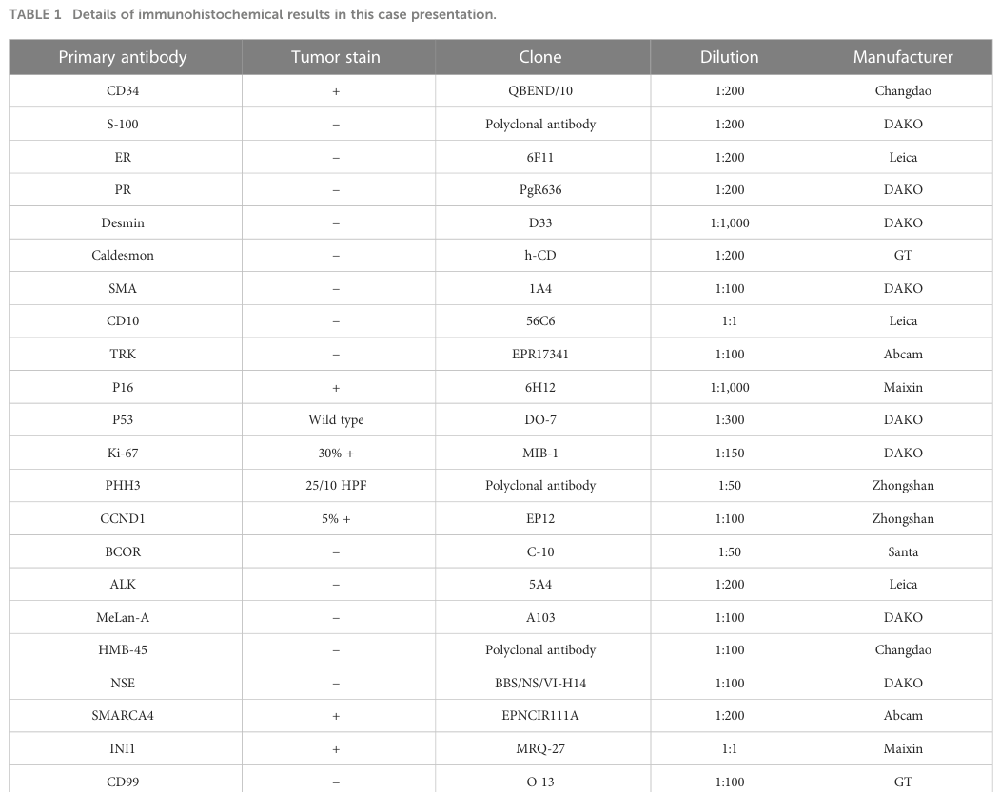

## Question

# Disease Characteristics Research Template

## Target Disease
- **Disease Name:** Sarcoma Of Cervix Uteri
- **MONDO ID:**  (if available)
- **Category:** 

## Research Objectives

Please provide a comprehensive research report on **Sarcoma Of Cervix Uteri** covering all of the
disease characteristics listed below. This report will be used to populate a disease knowledge
base entry. Be thorough and cite primary literature (PMID preferred) for all claims.

For each section, **suggested databases/resources** are listed. These are the first places
you should search for information on each topic.

---

### 1. Disease Information
> **Search first:** OMIM, Orphanet, ICD-10/ICD-11, MeSH, PubMed

- What is the disease? Provide a concise overview.
- What are the key identifiers? (OMIM, Orphanet, ICD-10/ICD-11, MeSH, Mondo)
- What are the common synonyms and alternative names?
- Is the information derived from individual patients (e.g., EHR) or aggregated disease-level resources?

### 2. Etiology

- **Disease Causal Factors**: What are the primary causes? (genetic, environmental, infectious, mechanistic)
- **Risk Factors**:
  > **Search first:** PubMed, Cochrane Library, UpToDate, clinical guidelines, ClinVar, ClinGen, GWAS Catalog, PheGenI, CTD, CDC, WHO, epidemiological databases
  - Genetic risk factors (causal variants, susceptibility loci, modifier genes)
  - Environmental risk factors (toxins, lifestyle, occupational exposures, age, sex, family history)
- **Protective Factors**:
  > **Search first:** PubMed, Cochrane Library, clinical trial databases, GWAS Catalog, gnomAD, WHO, CDC, nutrition databases
  - Genetic protective factors (protective variants, modifier alleles)
  - Environmental protective factors (diet, lifestyle, exposures that reduce risk)
- **Gene-Environment Interactions**: How do genetic and environmental factors interact to influence disease?
  > **Search first:** CTD, PubMed, PheGenI, GxE databases

### 3. Phenotypes
> **Search first:** HPO (Human Phenotype Ontology), OMIM, Orphanet, PubMed, clinicaltrials.gov, MedDRA, SNOMED CT, DECIPHER, LOINC

For each phenotype, provide:
- **Phenotype type**: symptoms, clinical signs, physical manifestations, behavioral changes, or laboratory abnormalities
  > For symptoms/signs: HPO, OMIM, Orphanet, PubMed
  > For behavioral changes: HPO, DSM, RDoC (Research Domain Criteria), PubMed
  > For laboratory abnormalities: LOINC, SNOMED CT, LabTests Online, PubMed
- **Phenotype characteristics**:
  > **Search first:** OMIM, Orphanet, HPO, PubMed
  - Age of symptom onset (neonatal, childhood, adult-onset, late-onset)
  - Symptom severity (mild, moderate, severe, variable)
  - Symptom progression (stable, progressive, episodic, fluctuating)
  - Frequency among affected individuals (percentage or qualitative)
- **Quality of life impact**: Effects on daily functioning and well-being (per-phenotype when possible)
  > **Search first:** EQ-5D database, SF-36, WHO QOL databases, PubMed
- Suggest HPO (Human Phenotype Ontology) terms for each phenotype

### 4. Genetic/Molecular Information

- **Causal Genes**: Gene mutations or chromosomal abnormalities responsible for disease (gene symbols, OMIM IDs)
  > **Search first:** OMIM, ClinVar, HGMD, Ensembl, NCBI Gene
- **Pathogenic Variants**:
  - Affected genes (gene symbols, HGNC IDs)
    > **Search first:** OMIM, NCBI Gene, Ensembl, HGNC, UniProt, GeneCards
  - Variant classification (pathogenic, likely pathogenic, VUS per ACMG/AMP guidelines)
    > **Search first:** ClinVar, ClinGen, ACMG/AMP guidelines, VarSome
  - Variant type/class (missense, frameshift, nonsense, splice-site, structural)
  - Allele frequency in population databases
    > **Search first:** gnomAD, 1000 Genomes, ExAC, TOPMed, dbSNP
  - Somatic vs germline origin
    > **Search first:** COSMIC (somatic), ClinVar, ICGC, TCGA
  - Functional consequences (loss of function, gain of function, dominant negative)
- **Modifier Genes**: Genes that modify disease severity or expression
- **Epigenetic Information**: DNA methylation, histone modifications, chromatin changes affecting disease
  > **Search first:** ENCODE, Roadmap Epigenomics, MethBase, DiseaseMeth
- **Chromosomal Abnormalities**: Large-scale genetic changes (aneuploidy, translocations, inversions)
  > **Search first:** DECIPHER, ClinVar, ECARUCA, UCSC Genome Browser

### 5. Environmental Information

- **Environmental Factors**: Non-genetic contributing factors (toxins, radiation, pollution, occupational exposure)
  > **Search first:** CTD (Comparative Toxicogenomics Database), TOXNET, PubMed, EPA databases
- **Lifestyle Factors**: Behavioral factors (smoking, diet, exercise, alcohol consumption)
  > **Search first:** CDC databases, WHO, PubMed, NHANES
- **Infectious Agents**: If applicable, pathogens causing or triggering disease (bacteria, viruses, fungi, parasites)
  > **Search first:** NCBI Taxonomy, ViPR, BV-BRC, MicrobeDB, GIDEON

### 6. Mechanism / Pathophysiology

- **Molecular Pathways**: Specific signaling cascades or biochemical pathways involved (Wnt, MAPK, mTOR, PI3K-AKT, etc.)
  > **Search first:** KEGG, Reactome, WikiPathways, PathBank, BioCyc
- **Cellular Processes**: Cell-level mechanisms (apoptosis, autophagy, cell cycle dysregulation, inflammation, etc.)
  > **Search first:** Gene Ontology (GO), Reactome, KEGG, PubMed
- **Protein Dysfunction**: How protein structure or function is altered (misfolding, aggregation, loss of function, gain of function)
  > **Search first:** UniProt, PDB (Protein Data Bank), InterPro, Pfam, AlphaFold
- **Metabolic Changes**: Alterations in metabolic processes (energy metabolism, lipid metabolism, amino acid metabolism)
  > **Search first:** KEGG, BioCyc, HMDB (Human Metabolome Database), BRENDA
- **Immune System Involvement**: Role of immune response (autoimmunity, immunodeficiency, chronic inflammation)
  > **Search first:** ImmPort, Immunome Database, IEDB, Gene Ontology
- **Tissue Damage Mechanisms**: How tissues/ are injured (oxidative stress, ischemia, fibrosis, necrosis)
  > **Search first:** PubMed, Gene Ontology, Reactome
- **Biochemical Abnormalities**: Specific molecular defects (enzyme deficiencies, receptor dysfunction, ion channel defects)
  > **Search first:** BRENDA, UniProt, KEGG, OMIM, PubMed
- **Epigenetic Changes**: DNA methylation, histone modifications affecting gene expression in disease
  > **Search first:** ENCODE, Roadmap Epigenomics, MethBase, DiseaseMeth
- **Molecular Profiling** (if available):
  - Transcriptomics/gene expression changes
    > **Search first:** GEO (Gene Expression Omnibus), ArrayExpress, GTEx, Human Cell Atlas, SRA
  - Proteomics findings
    > **Search first:** PRIDE, ProteomeXchange, Human Protein Atlas, STRING, BioGRID
  - Metabolomics signatures
    > **Search first:** MetaboLights, Metabolomics Workbench, HMDB, METLIN
  - Lipidomics alterations
    > **Search first:** LIPID MAPS, SwissLipids, LipidHome, Metabolomics Workbench
  - Genomic structural features
    > **Search first:** UCSC Genome Browser, Ensembl, NCBI, dbVar, DGV
- **Advanced Technologies** (if applicable):
  - Single-cell analysis findings (cell-type specific mechanisms, cellular heterogeneity)
    > **Search first:** Human Cell Atlas, Single Cell Portal, GEO, CELLxGENE
  - Spatial transcriptomics findings
    > **Search first:** GEO, Spatial Research, Vizgen, 10x Genomics data
  - Multi-omics integration results
    > **Search first:** TCGA, ICGC, cBioPortal, LinkedOmics, PubMed
  - Functional genomics screens (CRISPR, RNAi)
    > **Search first:** DepMap, GenomeRNAi, PubMed, BioGRID ORCS

For each mechanism, describe:
- The causal chain from initial trigger to clinical manifestation
- Which mechanisms are upstream vs downstream
- What cell types and biological processes are involved
- Suggest GO terms for biological processes and CL terms for cell types

### 7. Anatomical Structures Affected

- **Organ Level**:
  - Primary organs directly affected
  - Secondary organ involvement (complications, secondary effects)
  - Body systems involved (cardiovascular, nervous, digestive, respiratory, endocrine, etc.)
  > **Search first:** Uberon, FMA (Foundational Model of Anatomy), OMIM, HPO, ICD-11, MeSH, SNOMED CT
- **Tissue and Cell Level**:
  - Specific tissue types affected (epithelial, connective, muscle, nervous)
  - Specific cell populations targeted (with Cell Ontology terms)
  > **Search first:** Uberon, Human Protein Atlas, Cell Ontology, Human Cell Atlas, CellMarker, PanglaoDB
- **Subcellular Level**:
  - Cellular compartments involved (mitochondria, nucleus, ER, lysosomes) (with GO Cellular Component terms)
  > **Search first:** Gene Ontology (Cellular Component), UniProt, Human Protein Atlas
- **Localization**:
  - Specific anatomical sites (with UBERON terms)
    > **Search first:** FMA, Uberon, NeuroNames (for brain), SNOMED CT
  - Lateralization (unilateral, bilateral, asymmetric)
    > **Search first:** HPO, clinical literature, imaging databases

### 8. Temporal Development

- **Onset**:
  - Typical age of onset (congenital, pediatric, adult, geriatric)
  - Onset pattern (acute, subacute, chronic, insidious)
  > **Search first:** OMIM, Orphanet, HPO, PubMed
- **Progression**:
  - Disease stages (early, intermediate, advanced, end-stage)
    > **Search first:** Cancer Staging Manual (AJCC), WHO classifications, PubMed
  - Progression rate (rapid, slow, variable)
  - Disease course pattern (episodic, relapsing-remitting, progressive, stable)
  - Disease duration (self-limited, chronic lifelong)
  > **Search first:** Disease registries, longitudinal cohort databases, natural history studies, PubMed, Orphanet, OMIM
- **Patterns**:
  - Remission patterns (spontaneous, treatment-induced)
    > **Search first:** Clinical trial databases, disease registries, PubMed
  - Critical periods (time windows of vulnerability or opportunity for intervention)
    > **Search first:** PubMed, developmental biology databases, clinical guidelines

### 9. Inheritance and Population

- **Epidemiology**:
  - Prevalence (cases per 100,000 at given time)
  - Incidence (new cases per 100,000 per year)
  > **Search first:** Orphanet, CDC, WHO, GBD (Global Burden of Disease), national registries, SEER, disease registries
- **For Genetic Etiology**:
  - Inheritance pattern (AD, AR, X-linked, mitochondrial, multifactorial, polygenic)
    > **Search first:** OMIM, Orphanet, ClinVar, GTR (Genetic Testing Registry)
  - Penetrance (complete, incomplete, age-dependent)
    > **Search first:** ClinVar, OMIM, PubMed, ClinGen
  - Expressivity (variable, consistent)
    > **Search first:** OMIM, ClinVar, PubMed
  - Genetic anticipation (increasing severity in successive generations)
    > **Search first:** OMIM, PubMed (especially for repeat expansion disorders)
  - Germline mosaicism
    > **Search first:** ClinVar, OMIM, genetic counseling literature, PubMed
  - Founder effects (population-specific mutations)
    > **Search first:** gnomAD, population genetics databases, PubMed
  - Consanguinity role
    > **Search first:** OMIM, population studies, genetic counseling resources
  - Carrier frequency
    > **Search first:** gnomAD, carrier screening databases, GeneReviews, GTR
- **Population Demographics**:
  - Affected populations (ethnic or demographic groups with higher prevalence)
    > **Search first:** gnomAD, 1000 Genomes, PAGE Study, PubMed, population registries
  - Geographic distribution (endemic areas, regional variation)
    > **Search first:** WHO, CDC, GBD, Orphanet, geographic epidemiology databases
  - Geographic distribution of specific variants
  - Sex ratio (male:female)
    > **Search first:** Disease registries, OMIM, PubMed, epidemiological databases
  - Age distribution of affected individuals
    > **Search first:** CDC, disease registries, SEER, Orphanet

### 10. Diagnostics

- **Clinical Tests**:
  - Laboratory tests (blood, urine, tissue chemistry, specific enzyme assays)
    > **Search first:** LOINC, LabTests Online, PubMed
  - Biomarkers (proteins, metabolites, genetic markers, circulating biomarkers)
    > **Search first:** FDA Biomarker List, BEST (Biomarkers, EndpointS, and other Tools), PubMed
  - Imaging studies (X-ray, CT, MRI, PET, ultrasound)
    > **Search first:** RadLex, DICOM, Radiopaedia, imaging databases
  - Functional tests (pulmonary function, cardiac stress tests)
    > **Search first:** LOINC, clinical guidelines, PubMed
  - Electrophysiology (EEG, EMG, ECG, nerve conduction studies)
    > **Search first:** LOINC, clinical neurophysiology databases, PubMed
  - Biopsy findings (histopathology, immunohistochemistry)
    > **Search first:** SNOMED CT, College of American Pathologists resources, PubMed
  - Pathology findings (microscopic examination)
    > **Search first:** SNOMED CT, Digital Pathology databases, PubMed
- **Genetic Testing**:
  > **Search first:** GTR (Genetic Testing Registry), GeneReviews, ClinGen
  - Overview of recommended genetic testing approach
  - Whole genome sequencing (WGS) utility
    > **Search first:** GTR, ClinVar, GEL (Genomics England), gnomAD
  - Whole exome sequencing (WES) utility
    > **Search first:** GTR, ClinVar, OMIM, GeneMatcher
  - Gene panels (which panels, which genes)
    > **Search first:** GTR, ClinVar, laboratory-specific databases
  - Single gene testing
    > **Search first:** GTR, ClinVar, OMIM, GeneReviews
  - Chromosomal microarray (CMA)
    > **Search first:** DECIPHER, ClinVar, dbVar, ECARUCA
  - Karyotyping
    > **Search first:** Chromosome Abnormality Database, ClinVar, cytogenetics resources
  - FISH
    > **Search first:** ClinVar, cytogenetics databases, PubMed
  - Mitochondrial DNA testing
    > **Search first:** MITOMAP, MSeqDR, ClinVar, GTR
  - Repeat expansion testing
    > **Search first:** GTR, ClinVar, repeat expansion databases, PubMed
- **Omics-Based Diagnostics** (if applicable):
  - RNA sequencing / transcriptomics
    > **Search first:** GEO, ArrayExpress, GTEx, RNA-seq databases
  - Proteomics
    > **Search first:** PRIDE, ProteomeXchange, FDA Biomarker database
  - Metabolomics
    > **Search first:** MetaboLights, Metabolomics Workbench, HMDB
  - Epigenomics
    > **Search first:** GEO, ENCODE, Roadmap Epigenomics, MethBase
  - Liquid biopsy
    > **Search first:** COSMIC, ClinVar, liquid biopsy databases, PubMed
- **Clinical Criteria**:
  - Standardized diagnostic criteria (DSM, ICD, society guidelines)
    > **Search first:** DSM-5, ICD-11, clinical society guidelines, UpToDate
  - Differential diagnosis (other conditions to rule out, with distinguishing features)
    > **Search first:** DynaMed, UpToDate, clinical decision support systems
- **Screening**:
  - Screening methods for asymptomatic individuals (newborn screening, carrier screening, cascade screening)
    > **Search first:** ACMG recommendations, CDC newborn screening, GTR

### 11. Outcome/Prognosis

- **Survival and Mortality**:
  - Survival rate (5-year, 10-year, overall)
    > **Search first:** SEER, cancer registries, disease-specific registries, PubMed
  - Life expectancy (with and without treatment if applicable)
    > **Search first:** Orphanet, disease registries, actuarial databases, PubMed
  - Mortality rate
    > **Search first:** CDC, WHO, GBD, national mortality databases
  - Disease-specific mortality (deaths directly attributable to disease)
    > **Search first:** Disease registries, CDC Wonder, GBD, PubMed
- **Morbidity and Function**:
  - Morbidity (disease-related disability and health impacts)
    > **Search first:** GBD, WHO, disability databases, PubMed
  - Disability outcomes (long-term functional impairments)
    > **Search first:** ICF (International Classification of Functioning), disability registries
  - Quality of life measures (EQ-5D, SF-36, PROMIS, disease-specific tools)
    > **Search first:** EQ-5D database, SF-36, PROMIS, PubMed
- **Disease Course**:
  - Complications (secondary problems: infections, organ failure, etc.)
    > **Search first:** ICD codes, disease registries, clinical databases, PubMed
  - Recovery potential (likelihood and extent of recovery, with vs without treatment)
    > **Search first:** Natural history studies, rehabilitation databases, PubMed
- **Prediction**:
  - Prognostic factors (age, disease severity, biomarkers, treatment response)
    > **Search first:** Prognostic models databases, clinical calculators, PubMed
  - Prognostic biomarkers (molecular markers predicting disease course)
    > **Search first:** FDA Biomarker database, PubMed, cancer prognostic databases

### 12. Treatment

- **Pharmacotherapy**:
  - Pharmacological treatments (drug names, drug classes, mechanisms of action)
    > **Search first:** DrugBank, RxNorm, ATC classification, DailyMed, FDA databases
  - Pharmacogenomics (how genetic variants affect drug metabolism, efficacy, toxicity)
    > **Search first:** PharmGKB, CPIC (Clinical Pharmacogenetics), FDA Table of PGx Biomarkers
- **Advanced Therapeutics**:
  - Gene therapy (viral vectors, CRISPR, gene replacement, gene editing)
    > **Search first:** ClinicalTrials.gov, FDA gene therapy database, ASGCT resources
  - Cell therapy (stem cell transplant, CAR-T, cellular therapeutics)
    > **Search first:** ClinicalTrials.gov, FDA cell therapy database, FACT standards
  - RNA-based therapies (ASOs, siRNA, mRNA therapies)
    > **Search first:** ClinicalTrials.gov, FDA approvals, PubMed
  - Targeted therapies (treatments directed at specific molecular targets)
    > **Search first:** My Cancer Genome, OncoKB, ClinicalTrials.gov, FDA approvals
  - Immunotherapies (checkpoint inhibitors, monoclonal antibodies)
    > **Search first:** Cancer Immunotherapy Database, FDA approvals, ClinicalTrials.gov
- **Surgical and Interventional**:
  - Surgical interventions (types of surgery, timing, outcomes)
    > **Search first:** CPT codes, surgical registries, clinical guidelines, PubMed
- **Supportive and Rehabilitative**:
  - Supportive care (symptom management, pain control, nutrition)
    > **Search first:** Clinical guidelines, Cochrane Library, PubMed
  - Rehabilitation (physical therapy, occupational therapy, speech therapy)
    > **Search first:** Rehabilitation medicine databases, clinical guidelines, PubMed
- **Experimental**:
  - Experimental treatments in clinical trials (with NCT identifiers if available)
    > **Search first:** ClinicalTrials.gov, EU Clinical Trials Register, WHO ICTRP
- **Treatment Outcomes**:
  - Treatment response rates
    > **Search first:** Clinical trial databases, FDA reviews, systematic reviews, PubMed
  - Side effects and adverse events
    > **Search first:** FDA Adverse Event Reporting System (FAERS), MedWatch, PubMed
- **Treatment Strategy**:
  - Treatment algorithms (clinical pathways, decision trees)
    > **Search first:** Clinical practice guidelines, NCCN Guidelines, UpToDate
  - Combination therapies
    > **Search first:** ClinicalTrials.gov, treatment guidelines, PubMed
  - Personalized medicine approaches (genotype-guided treatment)
    > **Search first:** My Cancer Genome, CIViC, PharmGKB, precision medicine databases

For each treatment, suggest MAXO (Medical Action Ontology) terms where applicable.

### 13. Prevention

- **Prevention Levels**:
  - Primary prevention (preventing disease occurrence: vaccination, risk factor modification)
    > **Search first:** CDC, WHO, USPSTF recommendations, Cochrane Library
  - Secondary prevention (early detection and treatment: screening programs, early intervention)
    > **Search first:** USPSTF, CDC screening guidelines, WHO
  - Tertiary prevention (preventing complications in those with disease)
    > **Search first:** Clinical guidelines, disease management protocols, PubMed
- **Immunization**: Vaccine strategies (if applicable)
  > **Search first:** CDC vaccine schedules, WHO immunization, FDA vaccine database
- **Screening and Early Detection**:
  - Screening programs (population-based: newborn screening, cancer screening)
    > **Search first:** CDC screening programs, USPSTF, cancer screening databases
  - Genetic screening (carrier screening, preimplantation genetic diagnosis, prenatal testing)
    > **Search first:** ACMG recommendations, ACOG guidelines, GTR
  - Risk stratification (identifying high-risk individuals for targeted prevention)
    > **Search first:** Risk prediction models, clinical calculators, PubMed
- **Behavioral Interventions**: Lifestyle modifications to reduce risk
  > **Search first:** CDC, WHO, behavioral intervention databases, Cochrane Library
- **Counseling**: Genetic counseling (risk assessment, family planning guidance)
  > **Search first:** NSGC resources, ACMG guidelines, GeneReviews
- **Public Health**:
  - Public health interventions (sanitation, vector control, health education)
    > **Search first:** CDC, WHO, public health databases, PubMed
  - Environmental interventions (reducing environmental risk factors)
    > **Search first:** EPA databases, WHO environmental health, PubMed
- **Prophylaxis**: Preventive medications or procedures
  > **Search first:** Clinical guidelines, FDA approvals, PubMed

### 14. Other Species / Natural Disease

- **Taxonomy**: Species affected (with NCBI Taxon identifiers)
  > **Search first:** NCBI Taxonomy
- **Breed**: Specific breeds affected (with VBO identifiers if applicable)
  > **Search first:** VBO (Vertebrate Breed Ontology)
- **Gene**: Orthologous genes in other species (with NCBI Gene IDs)
  > **Search first:** NCBI Gene
- **Natural Disease**:
  - Naturally occurring disease in other species (companion animals, wildlife)
    > **Search first:** OMIA (Online Mendelian Inheritance in Animals), VetCompass, PubMed
  - Veterinary relevance and importance in animal health
    > **Search first:** OMIA, veterinary databases, PubMed
- **Comparative Biology**:
  - Comparative pathology (similarities and differences across species)
    > **Search first:** OMIA, comparative pathology databases, PubMed
  - Evolutionary conservation of disease mechanisms
    > **Search first:** HomoloGene, OrthoMCL, Alliance of Genome Resources
- **Transmission** (if applicable):
  - Zoonotic potential
    > **Search first:** CDC zoonotic diseases, WHO zoonoses, GIDEON
  - Cross-species susceptibility
    > **Search first:** NCBI Taxonomy, veterinary databases, PubMed

### 15. Model Organisms

- **Model Types**:
  - Model organism type (mammalian, invertebrate, cellular, in vitro)
    > **Search first:** Alliance of Genome Resources, model organism databases
  - Specific model systems (mouse, rat, zebrafish, Drosophila, C. elegans, yeast, cell lines, organoids, iPSCs)
    > **Search first:** MGI, RGD, ZFIN, FlyBase, WormBase, SGD, ATCC, Cellosaurus
  - Induced models (drug treatment, surgical intervention, environmental manipulation)
    > **Search first:** MGI, model organism databases, PubMed
- **Genetic Models**:
  - Types available (knockout, knock-in, transgenic, conditional, humanized)
    > **Search first:** MGI, IMPC, KOMP, EuMMCR, IMSR
- **Model Characteristics**:
  - Phenotype recapitulation (how well model reproduces human disease features)
    > **Search first:** Model organism databases, comparative studies, PubMed
  - Model limitations (aspects of human disease not captured)
    > **Search first:** Model organism databases, PubMed, review articles
- **Applications**:
  - Research applications (what aspects of disease can be studied)
    > **Search first:** Model organism databases, PubMed
- **Resources**:
  - Model databases
    > **Search first:** MGI, RGD, ZFIN, FlyBase, WormBase, IMSR, EMMA, MMRRC

---

## Citation Requirements

- Cite primary literature (PMID preferred) for all mechanistic and clinical claims
- Prioritize recent reviews and landmark papers
- Include direct quotes from abstracts where possible to support key statements
- Distinguish evidence source types: human clinical, model organism, in vitro, computational

## Output Format

Structure your response as a comprehensive narrative organized by the sections above.
For each section, provide:
- Factual content with specific details (numbers, percentages, gene names, variant nomenclature)
- Ontology term suggestions (HPO, GO, CL, UBERON, CHEBI, MAXO, MONDO) where applicable
- Evidence citations with PMIDs
- Direct quotes from abstracts to support key claims
- Clear indication when information is not available or not applicable for this disease

This report will be used to populate a disease knowledge base entry with:
- Pathophysiology descriptions with causal chains
- Gene/protein annotations (HGNC, GO terms)
- Phenotype associations (HP terms) with frequencies
- Cell type involvement (CL terms)
- Anatomical locations (UBERON terms)
- Chemical entities (CHEBI terms)
- Treatment annotations (MAXO terms)
- Evidence items with PMIDs and exact abstract quotes
- Epidemiology, prognosis, diagnostic, and prevention information
- Animal model descriptions with phenotype recapitulation details

## Output

Question: You are an expert researcher providing comprehensive, well-cited information.

Provide detailed information focusing on:
1. Key concepts and definitions with current understanding
2. Recent developments and latest research (prioritize 2023-2024 sources)
3. Current applications and real-world implementations
4. Expert opinions and analysis from authoritative sources
5. Relevant statistics and data from recent studies

Format as a comprehensive research report with proper citations. Include URLs and publication dates where available.
Always prioritize recent, authoritative sources and provide specific citations for all major claims.

# Disease Characteristics Research Template

## Target Disease
- **Disease Name:** Sarcoma Of Cervix Uteri
- **MONDO ID:**  (if available)
- **Category:** 

## Research Objectives

Please provide a comprehensive research report on **Sarcoma Of Cervix Uteri** covering all of the
disease characteristics listed below. This report will be used to populate a disease knowledge
base entry. Be thorough and cite primary literature (PMID preferred) for all claims.

For each section, **suggested databases/resources** are listed. These are the first places
you should search for information on each topic.

---

### 1. Disease Information
> **Search first:** OMIM, Orphanet, ICD-10/ICD-11, MeSH, PubMed

- What is the disease? Provide a concise overview.
- What are the key identifiers? (OMIM, Orphanet, ICD-10/ICD-11, MeSH, Mondo)
- What are the common synonyms and alternative names?
- Is the information derived from individual patients (e.g., EHR) or aggregated disease-level resources?

### 2. Etiology

- **Disease Causal Factors**: What are the primary causes? (genetic, environmental, infectious, mechanistic)
- **Risk Factors**:
  > **Search first:** PubMed, Cochrane Library, UpToDate, clinical guidelines, ClinVar, ClinGen, GWAS Catalog, PheGenI, CTD, CDC, WHO, epidemiological databases
  - Genetic risk factors (causal variants, susceptibility loci, modifier genes)
  - Environmental risk factors (toxins, lifestyle, occupational exposures, age, sex, family history)
- **Protective Factors**:
  > **Search first:** PubMed, Cochrane Library, clinical trial databases, GWAS Catalog, gnomAD, WHO, CDC, nutrition databases
  - Genetic protective factors (protective variants, modifier alleles)
  - Environmental protective factors (diet, lifestyle, exposures that reduce risk)
- **Gene-Environment Interactions**: How do genetic and environmental factors interact to influence disease?
  > **Search first:** CTD, PubMed, PheGenI, GxE databases

### 3. Phenotypes
> **Search first:** HPO (Human Phenotype Ontology), OMIM, Orphanet, PubMed, clinicaltrials.gov, MedDRA, SNOMED CT, DECIPHER, LOINC

For each phenotype, provide:
- **Phenotype type**: symptoms, clinical signs, physical manifestations, behavioral changes, or laboratory abnormalities
  > For symptoms/signs: HPO, OMIM, Orphanet, PubMed
  > For behavioral changes: HPO, DSM, RDoC (Research Domain Criteria), PubMed
  > For laboratory abnormalities: LOINC, SNOMED CT, LabTests Online, PubMed
- **Phenotype characteristics**:
  > **Search first:** OMIM, Orphanet, HPO, PubMed
  - Age of symptom onset (neonatal, childhood, adult-onset, late-onset)
  - Symptom severity (mild, moderate, severe, variable)
  - Symptom progression (stable, progressive, episodic, fluctuating)
  - Frequency among affected individuals (percentage or qualitative)
- **Quality of life impact**: Effects on daily functioning and well-being (per-phenotype when possible)
  > **Search first:** EQ-5D database, SF-36, WHO QOL databases, PubMed
- Suggest HPO (Human Phenotype Ontology) terms for each phenotype

### 4. Genetic/Molecular Information

- **Causal Genes**: Gene mutations or chromosomal abnormalities responsible for disease (gene symbols, OMIM IDs)
  > **Search first:** OMIM, ClinVar, HGMD, Ensembl, NCBI Gene
- **Pathogenic Variants**:
  - Affected genes (gene symbols, HGNC IDs)
    > **Search first:** OMIM, NCBI Gene, Ensembl, HGNC, UniProt, GeneCards
  - Variant classification (pathogenic, likely pathogenic, VUS per ACMG/AMP guidelines)
    > **Search first:** ClinVar, ClinGen, ACMG/AMP guidelines, VarSome
  - Variant type/class (missense, frameshift, nonsense, splice-site, structural)
  - Allele frequency in population databases
    > **Search first:** gnomAD, 1000 Genomes, ExAC, TOPMed, dbSNP
  - Somatic vs germline origin
    > **Search first:** COSMIC (somatic), ClinVar, ICGC, TCGA
  - Functional consequences (loss of function, gain of function, dominant negative)
- **Modifier Genes**: Genes that modify disease severity or expression
- **Epigenetic Information**: DNA methylation, histone modifications, chromatin changes affecting disease
  > **Search first:** ENCODE, Roadmap Epigenomics, MethBase, DiseaseMeth
- **Chromosomal Abnormalities**: Large-scale genetic changes (aneuploidy, translocations, inversions)
  > **Search first:** DECIPHER, ClinVar, ECARUCA, UCSC Genome Browser

### 5. Environmental Information

- **Environmental Factors**: Non-genetic contributing factors (toxins, radiation, pollution, occupational exposure)
  > **Search first:** CTD (Comparative Toxicogenomics Database), TOXNET, PubMed, EPA databases
- **Lifestyle Factors**: Behavioral factors (smoking, diet, exercise, alcohol consumption)
  > **Search first:** CDC databases, WHO, PubMed, NHANES
- **Infectious Agents**: If applicable, pathogens causing or triggering disease (bacteria, viruses, fungi, parasites)
  > **Search first:** NCBI Taxonomy, ViPR, BV-BRC, MicrobeDB, GIDEON

### 6. Mechanism / Pathophysiology

- **Molecular Pathways**: Specific signaling cascades or biochemical pathways involved (Wnt, MAPK, mTOR, PI3K-AKT, etc.)
  > **Search first:** KEGG, Reactome, WikiPathways, PathBank, BioCyc
- **Cellular Processes**: Cell-level mechanisms (apoptosis, autophagy, cell cycle dysregulation, inflammation, etc.)
  > **Search first:** Gene Ontology (GO), Reactome, KEGG, PubMed
- **Protein Dysfunction**: How protein structure or function is altered (misfolding, aggregation, loss of function, gain of function)
  > **Search first:** UniProt, PDB (Protein Data Bank), InterPro, Pfam, AlphaFold
- **Metabolic Changes**: Alterations in metabolic processes (energy metabolism, lipid metabolism, amino acid metabolism)
  > **Search first:** KEGG, BioCyc, HMDB (Human Metabolome Database), BRENDA
- **Immune System Involvement**: Role of immune response (autoimmunity, immunodeficiency, chronic inflammation)
  > **Search first:** ImmPort, Immunome Database, IEDB, Gene Ontology
- **Tissue Damage Mechanisms**: How tissues/ are injured (oxidative stress, ischemia, fibrosis, necrosis)
  > **Search first:** PubMed, Gene Ontology, Reactome
- **Biochemical Abnormalities**: Specific molecular defects (enzyme deficiencies, receptor dysfunction, ion channel defects)
  > **Search first:** BRENDA, UniProt, KEGG, OMIM, PubMed
- **Epigenetic Changes**: DNA methylation, histone modifications affecting gene expression in disease
  > **Search first:** ENCODE, Roadmap Epigenomics, MethBase, DiseaseMeth
- **Molecular Profiling** (if available):
  - Transcriptomics/gene expression changes
    > **Search first:** GEO (Gene Expression Omnibus), ArrayExpress, GTEx, Human Cell Atlas, SRA
  - Proteomics findings
    > **Search first:** PRIDE, ProteomeXchange, Human Protein Atlas, STRING, BioGRID
  - Metabolomics signatures
    > **Search first:** MetaboLights, Metabolomics Workbench, HMDB, METLIN
  - Lipidomics alterations
    > **Search first:** LIPID MAPS, SwissLipids, LipidHome, Metabolomics Workbench
  - Genomic structural features
    > **Search first:** UCSC Genome Browser, Ensembl, NCBI, dbVar, DGV
- **Advanced Technologies** (if applicable):
  - Single-cell analysis findings (cell-type specific mechanisms, cellular heterogeneity)
    > **Search first:** Human Cell Atlas, Single Cell Portal, GEO, CELLxGENE
  - Spatial transcriptomics findings
    > **Search first:** GEO, Spatial Research, Vizgen, 10x Genomics data
  - Multi-omics integration results
    > **Search first:** TCGA, ICGC, cBioPortal, LinkedOmics, PubMed
  - Functional genomics screens (CRISPR, RNAi)
    > **Search first:** DepMap, GenomeRNAi, PubMed, BioGRID ORCS

For each mechanism, describe:
- The causal chain from initial trigger to clinical manifestation
- Which mechanisms are upstream vs downstream
- What cell types and biological processes are involved
- Suggest GO terms for biological processes and CL terms for cell types

### 7. Anatomical Structures Affected

- **Organ Level**:
  - Primary organs directly affected
  - Secondary organ involvement (complications, secondary effects)
  - Body systems involved (cardiovascular, nervous, digestive, respiratory, endocrine, etc.)
  > **Search first:** Uberon, FMA (Foundational Model of Anatomy), OMIM, HPO, ICD-11, MeSH, SNOMED CT
- **Tissue and Cell Level**:
  - Specific tissue types affected (epithelial, connective, muscle, nervous)
  - Specific cell populations targeted (with Cell Ontology terms)
  > **Search first:** Uberon, Human Protein Atlas, Cell Ontology, Human Cell Atlas, CellMarker, PanglaoDB
- **Subcellular Level**:
  - Cellular compartments involved (mitochondria, nucleus, ER, lysosomes) (with GO Cellular Component terms)
  > **Search first:** Gene Ontology (Cellular Component), UniProt, Human Protein Atlas
- **Localization**:
  - Specific anatomical sites (with UBERON terms)
    > **Search first:** FMA, Uberon, NeuroNames (for brain), SNOMED CT
  - Lateralization (unilateral, bilateral, asymmetric)
    > **Search first:** HPO, clinical literature, imaging databases

### 8. Temporal Development

- **Onset**:
  - Typical age of onset (congenital, pediatric, adult, geriatric)
  - Onset pattern (acute, subacute, chronic, insidious)
  > **Search first:** OMIM, Orphanet, HPO, PubMed
- **Progression**:
  - Disease stages (early, intermediate, advanced, end-stage)
    > **Search first:** Cancer Staging Manual (AJCC), WHO classifications, PubMed
  - Progression rate (rapid, slow, variable)
  - Disease course pattern (episodic, relapsing-remitting, progressive, stable)
  - Disease duration (self-limited, chronic lifelong)
  > **Search first:** Disease registries, longitudinal cohort databases, natural history studies, PubMed, Orphanet, OMIM
- **Patterns**:
  - Remission patterns (spontaneous, treatment-induced)
    > **Search first:** Clinical trial databases, disease registries, PubMed
  - Critical periods (time windows of vulnerability or opportunity for intervention)
    > **Search first:** PubMed, developmental biology databases, clinical guidelines

### 9. Inheritance and Population

- **Epidemiology**:
  - Prevalence (cases per 100,000 at given time)
  - Incidence (new cases per 100,000 per year)
  > **Search first:** Orphanet, CDC, WHO, GBD (Global Burden of Disease), national registries, SEER, disease registries
- **For Genetic Etiology**:
  - Inheritance pattern (AD, AR, X-linked, mitochondrial, multifactorial, polygenic)
    > **Search first:** OMIM, Orphanet, ClinVar, GTR (Genetic Testing Registry)
  - Penetrance (complete, incomplete, age-dependent)
    > **Search first:** ClinVar, OMIM, PubMed, ClinGen
  - Expressivity (variable, consistent)
    > **Search first:** OMIM, ClinVar, PubMed
  - Genetic anticipation (increasing severity in successive generations)
    > **Search first:** OMIM, PubMed (especially for repeat expansion disorders)
  - Germline mosaicism
    > **Search first:** ClinVar, OMIM, genetic counseling literature, PubMed
  - Founder effects (population-specific mutations)
    > **Search first:** gnomAD, population genetics databases, PubMed
  - Consanguinity role
    > **Search first:** OMIM, population studies, genetic counseling resources
  - Carrier frequency
    > **Search first:** gnomAD, carrier screening databases, GeneReviews, GTR
- **Population Demographics**:
  - Affected populations (ethnic or demographic groups with higher prevalence)
    > **Search first:** gnomAD, 1000 Genomes, PAGE Study, PubMed, population registries
  - Geographic distribution (endemic areas, regional variation)
    > **Search first:** WHO, CDC, GBD, Orphanet, geographic epidemiology databases
  - Geographic distribution of specific variants
  - Sex ratio (male:female)
    > **Search first:** Disease registries, OMIM, PubMed, epidemiological databases
  - Age distribution of affected individuals
    > **Search first:** CDC, disease registries, SEER, Orphanet

### 10. Diagnostics

- **Clinical Tests**:
  - Laboratory tests (blood, urine, tissue chemistry, specific enzyme assays)
    > **Search first:** LOINC, LabTests Online, PubMed
  - Biomarkers (proteins, metabolites, genetic markers, circulating biomarkers)
    > **Search first:** FDA Biomarker List, BEST (Biomarkers, EndpointS, and other Tools), PubMed
  - Imaging studies (X-ray, CT, MRI, PET, ultrasound)
    > **Search first:** RadLex, DICOM, Radiopaedia, imaging databases
  - Functional tests (pulmonary function, cardiac stress tests)
    > **Search first:** LOINC, clinical guidelines, PubMed
  - Electrophysiology (EEG, EMG, ECG, nerve conduction studies)
    > **Search first:** LOINC, clinical neurophysiology databases, PubMed
  - Biopsy findings (histopathology, immunohistochemistry)
    > **Search first:** SNOMED CT, College of American Pathologists resources, PubMed
  - Pathology findings (microscopic examination)
    > **Search first:** SNOMED CT, Digital Pathology databases, PubMed
- **Genetic Testing**:
  > **Search first:** GTR (Genetic Testing Registry), GeneReviews, ClinGen
  - Overview of recommended genetic testing approach
  - Whole genome sequencing (WGS) utility
    > **Search first:** GTR, ClinVar, GEL (Genomics England), gnomAD
  - Whole exome sequencing (WES) utility
    > **Search first:** GTR, ClinVar, OMIM, GeneMatcher
  - Gene panels (which panels, which genes)
    > **Search first:** GTR, ClinVar, laboratory-specific databases
  - Single gene testing
    > **Search first:** GTR, ClinVar, OMIM, GeneReviews
  - Chromosomal microarray (CMA)
    > **Search first:** DECIPHER, ClinVar, dbVar, ECARUCA
  - Karyotyping
    > **Search first:** Chromosome Abnormality Database, ClinVar, cytogenetics resources
  - FISH
    > **Search first:** ClinVar, cytogenetics databases, PubMed
  - Mitochondrial DNA testing
    > **Search first:** MITOMAP, MSeqDR, ClinVar, GTR
  - Repeat expansion testing
    > **Search first:** GTR, ClinVar, repeat expansion databases, PubMed
- **Omics-Based Diagnostics** (if applicable):
  - RNA sequencing / transcriptomics
    > **Search first:** GEO, ArrayExpress, GTEx, RNA-seq databases
  - Proteomics
    > **Search first:** PRIDE, ProteomeXchange, FDA Biomarker database
  - Metabolomics
    > **Search first:** MetaboLights, Metabolomics Workbench, HMDB
  - Epigenomics
    > **Search first:** GEO, ENCODE, Roadmap Epigenomics, MethBase
  - Liquid biopsy
    > **Search first:** COSMIC, ClinVar, liquid biopsy databases, PubMed
- **Clinical Criteria**:
  - Standardized diagnostic criteria (DSM, ICD, society guidelines)
    > **Search first:** DSM-5, ICD-11, clinical society guidelines, UpToDate
  - Differential diagnosis (other conditions to rule out, with distinguishing features)
    > **Search first:** DynaMed, UpToDate, clinical decision support systems
- **Screening**:
  - Screening methods for asymptomatic individuals (newborn screening, carrier screening, cascade screening)
    > **Search first:** ACMG recommendations, CDC newborn screening, GTR

### 11. Outcome/Prognosis

- **Survival and Mortality**:
  - Survival rate (5-year, 10-year, overall)
    > **Search first:** SEER, cancer registries, disease-specific registries, PubMed
  - Life expectancy (with and without treatment if applicable)
    > **Search first:** Orphanet, disease registries, actuarial databases, PubMed
  - Mortality rate
    > **Search first:** CDC, WHO, GBD, national mortality databases
  - Disease-specific mortality (deaths directly attributable to disease)
    > **Search first:** Disease registries, CDC Wonder, GBD, PubMed
- **Morbidity and Function**:
  - Morbidity (disease-related disability and health impacts)
    > **Search first:** GBD, WHO, disability databases, PubMed
  - Disability outcomes (long-term functional impairments)
    > **Search first:** ICF (International Classification of Functioning), disability registries
  - Quality of life measures (EQ-5D, SF-36, PROMIS, disease-specific tools)
    > **Search first:** EQ-5D database, SF-36, PROMIS, PubMed
- **Disease Course**:
  - Complications (secondary problems: infections, organ failure, etc.)
    > **Search first:** ICD codes, disease registries, clinical databases, PubMed
  - Recovery potential (likelihood and extent of recovery, with vs without treatment)
    > **Search first:** Natural history studies, rehabilitation databases, PubMed
- **Prediction**:
  - Prognostic factors (age, disease severity, biomarkers, treatment response)
    > **Search first:** Prognostic models databases, clinical calculators, PubMed
  - Prognostic biomarkers (molecular markers predicting disease course)
    > **Search first:** FDA Biomarker database, PubMed, cancer prognostic databases

### 12. Treatment

- **Pharmacotherapy**:
  - Pharmacological treatments (drug names, drug classes, mechanisms of action)
    > **Search first:** DrugBank, RxNorm, ATC classification, DailyMed, FDA databases
  - Pharmacogenomics (how genetic variants affect drug metabolism, efficacy, toxicity)
    > **Search first:** PharmGKB, CPIC (Clinical Pharmacogenetics), FDA Table of PGx Biomarkers
- **Advanced Therapeutics**:
  - Gene therapy (viral vectors, CRISPR, gene replacement, gene editing)
    > **Search first:** ClinicalTrials.gov, FDA gene therapy database, ASGCT resources
  - Cell therapy (stem cell transplant, CAR-T, cellular therapeutics)
    > **Search first:** ClinicalTrials.gov, FDA cell therapy database, FACT standards
  - RNA-based therapies (ASOs, siRNA, mRNA therapies)
    > **Search first:** ClinicalTrials.gov, FDA approvals, PubMed
  - Targeted therapies (treatments directed at specific molecular targets)
    > **Search first:** My Cancer Genome, OncoKB, ClinicalTrials.gov, FDA approvals
  - Immunotherapies (checkpoint inhibitors, monoclonal antibodies)
    > **Search first:** Cancer Immunotherapy Database, FDA approvals, ClinicalTrials.gov
- **Surgical and Interventional**:
  - Surgical interventions (types of surgery, timing, outcomes)
    > **Search first:** CPT codes, surgical registries, clinical guidelines, PubMed
- **Supportive and Rehabilitative**:
  - Supportive care (symptom management, pain control, nutrition)
    > **Search first:** Clinical guidelines, Cochrane Library, PubMed
  - Rehabilitation (physical therapy, occupational therapy, speech therapy)
    > **Search first:** Rehabilitation medicine databases, clinical guidelines, PubMed
- **Experimental**:
  - Experimental treatments in clinical trials (with NCT identifiers if available)
    > **Search first:** ClinicalTrials.gov, EU Clinical Trials Register, WHO ICTRP
- **Treatment Outcomes**:
  - Treatment response rates
    > **Search first:** Clinical trial databases, FDA reviews, systematic reviews, PubMed
  - Side effects and adverse events
    > **Search first:** FDA Adverse Event Reporting System (FAERS), MedWatch, PubMed
- **Treatment Strategy**:
  - Treatment algorithms (clinical pathways, decision trees)
    > **Search first:** Clinical practice guidelines, NCCN Guidelines, UpToDate
  - Combination therapies
    > **Search first:** ClinicalTrials.gov, treatment guidelines, PubMed
  - Personalized medicine approaches (genotype-guided treatment)
    > **Search first:** My Cancer Genome, CIViC, PharmGKB, precision medicine databases

For each treatment, suggest MAXO (Medical Action Ontology) terms where applicable.

### 13. Prevention

- **Prevention Levels**:
  - Primary prevention (preventing disease occurrence: vaccination, risk factor modification)
    > **Search first:** CDC, WHO, USPSTF recommendations, Cochrane Library
  - Secondary prevention (early detection and treatment: screening programs, early intervention)
    > **Search first:** USPSTF, CDC screening guidelines, WHO
  - Tertiary prevention (preventing complications in those with disease)
    > **Search first:** Clinical guidelines, disease management protocols, PubMed
- **Immunization**: Vaccine strategies (if applicable)
  > **Search first:** CDC vaccine schedules, WHO immunization, FDA vaccine database
- **Screening and Early Detection**:
  - Screening programs (population-based: newborn screening, cancer screening)
    > **Search first:** CDC screening programs, USPSTF, cancer screening databases
  - Genetic screening (carrier screening, preimplantation genetic diagnosis, prenatal testing)
    > **Search first:** ACMG recommendations, ACOG guidelines, GTR
  - Risk stratification (identifying high-risk individuals for targeted prevention)
    > **Search first:** Risk prediction models, clinical calculators, PubMed
- **Behavioral Interventions**: Lifestyle modifications to reduce risk
  > **Search first:** CDC, WHO, behavioral intervention databases, Cochrane Library
- **Counseling**: Genetic counseling (risk assessment, family planning guidance)
  > **Search first:** NSGC resources, ACMG guidelines, GeneReviews
- **Public Health**:
  - Public health interventions (sanitation, vector control, health education)
    > **Search first:** CDC, WHO, public health databases, PubMed
  - Environmental interventions (reducing environmental risk factors)
    > **Search first:** EPA databases, WHO environmental health, PubMed
- **Prophylaxis**: Preventive medications or procedures
  > **Search first:** Clinical guidelines, FDA approvals, PubMed

### 14. Other Species / Natural Disease

- **Taxonomy**: Species affected (with NCBI Taxon identifiers)
  > **Search first:** NCBI Taxonomy
- **Breed**: Specific breeds affected (with VBO identifiers if applicable)
  > **Search first:** VBO (Vertebrate Breed Ontology)
- **Gene**: Orthologous genes in other species (with NCBI Gene IDs)
  > **Search first:** NCBI Gene
- **Natural Disease**:
  - Naturally occurring disease in other species (companion animals, wildlife)
    > **Search first:** OMIA (Online Mendelian Inheritance in Animals), VetCompass, PubMed
  - Veterinary relevance and importance in animal health
    > **Search first:** OMIA, veterinary databases, PubMed
- **Comparative Biology**:
  - Comparative pathology (similarities and differences across species)
    > **Search first:** OMIA, comparative pathology databases, PubMed
  - Evolutionary conservation of disease mechanisms
    > **Search first:** HomoloGene, OrthoMCL, Alliance of Genome Resources
- **Transmission** (if applicable):
  - Zoonotic potential
    > **Search first:** CDC zoonotic diseases, WHO zoonoses, GIDEON
  - Cross-species susceptibility
    > **Search first:** NCBI Taxonomy, veterinary databases, PubMed

### 15. Model Organisms

- **Model Types**:
  - Model organism type (mammalian, invertebrate, cellular, in vitro)
    > **Search first:** Alliance of Genome Resources, model organism databases
  - Specific model systems (mouse, rat, zebrafish, Drosophila, C. elegans, yeast, cell lines, organoids, iPSCs)
    > **Search first:** MGI, RGD, ZFIN, FlyBase, WormBase, SGD, ATCC, Cellosaurus
  - Induced models (drug treatment, surgical intervention, environmental manipulation)
    > **Search first:** MGI, model organism databases, PubMed
- **Genetic Models**:
  - Types available (knockout, knock-in, transgenic, conditional, humanized)
    > **Search first:** MGI, IMPC, KOMP, EuMMCR, IMSR
- **Model Characteristics**:
  - Phenotype recapitulation (how well model reproduces human disease features)
    > **Search first:** Model organism databases, comparative studies, PubMed
  - Model limitations (aspects of human disease not captured)
    > **Search first:** Model organism databases, PubMed, review articles
- **Applications**:
  - Research applications (what aspects of disease can be studied)
    > **Search first:** Model organism databases, PubMed
- **Resources**:
  - Model databases
    > **Search first:** MGI, RGD, ZFIN, FlyBase, WormBase, IMSR, EMMA, MMRRC

---

## Citation Requirements

- Cite primary literature (PMID preferred) for all mechanistic and clinical claims
- Prioritize recent reviews and landmark papers
- Include direct quotes from abstracts where possible to support key statements
- Distinguish evidence source types: human clinical, model organism, in vitro, computational

## Output Format

Structure your response as a comprehensive narrative organized by the sections above.
For each section, provide:
- Factual content with specific details (numbers, percentages, gene names, variant nomenclature)
- Ontology term suggestions (HPO, GO, CL, UBERON, CHEBI, MAXO, MONDO) where applicable
- Evidence citations with PMIDs
- Direct quotes from abstracts to support key claims
- Clear indication when information is not available or not applicable for this disease

This report will be used to populate a disease knowledge base entry with:
- Pathophysiology descriptions with causal chains
- Gene/protein annotations (HGNC, GO terms)
- Phenotype associations (HP terms) with frequencies
- Cell type involvement (CL terms)
- Anatomical locations (UBERON terms)
- Chemical entities (CHEBI terms)
- Treatment annotations (MAXO terms)
- Evidence items with PMIDs and exact abstract quotes
- Epidemiology, prognosis, diagnostic, and prevention information
- Animal model descriptions with phenotype recapitulation details

## Comprehensive Research Report: Sarcoma of Cervix Uteri

### Target Disease
- **Disease name:** Sarcoma of cervix uteri (primary cervical sarcoma; cervical mesenchymal malignancy) (altmann2024fertilitysparingstrategyin pages 1-3, ghirardi2019roleofsurgery pages 9-10)
- **Category:** Rare gynecologic malignancy; **mesenchymal (sarcoma) tumors arising in the uterine cervix** (altmann2024fertilitysparingstrategyin pages 1-3)
- **MONDO / MeSH / OMIM / Orphanet / ICD-10/ICD-11 identifiers:** **Not confirmed in the retrieved full-text corpus using available tools in this run** (see “Evidence gaps”).

---

## 1. Disease Information

### 1.1 Overview / definition (current understanding)
“**Sarcoma of cervix uteri**” is best treated as an **umbrella disease concept** covering **multiple histologic and increasingly molecularly defined malignant mesenchymal tumors** that arise primarily in the uterine cervix (rather than spreading from other sites). Contemporary reports emphasize that **cervical sarcomas are very rare** and their management often relies on small series/case reports and extrapolation from uterine/soft-tissue sarcoma practice (altmann2024fertilitysparingstrategyin pages 1-3, ghirardi2019roleofsurgery pages 9-10).

### 1.2 Common synonyms / alternative names
- Cervical sarcoma
- Primary sarcoma of the cervix uteri (altmann2024fertilitysparingstrategyin pages 1-3)
- Subtype-specific names are frequently used in practice (e.g., *cervical embryonal rhabdomyosarcoma*, *cervical leiomyosarcoma*, *NTRK-rearranged spindle cell sarcoma*, *extraosseous Ewing sarcoma of cervix*, *COL1A1–PDGFB fusion uterine/cervical sarcoma*) (yu2024clinicopathologiccharacteristicstreatment pages 1-2, szalai2024ntrkrearrangedspindlecell pages 1-3, xiao2024primaryewing’ssarcoma pages 1-2, lu2023casereporta pages 6-7).

### 1.3 Data provenance
Most cervix-sarcoma knowledge is derived from **aggregated disease-level resources (guidelines for uterine sarcoma)** plus **individual case reports/series** for cervix-specific entities (raycoquard2024esgoeuracangcigguidelinesfor pages 2-3, yu2024clinicopathologiccharacteristicstreatment pages 1-2, xiao2024primaryewing’ssarcoma pages 1-2).

---

## 2. Etiology

### 2.1 Disease causal factors
Cervical sarcomas are **heterogeneous** and include:
- **Fusion-driven sarcomas** (e.g., **NTRK fusions**, **COL1A1–PDGFB**) (szalai2024ntrkrearrangedspindlecell pages 1-3, lu2023casereporta pages 6-7)
- **Oncogenic translocation-driven small round cell tumors** (e.g., **EWSR1–FLI1** in Ewing sarcoma) (xiao2024primaryewing’ssarcoma pages 1-2)
- **Predisposition-associated tumors** (e.g., **DICER1-associated cervical sarcoma**, and literature linking DICER1 with cervical embryonal rhabdomyosarcoma) (altmann2024fertilitysparingstrategyin pages 1-3, yu2024clinicopathologiccharacteristicstreatment pages 1-2)

### 2.2 Risk factors
Evidence is limited for cervix-sarcoma-specific environmental risks. However, mechanistic “risk factors” in the sense of **tumor-initiating genomic events** are well described:
- **NTRK rearrangement** defining an emerging subset of uterine/cervical sarcomas (szalai2024ntrkrearrangedspindlecell pages 1-3)
- **COL1A1–PDGFB fusion** activating PDGFB/PDGFR signaling (lu2023casereporta pages 1-2)
- **DICER1 mutation** in a reported cervical sarcoma case and a proposed DICER1-sarcoma entity (altmann2024fertilitysparingstrategyin pages 1-3)

### 2.3 Protective factors / GxE
No cervix-sarcoma-specific protective factors or gene–environment interactions were identified in the retrieved corpus.

---

## 3. Phenotypes (clinical presentation)

### 3.1 Common presenting phenotypes (with suggested HPO terms)
Cervical sarcomas frequently present with **bleeding and/or a cervical mass/polypoid lesion** across subtypes:
- **Irregular vaginal bleeding** (HPO: *Abnormal uterine bleeding* **HP:0100602**; *Postcoital bleeding* **HP:0030828**) is common in DICER1-associated cervical sarcoma and other subtypes (altmann2024fertilitysparingstrategyin pages 1-3, xiao2024primaryewing’ssarcoma pages 1-2).
- **Vaginal tissue prolapse / polypoid mass** (HPO: *Pelvic organ prolapse* **HP:0000139** as a proxy; *Vaginal mass* **HP:0030448** as a proxy) is prominent in cervical rhabdomyosarcoma series (yu2024clinicopathologiccharacteristicstreatment pages 1-2).
- **Abdominal/pelvic pain** (HPO: *Abdominal pain* **HP:0002027**) and **urinary frequency** (HPO: **HP:0000018**) were reported in cervical rhabdomyosarcoma series (yu2024clinicopathologiccharacteristicstreatment pages 1-2).

### 3.2 Age of onset / severity / progression
- Cervical rhabdomyosarcoma clustered in adolescents/young women in a 12-patient institutional series (15–50 years; median 17) (yu2024clinicopathologiccharacteristicstreatment pages 1-2).
- DICER1-associated cervical sarcoma was reported in an 18-year-old (altmann2024fertilitysparingstrategyin pages 1-3).
- NTRK-rearranged cervix sarcomas often occur in **premenopausal/perimenopausal** women (example age 43 in a NUMA1::NTRK1 case) (szalai2024ntrkrearrangedspindlecell pages 1-3).

### 3.3 Quality of life impact
Direct QoL measures were not retrieved. Indirectly, heavy bleeding, prolapse/mass effect, radical surgery, and multi-agent chemotherapy imply substantial functional and reproductive impact (yu2024clinicopathologiccharacteristicstreatment pages 1-2, altmann2024fertilitysparingstrategyin pages 1-3).

---

## 4. Genetic / Molecular Information

### 4.1 Key actionable or defining alterations (recent 2023–2024 emphasis)

#### A) NTRK-rearranged spindle cell sarcoma/neoplasm of uterine cervix
- Defined by **NTRK gene rearrangements** leading to **constitutive Trk activation** (szalai2024ntrkrearrangedspindlecell pages 1-3).
- A 2024 cervix case reported a **novel NUMA1::NTRK1 fusion** detected by NGS; the fusion protein is “predicted to cause constant activation” of the NTRK1 kinase domain (szalai2024ntrkrearrangedspindlecell pages 1-3).
- Diagnostic theme: **strong/diffuse pan-TRK** and **CD34 positivity** (szalai2024ntrkrearrangedspindlecell pages 1-3, feng2025ntrkrearrangedspindlecell pages 1-2).

#### B) COL1A1–PDGFB fusion uterine/cervical sarcoma
- COL1A1–PDGFB fusion produces an oncogenic chimeric transcript activating **PDGFB/PDGFR signaling** (lu2023casereporta pages 1-2).
- The report stresses that **“early precise diagnosis may allow patients to benefit from the targeted therapy imatinib”** (PDGFR inhibitor activity) (lu2023casereporta pages 1-2).
- Table evidence on immunophenotype and compiled cases is available in the retrieved table images (lu2023casereporta media bf56b6c0, lu2023casereporta media 92e7e479).

#### C) Extraosseous Ewing sarcoma of cervix
- Hallmark: **EWSR1–FLI1 fusion**; the review notes the EWS/FLI fusion occurs in ~**85%** of ESFT with ~**15%** other EWS–ETS fusions (xiao2024primaryewing’ssarcoma pages 1-2).

#### D) DICER1-associated cervical sarcoma
- A 2024 fertility-sparing case report describes a **DICER1 mutation-associated sarcoma** of the cervix and notes literature “hints towards a distinct DICER-1 sarcoma entity” (altmann2024fertilitysparingstrategyin pages 1-3).

### 4.2 Variant types / somatic vs germline
- NTRK rearrangements and EWSR1 rearrangements are reported as **tumor (somatic) fusions** identified by **FISH/NGS/RNA sequencing** (szalai2024ntrkrearrangedspindlecell pages 1-3, xiao2024primaryewing’ssarcoma pages 1-2).
- DICER1 alterations may be germline or somatic depending on context; in the retrieved cervix-sarcoma case, a DICER1 mutation was reported but the excerpt does not establish germline vs somatic status (altmann2024fertilitysparingstrategyin pages 1-3).

### 4.3 Epigenetics / modifier genes
Not specifically reported for cervix sarcoma in the retrieved evidence.

---

## 5. Environmental Information
No cervix-sarcoma-specific environmental, lifestyle, or infectious causal agents were identified in the retrieved corpus.

---

## 6. Mechanism / Pathophysiology
Cervical sarcomas reflect **distinct oncogenic mechanisms by subtype**:

### 6.1 Fusion-kinase driven signaling (upstream driver)
- **NTRK fusions**: NTRK rearrangement is the defining lesion, leading to Trk receptor overexpression/activation and potential sensitivity to selective TRK inhibitors (szalai2024ntrkrearrangedspindlecell pages 1-3, feng2025ntrkrearrangedspindlecell pages 1-2).
  - Suggested GO biological process terms: **protein tyrosine kinase signaling pathway** (GO:0007169); **cell proliferation** (GO:0008283).
  - Suggested CL cell types (contextual): **mesenchymal cell** (CL:0000134); **fibroblast** (CL:0000057) (approximate, given fibrosarcoma-like morphology) (szalai2024ntrkrearrangedspindlecell pages 1-3).

- **COL1A1–PDGFB**: fusion activates PDGFB signaling; conceptually upstream driver is **ligand-driven PDGFR pathway activation** (lu2023casereporta pages 1-2).
  - Suggested GO terms: **platelet-derived growth factor receptor signaling pathway** (GO:0048008); **positive regulation of cell migration** (GO:0030335).

### 6.2 Transcriptional-program driven oncogenesis
- **EWSR1–FLI1** fusion acts as a driver in Ewing sarcoma; diagnosis depends on demonstrating EWSR1 disruption and the EWSR1–FLI1 fusion (xiao2024primaryewing’ssarcoma pages 1-2).

### 6.3 miRNA processing pathway disruption
- **DICER1-associated sarcoma**: DICER1 mutation is consistent with disrupted miRNA biogenesis; the case report points to a potentially distinct DICER1-sarcoma entity (altmann2024fertilitysparingstrategyin pages 1-3).

---

## 7. Anatomical Structures Affected

### 7.1 Primary anatomic site
- **Uterine cervix** (UBERON:0000002 uterus; UBERON:0000003 cervix uteri—verify exact UBERON ID for cervix uteri in implementation). Primary tumors may extend into vagina or uterine cavity depending on subtype and growth pattern (lu2023casereporta pages 1-2, yu2024clinicopathologiccharacteristicstreatment pages 1-2).

### 7.2 Tissue/cell level
- Predominantly **stromal/mesenchymal tissue** of the cervix; subtype-dependent differentiation (smooth muscle in leiomyosarcoma; skeletal muscle differentiation in rhabdomyosarcoma; fibrosarcoma-like spindle cell tumors in NTRK-rearranged neoplasms) (ghirardi2019roleofsurgery pages 9-10, yu2024clinicopathologiccharacteristicstreatment pages 1-2, szalai2024ntrkrearrangedspindlecell pages 1-3).

---

## 8. Temporal Development

### 8.1 Onset and course
- Often subacute presentation with bleeding/mass.
- Course ranges from relatively favorable outcomes in some series (e.g., cervical RMS series) to aggressive recurrence in fusion-driven spindle cell sarcoma cases (yu2024clinicopathologiccharacteristicstreatment pages 1-2, szalai2024ntrkrearrangedspindlecell pages 1-3).

---

## 9. Inheritance and Population

### 9.1 Epidemiology (key statistics)
- A 2024 cervical DICER1-associated sarcoma report states: **“Primary sarcomas of the cervix are very rare”** and estimates they account for **~1.3% of cervical tumors** (altmann2024fertilitysparingstrategyin pages 1-3).
- A 2024 institutional cervical rhabdomyosarcoma series states: **“Only 0.5% of primary RMSs are located in the cervix”** (yu2024clinicopathologiccharacteristicstreatment pages 1-2).
- For uterine sarcomas overall, GEIS guidelines cite incidence **0.36–0.64 per 100,000** (perezfidalgo2023uterinesarcomasclinical pages 1-1) and a uterine sarcoma guideline cites ~**1.5–3 per 100,000** (denschlag2022sarcomaofthe pages 3-4). These values are not cervix-specific but contextualize rarity.

### 9.2 Population demographics
- Cervical RMS: ages 15–50, median 17 in one 12-case series (yu2024clinicopathologiccharacteristicstreatment pages 1-2).
- NTRK-rearranged cervix sarcoma: example patient age 43 in a 2024 case report (szalai2024ntrkrearrangedspindlecell pages 1-3).

---

## 10. Diagnostics

### 10.1 Core diagnostic workflow (cross-cutting principles)
Guidelines for uterine sarcoma emphasize diagnostic uncertainty and recommend imaging plus careful pathology, often requiring resection specimen for definitive diagnosis:
- **Pelvic ultrasound** and **MRI** are recommended as first-line imaging approaches in uterine sarcoma diagnostic pathways (perezfidalgo2023uterinesarcomasclinical pages 1-1, perezfidalgo2023uterinesarcomasclinical pages 1-3).
- **Biopsy may have low sensitivity**, and diagnosis is often established after surgical specimen analysis (perezfidalgo2023uterinesarcomasclinical pages 1-1, perezfidalgo2023uterinesarcomasclinical pages 1-3).

### 10.2 Histopathology + immunohistochemistry + molecular confirmation
Modern cervical sarcoma diagnosis increasingly requires **molecular confirmation**:
- COL1A1–PDGFB fusion cervix/uterine sarcoma report: “**confirmatory FISH or gene sequencing is mandatory** in cases that are hard to identify” (lu2023casereporta pages 6-7). The retrieved tables summarize IHC and molecular detection across cases (lu2023casereporta media bf56b6c0, lu2023casereporta media 92e7e479).
- NTRK-rearranged cervix spindle cell sarcoma: strong pan-TRK IHC and NGS-defined fusion; authors highlight importance of accurate diagnosis given targeted options (szalai2024ntrkrearrangedspindlecell pages 1-3).
- Ewing sarcoma cervix: IHC (CD99, NKX2.2, FLI1), **FISH for EWSR1 disruption**, and **NGS for EWSR1–FLI1** are central (xiao2024primaryewing’ssarcoma pages 1-2).

### 10.3 Suggested biomarkers / markers (examples)
- NTRK rearranged: pan-TRK positive, CD34 positive (szalai2024ntrkrearrangedspindlecell pages 1-3, feng2025ntrkrearrangedspindlecell pages 1-2).
- Ewing: CD99, NKX2.2, FLI1 positive; EWSR1 rearrangement/fusion (xiao2024primaryewing’ssarcoma pages 1-2).
- DICER1-associated sarcoma case: Ki-67 90% reported; IHC profile described (altmann2024fertilitysparingstrategyin pages 1-3).

### 10.4 Differential diagnosis
- Cervical leiomyosarcoma review notes reliance on sarcoma criteria (size, infiltrative margins, mitoses, atypia) and emphasizes smooth muscle marker profiling for differential diagnosis (ghirardi2019roleofsurgery pages 9-10).

---

## 11. Outcome / Prognosis

### 11.1 Reported outcomes (recent series/cases)
- **Cervical rhabdomyosarcoma (12-case series):** among 11 with follow-up, **10 were tumor-free (90.9%)**; median survival **91 months**; fertility-sparing subgroup had **1/4 pregnancy (25%)** (yu2024clinicopathologiccharacteristicstreatment pages 1-2).
- **Ewing sarcoma cervix (case):** disease-free at 1 year after surgery + adjuvant chemotherapy (xiao2024primaryewing’ssarcoma pages 1-2).
- **NTRK-rearranged cervix spindle cell sarcoma (case):** early recurrence with progression after adriamycin and radiotherapy reported in one case (szalai2024ntrkrearrangedspindlecell pages 1-3).

### 11.2 Prognostic factors (high-level)
- Tumor subtype and grade are critical; uterine sarcoma guidelines emphasize histologic grade as influential on behavior and prognosis (perezfidalgo2023uterinesarcomasclinical pages 1-1).

---

## 12. Treatment

### 12.1 Current applications / real-world implementation
Because of rarity, treatment is largely **multimodal** and **individualized**, ideally in specialized centers.

#### Cross-cutting expert/guideline principles
ESGO/EURACAN/GCIG uterine sarcoma guidelines emphasize:
- **Centralization of care** and **multidisciplinary tumor boards**
- Use of **molecular tests (FISH, DNA sequencing, RNA sequencing)** with histology/IHC to refine classification and identify therapeutic targets
- Encouragement of **clinical trial enrollment and prospective registries** (raycoquard2024esgoeuracangcigguidelinesfor pages 2-3).

#### Surgical management
- Cervical leiomyosarcoma review: “complete surgical excision with negative margins is considered to be the primary treatment” and lymphadenectomy has limited role due to low lymphatic spread (ghirardi2019roleofsurgery pages 9-10).
- Cervical RMS series: radical or conservative resection (fertility-sparing) plus chemotherapy; age and reproductive intent are central (yu2024clinicopathologiccharacteristicstreatment pages 1-2).

#### Chemotherapy / radiotherapy
- Ewing sarcoma cervix case used hysterectomy-based surgery with multi-agent chemotherapy; radiotherapy is part of multimodal paradigms (xiao2024primaryewing’ssarcoma pages 1-2).
- NTRK-rearranged cervix sarcoma case progressed after adriamycin and radiotherapy, highlighting the need for targeted options when actionable fusions are present (szalai2024ntrkrearrangedspindlecell pages 1-3).

#### Targeted therapy
- **TRK inhibitors (precision oncology):** NTRK-rearranged uterine/cervical sarcomas are emphasized as therapeutically important because NTRK fusion “is indicative of treatment response with a selective small-molecule inhibitor of the Trk kinases” (szalai2024ntrkrearrangedspindlecell pages 1-3).
- **Imatinib (PDGFR pathway):** COL1A1–PDGFB fusion uterine sarcoma report notes imatinib use with a radiographic response (22.4 cm to 6.5 cm) before progression at 14 months in an imatinib-treated case from the literature (lu2023casereporta pages 6-7).

### 12.2 MAXO term suggestions (examples)
- Surgical resection / hysterectomy: **MAXO:0000610** (surgical procedure—placeholder; verify exact MAXO mapping)
- Chemotherapy: **MAXO:0000058**
- Radiotherapy: **MAXO:0000127**
- Targeted therapy (TRK inhibitor / imatinib): **MAXO:0000747** (pharmacotherapy/targeted therapy—verify)

---

## 13. Prevention
No cervix-sarcoma-specific primary prevention strategies were identified. Secondary prevention is not established due to rarity; early evaluation of symptomatic bleeding/masses and avoidance of morcellation in suspected sarcoma contexts are relevant general principles (perezfidalgo2023uterinesarcomasclinical pages 1-3, lu2023casereporta pages 6-7).

---

## 14. Other Species / Natural Disease
No evidence retrieved.

---

## 15. Model Organisms
No disease-specific animal models were retrieved in the current corpus.

---

## Summary Table (cross-subtype comparison)
The table below summarizes key subtypes, molecular features, diagnostics, and outcomes captured in the retrieved evidence.

| Entity / subtype | Typical presentation | Key molecular alteration(s) | Key diagnostic tests / IHC | Typical management approaches | Key quantitative / epidemiologic / prognostic data |
|---|---|---|---|---|---|
| Cervical rhabdomyosarcoma (mostly embryonal; rare pleomorphic) | Often adolescents/young women; vaginal bleeding, vaginal tissue prolapse, abdominal pain/urinary frequency; can mimic a cervical polyp (yu2024clinicopathologiccharacteristicstreatment pages 1-2) | DICER1 association reported in cervical ERMS; pathogenic DICER1 variation noted in literature/case reports (altmann2024fertilitysparingstrategyin pages 1-3) | MRI/CT/B-ultrasound used but nonspecific; RMS-marker IHC supportive of diagnosis (yu2024clinicopathologiccharacteristicstreatment pages 1-2) | Radical surgery or fertility-sparing conservative resection plus chemotherapy; management should be age- and fertility-tailored (yu2024clinicopathologiccharacteristicstreatment pages 1-2) | “Only 0.5% of primary RMSs are located in the cervix”; 12-case series age 15–50 years, median 17; 10/11 followed patients tumor-free (90.9%); median survival 91 months; 1/4 fertility-sparing patients conceived (25%) (yu2024clinicopathologiccharacteristicstreatment pages 1-2) |
| DICER1-associated cervical sarcoma | Irregular vaginal bleeding; exophytic cervical tumor in an 18-year-old (altmann2024fertilitysparingstrategyin pages 1-3) | DICER1 mutation; proposed distinct DICER1 sarcoma entity (altmann2024fertilitysparingstrategyin pages 1-3) | Histology with high mitotic activity; IHC: CD56+, calponin+, p53 wildtype, weak panCK <5%; CD34-, S100-, SMA-, desmin-, MyoD1-, caldesmon-, ER-, PR- (altmann2024fertilitysparingstrategyin pages 1-3) | Fertility preservation discussion, oocyte cryopreservation, local resection, doxorubicin + ifosfamide; radiation avoided to preserve fertility in reported case (altmann2024fertilitysparingstrategyin pages 1-3) | Primary cervical sarcomas estimated at ~1.3% of cervical tumors; carcinosarcoma ~50%, leiomyosarcoma/adeno­sarcoma next, remaining ~9% heterogeneous group; reported tumor 8.5 × 7 × 2.5 cm, Ki-67 90%, up to 15 mitoses/HPF; patient tumor-free at last follow-up (altmann2024fertilitysparingstrategyin pages 1-3) |
| Extraosseous Ewing sarcoma of the cervix | Vaginal bleeding with cervical mass; usually small round blue cell tumor presentation (xiao2024primaryewing’ssarcoma pages 1-2) | EWSR1–FLI1 fusion in most ES; case confirmed EWSR1–FLI1; EWS/FLI occurs in ~85% and other EWS–ETS fusions in ~15% of ESFT (xiao2024primaryewing’ssarcoma pages 1-2) | H&E small round blue cells; IHC positive CD99, NKX2.2, FLI1; FISH showing EWSR1 disruption; NGS confirming fusion; MRI and FDG-PET used (xiao2024primaryewing’ssarcoma pages 1-2) | Multimodal treatment: hysterectomy-based surgery plus adjuvant/induction chemotherapy, sometimes radiotherapy following ES paradigms (xiao2024primaryewing’ssarcoma pages 1-2) | ES is mostly osseous, with “only about 20% occurring outside the bone”; reported cervical tumor 2.5 × 2.1 × 1.8 cm; disease-free at 1 year in case report (xiao2024primaryewing’ssarcoma pages 1-2) |
| NTRK-rearranged spindle cell sarcoma / neoplasm of uterine cervix | Often pre/perimenopausal women with abnormal bleeding/menorrhagia or cervical polypoid mass; fibrosarcoma-like spindle cell tumor with cervical predilection (szalai2024ntrkrearrangedspindlecell pages 1-3, feng2025ntrkrearrangedspindlecell pages 1-2) | Recurrent NTRK fusions including TPM3::NTRK1, TFG-NTRK3, NUMA1::NTRK1; NTRK rearrangement drives constitutive Trk activation (szalai2024ntrkrearrangedspindlecell pages 1-3, feng2025ntrkrearrangedspindlecell pages 1-2) | Pan-TRK and CD34 usually diffuse positive; S100 may be negative in some cases; FISH and RNA/targeted NGS are emphasized as confirmatory tests (szalai2024ntrkrearrangedspindlecell pages 1-3, feng2025ntrkrearrangedspindlecell pages 1-2, lu2023casereporta pages 6-7) | Surgery is the initial treatment of choice; TRK inhibitors are important targeted options for recurrent/metastatic disease, and selective Trk inhibitors are specifically highlighted (szalai2024ntrkrearrangedspindlecell pages 1-3, feng2025ntrkrearrangedspindlecell pages 1-2) | Literature estimates vary: “less than 50” uterine NTRK-rearranged sarcomas described in one 2024 report; another review summarized 61 female-genital-tract cases (54 cervix, 7 corpus), mean age 39 years, mean tumor size 7.0 cm; NTRK1-fused tumors may present earlier and have more favorable outcomes (szalai2024ntrkrearrangedspindlecell pages 1-3, feng2025ntrkrearrangedspindlecell pages 1-2) |
| COL1A1–PDGFB fusion uterine sarcoma at cervix | Vaginal bleeding with cervical/vaginal mass; reported in older women including postmenopausal patients (lu2023casereporta pages 1-2) | COL1A1–PDGFB fusion activating PDGFB/PDGFRB signaling (lu2023casereporta pages 1-2) | RNA sequencing/NGS or FISH required for confirmation; IHC often CD34 positive, while TRK/S100/myogenic markers/hormone receptors often negative; differential includes leiomyoma, LMS, HGESS (lu2023casereporta pages 6-7, lu2023casereporta pages 1-2) | Surgery is standard in localized disease; early precise diagnosis may allow benefit from imatinib (lu2023casereporta pages 1-2, lu2023casereporta pages 6-7) | Only five prior uterine cases plus the reported additional case; reported ages 43–82 years (average 56.7, median 53.5); one imatinib-treated patient’s intra-abdominal mass shrank from 22.4 to 6.5 cm before progression at 14 months (lu2023casereporta pages 6-7) |
| Cervical leiomyosarcoma | Usually abnormal vaginal bleeding, often peri­menopausal; rare cervical smooth muscle sarcoma (ghirardi2019roleofsurgery pages 9-10) | No single defining alteration summarized in retrieved cervix-specific evidence; generally considered part of complex uterine LMS biology (ghirardi2019roleofsurgery pages 9-10) | Pathology criteria suggested include ≥5 cm, infiltrative margins, ≥5 mitoses/10 HPF, and moderate–severe atypia; smooth muscle marker expression helps in differential diagnosis (ghirardi2019roleofsurgery pages 9-10, lu2023casereporta pages 6-7) | Complete surgical excision with negative margins is primary treatment; approaches in reports range from radical hysterectomy to trachelectomy/wide local excision; role of lymphadenectomy limited/uncertain (ghirardi2019roleofsurgery pages 9-10) | Described as “exceedingly rare”; lymphatic spread is low; prognosis favored by complete excision but overall optimal management remains uncertain because of rarity (ghirardi2019roleofsurgery pages 9-10) |
| Cervical adenosarcoma | Rare Müllerian adenosarcoma, sometimes asymptomatic or incidentally detected; may coexist with other cervical pathology (denschlag2022sarcomaofthe pages 3-4) | No specific recurrent cervical molecular alteration captured in retrieved recent evidence; uterine adenosarcoma classified as epithelial-mesenchymal tumor (denschlag2022sarcomaofthe pages 3-4) | Histopathology and IHC confirm diagnosis; awareness is important because preoperative CT/curettage and frozen section may miss malignancy (denschlag2022sarcomaofthe pages 3-4) | Hysterectomy ± bilateral adnexectomy in reported case; surgery remains main approach in early-stage disease (denschlag2022sarcomaofthe pages 3-4) | Rarely arises in cervix; case report emphasizes that diffuse growth in uterine cavity/cervical canal without symptoms is “even rarer”; patient recovered well after surgery with follow-up (denschlag2022sarcomaofthe pages 3-4) |

*Table: This table summarizes the main cervical sarcoma subtypes identified in the retrieved evidence, focusing on presentation, molecular features, diagnostics, management, and quantitative findings. It is useful as a compact reference for comparing these rare entities and their actionable biomarkers.*

---

## Key Figures/Tables (visual evidence)
- Immunohistochemistry and compiled clinicopathologic/molecular findings tables for COL1A1–PDGFB fusion uterine/cervical sarcoma were retrieved from Lu et al., 2023 (Frontiers in Oncology) (lu2023casereporta media bf56b6c0, lu2023casereporta media 92e7e479).

---

## Evidence gaps and limitations (important for knowledge base population)
1. **Ontology identifiers (MONDO/MeSH/ICD/Orphanet/OMIM)** for the umbrella term “sarcoma of cervix uteri” were **not captured** in the accessible retrieved texts using the available tools; downstream curation should map this concept to the preferred ontology term(s) and consider whether the KB entry should be an umbrella class vs subtype-specific entities.
2. Many cervix-sarcoma claims necessarily rely on **case reports/series**. Guidelines referenced are primarily **uterine sarcoma** guidelines and may not be cervix-specific (raycoquard2024esgoeuracangcigguidelinesfor pages 2-3, perezfidalgo2023uterinesarcomasclinical pages 1-1).
3. Robust incidence, prevalence, and survival estimates for “cervical sarcoma” as a single category remain limited; subtype-specific registries and multi-institutional datasets are needed.

---

## Key Source URLs (with publication dates)
- Lu et al. **Mar 2023**. *Frontiers in Oncology*: COL1A1–PDGFB fusion uterine sarcoma at cervix. https://doi.org/10.3389/fonc.2023.1108586 (lu2023casereporta pages 1-2)
- Xiao et al. **May 2024**. *J Cancer Research and Clinical Oncology*: Primary Ewing’s sarcoma of uterine cervix. https://doi.org/10.1007/s00432-024-05698-2 (xiao2024primaryewing’ssarcoma pages 1-2)
- Yu et al. **Dec 2024**. *Ginekologia Polska*: Cervical rhabdomyosarcoma case series. https://doi.org/10.5603/gpl.96919 (yu2024clinicopathologiccharacteristicstreatment pages 1-2)
- Szalai et al. **Dec 2024**. *Virchows Archiv*: NUMA1::NTRK1 cervical spindle cell sarcoma. https://doi.org/10.1007/s00428-023-03724-1 (szalai2024ntrkrearrangedspindlecell pages 1-3)
- Altmann et al. **Jul 2024**. *Archives of Gynecology and Obstetrics*: DICER1-associated cervical sarcoma fertility-sparing strategy. https://doi.org/10.1007/s00404-024-07588-x (altmann2024fertilitysparingstrategyin pages 1-3)
- Ray-Coquard et al. **Oct 2024**. *International Journal of Gynecological Cancer*: ESGO/EURACAN/GCIG uterine sarcoma guideline. https://doi.org/10.1136/ijgc-2024-005823 (raycoquard2024esgoeuracangcigguidelinesfor pages 2-3)
- Pérez-Fidalgo et al. **Jan 2023**. *Therapeutic Advances in Medical Oncology*: GEIS uterine sarcoma guidelines. https://doi.org/10.1177/17588359231157645 (perezfidalgo2023uterinesarcomasclinical pages 1-1)

References

1. (altmann2024fertilitysparingstrategyin pages 1-3): J. Altmann, K. Kubiak, J. Sehouli, and E. Roser. Fertility-sparing strategy in a rare case of highly malignant dicer-1-associated sarcoma of the cervix. Archives of Gynecology and Obstetrics, 310:2617-2621, Jul 2024. URL: https://doi.org/10.1007/s00404-024-07588-x, doi:10.1007/s00404-024-07588-x. This article has 0 citations and is from a peer-reviewed journal.

2. (ghirardi2019roleofsurgery pages 9-10): Valentina Ghirardi, Nicolò Bizzarri, Francesco Guida, Carmine Vascone, Barbara Costantini, Giovanni Scambia, and Anna Fagotti. Role of surgery in gynaecological sarcomas. Oncotarget, 10:2561-2575, Apr 2019. URL: https://doi.org/10.18632/oncotarget.26803, doi:10.18632/oncotarget.26803. This article has 34 citations.

3. (yu2024clinicopathologiccharacteristicstreatment pages 1-2): Xiuzhang Yu, Mingrong Qie, Liyan Huang, and Minmin Hou. Clinicopathologic characteristics, treatment, prognosis and pregnancy outcomes in rhabdomyosarcoma of the uterine cervix: a case series. Ginekologia polska, Dec 2024. URL: https://doi.org/10.5603/gpl.96919, doi:10.5603/gpl.96919. This article has 2 citations and is from a peer-reviewed journal.

4. (szalai2024ntrkrearrangedspindlecell pages 1-3): Luca Szalai, Ildikó Vereczkey, Marianna Szemes, András Rókusz, Erzsébet Csernák, Erika Tóth, and Zsombor Melegh. Ntrk-rearranged spindle cell sarcoma of the uterine cervix with a novel numa1::ntrk1 fusion. Virchows Archiv, 484:527-531, Dec 2024. URL: https://doi.org/10.1007/s00428-023-03724-1, doi:10.1007/s00428-023-03724-1. This article has 11 citations and is from a peer-reviewed journal.

5. (xiao2024primaryewing’ssarcoma pages 1-2): Yuhang Xiao, Yong Zhi, Guang-xu Cao, Heling Ma, Jinli Gao, and Fang Li. Primary ewing’s sarcoma of the uterine cervix: a case report and review of the literature. Journal of Cancer Research and Clinical Oncology, May 2024. URL: https://doi.org/10.1007/s00432-024-05698-2, doi:10.1007/s00432-024-05698-2. This article has 9 citations and is from a peer-reviewed journal.

6. (lu2023casereporta pages 6-7): Linghui Lu, Shunni Wang, Haoran Shen, Feiran Zhang, Fenghua Ma, Yue Shi, and Yan Ning. Case report: a case of col1a1–pdgfb fusion uterine sarcoma at cervix and insights into the clinical management of rare uterine sarcoma. Frontiers in Oncology, Mar 2023. URL: https://doi.org/10.3389/fonc.2023.1108586, doi:10.3389/fonc.2023.1108586. This article has 14 citations.

7. (raycoquard2024esgoeuracangcigguidelinesfor pages 2-3): Isabelle Ray-Coquard, Paolo Giovanni Casali, Sabrina Croce, Fiona M Fennessy, Daniela Fischerova, Robin Jones, Roberta Sanfilippo, Ignacio Zapardiel, Frédéric Amant, Jean-Yves Blay, Javier Martἰn-Broto, Antonio Casado, Sarah Chiang, Angelo Paolo Dei Tos, Rick Haas, Martee L Hensley, Peter Hohenberger, Jae-Weon Kim, Se Ik Kim, Mehmet Mutlu Meydanli, Patricia Pautier, Albiruni R Abdul Razak, Jalid Sehouli, Winan van Houdt, François Planchamp, and Michael Friedlander. Esgo/euracan/gcig guidelines for the management of patients with uterine sarcomas. Oct 2024. URL: https://doi.org/10.1136/ijgc-2024-005823, doi:10.1136/ijgc-2024-005823. This article has 57 citations and is from a peer-reviewed journal.

8. (lu2023casereporta pages 1-2): Linghui Lu, Shunni Wang, Haoran Shen, Feiran Zhang, Fenghua Ma, Yue Shi, and Yan Ning. Case report: a case of col1a1–pdgfb fusion uterine sarcoma at cervix and insights into the clinical management of rare uterine sarcoma. Frontiers in Oncology, Mar 2023. URL: https://doi.org/10.3389/fonc.2023.1108586, doi:10.3389/fonc.2023.1108586. This article has 14 citations.

9. (feng2025ntrkrearrangedspindlecell pages 1-2): Lulu Feng, Lei Li, Yan-mei He, and Wei Jiang. Ntrk-rearranged spindle cell neoplasm of the female genital tract: case report and literature review. Frontiers in Oncology, Aug 2025. URL: https://doi.org/10.3389/fonc.2025.1525722, doi:10.3389/fonc.2025.1525722. This article has 1 citations.

10. (lu2023casereporta media bf56b6c0): Linghui Lu, Shunni Wang, Haoran Shen, Feiran Zhang, Fenghua Ma, Yue Shi, and Yan Ning. Case report: a case of col1a1–pdgfb fusion uterine sarcoma at cervix and insights into the clinical management of rare uterine sarcoma. Frontiers in Oncology, Mar 2023. URL: https://doi.org/10.3389/fonc.2023.1108586, doi:10.3389/fonc.2023.1108586. This article has 14 citations.

11. (lu2023casereporta media 92e7e479): Linghui Lu, Shunni Wang, Haoran Shen, Feiran Zhang, Fenghua Ma, Yue Shi, and Yan Ning. Case report: a case of col1a1–pdgfb fusion uterine sarcoma at cervix and insights into the clinical management of rare uterine sarcoma. Frontiers in Oncology, Mar 2023. URL: https://doi.org/10.3389/fonc.2023.1108586, doi:10.3389/fonc.2023.1108586. This article has 14 citations.

12. (perezfidalgo2023uterinesarcomasclinical pages 1-1): Jose Alejandro Pérez-Fidalgo, Eugenia Ortega, Jordi Ponce, Andres Redondo, Isabel Sevilla, Claudia Valverde, Josep Isern Verdum, Enrique de Alava, Mar Galera López, Gloria Marquina, and Ana Sebio. Uterine sarcomas: clinical practice guidelines for diagnosis, treatment, and follow-up, by spanish group for research on sarcomas (geis). Therapeutic Advances in Medical Oncology, Jan 2023. URL: https://doi.org/10.1177/17588359231157645, doi:10.1177/17588359231157645. This article has 65 citations and is from a peer-reviewed journal.

13. (denschlag2022sarcomaofthe pages 3-4): Dominik Denschlag, Sven Ackermann, Marco Johannes Battista, Wolfgang Cremer, Gerlinde Egerer, Matthias Fehr, Markus Follmann, Heidemarie Haase, Philipp Harter, Simone Hettmer, Lars-Christian Horn, Ingolf Juhasz-Boess, Karin Kast, Günter Köhler, Thomas Kröncke, Katja Lindel, Peter Mallmann, Regine Meyer-Steinacker, Alexander Mustea, Edgar Petru, Peter Reichardt, Dietmar Schmidt, Hans-Georg Strauss, Falk Thiel, Uwe Andreas Ulrich, Thomas Vogl, Dirk Vordermark, Markus Wallwiener, Paul Gass, and Matthias W. Beckmann. Sarcoma of the uterus. guideline of the dggg, oeggg and sggg (s2k-level, awmf registry no. 015/074, april 2021). Geburtshilfe und Frauenheilkunde, 82:1337-1367, Dec 2022. URL: https://doi.org/10.1055/a-1897-5124, doi:10.1055/a-1897-5124. This article has 34 citations and is from a peer-reviewed journal.

14. (perezfidalgo2023uterinesarcomasclinical pages 1-3): Jose Alejandro Pérez-Fidalgo, Eugenia Ortega, Jordi Ponce, Andres Redondo, Isabel Sevilla, Claudia Valverde, Josep Isern Verdum, Enrique de Alava, Mar Galera López, Gloria Marquina, and Ana Sebio. Uterine sarcomas: clinical practice guidelines for diagnosis, treatment, and follow-up, by spanish group for research on sarcomas (geis). Therapeutic Advances in Medical Oncology, Jan 2023. URL: https://doi.org/10.1177/17588359231157645, doi:10.1177/17588359231157645. This article has 65 citations and is from a peer-reviewed journal.

## Artifacts

- [Edison artifact artifact-00](Sarcoma_Of_Cervix_Uteri-deep-research-falcon_artifacts/artifact-00.md)
