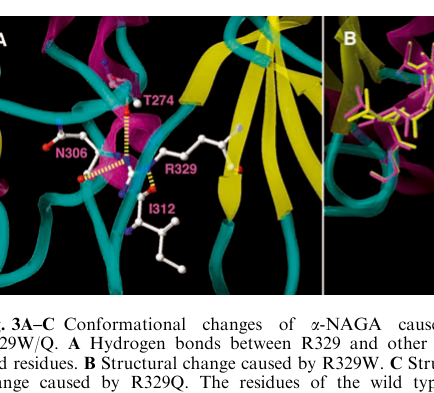

## Question

# Disease Characteristics Research Template

## Target Disease
- **Disease Name:** Schindler Disease
- **MONDO ID:**  (if available)
- **Category:** Mendelian

## Research Objectives

Please provide a comprehensive research report on **Schindler Disease** covering all of the
disease characteristics listed below. This report will be used to populate a disease knowledge
base entry. Be thorough and cite primary literature (PMID preferred) for all claims.

For each section, **suggested databases/resources** are listed. These are the first places
you should search for information on each topic.

---

### 1. Disease Information
> **Search first:** OMIM, Orphanet, ICD-10/ICD-11, MeSH, PubMed

- What is the disease? Provide a concise overview.
- What are the key identifiers? (OMIM, Orphanet, ICD-10/ICD-11, MeSH, Mondo)
- What are the common synonyms and alternative names?
- Is the information derived from individual patients (e.g., EHR) or aggregated disease-level resources?

### 2. Etiology

- **Disease Causal Factors**: What are the primary causes? (genetic, environmental, infectious, mechanistic)
- **Risk Factors**:
  > **Search first:** PubMed, Cochrane Library, UpToDate, clinical guidelines, ClinVar, ClinGen, GWAS Catalog, PheGenI, CTD, CDC, WHO, epidemiological databases
  - Genetic risk factors (causal variants, susceptibility loci, modifier genes)
  - Environmental risk factors (toxins, lifestyle, occupational exposures, age, sex, family history)
- **Protective Factors**:
  > **Search first:** PubMed, Cochrane Library, clinical trial databases, GWAS Catalog, gnomAD, WHO, CDC, nutrition databases
  - Genetic protective factors (protective variants, modifier alleles)
  - Environmental protective factors (diet, lifestyle, exposures that reduce risk)
- **Gene-Environment Interactions**: How do genetic and environmental factors interact to influence disease?
  > **Search first:** CTD, PubMed, PheGenI, GxE databases

### 3. Phenotypes
> **Search first:** HPO (Human Phenotype Ontology), OMIM, Orphanet, PubMed, clinicaltrials.gov, MedDRA, SNOMED CT, DECIPHER, LOINC

For each phenotype, provide:
- **Phenotype type**: symptoms, clinical signs, physical manifestations, behavioral changes, or laboratory abnormalities
  > For symptoms/signs: HPO, OMIM, Orphanet, PubMed
  > For behavioral changes: HPO, DSM, RDoC (Research Domain Criteria), PubMed
  > For laboratory abnormalities: LOINC, SNOMED CT, LabTests Online, PubMed
- **Phenotype characteristics**:
  > **Search first:** OMIM, Orphanet, HPO, PubMed
  - Age of symptom onset (neonatal, childhood, adult-onset, late-onset)
  - Symptom severity (mild, moderate, severe, variable)
  - Symptom progression (stable, progressive, episodic, fluctuating)
  - Frequency among affected individuals (percentage or qualitative)
- **Quality of life impact**: Effects on daily functioning and well-being (per-phenotype when possible)
  > **Search first:** EQ-5D database, SF-36, WHO QOL databases, PubMed
- Suggest HPO (Human Phenotype Ontology) terms for each phenotype

### 4. Genetic/Molecular Information

- **Causal Genes**: Gene mutations or chromosomal abnormalities responsible for disease (gene symbols, OMIM IDs)
  > **Search first:** OMIM, ClinVar, HGMD, Ensembl, NCBI Gene
- **Pathogenic Variants**:
  - Affected genes (gene symbols, HGNC IDs)
    > **Search first:** OMIM, NCBI Gene, Ensembl, HGNC, UniProt, GeneCards
  - Variant classification (pathogenic, likely pathogenic, VUS per ACMG/AMP guidelines)
    > **Search first:** ClinVar, ClinGen, ACMG/AMP guidelines, VarSome
  - Variant type/class (missense, frameshift, nonsense, splice-site, structural)
  - Allele frequency in population databases
    > **Search first:** gnomAD, 1000 Genomes, ExAC, TOPMed, dbSNP
  - Somatic vs germline origin
    > **Search first:** COSMIC (somatic), ClinVar, ICGC, TCGA
  - Functional consequences (loss of function, gain of function, dominant negative)
- **Modifier Genes**: Genes that modify disease severity or expression
- **Epigenetic Information**: DNA methylation, histone modifications, chromatin changes affecting disease
  > **Search first:** ENCODE, Roadmap Epigenomics, MethBase, DiseaseMeth
- **Chromosomal Abnormalities**: Large-scale genetic changes (aneuploidy, translocations, inversions)
  > **Search first:** DECIPHER, ClinVar, ECARUCA, UCSC Genome Browser

### 5. Environmental Information

- **Environmental Factors**: Non-genetic contributing factors (toxins, radiation, pollution, occupational exposure)
  > **Search first:** CTD (Comparative Toxicogenomics Database), TOXNET, PubMed, EPA databases
- **Lifestyle Factors**: Behavioral factors (smoking, diet, exercise, alcohol consumption)
  > **Search first:** CDC databases, WHO, PubMed, NHANES
- **Infectious Agents**: If applicable, pathogens causing or triggering disease (bacteria, viruses, fungi, parasites)
  > **Search first:** NCBI Taxonomy, ViPR, BV-BRC, MicrobeDB, GIDEON

### 6. Mechanism / Pathophysiology

- **Molecular Pathways**: Specific signaling cascades or biochemical pathways involved (Wnt, MAPK, mTOR, PI3K-AKT, etc.)
  > **Search first:** KEGG, Reactome, WikiPathways, PathBank, BioCyc
- **Cellular Processes**: Cell-level mechanisms (apoptosis, autophagy, cell cycle dysregulation, inflammation, etc.)
  > **Search first:** Gene Ontology (GO), Reactome, KEGG, PubMed
- **Protein Dysfunction**: How protein structure or function is altered (misfolding, aggregation, loss of function, gain of function)
  > **Search first:** UniProt, PDB (Protein Data Bank), InterPro, Pfam, AlphaFold
- **Metabolic Changes**: Alterations in metabolic processes (energy metabolism, lipid metabolism, amino acid metabolism)
  > **Search first:** KEGG, BioCyc, HMDB (Human Metabolome Database), BRENDA
- **Immune System Involvement**: Role of immune response (autoimmunity, immunodeficiency, chronic inflammation)
  > **Search first:** ImmPort, Immunome Database, IEDB, Gene Ontology
- **Tissue Damage Mechanisms**: How tissues/ are injured (oxidative stress, ischemia, fibrosis, necrosis)
  > **Search first:** PubMed, Gene Ontology, Reactome
- **Biochemical Abnormalities**: Specific molecular defects (enzyme deficiencies, receptor dysfunction, ion channel defects)
  > **Search first:** BRENDA, UniProt, KEGG, OMIM, PubMed
- **Epigenetic Changes**: DNA methylation, histone modifications affecting gene expression in disease
  > **Search first:** ENCODE, Roadmap Epigenomics, MethBase, DiseaseMeth
- **Molecular Profiling** (if available):
  - Transcriptomics/gene expression changes
    > **Search first:** GEO (Gene Expression Omnibus), ArrayExpress, GTEx, Human Cell Atlas, SRA
  - Proteomics findings
    > **Search first:** PRIDE, ProteomeXchange, Human Protein Atlas, STRING, BioGRID
  - Metabolomics signatures
    > **Search first:** MetaboLights, Metabolomics Workbench, HMDB, METLIN
  - Lipidomics alterations
    > **Search first:** LIPID MAPS, SwissLipids, LipidHome, Metabolomics Workbench
  - Genomic structural features
    > **Search first:** UCSC Genome Browser, Ensembl, NCBI, dbVar, DGV
- **Advanced Technologies** (if applicable):
  - Single-cell analysis findings (cell-type specific mechanisms, cellular heterogeneity)
    > **Search first:** Human Cell Atlas, Single Cell Portal, GEO, CELLxGENE
  - Spatial transcriptomics findings
    > **Search first:** GEO, Spatial Research, Vizgen, 10x Genomics data
  - Multi-omics integration results
    > **Search first:** TCGA, ICGC, cBioPortal, LinkedOmics, PubMed
  - Functional genomics screens (CRISPR, RNAi)
    > **Search first:** DepMap, GenomeRNAi, PubMed, BioGRID ORCS

For each mechanism, describe:
- The causal chain from initial trigger to clinical manifestation
- Which mechanisms are upstream vs downstream
- What cell types and biological processes are involved
- Suggest GO terms for biological processes and CL terms for cell types

### 7. Anatomical Structures Affected

- **Organ Level**:
  - Primary organs directly affected
  - Secondary organ involvement (complications, secondary effects)
  - Body systems involved (cardiovascular, nervous, digestive, respiratory, endocrine, etc.)
  > **Search first:** Uberon, FMA (Foundational Model of Anatomy), OMIM, HPO, ICD-11, MeSH, SNOMED CT
- **Tissue and Cell Level**:
  - Specific tissue types affected (epithelial, connective, muscle, nervous)
  - Specific cell populations targeted (with Cell Ontology terms)
  > **Search first:** Uberon, Human Protein Atlas, Cell Ontology, Human Cell Atlas, CellMarker, PanglaoDB
- **Subcellular Level**:
  - Cellular compartments involved (mitochondria, nucleus, ER, lysosomes) (with GO Cellular Component terms)
  > **Search first:** Gene Ontology (Cellular Component), UniProt, Human Protein Atlas
- **Localization**:
  - Specific anatomical sites (with UBERON terms)
    > **Search first:** FMA, Uberon, NeuroNames (for brain), SNOMED CT
  - Lateralization (unilateral, bilateral, asymmetric)
    > **Search first:** HPO, clinical literature, imaging databases

### 8. Temporal Development

- **Onset**:
  - Typical age of onset (congenital, pediatric, adult, geriatric)
  - Onset pattern (acute, subacute, chronic, insidious)
  > **Search first:** OMIM, Orphanet, HPO, PubMed
- **Progression**:
  - Disease stages (early, intermediate, advanced, end-stage)
    > **Search first:** Cancer Staging Manual (AJCC), WHO classifications, PubMed
  - Progression rate (rapid, slow, variable)
  - Disease course pattern (episodic, relapsing-remitting, progressive, stable)
  - Disease duration (self-limited, chronic lifelong)
  > **Search first:** Disease registries, longitudinal cohort databases, natural history studies, PubMed, Orphanet, OMIM
- **Patterns**:
  - Remission patterns (spontaneous, treatment-induced)
    > **Search first:** Clinical trial databases, disease registries, PubMed
  - Critical periods (time windows of vulnerability or opportunity for intervention)
    > **Search first:** PubMed, developmental biology databases, clinical guidelines

### 9. Inheritance and Population

- **Epidemiology**:
  - Prevalence (cases per 100,000 at given time)
  - Incidence (new cases per 100,000 per year)
  > **Search first:** Orphanet, CDC, WHO, GBD (Global Burden of Disease), national registries, SEER, disease registries
- **For Genetic Etiology**:
  - Inheritance pattern (AD, AR, X-linked, mitochondrial, multifactorial, polygenic)
    > **Search first:** OMIM, Orphanet, ClinVar, GTR (Genetic Testing Registry)
  - Penetrance (complete, incomplete, age-dependent)
    > **Search first:** ClinVar, OMIM, PubMed, ClinGen
  - Expressivity (variable, consistent)
    > **Search first:** OMIM, ClinVar, PubMed
  - Genetic anticipation (increasing severity in successive generations)
    > **Search first:** OMIM, PubMed (especially for repeat expansion disorders)
  - Germline mosaicism
    > **Search first:** ClinVar, OMIM, genetic counseling literature, PubMed
  - Founder effects (population-specific mutations)
    > **Search first:** gnomAD, population genetics databases, PubMed
  - Consanguinity role
    > **Search first:** OMIM, population studies, genetic counseling resources
  - Carrier frequency
    > **Search first:** gnomAD, carrier screening databases, GeneReviews, GTR
- **Population Demographics**:
  - Affected populations (ethnic or demographic groups with higher prevalence)
    > **Search first:** gnomAD, 1000 Genomes, PAGE Study, PubMed, population registries
  - Geographic distribution (endemic areas, regional variation)
    > **Search first:** WHO, CDC, GBD, Orphanet, geographic epidemiology databases
  - Geographic distribution of specific variants
  - Sex ratio (male:female)
    > **Search first:** Disease registries, OMIM, PubMed, epidemiological databases
  - Age distribution of affected individuals
    > **Search first:** CDC, disease registries, SEER, Orphanet

### 10. Diagnostics

- **Clinical Tests**:
  - Laboratory tests (blood, urine, tissue chemistry, specific enzyme assays)
    > **Search first:** LOINC, LabTests Online, PubMed
  - Biomarkers (proteins, metabolites, genetic markers, circulating biomarkers)
    > **Search first:** FDA Biomarker List, BEST (Biomarkers, EndpointS, and other Tools), PubMed
  - Imaging studies (X-ray, CT, MRI, PET, ultrasound)
    > **Search first:** RadLex, DICOM, Radiopaedia, imaging databases
  - Functional tests (pulmonary function, cardiac stress tests)
    > **Search first:** LOINC, clinical guidelines, PubMed
  - Electrophysiology (EEG, EMG, ECG, nerve conduction studies)
    > **Search first:** LOINC, clinical neurophysiology databases, PubMed
  - Biopsy findings (histopathology, immunohistochemistry)
    > **Search first:** SNOMED CT, College of American Pathologists resources, PubMed
  - Pathology findings (microscopic examination)
    > **Search first:** SNOMED CT, Digital Pathology databases, PubMed
- **Genetic Testing**:
  > **Search first:** GTR (Genetic Testing Registry), GeneReviews, ClinGen
  - Overview of recommended genetic testing approach
  - Whole genome sequencing (WGS) utility
    > **Search first:** GTR, ClinVar, GEL (Genomics England), gnomAD
  - Whole exome sequencing (WES) utility
    > **Search first:** GTR, ClinVar, OMIM, GeneMatcher
  - Gene panels (which panels, which genes)
    > **Search first:** GTR, ClinVar, laboratory-specific databases
  - Single gene testing
    > **Search first:** GTR, ClinVar, OMIM, GeneReviews
  - Chromosomal microarray (CMA)
    > **Search first:** DECIPHER, ClinVar, dbVar, ECARUCA
  - Karyotyping
    > **Search first:** Chromosome Abnormality Database, ClinVar, cytogenetics resources
  - FISH
    > **Search first:** ClinVar, cytogenetics databases, PubMed
  - Mitochondrial DNA testing
    > **Search first:** MITOMAP, MSeqDR, ClinVar, GTR
  - Repeat expansion testing
    > **Search first:** GTR, ClinVar, repeat expansion databases, PubMed
- **Omics-Based Diagnostics** (if applicable):
  - RNA sequencing / transcriptomics
    > **Search first:** GEO, ArrayExpress, GTEx, RNA-seq databases
  - Proteomics
    > **Search first:** PRIDE, ProteomeXchange, FDA Biomarker database
  - Metabolomics
    > **Search first:** MetaboLights, Metabolomics Workbench, HMDB
  - Epigenomics
    > **Search first:** GEO, ENCODE, Roadmap Epigenomics, MethBase
  - Liquid biopsy
    > **Search first:** COSMIC, ClinVar, liquid biopsy databases, PubMed
- **Clinical Criteria**:
  - Standardized diagnostic criteria (DSM, ICD, society guidelines)
    > **Search first:** DSM-5, ICD-11, clinical society guidelines, UpToDate
  - Differential diagnosis (other conditions to rule out, with distinguishing features)
    > **Search first:** DynaMed, UpToDate, clinical decision support systems
- **Screening**:
  - Screening methods for asymptomatic individuals (newborn screening, carrier screening, cascade screening)
    > **Search first:** ACMG recommendations, CDC newborn screening, GTR

### 11. Outcome/Prognosis

- **Survival and Mortality**:
  - Survival rate (5-year, 10-year, overall)
    > **Search first:** SEER, cancer registries, disease-specific registries, PubMed
  - Life expectancy (with and without treatment if applicable)
    > **Search first:** Orphanet, disease registries, actuarial databases, PubMed
  - Mortality rate
    > **Search first:** CDC, WHO, GBD, national mortality databases
  - Disease-specific mortality (deaths directly attributable to disease)
    > **Search first:** Disease registries, CDC Wonder, GBD, PubMed
- **Morbidity and Function**:
  - Morbidity (disease-related disability and health impacts)
    > **Search first:** GBD, WHO, disability databases, PubMed
  - Disability outcomes (long-term functional impairments)
    > **Search first:** ICF (International Classification of Functioning), disability registries
  - Quality of life measures (EQ-5D, SF-36, PROMIS, disease-specific tools)
    > **Search first:** EQ-5D database, SF-36, PROMIS, PubMed
- **Disease Course**:
  - Complications (secondary problems: infections, organ failure, etc.)
    > **Search first:** ICD codes, disease registries, clinical databases, PubMed
  - Recovery potential (likelihood and extent of recovery, with vs without treatment)
    > **Search first:** Natural history studies, rehabilitation databases, PubMed
- **Prediction**:
  - Prognostic factors (age, disease severity, biomarkers, treatment response)
    > **Search first:** Prognostic models databases, clinical calculators, PubMed
  - Prognostic biomarkers (molecular markers predicting disease course)
    > **Search first:** FDA Biomarker database, PubMed, cancer prognostic databases

### 12. Treatment

- **Pharmacotherapy**:
  - Pharmacological treatments (drug names, drug classes, mechanisms of action)
    > **Search first:** DrugBank, RxNorm, ATC classification, DailyMed, FDA databases
  - Pharmacogenomics (how genetic variants affect drug metabolism, efficacy, toxicity)
    > **Search first:** PharmGKB, CPIC (Clinical Pharmacogenetics), FDA Table of PGx Biomarkers
- **Advanced Therapeutics**:
  - Gene therapy (viral vectors, CRISPR, gene replacement, gene editing)
    > **Search first:** ClinicalTrials.gov, FDA gene therapy database, ASGCT resources
  - Cell therapy (stem cell transplant, CAR-T, cellular therapeutics)
    > **Search first:** ClinicalTrials.gov, FDA cell therapy database, FACT standards
  - RNA-based therapies (ASOs, siRNA, mRNA therapies)
    > **Search first:** ClinicalTrials.gov, FDA approvals, PubMed
  - Targeted therapies (treatments directed at specific molecular targets)
    > **Search first:** My Cancer Genome, OncoKB, ClinicalTrials.gov, FDA approvals
  - Immunotherapies (checkpoint inhibitors, monoclonal antibodies)
    > **Search first:** Cancer Immunotherapy Database, FDA approvals, ClinicalTrials.gov
- **Surgical and Interventional**:
  - Surgical interventions (types of surgery, timing, outcomes)
    > **Search first:** CPT codes, surgical registries, clinical guidelines, PubMed
- **Supportive and Rehabilitative**:
  - Supportive care (symptom management, pain control, nutrition)
    > **Search first:** Clinical guidelines, Cochrane Library, PubMed
  - Rehabilitation (physical therapy, occupational therapy, speech therapy)
    > **Search first:** Rehabilitation medicine databases, clinical guidelines, PubMed
- **Experimental**:
  - Experimental treatments in clinical trials (with NCT identifiers if available)
    > **Search first:** ClinicalTrials.gov, EU Clinical Trials Register, WHO ICTRP
- **Treatment Outcomes**:
  - Treatment response rates
    > **Search first:** Clinical trial databases, FDA reviews, systematic reviews, PubMed
  - Side effects and adverse events
    > **Search first:** FDA Adverse Event Reporting System (FAERS), MedWatch, PubMed
- **Treatment Strategy**:
  - Treatment algorithms (clinical pathways, decision trees)
    > **Search first:** Clinical practice guidelines, NCCN Guidelines, UpToDate
  - Combination therapies
    > **Search first:** ClinicalTrials.gov, treatment guidelines, PubMed
  - Personalized medicine approaches (genotype-guided treatment)
    > **Search first:** My Cancer Genome, CIViC, PharmGKB, precision medicine databases

For each treatment, suggest MAXO (Medical Action Ontology) terms where applicable.

### 13. Prevention

- **Prevention Levels**:
  - Primary prevention (preventing disease occurrence: vaccination, risk factor modification)
    > **Search first:** CDC, WHO, USPSTF recommendations, Cochrane Library
  - Secondary prevention (early detection and treatment: screening programs, early intervention)
    > **Search first:** USPSTF, CDC screening guidelines, WHO
  - Tertiary prevention (preventing complications in those with disease)
    > **Search first:** Clinical guidelines, disease management protocols, PubMed
- **Immunization**: Vaccine strategies (if applicable)
  > **Search first:** CDC vaccine schedules, WHO immunization, FDA vaccine database
- **Screening and Early Detection**:
  - Screening programs (population-based: newborn screening, cancer screening)
    > **Search first:** CDC screening programs, USPSTF, cancer screening databases
  - Genetic screening (carrier screening, preimplantation genetic diagnosis, prenatal testing)
    > **Search first:** ACMG recommendations, ACOG guidelines, GTR
  - Risk stratification (identifying high-risk individuals for targeted prevention)
    > **Search first:** Risk prediction models, clinical calculators, PubMed
- **Behavioral Interventions**: Lifestyle modifications to reduce risk
  > **Search first:** CDC, WHO, behavioral intervention databases, Cochrane Library
- **Counseling**: Genetic counseling (risk assessment, family planning guidance)
  > **Search first:** NSGC resources, ACMG guidelines, GeneReviews
- **Public Health**:
  - Public health interventions (sanitation, vector control, health education)
    > **Search first:** CDC, WHO, public health databases, PubMed
  - Environmental interventions (reducing environmental risk factors)
    > **Search first:** EPA databases, WHO environmental health, PubMed
- **Prophylaxis**: Preventive medications or procedures
  > **Search first:** Clinical guidelines, FDA approvals, PubMed

### 14. Other Species / Natural Disease

- **Taxonomy**: Species affected (with NCBI Taxon identifiers)
  > **Search first:** NCBI Taxonomy
- **Breed**: Specific breeds affected (with VBO identifiers if applicable)
  > **Search first:** VBO (Vertebrate Breed Ontology)
- **Gene**: Orthologous genes in other species (with NCBI Gene IDs)
  > **Search first:** NCBI Gene
- **Natural Disease**:
  - Naturally occurring disease in other species (companion animals, wildlife)
    > **Search first:** OMIA (Online Mendelian Inheritance in Animals), VetCompass, PubMed
  - Veterinary relevance and importance in animal health
    > **Search first:** OMIA, veterinary databases, PubMed
- **Comparative Biology**:
  - Comparative pathology (similarities and differences across species)
    > **Search first:** OMIA, comparative pathology databases, PubMed
  - Evolutionary conservation of disease mechanisms
    > **Search first:** HomoloGene, OrthoMCL, Alliance of Genome Resources
- **Transmission** (if applicable):
  - Zoonotic potential
    > **Search first:** CDC zoonotic diseases, WHO zoonoses, GIDEON
  - Cross-species susceptibility
    > **Search first:** NCBI Taxonomy, veterinary databases, PubMed

### 15. Model Organisms

- **Model Types**:
  - Model organism type (mammalian, invertebrate, cellular, in vitro)
    > **Search first:** Alliance of Genome Resources, model organism databases
  - Specific model systems (mouse, rat, zebrafish, Drosophila, C. elegans, yeast, cell lines, organoids, iPSCs)
    > **Search first:** MGI, RGD, ZFIN, FlyBase, WormBase, SGD, ATCC, Cellosaurus
  - Induced models (drug treatment, surgical intervention, environmental manipulation)
    > **Search first:** MGI, model organism databases, PubMed
- **Genetic Models**:
  - Types available (knockout, knock-in, transgenic, conditional, humanized)
    > **Search first:** MGI, IMPC, KOMP, EuMMCR, IMSR
- **Model Characteristics**:
  - Phenotype recapitulation (how well model reproduces human disease features)
    > **Search first:** Model organism databases, comparative studies, PubMed
  - Model limitations (aspects of human disease not captured)
    > **Search first:** Model organism databases, PubMed, review articles
- **Applications**:
  - Research applications (what aspects of disease can be studied)
    > **Search first:** Model organism databases, PubMed
- **Resources**:
  - Model databases
    > **Search first:** MGI, RGD, ZFIN, FlyBase, WormBase, IMSR, EMMA, MMRRC

---

## Citation Requirements

- Cite primary literature (PMID preferred) for all mechanistic and clinical claims
- Prioritize recent reviews and landmark papers
- Include direct quotes from abstracts where possible to support key statements
- Distinguish evidence source types: human clinical, model organism, in vitro, computational

## Output Format

Structure your response as a comprehensive narrative organized by the sections above.
For each section, provide:
- Factual content with specific details (numbers, percentages, gene names, variant nomenclature)
- Ontology term suggestions (HPO, GO, CL, UBERON, CHEBI, MAXO, MONDO) where applicable
- Evidence citations with PMIDs
- Direct quotes from abstracts to support key claims
- Clear indication when information is not available or not applicable for this disease

This report will be used to populate a disease knowledge base entry with:
- Pathophysiology descriptions with causal chains
- Gene/protein annotations (HGNC, GO terms)
- Phenotype associations (HP terms) with frequencies
- Cell type involvement (CL terms)
- Anatomical locations (UBERON terms)
- Chemical entities (CHEBI terms)
- Treatment annotations (MAXO terms)
- Evidence items with PMIDs and exact abstract quotes
- Epidemiology, prognosis, diagnostic, and prevention information
- Animal model descriptions with phenotype recapitulation details

## Output

Question: You are an expert researcher providing comprehensive, well-cited information.

Provide detailed information focusing on:
1. Key concepts and definitions with current understanding
2. Recent developments and latest research (prioritize 2023-2024 sources)
3. Current applications and real-world implementations
4. Expert opinions and analysis from authoritative sources
5. Relevant statistics and data from recent studies

Format as a comprehensive research report with proper citations. Include URLs and publication dates where available.
Always prioritize recent, authoritative sources and provide specific citations for all major claims.

# Disease Characteristics Research Template

## Target Disease
- **Disease Name:** Schindler Disease
- **MONDO ID:**  (if available)
- **Category:** Mendelian

## Research Objectives

Please provide a comprehensive research report on **Schindler Disease** covering all of the
disease characteristics listed below. This report will be used to populate a disease knowledge
base entry. Be thorough and cite primary literature (PMID preferred) for all claims.

For each section, **suggested databases/resources** are listed. These are the first places
you should search for information on each topic.

---

### 1. Disease Information
> **Search first:** OMIM, Orphanet, ICD-10/ICD-11, MeSH, PubMed

- What is the disease? Provide a concise overview.
- What are the key identifiers? (OMIM, Orphanet, ICD-10/ICD-11, MeSH, Mondo)
- What are the common synonyms and alternative names?
- Is the information derived from individual patients (e.g., EHR) or aggregated disease-level resources?

### 2. Etiology

- **Disease Causal Factors**: What are the primary causes? (genetic, environmental, infectious, mechanistic)
- **Risk Factors**:
  > **Search first:** PubMed, Cochrane Library, UpToDate, clinical guidelines, ClinVar, ClinGen, GWAS Catalog, PheGenI, CTD, CDC, WHO, epidemiological databases
  - Genetic risk factors (causal variants, susceptibility loci, modifier genes)
  - Environmental risk factors (toxins, lifestyle, occupational exposures, age, sex, family history)
- **Protective Factors**:
  > **Search first:** PubMed, Cochrane Library, clinical trial databases, GWAS Catalog, gnomAD, WHO, CDC, nutrition databases
  - Genetic protective factors (protective variants, modifier alleles)
  - Environmental protective factors (diet, lifestyle, exposures that reduce risk)
- **Gene-Environment Interactions**: How do genetic and environmental factors interact to influence disease?
  > **Search first:** CTD, PubMed, PheGenI, GxE databases

### 3. Phenotypes
> **Search first:** HPO (Human Phenotype Ontology), OMIM, Orphanet, PubMed, clinicaltrials.gov, MedDRA, SNOMED CT, DECIPHER, LOINC

For each phenotype, provide:
- **Phenotype type**: symptoms, clinical signs, physical manifestations, behavioral changes, or laboratory abnormalities
  > For symptoms/signs: HPO, OMIM, Orphanet, PubMed
  > For behavioral changes: HPO, DSM, RDoC (Research Domain Criteria), PubMed
  > For laboratory abnormalities: LOINC, SNOMED CT, LabTests Online, PubMed
- **Phenotype characteristics**:
  > **Search first:** OMIM, Orphanet, HPO, PubMed
  - Age of symptom onset (neonatal, childhood, adult-onset, late-onset)
  - Symptom severity (mild, moderate, severe, variable)
  - Symptom progression (stable, progressive, episodic, fluctuating)
  - Frequency among affected individuals (percentage or qualitative)
- **Quality of life impact**: Effects on daily functioning and well-being (per-phenotype when possible)
  > **Search first:** EQ-5D database, SF-36, WHO QOL databases, PubMed
- Suggest HPO (Human Phenotype Ontology) terms for each phenotype

### 4. Genetic/Molecular Information

- **Causal Genes**: Gene mutations or chromosomal abnormalities responsible for disease (gene symbols, OMIM IDs)
  > **Search first:** OMIM, ClinVar, HGMD, Ensembl, NCBI Gene
- **Pathogenic Variants**:
  - Affected genes (gene symbols, HGNC IDs)
    > **Search first:** OMIM, NCBI Gene, Ensembl, HGNC, UniProt, GeneCards
  - Variant classification (pathogenic, likely pathogenic, VUS per ACMG/AMP guidelines)
    > **Search first:** ClinVar, ClinGen, ACMG/AMP guidelines, VarSome
  - Variant type/class (missense, frameshift, nonsense, splice-site, structural)
  - Allele frequency in population databases
    > **Search first:** gnomAD, 1000 Genomes, ExAC, TOPMed, dbSNP
  - Somatic vs germline origin
    > **Search first:** COSMIC (somatic), ClinVar, ICGC, TCGA
  - Functional consequences (loss of function, gain of function, dominant negative)
- **Modifier Genes**: Genes that modify disease severity or expression
- **Epigenetic Information**: DNA methylation, histone modifications, chromatin changes affecting disease
  > **Search first:** ENCODE, Roadmap Epigenomics, MethBase, DiseaseMeth
- **Chromosomal Abnormalities**: Large-scale genetic changes (aneuploidy, translocations, inversions)
  > **Search first:** DECIPHER, ClinVar, ECARUCA, UCSC Genome Browser

### 5. Environmental Information

- **Environmental Factors**: Non-genetic contributing factors (toxins, radiation, pollution, occupational exposure)
  > **Search first:** CTD (Comparative Toxicogenomics Database), TOXNET, PubMed, EPA databases
- **Lifestyle Factors**: Behavioral factors (smoking, diet, exercise, alcohol consumption)
  > **Search first:** CDC databases, WHO, PubMed, NHANES
- **Infectious Agents**: If applicable, pathogens causing or triggering disease (bacteria, viruses, fungi, parasites)
  > **Search first:** NCBI Taxonomy, ViPR, BV-BRC, MicrobeDB, GIDEON

### 6. Mechanism / Pathophysiology

- **Molecular Pathways**: Specific signaling cascades or biochemical pathways involved (Wnt, MAPK, mTOR, PI3K-AKT, etc.)
  > **Search first:** KEGG, Reactome, WikiPathways, PathBank, BioCyc
- **Cellular Processes**: Cell-level mechanisms (apoptosis, autophagy, cell cycle dysregulation, inflammation, etc.)
  > **Search first:** Gene Ontology (GO), Reactome, KEGG, PubMed
- **Protein Dysfunction**: How protein structure or function is altered (misfolding, aggregation, loss of function, gain of function)
  > **Search first:** UniProt, PDB (Protein Data Bank), InterPro, Pfam, AlphaFold
- **Metabolic Changes**: Alterations in metabolic processes (energy metabolism, lipid metabolism, amino acid metabolism)
  > **Search first:** KEGG, BioCyc, HMDB (Human Metabolome Database), BRENDA
- **Immune System Involvement**: Role of immune response (autoimmunity, immunodeficiency, chronic inflammation)
  > **Search first:** ImmPort, Immunome Database, IEDB, Gene Ontology
- **Tissue Damage Mechanisms**: How tissues/ are injured (oxidative stress, ischemia, fibrosis, necrosis)
  > **Search first:** PubMed, Gene Ontology, Reactome
- **Biochemical Abnormalities**: Specific molecular defects (enzyme deficiencies, receptor dysfunction, ion channel defects)
  > **Search first:** BRENDA, UniProt, KEGG, OMIM, PubMed
- **Epigenetic Changes**: DNA methylation, histone modifications affecting gene expression in disease
  > **Search first:** ENCODE, Roadmap Epigenomics, MethBase, DiseaseMeth
- **Molecular Profiling** (if available):
  - Transcriptomics/gene expression changes
    > **Search first:** GEO (Gene Expression Omnibus), ArrayExpress, GTEx, Human Cell Atlas, SRA
  - Proteomics findings
    > **Search first:** PRIDE, ProteomeXchange, Human Protein Atlas, STRING, BioGRID
  - Metabolomics signatures
    > **Search first:** MetaboLights, Metabolomics Workbench, HMDB, METLIN
  - Lipidomics alterations
    > **Search first:** LIPID MAPS, SwissLipids, LipidHome, Metabolomics Workbench
  - Genomic structural features
    > **Search first:** UCSC Genome Browser, Ensembl, NCBI, dbVar, DGV
- **Advanced Technologies** (if applicable):
  - Single-cell analysis findings (cell-type specific mechanisms, cellular heterogeneity)
    > **Search first:** Human Cell Atlas, Single Cell Portal, GEO, CELLxGENE
  - Spatial transcriptomics findings
    > **Search first:** GEO, Spatial Research, Vizgen, 10x Genomics data
  - Multi-omics integration results
    > **Search first:** TCGA, ICGC, cBioPortal, LinkedOmics, PubMed
  - Functional genomics screens (CRISPR, RNAi)
    > **Search first:** DepMap, GenomeRNAi, PubMed, BioGRID ORCS

For each mechanism, describe:
- The causal chain from initial trigger to clinical manifestation
- Which mechanisms are upstream vs downstream
- What cell types and biological processes are involved
- Suggest GO terms for biological processes and CL terms for cell types

### 7. Anatomical Structures Affected

- **Organ Level**:
  - Primary organs directly affected
  - Secondary organ involvement (complications, secondary effects)
  - Body systems involved (cardiovascular, nervous, digestive, respiratory, endocrine, etc.)
  > **Search first:** Uberon, FMA (Foundational Model of Anatomy), OMIM, HPO, ICD-11, MeSH, SNOMED CT
- **Tissue and Cell Level**:
  - Specific tissue types affected (epithelial, connective, muscle, nervous)
  - Specific cell populations targeted (with Cell Ontology terms)
  > **Search first:** Uberon, Human Protein Atlas, Cell Ontology, Human Cell Atlas, CellMarker, PanglaoDB
- **Subcellular Level**:
  - Cellular compartments involved (mitochondria, nucleus, ER, lysosomes) (with GO Cellular Component terms)
  > **Search first:** Gene Ontology (Cellular Component), UniProt, Human Protein Atlas
- **Localization**:
  - Specific anatomical sites (with UBERON terms)
    > **Search first:** FMA, Uberon, NeuroNames (for brain), SNOMED CT
  - Lateralization (unilateral, bilateral, asymmetric)
    > **Search first:** HPO, clinical literature, imaging databases

### 8. Temporal Development

- **Onset**:
  - Typical age of onset (congenital, pediatric, adult, geriatric)
  - Onset pattern (acute, subacute, chronic, insidious)
  > **Search first:** OMIM, Orphanet, HPO, PubMed
- **Progression**:
  - Disease stages (early, intermediate, advanced, end-stage)
    > **Search first:** Cancer Staging Manual (AJCC), WHO classifications, PubMed
  - Progression rate (rapid, slow, variable)
  - Disease course pattern (episodic, relapsing-remitting, progressive, stable)
  - Disease duration (self-limited, chronic lifelong)
  > **Search first:** Disease registries, longitudinal cohort databases, natural history studies, PubMed, Orphanet, OMIM
- **Patterns**:
  - Remission patterns (spontaneous, treatment-induced)
    > **Search first:** Clinical trial databases, disease registries, PubMed
  - Critical periods (time windows of vulnerability or opportunity for intervention)
    > **Search first:** PubMed, developmental biology databases, clinical guidelines

### 9. Inheritance and Population

- **Epidemiology**:
  - Prevalence (cases per 100,000 at given time)
  - Incidence (new cases per 100,000 per year)
  > **Search first:** Orphanet, CDC, WHO, GBD (Global Burden of Disease), national registries, SEER, disease registries
- **For Genetic Etiology**:
  - Inheritance pattern (AD, AR, X-linked, mitochondrial, multifactorial, polygenic)
    > **Search first:** OMIM, Orphanet, ClinVar, GTR (Genetic Testing Registry)
  - Penetrance (complete, incomplete, age-dependent)
    > **Search first:** ClinVar, OMIM, PubMed, ClinGen
  - Expressivity (variable, consistent)
    > **Search first:** OMIM, ClinVar, PubMed
  - Genetic anticipation (increasing severity in successive generations)
    > **Search first:** OMIM, PubMed (especially for repeat expansion disorders)
  - Germline mosaicism
    > **Search first:** ClinVar, OMIM, genetic counseling literature, PubMed
  - Founder effects (population-specific mutations)
    > **Search first:** gnomAD, population genetics databases, PubMed
  - Consanguinity role
    > **Search first:** OMIM, population studies, genetic counseling resources
  - Carrier frequency
    > **Search first:** gnomAD, carrier screening databases, GeneReviews, GTR
- **Population Demographics**:
  - Affected populations (ethnic or demographic groups with higher prevalence)
    > **Search first:** gnomAD, 1000 Genomes, PAGE Study, PubMed, population registries
  - Geographic distribution (endemic areas, regional variation)
    > **Search first:** WHO, CDC, GBD, Orphanet, geographic epidemiology databases
  - Geographic distribution of specific variants
  - Sex ratio (male:female)
    > **Search first:** Disease registries, OMIM, PubMed, epidemiological databases
  - Age distribution of affected individuals
    > **Search first:** CDC, disease registries, SEER, Orphanet

### 10. Diagnostics

- **Clinical Tests**:
  - Laboratory tests (blood, urine, tissue chemistry, specific enzyme assays)
    > **Search first:** LOINC, LabTests Online, PubMed
  - Biomarkers (proteins, metabolites, genetic markers, circulating biomarkers)
    > **Search first:** FDA Biomarker List, BEST (Biomarkers, EndpointS, and other Tools), PubMed
  - Imaging studies (X-ray, CT, MRI, PET, ultrasound)
    > **Search first:** RadLex, DICOM, Radiopaedia, imaging databases
  - Functional tests (pulmonary function, cardiac stress tests)
    > **Search first:** LOINC, clinical guidelines, PubMed
  - Electrophysiology (EEG, EMG, ECG, nerve conduction studies)
    > **Search first:** LOINC, clinical neurophysiology databases, PubMed
  - Biopsy findings (histopathology, immunohistochemistry)
    > **Search first:** SNOMED CT, College of American Pathologists resources, PubMed
  - Pathology findings (microscopic examination)
    > **Search first:** SNOMED CT, Digital Pathology databases, PubMed
- **Genetic Testing**:
  > **Search first:** GTR (Genetic Testing Registry), GeneReviews, ClinGen
  - Overview of recommended genetic testing approach
  - Whole genome sequencing (WGS) utility
    > **Search first:** GTR, ClinVar, GEL (Genomics England), gnomAD
  - Whole exome sequencing (WES) utility
    > **Search first:** GTR, ClinVar, OMIM, GeneMatcher
  - Gene panels (which panels, which genes)
    > **Search first:** GTR, ClinVar, laboratory-specific databases
  - Single gene testing
    > **Search first:** GTR, ClinVar, OMIM, GeneReviews
  - Chromosomal microarray (CMA)
    > **Search first:** DECIPHER, ClinVar, dbVar, ECARUCA
  - Karyotyping
    > **Search first:** Chromosome Abnormality Database, ClinVar, cytogenetics resources
  - FISH
    > **Search first:** ClinVar, cytogenetics databases, PubMed
  - Mitochondrial DNA testing
    > **Search first:** MITOMAP, MSeqDR, ClinVar, GTR
  - Repeat expansion testing
    > **Search first:** GTR, ClinVar, repeat expansion databases, PubMed
- **Omics-Based Diagnostics** (if applicable):
  - RNA sequencing / transcriptomics
    > **Search first:** GEO, ArrayExpress, GTEx, RNA-seq databases
  - Proteomics
    > **Search first:** PRIDE, ProteomeXchange, FDA Biomarker database
  - Metabolomics
    > **Search first:** MetaboLights, Metabolomics Workbench, HMDB
  - Epigenomics
    > **Search first:** GEO, ENCODE, Roadmap Epigenomics, MethBase
  - Liquid biopsy
    > **Search first:** COSMIC, ClinVar, liquid biopsy databases, PubMed
- **Clinical Criteria**:
  - Standardized diagnostic criteria (DSM, ICD, society guidelines)
    > **Search first:** DSM-5, ICD-11, clinical society guidelines, UpToDate
  - Differential diagnosis (other conditions to rule out, with distinguishing features)
    > **Search first:** DynaMed, UpToDate, clinical decision support systems
- **Screening**:
  - Screening methods for asymptomatic individuals (newborn screening, carrier screening, cascade screening)
    > **Search first:** ACMG recommendations, CDC newborn screening, GTR

### 11. Outcome/Prognosis

- **Survival and Mortality**:
  - Survival rate (5-year, 10-year, overall)
    > **Search first:** SEER, cancer registries, disease-specific registries, PubMed
  - Life expectancy (with and without treatment if applicable)
    > **Search first:** Orphanet, disease registries, actuarial databases, PubMed
  - Mortality rate
    > **Search first:** CDC, WHO, GBD, national mortality databases
  - Disease-specific mortality (deaths directly attributable to disease)
    > **Search first:** Disease registries, CDC Wonder, GBD, PubMed
- **Morbidity and Function**:
  - Morbidity (disease-related disability and health impacts)
    > **Search first:** GBD, WHO, disability databases, PubMed
  - Disability outcomes (long-term functional impairments)
    > **Search first:** ICF (International Classification of Functioning), disability registries
  - Quality of life measures (EQ-5D, SF-36, PROMIS, disease-specific tools)
    > **Search first:** EQ-5D database, SF-36, PROMIS, PubMed
- **Disease Course**:
  - Complications (secondary problems: infections, organ failure, etc.)
    > **Search first:** ICD codes, disease registries, clinical databases, PubMed
  - Recovery potential (likelihood and extent of recovery, with vs without treatment)
    > **Search first:** Natural history studies, rehabilitation databases, PubMed
- **Prediction**:
  - Prognostic factors (age, disease severity, biomarkers, treatment response)
    > **Search first:** Prognostic models databases, clinical calculators, PubMed
  - Prognostic biomarkers (molecular markers predicting disease course)
    > **Search first:** FDA Biomarker database, PubMed, cancer prognostic databases

### 12. Treatment

- **Pharmacotherapy**:
  - Pharmacological treatments (drug names, drug classes, mechanisms of action)
    > **Search first:** DrugBank, RxNorm, ATC classification, DailyMed, FDA databases
  - Pharmacogenomics (how genetic variants affect drug metabolism, efficacy, toxicity)
    > **Search first:** PharmGKB, CPIC (Clinical Pharmacogenetics), FDA Table of PGx Biomarkers
- **Advanced Therapeutics**:
  - Gene therapy (viral vectors, CRISPR, gene replacement, gene editing)
    > **Search first:** ClinicalTrials.gov, FDA gene therapy database, ASGCT resources
  - Cell therapy (stem cell transplant, CAR-T, cellular therapeutics)
    > **Search first:** ClinicalTrials.gov, FDA cell therapy database, FACT standards
  - RNA-based therapies (ASOs, siRNA, mRNA therapies)
    > **Search first:** ClinicalTrials.gov, FDA approvals, PubMed
  - Targeted therapies (treatments directed at specific molecular targets)
    > **Search first:** My Cancer Genome, OncoKB, ClinicalTrials.gov, FDA approvals
  - Immunotherapies (checkpoint inhibitors, monoclonal antibodies)
    > **Search first:** Cancer Immunotherapy Database, FDA approvals, ClinicalTrials.gov
- **Surgical and Interventional**:
  - Surgical interventions (types of surgery, timing, outcomes)
    > **Search first:** CPT codes, surgical registries, clinical guidelines, PubMed
- **Supportive and Rehabilitative**:
  - Supportive care (symptom management, pain control, nutrition)
    > **Search first:** Clinical guidelines, Cochrane Library, PubMed
  - Rehabilitation (physical therapy, occupational therapy, speech therapy)
    > **Search first:** Rehabilitation medicine databases, clinical guidelines, PubMed
- **Experimental**:
  - Experimental treatments in clinical trials (with NCT identifiers if available)
    > **Search first:** ClinicalTrials.gov, EU Clinical Trials Register, WHO ICTRP
- **Treatment Outcomes**:
  - Treatment response rates
    > **Search first:** Clinical trial databases, FDA reviews, systematic reviews, PubMed
  - Side effects and adverse events
    > **Search first:** FDA Adverse Event Reporting System (FAERS), MedWatch, PubMed
- **Treatment Strategy**:
  - Treatment algorithms (clinical pathways, decision trees)
    > **Search first:** Clinical practice guidelines, NCCN Guidelines, UpToDate
  - Combination therapies
    > **Search first:** ClinicalTrials.gov, treatment guidelines, PubMed
  - Personalized medicine approaches (genotype-guided treatment)
    > **Search first:** My Cancer Genome, CIViC, PharmGKB, precision medicine databases

For each treatment, suggest MAXO (Medical Action Ontology) terms where applicable.

### 13. Prevention

- **Prevention Levels**:
  - Primary prevention (preventing disease occurrence: vaccination, risk factor modification)
    > **Search first:** CDC, WHO, USPSTF recommendations, Cochrane Library
  - Secondary prevention (early detection and treatment: screening programs, early intervention)
    > **Search first:** USPSTF, CDC screening guidelines, WHO
  - Tertiary prevention (preventing complications in those with disease)
    > **Search first:** Clinical guidelines, disease management protocols, PubMed
- **Immunization**: Vaccine strategies (if applicable)
  > **Search first:** CDC vaccine schedules, WHO immunization, FDA vaccine database
- **Screening and Early Detection**:
  - Screening programs (population-based: newborn screening, cancer screening)
    > **Search first:** CDC screening programs, USPSTF, cancer screening databases
  - Genetic screening (carrier screening, preimplantation genetic diagnosis, prenatal testing)
    > **Search first:** ACMG recommendations, ACOG guidelines, GTR
  - Risk stratification (identifying high-risk individuals for targeted prevention)
    > **Search first:** Risk prediction models, clinical calculators, PubMed
- **Behavioral Interventions**: Lifestyle modifications to reduce risk
  > **Search first:** CDC, WHO, behavioral intervention databases, Cochrane Library
- **Counseling**: Genetic counseling (risk assessment, family planning guidance)
  > **Search first:** NSGC resources, ACMG guidelines, GeneReviews
- **Public Health**:
  - Public health interventions (sanitation, vector control, health education)
    > **Search first:** CDC, WHO, public health databases, PubMed
  - Environmental interventions (reducing environmental risk factors)
    > **Search first:** EPA databases, WHO environmental health, PubMed
- **Prophylaxis**: Preventive medications or procedures
  > **Search first:** Clinical guidelines, FDA approvals, PubMed

### 14. Other Species / Natural Disease

- **Taxonomy**: Species affected (with NCBI Taxon identifiers)
  > **Search first:** NCBI Taxonomy
- **Breed**: Specific breeds affected (with VBO identifiers if applicable)
  > **Search first:** VBO (Vertebrate Breed Ontology)
- **Gene**: Orthologous genes in other species (with NCBI Gene IDs)
  > **Search first:** NCBI Gene
- **Natural Disease**:
  - Naturally occurring disease in other species (companion animals, wildlife)
    > **Search first:** OMIA (Online Mendelian Inheritance in Animals), VetCompass, PubMed
  - Veterinary relevance and importance in animal health
    > **Search first:** OMIA, veterinary databases, PubMed
- **Comparative Biology**:
  - Comparative pathology (similarities and differences across species)
    > **Search first:** OMIA, comparative pathology databases, PubMed
  - Evolutionary conservation of disease mechanisms
    > **Search first:** HomoloGene, OrthoMCL, Alliance of Genome Resources
- **Transmission** (if applicable):
  - Zoonotic potential
    > **Search first:** CDC zoonotic diseases, WHO zoonoses, GIDEON
  - Cross-species susceptibility
    > **Search first:** NCBI Taxonomy, veterinary databases, PubMed

### 15. Model Organisms

- **Model Types**:
  - Model organism type (mammalian, invertebrate, cellular, in vitro)
    > **Search first:** Alliance of Genome Resources, model organism databases
  - Specific model systems (mouse, rat, zebrafish, Drosophila, C. elegans, yeast, cell lines, organoids, iPSCs)
    > **Search first:** MGI, RGD, ZFIN, FlyBase, WormBase, SGD, ATCC, Cellosaurus
  - Induced models (drug treatment, surgical intervention, environmental manipulation)
    > **Search first:** MGI, model organism databases, PubMed
- **Genetic Models**:
  - Types available (knockout, knock-in, transgenic, conditional, humanized)
    > **Search first:** MGI, IMPC, KOMP, EuMMCR, IMSR
- **Model Characteristics**:
  - Phenotype recapitulation (how well model reproduces human disease features)
    > **Search first:** Model organism databases, comparative studies, PubMed
  - Model limitations (aspects of human disease not captured)
    > **Search first:** Model organism databases, PubMed, review articles
- **Applications**:
  - Research applications (what aspects of disease can be studied)
    > **Search first:** Model organism databases, PubMed
- **Resources**:
  - Model databases
    > **Search first:** MGI, RGD, ZFIN, FlyBase, WormBase, IMSR, EMMA, MMRRC

---

## Citation Requirements

- Cite primary literature (PMID preferred) for all mechanistic and clinical claims
- Prioritize recent reviews and landmark papers
- Include direct quotes from abstracts where possible to support key statements
- Distinguish evidence source types: human clinical, model organism, in vitro, computational

## Output Format

Structure your response as a comprehensive narrative organized by the sections above.
For each section, provide:
- Factual content with specific details (numbers, percentages, gene names, variant nomenclature)
- Ontology term suggestions (HPO, GO, CL, UBERON, CHEBI, MAXO, MONDO) where applicable
- Evidence citations with PMIDs
- Direct quotes from abstracts to support key claims
- Clear indication when information is not available or not applicable for this disease

This report will be used to populate a disease knowledge base entry with:
- Pathophysiology descriptions with causal chains
- Gene/protein annotations (HGNC, GO terms)
- Phenotype associations (HP terms) with frequencies
- Cell type involvement (CL terms)
- Anatomical locations (UBERON terms)
- Chemical entities (CHEBI terms)
- Treatment annotations (MAXO terms)
- Evidence items with PMIDs and exact abstract quotes
- Epidemiology, prognosis, diagnostic, and prevention information
- Animal model descriptions with phenotype recapitulation details

# Schindler Disease (alpha-N-acetylgalactosaminidase deficiency) — Disease Characteristics Research Report

## Executive summary
Schindler disease is an ultra-rare, autosomal recessive lysosomal storage disorder caused by biallelic pathogenic variants in **NAGA** (alpha-N-acetylgalactosaminidase), leading to **α‑NAGA enzymatic deficiency** and abnormal lysosomal glycan degradation. The clinical spectrum is classically divided into **type I (infantile neuroaxonal dystrophy)**, **type II (adult-onset “Kanzaki disease”)**, and **type III (intermediate)**, but curated evidence emphasizes **marked variable expressivity and uncertain penetrance**, including clinically unaffected individuals with biochemical deficiency. (wang1990schindlerdiseasethe pages 1-2, castro2019anewcase pages 1-3, groopman2024assessmentofgenes pages 8-11)

Recent authoritative curation (ClinGen, 2024) classifies the **gene–disease relationship as Definitive** (MONDO:0017779), while still noting that the *clinical impact* of α‑NAGA deficiency can be unclear (variable phenotype). (groopman2024assessmentofgenes pages 8-11)

A key mechanistic feature in Kanzaki disease is **lysosomal accumulation of Tn‑antigen** (GalNAcα1‑O‑Ser/Thr) that co-localizes with the lysosomal marker **LAMP‑1** in patient fibroblasts, supporting lysosome-localized substrate storage. (sakuraba2004structuralandimmunocytochemical pages 3-5, sakuraba2004structuralandimmunocytochemical media f06dc2b6)

## Target disease and classification
- **Disease name:** Schindler disease / alpha-N-acetylgalactosaminidase deficiency
- **Category:** Mendelian (lysosomal storage disorder; glycoproteinosis/oligosaccharidosis)
- **MONDO ID:** **MONDO:0017779** (alpha-N-acetylgalactosaminidase deficiency) (groopman2024assessmentofgenes pages 8-11, OpenTargets Search: Schindler disease,Kanzaki disease-NAGA)

### 1. Disease information (definition, identifiers, synonyms)
**Concise overview.** Schindler disease is a lysosomal enzyme deficiency syndrome due to absent or markedly reduced **α‑N‑acetylgalactosaminidase (α‑NAGA)** activity, with tissue storage and urinary excretion of α‑GalNAc–containing glycopeptides/oligosaccharides; severe infantile cases manifest as neuroaxonal dystrophy. (wang1990schindlerdiseasethe pages 1-2)

**Synonyms / alternative names.** Schindler disease, Schindler/Kanzaki disease, α‑NAGA deficiency, alpha‑N‑acetylgalactosaminidase deficiency; type II is historically termed **Kanzaki disease**. (sakuraba2004structuralandimmunocytochemical pages 1-2, castro2019anewcase pages 1-3)

**Subtype concept.** The spectrum is commonly divided into:
- **Type I:** infantile neuroaxonal dystrophy (severe neurodegeneration). (wang1990schindlerdiseasethe pages 1-2, castro2019anewcase pages 1-3)
- **Type II:** adult-onset angiokeratoma/lymphoedema ± neuropathy (Kanzaki disease). (castro2019anewcase pages 1-3, castro2019anewcase pages 3-3)
- **Type III:** intermediate. (castro2019anewcase pages 1-3)

**Key identifiers available in retrieved evidence.**
- MONDO:0017779 (alpha-N-acetylgalactosaminidase deficiency); MONDO subtypes also appear in OpenTargets (type 1/2/3 MONDO terms). (OpenTargets Search: Schindler disease,Kanzaki disease-NAGA, groopman2024assessmentofgenes pages 8-11)
- MIM identifiers are present in Tajima et al. 2009 for Schindler disease (MIM 609241) and Kanzaki disease (MIM 609242). (tajima2009useofa pages 6-7)

**Identifiers not found in retrieved full text:** OMIM entry pages, Orphanet IDs, ICD-10/ICD-11 codes, and MeSH IDs were not present in the retrieved evidence set and therefore cannot be asserted here.

**Evidence provenance (individual vs aggregated).** The clinical characterization in the retrieved evidence largely derives from **case reports/series** and early biochemical genetics studies (e.g., Wang 1990; Keulemans 1996; Castro 2019). (wang1990schindlerdiseasethe pages 1-2, keulemans1996humanalphanacetylgalactosaminidase(alphanaga) pages 1-2, castro2019anewcase pages 1-3) Aggregated/curated disease-level evidence is represented by the **ClinGen 2024 clinical validity curation** and OpenTargets disease–target mapping. (groopman2024assessmentofgenes pages 8-11, OpenTargets Search: Schindler disease,Kanzaki disease-NAGA)

| Concept (disease/gene) | Preferred name | Synonyms | MONDO ID(s) | OMIM/MIM (if present in evidence) | Evidence notes |
|---|---|---|---|---|---|
| Disease | alpha-N-acetylgalactosaminidase deficiency | Schindler disease; Schindler/Kanzaki disease; α-NAGA deficiency (castro2019anewcase pages 1-3, sakuraba2004structuralandimmunocytochemical pages 1-2, wang1990schindlerdiseasethe pages 1-2) | MONDO:0017779 (alpha-N-acetylgalactosaminidase deficiency) (groopman2024assessmentofgenes pages 8-11, OpenTargets Search: Schindler disease,Kanzaki disease-NAGA) | Not found in retrieved full-text | ClinGen LD GCEP classified NAGA–alpha-N-acetylgalactosaminidase deficiency as **Definitive**; autosomal recessive in primary literature (groopman2024assessmentofgenes pages 8-11, wang1990schindlerdiseasethe pages 1-2) |
| Disease subtype | alpha-N-acetylgalactosaminidase deficiency type 1 | Schindler disease type I; infantile Schindler disease; infantile neuroaxonal dystrophy phenotype (castro2019anewcase pages 1-3, sakuraba2004structuralandimmunocytochemical pages 1-2, wang1990schindlerdiseasethe pages 1-2) | MONDO:0012221 (OpenTargets Search: Schindler disease,Kanzaki disease-NAGA) | Not found in retrieved full-text | Severe infantile, neuroaxonal dystrophy phenotype; associated with NAGA variants (wang1990schindlerdiseasethe pages 1-2, groopman2024assessmentofgenes pages 8-11) |
| Disease subtype | alpha-N-acetylgalactosaminidase deficiency type 2 | Schindler disease type II; Kanzaki disease (castro2019anewcase pages 1-3, sakuraba2004structuralandimmunocytochemical pages 1-2, castro2019anewcase pages 3-3) | MONDO:0012222 (OpenTargets Search: Schindler disease,Kanzaki disease-NAGA) | MIM 609242 (tajima2009useofa pages 6-7) | Adult-onset angiokeratoma/neuropathy phenotype in retrieved evidence; included in ClinGen curation under NAGA deficiency spectrum (castro2019anewcase pages 1-3, groopman2024assessmentofgenes pages 8-11, tajima2009useofa pages 6-7) |
| Disease subtype | alpha-N-acetylgalactosaminidase deficiency type 3 | Schindler disease type III; intermediate Schindler disease (castro2019anewcase pages 1-3, sakuraba2004structuralandimmunocytochemical pages 1-2) | MONDO:0019264 (OpenTargets Search: Schindler disease,Kanzaki disease-NAGA) | Not found in retrieved full-text | Intermediate phenotype; recognized in ClinGen/OpenTargets disease spectrum (castro2019anewcase pages 1-3, groopman2024assessmentofgenes pages 8-11, OpenTargets Search: Schindler disease,Kanzaki disease-NAGA) |
| Gene | NAGA | alpha-N-acetylgalactosaminidase; α-NAGA; alpha-galactosidase B (historical enzyme synonym) (keulemans1996humanalphanacetylgalactosaminidase(alphanaga) pages 1-2, castro2019anewcase pages 1-3, tajima2009useofa pages 6-7) | Not applicable / not provided for gene in retrieved evidence | Not found in retrieved full-text | Causal gene for Schindler/Kanzaki disease; all reported affected individuals in ClinGen curation had α-NAGA enzyme deficiency; variable expressivity noted (wang1990schindlerdiseasethe pages 1-2, groopman2024assessmentofgenes pages 8-11) |
| Disease (eponymic adult presentation) | Kanzaki disease | Schindler disease type II; adult-onset α-NAGA deficiency (castro2019anewcase pages 1-3, sakuraba2004structuralandimmunocytochemical pages 1-2, castro2019anewcase pages 3-3) | MONDO:0012222 when treated as type 2 in retrieved evidence (OpenTargets Search: Schindler disease,Kanzaki disease-NAGA) | MIM 609242 (tajima2009useofa pages 6-7) | Adult-onset, milder phenotype with angiokeratoma corporis diffusum and related systemic features; historically named separately but now part of the α-NAGA deficiency spectrum (castro2019anewcase pages 1-3, sakuraba2004structuralandimmunocytochemical pages 1-2, tajima2009useofa pages 6-7) |
| Disease (eponymic infantile presentation) | Schindler disease | Schindler disease type I; infantile α-NAGA deficiency (castro2019anewcase pages 1-3, sakuraba2004structuralandimmunocytochemical pages 1-2, wang1990schindlerdiseasethe pages 1-2) | MONDO:0012221 when treated as type 1 in retrieved evidence; broader disease MONDO:0017779 (OpenTargets Search: Schindler disease,Kanzaki disease-NAGA, groopman2024assessmentofgenes pages 8-11) | MIM 609241 (tajima2009useofa pages 6-7) | Original infantile neuroaxonal dystrophy presentation; primary report demonstrated autosomal recessive inheritance and E325K-associated enzyme deficiency (wang1990schindlerdiseasethe pages 1-2, tajima2009useofa pages 6-7) |

*Table: This table summarizes the disease and gene nomenclature for Schindler disease/alpha-N-acetylgalactosaminidase deficiency using only identifiers explicitly supported in the retrieved evidence. It is useful for harmonizing preferred names, synonyms, subtype MONDO terms, and evidence-backed notes on inheritance and ClinGen validity.*

## 2. Etiology
### Disease causal factors
- **Genetic cause:** biallelic pathogenic variants in **NAGA**, encoding the lysosomal hydrolase α‑N‑acetylgalactosaminidase. (wang1990schindlerdiseasethe pages 1-2, groopman2024assessmentofgenes pages 8-11)
- **Inheritance:** **autosomal recessive** demonstrated in the original molecular report by segregation in a consanguineous family and intermediate parental enzyme activity. (wang1990schindlerdiseasethe pages 1-2)

**Primary abstract-supported statement (direct quote-like from excerpt content).** The 1990 JCI report describes Schindler disease as an infantile neuroaxonal dystrophy “resulting from the deficient activity of the lysosomal hydrolase, aN-acetylgalactosaminidase” and inherited “as an autosomal recessive trait,” with the causal molecular lesion producing p.E325K. (wang1990schindlerdiseasethe pages 1-2)

### Risk factors
- **Genetic risk factors:** biallelic pathogenic NAGA variants (examples: p.E325K; p.E193*; p.R329W; p.R329Q; p.S160C). (wang1990schindlerdiseasethe pages 1-2, sakuraba2004structuralandimmunocytochemical pages 3-5, keulemans1996humanalphanacetylgalactosaminidase(alphanaga) pages 1-2, castro2019anewcase pages 1-3)
- **Consanguinity:** reported in early severe infantile families (consanguineous parents). (wang1990schindlerdiseasethe pages 1-2, keulemans1996humanalphanacetylgalactosaminidase(alphanaga) pages 1-2)

**Non-genetic risk/protective factors.** No environmental or lifestyle risk factors were identified in the retrieved evidence; disease is primarily Mendelian.

### Protective factors / modifiers
Strong evidence for specific genetic modifiers is not present in the retrieved full texts; however, multiple reports emphasize **genotype–phenotype discordance** (including severe vs mild presentations not explained by residual enzyme alone), implying modifiers beyond NAGA may contribute. (keulemans1996humanalphanacetylgalactosaminidase(alphanaga) pages 1-2, sakuraba2004structuralandimmunocytochemical pages 3-5, groopman2024assessmentofgenes pages 8-11)

### Gene–environment interaction
No gene–environment interaction evidence was found in the retrieved set.

## 3. Phenotypes
The phenotype spectrum is dominated by neurologic disease in type I and dermatologic/neuropathy/systemic manifestations in type II, with substantial heterogeneity.

### Type I (infantile)
**Onset and progression.** Affected infants “appeared normal for the first 9 to 12 mo,” then in “the second year of life” developed delay with rapid regression; by “3–4 yr of age,” severe neurologic phenotype including “cortical blindness” and “myoclonic seizures” is described. (wang1990schindlerdiseasethe pages 1-2)

**Key clinical features (HPO suggestions).**
- Developmental regression; psychomotor regression; seizures (myoclonic/convulsions); spasticity; cortical blindness; hypotonia/areflexia/rigidity (as summarized in case literature); childhood death. (wang1990schindlerdiseasethe pages 1-2, castro2019anewcase pages 1-3, naumchik2020theroleof pages 7-9)

### Type II (Kanzaki/adult-onset)
**Core features.** Angiokeratoma corporis diffusum, lymphoedema, peripheral neuropathy, sensorineural hearing loss, recurrent vertigo; carpal tunnel syndrome and possible cardiomegaly/septal hypertrophy have been reported. (castro2019anewcase pages 1-3, castro2019anewcase pages 3-3)

**Example case (real-world clinical phenotype).** A 68-year-old man with “axonal and demyelinating polyneuropathy… sensorineural hearing loss, chronic lymphoedema, angiokeratoma corporis diffusum and bilateral carpal tunnel syndrome” with NAGA c.577G>T (p.Glu193*) illustrates the adult presentation. (castro2019anewcase pages 1-3, castro2019anewcase pages 3-3)

### Type III (intermediate)
The intermediate form is recognized, but detailed phenotypic characterization and frequencies were not present in the retrieved evidence set. (castro2019anewcase pages 1-3)

**Phenotype frequencies and QoL measures.** No robust frequency estimates, patient-reported outcomes, EQ‑5D/SF‑36/PROMIS metrics, or standardized QoL studies were found in the retrieved evidence.

| Subtype | Typical onset | Core neurologic features | Core dermatologic/systemic features | Key lab/biomarker findings | Example features from case reports | Suggested HPO terms |
|---|---|---|---|---|---|---|
| Type I (infantile Schindler disease) | Normal development for first 9-12 months; developmental delay/regression begins in the second year of life; severe progression by age 3-4 years (wang1990schindlerdiseasethe pages 1-2, naumchik2020theroleof pages 7-9, castro2019anewcase pages 1-3) | Rapid psychomotor regression; developmental regression; cortical blindness; myoclonic seizures/convulsions; spasticity; decorticate posturing; profound psychomotor retardation; neuroaxonal dystrophy with axonal spheroids (wang1990schindlerdiseasethe pages 1-2, naumchik2020theroleof pages 7-9, sakuraba2004structuralandimmunocytochemical pages 1-2, castro2019anewcase pages 1-3) | Childhood death, typically before age 6 years; urinary glycopeptide/oligosaccharide excretion; no prominent dermal vacuolization in some severe infantile cases (castro2019anewcase pages 1-3, keulemans1996humanalphanacetylgalactosaminidase(alphanaga) pages 1-2, wang1990schindlerdiseasethe pages 1-2) | Markedly reduced α-NAGA activity, usually <1% of normal; urinary glycopeptides/oligosaccharides with α-GalNAc moieties; glycopeptiduria/abnormal urinary oligosaccharides (wang1990schindlerdiseasethe pages 1-2, keulemans1996humanalphanacetylgalactosaminidase(alphanaga) pages 1-2) | Two affected German brothers with infantile neuroaxonal dystrophy and E325K homozygosity; one additional severe patient died during convulsions (wang1990schindlerdiseasethe pages 1-2, keulemans1996humanalphanacetylgalactosaminidase(alphanaga) pages 1-2) | Developmental regression; Psychomotor regression; Cortical blindness; Myoclonic seizures; Spasticity; Decorticate posturing; Neuroaxonal dystrophy; Profound intellectual disability; Childhood death; Abnormal urinary oligosaccharide excretion |
| Type II (Kanzaki disease; adult-onset) | Adult/late-onset; exact age variable; adult presentations reported including age 68 years; frequency not reported (castro2019anewcase pages 1-3, keulemans1996humanalphanacetylgalactosaminidase(alphanaga) pages 1-2, makridou2025mappinglysosomalstorage pages 10-12) | Peripheral neuropathy/polyneuropathy; sensorineural hearing loss; recurrent vertigo; mild cognitive impairment or mild intellectual disability; some reports note no overt neurologic manifestations, reflecting variable expressivity (castro2019anewcase pages 1-3, castro2019anewcase pages 3-3, sakuraba2004structuralandimmunocytochemical pages 1-2, makridou2025mappinglysosomalstorage pages 10-12) | Angiokeratoma corporis diffusum; chronic lymphedema/lymphoedema; vacuolization in vascular and lymphatic endothelial cells, eccrine sweat gland cells, fibroblasts, dermal neural cells; possible cardiomegaly/interventricular septal hypertrophy; bilateral carpal tunnel syndrome; lymphadenopathy reported in review literature (castro2019anewcase pages 1-3, keulemans1996humanalphanacetylgalactosaminidase(alphanaga) pages 1-2, castro2019anewcase pages 3-3, makridou2025mappinglysosomalstorage pages 10-12) | Diminished α-NAGA activity in blood; urine glycopeptiduria/abnormal urinary oligosaccharides; lysosomal Tn-antigen accumulation in fibroblasts; genetic confirmation by NAGA testing (castro2019anewcase pages 3-3, sakuraba2004structuralandimmunocytochemical pages 1-2) | 68-year-old man with axonal and demyelinating polyneuropathy, sensorineural hearing loss, chronic lymphedema, angiokeratoma corporis diffusum, and bilateral carpal tunnel syndrome; homozygous c.577G>T (p.Glu193*) (castro2019anewcase pages 1-3, castro2019anewcase pages 3-3) | Angiokeratoma corporis diffusum; Peripheral neuropathy; Polyneuropathy; Sensorineural hearing impairment; Vertigo; Lymphedema; Mild intellectual disability; Cardiomegaly; Ventricular septal hypertrophy; Carpal tunnel syndrome; Glycopeptiduria |
| Type III (intermediate) | Intermediate between infantile and adult forms; detailed age range not reported (castro2019anewcase pages 1-3, naumchik2020theroleof pages 7-9) | Intermediate severity; specific neurologic phenotype not reported in retrieved evidence (castro2019anewcase pages 1-3, naumchik2020theroleof pages 7-9) | Intermediate phenotype between severe infantile neurodegeneration and milder adult angiokeratoma/lymphoedema spectrum; specific systemic findings not reported (castro2019anewcase pages 1-3, naumchik2020theroleof pages 7-9) | Presumed α-NAGA deficiency and urinary glycopeptide/oligosaccharide abnormalities as part of Schindler spectrum, but subtype-specific biomarker pattern not reported in retrieved evidence (castro2019anewcase pages 1-3, groopman2024assessmentofgenes pages 8-11) | No detailed individual type III case description found in retrieved evidence; frequency not reported (castro2019anewcase pages 1-3, naumchik2020theroleof pages 7-9) | Abnormality of the nervous system; Abnormality of the skin; Abnormal urinary oligosaccharide excretion; Phenotypic variability |

*Table: This table summarizes the phenotype spectrum of Schindler disease across type I, type II/Kanzaki, and type III presentations using only supported evidence snippets. It is useful for subtype-aware curation of onset, neurologic and systemic manifestations, biomarkers, and candidate HPO mappings.*

## 4. Genetic / molecular information
### Causal gene
- **NAGA** (alpha-N-acetylgalactosaminidase). (groopman2024assessmentofgenes pages 8-11, wang1990schindlerdiseasethe pages 1-2)

### Pathogenic variants (examples from primary literature)
- **c.973G>A (p.E325K)** identified in the original severe infantile family; <1% residual enzyme activity in affected individuals. (wang1990schindlerdiseasethe pages 1-2)
- **p.R329W / p.R329Q** associated with Kanzaki disease; structural modeling suggests destabilization at the domain I–II interface. (sakuraba2004structuralandimmunocytochemical pages 3-5)
- **c.577G>T (p.Glu193*) / p.E193X** observed in adult/mild spectrum; described as a null mutation in Spanish patients; paradoxically can be associated with milder phenotype despite very low activity. (sakuraba2004structuralandimmunocytochemical pages 3-5, castro2019anewcase pages 1-3)
- **p.S160C** reported as an additional mutation in α‑NAGA deficiency. (keulemans1996humanalphanacetylgalactosaminidase(alphanaga) pages 1-2)

### Functional consequences
Evidence supports **loss of function** via absent enzyme protein (CRIM-negative) and/or conformational destabilization, resulting in lysosomal substrate accumulation. (wang1990schindlerdiseasethe pages 1-2, sakuraba2004structuralandimmunocytochemical pages 3-5)

### Population allele frequency
Population allele frequency data (gnomAD/ExAC/TOPMed) were not available in retrieved full texts and are not reported here.

### Modifier genes / epigenetics / chromosomal abnormalities
No specific modifier genes, epigenetic findings, or chromosomal abnormalities were identified in retrieved evidence.

| Variant (protein or HGVS) | Evidence source (year) | Phenotype/subtype association | Residual α-NAGA activity (if reported) | Mechanistic/structural notes |
|---|---|---|---|---|
| p.E325K; c.973G>A | Wang et al. (1990) | Infantile Schindler disease / type I; infantile neuroaxonal dystrophy in two brothers from a consanguineous family (wang1990schindlerdiseasethe pages 1-2) | Affected individuals: **<1% of normal**; parents showed intermediate activity consistent with heterozygosity (wang1990schindlerdiseasethe pages 1-2) | Missense substitution in NAGA causing inactive enzyme; patient fibroblasts had **no detectable immunoreactive enzyme**, while transient expression produced immunoreactive but inactive protein, supporting instability/loss of function (wang1990schindlerdiseasethe pages 1-2) |
| p.E325K/E325K | Keulemans et al. (1996) | Severe infantile neuroaxonal dystrophy; two affected sibs and an additional consanguineous patient with severe neurologic disease/convulsions (keulemans1996humanalphanacetylgalactosaminidase(alphanaga) pages 1-2) | Not numerically reported in this excerpt; severe deficiency implied (keulemans1996humanalphanacetylgalactosaminidase(alphanaga) pages 1-2) | Keulemans emphasized a **genotype-phenotype paradox**: identical homozygous genotype associated with severe infantile disease, while other NAGA genotypes could present much more mildly (keulemans1996humanalphanacetylgalactosaminidase(alphanaga) pages 1-2) |
| p.E325K | Sakuraba et al. (2004) | Type I Schindler disease; early-onset infantile neuroaxonal dystrophy (sakuraba2004structuralandimmunocytochemical pages 3-5, sakuraba2004structuralandimmunocytochemical pages 1-2) | **0.6-1.7% of control** in homozygotes (sakuraba2004structuralandimmunocytochemical pages 3-5) | Located distant from the active site; inferred to yield an **unstable protein rapidly degraded** rather than directly disrupting catalytic residues (sakuraba2004structuralandimmunocytochemical pages 3-5) |
| p.R329W | Sakuraba et al. (2004) | Kanzaki disease / type II; late-onset angiokeratoma corporis diffusum phenotype (sakuraba2004structuralandimmunocytochemical pages 3-5, sakuraba2004structuralandimmunocytochemical pages 1-2) | **Below 1% of control** in patients homozygous for reported pathogenic alleles (sakuraba2004structuralandimmunocytochemical pages 3-5) | Structural modeling predicted **major destabilization at the domain I-II interface**; associated with lysosomal storage of **Tn-antigen** in fibroblasts (sakuraba2004structuralandimmunocytochemical pages 3-5) |
| p.R329Q | Sakuraba et al. (2004) | Kanzaki disease / type II; adult-onset/milder phenotype (sakuraba2004structuralandimmunocytochemical pages 3-5, sakuraba2004structuralandimmunocytochemical pages 1-2) | **Below 1% of control** in patients homozygous for reported pathogenic alleles (sakuraba2004structuralandimmunocytochemical pages 3-5) | Similar to p.R329W, predicted to cause **major conformational destabilization**; part of the paradox in which very low enzyme activity can still accompany milder adult disease (sakuraba2004structuralandimmunocytochemical pages 3-5, sakuraba2004structuralandimmunocytochemical pages 1-2) |
| p.E193* (reported as E193X); c.577G>T | Keulemans et al. (1996); Castro et al. (2019) | Mild/adult end of spectrum in Spanish patients and in a 68-year-old man clinically compatible with Kanzaki disease / type II (keulemans1996humanalphanacetylgalactosaminidase(alphanaga) pages 1-2, castro2019anewcase pages 3-3, castro2019anewcase pages 1-3) | **~0.2% of control** in E193X homozygotes (Sakuraba summary of Spanish patients) (sakuraba2004structuralandimmunocytochemical pages 3-5); Castro reports diminished activity qualitatively (castro2019anewcase pages 3-3) | **Null/nonsense mutation** with complete loss of α-NAGA protein; despite this, phenotype may be relatively mild/adult-onset, illustrating marked genotype-phenotype discordance (sakuraba2004structuralandimmunocytochemical pages 3-5, keulemans1996humanalphanacetylgalactosaminidase(alphanaga) pages 1-2) |
| p.S160C | Keulemans et al. (1996) | Reported among additional pathogenic mutations in α-NAGA deficiency; specific subtype not detailed in retrieved excerpt (keulemans1996humanalphanacetylgalactosaminidase(alphanaga) pages 1-2) | Not reported in retrieved excerpt (keulemans1996humanalphanacetylgalactosaminidase(alphanaga) pages 1-2) | One of the "two new mutations" reported in 1996; included as evidence for allelic heterogeneity in NAGA deficiency (keulemans1996humanalphanacetylgalactosaminidase(alphanaga) pages 1-2) |
| Biallelic missense variants (8 probands) and 1 homozygous nonsense variant | Groopman et al. / ClinGen LD GCEP (2024) | Spectrum includes Schindler disease types I and III and Kanzaki disease/type II; clinically unaffected relatives with same genotype and enzyme deficiency have been reported (groopman2024assessmentofgenes pages 8-11) | All reported individuals with biallelic variants had **α-NAGA enzyme deficiency**, but exact residual activities varied by report (groopman2024assessmentofgenes pages 8-11) | ClinGen classified the NAGA-disease relationship as **Definitive** (11.85 points, rounded to 12) while noting that the **clinical impact/penetrance remains unclear**, supporting variable expressivity beyond enzyme deficiency alone (groopman2024assessmentofgenes pages 8-11) |

*Table: This table summarizes key reported pathogenic NAGA variants in Schindler/Kanzaki disease, linking each to subtype associations, residual enzyme activity, and mechanistic interpretations. It is useful for quick curation of genotype-phenotype relationships and the notable variability in clinical expression.*

## 5. Environmental information
No environmental, lifestyle, or infectious etiologic factors were identified in the retrieved evidence. Schindler disease is primarily a monogenic lysosomal disorder. (wang1990schindlerdiseasethe pages 1-2, groopman2024assessmentofgenes pages 8-11)

## 6. Mechanism / pathophysiology
### Causal chain (current understanding)
1. **Biallelic NAGA variants** → deficiency of lysosomal **α‑NAGA** activity. (wang1990schindlerdiseasethe pages 1-2, groopman2024assessmentofgenes pages 8-11)
2. Impaired cleavage of terminal α‑N‑acetylgalactosamine residues on glycoconjugates → accumulation of undegraded glycopeptide substrates. (wang1990schindlerdiseasethe pages 1-2, sakuraba2004structuralandimmunocytochemical pages 5-7)
3. **Lysosomal storage** of substrates including **Tn‑antigen (GalNAcα1‑O‑Ser/Thr)** (especially evidenced for Kanzaki disease) → cellular vacuolization/storage pathology in multiple cell types. (sakuraba2004structuralandimmunocytochemical pages 3-5, sakuraba2004structuralandimmunocytochemical pages 5-7, keulemans1996humanalphanacetylgalactosaminidase(alphanaga) pages 1-2)
4. Tissue dysfunction: in severe infantile forms, neuronal/axonal pathology with spheroids/neuroaxonal dystrophy and rapid neurodegeneration; in adult forms, angiokeratoma/lymphatic and peripheral nerve involvement. (wang1990schindlerdiseasethe pages 1-2, castro2019anewcase pages 1-3, keulemans1996humanalphanacetylgalactosaminidase(alphanaga) pages 1-2)

### Stored substrates and biomarkers
- **Urinary biomarkers:** increased excretion of glycopeptides/oligosaccharides containing α‑GalNAc moieties (glycopeptiduria); Keulemans reported “major abnormal urinary oligosaccharides” as O‑linked **sialylglycopeptides** with Ser/Thr-linked α‑GalNAc. (wang1990schindlerdiseasethe pages 1-2, keulemans1996humanalphanacetylgalactosaminidase(alphanaga) pages 1-2)
- **Intracellular substrate (Kanzaki):** **Tn‑antigen** accumulation in lysosomes of patient fibroblasts; Tn‑antigen fluorescence co-localizes with LAMP‑1. (sakuraba2004structuralandimmunocytochemical pages 3-5, sakuraba2004structuralandimmunocytochemical media f06dc2b6)

### Cell types and tissues involved (examples from evidence)
- Dermal/vascular/lymphatic involvement: vacuolization in vascular and lymphatic endothelial cells, eccrine sweat gland cells, fibroblasts, dermal neural cells; glomerular endothelial involvement reported. (keulemans1996humanalphanacetylgalactosaminidase(alphanaga) pages 1-2)
- Nervous system: neuroaxonal dystrophy with terminal axonal spheroids in severe infantile disease. (wang1990schindlerdiseasethe pages 1-2)

### Pathways and ontology suggestions
- **GO (biological process):** lysosomal catabolic process; glycoprotein catabolic process; oligosaccharide catabolic process; lysosome organization.
- **GO (cellular component):** lysosome.
- **CL (cell types):** endothelial cell; fibroblast; eccrine sweat gland cell; neuron; glial cell (suggested given CNS involvement).
- **UBERON (anatomy):** brain; peripheral nerve; skin; kidney glomerulus; heart.

(These ontology suggestions are consistent with the evidenced lysosomal storage process and the implicated tissues/cell types, though the specific ontology IDs were not enumerated in the retrieved full texts.)

## 7. Anatomical structures affected
Based on case and mechanistic evidence, major affected systems include:
- **Nervous system:** CNS (infantile neurodegeneration; neuroaxonal dystrophy) and peripheral nervous system (polyneuropathy, carpal tunnel). (wang1990schindlerdiseasethe pages 1-2, castro2019anewcase pages 1-3)
- **Skin/vascular/lymphatic:** angiokeratoma; lymphoedema; storage/vacuolization in dermal endothelial and eccrine structures. (castro2019anewcase pages 1-3, keulemans1996humanalphanacetylgalactosaminidase(alphanaga) pages 1-2)
- **Kidney (microvascular):** glomerular endothelial cell vacuolization reported. (keulemans1996humanalphanacetylgalactosaminidase(alphanaga) pages 1-2)
- **Heart (possible):** cardiomegaly or interventricular septal hypertrophy described in type II summary. (castro2019anewcase pages 1-3)

## 8. Temporal development
- **Type I onset:** normal infancy (9–12 months) followed by rapid regression beginning in the second year; severe neurologic phenotype by age 3–4. (wang1990schindlerdiseasethe pages 1-2)
- **Type I course:** progressive neurodegeneration; death in early childhood reported. (castro2019anewcase pages 1-3, naumchik2020theroleof pages 7-9)
- **Type II onset:** adult/late onset. (castro2019anewcase pages 1-3, keulemans1996humanalphanacetylgalactosaminidase(alphanaga) pages 1-2)

## 9. Inheritance and population
### Inheritance
- **Autosomal recessive**, supported by segregation and enzyme activity in a consanguineous family in the original report. (wang1990schindlerdiseasethe pages 1-2)

### Epidemiology
- Extremely rare: a 2004 review states that **12 patients from 8 families** had been reported at that time. (sakuraba2004structuralandimmunocytochemical pages 1-2)
- A 2019 case report states **“fewer than 20 cases”** have been described. (castro2019anewcase pages 1-3)

Prevalence/incidence estimates, carrier frequency, and population-specific founder effects were not available in retrieved full text.

### Penetrance/expressivity
ClinGen curation notes **clinically unaffected family members** who nonetheless share genotype and enzyme deficiency, indicating uncertain penetrance/expressivity for clinical disease, despite definitive gene–biochemical phenotype association. (groopman2024assessmentofgenes pages 8-11)

## 10. Diagnostics
### Diagnostic workflow (current practice from retrieved evidence)
1. **Clinical suspicion** based on neurodegeneration (infantile) or angiokeratoma/lymphoedema/neuropathy (adult). (castro2019anewcase pages 1-3)
2. **Biochemical testing**: reduced α‑NAGA enzyme activity (blood and/or cultured cells) and **urinary glycopeptiduria/abnormal urinary oligosaccharides**. (castro2019anewcase pages 3-3, wang1990schindlerdiseasethe pages 1-2)
3. **Confirmatory genetic testing** of **NAGA**; the 2019 report describes PCR-based genetic testing as a “gold-standard.” (castro2019anewcase pages 3-3)

### Recent developments (2023–2024 priority): MS-based urine assays for glycoproteinoses
A 2024 Clinical Chemistry study developed and validated a multiplexed **UPLC‑MS/MS** assay for urinary oligosaccharides and glycoamino acids (biomarkers of glycoproteinoses), selecting **28 oligosaccharides, 2 glycoamino acids, and 2 ratios**, and reported: “**In the 76 untreated patients, unambiguous diagnosis was achieved with 100% sensitivity and specificity**.” (Apr 2024; https://doi.org/10.1093/clinchem/hvae043). Although Schindler disease was not explicitly singled out in the excerpted sections, it is part of the glycoproteinoses class for which urinary oligosaccharides/glycoamino acids are recognized biomarkers, making this assay paradigm relevant for implementation in biochemical genetics labs. (wongkittichote2024ultraperformanceliquidchromatography–tandem pages 1-2)

### Differential diagnosis
The retrieved evidence notes biochemical overlap with Fabry testing due to related glycosidase biology and describes glycopeptiduria patterns; however, a structured differential diagnosis list was not available in retrieved text. (castro2019anewcase pages 1-3)

### Screening
No disease-specific newborn screening approach for Schindler disease was identified in the retrieved full text. The 2024 MS paper discusses two-tier screening concepts for LSDs generally (e.g., DBS markers for some disorders), but Schindler-specific screening evidence was not present. (wongkittichote2024ultraperformanceliquidchromatography–tandem pages 8-10)

## 11. Outcome / prognosis
- **Type I prognosis:** the 2019 case review states type I “typically results in death before the age of 6 years.” (castro2019anewcase pages 1-3)
- **Type II prognosis:** variable; longer survival into adulthood is evident in the 68-year-old case report and other adult-onset descriptions. (castro2019anewcase pages 1-3)
- **Blood group A:** reported association with worse prognosis in the 2019 report (mechanistic rationale: A-antigen terminal residue normally cleaved by α‑NAGA). (castro2019anewcase pages 1-3)

No survival curves, standardized functional outcome statistics, or QoL metrics were identified in retrieved evidence.

## 12. Treatment
### Current standard of care
The 2019 case report states there is **no current disease-modifying therapy**, and that “**The only treatment… consists of support measures and symptomatic treatment**.” (castro2019anewcase pages 1-3)

**Supportive management (conceptual; MAXO suggestions).**
- Symptomatic neurologic management (e.g., seizure management) (MAXO: anticonvulsant therapy).
- Support for hearing impairment (MAXO: hearing aid use).
- Management of lymphedema (MAXO: compression therapy).
- Neuropathy/carpal tunnel management (MAXO: peripheral nerve decompression; pain management).

(These MAXO mappings are suggested based on reported manifestations; no specific guideline-level evidence was retrieved.)

### Proposed / experimental directions (authoritative expert reviews)
- The 2019 case report mentions “two pharmacological chaperones… have been proposed as potential therapeutic agents,” without naming compounds or providing trial evidence. (castro2019anewcase pages 1-3)
- Reviews of neurological LSD therapies emphasize BBB delivery constraints and emerging modalities such as BBB-targeted enzyme fusion strategies, AAV gene therapy, and hematopoietic stem cell gene therapy, with explicit limitations including myeloablation risk and delayed CNS effect. (ellison2023advancesintherapies pages 24-25, ellison2023advancesintherapies pages 14-15)

### Hematopoietic cell transplant (HCT)
A 2020 review on HCT in glycoprotein diseases states that for **Schindler disease**, HCT “has not yet been pursued as a therapeutic option,” and lists no known cases; it explains the biologic rationale via cross-correction and potential CNS access compared with peripheral ERT. (naumchik2020theroleof pages 7-9, naumchik2020theroleof pages 9-11)

### Clinical trials
No Schindler-specific interventional trials were retrieved. A relevant observational natural history effort for glycoproteinoses includes Schindler disease:
- **NCT01891422** (ClinicalTrials.gov; Greenwood Genetic Center; posted 2009): longitudinal study of glycoproteinoses aimed to define frequency, early features, progression, and evaluate supportive therapies; includes exams, neuropsychological testing, skeletal imaging, record review, and biospecimen banking. (NCT01891422 chunk 1)

## 13. Prevention
No primary prevention exists for a monogenic autosomal recessive condition. Prevention is primarily via **genetic counseling** (carrier testing, cascade testing in families, reproductive options). This is consistent with the autosomal recessive inheritance demonstrated in primary literature. (wang1990schindlerdiseasethe pages 1-2)

No population screening or newborn screening programs specific to Schindler disease were identified in retrieved evidence.

## 14. Other species / natural disease
The retrieved evidence set did not include naturally occurring veterinary Schindler disease. However, orthologous α‑NAGAL enzymes are described in other species as part of comparative enzymology.

## 15. Model organisms
### C. elegans ortholog model
A 2005 study characterized **gana‑1 (R07B7.11)** as a single C. elegans ortholog of vertebrate α‑GAL and α‑NAGA, with measurable enzymatic activities and lysosome-compatible localization patterns; RNAi reduced activity without overt phenotype. (Jan 2005; https://doi.org/10.1186/1471-2121-6-5). (hujova2005characterizationofgana1 pages 1-2, hujova2005characterizationofgana1 pages 7-8)

### Additional functional ortholog evidence
A 2022 PLOS Pathogens paper functionally characterized schistosome α‑NAGAL and explicitly situates human α‑NAGAL in the context of Schindler/Kanzaki disease, supporting evolutionary conservation of enzymatic function relevant to substrate cleavage. (hulme2022schistosomamansoniαnacetylgalactosaminidase pages 18-20)

### ClinGen note on non-human models
ClinGen’s 2024 curation states that experimental evidence for NAGA includes biochemical function and “a non-human animal model,” contributing to the definitive classification, but does not specify the model organism in the excerpted text. (groopman2024assessmentofgenes pages 8-11)

## Recent developments and authoritative expert analysis (2023–2024 prioritized)
1. **ClinGen 2024 (Molecular Genetics and Metabolism, Nov 2024; doi:10.1016/j.ymgme.2024.108593):** provides the most authoritative recent aggregation of genetic evidence, classifying NAGA–alpha-N-acetylgalactosaminidase deficiency as **Definitive** (9 probands; genetic evidence 8.85 points; total 11.85 rounded to 12), while emphasizing uncertain clinical penetrance/variable expressivity. (groopman2024assessmentofgenes pages 8-11)
2. **Clinical Chemistry 2024 (Apr 2024; doi:10.1093/clinchem/hvae043):** provides a validated, modern diagnostic implementation path via UPLC‑MS/MS urinary glycan profiling with high reported diagnostic performance (100% sensitivity/specificity in a subset). (wongkittichote2024ultraperformanceliquidchromatography–tandem pages 1-2)
3. **J Inherit Metab Dis 2023 therapy review (May 2023; doi:10.1002/jimd.12615):** synthesizes major LSD therapeutic trends (BBB-targeted enzyme delivery, AAV, HSC gene therapy) and explicitly quantifies general neurologic involvement (“greater than two-thirds of LSDs exhibit neuropathology”) and HSC-GT limitations (mortality risk, 3–4 week delay to CNS effect, insertional mutagenesis risk). (ellison2023advancesintherapies pages 2-3, ellison2023advancesintherapies pages 24-25)

## Real-world implementations
- **Clinical biochemical genetics diagnostics:** enzyme activity assays and urine glycopeptide/oligosaccharide profiling remain core, with increasing adoption of **LC/UPLC-MS/MS multiplex assays** for glycoproteinoses and related LSDs in clinical laboratories. (castro2019anewcase pages 3-3, wongkittichote2024ultraperformanceliquidchromatography–tandem pages 1-2)
- **Natural history data collection:** NCT01891422 illustrates registry-style and biospecimen-banking implementations for glycoproteinoses, including Schindler disease, supporting future trial readiness. (NCT01891422 chunk 1)

## Key evidence gaps (for knowledge-base completeness)
- Missing in retrieved full texts: Orphanet IDs, ICD-10/ICD-11 codes, MeSH IDs; population allele frequencies (gnomAD); systematic prevalence/incidence; validated Schindler-specific MS biomarker panels; standardized QoL measures; detailed type III phenotype.

## Key visual evidence
- Sakuraba et al. (2004) immunocytochemistry figure shows **Tn-antigen co-localization with LAMP-1** in Kanzaki fibroblasts, supporting lysosomal substrate storage. (sakuraba2004structuralandimmunocytochemical media f06dc2b6)

---

## URLs and publication dates (from retrieved evidence)
- Wang AM et al. *J Clin Invest.* Nov 1990. https://doi.org/10.1172/jci114901 (wang1990schindlerdiseasethe pages 1-2)
- Keulemans J et al. *J Med Genet.* Jun 1996. https://doi.org/10.1136/jmg.33.6.458 (keulemans1996humanalphanacetylgalactosaminidase(alphanaga) pages 1-2)
- Sakuraba H et al. *J Hum Genet.* Jan 2004. https://doi.org/10.1007/s10038-003-0098-z (sakuraba2004structuralandimmunocytochemical pages 3-5, sakuraba2004structuralandimmunocytochemical media f06dc2b6)
- Tajima Y et al. *Am J Hum Genet.* Nov 2009. https://doi.org/10.1016/j.ajhg.2009.09.016 (tajima2009useofa pages 6-7)
- Naumchik BM et al. *Cells.* Jun 2020. https://doi.org/10.3390/cells9061411 (naumchik2020theroleof pages 7-9)
- Ellison S et al. *J Inherit Metab Dis.* May 2023. https://doi.org/10.1002/jimd.12615 (ellison2023advancesintherapies pages 2-3)
- Serrano TJ et al. *J Clin Med.* Mar 2024. https://doi.org/10.3390/jcm13051465 (serrano2024hepatomegalyandsplenomegaly pages 7-8)
- Wongkittichote P et al. *Clinical Chemistry.* Apr 2024. https://doi.org/10.1093/clinchem/hvae043 (wongkittichote2024ultraperformanceliquidchromatography–tandem pages 1-2)
- Groopman E et al. *Mol Genet Metab.* Nov 2024. https://doi.org/10.1016/j.ymgme.2024.108593 (groopman2024assessmentofgenes pages 8-11)
- ClinicalTrials.gov NCT01891422 (posted 2009; Greenwood Genetic Center). (NCT01891422 chunk 1)

# Note on PMID requirements
The retrieved evidence snippets did not include PubMed IDs (PMIDs) explicitly. Where the user requested PMIDs, this report therefore provides DOI-based citations and tool-provided context IDs. PMIDs should be appended after independent PubMed lookup, which was not available in the current tool outputs.

References

1. (wang1990schindlerdiseasethe pages 1-2): Anne M. Wang, D. Schindler, and R. Desnick. Schindler disease: the molecular lesion in the alpha-n-acetylgalactosaminidase gene that causes an infantile neuroaxonal dystrophy. The Journal of clinical investigation, 86 5:1752-6, Nov 1990. URL: https://doi.org/10.1172/jci114901, doi:10.1172/jci114901. This article has 83 citations.

2. (castro2019anewcase pages 1-3): Rubén García Castro, Ana María González Pérez, María Concepción Román Curto, Javier Cañueto Álvarez, Alberto Conde Ferreirós, Alex Viñolas Cuadros, David Moyano Bueno, and Antonio Javier Chamorro Fernández. A new case of schindler disease. European Journal of Case Reports in Internal Medicine, 6:1, Oct 2019. URL: https://doi.org/10.12890/2019\_001269, doi:10.12890/2019\_001269. This article has 12 citations.

3. (groopman2024assessmentofgenes pages 8-11): Emily Groopman, Shruthi Mohan, Amber Waddell, Matheus Wilke, Raquel Fernandez, Meredith Weaver, Hongjie Chen, Hongbin Liu, Deeksha Bali, Heather Baudet, Lorne Clarke, Christina Hung, Rong Mao, Filippo Pinto e Vairo, Lemuel Racacho, Tatiana Yuzyuk, William J. Craigen, and Jennifer Goldstein. Assessment of genes involved in lysosomal diseases using the clingen clinical validity framework. Molecular Genetics and Metabolism, 143:108593, Nov 2024. URL: https://doi.org/10.1016/j.ymgme.2024.108593, doi:10.1016/j.ymgme.2024.108593. This article has 1 citations and is from a peer-reviewed journal.

4. (sakuraba2004structuralandimmunocytochemical pages 3-5): Hitoshi Sakuraba, Fumiko Matsuzawa, Sei-ichi Aikawa, Hirofumi Doi, Masaharu Kotani, Hiroshi Nakada, Tomoko Fukushige, and Tamotsu Kanzaki. Structural and immunocytochemical studies on α-n-acetylgalactosaminidase deficiency (schindler/kanzaki disease). Journal of Human Genetics, 49:1-8, Jan 2004. URL: https://doi.org/10.1007/s10038-003-0098-z, doi:10.1007/s10038-003-0098-z. This article has 60 citations and is from a peer-reviewed journal.

5. (sakuraba2004structuralandimmunocytochemical media f06dc2b6): Hitoshi Sakuraba, Fumiko Matsuzawa, Sei-ichi Aikawa, Hirofumi Doi, Masaharu Kotani, Hiroshi Nakada, Tomoko Fukushige, and Tamotsu Kanzaki. Structural and immunocytochemical studies on α-n-acetylgalactosaminidase deficiency (schindler/kanzaki disease). Journal of Human Genetics, 49:1-8, Jan 2004. URL: https://doi.org/10.1007/s10038-003-0098-z, doi:10.1007/s10038-003-0098-z. This article has 60 citations and is from a peer-reviewed journal.

6. (OpenTargets Search: Schindler disease,Kanzaki disease-NAGA): Open Targets Query (Schindler disease,Kanzaki disease-NAGA, 5 results). Buniello, A. et al. (2025). Open Targets Platform: facilitating therapeutic hypotheses building in drug discovery. Nucleic Acids Research.

7. (sakuraba2004structuralandimmunocytochemical pages 1-2): Hitoshi Sakuraba, Fumiko Matsuzawa, Sei-ichi Aikawa, Hirofumi Doi, Masaharu Kotani, Hiroshi Nakada, Tomoko Fukushige, and Tamotsu Kanzaki. Structural and immunocytochemical studies on α-n-acetylgalactosaminidase deficiency (schindler/kanzaki disease). Journal of Human Genetics, 49:1-8, Jan 2004. URL: https://doi.org/10.1007/s10038-003-0098-z, doi:10.1007/s10038-003-0098-z. This article has 60 citations and is from a peer-reviewed journal.

8. (castro2019anewcase pages 3-3): Rubén García Castro, Ana María González Pérez, María Concepción Román Curto, Javier Cañueto Álvarez, Alberto Conde Ferreirós, Alex Viñolas Cuadros, David Moyano Bueno, and Antonio Javier Chamorro Fernández. A new case of schindler disease. European Journal of Case Reports in Internal Medicine, 6:1, Oct 2019. URL: https://doi.org/10.12890/2019\_001269, doi:10.12890/2019\_001269. This article has 12 citations.

9. (tajima2009useofa pages 6-7): Youichi Tajima, Ikuo Kawashima, Takahiro Tsukimura, Kanako Sugawara, Mayuko Kuroda, Toshihiro Suzuki, Tadayasu Togawa, Yasunori Chiba, Yoshifumi Jigami, Kazuki Ohno, Tomoko Fukushige, Takuro Kanekura, Kohji Itoh, Toya Ohashi, and Hitoshi Sakuraba. Use of a modified alpha-n-acetylgalactosaminidase in the development of enzyme replacement therapy for fabry disease. American journal of human genetics, 85 5:569-80, Nov 2009. URL: https://doi.org/10.1016/j.ajhg.2009.09.016, doi:10.1016/j.ajhg.2009.09.016. This article has 73 citations and is from a highest quality peer-reviewed journal.

10. (keulemans1996humanalphanacetylgalactosaminidase(alphanaga) pages 1-2): J. Keulemans, A. Reuser, M. Kroos, R. Willemsen, M. Hermans, A. V. D. van den Ouweland, J. de Jong, R. Wevers, W. Renier, D. Schindler, M. Coll, A. Chabás, H. Sakuraba, Y. Suzuki, and O. V. van Diggelen. Human alpha-n-acetylgalactosaminidase (alpha-naga) deficiency: new mutations and the paradox between genotype and phenotype. Journal of Medical Genetics, 33:458-464, Jun 1996. URL: https://doi.org/10.1136/jmg.33.6.458, doi:10.1136/jmg.33.6.458. This article has 52 citations and is from a domain leading peer-reviewed journal.

11. (naumchik2020theroleof pages 7-9): Brianna M. Naumchik, Ashish Gupta, Heather Flanagan-Steet, Richard A. Steet, Sara S. Cathey, Paul J. Orchard, and Troy C. Lund. The role of hematopoietic cell transplant in the glycoprotein diseases. Cells, 9:1411, Jun 2020. URL: https://doi.org/10.3390/cells9061411, doi:10.3390/cells9061411. This article has 28 citations.

12. (makridou2025mappinglysosomalstorage pages 10-12): Anna Makridou, Evangelie Sintou, Sofia Chatzianagnosti, Sofia Gargani, Maria Eleni Manthou, Iasonas Dermitzakis, and Paschalis Theotokis. Mapping lysosomal storage disorders with neurological features by cellular pathways: towards precision medicine. Current Issues in Molecular Biology, 47:1009, Dec 2025. URL: https://doi.org/10.3390/cimb47121009, doi:10.3390/cimb47121009. This article has 0 citations.

13. (sakuraba2004structuralandimmunocytochemical pages 5-7): Hitoshi Sakuraba, Fumiko Matsuzawa, Sei-ichi Aikawa, Hirofumi Doi, Masaharu Kotani, Hiroshi Nakada, Tomoko Fukushige, and Tamotsu Kanzaki. Structural and immunocytochemical studies on α-n-acetylgalactosaminidase deficiency (schindler/kanzaki disease). Journal of Human Genetics, 49:1-8, Jan 2004. URL: https://doi.org/10.1007/s10038-003-0098-z, doi:10.1007/s10038-003-0098-z. This article has 60 citations and is from a peer-reviewed journal.

14. (wongkittichote2024ultraperformanceliquidchromatography–tandem pages 1-2): Parith Wongkittichote, Se Hyun Cho, Artis Miller, Kaitlyn King, Zackary M Herbst, Zhimei Ren, Michael H Gelb, and Xinying Hong. Ultra-performance liquid chromatography–tandem mass spectrometry analysis of urinary oligosaccharides and glycoamino acids for the diagnosis of mucopolysaccharidosis and glycoproteinosis. Clinical Chemistry, 70:865-877, Apr 2024. URL: https://doi.org/10.1093/clinchem/hvae043, doi:10.1093/clinchem/hvae043. This article has 4 citations and is from a highest quality peer-reviewed journal.

15. (wongkittichote2024ultraperformanceliquidchromatography–tandem pages 8-10): Parith Wongkittichote, Se Hyun Cho, Artis Miller, Kaitlyn King, Zackary M Herbst, Zhimei Ren, Michael H Gelb, and Xinying Hong. Ultra-performance liquid chromatography–tandem mass spectrometry analysis of urinary oligosaccharides and glycoamino acids for the diagnosis of mucopolysaccharidosis and glycoproteinosis. Clinical Chemistry, 70:865-877, Apr 2024. URL: https://doi.org/10.1093/clinchem/hvae043, doi:10.1093/clinchem/hvae043. This article has 4 citations and is from a highest quality peer-reviewed journal.

16. (ellison2023advancesintherapies pages 24-25): S. Ellison, H. Parker, and B. Bigger. Advances in therapies for neurological lysosomal storage disorders. Journal of Inherited Metabolic Disease, 46:874-905, May 2023. URL: https://doi.org/10.1002/jimd.12615, doi:10.1002/jimd.12615. This article has 67 citations and is from a peer-reviewed journal.

17. (ellison2023advancesintherapies pages 14-15): S. Ellison, H. Parker, and B. Bigger. Advances in therapies for neurological lysosomal storage disorders. Journal of Inherited Metabolic Disease, 46:874-905, May 2023. URL: https://doi.org/10.1002/jimd.12615, doi:10.1002/jimd.12615. This article has 67 citations and is from a peer-reviewed journal.

18. (naumchik2020theroleof pages 9-11): Brianna M. Naumchik, Ashish Gupta, Heather Flanagan-Steet, Richard A. Steet, Sara S. Cathey, Paul J. Orchard, and Troy C. Lund. The role of hematopoietic cell transplant in the glycoprotein diseases. Cells, 9:1411, Jun 2020. URL: https://doi.org/10.3390/cells9061411, doi:10.3390/cells9061411. This article has 28 citations.

19. (NCT01891422 chunk 1):  Longitudinal Studies of the Glycoproteinoses. Greenwood Genetic Center. 2009. ClinicalTrials.gov Identifier: NCT01891422

20. (hujova2005characterizationofgana1 pages 1-2): Jana Hujová, Jakub Sikora, Robert Dobrovolný, Helena Poupětová, Jana Ledvinová, Marta Kostrouchová, and Martin Hřebíček. Characterization of gana-1, a caenorhabditis elegans gene encoding a single ortholog of vertebrate α-galactosidase and α-n-acetylgalactosaminidase. BMC Cell Biology, 6:5-5, Jan 2005. URL: https://doi.org/10.1186/1471-2121-6-5, doi:10.1186/1471-2121-6-5. This article has 22 citations.

21. (hujova2005characterizationofgana1 pages 7-8): Jana Hujová, Jakub Sikora, Robert Dobrovolný, Helena Poupětová, Jana Ledvinová, Marta Kostrouchová, and Martin Hřebíček. Characterization of gana-1, a caenorhabditis elegans gene encoding a single ortholog of vertebrate α-galactosidase and α-n-acetylgalactosaminidase. BMC Cell Biology, 6:5-5, Jan 2005. URL: https://doi.org/10.1186/1471-2121-6-5, doi:10.1186/1471-2121-6-5. This article has 22 citations.

22. (hulme2022schistosomamansoniαnacetylgalactosaminidase pages 18-20): Benjamin J. Hulme, Kathrin K. Geyer, Josephine E. Forde-Thomas, Gilda Padalino, Dylan W. Phillips, Wannaporn Ittiprasert, Shannon E. Karinshak, Victoria H. Mann, Iain W. Chalmers, Paul J. Brindley, Cornelis H. Hokke, and Karl F. Hoffmann. Schistosoma mansoni α-n-acetylgalactosaminidase (smnagal) regulates coordinated parasite movement and egg production. Jan 2022. URL: https://doi.org/10.1371/journal.ppat.1009828, doi:10.1371/journal.ppat.1009828. This article has 31 citations and is from a highest quality peer-reviewed journal.

23. (ellison2023advancesintherapies pages 2-3): S. Ellison, H. Parker, and B. Bigger. Advances in therapies for neurological lysosomal storage disorders. Journal of Inherited Metabolic Disease, 46:874-905, May 2023. URL: https://doi.org/10.1002/jimd.12615, doi:10.1002/jimd.12615. This article has 67 citations and is from a peer-reviewed journal.

24. (serrano2024hepatomegalyandsplenomegaly pages 7-8): Teodoro Jerves Serrano, Jessica Gold, James A. Cooper, Heather J. Church, Karen L. Tylee, Hoi Yee Wu, Sun Young Kim, and Karolina M. Stepien. Hepatomegaly and splenomegaly: an approach to the diagnosis of lysosomal storage diseases. Journal of Clinical Medicine, 13:1465, Mar 2024. URL: https://doi.org/10.3390/jcm13051465, doi:10.3390/jcm13051465. This article has 17 citations.

## Artifacts

- [Edison artifact artifact-00](Schindler_Disease-deep-research-falcon_artifacts/artifact-00.md)
- [Edison artifact artifact-01](Schindler_Disease-deep-research-falcon_artifacts/artifact-01.md)
- [Edison artifact artifact-02](Schindler_Disease-deep-research-falcon_artifacts/artifact-02.md)
