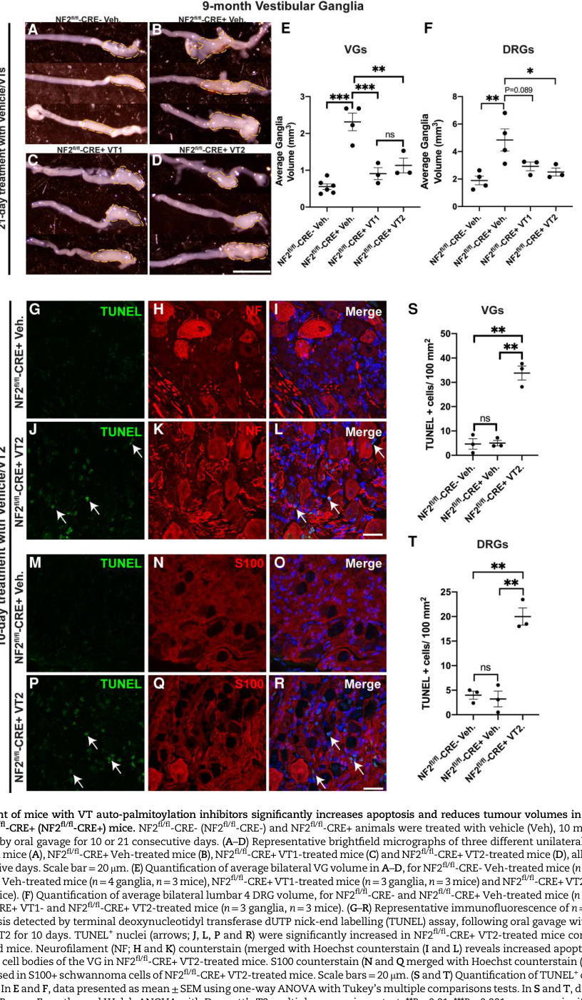

## Question

# Disease Characteristics Research Template

## Target Disease
- **Disease Name:** Schwannoma
- **MONDO ID:**  (if available)
- **Category:** Neoplastic

## Research Objectives

Please provide a comprehensive research report on **Schwannoma** covering all of the
disease characteristics listed below. This report will be used to populate a disease knowledge
base entry. Be thorough and cite primary literature (PMID preferred) for all claims.

For each section, **suggested databases/resources** are listed. These are the first places
you should search for information on each topic.

---

### 1. Disease Information
> **Search first:** OMIM, Orphanet, ICD-10/ICD-11, MeSH, PubMed

- What is the disease? Provide a concise overview.
- What are the key identifiers? (OMIM, Orphanet, ICD-10/ICD-11, MeSH, Mondo)
- What are the common synonyms and alternative names?
- Is the information derived from individual patients (e.g., EHR) or aggregated disease-level resources?

### 2. Etiology

- **Disease Causal Factors**: What are the primary causes? (genetic, environmental, infectious, mechanistic)
- **Risk Factors**:
  > **Search first:** PubMed, Cochrane Library, UpToDate, clinical guidelines, ClinVar, ClinGen, GWAS Catalog, PheGenI, CTD, CDC, WHO, epidemiological databases
  - Genetic risk factors (causal variants, susceptibility loci, modifier genes)
  - Environmental risk factors (toxins, lifestyle, occupational exposures, age, sex, family history)
- **Protective Factors**:
  > **Search first:** PubMed, Cochrane Library, clinical trial databases, GWAS Catalog, gnomAD, WHO, CDC, nutrition databases
  - Genetic protective factors (protective variants, modifier alleles)
  - Environmental protective factors (diet, lifestyle, exposures that reduce risk)
- **Gene-Environment Interactions**: How do genetic and environmental factors interact to influence disease?
  > **Search first:** CTD, PubMed, PheGenI, GxE databases

### 3. Phenotypes
> **Search first:** HPO (Human Phenotype Ontology), OMIM, Orphanet, PubMed, clinicaltrials.gov, MedDRA, SNOMED CT, DECIPHER, LOINC

For each phenotype, provide:
- **Phenotype type**: symptoms, clinical signs, physical manifestations, behavioral changes, or laboratory abnormalities
  > For symptoms/signs: HPO, OMIM, Orphanet, PubMed
  > For behavioral changes: HPO, DSM, RDoC (Research Domain Criteria), PubMed
  > For laboratory abnormalities: LOINC, SNOMED CT, LabTests Online, PubMed
- **Phenotype characteristics**:
  > **Search first:** OMIM, Orphanet, HPO, PubMed
  - Age of symptom onset (neonatal, childhood, adult-onset, late-onset)
  - Symptom severity (mild, moderate, severe, variable)
  - Symptom progression (stable, progressive, episodic, fluctuating)
  - Frequency among affected individuals (percentage or qualitative)
- **Quality of life impact**: Effects on daily functioning and well-being (per-phenotype when possible)
  > **Search first:** EQ-5D database, SF-36, WHO QOL databases, PubMed
- Suggest HPO (Human Phenotype Ontology) terms for each phenotype

### 4. Genetic/Molecular Information

- **Causal Genes**: Gene mutations or chromosomal abnormalities responsible for disease (gene symbols, OMIM IDs)
  > **Search first:** OMIM, ClinVar, HGMD, Ensembl, NCBI Gene
- **Pathogenic Variants**:
  - Affected genes (gene symbols, HGNC IDs)
    > **Search first:** OMIM, NCBI Gene, Ensembl, HGNC, UniProt, GeneCards
  - Variant classification (pathogenic, likely pathogenic, VUS per ACMG/AMP guidelines)
    > **Search first:** ClinVar, ClinGen, ACMG/AMP guidelines, VarSome
  - Variant type/class (missense, frameshift, nonsense, splice-site, structural)
  - Allele frequency in population databases
    > **Search first:** gnomAD, 1000 Genomes, ExAC, TOPMed, dbSNP
  - Somatic vs germline origin
    > **Search first:** COSMIC (somatic), ClinVar, ICGC, TCGA
  - Functional consequences (loss of function, gain of function, dominant negative)
- **Modifier Genes**: Genes that modify disease severity or expression
- **Epigenetic Information**: DNA methylation, histone modifications, chromatin changes affecting disease
  > **Search first:** ENCODE, Roadmap Epigenomics, MethBase, DiseaseMeth
- **Chromosomal Abnormalities**: Large-scale genetic changes (aneuploidy, translocations, inversions)
  > **Search first:** DECIPHER, ClinVar, ECARUCA, UCSC Genome Browser

### 5. Environmental Information

- **Environmental Factors**: Non-genetic contributing factors (toxins, radiation, pollution, occupational exposure)
  > **Search first:** CTD (Comparative Toxicogenomics Database), TOXNET, PubMed, EPA databases
- **Lifestyle Factors**: Behavioral factors (smoking, diet, exercise, alcohol consumption)
  > **Search first:** CDC databases, WHO, PubMed, NHANES
- **Infectious Agents**: If applicable, pathogens causing or triggering disease (bacteria, viruses, fungi, parasites)
  > **Search first:** NCBI Taxonomy, ViPR, BV-BRC, MicrobeDB, GIDEON

### 6. Mechanism / Pathophysiology

- **Molecular Pathways**: Specific signaling cascades or biochemical pathways involved (Wnt, MAPK, mTOR, PI3K-AKT, etc.)
  > **Search first:** KEGG, Reactome, WikiPathways, PathBank, BioCyc
- **Cellular Processes**: Cell-level mechanisms (apoptosis, autophagy, cell cycle dysregulation, inflammation, etc.)
  > **Search first:** Gene Ontology (GO), Reactome, KEGG, PubMed
- **Protein Dysfunction**: How protein structure or function is altered (misfolding, aggregation, loss of function, gain of function)
  > **Search first:** UniProt, PDB (Protein Data Bank), InterPro, Pfam, AlphaFold
- **Metabolic Changes**: Alterations in metabolic processes (energy metabolism, lipid metabolism, amino acid metabolism)
  > **Search first:** KEGG, BioCyc, HMDB (Human Metabolome Database), BRENDA
- **Immune System Involvement**: Role of immune response (autoimmunity, immunodeficiency, chronic inflammation)
  > **Search first:** ImmPort, Immunome Database, IEDB, Gene Ontology
- **Tissue Damage Mechanisms**: How tissues/ are injured (oxidative stress, ischemia, fibrosis, necrosis)
  > **Search first:** PubMed, Gene Ontology, Reactome
- **Biochemical Abnormalities**: Specific molecular defects (enzyme deficiencies, receptor dysfunction, ion channel defects)
  > **Search first:** BRENDA, UniProt, KEGG, OMIM, PubMed
- **Epigenetic Changes**: DNA methylation, histone modifications affecting gene expression in disease
  > **Search first:** ENCODE, Roadmap Epigenomics, MethBase, DiseaseMeth
- **Molecular Profiling** (if available):
  - Transcriptomics/gene expression changes
    > **Search first:** GEO (Gene Expression Omnibus), ArrayExpress, GTEx, Human Cell Atlas, SRA
  - Proteomics findings
    > **Search first:** PRIDE, ProteomeXchange, Human Protein Atlas, STRING, BioGRID
  - Metabolomics signatures
    > **Search first:** MetaboLights, Metabolomics Workbench, HMDB, METLIN
  - Lipidomics alterations
    > **Search first:** LIPID MAPS, SwissLipids, LipidHome, Metabolomics Workbench
  - Genomic structural features
    > **Search first:** UCSC Genome Browser, Ensembl, NCBI, dbVar, DGV
- **Advanced Technologies** (if applicable):
  - Single-cell analysis findings (cell-type specific mechanisms, cellular heterogeneity)
    > **Search first:** Human Cell Atlas, Single Cell Portal, GEO, CELLxGENE
  - Spatial transcriptomics findings
    > **Search first:** GEO, Spatial Research, Vizgen, 10x Genomics data
  - Multi-omics integration results
    > **Search first:** TCGA, ICGC, cBioPortal, LinkedOmics, PubMed
  - Functional genomics screens (CRISPR, RNAi)
    > **Search first:** DepMap, GenomeRNAi, PubMed, BioGRID ORCS

For each mechanism, describe:
- The causal chain from initial trigger to clinical manifestation
- Which mechanisms are upstream vs downstream
- What cell types and biological processes are involved
- Suggest GO terms for biological processes and CL terms for cell types

### 7. Anatomical Structures Affected

- **Organ Level**:
  - Primary organs directly affected
  - Secondary organ involvement (complications, secondary effects)
  - Body systems involved (cardiovascular, nervous, digestive, respiratory, endocrine, etc.)
  > **Search first:** Uberon, FMA (Foundational Model of Anatomy), OMIM, HPO, ICD-11, MeSH, SNOMED CT
- **Tissue and Cell Level**:
  - Specific tissue types affected (epithelial, connective, muscle, nervous)
  - Specific cell populations targeted (with Cell Ontology terms)
  > **Search first:** Uberon, Human Protein Atlas, Cell Ontology, Human Cell Atlas, CellMarker, PanglaoDB
- **Subcellular Level**:
  - Cellular compartments involved (mitochondria, nucleus, ER, lysosomes) (with GO Cellular Component terms)
  > **Search first:** Gene Ontology (Cellular Component), UniProt, Human Protein Atlas
- **Localization**:
  - Specific anatomical sites (with UBERON terms)
    > **Search first:** FMA, Uberon, NeuroNames (for brain), SNOMED CT
  - Lateralization (unilateral, bilateral, asymmetric)
    > **Search first:** HPO, clinical literature, imaging databases

### 8. Temporal Development

- **Onset**:
  - Typical age of onset (congenital, pediatric, adult, geriatric)
  - Onset pattern (acute, subacute, chronic, insidious)
  > **Search first:** OMIM, Orphanet, HPO, PubMed
- **Progression**:
  - Disease stages (early, intermediate, advanced, end-stage)
    > **Search first:** Cancer Staging Manual (AJCC), WHO classifications, PubMed
  - Progression rate (rapid, slow, variable)
  - Disease course pattern (episodic, relapsing-remitting, progressive, stable)
  - Disease duration (self-limited, chronic lifelong)
  > **Search first:** Disease registries, longitudinal cohort databases, natural history studies, PubMed, Orphanet, OMIM
- **Patterns**:
  - Remission patterns (spontaneous, treatment-induced)
    > **Search first:** Clinical trial databases, disease registries, PubMed
  - Critical periods (time windows of vulnerability or opportunity for intervention)
    > **Search first:** PubMed, developmental biology databases, clinical guidelines

### 9. Inheritance and Population

- **Epidemiology**:
  - Prevalence (cases per 100,000 at given time)
  - Incidence (new cases per 100,000 per year)
  > **Search first:** Orphanet, CDC, WHO, GBD (Global Burden of Disease), national registries, SEER, disease registries
- **For Genetic Etiology**:
  - Inheritance pattern (AD, AR, X-linked, mitochondrial, multifactorial, polygenic)
    > **Search first:** OMIM, Orphanet, ClinVar, GTR (Genetic Testing Registry)
  - Penetrance (complete, incomplete, age-dependent)
    > **Search first:** ClinVar, OMIM, PubMed, ClinGen
  - Expressivity (variable, consistent)
    > **Search first:** OMIM, ClinVar, PubMed
  - Genetic anticipation (increasing severity in successive generations)
    > **Search first:** OMIM, PubMed (especially for repeat expansion disorders)
  - Germline mosaicism
    > **Search first:** ClinVar, OMIM, genetic counseling literature, PubMed
  - Founder effects (population-specific mutations)
    > **Search first:** gnomAD, population genetics databases, PubMed
  - Consanguinity role
    > **Search first:** OMIM, population studies, genetic counseling resources
  - Carrier frequency
    > **Search first:** gnomAD, carrier screening databases, GeneReviews, GTR
- **Population Demographics**:
  - Affected populations (ethnic or demographic groups with higher prevalence)
    > **Search first:** gnomAD, 1000 Genomes, PAGE Study, PubMed, population registries
  - Geographic distribution (endemic areas, regional variation)
    > **Search first:** WHO, CDC, GBD, Orphanet, geographic epidemiology databases
  - Geographic distribution of specific variants
  - Sex ratio (male:female)
    > **Search first:** Disease registries, OMIM, PubMed, epidemiological databases
  - Age distribution of affected individuals
    > **Search first:** CDC, disease registries, SEER, Orphanet

### 10. Diagnostics

- **Clinical Tests**:
  - Laboratory tests (blood, urine, tissue chemistry, specific enzyme assays)
    > **Search first:** LOINC, LabTests Online, PubMed
  - Biomarkers (proteins, metabolites, genetic markers, circulating biomarkers)
    > **Search first:** FDA Biomarker List, BEST (Biomarkers, EndpointS, and other Tools), PubMed
  - Imaging studies (X-ray, CT, MRI, PET, ultrasound)
    > **Search first:** RadLex, DICOM, Radiopaedia, imaging databases
  - Functional tests (pulmonary function, cardiac stress tests)
    > **Search first:** LOINC, clinical guidelines, PubMed
  - Electrophysiology (EEG, EMG, ECG, nerve conduction studies)
    > **Search first:** LOINC, clinical neurophysiology databases, PubMed
  - Biopsy findings (histopathology, immunohistochemistry)
    > **Search first:** SNOMED CT, College of American Pathologists resources, PubMed
  - Pathology findings (microscopic examination)
    > **Search first:** SNOMED CT, Digital Pathology databases, PubMed
- **Genetic Testing**:
  > **Search first:** GTR (Genetic Testing Registry), GeneReviews, ClinGen
  - Overview of recommended genetic testing approach
  - Whole genome sequencing (WGS) utility
    > **Search first:** GTR, ClinVar, GEL (Genomics England), gnomAD
  - Whole exome sequencing (WES) utility
    > **Search first:** GTR, ClinVar, OMIM, GeneMatcher
  - Gene panels (which panels, which genes)
    > **Search first:** GTR, ClinVar, laboratory-specific databases
  - Single gene testing
    > **Search first:** GTR, ClinVar, OMIM, GeneReviews
  - Chromosomal microarray (CMA)
    > **Search first:** DECIPHER, ClinVar, dbVar, ECARUCA
  - Karyotyping
    > **Search first:** Chromosome Abnormality Database, ClinVar, cytogenetics resources
  - FISH
    > **Search first:** ClinVar, cytogenetics databases, PubMed
  - Mitochondrial DNA testing
    > **Search first:** MITOMAP, MSeqDR, ClinVar, GTR
  - Repeat expansion testing
    > **Search first:** GTR, ClinVar, repeat expansion databases, PubMed
- **Omics-Based Diagnostics** (if applicable):
  - RNA sequencing / transcriptomics
    > **Search first:** GEO, ArrayExpress, GTEx, RNA-seq databases
  - Proteomics
    > **Search first:** PRIDE, ProteomeXchange, FDA Biomarker database
  - Metabolomics
    > **Search first:** MetaboLights, Metabolomics Workbench, HMDB
  - Epigenomics
    > **Search first:** GEO, ENCODE, Roadmap Epigenomics, MethBase
  - Liquid biopsy
    > **Search first:** COSMIC, ClinVar, liquid biopsy databases, PubMed
- **Clinical Criteria**:
  - Standardized diagnostic criteria (DSM, ICD, society guidelines)
    > **Search first:** DSM-5, ICD-11, clinical society guidelines, UpToDate
  - Differential diagnosis (other conditions to rule out, with distinguishing features)
    > **Search first:** DynaMed, UpToDate, clinical decision support systems
- **Screening**:
  - Screening methods for asymptomatic individuals (newborn screening, carrier screening, cascade screening)
    > **Search first:** ACMG recommendations, CDC newborn screening, GTR

### 11. Outcome/Prognosis

- **Survival and Mortality**:
  - Survival rate (5-year, 10-year, overall)
    > **Search first:** SEER, cancer registries, disease-specific registries, PubMed
  - Life expectancy (with and without treatment if applicable)
    > **Search first:** Orphanet, disease registries, actuarial databases, PubMed
  - Mortality rate
    > **Search first:** CDC, WHO, GBD, national mortality databases
  - Disease-specific mortality (deaths directly attributable to disease)
    > **Search first:** Disease registries, CDC Wonder, GBD, PubMed
- **Morbidity and Function**:
  - Morbidity (disease-related disability and health impacts)
    > **Search first:** GBD, WHO, disability databases, PubMed
  - Disability outcomes (long-term functional impairments)
    > **Search first:** ICF (International Classification of Functioning), disability registries
  - Quality of life measures (EQ-5D, SF-36, PROMIS, disease-specific tools)
    > **Search first:** EQ-5D database, SF-36, PROMIS, PubMed
- **Disease Course**:
  - Complications (secondary problems: infections, organ failure, etc.)
    > **Search first:** ICD codes, disease registries, clinical databases, PubMed
  - Recovery potential (likelihood and extent of recovery, with vs without treatment)
    > **Search first:** Natural history studies, rehabilitation databases, PubMed
- **Prediction**:
  - Prognostic factors (age, disease severity, biomarkers, treatment response)
    > **Search first:** Prognostic models databases, clinical calculators, PubMed
  - Prognostic biomarkers (molecular markers predicting disease course)
    > **Search first:** FDA Biomarker database, PubMed, cancer prognostic databases

### 12. Treatment

- **Pharmacotherapy**:
  - Pharmacological treatments (drug names, drug classes, mechanisms of action)
    > **Search first:** DrugBank, RxNorm, ATC classification, DailyMed, FDA databases
  - Pharmacogenomics (how genetic variants affect drug metabolism, efficacy, toxicity)
    > **Search first:** PharmGKB, CPIC (Clinical Pharmacogenetics), FDA Table of PGx Biomarkers
- **Advanced Therapeutics**:
  - Gene therapy (viral vectors, CRISPR, gene replacement, gene editing)
    > **Search first:** ClinicalTrials.gov, FDA gene therapy database, ASGCT resources
  - Cell therapy (stem cell transplant, CAR-T, cellular therapeutics)
    > **Search first:** ClinicalTrials.gov, FDA cell therapy database, FACT standards
  - RNA-based therapies (ASOs, siRNA, mRNA therapies)
    > **Search first:** ClinicalTrials.gov, FDA approvals, PubMed
  - Targeted therapies (treatments directed at specific molecular targets)
    > **Search first:** My Cancer Genome, OncoKB, ClinicalTrials.gov, FDA approvals
  - Immunotherapies (checkpoint inhibitors, monoclonal antibodies)
    > **Search first:** Cancer Immunotherapy Database, FDA approvals, ClinicalTrials.gov
- **Surgical and Interventional**:
  - Surgical interventions (types of surgery, timing, outcomes)
    > **Search first:** CPT codes, surgical registries, clinical guidelines, PubMed
- **Supportive and Rehabilitative**:
  - Supportive care (symptom management, pain control, nutrition)
    > **Search first:** Clinical guidelines, Cochrane Library, PubMed
  - Rehabilitation (physical therapy, occupational therapy, speech therapy)
    > **Search first:** Rehabilitation medicine databases, clinical guidelines, PubMed
- **Experimental**:
  - Experimental treatments in clinical trials (with NCT identifiers if available)
    > **Search first:** ClinicalTrials.gov, EU Clinical Trials Register, WHO ICTRP
- **Treatment Outcomes**:
  - Treatment response rates
    > **Search first:** Clinical trial databases, FDA reviews, systematic reviews, PubMed
  - Side effects and adverse events
    > **Search first:** FDA Adverse Event Reporting System (FAERS), MedWatch, PubMed
- **Treatment Strategy**:
  - Treatment algorithms (clinical pathways, decision trees)
    > **Search first:** Clinical practice guidelines, NCCN Guidelines, UpToDate
  - Combination therapies
    > **Search first:** ClinicalTrials.gov, treatment guidelines, PubMed
  - Personalized medicine approaches (genotype-guided treatment)
    > **Search first:** My Cancer Genome, CIViC, PharmGKB, precision medicine databases

For each treatment, suggest MAXO (Medical Action Ontology) terms where applicable.

### 13. Prevention

- **Prevention Levels**:
  - Primary prevention (preventing disease occurrence: vaccination, risk factor modification)
    > **Search first:** CDC, WHO, USPSTF recommendations, Cochrane Library
  - Secondary prevention (early detection and treatment: screening programs, early intervention)
    > **Search first:** USPSTF, CDC screening guidelines, WHO
  - Tertiary prevention (preventing complications in those with disease)
    > **Search first:** Clinical guidelines, disease management protocols, PubMed
- **Immunization**: Vaccine strategies (if applicable)
  > **Search first:** CDC vaccine schedules, WHO immunization, FDA vaccine database
- **Screening and Early Detection**:
  - Screening programs (population-based: newborn screening, cancer screening)
    > **Search first:** CDC screening programs, USPSTF, cancer screening databases
  - Genetic screening (carrier screening, preimplantation genetic diagnosis, prenatal testing)
    > **Search first:** ACMG recommendations, ACOG guidelines, GTR
  - Risk stratification (identifying high-risk individuals for targeted prevention)
    > **Search first:** Risk prediction models, clinical calculators, PubMed
- **Behavioral Interventions**: Lifestyle modifications to reduce risk
  > **Search first:** CDC, WHO, behavioral intervention databases, Cochrane Library
- **Counseling**: Genetic counseling (risk assessment, family planning guidance)
  > **Search first:** NSGC resources, ACMG guidelines, GeneReviews
- **Public Health**:
  - Public health interventions (sanitation, vector control, health education)
    > **Search first:** CDC, WHO, public health databases, PubMed
  - Environmental interventions (reducing environmental risk factors)
    > **Search first:** EPA databases, WHO environmental health, PubMed
- **Prophylaxis**: Preventive medications or procedures
  > **Search first:** Clinical guidelines, FDA approvals, PubMed

### 14. Other Species / Natural Disease

- **Taxonomy**: Species affected (with NCBI Taxon identifiers)
  > **Search first:** NCBI Taxonomy
- **Breed**: Specific breeds affected (with VBO identifiers if applicable)
  > **Search first:** VBO (Vertebrate Breed Ontology)
- **Gene**: Orthologous genes in other species (with NCBI Gene IDs)
  > **Search first:** NCBI Gene
- **Natural Disease**:
  - Naturally occurring disease in other species (companion animals, wildlife)
    > **Search first:** OMIA (Online Mendelian Inheritance in Animals), VetCompass, PubMed
  - Veterinary relevance and importance in animal health
    > **Search first:** OMIA, veterinary databases, PubMed
- **Comparative Biology**:
  - Comparative pathology (similarities and differences across species)
    > **Search first:** OMIA, comparative pathology databases, PubMed
  - Evolutionary conservation of disease mechanisms
    > **Search first:** HomoloGene, OrthoMCL, Alliance of Genome Resources
- **Transmission** (if applicable):
  - Zoonotic potential
    > **Search first:** CDC zoonotic diseases, WHO zoonoses, GIDEON
  - Cross-species susceptibility
    > **Search first:** NCBI Taxonomy, veterinary databases, PubMed

### 15. Model Organisms

- **Model Types**:
  - Model organism type (mammalian, invertebrate, cellular, in vitro)
    > **Search first:** Alliance of Genome Resources, model organism databases
  - Specific model systems (mouse, rat, zebrafish, Drosophila, C. elegans, yeast, cell lines, organoids, iPSCs)
    > **Search first:** MGI, RGD, ZFIN, FlyBase, WormBase, SGD, ATCC, Cellosaurus
  - Induced models (drug treatment, surgical intervention, environmental manipulation)
    > **Search first:** MGI, model organism databases, PubMed
- **Genetic Models**:
  - Types available (knockout, knock-in, transgenic, conditional, humanized)
    > **Search first:** MGI, IMPC, KOMP, EuMMCR, IMSR
- **Model Characteristics**:
  - Phenotype recapitulation (how well model reproduces human disease features)
    > **Search first:** Model organism databases, comparative studies, PubMed
  - Model limitations (aspects of human disease not captured)
    > **Search first:** Model organism databases, PubMed, review articles
- **Applications**:
  - Research applications (what aspects of disease can be studied)
    > **Search first:** Model organism databases, PubMed
- **Resources**:
  - Model databases
    > **Search first:** MGI, RGD, ZFIN, FlyBase, WormBase, IMSR, EMMA, MMRRC

---

## Citation Requirements

- Cite primary literature (PMID preferred) for all mechanistic and clinical claims
- Prioritize recent reviews and landmark papers
- Include direct quotes from abstracts where possible to support key statements
- Distinguish evidence source types: human clinical, model organism, in vitro, computational

## Output Format

Structure your response as a comprehensive narrative organized by the sections above.
For each section, provide:
- Factual content with specific details (numbers, percentages, gene names, variant nomenclature)
- Ontology term suggestions (HPO, GO, CL, UBERON, CHEBI, MAXO, MONDO) where applicable
- Evidence citations with PMIDs
- Direct quotes from abstracts to support key claims
- Clear indication when information is not available or not applicable for this disease

This report will be used to populate a disease knowledge base entry with:
- Pathophysiology descriptions with causal chains
- Gene/protein annotations (HGNC, GO terms)
- Phenotype associations (HP terms) with frequencies
- Cell type involvement (CL terms)
- Anatomical locations (UBERON terms)
- Chemical entities (CHEBI terms)
- Treatment annotations (MAXO terms)
- Evidence items with PMIDs and exact abstract quotes
- Epidemiology, prognosis, diagnostic, and prevention information
- Animal model descriptions with phenotype recapitulation details

## Output

Question: You are an expert researcher providing comprehensive, well-cited information.

Provide detailed information focusing on:
1. Key concepts and definitions with current understanding
2. Recent developments and latest research (prioritize 2023-2024 sources)
3. Current applications and real-world implementations
4. Expert opinions and analysis from authoritative sources
5. Relevant statistics and data from recent studies

Format as a comprehensive research report with proper citations. Include URLs and publication dates where available.
Always prioritize recent, authoritative sources and provide specific citations for all major claims.

# Disease Characteristics Research Template

## Target Disease
- **Disease Name:** Schwannoma
- **MONDO ID:**  (if available)
- **Category:** Neoplastic

## Research Objectives

Please provide a comprehensive research report on **Schwannoma** covering all of the
disease characteristics listed below. This report will be used to populate a disease knowledge
base entry. Be thorough and cite primary literature (PMID preferred) for all claims.

For each section, **suggested databases/resources** are listed. These are the first places
you should search for information on each topic.

---

### 1. Disease Information
> **Search first:** OMIM, Orphanet, ICD-10/ICD-11, MeSH, PubMed

- What is the disease? Provide a concise overview.
- What are the key identifiers? (OMIM, Orphanet, ICD-10/ICD-11, MeSH, Mondo)
- What are the common synonyms and alternative names?
- Is the information derived from individual patients (e.g., EHR) or aggregated disease-level resources?

### 2. Etiology

- **Disease Causal Factors**: What are the primary causes? (genetic, environmental, infectious, mechanistic)
- **Risk Factors**:
  > **Search first:** PubMed, Cochrane Library, UpToDate, clinical guidelines, ClinVar, ClinGen, GWAS Catalog, PheGenI, CTD, CDC, WHO, epidemiological databases
  - Genetic risk factors (causal variants, susceptibility loci, modifier genes)
  - Environmental risk factors (toxins, lifestyle, occupational exposures, age, sex, family history)
- **Protective Factors**:
  > **Search first:** PubMed, Cochrane Library, clinical trial databases, GWAS Catalog, gnomAD, WHO, CDC, nutrition databases
  - Genetic protective factors (protective variants, modifier alleles)
  - Environmental protective factors (diet, lifestyle, exposures that reduce risk)
- **Gene-Environment Interactions**: How do genetic and environmental factors interact to influence disease?
  > **Search first:** CTD, PubMed, PheGenI, GxE databases

### 3. Phenotypes
> **Search first:** HPO (Human Phenotype Ontology), OMIM, Orphanet, PubMed, clinicaltrials.gov, MedDRA, SNOMED CT, DECIPHER, LOINC

For each phenotype, provide:
- **Phenotype type**: symptoms, clinical signs, physical manifestations, behavioral changes, or laboratory abnormalities
  > For symptoms/signs: HPO, OMIM, Orphanet, PubMed
  > For behavioral changes: HPO, DSM, RDoC (Research Domain Criteria), PubMed
  > For laboratory abnormalities: LOINC, SNOMED CT, LabTests Online, PubMed
- **Phenotype characteristics**:
  > **Search first:** OMIM, Orphanet, HPO, PubMed
  - Age of symptom onset (neonatal, childhood, adult-onset, late-onset)
  - Symptom severity (mild, moderate, severe, variable)
  - Symptom progression (stable, progressive, episodic, fluctuating)
  - Frequency among affected individuals (percentage or qualitative)
- **Quality of life impact**: Effects on daily functioning and well-being (per-phenotype when possible)
  > **Search first:** EQ-5D database, SF-36, WHO QOL databases, PubMed
- Suggest HPO (Human Phenotype Ontology) terms for each phenotype

### 4. Genetic/Molecular Information

- **Causal Genes**: Gene mutations or chromosomal abnormalities responsible for disease (gene symbols, OMIM IDs)
  > **Search first:** OMIM, ClinVar, HGMD, Ensembl, NCBI Gene
- **Pathogenic Variants**:
  - Affected genes (gene symbols, HGNC IDs)
    > **Search first:** OMIM, NCBI Gene, Ensembl, HGNC, UniProt, GeneCards
  - Variant classification (pathogenic, likely pathogenic, VUS per ACMG/AMP guidelines)
    > **Search first:** ClinVar, ClinGen, ACMG/AMP guidelines, VarSome
  - Variant type/class (missense, frameshift, nonsense, splice-site, structural)
  - Allele frequency in population databases
    > **Search first:** gnomAD, 1000 Genomes, ExAC, TOPMed, dbSNP
  - Somatic vs germline origin
    > **Search first:** COSMIC (somatic), ClinVar, ICGC, TCGA
  - Functional consequences (loss of function, gain of function, dominant negative)
- **Modifier Genes**: Genes that modify disease severity or expression
- **Epigenetic Information**: DNA methylation, histone modifications, chromatin changes affecting disease
  > **Search first:** ENCODE, Roadmap Epigenomics, MethBase, DiseaseMeth
- **Chromosomal Abnormalities**: Large-scale genetic changes (aneuploidy, translocations, inversions)
  > **Search first:** DECIPHER, ClinVar, ECARUCA, UCSC Genome Browser

### 5. Environmental Information

- **Environmental Factors**: Non-genetic contributing factors (toxins, radiation, pollution, occupational exposure)
  > **Search first:** CTD (Comparative Toxicogenomics Database), TOXNET, PubMed, EPA databases
- **Lifestyle Factors**: Behavioral factors (smoking, diet, exercise, alcohol consumption)
  > **Search first:** CDC databases, WHO, PubMed, NHANES
- **Infectious Agents**: If applicable, pathogens causing or triggering disease (bacteria, viruses, fungi, parasites)
  > **Search first:** NCBI Taxonomy, ViPR, BV-BRC, MicrobeDB, GIDEON

### 6. Mechanism / Pathophysiology

- **Molecular Pathways**: Specific signaling cascades or biochemical pathways involved (Wnt, MAPK, mTOR, PI3K-AKT, etc.)
  > **Search first:** KEGG, Reactome, WikiPathways, PathBank, BioCyc
- **Cellular Processes**: Cell-level mechanisms (apoptosis, autophagy, cell cycle dysregulation, inflammation, etc.)
  > **Search first:** Gene Ontology (GO), Reactome, KEGG, PubMed
- **Protein Dysfunction**: How protein structure or function is altered (misfolding, aggregation, loss of function, gain of function)
  > **Search first:** UniProt, PDB (Protein Data Bank), InterPro, Pfam, AlphaFold
- **Metabolic Changes**: Alterations in metabolic processes (energy metabolism, lipid metabolism, amino acid metabolism)
  > **Search first:** KEGG, BioCyc, HMDB (Human Metabolome Database), BRENDA
- **Immune System Involvement**: Role of immune response (autoimmunity, immunodeficiency, chronic inflammation)
  > **Search first:** ImmPort, Immunome Database, IEDB, Gene Ontology
- **Tissue Damage Mechanisms**: How tissues/ are injured (oxidative stress, ischemia, fibrosis, necrosis)
  > **Search first:** PubMed, Gene Ontology, Reactome
- **Biochemical Abnormalities**: Specific molecular defects (enzyme deficiencies, receptor dysfunction, ion channel defects)
  > **Search first:** BRENDA, UniProt, KEGG, OMIM, PubMed
- **Epigenetic Changes**: DNA methylation, histone modifications affecting gene expression in disease
  > **Search first:** ENCODE, Roadmap Epigenomics, MethBase, DiseaseMeth
- **Molecular Profiling** (if available):
  - Transcriptomics/gene expression changes
    > **Search first:** GEO (Gene Expression Omnibus), ArrayExpress, GTEx, Human Cell Atlas, SRA
  - Proteomics findings
    > **Search first:** PRIDE, ProteomeXchange, Human Protein Atlas, STRING, BioGRID
  - Metabolomics signatures
    > **Search first:** MetaboLights, Metabolomics Workbench, HMDB, METLIN
  - Lipidomics alterations
    > **Search first:** LIPID MAPS, SwissLipids, LipidHome, Metabolomics Workbench
  - Genomic structural features
    > **Search first:** UCSC Genome Browser, Ensembl, NCBI, dbVar, DGV
- **Advanced Technologies** (if applicable):
  - Single-cell analysis findings (cell-type specific mechanisms, cellular heterogeneity)
    > **Search first:** Human Cell Atlas, Single Cell Portal, GEO, CELLxGENE
  - Spatial transcriptomics findings
    > **Search first:** GEO, Spatial Research, Vizgen, 10x Genomics data
  - Multi-omics integration results
    > **Search first:** TCGA, ICGC, cBioPortal, LinkedOmics, PubMed
  - Functional genomics screens (CRISPR, RNAi)
    > **Search first:** DepMap, GenomeRNAi, PubMed, BioGRID ORCS

For each mechanism, describe:
- The causal chain from initial trigger to clinical manifestation
- Which mechanisms are upstream vs downstream
- What cell types and biological processes are involved
- Suggest GO terms for biological processes and CL terms for cell types

### 7. Anatomical Structures Affected

- **Organ Level**:
  - Primary organs directly affected
  - Secondary organ involvement (complications, secondary effects)
  - Body systems involved (cardiovascular, nervous, digestive, respiratory, endocrine, etc.)
  > **Search first:** Uberon, FMA (Foundational Model of Anatomy), OMIM, HPO, ICD-11, MeSH, SNOMED CT
- **Tissue and Cell Level**:
  - Specific tissue types affected (epithelial, connective, muscle, nervous)
  - Specific cell populations targeted (with Cell Ontology terms)
  > **Search first:** Uberon, Human Protein Atlas, Cell Ontology, Human Cell Atlas, CellMarker, PanglaoDB
- **Subcellular Level**:
  - Cellular compartments involved (mitochondria, nucleus, ER, lysosomes) (with GO Cellular Component terms)
  > **Search first:** Gene Ontology (Cellular Component), UniProt, Human Protein Atlas
- **Localization**:
  - Specific anatomical sites (with UBERON terms)
    > **Search first:** FMA, Uberon, NeuroNames (for brain), SNOMED CT
  - Lateralization (unilateral, bilateral, asymmetric)
    > **Search first:** HPO, clinical literature, imaging databases

### 8. Temporal Development

- **Onset**:
  - Typical age of onset (congenital, pediatric, adult, geriatric)
  - Onset pattern (acute, subacute, chronic, insidious)
  > **Search first:** OMIM, Orphanet, HPO, PubMed
- **Progression**:
  - Disease stages (early, intermediate, advanced, end-stage)
    > **Search first:** Cancer Staging Manual (AJCC), WHO classifications, PubMed
  - Progression rate (rapid, slow, variable)
  - Disease course pattern (episodic, relapsing-remitting, progressive, stable)
  - Disease duration (self-limited, chronic lifelong)
  > **Search first:** Disease registries, longitudinal cohort databases, natural history studies, PubMed, Orphanet, OMIM
- **Patterns**:
  - Remission patterns (spontaneous, treatment-induced)
    > **Search first:** Clinical trial databases, disease registries, PubMed
  - Critical periods (time windows of vulnerability or opportunity for intervention)
    > **Search first:** PubMed, developmental biology databases, clinical guidelines

### 9. Inheritance and Population

- **Epidemiology**:
  - Prevalence (cases per 100,000 at given time)
  - Incidence (new cases per 100,000 per year)
  > **Search first:** Orphanet, CDC, WHO, GBD (Global Burden of Disease), national registries, SEER, disease registries
- **For Genetic Etiology**:
  - Inheritance pattern (AD, AR, X-linked, mitochondrial, multifactorial, polygenic)
    > **Search first:** OMIM, Orphanet, ClinVar, GTR (Genetic Testing Registry)
  - Penetrance (complete, incomplete, age-dependent)
    > **Search first:** ClinVar, OMIM, PubMed, ClinGen
  - Expressivity (variable, consistent)
    > **Search first:** OMIM, ClinVar, PubMed
  - Genetic anticipation (increasing severity in successive generations)
    > **Search first:** OMIM, PubMed (especially for repeat expansion disorders)
  - Germline mosaicism
    > **Search first:** ClinVar, OMIM, genetic counseling literature, PubMed
  - Founder effects (population-specific mutations)
    > **Search first:** gnomAD, population genetics databases, PubMed
  - Consanguinity role
    > **Search first:** OMIM, population studies, genetic counseling resources
  - Carrier frequency
    > **Search first:** gnomAD, carrier screening databases, GeneReviews, GTR
- **Population Demographics**:
  - Affected populations (ethnic or demographic groups with higher prevalence)
    > **Search first:** gnomAD, 1000 Genomes, PAGE Study, PubMed, population registries
  - Geographic distribution (endemic areas, regional variation)
    > **Search first:** WHO, CDC, GBD, Orphanet, geographic epidemiology databases
  - Geographic distribution of specific variants
  - Sex ratio (male:female)
    > **Search first:** Disease registries, OMIM, PubMed, epidemiological databases
  - Age distribution of affected individuals
    > **Search first:** CDC, disease registries, SEER, Orphanet

### 10. Diagnostics

- **Clinical Tests**:
  - Laboratory tests (blood, urine, tissue chemistry, specific enzyme assays)
    > **Search first:** LOINC, LabTests Online, PubMed
  - Biomarkers (proteins, metabolites, genetic markers, circulating biomarkers)
    > **Search first:** FDA Biomarker List, BEST (Biomarkers, EndpointS, and other Tools), PubMed
  - Imaging studies (X-ray, CT, MRI, PET, ultrasound)
    > **Search first:** RadLex, DICOM, Radiopaedia, imaging databases
  - Functional tests (pulmonary function, cardiac stress tests)
    > **Search first:** LOINC, clinical guidelines, PubMed
  - Electrophysiology (EEG, EMG, ECG, nerve conduction studies)
    > **Search first:** LOINC, clinical neurophysiology databases, PubMed
  - Biopsy findings (histopathology, immunohistochemistry)
    > **Search first:** SNOMED CT, College of American Pathologists resources, PubMed
  - Pathology findings (microscopic examination)
    > **Search first:** SNOMED CT, Digital Pathology databases, PubMed
- **Genetic Testing**:
  > **Search first:** GTR (Genetic Testing Registry), GeneReviews, ClinGen
  - Overview of recommended genetic testing approach
  - Whole genome sequencing (WGS) utility
    > **Search first:** GTR, ClinVar, GEL (Genomics England), gnomAD
  - Whole exome sequencing (WES) utility
    > **Search first:** GTR, ClinVar, OMIM, GeneMatcher
  - Gene panels (which panels, which genes)
    > **Search first:** GTR, ClinVar, laboratory-specific databases
  - Single gene testing
    > **Search first:** GTR, ClinVar, OMIM, GeneReviews
  - Chromosomal microarray (CMA)
    > **Search first:** DECIPHER, ClinVar, dbVar, ECARUCA
  - Karyotyping
    > **Search first:** Chromosome Abnormality Database, ClinVar, cytogenetics resources
  - FISH
    > **Search first:** ClinVar, cytogenetics databases, PubMed
  - Mitochondrial DNA testing
    > **Search first:** MITOMAP, MSeqDR, ClinVar, GTR
  - Repeat expansion testing
    > **Search first:** GTR, ClinVar, repeat expansion databases, PubMed
- **Omics-Based Diagnostics** (if applicable):
  - RNA sequencing / transcriptomics
    > **Search first:** GEO, ArrayExpress, GTEx, RNA-seq databases
  - Proteomics
    > **Search first:** PRIDE, ProteomeXchange, FDA Biomarker database
  - Metabolomics
    > **Search first:** MetaboLights, Metabolomics Workbench, HMDB
  - Epigenomics
    > **Search first:** GEO, ENCODE, Roadmap Epigenomics, MethBase
  - Liquid biopsy
    > **Search first:** COSMIC, ClinVar, liquid biopsy databases, PubMed
- **Clinical Criteria**:
  - Standardized diagnostic criteria (DSM, ICD, society guidelines)
    > **Search first:** DSM-5, ICD-11, clinical society guidelines, UpToDate
  - Differential diagnosis (other conditions to rule out, with distinguishing features)
    > **Search first:** DynaMed, UpToDate, clinical decision support systems
- **Screening**:
  - Screening methods for asymptomatic individuals (newborn screening, carrier screening, cascade screening)
    > **Search first:** ACMG recommendations, CDC newborn screening, GTR

### 11. Outcome/Prognosis

- **Survival and Mortality**:
  - Survival rate (5-year, 10-year, overall)
    > **Search first:** SEER, cancer registries, disease-specific registries, PubMed
  - Life expectancy (with and without treatment if applicable)
    > **Search first:** Orphanet, disease registries, actuarial databases, PubMed
  - Mortality rate
    > **Search first:** CDC, WHO, GBD, national mortality databases
  - Disease-specific mortality (deaths directly attributable to disease)
    > **Search first:** Disease registries, CDC Wonder, GBD, PubMed
- **Morbidity and Function**:
  - Morbidity (disease-related disability and health impacts)
    > **Search first:** GBD, WHO, disability databases, PubMed
  - Disability outcomes (long-term functional impairments)
    > **Search first:** ICF (International Classification of Functioning), disability registries
  - Quality of life measures (EQ-5D, SF-36, PROMIS, disease-specific tools)
    > **Search first:** EQ-5D database, SF-36, PROMIS, PubMed
- **Disease Course**:
  - Complications (secondary problems: infections, organ failure, etc.)
    > **Search first:** ICD codes, disease registries, clinical databases, PubMed
  - Recovery potential (likelihood and extent of recovery, with vs without treatment)
    > **Search first:** Natural history studies, rehabilitation databases, PubMed
- **Prediction**:
  - Prognostic factors (age, disease severity, biomarkers, treatment response)
    > **Search first:** Prognostic models databases, clinical calculators, PubMed
  - Prognostic biomarkers (molecular markers predicting disease course)
    > **Search first:** FDA Biomarker database, PubMed, cancer prognostic databases

### 12. Treatment

- **Pharmacotherapy**:
  - Pharmacological treatments (drug names, drug classes, mechanisms of action)
    > **Search first:** DrugBank, RxNorm, ATC classification, DailyMed, FDA databases
  - Pharmacogenomics (how genetic variants affect drug metabolism, efficacy, toxicity)
    > **Search first:** PharmGKB, CPIC (Clinical Pharmacogenetics), FDA Table of PGx Biomarkers
- **Advanced Therapeutics**:
  - Gene therapy (viral vectors, CRISPR, gene replacement, gene editing)
    > **Search first:** ClinicalTrials.gov, FDA gene therapy database, ASGCT resources
  - Cell therapy (stem cell transplant, CAR-T, cellular therapeutics)
    > **Search first:** ClinicalTrials.gov, FDA cell therapy database, FACT standards
  - RNA-based therapies (ASOs, siRNA, mRNA therapies)
    > **Search first:** ClinicalTrials.gov, FDA approvals, PubMed
  - Targeted therapies (treatments directed at specific molecular targets)
    > **Search first:** My Cancer Genome, OncoKB, ClinicalTrials.gov, FDA approvals
  - Immunotherapies (checkpoint inhibitors, monoclonal antibodies)
    > **Search first:** Cancer Immunotherapy Database, FDA approvals, ClinicalTrials.gov
- **Surgical and Interventional**:
  - Surgical interventions (types of surgery, timing, outcomes)
    > **Search first:** CPT codes, surgical registries, clinical guidelines, PubMed
- **Supportive and Rehabilitative**:
  - Supportive care (symptom management, pain control, nutrition)
    > **Search first:** Clinical guidelines, Cochrane Library, PubMed
  - Rehabilitation (physical therapy, occupational therapy, speech therapy)
    > **Search first:** Rehabilitation medicine databases, clinical guidelines, PubMed
- **Experimental**:
  - Experimental treatments in clinical trials (with NCT identifiers if available)
    > **Search first:** ClinicalTrials.gov, EU Clinical Trials Register, WHO ICTRP
- **Treatment Outcomes**:
  - Treatment response rates
    > **Search first:** Clinical trial databases, FDA reviews, systematic reviews, PubMed
  - Side effects and adverse events
    > **Search first:** FDA Adverse Event Reporting System (FAERS), MedWatch, PubMed
- **Treatment Strategy**:
  - Treatment algorithms (clinical pathways, decision trees)
    > **Search first:** Clinical practice guidelines, NCCN Guidelines, UpToDate
  - Combination therapies
    > **Search first:** ClinicalTrials.gov, treatment guidelines, PubMed
  - Personalized medicine approaches (genotype-guided treatment)
    > **Search first:** My Cancer Genome, CIViC, PharmGKB, precision medicine databases

For each treatment, suggest MAXO (Medical Action Ontology) terms where applicable.

### 13. Prevention

- **Prevention Levels**:
  - Primary prevention (preventing disease occurrence: vaccination, risk factor modification)
    > **Search first:** CDC, WHO, USPSTF recommendations, Cochrane Library
  - Secondary prevention (early detection and treatment: screening programs, early intervention)
    > **Search first:** USPSTF, CDC screening guidelines, WHO
  - Tertiary prevention (preventing complications in those with disease)
    > **Search first:** Clinical guidelines, disease management protocols, PubMed
- **Immunization**: Vaccine strategies (if applicable)
  > **Search first:** CDC vaccine schedules, WHO immunization, FDA vaccine database
- **Screening and Early Detection**:
  - Screening programs (population-based: newborn screening, cancer screening)
    > **Search first:** CDC screening programs, USPSTF, cancer screening databases
  - Genetic screening (carrier screening, preimplantation genetic diagnosis, prenatal testing)
    > **Search first:** ACMG recommendations, ACOG guidelines, GTR
  - Risk stratification (identifying high-risk individuals for targeted prevention)
    > **Search first:** Risk prediction models, clinical calculators, PubMed
- **Behavioral Interventions**: Lifestyle modifications to reduce risk
  > **Search first:** CDC, WHO, behavioral intervention databases, Cochrane Library
- **Counseling**: Genetic counseling (risk assessment, family planning guidance)
  > **Search first:** NSGC resources, ACMG guidelines, GeneReviews
- **Public Health**:
  - Public health interventions (sanitation, vector control, health education)
    > **Search first:** CDC, WHO, public health databases, PubMed
  - Environmental interventions (reducing environmental risk factors)
    > **Search first:** EPA databases, WHO environmental health, PubMed
- **Prophylaxis**: Preventive medications or procedures
  > **Search first:** Clinical guidelines, FDA approvals, PubMed

### 14. Other Species / Natural Disease

- **Taxonomy**: Species affected (with NCBI Taxon identifiers)
  > **Search first:** NCBI Taxonomy
- **Breed**: Specific breeds affected (with VBO identifiers if applicable)
  > **Search first:** VBO (Vertebrate Breed Ontology)
- **Gene**: Orthologous genes in other species (with NCBI Gene IDs)
  > **Search first:** NCBI Gene
- **Natural Disease**:
  - Naturally occurring disease in other species (companion animals, wildlife)
    > **Search first:** OMIA (Online Mendelian Inheritance in Animals), VetCompass, PubMed
  - Veterinary relevance and importance in animal health
    > **Search first:** OMIA, veterinary databases, PubMed
- **Comparative Biology**:
  - Comparative pathology (similarities and differences across species)
    > **Search first:** OMIA, comparative pathology databases, PubMed
  - Evolutionary conservation of disease mechanisms
    > **Search first:** HomoloGene, OrthoMCL, Alliance of Genome Resources
- **Transmission** (if applicable):
  - Zoonotic potential
    > **Search first:** CDC zoonotic diseases, WHO zoonoses, GIDEON
  - Cross-species susceptibility
    > **Search first:** NCBI Taxonomy, veterinary databases, PubMed

### 15. Model Organisms

- **Model Types**:
  - Model organism type (mammalian, invertebrate, cellular, in vitro)
    > **Search first:** Alliance of Genome Resources, model organism databases
  - Specific model systems (mouse, rat, zebrafish, Drosophila, C. elegans, yeast, cell lines, organoids, iPSCs)
    > **Search first:** MGI, RGD, ZFIN, FlyBase, WormBase, SGD, ATCC, Cellosaurus
  - Induced models (drug treatment, surgical intervention, environmental manipulation)
    > **Search first:** MGI, model organism databases, PubMed
- **Genetic Models**:
  - Types available (knockout, knock-in, transgenic, conditional, humanized)
    > **Search first:** MGI, IMPC, KOMP, EuMMCR, IMSR
- **Model Characteristics**:
  - Phenotype recapitulation (how well model reproduces human disease features)
    > **Search first:** Model organism databases, comparative studies, PubMed
  - Model limitations (aspects of human disease not captured)
    > **Search first:** Model organism databases, PubMed, review articles
- **Applications**:
  - Research applications (what aspects of disease can be studied)
    > **Search first:** Model organism databases, PubMed
- **Resources**:
  - Model databases
    > **Search first:** MGI, RGD, ZFIN, FlyBase, WormBase, IMSR, EMMA, MMRRC

---

## Citation Requirements

- Cite primary literature (PMID preferred) for all mechanistic and clinical claims
- Prioritize recent reviews and landmark papers
- Include direct quotes from abstracts where possible to support key statements
- Distinguish evidence source types: human clinical, model organism, in vitro, computational

## Output Format

Structure your response as a comprehensive narrative organized by the sections above.
For each section, provide:
- Factual content with specific details (numbers, percentages, gene names, variant nomenclature)
- Ontology term suggestions (HPO, GO, CL, UBERON, CHEBI, MAXO, MONDO) where applicable
- Evidence citations with PMIDs
- Direct quotes from abstracts to support key claims
- Clear indication when information is not available or not applicable for this disease

This report will be used to populate a disease knowledge base entry with:
- Pathophysiology descriptions with causal chains
- Gene/protein annotations (HGNC, GO terms)
- Phenotype associations (HP terms) with frequencies
- Cell type involvement (CL terms)
- Anatomical locations (UBERON terms)
- Chemical entities (CHEBI terms)
- Treatment annotations (MAXO terms)
- Evidence items with PMIDs and exact abstract quotes
- Epidemiology, prognosis, diagnostic, and prevention information
- Animal model descriptions with phenotype recapitulation details

# Comprehensive Research Report: Schwannoma (Neoplastic)

## Scope note
“Schwannoma” is a broad tumor class; much of the high-quality 2023–2025 evidence in the retrieved corpus pertains to **vestibular schwannoma (VS)** and **schwannomatosis syndromes** (NF2-, SMARCB1-, LZTR1-related) because these entities have well-defined genetics, consensus diagnostic criteria (2022), and systemic-therapy trials. General schwannoma concepts are covered where evidence is available in the current retrieval set; where not available (e.g., ICD/MeSH/Orphanet codes, population incidence of all schwannomas), gaps are explicitly noted.

---

## 1. Disease Information

### 1.1 Definition and overview
* **Schwannoma**: a benign peripheral nerve sheath tumor derived from **myelinating Schwann cells**; can occur in cranial, spinal, and peripheral nerves. (tsuchiya2025currentmolecularunderstanding, abstract evidence) (otaner2026vestibularschwannomagenetic pages 1-2)
* **Vestibular schwannoma (VS)** (synonym: *acoustic neuroma*): a benign Schwann-cell tumor of the **vestibulocochlear nerve (CN VIII)**; clinically important for hearing/balance deficits. (otaner2026vestibularschwannomagenetic pages 1-2, screnci2024bevacizumabforvestibular pages 1-2)

### 1.2 Key identifiers and ontology mappings (available in current corpus)
* **MONDO**
  * Schwannomatosis: **MONDO_0008075** (OpenTargets mapping) (OpenTargets Search: schwannoma,vestibular schwannoma,schwannomatosis)
  * NF2-related schwannomatosis: **MONDO_0007039** (OpenTargets mapping) (OpenTargets Search: schwannoma,vestibular schwannoma,schwannomatosis)
* **EFO**
  * Schwannoma: **EFO_0000693** (OpenTargets mapping) (OpenTargets Search: schwannoma,vestibular schwannoma,schwannomatosis)

**Not retrieved in the current evidence set (therefore not asserted here):** MeSH ID, ICD-10/ICD-11 codes, Orphanet/OMIM identifiers for schwannoma/VS.

### 1.3 Common synonyms / alternative names
* Vestibular schwannoma = **acoustic neuroma** (explicit in systematic review background) (screnci2024bevacizumabforvestibular pages 1-2)
* “Neurofibromatosis type 2” renamed to **NF2-related schwannomatosis** per international consensus (see below) (perrino2025updateoncancer pages 3-4, rai2025classificationofschwannomas pages 1-2, tamura2024historicaldevelopmentof pages 1-3)

### 1.4 Evidence-source type
The consensus terminology/diagnostic criteria and clinical outcomes summarized below are derived from **aggregated disease-level resources** (systematic reviews, consensus updates, surveillance recommendations) plus **clinical cohort studies** and **ClinicalTrials.gov registrations** (chiranth2023asystematicreview pages 1-2, screnci2024bevacizumabforvestibular pages 1-2, douwes2024bevacizumabtreatmentfor pages 9-11, NCT04374305 chunk 1).

---

## 2. Etiology

### 2.1 Primary causal factors
#### 2.1.1 Sporadic schwannoma / VS
* VS is predominantly sporadic: review-level summary states **~90% are sporadic** (otaner2026vestibularschwannomagenetic pages 1-2).
* Molecular driver in VS: **NF2 loss/merlin deficiency** is described as central to pathogenesis, with downstream dysregulation of Hippo/YAP-TAZ, PI3K/AKT/mTOR, VEGF, MAPK, and adhesion pathways (otaner2026vestibularschwannomagenetic pages 1-2).

#### 2.1.2 Schwannomatosis syndromes (germline predisposition)
A key 2022–2025 development is gene-based classification of “schwannomatoses” as cancer predisposition syndromes caused by germline pathogenic variants:
* Perrino et al. (2025) abstract: “**Schwannomatoses (SWN) are distinct cancer predisposition syndromes caused by germline pathogenic variants in the genes NF2, SMARCB1, or LZTR1.**” (Feb 2025) (perrino2025updateoncancer pages 3-4)
* Perrino et al. (2025) abstract: “**Neurofibromatosis type 2 was recently renamed as NF2-related SWN** …” (perrino2025updateoncancer pages 3-4)

OpenTargets also highlights NF2, SMARCB1, and LZTR1 as top disease-associated targets for schwannoma/schwannomatosis, consistent with genetic causality in these syndromes (OpenTargets Search: schwannoma,vestibular schwannoma,schwannomatosis).

### 2.2 Risk factors
* **Genetic risk** (major): germline pathogenic variants in **NF2**, **SMARCB1**, or **LZTR1** for schwannomatosis syndromes (perrino2025updateoncancer pages 3-4, tamura2024historicaldevelopmentof pages 3-4, OpenTargets Search: schwannoma,vestibular schwannoma,schwannomatosis).
* **Mosaicism** is an important risk/diagnostic factor in NF2-related schwannomatosis; consensus criteria define mosaic status using low variant allele fraction (VAF) in blood/saliva or shared variants across anatomically unrelated tumors (tamura2024historicaldevelopmentof pages 3-4).

**Environmental/lifestyle risk factors:** not established in the retrieved evidence for schwannoma causation. A 2023 review on hearing loss and VS notes attention to “environmental factors” that could contribute to hearing loss progression, but does not provide validated causal environmental risk factors for schwannoma itself in the retrieved excerpt (otaner2026vestibularschwannomagenetic pages 1-2).

### 2.3 Protective factors / gene–environment interactions
Not identified in the retrieved evidence set.

---

## 3. Phenotypes (clinical features)

### 3.1 Core phenotype spectrum (with suggested HPO terms)
#### Vestibular schwannoma (sporadic or NF2-related)
* **Sensorineural hearing loss** (often progressive) due to VS (chiranth2023asystematicreview pages 1-2, screnci2024bevacizumabforvestibular pages 1-2).
  * Suggested HPO: **HP:0000407 Sensorineural hearing impairment**
* **Balance/vestibular dysfunction** (balance issues emphasized as common presenting feature) (screnci2024bevacizumabforvestibular pages 1-2).
  * Suggested HPO: **HP:0001751 Vertigo** / **HP:0002321 Abnormality of balance**
* **Cranial nerve compression / brainstem compression** (noted as a clinical issue in VS context) (lu2024enhancedtumorcontrol pages 1-4).
  * Suggested HPO: **HP:0002366 Brainstem compression**

#### Schwannomatosis syndromes (NF2-, SMARCB1-, LZTR1-related)
* **Multiple cranial, spinal, and peripheral schwannomas** (hallmark) (perrino2025updateoncancer pages 3-4).
  * Suggested HPO: **HP:0009589 Bilateral vestibular schwannoma** (NF2-related) and/or **HP:0009733 Schwannoma**
* **Meningiomas** and less commonly **ependymoma** in NF2-related schwannomatosis (perrino2025updateoncancer pages 3-4).
  * Suggested HPO: **HP:0002858 Meningioma**, **HP:0100826 Ependymoma**
* **Chronic pain** is emphasized for schwannomatosis (“hallmark” symptom in non-NF2 schwannomatosis literature; treatment resistant) (perrino2025updateoncancer pages 5-7).
  * Suggested HPO: **HP:0012531 Pain** (consider more specific pain terms by location)

### 3.2 Age of onset / progression
* VS median diagnosis age (sporadic) reported as ~60 years; NF2-associated VS often presents earlier (18–24 years) (otaner2026vestibularschwannomagenetic pages 1-2).
* NF2-related schwannomatosis is described as dominantly inherited; birth incidence reported as ~1:25,000–33,000 (systematic review) (chiranth2023asystematicreview pages 1-2) and as ~1 in 61,000 (preclinical paper background statement) (lu2024enhancedtumorcontrol pages 1-4).

### 3.3 Quality-of-life impact
* Hearing loss and balance impairment are major morbidity drivers for VS/NF2 (screnci2024bevacizumabforvestibular pages 1-2).
* In a phase II axitinib study, a validated NF2-related quality-of-life measure (NFTI-QOL) was used and remained stable or improved during treatment (clinical trial report abstract evidence) (douwes2024bevacizumabtreatmentfor pages 9-11).

---

## 4. Genetic/Molecular Information

### 4.1 Causal genes and molecular classification (2022 consensus framework)
2022 consensus updates changed both nomenclature and diagnostic criteria:
* “Schwannomatosis” used as an **umbrella term** for disorders that predispose to schwannomas, and each type is classified by the causative gene; “NF2 is now termed NF2-related schwannomatosis.” (Tamura 2024) (tamura2024historicaldevelopmentof pages 1-3)
* Gene-based syndromes highlighted in 2025 surveillance perspective: NF2-, SMARCB1-, LZTR1-related schwannomatosis (perrino2025updateoncancer pages 3-4).

### 4.2 Pathogenic variants / variant origin
* NF2-related schwannomatosis: NF2 pathogenic variants may be detectable in blood in **~66–90%** (Tamura 2024 excerpt) (tamura2024historicaldevelopmentof pages 3-4).
* Mosaic NF2-related schwannomatosis: defined by **VAF clearly <50%** in blood/saliva or shared pathogenic variant across anatomically unrelated tumors but absent from unaffected tissue (tamura2024historicaldevelopmentof pages 3-4).

### 4.3 Pathways and mechanisms (current understanding; 2023–2024 emphasis)
* Review synthesis for VS: merlin deficiency leads to dysregulation of **Hippo/YAP-TAZ, PI3K/AKT/mTOR, VEGF, MAPK**, and adhesion pathways (otaner2026vestibularschwannomagenetic pages 1-2).
* Mechanistic review of NF2 (2024, NPJ Precision Oncology): merlin is an ERM-family scaffold; NF2 loss dysregulates Hippo kinase cascades converging on LATS1/2, enabling YAP-driven transcription; therapeutic concepts include targeting Hippo/YAP, mTOR, FAK, and others (xu2024nf2anunderestimated pages 2-3).

#### 4.3.1 Hippo–YAP/TAZ–TEAD as a therapeutic vulnerability (primary evidence)
A key 2023 advance is direct preclinical demonstration that inhibiting TEAD activity can regress schwannoma:
* Laraba et al. (Brain, Sep 2023) used human primary schwannoma cells and mouse schwannoma models and found that **genetic ablation of YAP/TAZ** or **TEAD palmitoylation inhibitors** can block and regress schwannoma growth, supporting Hippo pathway targeting (laraba2023inhibitionofyaptazdriven pages 1-2, laraba2023inhibitionofyaptazdriven pages 2-3).

**Visual evidence:** the in vivo regression effect with TEAD auto-palmitoylation inhibitors is shown in a central figure with tumor-volume reductions and increased apoptosis (cropped figure region) (laraba2023inhibitionofyaptazdriven media d8f8c3e0).

### 4.4 Epigenetic / multi-omics profiling
* VS review notes epigenetic alterations (DNA methylation, chromatin remodeling, non-coding RNAs) and SOX10 dysfunction shaping tumor behavior (otaner2026vestibularschwannomagenetic pages 1-2).

**Not retrievable here:** specific methylation signatures, transcriptomic/proteomic markers, or single-cell datasets are referenced in some reviews but not captured with extractable quantitative details in the current evidence excerpts.

### Suggested GO / CL terms (for knowledge-base annotation)
* Key biological processes (GO):
  * Hippo signaling (e.g., **GO:0035329 hippo signaling**) 
  * Regulation of cell proliferation (**GO:0042127**)
  * Angiogenesis / VEGF signaling (**GO:0001525 angiogenesis**) 
* Cell types (CL):
  * Schwann cell (**CL:0000218**)

---

## 5. Environmental Information
No validated causal environmental exposures for schwannoma were identified in the retrieved evidence set. Environmental factors are discussed in the context of hearing loss broadly, but without definitive etiologic linkage to schwannoma occurrence in the excerpts available (otaner2026vestibularschwannomagenetic pages 1-2).

---

## 6. Mechanism / Pathophysiology (causal chain)

### 6.1 Example causal chain: NF2 loss → pathway dysregulation → tumor growth and hearing loss
1. **Initial trigger**: NF2 inactivation (germline + second hit in syndromic disease; somatic loss in sporadic VS). (otaner2026vestibularschwannomagenetic pages 1-2, tamura2024historicaldevelopmentof pages 3-4)
2. **Upstream molecular consequence**: loss of merlin’s tumor-suppressive scaffolding and regulation of contact inhibition and Hippo kinase activation. (xu2024nf2anunderestimated pages 2-3)
3. **Downstream transcriptional programs**: increased YAP/TAZ–TEAD activity; additional dysregulation in PI3K/AKT/mTOR, MAPK, VEGF pathways (review synthesis). (otaner2026vestibularschwannomagenetic pages 1-2)
4. **Cellular phenotype**: Schwann-cell proliferation and tumor maintenance; vascular and inflammatory changes may contribute to hearing loss beyond pure nerve compression. (otaner2026vestibularschwannomagenetic pages 1-2)

### 6.2 Hearing loss mechanisms in VS
VS-associated hearing loss described as multifactorial, involving tumor-secreted factors, inflammation, vascular changes, and inner ear damage, alongside nerve compression (otaner2026vestibularschwannomagenetic pages 1-2).

---

## 7. Anatomical Structures Affected

### 7.1 Organ and system level (with UBERON suggestions)
* **Peripheral nervous system** and cranial nerves; specifically the **vestibulocochlear nerve** in VS (screnci2024bevacizumabforvestibular pages 1-2).
  * Suggested UBERON: vestibulocochlear nerve (**UBERON:0001643**) 
* NF2-related schwannomatosis also involves intracranial tumors including **meningiomas** and occasionally **ependymoma** (perrino2025updateoncancer pages 3-4).
  * Suggested UBERON: meninges (**UBERON:0000966**); spinal cord (**UBERON:0002240**)

### 7.2 Tissue/cell level
* Tumor cell-of-origin: **myelinating Schwann cells** (otaner2026vestibularschwannomagenetic pages 1-2).
  * CL: Schwann cell (**CL:0000218**)

### 7.3 Subcellular level
Not specifically defined in retrieved evidence excerpts.

---

## 8. Temporal Development

* NF2-related schwannomatosis typically manifests with bilateral VS and other tumors over time; mosaic phenotypes complicate clinical onset patterns (tamura2024historicaldevelopmentof pages 3-4).
* VS can be managed with observation vs active therapy depending on growth and symptom trajectory (general management options noted in review) (otaner2026vestibularschwannomagenetic pages 1-2).

---

## 9. Inheritance and Population

### 9.1 Inheritance
* NF2-related schwannomatosis: **autosomal dominant** cancer predisposition syndrome (chiranth2023asystematicreview pages 1-2, lu2024enhancedtumorcontrol pages 1-4).

### 9.2 Epidemiology statistics (from retrieved sources)
* NF2 birth incidence in systematic reviews: **~1:25,000–33,000** (chiranth2023asystematicreview pages 1-2, screnci2024bevacizumabforvestibular pages 1-2).
* Preclinical background statement: NF2-related schwannomatosis incidence **~1 in 61,000** (lu2024enhancedtumorcontrol pages 1-4).

**Note:** Incidence/prevalence for *all schwannomas* (sporadic) were not retrieved in the current evidence set.

---

## 10. Diagnostics

### 10.1 2022 international diagnostic criteria highlights (NF2-related schwannomatosis)
Tamura et al. (2024) summarizes consensus criteria:
* Diagnosis can be made by **(1) bilateral vestibular schwannomas**, **(2) an identical NF2 pathogenic variant in ≥2 anatomically distinct NF2-related tumors**, or **(3) combinations of major/minor criteria** (tamura2024historicaldevelopmentof pages 3-4).
* **Mosaic NF2**: “clearly less than 50%” pathogenic VAF in blood/saliva, or shared pathogenic variant across ≥2 anatomically unrelated tumors but absent from unaffected tissue (tamura2024historicaldevelopmentof pages 3-4).

### 10.2 Diagnostic testing modalities (from available evidence)
* **Imaging**: MRI-based management and surveillance are foundational (explicitly referenced across reviews, though detailed MRI criteria are not extractable in current excerpts) (otaner2026vestibularschwannomagenetic pages 1-2, tamura2024historicaldevelopmentof pages 3-4).
* **Genetic testing**: consensus emphasizes integrating blood/saliva and tumor testing to resolve gene subtype and mosaicism (rai2025classificationofschwannomas pages 1-2, tamura2024historicaldevelopmentof pages 3-4).

### 10.3 Differential diagnosis
Not systematically extractable from current excerpts (e.g., neurofibroma vs schwannoma, meningioma, MPNST). A 2025 review notes hybrid neurofibroma/schwannoma can be diagnostically confusing (retrieved but not evidence-extracted here).

---

## 11. Outcome / Prognosis

### 11.1 Treatment response metrics as prognostic indicators
Systemic therapy outcomes in NF2-related VS are commonly assessed using **volumetric radiographic response** (>20% decrease) and **hearing response** metrics (WRS, PTA), as used in systematic reviews and cohort studies (chiranth2023asystematicreview pages 1-2, douwes2024bevacizumabtreatmentfor pages 2-4).

### 11.2 Progression after stopping therapy
In a single-center cohort, post-treatment radiologic surveillance showed **55% progression** after stopping bevacizumab (with median post-treatment follow-up 19.3 months), and symptom worsening was frequent after discontinuation (douwes2024bevacizumabtreatmentfor pages 8-9, douwes2024bevacizumabtreatmentfor pages 9-11).

---

## 12. Treatment (current applications and real-world implementations)

### 12.1 Standard local management
VS management options include **observation**, **microsurgery**, and **stereotactic radiosurgery**, as summarized in a recent narrative review (otaner2026vestibularschwannomagenetic pages 1-2).

### 12.2 Systemic therapies (NF2-related VS): bevacizumab and beyond
Bevacizumab (anti-VEGF monoclonal antibody) is consistently the systemic therapy with the strongest clinical signal in NF2-related VS, though generally off-label and supported mainly by single-arm/retrospective evidence (otaner2026vestibularschwannomagenetic pages 1-2, chiranth2023asystematicreview pages 1-2, douwes2024bevacizumabtreatmentfor pages 9-11).

The table below compiles key quantitative efficacy/toxicity statistics from 2023–2024 reviews and a 2024 real-world cohort.

| Source | Population | N | Bevacizumab dose/schedule | Radiographic response definition and rates | Hearing response definition and rates | Key adverse events and rates | Notes |
|---|---|---:|---|---|---|---|---|
| Chiranth et al., 2023, *Neuro-Oncology Advances*, DOI: https://doi.org/10.1093/noajnl/vdad099 | NF2-related schwannomatosis with vestibular schwannoma; pooled systematic review of targeted therapy studies | 200 across 10 bevacizumab studies (16 total studies tested 6 drugs) | Review-level summary; notes that lower-dose bevacizumab may retain efficacy with less toxicity | REiNS volumetric criteria: radiographic response (RR) = >20% tumor-volume decrease; progression = >20% increase. Pooled bevacizumab RR 38% (95% CI 31–45%); bevacizumab had highest efficacy among targeted agents reviewed | Pooled hearing response (HR) 45% (95% CI 36–54%) | Common toxicities: hypertension and menorrhagia | Comparator agents in review: lapatinib RR 6%, HR 31%; VEGFR vaccine RR 29%, HR 40%. Authors conclude bevacizumab showed the highest efficacy, but further trials of other agents/combination therapy are needed (chiranth2023asystematicreview pages 1-2) |
| Screnci et al., 2024, *Journal of Clinical Medicine*, DOI: https://doi.org/10.3390/jcm13237488 | Neurofibromatosis type 2 / NF2-related vestibular schwannoma; systematic review | 176 across 9 studies | Not consistently reported in pooled excerpt | Partial tumor volume reduction defined as ≥20%: 40%; disease stabilization 50%; progression 10% | Hearing improvement 36%; hearing stabilization 46%; hearing deterioration 18% | Severe adverse effects in 13% (including hypertension and thromboembolic events); 18% reported no side effects | Tumor regrowth observed in some patients after treatment discontinuation, supporting need for long-term monitoring (screnci2024bevacizumabforvestibular pages 1-2) |
| Douwes et al., 2024, *Cancers*, DOI: https://doi.org/10.3390/cancers16081479 | Single-center NF2-related schwannomatosis cohort treated for target vestibular schwannoma | 17 patients; radiology evaluable in 16; hearing evaluable in 15 target ears; post-treatment symptom surveillance in 11; post-treatment radiology in 12 | Median 7.5 mg/kg IV every 3 weeks (range 5.6–7.5; interval range 3.0–4.4 weeks); planned regimen 7.5 mg/kg q3wk for at least 6 months; median duration 7.1 months (range 2.1–23.9) | Definition: improved = ≥20% decrease in extrameatal volume; stable = between −20% and +20%; worsened = ≥20% increase. On treatment: regression 31% (5/16), stable 69% (11/16), no ≥20% progression reported. Median extrameatal volume 1.24 cm^3 to 1.15 cm^3. Pre-treatment growth 43% overall (15% annually) vs −12% overall (−13% annually) during treatment. Post-treatment surveillance: 9% regression, 36% stable, 55% progression | Definition: improved = ≥10% WRS increase; worsened = ≥10% WRS decrease; if WRS remained 100%, ≥10 dB PTA change considered significant. On treatment: 40% improved, 53% stable, 7% worsened in target ears (6/15, 8/15, 1/15); reported as hearing preservation 93%. Median WRS 74% to 82%; median PTA 57 dB to 61 dB. After discontinuation (n=11), 82% stable and 18% hearing loss | 94% had ≥1 adverse event; 50 total AEs: grade 1 62%, grade 2 34%, grade 3 4%, no grade 4/5. Hypertension 82% (grade 3 in 12%; 36% of hypertensive patients required antihypertensives), fatigue 29%, proteinuria 6%. Treatment discontinuation due to AEs in 29% | Indications: progressive hearing loss 59%, other NF2 symptoms 35%, tumor size 6%. Symptoms improved in 41%, stable in 47%, worsened in 12% during treatment; summarized as clinical symptom improvement/preservation in 88%. Reasons for stopping included radiologic stability/regression and/or hearing benefit, AEs (29%), response failure (6%), patient preference (6%). After stopping (median surveillance 29.2 months), 27% remained stable and 73% worsened symptomatically; no further symptom improvement. Four patients were retreated with mixed results; two maintenance-regimen patients remained stable (douwes2024bevacizumabtreatmentfor pages 5-8, douwes2024bevacizumabtreatmentfor pages 9-11, douwes2024bevacizumabtreatmentfor pages 4-5, douwes2024bevacizumabtreatmentfor pages 8-9, douwes2024bevacizumabtreatmentfor pages 2-4) |

*Table: This table compiles the main quantitative bevacizumab outcomes for NF2-related vestibular schwannoma from a 2023 systematic review, a 2024 systematic review, and a 2024 single-center cohort. It is useful for comparing pooled efficacy, toxicity, and post-discontinuation patterns across evidence sources.*

**Real-world implementation example (single-center, 2013–2023):**
* Douwes et al. (Cancers, Apr 2024) used **7.5 mg/kg IV every 3 weeks** (median duration 7.1 months) and reported **hearing preservation 93%**, with **31% tumor regression** and **69% stable disease**; adverse events were common (hypertension 82%; discontinuation due to AEs 29%) (douwes2024bevacizumabtreatmentfor pages 9-11, douwes2024bevacizumabtreatmentfor pages 4-5).

### 12.3 Emerging targeted and immunologic strategies (2023–2024)
* **Hippo pathway targeting (TEAD palmitoylation inhibitors)**: preclinical evidence supports regression of NF2-null schwannoma using TEAD inhibitors (Laraba et al., Brain 2023) (laraba2023inhibitionofyaptazdriven pages 1-2, laraba2023inhibitionofyaptazdriven media d8f8c3e0).
* **Combination immunotherapy + anti-VEGF (preclinical)**: combined anti-PD1 + anti-VEGF improved tumor control and preserved hearing in immune-competent VS models, suggesting a rationale for combination approaches (bioRxiv Dec 2024) (lu2024enhancedtumorcontrol pages 1-4).

### 12.4 Clinical trials and trial infrastructure
* **INTUITT-NF2 (NCT04374305)**: a randomized, open-label, **phase II platform-basket master study** testing multiple sub-studies (e.g., brigatinib; neratinib; retifanlimab + bevacizumab) with radiographic response rate by tumor type used for interim activity decisions; long-term observation up to 10 years (ClinicalTrials.gov; posted 2020; recruiting per retrieved metadata) (NCT04374305 chunk 1, NCT04374305 chunk 3).
* **Everolimus pre-surgical PK/PD (NCT01880749)**: early-phase study giving **everolimus 10 mg daily for 10 days** preoperatively and assessing phospho-S6 inhibition in tumor tissue (ClinicalTrials.gov; 2013) (NCT01880749 chunk 1).
* **Lapatinib concentration/activity (NCT00863122)**: endpoints include phospho-ErbB2 in tumor tissue at surgery and tumor markers after lapatinib exposure; includes NF2 mutation analysis and tissue drug concentration comparisons (ClinicalTrials.gov; 2009) (NCT00863122 chunk 2).

### 12.5 MAXO term suggestions (treatment actions)
* Surgical excision of schwannoma: **MAXO:0000004 Surgical procedure** (general)
* Stereotactic radiosurgery: **MAXO:0000008 Radiotherapy** (general)
* Anti-VEGF therapy (bevacizumab): **MAXO:0000753 Monoclonal antibody therapy** (general)
* Molecular targeted therapy trials (e.g., TEAD inhibitors, kinase inhibitors): **MAXO:0000058 Targeted therapy** (general)

---

## 13. Prevention

### 13.1 Primary prevention
No primary prevention strategies for sporadic schwannoma were identified in the retrieved evidence set.

### 13.2 Secondary prevention / surveillance
Perrino et al. (Clinical Cancer Research, Feb 2025) is explicitly focused on surveillance recommendations in pediatric NF2-, SMARCB1-, and LZTR1-related schwannomatosis, reflecting the shift toward structured screening/surveillance in gene-defined predisposition syndromes (perrino2025updateoncancer pages 3-4).

---

## 14. Other Species / Natural Disease
Not addressed in the retrieved evidence set.

---

## 15. Model Organisms

* **Mouse models** and **primary human tumor cell systems** were used to establish the preclinical efficacy of TEAD palmitoylation inhibitors and genetic YAP/TAZ ablation in NF2-null schwannoma (laraba2023inhibitionofyaptazdriven pages 1-2).
* **Immune-competent syngeneic VS models** were used to test anti-PD1 + anti-VEGF combination strategies with hearing preservation endpoints (lu2024enhancedtumorcontrol pages 1-4).

---

## Expert synthesis and analysis (2023–2025 emphasis)
1. **Nosology and genetics have converged**: a key recent development is the 2022 international consensus repositioning schwannomatosis as an umbrella term and renaming “neurofibromatosis type 2” to **NF2-related schwannomatosis**, with diagnosis increasingly driven by **molecular evidence** and explicit handling of **mosaicism** (tamura2024historicaldevelopmentof pages 1-3, tamura2024historicaldevelopmentof pages 3-4, perrino2025updateoncancer pages 3-4).
2. **Bevacizumab remains the most evidence-supported systemic therapy** for NF2-related progressive VS, with consistent hearing preservation/tumor control signals across systematic reviews and real-world cohorts—tempered by hypertension and discontinuation rates and common post-discontinuation progression/relapse (chiranth2023asystematicreview pages 1-2, screnci2024bevacizumabforvestibular pages 1-2, douwes2024bevacizumabtreatmentfor pages 9-11).
3. **Mechanism-driven therapeutic opportunities are expanding**: the Hippo–YAP/TAZ–TEAD axis has moved from correlative pathway dysregulation to **direct, regressive preclinical intervention** (TEAD palmitoylation inhibitors) in 2023 (laraba2023inhibitionofyaptazdriven pages 1-2, laraba2023inhibitionofyaptazdriven media d8f8c3e0). Platform trials such as INTUITT-NF2 represent a pragmatic clinical strategy to screen multiple targeted agents efficiently in rare NF2-related tumors (NCT04374305 chunk 1).

---

## Key limitations of this report (due to retrieval constraints)
* ICD-10/ICD-11, MeSH, Orphanet, OMIM IDs for schwannoma/VS were not retrieved in the current tool context.
* Environmental/lifestyle risk factors, protective factors, and gene–environment interactions were not supported by evidence in the retrieved excerpts.
* Broad epidemiology for all schwannomas (beyond NF2-related statistics) and detailed histopathology/IHC differentials were not extractable from the current corpus.

References

1. (otaner2026vestibularschwannomagenetic pages 1-2): Franciska Otaner, Vratko Himic, Luis O. Vargas, Matthew Abikenari, Neelesh Pandey, Shayndhan Sivanathan, Olivia Kalmanson, Aparna Govindan, Diane Jung, Dagoberto Estevez-Ordonez, Amy Wang, Sanjeeva Jeyaretna, Ashish H. Shah, Ricardo J. Komotar, Bradley Gampel, Christine Dinh, and Michael E. Ivan. Vestibular schwannoma: genetic and epigenetic mechanisms, hearing loss, and emerging therapies. Journal of Neuro-Oncology, May 2026. URL: https://doi.org/10.1007/s11060-026-05621-4, doi:10.1007/s11060-026-05621-4. This article has 0 citations and is from a peer-reviewed journal.

2. (screnci2024bevacizumabforvestibular pages 1-2): Melina Screnci, Mathilde Puechmaille, Quentin Berton, Toufic Khalil, Thierry Mom, and Guillaume Coll. Bevacizumab for vestibular schwannomas in neurofibromatosis type 2: a systematic review of tumor control and hearing preservation. Journal of Clinical Medicine, 13:7488, Dec 2024. URL: https://doi.org/10.3390/jcm13237488, doi:10.3390/jcm13237488. This article has 7 citations.

3. (OpenTargets Search: schwannoma,vestibular schwannoma,schwannomatosis): Open Targets Query (schwannoma,vestibular schwannoma,schwannomatosis, 7 results). Buniello, A. et al. (2025). Open Targets Platform: facilitating therapeutic hypotheses building in drug discovery. Nucleic Acids Research.

4. (perrino2025updateoncancer pages 3-4): Melissa R. Perrino, Marjolijn C. J. Jongmans, Gail E. Tomlinson, Mary-Louise C. Greer, Sarah R. Scollon, Sarah G. Mitchell, Jordan R. Hansford, Kris Ann P. Schultz, Wendy K. Kohlmann, Jennifer M. Kalish, Suzanne P. MacFarland, Anirban Das, Kara N. Maxwell, Stefan M. Pfister, Rosanna Weksberg, Orli Michaeli, Uri Tabori, Gina M. Ney, Philip J. Lupo, Jack J. Brzezinski, Douglas R. Stewart, Emma R. Woodward, and Christian P. Kratz. Update on cancer and central nervous system tumor surveillance in pediatric nf2-, smarcb1-, and lztr1-related schwannomatosis. Clinical cancer research : an official journal of the American Association for Cancer Research, Feb 2025. URL: https://doi.org/10.1158/1078-0432.ccr-24-3278, doi:10.1158/1078-0432.ccr-24-3278. This article has 8 citations.

5. (rai2025classificationofschwannomas pages 1-2): Pranjal Rai, Girish Bathla, Neetu Soni, Amit Desai, Dinesh Rao, Prasanna Vibhute, and Amit Agarwal. Classification of schwannomas and the new naming convention for "neurofibromatosis-2": genetic updates and international consensus recommendation. The neuroradiology journal, pages 19714009251313510, Jan 2025. URL: https://doi.org/10.1177/19714009251313510, doi:10.1177/19714009251313510. This article has 7 citations and is from a peer-reviewed journal.

6. (tamura2024historicaldevelopmentof pages 1-3): Ryota TAMURA, Masahiro YO, and Masahiro TODA. Historical development of diagnostic criteria for nf2-related schwannomatosis. Neurologia medico-chirurgica, 64:299-308, Aug 2024. URL: https://doi.org/10.2176/jns-nmc.2024-0067, doi:10.2176/jns-nmc.2024-0067. This article has 12 citations and is from a peer-reviewed journal.

7. (chiranth2023asystematicreview pages 1-2): Shivani Chiranth, Seppo W Langer, Hans Skovgaard Poulsen, and Thomas Urup. A systematic review of targeted therapy for vestibular schwannoma in patients with nf2-related schwannomatosis. Neuro-Oncology Advances, Aug 2023. URL: https://doi.org/10.1093/noajnl/vdad099, doi:10.1093/noajnl/vdad099. This article has 27 citations and is from a peer-reviewed journal.

8. (douwes2024bevacizumabtreatmentfor pages 9-11): Jules P. J. Douwes, Erik F. Hensen, Jeroen C. Jansen, Hans Gelderblom, and Josefine E. Schopman. Bevacizumab treatment for patients with nf2-related schwannomatosis: a single center experience. Cancers, 16:1479, Apr 2024. URL: https://doi.org/10.3390/cancers16081479, doi:10.3390/cancers16081479. This article has 15 citations.

9. (NCT04374305 chunk 1): Scott R. Plotkin, MD, PhD. Innovative Trial for Understanding the Impact of Targeted Therapies in NF2-Related Schwannomatosis (INTUITT-NF2). Scott R. Plotkin, MD, PhD. 2020. ClinicalTrials.gov Identifier: NCT04374305

10. (tamura2024historicaldevelopmentof pages 3-4): Ryota TAMURA, Masahiro YO, and Masahiro TODA. Historical development of diagnostic criteria for nf2-related schwannomatosis. Neurologia medico-chirurgica, 64:299-308, Aug 2024. URL: https://doi.org/10.2176/jns-nmc.2024-0067, doi:10.2176/jns-nmc.2024-0067. This article has 12 citations and is from a peer-reviewed journal.

11. (lu2024enhancedtumorcontrol pages 1-4): Simeng Lu, Zhenzhen Yin, Limeng Wu, Yao Sun, Jie Chen, Lai Man Natalie Wu, Janet L. Oblinger, Day Caven Blake, Lukas D. Landegger, Richard Seist, William Ho, Bingyu Xiu, Adam P. Jones, Alona Muzikansky, Konstantina M. Stankovic, Scott R. Plotkin, Long-Sheng Chang, and Lei Xu. Enhanced tumor control and hearing loss prevention achieved with combined immune checkpoint inhibitor and anti-vegf therapy in vestibular schwannoma model. bioRxiv, Dec 2024. URL: https://doi.org/10.1101/2024.12.29.630658, doi:10.1101/2024.12.29.630658. This article has 3 citations.

12. (perrino2025updateoncancer pages 5-7): Melissa R. Perrino, Marjolijn C. J. Jongmans, Gail E. Tomlinson, Mary-Louise C. Greer, Sarah R. Scollon, Sarah G. Mitchell, Jordan R. Hansford, Kris Ann P. Schultz, Wendy K. Kohlmann, Jennifer M. Kalish, Suzanne P. MacFarland, Anirban Das, Kara N. Maxwell, Stefan M. Pfister, Rosanna Weksberg, Orli Michaeli, Uri Tabori, Gina M. Ney, Philip J. Lupo, Jack J. Brzezinski, Douglas R. Stewart, Emma R. Woodward, and Christian P. Kratz. Update on cancer and central nervous system tumor surveillance in pediatric nf2-, smarcb1-, and lztr1-related schwannomatosis. Clinical cancer research : an official journal of the American Association for Cancer Research, Feb 2025. URL: https://doi.org/10.1158/1078-0432.ccr-24-3278, doi:10.1158/1078-0432.ccr-24-3278. This article has 8 citations.

13. (xu2024nf2anunderestimated pages 2-3): Duo Xu, Shiyuan Yin, and Yongqian Shu. Nf2: an underestimated player in cancer metabolic reprogramming and tumor immunity. NPJ Precision Oncology, Jun 2024. URL: https://doi.org/10.1038/s41698-024-00627-5, doi:10.1038/s41698-024-00627-5. This article has 34 citations and is from a peer-reviewed journal.

14. (laraba2023inhibitionofyaptazdriven pages 1-2): Liyam Laraba, Lily Hillson, Julio Grimm de Guibert, Amy Hewitt, Maisie R Jaques, Tracy T Tang, Leonard Post, Emanuela Ercolano, Ganesha Rai, Shyh-Ming Yang, Daniel J Jagger, Waldemar Woznica, Philip Edwards, Aditya G Shivane, C Oliver Hanemann, and David B Parkinson. Inhibition of yap/taz-driven tead activity prevents growth of nf2-null schwannoma and meningioma. Brain, 146:1697-1713, Sep 2023. URL: https://doi.org/10.1093/brain/awac342, doi:10.1093/brain/awac342. This article has 64 citations and is from a highest quality peer-reviewed journal.

15. (laraba2023inhibitionofyaptazdriven pages 2-3): Liyam Laraba, Lily Hillson, Julio Grimm de Guibert, Amy Hewitt, Maisie R Jaques, Tracy T Tang, Leonard Post, Emanuela Ercolano, Ganesha Rai, Shyh-Ming Yang, Daniel J Jagger, Waldemar Woznica, Philip Edwards, Aditya G Shivane, C Oliver Hanemann, and David B Parkinson. Inhibition of yap/taz-driven tead activity prevents growth of nf2-null schwannoma and meningioma. Brain, 146:1697-1713, Sep 2023. URL: https://doi.org/10.1093/brain/awac342, doi:10.1093/brain/awac342. This article has 64 citations and is from a highest quality peer-reviewed journal.

16. (laraba2023inhibitionofyaptazdriven media d8f8c3e0): Liyam Laraba, Lily Hillson, Julio Grimm de Guibert, Amy Hewitt, Maisie R Jaques, Tracy T Tang, Leonard Post, Emanuela Ercolano, Ganesha Rai, Shyh-Ming Yang, Daniel J Jagger, Waldemar Woznica, Philip Edwards, Aditya G Shivane, C Oliver Hanemann, and David B Parkinson. Inhibition of yap/taz-driven tead activity prevents growth of nf2-null schwannoma and meningioma. Brain, 146:1697-1713, Sep 2023. URL: https://doi.org/10.1093/brain/awac342, doi:10.1093/brain/awac342. This article has 64 citations and is from a highest quality peer-reviewed journal.

17. (douwes2024bevacizumabtreatmentfor pages 2-4): Jules P. J. Douwes, Erik F. Hensen, Jeroen C. Jansen, Hans Gelderblom, and Josefine E. Schopman. Bevacizumab treatment for patients with nf2-related schwannomatosis: a single center experience. Cancers, 16:1479, Apr 2024. URL: https://doi.org/10.3390/cancers16081479, doi:10.3390/cancers16081479. This article has 15 citations.

18. (douwes2024bevacizumabtreatmentfor pages 8-9): Jules P. J. Douwes, Erik F. Hensen, Jeroen C. Jansen, Hans Gelderblom, and Josefine E. Schopman. Bevacizumab treatment for patients with nf2-related schwannomatosis: a single center experience. Cancers, 16:1479, Apr 2024. URL: https://doi.org/10.3390/cancers16081479, doi:10.3390/cancers16081479. This article has 15 citations.

19. (douwes2024bevacizumabtreatmentfor pages 5-8): Jules P. J. Douwes, Erik F. Hensen, Jeroen C. Jansen, Hans Gelderblom, and Josefine E. Schopman. Bevacizumab treatment for patients with nf2-related schwannomatosis: a single center experience. Cancers, 16:1479, Apr 2024. URL: https://doi.org/10.3390/cancers16081479, doi:10.3390/cancers16081479. This article has 15 citations.

20. (douwes2024bevacizumabtreatmentfor pages 4-5): Jules P. J. Douwes, Erik F. Hensen, Jeroen C. Jansen, Hans Gelderblom, and Josefine E. Schopman. Bevacizumab treatment for patients with nf2-related schwannomatosis: a single center experience. Cancers, 16:1479, Apr 2024. URL: https://doi.org/10.3390/cancers16081479, doi:10.3390/cancers16081479. This article has 15 citations.

21. (NCT04374305 chunk 3): Scott R. Plotkin, MD, PhD. Innovative Trial for Understanding the Impact of Targeted Therapies in NF2-Related Schwannomatosis (INTUITT-NF2). Scott R. Plotkin, MD, PhD. 2020. ClinicalTrials.gov Identifier: NCT04374305

22. (NCT01880749 chunk 1):  Exploring the Activity of RAD001 in Vestibular Schwannomas and Meningiomas. NYU Langone Health. 2013. ClinicalTrials.gov Identifier: NCT01880749

23. (NCT00863122 chunk 2):  Concentration and Activity of Lapatinib in Vestibular Schwannomas. Sidney Kimmel Comprehensive Cancer Center at Johns Hopkins. 2009. ClinicalTrials.gov Identifier: NCT00863122

## Artifacts

- [Edison artifact artifact-00](Schwannoma-deep-research-falcon_artifacts/artifact-00.md)
