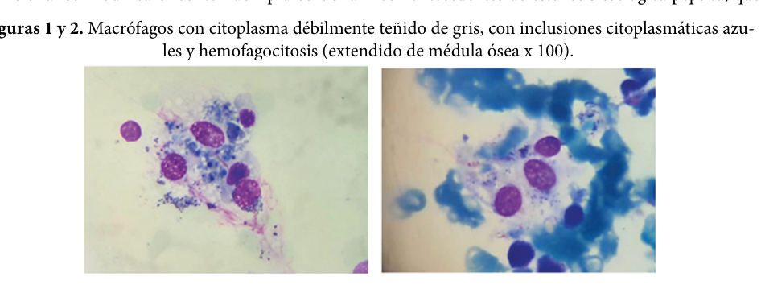

## Question

# Disease Characteristics Research Template

## Target Disease
- **Disease Name:** Sea-Blue Histiocyte Syndrome
- **MONDO ID:**  (if available)
- **Category:** Mendelian

## Research Objectives

Please provide a comprehensive research report on **Sea-Blue Histiocyte Syndrome** covering all of the
disease characteristics listed below. This report will be used to populate a disease knowledge
base entry. Be thorough and cite primary literature (PMID preferred) for all claims.

For each section, **suggested databases/resources** are listed. These are the first places
you should search for information on each topic.

---

### 1. Disease Information
> **Search first:** OMIM, Orphanet, ICD-10/ICD-11, MeSH, PubMed

- What is the disease? Provide a concise overview.
- What are the key identifiers? (OMIM, Orphanet, ICD-10/ICD-11, MeSH, Mondo)
- What are the common synonyms and alternative names?
- Is the information derived from individual patients (e.g., EHR) or aggregated disease-level resources?

### 2. Etiology

- **Disease Causal Factors**: What are the primary causes? (genetic, environmental, infectious, mechanistic)
- **Risk Factors**:
  > **Search first:** PubMed, Cochrane Library, UpToDate, clinical guidelines, ClinVar, ClinGen, GWAS Catalog, PheGenI, CTD, CDC, WHO, epidemiological databases
  - Genetic risk factors (causal variants, susceptibility loci, modifier genes)
  - Environmental risk factors (toxins, lifestyle, occupational exposures, age, sex, family history)
- **Protective Factors**:
  > **Search first:** PubMed, Cochrane Library, clinical trial databases, GWAS Catalog, gnomAD, WHO, CDC, nutrition databases
  - Genetic protective factors (protective variants, modifier alleles)
  - Environmental protective factors (diet, lifestyle, exposures that reduce risk)
- **Gene-Environment Interactions**: How do genetic and environmental factors interact to influence disease?
  > **Search first:** CTD, PubMed, PheGenI, GxE databases

### 3. Phenotypes
> **Search first:** HPO (Human Phenotype Ontology), OMIM, Orphanet, PubMed, clinicaltrials.gov, MedDRA, SNOMED CT, DECIPHER, LOINC

For each phenotype, provide:
- **Phenotype type**: symptoms, clinical signs, physical manifestations, behavioral changes, or laboratory abnormalities
  > For symptoms/signs: HPO, OMIM, Orphanet, PubMed
  > For behavioral changes: HPO, DSM, RDoC (Research Domain Criteria), PubMed
  > For laboratory abnormalities: LOINC, SNOMED CT, LabTests Online, PubMed
- **Phenotype characteristics**:
  > **Search first:** OMIM, Orphanet, HPO, PubMed
  - Age of symptom onset (neonatal, childhood, adult-onset, late-onset)
  - Symptom severity (mild, moderate, severe, variable)
  - Symptom progression (stable, progressive, episodic, fluctuating)
  - Frequency among affected individuals (percentage or qualitative)
- **Quality of life impact**: Effects on daily functioning and well-being (per-phenotype when possible)
  > **Search first:** EQ-5D database, SF-36, WHO QOL databases, PubMed
- Suggest HPO (Human Phenotype Ontology) terms for each phenotype

### 4. Genetic/Molecular Information

- **Causal Genes**: Gene mutations or chromosomal abnormalities responsible for disease (gene symbols, OMIM IDs)
  > **Search first:** OMIM, ClinVar, HGMD, Ensembl, NCBI Gene
- **Pathogenic Variants**:
  - Affected genes (gene symbols, HGNC IDs)
    > **Search first:** OMIM, NCBI Gene, Ensembl, HGNC, UniProt, GeneCards
  - Variant classification (pathogenic, likely pathogenic, VUS per ACMG/AMP guidelines)
    > **Search first:** ClinVar, ClinGen, ACMG/AMP guidelines, VarSome
  - Variant type/class (missense, frameshift, nonsense, splice-site, structural)
  - Allele frequency in population databases
    > **Search first:** gnomAD, 1000 Genomes, ExAC, TOPMed, dbSNP
  - Somatic vs germline origin
    > **Search first:** COSMIC (somatic), ClinVar, ICGC, TCGA
  - Functional consequences (loss of function, gain of function, dominant negative)
- **Modifier Genes**: Genes that modify disease severity or expression
- **Epigenetic Information**: DNA methylation, histone modifications, chromatin changes affecting disease
  > **Search first:** ENCODE, Roadmap Epigenomics, MethBase, DiseaseMeth
- **Chromosomal Abnormalities**: Large-scale genetic changes (aneuploidy, translocations, inversions)
  > **Search first:** DECIPHER, ClinVar, ECARUCA, UCSC Genome Browser

### 5. Environmental Information

- **Environmental Factors**: Non-genetic contributing factors (toxins, radiation, pollution, occupational exposure)
  > **Search first:** CTD (Comparative Toxicogenomics Database), TOXNET, PubMed, EPA databases
- **Lifestyle Factors**: Behavioral factors (smoking, diet, exercise, alcohol consumption)
  > **Search first:** CDC databases, WHO, PubMed, NHANES
- **Infectious Agents**: If applicable, pathogens causing or triggering disease (bacteria, viruses, fungi, parasites)
  > **Search first:** NCBI Taxonomy, ViPR, BV-BRC, MicrobeDB, GIDEON

### 6. Mechanism / Pathophysiology

- **Molecular Pathways**: Specific signaling cascades or biochemical pathways involved (Wnt, MAPK, mTOR, PI3K-AKT, etc.)
  > **Search first:** KEGG, Reactome, WikiPathways, PathBank, BioCyc
- **Cellular Processes**: Cell-level mechanisms (apoptosis, autophagy, cell cycle dysregulation, inflammation, etc.)
  > **Search first:** Gene Ontology (GO), Reactome, KEGG, PubMed
- **Protein Dysfunction**: How protein structure or function is altered (misfolding, aggregation, loss of function, gain of function)
  > **Search first:** UniProt, PDB (Protein Data Bank), InterPro, Pfam, AlphaFold
- **Metabolic Changes**: Alterations in metabolic processes (energy metabolism, lipid metabolism, amino acid metabolism)
  > **Search first:** KEGG, BioCyc, HMDB (Human Metabolome Database), BRENDA
- **Immune System Involvement**: Role of immune response (autoimmunity, immunodeficiency, chronic inflammation)
  > **Search first:** ImmPort, Immunome Database, IEDB, Gene Ontology
- **Tissue Damage Mechanisms**: How tissues/ are injured (oxidative stress, ischemia, fibrosis, necrosis)
  > **Search first:** PubMed, Gene Ontology, Reactome
- **Biochemical Abnormalities**: Specific molecular defects (enzyme deficiencies, receptor dysfunction, ion channel defects)
  > **Search first:** BRENDA, UniProt, KEGG, OMIM, PubMed
- **Epigenetic Changes**: DNA methylation, histone modifications affecting gene expression in disease
  > **Search first:** ENCODE, Roadmap Epigenomics, MethBase, DiseaseMeth
- **Molecular Profiling** (if available):
  - Transcriptomics/gene expression changes
    > **Search first:** GEO (Gene Expression Omnibus), ArrayExpress, GTEx, Human Cell Atlas, SRA
  - Proteomics findings
    > **Search first:** PRIDE, ProteomeXchange, Human Protein Atlas, STRING, BioGRID
  - Metabolomics signatures
    > **Search first:** MetaboLights, Metabolomics Workbench, HMDB, METLIN
  - Lipidomics alterations
    > **Search first:** LIPID MAPS, SwissLipids, LipidHome, Metabolomics Workbench
  - Genomic structural features
    > **Search first:** UCSC Genome Browser, Ensembl, NCBI, dbVar, DGV
- **Advanced Technologies** (if applicable):
  - Single-cell analysis findings (cell-type specific mechanisms, cellular heterogeneity)
    > **Search first:** Human Cell Atlas, Single Cell Portal, GEO, CELLxGENE
  - Spatial transcriptomics findings
    > **Search first:** GEO, Spatial Research, Vizgen, 10x Genomics data
  - Multi-omics integration results
    > **Search first:** TCGA, ICGC, cBioPortal, LinkedOmics, PubMed
  - Functional genomics screens (CRISPR, RNAi)
    > **Search first:** DepMap, GenomeRNAi, PubMed, BioGRID ORCS

For each mechanism, describe:
- The causal chain from initial trigger to clinical manifestation
- Which mechanisms are upstream vs downstream
- What cell types and biological processes are involved
- Suggest GO terms for biological processes and CL terms for cell types

### 7. Anatomical Structures Affected

- **Organ Level**:
  - Primary organs directly affected
  - Secondary organ involvement (complications, secondary effects)
  - Body systems involved (cardiovascular, nervous, digestive, respiratory, endocrine, etc.)
  > **Search first:** Uberon, FMA (Foundational Model of Anatomy), OMIM, HPO, ICD-11, MeSH, SNOMED CT
- **Tissue and Cell Level**:
  - Specific tissue types affected (epithelial, connective, muscle, nervous)
  - Specific cell populations targeted (with Cell Ontology terms)
  > **Search first:** Uberon, Human Protein Atlas, Cell Ontology, Human Cell Atlas, CellMarker, PanglaoDB
- **Subcellular Level**:
  - Cellular compartments involved (mitochondria, nucleus, ER, lysosomes) (with GO Cellular Component terms)
  > **Search first:** Gene Ontology (Cellular Component), UniProt, Human Protein Atlas
- **Localization**:
  - Specific anatomical sites (with UBERON terms)
    > **Search first:** FMA, Uberon, NeuroNames (for brain), SNOMED CT
  - Lateralization (unilateral, bilateral, asymmetric)
    > **Search first:** HPO, clinical literature, imaging databases

### 8. Temporal Development

- **Onset**:
  - Typical age of onset (congenital, pediatric, adult, geriatric)
  - Onset pattern (acute, subacute, chronic, insidious)
  > **Search first:** OMIM, Orphanet, HPO, PubMed
- **Progression**:
  - Disease stages (early, intermediate, advanced, end-stage)
    > **Search first:** Cancer Staging Manual (AJCC), WHO classifications, PubMed
  - Progression rate (rapid, slow, variable)
  - Disease course pattern (episodic, relapsing-remitting, progressive, stable)
  - Disease duration (self-limited, chronic lifelong)
  > **Search first:** Disease registries, longitudinal cohort databases, natural history studies, PubMed, Orphanet, OMIM
- **Patterns**:
  - Remission patterns (spontaneous, treatment-induced)
    > **Search first:** Clinical trial databases, disease registries, PubMed
  - Critical periods (time windows of vulnerability or opportunity for intervention)
    > **Search first:** PubMed, developmental biology databases, clinical guidelines

### 9. Inheritance and Population

- **Epidemiology**:
  - Prevalence (cases per 100,000 at given time)
  - Incidence (new cases per 100,000 per year)
  > **Search first:** Orphanet, CDC, WHO, GBD (Global Burden of Disease), national registries, SEER, disease registries
- **For Genetic Etiology**:
  - Inheritance pattern (AD, AR, X-linked, mitochondrial, multifactorial, polygenic)
    > **Search first:** OMIM, Orphanet, ClinVar, GTR (Genetic Testing Registry)
  - Penetrance (complete, incomplete, age-dependent)
    > **Search first:** ClinVar, OMIM, PubMed, ClinGen
  - Expressivity (variable, consistent)
    > **Search first:** OMIM, ClinVar, PubMed
  - Genetic anticipation (increasing severity in successive generations)
    > **Search first:** OMIM, PubMed (especially for repeat expansion disorders)
  - Germline mosaicism
    > **Search first:** ClinVar, OMIM, genetic counseling literature, PubMed
  - Founder effects (population-specific mutations)
    > **Search first:** gnomAD, population genetics databases, PubMed
  - Consanguinity role
    > **Search first:** OMIM, population studies, genetic counseling resources
  - Carrier frequency
    > **Search first:** gnomAD, carrier screening databases, GeneReviews, GTR
- **Population Demographics**:
  - Affected populations (ethnic or demographic groups with higher prevalence)
    > **Search first:** gnomAD, 1000 Genomes, PAGE Study, PubMed, population registries
  - Geographic distribution (endemic areas, regional variation)
    > **Search first:** WHO, CDC, GBD, Orphanet, geographic epidemiology databases
  - Geographic distribution of specific variants
  - Sex ratio (male:female)
    > **Search first:** Disease registries, OMIM, PubMed, epidemiological databases
  - Age distribution of affected individuals
    > **Search first:** CDC, disease registries, SEER, Orphanet

### 10. Diagnostics

- **Clinical Tests**:
  - Laboratory tests (blood, urine, tissue chemistry, specific enzyme assays)
    > **Search first:** LOINC, LabTests Online, PubMed
  - Biomarkers (proteins, metabolites, genetic markers, circulating biomarkers)
    > **Search first:** FDA Biomarker List, BEST (Biomarkers, EndpointS, and other Tools), PubMed
  - Imaging studies (X-ray, CT, MRI, PET, ultrasound)
    > **Search first:** RadLex, DICOM, Radiopaedia, imaging databases
  - Functional tests (pulmonary function, cardiac stress tests)
    > **Search first:** LOINC, clinical guidelines, PubMed
  - Electrophysiology (EEG, EMG, ECG, nerve conduction studies)
    > **Search first:** LOINC, clinical neurophysiology databases, PubMed
  - Biopsy findings (histopathology, immunohistochemistry)
    > **Search first:** SNOMED CT, College of American Pathologists resources, PubMed
  - Pathology findings (microscopic examination)
    > **Search first:** SNOMED CT, Digital Pathology databases, PubMed
- **Genetic Testing**:
  > **Search first:** GTR (Genetic Testing Registry), GeneReviews, ClinGen
  - Overview of recommended genetic testing approach
  - Whole genome sequencing (WGS) utility
    > **Search first:** GTR, ClinVar, GEL (Genomics England), gnomAD
  - Whole exome sequencing (WES) utility
    > **Search first:** GTR, ClinVar, OMIM, GeneMatcher
  - Gene panels (which panels, which genes)
    > **Search first:** GTR, ClinVar, laboratory-specific databases
  - Single gene testing
    > **Search first:** GTR, ClinVar, OMIM, GeneReviews
  - Chromosomal microarray (CMA)
    > **Search first:** DECIPHER, ClinVar, dbVar, ECARUCA
  - Karyotyping
    > **Search first:** Chromosome Abnormality Database, ClinVar, cytogenetics resources
  - FISH
    > **Search first:** ClinVar, cytogenetics databases, PubMed
  - Mitochondrial DNA testing
    > **Search first:** MITOMAP, MSeqDR, ClinVar, GTR
  - Repeat expansion testing
    > **Search first:** GTR, ClinVar, repeat expansion databases, PubMed
- **Omics-Based Diagnostics** (if applicable):
  - RNA sequencing / transcriptomics
    > **Search first:** GEO, ArrayExpress, GTEx, RNA-seq databases
  - Proteomics
    > **Search first:** PRIDE, ProteomeXchange, FDA Biomarker database
  - Metabolomics
    > **Search first:** MetaboLights, Metabolomics Workbench, HMDB
  - Epigenomics
    > **Search first:** GEO, ENCODE, Roadmap Epigenomics, MethBase
  - Liquid biopsy
    > **Search first:** COSMIC, ClinVar, liquid biopsy databases, PubMed
- **Clinical Criteria**:
  - Standardized diagnostic criteria (DSM, ICD, society guidelines)
    > **Search first:** DSM-5, ICD-11, clinical society guidelines, UpToDate
  - Differential diagnosis (other conditions to rule out, with distinguishing features)
    > **Search first:** DynaMed, UpToDate, clinical decision support systems
- **Screening**:
  - Screening methods for asymptomatic individuals (newborn screening, carrier screening, cascade screening)
    > **Search first:** ACMG recommendations, CDC newborn screening, GTR

### 11. Outcome/Prognosis

- **Survival and Mortality**:
  - Survival rate (5-year, 10-year, overall)
    > **Search first:** SEER, cancer registries, disease-specific registries, PubMed
  - Life expectancy (with and without treatment if applicable)
    > **Search first:** Orphanet, disease registries, actuarial databases, PubMed
  - Mortality rate
    > **Search first:** CDC, WHO, GBD, national mortality databases
  - Disease-specific mortality (deaths directly attributable to disease)
    > **Search first:** Disease registries, CDC Wonder, GBD, PubMed
- **Morbidity and Function**:
  - Morbidity (disease-related disability and health impacts)
    > **Search first:** GBD, WHO, disability databases, PubMed
  - Disability outcomes (long-term functional impairments)
    > **Search first:** ICF (International Classification of Functioning), disability registries
  - Quality of life measures (EQ-5D, SF-36, PROMIS, disease-specific tools)
    > **Search first:** EQ-5D database, SF-36, PROMIS, PubMed
- **Disease Course**:
  - Complications (secondary problems: infections, organ failure, etc.)
    > **Search first:** ICD codes, disease registries, clinical databases, PubMed
  - Recovery potential (likelihood and extent of recovery, with vs without treatment)
    > **Search first:** Natural history studies, rehabilitation databases, PubMed
- **Prediction**:
  - Prognostic factors (age, disease severity, biomarkers, treatment response)
    > **Search first:** Prognostic models databases, clinical calculators, PubMed
  - Prognostic biomarkers (molecular markers predicting disease course)
    > **Search first:** FDA Biomarker database, PubMed, cancer prognostic databases

### 12. Treatment

- **Pharmacotherapy**:
  - Pharmacological treatments (drug names, drug classes, mechanisms of action)
    > **Search first:** DrugBank, RxNorm, ATC classification, DailyMed, FDA databases
  - Pharmacogenomics (how genetic variants affect drug metabolism, efficacy, toxicity)
    > **Search first:** PharmGKB, CPIC (Clinical Pharmacogenetics), FDA Table of PGx Biomarkers
- **Advanced Therapeutics**:
  - Gene therapy (viral vectors, CRISPR, gene replacement, gene editing)
    > **Search first:** ClinicalTrials.gov, FDA gene therapy database, ASGCT resources
  - Cell therapy (stem cell transplant, CAR-T, cellular therapeutics)
    > **Search first:** ClinicalTrials.gov, FDA cell therapy database, FACT standards
  - RNA-based therapies (ASOs, siRNA, mRNA therapies)
    > **Search first:** ClinicalTrials.gov, FDA approvals, PubMed
  - Targeted therapies (treatments directed at specific molecular targets)
    > **Search first:** My Cancer Genome, OncoKB, ClinicalTrials.gov, FDA approvals
  - Immunotherapies (checkpoint inhibitors, monoclonal antibodies)
    > **Search first:** Cancer Immunotherapy Database, FDA approvals, ClinicalTrials.gov
- **Surgical and Interventional**:
  - Surgical interventions (types of surgery, timing, outcomes)
    > **Search first:** CPT codes, surgical registries, clinical guidelines, PubMed
- **Supportive and Rehabilitative**:
  - Supportive care (symptom management, pain control, nutrition)
    > **Search first:** Clinical guidelines, Cochrane Library, PubMed
  - Rehabilitation (physical therapy, occupational therapy, speech therapy)
    > **Search first:** Rehabilitation medicine databases, clinical guidelines, PubMed
- **Experimental**:
  - Experimental treatments in clinical trials (with NCT identifiers if available)
    > **Search first:** ClinicalTrials.gov, EU Clinical Trials Register, WHO ICTRP
- **Treatment Outcomes**:
  - Treatment response rates
    > **Search first:** Clinical trial databases, FDA reviews, systematic reviews, PubMed
  - Side effects and adverse events
    > **Search first:** FDA Adverse Event Reporting System (FAERS), MedWatch, PubMed
- **Treatment Strategy**:
  - Treatment algorithms (clinical pathways, decision trees)
    > **Search first:** Clinical practice guidelines, NCCN Guidelines, UpToDate
  - Combination therapies
    > **Search first:** ClinicalTrials.gov, treatment guidelines, PubMed
  - Personalized medicine approaches (genotype-guided treatment)
    > **Search first:** My Cancer Genome, CIViC, PharmGKB, precision medicine databases

For each treatment, suggest MAXO (Medical Action Ontology) terms where applicable.

### 13. Prevention

- **Prevention Levels**:
  - Primary prevention (preventing disease occurrence: vaccination, risk factor modification)
    > **Search first:** CDC, WHO, USPSTF recommendations, Cochrane Library
  - Secondary prevention (early detection and treatment: screening programs, early intervention)
    > **Search first:** USPSTF, CDC screening guidelines, WHO
  - Tertiary prevention (preventing complications in those with disease)
    > **Search first:** Clinical guidelines, disease management protocols, PubMed
- **Immunization**: Vaccine strategies (if applicable)
  > **Search first:** CDC vaccine schedules, WHO immunization, FDA vaccine database
- **Screening and Early Detection**:
  - Screening programs (population-based: newborn screening, cancer screening)
    > **Search first:** CDC screening programs, USPSTF, cancer screening databases
  - Genetic screening (carrier screening, preimplantation genetic diagnosis, prenatal testing)
    > **Search first:** ACMG recommendations, ACOG guidelines, GTR
  - Risk stratification (identifying high-risk individuals for targeted prevention)
    > **Search first:** Risk prediction models, clinical calculators, PubMed
- **Behavioral Interventions**: Lifestyle modifications to reduce risk
  > **Search first:** CDC, WHO, behavioral intervention databases, Cochrane Library
- **Counseling**: Genetic counseling (risk assessment, family planning guidance)
  > **Search first:** NSGC resources, ACMG guidelines, GeneReviews
- **Public Health**:
  - Public health interventions (sanitation, vector control, health education)
    > **Search first:** CDC, WHO, public health databases, PubMed
  - Environmental interventions (reducing environmental risk factors)
    > **Search first:** EPA databases, WHO environmental health, PubMed
- **Prophylaxis**: Preventive medications or procedures
  > **Search first:** Clinical guidelines, FDA approvals, PubMed

### 14. Other Species / Natural Disease

- **Taxonomy**: Species affected (with NCBI Taxon identifiers)
  > **Search first:** NCBI Taxonomy
- **Breed**: Specific breeds affected (with VBO identifiers if applicable)
  > **Search first:** VBO (Vertebrate Breed Ontology)
- **Gene**: Orthologous genes in other species (with NCBI Gene IDs)
  > **Search first:** NCBI Gene
- **Natural Disease**:
  - Naturally occurring disease in other species (companion animals, wildlife)
    > **Search first:** OMIA (Online Mendelian Inheritance in Animals), VetCompass, PubMed
  - Veterinary relevance and importance in animal health
    > **Search first:** OMIA, veterinary databases, PubMed
- **Comparative Biology**:
  - Comparative pathology (similarities and differences across species)
    > **Search first:** OMIA, comparative pathology databases, PubMed
  - Evolutionary conservation of disease mechanisms
    > **Search first:** HomoloGene, OrthoMCL, Alliance of Genome Resources
- **Transmission** (if applicable):
  - Zoonotic potential
    > **Search first:** CDC zoonotic diseases, WHO zoonoses, GIDEON
  - Cross-species susceptibility
    > **Search first:** NCBI Taxonomy, veterinary databases, PubMed

### 15. Model Organisms

- **Model Types**:
  - Model organism type (mammalian, invertebrate, cellular, in vitro)
    > **Search first:** Alliance of Genome Resources, model organism databases
  - Specific model systems (mouse, rat, zebrafish, Drosophila, C. elegans, yeast, cell lines, organoids, iPSCs)
    > **Search first:** MGI, RGD, ZFIN, FlyBase, WormBase, SGD, ATCC, Cellosaurus
  - Induced models (drug treatment, surgical intervention, environmental manipulation)
    > **Search first:** MGI, model organism databases, PubMed
- **Genetic Models**:
  - Types available (knockout, knock-in, transgenic, conditional, humanized)
    > **Search first:** MGI, IMPC, KOMP, EuMMCR, IMSR
- **Model Characteristics**:
  - Phenotype recapitulation (how well model reproduces human disease features)
    > **Search first:** Model organism databases, comparative studies, PubMed
  - Model limitations (aspects of human disease not captured)
    > **Search first:** Model organism databases, PubMed, review articles
- **Applications**:
  - Research applications (what aspects of disease can be studied)
    > **Search first:** Model organism databases, PubMed
- **Resources**:
  - Model databases
    > **Search first:** MGI, RGD, ZFIN, FlyBase, WormBase, IMSR, EMMA, MMRRC

---

## Citation Requirements

- Cite primary literature (PMID preferred) for all mechanistic and clinical claims
- Prioritize recent reviews and landmark papers
- Include direct quotes from abstracts where possible to support key statements
- Distinguish evidence source types: human clinical, model organism, in vitro, computational

## Output Format

Structure your response as a comprehensive narrative organized by the sections above.
For each section, provide:
- Factual content with specific details (numbers, percentages, gene names, variant nomenclature)
- Ontology term suggestions (HPO, GO, CL, UBERON, CHEBI, MAXO, MONDO) where applicable
- Evidence citations with PMIDs
- Direct quotes from abstracts to support key claims
- Clear indication when information is not available or not applicable for this disease

This report will be used to populate a disease knowledge base entry with:
- Pathophysiology descriptions with causal chains
- Gene/protein annotations (HGNC, GO terms)
- Phenotype associations (HP terms) with frequencies
- Cell type involvement (CL terms)
- Anatomical locations (UBERON terms)
- Chemical entities (CHEBI terms)
- Treatment annotations (MAXO terms)
- Evidence items with PMIDs and exact abstract quotes
- Epidemiology, prognosis, diagnostic, and prevention information
- Animal model descriptions with phenotype recapitulation details

## Output

Question: You are an expert researcher providing comprehensive, well-cited information.

Provide detailed information focusing on:
1. Key concepts and definitions with current understanding
2. Recent developments and latest research (prioritize 2023-2024 sources)
3. Current applications and real-world implementations
4. Expert opinions and analysis from authoritative sources
5. Relevant statistics and data from recent studies

Format as a comprehensive research report with proper citations. Include URLs and publication dates where available.
Always prioritize recent, authoritative sources and provide specific citations for all major claims.

# Disease Characteristics Research Template

## Target Disease
- **Disease Name:** Sea-Blue Histiocyte Syndrome
- **MONDO ID:**  (if available)
- **Category:** Mendelian

## Research Objectives

Please provide a comprehensive research report on **Sea-Blue Histiocyte Syndrome** covering all of the
disease characteristics listed below. This report will be used to populate a disease knowledge
base entry. Be thorough and cite primary literature (PMID preferred) for all claims.

For each section, **suggested databases/resources** are listed. These are the first places
you should search for information on each topic.

---

### 1. Disease Information
> **Search first:** OMIM, Orphanet, ICD-10/ICD-11, MeSH, PubMed

- What is the disease? Provide a concise overview.
- What are the key identifiers? (OMIM, Orphanet, ICD-10/ICD-11, MeSH, Mondo)
- What are the common synonyms and alternative names?
- Is the information derived from individual patients (e.g., EHR) or aggregated disease-level resources?

### 2. Etiology

- **Disease Causal Factors**: What are the primary causes? (genetic, environmental, infectious, mechanistic)
- **Risk Factors**:
  > **Search first:** PubMed, Cochrane Library, UpToDate, clinical guidelines, ClinVar, ClinGen, GWAS Catalog, PheGenI, CTD, CDC, WHO, epidemiological databases
  - Genetic risk factors (causal variants, susceptibility loci, modifier genes)
  - Environmental risk factors (toxins, lifestyle, occupational exposures, age, sex, family history)
- **Protective Factors**:
  > **Search first:** PubMed, Cochrane Library, clinical trial databases, GWAS Catalog, gnomAD, WHO, CDC, nutrition databases
  - Genetic protective factors (protective variants, modifier alleles)
  - Environmental protective factors (diet, lifestyle, exposures that reduce risk)
- **Gene-Environment Interactions**: How do genetic and environmental factors interact to influence disease?
  > **Search first:** CTD, PubMed, PheGenI, GxE databases

### 3. Phenotypes
> **Search first:** HPO (Human Phenotype Ontology), OMIM, Orphanet, PubMed, clinicaltrials.gov, MedDRA, SNOMED CT, DECIPHER, LOINC

For each phenotype, provide:
- **Phenotype type**: symptoms, clinical signs, physical manifestations, behavioral changes, or laboratory abnormalities
  > For symptoms/signs: HPO, OMIM, Orphanet, PubMed
  > For behavioral changes: HPO, DSM, RDoC (Research Domain Criteria), PubMed
  > For laboratory abnormalities: LOINC, SNOMED CT, LabTests Online, PubMed
- **Phenotype characteristics**:
  > **Search first:** OMIM, Orphanet, HPO, PubMed
  - Age of symptom onset (neonatal, childhood, adult-onset, late-onset)
  - Symptom severity (mild, moderate, severe, variable)
  - Symptom progression (stable, progressive, episodic, fluctuating)
  - Frequency among affected individuals (percentage or qualitative)
- **Quality of life impact**: Effects on daily functioning and well-being (per-phenotype when possible)
  > **Search first:** EQ-5D database, SF-36, WHO QOL databases, PubMed
- Suggest HPO (Human Phenotype Ontology) terms for each phenotype

### 4. Genetic/Molecular Information

- **Causal Genes**: Gene mutations or chromosomal abnormalities responsible for disease (gene symbols, OMIM IDs)
  > **Search first:** OMIM, ClinVar, HGMD, Ensembl, NCBI Gene
- **Pathogenic Variants**:
  - Affected genes (gene symbols, HGNC IDs)
    > **Search first:** OMIM, NCBI Gene, Ensembl, HGNC, UniProt, GeneCards
  - Variant classification (pathogenic, likely pathogenic, VUS per ACMG/AMP guidelines)
    > **Search first:** ClinVar, ClinGen, ACMG/AMP guidelines, VarSome
  - Variant type/class (missense, frameshift, nonsense, splice-site, structural)
  - Allele frequency in population databases
    > **Search first:** gnomAD, 1000 Genomes, ExAC, TOPMed, dbSNP
  - Somatic vs germline origin
    > **Search first:** COSMIC (somatic), ClinVar, ICGC, TCGA
  - Functional consequences (loss of function, gain of function, dominant negative)
- **Modifier Genes**: Genes that modify disease severity or expression
- **Epigenetic Information**: DNA methylation, histone modifications, chromatin changes affecting disease
  > **Search first:** ENCODE, Roadmap Epigenomics, MethBase, DiseaseMeth
- **Chromosomal Abnormalities**: Large-scale genetic changes (aneuploidy, translocations, inversions)
  > **Search first:** DECIPHER, ClinVar, ECARUCA, UCSC Genome Browser

### 5. Environmental Information

- **Environmental Factors**: Non-genetic contributing factors (toxins, radiation, pollution, occupational exposure)
  > **Search first:** CTD (Comparative Toxicogenomics Database), TOXNET, PubMed, EPA databases
- **Lifestyle Factors**: Behavioral factors (smoking, diet, exercise, alcohol consumption)
  > **Search first:** CDC databases, WHO, PubMed, NHANES
- **Infectious Agents**: If applicable, pathogens causing or triggering disease (bacteria, viruses, fungi, parasites)
  > **Search first:** NCBI Taxonomy, ViPR, BV-BRC, MicrobeDB, GIDEON

### 6. Mechanism / Pathophysiology

- **Molecular Pathways**: Specific signaling cascades or biochemical pathways involved (Wnt, MAPK, mTOR, PI3K-AKT, etc.)
  > **Search first:** KEGG, Reactome, WikiPathways, PathBank, BioCyc
- **Cellular Processes**: Cell-level mechanisms (apoptosis, autophagy, cell cycle dysregulation, inflammation, etc.)
  > **Search first:** Gene Ontology (GO), Reactome, KEGG, PubMed
- **Protein Dysfunction**: How protein structure or function is altered (misfolding, aggregation, loss of function, gain of function)
  > **Search first:** UniProt, PDB (Protein Data Bank), InterPro, Pfam, AlphaFold
- **Metabolic Changes**: Alterations in metabolic processes (energy metabolism, lipid metabolism, amino acid metabolism)
  > **Search first:** KEGG, BioCyc, HMDB (Human Metabolome Database), BRENDA
- **Immune System Involvement**: Role of immune response (autoimmunity, immunodeficiency, chronic inflammation)
  > **Search first:** ImmPort, Immunome Database, IEDB, Gene Ontology
- **Tissue Damage Mechanisms**: How tissues/ are injured (oxidative stress, ischemia, fibrosis, necrosis)
  > **Search first:** PubMed, Gene Ontology, Reactome
- **Biochemical Abnormalities**: Specific molecular defects (enzyme deficiencies, receptor dysfunction, ion channel defects)
  > **Search first:** BRENDA, UniProt, KEGG, OMIM, PubMed
- **Epigenetic Changes**: DNA methylation, histone modifications affecting gene expression in disease
  > **Search first:** ENCODE, Roadmap Epigenomics, MethBase, DiseaseMeth
- **Molecular Profiling** (if available):
  - Transcriptomics/gene expression changes
    > **Search first:** GEO (Gene Expression Omnibus), ArrayExpress, GTEx, Human Cell Atlas, SRA
  - Proteomics findings
    > **Search first:** PRIDE, ProteomeXchange, Human Protein Atlas, STRING, BioGRID
  - Metabolomics signatures
    > **Search first:** MetaboLights, Metabolomics Workbench, HMDB, METLIN
  - Lipidomics alterations
    > **Search first:** LIPID MAPS, SwissLipids, LipidHome, Metabolomics Workbench
  - Genomic structural features
    > **Search first:** UCSC Genome Browser, Ensembl, NCBI, dbVar, DGV
- **Advanced Technologies** (if applicable):
  - Single-cell analysis findings (cell-type specific mechanisms, cellular heterogeneity)
    > **Search first:** Human Cell Atlas, Single Cell Portal, GEO, CELLxGENE
  - Spatial transcriptomics findings
    > **Search first:** GEO, Spatial Research, Vizgen, 10x Genomics data
  - Multi-omics integration results
    > **Search first:** TCGA, ICGC, cBioPortal, LinkedOmics, PubMed
  - Functional genomics screens (CRISPR, RNAi)
    > **Search first:** DepMap, GenomeRNAi, PubMed, BioGRID ORCS

For each mechanism, describe:
- The causal chain from initial trigger to clinical manifestation
- Which mechanisms are upstream vs downstream
- What cell types and biological processes are involved
- Suggest GO terms for biological processes and CL terms for cell types

### 7. Anatomical Structures Affected

- **Organ Level**:
  - Primary organs directly affected
  - Secondary organ involvement (complications, secondary effects)
  - Body systems involved (cardiovascular, nervous, digestive, respiratory, endocrine, etc.)
  > **Search first:** Uberon, FMA (Foundational Model of Anatomy), OMIM, HPO, ICD-11, MeSH, SNOMED CT
- **Tissue and Cell Level**:
  - Specific tissue types affected (epithelial, connective, muscle, nervous)
  - Specific cell populations targeted (with Cell Ontology terms)
  > **Search first:** Uberon, Human Protein Atlas, Cell Ontology, Human Cell Atlas, CellMarker, PanglaoDB
- **Subcellular Level**:
  - Cellular compartments involved (mitochondria, nucleus, ER, lysosomes) (with GO Cellular Component terms)
  > **Search first:** Gene Ontology (Cellular Component), UniProt, Human Protein Atlas
- **Localization**:
  - Specific anatomical sites (with UBERON terms)
    > **Search first:** FMA, Uberon, NeuroNames (for brain), SNOMED CT
  - Lateralization (unilateral, bilateral, asymmetric)
    > **Search first:** HPO, clinical literature, imaging databases

### 8. Temporal Development

- **Onset**:
  - Typical age of onset (congenital, pediatric, adult, geriatric)
  - Onset pattern (acute, subacute, chronic, insidious)
  > **Search first:** OMIM, Orphanet, HPO, PubMed
- **Progression**:
  - Disease stages (early, intermediate, advanced, end-stage)
    > **Search first:** Cancer Staging Manual (AJCC), WHO classifications, PubMed
  - Progression rate (rapid, slow, variable)
  - Disease course pattern (episodic, relapsing-remitting, progressive, stable)
  - Disease duration (self-limited, chronic lifelong)
  > **Search first:** Disease registries, longitudinal cohort databases, natural history studies, PubMed, Orphanet, OMIM
- **Patterns**:
  - Remission patterns (spontaneous, treatment-induced)
    > **Search first:** Clinical trial databases, disease registries, PubMed
  - Critical periods (time windows of vulnerability or opportunity for intervention)
    > **Search first:** PubMed, developmental biology databases, clinical guidelines

### 9. Inheritance and Population

- **Epidemiology**:
  - Prevalence (cases per 100,000 at given time)
  - Incidence (new cases per 100,000 per year)
  > **Search first:** Orphanet, CDC, WHO, GBD (Global Burden of Disease), national registries, SEER, disease registries
- **For Genetic Etiology**:
  - Inheritance pattern (AD, AR, X-linked, mitochondrial, multifactorial, polygenic)
    > **Search first:** OMIM, Orphanet, ClinVar, GTR (Genetic Testing Registry)
  - Penetrance (complete, incomplete, age-dependent)
    > **Search first:** ClinVar, OMIM, PubMed, ClinGen
  - Expressivity (variable, consistent)
    > **Search first:** OMIM, ClinVar, PubMed
  - Genetic anticipation (increasing severity in successive generations)
    > **Search first:** OMIM, PubMed (especially for repeat expansion disorders)
  - Germline mosaicism
    > **Search first:** ClinVar, OMIM, genetic counseling literature, PubMed
  - Founder effects (population-specific mutations)
    > **Search first:** gnomAD, population genetics databases, PubMed
  - Consanguinity role
    > **Search first:** OMIM, population studies, genetic counseling resources
  - Carrier frequency
    > **Search first:** gnomAD, carrier screening databases, GeneReviews, GTR
- **Population Demographics**:
  - Affected populations (ethnic or demographic groups with higher prevalence)
    > **Search first:** gnomAD, 1000 Genomes, PAGE Study, PubMed, population registries
  - Geographic distribution (endemic areas, regional variation)
    > **Search first:** WHO, CDC, GBD, Orphanet, geographic epidemiology databases
  - Geographic distribution of specific variants
  - Sex ratio (male:female)
    > **Search first:** Disease registries, OMIM, PubMed, epidemiological databases
  - Age distribution of affected individuals
    > **Search first:** CDC, disease registries, SEER, Orphanet

### 10. Diagnostics

- **Clinical Tests**:
  - Laboratory tests (blood, urine, tissue chemistry, specific enzyme assays)
    > **Search first:** LOINC, LabTests Online, PubMed
  - Biomarkers (proteins, metabolites, genetic markers, circulating biomarkers)
    > **Search first:** FDA Biomarker List, BEST (Biomarkers, EndpointS, and other Tools), PubMed
  - Imaging studies (X-ray, CT, MRI, PET, ultrasound)
    > **Search first:** RadLex, DICOM, Radiopaedia, imaging databases
  - Functional tests (pulmonary function, cardiac stress tests)
    > **Search first:** LOINC, clinical guidelines, PubMed
  - Electrophysiology (EEG, EMG, ECG, nerve conduction studies)
    > **Search first:** LOINC, clinical neurophysiology databases, PubMed
  - Biopsy findings (histopathology, immunohistochemistry)
    > **Search first:** SNOMED CT, College of American Pathologists resources, PubMed
  - Pathology findings (microscopic examination)
    > **Search first:** SNOMED CT, Digital Pathology databases, PubMed
- **Genetic Testing**:
  > **Search first:** GTR (Genetic Testing Registry), GeneReviews, ClinGen
  - Overview of recommended genetic testing approach
  - Whole genome sequencing (WGS) utility
    > **Search first:** GTR, ClinVar, GEL (Genomics England), gnomAD
  - Whole exome sequencing (WES) utility
    > **Search first:** GTR, ClinVar, OMIM, GeneMatcher
  - Gene panels (which panels, which genes)
    > **Search first:** GTR, ClinVar, laboratory-specific databases
  - Single gene testing
    > **Search first:** GTR, ClinVar, OMIM, GeneReviews
  - Chromosomal microarray (CMA)
    > **Search first:** DECIPHER, ClinVar, dbVar, ECARUCA
  - Karyotyping
    > **Search first:** Chromosome Abnormality Database, ClinVar, cytogenetics resources
  - FISH
    > **Search first:** ClinVar, cytogenetics databases, PubMed
  - Mitochondrial DNA testing
    > **Search first:** MITOMAP, MSeqDR, ClinVar, GTR
  - Repeat expansion testing
    > **Search first:** GTR, ClinVar, repeat expansion databases, PubMed
- **Omics-Based Diagnostics** (if applicable):
  - RNA sequencing / transcriptomics
    > **Search first:** GEO, ArrayExpress, GTEx, RNA-seq databases
  - Proteomics
    > **Search first:** PRIDE, ProteomeXchange, FDA Biomarker database
  - Metabolomics
    > **Search first:** MetaboLights, Metabolomics Workbench, HMDB
  - Epigenomics
    > **Search first:** GEO, ENCODE, Roadmap Epigenomics, MethBase
  - Liquid biopsy
    > **Search first:** COSMIC, ClinVar, liquid biopsy databases, PubMed
- **Clinical Criteria**:
  - Standardized diagnostic criteria (DSM, ICD, society guidelines)
    > **Search first:** DSM-5, ICD-11, clinical society guidelines, UpToDate
  - Differential diagnosis (other conditions to rule out, with distinguishing features)
    > **Search first:** DynaMed, UpToDate, clinical decision support systems
- **Screening**:
  - Screening methods for asymptomatic individuals (newborn screening, carrier screening, cascade screening)
    > **Search first:** ACMG recommendations, CDC newborn screening, GTR

### 11. Outcome/Prognosis

- **Survival and Mortality**:
  - Survival rate (5-year, 10-year, overall)
    > **Search first:** SEER, cancer registries, disease-specific registries, PubMed
  - Life expectancy (with and without treatment if applicable)
    > **Search first:** Orphanet, disease registries, actuarial databases, PubMed
  - Mortality rate
    > **Search first:** CDC, WHO, GBD, national mortality databases
  - Disease-specific mortality (deaths directly attributable to disease)
    > **Search first:** Disease registries, CDC Wonder, GBD, PubMed
- **Morbidity and Function**:
  - Morbidity (disease-related disability and health impacts)
    > **Search first:** GBD, WHO, disability databases, PubMed
  - Disability outcomes (long-term functional impairments)
    > **Search first:** ICF (International Classification of Functioning), disability registries
  - Quality of life measures (EQ-5D, SF-36, PROMIS, disease-specific tools)
    > **Search first:** EQ-5D database, SF-36, PROMIS, PubMed
- **Disease Course**:
  - Complications (secondary problems: infections, organ failure, etc.)
    > **Search first:** ICD codes, disease registries, clinical databases, PubMed
  - Recovery potential (likelihood and extent of recovery, with vs without treatment)
    > **Search first:** Natural history studies, rehabilitation databases, PubMed
- **Prediction**:
  - Prognostic factors (age, disease severity, biomarkers, treatment response)
    > **Search first:** Prognostic models databases, clinical calculators, PubMed
  - Prognostic biomarkers (molecular markers predicting disease course)
    > **Search first:** FDA Biomarker database, PubMed, cancer prognostic databases

### 12. Treatment

- **Pharmacotherapy**:
  - Pharmacological treatments (drug names, drug classes, mechanisms of action)
    > **Search first:** DrugBank, RxNorm, ATC classification, DailyMed, FDA databases
  - Pharmacogenomics (how genetic variants affect drug metabolism, efficacy, toxicity)
    > **Search first:** PharmGKB, CPIC (Clinical Pharmacogenetics), FDA Table of PGx Biomarkers
- **Advanced Therapeutics**:
  - Gene therapy (viral vectors, CRISPR, gene replacement, gene editing)
    > **Search first:** ClinicalTrials.gov, FDA gene therapy database, ASGCT resources
  - Cell therapy (stem cell transplant, CAR-T, cellular therapeutics)
    > **Search first:** ClinicalTrials.gov, FDA cell therapy database, FACT standards
  - RNA-based therapies (ASOs, siRNA, mRNA therapies)
    > **Search first:** ClinicalTrials.gov, FDA approvals, PubMed
  - Targeted therapies (treatments directed at specific molecular targets)
    > **Search first:** My Cancer Genome, OncoKB, ClinicalTrials.gov, FDA approvals
  - Immunotherapies (checkpoint inhibitors, monoclonal antibodies)
    > **Search first:** Cancer Immunotherapy Database, FDA approvals, ClinicalTrials.gov
- **Surgical and Interventional**:
  - Surgical interventions (types of surgery, timing, outcomes)
    > **Search first:** CPT codes, surgical registries, clinical guidelines, PubMed
- **Supportive and Rehabilitative**:
  - Supportive care (symptom management, pain control, nutrition)
    > **Search first:** Clinical guidelines, Cochrane Library, PubMed
  - Rehabilitation (physical therapy, occupational therapy, speech therapy)
    > **Search first:** Rehabilitation medicine databases, clinical guidelines, PubMed
- **Experimental**:
  - Experimental treatments in clinical trials (with NCT identifiers if available)
    > **Search first:** ClinicalTrials.gov, EU Clinical Trials Register, WHO ICTRP
- **Treatment Outcomes**:
  - Treatment response rates
    > **Search first:** Clinical trial databases, FDA reviews, systematic reviews, PubMed
  - Side effects and adverse events
    > **Search first:** FDA Adverse Event Reporting System (FAERS), MedWatch, PubMed
- **Treatment Strategy**:
  - Treatment algorithms (clinical pathways, decision trees)
    > **Search first:** Clinical practice guidelines, NCCN Guidelines, UpToDate
  - Combination therapies
    > **Search first:** ClinicalTrials.gov, treatment guidelines, PubMed
  - Personalized medicine approaches (genotype-guided treatment)
    > **Search first:** My Cancer Genome, CIViC, PharmGKB, precision medicine databases

For each treatment, suggest MAXO (Medical Action Ontology) terms where applicable.

### 13. Prevention

- **Prevention Levels**:
  - Primary prevention (preventing disease occurrence: vaccination, risk factor modification)
    > **Search first:** CDC, WHO, USPSTF recommendations, Cochrane Library
  - Secondary prevention (early detection and treatment: screening programs, early intervention)
    > **Search first:** USPSTF, CDC screening guidelines, WHO
  - Tertiary prevention (preventing complications in those with disease)
    > **Search first:** Clinical guidelines, disease management protocols, PubMed
- **Immunization**: Vaccine strategies (if applicable)
  > **Search first:** CDC vaccine schedules, WHO immunization, FDA vaccine database
- **Screening and Early Detection**:
  - Screening programs (population-based: newborn screening, cancer screening)
    > **Search first:** CDC screening programs, USPSTF, cancer screening databases
  - Genetic screening (carrier screening, preimplantation genetic diagnosis, prenatal testing)
    > **Search first:** ACMG recommendations, ACOG guidelines, GTR
  - Risk stratification (identifying high-risk individuals for targeted prevention)
    > **Search first:** Risk prediction models, clinical calculators, PubMed
- **Behavioral Interventions**: Lifestyle modifications to reduce risk
  > **Search first:** CDC, WHO, behavioral intervention databases, Cochrane Library
- **Counseling**: Genetic counseling (risk assessment, family planning guidance)
  > **Search first:** NSGC resources, ACMG guidelines, GeneReviews
- **Public Health**:
  - Public health interventions (sanitation, vector control, health education)
    > **Search first:** CDC, WHO, public health databases, PubMed
  - Environmental interventions (reducing environmental risk factors)
    > **Search first:** EPA databases, WHO environmental health, PubMed
- **Prophylaxis**: Preventive medications or procedures
  > **Search first:** Clinical guidelines, FDA approvals, PubMed

### 14. Other Species / Natural Disease

- **Taxonomy**: Species affected (with NCBI Taxon identifiers)
  > **Search first:** NCBI Taxonomy
- **Breed**: Specific breeds affected (with VBO identifiers if applicable)
  > **Search first:** VBO (Vertebrate Breed Ontology)
- **Gene**: Orthologous genes in other species (with NCBI Gene IDs)
  > **Search first:** NCBI Gene
- **Natural Disease**:
  - Naturally occurring disease in other species (companion animals, wildlife)
    > **Search first:** OMIA (Online Mendelian Inheritance in Animals), VetCompass, PubMed
  - Veterinary relevance and importance in animal health
    > **Search first:** OMIA, veterinary databases, PubMed
- **Comparative Biology**:
  - Comparative pathology (similarities and differences across species)
    > **Search first:** OMIA, comparative pathology databases, PubMed
  - Evolutionary conservation of disease mechanisms
    > **Search first:** HomoloGene, OrthoMCL, Alliance of Genome Resources
- **Transmission** (if applicable):
  - Zoonotic potential
    > **Search first:** CDC zoonotic diseases, WHO zoonoses, GIDEON
  - Cross-species susceptibility
    > **Search first:** NCBI Taxonomy, veterinary databases, PubMed

### 15. Model Organisms

- **Model Types**:
  - Model organism type (mammalian, invertebrate, cellular, in vitro)
    > **Search first:** Alliance of Genome Resources, model organism databases
  - Specific model systems (mouse, rat, zebrafish, Drosophila, C. elegans, yeast, cell lines, organoids, iPSCs)
    > **Search first:** MGI, RGD, ZFIN, FlyBase, WormBase, SGD, ATCC, Cellosaurus
  - Induced models (drug treatment, surgical intervention, environmental manipulation)
    > **Search first:** MGI, model organism databases, PubMed
- **Genetic Models**:
  - Types available (knockout, knock-in, transgenic, conditional, humanized)
    > **Search first:** MGI, IMPC, KOMP, EuMMCR, IMSR
- **Model Characteristics**:
  - Phenotype recapitulation (how well model reproduces human disease features)
    > **Search first:** Model organism databases, comparative studies, PubMed
  - Model limitations (aspects of human disease not captured)
    > **Search first:** Model organism databases, PubMed, review articles
- **Applications**:
  - Research applications (what aspects of disease can be studied)
    > **Search first:** Model organism databases, PubMed
- **Resources**:
  - Model databases
    > **Search first:** MGI, RGD, ZFIN, FlyBase, WormBase, IMSR, EMMA, MMRRC

---

## Citation Requirements

- Cite primary literature (PMID preferred) for all mechanistic and clinical claims
- Prioritize recent reviews and landmark papers
- Include direct quotes from abstracts where possible to support key statements
- Distinguish evidence source types: human clinical, model organism, in vitro, computational

## Output Format

Structure your response as a comprehensive narrative organized by the sections above.
For each section, provide:
- Factual content with specific details (numbers, percentages, gene names, variant nomenclature)
- Ontology term suggestions (HPO, GO, CL, UBERON, CHEBI, MAXO, MONDO) where applicable
- Evidence citations with PMIDs
- Direct quotes from abstracts to support key claims
- Clear indication when information is not available or not applicable for this disease

This report will be used to populate a disease knowledge base entry with:
- Pathophysiology descriptions with causal chains
- Gene/protein annotations (HGNC, GO terms)
- Phenotype associations (HP terms) with frequencies
- Cell type involvement (CL terms)
- Anatomical locations (UBERON terms)
- Chemical entities (CHEBI terms)
- Treatment annotations (MAXO terms)
- Evidence items with PMIDs and exact abstract quotes
- Epidemiology, prognosis, diagnostic, and prevention information
- Animal model descriptions with phenotype recapitulation details

## Comprehensive Research Report: Sea-Blue Histiocyte Syndrome (SBHS)

### Target Disease
- **Disease name:** Sea-Blue Histiocyte Syndrome (SBHS)
- **Category:** Mendelian (historically described as a hereditary syndrome), but **current evidence strongly supports SBHS as primarily a clinicopathologic pattern / histopathologic finding** that may be **primary/idiopathic** in rare cases and **secondary** to many disorders (including Mendelian lysosomal storage diseases and non-genetic causes). (bhardwaj2020seabluehistiocytosis pages 3-4, caetano2016anemiainvestigationreveals pages 3-4, euch2013seabluehistiocytessyndrome pages 1-2, fernandez2023síndromedelhistiocito pages 1-3)
- **MONDO ID:** Not identified in the retrieved full texts; therefore **not reported here to avoid speculation**. (caetano2016anemiainvestigationreveals pages 3-4, caetano2016anemiainvestigationreveals pages 1-2)

---

## 1. Disease Information

### 1.1 What is the disease? (overview; current understanding)
**SBHS refers to the presence of “sea-blue histiocytes”**—lipid-laden macrophages with **deep blue/blue-green cytoplasmic granules** on Romanowsky/May–Grünwald–Giemsa stains—typically identified in **bone marrow** and sometimes in **liver/spleen/other tissues**. (caetano2016anemiainvestigationreveals pages 3-4, caetano2016anemiainvestigationreveals pages 1-2, fernandez2023síndromedelhistiocito pages 1-3)

A key modern framing is that sea-blue histiocytosis often **“may not carry any prognostic value”** by itself and should be treated as a **morphologic clue** prompting evaluation for an underlying disorder (hematologic high-turnover states, lipid storage diseases, dyslipidemias, nutrition/drug exposures). (bhardwaj2020seabluehistiocytosis pages 3-4, bhardwaj2020seabluehistiocytosis pages 1-3)

### 1.2 Key identifiers (OMIM/Orphanet/ICD/MeSH/MONDO)
The retrieved primary texts and reviews **did not provide OMIM/Orphanet/ICD/MeSH/MONDO identifiers specific to SBHS**. Accordingly, these identifiers are **not asserted** here. (caetano2016anemiainvestigationreveals pages 3-4, caetano2016anemiainvestigationreveals pages 1-2)

**Related, well-defined differential diagnoses (examples) referenced in the retrieved sources** include Niemann–Pick disease spectrum disorders and Niemann–Pick disease type C (NP-C), which have established genetic/diagnostic frameworks in the literature. (tirelli2024thegeneticbasis pages 1-3, ferreira2017lysosomalstoragediseases pages 13-16, ferreira2017lysosomalstoragediseases pages 11-13)

### 1.3 Synonyms / alternative names
Common terms used across reports/reviews include:
- **Sea-blue histiocyte syndrome** / **sea-blue histiocytosis** (euch2013seabluehistiocytessyndrome pages 1-2, caetano2016anemiainvestigationreveals pages 1-2)
- **Primary/idiopathic sea-blue histiocytosis** (bhardwaj2020seabluehistiocytosis pages 3-4, caetano2016anemiainvestigationreveals pages 3-4)
- **Inherited lipemic splenomegaly** (used as an alternative descriptor for a rare primary genetic phenotype in a subset of literature) (bhardwaj2020seabluehistiocytosis pages 3-4)

### 1.4 Evidence source type
Most SBHS knowledge in the retrieved corpus is derived from:
- **Case reports and case-based reviews** (human clinical pathology) (gunay2012pulmonaryinvolvementin pages 1-3, euch2013seabluehistiocytessyndrome pages 1-2, caetano2016anemiainvestigationreveals pages 1-2, fernandez2023síndromedelhistiocito pages 1-3)
- **Broader lysosomal storage disease reviews** (expert synthesis) that contextualize sea-blue histiocytes as a histologic clue (ferreira2017lysosomalstoragediseases pages 13-16, ferreira2017lysosomalstoragediseases pages 11-13)

---

## 2. Etiology

### 2.1 Disease causal factors (primary vs secondary)
**Primary SBHS (rare/idiopathic):**
- Defined operationally when **no associated cause is found despite a thorough evaluation**. (caetano2016anemiainvestigationreveals pages 3-4, caetano2016anemiainvestigationreveals pages 5-6)

**Secondary sea-blue histiocytosis (more common):** documented associations include:
- **Lysosomal storage diseases** (e.g., Gaucher disease, Niemann–Pick disorders) (bhardwaj2020seabluehistiocytosis pages 3-4, caetano2016anemiainvestigationreveals pages 3-4, euch2013seabluehistiocytessyndrome pages 1-2, ferreira2017lysosomalstoragediseases pages 13-16)
- **Hematologic disorders with increased marrow precursor turnover** (e.g., myeloproliferative disease, myelodysplasia, ineffective erythropoiesis; even ITP as an incidental finding via rapid megakaryocytic turnover) (bhardwaj2020seabluehistiocytosis pages 3-4, bhardwaj2020seabluehistiocytosis pages 1-3)
- **Severe dyslipidemias / hypertriglyceridemia** (bhardwaj2020seabluehistiocytosis pages 3-4, euch2013seabluehistiocytessyndrome pages 1-2)
- **Prolonged total parenteral nutrition (TPN)**—documented as a real-world acquired cause (fernandez2023síndromedelhistiocito pages 1-3)
- **Drug/toxin exposures** reported in the literature (e.g., liposomal amphotericin B mentioned in reviews) (bhardwaj2020seabluehistiocytosis pages 3-4, caetano2016anemiainvestigationreveals pages 4-5)

### 2.2 Genetic risk factors / Mendelian context (key genes)
The **SBHS label itself is not tied to a single causal gene** in the retrieved evidence; rather, sea-blue histiocytes appear in multiple Mendelian disorders.

**Key Mendelian differentials and genes explicitly described in retrieved authoritative reviews:**
- **Acid sphingomyelinase deficiency (ASMD; Niemann–Pick A/B):** caused by **SMPD1** mutations with lack of acid sphingomyelinase activity. (tirelli2024thegeneticbasis pages 1-3)
- **Niemann–Pick disease type C (NP-C):** caused by **NPC1** (majority) or **NPC2** mutations, affecting intracellular cholesterol trafficking/esterification. (tirelli2024thegeneticbasis pages 1-3, ferreira2017lysosomalstoragediseases pages 13-16)

**Sea-blue histiocytes specifically in Niemann–Pick context:** a comprehensive lysosomal storage disease review captions a marrow image: **“A sea-blue histiocyte is present in the marrow. These cells are predominantly seen in types C and F.”** (ferreira2017lysosomalstoragediseases pages 11-13)

### 2.3 Environmental and iatrogenic contributors
A 2023 case report (Argentina) describes **sea-blue histiocyte syndrome in bone marrow secondary to TPN**, emphasizing lysosomal accumulation of oxidized lipids/lipoprotein material and reticuloendothelial deposition during prolonged lipid emulsion exposure. (fernandez2023síndromedelhistiocito pages 1-3)

---

## 3. Phenotypes (clinical features) and Ontology Suggestions

### 3.1 Core phenotypes (SBHS as a syndrome; primary cases)
From case-based reviews:
- **Splenomegaly** is reported as the most consistent clinical finding in primary SBHS. (caetano2016anemiainvestigationreveals pages 4-5)
- **Hepatomegaly** accompanies splenomegaly in **~60%** of primary cases (reviewed in Caetano et al.). (caetano2016anemiainvestigationreveals pages 4-5)
- **Thrombocytopenia with hemorrhagic diathesis/purpura** is part of the classic primary phenotype described in reviews. (bhardwaj2020seabluehistiocytosis pages 3-4, caetano2016anemiainvestigationreveals pages 4-5)
- **Hypertriglyceridemia** is highlighted in the “primary genetic clinical syndrome” framing. (bhardwaj2020seabluehistiocytosis pages 3-4)
- **Cytopenias (including pancytopenia)** can occur (reported across cases). (euch2013seabluehistiocytessyndrome pages 1-2, fernandez2023síndromedelhistiocito pages 1-3)

### 3.2 Secondary/associated phenotypes (depend on underlying cause)
- Hematologic-disease associated: cytopenias, marrow hypercellularity/turnover patterns. (bhardwaj2020seabluehistiocytosis pages 1-3)
- Niemann–Pick-related: hepatosplenomegaly, possible pulmonary involvement depending on subtype and disease burden. (gunay2012pulmonaryinvolvementin pages 1-3, tirelli2024thegeneticbasis pages 1-3)

### 3.3 Suggested HPO terms (examples; for knowledge base structuring)
(Provided as ontology suggestions consistent with described findings; not asserted as exhaustive)
- **Splenomegaly** (HP:0001744)
- **Hepatomegaly** (HP:0002240)
- **Thrombocytopenia** (HP:0001873)
- **Pancytopenia** (HP:0001876)
- **Anemia** (HP:0001903)
- **Hypertriglyceridemia** (HP:0002155)
- **Hepatic failure** (HP:0001410) / **Cirrhosis** (HP:0001394)
- **Pulmonary infiltrates / interstitial lung disease** (context-dependent; e.g., HP:0006530)

### 3.4 Quality-of-life impact
No SBHS-specific validated QoL instruments or quantitative QoL data were present in the retrieved texts. Clinical impact is inferred through organomegaly, cytopenias, bleeding risk, and (in severe cases) liver failure/multiorgan dysfunction. (caetano2016anemiainvestigationreveals pages 3-4, fernandez2023síndromedelhistiocito pages 1-3)

---

## 4. Genetic/Molecular Information

### 4.1 Causal genes for SBHS
**Not established as a single-gene disorder in the retrieved evidence.** SBHS is best treated as a **pattern** that can arise from diverse causes. (bhardwaj2020seabluehistiocytosis pages 3-4, caetano2016anemiainvestigationreveals pages 3-4)

### 4.2 Mendelian disorders where sea-blue histiocytes are a diagnostic clue
- **NP-C:** pathology “includes the presence of foam cells or sea-blue histiocytes in many tissues,” but these cells are **not specific** and can be **absent** without visceromegaly. (ferreira2017lysosomalstoragediseases pages 13-16, ferreira2017lysosomalstoragediseases pages 16-19)
- **Niemann–Pick context:** marrow sea-blue histiocytes noted as “predominantly seen in types C and F” in a figure caption from a major LSD review. (ferreira2017lysosomalstoragediseases pages 11-13)

### 4.3 Variant-level data, allele frequencies, modifier genes
No SBHS-specific variant cataloging (ClinVar-style) or allele frequency data were present in retrieved SBHS-focused case reports/reviews. For the Niemann–Pick disorders, gene-level causation is stated in a 2024 review (SMPD1; NPC1/NPC2), but specific variant spectra were not extracted from the retrieved pages. (tirelli2024thegeneticbasis pages 1-3)

---

## 5. Environmental Information

### 5.1 Environmental/lifestyle factors
SBHS is not presented as a lifestyle-mediated disease entity in the retrieved evidence. However, **iatrogenic lipid exposure** via prolonged TPN is a documented acquired contributor. (fernandez2023síndromedelhistiocito pages 1-3)

### 5.2 Infectious triggers
Not a primary theme for SBHS in the retrieved literature; however, secondary sea-blue histiocytes may be encountered in broad hematologic/inflammatory contexts depending on underlying disease. (bhardwaj2020seabluehistiocytosis pages 3-4)

---

## 6. Mechanism / Pathophysiology

### 6.1 Key concept: what are sea-blue granules?
Multiple sources converge on the concept that sea-blue histiocytes are macrophages with **lysosomal accumulation of lipid-derived material**, including **oxidized, indigestible lipid/lipoprotein material** with ceroid-like features.
- Fernández et al. (2023) abstract: sea-blue histiocytes are “**macrophages laden with phospholipid granules** … granules result from **lysosomal accumulation of indigestible oxidized lipid or lipoprotein material**.” (fernandez2023síndromedelhistiocito pages 1-3)
- Bhardwaj et al. (2020) describes the blue material as ceroid derived from oxidation/polymerization of unsaturated lipids. (bhardwaj2020seabluehistiocytosis pages 3-4)

### 6.2 Causal chain (high-level)
1. **Upstream trigger** (examples):
   - Increased intramedullary cell death/turnover (myeloproliferation, ineffective erythropoiesis) (bhardwaj2020seabluehistiocytosis pages 3-4)
   - Primary lipid trafficking/lysosomal dysfunction (e.g., NP-C; ASMD) (tirelli2024thegeneticbasis pages 1-3, ferreira2017lysosomalstoragediseases pages 13-16)
   - Prolonged exposure to intravenous lipid emulsions (TPN-associated acquired form) (fernandez2023síndromedelhistiocito pages 1-3)
2. **Macrophage processing overload / lysosomal lipid accumulation** → formation of pigmented granules (ceroid/lipofuscin-like) (caetano2016anemiainvestigationreveals pages 4-5, fernandez2023síndromedelhistiocito pages 1-3)
3. **Tissue infiltration** (marrow ± liver/spleen/lymphoid organs/lung) → clinical manifestations: cytopenias (marrow involvement/hypersplenism), organomegaly, hypertriglyceridemia in some primary phenotypes, and liver dysfunction in severe cases. (caetano2016anemiainvestigationreveals pages 4-5, caetano2016anemiainvestigationreveals pages 3-4, fernandez2023síndromedelhistiocito pages 1-3)

### 6.3 Suggested GO terms (examples)
- **GO:0006629 lipid metabolic process**
- **GO:0006897 endocytosis**
- **GO:0005764 lysosome** (cellular component)
- **GO:0030198 extracellular matrix organization** (if fibrosis/cirrhosis mechanisms are being captured downstream)
- **GO:0006954 inflammatory response** (when associated with immune/hematologic conditions)

### 6.4 Suggested Cell Ontology (CL) terms
- **Macrophage** (CL:0000235)
- **Monocyte** (CL:0000576) (as precursor/related circulating compartment)

---

## 7. Anatomical Structures Affected

### 7.1 Organ/tissue distribution
- **Bone marrow** (primary diagnostic site in many cases) (caetano2016anemiainvestigationreveals pages 3-4, bhardwaj2020seabluehistiocytosis pages 1-3, fernandez2023síndromedelhistiocito pages 1-3)
- **Spleen and liver** (common sites; organomegaly and infiltration) (caetano2016anemiainvestigationreveals pages 4-5, fernandez2023síndromedelhistiocito pages 1-3)
- **Lung** (less frequent in classic primary descriptions; may be involved in Niemann–Pick spectrum or in reported cases) (gunay2012pulmonaryinvolvementin pages 1-3, tirelli2024thegeneticbasis pages 1-3)
- **Lymphoid organs/lymph nodes** (occasionally) (fernandez2023síndromedelhistiocito pages 1-3)

### 7.2 Suggested UBERON terms (examples)
- **Bone marrow** (UBERON:0002371)
- **Spleen** (UBERON:0002106)
- **Liver** (UBERON:0002107)
- **Lung** (UBERON:0002048)

### 7.3 Subcellular localization
- **Lysosome** (GO:0005764) is central to the granule concept (lysosomal storage/accumulation). (fernandez2023síndromedelhistiocito pages 1-3, ferreira2017lysosomalstoragediseases pages 13-16)

---

## 8. Temporal Development (onset and progression)

- **Onset:** highly variable and depends on etiology. Primary cases are often described in childhood/young adulthood in case literature; secondary forms may present at any age as a manifestation of the underlying condition. (caetano2016anemiainvestigationreveals pages 4-5, gunay2012pulmonaryinvolvementin pages 1-3)
- **Course:** generally described as **benign/chronic** in many primary cases, but severe organ involvement can occur. (caetano2016anemiainvestigationreveals pages 3-4, euch2013seabluehistiocytessyndrome pages 1-2)
- **Severe progression:** older case-based literature cited in SBHS reviews reports a minority progressing to fatal liver failure/cirrhosis. (caetano2016anemiainvestigationreveals pages 3-4, fernandez2023síndromedelhistiocito pages 1-3)

---

## 9. Inheritance and Population

### 9.1 Inheritance
- Some literature describes primary SBHS as an **autosomal recessive congenital disorder** (historical framing). (fernandez2023síndromedelhistiocito pages 1-3)
- However, the more consistent contemporary message across reports is that **most sea-blue histiocytosis is secondary**, and the primary form is **rare and poorly defined genetically**. (bhardwaj2020seabluehistiocytosis pages 3-4, caetano2016anemiainvestigationreveals pages 3-4)

### 9.2 Epidemiology
Robust SBHS-specific incidence/prevalence estimates were not present in the retrieved SBHS-focused papers.

Useful contextual statistics from authoritative reviews:
- **Lysosomal storage diseases (as a group):** “collective incidence of **1 in 5000 live births**.” (Serrano et al., published 2 Mar 2024; https://doi.org/10.3390/jcm13051465) (serrano2024hepatomegalyandsplenomegaly pages 1-2)
- **NP-C prevalence:** approximately **1 in 150,000** (Ferreira & Gahl 2017; https://doi.org/10.3233/TRD-160005). (ferreira2017lysosomalstoragediseases pages 13-16)

---

## 10. Diagnostics (current practice and real-world implementation)

### 10.1 Pathology / morphology (core diagnostic clue)
- **Key marrow finding:** lipid-laden macrophages with **deep blue granular cytoplasm** on Wright/Giemsa-type stains. (bhardwaj2020seabluehistiocytosis pages 1-3, caetano2016anemiainvestigationreveals pages 1-2)
- **Histochemical context:** PAS positivity and lipid stains may help characterize granules; CD68 supports histiocytic lineage in some reports. (gunay2012pulmonaryinvolvementin pages 1-3, caetano2016anemiainvestigationreveals pages 2-3)

**Visual evidence (bone marrow sea-blue histiocytes):** Fernández et al. (2023) includes marrow image panels showing macrophages with blue cytoplasmic granules consistent with sea-blue histiocytes in TPN-associated acquired syndrome. (fernandez2023síndromedelhistiocito media 38826773, fernandez2023síndromedelhistiocito media 3a59548e)

### 10.2 Differential diagnosis (must be pursued)
Finding sea-blue histiocytes should trigger evaluation for:
- **Hematologic malignancy / myelodysplasia / myeloproliferation** (bhardwaj2020seabluehistiocytosis pages 3-4)
- **Lysosomal storage diseases** (e.g., Niemann–Pick, Gaucher; NP-C) (caetano2016anemiainvestigationreveals pages 3-4, ferreira2017lysosomalstoragediseases pages 13-16)
- **Dyslipidemias (e.g., severe hypertriglyceridemia)** (bhardwaj2020seabluehistiocytosis pages 3-4, euch2013seabluehistiocytessyndrome pages 1-2)
- **TPN exposure** and medications associated with acquired lipidosis (bhardwaj2020seabluehistiocytosis pages 3-4, fernandez2023síndromedelhistiocito pages 1-3)

### 10.3 Laboratory and molecular testing (modern approach)
A major shift in the broader storage-disease diagnostic paradigm is toward molecular confirmation:
- Serrano et al. (2024) abstract: “**molecular testing, arguably the preferred confirmatory test (over biopsy), accompanied by enzymatic testing when feasible**.” (serrano2024hepatomegalyandsplenomegaly pages 1-2)

For NP-C specifically (as a key Mendelian differential):
- Ferreira & Gahl (2017) highlights biochemical markers such as plasma oxysterols (cholestane-3,5,6-triol; 7-ketocholesterol) and describes fibroblast-based filipin testing as available in some labs, with increasing reliance on molecular testing. (ferreira2017lysosomalstoragediseases pages 13-16)

For Niemann–Pick/ASMD and NP-C (2024 expert review):
- Tirelli et al. (published 11 Feb 2024; https://doi.org/10.3390/biom14020211) explicitly states genetic bases (SMPD1; NPC1/NPC2) and indicates bronchoscopy/BAL/biopsy and HRCT as key tools for pulmonary assessment when relevant. (tirelli2024thegeneticbasis pages 1-3)

---

## 11. Outcome / Prognosis

- SBHS as a morphologic finding is often not prognostic by itself; prognosis depends on the underlying disorder. (bhardwaj2020seabluehistiocytosis pages 3-4)
- In primary SBHS case-based literature, the course is often described as benign, but a minority progress to severe liver disease. (caetano2016anemiainvestigationreveals pages 3-4, euch2013seabluehistiocytessyndrome pages 1-2)
- **Statistic:** SBHS case-based reviews report that **~15%** of cases may develop **fatal liver failure/cirrhosis** (stated in SBHS-focused review/case report literature). (caetano2016anemiainvestigationreveals pages 3-4, fernandez2023síndromedelhistiocito pages 1-3)

---

## 12. Treatment

### 12.1 SBHS-directed therapy
SBHS itself generally has **no specific treatment**, other than management of the **underlying disorder** when identified. (caetano2016anemiainvestigationreveals pages 3-4)

### 12.2 Disease-specific therapies relevant to key Mendelian differentials
From a 2024 comprehensive Niemann–Pick review:
- **ASMD (SMPD1-related):** “**Enzyme replacement therapy with Olipudase α is the first and only approved disease-modifying therapy for patients with ASMD**.” (tirelli2024thegeneticbasis pages 1-3)
- **NP-C (NPC1/NPC2-related):** “**The only approved disease-modifying therapy in NPD type C is miglustat, a substrate-reduction treatment**.” (tirelli2024thegeneticbasis pages 1-3)

### 12.3 Supportive care / complication management
- Cytopenia management, bleeding risk mitigation, and management of organ complications (e.g., liver disease; pulmonary involvement when present). (gunay2012pulmonaryinvolvementin pages 1-3, fernandez2023síndromedelhistiocito pages 1-3)

### 12.4 Suggested MAXO terms (examples)
- **Enzyme replacement therapy** (MAXO term; for ASMD/olipudase alfa context)
- **Substrate reduction therapy** (MAXO term; for miglustat in NP-C)
- **Genetic counseling** (MAXO)
- **Lipid-lowering therapy** (MAXO; for dyslipidemia-associated forms)
- **Parenteral nutrition modification** (MAXO; for TPN-associated acquired form)

---

## 13. Prevention

- **Primary prevention** is not defined for SBHS as a heterogeneous pattern.
- **Secondary/tertiary prevention** focuses on early recognition of the marrow finding, prompt etiologic workup, and early initiation of disease-modifying therapy where available for underlying Mendelian disorders (e.g., ASMD, NP-C), consistent with the broader LSD literature emphasizing early diagnosis and targeted management. (serrano2024hepatomegalyandsplenomegaly pages 1-2, tirelli2024thegeneticbasis pages 1-3)
- For iatrogenic acquired forms (e.g., TPN-associated), prevention/mitigation may include lipid formulation/dose adjustments and monitoring for hepatic and hematologic complications. (fernandez2023síndromedelhistiocito pages 1-3)

---

## 14. Other Species / Natural Disease
No non-human natural disease evidence for “sea-blue histiocyte syndrome” was present in the retrieved texts.

---

## 15. Model Organisms
No SBHS-specific model organism systems were described in the retrieved texts. Mechanistic and model-organism work is more developed for underlying Mendelian lysosomal storage diseases (e.g., NP-C), but those details were not extracted in the retrieved evidence set.

---

## Recent Developments (prioritizing 2023–2024)

1. **Real-world acquired SBHS linked to parenteral nutrition (case report, 2023):** provides a contemporary, clinically actionable example of secondary sea-blue histiocytosis and includes marrow pathology images. (Fernández et al., received 29 Mar 2023; approved 30 May 2023; published 2023; https://doi.org/10.48057/hematologa.v27i2.519) (fernandez2023síndromedelhistiocito pages 1-3, fernandez2023síndromedelhistiocito media 38826773, fernandez2023síndromedelhistiocito media 3a59548e)
2. **Modern genetic/therapeutic framing in Niemann–Pick disorders (review, published Feb 2024):** clarifies gene causation (SMPD1; NPC1/NPC2) and states approved disease-modifying therapies (olipudase alfa for ASMD; miglustat for NP-C), providing an up-to-date expert synthesis relevant to SBHS differential diagnosis. (Tirelli et al., published 11 Feb 2024; https://doi.org/10.3390/biom14020211) (tirelli2024thegeneticbasis pages 1-3)
3. **Contemporary diagnostic philosophy for hepatosplenomegaly/LSDs (review, published Mar 2024):** emphasizes that molecular testing is now commonly preferred over biopsy for confirmation in suspected LSDs, which directly impacts how a sea-blue histiocyte finding should be followed up. (Serrano et al., published 2 Mar 2024; https://doi.org/10.3390/jcm13051465) (serrano2024hepatomegalyandsplenomegaly pages 1-2)

---

## Expert opinions & analysis (authoritative synthesis)

- **SBHS as a marker rather than a stand-alone disease:** The Cureus case-based discussion stresses sea-blue histiocytosis is often an “unusual bone marrow finding” and should prompt evaluation for underlying disorders (myelodysplasia, infiltrative disease, storage disease, high turnover states). (bhardwaj2020seabluehistiocytosis pages 3-4)
- **Niemann–Pick/NP-C diagnostic caution:** A highly cited lysosomal storage disease review notes sea-blue histiocytes can be present in NP-C but are **not specific**, and may be absent without visceromegaly—supporting the need for biochemical/molecular confirmation. (ferreira2017lysosomalstoragediseases pages 13-16, ferreira2017lysosomalstoragediseases pages 16-19)

---

## Evidence Table (cross-walk summary)

| Topic | Summary of finding | Key genes/disorders in context | Diagnostic tests / pathology clues | Key statistics | Source (year) | DOI / URL | Evidence |
|---|---|---|---|---|---|---|---|
| Histologic definition of sea-blue histiocytes | Sea-blue histiocytes are lipid-laden macrophages with deep blue/blue-green cytoplasmic granules on Romanovsky or May-Grünwald-Giemsa stain; granules reflect lysosomal accumulation of oxidized indigestible lipid/lipoprotein material. | Morphologic finding rather than a single-gene disease entity | Bone marrow aspirate/biopsy; Giemsa stain; PAS and Sudan stains may be positive; autofluorescence and birefringence reported in reviews/case reports | No disease-specific prevalence available | Caetano 2016; Fernández 2023 | https://doi.org/10.23937/2469-5807/1510019 ; https://doi.org/10.48057/hematologa.v27i2.519 | (caetano2016anemiainvestigationreveals pages 1-2, caetano2016anemiainvestigationreveals pages 4-5, fernandez2023síndromedelhistiocito pages 1-3) |
| Primary vs secondary concept | Primary/idiopathic SBHS is rare; secondary sea-blue histiocytosis is more common and occurs with hematologic disorders, lipid storage diseases, hypertriglyceridemia, parenteral nutrition, and drug/toxic exposures. Bhardwaj emphasizes it often “does not signify a distinct entity” but a morphologic marker of underlying disease/high marrow turnover. | Primary SBHS; secondary forms linked to Niemann-Pick, Gaucher, LCAT deficiency, hyperlipoproteinemia, myeloproliferative disorders, ITP | Requires exclusion workup for storage disease, hematologic neoplasm, ineffective erythropoiesis, nutrition/drug causes | Primary form is rare; no robust prevalence estimate found | Bhardwaj 2020; Caetano 2016; El Euch 2013 | https://doi.org/10.7759/cureus.10396 ; https://doi.org/10.23937/2469-5807/1510019 ; https://doi.org/10.4236/ojim.2013.31005 | (bhardwaj2020seabluehistiocytosis pages 3-4, bhardwaj2020seabluehistiocytosis pages 1-3, caetano2016anemiainvestigationreveals pages 3-4, euch2013seabluehistiocytessyndrome pages 1-2) |
| Typical clinical phenotype in reported primary SBHS | Most consistent reported features are splenomegaly, often hepatomegaly, thrombocytopenia/hemorrhagic diathesis; pancytopenia can occur. Hypertriglyceridemia is part of the classic primary syndrome description. | Primary SBHS phenotype; inherited lipemic splenomegaly concept | Clinical exam plus CBC, lipid profile, liver studies; marrow biopsy often prompted by cytopenias/splenomegaly | Hepatomegaly reported in ~60% of primary cases in review literature | Caetano 2016; Bhardwaj 2020 | https://doi.org/10.23937/2469-5807/1510019 ; https://doi.org/10.7759/cureus.10396 | (caetano2016anemiainvestigationreveals pages 4-5, bhardwaj2020seabluehistiocytosis pages 3-4) |
| Reported prognosis in primary SBHS literature | Course is usually benign/chronic, but severe organ infiltration can occur; fatal liver failure/cirrhosis is the major feared complication in older primary SBHS literature. | Primary SBHS | Monitor liver involvement, cytopenias, organomegaly | Roughly 15% of cases reported to develop fatal liver failure/cirrhosis | Caetano 2016; Fernández 2023; El Euch 2013 | https://doi.org/10.23937/2469-5807/1510019 ; https://doi.org/10.48057/hematologa.v27i2.519 ; https://doi.org/10.4236/ojim.2013.31005 | (caetano2016anemiainvestigationreveals pages 3-4, fernandez2023síndromedelhistiocito pages 1-3, euch2013seabluehistiocytessyndrome pages 1-2) |
| Niemann-Pick / ASMD context | Sea-blue histiocytes are strongly associated with Niemann-Pick spectrum disorders in pathology practice. Older literature proposed “type F”/sea-blue histiocytosis for a relatively benign form without neurologic involvement, but this designation has fallen out of favor. | SMPD1-related acid sphingomyelinase deficiency (ASMD/NPD A/B); historical NPD “type F” | Bone marrow, liver, spleen, lung pathology may show foamy histiocytes/sea-blue histiocytes | NPD types A/B combined prevalence in review excerpt ~1 in 250,000; historical type F label no longer favored | Ferreira & Gahl 2017; Günay 2012; Tirelli 2024 | https://doi.org/10.3233/trd-160005 ; https://doi.org/10.5578/tt.2215 ; https://doi.org/10.3390/biom14020211 | (ferreira2017lysosomalstoragediseases pages 11-13, ferreira2017lysosomalstoragediseases pages 9-11, gunay2012pulmonaryinvolvementin pages 1-3, tirelli2024thegeneticbasis pages 1-3) |
| Niemann-Pick type C context | In NP-C, pathology may include foam cells or sea-blue histiocytes in many tissues, but these are not specific and may be absent if visceromegaly is lacking; modern diagnosis relies on molecular and biochemical testing. | NPC1, NPC2 | Marrow/spleen biopsy can support suspicion; filipin-cholesterol staining in cultured fibroblasts; plasma oxysterols by LC-MS/MS; molecular testing | NP-C prevalence ~1 in 150,000 | Ferreira & Gahl 2017 | https://doi.org/10.3233/trd-160005 | (ferreira2017lysosomalstoragediseases pages 13-16, ferreira2017lysosomalstoragediseases pages 16-19) |
| ASMD genetics and modern therapy context | ASMD/NPD A and B are autosomal recessive disorders due to SMPD1 mutations causing acid sphingomyelinase deficiency; olipudase alfa is the first approved disease-modifying therapy. This is relevant because sea-blue histiocytes can be a marrow/tissue clue to underlying ASMD. | SMPD1 | Enzyme assay for acid sphingomyelinase; molecular confirmation; HRCT/BAL/biopsy for lung disease when indicated | No SBHS-specific treatment; ASMD has disease-modifying therapy | Tirelli 2024 | https://doi.org/10.3390/biom14020211 | (tirelli2024thegeneticbasis pages 1-3) |
| Other associated disorders | Reviews/case reports list Gaucher disease, LCAT deficiency, cholesterol ester storage disease, Tangier disease, severe hypertriglyceridemia/hyperlipoproteinemia, chronic myelogenous leukemia, myelodysplastic syndromes, thalassemia, ITP, and prolonged total parenteral nutrition as associations. | Gaucher (GBA context not detailed in gathered evidence), LCAT deficiency, lipid disorders, hematologic disorders | Directed enzyme assays, lipid studies, hematology workup, marrow review, medication/nutrition history | No unified frequency across causes | Caetano 2016; El Euch 2013; Bhardwaj 2020; Fernández 2023 | https://doi.org/10.23937/2469-5807/1510019 ; https://doi.org/10.4236/ojim.2013.31005 ; https://doi.org/10.7759/cureus.10396 ; https://doi.org/10.48057/hematologa.v27i2.519 | (caetano2016anemiainvestigationreveals pages 3-4, euch2013seabluehistiocytessyndrome pages 1-2, bhardwaj2020seabluehistiocytosis pages 3-4, fernandez2023síndromedelhistiocito pages 1-3) |
| Parenteral nutrition–associated acquired sea-blue histiocytosis | 2023 case report documents marrow sea-blue histiocytes in a patient on prolonged parenteral nutrition, supporting a real-world acquired form due to abnormal long-chain fatty acid/lipid handling and reticuloendothelial deposition. | Acquired/non-Mendelian mimic of SBHS | Bone marrow aspirate/biopsy showed macrophages with blue intracytoplasmic granules; clinical correlation with liver failure, hypertriglyceridemia, pancytopenia | Hypertriglyceridemia in case: 332 mg/dL; ferritin >1500 ng/mL | Fernández 2023 | https://doi.org/10.48057/hematologa.v27i2.519 | (fernandez2023síndromedelhistiocito pages 1-3, fernandez2023síndromedelhistiocito media 38826773, fernandez2023síndromedelhistiocito media 3a59548e) |
| Practical diagnostic approach | Current reviews on hepatosplenomegaly/LSDs recommend molecular testing as the preferred confirmatory test over biopsy when LSD is suspected, usually accompanied by enzymatic testing when feasible; biopsy remains useful as a clue when sea-blue histiocytes are discovered unexpectedly. | LSD differential includes NPC, ASMD, Gaucher, CESD | Imaging for hepatosplenomegaly; CBC/liver tests; molecular testing; enzyme testing; biopsy as supportive rather than definitive in many LSDs | LSD collective incidence ~1 in 5000 live births | Serrano 2024; Ferreira & Gahl 2017 | https://doi.org/10.3390/jcm13051465 ; https://doi.org/10.3233/trd-160005 | (serrano2024hepatomegalyandsplenomegaly pages 1-2, ferreira2017lysosomalstoragediseases pages 13-16, ferreira2017lysosomalstoragediseases pages 1-3) |
| Pulmonary/visceral involvement | Sea-blue histiocytes/foamy macrophages can infiltrate liver, spleen, marrow, lung, and lymphoid organs; pulmonary involvement is uncommon in primary sea-blue histiocytosis but recognized in Niemann-Pick/ASMD. | Particularly ASMD/Niemann-Pick; historical primary SBHS reports | BAL, lung biopsy, HRCT, pulmonary function testing in symptomatic patients | No general percentage reported; lung disease more frequent in NPD type B than C | Günay 2012; Tirelli 2024; Fernández 2023 | https://doi.org/10.5578/tt.2215 ; https://doi.org/10.3390/biom14020211 ; https://doi.org/10.48057/hematologa.v27i2.519 | (gunay2012pulmonaryinvolvementin pages 1-3, tirelli2024thegeneticbasis pages 1-3, fernandez2023síndromedelhistiocito pages 1-3) |

*Table: This table consolidates the gathered evidence on Sea-Blue Histiocyte Syndrome/sea-blue histiocytosis, emphasizing that it is primarily a histopathologic pattern with a rare primary syndrome and many secondary causes. It also links the finding to modern lysosomal disease diagnostics and therapies relevant to the differential diagnosis.*

---

## Direct abstract quotes (selected)

- **Fernández et al. 2023 (TPN-associated acquired SBHS):** “They are macrophages laden with phospholipid granules that stain dark blue with the May-Grünwald-Giemsa stain. These granules result from lysosomal accumulation of indigestible oxidized lipid or lipoprotein material.” (https://doi.org/10.48057/hematologa.v27i2.519; 2023) (fernandez2023síndromedelhistiocito pages 1-3)

- **Tirelli et al. 2024 (Niemann–Pick genetics/therapy):** “NPD type A and B are caused by mutations in the gene SMPD1 … NPD type C is a neurologic disorder due to mutations in the genes NPC1 or NPC2 … Enzyme replacement therapy with Olipudase α is the first and only approved disease-modifying therapy for patients with ASMD … The only approved disease-modifying therapy in NPD type C is miglustat.” (https://doi.org/10.3390/biom14020211; published 11 Feb 2024) (tirelli2024thegeneticbasis pages 1-3)

- **Serrano et al. 2024 (HSM/LSD diagnostic approach):** “lysosomal storage diseases (LSDs) are a group of rare and ultrarare conditions with a collective incidence of 1 in 5000 live births … we discuss molecular testing, arguably the preferred confirmatory test (over biopsy), accompanied by enzymatic testing when feasible.” (https://doi.org/10.3390/jcm13051465; published 2 Mar 2024) (serrano2024hepatomegalyandsplenomegaly pages 1-2)

---

## Key data points (recent and/or quantitative)
- **Primary SBHS:** hepatomegaly reported with splenomegaly in **~60%** of cases in a case-based review; fatal liver failure/cirrhosis in **~15%** in older series cited in SBHS-focused literature. (caetano2016anemiainvestigationreveals pages 4-5, caetano2016anemiainvestigationreveals pages 3-4)
- **NP-C prevalence:** ~**1 in 150,000** (contextual differential diagnosis statistic from a major LSD review). (ferreira2017lysosomalstoragediseases pages 13-16)
- **LSD collective incidence:** **1 in 5000 live births** (2024 review). (serrano2024hepatomegalyandsplenomegaly pages 1-2)

---

## Limitations of this evidence set
- SBHS-specific standardized disease identifiers (MONDO/Orphanet/MeSH/ICD) and SBHS-specific causal genes/variant spectra were **not present** in the retrieved full-text excerpts, so they are **not inferred** here.
- Much of SBHS literature is case-based; therefore, quantitative penetrance/expressivity and high-quality epidemiology are limited in the accessible sources.

References

1. (bhardwaj2020seabluehistiocytosis pages 3-4): Arshia Bhardwaj, Monica Gupta, Anita Tahlan, Sanjay D'Cruz, and Saurabh Gaba. Sea blue histiocytosis concordant with immune thrombocytopenic purpura. Cureus, Sep 2020. URL: https://doi.org/10.7759/cureus.10396, doi:10.7759/cureus.10396. This article has 3 citations.

2. (caetano2016anemiainvestigationreveals pages 3-4): AP Caetano, I de Figueiredo, and F Tortosa. Anemia investigation reveals a primary sea-blue histiocyte syndrome. ArXiv, Mar 2016. URL: https://doi.org/10.23937/2469-5807/1510019, doi:10.23937/2469-5807/1510019. This article has 2 citations.

3. (euch2013seabluehistiocytessyndrome pages 1-2): Mounira El Euch, Fatma Ben Fredj Ismail, Amel Rezgui, Monia Karmani, Belgacen Mrad, Hassen Hosi Mhiri, and Chedia Laouani Kechrid. Sea-blue histiocytes syndrome: case report and review of literature. Open Journal of Internal Medicine, 03:19-21, Mar 2013. URL: https://doi.org/10.4236/ojim.2013.31005, doi:10.4236/ojim.2013.31005. This article has 3 citations.

4. (fernandez2023síndromedelhistiocito pages 1-3): D. Fernández, D. Maymó, and G. Alfonso. Síndrome del histiocito azul marino en médula ósea secundario a nutrición parenteral total. reporte de un caso. Revista Hematología, 27:44-48, Sep 2023. URL: https://doi.org/10.48057/hematologa.v27i2.519, doi:10.48057/hematologa.v27i2.519. This article has 0 citations.

5. (caetano2016anemiainvestigationreveals pages 1-2): AP Caetano, I de Figueiredo, and F Tortosa. Anemia investigation reveals a primary sea-blue histiocyte syndrome. ArXiv, Mar 2016. URL: https://doi.org/10.23937/2469-5807/1510019, doi:10.23937/2469-5807/1510019. This article has 2 citations.

6. (bhardwaj2020seabluehistiocytosis pages 1-3): Arshia Bhardwaj, Monica Gupta, Anita Tahlan, Sanjay D'Cruz, and Saurabh Gaba. Sea blue histiocytosis concordant with immune thrombocytopenic purpura. Cureus, Sep 2020. URL: https://doi.org/10.7759/cureus.10396, doi:10.7759/cureus.10396. This article has 3 citations.

7. (tirelli2024thegeneticbasis pages 1-3): Claudio Tirelli, Ornella Rondinone, Marta Italia, Sabrina Mira, Luca Alessandro Belmonte, Mauro De Grassi, Gabriele Guido, Sara Maggioni, Michele Mondoni, Monica Rosa Miozzo, and Stefano Centanni. The genetic basis, lung involvement, and therapeutic options in niemann–pick disease: a comprehensive review. Biomolecules, 14:211, Feb 2024. URL: https://doi.org/10.3390/biom14020211, doi:10.3390/biom14020211. This article has 35 citations.

8. (ferreira2017lysosomalstoragediseases pages 13-16): Carlos R. Ferreira and William A. Gahl. Lysosomal storage diseases. Translational Science of Rare Diseases, 2:1-71, Sep 2017. URL: https://doi.org/10.3233/trd-160005, doi:10.3233/trd-160005. This article has 435 citations.

9. (ferreira2017lysosomalstoragediseases pages 11-13): Carlos R. Ferreira and William A. Gahl. Lysosomal storage diseases. Translational Science of Rare Diseases, 2:1-71, Sep 2017. URL: https://doi.org/10.3233/trd-160005, doi:10.3233/trd-160005. This article has 435 citations.

10. (gunay2012pulmonaryinvolvementin pages 1-3): Ersin GÜNAY, Selma FIRAT GÜVEN, Zafer AKTAŞ, Tuğrul ŞİPİT, Yetkin AĞAÇKIRAN, and Hakan ERTÜRK. Pulmonary involvement in sea-blue histiocytosis. Tuberkuloz ve toraks, 60 2:176-9, Jun 2012. URL: https://doi.org/10.5578/tt.2215, doi:10.5578/tt.2215. This article has 10 citations.

11. (caetano2016anemiainvestigationreveals pages 5-6): AP Caetano, I de Figueiredo, and F Tortosa. Anemia investigation reveals a primary sea-blue histiocyte syndrome. ArXiv, Mar 2016. URL: https://doi.org/10.23937/2469-5807/1510019, doi:10.23937/2469-5807/1510019. This article has 2 citations.

12. (caetano2016anemiainvestigationreveals pages 4-5): AP Caetano, I de Figueiredo, and F Tortosa. Anemia investigation reveals a primary sea-blue histiocyte syndrome. ArXiv, Mar 2016. URL: https://doi.org/10.23937/2469-5807/1510019, doi:10.23937/2469-5807/1510019. This article has 2 citations.

13. (ferreira2017lysosomalstoragediseases pages 16-19): Carlos R. Ferreira and William A. Gahl. Lysosomal storage diseases. Translational Science of Rare Diseases, 2:1-71, Sep 2017. URL: https://doi.org/10.3233/trd-160005, doi:10.3233/trd-160005. This article has 435 citations.

14. (serrano2024hepatomegalyandsplenomegaly pages 1-2): Teodoro Jerves Serrano, Jessica Gold, James A. Cooper, Heather J. Church, Karen L. Tylee, Hoi Yee Wu, Sun Young Kim, and Karolina M. Stepien. Hepatomegaly and splenomegaly: an approach to the diagnosis of lysosomal storage diseases. Journal of Clinical Medicine, 13:1465, Mar 2024. URL: https://doi.org/10.3390/jcm13051465, doi:10.3390/jcm13051465. This article has 17 citations.

15. (caetano2016anemiainvestigationreveals pages 2-3): AP Caetano, I de Figueiredo, and F Tortosa. Anemia investigation reveals a primary sea-blue histiocyte syndrome. ArXiv, Mar 2016. URL: https://doi.org/10.23937/2469-5807/1510019, doi:10.23937/2469-5807/1510019. This article has 2 citations.

16. (fernandez2023síndromedelhistiocito media 38826773): D. Fernández, D. Maymó, and G. Alfonso. Síndrome del histiocito azul marino en médula ósea secundario a nutrición parenteral total. reporte de un caso. Revista Hematología, 27:44-48, Sep 2023. URL: https://doi.org/10.48057/hematologa.v27i2.519, doi:10.48057/hematologa.v27i2.519. This article has 0 citations.

17. (fernandez2023síndromedelhistiocito media 3a59548e): D. Fernández, D. Maymó, and G. Alfonso. Síndrome del histiocito azul marino en médula ósea secundario a nutrición parenteral total. reporte de un caso. Revista Hematología, 27:44-48, Sep 2023. URL: https://doi.org/10.48057/hematologa.v27i2.519, doi:10.48057/hematologa.v27i2.519. This article has 0 citations.

18. (ferreira2017lysosomalstoragediseases pages 9-11): Carlos R. Ferreira and William A. Gahl. Lysosomal storage diseases. Translational Science of Rare Diseases, 2:1-71, Sep 2017. URL: https://doi.org/10.3233/trd-160005, doi:10.3233/trd-160005. This article has 435 citations.

19. (ferreira2017lysosomalstoragediseases pages 1-3): Carlos R. Ferreira and William A. Gahl. Lysosomal storage diseases. Translational Science of Rare Diseases, 2:1-71, Sep 2017. URL: https://doi.org/10.3233/trd-160005, doi:10.3233/trd-160005. This article has 435 citations.

## Artifacts

- [Edison artifact artifact-00](Sea-Blue_Histiocyte_Syndrome-deep-research-falcon_artifacts/artifact-00.md)
