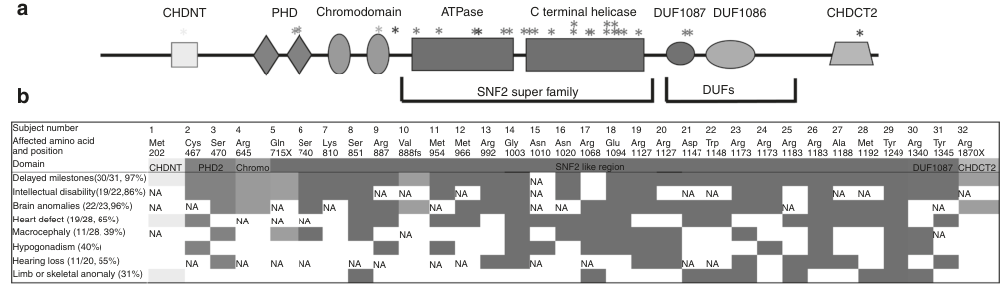

## Question

# Disease Characteristics Research Template

## Target Disease
- **Disease Name:** Sifrim-Hitz-Weiss syndrome
- **MONDO ID:**  (if available)
- **Category:** Mendelian

## Research Objectives

Please provide a comprehensive research report on **Sifrim-Hitz-Weiss syndrome** covering all of the
disease characteristics listed below. This report will be used to populate a disease knowledge
base entry. Be thorough and cite primary literature (PMID preferred) for all claims.

For each section, **suggested databases/resources** are listed. These are the first places
you should search for information on each topic.

---

### 1. Disease Information
> **Search first:** OMIM, Orphanet, ICD-10/ICD-11, MeSH, PubMed

- What is the disease? Provide a concise overview.
- What are the key identifiers? (OMIM, Orphanet, ICD-10/ICD-11, MeSH, Mondo)
- What are the common synonyms and alternative names?
- Is the information derived from individual patients (e.g., EHR) or aggregated disease-level resources?

### 2. Etiology

- **Disease Causal Factors**: What are the primary causes? (genetic, environmental, infectious, mechanistic)
- **Risk Factors**:
  > **Search first:** PubMed, Cochrane Library, UpToDate, clinical guidelines, ClinVar, ClinGen, GWAS Catalog, PheGenI, CTD, CDC, WHO, epidemiological databases
  - Genetic risk factors (causal variants, susceptibility loci, modifier genes)
  - Environmental risk factors (toxins, lifestyle, occupational exposures, age, sex, family history)
- **Protective Factors**:
  > **Search first:** PubMed, Cochrane Library, clinical trial databases, GWAS Catalog, gnomAD, WHO, CDC, nutrition databases
  - Genetic protective factors (protective variants, modifier alleles)
  - Environmental protective factors (diet, lifestyle, exposures that reduce risk)
- **Gene-Environment Interactions**: How do genetic and environmental factors interact to influence disease?
  > **Search first:** CTD, PubMed, PheGenI, GxE databases

### 3. Phenotypes
> **Search first:** HPO (Human Phenotype Ontology), OMIM, Orphanet, PubMed, clinicaltrials.gov, MedDRA, SNOMED CT, DECIPHER, LOINC

For each phenotype, provide:
- **Phenotype type**: symptoms, clinical signs, physical manifestations, behavioral changes, or laboratory abnormalities
  > For symptoms/signs: HPO, OMIM, Orphanet, PubMed
  > For behavioral changes: HPO, DSM, RDoC (Research Domain Criteria), PubMed
  > For laboratory abnormalities: LOINC, SNOMED CT, LabTests Online, PubMed
- **Phenotype characteristics**:
  > **Search first:** OMIM, Orphanet, HPO, PubMed
  - Age of symptom onset (neonatal, childhood, adult-onset, late-onset)
  - Symptom severity (mild, moderate, severe, variable)
  - Symptom progression (stable, progressive, episodic, fluctuating)
  - Frequency among affected individuals (percentage or qualitative)
- **Quality of life impact**: Effects on daily functioning and well-being (per-phenotype when possible)
  > **Search first:** EQ-5D database, SF-36, WHO QOL databases, PubMed
- Suggest HPO (Human Phenotype Ontology) terms for each phenotype

### 4. Genetic/Molecular Information

- **Causal Genes**: Gene mutations or chromosomal abnormalities responsible for disease (gene symbols, OMIM IDs)
  > **Search first:** OMIM, ClinVar, HGMD, Ensembl, NCBI Gene
- **Pathogenic Variants**:
  - Affected genes (gene symbols, HGNC IDs)
    > **Search first:** OMIM, NCBI Gene, Ensembl, HGNC, UniProt, GeneCards
  - Variant classification (pathogenic, likely pathogenic, VUS per ACMG/AMP guidelines)
    > **Search first:** ClinVar, ClinGen, ACMG/AMP guidelines, VarSome
  - Variant type/class (missense, frameshift, nonsense, splice-site, structural)
  - Allele frequency in population databases
    > **Search first:** gnomAD, 1000 Genomes, ExAC, TOPMed, dbSNP
  - Somatic vs germline origin
    > **Search first:** COSMIC (somatic), ClinVar, ICGC, TCGA
  - Functional consequences (loss of function, gain of function, dominant negative)
- **Modifier Genes**: Genes that modify disease severity or expression
- **Epigenetic Information**: DNA methylation, histone modifications, chromatin changes affecting disease
  > **Search first:** ENCODE, Roadmap Epigenomics, MethBase, DiseaseMeth
- **Chromosomal Abnormalities**: Large-scale genetic changes (aneuploidy, translocations, inversions)
  > **Search first:** DECIPHER, ClinVar, ECARUCA, UCSC Genome Browser

### 5. Environmental Information

- **Environmental Factors**: Non-genetic contributing factors (toxins, radiation, pollution, occupational exposure)
  > **Search first:** CTD (Comparative Toxicogenomics Database), TOXNET, PubMed, EPA databases
- **Lifestyle Factors**: Behavioral factors (smoking, diet, exercise, alcohol consumption)
  > **Search first:** CDC databases, WHO, PubMed, NHANES
- **Infectious Agents**: If applicable, pathogens causing or triggering disease (bacteria, viruses, fungi, parasites)
  > **Search first:** NCBI Taxonomy, ViPR, BV-BRC, MicrobeDB, GIDEON

### 6. Mechanism / Pathophysiology

- **Molecular Pathways**: Specific signaling cascades or biochemical pathways involved (Wnt, MAPK, mTOR, PI3K-AKT, etc.)
  > **Search first:** KEGG, Reactome, WikiPathways, PathBank, BioCyc
- **Cellular Processes**: Cell-level mechanisms (apoptosis, autophagy, cell cycle dysregulation, inflammation, etc.)
  > **Search first:** Gene Ontology (GO), Reactome, KEGG, PubMed
- **Protein Dysfunction**: How protein structure or function is altered (misfolding, aggregation, loss of function, gain of function)
  > **Search first:** UniProt, PDB (Protein Data Bank), InterPro, Pfam, AlphaFold
- **Metabolic Changes**: Alterations in metabolic processes (energy metabolism, lipid metabolism, amino acid metabolism)
  > **Search first:** KEGG, BioCyc, HMDB (Human Metabolome Database), BRENDA
- **Immune System Involvement**: Role of immune response (autoimmunity, immunodeficiency, chronic inflammation)
  > **Search first:** ImmPort, Immunome Database, IEDB, Gene Ontology
- **Tissue Damage Mechanisms**: How tissues/ are injured (oxidative stress, ischemia, fibrosis, necrosis)
  > **Search first:** PubMed, Gene Ontology, Reactome
- **Biochemical Abnormalities**: Specific molecular defects (enzyme deficiencies, receptor dysfunction, ion channel defects)
  > **Search first:** BRENDA, UniProt, KEGG, OMIM, PubMed
- **Epigenetic Changes**: DNA methylation, histone modifications affecting gene expression in disease
  > **Search first:** ENCODE, Roadmap Epigenomics, MethBase, DiseaseMeth
- **Molecular Profiling** (if available):
  - Transcriptomics/gene expression changes
    > **Search first:** GEO (Gene Expression Omnibus), ArrayExpress, GTEx, Human Cell Atlas, SRA
  - Proteomics findings
    > **Search first:** PRIDE, ProteomeXchange, Human Protein Atlas, STRING, BioGRID
  - Metabolomics signatures
    > **Search first:** MetaboLights, Metabolomics Workbench, HMDB, METLIN
  - Lipidomics alterations
    > **Search first:** LIPID MAPS, SwissLipids, LipidHome, Metabolomics Workbench
  - Genomic structural features
    > **Search first:** UCSC Genome Browser, Ensembl, NCBI, dbVar, DGV
- **Advanced Technologies** (if applicable):
  - Single-cell analysis findings (cell-type specific mechanisms, cellular heterogeneity)
    > **Search first:** Human Cell Atlas, Single Cell Portal, GEO, CELLxGENE
  - Spatial transcriptomics findings
    > **Search first:** GEO, Spatial Research, Vizgen, 10x Genomics data
  - Multi-omics integration results
    > **Search first:** TCGA, ICGC, cBioPortal, LinkedOmics, PubMed
  - Functional genomics screens (CRISPR, RNAi)
    > **Search first:** DepMap, GenomeRNAi, PubMed, BioGRID ORCS

For each mechanism, describe:
- The causal chain from initial trigger to clinical manifestation
- Which mechanisms are upstream vs downstream
- What cell types and biological processes are involved
- Suggest GO terms for biological processes and CL terms for cell types

### 7. Anatomical Structures Affected

- **Organ Level**:
  - Primary organs directly affected
  - Secondary organ involvement (complications, secondary effects)
  - Body systems involved (cardiovascular, nervous, digestive, respiratory, endocrine, etc.)
  > **Search first:** Uberon, FMA (Foundational Model of Anatomy), OMIM, HPO, ICD-11, MeSH, SNOMED CT
- **Tissue and Cell Level**:
  - Specific tissue types affected (epithelial, connective, muscle, nervous)
  - Specific cell populations targeted (with Cell Ontology terms)
  > **Search first:** Uberon, Human Protein Atlas, Cell Ontology, Human Cell Atlas, CellMarker, PanglaoDB
- **Subcellular Level**:
  - Cellular compartments involved (mitochondria, nucleus, ER, lysosomes) (with GO Cellular Component terms)
  > **Search first:** Gene Ontology (Cellular Component), UniProt, Human Protein Atlas
- **Localization**:
  - Specific anatomical sites (with UBERON terms)
    > **Search first:** FMA, Uberon, NeuroNames (for brain), SNOMED CT
  - Lateralization (unilateral, bilateral, asymmetric)
    > **Search first:** HPO, clinical literature, imaging databases

### 8. Temporal Development

- **Onset**:
  - Typical age of onset (congenital, pediatric, adult, geriatric)
  - Onset pattern (acute, subacute, chronic, insidious)
  > **Search first:** OMIM, Orphanet, HPO, PubMed
- **Progression**:
  - Disease stages (early, intermediate, advanced, end-stage)
    > **Search first:** Cancer Staging Manual (AJCC), WHO classifications, PubMed
  - Progression rate (rapid, slow, variable)
  - Disease course pattern (episodic, relapsing-remitting, progressive, stable)
  - Disease duration (self-limited, chronic lifelong)
  > **Search first:** Disease registries, longitudinal cohort databases, natural history studies, PubMed, Orphanet, OMIM
- **Patterns**:
  - Remission patterns (spontaneous, treatment-induced)
    > **Search first:** Clinical trial databases, disease registries, PubMed
  - Critical periods (time windows of vulnerability or opportunity for intervention)
    > **Search first:** PubMed, developmental biology databases, clinical guidelines

### 9. Inheritance and Population

- **Epidemiology**:
  - Prevalence (cases per 100,000 at given time)
  - Incidence (new cases per 100,000 per year)
  > **Search first:** Orphanet, CDC, WHO, GBD (Global Burden of Disease), national registries, SEER, disease registries
- **For Genetic Etiology**:
  - Inheritance pattern (AD, AR, X-linked, mitochondrial, multifactorial, polygenic)
    > **Search first:** OMIM, Orphanet, ClinVar, GTR (Genetic Testing Registry)
  - Penetrance (complete, incomplete, age-dependent)
    > **Search first:** ClinVar, OMIM, PubMed, ClinGen
  - Expressivity (variable, consistent)
    > **Search first:** OMIM, ClinVar, PubMed
  - Genetic anticipation (increasing severity in successive generations)
    > **Search first:** OMIM, PubMed (especially for repeat expansion disorders)
  - Germline mosaicism
    > **Search first:** ClinVar, OMIM, genetic counseling literature, PubMed
  - Founder effects (population-specific mutations)
    > **Search first:** gnomAD, population genetics databases, PubMed
  - Consanguinity role
    > **Search first:** OMIM, population studies, genetic counseling resources
  - Carrier frequency
    > **Search first:** gnomAD, carrier screening databases, GeneReviews, GTR
- **Population Demographics**:
  - Affected populations (ethnic or demographic groups with higher prevalence)
    > **Search first:** gnomAD, 1000 Genomes, PAGE Study, PubMed, population registries
  - Geographic distribution (endemic areas, regional variation)
    > **Search first:** WHO, CDC, GBD, Orphanet, geographic epidemiology databases
  - Geographic distribution of specific variants
  - Sex ratio (male:female)
    > **Search first:** Disease registries, OMIM, PubMed, epidemiological databases
  - Age distribution of affected individuals
    > **Search first:** CDC, disease registries, SEER, Orphanet

### 10. Diagnostics

- **Clinical Tests**:
  - Laboratory tests (blood, urine, tissue chemistry, specific enzyme assays)
    > **Search first:** LOINC, LabTests Online, PubMed
  - Biomarkers (proteins, metabolites, genetic markers, circulating biomarkers)
    > **Search first:** FDA Biomarker List, BEST (Biomarkers, EndpointS, and other Tools), PubMed
  - Imaging studies (X-ray, CT, MRI, PET, ultrasound)
    > **Search first:** RadLex, DICOM, Radiopaedia, imaging databases
  - Functional tests (pulmonary function, cardiac stress tests)
    > **Search first:** LOINC, clinical guidelines, PubMed
  - Electrophysiology (EEG, EMG, ECG, nerve conduction studies)
    > **Search first:** LOINC, clinical neurophysiology databases, PubMed
  - Biopsy findings (histopathology, immunohistochemistry)
    > **Search first:** SNOMED CT, College of American Pathologists resources, PubMed
  - Pathology findings (microscopic examination)
    > **Search first:** SNOMED CT, Digital Pathology databases, PubMed
- **Genetic Testing**:
  > **Search first:** GTR (Genetic Testing Registry), GeneReviews, ClinGen
  - Overview of recommended genetic testing approach
  - Whole genome sequencing (WGS) utility
    > **Search first:** GTR, ClinVar, GEL (Genomics England), gnomAD
  - Whole exome sequencing (WES) utility
    > **Search first:** GTR, ClinVar, OMIM, GeneMatcher
  - Gene panels (which panels, which genes)
    > **Search first:** GTR, ClinVar, laboratory-specific databases
  - Single gene testing
    > **Search first:** GTR, ClinVar, OMIM, GeneReviews
  - Chromosomal microarray (CMA)
    > **Search first:** DECIPHER, ClinVar, dbVar, ECARUCA
  - Karyotyping
    > **Search first:** Chromosome Abnormality Database, ClinVar, cytogenetics resources
  - FISH
    > **Search first:** ClinVar, cytogenetics databases, PubMed
  - Mitochondrial DNA testing
    > **Search first:** MITOMAP, MSeqDR, ClinVar, GTR
  - Repeat expansion testing
    > **Search first:** GTR, ClinVar, repeat expansion databases, PubMed
- **Omics-Based Diagnostics** (if applicable):
  - RNA sequencing / transcriptomics
    > **Search first:** GEO, ArrayExpress, GTEx, RNA-seq databases
  - Proteomics
    > **Search first:** PRIDE, ProteomeXchange, FDA Biomarker database
  - Metabolomics
    > **Search first:** MetaboLights, Metabolomics Workbench, HMDB
  - Epigenomics
    > **Search first:** GEO, ENCODE, Roadmap Epigenomics, MethBase
  - Liquid biopsy
    > **Search first:** COSMIC, ClinVar, liquid biopsy databases, PubMed
- **Clinical Criteria**:
  - Standardized diagnostic criteria (DSM, ICD, society guidelines)
    > **Search first:** DSM-5, ICD-11, clinical society guidelines, UpToDate
  - Differential diagnosis (other conditions to rule out, with distinguishing features)
    > **Search first:** DynaMed, UpToDate, clinical decision support systems
- **Screening**:
  - Screening methods for asymptomatic individuals (newborn screening, carrier screening, cascade screening)
    > **Search first:** ACMG recommendations, CDC newborn screening, GTR

### 11. Outcome/Prognosis

- **Survival and Mortality**:
  - Survival rate (5-year, 10-year, overall)
    > **Search first:** SEER, cancer registries, disease-specific registries, PubMed
  - Life expectancy (with and without treatment if applicable)
    > **Search first:** Orphanet, disease registries, actuarial databases, PubMed
  - Mortality rate
    > **Search first:** CDC, WHO, GBD, national mortality databases
  - Disease-specific mortality (deaths directly attributable to disease)
    > **Search first:** Disease registries, CDC Wonder, GBD, PubMed
- **Morbidity and Function**:
  - Morbidity (disease-related disability and health impacts)
    > **Search first:** GBD, WHO, disability databases, PubMed
  - Disability outcomes (long-term functional impairments)
    > **Search first:** ICF (International Classification of Functioning), disability registries
  - Quality of life measures (EQ-5D, SF-36, PROMIS, disease-specific tools)
    > **Search first:** EQ-5D database, SF-36, PROMIS, PubMed
- **Disease Course**:
  - Complications (secondary problems: infections, organ failure, etc.)
    > **Search first:** ICD codes, disease registries, clinical databases, PubMed
  - Recovery potential (likelihood and extent of recovery, with vs without treatment)
    > **Search first:** Natural history studies, rehabilitation databases, PubMed
- **Prediction**:
  - Prognostic factors (age, disease severity, biomarkers, treatment response)
    > **Search first:** Prognostic models databases, clinical calculators, PubMed
  - Prognostic biomarkers (molecular markers predicting disease course)
    > **Search first:** FDA Biomarker database, PubMed, cancer prognostic databases

### 12. Treatment

- **Pharmacotherapy**:
  - Pharmacological treatments (drug names, drug classes, mechanisms of action)
    > **Search first:** DrugBank, RxNorm, ATC classification, DailyMed, FDA databases
  - Pharmacogenomics (how genetic variants affect drug metabolism, efficacy, toxicity)
    > **Search first:** PharmGKB, CPIC (Clinical Pharmacogenetics), FDA Table of PGx Biomarkers
- **Advanced Therapeutics**:
  - Gene therapy (viral vectors, CRISPR, gene replacement, gene editing)
    > **Search first:** ClinicalTrials.gov, FDA gene therapy database, ASGCT resources
  - Cell therapy (stem cell transplant, CAR-T, cellular therapeutics)
    > **Search first:** ClinicalTrials.gov, FDA cell therapy database, FACT standards
  - RNA-based therapies (ASOs, siRNA, mRNA therapies)
    > **Search first:** ClinicalTrials.gov, FDA approvals, PubMed
  - Targeted therapies (treatments directed at specific molecular targets)
    > **Search first:** My Cancer Genome, OncoKB, ClinicalTrials.gov, FDA approvals
  - Immunotherapies (checkpoint inhibitors, monoclonal antibodies)
    > **Search first:** Cancer Immunotherapy Database, FDA approvals, ClinicalTrials.gov
- **Surgical and Interventional**:
  - Surgical interventions (types of surgery, timing, outcomes)
    > **Search first:** CPT codes, surgical registries, clinical guidelines, PubMed
- **Supportive and Rehabilitative**:
  - Supportive care (symptom management, pain control, nutrition)
    > **Search first:** Clinical guidelines, Cochrane Library, PubMed
  - Rehabilitation (physical therapy, occupational therapy, speech therapy)
    > **Search first:** Rehabilitation medicine databases, clinical guidelines, PubMed
- **Experimental**:
  - Experimental treatments in clinical trials (with NCT identifiers if available)
    > **Search first:** ClinicalTrials.gov, EU Clinical Trials Register, WHO ICTRP
- **Treatment Outcomes**:
  - Treatment response rates
    > **Search first:** Clinical trial databases, FDA reviews, systematic reviews, PubMed
  - Side effects and adverse events
    > **Search first:** FDA Adverse Event Reporting System (FAERS), MedWatch, PubMed
- **Treatment Strategy**:
  - Treatment algorithms (clinical pathways, decision trees)
    > **Search first:** Clinical practice guidelines, NCCN Guidelines, UpToDate
  - Combination therapies
    > **Search first:** ClinicalTrials.gov, treatment guidelines, PubMed
  - Personalized medicine approaches (genotype-guided treatment)
    > **Search first:** My Cancer Genome, CIViC, PharmGKB, precision medicine databases

For each treatment, suggest MAXO (Medical Action Ontology) terms where applicable.

### 13. Prevention

- **Prevention Levels**:
  - Primary prevention (preventing disease occurrence: vaccination, risk factor modification)
    > **Search first:** CDC, WHO, USPSTF recommendations, Cochrane Library
  - Secondary prevention (early detection and treatment: screening programs, early intervention)
    > **Search first:** USPSTF, CDC screening guidelines, WHO
  - Tertiary prevention (preventing complications in those with disease)
    > **Search first:** Clinical guidelines, disease management protocols, PubMed
- **Immunization**: Vaccine strategies (if applicable)
  > **Search first:** CDC vaccine schedules, WHO immunization, FDA vaccine database
- **Screening and Early Detection**:
  - Screening programs (population-based: newborn screening, cancer screening)
    > **Search first:** CDC screening programs, USPSTF, cancer screening databases
  - Genetic screening (carrier screening, preimplantation genetic diagnosis, prenatal testing)
    > **Search first:** ACMG recommendations, ACOG guidelines, GTR
  - Risk stratification (identifying high-risk individuals for targeted prevention)
    > **Search first:** Risk prediction models, clinical calculators, PubMed
- **Behavioral Interventions**: Lifestyle modifications to reduce risk
  > **Search first:** CDC, WHO, behavioral intervention databases, Cochrane Library
- **Counseling**: Genetic counseling (risk assessment, family planning guidance)
  > **Search first:** NSGC resources, ACMG guidelines, GeneReviews
- **Public Health**:
  - Public health interventions (sanitation, vector control, health education)
    > **Search first:** CDC, WHO, public health databases, PubMed
  - Environmental interventions (reducing environmental risk factors)
    > **Search first:** EPA databases, WHO environmental health, PubMed
- **Prophylaxis**: Preventive medications or procedures
  > **Search first:** Clinical guidelines, FDA approvals, PubMed

### 14. Other Species / Natural Disease

- **Taxonomy**: Species affected (with NCBI Taxon identifiers)
  > **Search first:** NCBI Taxonomy
- **Breed**: Specific breeds affected (with VBO identifiers if applicable)
  > **Search first:** VBO (Vertebrate Breed Ontology)
- **Gene**: Orthologous genes in other species (with NCBI Gene IDs)
  > **Search first:** NCBI Gene
- **Natural Disease**:
  - Naturally occurring disease in other species (companion animals, wildlife)
    > **Search first:** OMIA (Online Mendelian Inheritance in Animals), VetCompass, PubMed
  - Veterinary relevance and importance in animal health
    > **Search first:** OMIA, veterinary databases, PubMed
- **Comparative Biology**:
  - Comparative pathology (similarities and differences across species)
    > **Search first:** OMIA, comparative pathology databases, PubMed
  - Evolutionary conservation of disease mechanisms
    > **Search first:** HomoloGene, OrthoMCL, Alliance of Genome Resources
- **Transmission** (if applicable):
  - Zoonotic potential
    > **Search first:** CDC zoonotic diseases, WHO zoonoses, GIDEON
  - Cross-species susceptibility
    > **Search first:** NCBI Taxonomy, veterinary databases, PubMed

### 15. Model Organisms

- **Model Types**:
  - Model organism type (mammalian, invertebrate, cellular, in vitro)
    > **Search first:** Alliance of Genome Resources, model organism databases
  - Specific model systems (mouse, rat, zebrafish, Drosophila, C. elegans, yeast, cell lines, organoids, iPSCs)
    > **Search first:** MGI, RGD, ZFIN, FlyBase, WormBase, SGD, ATCC, Cellosaurus
  - Induced models (drug treatment, surgical intervention, environmental manipulation)
    > **Search first:** MGI, model organism databases, PubMed
- **Genetic Models**:
  - Types available (knockout, knock-in, transgenic, conditional, humanized)
    > **Search first:** MGI, IMPC, KOMP, EuMMCR, IMSR
- **Model Characteristics**:
  - Phenotype recapitulation (how well model reproduces human disease features)
    > **Search first:** Model organism databases, comparative studies, PubMed
  - Model limitations (aspects of human disease not captured)
    > **Search first:** Model organism databases, PubMed, review articles
- **Applications**:
  - Research applications (what aspects of disease can be studied)
    > **Search first:** Model organism databases, PubMed
- **Resources**:
  - Model databases
    > **Search first:** MGI, RGD, ZFIN, FlyBase, WormBase, IMSR, EMMA, MMRRC

---

## Citation Requirements

- Cite primary literature (PMID preferred) for all mechanistic and clinical claims
- Prioritize recent reviews and landmark papers
- Include direct quotes from abstracts where possible to support key statements
- Distinguish evidence source types: human clinical, model organism, in vitro, computational

## Output Format

Structure your response as a comprehensive narrative organized by the sections above.
For each section, provide:
- Factual content with specific details (numbers, percentages, gene names, variant nomenclature)
- Ontology term suggestions (HPO, GO, CL, UBERON, CHEBI, MAXO, MONDO) where applicable
- Evidence citations with PMIDs
- Direct quotes from abstracts to support key claims
- Clear indication when information is not available or not applicable for this disease

This report will be used to populate a disease knowledge base entry with:
- Pathophysiology descriptions with causal chains
- Gene/protein annotations (HGNC, GO terms)
- Phenotype associations (HP terms) with frequencies
- Cell type involvement (CL terms)
- Anatomical locations (UBERON terms)
- Chemical entities (CHEBI terms)
- Treatment annotations (MAXO terms)
- Evidence items with PMIDs and exact abstract quotes
- Epidemiology, prognosis, diagnostic, and prevention information
- Animal model descriptions with phenotype recapitulation details

## Output

Question: You are an expert researcher providing comprehensive, well-cited information.

Provide detailed information focusing on:
1. Key concepts and definitions with current understanding
2. Recent developments and latest research (prioritize 2023-2024 sources)
3. Current applications and real-world implementations
4. Expert opinions and analysis from authoritative sources
5. Relevant statistics and data from recent studies

Format as a comprehensive research report with proper citations. Include URLs and publication dates where available.
Always prioritize recent, authoritative sources and provide specific citations for all major claims.

# Disease Characteristics Research Template

## Target Disease
- **Disease Name:** Sifrim-Hitz-Weiss syndrome
- **MONDO ID:**  (if available)
- **Category:** Mendelian

## Research Objectives

Please provide a comprehensive research report on **Sifrim-Hitz-Weiss syndrome** covering all of the
disease characteristics listed below. This report will be used to populate a disease knowledge
base entry. Be thorough and cite primary literature (PMID preferred) for all claims.

For each section, **suggested databases/resources** are listed. These are the first places
you should search for information on each topic.

---

### 1. Disease Information
> **Search first:** OMIM, Orphanet, ICD-10/ICD-11, MeSH, PubMed

- What is the disease? Provide a concise overview.
- What are the key identifiers? (OMIM, Orphanet, ICD-10/ICD-11, MeSH, Mondo)
- What are the common synonyms and alternative names?
- Is the information derived from individual patients (e.g., EHR) or aggregated disease-level resources?

### 2. Etiology

- **Disease Causal Factors**: What are the primary causes? (genetic, environmental, infectious, mechanistic)
- **Risk Factors**:
  > **Search first:** PubMed, Cochrane Library, UpToDate, clinical guidelines, ClinVar, ClinGen, GWAS Catalog, PheGenI, CTD, CDC, WHO, epidemiological databases
  - Genetic risk factors (causal variants, susceptibility loci, modifier genes)
  - Environmental risk factors (toxins, lifestyle, occupational exposures, age, sex, family history)
- **Protective Factors**:
  > **Search first:** PubMed, Cochrane Library, clinical trial databases, GWAS Catalog, gnomAD, WHO, CDC, nutrition databases
  - Genetic protective factors (protective variants, modifier alleles)
  - Environmental protective factors (diet, lifestyle, exposures that reduce risk)
- **Gene-Environment Interactions**: How do genetic and environmental factors interact to influence disease?
  > **Search first:** CTD, PubMed, PheGenI, GxE databases

### 3. Phenotypes
> **Search first:** HPO (Human Phenotype Ontology), OMIM, Orphanet, PubMed, clinicaltrials.gov, MedDRA, SNOMED CT, DECIPHER, LOINC

For each phenotype, provide:
- **Phenotype type**: symptoms, clinical signs, physical manifestations, behavioral changes, or laboratory abnormalities
  > For symptoms/signs: HPO, OMIM, Orphanet, PubMed
  > For behavioral changes: HPO, DSM, RDoC (Research Domain Criteria), PubMed
  > For laboratory abnormalities: LOINC, SNOMED CT, LabTests Online, PubMed
- **Phenotype characteristics**:
  > **Search first:** OMIM, Orphanet, HPO, PubMed
  - Age of symptom onset (neonatal, childhood, adult-onset, late-onset)
  - Symptom severity (mild, moderate, severe, variable)
  - Symptom progression (stable, progressive, episodic, fluctuating)
  - Frequency among affected individuals (percentage or qualitative)
- **Quality of life impact**: Effects on daily functioning and well-being (per-phenotype when possible)
  > **Search first:** EQ-5D database, SF-36, WHO QOL databases, PubMed
- Suggest HPO (Human Phenotype Ontology) terms for each phenotype

### 4. Genetic/Molecular Information

- **Causal Genes**: Gene mutations or chromosomal abnormalities responsible for disease (gene symbols, OMIM IDs)
  > **Search first:** OMIM, ClinVar, HGMD, Ensembl, NCBI Gene
- **Pathogenic Variants**:
  - Affected genes (gene symbols, HGNC IDs)
    > **Search first:** OMIM, NCBI Gene, Ensembl, HGNC, UniProt, GeneCards
  - Variant classification (pathogenic, likely pathogenic, VUS per ACMG/AMP guidelines)
    > **Search first:** ClinVar, ClinGen, ACMG/AMP guidelines, VarSome
  - Variant type/class (missense, frameshift, nonsense, splice-site, structural)
  - Allele frequency in population databases
    > **Search first:** gnomAD, 1000 Genomes, ExAC, TOPMed, dbSNP
  - Somatic vs germline origin
    > **Search first:** COSMIC (somatic), ClinVar, ICGC, TCGA
  - Functional consequences (loss of function, gain of function, dominant negative)
- **Modifier Genes**: Genes that modify disease severity or expression
- **Epigenetic Information**: DNA methylation, histone modifications, chromatin changes affecting disease
  > **Search first:** ENCODE, Roadmap Epigenomics, MethBase, DiseaseMeth
- **Chromosomal Abnormalities**: Large-scale genetic changes (aneuploidy, translocations, inversions)
  > **Search first:** DECIPHER, ClinVar, ECARUCA, UCSC Genome Browser

### 5. Environmental Information

- **Environmental Factors**: Non-genetic contributing factors (toxins, radiation, pollution, occupational exposure)
  > **Search first:** CTD (Comparative Toxicogenomics Database), TOXNET, PubMed, EPA databases
- **Lifestyle Factors**: Behavioral factors (smoking, diet, exercise, alcohol consumption)
  > **Search first:** CDC databases, WHO, PubMed, NHANES
- **Infectious Agents**: If applicable, pathogens causing or triggering disease (bacteria, viruses, fungi, parasites)
  > **Search first:** NCBI Taxonomy, ViPR, BV-BRC, MicrobeDB, GIDEON

### 6. Mechanism / Pathophysiology

- **Molecular Pathways**: Specific signaling cascades or biochemical pathways involved (Wnt, MAPK, mTOR, PI3K-AKT, etc.)
  > **Search first:** KEGG, Reactome, WikiPathways, PathBank, BioCyc
- **Cellular Processes**: Cell-level mechanisms (apoptosis, autophagy, cell cycle dysregulation, inflammation, etc.)
  > **Search first:** Gene Ontology (GO), Reactome, KEGG, PubMed
- **Protein Dysfunction**: How protein structure or function is altered (misfolding, aggregation, loss of function, gain of function)
  > **Search first:** UniProt, PDB (Protein Data Bank), InterPro, Pfam, AlphaFold
- **Metabolic Changes**: Alterations in metabolic processes (energy metabolism, lipid metabolism, amino acid metabolism)
  > **Search first:** KEGG, BioCyc, HMDB (Human Metabolome Database), BRENDA
- **Immune System Involvement**: Role of immune response (autoimmunity, immunodeficiency, chronic inflammation)
  > **Search first:** ImmPort, Immunome Database, IEDB, Gene Ontology
- **Tissue Damage Mechanisms**: How tissues/ are injured (oxidative stress, ischemia, fibrosis, necrosis)
  > **Search first:** PubMed, Gene Ontology, Reactome
- **Biochemical Abnormalities**: Specific molecular defects (enzyme deficiencies, receptor dysfunction, ion channel defects)
  > **Search first:** BRENDA, UniProt, KEGG, OMIM, PubMed
- **Epigenetic Changes**: DNA methylation, histone modifications affecting gene expression in disease
  > **Search first:** ENCODE, Roadmap Epigenomics, MethBase, DiseaseMeth
- **Molecular Profiling** (if available):
  - Transcriptomics/gene expression changes
    > **Search first:** GEO (Gene Expression Omnibus), ArrayExpress, GTEx, Human Cell Atlas, SRA
  - Proteomics findings
    > **Search first:** PRIDE, ProteomeXchange, Human Protein Atlas, STRING, BioGRID
  - Metabolomics signatures
    > **Search first:** MetaboLights, Metabolomics Workbench, HMDB, METLIN
  - Lipidomics alterations
    > **Search first:** LIPID MAPS, SwissLipids, LipidHome, Metabolomics Workbench
  - Genomic structural features
    > **Search first:** UCSC Genome Browser, Ensembl, NCBI, dbVar, DGV
- **Advanced Technologies** (if applicable):
  - Single-cell analysis findings (cell-type specific mechanisms, cellular heterogeneity)
    > **Search first:** Human Cell Atlas, Single Cell Portal, GEO, CELLxGENE
  - Spatial transcriptomics findings
    > **Search first:** GEO, Spatial Research, Vizgen, 10x Genomics data
  - Multi-omics integration results
    > **Search first:** TCGA, ICGC, cBioPortal, LinkedOmics, PubMed
  - Functional genomics screens (CRISPR, RNAi)
    > **Search first:** DepMap, GenomeRNAi, PubMed, BioGRID ORCS

For each mechanism, describe:
- The causal chain from initial trigger to clinical manifestation
- Which mechanisms are upstream vs downstream
- What cell types and biological processes are involved
- Suggest GO terms for biological processes and CL terms for cell types

### 7. Anatomical Structures Affected

- **Organ Level**:
  - Primary organs directly affected
  - Secondary organ involvement (complications, secondary effects)
  - Body systems involved (cardiovascular, nervous, digestive, respiratory, endocrine, etc.)
  > **Search first:** Uberon, FMA (Foundational Model of Anatomy), OMIM, HPO, ICD-11, MeSH, SNOMED CT
- **Tissue and Cell Level**:
  - Specific tissue types affected (epithelial, connective, muscle, nervous)
  - Specific cell populations targeted (with Cell Ontology terms)
  > **Search first:** Uberon, Human Protein Atlas, Cell Ontology, Human Cell Atlas, CellMarker, PanglaoDB
- **Subcellular Level**:
  - Cellular compartments involved (mitochondria, nucleus, ER, lysosomes) (with GO Cellular Component terms)
  > **Search first:** Gene Ontology (Cellular Component), UniProt, Human Protein Atlas
- **Localization**:
  - Specific anatomical sites (with UBERON terms)
    > **Search first:** FMA, Uberon, NeuroNames (for brain), SNOMED CT
  - Lateralization (unilateral, bilateral, asymmetric)
    > **Search first:** HPO, clinical literature, imaging databases

### 8. Temporal Development

- **Onset**:
  - Typical age of onset (congenital, pediatric, adult, geriatric)
  - Onset pattern (acute, subacute, chronic, insidious)
  > **Search first:** OMIM, Orphanet, HPO, PubMed
- **Progression**:
  - Disease stages (early, intermediate, advanced, end-stage)
    > **Search first:** Cancer Staging Manual (AJCC), WHO classifications, PubMed
  - Progression rate (rapid, slow, variable)
  - Disease course pattern (episodic, relapsing-remitting, progressive, stable)
  - Disease duration (self-limited, chronic lifelong)
  > **Search first:** Disease registries, longitudinal cohort databases, natural history studies, PubMed, Orphanet, OMIM
- **Patterns**:
  - Remission patterns (spontaneous, treatment-induced)
    > **Search first:** Clinical trial databases, disease registries, PubMed
  - Critical periods (time windows of vulnerability or opportunity for intervention)
    > **Search first:** PubMed, developmental biology databases, clinical guidelines

### 9. Inheritance and Population

- **Epidemiology**:
  - Prevalence (cases per 100,000 at given time)
  - Incidence (new cases per 100,000 per year)
  > **Search first:** Orphanet, CDC, WHO, GBD (Global Burden of Disease), national registries, SEER, disease registries
- **For Genetic Etiology**:
  - Inheritance pattern (AD, AR, X-linked, mitochondrial, multifactorial, polygenic)
    > **Search first:** OMIM, Orphanet, ClinVar, GTR (Genetic Testing Registry)
  - Penetrance (complete, incomplete, age-dependent)
    > **Search first:** ClinVar, OMIM, PubMed, ClinGen
  - Expressivity (variable, consistent)
    > **Search first:** OMIM, ClinVar, PubMed
  - Genetic anticipation (increasing severity in successive generations)
    > **Search first:** OMIM, PubMed (especially for repeat expansion disorders)
  - Germline mosaicism
    > **Search first:** ClinVar, OMIM, genetic counseling literature, PubMed
  - Founder effects (population-specific mutations)
    > **Search first:** gnomAD, population genetics databases, PubMed
  - Consanguinity role
    > **Search first:** OMIM, population studies, genetic counseling resources
  - Carrier frequency
    > **Search first:** gnomAD, carrier screening databases, GeneReviews, GTR
- **Population Demographics**:
  - Affected populations (ethnic or demographic groups with higher prevalence)
    > **Search first:** gnomAD, 1000 Genomes, PAGE Study, PubMed, population registries
  - Geographic distribution (endemic areas, regional variation)
    > **Search first:** WHO, CDC, GBD, Orphanet, geographic epidemiology databases
  - Geographic distribution of specific variants
  - Sex ratio (male:female)
    > **Search first:** Disease registries, OMIM, PubMed, epidemiological databases
  - Age distribution of affected individuals
    > **Search first:** CDC, disease registries, SEER, Orphanet

### 10. Diagnostics

- **Clinical Tests**:
  - Laboratory tests (blood, urine, tissue chemistry, specific enzyme assays)
    > **Search first:** LOINC, LabTests Online, PubMed
  - Biomarkers (proteins, metabolites, genetic markers, circulating biomarkers)
    > **Search first:** FDA Biomarker List, BEST (Biomarkers, EndpointS, and other Tools), PubMed
  - Imaging studies (X-ray, CT, MRI, PET, ultrasound)
    > **Search first:** RadLex, DICOM, Radiopaedia, imaging databases
  - Functional tests (pulmonary function, cardiac stress tests)
    > **Search first:** LOINC, clinical guidelines, PubMed
  - Electrophysiology (EEG, EMG, ECG, nerve conduction studies)
    > **Search first:** LOINC, clinical neurophysiology databases, PubMed
  - Biopsy findings (histopathology, immunohistochemistry)
    > **Search first:** SNOMED CT, College of American Pathologists resources, PubMed
  - Pathology findings (microscopic examination)
    > **Search first:** SNOMED CT, Digital Pathology databases, PubMed
- **Genetic Testing**:
  > **Search first:** GTR (Genetic Testing Registry), GeneReviews, ClinGen
  - Overview of recommended genetic testing approach
  - Whole genome sequencing (WGS) utility
    > **Search first:** GTR, ClinVar, GEL (Genomics England), gnomAD
  - Whole exome sequencing (WES) utility
    > **Search first:** GTR, ClinVar, OMIM, GeneMatcher
  - Gene panels (which panels, which genes)
    > **Search first:** GTR, ClinVar, laboratory-specific databases
  - Single gene testing
    > **Search first:** GTR, ClinVar, OMIM, GeneReviews
  - Chromosomal microarray (CMA)
    > **Search first:** DECIPHER, ClinVar, dbVar, ECARUCA
  - Karyotyping
    > **Search first:** Chromosome Abnormality Database, ClinVar, cytogenetics resources
  - FISH
    > **Search first:** ClinVar, cytogenetics databases, PubMed
  - Mitochondrial DNA testing
    > **Search first:** MITOMAP, MSeqDR, ClinVar, GTR
  - Repeat expansion testing
    > **Search first:** GTR, ClinVar, repeat expansion databases, PubMed
- **Omics-Based Diagnostics** (if applicable):
  - RNA sequencing / transcriptomics
    > **Search first:** GEO, ArrayExpress, GTEx, RNA-seq databases
  - Proteomics
    > **Search first:** PRIDE, ProteomeXchange, FDA Biomarker database
  - Metabolomics
    > **Search first:** MetaboLights, Metabolomics Workbench, HMDB
  - Epigenomics
    > **Search first:** GEO, ENCODE, Roadmap Epigenomics, MethBase
  - Liquid biopsy
    > **Search first:** COSMIC, ClinVar, liquid biopsy databases, PubMed
- **Clinical Criteria**:
  - Standardized diagnostic criteria (DSM, ICD, society guidelines)
    > **Search first:** DSM-5, ICD-11, clinical society guidelines, UpToDate
  - Differential diagnosis (other conditions to rule out, with distinguishing features)
    > **Search first:** DynaMed, UpToDate, clinical decision support systems
- **Screening**:
  - Screening methods for asymptomatic individuals (newborn screening, carrier screening, cascade screening)
    > **Search first:** ACMG recommendations, CDC newborn screening, GTR

### 11. Outcome/Prognosis

- **Survival and Mortality**:
  - Survival rate (5-year, 10-year, overall)
    > **Search first:** SEER, cancer registries, disease-specific registries, PubMed
  - Life expectancy (with and without treatment if applicable)
    > **Search first:** Orphanet, disease registries, actuarial databases, PubMed
  - Mortality rate
    > **Search first:** CDC, WHO, GBD, national mortality databases
  - Disease-specific mortality (deaths directly attributable to disease)
    > **Search first:** Disease registries, CDC Wonder, GBD, PubMed
- **Morbidity and Function**:
  - Morbidity (disease-related disability and health impacts)
    > **Search first:** GBD, WHO, disability databases, PubMed
  - Disability outcomes (long-term functional impairments)
    > **Search first:** ICF (International Classification of Functioning), disability registries
  - Quality of life measures (EQ-5D, SF-36, PROMIS, disease-specific tools)
    > **Search first:** EQ-5D database, SF-36, PROMIS, PubMed
- **Disease Course**:
  - Complications (secondary problems: infections, organ failure, etc.)
    > **Search first:** ICD codes, disease registries, clinical databases, PubMed
  - Recovery potential (likelihood and extent of recovery, with vs without treatment)
    > **Search first:** Natural history studies, rehabilitation databases, PubMed
- **Prediction**:
  - Prognostic factors (age, disease severity, biomarkers, treatment response)
    > **Search first:** Prognostic models databases, clinical calculators, PubMed
  - Prognostic biomarkers (molecular markers predicting disease course)
    > **Search first:** FDA Biomarker database, PubMed, cancer prognostic databases

### 12. Treatment

- **Pharmacotherapy**:
  - Pharmacological treatments (drug names, drug classes, mechanisms of action)
    > **Search first:** DrugBank, RxNorm, ATC classification, DailyMed, FDA databases
  - Pharmacogenomics (how genetic variants affect drug metabolism, efficacy, toxicity)
    > **Search first:** PharmGKB, CPIC (Clinical Pharmacogenetics), FDA Table of PGx Biomarkers
- **Advanced Therapeutics**:
  - Gene therapy (viral vectors, CRISPR, gene replacement, gene editing)
    > **Search first:** ClinicalTrials.gov, FDA gene therapy database, ASGCT resources
  - Cell therapy (stem cell transplant, CAR-T, cellular therapeutics)
    > **Search first:** ClinicalTrials.gov, FDA cell therapy database, FACT standards
  - RNA-based therapies (ASOs, siRNA, mRNA therapies)
    > **Search first:** ClinicalTrials.gov, FDA approvals, PubMed
  - Targeted therapies (treatments directed at specific molecular targets)
    > **Search first:** My Cancer Genome, OncoKB, ClinicalTrials.gov, FDA approvals
  - Immunotherapies (checkpoint inhibitors, monoclonal antibodies)
    > **Search first:** Cancer Immunotherapy Database, FDA approvals, ClinicalTrials.gov
- **Surgical and Interventional**:
  - Surgical interventions (types of surgery, timing, outcomes)
    > **Search first:** CPT codes, surgical registries, clinical guidelines, PubMed
- **Supportive and Rehabilitative**:
  - Supportive care (symptom management, pain control, nutrition)
    > **Search first:** Clinical guidelines, Cochrane Library, PubMed
  - Rehabilitation (physical therapy, occupational therapy, speech therapy)
    > **Search first:** Rehabilitation medicine databases, clinical guidelines, PubMed
- **Experimental**:
  - Experimental treatments in clinical trials (with NCT identifiers if available)
    > **Search first:** ClinicalTrials.gov, EU Clinical Trials Register, WHO ICTRP
- **Treatment Outcomes**:
  - Treatment response rates
    > **Search first:** Clinical trial databases, FDA reviews, systematic reviews, PubMed
  - Side effects and adverse events
    > **Search first:** FDA Adverse Event Reporting System (FAERS), MedWatch, PubMed
- **Treatment Strategy**:
  - Treatment algorithms (clinical pathways, decision trees)
    > **Search first:** Clinical practice guidelines, NCCN Guidelines, UpToDate
  - Combination therapies
    > **Search first:** ClinicalTrials.gov, treatment guidelines, PubMed
  - Personalized medicine approaches (genotype-guided treatment)
    > **Search first:** My Cancer Genome, CIViC, PharmGKB, precision medicine databases

For each treatment, suggest MAXO (Medical Action Ontology) terms where applicable.

### 13. Prevention

- **Prevention Levels**:
  - Primary prevention (preventing disease occurrence: vaccination, risk factor modification)
    > **Search first:** CDC, WHO, USPSTF recommendations, Cochrane Library
  - Secondary prevention (early detection and treatment: screening programs, early intervention)
    > **Search first:** USPSTF, CDC screening guidelines, WHO
  - Tertiary prevention (preventing complications in those with disease)
    > **Search first:** Clinical guidelines, disease management protocols, PubMed
- **Immunization**: Vaccine strategies (if applicable)
  > **Search first:** CDC vaccine schedules, WHO immunization, FDA vaccine database
- **Screening and Early Detection**:
  - Screening programs (population-based: newborn screening, cancer screening)
    > **Search first:** CDC screening programs, USPSTF, cancer screening databases
  - Genetic screening (carrier screening, preimplantation genetic diagnosis, prenatal testing)
    > **Search first:** ACMG recommendations, ACOG guidelines, GTR
  - Risk stratification (identifying high-risk individuals for targeted prevention)
    > **Search first:** Risk prediction models, clinical calculators, PubMed
- **Behavioral Interventions**: Lifestyle modifications to reduce risk
  > **Search first:** CDC, WHO, behavioral intervention databases, Cochrane Library
- **Counseling**: Genetic counseling (risk assessment, family planning guidance)
  > **Search first:** NSGC resources, ACMG guidelines, GeneReviews
- **Public Health**:
  - Public health interventions (sanitation, vector control, health education)
    > **Search first:** CDC, WHO, public health databases, PubMed
  - Environmental interventions (reducing environmental risk factors)
    > **Search first:** EPA databases, WHO environmental health, PubMed
- **Prophylaxis**: Preventive medications or procedures
  > **Search first:** Clinical guidelines, FDA approvals, PubMed

### 14. Other Species / Natural Disease

- **Taxonomy**: Species affected (with NCBI Taxon identifiers)
  > **Search first:** NCBI Taxonomy
- **Breed**: Specific breeds affected (with VBO identifiers if applicable)
  > **Search first:** VBO (Vertebrate Breed Ontology)
- **Gene**: Orthologous genes in other species (with NCBI Gene IDs)
  > **Search first:** NCBI Gene
- **Natural Disease**:
  - Naturally occurring disease in other species (companion animals, wildlife)
    > **Search first:** OMIA (Online Mendelian Inheritance in Animals), VetCompass, PubMed
  - Veterinary relevance and importance in animal health
    > **Search first:** OMIA, veterinary databases, PubMed
- **Comparative Biology**:
  - Comparative pathology (similarities and differences across species)
    > **Search first:** OMIA, comparative pathology databases, PubMed
  - Evolutionary conservation of disease mechanisms
    > **Search first:** HomoloGene, OrthoMCL, Alliance of Genome Resources
- **Transmission** (if applicable):
  - Zoonotic potential
    > **Search first:** CDC zoonotic diseases, WHO zoonoses, GIDEON
  - Cross-species susceptibility
    > **Search first:** NCBI Taxonomy, veterinary databases, PubMed

### 15. Model Organisms

- **Model Types**:
  - Model organism type (mammalian, invertebrate, cellular, in vitro)
    > **Search first:** Alliance of Genome Resources, model organism databases
  - Specific model systems (mouse, rat, zebrafish, Drosophila, C. elegans, yeast, cell lines, organoids, iPSCs)
    > **Search first:** MGI, RGD, ZFIN, FlyBase, WormBase, SGD, ATCC, Cellosaurus
  - Induced models (drug treatment, surgical intervention, environmental manipulation)
    > **Search first:** MGI, model organism databases, PubMed
- **Genetic Models**:
  - Types available (knockout, knock-in, transgenic, conditional, humanized)
    > **Search first:** MGI, IMPC, KOMP, EuMMCR, IMSR
- **Model Characteristics**:
  - Phenotype recapitulation (how well model reproduces human disease features)
    > **Search first:** Model organism databases, comparative studies, PubMed
  - Model limitations (aspects of human disease not captured)
    > **Search first:** Model organism databases, PubMed, review articles
- **Applications**:
  - Research applications (what aspects of disease can be studied)
    > **Search first:** Model organism databases, PubMed
- **Resources**:
  - Model databases
    > **Search first:** MGI, RGD, ZFIN, FlyBase, WormBase, IMSR, EMMA, MMRRC

---

## Citation Requirements

- Cite primary literature (PMID preferred) for all mechanistic and clinical claims
- Prioritize recent reviews and landmark papers
- Include direct quotes from abstracts where possible to support key statements
- Distinguish evidence source types: human clinical, model organism, in vitro, computational

## Output Format

Structure your response as a comprehensive narrative organized by the sections above.
For each section, provide:
- Factual content with specific details (numbers, percentages, gene names, variant nomenclature)
- Ontology term suggestions (HPO, GO, CL, UBERON, CHEBI, MAXO, MONDO) where applicable
- Evidence citations with PMIDs
- Direct quotes from abstracts to support key claims
- Clear indication when information is not available or not applicable for this disease

This report will be used to populate a disease knowledge base entry with:
- Pathophysiology descriptions with causal chains
- Gene/protein annotations (HGNC, GO terms)
- Phenotype associations (HP terms) with frequencies
- Cell type involvement (CL terms)
- Anatomical locations (UBERON terms)
- Chemical entities (CHEBI terms)
- Treatment annotations (MAXO terms)
- Evidence items with PMIDs and exact abstract quotes
- Epidemiology, prognosis, diagnostic, and prevention information
- Animal model descriptions with phenotype recapitulation details

## Comprehensive Research Report: Sifrim–Hitz–Weiss syndrome (SIHIWES; CHD4-related syndrome)

### Executive summary (current understanding)
Sifrim–Hitz–Weiss syndrome (SIHIWES), also called **CHD4-related syndrome**, is a **rare, autosomal dominant, multisystem neurodevelopmental disorder** caused primarily by **heterozygous, usually de novo, CHD4 variants** that disrupt ATP-dependent chromatin remodeling. The best-curated cohort-level clinical data available in this evidence set come from a 32-individual Genetics in Medicine series that reported high rates of developmental delay, brain structural abnormalities, congenital heart defects, and sensory (hearing/vision) involvement; management is currently supportive and surveillance-based, with no disease-specific approved therapy identified. (weiss2020thechd4relatedsyndrome pages 1-2, weiss2020thechd4relatedsyndrome pages 3-5)

---

## 1. Disease information

### 1.1 Definition / overview
- **Disease concept:** SIHIWES is a CHD4-related, multisystem neurodevelopmental disorder characterized by early-onset global developmental delay/intellectual disability with congenital anomalies (notably brain and heart) and characteristic craniofacial gestalt. (weiss2020thechd4relatedsyndrome pages 1-2, weiss2020thechd4relatedsyndrome pages 3-5)
- The original description (pre-eponym) framed it as an *“intellectual disability syndrome with distinctive dysmorphisms”* due to **de novo CHD4 mutations**. (weiss2016denovomutations pages 2-3, weiss2016denovomutations pages 1-2)

### 1.2 Key identifiers (as available in retrieved primary literature)
- **OMIM/MIM:** **617159** (explicitly cited for SIHIWES). (weiss2020thechd4relatedsyndrome pages 1-2)
- **Other identifiers requested (MONDO, Orphanet, MeSH, ICD-10/ICD-11):** Not found in the retrieved full-text evidence set; these identifiers likely exist in external disease ontologies, but cannot be asserted here without direct sourced evidence. (weiss2020thechd4relatedsyndrome pages 1-2, weiss2020thechd4relatedsyndrome pages 3-5)

### 1.3 Synonyms / alternative names
- **Sifrim–Hitz–Weiss syndrome (SIHIWES)**
- **CHD4-related syndrome** (used as a preferred descriptive name in cohort study literature) (weiss2020thechd4relatedsyndrome pages 1-2, weiss2020thechd4relatedsyndrome pages 3-5)
- Earlier descriptive label: **“intellectual disability syndrome with distinctive dysmorphisms”** caused by de novo CHD4 variants. (weiss2016denovomutations pages 2-3, weiss2016denovomutations pages 1-2)

### 1.4 Evidence sources (patient-level vs aggregated)
- The clinical knowledge base for SIHIWES is primarily derived from **aggregated case series/cohorts** (e.g., 32-individual cohort) and **individual case reports** expanding the phenotypic spectrum. (weiss2020thechd4relatedsyndrome pages 3-5, silva2022anovelframeshift pages 2-4)

---

## 2. Etiology

### 2.1 Disease causal factors
- **Primary cause:** Pathogenic **heterozygous CHD4 variants** (predominantly missense/in-frame indels) that alter CHD4 chromatin remodeling activity. (weiss2020thechd4relatedsyndrome pages 2-3, weiss2020thechd4relatedsyndrome pages 6-7)
- **Mechanistic class:** A “chromatinopathy”—a disorder of chromatin regulation—via disruption of ATP-dependent nucleosome remodeling in complexes such as NuRD and ChAHP. (boulasiki2023thenurdcomplex pages 1-2, reid2024howdoeschd4 pages 1-2)

### 2.2 Risk factors
- **Genetic risk factor:** De novo occurrence is predominant; thus, **parental age-related de novo mutational burden** may be a general risk concept, but SIHIWES-specific epidemiologic risk quantification was not available in the retrieved evidence. (weiss2020thechd4relatedsyndrome pages 2-3)
- **Environmental risk factors:** No disease-specific environmental risk factors were identified in the retrieved evidence; SIHIWES is primarily a monogenic disorder. (weiss2020thechd4relatedsyndrome pages 2-3)

### 2.3 Protective factors / gene–environment interactions
- No protective factors or gene–environment interaction data specific to SIHIWES were found in the retrieved evidence. (weiss2020thechd4relatedsyndrome pages 3-5)

---

## 3. Phenotypes

### 3.1 Core phenotype spectrum and frequencies (cohort-level)
The most detailed quantitative phenotype data in this evidence set come from Weiss et al. (Genetics in Medicine, 2020; n=32). Key frequencies include developmental delay (97%), speech delay (93%), motor delay (83%), intellectual disability (86% among assessed), brain MRI anomalies (96% among imaged), congenital heart defects (65% among evaluated), hearing loss (55%), ophthalmic abnormalities (73%), macrocephaly (39%), and skeletal anomalies (31%). (weiss2020thechd4relatedsyndrome pages 3-5)

| System/Phenotype | Frequency (n/N) | Percent | Notes/Typical findings | Suggested HPO term(s) |
|---|---:|---:|---|---|
| Neurodevelopment: developmental delay | 30/31 | 97% | Near-universal developmental delay/delayed milestones in reported cohort; onset in infancy/early childhood (weiss2020thechd4relatedsyndrome pages 2-3, weiss2020thechd4relatedsyndrome pages 3-5) | HP:0001263 Global developmental delay |
| Neurodevelopment: speech delay | 29/31 | 93% | Marked speech/language delay was one of the most frequent features (weiss2020thechd4relatedsyndrome pages 2-3, weiss2020thechd4relatedsyndrome pages 3-5) | HP:0000750 Delayed speech and language development |
| Neurodevelopment: motor delay | 26/31 | 83% | Delayed motor milestones; mean independent ambulation ~30 months, with some walking after age 5 years (weiss2020thechd4relatedsyndrome pages 2-3, weiss2020thechd4relatedsyndrome pages 3-5) | HP:0001270 Motor delay; HP:0001252 Muscular hypotonia |
| Neurodevelopment: intellectual disability | 19/22 | 86% | Usually mild-to-moderate ID among assessed individuals; a minority had normal IQ (weiss2020thechd4relatedsyndrome pages 3-5) | HP:0001249 Intellectual disability |
| Neuroimaging abnormalities | 22/23 | 96% | Brain MRI findings included ventriculomegaly, hydrocephalus, thin corpus callosum, white-matter changes, Arnold–Chiari I, and moyamoya-type changes (weiss2020thechd4relatedsyndrome pages 3-5, weiss2020thechd4relatedsyndrome pages 6-7) | HP:0001276 Ventriculomegaly; HP:0001273 Abnormality of the corpus callosum; HP:0001083 Hydrocephalus; HP:0001272 Cerebellar tonsillar ectopia |
| Cardiovascular: congenital heart defects | 19/29 | 65% | Septal, conotruncal, valvular, and other structural cardiac anomalies were reported; echocardiography recommended (weiss2020thechd4relatedsyndrome pages 2-3, weiss2020thechd4relatedsyndrome pages 3-5, weiss2020thechd4relatedsyndrome pages 6-7) | HP:0001627 Abnormality of the cardiovascular system; HP:0001631 Atrial septal defect; HP:0001629 Ventricular septal defect |
| Growth/head size: macrocephaly | 11/28 | 39% | Common but not universal; macrocephaly is part of the recognizable phenotype (weiss2020thechd4relatedsyndrome pages 2-3, weiss2020thechd4relatedsyndrome pages 3-5) | HP:0000256 Macrocephaly |
| Hearing loss | 11/20 | 55% | Conductive and/or sensorineural hearing loss occurred frequently; audiology assessment advised (weiss2020thechd4relatedsyndrome pages 2-3, weiss2020thechd4relatedsyndrome pages 3-5, weiss2020thechd4relatedsyndrome pages 6-7) | HP:0000365 Hearing impairment; HP:0000407 Sensorineural hearing impairment; HP:0000405 Conductive hearing impairment |
| Ophthalmic abnormalities | 14/19 | 73% | Frequent eye/vision abnormalities, though specific ophthalmic findings varied across individuals (weiss2020thechd4relatedsyndrome pages 3-5, weiss2020thechd4relatedsyndrome pages 6-7) | HP:0000478 Abnormality of the eye; HP:0000501 Visual impairment |
| Skeletal/limb anomalies | 10/32 | 31% | Included vertebral fusion, carpal/tarsal coalition, syndactyly, and polydactyly (weiss2020thechd4relatedsyndrome pages 2-3, weiss2020thechd4relatedsyndrome pages 3-5, weiss2020thechd4relatedsyndrome pages 6-7) | HP:0000924 Abnormality of the skeletal system; HP:0002949 Vertebral fusion; HP:0006101 Finger syndactyly; HP:0010442 Polydactyly |
| Male genital anomalies: cryptorchidism/microphallus | 13/20 (males) | 65% of males | High prevalence of male genital anomalies; supports endocrine/reproductive evaluation (weiss2020thechd4relatedsyndrome pages 3-5, weiss2020thechd4relatedsyndrome pages 6-7) | HP:0000028 Cryptorchidism; HP:0000054 Micropenis |
| Endocrine/reproductive: hypogonadism | 13/32 | 40% | Hypogonadotropic hypogonadism reported; low gonadotropins documented in some males (weiss2020thechd4relatedsyndrome pages 2-3, weiss2020thechd4relatedsyndrome pages 3-5, weiss2020thechd4relatedsyndrome pages 6-7) | HP:0000135 Hypogonadism; HP:0000044 Hypogonadotropic hypogonadism |
| Endocrine/growth: growth hormone deficiency | 3 cases | NR | Three individuals had growth hormone deficiency; one was treated (weiss2020thechd4relatedsyndrome pages 3-5) | HP:0000824 Growth hormone deficiency; HP:0001510 Growth delay |
| Additional commonly reported but not frequency-specified feature: facial gestalt | NR | NR | High broad forehead, squared face, periorbital fullness, hypertelorism/widely spaced eyes, short nose, and small/dysmorphic ears (weiss2020thechd4relatedsyndrome pages 3-5, weiss2020thechd4relatedsyndrome pages 6-7) | HP:0002007 Frontal bossing; HP:0000316 Hypertelorism; HP:0000586 Fullness of the eyelids; HP:0003196 Short nose; HP:0000377 Abnormality of the pinna |
| Additional vascular complication | 2 cases | NR | Moyamoya angiopathy/stroke reported in a small subset; supports consideration of neurovascular imaging when clinically indicated (weiss2020thechd4relatedsyndrome pages 2-3, weiss2020thechd4relatedsyndrome pages 6-7) | HP:0002527 Stroke; HP:0010885 Moyamoya disease |

*Table: This table summarizes the key cohort-level clinical features reported for Sifrim–Hitz–Weiss syndrome (CHD4-related syndrome) in Weiss et al. 2020, including frequencies, typical manifestations, and suggested HPO terms for knowledge-base annotation.*

### 3.2 Phenotype characteristics (onset, severity, progression)
- **Onset:** Most features are apparent in infancy/childhood (developmental delays; congenital anomalies identified early with imaging/cardiac evaluation). (weiss2020thechd4relatedsyndrome pages 3-5)
- **Severity:** Intellectual disability is often mild-to-moderate but variable; some individuals have normal IQ. (weiss2020thechd4relatedsyndrome pages 3-5, weiss2020thechd4relatedsyndrome pages 6-7)
- **Progression/course:** Data are limited; however, severe complications (e.g., hydrocephalus requiring shunting; cervical spine instability) can occur and may affect long-term outcomes. (weiss2020thechd4relatedsyndrome pages 3-5)

### 3.3 Quality of life impact
Formal QoL instruments (e.g., PROMIS, EQ-5D) were not reported in the retrieved evidence. Functional impacts are inferred from frequent neurodevelopmental impairment and medical comorbidities. (weiss2020thechd4relatedsyndrome pages 3-5)

### 3.4 Visual evidence (phenotype summary tables)
Figures from the 2020 cohort paper contain phenotype-frequency tables and variant-distribution schematics. (weiss2020thechd4relatedsyndrome media ccfeaff1, weiss2020thechd4relatedsyndrome media bfb3d2d5)

---

## 4. Genetic / molecular information

### 4.1 Causal gene
- **CHD4** (Chromodomain Helicase DNA Binding Protein 4), encoding an ATP-dependent chromatin remodeler. (weiss2016denovomutations pages 1-2)

### 4.2 Inheritance
- **Autosomal dominant**, predominantly **de novo** heterozygous variants in reported cohorts. (weiss2020thechd4relatedsyndrome pages 7-8, weiss2020thechd4relatedsyndrome pages 2-3)

### 4.3 Pathogenic variant spectrum
- **Variant types:** Predominantly **missense** or **in-frame indels**; a minority of **truncating** variants are reported, with uncertainty regarding mechanism and/or phenotypic severity in some cases. (weiss2020thechd4relatedsyndrome pages 6-7, weiss2020thechd4relatedsyndrome pages 3-5)
- **Domain enrichment / hotspot:** Variants are enriched in the **SNF2-like ATPase/helicase region**; ~50% reported in a hotspot between amino acids **1127–1192**. (weiss2020thechd4relatedsyndrome pages 6-7)
- **Recurrent residues:** Arg1127/Arg1173/Arg1183 recur and show variable expressivity; robust genotype–phenotype correlation was not established. (weiss2020thechd4relatedsyndrome pages 6-7)
- **Examples of de novo missense variants (original case series):** p.Arg1127Gln, p.Trp1148Leu, p.Arg1173Leu, p.Gly1003Asp. (weiss2016denovomutations pages 1-2)
- **Example of frameshift case consistent with SIHIWES:** CHD4 c.4442del, p.(Gly1481Valfs*21). (silva2022anovelframeshift pages 1-2)

### 4.4 Functional consequences (conceptual)
- Non-truncating variants often encode stable mutant protein that can plausibly incorporate into remodeling complexes; disease mechanism is hypothesized to involve **dominant-negative and/or gain-of-function** effects altering chromatin remodeling output. (weiss2020thechd4relatedsyndrome pages 7-8, weiss2016denovomutations pages 1-2)

### 4.5 Modifier genes / epigenetics
- **Modifier genes:** Not identified in the retrieved evidence.
- **Epigenetics:** SIHIWES is a chromatinopathy; disease-specific episignature details were not available in the retrieved evidence set, though episignature-based diagnostics are discussed as a clinical approach for neurodevelopmental disorders more broadly. (alegretgarcia2025analysismethodsfor pages 23-25, alegretgarcia2025analysismethodsfor pages 1-2)

---

## 5. Environmental information
No disease-specific environmental or infectious contributors were identified in the retrieved evidence; SIHIWES is primarily monogenic. (weiss2020thechd4relatedsyndrome pages 3-5)

---

## 6. Mechanism / pathophysiology

### 6.1 Molecular pathways and causal chain (current model)
1. **Trigger:** Heterozygous pathogenic CHD4 variant (usually de novo). (weiss2020thechd4relatedsyndrome pages 2-3, weiss2020thechd4relatedsyndrome pages 7-8)
2. **Primary molecular defect:** Altered **ATP hydrolysis** and/or **nucleosome sliding/remodeling**, in a variant-specific manner. (weiss2020thechd4relatedsyndrome pages 2-3, weiss2020thechd4relatedsyndrome pages 7-8)
3. **Cellular consequence:** Dysregulated chromatin accessibility and transcriptional programs during development (cell fate decisions, proliferation/differentiation timing), mediated via remodeling complexes including **NuRD** and **ChAHP**. (larrigan2023divergentphenotypesina pages 1-2, boulasiki2023thenurdcomplex pages 1-2)
4. **Tissue-level consequence:** Abnormal neurodevelopment (cortical growth/layer production; behavioral phenotypes) and congenital anomalies (brain structural changes; heart defects). (larrigan2023divergentphenotypesina pages 1-2, weiss2020thechd4relatedsyndrome pages 3-5)

### 6.2 NuRD/CHD4 concepts and definitions
- The NuRD complex uniquely couples nucleosome remodeling (“opening” chromatin via sliding) with histone deacetylase activity, with CHD-family ATPases as core motors. (boulasiki2023thenurdcomplex pages 1-2)
- A 2024 mechanistic review highlights how cryo-EM and single-molecule studies clarified nucleosome sliding mechanisms, and emphasizes that auxiliary domains and complex context (NuRD vs ChAHP) modulate CHD4 activity. (reid2024howdoeschd4 pages 1-2)

### 6.3 Model organism evidence (recent developments; 2023)
- Mouse genetics excising the **Chd4 ATPase/helicase domain** shows that spatial/temporal context of CHD4 disruption produces divergent neurodevelopmental outcomes: telencephalon-specific knockout reduced cortical growth and upper-layer neuron numbers and altered anxiety/repetitive behaviors; whole-body heterozygotes showed growth defects and female-specific learning/memory changes. (larrigan2023divergentphenotypesina pages 1-2)

### 6.4 Suggested ontology terms (examples)
- **GO biological processes:** chromatin remodeling; regulation of transcription; neurogenesis; cell proliferation; cell fate commitment (supported conceptually by CHD4’s chromatin remodeler function and mouse neurodevelopmental phenotypes). (larrigan2023divergentphenotypesina pages 1-2, reid2024howdoeschd4 pages 1-2)
- **CL cell types (brain):** cortical progenitor cells; excitatory neurons; glia (supported by CHD4 expression across progenitors and differentiated neurons/glia in mouse cortex model). (larrigan2023divergentphenotypesina pages 1-2)

---

## 7. Anatomical structures affected
Based on cohort-level and mechanistic evidence, primary affected systems include:
- **Central nervous system** (abnormal brain imaging; neurodevelopmental impairment). (weiss2020thechd4relatedsyndrome pages 3-5)
- **Cardiovascular system** (congenital heart defects). (weiss2020thechd4relatedsyndrome pages 3-5)
- **Auditory system** (hearing loss). (weiss2020thechd4relatedsyndrome pages 3-5)
- **Visual system** (ophthalmic abnormalities). (weiss2020thechd4relatedsyndrome pages 3-5)
- **Skeletal system** (vertebral fusion, coalitions, limb anomalies). (weiss2020thechd4relatedsyndrome pages 3-5)
- **Endocrine/reproductive system** (hypogonadism in males; growth hormone deficiency in a minority). (weiss2020thechd4relatedsyndrome pages 3-5)

Suggested **UBERON** mappings (examples; ontology IDs not asserted here without direct ontology sources): brain, heart, eye, inner ear, vertebral column, gonad/pituitary axis.

---

## 8. Temporal development (onset and progression)
- **Typical onset:** congenital/early childhood, recognized via developmental delay and congenital anomalies. (weiss2020thechd4relatedsyndrome pages 3-5)
- **Course:** generally lifelong neurodevelopmental disability with variable severity; medical complications may occur (hydrocephalus; cervical spine instability; moyamoya/stroke in rare cases). (weiss2020thechd4relatedsyndrome pages 6-7, weiss2020thechd4relatedsyndrome pages 3-5)

---

## 9. Inheritance and population

### 9.1 Epidemiology
- **Prevalence/incidence:** Not available in the retrieved evidence set; published literature is case-based and does not provide population prevalence estimates. (weiss2020thechd4relatedsyndrome pages 3-5)

### 9.2 Inheritance, penetrance, expressivity
- **Inheritance:** Autosomal dominant; reported cohorts are predominantly de novo. (weiss2020thechd4relatedsyndrome pages 7-8, weiss2020thechd4relatedsyndrome pages 2-3)
- **Expressivity:** Variable (including discordant outcomes for recurrent variants). (weiss2020thechd4relatedsyndrome pages 6-7)
- **Penetrance:** Not quantified in the retrieved evidence.

---

## 10. Diagnostics

### 10.1 Genetic testing (current clinical implementation)
- SIHIWES is commonly identified via **gene panels or exome sequencing**; case reports demonstrate WES-based diagnosis in complex phenotypes and support broad genomic testing. (weiss2020thechd4relatedsyndrome pages 6-7, zeka2023casereportdiagnosis pages 1-2)
- In complex neurodevelopmental disorders, exome sequencing is described as a first-line approach (general NDD context), with added value from reanalysis and multi-omics support. (krgovic2026resolvingdiagnosticuncertainty pages 1-2)

### 10.2 Recommended baseline evaluations / surveillance (cohort-derived expert practice)
From the cohort authors’ clinical recommendations:
- **Brain and cervical spine imaging** (hydrocephalus/Chiari/cervical spine anomalies). (weiss2020thechd4relatedsyndrome pages 6-7)
- **Echocardiogram** (high CHD rate). (weiss2020thechd4relatedsyndrome pages 6-7)
- **Abdominal ultrasound**, **skeletal survey**, **audiologic** and **ophthalmologic** assessments. (weiss2020thechd4relatedsyndrome pages 6-7)
- **Endocrine evaluation** at diagnosis and puberty (hypogonadotropic hypogonadism; occasional low growth hormone). (weiss2020thechd4relatedsyndrome pages 6-7)

### 10.3 Differential diagnosis
Specific differentials were not enumerated in the retrieved evidence. However, the syndrome is discussed in the context of other chromatin remodeler-related neurodevelopmental disorders (conceptual overlap). (boulasiki2023thenurdcomplex pages 1-2, reid2024howdoeschd4 pages 1-2)

### 10.4 Omics-based adjunct diagnostics (episignatures)
- Episignature-based methylation testing (e.g., **EpiSign**, EpigenCentral) is described as a diagnostic adjunct for neurodevelopmental disorders, particularly to support VUS reclassification; SIHIWES-specific episignature performance was not available in the retrieved pages. (alegretgarcia2025analysismethodsfor pages 23-25, alegretgarcia2025analysismethodsfor pages 1-2)

---

## 11. Outcomes / prognosis
- **Mortality:** In the 32-individual cohort, **two deaths** were reported: one neonate died due to complications of congenital heart malformation, and one adult (age 21) died related to cervical vertebrae instability and long-term tracheostomy. (weiss2020thechd4relatedsyndrome pages 3-5)
- **Morbidity:** High burden of neurodevelopmental impairment and multisystem medical complications, including potential neurovascular events (moyamoya/stroke) in a small subset. (weiss2020thechd4relatedsyndrome pages 6-7)
- **Life expectancy:** Not quantified in the retrieved evidence.

---

## 12. Treatment

### 12.1 Current management paradigm
No disease-modifying therapy is established; management is **supportive and complication-directed** with proactive surveillance (cardiac, neuroimaging, hearing/vision, endocrine, skeletal). (weiss2020thechd4relatedsyndrome pages 6-7, weiss2020thechd4relatedsyndrome pages 3-5)

### 12.2 Reported interventions (case-based)
- **Growth hormone (rhGH):** Growth hormone deficiency was reported in 3 individuals in the cohort, with at least one treated. (weiss2020thechd4relatedsyndrome pages 3-5)
  - A later case report described rhGH therapy with improved growth velocity over follow-up, but emphasized that long-term efficacy/safety requires larger studies. (zhang2026clinicalinsightsfrom pages 4-5, zhang2026clinicalinsightsfrom pages 1-2)
- **Antiseizure medications:** In a complex case with multiple diagnoses including SIHIWES, polytherapy (valproic acid, levetiracetam, phenobarbital, clonazepam) provided only partial seizure control. (zeka2023casereportdiagnosis pages 1-2)

### 12.3 Experimental / clinical trials
- A ClinicalTrials.gov search performed in this run did not identify SIHIWES-targeted interventional trials in the retrieved results. (zeka2023casereportdiagnosis pages 1-2)

### 12.4 Suggested MAXO terms (examples)
- Genetic testing / exome sequencing; echocardiography; audiologic evaluation; ophthalmologic evaluation; endocrine evaluation; growth hormone therapy; developmental therapy/early intervention (supportive recommendations inferred from surveillance practices and reported rhGH use). (weiss2020thechd4relatedsyndrome pages 6-7, zhang2026clinicalinsightsfrom pages 4-5)

---

## 13. Prevention
- **Primary prevention:** Not applicable in the typical sense for a predominantly de novo Mendelian disorder.
- **Secondary/tertiary prevention:** Emphasis is on early genetic diagnosis and proactive surveillance to prevent complications (e.g., manage CHD, monitor hydrocephalus/cervical spine issues, address hearing/vision problems, endocrine management). (weiss2020thechd4relatedsyndrome pages 6-7)
- **Genetic counseling:** Implied by autosomal dominant genetics and de novo occurrence; specific counseling guidance text was not present in retrieved evidence. (weiss2020thechd4relatedsyndrome pages 7-8)

---

## 14. Other species / natural disease
No naturally occurring veterinary disease analogs were identified in the retrieved evidence set.

---

## 15. Model organisms
- **Mouse models (neurodevelopment):** Conditional and germline manipulations of Chd4 ATPase/helicase region demonstrate roles in cortical development and behavior and illustrate context dependence of phenotypes. (larrigan2023divergentphenotypesina pages 1-2)

---

## Recent developments and latest research (prioritizing 2023–2024)

### 2023
- **Mouse-model mechanistic dissection:** Divergent phenotypes in germline versus conditional/telencephalon-specific CHD4 loss-of-function manipulations highlight spatiotemporal dependence of CHD4 roles in neurodevelopment and behavior. (larrigan2023divergentphenotypesina pages 1-2)
- **NuRD-focused synthesis:** Review articles emphasize NuRD composition/function in neurodevelopment and how NuRD subunit mutations, including CHD family members, lead to neurodevelopmental disorders. (boulasiki2023thenurdcomplex pages 1-2)

### 2024
- **Molecular mechanism of CHD4 nucleosome sliding:** A 2024 review summarizes how cryo-EM and single-molecule biophysics have recently clarified core remodeling mechanisms and the influence of auxiliary domains/complex context (NuRD vs ChAHP). (reid2024howdoeschd4 pages 1-2)

---

## Limitations of this report (evidence gaps)
- Formal identifiers beyond OMIM/MIM 617159 (e.g., MONDO, Orphanet, MeSH, ICD) were not retrievable in the provided full-text evidence set.
- Robust epidemiology (incidence/prevalence), penetrance estimates, and validated QoL statistics were not available in the retrieved literature excerpts.
- Treatment evidence is limited to supportive care recommendations and individual case reports (e.g., rhGH; antiseizure therapy in a dual-diagnosis case) without controlled trial data. (weiss2020thechd4relatedsyndrome pages 3-5, zhang2026clinicalinsightsfrom pages 4-5, zeka2023casereportdiagnosis pages 1-2)

---

## Key primary sources (with publication dates and URLs)
- Weiss K. et al. **“De Novo Mutations in CHD4… Cause an Intellectual Disability Syndrome with Distinctive Dysmorphisms.”** *Am J Hum Genet.* **Oct 2016**. https://doi.org/10.1016/j.ajhg.2016.08.001 (weiss2016denovomutations pages 2-3)
- Weiss K. et al. **“The CHD4-related syndrome: a comprehensive investigation of the clinical spectrum, genotype–phenotype correlations, and molecular basis.”** *Genetics in Medicine* **Feb 2020**. https://doi.org/10.1038/s41436-019-0612-0 (weiss2020thechd4relatedsyndrome pages 1-2)
- Larrigan S. et al. **“Divergent phenotypes… mouse models of Sifrim-Hitz-Weiss syndrome.”** *Hum Mol Genet* **Sep 2023**. https://doi.org/10.1093/hmg/ddad157 (larrigan2023divergentphenotypesina pages 1-2)
- Boulasiki P. et al. **“The NuRD Complex in Neurodevelopment and Disease: A Case of Sliding Doors.”** *Cells* **Apr 2023**. https://doi.org/10.3390/cells12081179 (boulasiki2023thenurdcomplex pages 1-2)
- Reid XJ. et al. **“How does CHD4 slide nucleosomes?”** *Biochem Soc Trans* **Sep 2024**. https://doi.org/10.1042/bst20230070 (reid2024howdoeschd4 pages 1-2)
- Zeka N. et al. **Case report: SIHIWES + KCNT1 + ACADM diagnosis via exome sequencing.** *Front Pediatr* **Sep 2023**. https://doi.org/10.3389/fped.2023.1230056 (zeka2023casereportdiagnosis pages 1-2)

References

1. (weiss2020thechd4relatedsyndrome pages 1-2): Karin Weiss, Hayley P. Lazar, Alina Kurolap, Ariel F. Martinez, Tamar Paperna, Lior Cohen, Marie F. Smeland, Sandra Whalen, Solveig Heide, Boris Keren, Pauline Terhal, Melita Irving, Motoki Takaku, John D. Roberts, Robert M. Petrovich, Samantha A. Schrier Vergano, Amy Kenney, Hanne Hove, Elizabeth DeChene, Shane C. Quinonez, Estelle Colin, Alban Ziegler, Melissa Rumple, Mahim Jain, Danielle Monteil, Elizabeth R. Roeder, Kimberly Nugent, Arie van Haeringen, Michael Gambello, Avni Santani, Līvija Medne, Bryan Krock, Cara M. Skraban, Elaine H. Zackai, Holly A. Dubbs, Thomas Smol, Jamal Ghoumid, Michael J. Parker, Michael Wright, Peter Turnpenny, Jill Clayton-Smith, Kay Metcalfe, Hitoshi Kurumizaka, Bruce D. Gelb, Hagit Baris Feldman, Philippe M. Campeau, Maximilian Muenke, Paul A. Wade, and Katherine Lachlan. The chd4-related syndrome: a comprehensive investigation of the clinical spectrum, genotype–phenotype correlations, and molecular basis. Genetics in Medicine, 22:389-397, Feb 2020. URL: https://doi.org/10.1038/s41436-019-0612-0, doi:10.1038/s41436-019-0612-0. This article has 91 citations and is from a highest quality peer-reviewed journal.

2. (weiss2020thechd4relatedsyndrome pages 3-5): Karin Weiss, Hayley P. Lazar, Alina Kurolap, Ariel F. Martinez, Tamar Paperna, Lior Cohen, Marie F. Smeland, Sandra Whalen, Solveig Heide, Boris Keren, Pauline Terhal, Melita Irving, Motoki Takaku, John D. Roberts, Robert M. Petrovich, Samantha A. Schrier Vergano, Amy Kenney, Hanne Hove, Elizabeth DeChene, Shane C. Quinonez, Estelle Colin, Alban Ziegler, Melissa Rumple, Mahim Jain, Danielle Monteil, Elizabeth R. Roeder, Kimberly Nugent, Arie van Haeringen, Michael Gambello, Avni Santani, Līvija Medne, Bryan Krock, Cara M. Skraban, Elaine H. Zackai, Holly A. Dubbs, Thomas Smol, Jamal Ghoumid, Michael J. Parker, Michael Wright, Peter Turnpenny, Jill Clayton-Smith, Kay Metcalfe, Hitoshi Kurumizaka, Bruce D. Gelb, Hagit Baris Feldman, Philippe M. Campeau, Maximilian Muenke, Paul A. Wade, and Katherine Lachlan. The chd4-related syndrome: a comprehensive investigation of the clinical spectrum, genotype–phenotype correlations, and molecular basis. Genetics in Medicine, 22:389-397, Feb 2020. URL: https://doi.org/10.1038/s41436-019-0612-0, doi:10.1038/s41436-019-0612-0. This article has 91 citations and is from a highest quality peer-reviewed journal.

3. (weiss2016denovomutations pages 2-3): Karin Weiss, Paulien A. Terhal, Lior Cohen, Michael Bruccoleri, Melita Irving, Ariel F. Martinez, Jill A. Rosenfeld, Keren Machol, Yaping Yang, Pengfei Liu, Magdalena Walkiewicz, Joke Beuten, Natalia Gomez-Ospina, Katrina Haude, Chin-To Fong, Gregory M. Enns, Jonathan A. Bernstein, Judith Fan, Garrett Gotway, Mohammad Ghorbani, Koen van Gassen, Glen R. Monroe, Gijs van Haaften, Lina Basel-Vanagaite, Xiang-Jiao Yang, Philippe M. Campeau, and Maximilian Muenke. De novo mutations in chd4, an atp-dependent chromatin remodeler gene, cause an intellectual disability syndrome with distinctive dysmorphisms. American journal of human genetics, 99 4:934-941, Oct 2016. URL: https://doi.org/10.1016/j.ajhg.2016.08.001, doi:10.1016/j.ajhg.2016.08.001. This article has 175 citations and is from a highest quality peer-reviewed journal.

4. (weiss2016denovomutations pages 1-2): Karin Weiss, Paulien A. Terhal, Lior Cohen, Michael Bruccoleri, Melita Irving, Ariel F. Martinez, Jill A. Rosenfeld, Keren Machol, Yaping Yang, Pengfei Liu, Magdalena Walkiewicz, Joke Beuten, Natalia Gomez-Ospina, Katrina Haude, Chin-To Fong, Gregory M. Enns, Jonathan A. Bernstein, Judith Fan, Garrett Gotway, Mohammad Ghorbani, Koen van Gassen, Glen R. Monroe, Gijs van Haaften, Lina Basel-Vanagaite, Xiang-Jiao Yang, Philippe M. Campeau, and Maximilian Muenke. De novo mutations in chd4, an atp-dependent chromatin remodeler gene, cause an intellectual disability syndrome with distinctive dysmorphisms. American journal of human genetics, 99 4:934-941, Oct 2016. URL: https://doi.org/10.1016/j.ajhg.2016.08.001, doi:10.1016/j.ajhg.2016.08.001. This article has 175 citations and is from a highest quality peer-reviewed journal.

5. (silva2022anovelframeshift pages 2-4): Jorge Diogo Da Silva, Natália Oliva-Teles, Nataliya Tkachenko, Joana Fino, Mariana Marques, Ana Maria Fortuna, and Dezso David. A novel frameshift chd4 variant leading to sifrim-hitz-weiss syndrome in a proband with a subclinical familial t(17;19) and a large dup(2)(q14.3q21.1). Biomedicines, 11:12, Dec 2022. URL: https://doi.org/10.3390/biomedicines11010012, doi:10.3390/biomedicines11010012. This article has 2 citations.

6. (weiss2020thechd4relatedsyndrome pages 2-3): Karin Weiss, Hayley P. Lazar, Alina Kurolap, Ariel F. Martinez, Tamar Paperna, Lior Cohen, Marie F. Smeland, Sandra Whalen, Solveig Heide, Boris Keren, Pauline Terhal, Melita Irving, Motoki Takaku, John D. Roberts, Robert M. Petrovich, Samantha A. Schrier Vergano, Amy Kenney, Hanne Hove, Elizabeth DeChene, Shane C. Quinonez, Estelle Colin, Alban Ziegler, Melissa Rumple, Mahim Jain, Danielle Monteil, Elizabeth R. Roeder, Kimberly Nugent, Arie van Haeringen, Michael Gambello, Avni Santani, Līvija Medne, Bryan Krock, Cara M. Skraban, Elaine H. Zackai, Holly A. Dubbs, Thomas Smol, Jamal Ghoumid, Michael J. Parker, Michael Wright, Peter Turnpenny, Jill Clayton-Smith, Kay Metcalfe, Hitoshi Kurumizaka, Bruce D. Gelb, Hagit Baris Feldman, Philippe M. Campeau, Maximilian Muenke, Paul A. Wade, and Katherine Lachlan. The chd4-related syndrome: a comprehensive investigation of the clinical spectrum, genotype–phenotype correlations, and molecular basis. Genetics in Medicine, 22:389-397, Feb 2020. URL: https://doi.org/10.1038/s41436-019-0612-0, doi:10.1038/s41436-019-0612-0. This article has 91 citations and is from a highest quality peer-reviewed journal.

7. (weiss2020thechd4relatedsyndrome pages 6-7): Karin Weiss, Hayley P. Lazar, Alina Kurolap, Ariel F. Martinez, Tamar Paperna, Lior Cohen, Marie F. Smeland, Sandra Whalen, Solveig Heide, Boris Keren, Pauline Terhal, Melita Irving, Motoki Takaku, John D. Roberts, Robert M. Petrovich, Samantha A. Schrier Vergano, Amy Kenney, Hanne Hove, Elizabeth DeChene, Shane C. Quinonez, Estelle Colin, Alban Ziegler, Melissa Rumple, Mahim Jain, Danielle Monteil, Elizabeth R. Roeder, Kimberly Nugent, Arie van Haeringen, Michael Gambello, Avni Santani, Līvija Medne, Bryan Krock, Cara M. Skraban, Elaine H. Zackai, Holly A. Dubbs, Thomas Smol, Jamal Ghoumid, Michael J. Parker, Michael Wright, Peter Turnpenny, Jill Clayton-Smith, Kay Metcalfe, Hitoshi Kurumizaka, Bruce D. Gelb, Hagit Baris Feldman, Philippe M. Campeau, Maximilian Muenke, Paul A. Wade, and Katherine Lachlan. The chd4-related syndrome: a comprehensive investigation of the clinical spectrum, genotype–phenotype correlations, and molecular basis. Genetics in Medicine, 22:389-397, Feb 2020. URL: https://doi.org/10.1038/s41436-019-0612-0, doi:10.1038/s41436-019-0612-0. This article has 91 citations and is from a highest quality peer-reviewed journal.

8. (boulasiki2023thenurdcomplex pages 1-2): Paraskevi Boulasiki, Xiao Wei Tan, Matteo Spinelli, and Antonella Riccio. The nurd complex in neurodevelopment and disease: a case of sliding doors. Cells, 12:1179, Apr 2023. URL: https://doi.org/10.3390/cells12081179, doi:10.3390/cells12081179. This article has 30 citations.

9. (reid2024howdoeschd4 pages 1-2): Xavier J. Reid, Yichen Zhong, and Joel P. Mackay. How does chd4 slide nucleosomes? Biochemical Society Transactions, 52:1995-2008, Sep 2024. URL: https://doi.org/10.1042/bst20230070, doi:10.1042/bst20230070. This article has 9 citations and is from a peer-reviewed journal.

10. (weiss2020thechd4relatedsyndrome media ccfeaff1): Karin Weiss, Hayley P. Lazar, Alina Kurolap, Ariel F. Martinez, Tamar Paperna, Lior Cohen, Marie F. Smeland, Sandra Whalen, Solveig Heide, Boris Keren, Pauline Terhal, Melita Irving, Motoki Takaku, John D. Roberts, Robert M. Petrovich, Samantha A. Schrier Vergano, Amy Kenney, Hanne Hove, Elizabeth DeChene, Shane C. Quinonez, Estelle Colin, Alban Ziegler, Melissa Rumple, Mahim Jain, Danielle Monteil, Elizabeth R. Roeder, Kimberly Nugent, Arie van Haeringen, Michael Gambello, Avni Santani, Līvija Medne, Bryan Krock, Cara M. Skraban, Elaine H. Zackai, Holly A. Dubbs, Thomas Smol, Jamal Ghoumid, Michael J. Parker, Michael Wright, Peter Turnpenny, Jill Clayton-Smith, Kay Metcalfe, Hitoshi Kurumizaka, Bruce D. Gelb, Hagit Baris Feldman, Philippe M. Campeau, Maximilian Muenke, Paul A. Wade, and Katherine Lachlan. The chd4-related syndrome: a comprehensive investigation of the clinical spectrum, genotype–phenotype correlations, and molecular basis. Genetics in Medicine, 22:389-397, Feb 2020. URL: https://doi.org/10.1038/s41436-019-0612-0, doi:10.1038/s41436-019-0612-0. This article has 91 citations and is from a highest quality peer-reviewed journal.

11. (weiss2020thechd4relatedsyndrome media bfb3d2d5): Karin Weiss, Hayley P. Lazar, Alina Kurolap, Ariel F. Martinez, Tamar Paperna, Lior Cohen, Marie F. Smeland, Sandra Whalen, Solveig Heide, Boris Keren, Pauline Terhal, Melita Irving, Motoki Takaku, John D. Roberts, Robert M. Petrovich, Samantha A. Schrier Vergano, Amy Kenney, Hanne Hove, Elizabeth DeChene, Shane C. Quinonez, Estelle Colin, Alban Ziegler, Melissa Rumple, Mahim Jain, Danielle Monteil, Elizabeth R. Roeder, Kimberly Nugent, Arie van Haeringen, Michael Gambello, Avni Santani, Līvija Medne, Bryan Krock, Cara M. Skraban, Elaine H. Zackai, Holly A. Dubbs, Thomas Smol, Jamal Ghoumid, Michael J. Parker, Michael Wright, Peter Turnpenny, Jill Clayton-Smith, Kay Metcalfe, Hitoshi Kurumizaka, Bruce D. Gelb, Hagit Baris Feldman, Philippe M. Campeau, Maximilian Muenke, Paul A. Wade, and Katherine Lachlan. The chd4-related syndrome: a comprehensive investigation of the clinical spectrum, genotype–phenotype correlations, and molecular basis. Genetics in Medicine, 22:389-397, Feb 2020. URL: https://doi.org/10.1038/s41436-019-0612-0, doi:10.1038/s41436-019-0612-0. This article has 91 citations and is from a highest quality peer-reviewed journal.

12. (weiss2020thechd4relatedsyndrome pages 7-8): Karin Weiss, Hayley P. Lazar, Alina Kurolap, Ariel F. Martinez, Tamar Paperna, Lior Cohen, Marie F. Smeland, Sandra Whalen, Solveig Heide, Boris Keren, Pauline Terhal, Melita Irving, Motoki Takaku, John D. Roberts, Robert M. Petrovich, Samantha A. Schrier Vergano, Amy Kenney, Hanne Hove, Elizabeth DeChene, Shane C. Quinonez, Estelle Colin, Alban Ziegler, Melissa Rumple, Mahim Jain, Danielle Monteil, Elizabeth R. Roeder, Kimberly Nugent, Arie van Haeringen, Michael Gambello, Avni Santani, Līvija Medne, Bryan Krock, Cara M. Skraban, Elaine H. Zackai, Holly A. Dubbs, Thomas Smol, Jamal Ghoumid, Michael J. Parker, Michael Wright, Peter Turnpenny, Jill Clayton-Smith, Kay Metcalfe, Hitoshi Kurumizaka, Bruce D. Gelb, Hagit Baris Feldman, Philippe M. Campeau, Maximilian Muenke, Paul A. Wade, and Katherine Lachlan. The chd4-related syndrome: a comprehensive investigation of the clinical spectrum, genotype–phenotype correlations, and molecular basis. Genetics in Medicine, 22:389-397, Feb 2020. URL: https://doi.org/10.1038/s41436-019-0612-0, doi:10.1038/s41436-019-0612-0. This article has 91 citations and is from a highest quality peer-reviewed journal.

13. (silva2022anovelframeshift pages 1-2): Jorge Diogo Da Silva, Natália Oliva-Teles, Nataliya Tkachenko, Joana Fino, Mariana Marques, Ana Maria Fortuna, and Dezso David. A novel frameshift chd4 variant leading to sifrim-hitz-weiss syndrome in a proband with a subclinical familial t(17;19) and a large dup(2)(q14.3q21.1). Biomedicines, 11:12, Dec 2022. URL: https://doi.org/10.3390/biomedicines11010012, doi:10.3390/biomedicines11010012. This article has 2 citations.

14. (alegretgarcia2025analysismethodsfor pages 23-25): Albert Alegret-García, Alejandro Cáceres, Marta Sevilla-Porras, Luís A. Pérez-Jurado, and Juan R. González. Analysis methods for diagnosing rare neurodevelopmental diseases with episignatures: a systematic review of the literature. Biomedicines, 13:3043, Dec 2025. URL: https://doi.org/10.3390/biomedicines13123043, doi:10.3390/biomedicines13123043. This article has 0 citations.

15. (alegretgarcia2025analysismethodsfor pages 1-2): Albert Alegret-García, Alejandro Cáceres, Marta Sevilla-Porras, Luís A. Pérez-Jurado, and Juan R. González. Analysis methods for diagnosing rare neurodevelopmental diseases with episignatures: a systematic review of the literature. Biomedicines, 13:3043, Dec 2025. URL: https://doi.org/10.3390/biomedicines13123043, doi:10.3390/biomedicines13123043. This article has 0 citations.

16. (larrigan2023divergentphenotypesina pages 1-2): Sarah Larrigan, Shrilaxmi V Joshi, and Pierre Mattar. Divergent phenotypes in constitutive versus conditional mutant mouse models of sifrim-hitz-weiss syndrome. Human molecular genetics, 32:3361-3373, Sep 2023. URL: https://doi.org/10.1093/hmg/ddad157, doi:10.1093/hmg/ddad157. This article has 5 citations and is from a domain leading peer-reviewed journal.

17. (zeka2023casereportdiagnosis pages 1-2): Naim Zeka, Eris Zeka, Esra Zhubi, and Ilir Hoxha. Case report: diagnosis of a patient with sifrim–hitz–weiss syndrome, development and epileptic encephalopathy-14, and medium chain acyl-coa dehydrogenase deficiency. Frontiers in Pediatrics, Sep 2023. URL: https://doi.org/10.3389/fped.2023.1230056, doi:10.3389/fped.2023.1230056. This article has 4 citations.

18. (krgovic2026resolvingdiagnosticuncertainty pages 1-2): Danijela Krgovic, Peter Gradisnik, Andreja Osterc Koprivsek, Ana Kogovsek, Nadja Kokalj Vokac, and Spela Stangler Herodez. Resolving diagnostic uncertainty in neurodevelopmental disorders using exome sequencing supported by literature-based multi-omics evidence. Biomolecules, 16:399, Mar 2026. URL: https://doi.org/10.3390/biom16030399, doi:10.3390/biom16030399. This article has 0 citations.

19. (zhang2026clinicalinsightsfrom pages 4-5): Jianmei Zhang, Shuangzhong Chen, Guanping Dong, Suhong Yang, Ping Wang, Qiong Zhou, and Pingping Wang. Clinical insights from a case of sifrim‐hitz‐weiss syndrome with a <scp> <i>chd4</i> </scp> variant: expanding the phenotypic spectrum and its response to growth hormone therapy. American Journal of Medical Genetics Part A, 200:1403-1410, Feb 2026. URL: https://doi.org/10.1002/ajmg.a.70084, doi:10.1002/ajmg.a.70084. This article has 0 citations.

20. (zhang2026clinicalinsightsfrom pages 1-2): Jianmei Zhang, Shuangzhong Chen, Guanping Dong, Suhong Yang, Ping Wang, Qiong Zhou, and Pingping Wang. Clinical insights from a case of sifrim‐hitz‐weiss syndrome with a <scp> <i>chd4</i> </scp> variant: expanding the phenotypic spectrum and its response to growth hormone therapy. American Journal of Medical Genetics Part A, 200:1403-1410, Feb 2026. URL: https://doi.org/10.1002/ajmg.a.70084, doi:10.1002/ajmg.a.70084. This article has 0 citations.

## Artifacts

- [Edison artifact artifact-00](Sifrim-Hitz-Weiss_Syndrome-deep-research-falcon_artifacts/artifact-00.md)
