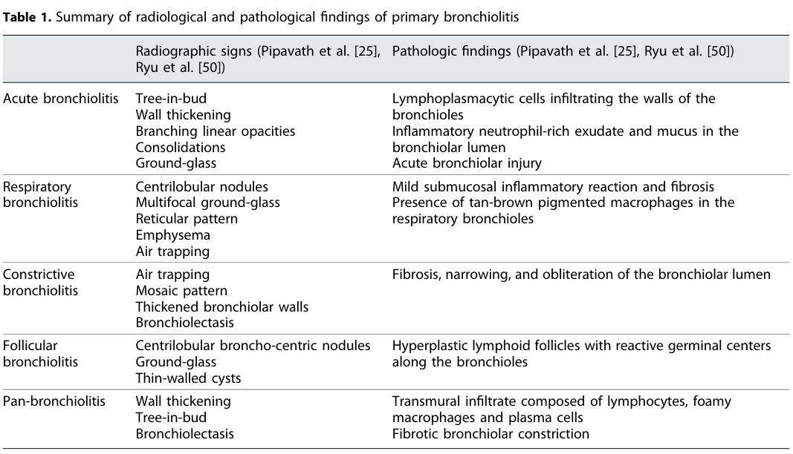

## Question

# Disease Characteristics Research Template

## Target Disease
- **Disease Name:** Silo Filler Disease
- **MONDO ID:** MONDO:0006972 (if available)
- **Category:** Environmental

## Research Objectives

Please provide a comprehensive research report on **Silo Filler Disease** covering all of the
disease characteristics listed below. This report will be used to populate a disease knowledge
base entry. Be thorough and cite primary literature (PMID preferred) for all claims.

For each section, **suggested databases/resources** are listed. These are the first places
you should search for information on each topic.

---

### 1. Disease Information
> **Search first:** OMIM, Orphanet, ICD-10/ICD-11, MeSH, PubMed

- What is the disease? Provide a concise overview.
- What are the key identifiers? (OMIM, Orphanet, ICD-10/ICD-11, MeSH, Mondo)
- What are the common synonyms and alternative names?
- Is the information derived from individual patients (e.g., EHR) or aggregated disease-level resources?

### 2. Etiology

- **Disease Causal Factors**: What are the primary causes? (genetic, environmental, infectious, mechanistic)
- **Risk Factors**:
  > **Search first:** PubMed, Cochrane Library, UpToDate, clinical guidelines, ClinVar, ClinGen, GWAS Catalog, PheGenI, CTD, CDC, WHO, epidemiological databases
  - Genetic risk factors (causal variants, susceptibility loci, modifier genes)
  - Environmental risk factors (toxins, lifestyle, occupational exposures, age, sex, family history)
- **Protective Factors**:
  > **Search first:** PubMed, Cochrane Library, clinical trial databases, GWAS Catalog, gnomAD, WHO, CDC, nutrition databases
  - Genetic protective factors (protective variants, modifier alleles)
  - Environmental protective factors (diet, lifestyle, exposures that reduce risk)
- **Gene-Environment Interactions**: How do genetic and environmental factors interact to influence disease?
  > **Search first:** CTD, PubMed, PheGenI, GxE databases

### 3. Phenotypes
> **Search first:** HPO (Human Phenotype Ontology), OMIM, Orphanet, PubMed, clinicaltrials.gov, MedDRA, SNOMED CT, DECIPHER, LOINC

For each phenotype, provide:
- **Phenotype type**: symptoms, clinical signs, physical manifestations, behavioral changes, or laboratory abnormalities
  > For symptoms/signs: HPO, OMIM, Orphanet, PubMed
  > For behavioral changes: HPO, DSM, RDoC (Research Domain Criteria), PubMed
  > For laboratory abnormalities: LOINC, SNOMED CT, LabTests Online, PubMed
- **Phenotype characteristics**:
  > **Search first:** OMIM, Orphanet, HPO, PubMed
  - Age of symptom onset (neonatal, childhood, adult-onset, late-onset)
  - Symptom severity (mild, moderate, severe, variable)
  - Symptom progression (stable, progressive, episodic, fluctuating)
  - Frequency among affected individuals (percentage or qualitative)
- **Quality of life impact**: Effects on daily functioning and well-being (per-phenotype when possible)
  > **Search first:** EQ-5D database, SF-36, WHO QOL databases, PubMed
- Suggest HPO (Human Phenotype Ontology) terms for each phenotype

### 4. Genetic/Molecular Information

- **Causal Genes**: Gene mutations or chromosomal abnormalities responsible for disease (gene symbols, OMIM IDs)
  > **Search first:** OMIM, ClinVar, HGMD, Ensembl, NCBI Gene
- **Pathogenic Variants**:
  - Affected genes (gene symbols, HGNC IDs)
    > **Search first:** OMIM, NCBI Gene, Ensembl, HGNC, UniProt, GeneCards
  - Variant classification (pathogenic, likely pathogenic, VUS per ACMG/AMP guidelines)
    > **Search first:** ClinVar, ClinGen, ACMG/AMP guidelines, VarSome
  - Variant type/class (missense, frameshift, nonsense, splice-site, structural)
  - Allele frequency in population databases
    > **Search first:** gnomAD, 1000 Genomes, ExAC, TOPMed, dbSNP
  - Somatic vs germline origin
    > **Search first:** COSMIC (somatic), ClinVar, ICGC, TCGA
  - Functional consequences (loss of function, gain of function, dominant negative)
- **Modifier Genes**: Genes that modify disease severity or expression
- **Epigenetic Information**: DNA methylation, histone modifications, chromatin changes affecting disease
  > **Search first:** ENCODE, Roadmap Epigenomics, MethBase, DiseaseMeth
- **Chromosomal Abnormalities**: Large-scale genetic changes (aneuploidy, translocations, inversions)
  > **Search first:** DECIPHER, ClinVar, ECARUCA, UCSC Genome Browser

### 5. Environmental Information

- **Environmental Factors**: Non-genetic contributing factors (toxins, radiation, pollution, occupational exposure)
  > **Search first:** CTD (Comparative Toxicogenomics Database), TOXNET, PubMed, EPA databases
- **Lifestyle Factors**: Behavioral factors (smoking, diet, exercise, alcohol consumption)
  > **Search first:** CDC databases, WHO, PubMed, NHANES
- **Infectious Agents**: If applicable, pathogens causing or triggering disease (bacteria, viruses, fungi, parasites)
  > **Search first:** NCBI Taxonomy, ViPR, BV-BRC, MicrobeDB, GIDEON

### 6. Mechanism / Pathophysiology

**Present this section as an ordered causal chain first, then the detail below.**
Open with a numbered sequence of mechanistic steps running from the initiating
lesion (mutation, exposure, infection) to the clinical manifestation, one step per
line, each naming what it causes next. State the causal verb explicitly ("leads
to", "results in") and say where a step is inferred rather than demonstrated.
Where the mechanism branches, show the branch. The categories below are a
checklist of what to cover within those steps, not the organizing structure —
a step may draw on several of them, and a category may contribute to several
steps.

- **Molecular Pathways**: Specific signaling cascades or biochemical pathways involved (Wnt, MAPK, mTOR, PI3K-AKT, etc.)
  > **Search first:** KEGG, Reactome, WikiPathways, PathBank, BioCyc
- **Cellular Processes**: Cell-level mechanisms (apoptosis, autophagy, cell cycle dysregulation, inflammation, etc.)
  > **Search first:** Gene Ontology (GO), Reactome, KEGG, PubMed
- **Protein Dysfunction**: How protein structure or function is altered (misfolding, aggregation, loss of function, gain of function)
  > **Search first:** UniProt, PDB (Protein Data Bank), InterPro, Pfam, AlphaFold
- **Metabolic Changes**: Alterations in metabolic processes (energy metabolism, lipid metabolism, amino acid metabolism)
  > **Search first:** KEGG, BioCyc, HMDB (Human Metabolome Database), BRENDA
- **Immune System Involvement**: Role of immune response (autoimmunity, immunodeficiency, chronic inflammation)
  > **Search first:** ImmPort, Immunome Database, IEDB, Gene Ontology
- **Tissue Damage Mechanisms**: How tissues/ are injured (oxidative stress, ischemia, fibrosis, necrosis)
  > **Search first:** PubMed, Gene Ontology, Reactome
- **Biochemical Abnormalities**: Specific molecular defects (enzyme deficiencies, receptor dysfunction, ion channel defects)
  > **Search first:** BRENDA, UniProt, KEGG, OMIM, PubMed
- **Epigenetic Changes**: DNA methylation, histone modifications affecting gene expression in disease
  > **Search first:** ENCODE, Roadmap Epigenomics, MethBase, DiseaseMeth
- **Molecular Profiling** (if available):
  - Transcriptomics/gene expression changes
    > **Search first:** GEO (Gene Expression Omnibus), ArrayExpress, GTEx, Human Cell Atlas, SRA
  - Proteomics findings
    > **Search first:** PRIDE, ProteomeXchange, Human Protein Atlas, STRING, BioGRID
  - Metabolomics signatures
    > **Search first:** MetaboLights, Metabolomics Workbench, HMDB, METLIN
  - Lipidomics alterations
    > **Search first:** LIPID MAPS, SwissLipids, LipidHome, Metabolomics Workbench
  - Genomic structural features
    > **Search first:** UCSC Genome Browser, Ensembl, NCBI, dbVar, DGV
- **Advanced Technologies** (if applicable):
  - Single-cell analysis findings (cell-type specific mechanisms, cellular heterogeneity)
    > **Search first:** Human Cell Atlas, Single Cell Portal, GEO, CELLxGENE
  - Spatial transcriptomics findings
    > **Search first:** GEO, Spatial Research, Vizgen, 10x Genomics data
  - Multi-omics integration results
    > **Search first:** TCGA, ICGC, cBioPortal, LinkedOmics, PubMed
  - Functional genomics screens (CRISPR, RNAi)
    > **Search first:** DepMap, GenomeRNAi, PubMed, BioGRID ORCS

For each mechanism, describe:
- The causal chain from initial trigger to clinical manifestation
- Which mechanisms are upstream vs downstream
- What cell types and biological processes are involved
- Suggest GO terms for biological processes and CL terms for cell types

### 7. Anatomical Structures Affected

- **Organ Level**:
  - Primary organs directly affected
  - Secondary organ involvement (complications, secondary effects)
  - Body systems involved (cardiovascular, nervous, digestive, respiratory, endocrine, etc.)
  > **Search first:** Uberon, FMA (Foundational Model of Anatomy), OMIM, HPO, ICD-11, MeSH, SNOMED CT
- **Tissue and Cell Level**:
  - Specific tissue types affected (epithelial, connective, muscle, nervous)
  - Specific cell populations targeted (with Cell Ontology terms)
  > **Search first:** Uberon, Human Protein Atlas, Cell Ontology, Human Cell Atlas, CellMarker, PanglaoDB
- **Subcellular Level**:
  - Cellular compartments involved (mitochondria, nucleus, ER, lysosomes) (with GO Cellular Component terms)
  > **Search first:** Gene Ontology (Cellular Component), UniProt, Human Protein Atlas
- **Localization**:
  - Specific anatomical sites (with UBERON terms)
    > **Search first:** FMA, Uberon, NeuroNames (for brain), SNOMED CT
  - Lateralization (unilateral, bilateral, asymmetric)
    > **Search first:** HPO, clinical literature, imaging databases

### 8. Temporal Development

- **Onset**:
  - Typical age of onset (congenital, pediatric, adult, geriatric)
  - Onset pattern (acute, subacute, chronic, insidious)
  > **Search first:** OMIM, Orphanet, HPO, PubMed
- **Progression**:
  - Disease stages (early, intermediate, advanced, end-stage)
    > **Search first:** Cancer Staging Manual (AJCC), WHO classifications, PubMed
  - Progression rate (rapid, slow, variable)
  - Disease course pattern (episodic, relapsing-remitting, progressive, stable)
  - Disease duration (self-limited, chronic lifelong)
  > **Search first:** Disease registries, longitudinal cohort databases, natural history studies, PubMed, Orphanet, OMIM
- **Patterns**:
  - Remission patterns (spontaneous, treatment-induced)
    > **Search first:** Clinical trial databases, disease registries, PubMed
  - Critical periods (time windows of vulnerability or opportunity for intervention)
    > **Search first:** PubMed, developmental biology databases, clinical guidelines

### 9. Inheritance and Population

- **Epidemiology**:
  - Prevalence (cases per 100,000 at given time)
  - Incidence (new cases per 100,000 per year)
  > **Search first:** Orphanet, CDC, WHO, GBD (Global Burden of Disease), national registries, SEER, disease registries
- **For Genetic Etiology**:
  - Inheritance pattern (AD, AR, X-linked, mitochondrial, multifactorial, polygenic)
    > **Search first:** OMIM, Orphanet, ClinVar, GTR (Genetic Testing Registry)
  - Penetrance (complete, incomplete, age-dependent)
    > **Search first:** ClinVar, OMIM, PubMed, ClinGen
  - Expressivity (variable, consistent)
    > **Search first:** OMIM, ClinVar, PubMed
  - Genetic anticipation (increasing severity in successive generations)
    > **Search first:** OMIM, PubMed (especially for repeat expansion disorders)
  - Germline mosaicism
    > **Search first:** ClinVar, OMIM, genetic counseling literature, PubMed
  - Founder effects (population-specific mutations)
    > **Search first:** gnomAD, population genetics databases, PubMed
  - Consanguinity role
    > **Search first:** OMIM, population studies, genetic counseling resources
  - Carrier frequency
    > **Search first:** gnomAD, carrier screening databases, GeneReviews, GTR
- **Population Demographics**:
  - Affected populations (ethnic or demographic groups with higher prevalence)
    > **Search first:** gnomAD, 1000 Genomes, PAGE Study, PubMed, population registries
  - Geographic distribution (endemic areas, regional variation)
    > **Search first:** WHO, CDC, GBD, Orphanet, geographic epidemiology databases
  - Geographic distribution of specific variants
  - Sex ratio (male:female)
    > **Search first:** Disease registries, OMIM, PubMed, epidemiological databases
  - Age distribution of affected individuals
    > **Search first:** CDC, disease registries, SEER, Orphanet

### 10. Diagnostics

- **Clinical Tests**:
  - Laboratory tests (blood, urine, tissue chemistry, specific enzyme assays)
    > **Search first:** LOINC, LabTests Online, PubMed
  - Biomarkers (proteins, metabolites, genetic markers, circulating biomarkers)
    > **Search first:** FDA Biomarker List, BEST (Biomarkers, EndpointS, and other Tools), PubMed
  - Imaging studies (X-ray, CT, MRI, PET, ultrasound)
    > **Search first:** RadLex, DICOM, Radiopaedia, imaging databases
  - Functional tests (pulmonary function, cardiac stress tests)
    > **Search first:** LOINC, clinical guidelines, PubMed
  - Electrophysiology (EEG, EMG, ECG, nerve conduction studies)
    > **Search first:** LOINC, clinical neurophysiology databases, PubMed
  - Biopsy findings (histopathology, immunohistochemistry)
    > **Search first:** SNOMED CT, College of American Pathologists resources, PubMed
  - Pathology findings (microscopic examination)
    > **Search first:** SNOMED CT, Digital Pathology databases, PubMed
- **Genetic Testing**:
  > **Search first:** GTR (Genetic Testing Registry), GeneReviews, ClinGen
  - Overview of recommended genetic testing approach
  - Whole genome sequencing (WGS) utility
    > **Search first:** GTR, ClinVar, GEL (Genomics England), gnomAD
  - Whole exome sequencing (WES) utility
    > **Search first:** GTR, ClinVar, OMIM, GeneMatcher
  - Gene panels (which panels, which genes)
    > **Search first:** GTR, ClinVar, laboratory-specific databases
  - Single gene testing
    > **Search first:** GTR, ClinVar, OMIM, GeneReviews
  - Chromosomal microarray (CMA)
    > **Search first:** DECIPHER, ClinVar, dbVar, ECARUCA
  - Karyotyping
    > **Search first:** Chromosome Abnormality Database, ClinVar, cytogenetics resources
  - FISH
    > **Search first:** ClinVar, cytogenetics databases, PubMed
  - Mitochondrial DNA testing
    > **Search first:** MITOMAP, MSeqDR, ClinVar, GTR
  - Repeat expansion testing
    > **Search first:** GTR, ClinVar, repeat expansion databases, PubMed
- **Omics-Based Diagnostics** (if applicable):
  - RNA sequencing / transcriptomics
    > **Search first:** GEO, ArrayExpress, GTEx, RNA-seq databases
  - Proteomics
    > **Search first:** PRIDE, ProteomeXchange, FDA Biomarker database
  - Metabolomics
    > **Search first:** MetaboLights, Metabolomics Workbench, HMDB
  - Epigenomics
    > **Search first:** GEO, ENCODE, Roadmap Epigenomics, MethBase
  - Liquid biopsy
    > **Search first:** COSMIC, ClinVar, liquid biopsy databases, PubMed
- **Clinical Criteria**:
  - Standardized diagnostic criteria (DSM, ICD, society guidelines)
    > **Search first:** DSM-5, ICD-11, clinical society guidelines, UpToDate
  - Differential diagnosis (other conditions to rule out, with distinguishing features)
    > **Search first:** DynaMed, UpToDate, clinical decision support systems
- **Screening**:
  - Screening methods for asymptomatic individuals (newborn screening, carrier screening, cascade screening)
    > **Search first:** ACMG recommendations, CDC newborn screening, GTR

### 11. Outcome/Prognosis

- **Survival and Mortality**:
  - Survival rate (5-year, 10-year, overall)
    > **Search first:** SEER, cancer registries, disease-specific registries, PubMed
  - Life expectancy (with and without treatment if applicable)
    > **Search first:** Orphanet, disease registries, actuarial databases, PubMed
  - Mortality rate
    > **Search first:** CDC, WHO, GBD, national mortality databases
  - Disease-specific mortality (deaths directly attributable to disease)
    > **Search first:** Disease registries, CDC Wonder, GBD, PubMed
- **Morbidity and Function**:
  - Morbidity (disease-related disability and health impacts)
    > **Search first:** GBD, WHO, disability databases, PubMed
  - Disability outcomes (long-term functional impairments)
    > **Search first:** ICF (International Classification of Functioning), disability registries
  - Quality of life measures (EQ-5D, SF-36, PROMIS, disease-specific tools)
    > **Search first:** EQ-5D database, SF-36, PROMIS, PubMed
- **Disease Course**:
  - Complications (secondary problems: infections, organ failure, etc.)
    > **Search first:** ICD codes, disease registries, clinical databases, PubMed
  - Recovery potential (likelihood and extent of recovery, with vs without treatment)
    > **Search first:** Natural history studies, rehabilitation databases, PubMed
- **Prediction**:
  - Prognostic factors (age, disease severity, biomarkers, treatment response)
    > **Search first:** Prognostic models databases, clinical calculators, PubMed
  - Prognostic biomarkers (molecular markers predicting disease course)
    > **Search first:** FDA Biomarker database, PubMed, cancer prognostic databases

### 12. Treatment

- **Pharmacotherapy**:
  - Pharmacological treatments (drug names, drug classes, mechanisms of action)
    > **Search first:** DrugBank, RxNorm, ATC classification, DailyMed, FDA databases
  - Pharmacogenomics (how genetic variants affect drug metabolism, efficacy, toxicity)
    > **Search first:** PharmGKB, CPIC (Clinical Pharmacogenetics), FDA Table of PGx Biomarkers
- **Advanced Therapeutics**:
  - Gene therapy (viral vectors, CRISPR, gene replacement, gene editing)
    > **Search first:** ClinicalTrials.gov, FDA gene therapy database, ASGCT resources
  - Cell therapy (stem cell transplant, CAR-T, cellular therapeutics)
    > **Search first:** ClinicalTrials.gov, FDA cell therapy database, FACT standards
  - RNA-based therapies (ASOs, siRNA, mRNA therapies)
    > **Search first:** ClinicalTrials.gov, FDA approvals, PubMed
  - Targeted therapies (treatments directed at specific molecular targets)
    > **Search first:** My Cancer Genome, OncoKB, ClinicalTrials.gov, FDA approvals
  - Immunotherapies (checkpoint inhibitors, monoclonal antibodies)
    > **Search first:** Cancer Immunotherapy Database, FDA approvals, ClinicalTrials.gov
- **Surgical and Interventional**:
  - Surgical interventions (types of surgery, timing, outcomes)
    > **Search first:** CPT codes, surgical registries, clinical guidelines, PubMed
- **Supportive and Rehabilitative**:
  - Supportive care (symptom management, pain control, nutrition)
    > **Search first:** Clinical guidelines, Cochrane Library, PubMed
  - Rehabilitation (physical therapy, occupational therapy, speech therapy)
    > **Search first:** Rehabilitation medicine databases, clinical guidelines, PubMed
- **Experimental**:
  - Experimental treatments in clinical trials (with NCT identifiers if available)
    > **Search first:** ClinicalTrials.gov, EU Clinical Trials Register, WHO ICTRP
- **Treatment Outcomes**:
  - Treatment response rates
    > **Search first:** Clinical trial databases, FDA reviews, systematic reviews, PubMed
  - Side effects and adverse events
    > **Search first:** FDA Adverse Event Reporting System (FAERS), MedWatch, PubMed
- **Treatment Strategy**:
  - Treatment algorithms (clinical pathways, decision trees)
    > **Search first:** Clinical practice guidelines, NCCN Guidelines, UpToDate
  - Combination therapies
    > **Search first:** ClinicalTrials.gov, treatment guidelines, PubMed
  - Personalized medicine approaches (genotype-guided treatment)
    > **Search first:** My Cancer Genome, CIViC, PharmGKB, precision medicine databases

For each treatment, suggest NCIT (NCI Thesaurus) clinical-intervention terms where applicable.

### 13. Prevention

- **Prevention Levels**:
  - Primary prevention (preventing disease occurrence: vaccination, risk factor modification)
    > **Search first:** CDC, WHO, USPSTF recommendations, Cochrane Library
  - Secondary prevention (early detection and treatment: screening programs, early intervention)
    > **Search first:** USPSTF, CDC screening guidelines, WHO
  - Tertiary prevention (preventing complications in those with disease)
    > **Search first:** Clinical guidelines, disease management protocols, PubMed
- **Immunization**: Vaccine strategies (if applicable)
  > **Search first:** CDC vaccine schedules, WHO immunization, FDA vaccine database
- **Screening and Early Detection**:
  - Screening programs (population-based: newborn screening, cancer screening)
    > **Search first:** CDC screening programs, USPSTF, cancer screening databases
  - Genetic screening (carrier screening, preimplantation genetic diagnosis, prenatal testing)
    > **Search first:** ACMG recommendations, ACOG guidelines, GTR
  - Risk stratification (identifying high-risk individuals for targeted prevention)
    > **Search first:** Risk prediction models, clinical calculators, PubMed
- **Behavioral Interventions**: Lifestyle modifications to reduce risk
  > **Search first:** CDC, WHO, behavioral intervention databases, Cochrane Library
- **Counseling**: Genetic counseling (risk assessment, family planning guidance)
  > **Search first:** NSGC resources, ACMG guidelines, GeneReviews
- **Public Health**:
  - Public health interventions (sanitation, vector control, health education)
    > **Search first:** CDC, WHO, public health databases, PubMed
  - Environmental interventions (reducing environmental risk factors)
    > **Search first:** EPA databases, WHO environmental health, PubMed
- **Prophylaxis**: Preventive medications or procedures
  > **Search first:** Clinical guidelines, FDA approvals, PubMed

### 14. Other Species / Natural Disease

- **Taxonomy**: Species affected (with NCBI Taxon identifiers)
  > **Search first:** NCBI Taxonomy
- **Breed**: Specific breeds affected (with VBO identifiers if applicable)
  > **Search first:** VBO (Vertebrate Breed Ontology)
- **Gene**: Orthologous genes in other species (with NCBI Gene IDs)
  > **Search first:** NCBI Gene
- **Natural Disease**:
  - Naturally occurring disease in other species (companion animals, wildlife)
    > **Search first:** OMIA (Online Mendelian Inheritance in Animals), VetCompass, PubMed
  - Veterinary relevance and importance in animal health
    > **Search first:** OMIA, veterinary databases, PubMed
- **Comparative Biology**:
  - Comparative pathology (similarities and differences across species)
    > **Search first:** OMIA, comparative pathology databases, PubMed
  - Evolutionary conservation of disease mechanisms
    > **Search first:** HomoloGene, OrthoMCL, Alliance of Genome Resources
- **Transmission** (if applicable):
  - Zoonotic potential
    > **Search first:** CDC zoonotic diseases, WHO zoonoses, GIDEON
  - Cross-species susceptibility
    > **Search first:** NCBI Taxonomy, veterinary databases, PubMed

### 15. Model Organisms

- **Model Types**:
  - Model organism type (mammalian, invertebrate, cellular, in vitro)
    > **Search first:** Alliance of Genome Resources, model organism databases
  - Specific model systems (mouse, rat, zebrafish, Drosophila, C. elegans, yeast, cell lines, organoids, iPSCs)
    > **Search first:** MGI, RGD, ZFIN, FlyBase, WormBase, SGD, ATCC, Cellosaurus
  - Induced models (drug treatment, surgical intervention, environmental manipulation)
    > **Search first:** MGI, model organism databases, PubMed
- **Genetic Models**:
  - Types available (knockout, knock-in, transgenic, conditional, humanized)
    > **Search first:** MGI, IMPC, KOMP, EuMMCR, IMSR
- **Model Characteristics**:
  - Phenotype recapitulation (how well model reproduces human disease features)
    > **Search first:** Model organism databases, comparative studies, PubMed
  - Model limitations (aspects of human disease not captured)
    > **Search first:** Model organism databases, PubMed, review articles
- **Applications**:
  - Research applications (what aspects of disease can be studied)
    > **Search first:** Model organism databases, PubMed
- **Resources**:
  - Model databases
    > **Search first:** MGI, RGD, ZFIN, FlyBase, WormBase, IMSR, EMMA, MMRRC

---

## Citation Requirements

- Cite primary literature (PMID preferred) for all mechanistic and clinical claims
- Prioritize recent reviews and landmark papers
- Include direct quotes from abstracts where possible to support key statements
- Distinguish evidence source types: human clinical, model organism, in vitro, computational

## Output Format

Structure your response as a comprehensive narrative organized by the sections above.
For each section, provide:
- Factual content with specific details (numbers, percentages, gene names, variant nomenclature)
- Ontology term suggestions (HPO, GO, CL, UBERON, CHEBI, NCIT, MONDO) where applicable
- Evidence citations with PMIDs
- Direct quotes from abstracts to support key claims
- Clear indication when information is not available or not applicable for this disease

This report will be used to populate a disease knowledge base entry with:
- Pathophysiology descriptions with causal chains
- Gene/protein annotations (HGNC, GO terms)
- Phenotype associations (HP terms) with frequencies
- Cell type involvement (CL terms)
- Anatomical locations (UBERON terms)
- Chemical entities (CHEBI terms)
- Treatment annotations (NCIT terms)
- Evidence items with PMIDs and exact abstract quotes
- Epidemiology, prognosis, diagnostic, and prevention information
- Animal model descriptions with phenotype recapitulation details

## Output

Question: You are an expert researcher providing comprehensive, well-cited information.

Provide detailed information focusing on:
1. Key concepts and definitions with current understanding
2. Recent developments and latest research (prioritize 2023-2024 sources)
3. Current applications and real-world implementations
4. Expert opinions and analysis from authoritative sources
5. Relevant statistics and data from recent studies

Format as a comprehensive research report with proper citations. Include URLs and publication dates where available.
Always prioritize recent, authoritative sources and provide specific citations for all major claims.

# Disease Characteristics Research Template

## Target Disease
- **Disease Name:** Silo Filler Disease
- **MONDO ID:** MONDO:0006972 (if available)
- **Category:** Environmental

## Research Objectives

Please provide a comprehensive research report on **Silo Filler Disease** covering all of the
disease characteristics listed below. This report will be used to populate a disease knowledge
base entry. Be thorough and cite primary literature (PMID preferred) for all claims.

For each section, **suggested databases/resources** are listed. These are the first places
you should search for information on each topic.

---

### 1. Disease Information
> **Search first:** OMIM, Orphanet, ICD-10/ICD-11, MeSH, PubMed

- What is the disease? Provide a concise overview.
- What are the key identifiers? (OMIM, Orphanet, ICD-10/ICD-11, MeSH, Mondo)
- What are the common synonyms and alternative names?
- Is the information derived from individual patients (e.g., EHR) or aggregated disease-level resources?

### 2. Etiology

- **Disease Causal Factors**: What are the primary causes? (genetic, environmental, infectious, mechanistic)
- **Risk Factors**:
  > **Search first:** PubMed, Cochrane Library, UpToDate, clinical guidelines, ClinVar, ClinGen, GWAS Catalog, PheGenI, CTD, CDC, WHO, epidemiological databases
  - Genetic risk factors (causal variants, susceptibility loci, modifier genes)
  - Environmental risk factors (toxins, lifestyle, occupational exposures, age, sex, family history)
- **Protective Factors**:
  > **Search first:** PubMed, Cochrane Library, clinical trial databases, GWAS Catalog, gnomAD, WHO, CDC, nutrition databases
  - Genetic protective factors (protective variants, modifier alleles)
  - Environmental protective factors (diet, lifestyle, exposures that reduce risk)
- **Gene-Environment Interactions**: How do genetic and environmental factors interact to influence disease?
  > **Search first:** CTD, PubMed, PheGenI, GxE databases

### 3. Phenotypes
> **Search first:** HPO (Human Phenotype Ontology), OMIM, Orphanet, PubMed, clinicaltrials.gov, MedDRA, SNOMED CT, DECIPHER, LOINC

For each phenotype, provide:
- **Phenotype type**: symptoms, clinical signs, physical manifestations, behavioral changes, or laboratory abnormalities
  > For symptoms/signs: HPO, OMIM, Orphanet, PubMed
  > For behavioral changes: HPO, DSM, RDoC (Research Domain Criteria), PubMed
  > For laboratory abnormalities: LOINC, SNOMED CT, LabTests Online, PubMed
- **Phenotype characteristics**:
  > **Search first:** OMIM, Orphanet, HPO, PubMed
  - Age of symptom onset (neonatal, childhood, adult-onset, late-onset)
  - Symptom severity (mild, moderate, severe, variable)
  - Symptom progression (stable, progressive, episodic, fluctuating)
  - Frequency among affected individuals (percentage or qualitative)
- **Quality of life impact**: Effects on daily functioning and well-being (per-phenotype when possible)
  > **Search first:** EQ-5D database, SF-36, WHO QOL databases, PubMed
- Suggest HPO (Human Phenotype Ontology) terms for each phenotype

### 4. Genetic/Molecular Information

- **Causal Genes**: Gene mutations or chromosomal abnormalities responsible for disease (gene symbols, OMIM IDs)
  > **Search first:** OMIM, ClinVar, HGMD, Ensembl, NCBI Gene
- **Pathogenic Variants**:
  - Affected genes (gene symbols, HGNC IDs)
    > **Search first:** OMIM, NCBI Gene, Ensembl, HGNC, UniProt, GeneCards
  - Variant classification (pathogenic, likely pathogenic, VUS per ACMG/AMP guidelines)
    > **Search first:** ClinVar, ClinGen, ACMG/AMP guidelines, VarSome
  - Variant type/class (missense, frameshift, nonsense, splice-site, structural)
  - Allele frequency in population databases
    > **Search first:** gnomAD, 1000 Genomes, ExAC, TOPMed, dbSNP
  - Somatic vs germline origin
    > **Search first:** COSMIC (somatic), ClinVar, ICGC, TCGA
  - Functional consequences (loss of function, gain of function, dominant negative)
- **Modifier Genes**: Genes that modify disease severity or expression
- **Epigenetic Information**: DNA methylation, histone modifications, chromatin changes affecting disease
  > **Search first:** ENCODE, Roadmap Epigenomics, MethBase, DiseaseMeth
- **Chromosomal Abnormalities**: Large-scale genetic changes (aneuploidy, translocations, inversions)
  > **Search first:** DECIPHER, ClinVar, ECARUCA, UCSC Genome Browser

### 5. Environmental Information

- **Environmental Factors**: Non-genetic contributing factors (toxins, radiation, pollution, occupational exposure)
  > **Search first:** CTD (Comparative Toxicogenomics Database), TOXNET, PubMed, EPA databases
- **Lifestyle Factors**: Behavioral factors (smoking, diet, exercise, alcohol consumption)
  > **Search first:** CDC databases, WHO, PubMed, NHANES
- **Infectious Agents**: If applicable, pathogens causing or triggering disease (bacteria, viruses, fungi, parasites)
  > **Search first:** NCBI Taxonomy, ViPR, BV-BRC, MicrobeDB, GIDEON

### 6. Mechanism / Pathophysiology

**Present this section as an ordered causal chain first, then the detail below.**
Open with a numbered sequence of mechanistic steps running from the initiating
lesion (mutation, exposure, infection) to the clinical manifestation, one step per
line, each naming what it causes next. State the causal verb explicitly ("leads
to", "results in") and say where a step is inferred rather than demonstrated.
Where the mechanism branches, show the branch. The categories below are a
checklist of what to cover within those steps, not the organizing structure —
a step may draw on several of them, and a category may contribute to several
steps.

- **Molecular Pathways**: Specific signaling cascades or biochemical pathways involved (Wnt, MAPK, mTOR, PI3K-AKT, etc.)
  > **Search first:** KEGG, Reactome, WikiPathways, PathBank, BioCyc
- **Cellular Processes**: Cell-level mechanisms (apoptosis, autophagy, cell cycle dysregulation, inflammation, etc.)
  > **Search first:** Gene Ontology (GO), Reactome, KEGG, PubMed
- **Protein Dysfunction**: How protein structure or function is altered (misfolding, aggregation, loss of function, gain of function)
  > **Search first:** UniProt, PDB (Protein Data Bank), InterPro, Pfam, AlphaFold
- **Metabolic Changes**: Alterations in metabolic processes (energy metabolism, lipid metabolism, amino acid metabolism)
  > **Search first:** KEGG, BioCyc, HMDB (Human Metabolome Database), BRENDA
- **Immune System Involvement**: Role of immune response (autoimmunity, immunodeficiency, chronic inflammation)
  > **Search first:** ImmPort, Immunome Database, IEDB, Gene Ontology
- **Tissue Damage Mechanisms**: How tissues/ are injured (oxidative stress, ischemia, fibrosis, necrosis)
  > **Search first:** PubMed, Gene Ontology, Reactome
- **Biochemical Abnormalities**: Specific molecular defects (enzyme deficiencies, receptor dysfunction, ion channel defects)
  > **Search first:** BRENDA, UniProt, KEGG, OMIM, PubMed
- **Epigenetic Changes**: DNA methylation, histone modifications affecting gene expression in disease
  > **Search first:** ENCODE, Roadmap Epigenomics, MethBase, DiseaseMeth
- **Molecular Profiling** (if available):
  - Transcriptomics/gene expression changes
    > **Search first:** GEO (Gene Expression Omnibus), ArrayExpress, GTEx, Human Cell Atlas, SRA
  - Proteomics findings
    > **Search first:** PRIDE, ProteomeXchange, Human Protein Atlas, STRING, BioGRID
  - Metabolomics signatures
    > **Search first:** MetaboLights, Metabolomics Workbench, HMDB, METLIN
  - Lipidomics alterations
    > **Search first:** LIPID MAPS, SwissLipids, LipidHome, Metabolomics Workbench
  - Genomic structural features
    > **Search first:** UCSC Genome Browser, Ensembl, NCBI, dbVar, DGV
- **Advanced Technologies** (if applicable):
  - Single-cell analysis findings (cell-type specific mechanisms, cellular heterogeneity)
    > **Search first:** Human Cell Atlas, Single Cell Portal, GEO, CELLxGENE
  - Spatial transcriptomics findings
    > **Search first:** GEO, Spatial Research, Vizgen, 10x Genomics data
  - Multi-omics integration results
    > **Search first:** TCGA, ICGC, cBioPortal, LinkedOmics, PubMed
  - Functional genomics screens (CRISPR, RNAi)
    > **Search first:** DepMap, GenomeRNAi, PubMed, BioGRID ORCS

For each mechanism, describe:
- The causal chain from initial trigger to clinical manifestation
- Which mechanisms are upstream vs downstream
- What cell types and biological processes are involved
- Suggest GO terms for biological processes and CL terms for cell types

### 7. Anatomical Structures Affected

- **Organ Level**:
  - Primary organs directly affected
  - Secondary organ involvement (complications, secondary effects)
  - Body systems involved (cardiovascular, nervous, digestive, respiratory, endocrine, etc.)
  > **Search first:** Uberon, FMA (Foundational Model of Anatomy), OMIM, HPO, ICD-11, MeSH, SNOMED CT
- **Tissue and Cell Level**:
  - Specific tissue types affected (epithelial, connective, muscle, nervous)
  - Specific cell populations targeted (with Cell Ontology terms)
  > **Search first:** Uberon, Human Protein Atlas, Cell Ontology, Human Cell Atlas, CellMarker, PanglaoDB
- **Subcellular Level**:
  - Cellular compartments involved (mitochondria, nucleus, ER, lysosomes) (with GO Cellular Component terms)
  > **Search first:** Gene Ontology (Cellular Component), UniProt, Human Protein Atlas
- **Localization**:
  - Specific anatomical sites (with UBERON terms)
    > **Search first:** FMA, Uberon, NeuroNames (for brain), SNOMED CT
  - Lateralization (unilateral, bilateral, asymmetric)
    > **Search first:** HPO, clinical literature, imaging databases

### 8. Temporal Development

- **Onset**:
  - Typical age of onset (congenital, pediatric, adult, geriatric)
  - Onset pattern (acute, subacute, chronic, insidious)
  > **Search first:** OMIM, Orphanet, HPO, PubMed
- **Progression**:
  - Disease stages (early, intermediate, advanced, end-stage)
    > **Search first:** Cancer Staging Manual (AJCC), WHO classifications, PubMed
  - Progression rate (rapid, slow, variable)
  - Disease course pattern (episodic, relapsing-remitting, progressive, stable)
  - Disease duration (self-limited, chronic lifelong)
  > **Search first:** Disease registries, longitudinal cohort databases, natural history studies, PubMed, Orphanet, OMIM
- **Patterns**:
  - Remission patterns (spontaneous, treatment-induced)
    > **Search first:** Clinical trial databases, disease registries, PubMed
  - Critical periods (time windows of vulnerability or opportunity for intervention)
    > **Search first:** PubMed, developmental biology databases, clinical guidelines

### 9. Inheritance and Population

- **Epidemiology**:
  - Prevalence (cases per 100,000 at given time)
  - Incidence (new cases per 100,000 per year)
  > **Search first:** Orphanet, CDC, WHO, GBD (Global Burden of Disease), national registries, SEER, disease registries
- **For Genetic Etiology**:
  - Inheritance pattern (AD, AR, X-linked, mitochondrial, multifactorial, polygenic)
    > **Search first:** OMIM, Orphanet, ClinVar, GTR (Genetic Testing Registry)
  - Penetrance (complete, incomplete, age-dependent)
    > **Search first:** ClinVar, OMIM, PubMed, ClinGen
  - Expressivity (variable, consistent)
    > **Search first:** OMIM, ClinVar, PubMed
  - Genetic anticipation (increasing severity in successive generations)
    > **Search first:** OMIM, PubMed (especially for repeat expansion disorders)
  - Germline mosaicism
    > **Search first:** ClinVar, OMIM, genetic counseling literature, PubMed
  - Founder effects (population-specific mutations)
    > **Search first:** gnomAD, population genetics databases, PubMed
  - Consanguinity role
    > **Search first:** OMIM, population studies, genetic counseling resources
  - Carrier frequency
    > **Search first:** gnomAD, carrier screening databases, GeneReviews, GTR
- **Population Demographics**:
  - Affected populations (ethnic or demographic groups with higher prevalence)
    > **Search first:** gnomAD, 1000 Genomes, PAGE Study, PubMed, population registries
  - Geographic distribution (endemic areas, regional variation)
    > **Search first:** WHO, CDC, GBD, Orphanet, geographic epidemiology databases
  - Geographic distribution of specific variants
  - Sex ratio (male:female)
    > **Search first:** Disease registries, OMIM, PubMed, epidemiological databases
  - Age distribution of affected individuals
    > **Search first:** CDC, disease registries, SEER, Orphanet

### 10. Diagnostics

- **Clinical Tests**:
  - Laboratory tests (blood, urine, tissue chemistry, specific enzyme assays)
    > **Search first:** LOINC, LabTests Online, PubMed
  - Biomarkers (proteins, metabolites, genetic markers, circulating biomarkers)
    > **Search first:** FDA Biomarker List, BEST (Biomarkers, EndpointS, and other Tools), PubMed
  - Imaging studies (X-ray, CT, MRI, PET, ultrasound)
    > **Search first:** RadLex, DICOM, Radiopaedia, imaging databases
  - Functional tests (pulmonary function, cardiac stress tests)
    > **Search first:** LOINC, clinical guidelines, PubMed
  - Electrophysiology (EEG, EMG, ECG, nerve conduction studies)
    > **Search first:** LOINC, clinical neurophysiology databases, PubMed
  - Biopsy findings (histopathology, immunohistochemistry)
    > **Search first:** SNOMED CT, College of American Pathologists resources, PubMed
  - Pathology findings (microscopic examination)
    > **Search first:** SNOMED CT, Digital Pathology databases, PubMed
- **Genetic Testing**:
  > **Search first:** GTR (Genetic Testing Registry), GeneReviews, ClinGen
  - Overview of recommended genetic testing approach
  - Whole genome sequencing (WGS) utility
    > **Search first:** GTR, ClinVar, GEL (Genomics England), gnomAD
  - Whole exome sequencing (WES) utility
    > **Search first:** GTR, ClinVar, OMIM, GeneMatcher
  - Gene panels (which panels, which genes)
    > **Search first:** GTR, ClinVar, laboratory-specific databases
  - Single gene testing
    > **Search first:** GTR, ClinVar, OMIM, GeneReviews
  - Chromosomal microarray (CMA)
    > **Search first:** DECIPHER, ClinVar, dbVar, ECARUCA
  - Karyotyping
    > **Search first:** Chromosome Abnormality Database, ClinVar, cytogenetics resources
  - FISH
    > **Search first:** ClinVar, cytogenetics databases, PubMed
  - Mitochondrial DNA testing
    > **Search first:** MITOMAP, MSeqDR, ClinVar, GTR
  - Repeat expansion testing
    > **Search first:** GTR, ClinVar, repeat expansion databases, PubMed
- **Omics-Based Diagnostics** (if applicable):
  - RNA sequencing / transcriptomics
    > **Search first:** GEO, ArrayExpress, GTEx, RNA-seq databases
  - Proteomics
    > **Search first:** PRIDE, ProteomeXchange, FDA Biomarker database
  - Metabolomics
    > **Search first:** MetaboLights, Metabolomics Workbench, HMDB
  - Epigenomics
    > **Search first:** GEO, ENCODE, Roadmap Epigenomics, MethBase
  - Liquid biopsy
    > **Search first:** COSMIC, ClinVar, liquid biopsy databases, PubMed
- **Clinical Criteria**:
  - Standardized diagnostic criteria (DSM, ICD, society guidelines)
    > **Search first:** DSM-5, ICD-11, clinical society guidelines, UpToDate
  - Differential diagnosis (other conditions to rule out, with distinguishing features)
    > **Search first:** DynaMed, UpToDate, clinical decision support systems
- **Screening**:
  - Screening methods for asymptomatic individuals (newborn screening, carrier screening, cascade screening)
    > **Search first:** ACMG recommendations, CDC newborn screening, GTR

### 11. Outcome/Prognosis

- **Survival and Mortality**:
  - Survival rate (5-year, 10-year, overall)
    > **Search first:** SEER, cancer registries, disease-specific registries, PubMed
  - Life expectancy (with and without treatment if applicable)
    > **Search first:** Orphanet, disease registries, actuarial databases, PubMed
  - Mortality rate
    > **Search first:** CDC, WHO, GBD, national mortality databases
  - Disease-specific mortality (deaths directly attributable to disease)
    > **Search first:** Disease registries, CDC Wonder, GBD, PubMed
- **Morbidity and Function**:
  - Morbidity (disease-related disability and health impacts)
    > **Search first:** GBD, WHO, disability databases, PubMed
  - Disability outcomes (long-term functional impairments)
    > **Search first:** ICF (International Classification of Functioning), disability registries
  - Quality of life measures (EQ-5D, SF-36, PROMIS, disease-specific tools)
    > **Search first:** EQ-5D database, SF-36, PROMIS, PubMed
- **Disease Course**:
  - Complications (secondary problems: infections, organ failure, etc.)
    > **Search first:** ICD codes, disease registries, clinical databases, PubMed
  - Recovery potential (likelihood and extent of recovery, with vs without treatment)
    > **Search first:** Natural history studies, rehabilitation databases, PubMed
- **Prediction**:
  - Prognostic factors (age, disease severity, biomarkers, treatment response)
    > **Search first:** Prognostic models databases, clinical calculators, PubMed
  - Prognostic biomarkers (molecular markers predicting disease course)
    > **Search first:** FDA Biomarker database, PubMed, cancer prognostic databases

### 12. Treatment

- **Pharmacotherapy**:
  - Pharmacological treatments (drug names, drug classes, mechanisms of action)
    > **Search first:** DrugBank, RxNorm, ATC classification, DailyMed, FDA databases
  - Pharmacogenomics (how genetic variants affect drug metabolism, efficacy, toxicity)
    > **Search first:** PharmGKB, CPIC (Clinical Pharmacogenetics), FDA Table of PGx Biomarkers
- **Advanced Therapeutics**:
  - Gene therapy (viral vectors, CRISPR, gene replacement, gene editing)
    > **Search first:** ClinicalTrials.gov, FDA gene therapy database, ASGCT resources
  - Cell therapy (stem cell transplant, CAR-T, cellular therapeutics)
    > **Search first:** ClinicalTrials.gov, FDA cell therapy database, FACT standards
  - RNA-based therapies (ASOs, siRNA, mRNA therapies)
    > **Search first:** ClinicalTrials.gov, FDA approvals, PubMed
  - Targeted therapies (treatments directed at specific molecular targets)
    > **Search first:** My Cancer Genome, OncoKB, ClinicalTrials.gov, FDA approvals
  - Immunotherapies (checkpoint inhibitors, monoclonal antibodies)
    > **Search first:** Cancer Immunotherapy Database, FDA approvals, ClinicalTrials.gov
- **Surgical and Interventional**:
  - Surgical interventions (types of surgery, timing, outcomes)
    > **Search first:** CPT codes, surgical registries, clinical guidelines, PubMed
- **Supportive and Rehabilitative**:
  - Supportive care (symptom management, pain control, nutrition)
    > **Search first:** Clinical guidelines, Cochrane Library, PubMed
  - Rehabilitation (physical therapy, occupational therapy, speech therapy)
    > **Search first:** Rehabilitation medicine databases, clinical guidelines, PubMed
- **Experimental**:
  - Experimental treatments in clinical trials (with NCT identifiers if available)
    > **Search first:** ClinicalTrials.gov, EU Clinical Trials Register, WHO ICTRP
- **Treatment Outcomes**:
  - Treatment response rates
    > **Search first:** Clinical trial databases, FDA reviews, systematic reviews, PubMed
  - Side effects and adverse events
    > **Search first:** FDA Adverse Event Reporting System (FAERS), MedWatch, PubMed
- **Treatment Strategy**:
  - Treatment algorithms (clinical pathways, decision trees)
    > **Search first:** Clinical practice guidelines, NCCN Guidelines, UpToDate
  - Combination therapies
    > **Search first:** ClinicalTrials.gov, treatment guidelines, PubMed
  - Personalized medicine approaches (genotype-guided treatment)
    > **Search first:** My Cancer Genome, CIViC, PharmGKB, precision medicine databases

For each treatment, suggest NCIT (NCI Thesaurus) clinical-intervention terms where applicable.

### 13. Prevention

- **Prevention Levels**:
  - Primary prevention (preventing disease occurrence: vaccination, risk factor modification)
    > **Search first:** CDC, WHO, USPSTF recommendations, Cochrane Library
  - Secondary prevention (early detection and treatment: screening programs, early intervention)
    > **Search first:** USPSTF, CDC screening guidelines, WHO
  - Tertiary prevention (preventing complications in those with disease)
    > **Search first:** Clinical guidelines, disease management protocols, PubMed
- **Immunization**: Vaccine strategies (if applicable)
  > **Search first:** CDC vaccine schedules, WHO immunization, FDA vaccine database
- **Screening and Early Detection**:
  - Screening programs (population-based: newborn screening, cancer screening)
    > **Search first:** CDC screening programs, USPSTF, cancer screening databases
  - Genetic screening (carrier screening, preimplantation genetic diagnosis, prenatal testing)
    > **Search first:** ACMG recommendations, ACOG guidelines, GTR
  - Risk stratification (identifying high-risk individuals for targeted prevention)
    > **Search first:** Risk prediction models, clinical calculators, PubMed
- **Behavioral Interventions**: Lifestyle modifications to reduce risk
  > **Search first:** CDC, WHO, behavioral intervention databases, Cochrane Library
- **Counseling**: Genetic counseling (risk assessment, family planning guidance)
  > **Search first:** NSGC resources, ACMG guidelines, GeneReviews
- **Public Health**:
  - Public health interventions (sanitation, vector control, health education)
    > **Search first:** CDC, WHO, public health databases, PubMed
  - Environmental interventions (reducing environmental risk factors)
    > **Search first:** EPA databases, WHO environmental health, PubMed
- **Prophylaxis**: Preventive medications or procedures
  > **Search first:** Clinical guidelines, FDA approvals, PubMed

### 14. Other Species / Natural Disease

- **Taxonomy**: Species affected (with NCBI Taxon identifiers)
  > **Search first:** NCBI Taxonomy
- **Breed**: Specific breeds affected (with VBO identifiers if applicable)
  > **Search first:** VBO (Vertebrate Breed Ontology)
- **Gene**: Orthologous genes in other species (with NCBI Gene IDs)
  > **Search first:** NCBI Gene
- **Natural Disease**:
  - Naturally occurring disease in other species (companion animals, wildlife)
    > **Search first:** OMIA (Online Mendelian Inheritance in Animals), VetCompass, PubMed
  - Veterinary relevance and importance in animal health
    > **Search first:** OMIA, veterinary databases, PubMed
- **Comparative Biology**:
  - Comparative pathology (similarities and differences across species)
    > **Search first:** OMIA, comparative pathology databases, PubMed
  - Evolutionary conservation of disease mechanisms
    > **Search first:** HomoloGene, OrthoMCL, Alliance of Genome Resources
- **Transmission** (if applicable):
  - Zoonotic potential
    > **Search first:** CDC zoonotic diseases, WHO zoonoses, GIDEON
  - Cross-species susceptibility
    > **Search first:** NCBI Taxonomy, veterinary databases, PubMed

### 15. Model Organisms

- **Model Types**:
  - Model organism type (mammalian, invertebrate, cellular, in vitro)
    > **Search first:** Alliance of Genome Resources, model organism databases
  - Specific model systems (mouse, rat, zebrafish, Drosophila, C. elegans, yeast, cell lines, organoids, iPSCs)
    > **Search first:** MGI, RGD, ZFIN, FlyBase, WormBase, SGD, ATCC, Cellosaurus
  - Induced models (drug treatment, surgical intervention, environmental manipulation)
    > **Search first:** MGI, model organism databases, PubMed
- **Genetic Models**:
  - Types available (knockout, knock-in, transgenic, conditional, humanized)
    > **Search first:** MGI, IMPC, KOMP, EuMMCR, IMSR
- **Model Characteristics**:
  - Phenotype recapitulation (how well model reproduces human disease features)
    > **Search first:** Model organism databases, comparative studies, PubMed
  - Model limitations (aspects of human disease not captured)
    > **Search first:** Model organism databases, PubMed, review articles
- **Applications**:
  - Research applications (what aspects of disease can be studied)
    > **Search first:** Model organism databases, PubMed
- **Resources**:
  - Model databases
    > **Search first:** MGI, RGD, ZFIN, FlyBase, WormBase, IMSR, EMMA, MMRRC

---

## Citation Requirements

- Cite primary literature (PMID preferred) for all mechanistic and clinical claims
- Prioritize recent reviews and landmark papers
- Include direct quotes from abstracts where possible to support key statements
- Distinguish evidence source types: human clinical, model organism, in vitro, computational

## Output Format

Structure your response as a comprehensive narrative organized by the sections above.
For each section, provide:
- Factual content with specific details (numbers, percentages, gene names, variant nomenclature)
- Ontology term suggestions (HPO, GO, CL, UBERON, CHEBI, NCIT, MONDO) where applicable
- Evidence citations with PMIDs
- Direct quotes from abstracts to support key claims
- Clear indication when information is not available or not applicable for this disease

This report will be used to populate a disease knowledge base entry with:
- Pathophysiology descriptions with causal chains
- Gene/protein annotations (HGNC, GO terms)
- Phenotype associations (HP terms) with frequencies
- Cell type involvement (CL terms)
- Anatomical locations (UBERON terms)
- Chemical entities (CHEBI terms)
- Treatment annotations (NCIT terms)
- Evidence items with PMIDs and exact abstract quotes
- Epidemiology, prognosis, diagnostic, and prevention information
- Animal model descriptions with phenotype recapitulation details

# Silo-filler disease: disease-characteristics research report

**Evidence scope.** Silo-filler disease is an acute occupational **nitrogen-oxide inhalation injury**, chiefly associated with nitrogen dioxide (NO₂) released by newly ensiled crops. It is not farmer’s lung, an immune-mediated reaction to agricultural bioaerosols. Nor should NO₂ be confused with nitrous oxide (**N₂O**). The most informative silo-specific clinical evidence retrieved was historical; the 2024 pulmonary-threat review provides contemporary context for supportive treatment, not a new silo-filler-disease treatment trial. Statements below distinguish individual human cases, selected clinical series, environmental surveys, animal experiments, and reviews. (schultz2016comparingsilofiller pages 1-2, pratt1982silofillersdiseaseina pages 1-3, marzec2024countermeasuresagainstpulmonary pages 1-2)

## 1. Disease information

**Definition and names.** Silo-filler disease, also written *silo-filler’s disease*, *silo fillers’ disease*, and sometimes *silo-fillers lung*, denotes chemical lung injury after inhalation of silo gas from recently stored forage, particularly corn silage. Presentations range from transient airway symptoms to noncardiogenic pulmonary edema, respiratory failure, and delayed bronchiolitis obliterans. The literature also uses the more general descriptions *nitrogen-dioxide-induced lung injury* and *nitrogen-oxide poisoning*; those broader terms are not exclusively silo-related. (pratt1982silofillersdiseaseina pages 1-3, hasarı2020acuteinhalationinjury pages 4-5, viskens2025bronchiolitisinadults pages 1-2)

**Identifiers and source granularity.** **MONDO:0006972** is supplied in the question but could not be independently cross-checked in the retrieved material. A disease-specific OMIM number, Orphanet number, MeSH identifier, and verified ICD-10/ICD-11 crosswalk were **not established**; these should remain unpopulated rather than be inferred from a generic toxic-inhalation code. Evidence includes an **individual** fatal case reported by CDC, an **aggregate** selected Mayo Clinic patient series summarized in a review, and **farm-level environmental measurements**. These denominators must not be conflated with an EHR-derived population cohort. (pratt1982silofillersdiseaseina pages 1-3, schultz2016comparingsilofiller pages 1-2, scaletti1965nitrogendioxideproduction pages 1-2)

## 2. Etiology and susceptibility

**Causal exposure.** Nitrogen oxides form after freshly cut forage is ensiled; concentrated NO₂ can accumulate near the silage, chute, and other poorly ventilated or low-lying locations. Exposure may occur without entering the silo. NO₂ is the principal toxicant described clinically, although other nitrogen oxides can accompany it. CDC noted that gas production can begin within **4 hours** of filling and that levels may remain dangerous in an unopened silo long after the initial high-risk period. Historical estimates of **200–2,000 ppm** in poorly ventilated silos are exposure-context figures, not a universally measured threshold for disease. (pratt1982silofillersdiseaseina pages 1-3, schultz2016comparingsilofiller pages 1-2)

**Environmental risk factors.** Entering, climbing, or working near a recently filled silo; inadequate ventilation; and a higher concentration or longer duration of exposure increase risk. In an environmental field survey, **42% of 554 Minnesota farm silos** tested positive for NO₂ at the study’s concerning level; positivity reached **78% in a drought year** and **55% the next year**. These are percentages of *silos with measured gas*, **not human disease incidence or prevalence**. Drought-stressed crops and crop maturity correlated with gas production; fertilization associations were weak and sometimes inverse, with individual quantitative fertilizer variables explaining no more than **2.6%** of measured NO₂ variation. Accordingly, fertilizer use alone is not a validated human risk predictor. (scaletti1965nitrogendioxideproduction pages 1-2, scaletti1965nitrogendioxideproduction pages 2-3, scaletti1965nitrogendioxideproduction pages 3-3)

**Protective factors and gene–environment interactions.** Avoiding exposure, assessing and controlling silo atmospheres, ventilation, and appropriate supplied-air respiratory protection are established practical precautions. No disease-specific protective allele, susceptibility locus, modifier gene, penetrance estimate, or demonstrated gene–NO₂ interaction was identified. Asthma or other respiratory vulnerability could plausibly modify clinical response, but should not be recorded as a genetically validated risk factor for this disease. Experimental antioxidant findings are **not** evidence that diet or supplements prevent human silo-filler disease. (pratt1982silofillersdiseaseina pages 1-3, mayorga1994overviewofnitrogen pages 7-10, mayorga1994overviewofnitrogen pages 10-13)

## 3. Phenotypes and quality-of-life effects

The following table distinguishes documented observations from unknown *population* frequencies. Suggested HPO labels are **candidate annotations**, not verified HPO accessions. In particular, **11/17** is a proportion in a selected exposed-patient series and must not be entered as the prevalence of a phenotype among all affected persons. (schultz2016comparingsilofiller pages 1-2, pratt1982silofillersdiseaseina pages 1-3)

| Clinical phenotype and type | Typical timing, severity, and course | Observed evidence and frequency | Suggested HPO label (identifier not assigned) |
|---|---|---|---|
| Cough and chest tightness — symptoms | May occur during or shortly after exposure; can improve transiently before delayed recurrence. Severity varies with exposure concentration and duration. | Described in human high-level NO₂ exposure and silo-filler disease reports; population frequency not established. (mohsenin1994humanexposureto pages 4-7, pratt1982silofillersdiseaseina pages 1-3) | Cough; Chest tightness |
| Dyspnea — symptom | Acute after substantial exposure or delayed by hours; may recur weeks later with bronchiolitis. Ranges from mild breathlessness to severe respiratory distress. | Present in the fatal 1982 CDC case and repeatedly described in clinical reviews; population frequency not established. (hasarı2020acuteinhalationinjury pages 4-5, pratt1982silofillersdiseaseina pages 1-3) | Dyspnea |
| Wheeze or bronchospasm — clinical sign | Usually acute; may accompany bronchiolar irritation, respiratory distress, or pulmonary edema. | Wheezes and crackles were documented in the 1982 fatal case; high-level NO₂ can cause acute bronchospasm. Frequency not established. (pratt1982silofillersdiseaseina pages 1-3, mayorga1994overviewofnitrogen pages 7-10) | Wheezing; Bronchospasm |
| Hypoxemia and cyanosis — clinical sign/laboratory abnormality | Acute and potentially severe; reflects impaired gas exchange from alveolar-capillary injury and edema. | The 1982 patient was cyanotic and had PaO₂ 45 mmHg while receiving 2 L/min nasal oxygen. Frequency not established. (pratt1982silofillersdiseaseina pages 1-3) | Hypoxemia; Cyanosis |
| Acute lung injury — clinical syndrome | Acute or delayed over hours; may progress to ARDS, respiratory failure, or death. | A secondary review reports acute lung injury in 11 of 17 silo-gas-exposed Mayo Clinic patients (≈65%). This is a selected clinical series—not a population phenotype frequency or prevalence estimate. (schultz2016comparingsilofiller pages 1-2) | Acute lung injury; Acute respiratory distress syndrome |
| Noncardiogenic pulmonary edema — manifestation/pathology | Common severe early pattern, often developing within hours; may cause shock and fatal respiratory failure. | The 1982 autopsy showed grossly edematous lungs, bilateral pleural effusions, and alveoli flooded with proteinaceous material while alveolar walls remained intact. Frequency not established. (pratt1982silofillersdiseaseina pages 1-3) | Pulmonary edema |
| Shock — clinical sign | Acute, life-threatening complication of massive exposure and capillary leak; may progress rapidly despite treatment. | The 1982 patient had blood pressure 84/60 mmHg, remained in shock, and died five hours after admission. Frequency not established. (pratt1982silofillersdiseaseina pages 1-3) | Shock |
| Delayed bronchiolitis obliterans/constrictive bronchiolitis — complication | Typically arises after an apparent recovery, often 1–4 weeks after high-level exposure; may become persistent or irreversible because of bronchiolar fibrosis and obliteration. | Silo-gas exposure is a recognized cause. Reported findings include progressive exertional dyspnea, obstructive pulmonary-function abnormalities, hyperinflation, air trapping, mosaic attenuation, and bronchiolar-lumen obliteration. Frequency not established. (hasarı2020acuteinhalationinjury pages 7-8, mayorga1994overviewofnitrogen pages 10-13, viskens2025bronchiolitisinadults media fbf3ab2b, viskens2025bronchiolitisinadults pages 7-8) | Bronchiolitis obliterans; Constrictive bronchiolitis; Air trapping |
| Airflow obstruction — functional abnormality | May occur acutely from bronchospasm or persist after delayed bronchiolar fibrosis; severity is variable. | Airway obstruction was reported in the selected Mayo series; irreversible obstruction with reduced FEV₁ and air trapping characterizes constrictive bronchiolitis. Frequency not established. (schultz2016comparingsilofiller pages 1-2, viskens2025bronchiolitisinadults pages 5-7) | Obstructive ventilatory defect; Reduced forced expiratory volume |

*Table: Evidence-grounded clinical phenotype summary for silo-filler disease, including timing, course, documented measurements, and cautious frequency interpretation. Suggested HPO labels are provided without unverified ontology identifiers.*

Additional reported features after high-dose exposure include tachypnea, crackles, chest pain, nausea or vomiting, headache, vertigo, confusion, and loss of consciousness; fever and chills may herald delayed relapse. Severity varies from self-limited symptoms to fatal acute respiratory failure. Age-of-onset categories describe **the age at exposure**, not developmental onset: the directly documented fatal patient was **39 years old**. Disease-specific symptom frequencies, pediatric distributions, behavioral phenotypes, EQ-5D, SF-36, and other quantitative quality-of-life scores were not identified. Severe hypoxemia can impair basic activity acutely; persistent bronchiolar obstruction can limit exertion and work, but no disease-specific disability rate can be supplied. (pratt1982silofillersdiseaseina pages 1-3, mayorga1994overviewofnitrogen pages 10-13, hasarı2020acuteinhalationinjury pages 7-8)

## 4. Genetic and molecular annotations

**Causal genes, HGNC/OMIM gene entries, pathogenic variants, allele frequencies, inheritance, modifier genes, chromosomal abnormalities, and epigenetic signatures: not applicable as established disease causes or not reported.** This is an exposure-defined poisoning, not a Mendelian syndrome. Oxidation of proteins and changes in experimental cytokine release are consequences or model findings; they must not be reclassified as pathogenic germline or somatic mutations. No disease-specific ACMG variant interpretation, gnomAD estimate, pharmacogenomic rule, or validated genomic marker was retrieved. (pratt1982silofillersdiseaseina pages 1-3, mayorga1994overviewofnitrogen pages 13-15)

## 5. Environmental, lifestyle, and infectious information

The key environmental entity is inhaled **nitrogen dioxide**; other silo nitrogen oxides may co-occur. Candidate ChEBI annotation: *nitrogen dioxide*—**identifier requires independent ontology verification**. Tobacco smoking, diet, alcohol, and exercise have no established disease-specific causal or protective coefficients in the retrieved silo cohorts. **No pathogen causes silo-filler disease.** A positive bacterial, fungal, or viral finding would prompt evaluation for a competing or complicating diagnosis: the fatal case’s lung examination found **no bacteria, fungi, or evidence of viral disease**. Farmer’s lung, in contrast, involves an immunologic response to agricultural microbial material. (pratt1982silofillersdiseaseina pages 1-3, schultz2016comparingsilofiller pages 1-2)

## 6. Mechanism and pathophysiology

**Ordered causal chain — upstream exposure to downstream manifestations**

1. **Fresh forage is stored in a silo** → plant-associated nitrogen chemistry **leads to** formation and accumulation of NO₂ and other nitrogen oxides, particularly in poorly ventilated spaces. The relationship between forage conditions and measured gas was demonstrated in farm surveys. (scaletti1965nitrogendioxideproduction pages 1-2, pratt1982silofillersdiseaseina pages 1-3)
2. **A person inhales concentrated gas** → NO₂ reaching the lower airways **leads to** contact with airway-lining fluid and reactive acidic/oxidant products. Acid formation is a chemically supported mechanism, although the precise relative contribution of acid versus direct oxidant injury in each patient is **inferred**. (pratt1982silofillersdiseaseina pages 1-3, hasarı2020acuteinhalationinjury pages 4-5, mayorga1994overviewofnitrogen pages 13-15)
3. **Chemical and oxidant stress at bronchioles and alveoli** → epithelial-cell injury and ciliary loss **lead to** inflammatory-cell recruitment and impaired epithelial barrier integrity. These cellular details come substantially from animal and experimental systems rather than molecular profiling of silo-exposed patients. (mayorga1994overviewofnitrogen pages 7-10, mayorga1994overviewofnitrogen pages 10-13, mayorga1994overviewofnitrogen pages 13-15)
4. **Epithelial and alveolar–capillary barrier damage** → protein-rich fluid leakage **results in** noncardiogenic pulmonary edema and impaired oxygen transfer → **leads to** dyspnea, hypoxemia, cyanosis, and potentially ARDS, shock, or death. Proteinaceous alveolar flooding and edema were directly observed at human autopsy. (pratt1982silofillersdiseaseina pages 1-3, mayorga1994overviewofnitrogen pages 10-13)
5. **Branch A: injury resolves** → restoration of gas exchange **leads to** clinical improvement; the likelihood cannot be quantified for silo-filler disease from available population follow-up. **Branch B: bronchiolar injury persists** → inflammation/repair **may lead to** organizing or constrictive bronchiolitis and bronchiolar fibrosis → **results in** later cough, exertional dyspnea, air trapping, and fixed airflow obstruction. The cellular transition to fibrosis is a plausible, incompletely demonstrated inference for individual silo cases. (pratt1982silofillersdiseaseina pages 1-3, hasarı2020acuteinhalationinjury pages 7-8, viskens2025bronchiolitisinadults media fbf3ab2b, viskens2025bronchiolitisinadults pages 7-8)

**Molecular and cellular detail.** Oxidative lipid/protein injury has been proposed; reviews also describe animal-study alterations in antioxidants and glutathione-related enzymes. Specific NO₂-induced **Wnt, MAPK, mTOR, or PI3K–AKT dependency in human silo-filler disease has not been established**. One review cites cultured human bronchial epithelial cells releasing inflammatory mediators after NO₂ exposure, but this is **in vitro evidence**, not a validated patient cytokine signature. In a **sheep** high-dose exposure model, bronchoalveolar lavage showed increased epithelial cells, protein, and albumin and fewer alveolar macrophages after **500 ppm for 20 minutes**, consistent with barrier injury; its exposure conditions must not be taken as a human clinical threshold. Possible NO₂-associated methemoglobinemia has been discussed in general toxicology, but was **not measured in the cited silo fatality**. No silo-specific transcriptomic, proteomic, metabolomic, lipidomic, single-cell, spatial, multi-omics, CRISPR, or epigenomic signature was verified. (mayorga1994overviewofnitrogen pages 13-15, mayorga1994overviewofnitrogen pages 10-13, mohsenin1994humanexposureto pages 7-10)

**Candidate process and cell ontology labels, without unverified accession numbers:** GO *response to oxidative stress*, *inflammatory response*, *epithelial cell differentiation*, *regulation of vascular permeability*, *extracellular matrix organization*, and *gas exchange*; CL *bronchiolar epithelial cell*, *alveolar type I cell*, *alveolar type II cell*, *alveolar macrophage*, *pulmonary endothelial cell*, and *fibroblast*. These are proposed mappings from demonstrated pathology and experimental observations, **not disease-specific enrichment results**. The 2024 NIH-authored pulmonary-threat review discusses shared phases of chemical acute lung injury, but any Wnt-mediated epithelial repair described for general acute lung injury should not be misattributed as experimentally demonstrated in silo-filler disease. (mayorga1994overviewofnitrogen pages 7-10, mayorga1994overviewofnitrogen pages 10-13, marzec2024countermeasuresagainstpulmonary pages 1-2)

## 7. Anatomical structures affected

**Primary organ and sites:** lungs, particularly respiratory bronchioles, alveolar ducts, alveoli, and the alveolar–capillary interface. **Tissues/cells:** bronchiolar and alveolar epithelium, vascular endothelium, and inflammatory cells; later disease may involve peribronchiolar connective tissue and fibrosis. The fatal-case pathology showed edema and early bronchiolitis. Secondary consequences include systemic hypoxemia and, in extreme exposures, circulatory collapse; these do not establish primary cardiac or neurologic tissue toxicity. Suggested UBERON labels are *lung*, *bronchiole*, *alveolus of lung*, and *pulmonary capillary*; suggested GO cellular-component labels include *plasma membrane*, *cell junction*, and *extracellular matrix*. **Exact identifiers require ontology verification.** Imaging abnormalities are generally bilateral or diffuse when edema is severe; a consistent left/right predilection has not been documented. (pratt1982silofillersdiseaseina pages 1-3, mayorga1994overviewofnitrogen pages 7-10, viskens2025bronchiolitisinadults media fbf3ab2b)

## 8. Temporal development and natural history

Disease onset follows an **exposure event**, generally during agricultural silo-filling operations rather than a fixed biological age. Symptoms may start during exposure, while edema can emerge **hours later**; a symptom-free or improved interval is possible. General high-dose NO₂ literature describes edema around **8–24 hours** and bronchiolitis obliterans around **1–4 weeks**; CDC describes relapse at about **three weeks** with fever, chills, and breathlessness. Thus, improvement immediately after leaving the silo does **not** exclude later serious injury. The disease is typically a single acute incident rather than an intrinsically relapsing genetic disorder, although a delayed second phase and persistent fixed obstruction may occur. Observation after substantial exposure and follow-up for recurrent symptoms are important intervention windows; no validated silo-specific stage classification or median disease duration was identified. (pratt1982silofillersdiseaseina pages 1-3, mayorga1994overviewofnitrogen pages 7-10, hasarı2020acuteinhalationinjury pages 7-8)

## 9. Inheritance, epidemiology, and population

**Inheritance, penetrance, anticipation, carrier frequency, founder effects, mosaicism, consanguinity, and variant geography: not applicable.** The geographical distribution follows agricultural use of silos and exposure opportunity rather than a heritable population distribution. A historical Minnesota study quantified **environmental NO₂ production in 554 farm silos**, not cases of human illness; a selected Mayo review mentions **17 exposed patients over 32 years**, of whom **11 had acute lung injury**. Neither provides population-based incidence, prevalence, sex ratio, case fatality, or an age-standardized burden. Occupational role, work practice, harvest timing, crop conditions, and ventilation are more relevant to risk stratification than ancestry. (scaletti1965nitrogendioxideproduction pages 1-2, schultz2016comparingsilofiller pages 1-2, pratt1982silofillersdiseaseina pages 1-3)

## 10. Diagnosis and differential diagnosis

**Clinical approach.** Identify a recent silo/crop exposure and timing of symptoms, then assess respiratory status, oxygenation, vital signs, and serial evolution. Obtain **pulse oximetry and arterial blood gases** when indicated; chest radiography assesses edema, and CT may help characterize persisting small-airway disease. Spirometry, including FEV₁ and assessment for obstruction/air trapping, is useful at follow-up if dyspnea persists. Expiratory HRCT can demonstrate **mosaic attenuation and air trapping** in constrictive bronchiolitis; these are findings of bronchiolitis generally and are not independently diagnostic of its silo-gas cause. The reviewed image/table compares acute bronchiolitis findings with the fibrosis and bronchiolar-lumen obliteration of constrictive bronchiolitis. Tissue biopsy is reserved for unresolved diagnostic uncertainty, not routine exposure confirmation. (pratt1982silofillersdiseaseina pages 1-3, viskens2025bronchiolitisinadults pages 5-7, viskens2025bronchiolitisinadults media fbf3ab2b, viskens2025bronchiolitisinadults pages 7-8)

**Human primary-case findings.** In CDC’s report of one exposed 39-year-old, blood pressure was **84/60 mmHg**, respiratory rate **32/min**, and arterial **PaO₂ 45 mmHg on 2 L/min nasal oxygen**; chest radiography showed extensive **bilateral fluffy infiltrates**. Autopsy documented heavy edematous lungs, bilateral pleural effusions, alveoli filled with proteinaceous material, and early bronchiolitis, without identified infectious organisms. These numbers characterize **one severe patient** and are not diagnostic cutoffs or typical averages. Early radiography may also be normal after some nitrogen-oxide exposures, so a normal first image does not rule out evolving edema. (pratt1982silofillersdiseaseina pages 1-3, mohsenin1994humanexposureto pages 4-7)

**Differential and tests not recommended routinely.** Distinguish toxin-associated injury from farmer’s lung/hypersensitivity pneumonitis, infectious pneumonia, asthma exacerbation, cardiogenic edema, other irritant gases, and alternate causes of bronchiolitis. Exposure history, microbiology when clinically appropriate, serial imaging, gas exchange, and cardiopulmonary evaluation guide discrimination; there is no validated disease-specific blood biomarker or standardized confirmatory molecular assay in the retrieved evidence. **WGS, WES, gene panels, CMA, karyotype, FISH, mitochondrial sequencing, repeat-expansion assays, multi-omics testing, liquid biopsy, newborn screening, and carrier screening are not indicated to diagnose this exposure-defined condition.** Workplace **gas monitoring** addresses environmental hazard detection, not clinical screening of asymptomatic people. (pratt1982silofillersdiseaseina pages 1-3, schultz2016comparingsilofiller pages 1-2, viskens2025bronchiolitisinadults pages 1-2)

## 11. Outcome and prognosis

Mild illness may resolve, whereas severe exposure can produce fatal edema/shock and survivors can develop chronic exertional dyspnea and obstructive small-airway disease. In the 1982 report, the patient died **five hours after hospital admission**; this is evidence of possible rapid fatality, **not** a mortality-rate estimate. Rates of complete recovery, 5-/10-year survival, life expectancy, disability, quality-of-life scores, and validated prognostic biomarker thresholds **cannot be supplied** from the retrieved disease-specific data. Dose/concentration, duration, early oxygenation, and development of edema are clinically plausible prognostic considerations, but no silo-specific prediction model was verified. A review’s recovery percentages for **all irritant-inhalation injuries** must not be reported as silo-filler-disease prognosis. (pratt1982silofillersdiseaseina pages 1-3, hasarı2020acuteinhalationinjury pages 7-8)

## 12. Treatment and implementation

**Practical sequence:** (1) remove the exposed person **without creating another victim**; entry or rescue into a suspected toxic silo atmosphere requires trained personnel and suitable supplied-air protection; (2) assess airway, breathing, and circulation and give supplemental oxygen as clinically indicated; (3) monitor for delayed edema, manage bronchospasm with inhaled bronchodilators when appropriate, and support severe respiratory failure with appropriately managed ventilation; (4) arrange follow-up for recurrent symptoms and obstructive lung disease. The 2024 review states: **“Emergency treatment is limited to supportive care using bronchodilators to control airway constriction and rescue with mechanical ventilation to improve gas exchange.”** This is a review of inhaled pulmonary threats, not a randomized silo-gas treatment comparison. (pratt1982silofillersdiseaseina pages 1-3, marzec2024countermeasuresagainstpulmonary pages 1-2, hasarı2020acuteinhalationinjury pages 7-8)

**Drug-evidence limits.** Corticosteroids have been used in reported cases and suggested for some early inflammatory/organizing bronchiolar presentations, but their benefit for preventing delayed bronchiolitis after NO₂ exposure is **unproven** and controlled trials are lacking. The 1982 fatal patient received epinephrine, aminophylline, and steroids after an initial asthma diagnosis: this does **not** demonstrate efficacy against silo-filler disease. Antibiotics are not antidotes and should be reserved for clinical evidence of infection. Antioxidants, N-acetylcysteine, and other proposed countermeasures have insufficient human silo-specific efficacy evidence; some originate from animal or other-toxicant studies. No disease-specific approved antidote, validated response rate, pharmacogenomic dosing strategy, surgery, gene/cell/RNA therapy, immunotherapy, or registered silo-filler-disease interventional NCT trial was found. Candidate **NCIT intervention labels**—*oxygen therapy*, *bronchodilator therapy*, *mechanical ventilation*, and *corticosteroid therapy*—require identifier verification, and the last must retain its uncertainty flag. Rehabilitation and serial pulmonary assessment may address residual disability, but disease-specific comparative rehabilitation outcomes are unavailable. (pratt1982silofillersdiseaseina pages 1-3, hasarı2020acuteinhalationinjury pages 7-8, mohsenin1994humanexposureto pages 7-10, marzec2024countermeasuresagainstpulmonary pages 1-2)

## 13. Prevention

**Primary prevention dominates.** Train farm workers about silo gas; avoid entering or closely approaching freshly filled silos, especially during the first days and weeks; assess conditions before access; ventilate and use professionally selected supplied-air respiratory equipment for essential entry; and plan rescue so bystanders do not enter an unassessed atmosphere. CDC’s report recommends ventilation for **20 minutes before entry if possible** and a full-face mask **with an air supply**. This historical 20-minute suggestion is **not proof** that a silo is safe after 20 minutes: use current confined-space procedures and atmospheric testing rather than elapsed time alone. Visibility or smell is unreliable because mixtures can include colorless gases. The same CDC report warns that dangerous concentrations may persist for **months** in unopened silos. (pratt1982silofillersdiseaseina pages 1-3)

**Secondary/tertiary prevention:** promptly recognize and assess exposed workers, observe significant exposures for delayed respiratory deterioration, prevent re-exposure, and investigate persistent symptoms with pulmonary follow-up. No vaccine, pathogen-directed prophylaxis, genetic counseling/screening, newborn program, or validated dietary prophylaxis is applicable. Risk stratification should emphasize work location, recency of filling, ventilation, measured gas levels, and drought-stressed forage, while avoiding unsupported fertilizer-only prediction. (pratt1982silofillersdiseaseina pages 1-3, hasarı2020acuteinhalationinjury pages 7-8, scaletti1965nitrogendioxideproduction pages 1-2, scaletti1965nitrogendioxideproduction pages 3-3)

## 14. Other species and natural disease

Humans are the documented clinical species (**Homo sapiens; NCBI Taxonomy 9606**, taxonomic identifier provided as a conventional species annotation rather than verified by these clinical papers). The relevant evidence in other mammals consists largely of **experimentally induced NO₂ lung injury**, not proven naturally occurring *silo-filler disease* in particular animal breeds. The CDC farm investigation noted cattle continued to eat normally and produce their usual milk; that observation **does not establish cattle resistance** or exclude animal exposures elsewhere. No defensible breed/VBO assignment, naturally occurring veterinary case rate, pathogen transmission, zoonosis, or disease-specific cross-species gene ortholog is available. (pratt1982silofillersdiseaseina pages 1-3, mayorga1994overviewofnitrogen pages 7-10)

## 15. Model organisms and experimental systems

**Induced inhalation models:** sheep exposed to **500 ppm NO₂ for 20 minutes** displayed early and delayed respiratory abnormalities and lavage evidence of epithelial injury and increased protein/albumin; animal experiments also describe bronchiolar epithelial damage, type-I alveolar-cell loss, type-II-cell proliferation, inflammatory infiltration, and tight-junction disruption. Reviewed models additionally include mice, rats, hamsters, dogs, rabbits, and isolated perfused rat lungs. Cultured human bronchial epithelial cells are an **in-vitro toxicology model**, not a human clinical case. These systems test gas deposition, oxidant injury, barrier leakage, repair, and candidate countermeasures; they do **not** reliably reproduce a patient’s full mixed-gas exposure, clinical management, or long-term disability. No disease-specific knockout, knock-in, transgenic, humanized, iPSC, organoid, or CRISPR-screen model was verified. Suggested model-database searches include RGD and MGI, but no model accession can be assigned from the cited evidence. (mayorga1994overviewofnitrogen pages 13-15, mayorga1994overviewofnitrogen pages 7-10, mayorga1994overviewofnitrogen pages 10-13)

### Selected sources, dates, URLs, and extractable quotations

- **Primary human case/public health:** Pratt DS, May JJ, Rothenberg R. “Silo-Filler’s Disease in Rural New York.” *CDC MMWR*, **23 July 1982**, 31:389–391. Direct excerpt: **“Several factors support the diagnosis of silo-filler’s disease, an illness caused by the inhalation of nitrogen oxides.”** [CDC issue archive](https://www.cdc.gov/mmwr/preview/mmwrhtml/00001117.htm) is a *provisional locator*: the specific article URL was not confirmed by the retrieved record; cite the journal/issue rather than assume that link resolves to this case. **PMID not verified.** (pratt1982silofillersdiseaseina pages 1-3, pratt1982silofillersdiseaseina pages 3-4)
- **Primary environmental survey, not a clinical cohort:** Scaletti JV, Jezeski JJ, Gates CE, Schuman LM. “Nitrogen Dioxide Production From Silage. II. Detailed Field Survey.” *Agronomy Journal*, **January 1965**, 57:65–67. Abstract/synopsis: **“During a 5-year period (1957–1961), the presence of NO₂ gas produced from corn silage in concentrations considered hazardous was observed on 42% of 554 Minnesota farms.”** [DOI:10.2134/agronj1965.00021962005700010021x](https://doi.org/10.2134/agronj1965.00021962005700010021x). **PMID not verified.** (scaletti1965nitrogendioxideproduction pages 1-2)
- **Silo-specific comparative review:** Schultz C. “Comparing silo filler disease with farmer’s lung disease.” *General Internal Medicine and Clinical Innovations*, **2016**. Abstract: **“Farmer’s Lung is caused by mold and Silo Filler’s Disease is caused essentially by gas poisoning.”** [DOI:10.15761/GIMCI.1000123](https://doi.org/10.15761/GIMCI.1000123). The document contains inconsistent received/accepted/published ordering; **year** is more reliable than its stated day of publication. (schultz2016comparingsilofiller pages 1-2)
- **Mechanistic/toxicology review:** Mayorga MA. “Overview of nitrogen dioxide effects on the lung with emphasis on military relevance.” *Toxicology*, **May 1994**, 89:175–192. [DOI:10.1016/0300-483X(94)90097-3](https://doi.org/10.1016/0300-483X(94)90097-3). Animal and non-silo NO₂ evidence must be distinguished from primary silo cases. (mayorga1994overviewofnitrogen pages 7-10, mayorga1994overviewofnitrogen pages 10-13)
- **Acute inhalation-injury review:** Gorguner M, Akgun M. “Acute Inhalation Injury.” *Eurasian Journal of Medicine*, **2010**, 42:28–35, as identified on the retrieved article pages. A separate search record labeled the file differently and supplied a **2020** DOI; because those metadata conflict, the **2010 page imprint** is reported here rather than assuming the 2020 date describes this text. The paper states that for bronchiolitis obliterans, **“controlled trials are needed.”** (hasarı2020acuteinhalationinjury pages 4-5, hasarı2020acuteinhalationinjury pages 7-8)
- **Recent expert context:** Marzec J, Nadadur S. “Countermeasures against Pulmonary Threat Agents.” *Journal of Pharmacology and Experimental Therapeutics*, **February 2024**, 388:560–567. [DOI:10.1124/jpet.123.001822](https://doi.org/10.1124/jpet.123.001822). General chemical-inhalation guidance, **not silo-specific evidence**. (marzec2024countermeasuresagainstpulmonary pages 1-2)
- **Recent small-airway diagnostic context:** Viskens K et al. “Bronchiolitis in Adults: Etiology, Diagnostic, and Therapeutic Approach.” *Respiration*, published online **21 January 2025**, 104:445–456. [DOI:10.1159/000543226](https://doi.org/10.1159/000543226). Its reviewed table contrasts acute with constrictive bronchiolitis; the authors explicitly list oxides of nitrogen associated with silo-fillers lung. (viskens2025bronchiolitisinadults pages 1-2, viskens2025bronchiolitisinadults media fbf3ab2b)

**Knowledge-base ingestion caution.** Record the exposure as causal and delayed bronchiolitis as a possible complication, but leave unsupported PMID fields, unverified ontology accessions, population frequency estimates, disease-specific gene associations, and treatment-effect estimates blank pending direct database validation. The most informative *quantified* modern-looking result in the retrieved material (**11/17**) comes from a historical selected series quoted by a secondary review, whereas the **42%** figure measures silo atmospheres rather than patients. (schultz2016comparingsilofiller pages 1-2, scaletti1965nitrogendioxideproduction pages 1-2)

References

1. (schultz2016comparingsilofiller pages 1-2): Clyde Schultz. Comparing silo filler disease with farmer’s lung disease. General Internal Medicine and Clinical Innovations, Jan 2016. URL: https://doi.org/10.15761/gimci.1000123, doi:10.15761/gimci.1000123. This article has 4 citations.

2. (pratt1982silofillersdiseaseina pages 1-3): DS Pratt, JJ May, and R Rothenberg. Silo-filler's disease in rural new york. Unknown journal, 1982.

3. (marzec2024countermeasuresagainstpulmonary pages 1-2): Jacqui Marzec and Srikanth Nadadur. Countermeasures against pulmonary threat agents. The Journal of Pharmacology and Experimental Therapeutics, 388:560-567, Feb 2024. URL: https://doi.org/10.1124/jpet.123.001822, doi:10.1124/jpet.123.001822. This article has 22 citations.

4. (hasarı2020acuteinhalationinjury pages 4-5): AI Hasarı, M Gorguner, and M Akgun. Acute inhalation injury. Güncel Göğüs Hastalıkları Serisi, Aug 2020. URL: https://doi.org/10.5152/gghs.2019.022, doi:10.5152/gghs.2019.022. This article has 117 citations.

5. (viskens2025bronchiolitisinadults pages 1-2): Karolien Viskens, Valerie Van Ballaer, Adriana Dubbeldam, Birgit Weynand, and Lieven Dupont. Bronchiolitis in adults: etiology, diagnostic, and therapeutic approach. Respiration, 104:445-456, Jan 2025. URL: https://doi.org/10.1159/000543226, doi:10.1159/000543226. This article has 2 citations and is from a peer-reviewed journal.

6. (scaletti1965nitrogendioxideproduction pages 1-2): J. V. Scaletti, J. J. Jezeski, C. E. Gates, and L. M. Schuman. Nitrogen dioxide production from silage. ii. detailed field survey 1. Agronomy Journal, 57:65-67, Jan 1965. URL: https://doi.org/10.2134/agronj1965.00021962005700010021x, doi:10.2134/agronj1965.00021962005700010021x. This article has 8 citations and is from a peer-reviewed journal.

7. (scaletti1965nitrogendioxideproduction pages 2-3): J. V. Scaletti, J. J. Jezeski, C. E. Gates, and L. M. Schuman. Nitrogen dioxide production from silage. ii. detailed field survey 1. Agronomy Journal, 57:65-67, Jan 1965. URL: https://doi.org/10.2134/agronj1965.00021962005700010021x, doi:10.2134/agronj1965.00021962005700010021x. This article has 8 citations and is from a peer-reviewed journal.

8. (scaletti1965nitrogendioxideproduction pages 3-3): J. V. Scaletti, J. J. Jezeski, C. E. Gates, and L. M. Schuman. Nitrogen dioxide production from silage. ii. detailed field survey 1. Agronomy Journal, 57:65-67, Jan 1965. URL: https://doi.org/10.2134/agronj1965.00021962005700010021x, doi:10.2134/agronj1965.00021962005700010021x. This article has 8 citations and is from a peer-reviewed journal.

9. (mayorga1994overviewofnitrogen pages 7-10): MA Mayorga. Overview of nitrogen dioxide effects on the lung with emphasis on military relevance. Toxicology, 89 3:175-92, May 1994. URL: https://doi.org/10.1016/0300-483x(94)90097-3, doi:10.1016/0300-483x(94)90097-3. This article has 43 citations and is from a peer-reviewed journal.

10. (mayorga1994overviewofnitrogen pages 10-13): MA Mayorga. Overview of nitrogen dioxide effects on the lung with emphasis on military relevance. Toxicology, 89 3:175-92, May 1994. URL: https://doi.org/10.1016/0300-483x(94)90097-3, doi:10.1016/0300-483x(94)90097-3. This article has 43 citations and is from a peer-reviewed journal.

11. (mohsenin1994humanexposureto pages 4-7): Vahid Mohsenin. Human exposure to oxides of nitrogen at ambient and supra-ambient concentrations. Toxicology, 89 3:301-12, May 1994. URL: https://doi.org/10.1016/0300-483x(94)90102-3, doi:10.1016/0300-483x(94)90102-3. This article has 56 citations and is from a peer-reviewed journal.

12. (hasarı2020acuteinhalationinjury pages 7-8): AI Hasarı, M Gorguner, and M Akgun. Acute inhalation injury. Güncel Göğüs Hastalıkları Serisi, Aug 2020. URL: https://doi.org/10.5152/gghs.2019.022, doi:10.5152/gghs.2019.022. This article has 117 citations.

13. (viskens2025bronchiolitisinadults media fbf3ab2b): Karolien Viskens, Valerie Van Ballaer, Adriana Dubbeldam, Birgit Weynand, and Lieven Dupont. Bronchiolitis in adults: etiology, diagnostic, and therapeutic approach. Respiration, 104:445-456, Jan 2025. URL: https://doi.org/10.1159/000543226, doi:10.1159/000543226. This article has 2 citations and is from a peer-reviewed journal.

14. (viskens2025bronchiolitisinadults pages 7-8): Karolien Viskens, Valerie Van Ballaer, Adriana Dubbeldam, Birgit Weynand, and Lieven Dupont. Bronchiolitis in adults: etiology, diagnostic, and therapeutic approach. Respiration, 104:445-456, Jan 2025. URL: https://doi.org/10.1159/000543226, doi:10.1159/000543226. This article has 2 citations and is from a peer-reviewed journal.

15. (viskens2025bronchiolitisinadults pages 5-7): Karolien Viskens, Valerie Van Ballaer, Adriana Dubbeldam, Birgit Weynand, and Lieven Dupont. Bronchiolitis in adults: etiology, diagnostic, and therapeutic approach. Respiration, 104:445-456, Jan 2025. URL: https://doi.org/10.1159/000543226, doi:10.1159/000543226. This article has 2 citations and is from a peer-reviewed journal.

16. (mayorga1994overviewofnitrogen pages 13-15): MA Mayorga. Overview of nitrogen dioxide effects on the lung with emphasis on military relevance. Toxicology, 89 3:175-92, May 1994. URL: https://doi.org/10.1016/0300-483x(94)90097-3, doi:10.1016/0300-483x(94)90097-3. This article has 43 citations and is from a peer-reviewed journal.

17. (mohsenin1994humanexposureto pages 7-10): Vahid Mohsenin. Human exposure to oxides of nitrogen at ambient and supra-ambient concentrations. Toxicology, 89 3:301-12, May 1994. URL: https://doi.org/10.1016/0300-483x(94)90102-3, doi:10.1016/0300-483x(94)90102-3. This article has 56 citations and is from a peer-reviewed journal.

18. (pratt1982silofillersdiseaseina pages 3-4): DS Pratt, JJ May, and R Rothenberg. Silo-filler's disease in rural new york. Unknown journal, 1982.

## Artifacts

- [Edison artifact artifact-00](Silo_Filler_Disease-deep-research-falcon_artifacts/artifact-00.md)

## Reference Validation

Checked with `linkml-reference-validator` 0.3.0.

| Outcome | Count |
| --- | --- |
| References checked | 11 |
| Resolved | 9 |
| Unresolved (possible confabulation) | 0 |
| Unverifiable | 2 |
| References weighed for topical relevance | 9 |
| On topic | 0 |
| Off topic | 0 |

9 of 11 references resolved; the rest could not be looked up either way.

## Term Validation

Checked with `linkml-term-validator` 0.4.5, through the `ols:` adapter.

| Outcome | Count |
| --- | --- |
| Terms checked | 1 |
| Resolved | 1 |
| Unresolved (possible confabulation) | 0 |
| Obsolete | 0 |
| Unverifiable | 0 |
| Terms whose name was checked | 1 |
| Terms named correctly | 0 |
| Terms named as a **different** term | 1 |

### Terms the report names something else

These identifiers resolve, so nothing about them looks wrong, and the ontology calls them something unrelated to what the report calls them. That usually means the identifier is not the one the sentence needs:

- `MONDO:0006972` (2 mentions) - the report calls it "if available"; MONDO calls it **silo filler disease**