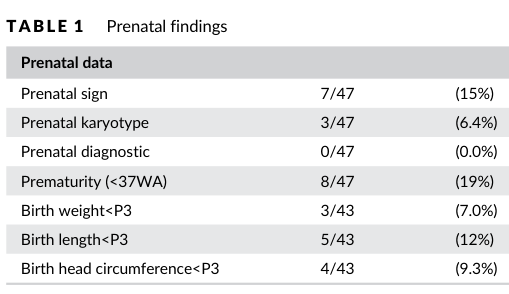

## Question

# Disease Characteristics Research Template

## Target Disease
- **Disease Name:** Smith-Magenis Syndrome
- **MONDO ID:**  (if available)
- **Category:** Mendelian

## Research Objectives

Please provide a comprehensive research report on **Smith-Magenis Syndrome** covering all of the
disease characteristics listed below. This report will be used to populate a disease knowledge
base entry. Be thorough and cite primary literature (PMID preferred) for all claims.

For each section, **suggested databases/resources** are listed. These are the first places
you should search for information on each topic.

---

### 1. Disease Information
> **Search first:** OMIM, Orphanet, ICD-10/ICD-11, MeSH, PubMed

- What is the disease? Provide a concise overview.
- What are the key identifiers? (OMIM, Orphanet, ICD-10/ICD-11, MeSH, Mondo)
- What are the common synonyms and alternative names?
- Is the information derived from individual patients (e.g., EHR) or aggregated disease-level resources?

### 2. Etiology

- **Disease Causal Factors**: What are the primary causes? (genetic, environmental, infectious, mechanistic)
- **Risk Factors**:
  > **Search first:** PubMed, Cochrane Library, UpToDate, clinical guidelines, ClinVar, ClinGen, GWAS Catalog, PheGenI, CTD, CDC, WHO, epidemiological databases
  - Genetic risk factors (causal variants, susceptibility loci, modifier genes)
  - Environmental risk factors (toxins, lifestyle, occupational exposures, age, sex, family history)
- **Protective Factors**:
  > **Search first:** PubMed, Cochrane Library, clinical trial databases, GWAS Catalog, gnomAD, WHO, CDC, nutrition databases
  - Genetic protective factors (protective variants, modifier alleles)
  - Environmental protective factors (diet, lifestyle, exposures that reduce risk)
- **Gene-Environment Interactions**: How do genetic and environmental factors interact to influence disease?
  > **Search first:** CTD, PubMed, PheGenI, GxE databases

### 3. Phenotypes
> **Search first:** HPO (Human Phenotype Ontology), OMIM, Orphanet, PubMed, clinicaltrials.gov, MedDRA, SNOMED CT, DECIPHER, LOINC

For each phenotype, provide:
- **Phenotype type**: symptoms, clinical signs, physical manifestations, behavioral changes, or laboratory abnormalities
  > For symptoms/signs: HPO, OMIM, Orphanet, PubMed
  > For behavioral changes: HPO, DSM, RDoC (Research Domain Criteria), PubMed
  > For laboratory abnormalities: LOINC, SNOMED CT, LabTests Online, PubMed
- **Phenotype characteristics**:
  > **Search first:** OMIM, Orphanet, HPO, PubMed
  - Age of symptom onset (neonatal, childhood, adult-onset, late-onset)
  - Symptom severity (mild, moderate, severe, variable)
  - Symptom progression (stable, progressive, episodic, fluctuating)
  - Frequency among affected individuals (percentage or qualitative)
- **Quality of life impact**: Effects on daily functioning and well-being (per-phenotype when possible)
  > **Search first:** EQ-5D database, SF-36, WHO QOL databases, PubMed
- Suggest HPO (Human Phenotype Ontology) terms for each phenotype

### 4. Genetic/Molecular Information

- **Causal Genes**: Gene mutations or chromosomal abnormalities responsible for disease (gene symbols, OMIM IDs)
  > **Search first:** OMIM, ClinVar, HGMD, Ensembl, NCBI Gene
- **Pathogenic Variants**:
  - Affected genes (gene symbols, HGNC IDs)
    > **Search first:** OMIM, NCBI Gene, Ensembl, HGNC, UniProt, GeneCards
  - Variant classification (pathogenic, likely pathogenic, VUS per ACMG/AMP guidelines)
    > **Search first:** ClinVar, ClinGen, ACMG/AMP guidelines, VarSome
  - Variant type/class (missense, frameshift, nonsense, splice-site, structural)
  - Allele frequency in population databases
    > **Search first:** gnomAD, 1000 Genomes, ExAC, TOPMed, dbSNP
  - Somatic vs germline origin
    > **Search first:** COSMIC (somatic), ClinVar, ICGC, TCGA
  - Functional consequences (loss of function, gain of function, dominant negative)
- **Modifier Genes**: Genes that modify disease severity or expression
- **Epigenetic Information**: DNA methylation, histone modifications, chromatin changes affecting disease
  > **Search first:** ENCODE, Roadmap Epigenomics, MethBase, DiseaseMeth
- **Chromosomal Abnormalities**: Large-scale genetic changes (aneuploidy, translocations, inversions)
  > **Search first:** DECIPHER, ClinVar, ECARUCA, UCSC Genome Browser

### 5. Environmental Information

- **Environmental Factors**: Non-genetic contributing factors (toxins, radiation, pollution, occupational exposure)
  > **Search first:** CTD (Comparative Toxicogenomics Database), TOXNET, PubMed, EPA databases
- **Lifestyle Factors**: Behavioral factors (smoking, diet, exercise, alcohol consumption)
  > **Search first:** CDC databases, WHO, PubMed, NHANES
- **Infectious Agents**: If applicable, pathogens causing or triggering disease (bacteria, viruses, fungi, parasites)
  > **Search first:** NCBI Taxonomy, ViPR, BV-BRC, MicrobeDB, GIDEON

### 6. Mechanism / Pathophysiology

- **Molecular Pathways**: Specific signaling cascades or biochemical pathways involved (Wnt, MAPK, mTOR, PI3K-AKT, etc.)
  > **Search first:** KEGG, Reactome, WikiPathways, PathBank, BioCyc
- **Cellular Processes**: Cell-level mechanisms (apoptosis, autophagy, cell cycle dysregulation, inflammation, etc.)
  > **Search first:** Gene Ontology (GO), Reactome, KEGG, PubMed
- **Protein Dysfunction**: How protein structure or function is altered (misfolding, aggregation, loss of function, gain of function)
  > **Search first:** UniProt, PDB (Protein Data Bank), InterPro, Pfam, AlphaFold
- **Metabolic Changes**: Alterations in metabolic processes (energy metabolism, lipid metabolism, amino acid metabolism)
  > **Search first:** KEGG, BioCyc, HMDB (Human Metabolome Database), BRENDA
- **Immune System Involvement**: Role of immune response (autoimmunity, immunodeficiency, chronic inflammation)
  > **Search first:** ImmPort, Immunome Database, IEDB, Gene Ontology
- **Tissue Damage Mechanisms**: How tissues/ are injured (oxidative stress, ischemia, fibrosis, necrosis)
  > **Search first:** PubMed, Gene Ontology, Reactome
- **Biochemical Abnormalities**: Specific molecular defects (enzyme deficiencies, receptor dysfunction, ion channel defects)
  > **Search first:** BRENDA, UniProt, KEGG, OMIM, PubMed
- **Epigenetic Changes**: DNA methylation, histone modifications affecting gene expression in disease
  > **Search first:** ENCODE, Roadmap Epigenomics, MethBase, DiseaseMeth
- **Molecular Profiling** (if available):
  - Transcriptomics/gene expression changes
    > **Search first:** GEO (Gene Expression Omnibus), ArrayExpress, GTEx, Human Cell Atlas, SRA
  - Proteomics findings
    > **Search first:** PRIDE, ProteomeXchange, Human Protein Atlas, STRING, BioGRID
  - Metabolomics signatures
    > **Search first:** MetaboLights, Metabolomics Workbench, HMDB, METLIN
  - Lipidomics alterations
    > **Search first:** LIPID MAPS, SwissLipids, LipidHome, Metabolomics Workbench
  - Genomic structural features
    > **Search first:** UCSC Genome Browser, Ensembl, NCBI, dbVar, DGV
- **Advanced Technologies** (if applicable):
  - Single-cell analysis findings (cell-type specific mechanisms, cellular heterogeneity)
    > **Search first:** Human Cell Atlas, Single Cell Portal, GEO, CELLxGENE
  - Spatial transcriptomics findings
    > **Search first:** GEO, Spatial Research, Vizgen, 10x Genomics data
  - Multi-omics integration results
    > **Search first:** TCGA, ICGC, cBioPortal, LinkedOmics, PubMed
  - Functional genomics screens (CRISPR, RNAi)
    > **Search first:** DepMap, GenomeRNAi, PubMed, BioGRID ORCS

For each mechanism, describe:
- The causal chain from initial trigger to clinical manifestation
- Which mechanisms are upstream vs downstream
- What cell types and biological processes are involved
- Suggest GO terms for biological processes and CL terms for cell types

### 7. Anatomical Structures Affected

- **Organ Level**:
  - Primary organs directly affected
  - Secondary organ involvement (complications, secondary effects)
  - Body systems involved (cardiovascular, nervous, digestive, respiratory, endocrine, etc.)
  > **Search first:** Uberon, FMA (Foundational Model of Anatomy), OMIM, HPO, ICD-11, MeSH, SNOMED CT
- **Tissue and Cell Level**:
  - Specific tissue types affected (epithelial, connective, muscle, nervous)
  - Specific cell populations targeted (with Cell Ontology terms)
  > **Search first:** Uberon, Human Protein Atlas, Cell Ontology, Human Cell Atlas, CellMarker, PanglaoDB
- **Subcellular Level**:
  - Cellular compartments involved (mitochondria, nucleus, ER, lysosomes) (with GO Cellular Component terms)
  > **Search first:** Gene Ontology (Cellular Component), UniProt, Human Protein Atlas
- **Localization**:
  - Specific anatomical sites (with UBERON terms)
    > **Search first:** FMA, Uberon, NeuroNames (for brain), SNOMED CT
  - Lateralization (unilateral, bilateral, asymmetric)
    > **Search first:** HPO, clinical literature, imaging databases

### 8. Temporal Development

- **Onset**:
  - Typical age of onset (congenital, pediatric, adult, geriatric)
  - Onset pattern (acute, subacute, chronic, insidious)
  > **Search first:** OMIM, Orphanet, HPO, PubMed
- **Progression**:
  - Disease stages (early, intermediate, advanced, end-stage)
    > **Search first:** Cancer Staging Manual (AJCC), WHO classifications, PubMed
  - Progression rate (rapid, slow, variable)
  - Disease course pattern (episodic, relapsing-remitting, progressive, stable)
  - Disease duration (self-limited, chronic lifelong)
  > **Search first:** Disease registries, longitudinal cohort databases, natural history studies, PubMed, Orphanet, OMIM
- **Patterns**:
  - Remission patterns (spontaneous, treatment-induced)
    > **Search first:** Clinical trial databases, disease registries, PubMed
  - Critical periods (time windows of vulnerability or opportunity for intervention)
    > **Search first:** PubMed, developmental biology databases, clinical guidelines

### 9. Inheritance and Population

- **Epidemiology**:
  - Prevalence (cases per 100,000 at given time)
  - Incidence (new cases per 100,000 per year)
  > **Search first:** Orphanet, CDC, WHO, GBD (Global Burden of Disease), national registries, SEER, disease registries
- **For Genetic Etiology**:
  - Inheritance pattern (AD, AR, X-linked, mitochondrial, multifactorial, polygenic)
    > **Search first:** OMIM, Orphanet, ClinVar, GTR (Genetic Testing Registry)
  - Penetrance (complete, incomplete, age-dependent)
    > **Search first:** ClinVar, OMIM, PubMed, ClinGen
  - Expressivity (variable, consistent)
    > **Search first:** OMIM, ClinVar, PubMed
  - Genetic anticipation (increasing severity in successive generations)
    > **Search first:** OMIM, PubMed (especially for repeat expansion disorders)
  - Germline mosaicism
    > **Search first:** ClinVar, OMIM, genetic counseling literature, PubMed
  - Founder effects (population-specific mutations)
    > **Search first:** gnomAD, population genetics databases, PubMed
  - Consanguinity role
    > **Search first:** OMIM, population studies, genetic counseling resources
  - Carrier frequency
    > **Search first:** gnomAD, carrier screening databases, GeneReviews, GTR
- **Population Demographics**:
  - Affected populations (ethnic or demographic groups with higher prevalence)
    > **Search first:** gnomAD, 1000 Genomes, PAGE Study, PubMed, population registries
  - Geographic distribution (endemic areas, regional variation)
    > **Search first:** WHO, CDC, GBD, Orphanet, geographic epidemiology databases
  - Geographic distribution of specific variants
  - Sex ratio (male:female)
    > **Search first:** Disease registries, OMIM, PubMed, epidemiological databases
  - Age distribution of affected individuals
    > **Search first:** CDC, disease registries, SEER, Orphanet

### 10. Diagnostics

- **Clinical Tests**:
  - Laboratory tests (blood, urine, tissue chemistry, specific enzyme assays)
    > **Search first:** LOINC, LabTests Online, PubMed
  - Biomarkers (proteins, metabolites, genetic markers, circulating biomarkers)
    > **Search first:** FDA Biomarker List, BEST (Biomarkers, EndpointS, and other Tools), PubMed
  - Imaging studies (X-ray, CT, MRI, PET, ultrasound)
    > **Search first:** RadLex, DICOM, Radiopaedia, imaging databases
  - Functional tests (pulmonary function, cardiac stress tests)
    > **Search first:** LOINC, clinical guidelines, PubMed
  - Electrophysiology (EEG, EMG, ECG, nerve conduction studies)
    > **Search first:** LOINC, clinical neurophysiology databases, PubMed
  - Biopsy findings (histopathology, immunohistochemistry)
    > **Search first:** SNOMED CT, College of American Pathologists resources, PubMed
  - Pathology findings (microscopic examination)
    > **Search first:** SNOMED CT, Digital Pathology databases, PubMed
- **Genetic Testing**:
  > **Search first:** GTR (Genetic Testing Registry), GeneReviews, ClinGen
  - Overview of recommended genetic testing approach
  - Whole genome sequencing (WGS) utility
    > **Search first:** GTR, ClinVar, GEL (Genomics England), gnomAD
  - Whole exome sequencing (WES) utility
    > **Search first:** GTR, ClinVar, OMIM, GeneMatcher
  - Gene panels (which panels, which genes)
    > **Search first:** GTR, ClinVar, laboratory-specific databases
  - Single gene testing
    > **Search first:** GTR, ClinVar, OMIM, GeneReviews
  - Chromosomal microarray (CMA)
    > **Search first:** DECIPHER, ClinVar, dbVar, ECARUCA
  - Karyotyping
    > **Search first:** Chromosome Abnormality Database, ClinVar, cytogenetics resources
  - FISH
    > **Search first:** ClinVar, cytogenetics databases, PubMed
  - Mitochondrial DNA testing
    > **Search first:** MITOMAP, MSeqDR, ClinVar, GTR
  - Repeat expansion testing
    > **Search first:** GTR, ClinVar, repeat expansion databases, PubMed
- **Omics-Based Diagnostics** (if applicable):
  - RNA sequencing / transcriptomics
    > **Search first:** GEO, ArrayExpress, GTEx, RNA-seq databases
  - Proteomics
    > **Search first:** PRIDE, ProteomeXchange, FDA Biomarker database
  - Metabolomics
    > **Search first:** MetaboLights, Metabolomics Workbench, HMDB
  - Epigenomics
    > **Search first:** GEO, ENCODE, Roadmap Epigenomics, MethBase
  - Liquid biopsy
    > **Search first:** COSMIC, ClinVar, liquid biopsy databases, PubMed
- **Clinical Criteria**:
  - Standardized diagnostic criteria (DSM, ICD, society guidelines)
    > **Search first:** DSM-5, ICD-11, clinical society guidelines, UpToDate
  - Differential diagnosis (other conditions to rule out, with distinguishing features)
    > **Search first:** DynaMed, UpToDate, clinical decision support systems
- **Screening**:
  - Screening methods for asymptomatic individuals (newborn screening, carrier screening, cascade screening)
    > **Search first:** ACMG recommendations, CDC newborn screening, GTR

### 11. Outcome/Prognosis

- **Survival and Mortality**:
  - Survival rate (5-year, 10-year, overall)
    > **Search first:** SEER, cancer registries, disease-specific registries, PubMed
  - Life expectancy (with and without treatment if applicable)
    > **Search first:** Orphanet, disease registries, actuarial databases, PubMed
  - Mortality rate
    > **Search first:** CDC, WHO, GBD, national mortality databases
  - Disease-specific mortality (deaths directly attributable to disease)
    > **Search first:** Disease registries, CDC Wonder, GBD, PubMed
- **Morbidity and Function**:
  - Morbidity (disease-related disability and health impacts)
    > **Search first:** GBD, WHO, disability databases, PubMed
  - Disability outcomes (long-term functional impairments)
    > **Search first:** ICF (International Classification of Functioning), disability registries
  - Quality of life measures (EQ-5D, SF-36, PROMIS, disease-specific tools)
    > **Search first:** EQ-5D database, SF-36, PROMIS, PubMed
- **Disease Course**:
  - Complications (secondary problems: infections, organ failure, etc.)
    > **Search first:** ICD codes, disease registries, clinical databases, PubMed
  - Recovery potential (likelihood and extent of recovery, with vs without treatment)
    > **Search first:** Natural history studies, rehabilitation databases, PubMed
- **Prediction**:
  - Prognostic factors (age, disease severity, biomarkers, treatment response)
    > **Search first:** Prognostic models databases, clinical calculators, PubMed
  - Prognostic biomarkers (molecular markers predicting disease course)
    > **Search first:** FDA Biomarker database, PubMed, cancer prognostic databases

### 12. Treatment

- **Pharmacotherapy**:
  - Pharmacological treatments (drug names, drug classes, mechanisms of action)
    > **Search first:** DrugBank, RxNorm, ATC classification, DailyMed, FDA databases
  - Pharmacogenomics (how genetic variants affect drug metabolism, efficacy, toxicity)
    > **Search first:** PharmGKB, CPIC (Clinical Pharmacogenetics), FDA Table of PGx Biomarkers
- **Advanced Therapeutics**:
  - Gene therapy (viral vectors, CRISPR, gene replacement, gene editing)
    > **Search first:** ClinicalTrials.gov, FDA gene therapy database, ASGCT resources
  - Cell therapy (stem cell transplant, CAR-T, cellular therapeutics)
    > **Search first:** ClinicalTrials.gov, FDA cell therapy database, FACT standards
  - RNA-based therapies (ASOs, siRNA, mRNA therapies)
    > **Search first:** ClinicalTrials.gov, FDA approvals, PubMed
  - Targeted therapies (treatments directed at specific molecular targets)
    > **Search first:** My Cancer Genome, OncoKB, ClinicalTrials.gov, FDA approvals
  - Immunotherapies (checkpoint inhibitors, monoclonal antibodies)
    > **Search first:** Cancer Immunotherapy Database, FDA approvals, ClinicalTrials.gov
- **Surgical and Interventional**:
  - Surgical interventions (types of surgery, timing, outcomes)
    > **Search first:** CPT codes, surgical registries, clinical guidelines, PubMed
- **Supportive and Rehabilitative**:
  - Supportive care (symptom management, pain control, nutrition)
    > **Search first:** Clinical guidelines, Cochrane Library, PubMed
  - Rehabilitation (physical therapy, occupational therapy, speech therapy)
    > **Search first:** Rehabilitation medicine databases, clinical guidelines, PubMed
- **Experimental**:
  - Experimental treatments in clinical trials (with NCT identifiers if available)
    > **Search first:** ClinicalTrials.gov, EU Clinical Trials Register, WHO ICTRP
- **Treatment Outcomes**:
  - Treatment response rates
    > **Search first:** Clinical trial databases, FDA reviews, systematic reviews, PubMed
  - Side effects and adverse events
    > **Search first:** FDA Adverse Event Reporting System (FAERS), MedWatch, PubMed
- **Treatment Strategy**:
  - Treatment algorithms (clinical pathways, decision trees)
    > **Search first:** Clinical practice guidelines, NCCN Guidelines, UpToDate
  - Combination therapies
    > **Search first:** ClinicalTrials.gov, treatment guidelines, PubMed
  - Personalized medicine approaches (genotype-guided treatment)
    > **Search first:** My Cancer Genome, CIViC, PharmGKB, precision medicine databases

For each treatment, suggest MAXO (Medical Action Ontology) terms where applicable.

### 13. Prevention

- **Prevention Levels**:
  - Primary prevention (preventing disease occurrence: vaccination, risk factor modification)
    > **Search first:** CDC, WHO, USPSTF recommendations, Cochrane Library
  - Secondary prevention (early detection and treatment: screening programs, early intervention)
    > **Search first:** USPSTF, CDC screening guidelines, WHO
  - Tertiary prevention (preventing complications in those with disease)
    > **Search first:** Clinical guidelines, disease management protocols, PubMed
- **Immunization**: Vaccine strategies (if applicable)
  > **Search first:** CDC vaccine schedules, WHO immunization, FDA vaccine database
- **Screening and Early Detection**:
  - Screening programs (population-based: newborn screening, cancer screening)
    > **Search first:** CDC screening programs, USPSTF, cancer screening databases
  - Genetic screening (carrier screening, preimplantation genetic diagnosis, prenatal testing)
    > **Search first:** ACMG recommendations, ACOG guidelines, GTR
  - Risk stratification (identifying high-risk individuals for targeted prevention)
    > **Search first:** Risk prediction models, clinical calculators, PubMed
- **Behavioral Interventions**: Lifestyle modifications to reduce risk
  > **Search first:** CDC, WHO, behavioral intervention databases, Cochrane Library
- **Counseling**: Genetic counseling (risk assessment, family planning guidance)
  > **Search first:** NSGC resources, ACMG guidelines, GeneReviews
- **Public Health**:
  - Public health interventions (sanitation, vector control, health education)
    > **Search first:** CDC, WHO, public health databases, PubMed
  - Environmental interventions (reducing environmental risk factors)
    > **Search first:** EPA databases, WHO environmental health, PubMed
- **Prophylaxis**: Preventive medications or procedures
  > **Search first:** Clinical guidelines, FDA approvals, PubMed

### 14. Other Species / Natural Disease

- **Taxonomy**: Species affected (with NCBI Taxon identifiers)
  > **Search first:** NCBI Taxonomy
- **Breed**: Specific breeds affected (with VBO identifiers if applicable)
  > **Search first:** VBO (Vertebrate Breed Ontology)
- **Gene**: Orthologous genes in other species (with NCBI Gene IDs)
  > **Search first:** NCBI Gene
- **Natural Disease**:
  - Naturally occurring disease in other species (companion animals, wildlife)
    > **Search first:** OMIA (Online Mendelian Inheritance in Animals), VetCompass, PubMed
  - Veterinary relevance and importance in animal health
    > **Search first:** OMIA, veterinary databases, PubMed
- **Comparative Biology**:
  - Comparative pathology (similarities and differences across species)
    > **Search first:** OMIA, comparative pathology databases, PubMed
  - Evolutionary conservation of disease mechanisms
    > **Search first:** HomoloGene, OrthoMCL, Alliance of Genome Resources
- **Transmission** (if applicable):
  - Zoonotic potential
    > **Search first:** CDC zoonotic diseases, WHO zoonoses, GIDEON
  - Cross-species susceptibility
    > **Search first:** NCBI Taxonomy, veterinary databases, PubMed

### 15. Model Organisms

- **Model Types**:
  - Model organism type (mammalian, invertebrate, cellular, in vitro)
    > **Search first:** Alliance of Genome Resources, model organism databases
  - Specific model systems (mouse, rat, zebrafish, Drosophila, C. elegans, yeast, cell lines, organoids, iPSCs)
    > **Search first:** MGI, RGD, ZFIN, FlyBase, WormBase, SGD, ATCC, Cellosaurus
  - Induced models (drug treatment, surgical intervention, environmental manipulation)
    > **Search first:** MGI, model organism databases, PubMed
- **Genetic Models**:
  - Types available (knockout, knock-in, transgenic, conditional, humanized)
    > **Search first:** MGI, IMPC, KOMP, EuMMCR, IMSR
- **Model Characteristics**:
  - Phenotype recapitulation (how well model reproduces human disease features)
    > **Search first:** Model organism databases, comparative studies, PubMed
  - Model limitations (aspects of human disease not captured)
    > **Search first:** Model organism databases, PubMed, review articles
- **Applications**:
  - Research applications (what aspects of disease can be studied)
    > **Search first:** Model organism databases, PubMed
- **Resources**:
  - Model databases
    > **Search first:** MGI, RGD, ZFIN, FlyBase, WormBase, IMSR, EMMA, MMRRC

---

## Citation Requirements

- Cite primary literature (PMID preferred) for all mechanistic and clinical claims
- Prioritize recent reviews and landmark papers
- Include direct quotes from abstracts where possible to support key statements
- Distinguish evidence source types: human clinical, model organism, in vitro, computational

## Output Format

Structure your response as a comprehensive narrative organized by the sections above.
For each section, provide:
- Factual content with specific details (numbers, percentages, gene names, variant nomenclature)
- Ontology term suggestions (HPO, GO, CL, UBERON, CHEBI, MAXO, MONDO) where applicable
- Evidence citations with PMIDs
- Direct quotes from abstracts to support key claims
- Clear indication when information is not available or not applicable for this disease

This report will be used to populate a disease knowledge base entry with:
- Pathophysiology descriptions with causal chains
- Gene/protein annotations (HGNC, GO terms)
- Phenotype associations (HP terms) with frequencies
- Cell type involvement (CL terms)
- Anatomical locations (UBERON terms)
- Chemical entities (CHEBI terms)
- Treatment annotations (MAXO terms)
- Evidence items with PMIDs and exact abstract quotes
- Epidemiology, prognosis, diagnostic, and prevention information
- Animal model descriptions with phenotype recapitulation details

## Output

Question: You are an expert researcher providing comprehensive, well-cited information.

Provide detailed information focusing on:
1. Key concepts and definitions with current understanding
2. Recent developments and latest research (prioritize 2023-2024 sources)
3. Current applications and real-world implementations
4. Expert opinions and analysis from authoritative sources
5. Relevant statistics and data from recent studies

Format as a comprehensive research report with proper citations. Include URLs and publication dates where available.
Always prioritize recent, authoritative sources and provide specific citations for all major claims.

# Disease Characteristics Research Template

## Target Disease
- **Disease Name:** Smith-Magenis Syndrome
- **MONDO ID:**  (if available)
- **Category:** Mendelian

## Research Objectives

Please provide a comprehensive research report on **Smith-Magenis Syndrome** covering all of the
disease characteristics listed below. This report will be used to populate a disease knowledge
base entry. Be thorough and cite primary literature (PMID preferred) for all claims.

For each section, **suggested databases/resources** are listed. These are the first places
you should search for information on each topic.

---

### 1. Disease Information
> **Search first:** OMIM, Orphanet, ICD-10/ICD-11, MeSH, PubMed

- What is the disease? Provide a concise overview.
- What are the key identifiers? (OMIM, Orphanet, ICD-10/ICD-11, MeSH, Mondo)
- What are the common synonyms and alternative names?
- Is the information derived from individual patients (e.g., EHR) or aggregated disease-level resources?

### 2. Etiology

- **Disease Causal Factors**: What are the primary causes? (genetic, environmental, infectious, mechanistic)
- **Risk Factors**:
  > **Search first:** PubMed, Cochrane Library, UpToDate, clinical guidelines, ClinVar, ClinGen, GWAS Catalog, PheGenI, CTD, CDC, WHO, epidemiological databases
  - Genetic risk factors (causal variants, susceptibility loci, modifier genes)
  - Environmental risk factors (toxins, lifestyle, occupational exposures, age, sex, family history)
- **Protective Factors**:
  > **Search first:** PubMed, Cochrane Library, clinical trial databases, GWAS Catalog, gnomAD, WHO, CDC, nutrition databases
  - Genetic protective factors (protective variants, modifier alleles)
  - Environmental protective factors (diet, lifestyle, exposures that reduce risk)
- **Gene-Environment Interactions**: How do genetic and environmental factors interact to influence disease?
  > **Search first:** CTD, PubMed, PheGenI, GxE databases

### 3. Phenotypes
> **Search first:** HPO (Human Phenotype Ontology), OMIM, Orphanet, PubMed, clinicaltrials.gov, MedDRA, SNOMED CT, DECIPHER, LOINC

For each phenotype, provide:
- **Phenotype type**: symptoms, clinical signs, physical manifestations, behavioral changes, or laboratory abnormalities
  > For symptoms/signs: HPO, OMIM, Orphanet, PubMed
  > For behavioral changes: HPO, DSM, RDoC (Research Domain Criteria), PubMed
  > For laboratory abnormalities: LOINC, SNOMED CT, LabTests Online, PubMed
- **Phenotype characteristics**:
  > **Search first:** OMIM, Orphanet, HPO, PubMed
  - Age of symptom onset (neonatal, childhood, adult-onset, late-onset)
  - Symptom severity (mild, moderate, severe, variable)
  - Symptom progression (stable, progressive, episodic, fluctuating)
  - Frequency among affected individuals (percentage or qualitative)
- **Quality of life impact**: Effects on daily functioning and well-being (per-phenotype when possible)
  > **Search first:** EQ-5D database, SF-36, WHO QOL databases, PubMed
- Suggest HPO (Human Phenotype Ontology) terms for each phenotype

### 4. Genetic/Molecular Information

- **Causal Genes**: Gene mutations or chromosomal abnormalities responsible for disease (gene symbols, OMIM IDs)
  > **Search first:** OMIM, ClinVar, HGMD, Ensembl, NCBI Gene
- **Pathogenic Variants**:
  - Affected genes (gene symbols, HGNC IDs)
    > **Search first:** OMIM, NCBI Gene, Ensembl, HGNC, UniProt, GeneCards
  - Variant classification (pathogenic, likely pathogenic, VUS per ACMG/AMP guidelines)
    > **Search first:** ClinVar, ClinGen, ACMG/AMP guidelines, VarSome
  - Variant type/class (missense, frameshift, nonsense, splice-site, structural)
  - Allele frequency in population databases
    > **Search first:** gnomAD, 1000 Genomes, ExAC, TOPMed, dbSNP
  - Somatic vs germline origin
    > **Search first:** COSMIC (somatic), ClinVar, ICGC, TCGA
  - Functional consequences (loss of function, gain of function, dominant negative)
- **Modifier Genes**: Genes that modify disease severity or expression
- **Epigenetic Information**: DNA methylation, histone modifications, chromatin changes affecting disease
  > **Search first:** ENCODE, Roadmap Epigenomics, MethBase, DiseaseMeth
- **Chromosomal Abnormalities**: Large-scale genetic changes (aneuploidy, translocations, inversions)
  > **Search first:** DECIPHER, ClinVar, ECARUCA, UCSC Genome Browser

### 5. Environmental Information

- **Environmental Factors**: Non-genetic contributing factors (toxins, radiation, pollution, occupational exposure)
  > **Search first:** CTD (Comparative Toxicogenomics Database), TOXNET, PubMed, EPA databases
- **Lifestyle Factors**: Behavioral factors (smoking, diet, exercise, alcohol consumption)
  > **Search first:** CDC databases, WHO, PubMed, NHANES
- **Infectious Agents**: If applicable, pathogens causing or triggering disease (bacteria, viruses, fungi, parasites)
  > **Search first:** NCBI Taxonomy, ViPR, BV-BRC, MicrobeDB, GIDEON

### 6. Mechanism / Pathophysiology

- **Molecular Pathways**: Specific signaling cascades or biochemical pathways involved (Wnt, MAPK, mTOR, PI3K-AKT, etc.)
  > **Search first:** KEGG, Reactome, WikiPathways, PathBank, BioCyc
- **Cellular Processes**: Cell-level mechanisms (apoptosis, autophagy, cell cycle dysregulation, inflammation, etc.)
  > **Search first:** Gene Ontology (GO), Reactome, KEGG, PubMed
- **Protein Dysfunction**: How protein structure or function is altered (misfolding, aggregation, loss of function, gain of function)
  > **Search first:** UniProt, PDB (Protein Data Bank), InterPro, Pfam, AlphaFold
- **Metabolic Changes**: Alterations in metabolic processes (energy metabolism, lipid metabolism, amino acid metabolism)
  > **Search first:** KEGG, BioCyc, HMDB (Human Metabolome Database), BRENDA
- **Immune System Involvement**: Role of immune response (autoimmunity, immunodeficiency, chronic inflammation)
  > **Search first:** ImmPort, Immunome Database, IEDB, Gene Ontology
- **Tissue Damage Mechanisms**: How tissues/ are injured (oxidative stress, ischemia, fibrosis, necrosis)
  > **Search first:** PubMed, Gene Ontology, Reactome
- **Biochemical Abnormalities**: Specific molecular defects (enzyme deficiencies, receptor dysfunction, ion channel defects)
  > **Search first:** BRENDA, UniProt, KEGG, OMIM, PubMed
- **Epigenetic Changes**: DNA methylation, histone modifications affecting gene expression in disease
  > **Search first:** ENCODE, Roadmap Epigenomics, MethBase, DiseaseMeth
- **Molecular Profiling** (if available):
  - Transcriptomics/gene expression changes
    > **Search first:** GEO (Gene Expression Omnibus), ArrayExpress, GTEx, Human Cell Atlas, SRA
  - Proteomics findings
    > **Search first:** PRIDE, ProteomeXchange, Human Protein Atlas, STRING, BioGRID
  - Metabolomics signatures
    > **Search first:** MetaboLights, Metabolomics Workbench, HMDB, METLIN
  - Lipidomics alterations
    > **Search first:** LIPID MAPS, SwissLipids, LipidHome, Metabolomics Workbench
  - Genomic structural features
    > **Search first:** UCSC Genome Browser, Ensembl, NCBI, dbVar, DGV
- **Advanced Technologies** (if applicable):
  - Single-cell analysis findings (cell-type specific mechanisms, cellular heterogeneity)
    > **Search first:** Human Cell Atlas, Single Cell Portal, GEO, CELLxGENE
  - Spatial transcriptomics findings
    > **Search first:** GEO, Spatial Research, Vizgen, 10x Genomics data
  - Multi-omics integration results
    > **Search first:** TCGA, ICGC, cBioPortal, LinkedOmics, PubMed
  - Functional genomics screens (CRISPR, RNAi)
    > **Search first:** DepMap, GenomeRNAi, PubMed, BioGRID ORCS

For each mechanism, describe:
- The causal chain from initial trigger to clinical manifestation
- Which mechanisms are upstream vs downstream
- What cell types and biological processes are involved
- Suggest GO terms for biological processes and CL terms for cell types

### 7. Anatomical Structures Affected

- **Organ Level**:
  - Primary organs directly affected
  - Secondary organ involvement (complications, secondary effects)
  - Body systems involved (cardiovascular, nervous, digestive, respiratory, endocrine, etc.)
  > **Search first:** Uberon, FMA (Foundational Model of Anatomy), OMIM, HPO, ICD-11, MeSH, SNOMED CT
- **Tissue and Cell Level**:
  - Specific tissue types affected (epithelial, connective, muscle, nervous)
  - Specific cell populations targeted (with Cell Ontology terms)
  > **Search first:** Uberon, Human Protein Atlas, Cell Ontology, Human Cell Atlas, CellMarker, PanglaoDB
- **Subcellular Level**:
  - Cellular compartments involved (mitochondria, nucleus, ER, lysosomes) (with GO Cellular Component terms)
  > **Search first:** Gene Ontology (Cellular Component), UniProt, Human Protein Atlas
- **Localization**:
  - Specific anatomical sites (with UBERON terms)
    > **Search first:** FMA, Uberon, NeuroNames (for brain), SNOMED CT
  - Lateralization (unilateral, bilateral, asymmetric)
    > **Search first:** HPO, clinical literature, imaging databases

### 8. Temporal Development

- **Onset**:
  - Typical age of onset (congenital, pediatric, adult, geriatric)
  - Onset pattern (acute, subacute, chronic, insidious)
  > **Search first:** OMIM, Orphanet, HPO, PubMed
- **Progression**:
  - Disease stages (early, intermediate, advanced, end-stage)
    > **Search first:** Cancer Staging Manual (AJCC), WHO classifications, PubMed
  - Progression rate (rapid, slow, variable)
  - Disease course pattern (episodic, relapsing-remitting, progressive, stable)
  - Disease duration (self-limited, chronic lifelong)
  > **Search first:** Disease registries, longitudinal cohort databases, natural history studies, PubMed, Orphanet, OMIM
- **Patterns**:
  - Remission patterns (spontaneous, treatment-induced)
    > **Search first:** Clinical trial databases, disease registries, PubMed
  - Critical periods (time windows of vulnerability or opportunity for intervention)
    > **Search first:** PubMed, developmental biology databases, clinical guidelines

### 9. Inheritance and Population

- **Epidemiology**:
  - Prevalence (cases per 100,000 at given time)
  - Incidence (new cases per 100,000 per year)
  > **Search first:** Orphanet, CDC, WHO, GBD (Global Burden of Disease), national registries, SEER, disease registries
- **For Genetic Etiology**:
  - Inheritance pattern (AD, AR, X-linked, mitochondrial, multifactorial, polygenic)
    > **Search first:** OMIM, Orphanet, ClinVar, GTR (Genetic Testing Registry)
  - Penetrance (complete, incomplete, age-dependent)
    > **Search first:** ClinVar, OMIM, PubMed, ClinGen
  - Expressivity (variable, consistent)
    > **Search first:** OMIM, ClinVar, PubMed
  - Genetic anticipation (increasing severity in successive generations)
    > **Search first:** OMIM, PubMed (especially for repeat expansion disorders)
  - Germline mosaicism
    > **Search first:** ClinVar, OMIM, genetic counseling literature, PubMed
  - Founder effects (population-specific mutations)
    > **Search first:** gnomAD, population genetics databases, PubMed
  - Consanguinity role
    > **Search first:** OMIM, population studies, genetic counseling resources
  - Carrier frequency
    > **Search first:** gnomAD, carrier screening databases, GeneReviews, GTR
- **Population Demographics**:
  - Affected populations (ethnic or demographic groups with higher prevalence)
    > **Search first:** gnomAD, 1000 Genomes, PAGE Study, PubMed, population registries
  - Geographic distribution (endemic areas, regional variation)
    > **Search first:** WHO, CDC, GBD, Orphanet, geographic epidemiology databases
  - Geographic distribution of specific variants
  - Sex ratio (male:female)
    > **Search first:** Disease registries, OMIM, PubMed, epidemiological databases
  - Age distribution of affected individuals
    > **Search first:** CDC, disease registries, SEER, Orphanet

### 10. Diagnostics

- **Clinical Tests**:
  - Laboratory tests (blood, urine, tissue chemistry, specific enzyme assays)
    > **Search first:** LOINC, LabTests Online, PubMed
  - Biomarkers (proteins, metabolites, genetic markers, circulating biomarkers)
    > **Search first:** FDA Biomarker List, BEST (Biomarkers, EndpointS, and other Tools), PubMed
  - Imaging studies (X-ray, CT, MRI, PET, ultrasound)
    > **Search first:** RadLex, DICOM, Radiopaedia, imaging databases
  - Functional tests (pulmonary function, cardiac stress tests)
    > **Search first:** LOINC, clinical guidelines, PubMed
  - Electrophysiology (EEG, EMG, ECG, nerve conduction studies)
    > **Search first:** LOINC, clinical neurophysiology databases, PubMed
  - Biopsy findings (histopathology, immunohistochemistry)
    > **Search first:** SNOMED CT, College of American Pathologists resources, PubMed
  - Pathology findings (microscopic examination)
    > **Search first:** SNOMED CT, Digital Pathology databases, PubMed
- **Genetic Testing**:
  > **Search first:** GTR (Genetic Testing Registry), GeneReviews, ClinGen
  - Overview of recommended genetic testing approach
  - Whole genome sequencing (WGS) utility
    > **Search first:** GTR, ClinVar, GEL (Genomics England), gnomAD
  - Whole exome sequencing (WES) utility
    > **Search first:** GTR, ClinVar, OMIM, GeneMatcher
  - Gene panels (which panels, which genes)
    > **Search first:** GTR, ClinVar, laboratory-specific databases
  - Single gene testing
    > **Search first:** GTR, ClinVar, OMIM, GeneReviews
  - Chromosomal microarray (CMA)
    > **Search first:** DECIPHER, ClinVar, dbVar, ECARUCA
  - Karyotyping
    > **Search first:** Chromosome Abnormality Database, ClinVar, cytogenetics resources
  - FISH
    > **Search first:** ClinVar, cytogenetics databases, PubMed
  - Mitochondrial DNA testing
    > **Search first:** MITOMAP, MSeqDR, ClinVar, GTR
  - Repeat expansion testing
    > **Search first:** GTR, ClinVar, repeat expansion databases, PubMed
- **Omics-Based Diagnostics** (if applicable):
  - RNA sequencing / transcriptomics
    > **Search first:** GEO, ArrayExpress, GTEx, RNA-seq databases
  - Proteomics
    > **Search first:** PRIDE, ProteomeXchange, FDA Biomarker database
  - Metabolomics
    > **Search first:** MetaboLights, Metabolomics Workbench, HMDB
  - Epigenomics
    > **Search first:** GEO, ENCODE, Roadmap Epigenomics, MethBase
  - Liquid biopsy
    > **Search first:** COSMIC, ClinVar, liquid biopsy databases, PubMed
- **Clinical Criteria**:
  - Standardized diagnostic criteria (DSM, ICD, society guidelines)
    > **Search first:** DSM-5, ICD-11, clinical society guidelines, UpToDate
  - Differential diagnosis (other conditions to rule out, with distinguishing features)
    > **Search first:** DynaMed, UpToDate, clinical decision support systems
- **Screening**:
  - Screening methods for asymptomatic individuals (newborn screening, carrier screening, cascade screening)
    > **Search first:** ACMG recommendations, CDC newborn screening, GTR

### 11. Outcome/Prognosis

- **Survival and Mortality**:
  - Survival rate (5-year, 10-year, overall)
    > **Search first:** SEER, cancer registries, disease-specific registries, PubMed
  - Life expectancy (with and without treatment if applicable)
    > **Search first:** Orphanet, disease registries, actuarial databases, PubMed
  - Mortality rate
    > **Search first:** CDC, WHO, GBD, national mortality databases
  - Disease-specific mortality (deaths directly attributable to disease)
    > **Search first:** Disease registries, CDC Wonder, GBD, PubMed
- **Morbidity and Function**:
  - Morbidity (disease-related disability and health impacts)
    > **Search first:** GBD, WHO, disability databases, PubMed
  - Disability outcomes (long-term functional impairments)
    > **Search first:** ICF (International Classification of Functioning), disability registries
  - Quality of life measures (EQ-5D, SF-36, PROMIS, disease-specific tools)
    > **Search first:** EQ-5D database, SF-36, PROMIS, PubMed
- **Disease Course**:
  - Complications (secondary problems: infections, organ failure, etc.)
    > **Search first:** ICD codes, disease registries, clinical databases, PubMed
  - Recovery potential (likelihood and extent of recovery, with vs without treatment)
    > **Search first:** Natural history studies, rehabilitation databases, PubMed
- **Prediction**:
  - Prognostic factors (age, disease severity, biomarkers, treatment response)
    > **Search first:** Prognostic models databases, clinical calculators, PubMed
  - Prognostic biomarkers (molecular markers predicting disease course)
    > **Search first:** FDA Biomarker database, PubMed, cancer prognostic databases

### 12. Treatment

- **Pharmacotherapy**:
  - Pharmacological treatments (drug names, drug classes, mechanisms of action)
    > **Search first:** DrugBank, RxNorm, ATC classification, DailyMed, FDA databases
  - Pharmacogenomics (how genetic variants affect drug metabolism, efficacy, toxicity)
    > **Search first:** PharmGKB, CPIC (Clinical Pharmacogenetics), FDA Table of PGx Biomarkers
- **Advanced Therapeutics**:
  - Gene therapy (viral vectors, CRISPR, gene replacement, gene editing)
    > **Search first:** ClinicalTrials.gov, FDA gene therapy database, ASGCT resources
  - Cell therapy (stem cell transplant, CAR-T, cellular therapeutics)
    > **Search first:** ClinicalTrials.gov, FDA cell therapy database, FACT standards
  - RNA-based therapies (ASOs, siRNA, mRNA therapies)
    > **Search first:** ClinicalTrials.gov, FDA approvals, PubMed
  - Targeted therapies (treatments directed at specific molecular targets)
    > **Search first:** My Cancer Genome, OncoKB, ClinicalTrials.gov, FDA approvals
  - Immunotherapies (checkpoint inhibitors, monoclonal antibodies)
    > **Search first:** Cancer Immunotherapy Database, FDA approvals, ClinicalTrials.gov
- **Surgical and Interventional**:
  - Surgical interventions (types of surgery, timing, outcomes)
    > **Search first:** CPT codes, surgical registries, clinical guidelines, PubMed
- **Supportive and Rehabilitative**:
  - Supportive care (symptom management, pain control, nutrition)
    > **Search first:** Clinical guidelines, Cochrane Library, PubMed
  - Rehabilitation (physical therapy, occupational therapy, speech therapy)
    > **Search first:** Rehabilitation medicine databases, clinical guidelines, PubMed
- **Experimental**:
  - Experimental treatments in clinical trials (with NCT identifiers if available)
    > **Search first:** ClinicalTrials.gov, EU Clinical Trials Register, WHO ICTRP
- **Treatment Outcomes**:
  - Treatment response rates
    > **Search first:** Clinical trial databases, FDA reviews, systematic reviews, PubMed
  - Side effects and adverse events
    > **Search first:** FDA Adverse Event Reporting System (FAERS), MedWatch, PubMed
- **Treatment Strategy**:
  - Treatment algorithms (clinical pathways, decision trees)
    > **Search first:** Clinical practice guidelines, NCCN Guidelines, UpToDate
  - Combination therapies
    > **Search first:** ClinicalTrials.gov, treatment guidelines, PubMed
  - Personalized medicine approaches (genotype-guided treatment)
    > **Search first:** My Cancer Genome, CIViC, PharmGKB, precision medicine databases

For each treatment, suggest MAXO (Medical Action Ontology) terms where applicable.

### 13. Prevention

- **Prevention Levels**:
  - Primary prevention (preventing disease occurrence: vaccination, risk factor modification)
    > **Search first:** CDC, WHO, USPSTF recommendations, Cochrane Library
  - Secondary prevention (early detection and treatment: screening programs, early intervention)
    > **Search first:** USPSTF, CDC screening guidelines, WHO
  - Tertiary prevention (preventing complications in those with disease)
    > **Search first:** Clinical guidelines, disease management protocols, PubMed
- **Immunization**: Vaccine strategies (if applicable)
  > **Search first:** CDC vaccine schedules, WHO immunization, FDA vaccine database
- **Screening and Early Detection**:
  - Screening programs (population-based: newborn screening, cancer screening)
    > **Search first:** CDC screening programs, USPSTF, cancer screening databases
  - Genetic screening (carrier screening, preimplantation genetic diagnosis, prenatal testing)
    > **Search first:** ACMG recommendations, ACOG guidelines, GTR
  - Risk stratification (identifying high-risk individuals for targeted prevention)
    > **Search first:** Risk prediction models, clinical calculators, PubMed
- **Behavioral Interventions**: Lifestyle modifications to reduce risk
  > **Search first:** CDC, WHO, behavioral intervention databases, Cochrane Library
- **Counseling**: Genetic counseling (risk assessment, family planning guidance)
  > **Search first:** NSGC resources, ACMG guidelines, GeneReviews
- **Public Health**:
  - Public health interventions (sanitation, vector control, health education)
    > **Search first:** CDC, WHO, public health databases, PubMed
  - Environmental interventions (reducing environmental risk factors)
    > **Search first:** EPA databases, WHO environmental health, PubMed
- **Prophylaxis**: Preventive medications or procedures
  > **Search first:** Clinical guidelines, FDA approvals, PubMed

### 14. Other Species / Natural Disease

- **Taxonomy**: Species affected (with NCBI Taxon identifiers)
  > **Search first:** NCBI Taxonomy
- **Breed**: Specific breeds affected (with VBO identifiers if applicable)
  > **Search first:** VBO (Vertebrate Breed Ontology)
- **Gene**: Orthologous genes in other species (with NCBI Gene IDs)
  > **Search first:** NCBI Gene
- **Natural Disease**:
  - Naturally occurring disease in other species (companion animals, wildlife)
    > **Search first:** OMIA (Online Mendelian Inheritance in Animals), VetCompass, PubMed
  - Veterinary relevance and importance in animal health
    > **Search first:** OMIA, veterinary databases, PubMed
- **Comparative Biology**:
  - Comparative pathology (similarities and differences across species)
    > **Search first:** OMIA, comparative pathology databases, PubMed
  - Evolutionary conservation of disease mechanisms
    > **Search first:** HomoloGene, OrthoMCL, Alliance of Genome Resources
- **Transmission** (if applicable):
  - Zoonotic potential
    > **Search first:** CDC zoonotic diseases, WHO zoonoses, GIDEON
  - Cross-species susceptibility
    > **Search first:** NCBI Taxonomy, veterinary databases, PubMed

### 15. Model Organisms

- **Model Types**:
  - Model organism type (mammalian, invertebrate, cellular, in vitro)
    > **Search first:** Alliance of Genome Resources, model organism databases
  - Specific model systems (mouse, rat, zebrafish, Drosophila, C. elegans, yeast, cell lines, organoids, iPSCs)
    > **Search first:** MGI, RGD, ZFIN, FlyBase, WormBase, SGD, ATCC, Cellosaurus
  - Induced models (drug treatment, surgical intervention, environmental manipulation)
    > **Search first:** MGI, model organism databases, PubMed
- **Genetic Models**:
  - Types available (knockout, knock-in, transgenic, conditional, humanized)
    > **Search first:** MGI, IMPC, KOMP, EuMMCR, IMSR
- **Model Characteristics**:
  - Phenotype recapitulation (how well model reproduces human disease features)
    > **Search first:** Model organism databases, comparative studies, PubMed
  - Model limitations (aspects of human disease not captured)
    > **Search first:** Model organism databases, PubMed, review articles
- **Applications**:
  - Research applications (what aspects of disease can be studied)
    > **Search first:** Model organism databases, PubMed
- **Resources**:
  - Model databases
    > **Search first:** MGI, RGD, ZFIN, FlyBase, WormBase, IMSR, EMMA, MMRRC

---

## Citation Requirements

- Cite primary literature (PMID preferred) for all mechanistic and clinical claims
- Prioritize recent reviews and landmark papers
- Include direct quotes from abstracts where possible to support key statements
- Distinguish evidence source types: human clinical, model organism, in vitro, computational

## Output Format

Structure your response as a comprehensive narrative organized by the sections above.
For each section, provide:
- Factual content with specific details (numbers, percentages, gene names, variant nomenclature)
- Ontology term suggestions (HPO, GO, CL, UBERON, CHEBI, MAXO, MONDO) where applicable
- Evidence citations with PMIDs
- Direct quotes from abstracts to support key claims
- Clear indication when information is not available or not applicable for this disease

This report will be used to populate a disease knowledge base entry with:
- Pathophysiology descriptions with causal chains
- Gene/protein annotations (HGNC, GO terms)
- Phenotype associations (HP terms) with frequencies
- Cell type involvement (CL terms)
- Anatomical locations (UBERON terms)
- Chemical entities (CHEBI terms)
- Treatment annotations (MAXO terms)
- Evidence items with PMIDs and exact abstract quotes
- Epidemiology, prognosis, diagnostic, and prevention information
- Animal model descriptions with phenotype recapitulation details

## Comprehensive Research Report: Smith–Magenis Syndrome (SMS)

### Target disease
- **Disease name:** Smith–Magenis syndrome (SMS)
- **Category:** Mendelian / genomic disorder (autosomal dominant; typically de novo)
- **MONDO ID:** Not retrieved in the available sources for this run (requires direct lookup in MONDO/Orphanet/OMIM).

---

## 1. Disease Information

### 1.1 Concise overview (current understanding)
Smith–Magenis syndrome is a complex neurodevelopmental disorder characterized by distinctive physical features, developmental delay/intellectual disability, and a characteristic behavioral phenotype that prominently includes sleep disturbance and self-injury. A recent clinical review describes SMS as “**a complex genetic disorder characterized by distinctive physical features, developmental delay, cognitive impairment, and a typical behavioral phenotype**” (Rinaldi et al., 2022; publication date **2022-02**; URL https://doi.org/10.3390/genes13020335). (rinaldi2022smithmagenissyndrome—clinicalreview pages 1-2)

### 1.2 Key identifiers (from retrieved evidence)
- **OMIM:** **#182290** (explicitly stated in Rinaldi et al., 2022). (rinaldi2022smithmagenissyndrome—clinicalreview pages 1-2)
- **Orphanet (ORPHA), ICD-10/ICD-11, MeSH, MONDO:** Not present in the retrieved text excerpts; not separately retrieved from those databases in this run. (rinaldi2022smithmagenissyndrome—clinicalreview pages 1-2, rinaldi2022smithmagenissyndrome—clinicalreview pages 2-4)

### 1.3 Synonyms / alternative names
Not comprehensively enumerated in the retrieved sources. In practice, “Smith–Magenis syndrome” and “SMS” are the dominant names used across clinical and research literature. (rinaldi2022smithmagenissyndrome—clinicalreview pages 1-2)

### 1.4 Evidence provenance
Most knowledge used here is from aggregated disease-level resources (clinical reviews, retrospective cohorts, patient registries, and ClinicalTrials.gov trial records), rather than EHR-derived single-patient records. (gouard2021smith‐magenissyndromeclinical pages 1-2, brennan2024speechlanguagehearing pages 1-2, NCT02231008 chunk 1)

---

## 2. Etiology

### 2.1 Disease causal factors
SMS is caused by **RAI1 haploinsufficiency**, most commonly via a **17p11.2 interstitial deletion** and less commonly via **pathogenic variants in RAI1**.

**Verbatim abstract-supported statement:** Falco et al. (2017; publication date **2017-11**; URL https://doi.org/10.2147/TACG.S128455) states: “**SMS is caused by interstitial 17p11.2 deletions, encompassing multiple genes and including the retinoic acid-induced 1 gene (RAI1), or by mutations in RAI1 itself. About 10% of all the SMS patients, in fact, carry an RAI1 mutation responsible for the phenotype.**” (falco2017rai1genemutations pages 1-2)

Rinaldi et al. (2022) similarly summarizes that SMS is caused by ~90% 17p11.2 deletions (including RAI1) and ~10% pathogenic RAI1 variants. (rinaldi2022smithmagenissyndrome—clinicalreview pages 1-2)

### 2.2 Risk factors
For a Mendelian genomic disorder such as SMS, “risk factors” are primarily genetic and relate to **de novo mutational mechanisms** generating recurrent CNVs at 17p11.2 (e.g., NAHR mediated by low-copy repeats). (poisson2015behavioraldisturbanceand pages 1-2, gouard2021smith‐magenissyndromeclinical pages 1-2)

### 2.3 Protective factors
No genetic or environmental protective factors were identified in the retrieved sources.

### 2.4 Gene–environment interactions
No specific GxE interactions were identified in the retrieved sources.

---

## 3. Phenotypes (with quantitative frequencies, onset, and HPO suggestions)

### 3.1 Key phenotype domains
SMS phenotypes span neurodevelopmental, behavioral/sleep, craniofacial, musculoskeletal, ENT/hearing, ophthalmologic, cardiovascular, gastrointestinal, and metabolic domains.

A large European retrospective cohort of **47** individuals with 17p11.2 deletions (Le Gouard/Gouard et al., 2021; publication date **2021-01**; URL https://doi.org/10.1111/cge.13906) reported: ophthalmological problems **89%**, scoliosis **43%**, deafness **32%**, obstipation/constipation **45%**, epilepsy **2%**, behavioral problems (temper tantrums/difficult behaviors) **84%**, and night-time awakenings **86%**. (gouard2021smith‐magenissyndromeclinical pages 1-2)

A 2024 international patient-registry analysis focused on speech/hearing (Brennan et al., 2024; publication date **2024-03**; URL https://doi.org/10.1044/2023_JSLHR-23-00179) reported (n=82): hearing loss **35%**, otitis media history **66%**, and PE tube placement **62%**. (brennan2024speechlanguagehearing pages 1-2)

### 3.2 Developmental timing (temporal development)
- Behavioral phenotype emergence: Gouard et al. (2021) notes characteristic behaviors emerging between **18–36 months**; Falco et al. (2017) describes the neurobehavioral phenotype becoming recognizable “**usually, from the second year of life**.” (gouard2021smith‐magenissyndromeclinical pages 1-2, falco2017rai1genemutations pages 1-2)
- Speech milestones (registry): Brennan et al. (2024) reported mean age of first words **26 months** (range 11–72), and that **79%** began speaking words at/after **24 months** and **92%** combined words at/after **36 months**. (brennan2024speechlanguagehearing pages 1-2, brennan2024speechlanguagehearing pages 4-6)

### 3.3 Quality of life / family impact
In the 47-person cohort, Gouard et al. (2021) reported a substantial social/family burden: “**70% of parents had to adapt their working time**,” supporting high caregiver impact. (gouard2021smith‐magenissyndromeclinical pages 1-2)

### 3.4 Suggested HPO terms (examples; not exhaustive)
Based on retrieved phenotypes:
- **Sleep disturbance / night awakenings:** HP:0002360 (Sleep disturbance); HP:0002323 (Sleep fragmentation)
- **Self-injury / stereotypies:** HP:0100716 (Self-injurious behavior); HP:0000733 (Stereotypy)
- **Intellectual disability / developmental delay:** HP:0001249 (Intellectual disability); HP:0001263 (Global developmental delay)
- **Speech delay:** HP:0000750 (Delayed speech and language development)
- **Hearing loss / otitis media:** HP:0000365 (Hearing impairment); HP:0000388 (Otitis media)
- **Scoliosis:** HP:0002650 (Scoliosis)
- **Constipation:** HP:0002019 (Constipation)
- **Overweight/obesity:** HP:0001513 (Obesity); HP:0004324 (Hyperphagia)

(Phenotype frequencies supporting these suggestions are documented in Gouard 2021 and Brennan 2024.) (gouard2021smith‐magenissyndromeclinical pages 1-2, brennan2024speechlanguagehearing pages 1-2)

---

## 4. Genetic / Molecular Information

### 4.1 Causal gene(s) and structural mechanism
- **Key gene:** **RAI1** (retinoic acid-induced 1), a dosage-sensitive transcriptional regulator. (rinaldi2022smithmagenissyndrome—clinicalreview pages 1-2, falco2017rai1genemutations pages 1-2)
- **Genetic classes:** 
  - **17p11.2 deletion** (majority of cases)
  - **Pathogenic sequence variants in RAI1** (minority)

### 4.2 Variant spectrum and chromosomal abnormalities
Gouard et al. (2021) reports that the 17p11.2 region contains multiple low-copy repeats, with a common NAHR-mediated deletion of ~3.7 Mb; ~30% can be atypical deletions (1.5–9 Mb), with a ~650 kb critical region including RAI1. (gouard2021smith‐magenissyndromeclinical pages 1-2)

### 4.3 Inheritance
SMS is generally **autosomal dominant** but usually **de novo**.
- Gouard et al. (2021) notes recurrence risk from gonadal mosaicism **<1%**, rising to **3%–5%** if a parent is mosaic. (gouard2021smith‐magenissyndromeclinical pages 1-2)

### 4.4 Modifier genes / epigenetics
No validated modifier genes or disease-specific epigenetic mechanisms were identified in the retrieved sources.

---

## 5. Environmental Information
No specific toxins, lifestyle, or infectious etiologies were identified as causal or triggering factors in the retrieved sources; SMS is primarily genetic. (rinaldi2022smithmagenissyndrome—clinicalreview pages 1-2, falco2017rai1genemutations pages 1-2)

---

## 6. Mechanism / Pathophysiology

### 6.1 Sleep/circadian mechanism (melatonin inversion)
A core mechanistic feature is circadian dysregulation with an inverted melatonin rhythm.
- Poisson et al. (2015; publication date **2015-09**; URL https://doi.org/10.1186/s13023-015-0330-x) describes sleep disturbance with “**an inversion of the melatonin secretion cycle**,” associated with excessive daytime sleepiness and nighttime agitation. (poisson2015behavioraldisturbanceand pages 1-2)
- A mechanistic synthesis reports that the sleep phenotype “**results in >90% of cases from an inverted circadian rhythm of melatonin**,” observed in both RAI1 mutation and deletion cases, and measurable via urinary 6-sulfatoxymelatonin (aMT6s). (sciarrillo2018identificationofnovel pages 10-13)

**Causal chain (simplified):** RAI1 haploinsufficiency → altered regulation of circadian genes and melatonin timing → daytime sleepiness + nocturnal awakenings/agitation → downstream behavioral dysregulation and caregiver burden. (poisson2015behavioraldisturbanceand pages 1-2, sciarrillo2018identificationofnovel pages 10-13)

### 6.2 Obesity/hyperphagia mechanism (hypothalamic satiety circuitry)
Obesity and hyperphagic behaviors are common and often emerge later in childhood/adolescence.
- Lazareva et al. (2024; publication date **2024-07**; URL https://doi.org/10.1016/j.orcp.2024.07.001) notes that RAI1 haploinsufficiency affects feeding and satiety and that obesity in SMS is believed in part to involve proximal melanocortin (MC4R-related) pathway dysfunction. (lazareva2024investigationofsetmelanotide pages 1-3, lazareva2024investigationofsetmelanotide pages 3-4)

**Causal chain (simplified):** RAI1 haploinsufficiency → dysregulated hypothalamic satiety signaling (including reduced Pomc and reduced Bdnf expression in mouse models, as summarized) → hyperphagia/foraging behaviors → overweight/obesity and metabolic complications. (lazareva2024investigationofsetmelanotide pages 3-4)

### 6.3 Suggested GO biological process / cellular component terms (examples)
- **GO:0007623** (circadian rhythm)
- **GO:0042752** (regulation of circadian rhythm)
- **GO:0002024** (regulation of heart rate) (for arrhythmia-related surveillance considerations summarized in reviews)
- **GO:0007610** (behavior)
- **GO:0008340** (determination of adult lifespan) not supported here; omitted.

Suggested cell types (Cell Ontology, examples):
- **CL:0000540** (neuron)
- **CL:0000700** (hypothalamic neuron)

Suggested anatomical structures (UBERON, examples):
- **UBERON:0000955** (brain)
- **UBERON:0001898** (hypothalamus)
- **UBERON:0002107** (liver) for metabolic sequelae (not directly quantified in retrieved texts)

---

## 7. Anatomical Structures Affected

Based on multi-system phenotype frequencies:
- **Nervous system/brain** (neurodevelopmental disability, sleep/circadian dysregulation, behavioral phenotype). (rinaldi2022smithmagenissyndrome—clinicalreview pages 1-2, poisson2015behavioraldisturbanceand pages 1-2)
- **Ear/middle ear and auditory system** (otitis media, hearing loss, PE tubes). (brennan2024speechlanguagehearing pages 1-2)
- **Eye** (high prevalence of ophthalmologic problems in cohort). (gouard2021smith‐magenissyndromeclinical pages 1-2)
- **Spine/musculoskeletal system** (scoliosis). (gouard2021smith‐magenissyndromeclinical pages 1-2)
- **Gastrointestinal tract** (constipation/obstipation). (gouard2021smith‐magenissyndromeclinical pages 1-2)
- **Cardiovascular system** (congenital heart defects in cohort). (gouard2021smith‐magenissyndromeclinical pages 1-2)

A visual cohort table summarizing multi-system features and frequencies is available from Gouard et al. (2021). (gouard2021smith‐magenissyndromeclinical media 051e48d8, gouard2021smith‐magenissyndromeclinical media ff7a4193, gouard2021smith‐magenissyndromeclinical media 1a70035f, gouard2021smith‐magenissyndromeclinical media 28a66c76)

---

## 8. Temporal Development

- **Onset:** Many features begin in infancy (hypotonia, feeding issues) with behavioral/sleep phenotype typically becoming recognizable in toddlerhood (“second year of life”). (falco2017rai1genemutations pages 1-2, gouard2021smith‐magenissyndromeclinical pages 1-2)
- **Course:** Lifelong neurodevelopmental disorder; sleep and behavioral problems often persist and require ongoing management. (poisson2015behavioraldisturbanceand pages 1-2, rinaldi2022smithmagenissyndrome—clinicalreview pages 1-2)

---

## 9. Inheritance and Population

### 9.1 Epidemiology
Prevalence estimates repeatedly cited across sources range from **~1/15,000 to 1/25,000**. (rinaldi2022smithmagenissyndrome—clinicalreview pages 1-2, falco2017rai1genemutations pages 1-2, gouard2021smith‐magenissyndromeclinical pages 1-2)

### 9.2 Inheritance, penetrance, expressivity
- **Inheritance:** autosomal dominant, most often de novo. (gouard2021smith‐magenissyndromeclinical pages 1-2, rinaldi2022smithmagenissyndrome—clinicalreview pages 1-2)
- **Penetrance/expressivity:** quantitative penetrance estimates were not available in retrieved sources; expressivity is clearly variable (e.g., 10% normal IQ in one cohort), supporting variable expressivity. (gouard2021smith‐magenissyndromeclinical pages 1-2)

### 9.3 Demographics
Registry sample demographics reported predominantly White and US-based (which may reflect ascertainment and limits generalizability). (brennan2024speechlanguagehearing pages 3-4)

---

## 10. Diagnostics

### 10.1 Clinical recognition
Diagnosis can be delayed because early facial features may be subtle and behavioral features emerge later in childhood. (sciarrillo2018identificationofnovel pages 6-10)

### 10.2 Genetic testing (real-world implementation)
- First-line for suspected SMS typically includes **chromosomal microarray/aCGH** and/or targeted CNV assays (FISH, MLPA) for 17p11.2 deletion detection. (gouard2021smith‐magenissyndromeclinical pages 1-2, poisson2015behavioraldisturbanceand pages 1-2)
- If deletion testing is negative and suspicion remains, proceed to **RAI1 sequence analysis**. (poisson2015behavioraldisturbanceand pages 1-2)

### 10.3 Differential diagnosis
Differential diagnosis details were not comprehensively retrievable in the current document set (though reviews note overlap with other syndromic neurodevelopmental disorders). (rinaldi2022smithmagenissyndrome—clinicalreview pages 1-2)

---

## 11. Outcome / Prognosis

Quantitative survival/life expectancy statistics were not available in retrieved sources. Morbidity is substantial due to sleep disturbance, behavioral dysregulation, developmental disability, and multi-system medical issues (ENT, ophthalmologic, musculoskeletal, GI), with documented caregiver work impact. (gouard2021smith‐magenissyndromeclinical pages 1-2, poisson2015behavioraldisturbanceand pages 1-2)

---

## 12. Treatment

### 12.1 Sleep/circadian targeted approaches
A frequently discussed circadian-targeting strategy is **morning beta-blocker plus evening melatonin**.
- Poisson et al. (2015) states sleep disturbances are linked to “**an inversion of the melatonin secretion cycle**” and that “**the combined intake of beta-blockers in the morning and melatonin in the evening may radically alleviate the circadian rhythm problems**.” (publication date **2015-09**; URL https://doi.org/10.1186/s13023-015-0330-x) (poisson2015behavioraldisturbanceand pages 1-2)
- A mechanistic synthesis summarizes small interventional evidence where **acenbutolol** suppressed daytime melatonin peaks and combined acenbutolol + controlled-release melatonin produced subjective improvement. (sciarrillo2018identificationofnovel pages 10-13)

**MAXO suggestions (examples):**
- Melatonin supplementation: **MAXO:0001039** (melatonin therapy) (term label may vary by version)
- Beta-adrenergic antagonist therapy: **MAXO:0000474** (beta-blocker therapy)
- Light therapy: **MAXO:0000560** (phototherapy/light therapy)

### 12.2 Targeted pharmacotherapy for obesity/hyperphagia (2024 development)
**Setmelanotide (MC4R agonist) pilot trial:** Lazareva et al. (2024; publication date **2024-07**; URL https://doi.org/10.1016/j.orcp.2024.07.001) conducted an open-label pilot in SMS (n=12; 10 completed), reporting mean percent weight change **−0.28%** (P=0.66) and decreased self-reported hunger (p=0.011), concluding no significant weight reduction; adverse events were common (injection-site reactions, hyperpigmentation) without withdrawals/deaths attributed to AEs. (lazareva2024investigationofsetmelanotide pages 1-3)

**MAXO suggestions (examples):**
- MC4R agonist therapy / anti-obesity pharmacotherapy: MAXO term depends on vocabulary version; annotate as anti-obesity pharmacotherapy and melanocortin pathway agonist treatment.

### 12.3 Clinical trials and real-world research infrastructure
Key ClinicalTrials.gov records retrieved include:
- **NCT02231008** (Vanda; tasimelteon vs placebo; double-blind randomized crossover; **start Sep 2015**, **primary completion 2018-11-19**, **study completion Jan 2022**; primary outcome improvement in sleep parameters over 9 weeks). No results were posted in the retrieved trial record excerpt. URL https://clinicaltrials.gov/study/NCT02231008 (NCT02231008 chunk 1)
- **NCT00506259** (NIH; light therapy + controlled-release melatonin; randomized crossover; completed; no posted results in retrieved excerpt). (NCT00506259 chunk 1)
- **NCT03154697** (Vanda; observational database of SMS and sleep disturbances; recruiting; last update posted **2024-03-20**; URL https://clinicaltrials.gov/study/NCT03154697). (NCT03154697 chunk 1)

---

## 13. Prevention
Primary prevention is not generally applicable because most cases arise de novo; however, **genetic counseling** and **prenatal diagnosis** may be considered for families with a known pathogenic variant or mosaicism risk. Specific prevention guideline statements were not retrieved in the current corpus. (gouard2021smith‐magenissyndromeclinical pages 1-2)

---

## 14. Other Species / Natural Disease
No naturally occurring non-human SMS analogs were identified in the retrieved sources.

---

## 15. Model Organisms
Mouse models with **Rai1 haploinsufficiency** are used to study SMS-relevant obesity/hyperphagia mechanisms and hypothalamic satiety signaling disruptions, and to test candidate pathway interventions (e.g., BDNF signaling augmentation), as summarized in the context of human translational work. (lazareva2024investigationofsetmelanotide pages 3-4)

---

## Recent developments and expert analysis (2023–2024 emphasis)
- **2024 registry-scale phenotyping:** Brennan et al. (2024) provides updated, registry-based quantitative characterization of hearing/otopathology and communication milestones (n=82), supporting real-world care pathways including frequent PE tube placement and speech-language therapy. (brennan2024speechlanguagehearing pages 1-2)
- **2024 translational obesity pharmacotherapy test:** Lazareva et al. (2024) tested MC4R agonism (setmelanotide) and found no significant weight loss, informing mechanistic interpretation that proximal MC4R dysfunction may not be the predominant driver of SMS obesity (despite some hunger improvement). (lazareva2024investigationofsetmelanotide pages 1-3)
- **Ongoing industry-sponsored sleep trial infrastructure:** Tasimelteon trial NCT02231008 is completed (2015–2022) but results were not available in the retrieved record excerpt, highlighting a key evidence gap for clinicians and knowledge-base builders relying on posted registry outcomes. (NCT02231008 chunk 1)

---

## Evidence map (high-yield quantitative facts)
The following table compiles the most decision-relevant, quantitatively supported findings from the retrieved sources.

| Domain | Specific finding | Evidence type | Primary source | PMID if known | URL | Citation ID |
|---|---|---|---|---|---|---|
| Identifiers | Smith–Magenis syndrome (SMS) is identified as **OMIM #182290**; defined as a complex genetic disorder with distinctive physical features, developmental delay, cognitive impairment, and a behavioral phenotype. | Review | Rinaldi 2022 *Genes* |  | https://doi.org/10.3390/genes13020335 | (rinaldi2022smithmagenissyndrome—clinicalreview pages 1-2) |
| Genetics | SMS is caused in ~**90%** of cases by **17p11.2 deletions** including **RAI1**, and in ~**10%** by **pathogenic RAI1 variants**; RAI1 is dosage-sensitive and acts as a transcriptional regulator. | Review | Rinaldi 2022 *Genes* |  | https://doi.org/10.3390/genes13020335 | (rinaldi2022smithmagenissyndrome—clinicalreview pages 1-2) |
| Genetics | About **10%** of SMS patients carry an **RAI1 mutation**; the recurrent **~3.7 Mb deletion** is observed in about **70–80% of deleted patients**. | Review | Falco 2017 *Application of Clinical Genetics* |  | https://doi.org/10.2147/TACG.S128455 | (falco2017rai1genemutations pages 1-2) |
| Prevalence | Estimated prevalence/birth incidence is **1 in 15,000 to 1 in 25,000**, with no sex predominance reported. | Review | Rinaldi 2022 *Genes* |  | https://doi.org/10.3390/genes13020335 | (rinaldi2022smithmagenissyndrome—clinicalreview pages 1-2) |
| Prevalence | Epidemiology estimates: prevalence **1/15,000** and birth incidence **1/25,000**. | Review | Falco 2017 *Application of Clinical Genetics* |  | https://doi.org/10.2147/TACG.S128455 | (falco2017rai1genemutations pages 1-2) |
| Genetics/Inheritance | Deletions or mutations are usually **de novo**; recurrence risk from parental gonadal mosaicism is **<1%**, rising to **3%–5%** if a parent is mosaic for the deletion or an RAI1 variant. | Human cohort | Gouard 2021 *Clinical Genetics* |  | https://doi.org/10.1111/cge.13906 | (gouard2021smith‐magenissyndromeclinical pages 1-2) |
| Key phenotypes | In a **47-patient European cohort** with 17p11.2 deletions: prenatal anomalies **15%**, reduced fetal movements **50%**, ophthalmologic problems **89%**, scoliosis **43%**, deafness **32%**, obstipation **45%**, epilepsy **2%**, behavioral problems **84%**, and night-time awakenings **86%**. | Human cohort | Gouard 2021 *Clinical Genetics* |  | https://doi.org/10.1111/cge.13906 | (gouard2021smith‐magenissyndromeclinical pages 1-2) |
| Key phenotypes | In the same cohort, among patients older than 10 years, **>60%** were overweight; heart defects included **6.5% tetralogy of Fallot** and **6.5% pulmonary stenosis**; all had learning difficulties, but **10%** had IQ in the normal range. | Human cohort | Gouard 2021 *Clinical Genetics* |  | https://doi.org/10.1111/cge.13906 | (gouard2021smith‐magenissyndromeclinical pages 1-2) |
| Temporal development | Clinical/behavioral phenotype often becomes recognizable between **18–36 months**; maladaptive behaviors may start around **18 months**, and the overall neurobehavioral phenotype is usually recognizable from the **second year of life**. | Human cohort/review | Gouard 2021 *Clinical Genetics*; Falco 2017 *Application of Clinical Genetics* |  | https://doi.org/10.1111/cge.13906 ; https://doi.org/10.2147/TACG.S128455 | (gouard2021smith‐magenissyndromeclinical pages 1-2, falco2017rai1genemutations pages 1-2) |
| Registry findings | International SMS registry (**n=82**): **35%** had hearing loss, **66%** had otitis media history, and **62%** had pressure-equalization (PE) tubes. | Registry | Brennan 2024 *JSLHR* |  | https://doi.org/10.1044/2023_JSLHR-23-00179 | (brennan2024speechlanguagehearing pages 1-2) |
| Registry findings | In the same registry, **60%** communicated using speech; **79%** spoke first words at/after **24 months**; **92%** combined words at/after **36 months**; **41%** used sign language before speech. | Registry | Brennan 2024 *JSLHR* |  | https://doi.org/10.1044/2023_JSLHR-23-00179 | (brennan2024speechlanguagehearing pages 1-2) |
| Registry findings | More detailed registry results: mean age at first PE tube placement **24 months** (range **6–72**), mean **3** tube sets (range **1–18**), average age hearing loss first suspected **38 months** (range **0–480**), and mean age of first words **26 months** (range **11–72**). | Registry | Brennan 2024 *JSLHR* |  | https://doi.org/10.1044/2023_JSLHR-23-00179 | (brennan2024speechlanguagehearing pages 4-6) |
| Registry findings | Age-group analyses showed significant associations between age group and hearing loss (**p=.019**), otitis media (**p=.001**), and PE tube history (**p=.001**). | Registry | Brennan 2024 *JSLHR* |  | https://doi.org/10.1044/2023_JSLHR-23-00179 | (brennan2024speechlanguagehearing pages 4-6) |
| Sleep-circadian mechanism | Sleep disturbance is a hallmark with excessive daytime sleepiness and nighttime agitation, underpinned by **inversion of the melatonin secretion cycle**. | Review | Poisson 2015 *Orphanet Journal of Rare Diseases* |  | https://doi.org/10.1186/s13023-015-0330-x | (poisson2015behavioraldisturbanceand pages 1-2) |
| Sleep-circadian mechanism | The sleep phenotype is reported to result in **>90% of cases** from an **inverted circadian rhythm of melatonin**; inversion was observed in both **RAI1-mutated** patients and those with the **common SMS deletion**. | Mechanistic review | Sciarrillo 2018 thesis/text |  | https://doi.org/10.13130/sciarrillo-maria_phd2018-02-19 | (sciarrillo2018identificationofnovel pages 10-13) |
| Sleep-circadian mechanism | A 2024 study notes altered melatonin timing with an abnormal inverted circadian rhythm estimated in **95%** of SMS individuals. | Human genomics study/reviewed background | Smieszek 2024 *Egyptian Journal of Medical Human Genetics* |  | https://doi.org/10.1186/s43042-024-00508-3 | (smieszek2024retinoicacidinduced1 pages 1-2) |
| Treatments & trials | Combined **morning beta-blocker** and **evening melatonin** may “radically alleviate” circadian rhythm problems in SMS. | Review | Poisson 2015 *Orphanet Journal of Rare Diseases* |  | https://doi.org/10.1186/s13023-015-0330-x | (poisson2015behavioraldisturbanceand pages 1-2) |
| Treatments & trials | A cited study reported **oral β1-antagonist acenbutolol** suppressed daytime melatonin peaks with subjective behavioral improvement; **combined daytime acenbutolol + evening controlled-release melatonin** also produced subjective behavioral improvement. | Human interventional evidence summarized in review | Sciarrillo 2018 thesis/text |  | https://doi.org/10.13130/sciarrillo-maria_phd2018-02-19 | (sciarrillo2018identificationofnovel pages 10-13) |
| Treatments & trials | **NCT02231008**: completed Phase **2/3** double-blind randomized two-period crossover of **tasimelteon vs placebo**; **49 participants**, start **Sep 2015**, primary completion **2018-11-19**, study completion **Jan 2022**. Primary endpoint: improvement in sleep parameters over **9 weeks**; results/statistics not posted in the retrieved record. | Clinical trial registry | ClinicalTrials.gov NCT02231008 |  | https://clinicaltrials.gov/study/NCT02231008 | (NCT02231008 chunk 1) |
| Treatments & trials | **NCT00506259**: Phase **1** randomized crossover of bright light phototherapy and controlled-release melatonin in children with SMS; **23 enrolled**; primary outcome was change in melatonin level, with secondary actigraphy/behavior outcomes; no numerical results available in the retrieved record. | Clinical trial registry | ClinicalTrials.gov NCT00506259 |  | https://clinicaltrials.gov/study/NCT00506259 | (NCT00506259 chunk 1) |
| Treatments & trials | **NCT00691574**: pilot melatonin + bright-light study, non-randomized parallel design; actual enrollment **5**, started **1998-09**, completed **2009-05**; terminated due to funding/extension issues, with no posted efficacy statistics in the retrieved record. | Clinical trial registry | ClinicalTrials.gov NCT00691574 |  | https://clinicaltrials.gov/study/NCT00691574 | (NCT00691574 chunk 1) |
| Treatments & trials | **NCT03492970**: adult SMS melatonin characterization study, single-group, **10 adults**, hourly plasma melatonin over **24 h** plus ~**2 weeks** actimetry; completed **2019-03-30**; no posted numerical results in the retrieved record. | Clinical trial registry | ClinicalTrials.gov NCT03492970 |  | https://clinicaltrials.gov/study/NCT03492970 | (NCT03492970 chunk 1) |
| Obesity mechanism | SMS obesity is believed partly due to dysfunction of the **proximal MC4R pathway**; RAI1 haploinsufficiency affects feeding, satiety, and fat deposition. Most people with SMS have overweight/obesity, with **80%** having **BMI ≥85th percentile**, and overeating/foraging often appears by adolescence. | Review + interventional study background | Lazareva 2024 *Obesity Research & Clinical Practice* |  | https://doi.org/10.1016/j.orcp.2024.07.001 | (lazareva2024investigationofsetmelanotide pages 1-3) |
| Obesity mechanism | Mouse/mechanistic data summarized in Lazareva 2024: **Rai1+/−** mice show high circulating **leptin** and **PYY**, reduced hypothalamic satiety signaling, reduced **Bdnf**, and reduced **Pomc** expression, supporting upstream dysregulation of melanocortin satiety circuits. | Model/preclinical evidence summarized in human study | Lazareva 2024 *Obesity Research & Clinical Practice*; Javed 2022 *Human Molecular Genetics* |  | https://doi.org/10.1016/j.orcp.2024.07.001 ; https://doi.org/10.1093/hmg/ddab245 | (lazareva2024investigationofsetmelanotide pages 3-4, lazareva2024investigationofsetmelanotide pages 1-3) |
| Treatments & trials | Open-label phase 2 **setmelanotide** pilot in SMS: **12 enrolled** (ages **11–39**), **10 completed**; once-daily dosing titrated to **3 mg**. Mean percent weight change was **−0.28%** (95% CI **−2.1% to 1.5%**; **P=0.66**), so no significant weight reduction. | Interventional trial | Lazareva 2024 *Obesity Research & Clinical Practice* |  | https://doi.org/10.1016/j.orcp.2024.07.001 | (lazareva2024investigationofsetmelanotide pages 1-3) |
| Treatments & trials | In the same setmelanotide SMS pilot, self-reported hunger decreased (**p=0.011**); all participants had adverse events, most commonly injection-site reactions and skin hyperpigmentation, with **no withdrawals or deaths** due to adverse events. | Interventional trial | Lazareva 2024 *Obesity Research & Clinical Practice* |  | https://doi.org/10.1016/j.orcp.2024.07.001 | (lazareva2024investigationofsetmelanotide pages 1-3) |
| Genetics/ASD overlap | In a 2024 WGS ASD cohort analysis, **RAI1** rare missense variants were enriched in ASD (**54/6080 ASD** vs **6/2541 controls**, **p<0.002**, OR **3.78**), supporting overlap between SMS-related circadian phenotypes and ASD. | Human genomics study | Smieszek 2024 *Egyptian Journal of Medical Human Genetics* |  | https://doi.org/10.1186/s43042-024-00508-3 | (smieszek2024retinoicacidinduced1 pages 1-2) |
| Diagnostics | Recommended testing summarized across cohort/review sources: peripheral blood **FISH**, **CGH array/aCGH**, and **MLPA** for 17p11.2 deletion detection; if negative despite clinical suspicion, proceed to **RAI1 sequencing**. | Review/human cohort | Poisson 2015 *Orphanet Journal of Rare Diseases*; Gouard 2021 *Clinical Genetics* |  | https://doi.org/10.1186/s13023-015-0330-x ; https://doi.org/10.1111/cge.13906 | (poisson2015behavioraldisturbanceand pages 1-2, gouard2021smith‐magenissyndromeclinical pages 1-2) |

*Table: This table compiles the most decision-relevant, quantitatively supported findings on Smith–Magenis syndrome from the retrieved cohort studies, registry analyses, reviews, mechanistic summaries, and clinical trial records. It is useful as a high-yield evidence map for genetics, phenotypes, sleep-circadian biology, obesity, diagnostics, and treatment development.*

---

## Visual evidence (phenotype frequency tables)
Cropped table images from Gouard et al. (2021) summarizing prenatal findings and multi-system clinical characteristics/frequencies were retrieved. These can be used for manual extraction/verification of phenotype frequency details beyond the text excerpts. (gouard2021smith‐magenissyndromeclinical media 051e48d8, gouard2021smith‐magenissyndromeclinical media ff7a4193, gouard2021smith‐magenissyndromeclinical media 1a70035f, gouard2021smith‐magenissyndromeclinical media 28a66c76)

---

## Key limitations of this report (data not retrieved in this run)
1. **ORPHA/ICD/MeSH/MONDO identifiers** were not available in the retrieved excerpts and would require direct database lookups.
2. **PMIDs** were not provided in the retrieved text snippets/metadata; therefore they could not be reliably attached here without additional database retrieval.
3. **Tasimelteon trial outcomes** (NCT02231008) and several melatonin/light trials have **no posted results** in the retrieved ClinicalTrials.gov excerpts, limiting quantitative treatment-effect reporting.
4. Detailed **differential diagnosis**, **formal diagnostic criteria**, and **survival/life expectancy** statistics were not present in the available sources.

References

1. (rinaldi2022smithmagenissyndrome—clinicalreview pages 1-2): Berardo Rinaldi, Roberta Villa, Alessandra Sironi, Livia Garavelli, Palma Finelli, and Maria Francesca Bedeschi. Smith-magenis syndrome—clinical review, biological background and related disorders. Genes, 13:335, Feb 2022. URL: https://doi.org/10.3390/genes13020335, doi:10.3390/genes13020335. This article has 78 citations.

2. (rinaldi2022smithmagenissyndrome—clinicalreview pages 2-4): Berardo Rinaldi, Roberta Villa, Alessandra Sironi, Livia Garavelli, Palma Finelli, and Maria Francesca Bedeschi. Smith-magenis syndrome—clinical review, biological background and related disorders. Genes, 13:335, Feb 2022. URL: https://doi.org/10.3390/genes13020335, doi:10.3390/genes13020335. This article has 78 citations.

3. (gouard2021smith‐magenissyndromeclinical pages 1-2): Nicolas Rive Le Gouard, Adeline Jacquinet, Lyse Ruaud, Hélène Deleersnyder, Faustine Ageorges, Jennifer Gallard, Didier Lacombe, Sylvie Odent, Myriam Mikaty, Sylvie Manouvrier‐Hanu, Jamal Ghoumid, David Geneviève, Natacha Lehman, Nicole Philip, Patrick Edery, Delphine Héron, Coralie Rastel, Sophie Chancenotte, Christel Thauvin‐Robinet, Laurence Faivre, Laurence Perrin, and Alain Verloes. <scp>smith‐magenis</scp> syndrome: clinical and behavioral characteristics in a large retrospective cohort. Jan 2021. URL: https://doi.org/10.1111/cge.13906, doi:10.1111/cge.13906. This article has 37 citations and is from a peer-reviewed journal.

4. (brennan2024speechlanguagehearing pages 1-2): Christine Brennan, Mara Louise Smith, Rachael R. Baiduc, and Liam O'Connor. Speech, language, hearing, and otopathology results from the international smith–magenis syndrome patient registry. Journal of Speech, Language, and Hearing Research, 67:917-938, Mar 2024. URL: https://doi.org/10.1044/2023\_jslhr-23-00179, doi:10.1044/2023\_jslhr-23-00179. This article has 4 citations and is from a highest quality peer-reviewed journal.

5. (NCT02231008 chunk 1):  Evaluating the Effects of Tasimelteon vs Placebo on Sleep Disturbances in SMS. Vanda Pharmaceuticals. 2015. ClinicalTrials.gov Identifier: NCT02231008

6. (falco2017rai1genemutations pages 1-2): Mariateresa Falco, Sonia Amabile, and Fabio Acquaviva. Rai1 gene mutations: mechanisms of smith–magenis syndrome. The Application of Clinical Genetics, 10:85-94, Nov 2017. URL: https://doi.org/10.2147/tacg.s128455, doi:10.2147/tacg.s128455. This article has 86 citations.

7. (poisson2015behavioraldisturbanceand pages 1-2): Alice Poisson, Alain Nicolas, Pierre Cochat, Damien Sanlaville, Caroline Rigard, Hélène de Leersnyder, Patricia Franco, Vincent Des Portes, Patrick Edery, and Caroline Demily. Behavioral disturbance and treatment strategies in smith-magenis syndrome. Orphanet Journal of Rare Diseases, Sep 2015. URL: https://doi.org/10.1186/s13023-015-0330-x, doi:10.1186/s13023-015-0330-x. This article has 80 citations and is from a peer-reviewed journal.

8. (brennan2024speechlanguagehearing pages 4-6): Christine Brennan, Mara Louise Smith, Rachael R. Baiduc, and Liam O'Connor. Speech, language, hearing, and otopathology results from the international smith–magenis syndrome patient registry. Journal of Speech, Language, and Hearing Research, 67:917-938, Mar 2024. URL: https://doi.org/10.1044/2023\_jslhr-23-00179, doi:10.1044/2023\_jslhr-23-00179. This article has 4 citations and is from a highest quality peer-reviewed journal.

9. (sciarrillo2018identificationofnovel pages 10-13): MARIA SCIARRILLO. Identification of novel mechanisms for neurological conditions overlapping smith-magenis syndrome. Text, Feb 2018. URL: https://doi.org/10.13130/sciarrillo-maria\_phd2018-02-19, doi:10.13130/sciarrillo-maria\_phd2018-02-19. This article has 0 citations and is from a peer-reviewed journal.

10. (lazareva2024investigationofsetmelanotide pages 1-3): Julia Lazareva, Stephanie R. Sisley, Sheila M. Brady, Ann C.M. Smith, Sarah H. Elsea, Jeremy J. Pomeroy, Christian L. Roth, Jennifer E. Sprague, Martin Wabitsch, Jill Garrison, and Jack A. Yanovski. Investigation of setmelanotide, an mc4r agonist, for obesity in individuals with smith-magenis syndrome. Obesity research & clinical practice, 18:301-307, Jul 2024. URL: https://doi.org/10.1016/j.orcp.2024.07.001, doi:10.1016/j.orcp.2024.07.001. This article has 13 citations and is from a peer-reviewed journal.

11. (lazareva2024investigationofsetmelanotide pages 3-4): Julia Lazareva, Stephanie R. Sisley, Sheila M. Brady, Ann C.M. Smith, Sarah H. Elsea, Jeremy J. Pomeroy, Christian L. Roth, Jennifer E. Sprague, Martin Wabitsch, Jill Garrison, and Jack A. Yanovski. Investigation of setmelanotide, an mc4r agonist, for obesity in individuals with smith-magenis syndrome. Obesity research & clinical practice, 18:301-307, Jul 2024. URL: https://doi.org/10.1016/j.orcp.2024.07.001, doi:10.1016/j.orcp.2024.07.001. This article has 13 citations and is from a peer-reviewed journal.

12. (gouard2021smith‐magenissyndromeclinical media 051e48d8): Nicolas Rive Le Gouard, Adeline Jacquinet, Lyse Ruaud, Hélène Deleersnyder, Faustine Ageorges, Jennifer Gallard, Didier Lacombe, Sylvie Odent, Myriam Mikaty, Sylvie Manouvrier‐Hanu, Jamal Ghoumid, David Geneviève, Natacha Lehman, Nicole Philip, Patrick Edery, Delphine Héron, Coralie Rastel, Sophie Chancenotte, Christel Thauvin‐Robinet, Laurence Faivre, Laurence Perrin, and Alain Verloes. <scp>smith‐magenis</scp> syndrome: clinical and behavioral characteristics in a large retrospective cohort. Jan 2021. URL: https://doi.org/10.1111/cge.13906, doi:10.1111/cge.13906. This article has 37 citations and is from a peer-reviewed journal.

13. (gouard2021smith‐magenissyndromeclinical media ff7a4193): Nicolas Rive Le Gouard, Adeline Jacquinet, Lyse Ruaud, Hélène Deleersnyder, Faustine Ageorges, Jennifer Gallard, Didier Lacombe, Sylvie Odent, Myriam Mikaty, Sylvie Manouvrier‐Hanu, Jamal Ghoumid, David Geneviève, Natacha Lehman, Nicole Philip, Patrick Edery, Delphine Héron, Coralie Rastel, Sophie Chancenotte, Christel Thauvin‐Robinet, Laurence Faivre, Laurence Perrin, and Alain Verloes. <scp>smith‐magenis</scp> syndrome: clinical and behavioral characteristics in a large retrospective cohort. Jan 2021. URL: https://doi.org/10.1111/cge.13906, doi:10.1111/cge.13906. This article has 37 citations and is from a peer-reviewed journal.

14. (gouard2021smith‐magenissyndromeclinical media 1a70035f): Nicolas Rive Le Gouard, Adeline Jacquinet, Lyse Ruaud, Hélène Deleersnyder, Faustine Ageorges, Jennifer Gallard, Didier Lacombe, Sylvie Odent, Myriam Mikaty, Sylvie Manouvrier‐Hanu, Jamal Ghoumid, David Geneviève, Natacha Lehman, Nicole Philip, Patrick Edery, Delphine Héron, Coralie Rastel, Sophie Chancenotte, Christel Thauvin‐Robinet, Laurence Faivre, Laurence Perrin, and Alain Verloes. <scp>smith‐magenis</scp> syndrome: clinical and behavioral characteristics in a large retrospective cohort. Jan 2021. URL: https://doi.org/10.1111/cge.13906, doi:10.1111/cge.13906. This article has 37 citations and is from a peer-reviewed journal.

15. (gouard2021smith‐magenissyndromeclinical media 28a66c76): Nicolas Rive Le Gouard, Adeline Jacquinet, Lyse Ruaud, Hélène Deleersnyder, Faustine Ageorges, Jennifer Gallard, Didier Lacombe, Sylvie Odent, Myriam Mikaty, Sylvie Manouvrier‐Hanu, Jamal Ghoumid, David Geneviève, Natacha Lehman, Nicole Philip, Patrick Edery, Delphine Héron, Coralie Rastel, Sophie Chancenotte, Christel Thauvin‐Robinet, Laurence Faivre, Laurence Perrin, and Alain Verloes. <scp>smith‐magenis</scp> syndrome: clinical and behavioral characteristics in a large retrospective cohort. Jan 2021. URL: https://doi.org/10.1111/cge.13906, doi:10.1111/cge.13906. This article has 37 citations and is from a peer-reviewed journal.

16. (brennan2024speechlanguagehearing pages 3-4): Christine Brennan, Mara Louise Smith, Rachael R. Baiduc, and Liam O'Connor. Speech, language, hearing, and otopathology results from the international smith–magenis syndrome patient registry. Journal of Speech, Language, and Hearing Research, 67:917-938, Mar 2024. URL: https://doi.org/10.1044/2023\_jslhr-23-00179, doi:10.1044/2023\_jslhr-23-00179. This article has 4 citations and is from a highest quality peer-reviewed journal.

17. (sciarrillo2018identificationofnovel pages 6-10): MARIA SCIARRILLO. Identification of novel mechanisms for neurological conditions overlapping smith-magenis syndrome. Text, Feb 2018. URL: https://doi.org/10.13130/sciarrillo-maria\_phd2018-02-19, doi:10.13130/sciarrillo-maria\_phd2018-02-19. This article has 0 citations and is from a peer-reviewed journal.

18. (NCT00506259 chunk 1):  Treatment Strategies for Children With Smith-Magenis Syndrome. National Human Genome Research Institute (NHGRI). 2007. ClinicalTrials.gov Identifier: NCT00506259

19. (NCT03154697 chunk 1):  Development of Clinical Database of Individuals With Smith-Magenis Syndrome and Sleep Disturbances. Vanda Pharmaceuticals. 2016. ClinicalTrials.gov Identifier: NCT03154697

20. (smieszek2024retinoicacidinduced1 pages 1-2): Sandra Paulina Smieszek. Retinoic acid-induced 1 gene variants associated with smith–magenis syndrome circadian phenotypes enriched in autism spectrum disorder: whole-genome sequencing study. Egyptian Journal of Medical Human Genetics, May 2024. URL: https://doi.org/10.1186/s43042-024-00508-3, doi:10.1186/s43042-024-00508-3. This article has 0 citations and is from a peer-reviewed journal.

21. (NCT00691574 chunk 1):  Melatonin Levels in Smith Magenis Syndrome (SMS). Oregon Health and Science University. 1998. ClinicalTrials.gov Identifier: NCT00691574

22. (NCT03492970 chunk 1):  Melatonin in Adults With SMS. Hôpital le Vinatier. 2018. ClinicalTrials.gov Identifier: NCT03492970

## Artifacts

- [Edison artifact artifact-00](Smith-Magenis_Syndrome-deep-research-falcon_artifacts/artifact-00.md)
