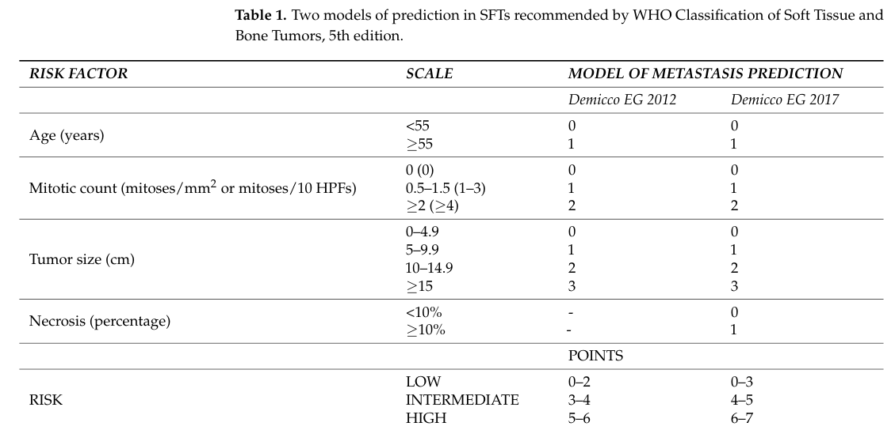

## Question

# Disease Characteristics Research Template

## Target Disease
- **Disease Name:** Solitary Fibrous Tumor
- **MONDO ID:**  (if available)
- **Category:** 

## Research Objectives

Please provide a comprehensive research report on **Solitary Fibrous Tumor** covering all of the
disease characteristics listed below. This report will be used to populate a disease knowledge
base entry. Be thorough and cite primary literature (PMID preferred) for all claims.

For each section, **suggested databases/resources** are listed. These are the first places
you should search for information on each topic.

---

### 1. Disease Information
> **Search first:** OMIM, Orphanet, ICD-10/ICD-11, MeSH, PubMed

- What is the disease? Provide a concise overview.
- What are the key identifiers? (OMIM, Orphanet, ICD-10/ICD-11, MeSH, Mondo)
- What are the common synonyms and alternative names?
- Is the information derived from individual patients (e.g., EHR) or aggregated disease-level resources?

### 2. Etiology

- **Disease Causal Factors**: What are the primary causes? (genetic, environmental, infectious, mechanistic)
- **Risk Factors**:
  > **Search first:** PubMed, Cochrane Library, UpToDate, clinical guidelines, ClinVar, ClinGen, GWAS Catalog, PheGenI, CTD, CDC, WHO, epidemiological databases
  - Genetic risk factors (causal variants, susceptibility loci, modifier genes)
  - Environmental risk factors (toxins, lifestyle, occupational exposures, age, sex, family history)
- **Protective Factors**:
  > **Search first:** PubMed, Cochrane Library, clinical trial databases, GWAS Catalog, gnomAD, WHO, CDC, nutrition databases
  - Genetic protective factors (protective variants, modifier alleles)
  - Environmental protective factors (diet, lifestyle, exposures that reduce risk)
- **Gene-Environment Interactions**: How do genetic and environmental factors interact to influence disease?
  > **Search first:** CTD, PubMed, PheGenI, GxE databases

### 3. Phenotypes
> **Search first:** HPO (Human Phenotype Ontology), OMIM, Orphanet, PubMed, clinicaltrials.gov, MedDRA, SNOMED CT, DECIPHER, LOINC

For each phenotype, provide:
- **Phenotype type**: symptoms, clinical signs, physical manifestations, behavioral changes, or laboratory abnormalities
  > For symptoms/signs: HPO, OMIM, Orphanet, PubMed
  > For behavioral changes: HPO, DSM, RDoC (Research Domain Criteria), PubMed
  > For laboratory abnormalities: LOINC, SNOMED CT, LabTests Online, PubMed
- **Phenotype characteristics**:
  > **Search first:** OMIM, Orphanet, HPO, PubMed
  - Age of symptom onset (neonatal, childhood, adult-onset, late-onset)
  - Symptom severity (mild, moderate, severe, variable)
  - Symptom progression (stable, progressive, episodic, fluctuating)
  - Frequency among affected individuals (percentage or qualitative)
- **Quality of life impact**: Effects on daily functioning and well-being (per-phenotype when possible)
  > **Search first:** EQ-5D database, SF-36, WHO QOL databases, PubMed
- Suggest HPO (Human Phenotype Ontology) terms for each phenotype

### 4. Genetic/Molecular Information

- **Causal Genes**: Gene mutations or chromosomal abnormalities responsible for disease (gene symbols, OMIM IDs)
  > **Search first:** OMIM, ClinVar, HGMD, Ensembl, NCBI Gene
- **Pathogenic Variants**:
  - Affected genes (gene symbols, HGNC IDs)
    > **Search first:** OMIM, NCBI Gene, Ensembl, HGNC, UniProt, GeneCards
  - Variant classification (pathogenic, likely pathogenic, VUS per ACMG/AMP guidelines)
    > **Search first:** ClinVar, ClinGen, ACMG/AMP guidelines, VarSome
  - Variant type/class (missense, frameshift, nonsense, splice-site, structural)
  - Allele frequency in population databases
    > **Search first:** gnomAD, 1000 Genomes, ExAC, TOPMed, dbSNP
  - Somatic vs germline origin
    > **Search first:** COSMIC (somatic), ClinVar, ICGC, TCGA
  - Functional consequences (loss of function, gain of function, dominant negative)
- **Modifier Genes**: Genes that modify disease severity or expression
- **Epigenetic Information**: DNA methylation, histone modifications, chromatin changes affecting disease
  > **Search first:** ENCODE, Roadmap Epigenomics, MethBase, DiseaseMeth
- **Chromosomal Abnormalities**: Large-scale genetic changes (aneuploidy, translocations, inversions)
  > **Search first:** DECIPHER, ClinVar, ECARUCA, UCSC Genome Browser

### 5. Environmental Information

- **Environmental Factors**: Non-genetic contributing factors (toxins, radiation, pollution, occupational exposure)
  > **Search first:** CTD (Comparative Toxicogenomics Database), TOXNET, PubMed, EPA databases
- **Lifestyle Factors**: Behavioral factors (smoking, diet, exercise, alcohol consumption)
  > **Search first:** CDC databases, WHO, PubMed, NHANES
- **Infectious Agents**: If applicable, pathogens causing or triggering disease (bacteria, viruses, fungi, parasites)
  > **Search first:** NCBI Taxonomy, ViPR, BV-BRC, MicrobeDB, GIDEON

### 6. Mechanism / Pathophysiology

- **Molecular Pathways**: Specific signaling cascades or biochemical pathways involved (Wnt, MAPK, mTOR, PI3K-AKT, etc.)
  > **Search first:** KEGG, Reactome, WikiPathways, PathBank, BioCyc
- **Cellular Processes**: Cell-level mechanisms (apoptosis, autophagy, cell cycle dysregulation, inflammation, etc.)
  > **Search first:** Gene Ontology (GO), Reactome, KEGG, PubMed
- **Protein Dysfunction**: How protein structure or function is altered (misfolding, aggregation, loss of function, gain of function)
  > **Search first:** UniProt, PDB (Protein Data Bank), InterPro, Pfam, AlphaFold
- **Metabolic Changes**: Alterations in metabolic processes (energy metabolism, lipid metabolism, amino acid metabolism)
  > **Search first:** KEGG, BioCyc, HMDB (Human Metabolome Database), BRENDA
- **Immune System Involvement**: Role of immune response (autoimmunity, immunodeficiency, chronic inflammation)
  > **Search first:** ImmPort, Immunome Database, IEDB, Gene Ontology
- **Tissue Damage Mechanisms**: How tissues/ are injured (oxidative stress, ischemia, fibrosis, necrosis)
  > **Search first:** PubMed, Gene Ontology, Reactome
- **Biochemical Abnormalities**: Specific molecular defects (enzyme deficiencies, receptor dysfunction, ion channel defects)
  > **Search first:** BRENDA, UniProt, KEGG, OMIM, PubMed
- **Epigenetic Changes**: DNA methylation, histone modifications affecting gene expression in disease
  > **Search first:** ENCODE, Roadmap Epigenomics, MethBase, DiseaseMeth
- **Molecular Profiling** (if available):
  - Transcriptomics/gene expression changes
    > **Search first:** GEO (Gene Expression Omnibus), ArrayExpress, GTEx, Human Cell Atlas, SRA
  - Proteomics findings
    > **Search first:** PRIDE, ProteomeXchange, Human Protein Atlas, STRING, BioGRID
  - Metabolomics signatures
    > **Search first:** MetaboLights, Metabolomics Workbench, HMDB, METLIN
  - Lipidomics alterations
    > **Search first:** LIPID MAPS, SwissLipids, LipidHome, Metabolomics Workbench
  - Genomic structural features
    > **Search first:** UCSC Genome Browser, Ensembl, NCBI, dbVar, DGV
- **Advanced Technologies** (if applicable):
  - Single-cell analysis findings (cell-type specific mechanisms, cellular heterogeneity)
    > **Search first:** Human Cell Atlas, Single Cell Portal, GEO, CELLxGENE
  - Spatial transcriptomics findings
    > **Search first:** GEO, Spatial Research, Vizgen, 10x Genomics data
  - Multi-omics integration results
    > **Search first:** TCGA, ICGC, cBioPortal, LinkedOmics, PubMed
  - Functional genomics screens (CRISPR, RNAi)
    > **Search first:** DepMap, GenomeRNAi, PubMed, BioGRID ORCS

For each mechanism, describe:
- The causal chain from initial trigger to clinical manifestation
- Which mechanisms are upstream vs downstream
- What cell types and biological processes are involved
- Suggest GO terms for biological processes and CL terms for cell types

### 7. Anatomical Structures Affected

- **Organ Level**:
  - Primary organs directly affected
  - Secondary organ involvement (complications, secondary effects)
  - Body systems involved (cardiovascular, nervous, digestive, respiratory, endocrine, etc.)
  > **Search first:** Uberon, FMA (Foundational Model of Anatomy), OMIM, HPO, ICD-11, MeSH, SNOMED CT
- **Tissue and Cell Level**:
  - Specific tissue types affected (epithelial, connective, muscle, nervous)
  - Specific cell populations targeted (with Cell Ontology terms)
  > **Search first:** Uberon, Human Protein Atlas, Cell Ontology, Human Cell Atlas, CellMarker, PanglaoDB
- **Subcellular Level**:
  - Cellular compartments involved (mitochondria, nucleus, ER, lysosomes) (with GO Cellular Component terms)
  > **Search first:** Gene Ontology (Cellular Component), UniProt, Human Protein Atlas
- **Localization**:
  - Specific anatomical sites (with UBERON terms)
    > **Search first:** FMA, Uberon, NeuroNames (for brain), SNOMED CT
  - Lateralization (unilateral, bilateral, asymmetric)
    > **Search first:** HPO, clinical literature, imaging databases

### 8. Temporal Development

- **Onset**:
  - Typical age of onset (congenital, pediatric, adult, geriatric)
  - Onset pattern (acute, subacute, chronic, insidious)
  > **Search first:** OMIM, Orphanet, HPO, PubMed
- **Progression**:
  - Disease stages (early, intermediate, advanced, end-stage)
    > **Search first:** Cancer Staging Manual (AJCC), WHO classifications, PubMed
  - Progression rate (rapid, slow, variable)
  - Disease course pattern (episodic, relapsing-remitting, progressive, stable)
  - Disease duration (self-limited, chronic lifelong)
  > **Search first:** Disease registries, longitudinal cohort databases, natural history studies, PubMed, Orphanet, OMIM
- **Patterns**:
  - Remission patterns (spontaneous, treatment-induced)
    > **Search first:** Clinical trial databases, disease registries, PubMed
  - Critical periods (time windows of vulnerability or opportunity for intervention)
    > **Search first:** PubMed, developmental biology databases, clinical guidelines

### 9. Inheritance and Population

- **Epidemiology**:
  - Prevalence (cases per 100,000 at given time)
  - Incidence (new cases per 100,000 per year)
  > **Search first:** Orphanet, CDC, WHO, GBD (Global Burden of Disease), national registries, SEER, disease registries
- **For Genetic Etiology**:
  - Inheritance pattern (AD, AR, X-linked, mitochondrial, multifactorial, polygenic)
    > **Search first:** OMIM, Orphanet, ClinVar, GTR (Genetic Testing Registry)
  - Penetrance (complete, incomplete, age-dependent)
    > **Search first:** ClinVar, OMIM, PubMed, ClinGen
  - Expressivity (variable, consistent)
    > **Search first:** OMIM, ClinVar, PubMed
  - Genetic anticipation (increasing severity in successive generations)
    > **Search first:** OMIM, PubMed (especially for repeat expansion disorders)
  - Germline mosaicism
    > **Search first:** ClinVar, OMIM, genetic counseling literature, PubMed
  - Founder effects (population-specific mutations)
    > **Search first:** gnomAD, population genetics databases, PubMed
  - Consanguinity role
    > **Search first:** OMIM, population studies, genetic counseling resources
  - Carrier frequency
    > **Search first:** gnomAD, carrier screening databases, GeneReviews, GTR
- **Population Demographics**:
  - Affected populations (ethnic or demographic groups with higher prevalence)
    > **Search first:** gnomAD, 1000 Genomes, PAGE Study, PubMed, population registries
  - Geographic distribution (endemic areas, regional variation)
    > **Search first:** WHO, CDC, GBD, Orphanet, geographic epidemiology databases
  - Geographic distribution of specific variants
  - Sex ratio (male:female)
    > **Search first:** Disease registries, OMIM, PubMed, epidemiological databases
  - Age distribution of affected individuals
    > **Search first:** CDC, disease registries, SEER, Orphanet

### 10. Diagnostics

- **Clinical Tests**:
  - Laboratory tests (blood, urine, tissue chemistry, specific enzyme assays)
    > **Search first:** LOINC, LabTests Online, PubMed
  - Biomarkers (proteins, metabolites, genetic markers, circulating biomarkers)
    > **Search first:** FDA Biomarker List, BEST (Biomarkers, EndpointS, and other Tools), PubMed
  - Imaging studies (X-ray, CT, MRI, PET, ultrasound)
    > **Search first:** RadLex, DICOM, Radiopaedia, imaging databases
  - Functional tests (pulmonary function, cardiac stress tests)
    > **Search first:** LOINC, clinical guidelines, PubMed
  - Electrophysiology (EEG, EMG, ECG, nerve conduction studies)
    > **Search first:** LOINC, clinical neurophysiology databases, PubMed
  - Biopsy findings (histopathology, immunohistochemistry)
    > **Search first:** SNOMED CT, College of American Pathologists resources, PubMed
  - Pathology findings (microscopic examination)
    > **Search first:** SNOMED CT, Digital Pathology databases, PubMed
- **Genetic Testing**:
  > **Search first:** GTR (Genetic Testing Registry), GeneReviews, ClinGen
  - Overview of recommended genetic testing approach
  - Whole genome sequencing (WGS) utility
    > **Search first:** GTR, ClinVar, GEL (Genomics England), gnomAD
  - Whole exome sequencing (WES) utility
    > **Search first:** GTR, ClinVar, OMIM, GeneMatcher
  - Gene panels (which panels, which genes)
    > **Search first:** GTR, ClinVar, laboratory-specific databases
  - Single gene testing
    > **Search first:** GTR, ClinVar, OMIM, GeneReviews
  - Chromosomal microarray (CMA)
    > **Search first:** DECIPHER, ClinVar, dbVar, ECARUCA
  - Karyotyping
    > **Search first:** Chromosome Abnormality Database, ClinVar, cytogenetics resources
  - FISH
    > **Search first:** ClinVar, cytogenetics databases, PubMed
  - Mitochondrial DNA testing
    > **Search first:** MITOMAP, MSeqDR, ClinVar, GTR
  - Repeat expansion testing
    > **Search first:** GTR, ClinVar, repeat expansion databases, PubMed
- **Omics-Based Diagnostics** (if applicable):
  - RNA sequencing / transcriptomics
    > **Search first:** GEO, ArrayExpress, GTEx, RNA-seq databases
  - Proteomics
    > **Search first:** PRIDE, ProteomeXchange, FDA Biomarker database
  - Metabolomics
    > **Search first:** MetaboLights, Metabolomics Workbench, HMDB
  - Epigenomics
    > **Search first:** GEO, ENCODE, Roadmap Epigenomics, MethBase
  - Liquid biopsy
    > **Search first:** COSMIC, ClinVar, liquid biopsy databases, PubMed
- **Clinical Criteria**:
  - Standardized diagnostic criteria (DSM, ICD, society guidelines)
    > **Search first:** DSM-5, ICD-11, clinical society guidelines, UpToDate
  - Differential diagnosis (other conditions to rule out, with distinguishing features)
    > **Search first:** DynaMed, UpToDate, clinical decision support systems
- **Screening**:
  - Screening methods for asymptomatic individuals (newborn screening, carrier screening, cascade screening)
    > **Search first:** ACMG recommendations, CDC newborn screening, GTR

### 11. Outcome/Prognosis

- **Survival and Mortality**:
  - Survival rate (5-year, 10-year, overall)
    > **Search first:** SEER, cancer registries, disease-specific registries, PubMed
  - Life expectancy (with and without treatment if applicable)
    > **Search first:** Orphanet, disease registries, actuarial databases, PubMed
  - Mortality rate
    > **Search first:** CDC, WHO, GBD, national mortality databases
  - Disease-specific mortality (deaths directly attributable to disease)
    > **Search first:** Disease registries, CDC Wonder, GBD, PubMed
- **Morbidity and Function**:
  - Morbidity (disease-related disability and health impacts)
    > **Search first:** GBD, WHO, disability databases, PubMed
  - Disability outcomes (long-term functional impairments)
    > **Search first:** ICF (International Classification of Functioning), disability registries
  - Quality of life measures (EQ-5D, SF-36, PROMIS, disease-specific tools)
    > **Search first:** EQ-5D database, SF-36, PROMIS, PubMed
- **Disease Course**:
  - Complications (secondary problems: infections, organ failure, etc.)
    > **Search first:** ICD codes, disease registries, clinical databases, PubMed
  - Recovery potential (likelihood and extent of recovery, with vs without treatment)
    > **Search first:** Natural history studies, rehabilitation databases, PubMed
- **Prediction**:
  - Prognostic factors (age, disease severity, biomarkers, treatment response)
    > **Search first:** Prognostic models databases, clinical calculators, PubMed
  - Prognostic biomarkers (molecular markers predicting disease course)
    > **Search first:** FDA Biomarker database, PubMed, cancer prognostic databases

### 12. Treatment

- **Pharmacotherapy**:
  - Pharmacological treatments (drug names, drug classes, mechanisms of action)
    > **Search first:** DrugBank, RxNorm, ATC classification, DailyMed, FDA databases
  - Pharmacogenomics (how genetic variants affect drug metabolism, efficacy, toxicity)
    > **Search first:** PharmGKB, CPIC (Clinical Pharmacogenetics), FDA Table of PGx Biomarkers
- **Advanced Therapeutics**:
  - Gene therapy (viral vectors, CRISPR, gene replacement, gene editing)
    > **Search first:** ClinicalTrials.gov, FDA gene therapy database, ASGCT resources
  - Cell therapy (stem cell transplant, CAR-T, cellular therapeutics)
    > **Search first:** ClinicalTrials.gov, FDA cell therapy database, FACT standards
  - RNA-based therapies (ASOs, siRNA, mRNA therapies)
    > **Search first:** ClinicalTrials.gov, FDA approvals, PubMed
  - Targeted therapies (treatments directed at specific molecular targets)
    > **Search first:** My Cancer Genome, OncoKB, ClinicalTrials.gov, FDA approvals
  - Immunotherapies (checkpoint inhibitors, monoclonal antibodies)
    > **Search first:** Cancer Immunotherapy Database, FDA approvals, ClinicalTrials.gov
- **Surgical and Interventional**:
  - Surgical interventions (types of surgery, timing, outcomes)
    > **Search first:** CPT codes, surgical registries, clinical guidelines, PubMed
- **Supportive and Rehabilitative**:
  - Supportive care (symptom management, pain control, nutrition)
    > **Search first:** Clinical guidelines, Cochrane Library, PubMed
  - Rehabilitation (physical therapy, occupational therapy, speech therapy)
    > **Search first:** Rehabilitation medicine databases, clinical guidelines, PubMed
- **Experimental**:
  - Experimental treatments in clinical trials (with NCT identifiers if available)
    > **Search first:** ClinicalTrials.gov, EU Clinical Trials Register, WHO ICTRP
- **Treatment Outcomes**:
  - Treatment response rates
    > **Search first:** Clinical trial databases, FDA reviews, systematic reviews, PubMed
  - Side effects and adverse events
    > **Search first:** FDA Adverse Event Reporting System (FAERS), MedWatch, PubMed
- **Treatment Strategy**:
  - Treatment algorithms (clinical pathways, decision trees)
    > **Search first:** Clinical practice guidelines, NCCN Guidelines, UpToDate
  - Combination therapies
    > **Search first:** ClinicalTrials.gov, treatment guidelines, PubMed
  - Personalized medicine approaches (genotype-guided treatment)
    > **Search first:** My Cancer Genome, CIViC, PharmGKB, precision medicine databases

For each treatment, suggest MAXO (Medical Action Ontology) terms where applicable.

### 13. Prevention

- **Prevention Levels**:
  - Primary prevention (preventing disease occurrence: vaccination, risk factor modification)
    > **Search first:** CDC, WHO, USPSTF recommendations, Cochrane Library
  - Secondary prevention (early detection and treatment: screening programs, early intervention)
    > **Search first:** USPSTF, CDC screening guidelines, WHO
  - Tertiary prevention (preventing complications in those with disease)
    > **Search first:** Clinical guidelines, disease management protocols, PubMed
- **Immunization**: Vaccine strategies (if applicable)
  > **Search first:** CDC vaccine schedules, WHO immunization, FDA vaccine database
- **Screening and Early Detection**:
  - Screening programs (population-based: newborn screening, cancer screening)
    > **Search first:** CDC screening programs, USPSTF, cancer screening databases
  - Genetic screening (carrier screening, preimplantation genetic diagnosis, prenatal testing)
    > **Search first:** ACMG recommendations, ACOG guidelines, GTR
  - Risk stratification (identifying high-risk individuals for targeted prevention)
    > **Search first:** Risk prediction models, clinical calculators, PubMed
- **Behavioral Interventions**: Lifestyle modifications to reduce risk
  > **Search first:** CDC, WHO, behavioral intervention databases, Cochrane Library
- **Counseling**: Genetic counseling (risk assessment, family planning guidance)
  > **Search first:** NSGC resources, ACMG guidelines, GeneReviews
- **Public Health**:
  - Public health interventions (sanitation, vector control, health education)
    > **Search first:** CDC, WHO, public health databases, PubMed
  - Environmental interventions (reducing environmental risk factors)
    > **Search first:** EPA databases, WHO environmental health, PubMed
- **Prophylaxis**: Preventive medications or procedures
  > **Search first:** Clinical guidelines, FDA approvals, PubMed

### 14. Other Species / Natural Disease

- **Taxonomy**: Species affected (with NCBI Taxon identifiers)
  > **Search first:** NCBI Taxonomy
- **Breed**: Specific breeds affected (with VBO identifiers if applicable)
  > **Search first:** VBO (Vertebrate Breed Ontology)
- **Gene**: Orthologous genes in other species (with NCBI Gene IDs)
  > **Search first:** NCBI Gene
- **Natural Disease**:
  - Naturally occurring disease in other species (companion animals, wildlife)
    > **Search first:** OMIA (Online Mendelian Inheritance in Animals), VetCompass, PubMed
  - Veterinary relevance and importance in animal health
    > **Search first:** OMIA, veterinary databases, PubMed
- **Comparative Biology**:
  - Comparative pathology (similarities and differences across species)
    > **Search first:** OMIA, comparative pathology databases, PubMed
  - Evolutionary conservation of disease mechanisms
    > **Search first:** HomoloGene, OrthoMCL, Alliance of Genome Resources
- **Transmission** (if applicable):
  - Zoonotic potential
    > **Search first:** CDC zoonotic diseases, WHO zoonoses, GIDEON
  - Cross-species susceptibility
    > **Search first:** NCBI Taxonomy, veterinary databases, PubMed

### 15. Model Organisms

- **Model Types**:
  - Model organism type (mammalian, invertebrate, cellular, in vitro)
    > **Search first:** Alliance of Genome Resources, model organism databases
  - Specific model systems (mouse, rat, zebrafish, Drosophila, C. elegans, yeast, cell lines, organoids, iPSCs)
    > **Search first:** MGI, RGD, ZFIN, FlyBase, WormBase, SGD, ATCC, Cellosaurus
  - Induced models (drug treatment, surgical intervention, environmental manipulation)
    > **Search first:** MGI, model organism databases, PubMed
- **Genetic Models**:
  - Types available (knockout, knock-in, transgenic, conditional, humanized)
    > **Search first:** MGI, IMPC, KOMP, EuMMCR, IMSR
- **Model Characteristics**:
  - Phenotype recapitulation (how well model reproduces human disease features)
    > **Search first:** Model organism databases, comparative studies, PubMed
  - Model limitations (aspects of human disease not captured)
    > **Search first:** Model organism databases, PubMed, review articles
- **Applications**:
  - Research applications (what aspects of disease can be studied)
    > **Search first:** Model organism databases, PubMed
- **Resources**:
  - Model databases
    > **Search first:** MGI, RGD, ZFIN, FlyBase, WormBase, IMSR, EMMA, MMRRC

---

## Citation Requirements

- Cite primary literature (PMID preferred) for all mechanistic and clinical claims
- Prioritize recent reviews and landmark papers
- Include direct quotes from abstracts where possible to support key statements
- Distinguish evidence source types: human clinical, model organism, in vitro, computational

## Output Format

Structure your response as a comprehensive narrative organized by the sections above.
For each section, provide:
- Factual content with specific details (numbers, percentages, gene names, variant nomenclature)
- Ontology term suggestions (HPO, GO, CL, UBERON, CHEBI, MAXO, MONDO) where applicable
- Evidence citations with PMIDs
- Direct quotes from abstracts to support key claims
- Clear indication when information is not available or not applicable for this disease

This report will be used to populate a disease knowledge base entry with:
- Pathophysiology descriptions with causal chains
- Gene/protein annotations (HGNC, GO terms)
- Phenotype associations (HP terms) with frequencies
- Cell type involvement (CL terms)
- Anatomical locations (UBERON terms)
- Chemical entities (CHEBI terms)
- Treatment annotations (MAXO terms)
- Evidence items with PMIDs and exact abstract quotes
- Epidemiology, prognosis, diagnostic, and prevention information
- Animal model descriptions with phenotype recapitulation details

## Output

Question: You are an expert researcher providing comprehensive, well-cited information.

Provide detailed information focusing on:
1. Key concepts and definitions with current understanding
2. Recent developments and latest research (prioritize 2023-2024 sources)
3. Current applications and real-world implementations
4. Expert opinions and analysis from authoritative sources
5. Relevant statistics and data from recent studies

Format as a comprehensive research report with proper citations. Include URLs and publication dates where available.
Always prioritize recent, authoritative sources and provide specific citations for all major claims.

# Disease Characteristics Research Template

## Target Disease
- **Disease Name:** Solitary Fibrous Tumor
- **MONDO ID:**  (if available)
- **Category:** 

## Research Objectives

Please provide a comprehensive research report on **Solitary Fibrous Tumor** covering all of the
disease characteristics listed below. This report will be used to populate a disease knowledge
base entry. Be thorough and cite primary literature (PMID preferred) for all claims.

For each section, **suggested databases/resources** are listed. These are the first places
you should search for information on each topic.

---

### 1. Disease Information
> **Search first:** OMIM, Orphanet, ICD-10/ICD-11, MeSH, PubMed

- What is the disease? Provide a concise overview.
- What are the key identifiers? (OMIM, Orphanet, ICD-10/ICD-11, MeSH, Mondo)
- What are the common synonyms and alternative names?
- Is the information derived from individual patients (e.g., EHR) or aggregated disease-level resources?

### 2. Etiology

- **Disease Causal Factors**: What are the primary causes? (genetic, environmental, infectious, mechanistic)
- **Risk Factors**:
  > **Search first:** PubMed, Cochrane Library, UpToDate, clinical guidelines, ClinVar, ClinGen, GWAS Catalog, PheGenI, CTD, CDC, WHO, epidemiological databases
  - Genetic risk factors (causal variants, susceptibility loci, modifier genes)
  - Environmental risk factors (toxins, lifestyle, occupational exposures, age, sex, family history)
- **Protective Factors**:
  > **Search first:** PubMed, Cochrane Library, clinical trial databases, GWAS Catalog, gnomAD, WHO, CDC, nutrition databases
  - Genetic protective factors (protective variants, modifier alleles)
  - Environmental protective factors (diet, lifestyle, exposures that reduce risk)
- **Gene-Environment Interactions**: How do genetic and environmental factors interact to influence disease?
  > **Search first:** CTD, PubMed, PheGenI, GxE databases

### 3. Phenotypes
> **Search first:** HPO (Human Phenotype Ontology), OMIM, Orphanet, PubMed, clinicaltrials.gov, MedDRA, SNOMED CT, DECIPHER, LOINC

For each phenotype, provide:
- **Phenotype type**: symptoms, clinical signs, physical manifestations, behavioral changes, or laboratory abnormalities
  > For symptoms/signs: HPO, OMIM, Orphanet, PubMed
  > For behavioral changes: HPO, DSM, RDoC (Research Domain Criteria), PubMed
  > For laboratory abnormalities: LOINC, SNOMED CT, LabTests Online, PubMed
- **Phenotype characteristics**:
  > **Search first:** OMIM, Orphanet, HPO, PubMed
  - Age of symptom onset (neonatal, childhood, adult-onset, late-onset)
  - Symptom severity (mild, moderate, severe, variable)
  - Symptom progression (stable, progressive, episodic, fluctuating)
  - Frequency among affected individuals (percentage or qualitative)
- **Quality of life impact**: Effects on daily functioning and well-being (per-phenotype when possible)
  > **Search first:** EQ-5D database, SF-36, WHO QOL databases, PubMed
- Suggest HPO (Human Phenotype Ontology) terms for each phenotype

### 4. Genetic/Molecular Information

- **Causal Genes**: Gene mutations or chromosomal abnormalities responsible for disease (gene symbols, OMIM IDs)
  > **Search first:** OMIM, ClinVar, HGMD, Ensembl, NCBI Gene
- **Pathogenic Variants**:
  - Affected genes (gene symbols, HGNC IDs)
    > **Search first:** OMIM, NCBI Gene, Ensembl, HGNC, UniProt, GeneCards
  - Variant classification (pathogenic, likely pathogenic, VUS per ACMG/AMP guidelines)
    > **Search first:** ClinVar, ClinGen, ACMG/AMP guidelines, VarSome
  - Variant type/class (missense, frameshift, nonsense, splice-site, structural)
  - Allele frequency in population databases
    > **Search first:** gnomAD, 1000 Genomes, ExAC, TOPMed, dbSNP
  - Somatic vs germline origin
    > **Search first:** COSMIC (somatic), ClinVar, ICGC, TCGA
  - Functional consequences (loss of function, gain of function, dominant negative)
- **Modifier Genes**: Genes that modify disease severity or expression
- **Epigenetic Information**: DNA methylation, histone modifications, chromatin changes affecting disease
  > **Search first:** ENCODE, Roadmap Epigenomics, MethBase, DiseaseMeth
- **Chromosomal Abnormalities**: Large-scale genetic changes (aneuploidy, translocations, inversions)
  > **Search first:** DECIPHER, ClinVar, ECARUCA, UCSC Genome Browser

### 5. Environmental Information

- **Environmental Factors**: Non-genetic contributing factors (toxins, radiation, pollution, occupational exposure)
  > **Search first:** CTD (Comparative Toxicogenomics Database), TOXNET, PubMed, EPA databases
- **Lifestyle Factors**: Behavioral factors (smoking, diet, exercise, alcohol consumption)
  > **Search first:** CDC databases, WHO, PubMed, NHANES
- **Infectious Agents**: If applicable, pathogens causing or triggering disease (bacteria, viruses, fungi, parasites)
  > **Search first:** NCBI Taxonomy, ViPR, BV-BRC, MicrobeDB, GIDEON

### 6. Mechanism / Pathophysiology

- **Molecular Pathways**: Specific signaling cascades or biochemical pathways involved (Wnt, MAPK, mTOR, PI3K-AKT, etc.)
  > **Search first:** KEGG, Reactome, WikiPathways, PathBank, BioCyc
- **Cellular Processes**: Cell-level mechanisms (apoptosis, autophagy, cell cycle dysregulation, inflammation, etc.)
  > **Search first:** Gene Ontology (GO), Reactome, KEGG, PubMed
- **Protein Dysfunction**: How protein structure or function is altered (misfolding, aggregation, loss of function, gain of function)
  > **Search first:** UniProt, PDB (Protein Data Bank), InterPro, Pfam, AlphaFold
- **Metabolic Changes**: Alterations in metabolic processes (energy metabolism, lipid metabolism, amino acid metabolism)
  > **Search first:** KEGG, BioCyc, HMDB (Human Metabolome Database), BRENDA
- **Immune System Involvement**: Role of immune response (autoimmunity, immunodeficiency, chronic inflammation)
  > **Search first:** ImmPort, Immunome Database, IEDB, Gene Ontology
- **Tissue Damage Mechanisms**: How tissues/ are injured (oxidative stress, ischemia, fibrosis, necrosis)
  > **Search first:** PubMed, Gene Ontology, Reactome
- **Biochemical Abnormalities**: Specific molecular defects (enzyme deficiencies, receptor dysfunction, ion channel defects)
  > **Search first:** BRENDA, UniProt, KEGG, OMIM, PubMed
- **Epigenetic Changes**: DNA methylation, histone modifications affecting gene expression in disease
  > **Search first:** ENCODE, Roadmap Epigenomics, MethBase, DiseaseMeth
- **Molecular Profiling** (if available):
  - Transcriptomics/gene expression changes
    > **Search first:** GEO (Gene Expression Omnibus), ArrayExpress, GTEx, Human Cell Atlas, SRA
  - Proteomics findings
    > **Search first:** PRIDE, ProteomeXchange, Human Protein Atlas, STRING, BioGRID
  - Metabolomics signatures
    > **Search first:** MetaboLights, Metabolomics Workbench, HMDB, METLIN
  - Lipidomics alterations
    > **Search first:** LIPID MAPS, SwissLipids, LipidHome, Metabolomics Workbench
  - Genomic structural features
    > **Search first:** UCSC Genome Browser, Ensembl, NCBI, dbVar, DGV
- **Advanced Technologies** (if applicable):
  - Single-cell analysis findings (cell-type specific mechanisms, cellular heterogeneity)
    > **Search first:** Human Cell Atlas, Single Cell Portal, GEO, CELLxGENE
  - Spatial transcriptomics findings
    > **Search first:** GEO, Spatial Research, Vizgen, 10x Genomics data
  - Multi-omics integration results
    > **Search first:** TCGA, ICGC, cBioPortal, LinkedOmics, PubMed
  - Functional genomics screens (CRISPR, RNAi)
    > **Search first:** DepMap, GenomeRNAi, PubMed, BioGRID ORCS

For each mechanism, describe:
- The causal chain from initial trigger to clinical manifestation
- Which mechanisms are upstream vs downstream
- What cell types and biological processes are involved
- Suggest GO terms for biological processes and CL terms for cell types

### 7. Anatomical Structures Affected

- **Organ Level**:
  - Primary organs directly affected
  - Secondary organ involvement (complications, secondary effects)
  - Body systems involved (cardiovascular, nervous, digestive, respiratory, endocrine, etc.)
  > **Search first:** Uberon, FMA (Foundational Model of Anatomy), OMIM, HPO, ICD-11, MeSH, SNOMED CT
- **Tissue and Cell Level**:
  - Specific tissue types affected (epithelial, connective, muscle, nervous)
  - Specific cell populations targeted (with Cell Ontology terms)
  > **Search first:** Uberon, Human Protein Atlas, Cell Ontology, Human Cell Atlas, CellMarker, PanglaoDB
- **Subcellular Level**:
  - Cellular compartments involved (mitochondria, nucleus, ER, lysosomes) (with GO Cellular Component terms)
  > **Search first:** Gene Ontology (Cellular Component), UniProt, Human Protein Atlas
- **Localization**:
  - Specific anatomical sites (with UBERON terms)
    > **Search first:** FMA, Uberon, NeuroNames (for brain), SNOMED CT
  - Lateralization (unilateral, bilateral, asymmetric)
    > **Search first:** HPO, clinical literature, imaging databases

### 8. Temporal Development

- **Onset**:
  - Typical age of onset (congenital, pediatric, adult, geriatric)
  - Onset pattern (acute, subacute, chronic, insidious)
  > **Search first:** OMIM, Orphanet, HPO, PubMed
- **Progression**:
  - Disease stages (early, intermediate, advanced, end-stage)
    > **Search first:** Cancer Staging Manual (AJCC), WHO classifications, PubMed
  - Progression rate (rapid, slow, variable)
  - Disease course pattern (episodic, relapsing-remitting, progressive, stable)
  - Disease duration (self-limited, chronic lifelong)
  > **Search first:** Disease registries, longitudinal cohort databases, natural history studies, PubMed, Orphanet, OMIM
- **Patterns**:
  - Remission patterns (spontaneous, treatment-induced)
    > **Search first:** Clinical trial databases, disease registries, PubMed
  - Critical periods (time windows of vulnerability or opportunity for intervention)
    > **Search first:** PubMed, developmental biology databases, clinical guidelines

### 9. Inheritance and Population

- **Epidemiology**:
  - Prevalence (cases per 100,000 at given time)
  - Incidence (new cases per 100,000 per year)
  > **Search first:** Orphanet, CDC, WHO, GBD (Global Burden of Disease), national registries, SEER, disease registries
- **For Genetic Etiology**:
  - Inheritance pattern (AD, AR, X-linked, mitochondrial, multifactorial, polygenic)
    > **Search first:** OMIM, Orphanet, ClinVar, GTR (Genetic Testing Registry)
  - Penetrance (complete, incomplete, age-dependent)
    > **Search first:** ClinVar, OMIM, PubMed, ClinGen
  - Expressivity (variable, consistent)
    > **Search first:** OMIM, ClinVar, PubMed
  - Genetic anticipation (increasing severity in successive generations)
    > **Search first:** OMIM, PubMed (especially for repeat expansion disorders)
  - Germline mosaicism
    > **Search first:** ClinVar, OMIM, genetic counseling literature, PubMed
  - Founder effects (population-specific mutations)
    > **Search first:** gnomAD, population genetics databases, PubMed
  - Consanguinity role
    > **Search first:** OMIM, population studies, genetic counseling resources
  - Carrier frequency
    > **Search first:** gnomAD, carrier screening databases, GeneReviews, GTR
- **Population Demographics**:
  - Affected populations (ethnic or demographic groups with higher prevalence)
    > **Search first:** gnomAD, 1000 Genomes, PAGE Study, PubMed, population registries
  - Geographic distribution (endemic areas, regional variation)
    > **Search first:** WHO, CDC, GBD, Orphanet, geographic epidemiology databases
  - Geographic distribution of specific variants
  - Sex ratio (male:female)
    > **Search first:** Disease registries, OMIM, PubMed, epidemiological databases
  - Age distribution of affected individuals
    > **Search first:** CDC, disease registries, SEER, Orphanet

### 10. Diagnostics

- **Clinical Tests**:
  - Laboratory tests (blood, urine, tissue chemistry, specific enzyme assays)
    > **Search first:** LOINC, LabTests Online, PubMed
  - Biomarkers (proteins, metabolites, genetic markers, circulating biomarkers)
    > **Search first:** FDA Biomarker List, BEST (Biomarkers, EndpointS, and other Tools), PubMed
  - Imaging studies (X-ray, CT, MRI, PET, ultrasound)
    > **Search first:** RadLex, DICOM, Radiopaedia, imaging databases
  - Functional tests (pulmonary function, cardiac stress tests)
    > **Search first:** LOINC, clinical guidelines, PubMed
  - Electrophysiology (EEG, EMG, ECG, nerve conduction studies)
    > **Search first:** LOINC, clinical neurophysiology databases, PubMed
  - Biopsy findings (histopathology, immunohistochemistry)
    > **Search first:** SNOMED CT, College of American Pathologists resources, PubMed
  - Pathology findings (microscopic examination)
    > **Search first:** SNOMED CT, Digital Pathology databases, PubMed
- **Genetic Testing**:
  > **Search first:** GTR (Genetic Testing Registry), GeneReviews, ClinGen
  - Overview of recommended genetic testing approach
  - Whole genome sequencing (WGS) utility
    > **Search first:** GTR, ClinVar, GEL (Genomics England), gnomAD
  - Whole exome sequencing (WES) utility
    > **Search first:** GTR, ClinVar, OMIM, GeneMatcher
  - Gene panels (which panels, which genes)
    > **Search first:** GTR, ClinVar, laboratory-specific databases
  - Single gene testing
    > **Search first:** GTR, ClinVar, OMIM, GeneReviews
  - Chromosomal microarray (CMA)
    > **Search first:** DECIPHER, ClinVar, dbVar, ECARUCA
  - Karyotyping
    > **Search first:** Chromosome Abnormality Database, ClinVar, cytogenetics resources
  - FISH
    > **Search first:** ClinVar, cytogenetics databases, PubMed
  - Mitochondrial DNA testing
    > **Search first:** MITOMAP, MSeqDR, ClinVar, GTR
  - Repeat expansion testing
    > **Search first:** GTR, ClinVar, repeat expansion databases, PubMed
- **Omics-Based Diagnostics** (if applicable):
  - RNA sequencing / transcriptomics
    > **Search first:** GEO, ArrayExpress, GTEx, RNA-seq databases
  - Proteomics
    > **Search first:** PRIDE, ProteomeXchange, FDA Biomarker database
  - Metabolomics
    > **Search first:** MetaboLights, Metabolomics Workbench, HMDB
  - Epigenomics
    > **Search first:** GEO, ENCODE, Roadmap Epigenomics, MethBase
  - Liquid biopsy
    > **Search first:** COSMIC, ClinVar, liquid biopsy databases, PubMed
- **Clinical Criteria**:
  - Standardized diagnostic criteria (DSM, ICD, society guidelines)
    > **Search first:** DSM-5, ICD-11, clinical society guidelines, UpToDate
  - Differential diagnosis (other conditions to rule out, with distinguishing features)
    > **Search first:** DynaMed, UpToDate, clinical decision support systems
- **Screening**:
  - Screening methods for asymptomatic individuals (newborn screening, carrier screening, cascade screening)
    > **Search first:** ACMG recommendations, CDC newborn screening, GTR

### 11. Outcome/Prognosis

- **Survival and Mortality**:
  - Survival rate (5-year, 10-year, overall)
    > **Search first:** SEER, cancer registries, disease-specific registries, PubMed
  - Life expectancy (with and without treatment if applicable)
    > **Search first:** Orphanet, disease registries, actuarial databases, PubMed
  - Mortality rate
    > **Search first:** CDC, WHO, GBD, national mortality databases
  - Disease-specific mortality (deaths directly attributable to disease)
    > **Search first:** Disease registries, CDC Wonder, GBD, PubMed
- **Morbidity and Function**:
  - Morbidity (disease-related disability and health impacts)
    > **Search first:** GBD, WHO, disability databases, PubMed
  - Disability outcomes (long-term functional impairments)
    > **Search first:** ICF (International Classification of Functioning), disability registries
  - Quality of life measures (EQ-5D, SF-36, PROMIS, disease-specific tools)
    > **Search first:** EQ-5D database, SF-36, PROMIS, PubMed
- **Disease Course**:
  - Complications (secondary problems: infections, organ failure, etc.)
    > **Search first:** ICD codes, disease registries, clinical databases, PubMed
  - Recovery potential (likelihood and extent of recovery, with vs without treatment)
    > **Search first:** Natural history studies, rehabilitation databases, PubMed
- **Prediction**:
  - Prognostic factors (age, disease severity, biomarkers, treatment response)
    > **Search first:** Prognostic models databases, clinical calculators, PubMed
  - Prognostic biomarkers (molecular markers predicting disease course)
    > **Search first:** FDA Biomarker database, PubMed, cancer prognostic databases

### 12. Treatment

- **Pharmacotherapy**:
  - Pharmacological treatments (drug names, drug classes, mechanisms of action)
    > **Search first:** DrugBank, RxNorm, ATC classification, DailyMed, FDA databases
  - Pharmacogenomics (how genetic variants affect drug metabolism, efficacy, toxicity)
    > **Search first:** PharmGKB, CPIC (Clinical Pharmacogenetics), FDA Table of PGx Biomarkers
- **Advanced Therapeutics**:
  - Gene therapy (viral vectors, CRISPR, gene replacement, gene editing)
    > **Search first:** ClinicalTrials.gov, FDA gene therapy database, ASGCT resources
  - Cell therapy (stem cell transplant, CAR-T, cellular therapeutics)
    > **Search first:** ClinicalTrials.gov, FDA cell therapy database, FACT standards
  - RNA-based therapies (ASOs, siRNA, mRNA therapies)
    > **Search first:** ClinicalTrials.gov, FDA approvals, PubMed
  - Targeted therapies (treatments directed at specific molecular targets)
    > **Search first:** My Cancer Genome, OncoKB, ClinicalTrials.gov, FDA approvals
  - Immunotherapies (checkpoint inhibitors, monoclonal antibodies)
    > **Search first:** Cancer Immunotherapy Database, FDA approvals, ClinicalTrials.gov
- **Surgical and Interventional**:
  - Surgical interventions (types of surgery, timing, outcomes)
    > **Search first:** CPT codes, surgical registries, clinical guidelines, PubMed
- **Supportive and Rehabilitative**:
  - Supportive care (symptom management, pain control, nutrition)
    > **Search first:** Clinical guidelines, Cochrane Library, PubMed
  - Rehabilitation (physical therapy, occupational therapy, speech therapy)
    > **Search first:** Rehabilitation medicine databases, clinical guidelines, PubMed
- **Experimental**:
  - Experimental treatments in clinical trials (with NCT identifiers if available)
    > **Search first:** ClinicalTrials.gov, EU Clinical Trials Register, WHO ICTRP
- **Treatment Outcomes**:
  - Treatment response rates
    > **Search first:** Clinical trial databases, FDA reviews, systematic reviews, PubMed
  - Side effects and adverse events
    > **Search first:** FDA Adverse Event Reporting System (FAERS), MedWatch, PubMed
- **Treatment Strategy**:
  - Treatment algorithms (clinical pathways, decision trees)
    > **Search first:** Clinical practice guidelines, NCCN Guidelines, UpToDate
  - Combination therapies
    > **Search first:** ClinicalTrials.gov, treatment guidelines, PubMed
  - Personalized medicine approaches (genotype-guided treatment)
    > **Search first:** My Cancer Genome, CIViC, PharmGKB, precision medicine databases

For each treatment, suggest MAXO (Medical Action Ontology) terms where applicable.

### 13. Prevention

- **Prevention Levels**:
  - Primary prevention (preventing disease occurrence: vaccination, risk factor modification)
    > **Search first:** CDC, WHO, USPSTF recommendations, Cochrane Library
  - Secondary prevention (early detection and treatment: screening programs, early intervention)
    > **Search first:** USPSTF, CDC screening guidelines, WHO
  - Tertiary prevention (preventing complications in those with disease)
    > **Search first:** Clinical guidelines, disease management protocols, PubMed
- **Immunization**: Vaccine strategies (if applicable)
  > **Search first:** CDC vaccine schedules, WHO immunization, FDA vaccine database
- **Screening and Early Detection**:
  - Screening programs (population-based: newborn screening, cancer screening)
    > **Search first:** CDC screening programs, USPSTF, cancer screening databases
  - Genetic screening (carrier screening, preimplantation genetic diagnosis, prenatal testing)
    > **Search first:** ACMG recommendations, ACOG guidelines, GTR
  - Risk stratification (identifying high-risk individuals for targeted prevention)
    > **Search first:** Risk prediction models, clinical calculators, PubMed
- **Behavioral Interventions**: Lifestyle modifications to reduce risk
  > **Search first:** CDC, WHO, behavioral intervention databases, Cochrane Library
- **Counseling**: Genetic counseling (risk assessment, family planning guidance)
  > **Search first:** NSGC resources, ACMG guidelines, GeneReviews
- **Public Health**:
  - Public health interventions (sanitation, vector control, health education)
    > **Search first:** CDC, WHO, public health databases, PubMed
  - Environmental interventions (reducing environmental risk factors)
    > **Search first:** EPA databases, WHO environmental health, PubMed
- **Prophylaxis**: Preventive medications or procedures
  > **Search first:** Clinical guidelines, FDA approvals, PubMed

### 14. Other Species / Natural Disease

- **Taxonomy**: Species affected (with NCBI Taxon identifiers)
  > **Search first:** NCBI Taxonomy
- **Breed**: Specific breeds affected (with VBO identifiers if applicable)
  > **Search first:** VBO (Vertebrate Breed Ontology)
- **Gene**: Orthologous genes in other species (with NCBI Gene IDs)
  > **Search first:** NCBI Gene
- **Natural Disease**:
  - Naturally occurring disease in other species (companion animals, wildlife)
    > **Search first:** OMIA (Online Mendelian Inheritance in Animals), VetCompass, PubMed
  - Veterinary relevance and importance in animal health
    > **Search first:** OMIA, veterinary databases, PubMed
- **Comparative Biology**:
  - Comparative pathology (similarities and differences across species)
    > **Search first:** OMIA, comparative pathology databases, PubMed
  - Evolutionary conservation of disease mechanisms
    > **Search first:** HomoloGene, OrthoMCL, Alliance of Genome Resources
- **Transmission** (if applicable):
  - Zoonotic potential
    > **Search first:** CDC zoonotic diseases, WHO zoonoses, GIDEON
  - Cross-species susceptibility
    > **Search first:** NCBI Taxonomy, veterinary databases, PubMed

### 15. Model Organisms

- **Model Types**:
  - Model organism type (mammalian, invertebrate, cellular, in vitro)
    > **Search first:** Alliance of Genome Resources, model organism databases
  - Specific model systems (mouse, rat, zebrafish, Drosophila, C. elegans, yeast, cell lines, organoids, iPSCs)
    > **Search first:** MGI, RGD, ZFIN, FlyBase, WormBase, SGD, ATCC, Cellosaurus
  - Induced models (drug treatment, surgical intervention, environmental manipulation)
    > **Search first:** MGI, model organism databases, PubMed
- **Genetic Models**:
  - Types available (knockout, knock-in, transgenic, conditional, humanized)
    > **Search first:** MGI, IMPC, KOMP, EuMMCR, IMSR
- **Model Characteristics**:
  - Phenotype recapitulation (how well model reproduces human disease features)
    > **Search first:** Model organism databases, comparative studies, PubMed
  - Model limitations (aspects of human disease not captured)
    > **Search first:** Model organism databases, PubMed, review articles
- **Applications**:
  - Research applications (what aspects of disease can be studied)
    > **Search first:** Model organism databases, PubMed
- **Resources**:
  - Model databases
    > **Search first:** MGI, RGD, ZFIN, FlyBase, WormBase, IMSR, EMMA, MMRRC

---

## Citation Requirements

- Cite primary literature (PMID preferred) for all mechanistic and clinical claims
- Prioritize recent reviews and landmark papers
- Include direct quotes from abstracts where possible to support key statements
- Distinguish evidence source types: human clinical, model organism, in vitro, computational

## Output Format

Structure your response as a comprehensive narrative organized by the sections above.
For each section, provide:
- Factual content with specific details (numbers, percentages, gene names, variant nomenclature)
- Ontology term suggestions (HPO, GO, CL, UBERON, CHEBI, MAXO, MONDO) where applicable
- Evidence citations with PMIDs
- Direct quotes from abstracts to support key claims
- Clear indication when information is not available or not applicable for this disease

This report will be used to populate a disease knowledge base entry with:
- Pathophysiology descriptions with causal chains
- Gene/protein annotations (HGNC, GO terms)
- Phenotype associations (HP terms) with frequencies
- Cell type involvement (CL terms)
- Anatomical locations (UBERON terms)
- Chemical entities (CHEBI terms)
- Treatment annotations (MAXO terms)
- Evidence items with PMIDs and exact abstract quotes
- Epidemiology, prognosis, diagnostic, and prevention information
- Animal model descriptions with phenotype recapitulation details

# Disease Characteristics Research Report: Solitary Fibrous Tumor (SFT)

## Target Disease
- **Disease name:** Solitary fibrous tumor (SFT)
- **MONDO ID:** **MONDO:0016238** (OpenTargets) (OpenTargets Search: Solitary fibrous tumor)
- **Category:** Rare mesenchymal (fibroblastic) neoplasm; historically includes lesions formerly termed hemangiopericytoma (HPC) (ren2024advancesinthe pages 1-2, piccinelli2024demographicandclinical pages 1-2)

---

## 1. Disease Information

### 1.1 Concise overview
Solitary fibrous tumor (SFT) is a **rare fibroblastic mesenchymal neoplasm** that can arise in many anatomical sites and often behaves indolently but has an unpredictable propensity for local recurrence and distant metastasis (ren2024advancesinthe pages 1-2, janik2023diagnosticsandtreatment pages 1-2). A defining molecular hallmark is the **NAB2::STAT6 gene fusion**, and **nuclear STAT6 immunohistochemistry (IHC)** is widely used as a surrogate diagnostic marker (ren2024advancesinthe pages 1-2, ren2024advancesinthe pages 10-12, janik2023diagnosticsandtreatment pages 1-2).

Recent synthesis characterizes SFT as “**a rare fibroblastic mesenchymal neoplasm**” (Ren 2024, published Aug 2024) (https://doi.org/10.1007/s10555-024-10204-8) (ren2024advancesinthe pages 1-2).

### 1.2 Key identifiers (availability in retrieved sources)
- **MONDO:** MONDO:0016238 (OpenTargets) (OpenTargets Search: Solitary fibrous tumor)
- **Other identifiers (ICD-10/ICD-11, MeSH, Orphanet, OMIM):** Not extracted from the retrieved full-text evidence in this run; should be completed by direct lookup in ICD/MeSH/Orphanet/OMIM.

### 1.3 Synonyms / alternative names
- **Hemangiopericytoma (HPC)**: legacy terminology; many CNS and soft tissue tumors formerly classified as HPC are now encompassed within SFT under WHO reclassifications (wu2024clinicaloutcomesof pages 1-2, piccinelli2024demographicandclinical pages 1-2).

### 1.4 Evidence sources (individual patient vs aggregated)
This report integrates:
- **Aggregated cohort/registry evidence** (SEER analysis; CNS cohort studies; systematic reviews) (wu2024clinicaloutcomesof pages 1-2, piccinelli2024demographicandclinical pages 1-2, tolstrup2024riskfactorsfor pages 1-2).
- **Aggregated review evidence** (molecular/clinical reviews) (ren2024advancesinthe pages 1-2, janik2023diagnosticsandtreatment pages 1-2).
- **Individual case-based molecular pathology** (e.g., intraosseous/epithelioid variants) used mainly for diagnostic marker panels and molecular confirmation methods (argyris2024primaryintraosseoussolitary pages 1-2, zhao2024epithelioidsolitaryfibrous pages 1-2).

---

## 2. Etiology

### 2.1 Disease causal factors (molecular/genetic mechanism)
SFT is primarily driven by a **somatic intrachromosomal rearrangement** on chromosome 12q13 producing the **NAB2–STAT6 fusion** (ren2024advancesinthe pages 1-2, zhao2024epithelioidsolitaryfibrous pages 1-2). Mechanistically, the fusion alters transcriptional control: Ren 2024 states the fusion “**transforms NAB2 into a transcriptional activator, activating early growth response 1 (EGR1)**” (https://doi.org/10.1007/s10555-024-10204-8; Aug 2024) (ren2024advancesinthe pages 1-2).

### 2.2 Risk factors
Evidence in the retrieved corpus supports **prognostic risk factors** (risk of recurrence/metastasis) more than pre-disease exposures:
- The 2024 systematic review found the most consistent recurrence predictors were **high mitotic index**, **high Ki‑67**, and **necrosis** (Tolstrup 2024; Jan 2024) (https://doi.org/10.3389/fsurg.2024.1332421) (tolstrup2024riskfactorsfor pages 1-2).
- Molecular risk factors/biomarkers suggested to refine risk include **TERT promoter mutations** and **TP53 alterations**, with additional factors (APAF1 inactivation, etc.) variably reported (yao2024prognosticanalysisof pages 1-2, janik2023diagnosticsandtreatment pages 16-17, tolstrup2024riskfactorsfor pages 1-2).

**Pre-disease environmental/lifestyle risks**: not established in the retrieved sources; SFT is generally treated as a sporadic tumor entity.

### 2.3 Protective factors
No protective genetic/environmental factors were identified in the retrieved evidence.

### 2.4 Gene–environment interaction
No gene–environment interaction evidence was identified in the retrieved evidence.

---

## 3. Phenotypes

### 3.1 Clinical presentation (common patterns)
SFTs often present as **slow-growing masses** and can be asymptomatic depending on site (ren2024advancesinthe pages 1-2, janik2023diagnosticsandtreatment pages 1-2). Symptomatology is largely **site-driven** (compression, pain, neurologic deficits in CNS, etc.). In malignant pleural SFT, a majority in one cohort were symptomatic (62%) (ricciardi2023malignantsolitaryfibrous pages 1-2).

### 3.2 Histopathologic phenotype
Core morphologic phenotype includes spindle-to-ovoid cells with a prominent branching (“staghorn”) vasculature. For example, an intraosseous case review described “**a haphazardly-arranged population of spindled-to-ovoid cells surrounding a prominent, branching and hyalinized vasculature**” (Argyris 2024; Dec 2024) (https://doi.org/10.1007/s12105-024-01735-1) (argyris2024primaryintraosseoussolitary pages 1-2).

### 3.3 Suggested HPO terms (examples; frequency generally not quantified in retrieved evidence)
Because SFT manifestations are site-dependent, suggested HPO terms are necessarily generic:
- **Mass / tumor**: HP:0002664 (Neoplasm) (suggested)
- **Localized pain**: HP:0012531 (Pain) (suggested)
- **Compression symptoms** (site-specific): e.g., HP:0002664 (Neoplasm) + organ-specific dysfunction terms (suggested)

*Note:* The retrieved evidence did not provide robust phenotype frequency tables beyond site distributions in malignant cohorts (piccinelli2024demographicandclinical pages 1-2).

---

## 4. Genetic / Molecular Information

### 4.1 Causal gene(s) and hallmark alteration
- **NAB2::STAT6 gene fusion** (driver/defining event) (ren2024advancesinthe pages 1-2, argyris2024primaryintraosseoussolitary pages 1-2, zhao2024epithelioidsolitaryfibrous pages 1-2).
- Common fusion variants reported as frequent include **NAB2ex4–STAT6ex2** and **NAB2ex6–STAT6ex16/ex17** (Ren 2024; Aug 2024) (ren2024advancesinthe pages 1-2).

### 4.2 Somatic vs germline
SFT is generally treated as **nonhereditary/sporadic**. An RNA-therapy SFT model paper explicitly states: “**This nonhereditary cancer is the result of an environmental intrachromosomal gene fusion between NAB2 and STAT6 on chromosome 12**” (Li 2023; Jun 2023) (https://doi.org/10.3390/cancers15123127) ().

### 4.3 Diagnostic molecular surrogates
STAT6 IHC is widely used as a surrogate for NAB2–STAT6 fusion. A key quantitative statement from Ren 2024 notes: “**diffuse and robust nuclear expression of STAT6 through IHC was documented in 100% of cases, with concurrent gene fusion detection in 92% of cases through RT-PCR**” (https://doi.org/10.1007/s10555-024-10204-8; Aug 2024) (ren2024advancesinthe pages 10-12).

### 4.4 Additional molecular alterations (progression/aggressiveness)
- In an extrameningeal cohort (n=111), **TP53 and TERT promoter mutations** were associated with progression in several patients (Yao 2024; Jan 2024) (https://doi.org/10.3389/fonc.2023.1272090) (yao2024prognosticanalysisof pages 1-2).
- The WHO-referenced clinical review highlights aggressive-associated findings such as **TERT promoter mutations** and **TP53 immunopositivity with loss of APAF1** (janik2023diagnosticsandtreatment pages 16-17).

### 4.5 Epigenetic information
Not extracted from retrieved evidence in this run.

### 4.6 Suggested GO / CL terms (mechanism-linked; examples)
- **GO:0006355** (Regulation of transcription, DNA-templated) — consistent with fusion-driven transcriptional reprogramming (suggested; supported mechanistically by EGR1 activation narrative) (ren2024advancesinthe pages 1-2).
- **CL:0002554** (fibroblast) — consistent with fibroblastic/mesenchymal tumor lineage (suggested) (ren2024advancesinthe pages 1-2, janik2023diagnosticsandtreatment pages 1-2).

---

## 5. Environmental Information
No specific toxins, radiation, lifestyle exposures, or infectious agents were identified as causal or modifying factors in the retrieved evidence.

---

## 6. Mechanism / Pathophysiology

### 6.1 Causal chain (current understanding)
1. **Initiating lesion**: intrachromosomal rearrangement on chromosome 12q13 → **NAB2::STAT6 fusion** (ren2024advancesinthe pages 1-2, zhao2024epithelioidsolitaryfibrous pages 1-2).
2. **Transcriptional reprogramming**: fusion alters NAB2/STAT6 function; review states it “transforms NAB2 into a transcriptional activator” and activates **EGR1** programs (ren2024advancesinthe pages 1-2).
3. **Cellular consequences**: altered enhancer/promoter activity and gene-expression programs consistent with proliferative and pro-survival states; mechanistic model systems show the fusion can be studied via inducible expression systems and primary tumor chromatin profiling (hill2025nab2stat6drivesan pages 4-6, hill2025nab2stat6drivesan pages 1-3).
4. **Clinical manifestation**: tumor formation with characteristic fibroblastic morphology and hypervascular “staghorn” vasculature; malignant transformation/progression correlates with proliferation/necrosis and additional molecular lesions (TP53/TERT/APAF1) (argyris2024primaryintraosseoussolitary pages 1-2, janik2023diagnosticsandtreatment pages 16-17, yao2024prognosticanalysisof pages 1-2).

### 6.2 Upstream vs downstream
- **Upstream (driver/defining):** NAB2::STAT6 fusion (ren2024advancesinthe pages 1-2, argyris2024primaryintraosseoussolitary pages 1-2).
- **Downstream (progression modifiers):** mitotic index, Ki-67, necrosis and secondary alterations (TERT promoter mutation, TP53 alteration, APAF1 loss) that correlate with recurrence/progression (tolstrup2024riskfactorsfor pages 1-2, yao2024prognosticanalysisof pages 1-2, janik2023diagnosticsandtreatment pages 16-17).

---

## 7. Anatomical Structures Affected

### 7.1 Organ-level distribution (malignant SFT registry evidence)
A large SEER analysis of **1,134 malignant SFT** cases (2000–2019) reported primary sites: **chest 28–29%**, **CNS 22–23%**, **head and neck 11%**, **pelvis 11%**, **extremities 10%**, **abdomen 10%**, **retroperitoneum 6%** (Piccinelli 2024; Sep 2024) (https://doi.org/10.3390/cancers16193331) (piccinelli2024demographicandclinical pages 1-2, piccinelli2024demographicandclinical pages 2-4).

### 7.2 Suggested UBERON terms (examples)
- **UBERON:0002048** (lung) / pleura-adjacent thoracic tissues (thoracic SFT common) (suggested; supported by pleural predominance in reviews and SEER distribution) (ren2024advancesinthe pages 1-2, piccinelli2024demographicandclinical pages 1-2)
- **UBERON:0000955** (brain) / meninges (CNS SFT) (suggested; CNS cohorts) (wu2024clinicaloutcomesof pages 1-2)
- **UBERON:0002385** (trunk) and region/site-specific structures depending on presentation (suggested)

---

## 8. Temporal Development

### 8.1 Onset
Typical diagnosis is in **middle age to older adults**; an extrameningeal review notes presentation often in the **50s–70s** (janik2023diagnosticsandtreatment pages 1-2). SEER malignant cohort median age was **60 years** (piccinelli2024demographicandclinical pages 2-4).

### 8.2 Progression and disease course
SFT may recur late; a systematic review reports recurrence estimates around **10–20%** in many studies, with longer follow-up cohorts reporting **>30%** (Tolstrup 2024; Jan 2024) (tolstrup2024riskfactorsfor pages 2-3). CNS SFT demonstrates grade-dependent outcomes with median PFS/OS decreasing from grade 1 to grade 3 (wu2024clinicaloutcomesof pages 1-2).

---

## 9. Inheritance and Population

### 9.1 Epidemiology
- **Rarity/incidence:** one recent review reports **1–2 per million** (Ren 2024; Aug 2024) (ren2024advancesinthe pages 1-2); another review reports **~0.061 per 100,000/year** and SFTs representing **<2% of soft tissue tumors/masses** (Janik 2023; Dec 2023) (janik2023diagnosticsandtreatment pages 1-2).

### 9.2 Population demographics
- SEER malignant cohort: 49% male; 87% underwent surgery; stage distribution localized 42%, locally advanced 35%, metastatic 13% (piccinelli2024demographicandclinical pages 1-2).

### 9.3 Inheritance
No Mendelian inheritance pattern is supported; evidence emphasizes nonhereditary/sporadic nature ().

---

## 10. Diagnostics

### 10.1 Pathology and immunohistochemistry (IHC)
- **Core IHC markers:** **STAT6 (nuclear)** and **CD34 (cytoplasmic)** are emphasized as mainstays in extrameningeal SFT diagnosis (Janik 2023; Dec 2023) (janik2023diagnosticsandtreatment pages 1-2).
- **STAT6 as fusion surrogate:** “STAT6 IHC nuclear staining … has been validated as a valuable surrogate marker for detecting NAB2-STAT6 gene fusion” (Ren 2024; Aug 2024) (ren2024advancesinthe pages 10-12), with the quantitative concordance statement noted above (100% STAT6 nuclear IHC; 92% RT-PCR fusion detection) (ren2024advancesinthe pages 10-12).
- **Diagnostic caveat:** specificity is imperfect because STAT6 expression can occur in other sarcomas (Ren 2024) (ren2024advancesinthe pages 10-12).

### 10.2 Molecular confirmation options
Molecular confirmation and characterization may use **RT-PCR, targeted RNA sequencing/NGS fusion panels, WGS/WES/RNA-seq, or FISH** depending on specimen and clinical need (ren2024advancesinthe pages 10-12, argyris2024primaryintraosseoussolitary pages 1-2). A concrete implementation example is an intraosseous SFT case that used an RNA-based NGS fusion panel (Arriba software) plus a DNA NGS panel and FISH for other differential considerations (Argyris 2024; Dec 2024) (argyris2024primaryintraosseoussolitary pages 1-2).

### 10.3 Differential diagnosis (marker panels)
An epithelioid SFT series noted STAT6/CD34 positivity with negative keratins and other lineage markers, supporting broad differential exclusion in unusual morphologies (Zhao 2024; Oct 2024) (https://doi.org/10.1186/s13000-024-01564-4) (zhao2024epithelioidsolitaryfibrous pages 1-2).

### 10.4 Imaging
Imaging is important for localization/staging but not diagnostic alone; histologic confirmation is required (review-level statement) (ren2024advancesinthe pages 1-2).

---

## 11. Outcome / Prognosis

### 11.1 Prognostic models and key statistics
A compact quantitative summary of major outcome and prognostic evidence is provided in the table below.

| Item | Key numbers/findings | Population/context | Source (URL; year) | Evidence citation id |
|---|---|---|---|---|
| Incidence / rarity | Incidence reported at ~0.061 per 100,000/year; also described as 1–2 per million people/year; SFTs account for **<2% of soft tissue tumors/masses** | General / extrameningeal SFT in reviews | Janik et al., *Cancers* (https://doi.org/10.3390/cancers15245854; 2023); Ren et al., *Cancer Metastasis Rev.* (https://doi.org/10.1007/s10555-024-10204-8; 2024) | (janik2023diagnosticsandtreatment pages 1-2, ren2024advancesinthe pages 1-2) |
| Recurrence / metastasis rates | Reviews cite **10–30%** recurrence after resection; recurrence/metastasis rate broadly **10–40%**; longer-follow-up cohorts may report recurrence **>30%** | Mixed non-CNS SFT cohorts, especially resected torso/extremity disease | Tolstrup et al., *Front Surg* (https://doi.org/10.3389/fsurg.2024.1332421; 2024); Zhang et al., *Nat Commun* (https://doi.org/10.1038/s41467-023-43249-4; 2023) | (tolstrup2024riskfactorsfor pages 1-2, tolstrup2024riskfactorsfor pages 2-3, yao2024prognosticanalysisof pages 1-2) |
| SEER malignant SFT cohort | **n=1,134** malignant SFTs; sites: chest **28–29%**, CNS **22–23%**, head/neck **11%**, pelvis **11%**, extremities **10%**, abdomen **10%**, retroperitoneum **6%**; stage: localized **42%**, locally advanced **35%**, metastatic **13%**; surgery in **87%** | SEER 2000–2019 malignant SFT population-based cohort | Piccinelli et al., *Cancers* (https://doi.org/10.3390/cancers16193331; 2024) | (piccinelli2024demographicandclinical pages 1-2, piccinelli2024demographicandclinical pages 2-4) |
| SEER prognostic factors | Higher cancer-specific mortality with locally advanced stage **HR 1.6**, metastatic stage **HR 2.9**, non-surgical management **HR 3.6**, tumor size **9–15.9 cm HR 1.6**, **≥16 cm HR 1.9** | Multivariable competing-risks analysis in SEER malignant SFT cohort | Piccinelli et al., *Cancers* (https://doi.org/10.3390/cancers16193331; 2024) | (piccinelli2024demographicandclinical pages 1-2) |
| CNS WHO grade outcomes | Grade 1: median **PFS 105 mo**, **OS 199 mo**; Grade 2: **PFS 77 mo**, **OS 145 mo**; Grade 3: **PFS 44 mo**, **OS 112 mo**; cohort counts: grade 1 **86**, grade 2 **35**, grade 3 **25** | Reclassified CNS SFT/HPC cohort, **n=146**, per WHO 2021 CNS classification | Wu et al., *J Neurosurg* (https://doi.org/10.3171/2023.4.JNS23147; 2024) | (wu2024clinicaloutcomesof pages 1-2) |
| CNS recurrence / mortality / treatment effect | Local recurrence in **61/146**; deaths **31/146**, of which **27/31 (87.1%)** disease-related; subtotal resection worsened PFS (**HR 4.648**) and OS (**HR 3.217**); grade 3 worsened PFS (**HR 5.814**) and OS (**HR 3.433**) | Same CNS cohort | Wu et al., *J Neurosurg* (https://doi.org/10.3171/2023.4.JNS23147; 2024) | (wu2024clinicaloutcomesof pages 1-2) |
| Pleural malignant SFT outcomes | **5-year OS 81.2%**, **5-year DFS 77.4%**; recurrence in **9/34 (26.5%)**; median follow-up **111 months**; median age **67 years** | Single-center cohort of malignant pleural SFT, **n=34** | Ricciardi et al., *J Clin Med* (https://doi.org/10.3390/jcm12030966; 2023) | (ricciardi2023malignantsolitaryfibrous pages 1-2) |
| Pleural malignant SFT prognostic factors | Worse OS: necrosis, nuclear atypia, tumor size **>11.5 cm**, relapse/progression; worse DFS: non-radical resection, larger size, necrosis, nuclear atypia, pleural pattern; Tapias score best predicted OS/DFS | Same malignant pleural SFT cohort | Ricciardi et al., *J Clin Med* (https://doi.org/10.3390/jcm12030966; 2023) | (ricciardi2023malignantsolitaryfibrous pages 1-2) |
| Recurrence risk factors across studies | Most consistent adverse factors: **high mitotic index**, **necrosis**, **high Ki-67 index**; additional variably associated factors: age, tumor size, sex, margins, location, pleomorphism, hypercellularity, dedifferentiation, CD34, TP53, APAF1, TERT promoter mutation, NAB2::STAT6 variant | 81 retrospective studies in systematic review of resected torso/extremity SFT | Tolstrup et al., *Front Surg* (https://doi.org/10.3389/fsurg.2024.1332421; 2024) | (tolstrup2024riskfactorsfor pages 2-3, tolstrup2024riskfactorsfor pages 1-2) |
| Modified Demicco model performance caveat | In 111 extrameningeal SFTs, progression still occurred in **3/74 low-risk** and **7/21 intermediate-risk** cases; TP53 alterations: progression in **3/5**; TERT promoter mutations: progression in **3/4** followed cases | East China extrameningeal SFT series, **n=111** | Yao et al., *Front Oncol* (https://doi.org/10.3389/fonc.2023.1272090; 2024) | (yao2024prognosticanalysisof pages 1-2) |
| Demicco risk model variables | WHO-recommended Demicco models use **age**, **tumor size**, **mitotic count**, and in the modified 4-variable model **necrosis** to assign low/intermediate/high metastatic risk | Risk stratification for extrameningeal SFT | Janik et al., *Cancers* (https://doi.org/10.3390/cancers15245854; 2023); image extract of Demicco table | (janik2023diagnosticsandtreatment pages 16-17, janik2023diagnosticsandtreatment media 2935871a) |
| WHO/CNS grading variables | CNS WHO grading uses mitotic activity and necrosis: grade 1 **<2.5 mitoses/mm²**, grade 2 **≥2.5 mitoses/mm²**, grade 3 **≥2.5 mitoses/mm² plus necrosis** | WHO 2021 CNS SFT framework | Wu et al., *J Neurosurg* (https://doi.org/10.3171/2023.4.JNS23147; 2024) | (wu2024clinicaloutcomesof pages 1-2) |

*Table: This table compiles the main quantitative epidemiology, prognosis, and risk-model findings for solitary fibrous tumor from the gathered evidence. It is useful as a compact reference for incidence, recurrence, survival, and the variables used in current risk stratification systems.*

### 11.2 Risk stratification (Demicco and others)
WHO-referenced models use **age, tumor size, mitotic count**, and (in a 4-variable modification) **necrosis** to stratify metastatic risk (janik2023diagnosticsandtreatment pages 16-17). The extracted table image below shows the Demicco scoring framework as presented in a 2023 review (janik2023diagnosticsandtreatment media 2935871a).

### 11.3 Evidence-based prognostic factors
The 2024 systematic review identified **mitotic index, necrosis, and Ki‑67** as the most solid predictors of recurrence after resection across multiple retrospective studies (tolstrup2024riskfactorsfor pages 1-2). Large-registry evidence indicates **stage, surgery**, and **tumor size** independently predict cancer-specific mortality in malignant SFT (piccinelli2024demographicandclinical pages 1-2).

---

## 12. Treatment

### 12.1 Localized disease
- **Surgery:** Radical/en bloc resection with negative margins is the cornerstone of treatment (review consensus) (ren2024advancesinthe pages 10-12, janik2023diagnosticsandtreatment pages 1-2).
- **Radiotherapy:** In CNS SFT, gross-total resection prolongs PFS/OS; adjuvant radiotherapy appears beneficial after subtotal resection (Wu 2024; Jan 2024) (https://doi.org/10.3171/2023.4.JNS23147) (wu2024clinicaloutcomesof pages 1-2).

### 12.2 Advanced/metastatic disease (systemic therapy)
Evidence synthesized in recent reviews indicates:
- **Conventional chemotherapy** has limited durable benefit; one review states conventional chemotherapy is “not associated with long-term positive effects” (Janik 2023; Dec 2023) (janik2023diagnosticsandtreatment pages 13-14).
- **Anti-angiogenic therapy** (TKIs/VEGF-pathway inhibition) shows more consistent disease control and higher response rates by Choi criteria. Janik 2023 summarizes pazopanib as “the best first-line treatment” in the advanced setting with reported Choi partial responses and high disease-control rates, and reports activity for axitinib and sunitinib with median PFS on the order of months (janik2023diagnosticsandtreatment pages 13-14).
- A broader systemic-therapy synthesis reports typical outcomes such as pazopanib median PFS ~5–6 months in aggressive SFT trials (with higher Choi response rates than RECIST) and sunitinib median PFS ~6–7 months in series; temozolomide+bevacizumab has reported median PFS ~9.7–10.8 months in retrospective analyses (martinbroto2021acomprehensivereview pages 15-16).

### 12.3 Clinical trials (real-world implementation)
ClinicalTrials.gov evidence in this run identified completed phase II studies specifically in SFT:
- **Axitinib in advanced SFT** (NCT02261207; Phase II; completed; n=17) ().
- **Pazopanib in SFT** (NCT02066285; Phase II; completed; n=96) ().

*Note:* The retrieved trial records provide trial existence/phase/enrollment; numerical efficacy endpoints were not extracted from the trial registry chunks in this run.

### 12.4 Suggested MAXO terms (examples)
- **MAXO:0000601** (Surgical resection) (suggested; supported by standard-of-care) (janik2023diagnosticsandtreatment pages 1-2)
- **MAXO:0000016** (Radiotherapy) (suggested; CNS adjuvant RT evidence) (wu2024clinicaloutcomesof pages 1-2)
- **MAXO:0000750** (Targeted therapy) / antiangiogenic TKI therapy (suggested; multiple TKI evidence) (janik2023diagnosticsandtreatment pages 13-14)

---

## 13. Prevention
No established primary prevention strategies are supported in the retrieved evidence. Secondary prevention largely corresponds to **surveillance/follow-up** to detect late recurrence (review consensus) (janik2023diagnosticsandtreatment pages 1-2, tolstrup2024riskfactorsfor pages 1-2).

---

## 14. Other Species / Natural Disease
Robust evidence for naturally occurring SFT in non-human species was not identified in the retrieved, SFT-focused corpus for this run. (A separate veterinary sarcoma imaging/metastasis paper retrieved was not SFT-specific and is therefore not used to support SFT natural-history claims.)

---

## 15. Model Organisms / Experimental Models
Recent and emerging SFT research leverages engineered and patient-derived models:
- **CRISPR/SpCas9 engineered in vitro models** harboring NAB2–STAT6, used to evaluate fusion-specific antisense oligonucleotides and CRISPR/CasRx approaches (Li 2023; Jun 2023) (https://doi.org/10.3390/cancers15123127) ().
- **Inducible fusion-expression cell models** for chromatin/transcriptional studies and use of **primary human tumor material** for ChIP-seq-based mapping of fusion-associated binding (hill2025nab2stat6drivesan pages 4-6).
- **Patient-derived xenograft (mouse) models** are reported in RNA/antisense oligonucleotide development literature (e.g., STAT6-targeting ASO studies) (Li 2024; Jun 2024) (https://doi.org/10.1016/j.omtn.2024.102154) ().

---

# Visual Evidence: Demicco Risk Model Table
The following image extract shows a WHO-referenced Demicco risk stratification table (variables: age, tumor size, mitotic count, necrosis) as presented in a 2023 review. (janik2023diagnosticsandtreatment media 2935871a)

---

# Notes on Evidence Gaps
- **ICD/MeSH/Orphanet/OMIM identifiers**, **detailed phenotype frequencies**, and **epigenomic profiling summaries** were not present in the retrieved evidence snippets and should be filled via targeted database queries.
- Some systemic therapy efficacy statistics cited here derive from review-level syntheses; for knowledge-base ingestion, confirm each numerical endpoint against the original trial/series publications referenced in those reviews.

References

1. (OpenTargets Search: Solitary fibrous tumor): Open Targets Query (Solitary fibrous tumor, 15 results). Buniello, A. et al. (2025). Open Targets Platform: facilitating therapeutic hypotheses building in drug discovery. Nucleic Acids Research.

2. (ren2024advancesinthe pages 1-2): Chongmin Ren, Gina Z D'Amato, Francis J Hornicek, Hao Tao, and Zhenfeng Duan. Advances in the molecular biology of the solitary fibrous tumor and potential impact on clinical applications. Cancer Metastasis Reviews, 43:1337-1352, Aug 2024. URL: https://doi.org/10.1007/s10555-024-10204-8, doi:10.1007/s10555-024-10204-8. This article has 21 citations.

3. (piccinelli2024demographicandclinical pages 1-2): Mattia Luca Piccinelli, Kyle Law, Reha-Baris Incesu, Stefano Tappero, Cristina Cano Garcia, Francesco Barletta, Simone Morra, Lukas Scheipner, Andrea Baudo, Zhe Tian, Stefano Luzzago, Francesco Alessandro Mistretta, Matteo Ferro, Fred Saad, Shahrokh F. Shariat, Luca Carmignani, Sascha Ahyai, Nicola Longo, Alberto Briganti, Felix K. H. Chun, Carlo Terrone, Derya Tilki, Ottavio de Cobelli, Gennaro Musi, and Pierre I. Karakiewicz. Demographic and clinical characteristics of malignant solitary fibrous tumors: a seer database analysis. Cancers, 16:3331, Sep 2024. URL: https://doi.org/10.3390/cancers16193331, doi:10.3390/cancers16193331. This article has 12 citations.

4. (janik2023diagnosticsandtreatment pages 1-2): Anna Maria Janik, Anna Terlecka, Mateusz J. Spałek, Kjetil Boye, Bartłomiej Szostakowski, Paulina Chmiel, Anna Szumera-Ciećkiewicz, Klaudia Bobak, Tomasz Świtaj, Piotr Rutkowski, and Anna M. Czarnecka. Diagnostics and treatment of extrameningeal solitary fibrous tumors. Cancers, 15:5854, Dec 2023. URL: https://doi.org/10.3390/cancers15245854, doi:10.3390/cancers15245854. This article has 21 citations.

5. (ren2024advancesinthe pages 10-12): Chongmin Ren, Gina Z D'Amato, Francis J Hornicek, Hao Tao, and Zhenfeng Duan. Advances in the molecular biology of the solitary fibrous tumor and potential impact on clinical applications. Cancer Metastasis Reviews, 43:1337-1352, Aug 2024. URL: https://doi.org/10.1007/s10555-024-10204-8, doi:10.1007/s10555-024-10204-8. This article has 21 citations.

6. (wu2024clinicaloutcomesof pages 1-2): Yingxi Wu, Tianzhi Zhao, Yaning Cai, Min Zheng, Yunze Zhang, Yan Qu, and Qing Cai. Clinical outcomes of solitary fibrous tumors and hemangiopericytomas and risk factors related to recurrence and survival based on the 2021 who classification of central nervous system tumors. Journal of Neurosurgery, 140(1):69-79, Jan 2024. URL: https://doi.org/10.3171/2023.4.jns23147, doi:10.3171/2023.4.jns23147. This article has 27 citations and is from a domain leading peer-reviewed journal.

7. (tolstrup2024riskfactorsfor pages 1-2): Johan Tolstrup, Anand Loya, Ninna Aggerholm-Pedersen, Louise Preisler, and Luit Penninga. Risk factors for recurrent disease after resection of solitary fibrous tumor: a systematic review. Frontiers in Surgery, Jan 2024. URL: https://doi.org/10.3389/fsurg.2024.1332421, doi:10.3389/fsurg.2024.1332421. This article has 21 citations.

8. (argyris2024primaryintraosseoussolitary pages 1-2): Prokopios P. Argyris, Kristie L. Wise, Kristin K. McNamara, Daniel M. Jones, and John R. Kalmar. Primary intraosseous solitary fibrous tumor of the mandible: report of a diagnostically challenging case with nab2::stat6 fusion and review of the literature. Head and neck pathology, 18 1:128, Dec 2024. URL: https://doi.org/10.1007/s12105-024-01735-1, doi:10.1007/s12105-024-01735-1. This article has 1 citations and is from a peer-reviewed journal.

9. (zhao2024epithelioidsolitaryfibrous pages 1-2): Lina Zhao, Jiajing Ma, Jiacai Ren, Jingping Yuan, Huihua He, Yabing Huang, and Honglin Yan. Epithelioid solitary fibrous tumors from cns and soft tissues: an unusual morphologic variant. Diagnostic Pathology, Oct 2024. URL: https://doi.org/10.1186/s13000-024-01564-4, doi:10.1186/s13000-024-01564-4. This article has 2 citations and is from a peer-reviewed journal.

10. (yao2024prognosticanalysisof pages 1-2): Chen-chen Yao, Jian Zhou, Xiao Li, Jun Yang, Gang Chen, Jia Wei, Qin-he Fan, and Qi-xing Gong. Prognostic analysis of extrameningeal solitary fibrous tumor using the modified demicco model: a clinicopathologic study of 111 chinese cases. Frontiers in Oncology, Jan 2024. URL: https://doi.org/10.3389/fonc.2023.1272090, doi:10.3389/fonc.2023.1272090. This article has 2 citations.

11. (janik2023diagnosticsandtreatment pages 16-17): Anna Maria Janik, Anna Terlecka, Mateusz J. Spałek, Kjetil Boye, Bartłomiej Szostakowski, Paulina Chmiel, Anna Szumera-Ciećkiewicz, Klaudia Bobak, Tomasz Świtaj, Piotr Rutkowski, and Anna M. Czarnecka. Diagnostics and treatment of extrameningeal solitary fibrous tumors. Cancers, 15:5854, Dec 2023. URL: https://doi.org/10.3390/cancers15245854, doi:10.3390/cancers15245854. This article has 21 citations.

12. (ricciardi2023malignantsolitaryfibrous pages 1-2): Sara Ricciardi, Delia Giovanniello, Luigi Carbone, Francesco Carleo, Marco Di Martino, Massimo Osvaldo Jaus, Sara Mantovani, Stefano Treggiari, Andrea Tornese, and Giuseppe Cardillo. Malignant solitary fibrous tumours of the pleura are not all the same: analysis of long-term outcomes and evaluation of risk stratification models in a large single-centre series. Journal of Clinical Medicine, 12:966, Jan 2023. URL: https://doi.org/10.3390/jcm12030966, doi:10.3390/jcm12030966. This article has 4 citations.

13. (hill2025nab2stat6drivesan pages 4-6): Connor M Hill, Alexandra Indeglia, Francis Picone, Maureen E Murphy, Cara Cipriano, Robert G Maki, and Alessandro Gardini. Nab2-stat6 drives an egr1-dependent neuroendocrine program in solitary fibrous tumors. Feb 2025. URL: https://doi.org/10.7554/elife.98072, doi:10.7554/elife.98072. This article has 7 citations.

14. (hill2025nab2stat6drivesan pages 1-3): Connor M Hill, Alexandra Indeglia, Francis Picone, Maureen E Murphy, Cara Cipriano, Robert G Maki, and Alessandro Gardini. Nab2-stat6 drives an egr1-dependent neuroendocrine program in solitary fibrous tumors. Feb 2025. URL: https://doi.org/10.7554/elife.98072, doi:10.7554/elife.98072. This article has 7 citations.

15. (piccinelli2024demographicandclinical pages 2-4): Mattia Luca Piccinelli, Kyle Law, Reha-Baris Incesu, Stefano Tappero, Cristina Cano Garcia, Francesco Barletta, Simone Morra, Lukas Scheipner, Andrea Baudo, Zhe Tian, Stefano Luzzago, Francesco Alessandro Mistretta, Matteo Ferro, Fred Saad, Shahrokh F. Shariat, Luca Carmignani, Sascha Ahyai, Nicola Longo, Alberto Briganti, Felix K. H. Chun, Carlo Terrone, Derya Tilki, Ottavio de Cobelli, Gennaro Musi, and Pierre I. Karakiewicz. Demographic and clinical characteristics of malignant solitary fibrous tumors: a seer database analysis. Cancers, 16:3331, Sep 2024. URL: https://doi.org/10.3390/cancers16193331, doi:10.3390/cancers16193331. This article has 12 citations.

16. (tolstrup2024riskfactorsfor pages 2-3): Johan Tolstrup, Anand Loya, Ninna Aggerholm-Pedersen, Louise Preisler, and Luit Penninga. Risk factors for recurrent disease after resection of solitary fibrous tumor: a systematic review. Frontiers in Surgery, Jan 2024. URL: https://doi.org/10.3389/fsurg.2024.1332421, doi:10.3389/fsurg.2024.1332421. This article has 21 citations.

17. (janik2023diagnosticsandtreatment media 2935871a): Anna Maria Janik, Anna Terlecka, Mateusz J. Spałek, Kjetil Boye, Bartłomiej Szostakowski, Paulina Chmiel, Anna Szumera-Ciećkiewicz, Klaudia Bobak, Tomasz Świtaj, Piotr Rutkowski, and Anna M. Czarnecka. Diagnostics and treatment of extrameningeal solitary fibrous tumors. Cancers, 15:5854, Dec 2023. URL: https://doi.org/10.3390/cancers15245854, doi:10.3390/cancers15245854. This article has 21 citations.

18. (janik2023diagnosticsandtreatment pages 13-14): Anna Maria Janik, Anna Terlecka, Mateusz J. Spałek, Kjetil Boye, Bartłomiej Szostakowski, Paulina Chmiel, Anna Szumera-Ciećkiewicz, Klaudia Bobak, Tomasz Świtaj, Piotr Rutkowski, and Anna M. Czarnecka. Diagnostics and treatment of extrameningeal solitary fibrous tumors. Cancers, 15:5854, Dec 2023. URL: https://doi.org/10.3390/cancers15245854, doi:10.3390/cancers15245854. This article has 21 citations.

19. (martinbroto2021acomprehensivereview pages 15-16): Javier Martin-Broto, Jose L. Mondaza-Hernandez, David S. Moura, and Nadia Hindi. A comprehensive review on solitary fibrous tumor: new insights for new horizons. Jun 2021. URL: https://doi.org/10.3390/cancers13122913, doi:10.3390/cancers13122913. This article has 87 citations.

## Artifacts

- [Edison artifact artifact-00](Solitary_Fibrous_Tumor-deep-research-falcon_artifacts/artifact-00.md)
