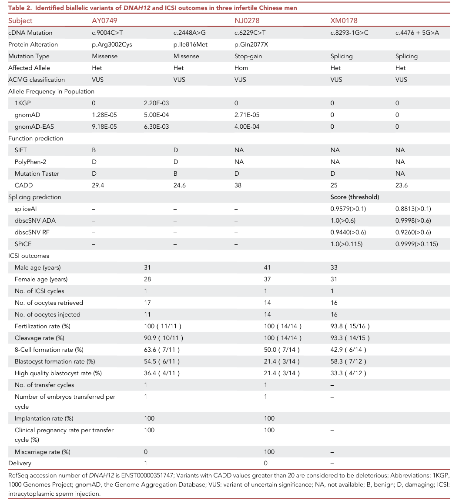
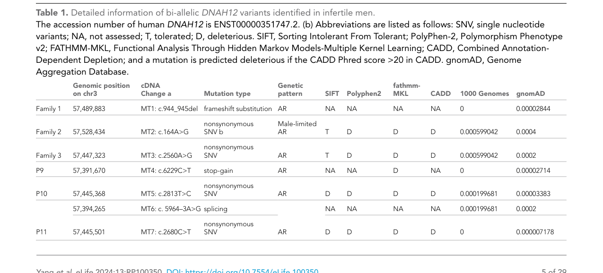

## Question

# Disease Characteristics Research Template

## Target Disease
- **Disease Name:** Spermatogenic Failure 100
- **MONDO ID:** MONDO:0978302 (if available)
- **Category:** Mendelian

## Research Objectives

Please provide a comprehensive research report on **Spermatogenic Failure 100** covering all of the
disease characteristics listed below. This report will be used to populate a disease knowledge
base entry. Be thorough and cite primary literature (PMID preferred) for all claims.

For each section, **suggested databases/resources** are listed. These are the first places
you should search for information on each topic.

---

### 1. Disease Information
> **Search first:** OMIM, Orphanet, ICD-10/ICD-11, MeSH, PubMed

- What is the disease? Provide a concise overview.
- What are the key identifiers? (OMIM, Orphanet, ICD-10/ICD-11, MeSH, Mondo)
- What are the common synonyms and alternative names?
- Is the information derived from individual patients (e.g., EHR) or aggregated disease-level resources?

### 2. Etiology

- **Disease Causal Factors**: What are the primary causes? (genetic, environmental, infectious, mechanistic)
- **Risk Factors**:
  > **Search first:** PubMed, Cochrane Library, UpToDate, clinical guidelines, ClinVar, ClinGen, GWAS Catalog, PheGenI, CTD, CDC, WHO, epidemiological databases
  - Genetic risk factors (causal variants, susceptibility loci, modifier genes)
  - Environmental risk factors (toxins, lifestyle, occupational exposures, age, sex, family history)
- **Protective Factors**:
  > **Search first:** PubMed, Cochrane Library, clinical trial databases, GWAS Catalog, gnomAD, WHO, CDC, nutrition databases
  - Genetic protective factors (protective variants, modifier alleles)
  - Environmental protective factors (diet, lifestyle, exposures that reduce risk)
- **Gene-Environment Interactions**: How do genetic and environmental factors interact to influence disease?
  > **Search first:** CTD, PubMed, PheGenI, GxE databases

### 3. Phenotypes
> **Search first:** HPO (Human Phenotype Ontology), OMIM, Orphanet, PubMed, clinicaltrials.gov, MedDRA, SNOMED CT, DECIPHER, LOINC

For each phenotype, provide:
- **Phenotype type**: symptoms, clinical signs, physical manifestations, behavioral changes, or laboratory abnormalities
  > For symptoms/signs: HPO, OMIM, Orphanet, PubMed
  > For behavioral changes: HPO, DSM, RDoC (Research Domain Criteria), PubMed
  > For laboratory abnormalities: LOINC, SNOMED CT, LabTests Online, PubMed
- **Phenotype characteristics**:
  > **Search first:** OMIM, Orphanet, HPO, PubMed
  - Age of symptom onset (neonatal, childhood, adult-onset, late-onset)
  - Symptom severity (mild, moderate, severe, variable)
  - Symptom progression (stable, progressive, episodic, fluctuating)
  - Frequency among affected individuals (percentage or qualitative)
- **Quality of life impact**: Effects on daily functioning and well-being (per-phenotype when possible)
  > **Search first:** EQ-5D database, SF-36, WHO QOL databases, PubMed
- Suggest HPO (Human Phenotype Ontology) terms for each phenotype

### 4. Genetic/Molecular Information

- **Causal Genes**: Gene mutations or chromosomal abnormalities responsible for disease (gene symbols, OMIM IDs)
  > **Search first:** OMIM, ClinVar, HGMD, Ensembl, NCBI Gene
- **Pathogenic Variants**:
  - Affected genes (gene symbols, HGNC IDs)
    > **Search first:** OMIM, NCBI Gene, Ensembl, HGNC, UniProt, GeneCards
  - Variant classification (pathogenic, likely pathogenic, VUS per ACMG/AMP guidelines)
    > **Search first:** ClinVar, ClinGen, ACMG/AMP guidelines, VarSome
  - Variant type/class (missense, frameshift, nonsense, splice-site, structural)
  - Allele frequency in population databases
    > **Search first:** gnomAD, 1000 Genomes, ExAC, TOPMed, dbSNP
  - Somatic vs germline origin
    > **Search first:** COSMIC (somatic), ClinVar, ICGC, TCGA
  - Functional consequences (loss of function, gain of function, dominant negative)
- **Modifier Genes**: Genes that modify disease severity or expression
- **Epigenetic Information**: DNA methylation, histone modifications, chromatin changes affecting disease
  > **Search first:** ENCODE, Roadmap Epigenomics, MethBase, DiseaseMeth
- **Chromosomal Abnormalities**: Large-scale genetic changes (aneuploidy, translocations, inversions)
  > **Search first:** DECIPHER, ClinVar, ECARUCA, UCSC Genome Browser

### 5. Environmental Information

- **Environmental Factors**: Non-genetic contributing factors (toxins, radiation, pollution, occupational exposure)
  > **Search first:** CTD (Comparative Toxicogenomics Database), TOXNET, PubMed, EPA databases
- **Lifestyle Factors**: Behavioral factors (smoking, diet, exercise, alcohol consumption)
  > **Search first:** CDC databases, WHO, PubMed, NHANES
- **Infectious Agents**: If applicable, pathogens causing or triggering disease (bacteria, viruses, fungi, parasites)
  > **Search first:** NCBI Taxonomy, ViPR, BV-BRC, MicrobeDB, GIDEON

### 6. Mechanism / Pathophysiology

**Present this section as an ordered causal chain first, then the detail below.**
Open with a numbered sequence of mechanistic steps running from the initiating
lesion (mutation, exposure, infection) to the clinical manifestation, one step per
line, each naming what it causes next. State the causal verb explicitly ("leads
to", "results in") and say where a step is inferred rather than demonstrated.
Where the mechanism branches, show the branch. The categories below are a
checklist of what to cover within those steps, not the organizing structure —
a step may draw on several of them, and a category may contribute to several
steps.

- **Molecular Pathways**: Specific signaling cascades or biochemical pathways involved (Wnt, MAPK, mTOR, PI3K-AKT, etc.)
  > **Search first:** KEGG, Reactome, WikiPathways, PathBank, BioCyc
- **Cellular Processes**: Cell-level mechanisms (apoptosis, autophagy, cell cycle dysregulation, inflammation, etc.)
  > **Search first:** Gene Ontology (GO), Reactome, KEGG, PubMed
- **Protein Dysfunction**: How protein structure or function is altered (misfolding, aggregation, loss of function, gain of function)
  > **Search first:** UniProt, PDB (Protein Data Bank), InterPro, Pfam, AlphaFold
- **Metabolic Changes**: Alterations in metabolic processes (energy metabolism, lipid metabolism, amino acid metabolism)
  > **Search first:** KEGG, BioCyc, HMDB (Human Metabolome Database), BRENDA
- **Immune System Involvement**: Role of immune response (autoimmunity, immunodeficiency, chronic inflammation)
  > **Search first:** ImmPort, Immunome Database, IEDB, Gene Ontology
- **Tissue Damage Mechanisms**: How tissues/ are injured (oxidative stress, ischemia, fibrosis, necrosis)
  > **Search first:** PubMed, Gene Ontology, Reactome
- **Biochemical Abnormalities**: Specific molecular defects (enzyme deficiencies, receptor dysfunction, ion channel defects)
  > **Search first:** BRENDA, UniProt, KEGG, OMIM, PubMed
- **Epigenetic Changes**: DNA methylation, histone modifications affecting gene expression in disease
  > **Search first:** ENCODE, Roadmap Epigenomics, MethBase, DiseaseMeth
- **Molecular Profiling** (if available):
  - Transcriptomics/gene expression changes
    > **Search first:** GEO (Gene Expression Omnibus), ArrayExpress, GTEx, Human Cell Atlas, SRA
  - Proteomics findings
    > **Search first:** PRIDE, ProteomeXchange, Human Protein Atlas, STRING, BioGRID
  - Metabolomics signatures
    > **Search first:** MetaboLights, Metabolomics Workbench, HMDB, METLIN
  - Lipidomics alterations
    > **Search first:** LIPID MAPS, SwissLipids, LipidHome, Metabolomics Workbench
  - Genomic structural features
    > **Search first:** UCSC Genome Browser, Ensembl, NCBI, dbVar, DGV
- **Advanced Technologies** (if applicable):
  - Single-cell analysis findings (cell-type specific mechanisms, cellular heterogeneity)
    > **Search first:** Human Cell Atlas, Single Cell Portal, GEO, CELLxGENE
  - Spatial transcriptomics findings
    > **Search first:** GEO, Spatial Research, Vizgen, 10x Genomics data
  - Multi-omics integration results
    > **Search first:** TCGA, ICGC, cBioPortal, LinkedOmics, PubMed
  - Functional genomics screens (CRISPR, RNAi)
    > **Search first:** DepMap, GenomeRNAi, PubMed, BioGRID ORCS

For each mechanism, describe:
- The causal chain from initial trigger to clinical manifestation
- Which mechanisms are upstream vs downstream
- What cell types and biological processes are involved
- Suggest GO terms for biological processes and CL terms for cell types

### 7. Anatomical Structures Affected

- **Organ Level**:
  - Primary organs directly affected
  - Secondary organ involvement (complications, secondary effects)
  - Body systems involved (cardiovascular, nervous, digestive, respiratory, endocrine, etc.)
  > **Search first:** Uberon, FMA (Foundational Model of Anatomy), OMIM, HPO, ICD-11, MeSH, SNOMED CT
- **Tissue and Cell Level**:
  - Specific tissue types affected (epithelial, connective, muscle, nervous)
  - Specific cell populations targeted (with Cell Ontology terms)
  > **Search first:** Uberon, Human Protein Atlas, Cell Ontology, Human Cell Atlas, CellMarker, PanglaoDB
- **Subcellular Level**:
  - Cellular compartments involved (mitochondria, nucleus, ER, lysosomes) (with GO Cellular Component terms)
  > **Search first:** Gene Ontology (Cellular Component), UniProt, Human Protein Atlas
- **Localization**:
  - Specific anatomical sites (with UBERON terms)
    > **Search first:** FMA, Uberon, NeuroNames (for brain), SNOMED CT
  - Lateralization (unilateral, bilateral, asymmetric)
    > **Search first:** HPO, clinical literature, imaging databases

### 8. Temporal Development

- **Onset**:
  - Typical age of onset (congenital, pediatric, adult, geriatric)
  - Onset pattern (acute, subacute, chronic, insidious)
  > **Search first:** OMIM, Orphanet, HPO, PubMed
- **Progression**:
  - Disease stages (early, intermediate, advanced, end-stage)
    > **Search first:** Cancer Staging Manual (AJCC), WHO classifications, PubMed
  - Progression rate (rapid, slow, variable)
  - Disease course pattern (episodic, relapsing-remitting, progressive, stable)
  - Disease duration (self-limited, chronic lifelong)
  > **Search first:** Disease registries, longitudinal cohort databases, natural history studies, PubMed, Orphanet, OMIM
- **Patterns**:
  - Remission patterns (spontaneous, treatment-induced)
    > **Search first:** Clinical trial databases, disease registries, PubMed
  - Critical periods (time windows of vulnerability or opportunity for intervention)
    > **Search first:** PubMed, developmental biology databases, clinical guidelines

### 9. Inheritance and Population

- **Epidemiology**:
  - Prevalence (cases per 100,000 at given time)
  - Incidence (new cases per 100,000 per year)
  > **Search first:** Orphanet, CDC, WHO, GBD (Global Burden of Disease), national registries, SEER, disease registries
- **For Genetic Etiology**:
  - Inheritance pattern (AD, AR, X-linked, mitochondrial, multifactorial, polygenic)
    > **Search first:** OMIM, Orphanet, ClinVar, GTR (Genetic Testing Registry)
  - Penetrance (complete, incomplete, age-dependent)
    > **Search first:** ClinVar, OMIM, PubMed, ClinGen
  - Expressivity (variable, consistent)
    > **Search first:** OMIM, ClinVar, PubMed
  - Genetic anticipation (increasing severity in successive generations)
    > **Search first:** OMIM, PubMed (especially for repeat expansion disorders)
  - Germline mosaicism
    > **Search first:** ClinVar, OMIM, genetic counseling literature, PubMed
  - Founder effects (population-specific mutations)
    > **Search first:** gnomAD, population genetics databases, PubMed
  - Consanguinity role
    > **Search first:** OMIM, population studies, genetic counseling resources
  - Carrier frequency
    > **Search first:** gnomAD, carrier screening databases, GeneReviews, GTR
- **Population Demographics**:
  - Affected populations (ethnic or demographic groups with higher prevalence)
    > **Search first:** gnomAD, 1000 Genomes, PAGE Study, PubMed, population registries
  - Geographic distribution (endemic areas, regional variation)
    > **Search first:** WHO, CDC, GBD, Orphanet, geographic epidemiology databases
  - Geographic distribution of specific variants
  - Sex ratio (male:female)
    > **Search first:** Disease registries, OMIM, PubMed, epidemiological databases
  - Age distribution of affected individuals
    > **Search first:** CDC, disease registries, SEER, Orphanet

### 10. Diagnostics

- **Clinical Tests**:
  - Laboratory tests (blood, urine, tissue chemistry, specific enzyme assays)
    > **Search first:** LOINC, LabTests Online, PubMed
  - Biomarkers (proteins, metabolites, genetic markers, circulating biomarkers)
    > **Search first:** FDA Biomarker List, BEST (Biomarkers, EndpointS, and other Tools), PubMed
  - Imaging studies (X-ray, CT, MRI, PET, ultrasound)
    > **Search first:** RadLex, DICOM, Radiopaedia, imaging databases
  - Functional tests (pulmonary function, cardiac stress tests)
    > **Search first:** LOINC, clinical guidelines, PubMed
  - Electrophysiology (EEG, EMG, ECG, nerve conduction studies)
    > **Search first:** LOINC, clinical neurophysiology databases, PubMed
  - Biopsy findings (histopathology, immunohistochemistry)
    > **Search first:** SNOMED CT, College of American Pathologists resources, PubMed
  - Pathology findings (microscopic examination)
    > **Search first:** SNOMED CT, Digital Pathology databases, PubMed
- **Genetic Testing**:
  > **Search first:** GTR (Genetic Testing Registry), GeneReviews, ClinGen
  - Overview of recommended genetic testing approach
  - Whole genome sequencing (WGS) utility
    > **Search first:** GTR, ClinVar, GEL (Genomics England), gnomAD
  - Whole exome sequencing (WES) utility
    > **Search first:** GTR, ClinVar, OMIM, GeneMatcher
  - Gene panels (which panels, which genes)
    > **Search first:** GTR, ClinVar, laboratory-specific databases
  - Single gene testing
    > **Search first:** GTR, ClinVar, OMIM, GeneReviews
  - Chromosomal microarray (CMA)
    > **Search first:** DECIPHER, ClinVar, dbVar, ECARUCA
  - Karyotyping
    > **Search first:** Chromosome Abnormality Database, ClinVar, cytogenetics resources
  - FISH
    > **Search first:** ClinVar, cytogenetics databases, PubMed
  - Mitochondrial DNA testing
    > **Search first:** MITOMAP, MSeqDR, ClinVar, GTR
  - Repeat expansion testing
    > **Search first:** GTR, ClinVar, repeat expansion databases, PubMed
- **Omics-Based Diagnostics** (if applicable):
  - RNA sequencing / transcriptomics
    > **Search first:** GEO, ArrayExpress, GTEx, RNA-seq databases
  - Proteomics
    > **Search first:** PRIDE, ProteomeXchange, FDA Biomarker database
  - Metabolomics
    > **Search first:** MetaboLights, Metabolomics Workbench, HMDB
  - Epigenomics
    > **Search first:** GEO, ENCODE, Roadmap Epigenomics, MethBase
  - Liquid biopsy
    > **Search first:** COSMIC, ClinVar, liquid biopsy databases, PubMed
- **Clinical Criteria**:
  - Standardized diagnostic criteria (DSM, ICD, society guidelines)
    > **Search first:** DSM-5, ICD-11, clinical society guidelines, UpToDate
  - Differential diagnosis (other conditions to rule out, with distinguishing features)
    > **Search first:** DynaMed, UpToDate, clinical decision support systems
- **Screening**:
  - Screening methods for asymptomatic individuals (newborn screening, carrier screening, cascade screening)
    > **Search first:** ACMG recommendations, CDC newborn screening, GTR

### 11. Outcome/Prognosis

- **Survival and Mortality**:
  - Survival rate (5-year, 10-year, overall)
    > **Search first:** SEER, cancer registries, disease-specific registries, PubMed
  - Life expectancy (with and without treatment if applicable)
    > **Search first:** Orphanet, disease registries, actuarial databases, PubMed
  - Mortality rate
    > **Search first:** CDC, WHO, GBD, national mortality databases
  - Disease-specific mortality (deaths directly attributable to disease)
    > **Search first:** Disease registries, CDC Wonder, GBD, PubMed
- **Morbidity and Function**:
  - Morbidity (disease-related disability and health impacts)
    > **Search first:** GBD, WHO, disability databases, PubMed
  - Disability outcomes (long-term functional impairments)
    > **Search first:** ICF (International Classification of Functioning), disability registries
  - Quality of life measures (EQ-5D, SF-36, PROMIS, disease-specific tools)
    > **Search first:** EQ-5D database, SF-36, PROMIS, PubMed
- **Disease Course**:
  - Complications (secondary problems: infections, organ failure, etc.)
    > **Search first:** ICD codes, disease registries, clinical databases, PubMed
  - Recovery potential (likelihood and extent of recovery, with vs without treatment)
    > **Search first:** Natural history studies, rehabilitation databases, PubMed
- **Prediction**:
  - Prognostic factors (age, disease severity, biomarkers, treatment response)
    > **Search first:** Prognostic models databases, clinical calculators, PubMed
  - Prognostic biomarkers (molecular markers predicting disease course)
    > **Search first:** FDA Biomarker database, PubMed, cancer prognostic databases

### 12. Treatment

- **Pharmacotherapy**:
  - Pharmacological treatments (drug names, drug classes, mechanisms of action)
    > **Search first:** DrugBank, RxNorm, ATC classification, DailyMed, FDA databases
  - Pharmacogenomics (how genetic variants affect drug metabolism, efficacy, toxicity)
    > **Search first:** PharmGKB, CPIC (Clinical Pharmacogenetics), FDA Table of PGx Biomarkers
- **Advanced Therapeutics**:
  - Gene therapy (viral vectors, CRISPR, gene replacement, gene editing)
    > **Search first:** ClinicalTrials.gov, FDA gene therapy database, ASGCT resources
  - Cell therapy (stem cell transplant, CAR-T, cellular therapeutics)
    > **Search first:** ClinicalTrials.gov, FDA cell therapy database, FACT standards
  - RNA-based therapies (ASOs, siRNA, mRNA therapies)
    > **Search first:** ClinicalTrials.gov, FDA approvals, PubMed
  - Targeted therapies (treatments directed at specific molecular targets)
    > **Search first:** My Cancer Genome, OncoKB, ClinicalTrials.gov, FDA approvals
  - Immunotherapies (checkpoint inhibitors, monoclonal antibodies)
    > **Search first:** Cancer Immunotherapy Database, FDA approvals, ClinicalTrials.gov
- **Surgical and Interventional**:
  - Surgical interventions (types of surgery, timing, outcomes)
    > **Search first:** CPT codes, surgical registries, clinical guidelines, PubMed
- **Supportive and Rehabilitative**:
  - Supportive care (symptom management, pain control, nutrition)
    > **Search first:** Clinical guidelines, Cochrane Library, PubMed
  - Rehabilitation (physical therapy, occupational therapy, speech therapy)
    > **Search first:** Rehabilitation medicine databases, clinical guidelines, PubMed
- **Experimental**:
  - Experimental treatments in clinical trials (with NCT identifiers if available)
    > **Search first:** ClinicalTrials.gov, EU Clinical Trials Register, WHO ICTRP
- **Treatment Outcomes**:
  - Treatment response rates
    > **Search first:** Clinical trial databases, FDA reviews, systematic reviews, PubMed
  - Side effects and adverse events
    > **Search first:** FDA Adverse Event Reporting System (FAERS), MedWatch, PubMed
- **Treatment Strategy**:
  - Treatment algorithms (clinical pathways, decision trees)
    > **Search first:** Clinical practice guidelines, NCCN Guidelines, UpToDate
  - Combination therapies
    > **Search first:** ClinicalTrials.gov, treatment guidelines, PubMed
  - Personalized medicine approaches (genotype-guided treatment)
    > **Search first:** My Cancer Genome, CIViC, PharmGKB, precision medicine databases

For each treatment, suggest NCIT (NCI Thesaurus) clinical-intervention terms where applicable.

### 13. Prevention

- **Prevention Levels**:
  - Primary prevention (preventing disease occurrence: vaccination, risk factor modification)
    > **Search first:** CDC, WHO, USPSTF recommendations, Cochrane Library
  - Secondary prevention (early detection and treatment: screening programs, early intervention)
    > **Search first:** USPSTF, CDC screening guidelines, WHO
  - Tertiary prevention (preventing complications in those with disease)
    > **Search first:** Clinical guidelines, disease management protocols, PubMed
- **Immunization**: Vaccine strategies (if applicable)
  > **Search first:** CDC vaccine schedules, WHO immunization, FDA vaccine database
- **Screening and Early Detection**:
  - Screening programs (population-based: newborn screening, cancer screening)
    > **Search first:** CDC screening programs, USPSTF, cancer screening databases
  - Genetic screening (carrier screening, preimplantation genetic diagnosis, prenatal testing)
    > **Search first:** ACMG recommendations, ACOG guidelines, GTR
  - Risk stratification (identifying high-risk individuals for targeted prevention)
    > **Search first:** Risk prediction models, clinical calculators, PubMed
- **Behavioral Interventions**: Lifestyle modifications to reduce risk
  > **Search first:** CDC, WHO, behavioral intervention databases, Cochrane Library
- **Counseling**: Genetic counseling (risk assessment, family planning guidance)
  > **Search first:** NSGC resources, ACMG guidelines, GeneReviews
- **Public Health**:
  - Public health interventions (sanitation, vector control, health education)
    > **Search first:** CDC, WHO, public health databases, PubMed
  - Environmental interventions (reducing environmental risk factors)
    > **Search first:** EPA databases, WHO environmental health, PubMed
- **Prophylaxis**: Preventive medications or procedures
  > **Search first:** Clinical guidelines, FDA approvals, PubMed

### 14. Other Species / Natural Disease

- **Taxonomy**: Species affected (with NCBI Taxon identifiers)
  > **Search first:** NCBI Taxonomy
- **Breed**: Specific breeds affected (with VBO identifiers if applicable)
  > **Search first:** VBO (Vertebrate Breed Ontology)
- **Gene**: Orthologous genes in other species (with NCBI Gene IDs)
  > **Search first:** NCBI Gene
- **Natural Disease**:
  - Naturally occurring disease in other species (companion animals, wildlife)
    > **Search first:** OMIA (Online Mendelian Inheritance in Animals), VetCompass, PubMed
  - Veterinary relevance and importance in animal health
    > **Search first:** OMIA, veterinary databases, PubMed
- **Comparative Biology**:
  - Comparative pathology (similarities and differences across species)
    > **Search first:** OMIA, comparative pathology databases, PubMed
  - Evolutionary conservation of disease mechanisms
    > **Search first:** HomoloGene, OrthoMCL, Alliance of Genome Resources
- **Transmission** (if applicable):
  - Zoonotic potential
    > **Search first:** CDC zoonotic diseases, WHO zoonoses, GIDEON
  - Cross-species susceptibility
    > **Search first:** NCBI Taxonomy, veterinary databases, PubMed

### 15. Model Organisms

- **Model Types**:
  - Model organism type (mammalian, invertebrate, cellular, in vitro)
    > **Search first:** Alliance of Genome Resources, model organism databases
  - Specific model systems (mouse, rat, zebrafish, Drosophila, C. elegans, yeast, cell lines, organoids, iPSCs)
    > **Search first:** MGI, RGD, ZFIN, FlyBase, WormBase, SGD, ATCC, Cellosaurus
  - Induced models (drug treatment, surgical intervention, environmental manipulation)
    > **Search first:** MGI, model organism databases, PubMed
- **Genetic Models**:
  - Types available (knockout, knock-in, transgenic, conditional, humanized)
    > **Search first:** MGI, IMPC, KOMP, EuMMCR, IMSR
- **Model Characteristics**:
  - Phenotype recapitulation (how well model reproduces human disease features)
    > **Search first:** Model organism databases, comparative studies, PubMed
  - Model limitations (aspects of human disease not captured)
    > **Search first:** Model organism databases, PubMed, review articles
- **Applications**:
  - Research applications (what aspects of disease can be studied)
    > **Search first:** Model organism databases, PubMed
- **Resources**:
  - Model databases
    > **Search first:** MGI, RGD, ZFIN, FlyBase, WormBase, IMSR, EMMA, MMRRC

---

## Citation Requirements

- Cite primary literature (PMID preferred) for all mechanistic and clinical claims
- Prioritize recent reviews and landmark papers
- Include direct quotes from abstracts where possible to support key statements
- Distinguish evidence source types: human clinical, model organism, in vitro, computational

## Output Format

Structure your response as a comprehensive narrative organized by the sections above.
For each section, provide:
- Factual content with specific details (numbers, percentages, gene names, variant nomenclature)
- Ontology term suggestions (HPO, GO, CL, UBERON, CHEBI, NCIT, MONDO) where applicable
- Evidence citations with PMIDs
- Direct quotes from abstracts to support key claims
- Clear indication when information is not available or not applicable for this disease

This report will be used to populate a disease knowledge base entry with:
- Pathophysiology descriptions with causal chains
- Gene/protein annotations (HGNC, GO terms)
- Phenotype associations (HP terms) with frequencies
- Cell type involvement (CL terms)
- Anatomical locations (UBERON terms)
- Chemical entities (CHEBI terms)
- Treatment annotations (NCIT terms)
- Evidence items with PMIDs and exact abstract quotes
- Epidemiology, prognosis, diagnostic, and prevention information
- Animal model descriptions with phenotype recapitulation details

## Output

Question: You are an expert researcher providing comprehensive, well-cited information.

Provide detailed information focusing on:
1. Key concepts and definitions with current understanding
2. Recent developments and latest research (prioritize 2023-2024 sources)
3. Current applications and real-world implementations
4. Expert opinions and analysis from authoritative sources
5. Relevant statistics and data from recent studies

Format as a comprehensive research report with proper citations. Include URLs and publication dates where available.
Always prioritize recent, authoritative sources and provide specific citations for all major claims.

# Disease Characteristics Research Template

## Target Disease
- **Disease Name:** Spermatogenic Failure 100
- **MONDO ID:** MONDO:0978302 (if available)
- **Category:** Mendelian

## Research Objectives

Please provide a comprehensive research report on **Spermatogenic Failure 100** covering all of the
disease characteristics listed below. This report will be used to populate a disease knowledge
base entry. Be thorough and cite primary literature (PMID preferred) for all claims.

For each section, **suggested databases/resources** are listed. These are the first places
you should search for information on each topic.

---

### 1. Disease Information
> **Search first:** OMIM, Orphanet, ICD-10/ICD-11, MeSH, PubMed

- What is the disease? Provide a concise overview.
- What are the key identifiers? (OMIM, Orphanet, ICD-10/ICD-11, MeSH, Mondo)
- What are the common synonyms and alternative names?
- Is the information derived from individual patients (e.g., EHR) or aggregated disease-level resources?

### 2. Etiology

- **Disease Causal Factors**: What are the primary causes? (genetic, environmental, infectious, mechanistic)
- **Risk Factors**:
  > **Search first:** PubMed, Cochrane Library, UpToDate, clinical guidelines, ClinVar, ClinGen, GWAS Catalog, PheGenI, CTD, CDC, WHO, epidemiological databases
  - Genetic risk factors (causal variants, susceptibility loci, modifier genes)
  - Environmental risk factors (toxins, lifestyle, occupational exposures, age, sex, family history)
- **Protective Factors**:
  > **Search first:** PubMed, Cochrane Library, clinical trial databases, GWAS Catalog, gnomAD, WHO, CDC, nutrition databases
  - Genetic protective factors (protective variants, modifier alleles)
  - Environmental protective factors (diet, lifestyle, exposures that reduce risk)
- **Gene-Environment Interactions**: How do genetic and environmental factors interact to influence disease?
  > **Search first:** CTD, PubMed, PheGenI, GxE databases

### 3. Phenotypes
> **Search first:** HPO (Human Phenotype Ontology), OMIM, Orphanet, PubMed, clinicaltrials.gov, MedDRA, SNOMED CT, DECIPHER, LOINC

For each phenotype, provide:
- **Phenotype type**: symptoms, clinical signs, physical manifestations, behavioral changes, or laboratory abnormalities
  > For symptoms/signs: HPO, OMIM, Orphanet, PubMed
  > For behavioral changes: HPO, DSM, RDoC (Research Domain Criteria), PubMed
  > For laboratory abnormalities: LOINC, SNOMED CT, LabTests Online, PubMed
- **Phenotype characteristics**:
  > **Search first:** OMIM, Orphanet, HPO, PubMed
  - Age of symptom onset (neonatal, childhood, adult-onset, late-onset)
  - Symptom severity (mild, moderate, severe, variable)
  - Symptom progression (stable, progressive, episodic, fluctuating)
  - Frequency among affected individuals (percentage or qualitative)
- **Quality of life impact**: Effects on daily functioning and well-being (per-phenotype when possible)
  > **Search first:** EQ-5D database, SF-36, WHO QOL databases, PubMed
- Suggest HPO (Human Phenotype Ontology) terms for each phenotype

### 4. Genetic/Molecular Information

- **Causal Genes**: Gene mutations or chromosomal abnormalities responsible for disease (gene symbols, OMIM IDs)
  > **Search first:** OMIM, ClinVar, HGMD, Ensembl, NCBI Gene
- **Pathogenic Variants**:
  - Affected genes (gene symbols, HGNC IDs)
    > **Search first:** OMIM, NCBI Gene, Ensembl, HGNC, UniProt, GeneCards
  - Variant classification (pathogenic, likely pathogenic, VUS per ACMG/AMP guidelines)
    > **Search first:** ClinVar, ClinGen, ACMG/AMP guidelines, VarSome
  - Variant type/class (missense, frameshift, nonsense, splice-site, structural)
  - Allele frequency in population databases
    > **Search first:** gnomAD, 1000 Genomes, ExAC, TOPMed, dbSNP
  - Somatic vs germline origin
    > **Search first:** COSMIC (somatic), ClinVar, ICGC, TCGA
  - Functional consequences (loss of function, gain of function, dominant negative)
- **Modifier Genes**: Genes that modify disease severity or expression
- **Epigenetic Information**: DNA methylation, histone modifications, chromatin changes affecting disease
  > **Search first:** ENCODE, Roadmap Epigenomics, MethBase, DiseaseMeth
- **Chromosomal Abnormalities**: Large-scale genetic changes (aneuploidy, translocations, inversions)
  > **Search first:** DECIPHER, ClinVar, ECARUCA, UCSC Genome Browser

### 5. Environmental Information

- **Environmental Factors**: Non-genetic contributing factors (toxins, radiation, pollution, occupational exposure)
  > **Search first:** CTD (Comparative Toxicogenomics Database), TOXNET, PubMed, EPA databases
- **Lifestyle Factors**: Behavioral factors (smoking, diet, exercise, alcohol consumption)
  > **Search first:** CDC databases, WHO, PubMed, NHANES
- **Infectious Agents**: If applicable, pathogens causing or triggering disease (bacteria, viruses, fungi, parasites)
  > **Search first:** NCBI Taxonomy, ViPR, BV-BRC, MicrobeDB, GIDEON

### 6. Mechanism / Pathophysiology

**Present this section as an ordered causal chain first, then the detail below.**
Open with a numbered sequence of mechanistic steps running from the initiating
lesion (mutation, exposure, infection) to the clinical manifestation, one step per
line, each naming what it causes next. State the causal verb explicitly ("leads
to", "results in") and say where a step is inferred rather than demonstrated.
Where the mechanism branches, show the branch. The categories below are a
checklist of what to cover within those steps, not the organizing structure —
a step may draw on several of them, and a category may contribute to several
steps.

- **Molecular Pathways**: Specific signaling cascades or biochemical pathways involved (Wnt, MAPK, mTOR, PI3K-AKT, etc.)
  > **Search first:** KEGG, Reactome, WikiPathways, PathBank, BioCyc
- **Cellular Processes**: Cell-level mechanisms (apoptosis, autophagy, cell cycle dysregulation, inflammation, etc.)
  > **Search first:** Gene Ontology (GO), Reactome, KEGG, PubMed
- **Protein Dysfunction**: How protein structure or function is altered (misfolding, aggregation, loss of function, gain of function)
  > **Search first:** UniProt, PDB (Protein Data Bank), InterPro, Pfam, AlphaFold
- **Metabolic Changes**: Alterations in metabolic processes (energy metabolism, lipid metabolism, amino acid metabolism)
  > **Search first:** KEGG, BioCyc, HMDB (Human Metabolome Database), BRENDA
- **Immune System Involvement**: Role of immune response (autoimmunity, immunodeficiency, chronic inflammation)
  > **Search first:** ImmPort, Immunome Database, IEDB, Gene Ontology
- **Tissue Damage Mechanisms**: How tissues/ are injured (oxidative stress, ischemia, fibrosis, necrosis)
  > **Search first:** PubMed, Gene Ontology, Reactome
- **Biochemical Abnormalities**: Specific molecular defects (enzyme deficiencies, receptor dysfunction, ion channel defects)
  > **Search first:** BRENDA, UniProt, KEGG, OMIM, PubMed
- **Epigenetic Changes**: DNA methylation, histone modifications affecting gene expression in disease
  > **Search first:** ENCODE, Roadmap Epigenomics, MethBase, DiseaseMeth
- **Molecular Profiling** (if available):
  - Transcriptomics/gene expression changes
    > **Search first:** GEO (Gene Expression Omnibus), ArrayExpress, GTEx, Human Cell Atlas, SRA
  - Proteomics findings
    > **Search first:** PRIDE, ProteomeXchange, Human Protein Atlas, STRING, BioGRID
  - Metabolomics signatures
    > **Search first:** MetaboLights, Metabolomics Workbench, HMDB, METLIN
  - Lipidomics alterations
    > **Search first:** LIPID MAPS, SwissLipids, LipidHome, Metabolomics Workbench
  - Genomic structural features
    > **Search first:** UCSC Genome Browser, Ensembl, NCBI, dbVar, DGV
- **Advanced Technologies** (if applicable):
  - Single-cell analysis findings (cell-type specific mechanisms, cellular heterogeneity)
    > **Search first:** Human Cell Atlas, Single Cell Portal, GEO, CELLxGENE
  - Spatial transcriptomics findings
    > **Search first:** GEO, Spatial Research, Vizgen, 10x Genomics data
  - Multi-omics integration results
    > **Search first:** TCGA, ICGC, cBioPortal, LinkedOmics, PubMed
  - Functional genomics screens (CRISPR, RNAi)
    > **Search first:** DepMap, GenomeRNAi, PubMed, BioGRID ORCS

For each mechanism, describe:
- The causal chain from initial trigger to clinical manifestation
- Which mechanisms are upstream vs downstream
- What cell types and biological processes are involved
- Suggest GO terms for biological processes and CL terms for cell types

### 7. Anatomical Structures Affected

- **Organ Level**:
  - Primary organs directly affected
  - Secondary organ involvement (complications, secondary effects)
  - Body systems involved (cardiovascular, nervous, digestive, respiratory, endocrine, etc.)
  > **Search first:** Uberon, FMA (Foundational Model of Anatomy), OMIM, HPO, ICD-11, MeSH, SNOMED CT
- **Tissue and Cell Level**:
  - Specific tissue types affected (epithelial, connective, muscle, nervous)
  - Specific cell populations targeted (with Cell Ontology terms)
  > **Search first:** Uberon, Human Protein Atlas, Cell Ontology, Human Cell Atlas, CellMarker, PanglaoDB
- **Subcellular Level**:
  - Cellular compartments involved (mitochondria, nucleus, ER, lysosomes) (with GO Cellular Component terms)
  > **Search first:** Gene Ontology (Cellular Component), UniProt, Human Protein Atlas
- **Localization**:
  - Specific anatomical sites (with UBERON terms)
    > **Search first:** FMA, Uberon, NeuroNames (for brain), SNOMED CT
  - Lateralization (unilateral, bilateral, asymmetric)
    > **Search first:** HPO, clinical literature, imaging databases

### 8. Temporal Development

- **Onset**:
  - Typical age of onset (congenital, pediatric, adult, geriatric)
  - Onset pattern (acute, subacute, chronic, insidious)
  > **Search first:** OMIM, Orphanet, HPO, PubMed
- **Progression**:
  - Disease stages (early, intermediate, advanced, end-stage)
    > **Search first:** Cancer Staging Manual (AJCC), WHO classifications, PubMed
  - Progression rate (rapid, slow, variable)
  - Disease course pattern (episodic, relapsing-remitting, progressive, stable)
  - Disease duration (self-limited, chronic lifelong)
  > **Search first:** Disease registries, longitudinal cohort databases, natural history studies, PubMed, Orphanet, OMIM
- **Patterns**:
  - Remission patterns (spontaneous, treatment-induced)
    > **Search first:** Clinical trial databases, disease registries, PubMed
  - Critical periods (time windows of vulnerability or opportunity for intervention)
    > **Search first:** PubMed, developmental biology databases, clinical guidelines

### 9. Inheritance and Population

- **Epidemiology**:
  - Prevalence (cases per 100,000 at given time)
  - Incidence (new cases per 100,000 per year)
  > **Search first:** Orphanet, CDC, WHO, GBD (Global Burden of Disease), national registries, SEER, disease registries
- **For Genetic Etiology**:
  - Inheritance pattern (AD, AR, X-linked, mitochondrial, multifactorial, polygenic)
    > **Search first:** OMIM, Orphanet, ClinVar, GTR (Genetic Testing Registry)
  - Penetrance (complete, incomplete, age-dependent)
    > **Search first:** ClinVar, OMIM, PubMed, ClinGen
  - Expressivity (variable, consistent)
    > **Search first:** OMIM, ClinVar, PubMed
  - Genetic anticipation (increasing severity in successive generations)
    > **Search first:** OMIM, PubMed (especially for repeat expansion disorders)
  - Germline mosaicism
    > **Search first:** ClinVar, OMIM, genetic counseling literature, PubMed
  - Founder effects (population-specific mutations)
    > **Search first:** gnomAD, population genetics databases, PubMed
  - Consanguinity role
    > **Search first:** OMIM, population studies, genetic counseling resources
  - Carrier frequency
    > **Search first:** gnomAD, carrier screening databases, GeneReviews, GTR
- **Population Demographics**:
  - Affected populations (ethnic or demographic groups with higher prevalence)
    > **Search first:** gnomAD, 1000 Genomes, PAGE Study, PubMed, population registries
  - Geographic distribution (endemic areas, regional variation)
    > **Search first:** WHO, CDC, GBD, Orphanet, geographic epidemiology databases
  - Geographic distribution of specific variants
  - Sex ratio (male:female)
    > **Search first:** Disease registries, OMIM, PubMed, epidemiological databases
  - Age distribution of affected individuals
    > **Search first:** CDC, disease registries, SEER, Orphanet

### 10. Diagnostics

- **Clinical Tests**:
  - Laboratory tests (blood, urine, tissue chemistry, specific enzyme assays)
    > **Search first:** LOINC, LabTests Online, PubMed
  - Biomarkers (proteins, metabolites, genetic markers, circulating biomarkers)
    > **Search first:** FDA Biomarker List, BEST (Biomarkers, EndpointS, and other Tools), PubMed
  - Imaging studies (X-ray, CT, MRI, PET, ultrasound)
    > **Search first:** RadLex, DICOM, Radiopaedia, imaging databases
  - Functional tests (pulmonary function, cardiac stress tests)
    > **Search first:** LOINC, clinical guidelines, PubMed
  - Electrophysiology (EEG, EMG, ECG, nerve conduction studies)
    > **Search first:** LOINC, clinical neurophysiology databases, PubMed
  - Biopsy findings (histopathology, immunohistochemistry)
    > **Search first:** SNOMED CT, College of American Pathologists resources, PubMed
  - Pathology findings (microscopic examination)
    > **Search first:** SNOMED CT, Digital Pathology databases, PubMed
- **Genetic Testing**:
  > **Search first:** GTR (Genetic Testing Registry), GeneReviews, ClinGen
  - Overview of recommended genetic testing approach
  - Whole genome sequencing (WGS) utility
    > **Search first:** GTR, ClinVar, GEL (Genomics England), gnomAD
  - Whole exome sequencing (WES) utility
    > **Search first:** GTR, ClinVar, OMIM, GeneMatcher
  - Gene panels (which panels, which genes)
    > **Search first:** GTR, ClinVar, laboratory-specific databases
  - Single gene testing
    > **Search first:** GTR, ClinVar, OMIM, GeneReviews
  - Chromosomal microarray (CMA)
    > **Search first:** DECIPHER, ClinVar, dbVar, ECARUCA
  - Karyotyping
    > **Search first:** Chromosome Abnormality Database, ClinVar, cytogenetics resources
  - FISH
    > **Search first:** ClinVar, cytogenetics databases, PubMed
  - Mitochondrial DNA testing
    > **Search first:** MITOMAP, MSeqDR, ClinVar, GTR
  - Repeat expansion testing
    > **Search first:** GTR, ClinVar, repeat expansion databases, PubMed
- **Omics-Based Diagnostics** (if applicable):
  - RNA sequencing / transcriptomics
    > **Search first:** GEO, ArrayExpress, GTEx, RNA-seq databases
  - Proteomics
    > **Search first:** PRIDE, ProteomeXchange, FDA Biomarker database
  - Metabolomics
    > **Search first:** MetaboLights, Metabolomics Workbench, HMDB
  - Epigenomics
    > **Search first:** GEO, ENCODE, Roadmap Epigenomics, MethBase
  - Liquid biopsy
    > **Search first:** COSMIC, ClinVar, liquid biopsy databases, PubMed
- **Clinical Criteria**:
  - Standardized diagnostic criteria (DSM, ICD, society guidelines)
    > **Search first:** DSM-5, ICD-11, clinical society guidelines, UpToDate
  - Differential diagnosis (other conditions to rule out, with distinguishing features)
    > **Search first:** DynaMed, UpToDate, clinical decision support systems
- **Screening**:
  - Screening methods for asymptomatic individuals (newborn screening, carrier screening, cascade screening)
    > **Search first:** ACMG recommendations, CDC newborn screening, GTR

### 11. Outcome/Prognosis

- **Survival and Mortality**:
  - Survival rate (5-year, 10-year, overall)
    > **Search first:** SEER, cancer registries, disease-specific registries, PubMed
  - Life expectancy (with and without treatment if applicable)
    > **Search first:** Orphanet, disease registries, actuarial databases, PubMed
  - Mortality rate
    > **Search first:** CDC, WHO, GBD, national mortality databases
  - Disease-specific mortality (deaths directly attributable to disease)
    > **Search first:** Disease registries, CDC Wonder, GBD, PubMed
- **Morbidity and Function**:
  - Morbidity (disease-related disability and health impacts)
    > **Search first:** GBD, WHO, disability databases, PubMed
  - Disability outcomes (long-term functional impairments)
    > **Search first:** ICF (International Classification of Functioning), disability registries
  - Quality of life measures (EQ-5D, SF-36, PROMIS, disease-specific tools)
    > **Search first:** EQ-5D database, SF-36, PROMIS, PubMed
- **Disease Course**:
  - Complications (secondary problems: infections, organ failure, etc.)
    > **Search first:** ICD codes, disease registries, clinical databases, PubMed
  - Recovery potential (likelihood and extent of recovery, with vs without treatment)
    > **Search first:** Natural history studies, rehabilitation databases, PubMed
- **Prediction**:
  - Prognostic factors (age, disease severity, biomarkers, treatment response)
    > **Search first:** Prognostic models databases, clinical calculators, PubMed
  - Prognostic biomarkers (molecular markers predicting disease course)
    > **Search first:** FDA Biomarker database, PubMed, cancer prognostic databases

### 12. Treatment

- **Pharmacotherapy**:
  - Pharmacological treatments (drug names, drug classes, mechanisms of action)
    > **Search first:** DrugBank, RxNorm, ATC classification, DailyMed, FDA databases
  - Pharmacogenomics (how genetic variants affect drug metabolism, efficacy, toxicity)
    > **Search first:** PharmGKB, CPIC (Clinical Pharmacogenetics), FDA Table of PGx Biomarkers
- **Advanced Therapeutics**:
  - Gene therapy (viral vectors, CRISPR, gene replacement, gene editing)
    > **Search first:** ClinicalTrials.gov, FDA gene therapy database, ASGCT resources
  - Cell therapy (stem cell transplant, CAR-T, cellular therapeutics)
    > **Search first:** ClinicalTrials.gov, FDA cell therapy database, FACT standards
  - RNA-based therapies (ASOs, siRNA, mRNA therapies)
    > **Search first:** ClinicalTrials.gov, FDA approvals, PubMed
  - Targeted therapies (treatments directed at specific molecular targets)
    > **Search first:** My Cancer Genome, OncoKB, ClinicalTrials.gov, FDA approvals
  - Immunotherapies (checkpoint inhibitors, monoclonal antibodies)
    > **Search first:** Cancer Immunotherapy Database, FDA approvals, ClinicalTrials.gov
- **Surgical and Interventional**:
  - Surgical interventions (types of surgery, timing, outcomes)
    > **Search first:** CPT codes, surgical registries, clinical guidelines, PubMed
- **Supportive and Rehabilitative**:
  - Supportive care (symptom management, pain control, nutrition)
    > **Search first:** Clinical guidelines, Cochrane Library, PubMed
  - Rehabilitation (physical therapy, occupational therapy, speech therapy)
    > **Search first:** Rehabilitation medicine databases, clinical guidelines, PubMed
- **Experimental**:
  - Experimental treatments in clinical trials (with NCT identifiers if available)
    > **Search first:** ClinicalTrials.gov, EU Clinical Trials Register, WHO ICTRP
- **Treatment Outcomes**:
  - Treatment response rates
    > **Search first:** Clinical trial databases, FDA reviews, systematic reviews, PubMed
  - Side effects and adverse events
    > **Search first:** FDA Adverse Event Reporting System (FAERS), MedWatch, PubMed
- **Treatment Strategy**:
  - Treatment algorithms (clinical pathways, decision trees)
    > **Search first:** Clinical practice guidelines, NCCN Guidelines, UpToDate
  - Combination therapies
    > **Search first:** ClinicalTrials.gov, treatment guidelines, PubMed
  - Personalized medicine approaches (genotype-guided treatment)
    > **Search first:** My Cancer Genome, CIViC, PharmGKB, precision medicine databases

For each treatment, suggest NCIT (NCI Thesaurus) clinical-intervention terms where applicable.

### 13. Prevention

- **Prevention Levels**:
  - Primary prevention (preventing disease occurrence: vaccination, risk factor modification)
    > **Search first:** CDC, WHO, USPSTF recommendations, Cochrane Library
  - Secondary prevention (early detection and treatment: screening programs, early intervention)
    > **Search first:** USPSTF, CDC screening guidelines, WHO
  - Tertiary prevention (preventing complications in those with disease)
    > **Search first:** Clinical guidelines, disease management protocols, PubMed
- **Immunization**: Vaccine strategies (if applicable)
  > **Search first:** CDC vaccine schedules, WHO immunization, FDA vaccine database
- **Screening and Early Detection**:
  - Screening programs (population-based: newborn screening, cancer screening)
    > **Search first:** CDC screening programs, USPSTF, cancer screening databases
  - Genetic screening (carrier screening, preimplantation genetic diagnosis, prenatal testing)
    > **Search first:** ACMG recommendations, ACOG guidelines, GTR
  - Risk stratification (identifying high-risk individuals for targeted prevention)
    > **Search first:** Risk prediction models, clinical calculators, PubMed
- **Behavioral Interventions**: Lifestyle modifications to reduce risk
  > **Search first:** CDC, WHO, behavioral intervention databases, Cochrane Library
- **Counseling**: Genetic counseling (risk assessment, family planning guidance)
  > **Search first:** NSGC resources, ACMG guidelines, GeneReviews
- **Public Health**:
  - Public health interventions (sanitation, vector control, health education)
    > **Search first:** CDC, WHO, public health databases, PubMed
  - Environmental interventions (reducing environmental risk factors)
    > **Search first:** EPA databases, WHO environmental health, PubMed
- **Prophylaxis**: Preventive medications or procedures
  > **Search first:** Clinical guidelines, FDA approvals, PubMed

### 14. Other Species / Natural Disease

- **Taxonomy**: Species affected (with NCBI Taxon identifiers)
  > **Search first:** NCBI Taxonomy
- **Breed**: Specific breeds affected (with VBO identifiers if applicable)
  > **Search first:** VBO (Vertebrate Breed Ontology)
- **Gene**: Orthologous genes in other species (with NCBI Gene IDs)
  > **Search first:** NCBI Gene
- **Natural Disease**:
  - Naturally occurring disease in other species (companion animals, wildlife)
    > **Search first:** OMIA (Online Mendelian Inheritance in Animals), VetCompass, PubMed
  - Veterinary relevance and importance in animal health
    > **Search first:** OMIA, veterinary databases, PubMed
- **Comparative Biology**:
  - Comparative pathology (similarities and differences across species)
    > **Search first:** OMIA, comparative pathology databases, PubMed
  - Evolutionary conservation of disease mechanisms
    > **Search first:** HomoloGene, OrthoMCL, Alliance of Genome Resources
- **Transmission** (if applicable):
  - Zoonotic potential
    > **Search first:** CDC zoonotic diseases, WHO zoonoses, GIDEON
  - Cross-species susceptibility
    > **Search first:** NCBI Taxonomy, veterinary databases, PubMed

### 15. Model Organisms

- **Model Types**:
  - Model organism type (mammalian, invertebrate, cellular, in vitro)
    > **Search first:** Alliance of Genome Resources, model organism databases
  - Specific model systems (mouse, rat, zebrafish, Drosophila, C. elegans, yeast, cell lines, organoids, iPSCs)
    > **Search first:** MGI, RGD, ZFIN, FlyBase, WormBase, SGD, ATCC, Cellosaurus
  - Induced models (drug treatment, surgical intervention, environmental manipulation)
    > **Search first:** MGI, model organism databases, PubMed
- **Genetic Models**:
  - Types available (knockout, knock-in, transgenic, conditional, humanized)
    > **Search first:** MGI, IMPC, KOMP, EuMMCR, IMSR
- **Model Characteristics**:
  - Phenotype recapitulation (how well model reproduces human disease features)
    > **Search first:** Model organism databases, comparative studies, PubMed
  - Model limitations (aspects of human disease not captured)
    > **Search first:** Model organism databases, PubMed, review articles
- **Applications**:
  - Research applications (what aspects of disease can be studied)
    > **Search first:** Model organism databases, PubMed
- **Resources**:
  - Model databases
    > **Search first:** MGI, RGD, ZFIN, FlyBase, WormBase, IMSR, EMMA, MMRRC

---

## Citation Requirements

- Cite primary literature (PMID preferred) for all mechanistic and clinical claims
- Prioritize recent reviews and landmark papers
- Include direct quotes from abstracts where possible to support key statements
- Distinguish evidence source types: human clinical, model organism, in vitro, computational

## Output Format

Structure your response as a comprehensive narrative organized by the sections above.
For each section, provide:
- Factual content with specific details (numbers, percentages, gene names, variant nomenclature)
- Ontology term suggestions (HPO, GO, CL, UBERON, CHEBI, NCIT, MONDO) where applicable
- Evidence citations with PMIDs
- Direct quotes from abstracts to support key claims
- Clear indication when information is not available or not applicable for this disease

This report will be used to populate a disease knowledge base entry with:
- Pathophysiology descriptions with causal chains
- Gene/protein annotations (HGNC, GO terms)
- Phenotype associations (HP terms) with frequencies
- Cell type involvement (CL terms)
- Anatomical locations (UBERON terms)
- Chemical entities (CHEBI terms)
- Treatment annotations (NCIT terms)
- Evidence items with PMIDs and exact abstract quotes
- Epidemiology, prognosis, diagnostic, and prevention information
- Animal model descriptions with phenotype recapitulation details

# Spermatogenic failure 100 (SPGF100): disease-characteristics research report

**Scope and evidence standard.** SPGF100 (MONDO:0978302) is the disease-level label associated with *DNAH12*-related male infertility. Its best-supported clinical presentation is severe impairment of sperm motility with abnormal sperm heads and flagella—not uniformly absent sperm production, despite the disease name. Evidence comes principally from small, ascertained human case series and experimentally engineered mice. Findings about male infertility generally are distinguished below from observations in people with *DNAH12* variants. (OpenTargets Search: spermatogenic failure 100, geng2024furtherevidencefrom pages 2-4, yang2025deficiencyindnah12 pages 1-2)

## 1. Disease information and identifiers

* **Definition and synonyms:** An inherited sperm-flagellum disorder presenting as male infertility, asthenozoospermia or asthenoteratozoospermia, often with **multiple morphological abnormalities of the sperm flagella (MMAF)**. These are descriptive phenotype terms, not interchangeable identifiers for every cause of MMAF. (geng2024furtherevidencefrom pages 1-2, geng2024furtherevidencefrom pages 2-4, yang2025deficiencyindnah12 pages 1-2)
* **Verified identifiers:** MONDO:**0978302**; associated gene *DNAH12*, Ensembl **ENSG00000174844**; *DNAH12* **gene** OMIM:**603340**. A distinct OMIM **phenotype** number, Orphanet number, disease-specific MeSH descriptor, and HGNC numeric identifier were not verified in the retrieved sources; they should not be filled by inference. General male-infertility ICD codes are not disease-specific SPGF100 identifiers. (OpenTargets Search: spermatogenic failure 100, geng2024furtherevidencefrom pages 2-4)
* **Provenance:** MONDO/Open Targets supply aggregated disease–gene associations; semen results, pedigrees, microscopy and reproductive outcomes derive from research participants, **not a supplied individual electronic health record**. Open Targets’ two displayed evidence records cite the same literature identifier, PMID **34791246**: they must not be interpreted as two independent patient cohorts. (OpenTargets Search: spermatogenic failure 100, oud2021exomesequencingreveals pages 1-2)

The principal evidence, including variant-level cautions, is summarized here. In particular, the *DNAH12* gene OMIM number must **not** be entered as the unverified SPGF100 phenotype OMIM number. (geng2024furtherevidencefrom pages 2-4)

| Study year / DOI | DNAH12 genotypes (HGVS) | Human phenotype / number | Model or assisted reproduction | Caveats |
|---|---|---|---|---|
| **Oud et al., 2021** — [10.1093/humrep/deab099](https://doi.org/10.1093/humrep/deab099); PMID: **34791246** | ARG1: c.5393T>C (p.Phe1798Ser) and c.7438C>T (p.Pro2480Ser) | One Argentinian man among 21 men selected for severe sperm-motility disorders; dysplasia of the fibrous sheath/MMAF, severe asthenoteratozoospermia and no reported primary-ciliary-dyskinesia symptoms (oud2021exomesequencingreveals pages 1-2, oud2021exomesequencingreveals pages 4-5, oud2021exomesequencingreveals pages 9-10) | No DNAH12-specific model or reported ART outcome | DNAH12 was a **candidate gene**, not a confirmed diagnosis: parental DNA was unavailable, phase was undetermined, and similar population frequencies raised the possibility that both variants were in cis (oud2021exomesequencingreveals pages 9-10) |
| **Geng et al., 2024** — [10.1016/j.isci.2024.110366](https://doi.org/10.1016/j.isci.2024.110366) | AY0749: c.9004C>T (p.Arg3002Cys) / c.2448A>G (p.Ile816Met); NJ0278: homozygous c.6229C>T (p.Gln2077Ter); XM0178: c.8293-1G>C / c.4476+5G>A | Three unrelated Chinese men among **1,532 ascertained infertile men (0.2%)**; primary infertility, severe asthenozoospermia, normal concentration/total count, MMAF and abnormal flagellar ultrastructure; no typical PCD symptoms, pulmonary infection or situs inversus (geng2024furtherevidencefrom pages 2-4, geng2024furtherevidencefrom media e319a021) | Dnah12-knockout males were infertile, with reduced counts, immotile sperm, abnormal heads/flagella and seminiferous-tubule defects. ICSI: AY0749, live birth; NJ0278, clinical pregnancy followed by miscarriage; XM0178, four high-quality blastocysts awaiting transfer (geng2024furtherevidencefrom pages 7-9, geng2024furtherevidencefrom pages 9-11, geng2024furtherevidencefrom media e319a021) | All five distinct variants were classified as **VUS** in the study. Only one patient’s semen underwent full ultrastructural analysis; authors requested replication in larger cohorts. The 3/1,532 frequency is an ascertainment yield—not population prevalence (geng2024furtherevidencefrom pages 5-7, geng2024furtherevidencefrom pages 11-13) |
| **Zhou et al., 2024** — [10.1186/s12920-024-02005-3](https://doi.org/10.1186/s12920-024-02005-3) | Two candidate DNAH12 genotypes were reported; patient-level HGVS/phase cannot be assigned confidently from the accessible table text | Two candidates among 167 men with primary infertility: M842 had asthenozoospermia; M867 had azoospermia (zhou2024wholeexomesequencing pages 1-2, zhou2024wholeexomesequencing pages 5-7) | No DNAH12-specific functional model, biopsy or ART outcome in this cohort; public single-cell data localized DNAH12 chiefly to spermatocytes and early spermatids (zhou2024wholeexomesequencing pages 1-2, zhou2024wholeexomesequencing pages 7-8) | Retrospective, small cohort; parental samples were unavailable, phase was unresolved, and no testicular biopsies were performed. The azoospermia association remains provisional (zhou2024wholeexomesequencing pages 5-7) |
| **Yang et al., version of record 27 March 2025** — [10.7554/eLife.100350](https://doi.org/10.7554/eLife.100350) | Familial: homozygous c.944_945del (p.Phe315Ter), c.164A>G (p.Gln55Arg), or c.2560A>G (p.Ile854Val). Sporadic: P9 homozygous c.6229C>T (p.Gln2077Ter); P10 homozygous c.2813T>C (p.Val938Ala); P11 c.2680C>T (p.Arg894Cys) / c.5964-3A>G (yang2025deficiencyindnah12 pages 3-5, yang2025deficiencyindnah12 pages 5-6, yang2025deficiencyindnah12 media 11774847) | Eleven affected men from three families plus three sporadic cases; semen was measured in only **eight**. All measured men had reduced motility; tested sperm showed abnormal heads and absent, short, coiled, bent or irregular-caliber flagella. Patient axonemes showed central-pair loss, disorganization, missing doublets and impaired inner dynein arms (yang2025deficiencyindnah12 pages 6-8, yang2025deficiencyindnah12 pages 5-6, yang2025deficiencyindnah12 media 11774847) | Two Dnah12 mutant mouse lines reproduced male infertility, spermiogenic/manchette defects, apoptosis, low counts and immotility. Co-IP/proteomics showed DNAH12-dependent recruitment of DNAH1 and DNALI1 and interactions with radial-spoke-head proteins; mouse ICSI restored two-cell and blastocyst development (yang2025deficiencyindnah12 pages 8-10, yang2025deficiencyindnah12 pages 16-18, yang2025deficiencyindnah12 pages 18-19, yang2025deficiencyindnah12 pages 12-13) | Strongest mechanistic evidence, but human numbers remain small and not all affected men had semen phenotyping. No PCD phenotype was observed in humans or mice. Cohort counts cannot estimate prevalence (yang2025deficiencyindnah12 pages 1-2, yang2025deficiencyindnah12 pages 18-19) |
| **Identifier caution** | DNAH12 is the gene associated with MONDO:0978302; **OMIM 603340 identifies DNAH12 itself** (OpenTargets Search: spermatogenic failure 100, geng2024furtherevidencefrom pages 2-4) | — | — | A separate OMIM phenotype number for “spermatogenic failure 100” was not verified in the retrieved evidence and should not be inferred from gene OMIM **603340**. |

*Table: Human variant, phenotype, model, and reproductive-outcome evidence supporting DNAH12-associated spermatogenic failure. The table preserves study-specific uncertainty and distinguishes ascertainment yield from population prevalence.*

**Publication-date caution:** Yang and colleagues’ article displays “eLife 2024;13:RP100350” in its pagination, but explicitly dates its **version of record to 27 March 2025**; the preprint appeared in June 2024. This report calls it the **2025 version of record**, DOI [10.7554/eLife.100350](https://doi.org/10.7554/eLife.100350). Geng and colleagues’ iScience article was published online **24 June 2024** and appears in the **19 July 2024** issue. (yang2025deficiencyindnah12 pages 1-2, geng2024furtherevidencefrom pages 11-13)

## 2. Etiology, risk, protection and gene–environment interaction

The established initiating factor is **germline biallelic variation in autosomal *DNAH12***: homozygous variants in several families and compound-heterozygous variants in others. Family segregation, loss of DNAH12 signal in affected sperm, replication across independent cohorts and two mutant-mouse lines support causality. Some individually reported alleles remain **variants of uncertain significance (VUS)** rather than formally classified pathogenic variants; a convincing gene–disease relationship does not automatically classify every allele. (geng2024furtherevidencefrom pages 5-7, geng2024furtherevidencefrom pages 2-4, yang2025deficiencyindnah12 pages 1-2, yang2025deficiencyindnah12 pages 5-6, yang2025deficiencyindnah12 pages 12-13)

Consanguinity can increase the probability of a homozygous recessive genotype: it was reported in Geng’s family NJ0278 and in Yang’s familial pedigrees. This is an inheritance observation, not evidence that consanguinity causes a new molecular mechanism. No *DNAH12*-specific susceptibility locus, modifier allele, protective genotype, protective diet, toxin, infectious trigger or measured gene–environment interaction was established. Smoking, heat, occupational exposures and medications can be assessed as **general** infertility cofactors, but must not be recorded as demonstrated causes or preventatives of SPGF100. The 2024 AUA/ASRM guideline explicitly says evidence for most lifestyle and exposure risk factors is limited. (geng2024furtherevidencefrom pages 2-4, yang2025deficiencyindnah12 pages 3-5, panel2024diagnosisandtreatment pages 1-3)

## 3. Phenotypes and suggested HPO annotations

**Human evidence:** Yang and colleagues identified **11 affected men** in three families and three additional sporadic cases; its clinical-characteristics table contains semen measurements for **eight**, with one listed affected man having semen parameters “not determined.” The eight measured men had total motility **7.4–29.3%**. Concentrations varied substantially, from **2.8 to 83.1 million/mL** in that table: low count is possible but not obligatory. The cohort was recruited for infertility, so these proportions **cannot** be converted into population penetrance or unbiased phenotype frequencies. The source table inconsistently places progressive-motility means above total-motility means for at least one patient; avoid deriving precise progressive-motility ranges from it without source-data clarification. (yang2025deficiencyindnah12 pages 3-5, yang2025deficiencyindnah12 pages 5-6, yang2025deficiencyindnah12 media 11774847)

| Type and suggested HPO term *by label* | Observations and ascertainment-limited frequency | Timing, severity and functional effect |
|---|---|---|
| **Reproductive manifestation:** male infertility; primary infertility | Reported in the clinically ascertained affected men; all three Geng probands had primary infertility. | Recognized after sexual maturity when conception is attempted; difficulty achieving biological fatherhood. Age at molecular onset is unknown. (geng2024furtherevidencefrom pages 2-4, yang2025deficiencyindnah12 pages 3-5) |
| **Semen abnormality:** asthenozoospermia / decreased sperm motility | Eight of eight men with reported measurements in Yang had reduced total motility; all three Geng probands had severe asthenozoospermia. | Persistently impaired sperm movement is plausible for a congenital structural defect, but longitudinal stability has **not** been measured. (geng2024furtherevidencefrom pages 2-4, yang2025deficiencyindnah12 pages 5-6, yang2025deficiencyindnah12 media 11774847) |
| **Semen/microscopy abnormality:** teratozoospermia; abnormal sperm flagellum morphology / MMAF | Where characterized, absent, short, coiled, bent and irregular-caliber tails occurred, often with abnormal heads. Six Yang patients had detailed morphology assessment; this is not a prevalence denominator for all carriers. | Impairs sperm transport and conception; per-subtype population frequencies unavailable. (yang2025deficiencyindnah12 pages 6-8, yang2025deficiencyindnah12 pages 5-6) |
| **Laboratory abnormality:** oligozoospermia / decreased sperm count | Variable: Geng’s three men had normal sperm concentration and total count; some Yang men had reduced concentration. | Severity varies by study and allele; do not label every case azoospermic. (geng2024furtherevidencefrom pages 2-4, yang2025deficiencyindnah12 pages 5-6) |
| **Possible extension, not established core phenotype:** azoospermia | Zhou reported one patient, M867, with candidate double-heterozygous *DNAH12* splice variants and azoospermia; parental phase and testicular pathology were unavailable. The authors explicitly requested further cases to test this association. | **Provisional** association; not an established SPGF100 frequency or obligatory manifestation. (zhou2024wholeexomesequencing pages 5-7) |
| **Ultrastructural laboratory finding:** central-pair loss; inner-dynein-arm defect | Demonstrated by sperm electron microscopy in examined patients, not routinely quantified across all carriers. | Mechanistically informative; not established as a standalone clinical diagnostic criterion. (geng2024furtherevidencefrom pages 7-9, yang2025deficiencyindnah12 pages 6-8) |

**Negative and quality-of-life evidence:** The studied patients did **not** show characteristic primary ciliary dyskinesia (PCD) respiratory symptoms or situs inversus in the assessments described; this is not proof that such findings can never coexist. Fertility difficulties plausibly affect well-being, relationships and access to assisted reproduction, but **no SPGF100-specific EQ-5D, SF-36, psychiatric-symptom frequency or daily-function score** was reported. Do not encode depression or behavioral changes as established *DNAH12*-specific phenotypes. (geng2024furtherevidencefrom pages 2-4, yang2025deficiencyindnah12 pages 18-19)

**Ontology implementation:** The HPO labels above are *suggestions requiring verification against the current HPO release* before assigning HP identifiers. Disease-specific phenotype frequencies beyond the explicitly stated case-series denominators remain unavailable.

## 4. Genetic and molecular information

*DNAH12* encodes dynein axonemal heavy chain 12; the gene lies at **chromosome 3p14.3**. Geng describes a predicted 3,960-amino-acid protein, whereas Yang’s experimentally studied transcript **ENST00000351747.2** describes **3,092 amino acids**: these differ by transcript/protein annotation. **Use a single stated reference transcript and protein accession before normalizing HGVS variants**, rather than mixing coordinates or assuming that lengths are interchangeable. Yang gives protein accession **Q6ZR08-1** for its variant diagram. (yang2025deficiencyindnah12 pages 3-5, yang2025deficiencyindnah12 pages 15-16, geng2024furtherevidencefrom pages 9-11)

**Human alleles with direct supporting evidence:** Geng’s AY0749 carried c.9004C>T (p.Arg3002Cys) and c.2448A>G (p.Ile816Met); NJ0278 was homozygous for stop-gain c.6229C>T (p.Gln2077Ter); XM0178 carried splice-region c.8293-1G>C and c.4476+5G>A. **All five variants are labelled VUS by that paper’s ACMG assessment**, despite the compelling collective clinical and mouse evidence. Geng reports gnomAD frequencies respectively **1.28×10⁻⁵, 5.00×10⁻⁴, 2.71×10⁻⁵, zero and zero** in its queried dataset; absence there is not proof that an allele never occurs. (geng2024furtherevidencefrom pages 5-7, geng2024furtherevidencefrom pages 2-4, geng2024furtherevidencefrom media e319a021)

Yang reports familial homozygous c.944_945del (p.Phe315Ter), c.164A>G (p.Gln55Arg) and c.2560A>G (p.Ile854Val); P9 was homozygous c.6229C>T (p.Gln2077Ter), P10 homozygous c.2813T>C (p.Val938Ala), and P11 carried c.2680C>T (p.Arg894Cys) **with** c.5964-3A>G. Thus **the splice allele belongs to P11, not P10**. The listed gnomAD allele frequencies span **7.178×10⁻⁶ to 4×10⁻⁴**. Importantly, **c.6229C>T appears in both Geng and Yang**, so listing the papers’ case counts does not establish that their subjects are non-overlapping. A ClinVar case-specific consensus classification, founder haplotype and current database-version-normalized frequency were **not** independently verified. (geng2024furtherevidencefrom pages 2-4, yang2025deficiencyindnah12 pages 3-5, yang2025deficiencyindnah12 pages 5-6, yang2025deficiencyindnah12 media 11774847)

**Interpretation:** Truncating and splice-disrupting alleles support loss of normal protein; missense alleles may impair stability/assembly—Yang observed absent sperm DNAH12 signal in several tested missense and truncation genotypes, but the consequence of each allele needs separate validation. These are inherited or presumed germline findings, not somatic tumor alterations. Neither a recurrent causal chromosomal rearrangement, epigenetic mechanism, modifier gene nor clinically meaningful copy-number variant was established for SPGF100. Karyotype abnormalities and AZF deletions are **alternative causes of infertility**, not synonyms for this condition. (yang2025deficiencyindnah12 pages 5-6, zhou2024wholeexomesequencing pages 1-2, zhou2024wholeexomesequencing pages 5-7)

## 5. Environmental, lifestyle and infectious information

No exposure, dietary pattern, smoking interaction, environmental contaminant, radiation exposure or pathogen has been shown to generate *DNAH12*-defined SPGF100 in the absence of the underlying genotype. An environmental or infectious contributor can coexist with genetic infertility and warrants an ordinary infertility assessment; that is **clinical differential diagnosis, not demonstrated gene–environment interaction**. No infection-specific vaccine, antimicrobial or exposure-elimination strategy has been shown to correct DNAH12-related flagellar assembly. The AUA/ASRM guideline supports discussing exposures while emphasizing limited evidence for many asserted risk factors. (panel2024diagnosisandtreatment pages 1-3, panel2024diagnosisandtreatment pages 3-5)

## 6. Mechanism and pathophysiology

**Ordered causal chain—primary reproductive pathway and branch:** (yang2025deficiencyindnah12 pages 8-10, yang2025deficiencyindnah12 pages 6-8, yang2025deficiencyindnah12 pages 16-18, yang2025deficiencyindnah12 pages 18-19, yang2025deficiencyindnah12 pages 15-16)

1. **Biallelic germline *DNAH12* variation leads to** absent or dysfunctional DNAH12 in developing sperm; absence of sperm protein was directly demonstrated in tested patients and mice. (yang2025deficiencyindnah12 pages 5-6, yang2025deficiencyindnah12 pages 12-13)
2. **Loss of functional DNAH12 leads to** impaired recruitment/retention of **DNALI1 and DNAH1** in elongating-spermatid flagella and reduced assembly of sperm **inner dynein arms (IDAs)**; association, co-immunoprecipitation and localization experiments support this step. (yang2025deficiencyindnah12 pages 13-15, yang2025deficiencyindnah12 pages 15-16)
3. **Branch A: defective interaction with radial-spoke-head proteins RSPH1, RSPH9 and DNAJB13 leads to** radial-spoke perturbation and **central-pair instability**. The interactions and reduced protein signals were demonstrated; the specific causal bridge from those changes to central-pair loss is a **proposed/inferred** interpretation. (yang2025deficiencyindnah12 pages 16-18, yang2025deficiencyindnah12 pages 18-19)
4. **Branch B: disturbed spermiogenesis/manchette organization leads to** misshapen sperm heads and loss of developing germ cells; manchette defects and increased apoptosis were demonstrated **in knockout mice**, but the precise path from DNAH12 depletion to those changes remains incompletely established in humans. (yang2025deficiencyindnah12 pages 8-10, yang2025deficiencyindnah12 pages 10-12)
5. **IDA impairment plus central-pair and other axonemal disorganization results in** absent/short/coiled/bent sperm flagella, markedly reduced flagellar motility and sometimes reduced sperm number; sperm ultrastructure and phenotype are directly observed in humans and mice. (geng2024furtherevidencefrom pages 7-9, yang2025deficiencyindnah12 pages 8-10, yang2025deficiencyindnah12 pages 6-8, yang2025deficiencyindnah12 pages 5-6)
6. **Impaired sperm movement and morphology lead to** reduced capacity for natural conception and the observed male infertility. Sperm-function failure is supported biologically and clinically; a human prospective estimate of the probability of unassisted conception is **not available**. (geng2024furtherevidencefrom pages 1-2, geng2024furtherevidencefrom pages 2-4)

**Cellular and biochemical detail:** DNAH12 is an atypical axonemal dynein heavy chain without the usual microtubule-binding stalk/domain. Its N-terminal stem mediates an experimentally supported interaction with DNALI1; its dynein-family ATPase modules implicate ATP-dependent axonemal force generation, but **a patient-specific ATPase rate or metabolic defect has not been measured**. In Yang’s sperm, DNAH1/DNALI1 and central-pair markers **SPAG6/SPEF2** declined while outer-arm markers **DNAH17/DNAI2** were relatively preserved. Geng similarly saw absent SPAG6 but retained DNAH1 in **one** proband: these individual observations should not be flattened into a claim of identical protein loss in every patient. No disease-specific Wnt, MAPK, mTOR or PI3K-AKT cascade, inflammatory pathway, autoimmunity, oxidative tissue lesion, methylation signature, metabolomic profile or lipidomic biomarker has been demonstrated. (geng2024furtherevidencefrom pages 7-9, yang2025deficiencyindnah12 pages 18-19, yang2025deficiencyindnah12 pages 13-15, yang2025deficiencyindnah12 pages 15-16, yang2025deficiencyindnah12 pages 12-13)

**Molecular profiling and technology:** Zhou’s reuse of public human single-cell testis data localized *DNAH12* expression chiefly to **spermatocytes and early spermatids**; this is an expression annotation, **not patient-specific single-cell differential expression**. Yang applied testicular protein immunoprecipitation–mass spectrometry, reciprocal co-immunoprecipitation, immunoblotting and sperm imaging; **AlphaFold3 docking is computational support, not proof of a binding interface**. No SPGF100 patient spatial-transcriptomic, integrated multi-omic, RNA-sequencing diagnostic signature or unbiased human CRISPR screen was established. (zhou2024wholeexomesequencing pages 1-2, yang2025deficiencyindnah12 pages 16-18, yang2025deficiencyindnah12 pages 18-19, yang2025deficiencyindnah12 pages 13-15)

**Suggested GO biological-process labels:** spermatogenesis; spermiogenesis; sperm flagellum assembly; microtubule-based movement; cilium/flagellum motility; dynein complex assembly; and, **mouse evidence only**, apoptotic process. Suggested GO cellular-component labels: sperm flagellum, axoneme, axonemal dynein complex/inner dynein arm, central pair, radial spoke and manchette. These are semantic suggestions; validate exact GO identifiers and relations before upload. (yang2025deficiencyindnah12 pages 8-10, yang2025deficiencyindnah12 pages 18-19, yang2025deficiencyindnah12 pages 13-15)

## 7. Anatomical structures affected

**Primary system:** male reproductive tract, particularly **testis → seminiferous tubule → germ-cell lineage → spermatozoon head and flagellum**. Mature sperm recovered from the **cauda epididymis** are abnormal in mouse models. The head-shaping manchette is a transient structure of elongating spermatids; the flagellar axoneme contains nine peripheral doublets and a central pair. Relevant proposed **UBERON** labels: testis, seminiferous tubule, epididymis/cauda epididymis and spermatic flagellum; proposed **CL** labels: spermatocyte, round spermatid, elongating spermatid and spermatozoon. Verify accession numbers in the ontology releases used by the knowledge base. (yang2025deficiencyindnah12 pages 8-10, zhou2024wholeexomesequencing pages 1-2, yang2025deficiencyindnah12 pages 10-12)

Although DNAH12 is detectable in mouse tracheal and oviduct tissues, mutant animals had preserved assessed ciliary organization and tracheal beating; females were fertile. Correspondingly, the examined human cases were not reported to have the usual PCD syndrome. Thus do **not** annotate respiratory disease, brain disease or oviduct pathology as established SPGF100 organ involvement. Germline variation is systemic, while the demonstrated damaging functional phenotype is principally **sperm-specific**. Neither unilateral nor right/left testis predominance has been established; affected sperm arise from a systemic genotype, but direct evidence about testicular laterality is absent. (geng2024furtherevidencefrom pages 2-4, yang2025deficiencyindnah12 pages 15-16, yang2025deficiencyindnah12 pages 12-13)

## 8. Temporal development

The initiating genotype is present from conception, whereas the phenotype becomes clinically ascertainable with **postpubertal sperm production** and often presents as adult primary infertility. In Yang’s measured-person table, recorded ages in 2024 were **31–49 years**, with one older affected man aged **58** lacking semen measurements; these are **ages at study characterization, not ages of onset**. There are no established neonatal signs, developmental stages, longitudinal progression rates, relapsing–remitting pattern, spontaneous remission rate or disease duration measured in a natural-history cohort. The developmental vulnerability is **spermiogenesis/flagellar assembly**, not an identified drug-intervention window. ICSI bypasses a fertilization barrier; it does **not** demonstrate repair or remission of the intrinsic sperm defect. (yang2025deficiencyindnah12 pages 8-10, yang2025deficiencyindnah12 pages 5-6, yang2025deficiencyindnah12 pages 16-18)

## 9. Inheritance and population

The observed pattern is **autosomal recessive with male-limited clinical expression**. In the studied families, men with biallelic genotypes were infertile and heterozygotes supplied segregating alleles; a biallelic woman in a reported pedigree had offspring, and mutant female mice were fertile. Female carriage or biallelic status must therefore **not** automatically be annotated as female infertility. Under ordinary Mendelian assumptions, two heterozygous parents have a **25% chance of a biallelic child per pregnancy**; this is a genotype-risk calculation, **not** a measured penetrance or 25% probability of having an affected son. Penetrance, age-dependent expressivity, germline mosaicism, anticipation and founder effects have not been quantified. (geng2024furtherevidencefrom pages 2-4, yang2025deficiencyindnah12 pages 3-5, yang2025deficiencyindnah12 pages 19-21)

Geng detected three biallelic candidate cases among **1,532 ascertained infertile Chinese men: 0.20%**. This is a **selected-cohort detection fraction**, not disease prevalence, incidence or allele-carrier frequency; the other reports sample different clinic and family populations, with potential case overlap. No reliable SPGF100 population prevalence per 100,000, incidence, geographic map, ancestry-specific risk or male:female population ratio is available. Clinically reported affected persons are male because sperm production is the measured trait. (geng2024furtherevidencefrom pages 2-4, yang2025deficiencyindnah12 pages 5-6)

## 10. Diagnosis and differential diagnosis

**Practical pathway:** Obtain reproductive and family history, assess both partners, examine testes/vas deferens and repeat semen analysis if abnormal. Record volume, count, total and progressive motility and morphology; evaluate sperm vitality when virtually immotile sperm must be distinguished from nonviable sperm. Because severe MMAF can be missed by routine reporting, consider specialist flagellar morphology, and electron microscopy **when it would clarify the phenotype**; research immunostaining for DNAH12, DNAH1, DNALI1 or SPAG6 is supportive, **not a validated clinical biomarker assay**. The 2024 AUA/ASRM guideline recommends at least one initial semen analysis and generally two when the first is abnormal; it does not make specialized microscopy obligatory for everyone. (geng2024furtherevidencefrom pages 7-9, yang2025deficiencyindnah12 pages 6-8, panel2024diagnosisandtreatment pages 12-13, panel2024diagnosisandtreatment pages 1-3)

When history, examination and semen findings suggest inherited flagellar disease, a **clinically validated male-infertility/MMAF panel including *DNAH12*** or **whole-exome sequencing** can interrogate coding alleles; confirm calls, transcript nomenclature, phase/segregation and variant interpretation. Whole-genome sequencing could in principle assess variants missed by exome sequencing, but a superior **DNAH12-specific WGS diagnostic yield has not been demonstrated**. Classify variants using current ACMG/AMP/ClinVar evidence and do not call an isolated heterozygous allele diagnostic for a recessive disorder. Oud’s original two variants remained unphased; Zhou lacked parental samples. RNA analysis can investigate candidate splice effects, but is not established routine SPGF100 testing. A named, independently verified GTR assay was not identified. (oud2021exomesequencingreveals pages 1-2, oud2021exomesequencingreveals pages 9-10, zhou2024wholeexomesequencing pages 5-7, houston2022asystematicreview pages 12-12)

**Conditional standard testing:** Obtain FSH and testosterone with oligozoospermia, azoospermia, testicular atrophy or endocrine indications. The **2024 AUA/ASRM** guideline recommends karyotyping when primary infertility is accompanied by azoospermia or **<5 million sperm/mL** plus evidence of impaired production, and Y-microdeletion analysis for azoospermia or **≤1 million sperm/mL** with those production-failure features. Such tests address alternative or concomitant diagnoses; they are **not automatic requirements solely because of an isolated motility defect with normal count**. Azoospermia requires appropriately repeated semen-pellet examination and distinction between obstruction and nonobstructive failure; low-volume acidic semen may prompt obstruction-directed imaging. Routine initial scrotal ultrasound, pelvic MRI and diagnostic testicular biopsy are not advised. Karyotyping, chromosomal microarray or FISH should not be presented as tests that directly detect ordinary *DNAH12* single-nucleotide variants; mitochondrial DNA and repeat-expansion testing have no demonstrated specific role. (panel2024diagnosisandtreatment pages 22-23, panel2024diagnosisandtreatment pages 1-3, panel2024diagnosisandtreatment pages 3-5)

**Differential:** Other genetic MMAF/axonemal disorders, especially *DNAH1*, *DNAH3*, *DNAH6*, *DNAH10*, *CFAP43*/*CFAP44* and *DNALI1*; PCD when respiratory/situs symptoms occur; necrozoospermia, obstruction, endocrine disease, varicocele and acquired testicular injury where clinically indicated. *DNAH3* and *DNAH10* phenotypes are **separate gene–disease relationships**, not evidence that those genes cause SPGF100. No population or newborn screening programme for SPGF100 was identified; family-based testing follows molecular confirmation. (yang2025deficiencyindnah12 pages 1-2, oud2021exomesequencingreveals pages 1-2, panel2024diagnosisandtreatment pages 1-3, panel2024diagnosisandtreatment pages 3-5)

## 11. Outcome and prognosis

The demonstrated major morbidity is difficulty achieving biological paternity; human life expectancy, disease-attributable mortality, five-/ten-year survival, formal disability indices and DNAH12-specific quality-of-life scores have **not** been reported. General population statistics for male infertility cannot substitute for these quantities. Persistence of the congenital genetic defect is expected, but age-related worsening, spontaneous restoration of fertility and predicted likelihood of natural conception have not been prospectively measured. A human **live birth after ICSI** demonstrates that genetic infertility does **not** necessarily preclude genetically related offspring; it does not establish a general response probability or guarantee offspring outcomes. (geng2024furtherevidencefrom pages 7-9, yang2025deficiencyindnah12 pages 5-6, geng2024furtherevidencefrom media e319a021)

**Potential prognostic information:** residual motile/usable sperm, coexisting oligozoospermia, availability of sperm for injection and female-partner reproductive factors are clinically relevant to ART planning, but no **validated SPGF100-specific prognostic score, molecular marker or genotype-to-ICSI success equation** exists. An isolated candidate azoospermia finding is inadequate to predict micro-TESE results for all carriers. (geng2024furtherevidencefrom pages 7-9, zhou2024wholeexomesequencing pages 5-7, panel2024diagnosisandtreatment pages 3-5)

## 12. Treatment and present-day application

**Supported disease-relevant application—assisted reproduction:** Intracytoplasmic sperm injection (**ICSI**; suggested NCIT label “Intracytoplasmic Sperm Injection”) can bypass poor sperm motility. In Geng’s **three individually reported couples**, fertilization per injected oocyte was **11/11, 14/14 and 15/16**, respectively. However, actual clinical outcomes were **one live birth** (AY0749), **one clinical pregnancy followed by miscarriage** (NJ0278), and **one couple with embryos awaiting transfer** (XM0178). Calling this “three successful births” or a population-level 100% pregnancy rate would be incorrect. In *Dnah12*-null mice, ICSI yielded early embryos/blastocysts comparable to controls; these mouse results cannot determine human live-birth probability. (geng2024furtherevidencefrom pages 7-9, yang2025deficiencyindnah12 pages 16-18, geng2024furtherevidencefrom media e319a021)

**Conditional options:** Sperm cryopreservation may be discussed when viable ejaculate sperm are available (suggested NCIT label “Sperm Cryopreservation”); **microdissection testicular sperm extraction** (suggested NCIT label “Microdissection Testicular Sperm Extraction”) is a general guideline option **only for confirmed nonobstructive azoospermia**, not automatically for the usual DNAH12-associated motility phenotype. Donor sperm or other family-building options may be considered if needed. Correct a coincident palpable varicocele only under standard clinical criteria; this does **not** treat the molecular dynein defect. The AUA/ASRM guideline advises **against exogenous testosterone** when fertility is desired and describes antioxidants/supplements as of uncertain clinical utility. No pharmacotherapy, pharmacogenomic dosing rule, gene editing, cell transplant, RNA drug, immunotherapy or vaccine has been validated to restore DNAH12-dependent flagellar assembly. No condition-specific treatment trial/NCT identifier was confirmed by the retrieved searches; small ICSI case reports are **not clinical trials**. (panel2024diagnosisandtreatment pages 3-5, panel2024diagnosisandtreatment pages 5-6)

**Personalization:** A confirmed biallelic molecular diagnosis can clarify inheritance, support ICSI counseling and prevent misattribution to an incidental VUS or another cause of infertility. ICSI risks, cost and pregnancy/miscarriage outcomes require ordinary couple-specific reproductive counseling rather than extrapolation from three probands. Suggested NCIT labels also include “Genetic Counseling” and “Semen Analysis”; verify corresponding NCIT accessions before database insertion. (geng2024furtherevidencefrom pages 5-7, geng2024furtherevidencefrom pages 7-9, geng2024furtherevidencefrom media e319a021, panel2024diagnosisandtreatment pages 1-3)

## 13. Prevention and counseling

**Primary:** No lifestyle measure, prophylactic drug or immunization prevents a child inheriting two pathogenic *DNAH12* alleles; general reproductive-health measures cannot undo an inherited loss of protein function. **Secondary:** Following molecular confirmation, offer reproductive genetic counseling and optional testing of at-risk relatives/partners as appropriate; an expanded carrier-screening panel should be checked for actual *DNAH12* coverage rather than assumed. Discuss reproductive options, including IVF with preimplantation genetic testing for monogenic disease where legally available and desired, or prenatal testing following a fully characterized familial genotype. These are reproductive choices, **not cures or universally recommended population screening**. **Tertiary:** Timely infertility evaluation, discussion of ART/ICSI and psychosocial support may reduce reproductive burden; protecting sperm from unrelated gonadotoxic exposures is sound general care but has not been shown to prevent SPGF100. (geng2024furtherevidencefrom pages 2-4, panel2024diagnosisandtreatment pages 1-3, panel2024diagnosisandtreatment pages 5-6)

## 14. Other species and naturally occurring disease

**Humans (*Homo sapiens*, NCBI Taxonomy 9606)** have the reported naturally occurring biallelic condition. **Laboratory mouse (*Mus musculus*, taxon 10090)** has the ortholog *Dnah12* and experimentally engineered analogous infertility. Evolutionary comparison in Yang’s study supports conservation of relevant DNAH12 residues. No independently verified naturally occurring companion-animal, livestock or wildlife *DNAH12*-associated syndrome, breed/VBO association, or species-specific ortholog NCBI Gene identifier was established by the retrieved evidence. This inherited reproductive disorder is **not infectious or zoonotic**. (yang2025deficiencyindnah12 pages 1-2, yang2025deficiencyindnah12 pages 3-5, geng2024furtherevidencefrom pages 9-11)

## 15. Model organisms and model limitations

Two independently useful **CRISPR-engineered mouse systems** are described. Geng deleted *Dnah12* exons **3–5**: males were infertile with low epididymal sperm counts, no motility, abnormal heads/coiled tails, seminiferous-tubule vacuolization and loss of germ cells; ICSI generated blastocysts. Yang generated an exon-5 **c.386_389del knockout** and an additional exon-18 mutant line; knockout males had approximately **2% of normal epididymal sperm numbers**, **100% immotile** epididymal sperm, altered manchettes/head shaping, increased TUNEL-positive testicular cells, abnormal IDAs and central pairs. Female knockout mice remained fertile; assessed oviductal/tracheal cilia were comparatively normal. These systems permit dissection of the **DNAH12–DNALI1–DNAH1 assembly axis**, radial-spoke/central-pair biology and preclinical assessment of whether sperm injection bypasses the fertilization barrier. (geng2024furtherevidencefrom pages 7-9, yang2025deficiencyindnah12 pages 8-10, yang2025deficiencyindnah12 pages 16-18, yang2025deficiencyindnah12 pages 10-12, yang2025deficiencyindnah12 pages 12-13, geng2024furtherevidencefrom pages 9-11)

**Limits:** A complete knockout can produce much lower sperm counts than observed in some humans with missense variants; mouse mating and embryo endpoints are not human natural-history or live-birth endpoints. Geng notes limited human cases and only one extensively studied semen sample. Yang’s testis proteomics and sperm immunostaining demonstrate candidate interactions and localization, but do not identify a proven drug target or quantify every possible allele’s severity. MGI is an appropriate model database to check for strain/accession details; no specific repository stock number was independently verified. (geng2024furtherevidencefrom pages 2-4, yang2025deficiencyindnah12 pages 5-6, yang2025deficiencyindnah12 pages 18-19, geng2024furtherevidencefrom pages 11-13)

### Exact abstract excerpts and principal sources

* **Human clinical plus mouse, Geng et al., 2024:** “Here, we identified one homozygous variant and two compound heterozygous variants in DNAH12 from three infertile Chinese men.” [iScience 27:110366; DOI 10.1016/j.isci.2024.110366](https://doi.org/10.1016/j.isci.2024.110366). The same abstract reports severe asthenozoospermia and a knockout-mouse infertility phenotype; interpret its “favorable fertility outcomes” against the case-level miscarriage and pending transfer in **Table 2**. A PMID was not verified in the available record. (geng2024furtherevidencefrom pages 1-2, geng2024furtherevidencefrom media e319a021)
* **Mechanistic human/mouse, Yang et al., version of record 27 March 2025:** “DNAH12 deficiency did not show effects on cilium organization and function.” The abstract also states that disrupted DNAH12 leads to failed recruitment of DNALI1 and DNAH1. [eLife, DOI 10.7554/eLife.100350](https://doi.org/10.7554/eLife.100350). A PMID was not verified in the available record. (yang2025deficiencyindnah12 pages 1-2)
* **Historical candidate-gene evidence, Oud et al., 5 June 2021:** “we identified patients with variants in the novel human candidate sperm motility genes: DNAH12, DRC1, MDC1, PACRG, SSPL2C and TPTE2.” [Human Reproduction 36:2597–2611; DOI 10.1093/humrep/deab099](https://doi.org/10.1093/humrep/deab099); Open Targets associates literature PMID **34791246** with its disease–target record, but a direct PMID–article bibliographic match was **not independently verified**, so the DOI is the safer primary reference. Crucially, Oud explicitly questioned whether the two *DNAH12* variants were on different alleles. (OpenTargets Search: spermatogenic failure 100, oud2021exomesequencingreveals pages 1-2, oud2021exomesequencingreveals pages 9-10)
* **Phenotype-boundary evidence, Zhou et al., 2024:** “To confirm whether DNAH12 is a causative for NOA, more azoopsermic patients with pathogenic variants in DNAH12 are anticipated to be identified in future studies.” [BMC Medical Genomics 17:230; DOI 10.1186/s12920-024-02005-3](https://doi.org/10.1186/s12920-024-02005-3). A PMID was not verified in the available record. (zhou2024wholeexomesequencing pages 1-2, zhou2024wholeexomesequencing pages 5-7)
* **Clinical guidance, AUA/ASRM, approved July 2024:** [Diagnosis and Treatment of Infertility in Men: guideline, amended 2024](https://www.auanet.org/guidelines-and-quality/guidelines/male-infertility). This is **general male-infertility expert guidance**, not a SPGF100-specific clinical guideline. (panel2024diagnosisandtreatment pages 1-3, panel2024diagnosisandtreatment pages 3-5)

**Knowledge-base confidence statement:** The strongest disease-specific entries are recessive *DNAH12* association, sperm motility/flagellar-morphology abnormalities, impaired IDA/central-pair assembly, and male infertility. Azoospermia, exact penetrance, population prevalence, age progression, genotype-specific prognosis, extragonadal disease and therapeutic response rates beyond individual ICSI cases should remain **uncertain or unpopulated**. Numeric HPO, GO, CL, UBERON, CHEBI and NCIT accession numbers—other than the verified MONDO identifier—require live ontology validation before entry; no disease-specific chemical intervention warrants a CHEBI annotation on this evidence. (OpenTargets Search: spermatogenic failure 100, yang2025deficiencyindnah12 pages 5-6, yang2025deficiencyindnah12 pages 18-19, zhou2024wholeexomesequencing pages 5-7, geng2024furtherevidencefrom media e319a021)

References

1. (OpenTargets Search: spermatogenic failure 100): Open Targets Query (spermatogenic failure 100, 1 results). Buniello, A. et al. (2025). Open Targets Platform: facilitating therapeutic hypotheses building in drug discovery. Nucleic Acids Research.

2. (geng2024furtherevidencefrom pages 2-4): Hao Geng, Kai Wang, Dan Liang, Xiaoqing Ni, Hui Yu, Dongdong Tang, Mingrong Lv, Huan Wu, Kuokuo Li, Qunshan Shen, Yang Gao, Chuan Xu, Ping Zhou, Zhaolian Wei, Yunxia Cao, Yanwei Sha, Xiaoyu Yang, and Xiaojin He. Further evidence from dnah12 supports favorable fertility outcomes of infertile males with dynein axonemal heavy chain gene family variants. iScience, 27:110366, Jul 2024. URL: https://doi.org/10.1016/j.isci.2024.110366, doi:10.1016/j.isci.2024.110366. This article has 17 citations and is from a peer-reviewed journal.

3. (yang2025deficiencyindnah12 pages 1-2): Menglei Yang, Hafiz Muhammad Jafar Hussain, Manan Khan, Zubair Muhammad, Jianteng Zhou, Ao Ma, Xiongheng Huang, Jingwei Ye, Min Chen, Aoran Zhi, Tao Liu, Ranjha Khan, Asim Ali, Wasim Shah, Aurang Zeb, Nisar Ahmad, Huan Zhang, Bo Xu, Hui Ma, Qinghua Shi, and Baolu Shi. Deficiency in dnah12 causes male infertility by impairing dnah1 and dnali1 recruitment in humans and mice. ArXiv, Feb 2025. URL: https://doi.org/10.7554/elife.100350, doi:10.7554/elife.100350. This article has 28 citations.

4. (geng2024furtherevidencefrom pages 1-2): Hao Geng, Kai Wang, Dan Liang, Xiaoqing Ni, Hui Yu, Dongdong Tang, Mingrong Lv, Huan Wu, Kuokuo Li, Qunshan Shen, Yang Gao, Chuan Xu, Ping Zhou, Zhaolian Wei, Yunxia Cao, Yanwei Sha, Xiaoyu Yang, and Xiaojin He. Further evidence from dnah12 supports favorable fertility outcomes of infertile males with dynein axonemal heavy chain gene family variants. iScience, 27:110366, Jul 2024. URL: https://doi.org/10.1016/j.isci.2024.110366, doi:10.1016/j.isci.2024.110366. This article has 17 citations and is from a peer-reviewed journal.

5. (oud2021exomesequencingreveals pages 1-2): M S Oud, B J Houston, L Volozonoka, F K Mastrorosa, G S Holt, B K S Alobaidi, P F deVries, G Astuti, L Ramos, R I Mclachlan, M K O’Bryan, J A Veltman, H E Chemes, and H Sheth. Exome sequencing reveals variants in known and novel candidate genes for severe sperm motility disorders. Human Reproduction (Oxford, England), 36:2597-2611, Jun 2021. URL: https://doi.org/10.1093/humrep/deab099, doi:10.1093/humrep/deab099. This article has 75 citations.

6. (oud2021exomesequencingreveals pages 4-5): M S Oud, B J Houston, L Volozonoka, F K Mastrorosa, G S Holt, B K S Alobaidi, P F deVries, G Astuti, L Ramos, R I Mclachlan, M K O’Bryan, J A Veltman, H E Chemes, and H Sheth. Exome sequencing reveals variants in known and novel candidate genes for severe sperm motility disorders. Human Reproduction (Oxford, England), 36:2597-2611, Jun 2021. URL: https://doi.org/10.1093/humrep/deab099, doi:10.1093/humrep/deab099. This article has 75 citations.

7. (oud2021exomesequencingreveals pages 9-10): M S Oud, B J Houston, L Volozonoka, F K Mastrorosa, G S Holt, B K S Alobaidi, P F deVries, G Astuti, L Ramos, R I Mclachlan, M K O’Bryan, J A Veltman, H E Chemes, and H Sheth. Exome sequencing reveals variants in known and novel candidate genes for severe sperm motility disorders. Human Reproduction (Oxford, England), 36:2597-2611, Jun 2021. URL: https://doi.org/10.1093/humrep/deab099, doi:10.1093/humrep/deab099. This article has 75 citations.

8. (geng2024furtherevidencefrom media e319a021): Hao Geng, Kai Wang, Dan Liang, Xiaoqing Ni, Hui Yu, Dongdong Tang, Mingrong Lv, Huan Wu, Kuokuo Li, Qunshan Shen, Yang Gao, Chuan Xu, Ping Zhou, Zhaolian Wei, Yunxia Cao, Yanwei Sha, Xiaoyu Yang, and Xiaojin He. Further evidence from dnah12 supports favorable fertility outcomes of infertile males with dynein axonemal heavy chain gene family variants. iScience, 27:110366, Jul 2024. URL: https://doi.org/10.1016/j.isci.2024.110366, doi:10.1016/j.isci.2024.110366. This article has 17 citations and is from a peer-reviewed journal.

9. (geng2024furtherevidencefrom pages 7-9): Hao Geng, Kai Wang, Dan Liang, Xiaoqing Ni, Hui Yu, Dongdong Tang, Mingrong Lv, Huan Wu, Kuokuo Li, Qunshan Shen, Yang Gao, Chuan Xu, Ping Zhou, Zhaolian Wei, Yunxia Cao, Yanwei Sha, Xiaoyu Yang, and Xiaojin He. Further evidence from dnah12 supports favorable fertility outcomes of infertile males with dynein axonemal heavy chain gene family variants. iScience, 27:110366, Jul 2024. URL: https://doi.org/10.1016/j.isci.2024.110366, doi:10.1016/j.isci.2024.110366. This article has 17 citations and is from a peer-reviewed journal.

10. (geng2024furtherevidencefrom pages 9-11): Hao Geng, Kai Wang, Dan Liang, Xiaoqing Ni, Hui Yu, Dongdong Tang, Mingrong Lv, Huan Wu, Kuokuo Li, Qunshan Shen, Yang Gao, Chuan Xu, Ping Zhou, Zhaolian Wei, Yunxia Cao, Yanwei Sha, Xiaoyu Yang, and Xiaojin He. Further evidence from dnah12 supports favorable fertility outcomes of infertile males with dynein axonemal heavy chain gene family variants. iScience, 27:110366, Jul 2024. URL: https://doi.org/10.1016/j.isci.2024.110366, doi:10.1016/j.isci.2024.110366. This article has 17 citations and is from a peer-reviewed journal.

11. (geng2024furtherevidencefrom pages 5-7): Hao Geng, Kai Wang, Dan Liang, Xiaoqing Ni, Hui Yu, Dongdong Tang, Mingrong Lv, Huan Wu, Kuokuo Li, Qunshan Shen, Yang Gao, Chuan Xu, Ping Zhou, Zhaolian Wei, Yunxia Cao, Yanwei Sha, Xiaoyu Yang, and Xiaojin He. Further evidence from dnah12 supports favorable fertility outcomes of infertile males with dynein axonemal heavy chain gene family variants. iScience, 27:110366, Jul 2024. URL: https://doi.org/10.1016/j.isci.2024.110366, doi:10.1016/j.isci.2024.110366. This article has 17 citations and is from a peer-reviewed journal.

12. (geng2024furtherevidencefrom pages 11-13): Hao Geng, Kai Wang, Dan Liang, Xiaoqing Ni, Hui Yu, Dongdong Tang, Mingrong Lv, Huan Wu, Kuokuo Li, Qunshan Shen, Yang Gao, Chuan Xu, Ping Zhou, Zhaolian Wei, Yunxia Cao, Yanwei Sha, Xiaoyu Yang, and Xiaojin He. Further evidence from dnah12 supports favorable fertility outcomes of infertile males with dynein axonemal heavy chain gene family variants. iScience, 27:110366, Jul 2024. URL: https://doi.org/10.1016/j.isci.2024.110366, doi:10.1016/j.isci.2024.110366. This article has 17 citations and is from a peer-reviewed journal.

13. (zhou2024wholeexomesequencing pages 1-2): Haiyan Zhou, Zhaochu Yin, Bin Ni, Jiwu Lin, Shuwei Luo, and Wanqin Xie. Whole exome sequencing analysis of 167 men with primary infertility. BMC Medical Genomics, Sep 2024. URL: https://doi.org/10.1186/s12920-024-02005-3, doi:10.1186/s12920-024-02005-3. This article has 22 citations and is from a peer-reviewed journal.

14. (zhou2024wholeexomesequencing pages 5-7): Haiyan Zhou, Zhaochu Yin, Bin Ni, Jiwu Lin, Shuwei Luo, and Wanqin Xie. Whole exome sequencing analysis of 167 men with primary infertility. BMC Medical Genomics, Sep 2024. URL: https://doi.org/10.1186/s12920-024-02005-3, doi:10.1186/s12920-024-02005-3. This article has 22 citations and is from a peer-reviewed journal.

15. (zhou2024wholeexomesequencing pages 7-8): Haiyan Zhou, Zhaochu Yin, Bin Ni, Jiwu Lin, Shuwei Luo, and Wanqin Xie. Whole exome sequencing analysis of 167 men with primary infertility. BMC Medical Genomics, Sep 2024. URL: https://doi.org/10.1186/s12920-024-02005-3, doi:10.1186/s12920-024-02005-3. This article has 22 citations and is from a peer-reviewed journal.

16. (yang2025deficiencyindnah12 pages 3-5): Menglei Yang, Hafiz Muhammad Jafar Hussain, Manan Khan, Zubair Muhammad, Jianteng Zhou, Ao Ma, Xiongheng Huang, Jingwei Ye, Min Chen, Aoran Zhi, Tao Liu, Ranjha Khan, Asim Ali, Wasim Shah, Aurang Zeb, Nisar Ahmad, Huan Zhang, Bo Xu, Hui Ma, Qinghua Shi, and Baolu Shi. Deficiency in dnah12 causes male infertility by impairing dnah1 and dnali1 recruitment in humans and mice. ArXiv, Feb 2025. URL: https://doi.org/10.7554/elife.100350, doi:10.7554/elife.100350. This article has 28 citations.

17. (yang2025deficiencyindnah12 pages 5-6): Menglei Yang, Hafiz Muhammad Jafar Hussain, Manan Khan, Zubair Muhammad, Jianteng Zhou, Ao Ma, Xiongheng Huang, Jingwei Ye, Min Chen, Aoran Zhi, Tao Liu, Ranjha Khan, Asim Ali, Wasim Shah, Aurang Zeb, Nisar Ahmad, Huan Zhang, Bo Xu, Hui Ma, Qinghua Shi, and Baolu Shi. Deficiency in dnah12 causes male infertility by impairing dnah1 and dnali1 recruitment in humans and mice. ArXiv, Feb 2025. URL: https://doi.org/10.7554/elife.100350, doi:10.7554/elife.100350. This article has 28 citations.

18. (yang2025deficiencyindnah12 media 11774847): Menglei Yang, Hafiz Muhammad Jafar Hussain, Manan Khan, Zubair Muhammad, Jianteng Zhou, Ao Ma, Xiongheng Huang, Jingwei Ye, Min Chen, Aoran Zhi, Tao Liu, Ranjha Khan, Asim Ali, Wasim Shah, Aurang Zeb, Nisar Ahmad, Huan Zhang, Bo Xu, Hui Ma, Qinghua Shi, and Baolu Shi. Deficiency in dnah12 causes male infertility by impairing dnah1 and dnali1 recruitment in humans and mice. ArXiv, Feb 2025. URL: https://doi.org/10.7554/elife.100350, doi:10.7554/elife.100350. This article has 28 citations.

19. (yang2025deficiencyindnah12 pages 6-8): Menglei Yang, Hafiz Muhammad Jafar Hussain, Manan Khan, Zubair Muhammad, Jianteng Zhou, Ao Ma, Xiongheng Huang, Jingwei Ye, Min Chen, Aoran Zhi, Tao Liu, Ranjha Khan, Asim Ali, Wasim Shah, Aurang Zeb, Nisar Ahmad, Huan Zhang, Bo Xu, Hui Ma, Qinghua Shi, and Baolu Shi. Deficiency in dnah12 causes male infertility by impairing dnah1 and dnali1 recruitment in humans and mice. ArXiv, Feb 2025. URL: https://doi.org/10.7554/elife.100350, doi:10.7554/elife.100350. This article has 28 citations.

20. (yang2025deficiencyindnah12 pages 8-10): Menglei Yang, Hafiz Muhammad Jafar Hussain, Manan Khan, Zubair Muhammad, Jianteng Zhou, Ao Ma, Xiongheng Huang, Jingwei Ye, Min Chen, Aoran Zhi, Tao Liu, Ranjha Khan, Asim Ali, Wasim Shah, Aurang Zeb, Nisar Ahmad, Huan Zhang, Bo Xu, Hui Ma, Qinghua Shi, and Baolu Shi. Deficiency in dnah12 causes male infertility by impairing dnah1 and dnali1 recruitment in humans and mice. ArXiv, Feb 2025. URL: https://doi.org/10.7554/elife.100350, doi:10.7554/elife.100350. This article has 28 citations.

21. (yang2025deficiencyindnah12 pages 16-18): Menglei Yang, Hafiz Muhammad Jafar Hussain, Manan Khan, Zubair Muhammad, Jianteng Zhou, Ao Ma, Xiongheng Huang, Jingwei Ye, Min Chen, Aoran Zhi, Tao Liu, Ranjha Khan, Asim Ali, Wasim Shah, Aurang Zeb, Nisar Ahmad, Huan Zhang, Bo Xu, Hui Ma, Qinghua Shi, and Baolu Shi. Deficiency in dnah12 causes male infertility by impairing dnah1 and dnali1 recruitment in humans and mice. ArXiv, Feb 2025. URL: https://doi.org/10.7554/elife.100350, doi:10.7554/elife.100350. This article has 28 citations.

22. (yang2025deficiencyindnah12 pages 18-19): Menglei Yang, Hafiz Muhammad Jafar Hussain, Manan Khan, Zubair Muhammad, Jianteng Zhou, Ao Ma, Xiongheng Huang, Jingwei Ye, Min Chen, Aoran Zhi, Tao Liu, Ranjha Khan, Asim Ali, Wasim Shah, Aurang Zeb, Nisar Ahmad, Huan Zhang, Bo Xu, Hui Ma, Qinghua Shi, and Baolu Shi. Deficiency in dnah12 causes male infertility by impairing dnah1 and dnali1 recruitment in humans and mice. ArXiv, Feb 2025. URL: https://doi.org/10.7554/elife.100350, doi:10.7554/elife.100350. This article has 28 citations.

23. (yang2025deficiencyindnah12 pages 12-13): Menglei Yang, Hafiz Muhammad Jafar Hussain, Manan Khan, Zubair Muhammad, Jianteng Zhou, Ao Ma, Xiongheng Huang, Jingwei Ye, Min Chen, Aoran Zhi, Tao Liu, Ranjha Khan, Asim Ali, Wasim Shah, Aurang Zeb, Nisar Ahmad, Huan Zhang, Bo Xu, Hui Ma, Qinghua Shi, and Baolu Shi. Deficiency in dnah12 causes male infertility by impairing dnah1 and dnali1 recruitment in humans and mice. ArXiv, Feb 2025. URL: https://doi.org/10.7554/elife.100350, doi:10.7554/elife.100350. This article has 28 citations.

24. (panel2024diagnosisandtreatment pages 1-3): G Panel and A Panel. Diagnosis and treatment of infertility in men: aua/asrm guideline (2020; amended 2024). Unknown journal, 2024.

25. (yang2025deficiencyindnah12 pages 15-16): Menglei Yang, Hafiz Muhammad Jafar Hussain, Manan Khan, Zubair Muhammad, Jianteng Zhou, Ao Ma, Xiongheng Huang, Jingwei Ye, Min Chen, Aoran Zhi, Tao Liu, Ranjha Khan, Asim Ali, Wasim Shah, Aurang Zeb, Nisar Ahmad, Huan Zhang, Bo Xu, Hui Ma, Qinghua Shi, and Baolu Shi. Deficiency in dnah12 causes male infertility by impairing dnah1 and dnali1 recruitment in humans and mice. ArXiv, Feb 2025. URL: https://doi.org/10.7554/elife.100350, doi:10.7554/elife.100350. This article has 28 citations.

26. (panel2024diagnosisandtreatment pages 3-5): G Panel and A Panel. Diagnosis and treatment of infertility in men: aua/asrm guideline (2020; amended 2024). Unknown journal, 2024.

27. (yang2025deficiencyindnah12 pages 13-15): Menglei Yang, Hafiz Muhammad Jafar Hussain, Manan Khan, Zubair Muhammad, Jianteng Zhou, Ao Ma, Xiongheng Huang, Jingwei Ye, Min Chen, Aoran Zhi, Tao Liu, Ranjha Khan, Asim Ali, Wasim Shah, Aurang Zeb, Nisar Ahmad, Huan Zhang, Bo Xu, Hui Ma, Qinghua Shi, and Baolu Shi. Deficiency in dnah12 causes male infertility by impairing dnah1 and dnali1 recruitment in humans and mice. ArXiv, Feb 2025. URL: https://doi.org/10.7554/elife.100350, doi:10.7554/elife.100350. This article has 28 citations.

28. (yang2025deficiencyindnah12 pages 10-12): Menglei Yang, Hafiz Muhammad Jafar Hussain, Manan Khan, Zubair Muhammad, Jianteng Zhou, Ao Ma, Xiongheng Huang, Jingwei Ye, Min Chen, Aoran Zhi, Tao Liu, Ranjha Khan, Asim Ali, Wasim Shah, Aurang Zeb, Nisar Ahmad, Huan Zhang, Bo Xu, Hui Ma, Qinghua Shi, and Baolu Shi. Deficiency in dnah12 causes male infertility by impairing dnah1 and dnali1 recruitment in humans and mice. ArXiv, Feb 2025. URL: https://doi.org/10.7554/elife.100350, doi:10.7554/elife.100350. This article has 28 citations.

29. (yang2025deficiencyindnah12 pages 19-21): Menglei Yang, Hafiz Muhammad Jafar Hussain, Manan Khan, Zubair Muhammad, Jianteng Zhou, Ao Ma, Xiongheng Huang, Jingwei Ye, Min Chen, Aoran Zhi, Tao Liu, Ranjha Khan, Asim Ali, Wasim Shah, Aurang Zeb, Nisar Ahmad, Huan Zhang, Bo Xu, Hui Ma, Qinghua Shi, and Baolu Shi. Deficiency in dnah12 causes male infertility by impairing dnah1 and dnali1 recruitment in humans and mice. ArXiv, Feb 2025. URL: https://doi.org/10.7554/elife.100350, doi:10.7554/elife.100350. This article has 28 citations.

30. (panel2024diagnosisandtreatment pages 12-13): G Panel and A Panel. Diagnosis and treatment of infertility in men: aua/asrm guideline (2020; amended 2024). Unknown journal, 2024.

31. (houston2022asystematicreview pages 12-12): Brendan J Houston, Antoni Riera-Escamilla, Margot J Wyrwoll, Albert Salas-Huetos, Miguel J Xavier, Liina Nagirnaja, Corinna Friedrich, Don F Conrad, Kenneth I Aston, Csilla Krausz, Frank Tüttelmann, Moira K O’Bryan, Joris A Veltman, and Manon S Oud. A systematic review of the validated monogenic causes of human male infertility: 2020 update and a discussion of emerging gene–disease relationships. Human Reproduction Update, 28:15-29, Sep 2022. URL: https://doi.org/10.1093/humupd/dmab030, doi:10.1093/humupd/dmab030. This article has 326 citations and is from a highest quality peer-reviewed journal.

32. (panel2024diagnosisandtreatment pages 22-23): G Panel and A Panel. Diagnosis and treatment of infertility in men: aua/asrm guideline (2020; amended 2024). Unknown journal, 2024.

33. (panel2024diagnosisandtreatment pages 5-6): G Panel and A Panel. Diagnosis and treatment of infertility in men: aua/asrm guideline (2020; amended 2024). Unknown journal, 2024.

## Artifacts

- [Edison artifact artifact-00](Spermatogenic_Failure_100-deep-research-falcon_artifacts/artifact-00.md)

## Reference Validation

Checked with `linkml-reference-validator` 0.3.0.

| Outcome | Count |
| --- | --- |
| References checked | 6 |
| Resolved | 6 |
| Unresolved (possible confabulation) | 0 |
| Unverifiable | 0 |
| Quoted claims checked | 1 |
| Quoted claims found in source | 1 |
| Quoted claims **not** found in source | 0 |
| Quoted claims with nothing to check against | 2 |
| References weighed for topical relevance | 6 |
| On topic | 4 |
| Off topic | 0 |

### Quotes that could not be checked

There was no text to compare these against, so they are neither confirmed nor contradicted:

- `DOI:10.1016/j.isci.2024.110366`: "Here, we identified one homozygous variant and two compound heterozygous variants in DNAH12 from three infertile Chinese men."
  - Reference resolved but exposes no abstract or full text to search
- `DOI:10.1186/s12920-024-02005-3`: "To confirm whether DNAH12 is a causative for NOA, more azoopsermic patients with pathogenic variants in DNAH12 are anticipated to be identified in future studies."
  - Reference resolved but exposes no abstract or full text to search

All extracted references resolved successfully.

## Term Validation

Checked with `linkml-term-validator` 0.4.5, through the `ols:` adapter.

| Outcome | Count |
| --- | --- |
| Terms checked | 1 |
| Resolved | 1 |
| Unresolved (possible confabulation) | 0 |
| Obsolete | 0 |
| Unverifiable | 0 |
| Terms whose name was checked | 1 |
| Terms named correctly | 0 |
| Terms named as a **different** term | 1 |

### Terms the report names something else

These identifiers resolve, so nothing about them looks wrong, and the ontology calls them something unrelated to what the report calls them. That usually means the identifier is not the one the sentence needs:

- `MONDO:0978302` (3 mentions) - the report calls it "if available"; MONDO calls it **spermatogenic failure 100**