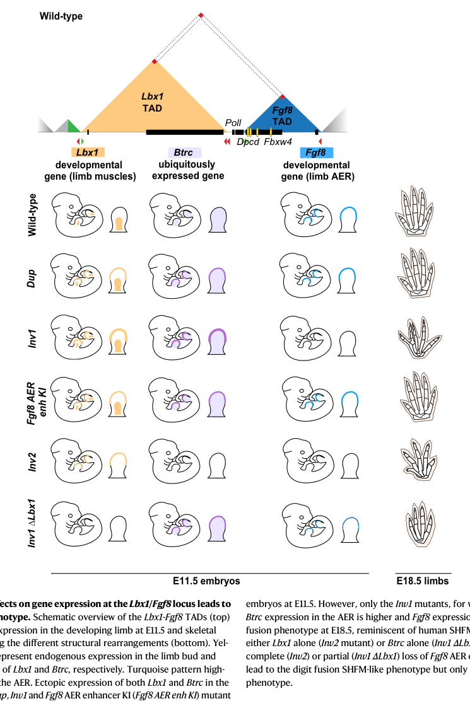

## Question

# Disease Characteristics Research Template

## Target Disease
- **Disease Name:** Split Hand-Foot Malformation
- **MONDO ID:**  (if available)
- **Category:** Mendelian

## Research Objectives

Please provide a comprehensive research report on **Split Hand-Foot Malformation** covering all of the
disease characteristics listed below. This report will be used to populate a disease knowledge
base entry. Be thorough and cite primary literature (PMID preferred) for all claims.

For each section, **suggested databases/resources** are listed. These are the first places
you should search for information on each topic.

---

### 1. Disease Information
> **Search first:** OMIM, Orphanet, ICD-10/ICD-11, MeSH, PubMed

- What is the disease? Provide a concise overview.
- What are the key identifiers? (OMIM, Orphanet, ICD-10/ICD-11, MeSH, Mondo)
- What are the common synonyms and alternative names?
- Is the information derived from individual patients (e.g., EHR) or aggregated disease-level resources?

### 2. Etiology

- **Disease Causal Factors**: What are the primary causes? (genetic, environmental, infectious, mechanistic)
- **Risk Factors**:
  > **Search first:** PubMed, Cochrane Library, UpToDate, clinical guidelines, ClinVar, ClinGen, GWAS Catalog, PheGenI, CTD, CDC, WHO, epidemiological databases
  - Genetic risk factors (causal variants, susceptibility loci, modifier genes)
  - Environmental risk factors (toxins, lifestyle, occupational exposures, age, sex, family history)
- **Protective Factors**:
  > **Search first:** PubMed, Cochrane Library, clinical trial databases, GWAS Catalog, gnomAD, WHO, CDC, nutrition databases
  - Genetic protective factors (protective variants, modifier alleles)
  - Environmental protective factors (diet, lifestyle, exposures that reduce risk)
- **Gene-Environment Interactions**: How do genetic and environmental factors interact to influence disease?
  > **Search first:** CTD, PubMed, PheGenI, GxE databases

### 3. Phenotypes
> **Search first:** HPO (Human Phenotype Ontology), OMIM, Orphanet, PubMed, clinicaltrials.gov, MedDRA, SNOMED CT, DECIPHER, LOINC

For each phenotype, provide:
- **Phenotype type**: symptoms, clinical signs, physical manifestations, behavioral changes, or laboratory abnormalities
  > For symptoms/signs: HPO, OMIM, Orphanet, PubMed
  > For behavioral changes: HPO, DSM, RDoC (Research Domain Criteria), PubMed
  > For laboratory abnormalities: LOINC, SNOMED CT, LabTests Online, PubMed
- **Phenotype characteristics**:
  > **Search first:** OMIM, Orphanet, HPO, PubMed
  - Age of symptom onset (neonatal, childhood, adult-onset, late-onset)
  - Symptom severity (mild, moderate, severe, variable)
  - Symptom progression (stable, progressive, episodic, fluctuating)
  - Frequency among affected individuals (percentage or qualitative)
- **Quality of life impact**: Effects on daily functioning and well-being (per-phenotype when possible)
  > **Search first:** EQ-5D database, SF-36, WHO QOL databases, PubMed
- Suggest HPO (Human Phenotype Ontology) terms for each phenotype

### 4. Genetic/Molecular Information

- **Causal Genes**: Gene mutations or chromosomal abnormalities responsible for disease (gene symbols, OMIM IDs)
  > **Search first:** OMIM, ClinVar, HGMD, Ensembl, NCBI Gene
- **Pathogenic Variants**:
  - Affected genes (gene symbols, HGNC IDs)
    > **Search first:** OMIM, NCBI Gene, Ensembl, HGNC, UniProt, GeneCards
  - Variant classification (pathogenic, likely pathogenic, VUS per ACMG/AMP guidelines)
    > **Search first:** ClinVar, ClinGen, ACMG/AMP guidelines, VarSome
  - Variant type/class (missense, frameshift, nonsense, splice-site, structural)
  - Allele frequency in population databases
    > **Search first:** gnomAD, 1000 Genomes, ExAC, TOPMed, dbSNP
  - Somatic vs germline origin
    > **Search first:** COSMIC (somatic), ClinVar, ICGC, TCGA
  - Functional consequences (loss of function, gain of function, dominant negative)
- **Modifier Genes**: Genes that modify disease severity or expression
- **Epigenetic Information**: DNA methylation, histone modifications, chromatin changes affecting disease
  > **Search first:** ENCODE, Roadmap Epigenomics, MethBase, DiseaseMeth
- **Chromosomal Abnormalities**: Large-scale genetic changes (aneuploidy, translocations, inversions)
  > **Search first:** DECIPHER, ClinVar, ECARUCA, UCSC Genome Browser

### 5. Environmental Information

- **Environmental Factors**: Non-genetic contributing factors (toxins, radiation, pollution, occupational exposure)
  > **Search first:** CTD (Comparative Toxicogenomics Database), TOXNET, PubMed, EPA databases
- **Lifestyle Factors**: Behavioral factors (smoking, diet, exercise, alcohol consumption)
  > **Search first:** CDC databases, WHO, PubMed, NHANES
- **Infectious Agents**: If applicable, pathogens causing or triggering disease (bacteria, viruses, fungi, parasites)
  > **Search first:** NCBI Taxonomy, ViPR, BV-BRC, MicrobeDB, GIDEON

### 6. Mechanism / Pathophysiology

- **Molecular Pathways**: Specific signaling cascades or biochemical pathways involved (Wnt, MAPK, mTOR, PI3K-AKT, etc.)
  > **Search first:** KEGG, Reactome, WikiPathways, PathBank, BioCyc
- **Cellular Processes**: Cell-level mechanisms (apoptosis, autophagy, cell cycle dysregulation, inflammation, etc.)
  > **Search first:** Gene Ontology (GO), Reactome, KEGG, PubMed
- **Protein Dysfunction**: How protein structure or function is altered (misfolding, aggregation, loss of function, gain of function)
  > **Search first:** UniProt, PDB (Protein Data Bank), InterPro, Pfam, AlphaFold
- **Metabolic Changes**: Alterations in metabolic processes (energy metabolism, lipid metabolism, amino acid metabolism)
  > **Search first:** KEGG, BioCyc, HMDB (Human Metabolome Database), BRENDA
- **Immune System Involvement**: Role of immune response (autoimmunity, immunodeficiency, chronic inflammation)
  > **Search first:** ImmPort, Immunome Database, IEDB, Gene Ontology
- **Tissue Damage Mechanisms**: How tissues/ are injured (oxidative stress, ischemia, fibrosis, necrosis)
  > **Search first:** PubMed, Gene Ontology, Reactome
- **Biochemical Abnormalities**: Specific molecular defects (enzyme deficiencies, receptor dysfunction, ion channel defects)
  > **Search first:** BRENDA, UniProt, KEGG, OMIM, PubMed
- **Epigenetic Changes**: DNA methylation, histone modifications affecting gene expression in disease
  > **Search first:** ENCODE, Roadmap Epigenomics, MethBase, DiseaseMeth
- **Molecular Profiling** (if available):
  - Transcriptomics/gene expression changes
    > **Search first:** GEO (Gene Expression Omnibus), ArrayExpress, GTEx, Human Cell Atlas, SRA
  - Proteomics findings
    > **Search first:** PRIDE, ProteomeXchange, Human Protein Atlas, STRING, BioGRID
  - Metabolomics signatures
    > **Search first:** MetaboLights, Metabolomics Workbench, HMDB, METLIN
  - Lipidomics alterations
    > **Search first:** LIPID MAPS, SwissLipids, LipidHome, Metabolomics Workbench
  - Genomic structural features
    > **Search first:** UCSC Genome Browser, Ensembl, NCBI, dbVar, DGV
- **Advanced Technologies** (if applicable):
  - Single-cell analysis findings (cell-type specific mechanisms, cellular heterogeneity)
    > **Search first:** Human Cell Atlas, Single Cell Portal, GEO, CELLxGENE
  - Spatial transcriptomics findings
    > **Search first:** GEO, Spatial Research, Vizgen, 10x Genomics data
  - Multi-omics integration results
    > **Search first:** TCGA, ICGC, cBioPortal, LinkedOmics, PubMed
  - Functional genomics screens (CRISPR, RNAi)
    > **Search first:** DepMap, GenomeRNAi, PubMed, BioGRID ORCS

For each mechanism, describe:
- The causal chain from initial trigger to clinical manifestation
- Which mechanisms are upstream vs downstream
- What cell types and biological processes are involved
- Suggest GO terms for biological processes and CL terms for cell types

### 7. Anatomical Structures Affected

- **Organ Level**:
  - Primary organs directly affected
  - Secondary organ involvement (complications, secondary effects)
  - Body systems involved (cardiovascular, nervous, digestive, respiratory, endocrine, etc.)
  > **Search first:** Uberon, FMA (Foundational Model of Anatomy), OMIM, HPO, ICD-11, MeSH, SNOMED CT
- **Tissue and Cell Level**:
  - Specific tissue types affected (epithelial, connective, muscle, nervous)
  - Specific cell populations targeted (with Cell Ontology terms)
  > **Search first:** Uberon, Human Protein Atlas, Cell Ontology, Human Cell Atlas, CellMarker, PanglaoDB
- **Subcellular Level**:
  - Cellular compartments involved (mitochondria, nucleus, ER, lysosomes) (with GO Cellular Component terms)
  > **Search first:** Gene Ontology (Cellular Component), UniProt, Human Protein Atlas
- **Localization**:
  - Specific anatomical sites (with UBERON terms)
    > **Search first:** FMA, Uberon, NeuroNames (for brain), SNOMED CT
  - Lateralization (unilateral, bilateral, asymmetric)
    > **Search first:** HPO, clinical literature, imaging databases

### 8. Temporal Development

- **Onset**:
  - Typical age of onset (congenital, pediatric, adult, geriatric)
  - Onset pattern (acute, subacute, chronic, insidious)
  > **Search first:** OMIM, Orphanet, HPO, PubMed
- **Progression**:
  - Disease stages (early, intermediate, advanced, end-stage)
    > **Search first:** Cancer Staging Manual (AJCC), WHO classifications, PubMed
  - Progression rate (rapid, slow, variable)
  - Disease course pattern (episodic, relapsing-remitting, progressive, stable)
  - Disease duration (self-limited, chronic lifelong)
  > **Search first:** Disease registries, longitudinal cohort databases, natural history studies, PubMed, Orphanet, OMIM
- **Patterns**:
  - Remission patterns (spontaneous, treatment-induced)
    > **Search first:** Clinical trial databases, disease registries, PubMed
  - Critical periods (time windows of vulnerability or opportunity for intervention)
    > **Search first:** PubMed, developmental biology databases, clinical guidelines

### 9. Inheritance and Population

- **Epidemiology**:
  - Prevalence (cases per 100,000 at given time)
  - Incidence (new cases per 100,000 per year)
  > **Search first:** Orphanet, CDC, WHO, GBD (Global Burden of Disease), national registries, SEER, disease registries
- **For Genetic Etiology**:
  - Inheritance pattern (AD, AR, X-linked, mitochondrial, multifactorial, polygenic)
    > **Search first:** OMIM, Orphanet, ClinVar, GTR (Genetic Testing Registry)
  - Penetrance (complete, incomplete, age-dependent)
    > **Search first:** ClinVar, OMIM, PubMed, ClinGen
  - Expressivity (variable, consistent)
    > **Search first:** OMIM, ClinVar, PubMed
  - Genetic anticipation (increasing severity in successive generations)
    > **Search first:** OMIM, PubMed (especially for repeat expansion disorders)
  - Germline mosaicism
    > **Search first:** ClinVar, OMIM, genetic counseling literature, PubMed
  - Founder effects (population-specific mutations)
    > **Search first:** gnomAD, population genetics databases, PubMed
  - Consanguinity role
    > **Search first:** OMIM, population studies, genetic counseling resources
  - Carrier frequency
    > **Search first:** gnomAD, carrier screening databases, GeneReviews, GTR
- **Population Demographics**:
  - Affected populations (ethnic or demographic groups with higher prevalence)
    > **Search first:** gnomAD, 1000 Genomes, PAGE Study, PubMed, population registries
  - Geographic distribution (endemic areas, regional variation)
    > **Search first:** WHO, CDC, GBD, Orphanet, geographic epidemiology databases
  - Geographic distribution of specific variants
  - Sex ratio (male:female)
    > **Search first:** Disease registries, OMIM, PubMed, epidemiological databases
  - Age distribution of affected individuals
    > **Search first:** CDC, disease registries, SEER, Orphanet

### 10. Diagnostics

- **Clinical Tests**:
  - Laboratory tests (blood, urine, tissue chemistry, specific enzyme assays)
    > **Search first:** LOINC, LabTests Online, PubMed
  - Biomarkers (proteins, metabolites, genetic markers, circulating biomarkers)
    > **Search first:** FDA Biomarker List, BEST (Biomarkers, EndpointS, and other Tools), PubMed
  - Imaging studies (X-ray, CT, MRI, PET, ultrasound)
    > **Search first:** RadLex, DICOM, Radiopaedia, imaging databases
  - Functional tests (pulmonary function, cardiac stress tests)
    > **Search first:** LOINC, clinical guidelines, PubMed
  - Electrophysiology (EEG, EMG, ECG, nerve conduction studies)
    > **Search first:** LOINC, clinical neurophysiology databases, PubMed
  - Biopsy findings (histopathology, immunohistochemistry)
    > **Search first:** SNOMED CT, College of American Pathologists resources, PubMed
  - Pathology findings (microscopic examination)
    > **Search first:** SNOMED CT, Digital Pathology databases, PubMed
- **Genetic Testing**:
  > **Search first:** GTR (Genetic Testing Registry), GeneReviews, ClinGen
  - Overview of recommended genetic testing approach
  - Whole genome sequencing (WGS) utility
    > **Search first:** GTR, ClinVar, GEL (Genomics England), gnomAD
  - Whole exome sequencing (WES) utility
    > **Search first:** GTR, ClinVar, OMIM, GeneMatcher
  - Gene panels (which panels, which genes)
    > **Search first:** GTR, ClinVar, laboratory-specific databases
  - Single gene testing
    > **Search first:** GTR, ClinVar, OMIM, GeneReviews
  - Chromosomal microarray (CMA)
    > **Search first:** DECIPHER, ClinVar, dbVar, ECARUCA
  - Karyotyping
    > **Search first:** Chromosome Abnormality Database, ClinVar, cytogenetics resources
  - FISH
    > **Search first:** ClinVar, cytogenetics databases, PubMed
  - Mitochondrial DNA testing
    > **Search first:** MITOMAP, MSeqDR, ClinVar, GTR
  - Repeat expansion testing
    > **Search first:** GTR, ClinVar, repeat expansion databases, PubMed
- **Omics-Based Diagnostics** (if applicable):
  - RNA sequencing / transcriptomics
    > **Search first:** GEO, ArrayExpress, GTEx, RNA-seq databases
  - Proteomics
    > **Search first:** PRIDE, ProteomeXchange, FDA Biomarker database
  - Metabolomics
    > **Search first:** MetaboLights, Metabolomics Workbench, HMDB
  - Epigenomics
    > **Search first:** GEO, ENCODE, Roadmap Epigenomics, MethBase
  - Liquid biopsy
    > **Search first:** COSMIC, ClinVar, liquid biopsy databases, PubMed
- **Clinical Criteria**:
  - Standardized diagnostic criteria (DSM, ICD, society guidelines)
    > **Search first:** DSM-5, ICD-11, clinical society guidelines, UpToDate
  - Differential diagnosis (other conditions to rule out, with distinguishing features)
    > **Search first:** DynaMed, UpToDate, clinical decision support systems
- **Screening**:
  - Screening methods for asymptomatic individuals (newborn screening, carrier screening, cascade screening)
    > **Search first:** ACMG recommendations, CDC newborn screening, GTR

### 11. Outcome/Prognosis

- **Survival and Mortality**:
  - Survival rate (5-year, 10-year, overall)
    > **Search first:** SEER, cancer registries, disease-specific registries, PubMed
  - Life expectancy (with and without treatment if applicable)
    > **Search first:** Orphanet, disease registries, actuarial databases, PubMed
  - Mortality rate
    > **Search first:** CDC, WHO, GBD, national mortality databases
  - Disease-specific mortality (deaths directly attributable to disease)
    > **Search first:** Disease registries, CDC Wonder, GBD, PubMed
- **Morbidity and Function**:
  - Morbidity (disease-related disability and health impacts)
    > **Search first:** GBD, WHO, disability databases, PubMed
  - Disability outcomes (long-term functional impairments)
    > **Search first:** ICF (International Classification of Functioning), disability registries
  - Quality of life measures (EQ-5D, SF-36, PROMIS, disease-specific tools)
    > **Search first:** EQ-5D database, SF-36, PROMIS, PubMed
- **Disease Course**:
  - Complications (secondary problems: infections, organ failure, etc.)
    > **Search first:** ICD codes, disease registries, clinical databases, PubMed
  - Recovery potential (likelihood and extent of recovery, with vs without treatment)
    > **Search first:** Natural history studies, rehabilitation databases, PubMed
- **Prediction**:
  - Prognostic factors (age, disease severity, biomarkers, treatment response)
    > **Search first:** Prognostic models databases, clinical calculators, PubMed
  - Prognostic biomarkers (molecular markers predicting disease course)
    > **Search first:** FDA Biomarker database, PubMed, cancer prognostic databases

### 12. Treatment

- **Pharmacotherapy**:
  - Pharmacological treatments (drug names, drug classes, mechanisms of action)
    > **Search first:** DrugBank, RxNorm, ATC classification, DailyMed, FDA databases
  - Pharmacogenomics (how genetic variants affect drug metabolism, efficacy, toxicity)
    > **Search first:** PharmGKB, CPIC (Clinical Pharmacogenetics), FDA Table of PGx Biomarkers
- **Advanced Therapeutics**:
  - Gene therapy (viral vectors, CRISPR, gene replacement, gene editing)
    > **Search first:** ClinicalTrials.gov, FDA gene therapy database, ASGCT resources
  - Cell therapy (stem cell transplant, CAR-T, cellular therapeutics)
    > **Search first:** ClinicalTrials.gov, FDA cell therapy database, FACT standards
  - RNA-based therapies (ASOs, siRNA, mRNA therapies)
    > **Search first:** ClinicalTrials.gov, FDA approvals, PubMed
  - Targeted therapies (treatments directed at specific molecular targets)
    > **Search first:** My Cancer Genome, OncoKB, ClinicalTrials.gov, FDA approvals
  - Immunotherapies (checkpoint inhibitors, monoclonal antibodies)
    > **Search first:** Cancer Immunotherapy Database, FDA approvals, ClinicalTrials.gov
- **Surgical and Interventional**:
  - Surgical interventions (types of surgery, timing, outcomes)
    > **Search first:** CPT codes, surgical registries, clinical guidelines, PubMed
- **Supportive and Rehabilitative**:
  - Supportive care (symptom management, pain control, nutrition)
    > **Search first:** Clinical guidelines, Cochrane Library, PubMed
  - Rehabilitation (physical therapy, occupational therapy, speech therapy)
    > **Search first:** Rehabilitation medicine databases, clinical guidelines, PubMed
- **Experimental**:
  - Experimental treatments in clinical trials (with NCT identifiers if available)
    > **Search first:** ClinicalTrials.gov, EU Clinical Trials Register, WHO ICTRP
- **Treatment Outcomes**:
  - Treatment response rates
    > **Search first:** Clinical trial databases, FDA reviews, systematic reviews, PubMed
  - Side effects and adverse events
    > **Search first:** FDA Adverse Event Reporting System (FAERS), MedWatch, PubMed
- **Treatment Strategy**:
  - Treatment algorithms (clinical pathways, decision trees)
    > **Search first:** Clinical practice guidelines, NCCN Guidelines, UpToDate
  - Combination therapies
    > **Search first:** ClinicalTrials.gov, treatment guidelines, PubMed
  - Personalized medicine approaches (genotype-guided treatment)
    > **Search first:** My Cancer Genome, CIViC, PharmGKB, precision medicine databases

For each treatment, suggest MAXO (Medical Action Ontology) terms where applicable.

### 13. Prevention

- **Prevention Levels**:
  - Primary prevention (preventing disease occurrence: vaccination, risk factor modification)
    > **Search first:** CDC, WHO, USPSTF recommendations, Cochrane Library
  - Secondary prevention (early detection and treatment: screening programs, early intervention)
    > **Search first:** USPSTF, CDC screening guidelines, WHO
  - Tertiary prevention (preventing complications in those with disease)
    > **Search first:** Clinical guidelines, disease management protocols, PubMed
- **Immunization**: Vaccine strategies (if applicable)
  > **Search first:** CDC vaccine schedules, WHO immunization, FDA vaccine database
- **Screening and Early Detection**:
  - Screening programs (population-based: newborn screening, cancer screening)
    > **Search first:** CDC screening programs, USPSTF, cancer screening databases
  - Genetic screening (carrier screening, preimplantation genetic diagnosis, prenatal testing)
    > **Search first:** ACMG recommendations, ACOG guidelines, GTR
  - Risk stratification (identifying high-risk individuals for targeted prevention)
    > **Search first:** Risk prediction models, clinical calculators, PubMed
- **Behavioral Interventions**: Lifestyle modifications to reduce risk
  > **Search first:** CDC, WHO, behavioral intervention databases, Cochrane Library
- **Counseling**: Genetic counseling (risk assessment, family planning guidance)
  > **Search first:** NSGC resources, ACMG guidelines, GeneReviews
- **Public Health**:
  - Public health interventions (sanitation, vector control, health education)
    > **Search first:** CDC, WHO, public health databases, PubMed
  - Environmental interventions (reducing environmental risk factors)
    > **Search first:** EPA databases, WHO environmental health, PubMed
- **Prophylaxis**: Preventive medications or procedures
  > **Search first:** Clinical guidelines, FDA approvals, PubMed

### 14. Other Species / Natural Disease

- **Taxonomy**: Species affected (with NCBI Taxon identifiers)
  > **Search first:** NCBI Taxonomy
- **Breed**: Specific breeds affected (with VBO identifiers if applicable)
  > **Search first:** VBO (Vertebrate Breed Ontology)
- **Gene**: Orthologous genes in other species (with NCBI Gene IDs)
  > **Search first:** NCBI Gene
- **Natural Disease**:
  - Naturally occurring disease in other species (companion animals, wildlife)
    > **Search first:** OMIA (Online Mendelian Inheritance in Animals), VetCompass, PubMed
  - Veterinary relevance and importance in animal health
    > **Search first:** OMIA, veterinary databases, PubMed
- **Comparative Biology**:
  - Comparative pathology (similarities and differences across species)
    > **Search first:** OMIA, comparative pathology databases, PubMed
  - Evolutionary conservation of disease mechanisms
    > **Search first:** HomoloGene, OrthoMCL, Alliance of Genome Resources
- **Transmission** (if applicable):
  - Zoonotic potential
    > **Search first:** CDC zoonotic diseases, WHO zoonoses, GIDEON
  - Cross-species susceptibility
    > **Search first:** NCBI Taxonomy, veterinary databases, PubMed

### 15. Model Organisms

- **Model Types**:
  - Model organism type (mammalian, invertebrate, cellular, in vitro)
    > **Search first:** Alliance of Genome Resources, model organism databases
  - Specific model systems (mouse, rat, zebrafish, Drosophila, C. elegans, yeast, cell lines, organoids, iPSCs)
    > **Search first:** MGI, RGD, ZFIN, FlyBase, WormBase, SGD, ATCC, Cellosaurus
  - Induced models (drug treatment, surgical intervention, environmental manipulation)
    > **Search first:** MGI, model organism databases, PubMed
- **Genetic Models**:
  - Types available (knockout, knock-in, transgenic, conditional, humanized)
    > **Search first:** MGI, IMPC, KOMP, EuMMCR, IMSR
- **Model Characteristics**:
  - Phenotype recapitulation (how well model reproduces human disease features)
    > **Search first:** Model organism databases, comparative studies, PubMed
  - Model limitations (aspects of human disease not captured)
    > **Search first:** Model organism databases, PubMed, review articles
- **Applications**:
  - Research applications (what aspects of disease can be studied)
    > **Search first:** Model organism databases, PubMed
- **Resources**:
  - Model databases
    > **Search first:** MGI, RGD, ZFIN, FlyBase, WormBase, IMSR, EMMA, MMRRC

---

## Citation Requirements

- Cite primary literature (PMID preferred) for all mechanistic and clinical claims
- Prioritize recent reviews and landmark papers
- Include direct quotes from abstracts where possible to support key statements
- Distinguish evidence source types: human clinical, model organism, in vitro, computational

## Output Format

Structure your response as a comprehensive narrative organized by the sections above.
For each section, provide:
- Factual content with specific details (numbers, percentages, gene names, variant nomenclature)
- Ontology term suggestions (HPO, GO, CL, UBERON, CHEBI, MAXO, MONDO) where applicable
- Evidence citations with PMIDs
- Direct quotes from abstracts to support key claims
- Clear indication when information is not available or not applicable for this disease

This report will be used to populate a disease knowledge base entry with:
- Pathophysiology descriptions with causal chains
- Gene/protein annotations (HGNC, GO terms)
- Phenotype associations (HP terms) with frequencies
- Cell type involvement (CL terms)
- Anatomical locations (UBERON terms)
- Chemical entities (CHEBI terms)
- Treatment annotations (MAXO terms)
- Evidence items with PMIDs and exact abstract quotes
- Epidemiology, prognosis, diagnostic, and prevention information
- Animal model descriptions with phenotype recapitulation details

## Output

Question: You are an expert researcher providing comprehensive, well-cited information.

Provide detailed information focusing on:
1. Key concepts and definitions with current understanding
2. Recent developments and latest research (prioritize 2023-2024 sources)
3. Current applications and real-world implementations
4. Expert opinions and analysis from authoritative sources
5. Relevant statistics and data from recent studies

Format as a comprehensive research report with proper citations. Include URLs and publication dates where available.
Always prioritize recent, authoritative sources and provide specific citations for all major claims.

# Disease Characteristics Research Template

## Target Disease
- **Disease Name:** Split Hand-Foot Malformation
- **MONDO ID:**  (if available)
- **Category:** Mendelian

## Research Objectives

Please provide a comprehensive research report on **Split Hand-Foot Malformation** covering all of the
disease characteristics listed below. This report will be used to populate a disease knowledge
base entry. Be thorough and cite primary literature (PMID preferred) for all claims.

For each section, **suggested databases/resources** are listed. These are the first places
you should search for information on each topic.

---

### 1. Disease Information
> **Search first:** OMIM, Orphanet, ICD-10/ICD-11, MeSH, PubMed

- What is the disease? Provide a concise overview.
- What are the key identifiers? (OMIM, Orphanet, ICD-10/ICD-11, MeSH, Mondo)
- What are the common synonyms and alternative names?
- Is the information derived from individual patients (e.g., EHR) or aggregated disease-level resources?

### 2. Etiology

- **Disease Causal Factors**: What are the primary causes? (genetic, environmental, infectious, mechanistic)
- **Risk Factors**:
  > **Search first:** PubMed, Cochrane Library, UpToDate, clinical guidelines, ClinVar, ClinGen, GWAS Catalog, PheGenI, CTD, CDC, WHO, epidemiological databases
  - Genetic risk factors (causal variants, susceptibility loci, modifier genes)
  - Environmental risk factors (toxins, lifestyle, occupational exposures, age, sex, family history)
- **Protective Factors**:
  > **Search first:** PubMed, Cochrane Library, clinical trial databases, GWAS Catalog, gnomAD, WHO, CDC, nutrition databases
  - Genetic protective factors (protective variants, modifier alleles)
  - Environmental protective factors (diet, lifestyle, exposures that reduce risk)
- **Gene-Environment Interactions**: How do genetic and environmental factors interact to influence disease?
  > **Search first:** CTD, PubMed, PheGenI, GxE databases

### 3. Phenotypes
> **Search first:** HPO (Human Phenotype Ontology), OMIM, Orphanet, PubMed, clinicaltrials.gov, MedDRA, SNOMED CT, DECIPHER, LOINC

For each phenotype, provide:
- **Phenotype type**: symptoms, clinical signs, physical manifestations, behavioral changes, or laboratory abnormalities
  > For symptoms/signs: HPO, OMIM, Orphanet, PubMed
  > For behavioral changes: HPO, DSM, RDoC (Research Domain Criteria), PubMed
  > For laboratory abnormalities: LOINC, SNOMED CT, LabTests Online, PubMed
- **Phenotype characteristics**:
  > **Search first:** OMIM, Orphanet, HPO, PubMed
  - Age of symptom onset (neonatal, childhood, adult-onset, late-onset)
  - Symptom severity (mild, moderate, severe, variable)
  - Symptom progression (stable, progressive, episodic, fluctuating)
  - Frequency among affected individuals (percentage or qualitative)
- **Quality of life impact**: Effects on daily functioning and well-being (per-phenotype when possible)
  > **Search first:** EQ-5D database, SF-36, WHO QOL databases, PubMed
- Suggest HPO (Human Phenotype Ontology) terms for each phenotype

### 4. Genetic/Molecular Information

- **Causal Genes**: Gene mutations or chromosomal abnormalities responsible for disease (gene symbols, OMIM IDs)
  > **Search first:** OMIM, ClinVar, HGMD, Ensembl, NCBI Gene
- **Pathogenic Variants**:
  - Affected genes (gene symbols, HGNC IDs)
    > **Search first:** OMIM, NCBI Gene, Ensembl, HGNC, UniProt, GeneCards
  - Variant classification (pathogenic, likely pathogenic, VUS per ACMG/AMP guidelines)
    > **Search first:** ClinVar, ClinGen, ACMG/AMP guidelines, VarSome
  - Variant type/class (missense, frameshift, nonsense, splice-site, structural)
  - Allele frequency in population databases
    > **Search first:** gnomAD, 1000 Genomes, ExAC, TOPMed, dbSNP
  - Somatic vs germline origin
    > **Search first:** COSMIC (somatic), ClinVar, ICGC, TCGA
  - Functional consequences (loss of function, gain of function, dominant negative)
- **Modifier Genes**: Genes that modify disease severity or expression
- **Epigenetic Information**: DNA methylation, histone modifications, chromatin changes affecting disease
  > **Search first:** ENCODE, Roadmap Epigenomics, MethBase, DiseaseMeth
- **Chromosomal Abnormalities**: Large-scale genetic changes (aneuploidy, translocations, inversions)
  > **Search first:** DECIPHER, ClinVar, ECARUCA, UCSC Genome Browser

### 5. Environmental Information

- **Environmental Factors**: Non-genetic contributing factors (toxins, radiation, pollution, occupational exposure)
  > **Search first:** CTD (Comparative Toxicogenomics Database), TOXNET, PubMed, EPA databases
- **Lifestyle Factors**: Behavioral factors (smoking, diet, exercise, alcohol consumption)
  > **Search first:** CDC databases, WHO, PubMed, NHANES
- **Infectious Agents**: If applicable, pathogens causing or triggering disease (bacteria, viruses, fungi, parasites)
  > **Search first:** NCBI Taxonomy, ViPR, BV-BRC, MicrobeDB, GIDEON

### 6. Mechanism / Pathophysiology

- **Molecular Pathways**: Specific signaling cascades or biochemical pathways involved (Wnt, MAPK, mTOR, PI3K-AKT, etc.)
  > **Search first:** KEGG, Reactome, WikiPathways, PathBank, BioCyc
- **Cellular Processes**: Cell-level mechanisms (apoptosis, autophagy, cell cycle dysregulation, inflammation, etc.)
  > **Search first:** Gene Ontology (GO), Reactome, KEGG, PubMed
- **Protein Dysfunction**: How protein structure or function is altered (misfolding, aggregation, loss of function, gain of function)
  > **Search first:** UniProt, PDB (Protein Data Bank), InterPro, Pfam, AlphaFold
- **Metabolic Changes**: Alterations in metabolic processes (energy metabolism, lipid metabolism, amino acid metabolism)
  > **Search first:** KEGG, BioCyc, HMDB (Human Metabolome Database), BRENDA
- **Immune System Involvement**: Role of immune response (autoimmunity, immunodeficiency, chronic inflammation)
  > **Search first:** ImmPort, Immunome Database, IEDB, Gene Ontology
- **Tissue Damage Mechanisms**: How tissues/ are injured (oxidative stress, ischemia, fibrosis, necrosis)
  > **Search first:** PubMed, Gene Ontology, Reactome
- **Biochemical Abnormalities**: Specific molecular defects (enzyme deficiencies, receptor dysfunction, ion channel defects)
  > **Search first:** BRENDA, UniProt, KEGG, OMIM, PubMed
- **Epigenetic Changes**: DNA methylation, histone modifications affecting gene expression in disease
  > **Search first:** ENCODE, Roadmap Epigenomics, MethBase, DiseaseMeth
- **Molecular Profiling** (if available):
  - Transcriptomics/gene expression changes
    > **Search first:** GEO (Gene Expression Omnibus), ArrayExpress, GTEx, Human Cell Atlas, SRA
  - Proteomics findings
    > **Search first:** PRIDE, ProteomeXchange, Human Protein Atlas, STRING, BioGRID
  - Metabolomics signatures
    > **Search first:** MetaboLights, Metabolomics Workbench, HMDB, METLIN
  - Lipidomics alterations
    > **Search first:** LIPID MAPS, SwissLipids, LipidHome, Metabolomics Workbench
  - Genomic structural features
    > **Search first:** UCSC Genome Browser, Ensembl, NCBI, dbVar, DGV
- **Advanced Technologies** (if applicable):
  - Single-cell analysis findings (cell-type specific mechanisms, cellular heterogeneity)
    > **Search first:** Human Cell Atlas, Single Cell Portal, GEO, CELLxGENE
  - Spatial transcriptomics findings
    > **Search first:** GEO, Spatial Research, Vizgen, 10x Genomics data
  - Multi-omics integration results
    > **Search first:** TCGA, ICGC, cBioPortal, LinkedOmics, PubMed
  - Functional genomics screens (CRISPR, RNAi)
    > **Search first:** DepMap, GenomeRNAi, PubMed, BioGRID ORCS

For each mechanism, describe:
- The causal chain from initial trigger to clinical manifestation
- Which mechanisms are upstream vs downstream
- What cell types and biological processes are involved
- Suggest GO terms for biological processes and CL terms for cell types

### 7. Anatomical Structures Affected

- **Organ Level**:
  - Primary organs directly affected
  - Secondary organ involvement (complications, secondary effects)
  - Body systems involved (cardiovascular, nervous, digestive, respiratory, endocrine, etc.)
  > **Search first:** Uberon, FMA (Foundational Model of Anatomy), OMIM, HPO, ICD-11, MeSH, SNOMED CT
- **Tissue and Cell Level**:
  - Specific tissue types affected (epithelial, connective, muscle, nervous)
  - Specific cell populations targeted (with Cell Ontology terms)
  > **Search first:** Uberon, Human Protein Atlas, Cell Ontology, Human Cell Atlas, CellMarker, PanglaoDB
- **Subcellular Level**:
  - Cellular compartments involved (mitochondria, nucleus, ER, lysosomes) (with GO Cellular Component terms)
  > **Search first:** Gene Ontology (Cellular Component), UniProt, Human Protein Atlas
- **Localization**:
  - Specific anatomical sites (with UBERON terms)
    > **Search first:** FMA, Uberon, NeuroNames (for brain), SNOMED CT
  - Lateralization (unilateral, bilateral, asymmetric)
    > **Search first:** HPO, clinical literature, imaging databases

### 8. Temporal Development

- **Onset**:
  - Typical age of onset (congenital, pediatric, adult, geriatric)
  - Onset pattern (acute, subacute, chronic, insidious)
  > **Search first:** OMIM, Orphanet, HPO, PubMed
- **Progression**:
  - Disease stages (early, intermediate, advanced, end-stage)
    > **Search first:** Cancer Staging Manual (AJCC), WHO classifications, PubMed
  - Progression rate (rapid, slow, variable)
  - Disease course pattern (episodic, relapsing-remitting, progressive, stable)
  - Disease duration (self-limited, chronic lifelong)
  > **Search first:** Disease registries, longitudinal cohort databases, natural history studies, PubMed, Orphanet, OMIM
- **Patterns**:
  - Remission patterns (spontaneous, treatment-induced)
    > **Search first:** Clinical trial databases, disease registries, PubMed
  - Critical periods (time windows of vulnerability or opportunity for intervention)
    > **Search first:** PubMed, developmental biology databases, clinical guidelines

### 9. Inheritance and Population

- **Epidemiology**:
  - Prevalence (cases per 100,000 at given time)
  - Incidence (new cases per 100,000 per year)
  > **Search first:** Orphanet, CDC, WHO, GBD (Global Burden of Disease), national registries, SEER, disease registries
- **For Genetic Etiology**:
  - Inheritance pattern (AD, AR, X-linked, mitochondrial, multifactorial, polygenic)
    > **Search first:** OMIM, Orphanet, ClinVar, GTR (Genetic Testing Registry)
  - Penetrance (complete, incomplete, age-dependent)
    > **Search first:** ClinVar, OMIM, PubMed, ClinGen
  - Expressivity (variable, consistent)
    > **Search first:** OMIM, ClinVar, PubMed
  - Genetic anticipation (increasing severity in successive generations)
    > **Search first:** OMIM, PubMed (especially for repeat expansion disorders)
  - Germline mosaicism
    > **Search first:** ClinVar, OMIM, genetic counseling literature, PubMed
  - Founder effects (population-specific mutations)
    > **Search first:** gnomAD, population genetics databases, PubMed
  - Consanguinity role
    > **Search first:** OMIM, population studies, genetic counseling resources
  - Carrier frequency
    > **Search first:** gnomAD, carrier screening databases, GeneReviews, GTR
- **Population Demographics**:
  - Affected populations (ethnic or demographic groups with higher prevalence)
    > **Search first:** gnomAD, 1000 Genomes, PAGE Study, PubMed, population registries
  - Geographic distribution (endemic areas, regional variation)
    > **Search first:** WHO, CDC, GBD, Orphanet, geographic epidemiology databases
  - Geographic distribution of specific variants
  - Sex ratio (male:female)
    > **Search first:** Disease registries, OMIM, PubMed, epidemiological databases
  - Age distribution of affected individuals
    > **Search first:** CDC, disease registries, SEER, Orphanet

### 10. Diagnostics

- **Clinical Tests**:
  - Laboratory tests (blood, urine, tissue chemistry, specific enzyme assays)
    > **Search first:** LOINC, LabTests Online, PubMed
  - Biomarkers (proteins, metabolites, genetic markers, circulating biomarkers)
    > **Search first:** FDA Biomarker List, BEST (Biomarkers, EndpointS, and other Tools), PubMed
  - Imaging studies (X-ray, CT, MRI, PET, ultrasound)
    > **Search first:** RadLex, DICOM, Radiopaedia, imaging databases
  - Functional tests (pulmonary function, cardiac stress tests)
    > **Search first:** LOINC, clinical guidelines, PubMed
  - Electrophysiology (EEG, EMG, ECG, nerve conduction studies)
    > **Search first:** LOINC, clinical neurophysiology databases, PubMed
  - Biopsy findings (histopathology, immunohistochemistry)
    > **Search first:** SNOMED CT, College of American Pathologists resources, PubMed
  - Pathology findings (microscopic examination)
    > **Search first:** SNOMED CT, Digital Pathology databases, PubMed
- **Genetic Testing**:
  > **Search first:** GTR (Genetic Testing Registry), GeneReviews, ClinGen
  - Overview of recommended genetic testing approach
  - Whole genome sequencing (WGS) utility
    > **Search first:** GTR, ClinVar, GEL (Genomics England), gnomAD
  - Whole exome sequencing (WES) utility
    > **Search first:** GTR, ClinVar, OMIM, GeneMatcher
  - Gene panels (which panels, which genes)
    > **Search first:** GTR, ClinVar, laboratory-specific databases
  - Single gene testing
    > **Search first:** GTR, ClinVar, OMIM, GeneReviews
  - Chromosomal microarray (CMA)
    > **Search first:** DECIPHER, ClinVar, dbVar, ECARUCA
  - Karyotyping
    > **Search first:** Chromosome Abnormality Database, ClinVar, cytogenetics resources
  - FISH
    > **Search first:** ClinVar, cytogenetics databases, PubMed
  - Mitochondrial DNA testing
    > **Search first:** MITOMAP, MSeqDR, ClinVar, GTR
  - Repeat expansion testing
    > **Search first:** GTR, ClinVar, repeat expansion databases, PubMed
- **Omics-Based Diagnostics** (if applicable):
  - RNA sequencing / transcriptomics
    > **Search first:** GEO, ArrayExpress, GTEx, RNA-seq databases
  - Proteomics
    > **Search first:** PRIDE, ProteomeXchange, FDA Biomarker database
  - Metabolomics
    > **Search first:** MetaboLights, Metabolomics Workbench, HMDB
  - Epigenomics
    > **Search first:** GEO, ENCODE, Roadmap Epigenomics, MethBase
  - Liquid biopsy
    > **Search first:** COSMIC, ClinVar, liquid biopsy databases, PubMed
- **Clinical Criteria**:
  - Standardized diagnostic criteria (DSM, ICD, society guidelines)
    > **Search first:** DSM-5, ICD-11, clinical society guidelines, UpToDate
  - Differential diagnosis (other conditions to rule out, with distinguishing features)
    > **Search first:** DynaMed, UpToDate, clinical decision support systems
- **Screening**:
  - Screening methods for asymptomatic individuals (newborn screening, carrier screening, cascade screening)
    > **Search first:** ACMG recommendations, CDC newborn screening, GTR

### 11. Outcome/Prognosis

- **Survival and Mortality**:
  - Survival rate (5-year, 10-year, overall)
    > **Search first:** SEER, cancer registries, disease-specific registries, PubMed
  - Life expectancy (with and without treatment if applicable)
    > **Search first:** Orphanet, disease registries, actuarial databases, PubMed
  - Mortality rate
    > **Search first:** CDC, WHO, GBD, national mortality databases
  - Disease-specific mortality (deaths directly attributable to disease)
    > **Search first:** Disease registries, CDC Wonder, GBD, PubMed
- **Morbidity and Function**:
  - Morbidity (disease-related disability and health impacts)
    > **Search first:** GBD, WHO, disability databases, PubMed
  - Disability outcomes (long-term functional impairments)
    > **Search first:** ICF (International Classification of Functioning), disability registries
  - Quality of life measures (EQ-5D, SF-36, PROMIS, disease-specific tools)
    > **Search first:** EQ-5D database, SF-36, PROMIS, PubMed
- **Disease Course**:
  - Complications (secondary problems: infections, organ failure, etc.)
    > **Search first:** ICD codes, disease registries, clinical databases, PubMed
  - Recovery potential (likelihood and extent of recovery, with vs without treatment)
    > **Search first:** Natural history studies, rehabilitation databases, PubMed
- **Prediction**:
  - Prognostic factors (age, disease severity, biomarkers, treatment response)
    > **Search first:** Prognostic models databases, clinical calculators, PubMed
  - Prognostic biomarkers (molecular markers predicting disease course)
    > **Search first:** FDA Biomarker database, PubMed, cancer prognostic databases

### 12. Treatment

- **Pharmacotherapy**:
  - Pharmacological treatments (drug names, drug classes, mechanisms of action)
    > **Search first:** DrugBank, RxNorm, ATC classification, DailyMed, FDA databases
  - Pharmacogenomics (how genetic variants affect drug metabolism, efficacy, toxicity)
    > **Search first:** PharmGKB, CPIC (Clinical Pharmacogenetics), FDA Table of PGx Biomarkers
- **Advanced Therapeutics**:
  - Gene therapy (viral vectors, CRISPR, gene replacement, gene editing)
    > **Search first:** ClinicalTrials.gov, FDA gene therapy database, ASGCT resources
  - Cell therapy (stem cell transplant, CAR-T, cellular therapeutics)
    > **Search first:** ClinicalTrials.gov, FDA cell therapy database, FACT standards
  - RNA-based therapies (ASOs, siRNA, mRNA therapies)
    > **Search first:** ClinicalTrials.gov, FDA approvals, PubMed
  - Targeted therapies (treatments directed at specific molecular targets)
    > **Search first:** My Cancer Genome, OncoKB, ClinicalTrials.gov, FDA approvals
  - Immunotherapies (checkpoint inhibitors, monoclonal antibodies)
    > **Search first:** Cancer Immunotherapy Database, FDA approvals, ClinicalTrials.gov
- **Surgical and Interventional**:
  - Surgical interventions (types of surgery, timing, outcomes)
    > **Search first:** CPT codes, surgical registries, clinical guidelines, PubMed
- **Supportive and Rehabilitative**:
  - Supportive care (symptom management, pain control, nutrition)
    > **Search first:** Clinical guidelines, Cochrane Library, PubMed
  - Rehabilitation (physical therapy, occupational therapy, speech therapy)
    > **Search first:** Rehabilitation medicine databases, clinical guidelines, PubMed
- **Experimental**:
  - Experimental treatments in clinical trials (with NCT identifiers if available)
    > **Search first:** ClinicalTrials.gov, EU Clinical Trials Register, WHO ICTRP
- **Treatment Outcomes**:
  - Treatment response rates
    > **Search first:** Clinical trial databases, FDA reviews, systematic reviews, PubMed
  - Side effects and adverse events
    > **Search first:** FDA Adverse Event Reporting System (FAERS), MedWatch, PubMed
- **Treatment Strategy**:
  - Treatment algorithms (clinical pathways, decision trees)
    > **Search first:** Clinical practice guidelines, NCCN Guidelines, UpToDate
  - Combination therapies
    > **Search first:** ClinicalTrials.gov, treatment guidelines, PubMed
  - Personalized medicine approaches (genotype-guided treatment)
    > **Search first:** My Cancer Genome, CIViC, PharmGKB, precision medicine databases

For each treatment, suggest MAXO (Medical Action Ontology) terms where applicable.

### 13. Prevention

- **Prevention Levels**:
  - Primary prevention (preventing disease occurrence: vaccination, risk factor modification)
    > **Search first:** CDC, WHO, USPSTF recommendations, Cochrane Library
  - Secondary prevention (early detection and treatment: screening programs, early intervention)
    > **Search first:** USPSTF, CDC screening guidelines, WHO
  - Tertiary prevention (preventing complications in those with disease)
    > **Search first:** Clinical guidelines, disease management protocols, PubMed
- **Immunization**: Vaccine strategies (if applicable)
  > **Search first:** CDC vaccine schedules, WHO immunization, FDA vaccine database
- **Screening and Early Detection**:
  - Screening programs (population-based: newborn screening, cancer screening)
    > **Search first:** CDC screening programs, USPSTF, cancer screening databases
  - Genetic screening (carrier screening, preimplantation genetic diagnosis, prenatal testing)
    > **Search first:** ACMG recommendations, ACOG guidelines, GTR
  - Risk stratification (identifying high-risk individuals for targeted prevention)
    > **Search first:** Risk prediction models, clinical calculators, PubMed
- **Behavioral Interventions**: Lifestyle modifications to reduce risk
  > **Search first:** CDC, WHO, behavioral intervention databases, Cochrane Library
- **Counseling**: Genetic counseling (risk assessment, family planning guidance)
  > **Search first:** NSGC resources, ACMG guidelines, GeneReviews
- **Public Health**:
  - Public health interventions (sanitation, vector control, health education)
    > **Search first:** CDC, WHO, public health databases, PubMed
  - Environmental interventions (reducing environmental risk factors)
    > **Search first:** EPA databases, WHO environmental health, PubMed
- **Prophylaxis**: Preventive medications or procedures
  > **Search first:** Clinical guidelines, FDA approvals, PubMed

### 14. Other Species / Natural Disease

- **Taxonomy**: Species affected (with NCBI Taxon identifiers)
  > **Search first:** NCBI Taxonomy
- **Breed**: Specific breeds affected (with VBO identifiers if applicable)
  > **Search first:** VBO (Vertebrate Breed Ontology)
- **Gene**: Orthologous genes in other species (with NCBI Gene IDs)
  > **Search first:** NCBI Gene
- **Natural Disease**:
  - Naturally occurring disease in other species (companion animals, wildlife)
    > **Search first:** OMIA (Online Mendelian Inheritance in Animals), VetCompass, PubMed
  - Veterinary relevance and importance in animal health
    > **Search first:** OMIA, veterinary databases, PubMed
- **Comparative Biology**:
  - Comparative pathology (similarities and differences across species)
    > **Search first:** OMIA, comparative pathology databases, PubMed
  - Evolutionary conservation of disease mechanisms
    > **Search first:** HomoloGene, OrthoMCL, Alliance of Genome Resources
- **Transmission** (if applicable):
  - Zoonotic potential
    > **Search first:** CDC zoonotic diseases, WHO zoonoses, GIDEON
  - Cross-species susceptibility
    > **Search first:** NCBI Taxonomy, veterinary databases, PubMed

### 15. Model Organisms

- **Model Types**:
  - Model organism type (mammalian, invertebrate, cellular, in vitro)
    > **Search first:** Alliance of Genome Resources, model organism databases
  - Specific model systems (mouse, rat, zebrafish, Drosophila, C. elegans, yeast, cell lines, organoids, iPSCs)
    > **Search first:** MGI, RGD, ZFIN, FlyBase, WormBase, SGD, ATCC, Cellosaurus
  - Induced models (drug treatment, surgical intervention, environmental manipulation)
    > **Search first:** MGI, model organism databases, PubMed
- **Genetic Models**:
  - Types available (knockout, knock-in, transgenic, conditional, humanized)
    > **Search first:** MGI, IMPC, KOMP, EuMMCR, IMSR
- **Model Characteristics**:
  - Phenotype recapitulation (how well model reproduces human disease features)
    > **Search first:** Model organism databases, comparative studies, PubMed
  - Model limitations (aspects of human disease not captured)
    > **Search first:** Model organism databases, PubMed, review articles
- **Applications**:
  - Research applications (what aspects of disease can be studied)
    > **Search first:** Model organism databases, PubMed
- **Resources**:
  - Model databases
    > **Search first:** MGI, RGD, ZFIN, FlyBase, WormBase, IMSR, EMMA, MMRRC

---

## Citation Requirements

- Cite primary literature (PMID preferred) for all mechanistic and clinical claims
- Prioritize recent reviews and landmark papers
- Include direct quotes from abstracts where possible to support key statements
- Distinguish evidence source types: human clinical, model organism, in vitro, computational

## Output Format

Structure your response as a comprehensive narrative organized by the sections above.
For each section, provide:
- Factual content with specific details (numbers, percentages, gene names, variant nomenclature)
- Ontology term suggestions (HPO, GO, CL, UBERON, CHEBI, MAXO, MONDO) where applicable
- Evidence citations with PMIDs
- Direct quotes from abstracts to support key claims
- Clear indication when information is not available or not applicable for this disease

This report will be used to populate a disease knowledge base entry with:
- Pathophysiology descriptions with causal chains
- Gene/protein annotations (HGNC, GO terms)
- Phenotype associations (HP terms) with frequencies
- Cell type involvement (CL terms)
- Anatomical locations (UBERON terms)
- Chemical entities (CHEBI terms)
- Treatment annotations (MAXO terms)
- Evidence items with PMIDs and exact abstract quotes
- Epidemiology, prognosis, diagnostic, and prevention information
- Animal model descriptions with phenotype recapitulation details

# Split Hand-Foot Malformation (SHFM) / Ectrodactyly — Disease Characteristics Research Report

**Scope and evidence note.** This report is derived from aggregated, disease-level primary/review literature retrieved via tool-based full-text evidence extraction. Where the user requested OMIM/Orphanet/MONDO/ICD/MeSH identifiers, the current tool context did not include authoritative ontology pages, so those identifiers are **not reliably extractable here**; the report focuses on evidence-supported definitions, genetics, mechanisms, diagnostics, and recent (2023–2024) advances from the retrieved peer‑reviewed literature. PMIDs were **not present in the retrieved text excerpts** for most papers; therefore, citations are provided using the available evidence context IDs, and URLs/DOIs and publication dates are included when available.

---

## 1. Disease Information

### 1.1 Concise overview (current understanding)
Split hand-foot malformation (SHFM), also called **ectrodactyly**, is a **congenital limb defect** characterized by a **median cleft of the hands and/or feet** due to **absence or hypoplasia of the central rays** (central digits). (ambrosetti2023splithandfootand pages 1-2, sowinskaseidler2014splithandfootmalformation pages 1-2)

A commonly cited subtype, **SHFM1**, maps to the **7q21q22** region and is described as autosomal dominant with **incomplete penetrance** and **variable expressivity**, and may be associated with extra-limb features such as hearing loss and craniofacial anomalies. (ambrosetti2023splithandfootand pages 1-2)

### 1.2 Synonyms and alternative names
- Split-hand/split-foot malformation (SHFM) (ambrosetti2023splithandfootand pages 1-2)
- Ectrodactyly (bilal2023sequencevariantsin pages 1-2, sowinskaseidler2014splithandfootmalformation pages 1-2)
- “Split hand-foot malformation type 1/3/4/6” depending on locus (sowinskaseidler2014splithandfootmalformation pages 1-2, ambrosetti2023splithandfootand pages 1-2, cova2023combinatorialeffectson pages 1-2, bilal2023sequencevariantsin pages 1-2)
- SHFM with long bone deficiency (SHFLD) for phenotypes with tibia/fibula/femur involvement (deftereou2024acaseofa pages 11-12, umair2019nonsyndromicsplithandfootmalformation pages 1-2)

### 1.3 Key identifiers (OMIM/Orphanet/ICD/MeSH/MONDO)
Not extractable from the current evidence corpus (no direct OMIM/Orphanet/MONDO/ICD/MeSH records were retrieved in the provided tool context). A genetics-oriented review notes that SHFM loci (SHFM1–6 and SHFM/SHFLD) correspond to OMIM-referenced entities, but does not provide the complete identifier table in the excerpted text. (sowinskaseidler2014splithandfootmalformation pages 1-2)

### 1.4 Data source type
Evidence here is primarily from:
- **Aggregated disease-level resources** (reviews) (sowinskaseidler2014splithandfootmalformation pages 1-2, umair2019nonsyndromicsplithandfootmalformation pages 1-2)
- **Individual/family case reports and mechanistic studies** with genomic testing and functional follow-up (ambrosetti2023splithandfootand pages 1-2, akimova2024variableclinicalpresentation pages 1-2, ambrosetti2023splithandfootand pages 4-7, truong2023prdm1dnabindingzinc pages 1-2)

---

## 2. Etiology

### 2.1 Disease causal factors (primary causes)
SHFM is **genetically heterogeneous** with causal contributions from:
1. **Regulatory structural variants (SVs)/CNVs** disrupting limb gene expression domains (7q21 and 10q24 are major examples). (ambrosetti2023splithandfootand pages 1-2, cova2023combinatorialeffectson pages 1-2, cova2023combinatorialeffectson pages 9-11)
2. **Single-gene pathogenic variants** in limb developmental regulators (e.g., WNT10B; PRDM1; TP63 noted in reviews). (bilal2023sequencevariantsin pages 1-2, truong2023prdm1dnabindingzinc pages 1-2, sowinskaseidler2014splithandfootmalformation pages 1-2)

A review emphasizes that SHFM is “clinically and genetically heterogeneous” and that many cases are linked to chromosomal rearrangements (deletions/duplications/inversions/translocations) while a subset is due to point mutations (TP63, WNT10B, DLX5). (sowinskaseidler2014splithandfootmalformation pages 1-2)

### 2.2 Genetic risk factors
#### Major loci/genes (recently supported)
- **SHFM1 (7q21)**: disruptions affecting **DLX5/DLX6** and/or their **tissue-specific enhancers** at 7q21.3; enhancer mechanisms include **DYNC1I1 exonic enhancers (eExons 15/17)**. (ambrosetti2023splithandfootand pages 1-2, ambrosetti2023splithandfootand pages 2-4, sowinskaseidler2023agenotype–phenotypecorrelation pages 13-13)
- **SHFM3 (10q24)**: tandem duplications/inversions at the **LBX1/FGF8 locus** encompassing genes such as **LBX1, BTRC, POLL, FBXW4** (duplications often exclude FGF8 coding sequence). (cova2023combinatorialeffectson pages 2-3, akimova2024variableclinicalpresentation pages 1-2)
- **SHFM6 (12q13.12)**: **biallelic (autosomal recessive) WNT10B** variants. (bilal2023sequencevariantsin pages 1-2, bilal2023sequencevariantsin pages 2-5)
- **PRDM1** (newer implication with functional validation): heterozygous PRDM1 variants with dominant-negative features in zebrafish assays. (truong2023prdm1dnabindingzinc pages 1-2, truong2023prdm1dnabindingzinc pages 2-2)

#### Inheritance patterns / penetrance
- A genetics-focused review states SHFM “shows mostly autosomal dominant inheritance with variable expressivity and reduced penetrance; autosomal recessive and X-linked inheritance are very uncommon.” (sowinskaseidler2014splithandfootmalformation pages 1-2)
- For SHFM1 specifically, a 2023 primary report reiterates autosomal dominant inheritance with **incomplete penetrance** and **variable expressivity**. (ambrosetti2023splithandfootand pages 1-2)
- For SHFM3 (10q24 duplications), 2024 WGS-based family study documents **mosaicism in an unaffected carrier** as a plausible explanation for absence of phenotype, illustrating reduced penetrance/variable expressivity. (akimova2024variableclinicalpresentation pages 1-2, akimova2024variableclinicalpresentation pages 2-3)

### 2.3 Environmental risk factors / protective factors / GxE
No robust 2023–2024 evidence for environmental or protective factors (or gene–environment interactions) was present in the retrieved corpus. SHFM is predominantly treated as a genetic developmental disorder in these sources. (sowinskaseidler2014splithandfootmalformation pages 1-2, ambrosetti2023splithandfootand pages 1-2)

---

## 3. Phenotypes

### 3.1 Core phenotype spectrum
A primary 2023 report defines SHFM as a “congenital limb defect characterized by a median cleft of the hands and/or feet due to the absence/hypoplasia of the central rays.” (ambrosetti2023splithandfootand pages 1-2)

A 2023 WNT10B paper similarly describes SHFM/ectrodactyly as a rare limb deformity with “median cleft of the hand and foot with impaired or missing central rays.” (bilal2023sequencevariantsin pages 1-2)

**Typical manifestations** include:
- Split/median cleft of hand/foot
- Missing or hypoplastic central digits
- Syndactyly of remaining digits (ambrosetti2023splithandfootand pages 1-2, bilal2023sequencevariantsin pages 1-2)

### 3.2 Associated/extra-limb features
- **Hearing loss**: In the SHFM1 context, hearing loss is reported to occur in **~35%** of affected individuals. (ambrosetti2023splithandfootand pages 1-2)
- In a 2023 SHFM1 case with 7q21 deletion affecting DYNC1I1 eExons, the patient had **severe–profound hearing loss** with **inner-ear abnormality (incomplete partition type I)** and required cochlear implantation (see Treatment). (ambrosetti2023splithandfootand pages 4-7)

### 3.3 SHFM with long bone deficiency (SHFLD) / overlap phenotypes
A 2024 review/case report of FATCO associated with SHFLD highlights the broader spectrum in which split-hand/foot phenotypes can coexist with long bone anomalies (tibia/fibula/femur), and cites multiple genetic associations (e.g., DLX5; BHLHA9 duplications; 17p13.3 rearrangements) supporting heterogeneity and overlap with reduction defects. (deftereou2024acaseofa pages 11-12)

### 3.4 Onset, progression, severity
- **Onset**: congenital (implied across sources describing SHFM as congenital limb defect). (ambrosetti2023splithandfootand pages 1-2, sowinskaseidler2014splithandfootmalformation pages 1-2)
- **Severity**: highly variable, including intrafamilial variability (notably with SHFM3 duplications and mosaicism). (akimova2024variableclinicalpresentation pages 2-3)

### 3.5 Suggested HPO terms (examples)
(terms suggested for knowledge-base annotation; not all terms are explicitly enumerated in the sources)
- Split hand: HP:0001171 (suggested)
- Split foot: HP:0001839 (suggested)
- Ectrodactyly: HP:0001159 (suggested)
- Syndactyly: HP:0001159/HP:0006101 (suggested; subtype-specific)
- Sensorineural hearing impairment: HP:0000407 (suggested; for SHFM1 spectrum) (ambrosetti2023splithandfootand pages 1-2, ambrosetti2023splithandfootand pages 4-7)

### 3.6 Quality of life impact
No quantitative QoL instruments (EQ‑5D/SF‑36/PROMIS) were present in the retrieved corpus; however, functional burden is implied by severe limb reduction and need for hearing intervention in syndromic cases. (ambrosetti2023splithandfootand pages 4-7)

---

## 4. Genetic / Molecular Information

### 4.1 Causal genes and variant classes (selected, evidence-backed)

#### SHFM1 (7q21 locus): enhancer disruption affecting DLX5/DLX6
A 2023 study reports a **7q21.13–q21.3 deletion** that does **not include DLX5/DLX6** but removes **DYNC1I1 exons 15 and 17**, described as **exonic enhancers (eExons)** of DLX5/DLX6. Reduced DLX5/DLX6 expression was shown in patient-derived lymphoblastoid cells, supporting a **regulatory SV** mechanism. (ambrosetti2023splithandfootand pages 1-2, ambrosetti2023splithandfootand pages 2-4)

**Mechanistic implication:** disease can result from disruption of regulatory elements even when the target coding genes remain intact. (ambrosetti2023splithandfootand pages 1-2)

#### SHFM3 (10q24): SV-driven chromatin/TAD rewiring and enhancer hijacking
A 2023 Nature Communications paper investigated SHFM3-associated tandem duplications/inversions at the **LBX1/FGF8 locus**. It reports that engineered duplications/inversions restructure chromatin architecture and produce **ectopic activation of Lbx1 and Btrc in the AER** driven by **AER-specific enhancers of Fgf8**. (cova2023combinatorialeffectson pages 1-2, cova2023combinatorialeffectson pages 9-11)

Recent real-world genomics reports show WGS can identify the duplicated segment (e.g., chr10:102,934,495–103,496,555 encompassing **BTRC, POLL, FBXW4, LBX1**), and mosaic state in an unaffected carrier can explain phenotypic variability. (akimova2024variableclinicalpresentation pages 1-2, akimova2024variableclinicalpresentation pages 2-3)

#### SHFM6 (WNT10B): autosomal recessive coding variants
A 2023 Molecular Syndromology report identified **WNT10B** variants in two Pakistani families with non-syndromic SHFM, including a novel **homozygous missense** c.338G>C (p.Gly113Ala) and a **homozygous frameshift** c.884-896del… (p.Phe295Cysfs*87). (bilal2023sequencevariantsin pages 1-2, bilal2023sequencevariantsin pages 2-5)

#### PRDM1: functional genomics-supported gene implication
A 2023 Disease Models & Mechanisms paper reports three novel **heterozygous PRDM1 variants** (including de novo alleles) in SHFM families, with zebrafish functional assays indicating variants act “in a dominant-negative fashion due to disruption of the proline/serine and DNA-binding zinc finger domains.” (truong2023prdm1dnabindingzinc pages 2-2, truong2023prdm1dnabindingzinc pages 2-4)

### 4.2 Modifier genes, epigenetics, allele frequencies
Not extractable from the current evidence corpus (no gnomAD allele frequencies, ClinVar classifications, or epigenetic profiling in patient tissues were included in the excerpts). Mosaicism as a modifier for penetrance is supported in SHFM3 duplication families. (akimova2024variableclinicalpresentation pages 2-3)

---

## 5. Environmental Information

No specific environmental, lifestyle, or infectious contributors were identified in the retrieved SHFM corpus; current evidence emphasizes genetic and regulatory mechanisms in limb development. (sowinskaseidler2014splithandfootmalformation pages 1-2)

---

## 6. Mechanism / Pathophysiology

### 6.1 Central developmental concept: AER dysfunction and altered limb gene regulatory networks
SHFM is widely interpreted as a consequence of disrupted signaling/regulation in the developing limb, particularly the **apical ectodermal ridge (AER)** (or analogous structures in model organisms), leading to loss of central rays. A genetics review notes DLX5/DLX6 expression in the AER and their role in maintaining proliferation of medial AER cells. (sowinskaseidler2014splithandfootmalformation pages 1-2)

### 6.2 2023–2024 mechanistic advances (high-priority)

#### (A) SHFM3 (10q24): 3D genome architecture and enhancer hijacking (mouse in vivo; human SV model)
The 2023 Nature Communications study provides a contemporary mechanistic resolution: SVs at the LBX1/FGF8 locus restructure chromatin domains, enabling AER enhancers normally regulating Fgf8 to activate neighboring genes. Specifically, the study reports ectopic activation of **Lbx1 and Btrc in the AER** in an “Fgf8-like pattern induced by AER-specific enhancers of Fgf8,” and concludes SHFM3 results from “a combinatorial effect on gene misexpression in the developing limb.” (cova2023combinatorialeffectson pages 1-2, cova2023combinatorialeffectson pages 9-11)

**Causal chain (one evidence-backed formulation):**
10q24 duplication/inversion → altered TAD boundaries/enhancer–promoter contacts → AER-specific Fgf8 enhancers contact LBX1/BTRC promoters → ectopic AER expression of LBX1/BTRC ± altered FGF8 → AER dysfunction → central-ray absence/split hand-foot phenotype. (cova2023combinatorialeffectson pages 9-11)

**Visual evidence (figure-based):** the locus/TAD structure and SV consequences are summarized in the retrieved figure panels. (cova2023combinatorialeffectson media 96921fee, cova2023combinatorialeffectson media 2619b58c)

#### (B) PRDM1 variants: disruption of limb induction/outgrowth and AP patterning (zebrafish functional genomics)
The 2023 DMM study integrates human genetics with zebrafish mechanistic work. It reports that PRDM1 variants have reduced function and act dominantly; CUT&RUN demonstrates that Prdm1a directly binds regulatory sequences of key limb genes, including **fgfr1a, dlx5a, dlx6a and smo**, and that prdm1a loss alters expression of these pathways, implicating coordinated FGF and SHH signaling in fin/limb patterning. (truong2023prdm1dnabindingzinc pages 9-10, truong2023prdm1dnabindingzinc pages 10-11)

**Causal chain (evidence-backed):**
PRDM1 zinc-finger/proline-serine disruption → impaired DNA binding/cofactor recruitment → dysregulation of fgfr1a/dlx5a/dlx6a and Shh pathway targets (smo) → defective apical fold (AER analog) maintenance and AP patterning → pectoral fin/limb defects consistent with SHFM. (truong2023prdm1dnabindingzinc pages 10-11, truong2023prdm1dnabindingzinc pages 11-12)

#### (C) SHFM1 (7q21): enhancer deletion lowers DLX5/DLX6 expression
A 2023 Genes report provides a clear example of regulatory etiology: deletion of DYNC1I1 eExons 15/17 leads to reduced DLX5/DLX6 expression (to ~40–45% in the proband vs parents) despite intact DLX coding sequence, supporting a position-effect/long-range enhancer mechanism. (ambrosetti2023splithandfootand pages 4-7, ambrosetti2023splithandfootand pages 2-4)

### 6.3 Suggested pathway/ontology annotations
(ontology suggestions; not all terms appear verbatim in sources)
- **GO Biological Process (examples):** limb development; appendage morphogenesis; regulation of epithelial cell proliferation; anterior/posterior pattern specification; regulation of Wnt signaling; regulation of FGF signaling.
- **Cell Ontology (CL) candidates:** apical ectodermal ridge cells (epithelial ridge cells; suggested), limb bud mesenchymal cells (suggested).
- **UBERON candidates:** hand (UBERON:0002398), foot (UBERON:0002399), limb bud (UBERON:0000069), apical ectodermal ridge (suggested).

---

## 7. Anatomical Structures Affected

### 7.1 Organ/system level
- Primary: hands and feet (autopod), central rays/digits (ambrosetti2023splithandfootand pages 1-2, bilal2023sequencevariantsin pages 1-2)
- Secondary (in SHFM1 spectrum): inner ear structures (hearing loss; malformed cochlea) (ambrosetti2023splithandfootand pages 4-7)

### 7.2 Tissue/cell level (mechanism-driven)
- Limb ectoderm/AER (ectodermal ridge signaling center) implicated by mechanistic studies (cova2023combinatorialeffectson pages 1-2, truong2023prdm1dnabindingzinc pages 10-11)

### 7.3 Subcellular
Not supported in retrieved excerpts.

---

## 8. Temporal Development

- **Typical onset:** congenital (ambrosetti2023splithandfootand pages 1-2)
- **Course:** structural, generally non-progressive limb anatomy; however, associated features like hearing loss may be progressive in some cases (reported “progressive sensorineural hearing loss” in one SHFM1 regulatory-deletion case). (ambrosetti2023splithandfootand pages 4-7)

---

## 9. Inheritance and Population

### 9.1 Epidemiology statistics
- SHFM prevalence is reported as **~1:18,000 live births** in a 2023 SHFM1-focused paper. (ambrosetti2023splithandfootand pages 1-2)
- A 2019 review reports prevalence as **1 per 90,000 live births**, reflecting variability in estimates across sources/populations/definitions. (umair2019nonsyndromicsplithandfootmalformation pages 1-2)

### 9.2 Inheritance patterns
- Predominantly autosomal dominant for common subtypes (SHFM1/3/4/5), often with reduced penetrance and variable expressivity (review-level). (sowinskaseidler2014splithandfootmalformation pages 1-2)
- Autosomal recessive forms exist (e.g., WNT10B SHFM6). (bilal2023sequencevariantsin pages 1-2)

### 9.3 Population variation / founder effects
Not directly addressed in the retrieved excerpts; some recent reports are population-specific family studies (e.g., Pakistani WNT10B families). (bilal2023sequencevariantsin pages 1-2)

---

## 10. Diagnostics

### 10.1 Clinical/radiographic diagnosis
Clinical diagnosis is based on characteristic limb morphology (median cleft, missing central rays) and can be identified prenatally by imaging; specific radiographic criteria were not detailed in the retrieved excerpts. (ambrosetti2023splithandfootand pages 1-2)

### 10.2 Genetic testing: current best-supported real-world workflows

#### (A) CNV/SV detection for SHFM1 regulatory deletions
A 2023 SHFM1 case demonstrates that conventional **karyotype and FISH** can be normal/negative, while **high-resolution SNP array** can detect a pathogenic **7q21 deletion** affecting enhancers and enabling diagnosis; functional validation used expression testing in patient-derived lymphoblastoid cell lines. (ambrosetti2023splithandfootand pages 4-7, ambrosetti2023splithandfootand pages 2-4)

#### (B) WGS for SHFM3 duplications and mosaicism
A 2024 Frontiers in Genetics case report used **whole-genome sequencing** to identify a **10q24.32 duplication** and applied segregation/validation PCR; importantly, it identified a **mosaic duplication (~10%)** in an unaffected grandmother, explaining variable phenotype. (akimova2024variableclinicalpresentation pages 1-2, akimova2024variableclinicalpresentation pages 2-3)

#### (C) 2024 innovation: single-cell detection for prenatal/PGT settings
An Oct 2024 Orphanet Journal of Rare Diseases paper proposes a workflow for single-cell detection of 10q24 duplications for SHFM3 in limited DNA contexts, integrating **NGS**, **SNP array/Karyomapping**, **whole-genome amplification (MDA/MALBAC)**, and **single-molecule sequencing**, aiming to improve accuracy in IVF‑PGT and prenatal diagnosis. (wang2024anovelapproach pages 6-7)

### 10.3 Differential diagnosis
Not systematically enumerated in the retrieved excerpts. Clinically overlapping entities include SHFLD/FATCO and other reduction defect syndromes. (deftereou2024acaseofa pages 11-12)

---

## 11. Outcome / Prognosis

No cohort-based survival or life expectancy data were present in the retrieved excerpts. Prognosis is primarily functional and depends on severity of limb reduction and associated anomalies (e.g., hearing loss). (ambrosetti2023splithandfootand pages 4-7)

---

## 12. Treatment

### 12.1 Current applications / real-world implementations
- In an SHFM1 case with severe hearing impairment, **cochlear implantation** was performed (real-world intervention for syndromic feature). (ambrosetti2023splithandfootand pages 4-7)

Most limb-directed management (reconstructive hand/foot surgery, prosthetics, occupational therapy) is standard of care for congenital limb differences, but specific surgical outcome datasets were not contained in the retrieved excerpts.

### 12.2 Clinical trials
No SHFM-specific interventional clinical trials were identified in the retrieved evidence corpus.

### 12.3 Suggested MAXO terms (examples)
- MAXO:0000015 Surgical procedure (suggested)
- MAXO:0000767 Genetic testing (suggested)
- MAXO:0000504 Cochlear implantation (suggested; supported by case) (ambrosetti2023splithandfootand pages 4-7)

---

## 13. Prevention

No environmental primary prevention strategies were supported by retrieved evidence. For genetic forms, prevention in practice centers on **genetic counseling** and **reproductive options** (e.g., prenatal diagnosis, PGT) supported by recent single-cell CNV diagnostic work and SHFM3 family recurrence reports. (wang2024anovelapproach pages 6-7, singh2025uncoveringthegenetic pages 1-2)

---

## 14. Other Species / Natural Disease

Not addressed in the retrieved excerpts.

---

## 15. Model Organisms

### 15.1 Mouse models (SHFM3 mechanism)
CRISPR-engineered duplication/inversion alleles at the Lbx1/Fgf8 locus in mice are used to test chromatin architecture changes and limb phenotypes, directly modeling human SHFM3 SVs. (cova2023combinatorialeffectson pages 1-2, cova2023combinatorialeffectson pages 9-11)

### 15.2 Zebrafish models (PRDM1-associated SHFM)
Zebrafish **prdm1a** mutants (loss-of-function) show pectoral fin defects, and overexpression/rescue assays demonstrate that human SHFM-associated PRDM1 variants fail to rescue, supporting pathogenicity and providing a functional validation platform. (truong2023prdm1dnabindingzinc pages 2-4, truong2023prdm1dnabindingzinc pages 10-11)

---

# 2023–2024 “latest research” highlights (expert synthesis)

1. **3D genome / enhancer hijacking has become a primary mechanistic explanation for SHFM3**: the 2023 Nature Communications work provides a high-resolution, in vivo demonstration that SVs at 10q24 alter TAD architecture and cause AER misexpression of Lbx1/Btrc, requiring combinatorial misexpression to produce phenotype. (cova2023combinatorialeffectson pages 9-11)
2. **Regulatory deletions in SHFM1 are increasingly interpreted through enhancer logic rather than coding loss**, exemplified by the 2023 Genes report demonstrating reduced DLX5/DLX6 expression due to deletion of DYNC1I1 exonic enhancers. (ambrosetti2023splithandfootand pages 4-7)
3. **Clinical genomics is shifting toward higher-resolution and context-specific assays**: WGS for CNV/SV and mosaicism in familial SHFM3 (Jan 2024), and single-cell CNV workflows for IVF‑PGT/prenatal diagnosis (Oct 2024). (akimova2024variableclinicalpresentation pages 1-2, wang2024anovelapproach pages 6-7)

---

# Genetics summary table (for knowledge-base ingestion)

| Subtype/Mechanism | Locus/genes | Inheritance/penetrance notes | Key phenotype/extra features | Key 2023-2024 evidence source (citation id) | Publication (journal, date) and URL/DOI |
|---|---|---|---|---|---|
| **SHFM1 – 7q21 regulatory/coding defects** | **7q21.3**; **DLX5/DLX6** and long-range enhancers including **DYNC1I1 eExons 15/17** | Usually **autosomal dominant** with **incomplete penetrance** and **variable expressivity**; pathogenic mechanism often regulatory (enhancer deletion/separation) rather than coding loss alone (ambrosetti2023splithandfootand pages 1-2, ambrosetti2023splithandfootand pages 7-8, sowinskaseidler2023agenotype–phenotypecorrelation pages 13-13) | Median cleft/split hand-foot; may include **hearing loss** (~35% in SHFM1 context), inner-ear anomalies, craniofacial anomalies, developmental delay in some rearrangements (ambrosetti2023splithandfootand pages 1-2, ambrosetti2023splithandfootand pages 4-7) | (ambrosetti2023splithandfootand pages 1-2, ambrosetti2023splithandfootand pages 2-4, sowinskaseidler2023agenotype–phenotypecorrelation pages 13-13) | **Genes** (26 Jul 2023): Ambrosetti et al., *Split hand-foot and deafness in a patient with 7q21.13-q21.3 deletion not including the DLX5/6 genes*. https://doi.org/10.3390/genes14081526 ; **Frontiers in Molecular Biosciences** (Oct 2023): Sowińska-Seidler et al. https://doi.org/10.3389/fmolb.2023.1250714 |
| **SHFM3 – 10q24 structural-variant mechanism** | **10q24.31-q24.32**; **LBX1, BTRC, FBXW4, POLL** with altered regulation of the **LBX1/FGF8 locus** and AER enhancers in **FBXW4/Fgf8** domain | Usually **autosomal dominant**; marked **variable expressivity** and **reduced penetrance**; **mosaicism** documented in unaffected/less affected carriers; mechanism is chromatin/TAD rewiring by duplication or inversion (akimova2024variableclinicalpresentation pages 1-2, akimova2024variableclinicalpresentation pages 2-3, cova2023combinatorialeffectson pages 1-2, cova2023combinatorialeffectson pages 9-11) | Split hand/foot with central-ray deficiency; severity ranges from mild SHFM to severe limb deficiencies; some families show syndromic features (hearing/renal/craniofacial) depending on rearrangement extent (dimitrov2010distallimbdeficiencies pages 9-11, akimova2024variableclinicalpresentation pages 1-2) | (cova2023combinatorialeffectson pages 1-2, cova2023combinatorialeffectson pages 9-11, akimova2024variableclinicalpresentation pages 1-2) | **Nature Communications** (Mar 2023): Cova et al., *Combinatorial effects on gene expression at the Lbx1/Fgf8 locus resolve split-hand/foot malformation type 3*. https://doi.org/10.1038/s41467-023-37057-z ; **Frontiers in Genetics** (05 Jan 2024): Akimova et al. https://doi.org/10.3389/fgene.2023.1303807 ; **Orphanet Journal of Rare Diseases** (Oct 2024): Wang et al. https://doi.org/10.1186/s13023-024-03386-5 |
| **SHFM4 – TP63-related** | **3q28**; **TP63** | Typically **autosomal dominant**; **incomplete penetrance** documented; variable intrafamilial expression (sowinskaseidler2014splithandfootmalformation pages 1-2) | Isolated or syndromic ectrodactyly; classic central-ray absence/hypoplasia, sometimes with ectodermal findings depending on allele/syndrome context (sowinskaseidler2014splithandfootmalformation pages 1-2) | (sowinskaseidler2014splithandfootmalformation pages 1-2) | **Journal of Applied Genetics** (Oct 2014): Sowińska-Seidler et al., diagnostic/genetic overview including SHFM4. https://doi.org/10.1007/s13353-013-0178-5 |
| **SHFM6 – WNT10B-related** | **12q13.12**; **WNT10B** | **Autosomal recessive**; usually **homozygous** variants in consanguineous or multiplex families (bilal2023sequencevariantsin pages 1-2, bilal2023sequencevariantsin pages 2-5, umair2019nonsyndromicsplithandfootmalformation pages 7-8) | Non-syndromic SHFM with median clefts, missing central digits, complex syndactyly; some reports note dental anomalies/oligodontia and broader phenotypic variability (bilal2023sequencevariantsin pages 1-2, umair2019nonsyndromicsplithandfootmalformation pages 7-8) | (bilal2023sequencevariantsin pages 1-2, bilal2023sequencevariantsin pages 2-5) | **Molecular Syndromology** (20 Jun 2023): Bilal et al., *Sequence variants in the WNT10B underlying non-syndromic split-hand/foot malformation*. https://doi.org/10.1159/000531069 |
| **PRDM1 – newly implicated monogenic SHFM gene** | **PRDM1** (BLIMP1); limb regulatory targets include **fgfr1a, dlx5a, dlx6a, smo** in zebrafish fin/limb models | Appears **heterozygous** with **dominant-negative** mechanism; **incomplete penetrance/variable expressivity** reported in families (truong2023prdm1dnabindingzinc pages 9-10, truong2023prdm1dnabindingzinc pages 11-12, truong2023prdm1dnabindingzinc pages 2-2) | SHFM with disruption of fin/limb induction, outgrowth, and AP patterning pathways; functional assays show failure to rescue fin defects and altered AER/AF-related gene regulation (truong2023prdm1dnabindingzinc pages 9-10, truong2023prdm1dnabindingzinc pages 1-2, truong2023prdm1dnabindingzinc pages 2-2) | (truong2023prdm1dnabindingzinc pages 9-10, truong2023prdm1dnabindingzinc pages 1-2, truong2023prdm1dnabindingzinc pages 2-2) | **Disease Models & Mechanisms** (Apr 2023): Truong et al., *PRDM1 DNA-binding zinc finger domain is required for normal limb development and is disrupted in split hand/foot malformation*. https://doi.org/10.1242/dmm.049977 |

*Table: This table summarizes the main SHFM loci and mechanisms most relevant for disease knowledge-base curation, emphasizing the best-supported 2023-2024 evidence for regulatory, structural-variant, and monogenic causes.*

---

# Figure-based evidence (mechanism visualization)

A locus schematic and model summarizing SHFM3 structural variants, TAD reorganization, and AER misexpression of Lbx1/Btrc were retrieved from the 2023 Nature Communications study (Cova et al.). (cova2023combinatorialeffectson media 96921fee, cova2023combinatorialeffectson media 2619b58c)

---

## Direct abstract quotes (as available in retrieved excerpts)

- SHFM definition and SHFM1 context: “Split Hand-Foot Malformation (SHFM) is a congenital limb defect characterized by a median cleft of the hands and/or feet due to the absence/hypoplasia of the central rays.” (ambrosetti2023splithandfootand pages 1-2)
- PRDM1 mechanism statement (from excerpted abstract text): PRDM1 variants “act in a dominant-negative fashion due to disruption of the proline/serine and DNA-binding zinc finger domains.” (truong2023prdm1dnabindingzinc pages 2-2)

---

## Key limitations of this report (data gaps)

- **Ontology identifiers** (MONDO/MeSH/ICD/Orphanet/OMIM IDs) were not retrievable from the current tool context.
- **PMIDs** were generally absent from the extracted full-text snippets; DOIs/URLs and dates are provided instead.
- **Treatment outcomes and QoL metrics** are not well represented in the retrieved corpus; additional targeted retrieval (hand surgery outcomes, rehabilitation, prosthetic use) would be needed for quantitative treatment sections.

References

1. (ambrosetti2023splithandfootand pages 1-2): Irene Ambrosetti, Laura Bernardini, Marzia Pollazzon, Maria Grazia Giuffrida, Valentina Guida, Francesca Peluso, Maria Chiara Baroni, Valeria Polizzi, Manuela Napoli, Simonetta Rosato, Gabriele Trimarchi, Chiara Gelmini, Stefano Giuseppe Caraffi, Anita Wischmeijer, Daniele Frattini, Antonio Novelli, and Livia Garavelli. Split hand-foot and deafness in a patient with 7q21.13-q21.3 deletion not including the dlx5/6 genes. Genes, 14:1526, Jul 2023. URL: https://doi.org/10.3390/genes14081526, doi:10.3390/genes14081526. This article has 5 citations.

2. (sowinskaseidler2014splithandfootmalformation pages 1-2): Anna Sowińska-Seidler, Magdalena Socha, and Aleksander Jamsheer. Split-hand/foot malformation - molecular cause and implications in genetic counseling. Journal of Applied Genetics, 55:105-115, Oct 2014. URL: https://doi.org/10.1007/s13353-013-0178-5, doi:10.1007/s13353-013-0178-5. This article has 110 citations and is from a peer-reviewed journal.

3. (bilal2023sequencevariantsin pages 1-2): Muhammad Bilal, Tobias B. Haack, Rebecca Buchert, Susana Peralta, Imtiaz Ahmad, Faisal, Sanaullah Abbasi, and Wasim Ahmad. Sequence variants in the wnt10b underlying non-syndromic split-hand/foot malformation. Molecular Syndromology, 14:469-476, Jun 2023. URL: https://doi.org/10.1159/000531069, doi:10.1159/000531069. This article has 3 citations and is from a peer-reviewed journal.

4. (cova2023combinatorialeffectson pages 1-2): Giulia Cova, Juliane Glaser, Robert Schöpflin, Cesar Augusto Prada-Medina, Salaheddine Ali, Martin Franke, Rita Falcone, Miriam Federer, Emanuela Ponzi, Romina Ficarella, Francesca Novara, Lars Wittler, Bernd Timmermann, Mattia Gentile, Orsetta Zuffardi, Malte Spielmann, and Stefan Mundlos. Combinatorial effects on gene expression at the lbx1/fgf8 locus resolve split-hand/foot malformation type 3. Nature Communications, Mar 2023. URL: https://doi.org/10.1038/s41467-023-37057-z, doi:10.1038/s41467-023-37057-z. This article has 32 citations and is from a highest quality peer-reviewed journal.

5. (deftereou2024acaseofa pages 11-12): Theodora- Eleftheria Deftereou, Vaya R Karapepera, Christina Angelika Alexiadi, Stylianos Tologkos, Vasiliki Papadatou, Georgios Alexiadis, Dimitrios Karamanidis, and Lambropoulou Maria. A case of fibular aplasia-tibial campomelia-oligosyndactyly (fatco) syndrome associated with split hand/foot syndrome with long bone deficiency (shfld) and review of the literature. Cureus, Jul 2024. URL: https://doi.org/10.7759/cureus.65162, doi:10.7759/cureus.65162. This article has 0 citations.

6. (umair2019nonsyndromicsplithandfootmalformation pages 1-2): Muhammad Umair and Amir Hayat. Nonsyndromic split-hand/foot malformation: recent classification. Molecular Syndromology, 10:243-254, Sep 2019. URL: https://doi.org/10.1159/000502784, doi:10.1159/000502784. This article has 42 citations and is from a peer-reviewed journal.

7. (akimova2024variableclinicalpresentation pages 1-2): Daria Akimova, Tatiana Markova, Maria Ampleeva, and Mikhail Skoblov. Variable clinical presentation of split hand/foot malformation syndrome in a family with microduplication of 10q24.32: a case report. Frontiers in Genetics, Jan 2024. URL: https://doi.org/10.3389/fgene.2023.1303807, doi:10.3389/fgene.2023.1303807. This article has 2 citations and is from a peer-reviewed journal.

8. (ambrosetti2023splithandfootand pages 4-7): Irene Ambrosetti, Laura Bernardini, Marzia Pollazzon, Maria Grazia Giuffrida, Valentina Guida, Francesca Peluso, Maria Chiara Baroni, Valeria Polizzi, Manuela Napoli, Simonetta Rosato, Gabriele Trimarchi, Chiara Gelmini, Stefano Giuseppe Caraffi, Anita Wischmeijer, Daniele Frattini, Antonio Novelli, and Livia Garavelli. Split hand-foot and deafness in a patient with 7q21.13-q21.3 deletion not including the dlx5/6 genes. Genes, 14:1526, Jul 2023. URL: https://doi.org/10.3390/genes14081526, doi:10.3390/genes14081526. This article has 5 citations.

9. (truong2023prdm1dnabindingzinc pages 1-2): Brittany T. Truong, Lomeli C. Shull, Ezra Lencer, Eric G. Bend, Michael Field, Elizabeth E. Blue, Michael J. Bamshad, Cindy Skinner, David Everman, Charles E. Schwartz, Heather Flanagan-Steet, and Kristin B. Artinger. Prdm1 dna-binding zinc finger domain is required for normal limb development and is disrupted in split hand/foot malformation. Apr 2023. URL: https://doi.org/10.1242/dmm.049977, doi:10.1242/dmm.049977. This article has 9 citations and is from a domain leading peer-reviewed journal.

10. (cova2023combinatorialeffectson pages 9-11): Giulia Cova, Juliane Glaser, Robert Schöpflin, Cesar Augusto Prada-Medina, Salaheddine Ali, Martin Franke, Rita Falcone, Miriam Federer, Emanuela Ponzi, Romina Ficarella, Francesca Novara, Lars Wittler, Bernd Timmermann, Mattia Gentile, Orsetta Zuffardi, Malte Spielmann, and Stefan Mundlos. Combinatorial effects on gene expression at the lbx1/fgf8 locus resolve split-hand/foot malformation type 3. Nature Communications, Mar 2023. URL: https://doi.org/10.1038/s41467-023-37057-z, doi:10.1038/s41467-023-37057-z. This article has 32 citations and is from a highest quality peer-reviewed journal.

11. (ambrosetti2023splithandfootand pages 2-4): Irene Ambrosetti, Laura Bernardini, Marzia Pollazzon, Maria Grazia Giuffrida, Valentina Guida, Francesca Peluso, Maria Chiara Baroni, Valeria Polizzi, Manuela Napoli, Simonetta Rosato, Gabriele Trimarchi, Chiara Gelmini, Stefano Giuseppe Caraffi, Anita Wischmeijer, Daniele Frattini, Antonio Novelli, and Livia Garavelli. Split hand-foot and deafness in a patient with 7q21.13-q21.3 deletion not including the dlx5/6 genes. Genes, 14:1526, Jul 2023. URL: https://doi.org/10.3390/genes14081526, doi:10.3390/genes14081526. This article has 5 citations.

12. (sowinskaseidler2023agenotype–phenotypecorrelation pages 13-13): Anna Sowińska-Seidler, Magdalena Socha, Anna Szoszkiewicz, Anna Materna-Kiryluk, and Aleksander Jamsheer. A genotype–phenotype correlation in split-hand/foot malformation type 1: further refinement of the phenotypic subregions within the 7q21.3 locus. Frontiers in Molecular Biosciences, Oct 2023. URL: https://doi.org/10.3389/fmolb.2023.1250714, doi:10.3389/fmolb.2023.1250714. This article has 3 citations.

13. (cova2023combinatorialeffectson pages 2-3): Giulia Cova, Juliane Glaser, Robert Schöpflin, Cesar Augusto Prada-Medina, Salaheddine Ali, Martin Franke, Rita Falcone, Miriam Federer, Emanuela Ponzi, Romina Ficarella, Francesca Novara, Lars Wittler, Bernd Timmermann, Mattia Gentile, Orsetta Zuffardi, Malte Spielmann, and Stefan Mundlos. Combinatorial effects on gene expression at the lbx1/fgf8 locus resolve split-hand/foot malformation type 3. Nature Communications, Mar 2023. URL: https://doi.org/10.1038/s41467-023-37057-z, doi:10.1038/s41467-023-37057-z. This article has 32 citations and is from a highest quality peer-reviewed journal.

14. (bilal2023sequencevariantsin pages 2-5): Muhammad Bilal, Tobias B. Haack, Rebecca Buchert, Susana Peralta, Imtiaz Ahmad, Faisal, Sanaullah Abbasi, and Wasim Ahmad. Sequence variants in the wnt10b underlying non-syndromic split-hand/foot malformation. Molecular Syndromology, 14:469-476, Jun 2023. URL: https://doi.org/10.1159/000531069, doi:10.1159/000531069. This article has 3 citations and is from a peer-reviewed journal.

15. (truong2023prdm1dnabindingzinc pages 2-2): Brittany T. Truong, Lomeli C. Shull, Ezra Lencer, Eric G. Bend, Michael Field, Elizabeth E. Blue, Michael J. Bamshad, Cindy Skinner, David Everman, Charles E. Schwartz, Heather Flanagan-Steet, and Kristin B. Artinger. Prdm1 dna-binding zinc finger domain is required for normal limb development and is disrupted in split hand/foot malformation. Apr 2023. URL: https://doi.org/10.1242/dmm.049977, doi:10.1242/dmm.049977. This article has 9 citations and is from a domain leading peer-reviewed journal.

16. (akimova2024variableclinicalpresentation pages 2-3): Daria Akimova, Tatiana Markova, Maria Ampleeva, and Mikhail Skoblov. Variable clinical presentation of split hand/foot malformation syndrome in a family with microduplication of 10q24.32: a case report. Frontiers in Genetics, Jan 2024. URL: https://doi.org/10.3389/fgene.2023.1303807, doi:10.3389/fgene.2023.1303807. This article has 2 citations and is from a peer-reviewed journal.

17. (truong2023prdm1dnabindingzinc pages 2-4): Brittany T. Truong, Lomeli C. Shull, Ezra Lencer, Eric G. Bend, Michael Field, Elizabeth E. Blue, Michael J. Bamshad, Cindy Skinner, David Everman, Charles E. Schwartz, Heather Flanagan-Steet, and Kristin B. Artinger. Prdm1 dna-binding zinc finger domain is required for normal limb development and is disrupted in split hand/foot malformation. Apr 2023. URL: https://doi.org/10.1242/dmm.049977, doi:10.1242/dmm.049977. This article has 9 citations and is from a domain leading peer-reviewed journal.

18. (cova2023combinatorialeffectson media 96921fee): Giulia Cova, Juliane Glaser, Robert Schöpflin, Cesar Augusto Prada-Medina, Salaheddine Ali, Martin Franke, Rita Falcone, Miriam Federer, Emanuela Ponzi, Romina Ficarella, Francesca Novara, Lars Wittler, Bernd Timmermann, Mattia Gentile, Orsetta Zuffardi, Malte Spielmann, and Stefan Mundlos. Combinatorial effects on gene expression at the lbx1/fgf8 locus resolve split-hand/foot malformation type 3. Nature Communications, Mar 2023. URL: https://doi.org/10.1038/s41467-023-37057-z, doi:10.1038/s41467-023-37057-z. This article has 32 citations and is from a highest quality peer-reviewed journal.

19. (cova2023combinatorialeffectson media 2619b58c): Giulia Cova, Juliane Glaser, Robert Schöpflin, Cesar Augusto Prada-Medina, Salaheddine Ali, Martin Franke, Rita Falcone, Miriam Federer, Emanuela Ponzi, Romina Ficarella, Francesca Novara, Lars Wittler, Bernd Timmermann, Mattia Gentile, Orsetta Zuffardi, Malte Spielmann, and Stefan Mundlos. Combinatorial effects on gene expression at the lbx1/fgf8 locus resolve split-hand/foot malformation type 3. Nature Communications, Mar 2023. URL: https://doi.org/10.1038/s41467-023-37057-z, doi:10.1038/s41467-023-37057-z. This article has 32 citations and is from a highest quality peer-reviewed journal.

20. (truong2023prdm1dnabindingzinc pages 9-10): Brittany T. Truong, Lomeli C. Shull, Ezra Lencer, Eric G. Bend, Michael Field, Elizabeth E. Blue, Michael J. Bamshad, Cindy Skinner, David Everman, Charles E. Schwartz, Heather Flanagan-Steet, and Kristin B. Artinger. Prdm1 dna-binding zinc finger domain is required for normal limb development and is disrupted in split hand/foot malformation. Apr 2023. URL: https://doi.org/10.1242/dmm.049977, doi:10.1242/dmm.049977. This article has 9 citations and is from a domain leading peer-reviewed journal.

21. (truong2023prdm1dnabindingzinc pages 10-11): Brittany T. Truong, Lomeli C. Shull, Ezra Lencer, Eric G. Bend, Michael Field, Elizabeth E. Blue, Michael J. Bamshad, Cindy Skinner, David Everman, Charles E. Schwartz, Heather Flanagan-Steet, and Kristin B. Artinger. Prdm1 dna-binding zinc finger domain is required for normal limb development and is disrupted in split hand/foot malformation. Apr 2023. URL: https://doi.org/10.1242/dmm.049977, doi:10.1242/dmm.049977. This article has 9 citations and is from a domain leading peer-reviewed journal.

22. (truong2023prdm1dnabindingzinc pages 11-12): Brittany T. Truong, Lomeli C. Shull, Ezra Lencer, Eric G. Bend, Michael Field, Elizabeth E. Blue, Michael J. Bamshad, Cindy Skinner, David Everman, Charles E. Schwartz, Heather Flanagan-Steet, and Kristin B. Artinger. Prdm1 dna-binding zinc finger domain is required for normal limb development and is disrupted in split hand/foot malformation. Apr 2023. URL: https://doi.org/10.1242/dmm.049977, doi:10.1242/dmm.049977. This article has 9 citations and is from a domain leading peer-reviewed journal.

23. (wang2024anovelapproach pages 6-7): Yaqian Wang, Yang Li, Lidong Zeng, Wenbo Li, Xin Dong, Jia Guo, Xiangrui Meng, Jiacheng Lu, and Jiawei Xu. A novel approach to detecting microduplication in split hand/foot malformation type 3 at the single-cell level: shfm as a case study. Orphanet Journal of Rare Diseases, Oct 2024. URL: https://doi.org/10.1186/s13023-024-03386-5, doi:10.1186/s13023-024-03386-5. This article has 0 citations and is from a peer-reviewed journal.

24. (singh2025uncoveringthegenetic pages 1-2): Arati Singh, Gayatri Nerakh, and Shagun Aggarwal. Uncovering the genetic basis of recurrent split hand/foot malformation: a case report and review. Journal of Fetal Medicine, 12:130-133, Sep 2025. URL: https://doi.org/10.1055/s-0045-1814130, doi:10.1055/s-0045-1814130. This article has 0 citations.

25. (ambrosetti2023splithandfootand pages 7-8): Irene Ambrosetti, Laura Bernardini, Marzia Pollazzon, Maria Grazia Giuffrida, Valentina Guida, Francesca Peluso, Maria Chiara Baroni, Valeria Polizzi, Manuela Napoli, Simonetta Rosato, Gabriele Trimarchi, Chiara Gelmini, Stefano Giuseppe Caraffi, Anita Wischmeijer, Daniele Frattini, Antonio Novelli, and Livia Garavelli. Split hand-foot and deafness in a patient with 7q21.13-q21.3 deletion not including the dlx5/6 genes. Genes, 14:1526, Jul 2023. URL: https://doi.org/10.3390/genes14081526, doi:10.3390/genes14081526. This article has 5 citations.

26. (dimitrov2010distallimbdeficiencies pages 9-11): B. Dimitrov, T. de Ravel, J. Van Driessche, C. D. de Die-Smulders, A. Toutain, J. Vermeesch, J. Fryns, K. Devriendt, and P. Debeer. Distal limb deficiencies, micrognathia syndrome, and syndromic forms of split hand foot malformation (shfm) are caused by chromosome 10q genomic rearrangements. Jul 2010. URL: https://doi.org/10.1136/jmg.2008.065888, doi:10.1136/jmg.2008.065888. This article has 43 citations and is from a domain leading peer-reviewed journal.

27. (umair2019nonsyndromicsplithandfootmalformation pages 7-8): Muhammad Umair and Amir Hayat. Nonsyndromic split-hand/foot malformation: recent classification. Molecular Syndromology, 10:243-254, Sep 2019. URL: https://doi.org/10.1159/000502784, doi:10.1159/000502784. This article has 42 citations and is from a peer-reviewed journal.

## Artifacts

- [Edison artifact artifact-00](Split_Hand_Foot_Malformation-deep-research-falcon_artifacts/artifact-00.md)
