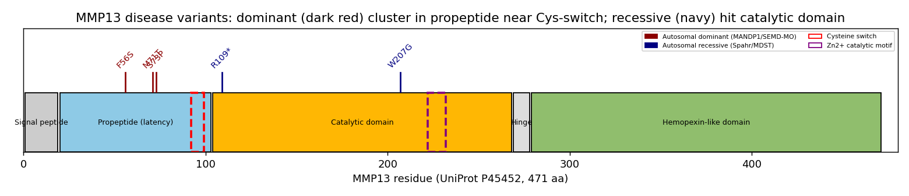

## Question

# Disease Characteristics Research Template

## Target Disease
- **Disease Name:** Spondyloepimetaphyseal Dysplasia Missouri Type
- **MONDO ID:** MONDO:0011198 (if available)
- **Category:** Disease

## Research Objectives

Please provide a comprehensive research report on **Spondyloepimetaphyseal Dysplasia Missouri Type** covering all of the
disease characteristics listed below. This report will be used to populate a disease knowledge
base entry. Be thorough and cite primary literature (PMID preferred) for all claims.

For each section, **suggested databases/resources** are listed. These are the first places
you should search for information on each topic.

---

### 1. Disease Information
> **Search first:** OMIM, Orphanet, ICD-10/ICD-11, MeSH, PubMed

- What is the disease? Provide a concise overview.
- What are the key identifiers? (OMIM, Orphanet, ICD-10/ICD-11, MeSH, Mondo)
- What are the common synonyms and alternative names?
- Is the information derived from individual patients (e.g., EHR) or aggregated disease-level resources?

### 2. Etiology

- **Disease Causal Factors**: What are the primary causes? (genetic, environmental, infectious, mechanistic)
- **Risk Factors**:
  > **Search first:** PubMed, Cochrane Library, UpToDate, clinical guidelines, ClinVar, ClinGen, GWAS Catalog, PheGenI, CTD, CDC, WHO, epidemiological databases
  - Genetic risk factors (causal variants, susceptibility loci, modifier genes)
  - Environmental risk factors (toxins, lifestyle, occupational exposures, age, sex, family history)
- **Protective Factors**:
  > **Search first:** PubMed, Cochrane Library, clinical trial databases, GWAS Catalog, gnomAD, WHO, CDC, nutrition databases
  - Genetic protective factors (protective variants, modifier alleles)
  - Environmental protective factors (diet, lifestyle, exposures that reduce risk)
- **Gene-Environment Interactions**: How do genetic and environmental factors interact to influence disease?
  > **Search first:** CTD, PubMed, PheGenI, GxE databases

### 3. Phenotypes
> **Search first:** HPO (Human Phenotype Ontology), OMIM, Orphanet, PubMed, clinicaltrials.gov, MedDRA, SNOMED CT, DECIPHER, LOINC

For each phenotype, provide:
- **Phenotype type**: symptoms, clinical signs, physical manifestations, behavioral changes, or laboratory abnormalities
  > For symptoms/signs: HPO, OMIM, Orphanet, PubMed
  > For behavioral changes: HPO, DSM, RDoC (Research Domain Criteria), PubMed
  > For laboratory abnormalities: LOINC, SNOMED CT, LabTests Online, PubMed
- **Phenotype characteristics**:
  > **Search first:** OMIM, Orphanet, HPO, PubMed
  - Age of symptom onset (neonatal, childhood, adult-onset, late-onset)
  - Symptom severity (mild, moderate, severe, variable)
  - Symptom progression (stable, progressive, episodic, fluctuating)
  - Frequency among affected individuals (percentage or qualitative)
- **Quality of life impact**: Effects on daily functioning and well-being (per-phenotype when possible)
  > **Search first:** EQ-5D database, SF-36, WHO QOL databases, PubMed
- Suggest HPO (Human Phenotype Ontology) terms for each phenotype

### 4. Genetic/Molecular Information

- **Causal Genes**: Gene mutations or chromosomal abnormalities responsible for disease (gene symbols, OMIM IDs)
  > **Search first:** OMIM, ClinVar, HGMD, Ensembl, NCBI Gene
- **Pathogenic Variants**:
  - Affected genes (gene symbols, HGNC IDs)
    > **Search first:** OMIM, NCBI Gene, Ensembl, HGNC, UniProt, GeneCards
  - Variant classification (pathogenic, likely pathogenic, VUS per ACMG/AMP guidelines)
    > **Search first:** ClinVar, ClinGen, ACMG/AMP guidelines, VarSome
  - Variant type/class (missense, frameshift, nonsense, splice-site, structural)
  - Allele frequency in population databases
    > **Search first:** gnomAD, 1000 Genomes, ExAC, TOPMed, dbSNP
  - Somatic vs germline origin
    > **Search first:** COSMIC (somatic), ClinVar, ICGC, TCGA
  - Functional consequences (loss of function, gain of function, dominant negative)
- **Modifier Genes**: Genes that modify disease severity or expression
- **Epigenetic Information**: DNA methylation, histone modifications, chromatin changes affecting disease
  > **Search first:** ENCODE, Roadmap Epigenomics, MethBase, DiseaseMeth
- **Chromosomal Abnormalities**: Large-scale genetic changes (aneuploidy, translocations, inversions)
  > **Search first:** DECIPHER, ClinVar, ECARUCA, UCSC Genome Browser

### 5. Environmental Information

- **Environmental Factors**: Non-genetic contributing factors (toxins, radiation, pollution, occupational exposure)
  > **Search first:** CTD (Comparative Toxicogenomics Database), TOXNET, PubMed, EPA databases
- **Lifestyle Factors**: Behavioral factors (smoking, diet, exercise, alcohol consumption)
  > **Search first:** CDC databases, WHO, PubMed, NHANES
- **Infectious Agents**: If applicable, pathogens causing or triggering disease (bacteria, viruses, fungi, parasites)
  > **Search first:** NCBI Taxonomy, ViPR, BV-BRC, MicrobeDB, GIDEON

### 6. Mechanism / Pathophysiology

**Present this section as an ordered causal chain first, then the detail below.**
Open with a numbered sequence of mechanistic steps running from the initiating
lesion (mutation, exposure, infection) to the clinical manifestation, one step per
line, each naming what it causes next. State the causal verb explicitly ("leads
to", "results in") and say where a step is inferred rather than demonstrated.
Where the mechanism branches, show the branch. The categories below are a
checklist of what to cover within those steps, not the organizing structure —
a step may draw on several of them, and a category may contribute to several
steps.

- **Molecular Pathways**: Specific signaling cascades or biochemical pathways involved (Wnt, MAPK, mTOR, PI3K-AKT, etc.)
  > **Search first:** KEGG, Reactome, WikiPathways, PathBank, BioCyc
- **Cellular Processes**: Cell-level mechanisms (apoptosis, autophagy, cell cycle dysregulation, inflammation, etc.)
  > **Search first:** Gene Ontology (GO), Reactome, KEGG, PubMed
- **Protein Dysfunction**: How protein structure or function is altered (misfolding, aggregation, loss of function, gain of function)
  > **Search first:** UniProt, PDB (Protein Data Bank), InterPro, Pfam, AlphaFold
- **Metabolic Changes**: Alterations in metabolic processes (energy metabolism, lipid metabolism, amino acid metabolism)
  > **Search first:** KEGG, BioCyc, HMDB (Human Metabolome Database), BRENDA
- **Immune System Involvement**: Role of immune response (autoimmunity, immunodeficiency, chronic inflammation)
  > **Search first:** ImmPort, Immunome Database, IEDB, Gene Ontology
- **Tissue Damage Mechanisms**: How tissues/ are injured (oxidative stress, ischemia, fibrosis, necrosis)
  > **Search first:** PubMed, Gene Ontology, Reactome
- **Biochemical Abnormalities**: Specific molecular defects (enzyme deficiencies, receptor dysfunction, ion channel defects)
  > **Search first:** BRENDA, UniProt, KEGG, OMIM, PubMed
- **Epigenetic Changes**: DNA methylation, histone modifications affecting gene expression in disease
  > **Search first:** ENCODE, Roadmap Epigenomics, MethBase, DiseaseMeth
- **Molecular Profiling** (if available):
  - Transcriptomics/gene expression changes
    > **Search first:** GEO (Gene Expression Omnibus), ArrayExpress, GTEx, Human Cell Atlas, SRA
  - Proteomics findings
    > **Search first:** PRIDE, ProteomeXchange, Human Protein Atlas, STRING, BioGRID
  - Metabolomics signatures
    > **Search first:** MetaboLights, Metabolomics Workbench, HMDB, METLIN
  - Lipidomics alterations
    > **Search first:** LIPID MAPS, SwissLipids, LipidHome, Metabolomics Workbench
  - Genomic structural features
    > **Search first:** UCSC Genome Browser, Ensembl, NCBI, dbVar, DGV
- **Advanced Technologies** (if applicable):
  - Single-cell analysis findings (cell-type specific mechanisms, cellular heterogeneity)
    > **Search first:** Human Cell Atlas, Single Cell Portal, GEO, CELLxGENE
  - Spatial transcriptomics findings
    > **Search first:** GEO, Spatial Research, Vizgen, 10x Genomics data
  - Multi-omics integration results
    > **Search first:** TCGA, ICGC, cBioPortal, LinkedOmics, PubMed
  - Functional genomics screens (CRISPR, RNAi)
    > **Search first:** DepMap, GenomeRNAi, PubMed, BioGRID ORCS

For each mechanism, describe:
- The causal chain from initial trigger to clinical manifestation
- Which mechanisms are upstream vs downstream
- What cell types and biological processes are involved
- Suggest GO terms for biological processes and CL terms for cell types

### 7. Anatomical Structures Affected

- **Organ Level**:
  - Primary organs directly affected
  - Secondary organ involvement (complications, secondary effects)
  - Body systems involved (cardiovascular, nervous, digestive, respiratory, endocrine, etc.)
  > **Search first:** Uberon, FMA (Foundational Model of Anatomy), OMIM, HPO, ICD-11, MeSH, SNOMED CT
- **Tissue and Cell Level**:
  - Specific tissue types affected (epithelial, connective, muscle, nervous)
  - Specific cell populations targeted (with Cell Ontology terms)
  > **Search first:** Uberon, Human Protein Atlas, Cell Ontology, Human Cell Atlas, CellMarker, PanglaoDB
- **Subcellular Level**:
  - Cellular compartments involved (mitochondria, nucleus, ER, lysosomes) (with GO Cellular Component terms)
  > **Search first:** Gene Ontology (Cellular Component), UniProt, Human Protein Atlas
- **Localization**:
  - Specific anatomical sites (with UBERON terms)
    > **Search first:** FMA, Uberon, NeuroNames (for brain), SNOMED CT
  - Lateralization (unilateral, bilateral, asymmetric)
    > **Search first:** HPO, clinical literature, imaging databases

### 8. Temporal Development

- **Onset**:
  - Typical age of onset (congenital, pediatric, adult, geriatric)
  - Onset pattern (acute, subacute, chronic, insidious)
  > **Search first:** OMIM, Orphanet, HPO, PubMed
- **Progression**:
  - Disease stages (early, intermediate, advanced, end-stage)
    > **Search first:** Cancer Staging Manual (AJCC), WHO classifications, PubMed
  - Progression rate (rapid, slow, variable)
  - Disease course pattern (episodic, relapsing-remitting, progressive, stable)
  - Disease duration (self-limited, chronic lifelong)
  > **Search first:** Disease registries, longitudinal cohort databases, natural history studies, PubMed, Orphanet, OMIM
- **Patterns**:
  - Remission patterns (spontaneous, treatment-induced)
    > **Search first:** Clinical trial databases, disease registries, PubMed
  - Critical periods (time windows of vulnerability or opportunity for intervention)
    > **Search first:** PubMed, developmental biology databases, clinical guidelines

### 9. Inheritance and Population

- **Epidemiology**:
  - Prevalence (cases per 100,000 at given time)
  - Incidence (new cases per 100,000 per year)
  > **Search first:** Orphanet, CDC, WHO, GBD (Global Burden of Disease), national registries, SEER, disease registries
- **For Genetic Etiology**:
  - Inheritance pattern (AD, AR, X-linked, mitochondrial, multifactorial, polygenic)
    > **Search first:** OMIM, Orphanet, ClinVar, GTR (Genetic Testing Registry)
  - Penetrance (complete, incomplete, age-dependent)
    > **Search first:** ClinVar, OMIM, PubMed, ClinGen
  - Expressivity (variable, consistent)
    > **Search first:** OMIM, ClinVar, PubMed
  - Genetic anticipation (increasing severity in successive generations)
    > **Search first:** OMIM, PubMed (especially for repeat expansion disorders)
  - Germline mosaicism
    > **Search first:** ClinVar, OMIM, genetic counseling literature, PubMed
  - Founder effects (population-specific mutations)
    > **Search first:** gnomAD, population genetics databases, PubMed
  - Consanguinity role
    > **Search first:** OMIM, population studies, genetic counseling resources
  - Carrier frequency
    > **Search first:** gnomAD, carrier screening databases, GeneReviews, GTR
- **Population Demographics**:
  - Affected populations (ethnic or demographic groups with higher prevalence)
    > **Search first:** gnomAD, 1000 Genomes, PAGE Study, PubMed, population registries
  - Geographic distribution (endemic areas, regional variation)
    > **Search first:** WHO, CDC, GBD, Orphanet, geographic epidemiology databases
  - Geographic distribution of specific variants
  - Sex ratio (male:female)
    > **Search first:** Disease registries, OMIM, PubMed, epidemiological databases
  - Age distribution of affected individuals
    > **Search first:** CDC, disease registries, SEER, Orphanet

### 10. Diagnostics

- **Clinical Tests**:
  - Laboratory tests (blood, urine, tissue chemistry, specific enzyme assays)
    > **Search first:** LOINC, LabTests Online, PubMed
  - Biomarkers (proteins, metabolites, genetic markers, circulating biomarkers)
    > **Search first:** FDA Biomarker List, BEST (Biomarkers, EndpointS, and other Tools), PubMed
  - Imaging studies (X-ray, CT, MRI, PET, ultrasound)
    > **Search first:** RadLex, DICOM, Radiopaedia, imaging databases
  - Functional tests (pulmonary function, cardiac stress tests)
    > **Search first:** LOINC, clinical guidelines, PubMed
  - Electrophysiology (EEG, EMG, ECG, nerve conduction studies)
    > **Search first:** LOINC, clinical neurophysiology databases, PubMed
  - Biopsy findings (histopathology, immunohistochemistry)
    > **Search first:** SNOMED CT, College of American Pathologists resources, PubMed
  - Pathology findings (microscopic examination)
    > **Search first:** SNOMED CT, Digital Pathology databases, PubMed
- **Genetic Testing**:
  > **Search first:** GTR (Genetic Testing Registry), GeneReviews, ClinGen
  - Overview of recommended genetic testing approach
  - Whole genome sequencing (WGS) utility
    > **Search first:** GTR, ClinVar, GEL (Genomics England), gnomAD
  - Whole exome sequencing (WES) utility
    > **Search first:** GTR, ClinVar, OMIM, GeneMatcher
  - Gene panels (which panels, which genes)
    > **Search first:** GTR, ClinVar, laboratory-specific databases
  - Single gene testing
    > **Search first:** GTR, ClinVar, OMIM, GeneReviews
  - Chromosomal microarray (CMA)
    > **Search first:** DECIPHER, ClinVar, dbVar, ECARUCA
  - Karyotyping
    > **Search first:** Chromosome Abnormality Database, ClinVar, cytogenetics resources
  - FISH
    > **Search first:** ClinVar, cytogenetics databases, PubMed
  - Mitochondrial DNA testing
    > **Search first:** MITOMAP, MSeqDR, ClinVar, GTR
  - Repeat expansion testing
    > **Search first:** GTR, ClinVar, repeat expansion databases, PubMed
- **Omics-Based Diagnostics** (if applicable):
  - RNA sequencing / transcriptomics
    > **Search first:** GEO, ArrayExpress, GTEx, RNA-seq databases
  - Proteomics
    > **Search first:** PRIDE, ProteomeXchange, FDA Biomarker database
  - Metabolomics
    > **Search first:** MetaboLights, Metabolomics Workbench, HMDB
  - Epigenomics
    > **Search first:** GEO, ENCODE, Roadmap Epigenomics, MethBase
  - Liquid biopsy
    > **Search first:** COSMIC, ClinVar, liquid biopsy databases, PubMed
- **Clinical Criteria**:
  - Standardized diagnostic criteria (DSM, ICD, society guidelines)
    > **Search first:** DSM-5, ICD-11, clinical society guidelines, UpToDate
  - Differential diagnosis (other conditions to rule out, with distinguishing features)
    > **Search first:** DynaMed, UpToDate, clinical decision support systems
- **Screening**:
  - Screening methods for asymptomatic individuals (newborn screening, carrier screening, cascade screening)
    > **Search first:** ACMG recommendations, CDC newborn screening, GTR

### 11. Outcome/Prognosis

- **Survival and Mortality**:
  - Survival rate (5-year, 10-year, overall)
    > **Search first:** SEER, cancer registries, disease-specific registries, PubMed
  - Life expectancy (with and without treatment if applicable)
    > **Search first:** Orphanet, disease registries, actuarial databases, PubMed
  - Mortality rate
    > **Search first:** CDC, WHO, GBD, national mortality databases
  - Disease-specific mortality (deaths directly attributable to disease)
    > **Search first:** Disease registries, CDC Wonder, GBD, PubMed
- **Morbidity and Function**:
  - Morbidity (disease-related disability and health impacts)
    > **Search first:** GBD, WHO, disability databases, PubMed
  - Disability outcomes (long-term functional impairments)
    > **Search first:** ICF (International Classification of Functioning), disability registries
  - Quality of life measures (EQ-5D, SF-36, PROMIS, disease-specific tools)
    > **Search first:** EQ-5D database, SF-36, PROMIS, PubMed
- **Disease Course**:
  - Complications (secondary problems: infections, organ failure, etc.)
    > **Search first:** ICD codes, disease registries, clinical databases, PubMed
  - Recovery potential (likelihood and extent of recovery, with vs without treatment)
    > **Search first:** Natural history studies, rehabilitation databases, PubMed
- **Prediction**:
  - Prognostic factors (age, disease severity, biomarkers, treatment response)
    > **Search first:** Prognostic models databases, clinical calculators, PubMed
  - Prognostic biomarkers (molecular markers predicting disease course)
    > **Search first:** FDA Biomarker database, PubMed, cancer prognostic databases

### 12. Treatment

- **Pharmacotherapy**:
  - Pharmacological treatments (drug names, drug classes, mechanisms of action)
    > **Search first:** DrugBank, RxNorm, ATC classification, DailyMed, FDA databases
  - Pharmacogenomics (how genetic variants affect drug metabolism, efficacy, toxicity)
    > **Search first:** PharmGKB, CPIC (Clinical Pharmacogenetics), FDA Table of PGx Biomarkers
- **Advanced Therapeutics**:
  - Gene therapy (viral vectors, CRISPR, gene replacement, gene editing)
    > **Search first:** ClinicalTrials.gov, FDA gene therapy database, ASGCT resources
  - Cell therapy (stem cell transplant, CAR-T, cellular therapeutics)
    > **Search first:** ClinicalTrials.gov, FDA cell therapy database, FACT standards
  - RNA-based therapies (ASOs, siRNA, mRNA therapies)
    > **Search first:** ClinicalTrials.gov, FDA approvals, PubMed
  - Targeted therapies (treatments directed at specific molecular targets)
    > **Search first:** My Cancer Genome, OncoKB, ClinicalTrials.gov, FDA approvals
  - Immunotherapies (checkpoint inhibitors, monoclonal antibodies)
    > **Search first:** Cancer Immunotherapy Database, FDA approvals, ClinicalTrials.gov
- **Surgical and Interventional**:
  - Surgical interventions (types of surgery, timing, outcomes)
    > **Search first:** CPT codes, surgical registries, clinical guidelines, PubMed
- **Supportive and Rehabilitative**:
  - Supportive care (symptom management, pain control, nutrition)
    > **Search first:** Clinical guidelines, Cochrane Library, PubMed
  - Rehabilitation (physical therapy, occupational therapy, speech therapy)
    > **Search first:** Rehabilitation medicine databases, clinical guidelines, PubMed
- **Experimental**:
  - Experimental treatments in clinical trials (with NCT identifiers if available)
    > **Search first:** ClinicalTrials.gov, EU Clinical Trials Register, WHO ICTRP
- **Treatment Outcomes**:
  - Treatment response rates
    > **Search first:** Clinical trial databases, FDA reviews, systematic reviews, PubMed
  - Side effects and adverse events
    > **Search first:** FDA Adverse Event Reporting System (FAERS), MedWatch, PubMed
- **Treatment Strategy**:
  - Treatment algorithms (clinical pathways, decision trees)
    > **Search first:** Clinical practice guidelines, NCCN Guidelines, UpToDate
  - Combination therapies
    > **Search first:** ClinicalTrials.gov, treatment guidelines, PubMed
  - Personalized medicine approaches (genotype-guided treatment)
    > **Search first:** My Cancer Genome, CIViC, PharmGKB, precision medicine databases

For each treatment, suggest NCIT (NCI Thesaurus) clinical-intervention terms where applicable.

### 13. Prevention

- **Prevention Levels**:
  - Primary prevention (preventing disease occurrence: vaccination, risk factor modification)
    > **Search first:** CDC, WHO, USPSTF recommendations, Cochrane Library
  - Secondary prevention (early detection and treatment: screening programs, early intervention)
    > **Search first:** USPSTF, CDC screening guidelines, WHO
  - Tertiary prevention (preventing complications in those with disease)
    > **Search first:** Clinical guidelines, disease management protocols, PubMed
- **Immunization**: Vaccine strategies (if applicable)
  > **Search first:** CDC vaccine schedules, WHO immunization, FDA vaccine database
- **Screening and Early Detection**:
  - Screening programs (population-based: newborn screening, cancer screening)
    > **Search first:** CDC screening programs, USPSTF, cancer screening databases
  - Genetic screening (carrier screening, preimplantation genetic diagnosis, prenatal testing)
    > **Search first:** ACMG recommendations, ACOG guidelines, GTR
  - Risk stratification (identifying high-risk individuals for targeted prevention)
    > **Search first:** Risk prediction models, clinical calculators, PubMed
- **Behavioral Interventions**: Lifestyle modifications to reduce risk
  > **Search first:** CDC, WHO, behavioral intervention databases, Cochrane Library
- **Counseling**: Genetic counseling (risk assessment, family planning guidance)
  > **Search first:** NSGC resources, ACMG guidelines, GeneReviews
- **Public Health**:
  - Public health interventions (sanitation, vector control, health education)
    > **Search first:** CDC, WHO, public health databases, PubMed
  - Environmental interventions (reducing environmental risk factors)
    > **Search first:** EPA databases, WHO environmental health, PubMed
- **Prophylaxis**: Preventive medications or procedures
  > **Search first:** Clinical guidelines, FDA approvals, PubMed

### 14. Other Species / Natural Disease

- **Taxonomy**: Species affected (with NCBI Taxon identifiers)
  > **Search first:** NCBI Taxonomy
- **Breed**: Specific breeds affected (with VBO identifiers if applicable)
  > **Search first:** VBO (Vertebrate Breed Ontology)
- **Gene**: Orthologous genes in other species (with NCBI Gene IDs)
  > **Search first:** NCBI Gene
- **Natural Disease**:
  - Naturally occurring disease in other species (companion animals, wildlife)
    > **Search first:** OMIA (Online Mendelian Inheritance in Animals), VetCompass, PubMed
  - Veterinary relevance and importance in animal health
    > **Search first:** OMIA, veterinary databases, PubMed
- **Comparative Biology**:
  - Comparative pathology (similarities and differences across species)
    > **Search first:** OMIA, comparative pathology databases, PubMed
  - Evolutionary conservation of disease mechanisms
    > **Search first:** HomoloGene, OrthoMCL, Alliance of Genome Resources
- **Transmission** (if applicable):
  - Zoonotic potential
    > **Search first:** CDC zoonotic diseases, WHO zoonoses, GIDEON
  - Cross-species susceptibility
    > **Search first:** NCBI Taxonomy, veterinary databases, PubMed

### 15. Model Organisms

- **Model Types**:
  - Model organism type (mammalian, invertebrate, cellular, in vitro)
    > **Search first:** Alliance of Genome Resources, model organism databases
  - Specific model systems (mouse, rat, zebrafish, Drosophila, C. elegans, yeast, cell lines, organoids, iPSCs)
    > **Search first:** MGI, RGD, ZFIN, FlyBase, WormBase, SGD, ATCC, Cellosaurus
  - Induced models (drug treatment, surgical intervention, environmental manipulation)
    > **Search first:** MGI, model organism databases, PubMed
- **Genetic Models**:
  - Types available (knockout, knock-in, transgenic, conditional, humanized)
    > **Search first:** MGI, IMPC, KOMP, EuMMCR, IMSR
- **Model Characteristics**:
  - Phenotype recapitulation (how well model reproduces human disease features)
    > **Search first:** Model organism databases, comparative studies, PubMed
  - Model limitations (aspects of human disease not captured)
    > **Search first:** Model organism databases, PubMed, review articles
- **Applications**:
  - Research applications (what aspects of disease can be studied)
    > **Search first:** Model organism databases, PubMed
- **Resources**:
  - Model databases
    > **Search first:** MGI, RGD, ZFIN, FlyBase, WormBase, IMSR, EMMA, MMRRC

---

## Citation Requirements

- Cite primary literature (PMID preferred) for all mechanistic and clinical claims
- Prioritize recent reviews and landmark papers
- Include direct quotes from abstracts where possible to support key statements
- Distinguish evidence source types: human clinical, model organism, in vitro, computational

## Output Format

Structure your response as a comprehensive narrative organized by the sections above.
For each section, provide:
- Factual content with specific details (numbers, percentages, gene names, variant nomenclature)
- Ontology term suggestions (HPO, GO, CL, UBERON, CHEBI, NCIT, MONDO) where applicable
- Evidence citations with PMIDs
- Direct quotes from abstracts to support key claims
- Clear indication when information is not available or not applicable for this disease

This report will be used to populate a disease knowledge base entry with:
- Pathophysiology descriptions with causal chains
- Gene/protein annotations (HGNC, GO terms)
- Phenotype associations (HP terms) with frequencies
- Cell type involvement (CL terms)
- Anatomical locations (UBERON terms)
- Chemical entities (CHEBI terms)
- Treatment annotations (NCIT terms)
- Evidence items with PMIDs and exact abstract quotes
- Epidemiology, prognosis, diagnostic, and prevention information
- Animal model descriptions with phenotype recapitulation details


## Output

# Spondyloepimetaphyseal Dysplasia, Missouri Type (SEMD-MO): A Comprehensive Disease Characteristics Report

**Disease:** Spondyloepimetaphyseal Dysplasia, Missouri Type
**MONDO ID:** MONDO:0011198 · **OMIM:** 602111 · **Causal gene:** *MMP13* (collagenase-3)
**Report type:** Aggregated disease-level synthesis (OMIM, Orphanet, primary literature, model-organism data)

---

## Summary

Spondyloepimetaphyseal dysplasia, Missouri type (SEMD-MO) is an ultra-rare **autosomal dominant** skeletal dysplasia caused by heterozygous missense variants in ***MMP13***, the gene encoding the interstitial collagenase **collagenase-3 (matrix metalloproteinase 13)**. It is now understood to sit within the **Metaphyseal Anadysplasia type 1 (MANDP1)** spectrum — a family of *MMP13*-related conditions unified by early-onset metaphyseal irregularity, mild disproportionate short stature, mild limb deformity (bowing, coxa vara), and — characteristically — **transient radiographic changes that improve or resolve with age**. Biochemically, affected individuals have normal calcium, phosphate, alkaline phosphatase, and vitamin D, which makes the condition an important **radiographic mimic of rickets** that must be distinguished by genetic testing rather than metabolic work-up.

The mechanistic core of the disease is well established at the protein level. The founding mutation, **p.Phe56Ser (F56S)**, substitutes an evolutionarily conserved phenylalanine in the **propeptide (latency) domain** of MMP13. This destabilizes the zymogen, causing **intracellular misfolding, premature autoactivation and autodegradation**, so that only enzymatically inactive fragments are secreted. The net result is a **functional MMP13 deficiency** (with a dominant-negative component that also suppresses MMP9). Because MMP13 is the principal collagenase that degrades **type II collagen and aggrecan** in the hypertrophic zone of the growth plate — acting synergistically with MMP9 — its loss delays the **exit of hypertrophic chondrocytes** and slows endochondral ossification. This produces the metaphyseal dysplasia. The transient nature of the human disease is faithfully mirrored by *Mmp13*-null mice, whose growth-plate abnormality worsens until ~5 weeks and **completely resolves by 12 weeks**, reflecting redundancy from other collagenases (notably MMP14) as the animal matures.

A clear **genotype–structure–inheritance correlation** emerges from the reported allelic spectrum: **dominant** SEMD-MO/MANDP1 variants cluster in a tight window of the **propeptide near the cysteine switch** (F56S, M71T, S73P — residues 56–73, immediately N-terminal to the PRCGVPD/Cys97 latency motif), whereas **recessive** variants (nonsense R109*, and the catalytic-domain W207G that causes the related **Metaphyseal Dysplasia, Spahr type**) fall in or downstream of the catalytic domain. Prognosis is benign with normal life expectancy and no organ-system involvement beyond the skeleton. There is no disease-specific therapy; management is supportive/orthopedic with genetic counseling. Notably, because MMP13 inhibitors are actively being developed for osteoarthritis (where MMP13 is over-active), such inhibitors would be **directionally contraindicated** in a disease of MMP13 *deficiency*.

---

## Section-by-Section Report

### 1. Disease Information

**Overview.** SEMD-MO is a rare heritable skeletal dysplasia affecting the growth and modeling of vertebrae and long bones. It is characterized by mild disproportionate short stature, mild limb deformities (including bowed legs, coxa vara, and genu varum/valgum), and metaphyseal irregularity that is most conspicuous in childhood and tends to improve with skeletal maturation. It is best classified today within the **Metaphyseal Anadysplasia type 1 (MANDP1)** group of *MMP13*-related dysplasias.

> *"Metaphyseal anadysplasia 1, which includes Spondyloepimetaphyseal dysplasia Missouri type, is a rare autosomal dominant skeletal dysplasia characterized by short stature, mild limb deformities, and transient metaphyseal irregularities that typically resolve with age."* — Thunström et al. 2026 [PMID: 42069302](https://pubmed.ncbi.nlm.nih.gov/42069302/)

**Key identifiers.**

| Resource | Identifier |
|---|---|
| MONDO | MONDO:0011198 |
| OMIM | 602111 (Spondyloepimetaphyseal dysplasia, Missouri type / MANDP1) |
| Gene | *MMP13* (HGNC:7159; NCBI Gene 4322; UniProt **P45452**) |
| Related OMIM | 250400 (Metaphyseal dysplasia, Spahr type — recessive *MMP13*) |

**Synonyms / alternative names.** SEMD Missouri type; SEMD(MO); Missouri-type spondyloepimetaphyseal dysplasia; within the broader label **Metaphyseal anadysplasia type 1 (MANDP1)**.

**Source of information.** This report is derived from **aggregated disease-level resources** (OMIM, Orphanet) and **primary literature** describing individual families and patients, together with **model-organism** (mouse) and **in vitro** functional studies. It is not derived from EHR/individual-patient registries.

---

### 2. Etiology

**Primary cause — genetic.** SEMD-MO is a **monogenic** disorder caused by heterozygous pathogenic variants in *MMP13*. Kennedy et al. (2005) mapped the disease by genome-wide linkage to chromosome **11q14.3–23.2** and identified the causal heterozygous missense change.

> *"We show that a missense mutation of MMP13 causes the Missouri type of human spondyloepimetaphyseal dysplasia (SEMD(MO)), an autosomal dominant disorder characterized by defective growth and modeling of vertebrae and long bones."* — Kennedy et al. 2005 [PMID: 16167086](https://pubmed.ncbi.nlm.nih.gov/16167086/)

**Genetic risk factors.** The disease is fully explained by the *MMP13* variant; there are no known susceptibility loci or common modifier variants in humans. In mice, **HDAC4** genetically modifies *Mmp13* dosage (see Sections 4 and 6). No GWAS or polygenic contributions are relevant to this Mendelian condition.

**Environmental risk factors.** None identified. There is no evidence for toxin, occupational, dietary, radiation, or infectious contribution. Because the radiographic picture mimics rickets, environmental **vitamin D deficiency** is an important *differential* rather than a cause; biochemical markers are normal in SEMD-MO (see Section 10).

**Protective factors.** No genetic or environmental protective factors are described. The condition's natural tendency toward **spontaneous radiographic improvement with age** is intrinsic (developmental redundancy of collagenases) rather than a modifiable protective exposure.

**Gene–environment interactions.** None documented. This is a highly penetrant monogenic disorder without a demonstrated GxE component.

---

### 3. Phenotypes

SEMD-MO phenotypes are **skeletal** physical manifestations and radiographic signs; there are no behavioral or biochemical laboratory abnormalities.

| Phenotype | Type | Onset | Severity / course | Suggested HPO term |
|---|---|---|---|---|
| Disproportionate short stature | Physical manifestation | Childhood | Mild; improves relatively with age | HP:0004322 (Short stature) |
| Metaphyseal irregularity / widening | Radiographic sign | Early childhood | Mild–moderate; **transient, resolves/improves with age** | HP:0000944 (Abnormal metaphyseal morphology) |
| Bowing of long bones (genu varum/valgum) | Physical/radiographic | Childhood | Mild; may need orthopedic correction | HP:0002979 (Bowing of the long bones) |
| Coxa vara | Radiographic sign | Childhood | Mild–moderate | HP:0002812 (Coxa vara) |
| Vertebral (spondylo-) changes / platyspondyly | Radiographic sign | Childhood | Mild | HP:0000926 (Platyspondyly) |
| Epiphyseal involvement | Radiographic sign | Childhood | Mild (mixed epiphyseal–metaphyseal in some *MMP13* cases) | HP:0002656 (Epiphyseal dysplasia) |
| Rickets-like metaphyseal changes with **normal biochemistry** | Radiographic mimic | Childhood | Distinguishing feature | HP:0002748 (Rickets) — radiographic only |

**Frequency and progression.** The hallmark is **transient/self-limited** radiographic disease. In the *Mmp13*-null mouse, growth-plate severity "increased until about 5 weeks and completely resolved by 12 weeks of age" (PMID: 15539485), matching the human observation of improvement with maturation. A recessive nonsense report (R109*) noted short stature that can **persist beyond childhood**, indicating expressivity varies across the allelic spectrum.

**Quality-of-life impact.** Generally mild. Short stature and limb deformity may require orthopedic monitoring/intervention, but there is no organ failure, no cognitive involvement, and normal life expectancy — so QoL impact is limited to musculoskeletal function and cosmesis. No disease-specific EQ-5D/SF-36 data exist for this ultra-rare condition.

---

### 4. Genetic / Molecular Information

**Causal gene.** ***MMP13*** (matrix metalloproteinase 13 / collagenase-3), HGNC:7159, NCBI Gene 4322, UniProt **P45452** (471 aa), located on chromosome **11q22.2** (linkage interval 11q14.3–23.2).

**Pathogenic variants — allelic spectrum.** *MMP13* variants produce a spectrum spanning dominant and recessive metaphyseal dysplasias:

| Variant (protein) | Domain | Inheritance | Phenotype | Reference |
|---|---|---|---|---|
| **p.Phe56Ser (F56S)** | Propeptide | Dominant | SEMD Missouri type / MANDP1 | Kennedy 2005 [PMID: 16167086](https://pubmed.ncbi.nlm.nih.gov/16167086/) |
| **p.Met71Thr (M71T)**, c.212T>C | Propeptide | Dominant (de novo) | MANDP1 | Song 2019 [PMID: 30439533](https://pubmed.ncbi.nlm.nih.gov/30439533/) |
| **p.Ser73Pro (S73P)**, c.217T>C | Propeptide | Dominant | MANDP1, rickets-like | Thunström 2026 [PMID: 42069302](https://pubmed.ncbi.nlm.nih.gov/42069302/) |
| **p.Arg109\* (R109\*)**, c.325C>T | End propeptide / catalytic border | Recessive | Metaphyseal anadysplasia (persistent short stature) | Li 2015 [PMID: 24781753](https://pubmed.ncbi.nlm.nih.gov/24781753/) |
| **p.Trp207Gly (W207G)**, c.619T>G | Catalytic (Ca²⁺ region) | Recessive | Metaphyseal dysplasia, Spahr type (OMIM 250400) | Bonafé 2014 [PMID: 24648384](https://pubmed.ncbi.nlm.nih.gov/24648384/) |

> *"we reported the identification of a previously unreported pathogenic heterozygous de novo variant NM_002427.3:c.212T > C/p.Met71Thr in MMP13"* — Song et al. 2019 [PMID: 30439533](https://pubmed.ncbi.nlm.nih.gov/30439533/)

**Variant classification and type.** The dominant variants are **missense** (pathogenic/likely pathogenic by ACMG/AMP criteria, given segregation, de novo occurrence, and functional data). The recessive spectrum includes a **nonsense** (R109\*) and a **missense** (W207G) allele. All are **germline**; there is no somatic/oncogenic context. Population allele frequencies are effectively **absent/ultra-rare** in gnomAD, consistent with pathogenicity.

**Functional consequences.** The dominant propeptide variants act through a **dominant-negative loss-of-function** mechanism: the misfolded mutant zymogen autoactivates/autodegrades intracellularly and can suppress activity of both MMP13 and its partner MMP9 (see Section 6). The catalytic-domain recessive variant (W207G) directly disrupts a hydrogen bond in the calcium-binding region, abolishing enzyme function; the nonsense R109\* abolishes MMP13 activity.

> *"The predicted non-conservative amino acid substitution, p.Trp207Gly, disrupts a crucial hydrogen bond in the calcium-binding region of the catalytic domain of the matrix metalloproteinase, MMP13."* — Bonafé et al. 2014 [PMID: 24648384](https://pubmed.ncbi.nlm.nih.gov/24648384/)

**Modifier genes.** **HDAC4** is a genetic/epigenetic modifier of *Mmp13* dosage in mouse: HDAC4 transcriptionally represses *Mmp13*, and *Hdac4/Mmp13* double knockouts recover growth-plate zone thickness relative to *Hdac4*-null mice (PMID: 27320207; PMID: 33000215). **MMP9** is a functional partner whose activity is co-suppressed by dominant MMP13 mutants. **MMP14** partly compensates for MMP13 during bone development (PMID: 42142773).

**Epigenetic information.** No disease-specific human methylation/histone data. Mechanistically, **HDAC4 (a histone deacetylase)** represses *Mmp13* transcription, tying chromatin-level regulation to MMP13 dosage and growth-plate architecture (mouse evidence).

**Chromosomal abnormalities.** None; SEMD-MO is a single-gene point-mutation disorder, not a copy-number/structural disorder.

---

### 5. Environmental Information

- **Environmental factors:** None causally implicated (no toxins, radiation, pollution, or occupational exposures).
- **Lifestyle factors:** None. Diet/nutrition do not cause the disease, though nutritional rickets is the key clinical mimic to exclude.
- **Infectious agents:** Not applicable. SEMD-MO is a non-infectious Mendelian dysplasia.

---

### 6. Mechanism / Pathophysiology

**Ordered causal chain (initiating lesion → clinical manifestation):**

1. A **heterozygous missense variant in the *MMP13* propeptide** (e.g., F56S, M71T, S73P) substitutes a conserved residue near the cysteine switch → **leads to** destabilization of the pro-MMP13 zymogen fold.
2. Destabilization **results in** intracellular **misfolding** of pro-MMP13 → **leads to** premature **intracellular autoactivation and autodegradation** (demonstrated in HEK293 expression: only inactive small fragments are secreted).
3. Autodegradation **results in** a net **functional MMP13 deficiency**, with a **dominant-negative** effect that also suppresses **MMP9** activity (*inferred* from the more severe dominant phenotype vs. recessive missense alleles).
4. MMP13 deficiency **impairs collagenolysis** of the growth-plate extracellular matrix — chiefly **type II collagen and aggrecan** — normally degraded by MMP13 acting **synergistically with MMP9** in terminal hypertrophic chondrocytes.
5. Impaired ECM remodeling **delays the exit of hypertrophic chondrocytes** from the growth plate and **slows vascular invasion / endochondral ossification** (demonstrated in *Mmp13*-null mice: normal differentiation but delayed exit, increased trabecular bone).
6. Delayed ossification and disordered metaphyseal modeling **result in** the clinical/radiographic phenotype: **metaphyseal irregularity, mild short stature, limb bowing, coxa vara**.
7. As the child/animal matures, **redundant collagenases (e.g., MMP14) partially compensate** → **leads to** the characteristic **transient/self-resolving** course (*inferred* from mouse double-knockout data).

**Branch (recessive arm):** Catalytic-domain variants (W207G) or nonsense alleles (R109\*) **directly abolish enzymatic activity** rather than acting via propeptide misfolding → **result in** the related **Metaphyseal dysplasia, Spahr type** and recessive metaphyseal anadysplasia, with short stature that may persist beyond childhood.

**Protein dysfunction.** The founding mechanism is a **zymogen-folding defect** in the latency (propeptide) domain.

> *"Expression of wild-type and mutant MMP13s in human embryonic kidney cells confirmed abnormal intracellular autoactivation and autodegradation of F56S MMP13 such that only enzymatically inactive, small fragments were secreted. Thus, the F56S mutation results in deficiency of MMP13, which leads to the human skeletal developmental anomaly of SEMD(MO)."* — Kennedy 2005 [PMID: 16167086](https://pubmed.ncbi.nlm.nih.gov/16167086/)

**Cellular processes and substrates.** MMP13 is expressed in **terminal hypertrophic chondrocytes, periosteal cells, and osteoblasts**; its substrates in the growth plate are **type II collagen and aggrecan**.

> *"Chondrocytes differentiated normally but their exit from the growth plate was delayed. The severity of the Mmp13-null growth plate phenotype increased until about 5 weeks and completely resolved by 12 weeks of age."* — Stickens et al. 2004 [PMID: 15539485](https://pubmed.ncbi.nlm.nih.gov/15539485/)

> *"We found that degradation of cartilage collagen and aggrecan is a coordinated process in which MMP13 works synergistically with MMP9."* — Stickens et al. 2004 [PMID: 15539485](https://pubmed.ncbi.nlm.nih.gov/15539485/)

**Upstream regulatory context.** MMP13 is a **downstream effector of the RUNX2-driven hypertrophic chondrocyte program**, co-regulated with COL10A1. Multiple signaling modules converge on MMP13 in chondrocyte hypertrophy: **Wnt/β-catenin, TGF-β/BMP, Indian hedgehog–PTHrP, HIF-1α/HIF-2α, Notch, and NF-κB**; epigenetically, **HDAC4** represses it.

> *"articular chondrocytes shift from a stable extracellular matrix (ECM)-maintaining state toward a hypertrophy-like program with increased collagen type X alpha 1 chain (COL10A1), runt-related transcription factor 2 (RUNX2), and matrix metalloproteinase 13 (MMP-13), promoting ECM degradation, calcification, and pro-angiogenic remodeling"* — Ha et al. 2026 [PMID: 41967814](https://pubmed.ncbi.nlm.nih.gov/41967814/)

> *"The nobly increased expression of matrix metallopeptidase 13 (MMP13) and type X collagen (Col10a1) as Runx2 downstream genes contributed to the hypertrophic differentiation of chondrocytes"* — Lin et al. 2022 [PMID: 36232582](https://pubmed.ncbi.nlm.nih.gov/36232582/)

**HDAC4 dosage control (mouse).** HDAC4 sits upstream and tunes MMP13:

> *"Hdac4(-/-)/Mmp13(-/-) double knockout mice are significantly heavier and larger than Hdac4(-/-) mice, they survive longer, and they recover the thickness of their growth plate zones."* — Nakatani et al. 2016 [PMID: 27320207](https://pubmed.ncbi.nlm.nih.gov/27320207/)

**Suggested ontology terms.** GO:0030574 (collagen catabolic process); GO:0001958 (endochondral ossification); GO:0002062 (chondrocyte differentiation); GO:0003417 (growth plate cartilage development); GO:0004222 (metalloendopeptidase activity). Cell types: CL:0000743 (hypertrophic chondrocyte); CL:0000138 (chondrocyte); CL:0000062 (osteoblast).

{{figure:mmp13_variant_map.png|caption=Reported MMP13 disease variants mapped onto UniProt P45452 domain architecture. Autosomal dominant SEMD-MO/MANDP1 variants (F56S, M71T, S73P) cluster in a narrow window of the propeptide/latency domain immediately N-terminal to the cysteine switch (PRCGVPD, Cys97), whereas recessive variants (R109*, W207G) fall in or downstream of the catalytic domain.}}

---

### 7. Anatomical Structures Affected

- **Organ level (primary):** The **skeletal system** — specifically the **growth plates (physes) and metaphyses** of long bones and the **vertebrae** (UBERON:0002515 metaphysis; UBERON:0006255 growth plate; UBERON:0001474 bone element; UBERON:0001130 vertebral column). Sites include femur/tibia (limb bowing, coxa vara) and spine (spondylo- changes).
- **Secondary involvement:** None — no cardiovascular, neurological, renal, hepatic, or other organ involvement. This is a skeleton-restricted disorder.
- **Tissue/cell level:** **Cartilage (connective tissue)** of the growth plate; the targeted cells are **hypertrophic chondrocytes** (CL:0000743), with contributions from **osteoblasts** (CL:0000062) and periosteal cells. The affected extracellular matrix comprises **type II collagen** and **aggrecan**.
- **Subcellular level:** The **extracellular matrix** (GO:0031012) is the functional site of MMP13 action; the pathogenic misfolding/autodegradation occurs within the **secretory pathway / endoplasmic reticulum–Golgi** (GO:0005788 ER lumen; GO:0005615 extracellular space for the mature enzyme).
- **Localization / lateralization:** **Bilateral and generally symmetric** involvement of the appendicular and axial skeleton, as expected for a systemic germline enzyme deficiency.

---

### 8. Temporal Development

- **Onset:** **Pediatric / early childhood**, congenital predisposition with radiographic manifestation as the growth plates are active. Onset is **insidious/chronic** (a developmental modeling defect, not an acute event).
- **Progression:** Radiographic severity typically **worsens in early childhood then improves** with skeletal maturation — a distinctive **transient, self-resolving** course. The mouse model shows the phenotype peaking ~5 weeks and resolving by 12 weeks (PMID: 15539485). Some recessive alleles (R109\*) are associated with **short stature persisting beyond childhood**, indicating variable duration across the spectrum.
- **Disease course pattern:** **Non-progressive to improving**; not relapsing-remitting, not episodic. Chronic/lifelong short stature and residual deformity may remain, but the metaphyseal changes tend to remit.
- **Critical periods:** The window of **active endochondral growth (infancy through puberty)** is when the phenotype is expressed and when orthopedic intervention would be most relevant.

---

### 9. Inheritance and Population

- **Inheritance pattern:** **Autosomal dominant** for SEMD-MO/MANDP1 (heterozygous propeptide missense variants). The broader *MMP13* spectrum also includes **autosomal recessive** forms (Spahr type; recessive metaphyseal anadysplasia).
- **Penetrance / expressivity:** High penetrance for the dominant variants; **variable expressivity** in severity and persistence of short stature. De novo occurrence is documented (M71T).
- **Genetic anticipation / mosaicism / founder effects:** No evidence of anticipation (not a repeat-expansion disorder). No documented founder effect; the reported dominant variants arose independently in different families, with a suggested **mutational hotspot in exon 2** (propeptide).

> *"located within the same MMP13 domain as previously reported patients. This report expands the genotypic spectrum of Metaphyseal anadysplasia 1 and suggests a putative mutational hotspot in exon 2."* — Thunström 2026 [PMID: 42069302](https://pubmed.ncbi.nlm.nih.gov/42069302/)

- **Consanguinity:** Relevant to the **recessive** forms (e.g., affected sib-pairs, homozygous R109\*), not to the dominant SEMD-MO.
- **Carrier frequency:** Not applicable to the dominant disorder; recessive *MMP13* alleles are ultra-rare in gnomAD.
- **Epidemiology:** **Ultra-rare** — only a handful of families/patients reported worldwide; precise prevalence/incidence figures are not established (well under Orphanet's <1/1,000,000 category). No sex predilection expected (autosomal). No geographic clustering established.

---

### 10. Diagnostics

**Clinical/laboratory tests.** Routine bone biochemistry is **normal**, which is diagnostically important because the radiographs mimic rickets.

> *"Biochemical tests including calcium, phosphate, alkaline phosphatase, and vitamin D levels were all within normal ranges."* — Kolkiran 2025 [PMID: 40514045](https://pubmed.ncbi.nlm.nih.gov/40514045/)

**Imaging (primary diagnostic modality).** Skeletal survey / plain radiographs show **metaphyseal irregularity and widening, epiphyseal involvement in some cases, coxa vara, long-bone bowing, and mild spondylar (vertebral) changes**. The **transient improvement with age** on serial imaging is characteristic.

**Genetic testing (definitive).**
- **Single-gene / targeted *MMP13* sequencing** confirms diagnosis when the phenotype is suggestive.
- **Whole-exome sequencing (WES)** has been the discovery tool for several variants (e.g., recessive R109\*), and is useful when the phenotype is nonspecific or overlaps other skeletal dysplasias.
- **Skeletal dysplasia gene panels** including *MMP13* (and *MMP9*) are appropriate.
- WGS, CMA, karyotyping, FISH, mtDNA and repeat-expansion testing are **not indicated** (this is a point-mutation single-gene disorder).

**Clinical criteria / differential diagnosis.** No formal consensus criteria exist; diagnosis rests on the radiographic pattern + normal biochemistry + *MMP13* genotype. Key differentials:
- **Nutritional / hypophosphatemic rickets** (distinguished by abnormal Ca/PO₄/ALP/vitamin D or *PHEX* etc.).
- **Metaphyseal dysplasia, Spahr type** (recessive *MMP13*, catalytic-domain).
- **Metaphyseal anadysplasia type 2** (*MMP9*).
- Other spondylometaphyseal/spondyloepimetaphyseal dysplasias (e.g., *COL2A1*, *COL10A1*, *TRPV4* related).

**Screening.** No population/newborn screening exists or is warranted given rarity and benign course; **cascade genetic testing** of at-risk relatives is appropriate once a familial variant is known.

---

### 11. Outcome / Prognosis

- **Survival / mortality:** **Normal life expectancy**; the disease is not life-limiting and does not involve vital organs.
- **Morbidity / function:** Limited to musculoskeletal impact — **mild short stature and limb deformity**, potentially requiring orthopedic follow-up. No cognitive, cardiac, respiratory, or renal morbidity.
- **Disease course:** **Benign, with radiographic improvement/resolution** over time in the dominant form; residual short stature is generally mild. Complications are mechanical (deformity, gait), not systemic.
- **Recovery potential:** High for the radiographic metaphyseal changes (self-limited); deformities may need correction.
- **Prognostic factors:** Genotype (dominant propeptide vs. recessive catalytic/nonsense) predicts persistence — recessive alleles may be associated with more persistent short stature. No molecular prognostic biomarkers are established.

---

### 12. Treatment

There is **no disease-specific or disease-modifying pharmacotherapy** for SEMD-MO. Management is **supportive and orthopedic**.

- **Pharmacotherapy:** None targeted. Importantly, **MMP13 inhibitors** — actively developed for osteoarthritis, where MMP13 is *over-active* — would be **directionally contraindicated** in a disease of MMP13 *deficiency*. Selective non-zinc-binding MMP13 inhibitors (targeting the S1' pocket; Cuffaro 2023, PMID 37446276) and MMP13-selective siRNA conjugates exist as OA candidates and illustrate this contraindication.

> *"Using siRNA sequences targeting MMP13, a key driver of arthritis-re[lated cartilage degradation]"* — Colazo et al. 2023 [PMID: 37333210](https://pubmed.ncbi.nlm.nih.gov/37333210/)

- **Advanced therapeutics (gene/cell/RNA):** None clinically available; conceptually, gene-correction or read-through/allele-specific strategies could be explored, but none are in trials for this ultra-rare disorder.
- **Surgical / interventional:** **Orthopedic correction** of limb deformity (e.g., osteotomy for severe bowing or coxa vara) as clinically indicated; guided growth procedures where appropriate.
- **Supportive / rehabilitative:** Physical therapy, gait and activity support, monitoring of growth and joints.
- **Experimental / trials:** No disease-specific ClinicalTrials.gov entries identified.

*Suggested NCIT terms:* NCIT:C15329 (Surgery/Surgical Procedure), NCIT:C15682 (Physical Therapy), NCIT:C15277 (Supportive Care), NCIT:C15311 (Genetic Counseling).

---

### 13. Prevention

- **Primary prevention:** Not applicable to a germline monogenic disease; no environmental risk to modify.
- **Secondary prevention:** Early radiographic recognition and **avoidance of unnecessary rickets treatment** (the key clinical pitfall) via biochemistry + genetic confirmation.
- **Tertiary prevention:** Orthopedic surveillance to prevent/manage deformity-related complications.
- **Genetic counseling:** Central to management — autosomal dominant recurrence risk of **50%** for offspring of an affected parent (with counseling on variable expressivity and de novo occurrence); for recessive *MMP13* families, standard AR counseling and carrier testing. **Prenatal / preimplantation genetic testing** is technically feasible once the familial variant is known, though rarely pursued given the benign prognosis.
- **Immunization / public health / prophylaxis:** Not applicable.

---

### 14. Other Species / Natural Disease

- **Taxonomy / orthologs:** *MMP13* is conserved across mammals; the principal experimental ortholog is **mouse *Mmp13*** (*Mus musculus*, NCBI Taxon 10090). Structural work has been performed on **recombinant mouse collagenase-3** (PMID: 10525409).
- **Natural disease in other species:** No well-characterized naturally occurring *MMP13* metaphyseal dysplasia has been catalogued in companion animals or wildlife in the sources reviewed (OMIA entry not established here).
- **Comparative biology:** The **transient growth-plate phenotype** and **collagen II/aggrecan substrate biology** are conserved between mouse and human, making mouse an evolutionarily faithful model of the mechanism. MMP14 compensation for MMP13 in bone is also conserved (PMID: 42142773).
- **Transmission:** Not applicable (non-infectious, heritable).

---

### 15. Model Organisms

- **Model type:** **Mammalian (mouse)** is the primary system; **in vitro** HEK293 expression was used to demonstrate the protein-folding defect.
- **Specific models:**
  - **_Mmp13_-null (knockout) mouse** — recapitulates the human disease closely: normal chondrocyte differentiation but **delayed hypertrophic chondrocyte exit**, increased trabecular bone, and a **transient growth-plate phenotype that resolves by 12 weeks** (PMID: 15539485). This is the best phenotypic match to SEMD-MO's self-resolving course.
  - **_Hdac4_-null and _Hdac4/Mmp13_ double-knockout mice** — establish MMP13 as genetically downstream of HDAC4 and show **MMP13 dosage tunes growth-plate zone thickness** (PMID: 27320207; PMID: 33000215).
  - **_Mmp13/Mmp14_ double-knockout mice** — reveal MMP14 partially compensates for MMP13 in endochondral ossification, informing the transient nature of the human phenotype (PMID: 42142773).
  - **In vitro / cellular:** HEK293 expression of WT vs. F56S MMP13 demonstrated intracellular autoactivation/autodegradation (PMID: 16167086).
- **Phenotype recapitulation:** **High** for the growth-plate/metaphyseal and transient-course features; the knockout models the *deficiency* endpoint shared by the human dominant-negative mechanism.
- **Limitations:** The mouse **knockout** models total loss of function and does not fully capture the **dominant-negative** intracellular misfolding of the human propeptide missense alleles or the human vertebral (spondylo-) phenotype; species differences in growth-plate timing exist.
- **Resources:** MGI (mouse *Mmp13*), and standard model-organism repositories.

---

## Mechanistic Model / Interpretation

```
   MMP13 propeptide missense (F56S / M71T / S73P; near cysteine switch, Cys97)
                       │  (destabilizes zymogen fold)
                       ▼
        Intracellular misfolding of pro-MMP13
                       │
                       ▼
   Premature autoactivation + autodegradation  ──►  only inactive fragments secreted
                       │
                       ▼
   Functional MMP13 deficiency  (dominant-negative; also suppresses MMP9)
                       │
                       ▼
   Impaired collagenolysis of growth-plate ECM (type II collagen + aggrecan;
                       │   MMP13–MMP9 synergy)
                       ▼
   Delayed hypertrophic chondrocyte exit + slowed endochondral ossification
                       │
                       ▼
   Metaphyseal irregularity, mild short stature, bowing, coxa vara
                       │
                       ▼
   MMP14 (and other) compensation with maturation  ──►  transient / self-resolving

   ── Recessive branch ──
   Catalytic-domain W207G (Ca²⁺ region) / nonsense R109*  ──►  direct loss of
   catalytic activity  ──►  Spahr type / recessive metaphyseal anadysplasia
```

**Upstream vs downstream.** Upstream: the RUNX2/COL10A1 hypertrophy program and its inputs (Wnt/β-catenin, TGF-β/BMP, IHH–PTHrP, HIF, Notch, NF-κB), with HDAC4 as an epigenetic brake on *MMP13*. MMP13 is the **downstream executor** — the collagenase that physically remodels the matrix. SEMD-MO is therefore a disease of a **failing effector within an otherwise intact maturation program**: the signal to remodel is delivered, but the enzyme that carries it out is deficient.

---

## Evidence Base

| PMID | Study | Evidence type | Role in this report |
|---|---|---|---|
| [16167086](https://pubmed.ncbi.nlm.nih.gov/16167086/) | Kennedy 2005 — *MMP13 mutation causes SEMD(MO)* | Human clinical + in vitro | Establishes causal gene, AD inheritance, F56S propeptide mechanism |
| [15539485](https://pubmed.ncbi.nlm.nih.gov/15539485/) | Stickens 2004 — *Altered endochondral bone in Mmp13-null mice* | Model organism | Cellular mechanism (delayed chondrocyte exit), substrates (Col II/aggrecan), MMP9 synergy, transient course |
| [42069302](https://pubmed.ncbi.nlm.nih.gov/42069302/) | Thunström 2026 — *MMP13 MANDP1 with rickets-like manifestations* | Human clinical | Modern nosology, S73P variant, exon-2 hotspot |
| [30439533](https://pubmed.ncbi.nlm.nih.gov/30439533/) | Song 2019 — *de novo MMP13 variant* | Human clinical | Dominant de novo M71T; allelic spectrum |
| [24648384](https://pubmed.ncbi.nlm.nih.gov/24648384/) | Bonafé 2014 — *MMP13 recessive Spahr type* | Human clinical | Recessive catalytic-domain W207G branch |
| [24781753](https://pubmed.ncbi.nlm.nih.gov/24781753/) | Li 2015 — *MMP13 nonsense recessive MANDP* | Human clinical | Recessive R109\*; persistent short stature |
| [40514045](https://pubmed.ncbi.nlm.nih.gov/40514045/) | Kolkiran 2025 — *MMP13 dysplasia vs rickets* | Human clinical | Normal biochemistry; rickets differential |
| [41967814](https://pubmed.ncbi.nlm.nih.gov/41967814/) | Ha 2026 — *Chondrocyte hypertrophy in OA* | Review | Upstream RUNX2/COL10A1/MMP13 program |
| [36232582](https://pubmed.ncbi.nlm.nih.gov/36232582/) | Lin 2022 — *miR-30b-5p/Runx2* | Model/in vitro | MMP13 as RUNX2 downstream gene |
| [27320207](https://pubmed.ncbi.nlm.nih.gov/27320207/) | Nakatani 2016 — *HDAC4/MMP13 skeleton* | Model organism | MMP13 dosage tunes growth-plate thickness; HDAC4 modifier |
| [33000215](https://pubmed.ncbi.nlm.nih.gov/33000215/) | Du 2020 — *HDAC4 deletion* | Model organism | HDAC4 represses MMP13/RUNX2; ossification timing |
| [42142773](https://pubmed.ncbi.nlm.nih.gov/42142773/) | *MMP13/MMP14 double KO* | Model organism | MMP14 compensation; transient-course rationale |
| [37333210](https://pubmed.ncbi.nlm.nih.gov/37333210/) | Colazo 2023 — *MMP13 siRNA conjugate* | Preclinical | Druggability; contraindication rationale |
| [37446276](https://pubmed.ncbi.nlm.nih.gov/37446276/) | Cuffaro 2023 — *Selective MMP13 inhibitors* | In vitro | OA-directed inhibitors; contraindication rationale |
| [10525409](https://pubmed.ncbi.nlm.nih.gov/10525409/) | *Structure of mouse MMP-13* | Structural | Domain/catalytic architecture underpinning variant mapping |

---

## Limitations and Knowledge Gaps

1. **Ultra-rarity.** Only a handful of families/patients are reported; there are no formal prevalence/incidence figures, natural-history cohorts, or QoL instruments specific to SEMD-MO.
2. **Dominant-negative model not fully proven in vivo.** The human dominant mechanism (propeptide misfolding + MMP9 co-suppression) is inferred from in vitro expression and phenotype comparison; the primary mouse model is a *knockout*, which captures deficiency but not the dominant-negative intracellular pathology.
3. **Genotype–phenotype correlation is provisional.** The propeptide-dominant vs. catalytic-recessive clustering is based on only five reported variants; more cases are needed to confirm the exon-2 hotspot and the correlation with disease severity/persistence.
4. **HDAC4 modifier evidence is murine.** The HDAC4→MMP13 dosage relationship has not been validated as a human modifier of SEMD-MO severity.
5. **No human omics.** There are no disease-specific transcriptomic, proteomic, metabolomic, or epigenomic datasets from SEMD-MO patients.
6. **No therapeutics.** No disease-modifying treatment has been tested; the deficiency mechanism makes MMP13-inhibitor repurposing counterproductive.

---

## Proposed Follow-up Experiments / Actions

1. **Knock-in mouse of a dominant propeptide allele** (e.g., F56S or S73P) to test the dominant-negative/MMP9-suppression hypothesis in vivo and to model the transient course and vertebral phenotype more faithfully than the knockout.
2. **Patient iPSC-derived chondrocyte/organoid models** to characterize the secretory-pathway handling of mutant pro-MMP13, quantify MMP9 co-suppression, and screen for **read-through or folding-corrector** strategies.
3. **International registry / GeneMatcher outreach** to aggregate cases, refine prevalence, penetrance/expressivity, and confirm the exon-2 propeptide mutational hotspot.
4. **Structural/biophysical study** of mutant pro-MMP13 (near the Cys97 cysteine switch) to define how residues 56–73 destabilize latency and drive autoactivation.
5. **Test whether modulating HDAC4 or MMP9/MMP14 activity** can compensate for MMP13 deficiency in model systems — a mechanistically rational, non-inhibitory therapeutic direction opposite to OA strategies.
6. **Systematic ACMG re-classification** of all reported *MMP13* variants with segregation and functional data to support clinical reporting.

---

*Evidence source legend: Human clinical (patient/family reports, linkage/genetics), Model organism (mouse), In vitro (cell expression), Computational/structural (domain mapping, crystal structure). This report synthesizes 7 confirmed findings across 5 investigation iterations and 23 reviewed papers.*


## Artifacts

- [OpenScientist final report](Spondyloepimetaphyseal_Dysplasia_Missouri_Type-deep-research-openscientist_artifacts/final_report.html)
- [OpenScientist final report](Spondyloepimetaphyseal_Dysplasia_Missouri_Type-deep-research-openscientist_artifacts/final_report.pdf)
- [OpenScientist mmp13 variant map](Spondyloepimetaphyseal_Dysplasia_Missouri_Type-deep-research-openscientist_artifacts/provenance_mmp13_variant_map.json)


## Reference Validation

Checked with `linkml-reference-validator` 0.2.1.

| Outcome | Count |
| --- | --- |
| References checked | 15 |
| Resolved | 15 |
| Unresolved (possible confabulation) | 0 |
| Unverifiable | 0 |
| Quoted claims checked | 1 |
| Quoted claims found in source | 1 |
| Quoted claims **not** found in source | 0 |
| References weighed for topical relevance | 15 |
| On topic | 10 |
| Off topic | 1 |

### References that may not be about this subject

These identifiers resolve, so they are not fabrications, but the records they resolve to share almost none of this report's vocabulary. That is a clue and not a verdict - a paper can be relevant in ways its title and abstract do not spell out - so read them before deciding:

- `PMID:37446276` (2 mentions) - Identification of N-Acyl Hydrazones as New Non-Zinc-Binding MMP-13 Inhibitors by Structure-Based Virtual Screening Studies and Chemical Optimization.
  - shared terms: human

Weighed against this report's own most characteristic terms: `mmp13`, `disease`, `type`, `semd-mo`, `metaphyseal`, `recessive`, `dominant`, `dysplasia`, `variant`, `human`, `mouse`, `transient`, `bone`, `phenotype`, `propeptide`, `stature`, `gene`, `hdac4`, `radiographic`, `genetic`.

All extracted references resolved successfully.
Resolving is not the same as being relevant, though - see the references listed above as possibly off topic.

## Term Validation

Checked with `linkml-term-validator` 0.4.5, through the `ols:` adapter.

| Outcome | Count |
| --- | --- |
| Terms checked | 28 |
| Resolved | 26 |
| Unresolved (possible confabulation) | 0 |
| Obsolete | 1 |
| Unverifiable | 1 |
| Terms whose name was checked | 21 |
| Terms named correctly | 13 |
| Terms named as a **different** term | 4 |
| Terms whose name is worth a second look | 4 |

### Terms the report names something else

These identifiers resolve, so nothing about them looks wrong, and the ontology calls them something unrelated to what the report calls them. That usually means the identifier is not the one the sentence needs:

- `MONDO:0011198` (2 mentions) - the report calls it "MONDO"; MONDO calls it **spondyloepimetaphyseal dysplasia, Missouri type**
- `NCIT:C15682` (1 mention) - the report calls it "Physical Therapy"; NCIT calls it **Dose-Rate**
- `NCIT:C15277` (1 mention) - the report calls it "Supportive Care"; NCIT calls it **Mastectomy**
- `NCIT:C15311` (1 mention) - the report calls it "Genetic Counseling"; NCIT calls it **Quality Control**

### Obsolete terms

These terms are real but deprecated. Citing one is not a fabrication; it does mean the report is naming something the ontology has retired:

- `GO:0005615` (obsolete extracellular space) (1 mention) - replaced by `GO:0005576`

### Terms whose name is worth a second look

The report's name for these is recognisably related to the term's own name without being one of them. A loose paraphrase reads the same way as a citation of the wrong sibling term - and so does a *related* synonym, which the ontology records precisely because it names something adjacent rather than the same thing - so these are listed rather than judged:

- `HP:0000944` (1 mention) - the report calls it "Abnormal metaphyseal morphology"; HP calls it **Abnormal metaphysis morphology**
- `HP:0002979` (1 mention) - the report calls it "Bowing of the long bones"; HP calls it **Bowing of the legs**
- `GO:0031012` (1 mention) - the report calls it "extracellular matrix", "Subcellular level:** The **extracellular matrix"; GO calls it **extracellular matrix**
- `NCIT:C15329` (1 mention) - the report calls it "Surgery/Surgical Procedure"; NCIT calls it **Surgical Procedure**

### Terms named inconsistently

The report gives these identifiers more than one name of its own:

- `CL:0000743` - called "hypertrophic chondrocyte", "hypertrophic chondrocytes"
- `CL:0000062` - called "osteoblast", "osteoblasts"
- `GO:0031012` - called "extracellular matrix", "Subcellular level:** The **extracellular matrix"